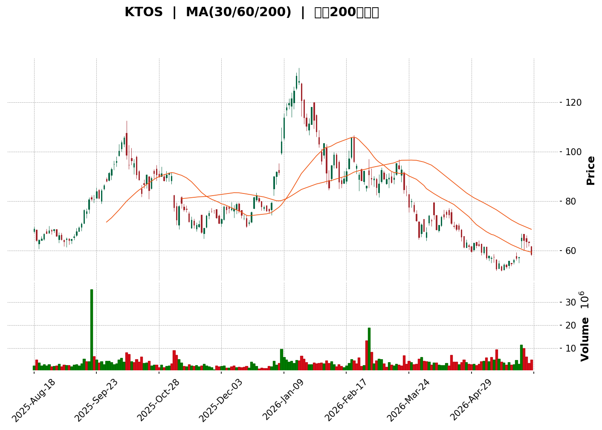
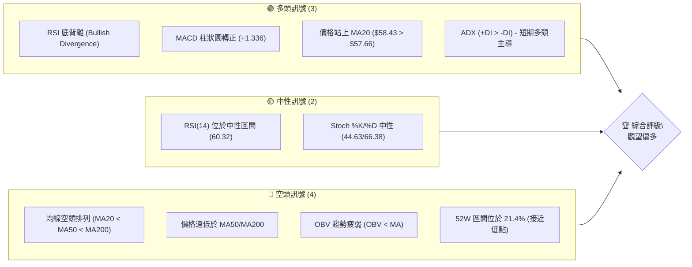
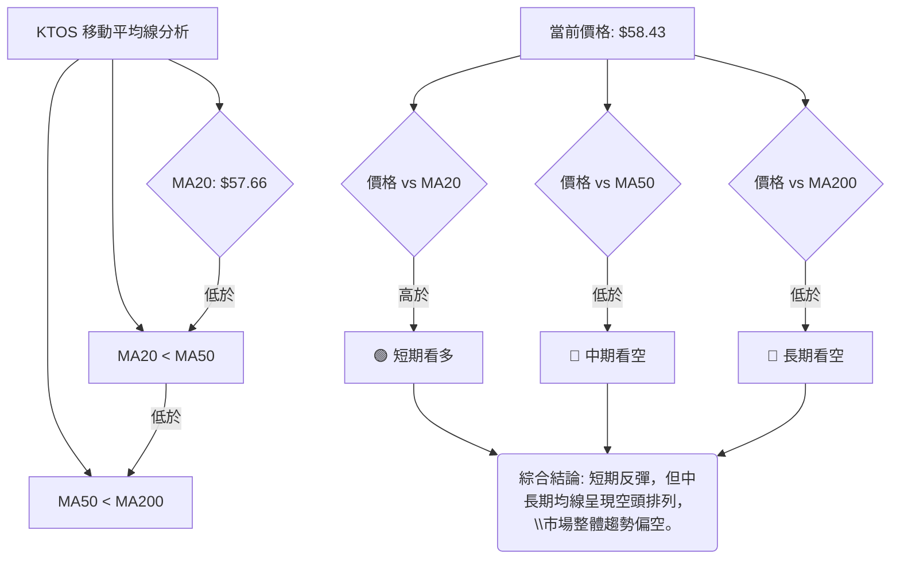

<details>
<summary>📊 靜態圖表 (點擊展開)</summary>

</details>

<html>
<head><meta charset="utf-8" /></head>
<body>
    <div style="height:500px; width:100%;">                        <script>window.PlotlyConfig = {MathJaxConfig: 'local'};</script>
        <script charset="utf-8" src="https://cdn.plot.ly/plotly-3.6.0.min.js" integrity="sha256-QaOVwtVY0T02VaHrr6pnoHLCwayMJp4O5n4YyaE3rJk=" crossorigin="anonymous"></script>                <div id="candlestick-chart" class="plotly-graph-div" style="height:100%; width:100%;"></div>            <script>                window.PLOTLYENV=window.PLOTLYENV || {};                                if (document.getElementById("candlestick-chart")) {                    Plotly.newPlot(                        "candlestick-chart",                        [{"close":{"dtype":"f8","bdata":"AAAAIFwvUUAAAACgRwFQQAAAAKBHEVBAAAAAgOsxUEAAAACgcK1QQAAAAKCZuVBAAAAAQDMDUUAAAABA4fpQQAAAAOCjIFFAAAAAgMJ1UEAAAACAwoVQQAAAAAAAIFBAAAAAIIXLT0AAAAAA1zNQQAAAAMD1CFBAAAAAANcjUEAAAACAPWpQQAAAAEDh6lBAAAAAwMxMUUAAAAAgXK9RQAAAAGBmFlNAAAAAIFzvUkAAAACgmSlUQAAAAKBHMVRAAAAAgBQuVEAAAACgmflUQAAAACCFS1RAAAAAwMwMVUAAAACA65FVQAAAAMAeBVZAAAAAIK7XVkAAAACgcD1XQAAAAIDrwVdAAAAAACkMWEAAAAAAABBZQAAAAAAp7FlAAAAAQOFqWkAAAABAM6NYQAAAAOBRqFdAAAAAgOsRWEAAAABAM9NXQAAAAMAepVZAAAAAIK4nVkAAAAAgrsdUQAAAAKCZqVVAAAAAIK6nVkAAAABAMxNVQAAAAOB6VFZAAAAAIIXLVkAAAAAghatWQAAAAIDrcVZAAAAAoHDNVkAAAABAMxNWQAAAAGBmplZAAAAAYGbGVkAAAACAFI5WQAAAAIA9WlNAAAAAgD0aUkAAAADgUXhTQAAAACCFy1NAAAAAgMIlU0AAAADAzCxTQAAAAAAp7FFAAAAAwMwcUkAAAAAgXI9RQAAAAEAKl1FAAAAAQOGqUUAAAAAA19NQQAAAAMD1SFFAAAAAQAqHUkAAAABAM8NSQAAAAKBH8VJAAAAAYGYGU0AAAACgcE1SQAAAAKBwvVFAAAAAgOsxUkAAAAAghWtTQAAAAAAAIFNAAAAAgOtBU0AAAACA60FTQAAAAIA9OlNAAAAAgOuxU0AAAACgcP1SQAAAAOCjkFJAAAAA4FFIUkAAAACgR3FRQAAAAKCZ2VFAAAAAwPXYUkAAAACA62FUQAAAAEAzk1RAAAAAgBT+U0AAAADAzGxTQAAAAIAUXlNAAAAAYLj+UkAAAACAPfpSQAAAAGCP0lNAAAAAIIV7VkAAAAAghftWQAAAAAAp3FZAAAAAYI8CWkAAAADAzGxcQAAAAEAKd11AAAAAgBTuXUAAAAAAAGBeQAAAAADXI19AAAAAQApXYEAAAACAwhVgQAAAAIDCJV5AAAAAYGZ2XEAAAADA9ZhbQAAAAOB61FtAAAAAANeDXUAAAABA4SpcQAAAAIA9CltAAAAA4KPAWUAAAACAPQpYQAAAACCu11lAAAAAwB7VVkAAAAAAAFBVQAAAAIA9mldAAAAAANezWEAAAABguF5XQAAAAIDr8VVAAAAAQDPDVUAAAAAA10NWQAAAAIAU\u002flZAAAAAoHBNWEAAAABA4WpaQAAAAMAeBVhAAAAAANeTV0AAAAAghatWQAAAAGC4DlZAAAAAwPUIV0AAAAAghYtVQAAAAIAUrlZAAAAAwMw8VkAAAADgUUhWQAAAAGCPYlVAAAAAAADAVUAAAACAFB5XQAAAAKBwPVZAAAAAQOE6VkAAAACgcF1WQAAAAIDr4VVAAAAAgOthVkAAAAAA19NXQAAAAGCPQldAAAAAgOsxV0AAAAAgridVQAAAAAAp7FRAAAAAIFxfU0AAAABguP5TQAAAAEAK91JAAAAAACn8UUAAAACA61FQQAAAAOCjoFFAAAAAwMzsUEAAAAAA19NQQAAAAIDChVJAAAAAoHD9UUAAAACgcJ1SQAAAAMAeFVFAAAAAgMKVUUAAAABAM2NSQAAAAIA9alJAAAAAgD2qUkAAAACAPZpSQAAAACBcv1FAAAAAwB51UUAAAABAMyNRQAAAAEAKJ1FAAAAAoEdhUEAAAACgR6FOQAAAAOB6lE9AAAAA4HrUTkAAAAAgrsdNQAAAAGBmhk9AAAAAYGYGT0AAAABACvdOQAAAACCup01AAAAAYI\u002fCTkAAAAAAAIBMQAAAAIDr8UxAAAAAYLh+TEAAAACAPapMQAAAAGC4PkpAAAAAwMxsS0AAAAAghQtKQAAAAAApHEtAAAAAACm8SkAAAADA9ehLQAAAAIDCVUtAAAAAQAoXTEAAAABgZmZMQAAAAGBmpkxAAAAAAClMUEAAAADgUQhQQAAAAGC4vk9AAAAAYI+iT0AAAABACjdNQA=="},"high":{"dtype":"f8","bdata":"AAAAQOFqUUAAAACgmRlRQAAAAADXI1BAAAAAgMJ1UEAAAABgj8JQQAAAAKBwLVFAAAAAgD16UUAAAAAgXC9RQAAAAOB6NFFAAAAAIFwfUUAAAACAPdpQQAAAAEDhylBAAAAAACkcUEAAAABgj1JQQAAAAAAAQFBAAAAAwB41UEAAAAAAALBQQAAAAMD1SFFAAAAAoHBtUUAAAAAA19NRQAAAACCuJ1NAAAAAgOtBU0AAAAAAKVxUQAAAAADXk1RAAAAA4FGoVEAAAABguF5VQAAAAAAAQFVAAAAA4FE4VUAAAACAwrVVQAAAAEDhalZAAAAAIK73VkAAAACgR2FXQAAAAKCZGVhAAAAAIK6HWEAAAAAAAMBZQAAAAKBwLVpAAAAAANeTWkAAAADgeiRcQAAAAKCZqVlAAAAAAABgWUAAAABgZkZYQAAAACBcn1hAAAAAgMIlV0AAAACgR6FVQAAAAIAULlZAAAAAQDOzVkAAAAAAAIBWQAAAAMDMfFZAAAAAIIU7V0AAAABgZqZXQAAAAMDMHFdAAAAAIK53V0AAAAAAAMBWQAAAAKCZCVdAAAAAgBTuVkAAAACAwuVWQAAAAAAAoFRAAAAAgBTeU0AAAABgZpZTQAAAAAAAgFRAAAAAIFy\u002fU0AAAABA4YpTQAAAAKCZ+VJAAAAAoEdxUkAAAADAzDxSQAAAAAAA0FFAAAAAIIULUkAAAABguJ5SQAAAAIDCVVFAAAAAACmcUkAAAAAghQtTQAAAAEDhSlNAAAAAIFwfU0AAAABgZiZTQAAAAGBmplJAAAAAAABAUkAAAADgepRTQAAAAOBRiFNAAAAA4HqEU0AAAACAPepTQAAAAKBwnVNAAAAAgBTeU0AAAACgmdlTQAAAAEDhGlNAAAAA4FGoUkAAAAAgXI9SQAAAAIA9GlJAAAAAYI\u002fyUkAAAAAgrndUQAAAAIA92lRAAAAAACl8VEAAAACAPfpTQAAAAIAUjlNAAAAAACmMU0AAAACAFD5TQAAAAGC47lNAAAAAQAqHVkAAAACA6wFXQAAAAOB61FdAAAAAQDNzW0AAAADAzNxcQAAAAOBR6F1AAAAA4HpkXkAAAACgcP1eQAAAAADXk19AAAAAAACAYEAAAAAAAMBgQAAAAAAAAGBAAAAAQDNTXkAAAACA6+FcQAAAAEDhalxAAAAAwPWIXUAAAAAAAABeQAAAAMDMzFxAAAAAAAAwW0AAAADA9UhZQAAAACBc31lAAAAAAADAWUAAAABgZiZXQAAAAEDhqldAAAAAgOvxWEAAAAAAAOBYQAAAAEAzI1hAAAAAgMJlVkAAAAAgXA9XQAAAAGBmVldAAAAAAAAgWUAAAACAPXpaQAAAAEDhqlpAAAAAwB7FV0AAAAAgXO9WQAAAAIDrUVdAAAAAACkcV0AAAACgmZlVQAAAAGBmRlhAAAAAgBROV0AAAABgZoZWQAAAACBcX1ZAAAAA4FG4VkAAAABA4WpXQAAAAEAzE1dAAAAAYLi+VkAAAAAgrtdWQAAAAKCZ+VZAAAAAQDPzVkAAAABgZtZXQAAAAOBROFhAAAAAAACgV0AAAAAAAABXQAAAAADXk1VAAAAAoEfBVEAAAAAAKTxUQAAAAIDr4VNAAAAA4FEYU0AAAACgmflRQAAAAIAUvlFAAAAAQDMzUkAAAADgo2BRQAAAAIA9mlJAAAAAoJk5UkAAAAAAKdxTQAAAAAAAoFJAAAAAgOuhUUAAAABgZoZSQAAAAOB6JFNAAAAAYI8SU0AAAACAFE5TQAAAAMD1OFNAAAAAoHDtUUAAAACgmblRQAAAAGC4vlFAAAAAIFwvUUAAAADgo3BQQAAAACCFG1BAAAAAoJlZT0AAAACgR+FOQAAAAEAKl09AAAAAAADAT0AAAADgUQhQQAAAAMAeZU9AAAAAYLjeTkAAAADAHsVOQAAAAOBR+ExAAAAAQOHaTEAAAADgo1BNQAAAAAAAQExAAAAAACn8S0AAAABAM\u002fNKQAAAAAApXEtAAAAAIIVLS0AAAADgo\u002fBLQAAAAADXg0tAAAAAAABgTEAAAABgZqZNQAAAAIAUrkxAAAAAwB61UEAAAAAAALBQQAAAAMDMjFBAAAAAQDPTT0AAAACAyexOQA=="},"hovertemplate":"\u003cb\u003e%{x|%Y-%m-%d}\u003c\u002fb\u003e\u003cbr\u003e\u958b: $%{open:.2f}\u003cbr\u003e\u9ad8: $%{high:.2f}\u003cbr\u003e\u4f4e: $%{low:.2f}\u003cbr\u003e\u6536: $%{close:.2f}\u003cextra\u003e\u003c\u002fextra\u003e","low":{"dtype":"f8","bdata":"AAAAYI\u002fCUEAAAACAFM5PQAAAAEDhWk5AAAAAANcDUEAAAABgjwJQQAAAACCut1BAAAAAAADAUEAAAAAAAKBQQAAAAKBH0VBAAAAAwPVoUEAAAABgj4JPQAAAAADXA1BAAAAAAADgTkAAAABAM7NOQAAAAIA9Kk9AAAAA4HpUT0AAAAAAKQxQQAAAAGBmZlBAAAAAoJnpUEAAAACgmflQQAAAAMAetVFAAAAAQApHUkAAAACgR8FSQAAAAKCZ+VNAAAAAQDPTU0AAAABgZkZUQAAAAGBmNlRAAAAAIK63U0AAAAAghRtVQAAAAEAz81VAAAAAYGYGVkAAAADgUShWQAAAAIDrIVdAAAAAQAp3V0AAAACgR4FYQAAAAAAAAFlAAAAAoJl5WUAAAABAMzNYQAAAAKCZOVdAAAAAQOGqV0AAAABgj7JWQAAAAIA9SlZAAAAAIFwfVkAAAACgcG1UQAAAAMDMTFVAAAAAwMxMVUAAAAAA1zNUQAAAACCuN1VAAAAAIIVLVkAAAADgoxBWQAAAAAApbFZAAAAAoHB9VkAAAABgjwJWQAAAAIA9+lVAAAAAwMz8VUAAAADgerRVQAAAAGBm9lJAAAAAoEeRUUAAAACgmSlRQAAAAEAzQ1NAAAAAwPX4UkAAAAAAAOBSQAAAAADX01FAAAAAAABAUUAAAABgZjZRQAAAAIDr8VBAAAAAQDNTUUAAAACAPbpQQAAAAEAzM1BAAAAAwPVIUUAAAACgmSlSQAAAAADX01JAAAAA4KPAUkAAAAAghTtSQAAAACCut1FAAAAAIIVrUUAAAACA6xFSQAAAAOCjsFJAAAAAoJnJUkAAAAAA1wNTQAAAAMDMTFJAAAAAQDOzUkAAAADAzMxSQAAAAGBmRlJAAAAAQOEaUkAAAAAA11NRQAAAAMD1iFFAAAAAYLjOUUAAAAAA1zNTQAAAAGBm9lNAAAAAgOvRU0AAAABgZgZTQAAAAKCZCVNAAAAAQDPzUkAAAADgUbhSQAAAAMAelVJAAAAA4FGIVEAAAADAzKxVQAAAAOCjoFZAAAAAoEexWEAAAACgmSlaQAAAAAAAoFxAAAAAwMxMXUAAAAAAAIBcQAAAAKBHUV1AAAAAAABAX0AAAAAAAMBfQAAAAIDrkVxAAAAAYLjOW0AAAABAChdbQAAAAKBHsVpAAAAAANfDW0AAAADgo1BbQAAAAIDChVpAAAAA4FFoWUAAAACgR7FXQAAAAKCZSVhAAAAAQOG6VUAAAAAAACBVQAAAAAAAAFZAAAAAwMxMV0AAAACgcE1XQAAAAKBHQVVAAAAAAABQVUAAAACgR8FVQAAAAOB6xFVAAAAAwMw8V0AAAABguD5YQAAAACCF21dAAAAAAADAVkAAAABgjwJVQAAAAKBwDVZAAAAAwPWoVUAAAAAAAABVQAAAAMAeVVVAAAAAYGamVUAAAAAAAHBVQAAAAKCZmVRAAAAAAABgVEAAAADAzMxVQAAAAMD1KFZAAAAAIK6nVUAAAADA9VhVQAAAAMDMzFVAAAAAoJm5VUAAAAAgXI9WQAAAAIA9KldAAAAAwPXoVUAAAABgZsZUQAAAAOB6hFRAAAAAoEfhUkAAAAAA11NTQAAAAKCZyVJAAAAAwMzsUUAAAAAgrhdQQAAAAEAzY1BAAAAAYGbmUEAAAAAghetPQAAAAMDMjFFAAAAAQDNzUUAAAABAMyNSQAAAAIDrEVFAAAAAIIXbUEAAAABACmdRQAAAAKBHIVJAAAAAAABQUkAAAADgo0BSQAAAAIA9mlFAAAAAQAo3UUAAAADgevRQQAAAAMD16FBAAAAAwB7lT0AAAACgR4FOQAAAAOBRmE5AAAAAACkcTkAAAAAgrodNQAAAAIDr0U1AAAAAoJl5TkAAAACgR+FOQAAAAKBHAU1AAAAAQAo3TUAAAADAHiVMQAAAAKBw3UtAAAAAoEeBS0AAAACAFI5LQAAAACCF60lAAAAAYLg+SkAAAADgetRJQAAAAIA9CkpAAAAAANdjSkAAAABAM1NKQAAAACCu50pAAAAAQOE6S0AAAABAM\u002fNLQAAAAAAAgEtAAAAAAACATkAAAACAPQpOQAAAAEAzk05AAAAAQArXTkAAAABAM\u002fNMQA=="},"name":"\u50f9\u683c","open":{"dtype":"f8","bdata":"AAAAACnsUEAAAAAgrhdRQAAAAKBwXU9AAAAAwPUIUEAAAAAAKSxQQAAAAIA96lBAAAAAAADAUEAAAACgRxFRQAAAAGCPAlFAAAAAIFwfUUAAAACAPRpQQAAAAIDrkVBAAAAAQDMTUEAAAAAAACBQQAAAAIDCNVBAAAAA4FEIUEAAAABgZlZQQAAAAIDChVBAAAAAIFzvUEAAAADAzFxRQAAAAADXw1FAAAAA4KPAUkAAAACgmSlTQAAAAKBHYVRAAAAAQAonVEAAAABgZkZUQAAAACCuF1VAAAAAAAAAVEAAAAAAAEBVQAAAAMDMPFZAAAAAwPUYVkAAAAAAAKBWQAAAAAAAwFdAAAAAACnsV0AAAABgZpZYQAAAAKCZSVlAAAAA4HrEWUAAAADA9ehaQAAAAMDMrFdAAAAAgBReWEAAAACAFG5XQAAAAMDMfFhAAAAAIFz\u002fVkAAAABA4TpVQAAAAIDr0VVAAAAAQArHVUAAAAAAAIBWQAAAAMDMTFVAAAAA4FEIV0AAAADgekRXQAAAAOB6xFZAAAAAAACAVkAAAAAAAIBWQAAAAAAAYFZAAAAAwB61VkAAAABguA5WQAAAACCul1RAAAAAwMx8U0AAAABAM5NRQAAAACCFW1RAAAAAYLhuU0AAAACA6zFTQAAAAAApvFJAAAAAgD1KUUAAAACAwgVSQAAAACBcL1FAAAAAwB5lUUAAAABguJ5SQAAAAADXs1BAAAAAQOFaUUAAAACAPYpSQAAAAEAz81JAAAAAYLgOU0AAAABgZiZTQAAAACCuh1JAAAAA4KPAUUAAAACgRyFSQAAAAAApbFNAAAAAgMJlU0AAAADgeiRTQAAAAAAAAFNAAAAAIFwvU0AAAAAghbtTQAAAAKBHEVNAAAAAAABAUkAAAADgUUhSQAAAAAApvFFAAAAAgOvhUUAAAAAAAEBTQAAAAIAUHlRAAAAAQApHVEAAAACAPfpTQAAAAKBwPVNAAAAAACmMU0AAAABAMzNTQAAAAEAzI1NAAAAAgD06VUAAAADA9XhWQAAAAOBRKFdAAAAAgOvhWEAAAABguF5aQAAAAGBmNl1AAAAAgD26XUAAAAAAAKBdQAAAAMD1+F1AAAAAoHBtX0AAAAAghQNgQAAAAGCP4l9AAAAA4KNAXkAAAADAHnVcQAAAAMDMLFtAAAAAANfDW0AAAAAAAABeQAAAAOBRuFxAAAAA4Hp0WkAAAACAPfpYQAAAAGBmplhAAAAAoHBdWUAAAACAFB5WQAAAAGBmRlZAAAAAYGamV0AAAADgerRYQAAAAIA9+ldAAAAAoJkZVkAAAAAgXM9VQAAAAMAeBVZAAAAAwPVIV0AAAACgcG1YQAAAAAApbFpAAAAAoEdRV0AAAAAAADBWQAAAAAApPFdAAAAAACn8VUAAAABAM1NVQAAAAEDhGldAAAAAoHBNVkAAAADgoyBWQAAAAGBmNlZAAAAA4FHYVEAAAABACvdVQAAAAAAp3FZAAAAAgOvBVUAAAAAAKTxWQAAAAAAAgFZAAAAAgMI1VkAAAABACrdWQAAAAIA9mldAAAAA4KOgVkAAAADAzNxWQAAAAIDC9VRAAAAAQOGqVEAAAABgj\u002fJTQAAAAOBRmFNAAAAAQAq3UkAAAADgo\u002fBRQAAAAKCZuVBAAAAAwPUoUkAAAACA61FQQAAAAOBRyFFAAAAAAAAQUkAAAADgUdhTQAAAAMDMjFJAAAAAoEcBUUAAAABgZoZRQAAAAIA9qlJAAAAAACnsUkAAAAAA1xNTQAAAACCF21JAAAAAYI+CUUAAAADgo5BRQAAAACCuh1FAAAAAwMwcUUAAAADgo3BQQAAAAOBRmE5AAAAA4FH4TkAAAABguN5OQAAAAMAeJU5AAAAA4Hq0T0AAAAAAKTxPQAAAAOBRWE9AAAAAgD2KTUAAAADAHsVOQAAAAIA9ikxAAAAAIFxvTEAAAAAghatMQAAAAOB6NExAAAAAoEdhSkAAAABguL5KQAAAAKBHIUpAAAAAYLgeS0AAAACgmflKQAAAAAAAgEtAAAAAwB6lS0AAAADgetRMQAAAAKBwfUxAAAAAQOH6T0AAAACAPapQQAAAAAApPFBAAAAAwPXIT0AAAABgDs1OQA=="},"x":["2025-08-18T00:00:00-04:00","2025-08-19T00:00:00-04:00","2025-08-20T00:00:00-04:00","2025-08-21T00:00:00-04:00","2025-08-22T00:00:00-04:00","2025-08-25T00:00:00-04:00","2025-08-26T00:00:00-04:00","2025-08-27T00:00:00-04:00","2025-08-28T00:00:00-04:00","2025-08-29T00:00:00-04:00","2025-09-02T00:00:00-04:00","2025-09-03T00:00:00-04:00","2025-09-04T00:00:00-04:00","2025-09-05T00:00:00-04:00","2025-09-08T00:00:00-04:00","2025-09-09T00:00:00-04:00","2025-09-10T00:00:00-04:00","2025-09-11T00:00:00-04:00","2025-09-12T00:00:00-04:00","2025-09-15T00:00:00-04:00","2025-09-16T00:00:00-04:00","2025-09-17T00:00:00-04:00","2025-09-18T00:00:00-04:00","2025-09-19T00:00:00-04:00","2025-09-22T00:00:00-04:00","2025-09-23T00:00:00-04:00","2025-09-24T00:00:00-04:00","2025-09-25T00:00:00-04:00","2025-09-26T00:00:00-04:00","2025-09-29T00:00:00-04:00","2025-09-30T00:00:00-04:00","2025-10-01T00:00:00-04:00","2025-10-02T00:00:00-04:00","2025-10-03T00:00:00-04:00","2025-10-06T00:00:00-04:00","2025-10-07T00:00:00-04:00","2025-10-08T00:00:00-04:00","2025-10-09T00:00:00-04:00","2025-10-10T00:00:00-04:00","2025-10-13T00:00:00-04:00","2025-10-14T00:00:00-04:00","2025-10-15T00:00:00-04:00","2025-10-16T00:00:00-04:00","2025-10-17T00:00:00-04:00","2025-10-20T00:00:00-04:00","2025-10-21T00:00:00-04:00","2025-10-22T00:00:00-04:00","2025-10-23T00:00:00-04:00","2025-10-24T00:00:00-04:00","2025-10-27T00:00:00-04:00","2025-10-28T00:00:00-04:00","2025-10-29T00:00:00-04:00","2025-10-30T00:00:00-04:00","2025-10-31T00:00:00-04:00","2025-11-03T00:00:00-05:00","2025-11-04T00:00:00-05:00","2025-11-05T00:00:00-05:00","2025-11-06T00:00:00-05:00","2025-11-07T00:00:00-05:00","2025-11-10T00:00:00-05:00","2025-11-11T00:00:00-05:00","2025-11-12T00:00:00-05:00","2025-11-13T00:00:00-05:00","2025-11-14T00:00:00-05:00","2025-11-17T00:00:00-05:00","2025-11-18T00:00:00-05:00","2025-11-19T00:00:00-05:00","2025-11-20T00:00:00-05:00","2025-11-21T00:00:00-05:00","2025-11-24T00:00:00-05:00","2025-11-25T00:00:00-05:00","2025-11-26T00:00:00-05:00","2025-11-28T00:00:00-05:00","2025-12-01T00:00:00-05:00","2025-12-02T00:00:00-05:00","2025-12-03T00:00:00-05:00","2025-12-04T00:00:00-05:00","2025-12-05T00:00:00-05:00","2025-12-08T00:00:00-05:00","2025-12-09T00:00:00-05:00","2025-12-10T00:00:00-05:00","2025-12-11T00:00:00-05:00","2025-12-12T00:00:00-05:00","2025-12-15T00:00:00-05:00","2025-12-16T00:00:00-05:00","2025-12-17T00:00:00-05:00","2025-12-18T00:00:00-05:00","2025-12-19T00:00:00-05:00","2025-12-22T00:00:00-05:00","2025-12-23T00:00:00-05:00","2025-12-24T00:00:00-05:00","2025-12-26T00:00:00-05:00","2025-12-29T00:00:00-05:00","2025-12-30T00:00:00-05:00","2025-12-31T00:00:00-05:00","2026-01-02T00:00:00-05:00","2026-01-05T00:00:00-05:00","2026-01-06T00:00:00-05:00","2026-01-07T00:00:00-05:00","2026-01-08T00:00:00-05:00","2026-01-09T00:00:00-05:00","2026-01-12T00:00:00-05:00","2026-01-13T00:00:00-05:00","2026-01-14T00:00:00-05:00","2026-01-15T00:00:00-05:00","2026-01-16T00:00:00-05:00","2026-01-20T00:00:00-05:00","2026-01-21T00:00:00-05:00","2026-01-22T00:00:00-05:00","2026-01-23T00:00:00-05:00","2026-01-26T00:00:00-05:00","2026-01-27T00:00:00-05:00","2026-01-28T00:00:00-05:00","2026-01-29T00:00:00-05:00","2026-01-30T00:00:00-05:00","2026-02-02T00:00:00-05:00","2026-02-03T00:00:00-05:00","2026-02-04T00:00:00-05:00","2026-02-05T00:00:00-05:00","2026-02-06T00:00:00-05:00","2026-02-09T00:00:00-05:00","2026-02-10T00:00:00-05:00","2026-02-11T00:00:00-05:00","2026-02-12T00:00:00-05:00","2026-02-13T00:00:00-05:00","2026-02-17T00:00:00-05:00","2026-02-18T00:00:00-05:00","2026-02-19T00:00:00-05:00","2026-02-20T00:00:00-05:00","2026-02-23T00:00:00-05:00","2026-02-24T00:00:00-05:00","2026-02-25T00:00:00-05:00","2026-02-26T00:00:00-05:00","2026-02-27T00:00:00-05:00","2026-03-02T00:00:00-05:00","2026-03-03T00:00:00-05:00","2026-03-04T00:00:00-05:00","2026-03-05T00:00:00-05:00","2026-03-06T00:00:00-05:00","2026-03-09T00:00:00-04:00","2026-03-10T00:00:00-04:00","2026-03-11T00:00:00-04:00","2026-03-12T00:00:00-04:00","2026-03-13T00:00:00-04:00","2026-03-16T00:00:00-04:00","2026-03-17T00:00:00-04:00","2026-03-18T00:00:00-04:00","2026-03-19T00:00:00-04:00","2026-03-20T00:00:00-04:00","2026-03-23T00:00:00-04:00","2026-03-24T00:00:00-04:00","2026-03-25T00:00:00-04:00","2026-03-26T00:00:00-04:00","2026-03-27T00:00:00-04:00","2026-03-30T00:00:00-04:00","2026-03-31T00:00:00-04:00","2026-04-01T00:00:00-04:00","2026-04-02T00:00:00-04:00","2026-04-06T00:00:00-04:00","2026-04-07T00:00:00-04:00","2026-04-08T00:00:00-04:00","2026-04-09T00:00:00-04:00","2026-04-10T00:00:00-04:00","2026-04-13T00:00:00-04:00","2026-04-14T00:00:00-04:00","2026-04-15T00:00:00-04:00","2026-04-16T00:00:00-04:00","2026-04-17T00:00:00-04:00","2026-04-20T00:00:00-04:00","2026-04-21T00:00:00-04:00","2026-04-22T00:00:00-04:00","2026-04-23T00:00:00-04:00","2026-04-24T00:00:00-04:00","2026-04-27T00:00:00-04:00","2026-04-28T00:00:00-04:00","2026-04-29T00:00:00-04:00","2026-04-30T00:00:00-04:00","2026-05-01T00:00:00-04:00","2026-05-04T00:00:00-04:00","2026-05-05T00:00:00-04:00","2026-05-06T00:00:00-04:00","2026-05-07T00:00:00-04:00","2026-05-08T00:00:00-04:00","2026-05-11T00:00:00-04:00","2026-05-12T00:00:00-04:00","2026-05-13T00:00:00-04:00","2026-05-14T00:00:00-04:00","2026-05-15T00:00:00-04:00","2026-05-18T00:00:00-04:00","2026-05-19T00:00:00-04:00","2026-05-20T00:00:00-04:00","2026-05-21T00:00:00-04:00","2026-05-22T00:00:00-04:00","2026-05-26T00:00:00-04:00","2026-05-27T00:00:00-04:00","2026-05-28T00:00:00-04:00","2026-05-29T00:00:00-04:00","2026-06-01T00:00:00-04:00","2026-06-02T00:00:00-04:00","2026-06-03T00:00:00-04:00"],"type":"candlestick"},{"hovertemplate":"MA30: $%{y:.2f}\u003cextra\u003e\u003c\u002fextra\u003e","line":{"color":"#2196F3","dash":"dash","width":2},"mode":"lines","name":"MA30","x":["2025-08-18T00:00:00-04:00","2025-08-19T00:00:00-04:00","2025-08-20T00:00:00-04:00","2025-08-21T00:00:00-04:00","2025-08-22T00:00:00-04:00","2025-08-25T00:00:00-04:00","2025-08-26T00:00:00-04:00","2025-08-27T00:00:00-04:00","2025-08-28T00:00:00-04:00","2025-08-29T00:00:00-04:00","2025-09-02T00:00:00-04:00","2025-09-03T00:00:00-04:00","2025-09-04T00:00:00-04:00","2025-09-05T00:00:00-04:00","2025-09-08T00:00:00-04:00","2025-09-09T00:00:00-04:00","2025-09-10T00:00:00-04:00","2025-09-11T00:00:00-04:00","2025-09-12T00:00:00-04:00","2025-09-15T00:00:00-04:00","2025-09-16T00:00:00-04:00","2025-09-17T00:00:00-04:00","2025-09-18T00:00:00-04:00","2025-09-19T00:00:00-04:00","2025-09-22T00:00:00-04:00","2025-09-23T00:00:00-04:00","2025-09-24T00:00:00-04:00","2025-09-25T00:00:00-04:00","2025-09-26T00:00:00-04:00","2025-09-29T00:00:00-04:00","2025-09-30T00:00:00-04:00","2025-10-01T00:00:00-04:00","2025-10-02T00:00:00-04:00","2025-10-03T00:00:00-04:00","2025-10-06T00:00:00-04:00","2025-10-07T00:00:00-04:00","2025-10-08T00:00:00-04:00","2025-10-09T00:00:00-04:00","2025-10-10T00:00:00-04:00","2025-10-13T00:00:00-04:00","2025-10-14T00:00:00-04:00","2025-10-15T00:00:00-04:00","2025-10-16T00:00:00-04:00","2025-10-17T00:00:00-04:00","2025-10-20T00:00:00-04:00","2025-10-21T00:00:00-04:00","2025-10-22T00:00:00-04:00","2025-10-23T00:00:00-04:00","2025-10-24T00:00:00-04:00","2025-10-27T00:00:00-04:00","2025-10-28T00:00:00-04:00","2025-10-29T00:00:00-04:00","2025-10-30T00:00:00-04:00","2025-10-31T00:00:00-04:00","2025-11-03T00:00:00-05:00","2025-11-04T00:00:00-05:00","2025-11-05T00:00:00-05:00","2025-11-06T00:00:00-05:00","2025-11-07T00:00:00-05:00","2025-11-10T00:00:00-05:00","2025-11-11T00:00:00-05:00","2025-11-12T00:00:00-05:00","2025-11-13T00:00:00-05:00","2025-11-14T00:00:00-05:00","2025-11-17T00:00:00-05:00","2025-11-18T00:00:00-05:00","2025-11-19T00:00:00-05:00","2025-11-20T00:00:00-05:00","2025-11-21T00:00:00-05:00","2025-11-24T00:00:00-05:00","2025-11-25T00:00:00-05:00","2025-11-26T00:00:00-05:00","2025-11-28T00:00:00-05:00","2025-12-01T00:00:00-05:00","2025-12-02T00:00:00-05:00","2025-12-03T00:00:00-05:00","2025-12-04T00:00:00-05:00","2025-12-05T00:00:00-05:00","2025-12-08T00:00:00-05:00","2025-12-09T00:00:00-05:00","2025-12-10T00:00:00-05:00","2025-12-11T00:00:00-05:00","2025-12-12T00:00:00-05:00","2025-12-15T00:00:00-05:00","2025-12-16T00:00:00-05:00","2025-12-17T00:00:00-05:00","2025-12-18T00:00:00-05:00","2025-12-19T00:00:00-05:00","2025-12-22T00:00:00-05:00","2025-12-23T00:00:00-05:00","2025-12-24T00:00:00-05:00","2025-12-26T00:00:00-05:00","2025-12-29T00:00:00-05:00","2025-12-30T00:00:00-05:00","2025-12-31T00:00:00-05:00","2026-01-02T00:00:00-05:00","2026-01-05T00:00:00-05:00","2026-01-06T00:00:00-05:00","2026-01-07T00:00:00-05:00","2026-01-08T00:00:00-05:00","2026-01-09T00:00:00-05:00","2026-01-12T00:00:00-05:00","2026-01-13T00:00:00-05:00","2026-01-14T00:00:00-05:00","2026-01-15T00:00:00-05:00","2026-01-16T00:00:00-05:00","2026-01-20T00:00:00-05:00","2026-01-21T00:00:00-05:00","2026-01-22T00:00:00-05:00","2026-01-23T00:00:00-05:00","2026-01-26T00:00:00-05:00","2026-01-27T00:00:00-05:00","2026-01-28T00:00:00-05:00","2026-01-29T00:00:00-05:00","2026-01-30T00:00:00-05:00","2026-02-02T00:00:00-05:00","2026-02-03T00:00:00-05:00","2026-02-04T00:00:00-05:00","2026-02-05T00:00:00-05:00","2026-02-06T00:00:00-05:00","2026-02-09T00:00:00-05:00","2026-02-10T00:00:00-05:00","2026-02-11T00:00:00-05:00","2026-02-12T00:00:00-05:00","2026-02-13T00:00:00-05:00","2026-02-17T00:00:00-05:00","2026-02-18T00:00:00-05:00","2026-02-19T00:00:00-05:00","2026-02-20T00:00:00-05:00","2026-02-23T00:00:00-05:00","2026-02-24T00:00:00-05:00","2026-02-25T00:00:00-05:00","2026-02-26T00:00:00-05:00","2026-02-27T00:00:00-05:00","2026-03-02T00:00:00-05:00","2026-03-03T00:00:00-05:00","2026-03-04T00:00:00-05:00","2026-03-05T00:00:00-05:00","2026-03-06T00:00:00-05:00","2026-03-09T00:00:00-04:00","2026-03-10T00:00:00-04:00","2026-03-11T00:00:00-04:00","2026-03-12T00:00:00-04:00","2026-03-13T00:00:00-04:00","2026-03-16T00:00:00-04:00","2026-03-17T00:00:00-04:00","2026-03-18T00:00:00-04:00","2026-03-19T00:00:00-04:00","2026-03-20T00:00:00-04:00","2026-03-23T00:00:00-04:00","2026-03-24T00:00:00-04:00","2026-03-25T00:00:00-04:00","2026-03-26T00:00:00-04:00","2026-03-27T00:00:00-04:00","2026-03-30T00:00:00-04:00","2026-03-31T00:00:00-04:00","2026-04-01T00:00:00-04:00","2026-04-02T00:00:00-04:00","2026-04-06T00:00:00-04:00","2026-04-07T00:00:00-04:00","2026-04-08T00:00:00-04:00","2026-04-09T00:00:00-04:00","2026-04-10T00:00:00-04:00","2026-04-13T00:00:00-04:00","2026-04-14T00:00:00-04:00","2026-04-15T00:00:00-04:00","2026-04-16T00:00:00-04:00","2026-04-17T00:00:00-04:00","2026-04-20T00:00:00-04:00","2026-04-21T00:00:00-04:00","2026-04-22T00:00:00-04:00","2026-04-23T00:00:00-04:00","2026-04-24T00:00:00-04:00","2026-04-27T00:00:00-04:00","2026-04-28T00:00:00-04:00","2026-04-29T00:00:00-04:00","2026-04-30T00:00:00-04:00","2026-05-01T00:00:00-04:00","2026-05-04T00:00:00-04:00","2026-05-05T00:00:00-04:00","2026-05-06T00:00:00-04:00","2026-05-07T00:00:00-04:00","2026-05-08T00:00:00-04:00","2026-05-11T00:00:00-04:00","2026-05-12T00:00:00-04:00","2026-05-13T00:00:00-04:00","2026-05-14T00:00:00-04:00","2026-05-15T00:00:00-04:00","2026-05-18T00:00:00-04:00","2026-05-19T00:00:00-04:00","2026-05-20T00:00:00-04:00","2026-05-21T00:00:00-04:00","2026-05-22T00:00:00-04:00","2026-05-26T00:00:00-04:00","2026-05-27T00:00:00-04:00","2026-05-28T00:00:00-04:00","2026-05-29T00:00:00-04:00","2026-06-01T00:00:00-04:00","2026-06-02T00:00:00-04:00","2026-06-03T00:00:00-04:00"],"y":{"dtype":"f8","bdata":"AAAAAAAA+H8AAAAAAAD4fwAAAAAAAPh\u002fAAAAAAAA+H8AAAAAAAD4fwAAAAAAAPh\u002fAAAAAAAA+H8AAAAAAAD4fwAAAAAAAPh\u002fAAAAAAAA+H8AAAAAAAD4fwAAAAAAAPh\u002fAAAAAAAA+H8AAAAAAAD4fwAAAAAAAPh\u002fAAAAAAAA+H8AAAAAAAD4fwAAAAAAAPh\u002fAAAAAAAA+H8AAAAAAAD4fwAAAAAAAPh\u002fAAAAAAAA+H8AAAAAAAD4fwAAAAAAAPh\u002fAAAAAAAA+H8AAAAAAAD4fwAAAAAAAPh\u002fAAAAAAAA+H8AAAAAAAD4f97d3SUV31FA3t3dJVwPUkB3d3c\u002fGU1SQHd3d0+4jlJAREREXLrRUkBERESsRxlTQDMzM+vDZ1NAvLu7cwW4U0DNzMyEXflTQM3MzIQWMVRAmpmZ0QZyVECJiIhgV7BUQBEREYn651RAERERQWAdVUBVVVX1b0RVQLy7u2t1dFVAiYiIqA2sVUBVVVWV0dNVQO\u002fu7l4BAlZAIiIiYuUwVkCJiIhIb1tWQKuqqtoVeFZAmpmZiRaZVkBVVVV1aKlWQDMzM\u002fNgvlZAAAAA0IXUVkAAAABgAeJWQERERHT22VZAvLu7i8\u002fAVkBmZmYG5K5WQAAAAHDnm1ZAVVVVlV98VkBERER0r1lWQERERLTkJ1ZA7+7ufj\u002f1VUCJiIgIOrVVQImIiGgfblVA3t3dvXQjVUCJiIiIz+BUQImIiJhuqlRAIiIi0iJ7VEDv7u6e709UQCIiImJXMFRAq6qqyqEVVEC8u7ubfQBUQGZmZsYE31NAERERwfW4U0CamZlZ1qpTQLy7u+t8j1NAIiIiIk1xU0CamZlpLlRTQN7d3a25OFNA3t3dPTUeU0BERET04QNTQDMzMyMG4VJA7+7uHrC6UkARERGxD49SQN7d3W09glJAd3d355iIUkCrqqpKYpBSQKuqqjoKl1JAmpmZKUCeUkC8u7tLYqBSQCIiIvK2rFJAzczMzD60UkARERFhV8BSQJqZmVlk01JAERER4Xr8UkDv7u6uADFTQFVVVXWTYFNAq6qqOm2gU0B3d3dH4fJTQImIiAisTFRA7+7uXrqpVEBmZmYmvxBVQFVVVeUXg1VAzczM3LL+VUCJiIiof2tWQM3MzKyOyVZA3t3dTRsYV0AAAABQRl9XQCIiIsKuqFdAAAAA4Hr8V0De3d1ty0pYQJqZmVkdk1hAERER0dvSWEB3d3dHKAtZQJqZmSlcT1lAd3d3h11xWUBVVVUlTXlZQCIiItIik1lAiYiI+FO7WUBVVVX1\u002fdxZQHd3d5f88llAmpmZSZoKWkAAAADwpyZaQImIiOi0QVpAIiIiwjxRWkARERGhjG5aQAAAALByeFpA7+7uzrBjWkAiIiLSlDJaQERERORe81lAiYiIiIi4WUCrqqoaL21ZQERERPT9JFlAZmZm9uHLWEBERERkgndYQLy7u2u8LFhA3t3dvXTzV0CJiIgIOs1XQN7d3X2GnVdAq6qqKlxfV0CamZlp2C1XQN7d3a3VAVdAzczMzBPlVkBVVVWVQ+NWQGZmZgY6zVZAq6qq6lHQVkCrqqra+c5WQN7d3U0buFZA3t3dvZ+KVkARERHx0m1WQImIiAhlVFZAVVVV9Sg0VkCJiIjobQFWQDMzM+Ol01VA3t3dfbGUVUARERHR20JVQHd3d1fyE1VAMzMzQ0TkVECrqqr6qcFUQM3MzOw1l1RAd3d3N7RoVEDe3d2Nwk1UQFVVVYVdKVRAd3d3R+EKVEAzMzMzeutTQFVVVfVvzFNAmpmZ2c6nU0B3d3dXx3RTQHd3d4ddSVNAIiIiAnIXU0BEREQMSdtSQHd3d8dLp1JAMzMzC9drUkB3d3fHkh9SQFVVVT2Y31FAAAAAkAmeUUC8u7vLoW1RQImIiBCfOVFAERERUY0XUUC8u7srh+ZQQHd3dycxwFBA3t3ddUygUEC8u7uzVo9QQBEREWHlaFBAERERkXtNUEAzMzNrAy1QQImIiMCfAlBA7+7uflu2T0BVVVWl02ZPQHd3d0eLLE9AmpmZySDwTkARERFRqahOQERERNTbYk5AAAAAEHQ6TkDe3d2Nlw5OQO\u002fu7o6X7k1AmpmZSZrSTUC8u7uLbKdNQA=="},"type":"scatter"},{"hovertemplate":"MA60: $%{y:.2f}\u003cextra\u003e\u003c\u002fextra\u003e","line":{"color":"#9C27B0","dash":"dash","width":2},"mode":"lines","name":"MA60","x":["2025-08-18T00:00:00-04:00","2025-08-19T00:00:00-04:00","2025-08-20T00:00:00-04:00","2025-08-21T00:00:00-04:00","2025-08-22T00:00:00-04:00","2025-08-25T00:00:00-04:00","2025-08-26T00:00:00-04:00","2025-08-27T00:00:00-04:00","2025-08-28T00:00:00-04:00","2025-08-29T00:00:00-04:00","2025-09-02T00:00:00-04:00","2025-09-03T00:00:00-04:00","2025-09-04T00:00:00-04:00","2025-09-05T00:00:00-04:00","2025-09-08T00:00:00-04:00","2025-09-09T00:00:00-04:00","2025-09-10T00:00:00-04:00","2025-09-11T00:00:00-04:00","2025-09-12T00:00:00-04:00","2025-09-15T00:00:00-04:00","2025-09-16T00:00:00-04:00","2025-09-17T00:00:00-04:00","2025-09-18T00:00:00-04:00","2025-09-19T00:00:00-04:00","2025-09-22T00:00:00-04:00","2025-09-23T00:00:00-04:00","2025-09-24T00:00:00-04:00","2025-09-25T00:00:00-04:00","2025-09-26T00:00:00-04:00","2025-09-29T00:00:00-04:00","2025-09-30T00:00:00-04:00","2025-10-01T00:00:00-04:00","2025-10-02T00:00:00-04:00","2025-10-03T00:00:00-04:00","2025-10-06T00:00:00-04:00","2025-10-07T00:00:00-04:00","2025-10-08T00:00:00-04:00","2025-10-09T00:00:00-04:00","2025-10-10T00:00:00-04:00","2025-10-13T00:00:00-04:00","2025-10-14T00:00:00-04:00","2025-10-15T00:00:00-04:00","2025-10-16T00:00:00-04:00","2025-10-17T00:00:00-04:00","2025-10-20T00:00:00-04:00","2025-10-21T00:00:00-04:00","2025-10-22T00:00:00-04:00","2025-10-23T00:00:00-04:00","2025-10-24T00:00:00-04:00","2025-10-27T00:00:00-04:00","2025-10-28T00:00:00-04:00","2025-10-29T00:00:00-04:00","2025-10-30T00:00:00-04:00","2025-10-31T00:00:00-04:00","2025-11-03T00:00:00-05:00","2025-11-04T00:00:00-05:00","2025-11-05T00:00:00-05:00","2025-11-06T00:00:00-05:00","2025-11-07T00:00:00-05:00","2025-11-10T00:00:00-05:00","2025-11-11T00:00:00-05:00","2025-11-12T00:00:00-05:00","2025-11-13T00:00:00-05:00","2025-11-14T00:00:00-05:00","2025-11-17T00:00:00-05:00","2025-11-18T00:00:00-05:00","2025-11-19T00:00:00-05:00","2025-11-20T00:00:00-05:00","2025-11-21T00:00:00-05:00","2025-11-24T00:00:00-05:00","2025-11-25T00:00:00-05:00","2025-11-26T00:00:00-05:00","2025-11-28T00:00:00-05:00","2025-12-01T00:00:00-05:00","2025-12-02T00:00:00-05:00","2025-12-03T00:00:00-05:00","2025-12-04T00:00:00-05:00","2025-12-05T00:00:00-05:00","2025-12-08T00:00:00-05:00","2025-12-09T00:00:00-05:00","2025-12-10T00:00:00-05:00","2025-12-11T00:00:00-05:00","2025-12-12T00:00:00-05:00","2025-12-15T00:00:00-05:00","2025-12-16T00:00:00-05:00","2025-12-17T00:00:00-05:00","2025-12-18T00:00:00-05:00","2025-12-19T00:00:00-05:00","2025-12-22T00:00:00-05:00","2025-12-23T00:00:00-05:00","2025-12-24T00:00:00-05:00","2025-12-26T00:00:00-05:00","2025-12-29T00:00:00-05:00","2025-12-30T00:00:00-05:00","2025-12-31T00:00:00-05:00","2026-01-02T00:00:00-05:00","2026-01-05T00:00:00-05:00","2026-01-06T00:00:00-05:00","2026-01-07T00:00:00-05:00","2026-01-08T00:00:00-05:00","2026-01-09T00:00:00-05:00","2026-01-12T00:00:00-05:00","2026-01-13T00:00:00-05:00","2026-01-14T00:00:00-05:00","2026-01-15T00:00:00-05:00","2026-01-16T00:00:00-05:00","2026-01-20T00:00:00-05:00","2026-01-21T00:00:00-05:00","2026-01-22T00:00:00-05:00","2026-01-23T00:00:00-05:00","2026-01-26T00:00:00-05:00","2026-01-27T00:00:00-05:00","2026-01-28T00:00:00-05:00","2026-01-29T00:00:00-05:00","2026-01-30T00:00:00-05:00","2026-02-02T00:00:00-05:00","2026-02-03T00:00:00-05:00","2026-02-04T00:00:00-05:00","2026-02-05T00:00:00-05:00","2026-02-06T00:00:00-05:00","2026-02-09T00:00:00-05:00","2026-02-10T00:00:00-05:00","2026-02-11T00:00:00-05:00","2026-02-12T00:00:00-05:00","2026-02-13T00:00:00-05:00","2026-02-17T00:00:00-05:00","2026-02-18T00:00:00-05:00","2026-02-19T00:00:00-05:00","2026-02-20T00:00:00-05:00","2026-02-23T00:00:00-05:00","2026-02-24T00:00:00-05:00","2026-02-25T00:00:00-05:00","2026-02-26T00:00:00-05:00","2026-02-27T00:00:00-05:00","2026-03-02T00:00:00-05:00","2026-03-03T00:00:00-05:00","2026-03-04T00:00:00-05:00","2026-03-05T00:00:00-05:00","2026-03-06T00:00:00-05:00","2026-03-09T00:00:00-04:00","2026-03-10T00:00:00-04:00","2026-03-11T00:00:00-04:00","2026-03-12T00:00:00-04:00","2026-03-13T00:00:00-04:00","2026-03-16T00:00:00-04:00","2026-03-17T00:00:00-04:00","2026-03-18T00:00:00-04:00","2026-03-19T00:00:00-04:00","2026-03-20T00:00:00-04:00","2026-03-23T00:00:00-04:00","2026-03-24T00:00:00-04:00","2026-03-25T00:00:00-04:00","2026-03-26T00:00:00-04:00","2026-03-27T00:00:00-04:00","2026-03-30T00:00:00-04:00","2026-03-31T00:00:00-04:00","2026-04-01T00:00:00-04:00","2026-04-02T00:00:00-04:00","2026-04-06T00:00:00-04:00","2026-04-07T00:00:00-04:00","2026-04-08T00:00:00-04:00","2026-04-09T00:00:00-04:00","2026-04-10T00:00:00-04:00","2026-04-13T00:00:00-04:00","2026-04-14T00:00:00-04:00","2026-04-15T00:00:00-04:00","2026-04-16T00:00:00-04:00","2026-04-17T00:00:00-04:00","2026-04-20T00:00:00-04:00","2026-04-21T00:00:00-04:00","2026-04-22T00:00:00-04:00","2026-04-23T00:00:00-04:00","2026-04-24T00:00:00-04:00","2026-04-27T00:00:00-04:00","2026-04-28T00:00:00-04:00","2026-04-29T00:00:00-04:00","2026-04-30T00:00:00-04:00","2026-05-01T00:00:00-04:00","2026-05-04T00:00:00-04:00","2026-05-05T00:00:00-04:00","2026-05-06T00:00:00-04:00","2026-05-07T00:00:00-04:00","2026-05-08T00:00:00-04:00","2026-05-11T00:00:00-04:00","2026-05-12T00:00:00-04:00","2026-05-13T00:00:00-04:00","2026-05-14T00:00:00-04:00","2026-05-15T00:00:00-04:00","2026-05-18T00:00:00-04:00","2026-05-19T00:00:00-04:00","2026-05-20T00:00:00-04:00","2026-05-21T00:00:00-04:00","2026-05-22T00:00:00-04:00","2026-05-26T00:00:00-04:00","2026-05-27T00:00:00-04:00","2026-05-28T00:00:00-04:00","2026-05-29T00:00:00-04:00","2026-06-01T00:00:00-04:00","2026-06-02T00:00:00-04:00","2026-06-03T00:00:00-04:00"],"y":{"dtype":"f8","bdata":"AAAAAAAA+H8AAAAAAAD4fwAAAAAAAPh\u002fAAAAAAAA+H8AAAAAAAD4fwAAAAAAAPh\u002fAAAAAAAA+H8AAAAAAAD4fwAAAAAAAPh\u002fAAAAAAAA+H8AAAAAAAD4fwAAAAAAAPh\u002fAAAAAAAA+H8AAAAAAAD4fwAAAAAAAPh\u002fAAAAAAAA+H8AAAAAAAD4fwAAAAAAAPh\u002fAAAAAAAA+H8AAAAAAAD4fwAAAAAAAPh\u002fAAAAAAAA+H8AAAAAAAD4fwAAAAAAAPh\u002fAAAAAAAA+H8AAAAAAAD4fwAAAAAAAPh\u002fAAAAAAAA+H8AAAAAAAD4fwAAAAAAAPh\u002fAAAAAAAA+H8AAAAAAAD4fwAAAAAAAPh\u002fAAAAAAAA+H8AAAAAAAD4fwAAAAAAAPh\u002fAAAAAAAA+H8AAAAAAAD4fwAAAAAAAPh\u002fAAAAAAAA+H8AAAAAAAD4fwAAAAAAAPh\u002fAAAAAAAA+H8AAAAAAAD4fwAAAAAAAPh\u002fAAAAAAAA+H8AAAAAAAD4fwAAAAAAAPh\u002fAAAAAAAA+H8AAAAAAAD4fwAAAAAAAPh\u002fAAAAAAAA+H8AAAAAAAD4fwAAAAAAAPh\u002fAAAAAAAA+H8AAAAAAAD4fwAAAAAAAPh\u002fAAAAAAAA+H8AAAAAAAD4f+\u002fu7kp+PVRAmpmZ3d1FVEDe3d1ZZFNUQN7d3YFOW1RAmpmZ7XxjVEBmZmbaQGdUQN7d3anxalRAzczMGL1tVECrqqqGFm1UQKuqqo7CbVRA3t3d0ZR2VEC8u7t\u002fI4BUQJqZmfUojFRA3t3dBYGZVECJiIjIdqJUQBERERm9qVRAzczMtIGyVEB3d3f3U79UQFVVVSW\u002fyFRAIiIiQhnRVEARERHZztdUQERERMRn2FRAvLu746XbVEDNzMw0pdZUQDMzM4uzz1RAd3d395rHVECJiIiIiLhUQBEREfEZrlRAmpmZObSkVECJiIgoo59UQFVVVdV4mVRAd3d330+NVEAAAADgCH1UQDMzM9NNalRA3t3dJb9UVEDNzMy0yDpUQBEREeHBIFRAd3d3z\u002fcPVEC8u7sb6AhUQO\u002fu7gaBBVRAZmZmBsgNVEAzMzNzaCFUQFVVVbWBPlRAzczMFK5fVEARERFhnohUQN7d3VUOsVRA7+7uTtTbVEAREREBKwtVQERERMyFLFVAAAAAOLREVUDNzMxcullVQAAAADi0cFVA7+7uDliNVUARERGxVqdVQGZmZr4RulVAAAAA+MXGVUBERET8G81VQLy7u8vM6FVAd3d3N\u002fv8VUAAAAC41wRWQGZmZoYWFVZAEREREcosVkCJiIggsD5WQM3MzMTZT1ZAMzMzi2xfVkCJiIiof3NWQBEREaGMilZAmpmZ0dumVkAAAACoxs9WQKuqqhKD7FZAzczMBA8CV0DNzMwMuxJXQGZmZnYFIFdAvLu7cyExV0CJiIgg9z5XQM3MzOwKVFdAmpmZaUplV0BmZmYGgXFXQERERIwle1dA3t3dBciFV0BEREQsQJZXQAAAAKAao1dAVVVVheutV0C8u7vrUbxXQLy7u4N5yldA7+7uzvfbV0BmZmbuNfdXQAAAABhLDlhAERERudcgWEAAAACAIyRYQAAAABCfJVhAMzMz2\u002fkiWEAzMzNzaCVYQAAAANCwI1hAd3d3n2EfWEBERETsChRYQN7d3WWtClhAAAAAIPfyV0ARERE5tNhXQLy7u4MyxldAERERifqjV0BmZmZmH3pXQImIiGhKRVdAAAAAYJ4QV0BERETUeN1WQM3MzLwtp1ZA7+7unmFrVkC8u7tLfjFWQImIiDCW\u002fFVAvLu7y6HNVUAAAACwAKFVQKuqqgJyc1VAZmZmFmc7VUDv7u66kARVQKuqqrqQ1FRAAAAAbHWoVEBmZmYua4FUQN7d3SFpVlRAVVVVvS03VEAzMzPTTR5UQDMzMy\u002fd+FNAd3d3hxbRU0BmZmYOLapTQAAAABhLilNAmpmZtTpqU0AiIiJOYkhTQCIiIqJFHlNAd3d3hxbxUkAiIiKe77dSQAAAAAxJi1JAVVVVAblfUkCrqqrmiTpSQERERMi9FlJAIiIiTmLwUUAzMzObC9FRQLy7u7dlrVFAvLu7pw2UUUARERH9YnlRQGZmZt7dYVFAMzMz\u002f41IUUCrqqrOPiRRQA=="},"type":"scatter"},{"hovertemplate":"MA200: $%{y:.2f}\u003cextra\u003e\u003c\u002fextra\u003e","line":{"color":"#FF6F00","dash":"solid","width":2},"mode":"lines","name":"MA200","x":["2025-08-18T00:00:00-04:00","2025-08-19T00:00:00-04:00","2025-08-20T00:00:00-04:00","2025-08-21T00:00:00-04:00","2025-08-22T00:00:00-04:00","2025-08-25T00:00:00-04:00","2025-08-26T00:00:00-04:00","2025-08-27T00:00:00-04:00","2025-08-28T00:00:00-04:00","2025-08-29T00:00:00-04:00","2025-09-02T00:00:00-04:00","2025-09-03T00:00:00-04:00","2025-09-04T00:00:00-04:00","2025-09-05T00:00:00-04:00","2025-09-08T00:00:00-04:00","2025-09-09T00:00:00-04:00","2025-09-10T00:00:00-04:00","2025-09-11T00:00:00-04:00","2025-09-12T00:00:00-04:00","2025-09-15T00:00:00-04:00","2025-09-16T00:00:00-04:00","2025-09-17T00:00:00-04:00","2025-09-18T00:00:00-04:00","2025-09-19T00:00:00-04:00","2025-09-22T00:00:00-04:00","2025-09-23T00:00:00-04:00","2025-09-24T00:00:00-04:00","2025-09-25T00:00:00-04:00","2025-09-26T00:00:00-04:00","2025-09-29T00:00:00-04:00","2025-09-30T00:00:00-04:00","2025-10-01T00:00:00-04:00","2025-10-02T00:00:00-04:00","2025-10-03T00:00:00-04:00","2025-10-06T00:00:00-04:00","2025-10-07T00:00:00-04:00","2025-10-08T00:00:00-04:00","2025-10-09T00:00:00-04:00","2025-10-10T00:00:00-04:00","2025-10-13T00:00:00-04:00","2025-10-14T00:00:00-04:00","2025-10-15T00:00:00-04:00","2025-10-16T00:00:00-04:00","2025-10-17T00:00:00-04:00","2025-10-20T00:00:00-04:00","2025-10-21T00:00:00-04:00","2025-10-22T00:00:00-04:00","2025-10-23T00:00:00-04:00","2025-10-24T00:00:00-04:00","2025-10-27T00:00:00-04:00","2025-10-28T00:00:00-04:00","2025-10-29T00:00:00-04:00","2025-10-30T00:00:00-04:00","2025-10-31T00:00:00-04:00","2025-11-03T00:00:00-05:00","2025-11-04T00:00:00-05:00","2025-11-05T00:00:00-05:00","2025-11-06T00:00:00-05:00","2025-11-07T00:00:00-05:00","2025-11-10T00:00:00-05:00","2025-11-11T00:00:00-05:00","2025-11-12T00:00:00-05:00","2025-11-13T00:00:00-05:00","2025-11-14T00:00:00-05:00","2025-11-17T00:00:00-05:00","2025-11-18T00:00:00-05:00","2025-11-19T00:00:00-05:00","2025-11-20T00:00:00-05:00","2025-11-21T00:00:00-05:00","2025-11-24T00:00:00-05:00","2025-11-25T00:00:00-05:00","2025-11-26T00:00:00-05:00","2025-11-28T00:00:00-05:00","2025-12-01T00:00:00-05:00","2025-12-02T00:00:00-05:00","2025-12-03T00:00:00-05:00","2025-12-04T00:00:00-05:00","2025-12-05T00:00:00-05:00","2025-12-08T00:00:00-05:00","2025-12-09T00:00:00-05:00","2025-12-10T00:00:00-05:00","2025-12-11T00:00:00-05:00","2025-12-12T00:00:00-05:00","2025-12-15T00:00:00-05:00","2025-12-16T00:00:00-05:00","2025-12-17T00:00:00-05:00","2025-12-18T00:00:00-05:00","2025-12-19T00:00:00-05:00","2025-12-22T00:00:00-05:00","2025-12-23T00:00:00-05:00","2025-12-24T00:00:00-05:00","2025-12-26T00:00:00-05:00","2025-12-29T00:00:00-05:00","2025-12-30T00:00:00-05:00","2025-12-31T00:00:00-05:00","2026-01-02T00:00:00-05:00","2026-01-05T00:00:00-05:00","2026-01-06T00:00:00-05:00","2026-01-07T00:00:00-05:00","2026-01-08T00:00:00-05:00","2026-01-09T00:00:00-05:00","2026-01-12T00:00:00-05:00","2026-01-13T00:00:00-05:00","2026-01-14T00:00:00-05:00","2026-01-15T00:00:00-05:00","2026-01-16T00:00:00-05:00","2026-01-20T00:00:00-05:00","2026-01-21T00:00:00-05:00","2026-01-22T00:00:00-05:00","2026-01-23T00:00:00-05:00","2026-01-26T00:00:00-05:00","2026-01-27T00:00:00-05:00","2026-01-28T00:00:00-05:00","2026-01-29T00:00:00-05:00","2026-01-30T00:00:00-05:00","2026-02-02T00:00:00-05:00","2026-02-03T00:00:00-05:00","2026-02-04T00:00:00-05:00","2026-02-05T00:00:00-05:00","2026-02-06T00:00:00-05:00","2026-02-09T00:00:00-05:00","2026-02-10T00:00:00-05:00","2026-02-11T00:00:00-05:00","2026-02-12T00:00:00-05:00","2026-02-13T00:00:00-05:00","2026-02-17T00:00:00-05:00","2026-02-18T00:00:00-05:00","2026-02-19T00:00:00-05:00","2026-02-20T00:00:00-05:00","2026-02-23T00:00:00-05:00","2026-02-24T00:00:00-05:00","2026-02-25T00:00:00-05:00","2026-02-26T00:00:00-05:00","2026-02-27T00:00:00-05:00","2026-03-02T00:00:00-05:00","2026-03-03T00:00:00-05:00","2026-03-04T00:00:00-05:00","2026-03-05T00:00:00-05:00","2026-03-06T00:00:00-05:00","2026-03-09T00:00:00-04:00","2026-03-10T00:00:00-04:00","2026-03-11T00:00:00-04:00","2026-03-12T00:00:00-04:00","2026-03-13T00:00:00-04:00","2026-03-16T00:00:00-04:00","2026-03-17T00:00:00-04:00","2026-03-18T00:00:00-04:00","2026-03-19T00:00:00-04:00","2026-03-20T00:00:00-04:00","2026-03-23T00:00:00-04:00","2026-03-24T00:00:00-04:00","2026-03-25T00:00:00-04:00","2026-03-26T00:00:00-04:00","2026-03-27T00:00:00-04:00","2026-03-30T00:00:00-04:00","2026-03-31T00:00:00-04:00","2026-04-01T00:00:00-04:00","2026-04-02T00:00:00-04:00","2026-04-06T00:00:00-04:00","2026-04-07T00:00:00-04:00","2026-04-08T00:00:00-04:00","2026-04-09T00:00:00-04:00","2026-04-10T00:00:00-04:00","2026-04-13T00:00:00-04:00","2026-04-14T00:00:00-04:00","2026-04-15T00:00:00-04:00","2026-04-16T00:00:00-04:00","2026-04-17T00:00:00-04:00","2026-04-20T00:00:00-04:00","2026-04-21T00:00:00-04:00","2026-04-22T00:00:00-04:00","2026-04-23T00:00:00-04:00","2026-04-24T00:00:00-04:00","2026-04-27T00:00:00-04:00","2026-04-28T00:00:00-04:00","2026-04-29T00:00:00-04:00","2026-04-30T00:00:00-04:00","2026-05-01T00:00:00-04:00","2026-05-04T00:00:00-04:00","2026-05-05T00:00:00-04:00","2026-05-06T00:00:00-04:00","2026-05-07T00:00:00-04:00","2026-05-08T00:00:00-04:00","2026-05-11T00:00:00-04:00","2026-05-12T00:00:00-04:00","2026-05-13T00:00:00-04:00","2026-05-14T00:00:00-04:00","2026-05-15T00:00:00-04:00","2026-05-18T00:00:00-04:00","2026-05-19T00:00:00-04:00","2026-05-20T00:00:00-04:00","2026-05-21T00:00:00-04:00","2026-05-22T00:00:00-04:00","2026-05-26T00:00:00-04:00","2026-05-27T00:00:00-04:00","2026-05-28T00:00:00-04:00","2026-05-29T00:00:00-04:00","2026-06-01T00:00:00-04:00","2026-06-02T00:00:00-04:00","2026-06-03T00:00:00-04:00"],"y":{"dtype":"f8","bdata":"AAAAAAAA+H8AAAAAAAD4fwAAAAAAAPh\u002fAAAAAAAA+H8AAAAAAAD4fwAAAAAAAPh\u002fAAAAAAAA+H8AAAAAAAD4fwAAAAAAAPh\u002fAAAAAAAA+H8AAAAAAAD4fwAAAAAAAPh\u002fAAAAAAAA+H8AAAAAAAD4fwAAAAAAAPh\u002fAAAAAAAA+H8AAAAAAAD4fwAAAAAAAPh\u002fAAAAAAAA+H8AAAAAAAD4fwAAAAAAAPh\u002fAAAAAAAA+H8AAAAAAAD4fwAAAAAAAPh\u002fAAAAAAAA+H8AAAAAAAD4fwAAAAAAAPh\u002fAAAAAAAA+H8AAAAAAAD4fwAAAAAAAPh\u002fAAAAAAAA+H8AAAAAAAD4fwAAAAAAAPh\u002fAAAAAAAA+H8AAAAAAAD4fwAAAAAAAPh\u002fAAAAAAAA+H8AAAAAAAD4fwAAAAAAAPh\u002fAAAAAAAA+H8AAAAAAAD4fwAAAAAAAPh\u002fAAAAAAAA+H8AAAAAAAD4fwAAAAAAAPh\u002fAAAAAAAA+H8AAAAAAAD4fwAAAAAAAPh\u002fAAAAAAAA+H8AAAAAAAD4fwAAAAAAAPh\u002fAAAAAAAA+H8AAAAAAAD4fwAAAAAAAPh\u002fAAAAAAAA+H8AAAAAAAD4fwAAAAAAAPh\u002fAAAAAAAA+H8AAAAAAAD4fwAAAAAAAPh\u002fAAAAAAAA+H8AAAAAAAD4fwAAAAAAAPh\u002fAAAAAAAA+H8AAAAAAAD4fwAAAAAAAPh\u002fAAAAAAAA+H8AAAAAAAD4fwAAAAAAAPh\u002fAAAAAAAA+H8AAAAAAAD4fwAAAAAAAPh\u002fAAAAAAAA+H8AAAAAAAD4fwAAAAAAAPh\u002fAAAAAAAA+H8AAAAAAAD4fwAAAAAAAPh\u002fAAAAAAAA+H8AAAAAAAD4fwAAAAAAAPh\u002fAAAAAAAA+H8AAAAAAAD4fwAAAAAAAPh\u002fAAAAAAAA+H8AAAAAAAD4fwAAAAAAAPh\u002fAAAAAAAA+H8AAAAAAAD4fwAAAAAAAPh\u002fAAAAAAAA+H8AAAAAAAD4fwAAAAAAAPh\u002fAAAAAAAA+H8AAAAAAAD4fwAAAAAAAPh\u002fAAAAAAAA+H8AAAAAAAD4fwAAAAAAAPh\u002fAAAAAAAA+H8AAAAAAAD4fwAAAAAAAPh\u002fAAAAAAAA+H8AAAAAAAD4fwAAAAAAAPh\u002fAAAAAAAA+H8AAAAAAAD4fwAAAAAAAPh\u002fAAAAAAAA+H8AAAAAAAD4fwAAAAAAAPh\u002fAAAAAAAA+H8AAAAAAAD4fwAAAAAAAPh\u002fAAAAAAAA+H8AAAAAAAD4fwAAAAAAAPh\u002fAAAAAAAA+H8AAAAAAAD4fwAAAAAAAPh\u002fAAAAAAAA+H8AAAAAAAD4fwAAAAAAAPh\u002fAAAAAAAA+H8AAAAAAAD4fwAAAAAAAPh\u002fAAAAAAAA+H8AAAAAAAD4fwAAAAAAAPh\u002fAAAAAAAA+H8AAAAAAAD4fwAAAAAAAPh\u002fAAAAAAAA+H8AAAAAAAD4fwAAAAAAAPh\u002fAAAAAAAA+H8AAAAAAAD4fwAAAAAAAPh\u002fAAAAAAAA+H8AAAAAAAD4fwAAAAAAAPh\u002fAAAAAAAA+H8AAAAAAAD4fwAAAAAAAPh\u002fAAAAAAAA+H8AAAAAAAD4fwAAAAAAAPh\u002fAAAAAAAA+H8AAAAAAAD4fwAAAAAAAPh\u002fAAAAAAAA+H8AAAAAAAD4fwAAAAAAAPh\u002fAAAAAAAA+H8AAAAAAAD4fwAAAAAAAPh\u002fAAAAAAAA+H8AAAAAAAD4fwAAAAAAAPh\u002fAAAAAAAA+H8AAAAAAAD4fwAAAAAAAPh\u002fAAAAAAAA+H8AAAAAAAD4fwAAAAAAAPh\u002fAAAAAAAA+H8AAAAAAAD4fwAAAAAAAPh\u002fAAAAAAAA+H8AAAAAAAD4fwAAAAAAAPh\u002fAAAAAAAA+H8AAAAAAAD4fwAAAAAAAPh\u002fAAAAAAAA+H8AAAAAAAD4fwAAAAAAAPh\u002fAAAAAAAA+H8AAAAAAAD4fwAAAAAAAPh\u002fAAAAAAAA+H8AAAAAAAD4fwAAAAAAAPh\u002fAAAAAAAA+H8AAAAAAAD4fwAAAAAAAPh\u002fAAAAAAAA+H8AAAAAAAD4fwAAAAAAAPh\u002fAAAAAAAA+H8AAAAAAAD4fwAAAAAAAPh\u002fAAAAAAAA+H8AAAAAAAD4fwAAAAAAAPh\u002fAAAAAAAA+H8AAAAAAAD4fwAAAAAAAPh\u002fAAAAAAAA+H8fhes1PCFUQA=="},"type":"scatter"}],                        {"template":{"data":{"barpolar":[{"marker":{"line":{"color":"rgb(17,17,17)","width":0.5},"pattern":{"fillmode":"overlay","size":10,"solidity":0.2}},"type":"barpolar"}],"bar":[{"error_x":{"color":"#f2f5fa"},"error_y":{"color":"#f2f5fa"},"marker":{"line":{"color":"rgb(17,17,17)","width":0.5},"pattern":{"fillmode":"overlay","size":10,"solidity":0.2}},"type":"bar"}],"carpet":[{"aaxis":{"endlinecolor":"#A2B1C6","gridcolor":"#506784","linecolor":"#506784","minorgridcolor":"#506784","startlinecolor":"#A2B1C6"},"baxis":{"endlinecolor":"#A2B1C6","gridcolor":"#506784","linecolor":"#506784","minorgridcolor":"#506784","startlinecolor":"#A2B1C6"},"type":"carpet"}],"choropleth":[{"colorbar":{"outlinewidth":0,"ticks":""},"type":"choropleth"}],"contourcarpet":[{"colorbar":{"outlinewidth":0,"ticks":""},"type":"contourcarpet"}],"contour":[{"colorbar":{"outlinewidth":0,"ticks":""},"colorscale":[[0.0,"#0d0887"],[0.1111111111111111,"#46039f"],[0.2222222222222222,"#7201a8"],[0.3333333333333333,"#9c179e"],[0.4444444444444444,"#bd3786"],[0.5555555555555556,"#d8576b"],[0.6666666666666666,"#ed7953"],[0.7777777777777778,"#fb9f3a"],[0.8888888888888888,"#fdca26"],[1.0,"#f0f921"]],"type":"contour"}],"heatmap":[{"colorbar":{"outlinewidth":0,"ticks":""},"colorscale":[[0.0,"#0d0887"],[0.1111111111111111,"#46039f"],[0.2222222222222222,"#7201a8"],[0.3333333333333333,"#9c179e"],[0.4444444444444444,"#bd3786"],[0.5555555555555556,"#d8576b"],[0.6666666666666666,"#ed7953"],[0.7777777777777778,"#fb9f3a"],[0.8888888888888888,"#fdca26"],[1.0,"#f0f921"]],"type":"heatmap"}],"histogram2dcontour":[{"colorbar":{"outlinewidth":0,"ticks":""},"colorscale":[[0.0,"#0d0887"],[0.1111111111111111,"#46039f"],[0.2222222222222222,"#7201a8"],[0.3333333333333333,"#9c179e"],[0.4444444444444444,"#bd3786"],[0.5555555555555556,"#d8576b"],[0.6666666666666666,"#ed7953"],[0.7777777777777778,"#fb9f3a"],[0.8888888888888888,"#fdca26"],[1.0,"#f0f921"]],"type":"histogram2dcontour"}],"histogram2d":[{"colorbar":{"outlinewidth":0,"ticks":""},"colorscale":[[0.0,"#0d0887"],[0.1111111111111111,"#46039f"],[0.2222222222222222,"#7201a8"],[0.3333333333333333,"#9c179e"],[0.4444444444444444,"#bd3786"],[0.5555555555555556,"#d8576b"],[0.6666666666666666,"#ed7953"],[0.7777777777777778,"#fb9f3a"],[0.8888888888888888,"#fdca26"],[1.0,"#f0f921"]],"type":"histogram2d"}],"histogram":[{"marker":{"pattern":{"fillmode":"overlay","size":10,"solidity":0.2}},"type":"histogram"}],"mesh3d":[{"colorbar":{"outlinewidth":0,"ticks":""},"type":"mesh3d"}],"parcoords":[{"line":{"colorbar":{"outlinewidth":0,"ticks":""}},"type":"parcoords"}],"pie":[{"automargin":true,"type":"pie"}],"scatter3d":[{"line":{"colorbar":{"outlinewidth":0,"ticks":""}},"marker":{"colorbar":{"outlinewidth":0,"ticks":""}},"type":"scatter3d"}],"scattercarpet":[{"marker":{"colorbar":{"outlinewidth":0,"ticks":""}},"type":"scattercarpet"}],"scattergeo":[{"marker":{"colorbar":{"outlinewidth":0,"ticks":""}},"type":"scattergeo"}],"scattergl":[{"marker":{"line":{"color":"#283442"}},"type":"scattergl"}],"scattermapbox":[{"marker":{"colorbar":{"outlinewidth":0,"ticks":""}},"type":"scattermapbox"}],"scattermap":[{"marker":{"colorbar":{"outlinewidth":0,"ticks":""}},"type":"scattermap"}],"scatterpolargl":[{"marker":{"colorbar":{"outlinewidth":0,"ticks":""}},"type":"scatterpolargl"}],"scatterpolar":[{"marker":{"colorbar":{"outlinewidth":0,"ticks":""}},"type":"scatterpolar"}],"scatter":[{"marker":{"line":{"color":"#283442"}},"type":"scatter"}],"scatterternary":[{"marker":{"colorbar":{"outlinewidth":0,"ticks":""}},"type":"scatterternary"}],"surface":[{"colorbar":{"outlinewidth":0,"ticks":""},"colorscale":[[0.0,"#0d0887"],[0.1111111111111111,"#46039f"],[0.2222222222222222,"#7201a8"],[0.3333333333333333,"#9c179e"],[0.4444444444444444,"#bd3786"],[0.5555555555555556,"#d8576b"],[0.6666666666666666,"#ed7953"],[0.7777777777777778,"#fb9f3a"],[0.8888888888888888,"#fdca26"],[1.0,"#f0f921"]],"type":"surface"}],"table":[{"cells":{"fill":{"color":"#506784"},"line":{"color":"rgb(17,17,17)"}},"header":{"fill":{"color":"#2a3f5f"},"line":{"color":"rgb(17,17,17)"}},"type":"table"}]},"layout":{"annotationdefaults":{"arrowcolor":"#f2f5fa","arrowhead":0,"arrowwidth":1},"autotypenumbers":"strict","coloraxis":{"colorbar":{"outlinewidth":0,"ticks":""}},"colorscale":{"diverging":[[0,"#8e0152"],[0.1,"#c51b7d"],[0.2,"#de77ae"],[0.3,"#f1b6da"],[0.4,"#fde0ef"],[0.5,"#f7f7f7"],[0.6,"#e6f5d0"],[0.7,"#b8e186"],[0.8,"#7fbc41"],[0.9,"#4d9221"],[1,"#276419"]],"sequential":[[0.0,"#0d0887"],[0.1111111111111111,"#46039f"],[0.2222222222222222,"#7201a8"],[0.3333333333333333,"#9c179e"],[0.4444444444444444,"#bd3786"],[0.5555555555555556,"#d8576b"],[0.6666666666666666,"#ed7953"],[0.7777777777777778,"#fb9f3a"],[0.8888888888888888,"#fdca26"],[1.0,"#f0f921"]],"sequentialminus":[[0.0,"#0d0887"],[0.1111111111111111,"#46039f"],[0.2222222222222222,"#7201a8"],[0.3333333333333333,"#9c179e"],[0.4444444444444444,"#bd3786"],[0.5555555555555556,"#d8576b"],[0.6666666666666666,"#ed7953"],[0.7777777777777778,"#fb9f3a"],[0.8888888888888888,"#fdca26"],[1.0,"#f0f921"]]},"colorway":["#636efa","#EF553B","#00cc96","#ab63fa","#FFA15A","#19d3f3","#FF6692","#B6E880","#FF97FF","#FECB52"],"font":{"color":"#f2f5fa"},"geo":{"bgcolor":"rgb(17,17,17)","lakecolor":"rgb(17,17,17)","landcolor":"rgb(17,17,17)","showlakes":true,"showland":true,"subunitcolor":"#506784"},"hoverlabel":{"align":"left"},"hovermode":"closest","mapbox":{"style":"dark"},"paper_bgcolor":"rgb(17,17,17)","plot_bgcolor":"rgb(17,17,17)","polar":{"angularaxis":{"gridcolor":"#506784","linecolor":"#506784","ticks":""},"bgcolor":"rgb(17,17,17)","radialaxis":{"gridcolor":"#506784","linecolor":"#506784","ticks":""}},"scene":{"xaxis":{"backgroundcolor":"rgb(17,17,17)","gridcolor":"#506784","gridwidth":2,"linecolor":"#506784","showbackground":true,"ticks":"","zerolinecolor":"#C8D4E3"},"yaxis":{"backgroundcolor":"rgb(17,17,17)","gridcolor":"#506784","gridwidth":2,"linecolor":"#506784","showbackground":true,"ticks":"","zerolinecolor":"#C8D4E3"},"zaxis":{"backgroundcolor":"rgb(17,17,17)","gridcolor":"#506784","gridwidth":2,"linecolor":"#506784","showbackground":true,"ticks":"","zerolinecolor":"#C8D4E3"}},"shapedefaults":{"line":{"color":"#f2f5fa"}},"sliderdefaults":{"bgcolor":"#C8D4E3","bordercolor":"rgb(17,17,17)","borderwidth":1,"tickwidth":0},"ternary":{"aaxis":{"gridcolor":"#506784","linecolor":"#506784","ticks":""},"baxis":{"gridcolor":"#506784","linecolor":"#506784","ticks":""},"bgcolor":"rgb(17,17,17)","caxis":{"gridcolor":"#506784","linecolor":"#506784","ticks":""}},"title":{"x":0.05},"updatemenudefaults":{"bgcolor":"#506784","borderwidth":0},"xaxis":{"automargin":true,"gridcolor":"#283442","linecolor":"#506784","ticks":"","title":{"standoff":15},"zerolinecolor":"#283442","zerolinewidth":2},"yaxis":{"automargin":true,"gridcolor":"#283442","linecolor":"#506784","ticks":"","title":{"standoff":15},"zerolinecolor":"#283442","zerolinewidth":2}}},"xaxis":{"rangeslider":{"visible":false},"title":{"text":"\u65e5\u671f"}},"font":{"size":11},"title":{"text":"KTOS  |  MA(30\u002f60\u002f200)  |  \u6700\u8fd1200\u4ea4\u6613\u65e5"},"yaxis":{"title":{"text":"\u80a1\u50f9 (USD)"}},"hovermode":"x unified","height":500},                        {"responsive": true}                    )                };            </script>        </div>
</body>
</html>

# KTOS 技術分析報告

> **報告日期**：2026-06-04 ｜ **語言**：繁體中文 ｜ **數據來源**：Yahoo Finance ｜ **當前價格**：$58.43

---

## 目錄

| 章節 | 內容 |
|------|------|
| [1. 技術面概覽](#1-技術面概覽) | 訊號儀表板、核心指標、評分卡 |
| [2. 趨勢分析](#2-趨勢分析) | 多時框趨勢、長中短期走勢 |
| [3. 圖表形態分析](#3-圖表形態分析) | 形態識別、K線組合、目標價 |
| [4. 支撐與阻力](#4-支撐與阻力) | 關鍵價位、斐波那契回調 |
| [5. 技術指標深度解讀](#5-技術指標深度解讀) | MA/RSI/MACD/布林/成交量 |
| [6. 動能與波動率](#6-動能與波動率) | 動能評估、ATR、Beta |
| [7. 多時框架總結](#7-多時框架總結) | 時框架評分矩陣 |
| [8. 交易策略建議](#8-交易策略建議) | 多空策略、風險報酬比 |
| [9. 風險提示與監控](#9-風險提示與監控) | 監控指標、風險場景 |
| [10. 報告總結](#10-報告總結) | 總體評級與結論 |

---

## 1. 技術面概覽

本章節提供 Kratos Defense & Security Solutions, Inc. (KTOS) 當前技術狀況的快速總覽，透過視覺化儀表板、核心指標速覽表及綜合評分卡，幫助投資者迅速掌握其多空訊號與潛在風險。

### 🎯 技術訊號儀表板

KTOS 目前的技術訊號呈現多空交織的複雜局面。儘管長期趨勢仍處於明顯的空頭排列，但短中期指標顯示出一定的多頭動能正在積聚，尤其是在近期價格下跌後出現的底部背離訊號。


**儀表板解讀**：
- **多頭訊號**：RSI底背離是潛在反轉的強烈訊號，MACD柱狀圖轉正確認了短期動能的改善。價格重新站上短期MA20，配合ADX的+DI高於-DI，顯示短期多頭力量正在嘗試主導。
- **中性訊號**：RSI和Stochastic指標目前處於中性區間，表示市場尚未達到超買或超賣的極端狀態，仍有向上或向下的空間。
- **空頭訊號**：最主要的負面因素是長期均線的空頭排列，以及價格距離中期和長期均線仍有較大距離，這表明整體趨勢仍處於下降通道。OBV的疲弱也暗示當前的反彈缺乏充足的量能支持。

綜合來看，KTOS面臨著長期下跌趨勢與短期反彈動能之間的拉鋸。雖然短期技術面有所改善，但要扭轉長期頹勢仍需克服重重阻力。

### 📊 核心指標速覽表

下表提供 KTOS 關鍵技術指標的即時快照，並附上簡要解讀。

| 指標類別 | 指標名稱 | 當前數值 | 訊號 | 解讀 |
|----------|----------|----------|------|------|
| **價格** | 當前收盤價 | $58.43 | 🟡 | 位於52週區間的 21.4%，接近低點，但近期有所反彈。 |
| **均線** | MA20 | $57.66 | 🟢 | 價格 ($58.43) 位於 MA20 上方，短期趨勢呈現多頭。 |
| **均線** | MA50 | $64.40 | 🔴 | 價格 ($58.43) 位於 MA50 下方，中期趨勢為空頭。 |
| **均線** | MA200 | $80.52 | 🔴 | 價格 ($58.43) 位於 MA200 下方，長期趨勢為空頭。 |
| **動能** | RSI(14) | 60.32 | 🟡 | 處於中性區間 (30-70)，未達超買或超賣。 |
| **動能** | MACD | -0.898 | 🟢 | MACD線 (-0.898) 仍在訊號線 (-2.234) 上方，且MACD柱狀圖轉正 (+1.336)，短期動能偏多。 |
| **波動** | ATR(14) | $3.79 | 🟡 | 佔價格 6.48%，波動性適中偏高，需注意風險管理。 |
| **趨勢** | ADX(14) | 26.54 | 🟢 | ADX > 25，顯示當前趨勢強度較強。+DI (22.91) > -DI (20.75) 則指示短期多頭主導。 |
| **量能** | OBV趨勢 | OBV < MA | 🔴 | 價格上漲未能得到成交量的充分配合，量能疲弱。 |

### 🏆 技術評分卡

本評分卡綜合評估 KTOS 在各個技術維度上的表現，提供量化視角。

```
╔══════════════════════════════════════════════════════════════╗
║             技術評分卡 — KTOS (2026-06-04)                   ║
╠══════════════════════════════════════════════════════════════╣
║ 趨勢強度      █████████░░░░░░░░░░░░  45/100  🟡               ║
║               (ADX強趨勢但均線空頭排列，多空拉鋸)             ║
║ 動能指標      █████████████░░░░░░░  65/100  🟢               ║
║               (RSI底背離、MACD柱狀圖轉正顯示短期動能改善)     ║
║ 支撐穩定度    ██████████████░░░░░░  70/100  🟢               ║
║               (近期低點 $52.09 形成初步支撐)                  ║
║ 成交量配合    ████░░░░░░░░░░░░░░░░░  20/100  🔴               ║
║               (OBV疲弱，反彈量能不足)                       ║
║ 形態完整度    ████████░░░░░░░░░░░░  40/100  🟡               ║
║               (尚未形成明確反轉形態，但有潛在底部構築)          ║
║ 均線排列      ████░░░░░░░░░░░░░░░░░  20/100  🔴               ║
║               (嚴重空頭排列，長期趨勢向下)                    ║
╠══════════════════════════════════════════════════════════════╣
║ 綜合評分      ███████░░░░░░░░░░░░░░  43/100  ⚖️ 觀望偏多       ║
╚══════════════════════════════════════════════════════════════╝
```
**評分卡總結**：
KTOS 的綜合評分顯示其技術面處於一個相對中性偏空的狀態，但短期動能指標的改善為其帶來了一線生機。趨勢強度和均線排列是主要的拖累因素，反映出長期下行壓力。然而，動能指標的積極訊號和支撐位的初步形成，使得其短期內存在反彈的潛力。成交量配合度的低分是值得警惕的，若缺乏量能支持，任何反彈都可能難以持續。因此，當前宜採取觀望態度，但可密切關注短期多頭訊號的延續性。

---

## 2. 趨勢分析

對 KTOS 進行多時框架趨勢分析，可以幫助我們理解股價在不同時間維度上的走勢，從而更全面地評估其當前所處的階段及未來可能的方向。

### 🌐 多時框趨勢分析

```mermaid
graph TD
    A[長期趨勢 (月線)] --> B{2025年9月至2026年1月高點 $103.01 後\\急劇下跌，形成明確空頭趨勢}
    B --> C[中期趨勢 (週線)]
    C --> D{2026年1月高點至5月低點 $52.09，\\後小幅反彈至 $64.13，再回落至 $58.43。\\整體仍處下降通道，但跌勢有所趨緩。}
    D --> E[短期趨勢 (日線)]
    E --> F{價格站上 MA20，MACD柱狀圖轉正，\\RSI出現底背離。顯示短期多頭動能正在積聚，\\嘗試進行反彈或築底。}
    F --> G(綜合判斷: 長期空頭趨勢下，短期出現反彈訊號，\\需觀察反彈的持續性與量能配合。)
```
**多時框解讀**：
- **長期趨勢 (月線)**：從2025年9月的 $91.37 和2026年1月的 $103.01 歷史高點來看，KTOS 經歷了一輪強勁的牛市。然而，自2026年1月達到 $103.01 的峰值後，股價急轉直下，連續數月大幅下跌，形成了清晰的長期空頭趨勢。目前價格 $58.43 遠低於其長期移動平均線 MA200 ($80.52)，進一步確認了長期趨勢的下行壓力。
- **中期趨勢 (週線)**：在中期視角下，從2026年1月的 $103.01 高點到2026年5月的 $52.09 低點，KTOS 呈現出一個明顯的下降通道。儘管在5月初觸及 $52.09 後，股價曾反彈至 $64.13，但隨後再次回落。這表明中期趨勢仍然偏空，任何反彈都可能面臨上方的強勁阻力，例如 MA50 ($64.40) 和 MA60 ($68.57)。
- **短期趨勢 (日線)**：在最近的日線走勢中，KTOS 展現出一些積極訊號。價格 $58.43 已經重新站上短期 MA20 ($57.66)，這是一個初步的止跌企穩訊號。MACD 柱狀圖轉正，且 RSI 出現底背離，這些動能指標的改善預示著短期內可能會有進一步的反彈。然而，由於缺乏足夠的歷史日線數據，我們主要依賴週線數據進行推斷，並強調這些短期訊號是在長期空頭背景下的反向波動。

### 📈 長期趨勢 — 12個月走勢圖（Unicode）

下方的 ASCII 圖表展示了 KTOS 過去12個月的月線收盤價走勢，清晰呈現了從強勁上漲到急劇下跌的轉變。

```
KTOS 月線走勢圖（過去12個月：2025-06 至 2026-06）
價格軸 ($)
$110 ┤                                      ● (2026-01: 103.01)
$100 ┤                                    ╱
$ 90 ┤                      ● (2025-09: 91.37)
$ 80 ┤                    ╱
$ 70 ┤                  ╱                 ╱
$ 60 ┤  ● (2025-07: 58.70)             ╱     ● (2026-06: 58.43)
$ 50 ┤● (2025-06: 46.45) ╱               ╱
$ 40 ┤
     └─────────────────────────────────────────────────────
      2025-06  07  08  09  10  11  12  2026-01  02  03  04  05  06
```
**走勢特徵分析表格**：
| 階段 | 時間區間 | 關鍵價格點 | 走勢特徵 | 漲跌幅 | 評估 |
|------|----------|------------|----------|--------|------|
| **上漲階段** | 2025-06 至 2026-01 | 低點 $46.45 (2025-06) <br> 高點 $103.01 (2026-01) | 股價持續強勁上漲，多頭動能充沛，不斷創出新高。 | +121.78% | 🟢 強勁多頭 |
| **下跌階段** | 2026-01 至 2026-05 | 高點 $103.01 (2026-01) <br> 低點 $52.09 (2026-05) | 股價急劇下跌，跌破多個支撐位，空頭力量強勁。 | -49.50% | 🔴 猛烈空頭 |
| **盤整/反彈** | 2026-05 至 2026-06 | 低點 $52.09 (2026-05) <br> 現價 $58.43 (2026-06) | 股價在低位經歷小幅反彈後回落，跌勢有所放緩，試圖構築底部。 | +12.17% | 🟡 震盪築底 |

**長期趨勢總結**：KTOS 在過去一年中經歷了過山車般的行情。從2025年6月的 $46.45 一路飆升至2026年1月的 $103.01，漲幅超過一倍。然而，隨後便陷入了長達數個月的深幅回調，最低跌至2026年5月的 $52.09，幾乎回吐了此前一半的漲幅。目前價格 $58.43 位於長期下跌趨勢中，但近期跌勢有所放緩，並嘗試在 $50-$60 區間尋求支撐。

### 📊 中期趨勢（週線分析）

從週線圖來看，KTOS 自2026年1月高點 $103.01 以來，一直處於下降通道中。儘管近期從 $52.09 進行了反彈，但上方阻力重重。

```
KTOS 中期壓力與支撐示意圖 (週線)
價格軸 ($)
$103.01 ┤                      ● (2026-01 高點)
$ 90.00 ┤                     ╱
$ 80.00 ┤                   ╱  R2 (MA200)
$ 70.00 ┤                 ╱    R1 (MA60, $70.51)
$ 64.13 ┤               ╱     ▲ (近期反彈高點)
$ 58.43 ┤───────────────●← 現價
$ 57.66 ┤               │ S1 (MA20)
$ 52.09 ┤             ● (2026-05 低點)
$ 49.83 ┤             │ S2 (BB 下軌)
$ 37.90 ┤             ▼ (52W 低點)
     └───────────────────────────────────
      時間軸
```
**中期趨勢總結**：中期趨勢毫無疑問是空頭。股價自高點 $103.01 經歷了深幅調整，並跌破了所有重要中期移動平均線。最近一次反彈未能有效突破 MA50 ($64.40) 和 MA60 ($68.57) 等關鍵阻力，隨後再次回落。這表明空頭力量在中期仍佔據主導地位。儘管 $52.09 附近似乎提供了一些支撐，但若要扭轉中期頹勢，股價必須有效突破並站穩在 $64.40 (MA50) 和 $68.57 (MA60) 之上。

### ⚡ 趨勢強度評估（ADX 解讀）

ADX 指標用於衡量趨勢的強度，而非方向。當 ADX 值高於25時，表明趨勢強度較強；低於20則表示趨勢疲弱或處於盤整。同時，+DI 和 -DI 則指示趨勢的方向。

```mermaid
graph TD
    A[ADX 指標分析流程] --> B{ADX(14) 數值: 26.54}
    B --> C{ADX > 25 ?}
    C -- 是 --> D[趨勢強度: 強]
    C -- 否 --> E[趨勢強度: 弱/盤整]
    D --> F{比較 +DI 與 -DI}
    F --> G{+DI (22.91) > -DI (20.75) ?}
    G -- 是 --> H[趨勢方向: 短期多頭主導]
    G -- 否 --> I[趨勢方向: 短期空頭主導]
    H --> J(綜合結論: 趨勢強度強，且短期由多頭主導。)
```
**ADX 強度對照表**：
| ADX 數值範圍 | 趨勢強度 | 市場行為 |
|--------------|----------|----------|
| 0-20         | 弱趨勢   | 盤整或無明顯方向 |
| 20-25        | 中等趨勢 | 趨勢開始形成或變化 |
| 25-50        | 強趨勢   | 明確的趨勢行情 |
| 50-75        | 非常強勢 | 趨勢加速，動能極強 |
| 75-100       | 極端強勢 | 市場過熱或極度恐慌 |

**KTOS ADX 解讀**：
- **ADX(14) = 26.54**：此數值高於25，明確指示當前 KTOS 處於一個**強趨勢行情**中。這意味著市場並非處於盤整狀態，而是存在一個明確的趨勢方向。
- **+DI = 22.91, -DI = 20.75**：由於 +DI 略高於 -DI，這表明在當前的強趨勢中，**短期多頭力量正在暫時主導市場**。
- **綜合判斷**：ADX 指標與均線系統的空頭排列形成了一定程度的矛盾。長期均線顯示的是強烈的空頭趨勢，而 ADX 則指示當前存在強趨勢，且 +DI 略高於 -DI。這通常意味著在一個主要的下跌趨勢中，出現了一個強勁的**反彈趨勢**。市場正處於一個強勁的下跌後的反彈階段，這個反彈本身具有一定的強度。投資者應警惕，這種反彈可能只是熊市中的一次修正，而非趨勢反轉。因此，雖然短期多頭動能較強，但仍需結合其他長期指標進行綜合判斷。

---

## 3. 圖表形態分析

圖表形態是價格走勢在圖表上形成的特定模式，這些模式往往預示著市場情緒的變化和未來價格的潛在方向。本章將識別 KTOS 可能存在的圖表形態，並評估其潛在影響。

### 🔍 形態識別系統

根據 KTOS 近期的價格走勢，特別是從2026年1月高點 $103.01 到2026年5月低點 $52.09 的大幅下跌，以及隨後的反彈，目前尚未形成經典的、明確的反轉形態（如頭肩底或雙底）。然而，我們可以觀察到一些潛在的築底或修正形態。

```mermaid
graph TD
    A[KTOS 圖表形態識別] --> B{主要趨勢: 長期下降趨勢}
    B --> C{近期走勢: 2026-05 $52.09 觸底反彈}
    C --> D{潛在形態?}
    D -- 可能性1 --> E[下降楔形 (Falling Wedge): 如果反彈後再次回落，且低點逐漸抬高，但高點仍被壓制。]
    D -- 可能性2 --> F[雙重底 (Double Bottom): 需在 $52.09 附近再次探底成功，並突破頸線。]
    D -- 可能性3 --> G[矩形整理 (Rectangle): 在 $52.09-$64.13 區間內震盪，等待突破。]
    D -- 可能性4 --> H[旗形/三角旗形 (Flag/Pennant): 如果反彈是短期修正，則可能形成。]
    G --> I(當前判斷: 尚未形成明確反轉形態，但有築底跡象，需持續觀察。)
```
**形態分析**：
目前最顯著的特徵是從 $103.01 的高點到 $52.09 的低點的猛烈下跌，這本身是一個強烈的空頭趨勢。在 $52.09 觸底後，股價反彈至 $64.13，隨後回落至 $58.43。這段走勢可以被視為下跌趨勢中的一次反彈修正，或者是在嘗試構築底部。
- **下降楔形 (Falling Wedge)**：如果股價在 $52.09-$64.13 區間震盪後，再次探底但未能跌破 $52.09，並形成高點下移、低點抬高的收斂形態，則可能形成下降楔形，這是一個看漲反轉形態。
- **雙重底 (Double Bottom)**：如果股價再次回落到 $52.09 附近並獲得支撐，然後再次反彈並突破 $64.13 這個近期高點，則可能形成雙重底。
- **矩形整理 (Rectangle)**：在 $52.09 到 $64.13 之間進行橫向盤整，等待市場選擇方向。

當前最合理的判斷是，KTOS 正在經歷一個從長期下跌趨勢中尋求底部和反彈的過程。尚未有明確的經典反轉形態被確認，因此需要保持謹慎，等待更清晰的形態出現。

### 🕯️ 重要K線形態分析

根據提供的近20週收盤走勢數據，我們可以分析一些關鍵的週K線形態。由於數據僅提供收盤價，我們將主要根據價格變化和成交量來推斷 K 線的性質。

| 月份 (週) | 收盤價 | K線形態 (推斷) | 解讀 | 訊號 |
|-----------|--------|-----------------|------|------|
| 2026-01-25 | $110.39| 長上影線/流星線 | 上漲動能耗盡，市場開始出現賣壓。 | 🔴 潛在看跌 |
| 2026-02-01 | $103.01| 大陰線 (跌破 $110.39) | 強勢下跌，確認頂部。 | 🔴 強烈看跌 |
| 2026-02-08 | $94.41 | 陰線 | 延續跌勢。 | 🔴 看跌 |
| ...       | ...    | ...             | ...  | ...  |
| 2026-04-26 | $61.26 | 大陰線 | 跌破前支撐，加速下跌。 | 🔴 強烈看跌 |
| 2026-05-03 | $62.05 | 小陽線 (低位十字星/錘頭) | 跌勢減緩，可能出現止跌訊號，但量能不足。 | 🟡 潛在止跌 |
| 2026-05-10 | $57.89 | 陰線 | 再次探底，但跌幅收窄。 | 🔴 看跌 |
| 2026-05-17 | $52.09 | 錘頭線/看漲吞噬 (推斷) | 觸及低點，買盤介入，強烈反彈訊號。 | 🟢 強烈看漲 |
| 2026-05-24 | $56.18 | 大陽線 (確認前週反彈) | 確認買盤力量，形成反彈。 | 🟢 看漲 |
| 2026-05-31 | $64.13 | 大陽線 | 強勢反彈，突破近期阻力。 | 🟢 看漲 |
| 2026-06-07 | $58.43 | 大陰線 (烏雲蓋頂/看跌吞噬) | 反彈受阻，賣壓重新出現，回吐部分漲幅。 | 🔴 強烈看跌 |

**K線形態總結**：
從20週數據看，KTOS 在2026年1月25日達到 $110.39 高點後，隨即在2月1日以大陰線跌破，確認了頂部形態。隨後股價一路下跌。最關鍵的 K 線形態出現在2026年5月17日當週，股價觸及 $52.09 低點，隨後兩週強勁反彈至 $64.13，形成了潛在的底部反轉 K 線組合（如錘頭線、看漲吞噬等）。然而，最新一週（2026-06-07）收盤價 $58.43，相對於前一週的 $64.13 大幅下跌，形成了一根大陰線，這可能是一個**烏雲蓋頂 (Dark Cloud Cover)** 或**看跌吞噬 (Bearish Engulfing)** 形態，暗示短期反彈可能已經結束，或者至少面臨強勁賣壓。這是一個重要的看跌訊號，表明多頭力量的脆弱性。

### 📉 ASCII 走勢形態示意圖

基於近期價格走勢，我們可以觀察到一個潛在的「W底」或「雙重底」形態的嘗試，但尚未完全確認。近期從 $52.09 的反彈後，再次回落，形成第二個底部。

```
KTOS 潛在築底形態示意圖 (週線)
價格軸 ($)
$64.13 ┤               ╭───╮
$60.00 ┤              ╱     ╲
$58.43 ┤───────────●← 現價
$52.09 ┤           ╱         ╲
$50.00 ┤         ●───────────●
     └───────────────────────────
      May 2026   Jun 2026  Jul 2026
      (週)
```
**示意圖解讀**：
圖中顯示股價在2026年5月17日當週觸及 $52.09 的低點，隨後反彈至 $64.13 (2026-05-31)。然而，最新一週 (2026-06-07) 股價回落至 $58.43。這段走勢構成了一個潛在的雙重底形態的第一個底和第二個底的形成過程。
- **第一個底**：$52.09 (2026-05-17)
- **中間反彈高點 (頸線)**：$64.13 (2026-05-31)
- **第二個底**：目前股價 $58.43 正在形成第二個底部，如果能在 $52.09 附近再次獲得支撐並反彈，且突破 $64.13 的頸線，則雙重底形態將被確認。

### 🎯 形態目標價計算

由於雙重底形態尚未完全確認，我們暫時基於其潛在形成進行目標價預估。
**假設**：如果 KTOS 成功形成雙重底形態，其頸線為 $64.13，底部為 $52.09。
- **形態高度 (H)** = 頸線價格 - 底部價格 = $64.13 - $52.09 = $12.04
- **雙重底形態的目標價** = 頸線價格 + 形態高度
- **目標價 T1** = $64.13 + $12.04 = $76.17

**計算方法詳情**：
雙重底形態是一種重要的看漲反轉形態。當股價在兩個大致相同的低點得到支撐，並在兩個低點之間形成一個反彈高點（稱為頸線）時，該形態即告成立。當股價向上突破頸線時，形態即被確認，其最小上漲目標通常是從頸線向上量度形態的高度。
在此案例中，第一個底部為 $52.09，中間反彈高點為 $64.13。如果股價在 $52.09 附近再次形成有效支撐，並最終向上突破 $64.13 的頸線，則形態高度 $12.04 將被加到頸線價格上，得出目標價 $76.17。此目標價也與2025年11月/12月的支撐位 $76.10 附近重合，增加了其可靠性。

---

## 4. 支撐與阻力

支撐與阻力是技術分析的基石，它們代表了市場供需力量的關鍵區域。識別這些價位對於制定交易策略至關重要。

### 🗺️ 關鍵價位分布圖（Unicode）

下圖展示了 KTOS 當前價格附近的關鍵支撐與阻力位。

```
KTOS 價位結構分布圖
═══════════════════════════════════════════════════
$103.01 ║████████████████████████║ 強阻力 R3 (歷史高點)
$ 91.37 ║████████████████████    ║ 阻力 R2 (2025年9月高點)
$ 80.52 ║████████████████████████║ 關鍵阻力 R1 (MA200)
$ 77.55 ║████████████████████████║ 斐波那契 50% 回調位
$ 71.55 ║████████████████████    ║ 斐波那契 38.2% 回調位
$ 68.57 ║████████████████████████║ 阻力 (MA60)
$ 65.48 ║████████████████████    ║ 布林通道上軌
$ 64.40 ║████████████████████████║ 關鍵阻力 (MA50 / 近期高點 $64.13)
$ 58.43 ╠════════════════════════╣ ◄ 現價
$ 57.66 ║▓▓▓▓▓▓▓▓▓▓▓▓▓▓▓▓        ║ 近期支撐 S1 (MA20)
$ 52.09 ║████████████████████████║ 強支撐 S2 (近期低點)
$ 49.83 ║▓▓▓▓▓▓▓▓▓▓▓▓▓▓▓▓        ║ 支撐 (布林通道下軌)
$ 37.90 ║████████████████████████║ 極強支撐 S3 (52週低點)
═══════════════════════════════════════════════════
```

### 🚧 阻力位分析表

下表詳細列出 KTOS 的主要阻力位及其重要性。

| 阻力級別 | 價位 | 形成原因 | 突破難度 | 重要性 |
|----------|------|----------|----------|--------|
| **即時阻力** | $64.13 - $64.40 | 近期反彈高點 (2026-05-31) / MA50 | 中高 | 🟠 短期反彈能否延續的關鍵 |
| **短期阻力** | $65.48 | 布林通道上軌 | 中 | 🟠 突破可能引發加速上漲 |
| **中期阻力** | $68.57 | MA60 (60日均線) | 高 | 🔴 突破表明中期趨勢可能轉好 |
| **斐波那契阻力1** | $71.55 | 斐波那契 38.2% 回調位 | 中高 | 🟠 回調反彈的初步目標 |
| **斐波那契阻力2** | $77.55 | 斐波那契 50% 回調位 | 高 | 🔴 重要心理關口，突破意味更強反彈 |
| **長期阻力** | $80.52 | MA200 (200日均線) | 極高 | 🔴 趨勢反轉的最終確認點 |
| **歷史阻力1** | $91.37 | 2025年9月高點 | 極高 | 🔴 需極大動能才能突破 |
| **歷史阻力2** | $103.01 | 2026年1月高點/歷史最高點 | 極高 | 🔴 趨勢徹底逆轉的標誌 |

**阻力位總結**：KTOS 上方阻力重重，尤其是 $64.40 (MA50 和近期高點) 構成即時且關鍵的阻力。若能突破此處，則會面臨 $68.57 (MA60) 和 $71.55 (斐波那契 38.2% 回調位) 的挑戰。真正的趨勢反轉需要股價突破長期均線 MA200 ($80.52)，這在目前看來難度極大。

### 🛡️ 支撐位分析表

下表詳細列出 KTOS 的主要支撐位及其重要性。

| 支撐級別 | 價位 | 形成原因 | 守住機率 | 重要性 |
|----------|------|----------|----------|--------|
| **即時支撐** | $57.66 | MA20 (20日均線) | 中高 | 🟢 短期反彈的生命線 |
| **近期支撐** | $52.09 | 2026年5月低點 | 高 | 🟢 如果能守住，則雙重底形態有望形成 |
| **布林通道支撐** | $49.83 | 布林通道下軌 | 中高 | 🟢 極端超賣區域，可能觸發反彈 |
| **關鍵支撐** | $37.90 | 52週低點 | 極高 | 🟢 長期下跌趨勢的最後防線 |

**支撐位總結**：KTOS 的即時支撐位於 MA20 ($57.66)。若跌破此處，則 $52.09 的近期低點將是關鍵支撐，它在過去一個月內成功阻止了股價進一步下跌。若 $52.09 失守，則 $49.83 (布林通道下軌) 將提供一定緩衝，但最終的防線是52週低點 $37.90。守住 $52.09 對於構築底部形態至關重要。

### 📐 斐波那契回調位分析

斐波那契回調通常用於識別在價格回調中可能出現的支撐或阻力水平。我們將從2026年1月的高點 $103.01 到2026年5月的低點 $52.09 繪製斐波那契回調線。

```mermaid
graph TD
    A[斐波那契回調分析] --> B{高點: $103.01 (2026-01)}
    B --> C{低點: $52.09 (2026-05)}
    C --> D[回調幅度: $103.01 - $52.09 = $50.92]
    D --> E[斐波那契 38.2% 回調位]
    E --> F[計算: $52.09 + ($50.92 * 0.382) = $71.55]
    D --> G[斐波那契 50% 回調位]
    G --> H[計算: $52.09 + ($50.92 * 0.500) = $77.55]
    D --> I[斐波那契 61.8% 回調位]
    I --> J[計算: $52.09 + ($50.92 * 0.618) = $83.56]
    J --> K(結論: 上方關鍵阻力位在 $71.55, $77.55, $83.56)
```
**斐波那契回調位詳情**：
- **38.2% 回調位**：$71.55。這是下跌趨勢中常見的第一個反彈目標，若能突破此位，則表明反彈動能較強。
- **50% 回調位**：$77.55。這是一個重要的心理關口，通常被視為多空力量平衡點，突破意味著趨勢可能進一步反轉。
- **61.8% 回調位**：$83.56。這是黃金分割點，若股價能回升至此位，將大大增強趨勢反轉的可能性。

**斐波那契回調位總結**：KTOS 目前價格 $58.43 遠低於所有斐波那契回調位，顯示其仍處於深度回調區域。若短期反彈能夠持續，這些斐波那契水平將構成重要的上行阻力，值得密切關注。尤其是 $71.55 和 $77.55，它們將是判斷反彈強度和持續性的關鍵。

---

## 5. 技術指標深度解讀

本章節將對 KTOS 的關鍵技術指標進行深入分析，包括移動平均線、RSI、MACD、布林通道和成交量，並探討它們之間的相互關係與訊號確認。

### 🎛️ 指標訊號總覽

```mermaid
graph TD
    A[KTOS 技術指標訊號總覽] --> B{價格行為}
    B --> B1[現價 $58.43]
    B1 --> B2[短期站上 MA20]
    B1 --> B3[遠低於 MA50/MA200]

    A --> C{動能指標}
    C --> C1[RSI(14): 60.32 (中性)]
    C1 --> C2[RSI 底背離: 🟢 看多]
    C --> C3[MACD Hist: +1.336 (🟢 看多)]
    C3 --> C4[MACD 線 (-0.898) 接近訊號線 (-2.234) 向上交叉]

    A --> D{趨勢指標}
    D --> D1[MA20 ($57.66) < MA50 ($64.40) < MA200 ($80.52)]
    D1 --> D2[均線空頭排列: 🔴 看空]
    D --> D3[ADX(14): 26.54 (強趨勢)]
    D3 --> D4[+DI (22.91) > -DI (20.75): 🟢 短期多頭主導]

    A --> E{波動率與量能}
    E --> E1[ATR(14): $3.79 (中高波動)]
    E --> E2[BB %B: 0.55 (位於中軌上方)]
    E --> E3[OBV 趨勢: OBV < MA (🔴 量能疲弱)]

    B2 & C2 & C3 & D4 --> F[多頭潛力: 短期反彈動能強]
    B3 & D2 & E3 --> G[空頭壓力: 長期趨勢向下，量能不足]
    F & G --> H(綜合判斷: 多空拉鋸，短期反彈面臨長期阻力。)
```
**指標訊號總覽解讀**：
KTOS 的技術指標呈現出顯著的多空矛盾。動能指標如 RSI 的底背離和 MACD 柱狀圖轉正，都發出了短期看漲的訊號，表明股價在經歷大幅下跌後，買盤力量正在積聚。價格站上 MA20 也進一步確認了短期動能的改善。然而，長期均線的空頭排列，以及價格遠低於 MA50 和 MA200，則強烈暗示長期趨勢仍處於下降通道。此外，OBV 趨勢的疲弱，顯示當前的反彈缺乏充足的量能支持，這是一個重要的警示訊號。ADX 指示強趨勢，且 +DI 略高於 -DI，表明當前市場存在一個強勁的趨勢，且短期內多頭佔優，這與動能指標的看漲訊號一致，但與長期均線的空頭排列形成對比，暗示這可能是熊市中的強勁反彈。

### 📈 移動平均線排列分析

移動平均線 (MA) 是判斷趨勢方向和強度的重要工具。其排列方式可以清晰地揭示市場的多空格局。


**均線排列詳情**：
- **均線排列狀態**：MA20 ($57.66) < MA50 ($64.40) < MA200 ($80.52)。這是一個典型的**空頭排列** (Bearish Alignment)，表明 KTOS 的中長期趨勢處於明確的下降通道中。在這種排列下，任何反彈都應被視為修正，而非趨勢反轉。
- **價格與均線關係**：
    - **價格 ($58.43) 位於 MA20 ($57.66) 上方**：這是一個短期積極訊號，表明股價在經歷下跌後，短期內獲得了支撐並開始反彈。MA20 成為短期支撐。
    - **價格 ($58.43) 位於 MA50 ($64.40) 和 MA200 ($80.52) 下方**：這是一個中期和長期看跌訊號。MA50 和 MA200 構成了上方的強勁阻力。股價要扭轉中長期趨勢，必須首先突破並站穩在這些長期均線之上。
- **均線走勢**：
    - MA5: $62.90 (下跌趨勢)
    - MA10: $59.53 (下跌趨勢)
    - MA20: $57.66 (上升趨勢)
    - MA60: $68.57 (下跌趨勢)
    - MA120: $81.46 (下跌趨勢)
    - MA240: $76.12 (下跌趨勢)
    注意到 MA20 正在向上拐頭，而更短期的 MA5 和 MA10 仍在下跌，這表明近期反彈動能有所減弱，但 MA20 的上行預示著短期趨勢可能正在嘗試轉強。

**移動平均線總結**：儘管短期 MA20 顯示價格有所反彈，但整體均線系統的空頭排列發出了強烈的長期看空訊號。在空頭排列的市場中，長期均線通常充當強勁的阻力，股價在觸及這些均線後很可能會再次下跌。投資者應謹慎對待短期反彈，並密切關注股價能否有效突破 MA50 和 MA200。

### 📉 RSI(14) 分析

相對強弱指數 (RSI) 衡量價格變動的速度和變化，用於識別超買和超賣情況以及背離訊號。

**RSI 數值進度條**：
RSI(14): 60.32  🟡 中性 30-70
強度評估: ▓▓▓▓▓▓▓▓▓▓▓▓▓▓▓▓▓▓▓▓▓▓▓▓▓▓▓▓▓▓▓▓▓▓▓▓▓▓▓▓▓▓▓▓▓▓▓▓▓▓▓▓▓▓▓▓▓▓▓▓░░░░░░░░░░░░░░░░░░░░░░░░░░░░░░░░░░░░░░░░ 60.32%

**超買超賣區間分析**：
- **RSI(14) = 60.32**：目前 RSI 位於中性區間 (30-70) 內，且偏向強勢區域。這表示股價既未處於超買狀態，也未處於超賣狀態。市場目前處於一個相對平衡的區域，但多頭動能略佔優勢。
- **潛在空間**：由於未達超買區 (RSI > 70)，股價仍有上漲空間。然而，若跌破50，則可能再次轉弱。

**背離判斷**：
- **RSI 背離: ⚠️ 底背離 (Bullish Divergence)**：數據明確指出存在底背離。
- **底背離詳情**：底背離發生在股價創出新低，但 RSI 指標未能創出新低，反而呈現上升趨勢時。這通常被視為一個強烈的看漲反轉訊號，表明雖然價格仍在下跌，但下跌動能正在減弱，買盤力量正在積聚。
- **確認與影響**：根據提供的近20週數據，2026年5月17日收盤價 $52.09 可能是近期的一個低點，而在此之前，可能存在價格較低點，但RSI並未同步走低。例如，在2026年4月26日 $61.26 (RSI 29.0) 和2026年5月3日 $62.05 (RSI 26.6) 之後，股價在2026年5月17日跌至 $52.09，但其 RSI ($31.3) 並未創下新低。這是一個典型的底背離現象。
- **結論**：RSI 底背離是一個重要的看漲反轉訊號，它預示著股價可能在短期內形成底部並開始反彈。這與 MACD 柱狀圖轉正的訊號相互確認，增加了短期反彈的可能性。

### 📊 MACD(12/26/9) 訊號解讀

移動平均收斂擴散指標 (MACD) 是一個趨勢追蹤動能指標，由 MACD 線、訊號線和柱狀圖組成，用於識別趨勢變化、動能強度和買賣訊號。

```mermaid
graph TD
    A[KTOS MACD 分析] --> B{MACD 線: -0.898}
    A --> C{訊號線: -2.234}
    A --> D{MACD 柱狀圖: +1.336}

    B -- 高於 --> C[MACD 線 > 訊號線]
    D -- 正值 --> E[柱狀圖為正，且持續擴大 (根據歷史數據推斷)]

    B & C & D --> F[MACD 柱狀圖轉正，且 MACD 線接近訊號線向上交叉，\\顯示短期多頭動能正在增強。]
    F --> G(綜合結論: MACD 發出短期看漲訊號，但需注意 MACD 線是否完全穿越訊號線。)
```
**MACD 詳情**：
- **MACD 線 (-0.898) 與訊號線 (-2.234)**：MACD 線目前位於訊號線上方，這是一個看漲的排列。
- **MACD 柱狀圖 (+1.336)**：柱狀圖為正值，且根據歷史數據 (2026-05-31: +1.715; 2026-06-07: +1.336)，雖然最新一週有所回落，但仍處於正值區間，且在之前幾週從負值轉正並擴大。這表明短期內多頭動能強勁，買盤力量正在推動股價上漲。
- **金叉訊號**：雖然 MACD 線已經高於訊號線，但如果 MACD 線從下方明確向上穿越訊號線，則會形成一個「金叉」，這是一個更強烈的買入訊號。目前的情況是 MACD 線已經在訊號線上方，並維持正向動能。
- **背離判斷**：根據提供的數據，MACD 柱狀圖在價格下跌的同時轉正，這也支持了 RSI 的底背離訊號，共同預示著短期內的反彈。

**MACD 總結**：MACD 指標的表現是短期內最重要的看漲訊號之一。MACD 線位於訊號線上方，且柱狀圖為正值，清晰地表明短期動能偏多。這與 RSI 的底背離形成雙重確認，增加了短期反彈的可靠性。然而，MACD 畢竟是滯後指標，仍需結合價格行為和量能進行綜合判斷。

### 📦 布林通道分析

布林通道 (Bollinger Bands) 由三條線組成：中軌 (MA20)、上軌和下軌，用於衡量波動率和識別超買超賣區域。

```
KTOS 布林通道示意圖
════════════════════