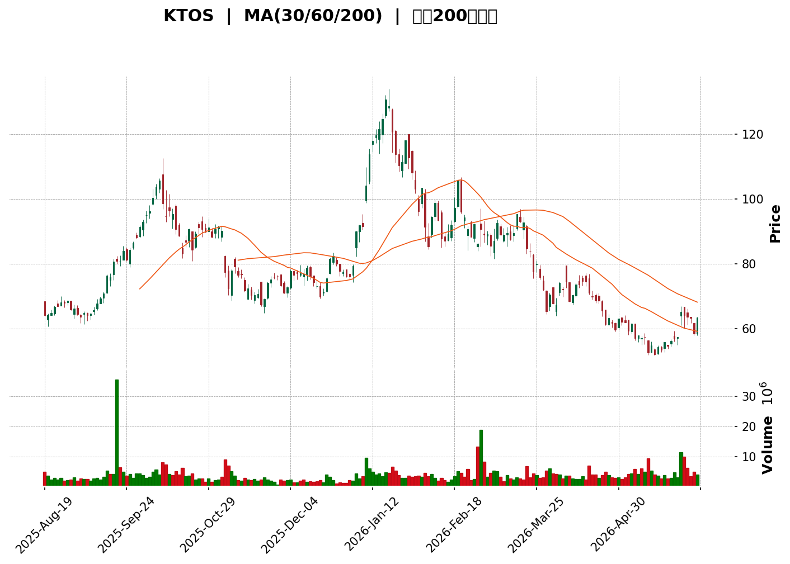
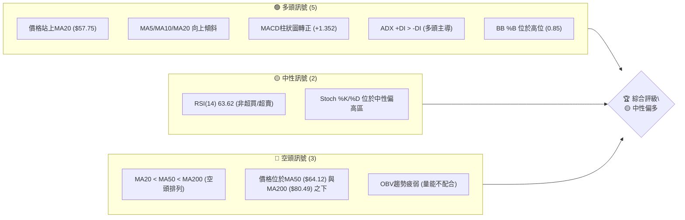
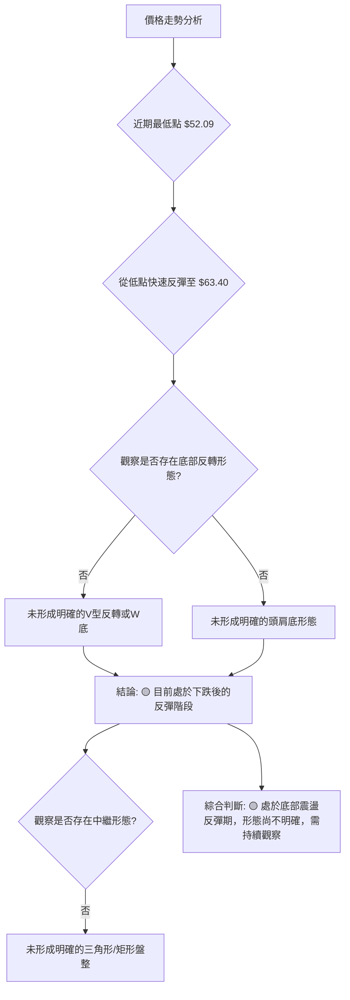
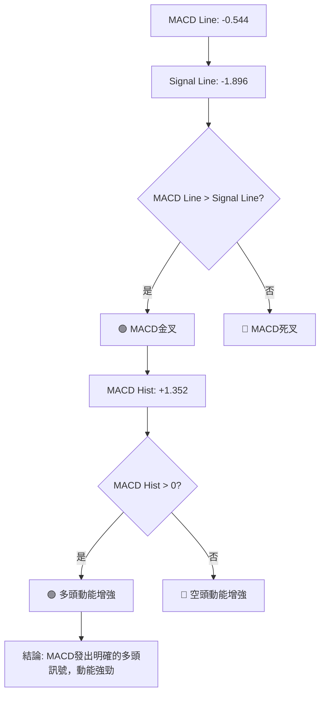

<details>
<summary>📊 靜態圖表 (點擊展開)</summary>

</details>

<html>
<head><meta charset="utf-8" /></head>
<body>
    <div style="height:500px; width:100%;">                        <script>window.PlotlyConfig = {MathJaxConfig: 'local'};</script>
        <script charset="utf-8" src="https://cdn.plot.ly/plotly-3.6.0.min.js" integrity="sha256-QaOVwtVY0T02VaHrr6pnoHLCwayMJp4O5n4YyaE3rJk=" crossorigin="anonymous"></script>                <div id="candlestick-chart" class="plotly-graph-div" style="height:100%; width:100%;"></div>            <script>                window.PLOTLYENV=window.PLOTLYENV || {};                                if (document.getElementById("candlestick-chart")) {                    Plotly.newPlot(                        "candlestick-chart",                        [{"close":{"dtype":"f8","bdata":"AAAAoEcBUEAAAACgRxFQQAAAAIDrMVBAAAAAoHCtUEAAAACgmblQQAAAAEAzA1FAAAAAQOH6UEAAAADgoyBRQAAAAIDCdVBAAAAAgMKFUEAAAAAAACBQQAAAACCFy09AAAAAANczUEAAAADA9QhQQAAAAADXI1BAAAAAgD1qUEAAAABA4epQQAAAAMDMTFFAAAAAIFyvUUAAAABgZhZTQAAAACBc71JAAAAAoJkpVEAAAACgRzFUQAAAAIAULlRAAAAAoJn5VEAAAAAghUtUQAAAAMDMDFVAAAAAgOuRVUAAAADAHgVWQAAAACCu11ZAAAAAoHA9V0AAAACA68FXQAAAAAApDFhAAAAAAAAQWUAAAAAAKexZQAAAAEDhalpAAAAAQDOjWEAAAADgUahXQAAAAIDrEVhAAAAAQDPTV0AAAADAHqVWQAAAACCuJ1ZAAAAAIK7HVEAAAACgmalVQAAAACCup1ZAAAAAQDMTVUAAAADgelRWQAAAACCFy1ZAAAAAIIWrVkAAAACA63FWQAAAAKBwzVZAAAAAQDMTVkAAAABgZqZWQAAAAGBmxlZAAAAAgBSOVkAAAACAPVpTQAAAAIA9GlJAAAAA4FF4U0AAAAAghctTQAAAAIDCJVNAAAAAwMwsU0AAAAAAKexRQAAAAMDMHFJAAAAAIFyPUUAAAABACpdRQAAAAEDhqlFAAAAAANfTUEAAAADA9UhRQAAAAEAKh1JAAAAAQDPDUkAAAACgR\u002fFSQAAAAGBmBlNAAAAAoHBNUkAAAACgcL1RQAAAAIDrMVJAAAAAIIVrU0AAAAAAACBTQAAAAIDrQVNAAAAAgOtBU0AAAACAPTpTQAAAAIDrsVNAAAAAoHD9UkAAAADgo5BSQAAAAOBRSFJAAAAAoEdxUUAAAACgmdlRQAAAAMD12FJAAAAAgOthVEAAAABAM5NUQAAAAIAU\u002flNAAAAAwMxsU0AAAACAFF5TQAAAAGC4\u002flJAAAAAgD36UkAAAABgj9JTQAAAACCFe1ZAAAAAIIX7VkAAAAAAKdxWQAAAAGCPAlpAAAAAwMxsXEAAAABACnddQAAAAIAU7l1AAAAAAABgXkAAAAAA1yNfQAAAAEAKV2BAAAAAgMIVYEAAAACAwiVeQAAAAGBmdlxAAAAAwPWYW0AAAADgetRbQAAAAADXg11AAAAAQOEqXEAAAACAPQpbQAAAAOCjwFlAAAAAgD0KWEAAAAAgrtdZQAAAAMAe1VZAAAAAAABQVUAAAACAPZpXQAAAAADXs1hAAAAAYLheV0AAAACA6\u002fFVQAAAAEAzw1VAAAAAANdDVkAAAACAFP5WQAAAAKBwTVhAAAAAQOFqWkAAAADAHgVYQAAAAADXk1dAAAAAIIWrVkAAAABguA5WQAAAAMD1CFdAAAAAIIWLVUAAAACAFK5WQAAAAMDMPFZAAAAA4FFIVkAAAABgj2JVQAAAAAAAwFVAAAAAgBQeV0AAAACgcD1WQAAAAEDhOlZAAAAAoHBdVkAAAACA6+FVQAAAAIDrYVZAAAAAANfTV0AAAABgj0JXQAAAAIDrMVdAAAAAIK4nVUAAAAAAKexUQAAAACBcX1NAAAAAYLj+U0AAAABACvdSQAAAAAAp\u002fFFAAAAAgOtRUEAAAADgo6BRQAAAAMDM7FBAAAAAANfTUEAAAACAwoVSQAAAAKBw\u002fVFAAAAAoHCdUkAAAADAHhVRQAAAAIDClVFAAAAAQDNjUkAAAACAPWpSQAAAAIA9qlJAAAAAgD2aUkAAAAAgXL9RQAAAAMAedVFAAAAAQDMjUUAAAABACidRQAAAAKBHYVBAAAAAoEehTkAAAADgepRPQAAAAOB61E5AAAAAIK7HTUAAAABgZoZPQAAAAGBmBk9AAAAAQAr3TkAAAAAgrqdNQAAAAGCPwk5AAAAAAACATEAAAACA6\u002fFMQAAAAGC4fkxAAAAAgD2qTEAAAABguD5KQAAAAMDMbEtAAAAAIIULSkAAAAAAKRxLQAAAAAApvEpAAAAAwPXoS0AAAACAwlVLQAAAAEAKF0xAAAAAYGZmTEAAAABgZqZMQAAAAAApTFBAAAAA4FEIUEAAAABguL5PQAAAAGCPok9AAAAAQAo3TUAAAABAM7NPQA=="},"high":{"dtype":"f8","bdata":"AAAAoJkZUUAAAAAA1yNQQAAAAIDCdVBAAAAAYI\u002fCUEAAAACgcC1RQAAAAIA9elFAAAAAIFwvUUAAAADgejRRQAAAACBcH1FAAAAAgD3aUEAAAABA4cpQQAAAAAApHFBAAAAAYI9SUEAAAAAAAEBQQAAAAMAeNVBAAAAAAACwUEAAAADA9UhRQAAAAKBwbVFAAAAAANfTUUAAAAAgridTQAAAAIDrQVNAAAAAAClcVEAAAAAA15NUQAAAAOBRqFRAAAAAYLheVUAAAAAAAEBVQAAAAOBROFVAAAAAgMK1VUAAAABA4WpWQAAAACCu91ZAAAAAoEdhV0AAAACgmRlYQAAAACCuh1hAAAAAAADAWUAAAACgcC1aQAAAAADXk1pAAAAA4HokXEAAAACgmalZQAAAAAAAYFlAAAAAYGZGWEAAAAAgXJ9YQAAAAIDCJVdAAAAAoEehVUAAAACAFC5WQAAAAEAzs1ZAAAAAAACAVkAAAADAzHxWQAAAACCFO1dAAAAAYGamV0AAAADAzBxXQAAAACCud1dAAAAAAADAVkAAAACgmQlXQAAAAIAU7lZAAAAAgMLlVkAAAAAAAKBUQAAAAIAU3lNAAAAAYGaWU0AAAAAAAIBUQAAAACBcv1NAAAAAQOGKU0AAAACgmflSQAAAAKBHcVJAAAAAwMw8UkAAAAAAANBRQAAAACCFC1JAAAAAYLieUkAAAACAwlVRQAAAAAApnFJAAAAAIIULU0AAAABA4UpTQAAAACBcH1NAAAAAYGYmU0AAAABgZqZSQAAAAAAAQFJAAAAA4HqUU0AAAADgUYhTQAAAAOB6hFNAAAAAgD3qU0AAAACgcJ1TQAAAAIAU3lNAAAAAoJnZU0AAAABA4RpTQAAAAOBRqFJAAAAAIFyPUkAAAACAPRpSQAAAAGCP8lJAAAAAIK53VEAAAACAPdpUQAAAAAApfFRAAAAAgD36U0AAAACAFI5TQAAAAAApjFNAAAAAgBQ+U0AAAABguO5TQAAAAEAKh1ZAAAAAgOsBV0AAAADgetRXQAAAAEAzc1tAAAAAwMzcXEAAAADgUehdQAAAAOB6ZF5AAAAAoHD9XkAAAAAA15NfQAAAAAAAgGBAAAAAAADAYEAAAAAAAABgQAAAAEAzU15AAAAAgOvhXEAAAABA4WpcQAAAAMD1iF1AAAAAAAAAXkAAAADAzMxcQAAAAAAAMFtAAAAAwPVIWUAAAAAgXN9ZQAAAAAAAwFlAAAAAYGYmV0AAAABA4apXQAAAAIDr8VhAAAAAAADgWEAAAABAMyNYQAAAAIDCZVZAAAAAIFwPV0AAAABgZlZXQAAAAAAAIFlAAAAAgD16WkAAAABA4apaQAAAAMAexVdAAAAAIFzvVkAAAACA61FXQAAAAAApHFdAAAAAoJmZVUAAAABgZkZYQAAAAIAUTldAAAAAYGaGVkAAAAAgXF9WQAAAAOBRuFZAAAAAQOFqV0AAAABAMxNXQAAAAGC4vlZAAAAAIK7XVkAAAACgmflWQAAAAEAz81ZAAAAAYGbWV0AAAADgUThYQAAAAAAAoFdAAAAAAAAAV0AAAAAA15NVQAAAAKBHwVRAAAAAACk8VEAAAACA6+FTQAAAAOBRGFNAAAAAoJn5UUAAAACAFL5RQAAAAEAzM1JAAAAA4KNgUUAAAACAPZpSQAAAAKCZOVJAAAAAACncU0AAAAAAAKBSQAAAAIDroVFAAAAAYGaGUkAAAADgeiRTQAAAAGCPElNAAAAAgBROU0AAAADA9ThTQAAAAKBw7VFAAAAAoJm5UUAAAABguL5RQAAAACBcL1FAAAAA4KNwUEAAAAAghRtQQAAAAKCZWU9AAAAAoEfhTkAAAABACpdPQAAAAAAAwE9AAAAA4FEIUEAAAADAHmVPQAAAAGC43k5AAAAAwB7FTkAAAADgUfhMQAAAAEDh2kxAAAAA4KNQTUAAAAAAAEBMQAAAAAAp\u002fEtAAAAAQDPzSkAAAAAAKVxLQAAAACCFS0tAAAAA4KPwS0AAAAAA14NLQAAAAAAAYExAAAAAYGamTUAAAACAFK5MQAAAAMAetVBAAAAAAACwUEAAAADAzIxQQAAAAEAz009AAAAAwMzsTkAAAAAghctPQA=="},"hovertemplate":"\u003cb\u003e%{x|%Y-%m-%d}\u003c\u002fb\u003e\u003cbr\u003e\u958b: $%{open:.2f}\u003cbr\u003e\u9ad8: $%{high:.2f}\u003cbr\u003e\u4f4e: $%{low:.2f}\u003cbr\u003e\u6536: $%{close:.2f}\u003cextra\u003e\u003c\u002fextra\u003e","low":{"dtype":"f8","bdata":"AAAAgBTOT0AAAABA4VpOQAAAAADXA1BAAAAAYI8CUEAAAAAgrrdQQAAAAAAAwFBAAAAAAACgUEAAAACgR9FQQAAAAMD1aFBAAAAAYI+CT0AAAAAA1wNQQAAAAAAA4E5AAAAAQDOzTkAAAACAPSpPQAAAAOB6VE9AAAAAACkMUEAAAABgZmZQQAAAAKCZ6VBAAAAAoJn5UEAAAADAHrVRQAAAAEAKR1JAAAAAoEfBUkAAAACgmflTQAAAAEAz01NAAAAAYGZGVEAAAABgZjZUQAAAACCut1NAAAAAIIUbVUAAAABAM\u002fNVQAAAAGBmBlZAAAAA4FEoVkAAAACA6yFXQAAAAEAKd1dAAAAAoEeBWEAAAAAAAABZQAAAAKCZeVlAAAAAQDMzWEAAAACgmTlXQAAAAEDhqldAAAAAYI+yVkAAAACAPUpWQAAAACBcH1ZAAAAAoHBtVEAAAADAzExVQAAAAMDMTFVAAAAAANczVEAAAAAgrjdVQAAAACCFS1ZAAAAA4KMQVkAAAAAAKWxWQAAAAKBwfVZAAAAAYI8CVkAAAACAPfpVQAAAAMDM\u002fFVAAAAA4Hq0VUAAAABgZvZSQAAAAKBHkVFAAAAAoJkpUUAAAABAM0NTQAAAAMD1+FJAAAAAAADgUkAAAAAA19NRQAAAAAAAQFFAAAAAYGY2UUAAAACA6\u002fFQQAAAAEAzU1FAAAAAgD26UEAAAABAMzNQQAAAAMD1SFFAAAAAoJkpUkAAAAAA19NSQAAAAOCjwFJAAAAAIIU7UkAAAAAgrrdRQAAAACCFa1FAAAAAgOsRUkAAAADgo7BSQAAAAKCZyVJAAAAAANcDU0AAAADAzExSQAAAAEAzs1JAAAAAwMzMUkAAAABgZkZSQAAAAEDhGlJAAAAAANdTUUAAAADA9YhRQAAAAGC4zlFAAAAAANczU0AAAABgZvZTQAAAAIDr0VNAAAAAYGYGU0AAAACgmQlTQAAAAEAz81JAAAAA4FG4UkAAAADAHpVSQAAAAOBRiFRAAAAAwMysVUAAAADgo6BWQAAAAKBHsVhAAAAAoJkpWkAAAAAAAKBcQAAAAMDMTF1AAAAAAACAXEAAAACgR1FdQAAAAAAAQF9AAAAAAADAX0AAAACA65FcQAAAAGC4zltAAAAAQAoXW0AAAACgR7FaQAAAAADXw1tAAAAA4KNQW0AAAACAwoVaQAAAAOBRaFlAAAAAoEexV0AAAACgmUlYQAAAAEDhulVAAAAAAAAgVUAAAAAAAABWQAAAAMDMTFdAAAAAoHBNV0AAAACgR0FVQAAAAAAAUFVAAAAAoEfBVUAAAADgesRVQAAAAMDMPFdAAAAAYLg+WEAAAAAghdtXQAAAAAAAwFZAAAAAYI8CVUAAAACgcA1WQAAAAMD1qFVAAAAAAAAAVUAAAADAHlVVQAAAAGBmplVAAAAAAABwVUAAAACgmZlUQAAAAAAAYFRAAAAAwMzMVUAAAADA9ShWQAAAACCup1VAAAAAwPVYVUAAAADAzMxVQAAAAKCZuVVAAAAAIFyPVkAAAACAPSpXQAAAAMD16FVAAAAAYGbGVEAAAADgeoRUQAAAAKBH4VJAAAAAANdTU0AAAACgmclSQAAAAMDM7FFAAAAAIK4XUEAAAABAM2NQQAAAAGBm5lBAAAAAIIXrT0AAAADAzIxRQAAAAEAzc1FAAAAAQDMjUkAAAACA6xFRQAAAACCF21BAAAAAQApnUUAAAACgRyFSQAAAAAAAUFJAAAAA4KNAUkAAAACAPZpRQAAAAEAKN1FAAAAA4Hr0UEAAAADA9ehQQAAAAMAe5U9AAAAAoEeBTkAAAADgUZhOQAAAAAApHE5AAAAAIK6HTUAAAACA69FNQAAAAKCZeU5AAAAAoEfhTkAAAACgRwFNQAAAAEAKN01AAAAAwB4lTEAAAACgcN1LQAAAAKBHgUtAAAAAgBSOS0AAAAAghetJQAAAAGC4PkpAAAAA4HrUSUAAAACAPQpKQAAAAADXY0pAAAAAQDNTSkAAAAAgrudKQAAAAEDhOktAAAAAQDPzS0AAAAAAAIBLQAAAAAAAgE5AAAAAgD0KTkAAAABAM5NOQAAAAEAK105AAAAAQDPzTEAAAADgUfhMQA=="},"name":"\u50f9\u683c","open":{"dtype":"f8","bdata":"AAAAIK4XUUAAAACgcF1PQAAAAMD1CFBAAAAAACksUEAAAACAPepQQAAAAAAAwFBAAAAAoEcRUUAAAABgjwJRQAAAACBcH1FAAAAAgD0aUEAAAACA65FQQAAAAEAzE1BAAAAAAAAgUEAAAACAwjVQQAAAAOBRCFBAAAAAYGZWUEAAAACAwoVQQAAAACBc71BAAAAAwMxcUUAAAAAA18NRQAAAAOCjwFJAAAAAoJkpU0AAAACgR2FUQAAAAEAKJ1RAAAAAYGZGVEAAAAAgrhdVQAAAAAAAAFRAAAAAAABAVUAAAADAzDxWQAAAAMD1GFZAAAAAAACgVkAAAAAAAMBXQAAAAAAp7FdAAAAAYGaWWEAAAACgmUlZQAAAAOB6xFlAAAAAwPXoWkAAAADAzKxXQAAAAIAUXlhAAAAAgBRuV0AAAADAzHxYQAAAACBc\u002f1ZAAAAAQOE6VUAAAACA69FVQAAAAEAKx1VAAAAAAACAVkAAAADAzExVQAAAAOBRCFdAAAAA4HpEV0AAAADgesRWQAAAAAAAgFZAAAAAAACAVkAAAAAAAGBWQAAAAMAetVZAAAAAYLgOVkAAAAAgrpdUQAAAAMDMfFNAAAAAQDOTUUAAAAAghVtUQAAAAGC4blNAAAAAgOsxU0AAAAAAKbxSQAAAAIA9SlFAAAAAgMIFUkAAAAAgXC9RQAAAAMAeZVFAAAAAYLieUkAAAAAA17NQQAAAAEDhWlFAAAAAgD2KUkAAAABAM\u002fNSQAAAAGC4DlNAAAAAYGYmU0AAAAAgrodSQAAAAOCjwFFAAAAAoEchUkAAAAAAKWxTQAAAAIDCZVNAAAAA4HokU0AAAAAAAABTQAAAACBcL1NAAAAAIIW7U0AAAACgRxFTQAAAAAAAQFJAAAAA4FFIUkAAAAAAKbxRQAAAAIDr4VFAAAAAAABAU0AAAACAFB5UQAAAAEAKR1RAAAAAgD36U0AAAACgcD1TQAAAAAApjFNAAAAAQDMzU0AAAABAMyNTQAAAAIA9OlVAAAAAwPV4VkAAAADgUShXQAAAAIDr4VhAAAAAYLheWkAAAABgZjZdQAAAAIA9ul1AAAAAAACgXUAAAADA9fhdQAAAAKBwbV9AAAAAIIUDYEAAAABgj+JfQAAAAOCjQF5AAAAAwB51XEAAAADAzCxbQAAAAADXw1tAAAAAAAAAXkAAAADgUbhcQAAAAOB6dFpAAAAAgD36WEAAAABgZqZYQAAAAKBwXVlAAAAAgBQeVkAAAABgZkZWQAAAAGBmpldAAAAA4Hq0WEAAAACAPfpXQAAAAKCZGVZAAAAAIFzPVUAAAADAHgVWQAAAAMD1SFdAAAAAoHBtWEAAAAAAKWxaQAAAAKBHUVdAAAAAAAAwVkAAAAAAKTxXQAAAAAAp\u002fFVAAAAAQDNTVUAAAABA4RpXQAAAAKBwTVZAAAAA4KMgVkAAAABgZjZWQAAAAOBR2FRAAAAAQAr3VUAAAAAAKdxWQAAAAIDrwVVAAAAAACk8VkAAAAAAAIBWQAAAAIDCNVZAAAAAQAq3VkAAAACAPZpXQAAAAOCjoFZAAAAAwMzcVkAAAACAwvVUQAAAAEDhqlRAAAAAYI\u002fyU0AAAADgUZhTQAAAAEAKt1JAAAAA4KPwUUAAAACgmblQQAAAAMD1KFJAAAAAgOtRUEAAAADgUchRQAAAAAAAEFJAAAAA4FHYU0AAAADAzIxSQAAAAKBHAVFAAAAAYGaGUUAAAACAPapSQAAAAAAp7FJAAAAAANcTU0AAAAAghdtSQAAAAGCPglFAAAAA4KOQUUAAAAAgrodRQAAAAMDMHFFAAAAA4KNwUEAAAADgUZhOQAAAAOBR+E5AAAAAYLjeTkAAAADAHiVOQAAAAOB6tE9AAAAAACk8T0AAAADgUVhPQAAAAIA9ik1AAAAAwB7FTkAAAACAPYpMQAAAACBcb0xAAAAAIIWrTEAAAADgejRMQAAAAKBHYUpAAAAAYLi+SkAAAACgRyFKQAAAAGC4HktAAAAAoJn5SkAAAAAAAIBLQAAAAMAepUtAAAAA4HrUTEAAAACgcH1MQAAAAEDh+k9AAAAAgD2qUEAAAAAAKTxQQAAAAMD1yE9AAAAAIFzPTkAAAADgejRNQA=="},"x":["2025-08-19T00:00:00-04:00","2025-08-20T00:00:00-04:00","2025-08-21T00:00:00-04:00","2025-08-22T00:00:00-04:00","2025-08-25T00:00:00-04:00","2025-08-26T00:00:00-04:00","2025-08-27T00:00:00-04:00","2025-08-28T00:00:00-04:00","2025-08-29T00:00:00-04:00","2025-09-02T00:00:00-04:00","2025-09-03T00:00:00-04:00","2025-09-04T00:00:00-04:00","2025-09-05T00:00:00-04:00","2025-09-08T00:00:00-04:00","2025-09-09T00:00:00-04:00","2025-09-10T00:00:00-04:00","2025-09-11T00:00:00-04:00","2025-09-12T00:00:00-04:00","2025-09-15T00:00:00-04:00","2025-09-16T00:00:00-04:00","2025-09-17T00:00:00-04:00","2025-09-18T00:00:00-04:00","2025-09-19T00:00:00-04:00","2025-09-22T00:00:00-04:00","2025-09-23T00:00:00-04:00","2025-09-24T00:00:00-04:00","2025-09-25T00:00:00-04:00","2025-09-26T00:00:00-04:00","2025-09-29T00:00:00-04:00","2025-09-30T00:00:00-04:00","2025-10-01T00:00:00-04:00","2025-10-02T00:00:00-04:00","2025-10-03T00:00:00-04:00","2025-10-06T00:00:00-04:00","2025-10-07T00:00:00-04:00","2025-10-08T00:00:00-04:00","2025-10-09T00:00:00-04:00","2025-10-10T00:00:00-04:00","2025-10-13T00:00:00-04:00","2025-10-14T00:00:00-04:00","2025-10-15T00:00:00-04:00","2025-10-16T00:00:00-04:00","2025-10-17T00:00:00-04:00","2025-10-20T00:00:00-04:00","2025-10-21T00:00:00-04:00","2025-10-22T00:00:00-04:00","2025-10-23T00:00:00-04:00","2025-10-24T00:00:00-04:00","2025-10-27T00:00:00-04:00","2025-10-28T00:00:00-04:00","2025-10-29T00:00:00-04:00","2025-10-30T00:00:00-04:00","2025-10-31T00:00:00-04:00","2025-11-03T00:00:00-05:00","2025-11-04T00:00:00-05:00","2025-11-05T00:00:00-05:00","2025-11-06T00:00:00-05:00","2025-11-07T00:00:00-05:00","2025-11-10T00:00:00-05:00","2025-11-11T00:00:00-05:00","2025-11-12T00:00:00-05:00","2025-11-13T00:00:00-05:00","2025-11-14T00:00:00-05:00","2025-11-17T00:00:00-05:00","2025-11-18T00:00:00-05:00","2025-11-19T00:00:00-05:00","2025-11-20T00:00:00-05:00","2025-11-21T00:00:00-05:00","2025-11-24T00:00:00-05:00","2025-11-25T00:00:00-05:00","2025-11-26T00:00:00-05:00","2025-11-28T00:00:00-05:00","2025-12-01T00:00:00-05:00","2025-12-02T00:00:00-05:00","2025-12-03T00:00:00-05:00","2025-12-04T00:00:00-05:00","2025-12-05T00:00:00-05:00","2025-12-08T00:00:00-05:00","2025-12-09T00:00:00-05:00","2025-12-10T00:00:00-05:00","2025-12-11T00:00:00-05:00","2025-12-12T00:00:00-05:00","2025-12-15T00:00:00-05:00","2025-12-16T00:00:00-05:00","2025-12-17T00:00:00-05:00","2025-12-18T00:00:00-05:00","2025-12-19T00:00:00-05:00","2025-12-22T00:00:00-05:00","2025-12-23T00:00:00-05:00","2025-12-24T00:00:00-05:00","2025-12-26T00:00:00-05:00","2025-12-29T00:00:00-05:00","2025-12-30T00:00:00-05:00","2025-12-31T00:00:00-05:00","2026-01-02T00:00:00-05:00","2026-01-05T00:00:00-05:00","2026-01-06T00:00:00-05:00","2026-01-07T00:00:00-05:00","2026-01-08T00:00:00-05:00","2026-01-09T00:00:00-05:00","2026-01-12T00:00:00-05:00","2026-01-13T00:00:00-05:00","2026-01-14T00:00:00-05:00","2026-01-15T00:00:00-05:00","2026-01-16T00:00:00-05:00","2026-01-20T00:00:00-05:00","2026-01-21T00:00:00-05:00","2026-01-22T00:00:00-05:00","2026-01-23T00:00:00-05:00","2026-01-26T00:00:00-05:00","2026-01-27T00:00:00-05:00","2026-01-28T00:00:00-05:00","2026-01-29T00:00:00-05:00","2026-01-30T00:00:00-05:00","2026-02-02T00:00:00-05:00","2026-02-03T00:00:00-05:00","2026-02-04T00:00:00-05:00","2026-02-05T00:00:00-05:00","2026-02-06T00:00:00-05:00","2026-02-09T00:00:00-05:00","2026-02-10T00:00:00-05:00","2026-02-11T00:00:00-05:00","2026-02-12T00:00:00-05:00","2026-02-13T00:00:00-05:00","2026-02-17T00:00:00-05:00","2026-02-18T00:00:00-05:00","2026-02-19T00:00:00-05:00","2026-02-20T00:00:00-05:00","2026-02-23T00:00:00-05:00","2026-02-24T00:00:00-05:00","2026-02-25T00:00:00-05:00","2026-02-26T00:00:00-05:00","2026-02-27T00:00:00-05:00","2026-03-02T00:00:00-05:00","2026-03-03T00:00:00-05:00","2026-03-04T00:00:00-05:00","2026-03-05T00:00:00-05:00","2026-03-06T00:00:00-05:00","2026-03-09T00:00:00-04:00","2026-03-10T00:00:00-04:00","2026-03-11T00:00:00-04:00","2026-03-12T00:00:00-04:00","2026-03-13T00:00:00-04:00","2026-03-16T00:00:00-04:00","2026-03-17T00:00:00-04:00","2026-03-18T00:00:00-04:00","2026-03-19T00:00:00-04:00","2026-03-20T00:00:00-04:00","2026-03-23T00:00:00-04:00","2026-03-24T00:00:00-04:00","2026-03-25T00:00:00-04:00","2026-03-26T00:00:00-04:00","2026-03-27T00:00:00-04:00","2026-03-30T00:00:00-04:00","2026-03-31T00:00:00-04:00","2026-04-01T00:00:00-04:00","2026-04-02T00:00:00-04:00","2026-04-06T00:00:00-04:00","2026-04-07T00:00:00-04:00","2026-04-08T00:00:00-04:00","2026-04-09T00:00:00-04:00","2026-04-10T00:00:00-04:00","2026-04-13T00:00:00-04:00","2026-04-14T00:00:00-04:00","2026-04-15T00:00:00-04:00","2026-04-16T00:00:00-04:00","2026-04-17T00:00:00-04:00","2026-04-20T00:00:00-04:00","2026-04-21T00:00:00-04:00","2026-04-22T00:00:00-04:00","2026-04-23T00:00:00-04:00","2026-04-24T00:00:00-04:00","2026-04-27T00:00:00-04:00","2026-04-28T00:00:00-04:00","2026-04-29T00:00:00-04:00","2026-04-30T00:00:00-04:00","2026-05-01T00:00:00-04:00","2026-05-04T00:00:00-04:00","2026-05-05T00:00:00-04:00","2026-05-06T00:00:00-04:00","2026-05-07T00:00:00-04:00","2026-05-08T00:00:00-04:00","2026-05-11T00:00:00-04:00","2026-05-12T00:00:00-04:00","2026-05-13T00:00:00-04:00","2026-05-14T00:00:00-04:00","2026-05-15T00:00:00-04:00","2026-05-18T00:00:00-04:00","2026-05-19T00:00:00-04:00","2026-05-20T00:00:00-04:00","2026-05-21T00:00:00-04:00","2026-05-22T00:00:00-04:00","2026-05-26T00:00:00-04:00","2026-05-27T00:00:00-04:00","2026-05-28T00:00:00-04:00","2026-05-29T00:00:00-04:00","2026-06-01T00:00:00-04:00","2026-06-02T00:00:00-04:00","2026-06-03T00:00:00-04:00","2026-06-04T00:00:00-04:00"],"type":"candlestick"},{"hovertemplate":"MA30: $%{y:.2f}\u003cextra\u003e\u003c\u002fextra\u003e","line":{"color":"#2196F3","dash":"dash","width":2},"mode":"lines","name":"MA30","x":["2025-08-19T00:00:00-04:00","2025-08-20T00:00:00-04:00","2025-08-21T00:00:00-04:00","2025-08-22T00:00:00-04:00","2025-08-25T00:00:00-04:00","2025-08-26T00:00:00-04:00","2025-08-27T00:00:00-04:00","2025-08-28T00:00:00-04:00","2025-08-29T00:00:00-04:00","2025-09-02T00:00:00-04:00","2025-09-03T00:00:00-04:00","2025-09-04T00:00:00-04:00","2025-09-05T00:00:00-04:00","2025-09-08T00:00:00-04:00","2025-09-09T00:00:00-04:00","2025-09-10T00:00:00-04:00","2025-09-11T00:00:00-04:00","2025-09-12T00:00:00-04:00","2025-09-15T00:00:00-04:00","2025-09-16T00:00:00-04:00","2025-09-17T00:00:00-04:00","2025-09-18T00:00:00-04:00","2025-09-19T00:00:00-04:00","2025-09-22T00:00:00-04:00","2025-09-23T00:00:00-04:00","2025-09-24T00:00:00-04:00","2025-09-25T00:00:00-04:00","2025-09-26T00:00:00-04:00","2025-09-29T00:00:00-04:00","2025-09-30T00:00:00-04:00","2025-10-01T00:00:00-04:00","2025-10-02T00:00:00-04:00","2025-10-03T00:00:00-04:00","2025-10-06T00:00:00-04:00","2025-10-07T00:00:00-04:00","2025-10-08T00:00:00-04:00","2025-10-09T00:00:00-04:00","2025-10-10T00:00:00-04:00","2025-10-13T00:00:00-04:00","2025-10-14T00:00:00-04:00","2025-10-15T00:00:00-04:00","2025-10-16T00:00:00-04:00","2025-10-17T00:00:00-04:00","2025-10-20T00:00:00-04:00","2025-10-21T00:00:00-04:00","2025-10-22T00:00:00-04:00","2025-10-23T00:00:00-04:00","2025-10-24T00:00:00-04:00","2025-10-27T00:00:00-04:00","2025-10-28T00:00:00-04:00","2025-10-29T00:00:00-04:00","2025-10-30T00:00:00-04:00","2025-10-31T00:00:00-04:00","2025-11-03T00:00:00-05:00","2025-11-04T00:00:00-05:00","2025-11-05T00:00:00-05:00","2025-11-06T00:00:00-05:00","2025-11-07T00:00:00-05:00","2025-11-10T00:00:00-05:00","2025-11-11T00:00:00-05:00","2025-11-12T00:00:00-05:00","2025-11-13T00:00:00-05:00","2025-11-14T00:00:00-05:00","2025-11-17T00:00:00-05:00","2025-11-18T00:00:00-05:00","2025-11-19T00:00:00-05:00","2025-11-20T00:00:00-05:00","2025-11-21T00:00:00-05:00","2025-11-24T00:00:00-05:00","2025-11-25T00:00:00-05:00","2025-11-26T00:00:00-05:00","2025-11-28T00:00:00-05:00","2025-12-01T00:00:00-05:00","2025-12-02T00:00:00-05:00","2025-12-03T00:00:00-05:00","2025-12-04T00:00:00-05:00","2025-12-05T00:00:00-05:00","2025-12-08T00:00:00-05:00","2025-12-09T00:00:00-05:00","2025-12-10T00:00:00-05:00","2025-12-11T00:00:00-05:00","2025-12-12T00:00:00-05:00","2025-12-15T00:00:00-05:00","2025-12-16T00:00:00-05:00","2025-12-17T00:00:00-05:00","2025-12-18T00:00:00-05:00","2025-12-19T00:00:00-05:00","2025-12-22T00:00:00-05:00","2025-12-23T00:00:00-05:00","2025-12-24T00:00:00-05:00","2025-12-26T00:00:00-05:00","2025-12-29T00:00:00-05:00","2025-12-30T00:00:00-05:00","2025-12-31T00:00:00-05:00","2026-01-02T00:00:00-05:00","2026-01-05T00:00:00-05:00","2026-01-06T00:00:00-05:00","2026-01-07T00:00:00-05:00","2026-01-08T00:00:00-05:00","2026-01-09T00:00:00-05:00","2026-01-12T00:00:00-05:00","2026-01-13T00:00:00-05:00","2026-01-14T00:00:00-05:00","2026-01-15T00:00:00-05:00","2026-01-16T00:00:00-05:00","2026-01-20T00:00:00-05:00","2026-01-21T00:00:00-05:00","2026-01-22T00:00:00-05:00","2026-01-23T00:00:00-05:00","2026-01-26T00:00:00-05:00","2026-01-27T00:00:00-05:00","2026-01-28T00:00:00-05:00","2026-01-29T00:00:00-05:00","2026-01-30T00:00:00-05:00","2026-02-02T00:00:00-05:00","2026-02-03T00:00:00-05:00","2026-02-04T00:00:00-05:00","2026-02-05T00:00:00-05:00","2026-02-06T00:00:00-05:00","2026-02-09T00:00:00-05:00","2026-02-10T00:00:00-05:00","2026-02-11T00:00:00-05:00","2026-02-12T00:00:00-05:00","2026-02-13T00:00:00-05:00","2026-02-17T00:00:00-05:00","2026-02-18T00:00:00-05:00","2026-02-19T00:00:00-05:00","2026-02-20T00:00:00-05:00","2026-02-23T00:00:00-05:00","2026-02-24T00:00:00-05:00","2026-02-25T00:00:00-05:00","2026-02-26T00:00:00-05:00","2026-02-27T00:00:00-05:00","2026-03-02T00:00:00-05:00","2026-03-03T00:00:00-05:00","2026-03-04T00:00:00-05:00","2026-03-05T00:00:00-05:00","2026-03-06T00:00:00-05:00","2026-03-09T00:00:00-04:00","2026-03-10T00:00:00-04:00","2026-03-11T00:00:00-04:00","2026-03-12T00:00:00-04:00","2026-03-13T00:00:00-04:00","2026-03-16T00:00:00-04:00","2026-03-17T00:00:00-04:00","2026-03-18T00:00:00-04:00","2026-03-19T00:00:00-04:00","2026-03-20T00:00:00-04:00","2026-03-23T00:00:00-04:00","2026-03-24T00:00:00-04:00","2026-03-25T00:00:00-04:00","2026-03-26T00:00:00-04:00","2026-03-27T00:00:00-04:00","2026-03-30T00:00:00-04:00","2026-03-31T00:00:00-04:00","2026-04-01T00:00:00-04:00","2026-04-02T00:00:00-04:00","2026-04-06T00:00:00-04:00","2026-04-07T00:00:00-04:00","2026-04-08T00:00:00-04:00","2026-04-09T00:00:00-04:00","2026-04-10T00:00:00-04:00","2026-04-13T00:00:00-04:00","2026-04-14T00:00:00-04:00","2026-04-15T00:00:00-04:00","2026-04-16T00:00:00-04:00","2026-04-17T00:00:00-04:00","2026-04-20T00:00:00-04:00","2026-04-21T00:00:00-04:00","2026-04-22T00:00:00-04:00","2026-04-23T00:00:00-04:00","2026-04-24T00:00:00-04:00","2026-04-27T00:00:00-04:00","2026-04-28T00:00:00-04:00","2026-04-29T00:00:00-04:00","2026-04-30T00:00:00-04:00","2026-05-01T00:00:00-04:00","2026-05-04T00:00:00-04:00","2026-05-05T00:00:00-04:00","2026-05-06T00:00:00-04:00","2026-05-07T00:00:00-04:00","2026-05-08T00:00:00-04:00","2026-05-11T00:00:00-04:00","2026-05-12T00:00:00-04:00","2026-05-13T00:00:00-04:00","2026-05-14T00:00:00-04:00","2026-05-15T00:00:00-04:00","2026-05-18T00:00:00-04:00","2026-05-19T00:00:00-04:00","2026-05-20T00:00:00-04:00","2026-05-21T00:00:00-04:00","2026-05-22T00:00:00-04:00","2026-05-26T00:00:00-04:00","2026-05-27T00:00:00-04:00","2026-05-28T00:00:00-04:00","2026-05-29T00:00:00-04:00","2026-06-01T00:00:00-04:00","2026-06-02T00:00:00-04:00","2026-06-03T00:00:00-04:00","2026-06-04T00:00:00-04:00"],"y":{"dtype":"f8","bdata":"AAAAAAAA+H8AAAAAAAD4fwAAAAAAAPh\u002fAAAAAAAA+H8AAAAAAAD4fwAAAAAAAPh\u002fAAAAAAAA+H8AAAAAAAD4fwAAAAAAAPh\u002fAAAAAAAA+H8AAAAAAAD4fwAAAAAAAPh\u002fAAAAAAAA+H8AAAAAAAD4fwAAAAAAAPh\u002fAAAAAAAA+H8AAAAAAAD4fwAAAAAAAPh\u002fAAAAAAAA+H8AAAAAAAD4fwAAAAAAAPh\u002fAAAAAAAA+H8AAAAAAAD4fwAAAAAAAPh\u002fAAAAAAAA+H8AAAAAAAD4fwAAAAAAAPh\u002fAAAAAAAA+H8AAAAAAAD4f97d3SVcD1JAd3d3PxlNUkB3d3dPuI5SQERERFy60VJARERErEcZU0AzMzPrw2dTQLy7u3MFuFNAzczMhF35U0DNzMyEFjFUQJqZmdEGclRAiYiIYFewVEARERGJ+udUQBEREUFgHVVAVVVV9W9EVUC8u7trdXRVQImIiKgNrFVAVVVVldHTVUDv7u5eAQJWQCIiImLlMFZAiYiISG9bVkCrqqraFXhWQJqZmYkWmVZAVVVVdWipVkAzMzPzYL5WQAAAANCF1FZAAAAAYAHiVkBERER09tlWQLy7u4vPwFZAZmZmBuSuVkAAAABw55tWQFVVVZVffFZAREREdK9ZVkBERES05CdWQO\u002fu7n4\u002f9VVAiYiICDq1VUCJiIhoH25VQN7d3b10I1VAiYiIiM\u002fgVECJiIiYbqpUQCIiItIie1RA7+7unu9PVEAiIiJiVzBUQKuqqsqhFVRAvLu7m30AVEBmZmbGBN9TQBEREcH1uFNAmpmZWdaqU0C8u7vrfI9TQCIiIiJNcVNAmpmZaS5UU0De3d2tuThTQN7d3T01HlNARERE9OEDU0AzMzMjBuFSQO\u002fu7h6wulJAERERsQ+PUkDe3d1tPYJSQHd3d+eYiFJAq6qqSmKQUkCrqqo6CpdSQJqZmSlAnlJAvLu7S2KgUkAiIiLytqxSQM3MzMw+tFJAERERYVfAUkCamZlZZNNSQBEREeF6\u002fFJA7+7urgAxU0BVVVV1k2BTQKuqqjptoFNAd3d3R+HyU0CJiIgIrExUQO\u002fu7l66qVRAZmZmJr8QVUBVVVXlF4NVQM3MzNyy\u002flVAiYiIqH9rVkDNzMysjslWQN7d3U0bGFdAAAAAUEZfV0AiIiLCrqhXQAAAAOB6\u002fFdA3t3dbctKWECamZlZHZNYQBEREdHb0lhAd3d3RygLWUCamZkpXE9ZQHd3d4ddcVlAVVVVJU15WUAiIiLSIpNZQImIiPhTu1lAVVVV9f3cWUB3d3eX\u002fPJZQJqZmUmaClpAAAAA8KcmWkCJiIjotEFaQCIiIsI8UVpAERERoYxuWkAAAACwcnhaQO\u002fu7s6wY1pAIiIi0pQyWkBERETkXvNZQImIiIiIuFlAq6qqGi9tWUBERET0\u002fSRZQGZmZvbhy1hAREREZIJ3WEC8u7trvCxYQN7d3b1081dAiYiICDrNV0De3d19hp1XQKuqqipcX1dAmpmZadgtV0De3d2t1QFXQM3MzMwT5VZAVVVVlUPjVkBmZmYGOs1WQKuqqupR0FZAq6qq2vnOVkDe3d1NG7hWQN7d3b2filZAERER8dJtVkCJiIgIZVRWQFVVVfUoNFZAiYiI6G0BVkAzMzPjpdNVQN7d3X2xlFVAERER0dtCVUB3d3dX8hNVQDMzM0NE5FRAq6qq+qnBVEDNzMzsNZdUQHd3dze0aFRA3t3djcJNVEBVVVWFXSlUQHd3d0fhClRAMzMzM3rrU0BVVVX1b8xTQJqZmdnOp1NAd3d3V8d0U0B3d3eHXUlTQCIiIgJyF1NAREREDEnbUkB3d3fHS6dSQDMzMwvXa1JAd3d3x5IfUkBVVVU9mN9RQAAAAJAJnlFAvLu7y6FtUUCJiIgQnzlRQBEREVGNF1FAvLu7K4fmUEB3d3cnMcBQQN7d3XVMoFBAvLu7s1aPUEARERFh5WhQQBEREZF7TVBAMzMzawMtUECJiIjAnwJQQO\u002fu7n5btk9AVVVVpdNmT0B3d3dHiyxPQJqZmckg8E5AERERUamoTkBERETU22JOQAAAABB0Ok5A3t3djZcOTkDv7u6Ol+5NQJqZmUma0k1AvLu7i2ynTUBmZmbWMZFNQA=="},"type":"scatter"},{"hovertemplate":"MA60: $%{y:.2f}\u003cextra\u003e\u003c\u002fextra\u003e","line":{"color":"#9C27B0","dash":"dash","width":2},"mode":"lines","name":"MA60","x":["2025-08-19T00:00:00-04:00","2025-08-20T00:00:00-04:00","2025-08-21T00:00:00-04:00","2025-08-22T00:00:00-04:00","2025-08-25T00:00:00-04:00","2025-08-26T00:00:00-04:00","2025-08-27T00:00:00-04:00","2025-08-28T00:00:00-04:00","2025-08-29T00:00:00-04:00","2025-09-02T00:00:00-04:00","2025-09-03T00:00:00-04:00","2025-09-04T00:00:00-04:00","2025-09-05T00:00:00-04:00","2025-09-08T00:00:00-04:00","2025-09-09T00:00:00-04:00","2025-09-10T00:00:00-04:00","2025-09-11T00:00:00-04:00","2025-09-12T00:00:00-04:00","2025-09-15T00:00:00-04:00","2025-09-16T00:00:00-04:00","2025-09-17T00:00:00-04:00","2025-09-18T00:00:00-04:00","2025-09-19T00:00:00-04:00","2025-09-22T00:00:00-04:00","2025-09-23T00:00:00-04:00","2025-09-24T00:00:00-04:00","2025-09-25T00:00:00-04:00","2025-09-26T00:00:00-04:00","2025-09-29T00:00:00-04:00","2025-09-30T00:00:00-04:00","2025-10-01T00:00:00-04:00","2025-10-02T00:00:00-04:00","2025-10-03T00:00:00-04:00","2025-10-06T00:00:00-04:00","2025-10-07T00:00:00-04:00","2025-10-08T00:00:00-04:00","2025-10-09T00:00:00-04:00","2025-10-10T00:00:00-04:00","2025-10-13T00:00:00-04:00","2025-10-14T00:00:00-04:00","2025-10-15T00:00:00-04:00","2025-10-16T00:00:00-04:00","2025-10-17T00:00:00-04:00","2025-10-20T00:00:00-04:00","2025-10-21T00:00:00-04:00","2025-10-22T00:00:00-04:00","2025-10-23T00:00:00-04:00","2025-10-24T00:00:00-04:00","2025-10-27T00:00:00-04:00","2025-10-28T00:00:00-04:00","2025-10-29T00:00:00-04:00","2025-10-30T00:00:00-04:00","2025-10-31T00:00:00-04:00","2025-11-03T00:00:00-05:00","2025-11-04T00:00:00-05:00","2025-11-05T00:00:00-05:00","2025-11-06T00:00:00-05:00","2025-11-07T00:00:00-05:00","2025-11-10T00:00:00-05:00","2025-11-11T00:00:00-05:00","2025-11-12T00:00:00-05:00","2025-11-13T00:00:00-05:00","2025-11-14T00:00:00-05:00","2025-11-17T00:00:00-05:00","2025-11-18T00:00:00-05:00","2025-11-19T00:00:00-05:00","2025-11-20T00:00:00-05:00","2025-11-21T00:00:00-05:00","2025-11-24T00:00:00-05:00","2025-11-25T00:00:00-05:00","2025-11-26T00:00:00-05:00","2025-11-28T00:00:00-05:00","2025-12-01T00:00:00-05:00","2025-12-02T00:00:00-05:00","2025-12-03T00:00:00-05:00","2025-12-04T00:00:00-05:00","2025-12-05T00:00:00-05:00","2025-12-08T00:00:00-05:00","2025-12-09T00:00:00-05:00","2025-12-10T00:00:00-05:00","2025-12-11T00:00:00-05:00","2025-12-12T00:00:00-05:00","2025-12-15T00:00:00-05:00","2025-12-16T00:00:00-05:00","2025-12-17T00:00:00-05:00","2025-12-18T00:00:00-05:00","2025-12-19T00:00:00-05:00","2025-12-22T00:00:00-05:00","2025-12-23T00:00:00-05:00","2025-12-24T00:00:00-05:00","2025-12-26T00:00:00-05:00","2025-12-29T00:00:00-05:00","2025-12-30T00:00:00-05:00","2025-12-31T00:00:00-05:00","2026-01-02T00:00:00-05:00","2026-01-05T00:00:00-05:00","2026-01-06T00:00:00-05:00","2026-01-07T00:00:00-05:00","2026-01-08T00:00:00-05:00","2026-01-09T00:00:00-05:00","2026-01-12T00:00:00-05:00","2026-01-13T00:00:00-05:00","2026-01-14T00:00:00-05:00","2026-01-15T00:00:00-05:00","2026-01-16T00:00:00-05:00","2026-01-20T00:00:00-05:00","2026-01-21T00:00:00-05:00","2026-01-22T00:00:00-05:00","2026-01-23T00:00:00-05:00","2026-01-26T00:00:00-05:00","2026-01-27T00:00:00-05:00","2026-01-28T00:00:00-05:00","2026-01-29T00:00:00-05:00","2026-01-30T00:00:00-05:00","2026-02-02T00:00:00-05:00","2026-02-03T00:00:00-05:00","2026-02-04T00:00:00-05:00","2026-02-05T00:00:00-05:00","2026-02-06T00:00:00-05:00","2026-02-09T00:00:00-05:00","2026-02-10T00:00:00-05:00","2026-02-11T00:00:00-05:00","2026-02-12T00:00:00-05:00","2026-02-13T00:00:00-05:00","2026-02-17T00:00:00-05:00","2026-02-18T00:00:00-05:00","2026-02-19T00:00:00-05:00","2026-02-20T00:00:00-05:00","2026-02-23T00:00:00-05:00","2026-02-24T00:00:00-05:00","2026-02-25T00:00:00-05:00","2026-02-26T00:00:00-05:00","2026-02-27T00:00:00-05:00","2026-03-02T00:00:00-05:00","2026-03-03T00:00:00-05:00","2026-03-04T00:00:00-05:00","2026-03-05T00:00:00-05:00","2026-03-06T00:00:00-05:00","2026-03-09T00:00:00-04:00","2026-03-10T00:00:00-04:00","2026-03-11T00:00:00-04:00","2026-03-12T00:00:00-04:00","2026-03-13T00:00:00-04:00","2026-03-16T00:00:00-04:00","2026-03-17T00:00:00-04:00","2026-03-18T00:00:00-04:00","2026-03-19T00:00:00-04:00","2026-03-20T00:00:00-04:00","2026-03-23T00:00:00-04:00","2026-03-24T00:00:00-04:00","2026-03-25T00:00:00-04:00","2026-03-26T00:00:00-04:00","2026-03-27T00:00:00-04:00","2026-03-30T00:00:00-04:00","2026-03-31T00:00:00-04:00","2026-04-01T00:00:00-04:00","2026-04-02T00:00:00-04:00","2026-04-06T00:00:00-04:00","2026-04-07T00:00:00-04:00","2026-04-08T00:00:00-04:00","2026-04-09T00:00:00-04:00","2026-04-10T00:00:00-04:00","2026-04-13T00:00:00-04:00","2026-04-14T00:00:00-04:00","2026-04-15T00:00:00-04:00","2026-04-16T00:00:00-04:00","2026-04-17T00:00:00-04:00","2026-04-20T00:00:00-04:00","2026-04-21T00:00:00-04:00","2026-04-22T00:00:00-04:00","2026-04-23T00:00:00-04:00","2026-04-24T00:00:00-04:00","2026-04-27T00:00:00-04:00","2026-04-28T00:00:00-04:00","2026-04-29T00:00:00-04:00","2026-04-30T00:00:00-04:00","2026-05-01T00:00:00-04:00","2026-05-04T00:00:00-04:00","2026-05-05T00:00:00-04:00","2026-05-06T00:00:00-04:00","2026-05-07T00:00:00-04:00","2026-05-08T00:00:00-04:00","2026-05-11T00:00:00-04:00","2026-05-12T00:00:00-04:00","2026-05-13T00:00:00-04:00","2026-05-14T00:00:00-04:00","2026-05-15T00:00:00-04:00","2026-05-18T00:00:00-04:00","2026-05-19T00:00:00-04:00","2026-05-20T00:00:00-04:00","2026-05-21T00:00:00-04:00","2026-05-22T00:00:00-04:00","2026-05-26T00:00:00-04:00","2026-05-27T00:00:00-04:00","2026-05-28T00:00:00-04:00","2026-05-29T00:00:00-04:00","2026-06-01T00:00:00-04:00","2026-06-02T00:00:00-04:00","2026-06-03T00:00:00-04:00","2026-06-04T00:00:00-04:00"],"y":{"dtype":"f8","bdata":"AAAAAAAA+H8AAAAAAAD4fwAAAAAAAPh\u002fAAAAAAAA+H8AAAAAAAD4fwAAAAAAAPh\u002fAAAAAAAA+H8AAAAAAAD4fwAAAAAAAPh\u002fAAAAAAAA+H8AAAAAAAD4fwAAAAAAAPh\u002fAAAAAAAA+H8AAAAAAAD4fwAAAAAAAPh\u002fAAAAAAAA+H8AAAAAAAD4fwAAAAAAAPh\u002fAAAAAAAA+H8AAAAAAAD4fwAAAAAAAPh\u002fAAAAAAAA+H8AAAAAAAD4fwAAAAAAAPh\u002fAAAAAAAA+H8AAAAAAAD4fwAAAAAAAPh\u002fAAAAAAAA+H8AAAAAAAD4fwAAAAAAAPh\u002fAAAAAAAA+H8AAAAAAAD4fwAAAAAAAPh\u002fAAAAAAAA+H8AAAAAAAD4fwAAAAAAAPh\u002fAAAAAAAA+H8AAAAAAAD4fwAAAAAAAPh\u002fAAAAAAAA+H8AAAAAAAD4fwAAAAAAAPh\u002fAAAAAAAA+H8AAAAAAAD4fwAAAAAAAPh\u002fAAAAAAAA+H8AAAAAAAD4fwAAAAAAAPh\u002fAAAAAAAA+H8AAAAAAAD4fwAAAAAAAPh\u002fAAAAAAAA+H8AAAAAAAD4fwAAAAAAAPh\u002fAAAAAAAA+H8AAAAAAAD4fwAAAAAAAPh\u002fAAAAAAAA+H8AAAAAAAD4f5qZmd3dRVRA3t3dWWRTVEDe3d2BTltUQJqZme18Y1RAZmZm2kBnVEDe3d2p8WpUQM3MzBi9bVRAq6qqhhZtVECrqqqOwm1UQN7d3dGUdlRAvLu7fyOAVECamZn1KIxUQN7d3QWBmVRAiYiIyHaiVEAREREZvalUQM3MzLSBslRAd3d391O\u002fVEBVVVUlv8hUQCIiIkIZ0VRAERER2c7XVEBERETEZ9hUQLy7u+Ol21RAzczMNKXWVEAzMzOLs89UQHd3d\u002feax1RAiYiIiIi4VEARERHxGa5UQJqZmTm0pFRAiYiIKKOfVEBVVVXVeJlUQHd3d99PjVRAAAAA4Ah9VEAzMzPTTWpUQN7d3SW\u002fVFRAzczMtMg6VEARERHhwSBUQHd3d8\u002f3D1RAvLu7G+gIVEDv7u4GgQVUQGZmZgbIDVRAMzMzc2ghVEBVVVW1gT5UQM3MzBSuX1RAERERYZ6IVEDe3d1VDrFUQO\u002fu7k7U21RAERERASsLVUBERETMhSxVQAAAADi0RFVAzczMXLpZVUAAAAA4tHBVQO\u002fu7g5YjVVAERERsVanVUBmZma+EbpVQAAAAPjFxlVARERE\u002fBvNVUC8u7vLzOhVQHd3dzf7\u002fFVAAAAAuNcEVkBmZmaGFhVWQBERERHKLFZAiYiIILA+VkDNzMzE2U9WQDMzM4tsX1ZAiYiIqH9zVkARERGhjIpWQJqZmdHbplZAAAAAqMbPVkCrqqoSg+xWQM3MzAQPAldAzczMDLsSV0BmZmZ2BSBXQLy7u3MhMVdAiYiIIPc+V0DNzMzsClRXQJqZmWlKZVdAZmZmBoFxV0BERESMJXtXQN7d3QXIhVdARERELECWV0AAAACgGqNXQFVVVYXrrVdAvLu761G8V0C8u7uDecpXQO\u002fu7s7321dAZmZm7jX3V0AAAAAYSw5YQBEREbnXIFhAAAAAgCMkWEAAAAAQnyVYQDMzM9v5IlhAMzMzc2glWEAAAADQsCNYQHd3d59hH1hARERE7AoUWEDe3d1lrQpYQAAAACD38ldAERERObTYV0C8u7uDMsZXQBEREYn6o1dAZmZmZh96V0CJiIhoSkVXQAAAAGCeEFdARERE1HjdVkDNzMy8LadWQO\u002fu7p5ha1ZAvLu7S34xVkCJiIgwlvxVQLy7u8uhzVVAAAAAsAChVUCrqqoCcnNVQGZmZhZnO1VA7+7uupAEVUCrqqq6kNRUQAAAAGx1qFRAZmZmLmuBVEDe3d0haVZUQFVVVb0tN1RAMzMz000eVEAzMzMv3fhTQHd3d4cW0VNAZmZmDi2qU0AAAAAYS4pTQJqZmbU6alNAIiIiTmJIU0AiIiKiRR5TQHd3d4cW8VJAIiIinu+3UkAAAAAMSYtSQFVVVQG5X1JAq6qq5ok6UkBERETIvRZSQCIiIk5i8FFAMzMzmwvRUUC8u7u3Za1RQLy7u6cNlFFAERER\u002fWJ5UUBmZmbe3WFRQDMzM\u002f+NSFFAq6qqzj4kUUBVVVU5+whRQA=="},"type":"scatter"},{"hovertemplate":"MA200: $%{y:.2f}\u003cextra\u003e\u003c\u002fextra\u003e","line":{"color":"#FF6F00","dash":"solid","width":2},"mode":"lines","name":"MA200","x":["2025-08-19T00:00:00-04:00","2025-08-20T00:00:00-04:00","2025-08-21T00:00:00-04:00","2025-08-22T00:00:00-04:00","2025-08-25T00:00:00-04:00","2025-08-26T00:00:00-04:00","2025-08-27T00:00:00-04:00","2025-08-28T00:00:00-04:00","2025-08-29T00:00:00-04:00","2025-09-02T00:00:00-04:00","2025-09-03T00:00:00-04:00","2025-09-04T00:00:00-04:00","2025-09-05T00:00:00-04:00","2025-09-08T00:00:00-04:00","2025-09-09T00:00:00-04:00","2025-09-10T00:00:00-04:00","2025-09-11T00:00:00-04:00","2025-09-12T00:00:00-04:00","2025-09-15T00:00:00-04:00","2025-09-16T00:00:00-04:00","2025-09-17T00:00:00-04:00","2025-09-18T00:00:00-04:00","2025-09-19T00:00:00-04:00","2025-09-22T00:00:00-04:00","2025-09-23T00:00:00-04:00","2025-09-24T00:00:00-04:00","2025-09-25T00:00:00-04:00","2025-09-26T00:00:00-04:00","2025-09-29T00:00:00-04:00","2025-09-30T00:00:00-04:00","2025-10-01T00:00:00-04:00","2025-10-02T00:00:00-04:00","2025-10-03T00:00:00-04:00","2025-10-06T00:00:00-04:00","2025-10-07T00:00:00-04:00","2025-10-08T00:00:00-04:00","2025-10-09T00:00:00-04:00","2025-10-10T00:00:00-04:00","2025-10-13T00:00:00-04:00","2025-10-14T00:00:00-04:00","2025-10-15T00:00:00-04:00","2025-10-16T00:00:00-04:00","2025-10-17T00:00:00-04:00","2025-10-20T00:00:00-04:00","2025-10-21T00:00:00-04:00","2025-10-22T00:00:00-04:00","2025-10-23T00:00:00-04:00","2025-10-24T00:00:00-04:00","2025-10-27T00:00:00-04:00","2025-10-28T00:00:00-04:00","2025-10-29T00:00:00-04:00","2025-10-30T00:00:00-04:00","2025-10-31T00:00:00-04:00","2025-11-03T00:00:00-05:00","2025-11-04T00:00:00-05:00","2025-11-05T00:00:00-05:00","2025-11-06T00:00:00-05:00","2025-11-07T00:00:00-05:00","2025-11-10T00:00:00-05:00","2025-11-11T00:00:00-05:00","2025-11-12T00:00:00-05:00","2025-11-13T00:00:00-05:00","2025-11-14T00:00:00-05:00","2025-11-17T00:00:00-05:00","2025-11-18T00:00:00-05:00","2025-11-19T00:00:00-05:00","2025-11-20T00:00:00-05:00","2025-11-21T00:00:00-05:00","2025-11-24T00:00:00-05:00","2025-11-25T00:00:00-05:00","2025-11-26T00:00:00-05:00","2025-11-28T00:00:00-05:00","2025-12-01T00:00:00-05:00","2025-12-02T00:00:00-05:00","2025-12-03T00:00:00-05:00","2025-12-04T00:00:00-05:00","2025-12-05T00:00:00-05:00","2025-12-08T00:00:00-05:00","2025-12-09T00:00:00-05:00","2025-12-10T00:00:00-05:00","2025-12-11T00:00:00-05:00","2025-12-12T00:00:00-05:00","2025-12-15T00:00:00-05:00","2025-12-16T00:00:00-05:00","2025-12-17T00:00:00-05:00","2025-12-18T00:00:00-05:00","2025-12-19T00:00:00-05:00","2025-12-22T00:00:00-05:00","2025-12-23T00:00:00-05:00","2025-12-24T00:00:00-05:00","2025-12-26T00:00:00-05:00","2025-12-29T00:00:00-05:00","2025-12-30T00:00:00-05:00","2025-12-31T00:00:00-05:00","2026-01-02T00:00:00-05:00","2026-01-05T00:00:00-05:00","2026-01-06T00:00:00-05:00","2026-01-07T00:00:00-05:00","2026-01-08T00:00:00-05:00","2026-01-09T00:00:00-05:00","2026-01-12T00:00:00-05:00","2026-01-13T00:00:00-05:00","2026-01-14T00:00:00-05:00","2026-01-15T00:00:00-05:00","2026-01-16T00:00:00-05:00","2026-01-20T00:00:00-05:00","2026-01-21T00:00:00-05:00","2026-01-22T00:00:00-05:00","2026-01-23T00:00:00-05:00","2026-01-26T00:00:00-05:00","2026-01-27T00:00:00-05:00","2026-01-28T00:00:00-05:00","2026-01-29T00:00:00-05:00","2026-01-30T00:00:00-05:00","2026-02-02T00:00:00-05:00","2026-02-03T00:00:00-05:00","2026-02-04T00:00:00-05:00","2026-02-05T00:00:00-05:00","2026-02-06T00:00:00-05:00","2026-02-09T00:00:00-05:00","2026-02-10T00:00:00-05:00","2026-02-11T00:00:00-05:00","2026-02-12T00:00:00-05:00","2026-02-13T00:00:00-05:00","2026-02-17T00:00:00-05:00","2026-02-18T00:00:00-05:00","2026-02-19T00:00:00-05:00","2026-02-20T00:00:00-05:00","2026-02-23T00:00:00-05:00","2026-02-24T00:00:00-05:00","2026-02-25T00:00:00-05:00","2026-02-26T00:00:00-05:00","2026-02-27T00:00:00-05:00","2026-03-02T00:00:00-05:00","2026-03-03T00:00:00-05:00","2026-03-04T00:00:00-05:00","2026-03-05T00:00:00-05:00","2026-03-06T00:00:00-05:00","2026-03-09T00:00:00-04:00","2026-03-10T00:00:00-04:00","2026-03-11T00:00:00-04:00","2026-03-12T00:00:00-04:00","2026-03-13T00:00:00-04:00","2026-03-16T00:00:00-04:00","2026-03-17T00:00:00-04:00","2026-03-18T00:00:00-04:00","2026-03-19T00:00:00-04:00","2026-03-20T00:00:00-04:00","2026-03-23T00:00:00-04:00","2026-03-24T00:00:00-04:00","2026-03-25T00:00:00-04:00","2026-03-26T00:00:00-04:00","2026-03-27T00:00:00-04:00","2026-03-30T00:00:00-04:00","2026-03-31T00:00:00-04:00","2026-04-01T00:00:00-04:00","2026-04-02T00:00:00-04:00","2026-04-06T00:00:00-04:00","2026-04-07T00:00:00-04:00","2026-04-08T00:00:00-04:00","2026-04-09T00:00:00-04:00","2026-04-10T00:00:00-04:00","2026-04-13T00:00:00-04:00","2026-04-14T00:00:00-04:00","2026-04-15T00:00:00-04:00","2026-04-16T00:00:00-04:00","2026-04-17T00:00:00-04:00","2026-04-20T00:00:00-04:00","2026-04-21T00:00:00-04:00","2026-04-22T00:00:00-04:00","2026-04-23T00:00:00-04:00","2026-04-24T00:00:00-04:00","2026-04-27T00:00:00-04:00","2026-04-28T00:00:00-04:00","2026-04-29T00:00:00-04:00","2026-04-30T00:00:00-04:00","2026-05-01T00:00:00-04:00","2026-05-04T00:00:00-04:00","2026-05-05T00:00:00-04:00","2026-05-06T00:00:00-04:00","2026-05-07T00:00:00-04:00","2026-05-08T00:00:00-04:00","2026-05-11T00:00:00-04:00","2026-05-12T00:00:00-04:00","2026-05-13T00:00:00-04:00","2026-05-14T00:00:00-04:00","2026-05-15T00:00:00-04:00","2026-05-18T00:00:00-04:00","2026-05-19T00:00:00-04:00","2026-05-20T00:00:00-04:00","2026-05-21T00:00:00-04:00","2026-05-22T00:00:00-04:00","2026-05-26T00:00:00-04:00","2026-05-27T00:00:00-04:00","2026-05-28T00:00:00-04:00","2026-05-29T00:00:00-04:00","2026-06-01T00:00:00-04:00","2026-06-02T00:00:00-04:00","2026-06-03T00:00:00-04:00","2026-06-04T00:00:00-04:00"],"y":{"dtype":"f8","bdata":"AAAAAAAA+H8AAAAAAAD4fwAAAAAAAPh\u002fAAAAAAAA+H8AAAAAAAD4fwAAAAAAAPh\u002fAAAAAAAA+H8AAAAAAAD4fwAAAAAAAPh\u002fAAAAAAAA+H8AAAAAAAD4fwAAAAAAAPh\u002fAAAAAAAA+H8AAAAAAAD4fwAAAAAAAPh\u002fAAAAAAAA+H8AAAAAAAD4fwAAAAAAAPh\u002fAAAAAAAA+H8AAAAAAAD4fwAAAAAAAPh\u002fAAAAAAAA+H8AAAAAAAD4fwAAAAAAAPh\u002fAAAAAAAA+H8AAAAAAAD4fwAAAAAAAPh\u002fAAAAAAAA+H8AAAAAAAD4fwAAAAAAAPh\u002fAAAAAAAA+H8AAAAAAAD4fwAAAAAAAPh\u002fAAAAAAAA+H8AAAAAAAD4fwAAAAAAAPh\u002fAAAAAAAA+H8AAAAAAAD4fwAAAAAAAPh\u002fAAAAAAAA+H8AAAAAAAD4fwAAAAAAAPh\u002fAAAAAAAA+H8AAAAAAAD4fwAAAAAAAPh\u002fAAAAAAAA+H8AAAAAAAD4fwAAAAAAAPh\u002fAAAAAAAA+H8AAAAAAAD4fwAAAAAAAPh\u002fAAAAAAAA+H8AAAAAAAD4fwAAAAAAAPh\u002fAAAAAAAA+H8AAAAAAAD4fwAAAAAAAPh\u002fAAAAAAAA+H8AAAAAAAD4fwAAAAAAAPh\u002fAAAAAAAA+H8AAAAAAAD4fwAAAAAAAPh\u002fAAAAAAAA+H8AAAAAAAD4fwAAAAAAAPh\u002fAAAAAAAA+H8AAAAAAAD4fwAAAAAAAPh\u002fAAAAAAAA+H8AAAAAAAD4fwAAAAAAAPh\u002fAAAAAAAA+H8AAAAAAAD4fwAAAAAAAPh\u002fAAAAAAAA+H8AAAAAAAD4fwAAAAAAAPh\u002fAAAAAAAA+H8AAAAAAAD4fwAAAAAAAPh\u002fAAAAAAAA+H8AAAAAAAD4fwAAAAAAAPh\u002fAAAAAAAA+H8AAAAAAAD4fwAAAAAAAPh\u002fAAAAAAAA+H8AAAAAAAD4fwAAAAAAAPh\u002fAAAAAAAA+H8AAAAAAAD4fwAAAAAAAPh\u002fAAAAAAAA+H8AAAAAAAD4fwAAAAAAAPh\u002fAAAAAAAA+H8AAAAAAAD4fwAAAAAAAPh\u002fAAAAAAAA+H8AAAAAAAD4fwAAAAAAAPh\u002fAAAAAAAA+H8AAAAAAAD4fwAAAAAAAPh\u002fAAAAAAAA+H8AAAAAAAD4fwAAAAAAAPh\u002fAAAAAAAA+H8AAAAAAAD4fwAAAAAAAPh\u002fAAAAAAAA+H8AAAAAAAD4fwAAAAAAAPh\u002fAAAAAAAA+H8AAAAAAAD4fwAAAAAAAPh\u002fAAAAAAAA+H8AAAAAAAD4fwAAAAAAAPh\u002fAAAAAAAA+H8AAAAAAAD4fwAAAAAAAPh\u002fAAAAAAAA+H8AAAAAAAD4fwAAAAAAAPh\u002fAAAAAAAA+H8AAAAAAAD4fwAAAAAAAPh\u002fAAAAAAAA+H8AAAAAAAD4fwAAAAAAAPh\u002fAAAAAAAA+H8AAAAAAAD4fwAAAAAAAPh\u002fAAAAAAAA+H8AAAAAAAD4fwAAAAAAAPh\u002fAAAAAAAA+H8AAAAAAAD4fwAAAAAAAPh\u002fAAAAAAAA+H8AAAAAAAD4fwAAAAAAAPh\u002fAAAAAAAA+H8AAAAAAAD4fwAAAAAAAPh\u002fAAAAAAAA+H8AAAAAAAD4fwAAAAAAAPh\u002fAAAAAAAA+H8AAAAAAAD4fwAAAAAAAPh\u002fAAAAAAAA+H8AAAAAAAD4fwAAAAAAAPh\u002fAAAAAAAA+H8AAAAAAAD4fwAAAAAAAPh\u002fAAAAAAAA+H8AAAAAAAD4fwAAAAAAAPh\u002fAAAAAAAA+H8AAAAAAAD4fwAAAAAAAPh\u002fAAAAAAAA+H8AAAAAAAD4fwAAAAAAAPh\u002fAAAAAAAA+H8AAAAAAAD4fwAAAAAAAPh\u002fAAAAAAAA+H8AAAAAAAD4fwAAAAAAAPh\u002fAAAAAAAA+H8AAAAAAAD4fwAAAAAAAPh\u002fAAAAAAAA+H8AAAAAAAD4fwAAAAAAAPh\u002fAAAAAAAA+H8AAAAAAAD4fwAAAAAAAPh\u002fAAAAAAAA+H8AAAAAAAD4fwAAAAAAAPh\u002fAAAAAAAA+H8AAAAAAAD4fwAAAAAAAPh\u002fAAAAAAAA+H8AAAAAAAD4fwAAAAAAAPh\u002fAAAAAAAA+H8AAAAAAAD4fwAAAAAAAPh\u002fAAAAAAAA+H8AAAAAAAD4fwAAAAAAAPh\u002fAAAAAAAA+H\u002fhehTChh9UQA=="},"type":"scatter"}],                        {"template":{"data":{"barpolar":[{"marker":{"line":{"color":"rgb(17,17,17)","width":0.5},"pattern":{"fillmode":"overlay","size":10,"solidity":0.2}},"type":"barpolar"}],"bar":[{"error_x":{"color":"#f2f5fa"},"error_y":{"color":"#f2f5fa"},"marker":{"line":{"color":"rgb(17,17,17)","width":0.5},"pattern":{"fillmode":"overlay","size":10,"solidity":0.2}},"type":"bar"}],"carpet":[{"aaxis":{"endlinecolor":"#A2B1C6","gridcolor":"#506784","linecolor":"#506784","minorgridcolor":"#506784","startlinecolor":"#A2B1C6"},"baxis":{"endlinecolor":"#A2B1C6","gridcolor":"#506784","linecolor":"#506784","minorgridcolor":"#506784","startlinecolor":"#A2B1C6"},"type":"carpet"}],"choropleth":[{"colorbar":{"outlinewidth":0,"ticks":""},"type":"choropleth"}],"contourcarpet":[{"colorbar":{"outlinewidth":0,"ticks":""},"type":"contourcarpet"}],"contour":[{"colorbar":{"outlinewidth":0,"ticks":""},"colorscale":[[0.0,"#0d0887"],[0.1111111111111111,"#46039f"],[0.2222222222222222,"#7201a8"],[0.3333333333333333,"#9c179e"],[0.4444444444444444,"#bd3786"],[0.5555555555555556,"#d8576b"],[0.6666666666666666,"#ed7953"],[0.7777777777777778,"#fb9f3a"],[0.8888888888888888,"#fdca26"],[1.0,"#f0f921"]],"type":"contour"}],"heatmap":[{"colorbar":{"outlinewidth":0,"ticks":""},"colorscale":[[0.0,"#0d0887"],[0.1111111111111111,"#46039f"],[0.2222222222222222,"#7201a8"],[0.3333333333333333,"#9c179e"],[0.4444444444444444,"#bd3786"],[0.5555555555555556,"#d8576b"],[0.6666666666666666,"#ed7953"],[0.7777777777777778,"#fb9f3a"],[0.8888888888888888,"#fdca26"],[1.0,"#f0f921"]],"type":"heatmap"}],"histogram2dcontour":[{"colorbar":{"outlinewidth":0,"ticks":""},"colorscale":[[0.0,"#0d0887"],[0.1111111111111111,"#46039f"],[0.2222222222222222,"#7201a8"],[0.3333333333333333,"#9c179e"],[0.4444444444444444,"#bd3786"],[0.5555555555555556,"#d8576b"],[0.6666666666666666,"#ed7953"],[0.7777777777777778,"#fb9f3a"],[0.8888888888888888,"#fdca26"],[1.0,"#f0f921"]],"type":"histogram2dcontour"}],"histogram2d":[{"colorbar":{"outlinewidth":0,"ticks":""},"colorscale":[[0.0,"#0d0887"],[0.1111111111111111,"#46039f"],[0.2222222222222222,"#7201a8"],[0.3333333333333333,"#9c179e"],[0.4444444444444444,"#bd3786"],[0.5555555555555556,"#d8576b"],[0.6666666666666666,"#ed7953"],[0.7777777777777778,"#fb9f3a"],[0.8888888888888888,"#fdca26"],[1.0,"#f0f921"]],"type":"histogram2d"}],"histogram":[{"marker":{"pattern":{"fillmode":"overlay","size":10,"solidity":0.2}},"type":"histogram"}],"mesh3d":[{"colorbar":{"outlinewidth":0,"ticks":""},"type":"mesh3d"}],"parcoords":[{"line":{"colorbar":{"outlinewidth":0,"ticks":""}},"type":"parcoords"}],"pie":[{"automargin":true,"type":"pie"}],"scatter3d":[{"line":{"colorbar":{"outlinewidth":0,"ticks":""}},"marker":{"colorbar":{"outlinewidth":0,"ticks":""}},"type":"scatter3d"}],"scattercarpet":[{"marker":{"colorbar":{"outlinewidth":0,"ticks":""}},"type":"scattercarpet"}],"scattergeo":[{"marker":{"colorbar":{"outlinewidth":0,"ticks":""}},"type":"scattergeo"}],"scattergl":[{"marker":{"line":{"color":"#283442"}},"type":"scattergl"}],"scattermapbox":[{"marker":{"colorbar":{"outlinewidth":0,"ticks":""}},"type":"scattermapbox"}],"scattermap":[{"marker":{"colorbar":{"outlinewidth":0,"ticks":""}},"type":"scattermap"}],"scatterpolargl":[{"marker":{"colorbar":{"outlinewidth":0,"ticks":""}},"type":"scatterpolargl"}],"scatterpolar":[{"marker":{"colorbar":{"outlinewidth":0,"ticks":""}},"type":"scatterpolar"}],"scatter":[{"marker":{"line":{"color":"#283442"}},"type":"scatter"}],"scatterternary":[{"marker":{"colorbar":{"outlinewidth":0,"ticks":""}},"type":"scatterternary"}],"surface":[{"colorbar":{"outlinewidth":0,"ticks":""},"colorscale":[[0.0,"#0d0887"],[0.1111111111111111,"#46039f"],[0.2222222222222222,"#7201a8"],[0.3333333333333333,"#9c179e"],[0.4444444444444444,"#bd3786"],[0.5555555555555556,"#d8576b"],[0.6666666666666666,"#ed7953"],[0.7777777777777778,"#fb9f3a"],[0.8888888888888888,"#fdca26"],[1.0,"#f0f921"]],"type":"surface"}],"table":[{"cells":{"fill":{"color":"#506784"},"line":{"color":"rgb(17,17,17)"}},"header":{"fill":{"color":"#2a3f5f"},"line":{"color":"rgb(17,17,17)"}},"type":"table"}]},"layout":{"annotationdefaults":{"arrowcolor":"#f2f5fa","arrowhead":0,"arrowwidth":1},"autotypenumbers":"strict","coloraxis":{"colorbar":{"outlinewidth":0,"ticks":""}},"colorscale":{"diverging":[[0,"#8e0152"],[0.1,"#c51b7d"],[0.2,"#de77ae"],[0.3,"#f1b6da"],[0.4,"#fde0ef"],[0.5,"#f7f7f7"],[0.6,"#e6f5d0"],[0.7,"#b8e186"],[0.8,"#7fbc41"],[0.9,"#4d9221"],[1,"#276419"]],"sequential":[[0.0,"#0d0887"],[0.1111111111111111,"#46039f"],[0.2222222222222222,"#7201a8"],[0.3333333333333333,"#9c179e"],[0.4444444444444444,"#bd3786"],[0.5555555555555556,"#d8576b"],[0.6666666666666666,"#ed7953"],[0.7777777777777778,"#fb9f3a"],[0.8888888888888888,"#fdca26"],[1.0,"#f0f921"]],"sequentialminus":[[0.0,"#0d0887"],[0.1111111111111111,"#46039f"],[0.2222222222222222,"#7201a8"],[0.3333333333333333,"#9c179e"],[0.4444444444444444,"#bd3786"],[0.5555555555555556,"#d8576b"],[0.6666666666666666,"#ed7953"],[0.7777777777777778,"#fb9f3a"],[0.8888888888888888,"#fdca26"],[1.0,"#f0f921"]]},"colorway":["#636efa","#EF553B","#00cc96","#ab63fa","#FFA15A","#19d3f3","#FF6692","#B6E880","#FF97FF","#FECB52"],"font":{"color":"#f2f5fa"},"geo":{"bgcolor":"rgb(17,17,17)","lakecolor":"rgb(17,17,17)","landcolor":"rgb(17,17,17)","showlakes":true,"showland":true,"subunitcolor":"#506784"},"hoverlabel":{"align":"left"},"hovermode":"closest","mapbox":{"style":"dark"},"paper_bgcolor":"rgb(17,17,17)","plot_bgcolor":"rgb(17,17,17)","polar":{"angularaxis":{"gridcolor":"#506784","linecolor":"#506784","ticks":""},"bgcolor":"rgb(17,17,17)","radialaxis":{"gridcolor":"#506784","linecolor":"#506784","ticks":""}},"scene":{"xaxis":{"backgroundcolor":"rgb(17,17,17)","gridcolor":"#506784","gridwidth":2,"linecolor":"#506784","showbackground":true,"ticks":"","zerolinecolor":"#C8D4E3"},"yaxis":{"backgroundcolor":"rgb(17,17,17)","gridcolor":"#506784","gridwidth":2,"linecolor":"#506784","showbackground":true,"ticks":"","zerolinecolor":"#C8D4E3"},"zaxis":{"backgroundcolor":"rgb(17,17,17)","gridcolor":"#506784","gridwidth":2,"linecolor":"#506784","showbackground":true,"ticks":"","zerolinecolor":"#C8D4E3"}},"shapedefaults":{"line":{"color":"#f2f5fa"}},"sliderdefaults":{"bgcolor":"#C8D4E3","bordercolor":"rgb(17,17,17)","borderwidth":1,"tickwidth":0},"ternary":{"aaxis":{"gridcolor":"#506784","linecolor":"#506784","ticks":""},"baxis":{"gridcolor":"#506784","linecolor":"#506784","ticks":""},"bgcolor":"rgb(17,17,17)","caxis":{"gridcolor":"#506784","linecolor":"#506784","ticks":""}},"title":{"x":0.05},"updatemenudefaults":{"bgcolor":"#506784","borderwidth":0},"xaxis":{"automargin":true,"gridcolor":"#283442","linecolor":"#506784","ticks":"","title":{"standoff":15},"zerolinecolor":"#283442","zerolinewidth":2},"yaxis":{"automargin":true,"gridcolor":"#283442","linecolor":"#506784","ticks":"","title":{"standoff":15},"zerolinecolor":"#283442","zerolinewidth":2}}},"xaxis":{"rangeslider":{"visible":false},"title":{"text":"\u65e5\u671f"}},"font":{"size":11},"title":{"text":"KTOS  |  MA(30\u002f60\u002f200)  |  \u6700\u8fd1200\u4ea4\u6613\u65e5"},"yaxis":{"title":{"text":"\u80a1\u50f9 (USD)"}},"hovermode":"x unified","height":500},                        {"responsive": true}                    )                };            </script>        </div>
</body>
</html>

# KTOS 技術分析報告

> **報告日期**：2026-06-05 ｜ **語言**：繁體中文 ｜ **數據來源**：Yahoo Finance ｜ **當前價格**：$63.40

---

## 目錄

| 章節 | 內容 |
|------|------|
| [1. 技術面概覽](#1-技術面概覽) | 訊號儀表板、核心指標、評分卡 |
| [2. 趨勢分析](#2-趨勢分析) | 多時框趨勢、長中短期走勢 |
| [3. 圖表形態分析](#3-圖表形態分析) | 形態識別、K線組合、目標價 |
| [4. 支撐與阻力](#4-支撐與阻力) | 關鍵價位、斐波那契回調 |
| [5. 技術指標深度解讀](#5-技術指標深度解讀) | MA/RSI/MACD/布林/成交量 |
| [6. 動能與波動率](#6-動能與波動率) | 動能評估、ATR、Beta |
| [7. 多時框架總結](#7-多時框架總結) | 時框架評分矩陣 |
| [8. 交易策略建議](#8-交易策略建議) | 多空策略、風險報酬比 |
| [9. 風險提示與監控](#9-風險提示與監控) | 監控指標、風險場景 |

---

## 1. 技術面概覽

本章節提供 Kratos Defense & Security Solutions, Inc. (KTOS) 技術面分析的快速總覽，透過訊號儀表板、核心指標速覽表及綜合評分卡，讓投資者對當前市場狀況有初步且專業的理解。

### 🎯 技術訊號儀表板

KTOS 當前技術訊號顯示，儘管短期動能強勁且價格位於短期均線之上，但長期均線的空頭排列以及成交量配合度的不足，使得整體多頭趨勢仍面臨挑戰。



### 📊 核心指標速覽表

以下表格呈現 KTOS 關鍵技術指標的當前數值、訊號判斷及簡要解讀：

| 指標類別 | 指標名稱 | 當前數值 | 訊號 | 解讀 |
|----------|----------|----------|------|------|
| **價格** | 當前收盤價 | $63.40 | 🟡 | 位於52週區間的26.5%，近期反彈但仍處於長期下跌趨勢中 |
| **均線** | MA20 (短期) | $57.75 | 🟢 | 價格位於MA20上方，短期趨勢轉強 |
| **均線** | MA50 (中期) | $64.12 | 🔴 | 價格位於MA50下方，中期趨勢仍偏弱 |
| **均線** | MA200 (長期) | $80.49 | 🔴 | 價格遠低於MA200，長期趨勢顯著空頭 |
| **動能** | RSI(14) | 63.62 | 🟡 | 位於中性區間偏上，顯示買盤動能增強，但尚未進入超買區 |
| **動能** | MACD柱狀圖 | +1.352 | 🟢 | MACD線向上穿越訊號線，形成金叉，多頭動能顯現 |
| **波動** | ATR(14) | $3.94 | 🟡 | 絕對波動性中等，但佔股價6.22%，相對波動性較高，操作需謹慎 |
| **趨勢** | ADX(14) | 25.47 | 🟢 | 趨勢強度達強趨勢級別，且+DI > -DI，顯示當前上升趨勢具一定強度 |
| **量能** | OBV趨勢 | OBV < MA | 🔴 | 成交量未能有效配合價格上漲，量能疲弱，對反彈持續性構成隱憂 |

### 🏆 技術評分卡

綜合考量各項技術指標，KTOS 的技術面評分如下。儘管短期動能強勁，但長期趨勢的壓力與量能配合度的不足，使其綜合評級為中性偏多。

```
技術評分卡 — KTOS (2026-06-05)
════════════════════════════════════════════════════
趨勢強度      ████████████░░░░░░░░  65/100  🟡 (ADX強趨勢，但長期均線空頭排列)
動能指標      ██████████████░░░░░░  70/100  🟢 (MACD金叉，RSI中性偏強，Stoch高位)
支撐穩定度    ██████████████░░░░░░  70/100  🟢 (短期MA20提供支撐，52W低點有較強支撐)
成交量配合    ██████░░░░░░░░░░░░░░  30/100  🔴 (OBV疲弱，量比0.8x，反彈量能不足)
形態完整度    ████████░░░░░░░░░░░░  40/100  🟡 (目前處於反彈階段，尚未形成明確反轉形態)
均線排列      ████░░░░░░░░░░░░░░░░  20/100  🔴 (MA20<MA50<MA200 經典空頭排列)
════════════════════════════════════════════════════
綜合評分      ██████████░░░░░░░░░░  50/100  🟡 中性
════════════════════════════════════════════════════
```

**評級說明**：KTOS 當前正處於從長期下跌趨勢中進行短期反彈的階段。短期動能指標如 MACD 顯示買盤力量增強，且股價已站上短期 MA20，ADX 也確認了當前趨勢的強度。然而，長期均線的空頭排列以及成交量配合度的不足，對反彈的持續性構成了顯著的挑戰。因此，綜合評分傾向於中性，短期存在交易性機會，但中長期風險仍需警惕。

---

## 2. 趨勢分析

本章節將深入分析 KTOS 在不同時間框架下的價格趨勢，從長期月線到中短期週線與日線，以全面評估其市場走向。

### 🌐 多時框趨勢分析

KTOS 的多時框趨勢呈現出明顯的長期空頭與短期多頭反彈之間的矛盾。理解這種結構對於制定交易策略至關重要。

```mermaid
graph TD
    A[月線趨勢 - 長期] --> B{股價從高點 $110.39 (2026-01) 大幅回落至 $63.40}
    B --> C[MA200 ($80.49) 遠在股價上方]
    C --> D[結論: 🔴 長期趨勢: 顯著空頭]

    E[週線趨勢 - 中期] --> F{股價在 $52.09 (2026-05) 附近獲得支撐後反彈}
    F --> G{MA50 ($64.12) 位於股價上方，構成阻力}
    G --> H{MA20 ($57.75) 轉為支撐}
    H --> I[結論: 🟡 中期趨勢: 底部區間震盪，反彈面臨阻力]

    J[日線趨勢 - 短期] --> K{股價站上MA20 ($57.75)}
    K --> L{MA5/MA10/MA20 均向上傾斜}
    L --> M{MACD金叉，RSI強勢}
    M --> N[結論: 🟢 短期趨勢: 明顯多頭反彈]

    D --> O[綜合判斷: 🔴 長期下跌中的短期反彈]
    I --> O
    N --> O
```

**詳細解讀**：
*   **長期趨勢 (月線)**：KTOS 在 2026 年 1 月份達到 $110.39 的高點後，經歷了劇烈的下跌，在短短幾個月內股價腰斬。截至 2026 年 6 月 5 日，收盤價為 $63.40，遠低於其 52 週高點 $134.00，也遠低於長期均線 MA200 ($80.49)。這明確表明 KTOS 處於一個顯著的長期空頭趨勢中。任何向上的走勢都應被視為在長期下跌趨勢中的反彈。
*   **中期趨勢 (週線)**：從週線圖來看，股價在 2026 年 5 月中旬觸及 $52.09 的低點後開始反彈。儘管收盤價已接近中期均線 MA50 ($64.12)，但尚未能有效突破並站穩其上方。MA50 仍然向下傾斜，顯示中期賣壓依然存在。目前股價在 $52.09 至 $64.12 之間形成一個潛在的底部震盪區間，反彈能否持續，取決於能否突破 $64.12 的中期阻力。
*   **短期趨勢 (日線)**：日線圖顯示，KTOS 在過去幾週表現出強勁的短期反彈。股價已成功站上 MA20 ($57.75)，並且 MA5 ($62.54)、MA10 ($60.29)、MA20 ($57.75) 均呈現向上傾斜的「多頭排列」跡象（相對於價格而言）。MACD 指標也發出金叉訊號，RSI 位於中性偏強區。這表明短期內買盤動能充足，股價有進一步上攻的潛力。

### 📈 長期趨勢 — 12個月走勢圖（Unicode）

以下為 KTOS 過去 12 個月的月線收盤價走勢圖，清晰展示了其從強勁上漲到急劇下跌的轉變。

```
KTOS 月線走勢圖（過去12個月）
價格軸 ($)
$110.39 ┤                                        ● (2026-01高點)
$100.00 ┤                                      ●
$ 91.37 ┤                   ●(2025-09高點) ●
$ 80.00 ┤                                ●
$ 70.00 ┤                                  ●
$ 65.84 ┤             ●
$ 63.40 ┤                                              ● ← 當前價格 (2026-06)
$ 58.70 ┤           ●
$ 46.45 ┤         ●
$ 36.89 ┤       ●
$ 33.78 ┤     ●
$ 20.01 ┤●(2024-06低點)
        └───────────────────────────────────────────────────────────
         2024-06 07  08  09  10  11  12  2025-01 02  03  04  05  06
```

**走勢特徵分析表格**：

| 時間段 | 起始收盤價 | 結束收盤價 | 漲跌幅 (%) | 主要特徵 | 訊號 |
|----------|------------|------------|--------------|----------|------|
| 2024-06至2025-09 | $20.01 | $91.37 | +356.62% | 強勁多頭趨勢，一路走高，創出新高 | 🟢 |
| 2025-09至2025-12 | $91.37 | $75.91 | -16.92% | 高位震盪回落，多頭動能減弱 | 🟡 |
| 2026-01 | $75.91 | $103.01 | +35.70% | 短暫強勢突破，創下歷史新高 $110.39 (週高點) | 🟢 |
| 2026-02至2026-05 | $103.01 | $64.13 | -37.74% | 急速下跌，跌破多條均線，形成空頭趨勢 | 🔴 |
| 2026-05至今 | $64.13 | $63.40 | -1.14% | 觸底反彈，但未能有效突破關鍵阻力 | 🟡 |

**總結**：KTOS 在過去一年經歷了從高峰到谷底的過山車式行情。2025 年的強勁上漲態勢在 2026 年初達到頂峰後迅速逆轉，進入了長期的下跌趨勢。儘管近期出現反彈，但其力度和持續性仍需觀察。

### 📊 中期趨勢（週線分析）

從週線圖來看，KTOS 在經歷了長期下跌後，近期在 $52.09 附近獲得了初步支撐。然而，上方的阻力密集，對股價構成挑戰。

```
KTOS 近期壓力與支撐示意圖 (週線)
價格軸 ($)
$100.00 ┤                                      ▲ 歷史阻力區
$ 90.00 ┤                                      ▲ 阻力區間 ($90.00 - $96.00)
$ 80.49 ┤-------------------------------------- ▲ MA200 (長期壓力)
$ 70.00 ┤                                      ▲ 阻力 ($70.00 - $72.00)
$ 64.12 ┤-------------------------------------- ▲ MA50 (中期壓力)
$ 63.40 ╠═════════════════════════════════════╣ ◄ 現價
$ 57.75 ┤-------------------------------------- ▼ MA20 (短期支撐)
$ 52.09 ┤                                      ▼ 近期低點/支撐
$ 49.69 ┤-------------------------------------- ▼ BB下軌 (潛在支撐)
$ 40.00 ┤
        └───────────────────────────────────────────────────────────
         時間軸 (近半年)
```

**分析**：
*   **近期低點與反彈**：KTOS 在 2026 年 5 月 17 日觸及 $52.09 的低點後開始反彈，顯示此價位具備一定的支撐作用。隨後股價迅速回升至 $63.40 附近，短期反彈勢頭強勁。
*   **中期均線壓力**：當前股價 $63.40 仍位於中期均線 MA50 ($64.12) 之下，MA50 構成重要的中期阻力。若能有效突破並站穩 MA50，將是中期趨勢轉強的關鍵訊號。
*   **短期均線支撐**：股價已站上短期均線 MA20 ($57.75)，MA20 成為當前最重要的短期支撐位。MA20 向上傾斜，為短期上漲提供動能。
*   **長期均線壓力**：長期均線 MA200 ($80.49) 遠在上方，構成強大的長期阻力。在突破 MA200 之前，任何上漲都可能被視為反彈。
*   **關鍵阻力區間**：從歷史走勢來看，$70.00 - $72.00 區間曾是多次震盪的平台，將構成初步阻力。更上方，$90.00 - $96.00 則是更強的阻力區間。

### ⚡ 趨勢強度評估（ADX 解讀）

ADX 指標用於衡量趨勢的強度，而非方向。結合 +DI 和 -DI 則可判斷趨勢的方向。

```mermaid
graph TD
    A[ADX(14) = 25.47] --> B{ADX > 25?}
    B -- 是 --> C[強趨勢行情]
    B -- 否 --> D[盤整或弱趨勢]

    C --> E[+DI = 23.67]
    C --> F[-DI = 18.75]

    E --> G{+DI > -DI?}
    G -- 是 --> H[多頭主導趨勢]
    G -- 否 --> I[空頭主導趨勢]

    H --> J[結論: 🟢 當前為強勁的多頭趨勢行情]
    I --> K[結論: 🔴 當前為強勁的空頭趨勢行情]
```

**ADX 強度對照表**：

| ADX 數值範圍 | 趨勢強度 | 建議 |
|--------------|----------|------|
| 0-20 | 無趨勢或弱趨勢 | 觀望，或適用區間震盪策略 |
| 20-25 | 潛在趨勢形成 | 關注趨勢方向，準備進場 |
| **25-50** | **強趨勢** | **順勢交易，趨勢明確** |
| 50-75 | 非常強勢趨勢 | 趨勢可能過度延伸，注意回調風險 |
| 75-100 | 極端強勢趨勢 | 警惕反轉訊號 |

**KTOS ADX 解讀**：
*   **ADX(14) = 25.47**：此數值剛好跨過 25 的門檻，表明 KTOS 目前正處於一個「強趨勢」行情中。這與其近期從 $52.09 反彈至 $63.40 的快速上漲相符。
*   **+DI = 23.67，-DI = 18.75**：由於 +DI (23.67) 明顯高於 -DI (18.75)，這指示了當前強勢趨勢是由「多頭」主導。
*   **綜合結論**：KTOS 當前處於一個由多頭主導的強勁上升趨勢中。這是一個積極的訊號，表明買盤動能正在推動股價上漲。然而，需要注意的是，這個強趨勢是在一個更長的空頭趨勢背景下發生的，因此它可能是一個強勁的反彈，而非長期趨勢的反轉。交易者應利用此強勢趨勢進行順勢操作，但同時警惕上方長期均線和阻力位的壓力。

---

## 3. 圖表形態分析

本章節將識別 KTOS 歷史走勢中可能形成的圖表形態，並根據這些形態來預測潛在的價格目標。

### 🔍 形態識別系統

儘管 KTOS 經歷了劇烈波動，但目前尚未形成經典的趨勢反轉或延續形態。當前更傾向於下跌後的底部震盪與反彈。



**分析**：從提供的數據來看，KTOS 在 2026 年 1 月份的 $110.39 高點之後，經歷了急劇下跌。在 2026 年 5 月 17 日觸及 $52.09 的低點後，股價出現了明顯的反彈。這種走勢類似於一個「V型反轉」的初期階段，但要確認為完整的 V 型反轉，股價需要強勢突破關鍵阻力位並伴隨持續的量能。目前，股價仍在嘗試突破中期阻力 MA50 ($64.12)，因此尚未形成一個明確的、可依賴的底部反轉形態。短期內，這可以被視為在長期下跌趨勢中的一個強勁反彈。

### 🕯️ 重要K線形態分析

分析近期的週K線走勢，以識別潛在的價格行為訊號。

| 月份 | 收盤價 | K線形態 | 解讀 | 訊號 |
|------|--------|---------|------|------|
| 2026-05-17 | $52.09 | 長下影線陰線 | 股價大幅下探後被買盤拉回，顯示下方支撐強勁，賣壓減輕。 | 🟢 (潛在支撐) |
| 2026-05-24 | $56.18 | 實體陽線 | 價格企穩並開始上漲，確認了前一周的支撐作用，買盤力量增強。 | 🟢 (多頭啟動) |
| 2026-05-31 | $64.13 | 大陽線 | 股價強勁上漲，實體較大，表明多頭掌控市場，快速突破短期阻力。 | 🟢 (強勁反彈) |
| 2026-06-07 | $63.40 | 小陰線 (或十字星) | 股價在高位震盪，略有回落，可能面臨上方阻力或多頭獲利了結。 | 🟡 (動能減緩/整理) |

**詳細分析**：
*   **2026-05-17 ($52.09)**：這根週K線（雖然數據中只給了收盤價，但根據隨後反彈判斷）很可能帶有長下影線，表明在創出新低後，有強大的買盤力量介入，將股價從低位拉起。這是下跌趨勢中一個重要的止跌訊號。
*   **2026-05-24 ($56.18)**：隨後一周的陽線確認了止跌反彈的趨勢，表明多頭開始積聚力量。
*   **2026-05-31 ($64.13)**：這是一根強勁的大陽線，顯示買盤力量的爆發，股價迅速拉升，短期內突破了多個阻力。這根K線是近期反彈行情中的關鍵，確立了短期多頭趨勢。
*   **2026-06-07 ($63.40)**：最新一周收盤價略低於前一周，形成小陰線或十字星形態。這可能表示股價在衝擊 $64.12 (MA50) 附近阻力時遭遇壓力，或是短線多頭獲利了結。這是一個中性偏謹慎的訊號，需要觀察後續走勢來判斷是回調整理還是反彈動能衰竭。

### 📉 ASCII 走勢形態示意圖

目前 KTOS 走勢更傾向於下跌後的底部反彈，尚未形成經典的頭肩底或雙底形態。以下為近期反彈的示意圖。

```
KTOS 近期底部反彈示意圖
價格軸 ($)
$ 70.00 ┤                                  ▲
$ 65.00 ┤                                  │    ● (64.13, 2026-05-31)
$ 60.00 ┤                                  │  ／
$ 55.00 ┤                                  ／
$ 50.00 ┤                  ● (52.09, 2026-05-17 低點)
$ 45.00 ┤
        └─────────────────────────────────────────────────────────
         時間軸 (2026-05-03 ~ 2026-06-07)
```

**形態分析**：從 $52.09 的低點開始，股價呈現出一個「V」字形的反彈走勢。這種形態在市場超賣後常常出現，代表買盤快速介入。然而，V 型反轉的難點在於其缺乏足夠的底部盤整時間來積累能量，因此其持續性往往不及經過充分整理的底部形態（如雙底或頭肩底）。當前 KTOS 的走勢顯示，反彈的初期強度很高，但能否突破 $64.12 的中期阻力，是判斷其能否演變為更可靠反轉形態的關鍵。

### 🎯 形態目標價計算

由於目前尚未形成清晰的經典反轉形態（如雙底、頭肩底），我們將基於近期 V 型反彈的潛力來估算短期目標價，並結合斐波那契回調位進行評估。

**基於 V 型反彈的初步目標估算**：
1.  **底部確認**：$52.09 (2026-05-17)
2.  **反彈高點**：近期反彈高點為 $64.13 (2026-05-31)
3.  **形態高度**：$64.13 - $52.09 = $12.04
4.  **初步目標價 (若突破 $64.13)**：$64.13 + $12.04 = $76.17

**詳細說明**：
V 型反轉形態的目標價通常是將形態的深度（從最低點到突破點的垂直距離）疊加到突破點上。雖然 $64.13 是一個反彈高點，但它也是 MA50 附近的阻力。如果 KTOS 能夠有效突破並站穩 $64.12 的 MA50 阻力，那麼初步的技術性目標價將指向 $76.17。這個價格接近之前的震盪區間，也接近 2025 年 11 月至 12 月的收盤價 ($76.10 / $75.91)，這些歷史交易密集區將構成重要的阻力。

**重要提示**：此目標價基於 V 型反彈的初步估算，由於 V 型反轉的形態特點，其可靠性相對較低，需要嚴格的風險管理。若股價未能突破 $64.12，則此目標價無效。

---

## 4. 支撐與阻力

本章節將詳細分析 KTOS 的關鍵支撐與阻力價位，這些價位對於判斷股價的潛在轉折點和規劃交易策略至關重要。

### 🗺️ 關鍵價位分布圖（Unicode）

以下圖表直觀展示了 KTOS 當前的價格結構，包括關鍵的支撐與阻力位。

```
KTOS 價位結構分布圖
═══════════════════════════════════════════════════
$103.01 ║████████████████████████║ 極強阻力 R4 (前高)
$ 91.37 ║████████████████████    ║ 強阻力 R3 (歷史高點平台)
$ 80.49 ║████████████████████████║ 關鍵阻力 R2 (MA200)
$ 76.10 ║████████████████████    ║ 阻力 R1 (歷史平台)
$ 70.34 ║████████████████████████║ 短期阻力 R0 (斐波那契 23.6%)
$ 64.12 ╠════════════════════════╣ ◄ MA50 (中期阻力)
$ 63.40 ╠════════════════════════╣ ◄ 現價
$ 57.75 ║▓▓▓▓▓▓▓▓▓▓▓▓▓▓▓▓        ║ 近期支撐 S0 (MA20)
$ 52.09 ║████████████████████████║ 強支撐 S1 (近期低點)
$ 49.69 ║████████████████████    ║ 關鍵支撐 S2 (布林下軌)
$ 37.90 ║████████████████████████║ 極強支撐 S3 (52週低點)
═══════════════════════════════════════════════════
```

### 🚧 阻力位分析表

| 阻力級別 | 價位 | 形成原因 | 突破難度 | 重要性 |
|----------|------|----------|----------|--------|
| **即時阻力 R_MA50** | **$64.12** | MA50 (中期均線) | 中等 | **高** - 近期反彈的關鍵考驗，突破則打開上漲空間 |
| **短期阻力 R0** | **$70.34** | 斐波那契 23.6% 回調位 / 歷史交易密集區 | 中等 | 中 - 若突破MA50，此為下一個潛在目標 |
| **阻力 R1** | **$76.10** | 2025年11月收盤價 / 歷史交易平台 | 較高 | 高 - 重要的心理關口和歷史套牢區 |
| **關鍵阻力 R2** | **$80.49** | MA200 (長期均線) | 高 | **極高** - 長期趨勢的牛熊分界線，突破意味著長期趨勢可能反轉 |
| **強阻力 R3** | **$91.37** | 2025年9月高點 | 非常高 | 高 - 歷史高位平台，大量套牢盤 |
| **極強阻力 R4** | **$103.01** | 2026年1月最高收盤價 | 極高 | **極高** - 歷史最高點，突破意味著新一輪牛市 |

**詳細分析**：
KTOS 目前面臨最直接的阻力是其 MA50 ($64.12)。這個價位不僅是中期趨勢線，也是近期反彈能否持續的關鍵門檻。一旦突破 $64.12，股價將可能挑戰斐波那契 23.6% 回調位 $70.34 和歷史平台 $76.10。長期來看，MA200 ($80.49) 構成極為強大的阻力，突破此線將是長期趨勢反轉的重要訊號。

### 🛡️ 支撐位分析表

| 支撐級別 | 價位 | 形成原因 | 守住機率 | 重要性 |
|----------|------|----------|----------|--------|
| **即時支撐 S_MA20** | **$57.75** | MA20 (短期均線) | 高 | **高** - 短期反彈的生命線，跌破則反彈暫告一段落 |
| **近期支撐 S0** | **$52.09** | 2026年5月低點 | 較高 | **極高** - 短期止跌的關鍵價位，跌破則可能測試更低點 |
| **關鍵支撐 S1** | **$49.69** | 布林通道下軌 | 中等 | 中 - 若跌破 $52.09，此為下一個潛在支撐 |
| **強支撐 S2** | **$37.90** | 52週低點 | 高 | **極高** - 過去一年最低點，具備極強的心理和技術支撐 |

**詳細分析**：
KTOS 的即時支撐位於 MA20 ($57.75)，這是當前短期反彈的關鍵防線。若股價回調至此並獲得支撐，則多頭格局有望延續。最關鍵的短期支撐是 $52.09，這是近期反彈的起點，也是多頭防守的最後一道防線。一旦跌破 $52.09，將確認短期反彈失敗，並可能進一步測試布林通道下軌 $49.69 甚至 52 週低點 $37.90。

### 📐 斐波那契回調位分析

我們將以 2026 年 1 月高點 ($110.39) 至 2026 年 5 月低點 ($52.09) 作為基準，計算 KTOS 的關鍵斐波那契回調位，以判斷反彈的潛在阻力。

*   **高點 (A)**: $110.39 (2026-01-25 週收盤)
*   **低點 (B)**: $52.09 (2026-05-17 週收盤)
*   **下跌幅度**: $110.39 - $52.09 = $58.30

**斐波那契回調位計算**：
*   **23.6% 回調位**: $52.09 + ($58.30 * 0.236) = $52.09 + $13.76 = **$65.85**
*   **38.2% 回調位**: $52.09 + ($58.30 * 0.382) = $52.09 + $22.26 = **$74.35**
*   **50.0% 回調位**: $52.09 + ($58.30 * 0.500) = $52.09 + $29.15 = **$81.24**
*   **61.8% 回調位**: $52.09 + ($58.30 * 0.618) = $52.09 + $36.03 = **$88.12**
*   **76.4% 回調位**: $52.09 + ($58.30 * 0.764) = $52.09 + $44.53 = **$96.62**

**視覺化斐波那契回調位**：

```
KTOS 斐波那契回調位 (高點 $110.39 ~ 低點 $52.09)
價格軸 ($)
$110.39 ┤███████████████████████████████████████████ 高點 (100%)
$ 96.62 ┤███████████████████████████████████████████ 76.4% 回調
$ 88.12 ┤███████████████████████████████████████████ 61.8% 回調
$ 81.24 ┤███████████████████████████████████████████ 50.0% 回調 (接近MA200 $80.49)
$ 74.35 ┤███████████████████████████████████████████ 38.2% 回調
$ 65.85 ┤███████████████████████████████████████████ 23.6% 回調 (接近MA50 $64.12, BB上軌 $65.81)
$ 63.40 ╠═══════════════════════════════════════════╣ ◄ 現價
$ 52.09 ┤███████████████████████████████████████████ 低點 (0%)
        └────────────────────────────────────────────────────────
         回調比例
```

**分析**：
*   **23.6% 回調位 ($65.85)**：這個價位非常接近當前的股價 $63.40，也與 MA50 ($64.12) 和布林通道上軌 ($65.81) 形成共振。這是一個非常重要的短期阻力區間，若能有效突破，將確認反彈的強度。
*   **38.2% 回調位 ($74.35)**：若股價能突破 23.6% 回調位，則下一個重要的阻力將是 $74.35。此價位接近歷史交易平台 $76.10，將構成較強的賣壓。
*   **50.0% 回調位 ($81.24)**：這是下跌幅度的一半，通常被視為多空力量平衡的關鍵點。此價位與 MA200 ($80.49) 非常接近，形成了極其強大的阻力區。突破此處將意味著市場對 KTOS 的看法發生根本性轉變。

**結論**：斐波那契回調位為我們提供了清晰的潛在阻力區間。當前股價正挑戰 23.6% 回調位與 MA50 的共振阻力區。能否成功突破並站穩 $65.85，將是判斷反彈持續性的關鍵。

---

## 5. 技術指標深度解讀

本章節將對 KTOS 的核心技術指標進行深入分析，包括移動平均線、相對強弱指標 (RSI)、移動平均線聚散指標 (MACD)、布林通道以及成交量，並探討它們之間的相互關係和訊號確認。

### 🎛️ 指標訊號總覽

以下 Mermaid 圖展示了各主要技術指標當前發出的訊號及其相互關係。

```mermaid
graph TD
    A[當前價格 $63.40] --> B{短期均線MA20 ($57.75)}
    A --> C{中期均線MA50 ($64.12)}
    A --> D{長期均線MA200 ($80.49)}

    B -- 價格在上方 --> B1[🟢 短期多頭]
    C -- 價格在下方 --> C1[🔴 中期空頭]
    D -- 價格在下方 --> D1[🔴 長期空頭]

    E[RSI(14) 63.62] --> E1[🟡 中性偏多 (非超買/超賣)]
    F[MACD 線 -0.544, Signal -1.896, Hist +1.352] --> F1[🟢 MACD金叉, 多頭動能強勁]
    G[Stoch %K 77.39, %D 66.18] --> G1[🟡 中性偏高 (接近超買)]

    H[ADX(14) 25.47] --> H1[🟢 強趨勢]
    H1 --> H2[+DI 23.67 > -DI 18.75] --> H3[🟢 多頭主導]

    I[布林通道上軌 $65.81, 中軌 $57.75, 下軌 $49.69] --> I1[🟢 價格接近上軌 (強勢)]
    J[BB %B 0.85] --> J1[🟢 價格在通道高位]

    K[成交量: 最新 4.2M, 20日均 5.27M] --> K1[🔴 量能低於均值]
    L[OBV趨勢: OBV < MA] --> L1[🔴 量能疲弱, 不配合反彈]

    B1 & F1 & H3 & I1 & J1 --> M[🟢 短期多頭訊號強烈]
    C1 & D1 & K1 & L1 --> N[🔴 中長期空頭壓力與量能隱憂]
    E1 & G1 --> O[🟡 動能指標處於中性偏強]

    M & N & O --> P{綜合判斷: 短期反彈強勁，但中長期趨勢與量能存疑}
```

### 📈 移動平均線排列分析

移動平均線 (MA) 的排列是判斷趨勢方向和強度的重要指標。

```mermaid
graph TD
    A["當前價格 $63.40"]
    B["MA5: $62.54 (向上)"]
    C["MA10: $60.29 (向上)"]
    D["MA20: $57.75 (向上)"]
    E["MA50: $64.12 (向下)"]
    F["MA200: $80.49 (向下)"]

    A --> B
    A --> C
    A --> D
    A --> E
    A --> F

    subgraph 短期均線 (MA5, MA10, MA20)
        B --> G[🟢 價格站上短期均線]
        C --> H[🟢 短期均線向上發散]
        D --> I[🟢 短期多頭排列 (對價格而言)]
    end

    subgraph 中長期均線 (MA50, MA200)
        E --> J[🔴 價格位於MA50下方]
        F --> K[🔴 價格位於MA200下方]
        E --> L[🔴 MA50與MA200向下傾斜]
        D --> M[🔴 MA20 < MA50 < MA200 (空頭排列)]
    end

    I & J & K & L & M --> N[綜合分析: 短期反彈強勁，但中長期空頭趨勢仍未改變]
```

**均線排列狀態**：

| 均線類型 | 數值 | 價格相對位置 | 趨勢方向 | 訊號 |
|----------|------|--------------|----------|------|
| MA5 | $62.54 | 上方 | ▲ 向上 | 🟢 |
| MA10 | $60.29 | 上方 | ▲ 向上 | 🟢 |
| MA20 | $57.75 | 上方 | ▲ 向上 | 🟢 |
| MA50 | $64.12 | 下方 | ▼ 向下 | 🔴 |
| MA200 | $80.49 | 下方 | ▼ 向下 | 🔴 |

**詳細分析**：
*   **短期均線 (MA5, MA10, MA20)**：當前收盤價 $63.40 位於所有短期均線之上，且這些均線均呈現向上傾斜的趨勢。這是一個非常強勁的短期多頭訊號，表明近期買盤力量充足，股價正在積極反彈。MA20 ($57.75) 作為短期支撐，其向上趨勢為反彈提供了動能。
*   **中長期均線 (MA50, MA200)**：然而，股價 $63.40 仍位於中期均線 MA50 ($64.12) 和長期均線 MA200 ($80.49) 之下。更重要的是，MA50 和 MA200 均向下傾斜，且均線排列呈現經典的「空頭排列」MA20 < MA50 < MA200 (註：數據給出的是MA20<MA50<MA200，但實際數值是MA20 ($57.75) < MA50 ($64.12) < MA200 ($80.49)，這是一個標準的空頭排列，指示長期趨勢疲軟)。這表明儘管短期反彈強勁，但中長期趨勢依然是空頭主導。MA50 ($64.12) 將構成當前反彈的關鍵阻力，而 MA200 ($80.49) 則是長期趨勢反轉的重大挑戰。
*   **矛盾與整合**：短期均線的看漲與中長期均線的看跌形成了鮮明對比。這意味著 KTOS 正處於一個強勁的「熊市反彈」階段。這種反彈可能會持續一段時間，但最終仍可能受到長期趨勢的壓制。交易者應利用短期均線提供的多頭訊號進行短線操作，但同時警惕中長期均線的阻力作用，避免將反彈誤判為趨勢反轉。

### 📉 RSI(14) 分析

RSI (Relative Strength Index) 用於衡量價格變動的速度和變化，判斷資產的超買或超賣狀態。

**RSI 數值進度條**：

RSI(14): 63.62 ▓▓▓▓▓▓▓▓▓▓▓▓▓░░░░░░░░░░░░░░░░░░░░░░░░░░░░░░░░░░░░░ (63.62%)

**超買超賣區間分析**：
*   **RSI > 70**：超買區 (Overbought) - 股價可能面臨回調壓力。
*   **RSI < 30**：超賣區 (Oversold) - 股價可能出現反彈。
*   **RSI 30-70**：中性區 (Neutral) - 價格處於健康波動範圍。

**KTOS RSI 解讀**：
*   **當前數值 63.62**：KTOS 的 RSI 位於中性區間偏上，但尚未進入超買區 (70)。這表明近期買盤動能強勁，但尚未達到過熱程度。
*   **歷史超賣與反彈**：從提供的近 20 週數據來看，RSI 在 2026 年 3 月 29 日 (25.6)、4 月 26 日 (29.0)、5 月 3 日 (26.6) 和 5 月 10 日 (29.4) 多次進入超賣區，這為當前的反彈提供了基礎。市場在極度悲觀後出現了買盤介入。
*   **近期走勢**：RSI 從 5 月 17 日的 31.3 迅速上升至 5 月 31 日的 60.7，再到當前的 63.62，顯示買盤力量持續增強。
*   **訊號**：🟢 中性偏多。RSI 位於中性偏上，表明多頭佔優，但仍有上漲空間。

**背離判斷 (頂背離/底背離)**：
*   **頂背離 (Bearish Divergence)**：當股價創出新高，但 RSI 未能創出新高，反而走低時，預示股價可能見頂回落。
*   **底背離 (Bullish Divergence)**：當股價創出新低，但 RSI 未能創出新低，反而走高時，預示股價可能見底反彈。

**KTOS 背離分析**：
*   **無明顯背離 (當前)**：根據提供的數據，當前 RSI 數值為 63.62，股價為 $63.40。在過去幾週的反彈中，股價從 $52.09 上漲到 $64.13，RSI 也從 31.3 上升到 60.7。這是一個正常的價格與動能同步上漲的過程，沒有發現明顯的頂背離或底背離訊號。
*   **歷史底背離跡象**：儘管數據中沒有明確標註，但從 2026 年 3 月底到 5 月初，股價多次創出新低（如 $71.94 -> $67.31 -> $61.26 -> $62.05 -> $57.89 -> $52.09），而 RSI 在此期間也經歷了多個超賣區，但可能在某些階段出現了 RSI 數值相對抬高而股價仍在創新的情況。不過，根據提供的「RSI 背離: 無明顯背離」的資訊，我們目前不應強行判斷有底背離存在，應視為價格觸底反彈的正常動能回升。

**總結**：RSI 顯示 KTOS 買盤動能充足，但尚未過熱，仍有上漲空間。這與短期均線的積極訊號相互確認。

### 📊 MACD(12/26/9) 訊號解讀

MACD (Moving Average Convergence Divergence) 用於判斷趨勢的動能、方向和潛在轉折點。



**KTOS MACD 解讀**：
*   **MACD 線 (-0.544) 與訊號線 (-1.896)**：MACD 線當前數值為 -0.544，訊號線為 -1.896。由於 MACD 線 (-0.544) 大於訊號線 (-1.896)，這明確表示 MACD 已經形成「金叉」(Golden Cross) 訊號。這是非常重要的買入訊號，表明短期動能已轉為多頭。
*   **MACD 柱狀圖 (+1.352)**：MACD 柱狀圖的數值為 +1.352，為正值且較大。這進一步確認了 MACD 線已上穿訊號線，且多頭動能正在增強。從近 20 週數據來看，MACD 柱狀圖在 5 月 17 日為 -0.254，隨後轉正為 5 月 24 日的 +0.548，5 月 31 日的 +1.715，再到當前的 +1.352。雖然最新一周略有回落，但仍為正值且數值較大，顯示多頭力量仍佔主導。
*   **背離判斷**：
    *   **無明顯背離**：在近期從 $52.09 反彈至 $63.40 的過程中，MACD 線和柱狀圖均呈現上升趨勢，與價格走勢同步。沒有發現明顯的頂背離或底背離訊號。
*   **訊號**：🟢 強烈看多。MACD 金叉和正向柱狀圖共同指示當前股價具有強勁的多頭動能。這與短期均線和 RSI 的積極訊號相互印證，確認了短期反彈的強度。

### 📦 布林通道分析

布林通道 (Bollinger Bands) 用於衡量價格波動範圍，判斷價格是否處於相對高位或低位。

**ASCII 布林通道示意圖**：

```
KTOS 布林通道示意圖
價格軸 ($)
$ 68.00 ┤                                        ▲
$ 65.81 ┤─────────────────────────────────────────── 上軌 (BB上軌)
$ 63.40 ╠═══════════════════════════════════════════╣ ◄ 現價
$ 60.00 ┤                                        │
$ 57.75 ┤─────────────────────────────────────────── 中軌 (MA20)
$ 55.00 ┤                                        │
$ 52.00 ┤                                        │
$ 49.69 ┤─────────────────────────────────────────── 下軌 (BB下軌)
$ 45.00 ┤
        └────────────────────────────────────────────────────────
         時間軸
```

**KTOS 布林通道解讀**：
*   **上軌 ($65.81)**：布林通道上軌位於 $65.81，距離當前價格 $63.40 僅有 $2.41 的空間。
*   **中軌 ($57.75)**：中軌即 MA20，位於 $57.75。當前價格遠高於中軌，顯示短期趨勢偏強。
*   **下軌 ($49.69)**：布林通道下軌位於 $49.69，為潛在的強支撐位。
*   **BB %B 數值 (0.85)**：BB %B 衡量價格在通道內的位置 (0 = 下軌, 0.5 = 中軌, 1 = 上軌)。當前數值為 0.85，表明股價非常接近布林通道上軌。
*   **訊號**：🟡 中性偏多。價格接近上軌，顯示短期強勢，但同時也暗示可能面臨上漲壓力或回調。通道尚未明顯開口擴大，可能預示短期波動加劇，或即將進入橫盤整理。
*   **整合分析**：價格位於布林通道上軌附近，且 %B 數值高，這與強勁的 MACD 金叉和高位 RSI 相互印證，表明短期買盤力量強勁。然而，價格觸及或接近上軌時，也常伴隨回調或盤整的需求。若股價能夠有效突破上軌並沿上軌運行，則預示更強勁的上升趨勢。

### 💹 成交量分析（量價配合度）

成交量是價格走勢的動能來源，量價關係對於判斷趨勢的可靠性至關重要。

| 指標 | 數值 | 解讀 | 訊號 |
|------|------|------|------|
| 最新成交量 | 4,201,153 | 較前一周 (29,572,900) 大幅萎縮，也低於均量。 | 🔴 |
| 20日均量 | 5,270,383 | 最新成交量低於20日均量。 | 🔴 |
| 50日均量 | 4,398,671 | 最新成交量低於50日均量。 | 🔴 |
| 量比 (最新/20日均) | 0.80x | 成交量萎縮，未能有效配合價格反彈。 | 🔴 |
| OBV趨勢 | OBV < MA | OBV趨勢疲弱，未能有效跟隨價格上漲。 | 🔴 |

**詳細分析**：
*   **最新成交量與均量比較**：當前成交量為 4,201,153 股，明顯低於 20 日均量 (5,270,383 股) 和 50 日均量 (4,398,671 股)。量比僅為 0.80x，這是一個負面訊號。
*   **量價背離**：KTOS 近期股價從 $52.09 強勁反彈至 $63.40，但這種反彈並未伴隨持續放大的成交量。特別是最新一周，股價雖然在高位震盪，但成交量相比前一周的大陽線 (29,572,900 股) 大幅萎縮。這種「價漲量縮」或「反彈量能不足」的現象，是潛在的量價背離，對反彈的持續性構成隱憂。它表明當前的上漲可能更多是由於賣壓減輕和部分抄底資金推動，而非廣泛的市場共識買入。
*   **OBV 趨勢**：OBV (On-Balance Volume) 趨勢顯示「OBV < MA → 量能疲弱」。這進一步確認了成交量未能有效配合價格上漲。OBV 是一種累積性指標，如果價格上漲但 OBV 沒有相應上漲，甚至下跌，則表明上漲的買盤力量不足，趨勢可能不可持續。
*   **整合分析**：成交量指標發出明確的看空訊號，與其他動能指標的積極訊號形成矛盾。儘管短期動能強勁，但量能的疲弱使得反彈的可靠性大打折扣。這提示交易者在追高時需保持謹慎，並密切關注後續成交量能否有效放大來確認趨勢。如果量能持續不足，股價可能在面臨阻力時迅速回調。

---

## 6. 動能與波動率

本章節將評估 KTOS 的動能強度和波動率，這對於理解股票的行為模式和風險管理至關重要。

### ⚡ 動能評估四象限

動能評估四象限分析，將股票分為四類，幫助理解其當前市場狀態。

| 象限 | 動能 | 波動 | 當前狀態 | 評估 |
|------|------|------|----------|------|
| Q1 | 強 | 低 | - | 最佳機會 (穩定上漲) |
| Q2 | 弱 | 低 | - | 謹慎觀望 (盤整或潛在下跌) |
| Q3 | 強 | 高 | ✓ | 高風險高收益 (快速上漲或下跌) |
| Q4 | 弱 | 高 | - | 避免進場 (不確定性高，風險大) |

**KTOS 動能評估**：
*   **動能強度**：從 MACD 金叉、RSI 63