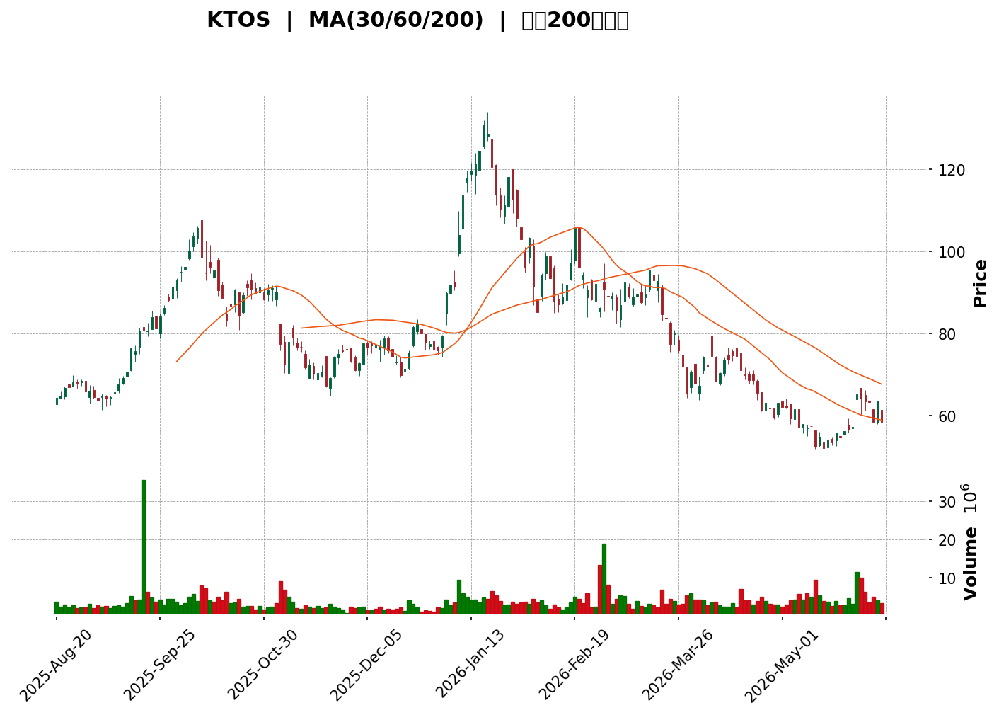
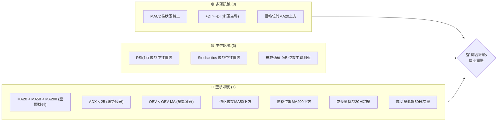
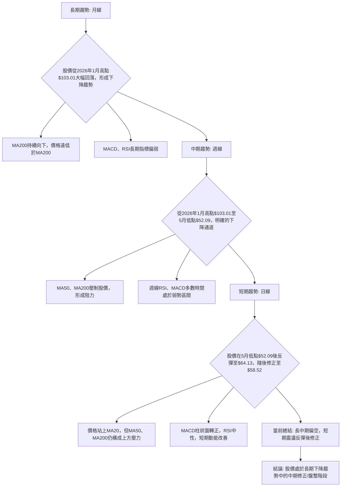

<details>
<summary>📊 靜態圖表 (點擊展開)</summary>

</details>

<html>
<head><meta charset="utf-8" /></head>
<body>
    <div style="height:500px; width:100%;">                        <script>window.PlotlyConfig = {MathJaxConfig: 'local'};</script>
        <script charset="utf-8" src="https://cdn.plot.ly/plotly-3.6.0.min.js" integrity="sha256-QaOVwtVY0T02VaHrr6pnoHLCwayMJp4O5n4YyaE3rJk=" crossorigin="anonymous"></script>                <div id="candlestick-chart" class="plotly-graph-div" style="height:100%; width:100%;"></div>            <script>                window.PLOTLYENV=window.PLOTLYENV || {};                                if (document.getElementById("candlestick-chart")) {                    Plotly.newPlot(                        "candlestick-chart",                        [{"close":{"dtype":"f8","bdata":"AAAAoEcRUEAAAACA6zFQQAAAAKBwrVBAAAAAoJm5UEAAAABAMwNRQAAAAEDh+lBAAAAA4KMgUUAAAACAwnVQQAAAAIDChVBAAAAAAAAgUEAAAAAghctPQAAAAADXM1BAAAAAwPUIUEAAAAAA1yNQQAAAAIA9alBAAAAAQOHqUEAAAADAzExRQAAAACBcr1FAAAAAYGYWU0AAAAAgXO9SQAAAAKCZKVRAAAAAoEcxVEAAAACAFC5UQAAAAKCZ+VRAAAAAIIVLVEAAAADAzAxVQAAAAIDrkVVAAAAAwB4FVkAAAAAgrtdWQAAAAKBwPVdAAAAAgOvBV0AAAAAAKQxYQAAAAAAAEFlAAAAAACnsWUAAAABA4WpaQAAAAEAzo1hAAAAA4FGoV0AAAACA6xFYQAAAAEAz01dAAAAAwB6lVkAAAAAgridWQAAAACCux1RAAAAAoJmpVUAAAAAgrqdWQAAAAEAzE1VAAAAA4HpUVkAAAAAghctWQAAAACCFq1ZAAAAAgOtxVkAAAACgcM1WQAAAAEAzE1ZAAAAAYGamVkAAAABgZsZWQAAAAIAUjlZAAAAAgD1aU0AAAACAPRpSQAAAAOBReFNAAAAAIIXLU0AAAACAwiVTQAAAAMDMLFNAAAAAACnsUUAAAADAzBxSQAAAACBcj1FAAAAAQAqXUUAAAABA4apRQAAAAADX01BAAAAAwPVIUUAAAABACodSQAAAAEAzw1JAAAAAoEfxUkAAAABgZgZTQAAAAKBwTVJAAAAAoHC9UUAAAACA6zFSQAAAACCFa1NAAAAAAAAgU0AAAACA60FTQAAAAIDrQVNAAAAAgD06U0AAAACA67FTQAAAAKBw\u002fVJAAAAA4KOQUkAAAADgUUhSQAAAAKBHcVFAAAAAoJnZUUAAAADA9dhSQAAAAIDrYVRAAAAAQDOTVEAAAACAFP5TQAAAAMDMbFNAAAAAgBReU0AAAABguP5SQAAAAIA9+lJAAAAAYI\u002fSU0AAAAAghXtWQAAAACCF+1ZAAAAAACncVkAAAABgjwJaQAAAAMDMbFxAAAAAQAp3XUAAAACAFO5dQAAAAAAAYF5AAAAAANcjX0AAAABACldgQAAAAIDCFWBAAAAAgMIlXkAAAABgZnZcQAAAAMD1mFtAAAAA4HrUW0AAAAAA14NdQAAAAEDhKlxAAAAAgD0KW0AAAADgo8BZQAAAAIA9ClhAAAAAIK7XWUAAAADAHtVWQAAAAAAAUFVAAAAAgD2aV0AAAAAA17NYQAAAAGC4XldAAAAAgOvxVUAAAABAM8NVQAAAAADXQ1ZAAAAAgBT+VkAAAACgcE1YQAAAAEDhalpAAAAAwB4FWEAAAAAA15NXQAAAACCFq1ZAAAAAYLgOVkAAAADA9QhXQAAAACCFi1VAAAAAgBSuVkAAAADAzDxWQAAAAOBRSFZAAAAAYI9iVUAAAAAAAMBVQAAAAIAUHldAAAAAoHA9VkAAAABA4TpWQAAAAKBwXVZAAAAAgOvhVUAAAACA62FWQAAAAADX01dAAAAAYI9CV0AAAACA6zFXQAAAACCuJ1VAAAAAACnsVEAAAAAgXF9TQAAAAGC4\u002flNAAAAAQAr3UkAAAAAAKfxRQAAAAIDrUVBAAAAA4KOgUUAAAADAzOxQQAAAAADX01BAAAAAgMKFUkAAAACgcP1RQAAAAKBwnVJAAAAAwB4VUUAAAACAwpVRQAAAAEAzY1JAAAAAgD1qUkAAAACAPapSQAAAAIA9mlJAAAAAIFy\u002fUUAAAADAHnVRQAAAAEAzI1FAAAAAQAonUUAAAACgR2FQQAAAAKBHoU5AAAAA4HqUT0AAAADgetROQAAAACCux01AAAAAYGaGT0AAAABgZgZPQAAAAEAK905AAAAAIK6nTUAAAABgj8JOQAAAAAAAgExAAAAAgOvxTEAAAABguH5MQAAAAIA9qkxAAAAAYLg+SkAAAADAzGxLQAAAACCFC0pAAAAAACkcS0AAAAAAKbxKQAAAAMD16EtAAAAAgMJVS0AAAABAChdMQAAAAGBmZkxAAAAAYGamTEAAAAAAKUxQQAAAAOBRCFBAAAAAYLi+T0AAAABgj6JPQAAAAEAKN01AAAAAQDOzT0AAAABgj0JNQA=="},"high":{"dtype":"f8","bdata":"AAAAANcjUEAAAACAwnVQQAAAAGCPwlBAAAAAoHAtUUAAAACAPXpRQAAAACBcL1FAAAAA4Ho0UUAAAAAgXB9RQAAAAIA92lBAAAAAQOHKUEAAAAAAKRxQQAAAAGCPUlBAAAAAAABAUEAAAADAHjVQQAAAAAAAsFBAAAAAwPVIUUAAAACgcG1RQAAAAADX01FAAAAAIK4nU0AAAACA60FTQAAAAAApXFRAAAAAANeTVEAAAADgUahUQAAAAGC4XlVAAAAAAABAVUAAAADgUThVQAAAAIDCtVVAAAAAQOFqVkAAAAAgrvdWQAAAAKBHYVdAAAAAoJkZWEAAAAAgrodYQAAAAAAAwFlAAAAAoHAtWkAAAAAA15NaQAAAAOB6JFxAAAAAoJmpWUAAAAAAAGBZQAAAAGBmRlhAAAAAIFyfWEAAAACAwiVXQAAAAKBHoVVAAAAAgBQuVkAAAABAM7NWQAAAAAAAgFZAAAAAwMx8VkAAAAAghTtXQAAAAGBmpldAAAAAwMwcV0AAAAAgrndXQAAAAAAAwFZAAAAAoJkJV0AAAACAFO5WQAAAAIDC5VZAAAAAAACgVEAAAACAFN5TQAAAAGBmllNAAAAAAACAVEAAAAAgXL9TQAAAAEDhilNAAAAAoJn5UkAAAACgR3FSQAAAAMDMPFJAAAAAAADQUUAAAAAghQtSQAAAAGC4nlJAAAAAgMJVUUAAAAAAKZxSQAAAACCFC1NAAAAAQOFKU0AAAAAgXB9TQAAAAGBmJlNAAAAAYGamUkAAAAAAAEBSQAAAAOB6lFNAAAAA4FGIU0AAAADgeoRTQAAAAIA96lNAAAAAoHCdU0AAAACAFN5TQAAAAKCZ2VNAAAAAQOEaU0AAAADgUahSQAAAACBcj1JAAAAAgD0aUkAAAABgj\u002fJSQAAAACCud1RAAAAAgD3aVEAAAAAAKXxUQAAAAIA9+lNAAAAAgBSOU0AAAAAAKYxTQAAAAIAUPlNAAAAAYLjuU0AAAABACodWQAAAAIDrAVdAAAAA4HrUV0AAAABAM3NbQAAAAMDM3FxAAAAA4FHoXUAAAADgemReQAAAAKBw\u002fV5AAAAAANeTX0AAAAAAAIBgQAAAAAAAwGBAAAAAAAAAYEAAAABAM1NeQAAAAIDr4VxAAAAAQOFqXEAAAADA9YhdQAAAAAAAAF5AAAAAwMzMXEAAAAAAADBbQAAAAMD1SFlAAAAAIFzfWUAAAAAAAMBZQAAAAGBmJldAAAAAQOGqV0AAAACA6\u002fFYQAAAAAAA4FhAAAAAQDMjWEAAAACAwmVWQAAAACBcD1dAAAAAYGZWV0AAAAAAACBZQAAAAIA9elpAAAAAQOGqWkAAAADAHsVXQAAAACBc71ZAAAAAgOtRV0AAAAAAKRxXQAAAAKCZmVVAAAAAYGZGWEAAAACAFE5XQAAAAGBmhlZAAAAAIFxfVkAAAADgUbhWQAAAAEDhaldAAAAAQDMTV0AAAABguL5WQAAAACCu11ZAAAAAoJn5VkAAAABAM\u002fNWQAAAAGBm1ldAAAAA4FE4WEAAAAAAAKBXQAAAAAAAAFdAAAAAANeTVUAAAACgR8FUQAAAAAApPFRAAAAAgOvhU0AAAADgURhTQAAAAKCZ+VFAAAAAgBS+UUAAAABAMzNSQAAAAOCjYFFAAAAAgD2aUkAAAACgmTlSQAAAAAAp3FNAAAAAAACgUkAAAACA66FRQAAAAGBmhlJAAAAA4HokU0AAAABgjxJTQAAAAIAUTlNAAAAAwPU4U0AAAACgcO1RQAAAAKCZuVFAAAAAYLi+UUAAAAAgXC9RQAAAAOCjcFBAAAAAIIUbUEAAAACgmVlPQAAAAKBH4U5AAAAAQAqXT0AAAAAAAMBPQAAAAOBRCFBAAAAAwB5lT0AAAABguN5OQAAAAMAexU5AAAAA4FH4TEAAAABA4dpMQAAAAOCjUE1AAAAAAABATEAAAAAAKfxLQAAAAEAz80pAAAAAAClcS0AAAAAghUtLQAAAAOCj8EtAAAAAANeDS0AAAAAAAGBMQAAAAGBmpk1AAAAAgBSuTEAAAADAHrVQQAAAAAAAsFBAAAAAwMyMUEAAAABAM9NPQAAAAMDM7E5AAAAAIIXLT0AAAADAzAxPQA=="},"hovertemplate":"\u003cb\u003e%{x|%Y-%m-%d}\u003c\u002fb\u003e\u003cbr\u003e\u958b: $%{open:.2f}\u003cbr\u003e\u9ad8: $%{high:.2f}\u003cbr\u003e\u4f4e: $%{low:.2f}\u003cbr\u003e\u6536: $%{close:.2f}\u003cextra\u003e\u003c\u002fextra\u003e","low":{"dtype":"f8","bdata":"AAAAQOFaTkAAAAAA1wNQQAAAAGCPAlBAAAAAIK63UEAAAAAAAMBQQAAAAAAAoFBAAAAAoEfRUEAAAADA9WhQQAAAAGCPgk9AAAAAANcDUEAAAAAAAOBOQAAAAEAzs05AAAAAgD0qT0AAAADgelRPQAAAAAApDFBAAAAAYGZmUEAAAACgmelQQAAAAKCZ+VBAAAAAwB61UUAAAABACkdSQAAAAKBHwVJAAAAAoJn5U0AAAABAM9NTQAAAAGBmRlRAAAAAYGY2VEAAAAAgrrdTQAAAACCFG1VAAAAAQDPzVUAAAABgZgZWQAAAAOBRKFZAAAAAgOshV0AAAABACndXQAAAAKBHgVhAAAAAAAAAWUAAAACgmXlZQAAAAEAzM1hAAAAAoJk5V0AAAABA4apXQAAAAGCPslZAAAAAgD1KVkAAAAAgXB9WQAAAAKBwbVRAAAAAwMxMVUAAAADAzExVQAAAAADXM1RAAAAAIK43VUAAAAAghUtWQAAAAOCjEFZAAAAAAClsVkAAAACgcH1WQAAAAGCPAlZAAAAAgD36VUAAAADAzPxVQAAAAOB6tFVAAAAAYGb2UkAAAACgR5FRQAAAAKCZKVFAAAAAQDNDU0AAAADA9fhSQAAAAAAA4FJAAAAAANfTUUAAAAAAAEBRQAAAAGBmNlFAAAAAgOvxUEAAAABAM1NRQAAAAIA9ulBAAAAAQDMzUEAAAADA9UhRQAAAAKCZKVJAAAAAANfTUkAAAADgo8BSQAAAACCFO1JAAAAAIK63UUAAAAAghWtRQAAAAIDrEVJAAAAA4KOwUkAAAACgmclSQAAAAADXA1NAAAAAwMxMUkAAAABAM7NSQAAAAMDMzFJAAAAAYGZGUkAAAABA4RpSQAAAAADXU1FAAAAAwPWIUUAAAABguM5RQAAAAADXM1NAAAAAYGb2U0AAAACA69FTQAAAAGBmBlNAAAAAoJkJU0AAAABAM\u002fNSQAAAAOBRuFJAAAAAwB6VUkAAAADgUYhUQAAAAMDMrFVAAAAA4KOgVkAAAACgR7FYQAAAAKCZKVpAAAAAAACgXEAAAADAzExdQAAAAAAAgFxAAAAAoEdRXUAAAAAAAEBfQAAAAAAAwF9AAAAAgOuRXEAAAABguM5bQAAAAEAKF1tAAAAAoEexWkAAAAAA18NbQAAAAOCjUFtAAAAAgMKFWkAAAADgUWhZQAAAAKBHsVdAAAAAoJlJWEAAAABA4bpVQAAAAAAAIFVAAAAAAAAAVkAAAADAzExXQAAAAKBwTVdAAAAAoEdBVUAAAAAAAFBVQAAAAKBHwVVAAAAA4HrEVUAAAADAzDxXQAAAAGC4PlhAAAAAIIXbV0AAAAAAAMBWQAAAAGCPAlVAAAAAoHANVkAAAADA9ahVQAAAAAAAAFVAAAAAwB5VVUAAAABgZqZVQAAAAAAAcFVAAAAAoJmZVEAAAAAAAGBUQAAAAMDMzFVAAAAAwPUoVkAAAAAgrqdVQAAAAMD1WFVAAAAAwMzMVUAAAACgmblVQAAAACBcj1ZAAAAAgD0qV0AAAADA9ehVQAAAAGBmxlRAAAAA4HqEVEAAAACgR+FSQAAAAADXU1NAAAAAoJnJUkAAAADAzOxRQAAAACCuF1BAAAAAQDNjUEAAAABgZuZQQAAAACCF609AAAAAwMyMUUAAAABAM3NRQAAAAEAzI1JAAAAAgOsRUUAAAAAghdtQQAAAAEAKZ1FAAAAAoEchUkAAAAAAAFBSQAAAAOCjQFJAAAAAgD2aUUAAAABACjdRQAAAAOB69FBAAAAAwPXoUEAAAADAHuVPQAAAAKBHgU5AAAAA4FGYTkAAAAAAKRxOQAAAACCuh01AAAAAgOvRTUAAAACgmXlOQAAAAKBH4U5AAAAAoEcBTUAAAABACjdNQAAAAMAeJUxAAAAAoHDdS0AAAACgR4FLQAAAAIAUjktAAAAAIIXrSUAAAABguD5KQAAAAOB61ElAAAAAgD0KSkAAAAAA12NKQAAAAEAzU0pAAAAAIK7nSkAAAABA4TpLQAAAAEAz80tAAAAAAACAS0AAAAAAAIBOQAAAAIA9Ck5AAAAAQDOTTkAAAABACtdOQAAAAEAz80xAAAAA4FH4TEAAAAAAAMBMQA=="},"name":"\u50f9\u683c","open":{"dtype":"f8","bdata":"AAAAoHBdT0AAAADA9QhQQAAAAAApLFBAAAAAgD3qUEAAAAAAAMBQQAAAAKBHEVFAAAAAYI8CUUAAAAAgXB9RQAAAAIA9GlBAAAAAgOuRUEAAAABAMxNQQAAAAAAAIFBAAAAAgMI1UEAAAADgUQhQQAAAAGBmVlBAAAAAgMKFUEAAAAAgXO9QQAAAAMDMXFFAAAAAANfDUUAAAADgo8BSQAAAAKCZKVNAAAAAoEdhVEAAAABACidUQAAAAGBmRlRAAAAAIK4XVUAAAAAAAABUQAAAAAAAQFVAAAAAwMw8VkAAAADA9RhWQAAAAAAAoFZAAAAAAADAV0AAAAAAKexXQAAAAGBmllhAAAAAoJlJWUAAAADgesRZQAAAAMD16FpAAAAAwMysV0AAAACAFF5YQAAAAIAUbldAAAAAwMx8WEAAAAAgXP9WQAAAAEDhOlVAAAAAgOvRVUAAAABACsdVQAAAAAAAgFZAAAAAwMxMVUAAAADgUQhXQAAAAOB6RFdAAAAA4HrEVkAAAAAAAIBWQAAAAAAAgFZAAAAAAABgVkAAAADAHrVWQAAAAGC4DlZAAAAAIK6XVEAAAADAzHxTQAAAAEAzk1FAAAAAIIVbVEAAAABguG5TQAAAAIDrMVNAAAAAACm8UkAAAACAPUpRQAAAAIDCBVJAAAAAIFwvUUAAAADAHmVRQAAAAGC4nlJAAAAAANezUEAAAABA4VpRQAAAAIA9ilJAAAAAQDPzUkAAAABguA5TQAAAAGBmJlNAAAAAIK6HUkAAAADgo8BRQAAAAKBHIVJAAAAAAClsU0AAAACAwmVTQAAAAOB6JFNAAAAAAAAAU0AAAAAgXC9TQAAAACCFu1NAAAAAoEcRU0AAAAAAAEBSQAAAAOBRSFJAAAAAACm8UUAAAACA6+FRQAAAAAAAQFNAAAAAgBQeVEAAAABACkdUQAAAAIA9+lNAAAAAoHA9U0AAAAAAKYxTQAAAAEAzM1NAAAAAQDMjU0AAAACAPTpVQAAAAMD1eFZAAAAA4FEoV0AAAACA6+FYQAAAAGC4XlpAAAAAYGY2XUAAAACAPbpdQAAAAAAAoF1AAAAAwPX4XUAAAACgcG1fQAAAACCFA2BAAAAAYI\u002fiX0AAAADgo0BeQAAAAMAedVxAAAAAwMwsW0AAAAAA18NbQAAAAAAAAF5AAAAA4FG4XEAAAADgenRaQAAAAIA9+lhAAAAAYGamWEAAAACgcF1ZQAAAAIAUHlZAAAAAYGZGVkAAAABgZqZXQAAAAOB6tFhAAAAAgD36V0AAAACgmRlWQAAAACBcz1VAAAAAwB4FVkAAAADA9UhXQAAAAKBwbVhAAAAAAClsWkAAAACgR1FXQAAAAAAAMFZAAAAAACk8V0AAAAAAKfxVQAAAAEAzU1VAAAAAQOEaV0AAAACgcE1WQAAAAOCjIFZAAAAAYGY2VkAAAADgUdhUQAAAAEAK91VAAAAAACncVkAAAACA68FVQAAAAAApPFZAAAAAAACAVkAAAACAwjVWQAAAAEAKt1ZAAAAAgD2aV0AAAADgo6BWQAAAAMDM3FZAAAAAgML1VEAAAABA4apUQAAAAGCP8lNAAAAA4FGYU0AAAABACrdSQAAAAOCj8FFAAAAAoJm5UEAAAADA9ShSQAAAAIDrUVBAAAAA4FHIUUAAAAAAABBSQAAAAOBR2FNAAAAAwMyMUkAAAACgRwFRQAAAAGBmhlFAAAAAgD2qUkAAAAAAKexSQAAAAADXE1NAAAAAIIXbUkAAAABgj4JRQAAAAOCjkFFAAAAAIK6HUUAAAADAzBxRQAAAAOCjcFBAAAAA4FGYTkAAAADgUfhOQAAAAGC43k5AAAAAwB4lTkAAAADgerRPQAAAAAApPE9AAAAA4FFYT0AAAACAPYpNQAAAAMAexU5AAAAAgD2KTEAAAAAgXG9MQAAAACCFq0xAAAAA4Ho0TEAAAACgR2FKQAAAAGC4vkpAAAAAoEchSkAAAABguB5LQAAAAKCZ+UpAAAAAAACAS0AAAADAHqVLQAAAAOB61ExAAAAAoHB9TEAAAABA4fpPQAAAAIA9qlBAAAAAACk8UEAAAADA9chPQAAAACBcz05AAAAAgBQuTUAAAACAwrVOQA=="},"x":["2025-08-20T00:00:00-04:00","2025-08-21T00:00:00-04:00","2025-08-22T00:00:00-04:00","2025-08-25T00:00:00-04:00","2025-08-26T00:00:00-04:00","2025-08-27T00:00:00-04:00","2025-08-28T00:00:00-04:00","2025-08-29T00:00:00-04:00","2025-09-02T00:00:00-04:00","2025-09-03T00:00:00-04:00","2025-09-04T00:00:00-04:00","2025-09-05T00:00:00-04:00","2025-09-08T00:00:00-04:00","2025-09-09T00:00:00-04:00","2025-09-10T00:00:00-04:00","2025-09-11T00:00:00-04:00","2025-09-12T00:00:00-04:00","2025-09-15T00:00:00-04:00","2025-09-16T00:00:00-04:00","2025-09-17T00:00:00-04:00","2025-09-18T00:00:00-04:00","2025-09-19T00:00:00-04:00","2025-09-22T00:00:00-04:00","2025-09-23T00:00:00-04:00","2025-09-24T00:00:00-04:00","2025-09-25T00:00:00-04:00","2025-09-26T00:00:00-04:00","2025-09-29T00:00:00-04:00","2025-09-30T00:00:00-04:00","2025-10-01T00:00:00-04:00","2025-10-02T00:00:00-04:00","2025-10-03T00:00:00-04:00","2025-10-06T00:00:00-04:00","2025-10-07T00:00:00-04:00","2025-10-08T00:00:00-04:00","2025-10-09T00:00:00-04:00","2025-10-10T00:00:00-04:00","2025-10-13T00:00:00-04:00","2025-10-14T00:00:00-04:00","2025-10-15T00:00:00-04:00","2025-10-16T00:00:00-04:00","2025-10-17T00:00:00-04:00","2025-10-20T00:00:00-04:00","2025-10-21T00:00:00-04:00","2025-10-22T00:00:00-04:00","2025-10-23T00:00:00-04:00","2025-10-24T00:00:00-04:00","2025-10-27T00:00:00-04:00","2025-10-28T00:00:00-04:00","2025-10-29T00:00:00-04:00","2025-10-30T00:00:00-04:00","2025-10-31T00:00:00-04:00","2025-11-03T00:00:00-05:00","2025-11-04T00:00:00-05:00","2025-11-05T00:00:00-05:00","2025-11-06T00:00:00-05:00","2025-11-07T00:00:00-05:00","2025-11-10T00:00:00-05:00","2025-11-11T00:00:00-05:00","2025-11-12T00:00:00-05:00","2025-11-13T00:00:00-05:00","2025-11-14T00:00:00-05:00","2025-11-17T00:00:00-05:00","2025-11-18T00:00:00-05:00","2025-11-19T00:00:00-05:00","2025-11-20T00:00:00-05:00","2025-11-21T00:00:00-05:00","2025-11-24T00:00:00-05:00","2025-11-25T00:00:00-05:00","2025-11-26T00:00:00-05:00","2025-11-28T00:00:00-05:00","2025-12-01T00:00:00-05:00","2025-12-02T00:00:00-05:00","2025-12-03T00:00:00-05:00","2025-12-04T00:00:00-05:00","2025-12-05T00:00:00-05:00","2025-12-08T00:00:00-05:00","2025-12-09T00:00:00-05:00","2025-12-10T00:00:00-05:00","2025-12-11T00:00:00-05:00","2025-12-12T00:00:00-05:00","2025-12-15T00:00:00-05:00","2025-12-16T00:00:00-05:00","2025-12-17T00:00:00-05:00","2025-12-18T00:00:00-05:00","2025-12-19T00:00:00-05:00","2025-12-22T00:00:00-05:00","2025-12-23T00:00:00-05:00","2025-12-24T00:00:00-05:00","2025-12-26T00:00:00-05:00","2025-12-29T00:00:00-05:00","2025-12-30T00:00:00-05:00","2025-12-31T00:00:00-05:00","2026-01-02T00:00:00-05:00","2026-01-05T00:00:00-05:00","2026-01-06T00:00:00-05:00","2026-01-07T00:00:00-05:00","2026-01-08T00:00:00-05:00","2026-01-09T00:00:00-05:00","2026-01-12T00:00:00-05:00","2026-01-13T00:00:00-05:00","2026-01-14T00:00:00-05:00","2026-01-15T00:00:00-05:00","2026-01-16T00:00:00-05:00","2026-01-20T00:00:00-05:00","2026-01-21T00:00:00-05:00","2026-01-22T00:00:00-05:00","2026-01-23T00:00:00-05:00","2026-01-26T00:00:00-05:00","2026-01-27T00:00:00-05:00","2026-01-28T00:00:00-05:00","2026-01-29T00:00:00-05:00","2026-01-30T00:00:00-05:00","2026-02-02T00:00:00-05:00","2026-02-03T00:00:00-05:00","2026-02-04T00:00:00-05:00","2026-02-05T00:00:00-05:00","2026-02-06T00:00:00-05:00","2026-02-09T00:00:00-05:00","2026-02-10T00:00:00-05:00","2026-02-11T00:00:00-05:00","2026-02-12T00:00:00-05:00","2026-02-13T00:00:00-05:00","2026-02-17T00:00:00-05:00","2026-02-18T00:00:00-05:00","2026-02-19T00:00:00-05:00","2026-02-20T00:00:00-05:00","2026-02-23T00:00:00-05:00","2026-02-24T00:00:00-05:00","2026-02-25T00:00:00-05:00","2026-02-26T00:00:00-05:00","2026-02-27T00:00:00-05:00","2026-03-02T00:00:00-05:00","2026-03-03T00:00:00-05:00","2026-03-04T00:00:00-05:00","2026-03-05T00:00:00-05:00","2026-03-06T00:00:00-05:00","2026-03-09T00:00:00-04:00","2026-03-10T00:00:00-04:00","2026-03-11T00:00:00-04:00","2026-03-12T00:00:00-04:00","2026-03-13T00:00:00-04:00","2026-03-16T00:00:00-04:00","2026-03-17T00:00:00-04:00","2026-03-18T00:00:00-04:00","2026-03-19T00:00:00-04:00","2026-03-20T00:00:00-04:00","2026-03-23T00:00:00-04:00","2026-03-24T00:00:00-04:00","2026-03-25T00:00:00-04:00","2026-03-26T00:00:00-04:00","2026-03-27T00:00:00-04:00","2026-03-30T00:00:00-04:00","2026-03-31T00:00:00-04:00","2026-04-01T00:00:00-04:00","2026-04-02T00:00:00-04:00","2026-04-06T00:00:00-04:00","2026-04-07T00:00:00-04:00","2026-04-08T00:00:00-04:00","2026-04-09T00:00:00-04:00","2026-04-10T00:00:00-04:00","2026-04-13T00:00:00-04:00","2026-04-14T00:00:00-04:00","2026-04-15T00:00:00-04:00","2026-04-16T00:00:00-04:00","2026-04-17T00:00:00-04:00","2026-04-20T00:00:00-04:00","2026-04-21T00:00:00-04:00","2026-04-22T00:00:00-04:00","2026-04-23T00:00:00-04:00","2026-04-24T00:00:00-04:00","2026-04-27T00:00:00-04:00","2026-04-28T00:00:00-04:00","2026-04-29T00:00:00-04:00","2026-04-30T00:00:00-04:00","2026-05-01T00:00:00-04:00","2026-05-04T00:00:00-04:00","2026-05-05T00:00:00-04:00","2026-05-06T00:00:00-04:00","2026-05-07T00:00:00-04:00","2026-05-08T00:00:00-04:00","2026-05-11T00:00:00-04:00","2026-05-12T00:00:00-04:00","2026-05-13T00:00:00-04:00","2026-05-14T00:00:00-04:00","2026-05-15T00:00:00-04:00","2026-05-18T00:00:00-04:00","2026-05-19T00:00:00-04:00","2026-05-20T00:00:00-04:00","2026-05-21T00:00:00-04:00","2026-05-22T00:00:00-04:00","2026-05-26T00:00:00-04:00","2026-05-27T00:00:00-04:00","2026-05-28T00:00:00-04:00","2026-05-29T00:00:00-04:00","2026-06-01T00:00:00-04:00","2026-06-02T00:00:00-04:00","2026-06-03T00:00:00-04:00","2026-06-04T00:00:00-04:00","2026-06-05T00:00:00-04:00"],"type":"candlestick"},{"hovertemplate":"MA30: $%{y:.2f}\u003cextra\u003e\u003c\u002fextra\u003e","line":{"color":"#2196F3","dash":"dash","width":2},"mode":"lines","name":"MA30","x":["2025-08-20T00:00:00-04:00","2025-08-21T00:00:00-04:00","2025-08-22T00:00:00-04:00","2025-08-25T00:00:00-04:00","2025-08-26T00:00:00-04:00","2025-08-27T00:00:00-04:00","2025-08-28T00:00:00-04:00","2025-08-29T00:00:00-04:00","2025-09-02T00:00:00-04:00","2025-09-03T00:00:00-04:00","2025-09-04T00:00:00-04:00","2025-09-05T00:00:00-04:00","2025-09-08T00:00:00-04:00","2025-09-09T00:00:00-04:00","2025-09-10T00:00:00-04:00","2025-09-11T00:00:00-04:00","2025-09-12T00:00:00-04:00","2025-09-15T00:00:00-04:00","2025-09-16T00:00:00-04:00","2025-09-17T00:00:00-04:00","2025-09-18T00:00:00-04:00","2025-09-19T00:00:00-04:00","2025-09-22T00:00:00-04:00","2025-09-23T00:00:00-04:00","2025-09-24T00:00:00-04:00","2025-09-25T00:00:00-04:00","2025-09-26T00:00:00-04:00","2025-09-29T00:00:00-04:00","2025-09-30T00:00:00-04:00","2025-10-01T00:00:00-04:00","2025-10-02T00:00:00-04:00","2025-10-03T00:00:00-04:00","2025-10-06T00:00:00-04:00","2025-10-07T00:00:00-04:00","2025-10-08T00:00:00-04:00","2025-10-09T00:00:00-04:00","2025-10-10T00:00:00-04:00","2025-10-13T00:00:00-04:00","2025-10-14T00:00:00-04:00","2025-10-15T00:00:00-04:00","2025-10-16T00:00:00-04:00","2025-10-17T00:00:00-04:00","2025-10-20T00:00:00-04:00","2025-10-21T00:00:00-04:00","2025-10-22T00:00:00-04:00","2025-10-23T00:00:00-04:00","2025-10-24T00:00:00-04:00","2025-10-27T00:00:00-04:00","2025-10-28T00:00:00-04:00","2025-10-29T00:00:00-04:00","2025-10-30T00:00:00-04:00","2025-10-31T00:00:00-04:00","2025-11-03T00:00:00-05:00","2025-11-04T00:00:00-05:00","2025-11-05T00:00:00-05:00","2025-11-06T00:00:00-05:00","2025-11-07T00:00:00-05:00","2025-11-10T00:00:00-05:00","2025-11-11T00:00:00-05:00","2025-11-12T00:00:00-05:00","2025-11-13T00:00:00-05:00","2025-11-14T00:00:00-05:00","2025-11-17T00:00:00-05:00","2025-11-18T00:00:00-05:00","2025-11-19T00:00:00-05:00","2025-11-20T00:00:00-05:00","2025-11-21T00:00:00-05:00","2025-11-24T00:00:00-05:00","2025-11-25T00:00:00-05:00","2025-11-26T00:00:00-05:00","2025-11-28T00:00:00-05:00","2025-12-01T00:00:00-05:00","2025-12-02T00:00:00-05:00","2025-12-03T00:00:00-05:00","2025-12-04T00:00:00-05:00","2025-12-05T00:00:00-05:00","2025-12-08T00:00:00-05:00","2025-12-09T00:00:00-05:00","2025-12-10T00:00:00-05:00","2025-12-11T00:00:00-05:00","2025-12-12T00:00:00-05:00","2025-12-15T00:00:00-05:00","2025-12-16T00:00:00-05:00","2025-12-17T00:00:00-05:00","2025-12-18T00:00:00-05:00","2025-12-19T00:00:00-05:00","2025-12-22T00:00:00-05:00","2025-12-23T00:00:00-05:00","2025-12-24T00:00:00-05:00","2025-12-26T00:00:00-05:00","2025-12-29T00:00:00-05:00","2025-12-30T00:00:00-05:00","2025-12-31T00:00:00-05:00","2026-01-02T00:00:00-05:00","2026-01-05T00:00:00-05:00","2026-01-06T00:00:00-05:00","2026-01-07T00:00:00-05:00","2026-01-08T00:00:00-05:00","2026-01-09T00:00:00-05:00","2026-01-12T00:00:00-05:00","2026-01-13T00:00:00-05:00","2026-01-14T00:00:00-05:00","2026-01-15T00:00:00-05:00","2026-01-16T00:00:00-05:00","2026-01-20T00:00:00-05:00","2026-01-21T00:00:00-05:00","2026-01-22T00:00:00-05:00","2026-01-23T00:00:00-05:00","2026-01-26T00:00:00-05:00","2026-01-27T00:00:00-05:00","2026-01-28T00:00:00-05:00","2026-01-29T00:00:00-05:00","2026-01-30T00:00:00-05:00","2026-02-02T00:00:00-05:00","2026-02-03T00:00:00-05:00","2026-02-04T00:00:00-05:00","2026-02-05T00:00:00-05:00","2026-02-06T00:00:00-05:00","2026-02-09T00:00:00-05:00","2026-02-10T00:00:00-05:00","2026-02-11T00:00:00-05:00","2026-02-12T00:00:00-05:00","2026-02-13T00:00:00-05:00","2026-02-17T00:00:00-05:00","2026-02-18T00:00:00-05:00","2026-02-19T00:00:00-05:00","2026-02-20T00:00:00-05:00","2026-02-23T00:00:00-05:00","2026-02-24T00:00:00-05:00","2026-02-25T00:00:00-05:00","2026-02-26T00:00:00-05:00","2026-02-27T00:00:00-05:00","2026-03-02T00:00:00-05:00","2026-03-03T00:00:00-05:00","2026-03-04T00:00:00-05:00","2026-03-05T00:00:00-05:00","2026-03-06T00:00:00-05:00","2026-03-09T00:00:00-04:00","2026-03-10T00:00:00-04:00","2026-03-11T00:00:00-04:00","2026-03-12T00:00:00-04:00","2026-03-13T00:00:00-04:00","2026-03-16T00:00:00-04:00","2026-03-17T00:00:00-04:00","2026-03-18T00:00:00-04:00","2026-03-19T00:00:00-04:00","2026-03-20T00:00:00-04:00","2026-03-23T00:00:00-04:00","2026-03-24T00:00:00-04:00","2026-03-25T00:00:00-04:00","2026-03-26T00:00:00-04:00","2026-03-27T00:00:00-04:00","2026-03-30T00:00:00-04:00","2026-03-31T00:00:00-04:00","2026-04-01T00:00:00-04:00","2026-04-02T00:00:00-04:00","2026-04-06T00:00:00-04:00","2026-04-07T00:00:00-04:00","2026-04-08T00:00:00-04:00","2026-04-09T00:00:00-04:00","2026-04-10T00:00:00-04:00","2026-04-13T00:00:00-04:00","2026-04-14T00:00:00-04:00","2026-04-15T00:00:00-04:00","2026-04-16T00:00:00-04:00","2026-04-17T00:00:00-04:00","2026-04-20T00:00:00-04:00","2026-04-21T00:00:00-04:00","2026-04-22T00:00:00-04:00","2026-04-23T00:00:00-04:00","2026-04-24T00:00:00-04:00","2026-04-27T00:00:00-04:00","2026-04-28T00:00:00-04:00","2026-04-29T00:00:00-04:00","2026-04-30T00:00:00-04:00","2026-05-01T00:00:00-04:00","2026-05-04T00:00:00-04:00","2026-05-05T00:00:00-04:00","2026-05-06T00:00:00-04:00","2026-05-07T00:00:00-04:00","2026-05-08T00:00:00-04:00","2026-05-11T00:00:00-04:00","2026-05-12T00:00:00-04:00","2026-05-13T00:00:00-04:00","2026-05-14T00:00:00-04:00","2026-05-15T00:00:00-04:00","2026-05-18T00:00:00-04:00","2026-05-19T00:00:00-04:00","2026-05-20T00:00:00-04:00","2026-05-21T00:00:00-04:00","2026-05-22T00:00:00-04:00","2026-05-26T00:00:00-04:00","2026-05-27T00:00:00-04:00","2026-05-28T00:00:00-04:00","2026-05-29T00:00:00-04:00","2026-06-01T00:00:00-04:00","2026-06-02T00:00:00-04:00","2026-06-03T00:00:00-04:00","2026-06-04T00:00:00-04:00","2026-06-05T00:00:00-04:00"],"y":{"dtype":"f8","bdata":"AAAAAAAA+H8AAAAAAAD4fwAAAAAAAPh\u002fAAAAAAAA+H8AAAAAAAD4fwAAAAAAAPh\u002fAAAAAAAA+H8AAAAAAAD4fwAAAAAAAPh\u002fAAAAAAAA+H8AAAAAAAD4fwAAAAAAAPh\u002fAAAAAAAA+H8AAAAAAAD4fwAAAAAAAPh\u002fAAAAAAAA+H8AAAAAAAD4fwAAAAAAAPh\u002fAAAAAAAA+H8AAAAAAAD4fwAAAAAAAPh\u002fAAAAAAAA+H8AAAAAAAD4fwAAAAAAAPh\u002fAAAAAAAA+H8AAAAAAAD4fwAAAAAAAPh\u002fAAAAAAAA+H8AAAAAAAD4f3d3dz8ZTVJAd3d3T7iOUkBERERcutFSQERERKxHGVNAMzMz68NnU0C8u7tzBbhTQM3MzIRd+VNAzczMhBYxVECamZnRBnJUQImIiGBXsFRAERERifrnVEARERFBYB1VQFVVVfVvRFVAvLu7a3V0VUCJiIioDaxVQFVVVZXR01VA7+7uXgECVkAiIiJi5TBWQImIiEhvW1ZAq6qq2hV4VkCamZmJFplWQFVVVXVoqVZAMzMz82C+VkAAAADQhdRWQAAAAGAB4lZAREREdPbZVkC8u7uLz8BWQGZmZgbkrlZAAAAAcOebVkBVVVWVX3xWQERERHSvWVZAREREtOQnVkDv7u5+P\u002fVVQImIiAg6tVVAiYiIaB9uVUDe3d29dCNVQImIiIjP4FRAiYiImG6qVEAiIiLSIntUQO\u002fu7p7vT1RAIiIiYlcwVECrqqrKoRVUQLy7u5t9AFRAZmZmxgTfU0ARERHB9bhTQJqZmVnWqlNAvLu763yPU0AiIiIiTXFTQJqZmWkuVFNA3t3drbk4U0De3d09NR5TQERERPThA1NAMzMzIwbhUkDv7u4esLpSQBEREbEPj1JA3t3dbT2CUkB3d3fnmIhSQKuqqkpikFJAq6qqOgqXUkCamZkpQJ5SQLy7u0tioFJAIiIi8rasUkDNzMzMPrRSQBEREWFXwFJAmpmZWWTTUkARERHhevxSQO\u002fu7q4AMVNAVVVVdZNgU0Crqqo6baBTQHd3d0fh8lNAiYiICKxMVEDv7u5euqlUQGZmZia\u002fEFVAVVVV5ReDVUDNzMzcsv5VQImIiKh\u002fa1ZAzczMrI7JVkDe3d1NGxhXQAAAAFBGX1dAIiIiwq6oV0AAAADgevxXQN7d3W3LSlhAmpmZWR2TWEARERHR29JYQHd3d0coC1lAmpmZKVxPWUB3d3eHXXFZQFVVVSVNeVlAIiIi0iKTWUCJiIj4U7tZQFVVVfX93FlAd3d3l\u002fzyWUCamZlJmgpaQAAAAPCnJlpAiYiI6LRBWkAiIiLCPFFaQBEREaGMblpAAAAAsHJ4WkDv7u7OsGNaQCIiItKUMlpARERE5F7zWUCJiIiIiLhZQKuqqhovbVlARERE9P0kWUBmZmb24ctYQERERGSCd1hAvLu7a7wsWEDe3d29dPNXQImIiAg6zVdA3t3dfYadV0CrqqoqXF9XQJqZmWnYLVdA3t3drdUBV0DNzMzME+VWQFVVVZVD41ZAZmZmBjrNVkCrqqrqUdBWQKuqqtr5zlZA3t3dTRu4VkDe3d29n4pWQBEREfHSbVZAiYiICGVUVkBVVVX1KDRWQImIiOhtAVZAMzMz46XTVUDe3d19sZRVQBEREdHbQlVAd3d3V\u002fITVUAzMzNDRORUQKuqqvqpwVRAzczM7DWXVEB3d3c3tGhUQN7d3Y3CTVRAVVVVhV0pVEB3d3dH4QpUQDMzMzN661NAVVVV9W\u002fMU0CamZnZzqdTQHd3d1fHdFNAd3d3h11JU0AiIiICchdTQERERAxJ21JAd3d3x0unUkAzMzML12tSQHd3d8eSH1JAVVVVPZjfUUAAAACQCZ5RQLy7u8uhbVFAiYiIEJ85UUARERFRjRdRQLy7uyuH5lBAd3d3JzHAUEDe3d11TKBQQLy7u7NWj1BAERERYeVoUEARERGRe01QQDMzM2sDLVBAiYiIwJ8CUEDv7u5+W7ZPQFVVVaXTZk9Ad3d3R4ssT0CamZnJIPBOQBEREVGpqE5ARERE1NtiTkAAAAAQdDpOQN7d3Y2XDk5A7+7ujpfuTUCamZlJmtJNQLy7u4tsp01AZmZm1jGRTUCamZn5U3NNQA=="},"type":"scatter"},{"hovertemplate":"MA60: $%{y:.2f}\u003cextra\u003e\u003c\u002fextra\u003e","line":{"color":"#9C27B0","dash":"dash","width":2},"mode":"lines","name":"MA60","x":["2025-08-20T00:00:00-04:00","2025-08-21T00:00:00-04:00","2025-08-22T00:00:00-04:00","2025-08-25T00:00:00-04:00","2025-08-26T00:00:00-04:00","2025-08-27T00:00:00-04:00","2025-08-28T00:00:00-04:00","2025-08-29T00:00:00-04:00","2025-09-02T00:00:00-04:00","2025-09-03T00:00:00-04:00","2025-09-04T00:00:00-04:00","2025-09-05T00:00:00-04:00","2025-09-08T00:00:00-04:00","2025-09-09T00:00:00-04:00","2025-09-10T00:00:00-04:00","2025-09-11T00:00:00-04:00","2025-09-12T00:00:00-04:00","2025-09-15T00:00:00-04:00","2025-09-16T00:00:00-04:00","2025-09-17T00:00:00-04:00","2025-09-18T00:00:00-04:00","2025-09-19T00:00:00-04:00","2025-09-22T00:00:00-04:00","2025-09-23T00:00:00-04:00","2025-09-24T00:00:00-04:00","2025-09-25T00:00:00-04:00","2025-09-26T00:00:00-04:00","2025-09-29T00:00:00-04:00","2025-09-30T00:00:00-04:00","2025-10-01T00:00:00-04:00","2025-10-02T00:00:00-04:00","2025-10-03T00:00:00-04:00","2025-10-06T00:00:00-04:00","2025-10-07T00:00:00-04:00","2025-10-08T00:00:00-04:00","2025-10-09T00:00:00-04:00","2025-10-10T00:00:00-04:00","2025-10-13T00:00:00-04:00","2025-10-14T00:00:00-04:00","2025-10-15T00:00:00-04:00","2025-10-16T00:00:00-04:00","2025-10-17T00:00:00-04:00","2025-10-20T00:00:00-04:00","2025-10-21T00:00:00-04:00","2025-10-22T00:00:00-04:00","2025-10-23T00:00:00-04:00","2025-10-24T00:00:00-04:00","2025-10-27T00:00:00-04:00","2025-10-28T00:00:00-04:00","2025-10-29T00:00:00-04:00","2025-10-30T00:00:00-04:00","2025-10-31T00:00:00-04:00","2025-11-03T00:00:00-05:00","2025-11-04T00:00:00-05:00","2025-11-05T00:00:00-05:00","2025-11-06T00:00:00-05:00","2025-11-07T00:00:00-05:00","2025-11-10T00:00:00-05:00","2025-11-11T00:00:00-05:00","2025-11-12T00:00:00-05:00","2025-11-13T00:00:00-05:00","2025-11-14T00:00:00-05:00","2025-11-17T00:00:00-05:00","2025-11-18T00:00:00-05:00","2025-11-19T00:00:00-05:00","2025-11-20T00:00:00-05:00","2025-11-21T00:00:00-05:00","2025-11-24T00:00:00-05:00","2025-11-25T00:00:00-05:00","2025-11-26T00:00:00-05:00","2025-11-28T00:00:00-05:00","2025-12-01T00:00:00-05:00","2025-12-02T00:00:00-05:00","2025-12-03T00:00:00-05:00","2025-12-04T00:00:00-05:00","2025-12-05T00:00:00-05:00","2025-12-08T00:00:00-05:00","2025-12-09T00:00:00-05:00","2025-12-10T00:00:00-05:00","2025-12-11T00:00:00-05:00","2025-12-12T00:00:00-05:00","2025-12-15T00:00:00-05:00","2025-12-16T00:00:00-05:00","2025-12-17T00:00:00-05:00","2025-12-18T00:00:00-05:00","2025-12-19T00:00:00-05:00","2025-12-22T00:00:00-05:00","2025-12-23T00:00:00-05:00","2025-12-24T00:00:00-05:00","2025-12-26T00:00:00-05:00","2025-12-29T00:00:00-05:00","2025-12-30T00:00:00-05:00","2025-12-31T00:00:00-05:00","2026-01-02T00:00:00-05:00","2026-01-05T00:00:00-05:00","2026-01-06T00:00:00-05:00","2026-01-07T00:00:00-05:00","2026-01-08T00:00:00-05:00","2026-01-09T00:00:00-05:00","2026-01-12T00:00:00-05:00","2026-01-13T00:00:00-05:00","2026-01-14T00:00:00-05:00","2026-01-15T00:00:00-05:00","2026-01-16T00:00:00-05:00","2026-01-20T00:00:00-05:00","2026-01-21T00:00:00-05:00","2026-01-22T00:00:00-05:00","2026-01-23T00:00:00-05:00","2026-01-26T00:00:00-05:00","2026-01-27T00:00:00-05:00","2026-01-28T00:00:00-05:00","2026-01-29T00:00:00-05:00","2026-01-30T00:00:00-05:00","2026-02-02T00:00:00-05:00","2026-02-03T00:00:00-05:00","2026-02-04T00:00:00-05:00","2026-02-05T00:00:00-05:00","2026-02-06T00:00:00-05:00","2026-02-09T00:00:00-05:00","2026-02-10T00:00:00-05:00","2026-02-11T00:00:00-05:00","2026-02-12T00:00:00-05:00","2026-02-13T00:00:00-05:00","2026-02-17T00:00:00-05:00","2026-02-18T00:00:00-05:00","2026-02-19T00:00:00-05:00","2026-02-20T00:00:00-05:00","2026-02-23T00:00:00-05:00","2026-02-24T00:00:00-05:00","2026-02-25T00:00:00-05:00","2026-02-26T00:00:00-05:00","2026-02-27T00:00:00-05:00","2026-03-02T00:00:00-05:00","2026-03-03T00:00:00-05:00","2026-03-04T00:00:00-05:00","2026-03-05T00:00:00-05:00","2026-03-06T00:00:00-05:00","2026-03-09T00:00:00-04:00","2026-03-10T00:00:00-04:00","2026-03-11T00:00:00-04:00","2026-03-12T00:00:00-04:00","2026-03-13T00:00:00-04:00","2026-03-16T00:00:00-04:00","2026-03-17T00:00:00-04:00","2026-03-18T00:00:00-04:00","2026-03-19T00:00:00-04:00","2026-03-20T00:00:00-04:00","2026-03-23T00:00:00-04:00","2026-03-24T00:00:00-04:00","2026-03-25T00:00:00-04:00","2026-03-26T00:00:00-04:00","2026-03-27T00:00:00-04:00","2026-03-30T00:00:00-04:00","2026-03-31T00:00:00-04:00","2026-04-01T00:00:00-04:00","2026-04-02T00:00:00-04:00","2026-04-06T00:00:00-04:00","2026-04-07T00:00:00-04:00","2026-04-08T00:00:00-04:00","2026-04-09T00:00:00-04:00","2026-04-10T00:00:00-04:00","2026-04-13T00:00:00-04:00","2026-04-14T00:00:00-04:00","2026-04-15T00:00:00-04:00","2026-04-16T00:00:00-04:00","2026-04-17T00:00:00-04:00","2026-04-20T00:00:00-04:00","2026-04-21T00:00:00-04:00","2026-04-22T00:00:00-04:00","2026-04-23T00:00:00-04:00","2026-04-24T00:00:00-04:00","2026-04-27T00:00:00-04:00","2026-04-28T00:00:00-04:00","2026-04-29T00:00:00-04:00","2026-04-30T00:00:00-04:00","2026-05-01T00:00:00-04:00","2026-05-04T00:00:00-04:00","2026-05-05T00:00:00-04:00","2026-05-06T00:00:00-04:00","2026-05-07T00:00:00-04:00","2026-05-08T00:00:00-04:00","2026-05-11T00:00:00-04:00","2026-05-12T00:00:00-04:00","2026-05-13T00:00:00-04:00","2026-05-14T00:00:00-04:00","2026-05-15T00:00:00-04:00","2026-05-18T00:00:00-04:00","2026-05-19T00:00:00-04:00","2026-05-20T00:00:00-04:00","2026-05-21T00:00:00-04:00","2026-05-22T00:00:00-04:00","2026-05-26T00:00:00-04:00","2026-05-27T00:00:00-04:00","2026-05-28T00:00:00-04:00","2026-05-29T00:00:00-04:00","2026-06-01T00:00:00-04:00","2026-06-02T00:00:00-04:00","2026-06-03T00:00:00-04:00","2026-06-04T00:00:00-04:00","2026-06-05T00:00:00-04:00"],"y":{"dtype":"f8","bdata":"AAAAAAAA+H8AAAAAAAD4fwAAAAAAAPh\u002fAAAAAAAA+H8AAAAAAAD4fwAAAAAAAPh\u002fAAAAAAAA+H8AAAAAAAD4fwAAAAAAAPh\u002fAAAAAAAA+H8AAAAAAAD4fwAAAAAAAPh\u002fAAAAAAAA+H8AAAAAAAD4fwAAAAAAAPh\u002fAAAAAAAA+H8AAAAAAAD4fwAAAAAAAPh\u002fAAAAAAAA+H8AAAAAAAD4fwAAAAAAAPh\u002fAAAAAAAA+H8AAAAAAAD4fwAAAAAAAPh\u002fAAAAAAAA+H8AAAAAAAD4fwAAAAAAAPh\u002fAAAAAAAA+H8AAAAAAAD4fwAAAAAAAPh\u002fAAAAAAAA+H8AAAAAAAD4fwAAAAAAAPh\u002fAAAAAAAA+H8AAAAAAAD4fwAAAAAAAPh\u002fAAAAAAAA+H8AAAAAAAD4fwAAAAAAAPh\u002fAAAAAAAA+H8AAAAAAAD4fwAAAAAAAPh\u002fAAAAAAAA+H8AAAAAAAD4fwAAAAAAAPh\u002fAAAAAAAA+H8AAAAAAAD4fwAAAAAAAPh\u002fAAAAAAAA+H8AAAAAAAD4fwAAAAAAAPh\u002fAAAAAAAA+H8AAAAAAAD4fwAAAAAAAPh\u002fAAAAAAAA+H8AAAAAAAD4fwAAAAAAAPh\u002fAAAAAAAA+H8AAAAAAAD4f97d3VlkU1RA3t3dgU5bVECamZntfGNUQGZmZtpAZ1RA3t3dqfFqVEDNzMwYvW1UQKuqqoYWbVRAq6qqjsJtVEDe3d3RlHZUQLy7u38jgFRAmpmZ9SiMVEDe3d0FgZlUQImIiMh2olRAERERGb2pVEDNzMy0gbJUQHd3d\u002fdTv1RAVVVVJb\u002fIVEAiIiJCGdFUQBEREdnO11RARERExGfYVEC8u7vjpdtUQM3MzDSl1lRAMzMzi7PPVEB3d3f3msdUQImIiIiIuFRAERER8RmuVECamZk5tKRUQImIiCijn1RAVVVV1XiZVEB3d3ffT41UQAAAAOAIfVRAMzMz001qVEDe3d0lv1RUQM3MzLTIOlRAERER4cEgVEB3d3fP9w9UQLy7uxvoCFRA7+7uBoEFVEBmZmYGyA1UQDMzM3NoIVRAVVVVtYE+VEDNzMwUrl9UQBEREWGeiFRA3t3dVQ6xVEDv7u5O1NtUQBEREQErC1VAREREzIUsVUAAAAA4tERVQM3MzFy6WVVAAAAAOLRwVUDv7u4OWI1VQBEREbFWp1VAZmZmvhG6VUAAAAD4xcZVQERERPwbzVVAvLu7y8zoVUB3d3c3+\u002fxVQAAAALjXBFZAZmZmhhYVVkARERERyixWQImIiCCwPlZAzczMxNlPVkAzMzOLbF9WQImIiKh\u002fc1ZAERERoYyKVkCamZnR26ZWQAAAAKjGz1ZAq6qqEoPsVkDNzMwEDwJXQM3MzAy7EldAZmZmdgUgV0C8u7tzITFXQImIiCD3PldAzczM7ApUV0CamZlpSmVXQGZmZgaBcVdAREREjCV7V0De3d0FyIVXQERERCxAlldAAAAAoBqjV0BVVVWF661XQLy7u+tRvFdAvLu7g3nKV0Dv7u7O99tXQGZmZu4191dAAAAAGEsOWEARERG51yBYQAAAAIAjJFhAAAAAEJ8lWEAzMzPb+SJYQDMzM3NoJVhAAAAA0LAjWEB3d3efYR9YQEREROwKFFhA3t3dZa0KWEAAAAAg9\u002fJXQBERETm02FdAvLu7gzLGV0ARERGJ+qNXQGZmZmYfeldAiYiIaEpFV0AAAABgnhBXQERERNR43VZAzczMvC2nVkDv7u6eYWtWQLy7u0t+MVZAiYiIMJb8VUC8u7vLoc1VQAAAALAAoVVAq6qqAnJzVUBmZmYWZztVQO\u002fu7rqQBFVAq6qqupDUVEAAAABsdahUQGZmZi5rgVRA3t3dIWlWVEBVVVW9LTdUQDMzM9NNHlRAMzMzL934U0B3d3eHFtFTQGZmZg4tqlNAAAAAGEuKU0CamZm1OmpTQCIiIk5iSFNAIiIiokUeU0B3d3eHFvFSQCIiIp7vt1JAAAAADEmLUkBVVVUBuV9SQKuqquaJOlJAREREyL0WUkAiIiJOYvBRQDMzM5sL0VFAvLu7t2WtUUC8u7unDZRRQBEREf1ieVFAZmZm3t1hUUAzMzP\u002fjUhRQKuqqs4+JFFAVVVVOfsIUUB3d3f\u002fjehQQA=="},"type":"scatter"},{"hovertemplate":"MA200: $%{y:.2f}\u003cextra\u003e\u003c\u002fextra\u003e","line":{"color":"#FF6F00","dash":"solid","width":2},"mode":"lines","name":"MA200","x":["2025-08-20T00:00:00-04:00","2025-08-21T00:00:00-04:00","2025-08-22T00:00:00-04:00","2025-08-25T00:00:00-04:00","2025-08-26T00:00:00-04:00","2025-08-27T00:00:00-04:00","2025-08-28T00:00:00-04:00","2025-08-29T00:00:00-04:00","2025-09-02T00:00:00-04:00","2025-09-03T00:00:00-04:00","2025-09-04T00:00:00-04:00","2025-09-05T00:00:00-04:00","2025-09-08T00:00:00-04:00","2025-09-09T00:00:00-04:00","2025-09-10T00:00:00-04:00","2025-09-11T00:00:00-04:00","2025-09-12T00:00:00-04:00","2025-09-15T00:00:00-04:00","2025-09-16T00:00:00-04:00","2025-09-17T00:00:00-04:00","2025-09-18T00:00:00-04:00","2025-09-19T00:00:00-04:00","2025-09-22T00:00:00-04:00","2025-09-23T00:00:00-04:00","2025-09-24T00:00:00-04:00","2025-09-25T00:00:00-04:00","2025-09-26T00:00:00-04:00","2025-09-29T00:00:00-04:00","2025-09-30T00:00:00-04:00","2025-10-01T00:00:00-04:00","2025-10-02T00:00:00-04:00","2025-10-03T00:00:00-04:00","2025-10-06T00:00:00-04:00","2025-10-07T00:00:00-04:00","2025-10-08T00:00:00-04:00","2025-10-09T00:00:00-04:00","2025-10-10T00:00:00-04:00","2025-10-13T00:00:00-04:00","2025-10-14T00:00:00-04:00","2025-10-15T00:00:00-04:00","2025-10-16T00:00:00-04:00","2025-10-17T00:00:00-04:00","2025-10-20T00:00:00-04:00","2025-10-21T00:00:00-04:00","2025-10-22T00:00:00-04:00","2025-10-23T00:00:00-04:00","2025-10-24T00:00:00-04:00","2025-10-27T00:00:00-04:00","2025-10-28T00:00:00-04:00","2025-10-29T00:00:00-04:00","2025-10-30T00:00:00-04:00","2025-10-31T00:00:00-04:00","2025-11-03T00:00:00-05:00","2025-11-04T00:00:00-05:00","2025-11-05T00:00:00-05:00","2025-11-06T00:00:00-05:00","2025-11-07T00:00:00-05:00","2025-11-10T00:00:00-05:00","2025-11-11T00:00:00-05:00","2025-11-12T00:00:00-05:00","2025-11-13T00:00:00-05:00","2025-11-14T00:00:00-05:00","2025-11-17T00:00:00-05:00","2025-11-18T00:00:00-05:00","2025-11-19T00:00:00-05:00","2025-11-20T00:00:00-05:00","2025-11-21T00:00:00-05:00","2025-11-24T00:00:00-05:00","2025-11-25T00:00:00-05:00","2025-11-26T00:00:00-05:00","2025-11-28T00:00:00-05:00","2025-12-01T00:00:00-05:00","2025-12-02T00:00:00-05:00","2025-12-03T00:00:00-05:00","2025-12-04T00:00:00-05:00","2025-12-05T00:00:00-05:00","2025-12-08T00:00:00-05:00","2025-12-09T00:00:00-05:00","2025-12-10T00:00:00-05:00","2025-12-11T00:00:00-05:00","2025-12-12T00:00:00-05:00","2025-12-15T00:00:00-05:00","2025-12-16T00:00:00-05:00","2025-12-17T00:00:00-05:00","2025-12-18T00:00:00-05:00","2025-12-19T00:00:00-05:00","2025-12-22T00:00:00-05:00","2025-12-23T00:00:00-05:00","2025-12-24T00:00:00-05:00","2025-12-26T00:00:00-05:00","2025-12-29T00:00:00-05:00","2025-12-30T00:00:00-05:00","2025-12-31T00:00:00-05:00","2026-01-02T00:00:00-05:00","2026-01-05T00:00:00-05:00","2026-01-06T00:00:00-05:00","2026-01-07T00:00:00-05:00","2026-01-08T00:00:00-05:00","2026-01-09T00:00:00-05:00","2026-01-12T00:00:00-05:00","2026-01-13T00:00:00-05:00","2026-01-14T00:00:00-05:00","2026-01-15T00:00:00-05:00","2026-01-16T00:00:00-05:00","2026-01-20T00:00:00-05:00","2026-01-21T00:00:00-05:00","2026-01-22T00:00:00-05:00","2026-01-23T00:00:00-05:00","2026-01-26T00:00:00-05:00","2026-01-27T00:00:00-05:00","2026-01-28T00:00:00-05:00","2026-01-29T00:00:00-05:00","2026-01-30T00:00:00-05:00","2026-02-02T00:00:00-05:00","2026-02-03T00:00:00-05:00","2026-02-04T00:00:00-05:00","2026-02-05T00:00:00-05:00","2026-02-06T00:00:00-05:00","2026-02-09T00:00:00-05:00","2026-02-10T00:00:00-05:00","2026-02-11T00:00:00-05:00","2026-02-12T00:00:00-05:00","2026-02-13T00:00:00-05:00","2026-02-17T00:00:00-05:00","2026-02-18T00:00:00-05:00","2026-02-19T00:00:00-05:00","2026-02-20T00:00:00-05:00","2026-02-23T00:00:00-05:00","2026-02-24T00:00:00-05:00","2026-02-25T00:00:00-05:00","2026-02-26T00:00:00-05:00","2026-02-27T00:00:00-05:00","2026-03-02T00:00:00-05:00","2026-03-03T00:00:00-05:00","2026-03-04T00:00:00-05:00","2026-03-05T00:00:00-05:00","2026-03-06T00:00:00-05:00","2026-03-09T00:00:00-04:00","2026-03-10T00:00:00-04:00","2026-03-11T00:00:00-04:00","2026-03-12T00:00:00-04:00","2026-03-13T00:00:00-04:00","2026-03-16T00:00:00-04:00","2026-03-17T00:00:00-04:00","2026-03-18T00:00:00-04:00","2026-03-19T00:00:00-04:00","2026-03-20T00:00:00-04:00","2026-03-23T00:00:00-04:00","2026-03-24T00:00:00-04:00","2026-03-25T00:00:00-04:00","2026-03-26T00:00:00-04:00","2026-03-27T00:00:00-04:00","2026-03-30T00:00:00-04:00","2026-03-31T00:00:00-04:00","2026-04-01T00:00:00-04:00","2026-04-02T00:00:00-04:00","2026-04-06T00:00:00-04:00","2026-04-07T00:00:00-04:00","2026-04-08T00:00:00-04:00","2026-04-09T00:00:00-04:00","2026-04-10T00:00:00-04:00","2026-04-13T00:00:00-04:00","2026-04-14T00:00:00-04:00","2026-04-15T00:00:00-04:00","2026-04-16T00:00:00-04:00","2026-04-17T00:00:00-04:00","2026-04-20T00:00:00-04:00","2026-04-21T00:00:00-04:00","2026-04-22T00:00:00-04:00","2026-04-23T00:00:00-04:00","2026-04-24T00:00:00-04:00","2026-04-27T00:00:00-04:00","2026-04-28T00:00:00-04:00","2026-04-29T00:00:00-04:00","2026-04-30T00:00:00-04:00","2026-05-01T00:00:00-04:00","2026-05-04T00:00:00-04:00","2026-05-05T00:00:00-04:00","2026-05-06T00:00:00-04:00","2026-05-07T00:00:00-04:00","2026-05-08T00:00:00-04:00","2026-05-11T00:00:00-04:00","2026-05-12T00:00:00-04:00","2026-05-13T00:00:00-04:00","2026-05-14T00:00:00-04:00","2026-05-15T00:00:00-04:00","2026-05-18T00:00:00-04:00","2026-05-19T00:00:00-04:00","2026-05-20T00:00:00-04:00","2026-05-21T00:00:00-04:00","2026-05-22T00:00:00-04:00","2026-05-26T00:00:00-04:00","2026-05-27T00:00:00-04:00","2026-05-28T00:00:00-04:00","2026-05-29T00:00:00-04:00","2026-06-01T00:00:00-04:00","2026-06-02T00:00:00-04:00","2026-06-03T00:00:00-04:00","2026-06-04T00:00:00-04:00","2026-06-05T00:00:00-04:00"],"y":{"dtype":"f8","bdata":"AAAAAAAA+H8AAAAAAAD4fwAAAAAAAPh\u002fAAAAAAAA+H8AAAAAAAD4fwAAAAAAAPh\u002fAAAAAAAA+H8AAAAAAAD4fwAAAAAAAPh\u002fAAAAAAAA+H8AAAAAAAD4fwAAAAAAAPh\u002fAAAAAAAA+H8AAAAAAAD4fwAAAAAAAPh\u002fAAAAAAAA+H8AAAAAAAD4fwAAAAAAAPh\u002fAAAAAAAA+H8AAAAAAAD4fwAAAAAAAPh\u002fAAAAAAAA+H8AAAAAAAD4fwAAAAAAAPh\u002fAAAAAAAA+H8AAAAAAAD4fwAAAAAAAPh\u002fAAAAAAAA+H8AAAAAAAD4fwAAAAAAAPh\u002fAAAAAAAA+H8AAAAAAAD4fwAAAAAAAPh\u002fAAAAAAAA+H8AAAAAAAD4fwAAAAAAAPh\u002fAAAAAAAA+H8AAAAAAAD4fwAAAAAAAPh\u002fAAAAAAAA+H8AAAAAAAD4fwAAAAAAAPh\u002fAAAAAAAA+H8AAAAAAAD4fwAAAAAAAPh\u002fAAAAAAAA+H8AAAAAAAD4fwAAAAAAAPh\u002fAAAAAAAA+H8AAAAAAAD4fwAAAAAAAPh\u002fAAAAAAAA+H8AAAAAAAD4fwAAAAAAAPh\u002fAAAAAAAA+H8AAAAAAAD4fwAAAAAAAPh\u002fAAAAAAAA+H8AAAAAAAD4fwAAAAAAAPh\u002fAAAAAAAA+H8AAAAAAAD4fwAAAAAAAPh\u002fAAAAAAAA+H8AAAAAAAD4fwAAAAAAAPh\u002fAAAAAAAA+H8AAAAAAAD4fwAAAAAAAPh\u002fAAAAAAAA+H8AAAAAAAD4fwAAAAAAAPh\u002fAAAAAAAA+H8AAAAAAAD4fwAAAAAAAPh\u002fAAAAAAAA+H8AAAAAAAD4fwAAAAAAAPh\u002fAAAAAAAA+H8AAAAAAAD4fwAAAAAAAPh\u002fAAAAAAAA+H8AAAAAAAD4fwAAAAAAAPh\u002fAAAAAAAA+H8AAAAAAAD4fwAAAAAAAPh\u002fAAAAAAAA+H8AAAAAAAD4fwAAAAAAAPh\u002fAAAAAAAA+H8AAAAAAAD4fwAAAAAAAPh\u002fAAAAAAAA+H8AAAAAAAD4fwAAAAAAAPh\u002fAAAAAAAA+H8AAAAAAAD4fwAAAAAAAPh\u002fAAAAAAAA+H8AAAAAAAD4fwAAAAAAAPh\u002fAAAAAAAA+H8AAAAAAAD4fwAAAAAAAPh\u002fAAAAAAAA+H8AAAAAAAD4fwAAAAAAAPh\u002fAAAAAAAA+H8AAAAAAAD4fwAAAAAAAPh\u002fAAAAAAAA+H8AAAAAAAD4fwAAAAAAAPh\u002fAAAAAAAA+H8AAAAAAAD4fwAAAAAAAPh\u002fAAAAAAAA+H8AAAAAAAD4fwAAAAAAAPh\u002fAAAAAAAA+H8AAAAAAAD4fwAAAAAAAPh\u002fAAAAAAAA+H8AAAAAAAD4fwAAAAAAAPh\u002fAAAAAAAA+H8AAAAAAAD4fwAAAAAAAPh\u002fAAAAAAAA+H8AAAAAAAD4fwAAAAAAAPh\u002fAAAAAAAA+H8AAAAAAAD4fwAAAAAAAPh\u002fAAAAAAAA+H8AAAAAAAD4fwAAAAAAAPh\u002fAAAAAAAA+H8AAAAAAAD4fwAAAAAAAPh\u002fAAAAAAAA+H8AAAAAAAD4fwAAAAAAAPh\u002fAAAAAAAA+H8AAAAAAAD4fwAAAAAAAPh\u002fAAAAAAAA+H8AAAAAAAD4fwAAAAAAAPh\u002fAAAAAAAA+H8AAAAAAAD4fwAAAAAAAPh\u002fAAAAAAAA+H8AAAAAAAD4fwAAAAAAAPh\u002fAAAAAAAA+H8AAAAAAAD4fwAAAAAAAPh\u002fAAAAAAAA+H8AAAAAAAD4fwAAAAAAAPh\u002fAAAAAAAA+H8AAAAAAAD4fwAAAAAAAPh\u002fAAAAAAAA+H8AAAAAAAD4fwAAAAAAAPh\u002fAAAAAAAA+H8AAAAAAAD4fwAAAAAAAPh\u002fAAAAAAAA+H8AAAAAAAD4fwAAAAAAAPh\u002fAAAAAAAA+H8AAAAAAAD4fwAAAAAAAPh\u002fAAAAAAAA+H8AAAAAAAD4fwAAAAAAAPh\u002fAAAAAAAA+H8AAAAAAAD4fwAAAAAAAPh\u002fAAAAAAAA+H8AAAAAAAD4fwAAAAAAAPh\u002fAAAAAAAA+H8AAAAAAAD4fwAAAAAAAPh\u002fAAAAAAAA+H8AAAAAAAD4fwAAAAAAAPh\u002fAAAAAAAA+H8AAAAAAAD4fwAAAAAAAPh\u002fAAAAAAAA+H8AAAAAAAD4fwAAAAAAAPh\u002fAAAAAAAA+H\u002fNzMwyxB1UQA=="},"type":"scatter"}],                        {"template":{"data":{"barpolar":[{"marker":{"line":{"color":"rgb(17,17,17)","width":0.5},"pattern":{"fillmode":"overlay","size":10,"solidity":0.2}},"type":"barpolar"}],"bar":[{"error_x":{"color":"#f2f5fa"},"error_y":{"color":"#f2f5fa"},"marker":{"line":{"color":"rgb(17,17,17)","width":0.5},"pattern":{"fillmode":"overlay","size":10,"solidity":0.2}},"type":"bar"}],"carpet":[{"aaxis":{"endlinecolor":"#A2B1C6","gridcolor":"#506784","linecolor":"#506784","minorgridcolor":"#506784","startlinecolor":"#A2B1C6"},"baxis":{"endlinecolor":"#A2B1C6","gridcolor":"#506784","linecolor":"#506784","minorgridcolor":"#506784","startlinecolor":"#A2B1C6"},"type":"carpet"}],"choropleth":[{"colorbar":{"outlinewidth":0,"ticks":""},"type":"choropleth"}],"contourcarpet":[{"colorbar":{"outlinewidth":0,"ticks":""},"type":"contourcarpet"}],"contour":[{"colorbar":{"outlinewidth":0,"ticks":""},"colorscale":[[0.0,"#0d0887"],[0.1111111111111111,"#46039f"],[0.2222222222222222,"#7201a8"],[0.3333333333333333,"#9c179e"],[0.4444444444444444,"#bd3786"],[0.5555555555555556,"#d8576b"],[0.6666666666666666,"#ed7953"],[0.7777777777777778,"#fb9f3a"],[0.8888888888888888,"#fdca26"],[1.0,"#f0f921"]],"type":"contour"}],"heatmap":[{"colorbar":{"outlinewidth":0,"ticks":""},"colorscale":[[0.0,"#0d0887"],[0.1111111111111111,"#46039f"],[0.2222222222222222,"#7201a8"],[0.3333333333333333,"#9c179e"],[0.4444444444444444,"#bd3786"],[0.5555555555555556,"#d8576b"],[0.6666666666666666,"#ed7953"],[0.7777777777777778,"#fb9f3a"],[0.8888888888888888,"#fdca26"],[1.0,"#f0f921"]],"type":"heatmap"}],"histogram2dcontour":[{"colorbar":{"outlinewidth":0,"ticks":""},"colorscale":[[0.0,"#0d0887"],[0.1111111111111111,"#46039f"],[0.2222222222222222,"#7201a8"],[0.3333333333333333,"#9c179e"],[0.4444444444444444,"#bd3786"],[0.5555555555555556,"#d8576b"],[0.6666666666666666,"#ed7953"],[0.7777777777777778,"#fb9f3a"],[0.8888888888888888,"#fdca26"],[1.0,"#f0f921"]],"type":"histogram2dcontour"}],"histogram2d":[{"colorbar":{"outlinewidth":0,"ticks":""},"colorscale":[[0.0,"#0d0887"],[0.1111111111111111,"#46039f"],[0.2222222222222222,"#7201a8"],[0.3333333333333333,"#9c179e"],[0.4444444444444444,"#bd3786"],[0.5555555555555556,"#d8576b"],[0.6666666666666666,"#ed7953"],[0.7777777777777778,"#fb9f3a"],[0.8888888888888888,"#fdca26"],[1.0,"#f0f921"]],"type":"histogram2d"}],"histogram":[{"marker":{"pattern":{"fillmode":"overlay","size":10,"solidity":0.2}},"type":"histogram"}],"mesh3d":[{"colorbar":{"outlinewidth":0,"ticks":""},"type":"mesh3d"}],"parcoords":[{"line":{"colorbar":{"outlinewidth":0,"ticks":""}},"type":"parcoords"}],"pie":[{"automargin":true,"type":"pie"}],"scatter3d":[{"line":{"colorbar":{"outlinewidth":0,"ticks":""}},"marker":{"colorbar":{"outlinewidth":0,"ticks":""}},"type":"scatter3d"}],"scattercarpet":[{"marker":{"colorbar":{"outlinewidth":0,"ticks":""}},"type":"scattercarpet"}],"scattergeo":[{"marker":{"colorbar":{"outlinewidth":0,"ticks":""}},"type":"scattergeo"}],"scattergl":[{"marker":{"line":{"color":"#283442"}},"type":"scattergl"}],"scattermapbox":[{"marker":{"colorbar":{"outlinewidth":0,"ticks":""}},"type":"scattermapbox"}],"scattermap":[{"marker":{"colorbar":{"outlinewidth":0,"ticks":""}},"type":"scattermap"}],"scatterpolargl":[{"marker":{"colorbar":{"outlinewidth":0,"ticks":""}},"type":"scatterpolargl"}],"scatterpolar":[{"marker":{"colorbar":{"outlinewidth":0,"ticks":""}},"type":"scatterpolar"}],"scatter":[{"marker":{"line":{"color":"#283442"}},"type":"scatter"}],"scatterternary":[{"marker":{"colorbar":{"outlinewidth":0,"ticks":""}},"type":"scatterternary"}],"surface":[{"colorbar":{"outlinewidth":0,"ticks":""},"colorscale":[[0.0,"#0d0887"],[0.1111111111111111,"#46039f"],[0.2222222222222222,"#7201a8"],[0.3333333333333333,"#9c179e"],[0.4444444444444444,"#bd3786"],[0.5555555555555556,"#d8576b"],[0.6666666666666666,"#ed7953"],[0.7777777777777778,"#fb9f3a"],[0.8888888888888888,"#fdca26"],[1.0,"#f0f921"]],"type":"surface"}],"table":[{"cells":{"fill":{"color":"#506784"},"line":{"color":"rgb(17,17,17)"}},"header":{"fill":{"color":"#2a3f5f"},"line":{"color":"rgb(17,17,17)"}},"type":"table"}]},"layout":{"annotationdefaults":{"arrowcolor":"#f2f5fa","arrowhead":0,"arrowwidth":1},"autotypenumbers":"strict","coloraxis":{"colorbar":{"outlinewidth":0,"ticks":""}},"colorscale":{"diverging":[[0,"#8e0152"],[0.1,"#c51b7d"],[0.2,"#de77ae"],[0.3,"#f1b6da"],[0.4,"#fde0ef"],[0.5,"#f7f7f7"],[0.6,"#e6f5d0"],[0.7,"#b8e186"],[0.8,"#7fbc41"],[0.9,"#4d9221"],[1,"#276419"]],"sequential":[[0.0,"#0d0887"],[0.1111111111111111,"#46039f"],[0.2222222222222222,"#7201a8"],[0.3333333333333333,"#9c179e"],[0.4444444444444444,"#bd3786"],[0.5555555555555556,"#d8576b"],[0.6666666666666666,"#ed7953"],[0.7777777777777778,"#fb9f3a"],[0.8888888888888888,"#fdca26"],[1.0,"#f0f921"]],"sequentialminus":[[0.0,"#0d0887"],[0.1111111111111111,"#46039f"],[0.2222222222222222,"#7201a8"],[0.3333333333333333,"#9c179e"],[0.4444444444444444,"#bd3786"],[0.5555555555555556,"#d8576b"],[0.6666666666666666,"#ed7953"],[0.7777777777777778,"#fb9f3a"],[0.8888888888888888,"#fdca26"],[1.0,"#f0f921"]]},"colorway":["#636efa","#EF553B","#00cc96","#ab63fa","#FFA15A","#19d3f3","#FF6692","#B6E880","#FF97FF","#FECB52"],"font":{"color":"#f2f5fa"},"geo":{"bgcolor":"rgb(17,17,17)","lakecolor":"rgb(17,17,17)","landcolor":"rgb(17,17,17)","showlakes":true,"showland":true,"subunitcolor":"#506784"},"hoverlabel":{"align":"left"},"hovermode":"closest","mapbox":{"style":"dark"},"paper_bgcolor":"rgb(17,17,17)","plot_bgcolor":"rgb(17,17,17)","polar":{"angularaxis":{"gridcolor":"#506784","linecolor":"#506784","ticks":""},"bgcolor":"rgb(17,17,17)","radialaxis":{"gridcolor":"#506784","linecolor":"#506784","ticks":""}},"scene":{"xaxis":{"backgroundcolor":"rgb(17,17,17)","gridcolor":"#506784","gridwidth":2,"linecolor":"#506784","showbackground":true,"ticks":"","zerolinecolor":"#C8D4E3"},"yaxis":{"backgroundcolor":"rgb(17,17,17)","gridcolor":"#506784","gridwidth":2,"linecolor":"#506784","showbackground":true,"ticks":"","zerolinecolor":"#C8D4E3"},"zaxis":{"backgroundcolor":"rgb(17,17,17)","gridcolor":"#506784","gridwidth":2,"linecolor":"#506784","showbackground":true,"ticks":"","zerolinecolor":"#C8D4E3"}},"shapedefaults":{"line":{"color":"#f2f5fa"}},"sliderdefaults":{"bgcolor":"#C8D4E3","bordercolor":"rgb(17,17,17)","borderwidth":1,"tickwidth":0},"ternary":{"aaxis":{"gridcolor":"#506784","linecolor":"#506784","ticks":""},"baxis":{"gridcolor":"#506784","linecolor":"#506784","ticks":""},"bgcolor":"rgb(17,17,17)","caxis":{"gridcolor":"#506784","linecolor":"#506784","ticks":""}},"title":{"x":0.05},"updatemenudefaults":{"bgcolor":"#506784","borderwidth":0},"xaxis":{"automargin":true,"gridcolor":"#283442","linecolor":"#506784","ticks":"","title":{"standoff":15},"zerolinecolor":"#283442","zerolinewidth":2},"yaxis":{"automargin":true,"gridcolor":"#283442","linecolor":"#506784","ticks":"","title":{"standoff":15},"zerolinecolor":"#283442","zerolinewidth":2}}},"xaxis":{"rangeslider":{"visible":false},"title":{"text":"\u65e5\u671f"}},"font":{"size":11},"title":{"text":"KTOS  |  MA(30\u002f60\u002f200)  |  \u6700\u8fd1200\u4ea4\u6613\u65e5"},"yaxis":{"title":{"text":"\u80a1\u50f9 (USD)"}},"hovermode":"x unified","height":500},                        {"responsive": true}                    )                };            </script>        </div>
</body>
</html>

# KTOS 技術分析報告

> **報告日期**：2026-06-06 ｜ **語言**：繁體中文 ｜ **數據來源**：Yahoo Finance ｜ **當前價格**：$58.52

---

## 目錄

| 章節 | 內容 |
|------|------|
| [1. 技術面概覽](#1-技術面概覽) | 訊號儀表板、核心指標、評分卡 |
| [2. 趨勢分析](#2-趨勢分析) | 多時框趨勢、長中短期走勢 |
| [3. 圖表形態分析](#3-圖表形態分析) | 形態識別、K線組合、目標價 |
| [4. 支撐與阻力](#4-支撐與阻力) | 關鍵價位、斐波那契回調 |
| [5. 技術指標深度解讀](#5-技術指標深度解讀) | MA/RSI/MACD/布林/成交量 |
| [6. 動能與波動率](#6-動能與波動率) | 動能評估、ATR、Beta |
| [7. 多時框架總結](#7-多時框架總結) | 時框架評分矩陣 |
| [8. 交易策略建議](#8-交易策略建議) | 多空策略、風險報酬比 |
| [9. 風險提示與監控](#9-風險提示與監控) | 監控指標、風險場景 |
| [📋 報告總結](#📋-報告總結) | 綜合評級與關鍵結論 |

---

## 1. 技術面概覽

本章節提供 Kratos Defense & Security Solutions, Inc. (KTOS) 技術面表現的快速概覽，透過儀表板、核心指標速覽及綜合評分卡，讓投資者能迅速掌握其當前技術狀態。

### 🎯 技術訊號儀表板

KTOS 當前技術訊號呈現多空交織的複雜局面，空頭訊號數量略多於多頭訊號，反映了市場在經歷大幅下跌後，正處於尋求方向的盤整或築底階段。



**訊號解讀**：
*   **🟢 多頭訊號**：主要來自短期動能的改善，如MACD柱狀圖轉正，顯示短期賣壓減輕，買盤略有抬頭。+DI領先-DI暗示在當前弱勢趨勢中，多頭力量佔據微弱優勢。價格站上MA20則為短期反彈的初步跡象。
*   **🟡 中性訊號**：RSI和Stochastics等震盪指標處於中性區間，表明股價既未超買也未超賣，市場情緒相對平衡，缺乏明確的極端訊號。布林通道%B接近中軌，也印證了股價在中期震盪區間內運行。
*   **🔴 空頭訊號**：長期均線的空頭排列是顯著的空頭指標，MA20、MA50、MA200呈現下降趨勢且由短到長排列，表明長期趨勢仍處於下行。ADX低於25確認了趨勢的弱勢，無論是上漲還是下跌，都缺乏強勁動能。成交量和OBV的疲弱則顯示市場缺乏追價意願，反彈動能可能難以持續。價格遠低於MA50和MA200，凸顯了中長期壓力巨大。

綜合來看，KTOS 目前面臨較強的中長期空頭壓力，儘管短期有動能改善的跡象，但整體趨勢仍偏向下行或盤整。

### 📊 核心指標速覽表

以下表格匯總了 KTOS 當前的關鍵技術指標數據及其初步解讀。

| 指標類別 | 指標名稱 | 當前數值 | 訊號 | 解讀 |
|----------|----------|----------|------|------|
| **價格** | 當前價格 | $58.52 | 🟡 | 位於52週區間的21.5%，接近低點，近期有所反彈後回落。 |
| **均線** | MA20 | $57.83 | 🟢 | 價格位於MA20上方，短期買盤較強。 |
| **均線** | MA50 | $63.69 | 🔴 | 價格位於MA50下方，中期壓力顯著。 |
| **均線** | MA200 | $80.47 | 🔴 | 價格遠低於MA200，長期趨勢嚴重偏空。 |
| **動能** | RSI(14) | 59.59 | 🟡 | 位於中性區間 (30-70)，未超買也未超賣。 |
| **動能** | MACD | -0.650 | 🟡 | MACD線仍為負值，但MACD柱狀圖為正，顯示短期動能改善但中長期仍偏空。 |
| **波動** | ATR(14) | $4.13 | 🟡 | 每日波動約7.06%，屬於中等偏高波動，需注意風險管理。 |
| **趨勢** | ADX(14) | 24.33 | 🟡 | 趨勢強度較弱，市場處於盤整或弱勢趨勢中。 |
| **量能** | OBV趨勢 | OBV < MA | 🔴 | 量能疲弱，未有效配合價格反彈，潛在賣壓仍存。 |

### 🏆 技術評分卡

根據上述分析，我們對 KTOS 的技術面表現進行綜合評分。評分範圍為 0-100，進度條顯示當前分數，並以顏色標示整體傾向。

```
╔══════════════════════════════════════════════════════════════╗
║                技術評分卡 — KTOS (2026-06-06)                 ║
╠══════════════════════════════════════════════════════════════╣
║ 趨勢強度      █████░░░░░░░░░░░░░░░░░░  25/100  🔴 (ADX弱勢，長期趨勢向下)  ║
║ 動能指標      ████████░░░░░░░░░░░░░░  40/100  🟡 (MACD柱看多，RSI中性)    ║
║ 支撐穩定度    ██████████░░░░░░░░░░░░  50/100  🟡 (MA20提供短期支撐，但下方空間大)║
║ 成交量配合    ██░░░░░░░░░░░░░░░░░░░░  10/100  🔴 (量能疲弱，OBV未確認反彈)  ║
║ 形態完整度    ████░░░░░░░░░░░░░░░░░░  20/100  🔴 (缺乏明確看漲形態，處於震盪)║
║ 均線排列      █░░░░░░░░░░░░░░░░░░░░░░  5/100   🔴 (顯著空頭排列，壓力巨大)  ║
╠══════════════════════════════════════════════════════════════╣
║ 綜合評分      ████░░░░░░░░░░░░░░░░░░  25/100  🔴 評級：偏空震盪          ║
╚══════════════════════════════════════════════════════════════╝
```

**評分總結**：KTOS 的技術面綜合評分僅為 25/100，整體評級為「偏空震盪」。主要受到長期均線空頭排列、疲弱的趨勢強度和成交量配合不佳的拖累。儘管短期動能略有改善，但不足以扭轉整體劣勢。投資者應保持高度警惕，謹慎操作。

---

## 2. 趨勢分析

對 KTOS 進行多時框趨勢分析，可以幫助我們從宏觀到微觀全面理解其股價走勢，判斷當前所處的階段及其潛在方向。

### 🌐 多時框趨勢分析

我們將從月線、週線和日線三個時間框架來評估 KTOS 的趨勢方向和強度。



**各時框趨勢詳述**：
*   **長期趨勢 (月線)**：KTOS 在2025年9月達到$91.37的高點，隨後在2026年1月再次衝高至$103.01，但在這之後便進入了漫長的下跌通道。從月線圖觀察，股價已跌破所有主要長期移動平均線，且這些均線開始呈現空頭排列，表明長期趨勢已轉為明確的下降趨勢。當前價格 $58.52 遠低於一年多前的高點，顯示長期投資者面臨巨大虧損壓力。
*   **中期趨勢 (週線)**：自2026年1月的歷史高點以來，KTOS 股價呈現出一個清晰的下降趨勢通道。週線級別的移動平均線，特別是MA50和MA200，持續向下傾斜，並對股價構成強勁的動態阻力。儘管近期從$52.09有所反彈，但此反彈仍被視為下降趨勢中的技術性修正，尚未改變中期下跌格局。
*   **短期趨勢 (日線)**：在經歷了5月份的快速下跌至$52.09低點後，KTOS 股價在隨後兩週出現了顯著反彈，最高達到 $64.13。此反彈使得股價站上了MA20，MACD柱狀圖也轉為正值，RSI回到中性區間，顯示短期買盤力量增強。然而，最新的價格回落至 $58.52，表明反彈動能有所減弱，面臨上方阻力。短期趨勢目前處於震盪整理或反彈後的修正階段，方向仍不明朗。

### 📈 長期趨勢 — 12個月走勢圖（Unicode）

以下是 KTOS 過去12個月的月線收盤價走勢圖，標註了關鍵高點和低點，以視覺化方式呈現其長期趨勢。

```
KTOS 月線走勢圖（過去12個月）
價格軸 ($)
$103.01 ┤                        ● (2026-01)
$91.37  ┤              ● (2025-09)
$76.10  ┤                      ● (2025-11)
$65.84  ┤          ●
$58.70  ┤        ●
$58.52  ┤━━━━━━━━━━━━━━━━━━━━━● (現在)
$46.45  ┤●
$37.90  ┤
        └────────────────────────────────────────
         25/06 25/07 25/08 25/09 25/10 25/11 25/12 26/01 26/02 26/03 26/04 26/05 26/06

關鍵點位：
2025-06: $46.45 (12個月區間起始點)
2025-09: $91.37 (階段性高點)
2026-01: $103.01 (絕對高點)
2026-05: $64.13 (近期反彈高點)
2026-06: $58.52 (當前收盤價)
```

**走勢特徵分析表格**：
下表詳細分析了 KTOS 過去12個月的價格走勢特徵。

| 期間 (起始-結束) | 起始價 | 結束價 | 漲跌幅 (%) | 趨勢特徵 | 訊號 |
|--------------------|--------|--------|------------|----------|------|
| 2025-06 至 2026-01 | $46.45 | $103.01| +121.78%   | 強勁上升趨勢，動能強勁 | 🟢 |
| 2026-01 至 2026-05 | $103.01| $64.13 | -37.86%    | 大幅回調，形成下降趨勢 | 🔴 |
| 2026-05 至 2026-06 | $64.13 | $58.52 | -8.75%     | 短期反彈後修正，趨勢不明朗 | 🟡 |
| **整體 (12個月)**  | $46.45 | $58.52 | +26.00%    | 先漲後跌，目前處於修正階段 | 🟡 |

分析顯示，KTOS 在2025下半年至2026年初經歷了一波強勁的漲勢，但在2026年1月達到高點後，便開始大幅回落，跌幅近四成。儘管整體12個月仍是正收益，但近期的下跌趨勢令人擔憂。目前股價處於從高點大幅回調後的盤整尋底階段。

### 📊 中期趨勢（週線分析）

中期趨勢主要由週線圖來判斷，它揭示了股價在數週至數月內的行為模式。對於 KTOS 而言，中期趨勢顯然是偏空的。

```
KTOS 中期壓力與支撐示意圖 (週線視角)
═══════════════════════════════════════════════════════
$103.01 ║                                    ● (2026-01 高點)
        ║                                   ╱
$80.47  ║─────────────── R3 (MA200)─────────────
        ║                             ╱
$71.54  ║───────────── R2 (Fib 38.2%)────────────────
        ║                           ╱
$65.89  ║─────────── R1 (BB上軌/MA50)─────────────
$64.13  ║                      ● (近期高點)
        ║                     ╱
$58.52  ╠═════════════════現價═════════════════╣
        ║                   ╱
$57.83  ║─────────── S1 (MA20/BB中軌)─────────────
        ║                 ╱
$52.09  ║────────── S2 (近期低點)────────────────
        ║               ╱
$49.76  ║────────── S3 (BB下軌)──────────────────
        ║             ╱
$37.90  ║●────────────────────────────────── (52W 低點)
═══════════════════════════════════════════════════════
```

**中期趨勢特點**：
*   **下跌通道**：自2026年1月高點$103.01以來，KTOS 股價明顯運行在一個下降通道內，每次反彈都未能突破前高，並在更低點形成新的阻力。
*   **均線壓制**：週線級別的MA50 ($63.69) 和MA200 ($80.47) 持續向下，並對股價構成強大的動態阻力。這兩條均線的空頭排列進一步確認了中期下跌趨勢的確立。
*   **反彈受阻**：儘管近期從$52.09反彈至$64.13，但此反彈未能有效突破MA50，並在MA50附近再次遭遇賣壓回落，顯示上行乏力。
*   **潛在支撐**：最近的支撐位於$52.09 (5月低點) 和 $49.76 (布林通道下軌)。若這些支撐失守，股價可能進一步探底至$37.90 (52週低點)。

### ⚡ 趨勢強度評估（ADX 解讀）

ADX (Average Directional Index) 是衡量趨勢強度的指標，而非趨勢方向。當 ADX 值高於 25 時，表示趨勢強勁；低於 25 則表示趨勢疲弱或處於盤整狀態。

```mermaid
graph TD
    A[ADX(14) 值: 24.33] --> B{判斷 ADX 閾值}
    B -- ADX < 25 --> C[趨勢疲弱或盤整]
    B -- ADX > 25 --> D[趨勢強勁 (無論多空)]
    C --> E[當前 KTOS 狀態: 趨勢不明顯，市場缺乏方向性動能]
    E --> F[分析 +DI 和 -DI]
    F1[+DI: 21.35] --> G{+DI > -DI?}
    F2[-DI: 17.65] --> G
    G -- 是 (+DI > -DI) --> H[多頭力量略佔優勢]
    G -- 否 (+DI < -DI) --> I[空頭力量略佔優勢]
    H --> J[結論: KTOS 處於弱勢盤整中，多頭力量略佔上風，但不足以推動強勁趨勢]
```

**ADX 強度對照表**：
下表提供了 ADX 值與趨勢強度的標準對照。

| ADX 值範圍 | 趨勢強度 | 市場狀態 | 建議策略 |
|------------|----------|----------|----------|
| 0 - 25     | 弱勢     | 盤整/無趨勢 | 觀望、區間操作 |
| 25 - 50    | 中等強勢 | 趨勢確立 | 順勢交易 |
| 50 - 75    | 強勢     | 強勁趨勢 | 順勢交易，注意超買超賣 |
| 75 - 100   | 極強勢   | 極端趨勢 | 順勢交易，謹防反轉 |

**KTOS 當前 ADX 解讀**：
KTOS 的 ADX(14) 值為 24.33，略低於 25 的閾值。這明確指出當前市場缺乏一個強勁的趨勢，無論是上漲趨勢還是下跌趨勢。股價很可能處於盤整或震盪區間內。
進一步分析 +DI (21.35) 和 -DI (17.65)，我們發現 +DI 略高於 -DI。這表示在當前弱勢趨勢或盤整格局中，多頭力量稍微佔據了主導地位。然而，由於 ADX 本身較低，這種多頭主導性也相對微弱，不足以引發一波強勁的上漲行情。
**結論**：KTOS 目前處於一個「弱勢盤整」的市場環境。雖然多頭力量略佔上風，但整體市場缺乏明確的方向性動能。這意味著股價在短期內可能在一定區間內震盪，突破方向仍不明朗。對於趨勢交易者而言，此時可能需要等待更明確的趨勢訊號出現。

---

## 3. 圖表形態分析

圖表形態分析透過識別價格走勢中重複出現的特定模式，來預測未來價格的潛在方向和目標價。

### 🔍 形態識別系統

在 KTOS 的近期走勢中，尚未形成教科書般標準的長期反轉或持續形態（如頭肩頂/底、雙頂/底）。然而，從2026年1月高點 $103.01 到 5月低點 $52.09 的大幅下跌後，股價在 $52.09 附近止跌反彈，隨後回落至 $58.52，可能正在構建一個底部形態或在下降趨勢中進行盤整。

```mermaid
graph TD
    A[價格走勢分析] --> B{識別潛在形態}
    B -- 長期下跌後 --> C[底部形態? (如雙底、圓弧底)]
    B -- 短期反彈後 --> D[整理形態? (如旗形、矩形)]
    C --> C1[目前KTOS在$52.09附近獲得支撐，但尚未形成明確反轉形態]
    D --> D1[近期反彈至$64.13後回落，可能形成短期矩形盤整]
    C1 --> E[結論: 缺乏明確大型形態，可能處於底部構築或震盪整理]
    D1 --> E
```

**形態分析詳述**：
*   **長期形態**：從2026年1月的高點 $103.01 至今，股價經歷了長期的下跌，尚未出現明確的長期底部反轉形態。這意味著市場仍處於尋找底部的過程中，或者需要更長的時間來消化賣壓並積累足夠的買盤動能。
*   **中期形態**：中期來看，股價在 $103.01 和 $52.09 之間形成了一個下降通道。在通道內，近期從 $52.09 反彈至 $64.13，隨後回落至 $58.52。這種走勢可能形成一個小型整理形態，例如**矩形盤整 (Rectangle Consolidation)**，其區間大約在 $52.09 至 $64.13 之間。
*   **短期形態**：在最近的回調中，如果股價能夠在 $52.09-$55.00 區間再次獲得支撐並向上突破 $64.13，則可能形成一個**雙底 (Double Bottom)** 的初步跡象。然而，目前僅為單次反彈與回落，需進一步觀察。

### 🕯️ 重要K線形態分析

由於提供的數據僅為週收盤價，無法進行詳細的單日 K 線形態分析（如錘子線、射擊之星）。但我們可以根據週線收盤價的變化來推斷可能的趨勢變化和情緒。

| 週別 (收盤日期) | 收盤價 | K線形態 (推斷) | 解讀 | 訊號 |
|--------------------|--------|------------------|------|------|
| 2026-05-03         | $62.05 | 潛在看跌K線      | 股價在前週下跌後小幅反彈，但動能不足，可能為下跌中繼。 | 🔴 |
| 2026-05-10         | $57.89 | 實體較大看跌K線  | 股價加速下跌，顯示賣壓沉重，市場情緒悲觀。 | 🔴 |
| 2026-05-17         | $52.09 | 實體較大看跌K線  | 股價跌至近期低點，賣壓持續，但接近關鍵支撐區。 | 🔴 |
| 2026-05-24         | $56.18 | 實體較小看漲K線  | 股價從低點小幅反彈，顯示買盤介入，賣壓暫緩。 | 🟢 |
| 2026-05-31         | $64.13 | 實體較大看漲K線  | 股價強勁反彈，突破前一週高點，顯示多頭力量增強。 | 🟢 |
| 2026-06-07         | $58.52 | 實體較大看跌K線  | 股價從高點大幅回落，吞噬前一週部分漲幅，顯示反彈受阻，賣壓重現。 | 🔴 |

**K線形態總結**：
在5月下旬，KTOS 股價在 $52.09 附近出現了止跌跡象，並在隨後兩週形成了一波較強勁的反彈，這可以被視為在下跌趨勢中出現的**潛在反轉嘗試**。然而，最近一週 (2026-06-07) 股價從 $64.13 大幅回落至 $58.52，形成了一根實體較大的看跌K線，這可能構成**看跌吞噬 (Bearish Engulfing)** 或 **烏雲罩頂 (Dark Cloud Cover)** 的一部分，暗示反彈動能衰竭，短期賣壓再次浮現，需要警惕股價可能再次向下測試支撐。

### 📉 ASCII 走勢形態示意圖

基於近期從 $52.09 反彈至 $64.13 後回落至 $58.52 的走勢，我們可以繪製一個潛在的**矩形盤整**或**下降旗形**的示意圖。考慮到長期下降趨勢，下降旗形更具參考意義。

```
KTOS 近期走勢形態示意圖：潛在下降旗形 (Bear Flag)
價格軸 ($)
$70.00 ┤                     ╱─ R1 (旗形上沿)
$65.00 ┤              ╱  ／
$64.13 ┤             ● (近期高點)
$60.00 ┤          ╱  ／
$58.52 ╠═════════════════現價═════════════════╣
$55.00 ┤         ╱  ／
$52.09 ┤        ● (近期低點)
$50.00 ┤       ╱─ S1 (旗形下沿)
       └───────────────────────────────────────────
        時間軸 (週)

**形態描述**：
從2026年1月高點 $103.01 至今，KTOS 股價呈現明顯的下降趨勢。近期從 $52.09 的低點反彈至 $64.13，隨後回落至 $58.52。這種短期反彈發生在一個更長期的下跌趨勢中，且反彈的斜率較緩，可能構成一個「下降旗形」的旗面。下降旗形通常被視為一個**看跌的持續形態**，預示著在完成旗面整理後，股價可能繼續沿著原有的下降趨勢方向運行。
*   **旗形上沿 (R1)**: 約 $64.13 (近期高點)
*   **旗形下沿 (S1)**: 約 $52.09 (近期低點)
```

### 🎯 形態目標價計算

如果上述「下降旗形」形態最終確認並向下突破，其目標價的計算方式如下：
1.  **量度跌幅 (Pole Length)**：通常取旗桿的長度。假設旗桿從2026年1月高點 $103.01 到 5月低點 $52.09。
    *   旗桿長度 = $103.01 - $52.09 = $50.92
2.  **突破點**：假設股價向下突破旗形下沿，即 $52.09。
3.  **形態目標價**：
    *   目標價 = 突破點 - 旗桿長度
    *   目標價 = $52.09 - $50.92 = $1.17

**重要提示**：這個目標價 $1.17 顯然過低，不符合常理，因為它代表了從 $103.01 到 $52.09 的整個下跌幅度的複製。對於下降旗形，更實際的目標價通常是旗桿長度的一半，或者旗面本身的寬度。

**調整後的形態目標價計算**：
若採用旗面寬度作為目標價的量度，即 $64.13 - $52.09 = $12.04。
*   **向下突破目標價**：
    *   目標價1 (保守)：突破點 $52.09 - (旗面寬度的一半 $12.04 / 2) = $52.09 - $6.02 = $46.07
    *   目標價2 (激進)：突破點 $52.09 - 旗面寬度 $12.04 = $40.05
*   **向上突破目標價 (若突破失敗，轉為向上)**：
    *   若股價能夠向上突破旗形上沿 $64.13，則可能挑戰 $64.13 + 旗面寬度 $12.04 = $76.17 (接近斐波那契50%回調位 $77.55)。

**當前結論**：鑑於 KTOS 處於長期下降趨勢，下降旗形的可能性較大，暗示股價仍有向下探底的風險。然而，目前形態尚未完全確認，需觀察股價是否有效跌破 $52.09。

---

## 4. 支撐與阻力

支撐與阻力位是技術分析的基石，它們標誌著潛在的買賣壓區域，有助於確定進出場點和風險管理。

### 🗺️ 關鍵價位分布圖（Unicode）

以下是 KTOS 當前價格附近的關鍵支撐與阻力價位分布圖。

```
KTOS 價位結構分布圖 (當前價格 $58.52)
═══════════════════════════════════════════════════
$80.47 ║████████████████████████║ 強阻力 R3 (MA200, Fib 50%)
$71.54 ║████████████████████    ║ 阻力 R2 (Fib 38.2%)
$64.13 ║████████████████████████║ 關鍵阻力 R1 (近期高點, MA50, Fib 23.6%)
$58.52 ╠════════════════════════╣ ◄ 現價
$57.83 ║▓▓▓▓▓▓▓▓▓▓▓▓▓▓▓▓        ║ 近期支撐 S1 (MA20, BB中軌)
$52.09 ║████████████████████████║ 強支撐 S2 (近期低點)
$49.76 ║████████████████████    ║ 支撐 S3 (BB下軌)
$37.90 ║████████████████████████║ 極強支撐 S4 (52週低點)
═══════════════════════════════════════════════════
```

### 🚧 阻力位分析表

阻力位是股價上漲時可能遭遇賣壓的價格水平。

| 阻力級別 | 價位 | 形成原因 | 突破難度 | 重要性 |
|----------|------|----------|----------|--------|
| **R1**   | $64.13 | 近期反彈高點 (2026-05-31)、MA50 ($63.69)、斐波那契23.6%回調位 ($64.11) | 中等偏高 | ★★★★☆ |
| **R2**   | $71.54 | 斐波那契38.2%回調位、分析師最低目標價 ($75.00) 附近 | 高       | ★★★☆☆ |
| **R3**   | $80.47 | MA200 ($80.47)、斐波那契50%回調位 ($77.55) 附近 | 極高     | ★★★★★ |
| **R4**   | $103.01| 歷史高點 (2026-01-25) | 極高     | ★★★★★ |

**阻力位解讀**：
KTOS 面臨多重阻力，其中最直接且關鍵的是 $64.13 附近的區域。此處匯聚了近期反彈高點、MA50 和斐波那契23.6%回調位，構成了一個強勁的短期賣壓區。若能有效突破此處，下一個重要阻力將是 $71.54 附近的斐波那契38.2%回調位。MA200 ($80.47) 和斐波那契50%回調位 ($77.55) 則構成了中長期最為頑固的阻力區，突破此處需要極大的買盤動能和利好消息。

### 🛡️ 支撐位分析表

支撐位是股價下跌時可能獲得買盤支撐的價格水平。

| 支撐級別 | 價位 | 形成原因 | 守住機率 | 重要性 |
|----------|------|----------|----------|--------|
| **S1**   | $57.83 | MA20 ($57.83)、布林通道中軌 ($57.83) | 中等     | ★★★☆☆ |
| **S2**   | $52.09 | 近期低點 (2026-05-17) | 中等偏高 | ★★★★☆ |
| **S3**   | $49.76 | 布林通道下軌 ($49.76) | 中等     | ★★★☆☆ |
| **S4**   | $37.90 | 52週低點 ($37.90) | 極高     | ★★★★★ |

**支撐位解讀**：
KTOS 的當前價格 $58.52 恰好位於短期支撐 MA20 ($57.83) 附近，這提供了一定的心理和技術支撐。然而，若此處未能守穩，股價可能會迅速測試 $52.09 的近期低點，此點位是5月份下跌趨勢中的重要轉折點，具有較強的支撐作用。布林通道下軌 $49.76 則提供了另一個潛在的買盤介入點。最關鍵的長期支撐是 $37.90 的52週低點，若股價跌至此處，將面臨極大的長期買盤支撐。

### 📐 斐波那契回調位分析

我們選擇從2026年1月高點 $103.01 到 2026年5月低點 $52.09 的主要下跌波段來計算斐波那契回調位，以評估反彈可能遭遇的阻力。

*   **高點 (A)**: $103.01 (2026-01)
*   **低點 (B)**: $52.09 (2026-05-17)
*   **下跌幅度**: $103.01 - $52.09 = $50.92

**斐波那契回調位計算**：
*   **23.6% 回調**: $52.09 + ($50.92 * 0.236) = $52.09 + $12.02 = **$64.11**
*   **38.2% 回調**: $52.09 + ($50.92 * 0.382) = $52.09 + $19.45 = **$71.54**
*   **50.0% 回調**: $52.09 + ($50.92 * 0.500) = $52.09 + $25.46 = **$77.55**
*   **61.8% 回調**: $52.09 + ($50.92 * 0.618) = $52.09 + $31.47 = **$83.56**
*   **76.4% 回調**: $52.09 + ($50.92 * 0.764) = $52.09 + $38.90 = **$90.99**

**斐波那契回調位視覺化**：

```
KTOS 斐波那契回調位 (自 $103.01 至 $52.09)
═══════════════════════════════════════════════════
$103.01 ║████████████████████████║ (高點 0%)
        ║                        ║
$90.99  ║████████████████████    ║ (76.4% 回調)
$83.56  ║████████████████████████║ (61.8% 回調)
$77.55  ║████████████████████    ║ (50.0% 回調)
$71.54  ║████████████████████████║ (38.2% 回調)
$64.11  ║▓▓▓▓▓▓▓▓▓▓▓▓▓▓▓▓▓▓▓▓▓▓▓▓║ (23.6% 回調) ◄ 現價 $58.52 位於此下方
$58.52  ╠════════════════════════╣ ◄ 現價
$52.09  ║████████████████████████║ (低點 100%)
═══════════════════════════════════════════════════
```

**斐波那契回調位與當前價格關係**：
當前價格 $58.52 位於斐波那契23.6%回調位 $64.11 之下。這表明從 $52.09 開始的反彈未能有效突破第一個關鍵回調位，暗示反彈動能相對較弱。
*   **$64.11 (23.6%)**：這是一個重要的短期阻力，與 MA50 和近期高點重合，構成了一個強大的賣壓區。若股價能有效突破此處，將是短期多頭力量增強的訊號。
*   **$71.54 (38.2%)**：這是一個更重要的中期阻力，若股價能突破23.6%回調位，此處將是下一個目標。
*   **$77.55 (50%)** 和 **$83.56 (61.8%)**：這兩個位階是傳統上判斷反彈力度的關鍵點。若股價能回升至50%