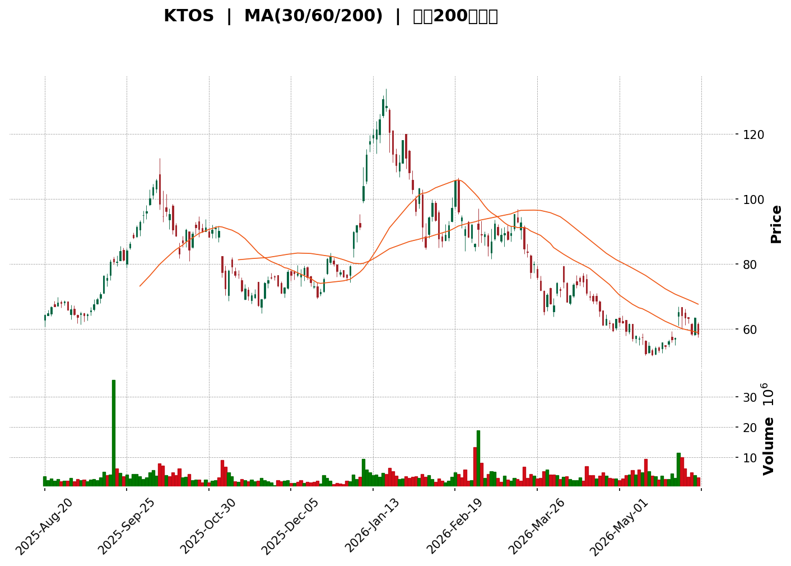
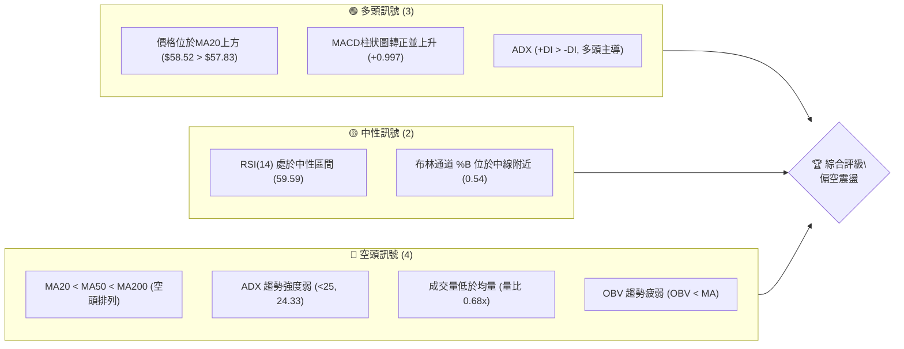
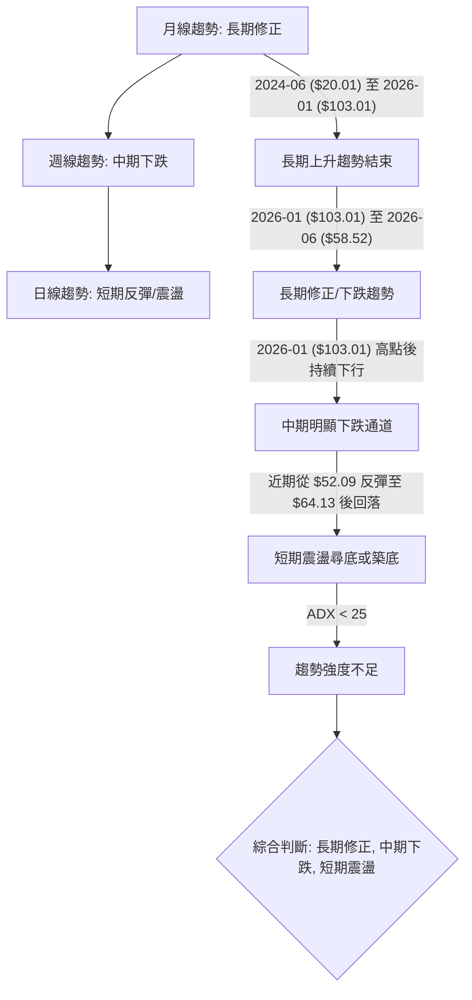
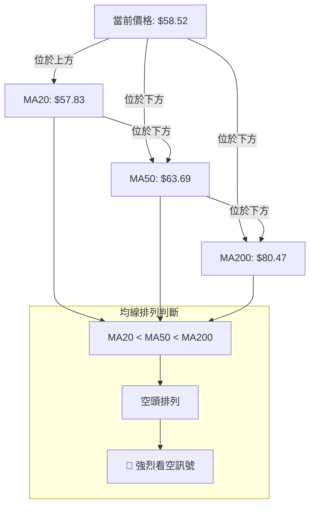
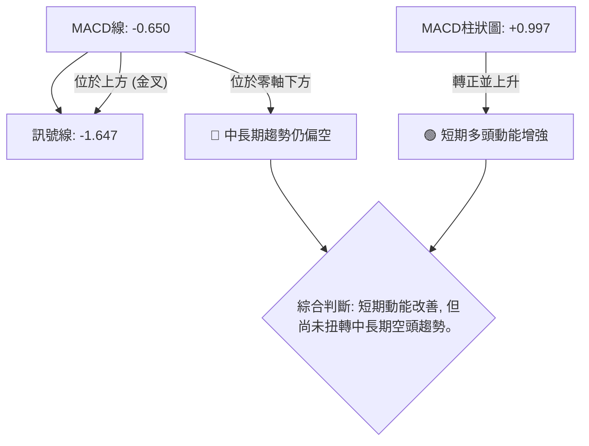

<details>
<summary>📊 靜態圖表 (點擊展開)</summary>

</details>

<html>
<head><meta charset="utf-8" /></head>
<body>
    <div style="height:500px; width:100%;">                        <script>window.PlotlyConfig = {MathJaxConfig: 'local'};</script>
        <script charset="utf-8" src="https://cdn.plot.ly/plotly-3.6.0.min.js" integrity="sha256-QaOVwtVY0T02VaHrr6pnoHLCwayMJp4O5n4YyaE3rJk=" crossorigin="anonymous"></script>                <div id="candlestick-chart" class="plotly-graph-div" style="height:100%; width:100%;"></div>            <script>                window.PLOTLYENV=window.PLOTLYENV || {};                                if (document.getElementById("candlestick-chart")) {                    Plotly.newPlot(                        "candlestick-chart",                        [{"close":{"dtype":"f8","bdata":"AAAAoEcRUEAAAACA6zFQQAAAAKBwrVBAAAAAoJm5UEAAAABAMwNRQAAAAEDh+lBAAAAA4KMgUUAAAACAwnVQQAAAAIDChVBAAAAAAAAgUEAAAAAghctPQAAAAADXM1BAAAAAwPUIUEAAAAAA1yNQQAAAAIA9alBAAAAAQOHqUEAAAADAzExRQAAAACBcr1FAAAAAYGYWU0AAAAAgXO9SQAAAAKCZKVRAAAAAoEcxVEAAAACAFC5UQAAAAKCZ+VRAAAAAIIVLVEAAAADAzAxVQAAAAIDrkVVAAAAAwB4FVkAAAAAgrtdWQAAAAKBwPVdAAAAAgOvBV0AAAAAAKQxYQAAAAAAAEFlAAAAAACnsWUAAAABA4WpaQAAAAEAzo1hAAAAA4FGoV0AAAACA6xFYQAAAAEAz01dAAAAAwB6lVkAAAAAgridWQAAAACCux1RAAAAAoJmpVUAAAAAgrqdWQAAAAEAzE1VAAAAA4HpUVkAAAAAghctWQAAAACCFq1ZAAAAAgOtxVkAAAACgcM1WQAAAAEAzE1ZAAAAAYGamVkAAAABgZsZWQAAAAIAUjlZAAAAAgD1aU0AAAACAPRpSQAAAAOBReFNAAAAAIIXLU0AAAACAwiVTQAAAAMDMLFNAAAAAACnsUUAAAADAzBxSQAAAACBcj1FAAAAAQAqXUUAAAABA4apRQAAAAADX01BAAAAAwPVIUUAAAABACodSQAAAAEAzw1JAAAAAoEfxUkAAAABgZgZTQAAAAKBwTVJAAAAAoHC9UUAAAACA6zFSQAAAACCFa1NAAAAAAAAgU0AAAACA60FTQAAAAIDrQVNAAAAAgD06U0AAAACA67FTQAAAAKBw\u002fVJAAAAA4KOQUkAAAADgUUhSQAAAAKBHcVFAAAAAoJnZUUAAAADA9dhSQAAAAIDrYVRAAAAAQDOTVEAAAACAFP5TQAAAAMDMbFNAAAAAgBReU0AAAABguP5SQAAAAIA9+lJAAAAAYI\u002fSU0AAAAAghXtWQAAAACCF+1ZAAAAAACncVkAAAABgjwJaQAAAAMDMbFxAAAAAQAp3XUAAAACAFO5dQAAAAAAAYF5AAAAAANcjX0AAAABACldgQAAAAIDCFWBAAAAAgMIlXkAAAABgZnZcQAAAAMD1mFtAAAAA4HrUW0AAAAAA14NdQAAAAEDhKlxAAAAAgD0KW0AAAADgo8BZQAAAAIA9ClhAAAAAIK7XWUAAAADAHtVWQAAAAAAAUFVAAAAAgD2aV0AAAAAA17NYQAAAAGC4XldAAAAAgOvxVUAAAABAM8NVQAAAAADXQ1ZAAAAAgBT+VkAAAACgcE1YQAAAAEDhalpAAAAAwB4FWEAAAAAA15NXQAAAACCFq1ZAAAAAYLgOVkAAAADA9QhXQAAAACCFi1VAAAAAgBSuVkAAAADAzDxWQAAAAOBRSFZAAAAAYI9iVUAAAAAAAMBVQAAAAIAUHldAAAAAoHA9VkAAAABA4TpWQAAAAKBwXVZAAAAAgOvhVUAAAACA62FWQAAAAADX01dAAAAAYI9CV0AAAACA6zFXQAAAACCuJ1VAAAAAACnsVEAAAAAgXF9TQAAAAGC4\u002flNAAAAAQAr3UkAAAAAAKfxRQAAAAIDrUVBAAAAA4KOgUUAAAADAzOxQQAAAAADX01BAAAAAgMKFUkAAAACgcP1RQAAAAKBwnVJAAAAAwB4VUUAAAACAwpVRQAAAAEAzY1JAAAAAgD1qUkAAAACAPapSQAAAAIA9mlJAAAAAIFy\u002fUUAAAADAHnVRQAAAAEAzI1FAAAAAQAonUUAAAACgR2FQQAAAAKBHoU5AAAAA4HqUT0AAAADgetROQAAAACCux01AAAAAYGaGT0AAAABgZgZPQAAAAEAK905AAAAAIK6nTUAAAABgj8JOQAAAAAAAgExAAAAAgOvxTEAAAABguH5MQAAAAIA9qkxAAAAAYLg+SkAAAADAzGxLQAAAACCFC0pAAAAAACkcS0AAAAAAKbxKQAAAAMD16EtAAAAAgMJVS0AAAABAChdMQAAAAGBmZkxAAAAAYGamTEAAAAAAKUxQQAAAAOBRCFBAAAAAYLi+T0AAAABgj6JPQAAAAEAKN01AAAAAQDOzT0AAAABgj0JNQA=="},"high":{"dtype":"f8","bdata":"AAAAANcjUEAAAACAwnVQQAAAAGCPwlBAAAAAoHAtUUAAAACAPXpRQAAAACBcL1FAAAAA4Ho0UUAAAAAgXB9RQAAAAIA92lBAAAAAQOHKUEAAAAAAKRxQQAAAAGCPUlBAAAAAAABAUEAAAADAHjVQQAAAAAAAsFBAAAAAwPVIUUAAAACgcG1RQAAAAADX01FAAAAAIK4nU0AAAACA60FTQAAAAAApXFRAAAAAANeTVEAAAADgUahUQAAAAGC4XlVAAAAAAABAVUAAAADgUThVQAAAAIDCtVVAAAAAQOFqVkAAAAAgrvdWQAAAAKBHYVdAAAAAoJkZWEAAAAAgrodYQAAAAAAAwFlAAAAAoHAtWkAAAAAA15NaQAAAAOB6JFxAAAAAoJmpWUAAAAAAAGBZQAAAAGBmRlhAAAAAIFyfWEAAAACAwiVXQAAAAKBHoVVAAAAAgBQuVkAAAABAM7NWQAAAAAAAgFZAAAAAwMx8VkAAAAAghTtXQAAAAGBmpldAAAAAwMwcV0AAAAAgrndXQAAAAAAAwFZAAAAAoJkJV0AAAACAFO5WQAAAAIDC5VZAAAAAAACgVEAAAACAFN5TQAAAAGBmllNAAAAAAACAVEAAAAAgXL9TQAAAAEDhilNAAAAAoJn5UkAAAACgR3FSQAAAAMDMPFJAAAAAAADQUUAAAAAghQtSQAAAAGC4nlJAAAAAgMJVUUAAAAAAKZxSQAAAACCFC1NAAAAAQOFKU0AAAAAgXB9TQAAAAGBmJlNAAAAAYGamUkAAAAAAAEBSQAAAAOB6lFNAAAAA4FGIU0AAAADgeoRTQAAAAIA96lNAAAAAoHCdU0AAAACAFN5TQAAAAKCZ2VNAAAAAQOEaU0AAAADgUahSQAAAACBcj1JAAAAAgD0aUkAAAABgj\u002fJSQAAAACCud1RAAAAAgD3aVEAAAAAAKXxUQAAAAIA9+lNAAAAAgBSOU0AAAAAAKYxTQAAAAIAUPlNAAAAAYLjuU0AAAABACodWQAAAAIDrAVdAAAAA4HrUV0AAAABAM3NbQAAAAMDM3FxAAAAA4FHoXUAAAADgemReQAAAAKBw\u002fV5AAAAAANeTX0AAAAAAAIBgQAAAAAAAwGBAAAAAAAAAYEAAAABAM1NeQAAAAIDr4VxAAAAAQOFqXEAAAADA9YhdQAAAAAAAAF5AAAAAwMzMXEAAAAAAADBbQAAAAMD1SFlAAAAAIFzfWUAAAAAAAMBZQAAAAGBmJldAAAAAQOGqV0AAAACA6\u002fFYQAAAAAAA4FhAAAAAQDMjWEAAAACAwmVWQAAAACBcD1dAAAAAYGZWV0AAAAAAACBZQAAAAIA9elpAAAAAQOGqWkAAAADAHsVXQAAAACBc71ZAAAAAgOtRV0AAAAAAKRxXQAAAAKCZmVVAAAAAYGZGWEAAAACAFE5XQAAAAGBmhlZAAAAAIFxfVkAAAADgUbhWQAAAAEDhaldAAAAAQDMTV0AAAABguL5WQAAAACCu11ZAAAAAoJn5VkAAAABAM\u002fNWQAAAAGBm1ldAAAAA4FE4WEAAAAAAAKBXQAAAAAAAAFdAAAAAANeTVUAAAACgR8FUQAAAAAApPFRAAAAAgOvhU0AAAADgURhTQAAAAKCZ+VFAAAAAgBS+UUAAAABAMzNSQAAAAOCjYFFAAAAAgD2aUkAAAACgmTlSQAAAAAAp3FNAAAAAAACgUkAAAACA66FRQAAAAGBmhlJAAAAA4HokU0AAAABgjxJTQAAAAIAUTlNAAAAAwPU4U0AAAACgcO1RQAAAAKCZuVFAAAAAYLi+UUAAAAAgXC9RQAAAAOCjcFBAAAAAIIUbUEAAAACgmVlPQAAAAKBH4U5AAAAAQAqXT0AAAAAAAMBPQAAAAOBRCFBAAAAAwB5lT0AAAABguN5OQAAAAMAexU5AAAAA4FH4TEAAAABA4dpMQAAAAOCjUE1AAAAAAABATEAAAAAAKfxLQAAAAEAz80pAAAAAAClcS0AAAAAghUtLQAAAAOCj8EtAAAAAANeDS0AAAAAAAGBMQAAAAGBmpk1AAAAAgBSuTEAAAADAHrVQQAAAAAAAsFBAAAAAwMyMUEAAAABAM9NPQAAAAMDM7E5AAAAAIIXLT0AAAADAzAxPQA=="},"hovertemplate":"\u003cb\u003e%{x|%Y-%m-%d}\u003c\u002fb\u003e\u003cbr\u003e\u958b: $%{open:.2f}\u003cbr\u003e\u9ad8: $%{high:.2f}\u003cbr\u003e\u4f4e: $%{low:.2f}\u003cbr\u003e\u6536: $%{close:.2f}\u003cextra\u003e\u003c\u002fextra\u003e","low":{"dtype":"f8","bdata":"AAAAQOFaTkAAAAAA1wNQQAAAAGCPAlBAAAAAIK63UEAAAAAAAMBQQAAAAAAAoFBAAAAAoEfRUEAAAADA9WhQQAAAAGCPgk9AAAAAANcDUEAAAAAAAOBOQAAAAEAzs05AAAAAgD0qT0AAAADgelRPQAAAAAApDFBAAAAAYGZmUEAAAACgmelQQAAAAKCZ+VBAAAAAwB61UUAAAABACkdSQAAAAKBHwVJAAAAAoJn5U0AAAABAM9NTQAAAAGBmRlRAAAAAYGY2VEAAAAAgrrdTQAAAACCFG1VAAAAAQDPzVUAAAABgZgZWQAAAAOBRKFZAAAAAgOshV0AAAABACndXQAAAAKBHgVhAAAAAAAAAWUAAAACgmXlZQAAAAEAzM1hAAAAAoJk5V0AAAABA4apXQAAAAGCPslZAAAAAgD1KVkAAAAAgXB9WQAAAAKBwbVRAAAAAwMxMVUAAAADAzExVQAAAAADXM1RAAAAAIK43VUAAAAAghUtWQAAAAOCjEFZAAAAAAClsVkAAAACgcH1WQAAAAGCPAlZAAAAAgD36VUAAAADAzPxVQAAAAOB6tFVAAAAAYGb2UkAAAACgR5FRQAAAAKCZKVFAAAAAQDNDU0AAAADA9fhSQAAAAAAA4FJAAAAAANfTUUAAAAAAAEBRQAAAAGBmNlFAAAAAgOvxUEAAAABAM1NRQAAAAIA9ulBAAAAAQDMzUEAAAADA9UhRQAAAAKCZKVJAAAAAANfTUkAAAADgo8BSQAAAACCFO1JAAAAAIK63UUAAAAAghWtRQAAAAIDrEVJAAAAA4KOwUkAAAACgmclSQAAAAADXA1NAAAAAwMxMUkAAAABAM7NSQAAAAMDMzFJAAAAAYGZGUkAAAABA4RpSQAAAAADXU1FAAAAAwPWIUUAAAABguM5RQAAAAADXM1NAAAAAYGb2U0AAAACA69FTQAAAAGBmBlNAAAAAoJkJU0AAAABAM\u002fNSQAAAAOBRuFJAAAAAwB6VUkAAAADgUYhUQAAAAMDMrFVAAAAA4KOgVkAAAACgR7FYQAAAAKCZKVpAAAAAAACgXEAAAADAzExdQAAAAAAAgFxAAAAAoEdRXUAAAAAAAEBfQAAAAAAAwF9AAAAAgOuRXEAAAABguM5bQAAAAEAKF1tAAAAAoEexWkAAAAAA18NbQAAAAOCjUFtAAAAAgMKFWkAAAADgUWhZQAAAAKBHsVdAAAAAoJlJWEAAAABA4bpVQAAAAAAAIFVAAAAAAAAAVkAAAADAzExXQAAAAKBwTVdAAAAAoEdBVUAAAAAAAFBVQAAAAKBHwVVAAAAA4HrEVUAAAADAzDxXQAAAAGC4PlhAAAAAIIXbV0AAAAAAAMBWQAAAAGCPAlVAAAAAoHANVkAAAADA9ahVQAAAAAAAAFVAAAAAwB5VVUAAAABgZqZVQAAAAAAAcFVAAAAAoJmZVEAAAAAAAGBUQAAAAMDMzFVAAAAAwPUoVkAAAAAgrqdVQAAAAMD1WFVAAAAAwMzMVUAAAACgmblVQAAAACBcj1ZAAAAAgD0qV0AAAADA9ehVQAAAAGBmxlRAAAAA4HqEVEAAAACgR+FSQAAAAADXU1NAAAAAoJnJUkAAAADAzOxRQAAAACCuF1BAAAAAQDNjUEAAAABgZuZQQAAAACCF609AAAAAwMyMUUAAAABAM3NRQAAAAEAzI1JAAAAAgOsRUUAAAAAghdtQQAAAAEAKZ1FAAAAAoEchUkAAAAAAAFBSQAAAAOCjQFJAAAAAgD2aUUAAAABACjdRQAAAAOB69FBAAAAAwPXoUEAAAADAHuVPQAAAAKBHgU5AAAAA4FGYTkAAAAAAKRxOQAAAACCuh01AAAAAgOvRTUAAAACgmXlOQAAAAKBH4U5AAAAAoEcBTUAAAABACjdNQAAAAMAeJUxAAAAAoHDdS0AAAACgR4FLQAAAAIAUjktAAAAAIIXrSUAAAABguD5KQAAAAOB61ElAAAAAgD0KSkAAAAAA12NKQAAAAEAzU0pAAAAAIK7nSkAAAABA4TpLQAAAAEAz80tAAAAAAACAS0AAAAAAAIBOQAAAAIA9Ck5AAAAAQDOTTkAAAABACtdOQAAAAEAz80xAAAAA4FH4TEAAAAAAAMBMQA=="},"name":"\u50f9\u683c","open":{"dtype":"f8","bdata":"AAAAoHBdT0AAAADA9QhQQAAAAAApLFBAAAAAgD3qUEAAAAAAAMBQQAAAAKBHEVFAAAAAYI8CUUAAAAAgXB9RQAAAAIA9GlBAAAAAgOuRUEAAAABAMxNQQAAAAAAAIFBAAAAAgMI1UEAAAADgUQhQQAAAAGBmVlBAAAAAgMKFUEAAAAAgXO9QQAAAAMDMXFFAAAAAANfDUUAAAADgo8BSQAAAAKCZKVNAAAAAoEdhVEAAAABACidUQAAAAGBmRlRAAAAAIK4XVUAAAAAAAABUQAAAAAAAQFVAAAAAwMw8VkAAAADA9RhWQAAAAAAAoFZAAAAAAADAV0AAAAAAKexXQAAAAGBmllhAAAAAoJlJWUAAAADgesRZQAAAAMD16FpAAAAAwMysV0AAAACAFF5YQAAAAIAUbldAAAAAwMx8WEAAAAAgXP9WQAAAAEDhOlVAAAAAgOvRVUAAAABACsdVQAAAAAAAgFZAAAAAwMxMVUAAAADgUQhXQAAAAOB6RFdAAAAA4HrEVkAAAAAAAIBWQAAAAAAAgFZAAAAAAABgVkAAAADAHrVWQAAAAGC4DlZAAAAAIK6XVEAAAADAzHxTQAAAAEAzk1FAAAAAIIVbVEAAAABguG5TQAAAAIDrMVNAAAAAACm8UkAAAACAPUpRQAAAAIDCBVJAAAAAIFwvUUAAAADAHmVRQAAAAGC4nlJAAAAAANezUEAAAABA4VpRQAAAAIA9ilJAAAAAQDPzUkAAAABguA5TQAAAAGBmJlNAAAAAIK6HUkAAAADgo8BRQAAAAKBHIVJAAAAAAClsU0AAAACAwmVTQAAAAOB6JFNAAAAAAAAAU0AAAAAgXC9TQAAAACCFu1NAAAAAoEcRU0AAAAAAAEBSQAAAAOBRSFJAAAAAACm8UUAAAACA6+FRQAAAAAAAQFNAAAAAgBQeVEAAAABACkdUQAAAAIA9+lNAAAAAoHA9U0AAAAAAKYxTQAAAAEAzM1NAAAAAQDMjU0AAAACAPTpVQAAAAMD1eFZAAAAA4FEoV0AAAACA6+FYQAAAAGC4XlpAAAAAYGY2XUAAAACAPbpdQAAAAAAAoF1AAAAAwPX4XUAAAACgcG1fQAAAACCFA2BAAAAAYI\u002fiX0AAAADgo0BeQAAAAMAedVxAAAAAwMwsW0AAAAAA18NbQAAAAAAAAF5AAAAA4FG4XEAAAADgenRaQAAAAIA9+lhAAAAAYGamWEAAAACgcF1ZQAAAAIAUHlZAAAAAYGZGVkAAAABgZqZXQAAAAOB6tFhAAAAAgD36V0AAAACgmRlWQAAAACBcz1VAAAAAwB4FVkAAAADA9UhXQAAAAKBwbVhAAAAAAClsWkAAAACgR1FXQAAAAAAAMFZAAAAAACk8V0AAAAAAKfxVQAAAAEAzU1VAAAAAQOEaV0AAAACgcE1WQAAAAOCjIFZAAAAAYGY2VkAAAADgUdhUQAAAAEAK91VAAAAAACncVkAAAACA68FVQAAAAAApPFZAAAAAAACAVkAAAACAwjVWQAAAAEAKt1ZAAAAAgD2aV0AAAADgo6BWQAAAAMDM3FZAAAAAgML1VEAAAABA4apUQAAAAGCP8lNAAAAA4FGYU0AAAABACrdSQAAAAOCj8FFAAAAAoJm5UEAAAADA9ShSQAAAAIDrUVBAAAAA4FHIUUAAAAAAABBSQAAAAOBR2FNAAAAAwMyMUkAAAACgRwFRQAAAAGBmhlFAAAAAgD2qUkAAAAAAKexSQAAAAADXE1NAAAAAIIXbUkAAAABgj4JRQAAAAOCjkFFAAAAAIK6HUUAAAADAzBxRQAAAAOCjcFBAAAAA4FGYTkAAAADgUfhOQAAAAGC43k5AAAAAwB4lTkAAAADgerRPQAAAAAApPE9AAAAA4FFYT0AAAACAPYpNQAAAAMAexU5AAAAAgD2KTEAAAAAgXG9MQAAAACCFq0xAAAAA4Ho0TEAAAACgR2FKQAAAAGC4vkpAAAAAoEchSkAAAABguB5LQAAAAKCZ+UpAAAAAAACAS0AAAADAHqVLQAAAAOB61ExAAAAAoHB9TEAAAABA4fpPQAAAAIA9qlBAAAAAACk8UEAAAADA9chPQAAAACBcz05AAAAAgBQuTUAAAACA69FOQA=="},"x":["2025-08-20T00:00:00-04:00","2025-08-21T00:00:00-04:00","2025-08-22T00:00:00-04:00","2025-08-25T00:00:00-04:00","2025-08-26T00:00:00-04:00","2025-08-27T00:00:00-04:00","2025-08-28T00:00:00-04:00","2025-08-29T00:00:00-04:00","2025-09-02T00:00:00-04:00","2025-09-03T00:00:00-04:00","2025-09-04T00:00:00-04:00","2025-09-05T00:00:00-04:00","2025-09-08T00:00:00-04:00","2025-09-09T00:00:00-04:00","2025-09-10T00:00:00-04:00","2025-09-11T00:00:00-04:00","2025-09-12T00:00:00-04:00","2025-09-15T00:00:00-04:00","2025-09-16T00:00:00-04:00","2025-09-17T00:00:00-04:00","2025-09-18T00:00:00-04:00","2025-09-19T00:00:00-04:00","2025-09-22T00:00:00-04:00","2025-09-23T00:00:00-04:00","2025-09-24T00:00:00-04:00","2025-09-25T00:00:00-04:00","2025-09-26T00:00:00-04:00","2025-09-29T00:00:00-04:00","2025-09-30T00:00:00-04:00","2025-10-01T00:00:00-04:00","2025-10-02T00:00:00-04:00","2025-10-03T00:00:00-04:00","2025-10-06T00:00:00-04:00","2025-10-07T00:00:00-04:00","2025-10-08T00:00:00-04:00","2025-10-09T00:00:00-04:00","2025-10-10T00:00:00-04:00","2025-10-13T00:00:00-04:00","2025-10-14T00:00:00-04:00","2025-10-15T00:00:00-04:00","2025-10-16T00:00:00-04:00","2025-10-17T00:00:00-04:00","2025-10-20T00:00:00-04:00","2025-10-21T00:00:00-04:00","2025-10-22T00:00:00-04:00","2025-10-23T00:00:00-04:00","2025-10-24T00:00:00-04:00","2025-10-27T00:00:00-04:00","2025-10-28T00:00:00-04:00","2025-10-29T00:00:00-04:00","2025-10-30T00:00:00-04:00","2025-10-31T00:00:00-04:00","2025-11-03T00:00:00-05:00","2025-11-04T00:00:00-05:00","2025-11-05T00:00:00-05:00","2025-11-06T00:00:00-05:00","2025-11-07T00:00:00-05:00","2025-11-10T00:00:00-05:00","2025-11-11T00:00:00-05:00","2025-11-12T00:00:00-05:00","2025-11-13T00:00:00-05:00","2025-11-14T00:00:00-05:00","2025-11-17T00:00:00-05:00","2025-11-18T00:00:00-05:00","2025-11-19T00:00:00-05:00","2025-11-20T00:00:00-05:00","2025-11-21T00:00:00-05:00","2025-11-24T00:00:00-05:00","2025-11-25T00:00:00-05:00","2025-11-26T00:00:00-05:00","2025-11-28T00:00:00-05:00","2025-12-01T00:00:00-05:00","2025-12-02T00:00:00-05:00","2025-12-03T00:00:00-05:00","2025-12-04T00:00:00-05:00","2025-12-05T00:00:00-05:00","2025-12-08T00:00:00-05:00","2025-12-09T00:00:00-05:00","2025-12-10T00:00:00-05:00","2025-12-11T00:00:00-05:00","2025-12-12T00:00:00-05:00","2025-12-15T00:00:00-05:00","2025-12-16T00:00:00-05:00","2025-12-17T00:00:00-05:00","2025-12-18T00:00:00-05:00","2025-12-19T00:00:00-05:00","2025-12-22T00:00:00-05:00","2025-12-23T00:00:00-05:00","2025-12-24T00:00:00-05:00","2025-12-26T00:00:00-05:00","2025-12-29T00:00:00-05:00","2025-12-30T00:00:00-05:00","2025-12-31T00:00:00-05:00","2026-01-02T00:00:00-05:00","2026-01-05T00:00:00-05:00","2026-01-06T00:00:00-05:00","2026-01-07T00:00:00-05:00","2026-01-08T00:00:00-05:00","2026-01-09T00:00:00-05:00","2026-01-12T00:00:00-05:00","2026-01-13T00:00:00-05:00","2026-01-14T00:00:00-05:00","2026-01-15T00:00:00-05:00","2026-01-16T00:00:00-05:00","2026-01-20T00:00:00-05:00","2026-01-21T00:00:00-05:00","2026-01-22T00:00:00-05:00","2026-01-23T00:00:00-05:00","2026-01-26T00:00:00-05:00","2026-01-27T00:00:00-05:00","2026-01-28T00:00:00-05:00","2026-01-29T00:00:00-05:00","2026-01-30T00:00:00-05:00","2026-02-02T00:00:00-05:00","2026-02-03T00:00:00-05:00","2026-02-04T00:00:00-05:00","2026-02-05T00:00:00-05:00","2026-02-06T00:00:00-05:00","2026-02-09T00:00:00-05:00","2026-02-10T00:00:00-05:00","2026-02-11T00:00:00-05:00","2026-02-12T00:00:00-05:00","2026-02-13T00:00:00-05:00","2026-02-17T00:00:00-05:00","2026-02-18T00:00:00-05:00","2026-02-19T00:00:00-05:00","2026-02-20T00:00:00-05:00","2026-02-23T00:00:00-05:00","2026-02-24T00:00:00-05:00","2026-02-25T00:00:00-05:00","2026-02-26T00:00:00-05:00","2026-02-27T00:00:00-05:00","2026-03-02T00:00:00-05:00","2026-03-03T00:00:00-05:00","2026-03-04T00:00:00-05:00","2026-03-05T00:00:00-05:00","2026-03-06T00:00:00-05:00","2026-03-09T00:00:00-04:00","2026-03-10T00:00:00-04:00","2026-03-11T00:00:00-04:00","2026-03-12T00:00:00-04:00","2026-03-13T00:00:00-04:00","2026-03-16T00:00:00-04:00","2026-03-17T00:00:00-04:00","2026-03-18T00:00:00-04:00","2026-03-19T00:00:00-04:00","2026-03-20T00:00:00-04:00","2026-03-23T00:00:00-04:00","2026-03-24T00:00:00-04:00","2026-03-25T00:00:00-04:00","2026-03-26T00:00:00-04:00","2026-03-27T00:00:00-04:00","2026-03-30T00:00:00-04:00","2026-03-31T00:00:00-04:00","2026-04-01T00:00:00-04:00","2026-04-02T00:00:00-04:00","2026-04-06T00:00:00-04:00","2026-04-07T00:00:00-04:00","2026-04-08T00:00:00-04:00","2026-04-09T00:00:00-04:00","2026-04-10T00:00:00-04:00","2026-04-13T00:00:00-04:00","2026-04-14T00:00:00-04:00","2026-04-15T00:00:00-04:00","2026-04-16T00:00:00-04:00","2026-04-17T00:00:00-04:00","2026-04-20T00:00:00-04:00","2026-04-21T00:00:00-04:00","2026-04-22T00:00:00-04:00","2026-04-23T00:00:00-04:00","2026-04-24T00:00:00-04:00","2026-04-27T00:00:00-04:00","2026-04-28T00:00:00-04:00","2026-04-29T00:00:00-04:00","2026-04-30T00:00:00-04:00","2026-05-01T00:00:00-04:00","2026-05-04T00:00:00-04:00","2026-05-05T00:00:00-04:00","2026-05-06T00:00:00-04:00","2026-05-07T00:00:00-04:00","2026-05-08T00:00:00-04:00","2026-05-11T00:00:00-04:00","2026-05-12T00:00:00-04:00","2026-05-13T00:00:00-04:00","2026-05-14T00:00:00-04:00","2026-05-15T00:00:00-04:00","2026-05-18T00:00:00-04:00","2026-05-19T00:00:00-04:00","2026-05-20T00:00:00-04:00","2026-05-21T00:00:00-04:00","2026-05-22T00:00:00-04:00","2026-05-26T00:00:00-04:00","2026-05-27T00:00:00-04:00","2026-05-28T00:00:00-04:00","2026-05-29T00:00:00-04:00","2026-06-01T00:00:00-04:00","2026-06-02T00:00:00-04:00","2026-06-03T00:00:00-04:00","2026-06-04T00:00:00-04:00","2026-06-05T00:00:00-04:00"],"type":"candlestick"},{"hovertemplate":"MA30: $%{y:.2f}\u003cextra\u003e\u003c\u002fextra\u003e","line":{"color":"#2196F3","dash":"dash","width":2},"mode":"lines","name":"MA30","x":["2025-08-20T00:00:00-04:00","2025-08-21T00:00:00-04:00","2025-08-22T00:00:00-04:00","2025-08-25T00:00:00-04:00","2025-08-26T00:00:00-04:00","2025-08-27T00:00:00-04:00","2025-08-28T00:00:00-04:00","2025-08-29T00:00:00-04:00","2025-09-02T00:00:00-04:00","2025-09-03T00:00:00-04:00","2025-09-04T00:00:00-04:00","2025-09-05T00:00:00-04:00","2025-09-08T00:00:00-04:00","2025-09-09T00:00:00-04:00","2025-09-10T00:00:00-04:00","2025-09-11T00:00:00-04:00","2025-09-12T00:00:00-04:00","2025-09-15T00:00:00-04:00","2025-09-16T00:00:00-04:00","2025-09-17T00:00:00-04:00","2025-09-18T00:00:00-04:00","2025-09-19T00:00:00-04:00","2025-09-22T00:00:00-04:00","2025-09-23T00:00:00-04:00","2025-09-24T00:00:00-04:00","2025-09-25T00:00:00-04:00","2025-09-26T00:00:00-04:00","2025-09-29T00:00:00-04:00","2025-09-30T00:00:00-04:00","2025-10-01T00:00:00-04:00","2025-10-02T00:00:00-04:00","2025-10-03T00:00:00-04:00","2025-10-06T00:00:00-04:00","2025-10-07T00:00:00-04:00","2025-10-08T00:00:00-04:00","2025-10-09T00:00:00-04:00","2025-10-10T00:00:00-04:00","2025-10-13T00:00:00-04:00","2025-10-14T00:00:00-04:00","2025-10-15T00:00:00-04:00","2025-10-16T00:00:00-04:00","2025-10-17T00:00:00-04:00","2025-10-20T00:00:00-04:00","2025-10-21T00:00:00-04:00","2025-10-22T00:00:00-04:00","2025-10-23T00:00:00-04:00","2025-10-24T00:00:00-04:00","2025-10-27T00:00:00-04:00","2025-10-28T00:00:00-04:00","2025-10-29T00:00:00-04:00","2025-10-30T00:00:00-04:00","2025-10-31T00:00:00-04:00","2025-11-03T00:00:00-05:00","2025-11-04T00:00:00-05:00","2025-11-05T00:00:00-05:00","2025-11-06T00:00:00-05:00","2025-11-07T00:00:00-05:00","2025-11-10T00:00:00-05:00","2025-11-11T00:00:00-05:00","2025-11-12T00:00:00-05:00","2025-11-13T00:00:00-05:00","2025-11-14T00:00:00-05:00","2025-11-17T00:00:00-05:00","2025-11-18T00:00:00-05:00","2025-11-19T00:00:00-05:00","2025-11-20T00:00:00-05:00","2025-11-21T00:00:00-05:00","2025-11-24T00:00:00-05:00","2025-11-25T00:00:00-05:00","2025-11-26T00:00:00-05:00","2025-11-28T00:00:00-05:00","2025-12-01T00:00:00-05:00","2025-12-02T00:00:00-05:00","2025-12-03T00:00:00-05:00","2025-12-04T00:00:00-05:00","2025-12-05T00:00:00-05:00","2025-12-08T00:00:00-05:00","2025-12-09T00:00:00-05:00","2025-12-10T00:00:00-05:00","2025-12-11T00:00:00-05:00","2025-12-12T00:00:00-05:00","2025-12-15T00:00:00-05:00","2025-12-16T00:00:00-05:00","2025-12-17T00:00:00-05:00","2025-12-18T00:00:00-05:00","2025-12-19T00:00:00-05:00","2025-12-22T00:00:00-05:00","2025-12-23T00:00:00-05:00","2025-12-24T00:00:00-05:00","2025-12-26T00:00:00-05:00","2025-12-29T00:00:00-05:00","2025-12-30T00:00:00-05:00","2025-12-31T00:00:00-05:00","2026-01-02T00:00:00-05:00","2026-01-05T00:00:00-05:00","2026-01-06T00:00:00-05:00","2026-01-07T00:00:00-05:00","2026-01-08T00:00:00-05:00","2026-01-09T00:00:00-05:00","2026-01-12T00:00:00-05:00","2026-01-13T00:00:00-05:00","2026-01-14T00:00:00-05:00","2026-01-15T00:00:00-05:00","2026-01-16T00:00:00-05:00","2026-01-20T00:00:00-05:00","2026-01-21T00:00:00-05:00","2026-01-22T00:00:00-05:00","2026-01-23T00:00:00-05:00","2026-01-26T00:00:00-05:00","2026-01-27T00:00:00-05:00","2026-01-28T00:00:00-05:00","2026-01-29T00:00:00-05:00","2026-01-30T00:00:00-05:00","2026-02-02T00:00:00-05:00","2026-02-03T00:00:00-05:00","2026-02-04T00:00:00-05:00","2026-02-05T00:00:00-05:00","2026-02-06T00:00:00-05:00","2026-02-09T00:00:00-05:00","2026-02-10T00:00:00-05:00","2026-02-11T00:00:00-05:00","2026-02-12T00:00:00-05:00","2026-02-13T00:00:00-05:00","2026-02-17T00:00:00-05:00","2026-02-18T00:00:00-05:00","2026-02-19T00:00:00-05:00","2026-02-20T00:00:00-05:00","2026-02-23T00:00:00-05:00","2026-02-24T00:00:00-05:00","2026-02-25T00:00:00-05:00","2026-02-26T00:00:00-05:00","2026-02-27T00:00:00-05:00","2026-03-02T00:00:00-05:00","2026-03-03T00:00:00-05:00","2026-03-04T00:00:00-05:00","2026-03-05T00:00:00-05:00","2026-03-06T00:00:00-05:00","2026-03-09T00:00:00-04:00","2026-03-10T00:00:00-04:00","2026-03-11T00:00:00-04:00","2026-03-12T00:00:00-04:00","2026-03-13T00:00:00-04:00","2026-03-16T00:00:00-04:00","2026-03-17T00:00:00-04:00","2026-03-18T00:00:00-04:00","2026-03-19T00:00:00-04:00","2026-03-20T00:00:00-04:00","2026-03-23T00:00:00-04:00","2026-03-24T00:00:00-04:00","2026-03-25T00:00:00-04:00","2026-03-26T00:00:00-04:00","2026-03-27T00:00:00-04:00","2026-03-30T00:00:00-04:00","2026-03-31T00:00:00-04:00","2026-04-01T00:00:00-04:00","2026-04-02T00:00:00-04:00","2026-04-06T00:00:00-04:00","2026-04-07T00:00:00-04:00","2026-04-08T00:00:00-04:00","2026-04-09T00:00:00-04:00","2026-04-10T00:00:00-04:00","2026-04-13T00:00:00-04:00","2026-04-14T00:00:00-04:00","2026-04-15T00:00:00-04:00","2026-04-16T00:00:00-04:00","2026-04-17T00:00:00-04:00","2026-04-20T00:00:00-04:00","2026-04-21T00:00:00-04:00","2026-04-22T00:00:00-04:00","2026-04-23T00:00:00-04:00","2026-04-24T00:00:00-04:00","2026-04-27T00:00:00-04:00","2026-04-28T00:00:00-04:00","2026-04-29T00:00:00-04:00","2026-04-30T00:00:00-04:00","2026-05-01T00:00:00-04:00","2026-05-04T00:00:00-04:00","2026-05-05T00:00:00-04:00","2026-05-06T00:00:00-04:00","2026-05-07T00:00:00-04:00","2026-05-08T00:00:00-04:00","2026-05-11T00:00:00-04:00","2026-05-12T00:00:00-04:00","2026-05-13T00:00:00-04:00","2026-05-14T00:00:00-04:00","2026-05-15T00:00:00-04:00","2026-05-18T00:00:00-04:00","2026-05-19T00:00:00-04:00","2026-05-20T00:00:00-04:00","2026-05-21T00:00:00-04:00","2026-05-22T00:00:00-04:00","2026-05-26T00:00:00-04:00","2026-05-27T00:00:00-04:00","2026-05-28T00:00:00-04:00","2026-05-29T00:00:00-04:00","2026-06-01T00:00:00-04:00","2026-06-02T00:00:00-04:00","2026-06-03T00:00:00-04:00","2026-06-04T00:00:00-04:00","2026-06-05T00:00:00-04:00"],"y":{"dtype":"f8","bdata":"AAAAAAAA+H8AAAAAAAD4fwAAAAAAAPh\u002fAAAAAAAA+H8AAAAAAAD4fwAAAAAAAPh\u002fAAAAAAAA+H8AAAAAAAD4fwAAAAAAAPh\u002fAAAAAAAA+H8AAAAAAAD4fwAAAAAAAPh\u002fAAAAAAAA+H8AAAAAAAD4fwAAAAAAAPh\u002fAAAAAAAA+H8AAAAAAAD4fwAAAAAAAPh\u002fAAAAAAAA+H8AAAAAAAD4fwAAAAAAAPh\u002fAAAAAAAA+H8AAAAAAAD4fwAAAAAAAPh\u002fAAAAAAAA+H8AAAAAAAD4fwAAAAAAAPh\u002fAAAAAAAA+H8AAAAAAAD4f3d3dz8ZTVJAd3d3T7iOUkBERERcutFSQERERKxHGVNAMzMz68NnU0C8u7tzBbhTQM3MzIRd+VNAzczMhBYxVECamZnRBnJUQImIiGBXsFRAERERifrnVEARERFBYB1VQFVVVfVvRFVAvLu7a3V0VUCJiIioDaxVQFVVVZXR01VA7+7uXgECVkAiIiJi5TBWQImIiEhvW1ZAq6qq2hV4VkCamZmJFplWQFVVVXVoqVZAMzMz82C+VkAAAADQhdRWQAAAAGAB4lZAREREdPbZVkC8u7uLz8BWQGZmZgbkrlZAAAAAcOebVkBVVVWVX3xWQERERHSvWVZAREREtOQnVkDv7u5+P\u002fVVQImIiAg6tVVAiYiIaB9uVUDe3d29dCNVQImIiIjP4FRAiYiImG6qVEAiIiLSIntUQO\u002fu7p7vT1RAIiIiYlcwVECrqqrKoRVUQLy7u5t9AFRAZmZmxgTfU0ARERHB9bhTQJqZmVnWqlNAvLu763yPU0AiIiIiTXFTQJqZmWkuVFNA3t3drbk4U0De3d09NR5TQERERPThA1NAMzMzIwbhUkDv7u4esLpSQBEREbEPj1JA3t3dbT2CUkB3d3fnmIhSQKuqqkpikFJAq6qqOgqXUkCamZkpQJ5SQLy7u0tioFJAIiIi8rasUkDNzMzMPrRSQBEREWFXwFJAmpmZWWTTUkARERHhevxSQO\u002fu7q4AMVNAVVVVdZNgU0Crqqo6baBTQHd3d0fh8lNAiYiICKxMVEDv7u5euqlUQGZmZia\u002fEFVAVVVV5ReDVUDNzMzcsv5VQImIiKh\u002fa1ZAzczMrI7JVkDe3d1NGxhXQAAAAFBGX1dAIiIiwq6oV0AAAADgevxXQN7d3W3LSlhAmpmZWR2TWEARERHR29JYQHd3d0coC1lAmpmZKVxPWUB3d3eHXXFZQFVVVSVNeVlAIiIi0iKTWUCJiIj4U7tZQFVVVfX93FlAd3d3l\u002fzyWUCamZlJmgpaQAAAAPCnJlpAiYiI6LRBWkAiIiLCPFFaQBEREaGMblpAAAAAsHJ4WkDv7u7OsGNaQCIiItKUMlpARERE5F7zWUCJiIiIiLhZQKuqqhovbVlARERE9P0kWUBmZmb24ctYQERERGSCd1hAvLu7a7wsWEDe3d29dPNXQImIiAg6zVdA3t3dfYadV0CrqqoqXF9XQJqZmWnYLVdA3t3drdUBV0DNzMzME+VWQFVVVZVD41ZAZmZmBjrNVkCrqqrqUdBWQKuqqtr5zlZA3t3dTRu4VkDe3d29n4pWQBEREfHSbVZAiYiICGVUVkBVVVX1KDRWQImIiOhtAVZAMzMz46XTVUDe3d19sZRVQBEREdHbQlVAd3d3V\u002fITVUAzMzNDRORUQKuqqvqpwVRAzczM7DWXVEB3d3c3tGhUQN7d3Y3CTVRAVVVVhV0pVEB3d3dH4QpUQDMzMzN661NAVVVV9W\u002fMU0CamZnZzqdTQHd3d1fHdFNAd3d3h11JU0AiIiICchdTQERERAxJ21JAd3d3x0unUkAzMzML12tSQHd3d8eSH1JAVVVVPZjfUUAAAACQCZ5RQLy7u8uhbVFAiYiIEJ85UUARERFRjRdRQLy7uyuH5lBAd3d3JzHAUEDe3d11TKBQQLy7u7NWj1BAERERYeVoUEARERGRe01QQDMzM2sDLVBAiYiIwJ8CUEDv7u5+W7ZPQFVVVaXTZk9Ad3d3R4ssT0CamZnJIPBOQBEREVGpqE5ARERE1NtiTkAAAAAQdDpOQN7d3Y2XDk5A7+7ujpfuTUCamZlJmtJNQLy7u4tsp01AZmZm1jGRTUCamZn5U3NNQA=="},"type":"scatter"},{"hovertemplate":"MA60: $%{y:.2f}\u003cextra\u003e\u003c\u002fextra\u003e","line":{"color":"#9C27B0","dash":"dash","width":2},"mode":"lines","name":"MA60","x":["2025-08-20T00:00:00-04:00","2025-08-21T00:00:00-04:00","2025-08-22T00:00:00-04:00","2025-08-25T00:00:00-04:00","2025-08-26T00:00:00-04:00","2025-08-27T00:00:00-04:00","2025-08-28T00:00:00-04:00","2025-08-29T00:00:00-04:00","2025-09-02T00:00:00-04:00","2025-09-03T00:00:00-04:00","2025-09-04T00:00:00-04:00","2025-09-05T00:00:00-04:00","2025-09-08T00:00:00-04:00","2025-09-09T00:00:00-04:00","2025-09-10T00:00:00-04:00","2025-09-11T00:00:00-04:00","2025-09-12T00:00:00-04:00","2025-09-15T00:00:00-04:00","2025-09-16T00:00:00-04:00","2025-09-17T00:00:00-04:00","2025-09-18T00:00:00-04:00","2025-09-19T00:00:00-04:00","2025-09-22T00:00:00-04:00","2025-09-23T00:00:00-04:00","2025-09-24T00:00:00-04:00","2025-09-25T00:00:00-04:00","2025-09-26T00:00:00-04:00","2025-09-29T00:00:00-04:00","2025-09-30T00:00:00-04:00","2025-10-01T00:00:00-04:00","2025-10-02T00:00:00-04:00","2025-10-03T00:00:00-04:00","2025-10-06T00:00:00-04:00","2025-10-07T00:00:00-04:00","2025-10-08T00:00:00-04:00","2025-10-09T00:00:00-04:00","2025-10-10T00:00:00-04:00","2025-10-13T00:00:00-04:00","2025-10-14T00:00:00-04:00","2025-10-15T00:00:00-04:00","2025-10-16T00:00:00-04:00","2025-10-17T00:00:00-04:00","2025-10-20T00:00:00-04:00","2025-10-21T00:00:00-04:00","2025-10-22T00:00:00-04:00","2025-10-23T00:00:00-04:00","2025-10-24T00:00:00-04:00","2025-10-27T00:00:00-04:00","2025-10-28T00:00:00-04:00","2025-10-29T00:00:00-04:00","2025-10-30T00:00:00-04:00","2025-10-31T00:00:00-04:00","2025-11-03T00:00:00-05:00","2025-11-04T00:00:00-05:00","2025-11-05T00:00:00-05:00","2025-11-06T00:00:00-05:00","2025-11-07T00:00:00-05:00","2025-11-10T00:00:00-05:00","2025-11-11T00:00:00-05:00","2025-11-12T00:00:00-05:00","2025-11-13T00:00:00-05:00","2025-11-14T00:00:00-05:00","2025-11-17T00:00:00-05:00","2025-11-18T00:00:00-05:00","2025-11-19T00:00:00-05:00","2025-11-20T00:00:00-05:00","2025-11-21T00:00:00-05:00","2025-11-24T00:00:00-05:00","2025-11-25T00:00:00-05:00","2025-11-26T00:00:00-05:00","2025-11-28T00:00:00-05:00","2025-12-01T00:00:00-05:00","2025-12-02T00:00:00-05:00","2025-12-03T00:00:00-05:00","2025-12-04T00:00:00-05:00","2025-12-05T00:00:00-05:00","2025-12-08T00:00:00-05:00","2025-12-09T00:00:00-05:00","2025-12-10T00:00:00-05:00","2025-12-11T00:00:00-05:00","2025-12-12T00:00:00-05:00","2025-12-15T00:00:00-05:00","2025-12-16T00:00:00-05:00","2025-12-17T00:00:00-05:00","2025-12-18T00:00:00-05:00","2025-12-19T00:00:00-05:00","2025-12-22T00:00:00-05:00","2025-12-23T00:00:00-05:00","2025-12-24T00:00:00-05:00","2025-12-26T00:00:00-05:00","2025-12-29T00:00:00-05:00","2025-12-30T00:00:00-05:00","2025-12-31T00:00:00-05:00","2026-01-02T00:00:00-05:00","2026-01-05T00:00:00-05:00","2026-01-06T00:00:00-05:00","2026-01-07T00:00:00-05:00","2026-01-08T00:00:00-05:00","2026-01-09T00:00:00-05:00","2026-01-12T00:00:00-05:00","2026-01-13T00:00:00-05:00","2026-01-14T00:00:00-05:00","2026-01-15T00:00:00-05:00","2026-01-16T00:00:00-05:00","2026-01-20T00:00:00-05:00","2026-01-21T00:00:00-05:00","2026-01-22T00:00:00-05:00","2026-01-23T00:00:00-05:00","2026-01-26T00:00:00-05:00","2026-01-27T00:00:00-05:00","2026-01-28T00:00:00-05:00","2026-01-29T00:00:00-05:00","2026-01-30T00:00:00-05:00","2026-02-02T00:00:00-05:00","2026-02-03T00:00:00-05:00","2026-02-04T00:00:00-05:00","2026-02-05T00:00:00-05:00","2026-02-06T00:00:00-05:00","2026-02-09T00:00:00-05:00","2026-02-10T00:00:00-05:00","2026-02-11T00:00:00-05:00","2026-02-12T00:00:00-05:00","2026-02-13T00:00:00-05:00","2026-02-17T00:00:00-05:00","2026-02-18T00:00:00-05:00","2026-02-19T00:00:00-05:00","2026-02-20T00:00:00-05:00","2026-02-23T00:00:00-05:00","2026-02-24T00:00:00-05:00","2026-02-25T00:00:00-05:00","2026-02-26T00:00:00-05:00","2026-02-27T00:00:00-05:00","2026-03-02T00:00:00-05:00","2026-03-03T00:00:00-05:00","2026-03-04T00:00:00-05:00","2026-03-05T00:00:00-05:00","2026-03-06T00:00:00-05:00","2026-03-09T00:00:00-04:00","2026-03-10T00:00:00-04:00","2026-03-11T00:00:00-04:00","2026-03-12T00:00:00-04:00","2026-03-13T00:00:00-04:00","2026-03-16T00:00:00-04:00","2026-03-17T00:00:00-04:00","2026-03-18T00:00:00-04:00","2026-03-19T00:00:00-04:00","2026-03-20T00:00:00-04:00","2026-03-23T00:00:00-04:00","2026-03-24T00:00:00-04:00","2026-03-25T00:00:00-04:00","2026-03-26T00:00:00-04:00","2026-03-27T00:00:00-04:00","2026-03-30T00:00:00-04:00","2026-03-31T00:00:00-04:00","2026-04-01T00:00:00-04:00","2026-04-02T00:00:00-04:00","2026-04-06T00:00:00-04:00","2026-04-07T00:00:00-04:00","2026-04-08T00:00:00-04:00","2026-04-09T00:00:00-04:00","2026-04-10T00:00:00-04:00","2026-04-13T00:00:00-04:00","2026-04-14T00:00:00-04:00","2026-04-15T00:00:00-04:00","2026-04-16T00:00:00-04:00","2026-04-17T00:00:00-04:00","2026-04-20T00:00:00-04:00","2026-04-21T00:00:00-04:00","2026-04-22T00:00:00-04:00","2026-04-23T00:00:00-04:00","2026-04-24T00:00:00-04:00","2026-04-27T00:00:00-04:00","2026-04-28T00:00:00-04:00","2026-04-29T00:00:00-04:00","2026-04-30T00:00:00-04:00","2026-05-01T00:00:00-04:00","2026-05-04T00:00:00-04:00","2026-05-05T00:00:00-04:00","2026-05-06T00:00:00-04:00","2026-05-07T00:00:00-04:00","2026-05-08T00:00:00-04:00","2026-05-11T00:00:00-04:00","2026-05-12T00:00:00-04:00","2026-05-13T00:00:00-04:00","2026-05-14T00:00:00-04:00","2026-05-15T00:00:00-04:00","2026-05-18T00:00:00-04:00","2026-05-19T00:00:00-04:00","2026-05-20T00:00:00-04:00","2026-05-21T00:00:00-04:00","2026-05-22T00:00:00-04:00","2026-05-26T00:00:00-04:00","2026-05-27T00:00:00-04:00","2026-05-28T00:00:00-04:00","2026-05-29T00:00:00-04:00","2026-06-01T00:00:00-04:00","2026-06-02T00:00:00-04:00","2026-06-03T00:00:00-04:00","2026-06-04T00:00:00-04:00","2026-06-05T00:00:00-04:00"],"y":{"dtype":"f8","bdata":"AAAAAAAA+H8AAAAAAAD4fwAAAAAAAPh\u002fAAAAAAAA+H8AAAAAAAD4fwAAAAAAAPh\u002fAAAAAAAA+H8AAAAAAAD4fwAAAAAAAPh\u002fAAAAAAAA+H8AAAAAAAD4fwAAAAAAAPh\u002fAAAAAAAA+H8AAAAAAAD4fwAAAAAAAPh\u002fAAAAAAAA+H8AAAAAAAD4fwAAAAAAAPh\u002fAAAAAAAA+H8AAAAAAAD4fwAAAAAAAPh\u002fAAAAAAAA+H8AAAAAAAD4fwAAAAAAAPh\u002fAAAAAAAA+H8AAAAAAAD4fwAAAAAAAPh\u002fAAAAAAAA+H8AAAAAAAD4fwAAAAAAAPh\u002fAAAAAAAA+H8AAAAAAAD4fwAAAAAAAPh\u002fAAAAAAAA+H8AAAAAAAD4fwAAAAAAAPh\u002fAAAAAAAA+H8AAAAAAAD4fwAAAAAAAPh\u002fAAAAAAAA+H8AAAAAAAD4fwAAAAAAAPh\u002fAAAAAAAA+H8AAAAAAAD4fwAAAAAAAPh\u002fAAAAAAAA+H8AAAAAAAD4fwAAAAAAAPh\u002fAAAAAAAA+H8AAAAAAAD4fwAAAAAAAPh\u002fAAAAAAAA+H8AAAAAAAD4fwAAAAAAAPh\u002fAAAAAAAA+H8AAAAAAAD4fwAAAAAAAPh\u002fAAAAAAAA+H8AAAAAAAD4f97d3VlkU1RA3t3dgU5bVECamZntfGNUQGZmZtpAZ1RA3t3dqfFqVEDNzMwYvW1UQKuqqoYWbVRAq6qqjsJtVEDe3d3RlHZUQLy7u38jgFRAmpmZ9SiMVEDe3d0FgZlUQImIiMh2olRAERERGb2pVEDNzMy0gbJUQHd3d\u002fdTv1RAVVVVJb\u002fIVEAiIiJCGdFUQBEREdnO11RARERExGfYVEC8u7vjpdtUQM3MzDSl1lRAMzMzi7PPVEB3d3f3msdUQImIiIiIuFRAERER8RmuVECamZk5tKRUQImIiCijn1RAVVVV1XiZVEB3d3ffT41UQAAAAOAIfVRAMzMz001qVEDe3d0lv1RUQM3MzLTIOlRAERER4cEgVEB3d3fP9w9UQLy7uxvoCFRA7+7uBoEFVEBmZmYGyA1UQDMzM3NoIVRAVVVVtYE+VEDNzMwUrl9UQBEREWGeiFRA3t3dVQ6xVEDv7u5O1NtUQBEREQErC1VAREREzIUsVUAAAAA4tERVQM3MzFy6WVVAAAAAOLRwVUDv7u4OWI1VQBEREbFWp1VAZmZmvhG6VUAAAAD4xcZVQERERPwbzVVAvLu7y8zoVUB3d3c3+\u002fxVQAAAALjXBFZAZmZmhhYVVkARERERyixWQImIiCCwPlZAzczMxNlPVkAzMzOLbF9WQImIiKh\u002fc1ZAERERoYyKVkCamZnR26ZWQAAAAKjGz1ZAq6qqEoPsVkDNzMwEDwJXQM3MzAy7EldAZmZmdgUgV0C8u7tzITFXQImIiCD3PldAzczM7ApUV0CamZlpSmVXQGZmZgaBcVdAREREjCV7V0De3d0FyIVXQERERCxAlldAAAAAoBqjV0BVVVWF661XQLy7u+tRvFdAvLu7g3nKV0Dv7u7O99tXQGZmZu4191dAAAAAGEsOWEARERG51yBYQAAAAIAjJFhAAAAAEJ8lWEAzMzPb+SJYQDMzM3NoJVhAAAAA0LAjWEB3d3efYR9YQEREROwKFFhA3t3dZa0KWEAAAAAg9\u002fJXQBERETm02FdAvLu7gzLGV0ARERGJ+qNXQGZmZmYfeldAiYiIaEpFV0AAAABgnhBXQERERNR43VZAzczMvC2nVkDv7u6eYWtWQLy7u0t+MVZAiYiIMJb8VUC8u7vLoc1VQAAAALAAoVVAq6qqAnJzVUBmZmYWZztVQO\u002fu7rqQBFVAq6qqupDUVEAAAABsdahUQGZmZi5rgVRA3t3dIWlWVEBVVVW9LTdUQDMzM9NNHlRAMzMzL934U0B3d3eHFtFTQGZmZg4tqlNAAAAAGEuKU0CamZm1OmpTQCIiIk5iSFNAIiIiokUeU0B3d3eHFvFSQCIiIp7vt1JAAAAADEmLUkBVVVUBuV9SQKuqquaJOlJAREREyL0WUkAiIiJOYvBRQDMzM5sL0VFAvLu7t2WtUUC8u7unDZRRQBEREf1ieVFAZmZm3t1hUUAzMzP\u002fjUhRQKuqqs4+JFFAVVVVOfsIUUB3d3f\u002fjehQQA=="},"type":"scatter"},{"hovertemplate":"MA200: $%{y:.2f}\u003cextra\u003e\u003c\u002fextra\u003e","line":{"color":"#FF6F00","dash":"solid","width":2},"mode":"lines","name":"MA200","x":["2025-08-20T00:00:00-04:00","2025-08-21T00:00:00-04:00","2025-08-22T00:00:00-04:00","2025-08-25T00:00:00-04:00","2025-08-26T00:00:00-04:00","2025-08-27T00:00:00-04:00","2025-08-28T00:00:00-04:00","2025-08-29T00:00:00-04:00","2025-09-02T00:00:00-04:00","2025-09-03T00:00:00-04:00","2025-09-04T00:00:00-04:00","2025-09-05T00:00:00-04:00","2025-09-08T00:00:00-04:00","2025-09-09T00:00:00-04:00","2025-09-10T00:00:00-04:00","2025-09-11T00:00:00-04:00","2025-09-12T00:00:00-04:00","2025-09-15T00:00:00-04:00","2025-09-16T00:00:00-04:00","2025-09-17T00:00:00-04:00","2025-09-18T00:00:00-04:00","2025-09-19T00:00:00-04:00","2025-09-22T00:00:00-04:00","2025-09-23T00:00:00-04:00","2025-09-24T00:00:00-04:00","2025-09-25T00:00:00-04:00","2025-09-26T00:00:00-04:00","2025-09-29T00:00:00-04:00","2025-09-30T00:00:00-04:00","2025-10-01T00:00:00-04:00","2025-10-02T00:00:00-04:00","2025-10-03T00:00:00-04:00","2025-10-06T00:00:00-04:00","2025-10-07T00:00:00-04:00","2025-10-08T00:00:00-04:00","2025-10-09T00:00:00-04:00","2025-10-10T00:00:00-04:00","2025-10-13T00:00:00-04:00","2025-10-14T00:00:00-04:00","2025-10-15T00:00:00-04:00","2025-10-16T00:00:00-04:00","2025-10-17T00:00:00-04:00","2025-10-20T00:00:00-04:00","2025-10-21T00:00:00-04:00","2025-10-22T00:00:00-04:00","2025-10-23T00:00:00-04:00","2025-10-24T00:00:00-04:00","2025-10-27T00:00:00-04:00","2025-10-28T00:00:00-04:00","2025-10-29T00:00:00-04:00","2025-10-30T00:00:00-04:00","2025-10-31T00:00:00-04:00","2025-11-03T00:00:00-05:00","2025-11-04T00:00:00-05:00","2025-11-05T00:00:00-05:00","2025-11-06T00:00:00-05:00","2025-11-07T00:00:00-05:00","2025-11-10T00:00:00-05:00","2025-11-11T00:00:00-05:00","2025-11-12T00:00:00-05:00","2025-11-13T00:00:00-05:00","2025-11-14T00:00:00-05:00","2025-11-17T00:00:00-05:00","2025-11-18T00:00:00-05:00","2025-11-19T00:00:00-05:00","2025-11-20T00:00:00-05:00","2025-11-21T00:00:00-05:00","2025-11-24T00:00:00-05:00","2025-11-25T00:00:00-05:00","2025-11-26T00:00:00-05:00","2025-11-28T00:00:00-05:00","2025-12-01T00:00:00-05:00","2025-12-02T00:00:00-05:00","2025-12-03T00:00:00-05:00","2025-12-04T00:00:00-05:00","2025-12-05T00:00:00-05:00","2025-12-08T00:00:00-05:00","2025-12-09T00:00:00-05:00","2025-12-10T00:00:00-05:00","2025-12-11T00:00:00-05:00","2025-12-12T00:00:00-05:00","2025-12-15T00:00:00-05:00","2025-12-16T00:00:00-05:00","2025-12-17T00:00:00-05:00","2025-12-18T00:00:00-05:00","2025-12-19T00:00:00-05:00","2025-12-22T00:00:00-05:00","2025-12-23T00:00:00-05:00","2025-12-24T00:00:00-05:00","2025-12-26T00:00:00-05:00","2025-12-29T00:00:00-05:00","2025-12-30T00:00:00-05:00","2025-12-31T00:00:00-05:00","2026-01-02T00:00:00-05:00","2026-01-05T00:00:00-05:00","2026-01-06T00:00:00-05:00","2026-01-07T00:00:00-05:00","2026-01-08T00:00:00-05:00","2026-01-09T00:00:00-05:00","2026-01-12T00:00:00-05:00","2026-01-13T00:00:00-05:00","2026-01-14T00:00:00-05:00","2026-01-15T00:00:00-05:00","2026-01-16T00:00:00-05:00","2026-01-20T00:00:00-05:00","2026-01-21T00:00:00-05:00","2026-01-22T00:00:00-05:00","2026-01-23T00:00:00-05:00","2026-01-26T00:00:00-05:00","2026-01-27T00:00:00-05:00","2026-01-28T00:00:00-05:00","2026-01-29T00:00:00-05:00","2026-01-30T00:00:00-05:00","2026-02-02T00:00:00-05:00","2026-02-03T00:00:00-05:00","2026-02-04T00:00:00-05:00","2026-02-05T00:00:00-05:00","2026-02-06T00:00:00-05:00","2026-02-09T00:00:00-05:00","2026-02-10T00:00:00-05:00","2026-02-11T00:00:00-05:00","2026-02-12T00:00:00-05:00","2026-02-13T00:00:00-05:00","2026-02-17T00:00:00-05:00","2026-02-18T00:00:00-05:00","2026-02-19T00:00:00-05:00","2026-02-20T00:00:00-05:00","2026-02-23T00:00:00-05:00","2026-02-24T00:00:00-05:00","2026-02-25T00:00:00-05:00","2026-02-26T00:00:00-05:00","2026-02-27T00:00:00-05:00","2026-03-02T00:00:00-05:00","2026-03-03T00:00:00-05:00","2026-03-04T00:00:00-05:00","2026-03-05T00:00:00-05:00","2026-03-06T00:00:00-05:00","2026-03-09T00:00:00-04:00","2026-03-10T00:00:00-04:00","2026-03-11T00:00:00-04:00","2026-03-12T00:00:00-04:00","2026-03-13T00:00:00-04:00","2026-03-16T00:00:00-04:00","2026-03-17T00:00:00-04:00","2026-03-18T00:00:00-04:00","2026-03-19T00:00:00-04:00","2026-03-20T00:00:00-04:00","2026-03-23T00:00:00-04:00","2026-03-24T00:00:00-04:00","2026-03-25T00:00:00-04:00","2026-03-26T00:00:00-04:00","2026-03-27T00:00:00-04:00","2026-03-30T00:00:00-04:00","2026-03-31T00:00:00-04:00","2026-04-01T00:00:00-04:00","2026-04-02T00:00:00-04:00","2026-04-06T00:00:00-04:00","2026-04-07T00:00:00-04:00","2026-04-08T00:00:00-04:00","2026-04-09T00:00:00-04:00","2026-04-10T00:00:00-04:00","2026-04-13T00:00:00-04:00","2026-04-14T00:00:00-04:00","2026-04-15T00:00:00-04:00","2026-04-16T00:00:00-04:00","2026-04-17T00:00:00-04:00","2026-04-20T00:00:00-04:00","2026-04-21T00:00:00-04:00","2026-04-22T00:00:00-04:00","2026-04-23T00:00:00-04:00","2026-04-24T00:00:00-04:00","2026-04-27T00:00:00-04:00","2026-04-28T00:00:00-04:00","2026-04-29T00:00:00-04:00","2026-04-30T00:00:00-04:00","2026-05-01T00:00:00-04:00","2026-05-04T00:00:00-04:00","2026-05-05T00:00:00-04:00","2026-05-06T00:00:00-04:00","2026-05-07T00:00:00-04:00","2026-05-08T00:00:00-04:00","2026-05-11T00:00:00-04:00","2026-05-12T00:00:00-04:00","2026-05-13T00:00:00-04:00","2026-05-14T00:00:00-04:00","2026-05-15T00:00:00-04:00","2026-05-18T00:00:00-04:00","2026-05-19T00:00:00-04:00","2026-05-20T00:00:00-04:00","2026-05-21T00:00:00-04:00","2026-05-22T00:00:00-04:00","2026-05-26T00:00:00-04:00","2026-05-27T00:00:00-04:00","2026-05-28T00:00:00-04:00","2026-05-29T00:00:00-04:00","2026-06-01T00:00:00-04:00","2026-06-02T00:00:00-04:00","2026-06-03T00:00:00-04:00","2026-06-04T00:00:00-04:00","2026-06-05T00:00:00-04:00"],"y":{"dtype":"f8","bdata":"AAAAAAAA+H8AAAAAAAD4fwAAAAAAAPh\u002fAAAAAAAA+H8AAAAAAAD4fwAAAAAAAPh\u002fAAAAAAAA+H8AAAAAAAD4fwAAAAAAAPh\u002fAAAAAAAA+H8AAAAAAAD4fwAAAAAAAPh\u002fAAAAAAAA+H8AAAAAAAD4fwAAAAAAAPh\u002fAAAAAAAA+H8AAAAAAAD4fwAAAAAAAPh\u002fAAAAAAAA+H8AAAAAAAD4fwAAAAAAAPh\u002fAAAAAAAA+H8AAAAAAAD4fwAAAAAAAPh\u002fAAAAAAAA+H8AAAAAAAD4fwAAAAAAAPh\u002fAAAAAAAA+H8AAAAAAAD4fwAAAAAAAPh\u002fAAAAAAAA+H8AAAAAAAD4fwAAAAAAAPh\u002fAAAAAAAA+H8AAAAAAAD4fwAAAAAAAPh\u002fAAAAAAAA+H8AAAAAAAD4fwAAAAAAAPh\u002fAAAAAAAA+H8AAAAAAAD4fwAAAAAAAPh\u002fAAAAAAAA+H8AAAAAAAD4fwAAAAAAAPh\u002fAAAAAAAA+H8AAAAAAAD4fwAAAAAAAPh\u002fAAAAAAAA+H8AAAAAAAD4fwAAAAAAAPh\u002fAAAAAAAA+H8AAAAAAAD4fwAAAAAAAPh\u002fAAAAAAAA+H8AAAAAAAD4fwAAAAAAAPh\u002fAAAAAAAA+H8AAAAAAAD4fwAAAAAAAPh\u002fAAAAAAAA+H8AAAAAAAD4fwAAAAAAAPh\u002fAAAAAAAA+H8AAAAAAAD4fwAAAAAAAPh\u002fAAAAAAAA+H8AAAAAAAD4fwAAAAAAAPh\u002fAAAAAAAA+H8AAAAAAAD4fwAAAAAAAPh\u002fAAAAAAAA+H8AAAAAAAD4fwAAAAAAAPh\u002fAAAAAAAA+H8AAAAAAAD4fwAAAAAAAPh\u002fAAAAAAAA+H8AAAAAAAD4fwAAAAAAAPh\u002fAAAAAAAA+H8AAAAAAAD4fwAAAAAAAPh\u002fAAAAAAAA+H8AAAAAAAD4fwAAAAAAAPh\u002fAAAAAAAA+H8AAAAAAAD4fwAAAAAAAPh\u002fAAAAAAAA+H8AAAAAAAD4fwAAAAAAAPh\u002fAAAAAAAA+H8AAAAAAAD4fwAAAAAAAPh\u002fAAAAAAAA+H8AAAAAAAD4fwAAAAAAAPh\u002fAAAAAAAA+H8AAAAAAAD4fwAAAAAAAPh\u002fAAAAAAAA+H8AAAAAAAD4fwAAAAAAAPh\u002fAAAAAAAA+H8AAAAAAAD4fwAAAAAAAPh\u002fAAAAAAAA+H8AAAAAAAD4fwAAAAAAAPh\u002fAAAAAAAA+H8AAAAAAAD4fwAAAAAAAPh\u002fAAAAAAAA+H8AAAAAAAD4fwAAAAAAAPh\u002fAAAAAAAA+H8AAAAAAAD4fwAAAAAAAPh\u002fAAAAAAAA+H8AAAAAAAD4fwAAAAAAAPh\u002fAAAAAAAA+H8AAAAAAAD4fwAAAAAAAPh\u002fAAAAAAAA+H8AAAAAAAD4fwAAAAAAAPh\u002fAAAAAAAA+H8AAAAAAAD4fwAAAAAAAPh\u002fAAAAAAAA+H8AAAAAAAD4fwAAAAAAAPh\u002fAAAAAAAA+H8AAAAAAAD4fwAAAAAAAPh\u002fAAAAAAAA+H8AAAAAAAD4fwAAAAAAAPh\u002fAAAAAAAA+H8AAAAAAAD4fwAAAAAAAPh\u002fAAAAAAAA+H8AAAAAAAD4fwAAAAAAAPh\u002fAAAAAAAA+H8AAAAAAAD4fwAAAAAAAPh\u002fAAAAAAAA+H8AAAAAAAD4fwAAAAAAAPh\u002fAAAAAAAA+H8AAAAAAAD4fwAAAAAAAPh\u002fAAAAAAAA+H8AAAAAAAD4fwAAAAAAAPh\u002fAAAAAAAA+H8AAAAAAAD4fwAAAAAAAPh\u002fAAAAAAAA+H8AAAAAAAD4fwAAAAAAAPh\u002fAAAAAAAA+H8AAAAAAAD4fwAAAAAAAPh\u002fAAAAAAAA+H8AAAAAAAD4fwAAAAAAAPh\u002fAAAAAAAA+H8AAAAAAAD4fwAAAAAAAPh\u002fAAAAAAAA+H8AAAAAAAD4fwAAAAAAAPh\u002fAAAAAAAA+H8AAAAAAAD4fwAAAAAAAPh\u002fAAAAAAAA+H8AAAAAAAD4fwAAAAAAAPh\u002fAAAAAAAA+H8AAAAAAAD4fwAAAAAAAPh\u002fAAAAAAAA+H8AAAAAAAD4fwAAAAAAAPh\u002fAAAAAAAA+H8AAAAAAAD4fwAAAAAAAPh\u002fAAAAAAAA+H8AAAAAAAD4fwAAAAAAAPh\u002fAAAAAAAA+H8AAAAAAAD4fwAAAAAAAPh\u002fAAAAAAAA+H\u002fNzMwyxB1UQA=="},"type":"scatter"}],                        {"template":{"data":{"barpolar":[{"marker":{"line":{"color":"rgb(17,17,17)","width":0.5},"pattern":{"fillmode":"overlay","size":10,"solidity":0.2}},"type":"barpolar"}],"bar":[{"error_x":{"color":"#f2f5fa"},"error_y":{"color":"#f2f5fa"},"marker":{"line":{"color":"rgb(17,17,17)","width":0.5},"pattern":{"fillmode":"overlay","size":10,"solidity":0.2}},"type":"bar"}],"carpet":[{"aaxis":{"endlinecolor":"#A2B1C6","gridcolor":"#506784","linecolor":"#506784","minorgridcolor":"#506784","startlinecolor":"#A2B1C6"},"baxis":{"endlinecolor":"#A2B1C6","gridcolor":"#506784","linecolor":"#506784","minorgridcolor":"#506784","startlinecolor":"#A2B1C6"},"type":"carpet"}],"choropleth":[{"colorbar":{"outlinewidth":0,"ticks":""},"type":"choropleth"}],"contourcarpet":[{"colorbar":{"outlinewidth":0,"ticks":""},"type":"contourcarpet"}],"contour":[{"colorbar":{"outlinewidth":0,"ticks":""},"colorscale":[[0.0,"#0d0887"],[0.1111111111111111,"#46039f"],[0.2222222222222222,"#7201a8"],[0.3333333333333333,"#9c179e"],[0.4444444444444444,"#bd3786"],[0.5555555555555556,"#d8576b"],[0.6666666666666666,"#ed7953"],[0.7777777777777778,"#fb9f3a"],[0.8888888888888888,"#fdca26"],[1.0,"#f0f921"]],"type":"contour"}],"heatmap":[{"colorbar":{"outlinewidth":0,"ticks":""},"colorscale":[[0.0,"#0d0887"],[0.1111111111111111,"#46039f"],[0.2222222222222222,"#7201a8"],[0.3333333333333333,"#9c179e"],[0.4444444444444444,"#bd3786"],[0.5555555555555556,"#d8576b"],[0.6666666666666666,"#ed7953"],[0.7777777777777778,"#fb9f3a"],[0.8888888888888888,"#fdca26"],[1.0,"#f0f921"]],"type":"heatmap"}],"histogram2dcontour":[{"colorbar":{"outlinewidth":0,"ticks":""},"colorscale":[[0.0,"#0d0887"],[0.1111111111111111,"#46039f"],[0.2222222222222222,"#7201a8"],[0.3333333333333333,"#9c179e"],[0.4444444444444444,"#bd3786"],[0.5555555555555556,"#d8576b"],[0.6666666666666666,"#ed7953"],[0.7777777777777778,"#fb9f3a"],[0.8888888888888888,"#fdca26"],[1.0,"#f0f921"]],"type":"histogram2dcontour"}],"histogram2d":[{"colorbar":{"outlinewidth":0,"ticks":""},"colorscale":[[0.0,"#0d0887"],[0.1111111111111111,"#46039f"],[0.2222222222222222,"#7201a8"],[0.3333333333333333,"#9c179e"],[0.4444444444444444,"#bd3786"],[0.5555555555555556,"#d8576b"],[0.6666666666666666,"#ed7953"],[0.7777777777777778,"#fb9f3a"],[0.8888888888888888,"#fdca26"],[1.0,"#f0f921"]],"type":"histogram2d"}],"histogram":[{"marker":{"pattern":{"fillmode":"overlay","size":10,"solidity":0.2}},"type":"histogram"}],"mesh3d":[{"colorbar":{"outlinewidth":0,"ticks":""},"type":"mesh3d"}],"parcoords":[{"line":{"colorbar":{"outlinewidth":0,"ticks":""}},"type":"parcoords"}],"pie":[{"automargin":true,"type":"pie"}],"scatter3d":[{"line":{"colorbar":{"outlinewidth":0,"ticks":""}},"marker":{"colorbar":{"outlinewidth":0,"ticks":""}},"type":"scatter3d"}],"scattercarpet":[{"marker":{"colorbar":{"outlinewidth":0,"ticks":""}},"type":"scattercarpet"}],"scattergeo":[{"marker":{"colorbar":{"outlinewidth":0,"ticks":""}},"type":"scattergeo"}],"scattergl":[{"marker":{"line":{"color":"#283442"}},"type":"scattergl"}],"scattermapbox":[{"marker":{"colorbar":{"outlinewidth":0,"ticks":""}},"type":"scattermapbox"}],"scattermap":[{"marker":{"colorbar":{"outlinewidth":0,"ticks":""}},"type":"scattermap"}],"scatterpolargl":[{"marker":{"colorbar":{"outlinewidth":0,"ticks":""}},"type":"scatterpolargl"}],"scatterpolar":[{"marker":{"colorbar":{"outlinewidth":0,"ticks":""}},"type":"scatterpolar"}],"scatter":[{"marker":{"line":{"color":"#283442"}},"type":"scatter"}],"scatterternary":[{"marker":{"colorbar":{"outlinewidth":0,"ticks":""}},"type":"scatterternary"}],"surface":[{"colorbar":{"outlinewidth":0,"ticks":""},"colorscale":[[0.0,"#0d0887"],[0.1111111111111111,"#46039f"],[0.2222222222222222,"#7201a8"],[0.3333333333333333,"#9c179e"],[0.4444444444444444,"#bd3786"],[0.5555555555555556,"#d8576b"],[0.6666666666666666,"#ed7953"],[0.7777777777777778,"#fb9f3a"],[0.8888888888888888,"#fdca26"],[1.0,"#f0f921"]],"type":"surface"}],"table":[{"cells":{"fill":{"color":"#506784"},"line":{"color":"rgb(17,17,17)"}},"header":{"fill":{"color":"#2a3f5f"},"line":{"color":"rgb(17,17,17)"}},"type":"table"}]},"layout":{"annotationdefaults":{"arrowcolor":"#f2f5fa","arrowhead":0,"arrowwidth":1},"autotypenumbers":"strict","coloraxis":{"colorbar":{"outlinewidth":0,"ticks":""}},"colorscale":{"diverging":[[0,"#8e0152"],[0.1,"#c51b7d"],[0.2,"#de77ae"],[0.3,"#f1b6da"],[0.4,"#fde0ef"],[0.5,"#f7f7f7"],[0.6,"#e6f5d0"],[0.7,"#b8e186"],[0.8,"#7fbc41"],[0.9,"#4d9221"],[1,"#276419"]],"sequential":[[0.0,"#0d0887"],[0.1111111111111111,"#46039f"],[0.2222222222222222,"#7201a8"],[0.3333333333333333,"#9c179e"],[0.4444444444444444,"#bd3786"],[0.5555555555555556,"#d8576b"],[0.6666666666666666,"#ed7953"],[0.7777777777777778,"#fb9f3a"],[0.8888888888888888,"#fdca26"],[1.0,"#f0f921"]],"sequentialminus":[[0.0,"#0d0887"],[0.1111111111111111,"#46039f"],[0.2222222222222222,"#7201a8"],[0.3333333333333333,"#9c179e"],[0.4444444444444444,"#bd3786"],[0.5555555555555556,"#d8576b"],[0.6666666666666666,"#ed7953"],[0.7777777777777778,"#fb9f3a"],[0.8888888888888888,"#fdca26"],[1.0,"#f0f921"]]},"colorway":["#636efa","#EF553B","#00cc96","#ab63fa","#FFA15A","#19d3f3","#FF6692","#B6E880","#FF97FF","#FECB52"],"font":{"color":"#f2f5fa"},"geo":{"bgcolor":"rgb(17,17,17)","lakecolor":"rgb(17,17,17)","landcolor":"rgb(17,17,17)","showlakes":true,"showland":true,"subunitcolor":"#506784"},"hoverlabel":{"align":"left"},"hovermode":"closest","mapbox":{"style":"dark"},"paper_bgcolor":"rgb(17,17,17)","plot_bgcolor":"rgb(17,17,17)","polar":{"angularaxis":{"gridcolor":"#506784","linecolor":"#506784","ticks":""},"bgcolor":"rgb(17,17,17)","radialaxis":{"gridcolor":"#506784","linecolor":"#506784","ticks":""}},"scene":{"xaxis":{"backgroundcolor":"rgb(17,17,17)","gridcolor":"#506784","gridwidth":2,"linecolor":"#506784","showbackground":true,"ticks":"","zerolinecolor":"#C8D4E3"},"yaxis":{"backgroundcolor":"rgb(17,17,17)","gridcolor":"#506784","gridwidth":2,"linecolor":"#506784","showbackground":true,"ticks":"","zerolinecolor":"#C8D4E3"},"zaxis":{"backgroundcolor":"rgb(17,17,17)","gridcolor":"#506784","gridwidth":2,"linecolor":"#506784","showbackground":true,"ticks":"","zerolinecolor":"#C8D4E3"}},"shapedefaults":{"line":{"color":"#f2f5fa"}},"sliderdefaults":{"bgcolor":"#C8D4E3","bordercolor":"rgb(17,17,17)","borderwidth":1,"tickwidth":0},"ternary":{"aaxis":{"gridcolor":"#506784","linecolor":"#506784","ticks":""},"baxis":{"gridcolor":"#506784","linecolor":"#506784","ticks":""},"bgcolor":"rgb(17,17,17)","caxis":{"gridcolor":"#506784","linecolor":"#506784","ticks":""}},"title":{"x":0.05},"updatemenudefaults":{"bgcolor":"#506784","borderwidth":0},"xaxis":{"automargin":true,"gridcolor":"#283442","linecolor":"#506784","ticks":"","title":{"standoff":15},"zerolinecolor":"#283442","zerolinewidth":2},"yaxis":{"automargin":true,"gridcolor":"#283442","linecolor":"#506784","ticks":"","title":{"standoff":15},"zerolinecolor":"#283442","zerolinewidth":2}}},"xaxis":{"rangeslider":{"visible":false},"title":{"text":"\u65e5\u671f"}},"font":{"size":11},"title":{"text":"KTOS  |  MA(30\u002f60\u002f200)  |  \u6700\u8fd1200\u4ea4\u6613\u65e5"},"yaxis":{"title":{"text":"\u80a1\u50f9 (USD)"}},"hovermode":"x unified","height":500},                        {"responsive": true}                    )                };            </script>        </div>
</body>
</html>

# KTOS 技術分析報告

> **報告日期**：2026-06-07 ｜ **語言**：繁體中文 ｜ **數據來源**：Yahoo Finance ｜ **當前價格**：$58.52

---

## 目錄

| 章節 | 內容 |
|------|------|
| [1. 技術面概覽](#1-技術面概覽) | 訊號儀表板、核心指標、評分卡 |
| [2. 趨勢分析](#2-趨勢分析) | 多時框趨勢、長中短期走勢 |
| [3. 圖表形態分析](#3-圖表形態分析) | 形態識別、K線組合、目標價 |
| [4. 支撐與阻力](#4-支撐與阻力) | 關鍵價位、斐波那契回調 |
| [5. 技術指標深度解讀](#5-技術指標深度解讀) | MA/RSI/MACD/布林/成交量 |
| [6. 動能與波動率](#6-動能與波動率) | 動能評估、ATR、Beta |
| [7. 多時框架總結](#7-多時框架總結) | 時框架評分矩陣 |
| [8. 交易策略建議](#8-交易策略建議) | 多空策略、風險報酬比 |
| [9. 風險提示與監控](#9-風險提示與監控) | 監控指標、風險場景 |
| [10. 報告總結](#10-報告總結) | 報告總結 |

---

## 1. 技術面概覽

本章節旨在提供 KTOS (Kratos Defense & Security Solutions, Inc.) 技術面現況的快速概覽，透過整合多個關鍵技術指標，以直觀的視覺化方式呈現當前的多空訊號分佈與綜合評級。投資者可藉此初步判斷標的在技術面上的強弱勢。

### 🎯 技術訊號儀表板

以下儀表板匯總了當前 KTOS 的主要技術訊號，將其歸類為多頭、中性或空頭，以提供即時的市場情緒與方向指引。



**儀表板解讀**：
KTOS 目前呈現出多空交織的複雜局面。儘管短期價格成功站上20日移動平均線，且MACD柱狀圖轉正顯示短期動能有所恢復，ADX的+DI也暗示多頭略佔優勢，但這些多頭訊號的強度受到長期均線空頭排列、整體趨勢強度不足以及成交量持續萎縮的嚴重壓制。RSI和布林通道則處於中性區域，未能提供明確的方向性指引。綜合來看，市場在短期反彈後，面臨來自長期趨勢和量能不足的巨大壓力，預計將維持偏空震盪格局。

### 📊 核心指標速覽表

下表彙整了 KTOS 當前最重要的技術指標數據，提供快速參考與初步判斷。

| 指標類別 | 指標名稱 | 當前數值 | 訊號 | 解讀 |
|----------|----------|----------|------|------|
| **價格** | 當前價格 | $58.52 | 🟡 | 位於短期支撐之上，但遠低於長期均線 |
| **均線** | MA20 | $57.83 | 🟢 | 價格位於MA20上方，短期支撐 |
| **均線** | MA50 | $63.69 | 🔴 | 價格位於MA50下方，中期阻力 |
| **均線** | MA200 | $80.47 | 🔴 | 價格位於MA200下方，長期強阻力 |
| **動能** | RSI(14) | 59.59 | 🟡 | 處於中性區間，未超買或超賣 |
| **動能** | MACD | -0.650 | 🟢 | MACD線位於訊號線上方，柱狀圖轉正，短期動能改善 |
| **波動** | ATR(14) | $4.13 | 🟡 | 每日波動約7.06%，屬中等波動 |
| **趨勢** | ADX(14) | 24.33 | 🟡 | 趨勢強度偏弱，暗示盤整或弱勢趨勢 |
| **成交量** | 量比 | 0.68x | 🔴 | 成交量顯著低於20日均量，量能萎縮 |

### 🏆 技術評分卡

本評分卡從多個維度對 KTOS 的技術面進行量化評估，以100分為滿分，並以進度條和顏色標示其強弱，提供綜合性的風險與機會評估。

```
技術評分卡 — KTOS (2026-06-07)
════════════════════════════════════════════════════
趨勢強度      ████████░░░░░░░░░░░░  40/100  🟡
動能指標      ██████████░░░░░░░░░░  50/100  🟡
支撐穩定度    ████████████░░░░░░░░  60/100  🟢
成交量配合    ████░░░░░░░░░░░░░░░░  20/100  🔴
形態完整度    ██████░░░░░░░░░░░░░░  30/100  🔴
均線排列      ████░░░░░░░░░░░░░░░░  20/100  🔴
════════════════════════════════════════════════════
綜合評分      ██████░░░░░░░░░░░░░░  38/100  🔴 偏空
════════════════════════════════════════════════════
```

**評分卡總結**：
KTOS 的技術評分僅為38分，屬於偏空評級。主要拖累因素是極其弱勢的均線排列（空頭排列）、疲弱的成交量配合以及不明顯的圖表形態。儘管短期價格在MA20上方獲得一定支撐，且MACD動能有所改善，但整體趨勢強度不足，顯示市場缺乏明確的方向性。支撐穩定度尚可，但若無量能配合，恐難以持久。鑑於長期趨勢向下，且多數指標呈現負面或中性，目前操作需極度謹慎。

---

## 2. 趨勢分析

趨勢分析是技術分析的核心，本章將從多個時間框架深入剖析 KTOS 的價格走勢，判斷其長期、中期及短期的主導趨勢方向與強度，為後續的交易策略奠定基礎。

### 🌐 多時框趨勢分析

多時框分析有助於避免單一時間框架的盲點，提供更全面的趨勢判斷。



**多時框趨勢解讀**：
- **長期（月線）**：從2024年6月的$20.01低點，KTOS經歷了長達一年半的強勁上升趨勢，於2026年1月達到$103.01的高峰。然而，自該高點以來，股價一直處於明顯的修正或下跌趨勢中，目前的$58.52價格已跌破多個長期支撐，顯示長期牛市已結束，進入熊市修正階段。
- **中期（週線）**：從2026年1月的高點$103.01開始，KTOS進入了清晰的中期下跌通道。儘管期間有幾次反彈，但均未能突破關鍵阻力並形成新的上升趨勢。最近的20週數據顯示，股價從$110.39一路下行至$58.52，整體趨勢仍偏空。
- **短期（日線）**：基於當前價格與移動平均線的關係，以及MACD的短期動能變化，KTOS在經歷一波下跌後，近期在$52.09附近獲得支撐並嘗試反彈，甚至站上MA20。然而，隨後未能有效突破MA50等阻力位，顯示短期買盤力量不足，目前處於反彈後的震盪或再次回調階段，方向尚不明朗。

### 📈 長期趨勢 — 12個月走勢圖（Unicode）

下圖展示了 KTOS 過去12個月的月線收盤價走勢，清晰標示了關鍵高低點，幫助我們理解其長期價格演變。

```
KTOS 月線走勢圖（過去12個月：2025-07 至 2026-06）
價格軸 ($)
$110 ┤                                  ●(110.39, Jan 26)
$100 ┤                                 ╱
$90  ┤                    ●(91.37, Sep 25)
$80  ┤                  ╱             ╱
$70  ┤                ╱             ╱
$60  ┤              ╱             ●(64.13, May 26)
$50  ┤●(58.70, Jul 25)━━━━━━━━━━━━━━━●(58.52, Jun 26) ←現在
$40  ┤
     └───────────────────────────────────────────────────
      25/Jul 25/Aug 25/Sep 25/Oct 25/Nov 25/Dec 26/Jan 26/Feb 26/Mar 26/Apr 26/May 26/Jun
```

**走勢特徵分析表格**：
下表詳細分析了 KTOS 過去12個月的月度走勢，揭示其在不同階段的漲跌幅與關鍵特徵。

| 月份 | 收盤價 ($) | 月度漲跌幅 | 走勢特徵 | 趨勢判斷 |
|------|------------|------------|----------|----------|
| 2025-07 | 58.70 | +26.43% | 強勁上漲，突破前高 | 🟢 上升趨勢 |
| 2025-08 | 65.84 | +12.16% | 持續上漲，動能強勁 | 🟢 上升趨勢 |
| 2025-09 | 91.37 | +38.77% | 大幅跳漲，加速上攻 | 🟢 上升趨勢 |
| 2025-10 | 90.60 | -0.84% | 小幅回調，高位震盪 | 🟡 盤整/高位整理 |
| 2025-11 | 76.10 | -15.90% | 顯著下跌，回吐部分漲幅 | 🔴 下跌修正 |
| 2025-12 | 75.91 | -0.25% | 窄幅震盪，下跌動能暫緩 | 🟡 盤整 |
| 2026-01 | 103.01 | +35.69% | 強勁反彈，創12個月新高 | 🟢 反彈/假突破 |
| 2026-02 | 86.18 | -16.34% | 大幅下跌，未能守住高位 | 🔴 下跌趨勢確立 |
| 2026-03 | 70.51 | -18.18% | 持續下跌，跌破多個支撐 | 🔴 下跌趨勢 |
| 2026-04 | 63.05 | -10.58% | 跌勢減緩，但仍創新低 | 🔴 下跌趨勢 |
| 2026-05 | 64.13 | +1.71% | 小幅反彈，但量能不足 | 🟡 弱勢反彈 |
| 2026-06 | 58.52 | -8.75% | 反彈後回落，再次探底 | 🔴 下跌趨勢延續 |

**長期趨勢總結**：
KTOS 在2025年經歷了一波強勁的牛市，股價從$30區間飆升至$90以上。2026年1月雖有一次令人驚訝的強勁反彈，收盤價達到$103.01，但未能持續，隨後便進入了持續的下跌修正階段。過去五個月，股價持續走低，月度跌幅顯著。最近一個月（2026年6月）的下跌再次確認了中期下跌趨勢的延續。目前價格已從1月高點腰斬，顯示市場處於深度修正期。

### 📊 中期趨勢（週線分析）

中期趨勢主要關注週線圖上的價格行為，識別過去數月內的關鍵壓力與支撐區間。

**近期壓力與支撐示意圖 (週線)**
```
KTOS 週線價格區間示意圖 (近20週)
價格軸 ($)
$110 ┤                               ●(110.39, Jan 26)
$100 ┤                               │
$90  ┤                  ●(96.08)     │
$80  ┤                ╱│           │
$70  ┤              ╱  │           │
$60  ┤            ╱    │           │
$50  ┤          ╱      ●(58.52, Jun 26) ← 現價
$40  ┤        ╱        │
$30  ┤      ╱          │
     └───────────────────────────────────────────────────
      Jan 26 Feb 26 Mar 26 Apr 26 May 26 Jun 26
      
主要阻力區間：$63.00 - $65.00 (MA50, 近期高點)
次要阻力區間：$70.00 - $72.00 (斐波那契38.2%回調位, 前期整理區)
強阻力區間：  $80.00 - $82.00 (MA200, 長期均線)

主要支撐區間：$57.00 - $58.00 (MA20, 近期低點反彈位)
次要支撐區間：$51.00 - $52.00 (斐波那契61.8%回調位, 近期低點)
強支撐區間：  $37.00 - $38.00 (52週低點)
```
**中期趨勢分析**：
從2026年1月的高點$110.39以來，KTOS 股價呈現明顯的中期下跌趨勢。在過去20週內，股價從高點持續回落，每次反彈均未能有效突破上方阻力。
- **下跌通道**：股價大致運行在一個下降通道內，高點和低點不斷下移。近期從$64.13回落至$58.52，再次確認了下降通道的壓力。
- **MA50壓力**：週線MA50（約$63.69）一直構成中期上漲的強大阻力。價格多次嘗試突破MA50均告失敗，顯示該均線的壓制作用非常明顯。
- **關鍵支撐考驗**：目前的價格$58.52正位於短期MA20 ($57.83)附近，此處構成短期支撐。若此支撐失守，則下方$51.00-$52.00的斐波那契61.8%回調位將是下一個重要考驗。

### ⚡ 趨勢強度評估（ADX 解讀）

ADX (Average Directional Index) 用於衡量趨勢的強度，而非方向。它與 +DI (Positive Directional Indicator) 和 -DI (Negative Directional Indicator) 共同分析趨勢的性質。

```mermaid
graph TD
    A[ADX(14) = 24.33] --> B{趨勢強度判斷}
    B -- ADX < 25 --> C[弱趨勢/盤整行情]
    B -- ADX > 25 --> D[趨勢行情 (ADX越強, 趨勢越明顯)]
    C --> E[+DI = 21.35]
    C --> F[-DI = 17.65]
    E -- +DI > -DI --> G[多頭主導, 但趨勢不強]
    G --> H{綜合結論: 雖然多頭略佔優勢, 但整體市場處於盤整或弱勢趨勢中, 缺乏明確的方向性。}
```

**ADX 強度對照表**：

| ADX 數值範圍 | 趨勢強度 | 市場狀態 |
|--------------|----------|----------|
| 0 - 20       | 無趨勢   | 橫盤整理 |
| 20 - 25      | 弱趨勢   | 盤整/趨勢不明 |
| 25 - 50      | 有趨勢   | 趨勢明顯 |
| 50 - 75      | 強趨勢   | 趨勢非常強勁 |
| 75 - 100     | 極強趨勢 | 趨勢極端強勁 |

**ADX 解讀**：
KTOS 的 ADX(14) 數值為 24.33，這表示當前市場處於一個弱勢趨勢或盤整行情中。ADX 數值低於25，暗示市場缺乏足夠的動能來維持一個強勁的上升或下降趨勢。
儘管 ADX 數值偏低，但 +DI (21.35) 高於 -DI (17.65)，這表明在當前的弱勢趨勢中，多頭力量略佔主導地位。換句話說，雖然市場沒有一個強烈的方向，但多頭稍微佔據上風，這可能意味著股價在短期內有嘗試向上突破的意圖，但其成功率和持續性會受到整體趨勢強度不足的限制。這種情況下，股價更可能在一個區間內震盪，而不是形成單邊趨勢。

---

## 3. 圖表形態分析

圖表形態是價格行為在圖表上的視覺化表現，它們能夠揭示市場參與者的心理狀態和潛在的價格轉折點或趨勢延續。本章將識別 KTOS 圖表上可能存在的形態，並據此推導潛在的價格目標。

### 🔍 形態識別系統

根據 KTOS 過去12-24個月的價格走勢，我們觀察到從2026年1月高點$103.01以來的下跌趨勢中，可能正在形成或已經形成某些圖表形態。

```mermaid
graph TD
    A[2026年1月高點 ($103.01)] --> B[下跌趨勢啟動]
    B --> C{尋找主要形態}
    C -- 觀察高點與低點連接 --> D[下降通道形態]
    D -- 觀察近期底部 --> E[潛在雙底或W形反轉]
    E -- 2026-05-17 ($52.09) --> F[近期低點1]
    E -- 2026-06-07 ($58.52) 價格回落，但未破前低 --> G[觀察是否形成更高低點或雙底]
    F --> H{當前判斷: 處於下降通道下沿區，觀察是否能築底形成反轉形態。}
    G --> H
```

**形態識別分析**：
1.  **下降通道 (Descending Channel)**：從2026年1月高點$103.01開始，KTOS 的股價一直運行在一個明確的下降通道內。股價的高點和低點都呈現下移趨勢。通道的上軌約在$70.00-$80.00，下軌約在$50.00-$55.00。目前價格$58.52位於下降通道的下半部，靠近下軌。
2.  **潛在雙底或W形反轉**：在2026年5月17日，KTOS 觸及了$52.09的低點，隨後反彈至$64.13。目前的$58.52價格雖然回落，但尚未跌破$52.09。這可能是一個潛在的雙底形態的左底，如果股價能在$52.09-$55.00區間再次獲得支撐並有效反彈，突破頸線，則雙底形態將成立。
    - **左底**：$52.09 (2026-05-17)
    - **反彈高點 (頸線潛在位置)**：$64.13 (2026-05-31)
    - **右底**：目前價格正在形成中，需要觀察是否能在$52.09-$55.00區間獲得支撐。

### 🕯️ 重要K線形態分析

分析近期的週線K線形態，判斷市場情緒和潛在轉折。

| 月份 | 收盤價 ($) | K線形態 (週線) | 解讀 | 訊號 |
|------|------------|-----------------|------|------|
| 2026-05-17 | 52.09 | 錘子線 (Hammer) | 價格觸底後反彈，下影線長，暗示買盤介入。 | 🟢 潛在看多 |
| 2026-05-24 | 56.18 | 大陽線 (Large Green Candle) | 接續前週反彈，實體較大，顯示買方力量增強。 | 🟢 看多 |
| 2026-05-31 | 64.13 | 大陽線 (Large Green Candle) | 強勁上漲，突破短期阻力，短期動能強勁。 | 🟢 強看多 |
| 2026-06-07 | 58.52 | 烏雲蓋頂/下跌吞噬 (Dark Cloud Cover/Bearish Engulfing) | 價格從高位大幅回落，吞噬前週部分漲幅，顯示賣壓沉重。 | 🔴 強看空 |

**K線形態分析總結**：
從2026年5月中旬開始，KTOS 股價在$52.09附近出現了錘子線，隨後連續兩週以大陽線強勁反彈，顯示短期底部買盤積極，並成功將股價推升至$64.13。這組K線形態暗示了短期內市場情緒的轉變，從悲觀轉為樂觀，並嘗試築底。
然而，最新一週（2026年6月7日）的K線以$58.52收盤，相較於前一週的$64.13有明顯下跌，形成了一個「烏雲蓋頂」或「下跌吞噬」的看空K線組合。這表明在短期反彈後，多頭力量未能持續，遭遇強大賣壓，導致股價回落。這個看空形態可能預示著短期反彈的結束，股價可能再次向下測試支撐。

### 📉 ASCII 走勢形態示意圖

以下示意圖展示了 KTOS 近期可能的下降通道和潛在雙底形態。

```
KTOS 下降通道與潛在雙底形態示意圖
價格軸 ($)
$110 ┤                                 
$100 ┤                                 ●(103.01, 通道上軌起點)
$90  ┤                               ╱
$80  ┤                  ●───────────●(下降通道上軌)
$70  ┤                ╱              │
$60  ┤              ╱                │
$50  ┤●───────────●(下降通道下軌)    │
$40  ┤  \       ╱                    │
$30  ┤   \     ╱                     │
     └───────────────────────────────────────────────────
      26/Jan 26/Feb 26/Mar 26/Apr 26/May 26/Jun
      
      
      
      
KTOS 潛在雙底形態示意圖
價格軸 ($)
$70  ┤                                 ●(64.13, 頸線)
$60  ┤                              ╱  │  ╲
$50  ┤              ●(52.09, 左底)      │    ●(58.52, 潛在右底形成中)
$40  ┤                                 │
     └───────────────────────────────────────────────────
      May 26       Jun 26

**解讀**:
- 上圖展示了自2026年1月以來股價運行在一個下降通道中，目前股價位於通道下半部。
- 下圖則聚焦近期，顯示了$52.09的左底和$64.13的頸線，當前股價$58.52正在形成潛在的右底，需要觀察其是否能守住$52.09-$55.00區域。
```

### 🎯 形態目標價計算

如果上述潛在形態得到確認，我們可以計算其預期目標價。

1.  **下降通道目標價**：
    -   如果股價未能有效突破下降通道上軌（約$70.00-$72.00），則可能繼續沿通道下行，目標價會是通道下軌，約$50.00-$52.00。
    -   若能突破下降通道上軌，則可能向上測試更高的阻力位。

2.  **潛在雙底形態目標價**：
    -   **形態條件**：需要股價在$52.09-$55.00區間形成右底，並有效向上突破頸線$64.13。
    -   **頸線**：$64.13 (2026-05-31 高點)
    -   **形態高度**：頸線價格 ($64.13) - 左底價格 ($52.09) = $12.04
    -   **目標價計算**：頸線價格 ($64.13) + 形態高度 ($12.04) = $76.17
    -   **目標價**：如果雙底形態確認，其潛在目標價約為**$76.17**。此目標價與分析師低目標$75.00接近，且與2025年11月高點$76.10吻合，具有一定的參考意義。
    -   **風險**：如果股價跌破$52.09，則雙底形態失效，可能進一步下跌。

**總結**：目前 KTOS 處於下降通道中，且在嘗試形成潛在雙底形態。最新的K線形態顯示短期反彈可能受阻。投資者應密切關注股價在$52.09-$55.00區域的支撐情況，以及未來是否能有效突破$64.13的頸線。

---

## 4. 支撐與阻力

支撐與阻力是技術分析的基石，它們是買賣雙方力量均衡的關鍵價位。本章將詳細分析 KTOS 的關鍵支撐位和阻力位，包括歷史高低點、移動平均線、以及斐波那契回調位，並透過視覺化圖表呈現。

### 🗺️ 關鍵價位分布圖（Unicode）

下圖直觀地展示了 KTOS 當前的價格結構，包括關鍵阻力位、當前價格和重要支撐位。

```
KTOS 價位結構分布圖
═══════════════════════════════════════════════════
$103.01 ║████████████████████████║ 強阻力 R4 (2026年1月高點)
$80.47  ║████████████████████    ║ 強阻力 R3 (MA200)
$75.00  ║████████████████████████║ 阻力 R2 (分析師低目標, 斐波那契38.2%回調)
$64.13  ║████████████████████    ║ 阻力 R1 (MA50, 近期高點)
$58.52  ╠════════════════════════╣ ◄ 現價
$57.83  ║▓▓▓▓▓▓▓▓▓▓▓▓▓▓▓▓        ║ 近期支撐 S1 (MA20)
$52.09  ║████████████████████████║ 強支撐 S2 (斐波那契61.8%回調, 近期低點)
$37.90  ║████████████████████    ║ 強支撐 S3 (52週低點)
═══════════════════════════════════════════════════
```

**價位結構解讀**：
當前價格$58.52位於MA20上方，但下方不遠處即是MA20的支撐。而上方則面臨MA50和近期高點$64.13的強大阻力。長期來看，MA200和2026年1月高點$103.01構成極強的阻力區。整體而言，價格被壓縮在一個相對狹窄的區間內，上行阻力重重，下行則有較強的支撐。

### 🚧 阻力位分析表

下表詳細列出了 KTOS 的關鍵阻力位及其形成原因、突破難度和重要性。

| 阻力級別 | 價位 ($) | 形成原因 | 突破難度 | 重要性 |
|----------|----------|----------|----------|--------|
| **近期阻力 R1** | 63.69 - 64.13 | MA50 ($63.69) 與 2026-05-31 高點 ($64.13) 重疊 | 中等 | 🟢 近期方向關鍵點 |
| **次要阻力 R2** | 70.34 - 71.30 | 2026-04-12 高點 ($70.34) 與 斐波那契38.2%回調位 ($71.30) | 中等偏高 | 🟡 中期反彈能否延續的關鍵 |
| **強阻力 R3** | 75.00 - 80.47 | 分析師低目標 ($75.00) 與 MA200 ($80.47) | 高 | 🔴 長期趨勢扭轉的考驗 |
| **極強阻力 R4** | 103.01 | 2026年1月歷史高點 | 極高 | 🔴 熊市結束的最終確認 |

**阻力位分析**：
KTOS 上行面臨多重阻力。最直接的挑戰是MA50 ($63.69)和前高$64.13的區間，這是短期多頭能否延續的關鍵。若能有效突破此區間，下一個目標將是$70.34-$71.30的區域，此處有前期平台整理高點和重要的斐波那契回調位，突破將為中期反彈打開空間。然而，真正的難關在於$75.00-$80.47的強阻力區，包含分析師的低目標價和MA200，這是長期下跌趨勢能否逆轉的重大考驗。最後的極強阻力是2026年1月高點$103.01，在短期內幾乎不可能觸及。

### 🛡️ 支撐位分析表

下表詳細列出了 KTOS 的關鍵支撐位及其形成原因、守住機率和重要性。

| 支撐級別 | 價位 ($) | 形成原因 | 守住機率 | 重要性 |
|----------|----------|----------|----------|--------|
| **近期支撐 S1** | 57.83 | MA20 | 中等 | 🟢 短期多頭防線 |
| **關鍵支撐 S2** | 51.71 - 52.09 | 斐波那契61.8%回調位 ($51.71) 與 2026-05-17 低點 ($52.09) | 中等偏高 | 🟢 中期下跌趨勢的關鍵防線 |
| **強支撐 S3** | 37.90 | 52週低點 | 高 | 🔴 長期熊市的最終防線 |

**支撐位分析**：
KTOS 下方擁有幾個重要的支撐。最直接的支撐是MA20 ($57.83)，當前價格$58.52位於其上方，短期內應能提供一定支撐。然而，更為關鍵的是$51.71-$52.09的區間，此處是斐波那契61.8%回調位與近期低點的重疊區，其重要性不言而喻。如果此處能夠穩固守住，將為潛在的雙底形態提供基礎，並可能引發一波較強的反彈。一旦跌破此區間，則意味著中期下跌趨勢將進一步深化，並可能測試52週低點$37.90的強支撐。

### 📐 斐波那契回調位分析

斐波那契回調位是基於黃金比例的動態支撐與阻力線，通常用於判斷趨勢中的修正幅度。我們以2024年6月的低點$20.01作為起點，2026年1月的高點$103.01作為終點，計算本次下跌的主要回調位。

-   **斐波那契回調計算區間**：
    -   低點 (0%)：$20.01 (2024-06)
    -   高點 (100%)：$103.01 (2026-01)
    -   總漲幅：$103.01 - $20.01 = $83.00

-   **關鍵斐波那契回調位**：
    -   **23.6% 回調**：$103.01 - ($83.00 * 0.236) = $103.01 - $19.59 = **$83.42**
    -   **38.2% 回調**：$103.01 - ($83.00 * 0.382) = $103.01 - $31.71 = **$71.30**
    -   **50.0% 回調**：$103.01 - ($83.00 * 0.500) = $103.01 - $41.50 = **$61.51**
    -   **61.8% 回調**：$103.01 - ($83.00 * 0.618) = $103.01 - $51.30 = **$51.71**
    -   **76.4% 回調**：$103.01 - ($83.00 * 0.764) = $103.01 - $63.40 = **$39.61**

**斐波那契回調位視覺化**：
```
KTOS 斐波那契回調位示意圖 (2024-06 $20.01 至 2026-01 $103.01)
價格軸 ($)
$110 ┤                                  ●(103.01, 100%)
$100 ┤                                 │
$90  ┤                                 │
$83.42 ┤─────────── 23.6% 回調位        │
$80  ┤                                 │
$71.30 ┤─────────── 38.2% 回調位        │
$70  ┤                                 │
$61.51 ┤─────────── 50.0% 回調位        │
$60  ┤             ●(58.52, 現價)      │
$51.71 ┤─────────── 61.8% 回調位        │
$50  ┤                                 │
$40  ┤                                 │
$39.61 ┤─────────── 76.4% 回調位        │
$30  ┤                                 │
$20  ┤●(20.01, 0%)────────────────────┘
     └───────────────────────────────────────────────────
```

**斐波那契分析結論**：
當前價格$58.52位於50%回調位($61.51)和61.8%回調位($51.71)之間。這表明股價已回吐了之前大部分漲幅。
- **50%回調位 ($61.51)**：此處構成一個重要的心理和技術阻力。若能有效站穩此位上方，可能預示著短期反彈有望延續。
- **61.8%回調位 ($51.71)**：這是斐波那契回調中最為關鍵的黃金比例位。歷史數據顯示，許多趨勢在回調至61.8%後會出現強勁反彈。KTOS 在2026年5月17日觸及的低點$52.09與此回調位極為接近，顯示該區域具有強勁的支撐作用。

綜合來看，斐波那契回調分析進一步確認了$61.51、$51.71作為關鍵阻力與支撐的重要性。

---

## 5. 技術指標深度解讀

本章將對 KTOS 的主要技術指標進行深入分析，包括移動平均線、RSI、MACD、布林通道和成交量。我們將不僅關注單一指標的數值，更會探討它們之間的相互關係和確認或矛盾訊號，以形成更全面的市場判斷。

### 🎛️ 指標訊號總覽

以下 Mermaid 圖展示了各個技術指標當前的訊號方向和潛在影響，以視覺化方式呈現其複雜的交互作用。

```mermaid
graph TD
    A[收盤價: $58.52] --> B{均線系統}
    B --> B1[MA20 ($57.83): 🟢 價格上方]
    B --> B2[MA50 ($63.69): 🔴 價格下方]
    B --> B3[MA200 ($80.47): 🔴 價格下方]
    B --> B4[均線排列: 🔴 空頭排列 (MA20 < MA50 < MA200)]

    A --> C{動能指標}
    C --> C1[RSI(14): 59.59 🟡 中性]
    C1 --> C2[RSI背離: 無明顯背離]
    C --> C3[MACD: -0.650, Signal: -1.647, Hist: +0.997]
    C3 --> C4[MACD訊號: 🟢 柱狀圖轉正, MACD線向上穿越訊號線 (金叉), 但仍在零軸下方]

    A --> D{趨勢強度 & 波動率}
    D --> D1[ADX(14): 24.33 🟡 弱趨勢/盤整]
    D1 --> D2[+DI: 21.35, -DI: 17.65 🟢 多頭略佔優勢]
    D --> D3[ATR(14): $4.13 🟡 中等波動]
    D --> D4[布林通道: %B 0.54 🟡 接近中軌, 帶寬中等]

    A --> E{成交量}
    E --> E1[最新成交量: 3.49M 🔴 低於均量]
    E --> E2[量比: 0.68x 🔴 量能萎縮]
    E --> E3[OBV趨勢: OBV < MA 🔴 量能疲弱]

    B4 & C4 & D2 & E3 --> F{綜合判斷: 短期動能改善但長期趨勢疲弱, 量能不足, 偏空震盪}
```

### 📈 移動平均線排列分析

移動平均線 (MA) 是判斷趨勢方向和支撐阻力的重要工具。觀察不同週期的MA排列，可以判斷市場的多空力量對比。



**移動平均線分析**：
-   **短期均線 (MA20)**：KTOS 的當前價格$58.52位於MA20 ($57.83)上方，這是一個積極的短期訊號，表明股價在短期內獲得支撐，並嘗試向上反彈。
-   **中期均線 (MA50)**：價格位於MA50 ($63.69)下方。MA50目前構成一個重要的中期阻力，股價需要有效突破並站穩MA50上方，才能進一步改善中期走勢。
-   **長期均線 (MA200)**：價格遠遠位於MA200 ($80.47)下方，這是一個非常強烈的長期看空訊號。MA200的下降趨勢和價格在其下方運行，確認了KTOS正處於長期熊市修正中。
-   **均線排列**：MA20 ($57.83) < MA50 ($63.69) < MA200 ($80.47)，這是一個典型的**空頭排列 (Bearish Alignment)**。這種排列是長期下跌趨勢的明確標誌，顯示市場整體偏空，任何反彈都可能面臨上方均線的強大壓制。

**結論**：儘管短期價格站在MA20上方，但整體均線系統呈現強烈的空頭排列，表明長期趨勢仍然非常疲弱。短期反彈可能只是熊市中的技術性修正，上方阻力重重。

### 📉 RSI(14) 分析

RSI (Relative Strength Index) 用於衡量價格變動的速度和變化，判斷資產是否處於超買或超賣狀態。

-   **RSI 數值進度條**：
    RSI(14): 59.59 ▓▓▓▓▓▓▓▓▓▓▓▓░░░░░░░░ 59.59% 🟡 中性區間

-   **超買超賣區間分析**：
    -   **超買區 (RSI > 70)**：目前 RSI 59.59，未進入超買區。
    -   **超賣區 (RSI < 30)**：目前 RSI 59.59，未進入超賣區。
    -   **中性區 (30 < RSI < 70)**：RSI 位於中性區間，表明市場既不處於極度貪婪也不處於極度恐慌的狀態。這可能意味著股價缺乏明確的方向性動能，或者正在積蓄力量準備下一波行情。

-   **RSI 背離判斷 (頂背離/底背離)**：
    -   **頂背離 (Bearish Divergence)**：在價格創新高時，RSI 未能同步創新高，暗示上漲動能減弱，可能出現回調。根據過去20週數據，2026年1月25日價格為$110.39，RSI為71.4 (超買)。隨後價格下跌。在下跌過程中，RSI沒有明顯的頂背離訊號，因為價格一直在創新低。
    -   **底背離 (Bullish Divergence)**：在價格創新低時，RSI 未能同步創新低，暗示下跌動能減弱，可能出現反彈。觀察近期數據：
        -   2026-05-17 價格 $52.09，RSI 31.3
        -   2026-05-03 價格 $62.05，RSI 26.6 (更低RSI但價格更高)
        -   2026-04-26 價格 $61.26，RSI 29.0
        -   2026-03-29 價格 $71.94，RSI 25.6 (此為近期最低RSI)
        -   2026-04-05 價格 $67.31，RSI 30.3
        在2026-03-29 ($71.94, RSI 25.6) 之後，股價繼續下跌，但在2026-05-17形成一個低點($52.09, RSI 31.3)。儘管股價創下新低，但RSI並未同步創下新低，反而有所回升。這是一個**潛在的底背離 (Bullish Divergence)** 訊號，預示著下跌動能可能正在減弱，股價有機會出現反彈。隨後股價確實從$52.09反彈至$64.13，確認了這個底背離的有效性。

**結論**：RSI 目前處於中性區間，本身不提供明確方向。然而，之前形成的底背離訊號成功預示了從$52.09開始的反彈。目前RSI 59.59，表明反彈動能尚未完全耗盡，但已不再是超賣狀態，需要新的動能來推動價格上行。

### 📊 MACD(12/26/9) 訊號解讀

MACD (Moving Average Convergence Divergence) 是一種趨勢追蹤動量指標，用於識別新的趨勢、超買超賣狀況和背離。



**MACD 分析**：
-   **MACD 線 (-0.650) 與訊號線 (-1.647)**：MACD 線位於訊號線上方，且MACD柱狀圖為正值 (+0.997) 並呈上升趨勢。這是一個**金叉 (Golden Cross)** 訊號，表明短期內買盤力量增強，動能由空轉多。
-   **MACD 柱狀圖 (+0.997)**：柱狀圖從負值轉正，並持續上升，這是短期動能強勁的表現，支持了近期股價的反彈。
-   **零軸位置**：儘管MACD線已向上穿越訊號線，但兩者都仍位於零軸下方。這意味著雖然短期動能有所改善，但中長期來看，市場仍處於空頭趨勢中。MACD線需要突破零軸，才能確認中長期趨勢的反轉。

-   **MACD 背離判斷 (頂背離/底背離)**：
    -   **頂背離**：無明顯頂背離。
    -   **底背離**：觀察2026年5月17日價格低點$52.09時，MACD線約在-2.0左右。隨後股價在2026年6月7日回落至$58.52，MACD線雖然反彈，但尚未創出新低。如果股價再次創下比$52.09更低的低點，而MACD未能同步創下新低，則可能形成新的底背離。目前MACD柱狀圖轉正，顯示短期動能正在修復，但尚未形成明確的底背離結構。

**結論**：MACD 指標顯示短期內多頭動能有所恢復，金叉訊號支持短期反彈。然而，由於MACD線仍在零軸下方，這表明這種反彈可能只是熊市中的技術性修正，中長期趨勢仍偏空。

### 📦 布林通道分析

布林通道 (Bollinger Bands) 由中軌 (通常為MA20)、上軌和下軌組成，用於衡量價格的波動範圍和判斷超買超賣狀態。

-   **布林通道參數**：
    -   上軌 (Upper Band)：$65.89
    -   中軌 (Middle Band, MA20)：$57.83
    -   下軌 (Lower Band)：$49.76
    -   當前價格：$58.52
    -   BB %B：0.54

**ASCII 布林通道示意圖**：
```
KTOS 布林通道示意圖 (2026-06-07)
價格軸 ($)
$70  ┤           ┌────────────────┐
$65.89 ┤───────────┴────────────────┘ 上軌 (Upper Band)
$60  ┤           │    ●(58.52, 現價)│
$57.83 ┤───────────┼────────────────┼ 中軌 (MA20)
$50  ┤           │                │
$49.76 ┤───────────┬────────────────┘ 下軌 (Lower Band)
$40  ┤           └────────────────┘
     └───────────────────────────────────────────────────
```

**布林通道分析**：
-   **價格與中軌關係**：當前價格$58.52略高於布林通道中軌($57.83)。這表明短期動能偏向多頭，價格處於中軌上方，這是一個相對積極的訊號。中軌在此處起到短期支撐作用。
-   **BB %B**：BB %B 數值為 0.54，表示價格位於中軌上方不遠處。0.5代表中軌，1代表上軌，0代表下軌。這進一步確認了價格在中軌上方，但尚未觸及上軌，不屬於超買狀態。
-   **通道寬度**：布林通道的寬度 (上軌 $65.89 - 下軌 $49.76 = $16.13) 相對於股價 ($58.52) 而言，約為27.5%。ATR(14)為$4.13，約佔價格的7.06%。這表明 KTOS 具有中等波動性。通道寬度沒有明顯收窄，沒有預示著即將到來的劇烈波動。
-   **通道