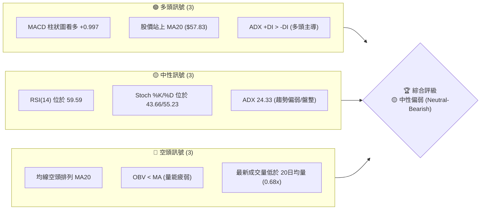
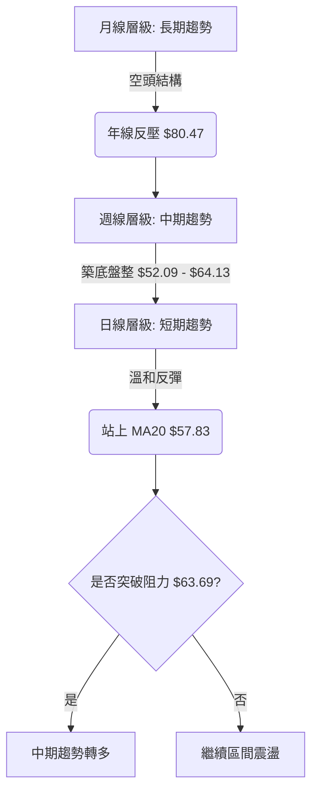

<details>
<summary>📊 靜態圖表 (點擊展開)</summary>

</details>

<html>
<head><meta charset="utf-8" /></head>
<body>
    <div style="height:500px; width:100%;">                        <script>window.PlotlyConfig = {MathJaxConfig: 'local'};</script>
        <script charset="utf-8" src="https://cdn.plot.ly/plotly-3.6.0.min.js" integrity="sha256-QaOVwtVY0T02VaHrr6pnoHLCwayMJp4O5n4YyaE3rJk=" crossorigin="anonymous"></script>                <div id="candlestick-chart" class="plotly-graph-div" style="height:100%; width:100%;"></div>            <script>                window.PLOTLYENV=window.PLOTLYENV || {};                                if (document.getElementById("candlestick-chart")) {                    Plotly.newPlot(                        "candlestick-chart",                        [{"close":{"dtype":"f8","bdata":"AAAAoEcRUEAAAACA6zFQQAAAAKBwrVBAAAAAoJm5UEAAAABAMwNRQAAAAEDh+lBAAAAA4KMgUUAAAACAwnVQQAAAAIDChVBAAAAAAAAgUEAAAAAghctPQAAAAADXM1BAAAAAwPUIUEAAAAAA1yNQQAAAAIA9alBAAAAAQOHqUEAAAADAzExRQAAAACBcr1FAAAAAYGYWU0AAAAAgXO9SQAAAAKCZKVRAAAAAoEcxVEAAAACAFC5UQAAAAKCZ+VRAAAAAIIVLVEAAAADAzAxVQAAAAIDrkVVAAAAAwB4FVkAAAAAgrtdWQAAAAKBwPVdAAAAAgOvBV0AAAAAAKQxYQAAAAAAAEFlAAAAAACnsWUAAAABA4WpaQAAAAEAzo1hAAAAA4FGoV0AAAACA6xFYQAAAAEAz01dAAAAAwB6lVkAAAAAgridWQAAAACCux1RAAAAAoJmpVUAAAAAgrqdWQAAAAEAzE1VAAAAA4HpUVkAAAAAghctWQAAAACCFq1ZAAAAAgOtxVkAAAACgcM1WQAAAAEAzE1ZAAAAAYGamVkAAAABgZsZWQAAAAIAUjlZAAAAAgD1aU0AAAACAPRpSQAAAAOBReFNAAAAAIIXLU0AAAACAwiVTQAAAAMDMLFNAAAAAACnsUUAAAADAzBxSQAAAACBcj1FAAAAAQAqXUUAAAABA4apRQAAAAADX01BAAAAAwPVIUUAAAABACodSQAAAAEAzw1JAAAAAoEfxUkAAAABgZgZTQAAAAKBwTVJAAAAAoHC9UUAAAACA6zFSQAAAACCFa1NAAAAAAAAgU0AAAACA60FTQAAAAIDrQVNAAAAAgD06U0AAAACA67FTQAAAAKBw\u002fVJAAAAA4KOQUkAAAADgUUhSQAAAAKBHcVFAAAAAoJnZUUAAAADA9dhSQAAAAIDrYVRAAAAAQDOTVEAAAACAFP5TQAAAAMDMbFNAAAAAgBReU0AAAABguP5SQAAAAIA9+lJAAAAAYI\u002fSU0AAAAAghXtWQAAAACCF+1ZAAAAAACncVkAAAABgjwJaQAAAAMDMbFxAAAAAQAp3XUAAAACAFO5dQAAAAAAAYF5AAAAAANcjX0AAAABACldgQAAAAIDCFWBAAAAAgMIlXkAAAABgZnZcQAAAAMD1mFtAAAAA4HrUW0AAAAAA14NdQAAAAEDhKlxAAAAAgD0KW0AAAADgo8BZQAAAAIA9ClhAAAAAIK7XWUAAAADAHtVWQAAAAAAAUFVAAAAAgD2aV0AAAAAA17NYQAAAAGC4XldAAAAAgOvxVUAAAABAM8NVQAAAAADXQ1ZAAAAAgBT+VkAAAACgcE1YQAAAAEDhalpAAAAAwB4FWEAAAAAA15NXQAAAACCFq1ZAAAAAYLgOVkAAAADA9QhXQAAAACCFi1VAAAAAgBSuVkAAAADAzDxWQAAAAOBRSFZAAAAAYI9iVUAAAAAAAMBVQAAAAIAUHldAAAAAoHA9VkAAAABA4TpWQAAAAKBwXVZAAAAAgOvhVUAAAACA62FWQAAAAADX01dAAAAAYI9CV0AAAACA6zFXQAAAACCuJ1VAAAAAACnsVEAAAAAgXF9TQAAAAGC4\u002flNAAAAAQAr3UkAAAAAAKfxRQAAAAIDrUVBAAAAA4KOgUUAAAADAzOxQQAAAAADX01BAAAAAgMKFUkAAAACgcP1RQAAAAKBwnVJAAAAAwB4VUUAAAACAwpVRQAAAAEAzY1JAAAAAgD1qUkAAAACAPapSQAAAAIA9mlJAAAAAIFy\u002fUUAAAADAHnVRQAAAAEAzI1FAAAAAQAonUUAAAACgR2FQQAAAAKBHoU5AAAAA4HqUT0AAAADgetROQAAAACCux01AAAAAYGaGT0AAAABgZgZPQAAAAEAK905AAAAAIK6nTUAAAABgj8JOQAAAAAAAgExAAAAAgOvxTEAAAABguH5MQAAAAIA9qkxAAAAAYLg+SkAAAADAzGxLQAAAACCFC0pAAAAAACkcS0AAAAAAKbxKQAAAAMD16EtAAAAAgMJVS0AAAABAChdMQAAAAGBmZkxAAAAAYGamTEAAAAAAKUxQQAAAAOBRCFBAAAAAYLi+T0AAAABgj6JPQAAAAEAKN01AAAAAQDOzT0AAAABgj0JNQA=="},"high":{"dtype":"f8","bdata":"AAAAANcjUEAAAACAwnVQQAAAAGCPwlBAAAAAoHAtUUAAAACAPXpRQAAAACBcL1FAAAAA4Ho0UUAAAAAgXB9RQAAAAIA92lBAAAAAQOHKUEAAAAAAKRxQQAAAAGCPUlBAAAAAAABAUEAAAADAHjVQQAAAAAAAsFBAAAAAwPVIUUAAAACgcG1RQAAAAADX01FAAAAAIK4nU0AAAACA60FTQAAAAAApXFRAAAAAANeTVEAAAADgUahUQAAAAGC4XlVAAAAAAABAVUAAAADgUThVQAAAAIDCtVVAAAAAQOFqVkAAAAAgrvdWQAAAAKBHYVdAAAAAoJkZWEAAAAAgrodYQAAAAAAAwFlAAAAAoHAtWkAAAAAA15NaQAAAAOB6JFxAAAAAoJmpWUAAAAAAAGBZQAAAAGBmRlhAAAAAIFyfWEAAAACAwiVXQAAAAKBHoVVAAAAAgBQuVkAAAABAM7NWQAAAAAAAgFZAAAAAwMx8VkAAAAAghTtXQAAAAGBmpldAAAAAwMwcV0AAAAAgrndXQAAAAAAAwFZAAAAAoJkJV0AAAACAFO5WQAAAAIDC5VZAAAAAAACgVEAAAACAFN5TQAAAAGBmllNAAAAAAACAVEAAAAAgXL9TQAAAAEDhilNAAAAAoJn5UkAAAACgR3FSQAAAAMDMPFJAAAAAAADQUUAAAAAghQtSQAAAAGC4nlJAAAAAgMJVUUAAAAAAKZxSQAAAACCFC1NAAAAAQOFKU0AAAAAgXB9TQAAAAGBmJlNAAAAAYGamUkAAAAAAAEBSQAAAAOB6lFNAAAAA4FGIU0AAAADgeoRTQAAAAIA96lNAAAAAoHCdU0AAAACAFN5TQAAAAKCZ2VNAAAAAQOEaU0AAAADgUahSQAAAACBcj1JAAAAAgD0aUkAAAABgj\u002fJSQAAAACCud1RAAAAAgD3aVEAAAAAAKXxUQAAAAIA9+lNAAAAAgBSOU0AAAAAAKYxTQAAAAIAUPlNAAAAAYLjuU0AAAABACodWQAAAAIDrAVdAAAAA4HrUV0AAAABAM3NbQAAAAMDM3FxAAAAA4FHoXUAAAADgemReQAAAAKBw\u002fV5AAAAAANeTX0AAAAAAAIBgQAAAAAAAwGBAAAAAAAAAYEAAAABAM1NeQAAAAIDr4VxAAAAAQOFqXEAAAADA9YhdQAAAAAAAAF5AAAAAwMzMXEAAAAAAADBbQAAAAMD1SFlAAAAAIFzfWUAAAAAAAMBZQAAAAGBmJldAAAAAQOGqV0AAAACA6\u002fFYQAAAAAAA4FhAAAAAQDMjWEAAAACAwmVWQAAAACBcD1dAAAAAYGZWV0AAAAAAACBZQAAAAIA9elpAAAAAQOGqWkAAAADAHsVXQAAAACBc71ZAAAAAgOtRV0AAAAAAKRxXQAAAAKCZmVVAAAAAYGZGWEAAAACAFE5XQAAAAGBmhlZAAAAAIFxfVkAAAADgUbhWQAAAAEDhaldAAAAAQDMTV0AAAABguL5WQAAAACCu11ZAAAAAoJn5VkAAAABAM\u002fNWQAAAAGBm1ldAAAAA4FE4WEAAAAAAAKBXQAAAAAAAAFdAAAAAANeTVUAAAACgR8FUQAAAAAApPFRAAAAAgOvhU0AAAADgURhTQAAAAKCZ+VFAAAAAgBS+UUAAAABAMzNSQAAAAOCjYFFAAAAAgD2aUkAAAACgmTlSQAAAAAAp3FNAAAAAAACgUkAAAACA66FRQAAAAGBmhlJAAAAA4HokU0AAAABgjxJTQAAAAIAUTlNAAAAAwPU4U0AAAACgcO1RQAAAAKCZuVFAAAAAYLi+UUAAAAAgXC9RQAAAAOCjcFBAAAAAIIUbUEAAAACgmVlPQAAAAKBH4U5AAAAAQAqXT0AAAAAAAMBPQAAAAOBRCFBAAAAAwB5lT0AAAABguN5OQAAAAMAexU5AAAAA4FH4TEAAAABA4dpMQAAAAOCjUE1AAAAAAABATEAAAAAAKfxLQAAAAEAz80pAAAAAAClcS0AAAAAghUtLQAAAAOCj8EtAAAAAANeDS0AAAAAAAGBMQAAAAGBmpk1AAAAAgBSuTEAAAADAHrVQQAAAAAAAsFBAAAAAwMyMUEAAAABAM9NPQAAAAMDM7E5AAAAAIIXLT0AAAADAzAxPQA=="},"hovertemplate":"\u003cb\u003e%{x|%Y-%m-%d}\u003c\u002fb\u003e\u003cbr\u003e\u958b: $%{open:.2f}\u003cbr\u003e\u9ad8: $%{high:.2f}\u003cbr\u003e\u4f4e: $%{low:.2f}\u003cbr\u003e\u6536: $%{close:.2f}\u003cextra\u003e\u003c\u002fextra\u003e","low":{"dtype":"f8","bdata":"AAAAQOFaTkAAAAAA1wNQQAAAAGCPAlBAAAAAIK63UEAAAAAAAMBQQAAAAAAAoFBAAAAAoEfRUEAAAADA9WhQQAAAAGCPgk9AAAAAANcDUEAAAAAAAOBOQAAAAEAzs05AAAAAgD0qT0AAAADgelRPQAAAAAApDFBAAAAAYGZmUEAAAACgmelQQAAAAKCZ+VBAAAAAwB61UUAAAABACkdSQAAAAKBHwVJAAAAAoJn5U0AAAABAM9NTQAAAAGBmRlRAAAAAYGY2VEAAAAAgrrdTQAAAACCFG1VAAAAAQDPzVUAAAABgZgZWQAAAAOBRKFZAAAAAgOshV0AAAABACndXQAAAAKBHgVhAAAAAAAAAWUAAAACgmXlZQAAAAEAzM1hAAAAAoJk5V0AAAABA4apXQAAAAGCPslZAAAAAgD1KVkAAAAAgXB9WQAAAAKBwbVRAAAAAwMxMVUAAAADAzExVQAAAAADXM1RAAAAAIK43VUAAAAAghUtWQAAAAOCjEFZAAAAAAClsVkAAAACgcH1WQAAAAGCPAlZAAAAAgD36VUAAAADAzPxVQAAAAOB6tFVAAAAAYGb2UkAAAACgR5FRQAAAAKCZKVFAAAAAQDNDU0AAAADA9fhSQAAAAAAA4FJAAAAAANfTUUAAAAAAAEBRQAAAAGBmNlFAAAAAgOvxUEAAAABAM1NRQAAAAIA9ulBAAAAAQDMzUEAAAADA9UhRQAAAAKCZKVJAAAAAANfTUkAAAADgo8BSQAAAACCFO1JAAAAAIK63UUAAAAAghWtRQAAAAIDrEVJAAAAA4KOwUkAAAACgmclSQAAAAADXA1NAAAAAwMxMUkAAAABAM7NSQAAAAMDMzFJAAAAAYGZGUkAAAABA4RpSQAAAAADXU1FAAAAAwPWIUUAAAABguM5RQAAAAADXM1NAAAAAYGb2U0AAAACA69FTQAAAAGBmBlNAAAAAoJkJU0AAAABAM\u002fNSQAAAAOBRuFJAAAAAwB6VUkAAAADgUYhUQAAAAMDMrFVAAAAA4KOgVkAAAACgR7FYQAAAAKCZKVpAAAAAAACgXEAAAADAzExdQAAAAAAAgFxAAAAAoEdRXUAAAAAAAEBfQAAAAAAAwF9AAAAAgOuRXEAAAABguM5bQAAAAEAKF1tAAAAAoEexWkAAAAAA18NbQAAAAOCjUFtAAAAAgMKFWkAAAADgUWhZQAAAAKBHsVdAAAAAoJlJWEAAAABA4bpVQAAAAAAAIFVAAAAAAAAAVkAAAADAzExXQAAAAKBwTVdAAAAAoEdBVUAAAAAAAFBVQAAAAKBHwVVAAAAA4HrEVUAAAADAzDxXQAAAAGC4PlhAAAAAIIXbV0AAAAAAAMBWQAAAAGCPAlVAAAAAoHANVkAAAADA9ahVQAAAAAAAAFVAAAAAwB5VVUAAAABgZqZVQAAAAAAAcFVAAAAAoJmZVEAAAAAAAGBUQAAAAMDMzFVAAAAAwPUoVkAAAAAgrqdVQAAAAMD1WFVAAAAAwMzMVUAAAACgmblVQAAAACBcj1ZAAAAAgD0qV0AAAADA9ehVQAAAAGBmxlRAAAAA4HqEVEAAAACgR+FSQAAAAADXU1NAAAAAoJnJUkAAAADAzOxRQAAAACCuF1BAAAAAQDNjUEAAAABgZuZQQAAAACCF609AAAAAwMyMUUAAAABAM3NRQAAAAEAzI1JAAAAAgOsRUUAAAAAghdtQQAAAAEAKZ1FAAAAAoEchUkAAAAAAAFBSQAAAAOCjQFJAAAAAgD2aUUAAAABACjdRQAAAAOB69FBAAAAAwPXoUEAAAADAHuVPQAAAAKBHgU5AAAAA4FGYTkAAAAAAKRxOQAAAACCuh01AAAAAgOvRTUAAAACgmXlOQAAAAKBH4U5AAAAAoEcBTUAAAABACjdNQAAAAMAeJUxAAAAAoHDdS0AAAACgR4FLQAAAAIAUjktAAAAAIIXrSUAAAABguD5KQAAAAOB61ElAAAAAgD0KSkAAAAAA12NKQAAAAEAzU0pAAAAAIK7nSkAAAABA4TpLQAAAAEAz80tAAAAAAACAS0AAAAAAAIBOQAAAAIA9Ck5AAAAAQDOTTkAAAABACtdOQAAAAEAz80xAAAAA4FH4TEAAAAAAAMBMQA=="},"name":"\u50f9\u683c","open":{"dtype":"f8","bdata":"AAAAoHBdT0AAAADA9QhQQAAAAAApLFBAAAAAgD3qUEAAAAAAAMBQQAAAAKBHEVFAAAAAYI8CUUAAAAAgXB9RQAAAAIA9GlBAAAAAgOuRUEAAAABAMxNQQAAAAAAAIFBAAAAAgMI1UEAAAADgUQhQQAAAAGBmVlBAAAAAgMKFUEAAAAAgXO9QQAAAAMDMXFFAAAAAANfDUUAAAADgo8BSQAAAAKCZKVNAAAAAoEdhVEAAAABACidUQAAAAGBmRlRAAAAAIK4XVUAAAAAAAABUQAAAAAAAQFVAAAAAwMw8VkAAAADA9RhWQAAAAAAAoFZAAAAAAADAV0AAAAAAKexXQAAAAGBmllhAAAAAoJlJWUAAAADgesRZQAAAAMD16FpAAAAAwMysV0AAAACAFF5YQAAAAIAUbldAAAAAwMx8WEAAAAAgXP9WQAAAAEDhOlVAAAAAgOvRVUAAAABACsdVQAAAAAAAgFZAAAAAwMxMVUAAAADgUQhXQAAAAOB6RFdAAAAA4HrEVkAAAAAAAIBWQAAAAAAAgFZAAAAAAABgVkAAAADAHrVWQAAAAGC4DlZAAAAAIK6XVEAAAADAzHxTQAAAAEAzk1FAAAAAIIVbVEAAAABguG5TQAAAAIDrMVNAAAAAACm8UkAAAACAPUpRQAAAAIDCBVJAAAAAIFwvUUAAAADAHmVRQAAAAGC4nlJAAAAAANezUEAAAABA4VpRQAAAAIA9ilJAAAAAQDPzUkAAAABguA5TQAAAAGBmJlNAAAAAIK6HUkAAAADgo8BRQAAAAKBHIVJAAAAAAClsU0AAAACAwmVTQAAAAOB6JFNAAAAAAAAAU0AAAAAgXC9TQAAAACCFu1NAAAAAoEcRU0AAAAAAAEBSQAAAAOBRSFJAAAAAACm8UUAAAACA6+FRQAAAAAAAQFNAAAAAgBQeVEAAAABACkdUQAAAAIA9+lNAAAAAoHA9U0AAAAAAKYxTQAAAAEAzM1NAAAAAQDMjU0AAAACAPTpVQAAAAMD1eFZAAAAA4FEoV0AAAACA6+FYQAAAAGC4XlpAAAAAYGY2XUAAAACAPbpdQAAAAAAAoF1AAAAAwPX4XUAAAACgcG1fQAAAACCFA2BAAAAAYI\u002fiX0AAAADgo0BeQAAAAMAedVxAAAAAwMwsW0AAAAAA18NbQAAAAAAAAF5AAAAA4FG4XEAAAADgenRaQAAAAIA9+lhAAAAAYGamWEAAAACgcF1ZQAAAAIAUHlZAAAAAYGZGVkAAAABgZqZXQAAAAOB6tFhAAAAAgD36V0AAAACgmRlWQAAAACBcz1VAAAAAwB4FVkAAAADA9UhXQAAAAKBwbVhAAAAAAClsWkAAAACgR1FXQAAAAAAAMFZAAAAAACk8V0AAAAAAKfxVQAAAAEAzU1VAAAAAQOEaV0AAAACgcE1WQAAAAOCjIFZAAAAAYGY2VkAAAADgUdhUQAAAAEAK91VAAAAAACncVkAAAACA68FVQAAAAAApPFZAAAAAAACAVkAAAACAwjVWQAAAAEAKt1ZAAAAAgD2aV0AAAADgo6BWQAAAAMDM3FZAAAAAgML1VEAAAABA4apUQAAAAGCP8lNAAAAA4FGYU0AAAABACrdSQAAAAOCj8FFAAAAAoJm5UEAAAADA9ShSQAAAAIDrUVBAAAAA4FHIUUAAAAAAABBSQAAAAOBR2FNAAAAAwMyMUkAAAACgRwFRQAAAAGBmhlFAAAAAgD2qUkAAAAAAKexSQAAAAADXE1NAAAAAIIXbUkAAAABgj4JRQAAAAOCjkFFAAAAAIK6HUUAAAADAzBxRQAAAAOCjcFBAAAAA4FGYTkAAAADgUfhOQAAAAGC43k5AAAAAwB4lTkAAAADgerRPQAAAAAApPE9AAAAA4FFYT0AAAACAPYpNQAAAAMAexU5AAAAAgD2KTEAAAAAgXG9MQAAAACCFq0xAAAAA4Ho0TEAAAACgR2FKQAAAAGC4vkpAAAAAoEchSkAAAABguB5LQAAAAKCZ+UpAAAAAAACAS0AAAADAHqVLQAAAAOB61ExAAAAAoHB9TEAAAABA4fpPQAAAAIA9qlBAAAAAACk8UEAAAADA9chPQAAAACBcz05AAAAAgBQuTUAAAACA69FOQA=="},"x":["2025-08-20T00:00:00-04:00","2025-08-21T00:00:00-04:00","2025-08-22T00:00:00-04:00","2025-08-25T00:00:00-04:00","2025-08-26T00:00:00-04:00","2025-08-27T00:00:00-04:00","2025-08-28T00:00:00-04:00","2025-08-29T00:00:00-04:00","2025-09-02T00:00:00-04:00","2025-09-03T00:00:00-04:00","2025-09-04T00:00:00-04:00","2025-09-05T00:00:00-04:00","2025-09-08T00:00:00-04:00","2025-09-09T00:00:00-04:00","2025-09-10T00:00:00-04:00","2025-09-11T00:00:00-04:00","2025-09-12T00:00:00-04:00","2025-09-15T00:00:00-04:00","2025-09-16T00:00:00-04:00","2025-09-17T00:00:00-04:00","2025-09-18T00:00:00-04:00","2025-09-19T00:00:00-04:00","2025-09-22T00:00:00-04:00","2025-09-23T00:00:00-04:00","2025-09-24T00:00:00-04:00","2025-09-25T00:00:00-04:00","2025-09-26T00:00:00-04:00","2025-09-29T00:00:00-04:00","2025-09-30T00:00:00-04:00","2025-10-01T00:00:00-04:00","2025-10-02T00:00:00-04:00","2025-10-03T00:00:00-04:00","2025-10-06T00:00:00-04:00","2025-10-07T00:00:00-04:00","2025-10-08T00:00:00-04:00","2025-10-09T00:00:00-04:00","2025-10-10T00:00:00-04:00","2025-10-13T00:00:00-04:00","2025-10-14T00:00:00-04:00","2025-10-15T00:00:00-04:00","2025-10-16T00:00:00-04:00","2025-10-17T00:00:00-04:00","2025-10-20T00:00:00-04:00","2025-10-21T00:00:00-04:00","2025-10-22T00:00:00-04:00","2025-10-23T00:00:00-04:00","2025-10-24T00:00:00-04:00","2025-10-27T00:00:00-04:00","2025-10-28T00:00:00-04:00","2025-10-29T00:00:00-04:00","2025-10-30T00:00:00-04:00","2025-10-31T00:00:00-04:00","2025-11-03T00:00:00-05:00","2025-11-04T00:00:00-05:00","2025-11-05T00:00:00-05:00","2025-11-06T00:00:00-05:00","2025-11-07T00:00:00-05:00","2025-11-10T00:00:00-05:00","2025-11-11T00:00:00-05:00","2025-11-12T00:00:00-05:00","2025-11-13T00:00:00-05:00","2025-11-14T00:00:00-05:00","2025-11-17T00:00:00-05:00","2025-11-18T00:00:00-05:00","2025-11-19T00:00:00-05:00","2025-11-20T00:00:00-05:00","2025-11-21T00:00:00-05:00","2025-11-24T00:00:00-05:00","2025-11-25T00:00:00-05:00","2025-11-26T00:00:00-05:00","2025-11-28T00:00:00-05:00","2025-12-01T00:00:00-05:00","2025-12-02T00:00:00-05:00","2025-12-03T00:00:00-05:00","2025-12-04T00:00:00-05:00","2025-12-05T00:00:00-05:00","2025-12-08T00:00:00-05:00","2025-12-09T00:00:00-05:00","2025-12-10T00:00:00-05:00","2025-12-11T00:00:00-05:00","2025-12-12T00:00:00-05:00","2025-12-15T00:00:00-05:00","2025-12-16T00:00:00-05:00","2025-12-17T00:00:00-05:00","2025-12-18T00:00:00-05:00","2025-12-19T00:00:00-05:00","2025-12-22T00:00:00-05:00","2025-12-23T00:00:00-05:00","2025-12-24T00:00:00-05:00","2025-12-26T00:00:00-05:00","2025-12-29T00:00:00-05:00","2025-12-30T00:00:00-05:00","2025-12-31T00:00:00-05:00","2026-01-02T00:00:00-05:00","2026-01-05T00:00:00-05:00","2026-01-06T00:00:00-05:00","2026-01-07T00:00:00-05:00","2026-01-08T00:00:00-05:00","2026-01-09T00:00:00-05:00","2026-01-12T00:00:00-05:00","2026-01-13T00:00:00-05:00","2026-01-14T00:00:00-05:00","2026-01-15T00:00:00-05:00","2026-01-16T00:00:00-05:00","2026-01-20T00:00:00-05:00","2026-01-21T00:00:00-05:00","2026-01-22T00:00:00-05:00","2026-01-23T00:00:00-05:00","2026-01-26T00:00:00-05:00","2026-01-27T00:00:00-05:00","2026-01-28T00:00:00-05:00","2026-01-29T00:00:00-05:00","2026-01-30T00:00:00-05:00","2026-02-02T00:00:00-05:00","2026-02-03T00:00:00-05:00","2026-02-04T00:00:00-05:00","2026-02-05T00:00:00-05:00","2026-02-06T00:00:00-05:00","2026-02-09T00:00:00-05:00","2026-02-10T00:00:00-05:00","2026-02-11T00:00:00-05:00","2026-02-12T00:00:00-05:00","2026-02-13T00:00:00-05:00","2026-02-17T00:00:00-05:00","2026-02-18T00:00:00-05:00","2026-02-19T00:00:00-05:00","2026-02-20T00:00:00-05:00","2026-02-23T00:00:00-05:00","2026-02-24T00:00:00-05:00","2026-02-25T00:00:00-05:00","2026-02-26T00:00:00-05:00","2026-02-27T00:00:00-05:00","2026-03-02T00:00:00-05:00","2026-03-03T00:00:00-05:00","2026-03-04T00:00:00-05:00","2026-03-05T00:00:00-05:00","2026-03-06T00:00:00-05:00","2026-03-09T00:00:00-04:00","2026-03-10T00:00:00-04:00","2026-03-11T00:00:00-04:00","2026-03-12T00:00:00-04:00","2026-03-13T00:00:00-04:00","2026-03-16T00:00:00-04:00","2026-03-17T00:00:00-04:00","2026-03-18T00:00:00-04:00","2026-03-19T00:00:00-04:00","2026-03-20T00:00:00-04:00","2026-03-23T00:00:00-04:00","2026-03-24T00:00:00-04:00","2026-03-25T00:00:00-04:00","2026-03-26T00:00:00-04:00","2026-03-27T00:00:00-04:00","2026-03-30T00:00:00-04:00","2026-03-31T00:00:00-04:00","2026-04-01T00:00:00-04:00","2026-04-02T00:00:00-04:00","2026-04-06T00:00:00-04:00","2026-04-07T00:00:00-04:00","2026-04-08T00:00:00-04:00","2026-04-09T00:00:00-04:00","2026-04-10T00:00:00-04:00","2026-04-13T00:00:00-04:00","2026-04-14T00:00:00-04:00","2026-04-15T00:00:00-04:00","2026-04-16T00:00:00-04:00","2026-04-17T00:00:00-04:00","2026-04-20T00:00:00-04:00","2026-04-21T00:00:00-04:00","2026-04-22T00:00:00-04:00","2026-04-23T00:00:00-04:00","2026-04-24T00:00:00-04:00","2026-04-27T00:00:00-04:00","2026-04-28T00:00:00-04:00","2026-04-29T00:00:00-04:00","2026-04-30T00:00:00-04:00","2026-05-01T00:00:00-04:00","2026-05-04T00:00:00-04:00","2026-05-05T00:00:00-04:00","2026-05-06T00:00:00-04:00","2026-05-07T00:00:00-04:00","2026-05-08T00:00:00-04:00","2026-05-11T00:00:00-04:00","2026-05-12T00:00:00-04:00","2026-05-13T00:00:00-04:00","2026-05-14T00:00:00-04:00","2026-05-15T00:00:00-04:00","2026-05-18T00:00:00-04:00","2026-05-19T00:00:00-04:00","2026-05-20T00:00:00-04:00","2026-05-21T00:00:00-04:00","2026-05-22T00:00:00-04:00","2026-05-26T00:00:00-04:00","2026-05-27T00:00:00-04:00","2026-05-28T00:00:00-04:00","2026-05-29T00:00:00-04:00","2026-06-01T00:00:00-04:00","2026-06-02T00:00:00-04:00","2026-06-03T00:00:00-04:00","2026-06-04T00:00:00-04:00","2026-06-05T00:00:00-04:00"],"type":"candlestick"},{"hovertemplate":"MA30: $%{y:.2f}\u003cextra\u003e\u003c\u002fextra\u003e","line":{"color":"#2196F3","dash":"dash","width":2},"mode":"lines","name":"MA30","x":["2025-08-20T00:00:00-04:00","2025-08-21T00:00:00-04:00","2025-08-22T00:00:00-04:00","2025-08-25T00:00:00-04:00","2025-08-26T00:00:00-04:00","2025-08-27T00:00:00-04:00","2025-08-28T00:00:00-04:00","2025-08-29T00:00:00-04:00","2025-09-02T00:00:00-04:00","2025-09-03T00:00:00-04:00","2025-09-04T00:00:00-04:00","2025-09-05T00:00:00-04:00","2025-09-08T00:00:00-04:00","2025-09-09T00:00:00-04:00","2025-09-10T00:00:00-04:00","2025-09-11T00:00:00-04:00","2025-09-12T00:00:00-04:00","2025-09-15T00:00:00-04:00","2025-09-16T00:00:00-04:00","2025-09-17T00:00:00-04:00","2025-09-18T00:00:00-04:00","2025-09-19T00:00:00-04:00","2025-09-22T00:00:00-04:00","2025-09-23T00:00:00-04:00","2025-09-24T00:00:00-04:00","2025-09-25T00:00:00-04:00","2025-09-26T00:00:00-04:00","2025-09-29T00:00:00-04:00","2025-09-30T00:00:00-04:00","2025-10-01T00:00:00-04:00","2025-10-02T00:00:00-04:00","2025-10-03T00:00:00-04:00","2025-10-06T00:00:00-04:00","2025-10-07T00:00:00-04:00","2025-10-08T00:00:00-04:00","2025-10-09T00:00:00-04:00","2025-10-10T00:00:00-04:00","2025-10-13T00:00:00-04:00","2025-10-14T00:00:00-04:00","2025-10-15T00:00:00-04:00","2025-10-16T00:00:00-04:00","2025-10-17T00:00:00-04:00","2025-10-20T00:00:00-04:00","2025-10-21T00:00:00-04:00","2025-10-22T00:00:00-04:00","2025-10-23T00:00:00-04:00","2025-10-24T00:00:00-04:00","2025-10-27T00:00:00-04:00","2025-10-28T00:00:00-04:00","2025-10-29T00:00:00-04:00","2025-10-30T00:00:00-04:00","2025-10-31T00:00:00-04:00","2025-11-03T00:00:00-05:00","2025-11-04T00:00:00-05:00","2025-11-05T00:00:00-05:00","2025-11-06T00:00:00-05:00","2025-11-07T00:00:00-05:00","2025-11-10T00:00:00-05:00","2025-11-11T00:00:00-05:00","2025-11-12T00:00:00-05:00","2025-11-13T00:00:00-05:00","2025-11-14T00:00:00-05:00","2025-11-17T00:00:00-05:00","2025-11-18T00:00:00-05:00","2025-11-19T00:00:00-05:00","2025-11-20T00:00:00-05:00","2025-11-21T00:00:00-05:00","2025-11-24T00:00:00-05:00","2025-11-25T00:00:00-05:00","2025-11-26T00:00:00-05:00","2025-11-28T00:00:00-05:00","2025-12-01T00:00:00-05:00","2025-12-02T00:00:00-05:00","2025-12-03T00:00:00-05:00","2025-12-04T00:00:00-05:00","2025-12-05T00:00:00-05:00","2025-12-08T00:00:00-05:00","2025-12-09T00:00:00-05:00","2025-12-10T00:00:00-05:00","2025-12-11T00:00:00-05:00","2025-12-12T00:00:00-05:00","2025-12-15T00:00:00-05:00","2025-12-16T00:00:00-05:00","2025-12-17T00:00:00-05:00","2025-12-18T00:00:00-05:00","2025-12-19T00:00:00-05:00","2025-12-22T00:00:00-05:00","2025-12-23T00:00:00-05:00","2025-12-24T00:00:00-05:00","2025-12-26T00:00:00-05:00","2025-12-29T00:00:00-05:00","2025-12-30T00:00:00-05:00","2025-12-31T00:00:00-05:00","2026-01-02T00:00:00-05:00","2026-01-05T00:00:00-05:00","2026-01-06T00:00:00-05:00","2026-01-07T00:00:00-05:00","2026-01-08T00:00:00-05:00","2026-01-09T00:00:00-05:00","2026-01-12T00:00:00-05:00","2026-01-13T00:00:00-05:00","2026-01-14T00:00:00-05:00","2026-01-15T00:00:00-05:00","2026-01-16T00:00:00-05:00","2026-01-20T00:00:00-05:00","2026-01-21T00:00:00-05:00","2026-01-22T00:00:00-05:00","2026-01-23T00:00:00-05:00","2026-01-26T00:00:00-05:00","2026-01-27T00:00:00-05:00","2026-01-28T00:00:00-05:00","2026-01-29T00:00:00-05:00","2026-01-30T00:00:00-05:00","2026-02-02T00:00:00-05:00","2026-02-03T00:00:00-05:00","2026-02-04T00:00:00-05:00","2026-02-05T00:00:00-05:00","2026-02-06T00:00:00-05:00","2026-02-09T00:00:00-05:00","2026-02-10T00:00:00-05:00","2026-02-11T00:00:00-05:00","2026-02-12T00:00:00-05:00","2026-02-13T00:00:00-05:00","2026-02-17T00:00:00-05:00","2026-02-18T00:00:00-05:00","2026-02-19T00:00:00-05:00","2026-02-20T00:00:00-05:00","2026-02-23T00:00:00-05:00","2026-02-24T00:00:00-05:00","2026-02-25T00:00:00-05:00","2026-02-26T00:00:00-05:00","2026-02-27T00:00:00-05:00","2026-03-02T00:00:00-05:00","2026-03-03T00:00:00-05:00","2026-03-04T00:00:00-05:00","2026-03-05T00:00:00-05:00","2026-03-06T00:00:00-05:00","2026-03-09T00:00:00-04:00","2026-03-10T00:00:00-04:00","2026-03-11T00:00:00-04:00","2026-03-12T00:00:00-04:00","2026-03-13T00:00:00-04:00","2026-03-16T00:00:00-04:00","2026-03-17T00:00:00-04:00","2026-03-18T00:00:00-04:00","2026-03-19T00:00:00-04:00","2026-03-20T00:00:00-04:00","2026-03-23T00:00:00-04:00","2026-03-24T00:00:00-04:00","2026-03-25T00:00:00-04:00","2026-03-26T00:00:00-04:00","2026-03-27T00:00:00-04:00","2026-03-30T00:00:00-04:00","2026-03-31T00:00:00-04:00","2026-04-01T00:00:00-04:00","2026-04-02T00:00:00-04:00","2026-04-06T00:00:00-04:00","2026-04-07T00:00:00-04:00","2026-04-08T00:00:00-04:00","2026-04-09T00:00:00-04:00","2026-04-10T00:00:00-04:00","2026-04-13T00:00:00-04:00","2026-04-14T00:00:00-04:00","2026-04-15T00:00:00-04:00","2026-04-16T00:00:00-04:00","2026-04-17T00:00:00-04:00","2026-04-20T00:00:00-04:00","2026-04-21T00:00:00-04:00","2026-04-22T00:00:00-04:00","2026-04-23T00:00:00-04:00","2026-04-24T00:00:00-04:00","2026-04-27T00:00:00-04:00","2026-04-28T00:00:00-04:00","2026-04-29T00:00:00-04:00","2026-04-30T00:00:00-04:00","2026-05-01T00:00:00-04:00","2026-05-04T00:00:00-04:00","2026-05-05T00:00:00-04:00","2026-05-06T00:00:00-04:00","2026-05-07T00:00:00-04:00","2026-05-08T00:00:00-04:00","2026-05-11T00:00:00-04:00","2026-05-12T00:00:00-04:00","2026-05-13T00:00:00-04:00","2026-05-14T00:00:00-04:00","2026-05-15T00:00:00-04:00","2026-05-18T00:00:00-04:00","2026-05-19T00:00:00-04:00","2026-05-20T00:00:00-04:00","2026-05-21T00:00:00-04:00","2026-05-22T00:00:00-04:00","2026-05-26T00:00:00-04:00","2026-05-27T00:00:00-04:00","2026-05-28T00:00:00-04:00","2026-05-29T00:00:00-04:00","2026-06-01T00:00:00-04:00","2026-06-02T00:00:00-04:00","2026-06-03T00:00:00-04:00","2026-06-04T00:00:00-04:00","2026-06-05T00:00:00-04:00"],"y":{"dtype":"f8","bdata":"AAAAAAAA+H8AAAAAAAD4fwAAAAAAAPh\u002fAAAAAAAA+H8AAAAAAAD4fwAAAAAAAPh\u002fAAAAAAAA+H8AAAAAAAD4fwAAAAAAAPh\u002fAAAAAAAA+H8AAAAAAAD4fwAAAAAAAPh\u002fAAAAAAAA+H8AAAAAAAD4fwAAAAAAAPh\u002fAAAAAAAA+H8AAAAAAAD4fwAAAAAAAPh\u002fAAAAAAAA+H8AAAAAAAD4fwAAAAAAAPh\u002fAAAAAAAA+H8AAAAAAAD4fwAAAAAAAPh\u002fAAAAAAAA+H8AAAAAAAD4fwAAAAAAAPh\u002fAAAAAAAA+H8AAAAAAAD4f3d3dz8ZTVJAd3d3T7iOUkBERERcutFSQERERKxHGVNAMzMz68NnU0C8u7tzBbhTQM3MzIRd+VNAzczMhBYxVECamZnRBnJUQImIiGBXsFRAERERifrnVEARERFBYB1VQFVVVfVvRFVAvLu7a3V0VUCJiIioDaxVQFVVVZXR01VA7+7uXgECVkAiIiJi5TBWQImIiEhvW1ZAq6qq2hV4VkCamZmJFplWQFVVVXVoqVZAMzMz82C+VkAAAADQhdRWQAAAAGAB4lZAREREdPbZVkC8u7uLz8BWQGZmZgbkrlZAAAAAcOebVkBVVVWVX3xWQERERHSvWVZAREREtOQnVkDv7u5+P\u002fVVQImIiAg6tVVAiYiIaB9uVUDe3d29dCNVQImIiIjP4FRAiYiImG6qVEAiIiLSIntUQO\u002fu7p7vT1RAIiIiYlcwVECrqqrKoRVUQLy7u5t9AFRAZmZmxgTfU0ARERHB9bhTQJqZmVnWqlNAvLu763yPU0AiIiIiTXFTQJqZmWkuVFNA3t3drbk4U0De3d09NR5TQERERPThA1NAMzMzIwbhUkDv7u4esLpSQBEREbEPj1JA3t3dbT2CUkB3d3fnmIhSQKuqqkpikFJAq6qqOgqXUkCamZkpQJ5SQLy7u0tioFJAIiIi8rasUkDNzMzMPrRSQBEREWFXwFJAmpmZWWTTUkARERHhevxSQO\u002fu7q4AMVNAVVVVdZNgU0Crqqo6baBTQHd3d0fh8lNAiYiICKxMVEDv7u5euqlUQGZmZia\u002fEFVAVVVV5ReDVUDNzMzcsv5VQImIiKh\u002fa1ZAzczMrI7JVkDe3d1NGxhXQAAAAFBGX1dAIiIiwq6oV0AAAADgevxXQN7d3W3LSlhAmpmZWR2TWEARERHR29JYQHd3d0coC1lAmpmZKVxPWUB3d3eHXXFZQFVVVSVNeVlAIiIi0iKTWUCJiIj4U7tZQFVVVfX93FlAd3d3l\u002fzyWUCamZlJmgpaQAAAAPCnJlpAiYiI6LRBWkAiIiLCPFFaQBEREaGMblpAAAAAsHJ4WkDv7u7OsGNaQCIiItKUMlpARERE5F7zWUCJiIiIiLhZQKuqqhovbVlARERE9P0kWUBmZmb24ctYQERERGSCd1hAvLu7a7wsWEDe3d29dPNXQImIiAg6zVdA3t3dfYadV0CrqqoqXF9XQJqZmWnYLVdA3t3drdUBV0DNzMzME+VWQFVVVZVD41ZAZmZmBjrNVkCrqqrqUdBWQKuqqtr5zlZA3t3dTRu4VkDe3d29n4pWQBEREfHSbVZAiYiICGVUVkBVVVX1KDRWQImIiOhtAVZAMzMz46XTVUDe3d19sZRVQBEREdHbQlVAd3d3V\u002fITVUAzMzNDRORUQKuqqvqpwVRAzczM7DWXVEB3d3c3tGhUQN7d3Y3CTVRAVVVVhV0pVEB3d3dH4QpUQDMzMzN661NAVVVV9W\u002fMU0CamZnZzqdTQHd3d1fHdFNAd3d3h11JU0AiIiICchdTQERERAxJ21JAd3d3x0unUkAzMzML12tSQHd3d8eSH1JAVVVVPZjfUUAAAACQCZ5RQLy7u8uhbVFAiYiIEJ85UUARERFRjRdRQLy7uyuH5lBAd3d3JzHAUEDe3d11TKBQQLy7u7NWj1BAERERYeVoUEARERGRe01QQDMzM2sDLVBAiYiIwJ8CUEDv7u5+W7ZPQFVVVaXTZk9Ad3d3R4ssT0CamZnJIPBOQBEREVGpqE5ARERE1NtiTkAAAAAQdDpOQN7d3Y2XDk5A7+7ujpfuTUCamZlJmtJNQLy7u4tsp01AZmZm1jGRTUCamZn5U3NNQA=="},"type":"scatter"},{"hovertemplate":"MA60: $%{y:.2f}\u003cextra\u003e\u003c\u002fextra\u003e","line":{"color":"#9C27B0","dash":"dash","width":2},"mode":"lines","name":"MA60","x":["2025-08-20T00:00:00-04:00","2025-08-21T00:00:00-04:00","2025-08-22T00:00:00-04:00","2025-08-25T00:00:00-04:00","2025-08-26T00:00:00-04:00","2025-08-27T00:00:00-04:00","2025-08-28T00:00:00-04:00","2025-08-29T00:00:00-04:00","2025-09-02T00:00:00-04:00","2025-09-03T00:00:00-04:00","2025-09-04T00:00:00-04:00","2025-09-05T00:00:00-04:00","2025-09-08T00:00:00-04:00","2025-09-09T00:00:00-04:00","2025-09-10T00:00:00-04:00","2025-09-11T00:00:00-04:00","2025-09-12T00:00:00-04:00","2025-09-15T00:00:00-04:00","2025-09-16T00:00:00-04:00","2025-09-17T00:00:00-04:00","2025-09-18T00:00:00-04:00","2025-09-19T00:00:00-04:00","2025-09-22T00:00:00-04:00","2025-09-23T00:00:00-04:00","2025-09-24T00:00:00-04:00","2025-09-25T00:00:00-04:00","2025-09-26T00:00:00-04:00","2025-09-29T00:00:00-04:00","2025-09-30T00:00:00-04:00","2025-10-01T00:00:00-04:00","2025-10-02T00:00:00-04:00","2025-10-03T00:00:00-04:00","2025-10-06T00:00:00-04:00","2025-10-07T00:00:00-04:00","2025-10-08T00:00:00-04:00","2025-10-09T00:00:00-04:00","2025-10-10T00:00:00-04:00","2025-10-13T00:00:00-04:00","2025-10-14T00:00:00-04:00","2025-10-15T00:00:00-04:00","2025-10-16T00:00:00-04:00","2025-10-17T00:00:00-04:00","2025-10-20T00:00:00-04:00","2025-10-21T00:00:00-04:00","2025-10-22T00:00:00-04:00","2025-10-23T00:00:00-04:00","2025-10-24T00:00:00-04:00","2025-10-27T00:00:00-04:00","2025-10-28T00:00:00-04:00","2025-10-29T00:00:00-04:00","2025-10-30T00:00:00-04:00","2025-10-31T00:00:00-04:00","2025-11-03T00:00:00-05:00","2025-11-04T00:00:00-05:00","2025-11-05T00:00:00-05:00","2025-11-06T00:00:00-05:00","2025-11-07T00:00:00-05:00","2025-11-10T00:00:00-05:00","2025-11-11T00:00:00-05:00","2025-11-12T00:00:00-05:00","2025-11-13T00:00:00-05:00","2025-11-14T00:00:00-05:00","2025-11-17T00:00:00-05:00","2025-11-18T00:00:00-05:00","2025-11-19T00:00:00-05:00","2025-11-20T00:00:00-05:00","2025-11-21T00:00:00-05:00","2025-11-24T00:00:00-05:00","2025-11-25T00:00:00-05:00","2025-11-26T00:00:00-05:00","2025-11-28T00:00:00-05:00","2025-12-01T00:00:00-05:00","2025-12-02T00:00:00-05:00","2025-12-03T00:00:00-05:00","2025-12-04T00:00:00-05:00","2025-12-05T00:00:00-05:00","2025-12-08T00:00:00-05:00","2025-12-09T00:00:00-05:00","2025-12-10T00:00:00-05:00","2025-12-11T00:00:00-05:00","2025-12-12T00:00:00-05:00","2025-12-15T00:00:00-05:00","2025-12-16T00:00:00-05:00","2025-12-17T00:00:00-05:00","2025-12-18T00:00:00-05:00","2025-12-19T00:00:00-05:00","2025-12-22T00:00:00-05:00","2025-12-23T00:00:00-05:00","2025-12-24T00:00:00-05:00","2025-12-26T00:00:00-05:00","2025-12-29T00:00:00-05:00","2025-12-30T00:00:00-05:00","2025-12-31T00:00:00-05:00","2026-01-02T00:00:00-05:00","2026-01-05T00:00:00-05:00","2026-01-06T00:00:00-05:00","2026-01-07T00:00:00-05:00","2026-01-08T00:00:00-05:00","2026-01-09T00:00:00-05:00","2026-01-12T00:00:00-05:00","2026-01-13T00:00:00-05:00","2026-01-14T00:00:00-05:00","2026-01-15T00:00:00-05:00","2026-01-16T00:00:00-05:00","2026-01-20T00:00:00-05:00","2026-01-21T00:00:00-05:00","2026-01-22T00:00:00-05:00","2026-01-23T00:00:00-05:00","2026-01-26T00:00:00-05:00","2026-01-27T00:00:00-05:00","2026-01-28T00:00:00-05:00","2026-01-29T00:00:00-05:00","2026-01-30T00:00:00-05:00","2026-02-02T00:00:00-05:00","2026-02-03T00:00:00-05:00","2026-02-04T00:00:00-05:00","2026-02-05T00:00:00-05:00","2026-02-06T00:00:00-05:00","2026-02-09T00:00:00-05:00","2026-02-10T00:00:00-05:00","2026-02-11T00:00:00-05:00","2026-02-12T00:00:00-05:00","2026-02-13T00:00:00-05:00","2026-02-17T00:00:00-05:00","2026-02-18T00:00:00-05:00","2026-02-19T00:00:00-05:00","2026-02-20T00:00:00-05:00","2026-02-23T00:00:00-05:00","2026-02-24T00:00:00-05:00","2026-02-25T00:00:00-05:00","2026-02-26T00:00:00-05:00","2026-02-27T00:00:00-05:00","2026-03-02T00:00:00-05:00","2026-03-03T00:00:00-05:00","2026-03-04T00:00:00-05:00","2026-03-05T00:00:00-05:00","2026-03-06T00:00:00-05:00","2026-03-09T00:00:00-04:00","2026-03-10T00:00:00-04:00","2026-03-11T00:00:00-04:00","2026-03-12T00:00:00-04:00","2026-03-13T00:00:00-04:00","2026-03-16T00:00:00-04:00","2026-03-17T00:00:00-04:00","2026-03-18T00:00:00-04:00","2026-03-19T00:00:00-04:00","2026-03-20T00:00:00-04:00","2026-03-23T00:00:00-04:00","2026-03-24T00:00:00-04:00","2026-03-25T00:00:00-04:00","2026-03-26T00:00:00-04:00","2026-03-27T00:00:00-04:00","2026-03-30T00:00:00-04:00","2026-03-31T00:00:00-04:00","2026-04-01T00:00:00-04:00","2026-04-02T00:00:00-04:00","2026-04-06T00:00:00-04:00","2026-04-07T00:00:00-04:00","2026-04-08T00:00:00-04:00","2026-04-09T00:00:00-04:00","2026-04-10T00:00:00-04:00","2026-04-13T00:00:00-04:00","2026-04-14T00:00:00-04:00","2026-04-15T00:00:00-04:00","2026-04-16T00:00:00-04:00","2026-04-17T00:00:00-04:00","2026-04-20T00:00:00-04:00","2026-04-21T00:00:00-04:00","2026-04-22T00:00:00-04:00","2026-04-23T00:00:00-04:00","2026-04-24T00:00:00-04:00","2026-04-27T00:00:00-04:00","2026-04-28T00:00:00-04:00","2026-04-29T00:00:00-04:00","2026-04-30T00:00:00-04:00","2026-05-01T00:00:00-04:00","2026-05-04T00:00:00-04:00","2026-05-05T00:00:00-04:00","2026-05-06T00:00:00-04:00","2026-05-07T00:00:00-04:00","2026-05-08T00:00:00-04:00","2026-05-11T00:00:00-04:00","2026-05-12T00:00:00-04:00","2026-05-13T00:00:00-04:00","2026-05-14T00:00:00-04:00","2026-05-15T00:00:00-04:00","2026-05-18T00:00:00-04:00","2026-05-19T00:00:00-04:00","2026-05-20T00:00:00-04:00","2026-05-21T00:00:00-04:00","2026-05-22T00:00:00-04:00","2026-05-26T00:00:00-04:00","2026-05-27T00:00:00-04:00","2026-05-28T00:00:00-04:00","2026-05-29T00:00:00-04:00","2026-06-01T00:00:00-04:00","2026-06-02T00:00:00-04:00","2026-06-03T00:00:00-04:00","2026-06-04T00:00:00-04:00","2026-06-05T00:00:00-04:00"],"y":{"dtype":"f8","bdata":"AAAAAAAA+H8AAAAAAAD4fwAAAAAAAPh\u002fAAAAAAAA+H8AAAAAAAD4fwAAAAAAAPh\u002fAAAAAAAA+H8AAAAAAAD4fwAAAAAAAPh\u002fAAAAAAAA+H8AAAAAAAD4fwAAAAAAAPh\u002fAAAAAAAA+H8AAAAAAAD4fwAAAAAAAPh\u002fAAAAAAAA+H8AAAAAAAD4fwAAAAAAAPh\u002fAAAAAAAA+H8AAAAAAAD4fwAAAAAAAPh\u002fAAAAAAAA+H8AAAAAAAD4fwAAAAAAAPh\u002fAAAAAAAA+H8AAAAAAAD4fwAAAAAAAPh\u002fAAAAAAAA+H8AAAAAAAD4fwAAAAAAAPh\u002fAAAAAAAA+H8AAAAAAAD4fwAAAAAAAPh\u002fAAAAAAAA+H8AAAAAAAD4fwAAAAAAAPh\u002fAAAAAAAA+H8AAAAAAAD4fwAAAAAAAPh\u002fAAAAAAAA+H8AAAAAAAD4fwAAAAAAAPh\u002fAAAAAAAA+H8AAAAAAAD4fwAAAAAAAPh\u002fAAAAAAAA+H8AAAAAAAD4fwAAAAAAAPh\u002fAAAAAAAA+H8AAAAAAAD4fwAAAAAAAPh\u002fAAAAAAAA+H8AAAAAAAD4fwAAAAAAAPh\u002fAAAAAAAA+H8AAAAAAAD4fwAAAAAAAPh\u002fAAAAAAAA+H8AAAAAAAD4f97d3VlkU1RA3t3dgU5bVECamZntfGNUQGZmZtpAZ1RA3t3dqfFqVEDNzMwYvW1UQKuqqoYWbVRAq6qqjsJtVEDe3d3RlHZUQLy7u38jgFRAmpmZ9SiMVEDe3d0FgZlUQImIiMh2olRAERERGb2pVEDNzMy0gbJUQHd3d\u002fdTv1RAVVVVJb\u002fIVEAiIiJCGdFUQBEREdnO11RARERExGfYVEC8u7vjpdtUQM3MzDSl1lRAMzMzi7PPVEB3d3f3msdUQImIiIiIuFRAERER8RmuVECamZk5tKRUQImIiCijn1RAVVVV1XiZVEB3d3ffT41UQAAAAOAIfVRAMzMz001qVEDe3d0lv1RUQM3MzLTIOlRAERER4cEgVEB3d3fP9w9UQLy7uxvoCFRA7+7uBoEFVEBmZmYGyA1UQDMzM3NoIVRAVVVVtYE+VEDNzMwUrl9UQBEREWGeiFRA3t3dVQ6xVEDv7u5O1NtUQBEREQErC1VAREREzIUsVUAAAAA4tERVQM3MzFy6WVVAAAAAOLRwVUDv7u4OWI1VQBEREbFWp1VAZmZmvhG6VUAAAAD4xcZVQERERPwbzVVAvLu7y8zoVUB3d3c3+\u002fxVQAAAALjXBFZAZmZmhhYVVkARERERyixWQImIiCCwPlZAzczMxNlPVkAzMzOLbF9WQImIiKh\u002fc1ZAERERoYyKVkCamZnR26ZWQAAAAKjGz1ZAq6qqEoPsVkDNzMwEDwJXQM3MzAy7EldAZmZmdgUgV0C8u7tzITFXQImIiCD3PldAzczM7ApUV0CamZlpSmVXQGZmZgaBcVdAREREjCV7V0De3d0FyIVXQERERCxAlldAAAAAoBqjV0BVVVWF661XQLy7u+tRvFdAvLu7g3nKV0Dv7u7O99tXQGZmZu4191dAAAAAGEsOWEARERG51yBYQAAAAIAjJFhAAAAAEJ8lWEAzMzPb+SJYQDMzM3NoJVhAAAAA0LAjWEB3d3efYR9YQEREROwKFFhA3t3dZa0KWEAAAAAg9\u002fJXQBERETm02FdAvLu7gzLGV0ARERGJ+qNXQGZmZmYfeldAiYiIaEpFV0AAAABgnhBXQERERNR43VZAzczMvC2nVkDv7u6eYWtWQLy7u0t+MVZAiYiIMJb8VUC8u7vLoc1VQAAAALAAoVVAq6qqAnJzVUBmZmYWZztVQO\u002fu7rqQBFVAq6qqupDUVEAAAABsdahUQGZmZi5rgVRA3t3dIWlWVEBVVVW9LTdUQDMzM9NNHlRAMzMzL934U0B3d3eHFtFTQGZmZg4tqlNAAAAAGEuKU0CamZm1OmpTQCIiIk5iSFNAIiIiokUeU0B3d3eHFvFSQCIiIp7vt1JAAAAADEmLUkBVVVUBuV9SQKuqquaJOlJAREREyL0WUkAiIiJOYvBRQDMzM5sL0VFAvLu7t2WtUUC8u7unDZRRQBEREf1ieVFAZmZm3t1hUUAzMzP\u002fjUhRQKuqqs4+JFFAVVVVOfsIUUB3d3f\u002fjehQQA=="},"type":"scatter"},{"hovertemplate":"MA200: $%{y:.2f}\u003cextra\u003e\u003c\u002fextra\u003e","line":{"color":"#FF6F00","dash":"solid","width":2},"mode":"lines","name":"MA200","x":["2025-08-20T00:00:00-04:00","2025-08-21T00:00:00-04:00","2025-08-22T00:00:00-04:00","2025-08-25T00:00:00-04:00","2025-08-26T00:00:00-04:00","2025-08-27T00:00:00-04:00","2025-08-28T00:00:00-04:00","2025-08-29T00:00:00-04:00","2025-09-02T00:00:00-04:00","2025-09-03T00:00:00-04:00","2025-09-04T00:00:00-04:00","2025-09-05T00:00:00-04:00","2025-09-08T00:00:00-04:00","2025-09-09T00:00:00-04:00","2025-09-10T00:00:00-04:00","2025-09-11T00:00:00-04:00","2025-09-12T00:00:00-04:00","2025-09-15T00:00:00-04:00","2025-09-16T00:00:00-04:00","2025-09-17T00:00:00-04:00","2025-09-18T00:00:00-04:00","2025-09-19T00:00:00-04:00","2025-09-22T00:00:00-04:00","2025-09-23T00:00:00-04:00","2025-09-24T00:00:00-04:00","2025-09-25T00:00:00-04:00","2025-09-26T00:00:00-04:00","2025-09-29T00:00:00-04:00","2025-09-30T00:00:00-04:00","2025-10-01T00:00:00-04:00","2025-10-02T00:00:00-04:00","2025-10-03T00:00:00-04:00","2025-10-06T00:00:00-04:00","2025-10-07T00:00:00-04:00","2025-10-08T00:00:00-04:00","2025-10-09T00:00:00-04:00","2025-10-10T00:00:00-04:00","2025-10-13T00:00:00-04:00","2025-10-14T00:00:00-04:00","2025-10-15T00:00:00-04:00","2025-10-16T00:00:00-04:00","2025-10-17T00:00:00-04:00","2025-10-20T00:00:00-04:00","2025-10-21T00:00:00-04:00","2025-10-22T00:00:00-04:00","2025-10-23T00:00:00-04:00","2025-10-24T00:00:00-04:00","2025-10-27T00:00:00-04:00","2025-10-28T00:00:00-04:00","2025-10-29T00:00:00-04:00","2025-10-30T00:00:00-04:00","2025-10-31T00:00:00-04:00","2025-11-03T00:00:00-05:00","2025-11-04T00:00:00-05:00","2025-11-05T00:00:00-05:00","2025-11-06T00:00:00-05:00","2025-11-07T00:00:00-05:00","2025-11-10T00:00:00-05:00","2025-11-11T00:00:00-05:00","2025-11-12T00:00:00-05:00","2025-11-13T00:00:00-05:00","2025-11-14T00:00:00-05:00","2025-11-17T00:00:00-05:00","2025-11-18T00:00:00-05:00","2025-11-19T00:00:00-05:00","2025-11-20T00:00:00-05:00","2025-11-21T00:00:00-05:00","2025-11-24T00:00:00-05:00","2025-11-25T00:00:00-05:00","2025-11-26T00:00:00-05:00","2025-11-28T00:00:00-05:00","2025-12-01T00:00:00-05:00","2025-12-02T00:00:00-05:00","2025-12-03T00:00:00-05:00","2025-12-04T00:00:00-05:00","2025-12-05T00:00:00-05:00","2025-12-08T00:00:00-05:00","2025-12-09T00:00:00-05:00","2025-12-10T00:00:00-05:00","2025-12-11T00:00:00-05:00","2025-12-12T00:00:00-05:00","2025-12-15T00:00:00-05:00","2025-12-16T00:00:00-05:00","2025-12-17T00:00:00-05:00","2025-12-18T00:00:00-05:00","2025-12-19T00:00:00-05:00","2025-12-22T00:00:00-05:00","2025-12-23T00:00:00-05:00","2025-12-24T00:00:00-05:00","2025-12-26T00:00:00-05:00","2025-12-29T00:00:00-05:00","2025-12-30T00:00:00-05:00","2025-12-31T00:00:00-05:00","2026-01-02T00:00:00-05:00","2026-01-05T00:00:00-05:00","2026-01-06T00:00:00-05:00","2026-01-07T00:00:00-05:00","2026-01-08T00:00:00-05:00","2026-01-09T00:00:00-05:00","2026-01-12T00:00:00-05:00","2026-01-13T00:00:00-05:00","2026-01-14T00:00:00-05:00","2026-01-15T00:00:00-05:00","2026-01-16T00:00:00-05:00","2026-01-20T00:00:00-05:00","2026-01-21T00:00:00-05:00","2026-01-22T00:00:00-05:00","2026-01-23T00:00:00-05:00","2026-01-26T00:00:00-05:00","2026-01-27T00:00:00-05:00","2026-01-28T00:00:00-05:00","2026-01-29T00:00:00-05:00","2026-01-30T00:00:00-05:00","2026-02-02T00:00:00-05:00","2026-02-03T00:00:00-05:00","2026-02-04T00:00:00-05:00","2026-02-05T00:00:00-05:00","2026-02-06T00:00:00-05:00","2026-02-09T00:00:00-05:00","2026-02-10T00:00:00-05:00","2026-02-11T00:00:00-05:00","2026-02-12T00:00:00-05:00","2026-02-13T00:00:00-05:00","2026-02-17T00:00:00-05:00","2026-02-18T00:00:00-05:00","2026-02-19T00:00:00-05:00","2026-02-20T00:00:00-05:00","2026-02-23T00:00:00-05:00","2026-02-24T00:00:00-05:00","2026-02-25T00:00:00-05:00","2026-02-26T00:00:00-05:00","2026-02-27T00:00:00-05:00","2026-03-02T00:00:00-05:00","2026-03-03T00:00:00-05:00","2026-03-04T00:00:00-05:00","2026-03-05T00:00:00-05:00","2026-03-06T00:00:00-05:00","2026-03-09T00:00:00-04:00","2026-03-10T00:00:00-04:00","2026-03-11T00:00:00-04:00","2026-03-12T00:00:00-04:00","2026-03-13T00:00:00-04:00","2026-03-16T00:00:00-04:00","2026-03-17T00:00:00-04:00","2026-03-18T00:00:00-04:00","2026-03-19T00:00:00-04:00","2026-03-20T00:00:00-04:00","2026-03-23T00:00:00-04:00","2026-03-24T00:00:00-04:00","2026-03-25T00:00:00-04:00","2026-03-26T00:00:00-04:00","2026-03-27T00:00:00-04:00","2026-03-30T00:00:00-04:00","2026-03-31T00:00:00-04:00","2026-04-01T00:00:00-04:00","2026-04-02T00:00:00-04:00","2026-04-06T00:00:00-04:00","2026-04-07T00:00:00-04:00","2026-04-08T00:00:00-04:00","2026-04-09T00:00:00-04:00","2026-04-10T00:00:00-04:00","2026-04-13T00:00:00-04:00","2026-04-14T00:00:00-04:00","2026-04-15T00:00:00-04:00","2026-04-16T00:00:00-04:00","2026-04-17T00:00:00-04:00","2026-04-20T00:00:00-04:00","2026-04-21T00:00:00-04:00","2026-04-22T00:00:00-04:00","2026-04-23T00:00:00-04:00","2026-04-24T00:00:00-04:00","2026-04-27T00:00:00-04:00","2026-04-28T00:00:00-04:00","2026-04-29T00:00:00-04:00","2026-04-30T00:00:00-04:00","2026-05-01T00:00:00-04:00","2026-05-04T00:00:00-04:00","2026-05-05T00:00:00-04:00","2026-05-06T00:00:00-04:00","2026-05-07T00:00:00-04:00","2026-05-08T00:00:00-04:00","2026-05-11T00:00:00-04:00","2026-05-12T00:00:00-04:00","2026-05-13T00:00:00-04:00","2026-05-14T00:00:00-04:00","2026-05-15T00:00:00-04:00","2026-05-18T00:00:00-04:00","2026-05-19T00:00:00-04:00","2026-05-20T00:00:00-04:00","2026-05-21T00:00:00-04:00","2026-05-22T00:00:00-04:00","2026-05-26T00:00:00-04:00","2026-05-27T00:00:00-04:00","2026-05-28T00:00:00-04:00","2026-05-29T00:00:00-04:00","2026-06-01T00:00:00-04:00","2026-06-02T00:00:00-04:00","2026-06-03T00:00:00-04:00","2026-06-04T00:00:00-04:00","2026-06-05T00:00:00-04:00"],"y":{"dtype":"f8","bdata":"AAAAAAAA+H8AAAAAAAD4fwAAAAAAAPh\u002fAAAAAAAA+H8AAAAAAAD4fwAAAAAAAPh\u002fAAAAAAAA+H8AAAAAAAD4fwAAAAAAAPh\u002fAAAAAAAA+H8AAAAAAAD4fwAAAAAAAPh\u002fAAAAAAAA+H8AAAAAAAD4fwAAAAAAAPh\u002fAAAAAAAA+H8AAAAAAAD4fwAAAAAAAPh\u002fAAAAAAAA+H8AAAAAAAD4fwAAAAAAAPh\u002fAAAAAAAA+H8AAAAAAAD4fwAAAAAAAPh\u002fAAAAAAAA+H8AAAAAAAD4fwAAAAAAAPh\u002fAAAAAAAA+H8AAAAAAAD4fwAAAAAAAPh\u002fAAAAAAAA+H8AAAAAAAD4fwAAAAAAAPh\u002fAAAAAAAA+H8AAAAAAAD4fwAAAAAAAPh\u002fAAAAAAAA+H8AAAAAAAD4fwAAAAAAAPh\u002fAAAAAAAA+H8AAAAAAAD4fwAAAAAAAPh\u002fAAAAAAAA+H8AAAAAAAD4fwAAAAAAAPh\u002fAAAAAAAA+H8AAAAAAAD4fwAAAAAAAPh\u002fAAAAAAAA+H8AAAAAAAD4fwAAAAAAAPh\u002fAAAAAAAA+H8AAAAAAAD4fwAAAAAAAPh\u002fAAAAAAAA+H8AAAAAAAD4fwAAAAAAAPh\u002fAAAAAAAA+H8AAAAAAAD4fwAAAAAAAPh\u002fAAAAAAAA+H8AAAAAAAD4fwAAAAAAAPh\u002fAAAAAAAA+H8AAAAAAAD4fwAAAAAAAPh\u002fAAAAAAAA+H8AAAAAAAD4fwAAAAAAAPh\u002fAAAAAAAA+H8AAAAAAAD4fwAAAAAAAPh\u002fAAAAAAAA+H8AAAAAAAD4fwAAAAAAAPh\u002fAAAAAAAA+H8AAAAAAAD4fwAAAAAAAPh\u002fAAAAAAAA+H8AAAAAAAD4fwAAAAAAAPh\u002fAAAAAAAA+H8AAAAAAAD4fwAAAAAAAPh\u002fAAAAAAAA+H8AAAAAAAD4fwAAAAAAAPh\u002fAAAAAAAA+H8AAAAAAAD4fwAAAAAAAPh\u002fAAAAAAAA+H8AAAAAAAD4fwAAAAAAAPh\u002fAAAAAAAA+H8AAAAAAAD4fwAAAAAAAPh\u002fAAAAAAAA+H8AAAAAAAD4fwAAAAAAAPh\u002fAAAAAAAA+H8AAAAAAAD4fwAAAAAAAPh\u002fAAAAAAAA+H8AAAAAAAD4fwAAAAAAAPh\u002fAAAAAAAA+H8AAAAAAAD4fwAAAAAAAPh\u002fAAAAAAAA+H8AAAAAAAD4fwAAAAAAAPh\u002fAAAAAAAA+H8AAAAAAAD4fwAAAAAAAPh\u002fAAAAAAAA+H8AAAAAAAD4fwAAAAAAAPh\u002fAAAAAAAA+H8AAAAAAAD4fwAAAAAAAPh\u002fAAAAAAAA+H8AAAAAAAD4fwAAAAAAAPh\u002fAAAAAAAA+H8AAAAAAAD4fwAAAAAAAPh\u002fAAAAAAAA+H8AAAAAAAD4fwAAAAAAAPh\u002fAAAAAAAA+H8AAAAAAAD4fwAAAAAAAPh\u002fAAAAAAAA+H8AAAAAAAD4fwAAAAAAAPh\u002fAAAAAAAA+H8AAAAAAAD4fwAAAAAAAPh\u002fAAAAAAAA+H8AAAAAAAD4fwAAAAAAAPh\u002fAAAAAAAA+H8AAAAAAAD4fwAAAAAAAPh\u002fAAAAAAAA+H8AAAAAAAD4fwAAAAAAAPh\u002fAAAAAAAA+H8AAAAAAAD4fwAAAAAAAPh\u002fAAAAAAAA+H8AAAAAAAD4fwAAAAAAAPh\u002fAAAAAAAA+H8AAAAAAAD4fwAAAAAAAPh\u002fAAAAAAAA+H8AAAAAAAD4fwAAAAAAAPh\u002fAAAAAAAA+H8AAAAAAAD4fwAAAAAAAPh\u002fAAAAAAAA+H8AAAAAAAD4fwAAAAAAAPh\u002fAAAAAAAA+H8AAAAAAAD4fwAAAAAAAPh\u002fAAAAAAAA+H8AAAAAAAD4fwAAAAAAAPh\u002fAAAAAAAA+H8AAAAAAAD4fwAAAAAAAPh\u002fAAAAAAAA+H8AAAAAAAD4fwAAAAAAAPh\u002fAAAAAAAA+H8AAAAAAAD4fwAAAAAAAPh\u002fAAAAAAAA+H8AAAAAAAD4fwAAAAAAAPh\u002fAAAAAAAA+H8AAAAAAAD4fwAAAAAAAPh\u002fAAAAAAAA+H8AAAAAAAD4fwAAAAAAAPh\u002fAAAAAAAA+H8AAAAAAAD4fwAAAAAAAPh\u002fAAAAAAAA+H8AAAAAAAD4fwAAAAAAAPh\u002fAAAAAAAA+H8AAAAAAAD4fwAAAAAAAPh\u002fAAAAAAAA+H\u002fNzMwyxB1UQA=="},"type":"scatter"}],                        {"template":{"data":{"barpolar":[{"marker":{"line":{"color":"rgb(17,17,17)","width":0.5},"pattern":{"fillmode":"overlay","size":10,"solidity":0.2}},"type":"barpolar"}],"bar":[{"error_x":{"color":"#f2f5fa"},"error_y":{"color":"#f2f5fa"},"marker":{"line":{"color":"rgb(17,17,17)","width":0.5},"pattern":{"fillmode":"overlay","size":10,"solidity":0.2}},"type":"bar"}],"carpet":[{"aaxis":{"endlinecolor":"#A2B1C6","gridcolor":"#506784","linecolor":"#506784","minorgridcolor":"#506784","startlinecolor":"#A2B1C6"},"baxis":{"endlinecolor":"#A2B1C6","gridcolor":"#506784","linecolor":"#506784","minorgridcolor":"#506784","startlinecolor":"#A2B1C6"},"type":"carpet"}],"choropleth":[{"colorbar":{"outlinewidth":0,"ticks":""},"type":"choropleth"}],"contourcarpet":[{"colorbar":{"outlinewidth":0,"ticks":""},"type":"contourcarpet"}],"contour":[{"colorbar":{"outlinewidth":0,"ticks":""},"colorscale":[[0.0,"#0d0887"],[0.1111111111111111,"#46039f"],[0.2222222222222222,"#7201a8"],[0.3333333333333333,"#9c179e"],[0.4444444444444444,"#bd3786"],[0.5555555555555556,"#d8576b"],[0.6666666666666666,"#ed7953"],[0.7777777777777778,"#fb9f3a"],[0.8888888888888888,"#fdca26"],[1.0,"#f0f921"]],"type":"contour"}],"heatmap":[{"colorbar":{"outlinewidth":0,"ticks":""},"colorscale":[[0.0,"#0d0887"],[0.1111111111111111,"#46039f"],[0.2222222222222222,"#7201a8"],[0.3333333333333333,"#9c179e"],[0.4444444444444444,"#bd3786"],[0.5555555555555556,"#d8576b"],[0.6666666666666666,"#ed7953"],[0.7777777777777778,"#fb9f3a"],[0.8888888888888888,"#fdca26"],[1.0,"#f0f921"]],"type":"heatmap"}],"histogram2dcontour":[{"colorbar":{"outlinewidth":0,"ticks":""},"colorscale":[[0.0,"#0d0887"],[0.1111111111111111,"#46039f"],[0.2222222222222222,"#7201a8"],[0.3333333333333333,"#9c179e"],[0.4444444444444444,"#bd3786"],[0.5555555555555556,"#d8576b"],[0.6666666666666666,"#ed7953"],[0.7777777777777778,"#fb9f3a"],[0.8888888888888888,"#fdca26"],[1.0,"#f0f921"]],"type":"histogram2dcontour"}],"histogram2d":[{"colorbar":{"outlinewidth":0,"ticks":""},"colorscale":[[0.0,"#0d0887"],[0.1111111111111111,"#46039f"],[0.2222222222222222,"#7201a8"],[0.3333333333333333,"#9c179e"],[0.4444444444444444,"#bd3786"],[0.5555555555555556,"#d8576b"],[0.6666666666666666,"#ed7953"],[0.7777777777777778,"#fb9f3a"],[0.8888888888888888,"#fdca26"],[1.0,"#f0f921"]],"type":"histogram2d"}],"histogram":[{"marker":{"pattern":{"fillmode":"overlay","size":10,"solidity":0.2}},"type":"histogram"}],"mesh3d":[{"colorbar":{"outlinewidth":0,"ticks":""},"type":"mesh3d"}],"parcoords":[{"line":{"colorbar":{"outlinewidth":0,"ticks":""}},"type":"parcoords"}],"pie":[{"automargin":true,"type":"pie"}],"scatter3d":[{"line":{"colorbar":{"outlinewidth":0,"ticks":""}},"marker":{"colorbar":{"outlinewidth":0,"ticks":""}},"type":"scatter3d"}],"scattercarpet":[{"marker":{"colorbar":{"outlinewidth":0,"ticks":""}},"type":"scattercarpet"}],"scattergeo":[{"marker":{"colorbar":{"outlinewidth":0,"ticks":""}},"type":"scattergeo"}],"scattergl":[{"marker":{"line":{"color":"#283442"}},"type":"scattergl"}],"scattermapbox":[{"marker":{"colorbar":{"outlinewidth":0,"ticks":""}},"type":"scattermapbox"}],"scattermap":[{"marker":{"colorbar":{"outlinewidth":0,"ticks":""}},"type":"scattermap"}],"scatterpolargl":[{"marker":{"colorbar":{"outlinewidth":0,"ticks":""}},"type":"scatterpolargl"}],"scatterpolar":[{"marker":{"colorbar":{"outlinewidth":0,"ticks":""}},"type":"scatterpolar"}],"scatter":[{"marker":{"line":{"color":"#283442"}},"type":"scatter"}],"scatterternary":[{"marker":{"colorbar":{"outlinewidth":0,"ticks":""}},"type":"scatterternary"}],"surface":[{"colorbar":{"outlinewidth":0,"ticks":""},"colorscale":[[0.0,"#0d0887"],[0.1111111111111111,"#46039f"],[0.2222222222222222,"#7201a8"],[0.3333333333333333,"#9c179e"],[0.4444444444444444,"#bd3786"],[0.5555555555555556,"#d8576b"],[0.6666666666666666,"#ed7953"],[0.7777777777777778,"#fb9f3a"],[0.8888888888888888,"#fdca26"],[1.0,"#f0f921"]],"type":"surface"}],"table":[{"cells":{"fill":{"color":"#506784"},"line":{"color":"rgb(17,17,17)"}},"header":{"fill":{"color":"#2a3f5f"},"line":{"color":"rgb(17,17,17)"}},"type":"table"}]},"layout":{"annotationdefaults":{"arrowcolor":"#f2f5fa","arrowhead":0,"arrowwidth":1},"autotypenumbers":"strict","coloraxis":{"colorbar":{"outlinewidth":0,"ticks":""}},"colorscale":{"diverging":[[0,"#8e0152"],[0.1,"#c51b7d"],[0.2,"#de77ae"],[0.3,"#f1b6da"],[0.4,"#fde0ef"],[0.5,"#f7f7f7"],[0.6,"#e6f5d0"],[0.7,"#b8e186"],[0.8,"#7fbc41"],[0.9,"#4d9221"],[1,"#276419"]],"sequential":[[0.0,"#0d0887"],[0.1111111111111111,"#46039f"],[0.2222222222222222,"#7201a8"],[0.3333333333333333,"#9c179e"],[0.4444444444444444,"#bd3786"],[0.5555555555555556,"#d8576b"],[0.6666666666666666,"#ed7953"],[0.7777777777777778,"#fb9f3a"],[0.8888888888888888,"#fdca26"],[1.0,"#f0f921"]],"sequentialminus":[[0.0,"#0d0887"],[0.1111111111111111,"#46039f"],[0.2222222222222222,"#7201a8"],[0.3333333333333333,"#9c179e"],[0.4444444444444444,"#bd3786"],[0.5555555555555556,"#d8576b"],[0.6666666666666666,"#ed7953"],[0.7777777777777778,"#fb9f3a"],[0.8888888888888888,"#fdca26"],[1.0,"#f0f921"]]},"colorway":["#636efa","#EF553B","#00cc96","#ab63fa","#FFA15A","#19d3f3","#FF6692","#B6E880","#FF97FF","#FECB52"],"font":{"color":"#f2f5fa"},"geo":{"bgcolor":"rgb(17,17,17)","lakecolor":"rgb(17,17,17)","landcolor":"rgb(17,17,17)","showlakes":true,"showland":true,"subunitcolor":"#506784"},"hoverlabel":{"align":"left"},"hovermode":"closest","mapbox":{"style":"dark"},"paper_bgcolor":"rgb(17,17,17)","plot_bgcolor":"rgb(17,17,17)","polar":{"angularaxis":{"gridcolor":"#506784","linecolor":"#506784","ticks":""},"bgcolor":"rgb(17,17,17)","radialaxis":{"gridcolor":"#506784","linecolor":"#506784","ticks":""}},"scene":{"xaxis":{"backgroundcolor":"rgb(17,17,17)","gridcolor":"#506784","gridwidth":2,"linecolor":"#506784","showbackground":true,"ticks":"","zerolinecolor":"#C8D4E3"},"yaxis":{"backgroundcolor":"rgb(17,17,17)","gridcolor":"#506784","gridwidth":2,"linecolor":"#506784","showbackground":true,"ticks":"","zerolinecolor":"#C8D4E3"},"zaxis":{"backgroundcolor":"rgb(17,17,17)","gridcolor":"#506784","gridwidth":2,"linecolor":"#506784","showbackground":true,"ticks":"","zerolinecolor":"#C8D4E3"}},"shapedefaults":{"line":{"color":"#f2f5fa"}},"sliderdefaults":{"bgcolor":"#C8D4E3","bordercolor":"rgb(17,17,17)","borderwidth":1,"tickwidth":0},"ternary":{"aaxis":{"gridcolor":"#506784","linecolor":"#506784","ticks":""},"baxis":{"gridcolor":"#506784","linecolor":"#506784","ticks":""},"bgcolor":"rgb(17,17,17)","caxis":{"gridcolor":"#506784","linecolor":"#506784","ticks":""}},"title":{"x":0.05},"updatemenudefaults":{"bgcolor":"#506784","borderwidth":0},"xaxis":{"automargin":true,"gridcolor":"#283442","linecolor":"#506784","ticks":"","title":{"standoff":15},"zerolinecolor":"#283442","zerolinewidth":2},"yaxis":{"automargin":true,"gridcolor":"#283442","linecolor":"#506784","ticks":"","title":{"standoff":15},"zerolinecolor":"#283442","zerolinewidth":2}}},"xaxis":{"rangeslider":{"visible":false},"title":{"text":"\u65e5\u671f"}},"font":{"size":11},"title":{"text":"KTOS  |  MA(30\u002f60\u002f200)  |  \u6700\u8fd1200\u4ea4\u6613\u65e5"},"yaxis":{"title":{"text":"\u80a1\u50f9 (USD)"}},"hovermode":"x unified","height":500},                        {"responsive": true}                    )                };            </script>        </div>
</body>
</html>

# KTOS 技術分析報告

> **報告日期**：2026-06-08 ｜ **語言**：繁體中文 ｜ **數據來源**：Yahoo Finance ｜ **當前價格**：$58.52

---

## 目錄

| 章節 | 內容 |
|------|------|
| [1. 技術面概覽](#1-技術面概覽) | 訊號儀表板、核心指標、評分卡 |
| [2. 趨勢分析](#2-趨勢分析) | 多時框趨勢、長中短期走勢 |
| [3. 圖表形態分析](#3-圖表形態分析) | 形態識別、K線組合、目標價 |
| [4. 支撐與阻力](#4-支撐與阻力) | 關鍵價位、斐波那契回調 |
| [5. 技術指標深度解讀](#5-技術指標深度解讀) | MA/RSI/MACD/布林/成交量 |
| [6. 動能與波動率](#6-動能與波動率) | 動能評估、ATR、Beta |
| [7. 多時框架總結](#7-多時框架總結) | 時框架評分矩陣 |
| [8. 交易策略建議](#8-交易策略建議) | 多空策略、風險報酬比 |
| [9. 風險提示與監控](#9-風險提示與監控) | 監控指標、風險場景 |

---

## 1. 技術面概覽

Kratos Defense & Security Solutions, Inc. (KTOS) 目前正處於長期空頭趨勢中的**中期築底修正階段**。股價自 52 週高點 $134.00 大幅回撤至近期低點 $52.09 後，市場賣壓已有所收斂。當前股價 $58.52 成功站上 20 日均線（MA20: $57.83），顯示短期買盤開始嘗試介入，但上方仍面臨強大的中長期均線反壓。

### 🎯 技術訊號儀表板



### 📊 核心指標速覽表

| 指標類別 | 指標名稱 | 當前數值 | 訊號 | 解讀 |
|----------|----------|----------|------|------|
| **價格** | 當前價格 | $58.52 | 🟡 中性 | 處於 52 週區間的 21.5% 低位，處於超跌後的反彈與築底期 |
| **均線** | MA20 | $57.83 | 🟢 看多 | 股價成功站上 MA20，短期趨勢轉為偏多，中軌提供支撐 |
| **均線** | MA50 | $63.69 | 🔴 看空 | 股價位於 MA50 下方，中期下行壓力依然顯著 |
| **均線** | MA200 | $80.47 | 🔴 看空 | 股價遠低於年線，長期趨勢維持空頭結構 |
| **動能** | RSI(14) | 59.59 | 🟡 中性 | 脫離超賣區，回升至中軌上方，動能正在溫和修復 |
| **動能** | MACD | -0.650 | 🟢 看多 | MACD 柱狀圖為 +0.997，雙線低位金叉後向上，多頭佔優 |
| **波動** | ATR(14) | $4.13 | 🟡 中性 | 占股價 7.06%，波動度溫和收斂，有利於構築底部 |
| **量能** | OBV | 疲弱 | 🔴 看空 | OBV 低於其移動平均線，買盤動能尚未完全釋放 |

### 🏆 技術評分卡

```
技術評分卡 — KTOS (2026-06-08)
════════════════════════════════════════════════════
趨勢強度      ████████░░░░░░░░░░░░  40/100  🟡 中性
動能指標      ████████████░░░░░░░░  60/100  🟢 看多
支撐穩定度    ████████████░░░░░░░░  60/100  🟡 中性
成交量配合    ████████░░░░░░░░░░░░  40/100  🔴 看空
形態完整度    ████████████░░░░░░░░  60/100  🟡 中性
均線排列      ████░░░░░░░░░░░░░░░░  20/100  🔴 看空
════════════════════════════════════════════════════
綜合評分      ██████████░░░░░░░░░░  48/100  🟡 中性偏弱
════════════════════════════════════════════════════
```

---

## 2. 趨勢分析

### 🌐 多時框趨勢分析

KTOS 的多時框架呈現明顯的「長空、中盤、短多」格局。我們透過以下流程圖來釐清多時框的趨勢演變：



### 📈 長期趨勢 — 12個月走勢圖（Unicode）

以下為 KTOS 過去 12 個月的月線收盤走勢圖，清晰展示了股價自 2025 年下半年的高點一路震盪下行的軌跡：

```
KTOS 月線走勢圖（過去12個月）
價格軸 ($)
$100 ┤                                      
$90  ┤          ● [2025-09: $91.37]            
$80  ┤             ● [2025-10: $90.60]          
$70  ┤                \                     ● [2026-01: $103.01] (雙頂高點)
$60  ┤                 ● [2025-11: $76.10]     \
$50  ┤   ● [2025-07: $58.70]                    ● [2026-02: $86.18]
$40  ┤    \                                         ● [2026-03: $70.51]
$30  ┤     ● [2025-06: $46.45]                          \   ● [2026-05: $64.13]
$20  ┤                                                   ● [2026-04: $63.05] \
$10  ┤                                                                       ● [2026-06: $58.52] (現在)
     └─────────────────────────────────────────────────────────────────────────────
        M06  M07  M08  M09  M10  M11  M12  M01  M02  M03  M04  M05  M06
```

#### 走勢特徵分析表格

| 階段 | 時間區間 | 收盤價變動 | 走勢特徵 | 機構行為評估 |
|------|----------|------------|----------|--------------|
| **第一階段** | 2025-06 至 2025-09 | $46.45 → $91.37 | 主升段，多頭爆發性上漲 | 機構資金強力拉抬，追價意願強烈 |
| **第二階段** | 2025-10 至 2025-12 | $90.60 → $75.91 | 高位劇烈震盪，出現獲利回吐 | 機構高檔派發，籌碼開始鬆動 |
| **第三階段** | 2026-01 至 2026-04 | $103.01 → $63.05 | 誘多雙頂後崩跌，跌破多條均線 | 恐慌盤湧出，機構加速減倉，形成空頭排列 |
| **第四階段** | 2026-05 至 2026-06 | $64.13 → $58.52 | 跌勢趨緩，於 $52.09 附近築底 | 賣壓竭盡，部分價值投資資金與空單平補進場 |

### 📊 中期趨勢（週線分析）

從週線級別來看，KTOS 在經歷了 2026 年第一季的快速下挫後，近期在 $52.09（2026-05-17當週最低點）獲得了關鍵支撐。隨後一週（2026-05-31）收盤強勢反彈至 $64.13，但隨即在 2026-06-07 當週回落至 $58.52。這表明中期趨勢已由單邊下跌轉為**寬幅區間震盪**，目前正在尋求二次回踩確認。

```
中期壓力與支撐區間示意圖：
══════════════════════════════════════════════════════════════
[中期阻力區] ────────────────────────── $64.13 - $65.89 (賣壓沉重)
                           ▲
                           │ (反彈受阻回落)
                           ▼
[當前現價]   ────────────────────────── $58.52
                           ▲
                           │ (尋求二次築底)
                           ▼
[中期支撐區] ────────────────────────── $52.09 - $49.76 (買盤強勁)
══════════════════════════════════════════════════════════════
```

### ⚡ 趨勢強度評估（ADX 解讀）

我們透過 ADX (平均趨向指標) 來量化當前趨勢的強度與方向：

```mermaid
graph TD
    A[ADX(14) 數值: 24.33] -->|小於 25| B(無明顯趨勢 / 進入盤整格局)
    C[+DI 數值: 21.35] --> D{+DI vs -DI}
    E[-DI 數值: 17.65] --> D
    D -->|>| F[多頭微幅佔優]
    D -->|<| G[空頭佔優]
    B --> H[交易策略: 區間低買高賣, 避免突破追單]
    F --> H
```

#### ADX 趨勢強度對照表

| 指標 | 當前值 | 臨界值 | 狀態 | 交易含意 |
|------|--------|--------|------|----------|
| **ADX** | **24.33** | 25.00 | 🟡 弱趨勢/盤整 | 市場缺乏單邊推動力，指標容易出現鈍化或假突破，應採取區間震盪策略。 |
| **+DI** | **21.35** | - | 🟢 多頭主導 | 買方力量略微抬頭，但尚未形成壓倒性優勢。 |
| **-DI** | **17.65** | - | 🔴 空頭退潮 | 賣方動能暫時衰退，空頭獲利了結。 |

---

## 3. 圖表形態分析

### 🔍 形態識別系統

在日線與週線圖表上，KTOS 呈現出以下關鍵的圖表形態演變：

```mermaid
graph TD
    A[134.00 高位回撤] --> B[雙頂形態確立]
    B -->|頸線 $103.01 跌破| C[加速下行段]
    C --> D[近期低點 $52.09]
    D -->|反彈至 $64.13| E[潛在雙底形態/W底]
    E -->|回踩 $58.52| F{二次打底是否守住 $52.0