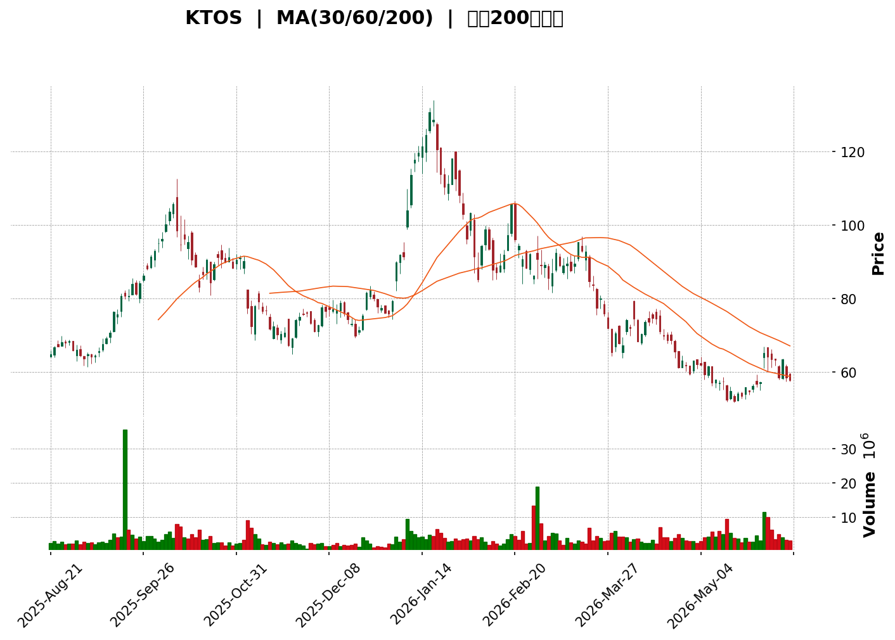
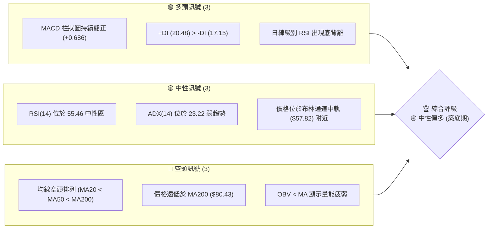

📊 靜態圖表 (點擊展開)

<html>
<head><meta charset="utf-8" /></head>
<body>
    
                        
                        

                    

</body>
</html>

# KTOS 技術分析報告

> **報告日期**：2026-06-09 ｜ **語言**：繁體中文 ｜ **數據來源**：Yahoo Finance ｜ **當前價格**：$57.73

---

## 目錄

| 章節 | 內容 |
|------|------|
| [1. 技術面概覽](#1-技術面概覽) | 訊號儀表板、核心指標、評分卡 |
| [2. 趨勢分析](#2-趨勢分析) | 多時框趨勢、長中短期走勢 |
| [3. 圖表形態分析](#3-圖表形態分析) | 形態識別、K線組合、目標價 |
| [4. 支撐與阻力](#4-支撐與阻力) | 關鍵價位、斐波那契回調 |
| [5. 技術指標深度解讀](#5-技術指標深度解讀) | MA/RSI/MACD/布林/成交量 |
| [6. 動能與波動率](#6-動能與波動率) | 動能評估、ATR、Beta |
| [7. 多時框架總結](#7-多時框架總結) | 時框架評分矩陣 |
| [8. 交易策略建議](#8-交易策略建議) | 多空策略、風險報酬比 |
| [9. 風險提示與監控](#9-風險提示與監控) | 監控指標、風險場景 |
| [📋 報告總結](#-報告總結) | 核心結論與最優策略組合 |

---

## 1. 技術面概覽

### 🎯 技術訊號儀表板

本儀表板整合了 KTOS 當前（2026-06-09）的多空技術訊號。目前市場呈現「短期止跌築底、中期弱勢盤整、長期多頭防守」的格局。

### 📊 核心指標速覽表

| 指標類別 | 指標名稱 | 當前數值 | 訊號 | 解讀 |
|----------|----------|----------|------|------|
| **價格** | 當前價格 | $57.73 | 🟡 中性 | 處於52周區間（$37.90 - $134.00）的 20.6% 低位，具備估值安全邊際。 |
| **均線** | MA20 | $57.82 | 🟡 中性 | 價格微幅低於 MA20（偏離 -0.15%），短期均線開始走平。 |
| **均線** | MA50 | $63.33 | 🔴 空頭 | 價格低於 MA50（偏離 -8.84%），中期下行壓力仍存。 |
| **均線** | MA200 | $80.43 | 🔴 空頭 | 價格遠低於 MA200（偏離 -28.22%），長期趨勢仍屬空頭控制。 |
| **動能** | RSI(14) | 55.46 | 🟡 中性 | 脫離超賣區，回升至中性區間，顯示買盤動能逐漸復甦。 |
| **動能** | MACD | -0.789 / -1.475 | 🟢 看多 | MACD 柱狀圖為 +0.686，黃金交叉後持續向上，多頭動能轉強。 |
| **波動** | ATR(14) | $4.12 | 🟡 中性 | 波動率佔股價 7.13%，屬於中高波動度，需注意止損距離。 |
| **趨勢** | ADX(14) | 23.22 | 🟡 中性 | ADX < 25 顯示當前處於無趨勢的區間震盪/築底行情。 |
| **量能** | OBV | OBV < MA | 🔴 空頭 | 累計成交量低於其移動平均線，量能尚未出現爆發性配合。