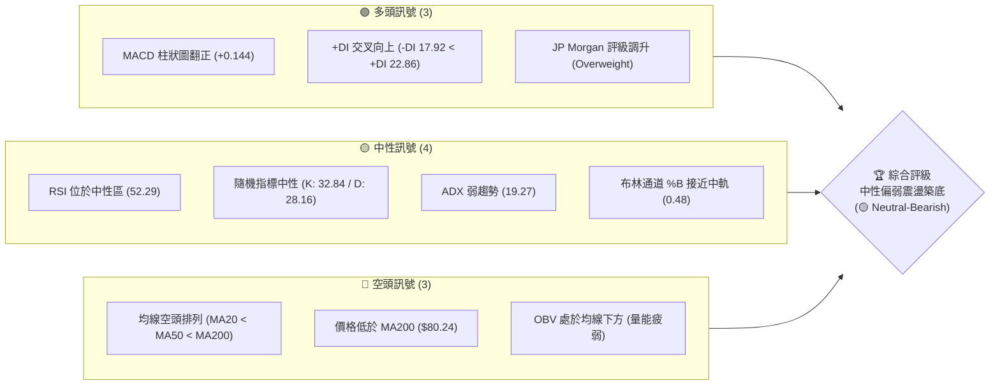
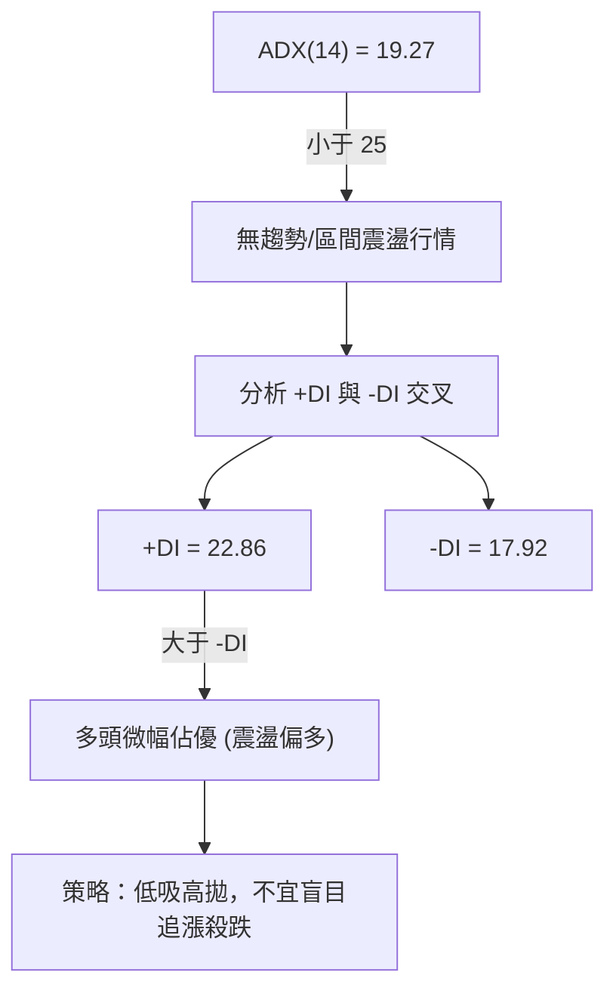
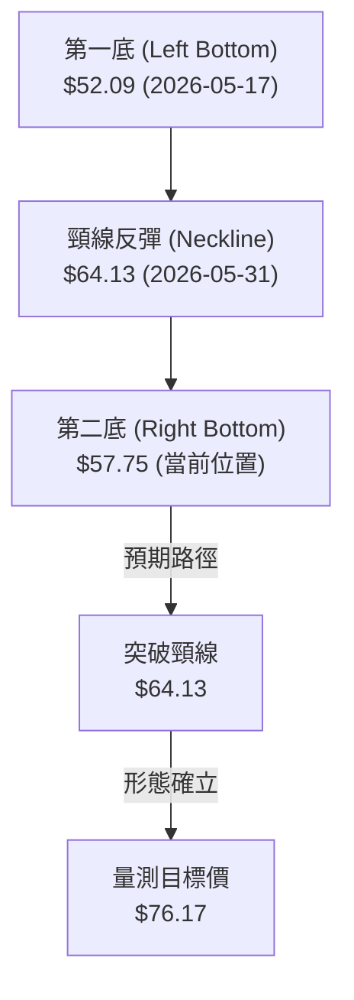

<details>
<summary>📊 靜態圖表 (點擊展開)</summary>

</details>

<html>
<head><meta charset="utf-8" /></head>
<body>
    <div style="height:500px; width:100%;">                        <script>window.PlotlyConfig = {MathJaxConfig: 'local'};</script>
        <script charset="utf-8" src="https://cdn.plot.ly/plotly-3.6.0.min.js" integrity="sha256-QaOVwtVY0T02VaHrr6pnoHLCwayMJp4O5n4YyaE3rJk=" crossorigin="anonymous"></script>                <div id="candlestick-chart" class="plotly-graph-div" style="height:100%; width:100%;"></div>            <script>                window.PLOTLYENV=window.PLOTLYENV || {};                                if (document.getElementById("candlestick-chart")) {                    Plotly.newPlot(                        "candlestick-chart",                        [{"close":{"dtype":"f8","bdata":"AAAAQOH6UEAAAADgoyBRQAAAAIDCdVBAAAAAgMKFUEAAAAAAACBQQAAAACCFy09AAAAAANczUEAAAADA9QhQQAAAAADXI1BAAAAAgD1qUEAAAABA4epQQAAAAMDMTFFAAAAAIFyvUUAAAABgZhZTQAAAACBc71JAAAAAoJkpVEAAAACgRzFUQAAAAIAULlRAAAAAoJn5VEAAAAAghUtUQAAAAMDMDFVAAAAAgOuRVUAAAADAHgVWQAAAACCu11ZAAAAAoHA9V0AAAACA68FXQAAAAAApDFhAAAAAAAAQWUAAAAAAKexZQAAAAEDhalpAAAAAQDOjWEAAAADgUahXQAAAAIDrEVhAAAAAQDPTV0AAAADAHqVWQAAAACCuJ1ZAAAAAIK7HVEAAAACgmalVQAAAACCup1ZAAAAAQDMTVUAAAADgelRWQAAAACCFy1ZAAAAAIIWrVkAAAACA63FWQAAAAKBwzVZAAAAAQDMTVkAAAABgZqZWQAAAAGBmxlZAAAAAgBSOVkAAAACAPVpTQAAAAIA9GlJAAAAA4FF4U0AAAAAghctTQAAAAIDCJVNAAAAAwMwsU0AAAAAAKexRQAAAAMDMHFJAAAAAIFyPUUAAAABACpdRQAAAAEDhqlFAAAAAANfTUEAAAADA9UhRQAAAAEAKh1JAAAAAQDPDUkAAAACgR\u002fFSQAAAAGBmBlNAAAAAoHBNUkAAAACgcL1RQAAAAIDrMVJAAAAAIIVrU0AAAAAAACBTQAAAAIDrQVNAAAAAgOtBU0AAAACAPTpTQAAAAIDrsVNAAAAAoHD9UkAAAADgo5BSQAAAAOBRSFJAAAAAoEdxUUAAAACgmdlRQAAAAMD12FJAAAAAgOthVEAAAABAM5NUQAAAAIAU\u002flNAAAAAwMxsU0AAAACAFF5TQAAAAGC4\u002flJAAAAAgD36UkAAAABgj9JTQAAAACCFe1ZAAAAAIIX7VkAAAAAAKdxWQAAAAGCPAlpAAAAAwMxsXEAAAABACnddQAAAAIAU7l1AAAAAAABgXkAAAAAA1yNfQAAAAEAKV2BAAAAAgMIVYEAAAACAwiVeQAAAAGBmdlxAAAAAwPWYW0AAAADgetRbQAAAAADXg11AAAAAQOEqXEAAAACAPQpbQAAAAOCjwFlAAAAAgD0KWEAAAAAgrtdZQAAAAMAe1VZAAAAAAABQVUAAAACAPZpXQAAAAADXs1hAAAAAYLheV0AAAACA6\u002fFVQAAAAEAzw1VAAAAAANdDVkAAAACAFP5WQAAAAKBwTVhAAAAAQOFqWkAAAADAHgVYQAAAAADXk1dAAAAAIIWrVkAAAABguA5WQAAAAMD1CFdAAAAAIIWLVUAAAACAFK5WQAAAAMDMPFZAAAAA4FFIVkAAAABgj2JVQAAAAAAAwFVAAAAAgBQeV0AAAACgcD1WQAAAAEDhOlZAAAAAoHBdVkAAAACA6+FVQAAAAIDrYVZAAAAAANfTV0AAAABgj0JXQAAAAIDrMVdAAAAAIK4nVUAAAAAAKexUQAAAACBcX1NAAAAAYLj+U0AAAABACvdSQAAAAAAp\u002fFFAAAAAgOtRUEAAAADgo6BRQAAAAMDM7FBAAAAAANfTUEAAAACAwoVSQAAAAKBw\u002fVFAAAAAoHCdUkAAAADAHhVRQAAAAIDClVFAAAAAQDNjUkAAAACAPWpSQAAAAIA9qlJAAAAAgD2aUkAAAAAgXL9RQAAAAMAedVFAAAAAQDMjUUAAAABACidRQAAAAKBHYVBAAAAAoEehTkAAAADgepRPQAAAAOB61E5AAAAAIK7HTUAAAABgZoZPQAAAAGBmBk9AAAAAQAr3TkAAAAAgrqdNQAAAAGCPwk5AAAAAAACATEAAAACA6\u002fFMQAAAAGC4fkxAAAAAgD2qTEAAAABguD5KQAAAAMDMbEtAAAAAIIULSkAAAAAAKRxLQAAAAAApvEpAAAAAwPXoS0AAAACAwlVLQAAAAEAKF0xAAAAAYGZmTEAAAABgZqZMQAAAAAApTFBAAAAA4FEIUEAAAABguL5PQAAAAGCPok9AAAAAQAo3TUAAAABAM7NPQAAAAGCPQk1AAAAAoHDdTEAAAADgURhMQAAAAMD1aEtAAAAAANdjTUAAAAAAAOBMQA=="},"high":{"dtype":"f8","bdata":"AAAAIFwvUUAAAADgejRRQAAAACBcH1FAAAAAgD3aUEAAAABA4cpQQAAAAAApHFBAAAAAYI9SUEAAAAAAAEBQQAAAAMAeNVBAAAAAAACwUEAAAADA9UhRQAAAAKBwbVFAAAAAANfTUUAAAAAgridTQAAAAIDrQVNAAAAAAClcVEAAAAAA15NUQAAAAOBRqFRAAAAAYLheVUAAAAAAAEBVQAAAAOBROFVAAAAAgMK1VUAAAABA4WpWQAAAACCu91ZAAAAAoEdhV0AAAACgmRlYQAAAACCuh1hAAAAAAADAWUAAAACgcC1aQAAAAADXk1pAAAAA4HokXEAAAACgmalZQAAAAAAAYFlAAAAAYGZGWEAAAAAgXJ9YQAAAAIDCJVdAAAAAoEehVUAAAACAFC5WQAAAAEAzs1ZAAAAAAACAVkAAAADAzHxWQAAAACCFO1dAAAAAYGamV0AAAADAzBxXQAAAACCud1dAAAAAAADAVkAAAACgmQlXQAAAAIAU7lZAAAAAgMLlVkAAAAAAAKBUQAAAAIAU3lNAAAAAYGaWU0AAAAAAAIBUQAAAACBcv1NAAAAAQOGKU0AAAACgmflSQAAAAKBHcVJAAAAAwMw8UkAAAAAAANBRQAAAACCFC1JAAAAAYLieUkAAAACAwlVRQAAAAAApnFJAAAAAIIULU0AAAABA4UpTQAAAACBcH1NAAAAAYGYmU0AAAABgZqZSQAAAAAAAQFJAAAAA4HqUU0AAAADgUYhTQAAAAOB6hFNAAAAAgD3qU0AAAACgcJ1TQAAAAIAU3lNAAAAAoJnZU0AAAABA4RpTQAAAAOBRqFJAAAAAIFyPUkAAAACAPRpSQAAAAGCP8lJAAAAAIK53VEAAAACAPdpUQAAAAAApfFRAAAAAgD36U0AAAACAFI5TQAAAAAApjFNAAAAAgBQ+U0AAAABguO5TQAAAAEAKh1ZAAAAAgOsBV0AAAADgetRXQAAAAEAzc1tAAAAAwMzcXEAAAADgUehdQAAAAOB6ZF5AAAAAoHD9XkAAAAAA15NfQAAAAAAAgGBAAAAAAADAYEAAAAAAAABgQAAAAEAzU15AAAAAgOvhXEAAAABA4WpcQAAAAMD1iF1AAAAAAAAAXkAAAADAzMxcQAAAAAAAMFtAAAAAwPVIWUAAAAAgXN9ZQAAAAAAAwFlAAAAAYGYmV0AAAABA4apXQAAAAIDr8VhAAAAAAADgWEAAAABAMyNYQAAAAIDCZVZAAAAAIFwPV0AAAABgZlZXQAAAAAAAIFlAAAAAgD16WkAAAABA4apaQAAAAMAexVdAAAAAIFzvVkAAAACA61FXQAAAAAApHFdAAAAAoJmZVUAAAABgZkZYQAAAAIAUTldAAAAAYGaGVkAAAAAgXF9WQAAAAOBRuFZAAAAAQOFqV0AAAABAMxNXQAAAAGC4vlZAAAAAIK7XVkAAAACgmflWQAAAAEAz81ZAAAAAYGbWV0AAAADgUThYQAAAAAAAoFdAAAAAAAAAV0AAAAAA15NVQAAAAKBHwVRAAAAAACk8VEAAAACA6+FTQAAAAOBRGFNAAAAAoJn5UUAAAACAFL5RQAAAAEAzM1JAAAAA4KNgUUAAAACAPZpSQAAAAKCZOVJAAAAAACncU0AAAAAAAKBSQAAAAIDroVFAAAAAYGaGUkAAAADgeiRTQAAAAGCPElNAAAAAgBROU0AAAADA9ThTQAAAAKBw7VFAAAAAoJm5UUAAAABguL5RQAAAACBcL1FAAAAA4KNwUEAAAAAghRtQQAAAAKCZWU9AAAAAoEfhTkAAAABACpdPQAAAAAAAwE9AAAAA4FEIUEAAAADAHmVPQAAAAGC43k5AAAAAwB7FTkAAAADgUfhMQAAAAEDh2kxAAAAA4KNQTUAAAAAAAEBMQAAAAAAp\u002fEtAAAAAQDPzSkAAAAAAKVxLQAAAACCFS0tAAAAA4KPwS0AAAAAA14NLQAAAAAAAYExAAAAAYGamTUAAAACAFK5MQAAAAMAetVBAAAAAAACwUEAAAADAzIxQQAAAAEAz009AAAAAwMzsTkAAAAAghctPQAAAAMDMDE9AAAAAAADgTUAAAABgZqZNQAAAAGBmZkxAAAAAgOtxTUAAAACgmdlOQA=="},"hovertemplate":"\u003cb\u003e%{x|%Y-%m-%d}\u003c\u002fb\u003e\u003cbr\u003e\u958b: $%{open:.2f}\u003cbr\u003e\u9ad8: $%{high:.2f}\u003cbr\u003e\u4f4e: $%{low:.2f}\u003cbr\u003e\u6536: $%{close:.2f}\u003cextra\u003e\u003c\u002fextra\u003e","low":{"dtype":"f8","bdata":"AAAAAACgUEAAAACgR9FQQAAAAMD1aFBAAAAAYI+CT0AAAAAA1wNQQAAAAAAA4E5AAAAAQDOzTkAAAACAPSpPQAAAAOB6VE9AAAAAACkMUEAAAABgZmZQQAAAAKCZ6VBAAAAAoJn5UEAAAADAHrVRQAAAAEAKR1JAAAAAoEfBUkAAAACgmflTQAAAAEAz01NAAAAAYGZGVEAAAABgZjZUQAAAACCut1NAAAAAIIUbVUAAAABAM\u002fNVQAAAAGBmBlZAAAAA4FEoVkAAAACA6yFXQAAAAEAKd1dAAAAAoEeBWEAAAAAAAABZQAAAAKCZeVlAAAAAQDMzWEAAAACgmTlXQAAAAEDhqldAAAAAYI+yVkAAAACAPUpWQAAAACBcH1ZAAAAAoHBtVEAAAADAzExVQAAAAMDMTFVAAAAAANczVEAAAAAgrjdVQAAAACCFS1ZAAAAA4KMQVkAAAAAAKWxWQAAAAKBwfVZAAAAAYI8CVkAAAACAPfpVQAAAAMDM\u002fFVAAAAA4Hq0VUAAAABgZvZSQAAAAKBHkVFAAAAAoJkpUUAAAABAM0NTQAAAAMD1+FJAAAAAAADgUkAAAAAA19NRQAAAAAAAQFFAAAAAYGY2UUAAAACA6\u002fFQQAAAAEAzU1FAAAAAgD26UEAAAABAMzNQQAAAAMD1SFFAAAAAoJkpUkAAAAAA19NSQAAAAOCjwFJAAAAAIIU7UkAAAAAgrrdRQAAAACCFa1FAAAAAgOsRUkAAAADgo7BSQAAAAKCZyVJAAAAAANcDU0AAAADAzExSQAAAAEAzs1JAAAAAwMzMUkAAAABgZkZSQAAAAEDhGlJAAAAAANdTUUAAAADA9YhRQAAAAGC4zlFAAAAAANczU0AAAABgZvZTQAAAAIDr0VNAAAAAYGYGU0AAAACgmQlTQAAAAEAz81JAAAAA4FG4UkAAAADAHpVSQAAAAOBRiFRAAAAAwMysVUAAAADgo6BWQAAAAKBHsVhAAAAAoJkpWkAAAAAAAKBcQAAAAMDMTF1AAAAAAACAXEAAAACgR1FdQAAAAAAAQF9AAAAAAADAX0AAAACA65FcQAAAAGC4zltAAAAAQAoXW0AAAACgR7FaQAAAAADXw1tAAAAA4KNQW0AAAACAwoVaQAAAAOBRaFlAAAAAoEexV0AAAACgmUlYQAAAAEDhulVAAAAAAAAgVUAAAAAAAABWQAAAAMDMTFdAAAAAoHBNV0AAAACgR0FVQAAAAAAAUFVAAAAAoEfBVUAAAADgesRVQAAAAMDMPFdAAAAAYLg+WEAAAAAghdtXQAAAAAAAwFZAAAAAYI8CVUAAAACgcA1WQAAAAMD1qFVAAAAAAAAAVUAAAADAHlVVQAAAAGBmplVAAAAAAABwVUAAAACgmZlUQAAAAAAAYFRAAAAAwMzMVUAAAADA9ShWQAAAACCup1VAAAAAwPVYVUAAAADAzMxVQAAAAKCZuVVAAAAAIFyPVkAAAACAPSpXQAAAAMD16FVAAAAAYGbGVEAAAADgeoRUQAAAAKBH4VJAAAAAANdTU0AAAACgmclSQAAAAMDM7FFAAAAAIK4XUEAAAABAM2NQQAAAAGBm5lBAAAAAIIXrT0AAAADAzIxRQAAAAEAzc1FAAAAAQDMjUkAAAACA6xFRQAAAACCF21BAAAAAQApnUUAAAACgRyFSQAAAAAAAUFJAAAAA4KNAUkAAAACAPZpRQAAAAEAKN1FAAAAA4Hr0UEAAAADA9ehQQAAAAMAe5U9AAAAAoEeBTkAAAADgUZhOQAAAAAApHE5AAAAAIK6HTUAAAACA69FNQAAAAKCZeU5AAAAAoEfhTkAAAACgRwFNQAAAAEAKN01AAAAAwB4lTEAAAACgcN1LQAAAAKBHgUtAAAAAgBSOS0AAAAAghetJQAAAAGC4PkpAAAAA4HrUSUAAAACAPQpKQAAAAADXY0pAAAAAQDNTSkAAAAAgrudKQAAAAEDhOktAAAAAQDPzS0AAAAAAAIBLQAAAAAAAgE5AAAAAgD0KTkAAAABAM5NOQAAAAEAK105AAAAAQDPzTEAAAADgUfhMQAAAAAAAwExAAAAAIFyvTEAAAAAgrqdKQAAAAAAAIEtAAAAAwPUIS0AAAADgenRMQA=="},"name":"\u50f9\u683c","open":{"dtype":"f8","bdata":"AAAAoEcRUUAAAABgjwJRQAAAACBcH1FAAAAAgD0aUEAAAACA65FQQAAAAEAzE1BAAAAAAAAgUEAAAACAwjVQQAAAAOBRCFBAAAAAYGZWUEAAAACAwoVQQAAAACBc71BAAAAAwMxcUUAAAAAA18NRQAAAAOCjwFJAAAAAoJkpU0AAAACgR2FUQAAAAEAKJ1RAAAAAYGZGVEAAAAAgrhdVQAAAAAAAAFRAAAAAAABAVUAAAADAzDxWQAAAAMD1GFZAAAAAAACgVkAAAAAAAMBXQAAAAAAp7FdAAAAAYGaWWEAAAACgmUlZQAAAAOB6xFlAAAAAwPXoWkAAAADAzKxXQAAAAIAUXlhAAAAAgBRuV0AAAADAzHxYQAAAACBc\u002f1ZAAAAAQOE6VUAAAACA69FVQAAAAEAKx1VAAAAAAACAVkAAAADAzExVQAAAAOBRCFdAAAAA4HpEV0AAAADgesRWQAAAAAAAgFZAAAAAAACAVkAAAAAAAGBWQAAAAMAetVZAAAAAYLgOVkAAAAAgrpdUQAAAAMDMfFNAAAAAQDOTUUAAAAAghVtUQAAAAGC4blNAAAAAgOsxU0AAAAAAKbxSQAAAAIA9SlFAAAAAgMIFUkAAAAAgXC9RQAAAAMAeZVFAAAAAYLieUkAAAAAA17NQQAAAAEDhWlFAAAAAgD2KUkAAAABAM\u002fNSQAAAAGC4DlNAAAAAYGYmU0AAAAAgrodSQAAAAOCjwFFAAAAAoEchUkAAAAAAKWxTQAAAAIDCZVNAAAAA4HokU0AAAAAAAABTQAAAACBcL1NAAAAAIIW7U0AAAACgRxFTQAAAAAAAQFJAAAAA4FFIUkAAAAAAKbxRQAAAAIDr4VFAAAAAAABAU0AAAACAFB5UQAAAAEAKR1RAAAAAgD36U0AAAACgcD1TQAAAAAApjFNAAAAAQDMzU0AAAABAMyNTQAAAAIA9OlVAAAAAwPV4VkAAAADgUShXQAAAAIDr4VhAAAAAYLheWkAAAABgZjZdQAAAAIA9ul1AAAAAAACgXUAAAADA9fhdQAAAAKBwbV9AAAAAIIUDYEAAAABgj+JfQAAAAOCjQF5AAAAAwB51XEAAAADAzCxbQAAAAADXw1tAAAAAAAAAXkAAAADgUbhcQAAAAOB6dFpAAAAAgD36WEAAAABgZqZYQAAAAKBwXVlAAAAAgBQeVkAAAABgZkZWQAAAAGBmpldAAAAA4Hq0WEAAAACAPfpXQAAAAKCZGVZAAAAAIFzPVUAAAADAHgVWQAAAAMD1SFdAAAAAoHBtWEAAAAAAKWxaQAAAAKBHUVdAAAAAAAAwVkAAAAAAKTxXQAAAAAAp\u002fFVAAAAAQDNTVUAAAABA4RpXQAAAAKBwTVZAAAAA4KMgVkAAAABgZjZWQAAAAOBR2FRAAAAAQAr3VUAAAAAAKdxWQAAAAIDrwVVAAAAAACk8VkAAAAAAAIBWQAAAAIDCNVZAAAAAQAq3VkAAAACAPZpXQAAAAOCjoFZAAAAAwMzcVkAAAACAwvVUQAAAAEDhqlRAAAAAYI\u002fyU0AAAADgUZhTQAAAAEAKt1JAAAAA4KPwUUAAAACgmblQQAAAAMD1KFJAAAAAgOtRUEAAAADgUchRQAAAAAAAEFJAAAAA4FHYU0AAAADAzIxSQAAAAKBHAVFAAAAAYGaGUUAAAACAPapSQAAAAAAp7FJAAAAAANcTU0AAAAAghdtSQAAAAGCPglFAAAAA4KOQUUAAAAAgrodRQAAAAMDMHFFAAAAA4KNwUEAAAADgUZhOQAAAAOBR+E5AAAAAYLjeTkAAAADAHiVOQAAAAOB6tE9AAAAAACk8T0AAAADgUVhPQAAAAIA9ik1AAAAAwB7FTkAAAACAPYpMQAAAACBcb0xAAAAAIIWrTEAAAADgejRMQAAAAKBHYUpAAAAAYLi+SkAAAACgRyFKQAAAAGC4HktAAAAAoJn5SkAAAAAAAIBLQAAAAMAepUtAAAAA4HrUTEAAAACgcH1MQAAAAEDh+k9AAAAAgD2qUEAAAAAAKTxQQAAAAMD1yE9AAAAAIFzPTkAAAACAFC5NQAAAAIDr0U5AAAAAACncTUAAAAAgrgdNQAAAAMDMzEtAAAAAwPVoS0AAAABguL5OQA=="},"x":["2025-08-27T00:00:00-04:00","2025-08-28T00:00:00-04:00","2025-08-29T00:00:00-04:00","2025-09-02T00:00:00-04:00","2025-09-03T00:00:00-04:00","2025-09-04T00:00:00-04:00","2025-09-05T00:00:00-04:00","2025-09-08T00:00:00-04:00","2025-09-09T00:00:00-04:00","2025-09-10T00:00:00-04:00","2025-09-11T00:00:00-04:00","2025-09-12T00:00:00-04:00","2025-09-15T00:00:00-04:00","2025-09-16T00:00:00-04:00","2025-09-17T00:00:00-04:00","2025-09-18T00:00:00-04:00","2025-09-19T00:00:00-04:00","2025-09-22T00:00:00-04:00","2025-09-23T00:00:00-04:00","2025-09-24T00:00:00-04:00","2025-09-25T00:00:00-04:00","2025-09-26T00:00:00-04:00","2025-09-29T00:00:00-04:00","2025-09-30T00:00:00-04:00","2025-10-01T00:00:00-04:00","2025-10-02T00:00:00-04:00","2025-10-03T00:00:00-04:00","2025-10-06T00:00:00-04:00","2025-10-07T00:00:00-04:00","2025-10-08T00:00:00-04:00","2025-10-09T00:00:00-04:00","2025-10-10T00:00:00-04:00","2025-10-13T00:00:00-04:00","2025-10-14T00:00:00-04:00","2025-10-15T00:00:00-04:00","2025-10-16T00:00:00-04:00","2025-10-17T00:00:00-04:00","2025-10-20T00:00:00-04:00","2025-10-21T00:00:00-04:00","2025-10-22T00:00:00-04:00","2025-10-23T00:00:00-04:00","2025-10-24T00:00:00-04:00","2025-10-27T00:00:00-04:00","2025-10-28T00:00:00-04:00","2025-10-29T00:00:00-04:00","2025-10-30T00:00:00-04:00","2025-10-31T00:00:00-04:00","2025-11-03T00:00:00-05:00","2025-11-04T00:00:00-05:00","2025-11-05T00:00:00-05:00","2025-11-06T00:00:00-05:00","2025-11-07T00:00:00-05:00","2025-11-10T00:00:00-05:00","2025-11-11T00:00:00-05:00","2025-11-12T00:00:00-05:00","2025-11-13T00:00:00-05:00","2025-11-14T00:00:00-05:00","2025-11-17T00:00:00-05:00","2025-11-18T00:00:00-05:00","2025-11-19T00:00:00-05:00","2025-11-20T00:00:00-05:00","2025-11-21T00:00:00-05:00","2025-11-24T00:00:00-05:00","2025-11-25T00:00:00-05:00","2025-11-26T00:00:00-05:00","2025-11-28T00:00:00-05:00","2025-12-01T00:00:00-05:00","2025-12-02T00:00:00-05:00","2025-12-03T00:00:00-05:00","2025-12-04T00:00:00-05:00","2025-12-05T00:00:00-05:00","2025-12-08T00:00:00-05:00","2025-12-09T00:00:00-05:00","2025-12-10T00:00:00-05:00","2025-12-11T00:00:00-05:00","2025-12-12T00:00:00-05:00","2025-12-15T00:00:00-05:00","2025-12-16T00:00:00-05:00","2025-12-17T00:00:00-05:00","2025-12-18T00:00:00-05:00","2025-12-19T00:00:00-05:00","2025-12-22T00:00:00-05:00","2025-12-23T00:00:00-05:00","2025-12-24T00:00:00-05:00","2025-12-26T00:00:00-05:00","2025-12-29T00:00:00-05:00","2025-12-30T00:00:00-05:00","2025-12-31T00:00:00-05:00","2026-01-02T00:00:00-05:00","2026-01-05T00:00:00-05:00","2026-01-06T00:00:00-05:00","2026-01-07T00:00:00-05:00","2026-01-08T00:00:00-05:00","2026-01-09T00:00:00-05:00","2026-01-12T00:00:00-05:00","2026-01-13T00:00:00-05:00","2026-01-14T00:00:00-05:00","2026-01-15T00:00:00-05:00","2026-01-16T00:00:00-05:00","2026-01-20T00:00:00-05:00","2026-01-21T00:00:00-05:00","2026-01-22T00:00:00-05:00","2026-01-23T00:00:00-05:00","2026-01-26T00:00:00-05:00","2026-01-27T00:00:00-05:00","2026-01-28T00:00:00-05:00","2026-01-29T00:00:00-05:00","2026-01-30T00:00:00-05:00","2026-02-02T00:00:00-05:00","2026-02-03T00:00:00-05:00","2026-02-04T00:00:00-05:00","2026-02-05T00:00:00-05:00","2026-02-06T00:00:00-05:00","2026-02-09T00:00:00-05:00","2026-02-10T00:00:00-05:00","2026-02-11T00:00:00-05:00","2026-02-12T00:00:00-05:00","2026-02-13T00:00:00-05:00","2026-02-17T00:00:00-05:00","2026-02-18T00:00:00-05:00","2026-02-19T00:00:00-05:00","2026-02-20T00:00:00-05:00","2026-02-23T00:00:00-05:00","2026-02-24T00:00:00-05:00","2026-02-25T00:00:00-05:00","2026-02-26T00:00:00-05:00","2026-02-27T00:00:00-05:00","2026-03-02T00:00:00-05:00","2026-03-03T00:00:00-05:00","2026-03-04T00:00:00-05:00","2026-03-05T00:00:00-05:00","2026-03-06T00:00:00-05:00","2026-03-09T00:00:00-04:00","2026-03-10T00:00:00-04:00","2026-03-11T00:00:00-04:00","2026-03-12T00:00:00-04:00","2026-03-13T00:00:00-04:00","2026-03-16T00:00:00-04:00","2026-03-17T00:00:00-04:00","2026-03-18T00:00:00-04:00","2026-03-19T00:00:00-04:00","2026-03-20T00:00:00-04:00","2026-03-23T00:00:00-04:00","2026-03-24T00:00:00-04:00","2026-03-25T00:00:00-04:00","2026-03-26T00:00:00-04:00","2026-03-27T00:00:00-04:00","2026-03-30T00:00:00-04:00","2026-03-31T00:00:00-04:00","2026-04-01T00:00:00-04:00","2026-04-02T00:00:00-04:00","2026-04-06T00:00:00-04:00","2026-04-07T00:00:00-04:00","2026-04-08T00:00:00-04:00","2026-04-09T00:00:00-04:00","2026-04-10T00:00:00-04:00","2026-04-13T00:00:00-04:00","2026-04-14T00:00:00-04:00","2026-04-15T00:00:00-04:00","2026-04-16T00:00:00-04:00","2026-04-17T00:00:00-04:00","2026-04-20T00:00:00-04:00","2026-04-21T00:00:00-04:00","2026-04-22T00:00:00-04:00","2026-04-23T00:00:00-04:00","2026-04-24T00:00:00-04:00","2026-04-27T00:00:00-04:00","2026-04-28T00:00:00-04:00","2026-04-29T00:00:00-04:00","2026-04-30T00:00:00-04:00","2026-05-01T00:00:00-04:00","2026-05-04T00:00:00-04:00","2026-05-05T00:00:00-04:00","2026-05-06T00:00:00-04:00","2026-05-07T00:00:00-04:00","2026-05-08T00:00:00-04:00","2026-05-11T00:00:00-04:00","2026-05-12T00:00:00-04:00","2026-05-13T00:00:00-04:00","2026-05-14T00:00:00-04:00","2026-05-15T00:00:00-04:00","2026-05-18T00:00:00-04:00","2026-05-19T00:00:00-04:00","2026-05-20T00:00:00-04:00","2026-05-21T00:00:00-04:00","2026-05-22T00:00:00-04:00","2026-05-26T00:00:00-04:00","2026-05-27T00:00:00-04:00","2026-05-28T00:00:00-04:00","2026-05-29T00:00:00-04:00","2026-06-01T00:00:00-04:00","2026-06-02T00:00:00-04:00","2026-06-03T00:00:00-04:00","2026-06-04T00:00:00-04:00","2026-06-05T00:00:00-04:00","2026-06-08T00:00:00-04:00","2026-06-09T00:00:00-04:00","2026-06-10T00:00:00-04:00","2026-06-11T00:00:00-04:00","2026-06-12T00:00:00-04:00"],"type":"candlestick"},{"hovertemplate":"MA30: $%{y:.2f}\u003cextra\u003e\u003c\u002fextra\u003e","line":{"color":"#2196F3","dash":"dash","width":2},"mode":"lines","name":"MA30","x":["2025-08-27T00:00:00-04:00","2025-08-28T00:00:00-04:00","2025-08-29T00:00:00-04:00","2025-09-02T00:00:00-04:00","2025-09-03T00:00:00-04:00","2025-09-04T00:00:00-04:00","2025-09-05T00:00:00-04:00","2025-09-08T00:00:00-04:00","2025-09-09T00:00:00-04:00","2025-09-10T00:00:00-04:00","2025-09-11T00:00:00-04:00","2025-09-12T00:00:00-04:00","2025-09-15T00:00:00-04:00","2025-09-16T00:00:00-04:00","2025-09-17T00:00:00-04:00","2025-09-18T00:00:00-04:00","2025-09-19T00:00:00-04:00","2025-09-22T00:00:00-04:00","2025-09-23T00:00:00-04:00","2025-09-24T00:00:00-04:00","2025-09-25T00:00:00-04:00","2025-09-26T00:00:00-04:00","2025-09-29T00:00:00-04:00","2025-09-30T00:00:00-04:00","2025-10-01T00:00:00-04:00","2025-10-02T00:00:00-04:00","2025-10-03T00:00:00-04:00","2025-10-06T00:00:00-04:00","2025-10-07T00:00:00-04:00","2025-10-08T00:00:00-04:00","2025-10-09T00:00:00-04:00","2025-10-10T00:00:00-04:00","2025-10-13T00:00:00-04:00","2025-10-14T00:00:00-04:00","2025-10-15T00:00:00-04:00","2025-10-16T00:00:00-04:00","2025-10-17T00:00:00-04:00","2025-10-20T00:00:00-04:00","2025-10-21T00:00:00-04:00","2025-10-22T00:00:00-04:00","2025-10-23T00:00:00-04:00","2025-10-24T00:00:00-04:00","2025-10-27T00:00:00-04:00","2025-10-28T00:00:00-04:00","2025-10-29T00:00:00-04:00","2025-10-30T00:00:00-04:00","2025-10-31T00:00:00-04:00","2025-11-03T00:00:00-05:00","2025-11-04T00:00:00-05:00","2025-11-05T00:00:00-05:00","2025-11-06T00:00:00-05:00","2025-11-07T00:00:00-05:00","2025-11-10T00:00:00-05:00","2025-11-11T00:00:00-05:00","2025-11-12T00:00:00-05:00","2025-11-13T00:00:00-05:00","2025-11-14T00:00:00-05:00","2025-11-17T00:00:00-05:00","2025-11-18T00:00:00-05:00","2025-11-19T00:00:00-05:00","2025-11-20T00:00:00-05:00","2025-11-21T00:00:00-05:00","2025-11-24T00:00:00-05:00","2025-11-25T00:00:00-05:00","2025-11-26T00:00:00-05:00","2025-11-28T00:00:00-05:00","2025-12-01T00:00:00-05:00","2025-12-02T00:00:00-05:00","2025-12-03T00:00:00-05:00","2025-12-04T00:00:00-05:00","2025-12-05T00:00:00-05:00","2025-12-08T00:00:00-05:00","2025-12-09T00:00:00-05:00","2025-12-10T00:00:00-05:00","2025-12-11T00:00:00-05:00","2025-12-12T00:00:00-05:00","2025-12-15T00:00:00-05:00","2025-12-16T00:00:00-05:00","2025-12-17T00:00:00-05:00","2025-12-18T00:00:00-05:00","2025-12-19T00:00:00-05:00","2025-12-22T00:00:00-05:00","2025-12-23T00:00:00-05:00","2025-12-24T00:00:00-05:00","2025-12-26T00:00:00-05:00","2025-12-29T00:00:00-05:00","2025-12-30T00:00:00-05:00","2025-12-31T00:00:00-05:00","2026-01-02T00:00:00-05:00","2026-01-05T00:00:00-05:00","2026-01-06T00:00:00-05:00","2026-01-07T00:00:00-05:00","2026-01-08T00:00:00-05:00","2026-01-09T00:00:00-05:00","2026-01-12T00:00:00-05:00","2026-01-13T00:00:00-05:00","2026-01-14T00:00:00-05:00","2026-01-15T00:00:00-05:00","2026-01-16T00:00:00-05:00","2026-01-20T00:00:00-05:00","2026-01-21T00:00:00-05:00","2026-01-22T00:00:00-05:00","2026-01-23T00:00:00-05:00","2026-01-26T00:00:00-05:00","2026-01-27T00:00:00-05:00","2026-01-28T00:00:00-05:00","2026-01-29T00:00:00-05:00","2026-01-30T00:00:00-05:00","2026-02-02T00:00:00-05:00","2026-02-03T00:00:00-05:00","2026-02-04T00:00:00-05:00","2026-02-05T00:00:00-05:00","2026-02-06T00:00:00-05:00","2026-02-09T00:00:00-05:00","2026-02-10T00:00:00-05:00","2026-02-11T00:00:00-05:00","2026-02-12T00:00:00-05:00","2026-02-13T00:00:00-05:00","2026-02-17T00:00:00-05:00","2026-02-18T00:00:00-05:00","2026-02-19T00:00:00-05:00","2026-02-20T00:00:00-05:00","2026-02-23T00:00:00-05:00","2026-02-24T00:00:00-05:00","2026-02-25T00:00:00-05:00","2026-02-26T00:00:00-05:00","2026-02-27T00:00:00-05:00","2026-03-02T00:00:00-05:00","2026-03-03T00:00:00-05:00","2026-03-04T00:00:00-05:00","2026-03-05T00:00:00-05:00","2026-03-06T00:00:00-05:00","2026-03-09T00:00:00-04:00","2026-03-10T00:00:00-04:00","2026-03-11T00:00:00-04:00","2026-03-12T00:00:00-04:00","2026-03-13T00:00:00-04:00","2026-03-16T00:00:00-04:00","2026-03-17T00:00:00-04:00","2026-03-18T00:00:00-04:00","2026-03-19T00:00:00-04:00","2026-03-20T00:00:00-04:00","2026-03-23T00:00:00-04:00","2026-03-24T00:00:00-04:00","2026-03-25T00:00:00-04:00","2026-03-26T00:00:00-04:00","2026-03-27T00:00:00-04:00","2026-03-30T00:00:00-04:00","2026-03-31T00:00:00-04:00","2026-04-01T00:00:00-04:00","2026-04-02T00:00:00-04:00","2026-04-06T00:00:00-04:00","2026-04-07T00:00:00-04:00","2026-04-08T00:00:00-04:00","2026-04-09T00:00:00-04:00","2026-04-10T00:00:00-04:00","2026-04-13T00:00:00-04:00","2026-04-14T00:00:00-04:00","2026-04-15T00:00:00-04:00","2026-04-16T00:00:00-04:00","2026-04-17T00:00:00-04:00","2026-04-20T00:00:00-04:00","2026-04-21T00:00:00-04:00","2026-04-22T00:00:00-04:00","2026-04-23T00:00:00-04:00","2026-04-24T00:00:00-04:00","2026-04-27T00:00:00-04:00","2026-04-28T00:00:00-04:00","2026-04-29T00:00:00-04:00","2026-04-30T00:00:00-04:00","2026-05-01T00:00:00-04:00","2026-05-04T00:00:00-04:00","2026-05-05T00:00:00-04:00","2026-05-06T00:00:00-04:00","2026-05-07T00:00:00-04:00","2026-05-08T00:00:00-04:00","2026-05-11T00:00:00-04:00","2026-05-12T00:00:00-04:00","2026-05-13T00:00:00-04:00","2026-05-14T00:00:00-04:00","2026-05-15T00:00:00-04:00","2026-05-18T00:00:00-04:00","2026-05-19T00:00:00-04:00","2026-05-20T00:00:00-04:00","2026-05-21T00:00:00-04:00","2026-05-22T00:00:00-04:00","2026-05-26T00:00:00-04:00","2026-05-27T00:00:00-04:00","2026-05-28T00:00:00-04:00","2026-05-29T00:00:00-04:00","2026-06-01T00:00:00-04:00","2026-06-02T00:00:00-04:00","2026-06-03T00:00:00-04:00","2026-06-04T00:00:00-04:00","2026-06-05T00:00:00-04:00","2026-06-08T00:00:00-04:00","2026-06-09T00:00:00-04:00","2026-06-10T00:00:00-04:00","2026-06-11T00:00:00-04:00","2026-06-12T00:00:00-04:00"],"y":{"dtype":"f8","bdata":"AAAAAAAA+H8AAAAAAAD4fwAAAAAAAPh\u002fAAAAAAAA+H8AAAAAAAD4fwAAAAAAAPh\u002fAAAAAAAA+H8AAAAAAAD4fwAAAAAAAPh\u002fAAAAAAAA+H8AAAAAAAD4fwAAAAAAAPh\u002fAAAAAAAA+H8AAAAAAAD4fwAAAAAAAPh\u002fAAAAAAAA+H8AAAAAAAD4fwAAAAAAAPh\u002fAAAAAAAA+H8AAAAAAAD4fwAAAAAAAPh\u002fAAAAAAAA+H8AAAAAAAD4fwAAAAAAAPh\u002fAAAAAAAA+H8AAAAAAAD4fwAAAAAAAPh\u002fAAAAAAAA+H8AAAAAAAD4f7y7u3MFuFNAzczMhF35U0DNzMyEFjFUQJqZmdEGclRAiYiIYFewVEARERGJ+udUQBEREUFgHVVAVVVV9W9EVUC8u7trdXRVQImIiKgNrFVAVVVVldHTVUDv7u5eAQJWQCIiImLlMFZAiYiISG9bVkCrqqraFXhWQJqZmYkWmVZAVVVVdWipVkAzMzPzYL5WQAAAANCF1FZAAAAAYAHiVkBERER09tlWQLy7u4vPwFZAZmZmBuSuVkAAAABw55tWQFVVVZVffFZAREREdK9ZVkBERES05CdWQO\u002fu7n4\u002f9VVAiYiICDq1VUCJiIhoH25VQN7d3b10I1VAiYiIiM\u002fgVECJiIiYbqpUQCIiItIie1RA7+7unu9PVEAiIiJiVzBUQKuqqsqhFVRAvLu7m30AVEBmZmbGBN9TQBEREcH1uFNAmpmZWdaqU0C8u7vrfI9TQCIiIiJNcVNAmpmZaS5UU0De3d2tuThTQN7d3T01HlNARERE9OEDU0AzMzMjBuFSQO\u002fu7h6wulJAERERsQ+PUkDe3d1tPYJSQHd3d+eYiFJAq6qqSmKQUkCrqqo6CpdSQJqZmSlAnlJAvLu7S2KgUkAiIiLytqxSQM3MzMw+tFJAERERYVfAUkCamZlZZNNSQBEREeF6\u002fFJA7+7urgAxU0BVVVV1k2BTQKuqqjptoFNAd3d3R+HyU0CJiIgIrExUQO\u002fu7l66qVRAZmZmJr8QVUBVVVXlF4NVQM3MzNyy\u002flVAiYiIqH9rVkDNzMysjslWQN7d3U0bGFdAAAAAUEZfV0AiIiLCrqhXQAAAAOB6\u002fFdA3t3dbctKWECamZlZHZNYQBEREdHb0lhAd3d3RygLWUCamZkpXE9ZQHd3d4ddcVlAVVVVJU15WUAiIiLSIpNZQImIiPhTu1lAVVVV9f3cWUB3d3eX\u002fPJZQJqZmUmaClpAAAAA8KcmWkCJiIjotEFaQCIiIsI8UVpAERERoYxuWkAAAACwcnhaQO\u002fu7s6wY1pAIiIi0pQyWkBERETkXvNZQImIiIiIuFlAq6qqGi9tWUBERET0\u002fSRZQGZmZvbhy1hAREREZIJ3WEC8u7trvCxYQN7d3b1081dAiYiICDrNV0De3d19hp1XQKuqqipcX1dAmpmZadgtV0De3d2t1QFXQM3MzMwT5VZAVVVVlUPjVkBmZmYGOs1WQKuqqupR0FZAq6qq2vnOVkDe3d1NG7hWQN7d3b2filZAERER8dJtVkCJiIgIZVRWQFVVVfUoNFZAiYiI6G0BVkAzMzPjpdNVQN7d3X2xlFVAERER0dtCVUB3d3dX8hNVQDMzM0NE5FRAq6qq+qnBVEDNzMzsNZdUQHd3dze0aFRA3t3djcJNVEBVVVWFXSlUQHd3d0fhClRAMzMzM3rrU0BVVVX1b8xTQJqZmdnOp1NAd3d3V8d0U0B3d3eHXUlTQCIiIgJyF1NAREREDEnbUkB3d3fHS6dSQDMzMwvXa1JAd3d3x5IfUkBVVVU9mN9RQAAAAJAJnlFAvLu7y6FtUUCJiIgQnzlRQBEREVGNF1FAvLu7K4fmUEB3d3cnMcBQQN7d3XVMoFBAvLu7s1aPUEARERFh5WhQQBEREZF7TVBAMzMzawMtUECJiIjAnwJQQO\u002fu7n5btk9AVVVVpdNmT0B3d3dHiyxPQJqZmckg8E5AERERUamoTkBERETU22JOQAAAABB0Ok5A3t3djZcOTkDv7u6Ol+5NQJqZmUma0k1AvLu7i2ynTUBmZmbWMZFNQJqZmflTc01AZmZmRkRkTUDNzMwsh0ZNQCIiIhJYKU1AmpmZGQQmTUBmZmYWZw9NQA=="},"type":"scatter"},{"hovertemplate":"MA60: $%{y:.2f}\u003cextra\u003e\u003c\u002fextra\u003e","line":{"color":"#9C27B0","dash":"dash","width":2},"mode":"lines","name":"MA60","x":["2025-08-27T00:00:00-04:00","2025-08-28T00:00:00-04:00","2025-08-29T00:00:00-04:00","2025-09-02T00:00:00-04:00","2025-09-03T00:00:00-04:00","2025-09-04T00:00:00-04:00","2025-09-05T00:00:00-04:00","2025-09-08T00:00:00-04:00","2025-09-09T00:00:00-04:00","2025-09-10T00:00:00-04:00","2025-09-11T00:00:00-04:00","2025-09-12T00:00:00-04:00","2025-09-15T00:00:00-04:00","2025-09-16T00:00:00-04:00","2025-09-17T00:00:00-04:00","2025-09-18T00:00:00-04:00","2025-09-19T00:00:00-04:00","2025-09-22T00:00:00-04:00","2025-09-23T00:00:00-04:00","2025-09-24T00:00:00-04:00","2025-09-25T00:00:00-04:00","2025-09-26T00:00:00-04:00","2025-09-29T00:00:00-04:00","2025-09-30T00:00:00-04:00","2025-10-01T00:00:00-04:00","2025-10-02T00:00:00-04:00","2025-10-03T00:00:00-04:00","2025-10-06T00:00:00-04:00","2025-10-07T00:00:00-04:00","2025-10-08T00:00:00-04:00","2025-10-09T00:00:00-04:00","2025-10-10T00:00:00-04:00","2025-10-13T00:00:00-04:00","2025-10-14T00:00:00-04:00","2025-10-15T00:00:00-04:00","2025-10-16T00:00:00-04:00","2025-10-17T00:00:00-04:00","2025-10-20T00:00:00-04:00","2025-10-21T00:00:00-04:00","2025-10-22T00:00:00-04:00","2025-10-23T00:00:00-04:00","2025-10-24T00:00:00-04:00","2025-10-27T00:00:00-04:00","2025-10-28T00:00:00-04:00","2025-10-29T00:00:00-04:00","2025-10-30T00:00:00-04:00","2025-10-31T00:00:00-04:00","2025-11-03T00:00:00-05:00","2025-11-04T00:00:00-05:00","2025-11-05T00:00:00-05:00","2025-11-06T00:00:00-05:00","2025-11-07T00:00:00-05:00","2025-11-10T00:00:00-05:00","2025-11-11T00:00:00-05:00","2025-11-12T00:00:00-05:00","2025-11-13T00:00:00-05:00","2025-11-14T00:00:00-05:00","2025-11-17T00:00:00-05:00","2025-11-18T00:00:00-05:00","2025-11-19T00:00:00-05:00","2025-11-20T00:00:00-05:00","2025-11-21T00:00:00-05:00","2025-11-24T00:00:00-05:00","2025-11-25T00:00:00-05:00","2025-11-26T00:00:00-05:00","2025-11-28T00:00:00-05:00","2025-12-01T00:00:00-05:00","2025-12-02T00:00:00-05:00","2025-12-03T00:00:00-05:00","2025-12-04T00:00:00-05:00","2025-12-05T00:00:00-05:00","2025-12-08T00:00:00-05:00","2025-12-09T00:00:00-05:00","2025-12-10T00:00:00-05:00","2025-12-11T00:00:00-05:00","2025-12-12T00:00:00-05:00","2025-12-15T00:00:00-05:00","2025-12-16T00:00:00-05:00","2025-12-17T00:00:00-05:00","2025-12-18T00:00:00-05:00","2025-12-19T00:00:00-05:00","2025-12-22T00:00:00-05:00","2025-12-23T00:00:00-05:00","2025-12-24T00:00:00-05:00","2025-12-26T00:00:00-05:00","2025-12-29T00:00:00-05:00","2025-12-30T00:00:00-05:00","2025-12-31T00:00:00-05:00","2026-01-02T00:00:00-05:00","2026-01-05T00:00:00-05:00","2026-01-06T00:00:00-05:00","2026-01-07T00:00:00-05:00","2026-01-08T00:00:00-05:00","2026-01-09T00:00:00-05:00","2026-01-12T00:00:00-05:00","2026-01-13T00:00:00-05:00","2026-01-14T00:00:00-05:00","2026-01-15T00:00:00-05:00","2026-01-16T00:00:00-05:00","2026-01-20T00:00:00-05:00","2026-01-21T00:00:00-05:00","2026-01-22T00:00:00-05:00","2026-01-23T00:00:00-05:00","2026-01-26T00:00:00-05:00","2026-01-27T00:00:00-05:00","2026-01-28T00:00:00-05:00","2026-01-29T00:00:00-05:00","2026-01-30T00:00:00-05:00","2026-02-02T00:00:00-05:00","2026-02-03T00:00:00-05:00","2026-02-04T00:00:00-05:00","2026-02-05T00:00:00-05:00","2026-02-06T00:00:00-05:00","2026-02-09T00:00:00-05:00","2026-02-10T00:00:00-05:00","2026-02-11T00:00:00-05:00","2026-02-12T00:00:00-05:00","2026-02-13T00:00:00-05:00","2026-02-17T00:00:00-05:00","2026-02-18T00:00:00-05:00","2026-02-19T00:00:00-05:00","2026-02-20T00:00:00-05:00","2026-02-23T00:00:00-05:00","2026-02-24T00:00:00-05:00","2026-02-25T00:00:00-05:00","2026-02-26T00:00:00-05:00","2026-02-27T00:00:00-05:00","2026-03-02T00:00:00-05:00","2026-03-03T00:00:00-05:00","2026-03-04T00:00:00-05:00","2026-03-05T00:00:00-05:00","2026-03-06T00:00:00-05:00","2026-03-09T00:00:00-04:00","2026-03-10T00:00:00-04:00","2026-03-11T00:00:00-04:00","2026-03-12T00:00:00-04:00","2026-03-13T00:00:00-04:00","2026-03-16T00:00:00-04:00","2026-03-17T00:00:00-04:00","2026-03-18T00:00:00-04:00","2026-03-19T00:00:00-04:00","2026-03-20T00:00:00-04:00","2026-03-23T00:00:00-04:00","2026-03-24T00:00:00-04:00","2026-03-25T00:00:00-04:00","2026-03-26T00:00:00-04:00","2026-03-27T00:00:00-04:00","2026-03-30T00:00:00-04:00","2026-03-31T00:00:00-04:00","2026-04-01T00:00:00-04:00","2026-04-02T00:00:00-04:00","2026-04-06T00:00:00-04:00","2026-04-07T00:00:00-04:00","2026-04-08T00:00:00-04:00","2026-04-09T00:00:00-04:00","2026-04-10T00:00:00-04:00","2026-04-13T00:00:00-04:00","2026-04-14T00:00:00-04:00","2026-04-15T00:00:00-04:00","2026-04-16T00:00:00-04:00","2026-04-17T00:00:00-04:00","2026-04-20T00:00:00-04:00","2026-04-21T00:00:00-04:00","2026-04-22T00:00:00-04:00","2026-04-23T00:00:00-04:00","2026-04-24T00:00:00-04:00","2026-04-27T00:00:00-04:00","2026-04-28T00:00:00-04:00","2026-04-29T00:00:00-04:00","2026-04-30T00:00:00-04:00","2026-05-01T00:00:00-04:00","2026-05-04T00:00:00-04:00","2026-05-05T00:00:00-04:00","2026-05-06T00:00:00-04:00","2026-05-07T00:00:00-04:00","2026-05-08T00:00:00-04:00","2026-05-11T00:00:00-04:00","2026-05-12T00:00:00-04:00","2026-05-13T00:00:00-04:00","2026-05-14T00:00:00-04:00","2026-05-15T00:00:00-04:00","2026-05-18T00:00:00-04:00","2026-05-19T00:00:00-04:00","2026-05-20T00:00:00-04:00","2026-05-21T00:00:00-04:00","2026-05-22T00:00:00-04:00","2026-05-26T00:00:00-04:00","2026-05-27T00:00:00-04:00","2026-05-28T00:00:00-04:00","2026-05-29T00:00:00-04:00","2026-06-01T00:00:00-04:00","2026-06-02T00:00:00-04:00","2026-06-03T00:00:00-04:00","2026-06-04T00:00:00-04:00","2026-06-05T00:00:00-04:00","2026-06-08T00:00:00-04:00","2026-06-09T00:00:00-04:00","2026-06-10T00:00:00-04:00","2026-06-11T00:00:00-04:00","2026-06-12T00:00:00-04:00"],"y":{"dtype":"f8","bdata":"AAAAAAAA+H8AAAAAAAD4fwAAAAAAAPh\u002fAAAAAAAA+H8AAAAAAAD4fwAAAAAAAPh\u002fAAAAAAAA+H8AAAAAAAD4fwAAAAAAAPh\u002fAAAAAAAA+H8AAAAAAAD4fwAAAAAAAPh\u002fAAAAAAAA+H8AAAAAAAD4fwAAAAAAAPh\u002fAAAAAAAA+H8AAAAAAAD4fwAAAAAAAPh\u002fAAAAAAAA+H8AAAAAAAD4fwAAAAAAAPh\u002fAAAAAAAA+H8AAAAAAAD4fwAAAAAAAPh\u002fAAAAAAAA+H8AAAAAAAD4fwAAAAAAAPh\u002fAAAAAAAA+H8AAAAAAAD4fwAAAAAAAPh\u002fAAAAAAAA+H8AAAAAAAD4fwAAAAAAAPh\u002fAAAAAAAA+H8AAAAAAAD4fwAAAAAAAPh\u002fAAAAAAAA+H8AAAAAAAD4fwAAAAAAAPh\u002fAAAAAAAA+H8AAAAAAAD4fwAAAAAAAPh\u002fAAAAAAAA+H8AAAAAAAD4fwAAAAAAAPh\u002fAAAAAAAA+H8AAAAAAAD4fwAAAAAAAPh\u002fAAAAAAAA+H8AAAAAAAD4fwAAAAAAAPh\u002fAAAAAAAA+H8AAAAAAAD4fwAAAAAAAPh\u002fAAAAAAAA+H8AAAAAAAD4fwAAAAAAAPh\u002fAAAAAAAA+H8AAAAAAAD4f83MzBi9bVRAq6qqhhZtVECrqqqOwm1UQN7d3dGUdlRAvLu7fyOAVECamZn1KIxUQN7d3QWBmVRAiYiIyHaiVEAREREZvalUQM3MzLSBslRAd3d391O\u002fVEBVVVUlv8hUQCIiIkIZ0VRAERER2c7XVEBERETEZ9hUQLy7u+Ol21RAzczMNKXWVEAzMzOLs89UQHd3d\u002feax1RAiYiIiIi4VEARERHxGa5UQJqZmTm0pFRAiYiIKKOfVEBVVVXVeJlUQHd3d99PjVRAAAAA4Ah9VEAzMzPTTWpUQN7d3SW\u002fVFRAzczMtMg6VEARERHhwSBUQHd3d8\u002f3D1RAvLu7G+gIVEDv7u4GgQVUQGZmZgbIDVRAMzMzc2ghVEBVVVW1gT5UQM3MzBSuX1RAERERYZ6IVEDe3d1VDrFUQO\u002fu7k7U21RAERERASsLVUBERETMhSxVQAAAADi0RFVAzczMXLpZVUAAAAA4tHBVQO\u002fu7g5YjVVAERERsVanVUBmZma+EbpVQAAAAPjFxlVARERE\u002fBvNVUC8u7vLzOhVQHd3dzf7\u002fFVAAAAAuNcEVkBmZmaGFhVWQBERERHKLFZAiYiIILA+VkDNzMzE2U9WQDMzM4tsX1ZAiYiIqH9zVkARERGhjIpWQJqZmdHbplZAAAAAqMbPVkCrqqoSg+xWQM3MzAQPAldAzczMDLsSV0BmZmZ2BSBXQLy7u3MhMVdAiYiIIPc+V0DNzMzsClRXQJqZmWlKZVdAZmZmBoFxV0BERESMJXtXQN7d3QXIhVdARERELECWV0AAAACgGqNXQFVVVYXrrVdAvLu761G8V0C8u7uDecpXQO\u002fu7s7321dAZmZm7jX3V0AAAAAYSw5YQBEREbnXIFhAAAAAgCMkWEAAAAAQnyVYQDMzM9v5IlhAMzMzc2glWEAAAADQsCNYQHd3d59hH1hARERE7AoUWEDe3d1lrQpYQAAAACD38ldAERERObTYV0C8u7uDMsZXQBEREYn6o1dAZmZmZh96V0CJiIhoSkVXQAAAAGCeEFdARERE1HjdVkDNzMy8LadWQO\u002fu7p5ha1ZAvLu7S34xVkCJiIgwlvxVQLy7u8uhzVVAAAAAsAChVUCrqqoCcnNVQGZmZhZnO1VA7+7uupAEVUCrqqq6kNRUQAAAAGx1qFRAZmZmLmuBVEDe3d0haVZUQFVVVb0tN1RAMzMz000eVEAzMzMv3fhTQHd3d4cW0VNAZmZmDi2qU0AAAAAYS4pTQJqZmbU6alNAIiIiTmJIU0AiIiKiRR5TQHd3d4cW8VJAIiIinu+3UkAAAAAMSYtSQFVVVQG5X1JAq6qq5ok6UkBERETIvRZSQCIiIk5i8FFAMzMzmwvRUUC8u7u3Za1RQLy7u6cNlFFAERER\u002fWJ5UUBmZmbe3WFRQDMzM\u002f+NSFFAq6qqzj4kUUBVVVU5+whRQHd3d\u002f+N6FBAvLu7l7XGUEDv7u6uR6VQQCIiIopBgFBAIiIiakpZUEBERETkpTNQQA=="},"type":"scatter"},{"hovertemplate":"MA200: $%{y:.2f}\u003cextra\u003e\u003c\u002fextra\u003e","line":{"color":"#FF6F00","dash":"solid","width":2},"mode":"lines","name":"MA200","x":["2025-08-27T00:00:00-04:00","2025-08-28T00:00:00-04:00","2025-08-29T00:00:00-04:00","2025-09-02T00:00:00-04:00","2025-09-03T00:00:00-04:00","2025-09-04T00:00:00-04:00","2025-09-05T00:00:00-04:00","2025-09-08T00:00:00-04:00","2025-09-09T00:00:00-04:00","2025-09-10T00:00:00-04:00","2025-09-11T00:00:00-04:00","2025-09-12T00:00:00-04:00","2025-09-15T00:00:00-04:00","2025-09-16T00:00:00-04:00","2025-09-17T00:00:00-04:00","2025-09-18T00:00:00-04:00","2025-09-19T00:00:00-04:00","2025-09-22T00:00:00-04:00","2025-09-23T00:00:00-04:00","2025-09-24T00:00:00-04:00","2025-09-25T00:00:00-04:00","2025-09-26T00:00:00-04:00","2025-09-29T00:00:00-04:00","2025-09-30T00:00:00-04:00","2025-10-01T00:00:00-04:00","2025-10-02T00:00:00-04:00","2025-10-03T00:00:00-04:00","2025-10-06T00:00:00-04:00","2025-10-07T00:00:00-04:00","2025-10-08T00:00:00-04:00","2025-10-09T00:00:00-04:00","2025-10-10T00:00:00-04:00","2025-10-13T00:00:00-04:00","2025-10-14T00:00:00-04:00","2025-10-15T00:00:00-04:00","2025-10-16T00:00:00-04:00","2025-10-17T00:00:00-04:00","2025-10-20T00:00:00-04:00","2025-10-21T00:00:00-04:00","2025-10-22T00:00:00-04:00","2025-10-23T00:00:00-04:00","2025-10-24T00:00:00-04:00","2025-10-27T00:00:00-04:00","2025-10-28T00:00:00-04:00","2025-10-29T00:00:00-04:00","2025-10-30T00:00:00-04:00","2025-10-31T00:00:00-04:00","2025-11-03T00:00:00-05:00","2025-11-04T00:00:00-05:00","2025-11-05T00:00:00-05:00","2025-11-06T00:00:00-05:00","2025-11-07T00:00:00-05:00","2025-11-10T00:00:00-05:00","2025-11-11T00:00:00-05:00","2025-11-12T00:00:00-05:00","2025-11-13T00:00:00-05:00","2025-11-14T00:00:00-05:00","2025-11-17T00:00:00-05:00","2025-11-18T00:00:00-05:00","2025-11-19T00:00:00-05:00","2025-11-20T00:00:00-05:00","2025-11-21T00:00:00-05:00","2025-11-24T00:00:00-05:00","2025-11-25T00:00:00-05:00","2025-11-26T00:00:00-05:00","2025-11-28T00:00:00-05:00","2025-12-01T00:00:00-05:00","2025-12-02T00:00:00-05:00","2025-12-03T00:00:00-05:00","2025-12-04T00:00:00-05:00","2025-12-05T00:00:00-05:00","2025-12-08T00:00:00-05:00","2025-12-09T00:00:00-05:00","2025-12-10T00:00:00-05:00","2025-12-11T00:00:00-05:00","2025-12-12T00:00:00-05:00","2025-12-15T00:00:00-05:00","2025-12-16T00:00:00-05:00","2025-12-17T00:00:00-05:00","2025-12-18T00:00:00-05:00","2025-12-19T00:00:00-05:00","2025-12-22T00:00:00-05:00","2025-12-23T00:00:00-05:00","2025-12-24T00:00:00-05:00","2025-12-26T00:00:00-05:00","2025-12-29T00:00:00-05:00","2025-12-30T00:00:00-05:00","2025-12-31T00:00:00-05:00","2026-01-02T00:00:00-05:00","2026-01-05T00:00:00-05:00","2026-01-06T00:00:00-05:00","2026-01-07T00:00:00-05:00","2026-01-08T00:00:00-05:00","2026-01-09T00:00:00-05:00","2026-01-12T00:00:00-05:00","2026-01-13T00:00:00-05:00","2026-01-14T00:00:00-05:00","2026-01-15T00:00:00-05:00","2026-01-16T00:00:00-05:00","2026-01-20T00:00:00-05:00","2026-01-21T00:00:00-05:00","2026-01-22T00:00:00-05:00","2026-01-23T00:00:00-05:00","2026-01-26T00:00:00-05:00","2026-01-27T00:00:00-05:00","2026-01-28T00:00:00-05:00","2026-01-29T00:00:00-05:00","2026-01-30T00:00:00-05:00","2026-02-02T00:00:00-05:00","2026-02-03T00:00:00-05:00","2026-02-04T00:00:00-05:00","2026-02-05T00:00:00-05:00","2026-02-06T00:00:00-05:00","2026-02-09T00:00:00-05:00","2026-02-10T00:00:00-05:00","2026-02-11T00:00:00-05:00","2026-02-12T00:00:00-05:00","2026-02-13T00:00:00-05:00","2026-02-17T00:00:00-05:00","2026-02-18T00:00:00-05:00","2026-02-19T00:00:00-05:00","2026-02-20T00:00:00-05:00","2026-02-23T00:00:00-05:00","2026-02-24T00:00:00-05:00","2026-02-25T00:00:00-05:00","2026-02-26T00:00:00-05:00","2026-02-27T00:00:00-05:00","2026-03-02T00:00:00-05:00","2026-03-03T00:00:00-05:00","2026-03-04T00:00:00-05:00","2026-03-05T00:00:00-05:00","2026-03-06T00:00:00-05:00","2026-03-09T00:00:00-04:00","2026-03-10T00:00:00-04:00","2026-03-11T00:00:00-04:00","2026-03-12T00:00:00-04:00","2026-03-13T00:00:00-04:00","2026-03-16T00:00:00-04:00","2026-03-17T00:00:00-04:00","2026-03-18T00:00:00-04:00","2026-03-19T00:00:00-04:00","2026-03-20T00:00:00-04:00","2026-03-23T00:00:00-04:00","2026-03-24T00:00:00-04:00","2026-03-25T00:00:00-04:00","2026-03-26T00:00:00-04:00","2026-03-27T00:00:00-04:00","2026-03-30T00:00:00-04:00","2026-03-31T00:00:00-04:00","2026-04-01T00:00:00-04:00","2026-04-02T00:00:00-04:00","2026-04-06T00:00:00-04:00","2026-04-07T00:00:00-04:00","2026-04-08T00:00:00-04:00","2026-04-09T00:00:00-04:00","2026-04-10T00:00:00-04:00","2026-04-13T00:00:00-04:00","2026-04-14T00:00:00-04:00","2026-04-15T00:00:00-04:00","2026-04-16T00:00:00-04:00","2026-04-17T00:00:00-04:00","2026-04-20T00:00:00-04:00","2026-04-21T00:00:00-04:00","2026-04-22T00:00:00-04:00","2026-04-23T00:00:00-04:00","2026-04-24T00:00:00-04:00","2026-04-27T00:00:00-04:00","2026-04-28T00:00:00-04:00","2026-04-29T00:00:00-04:00","2026-04-30T00:00:00-04:00","2026-05-01T00:00:00-04:00","2026-05-04T00:00:00-04:00","2026-05-05T00:00:00-04:00","2026-05-06T00:00:00-04:00","2026-05-07T00:00:00-04:00","2026-05-08T00:00:00-04:00","2026-05-11T00:00:00-04:00","2026-05-12T00:00:00-04:00","2026-05-13T00:00:00-04:00","2026-05-14T00:00:00-04:00","2026-05-15T00:00:00-04:00","2026-05-18T00:00:00-04:00","2026-05-19T00:00:00-04:00","2026-05-20T00:00:00-04:00","2026-05-21T00:00:00-04:00","2026-05-22T00:00:00-04:00","2026-05-26T00:00:00-04:00","2026-05-27T00:00:00-04:00","2026-05-28T00:00:00-04:00","2026-05-29T00:00:00-04:00","2026-06-01T00:00:00-04:00","2026-06-02T00:00:00-04:00","2026-06-03T00:00:00-04:00","2026-06-04T00:00:00-04:00","2026-06-05T00:00:00-04:00","2026-06-08T00:00:00-04:00","2026-06-09T00:00:00-04:00","2026-06-10T00:00:00-04:00","2026-06-11T00:00:00-04:00","2026-06-12T00:00:00-04:00"],"y":{"dtype":"f8","bdata":"AAAAAAAA+H8AAAAAAAD4fwAAAAAAAPh\u002fAAAAAAAA+H8AAAAAAAD4fwAAAAAAAPh\u002fAAAAAAAA+H8AAAAAAAD4fwAAAAAAAPh\u002fAAAAAAAA+H8AAAAAAAD4fwAAAAAAAPh\u002fAAAAAAAA+H8AAAAAAAD4fwAAAAAAAPh\u002fAAAAAAAA+H8AAAAAAAD4fwAAAAAAAPh\u002fAAAAAAAA+H8AAAAAAAD4fwAAAAAAAPh\u002fAAAAAAAA+H8AAAAAAAD4fwAAAAAAAPh\u002fAAAAAAAA+H8AAAAAAAD4fwAAAAAAAPh\u002fAAAAAAAA+H8AAAAAAAD4fwAAAAAAAPh\u002fAAAAAAAA+H8AAAAAAAD4fwAAAAAAAPh\u002fAAAAAAAA+H8AAAAAAAD4fwAAAAAAAPh\u002fAAAAAAAA+H8AAAAAAAD4fwAAAAAAAPh\u002fAAAAAAAA+H8AAAAAAAD4fwAAAAAAAPh\u002fAAAAAAAA+H8AAAAAAAD4fwAAAAAAAPh\u002fAAAAAAAA+H8AAAAAAAD4fwAAAAAAAPh\u002fAAAAAAAA+H8AAAAAAAD4fwAAAAAAAPh\u002fAAAAAAAA+H8AAAAAAAD4fwAAAAAAAPh\u002fAAAAAAAA+H8AAAAAAAD4fwAAAAAAAPh\u002fAAAAAAAA+H8AAAAAAAD4fwAAAAAAAPh\u002fAAAAAAAA+H8AAAAAAAD4fwAAAAAAAPh\u002fAAAAAAAA+H8AAAAAAAD4fwAAAAAAAPh\u002fAAAAAAAA+H8AAAAAAAD4fwAAAAAAAPh\u002fAAAAAAAA+H8AAAAAAAD4fwAAAAAAAPh\u002fAAAAAAAA+H8AAAAAAAD4fwAAAAAAAPh\u002fAAAAAAAA+H8AAAAAAAD4fwAAAAAAAPh\u002fAAAAAAAA+H8AAAAAAAD4fwAAAAAAAPh\u002fAAAAAAAA+H8AAAAAAAD4fwAAAAAAAPh\u002fAAAAAAAA+H8AAAAAAAD4fwAAAAAAAPh\u002fAAAAAAAA+H8AAAAAAAD4fwAAAAAAAPh\u002fAAAAAAAA+H8AAAAAAAD4fwAAAAAAAPh\u002fAAAAAAAA+H8AAAAAAAD4fwAAAAAAAPh\u002fAAAAAAAA+H8AAAAAAAD4fwAAAAAAAPh\u002fAAAAAAAA+H8AAAAAAAD4fwAAAAAAAPh\u002fAAAAAAAA+H8AAAAAAAD4fwAAAAAAAPh\u002fAAAAAAAA+H8AAAAAAAD4fwAAAAAAAPh\u002fAAAAAAAA+H8AAAAAAAD4fwAAAAAAAPh\u002fAAAAAAAA+H8AAAAAAAD4fwAAAAAAAPh\u002fAAAAAAAA+H8AAAAAAAD4fwAAAAAAAPh\u002fAAAAAAAA+H8AAAAAAAD4fwAAAAAAAPh\u002fAAAAAAAA+H8AAAAAAAD4fwAAAAAAAPh\u002fAAAAAAAA+H8AAAAAAAD4fwAAAAAAAPh\u002fAAAAAAAA+H8AAAAAAAD4fwAAAAAAAPh\u002fAAAAAAAA+H8AAAAAAAD4fwAAAAAAAPh\u002fAAAAAAAA+H8AAAAAAAD4fwAAAAAAAPh\u002fAAAAAAAA+H8AAAAAAAD4fwAAAAAAAPh\u002fAAAAAAAA+H8AAAAAAAD4fwAAAAAAAPh\u002fAAAAAAAA+H8AAAAAAAD4fwAAAAAAAPh\u002fAAAAAAAA+H8AAAAAAAD4fwAAAAAAAPh\u002fAAAAAAAA+H8AAAAAAAD4fwAAAAAAAPh\u002fAAAAAAAA+H8AAAAAAAD4fwAAAAAAAPh\u002fAAAAAAAA+H8AAAAAAAD4fwAAAAAAAPh\u002fAAAAAAAA+H8AAAAAAAD4fwAAAAAAAPh\u002fAAAAAAAA+H8AAAAAAAD4fwAAAAAAAPh\u002fAAAAAAAA+H8AAAAAAAD4fwAAAAAAAPh\u002fAAAAAAAA+H8AAAAAAAD4fwAAAAAAAPh\u002fAAAAAAAA+H8AAAAAAAD4fwAAAAAAAPh\u002fAAAAAAAA+H8AAAAAAAD4fwAAAAAAAPh\u002fAAAAAAAA+H8AAAAAAAD4fwAAAAAAAPh\u002fAAAAAAAA+H8AAAAAAAD4fwAAAAAAAPh\u002fAAAAAAAA+H8AAAAAAAD4fwAAAAAAAPh\u002fAAAAAAAA+H8AAAAAAAD4fwAAAAAAAPh\u002fAAAAAAAA+H8AAAAAAAD4fwAAAAAAAPh\u002fAAAAAAAA+H8AAAAAAAD4fwAAAAAAAPh\u002fAAAAAAAA+H8AAAAAAAD4fwAAAAAAAPh\u002fAAAAAAAA+H8AAAAAAAD4fwAAAAAAAPh\u002fAAAAAAAA+H+uR+HAOQ9UQA=="},"type":"scatter"}],                        {"template":{"data":{"barpolar":[{"marker":{"line":{"color":"rgb(17,17,17)","width":0.5},"pattern":{"fillmode":"overlay","size":10,"solidity":0.2}},"type":"barpolar"}],"bar":[{"error_x":{"color":"#f2f5fa"},"error_y":{"color":"#f2f5fa"},"marker":{"line":{"color":"rgb(17,17,17)","width":0.5},"pattern":{"fillmode":"overlay","size":10,"solidity":0.2}},"type":"bar"}],"carpet":[{"aaxis":{"endlinecolor":"#A2B1C6","gridcolor":"#506784","linecolor":"#506784","minorgridcolor":"#506784","startlinecolor":"#A2B1C6"},"baxis":{"endlinecolor":"#A2B1C6","gridcolor":"#506784","linecolor":"#506784","minorgridcolor":"#506784","startlinecolor":"#A2B1C6"},"type":"carpet"}],"choropleth":[{"colorbar":{"outlinewidth":0,"ticks":""},"type":"choropleth"}],"contourcarpet":[{"colorbar":{"outlinewidth":0,"ticks":""},"type":"contourcarpet"}],"contour":[{"colorbar":{"outlinewidth":0,"ticks":""},"colorscale":[[0.0,"#0d0887"],[0.1111111111111111,"#46039f"],[0.2222222222222222,"#7201a8"],[0.3333333333333333,"#9c179e"],[0.4444444444444444,"#bd3786"],[0.5555555555555556,"#d8576b"],[0.6666666666666666,"#ed7953"],[0.7777777777777778,"#fb9f3a"],[0.8888888888888888,"#fdca26"],[1.0,"#f0f921"]],"type":"contour"}],"heatmap":[{"colorbar":{"outlinewidth":0,"ticks":""},"colorscale":[[0.0,"#0d0887"],[0.1111111111111111,"#46039f"],[0.2222222222222222,"#7201a8"],[0.3333333333333333,"#9c179e"],[0.4444444444444444,"#bd3786"],[0.5555555555555556,"#d8576b"],[0.6666666666666666,"#ed7953"],[0.7777777777777778,"#fb9f3a"],[0.8888888888888888,"#fdca26"],[1.0,"#f0f921"]],"type":"heatmap"}],"histogram2dcontour":[{"colorbar":{"outlinewidth":0,"ticks":""},"colorscale":[[0.0,"#0d0887"],[0.1111111111111111,"#46039f"],[0.2222222222222222,"#7201a8"],[0.3333333333333333,"#9c179e"],[0.4444444444444444,"#bd3786"],[0.5555555555555556,"#d8576b"],[0.6666666666666666,"#ed7953"],[0.7777777777777778,"#fb9f3a"],[0.8888888888888888,"#fdca26"],[1.0,"#f0f921"]],"type":"histogram2dcontour"}],"histogram2d":[{"colorbar":{"outlinewidth":0,"ticks":""},"colorscale":[[0.0,"#0d0887"],[0.1111111111111111,"#46039f"],[0.2222222222222222,"#7201a8"],[0.3333333333333333,"#9c179e"],[0.4444444444444444,"#bd3786"],[0.5555555555555556,"#d8576b"],[0.6666666666666666,"#ed7953"],[0.7777777777777778,"#fb9f3a"],[0.8888888888888888,"#fdca26"],[1.0,"#f0f921"]],"type":"histogram2d"}],"histogram":[{"marker":{"pattern":{"fillmode":"overlay","size":10,"solidity":0.2}},"type":"histogram"}],"mesh3d":[{"colorbar":{"outlinewidth":0,"ticks":""},"type":"mesh3d"}],"parcoords":[{"line":{"colorbar":{"outlinewidth":0,"ticks":""}},"type":"parcoords"}],"pie":[{"automargin":true,"type":"pie"}],"scatter3d":[{"line":{"colorbar":{"outlinewidth":0,"ticks":""}},"marker":{"colorbar":{"outlinewidth":0,"ticks":""}},"type":"scatter3d"}],"scattercarpet":[{"marker":{"colorbar":{"outlinewidth":0,"ticks":""}},"type":"scattercarpet"}],"scattergeo":[{"marker":{"colorbar":{"outlinewidth":0,"ticks":""}},"type":"scattergeo"}],"scattergl":[{"marker":{"line":{"color":"#283442"}},"type":"scattergl"}],"scattermapbox":[{"marker":{"colorbar":{"outlinewidth":0,"ticks":""}},"type":"scattermapbox"}],"scattermap":[{"marker":{"colorbar":{"outlinewidth":0,"ticks":""}},"type":"scattermap"}],"scatterpolargl":[{"marker":{"colorbar":{"outlinewidth":0,"ticks":""}},"type":"scatterpolargl"}],"scatterpolar":[{"marker":{"colorbar":{"outlinewidth":0,"ticks":""}},"type":"scatterpolar"}],"scatter":[{"marker":{"line":{"color":"#283442"}},"type":"scatter"}],"scatterternary":[{"marker":{"colorbar":{"outlinewidth":0,"ticks":""}},"type":"scatterternary"}],"surface":[{"colorbar":{"outlinewidth":0,"ticks":""},"colorscale":[[0.0,"#0d0887"],[0.1111111111111111,"#46039f"],[0.2222222222222222,"#7201a8"],[0.3333333333333333,"#9c179e"],[0.4444444444444444,"#bd3786"],[0.5555555555555556,"#d8576b"],[0.6666666666666666,"#ed7953"],[0.7777777777777778,"#fb9f3a"],[0.8888888888888888,"#fdca26"],[1.0,"#f0f921"]],"type":"surface"}],"table":[{"cells":{"fill":{"color":"#506784"},"line":{"color":"rgb(17,17,17)"}},"header":{"fill":{"color":"#2a3f5f"},"line":{"color":"rgb(17,17,17)"}},"type":"table"}]},"layout":{"annotationdefaults":{"arrowcolor":"#f2f5fa","arrowhead":0,"arrowwidth":1},"autotypenumbers":"strict","coloraxis":{"colorbar":{"outlinewidth":0,"ticks":""}},"colorscale":{"diverging":[[0,"#8e0152"],[0.1,"#c51b7d"],[0.2,"#de77ae"],[0.3,"#f1b6da"],[0.4,"#fde0ef"],[0.5,"#f7f7f7"],[0.6,"#e6f5d0"],[0.7,"#b8e186"],[0.8,"#7fbc41"],[0.9,"#4d9221"],[1,"#276419"]],"sequential":[[0.0,"#0d0887"],[0.1111111111111111,"#46039f"],[0.2222222222222222,"#7201a8"],[0.3333333333333333,"#9c179e"],[0.4444444444444444,"#bd3786"],[0.5555555555555556,"#d8576b"],[0.6666666666666666,"#ed7953"],[0.7777777777777778,"#fb9f3a"],[0.8888888888888888,"#fdca26"],[1.0,"#f0f921"]],"sequentialminus":[[0.0,"#0d0887"],[0.1111111111111111,"#46039f"],[0.2222222222222222,"#7201a8"],[0.3333333333333333,"#9c179e"],[0.4444444444444444,"#bd3786"],[0.5555555555555556,"#d8576b"],[0.6666666666666666,"#ed7953"],[0.7777777777777778,"#fb9f3a"],[0.8888888888888888,"#fdca26"],[1.0,"#f0f921"]]},"colorway":["#636efa","#EF553B","#00cc96","#ab63fa","#FFA15A","#19d3f3","#FF6692","#B6E880","#FF97FF","#FECB52"],"font":{"color":"#f2f5fa"},"geo":{"bgcolor":"rgb(17,17,17)","lakecolor":"rgb(17,17,17)","landcolor":"rgb(17,17,17)","showlakes":true,"showland":true,"subunitcolor":"#506784"},"hoverlabel":{"align":"left"},"hovermode":"closest","mapbox":{"style":"dark"},"paper_bgcolor":"rgb(17,17,17)","plot_bgcolor":"rgb(17,17,17)","polar":{"angularaxis":{"gridcolor":"#506784","linecolor":"#506784","ticks":""},"bgcolor":"rgb(17,17,17)","radialaxis":{"gridcolor":"#506784","linecolor":"#506784","ticks":""}},"scene":{"xaxis":{"backgroundcolor":"rgb(17,17,17)","gridcolor":"#506784","gridwidth":2,"linecolor":"#506784","showbackground":true,"ticks":"","zerolinecolor":"#C8D4E3"},"yaxis":{"backgroundcolor":"rgb(17,17,17)","gridcolor":"#506784","gridwidth":2,"linecolor":"#506784","showbackground":true,"ticks":"","zerolinecolor":"#C8D4E3"},"zaxis":{"backgroundcolor":"rgb(17,17,17)","gridcolor":"#506784","gridwidth":2,"linecolor":"#506784","showbackground":true,"ticks":"","zerolinecolor":"#C8D4E3"}},"shapedefaults":{"line":{"color":"#f2f5fa"}},"sliderdefaults":{"bgcolor":"#C8D4E3","bordercolor":"rgb(17,17,17)","borderwidth":1,"tickwidth":0},"ternary":{"aaxis":{"gridcolor":"#506784","linecolor":"#506784","ticks":""},"baxis":{"gridcolor":"#506784","linecolor":"#506784","ticks":""},"bgcolor":"rgb(17,17,17)","caxis":{"gridcolor":"#506784","linecolor":"#506784","ticks":""}},"title":{"x":0.05},"updatemenudefaults":{"bgcolor":"#506784","borderwidth":0},"xaxis":{"automargin":true,"gridcolor":"#283442","linecolor":"#506784","ticks":"","title":{"standoff":15},"zerolinecolor":"#283442","zerolinewidth":2},"yaxis":{"automargin":true,"gridcolor":"#283442","linecolor":"#506784","ticks":"","title":{"standoff":15},"zerolinecolor":"#283442","zerolinewidth":2}}},"xaxis":{"rangeslider":{"visible":false},"title":{"text":"\u65e5\u671f"}},"font":{"size":11},"title":{"text":"KTOS  |  MA(30\u002f60\u002f200)  |  \u6700\u8fd1200\u4ea4\u6613\u65e5"},"yaxis":{"title":{"text":"\u80a1\u50f9 (USD)"}},"hovermode":"x unified","height":500},                        {"responsive": true}                    )                };            </script>        </div>
</body>
</html>

# KTOS 技術分析報告

> **報告日期**：2026-06-13 ｜ **語言**：繁體中文 ｜ **數據來源**：Yahoo Finance ｜ **當前價格**：$57.75

---

## 目錄

| 章節 | 內容 |
|------|------|
| [1. 技術面概覽](#1-技術面概覽) | 訊號儀表板、核心指標、評分卡 |
| [2. 趨勢分析](#2-趨勢分析) | 多時框趨勢、長中短期走勢 |
| [3. 圖表形態分析](#3-圖表形態分析) | 形態識別、K線組合、目標價 |
| [4. 支撐與阻力](#4-支撐與阻力) | 關鍵價位、斐波那契回調 |
| [5. 技術指標深度解讀](#5-技術指標深度解讀) | MA/RSI/MACD/布林/成交量 |
| [6. 動能與波動率](#6-動能與波動率) | 動能評估、ATR、Beta |
| [7. 多時框架總結](#7-多時框架總結) | 時框架評分矩陣 |
| [8. 交易策略建議](#8-交易策略建議) | 多空策略、風險報酬比 |
| [9. 風險提示與監控](#9-風險提示與監控) | 監控指標、風險場景 |
| [10. 📋 報告總結](#-報告總結) | 核心結論與最優策略組合 |

---

## 1. 技術面概覽

### 🎯 技術訊號儀表板

本儀表板整合了當前 KTOS 的多空指標分布。當前市場呈現**中性偏弱的築底震盪格局**。雖然均線系統仍呈空頭排列，但短期動能指標（如 MACD 柱狀圖與 +DI）已釋放出早期多頭復甦訊號。



### 📊 核心指標速覽表

| 指標類別 | 指標名稱 | 當前數值 | 訊號 | 解讀 |
|----------|----------|----------|------|------|
| **價格** | 當前收盤價 | $57.75 | 🟡 中性 | 位於 52 週波動區間的 19.7% 低位，處於超跌後的低檔整理期。 |
| **均線** | MA20 | $58.11 | 🔴 空頭 | 股價微幅低於 MA20，中短期面臨均線反壓。 |
| **均線** | MA50 | $62.37 | 🔴 空頭 | 股價低於中線防守位，MA50 呈下行趨勢，壓力沉重。 |
| **均線** | MA200 | $80.24 | 🔴 空頭 | 股價遠低於年線，長期趨勢結構仍屬空頭控制。 |
| **動能** | RSI(14) | 52.29 | 🟡 中性 | 脫離超賣區，回到中性平衡區，多空勢力暫時均衡。 |
| **動能** | MACD 柱狀圖| +0.144 | 🟢 看多 | 柱狀圖在零軸下方持續收斂並轉正，顯示短期下跌動能衰退，買盤漸增。 |
| **波動** | ATR(14) | $4.74 | 🟡 中性 | 佔股價 8.22%，波動率處於中等偏高水準，需注意日內洗盤風險。 |
| **量能** | 量比 | 1.02x | 🟡 中性 | 成交量（4.61M）微幅高於 20 日均量（4.52M），無明顯爆量。 |

### 🏆 技術評分卡

```
技術評分卡 — KTOS (2026-06-13)
════════════════════════════════════════════════════
趨勢強度      ██████░░░░░░░░░░░░░░  30/100  🔴 空頭
動能指標      ████████████░░░░░░░░  60/100  🟡 中性
支撐穩定度    ██████████████░░░░░░  70/100  🟢 看多
成交量配合    ████████░░░░░░░░░░░░  40/100  🔴 空頭
形態完整度    ████████████░░░░░░░░  60/100  🟡 中性
均線排列      ████░░░░░░░░░░░░░░░░  20/100  🔴 空頭
════════════════════════════════════════════════════
綜合評分      ████████░░░░░░░░░░░░  46/100  🟡 中性偏弱
════════════════════════════════════════════════════
```

---

## 2. 趨勢分析

### 🌐 多時框趨勢分析

技術分析必須遵循「由大到小」的原則。以下透過多時框架分析 KTOS 的趨勢結構：

```mermaid
graph TD
    A["月線層級 (長期): 🔴 熊市修正"] --> B["週線層級 (中期): 🟡 區間震盪築底"]
    B --> C["日線層級 (短期): 🟢 弱勢反彈/尋找支撐"]
    
    subgraph 月線分析 (Long-term)
        A1["自 $103.01 高點回檔"]
        A2["回測 52W 低點 $39.00 後的反彈"]
    end
    
    subgraph 週線分析 (Medium-term)
        B1["在 $52.09 形成雙重底預期"]
        B2["受制於下行通道上軌 $64.13"]
    end
    
    subgraph 日線分析 (Short-term)
        C1["MACD 黃金交叉"]
        C2["挑戰 MA20 ($58.11) 壓力"]
    end
```

### 📈 長期趨勢 — 12個月走勢圖（Unicode）

以下為 KTOS 過去 12 個月的月線收盤走勢圖，清晰展示了股價從 2026 年 1 月的高峰 $103.01 快速修正至當前 $57.75 的過程。

```
KTOS 月線走勢圖（過去12個月）
價格軸 ($)
$105 ┤                                  ● $103.01 (2026-01)
$90  ┤                  ● $91.37  ● $90.60
$75  ┤              ●        ●         ● $76.10  ● $75.91
$60  ┤          ●                                    ● $70.51  ● $64.13
$45  ┤      ●                                                  ● $57.75 (現在)
$30  ┤  ●
     └────────────────────────────────────────────────────────────────────────
       07   08   09   10   11   12   01   02   03   04   05   06  (月份)
      25'  25'  25'  25'  25'  25'  26'  26'  26'  26'  26'  26'
```

**走勢特徵分析表**：

| 階段 | 時間區間 | 價格區間 | 走勢特徵 | 技術面解讀 |
|------|----------|----------|----------|------------|
| **第一階段：主升段** | 2025-07 ~ 2025-09 | $58.70 → $91.37 | 爆發性多頭上漲 | 伴隨成交量放大，突破多重阻力，進入超買區。 |
| **第二階段：高檔震盪**| 2025-10 ~ 2026-01 | $90.60 → $103.01| 高位雙頂震盪 | 於 $103.01 形成最終頂部，買盤動能開始衰竭。 |
| **第三階段：主跌段** | 2026-02 ~ 2026-04 | $86.18 → $63.05 | 恐慌性無量下跌 | 跌破多條均線，MA20/50/200 形成死亡交叉。 |
| **第四階段：築底期** | 2026-05 ~ 2026-06 | $64.13 → $57.75 | 縮量震盪整理 | 股價在 $52.09 獲得支撐，正進行底部結構重塑。 |

### 📊 中期趨勢（週線分析）

從週線級別來看，KTOS 展現出在 $52.00 - $55.00 區間進行中期築底的跡象。

```
週線支撐阻力結構示意圖：
============================================================
$65.81 ────────────────────────────────────────── (布林通道上軌 - 強阻力)
$64.13 ────────────────────────────────────────── (前波反彈高點 - 近期阻力)
$58.11 ──────────────────── ✦ 現價 ($57.75) ────── (布林通道中軌 - 關鍵多空分界)
$52.09 ────────────────────────────────────────── (中期波段低點 - 強支撐)
$50.41 ────────────────────────────────────────── (布林通道下軌 - 極限支撐)
============================================================
```

### ⚡ 趨勢強度評估（ADX 解讀）

當前 ADX(14) 數值為 **19.27**，該數值低於 25 的臨界線，明確指出當前 KTOS **不處於強烈的趨勢行情中，而是處於典型的盤整/築底行情**。



---

## 3. 圖表形態分析

### 🔍 形態識別系統

在日線與週線圖表上，KTOS 正在構築一個潛在的**「雙重底」（Double Bottom，俗稱 W 底）**形態。這是一個經典的看漲反轉形態，但目前尚未完成突破。



### 🕯️ 重要K線形態分析

觀察近期日線與週線的 K 線組合，可以發現底部買盤介入的跡象：

| 日期 | 收盤價 | K線形態 | 解讀 | 訊號 |
|------|--------|---------|------|------|
| **2026-05-17** | $52.09 | **長下影錘頭線 (Hammer)** | 股價盤中急跌後獲得強力買盤支撐收復失地，確認 $52.00 附近的買盤強勁。 | 🟢 強看多 |
| **2026-05-31** | $64.13 | **大陽線 (Marubozu)** | 伴隨成交量放大，一舉突破短期多條均線，展現強大反彈動能。 | 🟢 看多 |
| **2026-06-07** | $58.52 | **陰線吞噬 (Bearish Engulfing)** | 反彈受阻於 $64.00 阻力區，隨後出現回檔，吞噬前幾日漲幅，顯示上方賣壓仍需消化。 | 🔴 看空 |
| **2026-06-14** | $57.75 | **十字星 (Doji)** | 在 MA20 附近收十字星，多空雙方陷入勢均力敵的僵持狀態，預示變盤在即。 | 🟡 中性 |

### 📉 ASCII 雙底形態示意圖

```
$64.13 ├───────────────(頸線 Neckline)───────────────
       │               /\
       │              /  \
       │             /    \      ✦ 當前價格 $57.75 (右底構築中)
$57.75 ├────────────/──────\────●──────────
       │           /        \  /
       │          /          \/
$52.09 ├─────────●──────────────────────────
       │     (第一底)       (第二底預期)
       └────────────────────────────────────────────
```

### 🎯 形態目標價計算

若雙底形態確認成立（即收盤價有效突破頸線 $64.13），其技術目標價計算如下：

1. **形態高度 (H)** = 頸線價位 ($64.13) - 第一底最低價 ($52.09) = **$12.04**
2. **突破確認點** = $64.13
3. **最小量測目標價 (T1)** = 突破點 ($64.13) + 形態高度 ($12.04) = **$76.17**
4. **第二目標價 (T2)** = $80.24 (重合 MA200 年線阻力位)

---

## 4. 支撐與阻力

### 🗺️ 關鍵價位分布圖

透過密集交易區與歷史高低點分析，KTOS 的價位結構呈現出明顯的階梯狀分布。

```
KTOS 價位結構分布圖 (2026-06-13)
═══════════════════════════════════════════════════
$113.05 ║████████████████████████║ 分析師平均目標價 (強引力區)
$80.24  ║████████████████████    ║ 強阻力 R3 (MA200 年線反壓)
$70.51  ║████████████████████████║ 阻力 R2 (前波密集套牢區)
$64.13  ║████████████████        ║ 近期阻力 R1 (雙底頸線/布林上軌)
$57.75  ╠════════════════════════╣ ◄ 當前現價
$52.09  ║▓▓▓▓▓▓▓▓▓▓▓▓▓▓▓▓        ║ 近期支撐 S1 (前波波段低點)
$39.00  ║████████████████████████║ 強支撐 S2 (52週歷史低點)
═══════════════════════════════════════════════════
```

### 🚧