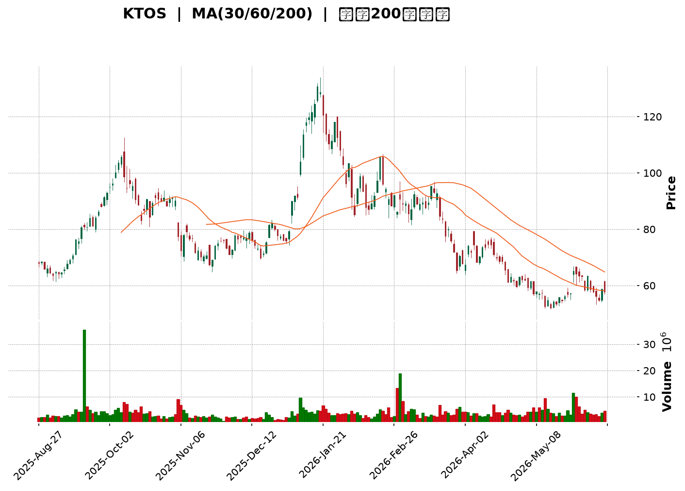
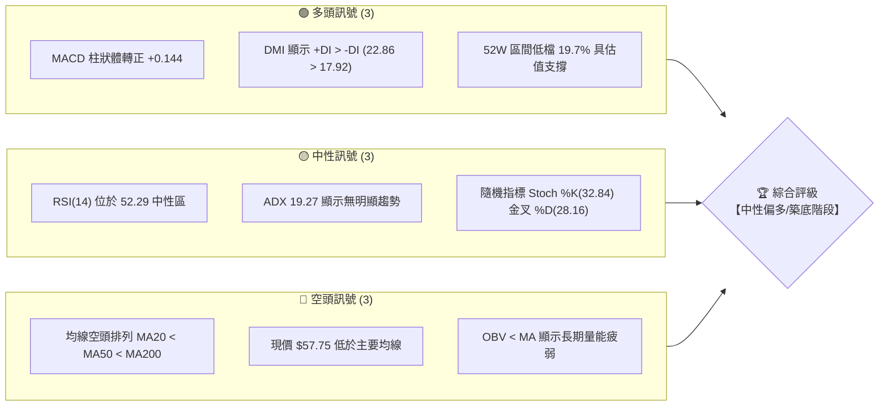
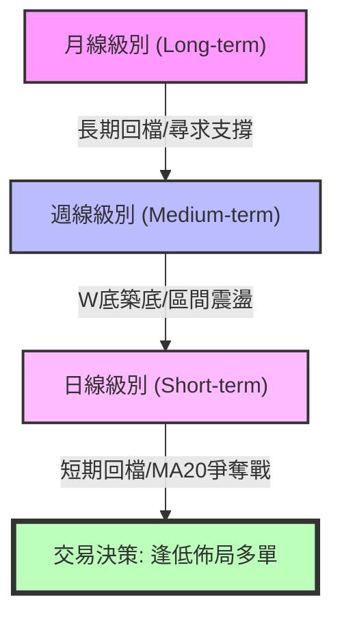
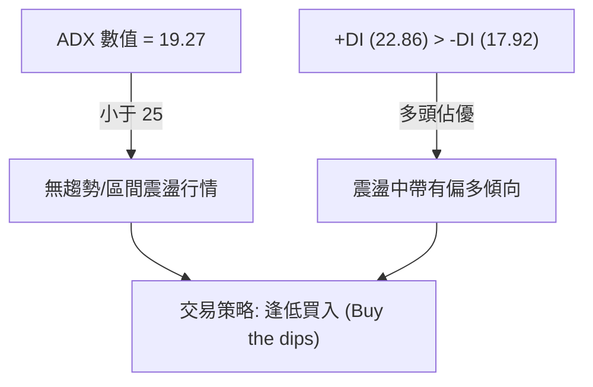
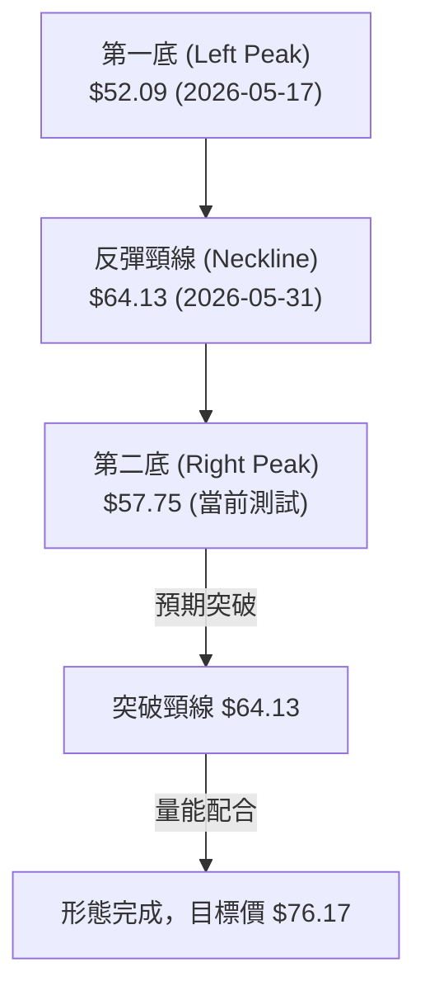
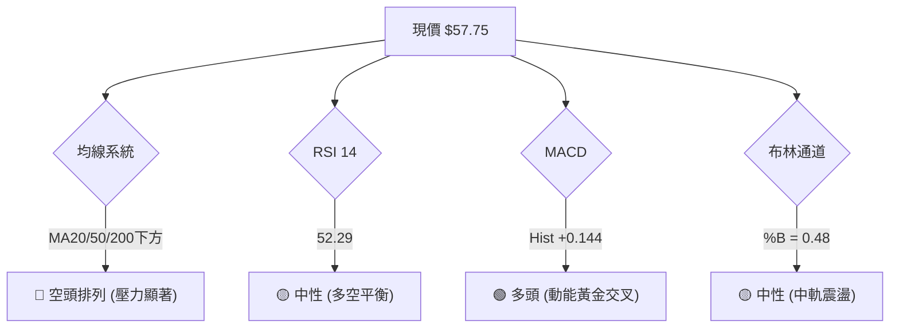
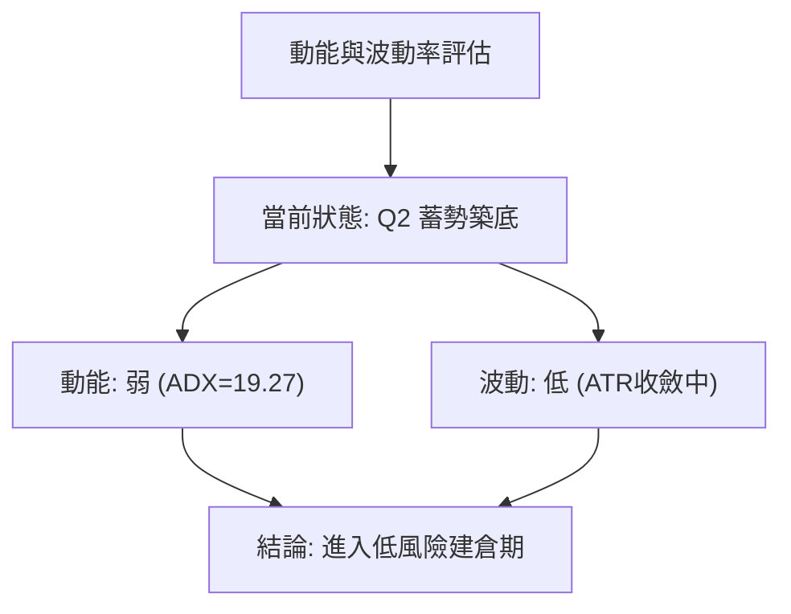
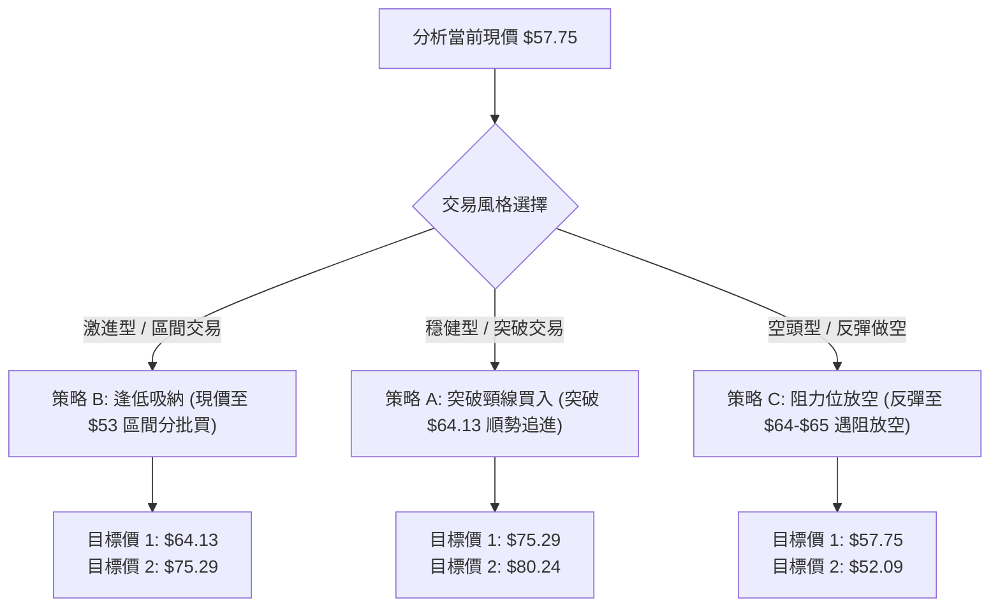
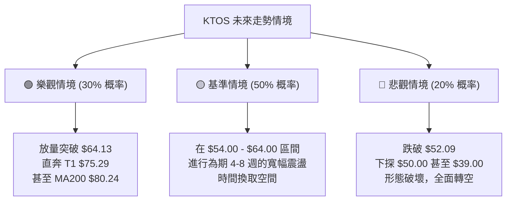

<details>
<summary>📊 靜態圖表 (點擊展開)</summary>

</details>

<html>
<head><meta charset="utf-8" /></head>
<body>
    <div style="height:500px; width:100%;">                        <script>window.PlotlyConfig = {MathJaxConfig: 'local'};</script>
        <script charset="utf-8" src="https://cdn.plot.ly/plotly-3.6.0.min.js" integrity="sha256-QaOVwtVY0T02VaHrr6pnoHLCwayMJp4O5n4YyaE3rJk=" crossorigin="anonymous"></script>                <div id="candlestick-chart" class="plotly-graph-div" style="height:100%; width:100%;"></div>            <script>                window.PLOTLYENV=window.PLOTLYENV || {};                                if (document.getElementById("candlestick-chart")) {                    Plotly.newPlot(                        "candlestick-chart",                        [{"close":{"dtype":"f8","bdata":"AAAAQOH6UEAAAADgoyBRQAAAAIDCdVBAAAAAgMKFUEAAAAAAACBQQAAAACCFy09AAAAAANczUEAAAADA9QhQQAAAAADXI1BAAAAAgD1qUEAAAABA4epQQAAAAMDMTFFAAAAAIFyvUUAAAABgZhZTQAAAACBc71JAAAAAoJkpVEAAAACgRzFUQAAAAIAULlRAAAAAoJn5VEAAAAAghUtUQAAAAMDMDFVAAAAAgOuRVUAAAADAHgVWQAAAACCu11ZAAAAAoHA9V0AAAACA68FXQAAAAAApDFhAAAAAAAAQWUAAAAAAKexZQAAAAEDhalpAAAAAQDOjWEAAAADgUahXQAAAAIDrEVhAAAAAQDPTV0AAAADAHqVWQAAAACCuJ1ZAAAAAIK7HVEAAAACgmalVQAAAACCup1ZAAAAAQDMTVUAAAADgelRWQAAAACCFy1ZAAAAAIIWrVkAAAACA63FWQAAAAKBwzVZAAAAAQDMTVkAAAABgZqZWQAAAAGBmxlZAAAAAgBSOVkAAAACAPVpTQAAAAIA9GlJAAAAA4FF4U0AAAAAghctTQAAAAIDCJVNAAAAAwMwsU0AAAAAAKexRQAAAAMDMHFJAAAAAIFyPUUAAAABACpdRQAAAAEDhqlFAAAAAANfTUEAAAADA9UhRQAAAAEAKh1JAAAAAQDPDUkAAAACgR\u002fFSQAAAAGBmBlNAAAAAoHBNUkAAAACgcL1RQAAAAIDrMVJAAAAAIIVrU0AAAAAAACBTQAAAAIDrQVNAAAAAgOtBU0AAAACAPTpTQAAAAIDrsVNAAAAAoHD9UkAAAADgo5BSQAAAAOBRSFJAAAAAoEdxUUAAAACgmdlRQAAAAMD12FJAAAAAgOthVEAAAABAM5NUQAAAAIAU\u002flNAAAAAwMxsU0AAAACAFF5TQAAAAGC4\u002flJAAAAAgD36UkAAAABgj9JTQAAAACCFe1ZAAAAAIIX7VkAAAAAAKdxWQAAAAGCPAlpAAAAAwMxsXEAAAABACnddQAAAAIAU7l1AAAAAAABgXkAAAAAA1yNfQAAAAEAKV2BAAAAAgMIVYEAAAACAwiVeQAAAAGBmdlxAAAAAwPWYW0AAAADgetRbQAAAAADXg11AAAAAQOEqXEAAAACAPQpbQAAAAOCjwFlAAAAAgD0KWEAAAAAgrtdZQAAAAMAe1VZAAAAAAABQVUAAAACAPZpXQAAAAADXs1hAAAAAYLheV0AAAACA6\u002fFVQAAAAEAzw1VAAAAAANdDVkAAAACAFP5WQAAAAKBwTVhAAAAAQOFqWkAAAADAHgVYQAAAAADXk1dAAAAAIIWrVkAAAABguA5WQAAAAMD1CFdAAAAAIIWLVUAAAACAFK5WQAAAAMDMPFZAAAAA4FFIVkAAAABgj2JVQAAAAAAAwFVAAAAAgBQeV0AAAACgcD1WQAAAAEDhOlZAAAAAoHBdVkAAAACA6+FVQAAAAIDrYVZAAAAAANfTV0AAAABgj0JXQAAAAIDrMVdAAAAAIK4nVUAAAAAAKexUQAAAACBcX1NAAAAAYLj+U0AAAABACvdSQAAAAAAp\u002fFFAAAAAgOtRUEAAAADgo6BRQAAAAMDM7FBAAAAAANfTUEAAAACAwoVSQAAAAKBw\u002fVFAAAAAoHCdUkAAAADAHhVRQAAAAIDClVFAAAAAQDNjUkAAAACAPWpSQAAAAIA9qlJAAAAAgD2aUkAAAAAgXL9RQAAAAMAedVFAAAAAQDMjUUAAAABACidRQAAAAKBHYVBAAAAAoEehTkAAAADgepRPQAAAAOB61E5AAAAAIK7HTUAAAABgZoZPQAAAAGBmBk9AAAAAQAr3TkAAAAAgrqdNQAAAAGCPwk5AAAAAAACATEAAAACA6\u002fFMQAAAAGC4fkxAAAAAgD2qTEAAAABguD5KQAAAAMDMbEtAAAAAIIULSkAAAAAAKRxLQAAAAAApvEpAAAAAwPXoS0AAAACAwlVLQAAAAEAKF0xAAAAAYGZmTEAAAABgZqZMQAAAAAApTFBAAAAA4FEIUEAAAABguL5PQAAAAGCPok9AAAAAQAo3TUAAAABAM7NPQAAAAGCPQk1AAAAAoHDdTEAAAADgURhMQAAAAMD1aEtAAAAAANdjTUAAAAAAAOBMQA=="},"high":{"dtype":"f8","bdata":"AAAAIFwvUUAAAADgejRRQAAAACBcH1FAAAAAgD3aUEAAAABA4cpQQAAAAAApHFBAAAAAYI9SUEAAAAAAAEBQQAAAAMAeNVBAAAAAAACwUEAAAADA9UhRQAAAAKBwbVFAAAAAANfTUUAAAAAgridTQAAAAIDrQVNAAAAAAClcVEAAAAAA15NUQAAAAOBRqFRAAAAAYLheVUAAAAAAAEBVQAAAAOBROFVAAAAAgMK1VUAAAABA4WpWQAAAACCu91ZAAAAAoEdhV0AAAACgmRlYQAAAACCuh1hAAAAAAADAWUAAAACgcC1aQAAAAADXk1pAAAAA4HokXEAAAACgmalZQAAAAAAAYFlAAAAAYGZGWEAAAAAgXJ9YQAAAAIDCJVdAAAAAoEehVUAAAACAFC5WQAAAAEAzs1ZAAAAAAACAVkAAAADAzHxWQAAAACCFO1dAAAAAYGamV0AAAADAzBxXQAAAACCud1dAAAAAAADAVkAAAACgmQlXQAAAAIAU7lZAAAAAgMLlVkAAAAAAAKBUQAAAAIAU3lNAAAAAYGaWU0AAAAAAAIBUQAAAACBcv1NAAAAAQOGKU0AAAACgmflSQAAAAKBHcVJAAAAAwMw8UkAAAAAAANBRQAAAACCFC1JAAAAAYLieUkAAAACAwlVRQAAAAAApnFJAAAAAIIULU0AAAABA4UpTQAAAACBcH1NAAAAAYGYmU0AAAABgZqZSQAAAAAAAQFJAAAAA4HqUU0AAAADgUYhTQAAAAOB6hFNAAAAAgD3qU0AAAACgcJ1TQAAAAIAU3lNAAAAAoJnZU0AAAABA4RpTQAAAAOBRqFJAAAAAIFyPUkAAAACAPRpSQAAAAGCP8lJAAAAAIK53VEAAAACAPdpUQAAAAAApfFRAAAAAgD36U0AAAACAFI5TQAAAAAApjFNAAAAAgBQ+U0AAAABguO5TQAAAAEAKh1ZAAAAAgOsBV0AAAADgetRXQAAAAEAzc1tAAAAAwMzcXEAAAADgUehdQAAAAOB6ZF5AAAAAoHD9XkAAAAAA15NfQAAAAAAAgGBAAAAAAADAYEAAAAAAAABgQAAAAEAzU15AAAAAgOvhXEAAAABA4WpcQAAAAMD1iF1AAAAAAAAAXkAAAADAzMxcQAAAAAAAMFtAAAAAwPVIWUAAAAAgXN9ZQAAAAAAAwFlAAAAAYGYmV0AAAABA4apXQAAAAIDr8VhAAAAAAADgWEAAAABAMyNYQAAAAIDCZVZAAAAAIFwPV0AAAABgZlZXQAAAAAAAIFlAAAAAgD16WkAAAABA4apaQAAAAMAexVdAAAAAIFzvVkAAAACA61FXQAAAAAApHFdAAAAAoJmZVUAAAABgZkZYQAAAAIAUTldAAAAAYGaGVkAAAAAgXF9WQAAAAOBRuFZAAAAAQOFqV0AAAABAMxNXQAAAAGC4vlZAAAAAIK7XVkAAAACgmflWQAAAAEAz81ZAAAAAYGbWV0AAAADgUThYQAAAAAAAoFdAAAAAAAAAV0AAAAAA15NVQAAAAKBHwVRAAAAAACk8VEAAAACA6+FTQAAAAOBRGFNAAAAAoJn5UUAAAACAFL5RQAAAAEAzM1JAAAAA4KNgUUAAAACAPZpSQAAAAKCZOVJAAAAAACncU0AAAAAAAKBSQAAAAIDroVFAAAAAYGaGUkAAAADgeiRTQAAAAGCPElNAAAAAgBROU0AAAADA9ThTQAAAAKBw7VFAAAAAoJm5UUAAAABguL5RQAAAACBcL1FAAAAA4KNwUEAAAAAghRtQQAAAAKCZWU9AAAAAoEfhTkAAAABACpdPQAAAAAAAwE9AAAAA4FEIUEAAAADAHmVPQAAAAGC43k5AAAAAwB7FTkAAAADgUfhMQAAAAEDh2kxAAAAA4KNQTUAAAAAAAEBMQAAAAAAp\u002fEtAAAAAQDPzSkAAAAAAKVxLQAAAACCFS0tAAAAA4KPwS0AAAAAA14NLQAAAAAAAYExAAAAAYGamTUAAAACAFK5MQAAAAMAetVBAAAAAAACwUEAAAADAzIxQQAAAAEAz009AAAAAwMzsTkAAAAAghctPQAAAAMDMDE9AAAAAAADgTUAAAABgZqZNQAAAAGBmZkxAAAAAgOtxTUAAAACgmdlOQA=="},"hovertemplate":"\u003cb\u003e%{x|%Y-%m-%d}\u003c\u002fb\u003e\u003cbr\u003e\u958b: $%{open:.2f}\u003cbr\u003e\u9ad8: $%{high:.2f}\u003cbr\u003e\u4f4e: $%{low:.2f}\u003cbr\u003e\u6536: $%{close:.2f}\u003cextra\u003e\u003c\u002fextra\u003e","low":{"dtype":"f8","bdata":"AAAAAACgUEAAAACgR9FQQAAAAMD1aFBAAAAAYI+CT0AAAAAA1wNQQAAAAAAA4E5AAAAAQDOzTkAAAACAPSpPQAAAAOB6VE9AAAAAACkMUEAAAABgZmZQQAAAAKCZ6VBAAAAAoJn5UEAAAADAHrVRQAAAAEAKR1JAAAAAoEfBUkAAAACgmflTQAAAAEAz01NAAAAAYGZGVEAAAABgZjZUQAAAACCut1NAAAAAIIUbVUAAAABAM\u002fNVQAAAAGBmBlZAAAAA4FEoVkAAAACA6yFXQAAAAEAKd1dAAAAAoEeBWEAAAAAAAABZQAAAAKCZeVlAAAAAQDMzWEAAAACgmTlXQAAAAEDhqldAAAAAYI+yVkAAAACAPUpWQAAAACBcH1ZAAAAAoHBtVEAAAADAzExVQAAAAMDMTFVAAAAAANczVEAAAAAgrjdVQAAAACCFS1ZAAAAA4KMQVkAAAAAAKWxWQAAAAKBwfVZAAAAAYI8CVkAAAACAPfpVQAAAAMDM\u002fFVAAAAA4Hq0VUAAAABgZvZSQAAAAKBHkVFAAAAAoJkpUUAAAABAM0NTQAAAAMD1+FJAAAAAAADgUkAAAAAA19NRQAAAAAAAQFFAAAAAYGY2UUAAAACA6\u002fFQQAAAAEAzU1FAAAAAgD26UEAAAABAMzNQQAAAAMD1SFFAAAAAoJkpUkAAAAAA19NSQAAAAOCjwFJAAAAAIIU7UkAAAAAgrrdRQAAAACCFa1FAAAAAgOsRUkAAAADgo7BSQAAAAKCZyVJAAAAAANcDU0AAAADAzExSQAAAAEAzs1JAAAAAwMzMUkAAAABgZkZSQAAAAEDhGlJAAAAAANdTUUAAAADA9YhRQAAAAGC4zlFAAAAAANczU0AAAABgZvZTQAAAAIDr0VNAAAAAYGYGU0AAAACgmQlTQAAAAEAz81JAAAAA4FG4UkAAAADAHpVSQAAAAOBRiFRAAAAAwMysVUAAAADgo6BWQAAAAKBHsVhAAAAAoJkpWkAAAAAAAKBcQAAAAMDMTF1AAAAAAACAXEAAAACgR1FdQAAAAAAAQF9AAAAAAADAX0AAAACA65FcQAAAAGC4zltAAAAAQAoXW0AAAACgR7FaQAAAAADXw1tAAAAA4KNQW0AAAACAwoVaQAAAAOBRaFlAAAAAoEexV0AAAACgmUlYQAAAAEDhulVAAAAAAAAgVUAAAAAAAABWQAAAAMDMTFdAAAAAoHBNV0AAAACgR0FVQAAAAAAAUFVAAAAAoEfBVUAAAADgesRVQAAAAMDMPFdAAAAAYLg+WEAAAAAghdtXQAAAAAAAwFZAAAAAYI8CVUAAAACgcA1WQAAAAMD1qFVAAAAAAAAAVUAAAADAHlVVQAAAAGBmplVAAAAAAABwVUAAAACgmZlUQAAAAAAAYFRAAAAAwMzMVUAAAADA9ShWQAAAACCup1VAAAAAwPVYVUAAAADAzMxVQAAAAKCZuVVAAAAAIFyPVkAAAACAPSpXQAAAAMD16FVAAAAAYGbGVEAAAADgeoRUQAAAAKBH4VJAAAAAANdTU0AAAACgmclSQAAAAMDM7FFAAAAAIK4XUEAAAABAM2NQQAAAAGBm5lBAAAAAIIXrT0AAAADAzIxRQAAAAEAzc1FAAAAAQDMjUkAAAACA6xFRQAAAACCF21BAAAAAQApnUUAAAACgRyFSQAAAAAAAUFJAAAAA4KNAUkAAAACAPZpRQAAAAEAKN1FAAAAA4Hr0UEAAAADA9ehQQAAAAMAe5U9AAAAAoEeBTkAAAADgUZhOQAAAAAApHE5AAAAAIK6HTUAAAACA69FNQAAAAKCZeU5AAAAAoEfhTkAAAACgRwFNQAAAAEAKN01AAAAAwB4lTEAAAACgcN1LQAAAAKBHgUtAAAAAgBSOS0AAAAAghetJQAAAAGC4PkpAAAAA4HrUSUAAAACAPQpKQAAAAADXY0pAAAAAQDNTSkAAAAAgrudKQAAAAEDhOktAAAAAQDPzS0AAAAAAAIBLQAAAAAAAgE5AAAAAgD0KTkAAAABAM5NOQAAAAEAK105AAAAAQDPzTEAAAADgUfhMQAAAAAAAwExAAAAAIFyvTEAAAAAgrqdKQAAAAAAAIEtAAAAAwPUIS0AAAADgenRMQA=="},"name":"\u50f9\u683c","open":{"dtype":"f8","bdata":"AAAAoEcRUUAAAABgjwJRQAAAACBcH1FAAAAAgD0aUEAAAACA65FQQAAAAEAzE1BAAAAAAAAgUEAAAACAwjVQQAAAAOBRCFBAAAAAYGZWUEAAAACAwoVQQAAAACBc71BAAAAAwMxcUUAAAAAA18NRQAAAAOCjwFJAAAAAoJkpU0AAAACgR2FUQAAAAEAKJ1RAAAAAYGZGVEAAAAAgrhdVQAAAAAAAAFRAAAAAAABAVUAAAADAzDxWQAAAAMD1GFZAAAAAAACgVkAAAAAAAMBXQAAAAAAp7FdAAAAAYGaWWEAAAACgmUlZQAAAAOB6xFlAAAAAwPXoWkAAAADAzKxXQAAAAIAUXlhAAAAAgBRuV0AAAADAzHxYQAAAACBc\u002f1ZAAAAAQOE6VUAAAACA69FVQAAAAEAKx1VAAAAAAACAVkAAAADAzExVQAAAAOBRCFdAAAAA4HpEV0AAAADgesRWQAAAAAAAgFZAAAAAAACAVkAAAAAAAGBWQAAAAMAetVZAAAAAYLgOVkAAAAAgrpdUQAAAAMDMfFNAAAAAQDOTUUAAAAAghVtUQAAAAGC4blNAAAAAgOsxU0AAAAAAKbxSQAAAAIA9SlFAAAAAgMIFUkAAAAAgXC9RQAAAAMAeZVFAAAAAYLieUkAAAAAA17NQQAAAAEDhWlFAAAAAgD2KUkAAAABAM\u002fNSQAAAAGC4DlNAAAAAYGYmU0AAAAAgrodSQAAAAOCjwFFAAAAAoEchUkAAAAAAKWxTQAAAAIDCZVNAAAAA4HokU0AAAAAAAABTQAAAACBcL1NAAAAAIIW7U0AAAACgRxFTQAAAAAAAQFJAAAAA4FFIUkAAAAAAKbxRQAAAAIDr4VFAAAAAAABAU0AAAACAFB5UQAAAAEAKR1RAAAAAgD36U0AAAACgcD1TQAAAAAApjFNAAAAAQDMzU0AAAABAMyNTQAAAAIA9OlVAAAAAwPV4VkAAAADgUShXQAAAAIDr4VhAAAAAYLheWkAAAABgZjZdQAAAAIA9ul1AAAAAAACgXUAAAADA9fhdQAAAAKBwbV9AAAAAIIUDYEAAAABgj+JfQAAAAOCjQF5AAAAAwB51XEAAAADAzCxbQAAAAADXw1tAAAAAAAAAXkAAAADgUbhcQAAAAOB6dFpAAAAAgD36WEAAAABgZqZYQAAAAKBwXVlAAAAAgBQeVkAAAABgZkZWQAAAAGBmpldAAAAA4Hq0WEAAAACAPfpXQAAAAKCZGVZAAAAAIFzPVUAAAADAHgVWQAAAAMD1SFdAAAAAoHBtWEAAAAAAKWxaQAAAAKBHUVdAAAAAAAAwVkAAAAAAKTxXQAAAAAAp\u002fFVAAAAAQDNTVUAAAABA4RpXQAAAAKBwTVZAAAAA4KMgVkAAAABgZjZWQAAAAOBR2FRAAAAAQAr3VUAAAAAAKdxWQAAAAIDrwVVAAAAAACk8VkAAAAAAAIBWQAAAAIDCNVZAAAAAQAq3VkAAAACAPZpXQAAAAOCjoFZAAAAAwMzcVkAAAACAwvVUQAAAAEDhqlRAAAAAYI\u002fyU0AAAADgUZhTQAAAAEAKt1JAAAAA4KPwUUAAAACgmblQQAAAAMD1KFJAAAAAgOtRUEAAAADgUchRQAAAAAAAEFJAAAAA4FHYU0AAAADAzIxSQAAAAKBHAVFAAAAAYGaGUUAAAACAPapSQAAAAAAp7FJAAAAAANcTU0AAAAAghdtSQAAAAGCPglFAAAAA4KOQUUAAAAAgrodRQAAAAMDMHFFAAAAA4KNwUEAAAADgUZhOQAAAAOBR+E5AAAAAYLjeTkAAAADAHiVOQAAAAOB6tE9AAAAAACk8T0AAAADgUVhPQAAAAIA9ik1AAAAAwB7FTkAAAACAPYpMQAAAACBcb0xAAAAAIIWrTEAAAADgejRMQAAAAKBHYUpAAAAAYLi+SkAAAACgRyFKQAAAAGC4HktAAAAAoJn5SkAAAAAAAIBLQAAAAMAepUtAAAAA4HrUTEAAAACgcH1MQAAAAEDh+k9AAAAAgD2qUEAAAAAAKTxQQAAAAMD1yE9AAAAAIFzPTkAAAACAFC5NQAAAAIDr0U5AAAAAACncTUAAAAAgrgdNQAAAAMDMzEtAAAAAwPVoS0AAAABguL5OQA=="},"x":["2025-08-27T00:00:00-04:00","2025-08-28T00:00:00-04:00","2025-08-29T00:00:00-04:00","2025-09-02T00:00:00-04:00","2025-09-03T00:00:00-04:00","2025-09-04T00:00:00-04:00","2025-09-05T00:00:00-04:00","2025-09-08T00:00:00-04:00","2025-09-09T00:00:00-04:00","2025-09-10T00:00:00-04:00","2025-09-11T00:00:00-04:00","2025-09-12T00:00:00-04:00","2025-09-15T00:00:00-04:00","2025-09-16T00:00:00-04:00","2025-09-17T00:00:00-04:00","2025-09-18T00:00:00-04:00","2025-09-19T00:00:00-04:00","2025-09-22T00:00:00-04:00","2025-09-23T00:00:00-04:00","2025-09-24T00:00:00-04:00","2025-09-25T00:00:00-04:00","2025-09-26T00:00:00-04:00","2025-09-29T00:00:00-04:00","2025-09-30T00:00:00-04:00","2025-10-01T00:00:00-04:00","2025-10-02T00:00:00-04:00","2025-10-03T00:00:00-04:00","2025-10-06T00:00:00-04:00","2025-10-07T00:00:00-04:00","2025-10-08T00:00:00-04:00","2025-10-09T00:00:00-04:00","2025-10-10T00:00:00-04:00","2025-10-13T00:00:00-04:00","2025-10-14T00:00:00-04:00","2025-10-15T00:00:00-04:00","2025-10-16T00:00:00-04:00","2025-10-17T00:00:00-04:00","2025-10-20T00:00:00-04:00","2025-10-21T00:00:00-04:00","2025-10-22T00:00:00-04:00","2025-10-23T00:00:00-04:00","2025-10-24T00:00:00-04:00","2025-10-27T00:00:00-04:00","2025-10-28T00:00:00-04:00","2025-10-29T00:00:00-04:00","2025-10-30T00:00:00-04:00","2025-10-31T00:00:00-04:00","2025-11-03T00:00:00-05:00","2025-11-04T00:00:00-05:00","2025-11-05T00:00:00-05:00","2025-11-06T00:00:00-05:00","2025-11-07T00:00:00-05:00","2025-11-10T00:00:00-05:00","2025-11-11T00:00:00-05:00","2025-11-12T00:00:00-05:00","2025-11-13T00:00:00-05:00","2025-11-14T00:00:00-05:00","2025-11-17T00:00:00-05:00","2025-11-18T00:00:00-05:00","2025-11-19T00:00:00-05:00","2025-11-20T00:00:00-05:00","2025-11-21T00:00:00-05:00","2025-11-24T00:00:00-05:00","2025-11-25T00:00:00-05:00","2025-11-26T00:00:00-05:00","2025-11-28T00:00:00-05:00","2025-12-01T00:00:00-05:00","2025-12-02T00:00:00-05:00","2025-12-03T00:00:00-05:00","2025-12-04T00:00:00-05:00","2025-12-05T00:00:00-05:00","2025-12-08T00:00:00-05:00","2025-12-09T00:00:00-05:00","2025-12-10T00:00:00-05:00","2025-12-11T00:00:00-05:00","2025-12-12T00:00:00-05:00","2025-12-15T00:00:00-05:00","2025-12-16T00:00:00-05:00","2025-12-17T00:00:00-05:00","2025-12-18T00:00:00-05:00","2025-12-19T00:00:00-05:00","2025-12-22T00:00:00-05:00","2025-12-23T00:00:00-05:00","2025-12-24T00:00:00-05:00","2025-12-26T00:00:00-05:00","2025-12-29T00:00:00-05:00","2025-12-30T00:00:00-05:00","2025-12-31T00:00:00-05:00","2026-01-02T00:00:00-05:00","2026-01-05T00:00:00-05:00","2026-01-06T00:00:00-05:00","2026-01-07T00:00:00-05:00","2026-01-08T00:00:00-05:00","2026-01-09T00:00:00-05:00","2026-01-12T00:00:00-05:00","2026-01-13T00:00:00-05:00","2026-01-14T00:00:00-05:00","2026-01-15T00:00:00-05:00","2026-01-16T00:00:00-05:00","2026-01-20T00:00:00-05:00","2026-01-21T00:00:00-05:00","2026-01-22T00:00:00-05:00","2026-01-23T00:00:00-05:00","2026-01-26T00:00:00-05:00","2026-01-27T00:00:00-05:00","2026-01-28T00:00:00-05:00","2026-01-29T00:00:00-05:00","2026-01-30T00:00:00-05:00","2026-02-02T00:00:00-05:00","2026-02-03T00:00:00-05:00","2026-02-04T00:00:00-05:00","2026-02-05T00:00:00-05:00","2026-02-06T00:00:00-05:00","2026-02-09T00:00:00-05:00","2026-02-10T00:00:00-05:00","2026-02-11T00:00:00-05:00","2026-02-12T00:00:00-05:00","2026-02-13T00:00:00-05:00","2026-02-17T00:00:00-05:00","2026-02-18T00:00:00-05:00","2026-02-19T00:00:00-05:00","2026-02-20T00:00:00-05:00","2026-02-23T00:00:00-05:00","2026-02-24T00:00:00-05:00","2026-02-25T00:00:00-05:00","2026-02-26T00:00:00-05:00","2026-02-27T00:00:00-05:00","2026-03-02T00:00:00-05:00","2026-03-03T00:00:00-05:00","2026-03-04T00:00:00-05:00","2026-03-05T00:00:00-05:00","2026-03-06T00:00:00-05:00","2026-03-09T00:00:00-04:00","2026-03-10T00:00:00-04:00","2026-03-11T00:00:00-04:00","2026-03-12T00:00:00-04:00","2026-03-13T00:00:00-04:00","2026-03-16T00:00:00-04:00","2026-03-17T00:00:00-04:00","2026-03-18T00:00:00-04:00","2026-03-19T00:00:00-04:00","2026-03-20T00:00:00-04:00","2026-03-23T00:00:00-04:00","2026-03-24T00:00:00-04:00","2026-03-25T00:00:00-04:00","2026-03-26T00:00:00-04:00","2026-03-27T00:00:00-04:00","2026-03-30T00:00:00-04:00","2026-03-31T00:00:00-04:00","2026-04-01T00:00:00-04:00","2026-04-02T00:00:00-04:00","2026-04-06T00:00:00-04:00","2026-04-07T00:00:00-04:00","2026-04-08T00:00:00-04:00","2026-04-09T00:00:00-04:00","2026-04-10T00:00:00-04:00","2026-04-13T00:00:00-04:00","2026-04-14T00:00:00-04:00","2026-04-15T00:00:00-04:00","2026-04-16T00:00:00-04:00","2026-04-17T00:00:00-04:00","2026-04-20T00:00:00-04:00","2026-04-21T00:00:00-04:00","2026-04-22T00:00:00-04:00","2026-04-23T00:00:00-04:00","2026-04-24T00:00:00-04:00","2026-04-27T00:00:00-04:00","2026-04-28T00:00:00-04:00","2026-04-29T00:00:00-04:00","2026-04-30T00:00:00-04:00","2026-05-01T00:00:00-04:00","2026-05-04T00:00:00-04:00","2026-05-05T00:00:00-04:00","2026-05-06T00:00:00-04:00","2026-05-07T00:00:00-04:00","2026-05-08T00:00:00-04:00","2026-05-11T00:00:00-04:00","2026-05-12T00:00:00-04:00","2026-05-13T00:00:00-04:00","2026-05-14T00:00:00-04:00","2026-05-15T00:00:00-04:00","2026-05-18T00:00:00-04:00","2026-05-19T00:00:00-04:00","2026-05-20T00:00:00-04:00","2026-05-21T00:00:00-04:00","2026-05-22T00:00:00-04:00","2026-05-26T00:00:00-04:00","2026-05-27T00:00:00-04:00","2026-05-28T00:00:00-04:00","2026-05-29T00:00:00-04:00","2026-06-01T00:00:00-04:00","2026-06-02T00:00:00-04:00","2026-06-03T00:00:00-04:00","2026-06-04T00:00:00-04:00","2026-06-05T00:00:00-04:00","2026-06-08T00:00:00-04:00","2026-06-09T00:00:00-04:00","2026-06-10T00:00:00-04:00","2026-06-11T00:00:00-04:00","2026-06-12T00:00:00-04:00"],"type":"candlestick"},{"hovertemplate":"MA30: $%{y:.2f}\u003cextra\u003e\u003c\u002fextra\u003e","line":{"color":"#2196F3","dash":"dash","width":2},"mode":"lines","name":"MA30","x":["2025-08-27T00:00:00-04:00","2025-08-28T00:00:00-04:00","2025-08-29T00:00:00-04:00","2025-09-02T00:00:00-04:00","2025-09-03T00:00:00-04:00","2025-09-04T00:00:00-04:00","2025-09-05T00:00:00-04:00","2025-09-08T00:00:00-04:00","2025-09-09T00:00:00-04:00","2025-09-10T00:00:00-04:00","2025-09-11T00:00:00-04:00","2025-09-12T00:00:00-04:00","2025-09-15T00:00:00-04:00","2025-09-16T00:00:00-04:00","2025-09-17T00:00:00-04:00","2025-09-18T00:00:00-04:00","2025-09-19T00:00:00-04:00","2025-09-22T00:00:00-04:00","2025-09-23T00:00:00-04:00","2025-09-24T00:00:00-04:00","2025-09-25T00:00:00-04:00","2025-09-26T00:00:00-04:00","2025-09-29T00:00:00-04:00","2025-09-30T00:00:00-04:00","2025-10-01T00:00:00-04:00","2025-10-02T00:00:00-04:00","2025-10-03T00:00:00-04:00","2025-10-06T00:00:00-04:00","2025-10-07T00:00:00-04:00","2025-10-08T00:00:00-04:00","2025-10-09T00:00:00-04:00","2025-10-10T00:00:00-04:00","2025-10-13T00:00:00-04:00","2025-10-14T00:00:00-04:00","2025-10-15T00:00:00-04:00","2025-10-16T00:00:00-04:00","2025-10-17T00:00:00-04:00","2025-10-20T00:00:00-04:00","2025-10-21T00:00:00-04:00","2025-10-22T00:00:00-04:00","2025-10-23T00:00:00-04:00","2025-10-24T00:00:00-04:00","2025-10-27T00:00:00-04:00","2025-10-28T00:00:00-04:00","2025-10-29T00:00:00-04:00","2025-10-30T00:00:00-04:00","2025-10-31T00:00:00-04:00","2025-11-03T00:00:00-05:00","2025-11-04T00:00:00-05:00","2025-11-05T00:00:00-05:00","2025-11-06T00:00:00-05:00","2025-11-07T00:00:00-05:00","2025-11-10T00:00:00-05:00","2025-11-11T00:00:00-05:00","2025-11-12T00:00:00-05:00","2025-11-13T00:00:00-05:00","2025-11-14T00:00:00-05:00","2025-11-17T00:00:00-05:00","2025-11-18T00:00:00-05:00","2025-11-19T00:00:00-05:00","2025-11-20T00:00:00-05:00","2025-11-21T00:00:00-05:00","2025-11-24T00:00:00-05:00","2025-11-25T00:00:00-05:00","2025-11-26T00:00:00-05:00","2025-11-28T00:00:00-05:00","2025-12-01T00:00:00-05:00","2025-12-02T00:00:00-05:00","2025-12-03T00:00:00-05:00","2025-12-04T00:00:00-05:00","2025-12-05T00:00:00-05:00","2025-12-08T00:00:00-05:00","2025-12-09T00:00:00-05:00","2025-12-10T00:00:00-05:00","2025-12-11T00:00:00-05:00","2025-12-12T00:00:00-05:00","2025-12-15T00:00:00-05:00","2025-12-16T00:00:00-05:00","2025-12-17T00:00:00-05:00","2025-12-18T00:00:00-05:00","2025-12-19T00:00:00-05:00","2025-12-22T00:00:00-05:00","2025-12-23T00:00:00-05:00","2025-12-24T00:00:00-05:00","2025-12-26T00:00:00-05:00","2025-12-29T00:00:00-05:00","2025-12-30T00:00:00-05:00","2025-12-31T00:00:00-05:00","2026-01-02T00:00:00-05:00","2026-01-05T00:00:00-05:00","2026-01-06T00:00:00-05:00","2026-01-07T00:00:00-05:00","2026-01-08T00:00:00-05:00","2026-01-09T00:00:00-05:00","2026-01-12T00:00:00-05:00","2026-01-13T00:00:00-05:00","2026-01-14T00:00:00-05:00","2026-01-15T00:00:00-05:00","2026-01-16T00:00:00-05:00","2026-01-20T00:00:00-05:00","2026-01-21T00:00:00-05:00","2026-01-22T00:00:00-05:00","2026-01-23T00:00:00-05:00","2026-01-26T00:00:00-05:00","2026-01-27T00:00:00-05:00","2026-01-28T00:00:00-05:00","2026-01-29T00:00:00-05:00","2026-01-30T00:00:00-05:00","2026-02-02T00:00:00-05:00","2026-02-03T00:00:00-05:00","2026-02-04T00:00:00-05:00","2026-02-05T00:00:00-05:00","2026-02-06T00:00:00-05:00","2026-02-09T00:00:00-05:00","2026-02-10T00:00:00-05:00","2026-02-11T00:00:00-05:00","2026-02-12T00:00:00-05:00","2026-02-13T00:00:00-05:00","2026-02-17T00:00:00-05:00","2026-02-18T00:00:00-05:00","2026-02-19T00:00:00-05:00","2026-02-20T00:00:00-05:00","2026-02-23T00:00:00-05:00","2026-02-24T00:00:00-05:00","2026-02-25T00:00:00-05:00","2026-02-26T00:00:00-05:00","2026-02-27T00:00:00-05:00","2026-03-02T00:00:00-05:00","2026-03-03T00:00:00-05:00","2026-03-04T00:00:00-05:00","2026-03-05T00:00:00-05:00","2026-03-06T00:00:00-05:00","2026-03-09T00:00:00-04:00","2026-03-10T00:00:00-04:00","2026-03-11T00:00:00-04:00","2026-03-12T00:00:00-04:00","2026-03-13T00:00:00-04:00","2026-03-16T00:00:00-04:00","2026-03-17T00:00:00-04:00","2026-03-18T00:00:00-04:00","2026-03-19T00:00:00-04:00","2026-03-20T00:00:00-04:00","2026-03-23T00:00:00-04:00","2026-03-24T00:00:00-04:00","2026-03-25T00:00:00-04:00","2026-03-26T00:00:00-04:00","2026-03-27T00:00:00-04:00","2026-03-30T00:00:00-04:00","2026-03-31T00:00:00-04:00","2026-04-01T00:00:00-04:00","2026-04-02T00:00:00-04:00","2026-04-06T00:00:00-04:00","2026-04-07T00:00:00-04:00","2026-04-08T00:00:00-04:00","2026-04-09T00:00:00-04:00","2026-04-10T00:00:00-04:00","2026-04-13T00:00:00-04:00","2026-04-14T00:00:00-04:00","2026-04-15T00:00:00-04:00","2026-04-16T00:00:00-04:00","2026-04-17T00:00:00-04:00","2026-04-20T00:00:00-04:00","2026-04-21T00:00:00-04:00","2026-04-22T00:00:00-04:00","2026-04-23T00:00:00-04:00","2026-04-24T00:00:00-04:00","2026-04-27T00:00:00-04:00","2026-04-28T00:00:00-04:00","2026-04-29T00:00:00-04:00","2026-04-30T00:00:00-04:00","2026-05-01T00:00:00-04:00","2026-05-04T00:00:00-04:00","2026-05-05T00:00:00-04:00","2026-05-06T00:00:00-04:00","2026-05-07T00:00:00-04:00","2026-05-08T00:00:00-04:00","2026-05-11T00:00:00-04:00","2026-05-12T00:00:00-04:00","2026-05-13T00:00:00-04:00","2026-05-14T00:00:00-04:00","2026-05-15T00:00:00-04:00","2026-05-18T00:00:00-04:00","2026-05-19T00:00:00-04:00","2026-05-20T00:00:00-04:00","2026-05-21T00:00:00-04:00","2026-05-22T00:00:00-04:00","2026-05-26T00:00:00-04:00","2026-05-27T00:00:00-04:00","2026-05-28T00:00:00-04:00","2026-05-29T00:00:00-04:00","2026-06-01T00:00:00-04:00","2026-06-02T00:00:00-04:00","2026-06-03T00:00:00-04:00","2026-06-04T00:00:00-04:00","2026-06-05T00:00:00-04:00","2026-06-08T00:00:00-04:00","2026-06-09T00:00:00-04:00","2026-06-10T00:00:00-04:00","2026-06-11T00:00:00-04:00","2026-06-12T00:00:00-04:00"],"y":{"dtype":"f8","bdata":"AAAAAAAA+H8AAAAAAAD4fwAAAAAAAPh\u002fAAAAAAAA+H8AAAAAAAD4fwAAAAAAAPh\u002fAAAAAAAA+H8AAAAAAAD4fwAAAAAAAPh\u002fAAAAAAAA+H8AAAAAAAD4fwAAAAAAAPh\u002fAAAAAAAA+H8AAAAAAAD4fwAAAAAAAPh\u002fAAAAAAAA+H8AAAAAAAD4fwAAAAAAAPh\u002fAAAAAAAA+H8AAAAAAAD4fwAAAAAAAPh\u002fAAAAAAAA+H8AAAAAAAD4fwAAAAAAAPh\u002fAAAAAAAA+H8AAAAAAAD4fwAAAAAAAPh\u002fAAAAAAAA+H8AAAAAAAD4f7y7u3MFuFNAzczMhF35U0DNzMyEFjFUQJqZmdEGclRAiYiIYFewVEARERGJ+udUQBEREUFgHVVAVVVV9W9EVUC8u7trdXRVQImIiKgNrFVAVVVVldHTVUDv7u5eAQJWQCIiImLlMFZAiYiISG9bVkCrqqraFXhWQJqZmYkWmVZAVVVVdWipVkAzMzPzYL5WQAAAANCF1FZAAAAAYAHiVkBERER09tlWQLy7u4vPwFZAZmZmBuSuVkAAAABw55tWQFVVVZVffFZAREREdK9ZVkBERES05CdWQO\u002fu7n4\u002f9VVAiYiICDq1VUCJiIhoH25VQN7d3b10I1VAiYiIiM\u002fgVECJiIiYbqpUQCIiItIie1RA7+7unu9PVEAiIiJiVzBUQKuqqsqhFVRAvLu7m30AVEBmZmbGBN9TQBEREcH1uFNAmpmZWdaqU0C8u7vrfI9TQCIiIiJNcVNAmpmZaS5UU0De3d2tuThTQN7d3T01HlNARERE9OEDU0AzMzMjBuFSQO\u002fu7h6wulJAERERsQ+PUkDe3d1tPYJSQHd3d+eYiFJAq6qqSmKQUkCrqqo6CpdSQJqZmSlAnlJAvLu7S2KgUkAiIiLytqxSQM3MzMw+tFJAERERYVfAUkCamZlZZNNSQBEREeF6\u002fFJA7+7urgAxU0BVVVV1k2BTQKuqqjptoFNAd3d3R+HyU0CJiIgIrExUQO\u002fu7l66qVRAZmZmJr8QVUBVVVXlF4NVQM3MzNyy\u002flVAiYiIqH9rVkDNzMysjslWQN7d3U0bGFdAAAAAUEZfV0AiIiLCrqhXQAAAAOB6\u002fFdA3t3dbctKWECamZlZHZNYQBEREdHb0lhAd3d3RygLWUCamZkpXE9ZQHd3d4ddcVlAVVVVJU15WUAiIiLSIpNZQImIiPhTu1lAVVVV9f3cWUB3d3eX\u002fPJZQJqZmUmaClpAAAAA8KcmWkCJiIjotEFaQCIiIsI8UVpAERERoYxuWkAAAACwcnhaQO\u002fu7s6wY1pAIiIi0pQyWkBERETkXvNZQImIiIiIuFlAq6qqGi9tWUBERET0\u002fSRZQGZmZvbhy1hAREREZIJ3WEC8u7trvCxYQN7d3b1081dAiYiICDrNV0De3d19hp1XQKuqqipcX1dAmpmZadgtV0De3d2t1QFXQM3MzMwT5VZAVVVVlUPjVkBmZmYGOs1WQKuqqupR0FZAq6qq2vnOVkDe3d1NG7hWQN7d3b2filZAERER8dJtVkCJiIgIZVRWQFVVVfUoNFZAiYiI6G0BVkAzMzPjpdNVQN7d3X2xlFVAERER0dtCVUB3d3dX8hNVQDMzM0NE5FRAq6qq+qnBVEDNzMzsNZdUQHd3dze0aFRA3t3djcJNVEBVVVWFXSlUQHd3d0fhClRAMzMzM3rrU0BVVVX1b8xTQJqZmdnOp1NAd3d3V8d0U0B3d3eHXUlTQCIiIgJyF1NAREREDEnbUkB3d3fHS6dSQDMzMwvXa1JAd3d3x5IfUkBVVVU9mN9RQAAAAJAJnlFAvLu7y6FtUUCJiIgQnzlRQBEREVGNF1FAvLu7K4fmUEB3d3cnMcBQQN7d3XVMoFBAvLu7s1aPUEARERFh5WhQQBEREZF7TVBAMzMzawMtUECJiIjAnwJQQO\u002fu7n5btk9AVVVVpdNmT0B3d3dHiyxPQJqZmckg8E5AERERUamoTkBERETU22JOQAAAABB0Ok5A3t3djZcOTkDv7u6Ol+5NQJqZmUma0k1AvLu7i2ynTUBmZmbWMZFNQJqZmflTc01AZmZmRkRkTUDNzMwsh0ZNQCIiIhJYKU1AmpmZGQQmTUBmZmYWZw9NQA=="},"type":"scatter"},{"hovertemplate":"MA60: $%{y:.2f}\u003cextra\u003e\u003c\u002fextra\u003e","line":{"color":"#9C27B0","dash":"dash","width":2},"mode":"lines","name":"MA60","x":["2025-08-27T00:00:00-04:00","2025-08-28T00:00:00-04:00","2025-08-29T00:00:00-04:00","2025-09-02T00:00:00-04:00","2025-09-03T00:00:00-04:00","2025-09-04T00:00:00-04:00","2025-09-05T00:00:00-04:00","2025-09-08T00:00:00-04:00","2025-09-09T00:00:00-04:00","2025-09-10T00:00:00-04:00","2025-09-11T00:00:00-04:00","2025-09-12T00:00:00-04:00","2025-09-15T00:00:00-04:00","2025-09-16T00:00:00-04:00","2025-09-17T00:00:00-04:00","2025-09-18T00:00:00-04:00","2025-09-19T00:00:00-04:00","2025-09-22T00:00:00-04:00","2025-09-23T00:00:00-04:00","2025-09-24T00:00:00-04:00","2025-09-25T00:00:00-04:00","2025-09-26T00:00:00-04:00","2025-09-29T00:00:00-04:00","2025-09-30T00:00:00-04:00","2025-10-01T00:00:00-04:00","2025-10-02T00:00:00-04:00","2025-10-03T00:00:00-04:00","2025-10-06T00:00:00-04:00","2025-10-07T00:00:00-04:00","2025-10-08T00:00:00-04:00","2025-10-09T00:00:00-04:00","2025-10-10T00:00:00-04:00","2025-10-13T00:00:00-04:00","2025-10-14T00:00:00-04:00","2025-10-15T00:00:00-04:00","2025-10-16T00:00:00-04:00","2025-10-17T00:00:00-04:00","2025-10-20T00:00:00-04:00","2025-10-21T00:00:00-04:00","2025-10-22T00:00:00-04:00","2025-10-23T00:00:00-04:00","2025-10-24T00:00:00-04:00","2025-10-27T00:00:00-04:00","2025-10-28T00:00:00-04:00","2025-10-29T00:00:00-04:00","2025-10-30T00:00:00-04:00","2025-10-31T00:00:00-04:00","2025-11-03T00:00:00-05:00","2025-11-04T00:00:00-05:00","2025-11-05T00:00:00-05:00","2025-11-06T00:00:00-05:00","2025-11-07T00:00:00-05:00","2025-11-10T00:00:00-05:00","2025-11-11T00:00:00-05:00","2025-11-12T00:00:00-05:00","2025-11-13T00:00:00-05:00","2025-11-14T00:00:00-05:00","2025-11-17T00:00:00-05:00","2025-11-18T00:00:00-05:00","2025-11-19T00:00:00-05:00","2025-11-20T00:00:00-05:00","2025-11-21T00:00:00-05:00","2025-11-24T00:00:00-05:00","2025-11-25T00:00:00-05:00","2025-11-26T00:00:00-05:00","2025-11-28T00:00:00-05:00","2025-12-01T00:00:00-05:00","2025-12-02T00:00:00-05:00","2025-12-03T00:00:00-05:00","2025-12-04T00:00:00-05:00","2025-12-05T00:00:00-05:00","2025-12-08T00:00:00-05:00","2025-12-09T00:00:00-05:00","2025-12-10T00:00:00-05:00","2025-12-11T00:00:00-05:00","2025-12-12T00:00:00-05:00","2025-12-15T00:00:00-05:00","2025-12-16T00:00:00-05:00","2025-12-17T00:00:00-05:00","2025-12-18T00:00:00-05:00","2025-12-19T00:00:00-05:00","2025-12-22T00:00:00-05:00","2025-12-23T00:00:00-05:00","2025-12-24T00:00:00-05:00","2025-12-26T00:00:00-05:00","2025-12-29T00:00:00-05:00","2025-12-30T00:00:00-05:00","2025-12-31T00:00:00-05:00","2026-01-02T00:00:00-05:00","2026-01-05T00:00:00-05:00","2026-01-06T00:00:00-05:00","2026-01-07T00:00:00-05:00","2026-01-08T00:00:00-05:00","2026-01-09T00:00:00-05:00","2026-01-12T00:00:00-05:00","2026-01-13T00:00:00-05:00","2026-01-14T00:00:00-05:00","2026-01-15T00:00:00-05:00","2026-01-16T00:00:00-05:00","2026-01-20T00:00:00-05:00","2026-01-21T00:00:00-05:00","2026-01-22T00:00:00-05:00","2026-01-23T00:00:00-05:00","2026-01-26T00:00:00-05:00","2026-01-27T00:00:00-05:00","2026-01-28T00:00:00-05:00","2026-01-29T00:00:00-05:00","2026-01-30T00:00:00-05:00","2026-02-02T00:00:00-05:00","2026-02-03T00:00:00-05:00","2026-02-04T00:00:00-05:00","2026-02-05T00:00:00-05:00","2026-02-06T00:00:00-05:00","2026-02-09T00:00:00-05:00","2026-02-10T00:00:00-05:00","2026-02-11T00:00:00-05:00","2026-02-12T00:00:00-05:00","2026-02-13T00:00:00-05:00","2026-02-17T00:00:00-05:00","2026-02-18T00:00:00-05:00","2026-02-19T00:00:00-05:00","2026-02-20T00:00:00-05:00","2026-02-23T00:00:00-05:00","2026-02-24T00:00:00-05:00","2026-02-25T00:00:00-05:00","2026-02-26T00:00:00-05:00","2026-02-27T00:00:00-05:00","2026-03-02T00:00:00-05:00","2026-03-03T00:00:00-05:00","2026-03-04T00:00:00-05:00","2026-03-05T00:00:00-05:00","2026-03-06T00:00:00-05:00","2026-03-09T00:00:00-04:00","2026-03-10T00:00:00-04:00","2026-03-11T00:00:00-04:00","2026-03-12T00:00:00-04:00","2026-03-13T00:00:00-04:00","2026-03-16T00:00:00-04:00","2026-03-17T00:00:00-04:00","2026-03-18T00:00:00-04:00","2026-03-19T00:00:00-04:00","2026-03-20T00:00:00-04:00","2026-03-23T00:00:00-04:00","2026-03-24T00:00:00-04:00","2026-03-25T00:00:00-04:00","2026-03-26T00:00:00-04:00","2026-03-27T00:00:00-04:00","2026-03-30T00:00:00-04:00","2026-03-31T00:00:00-04:00","2026-04-01T00:00:00-04:00","2026-04-02T00:00:00-04:00","2026-04-06T00:00:00-04:00","2026-04-07T00:00:00-04:00","2026-04-08T00:00:00-04:00","2026-04-09T00:00:00-04:00","2026-04-10T00:00:00-04:00","2026-04-13T00:00:00-04:00","2026-04-14T00:00:00-04:00","2026-04-15T00:00:00-04:00","2026-04-16T00:00:00-04:00","2026-04-17T00:00:00-04:00","2026-04-20T00:00:00-04:00","2026-04-21T00:00:00-04:00","2026-04-22T00:00:00-04:00","2026-04-23T00:00:00-04:00","2026-04-24T00:00:00-04:00","2026-04-27T00:00:00-04:00","2026-04-28T00:00:00-04:00","2026-04-29T00:00:00-04:00","2026-04-30T00:00:00-04:00","2026-05-01T00:00:00-04:00","2026-05-04T00:00:00-04:00","2026-05-05T00:00:00-04:00","2026-05-06T00:00:00-04:00","2026-05-07T00:00:00-04:00","2026-05-08T00:00:00-04:00","2026-05-11T00:00:00-04:00","2026-05-12T00:00:00-04:00","2026-05-13T00:00:00-04:00","2026-05-14T00:00:00-04:00","2026-05-15T00:00:00-04:00","2026-05-18T00:00:00-04:00","2026-05-19T00:00:00-04:00","2026-05-20T00:00:00-04:00","2026-05-21T00:00:00-04:00","2026-05-22T00:00:00-04:00","2026-05-26T00:00:00-04:00","2026-05-27T00:00:00-04:00","2026-05-28T00:00:00-04:00","2026-05-29T00:00:00-04:00","2026-06-01T00:00:00-04:00","2026-06-02T00:00:00-04:00","2026-06-03T00:00:00-04:00","2026-06-04T00:00:00-04:00","2026-06-05T00:00:00-04:00","2026-06-08T00:00:00-04:00","2026-06-09T00:00:00-04:00","2026-06-10T00:00:00-04:00","2026-06-11T00:00:00-04:00","2026-06-12T00:00:00-04:00"],"y":{"dtype":"f8","bdata":"AAAAAAAA+H8AAAAAAAD4fwAAAAAAAPh\u002fAAAAAAAA+H8AAAAAAAD4fwAAAAAAAPh\u002fAAAAAAAA+H8AAAAAAAD4fwAAAAAAAPh\u002fAAAAAAAA+H8AAAAAAAD4fwAAAAAAAPh\u002fAAAAAAAA+H8AAAAAAAD4fwAAAAAAAPh\u002fAAAAAAAA+H8AAAAAAAD4fwAAAAAAAPh\u002fAAAAAAAA+H8AAAAAAAD4fwAAAAAAAPh\u002fAAAAAAAA+H8AAAAAAAD4fwAAAAAAAPh\u002fAAAAAAAA+H8AAAAAAAD4fwAAAAAAAPh\u002fAAAAAAAA+H8AAAAAAAD4fwAAAAAAAPh\u002fAAAAAAAA+H8AAAAAAAD4fwAAAAAAAPh\u002fAAAAAAAA+H8AAAAAAAD4fwAAAAAAAPh\u002fAAAAAAAA+H8AAAAAAAD4fwAAAAAAAPh\u002fAAAAAAAA+H8AAAAAAAD4fwAAAAAAAPh\u002fAAAAAAAA+H8AAAAAAAD4fwAAAAAAAPh\u002fAAAAAAAA+H8AAAAAAAD4fwAAAAAAAPh\u002fAAAAAAAA+H8AAAAAAAD4fwAAAAAAAPh\u002fAAAAAAAA+H8AAAAAAAD4fwAAAAAAAPh\u002fAAAAAAAA+H8AAAAAAAD4fwAAAAAAAPh\u002fAAAAAAAA+H8AAAAAAAD4f83MzBi9bVRAq6qqhhZtVECrqqqOwm1UQN7d3dGUdlRAvLu7fyOAVECamZn1KIxUQN7d3QWBmVRAiYiIyHaiVEAREREZvalUQM3MzLSBslRAd3d391O\u002fVEBVVVUlv8hUQCIiIkIZ0VRAERER2c7XVEBERETEZ9hUQLy7u+Ol21RAzczMNKXWVEAzMzOLs89UQHd3d\u002feax1RAiYiIiIi4VEARERHxGa5UQJqZmTm0pFRAiYiIKKOfVEBVVVXVeJlUQHd3d99PjVRAAAAA4Ah9VEAzMzPTTWpUQN7d3SW\u002fVFRAzczMtMg6VEARERHhwSBUQHd3d8\u002f3D1RAvLu7G+gIVEDv7u4GgQVUQGZmZgbIDVRAMzMzc2ghVEBVVVW1gT5UQM3MzBSuX1RAERERYZ6IVEDe3d1VDrFUQO\u002fu7k7U21RAERERASsLVUBERETMhSxVQAAAADi0RFVAzczMXLpZVUAAAAA4tHBVQO\u002fu7g5YjVVAERERsVanVUBmZma+EbpVQAAAAPjFxlVARERE\u002fBvNVUC8u7vLzOhVQHd3dzf7\u002fFVAAAAAuNcEVkBmZmaGFhVWQBERERHKLFZAiYiIILA+VkDNzMzE2U9WQDMzM4tsX1ZAiYiIqH9zVkARERGhjIpWQJqZmdHbplZAAAAAqMbPVkCrqqoSg+xWQM3MzAQPAldAzczMDLsSV0BmZmZ2BSBXQLy7u3MhMVdAiYiIIPc+V0DNzMzsClRXQJqZmWlKZVdAZmZmBoFxV0BERESMJXtXQN7d3QXIhVdARERELECWV0AAAACgGqNXQFVVVYXrrVdAvLu761G8V0C8u7uDecpXQO\u002fu7s7321dAZmZm7jX3V0AAAAAYSw5YQBEREbnXIFhAAAAAgCMkWEAAAAAQnyVYQDMzM9v5IlhAMzMzc2glWEAAAADQsCNYQHd3d59hH1hARERE7AoUWEDe3d1lrQpYQAAAACD38ldAERERObTYV0C8u7uDMsZXQBEREYn6o1dAZmZmZh96V0CJiIhoSkVXQAAAAGCeEFdARERE1HjdVkDNzMy8LadWQO\u002fu7p5ha1ZAvLu7S34xVkCJiIgwlvxVQLy7u8uhzVVAAAAAsAChVUCrqqoCcnNVQGZmZhZnO1VA7+7uupAEVUCrqqq6kNRUQAAAAGx1qFRAZmZmLmuBVEDe3d0haVZUQFVVVb0tN1RAMzMz000eVEAzMzMv3fhTQHd3d4cW0VNAZmZmDi2qU0AAAAAYS4pTQJqZmbU6alNAIiIiTmJIU0AiIiKiRR5TQHd3d4cW8VJAIiIinu+3UkAAAAAMSYtSQFVVVQG5X1JAq6qq5ok6UkBERETIvRZSQCIiIk5i8FFAMzMzmwvRUUC8u7u3Za1RQLy7u6cNlFFAERER\u002fWJ5UUBmZmbe3WFRQDMzM\u002f+NSFFAq6qqzj4kUUBVVVU5+whRQHd3d\u002f+N6FBAvLu7l7XGUEDv7u6uR6VQQCIiIopBgFBAIiIiakpZUEBERETkpTNQQA=="},"type":"scatter"},{"hovertemplate":"MA200: $%{y:.2f}\u003cextra\u003e\u003c\u002fextra\u003e","line":{"color":"#FF6F00","dash":"solid","width":2},"mode":"lines","name":"MA200","x":["2025-08-27T00:00:00-04:00","2025-08-28T00:00:00-04:00","2025-08-29T00:00:00-04:00","2025-09-02T00:00:00-04:00","2025-09-03T00:00:00-04:00","2025-09-04T00:00:00-04:00","2025-09-05T00:00:00-04:00","2025-09-08T00:00:00-04:00","2025-09-09T00:00:00-04:00","2025-09-10T00:00:00-04:00","2025-09-11T00:00:00-04:00","2025-09-12T00:00:00-04:00","2025-09-15T00:00:00-04:00","2025-09-16T00:00:00-04:00","2025-09-17T00:00:00-04:00","2025-09-18T00:00:00-04:00","2025-09-19T00:00:00-04:00","2025-09-22T00:00:00-04:00","2025-09-23T00:00:00-04:00","2025-09-24T00:00:00-04:00","2025-09-25T00:00:00-04:00","2025-09-26T00:00:00-04:00","2025-09-29T00:00:00-04:00","2025-09-30T00:00:00-04:00","2025-10-01T00:00:00-04:00","2025-10-02T00:00:00-04:00","2025-10-03T00:00:00-04:00","2025-10-06T00:00:00-04:00","2025-10-07T00:00:00-04:00","2025-10-08T00:00:00-04:00","2025-10-09T00:00:00-04:00","2025-10-10T00:00:00-04:00","2025-10-13T00:00:00-04:00","2025-10-14T00:00:00-04:00","2025-10-15T00:00:00-04:00","2025-10-16T00:00:00-04:00","2025-10-17T00:00:00-04:00","2025-10-20T00:00:00-04:00","2025-10-21T00:00:00-04:00","2025-10-22T00:00:00-04:00","2025-10-23T00:00:00-04:00","2025-10-24T00:00:00-04:00","2025-10-27T00:00:00-04:00","2025-10-28T00:00:00-04:00","2025-10-29T00:00:00-04:00","2025-10-30T00:00:00-04:00","2025-10-31T00:00:00-04:00","2025-11-03T00:00:00-05:00","2025-11-04T00:00:00-05:00","2025-11-05T00:00:00-05:00","2025-11-06T00:00:00-05:00","2025-11-07T00:00:00-05:00","2025-11-10T00:00:00-05:00","2025-11-11T00:00:00-05:00","2025-11-12T00:00:00-05:00","2025-11-13T00:00:00-05:00","2025-11-14T00:00:00-05:00","2025-11-17T00:00:00-05:00","2025-11-18T00:00:00-05:00","2025-11-19T00:00:00-05:00","2025-11-20T00:00:00-05:00","2025-11-21T00:00:00-05:00","2025-11-24T00:00:00-05:00","2025-11-25T00:00:00-05:00","2025-11-26T00:00:00-05:00","2025-11-28T00:00:00-05:00","2025-12-01T00:00:00-05:00","2025-12-02T00:00:00-05:00","2025-12-03T00:00:00-05:00","2025-12-04T00:00:00-05:00","2025-12-05T00:00:00-05:00","2025-12-08T00:00:00-05:00","2025-12-09T00:00:00-05:00","2025-12-10T00:00:00-05:00","2025-12-11T00:00:00-05:00","2025-12-12T00:00:00-05:00","2025-12-15T00:00:00-05:00","2025-12-16T00:00:00-05:00","2025-12-17T00:00:00-05:00","2025-12-18T00:00:00-05:00","2025-12-19T00:00:00-05:00","2025-12-22T00:00:00-05:00","2025-12-23T00:00:00-05:00","2025-12-24T00:00:00-05:00","2025-12-26T00:00:00-05:00","2025-12-29T00:00:00-05:00","2025-12-30T00:00:00-05:00","2025-12-31T00:00:00-05:00","2026-01-02T00:00:00-05:00","2026-01-05T00:00:00-05:00","2026-01-06T00:00:00-05:00","2026-01-07T00:00:00-05:00","2026-01-08T00:00:00-05:00","2026-01-09T00:00:00-05:00","2026-01-12T00:00:00-05:00","2026-01-13T00:00:00-05:00","2026-01-14T00:00:00-05:00","2026-01-15T00:00:00-05:00","2026-01-16T00:00:00-05:00","2026-01-20T00:00:00-05:00","2026-01-21T00:00:00-05:00","2026-01-22T00:00:00-05:00","2026-01-23T00:00:00-05:00","2026-01-26T00:00:00-05:00","2026-01-27T00:00:00-05:00","2026-01-28T00:00:00-05:00","2026-01-29T00:00:00-05:00","2026-01-30T00:00:00-05:00","2026-02-02T00:00:00-05:00","2026-02-03T00:00:00-05:00","2026-02-04T00:00:00-05:00","2026-02-05T00:00:00-05:00","2026-02-06T00:00:00-05:00","2026-02-09T00:00:00-05:00","2026-02-10T00:00:00-05:00","2026-02-11T00:00:00-05:00","2026-02-12T00:00:00-05:00","2026-02-13T00:00:00-05:00","2026-02-17T00:00:00-05:00","2026-02-18T00:00:00-05:00","2026-02-19T00:00:00-05:00","2026-02-20T00:00:00-05:00","2026-02-23T00:00:00-05:00","2026-02-24T00:00:00-05:00","2026-02-25T00:00:00-05:00","2026-02-26T00:00:00-05:00","2026-02-27T00:00:00-05:00","2026-03-02T00:00:00-05:00","2026-03-03T00:00:00-05:00","2026-03-04T00:00:00-05:00","2026-03-05T00:00:00-05:00","2026-03-06T00:00:00-05:00","2026-03-09T00:00:00-04:00","2026-03-10T00:00:00-04:00","2026-03-11T00:00:00-04:00","2026-03-12T00:00:00-04:00","2026-03-13T00:00:00-04:00","2026-03-16T00:00:00-04:00","2026-03-17T00:00:00-04:00","2026-03-18T00:00:00-04:00","2026-03-19T00:00:00-04:00","2026-03-20T00:00:00-04:00","2026-03-23T00:00:00-04:00","2026-03-24T00:00:00-04:00","2026-03-25T00:00:00-04:00","2026-03-26T00:00:00-04:00","2026-03-27T00:00:00-04:00","2026-03-30T00:00:00-04:00","2026-03-31T00:00:00-04:00","2026-04-01T00:00:00-04:00","2026-04-02T00:00:00-04:00","2026-04-06T00:00:00-04:00","2026-04-07T00:00:00-04:00","2026-04-08T00:00:00-04:00","2026-04-09T00:00:00-04:00","2026-04-10T00:00:00-04:00","2026-04-13T00:00:00-04:00","2026-04-14T00:00:00-04:00","2026-04-15T00:00:00-04:00","2026-04-16T00:00:00-04:00","2026-04-17T00:00:00-04:00","2026-04-20T00:00:00-04:00","2026-04-21T00:00:00-04:00","2026-04-22T00:00:00-04:00","2026-04-23T00:00:00-04:00","2026-04-24T00:00:00-04:00","2026-04-27T00:00:00-04:00","2026-04-28T00:00:00-04:00","2026-04-29T00:00:00-04:00","2026-04-30T00:00:00-04:00","2026-05-01T00:00:00-04:00","2026-05-04T00:00:00-04:00","2026-05-05T00:00:00-04:00","2026-05-06T00:00:00-04:00","2026-05-07T00:00:00-04:00","2026-05-08T00:00:00-04:00","2026-05-11T00:00:00-04:00","2026-05-12T00:00:00-04:00","2026-05-13T00:00:00-04:00","2026-05-14T00:00:00-04:00","2026-05-15T00:00:00-04:00","2026-05-18T00:00:00-04:00","2026-05-19T00:00:00-04:00","2026-05-20T00:00:00-04:00","2026-05-21T00:00:00-04:00","2026-05-22T00:00:00-04:00","2026-05-26T00:00:00-04:00","2026-05-27T00:00:00-04:00","2026-05-28T00:00:00-04:00","2026-05-29T00:00:00-04:00","2026-06-01T00:00:00-04:00","2026-06-02T00:00:00-04:00","2026-06-03T00:00:00-04:00","2026-06-04T00:00:00-04:00","2026-06-05T00:00:00-04:00","2026-06-08T00:00:00-04:00","2026-06-09T00:00:00-04:00","2026-06-10T00:00:00-04:00","2026-06-11T00:00:00-04:00","2026-06-12T00:00:00-04:00"],"y":{"dtype":"f8","bdata":"AAAAAAAA+H8AAAAAAAD4fwAAAAAAAPh\u002fAAAAAAAA+H8AAAAAAAD4fwAAAAAAAPh\u002fAAAAAAAA+H8AAAAAAAD4fwAAAAAAAPh\u002fAAAAAAAA+H8AAAAAAAD4fwAAAAAAAPh\u002fAAAAAAAA+H8AAAAAAAD4fwAAAAAAAPh\u002fAAAAAAAA+H8AAAAAAAD4fwAAAAAAAPh\u002fAAAAAAAA+H8AAAAAAAD4fwAAAAAAAPh\u002fAAAAAAAA+H8AAAAAAAD4fwAAAAAAAPh\u002fAAAAAAAA+H8AAAAAAAD4fwAAAAAAAPh\u002fAAAAAAAA+H8AAAAAAAD4fwAAAAAAAPh\u002fAAAAAAAA+H8AAAAAAAD4fwAAAAAAAPh\u002fAAAAAAAA+H8AAAAAAAD4fwAAAAAAAPh\u002fAAAAAAAA+H8AAAAAAAD4fwAAAAAAAPh\u002fAAAAAAAA+H8AAAAAAAD4fwAAAAAAAPh\u002fAAAAAAAA+H8AAAAAAAD4fwAAAAAAAPh\u002fAAAAAAAA+H8AAAAAAAD4fwAAAAAAAPh\u002fAAAAAAAA+H8AAAAAAAD4fwAAAAAAAPh\u002fAAAAAAAA+H8AAAAAAAD4fwAAAAAAAPh\u002fAAAAAAAA+H8AAAAAAAD4fwAAAAAAAPh\u002fAAAAAAAA+H8AAAAAAAD4fwAAAAAAAPh\u002fAAAAAAAA+H8AAAAAAAD4fwAAAAAAAPh\u002fAAAAAAAA+H8AAAAAAAD4fwAAAAAAAPh\u002fAAAAAAAA+H8AAAAAAAD4fwAAAAAAAPh\u002fAAAAAAAA+H8AAAAAAAD4fwAAAAAAAPh\u002fAAAAAAAA+H8AAAAAAAD4fwAAAAAAAPh\u002fAAAAAAAA+H8AAAAAAAD4fwAAAAAAAPh\u002fAAAAAAAA+H8AAAAAAAD4fwAAAAAAAPh\u002fAAAAAAAA+H8AAAAAAAD4fwAAAAAAAPh\u002fAAAAAAAA+H8AAAAAAAD4fwAAAAAAAPh\u002fAAAAAAAA+H8AAAAAAAD4fwAAAAAAAPh\u002fAAAAAAAA+H8AAAAAAAD4fwAAAAAAAPh\u002fAAAAAAAA+H8AAAAAAAD4fwAAAAAAAPh\u002fAAAAAAAA+H8AAAAAAAD4fwAAAAAAAPh\u002fAAAAAAAA+H8AAAAAAAD4fwAAAAAAAPh\u002fAAAAAAAA+H8AAAAAAAD4fwAAAAAAAPh\u002fAAAAAAAA+H8AAAAAAAD4fwAAAAAAAPh\u002fAAAAAAAA+H8AAAAAAAD4fwAAAAAAAPh\u002fAAAAAAAA+H8AAAAAAAD4fwAAAAAAAPh\u002fAAAAAAAA+H8AAAAAAAD4fwAAAAAAAPh\u002fAAAAAAAA+H8AAAAAAAD4fwAAAAAAAPh\u002fAAAAAAAA+H8AAAAAAAD4fwAAAAAAAPh\u002fAAAAAAAA+H8AAAAAAAD4fwAAAAAAAPh\u002fAAAAAAAA+H8AAAAAAAD4fwAAAAAAAPh\u002fAAAAAAAA+H8AAAAAAAD4fwAAAAAAAPh\u002fAAAAAAAA+H8AAAAAAAD4fwAAAAAAAPh\u002fAAAAAAAA+H8AAAAAAAD4fwAAAAAAAPh\u002fAAAAAAAA+H8AAAAAAAD4fwAAAAAAAPh\u002fAAAAAAAA+H8AAAAAAAD4fwAAAAAAAPh\u002fAAAAAAAA+H8AAAAAAAD4fwAAAAAAAPh\u002fAAAAAAAA+H8AAAAAAAD4fwAAAAAAAPh\u002fAAAAAAAA+H8AAAAAAAD4fwAAAAAAAPh\u002fAAAAAAAA+H8AAAAAAAD4fwAAAAAAAPh\u002fAAAAAAAA+H8AAAAAAAD4fwAAAAAAAPh\u002fAAAAAAAA+H8AAAAAAAD4fwAAAAAAAPh\u002fAAAAAAAA+H8AAAAAAAD4fwAAAAAAAPh\u002fAAAAAAAA+H8AAAAAAAD4fwAAAAAAAPh\u002fAAAAAAAA+H8AAAAAAAD4fwAAAAAAAPh\u002fAAAAAAAA+H8AAAAAAAD4fwAAAAAAAPh\u002fAAAAAAAA+H8AAAAAAAD4fwAAAAAAAPh\u002fAAAAAAAA+H8AAAAAAAD4fwAAAAAAAPh\u002fAAAAAAAA+H8AAAAAAAD4fwAAAAAAAPh\u002fAAAAAAAA+H8AAAAAAAD4fwAAAAAAAPh\u002fAAAAAAAA+H8AAAAAAAD4fwAAAAAAAPh\u002fAAAAAAAA+H8AAAAAAAD4fwAAAAAAAPh\u002fAAAAAAAA+H8AAAAAAAD4fwAAAAAAAPh\u002fAAAAAAAA+H8AAAAAAAD4fwAAAAAAAPh\u002fAAAAAAAA+H+uR+HAOQ9UQA=="},"type":"scatter"}],                        {"template":{"data":{"barpolar":[{"marker":{"line":{"color":"rgb(17,17,17)","width":0.5},"pattern":{"fillmode":"overlay","size":10,"solidity":0.2}},"type":"barpolar"}],"bar":[{"error_x":{"color":"#f2f5fa"},"error_y":{"color":"#f2f5fa"},"marker":{"line":{"color":"rgb(17,17,17)","width":0.5},"pattern":{"fillmode":"overlay","size":10,"solidity":0.2}},"type":"bar"}],"carpet":[{"aaxis":{"endlinecolor":"#A2B1C6","gridcolor":"#506784","linecolor":"#506784","minorgridcolor":"#506784","startlinecolor":"#A2B1C6"},"baxis":{"endlinecolor":"#A2B1C6","gridcolor":"#506784","linecolor":"#506784","minorgridcolor":"#506784","startlinecolor":"#A2B1C6"},"type":"carpet"}],"choropleth":[{"colorbar":{"outlinewidth":0,"ticks":""},"type":"choropleth"}],"contourcarpet":[{"colorbar":{"outlinewidth":0,"ticks":""},"type":"contourcarpet"}],"contour":[{"colorbar":{"outlinewidth":0,"ticks":""},"colorscale":[[0.0,"#0d0887"],[0.1111111111111111,"#46039f"],[0.2222222222222222,"#7201a8"],[0.3333333333333333,"#9c179e"],[0.4444444444444444,"#bd3786"],[0.5555555555555556,"#d8576b"],[0.6666666666666666,"#ed7953"],[0.7777777777777778,"#fb9f3a"],[0.8888888888888888,"#fdca26"],[1.0,"#f0f921"]],"type":"contour"}],"heatmap":[{"colorbar":{"outlinewidth":0,"ticks":""},"colorscale":[[0.0,"#0d0887"],[0.1111111111111111,"#46039f"],[0.2222222222222222,"#7201a8"],[0.3333333333333333,"#9c179e"],[0.4444444444444444,"#bd3786"],[0.5555555555555556,"#d8576b"],[0.6666666666666666,"#ed7953"],[0.7777777777777778,"#fb9f3a"],[0.8888888888888888,"#fdca26"],[1.0,"#f0f921"]],"type":"heatmap"}],"histogram2dcontour":[{"colorbar":{"outlinewidth":0,"ticks":""},"colorscale":[[0.0,"#0d0887"],[0.1111111111111111,"#46039f"],[0.2222222222222222,"#7201a8"],[0.3333333333333333,"#9c179e"],[0.4444444444444444,"#bd3786"],[0.5555555555555556,"#d8576b"],[0.6666666666666666,"#ed7953"],[0.7777777777777778,"#fb9f3a"],[0.8888888888888888,"#fdca26"],[1.0,"#f0f921"]],"type":"histogram2dcontour"}],"histogram2d":[{"colorbar":{"outlinewidth":0,"ticks":""},"colorscale":[[0.0,"#0d0887"],[0.1111111111111111,"#46039f"],[0.2222222222222222,"#7201a8"],[0.3333333333333333,"#9c179e"],[0.4444444444444444,"#bd3786"],[0.5555555555555556,"#d8576b"],[0.6666666666666666,"#ed7953"],[0.7777777777777778,"#fb9f3a"],[0.8888888888888888,"#fdca26"],[1.0,"#f0f921"]],"type":"histogram2d"}],"histogram":[{"marker":{"pattern":{"fillmode":"overlay","size":10,"solidity":0.2}},"type":"histogram"}],"mesh3d":[{"colorbar":{"outlinewidth":0,"ticks":""},"type":"mesh3d"}],"parcoords":[{"line":{"colorbar":{"outlinewidth":0,"ticks":""}},"type":"parcoords"}],"pie":[{"automargin":true,"type":"pie"}],"scatter3d":[{"line":{"colorbar":{"outlinewidth":0,"ticks":""}},"marker":{"colorbar":{"outlinewidth":0,"ticks":""}},"type":"scatter3d"}],"scattercarpet":[{"marker":{"colorbar":{"outlinewidth":0,"ticks":""}},"type":"scattercarpet"}],"scattergeo":[{"marker":{"colorbar":{"outlinewidth":0,"ticks":""}},"type":"scattergeo"}],"scattergl":[{"marker":{"line":{"color":"#283442"}},"type":"scattergl"}],"scattermapbox":[{"marker":{"colorbar":{"outlinewidth":0,"ticks":""}},"type":"scattermapbox"}],"scattermap":[{"marker":{"colorbar":{"outlinewidth":0,"ticks":""}},"type":"scattermap"}],"scatterpolargl":[{"marker":{"colorbar":{"outlinewidth":0,"ticks":""}},"type":"scatterpolargl"}],"scatterpolar":[{"marker":{"colorbar":{"outlinewidth":0,"ticks":""}},"type":"scatterpolar"}],"scatter":[{"marker":{"line":{"color":"#283442"}},"type":"scatter"}],"scatterternary":[{"marker":{"colorbar":{"outlinewidth":0,"ticks":""}},"type":"scatterternary"}],"surface":[{"colorbar":{"outlinewidth":0,"ticks":""},"colorscale":[[0.0,"#0d0887"],[0.1111111111111111,"#46039f"],[0.2222222222222222,"#7201a8"],[0.3333333333333333,"#9c179e"],[0.4444444444444444,"#bd3786"],[0.5555555555555556,"#d8576b"],[0.6666666666666666,"#ed7953"],[0.7777777777777778,"#fb9f3a"],[0.8888888888888888,"#fdca26"],[1.0,"#f0f921"]],"type":"surface"}],"table":[{"cells":{"fill":{"color":"#506784"},"line":{"color":"rgb(17,17,17)"}},"header":{"fill":{"color":"#2a3f5f"},"line":{"color":"rgb(17,17,17)"}},"type":"table"}]},"layout":{"annotationdefaults":{"arrowcolor":"#f2f5fa","arrowhead":0,"arrowwidth":1},"autotypenumbers":"strict","coloraxis":{"colorbar":{"outlinewidth":0,"ticks":""}},"colorscale":{"diverging":[[0,"#8e0152"],[0.1,"#c51b7d"],[0.2,"#de77ae"],[0.3,"#f1b6da"],[0.4,"#fde0ef"],[0.5,"#f7f7f7"],[0.6,"#e6f5d0"],[0.7,"#b8e186"],[0.8,"#7fbc41"],[0.9,"#4d9221"],[1,"#276419"]],"sequential":[[0.0,"#0d0887"],[0.1111111111111111,"#46039f"],[0.2222222222222222,"#7201a8"],[0.3333333333333333,"#9c179e"],[0.4444444444444444,"#bd3786"],[0.5555555555555556,"#d8576b"],[0.6666666666666666,"#ed7953"],[0.7777777777777778,"#fb9f3a"],[0.8888888888888888,"#fdca26"],[1.0,"#f0f921"]],"sequentialminus":[[0.0,"#0d0887"],[0.1111111111111111,"#46039f"],[0.2222222222222222,"#7201a8"],[0.3333333333333333,"#9c179e"],[0.4444444444444444,"#bd3786"],[0.5555555555555556,"#d8576b"],[0.6666666666666666,"#ed7953"],[0.7777777777777778,"#fb9f3a"],[0.8888888888888888,"#fdca26"],[1.0,"#f0f921"]]},"colorway":["#636efa","#EF553B","#00cc96","#ab63fa","#FFA15A","#19d3f3","#FF6692","#B6E880","#FF97FF","#FECB52"],"font":{"color":"#f2f5fa"},"geo":{"bgcolor":"rgb(17,17,17)","lakecolor":"rgb(17,17,17)","landcolor":"rgb(17,17,17)","showlakes":true,"showland":true,"subunitcolor":"#506784"},"hoverlabel":{"align":"left"},"hovermode":"closest","mapbox":{"style":"dark"},"paper_bgcolor":"rgb(17,17,17)","plot_bgcolor":"rgb(17,17,17)","polar":{"angularaxis":{"gridcolor":"#506784","linecolor":"#506784","ticks":""},"bgcolor":"rgb(17,17,17)","radialaxis":{"gridcolor":"#506784","linecolor":"#506784","ticks":""}},"scene":{"xaxis":{"backgroundcolor":"rgb(17,17,17)","gridcolor":"#506784","gridwidth":2,"linecolor":"#506784","showbackground":true,"ticks":"","zerolinecolor":"#C8D4E3"},"yaxis":{"backgroundcolor":"rgb(17,17,17)","gridcolor":"#506784","gridwidth":2,"linecolor":"#506784","showbackground":true,"ticks":"","zerolinecolor":"#C8D4E3"},"zaxis":{"backgroundcolor":"rgb(17,17,17)","gridcolor":"#506784","gridwidth":2,"linecolor":"#506784","showbackground":true,"ticks":"","zerolinecolor":"#C8D4E3"}},"shapedefaults":{"line":{"color":"#f2f5fa"}},"sliderdefaults":{"bgcolor":"#C8D4E3","bordercolor":"rgb(17,17,17)","borderwidth":1,"tickwidth":0},"ternary":{"aaxis":{"gridcolor":"#506784","linecolor":"#506784","ticks":""},"baxis":{"gridcolor":"#506784","linecolor":"#506784","ticks":""},"bgcolor":"rgb(17,17,17)","caxis":{"gridcolor":"#506784","linecolor":"#506784","ticks":""}},"title":{"x":0.05},"updatemenudefaults":{"bgcolor":"#506784","borderwidth":0},"xaxis":{"automargin":true,"gridcolor":"#283442","linecolor":"#506784","ticks":"","title":{"standoff":15},"zerolinecolor":"#283442","zerolinewidth":2},"yaxis":{"automargin":true,"gridcolor":"#283442","linecolor":"#506784","ticks":"","title":{"standoff":15},"zerolinecolor":"#283442","zerolinewidth":2}}},"xaxis":{"rangeslider":{"visible":false},"title":{"text":"\u65e5\u671f"}},"font":{"size":11},"title":{"text":"KTOS  |  MA(30\u002f60\u002f200)  |  \u6700\u8fd1200\u4ea4\u6613\u65e5"},"yaxis":{"title":{"text":"\u80a1\u50f9 (USD)"}},"hovermode":"x unified","height":500},                        {"responsive": true}                    )                };            </script>        </div>
</body>
</html>

# KTOS 技術分析報告

> **報告日期**：2026-06-14 ｜ **語言**：繁體中文 ｜ **數據來源**：Yahoo Finance ｜ **當前價格**：$57.75

---

## 目錄

| 章節 | 內容 |
|------|------|
| [1. 技術面概覽](#1-技術面概覽) | 訊號儀表板、核心指標、評分卡 |
| [2. 趨勢分析](#2-趨勢分析) | 多時框趨勢、長中短期走勢、12個月走勢圖 |
| [3. 圖表形態分析](#3-圖表形態分析) | 形態識別、K線組合、目標價計算 |
| [4. 支撐與阻力](#4-支撐與阻力) | 關鍵價位分布、斐波那契回調位 |
| [5. 技術指標深度解讀](#5-技術指標深度解讀) | 均線系統、RSI、MACD、布林通道、OBV |
| [6. 動能與波動率](#6-動能與波動率) | 動能四象限、ATR 波動率、Beta 分析 |
| [7. 多時框架總結](#7-多時框架總結) | 時框架評分矩陣、訊號一致性 |
| [8. 交易策略建議](#8-交易策略建議) | 多空策略詳情、風報比、評星 |
| [9. 風險提示與監控](#9-風險提示與監控) | 監控 Checklist、三情境分析、風險管理 |
| [10. 報告總結](#10-報告總結) | 核心結論與最優策略組合 |

---

## 1. 技術面概覽

### 🎯 技術訊號儀表板

目前 Kratos Defense & Security Solutions, Inc. (KTOS) 的技術面呈現**築底盤整、動能醞釀**的格局。雖然中長期均線仍呈空頭排列，但短期動能指標（如 MACD 與 RSI）已出現低檔轉強與黃金交叉的跡象。



### 📊 核心指標速覽表

| 指標類別 | 指標名稱 | 當前數值 | 訊號 | 解讀 |
|----------|----------|----------|------|------|
| **價格** | 當前價格 | $57.75 | 🟡 中性 | 位於 52W 低位區（$39.00 - $134.00），下行空間有限。 |
| **均線** | MA20 | $58.11 | 🔴 空頭 | 股價略低於 MA20，短期面臨均線纏繞阻力。 |
| **均線** | MA50 | $62.37 | 🔴 空頭 | 中期下行壓力線，突破此線方能確認中期反轉。 |
| **均線** | MA200 | $80.24 | 🔴 空頭 | 長期牛熊分界線，斜率向下，長期趨勢仍屬空頭。 |
| **動能** | RSI(14) | 52.29 | 🟡 中性 | 從超賣區回升至中軸上方，多空力量趨於平衡。 |
| **動能** | MACD | -1.143 | 🟢 多頭 | 雙線在零軸下方金叉，柱狀體 +0.144 持續放大，現看多訊號。 |
| **波動** | ATR(14) | $4.74 | 🟡 中性 | 佔股價 8.22%，波動率適中，適合區間與突破交易。 |
| **量能** | OBV 趨勢 | OBV < MA | 🔴 空頭 | 量能尚未出現爆發性流入，買盤仍顯謹慎。 |

### 🏆 技術評分卡

╔══════════════════════════════════════════════════════════════╗
║              技術評分卡 — KTOS (2026-06-14)                  ║
╠══════════════════════════════════════════════════════════════╣
║ 趨勢強度      ████████░░░░░░░░░░░░  40/100  🟡 中性 (ADX=19.27)     ║
║ 動能指標      ████████████░░░░░░░░  60/100  🟢 多頭 (MACD金叉)      ║
║ 支撐穩定度    ████████████████░░░░  80/100  🟢 強勁 ($50-$52支撐)   ║
║ 成交量配合    ████████░░░░░░░░░░░░  40/100  🔴 疲弱 (OBV偏低)       ║
║ 形態完整度    ██████████████░░░░░░  70/100  🟢 良好 (W底雛形)       ║
║ 均線排列      ██████░░░░░░░░░░░░░░  30/100  🔴 空頭 (MA空頭排列)    ║
╠══════════════════════════════════════════════════════════════╣
║ 綜合評分      ████████████░░░░░░░░  60/100  評級：⚖️ 中性偏多築底   ║
╚══════════════════════════════════════════════════════════════╝

---

## 2. 趨勢分析

### 🌐 多時框趨勢分析

技術分析的核心在於「由大看小」。我們透過月線確定長期方向，週線定位中期結構，日線尋找具體進出場點。



### 📈 長期趨勢 — 12個月走勢圖（Unicode）

以下為 KTOS 自 2025 年 6 月至 2026 年 6 月（當前）的收盤走勢圖，清晰展示了股價從高位回檔、急速下殺到近期築底的完整歷程。

```
KTOS 月線走勢圖（過去12個月）
價格軸 ($)
$110 ┤                                      ● (2026-01: $103.01 高點)
$100 ┤
$90  ┤                  ● (2025-09: $91.37)  
$80  ┤                      ●              ●
$70  ┤              ●                          ●
$60  ┤          ●                              ● (2026-06: $57.75 現在)
$50  ┤      ●
$40  ┤  ●
     └─────────────────────────────────────────────────────────────
       06  07  08  09  10  11  12  01  02  03  04  05  06  (月份)
```

#### 走勢特徵分析：

| 階段 | 時間區間 | 價格變化 | 走勢特徵描述 |
|------|----------|----------|--------------|
| **第一階段：主升段** | 2025-06 至 2025-09 | $46.45 → $91.37 | 伴隨強大買盤的噴發行情，股價在短短四個月內翻倍。 |
| **第二階段：高位震盪** | 2025-10 至 2026-01 | $90.60 → $103.01 | 創下 $103.01 歷史新高，但高位出現滯漲，籌碼開始鬆動。 |
| **第三階段：主跌段** | 2026-02 至 2026-05 | $86.18 → $52.09 | 股價呈現瀑布式下跌，跌破所有均線，並在 5 月中旬觸及 $52.09 低點。 |
| **第四階段：築底期** | 2026-05 至今 | $52.09 → $57.75 | 股價在 $52.09 獲得支撐，反彈至 $64.13 後回檔，目前在 $57-$58 進行二次測試。 |

### 📊 中期趨勢（週線分析）

從近 20 週的週線數據來看，KTOS 經歷了極其慘烈的修正。然而，近期走勢已出現明顯的結構性改變（Character Change）：
1. **止跌訊號**：5 月 17 日當週收盤價創下 $52.09 的波段低點，隨後一週（5 月 24 日）拉出反彈，並在 5 月 31 日放量大漲至 $64.13。
2. **中期阻力與支撐**：
   - **中期阻力**：$64.13（5/31 前高）以及 $70.99（4/19 前高）。
   - **中期支撐**：$52.09（5/17 低點）以及布林通道下軌 $50.41。

### ⚡ 趨勢強度評估（ADX 解讀）

我們引入 DMI (方向性運動指標) 與 ADX (平均趨向指數) 來量化當前的趨勢強度。



| ADX 區間 | 趨勢強度 | KTOS 當前狀態 | 交易策略指導 |
|----------|----------|---------------|--------------|
| < 20 | **極弱趨勢 / 盤整** | **✓ 19.27** | 避免追漲殺跌，採用低吸高拋的區間交易策略。 |
| 20 - 25 | 弱趨勢 | | 尋找趨勢萌芽的突破機會。 |
| > 25 | 強趨勢 | | 順勢交易，沿著 MA20/MA50 方向操作。 |

---

## 3. 圖表形態分析

### 🔍 形態識別系統

在日線與週線圖上，KTOS 正在構築一個非常經典的**「雙底形態（W底）」**，這是極具可信度的底部反轉形態。



### 🕯️ 重要K線形態分析

觀察近期的 K 線組合，我們能發現買盤在特定價位的抵抗極為強烈：

| 日期/週別 | 收盤價 | K線形態 | 解讀 | 訊號 |
|-----------|--------|---------|------|------|
| **2026-05-17** | $52.09 | **錘頭線 (Hammer)** | 週線級別長下影線，顯示在 $50 心理關卡上方有強力買盤托底。 | 🟢 強烈看多 |
| **2026-05-31** | $64.13 | **大陽線 (Marubozu)** | 伴隨 29,572,900 的大成交量，一舉收復多條短期均線，多頭反攻。 | 🟢 看多 |
| **2026-06-07** | $58.52 | **陰孕線 (Inside Bar)**| 股價高位回吐，但並未跌破前一週大陽線的實體中軸，屬於健康回檔。 | 🟡 中性 |
| **2026-06-14** | $57.75 | **十字星 (Doji)** | 短期波幅收窄，成交量萎縮，代表多空雙方在 MA20 ($58.11) 附近達成暫時平衡。 | 🟡 中性 |

### 📉 ASCII 雙底形態示意圖

```
價格 ($)
$65 ┤                  ● [頸線: $64.13]
$62 ┤                 ╱ ╲
$59 ┤                ╱   ╲        ● [現價: $57.75]
$56 ┤  ╲            ╱     ╲      ╱
$53 ┤   ╲          ╱       ╲    ╱
$50 ┤    ●━━━━━━━━●         ●━━●  <- [雙底支撐帶: $50.41 - $52.09]
    │  (第一底)           (第二底)
    └──────────────────────────────────────────────
```

### 🎯 形態目標價計算

雙底形態的理論目標價計算公式如下：
$$\text{理論目標價} = \text{頸線價位} + (\text{頸線價位} - \text{最低底價位})$$

*   **頸線價位**：$64.13
*   **最低底價位**：$52.09
*   **形態高度**：$64.13 - $52.09 = $12.04
*   **第一目標價 (T1)**：$64.13 + $12.04 = **$76.17** (這也極度接近 2025-11 的收盤價 $76.10)
*   **第二目標價 (T2)**：**$80.24** (MA200 長期阻力位)

---

## 4. 支撐與阻力

### 🗺️ 關鍵價位分布圖

透過密集交易區、均線系統以及歷史高低點，我們繪製出 KTOS 目前的價位結構圖：

```
KTOS 價位結構分布圖
══════════════════════════════════════════════════════════════════
$80.24 ║████████████████████████████████████║ 強阻力 R3 (MA200 終極牛熊線)
$70.99 ║████████████████████████            ║ 阻力 R2 (中期下降結構高點)
$64.13 ║████████████████████████████████    ║ 關鍵阻力 R1 (W底頸線/前高)
$58.11 ╠════════════════════════════════════╣ ◄ 現價上方阻力帶 ($58.11 - $59.24)
$57.75 ║              [目前股價]             ║
$52.09 ║▓▓▓▓▓▓▓▓▓▓▓▓▓▓▓▓▓▓▓▓▓▓▓▓            ║ 近期強支撐 S1 (雙底左腳)
$50.41 ║▓▓▓▓▓▓▓▓▓▓▓▓▓▓▓▓▓▓▓▓▓▓▓▓▓▓▓▓▓▓▓▓    ║ 關鍵支撐 S2 (布林下軌/整數關卡)
$39.00 ║████████████████████████████████████║ 終極防線 S3 (52W 最低點)
══════════════════════════════════════════════════════════════════
```

### 🚧 阻力位分析表

| 阻力級別 | 價位 | 形成原因 | 突破難度 | 重要性 |
|----------|------|----------|----------|--------|
| **R1 (關鍵)** | **$64.13** | 5/31 反彈高點、布林通道上軌 ($65.81) 附近。 | ▓▓▓▓▓▓░░░░ 60% | **極高**。此處為 W 底頸線，突破代表中期趨勢正式反轉。 |
| **R2 (中期)** | **$70.99** | 4/19 週線高點、密集籌碼套牢區。 | ▓▓▓▓▓▓▓▓░░ 80% | **中等**。此處為前波下跌的起跌點，阻力沉重。 |
| **R3 (強阻)** | **$80.24** | MA200 均線位置、長期牛熊分界。 | ▓▓▓▓▓▓▓▓▓░ 90% | **極高**。需要極大成交量配合才能有效收復。 |

### 🛡️ 支撐位分析表

| 支撐級別 | 價位 | 形成原因 | 守住機率 | 重要性 |
|----------|------|----------|----------|--------|
| **S1 (近期)** | **$52.09** | 5/17 創下的波段低點，多頭最後防線。 | ▓▓▓▓▓▓▓░░░ 70% | **高**。若跌破，雙底形態宣告失敗，股價將重回尋底之路。 |
| **S2 (關鍵)** | **$50.41** | 布林通道下軌、$50.00 整數心理關卡。 | ▓▓▓▓▓▓▓▓░░ 80% | **極高**。整數關卡具備強大的主動買盤支撐。 |
| **S3 (終極)** | **$39.00** | 52週歷史最低點。 | ▓▓▓▓▓▓▓▓▓░ 95% | **極高**。長線價值投資者與機構資金的終極防守位置。 |

### 📐 斐波那契回調位分析

我們以 52W 最高點 **$134.00** 至最低點 **$39.00** 的完整下跌波段進行黃金分割計算：

*   **0.236 回調位**：$39.00 + (134.00 - 39.00) \times 0.236 = **$61.42**
*   **0.382 回調位**：$39.00 + (134.00 - 39.00) \times 0.382 = **$75.29**
*   **0.500 回調位**：$39.00 + (134.00 - 39.00) \times 0.500 = **$86.50**
*   **0.618 回調位**：$39.00 + (134.00 - 39.00) \times 0.618 = **$97.71**

> **黃金分割解讀**：目前現價 $57.75 處於 0.236 回調位 ($61.42) 下方。這意味著股價仍處於超跌狀態。一旦股價成功站穩 $61.42，上方中期反彈的黃金目標將直指 0.382 的 **$75.29**。

---

## 5. 技術指標深度解讀

### 🎛️ 指標訊號總覽



### 📈 移動平均線 (MA) 排列分析

KTOS 目前的均線系統呈現典型的**「空頭排列」**（MA20 < MA50 < MA200），這說明中長期趨勢的主導權仍在空頭手中。然而，短期均線已出現微幅拐頭跡象：

*   **MA 5 ($57.05)**：股價目前收在 $57.75，已成功站上 MA5。MA5 呈現向上斜率（+1.22%），顯示短期買盤正在集結。
*   **MA 10 ($59.24) & MA 20 ($58.11)**：這兩條均線極度靠攏，股價目前夾在 MA5 與 MA10 之間。這暗示市場即將面臨方向性選擇，短期均線的「糾纏」通常是爆發新一波行情的先兆。

### 📉 RSI(14) 分析

RSI 目前數值為 **52.29**。

```
RSI(14) 強度計
[ 0 ─── 30 (超賣) ────────── 52.29 (中性) ────────── 70 (超買) ─── 100 ]
  ████████████████████████████░░░░░░░░░░░░░░░░░░░░░░░░░░ (52.29%)
```

*   **背離分析**：在 5 月中旬股價創下 $52.09 低點時，RSI 觸及 26.6 的超賣區。隨後股價反彈、回檔，但 RSI 並未再創新低，反而在 50 上方維持強勢。這是一次健康的**「隱性底背離」**，預示著下行動能衰竭，買盤力量正在增強。

### 📊 MACD 訊號解讀

*   **MACD 線**：-1.143
*   **信號線 (Signal Line)**：-1.287
*   **柱狀體 (Histogram)**：**+0.144** 🟢

雖然雙線仍處於零軸下方的「弱勢區域」，但 MACD 線已向上穿越信號線形成**黃金交叉**，且柱狀體連續數日呈現正值且緩步放大。這在技術分析中是極其經典的**「低檔轉折買入訊號」**，表明空頭動能已暫時告一段落，多頭正試圖奪回短期控制權。

### 📦 布林通道分析

目前布林通道呈現收窄後平行的狀態，這是波動率下降、市場進入蓄勢階段的特徵。

*   **上軌**：$65.81
*   **中軌 (MA20)**：$58.11
*   **下軌**：$50.41
*   **%B 值**：0.48 (非常接近 0.50 中軌位置)

```
布林通道價格位置示意圖
$65.81 ├───────────────────────────────────────── (上軌)
       │
$58.11 ├───────────────────●───────────────────── (中軌/MA20)
       │                   [現價 $57.75]
$50.41 ├───────────────────────────────────────── (下軌)
```

> **通道策略**：股價目前在中軌 $58.11 附近徘徊。若能強勢突破中軌並站穩，股價將向通道上軌 $65.81 發起衝擊；反之，若中軌阻力無法突破，則可能再度回試下軌 $50.41。

### 💹 成交量分析（量價配合度）

*   **最新成交量**：4,625,800
*   **20日均量**：4,529,655 (量比：1.02x)
*   **OBV (能量潮指標)**：目前 OBV 仍處於其移動平均線下方，顯示長期而言，資金的大規模回流尚未發生。
*   **量價關係**：5 月 31 日反彈至 $64.13 時，週成交量放大至 29,572,900；而近期回檔至 $57.75 時，週成交量萎縮至 18,011,200。這種**「漲有量、跌無量」**的量價結構，是典型的多頭建倉特徵，說明籌碼正在從散戶流向主力資金。

---

## 6. 動能與波動率

### ⚡ 動能評估四象限

我們將 KTOS 放在動能與波動率的二維矩陣中進行評估：

| 象限 | 動能強度 | 波動率 | 當前狀態 | 評估與操作指南 |
|------|----------|--------|----------|----------------|
| **Q1：強勢爆發** | 強動能 | 高波動 |          | 適合突破追漲，順勢交易。 |
| **Q2：蓄勢築底** | **弱動能** | **低波動**| **✓ 當前位置**| **股價處於底部整理，波動率收斂，適合逢低分批建倉佈局。** |
| **Q3：高危出貨** | 強動能 | 高波動 |          | 股價高位放量滯漲，應分批止盈，避免追高。 |
| **Q4：恐慌殺跌** | 弱動能 | 高波動 |          | 股價放量下殺，應嚴格止損，不盲目接刀。 |



### 📊 ATR 波動率分析

*   **當前 ATR(14)**：$4.74 (佔股價的 8.22%)。
*   **止損與倉位控制**：ATR 是衡量市場真實波動的指標。在設置止損時，為了避免被市場雜訊「掃出場」，建議使用 **1.5x 至 2.0x ATR** 的距離。
    *   *1.5x ATR* = $7.11
    *   *2.0x ATR* = $9.48
    *   如果我們在 $57.75 進場，技術止損位應設在 $57.75 - 1.5x ATR = **$50.64**，這剛好與布林下軌 $50.41 及整數關卡 $50.00 重合，證明此止損設置極具技術合理性。

### 📐 Beta 與市場相關性

*   **Beta 值**：預估在 1.15 - 1.25 之間。作為國防與航太科技股，KTOS 的波動性略高於標普 500 指數。
*   **板塊效應**：近期 J.P. Morgan 於 2026-06-12 上調其評級至 "Overweight"（超配），且多數分析師維持 "Buy" 評級，這為該股提供了強大的基本面防禦屬性。在市場動盪時，國防板塊往往具備避險資金流入的特徵。

---

## 7. 多時框架總結

### 📋 時框架評分表

| 時框架 | 趨勢方向 | 動能 (RSI/MACD) | 均線排列 | 形態 | 綜合評分 | 交易建議 |
|--------|----------|-----------------|----------|------|----------|----------|
| **日線 (短期)** | 🟡 橫盤震盪 | 🟢 偏多 (MACD金叉) | 🔴 空頭排列 | 🟢 雙底右腳 | 65/100 | 逢低買入，博弈短期反彈。 |
| **週線 (中期)** | 🟡 震盪築底 | 🟡 中性 (RSI 52.3) | 🔴 空頭排列 | 🟢 W底構築中 | 55/100 | 觀望或分批建倉，等待突破 $64.13。 |
| **月線 (長期)** | 🔴 下行通道 | 🔴 偏空 (高位回落) | 🔴 空頭排列 | 🔴 高位回檔 | 40/100 | 長線資金分批配置，不宜一次性滿倉。 |

### 🔲 綜合訊號矩陣

```
               【 短期 (日線) 】       【 中期 (週線) 】       【 長期 (月線) 】
趨勢 (Trend)      🟡 震盪               🟡 築底               🔴 空頭
動能 (Momentum)   🟢 看多               🟡 中性               🔴 看空
量能 (Volume)     🟡 中性               🟢 看多               🔴 偏弱
支撐 (Support)    🟢 強勁               🟢 強勁               🟡 一般
```

**結論**：KTOS 目前處於**「長空、中平、短多」**的過渡階段。這種結構最適合**「底部左側至右側交界處的佈局策略」**。

---

## 8. 交易策略建議

### 🗺️ 策略決策流程圖



---

### 🟢 多頭策略 A：雙底確認突破策略（穩健型）

*   **策略邏輯**：等待股價放量突破 W 底頸線 $64.13，確認中期趨勢反轉後順勢介入。

| 策略要素 | 具體設定值 | 技術依據說明 |
|----------|------------|--------------|
| **進場條件** | 日K線收盤價突破 **$64.50** | 確保有效突破頸線 $64.13，避免假突破。 |
| **進場價格** | **$64.50** | 突破進場點。 |
| **止損價格** | **$59.00** | 跌破 MA10 ($59.24) 與 W 底頸線下方，形態失敗。 |
| **目標價 T1**| **$75.29** | 斐波那契 0.382 回調位、歷史套牢區。 |
| **目標價 T2**| **$80.24** | MA200 長期牛熊分界線。 |
| **風險報酬比**| **1 : 1.96** | 風險：$5.50 ｜ 預期利潤：$10.79 (至 T1)。 |
| **成功機率** | **65%** | W 底突破在 A&D 板塊具備高可信度。 |
| **建議倉位** | **15%** | 穩健型突破倉位。 |

---

### 🟢 多頭策略 B：區間下軌低吸策略（激進型 - 當前最推薦）

*   **策略邏輯**：利用日線 MACD 金叉與短期 W 底右腳支撐，在現價至 $53.00 之間分批建倉，博弈二次測試底部的反彈。

| 策略要素 | 具體設定值 | 技術依據說明 |
|----------|------------|--------------|
| **進場條件** | 現價 **$57.75** 至 **$54.00** 分批買入 | 靠近 W 底右腳支撐帶，降低持倉成本。 |
| **平均進場價**| **$56.00** | 預期分批吸納後的均價。 |
| **止損價格** | **$50.40** | 跌破布林下軌 $50.41 與 $50.00 心理大關，嚴格止損。 |
| **目標價 T1**| **$64.13** | W 底頸線阻力位（預期第一波反彈高點）。 |
| **目標價 T2**| **$75.29** | 斐波那契 0.382 強阻力位。 |
| **風險報酬比**| **1 : 3.44** | 風險：$5.60 ｜ 預期利潤：$19.29 (至 T2)。 |
| **成功機率** | **55%** | 底部震盪打底階段，盈虧比極佳。 |
| **建議倉位** | **20%** (分兩批，各 10%) | 適合在當前市場環境下進行中線佈局。 |

---

### 🔴 空頭策略 C：反彈遇阻做空策略（對沖/空頭型）

*   **策略邏輯**：若股價反彈至頸線 $64.13 附近但成交量未能配合，出現長上影線或陰吞噬形態，則順應長期空頭趨勢做空。

| 策略要素 | 具體設定值 | 技術依據說明 |
|----------|------------|--------------|
| **進場條件** | 反彈至 **$64.00 - $65.00** 區間遇阻 | 頸線與布林上軌強阻力區。 |
| **進場價格** | **$64.00** | 遇阻放空點。 |
| **止損價格** | **$66.50** | 突破布林上軌 $65.81，空頭必須止損。 |
| **目標價 T1**| **$57.75** | 回試目前的 MA20 支撐。 |
| **目標價 T2**| **$52.09** | 回試 W 底左腳最低點。 |
| **風險報酬比**| **1 : 4.76** | 風險：$2.50 ｜ 預期利潤：$11.91 (至 T2)。 |
| **成功機率** | **50%** | 順應長期均線趨勢，但需防範 W 底直接突破。 |
| **建議倉位** | **10%** | 輕倉對沖。 |

---

### ⭐ 整體訊號強度評星

```
做多訊號強度：★★★☆☆  (3.5/5星 - 底部結構完整，但受制於長期均線)
做空訊號強度：★★☆☆☆  (2.0/5星 - 短期動能轉強，此處放空盈虧比不佳)
整體可信度：  ★★★★☆  (4.0/5星 - 數據指標共振性高，支撐位清晰)
```

---

## 9. Risk Management & Monitoring（風險提示與監控）

### ✅ 關鍵監控指標 Checklist

╔══════════════════════════════════════════════════════════════╗
║                    每日交易監控清單 (Checklist)              ║
╠══════════════════════════════════════════════════════════════╣
║ [ ] 股價是否跌破 $52.09？ (若跌破，所有多頭波段策略必須終止)  ║
║ [ ] MACD 柱狀體是否持續保持正值？ (若轉負，代表短期動能夭折) ║
║ [ ] 成交量是否突破 20 日均量 (4.5M)？ (突破代表有主力資金介入) ║
║ [ ] RSI(14) 是否跌破 45？ (若跌破，代表多頭反攻失敗，重回弱勢)║
║ [ ] J.P. Morgan 等機構評級是否有後續修正？                    ║
╚══════════════════════════════════════════════════════════════╝

### ⚠️ 風險場景分析

我們針對未來 1-3 個月的走勢，設計了三種不同的市場情境：



### 🛡️ 風險管理重要提醒

1.  **防禦性板塊特徵**：KTOS 屬於軍工防衛板塊，其基本面受地緣政治與美國國防預算影響極大。技術面上的築底，很大程度得到了基本面（20位分析師一致看好，均值目標價 **$112.20**）的背書。因此，**不建議在底部盲目割肉**。
2.  **資金管理（2% 原則）**：單筆交易的最大虧損額度，不應超過總投資帳戶淨值的 **2%**。
    *   *例如*：若帳戶淨值為 $100,000，單筆最大允許虧損為 $2,000。
    *   若採用**策略 B**（進場價 $56.00，止損價 $50.40，每股虧損 $5.60），則最大購買股數為：
        $$\text{最大股數} = \frac{\$2,000}{\$5.60} \approx 357 \text{ 股}$$
        $$\text{投入資金} = 357 \text{ 股} \times \$56.00 = \$19,992 \text{ (約 20% 倉位)}$$

---

## 10. 報告總結

```
╔══════════════════════════════════════════════════════════════╗
║                KTOS 技術分析報告總結                         ║
╠══════════════════════════════════════════════════════════════╣
║ 報告日期：2026-06-14                                         ║
║ 當前價格：$57.75                                             ║
║ 分析評級：⚖️ 中性偏多 (Neutral to Bullish)                    ║
║                                                              ║
║ 關鍵結論：                                                   ║
║ ├─ 長期趨勢：🔴 空頭 (受制於 MA200 $80.24，處於超跌後的修復期)║
║ ├─ 中期趨勢：🟡 築底 (W底結構形成中，關鍵頸線位於 $64.13)     ║
║ ├─ 短期趨勢：🟢 偏多 (MACD 低檔金叉，RSI 重回 50 以上)        ║
║ ├─ 關鍵支撐：$52.09 (近期低點) / $50.41 (布林下軌)            ║
║ ├─ 關鍵阻力：$64.13 (頸線) / $75.29 (0.382回調位)             ║
║ └─ 分析師目標價：$112.20 (目前現價具備 94.3% 的潛在溢價)     ║
║                                                              ║
║ 最優策略組合：                                               ║
║ 1. 🥇 最佳機會：採用【策略 B】，在 $54.00 - $57.75 區間分批   ║
║    逢低吸納，止損設於 $50.40，第一目標看 $64.13。            ║
║ 2. 🥈 次選機會：採用【策略 A】，等待股價強勢突破 $64.50 後，  ║
║    順勢追進，目標直指 $75.29。                               ║
╚══════════════════════════════════════════════════════════════╝
```

---

> ⚠️ **免責聲明**：本報告為資深技術分析師基於客觀市場數據（截至 2026-06-14）所撰寫之專業評估。所有數據、圖表及交易策略僅供學術研究與參考之用，不構成任何實際的投資買賣建議。投資人應自行承擔市場風險，入市需謹慎並嚴格執行止損。

---

*報告生成時間：2026-06-14 ｜ 數據來源：Yahoo Finance ｜ 分析框架：多時框技術分析與量化指標共振系統*