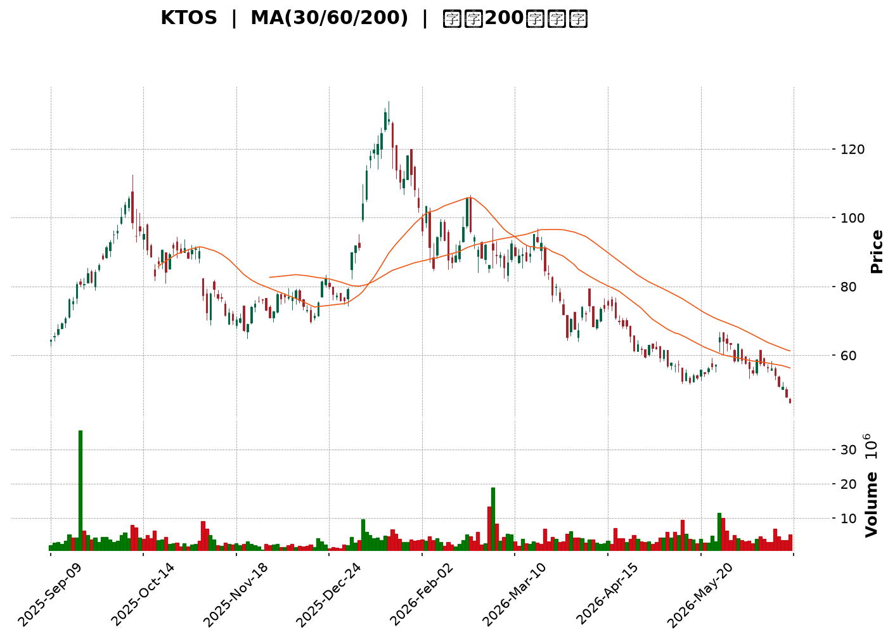
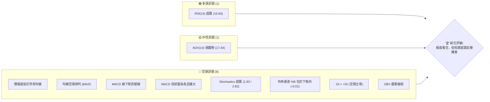
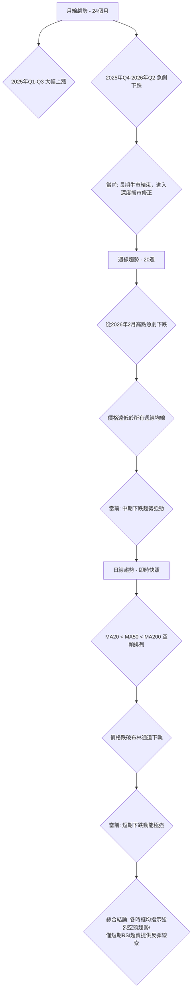
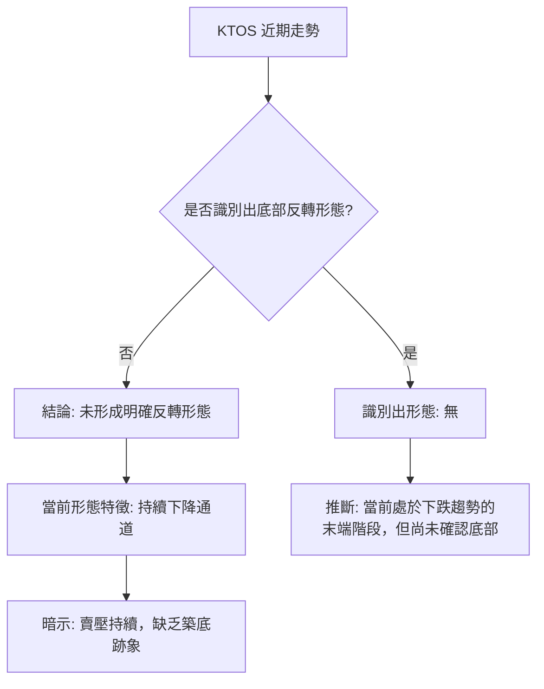
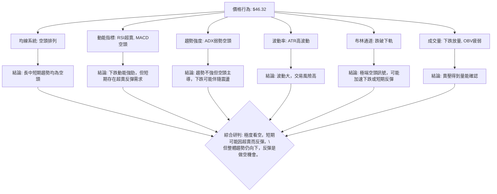
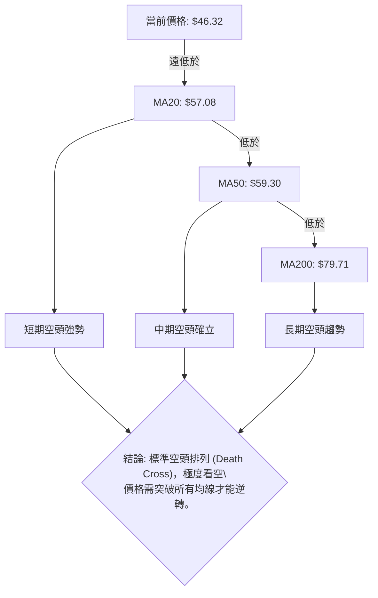

<details>
<summary>📊 靜態圖表 (點擊展開)</summary>

</details>

<html>
<head><meta charset="utf-8" /></head>
<body>
    <div style="height:500px; width:100%;">                        <script>window.PlotlyConfig = {MathJaxConfig: 'local'};</script>
        <script charset="utf-8" src="https://cdn.plot.ly/plotly-3.6.0.min.js" integrity="sha256-QaOVwtVY0T02VaHrr6pnoHLCwayMJp4O5n4YyaE3rJk=" crossorigin="anonymous"></script>                <div id="candlestick-chart" class="plotly-graph-div" style="height:100%; width:100%;"></div>            <script>                window.PLOTLYENV=window.PLOTLYENV || {};                                if (document.getElementById("candlestick-chart")) {                    Plotly.newPlot(                        "candlestick-chart",                        [{"close":{"dtype":"f8","bdata":"AAAAANcjUEAAAACAPWpQQAAAAEDh6lBAAAAAwMxMUUAAAAAgXK9RQAAAAGBmFlNAAAAAIFzvUkAAAACgmSlUQAAAAKBHMVRAAAAAgBQuVEAAAACgmflUQAAAACCFS1RAAAAAwMwMVUAAAACA65FVQAAAAMAeBVZAAAAAIK7XVkAAAACgcD1XQAAAAIDrwVdAAAAAACkMWEAAAAAAABBZQAAAAAAp7FlAAAAAQOFqWkAAAABAM6NYQAAAAOBRqFdAAAAAgOsRWEAAAABAM9NXQAAAAMAepVZAAAAAIK4nVkAAAAAgrsdUQAAAAKCZqVVAAAAAIK6nVkAAAABAMxNVQAAAAOB6VFZAAAAAIIXLVkAAAAAghatWQAAAAIDrcVZAAAAAoHDNVkAAAABAMxNWQAAAAGBmplZAAAAAYGbGVkAAAACAFI5WQAAAAIA9WlNAAAAAgD0aUkAAAADgUXhTQAAAACCFy1NAAAAAgMIlU0AAAADAzCxTQAAAAAAp7FFAAAAAwMwcUkAAAAAgXI9RQAAAAEAKl1FAAAAAQOGqUUAAAAAA19NQQAAAAMD1SFFAAAAAQAqHUkAAAABAM8NSQAAAAKBH8VJAAAAAYGYGU0AAAACgcE1SQAAAAKBwvVFAAAAAgOsxUkAAAAAghWtTQAAAAAAAIFNAAAAAgOtBU0AAAACA60FTQAAAAIA9OlNAAAAAgOuxU0AAAACgcP1SQAAAAOCjkFJAAAAA4FFIUkAAAACgR3FRQAAAAKCZ2VFAAAAAwPXYUkAAAACA62FUQAAAAEAzk1RAAAAAgBT+U0AAAADAzGxTQAAAAIAUXlNAAAAAYLj+UkAAAACAPfpSQAAAAGCP0lNAAAAAIIV7VkAAAAAghftWQAAAAAAp3FZAAAAAYI8CWkAAAADAzGxcQAAAAEAKd11AAAAAgBTuXUAAAAAAAGBeQAAAAADXI19AAAAAQApXYEAAAACAwhVgQAAAAIDCJV5AAAAAYGZ2XEAAAADA9ZhbQAAAAOB61FtAAAAAANeDXUAAAABA4SpcQAAAAIA9CltAAAAA4KPAWUAAAACAPQpYQAAAACCu11lAAAAAwB7VVkAAAAAAAFBVQAAAAIA9mldAAAAAANezWEAAAABguF5XQAAAAIDr8VVAAAAAQDPDVUAAAAAA10NWQAAAAIAU\u002flZAAAAAoHBNWEAAAABA4WpaQAAAAMAeBVhAAAAAANeTV0AAAAAghatWQAAAAGC4DlZAAAAAwPUIV0AAAAAghYtVQAAAAIAUrlZAAAAAwMw8VkAAAADgUUhWQAAAAGCPYlVAAAAAAADAVUAAAACAFB5XQAAAAKBwPVZAAAAAQOE6VkAAAACgcF1WQAAAAIDr4VVAAAAAgOthVkAAAAAA19NXQAAAAGCPQldAAAAAgOsxV0AAAAAgridVQAAAAAAp7FRAAAAAIFxfU0AAAABguP5TQAAAAEAK91JAAAAAACn8UUAAAACA61FQQAAAAOCjoFFAAAAAwMzsUEAAAAAA19NQQAAAAIDChVJAAAAAoHD9UUAAAACgcJ1SQAAAAMAeFVFAAAAAgMKVUUAAAABAM2NSQAAAAIA9alJAAAAAgD2qUkAAAACAPZpSQAAAACBcv1FAAAAAwB51UUAAAABAMyNRQAAAAEAKJ1FAAAAAoEdhUEAAAACgR6FOQAAAAOB6lE9AAAAA4HrUTkAAAAAgrsdNQAAAAGBmhk9AAAAAYGYGT0AAAABACvdOQAAAACCup01AAAAAYI\u002fCTkAAAAAAAIBMQAAAAIDr8UxAAAAAYLh+TEAAAACAPapMQAAAAGC4PkpAAAAAwMxsS0AAAAAghQtKQAAAAAApHEtAAAAAACm8SkAAAADA9ehLQAAAAIDCVUtAAAAAQAoXTEAAAABgZmZMQAAAAGBmpkxAAAAAAClMUEAAAADgUQhQQAAAAGC4vk9AAAAAYI+iT0AAAABACjdNQAAAAEAzs09AAAAAYI9CTUAAAACgcN1MQAAAAOBRGExAAAAAwPVoS0AAAAAA12NNQAAAAAAA4ExAAAAAYI+CTEAAAAAghStMQAAAAOB6FExAAAAAQOEaS0AAAAAghYtJQAAAAGBmZklAAAAAoJn5R0AAAADA9ShHQA=="},"high":{"dtype":"f8","bdata":"AAAAwB41UEAAAAAAALBQQAAAAMD1SFFAAAAAoHBtUUAAAAAA19NRQAAAACCuJ1NAAAAAgOtBU0AAAAAAKVxUQAAAAADXk1RAAAAA4FGoVEAAAABguF5VQAAAAAAAQFVAAAAA4FE4VUAAAACAwrVVQAAAAEDhalZAAAAAIK73VkAAAACgR2FXQAAAAKCZGVhAAAAAIK6HWEAAAAAAAMBZQAAAAKBwLVpAAAAAANeTWkAAAADgeiRcQAAAAKCZqVlAAAAAAABgWUAAAABgZkZYQAAAACBcn1hAAAAAgMIlV0AAAACgR6FVQAAAAIAULlZAAAAAQDOzVkAAAAAAAIBWQAAAAMDMfFZAAAAAIIU7V0AAAABgZqZXQAAAAMDMHFdAAAAAIK53V0AAAAAAAMBWQAAAAKCZCVdAAAAAgBTuVkAAAACAwuVWQAAAAAAAoFRAAAAAgBTeU0AAAABgZpZTQAAAAAAAgFRAAAAAIFy\u002fU0AAAABA4YpTQAAAAKCZ+VJAAAAAoEdxUkAAAADAzDxSQAAAAAAA0FFAAAAAIIULUkAAAABguJ5SQAAAAIDCVVFAAAAAACmcUkAAAAAghQtTQAAAAEDhSlNAAAAAIFwfU0AAAABgZiZTQAAAAGBmplJAAAAAAABAUkAAAADgepRTQAAAAOBRiFNAAAAA4HqEU0AAAACAPepTQAAAAKBwnVNAAAAAgBTeU0AAAACgmdlTQAAAAEDhGlNAAAAA4FGoUkAAAAAgXI9SQAAAAIA9GlJAAAAAYI\u002fyUkAAAAAgrndUQAAAAIA92lRAAAAAACl8VEAAAACAPfpTQAAAAIAUjlNAAAAAACmMU0AAAACAFD5TQAAAAGC47lNAAAAAQAqHVkAAAACA6wFXQAAAAOB61FdAAAAAQDNzW0AAAADAzNxcQAAAAOBR6F1AAAAA4HpkXkAAAACgcP1eQAAAAADXk19AAAAAAACAYEAAAAAAAMBgQAAAAAAAAGBAAAAAQDNTXkAAAACA6+FcQAAAAEDhalxAAAAAwPWIXUAAAAAAAABeQAAAAMDMzFxAAAAAAAAwW0AAAADA9UhZQAAAACBc31lAAAAAAADAWUAAAABgZiZXQAAAAEDhqldAAAAAgOvxWEAAAAAAAOBYQAAAAEAzI1hAAAAAgMJlVkAAAAAgXA9XQAAAAGBmVldAAAAAAAAgWUAAAACAPXpaQAAAAEDhqlpAAAAAwB7FV0AAAAAgXO9WQAAAAIDrUVdAAAAAACkcV0AAAACgmZlVQAAAAGBmRlhAAAAAgBROV0AAAABgZoZWQAAAACBcX1ZAAAAA4FG4VkAAAABA4WpXQAAAAEAzE1dAAAAAYLi+VkAAAAAgrtdWQAAAAKCZ+VZAAAAAQDPzVkAAAABgZtZXQAAAAOBROFhAAAAAAACgV0AAAAAAAABXQAAAAADXk1VAAAAAoEfBVEAAAAAAKTxUQAAAAIDr4VNAAAAA4FEYU0AAAACgmflRQAAAAIAUvlFAAAAAQDMzUkAAAADgo2BRQAAAAIA9mlJAAAAAoJk5UkAAAAAAKdxTQAAAAAAAoFJAAAAAgOuhUUAAAABgZoZSQAAAAOB6JFNAAAAAYI8SU0AAAACAFE5TQAAAAMD1OFNAAAAAoHDtUUAAAACgmblRQAAAAGC4vlFAAAAAIFwvUUAAAADgo3BQQAAAACCFG1BAAAAAoJlZT0AAAACgR+FOQAAAAEAKl09AAAAAAADAT0AAAADgUQhQQAAAAMAeZU9AAAAAYLjeTkAAAADAHsVOQAAAAOBR+ExAAAAAQOHaTEAAAADgo1BNQAAAAAAAQExAAAAAACn8S0AAAABAM\u002fNKQAAAAAApXEtAAAAAIIVLS0AAAADgo\u002fBLQAAAAADXg0tAAAAAAABgTEAAAABgZqZNQAAAAIAUrkxAAAAAwB61UEAAAAAAALBQQAAAAMDMjFBAAAAAQDPTT0AAAADAzOxOQAAAACCFy09AAAAAwMwMT0AAAAAAAOBNQAAAAGBmpk1AAAAAYGZmTEAAAACA63FNQAAAAKCZ2U5AAAAAAADATUAAAACA67FMQAAAAEAzM01AAAAAAABgTEAAAABAMxNLQAAAACCFK0pAAAAAwB5lSUAAAAAA1+NHQA=="},"hovertemplate":"\u003cb\u003e%{x|%Y-%m-%d}\u003c\u002fb\u003e\u003cbr\u003e\u958b: $%{open:.2f}\u003cbr\u003e\u9ad8: $%{high:.2f}\u003cbr\u003e\u4f4e: $%{low:.2f}\u003cbr\u003e\u6536: $%{close:.2f}\u003cextra\u003e\u003c\u002fextra\u003e","low":{"dtype":"f8","bdata":"AAAA4HpUT0AAAAAAKQxQQAAAAGBmZlBAAAAAoJnpUEAAAACgmflQQAAAAMAetVFAAAAAQApHUkAAAACgR8FSQAAAAKCZ+VNAAAAAQDPTU0AAAABgZkZUQAAAAGBmNlRAAAAAIK63U0AAAAAghRtVQAAAAEAz81VAAAAAYGYGVkAAAADgUShWQAAAAIDrIVdAAAAAQAp3V0AAAACgR4FYQAAAAAAAAFlAAAAAoJl5WUAAAABAMzNYQAAAAKCZOVdAAAAAQOGqV0AAAABgj7JWQAAAAIA9SlZAAAAAIFwfVkAAAACgcG1UQAAAAMDMTFVAAAAAwMxMVUAAAAAA1zNUQAAAACCuN1VAAAAAIIVLVkAAAADgoxBWQAAAAAApbFZAAAAAoHB9VkAAAABgjwJWQAAAAIA9+lVAAAAAwMz8VUAAAADgerRVQAAAAGBm9lJAAAAAoEeRUUAAAACgmSlRQAAAAEAzQ1NAAAAAwPX4UkAAAAAAAOBSQAAAAADX01FAAAAAAABAUUAAAABgZjZRQAAAAIDr8VBAAAAAQDNTUUAAAACAPbpQQAAAAEAzM1BAAAAAwPVIUUAAAACgmSlSQAAAAADX01JAAAAA4KPAUkAAAAAghTtSQAAAACCut1FAAAAAIIVrUUAAAACA6xFSQAAAAOCjsFJAAAAAoJnJUkAAAAAA1wNTQAAAAMDMTFJAAAAAQDOzUkAAAADAzMxSQAAAAGBmRlJAAAAAQOEaUkAAAAAA11NRQAAAAMD1iFFAAAAAYLjOUUAAAAAA1zNTQAAAAGBm9lNAAAAAgOvRU0AAAABgZgZTQAAAAKCZCVNAAAAAQDPzUkAAAADgUbhSQAAAAMAelVJAAAAA4FGIVEAAAADAzKxVQAAAAOCjoFZAAAAAoEexWEAAAACgmSlaQAAAAAAAoFxAAAAAwMxMXUAAAAAAAIBcQAAAAKBHUV1AAAAAAABAX0AAAAAAAMBfQAAAAIDrkVxAAAAAYLjOW0AAAABAChdbQAAAAKBHsVpAAAAAANfDW0AAAADgo1BbQAAAAIDChVpAAAAA4FFoWUAAAACgR7FXQAAAAKCZSVhAAAAAQOG6VUAAAAAAACBVQAAAAAAAAFZAAAAAwMxMV0AAAACgcE1XQAAAAKBHQVVAAAAAAABQVUAAAACgR8FVQAAAAOB6xFVAAAAAwMw8V0AAAABguD5YQAAAACCF21dAAAAAAADAVkAAAABgjwJVQAAAAKBwDVZAAAAAwPWoVUAAAAAAAABVQAAAAMAeVVVAAAAAYGamVUAAAAAAAHBVQAAAAKCZmVRAAAAAAABgVEAAAADAzMxVQAAAAMD1KFZAAAAAIK6nVUAAAADA9VhVQAAAAMDMzFVAAAAAoJm5VUAAAAAgXI9WQAAAAIA9KldAAAAAwPXoVUAAAABgZsZUQAAAAOB6hFRAAAAAoEfhUkAAAAAA11NTQAAAAKCZyVJAAAAAwMzsUUAAAAAgrhdQQAAAAEAzY1BAAAAAYGbmUEAAAAAghetPQAAAAMDMjFFAAAAAQDNzUUAAAABAMyNSQAAAAIDrEVFAAAAAIIXbUEAAAABACmdRQAAAAKBHIVJAAAAAAABQUkAAAADgo0BSQAAAAIA9mlFAAAAAQAo3UUAAAADgevRQQAAAAMD16FBAAAAAwB7lT0AAAACgR4FOQAAAAOBRmE5AAAAAACkcTkAAAAAgrodNQAAAAIDr0U1AAAAAoJl5TkAAAACgR+FOQAAAAKBHAU1AAAAAQAo3TUAAAADAHiVMQAAAAKBw3UtAAAAAoEeBS0AAAACAFI5LQAAAACCF60lAAAAAYLg+SkAAAADgetRJQAAAAIA9CkpAAAAAANdjSkAAAABAM1NKQAAAACCu50pAAAAAQOE6S0AAAABAM\u002fNLQAAAAAAAgEtAAAAAAACATkAAAACAPQpOQAAAAEAzk05AAAAAQArXTkAAAABAM\u002fNMQAAAAOBR+ExAAAAAAADATEAAAAAgXK9MQAAAACCup0pAAAAAAAAgS0AAAADA9QhLQAAAAOB6dExAAAAAQApXTEAAAACgR4FLQAAAAMDMzEtAAAAA4FF4SkAAAABACldJQAAAACCuB0lAAAAAANfjR0AAAACgRwFHQA=="},"name":"\u50f9\u683c","open":{"dtype":"f8","bdata":"AAAA4FEIUEAAAABgZlZQQAAAAIDChVBAAAAAIFzvUEAAAADAzFxRQAAAAADXw1FAAAAA4KPAUkAAAACgmSlTQAAAAKBHYVRAAAAAQAonVEAAAABgZkZUQAAAACCuF1VAAAAAAAAAVEAAAAAAAEBVQAAAAMDMPFZAAAAAwPUYVkAAAAAAAKBWQAAAAAAAwFdAAAAAACnsV0AAAABgZpZYQAAAAKCZSVlAAAAA4HrEWUAAAADA9ehaQAAAAMDMrFdAAAAAgBReWEAAAACAFG5XQAAAAMDMfFhAAAAAIFz\u002fVkAAAABA4TpVQAAAAIDr0VVAAAAAQArHVUAAAAAAAIBWQAAAAMDMTFVAAAAA4FEIV0AAAADgekRXQAAAAOB6xFZAAAAAAACAVkAAAAAAAIBWQAAAAAAAYFZAAAAAwB61VkAAAABguA5WQAAAACCul1RAAAAAwMx8U0AAAABAM5NRQAAAACCFW1RAAAAAYLhuU0AAAACA6zFTQAAAAAApvFJAAAAAgD1KUUAAAACAwgVSQAAAACBcL1FAAAAAwB5lUUAAAABguJ5SQAAAAADXs1BAAAAAQOFaUUAAAACAPYpSQAAAAEAz81JAAAAAYLgOU0AAAABgZiZTQAAAACCuh1JAAAAA4KPAUUAAAACgRyFSQAAAAAApbFNAAAAAgMJlU0AAAADgeiRTQAAAAAAAAFNAAAAAIFwvU0AAAAAghbtTQAAAAKBHEVNAAAAAAABAUkAAAADgUUhSQAAAAAApvFFAAAAAgOvhUUAAAAAAAEBTQAAAAIAUHlRAAAAAQApHVEAAAACAPfpTQAAAAKBwPVNAAAAAACmMU0AAAABAMzNTQAAAAEAzI1NAAAAAgD06VUAAAADA9XhWQAAAAOBRKFdAAAAAgOvhWEAAAABguF5aQAAAAGBmNl1AAAAAgD26XUAAAAAAAKBdQAAAAMD1+F1AAAAAoHBtX0AAAAAghQNgQAAAAGCP4l9AAAAA4KNAXkAAAADAHnVcQAAAAMDMLFtAAAAAANfDW0AAAAAAAABeQAAAAOBRuFxAAAAA4Hp0WkAAAACAPfpYQAAAAGBmplhAAAAAoHBdWUAAAACAFB5WQAAAAGBmRlZAAAAAYGamV0AAAADgerRYQAAAAIA9+ldAAAAAoJkZVkAAAAAgXM9VQAAAAMAeBVZAAAAAwPVIV0AAAACgcG1YQAAAAAApbFpAAAAAoEdRV0AAAAAAADBWQAAAAAApPFdAAAAAACn8VUAAAABAM1NVQAAAAEDhGldAAAAAoHBNVkAAAADgoyBWQAAAAGBmNlZAAAAA4FHYVEAAAABACvdVQAAAAAAp3FZAAAAAgOvBVUAAAAAAKTxWQAAAAAAAgFZAAAAAgMI1VkAAAABACrdWQAAAAIA9mldAAAAA4KOgVkAAAADAzNxWQAAAAIDC9VRAAAAAQOGqVEAAAABgj\u002fJTQAAAAOBRmFNAAAAAQAq3UkAAAADgo\u002fBRQAAAAKCZuVBAAAAAwPUoUkAAAACA61FQQAAAAOBRyFFAAAAAAAAQUkAAAADgUdhTQAAAAMDMjFJAAAAAoEcBUUAAAABgZoZRQAAAAIA9qlJAAAAAACnsUkAAAAAA1xNTQAAAACCF21JAAAAAYI+CUUAAAADgo5BRQAAAACCuh1FAAAAAwMwcUUAAAADgo3BQQAAAAOBRmE5AAAAA4FH4TkAAAABguN5OQAAAAMAeJU5AAAAA4Hq0T0AAAAAAKTxPQAAAAOBRWE9AAAAAgD2KTUAAAADAHsVOQAAAAIA9ikxAAAAAIFxvTEAAAAAghatMQAAAAOB6NExAAAAAoEdhSkAAAABguL5KQAAAAKBHIUpAAAAAYLgeS0AAAACgmflKQAAAAAAAgEtAAAAAwB6lS0AAAADgetRMQAAAAKBwfUxAAAAAQOH6T0AAAACAPapQQAAAAAApPFBAAAAAwPXIT0AAAAAgXM9OQAAAAIAULk1AAAAAgOvRTkAAAAAAKdxNQAAAACCuB01AAAAAwMzMS0AAAADA9WhLQAAAAGC4vk5AAAAA4FGYTUAAAACAFE5MQAAAAOCj0EtAAAAAACkcTEAAAABgj+JKQAAAACCuB0lAAAAAQAoXSUAAAABAM7NHQA=="},"x":["2025-09-09T00:00:00-04:00","2025-09-10T00:00:00-04:00","2025-09-11T00:00:00-04:00","2025-09-12T00:00:00-04:00","2025-09-15T00:00:00-04:00","2025-09-16T00:00:00-04:00","2025-09-17T00:00:00-04:00","2025-09-18T00:00:00-04:00","2025-09-19T00:00:00-04:00","2025-09-22T00:00:00-04:00","2025-09-23T00:00:00-04:00","2025-09-24T00:00:00-04:00","2025-09-25T00:00:00-04:00","2025-09-26T00:00:00-04:00","2025-09-29T00:00:00-04:00","2025-09-30T00:00:00-04:00","2025-10-01T00:00:00-04:00","2025-10-02T00:00:00-04:00","2025-10-03T00:00:00-04:00","2025-10-06T00:00:00-04:00","2025-10-07T00:00:00-04:00","2025-10-08T00:00:00-04:00","2025-10-09T00:00:00-04:00","2025-10-10T00:00:00-04:00","2025-10-13T00:00:00-04:00","2025-10-14T00:00:00-04:00","2025-10-15T00:00:00-04:00","2025-10-16T00:00:00-04:00","2025-10-17T00:00:00-04:00","2025-10-20T00:00:00-04:00","2025-10-21T00:00:00-04:00","2025-10-22T00:00:00-04:00","2025-10-23T00:00:00-04:00","2025-10-24T00:00:00-04:00","2025-10-27T00:00:00-04:00","2025-10-28T00:00:00-04:00","2025-10-29T00:00:00-04:00","2025-10-30T00:00:00-04:00","2025-10-31T00:00:00-04:00","2025-11-03T00:00:00-05:00","2025-11-04T00:00:00-05:00","2025-11-05T00:00:00-05:00","2025-11-06T00:00:00-05:00","2025-11-07T00:00:00-05:00","2025-11-10T00:00:00-05:00","2025-11-11T00:00:00-05:00","2025-11-12T00:00:00-05:00","2025-11-13T00:00:00-05:00","2025-11-14T00:00:00-05:00","2025-11-17T00:00:00-05:00","2025-11-18T00:00:00-05:00","2025-11-19T00:00:00-05:00","2025-11-20T00:00:00-05:00","2025-11-21T00:00:00-05:00","2025-11-24T00:00:00-05:00","2025-11-25T00:00:00-05:00","2025-11-26T00:00:00-05:00","2025-11-28T00:00:00-05:00","2025-12-01T00:00:00-05:00","2025-12-02T00:00:00-05:00","2025-12-03T00:00:00-05:00","2025-12-04T00:00:00-05:00","2025-12-05T00:00:00-05:00","2025-12-08T00:00:00-05:00","2025-12-09T00:00:00-05:00","2025-12-10T00:00:00-05:00","2025-12-11T00:00:00-05:00","2025-12-12T00:00:00-05:00","2025-12-15T00:00:00-05:00","2025-12-16T00:00:00-05:00","2025-12-17T00:00:00-05:00","2025-12-18T00:00:00-05:00","2025-12-19T00:00:00-05:00","2025-12-22T00:00:00-05:00","2025-12-23T00:00:00-05:00","2025-12-24T00:00:00-05:00","2025-12-26T00:00:00-05:00","2025-12-29T00:00:00-05:00","2025-12-30T00:00:00-05:00","2025-12-31T00:00:00-05:00","2026-01-02T00:00:00-05:00","2026-01-05T00:00:00-05:00","2026-01-06T00:00:00-05:00","2026-01-07T00:00:00-05:00","2026-01-08T00:00:00-05:00","2026-01-09T00:00:00-05:00","2026-01-12T00:00:00-05:00","2026-01-13T00:00:00-05:00","2026-01-14T00:00:00-05:00","2026-01-15T00:00:00-05:00","2026-01-16T00:00:00-05:00","2026-01-20T00:00:00-05:00","2026-01-21T00:00:00-05:00","2026-01-22T00:00:00-05:00","2026-01-23T00:00:00-05:00","2026-01-26T00:00:00-05:00","2026-01-27T00:00:00-05:00","2026-01-28T00:00:00-05:00","2026-01-29T00:00:00-05:00","2026-01-30T00:00:00-05:00","2026-02-02T00:00:00-05:00","2026-02-03T00:00:00-05:00","2026-02-04T00:00:00-05:00","2026-02-05T00:00:00-05:00","2026-02-06T00:00:00-05:00","2026-02-09T00:00:00-05:00","2026-02-10T00:00:00-05:00","2026-02-11T00:00:00-05:00","2026-02-12T00:00:00-05:00","2026-02-13T00:00:00-05:00","2026-02-17T00:00:00-05:00","2026-02-18T00:00:00-05:00","2026-02-19T00:00:00-05:00","2026-02-20T00:00:00-05:00","2026-02-23T00:00:00-05:00","2026-02-24T00:00:00-05:00","2026-02-25T00:00:00-05:00","2026-02-26T00:00:00-05:00","2026-02-27T00:00:00-05:00","2026-03-02T00:00:00-05:00","2026-03-03T00:00:00-05:00","2026-03-04T00:00:00-05:00","2026-03-05T00:00:00-05:00","2026-03-06T00:00:00-05:00","2026-03-09T00:00:00-04:00","2026-03-10T00:00:00-04:00","2026-03-11T00:00:00-04:00","2026-03-12T00:00:00-04:00","2026-03-13T00:00:00-04:00","2026-03-16T00:00:00-04:00","2026-03-17T00:00:00-04:00","2026-03-18T00:00:00-04:00","2026-03-19T00:00:00-04:00","2026-03-20T00:00:00-04:00","2026-03-23T00:00:00-04:00","2026-03-24T00:00:00-04:00","2026-03-25T00:00:00-04:00","2026-03-26T00:00:00-04:00","2026-03-27T00:00:00-04:00","2026-03-30T00:00:00-04:00","2026-03-31T00:00:00-04:00","2026-04-01T00:00:00-04:00","2026-04-02T00:00:00-04:00","2026-04-06T00:00:00-04:00","2026-04-07T00:00:00-04:00","2026-04-08T00:00:00-04:00","2026-04-09T00:00:00-04:00","2026-04-10T00:00:00-04:00","2026-04-13T00:00:00-04:00","2026-04-14T00:00:00-04:00","2026-04-15T00:00:00-04:00","2026-04-16T00:00:00-04:00","2026-04-17T00:00:00-04:00","2026-04-20T00:00:00-04:00","2026-04-21T00:00:00-04:00","2026-04-22T00:00:00-04:00","2026-04-23T00:00:00-04:00","2026-04-24T00:00:00-04:00","2026-04-27T00:00:00-04:00","2026-04-28T00:00:00-04:00","2026-04-29T00:00:00-04:00","2026-04-30T00:00:00-04:00","2026-05-01T00:00:00-04:00","2026-05-04T00:00:00-04:00","2026-05-05T00:00:00-04:00","2026-05-06T00:00:00-04:00","2026-05-07T00:00:00-04:00","2026-05-08T00:00:00-04:00","2026-05-11T00:00:00-04:00","2026-05-12T00:00:00-04:00","2026-05-13T00:00:00-04:00","2026-05-14T00:00:00-04:00","2026-05-15T00:00:00-04:00","2026-05-18T00:00:00-04:00","2026-05-19T00:00:00-04:00","2026-05-20T00:00:00-04:00","2026-05-21T00:00:00-04:00","2026-05-22T00:00:00-04:00","2026-05-26T00:00:00-04:00","2026-05-27T00:00:00-04:00","2026-05-28T00:00:00-04:00","2026-05-29T00:00:00-04:00","2026-06-01T00:00:00-04:00","2026-06-02T00:00:00-04:00","2026-06-03T00:00:00-04:00","2026-06-04T00:00:00-04:00","2026-06-05T00:00:00-04:00","2026-06-08T00:00:00-04:00","2026-06-09T00:00:00-04:00","2026-06-10T00:00:00-04:00","2026-06-11T00:00:00-04:00","2026-06-12T00:00:00-04:00","2026-06-15T00:00:00-04:00","2026-06-16T00:00:00-04:00","2026-06-17T00:00:00-04:00","2026-06-18T00:00:00-04:00","2026-06-22T00:00:00-04:00","2026-06-23T00:00:00-04:00","2026-06-24T00:00:00-04:00","2026-06-25T00:00:00-04:00"],"type":"candlestick"},{"hovertemplate":"MA30: $%{y:.2f}\u003cextra\u003e\u003c\u002fextra\u003e","line":{"color":"#2196F3","dash":"dash","width":2},"mode":"lines","name":"MA30","x":["2025-09-09T00:00:00-04:00","2025-09-10T00:00:00-04:00","2025-09-11T00:00:00-04:00","2025-09-12T00:00:00-04:00","2025-09-15T00:00:00-04:00","2025-09-16T00:00:00-04:00","2025-09-17T00:00:00-04:00","2025-09-18T00:00:00-04:00","2025-09-19T00:00:00-04:00","2025-09-22T00:00:00-04:00","2025-09-23T00:00:00-04:00","2025-09-24T00:00:00-04:00","2025-09-25T00:00:00-04:00","2025-09-26T00:00:00-04:00","2025-09-29T00:00:00-04:00","2025-09-30T00:00:00-04:00","2025-10-01T00:00:00-04:00","2025-10-02T00:00:00-04:00","2025-10-03T00:00:00-04:00","2025-10-06T00:00:00-04:00","2025-10-07T00:00:00-04:00","2025-10-08T00:00:00-04:00","2025-10-09T00:00:00-04:00","2025-10-10T00:00:00-04:00","2025-10-13T00:00:00-04:00","2025-10-14T00:00:00-04:00","2025-10-15T00:00:00-04:00","2025-10-16T00:00:00-04:00","2025-10-17T00:00:00-04:00","2025-10-20T00:00:00-04:00","2025-10-21T00:00:00-04:00","2025-10-22T00:00:00-04:00","2025-10-23T00:00:00-04:00","2025-10-24T00:00:00-04:00","2025-10-27T00:00:00-04:00","2025-10-28T00:00:00-04:00","2025-10-29T00:00:00-04:00","2025-10-30T00:00:00-04:00","2025-10-31T00:00:00-04:00","2025-11-03T00:00:00-05:00","2025-11-04T00:00:00-05:00","2025-11-05T00:00:00-05:00","2025-11-06T00:00:00-05:00","2025-11-07T00:00:00-05:00","2025-11-10T00:00:00-05:00","2025-11-11T00:00:00-05:00","2025-11-12T00:00:00-05:00","2025-11-13T00:00:00-05:00","2025-11-14T00:00:00-05:00","2025-11-17T00:00:00-05:00","2025-11-18T00:00:00-05:00","2025-11-19T00:00:00-05:00","2025-11-20T00:00:00-05:00","2025-11-21T00:00:00-05:00","2025-11-24T00:00:00-05:00","2025-11-25T00:00:00-05:00","2025-11-26T00:00:00-05:00","2025-11-28T00:00:00-05:00","2025-12-01T00:00:00-05:00","2025-12-02T00:00:00-05:00","2025-12-03T00:00:00-05:00","2025-12-04T00:00:00-05:00","2025-12-05T00:00:00-05:00","2025-12-08T00:00:00-05:00","2025-12-09T00:00:00-05:00","2025-12-10T00:00:00-05:00","2025-12-11T00:00:00-05:00","2025-12-12T00:00:00-05:00","2025-12-15T00:00:00-05:00","2025-12-16T00:00:00-05:00","2025-12-17T00:00:00-05:00","2025-12-18T00:00:00-05:00","2025-12-19T00:00:00-05:00","2025-12-22T00:00:00-05:00","2025-12-23T00:00:00-05:00","2025-12-24T00:00:00-05:00","2025-12-26T00:00:00-05:00","2025-12-29T00:00:00-05:00","2025-12-30T00:00:00-05:00","2025-12-31T00:00:00-05:00","2026-01-02T00:00:00-05:00","2026-01-05T00:00:00-05:00","2026-01-06T00:00:00-05:00","2026-01-07T00:00:00-05:00","2026-01-08T00:00:00-05:00","2026-01-09T00:00:00-05:00","2026-01-12T00:00:00-05:00","2026-01-13T00:00:00-05:00","2026-01-14T00:00:00-05:00","2026-01-15T00:00:00-05:00","2026-01-16T00:00:00-05:00","2026-01-20T00:00:00-05:00","2026-01-21T00:00:00-05:00","2026-01-22T00:00:00-05:00","2026-01-23T00:00:00-05:00","2026-01-26T00:00:00-05:00","2026-01-27T00:00:00-05:00","2026-01-28T00:00:00-05:00","2026-01-29T00:00:00-05:00","2026-01-30T00:00:00-05:00","2026-02-02T00:00:00-05:00","2026-02-03T00:00:00-05:00","2026-02-04T00:00:00-05:00","2026-02-05T00:00:00-05:00","2026-02-06T00:00:00-05:00","2026-02-09T00:00:00-05:00","2026-02-10T00:00:00-05:00","2026-02-11T00:00:00-05:00","2026-02-12T00:00:00-05:00","2026-02-13T00:00:00-05:00","2026-02-17T00:00:00-05:00","2026-02-18T00:00:00-05:00","2026-02-19T00:00:00-05:00","2026-02-20T00:00:00-05:00","2026-02-23T00:00:00-05:00","2026-02-24T00:00:00-05:00","2026-02-25T00:00:00-05:00","2026-02-26T00:00:00-05:00","2026-02-27T00:00:00-05:00","2026-03-02T00:00:00-05:00","2026-03-03T00:00:00-05:00","2026-03-04T00:00:00-05:00","2026-03-05T00:00:00-05:00","2026-03-06T00:00:00-05:00","2026-03-09T00:00:00-04:00","2026-03-10T00:00:00-04:00","2026-03-11T00:00:00-04:00","2026-03-12T00:00:00-04:00","2026-03-13T00:00:00-04:00","2026-03-16T00:00:00-04:00","2026-03-17T00:00:00-04:00","2026-03-18T00:00:00-04:00","2026-03-19T00:00:00-04:00","2026-03-20T00:00:00-04:00","2026-03-23T00:00:00-04:00","2026-03-24T00:00:00-04:00","2026-03-25T00:00:00-04:00","2026-03-26T00:00:00-04:00","2026-03-27T00:00:00-04:00","2026-03-30T00:00:00-04:00","2026-03-31T00:00:00-04:00","2026-04-01T00:00:00-04:00","2026-04-02T00:00:00-04:00","2026-04-06T00:00:00-04:00","2026-04-07T00:00:00-04:00","2026-04-08T00:00:00-04:00","2026-04-09T00:00:00-04:00","2026-04-10T00:00:00-04:00","2026-04-13T00:00:00-04:00","2026-04-14T00:00:00-04:00","2026-04-15T00:00:00-04:00","2026-04-16T00:00:00-04:00","2026-04-17T00:00:00-04:00","2026-04-20T00:00:00-04:00","2026-04-21T00:00:00-04:00","2026-04-22T00:00:00-04:00","2026-04-23T00:00:00-04:00","2026-04-24T00:00:00-04:00","2026-04-27T00:00:00-04:00","2026-04-28T00:00:00-04:00","2026-04-29T00:00:00-04:00","2026-04-30T00:00:00-04:00","2026-05-01T00:00:00-04:00","2026-05-04T00:00:00-04:00","2026-05-05T00:00:00-04:00","2026-05-06T00:00:00-04:00","2026-05-07T00:00:00-04:00","2026-05-08T00:00:00-04:00","2026-05-11T00:00:00-04:00","2026-05-12T00:00:00-04:00","2026-05-13T00:00:00-04:00","2026-05-14T00:00:00-04:00","2026-05-15T00:00:00-04:00","2026-05-18T00:00:00-04:00","2026-05-19T00:00:00-04:00","2026-05-20T00:00:00-04:00","2026-05-21T00:00:00-04:00","2026-05-22T00:00:00-04:00","2026-05-26T00:00:00-04:00","2026-05-27T00:00:00-04:00","2026-05-28T00:00:00-04:00","2026-05-29T00:00:00-04:00","2026-06-01T00:00:00-04:00","2026-06-02T00:00:00-04:00","2026-06-03T00:00:00-04:00","2026-06-04T00:00:00-04:00","2026-06-05T00:00:00-04:00","2026-06-08T00:00:00-04:00","2026-06-09T00:00:00-04:00","2026-06-10T00:00:00-04:00","2026-06-11T00:00:00-04:00","2026-06-12T00:00:00-04:00","2026-06-15T00:00:00-04:00","2026-06-16T00:00:00-04:00","2026-06-17T00:00:00-04:00","2026-06-18T00:00:00-04:00","2026-06-22T00:00:00-04:00","2026-06-23T00:00:00-04:00","2026-06-24T00:00:00-04:00","2026-06-25T00:00:00-04:00"],"y":{"dtype":"f8","bdata":"AAAAAAAA+H8AAAAAAAD4fwAAAAAAAPh\u002fAAAAAAAA+H8AAAAAAAD4fwAAAAAAAPh\u002fAAAAAAAA+H8AAAAAAAD4fwAAAAAAAPh\u002fAAAAAAAA+H8AAAAAAAD4fwAAAAAAAPh\u002fAAAAAAAA+H8AAAAAAAD4fwAAAAAAAPh\u002fAAAAAAAA+H8AAAAAAAD4fwAAAAAAAPh\u002fAAAAAAAA+H8AAAAAAAD4fwAAAAAAAPh\u002fAAAAAAAA+H8AAAAAAAD4fwAAAAAAAPh\u002fAAAAAAAA+H8AAAAAAAD4fwAAAAAAAPh\u002fAAAAAAAA+H8AAAAAAAD4f7y7u2t1dFVAiYiIqA2sVUBVVVWV0dNVQO\u002fu7l4BAlZAIiIiYuUwVkCJiIhIb1tWQKuqqtoVeFZAmpmZiRaZVkBVVVV1aKlWQDMzM\u002fNgvlZAAAAA0IXUVkAAAABgAeJWQERERHT22VZAvLu7i8\u002fAVkBmZmYG5K5WQAAAAHDnm1ZAVVVVlV98VkBERER0r1lWQERERLTkJ1ZA7+7ufj\u002f1VUCJiIgIOrVVQImIiGgfblVA3t3dvXQjVUCJiIiIz+BUQImIiJhuqlRAIiIi0iJ7VEDv7u6e709UQCIiImJXMFRAq6qqyqEVVEC8u7ubfQBUQGZmZsYE31NAERERwfW4U0CamZlZ1qpTQLy7u+t8j1NAIiIiIk1xU0CamZlpLlRTQN7d3a25OFNA3t3dPTUeU0BERET04QNTQDMzMyMG4VJA7+7uHrC6UkARERGxD49SQN7d3W09glJAd3d355iIUkCrqqpKYpBSQKuqqjoKl1JAmpmZKUCeUkC8u7tLYqBSQCIiIvK2rFJAzczMzD60UkARERFhV8BSQJqZmVlk01JAERER4Xr8UkDv7u6uADFTQFVVVXWTYFNAq6qqOm2gU0B3d3dH4fJTQImIiAisTFRA7+7uXrqpVEBmZmYmvxBVQFVVVeUXg1VAzczM3LL+VUCJiIiof2tWQM3MzKyOyVZA3t3dTRsYV0AAAABQRl9XQCIiIsKuqFdAAAAA4Hr8V0De3d1ty0pYQJqZmVkdk1hAERER0dvSWEB3d3dHKAtZQJqZmSlcT1lAd3d3h11xWUBVVVUlTXlZQCIiItIik1lAiYiI+FO7WUBVVVX1\u002fdxZQHd3d5f88llAmpmZSZoKWkAAAADwpyZaQImIiOi0QVpAIiIiwjxRWkARERGhjG5aQAAAALByeFpA7+7uzrBjWkAiIiLSlDJaQERERORe81lAiYiIiIi4WUCrqqoaL21ZQERERPT9JFlAZmZm9uHLWEBERERkgndYQLy7u2u8LFhA3t3dvXTzV0CJiIgIOs1XQN7d3X2GnVdAq6qqKlxfV0CamZlp2C1XQN7d3a3VAVdAzczMzBPlVkBVVVWVQ+NWQGZmZgY6zVZAq6qq6lHQVkCrqqra+c5WQN7d3U0buFZA3t3dvZ+KVkARERHx0m1WQImIiAhlVFZAVVVV9Sg0VkCJiIjobQFWQDMzM+Ol01VA3t3dfbGUVUARERHR20JVQHd3d1fyE1VAMzMzQ0TkVECrqqr6qcFUQM3MzOw1l1RAd3d3N7RoVEDe3d2Nwk1UQFVVVYVdKVRAd3d3R+EKVEAzMzMzeutTQFVVVfVvzFNAmpmZ2c6nU0B3d3dXx3RTQHd3d4ddSVNAIiIiAnIXU0BEREQMSdtSQHd3d8dLp1JAMzMzC9drUkB3d3fHkh9SQFVVVT2Y31FAAAAAkAmeUUC8u7vLoW1RQImIiBCfOVFAERERUY0XUUC8u7srh+ZQQHd3dycxwFBA3t3ddUygUEC8u7uzVo9QQBEREWHlaFBAERERkXtNUEAzMzNrAy1QQImIiMCfAlBA7+7uflu2T0BVVVWl02ZPQHd3d0eLLE9AmpmZySDwTkARERFRqahOQERERNTbYk5AAAAAEHQ6TkDe3d2Nlw5OQO\u002fu7o6X7k1AmpmZSZrSTUC8u7uLbKdNQGZmZtYxkU1AmpmZ+VNzTUBmZmZGRGRNQM3MzCyHRk1AIiIiElgpTUCamZkZBCZNQGZmZhZnD01AzczM\u002fPD5TEB3d3c3F+JMQDMzM5Om1ExAq6qqGna1TEDv7u7OPpxMQDMzM6P+fUxAvLu7i2xXTEAAAACwcihMQA=="},"type":"scatter"},{"hovertemplate":"MA60: $%{y:.2f}\u003cextra\u003e\u003c\u002fextra\u003e","line":{"color":"#9C27B0","dash":"dash","width":2},"mode":"lines","name":"MA60","x":["2025-09-09T00:00:00-04:00","2025-09-10T00:00:00-04:00","2025-09-11T00:00:00-04:00","2025-09-12T00:00:00-04:00","2025-09-15T00:00:00-04:00","2025-09-16T00:00:00-04:00","2025-09-17T00:00:00-04:00","2025-09-18T00:00:00-04:00","2025-09-19T00:00:00-04:00","2025-09-22T00:00:00-04:00","2025-09-23T00:00:00-04:00","2025-09-24T00:00:00-04:00","2025-09-25T00:00:00-04:00","2025-09-26T00:00:00-04:00","2025-09-29T00:00:00-04:00","2025-09-30T00:00:00-04:00","2025-10-01T00:00:00-04:00","2025-10-02T00:00:00-04:00","2025-10-03T00:00:00-04:00","2025-10-06T00:00:00-04:00","2025-10-07T00:00:00-04:00","2025-10-08T00:00:00-04:00","2025-10-09T00:00:00-04:00","2025-10-10T00:00:00-04:00","2025-10-13T00:00:00-04:00","2025-10-14T00:00:00-04:00","2025-10-15T00:00:00-04:00","2025-10-16T00:00:00-04:00","2025-10-17T00:00:00-04:00","2025-10-20T00:00:00-04:00","2025-10-21T00:00:00-04:00","2025-10-22T00:00:00-04:00","2025-10-23T00:00:00-04:00","2025-10-24T00:00:00-04:00","2025-10-27T00:00:00-04:00","2025-10-28T00:00:00-04:00","2025-10-29T00:00:00-04:00","2025-10-30T00:00:00-04:00","2025-10-31T00:00:00-04:00","2025-11-03T00:00:00-05:00","2025-11-04T00:00:00-05:00","2025-11-05T00:00:00-05:00","2025-11-06T00:00:00-05:00","2025-11-07T00:00:00-05:00","2025-11-10T00:00:00-05:00","2025-11-11T00:00:00-05:00","2025-11-12T00:00:00-05:00","2025-11-13T00:00:00-05:00","2025-11-14T00:00:00-05:00","2025-11-17T00:00:00-05:00","2025-11-18T00:00:00-05:00","2025-11-19T00:00:00-05:00","2025-11-20T00:00:00-05:00","2025-11-21T00:00:00-05:00","2025-11-24T00:00:00-05:00","2025-11-25T00:00:00-05:00","2025-11-26T00:00:00-05:00","2025-11-28T00:00:00-05:00","2025-12-01T00:00:00-05:00","2025-12-02T00:00:00-05:00","2025-12-03T00:00:00-05:00","2025-12-04T00:00:00-05:00","2025-12-05T00:00:00-05:00","2025-12-08T00:00:00-05:00","2025-12-09T00:00:00-05:00","2025-12-10T00:00:00-05:00","2025-12-11T00:00:00-05:00","2025-12-12T00:00:00-05:00","2025-12-15T00:00:00-05:00","2025-12-16T00:00:00-05:00","2025-12-17T00:00:00-05:00","2025-12-18T00:00:00-05:00","2025-12-19T00:00:00-05:00","2025-12-22T00:00:00-05:00","2025-12-23T00:00:00-05:00","2025-12-24T00:00:00-05:00","2025-12-26T00:00:00-05:00","2025-12-29T00:00:00-05:00","2025-12-30T00:00:00-05:00","2025-12-31T00:00:00-05:00","2026-01-02T00:00:00-05:00","2026-01-05T00:00:00-05:00","2026-01-06T00:00:00-05:00","2026-01-07T00:00:00-05:00","2026-01-08T00:00:00-05:00","2026-01-09T00:00:00-05:00","2026-01-12T00:00:00-05:00","2026-01-13T00:00:00-05:00","2026-01-14T00:00:00-05:00","2026-01-15T00:00:00-05:00","2026-01-16T00:00:00-05:00","2026-01-20T00:00:00-05:00","2026-01-21T00:00:00-05:00","2026-01-22T00:00:00-05:00","2026-01-23T00:00:00-05:00","2026-01-26T00:00:00-05:00","2026-01-27T00:00:00-05:00","2026-01-28T00:00:00-05:00","2026-01-29T00:00:00-05:00","2026-01-30T00:00:00-05:00","2026-02-02T00:00:00-05:00","2026-02-03T00:00:00-05:00","2026-02-04T00:00:00-05:00","2026-02-05T00:00:00-05:00","2026-02-06T00:00:00-05:00","2026-02-09T00:00:00-05:00","2026-02-10T00:00:00-05:00","2026-02-11T00:00:00-05:00","2026-02-12T00:00:00-05:00","2026-02-13T00:00:00-05:00","2026-02-17T00:00:00-05:00","2026-02-18T00:00:00-05:00","2026-02-19T00:00:00-05:00","2026-02-20T00:00:00-05:00","2026-02-23T00:00:00-05:00","2026-02-24T00:00:00-05:00","2026-02-25T00:00:00-05:00","2026-02-26T00:00:00-05:00","2026-02-27T00:00:00-05:00","2026-03-02T00:00:00-05:00","2026-03-03T00:00:00-05:00","2026-03-04T00:00:00-05:00","2026-03-05T00:00:00-05:00","2026-03-06T00:00:00-05:00","2026-03-09T00:00:00-04:00","2026-03-10T00:00:00-04:00","2026-03-11T00:00:00-04:00","2026-03-12T00:00:00-04:00","2026-03-13T00:00:00-04:00","2026-03-16T00:00:00-04:00","2026-03-17T00:00:00-04:00","2026-03-18T00:00:00-04:00","2026-03-19T00:00:00-04:00","2026-03-20T00:00:00-04:00","2026-03-23T00:00:00-04:00","2026-03-24T00:00:00-04:00","2026-03-25T00:00:00-04:00","2026-03-26T00:00:00-04:00","2026-03-27T00:00:00-04:00","2026-03-30T00:00:00-04:00","2026-03-31T00:00:00-04:00","2026-04-01T00:00:00-04:00","2026-04-02T00:00:00-04:00","2026-04-06T00:00:00-04:00","2026-04-07T00:00:00-04:00","2026-04-08T00:00:00-04:00","2026-04-09T00:00:00-04:00","2026-04-10T00:00:00-04:00","2026-04-13T00:00:00-04:00","2026-04-14T00:00:00-04:00","2026-04-15T00:00:00-04:00","2026-04-16T00:00:00-04:00","2026-04-17T00:00:00-04:00","2026-04-20T00:00:00-04:00","2026-04-21T00:00:00-04:00","2026-04-22T00:00:00-04:00","2026-04-23T00:00:00-04:00","2026-04-24T00:00:00-04:00","2026-04-27T00:00:00-04:00","2026-04-28T00:00:00-04:00","2026-04-29T00:00:00-04:00","2026-04-30T00:00:00-04:00","2026-05-01T00:00:00-04:00","2026-05-04T00:00:00-04:00","2026-05-05T00:00:00-04:00","2026-05-06T00:00:00-04:00","2026-05-07T00:00:00-04:00","2026-05-08T00:00:00-04:00","2026-05-11T00:00:00-04:00","2026-05-12T00:00:00-04:00","2026-05-13T00:00:00-04:00","2026-05-14T00:00:00-04:00","2026-05-15T00:00:00-04:00","2026-05-18T00:00:00-04:00","2026-05-19T00:00:00-04:00","2026-05-20T00:00:00-04:00","2026-05-21T00:00:00-04:00","2026-05-22T00:00:00-04:00","2026-05-26T00:00:00-04:00","2026-05-27T00:00:00-04:00","2026-05-28T00:00:00-04:00","2026-05-29T00:00:00-04:00","2026-06-01T00:00:00-04:00","2026-06-02T00:00:00-04:00","2026-06-03T00:00:00-04:00","2026-06-04T00:00:00-04:00","2026-06-05T00:00:00-04:00","2026-06-08T00:00:00-04:00","2026-06-09T00:00:00-04:00","2026-06-10T00:00:00-04:00","2026-06-11T00:00:00-04:00","2026-06-12T00:00:00-04:00","2026-06-15T00:00:00-04:00","2026-06-16T00:00:00-04:00","2026-06-17T00:00:00-04:00","2026-06-18T00:00:00-04:00","2026-06-22T00:00:00-04:00","2026-06-23T00:00:00-04:00","2026-06-24T00:00:00-04:00","2026-06-25T00:00:00-04:00"],"y":{"dtype":"f8","bdata":"AAAAAAAA+H8AAAAAAAD4fwAAAAAAAPh\u002fAAAAAAAA+H8AAAAAAAD4fwAAAAAAAPh\u002fAAAAAAAA+H8AAAAAAAD4fwAAAAAAAPh\u002fAAAAAAAA+H8AAAAAAAD4fwAAAAAAAPh\u002fAAAAAAAA+H8AAAAAAAD4fwAAAAAAAPh\u002fAAAAAAAA+H8AAAAAAAD4fwAAAAAAAPh\u002fAAAAAAAA+H8AAAAAAAD4fwAAAAAAAPh\u002fAAAAAAAA+H8AAAAAAAD4fwAAAAAAAPh\u002fAAAAAAAA+H8AAAAAAAD4fwAAAAAAAPh\u002fAAAAAAAA+H8AAAAAAAD4fwAAAAAAAPh\u002fAAAAAAAA+H8AAAAAAAD4fwAAAAAAAPh\u002fAAAAAAAA+H8AAAAAAAD4fwAAAAAAAPh\u002fAAAAAAAA+H8AAAAAAAD4fwAAAAAAAPh\u002fAAAAAAAA+H8AAAAAAAD4fwAAAAAAAPh\u002fAAAAAAAA+H8AAAAAAAD4fwAAAAAAAPh\u002fAAAAAAAA+H8AAAAAAAD4fwAAAAAAAPh\u002fAAAAAAAA+H8AAAAAAAD4fwAAAAAAAPh\u002fAAAAAAAA+H8AAAAAAAD4fwAAAAAAAPh\u002fAAAAAAAA+H8AAAAAAAD4fwAAAAAAAPh\u002fAAAAAAAA+H8AAAAAAAD4fxERERm9qVRAzczMtIGyVEB3d3f3U79UQFVVVSW\u002fyFRAIiIiQhnRVEARERHZztdUQERERMRn2FRAvLu746XbVEDNzMw0pdZUQDMzM4uzz1RAd3d395rHVECJiIiIiLhUQBEREfEZrlRAmpmZObSkVECJiIgoo59UQFVVVdV4mVRAd3d330+NVEAAAADgCH1UQDMzM9NNalRA3t3dJb9UVEDNzMy0yDpUQBEREeHBIFRAd3d3z\u002fcPVEC8u7sb6AhUQO\u002fu7gaBBVRAZmZmBsgNVEAzMzNzaCFUQFVVVbWBPlRAzczMFK5fVEARERFhnohUQN7d3VUOsVRA7+7uTtTbVEAREREBKwtVQERERMyFLFVAAAAAOLREVUDNzMxcullVQAAAADi0cFVA7+7uDliNVUARERGxVqdVQGZmZr4RulVAAAAA+MXGVUBERET8G81VQLy7u8vM6FVAd3d3N\u002fv8VUAAAAC41wRWQGZmZoYWFVZAEREREcosVkCJiIggsD5WQM3MzMTZT1ZAMzMzi2xfVkCJiIiof3NWQBEREaGMilZAmpmZ0dumVkAAAACoxs9WQKuqqhKD7FZAzczMBA8CV0DNzMwMuxJXQGZmZnYFIFdAvLu7cyExV0CJiIgg9z5XQM3MzOwKVFdAmpmZaUplV0BmZmYGgXFXQERERIwle1dA3t3dBciFV0BEREQsQJZXQAAAAKAao1dAVVVVheutV0C8u7vrUbxXQLy7u4N5yldA7+7uzvfbV0BmZmbuNfdXQAAAABhLDlhAERERudcgWEAAAACAIyRYQAAAABCfJVhAMzMz2\u002fkiWEAzMzNzaCVYQAAAANCwI1hAd3d3n2EfWEBERETsChRYQN7d3WWtClhAAAAAIPfyV0ARERE5tNhXQLy7u4MyxldAERERifqjV0BmZmZmH3pXQImIiGhKRVdAAAAAYJ4QV0BERETUeN1WQM3MzLwtp1ZA7+7unmFrVkC8u7tLfjFWQImIiDCW\u002fFVAvLu7y6HNVUAAAACwAKFVQKuqqgJyc1VAZmZmFmc7VUDv7u66kARVQKuqqrqQ1FRAAAAAbHWoVEBmZmYua4FUQN7d3SFpVlRAVVVVvS03VEAzMzPTTR5UQDMzMy\u002fd+FNAd3d3hxbRU0BmZmYOLapTQAAAABhLilNAmpmZtTpqU0AiIiJOYkhTQCIiIqJFHlNAd3d3hxbxUkAiIiKe77dSQAAAAAxJi1JAVVVVAblfUkCrqqrmiTpSQERERMi9FlJAIiIiTmLwUUAzMzObC9FRQLy7u7dlrVFAvLu7pw2UUUARERH9YnlRQGZmZt7dYVFAMzMz\u002f41IUUCrqqrOPiRRQFVVVTn7CFFAd3d3\u002f43oUEC8u7uXtcZQQO\u002fu7q5HpVBAIiIiikGAUEAiIiJqSllQQEREROSlM1BAMzMzB4ENUEB3d3dnrd5PQCIiIlryo09AZmZmXkhyT0AzMzOTpjRPQBEREXkw\u002f05AvLu7uwLMTkC8u7sLkKNOQA=="},"type":"scatter"},{"hovertemplate":"MA200: $%{y:.2f}\u003cextra\u003e\u003c\u002fextra\u003e","line":{"color":"#FF6F00","dash":"solid","width":2},"mode":"lines","name":"MA200","x":["2025-09-09T00:00:00-04:00","2025-09-10T00:00:00-04:00","2025-09-11T00:00:00-04:00","2025-09-12T00:00:00-04:00","2025-09-15T00:00:00-04:00","2025-09-16T00:00:00-04:00","2025-09-17T00:00:00-04:00","2025-09-18T00:00:00-04:00","2025-09-19T00:00:00-04:00","2025-09-22T00:00:00-04:00","2025-09-23T00:00:00-04:00","2025-09-24T00:00:00-04:00","2025-09-25T00:00:00-04:00","2025-09-26T00:00:00-04:00","2025-09-29T00:00:00-04:00","2025-09-30T00:00:00-04:00","2025-10-01T00:00:00-04:00","2025-10-02T00:00:00-04:00","2025-10-03T00:00:00-04:00","2025-10-06T00:00:00-04:00","2025-10-07T00:00:00-04:00","2025-10-08T00:00:00-04:00","2025-10-09T00:00:00-04:00","2025-10-10T00:00:00-04:00","2025-10-13T00:00:00-04:00","2025-10-14T00:00:00-04:00","2025-10-15T00:00:00-04:00","2025-10-16T00:00:00-04:00","2025-10-17T00:00:00-04:00","2025-10-20T00:00:00-04:00","2025-10-21T00:00:00-04:00","2025-10-22T00:00:00-04:00","2025-10-23T00:00:00-04:00","2025-10-24T00:00:00-04:00","2025-10-27T00:00:00-04:00","2025-10-28T00:00:00-04:00","2025-10-29T00:00:00-04:00","2025-10-30T00:00:00-04:00","2025-10-31T00:00:00-04:00","2025-11-03T00:00:00-05:00","2025-11-04T00:00:00-05:00","2025-11-05T00:00:00-05:00","2025-11-06T00:00:00-05:00","2025-11-07T00:00:00-05:00","2025-11-10T00:00:00-05:00","2025-11-11T00:00:00-05:00","2025-11-12T00:00:00-05:00","2025-11-13T00:00:00-05:00","2025-11-14T00:00:00-05:00","2025-11-17T00:00:00-05:00","2025-11-18T00:00:00-05:00","2025-11-19T00:00:00-05:00","2025-11-20T00:00:00-05:00","2025-11-21T00:00:00-05:00","2025-11-24T00:00:00-05:00","2025-11-25T00:00:00-05:00","2025-11-26T00:00:00-05:00","2025-11-28T00:00:00-05:00","2025-12-01T00:00:00-05:00","2025-12-02T00:00:00-05:00","2025-12-03T00:00:00-05:00","2025-12-04T00:00:00-05:00","2025-12-05T00:00:00-05:00","2025-12-08T00:00:00-05:00","2025-12-09T00:00:00-05:00","2025-12-10T00:00:00-05:00","2025-12-11T00:00:00-05:00","2025-12-12T00:00:00-05:00","2025-12-15T00:00:00-05:00","2025-12-16T00:00:00-05:00","2025-12-17T00:00:00-05:00","2025-12-18T00:00:00-05:00","2025-12-19T00:00:00-05:00","2025-12-22T00:00:00-05:00","2025-12-23T00:00:00-05:00","2025-12-24T00:00:00-05:00","2025-12-26T00:00:00-05:00","2025-12-29T00:00:00-05:00","2025-12-30T00:00:00-05:00","2025-12-31T00:00:00-05:00","2026-01-02T00:00:00-05:00","2026-01-05T00:00:00-05:00","2026-01-06T00:00:00-05:00","2026-01-07T00:00:00-05:00","2026-01-08T00:00:00-05:00","2026-01-09T00:00:00-05:00","2026-01-12T00:00:00-05:00","2026-01-13T00:00:00-05:00","2026-01-14T00:00:00-05:00","2026-01-15T00:00:00-05:00","2026-01-16T00:00:00-05:00","2026-01-20T00:00:00-05:00","2026-01-21T00:00:00-05:00","2026-01-22T00:00:00-05:00","2026-01-23T00:00:00-05:00","2026-01-26T00:00:00-05:00","2026-01-27T00:00:00-05:00","2026-01-28T00:00:00-05:00","2026-01-29T00:00:00-05:00","2026-01-30T00:00:00-05:00","2026-02-02T00:00:00-05:00","2026-02-03T00:00:00-05:00","2026-02-04T00:00:00-05:00","2026-02-05T00:00:00-05:00","2026-02-06T00:00:00-05:00","2026-02-09T00:00:00-05:00","2026-02-10T00:00:00-05:00","2026-02-11T00:00:00-05:00","2026-02-12T00:00:00-05:00","2026-02-13T00:00:00-05:00","2026-02-17T00:00:00-05:00","2026-02-18T00:00:00-05:00","2026-02-19T00:00:00-05:00","2026-02-20T00:00:00-05:00","2026-02-23T00:00:00-05:00","2026-02-24T00:00:00-05:00","2026-02-25T00:00:00-05:00","2026-02-26T00:00:00-05:00","2026-02-27T00:00:00-05:00","2026-03-02T00:00:00-05:00","2026-03-03T00:00:00-05:00","2026-03-04T00:00:00-05:00","2026-03-05T00:00:00-05:00","2026-03-06T00:00:00-05:00","2026-03-09T00:00:00-04:00","2026-03-10T00:00:00-04:00","2026-03-11T00:00:00-04:00","2026-03-12T00:00:00-04:00","2026-03-13T00:00:00-04:00","2026-03-16T00:00:00-04:00","2026-03-17T00:00:00-04:00","2026-03-18T00:00:00-04:00","2026-03-19T00:00:00-04:00","2026-03-20T00:00:00-04:00","2026-03-23T00:00:00-04:00","2026-03-24T00:00:00-04:00","2026-03-25T00:00:00-04:00","2026-03-26T00:00:00-04:00","2026-03-27T00:00:00-04:00","2026-03-30T00:00:00-04:00","2026-03-31T00:00:00-04:00","2026-04-01T00:00:00-04:00","2026-04-02T00:00:00-04:00","2026-04-06T00:00:00-04:00","2026-04-07T00:00:00-04:00","2026-04-08T00:00:00-04:00","2026-04-09T00:00:00-04:00","2026-04-10T00:00:00-04:00","2026-04-13T00:00:00-04:00","2026-04-14T00:00:00-04:00","2026-04-15T00:00:00-04:00","2026-04-16T00:00:00-04:00","2026-04-17T00:00:00-04:00","2026-04-20T00:00:00-04:00","2026-04-21T00:00:00-04:00","2026-04-22T00:00:00-04:00","2026-04-23T00:00:00-04:00","2026-04-24T00:00:00-04:00","2026-04-27T00:00:00-04:00","2026-04-28T00:00:00-04:00","2026-04-29T00:00:00-04:00","2026-04-30T00:00:00-04:00","2026-05-01T00:00:00-04:00","2026-05-04T00:00:00-04:00","2026-05-05T00:00:00-04:00","2026-05-06T00:00:00-04:00","2026-05-07T00:00:00-04:00","2026-05-08T00:00:00-04:00","2026-05-11T00:00:00-04:00","2026-05-12T00:00:00-04:00","2026-05-13T00:00:00-04:00","2026-05-14T00:00:00-04:00","2026-05-15T00:00:00-04:00","2026-05-18T00:00:00-04:00","2026-05-19T00:00:00-04:00","2026-05-20T00:00:00-04:00","2026-05-21T00:00:00-04:00","2026-05-22T00:00:00-04:00","2026-05-26T00:00:00-04:00","2026-05-27T00:00:00-04:00","2026-05-28T00:00:00-04:00","2026-05-29T00:00:00-04:00","2026-06-01T00:00:00-04:00","2026-06-02T00:00:00-04:00","2026-06-03T00:00:00-04:00","2026-06-04T00:00:00-04:00","2026-06-05T00:00:00-04:00","2026-06-08T00:00:00-04:00","2026-06-09T00:00:00-04:00","2026-06-10T00:00:00-04:00","2026-06-11T00:00:00-04:00","2026-06-12T00:00:00-04:00","2026-06-15T00:00:00-04:00","2026-06-16T00:00:00-04:00","2026-06-17T00:00:00-04:00","2026-06-18T00:00:00-04:00","2026-06-22T00:00:00-04:00","2026-06-23T00:00:00-04:00","2026-06-24T00:00:00-04:00","2026-06-25T00:00:00-04:00"],"y":{"dtype":"f8","bdata":"AAAAAAAA+H8AAAAAAAD4fwAAAAAAAPh\u002fAAAAAAAA+H8AAAAAAAD4fwAAAAAAAPh\u002fAAAAAAAA+H8AAAAAAAD4fwAAAAAAAPh\u002fAAAAAAAA+H8AAAAAAAD4fwAAAAAAAPh\u002fAAAAAAAA+H8AAAAAAAD4fwAAAAAAAPh\u002fAAAAAAAA+H8AAAAAAAD4fwAAAAAAAPh\u002fAAAAAAAA+H8AAAAAAAD4fwAAAAAAAPh\u002fAAAAAAAA+H8AAAAAAAD4fwAAAAAAAPh\u002fAAAAAAAA+H8AAAAAAAD4fwAAAAAAAPh\u002fAAAAAAAA+H8AAAAAAAD4fwAAAAAAAPh\u002fAAAAAAAA+H8AAAAAAAD4fwAAAAAAAPh\u002fAAAAAAAA+H8AAAAAAAD4fwAAAAAAAPh\u002fAAAAAAAA+H8AAAAAAAD4fwAAAAAAAPh\u002fAAAAAAAA+H8AAAAAAAD4fwAAAAAAAPh\u002fAAAAAAAA+H8AAAAAAAD4fwAAAAAAAPh\u002fAAAAAAAA+H8AAAAAAAD4fwAAAAAAAPh\u002fAAAAAAAA+H8AAAAAAAD4fwAAAAAAAPh\u002fAAAAAAAA+H8AAAAAAAD4fwAAAAAAAPh\u002fAAAAAAAA+H8AAAAAAAD4fwAAAAAAAPh\u002fAAAAAAAA+H8AAAAAAAD4fwAAAAAAAPh\u002fAAAAAAAA+H8AAAAAAAD4fwAAAAAAAPh\u002fAAAAAAAA+H8AAAAAAAD4fwAAAAAAAPh\u002fAAAAAAAA+H8AAAAAAAD4fwAAAAAAAPh\u002fAAAAAAAA+H8AAAAAAAD4fwAAAAAAAPh\u002fAAAAAAAA+H8AAAAAAAD4fwAAAAAAAPh\u002fAAAAAAAA+H8AAAAAAAD4fwAAAAAAAPh\u002fAAAAAAAA+H8AAAAAAAD4fwAAAAAAAPh\u002fAAAAAAAA+H8AAAAAAAD4fwAAAAAAAPh\u002fAAAAAAAA+H8AAAAAAAD4fwAAAAAAAPh\u002fAAAAAAAA+H8AAAAAAAD4fwAAAAAAAPh\u002fAAAAAAAA+H8AAAAAAAD4fwAAAAAAAPh\u002fAAAAAAAA+H8AAAAAAAD4fwAAAAAAAPh\u002fAAAAAAAA+H8AAAAAAAD4fwAAAAAAAPh\u002fAAAAAAAA+H8AAAAAAAD4fwAAAAAAAPh\u002fAAAAAAAA+H8AAAAAAAD4fwAAAAAAAPh\u002fAAAAAAAA+H8AAAAAAAD4fwAAAAAAAPh\u002fAAAAAAAA+H8AAAAAAAD4fwAAAAAAAPh\u002fAAAAAAAA+H8AAAAAAAD4fwAAAAAAAPh\u002fAAAAAAAA+H8AAAAAAAD4fwAAAAAAAPh\u002fAAAAAAAA+H8AAAAAAAD4fwAAAAAAAPh\u002fAAAAAAAA+H8AAAAAAAD4fwAAAAAAAPh\u002fAAAAAAAA+H8AAAAAAAD4fwAAAAAAAPh\u002fAAAAAAAA+H8AAAAAAAD4fwAAAAAAAPh\u002fAAAAAAAA+H8AAAAAAAD4fwAAAAAAAPh\u002fAAAAAAAA+H8AAAAAAAD4fwAAAAAAAPh\u002fAAAAAAAA+H8AAAAAAAD4fwAAAAAAAPh\u002fAAAAAAAA+H8AAAAAAAD4fwAAAAAAAPh\u002fAAAAAAAA+H8AAAAAAAD4fwAAAAAAAPh\u002fAAAAAAAA+H8AAAAAAAD4fwAAAAAAAPh\u002fAAAAAAAA+H8AAAAAAAD4fwAAAAAAAPh\u002fAAAAAAAA+H8AAAAAAAD4fwAAAAAAAPh\u002fAAAAAAAA+H8AAAAAAAD4fwAAAAAAAPh\u002fAAAAAAAA+H8AAAAAAAD4fwAAAAAAAPh\u002fAAAAAAAA+H8AAAAAAAD4fwAAAAAAAPh\u002fAAAAAAAA+H8AAAAAAAD4fwAAAAAAAPh\u002fAAAAAAAA+H8AAAAAAAD4fwAAAAAAAPh\u002fAAAAAAAA+H8AAAAAAAD4fwAAAAAAAPh\u002fAAAAAAAA+H8AAAAAAAD4fwAAAAAAAPh\u002fAAAAAAAA+H8AAAAAAAD4fwAAAAAAAPh\u002fAAAAAAAA+H8AAAAAAAD4fwAAAAAAAPh\u002fAAAAAAAA+H8AAAAAAAD4fwAAAAAAAPh\u002fAAAAAAAA+H8AAAAAAAD4fwAAAAAAAPh\u002fAAAAAAAA+H8AAAAAAAD4fwAAAAAAAPh\u002fAAAAAAAA+H8AAAAAAAD4fwAAAAAAAPh\u002fAAAAAAAA+H8AAAAAAAD4fwAAAAAAAPh\u002fAAAAAAAA+H8AAAAAAAD4fwAAAAAAAPh\u002fAAAAAAAA+H8AAABgdu1TQA=="},"type":"scatter"}],                        {"template":{"data":{"barpolar":[{"marker":{"line":{"color":"rgb(17,17,17)","width":0.5},"pattern":{"fillmode":"overlay","size":10,"solidity":0.2}},"type":"barpolar"}],"bar":[{"error_x":{"color":"#f2f5fa"},"error_y":{"color":"#f2f5fa"},"marker":{"line":{"color":"rgb(17,17,17)","width":0.5},"pattern":{"fillmode":"overlay","size":10,"solidity":0.2}},"type":"bar"}],"carpet":[{"aaxis":{"endlinecolor":"#A2B1C6","gridcolor":"#506784","linecolor":"#506784","minorgridcolor":"#506784","startlinecolor":"#A2B1C6"},"baxis":{"endlinecolor":"#A2B1C6","gridcolor":"#506784","linecolor":"#506784","minorgridcolor":"#506784","startlinecolor":"#A2B1C6"},"type":"carpet"}],"choropleth":[{"colorbar":{"outlinewidth":0,"ticks":""},"type":"choropleth"}],"contourcarpet":[{"colorbar":{"outlinewidth":0,"ticks":""},"type":"contourcarpet"}],"contour":[{"colorbar":{"outlinewidth":0,"ticks":""},"colorscale":[[0.0,"#0d0887"],[0.1111111111111111,"#46039f"],[0.2222222222222222,"#7201a8"],[0.3333333333333333,"#9c179e"],[0.4444444444444444,"#bd3786"],[0.5555555555555556,"#d8576b"],[0.6666666666666666,"#ed7953"],[0.7777777777777778,"#fb9f3a"],[0.8888888888888888,"#fdca26"],[1.0,"#f0f921"]],"type":"contour"}],"heatmap":[{"colorbar":{"outlinewidth":0,"ticks":""},"colorscale":[[0.0,"#0d0887"],[0.1111111111111111,"#46039f"],[0.2222222222222222,"#7201a8"],[0.3333333333333333,"#9c179e"],[0.4444444444444444,"#bd3786"],[0.5555555555555556,"#d8576b"],[0.6666666666666666,"#ed7953"],[0.7777777777777778,"#fb9f3a"],[0.8888888888888888,"#fdca26"],[1.0,"#f0f921"]],"type":"heatmap"}],"histogram2dcontour":[{"colorbar":{"outlinewidth":0,"ticks":""},"colorscale":[[0.0,"#0d0887"],[0.1111111111111111,"#46039f"],[0.2222222222222222,"#7201a8"],[0.3333333333333333,"#9c179e"],[0.4444444444444444,"#bd3786"],[0.5555555555555556,"#d8576b"],[0.6666666666666666,"#ed7953"],[0.7777777777777778,"#fb9f3a"],[0.8888888888888888,"#fdca26"],[1.0,"#f0f921"]],"type":"histogram2dcontour"}],"histogram2d":[{"colorbar":{"outlinewidth":0,"ticks":""},"colorscale":[[0.0,"#0d0887"],[0.1111111111111111,"#46039f"],[0.2222222222222222,"#7201a8"],[0.3333333333333333,"#9c179e"],[0.4444444444444444,"#bd3786"],[0.5555555555555556,"#d8576b"],[0.6666666666666666,"#ed7953"],[0.7777777777777778,"#fb9f3a"],[0.8888888888888888,"#fdca26"],[1.0,"#f0f921"]],"type":"histogram2d"}],"histogram":[{"marker":{"pattern":{"fillmode":"overlay","size":10,"solidity":0.2}},"type":"histogram"}],"mesh3d":[{"colorbar":{"outlinewidth":0,"ticks":""},"type":"mesh3d"}],"parcoords":[{"line":{"colorbar":{"outlinewidth":0,"ticks":""}},"type":"parcoords"}],"pie":[{"automargin":true,"type":"pie"}],"scatter3d":[{"line":{"colorbar":{"outlinewidth":0,"ticks":""}},"marker":{"colorbar":{"outlinewidth":0,"ticks":""}},"type":"scatter3d"}],"scattercarpet":[{"marker":{"colorbar":{"outlinewidth":0,"ticks":""}},"type":"scattercarpet"}],"scattergeo":[{"marker":{"colorbar":{"outlinewidth":0,"ticks":""}},"type":"scattergeo"}],"scattergl":[{"marker":{"line":{"color":"#283442"}},"type":"scattergl"}],"scattermapbox":[{"marker":{"colorbar":{"outlinewidth":0,"ticks":""}},"type":"scattermapbox"}],"scattermap":[{"marker":{"colorbar":{"outlinewidth":0,"ticks":""}},"type":"scattermap"}],"scatterpolargl":[{"marker":{"colorbar":{"outlinewidth":0,"ticks":""}},"type":"scatterpolargl"}],"scatterpolar":[{"marker":{"colorbar":{"outlinewidth":0,"ticks":""}},"type":"scatterpolar"}],"scatter":[{"marker":{"line":{"color":"#283442"}},"type":"scatter"}],"scatterternary":[{"marker":{"colorbar":{"outlinewidth":0,"ticks":""}},"type":"scatterternary"}],"surface":[{"colorbar":{"outlinewidth":0,"ticks":""},"colorscale":[[0.0,"#0d0887"],[0.1111111111111111,"#46039f"],[0.2222222222222222,"#7201a8"],[0.3333333333333333,"#9c179e"],[0.4444444444444444,"#bd3786"],[0.5555555555555556,"#d8576b"],[0.6666666666666666,"#ed7953"],[0.7777777777777778,"#fb9f3a"],[0.8888888888888888,"#fdca26"],[1.0,"#f0f921"]],"type":"surface"}],"table":[{"cells":{"fill":{"color":"#506784"},"line":{"color":"rgb(17,17,17)"}},"header":{"fill":{"color":"#2a3f5f"},"line":{"color":"rgb(17,17,17)"}},"type":"table"}]},"layout":{"annotationdefaults":{"arrowcolor":"#f2f5fa","arrowhead":0,"arrowwidth":1},"autotypenumbers":"strict","coloraxis":{"colorbar":{"outlinewidth":0,"ticks":""}},"colorscale":{"diverging":[[0,"#8e0152"],[0.1,"#c51b7d"],[0.2,"#de77ae"],[0.3,"#f1b6da"],[0.4,"#fde0ef"],[0.5,"#f7f7f7"],[0.6,"#e6f5d0"],[0.7,"#b8e186"],[0.8,"#7fbc41"],[0.9,"#4d9221"],[1,"#276419"]],"sequential":[[0.0,"#0d0887"],[0.1111111111111111,"#46039f"],[0.2222222222222222,"#7201a8"],[0.3333333333333333,"#9c179e"],[0.4444444444444444,"#bd3786"],[0.5555555555555556,"#d8576b"],[0.6666666666666666,"#ed7953"],[0.7777777777777778,"#fb9f3a"],[0.8888888888888888,"#fdca26"],[1.0,"#f0f921"]],"sequentialminus":[[0.0,"#0d0887"],[0.1111111111111111,"#46039f"],[0.2222222222222222,"#7201a8"],[0.3333333333333333,"#9c179e"],[0.4444444444444444,"#bd3786"],[0.5555555555555556,"#d8576b"],[0.6666666666666666,"#ed7953"],[0.7777777777777778,"#fb9f3a"],[0.8888888888888888,"#fdca26"],[1.0,"#f0f921"]]},"colorway":["#636efa","#EF553B","#00cc96","#ab63fa","#FFA15A","#19d3f3","#FF6692","#B6E880","#FF97FF","#FECB52"],"font":{"color":"#f2f5fa"},"geo":{"bgcolor":"rgb(17,17,17)","lakecolor":"rgb(17,17,17)","landcolor":"rgb(17,17,17)","showlakes":true,"showland":true,"subunitcolor":"#506784"},"hoverlabel":{"align":"left"},"hovermode":"closest","mapbox":{"style":"dark"},"paper_bgcolor":"rgb(17,17,17)","plot_bgcolor":"rgb(17,17,17)","polar":{"angularaxis":{"gridcolor":"#506784","linecolor":"#506784","ticks":""},"bgcolor":"rgb(17,17,17)","radialaxis":{"gridcolor":"#506784","linecolor":"#506784","ticks":""}},"scene":{"xaxis":{"backgroundcolor":"rgb(17,17,17)","gridcolor":"#506784","gridwidth":2,"linecolor":"#506784","showbackground":true,"ticks":"","zerolinecolor":"#C8D4E3"},"yaxis":{"backgroundcolor":"rgb(17,17,17)","gridcolor":"#506784","gridwidth":2,"linecolor":"#506784","showbackground":true,"ticks":"","zerolinecolor":"#C8D4E3"},"zaxis":{"backgroundcolor":"rgb(17,17,17)","gridcolor":"#506784","gridwidth":2,"linecolor":"#506784","showbackground":true,"ticks":"","zerolinecolor":"#C8D4E3"}},"shapedefaults":{"line":{"color":"#f2f5fa"}},"sliderdefaults":{"bgcolor":"#C8D4E3","bordercolor":"rgb(17,17,17)","borderwidth":1,"tickwidth":0},"ternary":{"aaxis":{"gridcolor":"#506784","linecolor":"#506784","ticks":""},"baxis":{"gridcolor":"#506784","linecolor":"#506784","ticks":""},"bgcolor":"rgb(17,17,17)","caxis":{"gridcolor":"#506784","linecolor":"#506784","ticks":""}},"title":{"x":0.05},"updatemenudefaults":{"bgcolor":"#506784","borderwidth":0},"xaxis":{"automargin":true,"gridcolor":"#283442","linecolor":"#506784","ticks":"","title":{"standoff":15},"zerolinecolor":"#283442","zerolinewidth":2},"yaxis":{"automargin":true,"gridcolor":"#283442","linecolor":"#506784","ticks":"","title":{"standoff":15},"zerolinecolor":"#283442","zerolinewidth":2}}},"xaxis":{"rangeslider":{"visible":false},"title":{"text":"\u65e5\u671f"}},"font":{"size":11},"title":{"text":"KTOS  |  MA(30\u002f60\u002f200)  |  \u6700\u8fd1200\u4ea4\u6613\u65e5"},"yaxis":{"title":{"text":"\u80a1\u50f9 (USD)"}},"hovermode":"x unified","height":500},                        {"responsive": true}                    )                };            </script>        </div>
</body>
</html>

# KTOS 技術分析報告

> **報告日期**：2026-06-26 ｜ **語言**：繁體中文 ｜ **數據來源**：Yahoo Finance ｜ **當前價格**：$46.32

---

## 目錄

| 章節 | 內容 |
|------|------|
| [1. 技術面概覽](#1-技術面概覽) | 訊號儀表板、核心指標、評分卡 |
| [2. 趨勢分析](#2-趨勢分析) | 多時框趨勢、長中短期走勢 |
| [3. 圖表形態分析](#3-圖表形態分析) | 形態識別、K線組合、目標價 |
| [4. 支撐與阻力](#4-支撐與阻力) | 關鍵價位、斐波那契回調 |
| [5. 技術指標深度解讀](#5-技術指標深度解讀) | MA/RSI/MACD/布林/成交量 |
| [6. 動能與波動率](#6-動能與波動率) | 動能評估、ATR、Beta |
| [7. 多時框架總結](#7-多時框架總結) | 時框架評分矩陣 |
| [8. 交易策略建議](#8-交易策略建議) | 多空策略、風險報酬比 |
| [9. 風險提示與監控](#9-風險提示與監控) | 監控指標、風險場景 |
| [📋 報告總結](#-報告總結) | 綜合評級與建議 |

---

## 1. 技術面概覽

KTOS 目前股價 ($46.32) 位於其 52 週區間 ($39.00 - $134.00) 的極低端 (7.7%)，顯示出極其疲弱的市場表現。所有主要移動平均線均呈現空頭排列，且價格遠低於這些均線，加劇了空頭氛圍。動能指標如 RSI 和 Stochastics 均處於嚴重超賣區間，MACD 亦呈現看空訊號。儘管處於超賣，但 ADX 指示趨勢強度較弱，且空頭主導。成交量方面，近期下跌伴隨高於均量，確認了賣壓的強度。

### 🎯 技術訊號儀表板


**解讀**：目前 KTOS 的技術面呈現壓倒性的空頭訊號，主要均線系統、MACD、布林通道及量能均指向下跌趨勢的延續。唯一的多頭訊號來自於 RSI 和 Stochastics 的極度超賣狀態，這暗示短期內存在技術性反彈的可能性，但這並不足以改變整體空頭格局。ADX 雖顯示趨勢強度不足，但 -DI 遠高於 +DI，表明空頭力量在弱趨勢中佔據主導地位。

### 📊 核心指標速覽表

| 指標類別 | 指標名稱 | 當前數值 | 訊號 | 解讀 |
|----------|----------|----------|------|------|
| **價格** | 當前價格 | $46.32 | 🔴 | 位於 52 週低點附近，持續下行 |
| **均線** | MA20 | $57.08 | 🔴 | 價格遠低於短期均線，空頭強勢 |
| **均線** | MA50 | $59.30 | 🔴 | 價格遠低於中期均線，空頭趨勢確立 |
| **均線** | MA200 | $79.71 | 🔴 | 價格遠低於長期均線，大趨勢看空 |
| **動能** | RSI(14) | 15.84 | 🟢 | 極度超賣區間 (<30)，存在短期反彈潛力 |
| **動能** | MACD | -3.002 | 🔴 | MACD 線在訊號線下方，柱狀圖為負，看空 |
| **波動** | ATR(14) | $3.50 | 🟡 | 波動率相對較高 (7.56%)，反映近期劇烈下跌 |
| **趨勢** | ADX(14) | 17.44 | 🟡 | 趨勢強度較弱 (<25)，但空頭力量主導 (-DI > +DI) |
| **布林** | BB %B | -0.01 | 🔴 | 價格跌破布林通道下軌，極端空頭 |
| **成交量** | 量比 (vs 20日均量) | 1.09x | 🔴 | 下跌伴隨高於均量，確認賣壓 |

### 🏆 技術評分卡

```
╔══════════════════════════════════════════════════════════════╗
║             技術評分卡 — KTOS (2026-06-26)                     ║
╠══════════════════════════════════════════════════════════════╣
║ 趨勢強度      ███████░░░░░░░░░░░░░░  35/100  🔴 (ADX弱但空頭主導) ║
║ 動能指標      ████░░░░░░░░░░░░░░░░░░  20/100  🔴 (MACD空頭,RSI超賣) ║
║ 支撐穩定度    █████░░░░░░░░░░░░░░░░░  25/100  🔴 (接近52W低點,BB下軌)║
║ 成交量配合    ████░░░░░░░░░░░░░░░░░░  20/100  🔴 (下跌放量,OBV疲弱) ║
║ 形態完整度    ████░░░░░░░░░░░░░░░░░░  20/100  🔴 (無反轉形態,持續下跌)║
║ 均線排列      ██░░░░░░░░░░░░░░░░░░░░  10/100  🔴 (標準空頭排列)   ║
╠══════════════════════════════════════════════════════════════╣
║ 綜合評分      ████░░░░░░░░░░░░░░░░░░  22/100  🔴 極度看空       ║
╚══════════════════════════════════════════════════════════════╝
```
**評分說明**：
*   **趨勢強度 (35/100)**：ADX 低於 25 表明趨勢不明顯，但 -DI 顯著高於 +DI 顯示空頭力量佔優，因此趨勢偏空。
*   **動能指標 (20/100)**：MACD 柱狀圖為負且擴大，MACD 線在訊號線下方，顯示強勁的下跌動能。儘管 RSI 和 Stochastics 處於超賣，這僅代表短期可能反彈，未能改變整體動能的負面評估。
*   **支撐穩定度 (25/100)**：價格已跌破布林通道下軌，並接近 52 週低點，表明目前的支撐非常脆弱，可能面臨進一步下探的風險。
*   **成交量配合 (20/100)**：近期下跌伴隨著高於平均的成交量，且 OBV 趨勢疲弱，印證了賣壓的強勁和趨勢的延續性。
*   **形態完整度 (20/100)**：在當前數據中，未能識別出任何明確的底部反轉形態，價格走勢呈現典型的「下跌趨勢」或「自由落體」形態，風險極高。
*   **均線排列 (10/100)**：MA20 < MA50 < MA200 的空頭排列是技術分析中最為明確的空頭訊號之一，價格甚至遠低於短期均線，極度看空。

**綜合評級**：KTOS 目前的技術面極度疲弱，所有主要指標均指向空頭趨勢。儘管存在超賣情況，但這僅提供短期技術性反彈的機會，不應被視為趨勢反轉的訊號。整體而言，該股正處於高度風險的下跌通道中。

---

## 2. 趨勢分析

### 🌐 多時框趨勢分析

KTOS 在不同時間框架下均呈現出顯著的空頭趨勢，尤其是在中短期。長期趨勢雖然在過去一年經歷了大幅上漲，但近期已完全逆轉，進入深度修正。


**月線趨勢**：從 2024 年 6 月的 $20.01 上漲至 2026 年 1 月的 $103.01，展現了強勁的長期上漲趨勢。然而，自 2026 年 1 月高點後，股價經歷了快速且劇烈的下跌，至 2026 年 6 月已回落至 $46.32，跌幅高達 55%。這表明長期的牛市格局已被破壞，進入深度熊市修正階段。
**週線趨勢**：近 20 週的數據顯示，股價從 2026 年 2 月的 $96.08 高點持續下跌，至 $46.32。在此期間，幾乎沒有出現像樣的反彈，每次嘗試反彈都被賣壓迅速打回。價格穩定運行在所有週線級別的移動平均線下方，形成明確的中期下跌趨勢。
**日線趨勢**：當前日線指標呈現極端看空訊號。MA20 ($57.08)、MA50 ($59.30) 和 MA200 ($79.71) 形成完美的空頭排列，價格 $46.32 遠低於所有均線。布林通道的價格已跌破下軌，RSI 和 Stochastics 均處於超賣區，表明短期下跌動能極強，市場情緒極度悲觀。

### 📈 長期趨勢 — 12個月走勢圖（Unicode）

KTOS 在過去 12 個月的價格走勢呈現出先揚後抑的劇烈波動，高峰與谷底分明。

```
KTOS 月線走勢圖（過去12個月）
價格軸 ($)
$103.01 ┤                                ●(2026-01 高點)
$91.37  ┤              ●(2025-09)
$76.10  ┤                      ●(2025-11)
$64.13  ┤            ●(2025-08)      ●(2026-05)
$58.70  ┤●(2025-07)
$46.32  ┤                                            ●(2026-06 低點 / 現在)
        └─────────────────────────────────────────────────────
         2025-07 08  09  10  11  12  2026-01 02  03  04  05  06
```
**走勢特徵分析表格**：

| 階段 | 月份區間 | 價格變化 | 漲跌幅 | 走勢特徵 |
|------|------------|----------|--------|----------|
| **強勁上漲** | 2025-07 ~ 2026-01 | $58.70 → $103.01 | +75.49% | 從 $58.70 穩步上漲，於 2026-01 達到 $103.01 的高點，期間僅有小幅回調，展現強勁多頭動能。 |
| **高位盤整/回調** | 2026-02 ~ 2026-05 | $103.01 → $64.13 | -37.74% | 1月高點後開始劇烈回調，2月、3月連續下跌，4月、5月短暫嘗試反彈但未能成功突破關鍵阻力，顯示多頭力量衰竭。 |
| **加速下跌** | 2026-06 | $64.13 → $46.32 | -27.61% | 6月出現加速下跌，單月跌幅近 28%，創下 12 個月新低，顯示市場恐慌性拋售，空頭主導。 |

### 📊 中期趨勢（週線分析）

從近 20 週的收盤價數據來看，KTOS 的中期趨勢呈現明顯的下跌通道。儘管偶有反彈，但均未能有效突破關鍵阻力位，並很快被更強的賣壓所壓制。目前的價格 $46.32 遠低於近期的任何支撐位，並正在測試 52 週低點 $39.00。

**近期壓力與支撐示意圖**
```
KTOS 週線趨勢與關鍵價位示意圖
價格軸 ($)
$96.08 ┤                           R3 (2026-02 高點)
$87.00 ┤                   R2 (近期反彈高點)
$70.99 ┤                       R1 (中期阻力)
$64.13 ┤                          ← 5月短暫高點
$57.08 ┤                  MA20 / BB中軌 (重要阻力)
$46.32 ╠═════════════════════════════════════════╣ ◄ 現價
$46.49 ┤                  BB下軌 (即將跌破)
$39.00 ┤S1 (52週低點 / 強支撐)
       └──────────────────────────────────────────────
        2026-02   03   04   05   06
```
**分析**：
*   **下跌通道**：自 2026 年 2 月中旬的 $96.08 高點以來，KTOS 股價一直處於明顯的下跌通道中。每次反彈，如 3 月初的 $87.00 或 5 月底的 $64.13，都未能持續，並最終被更強的空頭力量壓制。
*   **均線壓力**：所有中期移動平均線（如週線 MA20、MA50）均已成為顯著的阻力。當前價格 $46.32 遠低於這些均線，顯示中期下跌趨勢的牢固性。
*   **成交量配合**：在下跌過程中，尤其是在 2026 年 3 月初和 5 月中旬的下跌，伴隨著較高的成交量 (27.6M, 30.1M)，顯示出恐慌性拋售的性質，進一步確認了下跌趨勢的有效性。

### ⚡ 趨勢強度評估（ADX 解讀）

ADX 指標用於衡量趨勢的強度，而非方向。+DI 和 -DI 則指示趨勢的方向。

```mermaid
graph TD
    A[ADX(14) = 17.44] --> B{判斷: 趨勢強度 < 25}
    B --> C[結論: 弱趨勢或盤整行情]
    A --> D[+DI = 16.32]
    A --> E[-DI = 30.36]
    D --> F{比較: -DI > +DI}
    F --> G[結論: 空頭力量主導]
    C & G --> H{"綜合ADX分析: 市場處於弱趨勢或盤整格局，但空頭力量明顯佔優，\\n表明即使趨勢不強，方向也偏向下跌。"}
```
**ADX 強度對照表**：

| ADX 數值 | 趨勢強度 | 市場狀態 |
|----------|----------|----------|
| 0-25     | 弱趨勢   | 盤整/無趨勢 |
| 25-50    | 中等趨勢 | 趨勢行情確立 |
| 50-75    | 強趨勢   | 強勁趨勢行情 |
| 75-100   | 極強趨勢 | 極端趨勢行情 |

**解讀**：
KTOS 的 ADX(14) 數值為 17.44，低於 25，這通常被解讀為市場處於弱趨勢或盤整行情。這與當前股價的急劇下跌似乎有所矛盾。然而，我們必須進一步分析 +DI 和 -DI。
*   **-DI (30.36)** 顯著高於 **+DI (16.32)**。這表明即使 ADX 總體趨勢強度不高，但目前的市場方向是由空頭力量主導的。換句話說，雖然可能不是一個「強勁且持續的單邊趨勢」，但現有的市場動態是明確的向下壓力，且空頭力量明顯強於多頭。
*   這意味著 KTOS 處於一種「弱趨勢中的空頭主導」狀態。股價雖然持續下跌，但可能伴隨著較多的震盪或短期反彈，導致 ADX 總體數值未能達到強趨勢的門檻。然而，投資者不應忽視 -DI 所揭示的空頭優勢。

---

## 3. 圖表形態分析

KTOS 近期的價格走勢呈現出連續的下跌趨勢，在提供的數據中並未形成明確的經典反轉形態（如頭肩底、雙底等）。相反，其走勢更像是一個「下降通道」或「自由落體」形態，表明賣壓的持續性。

### 🔍 形態識別系統


**解讀**：從提供的月線和近 20 週數據來看，KTOS 的股價自 2026 年 1 月高點 $103.01 之後，一直處於下降趨勢中。儘管 5 月份曾有小幅反彈至 $64.13，但隨後在 6 月份再次加速下跌，跌破了之前的反彈低點。這表明股價正運行在一個清晰的下降通道內，且通道下沿仍在被測試。目前尚未觀察到任何經典的底部反轉形態，如頭肩底、雙底或 V 型反轉，這暗示下跌動能仍未完全釋放，市場尚未築底。

### 🕯️ 重要K線形態分析

根據近 20 週的收盤價數據，我們無法繪製完整的 K 線圖，但可以從收盤價的變化來推斷可能的 K 線形態及其市場意義。

| 月份 | 收盤價 | K線形態推斷 (週線) | 解讀 | 訊號 |
|------|--------|---------------------|------|------|
| 2026-02-15 | $89.06 | 長陰線/吞噬 | 從高點回落，賣壓初現 | 🔴 |
| 2026-02-22 | $96.08 | 長陽線/吞噬 | 短暫反彈，未能持續 | 🟡 |
| 2026-03-01 | $86.18 | 長陰線 | 跌破前低，下跌趨勢確立 | 🔴 |
| 2026-03-08 | $87.00 | 錘子線/小陽線 | 試圖止跌，但量能配合不足 | 🟡 |
| 2026-03-15 | $87.53 | 小陽線 | 盤整，多空僵持 | 🟡 |
| 2026-03-22 | $84.62 | 小陰線 | 反彈失敗，再次回落 | 🔴 |
| 2026-03-29 | $71.94 | 大陰線 | 跳空低開/放量下跌，恐慌性拋售 | 🔴 |
| 2026-04-05 | $67.31 | 中陰線 | 下跌動能持續 | 🔴 |
| 2026-04-12 | $70.34 | 中陽線 | 短暫反彈，但未改變下跌趨勢 | 🟡 |
| 2026-04-19 | $70.99 | 小陽線 | 盤整，多頭嘗試反攻 | 🟡 |
| 2026-04-26 | $61.26 | 大陰線 | 跌破關鍵支撐，空頭重新主導 | 🔴 |
| 2026-05-03 | $62.05 | 小陽線 | 試圖反彈，但力量微弱 | 🟡 |
| 2026-05-10 | $57.89 | 中陰線 | 反彈失敗，繼續下跌 | 🔴 |
| 2026-05-17 | $52.09 | 大陰線 | 放量下跌，賣壓沉重 | 🔴 |
| 2026-05-24 | $56.18 | 中陽線 | 從低位反彈，顯示一定買盤 | 🟢 |
| 2026-05-31 | $64.13 | 長陽線 | 強勁反彈，但未能扭轉大趨勢 | 🟢 |
| 2026-06-07 | $58.52 | 中陰線 | 反彈結束，再次回落 | 🔴 |
| 2026-06-14 | $57.75 | 小陰線 | 盤整，下跌動能積聚 | 🟡 |
| 2026-06-21 | $54.21 | 中陰線 | 跌破盤整區間，加速下跌 | 🔴 |
| 2026-06-28 | $46.32 | 長陰線 (本週) | 大幅下跌，創近期新低，賣壓極強 | 🔴 |

**總結**：從 K 線形態推斷來看，KTOS 在過去幾個月經歷了多次下跌後的反彈嘗試，但這些反彈均未能形成有效的底部，並最終被更強的賣壓所吞噬。最近幾週的連續陰線，特別是 6 月 28 日的長陰線，確認了極其強烈的空頭動能和市場恐慌。

### 📉 ASCII 走勢形態示意圖

目前的走勢形態更接近於一個加速下降通道，或稱之為「自由落體」形態，缺乏明確的底部築底跡象。

```
KTOS 下降通道走勢示意圖
價格軸 ($)
$100 ┤              ╲
$90  ┤                ╲
$80  ┤                  ╲  (下降趨勢線)
$70  ┤                    ╲
$60  ┤                      ╲
$50  ┤                        ╲  (現價 $46.32)
$40  ┤                          ╲
     └───────────────────────────────
      2026-01   02    03    04    05    06
```
**形態分析**：
*   **下降通道**：自 2026 年 1 月的高點 $103.01 之後，KTOS 的價格呈現出明顯的下降通道。每次反彈都遇到上方趨勢線的壓制，每次下跌都測試或跌破下方趨勢線。
*   **缺乏築底形態**：在下降通道的底部，尚未看到頭肩底、雙底或圓弧底等任何反轉形態的跡象。這表明市場仍然處於尋底過程中，不宜輕易猜測底部。
*   **加速下跌**：最近一個月的價格走勢顯示下跌速度加快，特別是 6 月份的表現，這通常是恐慌性拋售的特徵，可能預示著短期內將觸及極端低點。

### 🎯 形態目標價計算

由於目前沒有明確的底部反轉形態可供計算上漲目標價，我們將專注於下跌趨勢中的潛在支撐和基於形態延續的下跌目標。

1.  **下降通道目標價**：
    *   假設 KTOS 繼續維持其下降通道，其下一個主要目標是測試其 52 週低點。
    *   **52 週低點**：$39.00
    *   **計算方法**：當前價格 $46.32 已經非常接近 52 週低點 $39.00。如果跌破此點，則沒有明確的歷史支撐，可能進一步下跌。
    *   **形態目標價 1**：$39.00 (測試 52 週低點)
    *   **形態目標價 2 (悲觀情境)**：若 $39.00 被有效跌破，則價格可能回測 2024 年底至 2025 年初的平台區間。例如 2024-12 的 $26.38 或 2025-02 的 $26.39。
    *   **計算方法**：從 2026 年 1 月高點 $103.01 到 52 週低點 $39.00 的跌幅約為 $64.01。如果這是一個持續的趨勢，那麼在跌破 $39.00 之後，可能會尋找下一個心理或歷史支撐。
    *   **形態目標價 2**：$26.00 (基於歷史支撐區間的心理價位，若 $39.00 支撐失效)

**結論**：在缺乏反轉形態的情況下，目前 KTOS 的形態分析主要關注其下跌趨勢的延續性。最近的目標是測試 52 週低點 $39.00。如果該支撐位被跌破，則市場將進入更為悲觀的境地，股價可能進一步探底至 $26.00 甚至更低。

---

## 4. 支撐與阻力

KTOS 目前股價 $46.32 處於強勁的下跌趨勢中，正在考驗關鍵支撐位。上方的阻力密集，而下方的支撐則相對稀疏，一旦主要支撐失守，下跌空間可能被打開。

### 🗺️ 關鍵價位分布圖（Unicode）

```
KTOS 價位結構分布圖
═══════════════════════════════════════════════════
$103.01 ║████████████████████████║ 極強阻力 R4 (2026-01 高點)
$79.71  ║████████████████████████║ 強阻力 R3 (MA200)
$67.67  ║████████████████████    ║ 阻力 R2 (布林上軌)
$59.30  ║████████████████████████║ 關鍵阻力 R1 (MA50)
$57.08  ║████████████████████████║ 短期阻力 R0 (MA20 / 布林中軌)
$46.49  ║▓▓▓▓▓▓▓▓▓▓▓▓▓▓▓▓        ║ 近期支撐 S0 (布林下軌)
$46.32  ╠════════════════════════╣ ◄ 現價
$39.00  ║████████████████████████║ 強支撐 S1 (52週低點)
$36.89  ║████████████████████████║ 次級強支撐 S2 (斐波那契100% / 2025-05低點)
$26.38  ║████████████████████████║ 歷史強支撐 S3 (2024-12低點)
═══════════════════════════════════════════════════
```
**解讀**：從價位結構來看，KTOS 目前處於一個非常危險的位置。價格已跌破布林通道下軌，並正在測試 52 週低點 $39.00。上方的阻力線密集且層層疊加，顯示多頭要反攻將面臨巨大挑戰。下方的支撐則相對薄弱，一旦 $39.00 失守，可能會引發更深層次的下跌。

### 🚧 阻力位分析表

| 阻力級別 | 價位 | 形成原因 | 突破難度 | 重要性 |
|----------|------|----------|----------|--------|
| **短期阻力 R0** | $57.08 | MA20 / 布林中軌 | 極高 | 🔴 (短期趨勢反轉的初步考驗) |
| **關鍵阻力 R1** | $59.30 | MA50 | 極高 | 🔴 (中期趨勢反轉的關鍵) |
| **阻力 R2** | $67.67 | 布林上軌 | 高 | 🟡 (波動率極限，可能吸引賣壓) |
| **強阻力 R3** | $79.71 | MA200 | 極高 | 🔴 (長期趨勢反轉的必要條件) |
| **極強阻力 R4** | $103.01 | 2026-01 高點 | 極高 | 🔴 (熊市確認點，難以逾越) |

**分析**：KTOS 的阻力位層層疊加，且均位於當前價格上方較遠處，顯示出強烈的空頭市場特徵。MA20 ($57.08) 和 MA50 ($59.30) 是短期和中期反彈需要首先面對的巨大挑戰。特別是 MA200 ($79.71)，它代表著長期趨勢線，目前與價格相距甚遠，表明長期空頭趨勢已確立。分析師的平均目標價 $112.20 和低目標價 $75.00 均遠高於當前價格，表明其預期與市場技術走勢存在巨大落差。

### 🛡️ 支撐位分析表

| 支撐級別 | 價位 | 形成原因 | 守住機率 | 重要性 |
|----------|------|----------|----------|--------|
| **近期支撐 S0** | $46.49 | 布林通道下軌 | 較低 | 🔴 (已跌破，顯示支撐脆弱) |
| **強支撐 S1** | $39.00 | 52 週低點 | 中等 | 🟢 (市場心理防線，若失守恐加速下跌) |
| **次級強支撐 S2** | $36.89 | 斐波那契 100% 回調位 / 2025-05 低點 | 較高 | 🟡 (歷史低點，可能提供技術性反彈) |
| **歷史強支撐 S3** | $26.38 | 2024-12 低點 | 未知 | 🟢 (若 S1、S2 失守，此為重要心理關口) |

**分析**：KTOS 目前已跌破布林通道下軌 ($46.49)，表明短期內價格可能繼續下探。接下來最重要的支撐位是 52 週低點 $39.00。這個價位不僅是過去一年的最低點，也可能成為市場情緒的關鍵轉折點。如果 $39.00 能夠守住，則可能引發一波技術性反彈；但一旦失守，市場將面臨更大的下跌空間，可能回測到 2025 年 5 月的 $36.89 甚至 2024 年 12 月的 $26.38 歷史低點區間。

### 📐 斐波那契回調位分析

我們以 2025 年 5 月的低點 $36.89 (作為長期上升趨勢的起點之一) 到 2026 年 1 月的高點 $103.01 作為主要的上升波段，來分析當前下跌的回調水平。

*   **斐波那契回調基準**：
    *   波段低點 (A)：$36.89 (2025-05)
    *   波段高點 (B)：$103.01 (2026-01)
    *   波段總漲幅：$103.01 - $36.89 = $66.12

**回調位計算**：
*   **23.6% 回調**：$103.01 - ($66.12 * 0.236) = $103.01 - $15.61 = **$87.40**
*   **38.2% 回調**：$103.01 - ($66.12 * 0.382) = $103.01 - $25.26 = **$77.75**
*   **50.0% 回調**：$103.01 - ($66.12 * 0.500) = $103.01 - $33.06 = **$69.95**
*   **61.8% 回調**：$103.01 - ($66.12 * 0.618) = $103.01 - $40.86 = **$62.15**
*   **76.4% 回調**：$103.01 - ($66.12 * 0.764) = $103.01 - $50.51 = **$52.50**
*   **100.0% 回調**：$103.01 - ($66.12 * 1.000) = $103.01 - $66.12 = **$36.89**

**斐波那契回調位視覺化**：
```
KTOS 斐波那契回調分析圖
價格軸 ($)
$103.01 ┤───────────┐ B (高點)
$87.40  ┤─── 23.6% ──┤
$77.75  ┤─── 38.2% ──┤
$69.95  ┤─── 50.0% ──┤
$62.15  ┤─── 61.8% ──┤
$52.50  ┤─── 76.4% ──┤
$46.32  ╠═══════════╣ ◄ 現價
$36.89  ┤───────────┘ A (低點 / 100%回調)
        └────────────────
```
**分析**：
當前股價 $46.32 已經跌破了 76.4% 的斐波那契回調位 $52.50，這是一個極其重要的空頭訊號。這表明之前的長期上漲趨勢已經被深度破壞，市場對該股的信心極度脆弱。價格正在向 100% 回調位 $36.89 靠近，該價位與 2025 年 5 月的低點重合，同時也接近 52 週低點 $39.00。這三個價位 (現價 $46.32, 52週低點 $39.00, 斐波那契 100% 回調 $36.89) 構成了一個非常關鍵的支撐區間。如果 $36.89-$39.00 區間無法守住，則意味著整個長期上升趨勢的成果被完全抹去，股價將進入新的下跌階段，尋找更低的歷史支撐。

---

## 5. 技術指標深度解讀

KTOS 的技術指標目前呈現出極度悲觀的綜合訊號，各個指標之間存在一定的共性，但在短期超賣方面也提供了一線反彈的線索。

### 🎛️ 指標訊號總覽


**總體解讀**：KTOS 的市場情況是極度看空的。所有趨勢追蹤指標（移動平均線、MACD、布林通道）都發出強烈的賣出訊號。儘管 RSI 和 Stochastics 顯示嚴重超賣，這通常預示著短期內可能出現技術性反彈，但這類反彈在強勁的空頭趨勢中往往是短暫的，並可能成為更好的做空入場點。成交量對下跌的確認，以及 ADX 中空頭力量的主導，都進一步鞏固了當前的悲觀展望。

### 📈 移動平均線排列分析

KTOS 的移動平均線系統呈現出教科書般的空頭排列，這是一個極其強烈的賣出訊號。


**均線排列狀態**：
*   **MA20 ($57.08) < MA50 ($59.30) < MA200 ($79.71)**
*   **價格 ($46.32) 遠低於所有均線**

**分析**：
這種 MA20 < MA50 < MA200 的排列被稱為「空頭排列」或「死亡交叉」的擴展形態，是技術分析中最明確的空頭訊號之一。它表明短期、中期和長期市場趨勢均已轉向向下。當前股價 $46.32 甚至遠低於最短期的 MA20，這意味著市場的賣壓極其強勁，多頭力量幾乎完全喪失。在這種情況下，任何向上的反彈都將遇到來自這些移動平均線的強大阻力。MA200 ($79.71) 更是長期牛熊分界線，價格遠低於此線，確認了長期熊市趨勢。

### 📉 RSI(14) 分析

RSI(14) 作為動量指標，衡量價格變動的速度和變化。

*   **RSI 數值**：15.84
*   **RSI 超買超賣區間**：
    *   超買區：> 70
    *   超賣區：< 30
    *   中性區：30 - 70

**RSI 數值進度條**：
RSI 強度：█████████████████░░░░░░░░░░░░░░░░░░░░░░░░░░░░░░░░░░░░░░░░░░░░░░░░░░░░░░░░░░░░░░░░░░░░░░░░░░░░░░░░░░░░░░░░░░░░░░░░░░░░░░░░░░░░░░░░░░░░░░░░░░░░░░░░░░░░░░░░░░░░░░░░░░░░░░░░░░░░░░░░░░░░░░░░░░░░░░░░░░░░░░░░░░░░░░░░░░░░░░░░░░░░░░░░░░░░░░░░░░░░░░░░░░░░░░░░░░░░░░░░░░░░░░░░░░░░░░░░░░░░░░░░░░░░░░░░░░░░░░░░░░░░░░░░░░░░░░░░░░░░░░░░░░░░░░░░░░░░░░░░░░░░░░░░░░░░░░░░░░░░░░░░░░░░░░░░░░░░░░░░░░░░░░░░░░░░░░░░░░░░░░░░░░░░░░░░░░░░░░░░░░░░░░░░░░░░░░░░░░░░░░░░░░░░░░░░░░░░░░░░░░░░░░░░░░░░░░░░░░░░░░░░░░░░░░░░░░░░░░░░░░░░░░░░░░░░░░░░░░░░░░░░░░░░░░░░░░░░░░░░░░░░░░░░░░░░░░░░░░░░░░░░░░░░░░░░░░░░░░░░░░░░░░░░░░░░░░░░░░░░░░░░░░░░░░░░░░░░░░░░░░░░░░░░░░░░░░░░░░░░░░░░░░░░░░░░░░░░░░░░░░░░░░░░░░░░░░░░░░░░░░░░░░░░░░░░░░░░░░░░░░░░░░░░░░░░░░░░░░░░░░░░░░░░░░░░░░░░░░░░░░░░░░░░░░░░░░░░░░░░░░░░░░░░░░░░░░░░░░░░░░░░░░░░░░░░░░░░░░░░░░░░░░░░░░░░░░░░░░░░░░░░░░░░░░░░░░░░░░░░░░░░░░░░░░░░░░░░░░░░░░░░░░░░░░░░░░░░░░░░░░░░░░░░░░░░░░░░░░░░░░░░░░░░░░░░░░░░░░░░░░░░░░░░░░░░░░░░░░░░░░░░░░░░░░░░░░░░░░░░░░░░░░░░░░░░░░░░░░░░░░░░░░░░░░░░░░░░░░░░░░░░░░░░░░░░░░░░░░░░░░░░░░░░░░░░░░░░░░░░░░░░░░░░░░░░░░░░░░░░░░░░░░░░░░░░░░░░░░░░░░░░░░░░░░░░░░░░░░░░░░░░░░░░░░░░░░░░░░░░░░░░░░░░░░░░░░░░░░░░░░░░░░░░░░░░░░░░░░░░░░░░░░░░░░░░░░░░░░░░░░░░░░░░░░░░░░░░░░░░░░░░░░░░░░░░░░░░░░░░░░░░░░░░░░░░░░░░░░░░░░░░░░░░░░░░░░░░░░░░░