<details>
<summary>📊 靜態圖表 (點擊展開)</summary>
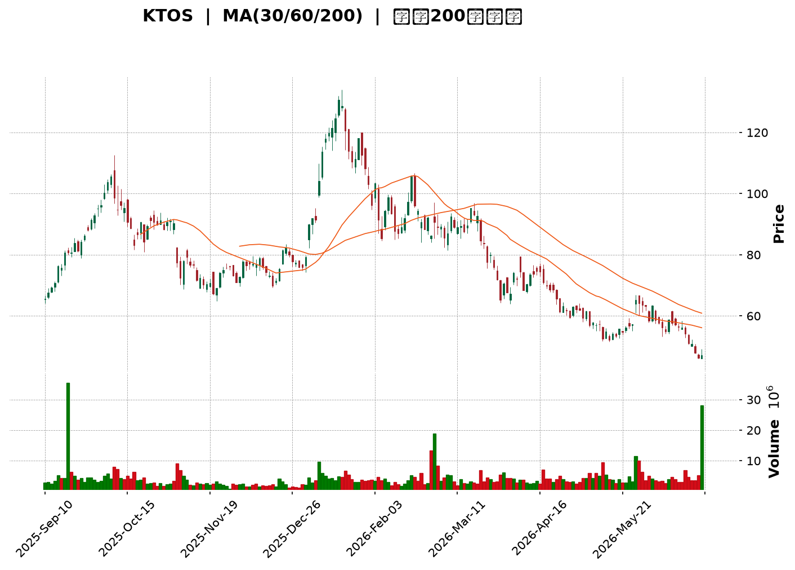
</details>

<html>
<head><meta charset="utf-8" /></head>
<body>
    <div style="height:500px; width:100%;">                        <script>window.PlotlyConfig = {MathJaxConfig: 'local'};</script>
        <script charset="utf-8" src="https://cdn.plot.ly/plotly-3.6.0.min.js" integrity="sha256-QaOVwtVY0T02VaHrr6pnoHLCwayMJp4O5n4YyaE3rJk=" crossorigin="anonymous"></script>                <div id="candlestick-chart" class="plotly-graph-div" style="height:100%; width:100%;"></div>            <script>                window.PLOTLYENV=window.PLOTLYENV || {};                                if (document.getElementById("candlestick-chart")) {                    Plotly.newPlot(                        "candlestick-chart",                        [{"close":{"dtype":"f8","bdata":"AAAAgD1qUEAAAABA4epQQAAAAMDMTFFAAAAAIFyvUUAAAABgZhZTQAAAACBc71JAAAAAoJkpVEAAAACgRzFUQAAAAIAULlRAAAAAoJn5VEAAAAAghUtUQAAAAMDMDFVAAAAAgOuRVUAAAADAHgVWQAAAACCu11ZAAAAAoHA9V0AAAACA68FXQAAAAAApDFhAAAAAAAAQWUAAAAAAKexZQAAAAEDhalpAAAAAQDOjWEAAAADgUahXQAAAAIDrEVhAAAAAQDPTV0AAAADAHqVWQAAAACCuJ1ZAAAAAIK7HVEAAAACgmalVQAAAACCup1ZAAAAAQDMTVUAAAADgelRWQAAAACCFy1ZAAAAAIIWrVkAAAACA63FWQAAAAKBwzVZAAAAAQDMTVkAAAABgZqZWQAAAAGBmxlZAAAAAgBSOVkAAAACAPVpTQAAAAIA9GlJAAAAA4FF4U0AAAAAghctTQAAAAIDCJVNAAAAAwMwsU0AAAAAAKexRQAAAAMDMHFJAAAAAIFyPUUAAAABACpdRQAAAAEDhqlFAAAAAANfTUEAAAADA9UhRQAAAAEAKh1JAAAAAQDPDUkAAAACgR\u002fFSQAAAAGBmBlNAAAAAoHBNUkAAAACgcL1RQAAAAIDrMVJAAAAAIIVrU0AAAAAAACBTQAAAAIDrQVNAAAAAgOtBU0AAAACAPTpTQAAAAIDrsVNAAAAAoHD9UkAAAADgo5BSQAAAAOBRSFJAAAAAoEdxUUAAAACgmdlRQAAAAMD12FJAAAAAgOthVEAAAABAM5NUQAAAAIAU\u002flNAAAAAwMxsU0AAAACAFF5TQAAAAGC4\u002flJAAAAAgD36UkAAAABgj9JTQAAAACCFe1ZAAAAAIIX7VkAAAAAAKdxWQAAAAGCPAlpAAAAAwMxsXEAAAABACnddQAAAAIAU7l1AAAAAAABgXkAAAAAA1yNfQAAAAEAKV2BAAAAAgMIVYEAAAACAwiVeQAAAAGBmdlxAAAAAwPWYW0AAAADgetRbQAAAAADXg11AAAAAQOEqXEAAAACAPQpbQAAAAOCjwFlAAAAAgD0KWEAAAAAgrtdZQAAAAMAe1VZAAAAAAABQVUAAAACAPZpXQAAAAADXs1hAAAAAYLheV0AAAACA6\u002fFVQAAAAEAzw1VAAAAAANdDVkAAAACAFP5WQAAAAKBwTVhAAAAAQOFqWkAAAADAHgVYQAAAAADXk1dAAAAAIIWrVkAAAABguA5WQAAAAMD1CFdAAAAAIIWLVUAAAACAFK5WQAAAAMDMPFZAAAAA4FFIVkAAAABgj2JVQAAAAAAAwFVAAAAAgBQeV0AAAACgcD1WQAAAAEDhOlZAAAAAoHBdVkAAAACA6+FVQAAAAIDrYVZAAAAAANfTV0AAAABgj0JXQAAAAIDrMVdAAAAAIK4nVUAAAAAAKexUQAAAACBcX1NAAAAAYLj+U0AAAABACvdSQAAAAAAp\u002fFFAAAAAgOtRUEAAAADgo6BRQAAAAMDM7FBAAAAAANfTUEAAAACAwoVSQAAAAKBw\u002fVFAAAAAoHCdUkAAAADAHhVRQAAAAIDClVFAAAAAQDNjUkAAAACAPWpSQAAAAIA9qlJAAAAAgD2aUkAAAAAgXL9RQAAAAMAedVFAAAAAQDMjUUAAAABACidRQAAAAKBHYVBAAAAAoEehTkAAAADgepRPQAAAAOB61E5AAAAAIK7HTUAAAABgZoZPQAAAAGBmBk9AAAAAQAr3TkAAAAAgrqdNQAAAAGCPwk5AAAAAAACATEAAAACA6\u002fFMQAAAAGC4fkxAAAAAgD2qTEAAAABguD5KQAAAAMDMbEtAAAAAIIULSkAAAAAAKRxLQAAAAAApvEpAAAAAwPXoS0AAAACAwlVLQAAAAEAKF0xAAAAAYGZmTEAAAABgZqZMQAAAAAApTFBAAAAA4FEIUEAAAABguL5PQAAAAGCPok9AAAAAQAo3TUAAAABAM7NPQAAAAGCPQk1AAAAAoHDdTEAAAADgURhMQAAAAMD1aEtAAAAAANdjTUAAAAAAAOBMQAAAAGCPgkxAAAAAIIUrTEAAAADgehRMQAAAAEDhGktAAAAAIIWLSUAAAABgZmZJQAAAAKCZ+UdAAAAAwPUoR0AAAABA4ZpHQA=="},"high":{"dtype":"f8","bdata":"AAAAAACwUEAAAADA9UhRQAAAAKBwbVFAAAAAANfTUUAAAAAgridTQAAAAIDrQVNAAAAAAClcVEAAAAAA15NUQAAAAOBRqFRAAAAAYLheVUAAAAAAAEBVQAAAAOBROFVAAAAAgMK1VUAAAABA4WpWQAAAACCu91ZAAAAAoEdhV0AAAACgmRlYQAAAACCuh1hAAAAAAADAWUAAAACgcC1aQAAAAADXk1pAAAAA4HokXEAAAACgmalZQAAAAAAAYFlAAAAAYGZGWEAAAAAgXJ9YQAAAAIDCJVdAAAAAoEehVUAAAACAFC5WQAAAAEAzs1ZAAAAAAACAVkAAAADAzHxWQAAAACCFO1dAAAAAYGamV0AAAADAzBxXQAAAACCud1dAAAAAAADAVkAAAACgmQlXQAAAAIAU7lZAAAAAgMLlVkAAAAAAAKBUQAAAAIAU3lNAAAAAYGaWU0AAAAAAAIBUQAAAACBcv1NAAAAAQOGKU0AAAACgmflSQAAAAKBHcVJAAAAAwMw8UkAAAAAAANBRQAAAACCFC1JAAAAAYLieUkAAAACAwlVRQAAAAAApnFJAAAAAIIULU0AAAABA4UpTQAAAACBcH1NAAAAAYGYmU0AAAABgZqZSQAAAAAAAQFJAAAAA4HqUU0AAAADgUYhTQAAAAOB6hFNAAAAAgD3qU0AAAACgcJ1TQAAAAIAU3lNAAAAAoJnZU0AAAABA4RpTQAAAAOBRqFJAAAAAIFyPUkAAAACAPRpSQAAAAGCP8lJAAAAAIK53VEAAAACAPdpUQAAAAAApfFRAAAAAgD36U0AAAACAFI5TQAAAAAApjFNAAAAAgBQ+U0AAAABguO5TQAAAAEAKh1ZAAAAAgOsBV0AAAADgetRXQAAAAEAzc1tAAAAAwMzcXEAAAADgUehdQAAAAOB6ZF5AAAAAoHD9XkAAAAAA15NfQAAAAAAAgGBAAAAAAADAYEAAAAAAAABgQAAAAEAzU15AAAAAgOvhXEAAAABA4WpcQAAAAMD1iF1AAAAAAAAAXkAAAADAzMxcQAAAAAAAMFtAAAAAwPVIWUAAAAAgXN9ZQAAAAAAAwFlAAAAAYGYmV0AAAABA4apXQAAAAIDr8VhAAAAAAADgWEAAAABAMyNYQAAAAIDCZVZAAAAAIFwPV0AAAABgZlZXQAAAAAAAIFlAAAAAgD16WkAAAABA4apaQAAAAMAexVdAAAAAIFzvVkAAAACA61FXQAAAAAApHFdAAAAAoJmZVUAAAABgZkZYQAAAAIAUTldAAAAAYGaGVkAAAAAgXF9WQAAAAOBRuFZAAAAAQOFqV0AAAABAMxNXQAAAAGC4vlZAAAAAIK7XVkAAAACgmflWQAAAAEAz81ZAAAAAYGbWV0AAAADgUThYQAAAAAAAoFdAAAAAAAAAV0AAAAAA15NVQAAAAKBHwVRAAAAAACk8VEAAAACA6+FTQAAAAOBRGFNAAAAAoJn5UUAAAACAFL5RQAAAAEAzM1JAAAAA4KNgUUAAAACAPZpSQAAAAKCZOVJAAAAAACncU0AAAAAAAKBSQAAAAIDroVFAAAAAYGaGUkAAAADgeiRTQAAAAGCPElNAAAAAgBROU0AAAADA9ThTQAAAAKBw7VFAAAAAoJm5UUAAAABguL5RQAAAACBcL1FAAAAA4KNwUEAAAAAghRtQQAAAAKCZWU9AAAAAoEfhTkAAAABACpdPQAAAAAAAwE9AAAAA4FEIUEAAAADAHmVPQAAAAGC43k5AAAAAwB7FTkAAAADgUfhMQAAAAEDh2kxAAAAA4KNQTUAAAAAAAEBMQAAAAAAp\u002fEtAAAAAQDPzSkAAAAAAKVxLQAAAACCFS0tAAAAA4KPwS0AAAAAA14NLQAAAAAAAYExAAAAAYGamTUAAAACAFK5MQAAAAMAetVBAAAAAAACwUEAAAADAzIxQQAAAAEAz009AAAAAwMzsTkAAAAAghctPQAAAAMDMDE9AAAAAAADgTUAAAABgZqZNQAAAAGBmZkxAAAAAgOtxTUAAAACgmdlOQAAAAAAAwE1AAAAAgOuxTEAAAABAMzNNQAAAAAAAYExAAAAAQDMTS0AAAAAghStKQAAAAMAeZUlAAAAAANfjR0AAAADgUZhIQA=="},"hovertemplate":"\u003cb\u003e%{x|%Y-%m-%d}\u003c\u002fb\u003e\u003cbr\u003e\u958b: $%{open:.2f}\u003cbr\u003e\u9ad8: $%{high:.2f}\u003cbr\u003e\u4f4e: $%{low:.2f}\u003cbr\u003e\u6536: $%{close:.2f}\u003cextra\u003e\u003c\u002fextra\u003e","low":{"dtype":"f8","bdata":"AAAAACkMUEAAAABgZmZQQAAAAKCZ6VBAAAAAoJn5UEAAAADAHrVRQAAAAEAKR1JAAAAAoEfBUkAAAACgmflTQAAAAEAz01NAAAAAYGZGVEAAAABgZjZUQAAAACCut1NAAAAAIIUbVUAAAABAM\u002fNVQAAAAGBmBlZAAAAA4FEoVkAAAACA6yFXQAAAAEAKd1dAAAAAoEeBWEAAAAAAAABZQAAAAKCZeVlAAAAAQDMzWEAAAACgmTlXQAAAAEDhqldAAAAAYI+yVkAAAACAPUpWQAAAACBcH1ZAAAAAoHBtVEAAAADAzExVQAAAAMDMTFVAAAAAANczVEAAAAAgrjdVQAAAACCFS1ZAAAAA4KMQVkAAAAAAKWxWQAAAAKBwfVZAAAAAYI8CVkAAAACAPfpVQAAAAMDM\u002fFVAAAAA4Hq0VUAAAABgZvZSQAAAAKBHkVFAAAAAoJkpUUAAAABAM0NTQAAAAMD1+FJAAAAAAADgUkAAAAAA19NRQAAAAAAAQFFAAAAAYGY2UUAAAACA6\u002fFQQAAAAEAzU1FAAAAAgD26UEAAAABAMzNQQAAAAMD1SFFAAAAAoJkpUkAAAAAA19NSQAAAAOCjwFJAAAAAIIU7UkAAAAAgrrdRQAAAACCFa1FAAAAAgOsRUkAAAADgo7BSQAAAAKCZyVJAAAAAANcDU0AAAADAzExSQAAAAEAzs1JAAAAAwMzMUkAAAABgZkZSQAAAAEDhGlJAAAAAANdTUUAAAADA9YhRQAAAAGC4zlFAAAAAANczU0AAAABgZvZTQAAAAIDr0VNAAAAAYGYGU0AAAACgmQlTQAAAAEAz81JAAAAA4FG4UkAAAADAHpVSQAAAAOBRiFRAAAAAwMysVUAAAADgo6BWQAAAAKBHsVhAAAAAoJkpWkAAAAAAAKBcQAAAAMDMTF1AAAAAAACAXEAAAACgR1FdQAAAAAAAQF9AAAAAAADAX0AAAACA65FcQAAAAGC4zltAAAAAQAoXW0AAAACgR7FaQAAAAADXw1tAAAAA4KNQW0AAAACAwoVaQAAAAOBRaFlAAAAAoEexV0AAAACgmUlYQAAAAEDhulVAAAAAAAAgVUAAAAAAAABWQAAAAMDMTFdAAAAAoHBNV0AAAACgR0FVQAAAAAAAUFVAAAAAoEfBVUAAAADgesRVQAAAAMDMPFdAAAAAYLg+WEAAAAAghdtXQAAAAAAAwFZAAAAAYI8CVUAAAACgcA1WQAAAAMD1qFVAAAAAAAAAVUAAAADAHlVVQAAAAGBmplVAAAAAAABwVUAAAACgmZlUQAAAAAAAYFRAAAAAwMzMVUAAAADA9ShWQAAAACCup1VAAAAAwPVYVUAAAADAzMxVQAAAAKCZuVVAAAAAIFyPVkAAAACAPSpXQAAAAMD16FVAAAAAYGbGVEAAAADgeoRUQAAAAKBH4VJAAAAAANdTU0AAAACgmclSQAAAAMDM7FFAAAAAIK4XUEAAAABAM2NQQAAAAGBm5lBAAAAAIIXrT0AAAADAzIxRQAAAAEAzc1FAAAAAQDMjUkAAAACA6xFRQAAAACCF21BAAAAAQApnUUAAAACgRyFSQAAAAAAAUFJAAAAA4KNAUkAAAACAPZpRQAAAAEAKN1FAAAAA4Hr0UEAAAADA9ehQQAAAAMAe5U9AAAAAoEeBTkAAAADgUZhOQAAAAAApHE5AAAAAIK6HTUAAAACA69FNQAAAAKCZeU5AAAAAoEfhTkAAAACgRwFNQAAAAEAKN01AAAAAwB4lTEAAAACgcN1LQAAAAKBHgUtAAAAAgBSOS0AAAAAghetJQAAAAGC4PkpAAAAA4HrUSUAAAACAPQpKQAAAAADXY0pAAAAAQDNTSkAAAAAgrudKQAAAAEDhOktAAAAAQDPzS0AAAAAAAIBLQAAAAAAAgE5AAAAAgD0KTkAAAABAM5NOQAAAAEAK105AAAAAQDPzTEAAAADgUfhMQAAAAAAAwExAAAAAIFyvTEAAAAAgrqdKQAAAAAAAIEtAAAAAwPUIS0AAAADgenRMQAAAAEAKV0xAAAAAoEeBS0AAAADAzMxLQAAAAOBReEpAAAAAQApXSUAAAAAgrgdJQAAAAADX40dAAAAAoEcBR0AAAADAHgVHQA=="},"name":"\u50f9\u683c","open":{"dtype":"f8","bdata":"AAAAYGZWUEAAAACAwoVQQAAAACBc71BAAAAAwMxcUUAAAAAA18NRQAAAAOCjwFJAAAAAoJkpU0AAAACgR2FUQAAAAEAKJ1RAAAAAYGZGVEAAAAAgrhdVQAAAAAAAAFRAAAAAAABAVUAAAADAzDxWQAAAAMD1GFZAAAAAAACgVkAAAAAAAMBXQAAAAAAp7FdAAAAAYGaWWEAAAACgmUlZQAAAAOB6xFlAAAAAwPXoWkAAAADAzKxXQAAAAIAUXlhAAAAAgBRuV0AAAADAzHxYQAAAACBc\u002f1ZAAAAAQOE6VUAAAACA69FVQAAAAEAKx1VAAAAAAACAVkAAAADAzExVQAAAAOBRCFdAAAAA4HpEV0AAAADgesRWQAAAAAAAgFZAAAAAAACAVkAAAAAAAGBWQAAAAMAetVZAAAAAYLgOVkAAAAAgrpdUQAAAAMDMfFNAAAAAQDOTUUAAAAAghVtUQAAAAGC4blNAAAAAgOsxU0AAAAAAKbxSQAAAAIA9SlFAAAAAgMIFUkAAAAAgXC9RQAAAAMAeZVFAAAAAYLieUkAAAAAA17NQQAAAAEDhWlFAAAAAgD2KUkAAAABAM\u002fNSQAAAAGC4DlNAAAAAYGYmU0AAAAAgrodSQAAAAOCjwFFAAAAAoEchUkAAAAAAKWxTQAAAAIDCZVNAAAAA4HokU0AAAAAAAABTQAAAACBcL1NAAAAAIIW7U0AAAACgRxFTQAAAAAAAQFJAAAAA4FFIUkAAAAAAKbxRQAAAAIDr4VFAAAAAAABAU0AAAACAFB5UQAAAAEAKR1RAAAAAgD36U0AAAACgcD1TQAAAAAApjFNAAAAAQDMzU0AAAABAMyNTQAAAAIA9OlVAAAAAwPV4VkAAAADgUShXQAAAAIDr4VhAAAAAYLheWkAAAABgZjZdQAAAAIA9ul1AAAAAAACgXUAAAADA9fhdQAAAAKBwbV9AAAAAIIUDYEAAAABgj+JfQAAAAOCjQF5AAAAAwB51XEAAAADAzCxbQAAAAADXw1tAAAAAAAAAXkAAAADgUbhcQAAAAOB6dFpAAAAAgD36WEAAAABgZqZYQAAAAKBwXVlAAAAAgBQeVkAAAABgZkZWQAAAAGBmpldAAAAA4Hq0WEAAAACAPfpXQAAAAKCZGVZAAAAAIFzPVUAAAADAHgVWQAAAAMD1SFdAAAAAoHBtWEAAAAAAKWxaQAAAAKBHUVdAAAAAAAAwVkAAAAAAKTxXQAAAAAAp\u002fFVAAAAAQDNTVUAAAABA4RpXQAAAAKBwTVZAAAAA4KMgVkAAAABgZjZWQAAAAOBR2FRAAAAAQAr3VUAAAAAAKdxWQAAAAIDrwVVAAAAAACk8VkAAAAAAAIBWQAAAAIDCNVZAAAAAQAq3VkAAAACAPZpXQAAAAOCjoFZAAAAAwMzcVkAAAACAwvVUQAAAAEDhqlRAAAAAYI\u002fyU0AAAADgUZhTQAAAAEAKt1JAAAAA4KPwUUAAAACgmblQQAAAAMD1KFJAAAAAgOtRUEAAAADgUchRQAAAAAAAEFJAAAAA4FHYU0AAAADAzIxSQAAAAKBHAVFAAAAAYGaGUUAAAACAPapSQAAAAAAp7FJAAAAAANcTU0AAAAAghdtSQAAAAGCPglFAAAAA4KOQUUAAAAAgrodRQAAAAMDMHFFAAAAA4KNwUEAAAADgUZhOQAAAAOBR+E5AAAAAYLjeTkAAAADAHiVOQAAAAOB6tE9AAAAAACk8T0AAAADgUVhPQAAAAIA9ik1AAAAAwB7FTkAAAACAPYpMQAAAACBcb0xAAAAAIIWrTEAAAADgejRMQAAAAKBHYUpAAAAAYLi+SkAAAACgRyFKQAAAAGC4HktAAAAAoJn5SkAAAAAAAIBLQAAAAMAepUtAAAAA4HrUTEAAAACgcH1MQAAAAEDh+k9AAAAAgD2qUEAAAAAAKTxQQAAAAMD1yE9AAAAAIFzPTkAAAACAFC5NQAAAAIDr0U5AAAAAACncTUAAAAAgrgdNQAAAAMDMzEtAAAAAwPVoS0AAAABguL5OQAAAAOBRmE1AAAAAgBROTEAAAADgo9BLQAAAAAApHExAAAAAYI\u002fiSkAAAAAgrgdJQAAAAEAKF0lAAAAAQDOzR0AAAADAHgVHQA=="},"x":["2025-09-10T00:00:00-04:00","2025-09-11T00:00:00-04:00","2025-09-12T00:00:00-04:00","2025-09-15T00:00:00-04:00","2025-09-16T00:00:00-04:00","2025-09-17T00:00:00-04:00","2025-09-18T00:00:00-04:00","2025-09-19T00:00:00-04:00","2025-09-22T00:00:00-04:00","2025-09-23T00:00:00-04:00","2025-09-24T00:00:00-04:00","2025-09-25T00:00:00-04:00","2025-09-26T00:00:00-04:00","2025-09-29T00:00:00-04:00","2025-09-30T00:00:00-04:00","2025-10-01T00:00:00-04:00","2025-10-02T00:00:00-04:00","2025-10-03T00:00:00-04:00","2025-10-06T00:00:00-04:00","2025-10-07T00:00:00-04:00","2025-10-08T00:00:00-04:00","2025-10-09T00:00:00-04:00","2025-10-10T00:00:00-04:00","2025-10-13T00:00:00-04:00","2025-10-14T00:00:00-04:00","2025-10-15T00:00:00-04:00","2025-10-16T00:00:00-04:00","2025-10-17T00:00:00-04:00","2025-10-20T00:00:00-04:00","2025-10-21T00:00:00-04:00","2025-10-22T00:00:00-04:00","2025-10-23T00:00:00-04:00","2025-10-24T00:00:00-04:00","2025-10-27T00:00:00-04:00","2025-10-28T00:00:00-04:00","2025-10-29T00:00:00-04:00","2025-10-30T00:00:00-04:00","2025-10-31T00:00:00-04:00","2025-11-03T00:00:00-05:00","2025-11-04T00:00:00-05:00","2025-11-05T00:00:00-05:00","2025-11-06T00:00:00-05:00","2025-11-07T00:00:00-05:00","2025-11-10T00:00:00-05:00","2025-11-11T00:00:00-05:00","2025-11-12T00:00:00-05:00","2025-11-13T00:00:00-05:00","2025-11-14T00:00:00-05:00","2025-11-17T00:00:00-05:00","2025-11-18T00:00:00-05:00","2025-11-19T00:00:00-05:00","2025-11-20T00:00:00-05:00","2025-11-21T00:00:00-05:00","2025-11-24T00:00:00-05:00","2025-11-25T00:00:00-05:00","2025-11-26T00:00:00-05:00","2025-11-28T00:00:00-05:00","2025-12-01T00:00:00-05:00","2025-12-02T00:00:00-05:00","2025-12-03T00:00:00-05:00","2025-12-04T00:00:00-05:00","2025-12-05T00:00:00-05:00","2025-12-08T00:00:00-05:00","2025-12-09T00:00:00-05:00","2025-12-10T00:00:00-05:00","2025-12-11T00:00:00-05:00","2025-12-12T00:00:00-05:00","2025-12-15T00:00:00-05:00","2025-12-16T00:00:00-05:00","2025-12-17T00:00:00-05:00","2025-12-18T00:00:00-05:00","2025-12-19T00:00:00-05:00","2025-12-22T00:00:00-05:00","2025-12-23T00:00:00-05:00","2025-12-24T00:00:00-05:00","2025-12-26T00:00:00-05:00","2025-12-29T00:00:00-05:00","2025-12-30T00:00:00-05:00","2025-12-31T00:00:00-05:00","2026-01-02T00:00:00-05:00","2026-01-05T00:00:00-05:00","2026-01-06T00:00:00-05:00","2026-01-07T00:00:00-05:00","2026-01-08T00:00:00-05:00","2026-01-09T00:00:00-05:00","2026-01-12T00:00:00-05:00","2026-01-13T00:00:00-05:00","2026-01-14T00:00:00-05:00","2026-01-15T00:00:00-05:00","2026-01-16T00:00:00-05:00","2026-01-20T00:00:00-05:00","2026-01-21T00:00:00-05:00","2026-01-22T00:00:00-05:00","2026-01-23T00:00:00-05:00","2026-01-26T00:00:00-05:00","2026-01-27T00:00:00-05:00","2026-01-28T00:00:00-05:00","2026-01-29T00:00:00-05:00","2026-01-30T00:00:00-05:00","2026-02-02T00:00:00-05:00","2026-02-03T00:00:00-05:00","2026-02-04T00:00:00-05:00","2026-02-05T00:00:00-05:00","2026-02-06T00:00:00-05:00","2026-02-09T00:00:00-05:00","2026-02-10T00:00:00-05:00","2026-02-11T00:00:00-05:00","2026-02-12T00:00:00-05:00","2026-02-13T00:00:00-05:00","2026-02-17T00:00:00-05:00","2026-02-18T00:00:00-05:00","2026-02-19T00:00:00-05:00","2026-02-20T00:00:00-05:00","2026-02-23T00:00:00-05:00","2026-02-24T00:00:00-05:00","2026-02-25T00:00:00-05:00","2026-02-26T00:00:00-05:00","2026-02-27T00:00:00-05:00","2026-03-02T00:00:00-05:00","2026-03-03T00:00:00-05:00","2026-03-04T00:00:00-05:00","2026-03-05T00:00:00-05:00","2026-03-06T00:00:00-05:00","2026-03-09T00:00:00-04:00","2026-03-10T00:00:00-04:00","2026-03-11T00:00:00-04:00","2026-03-12T00:00:00-04:00","2026-03-13T00:00:00-04:00","2026-03-16T00:00:00-04:00","2026-03-17T00:00:00-04:00","2026-03-18T00:00:00-04:00","2026-03-19T00:00:00-04:00","2026-03-20T00:00:00-04:00","2026-03-23T00:00:00-04:00","2026-03-24T00:00:00-04:00","2026-03-25T00:00:00-04:00","2026-03-26T00:00:00-04:00","2026-03-27T00:00:00-04:00","2026-03-30T00:00:00-04:00","2026-03-31T00:00:00-04:00","2026-04-01T00:00:00-04:00","2026-04-02T00:00:00-04:00","2026-04-06T00:00:00-04:00","2026-04-07T00:00:00-04:00","2026-04-08T00:00:00-04:00","2026-04-09T00:00:00-04:00","2026-04-10T00:00:00-04:00","2026-04-13T00:00:00-04:00","2026-04-14T00:00:00-04:00","2026-04-15T00:00:00-04:00","2026-04-16T00:00:00-04:00","2026-04-17T00:00:00-04:00","2026-04-20T00:00:00-04:00","2026-04-21T00:00:00-04:00","2026-04-22T00:00:00-04:00","2026-04-23T00:00:00-04:00","2026-04-24T00:00:00-04:00","2026-04-27T00:00:00-04:00","2026-04-28T00:00:00-04:00","2026-04-29T00:00:00-04:00","2026-04-30T00:00:00-04:00","2026-05-01T00:00:00-04:00","2026-05-04T00:00:00-04:00","2026-05-05T00:00:00-04:00","2026-05-06T00:00:00-04:00","2026-05-07T00:00:00-04:00","2026-05-08T00:00:00-04:00","2026-05-11T00:00:00-04:00","2026-05-12T00:00:00-04:00","2026-05-13T00:00:00-04:00","2026-05-14T00:00:00-04:00","2026-05-15T00:00:00-04:00","2026-05-18T00:00:00-04:00","2026-05-19T00:00:00-04:00","2026-05-20T00:00:00-04:00","2026-05-21T00:00:00-04:00","2026-05-22T00:00:00-04:00","2026-05-26T00:00:00-04:00","2026-05-27T00:00:00-04:00","2026-05-28T00:00:00-04:00","2026-05-29T00:00:00-04:00","2026-06-01T00:00:00-04:00","2026-06-02T00:00:00-04:00","2026-06-03T00:00:00-04:00","2026-06-04T00:00:00-04:00","2026-06-05T00:00:00-04:00","2026-06-08T00:00:00-04:00","2026-06-09T00:00:00-04:00","2026-06-10T00:00:00-04:00","2026-06-11T00:00:00-04:00","2026-06-12T00:00:00-04:00","2026-06-15T00:00:00-04:00","2026-06-16T00:00:00-04:00","2026-06-17T00:00:00-04:00","2026-06-18T00:00:00-04:00","2026-06-22T00:00:00-04:00","2026-06-23T00:00:00-04:00","2026-06-24T00:00:00-04:00","2026-06-25T00:00:00-04:00","2026-06-26T00:00:00-04:00"],"type":"candlestick"},{"hovertemplate":"MA30: $%{y:.2f}\u003cextra\u003e\u003c\u002fextra\u003e","line":{"color":"#2196F3","dash":"dash","width":2},"mode":"lines","name":"MA30","x":["2025-09-10T00:00:00-04:00","2025-09-11T00:00:00-04:00","2025-09-12T00:00:00-04:00","2025-09-15T00:00:00-04:00","2025-09-16T00:00:00-04:00","2025-09-17T00:00:00-04:00","2025-09-18T00:00:00-04:00","2025-09-19T00:00:00-04:00","2025-09-22T00:00:00-04:00","2025-09-23T00:00:00-04:00","2025-09-24T00:00:00-04:00","2025-09-25T00:00:00-04:00","2025-09-26T00:00:00-04:00","2025-09-29T00:00:00-04:00","2025-09-30T00:00:00-04:00","2025-10-01T00:00:00-04:00","2025-10-02T00:00:00-04:00","2025-10-03T00:00:00-04:00","2025-10-06T00:00:00-04:00","2025-10-07T00:00:00-04:00","2025-10-08T00:00:00-04:00","2025-10-09T00:00:00-04:00","2025-10-10T00:00:00-04:00","2025-10-13T00:00:00-04:00","2025-10-14T00:00:00-04:00","2025-10-15T00:00:00-04:00","2025-10-16T00:00:00-04:00","2025-10-17T00:00:00-04:00","2025-10-20T00:00:00-04:00","2025-10-21T00:00:00-04:00","2025-10-22T00:00:00-04:00","2025-10-23T00:00:00-04:00","2025-10-24T00:00:00-04:00","2025-10-27T00:00:00-04:00","2025-10-28T00:00:00-04:00","2025-10-29T00:00:00-04:00","2025-10-30T00:00:00-04:00","2025-10-31T00:00:00-04:00","2025-11-03T00:00:00-05:00","2025-11-04T00:00:00-05:00","2025-11-05T00:00:00-05:00","2025-11-06T00:00:00-05:00","2025-11-07T00:00:00-05:00","2025-11-10T00:00:00-05:00","2025-11-11T00:00:00-05:00","2025-11-12T00:00:00-05:00","2025-11-13T00:00:00-05:00","2025-11-14T00:00:00-05:00","2025-11-17T00:00:00-05:00","2025-11-18T00:00:00-05:00","2025-11-19T00:00:00-05:00","2025-11-20T00:00:00-05:00","2025-11-21T00:00:00-05:00","2025-11-24T00:00:00-05:00","2025-11-25T00:00:00-05:00","2025-11-26T00:00:00-05:00","2025-11-28T00:00:00-05:00","2025-12-01T00:00:00-05:00","2025-12-02T00:00:00-05:00","2025-12-03T00:00:00-05:00","2025-12-04T00:00:00-05:00","2025-12-05T00:00:00-05:00","2025-12-08T00:00:00-05:00","2025-12-09T00:00:00-05:00","2025-12-10T00:00:00-05:00","2025-12-11T00:00:00-05:00","2025-12-12T00:00:00-05:00","2025-12-15T00:00:00-05:00","2025-12-16T00:00:00-05:00","2025-12-17T00:00:00-05:00","2025-12-18T00:00:00-05:00","2025-12-19T00:00:00-05:00","2025-12-22T00:00:00-05:00","2025-12-23T00:00:00-05:00","2025-12-24T00:00:00-05:00","2025-12-26T00:00:00-05:00","2025-12-29T00:00:00-05:00","2025-12-30T00:00:00-05:00","2025-12-31T00:00:00-05:00","2026-01-02T00:00:00-05:00","2026-01-05T00:00:00-05:00","2026-01-06T00:00:00-05:00","2026-01-07T00:00:00-05:00","2026-01-08T00:00:00-05:00","2026-01-09T00:00:00-05:00","2026-01-12T00:00:00-05:00","2026-01-13T00:00:00-05:00","2026-01-14T00:00:00-05:00","2026-01-15T00:00:00-05:00","2026-01-16T00:00:00-05:00","2026-01-20T00:00:00-05:00","2026-01-21T00:00:00-05:00","2026-01-22T00:00:00-05:00","2026-01-23T00:00:00-05:00","2026-01-26T00:00:00-05:00","2026-01-27T00:00:00-05:00","2026-01-28T00:00:00-05:00","2026-01-29T00:00:00-05:00","2026-01-30T00:00:00-05:00","2026-02-02T00:00:00-05:00","2026-02-03T00:00:00-05:00","2026-02-04T00:00:00-05:00","2026-02-05T00:00:00-05:00","2026-02-06T00:00:00-05:00","2026-02-09T00:00:00-05:00","2026-02-10T00:00:00-05:00","2026-02-11T00:00:00-05:00","2026-02-12T00:00:00-05:00","2026-02-13T00:00:00-05:00","2026-02-17T00:00:00-05:00","2026-02-18T00:00:00-05:00","2026-02-19T00:00:00-05:00","2026-02-20T00:00:00-05:00","2026-02-23T00:00:00-05:00","2026-02-24T00:00:00-05:00","2026-02-25T00:00:00-05:00","2026-02-26T00:00:00-05:00","2026-02-27T00:00:00-05:00","2026-03-02T00:00:00-05:00","2026-03-03T00:00:00-05:00","2026-03-04T00:00:00-05:00","2026-03-05T00:00:00-05:00","2026-03-06T00:00:00-05:00","2026-03-09T00:00:00-04:00","2026-03-10T00:00:00-04:00","2026-03-11T00:00:00-04:00","2026-03-12T00:00:00-04:00","2026-03-13T00:00:00-04:00","2026-03-16T00:00:00-04:00","2026-03-17T00:00:00-04:00","2026-03-18T00:00:00-04:00","2026-03-19T00:00:00-04:00","2026-03-20T00:00:00-04:00","2026-03-23T00:00:00-04:00","2026-03-24T00:00:00-04:00","2026-03-25T00:00:00-04:00","2026-03-26T00:00:00-04:00","2026-03-27T00:00:00-04:00","2026-03-30T00:00:00-04:00","2026-03-31T00:00:00-04:00","2026-04-01T00:00:00-04:00","2026-04-02T00:00:00-04:00","2026-04-06T00:00:00-04:00","2026-04-07T00:00:00-04:00","2026-04-08T00:00:00-04:00","2026-04-09T00:00:00-04:00","2026-04-10T00:00:00-04:00","2026-04-13T00:00:00-04:00","2026-04-14T00:00:00-04:00","2026-04-15T00:00:00-04:00","2026-04-16T00:00:00-04:00","2026-04-17T00:00:00-04:00","2026-04-20T00:00:00-04:00","2026-04-21T00:00:00-04:00","2026-04-22T00:00:00-04:00","2026-04-23T00:00:00-04:00","2026-04-24T00:00:00-04:00","2026-04-27T00:00:00-04:00","2026-04-28T00:00:00-04:00","2026-04-29T00:00:00-04:00","2026-04-30T00:00:00-04:00","2026-05-01T00:00:00-04:00","2026-05-04T00:00:00-04:00","2026-05-05T00:00:00-04:00","2026-05-06T00:00:00-04:00","2026-05-07T00:00:00-04:00","2026-05-08T00:00:00-04:00","2026-05-11T00:00:00-04:00","2026-05-12T00:00:00-04:00","2026-05-13T00:00:00-04:00","2026-05-14T00:00:00-04:00","2026-05-15T00:00:00-04:00","2026-05-18T00:00:00-04:00","2026-05-19T00:00:00-04:00","2026-05-20T00:00:00-04:00","2026-05-21T00:00:00-04:00","2026-05-22T00:00:00-04:00","2026-05-26T00:00:00-04:00","2026-05-27T00:00:00-04:00","2026-05-28T00:00:00-04:00","2026-05-29T00:00:00-04:00","2026-06-01T00:00:00-04:00","2026-06-02T00:00:00-04:00","2026-06-03T00:00:00-04:00","2026-06-04T00:00:00-04:00","2026-06-05T00:00:00-04:00","2026-06-08T00:00:00-04:00","2026-06-09T00:00:00-04:00","2026-06-10T00:00:00-04:00","2026-06-11T00:00:00-04:00","2026-06-12T00:00:00-04:00","2026-06-15T00:00:00-04:00","2026-06-16T00:00:00-04:00","2026-06-17T00:00:00-04:00","2026-06-18T00:00:00-04:00","2026-06-22T00:00:00-04:00","2026-06-23T00:00:00-04:00","2026-06-24T00:00:00-04:00","2026-06-25T00:00:00-04:00","2026-06-26T00:00:00-04:00"],"y":{"dtype":"f8","bdata":"AAAAAAAA+H8AAAAAAAD4fwAAAAAAAPh\u002fAAAAAAAA+H8AAAAAAAD4fwAAAAAAAPh\u002fAAAAAAAA+H8AAAAAAAD4fwAAAAAAAPh\u002fAAAAAAAA+H8AAAAAAAD4fwAAAAAAAPh\u002fAAAAAAAA+H8AAAAAAAD4fwAAAAAAAPh\u002fAAAAAAAA+H8AAAAAAAD4fwAAAAAAAPh\u002fAAAAAAAA+H8AAAAAAAD4fwAAAAAAAPh\u002fAAAAAAAA+H8AAAAAAAD4fwAAAAAAAPh\u002fAAAAAAAA+H8AAAAAAAD4fwAAAAAAAPh\u002fAAAAAAAA+H8AAAAAAAD4f4mIiKgNrFVAVVVVldHTVUDv7u5eAQJWQCIiImLlMFZAiYiISG9bVkCrqqraFXhWQJqZmYkWmVZAVVVVdWipVkAzMzPzYL5WQAAAANCF1FZAAAAAYAHiVkBERER09tlWQLy7u4vPwFZAZmZmBuSuVkAAAABw55tWQFVVVZVffFZAREREdK9ZVkBERES05CdWQO\u002fu7n4\u002f9VVAiYiICDq1VUCJiIhoH25VQN7d3b10I1VAiYiIiM\u002fgVECJiIiYbqpUQCIiItIie1RA7+7unu9PVEAiIiJiVzBUQKuqqsqhFVRAvLu7m30AVEBmZmbGBN9TQBEREcH1uFNAmpmZWdaqU0C8u7vrfI9TQCIiIiJNcVNAmpmZaS5UU0De3d2tuThTQN7d3T01HlNARERE9OEDU0AzMzMjBuFSQO\u002fu7h6wulJAERERsQ+PUkDe3d1tPYJSQHd3d+eYiFJAq6qqSmKQUkCrqqo6CpdSQJqZmSlAnlJAvLu7S2KgUkAiIiLytqxSQM3MzMw+tFJAERERYVfAUkCamZlZZNNSQBEREeF6\u002fFJA7+7urgAxU0BVVVV1k2BTQKuqqjptoFNAd3d3R+HyU0CJiIgIrExUQO\u002fu7l66qVRAZmZmJr8QVUBVVVXlF4NVQM3MzNyy\u002flVAiYiIqH9rVkDNzMysjslWQN7d3U0bGFdAAAAAUEZfV0AiIiLCrqhXQAAAAOB6\u002fFdA3t3dbctKWECamZlZHZNYQBEREdHb0lhAd3d3RygLWUCamZkpXE9ZQHd3d4ddcVlAVVVVJU15WUAiIiLSIpNZQImIiPhTu1lAVVVV9f3cWUB3d3eX\u002fPJZQJqZmUmaClpAAAAA8KcmWkCJiIjotEFaQCIiIsI8UVpAERERoYxuWkAAAACwcnhaQO\u002fu7s6wY1pAIiIi0pQyWkBERETkXvNZQImIiIiIuFlAq6qqGi9tWUBERET0\u002fSRZQGZmZvbhy1hAREREZIJ3WEC8u7trvCxYQN7d3b1081dAiYiICDrNV0De3d19hp1XQKuqqipcX1dAmpmZadgtV0De3d2t1QFXQM3MzMwT5VZAVVVVlUPjVkBmZmYGOs1WQKuqqupR0FZAq6qq2vnOVkDe3d1NG7hWQN7d3b2filZAERER8dJtVkCJiIgIZVRWQFVVVfUoNFZAiYiI6G0BVkAzMzPjpdNVQN7d3X2xlFVAERER0dtCVUB3d3dX8hNVQDMzM0NE5FRAq6qq+qnBVEDNzMzsNZdUQHd3dze0aFRA3t3djcJNVEBVVVWFXSlUQHd3d0fhClRAMzMzM3rrU0BVVVX1b8xTQJqZmdnOp1NAd3d3V8d0U0B3d3eHXUlTQCIiIgJyF1NAREREDEnbUkB3d3fHS6dSQDMzMwvXa1JAd3d3x5IfUkBVVVU9mN9RQAAAAJAJnlFAvLu7y6FtUUCJiIgQnzlRQBEREVGNF1FAvLu7K4fmUEB3d3cnMcBQQN7d3XVMoFBAvLu7s1aPUEARERFh5WhQQBEREZF7TVBAMzMzawMtUECJiIjAnwJQQO\u002fu7n5btk9AVVVVpdNmT0B3d3dHiyxPQJqZmckg8E5AERERUamoTkBERETU22JOQAAAABB0Ok5A3t3djZcOTkDv7u6Ol+5NQJqZmUma0k1AvLu7i2ynTUBmZmbWMZFNQJqZmflTc01AZmZmRkRkTUDNzMwsh0ZNQCIiIhJYKU1AmpmZGQQmTUBmZmYWZw9NQM3MzPzw+UxAd3d3NxfiTEAzMzOTptRMQKuqqhp2tUxA7+7uzj6cTEAzMzOj\u002fn1MQLy7u4tsV0xAAAAAsHIoTEBERESE6xFMQA=="},"type":"scatter"},{"hovertemplate":"MA60: $%{y:.2f}\u003cextra\u003e\u003c\u002fextra\u003e","line":{"color":"#9C27B0","dash":"dash","width":2},"mode":"lines","name":"MA60","x":["2025-09-10T00:00:00-04:00","2025-09-11T00:00:00-04:00","2025-09-12T00:00:00-04:00","2025-09-15T00:00:00-04:00","2025-09-16T00:00:00-04:00","2025-09-17T00:00:00-04:00","2025-09-18T00:00:00-04:00","2025-09-19T00:00:00-04:00","2025-09-22T00:00:00-04:00","2025-09-23T00:00:00-04:00","2025-09-24T00:00:00-04:00","2025-09-25T00:00:00-04:00","2025-09-26T00:00:00-04:00","2025-09-29T00:00:00-04:00","2025-09-30T00:00:00-04:00","2025-10-01T00:00:00-04:00","2025-10-02T00:00:00-04:00","2025-10-03T00:00:00-04:00","2025-10-06T00:00:00-04:00","2025-10-07T00:00:00-04:00","2025-10-08T00:00:00-04:00","2025-10-09T00:00:00-04:00","2025-10-10T00:00:00-04:00","2025-10-13T00:00:00-04:00","2025-10-14T00:00:00-04:00","2025-10-15T00:00:00-04:00","2025-10-16T00:00:00-04:00","2025-10-17T00:00:00-04:00","2025-10-20T00:00:00-04:00","2025-10-21T00:00:00-04:00","2025-10-22T00:00:00-04:00","2025-10-23T00:00:00-04:00","2025-10-24T00:00:00-04:00","2025-10-27T00:00:00-04:00","2025-10-28T00:00:00-04:00","2025-10-29T00:00:00-04:00","2025-10-30T00:00:00-04:00","2025-10-31T00:00:00-04:00","2025-11-03T00:00:00-05:00","2025-11-04T00:00:00-05:00","2025-11-05T00:00:00-05:00","2025-11-06T00:00:00-05:00","2025-11-07T00:00:00-05:00","2025-11-10T00:00:00-05:00","2025-11-11T00:00:00-05:00","2025-11-12T00:00:00-05:00","2025-11-13T00:00:00-05:00","2025-11-14T00:00:00-05:00","2025-11-17T00:00:00-05:00","2025-11-18T00:00:00-05:00","2025-11-19T00:00:00-05:00","2025-11-20T00:00:00-05:00","2025-11-21T00:00:00-05:00","2025-11-24T00:00:00-05:00","2025-11-25T00:00:00-05:00","2025-11-26T00:00:00-05:00","2025-11-28T00:00:00-05:00","2025-12-01T00:00:00-05:00","2025-12-02T00:00:00-05:00","2025-12-03T00:00:00-05:00","2025-12-04T00:00:00-05:00","2025-12-05T00:00:00-05:00","2025-12-08T00:00:00-05:00","2025-12-09T00:00:00-05:00","2025-12-10T00:00:00-05:00","2025-12-11T00:00:00-05:00","2025-12-12T00:00:00-05:00","2025-12-15T00:00:00-05:00","2025-12-16T00:00:00-05:00","2025-12-17T00:00:00-05:00","2025-12-18T00:00:00-05:00","2025-12-19T00:00:00-05:00","2025-12-22T00:00:00-05:00","2025-12-23T00:00:00-05:00","2025-12-24T00:00:00-05:00","2025-12-26T00:00:00-05:00","2025-12-29T00:00:00-05:00","2025-12-30T00:00:00-05:00","2025-12-31T00:00:00-05:00","2026-01-02T00:00:00-05:00","2026-01-05T00:00:00-05:00","2026-01-06T00:00:00-05:00","2026-01-07T00:00:00-05:00","2026-01-08T00:00:00-05:00","2026-01-09T00:00:00-05:00","2026-01-12T00:00:00-05:00","2026-01-13T00:00:00-05:00","2026-01-14T00:00:00-05:00","2026-01-15T00:00:00-05:00","2026-01-16T00:00:00-05:00","2026-01-20T00:00:00-05:00","2026-01-21T00:00:00-05:00","2026-01-22T00:00:00-05:00","2026-01-23T00:00:00-05:00","2026-01-26T00:00:00-05:00","2026-01-27T00:00:00-05:00","2026-01-28T00:00:00-05:00","2026-01-29T00:00:00-05:00","2026-01-30T00:00:00-05:00","2026-02-02T00:00:00-05:00","2026-02-03T00:00:00-05:00","2026-02-04T00:00:00-05:00","2026-02-05T00:00:00-05:00","2026-02-06T00:00:00-05:00","2026-02-09T00:00:00-05:00","2026-02-10T00:00:00-05:00","2026-02-11T00:00:00-05:00","2026-02-12T00:00:00-05:00","2026-02-13T00:00:00-05:00","2026-02-17T00:00:00-05:00","2026-02-18T00:00:00-05:00","2026-02-19T00:00:00-05:00","2026-02-20T00:00:00-05:00","2026-02-23T00:00:00-05:00","2026-02-24T00:00:00-05:00","2026-02-25T00:00:00-05:00","2026-02-26T00:00:00-05:00","2026-02-27T00:00:00-05:00","2026-03-02T00:00:00-05:00","2026-03-03T00:00:00-05:00","2026-03-04T00:00:00-05:00","2026-03-05T00:00:00-05:00","2026-03-06T00:00:00-05:00","2026-03-09T00:00:00-04:00","2026-03-10T00:00:00-04:00","2026-03-11T00:00:00-04:00","2026-03-12T00:00:00-04:00","2026-03-13T00:00:00-04:00","2026-03-16T00:00:00-04:00","2026-03-17T00:00:00-04:00","2026-03-18T00:00:00-04:00","2026-03-19T00:00:00-04:00","2026-03-20T00:00:00-04:00","2026-03-23T00:00:00-04:00","2026-03-24T00:00:00-04:00","2026-03-25T00:00:00-04:00","2026-03-26T00:00:00-04:00","2026-03-27T00:00:00-04:00","2026-03-30T00:00:00-04:00","2026-03-31T00:00:00-04:00","2026-04-01T00:00:00-04:00","2026-04-02T00:00:00-04:00","2026-04-06T00:00:00-04:00","2026-04-07T00:00:00-04:00","2026-04-08T00:00:00-04:00","2026-04-09T00:00:00-04:00","2026-04-10T00:00:00-04:00","2026-04-13T00:00:00-04:00","2026-04-14T00:00:00-04:00","2026-04-15T00:00:00-04:00","2026-04-16T00:00:00-04:00","2026-04-17T00:00:00-04:00","2026-04-20T00:00:00-04:00","2026-04-21T00:00:00-04:00","2026-04-22T00:00:00-04:00","2026-04-23T00:00:00-04:00","2026-04-24T00:00:00-04:00","2026-04-27T00:00:00-04:00","2026-04-28T00:00:00-04:00","2026-04-29T00:00:00-04:00","2026-04-30T00:00:00-04:00","2026-05-01T00:00:00-04:00","2026-05-04T00:00:00-04:00","2026-05-05T00:00:00-04:00","2026-05-06T00:00:00-04:00","2026-05-07T00:00:00-04:00","2026-05-08T00:00:00-04:00","2026-05-11T00:00:00-04:00","2026-05-12T00:00:00-04:00","2026-05-13T00:00:00-04:00","2026-05-14T00:00:00-04:00","2026-05-15T00:00:00-04:00","2026-05-18T00:00:00-04:00","2026-05-19T00:00:00-04:00","2026-05-20T00:00:00-04:00","2026-05-21T00:00:00-04:00","2026-05-22T00:00:00-04:00","2026-05-26T00:00:00-04:00","2026-05-27T00:00:00-04:00","2026-05-28T00:00:00-04:00","2026-05-29T00:00:00-04:00","2026-06-01T00:00:00-04:00","2026-06-02T00:00:00-04:00","2026-06-03T00:00:00-04:00","2026-06-04T00:00:00-04:00","2026-06-05T00:00:00-04:00","2026-06-08T00:00:00-04:00","2026-06-09T00:00:00-04:00","2026-06-10T00:00:00-04:00","2026-06-11T00:00:00-04:00","2026-06-12T00:00:00-04:00","2026-06-15T00:00:00-04:00","2026-06-16T00:00:00-04:00","2026-06-17T00:00:00-04:00","2026-06-18T00:00:00-04:00","2026-06-22T00:00:00-04:00","2026-06-23T00:00:00-04:00","2026-06-24T00:00:00-04:00","2026-06-25T00:00:00-04:00","2026-06-26T00:00:00-04:00"],"y":{"dtype":"f8","bdata":"AAAAAAAA+H8AAAAAAAD4fwAAAAAAAPh\u002fAAAAAAAA+H8AAAAAAAD4fwAAAAAAAPh\u002fAAAAAAAA+H8AAAAAAAD4fwAAAAAAAPh\u002fAAAAAAAA+H8AAAAAAAD4fwAAAAAAAPh\u002fAAAAAAAA+H8AAAAAAAD4fwAAAAAAAPh\u002fAAAAAAAA+H8AAAAAAAD4fwAAAAAAAPh\u002fAAAAAAAA+H8AAAAAAAD4fwAAAAAAAPh\u002fAAAAAAAA+H8AAAAAAAD4fwAAAAAAAPh\u002fAAAAAAAA+H8AAAAAAAD4fwAAAAAAAPh\u002fAAAAAAAA+H8AAAAAAAD4fwAAAAAAAPh\u002fAAAAAAAA+H8AAAAAAAD4fwAAAAAAAPh\u002fAAAAAAAA+H8AAAAAAAD4fwAAAAAAAPh\u002fAAAAAAAA+H8AAAAAAAD4fwAAAAAAAPh\u002fAAAAAAAA+H8AAAAAAAD4fwAAAAAAAPh\u002fAAAAAAAA+H8AAAAAAAD4fwAAAAAAAPh\u002fAAAAAAAA+H8AAAAAAAD4fwAAAAAAAPh\u002fAAAAAAAA+H8AAAAAAAD4fwAAAAAAAPh\u002fAAAAAAAA+H8AAAAAAAD4fwAAAAAAAPh\u002fAAAAAAAA+H8AAAAAAAD4fwAAAAAAAPh\u002fAAAAAAAA+H8AAAAAAAD4f83MzLSBslRAd3d391O\u002fVEBVVVUlv8hUQCIiIkIZ0VRAERER2c7XVEBERETEZ9hUQLy7u+Ol21RAzczMNKXWVEAzMzOLs89UQHd3d\u002feax1RAiYiIiIi4VEARERHxGa5UQJqZmTm0pFRAiYiIKKOfVEBVVVXVeJlUQHd3d99PjVRAAAAA4Ah9VEAzMzPTTWpUQN7d3SW\u002fVFRAzczMtMg6VEARERHhwSBUQHd3d8\u002f3D1RAvLu7G+gIVEDv7u4GgQVUQGZmZgbIDVRAMzMzc2ghVEBVVVW1gT5UQM3MzBSuX1RAERERYZ6IVEDe3d1VDrFUQO\u002fu7k7U21RAERERASsLVUBERETMhSxVQAAAADi0RFVAzczMXLpZVUAAAAA4tHBVQO\u002fu7g5YjVVAERERsVanVUBmZma+EbpVQAAAAPjFxlVARERE\u002fBvNVUC8u7vLzOhVQHd3dzf7\u002fFVAAAAAuNcEVkBmZmaGFhVWQBERERHKLFZAiYiIILA+VkDNzMzE2U9WQDMzM4tsX1ZAiYiIqH9zVkARERGhjIpWQJqZmdHbplZAAAAAqMbPVkCrqqoSg+xWQM3MzAQPAldAzczMDLsSV0BmZmZ2BSBXQLy7u3MhMVdAiYiIIPc+V0DNzMzsClRXQJqZmWlKZVdAZmZmBoFxV0BERESMJXtXQN7d3QXIhVdARERELECWV0AAAACgGqNXQFVVVYXrrVdAvLu761G8V0C8u7uDecpXQO\u002fu7s7321dAZmZm7jX3V0AAAAAYSw5YQBEREbnXIFhAAAAAgCMkWEAAAAAQnyVYQDMzM9v5IlhAMzMzc2glWEAAAADQsCNYQHd3d59hH1hARERE7AoUWEDe3d1lrQpYQAAAACD38ldAERERObTYV0C8u7uDMsZXQBEREYn6o1dAZmZmZh96V0CJiIhoSkVXQAAAAGCeEFdARERE1HjdVkDNzMy8LadWQO\u002fu7p5ha1ZAvLu7S34xVkCJiIgwlvxVQLy7u8uhzVVAAAAAsAChVUCrqqoCcnNVQGZmZhZnO1VA7+7uupAEVUCrqqq6kNRUQAAAAGx1qFRAZmZmLmuBVEDe3d0haVZUQFVVVb0tN1RAMzMz000eVEAzMzMv3fhTQHd3d4cW0VNAZmZmDi2qU0AAAAAYS4pTQJqZmbU6alNAIiIiTmJIU0AiIiKiRR5TQHd3d4cW8VJAIiIinu+3UkAAAAAMSYtSQFVVVQG5X1JAq6qq5ok6UkBERETIvRZSQCIiIk5i8FFAMzMzmwvRUUC8u7u3Za1RQLy7u6cNlFFAERER\u002fWJ5UUBmZmbe3WFRQDMzM\u002f+NSFFAq6qqzj4kUUBVVVU5+whRQHd3d\u002f+N6FBAvLu7l7XGUEDv7u6uR6VQQCIiIopBgFBAIiIiakpZUEBERETkpTNQQDMzMweBDVBAd3d3Z63eT0AiIiJa8qNPQGZmZl5Ick9AMzMzk6Y0T0ARERF5MP9OQLy7u7sCzE5AvLu7C5CjTkAzMzMj23FOQA=="},"type":"scatter"},{"hovertemplate":"MA200: $%{y:.2f}\u003cextra\u003e\u003c\u002fextra\u003e","line":{"color":"#FF6F00","dash":"solid","width":2},"mode":"lines","name":"MA200","x":["2025-09-10T00:00:00-04:00","2025-09-11T00:00:00-04:00","2025-09-12T00:00:00-04:00","2025-09-15T00:00:00-04:00","2025-09-16T00:00:00-04:00","2025-09-17T00:00:00-04:00","2025-09-18T00:00:00-04:00","2025-09-19T00:00:00-04:00","2025-09-22T00:00:00-04:00","2025-09-23T00:00:00-04:00","2025-09-24T00:00:00-04:00","2025-09-25T00:00:00-04:00","2025-09-26T00:00:00-04:00","2025-09-29T00:00:00-04:00","2025-09-30T00:00:00-04:00","2025-10-01T00:00:00-04:00","2025-10-02T00:00:00-04:00","2025-10-03T00:00:00-04:00","2025-10-06T00:00:00-04:00","2025-10-07T00:00:00-04:00","2025-10-08T00:00:00-04:00","2025-10-09T00:00:00-04:00","2025-10-10T00:00:00-04:00","2025-10-13T00:00:00-04:00","2025-10-14T00:00:00-04:00","2025-10-15T00:00:00-04:00","2025-10-16T00:00:00-04:00","2025-10-17T00:00:00-04:00","2025-10-20T00:00:00-04:00","2025-10-21T00:00:00-04:00","2025-10-22T00:00:00-04:00","2025-10-23T00:00:00-04:00","2025-10-24T00:00:00-04:00","2025-10-27T00:00:00-04:00","2025-10-28T00:00:00-04:00","2025-10-29T00:00:00-04:00","2025-10-30T00:00:00-04:00","2025-10-31T00:00:00-04:00","2025-11-03T00:00:00-05:00","2025-11-04T00:00:00-05:00","2025-11-05T00:00:00-05:00","2025-11-06T00:00:00-05:00","2025-11-07T00:00:00-05:00","2025-11-10T00:00:00-05:00","2025-11-11T00:00:00-05:00","2025-11-12T00:00:00-05:00","2025-11-13T00:00:00-05:00","2025-11-14T00:00:00-05:00","2025-11-17T00:00:00-05:00","2025-11-18T00:00:00-05:00","2025-11-19T00:00:00-05:00","2025-11-20T00:00:00-05:00","2025-11-21T00:00:00-05:00","2025-11-24T00:00:00-05:00","2025-11-25T00:00:00-05:00","2025-11-26T00:00:00-05:00","2025-11-28T00:00:00-05:00","2025-12-01T00:00:00-05:00","2025-12-02T00:00:00-05:00","2025-12-03T00:00:00-05:00","2025-12-04T00:00:00-05:00","2025-12-05T00:00:00-05:00","2025-12-08T00:00:00-05:00","2025-12-09T00:00:00-05:00","2025-12-10T00:00:00-05:00","2025-12-11T00:00:00-05:00","2025-12-12T00:00:00-05:00","2025-12-15T00:00:00-05:00","2025-12-16T00:00:00-05:00","2025-12-17T00:00:00-05:00","2025-12-18T00:00:00-05:00","2025-12-19T00:00:00-05:00","2025-12-22T00:00:00-05:00","2025-12-23T00:00:00-05:00","2025-12-24T00:00:00-05:00","2025-12-26T00:00:00-05:00","2025-12-29T00:00:00-05:00","2025-12-30T00:00:00-05:00","2025-12-31T00:00:00-05:00","2026-01-02T00:00:00-05:00","2026-01-05T00:00:00-05:00","2026-01-06T00:00:00-05:00","2026-01-07T00:00:00-05:00","2026-01-08T00:00:00-05:00","2026-01-09T00:00:00-05:00","2026-01-12T00:00:00-05:00","2026-01-13T00:00:00-05:00","2026-01-14T00:00:00-05:00","2026-01-15T00:00:00-05:00","2026-01-16T00:00:00-05:00","2026-01-20T00:00:00-05:00","2026-01-21T00:00:00-05:00","2026-01-22T00:00:00-05:00","2026-01-23T00:00:00-05:00","2026-01-26T00:00:00-05:00","2026-01-27T00:00:00-05:00","2026-01-28T00:00:00-05:00","2026-01-29T00:00:00-05:00","2026-01-30T00:00:00-05:00","2026-02-02T00:00:00-05:00","2026-02-03T00:00:00-05:00","2026-02-04T00:00:00-05:00","2026-02-05T00:00:00-05:00","2026-02-06T00:00:00-05:00","2026-02-09T00:00:00-05:00","2026-02-10T00:00:00-05:00","2026-02-11T00:00:00-05:00","2026-02-12T00:00:00-05:00","2026-02-13T00:00:00-05:00","2026-02-17T00:00:00-05:00","2026-02-18T00:00:00-05:00","2026-02-19T00:00:00-05:00","2026-02-20T00:00:00-05:00","2026-02-23T00:00:00-05:00","2026-02-24T00:00:00-05:00","2026-02-25T00:00:00-05:00","2026-02-26T00:00:00-05:00","2026-02-27T00:00:00-05:00","2026-03-02T00:00:00-05:00","2026-03-03T00:00:00-05:00","2026-03-04T00:00:00-05:00","2026-03-05T00:00:00-05:00","2026-03-06T00:00:00-05:00","2026-03-09T00:00:00-04:00","2026-03-10T00:00:00-04:00","2026-03-11T00:00:00-04:00","2026-03-12T00:00:00-04:00","2026-03-13T00:00:00-04:00","2026-03-16T00:00:00-04:00","2026-03-17T00:00:00-04:00","2026-03-18T00:00:00-04:00","2026-03-19T00:00:00-04:00","2026-03-20T00:00:00-04:00","2026-03-23T00:00:00-04:00","2026-03-24T00:00:00-04:00","2026-03-25T00:00:00-04:00","2026-03-26T00:00:00-04:00","2026-03-27T00:00:00-04:00","2026-03-30T00:00:00-04:00","2026-03-31T00:00:00-04:00","2026-04-01T00:00:00-04:00","2026-04-02T00:00:00-04:00","2026-04-06T00:00:00-04:00","2026-04-07T00:00:00-04:00","2026-04-08T00:00:00-04:00","2026-04-09T00:00:00-04:00","2026-04-10T00:00:00-04:00","2026-04-13T00:00:00-04:00","2026-04-14T00:00:00-04:00","2026-04-15T00:00:00-04:00","2026-04-16T00:00:00-04:00","2026-04-17T00:00:00-04:00","2026-04-20T00:00:00-04:00","2026-04-21T00:00:00-04:00","2026-04-22T00:00:00-04:00","2026-04-23T00:00:00-04:00","2026-04-24T00:00:00-04:00","2026-04-27T00:00:00-04:00","2026-04-28T00:00:00-04:00","2026-04-29T00:00:00-04:00","2026-04-30T00:00:00-04:00","2026-05-01T00:00:00-04:00","2026-05-04T00:00:00-04:00","2026-05-05T00:00:00-04:00","2026-05-06T00:00:00-04:00","2026-05-07T00:00:00-04:00","2026-05-08T00:00:00-04:00","2026-05-11T00:00:00-04:00","2026-05-12T00:00:00-04:00","2026-05-13T00:00:00-04:00","2026-05-14T00:00:00-04:00","2026-05-15T00:00:00-04:00","2026-05-18T00:00:00-04:00","2026-05-19T00:00:00-04:00","2026-05-20T00:00:00-04:00","2026-05-21T00:00:00-04:00","2026-05-22T00:00:00-04:00","2026-05-26T00:00:00-04:00","2026-05-27T00:00:00-04:00","2026-05-28T00:00:00-04:00","2026-05-29T00:00:00-04:00","2026-06-01T00:00:00-04:00","2026-06-02T00:00:00-04:00","2026-06-03T00:00:00-04:00","2026-06-04T00:00:00-04:00","2026-06-05T00:00:00-04:00","2026-06-08T00:00:00-04:00","2026-06-09T00:00:00-04:00","2026-06-10T00:00:00-04:00","2026-06-11T00:00:00-04:00","2026-06-12T00:00:00-04:00","2026-06-15T00:00:00-04:00","2026-06-16T00:00:00-04:00","2026-06-17T00:00:00-04:00","2026-06-18T00:00:00-04:00","2026-06-22T00:00:00-04:00","2026-06-23T00:00:00-04:00","2026-06-24T00:00:00-04:00","2026-06-25T00:00:00-04:00","2026-06-26T00:00:00-04:00"],"y":{"dtype":"f8","bdata":"AAAAAAAA+H8AAAAAAAD4fwAAAAAAAPh\u002fAAAAAAAA+H8AAAAAAAD4fwAAAAAAAPh\u002fAAAAAAAA+H8AAAAAAAD4fwAAAAAAAPh\u002fAAAAAAAA+H8AAAAAAAD4fwAAAAAAAPh\u002fAAAAAAAA+H8AAAAAAAD4fwAAAAAAAPh\u002fAAAAAAAA+H8AAAAAAAD4fwAAAAAAAPh\u002fAAAAAAAA+H8AAAAAAAD4fwAAAAAAAPh\u002fAAAAAAAA+H8AAAAAAAD4fwAAAAAAAPh\u002fAAAAAAAA+H8AAAAAAAD4fwAAAAAAAPh\u002fAAAAAAAA+H8AAAAAAAD4fwAAAAAAAPh\u002fAAAAAAAA+H8AAAAAAAD4fwAAAAAAAPh\u002fAAAAAAAA+H8AAAAAAAD4fwAAAAAAAPh\u002fAAAAAAAA+H8AAAAAAAD4fwAAAAAAAPh\u002fAAAAAAAA+H8AAAAAAAD4fwAAAAAAAPh\u002fAAAAAAAA+H8AAAAAAAD4fwAAAAAAAPh\u002fAAAAAAAA+H8AAAAAAAD4fwAAAAAAAPh\u002fAAAAAAAA+H8AAAAAAAD4fwAAAAAAAPh\u002fAAAAAAAA+H8AAAAAAAD4fwAAAAAAAPh\u002fAAAAAAAA+H8AAAAAAAD4fwAAAAAAAPh\u002fAAAAAAAA+H8AAAAAAAD4fwAAAAAAAPh\u002fAAAAAAAA+H8AAAAAAAD4fwAAAAAAAPh\u002fAAAAAAAA+H8AAAAAAAD4fwAAAAAAAPh\u002fAAAAAAAA+H8AAAAAAAD4fwAAAAAAAPh\u002fAAAAAAAA+H8AAAAAAAD4fwAAAAAAAPh\u002fAAAAAAAA+H8AAAAAAAD4fwAAAAAAAPh\u002fAAAAAAAA+H8AAAAAAAD4fwAAAAAAAPh\u002fAAAAAAAA+H8AAAAAAAD4fwAAAAAAAPh\u002fAAAAAAAA+H8AAAAAAAD4fwAAAAAAAPh\u002fAAAAAAAA+H8AAAAAAAD4fwAAAAAAAPh\u002fAAAAAAAA+H8AAAAAAAD4fwAAAAAAAPh\u002fAAAAAAAA+H8AAAAAAAD4fwAAAAAAAPh\u002fAAAAAAAA+H8AAAAAAAD4fwAAAAAAAPh\u002fAAAAAAAA+H8AAAAAAAD4fwAAAAAAAPh\u002fAAAAAAAA+H8AAAAAAAD4fwAAAAAAAPh\u002fAAAAAAAA+H8AAAAAAAD4fwAAAAAAAPh\u002fAAAAAAAA+H8AAAAAAAD4fwAAAAAAAPh\u002fAAAAAAAA+H8AAAAAAAD4fwAAAAAAAPh\u002fAAAAAAAA+H8AAAAAAAD4fwAAAAAAAPh\u002fAAAAAAAA+H8AAAAAAAD4fwAAAAAAAPh\u002fAAAAAAAA+H8AAAAAAAD4fwAAAAAAAPh\u002fAAAAAAAA+H8AAAAAAAD4fwAAAAAAAPh\u002fAAAAAAAA+H8AAAAAAAD4fwAAAAAAAPh\u002fAAAAAAAA+H8AAAAAAAD4fwAAAAAAAPh\u002fAAAAAAAA+H8AAAAAAAD4fwAAAAAAAPh\u002fAAAAAAAA+H8AAAAAAAD4fwAAAAAAAPh\u002fAAAAAAAA+H8AAAAAAAD4fwAAAAAAAPh\u002fAAAAAAAA+H8AAAAAAAD4fwAAAAAAAPh\u002fAAAAAAAA+H8AAAAAAAD4fwAAAAAAAPh\u002fAAAAAAAA+H8AAAAAAAD4fwAAAAAAAPh\u002fAAAAAAAA+H8AAAAAAAD4fwAAAAAAAPh\u002fAAAAAAAA+H8AAAAAAAD4fwAAAAAAAPh\u002fAAAAAAAA+H8AAAAAAAD4fwAAAAAAAPh\u002fAAAAAAAA+H8AAAAAAAD4fwAAAAAAAPh\u002fAAAAAAAA+H8AAAAAAAD4fwAAAAAAAPh\u002fAAAAAAAA+H8AAAAAAAD4fwAAAAAAAPh\u002fAAAAAAAA+H8AAAAAAAD4fwAAAAAAAPh\u002fAAAAAAAA+H8AAAAAAAD4fwAAAAAAAPh\u002fAAAAAAAA+H8AAAAAAAD4fwAAAAAAAPh\u002fAAAAAAAA+H8AAAAAAAD4fwAAAAAAAPh\u002fAAAAAAAA+H8AAAAAAAD4fwAAAAAAAPh\u002fAAAAAAAA+H8AAAAAAAD4fwAAAAAAAPh\u002fAAAAAAAA+H8AAAAAAAD4fwAAAAAAAPh\u002fAAAAAAAA+H8AAAAAAAD4fwAAAAAAAPh\u002fAAAAAAAA+H8AAAAAAAD4fwAAAAAAAPh\u002fAAAAAAAA+H8AAAAAAAD4fwAAAAAAAPh\u002fAAAAAAAA+H8AAAAAAAD4fwAAAAAAAPh\u002fAAAAAAAA+H\u002fD9SgQ6edTQA=="},"type":"scatter"}],                        {"template":{"data":{"barpolar":[{"marker":{"line":{"color":"rgb(17,17,17)","width":0.5},"pattern":{"fillmode":"overlay","size":10,"solidity":0.2}},"type":"barpolar"}],"bar":[{"error_x":{"color":"#f2f5fa"},"error_y":{"color":"#f2f5fa"},"marker":{"line":{"color":"rgb(17,17,17)","width":0.5},"pattern":{"fillmode":"overlay","size":10,"solidity":0.2}},"type":"bar"}],"carpet":[{"aaxis":{"endlinecolor":"#A2B1C6","gridcolor":"#506784","linecolor":"#506784","minorgridcolor":"#506784","startlinecolor":"#A2B1C6"},"baxis":{"endlinecolor":"#A2B1C6","gridcolor":"#506784","linecolor":"#506784","minorgridcolor":"#506784","startlinecolor":"#A2B1C6"},"type":"carpet"}],"choropleth":[{"colorbar":{"outlinewidth":0,"ticks":""},"type":"choropleth"}],"contourcarpet":[{"colorbar":{"outlinewidth":0,"ticks":""},"type":"contourcarpet"}],"contour":[{"colorbar":{"outlinewidth":0,"ticks":""},"colorscale":[[0.0,"#0d0887"],[0.1111111111111111,"#46039f"],[0.2222222222222222,"#7201a8"],[0.3333333333333333,"#9c179e"],[0.4444444444444444,"#bd3786"],[0.5555555555555556,"#d8576b"],[0.6666666666666666,"#ed7953"],[0.7777777777777778,"#fb9f3a"],[0.8888888888888888,"#fdca26"],[1.0,"#f0f921"]],"type":"contour"}],"heatmap":[{"colorbar":{"outlinewidth":0,"ticks":""},"colorscale":[[0.0,"#0d0887"],[0.1111111111111111,"#46039f"],[0.2222222222222222,"#7201a8"],[0.3333333333333333,"#9c179e"],[0.4444444444444444,"#bd3786"],[0.5555555555555556,"#d8576b"],[0.6666666666666666,"#ed7953"],[0.7777777777777778,"#fb9f3a"],[0.8888888888888888,"#fdca26"],[1.0,"#f0f921"]],"type":"heatmap"}],"histogram2dcontour":[{"colorbar":{"outlinewidth":0,"ticks":""},"colorscale":[[0.0,"#0d0887"],[0.1111111111111111,"#46039f"],[0.2222222222222222,"#7201a8"],[0.3333333333333333,"#9c179e"],[0.4444444444444444,"#bd3786"],[0.5555555555555556,"#d8576b"],[0.6666666666666666,"#ed7953"],[0.7777777777777778,"#fb9f3a"],[0.8888888888888888,"#fdca26"],[1.0,"#f0f921"]],"type":"histogram2dcontour"}],"histogram2d":[{"colorbar":{"outlinewidth":0,"ticks":""},"colorscale":[[0.0,"#0d0887"],[0.1111111111111111,"#46039f"],[0.2222222222222222,"#7201a8"],[0.3333333333333333,"#9c179e"],[0.4444444444444444,"#bd3786"],[0.5555555555555556,"#d8576b"],[0.6666666666666666,"#ed7953"],[0.7777777777777778,"#fb9f3a"],[0.8888888888888888,"#fdca26"],[1.0,"#f0f921"]],"type":"histogram2d"}],"histogram":[{"marker":{"pattern":{"fillmode":"overlay","size":10,"solidity":0.2}},"type":"histogram"}],"mesh3d":[{"colorbar":{"outlinewidth":0,"ticks":""},"type":"mesh3d"}],"parcoords":[{"line":{"colorbar":{"outlinewidth":0,"ticks":""}},"type":"parcoords"}],"pie":[{"automargin":true,"type":"pie"}],"scatter3d":[{"line":{"colorbar":{"outlinewidth":0,"ticks":""}},"marker":{"colorbar":{"outlinewidth":0,"ticks":""}},"type":"scatter3d"}],"scattercarpet":[{"marker":{"colorbar":{"outlinewidth":0,"ticks":""}},"type":"scattercarpet"}],"scattergeo":[{"marker":{"colorbar":{"outlinewidth":0,"ticks":""}},"type":"scattergeo"}],"scattergl":[{"marker":{"line":{"color":"#283442"}},"type":"scattergl"}],"scattermapbox":[{"marker":{"colorbar":{"outlinewidth":0,"ticks":""}},"type":"scattermapbox"}],"scattermap":[{"marker":{"colorbar":{"outlinewidth":0,"ticks":""}},"type":"scattermap"}],"scatterpolargl":[{"marker":{"colorbar":{"outlinewidth":0,"ticks":""}},"type":"scatterpolargl"}],"scatterpolar":[{"marker":{"colorbar":{"outlinewidth":0,"ticks":""}},"type":"scatterpolar"}],"scatter":[{"marker":{"line":{"color":"#283442"}},"type":"scatter"}],"scatterternary":[{"marker":{"colorbar":{"outlinewidth":0,"ticks":""}},"type":"scatterternary"}],"surface":[{"colorbar":{"outlinewidth":0,"ticks":""},"colorscale":[[0.0,"#0d0887"],[0.1111111111111111,"#46039f"],[0.2222222222222222,"#7201a8"],[0.3333333333333333,"#9c179e"],[0.4444444444444444,"#bd3786"],[0.5555555555555556,"#d8576b"],[0.6666666666666666,"#ed7953"],[0.7777777777777778,"#fb9f3a"],[0.8888888888888888,"#fdca26"],[1.0,"#f0f921"]],"type":"surface"}],"table":[{"cells":{"fill":{"color":"#506784"},"line":{"color":"rgb(17,17,17)"}},"header":{"fill":{"color":"#2a3f5f"},"line":{"color":"rgb(17,17,17)"}},"type":"table"}]},"layout":{"annotationdefaults":{"arrowcolor":"#f2f5fa","arrowhead":0,"arrowwidth":1},"autotypenumbers":"strict","coloraxis":{"colorbar":{"outlinewidth":0,"ticks":""}},"colorscale":{"diverging":[[0,"#8e0152"],[0.1,"#c51b7d"],[0.2,"#de77ae"],[0.3,"#f1b6da"],[0.4,"#fde0ef"],[0.5,"#f7f7f7"],[0.6,"#e6f5d0"],[0.7,"#b8e186"],[0.8,"#7fbc41"],[0.9,"#4d9221"],[1,"#276419"]],"sequential":[[0.0,"#0d0887"],[0.1111111111111111,"#46039f"],[0.2222222222222222,"#7201a8"],[0.3333333333333333,"#9c179e"],[0.4444444444444444,"#bd3786"],[0.5555555555555556,"#d8576b"],[0.6666666666666666,"#ed7953"],[0.7777777777777778,"#fb9f3a"],[0.8888888888888888,"#fdca26"],[1.0,"#f0f921"]],"sequentialminus":[[0.0,"#0d0887"],[0.1111111111111111,"#46039f"],[0.2222222222222222,"#7201a8"],[0.3333333333333333,"#9c179e"],[0.4444444444444444,"#bd3786"],[0.5555555555555556,"#d8576b"],[0.6666666666666666,"#ed7953"],[0.7777777777777778,"#fb9f3a"],[0.8888888888888888,"#fdca26"],[1.0,"#f0f921"]]},"colorway":["#636efa","#EF553B","#00cc96","#ab63fa","#FFA15A","#19d3f3","#FF6692","#B6E880","#FF97FF","#FECB52"],"font":{"color":"#f2f5fa"},"geo":{"bgcolor":"rgb(17,17,17)","lakecolor":"rgb(17,17,17)","landcolor":"rgb(17,17,17)","showlakes":true,"showland":true,"subunitcolor":"#506784"},"hoverlabel":{"align":"left"},"hovermode":"closest","mapbox":{"style":"dark"},"paper_bgcolor":"rgb(17,17,17)","plot_bgcolor":"rgb(17,17,17)","polar":{"angularaxis":{"gridcolor":"#506784","linecolor":"#506784","ticks":""},"bgcolor":"rgb(17,17,17)","radialaxis":{"gridcolor":"#506784","linecolor":"#506784","ticks":""}},"scene":{"xaxis":{"backgroundcolor":"rgb(17,17,17)","gridcolor":"#506784","gridwidth":2,"linecolor":"#506784","showbackground":true,"ticks":"","zerolinecolor":"#C8D4E3"},"yaxis":{"backgroundcolor":"rgb(17,17,17)","gridcolor":"#506784","gridwidth":2,"linecolor":"#506784","showbackground":true,"ticks":"","zerolinecolor":"#C8D4E3"},"zaxis":{"backgroundcolor":"rgb(17,17,17)","gridcolor":"#506784","gridwidth":2,"linecolor":"#506784","showbackground":true,"ticks":"","zerolinecolor":"#C8D4E3"}},"shapedefaults":{"line":{"color":"#f2f5fa"}},"sliderdefaults":{"bgcolor":"#C8D4E3","bordercolor":"rgb(17,17,17)","borderwidth":1,"tickwidth":0},"ternary":{"aaxis":{"gridcolor":"#506784","linecolor":"#506784","ticks":""},"baxis":{"gridcolor":"#506784","linecolor":"#506784","ticks":""},"bgcolor":"rgb(17,17,17)","caxis":{"gridcolor":"#506784","linecolor":"#506784","ticks":""}},"title":{"x":0.05},"updatemenudefaults":{"bgcolor":"#506784","borderwidth":0},"xaxis":{"automargin":true,"gridcolor":"#283442","linecolor":"#506784","ticks":"","title":{"standoff":15},"zerolinecolor":"#283442","zerolinewidth":2},"yaxis":{"automargin":true,"gridcolor":"#283442","linecolor":"#506784","ticks":"","title":{"standoff":15},"zerolinecolor":"#283442","zerolinewidth":2}}},"xaxis":{"rangeslider":{"visible":false},"title":{"text":"\u65e5\u671f"}},"font":{"size":11},"title":{"text":"KTOS  |  MA(30\u002f60\u002f200)  |  \u6700\u8fd1200\u4ea4\u6613\u65e5"},"yaxis":{"title":{"text":"\u80a1\u50f9 (USD)"}},"hovermode":"x unified","height":500},                        {"responsive": true}                    )                };            </script>        </div>
</body>
</html>

# KTOS 技術分析報告

> **報告日期**：2026-06-28 ｜ **語言**：繁體中文 ｜ **數據來源**：Yahoo Finance ｜ **當前價格**：$47.21

---

## 目錄

| 章節 | 內容 |
|------|------|
| [1. 技術面概覽](#1-技術面概覽) | 訊號儀表板、核心指標、評分卡 |
| [2. 趨勢分析](#2-趨勢分析) | 多時框趨勢、長中短期走勢 |
| [3. 圖表形態分析](#3-圖表形態分析) | 形態識別、K線組合、目標價 |
| [4. 支撐與阻力](#4-支撐與阻力) | 關鍵價位、斐波那契回調 |
| [5. 技術指標深度解讀](#5-技術指標深度解讀) | MA/RSI/MACD/布林/成交量 |
| [6. 動能與波動率](#6-動能與波動率) | 動能評估、ATR、Beta |
| [7. 多時框架總結](#7-多時框架總結) | 時框架評分矩陣 |
| [8. 交易策略建議](#8-交易策略建議) | 多空策略、風險報酬比 |
| [9. 風險提示與監控](#9-風險提示與監控) | 監控指標、風險場景 |

---

## 1. 技術面概覽

KTOS 目前股價 $47.21，正處於一個顯著的長期空頭趨勢中，距離其52週高點 $134.00 跌幅巨大，並逼近52週低點 $39.00。多數技術指標均呈現空頭訊號，儘管短期內出現超賣現象，但整體趨勢確認仍需謹慎。

### 🎯 技術訊號儀表板

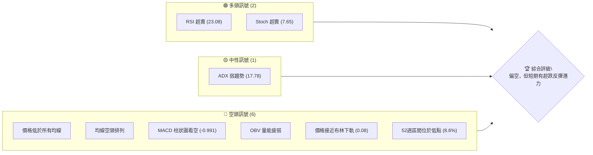
**儀表板解讀**：目前多頭訊號主要來自於RSI和Stochastics的超賣狀態，暗示短期內可能存在技術性反彈需求。然而，絕大多數核心指標，包括移動平均線、MACD、OBV以及價格相對於52週區間的位置，都明確指向強烈的空頭趨勢。ADX顯示當前趨勢強度較弱，可能意味著下跌速度有所放緩或進入低位盤整，但並未改變其空頭主導的本質。

### 📊 核心指標速覽表

| 指標類別 | 指標名稱 | 當前數值 | 訊號 | 解讀 |
|----------|----------|----------|------|------|
| **價格** | 當前價格 | $47.21 | 🔴 | 位於52週區間底部，接近歷史低點 |
| **均線** | MA20 | $56.18 | 🔴 | 價格遠低於MA20，短期趨勢強烈看空 |
| **均線** | MA50 | $58.75 | 🔴 | 價格遠低於MA50，中期趨勢強烈看空 |
| **均線** | MA200 | $79.62 | 🔴 | 價格遠低於MA200，長期趨勢強烈看空 |
| **動能** | RSI(14) | 23.08 | 🟢 | 嚴重超賣，暗示短期反彈潛力 |
| **動能** | MACD | -3.242 | 🔴 | MACD線在訊號線下方，柱狀圖為負，動能看空 |
| **波動** | ATR | $3.30 | 🟡 | 佔價格7.00%，波動性中等偏高 |
| **趨勢** | ADX(14) | 17.78 | 🟡 | 趨勢強度較弱，可能處於盤整或趨勢減緩階段 |
| **成交量**| 量比(20日) | 4.97x | 🔴 | 今日成交量顯著放大，伴隨價格大跌，顯示強烈賣壓或恐慌性拋售 |

### 🏆 技術評分卡

```
╔══════════════════════════════════════════════════════════════╗
║                技術評分卡 — KTOS (2026-06-28)                ║
╠══════════════════════════════════════════════════════════════╣
║ 趨勢強度      ███░░░░░░░░░░░░░░░░░░  15/100  🔴 (ADX弱趨勢，但方向明確向下) ║
║ 動能指標      ████░░░░░░░░░░░░░░░░  20/100  🔴 (MACD看空，RSI超賣僅為短期) ║
║ 支撐穩定度    ██████░░░░░░░░░░░░░░  30/100  🔴 (接近52W低點，支撐面臨考驗) ║
║ 成交量配合    ██░░░░░░░░░░░░░░░░░░  10/100  🔴 (巨量下跌，量價配合看空)   ║
║ 形態完整度    ████░░░░░░░░░░░░░░░░  20/100  🔴 (缺乏底部反轉形態)         ║
║ 均線排列      █░░░░░░░░░░░░░░░░░░░░  05/100  🔴 (極度空頭排列)           ║
╠══════════════════════════════════════════════════════════════╣
║ 綜合評分      ████░░░░░░░░░░░░░░░░  20/100  🔴 偏空                   ║
╚══════════════════════════════════════════════════════════════╝
```
**評分卡解讀**：KTOS的技術面評分極低，整體趨勢、動能和均線排列均呈現強烈空頭訊號。儘管RSI和Stochastics顯示超賣，提供了短期反彈的可能性，但這並不足以扭轉整體看跌的局面。成交量配合巨量下跌，進一步確認了市場的恐慌情緒和賣壓。在缺乏明確底部形態和穩固支撐的情況下，市場情緒極為脆弱。

---

## 2. 趨勢分析

### 🌐 多時框趨勢分析

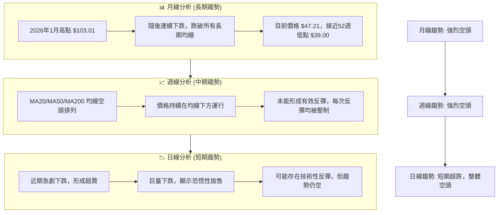
**多時框趨勢解讀**：KTOS在月線、週線和日線層面均呈現清晰的空頭趨勢。從2026年1月高點 $103.01 至今，股價已腰斬。長期來看，價格已跌破所有關鍵移動平均線，且均線呈現標準的空頭排列。中期週線圖顯示，每次嘗試反彈均遭遇賣壓，未能有效突破阻力。短期日線圖則呈現急劇下跌後的超賣狀態，伴隨巨量拋售，這可能預示著短期內存在反彈的機會，但這僅限於技術性修正，並非趨勢反轉。

### 📈 長期趨勢 — 12個月走勢圖（Unicode）

```
KTOS 月線走勢圖（過去12個月：2025-07 至 2026-06）
價格軸 ($)
$103.01 ┤                                ● (2026-01 高點)
$91.37  ┤                     ● ● (2025-09 高點)
$75.00  ┤                                    ●
$65.84  ┤           ●
$58.70  ┤ ●
$47.21  ┤                                            ● (現在價格)
$39.00  ┤                                        ● (52W 低點)
        └────────────────────────────────────────────
         25/07 25/08 25/09 25/10 25/11 25/12 26/01 26/02 26/03 26/04 26/05 26/06
```
**走勢特徵分析表格**：

| 時間段 | 起始價 | 結束價 | 漲跌幅 | 走勢特徵 | 訊號 |
|--------|--------|--------|--------|----------|------|
| 2025-07至2026-01 | $58.70 | $103.01 | +75.49% | 強勁上升趨勢，創出階段新高 | 🟢 |
| 2026-01至2026-06 | $103.01 | $47.21 | -54.17% | 急劇下跌趨勢，跌破所有關鍵支撐 | 🔴 |
| 2026-05至2026-06 | $64.13 | $47.21 | -26.38% | 短期加速下跌，逼近52週低點 | 🔴 |

**長期趨勢解讀**：KTOS在過去12個月經歷了從強勁上升到急劇下跌的劇烈轉變。從2025年7月的 $58.70 上漲至2026年1月的 $103.01，漲幅超過75%，顯示出強勁的多頭動能。然而，自2026年1月以來，股價開始斷崖式下跌，連續數月收陰，至2026年6月已跌至 $47.21，跌幅高達54.17%。這一走勢表明長期趨勢已從多頭完全轉為空頭，且目前的下跌趨勢仍在持續，並未出現明確的止跌跡象。

### 📊 中期趨勢（週線分析）

```
KTOS 週線壓力與支撐示意圖 (近期)
$90.00 ┤                                  R (前高阻力)
$80.00 ┤
$70.00 ┤                     R (MA200阻力)
$60.00 ┤            R (MA50阻力)
$56.18 ┤            R (MA20阻力)
$50.00 ┤
$47.21 ├───────────────────● (現價)
$45.00 ┤                    S (布林下軌支撐)
$40.00 ┤                S (52W低點支撐)
        └────────────────────────────────
```
**中期趨勢解讀**：從週線圖來看，KTOS的中期趨勢呈現明確的下跌通道。價格已連續數週運行在所有中期移動平均線（MA20、MA50、MA200）下方，且這些均線均呈現向下發散的空頭排列，形成強勁的動態阻力。最近的價格走勢顯示，每次反彈至MA20或MA50附近，都會遭遇強烈賣壓而回落。目前價格 $47.21 遠低於週線級別的MA20 ($56.18) 和MA50 ($58.75)，顯示中期空頭力量佔據主導地位。

### ⚡ 趨勢強度評估（ADX 解讀）

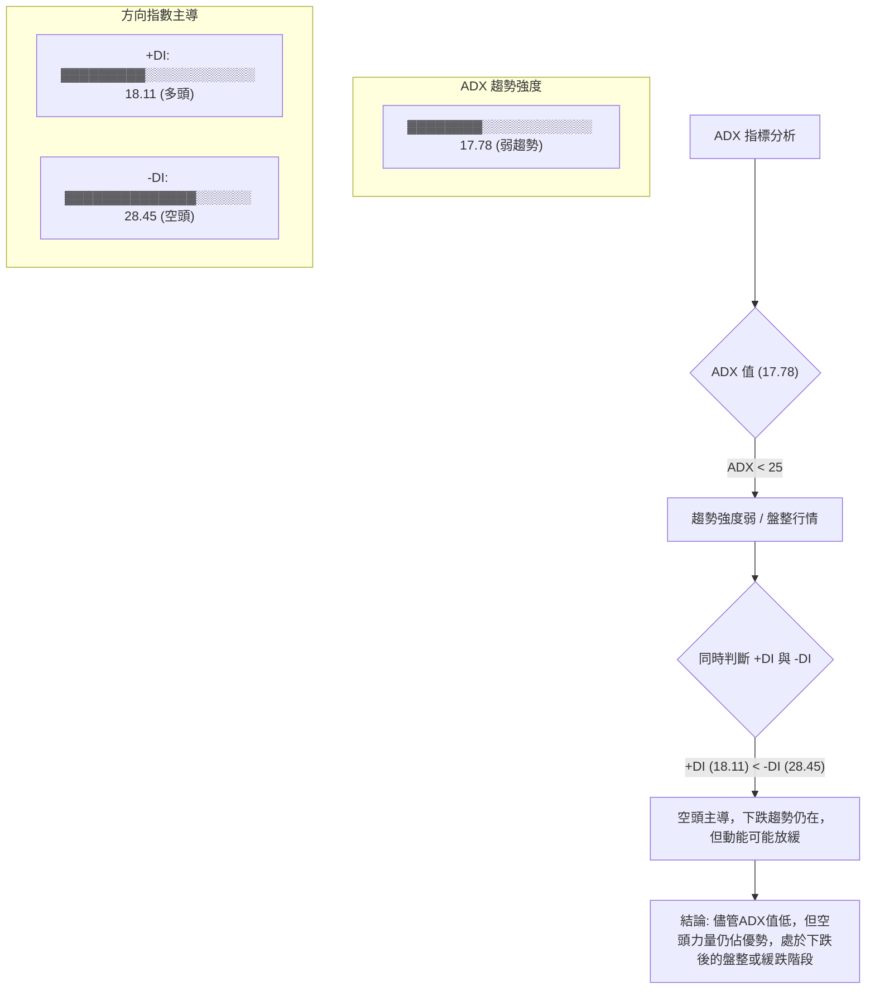
**ADX 對照表**：

| ADX 數值 | 趨勢強度 | 市場性質 |
|----------|----------|----------|
| 0-25     | 弱趨勢   | 盤整/震盪 |
| 25-50    | 中等趨勢 | 趨勢行情 |
| 50-75    | 強趨勢   | 強勁趨勢 |
| 75-100   | 極強趨勢 | 極端趨勢 |

**ADX 解讀**：KTOS的ADX(14)數值為17.78，根據ADX對照表，這表明當前市場處於「弱趨勢」或「盤整行情」。這可能意味著股價在經歷大幅下跌後，下跌的動能有所減弱，或者正在低位尋求一個臨時的平衡點。然而，我們不能孤立地看待ADX。同時觀察方向指數（DI），-DI(28.45)顯著高於+DI(18.11)，這明確指出市場仍由空頭力量主導。因此，雖然ADX值較低，但這不是趨勢反轉的訊號，而是表示在強烈空頭趨勢之後，市場可能進入了下跌速度放緩或低位震盪的階段，但整體方向依然向下。

---

## 3. 圖表形態分析

### 🔍 形態識別系統

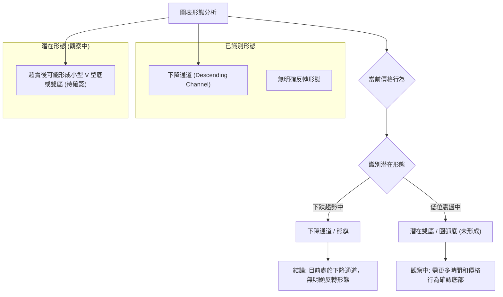
**形態識別解讀**：KTOS的股價自2026年1月高點 $103.01 以來，一直運行在一個清晰的下降通道中。儘管近期價格急劇下跌至超賣區，但目前尚未形成任何明確的底部反轉形態，如雙底、頭肩底或圓弧底。最近的K線組合顯示出強烈的賣壓，缺乏多頭承接的跡象。因此，當前的主導形態是下降通道的延續，潛在的超賣反彈可能形成小型底部結構，但需要更多的時間和價格行為來確認。

### 🕯️ 重要K線形態分析

| 月份 | 收盤價 | K線形態 | 解讀 | 訊號 |
|------|--------|---------|------|------|
| 2026-02-15 | $89.06 | 陰線 | 階段性下跌開始 | 🔴 |
| 2026-02-22 | $96.08 | 陽線 | 短暫反彈，未能突破阻力 | 🟡 |
| 2026-03-01 | $86.18 | 大陰線 | 賣壓加劇，確認下跌趨勢 | 🔴 |
| 2026-03-29 | $71.94 | 大陰線 | 跌破關鍵支撐，恐慌拋售 | 🔴 |
| 2026-04-26 | $61.26 | 大陰線 | 延續下跌，空頭強勢 | 🔴 |
| 2026-05-31 | $64.13 | 大陽線 | 嘗試反彈，但量能持續性不足 | 🟢 |
| 2026-06-28 | $47.21 | 巨量大陰線 | 恐慌性拋售，可能出現短期超跌反彈 | 🔴 |

**K線形態解讀**：近期的K線走勢顯示，KTOS在經歷2026年5月底的短暫反彈（$64.13）後，於6月再次遭遇重挫。最新一週（截至2026-06-28）收出一根帶有巨量的大陰線，收盤價 $47.21 跌破了前期多個支撐位。這種巨量下跌的K線形態通常代表著市場的恐慌性拋售，或稱為「投降式拋售」(Capitulation)。雖然這種形態極度看空，但在極端超賣的情況下，有時也預示著短期內可能出現技術性反彈，因為賣壓可能在短期內耗盡。然而，這並不代表趨勢的反轉，而更多是短期情緒的釋放。

### 📉 ASCII 走勢形態示意圖

```
KTOS 下降通道示意圖 (自2026-01高點)
價格軸 ($)
$103.01 ┤●───────────────┐ (通道上軌)
$90.00  ┤  ╲                │
$80.00  ┤   ╲               │
$70.00  ┤    ╲              │
$60.00  ┤     ╲             │
$50.00  ┤      ╲            │
$47.21  ├───────●─────────┤ (現價)
$45.00  ┤        ╲          │
$39.00  ┤         ●───────┘ (通道下軌 / 52W低點)
        └───────────────────
         時間軸
```
**走勢形態示意圖解讀**：KTOS的股價自2026年1月高點 $103.01 以來，一直運行在一個清晰的下降通道中。通道上軌由近期的高點連接形成阻力線，而通道下軌則連接了近期的低點，形成支撐線。目前股價 $47.21 正接近下降通道的下軌，同時也接近52週低點 $39.00。這種形態表明股價在未來一段時間內很可能繼續在該通道內震盪下行，直到有足夠的買盤力量突破上軌或在下軌處形成明確的反轉形態。當前接近下軌的位置，可能預示著短期內會遇到支撐或出現超跌反彈，但通道的壓力依然存在。

### 🎯 形態目標價計算

由於目前股價處於下降通道中，且未形成明確的反轉形態，因此主要以通道延伸和支撐阻力位作為目標價判斷依據。

**下降通道下沿目標價**：
- 假設下降通道以 $103.01 為頂點，下沿在 $39.00 附近（52週低點）。
- 由於價格已跌破多個關鍵支撐，並處於下降通道的下沿，若跌破 $39.00，則下一目標價將根據通道的垂直高度進行估算。
- **形態高度 (約)**：從 $103.01 (2026-01) 到 $39.00 (52W Low) 的跌幅為 $64.01。
- **目標價計算**：若 $39.00 支撐被有效跌破，則根據下降通道的延伸，下一個潛在的支撐位可能在 $39.00 - (通道寬度的一半或更多)。
    - **情境一：跌破52週低點 $39.00**
        - 若 $39.00 被有效跌破，下一潛在支撐位可能位於 $30.00 - $35.00 區間，這需要參考更長期的歷史數據或心理關口。
        - 考慮到ATR $3.30，若跌破 $39.00，則可能下跌 $3.30 至 $35.70 作為短期目標。
    - **情境二：短期超跌反彈目標**
        - 若在 $39.00 - $45.44 區間形成底部並反彈，首個目標是回補近期跌幅，挑戰前期阻力。
        - 目標價 T1 (短期反彈)：$56.18 (MA20 / 布林中軌)
        - 目標價 T2 (中期反彈)：$68.52 (斐波那契38.2%回調位)

**結論**：目前股價 $47.21 處於下降通道的下沿，並未形成明確的反轉形態。因此，主要風險是繼續下行，跌破52週低點 $39.00。若出現短期反彈，其目標價也將受到上方強勁阻力的限制。

---

## 4. 支撐與阻力

### 🗺️ 關鍵價位分布圖（Unicode）

```
KTOS 價位結構分布圖 (2026-06-28)
═══════════════════════════════════════════════════
$79.62 ║████████████████████████║ 強阻力 R3 (MA200)
$66.92 ║████████████████████    ║ 阻力 R2 (布林上軌)
$58.75 ║████████████████████████║ 關鍵阻力 R1 (MA50)
$56.18 ║▓▓▓▓▓▓▓▓▓▓▓▓▓▓▓▓        ║ 關鍵阻力 R1 (MA20 / 布林中軌)
$47.21 ╠════════════════════════╣ ◄ 現價
$45.44 ║▓▓▓▓▓▓▓▓▓▓▓▓▓▓▓▓        ║ 近期支撐 S1 (布林下軌)
$39.00 ║████████████████████████║ 強支撐 S2 (52週低點)
═══════════════════════════════════════════════════
```
**價位結構解讀**：KTOS目前股價 $47.21 位於所有關鍵移動平均線下方，並接近布林通道下軌和52週低點。這顯示上方阻力重重，而下方支撐則顯得較為脆弱。

### 🚧 阻力位分析表

| 阻力級別 | 價位 | 形成原因 | 突破難度 | 重要性 |
|----------|------|----------|----------|--------|
| **R1 (短期)** | $56.18 | MA20 / 布林中軌 | 中等偏高 | 🟡 |
| **R1 (短期)** | $58.75 | MA50 | 高 | 🔴 |
| **R2 (中期)** | $66.92 | 布林上軌 / 前期整理區間高點 | 高 | 🔴 |
| **R3 (長期)** | $79.62 | MA200 | 極高 | 🔴 |

**阻力位解讀**：KTOS面臨強勁的上方阻力。首要阻力位於MA20和布林中軌的 $56.18，這是短期反彈的首個考驗。若能突破，MA50的 $58.75 將構成更強的阻力。中期來看，布林上軌 $66.92 和前期整理區間的高點將形成第二道防線。最為關鍵的長期阻力是MA200的 $79.62，突破此位才可能宣告長期趨勢的反轉，但目前看來遙不可及。價格在所有主要均線下方運行，顯示空頭主導，任何反彈都可能在這些阻力位遭遇強勁賣壓。

### 🛡️ 支撐位分析表

| 支撐級別 | 價位 | 形成原因 | 守住機率 | 重要性 |
|----------|------|----------|----------|--------|
| **S1 (短期)** | $45.44 | 布林下軌 | 中等 | 🟡 |
| **S2 (關鍵)** | $39.00 | 52週低點 | 中等偏低 | 🔴 |
| **S3 (心理)** | $35.00 | 整數關口 / 潛在通道下沿延伸 | 低 | 🔴 |

**支撐位解讀**：KTOS目前的股價 $47.21 已接近其短期支撐位布林下軌 $45.44。更為關鍵的支撐是52週低點 $39.00。這個價位具有重要的心理意義，如果被有效跌破，可能會引發更深層次的恐慌性拋售，並開啟新的下跌空間。由於目前股價位於歷史相對低位，且超賣嚴重，理論上 $39.00 應具備一定的支撐作用。然而，在強烈的空頭趨勢和巨量下跌背景下，任何支撐都可能面臨嚴峻考驗。跌破 $39.00 後，下一潛在支撐將是 $35.00 甚至更低。

### 📐 斐波那契回調位分析

我們將從近期高點 $103.01 (2026-01) 到目前的低點 $47.21 進行斐波那契回調分析，以評估潛在反彈的目標價位。

- **高點 (H)**: $103.01
- **低點 (L)**: $47.21
- **跌幅 (Range)**: $103.01 - $47.21 = $55.80

| 斐波那契回調位 | 價位計算 (L + Range * %回調) | 意義 | 訊號 |
|----------------|--------------------------------|------------------------------------|------|
| **23.6% 回調** | $47.21 + ($55.80 * 0.236) = $60.39 | 短期反彈阻力，接近MA50 | 🟡 |
| **38.2% 回調** | $47.21 + ($55.80 * 0.382) = $68.52 | 中期反彈阻力，接近布林上軌 | 🔴 |
| **50% 回調**   | $47.21 + ($55.80 * 0.500) = $75.11 | 強勁阻力位，需大量買盤突破 | 🔴 |
| **61.8% 回調** | $47.21 + ($55.80 * 0.618) = $81.69 | 長期反轉關鍵，接近MA200 | 🔴 |

```
KTOS 斐波那契回調位示意圖 (高點 $103.01 至 現價 $47.21)
價格軸 ($)
$103.01 ┤───────────────────────────● (近期高點)
$90.00  ┤
$81.69  ┤───────────── R (61.8% 回調)
$75.11  ┤───────────── R (50% 回調)
$68.52  ┤───────────── R (38.2% 回調)
$60.39  ┤───────────── R (23.6% 回調)
$50.00  ┤
$47.21  ├───────────────────────────● (現價)
        └───────────────────────────
         時間軸
```
**斐波那契回調解讀**：斐波那契回調分析顯示，即使KTOS能夠從目前的超賣狀態中反彈，其上方也將面臨多重阻力。23.6%回調位 $60.39 接近MA50，將是短期反彈的初步考驗。更為重要的阻力位於38.2%回調位 $68.52 和50%回調位 $75.11，這些區域若能突破，才可能意味著更強勁的反彈。由於目前股價處於歷史低位，且空頭趨勢強勁，這些回調位在短期內將構成巨大的壓力，任何反彈都可能在這些區域遇阻。

---

## 5. 技術指標深度解讀

### 🎛️ 指標訊號總覽

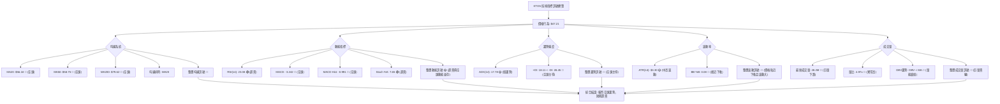
**指標訊號總覽解讀**：KTOS的技術指標呈現出一個非常清晰的空頭市場格局。移動平均線系統完全空頭排列，價格遠低於所有均線，顯示長期、中期、短期趨勢均向下。動能指標RSI和Stochastics雖然顯示嚴重超賣，暗示短期有反彈需求，但MACD則明確指示空頭動能強勁。ADX雖顯示趨勢強度較弱，但結合+DI和-DI，確認空頭主導。布林通道顯示價格緊貼下軌，波動性中高。最值得注意的是，今日成交量異常放大，伴隨價格大跌，顯示市場出現恐慌性拋售。綜合來看，多頭訊號僅限於短期超賣，而空頭訊號則全面且強勁。

### 📈 移動平均線排列分析

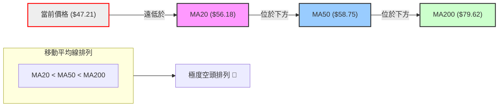
**移動平均線走勢進度條**：

MA 5: █████████░░░░░░░░░░░░ (-3.01% below current price)
MA 10: █████████░░░░░░░░░░░░ (-10.05% below current price)
MA 20: ████████░░░░░░░░░░░░░░ (-15.97% below current price)
MA 60: ███████░░░░░░░░░░░░░░░ (-22.47% below current price)
MA120: ██████░░░░░░░░░░░░░░░░ (-39.88% below current price)
MA240: ██████░░░░░░░░░░░░░░░░ (-38.50% below current price)

**移動平均線排列分析解讀**：KTOS的移動平均線系統呈現出教科書般的「極度空頭排列」。短期均線MA5 ($48.67)、MA10 ($52.48)、MA20 ($56.18) 均位於中期均線MA50 ($58.75) 之下，而MA50又位於長期均線MA200 ($79.62) 之下。當前股價 $47.21 更是遠遠低於所有這些均線。這種排列是強烈下跌趨勢的明確訊號，表明多頭力量已被完全壓制，空頭力量佔據絕對主導地位。每一條均線都構成了股價上漲的強勁動態阻力。

### 📉 RSI(14) 分析

**RSI(14) 數值**：23.08
**超買超賣區間**：
- 超買區：RSI > 70
- 超賣區：RSI < 30
**當前狀態**：RSI 23.08，位於超賣區 🟢

**RSI 強度進度條**：
RSI(14): ▓▓▓▓▓░░░░░░░░░░░░░░░░ (23.08)

**RSI 背離判斷**：
- **無明顯背離**：根據提供的數據，價格在近期持續下跌，RSI也隨之走低，並未出現價格創新低而RSI不創新低（底背離）或價格創新高而RSI不創新高（頂背離）的情況。

**RSI 分析解讀**：KTOS的RSI(14)值為23.08，顯著低於30的超賣區門檻。這是一個強烈的超賣訊號，表明股價在短期內下跌過快，可能存在技術性反彈的需求。從歷史經驗來看，RSI進入超賣區後，股價有較大概率出現暫時性的反彈或止跌盤整。然而，需要注意的是，在強烈的空頭趨勢中，RSI可能在超賣區停留較長時間，甚至進一步探底，因此超賣本身並不能直接作為趨勢反轉的依據，僅能作為短期反彈的潛在觸發點。目前沒有觀察到RSI與價格之間存在明顯的底背離，這意味著短期反彈的力度和持續性仍有待觀察。

### 📊 MACD(12/26/9) 訊號解讀

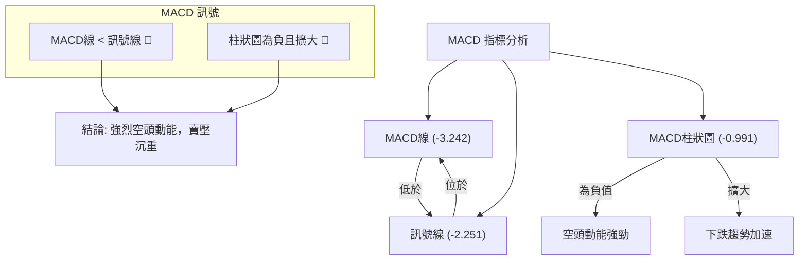
**MACD 訊號進度條**：
MACD 線:    █████████░░░░░░░░░░░░ (-3.242)
MACD Signal:██████████░░░░░░░░░░░░ (-2.251)
MACD Hist:  ██████░░░░░░░░░░░░░░░░ (-0.991)

**MACD 分析解讀**：KTOS的MACD指標顯示出強烈的空頭訊號。MACD線 (-3.242) 明顯低於其訊號線 (-2.251)，這是一個典型的看跌交叉，表明短期動能弱於中期動能。MACD柱狀圖為負值 (-0.991)，且根據近期數據，其負值在擴大（從上一週的 +0.144 轉為 -0.159，再到本週的 -0.991），這顯示空頭動能正在增強，賣壓沉重。MACD並未出現底背離現象（即價格創新低，但MACD不創新低），因此目前MACD指標完全確認了股價的下跌趨勢，並未提供任何趨勢反轉的早期訊號。

### 📦 布林通道分析

```
KTOS 布林通道示意圖 (2026-06-28)
價格軸 ($)
$70.00 ┤
$66.92 ┤───────────────┐ (布林上軌 BB上)
$60.00 ┤                │
$56.18 ┤───────────────┤ (布林中軌 BB中 / MA20)
$50.00 ┤                │
$47.21 ├────────────────● (現價)
$45.44 ┤───────────────┘ (布林下軌 BB下)
$40.00 ┤
        └────────────────
         時間軸
```
**布林通道分析解讀**：KTOS的股價 $47.21 目前位於布林通道的下軌 $45.44 附近，BB %B 值為0.08，這表明價格極度接近下軌。這種情況通常暗示兩種可能：一是股價已經超跌，可能會在下軌獲得支撐並出現反彈或盤整；二是如果空頭力量極其強勁，價格可能沿著下軌運行甚至跌破下軌，開啟更深的下跌。目前的布林通道寬度較大（上軌 $66.92 - 下軌 $45.44 = $21.48），ATR高達 $3.30，顯示市場波動性較高。結合價格緊貼下軌，這是一個極端走勢訊號，需要密切關注下軌的支撐作用。

### 💹 成交量分析（量價配合度）

| 指標 | 數值 | 解讀 | 訊號 |
|------|------|------|------|
| 最新成交量 | 28,193,500 | 巨量 | 🔴 |
| 20日均量 | 5,673,755 | 正常 | 🟡 |
| 量比 (最新/20日) | 4.97x | 異常高 | 🔴 |
| OBV趨勢 | OBV < MA | 量能疲弱 | 🔴 |

**成交量分析解讀**：KTOS在2026年6月28日的最新成交量高達28,193,500股，是其20日均量5,673,755股的近5倍 (4.97x)。如此巨大的成交量伴隨著股價的大幅下跌，是一個非常強烈的空頭訊號。這種「巨量下跌」通常被解讀為市場出現恐慌性拋售或「投降式拋售」(Capitulation)，顯示大量投資者不計成本地離場。雖然在某些情況下，巨量下跌可能預示著短期賣壓的耗盡，從而引發超跌反彈，但其本質仍是空頭力量的極度宣洩，對股價的負面影響巨大。OBV趨勢顯示OBV低於其移動平均線，進一步確認了量能的疲弱和空頭的累積。

---

## 6. 動能與波動率

### ⚡ 動能評估四象限

| 象限 | 動能 | 波動 | 當前狀態 | 評估 |
|------|------|------|----------|------|
| Q1 | 強 | 低 | - | 最佳機會 (趨勢明確，風險可控) |
| Q2 | 弱 | 低 | - | 謹慎觀望 (缺乏方向，風險低) |
| Q3 | 強 | 高 | - | 高風險高收益 (趨勢明確，波動大) |
| Q4 | 弱 | 高 | ✓ | 避免進場 / 謹慎操作 (方向不明或趨勢末端，波動大) |

**動能評估解讀**：KTOS目前的動能評估結果為「弱動能，高波動」，屬於Q4象限。
- **動能**：RSI和Stochastics雖然超賣，但MACD顯示空頭動能強勁，且價格持續下跌，整體動能偏弱（指向上漲動能不足）。ADX值低也印證趨勢動能不強勁。
- **波動**：ATR(14)為 $3.30，佔當前價格 $47.21 的7.00%，這是一個相對較高的波動率。布林通道的寬度也較大，且價格緊貼下軌，進一步確認了高波動特性。
綜合來看，KTOS目前處於一個缺乏明確上漲動能但波動性較大的狀態。這通常是市場在經歷大幅下跌後，進入底部尋求或盤整的階段，伴隨著較大的不確定性。對於追逐趨勢的交易者而言，此時應避免進場，或者僅進行非常短期的超跌反彈交易，並嚴格控制風險。

### 📊 ATR 波動率分析

**ATR(14)**：$3.30
**佔價格比例**：$3.30 / $47.21 = 7.00%

**ATR 進度條**：
ATR(14): ▓▓▓▓▓▓▓▓▓▓▓▓▓▓░░░░░░ (7.00% of price) (中高波動)

**ATR 分析解讀**：KTOS的ATR(14)為 $3.30，佔當前股價 $47.21 的7.00%。這個比例顯示KTOS的每日波動幅度相對較大，屬於中高波動性股票。較高的ATR意味著股價在一天內的潛在漲跌幅較大，這對交易者而言既是機會也是風險。
- **止損距離建議**：對於波動性較大的股票，止損點的設置應考慮ATR。通常建議將止損設置在1到2倍ATR的距離。
    - **保守止損**：1 * ATR = $3.30。若進場，止損點可設在進場價下方 $3.30。
    - **激進止損**：0.5 * ATR = $1.65。
    - 考慮到當前價格接近52週低點 $39.00，一個合理的止損可能設在 $39.00 以下，例如 $38.50，這與當前價格 $47.21 之間約有 $8.71 的距離，約為 2.6 倍ATR。

### 📐 Beta 與市場相關性

根據提供的數據，KTOS的Beta值未直接給出。然而，Kratos Defense & Security Solutions, Inc. 作為一家國防和安全解決方案公司，其業務性質通常使其股價與整體大盤（如S&P 500）的相關性相對較低。國防產業的訂單和營收主要受政府預算和地緣政治事件影響，而非經濟週期。

- **一般情況下**：國防類股票的Beta值通常在0.8至1.2之間，可能略低於1，顯示其在市場波動時相對穩定。
- **當前情境推演**：儘管其產業特性可能提供一定的防禦性，但KTOS在過去幾個月的劇烈下跌，表明其目前受到公司特定因素或行業負面消息（未在數據中體現）的影響更大，而非單純的市場波動。因此，即使Beta值可能較低，也無法完全抵禦目前的強烈賣壓。
- **投資者需注意**：在缺乏具體Beta數據的情況下，應假定KTOS在當前環境下仍可能受到市場情緒的影響，但其主要驅動力來自公司基本面和行業特定因素。

---

## 7. 多時框架總結

### 📋 時框架評分表

| 時框架 | 趨勢方向 | 動能 | 均線排列 | 形態 | 綜合評分 | 建議 |
|--------|----------|------|----------|------|----------|------|
| **長期 (月線)** | 🔴 強烈空頭 | 🔴 負動能 | 🔴 空頭排列 | 🔴 下降通道 | 2/10 (極弱) | ⛔ 避免長線持有 |
| **中期 (週線)** | 🔴 強烈空頭 | 🔴 負動能 | 🔴 空頭排列 | 🔴 下降通道 | 2/10 (極弱) | ⛔ 避免中線進場 |
| **短期 (日線)** | 🔴 超跌空頭 | 🟡 超賣/負 | 🔴 空頭排列 | 🟡 潛在反彈 | 3/10 (弱) | ⚠️ 短期謹慎反彈交易 |

**時框架總結解讀**：KTOS在所有時間框架內均呈現出強烈的空頭趨勢。長期和中期趨勢均被移動平均線的空頭排列和清晰的下降通道所確認。動能指標在這些時間框架內也呈現負面。短期日線圖雖然顯示RSI和Stochastics處於超賣區，存在技術性反彈的可能性，但其背後的趨勢和均線排列仍是強烈的空頭。因此，對於長期和中期投資者而言，目前不具備入場價值；對於短期交易者，若要捕捉反彈，也需極度謹慎，並嚴格控制風險。

### 🔲 綜合訊號矩陣

```mermaid
graph TD
    A["KTOS 綜合訊號矩陣"] --> B["短期訊號 (日線)"]
    A --> C["中期訊號 (週線)"]
    A --> D["長期訊號 (月線)"]

    subgraph Short_Term ["短期 (日線)"]
        ST1["趨勢: 🔴 (超跌空頭)"]
        ST2["動能: 🟢 (RSI超賣)"]
        ST3["均線: 🔴 (空頭排列)"]
        ST4["形態: 🟡 (下降通道下沿)"]
    end

    subgraph Mid_Term ["中期 (週線)"]
        MT1["趨勢: 🔴 (強烈空頭)"]
        MT2["動能: 🔴 (MACD看空)"]
        MT3["均線: 🔴 (空頭排列)"]
        MT4["形態: 🔴 (下降通道)"]
    end

    subgraph Long_Term ["長期 (月線)"]
        LT1["趨勢: 🔴 (強烈空頭)"]
        LT2["動能: 🔴 (持續下跌)"]
        LT3["均線: 🔴 (空頭排列)"]
        LT4["形態: 🔴 (下降通道)"]
    end

    B --> S_Overall["短期綜合: 偏空，有反彈潛力 🟡"]
    C --> M_Overall["中期綜合: 強烈空頭 🔴"]
    D --> L_Overall["長期綜合: 強烈空頭 🔴"]

    S_Overall & M_Overall & L_Overall --> Final_Conclusion["最終結論: 全面空頭，短期超賣不改大趨勢 🔴"]
```
**綜合訊號矩陣解讀**：KTOS的綜合訊號矩陣清晰地揭示了其在所有時間框架內的空頭主導地位。短期日線層面，儘管RSI和Stochastics顯示超賣，為潛在的反彈提供了基礎，但其趨勢方向和均線排列仍是明確的空頭。中期週線和長期月線層面，所有指標均指向強烈的空頭趨勢，包括趨勢方向、動能、均線排列和圖表形態。這種高度一致的空頭訊號表明KTOS目前處於一個非常弱勢的地位。短期超賣僅為技術性修正的機會，並不足以扭轉整體下跌的趨勢。

---

## 8. 交易策略建議

### 🗺️ 策略決策流程圖

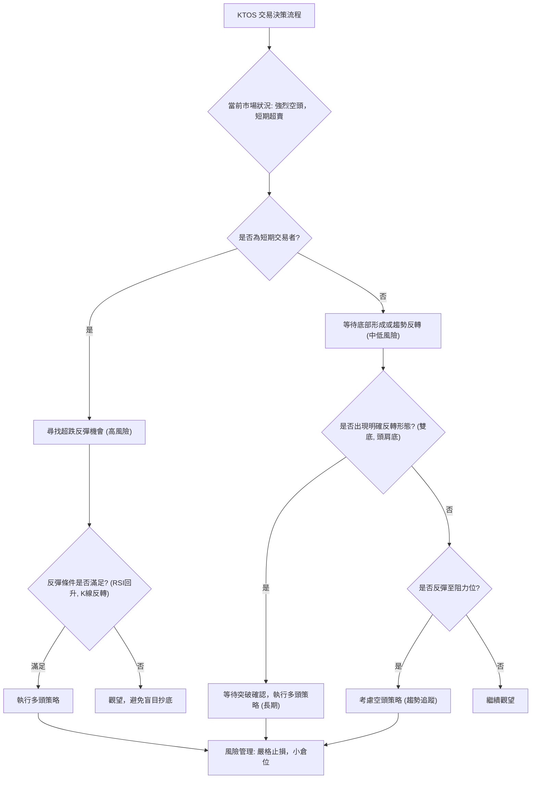
**策略決策解讀**：KTOS目前處於強烈的空頭趨勢中，但短期超賣。對於希望參與的交易者，需明確自身風險偏好和交易時框架。
1.  **短期激進交易者**：可考慮在極端超賣且出現明確止跌K線訊號後，進行高風險的超跌反彈交易。此策略的風險報酬比可能較高，但成功率較低，且需嚴格止損。
2.  **保守交易者或趨勢交易者**：應避免在當前階段進行多頭操作。更穩健的策略是等待股價企穩，形成明確的底部反轉形態，或等待股價反彈至關鍵阻力位時，考慮做空以順應大趨勢。

### 🟢 多頭策略詳情 (高風險：超跌反彈)

| 策略要素 | 策略 A：激進反彈捕捉 | 策略 B：保守反彈確認 |
|----------|----------------------|----------------------|
| 進場條件 | 價格在 $39.00-$45.44 區間獲得支撐，並出現明確的K線反轉形態（如錘子線、啟明星），RSI從超賣區回升。 | 價格突破短期下降趨勢線，並有效站穩在 $45.44 (布林下軌) 之上，成交量溫和放大。 |
| 進場價格 | $42.00 - $43.00 | $46.00 - $47.00 |
| 目標價 T1 | $56.18 (MA20 / 布林中軌) | $56.18 (MA20 / 布林中軌) |
| 目標價 T2 | $68.52 (斐波那契38.2%回調位) | $60.39 (斐波那契23.6%回調位) |
| 止損價格 | $38.50 (略低於52週低點 $39.00) | $44.00 (跌破布林下軌 $45.44 後的回撤) |
| 風險報酬比 | 若進場 $42.50，止損 $38.50 ($4 風險)，T1 $56.18 ($13.68 報酬) -> 1:3.42。T2 $68.52 ($26.02 報酬) -> 1:6.50。 | 若進場 $46.50，止損 $44.00 ($2.5 風險)，T1 $56.18 ($9.68 報酬) -> 1:3.87。T2 $60.39 ($13.89 報酬) -> 1:5.55。 |
| 成功機率 | 低 (約 30%) | 中低 (約 40%) |
| 建議倉位 | 2-5% (極小倉位) | 5-8% (小倉位) |

### 🔴 空頭策略詳情 (中風險：趨勢追蹤/反彈做空)

| 策略要素 | 策略 A：反彈做空 | 策略 B：跌破支撐追空 |
|----------|------------------|----------------------|
| 進場條件 | 等待價格反彈至關鍵阻力位（如MA20或MA50），未能突破並出現看跌K線形態。 | 價格有效跌破 $39.00 (52週低點)，並伴隨放量。 |
| 進場價格 | $56.00 - $58.00 (MA20/MA50阻力區間) | $38.50 - $38.80 (跌破 $39.00 後的反抽或確認) |
| 目標價 T1 | $39.00 (52週低點) | $35.00 (心理關口 / 趨勢延伸) |
| 目標價 T2 | $30.00 (根據歷史支撐或趨勢延伸) | $30.00 (根據歷史支撐或趨勢延伸) |
| 止損價格 | $60.00 (略高於MA50) | $40.00 (跌破 $39.00 後的反彈確認失敗) |
| 風險報酬比 | 若進場 $57.00，止損 $60.00 ($3 風險)，T1 $39.00 ($18 報酬) -> 1:6.00。T2 $30.00 ($27 報酬) -> 1:9.00。 | 若進場 $38.70，止損 $40.00 ($1.3 風險)，T1 $35.00 ($3.7 報酬) -> 1:2.85。T2 $30.00 ($8.7 報酬) -> 1:6.69。 |
| 成功機率 | 中高 (約 60%) | 中 (約 50%) |
| 建議倉位 | 8-12% (中等倉位) | 5-10% (小中倉位) |

### ⭐ 整體訊號強度評星

做多訊號強度：★★☆☆☆  (2/5星) (僅超賣，趨勢極弱)
做空訊號強度：★★★★☆  (4/5星) (趨勢明確，阻力重重)
整體可信度：  ★★★☆☆  (3/5星) (趨勢明確，但短期超賣帶來不確定性)

**評星解讀**：目前KTOS的做多訊號強度較低，主要依賴於RSI等指標的超賣狀態，但缺乏趨勢和形態的確認。做空訊號強度較高，因為所有時間框架均呈現空頭趨勢，且股價面臨重重阻力。整體可信度為中等，因為雖然大趨勢清晰，但短期超賣可能引發波動，增加短期交易的複雜性。

---

## 9. 風險提示與監控

### ✅ 關鍵監控指標 Checklist

```
╔══════════════════════════════════════════════════════════════╗
║              KTOS 關鍵監控指標 Checklist                     ║
╠══════════════════════════════════════════════════════════════╣
║ [ ] 價格是否有效跌破 $39.00 (52週低點)                      ║
║ [ ] 價格是否能站穩 $45.44 (布林下軌) 並形成底部形態           ║
║ [ ] RSI 是否從超賣區回升並突破30，且未出現底背離失效          ║
║ [ ] MACD 線是否上穿訊號線，且柱狀圖轉正                       ║
║ [ ] 成交量在下跌時是否縮小，或在反彈時是否能持續放大            ║
║ [ ] 均線系統是否出現金叉或收斂，改變空頭排列                  ║
║ [ ] 是否有任何基本面利好消息或分析師評級上調                  ║
║ [ ] 52週區間的波動率 (ATR) 是否出現顯著變化                   ║
╚══════════════════════════════════════════════════════════════╝
```

### ⚠️ 風險場景分析

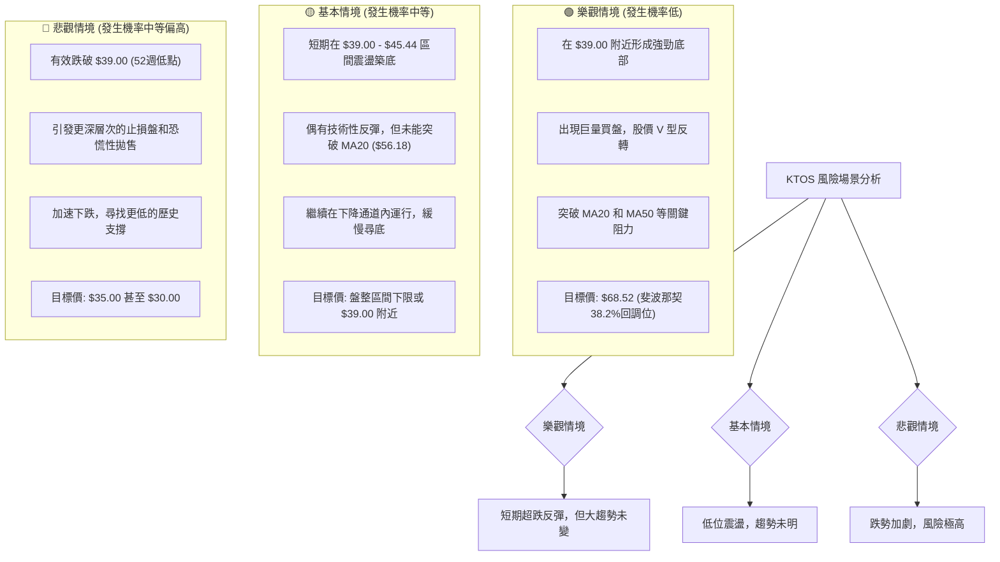
**風險場景分析解讀**：
- **樂觀情境**：KTOS在目前極端超賣的水平上，能在 $39.00 附近獲得強力支撐，並出現V型反轉或底部形態，伴隨巨量買盤推動股價突破短期阻力。這種情況在強烈空頭趨勢中發生的機率較低。
- **基本情境**：股價在 $39.00 - $45.44 區間進行低位盤整或震盪築底。可能會出現一些技術性反彈，但難以突破MA20或MA50等關鍵阻力，最終仍可能在下降通道內緩慢下行。
- **悲觀情境**：這是當前需要重點警惕的風險。如果 $39.00 的52週低點被有效跌破，將可能引發止損盤和更深層次的恐慌性拋售，導致股價加速下跌，下一目標可能指向 $35.00 甚至更低的心理關口。

### 🛡️ 風險管理重要提醒

1.  **嚴格止損**：無論採取何種策略，都必須設定明確且嚴格的止損點。在波動性高的市場中，止損是保護資本的關鍵。對於多頭策略，止損點應設在關鍵支撐位下方；對於空頭策略，止損點應設在關鍵阻力位上方。
2.  **倉位管理**：鑑於KTOS目前處於強烈的空頭趨勢且波動性較高，任何交易都應採用較小的倉位，尤其是在進行高風險的超跌反彈交易時。避免重倉或滿倉操作。
3.  **等待確認**：不要盲目抄底或逆勢操作。在考慮多頭策略時，務必等待明確的止跌訊號、K線反轉形態或成交量放大的買盤確認。對於空頭策略，等待反彈至阻力位遇阻的確認訊號。
4.  **多指標驗證**：綜合運用多個技術指標進行判斷，避免孤立使用單一指標。例如，RSI超賣應結合K線形態、成交量和支撐位共同判斷。
5.  **心理準備**：在這種極端趨勢中，市場情緒可能極不穩定。投資者應保持冷靜，避免情緒化交易，堅守交易紀律。
6.  **基本面關注**：儘管本報告為技術分析，但在實際投資中，仍需關注公司的基本面變化、行業新聞和分析師評級，以全面評估風險和機會。

---

## 📋 報告總結

```
╔═════════════════════════════════════════════════════════════════════════════╗
║                      KTOS 技術分析報告總結                                  ║
╠═════════════════════════════════════════════════════════════════════════════╣
║ 報告日期：2026-06-28                                                        ║
║ 當前價格：$47.21                                                            ║
║ 分析評級：⚖️ 偏空 (強烈空頭趨勢主導，短期超賣帶來反彈潛力，但風險極高)       ║
║                                                                             ║
║ 關鍵結論：                                                                  ║
║ ├─ 長期趨勢：🔴 強烈空頭。自2026年1月高點 $103.01 持續急劇下跌。             ║
║ ├─ 中期趨勢：🔴 強烈空頭。均線系統呈現標準空頭排列，價格遠低於所有均線。     ║
║ ├─ 短期趨勢：🔴 超跌空頭。RSI/Stochastics顯示嚴重超賣，存在短期反彈需求，但 MACD 和量價配合仍看空。 ║
║ ├─ 關鍵支撐：$45.44 (布林下軌), $39.00 (52週低點)。$39.00 是極為重要的心理和技術支撐。 ║
║ └─ 關鍵阻力：$56.18 (MA20/布林中軌), $58.75 (MA50), $68.52 (斐波那契38.2%)。上方阻力重重。 ║
║                                                                             ║
║ 最優策略組合：                                                              ║
║ 1. 🥇 **最佳機會 (趨勢追蹤)**：等待價格反彈至 $56.18 - $58.75 阻力區間未能突破時，考慮做空。止損設於 $60.00，目標價 $39.00、$35.00。風險報酬比優越。 ║
║ 2. 🥈 **次選機會 (底部確認)**：若價格有效跌破 $39.00，則考慮追空，目標 $35.00、$30.00。止損 $40.00。此策略風險較高，需快速反應。 ║
║ 3. 🥉 **保守選擇 (超跌反彈)**：極小倉位嘗試在 $40.00 - $43.00 區間捕捉超跌反彈，但需有明確K線反轉訊號和嚴格止損 $38.50。目標 $56.18。此策略風險極高，成功機率較低。 ║
╚═════════════════════════════════════════════════════════════════════════════╝
```

---

> ⚠️ **免責聲明**：本報告為 AI 自動生成之技術分析，所有數據及估算均基於提供的歷史價格資訊。本報告**僅供研究與學術參考**，**不構成任何投資建議**。投資有風險，入市需謹慎。

---

*報告生成時間：2026-06-28 ｜ 數據來源：Yahoo Finance ｜ 分析框架：多時框技術分析*