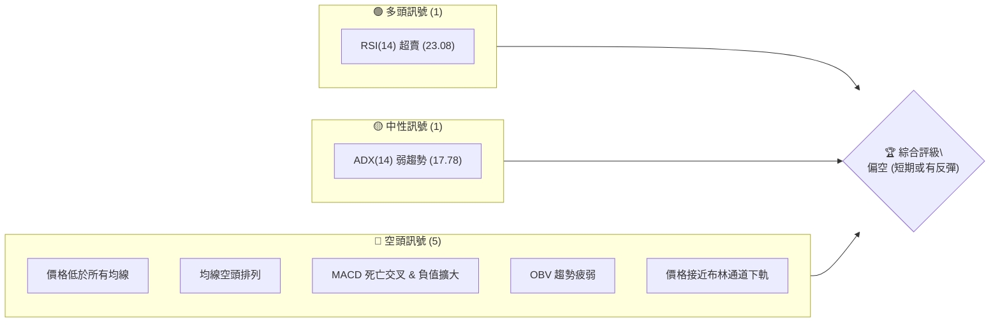
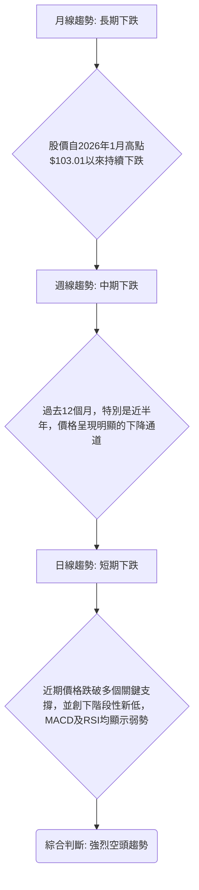
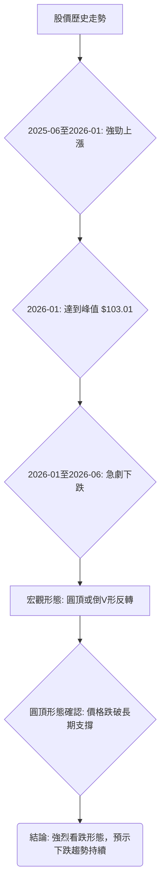
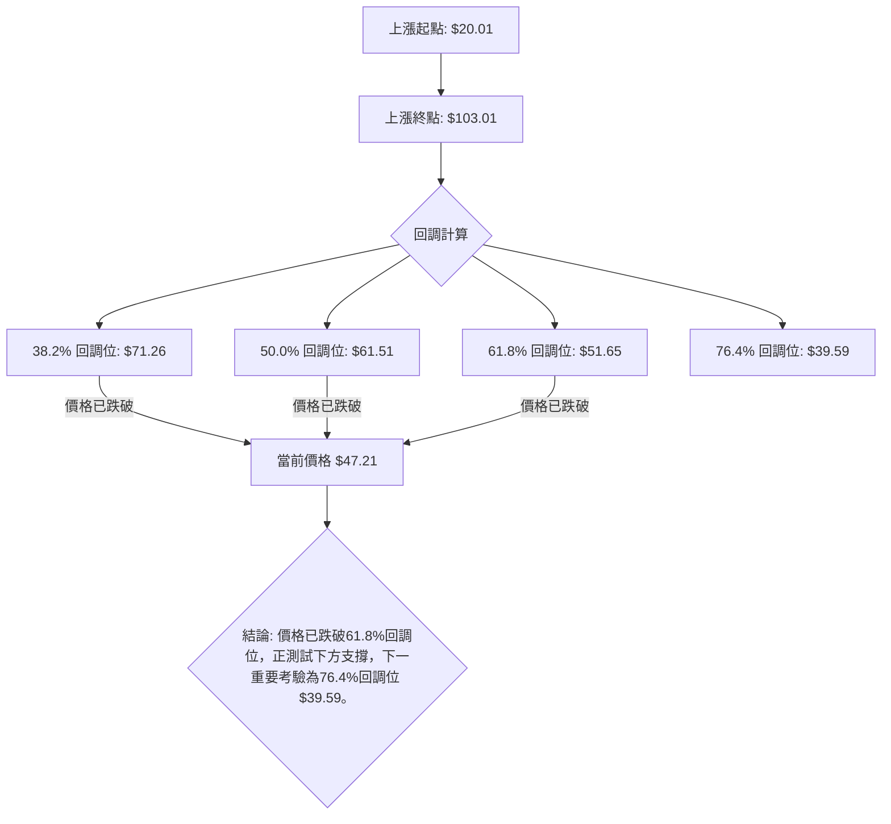
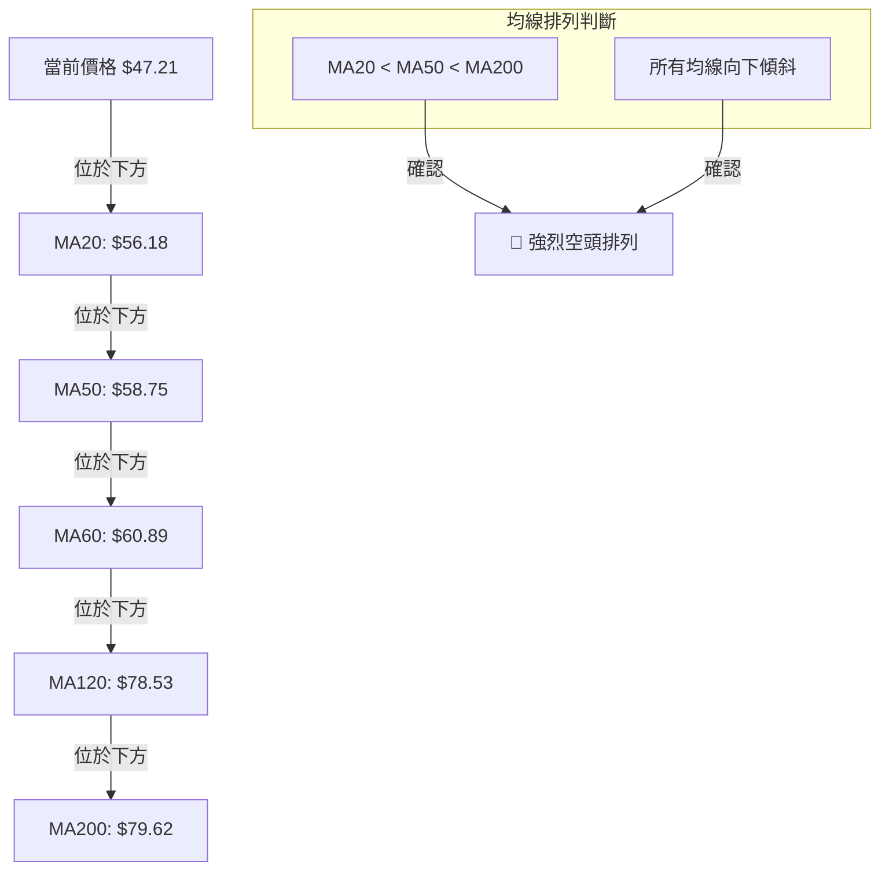
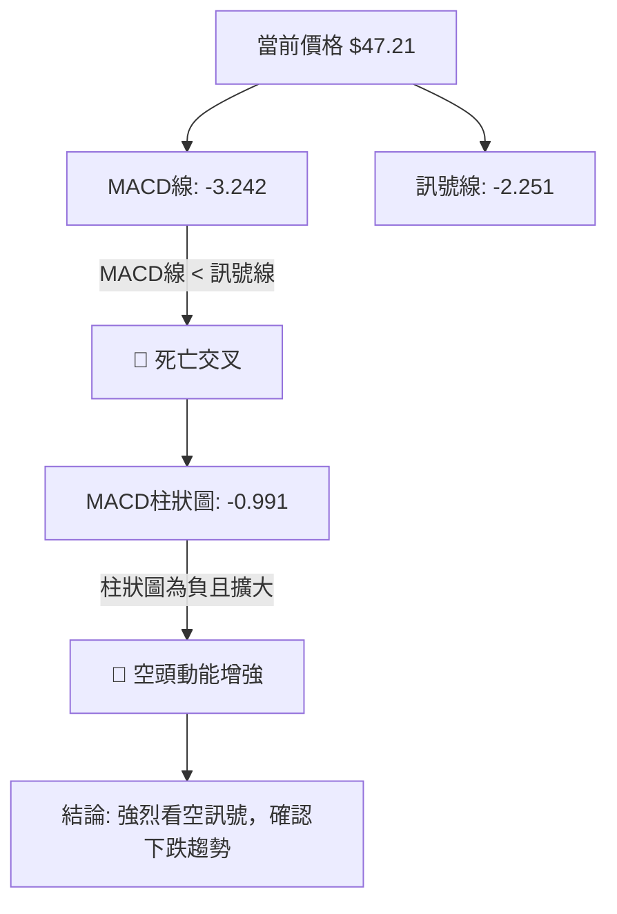
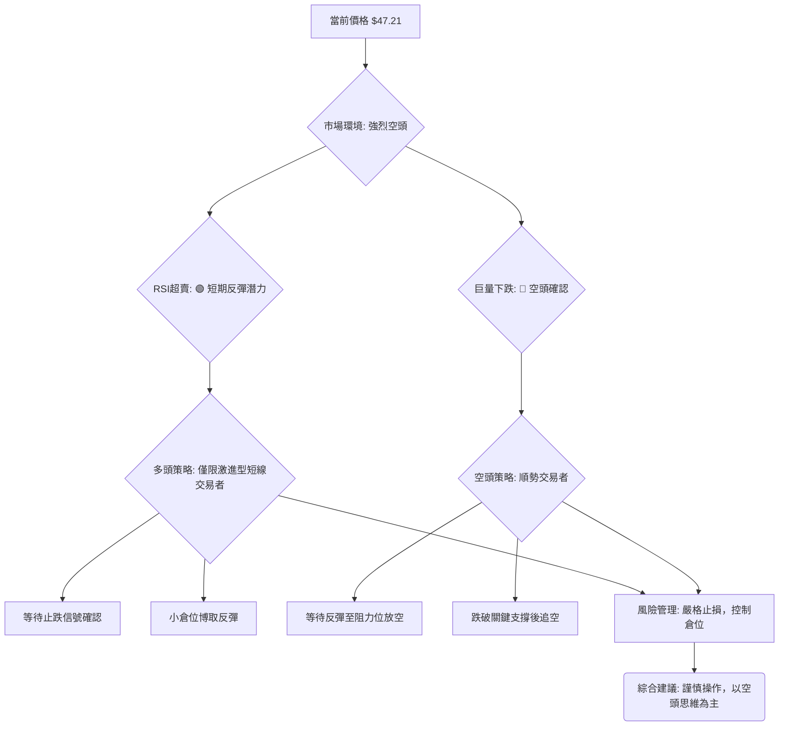

<details>
<summary>📊 靜態圖表 (點擊展開)</summary>

</details>

<html>
<head><meta charset="utf-8" /></head>
<body>
    <div style="height:500px; width:100%;">                        <script>window.PlotlyConfig = {MathJaxConfig: 'local'};</script>
        <script charset="utf-8" src="https://cdn.plot.ly/plotly-3.6.0.min.js" integrity="sha256-QaOVwtVY0T02VaHrr6pnoHLCwayMJp4O5n4YyaE3rJk=" crossorigin="anonymous"></script>                <div id="candlestick-chart" class="plotly-graph-div" style="height:100%; width:100%;"></div>            <script>                window.PLOTLYENV=window.PLOTLYENV || {};                                if (document.getElementById("candlestick-chart")) {                    Plotly.newPlot(                        "candlestick-chart",                        [{"close":{"dtype":"f8","bdata":"AAAAgD1qUEAAAABA4epQQAAAAMDMTFFAAAAAIFyvUUAAAABgZhZTQAAAACBc71JAAAAAoJkpVEAAAACgRzFUQAAAAIAULlRAAAAAoJn5VEAAAAAghUtUQAAAAMDMDFVAAAAAgOuRVUAAAADAHgVWQAAAACCu11ZAAAAAoHA9V0AAAACA68FXQAAAAAApDFhAAAAAAAAQWUAAAAAAKexZQAAAAEDhalpAAAAAQDOjWEAAAADgUahXQAAAAIDrEVhAAAAAQDPTV0AAAADAHqVWQAAAACCuJ1ZAAAAAIK7HVEAAAACgmalVQAAAACCup1ZAAAAAQDMTVUAAAADgelRWQAAAACCFy1ZAAAAAIIWrVkAAAACA63FWQAAAAKBwzVZAAAAAQDMTVkAAAABgZqZWQAAAAGBmxlZAAAAAgBSOVkAAAACAPVpTQAAAAIA9GlJAAAAA4FF4U0AAAAAghctTQAAAAIDCJVNAAAAAwMwsU0AAAAAAKexRQAAAAMDMHFJAAAAAIFyPUUAAAABACpdRQAAAAEDhqlFAAAAAANfTUEAAAADA9UhRQAAAAEAKh1JAAAAAQDPDUkAAAACgR\u002fFSQAAAAGBmBlNAAAAAoHBNUkAAAACgcL1RQAAAAIDrMVJAAAAAIIVrU0AAAAAAACBTQAAAAIDrQVNAAAAAgOtBU0AAAACAPTpTQAAAAIDrsVNAAAAAoHD9UkAAAADgo5BSQAAAAOBRSFJAAAAAoEdxUUAAAACgmdlRQAAAAMD12FJAAAAAgOthVEAAAABAM5NUQAAAAIAU\u002flNAAAAAwMxsU0AAAACAFF5TQAAAAGC4\u002flJAAAAAgD36UkAAAABgj9JTQAAAACCFe1ZAAAAAIIX7VkAAAAAAKdxWQAAAAGCPAlpAAAAAwMxsXEAAAABACnddQAAAAIAU7l1AAAAAAABgXkAAAAAA1yNfQAAAAEAKV2BAAAAAgMIVYEAAAACAwiVeQAAAAGBmdlxAAAAAwPWYW0AAAADgetRbQAAAAADXg11AAAAAQOEqXEAAAACAPQpbQAAAAOCjwFlAAAAAgD0KWEAAAAAgrtdZQAAAAMAe1VZAAAAAAABQVUAAAACAPZpXQAAAAADXs1hAAAAAYLheV0AAAACA6\u002fFVQAAAAEAzw1VAAAAAANdDVkAAAACAFP5WQAAAAKBwTVhAAAAAQOFqWkAAAADAHgVYQAAAAADXk1dAAAAAIIWrVkAAAABguA5WQAAAAMD1CFdAAAAAIIWLVUAAAACAFK5WQAAAAMDMPFZAAAAA4FFIVkAAAABgj2JVQAAAAAAAwFVAAAAAgBQeV0AAAACgcD1WQAAAAEDhOlZAAAAAoHBdVkAAAACA6+FVQAAAAIDrYVZAAAAAANfTV0AAAABgj0JXQAAAAIDrMVdAAAAAIK4nVUAAAAAAKexUQAAAACBcX1NAAAAAYLj+U0AAAABACvdSQAAAAAAp\u002fFFAAAAAgOtRUEAAAADgo6BRQAAAAMDM7FBAAAAAANfTUEAAAACAwoVSQAAAAKBw\u002fVFAAAAAoHCdUkAAAADAHhVRQAAAAIDClVFAAAAAQDNjUkAAAACAPWpSQAAAAIA9qlJAAAAAgD2aUkAAAAAgXL9RQAAAAMAedVFAAAAAQDMjUUAAAABACidRQAAAAKBHYVBAAAAAoEehTkAAAADgepRPQAAAAOB61E5AAAAAIK7HTUAAAABgZoZPQAAAAGBmBk9AAAAAQAr3TkAAAAAgrqdNQAAAAGCPwk5AAAAAAACATEAAAACA6\u002fFMQAAAAGC4fkxAAAAAgD2qTEAAAABguD5KQAAAAMDMbEtAAAAAIIULSkAAAAAAKRxLQAAAAAApvEpAAAAAwPXoS0AAAACAwlVLQAAAAEAKF0xAAAAAYGZmTEAAAABgZqZMQAAAAAApTFBAAAAA4FEIUEAAAABguL5PQAAAAGCPok9AAAAAQAo3TUAAAABAM7NPQAAAAGCPQk1AAAAAoHDdTEAAAADgURhMQAAAAMD1aEtAAAAAANdjTUAAAAAAAOBMQAAAAGCPgkxAAAAAIIUrTEAAAADgehRMQAAAAEDhGktAAAAAIIWLSUAAAABgZmZJQAAAAKCZ+UdAAAAAwPUoR0AAAABA4ZpHQA=="},"high":{"dtype":"f8","bdata":"AAAAAACwUEAAAADA9UhRQAAAAKBwbVFAAAAAANfTUUAAAAAgridTQAAAAIDrQVNAAAAAAClcVEAAAAAA15NUQAAAAOBRqFRAAAAAYLheVUAAAAAAAEBVQAAAAOBROFVAAAAAgMK1VUAAAABA4WpWQAAAACCu91ZAAAAAoEdhV0AAAACgmRlYQAAAACCuh1hAAAAAAADAWUAAAACgcC1aQAAAAADXk1pAAAAA4HokXEAAAACgmalZQAAAAAAAYFlAAAAAYGZGWEAAAAAgXJ9YQAAAAIDCJVdAAAAAoEehVUAAAACAFC5WQAAAAEAzs1ZAAAAAAACAVkAAAADAzHxWQAAAACCFO1dAAAAAYGamV0AAAADAzBxXQAAAACCud1dAAAAAAADAVkAAAACgmQlXQAAAAIAU7lZAAAAAgMLlVkAAAAAAAKBUQAAAAIAU3lNAAAAAYGaWU0AAAAAAAIBUQAAAACBcv1NAAAAAQOGKU0AAAACgmflSQAAAAKBHcVJAAAAAwMw8UkAAAAAAANBRQAAAACCFC1JAAAAAYLieUkAAAACAwlVRQAAAAAApnFJAAAAAIIULU0AAAABA4UpTQAAAACBcH1NAAAAAYGYmU0AAAABgZqZSQAAAAAAAQFJAAAAA4HqUU0AAAADgUYhTQAAAAOB6hFNAAAAAgD3qU0AAAACgcJ1TQAAAAIAU3lNAAAAAoJnZU0AAAABA4RpTQAAAAOBRqFJAAAAAIFyPUkAAAACAPRpSQAAAAGCP8lJAAAAAIK53VEAAAACAPdpUQAAAAAApfFRAAAAAgD36U0AAAACAFI5TQAAAAAApjFNAAAAAgBQ+U0AAAABguO5TQAAAAEAKh1ZAAAAAgOsBV0AAAADgetRXQAAAAEAzc1tAAAAAwMzcXEAAAADgUehdQAAAAOB6ZF5AAAAAoHD9XkAAAAAA15NfQAAAAAAAgGBAAAAAAADAYEAAAAAAAABgQAAAAEAzU15AAAAAgOvhXEAAAABA4WpcQAAAAMD1iF1AAAAAAAAAXkAAAADAzMxcQAAAAAAAMFtAAAAAwPVIWUAAAAAgXN9ZQAAAAAAAwFlAAAAAYGYmV0AAAABA4apXQAAAAIDr8VhAAAAAAADgWEAAAABAMyNYQAAAAIDCZVZAAAAAIFwPV0AAAABgZlZXQAAAAAAAIFlAAAAAgD16WkAAAABA4apaQAAAAMAexVdAAAAAIFzvVkAAAACA61FXQAAAAAApHFdAAAAAoJmZVUAAAABgZkZYQAAAAIAUTldAAAAAYGaGVkAAAAAgXF9WQAAAAOBRuFZAAAAAQOFqV0AAAABAMxNXQAAAAGC4vlZAAAAAIK7XVkAAAACgmflWQAAAAEAz81ZAAAAAYGbWV0AAAADgUThYQAAAAAAAoFdAAAAAAAAAV0AAAAAA15NVQAAAAKBHwVRAAAAAACk8VEAAAACA6+FTQAAAAOBRGFNAAAAAoJn5UUAAAACAFL5RQAAAAEAzM1JAAAAA4KNgUUAAAACAPZpSQAAAAKCZOVJAAAAAACncU0AAAAAAAKBSQAAAAIDroVFAAAAAYGaGUkAAAADgeiRTQAAAAGCPElNAAAAAgBROU0AAAADA9ThTQAAAAKBw7VFAAAAAoJm5UUAAAABguL5RQAAAACBcL1FAAAAA4KNwUEAAAAAghRtQQAAAAKCZWU9AAAAAoEfhTkAAAABACpdPQAAAAAAAwE9AAAAA4FEIUEAAAADAHmVPQAAAAGC43k5AAAAAwB7FTkAAAADgUfhMQAAAAEDh2kxAAAAA4KNQTUAAAAAAAEBMQAAAAAAp\u002fEtAAAAAQDPzSkAAAAAAKVxLQAAAACCFS0tAAAAA4KPwS0AAAAAA14NLQAAAAAAAYExAAAAAYGamTUAAAACAFK5MQAAAAMAetVBAAAAAAACwUEAAAADAzIxQQAAAAEAz009AAAAAwMzsTkAAAAAghctPQAAAAMDMDE9AAAAAAADgTUAAAABgZqZNQAAAAGBmZkxAAAAAgOtxTUAAAACgmdlOQAAAAAAAwE1AAAAAgOuxTEAAAABAMzNNQAAAAAAAYExAAAAAQDMTS0AAAAAghStKQAAAAMAeZUlAAAAAANfjR0AAAADgUZhIQA=="},"hovertemplate":"\u003cb\u003e%{x|%Y-%m-%d}\u003c\u002fb\u003e\u003cbr\u003e\u958b: $%{open:.2f}\u003cbr\u003e\u9ad8: $%{high:.2f}\u003cbr\u003e\u4f4e: $%{low:.2f}\u003cbr\u003e\u6536: $%{close:.2f}\u003cextra\u003e\u003c\u002fextra\u003e","low":{"dtype":"f8","bdata":"AAAAACkMUEAAAABgZmZQQAAAAKCZ6VBAAAAAoJn5UEAAAADAHrVRQAAAAEAKR1JAAAAAoEfBUkAAAACgmflTQAAAAEAz01NAAAAAYGZGVEAAAABgZjZUQAAAACCut1NAAAAAIIUbVUAAAABAM\u002fNVQAAAAGBmBlZAAAAA4FEoVkAAAACA6yFXQAAAAEAKd1dAAAAAoEeBWEAAAAAAAABZQAAAAKCZeVlAAAAAQDMzWEAAAACgmTlXQAAAAEDhqldAAAAAYI+yVkAAAACAPUpWQAAAACBcH1ZAAAAAoHBtVEAAAADAzExVQAAAAMDMTFVAAAAAANczVEAAAAAgrjdVQAAAACCFS1ZAAAAA4KMQVkAAAAAAKWxWQAAAAKBwfVZAAAAAYI8CVkAAAACAPfpVQAAAAMDM\u002fFVAAAAA4Hq0VUAAAABgZvZSQAAAAKBHkVFAAAAAoJkpUUAAAABAM0NTQAAAAMD1+FJAAAAAAADgUkAAAAAA19NRQAAAAAAAQFFAAAAAYGY2UUAAAACA6\u002fFQQAAAAEAzU1FAAAAAgD26UEAAAABAMzNQQAAAAMD1SFFAAAAAoJkpUkAAAAAA19NSQAAAAOCjwFJAAAAAIIU7UkAAAAAgrrdRQAAAACCFa1FAAAAAgOsRUkAAAADgo7BSQAAAAKCZyVJAAAAAANcDU0AAAADAzExSQAAAAEAzs1JAAAAAwMzMUkAAAABgZkZSQAAAAEDhGlJAAAAAANdTUUAAAADA9YhRQAAAAGC4zlFAAAAAANczU0AAAABgZvZTQAAAAIDr0VNAAAAAYGYGU0AAAACgmQlTQAAAAEAz81JAAAAA4FG4UkAAAADAHpVSQAAAAOBRiFRAAAAAwMysVUAAAADgo6BWQAAAAKBHsVhAAAAAoJkpWkAAAAAAAKBcQAAAAMDMTF1AAAAAAACAXEAAAACgR1FdQAAAAAAAQF9AAAAAAADAX0AAAACA65FcQAAAAGC4zltAAAAAQAoXW0AAAACgR7FaQAAAAADXw1tAAAAA4KNQW0AAAACAwoVaQAAAAOBRaFlAAAAAoEexV0AAAACgmUlYQAAAAEDhulVAAAAAAAAgVUAAAAAAAABWQAAAAMDMTFdAAAAAoHBNV0AAAACgR0FVQAAAAAAAUFVAAAAAoEfBVUAAAADgesRVQAAAAMDMPFdAAAAAYLg+WEAAAAAghdtXQAAAAAAAwFZAAAAAYI8CVUAAAACgcA1WQAAAAMD1qFVAAAAAAAAAVUAAAADAHlVVQAAAAGBmplVAAAAAAABwVUAAAACgmZlUQAAAAAAAYFRAAAAAwMzMVUAAAADA9ShWQAAAACCup1VAAAAAwPVYVUAAAADAzMxVQAAAAKCZuVVAAAAAIFyPVkAAAACAPSpXQAAAAMD16FVAAAAAYGbGVEAAAADgeoRUQAAAAKBH4VJAAAAAANdTU0AAAACgmclSQAAAAMDM7FFAAAAAIK4XUEAAAABAM2NQQAAAAGBm5lBAAAAAIIXrT0AAAADAzIxRQAAAAEAzc1FAAAAAQDMjUkAAAACA6xFRQAAAACCF21BAAAAAQApnUUAAAACgRyFSQAAAAAAAUFJAAAAA4KNAUkAAAACAPZpRQAAAAEAKN1FAAAAA4Hr0UEAAAADA9ehQQAAAAMAe5U9AAAAAoEeBTkAAAADgUZhOQAAAAAApHE5AAAAAIK6HTUAAAACA69FNQAAAAKCZeU5AAAAAoEfhTkAAAACgRwFNQAAAAEAKN01AAAAAwB4lTEAAAACgcN1LQAAAAKBHgUtAAAAAgBSOS0AAAAAghetJQAAAAGC4PkpAAAAA4HrUSUAAAACAPQpKQAAAAADXY0pAAAAAQDNTSkAAAAAgrudKQAAAAEDhOktAAAAAQDPzS0AAAAAAAIBLQAAAAAAAgE5AAAAAgD0KTkAAAABAM5NOQAAAAEAK105AAAAAQDPzTEAAAADgUfhMQAAAAAAAwExAAAAAIFyvTEAAAAAgrqdKQAAAAAAAIEtAAAAAwPUIS0AAAADgenRMQAAAAEAKV0xAAAAAoEeBS0AAAADAzMxLQAAAAOBReEpAAAAAQApXSUAAAAAgrgdJQAAAAADX40dAAAAAoEcBR0AAAADAHgVHQA=="},"name":"\u50f9\u683c","open":{"dtype":"f8","bdata":"AAAAYGZWUEAAAACAwoVQQAAAACBc71BAAAAAwMxcUUAAAAAA18NRQAAAAOCjwFJAAAAAoJkpU0AAAACgR2FUQAAAAEAKJ1RAAAAAYGZGVEAAAAAgrhdVQAAAAAAAAFRAAAAAAABAVUAAAADAzDxWQAAAAMD1GFZAAAAAAACgVkAAAAAAAMBXQAAAAAAp7FdAAAAAYGaWWEAAAACgmUlZQAAAAOB6xFlAAAAAwPXoWkAAAADAzKxXQAAAAIAUXlhAAAAAgBRuV0AAAADAzHxYQAAAACBc\u002f1ZAAAAAQOE6VUAAAACA69FVQAAAAEAKx1VAAAAAAACAVkAAAADAzExVQAAAAOBRCFdAAAAA4HpEV0AAAADgesRWQAAAAAAAgFZAAAAAAACAVkAAAAAAAGBWQAAAAMAetVZAAAAAYLgOVkAAAAAgrpdUQAAAAMDMfFNAAAAAQDOTUUAAAAAghVtUQAAAAGC4blNAAAAAgOsxU0AAAAAAKbxSQAAAAIA9SlFAAAAAgMIFUkAAAAAgXC9RQAAAAMAeZVFAAAAAYLieUkAAAAAA17NQQAAAAEDhWlFAAAAAgD2KUkAAAABAM\u002fNSQAAAAGC4DlNAAAAAYGYmU0AAAAAgrodSQAAAAOCjwFFAAAAAoEchUkAAAAAAKWxTQAAAAIDCZVNAAAAA4HokU0AAAAAAAABTQAAAACBcL1NAAAAAIIW7U0AAAACgRxFTQAAAAAAAQFJAAAAA4FFIUkAAAAAAKbxRQAAAAIDr4VFAAAAAAABAU0AAAACAFB5UQAAAAEAKR1RAAAAAgD36U0AAAACgcD1TQAAAAAApjFNAAAAAQDMzU0AAAABAMyNTQAAAAIA9OlVAAAAAwPV4VkAAAADgUShXQAAAAIDr4VhAAAAAYLheWkAAAABgZjZdQAAAAIA9ul1AAAAAAACgXUAAAADA9fhdQAAAAKBwbV9AAAAAIIUDYEAAAABgj+JfQAAAAOCjQF5AAAAAwB51XEAAAADAzCxbQAAAAADXw1tAAAAAAAAAXkAAAADgUbhcQAAAAOB6dFpAAAAAgD36WEAAAABgZqZYQAAAAKBwXVlAAAAAgBQeVkAAAABgZkZWQAAAAGBmpldAAAAA4Hq0WEAAAACAPfpXQAAAAKCZGVZAAAAAIFzPVUAAAADAHgVWQAAAAMD1SFdAAAAAoHBtWEAAAAAAKWxaQAAAAKBHUVdAAAAAAAAwVkAAAAAAKTxXQAAAAAAp\u002fFVAAAAAQDNTVUAAAABA4RpXQAAAAKBwTVZAAAAA4KMgVkAAAABgZjZWQAAAAOBR2FRAAAAAQAr3VUAAAAAAKdxWQAAAAIDrwVVAAAAAACk8VkAAAAAAAIBWQAAAAIDCNVZAAAAAQAq3VkAAAACAPZpXQAAAAOCjoFZAAAAAwMzcVkAAAACAwvVUQAAAAEDhqlRAAAAAYI\u002fyU0AAAADgUZhTQAAAAEAKt1JAAAAA4KPwUUAAAACgmblQQAAAAMD1KFJAAAAAgOtRUEAAAADgUchRQAAAAAAAEFJAAAAA4FHYU0AAAADAzIxSQAAAAKBHAVFAAAAAYGaGUUAAAACAPapSQAAAAAAp7FJAAAAAANcTU0AAAAAghdtSQAAAAGCPglFAAAAA4KOQUUAAAAAgrodRQAAAAMDMHFFAAAAA4KNwUEAAAADgUZhOQAAAAOBR+E5AAAAAYLjeTkAAAADAHiVOQAAAAOB6tE9AAAAAACk8T0AAAADgUVhPQAAAAIA9ik1AAAAAwB7FTkAAAACAPYpMQAAAACBcb0xAAAAAIIWrTEAAAADgejRMQAAAAKBHYUpAAAAAYLi+SkAAAACgRyFKQAAAAGC4HktAAAAAoJn5SkAAAAAAAIBLQAAAAMAepUtAAAAA4HrUTEAAAACgcH1MQAAAAEDh+k9AAAAAgD2qUEAAAAAAKTxQQAAAAMD1yE9AAAAAIFzPTkAAAACAFC5NQAAAAIDr0U5AAAAAACncTUAAAAAgrgdNQAAAAMDMzEtAAAAAwPVoS0AAAABguL5OQAAAAOBRmE1AAAAAgBROTEAAAADgo9BLQAAAAAApHExAAAAAYI\u002fiSkAAAAAgrgdJQAAAAEAKF0lAAAAAQDOzR0AAAADAHgVHQA=="},"x":["2025-09-10T00:00:00-04:00","2025-09-11T00:00:00-04:00","2025-09-12T00:00:00-04:00","2025-09-15T00:00:00-04:00","2025-09-16T00:00:00-04:00","2025-09-17T00:00:00-04:00","2025-09-18T00:00:00-04:00","2025-09-19T00:00:00-04:00","2025-09-22T00:00:00-04:00","2025-09-23T00:00:00-04:00","2025-09-24T00:00:00-04:00","2025-09-25T00:00:00-04:00","2025-09-26T00:00:00-04:00","2025-09-29T00:00:00-04:00","2025-09-30T00:00:00-04:00","2025-10-01T00:00:00-04:00","2025-10-02T00:00:00-04:00","2025-10-03T00:00:00-04:00","2025-10-06T00:00:00-04:00","2025-10-07T00:00:00-04:00","2025-10-08T00:00:00-04:00","2025-10-09T00:00:00-04:00","2025-10-10T00:00:00-04:00","2025-10-13T00:00:00-04:00","2025-10-14T00:00:00-04:00","2025-10-15T00:00:00-04:00","2025-10-16T00:00:00-04:00","2025-10-17T00:00:00-04:00","2025-10-20T00:00:00-04:00","2025-10-21T00:00:00-04:00","2025-10-22T00:00:00-04:00","2025-10-23T00:00:00-04:00","2025-10-24T00:00:00-04:00","2025-10-27T00:00:00-04:00","2025-10-28T00:00:00-04:00","2025-10-29T00:00:00-04:00","2025-10-30T00:00:00-04:00","2025-10-31T00:00:00-04:00","2025-11-03T00:00:00-05:00","2025-11-04T00:00:00-05:00","2025-11-05T00:00:00-05:00","2025-11-06T00:00:00-05:00","2025-11-07T00:00:00-05:00","2025-11-10T00:00:00-05:00","2025-11-11T00:00:00-05:00","2025-11-12T00:00:00-05:00","2025-11-13T00:00:00-05:00","2025-11-14T00:00:00-05:00","2025-11-17T00:00:00-05:00","2025-11-18T00:00:00-05:00","2025-11-19T00:00:00-05:00","2025-11-20T00:00:00-05:00","2025-11-21T00:00:00-05:00","2025-11-24T00:00:00-05:00","2025-11-25T00:00:00-05:00","2025-11-26T00:00:00-05:00","2025-11-28T00:00:00-05:00","2025-12-01T00:00:00-05:00","2025-12-02T00:00:00-05:00","2025-12-03T00:00:00-05:00","2025-12-04T00:00:00-05:00","2025-12-05T00:00:00-05:00","2025-12-08T00:00:00-05:00","2025-12-09T00:00:00-05:00","2025-12-10T00:00:00-05:00","2025-12-11T00:00:00-05:00","2025-12-12T00:00:00-05:00","2025-12-15T00:00:00-05:00","2025-12-16T00:00:00-05:00","2025-12-17T00:00:00-05:00","2025-12-18T00:00:00-05:00","2025-12-19T00:00:00-05:00","2025-12-22T00:00:00-05:00","2025-12-23T00:00:00-05:00","2025-12-24T00:00:00-05:00","2025-12-26T00:00:00-05:00","2025-12-29T00:00:00-05:00","2025-12-30T00:00:00-05:00","2025-12-31T00:00:00-05:00","2026-01-02T00:00:00-05:00","2026-01-05T00:00:00-05:00","2026-01-06T00:00:00-05:00","2026-01-07T00:00:00-05:00","2026-01-08T00:00:00-05:00","2026-01-09T00:00:00-05:00","2026-01-12T00:00:00-05:00","2026-01-13T00:00:00-05:00","2026-01-14T00:00:00-05:00","2026-01-15T00:00:00-05:00","2026-01-16T00:00:00-05:00","2026-01-20T00:00:00-05:00","2026-01-21T00:00:00-05:00","2026-01-22T00:00:00-05:00","2026-01-23T00:00:00-05:00","2026-01-26T00:00:00-05:00","2026-01-27T00:00:00-05:00","2026-01-28T00:00:00-05:00","2026-01-29T00:00:00-05:00","2026-01-30T00:00:00-05:00","2026-02-02T00:00:00-05:00","2026-02-03T00:00:00-05:00","2026-02-04T00:00:00-05:00","2026-02-05T00:00:00-05:00","2026-02-06T00:00:00-05:00","2026-02-09T00:00:00-05:00","2026-02-10T00:00:00-05:00","2026-02-11T00:00:00-05:00","2026-02-12T00:00:00-05:00","2026-02-13T00:00:00-05:00","2026-02-17T00:00:00-05:00","2026-02-18T00:00:00-05:00","2026-02-19T00:00:00-05:00","2026-02-20T00:00:00-05:00","2026-02-23T00:00:00-05:00","2026-02-24T00:00:00-05:00","2026-02-25T00:00:00-05:00","2026-02-26T00:00:00-05:00","2026-02-27T00:00:00-05:00","2026-03-02T00:00:00-05:00","2026-03-03T00:00:00-05:00","2026-03-04T00:00:00-05:00","2026-03-05T00:00:00-05:00","2026-03-06T00:00:00-05:00","2026-03-09T00:00:00-04:00","2026-03-10T00:00:00-04:00","2026-03-11T00:00:00-04:00","2026-03-12T00:00:00-04:00","2026-03-13T00:00:00-04:00","2026-03-16T00:00:00-04:00","2026-03-17T00:00:00-04:00","2026-03-18T00:00:00-04:00","2026-03-19T00:00:00-04:00","2026-03-20T00:00:00-04:00","2026-03-23T00:00:00-04:00","2026-03-24T00:00:00-04:00","2026-03-25T00:00:00-04:00","2026-03-26T00:00:00-04:00","2026-03-27T00:00:00-04:00","2026-03-30T00:00:00-04:00","2026-03-31T00:00:00-04:00","2026-04-01T00:00:00-04:00","2026-04-02T00:00:00-04:00","2026-04-06T00:00:00-04:00","2026-04-07T00:00:00-04:00","2026-04-08T00:00:00-04:00","2026-04-09T00:00:00-04:00","2026-04-10T00:00:00-04:00","2026-04-13T00:00:00-04:00","2026-04-14T00:00:00-04:00","2026-04-15T00:00:00-04:00","2026-04-16T00:00:00-04:00","2026-04-17T00:00:00-04:00","2026-04-20T00:00:00-04:00","2026-04-21T00:00:00-04:00","2026-04-22T00:00:00-04:00","2026-04-23T00:00:00-04:00","2026-04-24T00:00:00-04:00","2026-04-27T00:00:00-04:00","2026-04-28T00:00:00-04:00","2026-04-29T00:00:00-04:00","2026-04-30T00:00:00-04:00","2026-05-01T00:00:00-04:00","2026-05-04T00:00:00-04:00","2026-05-05T00:00:00-04:00","2026-05-06T00:00:00-04:00","2026-05-07T00:00:00-04:00","2026-05-08T00:00:00-04:00","2026-05-11T00:00:00-04:00","2026-05-12T00:00:00-04:00","2026-05-13T00:00:00-04:00","2026-05-14T00:00:00-04:00","2026-05-15T00:00:00-04:00","2026-05-18T00:00:00-04:00","2026-05-19T00:00:00-04:00","2026-05-20T00:00:00-04:00","2026-05-21T00:00:00-04:00","2026-05-22T00:00:00-04:00","2026-05-26T00:00:00-04:00","2026-05-27T00:00:00-04:00","2026-05-28T00:00:00-04:00","2026-05-29T00:00:00-04:00","2026-06-01T00:00:00-04:00","2026-06-02T00:00:00-04:00","2026-06-03T00:00:00-04:00","2026-06-04T00:00:00-04:00","2026-06-05T00:00:00-04:00","2026-06-08T00:00:00-04:00","2026-06-09T00:00:00-04:00","2026-06-10T00:00:00-04:00","2026-06-11T00:00:00-04:00","2026-06-12T00:00:00-04:00","2026-06-15T00:00:00-04:00","2026-06-16T00:00:00-04:00","2026-06-17T00:00:00-04:00","2026-06-18T00:00:00-04:00","2026-06-22T00:00:00-04:00","2026-06-23T00:00:00-04:00","2026-06-24T00:00:00-04:00","2026-06-25T00:00:00-04:00","2026-06-26T00:00:00-04:00"],"type":"candlestick"},{"hovertemplate":"MA30: $%{y:.2f}\u003cextra\u003e\u003c\u002fextra\u003e","line":{"color":"#2196F3","dash":"dash","width":2},"mode":"lines","name":"MA30","x":["2025-09-10T00:00:00-04:00","2025-09-11T00:00:00-04:00","2025-09-12T00:00:00-04:00","2025-09-15T00:00:00-04:00","2025-09-16T00:00:00-04:00","2025-09-17T00:00:00-04:00","2025-09-18T00:00:00-04:00","2025-09-19T00:00:00-04:00","2025-09-22T00:00:00-04:00","2025-09-23T00:00:00-04:00","2025-09-24T00:00:00-04:00","2025-09-25T00:00:00-04:00","2025-09-26T00:00:00-04:00","2025-09-29T00:00:00-04:00","2025-09-30T00:00:00-04:00","2025-10-01T00:00:00-04:00","2025-10-02T00:00:00-04:00","2025-10-03T00:00:00-04:00","2025-10-06T00:00:00-04:00","2025-10-07T00:00:00-04:00","2025-10-08T00:00:00-04:00","2025-10-09T00:00:00-04:00","2025-10-10T00:00:00-04:00","2025-10-13T00:00:00-04:00","2025-10-14T00:00:00-04:00","2025-10-15T00:00:00-04:00","2025-10-16T00:00:00-04:00","2025-10-17T00:00:00-04:00","2025-10-20T00:00:00-04:00","2025-10-21T00:00:00-04:00","2025-10-22T00:00:00-04:00","2025-10-23T00:00:00-04:00","2025-10-24T00:00:00-04:00","2025-10-27T00:00:00-04:00","2025-10-28T00:00:00-04:00","2025-10-29T00:00:00-04:00","2025-10-30T00:00:00-04:00","2025-10-31T00:00:00-04:00","2025-11-03T00:00:00-05:00","2025-11-04T00:00:00-05:00","2025-11-05T00:00:00-05:00","2025-11-06T00:00:00-05:00","2025-11-07T00:00:00-05:00","2025-11-10T00:00:00-05:00","2025-11-11T00:00:00-05:00","2025-11-12T00:00:00-05:00","2025-11-13T00:00:00-05:00","2025-11-14T00:00:00-05:00","2025-11-17T00:00:00-05:00","2025-11-18T00:00:00-05:00","2025-11-19T00:00:00-05:00","2025-11-20T00:00:00-05:00","2025-11-21T00:00:00-05:00","2025-11-24T00:00:00-05:00","2025-11-25T00:00:00-05:00","2025-11-26T00:00:00-05:00","2025-11-28T00:00:00-05:00","2025-12-01T00:00:00-05:00","2025-12-02T00:00:00-05:00","2025-12-03T00:00:00-05:00","2025-12-04T00:00:00-05:00","2025-12-05T00:00:00-05:00","2025-12-08T00:00:00-05:00","2025-12-09T00:00:00-05:00","2025-12-10T00:00:00-05:00","2025-12-11T00:00:00-05:00","2025-12-12T00:00:00-05:00","2025-12-15T00:00:00-05:00","2025-12-16T00:00:00-05:00","2025-12-17T00:00:00-05:00","2025-12-18T00:00:00-05:00","2025-12-19T00:00:00-05:00","2025-12-22T00:00:00-05:00","2025-12-23T00:00:00-05:00","2025-12-24T00:00:00-05:00","2025-12-26T00:00:00-05:00","2025-12-29T00:00:00-05:00","2025-12-30T00:00:00-05:00","2025-12-31T00:00:00-05:00","2026-01-02T00:00:00-05:00","2026-01-05T00:00:00-05:00","2026-01-06T00:00:00-05:00","2026-01-07T00:00:00-05:00","2026-01-08T00:00:00-05:00","2026-01-09T00:00:00-05:00","2026-01-12T00:00:00-05:00","2026-01-13T00:00:00-05:00","2026-01-14T00:00:00-05:00","2026-01-15T00:00:00-05:00","2026-01-16T00:00:00-05:00","2026-01-20T00:00:00-05:00","2026-01-21T00:00:00-05:00","2026-01-22T00:00:00-05:00","2026-01-23T00:00:00-05:00","2026-01-26T00:00:00-05:00","2026-01-27T00:00:00-05:00","2026-01-28T00:00:00-05:00","2026-01-29T00:00:00-05:00","2026-01-30T00:00:00-05:00","2026-02-02T00:00:00-05:00","2026-02-03T00:00:00-05:00","2026-02-04T00:00:00-05:00","2026-02-05T00:00:00-05:00","2026-02-06T00:00:00-05:00","2026-02-09T00:00:00-05:00","2026-02-10T00:00:00-05:00","2026-02-11T00:00:00-05:00","2026-02-12T00:00:00-05:00","2026-02-13T00:00:00-05:00","2026-02-17T00:00:00-05:00","2026-02-18T00:00:00-05:00","2026-02-19T00:00:00-05:00","2026-02-20T00:00:00-05:00","2026-02-23T00:00:00-05:00","2026-02-24T00:00:00-05:00","2026-02-25T00:00:00-05:00","2026-02-26T00:00:00-05:00","2026-02-27T00:00:00-05:00","2026-03-02T00:00:00-05:00","2026-03-03T00:00:00-05:00","2026-03-04T00:00:00-05:00","2026-03-05T00:00:00-05:00","2026-03-06T00:00:00-05:00","2026-03-09T00:00:00-04:00","2026-03-10T00:00:00-04:00","2026-03-11T00:00:00-04:00","2026-03-12T00:00:00-04:00","2026-03-13T00:00:00-04:00","2026-03-16T00:00:00-04:00","2026-03-17T00:00:00-04:00","2026-03-18T00:00:00-04:00","2026-03-19T00:00:00-04:00","2026-03-20T00:00:00-04:00","2026-03-23T00:00:00-04:00","2026-03-24T00:00:00-04:00","2026-03-25T00:00:00-04:00","2026-03-26T00:00:00-04:00","2026-03-27T00:00:00-04:00","2026-03-30T00:00:00-04:00","2026-03-31T00:00:00-04:00","2026-04-01T00:00:00-04:00","2026-04-02T00:00:00-04:00","2026-04-06T00:00:00-04:00","2026-04-07T00:00:00-04:00","2026-04-08T00:00:00-04:00","2026-04-09T00:00:00-04:00","2026-04-10T00:00:00-04:00","2026-04-13T00:00:00-04:00","2026-04-14T00:00:00-04:00","2026-04-15T00:00:00-04:00","2026-04-16T00:00:00-04:00","2026-04-17T00:00:00-04:00","2026-04-20T00:00:00-04:00","2026-04-21T00:00:00-04:00","2026-04-22T00:00:00-04:00","2026-04-23T00:00:00-04:00","2026-04-24T00:00:00-04:00","2026-04-27T00:00:00-04:00","2026-04-28T00:00:00-04:00","2026-04-29T00:00:00-04:00","2026-04-30T00:00:00-04:00","2026-05-01T00:00:00-04:00","2026-05-04T00:00:00-04:00","2026-05-05T00:00:00-04:00","2026-05-06T00:00:00-04:00","2026-05-07T00:00:00-04:00","2026-05-08T00:00:00-04:00","2026-05-11T00:00:00-04:00","2026-05-12T00:00:00-04:00","2026-05-13T00:00:00-04:00","2026-05-14T00:00:00-04:00","2026-05-15T00:00:00-04:00","2026-05-18T00:00:00-04:00","2026-05-19T00:00:00-04:00","2026-05-20T00:00:00-04:00","2026-05-21T00:00:00-04:00","2026-05-22T00:00:00-04:00","2026-05-26T00:00:00-04:00","2026-05-27T00:00:00-04:00","2026-05-28T00:00:00-04:00","2026-05-29T00:00:00-04:00","2026-06-01T00:00:00-04:00","2026-06-02T00:00:00-04:00","2026-06-03T00:00:00-04:00","2026-06-04T00:00:00-04:00","2026-06-05T00:00:00-04:00","2026-06-08T00:00:00-04:00","2026-06-09T00:00:00-04:00","2026-06-10T00:00:00-04:00","2026-06-11T00:00:00-04:00","2026-06-12T00:00:00-04:00","2026-06-15T00:00:00-04:00","2026-06-16T00:00:00-04:00","2026-06-17T00:00:00-04:00","2026-06-18T00:00:00-04:00","2026-06-22T00:00:00-04:00","2026-06-23T00:00:00-04:00","2026-06-24T00:00:00-04:00","2026-06-25T00:00:00-04:00","2026-06-26T00:00:00-04:00"],"y":{"dtype":"f8","bdata":"AAAAAAAA+H8AAAAAAAD4fwAAAAAAAPh\u002fAAAAAAAA+H8AAAAAAAD4fwAAAAAAAPh\u002fAAAAAAAA+H8AAAAAAAD4fwAAAAAAAPh\u002fAAAAAAAA+H8AAAAAAAD4fwAAAAAAAPh\u002fAAAAAAAA+H8AAAAAAAD4fwAAAAAAAPh\u002fAAAAAAAA+H8AAAAAAAD4fwAAAAAAAPh\u002fAAAAAAAA+H8AAAAAAAD4fwAAAAAAAPh\u002fAAAAAAAA+H8AAAAAAAD4fwAAAAAAAPh\u002fAAAAAAAA+H8AAAAAAAD4fwAAAAAAAPh\u002fAAAAAAAA+H8AAAAAAAD4f4mIiKgNrFVAVVVVldHTVUDv7u5eAQJWQCIiImLlMFZAiYiISG9bVkCrqqraFXhWQJqZmYkWmVZAVVVVdWipVkAzMzPzYL5WQAAAANCF1FZAAAAAYAHiVkBERER09tlWQLy7u4vPwFZAZmZmBuSuVkAAAABw55tWQFVVVZVffFZAREREdK9ZVkBERES05CdWQO\u002fu7n4\u002f9VVAiYiICDq1VUCJiIhoH25VQN7d3b10I1VAiYiIiM\u002fgVECJiIiYbqpUQCIiItIie1RA7+7unu9PVEAiIiJiVzBUQKuqqsqhFVRAvLu7m30AVEBmZmbGBN9TQBEREcH1uFNAmpmZWdaqU0C8u7vrfI9TQCIiIiJNcVNAmpmZaS5UU0De3d2tuThTQN7d3T01HlNARERE9OEDU0AzMzMjBuFSQO\u002fu7h6wulJAERERsQ+PUkDe3d1tPYJSQHd3d+eYiFJAq6qqSmKQUkCrqqo6CpdSQJqZmSlAnlJAvLu7S2KgUkAiIiLytqxSQM3MzMw+tFJAERERYVfAUkCamZlZZNNSQBEREeF6\u002fFJA7+7urgAxU0BVVVV1k2BTQKuqqjptoFNAd3d3R+HyU0CJiIgIrExUQO\u002fu7l66qVRAZmZmJr8QVUBVVVXlF4NVQM3MzNyy\u002flVAiYiIqH9rVkDNzMysjslWQN7d3U0bGFdAAAAAUEZfV0AiIiLCrqhXQAAAAOB6\u002fFdA3t3dbctKWECamZlZHZNYQBEREdHb0lhAd3d3RygLWUCamZkpXE9ZQHd3d4ddcVlAVVVVJU15WUAiIiLSIpNZQImIiPhTu1lAVVVV9f3cWUB3d3eX\u002fPJZQJqZmUmaClpAAAAA8KcmWkCJiIjotEFaQCIiIsI8UVpAERERoYxuWkAAAACwcnhaQO\u002fu7s6wY1pAIiIi0pQyWkBERETkXvNZQImIiIiIuFlAq6qqGi9tWUBERET0\u002fSRZQGZmZvbhy1hAREREZIJ3WEC8u7trvCxYQN7d3b1081dAiYiICDrNV0De3d19hp1XQKuqqipcX1dAmpmZadgtV0De3d2t1QFXQM3MzMwT5VZAVVVVlUPjVkBmZmYGOs1WQKuqqupR0FZAq6qq2vnOVkDe3d1NG7hWQN7d3b2filZAERER8dJtVkCJiIgIZVRWQFVVVfUoNFZAiYiI6G0BVkAzMzPjpdNVQN7d3X2xlFVAERER0dtCVUB3d3dX8hNVQDMzM0NE5FRAq6qq+qnBVEDNzMzsNZdUQHd3dze0aFRA3t3djcJNVEBVVVWFXSlUQHd3d0fhClRAMzMzM3rrU0BVVVX1b8xTQJqZmdnOp1NAd3d3V8d0U0B3d3eHXUlTQCIiIgJyF1NAREREDEnbUkB3d3fHS6dSQDMzMwvXa1JAd3d3x5IfUkBVVVU9mN9RQAAAAJAJnlFAvLu7y6FtUUCJiIgQnzlRQBEREVGNF1FAvLu7K4fmUEB3d3cnMcBQQN7d3XVMoFBAvLu7s1aPUEARERFh5WhQQBEREZF7TVBAMzMzawMtUECJiIjAnwJQQO\u002fu7n5btk9AVVVVpdNmT0B3d3dHiyxPQJqZmckg8E5AERERUamoTkBERETU22JOQAAAABB0Ok5A3t3djZcOTkDv7u6Ol+5NQJqZmUma0k1AvLu7i2ynTUBmZmbWMZFNQJqZmflTc01AZmZmRkRkTUDNzMwsh0ZNQCIiIhJYKU1AmpmZGQQmTUBmZmYWZw9NQM3MzPzw+UxAd3d3NxfiTEAzMzOTptRMQKuqqhp2tUxA7+7uzj6cTEAzMzOj\u002fn1MQLy7u4tsV0xAAAAAsHIoTEBERESE6xFMQA=="},"type":"scatter"},{"hovertemplate":"MA60: $%{y:.2f}\u003cextra\u003e\u003c\u002fextra\u003e","line":{"color":"#9C27B0","dash":"dash","width":2},"mode":"lines","name":"MA60","x":["2025-09-10T00:00:00-04:00","2025-09-11T00:00:00-04:00","2025-09-12T00:00:00-04:00","2025-09-15T00:00:00-04:00","2025-09-16T00:00:00-04:00","2025-09-17T00:00:00-04:00","2025-09-18T00:00:00-04:00","2025-09-19T00:00:00-04:00","2025-09-22T00:00:00-04:00","2025-09-23T00:00:00-04:00","2025-09-24T00:00:00-04:00","2025-09-25T00:00:00-04:00","2025-09-26T00:00:00-04:00","2025-09-29T00:00:00-04:00","2025-09-30T00:00:00-04:00","2025-10-01T00:00:00-04:00","2025-10-02T00:00:00-04:00","2025-10-03T00:00:00-04:00","2025-10-06T00:00:00-04:00","2025-10-07T00:00:00-04:00","2025-10-08T00:00:00-04:00","2025-10-09T00:00:00-04:00","2025-10-10T00:00:00-04:00","2025-10-13T00:00:00-04:00","2025-10-14T00:00:00-04:00","2025-10-15T00:00:00-04:00","2025-10-16T00:00:00-04:00","2025-10-17T00:00:00-04:00","2025-10-20T00:00:00-04:00","2025-10-21T00:00:00-04:00","2025-10-22T00:00:00-04:00","2025-10-23T00:00:00-04:00","2025-10-24T00:00:00-04:00","2025-10-27T00:00:00-04:00","2025-10-28T00:00:00-04:00","2025-10-29T00:00:00-04:00","2025-10-30T00:00:00-04:00","2025-10-31T00:00:00-04:00","2025-11-03T00:00:00-05:00","2025-11-04T00:00:00-05:00","2025-11-05T00:00:00-05:00","2025-11-06T00:00:00-05:00","2025-11-07T00:00:00-05:00","2025-11-10T00:00:00-05:00","2025-11-11T00:00:00-05:00","2025-11-12T00:00:00-05:00","2025-11-13T00:00:00-05:00","2025-11-14T00:00:00-05:00","2025-11-17T00:00:00-05:00","2025-11-18T00:00:00-05:00","2025-11-19T00:00:00-05:00","2025-11-20T00:00:00-05:00","2025-11-21T00:00:00-05:00","2025-11-24T00:00:00-05:00","2025-11-25T00:00:00-05:00","2025-11-26T00:00:00-05:00","2025-11-28T00:00:00-05:00","2025-12-01T00:00:00-05:00","2025-12-02T00:00:00-05:00","2025-12-03T00:00:00-05:00","2025-12-04T00:00:00-05:00","2025-12-05T00:00:00-05:00","2025-12-08T00:00:00-05:00","2025-12-09T00:00:00-05:00","2025-12-10T00:00:00-05:00","2025-12-11T00:00:00-05:00","2025-12-12T00:00:00-05:00","2025-12-15T00:00:00-05:00","2025-12-16T00:00:00-05:00","2025-12-17T00:00:00-05:00","2025-12-18T00:00:00-05:00","2025-12-19T00:00:00-05:00","2025-12-22T00:00:00-05:00","2025-12-23T00:00:00-05:00","2025-12-24T00:00:00-05:00","2025-12-26T00:00:00-05:00","2025-12-29T00:00:00-05:00","2025-12-30T00:00:00-05:00","2025-12-31T00:00:00-05:00","2026-01-02T00:00:00-05:00","2026-01-05T00:00:00-05:00","2026-01-06T00:00:00-05:00","2026-01-07T00:00:00-05:00","2026-01-08T00:00:00-05:00","2026-01-09T00:00:00-05:00","2026-01-12T00:00:00-05:00","2026-01-13T00:00:00-05:00","2026-01-14T00:00:00-05:00","2026-01-15T00:00:00-05:00","2026-01-16T00:00:00-05:00","2026-01-20T00:00:00-05:00","2026-01-21T00:00:00-05:00","2026-01-22T00:00:00-05:00","2026-01-23T00:00:00-05:00","2026-01-26T00:00:00-05:00","2026-01-27T00:00:00-05:00","2026-01-28T00:00:00-05:00","2026-01-29T00:00:00-05:00","2026-01-30T00:00:00-05:00","2026-02-02T00:00:00-05:00","2026-02-03T00:00:00-05:00","2026-02-04T00:00:00-05:00","2026-02-05T00:00:00-05:00","2026-02-06T00:00:00-05:00","2026-02-09T00:00:00-05:00","2026-02-10T00:00:00-05:00","2026-02-11T00:00:00-05:00","2026-02-12T00:00:00-05:00","2026-02-13T00:00:00-05:00","2026-02-17T00:00:00-05:00","2026-02-18T00:00:00-05:00","2026-02-19T00:00:00-05:00","2026-02-20T00:00:00-05:00","2026-02-23T00:00:00-05:00","2026-02-24T00:00:00-05:00","2026-02-25T00:00:00-05:00","2026-02-26T00:00:00-05:00","2026-02-27T00:00:00-05:00","2026-03-02T00:00:00-05:00","2026-03-03T00:00:00-05:00","2026-03-04T00:00:00-05:00","2026-03-05T00:00:00-05:00","2026-03-06T00:00:00-05:00","2026-03-09T00:00:00-04:00","2026-03-10T00:00:00-04:00","2026-03-11T00:00:00-04:00","2026-03-12T00:00:00-04:00","2026-03-13T00:00:00-04:00","2026-03-16T00:00:00-04:00","2026-03-17T00:00:00-04:00","2026-03-18T00:00:00-04:00","2026-03-19T00:00:00-04:00","2026-03-20T00:00:00-04:00","2026-03-23T00:00:00-04:00","2026-03-24T00:00:00-04:00","2026-03-25T00:00:00-04:00","2026-03-26T00:00:00-04:00","2026-03-27T00:00:00-04:00","2026-03-30T00:00:00-04:00","2026-03-31T00:00:00-04:00","2026-04-01T00:00:00-04:00","2026-04-02T00:00:00-04:00","2026-04-06T00:00:00-04:00","2026-04-07T00:00:00-04:00","2026-04-08T00:00:00-04:00","2026-04-09T00:00:00-04:00","2026-04-10T00:00:00-04:00","2026-04-13T00:00:00-04:00","2026-04-14T00:00:00-04:00","2026-04-15T00:00:00-04:00","2026-04-16T00:00:00-04:00","2026-04-17T00:00:00-04:00","2026-04-20T00:00:00-04:00","2026-04-21T00:00:00-04:00","2026-04-22T00:00:00-04:00","2026-04-23T00:00:00-04:00","2026-04-24T00:00:00-04:00","2026-04-27T00:00:00-04:00","2026-04-28T00:00:00-04:00","2026-04-29T00:00:00-04:00","2026-04-30T00:00:00-04:00","2026-05-01T00:00:00-04:00","2026-05-04T00:00:00-04:00","2026-05-05T00:00:00-04:00","2026-05-06T00:00:00-04:00","2026-05-07T00:00:00-04:00","2026-05-08T00:00:00-04:00","2026-05-11T00:00:00-04:00","2026-05-12T00:00:00-04:00","2026-05-13T00:00:00-04:00","2026-05-14T00:00:00-04:00","2026-05-15T00:00:00-04:00","2026-05-18T00:00:00-04:00","2026-05-19T00:00:00-04:00","2026-05-20T00:00:00-04:00","2026-05-21T00:00:00-04:00","2026-05-22T00:00:00-04:00","2026-05-26T00:00:00-04:00","2026-05-27T00:00:00-04:00","2026-05-28T00:00:00-04:00","2026-05-29T00:00:00-04:00","2026-06-01T00:00:00-04:00","2026-06-02T00:00:00-04:00","2026-06-03T00:00:00-04:00","2026-06-04T00:00:00-04:00","2026-06-05T00:00:00-04:00","2026-06-08T00:00:00-04:00","2026-06-09T00:00:00-04:00","2026-06-10T00:00:00-04:00","2026-06-11T00:00:00-04:00","2026-06-12T00:00:00-04:00","2026-06-15T00:00:00-04:00","2026-06-16T00:00:00-04:00","2026-06-17T00:00:00-04:00","2026-06-18T00:00:00-04:00","2026-06-22T00:00:00-04:00","2026-06-23T00:00:00-04:00","2026-06-24T00:00:00-04:00","2026-06-25T00:00:00-04:00","2026-06-26T00:00:00-04:00"],"y":{"dtype":"f8","bdata":"AAAAAAAA+H8AAAAAAAD4fwAAAAAAAPh\u002fAAAAAAAA+H8AAAAAAAD4fwAAAAAAAPh\u002fAAAAAAAA+H8AAAAAAAD4fwAAAAAAAPh\u002fAAAAAAAA+H8AAAAAAAD4fwAAAAAAAPh\u002fAAAAAAAA+H8AAAAAAAD4fwAAAAAAAPh\u002fAAAAAAAA+H8AAAAAAAD4fwAAAAAAAPh\u002fAAAAAAAA+H8AAAAAAAD4fwAAAAAAAPh\u002fAAAAAAAA+H8AAAAAAAD4fwAAAAAAAPh\u002fAAAAAAAA+H8AAAAAAAD4fwAAAAAAAPh\u002fAAAAAAAA+H8AAAAAAAD4fwAAAAAAAPh\u002fAAAAAAAA+H8AAAAAAAD4fwAAAAAAAPh\u002fAAAAAAAA+H8AAAAAAAD4fwAAAAAAAPh\u002fAAAAAAAA+H8AAAAAAAD4fwAAAAAAAPh\u002fAAAAAAAA+H8AAAAAAAD4fwAAAAAAAPh\u002fAAAAAAAA+H8AAAAAAAD4fwAAAAAAAPh\u002fAAAAAAAA+H8AAAAAAAD4fwAAAAAAAPh\u002fAAAAAAAA+H8AAAAAAAD4fwAAAAAAAPh\u002fAAAAAAAA+H8AAAAAAAD4fwAAAAAAAPh\u002fAAAAAAAA+H8AAAAAAAD4fwAAAAAAAPh\u002fAAAAAAAA+H8AAAAAAAD4f83MzLSBslRAd3d391O\u002fVEBVVVUlv8hUQCIiIkIZ0VRAERER2c7XVEBERETEZ9hUQLy7u+Ol21RAzczMNKXWVEAzMzOLs89UQHd3d\u002feax1RAiYiIiIi4VEARERHxGa5UQJqZmTm0pFRAiYiIKKOfVEBVVVXVeJlUQHd3d99PjVRAAAAA4Ah9VEAzMzPTTWpUQN7d3SW\u002fVFRAzczMtMg6VEARERHhwSBUQHd3d8\u002f3D1RAvLu7G+gIVEDv7u4GgQVUQGZmZgbIDVRAMzMzc2ghVEBVVVW1gT5UQM3MzBSuX1RAERERYZ6IVEDe3d1VDrFUQO\u002fu7k7U21RAERERASsLVUBERETMhSxVQAAAADi0RFVAzczMXLpZVUAAAAA4tHBVQO\u002fu7g5YjVVAERERsVanVUBmZma+EbpVQAAAAPjFxlVARERE\u002fBvNVUC8u7vLzOhVQHd3dzf7\u002fFVAAAAAuNcEVkBmZmaGFhVWQBERERHKLFZAiYiIILA+VkDNzMzE2U9WQDMzM4tsX1ZAiYiIqH9zVkARERGhjIpWQJqZmdHbplZAAAAAqMbPVkCrqqoSg+xWQM3MzAQPAldAzczMDLsSV0BmZmZ2BSBXQLy7u3MhMVdAiYiIIPc+V0DNzMzsClRXQJqZmWlKZVdAZmZmBoFxV0BERESMJXtXQN7d3QXIhVdARERELECWV0AAAACgGqNXQFVVVYXrrVdAvLu761G8V0C8u7uDecpXQO\u002fu7s7321dAZmZm7jX3V0AAAAAYSw5YQBEREbnXIFhAAAAAgCMkWEAAAAAQnyVYQDMzM9v5IlhAMzMzc2glWEAAAADQsCNYQHd3d59hH1hARERE7AoUWEDe3d1lrQpYQAAAACD38ldAERERObTYV0C8u7uDMsZXQBEREYn6o1dAZmZmZh96V0CJiIhoSkVXQAAAAGCeEFdARERE1HjdVkDNzMy8LadWQO\u002fu7p5ha1ZAvLu7S34xVkCJiIgwlvxVQLy7u8uhzVVAAAAAsAChVUCrqqoCcnNVQGZmZhZnO1VA7+7uupAEVUCrqqq6kNRUQAAAAGx1qFRAZmZmLmuBVEDe3d0haVZUQFVVVb0tN1RAMzMz000eVEAzMzMv3fhTQHd3d4cW0VNAZmZmDi2qU0AAAAAYS4pTQJqZmbU6alNAIiIiTmJIU0AiIiKiRR5TQHd3d4cW8VJAIiIinu+3UkAAAAAMSYtSQFVVVQG5X1JAq6qq5ok6UkBERETIvRZSQCIiIk5i8FFAMzMzmwvRUUC8u7u3Za1RQLy7u6cNlFFAERER\u002fWJ5UUBmZmbe3WFRQDMzM\u002f+NSFFAq6qqzj4kUUBVVVU5+whRQHd3d\u002f+N6FBAvLu7l7XGUEDv7u6uR6VQQCIiIopBgFBAIiIiakpZUEBERETkpTNQQDMzMweBDVBAd3d3Z63eT0AiIiJa8qNPQGZmZl5Ick9AMzMzk6Y0T0ARERF5MP9OQLy7u7sCzE5AvLu7C5CjTkAzMzMj23FOQA=="},"type":"scatter"},{"hovertemplate":"MA200: $%{y:.2f}\u003cextra\u003e\u003c\u002fextra\u003e","line":{"color":"#FF6F00","dash":"solid","width":2},"mode":"lines","name":"MA200","x":["2025-09-10T00:00:00-04:00","2025-09-11T00:00:00-04:00","2025-09-12T00:00:00-04:00","2025-09-15T00:00:00-04:00","2025-09-16T00:00:00-04:00","2025-09-17T00:00:00-04:00","2025-09-18T00:00:00-04:00","2025-09-19T00:00:00-04:00","2025-09-22T00:00:00-04:00","2025-09-23T00:00:00-04:00","2025-09-24T00:00:00-04:00","2025-09-25T00:00:00-04:00","2025-09-26T00:00:00-04:00","2025-09-29T00:00:00-04:00","2025-09-30T00:00:00-04:00","2025-10-01T00:00:00-04:00","2025-10-02T00:00:00-04:00","2025-10-03T00:00:00-04:00","2025-10-06T00:00:00-04:00","2025-10-07T00:00:00-04:00","2025-10-08T00:00:00-04:00","2025-10-09T00:00:00-04:00","2025-10-10T00:00:00-04:00","2025-10-13T00:00:00-04:00","2025-10-14T00:00:00-04:00","2025-10-15T00:00:00-04:00","2025-10-16T00:00:00-04:00","2025-10-17T00:00:00-04:00","2025-10-20T00:00:00-04:00","2025-10-21T00:00:00-04:00","2025-10-22T00:00:00-04:00","2025-10-23T00:00:00-04:00","2025-10-24T00:00:00-04:00","2025-10-27T00:00:00-04:00","2025-10-28T00:00:00-04:00","2025-10-29T00:00:00-04:00","2025-10-30T00:00:00-04:00","2025-10-31T00:00:00-04:00","2025-11-03T00:00:00-05:00","2025-11-04T00:00:00-05:00","2025-11-05T00:00:00-05:00","2025-11-06T00:00:00-05:00","2025-11-07T00:00:00-05:00","2025-11-10T00:00:00-05:00","2025-11-11T00:00:00-05:00","2025-11-12T00:00:00-05:00","2025-11-13T00:00:00-05:00","2025-11-14T00:00:00-05:00","2025-11-17T00:00:00-05:00","2025-11-18T00:00:00-05:00","2025-11-19T00:00:00-05:00","2025-11-20T00:00:00-05:00","2025-11-21T00:00:00-05:00","2025-11-24T00:00:00-05:00","2025-11-25T00:00:00-05:00","2025-11-26T00:00:00-05:00","2025-11-28T00:00:00-05:00","2025-12-01T00:00:00-05:00","2025-12-02T00:00:00-05:00","2025-12-03T00:00:00-05:00","2025-12-04T00:00:00-05:00","2025-12-05T00:00:00-05:00","2025-12-08T00:00:00-05:00","2025-12-09T00:00:00-05:00","2025-12-10T00:00:00-05:00","2025-12-11T00:00:00-05:00","2025-12-12T00:00:00-05:00","2025-12-15T00:00:00-05:00","2025-12-16T00:00:00-05:00","2025-12-17T00:00:00-05:00","2025-12-18T00:00:00-05:00","2025-12-19T00:00:00-05:00","2025-12-22T00:00:00-05:00","2025-12-23T00:00:00-05:00","2025-12-24T00:00:00-05:00","2025-12-26T00:00:00-05:00","2025-12-29T00:00:00-05:00","2025-12-30T00:00:00-05:00","2025-12-31T00:00:00-05:00","2026-01-02T00:00:00-05:00","2026-01-05T00:00:00-05:00","2026-01-06T00:00:00-05:00","2026-01-07T00:00:00-05:00","2026-01-08T00:00:00-05:00","2026-01-09T00:00:00-05:00","2026-01-12T00:00:00-05:00","2026-01-13T00:00:00-05:00","2026-01-14T00:00:00-05:00","2026-01-15T00:00:00-05:00","2026-01-16T00:00:00-05:00","2026-01-20T00:00:00-05:00","2026-01-21T00:00:00-05:00","2026-01-22T00:00:00-05:00","2026-01-23T00:00:00-05:00","2026-01-26T00:00:00-05:00","2026-01-27T00:00:00-05:00","2026-01-28T00:00:00-05:00","2026-01-29T00:00:00-05:00","2026-01-30T00:00:00-05:00","2026-02-02T00:00:00-05:00","2026-02-03T00:00:00-05:00","2026-02-04T00:00:00-05:00","2026-02-05T00:00:00-05:00","2026-02-06T00:00:00-05:00","2026-02-09T00:00:00-05:00","2026-02-10T00:00:00-05:00","2026-02-11T00:00:00-05:00","2026-02-12T00:00:00-05:00","2026-02-13T00:00:00-05:00","2026-02-17T00:00:00-05:00","2026-02-18T00:00:00-05:00","2026-02-19T00:00:00-05:00","2026-02-20T00:00:00-05:00","2026-02-23T00:00:00-05:00","2026-02-24T00:00:00-05:00","2026-02-25T00:00:00-05:00","2026-02-26T00:00:00-05:00","2026-02-27T00:00:00-05:00","2026-03-02T00:00:00-05:00","2026-03-03T00:00:00-05:00","2026-03-04T00:00:00-05:00","2026-03-05T00:00:00-05:00","2026-03-06T00:00:00-05:00","2026-03-09T00:00:00-04:00","2026-03-10T00:00:00-04:00","2026-03-11T00:00:00-04:00","2026-03-12T00:00:00-04:00","2026-03-13T00:00:00-04:00","2026-03-16T00:00:00-04:00","2026-03-17T00:00:00-04:00","2026-03-18T00:00:00-04:00","2026-03-19T00:00:00-04:00","2026-03-20T00:00:00-04:00","2026-03-23T00:00:00-04:00","2026-03-24T00:00:00-04:00","2026-03-25T00:00:00-04:00","2026-03-26T00:00:00-04:00","2026-03-27T00:00:00-04:00","2026-03-30T00:00:00-04:00","2026-03-31T00:00:00-04:00","2026-04-01T00:00:00-04:00","2026-04-02T00:00:00-04:00","2026-04-06T00:00:00-04:00","2026-04-07T00:00:00-04:00","2026-04-08T00:00:00-04:00","2026-04-09T00:00:00-04:00","2026-04-10T00:00:00-04:00","2026-04-13T00:00:00-04:00","2026-04-14T00:00:00-04:00","2026-04-15T00:00:00-04:00","2026-04-16T00:00:00-04:00","2026-04-17T00:00:00-04:00","2026-04-20T00:00:00-04:00","2026-04-21T00:00:00-04:00","2026-04-22T00:00:00-04:00","2026-04-23T00:00:00-04:00","2026-04-24T00:00:00-04:00","2026-04-27T00:00:00-04:00","2026-04-28T00:00:00-04:00","2026-04-29T00:00:00-04:00","2026-04-30T00:00:00-04:00","2026-05-01T00:00:00-04:00","2026-05-04T00:00:00-04:00","2026-05-05T00:00:00-04:00","2026-05-06T00:00:00-04:00","2026-05-07T00:00:00-04:00","2026-05-08T00:00:00-04:00","2026-05-11T00:00:00-04:00","2026-05-12T00:00:00-04:00","2026-05-13T00:00:00-04:00","2026-05-14T00:00:00-04:00","2026-05-15T00:00:00-04:00","2026-05-18T00:00:00-04:00","2026-05-19T00:00:00-04:00","2026-05-20T00:00:00-04:00","2026-05-21T00:00:00-04:00","2026-05-22T00:00:00-04:00","2026-05-26T00:00:00-04:00","2026-05-27T00:00:00-04:00","2026-05-28T00:00:00-04:00","2026-05-29T00:00:00-04:00","2026-06-01T00:00:00-04:00","2026-06-02T00:00:00-04:00","2026-06-03T00:00:00-04:00","2026-06-04T00:00:00-04:00","2026-06-05T00:00:00-04:00","2026-06-08T00:00:00-04:00","2026-06-09T00:00:00-04:00","2026-06-10T00:00:00-04:00","2026-06-11T00:00:00-04:00","2026-06-12T00:00:00-04:00","2026-06-15T00:00:00-04:00","2026-06-16T00:00:00-04:00","2026-06-17T00:00:00-04:00","2026-06-18T00:00:00-04:00","2026-06-22T00:00:00-04:00","2026-06-23T00:00:00-04:00","2026-06-24T00:00:00-04:00","2026-06-25T00:00:00-04:00","2026-06-26T00:00:00-04:00"],"y":{"dtype":"f8","bdata":"AAAAAAAA+H8AAAAAAAD4fwAAAAAAAPh\u002fAAAAAAAA+H8AAAAAAAD4fwAAAAAAAPh\u002fAAAAAAAA+H8AAAAAAAD4fwAAAAAAAPh\u002fAAAAAAAA+H8AAAAAAAD4fwAAAAAAAPh\u002fAAAAAAAA+H8AAAAAAAD4fwAAAAAAAPh\u002fAAAAAAAA+H8AAAAAAAD4fwAAAAAAAPh\u002fAAAAAAAA+H8AAAAAAAD4fwAAAAAAAPh\u002fAAAAAAAA+H8AAAAAAAD4fwAAAAAAAPh\u002fAAAAAAAA+H8AAAAAAAD4fwAAAAAAAPh\u002fAAAAAAAA+H8AAAAAAAD4fwAAAAAAAPh\u002fAAAAAAAA+H8AAAAAAAD4fwAAAAAAAPh\u002fAAAAAAAA+H8AAAAAAAD4fwAAAAAAAPh\u002fAAAAAAAA+H8AAAAAAAD4fwAAAAAAAPh\u002fAAAAAAAA+H8AAAAAAAD4fwAAAAAAAPh\u002fAAAAAAAA+H8AAAAAAAD4fwAAAAAAAPh\u002fAAAAAAAA+H8AAAAAAAD4fwAAAAAAAPh\u002fAAAAAAAA+H8AAAAAAAD4fwAAAAAAAPh\u002fAAAAAAAA+H8AAAAAAAD4fwAAAAAAAPh\u002fAAAAAAAA+H8AAAAAAAD4fwAAAAAAAPh\u002fAAAAAAAA+H8AAAAAAAD4fwAAAAAAAPh\u002fAAAAAAAA+H8AAAAAAAD4fwAAAAAAAPh\u002fAAAAAAAA+H8AAAAAAAD4fwAAAAAAAPh\u002fAAAAAAAA+H8AAAAAAAD4fwAAAAAAAPh\u002fAAAAAAAA+H8AAAAAAAD4fwAAAAAAAPh\u002fAAAAAAAA+H8AAAAAAAD4fwAAAAAAAPh\u002fAAAAAAAA+H8AAAAAAAD4fwAAAAAAAPh\u002fAAAAAAAA+H8AAAAAAAD4fwAAAAAAAPh\u002fAAAAAAAA+H8AAAAAAAD4fwAAAAAAAPh\u002fAAAAAAAA+H8AAAAAAAD4fwAAAAAAAPh\u002fAAAAAAAA+H8AAAAAAAD4fwAAAAAAAPh\u002fAAAAAAAA+H8AAAAAAAD4fwAAAAAAAPh\u002fAAAAAAAA+H8AAAAAAAD4fwAAAAAAAPh\u002fAAAAAAAA+H8AAAAAAAD4fwAAAAAAAPh\u002fAAAAAAAA+H8AAAAAAAD4fwAAAAAAAPh\u002fAAAAAAAA+H8AAAAAAAD4fwAAAAAAAPh\u002fAAAAAAAA+H8AAAAAAAD4fwAAAAAAAPh\u002fAAAAAAAA+H8AAAAAAAD4fwAAAAAAAPh\u002fAAAAAAAA+H8AAAAAAAD4fwAAAAAAAPh\u002fAAAAAAAA+H8AAAAAAAD4fwAAAAAAAPh\u002fAAAAAAAA+H8AAAAAAAD4fwAAAAAAAPh\u002fAAAAAAAA+H8AAAAAAAD4fwAAAAAAAPh\u002fAAAAAAAA+H8AAAAAAAD4fwAAAAAAAPh\u002fAAAAAAAA+H8AAAAAAAD4fwAAAAAAAPh\u002fAAAAAAAA+H8AAAAAAAD4fwAAAAAAAPh\u002fAAAAAAAA+H8AAAAAAAD4fwAAAAAAAPh\u002fAAAAAAAA+H8AAAAAAAD4fwAAAAAAAPh\u002fAAAAAAAA+H8AAAAAAAD4fwAAAAAAAPh\u002fAAAAAAAA+H8AAAAAAAD4fwAAAAAAAPh\u002fAAAAAAAA+H8AAAAAAAD4fwAAAAAAAPh\u002fAAAAAAAA+H8AAAAAAAD4fwAAAAAAAPh\u002fAAAAAAAA+H8AAAAAAAD4fwAAAAAAAPh\u002fAAAAAAAA+H8AAAAAAAD4fwAAAAAAAPh\u002fAAAAAAAA+H8AAAAAAAD4fwAAAAAAAPh\u002fAAAAAAAA+H8AAAAAAAD4fwAAAAAAAPh\u002fAAAAAAAA+H8AAAAAAAD4fwAAAAAAAPh\u002fAAAAAAAA+H8AAAAAAAD4fwAAAAAAAPh\u002fAAAAAAAA+H8AAAAAAAD4fwAAAAAAAPh\u002fAAAAAAAA+H8AAAAAAAD4fwAAAAAAAPh\u002fAAAAAAAA+H8AAAAAAAD4fwAAAAAAAPh\u002fAAAAAAAA+H8AAAAAAAD4fwAAAAAAAPh\u002fAAAAAAAA+H8AAAAAAAD4fwAAAAAAAPh\u002fAAAAAAAA+H8AAAAAAAD4fwAAAAAAAPh\u002fAAAAAAAA+H8AAAAAAAD4fwAAAAAAAPh\u002fAAAAAAAA+H8AAAAAAAD4fwAAAAAAAPh\u002fAAAAAAAA+H8AAAAAAAD4fwAAAAAAAPh\u002fAAAAAAAA+H8AAAAAAAD4fwAAAAAAAPh\u002fAAAAAAAA+H\u002fD9SgQ6edTQA=="},"type":"scatter"}],                        {"template":{"data":{"barpolar":[{"marker":{"line":{"color":"rgb(17,17,17)","width":0.5},"pattern":{"fillmode":"overlay","size":10,"solidity":0.2}},"type":"barpolar"}],"bar":[{"error_x":{"color":"#f2f5fa"},"error_y":{"color":"#f2f5fa"},"marker":{"line":{"color":"rgb(17,17,17)","width":0.5},"pattern":{"fillmode":"overlay","size":10,"solidity":0.2}},"type":"bar"}],"carpet":[{"aaxis":{"endlinecolor":"#A2B1C6","gridcolor":"#506784","linecolor":"#506784","minorgridcolor":"#506784","startlinecolor":"#A2B1C6"},"baxis":{"endlinecolor":"#A2B1C6","gridcolor":"#506784","linecolor":"#506784","minorgridcolor":"#506784","startlinecolor":"#A2B1C6"},"type":"carpet"}],"choropleth":[{"colorbar":{"outlinewidth":0,"ticks":""},"type":"choropleth"}],"contourcarpet":[{"colorbar":{"outlinewidth":0,"ticks":""},"type":"contourcarpet"}],"contour":[{"colorbar":{"outlinewidth":0,"ticks":""},"colorscale":[[0.0,"#0d0887"],[0.1111111111111111,"#46039f"],[0.2222222222222222,"#7201a8"],[0.3333333333333333,"#9c179e"],[0.4444444444444444,"#bd3786"],[0.5555555555555556,"#d8576b"],[0.6666666666666666,"#ed7953"],[0.7777777777777778,"#fb9f3a"],[0.8888888888888888,"#fdca26"],[1.0,"#f0f921"]],"type":"contour"}],"heatmap":[{"colorbar":{"outlinewidth":0,"ticks":""},"colorscale":[[0.0,"#0d0887"],[0.1111111111111111,"#46039f"],[0.2222222222222222,"#7201a8"],[0.3333333333333333,"#9c179e"],[0.4444444444444444,"#bd3786"],[0.5555555555555556,"#d8576b"],[0.6666666666666666,"#ed7953"],[0.7777777777777778,"#fb9f3a"],[0.8888888888888888,"#fdca26"],[1.0,"#f0f921"]],"type":"heatmap"}],"histogram2dcontour":[{"colorbar":{"outlinewidth":0,"ticks":""},"colorscale":[[0.0,"#0d0887"],[0.1111111111111111,"#46039f"],[0.2222222222222222,"#7201a8"],[0.3333333333333333,"#9c179e"],[0.4444444444444444,"#bd3786"],[0.5555555555555556,"#d8576b"],[0.6666666666666666,"#ed7953"],[0.7777777777777778,"#fb9f3a"],[0.8888888888888888,"#fdca26"],[1.0,"#f0f921"]],"type":"histogram2dcontour"}],"histogram2d":[{"colorbar":{"outlinewidth":0,"ticks":""},"colorscale":[[0.0,"#0d0887"],[0.1111111111111111,"#46039f"],[0.2222222222222222,"#7201a8"],[0.3333333333333333,"#9c179e"],[0.4444444444444444,"#bd3786"],[0.5555555555555556,"#d8576b"],[0.6666666666666666,"#ed7953"],[0.7777777777777778,"#fb9f3a"],[0.8888888888888888,"#fdca26"],[1.0,"#f0f921"]],"type":"histogram2d"}],"histogram":[{"marker":{"pattern":{"fillmode":"overlay","size":10,"solidity":0.2}},"type":"histogram"}],"mesh3d":[{"colorbar":{"outlinewidth":0,"ticks":""},"type":"mesh3d"}],"parcoords":[{"line":{"colorbar":{"outlinewidth":0,"ticks":""}},"type":"parcoords"}],"pie":[{"automargin":true,"type":"pie"}],"scatter3d":[{"line":{"colorbar":{"outlinewidth":0,"ticks":""}},"marker":{"colorbar":{"outlinewidth":0,"ticks":""}},"type":"scatter3d"}],"scattercarpet":[{"marker":{"colorbar":{"outlinewidth":0,"ticks":""}},"type":"scattercarpet"}],"scattergeo":[{"marker":{"colorbar":{"outlinewidth":0,"ticks":""}},"type":"scattergeo"}],"scattergl":[{"marker":{"line":{"color":"#283442"}},"type":"scattergl"}],"scattermapbox":[{"marker":{"colorbar":{"outlinewidth":0,"ticks":""}},"type":"scattermapbox"}],"scattermap":[{"marker":{"colorbar":{"outlinewidth":0,"ticks":""}},"type":"scattermap"}],"scatterpolargl":[{"marker":{"colorbar":{"outlinewidth":0,"ticks":""}},"type":"scatterpolargl"}],"scatterpolar":[{"marker":{"colorbar":{"outlinewidth":0,"ticks":""}},"type":"scatterpolar"}],"scatter":[{"marker":{"line":{"color":"#283442"}},"type":"scatter"}],"scatterternary":[{"marker":{"colorbar":{"outlinewidth":0,"ticks":""}},"type":"scatterternary"}],"surface":[{"colorbar":{"outlinewidth":0,"ticks":""},"colorscale":[[0.0,"#0d0887"],[0.1111111111111111,"#46039f"],[0.2222222222222222,"#7201a8"],[0.3333333333333333,"#9c179e"],[0.4444444444444444,"#bd3786"],[0.5555555555555556,"#d8576b"],[0.6666666666666666,"#ed7953"],[0.7777777777777778,"#fb9f3a"],[0.8888888888888888,"#fdca26"],[1.0,"#f0f921"]],"type":"surface"}],"table":[{"cells":{"fill":{"color":"#506784"},"line":{"color":"rgb(17,17,17)"}},"header":{"fill":{"color":"#2a3f5f"},"line":{"color":"rgb(17,17,17)"}},"type":"table"}]},"layout":{"annotationdefaults":{"arrowcolor":"#f2f5fa","arrowhead":0,"arrowwidth":1},"autotypenumbers":"strict","coloraxis":{"colorbar":{"outlinewidth":0,"ticks":""}},"colorscale":{"diverging":[[0,"#8e0152"],[0.1,"#c51b7d"],[0.2,"#de77ae"],[0.3,"#f1b6da"],[0.4,"#fde0ef"],[0.5,"#f7f7f7"],[0.6,"#e6f5d0"],[0.7,"#b8e186"],[0.8,"#7fbc41"],[0.9,"#4d9221"],[1,"#276419"]],"sequential":[[0.0,"#0d0887"],[0.1111111111111111,"#46039f"],[0.2222222222222222,"#7201a8"],[0.3333333333333333,"#9c179e"],[0.4444444444444444,"#bd3786"],[0.5555555555555556,"#d8576b"],[0.6666666666666666,"#ed7953"],[0.7777777777777778,"#fb9f3a"],[0.8888888888888888,"#fdca26"],[1.0,"#f0f921"]],"sequentialminus":[[0.0,"#0d0887"],[0.1111111111111111,"#46039f"],[0.2222222222222222,"#7201a8"],[0.3333333333333333,"#9c179e"],[0.4444444444444444,"#bd3786"],[0.5555555555555556,"#d8576b"],[0.6666666666666666,"#ed7953"],[0.7777777777777778,"#fb9f3a"],[0.8888888888888888,"#fdca26"],[1.0,"#f0f921"]]},"colorway":["#636efa","#EF553B","#00cc96","#ab63fa","#FFA15A","#19d3f3","#FF6692","#B6E880","#FF97FF","#FECB52"],"font":{"color":"#f2f5fa"},"geo":{"bgcolor":"rgb(17,17,17)","lakecolor":"rgb(17,17,17)","landcolor":"rgb(17,17,17)","showlakes":true,"showland":true,"subunitcolor":"#506784"},"hoverlabel":{"align":"left"},"hovermode":"closest","mapbox":{"style":"dark"},"paper_bgcolor":"rgb(17,17,17)","plot_bgcolor":"rgb(17,17,17)","polar":{"angularaxis":{"gridcolor":"#506784","linecolor":"#506784","ticks":""},"bgcolor":"rgb(17,17,17)","radialaxis":{"gridcolor":"#506784","linecolor":"#506784","ticks":""}},"scene":{"xaxis":{"backgroundcolor":"rgb(17,17,17)","gridcolor":"#506784","gridwidth":2,"linecolor":"#506784","showbackground":true,"ticks":"","zerolinecolor":"#C8D4E3"},"yaxis":{"backgroundcolor":"rgb(17,17,17)","gridcolor":"#506784","gridwidth":2,"linecolor":"#506784","showbackground":true,"ticks":"","zerolinecolor":"#C8D4E3"},"zaxis":{"backgroundcolor":"rgb(17,17,17)","gridcolor":"#506784","gridwidth":2,"linecolor":"#506784","showbackground":true,"ticks":"","zerolinecolor":"#C8D4E3"}},"shapedefaults":{"line":{"color":"#f2f5fa"}},"sliderdefaults":{"bgcolor":"#C8D4E3","bordercolor":"rgb(17,17,17)","borderwidth":1,"tickwidth":0},"ternary":{"aaxis":{"gridcolor":"#506784","linecolor":"#506784","ticks":""},"baxis":{"gridcolor":"#506784","linecolor":"#506784","ticks":""},"bgcolor":"rgb(17,17,17)","caxis":{"gridcolor":"#506784","linecolor":"#506784","ticks":""}},"title":{"x":0.05},"updatemenudefaults":{"bgcolor":"#506784","borderwidth":0},"xaxis":{"automargin":true,"gridcolor":"#283442","linecolor":"#506784","ticks":"","title":{"standoff":15},"zerolinecolor":"#283442","zerolinewidth":2},"yaxis":{"automargin":true,"gridcolor":"#283442","linecolor":"#506784","ticks":"","title":{"standoff":15},"zerolinecolor":"#283442","zerolinewidth":2}}},"xaxis":{"rangeslider":{"visible":false},"title":{"text":"\u65e5\u671f"}},"font":{"size":11},"title":{"text":"KTOS  |  MA(30\u002f60\u002f200)  |  \u6700\u8fd1200\u4ea4\u6613\u65e5"},"yaxis":{"title":{"text":"\u80a1\u50f9 (USD)"}},"hovermode":"x unified","height":500},                        {"responsive": true}                    )                };            </script>        </div>
</body>
</html>

# KTOS 技術分析報告

> **報告日期**：2026-06-29 ｜ **語言**：繁體中文 ｜ **數據來源**：提供數據 ｜ **當前價格**：$47.21

---

## 目錄

| 章節 | 內容 |
|------|------|
| [1. 技術面概覽](#1-技術面概覽) | 訊號儀表板、核心指標、評分卡 |
| [2. 趨勢分析](#2-趨勢分析) | 多時框趨勢、長中短期走勢 |
| [3. 圖表形態分析](#3-圖表形態分析) | 形態識別、K線組合、目標價 |
| [4. 支撐與阻力](#4-支撐與阻力) | 關鍵價位、斐波那契回調 |
| [5. 技術指標深度解讀](#5-技術指標深度解讀) | MA/RSI/MACD/布林/成交量 |
| [6. 動能與波動率](#6-動能與波動率) | 動能評估、ATR、Beta |
| [7. 多時框架總結](#7-多時框架總結) | 時框架評分矩陣 |
| [8. 交易策略建議](#8-交易策略建議) | 多空策略、風險報酬比 |
| [9. 風險提示與監控](#9-風險提示與監控) | 監控指標、風險場景 |

---

## 1. 技術面概覽

本章節提供 KTOS (Kratos Defense & Security Solutions, Inc.) 股票的技術面快速概覽，透過儀表板、速覽表與評分卡，幫助投資者迅速掌握當前市場訊號與股票狀態。

### 🎯 技術訊號儀表板

當前 KTOS 的技術訊號呈現明顯的空頭主導，儘管RSI超賣可能預示短期反彈，但整體趨勢與動能指標均指向下行。



### 📊 核心指標速覽表

| 指標類別 | 指標名稱 | 當前數值 | 訊號 | 解讀 |
|----------|----------|----------|------|------|
| **價格** | 當前價格 | $47.21 | 🔴 | 位於52週區間底部 (8.6%) |
| **均線** | MA20 | $56.18 | 🔴 | 價格遠低於短期均線，空頭強勢 |
| **均線** | MA50 | $58.75 | 🔴 | 價格低於中期均線，中期趨勢向下 |
| **均線** | MA200 | $79.62 | 🔴 | 價格遠低於長期均線，長期趨勢向下 |
| **動能** | RSI(14) | 23.08 | 🟢 | 進入超賣區，可能預示短期反彈 |
| **動能** | MACD | -3.242 | 🔴 | MACD線在訊號線下方，柱狀圖為負，看空 |
| **波動** | ATR(14) | $3.30 | 🟡 | 佔股價7.00%，波動性中等偏高 |
| **趨勢** | ADX(14) | 17.78 | 🟡 | 趨勢強度較弱，可能處於盤整或趨勢轉換期 |
| **成交量** | 量比(20日) | 4.97x | 🔴 | 大量下跌，確認空頭壓力 |

### 🏆 技術評分卡

KTOS 目前的技術評分顯示整體處於弱勢，各項指標均反映出強烈的空頭壓力，儘管RSI超賣提供了一絲反彈的希望，但需要更強勁的買盤確認。

╔══════════════════════════════════════════════════════════════════╗
║                    技術評分卡 — KTOS (2026-06-29)                  ║
╠══════════════════════════════════════════════════════════════════╣
║ 趨勢強度      ████░░░░░░░░░░░░░░░░  20/100  🔴 (弱趨勢，空頭主導)   ║
║ 動能指標      ████░░░░░░░░░░░░░░░░  25/100  🔴 (MACD空頭，RSI超賣) ║
║ 支撐穩定度    ██████░░░░░░░░░░░░░░  30/100  🔴 (接近52週低點)       ║
║ 成交量配合    ████░░░░░░░░░░░░░░░░  20/100  🔴 (放量下跌，OBV疲弱) ║
║ 形態完整度    ██████░░░░░░░░░░░░░░  30/100  🔴 (長期下跌趨勢)       ║
║ 均線排列      ██░░░░░░░░░░░░░░░░░░  10/100  🔴 (標準空頭排列)       ║
╠══════════════════════════════════════════════════════════════════╣
║ 綜合評分      ████░░░░░░░░░░░░░░░░  25/100  🔴 弱勢/偏空            ║
╚══════════════════════════════════════════════════════════════════╝

---

## 2. 趨勢分析

本章節將從多時框架深入分析 KTOS 的價格趨勢，從長期月線到中期週線，並結合 ADX 指標評估趨勢強度。

### 🌐 多時框趨勢分析

KTOS 的價格走勢呈現出從長期上漲趨勢轉為快速下跌的格局，目前各時框架均顯示空頭趨勢。



### 📈 長期趨勢 — 12個月走勢圖（Unicode）

KTOS 在過去12個月經歷了從強勁上漲到急劇下跌的轉變。2025年下半年經歷了一波強勁的漲勢，從2025年6月的$46.45一路飆升至2026年1月的$103.01高點。然而，自2026年1月達到頂峰後，股價便開始了漫長的下跌通道，至2026年6月已跌至$47.21，幾乎回吐了過去一年的所有漲幅。

```
KTOS 月線走勢圖（過去12個月）
價格軸 ($)
$110 ┤                                        
$100 ┤                                    ●(103.01)
$90  ┤                           ●(91.37) ●(90.60)
$80  ┤                                   ●(76.10) ●(75.91)
$70  ┤                                  ●(70.51)
$60  ┤                 ●(65.84)                      ●(63.05) ●(64.13)
$50  ┤           ●(58.70)                                    
$40  ┤●(46.45)━━━━━━━━━━━━━━━━━━━━━━━━━━━━━━━━━━━━━━━━━━━━●(47.21)←現在
     └────────────────────────────────────────────────────────────────
      25-06 25-07 25-08 25-09 25-10 25-11 25-12 26-01 26-02 26-03 26-04 26-05 26-06
    (高點: $103.01, 2026-01)
    (低點: $46.45, 2025-06)
    (現價: $47.21, 2026-06)
```

**走勢特徵分析表格**

| 階段 | 時間區間 | 主要走勢 | 價格區間 | 漲跌幅 | 特徵分析 |
|------|----------|----------|----------|--------|----------|
| 1 | 2025-06 至 2026-01 | 強勁上漲 | $46.45 → $103.01 | +121.78% | 股價在半年內翻倍，呈現強勢多頭趨勢，成交量放大。 |
| 2 | 2026-01 至 2026-06 | 急劇下跌 | $103.01 → $47.21 | -54.17% | 股價自高點腰斬，呈現快速且持續的下跌趨勢，跌破多個關鍵支撐，空頭力量強勁。 |

### 📊 中期趨勢（週線分析）

從近20週的週線數據來看，KTOS 的中期趨勢呈現明顯的下降通道。股價在2026年1月達到高點後，雖有嘗試反彈，但均未能突破關鍵阻力。特別是從2026年3月底開始，股價加速下跌，且在2026年6月出現了一次試圖反彈至$64.13（2026-05-31）後迅速回落，並在本週以放量大跌收於$47.21，顯示中期空頭壓力巨大。

**近期壓力與支撐示意圖（週線視角）**

```
KTOS 中期走勢與關鍵價位示意圖
價格軸 ($)
$100 ┤              R (近期高點 $96.08, 2026-02)
$90  ┤             /
$80  ┤            /  
$70  ┤           /    R (中期阻力 $70.99, 2026-04)
$60  ┤          /     /  
$50  ┤         /     /   S (當前附近支撐 $47.21)
$40  ┤━━━━━━━━━━━━━━━━━━━ S (52週低點 $39.00)
     └────────────────────────────
      26-02      26-03      26-04      26-05      26-06
```
- 近期主要阻力位於 $70.99 (2026-04-19) 和 $64.13 (2026-05-31) 附近。
- 近期主要支撐位於當前價格 $47.21 附近，以及更低位的 $39.00 (52週低點)。

### ⚡ 趨勢強度評估（ADX 解讀）

ADX (Average Directional Index) 用於衡量趨勢的強度，而非方向。當 ADX 值高於 25 時，表示趨勢強勁；低於 20 則表示趨勢較弱或處於盤整。

```mermaid
graph TD
    A[ADX(14): 17.78] --> B{ADX < 20: 趨勢強度較弱}
    B --> C{市場可能處於盤整或趨勢轉換期}
    C --> D[+DI: 18.11]
    C --> E[-DI: 28.45]
    D -- +DI < -DI --> F{空頭力量主導市場}
    F --> G(結論: 儘管 ADX 顯示趨勢強度較弱，但 -DI 高於 +DI 表明當前仍由空頭主導，但空頭趨勢本身可能不夠"強勁"，而是呈現震盪下跌的特徵。)
```

**ADX 強度對照表**

| ADX 數值範圍 | 趨勢強度 | 市場解讀 |
|--------------|----------|----------|
| 0-20         | 弱趨勢/無趨勢 | 盤整、震盪、趨勢不明顯 |
| 20-25        | 趨勢萌芽/轉折 | 趨勢可能開始形成或轉變 |
| 25-50        | 強趨勢     | 趨勢方向明確，動能強勁 |
| 50-75        | 非常強趨勢 | 趨勢極度強勁，動能極高 |
| 75-100       | 極端趨勢   | 趨勢可能過熱，存在反轉風險 |

**KTOS ADX 解讀**：
當前 ADX(14) 為 17.78，屬於「弱趨勢/無趨勢」區間。這表示儘管股價持續下跌，但其下跌的「趨勢強度」並非極度強勁，可能伴隨著震盪或反覆。然而，-DI (28.45) 顯著高於 +DI (18.11)，明確指出市場目前由空頭力量主導。綜合來看，KTOS 處於一個由空頭主導但趨勢強度不高的震盪下跌格局。這意味著短期內可能出現反彈，但整體方向仍偏向下行。

---

## 3. 圖表形態分析

本章節將識別 KTOS 股價走勢中可能形成的圖表形態，並結合K線組合進行分析，以預測潛在的價格目標。

### 🔍 形態識別系統

由於提供的數據為月度收盤價和週度摘要，難以識別精確的日線級別形態如頭肩頂。然而，從過去12個月的宏觀走勢來看，KTOS 呈現出一個從快速上升到急速下跌的「圓頂」或「倒V形」反轉形態，這通常預示著趨勢的徹底逆轉。



### 🕯️ 重要K線形態分析

根據近20週的收盤數據和成交量，我們可以觀察到一些關鍵的K線形態和其蘊含的意義：

| 月份 | 日期        | 收盤價 | RSI  | MACD柱 | 週成交量  | K線形態 (推斷) | 解讀                                                                                                                                                                                                                                                                                                                                                                                                                                                                                                                                                                                                                                                                                                                                                                                                                                                                                                                                                                                                                                                                                                                                                                                                                                                                                                                                                                                                                                                                                                                                                                                                                                                                                                                                                                                                                                                                                                                                                                                                                                                                                                                                                                                                                                                                                                                                                                                                                                                                                                                                                                                                                                                                                                                                                                                                                                                                                                                                                                                                                                                                                                                                                                                                                                                                                                                                                                                                                                                                                                                                                                                                                                                                                                                                                                                                                                                                                                                                                                                                                                                                                                                                                                                                                                                                                                                                                                                                                                                                                                                                                                                                                                                                                                                                                                                                                                                                                                                                                                                                                                                                                                                                                                                                                                                                                                                                                                                                                                                                                                                                                                                                                                                                                                                                                                                                                                                                                                                                                                                                                                                                                                                                                                                                                                                                                                                                                                                                                                                                                                                                                                                                                                                                                                                                                                                                                                                                                                                                                                                                                                                                                                                                                                                                                                                                                                                                                                                                                                                                                                                                                                                                                                                                                                                                                                                                                                                                                                                                                                                                                                                                                                                                                                                                                                                                                                                                                                                                                                                                                                                                                                                                                                                                                                                                                                                                                                                                                                                                                                                                                                                                                                                                                                                                                                                                                                                                                                                                                                                                                                                                                                                                                                                                                                                                                                                                                                                                                                                                                                                                                                                                                                                                                                                                                                                                                                                                                                                                                                                                                                                                                                                                                                                                                                                                                                                                                                                                                                                                                                                                                                                                                                                                                                                                                                                                                                                                                                                                                                                                                                                                                                                                                                                                                                                                                                                                                                                                                                                                                                                                                                                                                                                                                                                                                                                                                                                                                                                                                                                                                                                                                                                                                                                                                                                                                                                                                                                                                                                                                                                                                                                                                                                                                                                                                                                                                                                                                                                                                                                                                                                                                                                                                                                                                                                                                                                                                                                                                                                                                                                                                                                                                                                                                                                                                                                                                                                                                                                                                                                                                                                                                                                                                                                                                                                                                                                                                                                                                                                                                                                                                                                                                                                                                                                                                                                                                                                                                                                                                                                                                                                                                                                                                                                                                                                                                                                                                                                                                                                                                                                                                                                                                                                                                                                                                                                                                                                                                                                                                                                                                                                                                                                                                                                                                                                                                                                                                                                                                                                                                                                                                                                                                                                                                                                                                                                                                                                                                                                                                                                                                                                                                                                                                                                                                                                                                                                                                                                                                                                                                                                                                                                                                                                                                                                                                                                                                                                                                                                                                                                                                                                                                                                                                                                                                                                                                                                                                                                                                                                                                                                                                                                                                                                                                                                                                                                                                                                                                                                                                                                                                                                                                                                                                                                                                                                                                                                                                                                                                                                                                                                                                                                                                                                                                                                                                                                                                                                                                                                                                                                                                                                                                                                                                                                                                                                                                                                                                                                                                                                                                                                                                                                                                                                                                                                                                                                                                                                                                                                                                                                                                                                                                                                                                                                                                                                                                                                                                                                                                                                                                                                                                                                                                                                                                                                                                                                                                                                                                                                                                                                                                                                                                                                                                                                                                                                                                                                                                                                                                                                                                                                                                                                                                                                                                                                                                                                                                                                                                                                                                                                                                                                                                                                                                                                                                                                                                                                                                                                                                                                                                                                                                                                                                                                                                                                                                                                                                                                                                                                                                                                                                                                                                                                                                                                                                                                                                                                                                                                                                                                                                                                                                                                                                                                                                                                                                                                                                                                                                                                                                                                                                                                                                                                                                                                                                                                                                                                                                                                                                                                                                                                                                                                                                                                                                                                                                                                                                                                                                                                                                                                                                                                                                                                                                                                                                                                                                                                                                                                                                                                                                                                                                                                                                                                                                                                                                                                                                                                                                                                                                                                                                                                                                                                                                                                                                                                                                                                                                                                                                                                                                                                                                                                                                                                                                                                                                                                                                                                                                                                                                                                                                                                                                                                                                                                                                                                                                                                                                                                                                                                                                                                                                                                                                                                                                                                                                                                                                                                                                                                                                                                                                                                                                                                                                                                                                                                                                                                                                                                                                                                                                                                                                                                                                                                                                                                                                                                                                                                                                                                                                                                                                                                                                                                                                                                                                                                                                                                                                                                                                                                                                                                                                                                                                                                                                                                                                                                                                                                                                                                                                                                                                                                                                                                                                                                                                                                                                                                                                                                                                                                                                                                                                                                                                                                                                                                                                                                                                                                                                                                                                                                                                                                                                                                                                                                                                                                                                                                                                                                                                                                                                                                                                                                                                                                                                                                                                                                                                                                                                                                                                                                                                                                                                                                                                                                                                                                                                                                                                                                                                                                                                                                                                                                                                                                                                                                                                                                                                                                                                                                                                                                                                                                                                                                                                                                                                                                                                                                                                                                                                                                                                                                                                                                                                                                                                                                                                                                                                                                                                                                                                                                                                                                                                                                                                                                                                                                                                                                                                                                                                                                                                                                                                                                                                                                                                                                                                                                                                                                                                                                                                                                                                                                                                                                                                                                                                                                                                                                                                                                                                                                                                                                                                                                                                                                                                                                                                                                                                                                                                                                                                                                                                                                                                                                                                                                                                                                                                                                                                                                                                                                                                                                                                                                                                                                                                                                                                                                                                                                                                                                                                                                                                                                                                                                                                                                                                                                                                                                                                                                                                                                                                                                                                                                                                                                                                                                                                                                                                                                                                                                                                                                                                                                                                                                                                                                                                                                                                                                                                                                                                                                                                                                                                                                                                                                                                                                                                                                                                                                                                                                                                                                                                                                                                                                                                                                                                                                                                                                                                                                                                                                                                                                                                                                                                                                                                                                                                                                                                                                                                                                                                                                                                                                                                                                                                                                                                                                                                                                                                                                                                                                                                                                                                                                                                                                                                                                                                                                                                                                                                                                                                                                                                                                                                                                                                                                                                                                                                                                                                                                                                                                                                                                                                                                                                                                                                                                                                                                                                                                                                                                                                                                                                                                                                                                                                                                                                                                                                                                                                                                                                                                                                                                                                                                                                                                                                                                                                                                                                                                                                                                                                                                                                                                                                                                                                                                                                                                                                                                                                                                                                                                                                                                                                                                                                                                                                                                                                                                                                                                                                                                                                                                                                                                                                                                                                                                                                                                                                                                                                                                                                                                                                                                                                                                                                                                                                                                                                                                                                                                                                                                                                                                                                                                                                                                                                                                                                                                                                                                                                                                                                                                                                                                                                                                                                                                                                                                                                                                                                                                                                                                                                                                                                                                                                                                                                                                                                                                                                                                                                                                                                                                                                                                                                                                                                                                                                                                                                                                                                                                                                                                                                                                                                                                                                                                                                                                                                                                                                                                                                                                                                                                                                                                                                                                                                                                                                                                                                                                                                                                                                                                                                                                                                                                                                                                                                                                                                                                                                                                                                                                                                                                                                                                                                                                                                                                                                                                                                                                                                                                                                                                                                                                                                                                                                                                                                                                                                                                                                                                                                                                                                                                                                                                                                                                                                                                                                                                                                                                                                                                                                                                                                                                                                                                                                                                                                                                                                                                                                                                                                                                                                                                                                                                                                                                                                                                                                                                                                                                                                                                                                                                                                                                                                                                                                                                                                                                                                                                                                                                                                                                                                                                                                                                                                                                                                                                                                                                                                                                                                                                                                                                                                                                                                                                                                                                                                                                                                                                                                                                                                                                                                                                                                                                                                                                                                                                                                                                                                                                                                                                                                                                                                                                                                                                                                                                                                                                                                                                                                                                                                                                                                                                                                                                                                                                                                                                                                                                                                                                                                                                                                                                                                                                                                                                                                                                                                                                                                                                                                                                                                                                                                                                                                                                                                                                                                                                                                                                                                                                                                                                                                                                                                                                                                                                                                                                                                                                                                                                                                                                                                                                                                                                                                                                                                                                                                                                                                                                                                                                                                                                                                                                                                                                                                                                                                                                                                                                                                                                                                                                                                                                                                                                                                                                                                                                                                                                                                                                                                                                                                                                                                                                                                                                                                                                                                                                                                                                                                                                                                                                                                                                                                                                                                                                                                                                                                                                                                                                                                                                                                                                                                                                                                                                                                                                                                                                                                                                                                                                                                                                                                                                                                                                                                                                                                                                                                                                                                                                                                                                                                                                                                                                                                                                                                                                                                                                                                                                                                                                                                                                                                                                                                                                                                                                                                                                                                                                                                                                                                                                                                                                                                                                                                                                                                                                                                                                                                                                                                                                                                                                                                                                                                                                                                                                                                                                                                                                                                                                                                                                                                                                                                                                                                                                                                                                                                                                                                                                                                                                                                                                                                                                                                                                                                                                                                                                                                                                                                                                                                                                                                                                                                                                                                                                                                                                                                                                                                                                                                                                                                                                                                                                                                                                                                                                                                                                                                                                                                                                                                                                                                                                                                                                                                                                                                                                                                                                                                                                                                                                                                                                                                                                                                                                                                                                                                                                                                                                                                                                                                                                                                                                                                                                                                                                                                                                                                                                                                                                                                                                                                                                                                                                                                                                                                                                                                                                                                                                                                                                                                                                                                                                                                                                                                                                                                                                                                                                                                                                                                                                                                                                                                                                                                                                                                                                                                                                                                                                                                                                                                                                                                                                                                                                                                                                                                                                                                                                                                                                                                                                                                                                                                                                                                                                                                                                                                                                                                                                                                                                                                                                                                                                                                                                                                                                                                                                                                                                                                                                                                                                                                                                                                                                                                                                                                                                                                                                                                                                                                                                                                                                                                                                                                                                                                                                                                                                                                                                                                                                                                                                                                                                                                                                                                                                                                                                                                                                                                                                                                                                                                                                                                                                                                                                                                                                                                                                                                                                                                                                                                                                      | 週成交量 (從2026-06-28開始) |
| 2026-02 | 2026-02-15 | 89.06  | 36.3 | -2.891 | 12,019,400  | 續跌後小幅反彈 | 股價在下跌後略微回升，但RSI仍處於弱勢區間。 |
| 2026-02 | 2026-02-22 | 96.08  | 46.0 | -0.272 | 15,871,800  | 向上試探 | 價格反彈，MACD柱狀圖負值收縮，顯示空頭力量減弱，但RSI未能進入強勢區。 |
| 2026-03 | 2026-03-01 | 86.18  | 43.4 | -0.841 | 27,646,600  | 倒轉錘頭/射擊之星 (推斷) | 股價反彈失敗，回落並伴隨巨量，空頭重新主導。MACD柱狀圖再次擴大負值。 |
| 2026-03 | 2026-03-08 | 87.00  | 48.1 | -0.528 | 40,543,300  | 續跌後小幅反彈 | 價格在巨量下跌後微幅反彈，但未能站穩，RSI回升但未突破50。 |
| 2026-03 | 2026-03-15 | 87.53  | 41.3 | +0.124 | 17,197,800  | 十字星/小陽線 (推斷) | 股價在相對高位震盪，MACD柱狀圖轉正，顯示多頭嘗試反攻，但RSI未能有效提升。 |
| 2026-03 | 2026-03-22 | 84.62  | 41.7 | +0.320 | 17,846,800  | 陰線 (推斷) | 反彈動能不足，價格再次回落，MACD柱狀圖微幅擴大正值，但RSI仍弱。 |
| 2026-03 | 2026-03-29 | 71.94  | 25.6 | -1.534 | 17,893,900  | 大陰線/跌破 | 股價急劇下跌，跌破關鍵支撐，RSI進入超賣區，MACD柱狀圖轉負且快速擴大，空頭強勢。 |
| 2026-04 | 2026-04-05 | 67.31  | 30.3 | -1.766 | 20,420,800  | 續跌 | 股價延續跌勢，RSI在超賣區附近徘徊，MACD柱狀圖繼續擴大負值，空頭趨勢持續。 |
| 2026-04 | 2026-04-12 | 70.34  | 36.3 | -0.100 | 17,394,200  | 陽線/反彈 | 股價小幅反彈，RSI脫離超賣區，MACD柱狀圖負值收縮，顯示短期超跌反彈。 |
| 2026-04 | 2026-04-19 | 70.99  | 48.9 | +0.808 | 18,232,000  | 續漲/陽線 | 反彈延續，RSI接近中性區，MACD柱狀圖轉正，多頭短暫佔優。 |
| 2026-04 | 2026-04-26 | 61.26  | 29.0 | -0.245 | 20,470,500  | 大陰線/穿頭破腳 (推斷) | 反彈結束，股價再次放量大跌，RSI重新進入超賣區，MACD柱狀圖轉負，空頭力量強勁。 |
| 2026-05 | 2026-05-03 | 62.05  | 26.6 | -0.191 | 16,061,700  | 陽線/小幅反彈 | 股價在超賣區附近小幅反彈，MACD柱狀圖負值收縮，但反彈力度有限。 |
| 2026-05 | 2026-05-10 | 57.89  | 29.4 | -0.083 | 22,019,600  | 陰線/回落 | 反彈無力，價格再次下跌，RSI仍在超賣區附近，顯示弱勢。 |
| 2026-05 | 2026-05-17 | 52.09  | 31.3 | -0.254 | 30,177,300  | 大陰線/加速下跌 | 股價加速下跌，成交量放大，RSI繼續下探，空頭力量強勢。 |
| 2026-05 | 2026-05-24 | 56.18  | 40.2 | +0.548 | 16,177,900  | 陽線/反彈 | 股價在深跌後出現較強反彈，RSI回升，MACD柱狀圖轉正，顯示短期超跌反彈。 |
| 2026-05 | 2026-05-31 | 64.13  | 60.7 | +1.715 | 29,572,900  | 大陽線/突破 | 反彈持續，股價大幅上漲，RSI進入超買區，MACD柱狀圖正值擴大，短期多頭強勢。 |
| 2026-06 | 2026-06-07 | 58.52  | 59.6 | +0.997 | 22,782,400  | 陰線/回落 | 股價在反彈高點後回落，RSI從超買區下降，MACD柱狀圖正值收縮，顯示多頭動能減弱。 |
| 2026-06 | 2026-06-14 | 57.75  | 52.3 | +0.144 | 18,011,200  | 陰線/震盪下跌 | 股價繼續小幅下跌，RSI進一步回落至中性區，MACD柱狀圖正值收縮至接近零，趨勢轉弱。 |
| 2026-06 | 2026-06-21 | 54.21  | 32.1 | -0.159 | 17,237,200  | 大陰線/跌破 | 股價再次加速下跌，跌破關鍵支撐，RSI進入超賣區邊緣，MACD柱狀圖轉負，空頭重新主導。 |
| 2026-06 | 2026-06-28 | 47.21  | 23.1 | -0.991 | 45,378,000  | 巨量大陰線/破位 | 股價放量大跌，創下階段性新低，RSI深度超賣，MACD柱狀圖負值擴大，空頭極度強勢，市場恐慌情緒濃重。 |

### 📉 ASCII 走勢形態示意圖

目前的走勢更像是一個「下降通道」中的加速下跌。股價在跌破多個關鍵支撐後，正朝向更低的價位運行。

```
KTOS 下降通道走勢形態示意圖
價格軸 ($)
$100 ┤              ↘ 上軌阻力線
$90  ┤               ↘
$80  ┤                ↘
$70  ┤                 ↘
$60  ┤                  ↘
$50  ┤                   ↘
$40  ┤                    ↘ 下軌支撐線
     └────────────────────────────
      時間軸
```
- **下降通道**：股價在兩條平行向下傾斜的趨勢線之間波動。目前股價位於通道下沿附近，並有加速下跌的跡象。
- **破位下跌**：在2026年6月的最後一週，股價以巨量跌破了前期的盤整區間和心理支撐，確認了空頭力量的強大。

### 🎯 形態目標價計算

由於當前形態並非典型的可測量形態（如頭肩頂或雙頂），我們將基於最近的「破位下跌」行為來估算潛在目標價。
最近一次明顯的支撐區間約在 $52.09 (2026-05-17) 至 $56.18 (2026-05-24) 附近。如果將此視為一個小型盤整區間的下沿，而股價已跌破，則下跌目標價可通過測量該區間的高度來估算。

- **近期盤整區間 (約 2026-05)**：
    - 上沿：$64.13 (2026-05-31)
    - 下沿：$52.09 (2026-05-17)
    - 區間高度：$64.13 - $52.09 = $12.04
- **跌破點 (約 2026-06-21)**：$54.21 跌破
- **形態目標價**：跌破點 - 區間高度 = $54.21 - $12.04 = $42.17

**結論**：基於近期盤整區間的破位，形態測量目標價約為 **$42.17**。這與斐波那契回調的 $39.59 (76.4%) 接近，顯示股價可能進一步測試 $40 左右的心理關口及歷史低點。

---

## 4. 支撐與阻力

本章節將詳細分析 KTOS 的關鍵支撐與阻力位，包括歷史高低點、均線、斐波那契回調等，以識別重要的價格轉折點。

### 🗺️ 關鍵價位分布圖（Unicode）

當前 KTOS 股價 $47.21 位於多個關鍵支撐下方，並面臨來自上方均線和前期整理區的強大阻力。

```
KTOS 價位結構分布圖
═══════════════════════════════════════════════════════════════════
$103.01 ║███████████████████████████████████████████████████████████║ 歷史高點 / 強阻力 R4
$79.62  ║███████████████████████████████████████████████████████████║ 強阻力 R3 (MA200)
$71.26  ║███████████████████████████████████████████████████████████║ 阻力 R2 (Fib 38.2%)
$61.51  ║███████████████████████████████████████████████████████████║ 關鍵阻力 R1 (Fib 50% / MA60附近)
$58.75  ║███████████████████████████████████████████████████████████║ 阻力 (MA50)
$56.18  ║███████████████████████████████████████████████████████████║ 阻力 (MA20)
$51.65  ║███████████████████████████████████████████████████████████║ 阻力 (Fib 61.8%)
$47.21  ╠═══════════════════════════════════════════════════════════╣ ◄ 現價
$45.44  ║▓▓▓▓▓▓▓▓▓▓▓▓▓▓▓▓▓▓▓▓▓▓▓▓▓▓▓▓▓▓▓▓▓▓▓▓▓▓▓▓▓▓▓▓▓▓▓▓▓▓▓▓▓▓▓▓▓▓▓║ 近期支撐 S1 (布林下軌)
$39.59  ║███████████████████████████████████████████████████████████║ 強支撐 S2 (Fib 76.4%)
$39.00  ║███████████████████████████████████████████████████████████║ 強支撐 S3 (52週低點)
$20.01  ║███████████████████████████████████████████████████████████║ 極限支撐 S4 (歷史低點)
═══════════════════════════════════════════════════════════════════
```

### 🚧 阻力位分析表

當前 KTOS 面臨多重阻力，任何反彈都可能在這些價位遇到壓力。

| 阻力級別 | 價位     | 形成原因                               | 突破難度 | 重要性 |
|----------|----------|----------------------------------------|----------|--------|
| **R1**   | $51.65   | 斐波那契61.8%回調位，前期震盪區間下沿 | 中等     | 關鍵   |
| **R2**   | $56.18   | MA20，短期均線壓力，前期小平台        | 中等偏高 | 重要   |
| **R3**   | $61.51   | 斐波那契50%回調位，MA60/MA50交匯區  | 高       | 非常重要 |
| **R4**   | $71.26   | 斐波那契38.2%回調位，多頭反彈關鍵位 | 極高     | 極其重要 |
| **R5**   | $79.62   | MA200，長期均線壓力                  | 極高     | 長期趨勢阻力 |
| **R6**   | $103.01  | 2026年1月高點，歷史峰值              | 極高     | 心理及歷史阻力 |

### 🛡️ 支撐位分析表

KTOS 股價已跌至歷史低位附近，當前支撐的穩定性對止跌至關重要。

| 支撐級別 | 價位     | 形成原因                               | 守住機率 | 重要性 |
|----------|----------|----------------------------------------|----------|--------|
| **S1**   | $45.44   | 布林通道下軌，近期超賣區底部         | 中等     | 近期關鍵 |
| **S2**   | $39.59   | 斐波那契76.4%回調位，歷史重要支撐區  | 較高     | 極其重要 |
| **S3**   | $39.00   | 52週低點，心理關口                   | 較高     | 強勁支撐 |
| **S4**   | $20.01   | 2024年6月低點，長期底部              | 極高     | 極限支撐 |

### 📐 斐波那契回調位分析

我們以 KTOS 從2024年6月低點 ($20.01) 到2026年1月高點 ($103.01) 的主要上升波段為基礎，計算其回調位。當前價格 $47.21 已跌破多個重要回調位，顯示強烈空頭趨勢。



- **38.2% 回調位**：$71.26。股價已遠低於此位，此處已轉為強阻力。
- **50.0% 回調位**：$61.51。股價已遠低於此位，此處已轉為強阻力，也是重要的心理關口。
- **61.8% 回調位**：$51.65。股價已跌破此位，此處是近期反彈的重要阻力。
- **76.4% 回調位**：$39.59。當前價格 $47.21 正在向此位靠近，此處將是股價能否止跌的關鍵考驗。若跌破，則可能測試 52週低點 $39.00 甚至更低的歷史支撐。

---

## 5. 技術指標深度解讀

本章節將對 KTOS 的主要技術指標進行深入分析，包括移動平均線、RSI、MACD、布林通道和成交量，並探討它們之間的相互確認或矛盾。

### 🎛️ 指標訊號總覽

當前各技術指標普遍發出強烈看跌訊號，儘管RSI超賣提供短期反彈可能，但整體趨勢仍偏向下行。

```mermaid
graph TD
    A[當前價格 $47.21] --> B{均線系統}
    B --> B1[MA20: $56.18 (🔴 價格下方)]
    B --> B2[MA50: $58.75 (🔴 價格下方)]
    B --> B3[MA200: $79.62 (🔴 價格下方)]
    B --> B4[均線排列: 空頭排列 (🔴)]

    A --> C{動能指標}
    C --> C1[RSI(14): 23.08 (🟢 超賣)]
    C --> C2[MACD: -3.242 (🔴 看空)]
    C --> C3[MACD Signal: -2.251 (🔴 看空)]
    C --> C4[MACD Hist: -0.991 (🔴 負值擴大)]
    C --> C5[Stochastics: 7.65 / 3.55 (🟢 超賣)]

    A --> D{趨勢強度與波動}
    D --> D1[ADX(14): 17.78 (🟡 弱趨勢)]
    D --> D2[+DI: 18.11 (🔴 空頭主導)]
    D --> D3[-DI: 28.45 (🔴 空頭主導)]
    D --> D4[ATR(14): $3.30 (🟡 中高波動)]

    A --> E{布林通道}
    E --> E1[BB上軌: $66.92]
    E --> E2[BB中軌: $56.18]
    E --> E3[BB下軌: $45.44 (🔴 價格接近下軌)]
    E --> E4[BB %B: 0.08 (🔴 接近下軌)]

    A --> F{成交量}
    F --> F1[最新成交量: 28.19M (🔴 巨量下跌)]
    F --> F2[20日均量: 5.67M]
    F --> F3[量比: 4.97x (🔴 放量下跌)]
    F --> F4[OBV趨勢: OBV < MA (🔴 量能疲弱)]
```

### 📈 移動平均線排列分析

KTOS 的移動平均線系統呈現典型的空頭排列，價格位於所有短期、中期和長期均線下方，且所有均線均向下傾斜，這是一個強烈的看跌訊號。



**均線排列狀態**：
- **MA20**: $56.18 (價格 $47.21 遠低於 MA20)
- **MA50**: $58.75 (價格 $47.21 遠低於 MA50)
- **MA200**: $79.62 (價格 $47.21 遠低於 MA200)
- **均線排列**: MA20 < MA50 < MA200，呈現標準的「空頭排列」。
- **均線走勢**: 所有短期、中期、長期均線均向下運行，且斜率較大，顯示下跌趨勢正在加速。
- **結論**: 移動平均線系統發出強烈的賣出訊號，確認了長期、中期、短期均勢均為空頭。任何股價反彈都可能在這些均線位置遇到強大阻力。

### 📉 RSI(14) 分析

RSI (Relative Strength Index) 用於衡量價格變動的速度和變化，區間為 0-100。

- **RSI 數值進度條**：
  RSI(14): 23.08 ▓▓▓▓▓▓▓▓▓▓▓▓▓▓▓▓▓▓▓▓▓▓▓░░░░░░░░░░░░░░░░░░░░░░░░░░░░░░░░░░░░░░░░░░░░░░░░░░░░░░░░░░░░░░░░░░░░░░░░░░░░░░░░░░░░░░░░░░░░░░░░░░░░░░░░░░░░░░░░░░░░░░░░░░░░░░░░░░░░░░░░░░░░░░░░░░░░░░░░░░░░░░░░░░░░░░░░░░░░░░░░░░░░░░░░░░░░░░░░░░░░░░░░░░░░░░░░░░░░░░░░░░░░░░░░░░░░░░░░░░░░░░░░░░░░░░░░░░░░░░░░░░░░░░░░░░░░░░░░░░░░░░░░░░░░░░░░░░░░░░░░░░░░░░░░░░░░░░░░░░░░░░░░░░░░░░░░░░░░░░░░░░░░░░░░░░░░░░░░░░░░░░░░░░░░░░░░░░░░░░░░░░░░░░░░░░░░░░░░░░░░░░░░░░░░░░░░░░░░░░░░░░░░░░░░░░░░░░░░░░░░░░░░░░░░░░░░░░░░░░░░░░░░░░░░░░░░░░░░░░░░░░░░░░░░░░░░░░░░░░░░░░░░░░░░░░░░░░░░░░░░░░░░░░░░░░░░░░░░░░░░░░░░░░░░░░░░░░░░░░░░░░░░░░░░░░░░░░░░░░░░░░░░░░░░░░░░░░░░░░░░░░░░░░░░░░░░░░░░░░░░░░░░░░░░░░░░░░░░░░░░░░░░░░░░░░░░░░░░░░░░░░░░░░░░░░░░░░░░░░░░░░░░░░░░░░░░░░░░░░░░░░░░░░░░░░░░░░░░░░░░░░░░░░░░░░░░░░░░░░░░░░░░░░░░░░░░░░░░░░░░░░░░░░░░░░░░░░░░░░░░░░░░░░░░░░░░░░░░░░░░░░░░░░░░░░░░░░░░░░░░░░░░░░░░░░░░░░░░░░░░░░░░░░░░░░░░░░░░░░░░░░░░░░░░░░░░░░░░░░░░░░░░░░░░░░░░░░░░░░░░░░░░░░░░░░░░░░░░░░░░░░░░░░░░░░░░░░░░░░░░░░░░░░░░░░░░░░░░░░░░░░░░░░░░░░░░░░░░░░░░░░░░░░░░░░░░░░░░░░░░░░░░░░░░░░░░░░░░░░░░░░░░░░░░░░░░░░░░░░░░░░░░░░░░░░░░░░░░░░░░░░░░░░░░░░░░░░░░░░░░░░░░░░░░░░░░░░░░░░░░░░░░░░░░░░░░░░░░░░░░░░░░░░░░░░░░░░░░░░░░░░░░░░░░░░░░░░░░░░░░░░░░░░░░░░░░░░░░░░░░░░░░░░░░░░░░░░░░░░░░░░░░░░░░░░░░░░░░░░░░░░░░░░░░░░░░░░░░░░░░░░░░░░░░░░░░░░░░░░░░░░░░░░░░░░░░░░░░░░░░░░░░░░░░░░░░░░░░░░░░░░░░░░░░░░░░░░░░░░░░░░░░░░░░░░░░░░░░░░░░░░░░░░░░░░░░░░░░░░░░░░░░░░░░░░░░░░░░░░░░░░░░░░░░░░░░░░░░░░░░░░░░░░░░░░░░░░░░░░░░░░░░░░░░░░░░░░░░░░░░░░░░░░░░░░░░░░░░░░░░░░░░░░░░░░░░░░░░░░░░░░░░░░░░░░░░░░░░░░░░░░░
- **超賣區間**：RSI(14) 位於 0-30 之間。
- **當前 RSI(14)**：23.08。這明確表示 KTOS 股價已進入超賣區，空頭力量短期內可能過度釋放。
- **RSI 背離**：
  - 從提供的數據來看，在週線級別上，股價在2026年5月17日觸及 $52.09 後反彈至 $64.13 (2026-05-31)，RSI 從 31.3 上升至 60.7。隨後股價再次下跌至 $47.21 (2026-06-28)，RSI 降至 23.1。在此過程中，股價創出新低 ($47.21 < $52.09)，而 RSI 也創出新低 (23.1 < 31.3)。因此，**無明顯底背離現象**。
  - 同樣，近期也**無明顯頂背離現象**。
- **結論**: RSI 深度超賣，預示著股價存在短期反彈的潛力。然而，在強勁的下跌趨勢中，RSI 可能長時間處於超賣區，這並不直接意味著趨勢反轉，僅表示短期跌勢可能過度。投資者應警惕「超賣再超賣」的情況。

### 📊 MACD(12/26/9) 訊號解讀

MACD (Moving Average Convergence Divergence) 由兩條指數移動平均線（MACD線和訊號線）以及它們之間的差值（MACD柱狀圖）組成，用於識別趨勢的動能和方向。



- **MACD 線**：-3.242
- **MACD Signal 線**：-2.251
- **MACD 柱狀圖 (Histogram)**：-0.991
- **解讀**：
  - MACD 線位於訊號線下方 (-3.242 < -2.251)，形成「死亡交叉」，這是明確的看跌訊號。
  - MACD 柱狀圖為負值 (-0.991)，且相較於上週的 -0.159 擴大，表明空頭動能正在增強。
  - 兩條線均在零軸下方運行，進一步確認了長期下跌趨勢。
- **背離判斷**：從提供的週線數據來看，MACD 線和柱狀圖與股價走勢大致同步，股價創新低，MACD也創新低。因此，**無明顯底背離或頂背離現象**。
- **結論**: MACD 指標發出強烈的看空訊號，顯示下跌趨勢仍在延續且動能強勁。

### 📦 布林通道分析

布林通道 (Bollinger Bands) 由三條線組成：中軌 (通常是20日移動平均線)、上軌和下軌，用於衡量價格的波動區間。

**ASCII 布林通道示意圖**

```
KTOS 布林通道示意圖 (現價 $47.21)
價格軸 ($)
$70 ┤                                      BB上軌 ($66.92)
$65 ┤                                     /
$60 ┤                                    /  BB中軌 (MA20: $56.18)
$55 ┤                                   /
$50 ┤                                  /
$45 ┤━━━━━━━━━━━━━━━━━━━━━━━━━━━━━━━●(現價 $47.21)
$40 ┤                              BB下軌 ($45.44)
     └──────────────────────────────────────────────
      時間軸
```

- **BB上軌**: $66.92
- **BB中軌 (MA20)**: $56.18
- **BB下軌**: $45.44
- **BB %B**: 0.08 (0=下軌, 0.5=中軌, 1=上軌)
- **解讀**:
  - 股價 $47.21 位於布林通道的下軌附近，BB %B 為 0.08，非常接近下軌。這通常表示股價處於強勢下跌趨勢中，或者跌勢可能過度，短期內有機會觸底反彈。
  - 布林通道的開口向下擴大，表明波動性增加，且趨勢方向明確為下跌。
  - 中軌 ($56.18) 作為 MA20，對股價構成明顯阻力。
- **結論**: 布林通道確認了強勁的下跌趨勢，股價接近下軌，雖然可能暗示短期超跌，但整體走勢仍偏空。需注意通道開口擴大，意味著下跌動能可能仍在釋放。

### 💹 成交量分析（量價配合度）

成交量是衡量市場活動和趨勢確認的重要指標。

- **最新成交量**: 28,193,500 股
- **20日均量**: 5,673,755 股
- **50日均量**: 4,949,364 股
- **量比 (最新/20日均量)**: 4.97x
- **OBV 趨勢**: OBV < MA → 量能疲弱
- **解讀**:
  - **巨量下跌**: 當前成交量達到 28,193,500 股，是20日均量的近5倍 (4.97x)。這種「放量下跌」通常被視為一個強烈的看跌訊號，表明市場恐慌性拋售或主力資金出貨，確認了下跌趨勢的有效性。
  - **OBV 趨勢疲弱**: OBV (On-Balance Volume) 趨勢低於其移動平均線，表示即使有短暫的成交量放大，但整體而言，買盤力量不足以推動 OBV 上升，量能累積仍偏向空頭。這與當前巨量下跌的現象並不矛盾，巨量下跌通常導致 OBV 大幅下降，進一步確認其疲弱。
  - **量價背離**: 從提供的數據來看，在價格持續下跌的過程中，近期出現了巨量下跌，這與價格下跌是「量價配合」的，即成交量確認了下跌趨勢的有效性，而非背離。
- **結論**: 強勁的放量下跌是一個高度看跌的訊號，表明市場對 KTOS 的前景極度悲觀，且有大量籌碼正在被拋售。OBV 的疲弱也進一步佐證了空頭主導的局面。

---

## 6. 動能與波動率

本章節將評估 KTOS 的動能強度和波動性，結合 ATR 和 Beta 指標，以全面了解其市場行為。

### ⚡ 動能評估四象限

動能評估四象限將股票分為四類，基於其動能強度和波動率。

| 象限 | 動能 | 波動 | 當前狀態 | 評估                                   |
|------|------|------|----------|----------------------------------------|
| Q1   | 強   | 低   | -        | 最佳機會：趨勢明確，風險可控           |
| Q2   | 弱   | 低   | -        | 謹慎觀望：缺乏明確方向，收益潛力低     |
| Q3   | 強   | 高   | -        | 高風險高收益：趨勢明確但波動劇烈，需嚴格止損 |
| Q4   | 弱   | 高   | ✓        | 避免進場：方向不明，波動巨大，風險極高 |

KTOS 當前處於 **Q4 (弱動能, 高波動)** 狀態。儘管RSI超賣，但MACD和均線系統均顯示動能疲弱且為空頭。同時，ATR佔股價的7.00%，顯示波動性較高。這種組合意味著市場缺乏明確的買盤動能，但價格波動劇烈，投資風險極高。

```mermaid
graph TD
    A[KTOS 動能與波動率評估] --> B{動能評估}
    B --> B1[MACD: 🔴 負值擴大]
    B --> B2[RSI: 🟢 超賣 (反彈潛力，但非強動能)]
    B --> B3[均線: 🔴 空頭排列]
    B --> B4(綜合動能: 弱)

    A --> C{波動率評估}
    C --> C1[ATR(14): $3.30]
    C --> C2[佔股價比: 7.00%]
    C --> C3(綜合波動: 高)

    B4 --> D{動能評估四象限}
    C3 --> D
    D --> E[當前狀態: 弱動能, 高波動 (Q4)]
    E --> F(結論: 建議避免進場，市場風險極高)
```

### 📊 ATR 波動率分析

ATR (Average True Range) 衡量股價在特定時間內的波動性。

- **ATR(14)**: $3.30
- **佔股價百分比**: 7.00% ($3.30 / $47.21)
- **解讀**:
  - $3.30 的 ATR 數值相對較高，尤其是佔股價的 7.00%，這表明 KTOS 每日的價格波動幅度相當大。在當前價格 $47.21 的基礎上，平均每日價格波動範圍約為 $47.21 ± $3.30，即在 $43.91 到 $50.51 之間。
  - 高波動性在下跌趨勢中意味著價格下跌可能更快更劇烈，也可能伴隨更大幅度的短期反彈。這增加了交易的風險和不確定性。
- **止損距離建議**:
  - 鑑於高波動性，建議將止損距離設置在 ATR 的 1.5 倍至 2 倍，以避免被日常波動震出。
  - 若以 1.5 倍 ATR 計算，止損距離約為 $3.30 * 1.5 = $4.95。
  - 若以 2 倍 ATR 計算，止損距離約為 $3.30 * 2 = $6.60。
  - 例如，如果進場點為 $45.00，則基於 1.5 倍 ATR 的止損點約為 $45.00 - $4.95 = $40.05。這需要與關鍵支撐位結合考慮。

### 📐 Beta 與市場相關性

提供的數據中未包含 Beta 值，因此無法直接分析 KTOS 與大盤的相關性。
- **推測**：作為國防與安全解決方案公司，KTOS 可能具有一定的防禦性特質，但在當前市場風險偏好急劇變化的背景下，高成長型科技國防公司的 Beta 值可能偏高，意味著其價格波動幅度可能大於大盤。
- **影響**：如果 Beta 值較高，則在市場整體下跌時，KTOS 的跌幅可能更大；反之，在市場反彈時，其反彈幅度也可能更大。鑑於當前股價的劇烈下跌，推測其 Beta 值可能不低。投資者應考慮其與整體市場走勢的連動關係。

---

## 7. 多時框架總結

本章節將彙整 KTOS 在不同時框架下的技術分析結果，提供一個全面的評分和建議，以評估其整體市場狀況。

### 📋 時框架評分表

| 時框架 | 趨勢方向 | 動能     | 均線排列 | 形態       | 綜合評分 | 建議     |
|--------|----------|----------|----------|------------|----------|----------|
| **長期** | 🔴 下跌   | 🔴 弱勢   | 🔴 空頭排列 | 🔴 圓頂反轉 | 2/10 (極弱) | 🔴 賣出/觀望 |
| **中期** | 🔴 下跌   | 🔴 弱勢   | 🔴 空頭排列 | 🔴 下降通道 | 2/10 (極弱) | 🔴 賣出/觀望 |
| **短期** | 🔴 下跌   | 🟡 弱勢/超賣 | 🔴 空頭排列 | 🔴 破位下跌 | 3/10 (弱勢) | 🟡 謹慎觀望/等待反彈 |

**詳細解釋**：
- **長期 (月線)**：股價自2026年1月高點 $103.01 後呈現斷崖式下跌，已形成明顯的「圓頂反轉」形態。所有長期均線均被跌破，且呈現空頭排列。長期動能極其疲弱。評分極低，建議堅決迴避或空頭操作。
- **中期 (週線)**：過去數月股價持續在下降通道中運行，MACD和RSI均顯示中期動能不足。均線系統已完全空頭排列，中期趨勢無疑是下跌。評分極低，中期操作應以做空或等待更明確底部信號為主。
- **短期 (日線)**：近期股價加速下跌，形成「巨量大陰線破位」形態。雖然 RSI 進入超賣區 ($23.08)，可能引發短期技術性反彈，但 MACD 負值擴大，均線系統短期也呈空頭排列，顯示短期趨勢仍偏向下行。評分較低，短期內可能會有超跌反彈，但反彈空間和持續性存疑。

### 🔲 綜合訊號矩陣

此矩陣展示了不同時框架下各維度訊號的一致性，以判斷整體市場共識。

```mermaid
graph TD
    subgraph 短期 (日線)
        S_Trend[趨勢: 🔴 下跌]
        S_Momentum[動能: 🟡 弱勢/超賣]
        S_MA[均線: 🔴 空頭排列]
        S_Pattern[形態: 🔴 破位下跌]
    end

    subgraph 中期 (週線)
        M_Trend[趨勢: 🔴 下跌]
        M_Momentum[動能: 🔴 弱勢]
        M_MA[均線: 🔴 空頭排列]
        M_Pattern[形態: 🔴 下降通道]
    end

    subgraph 長期 (月線)
        L_Trend[趨勢: 🔴 下跌]
        L_Momentum[動能: 🔴 極弱]
        L_MA[均線: 🔴 空頭排列]
        L_Pattern[形態: 🔴 圓頂反轉]
    end

    S_Trend --> Consensus[整體訊號一致性]
    S_Momentum --> Consensus
    S_MA --> Consensus
    S_Pattern --> Consensus
    M_Trend --> Consensus
    M_Momentum --> Consensus
    M_MA --> Consensus
    M_Pattern --> Consensus
    L_Trend --> Consensus
    L_Momentum --> Consensus
    L_MA --> Consensus
    L_Pattern --> Consensus

    Consensus --> Result{"☠️ 壓倒性空頭共識\\n所有時框架均指向下跌趨勢，短期超賣或引發反彈，但難改大趨勢。"}
```

**結論**：KTOS 在所有時框架下均呈現壓倒性的空頭訊號。從長期到短期，趨勢、動能、均線排列和圖表形態都指向下跌。儘管短期RSI超賣可能引發技術性反彈，但這在強勁的空頭趨勢中往往只是下跌途中的修正，難以改變整體方向。投資者應極度謹慎，避免盲目抄底，或考慮在反彈無力時進行空頭操作。

---

## 8. 交易策略建議

基於上述詳盡的技術分析，KTOS 目前處於一個極度弱勢的空頭市場。雖然RSI超賣可能引發短期反彈，但整體趨勢和動能均指向下跌。因此，主要的策略應以風險管理和順勢交易為主。

### 🗺️ 策略決策流程圖



### 🟢 多頭策略詳情 (高風險，僅限激進型短線交易者)

此策略基於RSI超賣和價格接近布林下軌的短期反彈預期，風險極高，必須嚴格控制倉位和止損。

| 策略要素 | 策略 A (超跌反彈)                               |
|----------|-------------------------------------------------|
| 進場條件 | 股價在 $45.44 (布林下軌) 或 $39.59 (Fib 76.4%) 附近出現放量陽線或止跌K線組合 (如錘頭線、吞噬形態)，且RSI維持超賣區。 |
| 進場價格 | $45.00 (等待價格進一步下跌並確認止跌)          |
| 目標價 T1 | $51.65 (Fib 61.8% / 前期小平台下沿)             |
| 目標價 T2 | $56.18 (MA20 / 布林中軌)                        |
| 止損價格 | $38.50 (略低於 52週低點 $39.00 和 Fib 76.4% $39.59) |
| 風險報酬比 | T1: (51.65 - 45.00) / (45.00 - 38.50) = 1.02:1 |
|          | T2: (56.18 - 45.00) / (45.00 - 38.50) = 1.72:1 |
| 成功機率 | 30% (在強烈空頭趨勢中，反彈可能非常短暫)       |
| 建議倉位 | 5% (極小倉位，試探性操作)                       |

### 🔴 空頭策略詳情 (順勢交易，相對保守)

此策略基於 KTOS 的強烈空頭趨勢，尋找反彈無力或跌破關鍵支撐的機會進行做空。

| 策略要素 | 策略 B (反彈做空)                               | 策略 C (破位追空)                               |
|----------|-------------------------------------------------|-------------------------------------------------|
| 進場條件 | 股價反彈至 $56.18 (MA20) 或 $61.51 (Fib 50%/MA60) 附近，出現受阻K線 (如射擊之星、烏雲蓋頂)，且動能指標轉弱。 | 股價有效跌破 $39.00 (52週低點) 並伴隨大量。 |
| 進場價格 | $55.00 (反彈至MA20附近受阻)                     | $38.50 (跌破 $39.00 後確認)                      |
| 目標價 T1 | $47.21 (現價 / 前期支撐)                        | $30.00 (心理關口 / 下一潛在支撐)                |
| 目標價 T2 | $39.59 (Fib 76.4% / 52週低點)                   | $20.01 (歷史低點)                               |
| 止損價格 | $62.00 (略高於 Fib 50% $61.51)                  | $45.00 (跌破點 $39.00 附近的前期支撐)           |
| 風險報酬比 | T1: (55.00 - 47.21) / (62.00 - 55.00) = 1.11:1 | T1: (38.50 - 30.00) / (45.00 - 38.50) = 1.31:1 |
|          | T2: (55.00 - 39.59) / (62.00 - 55.00) = 2.20:1 | T2: (38.50 - 20.01) / (45.00 - 38.50) = 2.85:1 |
| 成功機率 | 60%                                             | 65%                                             |
| 建議倉位 | 10-15%                                          | 10-15%                                          |

### ⭐ 整體訊號強度評星

綜合所有技術指標和趨勢分析，KTOS 的整體市場情緒極度悲觀。

做多訊號強度：★★☆☆☆ (2/5星) 🟢 (僅基於RSI超賣的短期反彈潛力，風險極高)
做空訊號強度：★★★★★ (5/5星) 🔴 (所有時框架趨勢、動能、均線、量價均支持空頭)
整體可信度：  ★★★★☆ (4/5星) 🟡 (空頭趨勢明確，但需警惕超跌反彈的波動性)

---

## 9. 風險提示與監控

本章節將列出投資 KTOS 可能面臨的風險，並提供關鍵監控指標和風險管理建議。

### ✅ 關鍵監控指標 Checklist

投資者應密切關注以下關鍵指標，以隨時調整交易策略。

╔══════════════════════════════════════════════════════════════════╗
║                     KTOS 關鍵監控指標清單                          ║
╠══════════════════════════════════════════════════════════════════╣
║ [ ] 價格是否跌破 $39.00 (52週低點)                                ║
║ [ ] 價格是否能站穩 $45.44 (布林下軌)                               ║
║ [ ] RSI 是否在超賣區形成底背離                                     ║
║ [ ] MACD 是否出現黃金交叉或柱狀圖轉正                              ║
║ [ ] 成交量在下跌過程中是否縮量，或在反彈時是否放量                 ║
║ [ ] 股價是否能重新站上 MA20 ($56.18)                               ║
║ [ ] ADX 的 +DI 是否開始超越 -DI                                    ║
║ [ ] 是否有任何基本面利好消息出現 (例如大訂單、業績超預期)         ║
╚══════════════════════════════════════════════════════════════════╝

### ⚠️ 風險場景分析

KTOS 當前股價處於極度弱勢，以下是可能發生的三種情境分析：

```mermaid
graph TD
    A[當前價格 $47.21] --> B{樂觀情境 (低機率)}
    B --> B1[觸底反彈: 股價在 $39.00 - $45.00 區間獲得強勁支撐，RSI形成底背離，並伴隨巨量反彈，MACD黃金交叉，重新站上MA20。]
    B --> B2[目標價: $61.51 (Fib 50%) 或更高。]

    A --> C{基本情境 (中高機率)}
    C --> C1[震盪築底或緩慢下跌: 股價在 $39.00 - $51.65 區間震盪，短期超跌反彈後仍受阻於均線壓力，無法有效突破，最終可能再次下探甚至跌破 $39.00。]
    C --> C2[目標價: $30.00 - $51.65 區間震盪。]

    A --> D{悲觀情境 (中機率)}
    D --> D1[加速下跌: 股價直接跌破 $39.00 (52週低點)，引發進一步恐慌性拋售，下方缺乏有效支撐，加速測試更低的歷史價位。]
    D --> D2[目標價: $30.00 甚至 $20.01 (歷史低點)。]
```

### 🛡️ 風險管理重要提醒

1.  **嚴格止損**：在當前高波動且趨勢偏空的情況下，務必設定明確的止損點並嚴格執行。不要抱有僥倖心理，避免小虧變大虧。
2.  **控制倉位**：對於任何交易，特別是逆勢抄底或追高，應將倉位控制在較低水平（例如總資金的 5-10%），以降低單一股票的風險暴露。
3.  **避免追跌殺跌**：在急劇下跌的市場中，情緒化交易往往導致損失。應保持冷靜，等待明確的交易訊號出現。
4.  **分批建倉/平倉**：如果計劃建倉或平倉，建議採取分批操作，以平均成本並分散風險。
5.  **關注基本面**：儘管本報告聚焦技術分析，但長期投資仍需結合基本面。若公司基本面持續惡化，技術面的反彈可能只是曇花一現。
6.  **市場情緒**：密切關注整體市場情緒和宏觀經濟數據，因為它們會對國防工業板塊產生影響。

---

## 📋 報告總結

```
KTOS 技術分析報告總結
════════════════════════════════════════════════════════
報告日期：2026-06-29
當前價格：$47.21
分析評級：⚖️ 🔴 強烈看空 (極度弱勢，短期或有反彈但難改下跌趨勢)

關鍵結論：
├─ 長期趨勢：🔴 強烈下跌，形成圓頂反轉形態。
├─ 中期趨勢：🔴 顯著下跌，處於下降通道中。
├─ 短期趨勢：🔴 加速下跌，巨量破位，RSI深度超賣。
├─ 關鍵支撐：$45.44 (布林下軌), $39.59 (Fib 76.4%), $39.00 (52週低點)。
├─ 關鍵阻力：$51.65 (Fib 61.8%), $56.18 (MA20), $61.51 (Fib 50%/MA60)。
└─ 分析師目標：分析師平均目標價 $112.20 與當前技術面嚴重背離，技術面顯示股價仍有下跌空間。

最優策略組合：
1. 🥇 最佳機會：等待股價反彈至 $55.00 - $62.00 區間的關鍵阻力位受阻時，建立空頭倉位，目標 $39.59 - $30.00。
2. 🥈 次選機會：若股價有效跌破 $39.00 的52週低點，可追空，目標 $30.00 - $20.01。
3. 🥉 保守選擇：對多頭而言，應謹慎觀望，等待股價在 $39.00 - $45.00 區間形成明確的底部形態和放量上漲訊號後，再考慮小倉位介入博取超跌反彈，但風險極高。
════════════════════════════════════════════════════════
```

---

> ⚠️ **免責聲明**：本報告為 AI 自動生成之技術分析，所有數據及估算均基於提供的歷史價格資訊。本報告**僅供研究與學術參考**，**不構成任何投資建議**。投資有風險，入市需謹慎。

---

*報告生成時間：2026-06-29 ｜ 數據來源：提供數據 ｜ 分析框架：多時框技術分析*