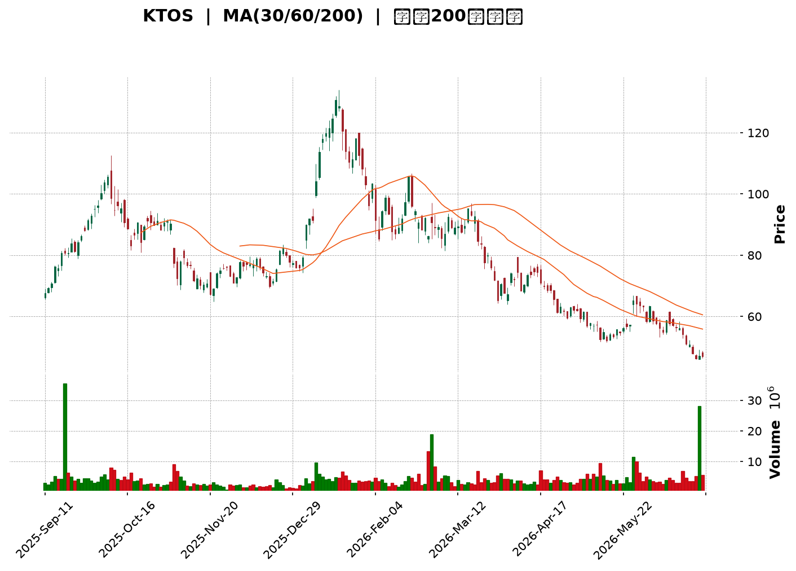
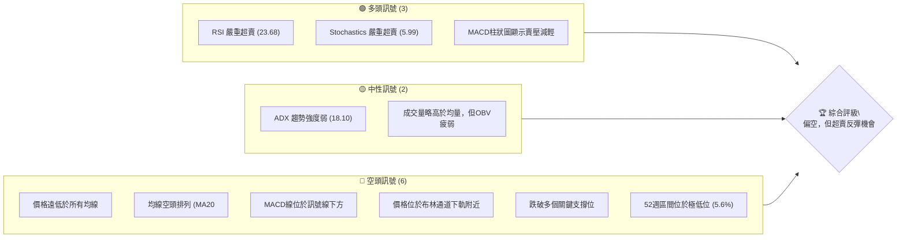
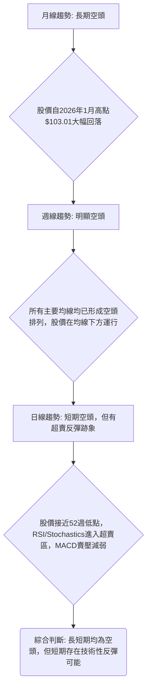
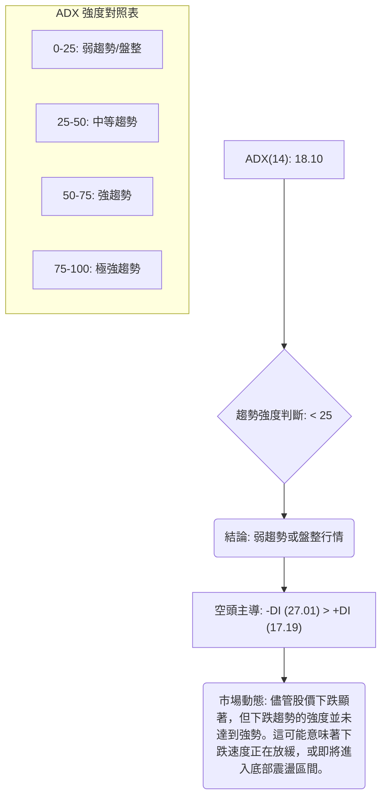
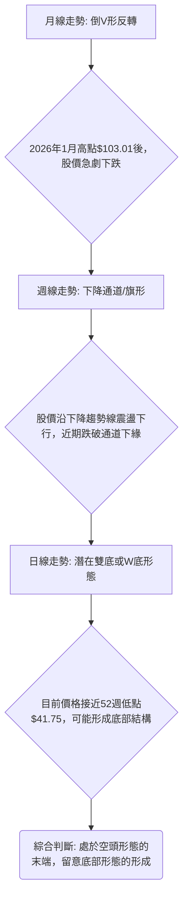
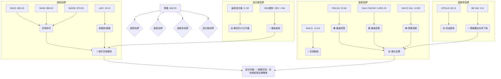
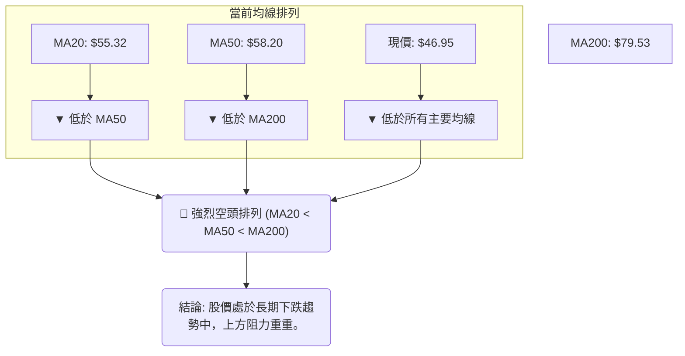
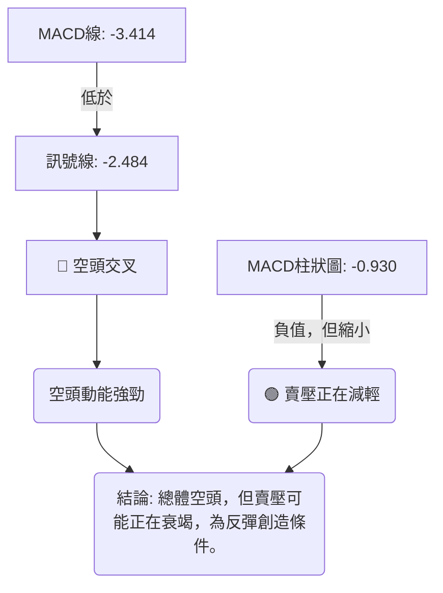
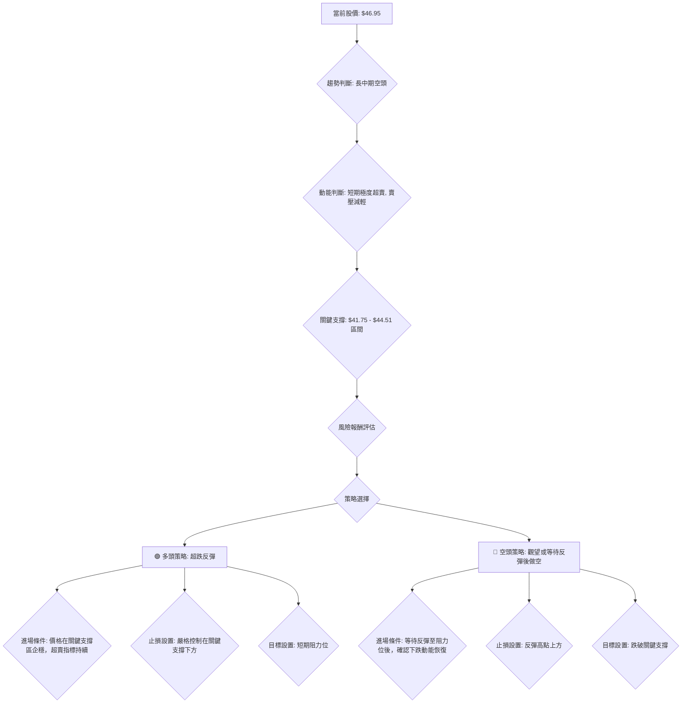

<details>
<summary>📊 靜態圖表 (點擊展開)</summary>

</details>

<html>
<head><meta charset="utf-8" /></head>
<body>
    <div style="height:500px; width:100%;">                        <script>window.PlotlyConfig = {MathJaxConfig: 'local'};</script>
        <script charset="utf-8" src="https://cdn.plot.ly/plotly-3.6.0.min.js" integrity="sha256-QaOVwtVY0T02VaHrr6pnoHLCwayMJp4O5n4YyaE3rJk=" crossorigin="anonymous"></script>                <div id="candlestick-chart" class="plotly-graph-div" style="height:100%; width:100%;"></div>            <script>                window.PLOTLYENV=window.PLOTLYENV || {};                                if (document.getElementById("candlestick-chart")) {                    Plotly.newPlot(                        "candlestick-chart",                        [{"close":{"dtype":"f8","bdata":"AAAAQOHqUEAAAADAzExRQAAAACBcr1FAAAAAYGYWU0AAAAAgXO9SQAAAAKCZKVRAAAAAoEcxVEAAAACAFC5UQAAAAKCZ+VRAAAAAIIVLVEAAAADAzAxVQAAAAIDrkVVAAAAAwB4FVkAAAAAgrtdWQAAAAKBwPVdAAAAAgOvBV0AAAAAAKQxYQAAAAAAAEFlAAAAAACnsWUAAAABA4WpaQAAAAEAzo1hAAAAA4FGoV0AAAACA6xFYQAAAAEAz01dAAAAAwB6lVkAAAAAgridWQAAAACCux1RAAAAAoJmpVUAAAAAgrqdWQAAAAEAzE1VAAAAA4HpUVkAAAAAghctWQAAAACCFq1ZAAAAAgOtxVkAAAACgcM1WQAAAAEAzE1ZAAAAAYGamVkAAAABgZsZWQAAAAIAUjlZAAAAAgD1aU0AAAACAPRpSQAAAAOBReFNAAAAAIIXLU0AAAACAwiVTQAAAAMDMLFNAAAAAACnsUUAAAADAzBxSQAAAACBcj1FAAAAAQAqXUUAAAABA4apRQAAAAADX01BAAAAAwPVIUUAAAABACodSQAAAAEAzw1JAAAAAoEfxUkAAAABgZgZTQAAAAKBwTVJAAAAAoHC9UUAAAACA6zFSQAAAACCFa1NAAAAAAAAgU0AAAACA60FTQAAAAIDrQVNAAAAAgD06U0AAAACA67FTQAAAAKBw\u002fVJAAAAA4KOQUkAAAADgUUhSQAAAAKBHcVFAAAAAoJnZUUAAAADA9dhSQAAAAIDrYVRAAAAAQDOTVEAAAACAFP5TQAAAAMDMbFNAAAAAgBReU0AAAABguP5SQAAAAIA9+lJAAAAAYI\u002fSU0AAAAAghXtWQAAAACCF+1ZAAAAAACncVkAAAABgjwJaQAAAAMDMbFxAAAAAQAp3XUAAAACAFO5dQAAAAAAAYF5AAAAAANcjX0AAAABACldgQAAAAIDCFWBAAAAAgMIlXkAAAABgZnZcQAAAAMD1mFtAAAAA4HrUW0AAAAAA14NdQAAAAEDhKlxAAAAAgD0KW0AAAADgo8BZQAAAAIA9ClhAAAAAIK7XWUAAAADAHtVWQAAAAAAAUFVAAAAAgD2aV0AAAAAA17NYQAAAAGC4XldAAAAAgOvxVUAAAABAM8NVQAAAAADXQ1ZAAAAAgBT+VkAAAACgcE1YQAAAAEDhalpAAAAAwB4FWEAAAAAA15NXQAAAACCFq1ZAAAAAYLgOVkAAAADA9QhXQAAAACCFi1VAAAAAgBSuVkAAAADAzDxWQAAAAOBRSFZAAAAAYI9iVUAAAAAAAMBVQAAAAIAUHldAAAAAoHA9VkAAAABA4TpWQAAAAKBwXVZAAAAAgOvhVUAAAACA62FWQAAAAADX01dAAAAAYI9CV0AAAACA6zFXQAAAACCuJ1VAAAAAACnsVEAAAAAgXF9TQAAAAGC4\u002flNAAAAAQAr3UkAAAAAAKfxRQAAAAIDrUVBAAAAA4KOgUUAAAADAzOxQQAAAAADX01BAAAAAgMKFUkAAAACgcP1RQAAAAKBwnVJAAAAAwB4VUUAAAACAwpVRQAAAAEAzY1JAAAAAgD1qUkAAAACAPapSQAAAAIA9mlJAAAAAIFy\u002fUUAAAADAHnVRQAAAAEAzI1FAAAAAQAonUUAAAACgR2FQQAAAAKBHoU5AAAAA4HqUT0AAAADgetROQAAAACCux01AAAAAYGaGT0AAAABgZgZPQAAAAEAK905AAAAAIK6nTUAAAABgj8JOQAAAAAAAgExAAAAAgOvxTEAAAABguH5MQAAAAIA9qkxAAAAAYLg+SkAAAADAzGxLQAAAACCFC0pAAAAAACkcS0AAAAAAKbxKQAAAAMD16EtAAAAAgMJVS0AAAABAChdMQAAAAGBmZkxAAAAAYGamTEAAAAAAKUxQQAAAAOBRCFBAAAAAYLi+T0AAAABgj6JPQAAAAEAKN01AAAAAQDOzT0AAAABgj0JNQAAAAKBw3UxAAAAA4FEYTEAAAADA9WhLQAAAAADXY01AAAAAAADgTEAAAABgj4JMQAAAACCFK0xAAAAA4HoUTEAAAABA4RpLQAAAACCFi0lAAAAAYGZmSUAAAACgmflHQAAAAMD1KEdAAAAAQOGaR0AAAACgmXlHQA=="},"high":{"dtype":"f8","bdata":"AAAAwPVIUUAAAACgcG1RQAAAAADX01FAAAAAIK4nU0AAAACA60FTQAAAAAApXFRAAAAAANeTVEAAAADgUahUQAAAAGC4XlVAAAAAAABAVUAAAADgUThVQAAAAIDCtVVAAAAAQOFqVkAAAAAgrvdWQAAAAKBHYVdAAAAAoJkZWEAAAAAgrodYQAAAAAAAwFlAAAAAoHAtWkAAAAAA15NaQAAAAOB6JFxAAAAAoJmpWUAAAAAAAGBZQAAAAGBmRlhAAAAAIFyfWEAAAACAwiVXQAAAAKBHoVVAAAAAgBQuVkAAAABAM7NWQAAAAAAAgFZAAAAAwMx8VkAAAAAghTtXQAAAAGBmpldAAAAAwMwcV0AAAAAgrndXQAAAAAAAwFZAAAAAoJkJV0AAAACAFO5WQAAAAIDC5VZAAAAAAACgVEAAAACAFN5TQAAAAGBmllNAAAAAAACAVEAAAAAgXL9TQAAAAEDhilNAAAAAoJn5UkAAAACgR3FSQAAAAMDMPFJAAAAAAADQUUAAAAAghQtSQAAAAGC4nlJAAAAAgMJVUUAAAAAAKZxSQAAAACCFC1NAAAAAQOFKU0AAAAAgXB9TQAAAAGBmJlNAAAAAYGamUkAAAAAAAEBSQAAAAOB6lFNAAAAA4FGIU0AAAADgeoRTQAAAAIA96lNAAAAAoHCdU0AAAACAFN5TQAAAAKCZ2VNAAAAAQOEaU0AAAADgUahSQAAAACBcj1JAAAAAgD0aUkAAAABgj\u002fJSQAAAACCud1RAAAAAgD3aVEAAAAAAKXxUQAAAAIA9+lNAAAAAgBSOU0AAAAAAKYxTQAAAAIAUPlNAAAAAYLjuU0AAAABACodWQAAAAIDrAVdAAAAA4HrUV0AAAABAM3NbQAAAAMDM3FxAAAAA4FHoXUAAAADgemReQAAAAKBw\u002fV5AAAAAANeTX0AAAAAAAIBgQAAAAAAAwGBAAAAAAAAAYEAAAABAM1NeQAAAAIDr4VxAAAAAQOFqXEAAAADA9YhdQAAAAAAAAF5AAAAAwMzMXEAAAAAAADBbQAAAAMD1SFlAAAAAIFzfWUAAAAAAAMBZQAAAAGBmJldAAAAAQOGqV0AAAACA6\u002fFYQAAAAAAA4FhAAAAAQDMjWEAAAACAwmVWQAAAACBcD1dAAAAAYGZWV0AAAAAAACBZQAAAAIA9elpAAAAAQOGqWkAAAADAHsVXQAAAACBc71ZAAAAAgOtRV0AAAAAAKRxXQAAAAKCZmVVAAAAAYGZGWEAAAACAFE5XQAAAAGBmhlZAAAAAIFxfVkAAAADgUbhWQAAAAEDhaldAAAAAQDMTV0AAAABguL5WQAAAACCu11ZAAAAAoJn5VkAAAABAM\u002fNWQAAAAGBm1ldAAAAA4FE4WEAAAAAAAKBXQAAAAAAAAFdAAAAAANeTVUAAAACgR8FUQAAAAAApPFRAAAAAgOvhU0AAAADgURhTQAAAAKCZ+VFAAAAAgBS+UUAAAABAMzNSQAAAAOCjYFFAAAAAgD2aUkAAAACgmTlSQAAAAAAp3FNAAAAAAACgUkAAAACA66FRQAAAAGBmhlJAAAAA4HokU0AAAABgjxJTQAAAAIAUTlNAAAAAwPU4U0AAAACgcO1RQAAAAKCZuVFAAAAAYLi+UUAAAAAgXC9RQAAAAOCjcFBAAAAAIIUbUEAAAACgmVlPQAAAAKBH4U5AAAAAQAqXT0AAAAAAAMBPQAAAAOBRCFBAAAAAwB5lT0AAAABguN5OQAAAAMAexU5AAAAA4FH4TEAAAABA4dpMQAAAAOCjUE1AAAAAAABATEAAAAAAKfxLQAAAAEAz80pAAAAAAClcS0AAAAAghUtLQAAAAOCj8EtAAAAAANeDS0AAAAAAAGBMQAAAAGBmpk1AAAAAgBSuTEAAAADAHrVQQAAAAAAAsFBAAAAAwMyMUEAAAABAM9NPQAAAAMDM7E5AAAAAIIXLT0AAAADAzAxPQAAAAAAA4E1AAAAAYGamTUAAAABgZmZMQAAAAIDrcU1AAAAAoJnZTkAAAAAAAMBNQAAAAIDrsUxAAAAAQDMzTUAAAAAAAGBMQAAAAEAzE0tAAAAAIIUrSkAAAADAHmVJQAAAAADX40dAAAAA4FGYSEAAAACA63FIQA=="},"hovertemplate":"\u003cb\u003e%{x|%Y-%m-%d}\u003c\u002fb\u003e\u003cbr\u003e\u958b: $%{open:.2f}\u003cbr\u003e\u9ad8: $%{high:.2f}\u003cbr\u003e\u4f4e: $%{low:.2f}\u003cbr\u003e\u6536: $%{close:.2f}\u003cextra\u003e\u003c\u002fextra\u003e","low":{"dtype":"f8","bdata":"AAAAYGZmUEAAAACgmelQQAAAAKCZ+VBAAAAAwB61UUAAAABACkdSQAAAAKBHwVJAAAAAoJn5U0AAAABAM9NTQAAAAGBmRlRAAAAAYGY2VEAAAAAgrrdTQAAAACCFG1VAAAAAQDPzVUAAAABgZgZWQAAAAOBRKFZAAAAAgOshV0AAAABACndXQAAAAKBHgVhAAAAAAAAAWUAAAACgmXlZQAAAAEAzM1hAAAAAoJk5V0AAAABA4apXQAAAAGCPslZAAAAAgD1KVkAAAAAgXB9WQAAAAKBwbVRAAAAAwMxMVUAAAADAzExVQAAAAADXM1RAAAAAIK43VUAAAAAghUtWQAAAAOCjEFZAAAAAAClsVkAAAACgcH1WQAAAAGCPAlZAAAAAgD36VUAAAADAzPxVQAAAAOB6tFVAAAAAYGb2UkAAAACgR5FRQAAAAKCZKVFAAAAAQDNDU0AAAADA9fhSQAAAAAAA4FJAAAAAANfTUUAAAAAAAEBRQAAAAGBmNlFAAAAAgOvxUEAAAABAM1NRQAAAAIA9ulBAAAAAQDMzUEAAAADA9UhRQAAAAKCZKVJAAAAAANfTUkAAAADgo8BSQAAAACCFO1JAAAAAIK63UUAAAAAghWtRQAAAAIDrEVJAAAAA4KOwUkAAAACgmclSQAAAAADXA1NAAAAAwMxMUkAAAABAM7NSQAAAAMDMzFJAAAAAYGZGUkAAAABA4RpSQAAAAADXU1FAAAAAwPWIUUAAAABguM5RQAAAAADXM1NAAAAAYGb2U0AAAACA69FTQAAAAGBmBlNAAAAAoJkJU0AAAABAM\u002fNSQAAAAOBRuFJAAAAAwB6VUkAAAADgUYhUQAAAAMDMrFVAAAAA4KOgVkAAAACgR7FYQAAAAKCZKVpAAAAAAACgXEAAAADAzExdQAAAAAAAgFxAAAAAoEdRXUAAAAAAAEBfQAAAAAAAwF9AAAAAgOuRXEAAAABguM5bQAAAAEAKF1tAAAAAoEexWkAAAAAA18NbQAAAAOCjUFtAAAAAgMKFWkAAAADgUWhZQAAAAKBHsVdAAAAAoJlJWEAAAABA4bpVQAAAAAAAIFVAAAAAAAAAVkAAAADAzExXQAAAAKBwTVdAAAAAoEdBVUAAAAAAAFBVQAAAAKBHwVVAAAAA4HrEVUAAAADAzDxXQAAAAGC4PlhAAAAAIIXbV0AAAAAAAMBWQAAAAGCPAlVAAAAAoHANVkAAAADA9ahVQAAAAAAAAFVAAAAAwB5VVUAAAABgZqZVQAAAAAAAcFVAAAAAoJmZVEAAAAAAAGBUQAAAAMDMzFVAAAAAwPUoVkAAAAAgrqdVQAAAAMD1WFVAAAAAwMzMVUAAAACgmblVQAAAACBcj1ZAAAAAgD0qV0AAAADA9ehVQAAAAGBmxlRAAAAA4HqEVEAAAACgR+FSQAAAAADXU1NAAAAAoJnJUkAAAADAzOxRQAAAACCuF1BAAAAAQDNjUEAAAABgZuZQQAAAACCF609AAAAAwMyMUUAAAABAM3NRQAAAAEAzI1JAAAAAgOsRUUAAAAAghdtQQAAAAEAKZ1FAAAAAoEchUkAAAAAAAFBSQAAAAOCjQFJAAAAAgD2aUUAAAABACjdRQAAAAOB69FBAAAAAwPXoUEAAAADAHuVPQAAAAKBHgU5AAAAA4FGYTkAAAAAAKRxOQAAAACCuh01AAAAAgOvRTUAAAACgmXlOQAAAAKBH4U5AAAAAoEcBTUAAAABACjdNQAAAAMAeJUxAAAAAoHDdS0AAAACgR4FLQAAAAIAUjktAAAAAIIXrSUAAAABguD5KQAAAAOB61ElAAAAAgD0KSkAAAAAA12NKQAAAAEAzU0pAAAAAIK7nSkAAAABA4TpLQAAAAEAz80tAAAAAAACAS0AAAAAAAIBOQAAAAIA9Ck5AAAAAQDOTTkAAAABACtdOQAAAAEAz80xAAAAA4FH4TEAAAAAAAMBMQAAAACBcr0xAAAAAIK6nSkAAAAAAACBLQAAAAMD1CEtAAAAA4Hp0TEAAAABACldMQAAAAKBHgUtAAAAAwMzMS0AAAADgUXhKQAAAAEAKV0lAAAAAIK4HSUAAAAAA1+NHQAAAAKBHAUdAAAAAwB4FR0AAAACAwjVHQA=="},"name":"\u50f9\u683c","open":{"dtype":"f8","bdata":"AAAAgMKFUEAAAAAgXO9QQAAAAMDMXFFAAAAAANfDUUAAAADgo8BSQAAAAKCZKVNAAAAAoEdhVEAAAABACidUQAAAAGBmRlRAAAAAIK4XVUAAAAAAAABUQAAAAAAAQFVAAAAAwMw8VkAAAADA9RhWQAAAAAAAoFZAAAAAAADAV0AAAAAAKexXQAAAAGBmllhAAAAAoJlJWUAAAADgesRZQAAAAMD16FpAAAAAwMysV0AAAACAFF5YQAAAAIAUbldAAAAAwMx8WEAAAAAgXP9WQAAAAEDhOlVAAAAAgOvRVUAAAABACsdVQAAAAAAAgFZAAAAAwMxMVUAAAADgUQhXQAAAAOB6RFdAAAAA4HrEVkAAAAAAAIBWQAAAAAAAgFZAAAAAAABgVkAAAADAHrVWQAAAAGC4DlZAAAAAIK6XVEAAAADAzHxTQAAAAEAzk1FAAAAAIIVbVEAAAABguG5TQAAAAIDrMVNAAAAAACm8UkAAAACAPUpRQAAAAIDCBVJAAAAAIFwvUUAAAADAHmVRQAAAAGC4nlJAAAAAANezUEAAAABA4VpRQAAAAIA9ilJAAAAAQDPzUkAAAABguA5TQAAAAGBmJlNAAAAAIK6HUkAAAADgo8BRQAAAAKBHIVJAAAAAAClsU0AAAACAwmVTQAAAAOB6JFNAAAAAAAAAU0AAAAAgXC9TQAAAACCFu1NAAAAAoEcRU0AAAAAAAEBSQAAAAOBRSFJAAAAAACm8UUAAAACA6+FRQAAAAAAAQFNAAAAAgBQeVEAAAABACkdUQAAAAIA9+lNAAAAAoHA9U0AAAAAAKYxTQAAAAEAzM1NAAAAAQDMjU0AAAACAPTpVQAAAAMD1eFZAAAAA4FEoV0AAAACA6+FYQAAAAGC4XlpAAAAAYGY2XUAAAACAPbpdQAAAAAAAoF1AAAAAwPX4XUAAAACgcG1fQAAAACCFA2BAAAAAYI\u002fiX0AAAADgo0BeQAAAAMAedVxAAAAAwMwsW0AAAAAA18NbQAAAAAAAAF5AAAAA4FG4XEAAAADgenRaQAAAAIA9+lhAAAAAYGamWEAAAACgcF1ZQAAAAIAUHlZAAAAAYGZGVkAAAABgZqZXQAAAAOB6tFhAAAAAgD36V0AAAACgmRlWQAAAACBcz1VAAAAAwB4FVkAAAADA9UhXQAAAAKBwbVhAAAAAAClsWkAAAACgR1FXQAAAAAAAMFZAAAAAACk8V0AAAAAAKfxVQAAAAEAzU1VAAAAAQOEaV0AAAACgcE1WQAAAAOCjIFZAAAAAYGY2VkAAAADgUdhUQAAAAEAK91VAAAAAACncVkAAAACA68FVQAAAAAApPFZAAAAAAACAVkAAAACAwjVWQAAAAEAKt1ZAAAAAgD2aV0AAAADgo6BWQAAAAMDM3FZAAAAAgML1VEAAAABA4apUQAAAAGCP8lNAAAAA4FGYU0AAAABACrdSQAAAAOCj8FFAAAAAoJm5UEAAAADA9ShSQAAAAIDrUVBAAAAA4FHIUUAAAAAAABBSQAAAAOBR2FNAAAAAwMyMUkAAAACgRwFRQAAAAGBmhlFAAAAAgD2qUkAAAAAAKexSQAAAAADXE1NAAAAAIIXbUkAAAABgj4JRQAAAAOCjkFFAAAAAIK6HUUAAAADAzBxRQAAAAOCjcFBAAAAA4FGYTkAAAADgUfhOQAAAAGC43k5AAAAAwB4lTkAAAADgerRPQAAAAAApPE9AAAAA4FFYT0AAAACAPYpNQAAAAMAexU5AAAAAgD2KTEAAAAAgXG9MQAAAACCFq0xAAAAA4Ho0TEAAAACgR2FKQAAAAGC4vkpAAAAAoEchSkAAAABguB5LQAAAAKCZ+UpAAAAAAACAS0AAAADAHqVLQAAAAOB61ExAAAAAoHB9TEAAAABA4fpPQAAAAIA9qlBAAAAAACk8UEAAAADA9chPQAAAACBcz05AAAAAgBQuTUAAAACA69FOQAAAAAAp3E1AAAAAIK4HTUAAAADAzMxLQAAAAMD1aEtAAAAAYLi+TkAAAADgUZhNQAAAAIAUTkxAAAAA4KPQS0AAAAAAKRxMQAAAAGCP4kpAAAAAIK4HSUAAAABAChdJQAAAAEAzs0dAAAAAwB4FR0AAAADAzBxIQA=="},"x":["2025-09-11T00:00:00-04:00","2025-09-12T00:00:00-04:00","2025-09-15T00:00:00-04:00","2025-09-16T00:00:00-04:00","2025-09-17T00:00:00-04:00","2025-09-18T00:00:00-04:00","2025-09-19T00:00:00-04:00","2025-09-22T00:00:00-04:00","2025-09-23T00:00:00-04:00","2025-09-24T00:00:00-04:00","2025-09-25T00:00:00-04:00","2025-09-26T00:00:00-04:00","2025-09-29T00:00:00-04:00","2025-09-30T00:00:00-04:00","2025-10-01T00:00:00-04:00","2025-10-02T00:00:00-04:00","2025-10-03T00:00:00-04:00","2025-10-06T00:00:00-04:00","2025-10-07T00:00:00-04:00","2025-10-08T00:00:00-04:00","2025-10-09T00:00:00-04:00","2025-10-10T00:00:00-04:00","2025-10-13T00:00:00-04:00","2025-10-14T00:00:00-04:00","2025-10-15T00:00:00-04:00","2025-10-16T00:00:00-04:00","2025-10-17T00:00:00-04:00","2025-10-20T00:00:00-04:00","2025-10-21T00:00:00-04:00","2025-10-22T00:00:00-04:00","2025-10-23T00:00:00-04:00","2025-10-24T00:00:00-04:00","2025-10-27T00:00:00-04:00","2025-10-28T00:00:00-04:00","2025-10-29T00:00:00-04:00","2025-10-30T00:00:00-04:00","2025-10-31T00:00:00-04:00","2025-11-03T00:00:00-05:00","2025-11-04T00:00:00-05:00","2025-11-05T00:00:00-05:00","2025-11-06T00:00:00-05:00","2025-11-07T00:00:00-05:00","2025-11-10T00:00:00-05:00","2025-11-11T00:00:00-05:00","2025-11-12T00:00:00-05:00","2025-11-13T00:00:00-05:00","2025-11-14T00:00:00-05:00","2025-11-17T00:00:00-05:00","2025-11-18T00:00:00-05:00","2025-11-19T00:00:00-05:00","2025-11-20T00:00:00-05:00","2025-11-21T00:00:00-05:00","2025-11-24T00:00:00-05:00","2025-11-25T00:00:00-05:00","2025-11-26T00:00:00-05:00","2025-11-28T00:00:00-05:00","2025-12-01T00:00:00-05:00","2025-12-02T00:00:00-05:00","2025-12-03T00:00:00-05:00","2025-12-04T00:00:00-05:00","2025-12-05T00:00:00-05:00","2025-12-08T00:00:00-05:00","2025-12-09T00:00:00-05:00","2025-12-10T00:00:00-05:00","2025-12-11T00:00:00-05:00","2025-12-12T00:00:00-05:00","2025-12-15T00:00:00-05:00","2025-12-16T00:00:00-05:00","2025-12-17T00:00:00-05:00","2025-12-18T00:00:00-05:00","2025-12-19T00:00:00-05:00","2025-12-22T00:00:00-05:00","2025-12-23T00:00:00-05:00","2025-12-24T00:00:00-05:00","2025-12-26T00:00:00-05:00","2025-12-29T00:00:00-05:00","2025-12-30T00:00:00-05:00","2025-12-31T00:00:00-05:00","2026-01-02T00:00:00-05:00","2026-01-05T00:00:00-05:00","2026-01-06T00:00:00-05:00","2026-01-07T00:00:00-05:00","2026-01-08T00:00:00-05:00","2026-01-09T00:00:00-05:00","2026-01-12T00:00:00-05:00","2026-01-13T00:00:00-05:00","2026-01-14T00:00:00-05:00","2026-01-15T00:00:00-05:00","2026-01-16T00:00:00-05:00","2026-01-20T00:00:00-05:00","2026-01-21T00:00:00-05:00","2026-01-22T00:00:00-05:00","2026-01-23T00:00:00-05:00","2026-01-26T00:00:00-05:00","2026-01-27T00:00:00-05:00","2026-01-28T00:00:00-05:00","2026-01-29T00:00:00-05:00","2026-01-30T00:00:00-05:00","2026-02-02T00:00:00-05:00","2026-02-03T00:00:00-05:00","2026-02-04T00:00:00-05:00","2026-02-05T00:00:00-05:00","2026-02-06T00:00:00-05:00","2026-02-09T00:00:00-05:00","2026-02-10T00:00:00-05:00","2026-02-11T00:00:00-05:00","2026-02-12T00:00:00-05:00","2026-02-13T00:00:00-05:00","2026-02-17T00:00:00-05:00","2026-02-18T00:00:00-05:00","2026-02-19T00:00:00-05:00","2026-02-20T00:00:00-05:00","2026-02-23T00:00:00-05:00","2026-02-24T00:00:00-05:00","2026-02-25T00:00:00-05:00","2026-02-26T00:00:00-05:00","2026-02-27T00:00:00-05:00","2026-03-02T00:00:00-05:00","2026-03-03T00:00:00-05:00","2026-03-04T00:00:00-05:00","2026-03-05T00:00:00-05:00","2026-03-06T00:00:00-05:00","2026-03-09T00:00:00-04:00","2026-03-10T00:00:00-04:00","2026-03-11T00:00:00-04:00","2026-03-12T00:00:00-04:00","2026-03-13T00:00:00-04:00","2026-03-16T00:00:00-04:00","2026-03-17T00:00:00-04:00","2026-03-18T00:00:00-04:00","2026-03-19T00:00:00-04:00","2026-03-20T00:00:00-04:00","2026-03-23T00:00:00-04:00","2026-03-24T00:00:00-04:00","2026-03-25T00:00:00-04:00","2026-03-26T00:00:00-04:00","2026-03-27T00:00:00-04:00","2026-03-30T00:00:00-04:00","2026-03-31T00:00:00-04:00","2026-04-01T00:00:00-04:00","2026-04-02T00:00:00-04:00","2026-04-06T00:00:00-04:00","2026-04-07T00:00:00-04:00","2026-04-08T00:00:00-04:00","2026-04-09T00:00:00-04:00","2026-04-10T00:00:00-04:00","2026-04-13T00:00:00-04:00","2026-04-14T00:00:00-04:00","2026-04-15T00:00:00-04:00","2026-04-16T00:00:00-04:00","2026-04-17T00:00:00-04:00","2026-04-20T00:00:00-04:00","2026-04-21T00:00:00-04:00","2026-04-22T00:00:00-04:00","2026-04-23T00:00:00-04:00","2026-04-24T00:00:00-04:00","2026-04-27T00:00:00-04:00","2026-04-28T00:00:00-04:00","2026-04-29T00:00:00-04:00","2026-04-30T00:00:00-04:00","2026-05-01T00:00:00-04:00","2026-05-04T00:00:00-04:00","2026-05-05T00:00:00-04:00","2026-05-06T00:00:00-04:00","2026-05-07T00:00:00-04:00","2026-05-08T00:00:00-04:00","2026-05-11T00:00:00-04:00","2026-05-12T00:00:00-04:00","2026-05-13T00:00:00-04:00","2026-05-14T00:00:00-04:00","2026-05-15T00:00:00-04:00","2026-05-18T00:00:00-04:00","2026-05-19T00:00:00-04:00","2026-05-20T00:00:00-04:00","2026-05-21T00:00:00-04:00","2026-05-22T00:00:00-04:00","2026-05-26T00:00:00-04:00","2026-05-27T00:00:00-04:00","2026-05-28T00:00:00-04:00","2026-05-29T00:00:00-04:00","2026-06-01T00:00:00-04:00","2026-06-02T00:00:00-04:00","2026-06-03T00:00:00-04:00","2026-06-04T00:00:00-04:00","2026-06-05T00:00:00-04:00","2026-06-08T00:00:00-04:00","2026-06-09T00:00:00-04:00","2026-06-10T00:00:00-04:00","2026-06-11T00:00:00-04:00","2026-06-12T00:00:00-04:00","2026-06-15T00:00:00-04:00","2026-06-16T00:00:00-04:00","2026-06-17T00:00:00-04:00","2026-06-18T00:00:00-04:00","2026-06-22T00:00:00-04:00","2026-06-23T00:00:00-04:00","2026-06-24T00:00:00-04:00","2026-06-25T00:00:00-04:00","2026-06-26T00:00:00-04:00","2026-06-29T00:00:00-04:00"],"type":"candlestick"},{"hovertemplate":"MA30: $%{y:.2f}\u003cextra\u003e\u003c\u002fextra\u003e","line":{"color":"#2196F3","dash":"dash","width":2},"mode":"lines","name":"MA30","x":["2025-09-11T00:00:00-04:00","2025-09-12T00:00:00-04:00","2025-09-15T00:00:00-04:00","2025-09-16T00:00:00-04:00","2025-09-17T00:00:00-04:00","2025-09-18T00:00:00-04:00","2025-09-19T00:00:00-04:00","2025-09-22T00:00:00-04:00","2025-09-23T00:00:00-04:00","2025-09-24T00:00:00-04:00","2025-09-25T00:00:00-04:00","2025-09-26T00:00:00-04:00","2025-09-29T00:00:00-04:00","2025-09-30T00:00:00-04:00","2025-10-01T00:00:00-04:00","2025-10-02T00:00:00-04:00","2025-10-03T00:00:00-04:00","2025-10-06T00:00:00-04:00","2025-10-07T00:00:00-04:00","2025-10-08T00:00:00-04:00","2025-10-09T00:00:00-04:00","2025-10-10T00:00:00-04:00","2025-10-13T00:00:00-04:00","2025-10-14T00:00:00-04:00","2025-10-15T00:00:00-04:00","2025-10-16T00:00:00-04:00","2025-10-17T00:00:00-04:00","2025-10-20T00:00:00-04:00","2025-10-21T00:00:00-04:00","2025-10-22T00:00:00-04:00","2025-10-23T00:00:00-04:00","2025-10-24T00:00:00-04:00","2025-10-27T00:00:00-04:00","2025-10-28T00:00:00-04:00","2025-10-29T00:00:00-04:00","2025-10-30T00:00:00-04:00","2025-10-31T00:00:00-04:00","2025-11-03T00:00:00-05:00","2025-11-04T00:00:00-05:00","2025-11-05T00:00:00-05:00","2025-11-06T00:00:00-05:00","2025-11-07T00:00:00-05:00","2025-11-10T00:00:00-05:00","2025-11-11T00:00:00-05:00","2025-11-12T00:00:00-05:00","2025-11-13T00:00:00-05:00","2025-11-14T00:00:00-05:00","2025-11-17T00:00:00-05:00","2025-11-18T00:00:00-05:00","2025-11-19T00:00:00-05:00","2025-11-20T00:00:00-05:00","2025-11-21T00:00:00-05:00","2025-11-24T00:00:00-05:00","2025-11-25T00:00:00-05:00","2025-11-26T00:00:00-05:00","2025-11-28T00:00:00-05:00","2025-12-01T00:00:00-05:00","2025-12-02T00:00:00-05:00","2025-12-03T00:00:00-05:00","2025-12-04T00:00:00-05:00","2025-12-05T00:00:00-05:00","2025-12-08T00:00:00-05:00","2025-12-09T00:00:00-05:00","2025-12-10T00:00:00-05:00","2025-12-11T00:00:00-05:00","2025-12-12T00:00:00-05:00","2025-12-15T00:00:00-05:00","2025-12-16T00:00:00-05:00","2025-12-17T00:00:00-05:00","2025-12-18T00:00:00-05:00","2025-12-19T00:00:00-05:00","2025-12-22T00:00:00-05:00","2025-12-23T00:00:00-05:00","2025-12-24T00:00:00-05:00","2025-12-26T00:00:00-05:00","2025-12-29T00:00:00-05:00","2025-12-30T00:00:00-05:00","2025-12-31T00:00:00-05:00","2026-01-02T00:00:00-05:00","2026-01-05T00:00:00-05:00","2026-01-06T00:00:00-05:00","2026-01-07T00:00:00-05:00","2026-01-08T00:00:00-05:00","2026-01-09T00:00:00-05:00","2026-01-12T00:00:00-05:00","2026-01-13T00:00:00-05:00","2026-01-14T00:00:00-05:00","2026-01-15T00:00:00-05:00","2026-01-16T00:00:00-05:00","2026-01-20T00:00:00-05:00","2026-01-21T00:00:00-05:00","2026-01-22T00:00:00-05:00","2026-01-23T00:00:00-05:00","2026-01-26T00:00:00-05:00","2026-01-27T00:00:00-05:00","2026-01-28T00:00:00-05:00","2026-01-29T00:00:00-05:00","2026-01-30T00:00:00-05:00","2026-02-02T00:00:00-05:00","2026-02-03T00:00:00-05:00","2026-02-04T00:00:00-05:00","2026-02-05T00:00:00-05:00","2026-02-06T00:00:00-05:00","2026-02-09T00:00:00-05:00","2026-02-10T00:00:00-05:00","2026-02-11T00:00:00-05:00","2026-02-12T00:00:00-05:00","2026-02-13T00:00:00-05:00","2026-02-17T00:00:00-05:00","2026-02-18T00:00:00-05:00","2026-02-19T00:00:00-05:00","2026-02-20T00:00:00-05:00","2026-02-23T00:00:00-05:00","2026-02-24T00:00:00-05:00","2026-02-25T00:00:00-05:00","2026-02-26T00:00:00-05:00","2026-02-27T00:00:00-05:00","2026-03-02T00:00:00-05:00","2026-03-03T00:00:00-05:00","2026-03-04T00:00:00-05:00","2026-03-05T00:00:00-05:00","2026-03-06T00:00:00-05:00","2026-03-09T00:00:00-04:00","2026-03-10T00:00:00-04:00","2026-03-11T00:00:00-04:00","2026-03-12T00:00:00-04:00","2026-03-13T00:00:00-04:00","2026-03-16T00:00:00-04:00","2026-03-17T00:00:00-04:00","2026-03-18T00:00:00-04:00","2026-03-19T00:00:00-04:00","2026-03-20T00:00:00-04:00","2026-03-23T00:00:00-04:00","2026-03-24T00:00:00-04:00","2026-03-25T00:00:00-04:00","2026-03-26T00:00:00-04:00","2026-03-27T00:00:00-04:00","2026-03-30T00:00:00-04:00","2026-03-31T00:00:00-04:00","2026-04-01T00:00:00-04:00","2026-04-02T00:00:00-04:00","2026-04-06T00:00:00-04:00","2026-04-07T00:00:00-04:00","2026-04-08T00:00:00-04:00","2026-04-09T00:00:00-04:00","2026-04-10T00:00:00-04:00","2026-04-13T00:00:00-04:00","2026-04-14T00:00:00-04:00","2026-04-15T00:00:00-04:00","2026-04-16T00:00:00-04:00","2026-04-17T00:00:00-04:00","2026-04-20T00:00:00-04:00","2026-04-21T00:00:00-04:00","2026-04-22T00:00:00-04:00","2026-04-23T00:00:00-04:00","2026-04-24T00:00:00-04:00","2026-04-27T00:00:00-04:00","2026-04-28T00:00:00-04:00","2026-04-29T00:00:00-04:00","2026-04-30T00:00:00-04:00","2026-05-01T00:00:00-04:00","2026-05-04T00:00:00-04:00","2026-05-05T00:00:00-04:00","2026-05-06T00:00:00-04:00","2026-05-07T00:00:00-04:00","2026-05-08T00:00:00-04:00","2026-05-11T00:00:00-04:00","2026-05-12T00:00:00-04:00","2026-05-13T00:00:00-04:00","2026-05-14T00:00:00-04:00","2026-05-15T00:00:00-04:00","2026-05-18T00:00:00-04:00","2026-05-19T00:00:00-04:00","2026-05-20T00:00:00-04:00","2026-05-21T00:00:00-04:00","2026-05-22T00:00:00-04:00","2026-05-26T00:00:00-04:00","2026-05-27T00:00:00-04:00","2026-05-28T00:00:00-04:00","2026-05-29T00:00:00-04:00","2026-06-01T00:00:00-04:00","2026-06-02T00:00:00-04:00","2026-06-03T00:00:00-04:00","2026-06-04T00:00:00-04:00","2026-06-05T00:00:00-04:00","2026-06-08T00:00:00-04:00","2026-06-09T00:00:00-04:00","2026-06-10T00:00:00-04:00","2026-06-11T00:00:00-04:00","2026-06-12T00:00:00-04:00","2026-06-15T00:00:00-04:00","2026-06-16T00:00:00-04:00","2026-06-17T00:00:00-04:00","2026-06-18T00:00:00-04:00","2026-06-22T00:00:00-04:00","2026-06-23T00:00:00-04:00","2026-06-24T00:00:00-04:00","2026-06-25T00:00:00-04:00","2026-06-26T00:00:00-04:00","2026-06-29T00:00:00-04:00"],"y":{"dtype":"f8","bdata":"AAAAAAAA+H8AAAAAAAD4fwAAAAAAAPh\u002fAAAAAAAA+H8AAAAAAAD4fwAAAAAAAPh\u002fAAAAAAAA+H8AAAAAAAD4fwAAAAAAAPh\u002fAAAAAAAA+H8AAAAAAAD4fwAAAAAAAPh\u002fAAAAAAAA+H8AAAAAAAD4fwAAAAAAAPh\u002fAAAAAAAA+H8AAAAAAAD4fwAAAAAAAPh\u002fAAAAAAAA+H8AAAAAAAD4fwAAAAAAAPh\u002fAAAAAAAA+H8AAAAAAAD4fwAAAAAAAPh\u002fAAAAAAAA+H8AAAAAAAD4fwAAAAAAAPh\u002fAAAAAAAA+H8AAAAAAAD4f1VVVZXR01VA7+7uXgECVkAiIiJi5TBWQImIiEhvW1ZAq6qq2hV4VkCamZmJFplWQFVVVXVoqVZAMzMz82C+VkAAAADQhdRWQAAAAGAB4lZAREREdPbZVkC8u7uLz8BWQGZmZgbkrlZAAAAAcOebVkBVVVWVX3xWQERERHSvWVZAREREtOQnVkDv7u5+P\u002fVVQImIiAg6tVVAiYiIaB9uVUDe3d29dCNVQImIiIjP4FRAiYiImG6qVEAiIiLSIntUQO\u002fu7p7vT1RAIiIiYlcwVECrqqrKoRVUQLy7u5t9AFRAZmZmxgTfU0ARERHB9bhTQJqZmVnWqlNAvLu763yPU0AiIiIiTXFTQJqZmWkuVFNA3t3drbk4U0De3d09NR5TQERERPThA1NAMzMzIwbhUkDv7u4esLpSQBEREbEPj1JA3t3dbT2CUkB3d3fnmIhSQKuqqkpikFJAq6qqOgqXUkCamZkpQJ5SQLy7u0tioFJAIiIi8rasUkDNzMzMPrRSQBEREWFXwFJAmpmZWWTTUkARERHhevxSQO\u002fu7q4AMVNAVVVVdZNgU0Crqqo6baBTQHd3d0fh8lNAiYiICKxMVEDv7u5euqlUQGZmZia\u002fEFVAVVVV5ReDVUDNzMzcsv5VQImIiKh\u002fa1ZAzczMrI7JVkDe3d1NGxhXQAAAAFBGX1dAIiIiwq6oV0AAAADgevxXQN7d3W3LSlhAmpmZWR2TWEARERHR29JYQHd3d0coC1lAmpmZKVxPWUB3d3eHXXFZQFVVVSVNeVlAIiIi0iKTWUCJiIj4U7tZQFVVVfX93FlAd3d3l\u002fzyWUCamZlJmgpaQAAAAPCnJlpAiYiI6LRBWkAiIiLCPFFaQBEREaGMblpAAAAAsHJ4WkDv7u7OsGNaQCIiItKUMlpARERE5F7zWUCJiIiIiLhZQKuqqhovbVlARERE9P0kWUBmZmb24ctYQERERGSCd1hAvLu7a7wsWEDe3d29dPNXQImIiAg6zVdA3t3dfYadV0CrqqoqXF9XQJqZmWnYLVdA3t3drdUBV0DNzMzME+VWQFVVVZVD41ZAZmZmBjrNVkCrqqrqUdBWQKuqqtr5zlZA3t3dTRu4VkDe3d29n4pWQBEREfHSbVZAiYiICGVUVkBVVVX1KDRWQImIiOhtAVZAMzMz46XTVUDe3d19sZRVQBEREdHbQlVAd3d3V\u002fITVUAzMzNDRORUQKuqqvqpwVRAzczM7DWXVEB3d3c3tGhUQN7d3Y3CTVRAVVVVhV0pVEB3d3dH4QpUQDMzMzN661NAVVVV9W\u002fMU0CamZnZzqdTQHd3d1fHdFNAd3d3h11JU0AiIiICchdTQERERAxJ21JAd3d3x0unUkAzMzML12tSQHd3d8eSH1JAVVVVPZjfUUAAAACQCZ5RQLy7u8uhbVFAiYiIEJ85UUARERFRjRdRQLy7uyuH5lBAd3d3JzHAUEDe3d11TKBQQLy7u7NWj1BAERERYeVoUEARERGRe01QQDMzM2sDLVBAiYiIwJ8CUEDv7u5+W7ZPQFVVVaXTZk9Ad3d3R4ssT0CamZnJIPBOQBEREVGpqE5ARERE1NtiTkAAAAAQdDpOQN7d3Y2XDk5A7+7ujpfuTUCamZlJmtJNQLy7u4tsp01AZmZm1jGRTUCamZn5U3NNQGZmZkZEZE1AzczMLIdGTUAiIiISWClNQJqZmRkEJk1AZmZmFmcPTUDNzMz88PlMQHd3dzcX4kxAMzMzk6bUTECrqqoadrVMQO\u002fu7s4+nExAMzMzo\u002f59TEC8u7uLbFdMQAAAALByKExAREREhOsRTEDNzMycNvBLQA=="},"type":"scatter"},{"hovertemplate":"MA60: $%{y:.2f}\u003cextra\u003e\u003c\u002fextra\u003e","line":{"color":"#9C27B0","dash":"dash","width":2},"mode":"lines","name":"MA60","x":["2025-09-11T00:00:00-04:00","2025-09-12T00:00:00-04:00","2025-09-15T00:00:00-04:00","2025-09-16T00:00:00-04:00","2025-09-17T00:00:00-04:00","2025-09-18T00:00:00-04:00","2025-09-19T00:00:00-04:00","2025-09-22T00:00:00-04:00","2025-09-23T00:00:00-04:00","2025-09-24T00:00:00-04:00","2025-09-25T00:00:00-04:00","2025-09-26T00:00:00-04:00","2025-09-29T00:00:00-04:00","2025-09-30T00:00:00-04:00","2025-10-01T00:00:00-04:00","2025-10-02T00:00:00-04:00","2025-10-03T00:00:00-04:00","2025-10-06T00:00:00-04:00","2025-10-07T00:00:00-04:00","2025-10-08T00:00:00-04:00","2025-10-09T00:00:00-04:00","2025-10-10T00:00:00-04:00","2025-10-13T00:00:00-04:00","2025-10-14T00:00:00-04:00","2025-10-15T00:00:00-04:00","2025-10-16T00:00:00-04:00","2025-10-17T00:00:00-04:00","2025-10-20T00:00:00-04:00","2025-10-21T00:00:00-04:00","2025-10-22T00:00:00-04:00","2025-10-23T00:00:00-04:00","2025-10-24T00:00:00-04:00","2025-10-27T00:00:00-04:00","2025-10-28T00:00:00-04:00","2025-10-29T00:00:00-04:00","2025-10-30T00:00:00-04:00","2025-10-31T00:00:00-04:00","2025-11-03T00:00:00-05:00","2025-11-04T00:00:00-05:00","2025-11-05T00:00:00-05:00","2025-11-06T00:00:00-05:00","2025-11-07T00:00:00-05:00","2025-11-10T00:00:00-05:00","2025-11-11T00:00:00-05:00","2025-11-12T00:00:00-05:00","2025-11-13T00:00:00-05:00","2025-11-14T00:00:00-05:00","2025-11-17T00:00:00-05:00","2025-11-18T00:00:00-05:00","2025-11-19T00:00:00-05:00","2025-11-20T00:00:00-05:00","2025-11-21T00:00:00-05:00","2025-11-24T00:00:00-05:00","2025-11-25T00:00:00-05:00","2025-11-26T00:00:00-05:00","2025-11-28T00:00:00-05:00","2025-12-01T00:00:00-05:00","2025-12-02T00:00:00-05:00","2025-12-03T00:00:00-05:00","2025-12-04T00:00:00-05:00","2025-12-05T00:00:00-05:00","2025-12-08T00:00:00-05:00","2025-12-09T00:00:00-05:00","2025-12-10T00:00:00-05:00","2025-12-11T00:00:00-05:00","2025-12-12T00:00:00-05:00","2025-12-15T00:00:00-05:00","2025-12-16T00:00:00-05:00","2025-12-17T00:00:00-05:00","2025-12-18T00:00:00-05:00","2025-12-19T00:00:00-05:00","2025-12-22T00:00:00-05:00","2025-12-23T00:00:00-05:00","2025-12-24T00:00:00-05:00","2025-12-26T00:00:00-05:00","2025-12-29T00:00:00-05:00","2025-12-30T00:00:00-05:00","2025-12-31T00:00:00-05:00","2026-01-02T00:00:00-05:00","2026-01-05T00:00:00-05:00","2026-01-06T00:00:00-05:00","2026-01-07T00:00:00-05:00","2026-01-08T00:00:00-05:00","2026-01-09T00:00:00-05:00","2026-01-12T00:00:00-05:00","2026-01-13T00:00:00-05:00","2026-01-14T00:00:00-05:00","2026-01-15T00:00:00-05:00","2026-01-16T00:00:00-05:00","2026-01-20T00:00:00-05:00","2026-01-21T00:00:00-05:00","2026-01-22T00:00:00-05:00","2026-01-23T00:00:00-05:00","2026-01-26T00:00:00-05:00","2026-01-27T00:00:00-05:00","2026-01-28T00:00:00-05:00","2026-01-29T00:00:00-05:00","2026-01-30T00:00:00-05:00","2026-02-02T00:00:00-05:00","2026-02-03T00:00:00-05:00","2026-02-04T00:00:00-05:00","2026-02-05T00:00:00-05:00","2026-02-06T00:00:00-05:00","2026-02-09T00:00:00-05:00","2026-02-10T00:00:00-05:00","2026-02-11T00:00:00-05:00","2026-02-12T00:00:00-05:00","2026-02-13T00:00:00-05:00","2026-02-17T00:00:00-05:00","2026-02-18T00:00:00-05:00","2026-02-19T00:00:00-05:00","2026-02-20T00:00:00-05:00","2026-02-23T00:00:00-05:00","2026-02-24T00:00:00-05:00","2026-02-25T00:00:00-05:00","2026-02-26T00:00:00-05:00","2026-02-27T00:00:00-05:00","2026-03-02T00:00:00-05:00","2026-03-03T00:00:00-05:00","2026-03-04T00:00:00-05:00","2026-03-05T00:00:00-05:00","2026-03-06T00:00:00-05:00","2026-03-09T00:00:00-04:00","2026-03-10T00:00:00-04:00","2026-03-11T00:00:00-04:00","2026-03-12T00:00:00-04:00","2026-03-13T00:00:00-04:00","2026-03-16T00:00:00-04:00","2026-03-17T00:00:00-04:00","2026-03-18T00:00:00-04:00","2026-03-19T00:00:00-04:00","2026-03-20T00:00:00-04:00","2026-03-23T00:00:00-04:00","2026-03-24T00:00:00-04:00","2026-03-25T00:00:00-04:00","2026-03-26T00:00:00-04:00","2026-03-27T00:00:00-04:00","2026-03-30T00:00:00-04:00","2026-03-31T00:00:00-04:00","2026-04-01T00:00:00-04:00","2026-04-02T00:00:00-04:00","2026-04-06T00:00:00-04:00","2026-04-07T00:00:00-04:00","2026-04-08T00:00:00-04:00","2026-04-09T00:00:00-04:00","2026-04-10T00:00:00-04:00","2026-04-13T00:00:00-04:00","2026-04-14T00:00:00-04:00","2026-04-15T00:00:00-04:00","2026-04-16T00:00:00-04:00","2026-04-17T00:00:00-04:00","2026-04-20T00:00:00-04:00","2026-04-21T00:00:00-04:00","2026-04-22T00:00:00-04:00","2026-04-23T00:00:00-04:00","2026-04-24T00:00:00-04:00","2026-04-27T00:00:00-04:00","2026-04-28T00:00:00-04:00","2026-04-29T00:00:00-04:00","2026-04-30T00:00:00-04:00","2026-05-01T00:00:00-04:00","2026-05-04T00:00:00-04:00","2026-05-05T00:00:00-04:00","2026-05-06T00:00:00-04:00","2026-05-07T00:00:00-04:00","2026-05-08T00:00:00-04:00","2026-05-11T00:00:00-04:00","2026-05-12T00:00:00-04:00","2026-05-13T00:00:00-04:00","2026-05-14T00:00:00-04:00","2026-05-15T00:00:00-04:00","2026-05-18T00:00:00-04:00","2026-05-19T00:00:00-04:00","2026-05-20T00:00:00-04:00","2026-05-21T00:00:00-04:00","2026-05-22T00:00:00-04:00","2026-05-26T00:00:00-04:00","2026-05-27T00:00:00-04:00","2026-05-28T00:00:00-04:00","2026-05-29T00:00:00-04:00","2026-06-01T00:00:00-04:00","2026-06-02T00:00:00-04:00","2026-06-03T00:00:00-04:00","2026-06-04T00:00:00-04:00","2026-06-05T00:00:00-04:00","2026-06-08T00:00:00-04:00","2026-06-09T00:00:00-04:00","2026-06-10T00:00:00-04:00","2026-06-11T00:00:00-04:00","2026-06-12T00:00:00-04:00","2026-06-15T00:00:00-04:00","2026-06-16T00:00:00-04:00","2026-06-17T00:00:00-04:00","2026-06-18T00:00:00-04:00","2026-06-22T00:00:00-04:00","2026-06-23T00:00:00-04:00","2026-06-24T00:00:00-04:00","2026-06-25T00:00:00-04:00","2026-06-26T00:00:00-04:00","2026-06-29T00:00:00-04:00"],"y":{"dtype":"f8","bdata":"AAAAAAAA+H8AAAAAAAD4fwAAAAAAAPh\u002fAAAAAAAA+H8AAAAAAAD4fwAAAAAAAPh\u002fAAAAAAAA+H8AAAAAAAD4fwAAAAAAAPh\u002fAAAAAAAA+H8AAAAAAAD4fwAAAAAAAPh\u002fAAAAAAAA+H8AAAAAAAD4fwAAAAAAAPh\u002fAAAAAAAA+H8AAAAAAAD4fwAAAAAAAPh\u002fAAAAAAAA+H8AAAAAAAD4fwAAAAAAAPh\u002fAAAAAAAA+H8AAAAAAAD4fwAAAAAAAPh\u002fAAAAAAAA+H8AAAAAAAD4fwAAAAAAAPh\u002fAAAAAAAA+H8AAAAAAAD4fwAAAAAAAPh\u002fAAAAAAAA+H8AAAAAAAD4fwAAAAAAAPh\u002fAAAAAAAA+H8AAAAAAAD4fwAAAAAAAPh\u002fAAAAAAAA+H8AAAAAAAD4fwAAAAAAAPh\u002fAAAAAAAA+H8AAAAAAAD4fwAAAAAAAPh\u002fAAAAAAAA+H8AAAAAAAD4fwAAAAAAAPh\u002fAAAAAAAA+H8AAAAAAAD4fwAAAAAAAPh\u002fAAAAAAAA+H8AAAAAAAD4fwAAAAAAAPh\u002fAAAAAAAA+H8AAAAAAAD4fwAAAAAAAPh\u002fAAAAAAAA+H8AAAAAAAD4fwAAAAAAAPh\u002fAAAAAAAA+H8AAAAAAAD4f3d3d\u002fdTv1RAVVVVJb\u002fIVEAiIiJCGdFUQBEREdnO11RARERExGfYVEC8u7vjpdtUQM3MzDSl1lRAMzMzi7PPVEB3d3f3msdUQImIiIiIuFRAERER8RmuVECamZk5tKRUQImIiCijn1RAVVVV1XiZVEB3d3ffT41UQAAAAOAIfVRAMzMz001qVEDe3d0lv1RUQM3MzLTIOlRAERER4cEgVEB3d3fP9w9UQLy7uxvoCFRA7+7uBoEFVEBmZmYGyA1UQDMzM3NoIVRAVVVVtYE+VEDNzMwUrl9UQBEREWGeiFRA3t3dVQ6xVEDv7u5O1NtUQBEREQErC1VAREREzIUsVUAAAAA4tERVQM3MzFy6WVVAAAAAOLRwVUDv7u4OWI1VQBEREbFWp1VAZmZmvhG6VUAAAAD4xcZVQERERPwbzVVAvLu7y8zoVUB3d3c3+\u002fxVQAAAALjXBFZAZmZmhhYVVkARERERyixWQImIiCCwPlZAzczMxNlPVkAzMzOLbF9WQImIiKh\u002fc1ZAERERoYyKVkCamZnR26ZWQAAAAKjGz1ZAq6qqEoPsVkDNzMwEDwJXQM3MzAy7EldAZmZmdgUgV0C8u7tzITFXQImIiCD3PldAzczM7ApUV0CamZlpSmVXQGZmZgaBcVdAREREjCV7V0De3d0FyIVXQERERCxAlldAAAAAoBqjV0BVVVWF661XQLy7u+tRvFdAvLu7g3nKV0Dv7u7O99tXQGZmZu4191dAAAAAGEsOWEARERG51yBYQAAAAIAjJFhAAAAAEJ8lWEAzMzPb+SJYQDMzM3NoJVhAAAAA0LAjWEB3d3efYR9YQEREROwKFFhA3t3dZa0KWEAAAAAg9\u002fJXQBERETm02FdAvLu7gzLGV0ARERGJ+qNXQGZmZmYfeldAiYiIaEpFV0AAAABgnhBXQERERNR43VZAzczMvC2nVkDv7u6eYWtWQLy7u0t+MVZAiYiIMJb8VUC8u7vLoc1VQAAAALAAoVVAq6qqAnJzVUBmZmYWZztVQO\u002fu7rqQBFVAq6qqupDUVEAAAABsdahUQGZmZi5rgVRA3t3dIWlWVEBVVVW9LTdUQDMzM9NNHlRAMzMzL934U0B3d3eHFtFTQGZmZg4tqlNAAAAAGEuKU0CamZm1OmpTQCIiIk5iSFNAIiIiokUeU0B3d3eHFvFSQCIiIp7vt1JAAAAADEmLUkBVVVUBuV9SQKuqquaJOlJAREREyL0WUkAiIiJOYvBRQDMzM5sL0VFAvLu7t2WtUUC8u7unDZRRQBEREf1ieVFAZmZm3t1hUUAzMzP\u002fjUhRQKuqqs4+JFFAVVVVOfsIUUB3d3f\u002fjehQQLy7u5e1xlBA7+7urkelUEAiIiKKQYBQQCIiImpKWVBARERE5KUzUEAzMzMHgQ1QQHd3d2et3k9AIiIiWvKjT0BmZmZeSHJPQDMzM5OmNE9AEREReTD\u002fTkC8u7u7AsxOQLy7uwuQo05AMzMzI9txTkB3d3fflkVOQA=="},"type":"scatter"},{"hovertemplate":"MA200: $%{y:.2f}\u003cextra\u003e\u003c\u002fextra\u003e","line":{"color":"#FF6F00","dash":"solid","width":2},"mode":"lines","name":"MA200","x":["2025-09-11T00:00:00-04:00","2025-09-12T00:00:00-04:00","2025-09-15T00:00:00-04:00","2025-09-16T00:00:00-04:00","2025-09-17T00:00:00-04:00","2025-09-18T00:00:00-04:00","2025-09-19T00:00:00-04:00","2025-09-22T00:00:00-04:00","2025-09-23T00:00:00-04:00","2025-09-24T00:00:00-04:00","2025-09-25T00:00:00-04:00","2025-09-26T00:00:00-04:00","2025-09-29T00:00:00-04:00","2025-09-30T00:00:00-04:00","2025-10-01T00:00:00-04:00","2025-10-02T00:00:00-04:00","2025-10-03T00:00:00-04:00","2025-10-06T00:00:00-04:00","2025-10-07T00:00:00-04:00","2025-10-08T00:00:00-04:00","2025-10-09T00:00:00-04:00","2025-10-10T00:00:00-04:00","2025-10-13T00:00:00-04:00","2025-10-14T00:00:00-04:00","2025-10-15T00:00:00-04:00","2025-10-16T00:00:00-04:00","2025-10-17T00:00:00-04:00","2025-10-20T00:00:00-04:00","2025-10-21T00:00:00-04:00","2025-10-22T00:00:00-04:00","2025-10-23T00:00:00-04:00","2025-10-24T00:00:00-04:00","2025-10-27T00:00:00-04:00","2025-10-28T00:00:00-04:00","2025-10-29T00:00:00-04:00","2025-10-30T00:00:00-04:00","2025-10-31T00:00:00-04:00","2025-11-03T00:00:00-05:00","2025-11-04T00:00:00-05:00","2025-11-05T00:00:00-05:00","2025-11-06T00:00:00-05:00","2025-11-07T00:00:00-05:00","2025-11-10T00:00:00-05:00","2025-11-11T00:00:00-05:00","2025-11-12T00:00:00-05:00","2025-11-13T00:00:00-05:00","2025-11-14T00:00:00-05:00","2025-11-17T00:00:00-05:00","2025-11-18T00:00:00-05:00","2025-11-19T00:00:00-05:00","2025-11-20T00:00:00-05:00","2025-11-21T00:00:00-05:00","2025-11-24T00:00:00-05:00","2025-11-25T00:00:00-05:00","2025-11-26T00:00:00-05:00","2025-11-28T00:00:00-05:00","2025-12-01T00:00:00-05:00","2025-12-02T00:00:00-05:00","2025-12-03T00:00:00-05:00","2025-12-04T00:00:00-05:00","2025-12-05T00:00:00-05:00","2025-12-08T00:00:00-05:00","2025-12-09T00:00:00-05:00","2025-12-10T00:00:00-05:00","2025-12-11T00:00:00-05:00","2025-12-12T00:00:00-05:00","2025-12-15T00:00:00-05:00","2025-12-16T00:00:00-05:00","2025-12-17T00:00:00-05:00","2025-12-18T00:00:00-05:00","2025-12-19T00:00:00-05:00","2025-12-22T00:00:00-05:00","2025-12-23T00:00:00-05:00","2025-12-24T00:00:00-05:00","2025-12-26T00:00:00-05:00","2025-12-29T00:00:00-05:00","2025-12-30T00:00:00-05:00","2025-12-31T00:00:00-05:00","2026-01-02T00:00:00-05:00","2026-01-05T00:00:00-05:00","2026-01-06T00:00:00-05:00","2026-01-07T00:00:00-05:00","2026-01-08T00:00:00-05:00","2026-01-09T00:00:00-05:00","2026-01-12T00:00:00-05:00","2026-01-13T00:00:00-05:00","2026-01-14T00:00:00-05:00","2026-01-15T00:00:00-05:00","2026-01-16T00:00:00-05:00","2026-01-20T00:00:00-05:00","2026-01-21T00:00:00-05:00","2026-01-22T00:00:00-05:00","2026-01-23T00:00:00-05:00","2026-01-26T00:00:00-05:00","2026-01-27T00:00:00-05:00","2026-01-28T00:00:00-05:00","2026-01-29T00:00:00-05:00","2026-01-30T00:00:00-05:00","2026-02-02T00:00:00-05:00","2026-02-03T00:00:00-05:00","2026-02-04T00:00:00-05:00","2026-02-05T00:00:00-05:00","2026-02-06T00:00:00-05:00","2026-02-09T00:00:00-05:00","2026-02-10T00:00:00-05:00","2026-02-11T00:00:00-05:00","2026-02-12T00:00:00-05:00","2026-02-13T00:00:00-05:00","2026-02-17T00:00:00-05:00","2026-02-18T00:00:00-05:00","2026-02-19T00:00:00-05:00","2026-02-20T00:00:00-05:00","2026-02-23T00:00:00-05:00","2026-02-24T00:00:00-05:00","2026-02-25T00:00:00-05:00","2026-02-26T00:00:00-05:00","2026-02-27T00:00:00-05:00","2026-03-02T00:00:00-05:00","2026-03-03T00:00:00-05:00","2026-03-04T00:00:00-05:00","2026-03-05T00:00:00-05:00","2026-03-06T00:00:00-05:00","2026-03-09T00:00:00-04:00","2026-03-10T00:00:00-04:00","2026-03-11T00:00:00-04:00","2026-03-12T00:00:00-04:00","2026-03-13T00:00:00-04:00","2026-03-16T00:00:00-04:00","2026-03-17T00:00:00-04:00","2026-03-18T00:00:00-04:00","2026-03-19T00:00:00-04:00","2026-03-20T00:00:00-04:00","2026-03-23T00:00:00-04:00","2026-03-24T00:00:00-04:00","2026-03-25T00:00:00-04:00","2026-03-26T00:00:00-04:00","2026-03-27T00:00:00-04:00","2026-03-30T00:00:00-04:00","2026-03-31T00:00:00-04:00","2026-04-01T00:00:00-04:00","2026-04-02T00:00:00-04:00","2026-04-06T00:00:00-04:00","2026-04-07T00:00:00-04:00","2026-04-08T00:00:00-04:00","2026-04-09T00:00:00-04:00","2026-04-10T00:00:00-04:00","2026-04-13T00:00:00-04:00","2026-04-14T00:00:00-04:00","2026-04-15T00:00:00-04:00","2026-04-16T00:00:00-04:00","2026-04-17T00:00:00-04:00","2026-04-20T00:00:00-04:00","2026-04-21T00:00:00-04:00","2026-04-22T00:00:00-04:00","2026-04-23T00:00:00-04:00","2026-04-24T00:00:00-04:00","2026-04-27T00:00:00-04:00","2026-04-28T00:00:00-04:00","2026-04-29T00:00:00-04:00","2026-04-30T00:00:00-04:00","2026-05-01T00:00:00-04:00","2026-05-04T00:00:00-04:00","2026-05-05T00:00:00-04:00","2026-05-06T00:00:00-04:00","2026-05-07T00:00:00-04:00","2026-05-08T00:00:00-04:00","2026-05-11T00:00:00-04:00","2026-05-12T00:00:00-04:00","2026-05-13T00:00:00-04:00","2026-05-14T00:00:00-04:00","2026-05-15T00:00:00-04:00","2026-05-18T00:00:00-04:00","2026-05-19T00:00:00-04:00","2026-05-20T00:00:00-04:00","2026-05-21T00:00:00-04:00","2026-05-22T00:00:00-04:00","2026-05-26T00:00:00-04:00","2026-05-27T00:00:00-04:00","2026-05-28T00:00:00-04:00","2026-05-29T00:00:00-04:00","2026-06-01T00:00:00-04:00","2026-06-02T00:00:00-04:00","2026-06-03T00:00:00-04:00","2026-06-04T00:00:00-04:00","2026-06-05T00:00:00-04:00","2026-06-08T00:00:00-04:00","2026-06-09T00:00:00-04:00","2026-06-10T00:00:00-04:00","2026-06-11T00:00:00-04:00","2026-06-12T00:00:00-04:00","2026-06-15T00:00:00-04:00","2026-06-16T00:00:00-04:00","2026-06-17T00:00:00-04:00","2026-06-18T00:00:00-04:00","2026-06-22T00:00:00-04:00","2026-06-23T00:00:00-04:00","2026-06-24T00:00:00-04:00","2026-06-25T00:00:00-04:00","2026-06-26T00:00:00-04:00","2026-06-29T00:00:00-04:00"],"y":{"dtype":"f8","bdata":"AAAAAAAA+H8AAAAAAAD4fwAAAAAAAPh\u002fAAAAAAAA+H8AAAAAAAD4fwAAAAAAAPh\u002fAAAAAAAA+H8AAAAAAAD4fwAAAAAAAPh\u002fAAAAAAAA+H8AAAAAAAD4fwAAAAAAAPh\u002fAAAAAAAA+H8AAAAAAAD4fwAAAAAAAPh\u002fAAAAAAAA+H8AAAAAAAD4fwAAAAAAAPh\u002fAAAAAAAA+H8AAAAAAAD4fwAAAAAAAPh\u002fAAAAAAAA+H8AAAAAAAD4fwAAAAAAAPh\u002fAAAAAAAA+H8AAAAAAAD4fwAAAAAAAPh\u002fAAAAAAAA+H8AAAAAAAD4fwAAAAAAAPh\u002fAAAAAAAA+H8AAAAAAAD4fwAAAAAAAPh\u002fAAAAAAAA+H8AAAAAAAD4fwAAAAAAAPh\u002fAAAAAAAA+H8AAAAAAAD4fwAAAAAAAPh\u002fAAAAAAAA+H8AAAAAAAD4fwAAAAAAAPh\u002fAAAAAAAA+H8AAAAAAAD4fwAAAAAAAPh\u002fAAAAAAAA+H8AAAAAAAD4fwAAAAAAAPh\u002fAAAAAAAA+H8AAAAAAAD4fwAAAAAAAPh\u002fAAAAAAAA+H8AAAAAAAD4fwAAAAAAAPh\u002fAAAAAAAA+H8AAAAAAAD4fwAAAAAAAPh\u002fAAAAAAAA+H8AAAAAAAD4fwAAAAAAAPh\u002fAAAAAAAA+H8AAAAAAAD4fwAAAAAAAPh\u002fAAAAAAAA+H8AAAAAAAD4fwAAAAAAAPh\u002fAAAAAAAA+H8AAAAAAAD4fwAAAAAAAPh\u002fAAAAAAAA+H8AAAAAAAD4fwAAAAAAAPh\u002fAAAAAAAA+H8AAAAAAAD4fwAAAAAAAPh\u002fAAAAAAAA+H8AAAAAAAD4fwAAAAAAAPh\u002fAAAAAAAA+H8AAAAAAAD4fwAAAAAAAPh\u002fAAAAAAAA+H8AAAAAAAD4fwAAAAAAAPh\u002fAAAAAAAA+H8AAAAAAAD4fwAAAAAAAPh\u002fAAAAAAAA+H8AAAAAAAD4fwAAAAAAAPh\u002fAAAAAAAA+H8AAAAAAAD4fwAAAAAAAPh\u002fAAAAAAAA+H8AAAAAAAD4fwAAAAAAAPh\u002fAAAAAAAA+H8AAAAAAAD4fwAAAAAAAPh\u002fAAAAAAAA+H8AAAAAAAD4fwAAAAAAAPh\u002fAAAAAAAA+H8AAAAAAAD4fwAAAAAAAPh\u002fAAAAAAAA+H8AAAAAAAD4fwAAAAAAAPh\u002fAAAAAAAA+H8AAAAAAAD4fwAAAAAAAPh\u002fAAAAAAAA+H8AAAAAAAD4fwAAAAAAAPh\u002fAAAAAAAA+H8AAAAAAAD4fwAAAAAAAPh\u002fAAAAAAAA+H8AAAAAAAD4fwAAAAAAAPh\u002fAAAAAAAA+H8AAAAAAAD4fwAAAAAAAPh\u002fAAAAAAAA+H8AAAAAAAD4fwAAAAAAAPh\u002fAAAAAAAA+H8AAAAAAAD4fwAAAAAAAPh\u002fAAAAAAAA+H8AAAAAAAD4fwAAAAAAAPh\u002fAAAAAAAA+H8AAAAAAAD4fwAAAAAAAPh\u002fAAAAAAAA+H8AAAAAAAD4fwAAAAAAAPh\u002fAAAAAAAA+H8AAAAAAAD4fwAAAAAAAPh\u002fAAAAAAAA+H8AAAAAAAD4fwAAAAAAAPh\u002fAAAAAAAA+H8AAAAAAAD4fwAAAAAAAPh\u002fAAAAAAAA+H8AAAAAAAD4fwAAAAAAAPh\u002fAAAAAAAA+H8AAAAAAAD4fwAAAAAAAPh\u002fAAAAAAAA+H8AAAAAAAD4fwAAAAAAAPh\u002fAAAAAAAA+H8AAAAAAAD4fwAAAAAAAPh\u002fAAAAAAAA+H8AAAAAAAD4fwAAAAAAAPh\u002fAAAAAAAA+H8AAAAAAAD4fwAAAAAAAPh\u002fAAAAAAAA+H8AAAAAAAD4fwAAAAAAAPh\u002fAAAAAAAA+H8AAAAAAAD4fwAAAAAAAPh\u002fAAAAAAAA+H8AAAAAAAD4fwAAAAAAAPh\u002fAAAAAAAA+H8AAAAAAAD4fwAAAAAAAPh\u002fAAAAAAAA+H8AAAAAAAD4fwAAAAAAAPh\u002fAAAAAAAA+H8AAAAAAAD4fwAAAAAAAPh\u002fAAAAAAAA+H8AAAAAAAD4fwAAAAAAAPh\u002fAAAAAAAA+H8AAAAAAAD4fwAAAAAAAPh\u002fAAAAAAAA+H8AAAAAAAD4fwAAAAAAAPh\u002fAAAAAAAA+H8AAAAAAAD4fwAAAAAAAPh\u002fAAAAAAAA+H8AAAAAAAD4fwAAAAAAAPh\u002fAAAAAAAA+H+PwvVW7OFTQA=="},"type":"scatter"}],                        {"template":{"data":{"barpolar":[{"marker":{"line":{"color":"rgb(17,17,17)","width":0.5},"pattern":{"fillmode":"overlay","size":10,"solidity":0.2}},"type":"barpolar"}],"bar":[{"error_x":{"color":"#f2f5fa"},"error_y":{"color":"#f2f5fa"},"marker":{"line":{"color":"rgb(17,17,17)","width":0.5},"pattern":{"fillmode":"overlay","size":10,"solidity":0.2}},"type":"bar"}],"carpet":[{"aaxis":{"endlinecolor":"#A2B1C6","gridcolor":"#506784","linecolor":"#506784","minorgridcolor":"#506784","startlinecolor":"#A2B1C6"},"baxis":{"endlinecolor":"#A2B1C6","gridcolor":"#506784","linecolor":"#506784","minorgridcolor":"#506784","startlinecolor":"#A2B1C6"},"type":"carpet"}],"choropleth":[{"colorbar":{"outlinewidth":0,"ticks":""},"type":"choropleth"}],"contourcarpet":[{"colorbar":{"outlinewidth":0,"ticks":""},"type":"contourcarpet"}],"contour":[{"colorbar":{"outlinewidth":0,"ticks":""},"colorscale":[[0.0,"#0d0887"],[0.1111111111111111,"#46039f"],[0.2222222222222222,"#7201a8"],[0.3333333333333333,"#9c179e"],[0.4444444444444444,"#bd3786"],[0.5555555555555556,"#d8576b"],[0.6666666666666666,"#ed7953"],[0.7777777777777778,"#fb9f3a"],[0.8888888888888888,"#fdca26"],[1.0,"#f0f921"]],"type":"contour"}],"heatmap":[{"colorbar":{"outlinewidth":0,"ticks":""},"colorscale":[[0.0,"#0d0887"],[0.1111111111111111,"#46039f"],[0.2222222222222222,"#7201a8"],[0.3333333333333333,"#9c179e"],[0.4444444444444444,"#bd3786"],[0.5555555555555556,"#d8576b"],[0.6666666666666666,"#ed7953"],[0.7777777777777778,"#fb9f3a"],[0.8888888888888888,"#fdca26"],[1.0,"#f0f921"]],"type":"heatmap"}],"histogram2dcontour":[{"colorbar":{"outlinewidth":0,"ticks":""},"colorscale":[[0.0,"#0d0887"],[0.1111111111111111,"#46039f"],[0.2222222222222222,"#7201a8"],[0.3333333333333333,"#9c179e"],[0.4444444444444444,"#bd3786"],[0.5555555555555556,"#d8576b"],[0.6666666666666666,"#ed7953"],[0.7777777777777778,"#fb9f3a"],[0.8888888888888888,"#fdca26"],[1.0,"#f0f921"]],"type":"histogram2dcontour"}],"histogram2d":[{"colorbar":{"outlinewidth":0,"ticks":""},"colorscale":[[0.0,"#0d0887"],[0.1111111111111111,"#46039f"],[0.2222222222222222,"#7201a8"],[0.3333333333333333,"#9c179e"],[0.4444444444444444,"#bd3786"],[0.5555555555555556,"#d8576b"],[0.6666666666666666,"#ed7953"],[0.7777777777777778,"#fb9f3a"],[0.8888888888888888,"#fdca26"],[1.0,"#f0f921"]],"type":"histogram2d"}],"histogram":[{"marker":{"pattern":{"fillmode":"overlay","size":10,"solidity":0.2}},"type":"histogram"}],"mesh3d":[{"colorbar":{"outlinewidth":0,"ticks":""},"type":"mesh3d"}],"parcoords":[{"line":{"colorbar":{"outlinewidth":0,"ticks":""}},"type":"parcoords"}],"pie":[{"automargin":true,"type":"pie"}],"scatter3d":[{"line":{"colorbar":{"outlinewidth":0,"ticks":""}},"marker":{"colorbar":{"outlinewidth":0,"ticks":""}},"type":"scatter3d"}],"scattercarpet":[{"marker":{"colorbar":{"outlinewidth":0,"ticks":""}},"type":"scattercarpet"}],"scattergeo":[{"marker":{"colorbar":{"outlinewidth":0,"ticks":""}},"type":"scattergeo"}],"scattergl":[{"marker":{"line":{"color":"#283442"}},"type":"scattergl"}],"scattermapbox":[{"marker":{"colorbar":{"outlinewidth":0,"ticks":""}},"type":"scattermapbox"}],"scattermap":[{"marker":{"colorbar":{"outlinewidth":0,"ticks":""}},"type":"scattermap"}],"scatterpolargl":[{"marker":{"colorbar":{"outlinewidth":0,"ticks":""}},"type":"scatterpolargl"}],"scatterpolar":[{"marker":{"colorbar":{"outlinewidth":0,"ticks":""}},"type":"scatterpolar"}],"scatter":[{"marker":{"line":{"color":"#283442"}},"type":"scatter"}],"scatterternary":[{"marker":{"colorbar":{"outlinewidth":0,"ticks":""}},"type":"scatterternary"}],"surface":[{"colorbar":{"outlinewidth":0,"ticks":""},"colorscale":[[0.0,"#0d0887"],[0.1111111111111111,"#46039f"],[0.2222222222222222,"#7201a8"],[0.3333333333333333,"#9c179e"],[0.4444444444444444,"#bd3786"],[0.5555555555555556,"#d8576b"],[0.6666666666666666,"#ed7953"],[0.7777777777777778,"#fb9f3a"],[0.8888888888888888,"#fdca26"],[1.0,"#f0f921"]],"type":"surface"}],"table":[{"cells":{"fill":{"color":"#506784"},"line":{"color":"rgb(17,17,17)"}},"header":{"fill":{"color":"#2a3f5f"},"line":{"color":"rgb(17,17,17)"}},"type":"table"}]},"layout":{"annotationdefaults":{"arrowcolor":"#f2f5fa","arrowhead":0,"arrowwidth":1},"autotypenumbers":"strict","coloraxis":{"colorbar":{"outlinewidth":0,"ticks":""}},"colorscale":{"diverging":[[0,"#8e0152"],[0.1,"#c51b7d"],[0.2,"#de77ae"],[0.3,"#f1b6da"],[0.4,"#fde0ef"],[0.5,"#f7f7f7"],[0.6,"#e6f5d0"],[0.7,"#b8e186"],[0.8,"#7fbc41"],[0.9,"#4d9221"],[1,"#276419"]],"sequential":[[0.0,"#0d0887"],[0.1111111111111111,"#46039f"],[0.2222222222222222,"#7201a8"],[0.3333333333333333,"#9c179e"],[0.4444444444444444,"#bd3786"],[0.5555555555555556,"#d8576b"],[0.6666666666666666,"#ed7953"],[0.7777777777777778,"#fb9f3a"],[0.8888888888888888,"#fdca26"],[1.0,"#f0f921"]],"sequentialminus":[[0.0,"#0d0887"],[0.1111111111111111,"#46039f"],[0.2222222222222222,"#7201a8"],[0.3333333333333333,"#9c179e"],[0.4444444444444444,"#bd3786"],[0.5555555555555556,"#d8576b"],[0.6666666666666666,"#ed7953"],[0.7777777777777778,"#fb9f3a"],[0.8888888888888888,"#fdca26"],[1.0,"#f0f921"]]},"colorway":["#636efa","#EF553B","#00cc96","#ab63fa","#FFA15A","#19d3f3","#FF6692","#B6E880","#FF97FF","#FECB52"],"font":{"color":"#f2f5fa"},"geo":{"bgcolor":"rgb(17,17,17)","lakecolor":"rgb(17,17,17)","landcolor":"rgb(17,17,17)","showlakes":true,"showland":true,"subunitcolor":"#506784"},"hoverlabel":{"align":"left"},"hovermode":"closest","mapbox":{"style":"dark"},"paper_bgcolor":"rgb(17,17,17)","plot_bgcolor":"rgb(17,17,17)","polar":{"angularaxis":{"gridcolor":"#506784","linecolor":"#506784","ticks":""},"bgcolor":"rgb(17,17,17)","radialaxis":{"gridcolor":"#506784","linecolor":"#506784","ticks":""}},"scene":{"xaxis":{"backgroundcolor":"rgb(17,17,17)","gridcolor":"#506784","gridwidth":2,"linecolor":"#506784","showbackground":true,"ticks":"","zerolinecolor":"#C8D4E3"},"yaxis":{"backgroundcolor":"rgb(17,17,17)","gridcolor":"#506784","gridwidth":2,"linecolor":"#506784","showbackground":true,"ticks":"","zerolinecolor":"#C8D4E3"},"zaxis":{"backgroundcolor":"rgb(17,17,17)","gridcolor":"#506784","gridwidth":2,"linecolor":"#506784","showbackground":true,"ticks":"","zerolinecolor":"#C8D4E3"}},"shapedefaults":{"line":{"color":"#f2f5fa"}},"sliderdefaults":{"bgcolor":"#C8D4E3","bordercolor":"rgb(17,17,17)","borderwidth":1,"tickwidth":0},"ternary":{"aaxis":{"gridcolor":"#506784","linecolor":"#506784","ticks":""},"baxis":{"gridcolor":"#506784","linecolor":"#506784","ticks":""},"bgcolor":"rgb(17,17,17)","caxis":{"gridcolor":"#506784","linecolor":"#506784","ticks":""}},"title":{"x":0.05},"updatemenudefaults":{"bgcolor":"#506784","borderwidth":0},"xaxis":{"automargin":true,"gridcolor":"#283442","linecolor":"#506784","ticks":"","title":{"standoff":15},"zerolinecolor":"#283442","zerolinewidth":2},"yaxis":{"automargin":true,"gridcolor":"#283442","linecolor":"#506784","ticks":"","title":{"standoff":15},"zerolinecolor":"#283442","zerolinewidth":2}}},"xaxis":{"rangeslider":{"visible":false},"title":{"text":"\u65e5\u671f"}},"font":{"size":11},"title":{"text":"KTOS  |  MA(30\u002f60\u002f200)  |  \u6700\u8fd1200\u4ea4\u6613\u65e5"},"yaxis":{"title":{"text":"\u80a1\u50f9 (USD)"}},"hovermode":"x unified","height":500},                        {"responsive": true}                    )                };            </script>        </div>
</body>
</html>

# KTOS 技術分析報告

> **報告日期**：2026-06-30 ｜ **語言**：繁體中文 ｜ **數據來源**：Yahoo Finance ｜ **當前價格**：$46.95

---

## 目錄

| 章節 | 內容 |
|------|------|
| [1. 技術面概覽](#1-技術面概覽) | 訊號儀表板、核心指標、評分卡 |
| [2. 趨勢分析](#2-趨勢分析) | 多時框趨勢、長中短期走勢 |
| [3. 圖表形態分析](#3-圖表形態分析) | 形態識別、K線組合、目標價 |
| [4. 支撐與阻力](#4-支撐與阻力) | 關鍵價位、斐波那契回調 |
| [5. 技術指標深度解讀](#5-技術指標深度解讀) | MA/RSI/MACD/布林/成交量 |
| [6. 動能與波動率](#6-動能與波動率) | 動能評估、ATR、Beta |
| [7. 多時框架總結](#7-多時框架總結) | 時框架評分矩陣 |
| [8. 交易策略建議](#8-交易策略建議) | 多空策略、風險報酬比 |
| [9. 風險提示與監控](#9-風險提示與監控) | 監控指標、風險場景 |
| [📋 報告總結](#-報告總結) | 總結與核心建議 |

---

## 1. 技術面概覽

KTOS 目前正處於顯著的空頭趨勢中，股價已大幅回落至接近其52週低點。儘管趨勢指標（如移動平均線）呈現強烈看空排列，但短線動能指標（RSI, Stochastics）已進入嚴重超賣區間，MACD柱狀圖也顯示賣壓可能正在減輕，暗示存在技術性反彈的可能性。然而，ADX指標顯示當前趨勢強度較弱，可能意味著市場正在尋找方向或進入盤整。

### 🎯 技術訊號儀表板


**解讀**：目前空頭訊號佔主導地位，顯示KTOS處於明確的下跌趨勢中。然而，動能指標的極端超賣狀況提供了潛在的多頭反彈機會。ADX的弱趨勢強度則暗示當前下跌動能可能放緩，進入震盪築底階段。

### 📊 核心指標速覽表

| 指標類別 | 指標名稱 | 當前數值 | 訊號 | 解讀 |
|----------|----------|----------|------|------|
| **價格** | 當前價格 | $46.95 | 🔴 | 接近52週低點，處於長期下跌趨勢 |
| **均線** | MA20 | $55.32 | 🔴 | 價格遠低於短期均線，空頭強勢 |
| **均線** | MA50 | $58.20 | 🔴 | 價格遠低於中期均線，空頭強勢 |
| **均線** | MA200 | $79.53 | 🔴 | 價格遠低於長期均線，長期趨勢看空 |
| **動能** | RSI(14) | 23.68 | 🟢 | 嚴重超賣，可能醞釀技術性反彈 |
| **動能** | MACD | -3.414 | 🔴 | MACD線位於訊號線下方，顯示空頭動能 |
| **波動** | ATR | $3.31 | 🟡 | 波動率相對較高 (7.05%)，操作風險較大 |
| **趨勢** | ADX(14) | 18.10 | 🟡 | 趨勢強度較弱，可能進入盤整或底部震盪 |

### 🏆 技術評分卡

根據當前技術數據，對KTOS的各項技術維度進行評分：

```
╔══════════════════════════════════════════════════════════════╗
║             技術評分卡 — KTOS (2026-06-30)                     ║
╠══════════════════════════════════════════════════════════════╣
║  趨勢強度      ██░░░░░░░░░░░░░░░░░░  10/100  🔴 (空頭趨勢強勁，ADX弱)║
║  動能指標      ██████████░░░░░░░░░░  50/100  🟡 (超賣提供反彈潛力)    ║
║  支撐穩定度    ██████░░░░░░░░░░░░░░  30/100  🔴 (關鍵支撐位受考驗)  ║
║  成交量配合    ████░░░░░░░░░░░░░░░░  20/100  🔴 (量能疲弱，OBV下降)    ║
║  形態完整度    ████░░░░░░░░░░░░░░░░  20/100  🔴 (處於下跌形態中)      ║
║  均線排列      ██░░░░░░░░░░░░░░░░░░  10/100  🔴 (典型空頭排列)        ║
╠══════════════════════════════════════════════════════════════╣
║  綜合評分      ████░░░░░░░░░░░░░░░░  25/100  🔴 評級：強烈看空，但超賣反彈可期 ║
╚══════════════════════════════════════════════════════════════╝
```
**綜合評估**：KTOS的技術面整體呈現強烈空頭，多數指標指向下跌趨勢的延續。然而，動能指標的極端超賣狀況，加上MACD柱狀圖顯示賣壓減輕，為短期技術性反彈創造了條件。投資者應警惕下跌風險，但可留意超跌反彈的短線機會。

---

## 2. 趨勢分析

### 🌐 多時框趨勢分析

KTOS在過去一年中經歷了從強勁上漲到急劇下跌的劇烈轉變。從月線級別來看，其長期上漲趨勢已於2026年初結束，隨後進入深度的修正行情。週線級別顯示了明確的空頭主導，而日線級別則呈現出快速下跌後，目前在低位尋求支撐的狀態。



### 📈 長期趨勢 — 12個月走勢圖（Unicode）

以下為KTOS過去12個月的月線收盤價走勢圖，清晰展示了其從2026年1月高點以來的下跌趨勢。

```
KTOS 月線走勢圖（2025年7月 - 2026年6月）
價格軸 ($)
$105 ┤                       ●(2026-01 高點 $103.01)
$95  ┤             ●         ●
$85  ┤         ●           ●
$75  ┤     ● ●           ●
$65  ┤   ●           ●   ●
$55  ┤ ●                   ●
$45  ┤                     ●←現在 (2026-06 $46.95)
     └───────────────────────────────────────────────
      2025-07 08 09 10 11 12 2026-01 02 03 04 05 06
```

**走勢特徵分析表格**：

| 階段 | 時間區間 | 主要特徵 | 價格區間 | 漲跌幅 | 影響因素 |
|------|----------|----------|----------|--------|----------|
| **上升期** | 2025-07 至 2026-01 | 股價持續穩步上漲，屢創新高，多頭趨勢強勁。 | $58.70 - $103.01 | +75.49% | 市場情緒樂觀，基本面可能向好 |
| **頂部形成** | 2026-01 | 股價衝高至$103.01後遭遇阻力，未能有效突破，顯示多頭動能減弱。 | $103.01 | - | 獲利了結壓力，潛在基本面變化 |
| **下跌期** | 2026-02 至 2026-06 | 股價加速下跌，跌破多個關鍵支撐位，空頭趨勢確立並持續。 | $103.01 - $46.95 | -54.42% | 宏觀經濟逆風，公司特定利空，技術面惡化 |

### 📊 中期趨勢（週線分析）

從近20週的週線數據來看，KTOS的股價自2026年1月的高點$103.01後，經歷了數次反彈嘗試，但均未能成功扭轉下跌趨勢，最終形成連續的下跌波段。最近幾週的跌勢尤為猛烈，股價從5月底的$64.13跌至目前的$46.95。

```
KTOS 近期週線壓力與支撐示意圖
═════════════════════════════════════════════════════════
$100 ║                                  ● (2026-01高點)
$90  ║            ● ● (2025-09/10高點)
$80  ║            ▲ (中期阻力)
$70  ║          ● ▲(嘗試反彈失敗)
$60  ║        ●   ▲(近期反彈高點)
$50  ╠═════════════════════════════════════╣ ◄ 現價 $46.95
$40  ║ ▓▓▓▓▓▓▓▓▓▓▓▓▓▓▓▓▓▓▓▓▓▓▓▓▓▓▓▓▓▓▓▓▓▓▓▓▓▓▓▓▓▓▓▓▓▓▓▓▓▓▓▓▓▓▓▓▓▓▓▓▓▓▓▓▓▓▓▓▓▓▓▓▓▓▓▓▓▓▓▓▓▓▓▓▓▓▓▓▓▓▓▓▓▓▓▓▓▓▓▓▓▓▓▓▓▓▓▓▓▓▓▓▓▓▓▓▓▓▓▓▓▓▓▓▓▓▓▓▓▓▓▓▓▓▓▓▓▓▓▓▓▓▓▓▓▓▓▓▓▓▓▓▓▓▓▓▓▓▓▓▓▓▓▓▓▓▓▓▓▓▓▓▓▓▓▓▓▓▓▓▓▓▓▓▓▓▓▓▓▓▓▓▓▓▓▓▓▓▓▓▓▓▓▓▓▓▓▓▓▓▓▓▓▓▓▓▓▓▓▓▓▓▓▓▓▓▓▓▓▓▓▓▓▓▓▓▓▓▓▓▓▓▓▓▓▓▓▓▓▓▓▓▓▓▓▓▓▓▓▓▓▓▓▓▓▓▓▓▓▓▓▓▓▓▓▓▓▓▓▓▓▓▓▓▓▓▓▓▓▓▓▓▓▓▓▓▓▓▓▓▓▓▓▓▓▓▓▓▓▓▓▓▓▓▓▓▓▓▓▓▓▓▓▓▓▓▓▓▓▓▓▓▓▓▓▓▓▓▓▓▓▓▓▓▓▓▓▓▓▓▓▓▓▓▓▓▓▓▓▓▓▓▓▓▓▓▓▓▓▓▓▓▓▓▓▓▓▓▓▓▓▓▓▓▓▓▓▓▓▓▓▓▓▓▓▓▓▓▓▓▓▓▓▓▓▓▓▓▓▓▓▓▓▓▓▓▓▓▓▓▓▓▓▓▓▓▓▓▓▓▓▓▓▓▓▓▓▓▓▓▓▓▓▓▓▓▓▓▓▓▓▓▓▓▓▓▓▓▓▓▓▓▓▓▓▓▓▓▓▓▓▓▓▓▓▓▓▓▓▓▓▓▓▓▓▓▓▓▓▓▓▓▓▓▓▓▓▓▓▓▓▓▓▓▓▓▓▓▓▓▓▓▓▓▓▓▓▓▓▓▓▓▓▓▓▓▓▓▓▓▓▓▓▓▓▓▓▓▓▓▓▓▓▓▓▓▓▓▓▓▓▓▓▓▓▓▓▓▓▓▓▓▓▓▓▓▓▓▓▓▓▓▓▓▓▓▓▓▓▓▓▓▓▓▓▓▓▓▓▓▓▓▓▓▓▓▓▓▓▓▓▓▓▓▓▓▓▓▓▓▓▓▓▓▓▓▓▓▓▓▓▓▓▓▓▓▓▓▓▓▓▓▓▓▓▓▓▓▓▓▓▓▓▓▓▓▓▓▓▓▓▓▓▓▓▓▓▓▓▓▓▓▓▓▓▓▓▓▓▓▓▓▓▓▓▓▓▓▓▓▓▓▓▓▓▓▓▓▓▓▓▓▓▓▓▓▓▓▓▓▓▓▓▓▓▓▓▓▓▓▓▓▓▓▓▓▓▓▓▓▓▓▓▓▓▓▓▓▓▓▓▓▓▓▓▓▓▓▓▓▓▓▓▓▓▓▓▓▓▓▓▓▓▓▓▓▓▓▓▓▓▓▓▓▓▓▓▓▓▓▓▓▓▓▓▓▓▓▓▓▓▓▓▓▓▓▓▓▓▓▓▓▓▓▓▓▓▓▓▓▓▓▓▓▓▓▓▓▓▓▓▓▓▓▓▓▓▓▓▓▓▓▓▓▓▓▓▓▓▓▓▓▓▓▓▓▓▓▓▓▓▓▓▓▓▓▓▓▓▓▓▓▓▓▓▓▓▓▓▓▓▓▓▓▓▓▓▓▓▓▓▓▓▓▓▓▓▓▓▓▓▓▓▓▓▓▓▓▓▓▓▓▓▓▓▓▓▓▓▓▓▓▓▓▓▓▓▓▓▓▓▓▓▓▓▓▓▓▓▓▓▓▓▓▓▓▓▓▓▓▓▓▓▓▓▓▓▓▓▓▓▓▓▓▓▓▓▓▓▓▓▓▓▓▓▓▓▓▓▓▓▓▓▓▓▓▓▓▓▓▓▓▓▓▓▓▓▓▓▓▓▓▓▓▓▓▓▓▓▓▓▓▓▓▓▓▓▓▓▓▓▓▓▓▓▓▓▓▓▓▓▓▓▓▓▓▓▓▓▓▓▓▓▓▓▓▓▓▓▓▓▓▓▓▓▓▓▓▓▓▓▓▓▓▓▓▓▓▓▓▓▓▓▓▓▓▓▓▓▓▓▓▓▓▓▓▓▓▓▓▓▓▓▓▓▓▓▓▓▓▓▓▓▓▓▓▓▓▓▓▓▓▓▓▓▓▓▓▓▓▓▓▓▓▓▓▓▓▓▓▓▓▓▓▓▓▓▓▓▓▓▓▓▓▓▓▓▓▓▓▓▓▓▓▓▓▓▓▓▓▓▓▓▓▓▓▓▓▓▓▓▓▓▓▓▓▓▓▓▓▓▓▓▓▓▓▓▓▓▓▓▓▓▓▓▓▓▓▓▓▓▓▓▓▓▓▓▓▓▓▓▓▓▓▓▓▓▓▓▓▓▓▓▓▓▓▓▓▓▓▓▓▓▓▓▓▓▓▓▓▓▓▓▓▓▓▓▓▓▓▓▓▓▓▓▓▓▓▓▓▓▓▓▓▓▓▓▓▓▓▓▓▓▓▓▓▓▓▓▓▓▓▓▓▓▓▓▓▓▓▓▓▓▓▓▓▓▓▓▓▓▓▓▓▓▓▓▓▓▓▓▓▓▓▓▓▓▓▓▓▓▓▓▓▓▓▓▓▓▓▓▓▓▓▓▓▓▓▓▓▓▓▓▓▓▓▓▓▓▓▓▓▓▓▓▓▓▓▓▓▓▓▓▓▓▓▓▓▓▓▓▓▓▓▓▓▓▓▓▓▓▓▓▓▓▓▓▓▓▓▓▓▓▓▓▓▓▓▓▓▓▓▓▓▓▓▓▓▓▓▓▓▓▓▓▓▓▓▓▓▓▓▓▓▓▓▓▓▓▓▓▓▓▓▓▓▓▓▓▓▓▓▓▓▓▓▓▓▓▓▓▓▓▓▓▓▓▓▓▓▓▓▓▓▓▓▓▓▓▓▓▓▓▓▓▓▓▓▓▓▓▓▓▓▓▓▓▓▓▓▓▓▓▓▓▓▓▓▓▓▓▓▓▓▓▓▓▓▓▓▓▓▓▓▓▓▓▓▓▓▓▓▓▓▓▓▓▓▓▓▓▓▓▓▓▓▓▓▓▓▓▓▓▓▓▓▓▓▓▓▓▓▓▓▓▓▓▓▓▓▓▓▓▓▓▓▓▓▓▓▓▓▓▓▓▓▓▓▓▓▓▓▓▓▓▓▓▓▓▓▓▓▓▓▓▓▓▓▓▓▓▓▓▓▓▓▓▓▓▓▓▓▓▓▓▓▓▓▓▓▓▓▓▓▓▓▓▓▓▓▓▓▓▓▓▓▓▓▓▓▓▓▓▓▓▓▓▓▓▓▓▓▓▓▓▓▓▓▓▓▓▓▓▓▓▓▓▓▓▓▓▓▓▓▓▓▓▓▓▓▓▓▓▓▓▓▓▓▓▓▓▓▓▓▓▓▓▓▓▓▓▓▓▓▓▓▓▓▓▓▓▓▓▓▓▓▓▓▓▓▓▓▓▓▓▓▓▓▓▓▓▓▓▓▓▓▓▓▓▓▓▓▓▓▓▓▓▓▓▓▓▓▓▓▓▓▓▓▓▓▓▓▓▓▓▓▓▓▓▓▓▓▓▓▓▓▓▓▓▓▓▓▓▓▓▓▓▓▓▓▓▓▓▓▓▓▓▓▓▓▓▓▓▓▓▓▓▓▓▓▓▓▓▓▓▓▓▓▓▓▓▓▓▓▓▓▓▓▓▓▓▓▓▓▓▓▓▓▓▓▓▓▓▓▓▓▓▓▓▓▓▓▓▓▓▓▓▓▓▓▓▓▓▓▓▓▓▓▓▓▓▓▓▓▓▓▓▓▓▓▓▓▓▓▓▓▓▓▓▓▓▓▓▓▓▓▓▓▓▓▓▓▓▓▓▓▓▓▓▓▓▓▓▓▓▓▓▓▓▓▓▓▓▓▓▓▓▓▓▓▓▓▓▓▓▓▓▓▓▓▓▓▓▓▓▓▓▓▓▓▓▓▓▓▓▓▓▓▓▓▓▓▓▓▓▓▓▓▓▓▓▓▓▓▓▓▓▓▓▓▓▓▓▓▓▓▓▓▓▓▓▓▓▓▓▓▓▓▓▓▓▓▓▓▓▓▓▓▓▓▓▓▓▓▓▓▓▓▓▓▓▓▓▓▓▓▓▓▓▓▓▓▓▓▓▓▓▓▓▓▓▓▓▓▓▓▓▓▓▓▓▓▓▓▓▓▓▓▓▓▓▓▓▓▓▓▓▓▓▓▓▓▓▓▓▓▓▓▓▓▓▓▓▓▓▓▓▓▓▓▓▓▓▓▓▓▓▓▓▓▓▓▓▓▓▓▓▓▓▓▓▓▓▓▓▓▓▓▓▓▓▓▓▓▓▓▓▓▓▓▓▓▓▓▓▓▓▓▓▓▓▓▓▓▓▓▓▓▓▓▓▓▓▓▓▓▓▓▓▓▓▓▓▓▓▓▓▓▓▓▓▓▓▓▓▓▓▓▓▓▓▓▓▓▓▓▓▓▓▓▓▓▓▓▓▓▓▓▓▓▓▓▓▓▓▓▓▓▓▓▓▓▓▓▓▓▓▓▓▓▓▓▓▓▓▓▓▓▓▓▓▓▓▓▓▓▓▓▓▓▓▓▓▓▓▓▓▓▓▓▓▓▓▓▓▓▓▓▓▓▓▓▓▓▓▓▓▓▓▓▓▓▓▓▓▓▓▓▓▓▓▓▓▓▓▓▓▓▓▓▓▓▓▓▓▓▓▓▓▓▓▓▓▓▓▓▓▓▓▓▓▓▓▓▓▓▓▓▓▓▓▓▓▓▓▓▓▓▓▓▓▓▓▓▓▓▓▓▓▓▓▓▓▓▓▓▓▓▓▓▓▓▓▓▓▓▓▓▓▓▓▓▓▓▓▓▓▓▓▓▓▓
```

### ⚡ 趨勢強度評估（ADX 解讀）

ADX (Average Directional Index) 指標用於衡量趨勢的強度，而非方向。它通常與正向動向指數 (+DI) 和負向動向指數 (-DI) 結合使用。



**ADX 解讀**：KTOS的ADX值為18.10，遠低於25的閾值，明確指出當前市場處於弱趨勢或盤整狀態。儘管我們觀察到股價的急劇下跌，但ADX的低值表明這種下跌的動能可能並不持續強勁，或者市場正在尋找新的平衡點。同時，-DI (27.01) 高於 +DI (17.19) 則確認了空頭在當前弱勢中仍佔主導地位。這意味著雖然下跌趨勢存在，但其「推力」不足，可能預示著股價在當前低位附近進行震盪整理，而非單邊加速下跌。

---

## 3. 圖表形態分析

KTOS的價格走勢在過去一年中形成了一個顯著的「倒V形反轉」形態，隨後進入下跌通道。目前股價接近前期低點，正在測試潛在的底部形態。

### 🔍 形態識別系統



**形態分析**：
- **長期形態 (月線)**：KTOS在2026年1月達到$103.01的歷史高點後，迅速反轉下跌，形成了典型的「倒V形反轉」(Inverse V-Top) 形態。這種形態通常預示著一個強勁上升趨勢的結束和隨後的長期下跌。
- **中期形態 (週線)**：從2026年1月高點到目前的下跌過程中，股價似乎在一個下降通道中運行。近期跌破了該通道的下緣，顯示賣壓加劇。這也可能被視為一個大型的「下降旗形」(Bear Flag) 的終結階段，預示著更深度的下跌，但在超賣情況下，也可能預示著反彈。
- **短期形態 (日線)**：目前股價在$46.95，非常接近52週低點$41.75。這使得市場開始關注潛在的底部形態，如「雙底」(Double Bottom) 或「W底」(W-Bottom)。若能在$41.75-$46.95區間有效築底並伴隨量能放大，則可能形成反轉形態。

### 🕯️ 重要K線形態分析

根據近20週的週線收盤數據，我們可以觀察到一些關鍵的K線形態：

| 月份 | 收盤價 | K線形態 (週) | 解讀 | 訊號 |
|------|--------|--------------|------|------|
| 2026-01-26 | $103.01 | 長上影線/高點K線 | 顯示衝高回落，多頭動能不足，頂部壓力顯現 | 🔴 (看空) |
| 2026-03-29 | $71.94 | 長陰線，伴隨RSI超賣 | 股價大幅下跌，賣壓沉重，短期超賣 | 🔴🟢 (看空，但有反彈潛力) |
| 2026-05-17 | $52.09 | 紡錘線/小實體 | 股價下跌至低位，多空力量平衡，可能止跌 | 🟡 (中性偏多) |
| 2026-05-31 | $64.13 | 長陽線，RSI回升 | 股價強勢反彈，買盤介入，短期多頭動能恢復 | 🟢 (看多) |
| 2026-06-28 | $47.21 | 長陰線，伴隨巨量 | 股價再次大幅下跌，賣壓沉重，市場恐慌情緒 | 🔴 (強烈看空) |
| 2026-07-05 | $46.95 | 小實體陰線 (當前週) | 跌勢減緩，但仍處於空頭，RSI極度超賣 | 🔴🟢 (空頭，但反彈在即) |

### 📉 ASCII 走勢形態示意圖

以下示意圖展示了KTOS從2026年1月高點以來的下跌通道形態，以及目前在低位尋求支撐的狀態。

```
KTOS 下跌通道形態示意圖 (週線)
價格軸 ($)
$105 ┤          ● (2026-01 高點)
$95  ┤         /
$85  ┤        / ● (下降通道上緣阻力)
$75  ┤       /
$65  ┤      ●
$55  ┤     /
$45  ┤    ●←現在 ($46.95)
$35  ┤   /
     └────────────────────────────
      高點   下跌趨勢線   低點
```

**形態解讀**：股價從高點$103.01開始，沿著一條下降趨勢線運行，多次在趨勢線附近受阻回落。近期股價已跌破該通道的下緣，顯示空頭力量的強大。然而，當前價格已非常接近52週低點，且動能指標嚴重超賣，暗示股價可能正在構築一個新的底部結構，或至少迎來一波技術性反彈。

### 🎯 形態目標價計算

鑑於目前股價處於下跌趨勢的末端，且接近歷史低位，傳統的形態目標價計算（如頭肩頂）可能導致過於悲觀的預期。相反，我們將關注潛在的底部形態形成後的反彈目標。

- **倒V形反轉目標**：理論上，倒V形反轉的目標價是從高點到反轉點的距離向下投影，但KTOS已跌去超過50%，接近其長期斐波那契回調的76.4%水平，因此繼續使用該形態預測下跌空間已不具參考意義，轉而關注其止跌跡象。
- **下降通道目標**：若股價跌破下降通道，理論目標是通道寬度向下投影。但考慮到超賣，我們更傾向於尋找反彈目標。
- **潛在雙底/W底反彈目標**：若KTOS能在$41.75-$46.95區間形成雙底或W底，其反彈目標將是頸線位置。
    - **假設頸線**：如果股價從$46.95反彈至近期高點$64.13 (2026-05-31)，並回落至$46.95附近再次反彈，形成W底。
    - **頸線價位**：$64.13
    - **形態高度**：$64.13 - $46.95 = $17.18
    - **目標價**：$64.13 + $17.18 = $81.31 (此為中長期反彈目標，需確認底部形態)
    - **短期反彈目標**：更現實的短期目標將是回補近期下跌缺口或測試短期均線阻力。

**結論**：目前股價處於尋底階段，形態目標價的計算應更側重於潛在的反彈目標，而非延續下跌目標。上方主要的阻力區間將是$53.28 (61.8% Fib回調位) 和 $62.78 (50% Fib回調位/MA20)。

---

## 4. 支撐與阻力

KTOS的股價目前已跌破多個關鍵支撐位，正在測試其52週低點。下方支撐的穩定性將決定其能否止跌反彈，而上方阻力則限制了其反彈空間。

### 🗺️ 關鍵價位分布圖（Unicode）

```
KTOS 價位結構分布圖 (2026-06-30)
═══════════════════════════════════════════════════
$79.53 ║████████████████████████║ 強阻力 R3 (MA200)
$72.27 ║████████████████████    ║ 阻力 R2 (50% Fib)
$62.78 ║████████████████████████║ 關鍵阻力 R1 (50% Fib / MA20)
$55.32 ║▓▓▓▓▓▓▓▓▓▓▓▓▓▓▓▓▓▓▓▓▓▓▓▓║ 短期阻力 (MA20)
$46.95 ╠════════════════════════╣ ◄ 現價
$44.51 ║▓▓▓▓▓▓▓▓▓▓▓▓▓▓▓▓        ║ 近期支撐 S1 (布林下軌)
$41.75 ║████████████████████████║ 強支撐 S2 (52週低點)
$41.54 ║████████████████████████║ 強支撐 S3 (76.4% Fib回調位)
═══════════════════════════════════════════════════
```

### 🚧 阻力位分析表

KTOS的上方阻力密集，顯示反彈之路充滿挑戰。

| 阻力級別 | 價位 | 形成原因 | 突破難度 | 重要性 |
|----------|------|----------|----------|--------|
| **短期阻力** | $47.85 | MA5，近期反彈的第一道考驗 | 中等 | 🟢 |
| **短期阻力** | $51.40 | MA10，若能突破則反彈動能增強 | 中等 | 🟡 |
| **關鍵阻力 R1** | $53.28 | 61.8% 斐波那契回調位 (自2024-07低點至2026-01高點) | 較高 | 🔴 |
| **關鍵阻力 R2** | $55.32 | MA20，也是布林通道中軌，強勁技術阻力 | 較高 | 🔴 |
| **中期阻力 R3** | $58.20 | MA50，中期趨勢線，需強勁買盤才能突破 | 高 | 🔴 |
| **中期阻力 R4** | $62.78 | 50% 斐波那契回調位 (自2024-07低點至2026-01高點) | 高 | 🔴 |
| **長期阻力 R5** | $79.53 | MA200，長期牛熊分界線，突破難度極高 | 極高 | 🔴 |

### 🛡️ 支撐位分析表

KTOS的股價目前已跌至關鍵支撐區間，這些價位的穩定性至關重要。

| 支撐級別 | 價位 | 形成原因 | 守住機率 | 重要性 |
|----------|------|----------|----------|--------|
| **近期支撐 S1** | $44.51 | 布林通道下軌，極端超賣時的短期心理支撐 | 中等 | 🟡 |
| **關鍵支撐 S2** | $41.75 | 52週低點，重要的心理與技術支撐位 | 較高 | 🟢 |
| **關鍵支撐 S3** | $41.54 | 76.4% 斐波那契回調位 (自2024-07低點至2026-01高點)，與52週低點重合，構成強大支撐區 | 較高 | 🟢 |
| **歷史支撐 S4** | $22.54 | 2024-07月線低點，長期極端支撐 | 低 (目前看來距離遙遠) | 🟡 |

### 📐 斐波那契回調位分析

我們採用KTOS從2024年7月低點($22.54)到2026年1月高點($103.01)的整個上升波段作為斐波那契回調的基礎，以評估當前下跌的深度及潛在支撐。
- **波段高點 (H)**：$103.01 (2026-01)
- **波段低點 (L)**：$22.54 (2024-07)
- **波段幅度**：$103.01 - $22.54 = $80.47

計算結果如下：

| 回調比例 | 回調價位 | 意義 |
|----------|----------|------|
| **23.6%** | $103.01 - ($80.47 * 0.236) = $84.02 | 輕度回調，曾是重要支撐 |
| **38.2%** | $103.01 - ($80.47 * 0.382) = $72.27 | 較深回調，中期支撐 |
| **50.0%** | $103.01 - ($80.47 * 0.500) = $62.78 | 關鍵心理與技術支撐 |
| **61.8%** | $103.01 - ($80.47 * 0.618) = $53.28 | 黃金分割點，重要反彈阻力或支撐 |
| **76.4%** | $103.01 - ($80.47 * 0.764) = $41.54 | 極深回調，與52週低點($41.75)非常接近，構成強力支撐區 |

**斐波那契視覺化**：
```
KTOS 斐波那契回調位 (2024-07 至 2026-01 上漲波段)
═══════════════════════════════════════════════════
$103.01 ║████████████████████████║ (高點 0%)
$84.02  ║▓▓▓▓▓▓▓▓▓▓▓▓▓▓▓▓▓▓▓▓▓▓▓▓║ (23.6% 回調)
$72.27  ║▓▓▓▓▓▓▓▓▓▓▓▓▓▓▓▓▓▓▓▓▓▓▓▓║ (38.2% 回調)
$62.78  ║▓▓▓▓▓▓▓▓▓▓▓▓▓▓▓▓▓▓▓▓▓▓▓▓║ (50.0% 回調)
$53.28  ║▓▓▓▓▓▓▓▓▓▓▓▓▓▓▓▓▓▓▓▓▓▓▓▓║ (61.8% 回調)
$46.95  ╠════════════════════════╣ ◄ 現價
$41.54  ║▓▓▓▓▓▓▓▓▓▓▓▓▓▓▓▓▓▓▓▓▓▓▓▓║ (76.4% 回調，與52週低點$41.75重合)
$22.54  ║████████████████████████║ (低點 100%)
═══════════════════════════════════════════════════
```
**結論**：當前股價$46.95位於61.8%和76.4%斐波那契回調位之間，且非常接近76.4%回調位($41.54)和52週低點($41.75)。這表明KTOS已回吐了其大部分漲幅，並進入了一個極其重要的長期支撐區間。此區域的穩定性將對其後市走勢產生決定性影響。若此區域能有效守住，則有望形成底部並迎來強勁反彈；若跌破，則可能面臨更深度的下跌。

---

## 5. 技術指標深度解讀

本章將對KTOS的關鍵技術指標進行詳細分析，探討它們如何相互作用，共同揭示當前的市場動態。

### 🎛️ 指標訊號總覽



### 📈 移動平均線排列分析

KTOS的移動平均線系統呈現出教科書般的空頭排列，表明當前市場處於強烈的下跌趨勢中。


**詳細解讀**：
- **均線排列**：MA20 ($55.32) < MA50 ($58.20) < MA200 ($79.53)。這是一個典型的「空頭排列」(Bearish Alignment) 或俗稱的「死亡交叉」(Death Cross) 形態，尤其MA50和MA200的死亡交叉已形成，且MA20也跌破MA50，表明短期、中期和長期趨勢均為下跌。
- **價格與均線關係**：當前股價$46.95遠低於所有主要移動平均線。這表示股價在短期、中期和長期都面臨巨大的下行壓力，且每次反彈都可能在這些均線附近遭遇強勁阻力。例如，MA20 ($55.32) 將是近期反彈的首個重要阻力位。
- **均線走勢**：所有短期和中期均線（MA5, MA10, MA20, MA60, MA120）均呈現下降趨勢，進一步確認了空頭力量的強勢。MA240線雖然還未完全轉向，但價格已遠離，其影響力在短期內減弱。

### 📉 RSI(14) 分析

RSI (Relative Strength Index) 衡量價格變動的速度和變化，用於識別超買和超賣情況。

**RSI 數值進度條**：
```
RSI(14) 強度：▓▓▓▓▓░░░░░░░░░░░░░░░░  23.68/100  🟢 (嚴重超賣)
```
**詳細解讀**：
- **當前數值**：KTOS的RSI(14)為23.68，遠低於30的超賣區閾值。這是一個強烈的超賣訊號，表明股價在短期內下跌過快，可能存在技術性反彈的需求。
- **超買超賣區間分析**：RSI持續在30以下運行，顯示賣壓極其沉重，市場情緒極度悲觀。歷史經驗表明，當RSI進入如此極端的超賣區時，往往會引發買盤介入，導致股價出現短暫或較強的反彈。
- **背離判斷**：根據提供的數據，RSI背離為「無明顯背離」。
    - **近期觀察**：
        - 2026-06-28 收盤價 $47.21，RSI 23.1
        - 2026-07-05 收盤價 $46.95，RSI 23.7
    - 從2026-06-28到2026-07-05，股價創出略低的新低 ($46.95 < $47.21)，而RSI卻創出略高的新低 ($23.7 > $23.1)。這構成了一個微弱的**潛在看漲背離 (Bullish Divergence)**。雖然數據說「無明顯背離」，但這種微小的背離值得關注，它暗示賣盤動能可能正在減弱，為短期反彈提供了一絲希望。但由於其不明顯，需結合其他指標確認。

### 📊 MACD(12/26/9) 訊號解讀

MACD (Moving Average Convergence Divergence) 用於識別趨勢的動能和方向。


**詳細解讀**：
- **MACD線與訊號線**：MACD線(-3.414)位於訊號線(-2.484)下方，形成空頭交叉，表明當前市場處於下跌動能主導。MACD線與訊號線的距離較大，顯示空頭動能一度強勁。
- **MACD柱狀圖**：MACD柱狀圖為負值(-0.930)，確認了空頭動能。然而，與前一周的-0.991相比，柱狀圖的負值有所縮小（從-0.991到-0.930），這是一個重要的訊號，表明賣壓可能正在減輕，下跌動能正在衰竭。
- **背離判斷**：
    - 2026-06-28 收盤價 $47.21，MACD柱狀圖 -0.991
    - 2026-07-05 收盤價 $46.95，MACD柱狀圖 -0.930
    - 股價創出略低的新低，而MACD柱狀圖的負值卻在縮小（向零軸靠近），這形成了**潛在的看漲背離 (Bullish Divergence)**。這是一個相對強烈的反轉訊號，與RSI的微弱背離相互印證，增加了短期反彈的可能性。

### 📦 布林通道分析

布林通道 (Bollinger Bands) 用於衡量價格的波動範圍和相對高低。

```
KTOS 布林通道示意圖
═══════════════════════════════════════════════════
$66.13 ║████████████████████████║ BB上軌
$55.32 ║▓▓▓▓▓▓▓▓▓▓▓▓▓▓▓▓▓▓▓▓▓▓▓▓║ BB中軌 (MA20)
$46.95 ╠════════════════════════╣ ◄ 現價
$44.51 ║████████████████████████║ BB下軌
═══════════════════════════════════════════════════
```
**詳細解讀**：
- **價格位置**：KTOS當前股價$46.95非常接近布林通道下軌($44.51)。BB %B值為0.11，這表明價格幾乎觸及布林通道下緣，屬於極端超賣狀態。
- **通道寬度**：目前數據未直接給出布林通道的寬度，但價格觸及下軌通常意味著波動性較大，或者下跌動能極強。當價格長時間運行在布林通道下軌附近，並配合超賣指標，往往預示著股價可能出現反彈或至少止跌企穩。
- **未來展望**：若股價能守住下軌並向上突破中軌($55.32)，則可能開啟一波反彈行情。反之，若跌破下軌，則下跌趨勢可能加速。

### 💹 成交量分析（量價配合度）

成交量是價格走勢的能量來源，量價配合度可以幫助判斷趨勢的可靠性。

**詳細解讀**：
- **最新成交量**：5,714,610股。
- **均量比較**：最新成交量略高於20日均量(5,456,456)，量比為1.05x。這表明在當前價格水平，市場活躍度略有增加。
- **OBV趨勢**：OBV (On-Balance Volume) 趨勢顯示「OBV < MA → 量能疲弱」。這意味著儘管有單日成交量放大，但整體而言，買盤力量不足以推升OBV，未能確認價格的底部或潛在反彈。OBV的疲弱是空頭趨勢的典型特徵，表示資金持續流出。
- **量價配合**：
    - 在2026-06-28，股價大幅下跌至$47.21，伴隨巨量45,383,700股，這可能預示著恐慌性拋售或「洗盤」的發生。這種巨量下跌可能代表著空頭力量的最後釋放，也可能預示著下跌趨勢的延續。
    - 2026-07-05的成交量相對較小，表明在極低價位，賣壓有所減輕，但買盤也尚未積極介入。
- **結論**：成交量方面，OBV的疲弱仍是看空訊號。然而，近期巨量下跌後的縮量整理，加上動能指標的超賣，可能預示著短期內有止跌企穩的機會。若要形成有效反彈，需要看到成交量在股價上漲時顯著放大，且OBV趨勢轉強。

---

## 6. 動能與波動率

### ⚡ 動能評估四象限

動能評估四象限將股票基於其「動能強度」和「波動率」進行分類，以幫助投資者理解當前的市場環境。

| 象限 | 動能 (短期) | 波動 (ATR) | 當前狀態 | 評估 |
|------|-------------|------------|----------|------|
| Q1   | 強          | 低         | -        | 最佳機會 (強勢股，低風險) |
| Q2   | 弱          | 低         | -        | 謹慎觀望 (盤整股，等待方向) |
| Q3   | 強          | 高         | -        | 高風險高收益 (追漲殺跌，需要嚴格風控) |
| Q4   | 弱          | 高         | ✓        | **避免進場** (下跌股，高風險) |

**KTOS 當前狀態分析**：
- **動能 (短期)**：RSI和Stochastics均處於嚴重超賣區間，MACD線位於訊號線下方，MACD柱狀圖為負值，整體短期動能為「弱」。儘管MACD柱狀圖顯示賣壓減輕，這僅是動能衰竭的跡象，而非動能轉強。
- **波動率 (ATR)**：ATR(14)為$3.31，佔當前股價$46.95的7.05%。這是一個相對較高的波動率，顯示股價每日波幅較大，市場不確定性高。
- **結論**：KTOS目前處於**Q4 (弱動能，高波動)** 象限。這是一個高風險的交易環境，通常建議避免進場。儘管超賣訊號可能預示反彈，但高波動性使得反彈幅度難以預測，且容易快速反轉。投資者應採取極其謹慎的態度，並嚴格控制風險。

### 📊 ATR 波動率分析

ATR (Average True Range) 用於衡量資產價格波動的平均範圍。

**詳細解讀**：
- **ATR(14)**：$3.31。這表示過去14個交易日中，KTOS平均每日的價格波動範圍約為$3.31。
- **相對波動率**：ATR佔當前股價($46.95)的7.05% ($3.31 / $46.95 = 0.0705)。這個比例相對較高，表明KTOS的波動性顯著。高波動率意味著股價在短期內可能出現大幅漲跌，既提供了快速獲利的機會，也伴隨著更高的風險。
- **止損距離建議**：對於高波動性股票，止損點的設置應考慮ATR。一般建議將止損設置在1到2倍ATR之外，以避免被市場的日常波動「洗出」。
    - **保守止損**：1 * ATR = $3.31。若在$46.95進場，止損可設在 $46.95 - $3.31 = $43.64。
    - **穩健止損**：1.5 * ATR = $4.97。若在$46.95進場，止損可設在 $46.95 - $4.97 = $41.98。此止損點非常接近52週低點($41.75)和76.4%斐波那契回調位($41.54)，提供了較強的技術依據。
    - **激進止損**：2 * ATR = $6.62。若在$46.95進場，止損可設在 $46.95 - $6.62 = $40.33。
- **結論**：KTOS的高波動性要求投資者在制定交易策略時預留足夠的止損空間，並嚴格控制倉位，以應對潛在的劇烈價格波動。

### 📐 Beta 與市場相關性

Beta 值衡量單一股票相對於整體市場（通常是S&P 500指數）的波動性。數據中未直接提供KTOS的Beta值。

**分析推斷**：
- **產業背景**：Kratos Defense & Security Solutions, Inc. 屬於工業板塊的航空航天與國防工業。該行業通常被認為是相對穩定的防禦性行業，但在地緣政治緊張時期也可能表現出高增長潛力。
- **相關性推斷**：
    - **中度相關**：作為一家國防科技公司，KTOS的業務受政府合同和國防開支的影響較大。其股價通常與整體市場有中度正相關性，但可能受到行業特定新聞（如合同中標、新技術突破）的影響而表現出獨立走勢。
    - **波動性特徵**：儘管行業相對穩定，但如果公司業務轉型或面臨重大訂單波動，其股價可能表現出較高的波動性。當前ATR數據證實了其較高的波動特性。
- **投資意義**：由於KTOS的Beta值未知，投資者應假設其股價會受到大盤走勢的影響，但同時也要關注其行業和公司特定的驅動因素。在當前大盤可能不穩定的情況下，高波動性的股票更容易受到衝擊。

---

## 7. 多時框架總結

多時框架分析有助於從不同時間維度理解股票的整體趨勢和短期動態，避免單一時間框架的片面性。

### 📋 時框架評分表

| 時框架 | 趨勢方向 | 動能 | 均線排列 | 形態 | 綜合評分 (1-10) | 建議 |
|--------|----------|------|----------|------|-----------------|------|
| **長期 (月線)** | 🔴 強烈空頭 | 🔴 疲弱 | 🔴 空頭 | 🔴 倒V形反轉 | 2               | 避免長期持有，等待築底 |
| **中期 (週線)** | 🔴 明顯空頭 | 🟡 超賣 | 🔴 空頭 | 🔴 下降通道 | 3               | 關注底部跡象，謹慎操作 |
| **短期 (日線)** | 🔴 盤整偏空 | 🟢 極度超賣 | 🔴 空頭 | 🟡 潛在底部 | 5               | 留意超跌反彈機會，嚴格止損 |

**綜合時框架解讀**：
- **長期和中期**：KTOS的長中期趨勢均為強烈空頭，股價從歷史高點大幅回落，所有主要均線均呈空頭排列，且MACD等趨勢指標也確認了下跌動能。這表明該股目前不適合長期持有或進行趨勢性做多。
- **短期**：儘管長中期趨勢看空，但短期內股價已進入極度超賣區間 (RSI 23.68, Stochastics 5.99)，且MACD柱狀圖顯示賣壓正在減輕，甚至出現微弱的看漲背離。這為短線技術性反彈提供了機會。然而，ADX顯示趨勢強度較弱，意味著即使反彈，也可能只是震盪或短期行為，難以形成強勁的趨勢反轉。

### 🔲 綜合訊號矩陣

| 指標類別 / 時框架 | 長期趨勢 | 中期趨勢 | 短期趨勢 | 一致性 |
|-------------------|----------|----------|----------|--------|
| **價格走勢**      | 🔴 下跌   | 🔴 下跌   | 🔴 尋底   | 高     |
| **均線系統**      | 🔴 空頭排列 | 🔴 空頭排列 | 🔴 空頭排列 | 高     |
| **動能指標 (RSI)**| 🔴 弱勢   | 🟡 超賣   | 🟢 極度超賣 | 中     |
| **動能指標 (MACD)**| 🔴 空頭   | 🔴 空頭   | 🟡 賣壓減輕 | 中     |
| **趨勢強度 (ADX)**| 🟡 弱趨勢 | 🟡 弱趨勢 | 🟡 弱趨勢 | 高     |
| **成交量**        | 🔴 疲弱   | 🔴 疲弱   | 🟡 略增，OBV弱 | 中     |
| **布林通道**      | N/A      | 🔴 觸及下軌 | 🔴 觸及下軌 | 高     |
| **綜合判斷**      | 🔴 強烈空頭 | 🔴 明顯空頭 | 🟡 潛在反彈 | 中     |

**一致性分析**：
- **高度一致的空頭訊號**：價格走勢、均線系統和ADX在所有時框架下均指向空頭或弱勢，顯示KTOS的下跌趨勢是結構性的。
- **中期與短期動能的矛盾**：長期和中期動能指標仍顯示空頭，但短期RSI和Stochastics已進入超賣區，MACD柱狀圖也顯示賣壓減輕，這構成了一定的矛盾。這種矛盾是技術性反彈機會的來源。
- **量能不足**：無論哪個時框架，成交量均未顯示出強勁的買盤介入，OBV持續疲弱，這對任何反彈的持續性構成挑戰。

**總結**：KTOS目前處於一個複雜的局面。長期和中期趨勢非常看空，不建議做多。然而，短期內極度超賣的動能指標和MACD的賣壓減輕訊號，為激進的短線交易者提供了潛在的超跌反彈機會。任何反彈都應被視為在長期下跌趨勢中的修正，而非趨勢反轉。嚴格的風險控制和止損是關鍵。

---

## 8. 交易策略建議

基於KTOS當前的技術分析，雖然整體趨勢極度看空，但短期內存在超跌反彈的機會。我們將提供一個偏向反彈的短線策略，並強調風險控制。

### 🗺️ 策略決策流程圖



### 🟢 多頭策略詳情 (超跌反彈策略)

此策略基於KTOS股價極度超賣，並接近52週低點和斐波那契76.4%回調位的強勁支撐區，MACD柱狀圖顯示賣壓減輕，RSI/Stochastics均處於超賣區，存在技術性反彈需求。

| 策略要素 | 策略 A (短線反彈) | 策略 B (激進反彈) |
|----------|--------------------|--------------------|
| **進場條件** | 價格在 $45.00 - $47.00 區間企穩，且日K線出現止跌訊號 (如錘子線、啟明星)，成交量溫和放大。 | 價格跌至 $41.75 - $43.00 區間，形成更明確的底部形態 (如雙底)，並伴隨巨量反彈。 |
| **進場價格** | $46.50 (略低於現價，等待確認) | $42.50 (靠近52週低點，需更深回調) |
| **目標價 T1** | $53.28 (61.8% Fib回調位 / 近期反彈阻力) | $55.32 (MA20 / 布林通道中軌) |
| **目標價 T2** | $62.78 (50% Fib回調位 / 更強阻力) | $62.78 (50% Fib回調位 / 強阻力) |
| **止損價格** | $41.50 (低於52週低點 $41.75 和 76.4% Fib回調位 $41.54) | $40.00 (低於所有關鍵支撐，極限止損) |
| **風險報酬比** | (53.28-46.50)/(46.50-41.50) = 6.78/5 = **1.36:1 (T1)** | (55.32-42.50)/(42.50-40.00) = 12.82/2.5 = **5.13:1 (T1)** |
| **成功機率** | 40% (逆勢操作，風險較高) | 30% (需市場情緒大幅轉變，難度更高) |
| **建議倉位** | 5% - 10% (小倉位試探) | 3% - 5% (極小倉位) |

### 🔴 空頭策略詳情 (觀望或反彈後做空策略)

此策略基於KTOS的長期和中期趨勢均為空頭，且上方阻力重重。當前雖有超賣反彈機會，但反彈至關鍵阻力位後，下跌趨勢可能恢復。

| 策略要素 | 策略 A (觀望，等待反彈後做空) | 策略 B (跌破關鍵支撐後追空) |
|----------|--------------------------------|--------------------------------|
| **進場條件** | 股價反彈至 $53.28 - $55.32 區間 (61.8% Fib / MA20) 後，出現明確的看空K線形態 (如長上影線、烏雲蓋頂)，且動能指標轉弱。 | 股價有效跌破 $41.50 (76.4% Fib / 52週低點)，並伴隨大量。 |
| **進場價格** | $54.00 (反彈至MA20附近確認阻力) | $41.00 (跌破關鍵支撐後追空) |
| **目標價 T1** | $46.95 (回測現價附近支撐) | $35.00 (基於歷史走勢延伸的心理支撐) |
| **目標價 T2** | $41.50 (回測52週低點/76.4% Fib) | $30.00 (更深層次支撐) |
| **止損價格** | $56.50 (略高於MA20和反彈高點) | $42.50 (回測跌破的支撐位) |
| **風險報酬比** | (54.00-46.95)/(56.50-54.00) = 7.05/2.5 = **2.82:1 (T1)** | (41.00-35.00)/(42.50-41.00) = 6/1.5 = **4.00:1 (T1)** |
| **成功機率** | 60% (順勢操作，成功率較高) | 50% (跌破後可能出現快速反彈，需快速止盈止損) |
| **建議倉位** | 10% - 15% (中等倉位) | 5% - 10% (較小倉位，風險較高) |

### ⭐ 整體訊號強度評星

```
做多訊號強度：★★☆☆☆  (2/5星) (短期超賣反彈，逆勢操作風險高)
做空訊號強度：★★★★☆  (4/5星) (長中期趨勢明確，順勢操作機會大)
整體可信度：  ★★★☆☆  (3/5星) (市場波動性高，策略執行需嚴格紀律)
```

**總結**：儘管KTOS短期超賣，存在反彈機會，但其長中期趨勢仍為明確的空頭。因此，做多策略應被視為高風險的短線逆勢操作，且倉位需嚴格控制。相對而言，等待反彈至關鍵阻力位後做空，或者在關鍵支撐位被有效跌破後追空，是更符合當前趨勢的順勢策略。無論選擇何種策略，都必須設定明確的止損點並嚴格執行。

---

## 9. 風險提示與監控

KTOS目前的技術面充滿挑戰，高波動性和強勁的空頭趨勢要求投資者必須高度警惕並實施嚴格的風險管理。

### ✅ 關鍵監控指標 Checklist

以下為投資者在操作KTOS時應密切關注的關鍵指標和價位：

```
╔══════════════════════════════════════════════════════════════╗
║             KTOS 關鍵監控指標 Checklist                        ║
╠══════════════════════════════════════════════════════════════╣
║ [ ] 價格是否跌破 52週低點 $41.75 或 76.4% Fib回調位 $41.54       ║
║ [ ] 價格能否有效站穩於布林通道下軌 $44.51 上方                 ║
║ [ ] RSI(14) 是否從超賣區 (30以下) 向上突破                     ║
║ [ ] MACD柱狀圖是否持續縮小負值或轉為正值                       ║
║ [ ] MACD線是否向上穿越訊號線，形成金叉                         ║
║ [ ] 成交量在股價反彈時是否顯著放大                             ║
║ [ ] OBV趨勢是否轉為向上，確認買盤力量                         ║
║ [ ] 價格能否突破 MA20 ($55.32) 或 MA50 ($58.20)                 ║
║ [ ] ADX是否從低位上升，且 +DI 上穿 -DI                        ║
║ [ ] 企業是否有重大基本面消息 (財報、合同、併購等)               ║
╚══════════════════════════════════════════════════════════════╝
```

### ⚠️ 風險場景分析

```mermaid
graph TD
    A["當前市場狀態: 股價超賣，空頭趨勢"] --> B{"情境分析"}

    subgraph "樂觀情境 (Bullish Case)"
        B1["超賣反彈確立"] --> B1A["價格在 $41.50-$44.50 區間築底成功"]
        B1A --> B1B["RSI/MACD背離確認，並向上突破超賣區"]
        B1B --> B1C["成交量放大推升股價突破 MA20 ($55.32)"]
        B1C --> B1D["目標價: $62.78 (50% Fib)"]
    end

    subgraph "基本情境 (Base Case)"
        B2["低位震盪盤整"] --> B2A["價格在 $41.50-$50.00 區間震盪"]
        B2A --> B2B["動能指標在超賣區附近徘徊，未能形成有效反轉"]
        B2B --> B2C["成交量低迷，缺乏方向性力量"]
        B2C --> B2D["維持弱勢或橫盤，等待新的催化劑"]
    end

    subgraph "悲觀情境 (Bearish Case)"
        B3["下跌趨勢延續"] --> B3A["價格跌破 $41.50 (76.4% Fib / 52週低點)"]
        B3A --> B3B["RSI/MACD未能反轉，或再次向下加速"]
        B3B --> B3C["伴隨巨量跌破，恐慌性拋售加劇"]
        B3C --> B3D["目標價: $35.00 (心理關口) 或更低"]
    end
```



### 🛡️ 風險管理重要提醒

1.  **嚴格止損**：由於KTOS目前處於下跌趨勢且波動性高，任何交易策略都必須設定明確且嚴格的止損點。一旦價格觸及止損，無論盈虧，都應立即平倉，避免損失擴大。
2.  **倉位控制**：對於高風險的逆勢交易（如超跌反彈），應採用小倉位試探性參與。即使是順勢交易（如反彈後做空），也應根據市場波動和個人風險承受能力合理分配倉位。
3.  **多指標確認**：在進場前，務必等待多個技術指標相互確認。例如，如果RSI超賣，還需等待MACD賣壓減輕、K線止跌形態以及成交量配合等訊號。
4.  **關注基本面**：雖然本報告是技術分析，但股價的長期走勢最終受基本面驅動。投資者應密切關注KTOS的財報、訂單情況、行業政策等基本面資訊，以判斷技術反彈是否具備基本面支撐。
5.  **市場情緒**：當前市場可能存在較強的悲觀情緒。在恐慌性拋售結束前，股價可能繼續下跌。等待市場情緒穩定，或出現明確的底部訊號後再考慮入場。
6.  **避免追高殺跌**：在波動劇烈的市場中，追漲殺跌往往導致虧損。應耐心等待價格達到關鍵支撐或阻力位，並確認反轉訊號後再進行操作。

---

## 📋 報告總結

```
KTOS 技術分析報告總結
════════════════════════════════════════════════════════════════════════════════
報告日期：2026-06-30
當前價格：$46.95
分析評級：⚖️ **強烈空頭，但短期存在超賣反彈機會**

關鍵結論：
├─ 長期趨勢：🔴 強烈空頭。股價已從2026年1月高點$103.01大幅回落，形成倒V形反轉。
├─ 中期趨勢：🔴 明顯空頭。所有主要移動平均線均呈空頭排列，股價在其下方運行。
├─ 短期趨勢：🔴 盤整偏空，但動能指標顯示極度超賣(RSI 23.68)，MACD柱狀圖賣壓減輕，存在技術性反彈可能。
├─ 關鍵支撐：$41.75 (52週低點) 和 $41.54 (76.4%斐波那契回調位)。此區域為關鍵長期支撐。
├─ 關鍵阻力：$53.28 (61.8%斐波那契回調位) 和 $55.32 (MA20 / 布林中軌)。
└─ 分析師目標：平均目標價 $112.20，遠高於現價，但技術面需先築底。

最優策略組合：
1. 🥇 **最佳機會 (觀望/反彈後做空)**：等待股價反彈至 $53.28 - $55.32 區間後，若出現明確看空訊號，可考慮做空。此為順勢操作，風險報酬比優越。
2. 🥈 **次選機會 (短線超跌反彈)**：若股價在 $41.50 - $44.50 區間築底成功，且動能指標確認反轉，可考慮小倉位短線做多，目標 $53.28 或 $55.32。
3. 🥉 **保守選擇 (等待築底完成)**：在當前高波動、強空頭背景下，最保守的策略是觀望，等待股價在長期支撐區 $41.50-$44.50 形成明確的底部形態，並確認趨勢反轉後再考慮長期佈局。
════════════════════════════════════════════════════════════════════════════════
```

---

> ⚠️ **免責聲明**：本報告為 AI 自動生成之技術分析，所有數據及估算均基於提供的歷史價格資訊。本報告**僅供研究與學術參考**，**不構成任何投資建議**。投資有風險，入市需謹慎。

---

*報告生成時間：2026-06-30 ｜ 數據來源：Yahoo Finance ｜ 分析框架：多時框技術分析*