<details>
<summary>📊 靜態圖表 (點擊展開)</summary>
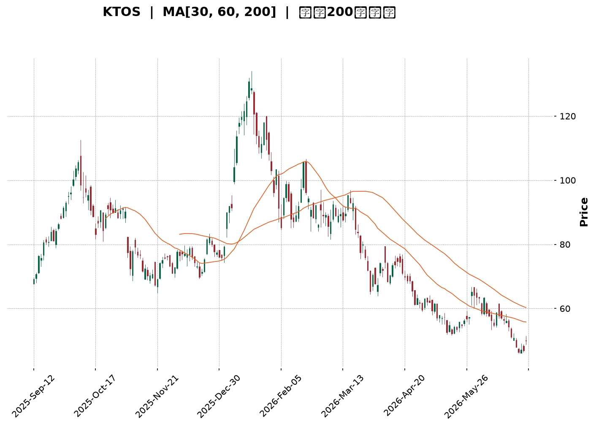
</details>

<html>
<head><meta charset="utf-8" /></head>
<body>
    <div style="height:500px; width:100%;">                        <script>window.PlotlyConfig = {MathJaxConfig: 'local'};</script>
        <script charset="utf-8" src="https://cdn.plot.ly/plotly-3.6.0.min.js" integrity="sha256-QaOVwtVY0T02VaHrr6pnoHLCwayMJp4O5n4YyaE3rJk=" crossorigin="anonymous"></script>                <div id="candlestick-chart" class="plotly-graph-div" style="height:100%; width:100%;"></div>            <script>                window.PLOTLYENV=window.PLOTLYENV || {};                                if (document.getElementById("candlestick-chart")) {                    Plotly.newPlot(                        "candlestick-chart",                        [{"close":{"dtype":"f8","bdata":"AAAAwMxMUUAAAAAgXK9RQAAAAGBmFlNAAAAAIFzvUkAAAACgmSlUQAAAAKBHMVRAAAAAgBQuVEAAAACgmflUQAAAACCFS1RAAAAAwMwMVUAAAACA65FVQAAAAMAeBVZAAAAAIK7XVkAAAACgcD1XQAAAAIDrwVdAAAAAACkMWEAAAAAAABBZQAAAAAAp7FlAAAAAQOFqWkAAAABAM6NYQAAAAOBRqFdAAAAAgOsRWEAAAABAM9NXQAAAAMAepVZAAAAAIK4nVkAAAAAgrsdUQAAAAKCZqVVAAAAAIK6nVkAAAABAMxNVQAAAAOB6VFZAAAAAIIXLVkAAAAAghatWQAAAAIDrcVZAAAAAoHDNVkAAAABAMxNWQAAAAGBmplZAAAAAYGbGVkAAAACAFI5WQAAAAIA9WlNAAAAAgD0aUkAAAADgUXhTQAAAACCFy1NAAAAAgMIlU0AAAADAzCxTQAAAAAAp7FFAAAAAwMwcUkAAAAAgXI9RQAAAAEAKl1FAAAAAQOGqUUAAAAAA19NQQAAAAMD1SFFAAAAAQAqHUkAAAABAM8NSQAAAAKBH8VJAAAAAYGYGU0AAAACgcE1SQAAAAKBwvVFAAAAAgOsxUkAAAAAghWtTQAAAAAAAIFNAAAAAgOtBU0AAAACA60FTQAAAAIA9OlNAAAAAgOuxU0AAAACgcP1SQAAAAOCjkFJAAAAA4FFIUkAAAACgR3FRQAAAAKCZ2VFAAAAAwPXYUkAAAACA62FUQAAAAEAzk1RAAAAAgBT+U0AAAADAzGxTQAAAAIAUXlNAAAAAYLj+UkAAAACAPfpSQAAAAGCP0lNAAAAAIIV7VkAAAAAghftWQAAAAAAp3FZAAAAAYI8CWkAAAADAzGxcQAAAAEAKd11AAAAAgBTuXUAAAAAAAGBeQAAAAADXI19AAAAAQApXYEAAAACAwhVgQAAAAIDCJV5AAAAAYGZ2XEAAAADA9ZhbQAAAAOB61FtAAAAAANeDXUAAAABA4SpcQAAAAIA9CltAAAAA4KPAWUAAAACAPQpYQAAAACCu11lAAAAAwB7VVkAAAAAAAFBVQAAAAIA9mldAAAAAANezWEAAAABguF5XQAAAAIDr8VVAAAAAQDPDVUAAAAAA10NWQAAAAIAU\u002flZAAAAAoHBNWEAAAABA4WpaQAAAAMAeBVhAAAAAANeTV0AAAAAghatWQAAAAGC4DlZAAAAAwPUIV0AAAAAghYtVQAAAAIAUrlZAAAAAwMw8VkAAAADgUUhWQAAAAGCPYlVAAAAAAADAVUAAAACAFB5XQAAAAKBwPVZAAAAAQOE6VkAAAACgcF1WQAAAAIDr4VVAAAAAgOthVkAAAAAA19NXQAAAAGCPQldAAAAAgOsxV0AAAAAgridVQAAAAAAp7FRAAAAAIFxfU0AAAABguP5TQAAAAEAK91JAAAAAACn8UUAAAACA61FQQAAAAOCjoFFAAAAAwMzsUEAAAAAA19NQQAAAAIDChVJAAAAAoHD9UUAAAACgcJ1SQAAAAMAeFVFAAAAAgMKVUUAAAABAM2NSQAAAAIA9alJAAAAAgD2qUkAAAACAPZpSQAAAACBcv1FAAAAAwB51UUAAAABAMyNRQAAAAEAKJ1FAAAAAoEdhUEAAAACgR6FOQAAAAOB6lE9AAAAA4HrUTkAAAAAgrsdNQAAAAGBmhk9AAAAAYGYGT0AAAABACvdOQAAAACCup01AAAAAYI\u002fCTkAAAAAAAIBMQAAAAIDr8UxAAAAAYLh+TEAAAACAPapMQAAAAGC4PkpAAAAAwMxsS0AAAAAghQtKQAAAAAApHEtAAAAAACm8SkAAAADA9ehLQAAAAIDCVUtAAAAAQAoXTEAAAABgZmZMQAAAAGBmpkxAAAAAAClMUEAAAADgUQhQQAAAAGC4vk9AAAAAYI+iT0AAAABACjdNQAAAAEAzs09AAAAAYI9CTUAAAACgcN1MQAAAAOBRGExAAAAAwPVoS0AAAAAA12NNQAAAAAAA4ExAAAAAYI+CTEAAAAAghStMQAAAAOB6FExAAAAAQOEaS0AAAAAghYtJQAAAAGBmZklAAAAAoJn5R0AAAADA9ShHQAAAAEDhmkdAAAAAoJl5R0AAAACAFO5IQA=="},"high":{"dtype":"f8","bdata":"AAAAoHBtUUAAAAAA19NRQAAAACCuJ1NAAAAAgOtBU0AAAAAAKVxUQAAAAADXk1RAAAAA4FGoVEAAAABguF5VQAAAAAAAQFVAAAAA4FE4VUAAAACAwrVVQAAAAEDhalZAAAAAIK73VkAAAACgR2FXQAAAAKCZGVhAAAAAIK6HWEAAAAAAAMBZQAAAAKBwLVpAAAAAANeTWkAAAADgeiRcQAAAAKCZqVlAAAAAAABgWUAAAABgZkZYQAAAACBcn1hAAAAAgMIlV0AAAACgR6FVQAAAAIAULlZAAAAAQDOzVkAAAAAAAIBWQAAAAMDMfFZAAAAAIIU7V0AAAABgZqZXQAAAAMDMHFdAAAAAIK53V0AAAAAAAMBWQAAAAKCZCVdAAAAAgBTuVkAAAACAwuVWQAAAAAAAoFRAAAAAgBTeU0AAAABgZpZTQAAAAAAAgFRAAAAAIFy\u002fU0AAAABA4YpTQAAAAKCZ+VJAAAAAoEdxUkAAAADAzDxSQAAAAAAA0FFAAAAAIIULUkAAAABguJ5SQAAAAIDCVVFAAAAAACmcUkAAAAAghQtTQAAAAEDhSlNAAAAAIFwfU0AAAABgZiZTQAAAAGBmplJAAAAAAABAUkAAAADgepRTQAAAAOBRiFNAAAAA4HqEU0AAAACAPepTQAAAAKBwnVNAAAAAgBTeU0AAAACgmdlTQAAAAEDhGlNAAAAA4FGoUkAAAAAgXI9SQAAAAIA9GlJAAAAAYI\u002fyUkAAAAAgrndUQAAAAIA92lRAAAAAACl8VEAAAACAPfpTQAAAAIAUjlNAAAAAACmMU0AAAACAFD5TQAAAAGC47lNAAAAAQAqHVkAAAACA6wFXQAAAAOB61FdAAAAAQDNzW0AAAADAzNxcQAAAAOBR6F1AAAAA4HpkXkAAAACgcP1eQAAAAADXk19AAAAAAACAYEAAAAAAAMBgQAAAAAAAAGBAAAAAQDNTXkAAAACA6+FcQAAAAEDhalxAAAAAwPWIXUAAAAAAAABeQAAAAMDMzFxAAAAAAAAwW0AAAADA9UhZQAAAACBc31lAAAAAAADAWUAAAABgZiZXQAAAAEDhqldAAAAAgOvxWEAAAAAAAOBYQAAAAEAzI1hAAAAAgMJlVkAAAAAgXA9XQAAAAGBmVldAAAAAAAAgWUAAAACAPXpaQAAAAEDhqlpAAAAAwB7FV0AAAAAgXO9WQAAAAIDrUVdAAAAAACkcV0AAAACgmZlVQAAAAGBmRlhAAAAAgBROV0AAAABgZoZWQAAAACBcX1ZAAAAA4FG4VkAAAABA4WpXQAAAAEAzE1dAAAAAYLi+VkAAAAAgrtdWQAAAAKCZ+VZAAAAAQDPzVkAAAABgZtZXQAAAAOBROFhAAAAAAACgV0AAAAAAAABXQAAAAADXk1VAAAAAoEfBVEAAAAAAKTxUQAAAAIDr4VNAAAAA4FEYU0AAAACgmflRQAAAAIAUvlFAAAAAQDMzUkAAAADgo2BRQAAAAIA9mlJAAAAAoJk5UkAAAAAAKdxTQAAAAAAAoFJAAAAAgOuhUUAAAABgZoZSQAAAAOB6JFNAAAAAYI8SU0AAAACAFE5TQAAAAMD1OFNAAAAAoHDtUUAAAACgmblRQAAAAGC4vlFAAAAAIFwvUUAAAADgo3BQQAAAACCFG1BAAAAAoJlZT0AAAACgR+FOQAAAAEAKl09AAAAAAADAT0AAAADgUQhQQAAAAMAeZU9AAAAAYLjeTkAAAADAHsVOQAAAAOBR+ExAAAAAQOHaTEAAAADgo1BNQAAAAAAAQExAAAAAACn8S0AAAABAM\u002fNKQAAAAAApXEtAAAAAIIVLS0AAAADgo\u002fBLQAAAAADXg0tAAAAAAABgTEAAAABgZqZNQAAAAIAUrkxAAAAAwB61UEAAAAAAALBQQAAAAMDMjFBAAAAAQDPTT0AAAADAzOxOQAAAACCFy09AAAAAwMwMT0AAAAAAAOBNQAAAAGBmpk1AAAAAYGZmTEAAAACA63FNQAAAAKCZ2U5AAAAAAADATUAAAACA67FMQAAAAEAzM01AAAAAAABgTEAAAABAMxNLQAAAACCFK0pAAAAAwB5lSUAAAAAA1+NHQAAAAOBRmEhAAAAAgOtxSEAAAACgJbxJQA=="},"hovertemplate":"\u003cb\u003e%{x|%Y-%m-%d}\u003c\u002fb\u003e\u003cbr\u003e\u958b: $%{open:.2f}\u003cbr\u003e\u9ad8: $%{high:.2f}\u003cbr\u003e\u4f4e: $%{low:.2f}\u003cbr\u003e\u6536: $%{close:.2f}\u003cextra\u003e\u003c\u002fextra\u003e","low":{"dtype":"f8","bdata":"AAAAoJnpUEAAAACgmflQQAAAAMAetVFAAAAAQApHUkAAAACgR8FSQAAAAKCZ+VNAAAAAQDPTU0AAAABgZkZUQAAAAGBmNlRAAAAAIK63U0AAAAAghRtVQAAAAEAz81VAAAAAYGYGVkAAAADgUShWQAAAAIDrIVdAAAAAQAp3V0AAAACgR4FYQAAAAAAAAFlAAAAAoJl5WUAAAABAMzNYQAAAAKCZOVdAAAAAQOGqV0AAAABgj7JWQAAAAIA9SlZAAAAAIFwfVkAAAACgcG1UQAAAAMDMTFVAAAAAwMxMVUAAAAAA1zNUQAAAACCuN1VAAAAAIIVLVkAAAADgoxBWQAAAAAApbFZAAAAAoHB9VkAAAABgjwJWQAAAAIA9+lVAAAAAwMz8VUAAAADgerRVQAAAAGBm9lJAAAAAoEeRUUAAAACgmSlRQAAAAEAzQ1NAAAAAwPX4UkAAAAAAAOBSQAAAAADX01FAAAAAAABAUUAAAABgZjZRQAAAAIDr8VBAAAAAQDNTUUAAAACAPbpQQAAAAEAzM1BAAAAAwPVIUUAAAACgmSlSQAAAAADX01JAAAAA4KPAUkAAAAAghTtSQAAAACCut1FAAAAAIIVrUUAAAACA6xFSQAAAAOCjsFJAAAAAoJnJUkAAAAAA1wNTQAAAAMDMTFJAAAAAQDOzUkAAAADAzMxSQAAAAGBmRlJAAAAAQOEaUkAAAAAA11NRQAAAAMD1iFFAAAAAYLjOUUAAAAAA1zNTQAAAAGBm9lNAAAAAgOvRU0AAAABgZgZTQAAAAKCZCVNAAAAAQDPzUkAAAADgUbhSQAAAAMAelVJAAAAA4FGIVEAAAADAzKxVQAAAAOCjoFZAAAAAoEexWEAAAACgmSlaQAAAAAAAoFxAAAAAwMxMXUAAAAAAAIBcQAAAAKBHUV1AAAAAAABAX0AAAAAAAMBfQAAAAIDrkVxAAAAAYLjOW0AAAABAChdbQAAAAKBHsVpAAAAAANfDW0AAAADgo1BbQAAAAIDChVpAAAAA4FFoWUAAAACgR7FXQAAAAKCZSVhAAAAAQOG6VUAAAAAAACBVQAAAAAAAAFZAAAAAwMxMV0AAAACgcE1XQAAAAKBHQVVAAAAAAABQVUAAAACgR8FVQAAAAOB6xFVAAAAAwMw8V0AAAABguD5YQAAAACCF21dAAAAAAADAVkAAAABgjwJVQAAAAKBwDVZAAAAAwPWoVUAAAAAAAABVQAAAAMAeVVVAAAAAYGamVUAAAAAAAHBVQAAAAKCZmVRAAAAAAABgVEAAAADAzMxVQAAAAMD1KFZAAAAAIK6nVUAAAADA9VhVQAAAAMDMzFVAAAAAoJm5VUAAAAAgXI9WQAAAAIA9KldAAAAAwPXoVUAAAABgZsZUQAAAAOB6hFRAAAAAoEfhUkAAAAAA11NTQAAAAKCZyVJAAAAAwMzsUUAAAAAgrhdQQAAAAEAzY1BAAAAAYGbmUEAAAAAghetPQAAAAMDMjFFAAAAAQDNzUUAAAABAMyNSQAAAAIDrEVFAAAAAIIXbUEAAAABACmdRQAAAAKBHIVJAAAAAAABQUkAAAADgo0BSQAAAAIA9mlFAAAAAQAo3UUAAAADgevRQQAAAAMD16FBAAAAAwB7lT0AAAACgR4FOQAAAAOBRmE5AAAAAACkcTkAAAAAgrodNQAAAAIDr0U1AAAAAoJl5TkAAAACgR+FOQAAAAKBHAU1AAAAAQAo3TUAAAADAHiVMQAAAAKBw3UtAAAAAoEeBS0AAAACAFI5LQAAAACCF60lAAAAAYLg+SkAAAADgetRJQAAAAIA9CkpAAAAAANdjSkAAAABAM1NKQAAAACCu50pAAAAAQOE6S0AAAABAM\u002fNLQAAAAAAAgEtAAAAAAACATkAAAACAPQpOQAAAAEAzk05AAAAAQArXTkAAAABAM\u002fNMQAAAAOBR+ExAAAAAAADATEAAAAAgXK9MQAAAACCup0pAAAAAAAAgS0AAAADA9QhLQAAAAOB6dExAAAAAQApXTEAAAACgR4FLQAAAAMDMzEtAAAAA4FF4SkAAAABACldJQAAAACCuB0lAAAAAANfjR0AAAACgRwFHQAAAAMAeBUdAAAAAgMI1R0AAAADgxVVIQA=="},"name":"\u50f9\u683c","open":{"dtype":"f8","bdata":"AAAAIFzvUEAAAADAzFxRQAAAAADXw1FAAAAA4KPAUkAAAACgmSlTQAAAAKBHYVRAAAAAQAonVEAAAABgZkZUQAAAACCuF1VAAAAAAAAAVEAAAAAAAEBVQAAAAMDMPFZAAAAAwPUYVkAAAAAAAKBWQAAAAAAAwFdAAAAAACnsV0AAAABgZpZYQAAAAKCZSVlAAAAA4HrEWUAAAADA9ehaQAAAAMDMrFdAAAAAgBReWEAAAACAFG5XQAAAAMDMfFhAAAAAIFz\u002fVkAAAABA4TpVQAAAAIDr0VVAAAAAQArHVUAAAAAAAIBWQAAAAMDMTFVAAAAA4FEIV0AAAADgekRXQAAAAOB6xFZAAAAAAACAVkAAAAAAAIBWQAAAAAAAYFZAAAAAwB61VkAAAABguA5WQAAAACCul1RAAAAAwMx8U0AAAABAM5NRQAAAACCFW1RAAAAAYLhuU0AAAACA6zFTQAAAAAApvFJAAAAAgD1KUUAAAACAwgVSQAAAACBcL1FAAAAAwB5lUUAAAABguJ5SQAAAAADXs1BAAAAAQOFaUUAAAACAPYpSQAAAAEAz81JAAAAAYLgOU0AAAABgZiZTQAAAACCuh1JAAAAA4KPAUUAAAACgRyFSQAAAAAApbFNAAAAAgMJlU0AAAADgeiRTQAAAAAAAAFNAAAAAIFwvU0AAAAAghbtTQAAAAKBHEVNAAAAAAABAUkAAAADgUUhSQAAAAAApvFFAAAAAgOvhUUAAAAAAAEBTQAAAAIAUHlRAAAAAQApHVEAAAACAPfpTQAAAAKBwPVNAAAAAACmMU0AAAABAMzNTQAAAAEAzI1NAAAAAgD06VUAAAADA9XhWQAAAAOBRKFdAAAAAgOvhWEAAAABguF5aQAAAAGBmNl1AAAAAgD26XUAAAAAAAKBdQAAAAMD1+F1AAAAAoHBtX0AAAAAghQNgQAAAAGCP4l9AAAAA4KNAXkAAAADAHnVcQAAAAMDMLFtAAAAAANfDW0AAAAAAAABeQAAAAOBRuFxAAAAA4Hp0WkAAAACAPfpYQAAAAGBmplhAAAAAoHBdWUAAAACAFB5WQAAAAGBmRlZAAAAAYGamV0AAAADgerRYQAAAAIA9+ldAAAAAoJkZVkAAAAAgXM9VQAAAAMAeBVZAAAAAwPVIV0AAAACgcG1YQAAAAAApbFpAAAAAoEdRV0AAAAAAADBWQAAAAAApPFdAAAAAACn8VUAAAABAM1NVQAAAAEDhGldAAAAAoHBNVkAAAADgoyBWQAAAAGBmNlZAAAAA4FHYVEAAAABACvdVQAAAAAAp3FZAAAAAgOvBVUAAAAAAKTxWQAAAAAAAgFZAAAAAgMI1VkAAAABACrdWQAAAAIA9mldAAAAA4KOgVkAAAADAzNxWQAAAAIDC9VRAAAAAQOGqVEAAAABgj\u002fJTQAAAAOBRmFNAAAAAQAq3UkAAAADgo\u002fBRQAAAAKCZuVBAAAAAwPUoUkAAAACA61FQQAAAAOBRyFFAAAAAAAAQUkAAAADgUdhTQAAAAMDMjFJAAAAAoEcBUUAAAABgZoZRQAAAAIA9qlJAAAAAACnsUkAAAAAA1xNTQAAAACCF21JAAAAAYI+CUUAAAADgo5BRQAAAACCuh1FAAAAAwMwcUUAAAADgo3BQQAAAAOBRmE5AAAAA4FH4TkAAAABguN5OQAAAAMAeJU5AAAAA4Hq0T0AAAAAAKTxPQAAAAOBRWE9AAAAAgD2KTUAAAADAHsVOQAAAAIA9ikxAAAAAIFxvTEAAAAAghatMQAAAAOB6NExAAAAAoEdhSkAAAABguL5KQAAAAKBHIUpAAAAAYLgeS0AAAACgmflKQAAAAAAAgEtAAAAAwB6lS0AAAADgetRMQAAAAKBwfUxAAAAAQOH6T0AAAACAPapQQAAAAAApPFBAAAAAwPXIT0AAAAAgXM9OQAAAAIAULk1AAAAAgOvRTkAAAAAAKdxNQAAAACCuB01AAAAAwMzMS0AAAADA9WhLQAAAAGC4vk5AAAAA4FGYTUAAAACAFE5MQAAAAOCj0EtAAAAAACkcTEAAAABgj+JKQAAAACCuB0lAAAAAQAoXSUAAAABAM7NHQAAAAMAeBUdAAAAAwMwsSEAAAACgcA1JQA=="},"x":["2025-09-12T00:00:00-04:00","2025-09-15T00:00:00-04:00","2025-09-16T00:00:00-04:00","2025-09-17T00:00:00-04:00","2025-09-18T00:00:00-04:00","2025-09-19T00:00:00-04:00","2025-09-22T00:00:00-04:00","2025-09-23T00:00:00-04:00","2025-09-24T00:00:00-04:00","2025-09-25T00:00:00-04:00","2025-09-26T00:00:00-04:00","2025-09-29T00:00:00-04:00","2025-09-30T00:00:00-04:00","2025-10-01T00:00:00-04:00","2025-10-02T00:00:00-04:00","2025-10-03T00:00:00-04:00","2025-10-06T00:00:00-04:00","2025-10-07T00:00:00-04:00","2025-10-08T00:00:00-04:00","2025-10-09T00:00:00-04:00","2025-10-10T00:00:00-04:00","2025-10-13T00:00:00-04:00","2025-10-14T00:00:00-04:00","2025-10-15T00:00:00-04:00","2025-10-16T00:00:00-04:00","2025-10-17T00:00:00-04:00","2025-10-20T00:00:00-04:00","2025-10-21T00:00:00-04:00","2025-10-22T00:00:00-04:00","2025-10-23T00:00:00-04:00","2025-10-24T00:00:00-04:00","2025-10-27T00:00:00-04:00","2025-10-28T00:00:00-04:00","2025-10-29T00:00:00-04:00","2025-10-30T00:00:00-04:00","2025-10-31T00:00:00-04:00","2025-11-03T00:00:00-05:00","2025-11-04T00:00:00-05:00","2025-11-05T00:00:00-05:00","2025-11-06T00:00:00-05:00","2025-11-07T00:00:00-05:00","2025-11-10T00:00:00-05:00","2025-11-11T00:00:00-05:00","2025-11-12T00:00:00-05:00","2025-11-13T00:00:00-05:00","2025-11-14T00:00:00-05:00","2025-11-17T00:00:00-05:00","2025-11-18T00:00:00-05:00","2025-11-19T00:00:00-05:00","2025-11-20T00:00:00-05:00","2025-11-21T00:00:00-05:00","2025-11-24T00:00:00-05:00","2025-11-25T00:00:00-05:00","2025-11-26T00:00:00-05:00","2025-11-28T00:00:00-05:00","2025-12-01T00:00:00-05:00","2025-12-02T00:00:00-05:00","2025-12-03T00:00:00-05:00","2025-12-04T00:00:00-05:00","2025-12-05T00:00:00-05:00","2025-12-08T00:00:00-05:00","2025-12-09T00:00:00-05:00","2025-12-10T00:00:00-05:00","2025-12-11T00:00:00-05:00","2025-12-12T00:00:00-05:00","2025-12-15T00:00:00-05:00","2025-12-16T00:00:00-05:00","2025-12-17T00:00:00-05:00","2025-12-18T00:00:00-05:00","2025-12-19T00:00:00-05:00","2025-12-22T00:00:00-05:00","2025-12-23T00:00:00-05:00","2025-12-24T00:00:00-05:00","2025-12-26T00:00:00-05:00","2025-12-29T00:00:00-05:00","2025-12-30T00:00:00-05:00","2025-12-31T00:00:00-05:00","2026-01-02T00:00:00-05:00","2026-01-05T00:00:00-05:00","2026-01-06T00:00:00-05:00","2026-01-07T00:00:00-05:00","2026-01-08T00:00:00-05:00","2026-01-09T00:00:00-05:00","2026-01-12T00:00:00-05:00","2026-01-13T00:00:00-05:00","2026-01-14T00:00:00-05:00","2026-01-15T00:00:00-05:00","2026-01-16T00:00:00-05:00","2026-01-20T00:00:00-05:00","2026-01-21T00:00:00-05:00","2026-01-22T00:00:00-05:00","2026-01-23T00:00:00-05:00","2026-01-26T00:00:00-05:00","2026-01-27T00:00:00-05:00","2026-01-28T00:00:00-05:00","2026-01-29T00:00:00-05:00","2026-01-30T00:00:00-05:00","2026-02-02T00:00:00-05:00","2026-02-03T00:00:00-05:00","2026-02-04T00:00:00-05:00","2026-02-05T00:00:00-05:00","2026-02-06T00:00:00-05:00","2026-02-09T00:00:00-05:00","2026-02-10T00:00:00-05:00","2026-02-11T00:00:00-05:00","2026-02-12T00:00:00-05:00","2026-02-13T00:00:00-05:00","2026-02-17T00:00:00-05:00","2026-02-18T00:00:00-05:00","2026-02-19T00:00:00-05:00","2026-02-20T00:00:00-05:00","2026-02-23T00:00:00-05:00","2026-02-24T00:00:00-05:00","2026-02-25T00:00:00-05:00","2026-02-26T00:00:00-05:00","2026-02-27T00:00:00-05:00","2026-03-02T00:00:00-05:00","2026-03-03T00:00:00-05:00","2026-03-04T00:00:00-05:00","2026-03-05T00:00:00-05:00","2026-03-06T00:00:00-05:00","2026-03-09T00:00:00-04:00","2026-03-10T00:00:00-04:00","2026-03-11T00:00:00-04:00","2026-03-12T00:00:00-04:00","2026-03-13T00:00:00-04:00","2026-03-16T00:00:00-04:00","2026-03-17T00:00:00-04:00","2026-03-18T00:00:00-04:00","2026-03-19T00:00:00-04:00","2026-03-20T00:00:00-04:00","2026-03-23T00:00:00-04:00","2026-03-24T00:00:00-04:00","2026-03-25T00:00:00-04:00","2026-03-26T00:00:00-04:00","2026-03-27T00:00:00-04:00","2026-03-30T00:00:00-04:00","2026-03-31T00:00:00-04:00","2026-04-01T00:00:00-04:00","2026-04-02T00:00:00-04:00","2026-04-06T00:00:00-04:00","2026-04-07T00:00:00-04:00","2026-04-08T00:00:00-04:00","2026-04-09T00:00:00-04:00","2026-04-10T00:00:00-04:00","2026-04-13T00:00:00-04:00","2026-04-14T00:00:00-04:00","2026-04-15T00:00:00-04:00","2026-04-16T00:00:00-04:00","2026-04-17T00:00:00-04:00","2026-04-20T00:00:00-04:00","2026-04-21T00:00:00-04:00","2026-04-22T00:00:00-04:00","2026-04-23T00:00:00-04:00","2026-04-24T00:00:00-04:00","2026-04-27T00:00:00-04:00","2026-04-28T00:00:00-04:00","2026-04-29T00:00:00-04:00","2026-04-30T00:00:00-04:00","2026-05-01T00:00:00-04:00","2026-05-04T00:00:00-04:00","2026-05-05T00:00:00-04:00","2026-05-06T00:00:00-04:00","2026-05-07T00:00:00-04:00","2026-05-08T00:00:00-04:00","2026-05-11T00:00:00-04:00","2026-05-12T00:00:00-04:00","2026-05-13T00:00:00-04:00","2026-05-14T00:00:00-04:00","2026-05-15T00:00:00-04:00","2026-05-18T00:00:00-04:00","2026-05-19T00:00:00-04:00","2026-05-20T00:00:00-04:00","2026-05-21T00:00:00-04:00","2026-05-22T00:00:00-04:00","2026-05-26T00:00:00-04:00","2026-05-27T00:00:00-04:00","2026-05-28T00:00:00-04:00","2026-05-29T00:00:00-04:00","2026-06-01T00:00:00-04:00","2026-06-02T00:00:00-04:00","2026-06-03T00:00:00-04:00","2026-06-04T00:00:00-04:00","2026-06-05T00:00:00-04:00","2026-06-08T00:00:00-04:00","2026-06-09T00:00:00-04:00","2026-06-10T00:00:00-04:00","2026-06-11T00:00:00-04:00","2026-06-12T00:00:00-04:00","2026-06-15T00:00:00-04:00","2026-06-16T00:00:00-04:00","2026-06-17T00:00:00-04:00","2026-06-18T00:00:00-04:00","2026-06-22T00:00:00-04:00","2026-06-23T00:00:00-04:00","2026-06-24T00:00:00-04:00","2026-06-25T00:00:00-04:00","2026-06-26T00:00:00-04:00","2026-06-29T00:00:00-04:00","2026-06-30T00:00:00-04:00"],"type":"candlestick"},{"hovertemplate":"MA30: $%{y:.2f}\u003cextra\u003e\u003c\u002fextra\u003e","line":{"color":"#2196F3","dash":"dash","width":2},"mode":"lines","name":"MA30","x":["2025-09-12T00:00:00-04:00","2025-09-15T00:00:00-04:00","2025-09-16T00:00:00-04:00","2025-09-17T00:00:00-04:00","2025-09-18T00:00:00-04:00","2025-09-19T00:00:00-04:00","2025-09-22T00:00:00-04:00","2025-09-23T00:00:00-04:00","2025-09-24T00:00:00-04:00","2025-09-25T00:00:00-04:00","2025-09-26T00:00:00-04:00","2025-09-29T00:00:00-04:00","2025-09-30T00:00:00-04:00","2025-10-01T00:00:00-04:00","2025-10-02T00:00:00-04:00","2025-10-03T00:00:00-04:00","2025-10-06T00:00:00-04:00","2025-10-07T00:00:00-04:00","2025-10-08T00:00:00-04:00","2025-10-09T00:00:00-04:00","2025-10-10T00:00:00-04:00","2025-10-13T00:00:00-04:00","2025-10-14T00:00:00-04:00","2025-10-15T00:00:00-04:00","2025-10-16T00:00:00-04:00","2025-10-17T00:00:00-04:00","2025-10-20T00:00:00-04:00","2025-10-21T00:00:00-04:00","2025-10-22T00:00:00-04:00","2025-10-23T00:00:00-04:00","2025-10-24T00:00:00-04:00","2025-10-27T00:00:00-04:00","2025-10-28T00:00:00-04:00","2025-10-29T00:00:00-04:00","2025-10-30T00:00:00-04:00","2025-10-31T00:00:00-04:00","2025-11-03T00:00:00-05:00","2025-11-04T00:00:00-05:00","2025-11-05T00:00:00-05:00","2025-11-06T00:00:00-05:00","2025-11-07T00:00:00-05:00","2025-11-10T00:00:00-05:00","2025-11-11T00:00:00-05:00","2025-11-12T00:00:00-05:00","2025-11-13T00:00:00-05:00","2025-11-14T00:00:00-05:00","2025-11-17T00:00:00-05:00","2025-11-18T00:00:00-05:00","2025-11-19T00:00:00-05:00","2025-11-20T00:00:00-05:00","2025-11-21T00:00:00-05:00","2025-11-24T00:00:00-05:00","2025-11-25T00:00:00-05:00","2025-11-26T00:00:00-05:00","2025-11-28T00:00:00-05:00","2025-12-01T00:00:00-05:00","2025-12-02T00:00:00-05:00","2025-12-03T00:00:00-05:00","2025-12-04T00:00:00-05:00","2025-12-05T00:00:00-05:00","2025-12-08T00:00:00-05:00","2025-12-09T00:00:00-05:00","2025-12-10T00:00:00-05:00","2025-12-11T00:00:00-05:00","2025-12-12T00:00:00-05:00","2025-12-15T00:00:00-05:00","2025-12-16T00:00:00-05:00","2025-12-17T00:00:00-05:00","2025-12-18T00:00:00-05:00","2025-12-19T00:00:00-05:00","2025-12-22T00:00:00-05:00","2025-12-23T00:00:00-05:00","2025-12-24T00:00:00-05:00","2025-12-26T00:00:00-05:00","2025-12-29T00:00:00-05:00","2025-12-30T00:00:00-05:00","2025-12-31T00:00:00-05:00","2026-01-02T00:00:00-05:00","2026-01-05T00:00:00-05:00","2026-01-06T00:00:00-05:00","2026-01-07T00:00:00-05:00","2026-01-08T00:00:00-05:00","2026-01-09T00:00:00-05:00","2026-01-12T00:00:00-05:00","2026-01-13T00:00:00-05:00","2026-01-14T00:00:00-05:00","2026-01-15T00:00:00-05:00","2026-01-16T00:00:00-05:00","2026-01-20T00:00:00-05:00","2026-01-21T00:00:00-05:00","2026-01-22T00:00:00-05:00","2026-01-23T00:00:00-05:00","2026-01-26T00:00:00-05:00","2026-01-27T00:00:00-05:00","2026-01-28T00:00:00-05:00","2026-01-29T00:00:00-05:00","2026-01-30T00:00:00-05:00","2026-02-02T00:00:00-05:00","2026-02-03T00:00:00-05:00","2026-02-04T00:00:00-05:00","2026-02-05T00:00:00-05:00","2026-02-06T00:00:00-05:00","2026-02-09T00:00:00-05:00","2026-02-10T00:00:00-05:00","2026-02-11T00:00:00-05:00","2026-02-12T00:00:00-05:00","2026-02-13T00:00:00-05:00","2026-02-17T00:00:00-05:00","2026-02-18T00:00:00-05:00","2026-02-19T00:00:00-05:00","2026-02-20T00:00:00-05:00","2026-02-23T00:00:00-05:00","2026-02-24T00:00:00-05:00","2026-02-25T00:00:00-05:00","2026-02-26T00:00:00-05:00","2026-02-27T00:00:00-05:00","2026-03-02T00:00:00-05:00","2026-03-03T00:00:00-05:00","2026-03-04T00:00:00-05:00","2026-03-05T00:00:00-05:00","2026-03-06T00:00:00-05:00","2026-03-09T00:00:00-04:00","2026-03-10T00:00:00-04:00","2026-03-11T00:00:00-04:00","2026-03-12T00:00:00-04:00","2026-03-13T00:00:00-04:00","2026-03-16T00:00:00-04:00","2026-03-17T00:00:00-04:00","2026-03-18T00:00:00-04:00","2026-03-19T00:00:00-04:00","2026-03-20T00:00:00-04:00","2026-03-23T00:00:00-04:00","2026-03-24T00:00:00-04:00","2026-03-25T00:00:00-04:00","2026-03-26T00:00:00-04:00","2026-03-27T00:00:00-04:00","2026-03-30T00:00:00-04:00","2026-03-31T00:00:00-04:00","2026-04-01T00:00:00-04:00","2026-04-02T00:00:00-04:00","2026-04-06T00:00:00-04:00","2026-04-07T00:00:00-04:00","2026-04-08T00:00:00-04:00","2026-04-09T00:00:00-04:00","2026-04-10T00:00:00-04:00","2026-04-13T00:00:00-04:00","2026-04-14T00:00:00-04:00","2026-04-15T00:00:00-04:00","2026-04-16T00:00:00-04:00","2026-04-17T00:00:00-04:00","2026-04-20T00:00:00-04:00","2026-04-21T00:00:00-04:00","2026-04-22T00:00:00-04:00","2026-04-23T00:00:00-04:00","2026-04-24T00:00:00-04:00","2026-04-27T00:00:00-04:00","2026-04-28T00:00:00-04:00","2026-04-29T00:00:00-04:00","2026-04-30T00:00:00-04:00","2026-05-01T00:00:00-04:00","2026-05-04T00:00:00-04:00","2026-05-05T00:00:00-04:00","2026-05-06T00:00:00-04:00","2026-05-07T00:00:00-04:00","2026-05-08T00:00:00-04:00","2026-05-11T00:00:00-04:00","2026-05-12T00:00:00-04:00","2026-05-13T00:00:00-04:00","2026-05-14T00:00:00-04:00","2026-05-15T00:00:00-04:00","2026-05-18T00:00:00-04:00","2026-05-19T00:00:00-04:00","2026-05-20T00:00:00-04:00","2026-05-21T00:00:00-04:00","2026-05-22T00:00:00-04:00","2026-05-26T00:00:00-04:00","2026-05-27T00:00:00-04:00","2026-05-28T00:00:00-04:00","2026-05-29T00:00:00-04:00","2026-06-01T00:00:00-04:00","2026-06-02T00:00:00-04:00","2026-06-03T00:00:00-04:00","2026-06-04T00:00:00-04:00","2026-06-05T00:00:00-04:00","2026-06-08T00:00:00-04:00","2026-06-09T00:00:00-04:00","2026-06-10T00:00:00-04:00","2026-06-11T00:00:00-04:00","2026-06-12T00:00:00-04:00","2026-06-15T00:00:00-04:00","2026-06-16T00:00:00-04:00","2026-06-17T00:00:00-04:00","2026-06-18T00:00:00-04:00","2026-06-22T00:00:00-04:00","2026-06-23T00:00:00-04:00","2026-06-24T00:00:00-04:00","2026-06-25T00:00:00-04:00","2026-06-26T00:00:00-04:00","2026-06-29T00:00:00-04:00","2026-06-30T00:00:00-04:00"],"y":{"dtype":"f8","bdata":"AAAAAAAA+H8AAAAAAAD4fwAAAAAAAPh\u002fAAAAAAAA+H8AAAAAAAD4fwAAAAAAAPh\u002fAAAAAAAA+H8AAAAAAAD4fwAAAAAAAPh\u002fAAAAAAAA+H8AAAAAAAD4fwAAAAAAAPh\u002fAAAAAAAA+H8AAAAAAAD4fwAAAAAAAPh\u002fAAAAAAAA+H8AAAAAAAD4fwAAAAAAAPh\u002fAAAAAAAA+H8AAAAAAAD4fwAAAAAAAPh\u002fAAAAAAAA+H8AAAAAAAD4fwAAAAAAAPh\u002fAAAAAAAA+H8AAAAAAAD4fwAAAAAAAPh\u002fAAAAAAAA+H8AAAAAAAD4f+\u002fu7l4BAlZAIiIiYuUwVkCJiIhIb1tWQKuqqtoVeFZAmpmZiRaZVkBVVVV1aKlWQDMzM\u002fNgvlZAAAAA0IXUVkAAAABgAeJWQERERHT22VZAvLu7i8\u002fAVkBmZmYG5K5WQAAAAHDnm1ZAVVVVlV98VkBERER0r1lWQERERLTkJ1ZA7+7ufj\u002f1VUCJiIgIOrVVQImIiGgfblVA3t3dvXQjVUCJiIiIz+BUQImIiJhuqlRAIiIi0iJ7VEDv7u6e709UQCIiImJXMFRAq6qqyqEVVEC8u7ubfQBUQGZmZsYE31NAERERwfW4U0CamZlZ1qpTQLy7u+t8j1NAIiIiIk1xU0CamZlpLlRTQN7d3a25OFNA3t3dPTUeU0BERET04QNTQDMzMyMG4VJA7+7uHrC6UkARERGxD49SQN7d3W09glJAd3d355iIUkCrqqpKYpBSQKuqqjoKl1JAmpmZKUCeUkC8u7tLYqBSQCIiIvK2rFJAzczMzD60UkARERFhV8BSQJqZmVlk01JAERER4Xr8UkDv7u6uADFTQFVVVXWTYFNAq6qqOm2gU0B3d3dH4fJTQImIiAisTFRA7+7uXrqpVEBmZmYmvxBVQFVVVeUXg1VAzczM3LL+VUCJiIiof2tWQM3MzKyOyVZA3t3dTRsYV0AAAABQRl9XQCIiIsKuqFdAAAAA4Hr8V0De3d1ty0pYQJqZmVkdk1hAERER0dvSWEB3d3dHKAtZQJqZmSlcT1lAd3d3h11xWUBVVVUlTXlZQCIiItIik1lAiYiI+FO7WUBVVVX1\u002fdxZQHd3d5f88llAmpmZSZoKWkAAAADwpyZaQImIiOi0QVpAIiIiwjxRWkARERGhjG5aQAAAALByeFpA7+7uzrBjWkAiIiLSlDJaQERERORe81lAiYiIiIi4WUCrqqoaL21ZQERERPT9JFlAZmZm9uHLWEBERERkgndYQLy7u2u8LFhA3t3dvXTzV0CJiIgIOs1XQN7d3X2GnVdAq6qqKlxfV0CamZlp2C1XQN7d3a3VAVdAzczMzBPlVkBVVVWVQ+NWQGZmZgY6zVZAq6qq6lHQVkCrqqra+c5WQN7d3U0buFZA3t3dvZ+KVkARERHx0m1WQImIiAhlVFZAVVVV9Sg0VkCJiIjobQFWQDMzM+Ol01VA3t3dfbGUVUARERHR20JVQHd3d1fyE1VAMzMzQ0TkVECrqqr6qcFUQM3MzOw1l1RAd3d3N7RoVEDe3d2Nwk1UQFVVVYVdKVRAd3d3R+EKVEAzMzMzeutTQFVVVfVvzFNAmpmZ2c6nU0B3d3dXx3RTQHd3d4ddSVNAIiIiAnIXU0BEREQMSdtSQHd3d8dLp1JAMzMzC9drUkB3d3fHkh9SQFVVVT2Y31FAAAAAkAmeUUC8u7vLoW1RQImIiBCfOVFAERERUY0XUUC8u7srh+ZQQHd3dycxwFBA3t3ddUygUEC8u7uzVo9QQBEREWHlaFBAERERkXtNUEAzMzNrAy1QQImIiMCfAlBA7+7uflu2T0BVVVWl02ZPQHd3d0eLLE9AmpmZySDwTkARERFRqahOQERERNTbYk5AAAAAEHQ6TkDe3d2Nlw5OQO\u002fu7o6X7k1AmpmZSZrSTUC8u7uLbKdNQGZmZtYxkU1AmpmZ+VNzTUBmZmZGRGRNQM3MzCyHRk1AIiIiElgpTUCamZkZBCZNQGZmZhZnD01AzczM\u002fPD5TEB3d3c3F+JMQDMzM5Om1ExAq6qqGna1TEDv7u7OPpxMQDMzM6P+fUxAvLu7i2xXTEAAAACwcihMQERERITrEUxAzczMnDbwS0C8u7vbsuZLQA=="},"type":"scatter"},{"hovertemplate":"MA60: $%{y:.2f}\u003cextra\u003e\u003c\u002fextra\u003e","line":{"color":"#9C27B0","dash":"dash","width":2},"mode":"lines","name":"MA60","x":["2025-09-12T00:00:00-04:00","2025-09-15T00:00:00-04:00","2025-09-16T00:00:00-04:00","2025-09-17T00:00:00-04:00","2025-09-18T00:00:00-04:00","2025-09-19T00:00:00-04:00","2025-09-22T00:00:00-04:00","2025-09-23T00:00:00-04:00","2025-09-24T00:00:00-04:00","2025-09-25T00:00:00-04:00","2025-09-26T00:00:00-04:00","2025-09-29T00:00:00-04:00","2025-09-30T00:00:00-04:00","2025-10-01T00:00:00-04:00","2025-10-02T00:00:00-04:00","2025-10-03T00:00:00-04:00","2025-10-06T00:00:00-04:00","2025-10-07T00:00:00-04:00","2025-10-08T00:00:00-04:00","2025-10-09T00:00:00-04:00","2025-10-10T00:00:00-04:00","2025-10-13T00:00:00-04:00","2025-10-14T00:00:00-04:00","2025-10-15T00:00:00-04:00","2025-10-16T00:00:00-04:00","2025-10-17T00:00:00-04:00","2025-10-20T00:00:00-04:00","2025-10-21T00:00:00-04:00","2025-10-22T00:00:00-04:00","2025-10-23T00:00:00-04:00","2025-10-24T00:00:00-04:00","2025-10-27T00:00:00-04:00","2025-10-28T00:00:00-04:00","2025-10-29T00:00:00-04:00","2025-10-30T00:00:00-04:00","2025-10-31T00:00:00-04:00","2025-11-03T00:00:00-05:00","2025-11-04T00:00:00-05:00","2025-11-05T00:00:00-05:00","2025-11-06T00:00:00-05:00","2025-11-07T00:00:00-05:00","2025-11-10T00:00:00-05:00","2025-11-11T00:00:00-05:00","2025-11-12T00:00:00-05:00","2025-11-13T00:00:00-05:00","2025-11-14T00:00:00-05:00","2025-11-17T00:00:00-05:00","2025-11-18T00:00:00-05:00","2025-11-19T00:00:00-05:00","2025-11-20T00:00:00-05:00","2025-11-21T00:00:00-05:00","2025-11-24T00:00:00-05:00","2025-11-25T00:00:00-05:00","2025-11-26T00:00:00-05:00","2025-11-28T00:00:00-05:00","2025-12-01T00:00:00-05:00","2025-12-02T00:00:00-05:00","2025-12-03T00:00:00-05:00","2025-12-04T00:00:00-05:00","2025-12-05T00:00:00-05:00","2025-12-08T00:00:00-05:00","2025-12-09T00:00:00-05:00","2025-12-10T00:00:00-05:00","2025-12-11T00:00:00-05:00","2025-12-12T00:00:00-05:00","2025-12-15T00:00:00-05:00","2025-12-16T00:00:00-05:00","2025-12-17T00:00:00-05:00","2025-12-18T00:00:00-05:00","2025-12-19T00:00:00-05:00","2025-12-22T00:00:00-05:00","2025-12-23T00:00:00-05:00","2025-12-24T00:00:00-05:00","2025-12-26T00:00:00-05:00","2025-12-29T00:00:00-05:00","2025-12-30T00:00:00-05:00","2025-12-31T00:00:00-05:00","2026-01-02T00:00:00-05:00","2026-01-05T00:00:00-05:00","2026-01-06T00:00:00-05:00","2026-01-07T00:00:00-05:00","2026-01-08T00:00:00-05:00","2026-01-09T00:00:00-05:00","2026-01-12T00:00:00-05:00","2026-01-13T00:00:00-05:00","2026-01-14T00:00:00-05:00","2026-01-15T00:00:00-05:00","2026-01-16T00:00:00-05:00","2026-01-20T00:00:00-05:00","2026-01-21T00:00:00-05:00","2026-01-22T00:00:00-05:00","2026-01-23T00:00:00-05:00","2026-01-26T00:00:00-05:00","2026-01-27T00:00:00-05:00","2026-01-28T00:00:00-05:00","2026-01-29T00:00:00-05:00","2026-01-30T00:00:00-05:00","2026-02-02T00:00:00-05:00","2026-02-03T00:00:00-05:00","2026-02-04T00:00:00-05:00","2026-02-05T00:00:00-05:00","2026-02-06T00:00:00-05:00","2026-02-09T00:00:00-05:00","2026-02-10T00:00:00-05:00","2026-02-11T00:00:00-05:00","2026-02-12T00:00:00-05:00","2026-02-13T00:00:00-05:00","2026-02-17T00:00:00-05:00","2026-02-18T00:00:00-05:00","2026-02-19T00:00:00-05:00","2026-02-20T00:00:00-05:00","2026-02-23T00:00:00-05:00","2026-02-24T00:00:00-05:00","2026-02-25T00:00:00-05:00","2026-02-26T00:00:00-05:00","2026-02-27T00:00:00-05:00","2026-03-02T00:00:00-05:00","2026-03-03T00:00:00-05:00","2026-03-04T00:00:00-05:00","2026-03-05T00:00:00-05:00","2026-03-06T00:00:00-05:00","2026-03-09T00:00:00-04:00","2026-03-10T00:00:00-04:00","2026-03-11T00:00:00-04:00","2026-03-12T00:00:00-04:00","2026-03-13T00:00:00-04:00","2026-03-16T00:00:00-04:00","2026-03-17T00:00:00-04:00","2026-03-18T00:00:00-04:00","2026-03-19T00:00:00-04:00","2026-03-20T00:00:00-04:00","2026-03-23T00:00:00-04:00","2026-03-24T00:00:00-04:00","2026-03-25T00:00:00-04:00","2026-03-26T00:00:00-04:00","2026-03-27T00:00:00-04:00","2026-03-30T00:00:00-04:00","2026-03-31T00:00:00-04:00","2026-04-01T00:00:00-04:00","2026-04-02T00:00:00-04:00","2026-04-06T00:00:00-04:00","2026-04-07T00:00:00-04:00","2026-04-08T00:00:00-04:00","2026-04-09T00:00:00-04:00","2026-04-10T00:00:00-04:00","2026-04-13T00:00:00-04:00","2026-04-14T00:00:00-04:00","2026-04-15T00:00:00-04:00","2026-04-16T00:00:00-04:00","2026-04-17T00:00:00-04:00","2026-04-20T00:00:00-04:00","2026-04-21T00:00:00-04:00","2026-04-22T00:00:00-04:00","2026-04-23T00:00:00-04:00","2026-04-24T00:00:00-04:00","2026-04-27T00:00:00-04:00","2026-04-28T00:00:00-04:00","2026-04-29T00:00:00-04:00","2026-04-30T00:00:00-04:00","2026-05-01T00:00:00-04:00","2026-05-04T00:00:00-04:00","2026-05-05T00:00:00-04:00","2026-05-06T00:00:00-04:00","2026-05-07T00:00:00-04:00","2026-05-08T00:00:00-04:00","2026-05-11T00:00:00-04:00","2026-05-12T00:00:00-04:00","2026-05-13T00:00:00-04:00","2026-05-14T00:00:00-04:00","2026-05-15T00:00:00-04:00","2026-05-18T00:00:00-04:00","2026-05-19T00:00:00-04:00","2026-05-20T00:00:00-04:00","2026-05-21T00:00:00-04:00","2026-05-22T00:00:00-04:00","2026-05-26T00:00:00-04:00","2026-05-27T00:00:00-04:00","2026-05-28T00:00:00-04:00","2026-05-29T00:00:00-04:00","2026-06-01T00:00:00-04:00","2026-06-02T00:00:00-04:00","2026-06-03T00:00:00-04:00","2026-06-04T00:00:00-04:00","2026-06-05T00:00:00-04:00","2026-06-08T00:00:00-04:00","2026-06-09T00:00:00-04:00","2026-06-10T00:00:00-04:00","2026-06-11T00:00:00-04:00","2026-06-12T00:00:00-04:00","2026-06-15T00:00:00-04:00","2026-06-16T00:00:00-04:00","2026-06-17T00:00:00-04:00","2026-06-18T00:00:00-04:00","2026-06-22T00:00:00-04:00","2026-06-23T00:00:00-04:00","2026-06-24T00:00:00-04:00","2026-06-25T00:00:00-04:00","2026-06-26T00:00:00-04:00","2026-06-29T00:00:00-04:00","2026-06-30T00:00:00-04:00"],"y":{"dtype":"f8","bdata":"AAAAAAAA+H8AAAAAAAD4fwAAAAAAAPh\u002fAAAAAAAA+H8AAAAAAAD4fwAAAAAAAPh\u002fAAAAAAAA+H8AAAAAAAD4fwAAAAAAAPh\u002fAAAAAAAA+H8AAAAAAAD4fwAAAAAAAPh\u002fAAAAAAAA+H8AAAAAAAD4fwAAAAAAAPh\u002fAAAAAAAA+H8AAAAAAAD4fwAAAAAAAPh\u002fAAAAAAAA+H8AAAAAAAD4fwAAAAAAAPh\u002fAAAAAAAA+H8AAAAAAAD4fwAAAAAAAPh\u002fAAAAAAAA+H8AAAAAAAD4fwAAAAAAAPh\u002fAAAAAAAA+H8AAAAAAAD4fwAAAAAAAPh\u002fAAAAAAAA+H8AAAAAAAD4fwAAAAAAAPh\u002fAAAAAAAA+H8AAAAAAAD4fwAAAAAAAPh\u002fAAAAAAAA+H8AAAAAAAD4fwAAAAAAAPh\u002fAAAAAAAA+H8AAAAAAAD4fwAAAAAAAPh\u002fAAAAAAAA+H8AAAAAAAD4fwAAAAAAAPh\u002fAAAAAAAA+H8AAAAAAAD4fwAAAAAAAPh\u002fAAAAAAAA+H8AAAAAAAD4fwAAAAAAAPh\u002fAAAAAAAA+H8AAAAAAAD4fwAAAAAAAPh\u002fAAAAAAAA+H8AAAAAAAD4fwAAAAAAAPh\u002fAAAAAAAA+H8AAAAAAAD4f1VVVSW\u002fyFRAIiIiQhnRVEARERHZztdUQERERMRn2FRAvLu746XbVEDNzMw0pdZUQDMzM4uzz1RAd3d395rHVECJiIiIiLhUQBEREfEZrlRAmpmZObSkVECJiIgoo59UQFVVVdV4mVRAd3d330+NVEAAAADgCH1UQDMzM9NNalRA3t3dJb9UVEDNzMy0yDpUQBEREeHBIFRAd3d3z\u002fcPVEC8u7sb6AhUQO\u002fu7gaBBVRAZmZmBsgNVEAzMzNzaCFUQFVVVbWBPlRAzczMFK5fVEARERFhnohUQN7d3VUOsVRA7+7uTtTbVEAREREBKwtVQERERMyFLFVAAAAAOLREVUDNzMxcullVQAAAADi0cFVA7+7uDliNVUARERGxVqdVQGZmZr4RulVAAAAA+MXGVUBERET8G81VQLy7u8vM6FVAd3d3N\u002fv8VUAAAAC41wRWQGZmZoYWFVZAEREREcosVkCJiIggsD5WQM3MzMTZT1ZAMzMzi2xfVkCJiIiof3NWQBEREaGMilZAmpmZ0dumVkAAAACoxs9WQKuqqhKD7FZAzczMBA8CV0DNzMwMuxJXQGZmZnYFIFdAvLu7cyExV0CJiIgg9z5XQM3MzOwKVFdAmpmZaUplV0BmZmYGgXFXQERERIwle1dA3t3dBciFV0BEREQsQJZXQAAAAKAao1dAVVVVheutV0C8u7vrUbxXQLy7u4N5yldA7+7uzvfbV0BmZmbuNfdXQAAAABhLDlhAERERudcgWEAAAACAIyRYQAAAABCfJVhAMzMz2\u002fkiWEAzMzNzaCVYQAAAANCwI1hAd3d3n2EfWEBERETsChRYQN7d3WWtClhAAAAAIPfyV0ARERE5tNhXQLy7u4MyxldAERERifqjV0BmZmZmH3pXQImIiGhKRVdAAAAAYJ4QV0BERETUeN1WQM3MzLwtp1ZA7+7unmFrVkC8u7tLfjFWQImIiDCW\u002fFVAvLu7y6HNVUAAAACwAKFVQKuqqgJyc1VAZmZmFmc7VUDv7u66kARVQKuqqrqQ1FRAAAAAbHWoVEBmZmYua4FUQN7d3SFpVlRAVVVVvS03VEAzMzPTTR5UQDMzMy\u002fd+FNAd3d3hxbRU0BmZmYOLapTQAAAABhLilNAmpmZtTpqU0AiIiJOYkhTQCIiIqJFHlNAd3d3hxbxUkAiIiKe77dSQAAAAAxJi1JAVVVVAblfUkCrqqrmiTpSQERERMi9FlJAIiIiTmLwUUAzMzObC9FRQLy7u7dlrVFAvLu7pw2UUUARERH9YnlRQGZmZt7dYVFAMzMz\u002f41IUUCrqqrOPiRRQFVVVTn7CFFAd3d3\u002f43oUEC8u7uXtcZQQO\u002fu7q5HpVBAIiIiikGAUEAiIiJqSllQQEREROSlM1BAMzMzB4ENUEB3d3dnrd5PQCIiIlryo09AZmZmXkhyT0AzMzOTpjRPQBEREXkw\u002f05AvLu7uwLMTkC8u7sLkKNOQDMzMyPbcU5Ad3d335ZFTkARERHZXCBOQA=="},"type":"scatter"},{"hovertemplate":"MA200: $%{y:.2f}\u003cextra\u003e\u003c\u002fextra\u003e","line":{"color":"#FF6F00","dash":"solid","width":2},"mode":"lines","name":"MA200","x":["2025-09-12T00:00:00-04:00","2025-09-15T00:00:00-04:00","2025-09-16T00:00:00-04:00","2025-09-17T00:00:00-04:00","2025-09-18T00:00:00-04:00","2025-09-19T00:00:00-04:00","2025-09-22T00:00:00-04:00","2025-09-23T00:00:00-04:00","2025-09-24T00:00:00-04:00","2025-09-25T00:00:00-04:00","2025-09-26T00:00:00-04:00","2025-09-29T00:00:00-04:00","2025-09-30T00:00:00-04:00","2025-10-01T00:00:00-04:00","2025-10-02T00:00:00-04:00","2025-10-03T00:00:00-04:00","2025-10-06T00:00:00-04:00","2025-10-07T00:00:00-04:00","2025-10-08T00:00:00-04:00","2025-10-09T00:00:00-04:00","2025-10-10T00:00:00-04:00","2025-10-13T00:00:00-04:00","2025-10-14T00:00:00-04:00","2025-10-15T00:00:00-04:00","2025-10-16T00:00:00-04:00","2025-10-17T00:00:00-04:00","2025-10-20T00:00:00-04:00","2025-10-21T00:00:00-04:00","2025-10-22T00:00:00-04:00","2025-10-23T00:00:00-04:00","2025-10-24T00:00:00-04:00","2025-10-27T00:00:00-04:00","2025-10-28T00:00:00-04:00","2025-10-29T00:00:00-04:00","2025-10-30T00:00:00-04:00","2025-10-31T00:00:00-04:00","2025-11-03T00:00:00-05:00","2025-11-04T00:00:00-05:00","2025-11-05T00:00:00-05:00","2025-11-06T00:00:00-05:00","2025-11-07T00:00:00-05:00","2025-11-10T00:00:00-05:00","2025-11-11T00:00:00-05:00","2025-11-12T00:00:00-05:00","2025-11-13T00:00:00-05:00","2025-11-14T00:00:00-05:00","2025-11-17T00:00:00-05:00","2025-11-18T00:00:00-05:00","2025-11-19T00:00:00-05:00","2025-11-20T00:00:00-05:00","2025-11-21T00:00:00-05:00","2025-11-24T00:00:00-05:00","2025-11-25T00:00:00-05:00","2025-11-26T00:00:00-05:00","2025-11-28T00:00:00-05:00","2025-12-01T00:00:00-05:00","2025-12-02T00:00:00-05:00","2025-12-03T00:00:00-05:00","2025-12-04T00:00:00-05:00","2025-12-05T00:00:00-05:00","2025-12-08T00:00:00-05:00","2025-12-09T00:00:00-05:00","2025-12-10T00:00:00-05:00","2025-12-11T00:00:00-05:00","2025-12-12T00:00:00-05:00","2025-12-15T00:00:00-05:00","2025-12-16T00:00:00-05:00","2025-12-17T00:00:00-05:00","2025-12-18T00:00:00-05:00","2025-12-19T00:00:00-05:00","2025-12-22T00:00:00-05:00","2025-12-23T00:00:00-05:00","2025-12-24T00:00:00-05:00","2025-12-26T00:00:00-05:00","2025-12-29T00:00:00-05:00","2025-12-30T00:00:00-05:00","2025-12-31T00:00:00-05:00","2026-01-02T00:00:00-05:00","2026-01-05T00:00:00-05:00","2026-01-06T00:00:00-05:00","2026-01-07T00:00:00-05:00","2026-01-08T00:00:00-05:00","2026-01-09T00:00:00-05:00","2026-01-12T00:00:00-05:00","2026-01-13T00:00:00-05:00","2026-01-14T00:00:00-05:00","2026-01-15T00:00:00-05:00","2026-01-16T00:00:00-05:00","2026-01-20T00:00:00-05:00","2026-01-21T00:00:00-05:00","2026-01-22T00:00:00-05:00","2026-01-23T00:00:00-05:00","2026-01-26T00:00:00-05:00","2026-01-27T00:00:00-05:00","2026-01-28T00:00:00-05:00","2026-01-29T00:00:00-05:00","2026-01-30T00:00:00-05:00","2026-02-02T00:00:00-05:00","2026-02-03T00:00:00-05:00","2026-02-04T00:00:00-05:00","2026-02-05T00:00:00-05:00","2026-02-06T00:00:00-05:00","2026-02-09T00:00:00-05:00","2026-02-10T00:00:00-05:00","2026-02-11T00:00:00-05:00","2026-02-12T00:00:00-05:00","2026-02-13T00:00:00-05:00","2026-02-17T00:00:00-05:00","2026-02-18T00:00:00-05:00","2026-02-19T00:00:00-05:00","2026-02-20T00:00:00-05:00","2026-02-23T00:00:00-05:00","2026-02-24T00:00:00-05:00","2026-02-25T00:00:00-05:00","2026-02-26T00:00:00-05:00","2026-02-27T00:00:00-05:00","2026-03-02T00:00:00-05:00","2026-03-03T00:00:00-05:00","2026-03-04T00:00:00-05:00","2026-03-05T00:00:00-05:00","2026-03-06T00:00:00-05:00","2026-03-09T00:00:00-04:00","2026-03-10T00:00:00-04:00","2026-03-11T00:00:00-04:00","2026-03-12T00:00:00-04:00","2026-03-13T00:00:00-04:00","2026-03-16T00:00:00-04:00","2026-03-17T00:00:00-04:00","2026-03-18T00:00:00-04:00","2026-03-19T00:00:00-04:00","2026-03-20T00:00:00-04:00","2026-03-23T00:00:00-04:00","2026-03-24T00:00:00-04:00","2026-03-25T00:00:00-04:00","2026-03-26T00:00:00-04:00","2026-03-27T00:00:00-04:00","2026-03-30T00:00:00-04:00","2026-03-31T00:00:00-04:00","2026-04-01T00:00:00-04:00","2026-04-02T00:00:00-04:00","2026-04-06T00:00:00-04:00","2026-04-07T00:00:00-04:00","2026-04-08T00:00:00-04:00","2026-04-09T00:00:00-04:00","2026-04-10T00:00:00-04:00","2026-04-13T00:00:00-04:00","2026-04-14T00:00:00-04:00","2026-04-15T00:00:00-04:00","2026-04-16T00:00:00-04:00","2026-04-17T00:00:00-04:00","2026-04-20T00:00:00-04:00","2026-04-21T00:00:00-04:00","2026-04-22T00:00:00-04:00","2026-04-23T00:00:00-04:00","2026-04-24T00:00:00-04:00","2026-04-27T00:00:00-04:00","2026-04-28T00:00:00-04:00","2026-04-29T00:00:00-04:00","2026-04-30T00:00:00-04:00","2026-05-01T00:00:00-04:00","2026-05-04T00:00:00-04:00","2026-05-05T00:00:00-04:00","2026-05-06T00:00:00-04:00","2026-05-07T00:00:00-04:00","2026-05-08T00:00:00-04:00","2026-05-11T00:00:00-04:00","2026-05-12T00:00:00-04:00","2026-05-13T00:00:00-04:00","2026-05-14T00:00:00-04:00","2026-05-15T00:00:00-04:00","2026-05-18T00:00:00-04:00","2026-05-19T00:00:00-04:00","2026-05-20T00:00:00-04:00","2026-05-21T00:00:00-04:00","2026-05-22T00:00:00-04:00","2026-05-26T00:00:00-04:00","2026-05-27T00:00:00-04:00","2026-05-28T00:00:00-04:00","2026-05-29T00:00:00-04:00","2026-06-01T00:00:00-04:00","2026-06-02T00:00:00-04:00","2026-06-03T00:00:00-04:00","2026-06-04T00:00:00-04:00","2026-06-05T00:00:00-04:00","2026-06-08T00:00:00-04:00","2026-06-09T00:00:00-04:00","2026-06-10T00:00:00-04:00","2026-06-11T00:00:00-04:00","2026-06-12T00:00:00-04:00","2026-06-15T00:00:00-04:00","2026-06-16T00:00:00-04:00","2026-06-17T00:00:00-04:00","2026-06-18T00:00:00-04:00","2026-06-22T00:00:00-04:00","2026-06-23T00:00:00-04:00","2026-06-24T00:00:00-04:00","2026-06-25T00:00:00-04:00","2026-06-26T00:00:00-04:00","2026-06-29T00:00:00-04:00","2026-06-30T00:00:00-04:00"],"y":{"dtype":"f8","bdata":"AAAAAAAA+H8AAAAAAAD4fwAAAAAAAPh\u002fAAAAAAAA+H8AAAAAAAD4fwAAAAAAAPh\u002fAAAAAAAA+H8AAAAAAAD4fwAAAAAAAPh\u002fAAAAAAAA+H8AAAAAAAD4fwAAAAAAAPh\u002fAAAAAAAA+H8AAAAAAAD4fwAAAAAAAPh\u002fAAAAAAAA+H8AAAAAAAD4fwAAAAAAAPh\u002fAAAAAAAA+H8AAAAAAAD4fwAAAAAAAPh\u002fAAAAAAAA+H8AAAAAAAD4fwAAAAAAAPh\u002fAAAAAAAA+H8AAAAAAAD4fwAAAAAAAPh\u002fAAAAAAAA+H8AAAAAAAD4fwAAAAAAAPh\u002fAAAAAAAA+H8AAAAAAAD4fwAAAAAAAPh\u002fAAAAAAAA+H8AAAAAAAD4fwAAAAAAAPh\u002fAAAAAAAA+H8AAAAAAAD4fwAAAAAAAPh\u002fAAAAAAAA+H8AAAAAAAD4fwAAAAAAAPh\u002fAAAAAAAA+H8AAAAAAAD4fwAAAAAAAPh\u002fAAAAAAAA+H8AAAAAAAD4fwAAAAAAAPh\u002fAAAAAAAA+H8AAAAAAAD4fwAAAAAAAPh\u002fAAAAAAAA+H8AAAAAAAD4fwAAAAAAAPh\u002fAAAAAAAA+H8AAAAAAAD4fwAAAAAAAPh\u002fAAAAAAAA+H8AAAAAAAD4fwAAAAAAAPh\u002fAAAAAAAA+H8AAAAAAAD4fwAAAAAAAPh\u002fAAAAAAAA+H8AAAAAAAD4fwAAAAAAAPh\u002fAAAAAAAA+H8AAAAAAAD4fwAAAAAAAPh\u002fAAAAAAAA+H8AAAAAAAD4fwAAAAAAAPh\u002fAAAAAAAA+H8AAAAAAAD4fwAAAAAAAPh\u002fAAAAAAAA+H8AAAAAAAD4fwAAAAAAAPh\u002fAAAAAAAA+H8AAAAAAAD4fwAAAAAAAPh\u002fAAAAAAAA+H8AAAAAAAD4fwAAAAAAAPh\u002fAAAAAAAA+H8AAAAAAAD4fwAAAAAAAPh\u002fAAAAAAAA+H8AAAAAAAD4fwAAAAAAAPh\u002fAAAAAAAA+H8AAAAAAAD4fwAAAAAAAPh\u002fAAAAAAAA+H8AAAAAAAD4fwAAAAAAAPh\u002fAAAAAAAA+H8AAAAAAAD4fwAAAAAAAPh\u002fAAAAAAAA+H8AAAAAAAD4fwAAAAAAAPh\u002fAAAAAAAA+H8AAAAAAAD4fwAAAAAAAPh\u002fAAAAAAAA+H8AAAAAAAD4fwAAAAAAAPh\u002fAAAAAAAA+H8AAAAAAAD4fwAAAAAAAPh\u002fAAAAAAAA+H8AAAAAAAD4fwAAAAAAAPh\u002fAAAAAAAA+H8AAAAAAAD4fwAAAAAAAPh\u002fAAAAAAAA+H8AAAAAAAD4fwAAAAAAAPh\u002fAAAAAAAA+H8AAAAAAAD4fwAAAAAAAPh\u002fAAAAAAAA+H8AAAAAAAD4fwAAAAAAAPh\u002fAAAAAAAA+H8AAAAAAAD4fwAAAAAAAPh\u002fAAAAAAAA+H8AAAAAAAD4fwAAAAAAAPh\u002fAAAAAAAA+H8AAAAAAAD4fwAAAAAAAPh\u002fAAAAAAAA+H8AAAAAAAD4fwAAAAAAAPh\u002fAAAAAAAA+H8AAAAAAAD4fwAAAAAAAPh\u002fAAAAAAAA+H8AAAAAAAD4fwAAAAAAAPh\u002fAAAAAAAA+H8AAAAAAAD4fwAAAAAAAPh\u002fAAAAAAAA+H8AAAAAAAD4fwAAAAAAAPh\u002fAAAAAAAA+H8AAAAAAAD4fwAAAAAAAPh\u002fAAAAAAAA+H8AAAAAAAD4fwAAAAAAAPh\u002fAAAAAAAA+H8AAAAAAAD4fwAAAAAAAPh\u002fAAAAAAAA+H8AAAAAAAD4fwAAAAAAAPh\u002fAAAAAAAA+H8AAAAAAAD4fwAAAAAAAPh\u002fAAAAAAAA+H8AAAAAAAD4fwAAAAAAAPh\u002fAAAAAAAA+H8AAAAAAAD4fwAAAAAAAPh\u002fAAAAAAAA+H8AAAAAAAD4fwAAAAAAAPh\u002fAAAAAAAA+H8AAAAAAAD4fwAAAAAAAPh\u002fAAAAAAAA+H8AAAAAAAD4fwAAAAAAAPh\u002fAAAAAAAA+H8AAAAAAAD4fwAAAAAAAPh\u002fAAAAAAAA+H8AAAAAAAD4fwAAAAAAAPh\u002fAAAAAAAA+H8AAAAAAAD4fwAAAAAAAPh\u002fAAAAAAAA+H8AAAAAAAD4fwAAAAAAAPh\u002fAAAAAAAA+H8AAAAAAAD4fwAAAAAAAPh\u002fAAAAAAAA+H8AAAAAAAD4fwAAAAAAAPh\u002fAAAAAAAA+H+kcD1YOdxTQA=="},"type":"scatter"}],                        {"template":{"data":{"barpolar":[{"marker":{"line":{"color":"rgb(17,17,17)","width":0.5},"pattern":{"fillmode":"overlay","size":10,"solidity":0.2}},"type":"barpolar"}],"bar":[{"error_x":{"color":"#f2f5fa"},"error_y":{"color":"#f2f5fa"},"marker":{"line":{"color":"rgb(17,17,17)","width":0.5},"pattern":{"fillmode":"overlay","size":10,"solidity":0.2}},"type":"bar"}],"carpet":[{"aaxis":{"endlinecolor":"#A2B1C6","gridcolor":"#506784","linecolor":"#506784","minorgridcolor":"#506784","startlinecolor":"#A2B1C6"},"baxis":{"endlinecolor":"#A2B1C6","gridcolor":"#506784","linecolor":"#506784","minorgridcolor":"#506784","startlinecolor":"#A2B1C6"},"type":"carpet"}],"choropleth":[{"colorbar":{"outlinewidth":0,"ticks":""},"type":"choropleth"}],"contourcarpet":[{"colorbar":{"outlinewidth":0,"ticks":""},"type":"contourcarpet"}],"contour":[{"colorbar":{"outlinewidth":0,"ticks":""},"colorscale":[[0.0,"#0d0887"],[0.1111111111111111,"#46039f"],[0.2222222222222222,"#7201a8"],[0.3333333333333333,"#9c179e"],[0.4444444444444444,"#bd3786"],[0.5555555555555556,"#d8576b"],[0.6666666666666666,"#ed7953"],[0.7777777777777778,"#fb9f3a"],[0.8888888888888888,"#fdca26"],[1.0,"#f0f921"]],"type":"contour"}],"heatmap":[{"colorbar":{"outlinewidth":0,"ticks":""},"colorscale":[[0.0,"#0d0887"],[0.1111111111111111,"#46039f"],[0.2222222222222222,"#7201a8"],[0.3333333333333333,"#9c179e"],[0.4444444444444444,"#bd3786"],[0.5555555555555556,"#d8576b"],[0.6666666666666666,"#ed7953"],[0.7777777777777778,"#fb9f3a"],[0.8888888888888888,"#fdca26"],[1.0,"#f0f921"]],"type":"heatmap"}],"histogram2dcontour":[{"colorbar":{"outlinewidth":0,"ticks":""},"colorscale":[[0.0,"#0d0887"],[0.1111111111111111,"#46039f"],[0.2222222222222222,"#7201a8"],[0.3333333333333333,"#9c179e"],[0.4444444444444444,"#bd3786"],[0.5555555555555556,"#d8576b"],[0.6666666666666666,"#ed7953"],[0.7777777777777778,"#fb9f3a"],[0.8888888888888888,"#fdca26"],[1.0,"#f0f921"]],"type":"histogram2dcontour"}],"histogram2d":[{"colorbar":{"outlinewidth":0,"ticks":""},"colorscale":[[0.0,"#0d0887"],[0.1111111111111111,"#46039f"],[0.2222222222222222,"#7201a8"],[0.3333333333333333,"#9c179e"],[0.4444444444444444,"#bd3786"],[0.5555555555555556,"#d8576b"],[0.6666666666666666,"#ed7953"],[0.7777777777777778,"#fb9f3a"],[0.8888888888888888,"#fdca26"],[1.0,"#f0f921"]],"type":"histogram2d"}],"histogram":[{"marker":{"pattern":{"fillmode":"overlay","size":10,"solidity":0.2}},"type":"histogram"}],"mesh3d":[{"colorbar":{"outlinewidth":0,"ticks":""},"type":"mesh3d"}],"parcoords":[{"line":{"colorbar":{"outlinewidth":0,"ticks":""}},"type":"parcoords"}],"pie":[{"automargin":true,"type":"pie"}],"scatter3d":[{"line":{"colorbar":{"outlinewidth":0,"ticks":""}},"marker":{"colorbar":{"outlinewidth":0,"ticks":""}},"type":"scatter3d"}],"scattercarpet":[{"marker":{"colorbar":{"outlinewidth":0,"ticks":""}},"type":"scattercarpet"}],"scattergeo":[{"marker":{"colorbar":{"outlinewidth":0,"ticks":""}},"type":"scattergeo"}],"scattergl":[{"marker":{"line":{"color":"#283442"}},"type":"scattergl"}],"scattermapbox":[{"marker":{"colorbar":{"outlinewidth":0,"ticks":""}},"type":"scattermapbox"}],"scattermap":[{"marker":{"colorbar":{"outlinewidth":0,"ticks":""}},"type":"scattermap"}],"scatterpolargl":[{"marker":{"colorbar":{"outlinewidth":0,"ticks":""}},"type":"scatterpolargl"}],"scatterpolar":[{"marker":{"colorbar":{"outlinewidth":0,"ticks":""}},"type":"scatterpolar"}],"scatter":[{"marker":{"line":{"color":"#283442"}},"type":"scatter"}],"scatterternary":[{"marker":{"colorbar":{"outlinewidth":0,"ticks":""}},"type":"scatterternary"}],"surface":[{"colorbar":{"outlinewidth":0,"ticks":""},"colorscale":[[0.0,"#0d0887"],[0.1111111111111111,"#46039f"],[0.2222222222222222,"#7201a8"],[0.3333333333333333,"#9c179e"],[0.4444444444444444,"#bd3786"],[0.5555555555555556,"#d8576b"],[0.6666666666666666,"#ed7953"],[0.7777777777777778,"#fb9f3a"],[0.8888888888888888,"#fdca26"],[1.0,"#f0f921"]],"type":"surface"}],"table":[{"cells":{"fill":{"color":"#506784"},"line":{"color":"rgb(17,17,17)"}},"header":{"fill":{"color":"#2a3f5f"},"line":{"color":"rgb(17,17,17)"}},"type":"table"}]},"layout":{"annotationdefaults":{"arrowcolor":"#f2f5fa","arrowhead":0,"arrowwidth":1},"autotypenumbers":"strict","coloraxis":{"colorbar":{"outlinewidth":0,"ticks":""}},"colorscale":{"diverging":[[0,"#8e0152"],[0.1,"#c51b7d"],[0.2,"#de77ae"],[0.3,"#f1b6da"],[0.4,"#fde0ef"],[0.5,"#f7f7f7"],[0.6,"#e6f5d0"],[0.7,"#b8e186"],[0.8,"#7fbc41"],[0.9,"#4d9221"],[1,"#276419"]],"sequential":[[0.0,"#0d0887"],[0.1111111111111111,"#46039f"],[0.2222222222222222,"#7201a8"],[0.3333333333333333,"#9c179e"],[0.4444444444444444,"#bd3786"],[0.5555555555555556,"#d8576b"],[0.6666666666666666,"#ed7953"],[0.7777777777777778,"#fb9f3a"],[0.8888888888888888,"#fdca26"],[1.0,"#f0f921"]],"sequentialminus":[[0.0,"#0d0887"],[0.1111111111111111,"#46039f"],[0.2222222222222222,"#7201a8"],[0.3333333333333333,"#9c179e"],[0.4444444444444444,"#bd3786"],[0.5555555555555556,"#d8576b"],[0.6666666666666666,"#ed7953"],[0.7777777777777778,"#fb9f3a"],[0.8888888888888888,"#fdca26"],[1.0,"#f0f921"]]},"colorway":["#636efa","#EF553B","#00cc96","#ab63fa","#FFA15A","#19d3f3","#FF6692","#B6E880","#FF97FF","#FECB52"],"font":{"color":"#f2f5fa"},"geo":{"bgcolor":"rgb(17,17,17)","lakecolor":"rgb(17,17,17)","landcolor":"rgb(17,17,17)","showlakes":true,"showland":true,"subunitcolor":"#506784"},"hoverlabel":{"align":"left"},"hovermode":"closest","mapbox":{"style":"dark"},"paper_bgcolor":"rgb(17,17,17)","plot_bgcolor":"rgb(17,17,17)","polar":{"angularaxis":{"gridcolor":"#506784","linecolor":"#506784","ticks":""},"bgcolor":"rgb(17,17,17)","radialaxis":{"gridcolor":"#506784","linecolor":"#506784","ticks":""}},"scene":{"xaxis":{"backgroundcolor":"rgb(17,17,17)","gridcolor":"#506784","gridwidth":2,"linecolor":"#506784","showbackground":true,"ticks":"","zerolinecolor":"#C8D4E3"},"yaxis":{"backgroundcolor":"rgb(17,17,17)","gridcolor":"#506784","gridwidth":2,"linecolor":"#506784","showbackground":true,"ticks":"","zerolinecolor":"#C8D4E3"},"zaxis":{"backgroundcolor":"rgb(17,17,17)","gridcolor":"#506784","gridwidth":2,"linecolor":"#506784","showbackground":true,"ticks":"","zerolinecolor":"#C8D4E3"}},"shapedefaults":{"line":{"color":"#f2f5fa"}},"sliderdefaults":{"bgcolor":"#C8D4E3","bordercolor":"rgb(17,17,17)","borderwidth":1,"tickwidth":0},"ternary":{"aaxis":{"gridcolor":"#506784","linecolor":"#506784","ticks":""},"baxis":{"gridcolor":"#506784","linecolor":"#506784","ticks":""},"bgcolor":"rgb(17,17,17)","caxis":{"gridcolor":"#506784","linecolor":"#506784","ticks":""}},"title":{"x":0.05},"updatemenudefaults":{"bgcolor":"#506784","borderwidth":0},"xaxis":{"automargin":true,"gridcolor":"#283442","linecolor":"#506784","ticks":"","title":{"standoff":15},"zerolinecolor":"#283442","zerolinewidth":2},"yaxis":{"automargin":true,"gridcolor":"#283442","linecolor":"#506784","ticks":"","title":{"standoff":15},"zerolinecolor":"#283442","zerolinewidth":2}}},"xaxis":{"rangeslider":{"visible":false},"title":{"text":"\u65e5\u671f"}},"font":{"size":11},"title":{"text":"KTOS  |  MA(30\u002f60\u002f200)  |  \u6700\u8fd1200\u4ea4\u6613\u65e5"},"yaxis":{"title":{"text":"\u80a1\u50f9 (USD)"}},"hovermode":"x unified","height":500},                        {"responsive": true}                    )                };            </script>        </div>
</body>
</html>

# KTOS 技術分析報告

> **報告日期**：2026-07-01 ｜ **語言**：繁體中文 ｜ **數據來源**：Yahoo Finance ｜ **當前價格**：$49.86

---

## 目錄

| 章節 | 內容 |
|------|------|
| [1. 技術面概覽](#1-技術面概覽) | 訊號儀表板、核心指標、評分卡 |
| [2. 趨勢分析](#2-趨勢分析) | 多時框趨勢、長中短期走勢 |
| [3. 圖表形態分析](#3-圖表形態分析) | 形態識別、K線組合、目標價 |
| [4. 支撐與阻力](#4-支撐與阻力) | 關鍵價位、斐波那契回調 |
| [5. 技術指標深度解讀](#5-技術指標深度解讀) | MA/RSI/MACD/布林/成交量 |
| [6. 動能與波動率](#6-動能與波動率) | 動能評估、ATR、Beta |
| [7. 多時框架總結](#7-多時框架總結) | 時框架評分矩陣 |
| [8. 交易策略建議](#8-交易策略建議) | 多空策略、風險報酬比 |
| [9. 風險提示與監控](#9-風險提示與監控) | 監控指標、風險場景 |
| [📋 報告總結](#-報告總結) | 綜合結論與最優策略 |

---

## 1. 技術面概覽

KTOS (Kratos Defense & Security Solutions, Inc.) 在當前報告日期 2026-07-01 的技術面呈現顯著的空頭主導態勢。儘管近期價格從極度超賣區有所反彈，但整體趨勢、均線排列及多項動能指標均指向下行壓力。市場正處於一個關鍵的底部測試階段，多頭力量尚未積累足夠動能扭轉頹勢。

### 🎯 技術訊號儀表板

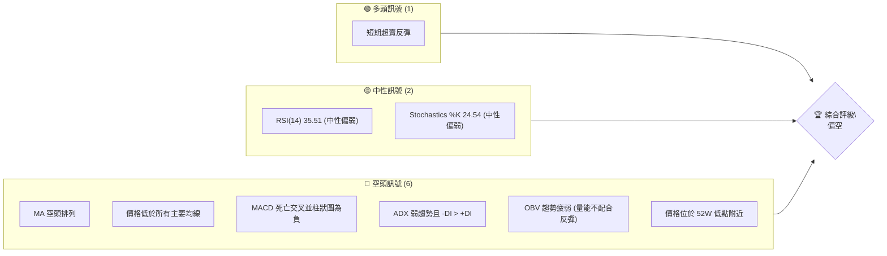
**儀表板解讀**：
KTOS 的技術訊號儀表板清晰顯示空頭訊號佔據壓倒性多數。唯一的多頭訊號是價格從極度超賣區（RSI 23.1）的短期反彈。RSI 和 Stochastics 雖脫離極度超賣，但仍處於中性偏弱區間，未能提供強勁的多頭確認。主要的空頭訊號包括均線系統的全面空頭排列、價格遠低於所有主要移動平均線、MACD 死亡交叉且柱狀圖持續為負、ADX 指示弱勢趨勢且空頭力量佔優，以及成交量未能有效配合近期反彈。這一切均表明 KTOS 仍處於下降趨勢的控制之下，短期反彈應被視為修正而非趨勢反轉。

### 📊 核心指標速覽表

| 指標類別 | 指標名稱 | 當前數值 | 訊號 | 解讀 |
|----------|----------|----------|------|------|
| **價格** | 當前價格 | $49.86 | 🔴 | 位於 52W 區間低點 8.7%，歷史高位大幅回落 |
| **均線** | MA20 | $54.64 | 🔴 | 價格遠低於 MA20，短期承壓 |
| **均線** | MA50 | $57.77 | 🔴 | 價格遠低於 MA50，中期弱勢 |
| **均線** | MA200 | $79.44 | 🔴 | 價格遠低於 MA200，長期空頭趨勢確立 |
| **動能** | RSI(14) | 35.51 | 🟡 | 中性偏弱，脫離超賣區但反彈動能不足 |
| **動能** | MACD | -3.277 | 🔴 | MACD 線在訊號線下方，柱狀圖為負，空頭動能強勁 |
| **波動** | ATR | $3.21 | 🟡 | 6.43% 的價格波動，屬中高波動，交易風險較高 |

**速覽表解讀**：
當前 KTOS 價格 $49.86 處於 52 週區間的極低位，距離 52 週低點 $41.87 不遠，顯示出深度下跌。所有主要移動平均線（MA20, MA50, MA200）均在價格上方，形成明顯的阻力，且均線呈空頭排列，確認了強勁的下降趨勢。RSI 雖然從超賣區反彈至 35.51，但仍處於中性偏弱區域，未能顯示出買盤的強勁介入。MACD 指標則明確給出空頭訊號，其負值柱狀圖表明賣壓持續。ATR 顯示 KTOS 具有中高波動性，這意味著價格波動幅度較大，潛在的風險與報酬也相對較高。

### 🏆 技術評分卡

```
技術評分卡 — KTOS (2026-07-01)
════════════════════════════════════════════════════
趨勢強度      ███░░░░░░░░░░░░░░░░░  15/100  🔴 (弱勢空頭)
動能指標      ████░░░░░░░░░░░░░░░░  20/100  🔴 (空頭主導)
支撐穩定度    ██████░░░░░░░░░░░░░░  30/100  🟡 (接近關鍵支撐，但面臨考驗)
成交量配合    ██░░░░░░░░░░░░░░░░░░  10/100  🔴 (量能疲弱，不配合反彈)
形態完整度    ████░░░░░░░░░░░░░░░░  20/100  🔴 (下降通道，未見明確底部形態)
均線排列      █░░░░░░░░░░░░░░░░░░░░  05/100  🔴 (完全空頭排列，極度看空)
════════════════════════════════════════════════════
綜合評分      ███░░░░░░░░░░░░░░░░░  17/100  🔴 偏空
════════════════════════════════════════════════════
```
**評分卡解讀**：
KTOS 的技術評分卡反映出其當前極度弱勢的技術面。趨勢強度、動能指標、成交量配合和均線排列都給出了極低的評分，表明市場正處於強烈的空頭控制之下。儘管股價接近 52 週低點，潛在的支撐可能存在，但其穩定度仍面臨考驗，因此支撐穩定度評分也僅為中性偏低。形態完整度方面，目前股價處於下降通道中，尚未形成明確的反轉底部形態。綜合評分僅為 17/100，整體評級為「偏空」，建議投資者保持極度謹慎，避免盲目抄底。

---

## 2. 趨勢分析

### 🌐 多時框趨勢分析

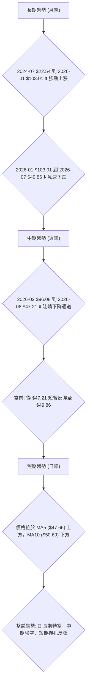
**多時框趨勢解讀**：
KTOS 的多時框趨勢分析顯示出從長期牛市到中期熊市的顯著轉變。
*   **長期趨勢 (月線)**：從 2024 年 7 月的 $22.54 開始，KTOS 經歷了一輪強勁的牛市，於 2026 年 1 月達到 $103.01 的高點。然而，此後股價急轉直下，截至 2026 年 7 月收於 $49.86，跌幅超過 50%，宣告長期上升趨勢的終結，並進入長期下降趨勢。
*   **中期趨勢 (週線)**：從 2026 年 2 月的 $96.08 高點開始，KTOS 進入一個陡峭的下降通道，連續數月下跌，於 2026 年 6 月底觸及 $47.21 的階段性低點。當前價格 $49.86 雖有所反彈，但仍處於下降通道的下半部，中期趨勢明確為空頭。
*   **短期趨勢 (日線)**：在最近一個交易週，價格從 $47.21 反彈至 $49.86。目前價格位於短期移動平均線 MA5 ($47.66) 的上方，但仍受制於 MA10 ($50.69) 的壓力。這表明短期內存在一定的買盤支撐，但反彈動能相對較弱，能否持續突破上方阻力仍是未知數。
**綜合判斷**：KTOS 的整體趨勢已從長期上漲轉為長期下跌，中期趨勢處於強勁空頭，短期內雖有超賣反彈，但尚未形成趨勢反轉的明確訊號。

### 📈 長期趨勢 — 12個月走勢圖（Unicode）

```
KTOS 月線走勢圖（過去12個月：2025-07 至 2026-06）
價格軸 ($)
$103.01 ┤                               ●(2026-01 高點)
$91.37  ┤                     ●
$86.18  ┤                           ●
$76.10  ┤                ●
$70.51  ┤                                     ●
$65.84  ┤             ●
$63.05  ┤                                       ●
$58.70  ┤           ●
$54.21  ┤                                         ●
$49.86  ┤                                           ●←現在 (2026-06)
$47.21  ┤                                       ●(2026-06 低點)
$41.87  ┤                                       ●(52W 低點)
        └────────────────────────────────────────────
         25/07 25/08 25/09 25/10 25/11 25/12 26/01 26/02 26/03 26/04 26/05 26/06
```
**走勢特徵分析表格**：

| 階段 | 時間區間 | 價格區間 | 漲跌幅 | 特徵 | 趨勢 |
|------|----------|----------|--------|------|------|
| **強勁上漲** | 2025-07 至 2026-01 | $58.70 → $103.01 | +75.49% | 快速拉升，多頭動能強勁 | 🟢 多頭 |
| **震盪盤整** | 2025-09 至 2025-12 | $91.37 → $75.91 | -16.92% | 高位震盪，多空拉鋸，潛在頭部形成 | 🟡 盤整 |
| **急速下跌** | 2026-01 至 2026-06 | $103.01 → $49.86 | -51.60% | 快速崩跌，空頭力量主導，跌破多個支撐 | 🔴 空頭 |
| **當前狀態** | 2026-06 (收盤) | $49.86 | - | 接近 52 週低點，試圖築底反彈 | 🔴 空頭 |

**長期趨勢解讀**：
過去 12 個月的價格走勢圖清晰地描繪了 KTOS 從強勁牛市到深度熊市的轉變。2025 年下半年，股價經歷了一輪爆發性上漲，從 $58.70 衝上 $103.01，漲幅驚人。然而，在 2026 年 1 月達到高點後，股價進入了持續的下跌通道，幾乎腰斬。2026 年 6 月收盤價 $49.86 已經非常接近 52 週低點 $41.87。這段下跌趨勢的特點是：跌幅深、速度快、且在下跌過程中多次跌破關鍵支撐位，顯示出市場對該股的信心嚴重不足，空頭力量佔據絕對優勢。

### 📊 中期趨勢（週線分析）

```
KTOS 近期週線壓力與支撐示意圖
═══════════════════════════════════════════════════
$96.08 ║████████████████████████║ 2026-02-22 高點 (強阻力)
$86.18 ║████████████████████    ║ 2026-03-01 阻力
$71.94 ║████████████████████████║ 2026-03-29 阻力
$64.13 ║▓▓▓▓▓▓▓▓▓▓▓▓▓▓▓▓        ║ 2026-05-31 阻力 (斐波那契38.2%回調位 $65.23 附近)
$57.77 ╠════════════════════════╣ ◄ MA50 阻力
$54.64 ╠════════════════════════╣ ◄ MA20 阻力
$49.86 ╠════════════════════════╣ ◄ 現價
$47.21 ║▓▓▓▓▓▓▓▓▓▓▓▓▓▓▓▓        ║ 2026-06-28 支撐 (近期低點)
$44.29 ║████████████████████████║ 布林通道下軌 S1
$41.87 ║████████████████████████║ 52週低點 S2 (強支撐)
═══════════════════════════════════════════════════
```
**中期趨勢解讀**：
從週線角度來看，KTOS 的中期趨勢呈現典型的下降通道。自 2026 年 2 月底的 $96.08 高點以來，股價一路震盪下行，形成了一系列更低的高點和更低的低點。當前價格 $49.86 位於多條重要均線（MA20 $54.64, MA50 $57.77）下方，這些均線已轉變為中期阻力。最近的阻力位包括 MA20 ($54.64) 和 MA50 ($57.77)，以及前期反彈高點 $64.13。下方的關鍵支撐位於 $47.21 (2026-06-28 低點) 和 $41.87 (52 週低點)。儘管近期從 $47.21 有所反彈，但若要扭轉中期趨勢，股價必須有效突破並站穩在 MA50 甚至 MA200 之上，這在目前看來仍有難度。

### ⚡ 趨勢強度評估（ADX 解讀）

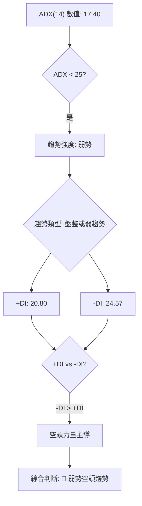
**ADX 強度對照表**：

| ADX 數值範圍 | 趨勢強度 | 趨勢類型 |
|--------------|----------|----------|
| 0-25         | 弱勢     | 無趨勢/盤整 |
| 25-50        | 中等     | 明顯趨勢 |
| 50-75        | 強勢     | 強勁趨勢 |
| 75-100       | 極強     | 極端趨勢 |

**ADX 解讀**：
KTOS 的 ADX(14) 指標當前數值為 17.40，落在 0-25 的區間內，這明確指示當前市場處於**弱勢趨勢或盤整行情**。這意味著雖然股價在下跌，但其下跌的動能和持續性並不像強勢趨勢那樣明確。市場可能在尋找底部，或在當前區間內進行震盪整理。
進一步觀察方向指標：+DI 為 20.80，-DI 為 24.57。由於 -DI 略高於 +DI，這表明在當前的弱勢趨勢中，**空頭力量仍然佔據微弱的主導地位**。儘管 ADX 數值較低，但 -DI 的優勢暗示，即使是弱勢趨勢，方向仍偏向空頭。因此，儘管趨勢強度不夠強勁，但目前並非明確的多頭行情，而是空頭主導下的弱勢震盪。

---

## 3. 圖表形態分析

### 🔍 形態識別系統

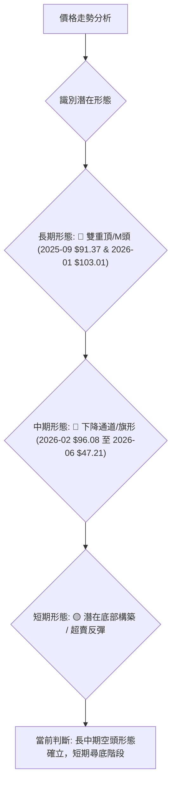
**形態識別解讀**：
KTOS 的圖表形態分析揭示了明確的空頭訊號：
*   **長期形態**：從 2025 年 9 月的 $91.37 和 2026 年 1 月的 $103.01 高點來看，股價形成了一個潛在的「雙重頂」或「M頭」形態。雖然兩個高點不完全對稱，但其後伴隨的急速下跌，並跌破關鍵頸線（約 $70-$75 區間），強烈確認了頭部形態的成立。這種形態通常預示著長期趨勢的反轉和深度下跌。
*   **中期形態**：自 2026 年 2 月高點 $96.08 以來，股價一直運行在一個清晰的「下降通道」或「熊旗」形態中。價格在通道內震盪下行，每次反彈均受制於通道上軌和多條移動平均線的壓力。這種形態在下降趨勢中非常常見，表明空頭力量持續控制，每次反彈都是賣出的機會。
*   **短期形態**：在 2026 年 6 月底觸及 $47.21 的極低點後，股價出現小幅反彈。目前可能正在嘗試構築短期底部，但尚未形成明確的反轉形態（如雙底、頭肩底等）。目前的反彈量能不足，仍需觀察是否有更強的買盤介入，或只是下降趨勢中的修正。

### 🕯️ 重要K線形態分析

| 月份 | 收盤價 | K線形態 (週) | 解讀 | 訊號 |
|------|--------|--------------|------|------|
| 2026-03-29 | $71.94 | 大陰線 | 跌破重要支撐，加速下跌 | 🔴 極度看空 |
| 2026-04-26 | $61.26 | 大陰線 | 再次跌破，確立下降通道 | 🔴 看空 |
| 2026-05-31 | $64.13 | 大陽線 | 短期強勁反彈，但未持續 | 🟡 短暫看多 |
| 2026-06-28 | $47.21 | 大陰線 (帶下影線) | 觸及超賣區，空頭力量耗盡，但下影線暗示有買盤介入 | 🟡 潛在止跌 |
| 2026-07-05 | $49.86 | 小陽線 (待確認) | 從低點反彈，但量能不足，反轉仍需確認 | 🟡 觀望 |

**K線形態解讀**：
分析近期的週K線形態，可以觀察到以下關鍵點：
*   **2026-03-29 ($71.94)**：收出一根大陰線，跌破了當時的重要支撐位，確認了下跌趨勢的加速。
*   **2026-04-26 ($61.26)**：再次以大陰線收盤，進一步確立了下降通道，市場恐慌情緒加劇。
*   **2026-05-31 ($64.13)**：在連續下跌後，出現一根強勁的大陽線，RSI 達到 60.7，顯示短期內買盤力量的爆發，形成了一次有效的超賣反彈。然而，這次反彈未能突破關鍵阻力，隨後再次下跌。
*   **2026-06-28 ($47.21)**：雖然收出大陰線，但伴隨著較長下影線，且 RSI 跌至 23.1 的極度超賣區。這根 K 線暗示在低點有較強的承接力量，可能是短期止跌的訊號，但仍需後續 K 線確認。
*   **2026-07-05 ($49.86)**：目前為止，價格從 $47.21 反彈，形成小陽線。但成交量相對疲弱，且未能突破 MA5 和 MA10，表明反彈動能有限，尚未形成明確的反轉 K 線組合。

### 📉 ASCII 走勢形態示意圖

```
KTOS 長中期走勢形態示意圖 (2025-07 - 2026-07)

$103.01 (26-01)
     ╲
      ╲  (雙重頂/M頭 左肩 $91.37)
       ╲
        ●────────────● (雙重頂/M頭 右肩 $103.01)
       /  ╲          /
      /    ╲        /
     /      ╲      /
    /        ╲    /
   /          ╲  /
  ●             ●─────── 頸線區域 (~$70-$75)
 /               ╲
/                 ╲
(下降通道上軌)       ╲
                     ╲
                      ╲
                       ╲
                        ╲
                         ● ($64.13 反彈高點)
                          ╲
                           ╲ (下降通道)
                            ╲
                             ● ($56.18 反彈高點)
                              ╲
                               ╲
                                ● ($49.86 現價)
                                 ╲
                                  ● ($47.21 近期低點)
                                   ╲
                                    ● ($41.87 52W 低點)
(下降通道下軌)
```
**走勢形態示意圖解讀**：
此示意圖描繪了 KTOS 股價從 2025 年下半年高歌猛進，至 2026 年初形成雙重頂（M頭）後急轉直下的長中期走勢。
*   **雙重頂/M頭形態**：圖中清晰可見 2025 年 9 月和 2026 年 1 月形成的兩個高點，構成了一個潛在的雙重頂形態。頸線區域大約在 $70-$75 之間。股價在跌破頸線後加速下跌，確認了這一看跌形態的有效性。
*   **下降通道**：在雙重頂形態確認後，股價進入了一個明顯的下降通道。每次反彈都未能有效突破通道上軌，並在隨後繼續下跌。目前股價位於通道的下半部，近期從 $47.21 反彈至 $49.86，但仍未脫離下降通道的範疇。
*   **當前位置**：股價正接近 52 週低點 $41.87，並在 $47.21 處獲得短期支撐。當前的反彈需要突破下降通道上軌和關鍵均線阻力，才能有效改變下降趨勢。

### 🎯 形態目標價計算

基於上述識別的長期「雙重頂/M頭」形態，我們可以進行理論目標價的計算。
*   **形態高點**：約 $103.01 (2026-01)
*   **形態頸線**：根據圖表，頸線大致可設定在 $70.00。這是股價在跌破前的重要支撐區域。
*   **形態高度**：$103.01 - $70.00 = $33.01

**目標價計算**：
理論目標價 = 頸線價格 - 形態高度
理論目標價 = $70.00 - $33.01 = **$36.99**

**形態目標價解讀**：
根據雙重頂形態的理論計算，KTOS 的形態目標價為 $36.99。這意味著如果該形態完全實現，股價理論上還有進一步下跌的空間。雖然目前股價 $49.86 已經跌破頸線並大幅下跌，但距離形態目標價仍有約 25% 的潛在跌幅。這強調了當前下降趨勢的嚴重性，以及空頭力量的潛在目標。投資者應警惕股價進一步探底的可能性，特別是如果 $41.87 的 52 週低點被有效跌破。

---

## 4. 支撐與阻力

### 🗺️ 關鍵價位分布圖（Unicode）

```
KTOS 價位結構分布圖 (2026-07-01)
═══════════════════════════════════════════════════
$98.80 ║████████████████████████║ 強阻力 R4 (斐波那契61.8%)
$87.93 ║████████████████████    ║ 阻力 R3 (斐波那契50%)
$77.08 ║████████████████████████║ 阻力 R2 (斐波那契38.2%)
$79.44 ╠════════════════════════╣ ◄ MA200 阻力
$64.99 ║▓▓▓▓▓▓▓▓▓▓▓▓▓▓▓▓        ║ 阻力 R1 (布林通道上軌)
$57.77 ╠════════════════════════╣ ◄ MA50 阻力
$54.64 ╠════════════════════════╣ ◄ MA20 阻力
$49.86 ╠════════════════════════╣ ◄ 現價
$47.21 ║▓▓▓▓▓▓▓▓▓▓▓▓▓▓▓▓        ║ 近期支撐 S1 (2026-06-28 低點)
$44.29 ║████████████████████████║ 支撐 S2 (布林通道下軌)
$41.87 ║████████████████████████║ 強支撐 S3 (52週低點)
$36.99 ║████████████████████████║ 潛在支撐 S4 (形態目標價)
═══════════════════════════════════════════════════
```
**關鍵價位分布圖解讀**：
KTOS 的價位結構圖顯示，當前價格 $49.86 處於多重阻力之下，且上方阻力密集。下方存在較為堅實的支撐，但一旦跌破，將面臨更深的下行空間。

### 🚧 阻力位分析表

| 阻力級別 | 價位 | 形成原因 | 突破難度 | 重要性 |
|----------|------|----------|----------|--------|
| **短期阻力** | $50.69 | MA10 | 中等 | 🟢 (需突破才能確立短期反彈) |
| **短期阻力** | $54.64 | MA20 / 布林通道中軌 | 中等 | 🟡 (突破則短期空頭壓力減輕) |
| **中期阻力** | $57.77 | MA50 | 較高 | 🔴 (突破則中期趨勢可能反轉) |
| **中期阻力** | $64.13 | 前期反彈高點 / 布林通道上軌 | 較高 | 🔴 (強阻力，突破需大量能) |
| **關鍵阻力** | $77.08 | 斐波那契 38.2% 回調位 | 極高 | 🔴 (確認趨勢反轉的關鍵位) |
| **長期阻力** | $79.44 | MA200 | 極高 | 🔴 (長期空頭趨勢的最後防線) |

**阻力位分析**：
當前 KTOS 面臨著層層疊疊的阻力。最近的阻力是 MA10 ($50.69) 和 MA20 ($54.64)。若能突破這些短期均線，將有助於緩解短期賣壓。然而，真正的挑戰在於中期阻力 MA50 ($57.77) 和斐波那契 38.2% 回調位 ($77.08)。這些價位代表了市場結構的關鍵轉折點，需要非常強勁的買盤和成交量才能有效突破。MA200 ($79.44) 更是長期趨勢的判斷線，目前遠高於現價，顯示長期空頭趨勢非常強勁。

### 🛡️ 支撐位分析表

| 支撐級別 | 價位 | 形成原因 | 守住機率 | 重要性 |
|----------|------|----------|----------|--------|
| **短期支撐** | $47.21 | 2026-06-28 近期低點 | 中等 | 🟢 (短期反彈的起點) |
| **中期支撐** | $44.29 | 布林通道下軌 | 中等 | 🟡 (布林通道極限支撐) |
| **關鍵支撐** | $41.87 | 52 週低點 | 較高 | 🔴 (歷史性低點，心理防線) |
| **潛在支撐** | $36.99 | 雙重頂形態目標價 | 待驗證 | 🔴 (若 $41.87 失守，此為下一目標) |

**支撐位分析**：
KTOS 的下行動能雖然強勁，但在 $47.21 處找到了近期支撐，並從此處開始反彈。更為關鍵的支撐是 52 週低點 $41.87，這是市場的心理防線和歷史性低點，預計將有較強的買盤介入。布林通道下軌 $44.29 也提供了動態支撐。然而，一旦 $41.87 被有效跌破，股價可能會加速下探至雙重頂形態的理論目標價 $36.99，甚至更低。因此，$41.87 是一個極其重要的支撐位，其得失將決定 KTOS 未來的走勢。

### 📐 斐波那契回調位分析

我們將使用 52 週高點 $134.00 和 52 週低點 $41.87 作為主要趨勢的起點和終點來計算斐波那契回調位，以評估當前反彈的潛在阻力。

*   **52 週高點 (A)**: $134.00
*   **52 週低點 (B)**: $41.87
*   **總跌幅**：$134.00 - $41.87 = $92.13

| 斐波那契回調比例 | 計算方式 | 價位 | 意義 | 訊號 |
|------------------|----------|------|------|------|
| **23.6%**        | $41.87 + ($92.13 * 0.236) | $63.60 | 較弱反彈阻力 | 🔴 |
| **38.2%**        | $41.87 + ($92.13 * 0.382) | $77.08 | 關鍵阻力位 | 🔴 |
| **50%**          | $41.87 + ($92.13 * 0.500) | $87.93 | 中期反彈阻力 | 🔴 |
| **61.8%**        | $41.87 + ($92.13 * 0.618) | $98.80 | 強反彈阻力，趨勢反轉門檻 | 🔴 |

**視覺化斐波那契回調位**：
```
KTOS 斐波那契回調位示意圖 (基於 52W 高低點)
═══════════════════════════════════════════════════
$134.00 ║████████████████████████║ 52W 高點 (100%)
$98.80  ║████████████████████████║ 斐波那契 61.8% 回調位
$87.93  ║████████████████████████║ 斐波那契 50% 回調位
$77.08  ║████████████████████████║ 斐波那契 38.2% 回調位
$63.60  ║████████████████████████║ 斐波那契 23.6% 回調位
$49.86  ╠════════════════════════╣ ◄ 現價
$41.87  ║████████████████████████║ 52W 低點 (0%)
═══════════════════════════════════════════════════
```
**斐波那契回調位解讀**：
當前 KTOS 價格 $49.86 遠低於所有斐波那契回調位，顯示其從 52 週高點以來的下跌幅度極深。即使是最弱的反彈阻力位 23.6% 也在 $63.60，這意味著如果股價要形成有意義的反彈，首先需要突破 $63.60。而 $77.08 (38.2% 回調位) 則是一個更為關鍵的阻力，通常被視為判斷反彈是否具有持續性的門檻。目前股價位於 $41.87 和 $63.60 之間，表明市場處於深度熊市區間，任何向上的移動都可能在這些斐波那契阻力位遇到強勁賣壓。

---

## 5. 技術指標深度解讀

### 🎛️ 指標訊號總覽

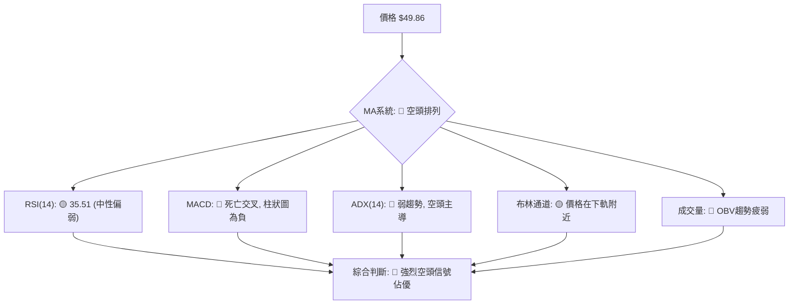
**指標訊號總覽解讀**：
KTOS 的各項技術指標綜合來看，呈現出壓倒性的空頭訊號。移動平均線系統完全處於空頭排列，價格遠低於所有主要均線，這是最直接的空頭確認。動能指標 MACD 也處於死亡交叉狀態，且柱狀圖為負，表明下行動能強勁。RSI 雖然從超賣區反彈，但仍處於中性偏弱區間，未能提供強勁的多頭支持。ADX 指示趨勢強度較弱，但空頭力量佔優。布林通道顯示價格在下軌附近，暗示潛在支撐，但並非強勁的多頭訊號。成交量指標 OBV 趨勢疲弱，未能配合價格反彈，進一步確認了市場的弱勢。

### 📈 移動平均線排列分析

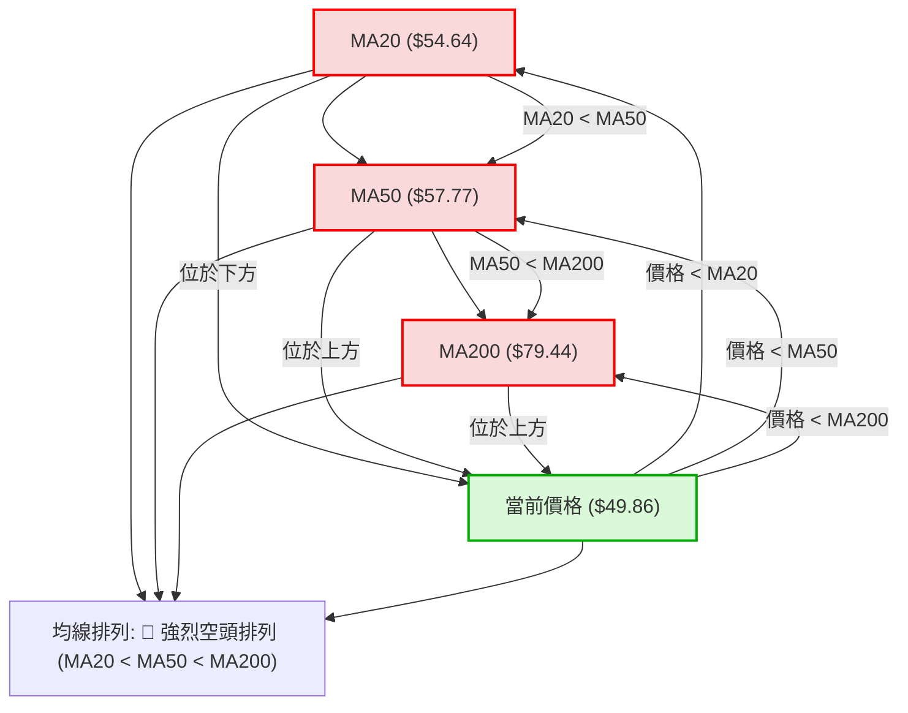
**移動平均線排列分析**：
KTOS 的移動平均線系統呈現出教科書般的**強烈空頭排列**。具體表現為：
*   **MA20 ($54.64) < MA50 ($57.77) < MA200 ($79.44)**：這種由短到長依次向下的排列被稱為「死亡交叉」的進階版，通常預示著長期下降趨勢的確立和持續。
*   **價格遠低於所有主要均線**：當前價格 $49.86 不僅低於短期 MA20 和中期 MA50，更遠低於長期 MA200。這意味著股價在短期、中期和長期都面臨著來自均線的強勁阻力，每次反彈都可能在這些均線處遇到賣壓。
**結論**：均線系統發出極度看空的訊號，表明 KTOS 處於一個根深蒂固的下降趨勢中。在價格未能有效突破並站穩在 MA200 之上之前，不應輕易判斷趨勢反轉。

### 📉 RSI(14) 分析

**RSI(14) 數值進度條**：
RSI(14): ▓▓▓▓▓▓▓░░░░░░░░░░░░░░░░░░░░░░░░░░░░░░░░░ (35.51 / 100)
**RSI 數值**：35.51

**超買超賣區間分析**：
*   **超買區 (RSI > 70)**：在過去的 20 週數據中，KTOS 的 RSI 在 2026-05-31 達到 60.7，但並未進入超買區。這表明即使是反彈，動能也未達到極端過熱的程度。
*   **超賣區 (RSI < 30)**：
    *   2026-03-29：RSI 跌至 25.6，進入超賣區，隨後價格繼續下跌。
    *   2026-04-26：RSI 跌至 29.0，再次進入超賣區，隨後價格小幅反彈。
    *   2026-06-28：RSI 跌至 23.1，這是近期的最低點，顯示極度超賣。當前價格 $49.86 正是從此極度超賣狀態反彈而來。
*   **當前狀態 (35.51)**：RSI 已脫離極度超賣區，但仍處於中性偏弱的區間。這表示短期賣壓有所緩解，但買盤動能尚未強勁到足以推動 RSI 進入中性偏強或超買區。

**背離判斷 (頂背離/底背離)**：
*   **頂背離**：在給定的數據中，未觀察到明確的頂背離訊號。在 2026 年 1 月價格創出 $103.01 高點時，RSI 也處於高位，但缺乏詳細日線數據無法精確判斷。從週線數據來看，2026-05-31 ($64.13) RSI 60.7，隨後價格下跌，但並未形成明顯的頂背離。
*   **底背離**：
    *   比較 2026-04-26 價格 $61.26 (RSI 29.0) 和 2026-06-28 價格 $47.21 (RSI 23.1)：
        *   價格創下更低低點 ($47.21 < $61.26)。
        *   RSI 也創下更低低點 (23.1 < 29.0)。
        *   因此，**未形成看漲底背離**。
    *   在其他時間點，雖然價格下跌，但 RSI 也同步下跌或處於低位，沒有出現價格創新低而 RSI 未創新低的看漲底背離現象。
**結論**：
RSI 顯示 KTOS 曾多次進入超賣區，尤其在 2026-06-28 達到極度超賣，為當前價格反彈提供了技術基礎。然而，目前 RSI 仍處於中性偏弱區間，且未觀察到明確的看漲底背離訊號，這意味著雖然短期跌勢可能有所緩解，但缺乏強勁的反轉訊號。

### 📊 MACD(12/26/9) 訊號解讀

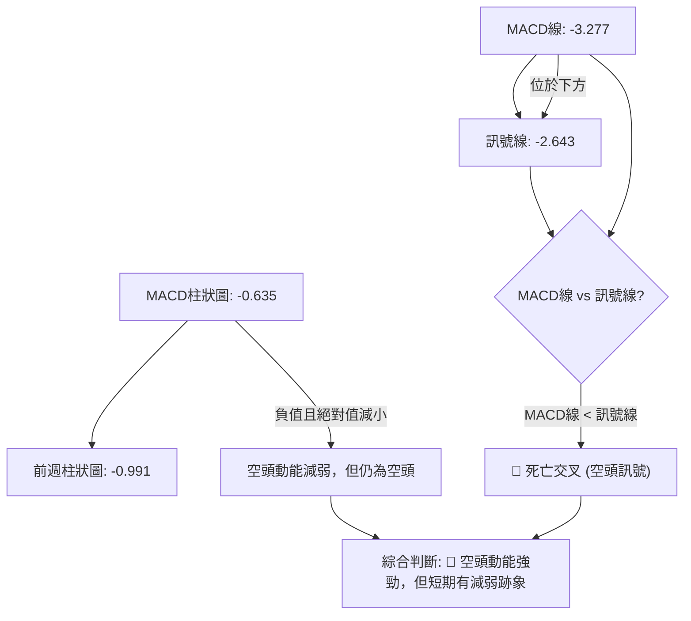
**MACD 訊號解讀**：
KTOS 的 MACD 指標當前數值如下：
*   **MACD 線**：-3.277
*   **訊號線 (Signal)**：-2.643
*   **MACD 柱狀圖 (Histogram)**：-0.635

**分析**：
1.  **MACD 線與訊號線關係**：MACD 線 (-3.277) 位於訊號線 (-2.643) **下方**。這是一個明確的**死亡交叉 (Death Cross)** 訊號，表明短期均線已跌破長期均線，空頭趨勢確立。
2.  **MACD 柱狀圖**：柱狀圖為負值 (-0.635)，這表示 MACD 線仍在訊號線下方，且空頭動能依然存在。然而，與前一週的柱狀圖 -0.991 相比，當前柱狀圖的絕對值有所減小（從 -0.991 變為 -0.635）。這暗示著**空頭動能正在減弱**，賣壓可能在短期內有所緩解，與 RSI 從超賣區反彈的訊號一致。
3.  **背離判斷**：
    *   從 2026-04-26 (MACD Hist -0.245) 到 2026-06-28 (MACD Hist -0.991)，價格持續下跌。MACD 柱狀圖也持續為負且絕對值增大，未見底背離。
    *   在之前的上漲階段也未見頂背離。
**結論**：
MACD 指標整體仍處於強烈的空頭格局，死亡交叉訊號預示著下行趨勢的持續。儘管 MACD 柱狀圖的負值絕對值有所收斂，暗示短期賣壓可能減輕，但這僅是動能減弱的跡象，並非趨勢反轉的確認。投資者應警惕，在 MACD 線未能有效上穿訊號線且柱狀圖轉正之前，空頭風險依然存在。

### 📦 布林通道分析

```
KTOS 布林通道示意圖 (2026-07-01)
═══════════════════════════════════════════════════════════════
$64.99 ║██████████████████████████████████████████████████████████║ BB上軌 (R1)
$54.64 ╠═══════════════════════════════════════════════════════════════╣ BB中軌 (MA20)
$49.86 ╠═══════════════════════════════════════════════════════════════╣ ◄ 現價
$44.29 ║▓▓▓▓▓▓▓▓▓▓▓▓▓▓▓▓▓▓▓▓▓▓▓▓▓▓▓▓▓▓▓▓▓▓▓▓▓▓▓▓▓▓▓▓▓▓▓▓▓▓▓▓▓▓▓▓▓▓▓▓▓▓▓▓║ BB下軌 (S1)
═══════════════════════════════════════════════════════════════
```
**布林通道參數**：
*   **BB 上軌**：$64.99
*   **BB 中軌 (MA20)**：$54.64
*   **BB 下軌**：$44.29
*   **BB %B**：0.27 (位於下軌和中軌之間，偏向下軌)

**布林通道分析**：
1.  **價格位置**：當前價格 $49.86 位於布林通道的中軌 ($54.64) 和下軌 ($44.29) 之間，且靠近下軌。BB %B 為 0.27，表明價格在通道的下 27% 區域。這是一個典型的弱勢訊號，表示股價處於下降趨勢中，並在下軌附近尋求支撐。
2.  **通道寬度**：ATR(14) 為 $3.21，佔價格的 6.43%，顯示布林通道具有中等至較高的波動性。通道寬度可能在下跌過程中有所擴大，這通常在趨勢形成時發生。
3.  **潛在訊號**：
    *   價格觸及或跌破下軌 ($44.29) 通常被視為超賣訊號，可能引發短期反彈。KTOS 在 2026-06-28 跌至 $47.21，距離下軌不遠，隨後有所反彈。
    *   如果股價能夠有效突破中軌 ($54.64)，將是短期轉強的訊號。然而，中軌同時也是 MA20，是當前主要的短期阻力。
**結論**：
布林通道分析顯示 KTOS 處於下行趨勢的通道中，價格偏向下軌。雖然價格從接近下軌的位置有所反彈，但要確認趨勢反轉，股價必須突破中軌阻力。在未能突破中軌之前，布林通道仍支持空頭觀點。

### 💹 成交量分析（量價配合度）

*   **最新成交量**：5,633,287
*   **20 日均量**：5,423,704 (量比: 1.04x)
*   **50 日均量**：4,985,834
*   **OBV 趨勢**：OBV < MA → 量能疲弱

**成交量分析**：
1.  **當前成交量**：最新成交量 5,633,287 略高於 20 日均量 (1.04x)，也高於 50 日均量。這表明近期市場活躍度有所提升。
2.  **量價配合**：
    *   從 2026-01 高點 $103.01 至今，股價持續下跌。在下跌過程中，尤其是在 2026-06-28 價格跌至 $47.21 時，伴隨的是極高的週成交量 45,383,700。這表明在股價大跌時有大量的拋售壓力，是空頭力量主導的明確訊號。
    *   當前價格從 $47.21 反彈至 $49.86，但本週成交量 (11,397,287) 相較於上一週的巨量大幅萎縮。這意味著**當前的反彈缺乏強勁的買盤支持**，量能配合度不佳。在下降趨勢中，無量反彈往往難以持久，容易再次下跌。
3.  **OBV 趨勢**：OBV (On-Balance Volume) 趨勢顯示「OBV < MA」，這是一個明確的空頭訊號。OBV 是一個累積性指標，當其趨勢低於其移動平均線時，表明買盤壓力不足，賣盤壓力佔優。這與價格的下降趨勢相符，且未能為當前的反彈提供量能確認。
**結論**：
KTOS 的成交量分析顯示，在主要下跌階段伴隨有大量拋售，確認了空頭趨勢的有效性。而當前從低點的反彈卻是量能不足，OBV 指標也未能轉強。這種「價漲量縮」的現象通常被視為不可持續的反彈，預示著股價仍有進一步下跌的風險。

---

## 6. 動能與波動率

### ⚡ 動能評估四象限

| 象限 | 動能 (RSI, MACD) | 波動 (ATR) | 當前狀態 | 評估 |
|------|------------------|------------|----------|------|
| Q1   | 強               | 低         | -        | 最佳機會 (趨勢明確，風險可控) |
| Q2   | 弱               | 低         | -        | 謹慎觀望 (缺乏動能，等待趨勢明朗) |
| Q3   | 強               | 高         | -        | 高風險高收益 (追漲殺跌，需要嚴格風控) |
| Q4   | 弱               | 高         | ✓        | **避免進場** (趨勢不明，波動巨大，風險難控) |

**動能評估四象限分析**：
1.  **動能評估**：
    *   RSI(14) 為 35.51，處於中性偏弱區間，雖然脫離超賣，但未能顯示出強勁的買盤動能。
    *   MACD 柱狀圖為負值 (-0.635)，且 MACD 線仍在訊號線下方，明確指示空頭動能仍佔主導地位，儘管短期有所減弱。
    *   綜合來看，KTOS 的動能評價為「弱」。
2.  **波動率評估**：
    *   ATR(14) 為 $3.21，佔當前價格 $49.86 的 6.43%。這是一個相對較高的百分比，表明 KTOS 的股價波動幅度較大。
    *   綜合來看，KTOS 的波動率評價為「高」。
**結論**：
根據動能與波動率評估，KTOS 目前位於「**弱動能，高波動**」的第四象限。這是一個極具挑戰性的交易環境，通常建議**避免進場**。在這種情況下，股價缺乏明確的趨勢方向，但每日波動幅度卻很大，容易造成交易者頻繁止損或追漲殺跌而蒙受損失。投資者應等待動能轉強且趨勢明朗，或波動率下降至可控範圍後再考慮介入。

### 📊 ATR 波動率分析

*   **ATR(14)**：$3.21
*   **佔當前價格比例**：($3.21 / $49.86) * 100% = 6.43%

**ATR 波動率分析**：
KTOS 的 14 日平均真實波幅 (ATR) 為 $3.21，佔其當前價格 $49.86 的 6.43%。這個比例相對較高，表明 KTOS 的股價具有顯著的日常波動性。
1.  **波動性水平**：6.43% 的 ATR 比例通常被視為中高波動性。這意味著在一個正常交易日，KTOS 的價格波動範圍可能達到 $3.21。對於短線交易者而言，這提供了潛在的獲利機會，但同時也伴隨著較高的風險。
2.  **止損距離建議**：ATR 是設定止損點的有效工具。一般建議將止損點設置在 1 到 2 倍 ATR 的距離之外，以避免被市場的正常波動「震出」。
    *   **1 倍 ATR 止損**：$3.21
    *   **1.5 倍 ATR 止損**：$3.21 * 1.5 = $4.815
    *   **2 倍 ATR 止損**：$3.21 * 2 = $6.42
    例如，如果考慮做多，進場價為 $50.00，則建議止損點可設在 $50.00 - $4.815 = $45.185 (約 $45.19) 或 $50.00 - $6.42 = $43.58 附近。這提供了足夠的緩衝空間，以應對日常的價格波動。
**結論**：KTOS 的中高波動性要求交易者在設置止損和管理倉位時更加謹慎。應根據個人的風險承受能力，選擇合適的 ATR 倍數來設定止損，並避免過度槓桿。

### 📐 Beta 與市場相關性

**數據提示**：提供的數據中未包含 KTOS 的 Beta 值。

**Beta 與市場相關性分析 (一般性推斷)**：
由於未提供具體的 Beta 值，我們無法進行精確的相關性分析。然而，根據 KTOS 屬於「工業」板塊中的「航空與國防」產業，通常這類公司在經濟穩定或地緣政治緊張時期表現相對穩健，但在市場整體情緒影響下，其股價仍會受到大盤波動的影響。
*   **一般假設**：如果 KTOS 是一家成長型公司或具有較高槓桿的企業，其 Beta 值可能大於 1，這意味著它可能比大盤波動性更大，在牛市中漲幅可能超過大盤，但在熊市中跌幅也可能更大。
*   **當前情境推斷**：考慮到 KTOS 股價從高點大幅回落，且處於弱勢趨勢，如果其 Beta 值較高，那麼這波下跌可能放大了市場整體的負面情緒。
*   **重要性**：了解 Beta 值有助於投資者評估股票在不同市場環境下的表現。在當前弱勢市場中，如果 Beta 值較高，則表示其下行風險相對較大。

**建議**：在進行任何投資決策前，應查詢 KTOS 的最新 Beta 值，以更全面地評估其與大盤的相關性和系統性風險。

---

## 7. 多時框架總結

### 📋 時框架評分表

| 時框架 | 趨勢方向 | 動能 | 均線排列 | 形態 | 綜合評分 (1-10) | 建議 |
|--------|----------|------|----------|------|-----------------|------|
| **長期** | 🔴 下降 | 🔴 弱 | 🔴 空頭 | 🔴 雙重頂 | 2               | 🔴 賣出 / 遠離 |
| **中期** | 🔴 下降 | 🔴 弱 | 🔴 空頭 | 🔴 下降通道 | 3               | 🔴 賣出 / 觀望 |
| **短期** | 🟡 盤整/反彈 | 🟡 弱 | 🔴 空頭 | 🟡 潛在築底 | 4               | 🟡 謹慎觀望 / 短線反彈 |

**時框架評分表解讀**：
KTOS 在各個時間框架上的表現均不理想。
*   **長期與中期**：均呈現強烈的下降趨勢，動能疲弱，均線空頭排列，且圖表形態顯示為看跌結構。這兩個時間框架的評分極低，表明股價正處於熊市之中，不適合長期或中期持有。
*   **短期**：雖然從極度超賣區有所反彈，顯示出盤整或潛在築底的跡象，但動能依然偏弱，且均線仍為空頭排列，上方阻力重重。因此，短期評分也僅為中性偏低。
**綜合判斷**：KTOS 的整體技術面非常疲弱，各時間框架的訊號高度一致地指向空頭。即使短期有反彈，也應視為下降趨勢中的修正，而非趨勢反轉。

### 🔲 綜合訊號矩陣

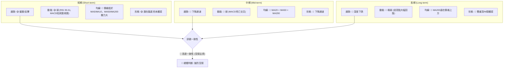
**綜合訊號矩陣解讀**：
KTOS 的多時框架訊號矩陣顯示出高度的一致性，且幾乎所有指標都指向空頭。
*   **短期**：雖然從極度超賣區反彈，動能指標如 RSI 和 MACD 柱狀圖顯示短期賣壓有所減輕，但均線排列仍是空頭，且尚未形成明確的反轉形態。這表明短期內可能會有震盪或小幅反彈，但上方阻力重重。
*   **中期與長期**：這兩個時間框架的訊號則非常明確且強勁地指向空頭。趨勢呈下降通道，動能持續疲弱，均線系統完全空頭排列，長期形態更是確認了雙重頂。
**整體判斷**：多時框架分析結果高度一致，表明 KTOS 正處於一個強烈的空頭市場中。短期內的任何反彈都應被視為修正，而非趨勢反轉。在沒有更強勁的多頭訊號出現之前，投資者應保持極度謹慎，避免在下降趨勢中逆勢操作。

---

## 8. 交易策略建議

基於上述詳盡的技術分析，KTOS 當前處於強烈的空頭趨勢中，短期雖有超賣反彈，但上方阻力重重，且量能不濟。因此，做空策略在趨勢上更具優勢，而做多策略則屬於逆勢操作，風險較高。

### 🗺️ 策略決策流程圖

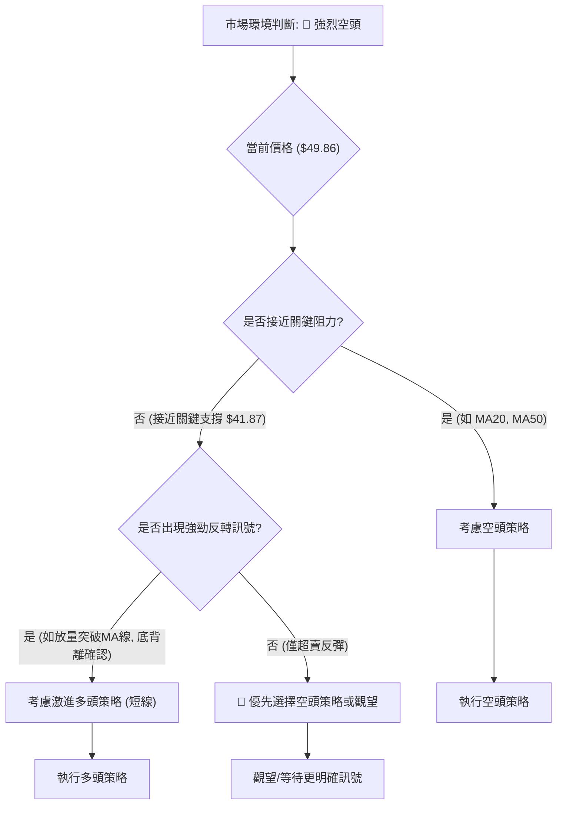
**策略決策流程解讀**：
當前 KTOS 處於強烈的空頭市場。在這種背景下，主要的決策邏輯是：如果價格反彈至關鍵阻力位，則應考慮做空；如果價格跌至關鍵支撐位且出現強勁反轉訊號，則可考慮激進的短線做多；否則，觀望或繼續尋找做空機會。

### 🟢 多頭策略詳情 (激進短線反彈策略)

**策略背景**：基於 KTOS 股價在 2026-06-28 達到 RSI 23.1 的極度超賣狀態後，出現了短期反彈。此策略為逆勢操作，風險極高，僅適用於具備高風險承受能力的短線交易者。

| 策略要素 | 策略 A (短線反彈追蹤) | 策略 B (等待確認後入場) |
|----------|-----------------------|--------------------------|
| **進場條件** | 價格突破 MA10 並放量 | 價格突破 MA20 並站穩，RSI 超過 50 |
| **進場價格** | $50.70 (略高於 MA10 $50.69) | $55.00 (略高於 MA20 $54.64) |
| **目標價 T1** | $54.60 (MA20 附近) | $57.70 (MA50 附近) |
| **目標價 T2** | $57.70 (MA50 附近) | $64.00 (前期反彈高點 / 布林上軌) |
| **止損價格** | $47.00 (近期低點 $47.21 之下) | $50.00 (近期低點之上，MA10 之下) |
| **風險報酬比** | (50.70-47.00) : (54.60-50.70) = 3.7 : 3.9 ≈ 1:1.05 | (55.00-50.00) : (57.70-55.00) = 5 : 2.7 ≈ 1:0.54 |
| **成功機率** | 25% (逆勢操作，風險極高) | 35% (等待確認，風險稍低但仍高) |
| **建議倉位** | 極小倉位 (<5%) | 極小倉位 (<5%) |

**多頭策略詳情解讀**：
鑑於 KTOS 處於強烈空頭趨勢，多頭策略風險極高。
*   **策略 A (短線反彈追蹤)**：旨在捕捉從超賣區反彈的短線機會。進場點設在突破 MA10 後，利用短期動能。但其風險報酬比僅為 1:1.05，且成功機率低。
*   **策略 B (等待確認後入場)**：更為保守，等待價格突破 MA20 且 RSI 轉強後再考慮進場。雖然相對安全，但其風險報酬比僅為 1:0.54，顯示潛在獲利空間有限，且止損較大。
**總結**：兩種多頭策略均為逆勢操作，不建議普通投資者參與。若堅持操作，務必嚴格控制倉位，並設定嚴格止損。

### 🔴 空頭策略詳情 (順勢策略)

**策略背景**：KTOS 處於長期和中期下降趨勢，均線空頭排列，MACD 死亡交叉，且反彈量能不足。在反彈至關鍵阻力位時進行做空，是順應趨勢的交易策略。

| 策略要素 | 策略 C (反彈至 MA20 阻力做空) | 策略 D (反彈至 MA50 阻力做空) |
|----------|-------------------------------|-------------------------------|
| **進場條件** | 價格反彈至 MA20 附近並受阻回落 | 價格反彈至 MA50 附近並受阻回落 |
| **進場價格** | $54.50 (MA20 $54.64 附近) | $57.50 (MA50 $57.77 附近) |
| **目標價 T1** | $47.20 (近期低點) | $47.20 (近期低點) |
| **目標價 T2** | $42.00 (52W 低點 $41.87 附近) | $42.00 (52W 低點 $41.87 附近) |
| **止損價格** | $57.80 (略高於 MA50 $57.77) | $60.00 (高於 MA50 和近期反彈高點) |
| **風險報酬比** | (57.80-54.50) : (54.50-47.20) = 3.3 : 7.3 ≈ 1:2.21 | (60.00-57.50) : (57.50-47.20) = 2.5 : 10.3 ≈ 1:4.12 |
| **成功機率** | 60% (順勢策略，成功率較高) | 70% (順勢策略，獲利空間更大) |
| **建議倉位** | 中等倉位 (5-10%) | 中等倉位 (5-10%) |

**空頭策略詳情解讀**：
做空策略與 KTOS 當前的主要趨勢一致，因此具有較高的成功機率和風險報酬比。
*   **策略 C (反彈至 MA20 阻力做空)**：在價格反彈至 MA20 附近遇到阻力時進場，止損設在 MA50 之上，目標價為近期低點和 52 週低點。風險報酬比為 1:2.21，相對較優。
*   **策略 D (反彈至 MA50 阻力做空)**：等待價格反彈至更強的阻力位 MA50 附近再進場，雖然進場點較高，但止損距離相對合理，潛在獲利空間更大。風險報酬比高達 1:4.12，是更具吸引力的策略。
**總結**：考慮到 KTOS 的強烈空頭趨勢，做空策略在風險報酬比和成功機率上均優於做多。建議投資者優先考慮在股價反彈至關鍵阻力位時進行做空，並嚴格執行止損。

### ⭐ 整體訊號強度評星

```
做多訊號強度：★★☆☆☆  (2/5星) (僅限超賣反彈，逆勢高風險)
做空訊號強度：★★★★☆  (4/5星) (順應主趨勢，風險報酬比優)
整體可信度：  ★★★☆☆  (3/5星) (空頭趨勢明確，但短期可能盤整)
```
**評星解讀**：
*   **做多訊號強度**：僅兩星，反映了做多是逆勢操作，風險極高。僅在極度超賣且出現放量反彈時，才考慮短線激進操作。
*   **做空訊號強度**：四星，表明做空是目前更為可取且符合趨勢的策略。在價格反彈至關鍵阻力時，做空機會較大。
*   **整體可信度**：三星，雖然空頭趨勢非常明確，但短期內價格可能在底部區間震盪，或有小幅反彈，因此在執行做空策略時仍需關注入場時機和風險管理。

---

## 9. 風險提示與監控

KTOS 的技術面顯示其處於嚴峻的空頭趨勢中。任何交易決策都應以嚴格的風險管理為基礎。

### ✅ 關鍵監控指標 Checklist

```
KTOS 關鍵監控指標清單 (2026-07-01)
════════════════════════════════════════════════════
├─ 價格走勢：
│  ├─ 是否跌破 $47.21 (近期低點)？                    [ ]
│  ├─ 是否跌破 $41.87 (52週低點)？                    [ ]
│  └─ 是否有效突破 $54.64 (MA20)？                   [ ]
├─ 移動平均線：
│  ├─ MA20 是否上穿 MA50 (黃金交叉)？                [ ]
│  ├─ 價格是否站穩在 MA50 之上？                     [ ]
│  └─ 均線排列是否從空頭轉為多頭？                   [ ]
├─ 動能指標：
│  ├─ RSI 是否突破 50 中軸線並持續走高？             [ ]
│  ├─ MACD 線是否上穿訊號線 (黃金交叉)？             [ ]
│  └─ MACD 柱狀圖是否轉正並持續放大？                [ ]
├─ 成交量：
│  ├─ 價格反彈時，成交量是否顯著放大？               [ ]
│  └─ OBV 趨勢是否轉為向上？                         [ ]
├─ 圖表形態：
│  ├─ 是否形成明確的底部反轉形態 (如雙底、頭肩底)？ [ ]
│  └─ 是否突破下降通道上軌？                         [ ]
════════════════════════════════════════════════════
```
**監控指標 Checklist 解讀**：
這份監控清單為投資者提供了判斷 KTOS 趨勢變化的關鍵指標。在當前空頭趨勢中，只要這些指標未能給出明確的多頭訊號，就應維持謹慎或空頭觀點。特別是價格能否守住關鍵支撐 $41.87，以及均線系統能否從空頭排列轉為多頭排列，將是判斷趨勢是否反轉的核心。

### ⚠️ 風險場景分析

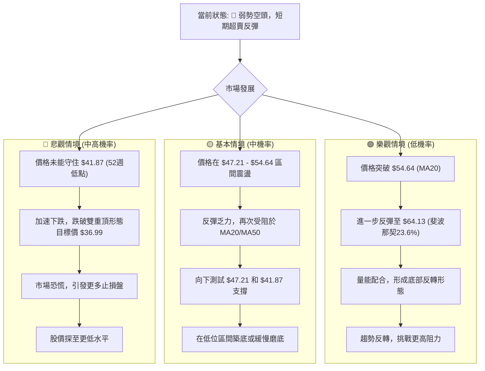
**風險場景分析解讀**：
*   **樂觀情境 (低機率)**：股價從 $47.21 處強勁反彈，有效突破 MA20 和 MA50，並在放量配合下站穩在 $64.13 (斐波那契 23.6%) 之上，形成明確的底部反轉形態。此情境發生機率較低，因當前市場缺乏強勁多頭訊號。
*   **基本情境 (中機率)**：股價在 $47.21 (近期低點) 至 $54.64 (MA20) 之間進行震盪整理。任何反彈都將在 MA20 或 MA50 處遇到阻力並回落，然後再次向下測試 $47.21 甚至 $41.87 的支撐。市場可能在底部區間進行漫長的築底過程。
*   **悲觀情境 (中高機率)**：股價未能守住 $41.87 的 52 週低點，引發市場恐慌和進一步的拋售潮。價格可能迅速跌向雙重頂形態的目標價 $36.99，甚至更低。此情境發生機率較高，因為當前趨勢和動能指標均指向空頭。

### 🛡️ 風險管理重要提醒

1.  **嚴格止損**：無論採取何種策略，必須設定並嚴格執行止損點。在當前高波動的市場中，不設止損可能導致巨大損失。
2.  **倉位管理**：避免重倉操作，尤其是在趨勢不明或逆勢交易時。建議使用小倉位進行試探性交易，並根據市場發展逐步調整。
3.  **趨勢為王**：順應主要趨勢進行交易，即當前以空頭策略為主。逆勢操作（做多）風險極高，應謹慎對待。
4.  **分批建倉/平倉**：避免一次性全部買入或賣出。分批操作可以降低單次交易的風險，並在市場波動中獲得更好的平均成本。
5.  **關注基本面**：雖然本報告為技術分析，但基本面（如公司財報、產業新聞、宏觀經濟數據）的變化也可能對股價產生重大影響，應持續關注。
6.  **耐心等待**：在當前弱勢市場中，等待明確的趨勢反轉訊號或有利的交易機會至關重要。避免盲目追漲殺跌。

---

## 📋 報告總結

```
KTOS 技術分析報告總結
════════════════════════════════════════════════════════
報告日期：2026-07-01
當前價格：$49.86
分析評級：⚖️ 偏空 (強烈空頭趨勢主導，短期超賣反彈，但動能不足)

關鍵結論：
├─ 長期趨勢：🔴 下降趨勢確立，從高點 $103.01 大幅回落
├─ 中期趨勢：🔴 強烈空頭，運行於下降通道中，均線空頭排列
├─ 短期趨勢：🟡 盤整或弱勢反彈，從 $47.21 極度超賣區反彈，但量能不足
├─ 關鍵支撐：$47.21 (近期低點), $41.87 (52週低點)
├─ 關鍵阻力：$54.64 (MA20), $57.77 (MA50), $64.13 (前期反彈高點)
└─ 分析師目標：根據提供的分析師共識，目標價均值為 $112.20，最低 $75.00，最高 $150.00。然而，這些目標價與當前技術面呈現的強烈空頭趨勢存在巨大背離，技術面顯示股價面臨下探形態目標價 $36.99 的風險。投資者應權衡兩者。

最優策略組合：
1. 🥇 最佳機會 (順勢做空)：在價格反彈至 MA20 ($54.64) 或 MA50 ($57.77) 附近受阻時，建立空頭倉位。目標價可設在 $47.20 (近期低點) 和 $42.00 (52週低點)；止損設在 MA50 或 MA60 之上。
2. 🥈 次選機會 (觀望等待)：在當前價格區間 $47.21 - $54.64 保持觀望，等待股價明確跌破 $41.87 或有效突破 MA50，再根據新的趨勢進行操作。
3. 🥉 保守選擇 (避免做多)：鑑於強烈的空頭趨勢和高波動性，不建議建立多頭倉位。除非出現極其明確且放量的底部反轉訊號，否則避免逆勢抄底。
════════════════════════════════════════════════════════
```

---

> ⚠️ **免責聲明**：本報告為 AI 自動生成之技術分析，所有數據及估算均基於提供的歷史價格資訊。本報告**僅供研究與學術參考**，**不構成任何投資建議**。投資有風險，入市需謹慎。

---

*報告生成時間：2026-07-01 ｜ 數據來源：Yahoo Finance ｜ 分析框架：多時框技術分析*