<details>
<summary>📊 靜態圖表 (點擊展開)</summary>
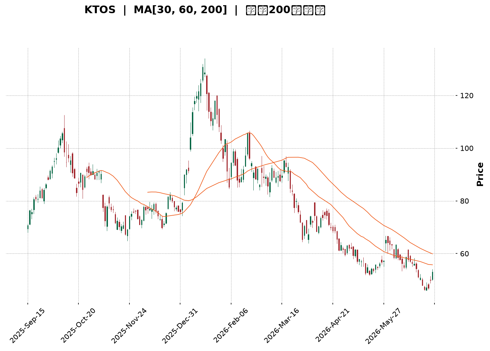
</details>

<html>
<head><meta charset="utf-8" /></head>
<body>
    <div style="height:500px; width:100%;">                        <script>window.PlotlyConfig = {MathJaxConfig: 'local'};</script>
        <script charset="utf-8" src="https://cdn.plot.ly/plotly-3.6.0.min.js" integrity="sha256-QaOVwtVY0T02VaHrr6pnoHLCwayMJp4O5n4YyaE3rJk=" crossorigin="anonymous"></script>                <div id="candlestick-chart" class="plotly-graph-div" style="height:100%; width:100%;"></div>            <script>                window.PLOTLYENV=window.PLOTLYENV || {};                                if (document.getElementById("candlestick-chart")) {                    Plotly.newPlot(                        "candlestick-chart",                        [{"close":{"dtype":"f8","bdata":"AAAAIFyvUUAAAABgZhZTQAAAACBc71JAAAAAoJkpVEAAAACgRzFUQAAAAIAULlRAAAAAoJn5VEAAAAAghUtUQAAAAMDMDFVAAAAAgOuRVUAAAADAHgVWQAAAACCu11ZAAAAAoHA9V0AAAACA68FXQAAAAAApDFhAAAAAAAAQWUAAAAAAKexZQAAAAEDhalpAAAAAQDOjWEAAAADgUahXQAAAAIDrEVhAAAAAQDPTV0AAAADAHqVWQAAAACCuJ1ZAAAAAIK7HVEAAAACgmalVQAAAACCup1ZAAAAAQDMTVUAAAADgelRWQAAAACCFy1ZAAAAAIIWrVkAAAACA63FWQAAAAKBwzVZAAAAAQDMTVkAAAABgZqZWQAAAAGBmxlZAAAAAgBSOVkAAAACAPVpTQAAAAIA9GlJAAAAA4FF4U0AAAAAghctTQAAAAIDCJVNAAAAAwMwsU0AAAAAAKexRQAAAAMDMHFJAAAAAIFyPUUAAAABACpdRQAAAAEDhqlFAAAAAANfTUEAAAADA9UhRQAAAAEAKh1JAAAAAQDPDUkAAAACgR\u002fFSQAAAAGBmBlNAAAAAoHBNUkAAAACgcL1RQAAAAIDrMVJAAAAAIIVrU0AAAAAAACBTQAAAAIDrQVNAAAAAgOtBU0AAAACAPTpTQAAAAIDrsVNAAAAAoHD9UkAAAADgo5BSQAAAAOBRSFJAAAAAoEdxUUAAAACgmdlRQAAAAMD12FJAAAAAgOthVEAAAABAM5NUQAAAAIAU\u002flNAAAAAwMxsU0AAAACAFF5TQAAAAGC4\u002flJAAAAAgD36UkAAAABgj9JTQAAAACCFe1ZAAAAAIIX7VkAAAAAAKdxWQAAAAGCPAlpAAAAAwMxsXEAAAABACnddQAAAAIAU7l1AAAAAAABgXkAAAAAA1yNfQAAAAEAKV2BAAAAAgMIVYEAAAACAwiVeQAAAAGBmdlxAAAAAwPWYW0AAAADgetRbQAAAAADXg11AAAAAQOEqXEAAAACAPQpbQAAAAOCjwFlAAAAAgD0KWEAAAAAgrtdZQAAAAMAe1VZAAAAAAABQVUAAAACAPZpXQAAAAADXs1hAAAAAYLheV0AAAACA6\u002fFVQAAAAEAzw1VAAAAAANdDVkAAAACAFP5WQAAAAKBwTVhAAAAAQOFqWkAAAADAHgVYQAAAAADXk1dAAAAAIIWrVkAAAABguA5WQAAAAMD1CFdAAAAAIIWLVUAAAACAFK5WQAAAAMDMPFZAAAAA4FFIVkAAAABgj2JVQAAAAAAAwFVAAAAAgBQeV0AAAACgcD1WQAAAAEDhOlZAAAAAoHBdVkAAAACA6+FVQAAAAIDrYVZAAAAAANfTV0AAAABgj0JXQAAAAIDrMVdAAAAAIK4nVUAAAAAAKexUQAAAACBcX1NAAAAAYLj+U0AAAABACvdSQAAAAAAp\u002fFFAAAAAgOtRUEAAAADgo6BRQAAAAMDM7FBAAAAAANfTUEAAAACAwoVSQAAAAKBw\u002fVFAAAAAoHCdUkAAAADAHhVRQAAAAIDClVFAAAAAQDNjUkAAAACAPWpSQAAAAIA9qlJAAAAAgD2aUkAAAAAgXL9RQAAAAMAedVFAAAAAQDMjUUAAAABACidRQAAAAKBHYVBAAAAAoEehTkAAAADgepRPQAAAAOB61E5AAAAAIK7HTUAAAABgZoZPQAAAAGBmBk9AAAAAQAr3TkAAAAAgrqdNQAAAAGCPwk5AAAAAAACATEAAAACA6\u002fFMQAAAAGC4fkxAAAAAgD2qTEAAAABguD5KQAAAAMDMbEtAAAAAIIULSkAAAAAAKRxLQAAAAAApvEpAAAAAwPXoS0AAAACAwlVLQAAAAEAKF0xAAAAAYGZmTEAAAABgZqZMQAAAAAApTFBAAAAA4FEIUEAAAABguL5PQAAAAGCPok9AAAAAQAo3TUAAAABAM7NPQAAAAGCPQk1AAAAAoHDdTEAAAADgURhMQAAAAMD1aEtAAAAAANdjTUAAAAAAAOBMQAAAAGCPgkxAAAAAIIUrTEAAAADgehRMQAAAAEDhGktAAAAAIIWLSUAAAABgZmZJQAAAAKCZ+UdAAAAAwPUoR0AAAABA4ZpHQAAAAKCZeUdAAAAAgBTuSEAAAADAHoVKQA=="},"high":{"dtype":"f8","bdata":"AAAAANfTUUAAAAAgridTQAAAAIDrQVNAAAAAAClcVEAAAAAA15NUQAAAAOBRqFRAAAAAYLheVUAAAAAAAEBVQAAAAOBROFVAAAAAgMK1VUAAAABA4WpWQAAAACCu91ZAAAAAoEdhV0AAAACgmRlYQAAAACCuh1hAAAAAAADAWUAAAACgcC1aQAAAAADXk1pAAAAA4HokXEAAAACgmalZQAAAAAAAYFlAAAAAYGZGWEAAAAAgXJ9YQAAAAIDCJVdAAAAAoEehVUAAAACAFC5WQAAAAEAzs1ZAAAAAAACAVkAAAADAzHxWQAAAACCFO1dAAAAAYGamV0AAAADAzBxXQAAAACCud1dAAAAAAADAVkAAAACgmQlXQAAAAIAU7lZAAAAAgMLlVkAAAAAAAKBUQAAAAIAU3lNAAAAAYGaWU0AAAAAAAIBUQAAAACBcv1NAAAAAQOGKU0AAAACgmflSQAAAAKBHcVJAAAAAwMw8UkAAAAAAANBRQAAAACCFC1JAAAAAYLieUkAAAACAwlVRQAAAAAApnFJAAAAAIIULU0AAAABA4UpTQAAAACBcH1NAAAAAYGYmU0AAAABgZqZSQAAAAAAAQFJAAAAA4HqUU0AAAADgUYhTQAAAAOB6hFNAAAAAgD3qU0AAAACgcJ1TQAAAAIAU3lNAAAAAoJnZU0AAAABA4RpTQAAAAOBRqFJAAAAAIFyPUkAAAACAPRpSQAAAAGCP8lJAAAAAIK53VEAAAACAPdpUQAAAAAApfFRAAAAAgD36U0AAAACAFI5TQAAAAAApjFNAAAAAgBQ+U0AAAABguO5TQAAAAEAKh1ZAAAAAgOsBV0AAAADgetRXQAAAAEAzc1tAAAAAwMzcXEAAAADgUehdQAAAAOB6ZF5AAAAAoHD9XkAAAAAA15NfQAAAAAAAgGBAAAAAAADAYEAAAAAAAABgQAAAAEAzU15AAAAAgOvhXEAAAABA4WpcQAAAAMD1iF1AAAAAAAAAXkAAAADAzMxcQAAAAAAAMFtAAAAAwPVIWUAAAAAgXN9ZQAAAAAAAwFlAAAAAYGYmV0AAAABA4apXQAAAAIDr8VhAAAAAAADgWEAAAABAMyNYQAAAAIDCZVZAAAAAIFwPV0AAAABgZlZXQAAAAAAAIFlAAAAAgD16WkAAAABA4apaQAAAAMAexVdAAAAAIFzvVkAAAACA61FXQAAAAAApHFdAAAAAoJmZVUAAAABgZkZYQAAAAIAUTldAAAAAYGaGVkAAAAAgXF9WQAAAAOBRuFZAAAAAQOFqV0AAAABAMxNXQAAAAGC4vlZAAAAAIK7XVkAAAACgmflWQAAAAEAz81ZAAAAAYGbWV0AAAADgUThYQAAAAAAAoFdAAAAAAAAAV0AAAAAA15NVQAAAAKBHwVRAAAAAACk8VEAAAACA6+FTQAAAAOBRGFNAAAAAoJn5UUAAAACAFL5RQAAAAEAzM1JAAAAA4KNgUUAAAACAPZpSQAAAAKCZOVJAAAAAACncU0AAAAAAAKBSQAAAAIDroVFAAAAAYGaGUkAAAADgeiRTQAAAAGCPElNAAAAAgBROU0AAAADA9ThTQAAAAKBw7VFAAAAAoJm5UUAAAABguL5RQAAAACBcL1FAAAAA4KNwUEAAAAAghRtQQAAAAKCZWU9AAAAAoEfhTkAAAABACpdPQAAAAAAAwE9AAAAA4FEIUEAAAADAHmVPQAAAAGC43k5AAAAAwB7FTkAAAADgUfhMQAAAAEDh2kxAAAAA4KNQTUAAAAAAAEBMQAAAAAAp\u002fEtAAAAAQDPzSkAAAAAAKVxLQAAAACCFS0tAAAAA4KPwS0AAAAAA14NLQAAAAAAAYExAAAAAYGamTUAAAACAFK5MQAAAAMAetVBAAAAAAACwUEAAAADAzIxQQAAAAEAz009AAAAAwMzsTkAAAAAghctPQAAAAMDMDE9AAAAAAADgTUAAAABgZqZNQAAAAGBmZkxAAAAAgOtxTUAAAACgmdlOQAAAAAAAwE1AAAAAgOuxTEAAAABAMzNNQAAAAAAAYExAAAAAQDMTS0AAAAAghStKQAAAAMAeZUlAAAAAANfjR0AAAADgUZhIQAAAAIDrcUhAAAAAACm8SUAAAACgoBBLQA=="},"hovertemplate":"\u003cb\u003e%{x|%Y-%m-%d}\u003c\u002fb\u003e\u003cbr\u003e\u958b: $%{open:.2f}\u003cbr\u003e\u9ad8: $%{high:.2f}\u003cbr\u003e\u4f4e: $%{low:.2f}\u003cbr\u003e\u6536: $%{close:.2f}\u003cextra\u003e\u003c\u002fextra\u003e","low":{"dtype":"f8","bdata":"AAAAoJn5UEAAAADAHrVRQAAAAEAKR1JAAAAAoEfBUkAAAACgmflTQAAAAEAz01NAAAAAYGZGVEAAAABgZjZUQAAAACCut1NAAAAAIIUbVUAAAABAM\u002fNVQAAAAGBmBlZAAAAA4FEoVkAAAACA6yFXQAAAAEAKd1dAAAAAoEeBWEAAAAAAAABZQAAAAKCZeVlAAAAAQDMzWEAAAACgmTlXQAAAAEDhqldAAAAAYI+yVkAAAACAPUpWQAAAACBcH1ZAAAAAoHBtVEAAAADAzExVQAAAAMDMTFVAAAAAANczVEAAAAAgrjdVQAAAACCFS1ZAAAAA4KMQVkAAAAAAKWxWQAAAAKBwfVZAAAAAYI8CVkAAAACAPfpVQAAAAMDM\u002fFVAAAAA4Hq0VUAAAABgZvZSQAAAAKBHkVFAAAAAoJkpUUAAAABAM0NTQAAAAMD1+FJAAAAAAADgUkAAAAAA19NRQAAAAAAAQFFAAAAAYGY2UUAAAACA6\u002fFQQAAAAEAzU1FAAAAAgD26UEAAAABAMzNQQAAAAMD1SFFAAAAAoJkpUkAAAAAA19NSQAAAAOCjwFJAAAAAIIU7UkAAAAAgrrdRQAAAACCFa1FAAAAAgOsRUkAAAADgo7BSQAAAAKCZyVJAAAAAANcDU0AAAADAzExSQAAAAEAzs1JAAAAAwMzMUkAAAABgZkZSQAAAAEDhGlJAAAAAANdTUUAAAADA9YhRQAAAAGC4zlFAAAAAANczU0AAAABgZvZTQAAAAIDr0VNAAAAAYGYGU0AAAACgmQlTQAAAAEAz81JAAAAA4FG4UkAAAADAHpVSQAAAAOBRiFRAAAAAwMysVUAAAADgo6BWQAAAAKBHsVhAAAAAoJkpWkAAAAAAAKBcQAAAAMDMTF1AAAAAAACAXEAAAACgR1FdQAAAAAAAQF9AAAAAAADAX0AAAACA65FcQAAAAGC4zltAAAAAQAoXW0AAAACgR7FaQAAAAADXw1tAAAAA4KNQW0AAAACAwoVaQAAAAOBRaFlAAAAAoEexV0AAAACgmUlYQAAAAEDhulVAAAAAAAAgVUAAAAAAAABWQAAAAMDMTFdAAAAAoHBNV0AAAACgR0FVQAAAAAAAUFVAAAAAoEfBVUAAAADgesRVQAAAAMDMPFdAAAAAYLg+WEAAAAAghdtXQAAAAAAAwFZAAAAAYI8CVUAAAACgcA1WQAAAAMD1qFVAAAAAAAAAVUAAAADAHlVVQAAAAGBmplVAAAAAAABwVUAAAACgmZlUQAAAAAAAYFRAAAAAwMzMVUAAAADA9ShWQAAAACCup1VAAAAAwPVYVUAAAADAzMxVQAAAAKCZuVVAAAAAIFyPVkAAAACAPSpXQAAAAMD16FVAAAAAYGbGVEAAAADgeoRUQAAAAKBH4VJAAAAAANdTU0AAAACgmclSQAAAAMDM7FFAAAAAIK4XUEAAAABAM2NQQAAAAGBm5lBAAAAAIIXrT0AAAADAzIxRQAAAAEAzc1FAAAAAQDMjUkAAAACA6xFRQAAAACCF21BAAAAAQApnUUAAAACgRyFSQAAAAAAAUFJAAAAA4KNAUkAAAACAPZpRQAAAAEAKN1FAAAAA4Hr0UEAAAADA9ehQQAAAAMAe5U9AAAAAoEeBTkAAAADgUZhOQAAAAAApHE5AAAAAIK6HTUAAAACA69FNQAAAAKCZeU5AAAAAoEfhTkAAAACgRwFNQAAAAEAKN01AAAAAwB4lTEAAAACgcN1LQAAAAKBHgUtAAAAAgBSOS0AAAAAghetJQAAAAGC4PkpAAAAA4HrUSUAAAACAPQpKQAAAAADXY0pAAAAAQDNTSkAAAAAgrudKQAAAAEDhOktAAAAAQDPzS0AAAAAAAIBLQAAAAAAAgE5AAAAAgD0KTkAAAABAM5NOQAAAAEAK105AAAAAQDPzTEAAAADgUfhMQAAAAAAAwExAAAAAIFyvTEAAAAAgrqdKQAAAAAAAIEtAAAAAwPUIS0AAAADgenRMQAAAAEAKV0xAAAAAoEeBS0AAAADAzMxLQAAAAOBReEpAAAAAQApXSUAAAAAgrgdJQAAAAADX40dAAAAAoEcBR0AAAADAHgVHQAAAAIDCNUdAAAAAgMJVSEAAAABguN5IQA=="},"name":"\u50f9\u683c","open":{"dtype":"f8","bdata":"AAAAwMxcUUAAAAAA18NRQAAAAOCjwFJAAAAAoJkpU0AAAACgR2FUQAAAAEAKJ1RAAAAAYGZGVEAAAAAgrhdVQAAAAAAAAFRAAAAAAABAVUAAAADAzDxWQAAAAMD1GFZAAAAAAACgVkAAAAAAAMBXQAAAAAAp7FdAAAAAYGaWWEAAAACgmUlZQAAAAOB6xFlAAAAAwPXoWkAAAADAzKxXQAAAAIAUXlhAAAAAgBRuV0AAAADAzHxYQAAAACBc\u002f1ZAAAAAQOE6VUAAAACA69FVQAAAAEAKx1VAAAAAAACAVkAAAADAzExVQAAAAOBRCFdAAAAA4HpEV0AAAADgesRWQAAAAAAAgFZAAAAAAACAVkAAAAAAAGBWQAAAAMAetVZAAAAAYLgOVkAAAAAgrpdUQAAAAMDMfFNAAAAAQDOTUUAAAAAghVtUQAAAAGC4blNAAAAAgOsxU0AAAAAAKbxSQAAAAIA9SlFAAAAAgMIFUkAAAAAgXC9RQAAAAMAeZVFAAAAAYLieUkAAAAAA17NQQAAAAEDhWlFAAAAAgD2KUkAAAABAM\u002fNSQAAAAGC4DlNAAAAAYGYmU0AAAAAgrodSQAAAAOCjwFFAAAAAoEchUkAAAAAAKWxTQAAAAIDCZVNAAAAA4HokU0AAAAAAAABTQAAAACBcL1NAAAAAIIW7U0AAAACgRxFTQAAAAAAAQFJAAAAA4FFIUkAAAAAAKbxRQAAAAIDr4VFAAAAAAABAU0AAAACAFB5UQAAAAEAKR1RAAAAAgD36U0AAAACgcD1TQAAAAAApjFNAAAAAQDMzU0AAAABAMyNTQAAAAIA9OlVAAAAAwPV4VkAAAADgUShXQAAAAIDr4VhAAAAAYLheWkAAAABgZjZdQAAAAIA9ul1AAAAAAACgXUAAAADA9fhdQAAAAKBwbV9AAAAAIIUDYEAAAABgj+JfQAAAAOCjQF5AAAAAwB51XEAAAADAzCxbQAAAAADXw1tAAAAAAAAAXkAAAADgUbhcQAAAAOB6dFpAAAAAgD36WEAAAABgZqZYQAAAAKBwXVlAAAAAgBQeVkAAAABgZkZWQAAAAGBmpldAAAAA4Hq0WEAAAACAPfpXQAAAAKCZGVZAAAAAIFzPVUAAAADAHgVWQAAAAMD1SFdAAAAAoHBtWEAAAAAAKWxaQAAAAKBHUVdAAAAAAAAwVkAAAAAAKTxXQAAAAAAp\u002fFVAAAAAQDNTVUAAAABA4RpXQAAAAKBwTVZAAAAA4KMgVkAAAABgZjZWQAAAAOBR2FRAAAAAQAr3VUAAAAAAKdxWQAAAAIDrwVVAAAAAACk8VkAAAAAAAIBWQAAAAIDCNVZAAAAAQAq3VkAAAACAPZpXQAAAAOCjoFZAAAAAwMzcVkAAAACAwvVUQAAAAEDhqlRAAAAAYI\u002fyU0AAAADgUZhTQAAAAEAKt1JAAAAA4KPwUUAAAACgmblQQAAAAMD1KFJAAAAAgOtRUEAAAADgUchRQAAAAAAAEFJAAAAA4FHYU0AAAADAzIxSQAAAAKBHAVFAAAAAYGaGUUAAAACAPapSQAAAAAAp7FJAAAAAANcTU0AAAAAghdtSQAAAAGCPglFAAAAA4KOQUUAAAAAgrodRQAAAAMDMHFFAAAAA4KNwUEAAAADgUZhOQAAAAOBR+E5AAAAAYLjeTkAAAADAHiVOQAAAAOB6tE9AAAAAACk8T0AAAADgUVhPQAAAAIA9ik1AAAAAwB7FTkAAAACAPYpMQAAAACBcb0xAAAAAIIWrTEAAAADgejRMQAAAAKBHYUpAAAAAYLi+SkAAAACgRyFKQAAAAGC4HktAAAAAoJn5SkAAAAAAAIBLQAAAAMAepUtAAAAA4HrUTEAAAACgcH1MQAAAAEDh+k9AAAAAgD2qUEAAAAAAKTxQQAAAAMD1yE9AAAAAIFzPTkAAAACAFC5NQAAAAIDr0U5AAAAAACncTUAAAAAgrgdNQAAAAMDMzEtAAAAAwPVoS0AAAABguL5OQAAAAOBRmE1AAAAAgBROTEAAAADgo9BLQAAAAAApHExAAAAAYI\u002fiSkAAAAAgrgdJQAAAAEAKF0lAAAAAQDOzR0AAAADAHgVHQAAAAMDMLEhAAAAAgBQOSUAAAACgcB1JQA=="},"x":["2025-09-15T00:00:00-04:00","2025-09-16T00:00:00-04:00","2025-09-17T00:00:00-04:00","2025-09-18T00:00:00-04:00","2025-09-19T00:00:00-04:00","2025-09-22T00:00:00-04:00","2025-09-23T00:00:00-04:00","2025-09-24T00:00:00-04:00","2025-09-25T00:00:00-04:00","2025-09-26T00:00:00-04:00","2025-09-29T00:00:00-04:00","2025-09-30T00:00:00-04:00","2025-10-01T00:00:00-04:00","2025-10-02T00:00:00-04:00","2025-10-03T00:00:00-04:00","2025-10-06T00:00:00-04:00","2025-10-07T00:00:00-04:00","2025-10-08T00:00:00-04:00","2025-10-09T00:00:00-04:00","2025-10-10T00:00:00-04:00","2025-10-13T00:00:00-04:00","2025-10-14T00:00:00-04:00","2025-10-15T00:00:00-04:00","2025-10-16T00:00:00-04:00","2025-10-17T00:00:00-04:00","2025-10-20T00:00:00-04:00","2025-10-21T00:00:00-04:00","2025-10-22T00:00:00-04:00","2025-10-23T00:00:00-04:00","2025-10-24T00:00:00-04:00","2025-10-27T00:00:00-04:00","2025-10-28T00:00:00-04:00","2025-10-29T00:00:00-04:00","2025-10-30T00:00:00-04:00","2025-10-31T00:00:00-04:00","2025-11-03T00:00:00-05:00","2025-11-04T00:00:00-05:00","2025-11-05T00:00:00-05:00","2025-11-06T00:00:00-05:00","2025-11-07T00:00:00-05:00","2025-11-10T00:00:00-05:00","2025-11-11T00:00:00-05:00","2025-11-12T00:00:00-05:00","2025-11-13T00:00:00-05:00","2025-11-14T00:00:00-05:00","2025-11-17T00:00:00-05:00","2025-11-18T00:00:00-05:00","2025-11-19T00:00:00-05:00","2025-11-20T00:00:00-05:00","2025-11-21T00:00:00-05:00","2025-11-24T00:00:00-05:00","2025-11-25T00:00:00-05:00","2025-11-26T00:00:00-05:00","2025-11-28T00:00:00-05:00","2025-12-01T00:00:00-05:00","2025-12-02T00:00:00-05:00","2025-12-03T00:00:00-05:00","2025-12-04T00:00:00-05:00","2025-12-05T00:00:00-05:00","2025-12-08T00:00:00-05:00","2025-12-09T00:00:00-05:00","2025-12-10T00:00:00-05:00","2025-12-11T00:00:00-05:00","2025-12-12T00:00:00-05:00","2025-12-15T00:00:00-05:00","2025-12-16T00:00:00-05:00","2025-12-17T00:00:00-05:00","2025-12-18T00:00:00-05:00","2025-12-19T00:00:00-05:00","2025-12-22T00:00:00-05:00","2025-12-23T00:00:00-05:00","2025-12-24T00:00:00-05:00","2025-12-26T00:00:00-05:00","2025-12-29T00:00:00-05:00","2025-12-30T00:00:00-05:00","2025-12-31T00:00:00-05:00","2026-01-02T00:00:00-05:00","2026-01-05T00:00:00-05:00","2026-01-06T00:00:00-05:00","2026-01-07T00:00:00-05:00","2026-01-08T00:00:00-05:00","2026-01-09T00:00:00-05:00","2026-01-12T00:00:00-05:00","2026-01-13T00:00:00-05:00","2026-01-14T00:00:00-05:00","2026-01-15T00:00:00-05:00","2026-01-16T00:00:00-05:00","2026-01-20T00:00:00-05:00","2026-01-21T00:00:00-05:00","2026-01-22T00:00:00-05:00","2026-01-23T00:00:00-05:00","2026-01-26T00:00:00-05:00","2026-01-27T00:00:00-05:00","2026-01-28T00:00:00-05:00","2026-01-29T00:00:00-05:00","2026-01-30T00:00:00-05:00","2026-02-02T00:00:00-05:00","2026-02-03T00:00:00-05:00","2026-02-04T00:00:00-05:00","2026-02-05T00:00:00-05:00","2026-02-06T00:00:00-05:00","2026-02-09T00:00:00-05:00","2026-02-10T00:00:00-05:00","2026-02-11T00:00:00-05:00","2026-02-12T00:00:00-05:00","2026-02-13T00:00:00-05:00","2026-02-17T00:00:00-05:00","2026-02-18T00:00:00-05:00","2026-02-19T00:00:00-05:00","2026-02-20T00:00:00-05:00","2026-02-23T00:00:00-05:00","2026-02-24T00:00:00-05:00","2026-02-25T00:00:00-05:00","2026-02-26T00:00:00-05:00","2026-02-27T00:00:00-05:00","2026-03-02T00:00:00-05:00","2026-03-03T00:00:00-05:00","2026-03-04T00:00:00-05:00","2026-03-05T00:00:00-05:00","2026-03-06T00:00:00-05:00","2026-03-09T00:00:00-04:00","2026-03-10T00:00:00-04:00","2026-03-11T00:00:00-04:00","2026-03-12T00:00:00-04:00","2026-03-13T00:00:00-04:00","2026-03-16T00:00:00-04:00","2026-03-17T00:00:00-04:00","2026-03-18T00:00:00-04:00","2026-03-19T00:00:00-04:00","2026-03-20T00:00:00-04:00","2026-03-23T00:00:00-04:00","2026-03-24T00:00:00-04:00","2026-03-25T00:00:00-04:00","2026-03-26T00:00:00-04:00","2026-03-27T00:00:00-04:00","2026-03-30T00:00:00-04:00","2026-03-31T00:00:00-04:00","2026-04-01T00:00:00-04:00","2026-04-02T00:00:00-04:00","2026-04-06T00:00:00-04:00","2026-04-07T00:00:00-04:00","2026-04-08T00:00:00-04:00","2026-04-09T00:00:00-04:00","2026-04-10T00:00:00-04:00","2026-04-13T00:00:00-04:00","2026-04-14T00:00:00-04:00","2026-04-15T00:00:00-04:00","2026-04-16T00:00:00-04:00","2026-04-17T00:00:00-04:00","2026-04-20T00:00:00-04:00","2026-04-21T00:00:00-04:00","2026-04-22T00:00:00-04:00","2026-04-23T00:00:00-04:00","2026-04-24T00:00:00-04:00","2026-04-27T00:00:00-04:00","2026-04-28T00:00:00-04:00","2026-04-29T00:00:00-04:00","2026-04-30T00:00:00-04:00","2026-05-01T00:00:00-04:00","2026-05-04T00:00:00-04:00","2026-05-05T00:00:00-04:00","2026-05-06T00:00:00-04:00","2026-05-07T00:00:00-04:00","2026-05-08T00:00:00-04:00","2026-05-11T00:00:00-04:00","2026-05-12T00:00:00-04:00","2026-05-13T00:00:00-04:00","2026-05-14T00:00:00-04:00","2026-05-15T00:00:00-04:00","2026-05-18T00:00:00-04:00","2026-05-19T00:00:00-04:00","2026-05-20T00:00:00-04:00","2026-05-21T00:00:00-04:00","2026-05-22T00:00:00-04:00","2026-05-26T00:00:00-04:00","2026-05-27T00:00:00-04:00","2026-05-28T00:00:00-04:00","2026-05-29T00:00:00-04:00","2026-06-01T00:00:00-04:00","2026-06-02T00:00:00-04:00","2026-06-03T00:00:00-04:00","2026-06-04T00:00:00-04:00","2026-06-05T00:00:00-04:00","2026-06-08T00:00:00-04:00","2026-06-09T00:00:00-04:00","2026-06-10T00:00:00-04:00","2026-06-11T00:00:00-04:00","2026-06-12T00:00:00-04:00","2026-06-15T00:00:00-04:00","2026-06-16T00:00:00-04:00","2026-06-17T00:00:00-04:00","2026-06-18T00:00:00-04:00","2026-06-22T00:00:00-04:00","2026-06-23T00:00:00-04:00","2026-06-24T00:00:00-04:00","2026-06-25T00:00:00-04:00","2026-06-26T00:00:00-04:00","2026-06-29T00:00:00-04:00","2026-06-30T00:00:00-04:00","2026-07-01T00:00:00-04:00"],"type":"candlestick"},{"hovertemplate":"MA30: $%{y:.2f}\u003cextra\u003e\u003c\u002fextra\u003e","line":{"color":"#2196F3","dash":"dash","width":2},"mode":"lines","name":"MA30","x":["2025-09-15T00:00:00-04:00","2025-09-16T00:00:00-04:00","2025-09-17T00:00:00-04:00","2025-09-18T00:00:00-04:00","2025-09-19T00:00:00-04:00","2025-09-22T00:00:00-04:00","2025-09-23T00:00:00-04:00","2025-09-24T00:00:00-04:00","2025-09-25T00:00:00-04:00","2025-09-26T00:00:00-04:00","2025-09-29T00:00:00-04:00","2025-09-30T00:00:00-04:00","2025-10-01T00:00:00-04:00","2025-10-02T00:00:00-04:00","2025-10-03T00:00:00-04:00","2025-10-06T00:00:00-04:00","2025-10-07T00:00:00-04:00","2025-10-08T00:00:00-04:00","2025-10-09T00:00:00-04:00","2025-10-10T00:00:00-04:00","2025-10-13T00:00:00-04:00","2025-10-14T00:00:00-04:00","2025-10-15T00:00:00-04:00","2025-10-16T00:00:00-04:00","2025-10-17T00:00:00-04:00","2025-10-20T00:00:00-04:00","2025-10-21T00:00:00-04:00","2025-10-22T00:00:00-04:00","2025-10-23T00:00:00-04:00","2025-10-24T00:00:00-04:00","2025-10-27T00:00:00-04:00","2025-10-28T00:00:00-04:00","2025-10-29T00:00:00-04:00","2025-10-30T00:00:00-04:00","2025-10-31T00:00:00-04:00","2025-11-03T00:00:00-05:00","2025-11-04T00:00:00-05:00","2025-11-05T00:00:00-05:00","2025-11-06T00:00:00-05:00","2025-11-07T00:00:00-05:00","2025-11-10T00:00:00-05:00","2025-11-11T00:00:00-05:00","2025-11-12T00:00:00-05:00","2025-11-13T00:00:00-05:00","2025-11-14T00:00:00-05:00","2025-11-17T00:00:00-05:00","2025-11-18T00:00:00-05:00","2025-11-19T00:00:00-05:00","2025-11-20T00:00:00-05:00","2025-11-21T00:00:00-05:00","2025-11-24T00:00:00-05:00","2025-11-25T00:00:00-05:00","2025-11-26T00:00:00-05:00","2025-11-28T00:00:00-05:00","2025-12-01T00:00:00-05:00","2025-12-02T00:00:00-05:00","2025-12-03T00:00:00-05:00","2025-12-04T00:00:00-05:00","2025-12-05T00:00:00-05:00","2025-12-08T00:00:00-05:00","2025-12-09T00:00:00-05:00","2025-12-10T00:00:00-05:00","2025-12-11T00:00:00-05:00","2025-12-12T00:00:00-05:00","2025-12-15T00:00:00-05:00","2025-12-16T00:00:00-05:00","2025-12-17T00:00:00-05:00","2025-12-18T00:00:00-05:00","2025-12-19T00:00:00-05:00","2025-12-22T00:00:00-05:00","2025-12-23T00:00:00-05:00","2025-12-24T00:00:00-05:00","2025-12-26T00:00:00-05:00","2025-12-29T00:00:00-05:00","2025-12-30T00:00:00-05:00","2025-12-31T00:00:00-05:00","2026-01-02T00:00:00-05:00","2026-01-05T00:00:00-05:00","2026-01-06T00:00:00-05:00","2026-01-07T00:00:00-05:00","2026-01-08T00:00:00-05:00","2026-01-09T00:00:00-05:00","2026-01-12T00:00:00-05:00","2026-01-13T00:00:00-05:00","2026-01-14T00:00:00-05:00","2026-01-15T00:00:00-05:00","2026-01-16T00:00:00-05:00","2026-01-20T00:00:00-05:00","2026-01-21T00:00:00-05:00","2026-01-22T00:00:00-05:00","2026-01-23T00:00:00-05:00","2026-01-26T00:00:00-05:00","2026-01-27T00:00:00-05:00","2026-01-28T00:00:00-05:00","2026-01-29T00:00:00-05:00","2026-01-30T00:00:00-05:00","2026-02-02T00:00:00-05:00","2026-02-03T00:00:00-05:00","2026-02-04T00:00:00-05:00","2026-02-05T00:00:00-05:00","2026-02-06T00:00:00-05:00","2026-02-09T00:00:00-05:00","2026-02-10T00:00:00-05:00","2026-02-11T00:00:00-05:00","2026-02-12T00:00:00-05:00","2026-02-13T00:00:00-05:00","2026-02-17T00:00:00-05:00","2026-02-18T00:00:00-05:00","2026-02-19T00:00:00-05:00","2026-02-20T00:00:00-05:00","2026-02-23T00:00:00-05:00","2026-02-24T00:00:00-05:00","2026-02-25T00:00:00-05:00","2026-02-26T00:00:00-05:00","2026-02-27T00:00:00-05:00","2026-03-02T00:00:00-05:00","2026-03-03T00:00:00-05:00","2026-03-04T00:00:00-05:00","2026-03-05T00:00:00-05:00","2026-03-06T00:00:00-05:00","2026-03-09T00:00:00-04:00","2026-03-10T00:00:00-04:00","2026-03-11T00:00:00-04:00","2026-03-12T00:00:00-04:00","2026-03-13T00:00:00-04:00","2026-03-16T00:00:00-04:00","2026-03-17T00:00:00-04:00","2026-03-18T00:00:00-04:00","2026-03-19T00:00:00-04:00","2026-03-20T00:00:00-04:00","2026-03-23T00:00:00-04:00","2026-03-24T00:00:00-04:00","2026-03-25T00:00:00-04:00","2026-03-26T00:00:00-04:00","2026-03-27T00:00:00-04:00","2026-03-30T00:00:00-04:00","2026-03-31T00:00:00-04:00","2026-04-01T00:00:00-04:00","2026-04-02T00:00:00-04:00","2026-04-06T00:00:00-04:00","2026-04-07T00:00:00-04:00","2026-04-08T00:00:00-04:00","2026-04-09T00:00:00-04:00","2026-04-10T00:00:00-04:00","2026-04-13T00:00:00-04:00","2026-04-14T00:00:00-04:00","2026-04-15T00:00:00-04:00","2026-04-16T00:00:00-04:00","2026-04-17T00:00:00-04:00","2026-04-20T00:00:00-04:00","2026-04-21T00:00:00-04:00","2026-04-22T00:00:00-04:00","2026-04-23T00:00:00-04:00","2026-04-24T00:00:00-04:00","2026-04-27T00:00:00-04:00","2026-04-28T00:00:00-04:00","2026-04-29T00:00:00-04:00","2026-04-30T00:00:00-04:00","2026-05-01T00:00:00-04:00","2026-05-04T00:00:00-04:00","2026-05-05T00:00:00-04:00","2026-05-06T00:00:00-04:00","2026-05-07T00:00:00-04:00","2026-05-08T00:00:00-04:00","2026-05-11T00:00:00-04:00","2026-05-12T00:00:00-04:00","2026-05-13T00:00:00-04:00","2026-05-14T00:00:00-04:00","2026-05-15T00:00:00-04:00","2026-05-18T00:00:00-04:00","2026-05-19T00:00:00-04:00","2026-05-20T00:00:00-04:00","2026-05-21T00:00:00-04:00","2026-05-22T00:00:00-04:00","2026-05-26T00:00:00-04:00","2026-05-27T00:00:00-04:00","2026-05-28T00:00:00-04:00","2026-05-29T00:00:00-04:00","2026-06-01T00:00:00-04:00","2026-06-02T00:00:00-04:00","2026-06-03T00:00:00-04:00","2026-06-04T00:00:00-04:00","2026-06-05T00:00:00-04:00","2026-06-08T00:00:00-04:00","2026-06-09T00:00:00-04:00","2026-06-10T00:00:00-04:00","2026-06-11T00:00:00-04:00","2026-06-12T00:00:00-04:00","2026-06-15T00:00:00-04:00","2026-06-16T00:00:00-04:00","2026-06-17T00:00:00-04:00","2026-06-18T00:00:00-04:00","2026-06-22T00:00:00-04:00","2026-06-23T00:00:00-04:00","2026-06-24T00:00:00-04:00","2026-06-25T00:00:00-04:00","2026-06-26T00:00:00-04:00","2026-06-29T00:00:00-04:00","2026-06-30T00:00:00-04:00","2026-07-01T00:00:00-04:00"],"y":{"dtype":"f8","bdata":"AAAAAAAA+H8AAAAAAAD4fwAAAAAAAPh\u002fAAAAAAAA+H8AAAAAAAD4fwAAAAAAAPh\u002fAAAAAAAA+H8AAAAAAAD4fwAAAAAAAPh\u002fAAAAAAAA+H8AAAAAAAD4fwAAAAAAAPh\u002fAAAAAAAA+H8AAAAAAAD4fwAAAAAAAPh\u002fAAAAAAAA+H8AAAAAAAD4fwAAAAAAAPh\u002fAAAAAAAA+H8AAAAAAAD4fwAAAAAAAPh\u002fAAAAAAAA+H8AAAAAAAD4fwAAAAAAAPh\u002fAAAAAAAA+H8AAAAAAAD4fwAAAAAAAPh\u002fAAAAAAAA+H8AAAAAAAD4fyIiImLlMFZAiYiISG9bVkCrqqraFXhWQJqZmYkWmVZAVVVVdWipVkAzMzPzYL5WQAAAANCF1FZAAAAAYAHiVkBERER09tlWQLy7u4vPwFZAZmZmBuSuVkAAAABw55tWQFVVVZVffFZAREREdK9ZVkBERES05CdWQO\u002fu7n4\u002f9VVAiYiICDq1VUCJiIhoH25VQN7d3b10I1VAiYiIiM\u002fgVECJiIiYbqpUQCIiItIie1RA7+7unu9PVEAiIiJiVzBUQKuqqsqhFVRAvLu7m30AVEBmZmbGBN9TQBEREcH1uFNAmpmZWdaqU0C8u7vrfI9TQCIiIiJNcVNAmpmZaS5UU0De3d2tuThTQN7d3T01HlNARERE9OEDU0AzMzMjBuFSQO\u002fu7h6wulJAERERsQ+PUkDe3d1tPYJSQHd3d+eYiFJAq6qqSmKQUkCrqqo6CpdSQJqZmSlAnlJAvLu7S2KgUkAiIiLytqxSQM3MzMw+tFJAERERYVfAUkCamZlZZNNSQBEREeF6\u002fFJA7+7urgAxU0BVVVV1k2BTQKuqqjptoFNAd3d3R+HyU0CJiIgIrExUQO\u002fu7l66qVRAZmZmJr8QVUBVVVXlF4NVQM3MzNyy\u002flVAiYiIqH9rVkDNzMysjslWQN7d3U0bGFdAAAAAUEZfV0AiIiLCrqhXQAAAAOB6\u002fFdA3t3dbctKWECamZlZHZNYQBEREdHb0lhAd3d3RygLWUCamZkpXE9ZQHd3d4ddcVlAVVVVJU15WUAiIiLSIpNZQImIiPhTu1lAVVVV9f3cWUB3d3eX\u002fPJZQJqZmUmaClpAAAAA8KcmWkCJiIjotEFaQCIiIsI8UVpAERERoYxuWkAAAACwcnhaQO\u002fu7s6wY1pAIiIi0pQyWkBERETkXvNZQImIiIiIuFlAq6qqGi9tWUBERET0\u002fSRZQGZmZvbhy1hAREREZIJ3WEC8u7trvCxYQN7d3b1081dAiYiICDrNV0De3d19hp1XQKuqqipcX1dAmpmZadgtV0De3d2t1QFXQM3MzMwT5VZAVVVVlUPjVkBmZmYGOs1WQKuqqupR0FZAq6qq2vnOVkDe3d1NG7hWQN7d3b2filZAERER8dJtVkCJiIgIZVRWQFVVVfUoNFZAiYiI6G0BVkAzMzPjpdNVQN7d3X2xlFVAERER0dtCVUB3d3dX8hNVQDMzM0NE5FRAq6qq+qnBVEDNzMzsNZdUQHd3dze0aFRA3t3djcJNVEBVVVWFXSlUQHd3d0fhClRAMzMzM3rrU0BVVVX1b8xTQJqZmdnOp1NAd3d3V8d0U0B3d3eHXUlTQCIiIgJyF1NAREREDEnbUkB3d3fHS6dSQDMzMwvXa1JAd3d3x5IfUkBVVVU9mN9RQAAAAJAJnlFAvLu7y6FtUUCJiIgQnzlRQBEREVGNF1FAvLu7K4fmUEB3d3cnMcBQQN7d3XVMoFBAvLu7s1aPUEARERFh5WhQQBEREZF7TVBAMzMzawMtUECJiIjAnwJQQO\u002fu7n5btk9AVVVVpdNmT0B3d3dHiyxPQJqZmckg8E5AERERUamoTkBERETU22JOQAAAABB0Ok5A3t3djZcOTkDv7u6Ol+5NQJqZmUma0k1AvLu7i2ynTUBmZmbWMZFNQJqZmflTc01AZmZmRkRkTUDNzMwsh0ZNQCIiIhJYKU1AmpmZGQQmTUBmZmYWZw9NQM3MzPzw+UxAd3d3NxfiTEAzMzOTptRMQKuqqhp2tUxA7+7uzj6cTEAzMzOj\u002fn1MQLy7u4tsV0xAAAAAsHIoTEBERESE6xFMQM3MzJw28EtAvLu727LmS0C8u7v7qeFLQA=="},"type":"scatter"},{"hovertemplate":"MA60: $%{y:.2f}\u003cextra\u003e\u003c\u002fextra\u003e","line":{"color":"#9C27B0","dash":"dash","width":2},"mode":"lines","name":"MA60","x":["2025-09-15T00:00:00-04:00","2025-09-16T00:00:00-04:00","2025-09-17T00:00:00-04:00","2025-09-18T00:00:00-04:00","2025-09-19T00:00:00-04:00","2025-09-22T00:00:00-04:00","2025-09-23T00:00:00-04:00","2025-09-24T00:00:00-04:00","2025-09-25T00:00:00-04:00","2025-09-26T00:00:00-04:00","2025-09-29T00:00:00-04:00","2025-09-30T00:00:00-04:00","2025-10-01T00:00:00-04:00","2025-10-02T00:00:00-04:00","2025-10-03T00:00:00-04:00","2025-10-06T00:00:00-04:00","2025-10-07T00:00:00-04:00","2025-10-08T00:00:00-04:00","2025-10-09T00:00:00-04:00","2025-10-10T00:00:00-04:00","2025-10-13T00:00:00-04:00","2025-10-14T00:00:00-04:00","2025-10-15T00:00:00-04:00","2025-10-16T00:00:00-04:00","2025-10-17T00:00:00-04:00","2025-10-20T00:00:00-04:00","2025-10-21T00:00:00-04:00","2025-10-22T00:00:00-04:00","2025-10-23T00:00:00-04:00","2025-10-24T00:00:00-04:00","2025-10-27T00:00:00-04:00","2025-10-28T00:00:00-04:00","2025-10-29T00:00:00-04:00","2025-10-30T00:00:00-04:00","2025-10-31T00:00:00-04:00","2025-11-03T00:00:00-05:00","2025-11-04T00:00:00-05:00","2025-11-05T00:00:00-05:00","2025-11-06T00:00:00-05:00","2025-11-07T00:00:00-05:00","2025-11-10T00:00:00-05:00","2025-11-11T00:00:00-05:00","2025-11-12T00:00:00-05:00","2025-11-13T00:00:00-05:00","2025-11-14T00:00:00-05:00","2025-11-17T00:00:00-05:00","2025-11-18T00:00:00-05:00","2025-11-19T00:00:00-05:00","2025-11-20T00:00:00-05:00","2025-11-21T00:00:00-05:00","2025-11-24T00:00:00-05:00","2025-11-25T00:00:00-05:00","2025-11-26T00:00:00-05:00","2025-11-28T00:00:00-05:00","2025-12-01T00:00:00-05:00","2025-12-02T00:00:00-05:00","2025-12-03T00:00:00-05:00","2025-12-04T00:00:00-05:00","2025-12-05T00:00:00-05:00","2025-12-08T00:00:00-05:00","2025-12-09T00:00:00-05:00","2025-12-10T00:00:00-05:00","2025-12-11T00:00:00-05:00","2025-12-12T00:00:00-05:00","2025-12-15T00:00:00-05:00","2025-12-16T00:00:00-05:00","2025-12-17T00:00:00-05:00","2025-12-18T00:00:00-05:00","2025-12-19T00:00:00-05:00","2025-12-22T00:00:00-05:00","2025-12-23T00:00:00-05:00","2025-12-24T00:00:00-05:00","2025-12-26T00:00:00-05:00","2025-12-29T00:00:00-05:00","2025-12-30T00:00:00-05:00","2025-12-31T00:00:00-05:00","2026-01-02T00:00:00-05:00","2026-01-05T00:00:00-05:00","2026-01-06T00:00:00-05:00","2026-01-07T00:00:00-05:00","2026-01-08T00:00:00-05:00","2026-01-09T00:00:00-05:00","2026-01-12T00:00:00-05:00","2026-01-13T00:00:00-05:00","2026-01-14T00:00:00-05:00","2026-01-15T00:00:00-05:00","2026-01-16T00:00:00-05:00","2026-01-20T00:00:00-05:00","2026-01-21T00:00:00-05:00","2026-01-22T00:00:00-05:00","2026-01-23T00:00:00-05:00","2026-01-26T00:00:00-05:00","2026-01-27T00:00:00-05:00","2026-01-28T00:00:00-05:00","2026-01-29T00:00:00-05:00","2026-01-30T00:00:00-05:00","2026-02-02T00:00:00-05:00","2026-02-03T00:00:00-05:00","2026-02-04T00:00:00-05:00","2026-02-05T00:00:00-05:00","2026-02-06T00:00:00-05:00","2026-02-09T00:00:00-05:00","2026-02-10T00:00:00-05:00","2026-02-11T00:00:00-05:00","2026-02-12T00:00:00-05:00","2026-02-13T00:00:00-05:00","2026-02-17T00:00:00-05:00","2026-02-18T00:00:00-05:00","2026-02-19T00:00:00-05:00","2026-02-20T00:00:00-05:00","2026-02-23T00:00:00-05:00","2026-02-24T00:00:00-05:00","2026-02-25T00:00:00-05:00","2026-02-26T00:00:00-05:00","2026-02-27T00:00:00-05:00","2026-03-02T00:00:00-05:00","2026-03-03T00:00:00-05:00","2026-03-04T00:00:00-05:00","2026-03-05T00:00:00-05:00","2026-03-06T00:00:00-05:00","2026-03-09T00:00:00-04:00","2026-03-10T00:00:00-04:00","2026-03-11T00:00:00-04:00","2026-03-12T00:00:00-04:00","2026-03-13T00:00:00-04:00","2026-03-16T00:00:00-04:00","2026-03-17T00:00:00-04:00","2026-03-18T00:00:00-04:00","2026-03-19T00:00:00-04:00","2026-03-20T00:00:00-04:00","2026-03-23T00:00:00-04:00","2026-03-24T00:00:00-04:00","2026-03-25T00:00:00-04:00","2026-03-26T00:00:00-04:00","2026-03-27T00:00:00-04:00","2026-03-30T00:00:00-04:00","2026-03-31T00:00:00-04:00","2026-04-01T00:00:00-04:00","2026-04-02T00:00:00-04:00","2026-04-06T00:00:00-04:00","2026-04-07T00:00:00-04:00","2026-04-08T00:00:00-04:00","2026-04-09T00:00:00-04:00","2026-04-10T00:00:00-04:00","2026-04-13T00:00:00-04:00","2026-04-14T00:00:00-04:00","2026-04-15T00:00:00-04:00","2026-04-16T00:00:00-04:00","2026-04-17T00:00:00-04:00","2026-04-20T00:00:00-04:00","2026-04-21T00:00:00-04:00","2026-04-22T00:00:00-04:00","2026-04-23T00:00:00-04:00","2026-04-24T00:00:00-04:00","2026-04-27T00:00:00-04:00","2026-04-28T00:00:00-04:00","2026-04-29T00:00:00-04:00","2026-04-30T00:00:00-04:00","2026-05-01T00:00:00-04:00","2026-05-04T00:00:00-04:00","2026-05-05T00:00:00-04:00","2026-05-06T00:00:00-04:00","2026-05-07T00:00:00-04:00","2026-05-08T00:00:00-04:00","2026-05-11T00:00:00-04:00","2026-05-12T00:00:00-04:00","2026-05-13T00:00:00-04:00","2026-05-14T00:00:00-04:00","2026-05-15T00:00:00-04:00","2026-05-18T00:00:00-04:00","2026-05-19T00:00:00-04:00","2026-05-20T00:00:00-04:00","2026-05-21T00:00:00-04:00","2026-05-22T00:00:00-04:00","2026-05-26T00:00:00-04:00","2026-05-27T00:00:00-04:00","2026-05-28T00:00:00-04:00","2026-05-29T00:00:00-04:00","2026-06-01T00:00:00-04:00","2026-06-02T00:00:00-04:00","2026-06-03T00:00:00-04:00","2026-06-04T00:00:00-04:00","2026-06-05T00:00:00-04:00","2026-06-08T00:00:00-04:00","2026-06-09T00:00:00-04:00","2026-06-10T00:00:00-04:00","2026-06-11T00:00:00-04:00","2026-06-12T00:00:00-04:00","2026-06-15T00:00:00-04:00","2026-06-16T00:00:00-04:00","2026-06-17T00:00:00-04:00","2026-06-18T00:00:00-04:00","2026-06-22T00:00:00-04:00","2026-06-23T00:00:00-04:00","2026-06-24T00:00:00-04:00","2026-06-25T00:00:00-04:00","2026-06-26T00:00:00-04:00","2026-06-29T00:00:00-04:00","2026-06-30T00:00:00-04:00","2026-07-01T00:00:00-04:00"],"y":{"dtype":"f8","bdata":"AAAAAAAA+H8AAAAAAAD4fwAAAAAAAPh\u002fAAAAAAAA+H8AAAAAAAD4fwAAAAAAAPh\u002fAAAAAAAA+H8AAAAAAAD4fwAAAAAAAPh\u002fAAAAAAAA+H8AAAAAAAD4fwAAAAAAAPh\u002fAAAAAAAA+H8AAAAAAAD4fwAAAAAAAPh\u002fAAAAAAAA+H8AAAAAAAD4fwAAAAAAAPh\u002fAAAAAAAA+H8AAAAAAAD4fwAAAAAAAPh\u002fAAAAAAAA+H8AAAAAAAD4fwAAAAAAAPh\u002fAAAAAAAA+H8AAAAAAAD4fwAAAAAAAPh\u002fAAAAAAAA+H8AAAAAAAD4fwAAAAAAAPh\u002fAAAAAAAA+H8AAAAAAAD4fwAAAAAAAPh\u002fAAAAAAAA+H8AAAAAAAD4fwAAAAAAAPh\u002fAAAAAAAA+H8AAAAAAAD4fwAAAAAAAPh\u002fAAAAAAAA+H8AAAAAAAD4fwAAAAAAAPh\u002fAAAAAAAA+H8AAAAAAAD4fwAAAAAAAPh\u002fAAAAAAAA+H8AAAAAAAD4fwAAAAAAAPh\u002fAAAAAAAA+H8AAAAAAAD4fwAAAAAAAPh\u002fAAAAAAAA+H8AAAAAAAD4fwAAAAAAAPh\u002fAAAAAAAA+H8AAAAAAAD4fwAAAAAAAPh\u002fAAAAAAAA+H8AAAAAAAD4fyIiIkIZ0VRAERER2c7XVEBERETEZ9hUQLy7u+Ol21RAzczMNKXWVEAzMzOLs89UQHd3d\u002feax1RAiYiIiIi4VEARERHxGa5UQJqZmTm0pFRAiYiIKKOfVEBVVVXVeJlUQHd3d99PjVRAAAAA4Ah9VEAzMzPTTWpUQN7d3SW\u002fVFRAzczMtMg6VEARERHhwSBUQHd3d8\u002f3D1RAvLu7G+gIVEDv7u4GgQVUQGZmZgbIDVRAMzMzc2ghVEBVVVW1gT5UQM3MzBSuX1RAERERYZ6IVEDe3d1VDrFUQO\u002fu7k7U21RAERERASsLVUBERETMhSxVQAAAADi0RFVAzczMXLpZVUAAAAA4tHBVQO\u002fu7g5YjVVAERERsVanVUBmZma+EbpVQAAAAPjFxlVARERE\u002fBvNVUC8u7vLzOhVQHd3dzf7\u002fFVAAAAAuNcEVkBmZmaGFhVWQBERERHKLFZAiYiIILA+VkDNzMzE2U9WQDMzM4tsX1ZAiYiIqH9zVkARERGhjIpWQJqZmdHbplZAAAAAqMbPVkCrqqoSg+xWQM3MzAQPAldAzczMDLsSV0BmZmZ2BSBXQLy7u3MhMVdAiYiIIPc+V0DNzMzsClRXQJqZmWlKZVdAZmZmBoFxV0BERESMJXtXQN7d3QXIhVdARERELECWV0AAAACgGqNXQFVVVYXrrVdAvLu761G8V0C8u7uDecpXQO\u002fu7s7321dAZmZm7jX3V0AAAAAYSw5YQBEREbnXIFhAAAAAgCMkWEAAAAAQnyVYQDMzM9v5IlhAMzMzc2glWEAAAADQsCNYQHd3d59hH1hARERE7AoUWEDe3d1lrQpYQAAAACD38ldAERERObTYV0C8u7uDMsZXQBEREYn6o1dAZmZmZh96V0CJiIhoSkVXQAAAAGCeEFdARERE1HjdVkDNzMy8LadWQO\u002fu7p5ha1ZAvLu7S34xVkCJiIgwlvxVQLy7u8uhzVVAAAAAsAChVUCrqqoCcnNVQGZmZhZnO1VA7+7uupAEVUCrqqq6kNRUQAAAAGx1qFRAZmZmLmuBVEDe3d0haVZUQFVVVb0tN1RAMzMz000eVEAzMzMv3fhTQHd3d4cW0VNAZmZmDi2qU0AAAAAYS4pTQJqZmbU6alNAIiIiTmJIU0AiIiKiRR5TQHd3d4cW8VJAIiIinu+3UkAAAAAMSYtSQFVVVQG5X1JAq6qq5ok6UkBERETIvRZSQCIiIk5i8FFAMzMzmwvRUUC8u7u3Za1RQLy7u6cNlFFAERER\u002fWJ5UUBmZmbe3WFRQDMzM\u002f+NSFFAq6qqzj4kUUBVVVU5+whRQHd3d\u002f+N6FBAvLu7l7XGUEDv7u6uR6VQQCIiIopBgFBAIiIiakpZUEBERETkpTNQQDMzMweBDVBAd3d3Z63eT0AiIiJa8qNPQGZmZl5Ick9AMzMzk6Y0T0ARERF5MP9OQLy7u7sCzE5AvLu7C5CjTkAzMzMj23FOQHd3d9+WRU5AERER2VwgTkBmZma+dPNNQA=="},"type":"scatter"},{"hovertemplate":"MA200: $%{y:.2f}\u003cextra\u003e\u003c\u002fextra\u003e","line":{"color":"#FF6F00","dash":"solid","width":2},"mode":"lines","name":"MA200","x":["2025-09-15T00:00:00-04:00","2025-09-16T00:00:00-04:00","2025-09-17T00:00:00-04:00","2025-09-18T00:00:00-04:00","2025-09-19T00:00:00-04:00","2025-09-22T00:00:00-04:00","2025-09-23T00:00:00-04:00","2025-09-24T00:00:00-04:00","2025-09-25T00:00:00-04:00","2025-09-26T00:00:00-04:00","2025-09-29T00:00:00-04:00","2025-09-30T00:00:00-04:00","2025-10-01T00:00:00-04:00","2025-10-02T00:00:00-04:00","2025-10-03T00:00:00-04:00","2025-10-06T00:00:00-04:00","2025-10-07T00:00:00-04:00","2025-10-08T00:00:00-04:00","2025-10-09T00:00:00-04:00","2025-10-10T00:00:00-04:00","2025-10-13T00:00:00-04:00","2025-10-14T00:00:00-04:00","2025-10-15T00:00:00-04:00","2025-10-16T00:00:00-04:00","2025-10-17T00:00:00-04:00","2025-10-20T00:00:00-04:00","2025-10-21T00:00:00-04:00","2025-10-22T00:00:00-04:00","2025-10-23T00:00:00-04:00","2025-10-24T00:00:00-04:00","2025-10-27T00:00:00-04:00","2025-10-28T00:00:00-04:00","2025-10-29T00:00:00-04:00","2025-10-30T00:00:00-04:00","2025-10-31T00:00:00-04:00","2025-11-03T00:00:00-05:00","2025-11-04T00:00:00-05:00","2025-11-05T00:00:00-05:00","2025-11-06T00:00:00-05:00","2025-11-07T00:00:00-05:00","2025-11-10T00:00:00-05:00","2025-11-11T00:00:00-05:00","2025-11-12T00:00:00-05:00","2025-11-13T00:00:00-05:00","2025-11-14T00:00:00-05:00","2025-11-17T00:00:00-05:00","2025-11-18T00:00:00-05:00","2025-11-19T00:00:00-05:00","2025-11-20T00:00:00-05:00","2025-11-21T00:00:00-05:00","2025-11-24T00:00:00-05:00","2025-11-25T00:00:00-05:00","2025-11-26T00:00:00-05:00","2025-11-28T00:00:00-05:00","2025-12-01T00:00:00-05:00","2025-12-02T00:00:00-05:00","2025-12-03T00:00:00-05:00","2025-12-04T00:00:00-05:00","2025-12-05T00:00:00-05:00","2025-12-08T00:00:00-05:00","2025-12-09T00:00:00-05:00","2025-12-10T00:00:00-05:00","2025-12-11T00:00:00-05:00","2025-12-12T00:00:00-05:00","2025-12-15T00:00:00-05:00","2025-12-16T00:00:00-05:00","2025-12-17T00:00:00-05:00","2025-12-18T00:00:00-05:00","2025-12-19T00:00:00-05:00","2025-12-22T00:00:00-05:00","2025-12-23T00:00:00-05:00","2025-12-24T00:00:00-05:00","2025-12-26T00:00:00-05:00","2025-12-29T00:00:00-05:00","2025-12-30T00:00:00-05:00","2025-12-31T00:00:00-05:00","2026-01-02T00:00:00-05:00","2026-01-05T00:00:00-05:00","2026-01-06T00:00:00-05:00","2026-01-07T00:00:00-05:00","2026-01-08T00:00:00-05:00","2026-01-09T00:00:00-05:00","2026-01-12T00:00:00-05:00","2026-01-13T00:00:00-05:00","2026-01-14T00:00:00-05:00","2026-01-15T00:00:00-05:00","2026-01-16T00:00:00-05:00","2026-01-20T00:00:00-05:00","2026-01-21T00:00:00-05:00","2026-01-22T00:00:00-05:00","2026-01-23T00:00:00-05:00","2026-01-26T00:00:00-05:00","2026-01-27T00:00:00-05:00","2026-01-28T00:00:00-05:00","2026-01-29T00:00:00-05:00","2026-01-30T00:00:00-05:00","2026-02-02T00:00:00-05:00","2026-02-03T00:00:00-05:00","2026-02-04T00:00:00-05:00","2026-02-05T00:00:00-05:00","2026-02-06T00:00:00-05:00","2026-02-09T00:00:00-05:00","2026-02-10T00:00:00-05:00","2026-02-11T00:00:00-05:00","2026-02-12T00:00:00-05:00","2026-02-13T00:00:00-05:00","2026-02-17T00:00:00-05:00","2026-02-18T00:00:00-05:00","2026-02-19T00:00:00-05:00","2026-02-20T00:00:00-05:00","2026-02-23T00:00:00-05:00","2026-02-24T00:00:00-05:00","2026-02-25T00:00:00-05:00","2026-02-26T00:00:00-05:00","2026-02-27T00:00:00-05:00","2026-03-02T00:00:00-05:00","2026-03-03T00:00:00-05:00","2026-03-04T00:00:00-05:00","2026-03-05T00:00:00-05:00","2026-03-06T00:00:00-05:00","2026-03-09T00:00:00-04:00","2026-03-10T00:00:00-04:00","2026-03-11T00:00:00-04:00","2026-03-12T00:00:00-04:00","2026-03-13T00:00:00-04:00","2026-03-16T00:00:00-04:00","2026-03-17T00:00:00-04:00","2026-03-18T00:00:00-04:00","2026-03-19T00:00:00-04:00","2026-03-20T00:00:00-04:00","2026-03-23T00:00:00-04:00","2026-03-24T00:00:00-04:00","2026-03-25T00:00:00-04:00","2026-03-26T00:00:00-04:00","2026-03-27T00:00:00-04:00","2026-03-30T00:00:00-04:00","2026-03-31T00:00:00-04:00","2026-04-01T00:00:00-04:00","2026-04-02T00:00:00-04:00","2026-04-06T00:00:00-04:00","2026-04-07T00:00:00-04:00","2026-04-08T00:00:00-04:00","2026-04-09T00:00:00-04:00","2026-04-10T00:00:00-04:00","2026-04-13T00:00:00-04:00","2026-04-14T00:00:00-04:00","2026-04-15T00:00:00-04:00","2026-04-16T00:00:00-04:00","2026-04-17T00:00:00-04:00","2026-04-20T00:00:00-04:00","2026-04-21T00:00:00-04:00","2026-04-22T00:00:00-04:00","2026-04-23T00:00:00-04:00","2026-04-24T00:00:00-04:00","2026-04-27T00:00:00-04:00","2026-04-28T00:00:00-04:00","2026-04-29T00:00:00-04:00","2026-04-30T00:00:00-04:00","2026-05-01T00:00:00-04:00","2026-05-04T00:00:00-04:00","2026-05-05T00:00:00-04:00","2026-05-06T00:00:00-04:00","2026-05-07T00:00:00-04:00","2026-05-08T00:00:00-04:00","2026-05-11T00:00:00-04:00","2026-05-12T00:00:00-04:00","2026-05-13T00:00:00-04:00","2026-05-14T00:00:00-04:00","2026-05-15T00:00:00-04:00","2026-05-18T00:00:00-04:00","2026-05-19T00:00:00-04:00","2026-05-20T00:00:00-04:00","2026-05-21T00:00:00-04:00","2026-05-22T00:00:00-04:00","2026-05-26T00:00:00-04:00","2026-05-27T00:00:00-04:00","2026-05-28T00:00:00-04:00","2026-05-29T00:00:00-04:00","2026-06-01T00:00:00-04:00","2026-06-02T00:00:00-04:00","2026-06-03T00:00:00-04:00","2026-06-04T00:00:00-04:00","2026-06-05T00:00:00-04:00","2026-06-08T00:00:00-04:00","2026-06-09T00:00:00-04:00","2026-06-10T00:00:00-04:00","2026-06-11T00:00:00-04:00","2026-06-12T00:00:00-04:00","2026-06-15T00:00:00-04:00","2026-06-16T00:00:00-04:00","2026-06-17T00:00:00-04:00","2026-06-18T00:00:00-04:00","2026-06-22T00:00:00-04:00","2026-06-23T00:00:00-04:00","2026-06-24T00:00:00-04:00","2026-06-25T00:00:00-04:00","2026-06-26T00:00:00-04:00","2026-06-29T00:00:00-04:00","2026-06-30T00:00:00-04:00","2026-07-01T00:00:00-04:00"],"y":{"dtype":"f8","bdata":"AAAAAAAA+H8AAAAAAAD4fwAAAAAAAPh\u002fAAAAAAAA+H8AAAAAAAD4fwAAAAAAAPh\u002fAAAAAAAA+H8AAAAAAAD4fwAAAAAAAPh\u002fAAAAAAAA+H8AAAAAAAD4fwAAAAAAAPh\u002fAAAAAAAA+H8AAAAAAAD4fwAAAAAAAPh\u002fAAAAAAAA+H8AAAAAAAD4fwAAAAAAAPh\u002fAAAAAAAA+H8AAAAAAAD4fwAAAAAAAPh\u002fAAAAAAAA+H8AAAAAAAD4fwAAAAAAAPh\u002fAAAAAAAA+H8AAAAAAAD4fwAAAAAAAPh\u002fAAAAAAAA+H8AAAAAAAD4fwAAAAAAAPh\u002fAAAAAAAA+H8AAAAAAAD4fwAAAAAAAPh\u002fAAAAAAAA+H8AAAAAAAD4fwAAAAAAAPh\u002fAAAAAAAA+H8AAAAAAAD4fwAAAAAAAPh\u002fAAAAAAAA+H8AAAAAAAD4fwAAAAAAAPh\u002fAAAAAAAA+H8AAAAAAAD4fwAAAAAAAPh\u002fAAAAAAAA+H8AAAAAAAD4fwAAAAAAAPh\u002fAAAAAAAA+H8AAAAAAAD4fwAAAAAAAPh\u002fAAAAAAAA+H8AAAAAAAD4fwAAAAAAAPh\u002fAAAAAAAA+H8AAAAAAAD4fwAAAAAAAPh\u002fAAAAAAAA+H8AAAAAAAD4fwAAAAAAAPh\u002fAAAAAAAA+H8AAAAAAAD4fwAAAAAAAPh\u002fAAAAAAAA+H8AAAAAAAD4fwAAAAAAAPh\u002fAAAAAAAA+H8AAAAAAAD4fwAAAAAAAPh\u002fAAAAAAAA+H8AAAAAAAD4fwAAAAAAAPh\u002fAAAAAAAA+H8AAAAAAAD4fwAAAAAAAPh\u002fAAAAAAAA+H8AAAAAAAD4fwAAAAAAAPh\u002fAAAAAAAA+H8AAAAAAAD4fwAAAAAAAPh\u002fAAAAAAAA+H8AAAAAAAD4fwAAAAAAAPh\u002fAAAAAAAA+H8AAAAAAAD4fwAAAAAAAPh\u002fAAAAAAAA+H8AAAAAAAD4fwAAAAAAAPh\u002fAAAAAAAA+H8AAAAAAAD4fwAAAAAAAPh\u002fAAAAAAAA+H8AAAAAAAD4fwAAAAAAAPh\u002fAAAAAAAA+H8AAAAAAAD4fwAAAAAAAPh\u002fAAAAAAAA+H8AAAAAAAD4fwAAAAAAAPh\u002fAAAAAAAA+H8AAAAAAAD4fwAAAAAAAPh\u002fAAAAAAAA+H8AAAAAAAD4fwAAAAAAAPh\u002fAAAAAAAA+H8AAAAAAAD4fwAAAAAAAPh\u002fAAAAAAAA+H8AAAAAAAD4fwAAAAAAAPh\u002fAAAAAAAA+H8AAAAAAAD4fwAAAAAAAPh\u002fAAAAAAAA+H8AAAAAAAD4fwAAAAAAAPh\u002fAAAAAAAA+H8AAAAAAAD4fwAAAAAAAPh\u002fAAAAAAAA+H8AAAAAAAD4fwAAAAAAAPh\u002fAAAAAAAA+H8AAAAAAAD4fwAAAAAAAPh\u002fAAAAAAAA+H8AAAAAAAD4fwAAAAAAAPh\u002fAAAAAAAA+H8AAAAAAAD4fwAAAAAAAPh\u002fAAAAAAAA+H8AAAAAAAD4fwAAAAAAAPh\u002fAAAAAAAA+H8AAAAAAAD4fwAAAAAAAPh\u002fAAAAAAAA+H8AAAAAAAD4fwAAAAAAAPh\u002fAAAAAAAA+H8AAAAAAAD4fwAAAAAAAPh\u002fAAAAAAAA+H8AAAAAAAD4fwAAAAAAAPh\u002fAAAAAAAA+H8AAAAAAAD4fwAAAAAAAPh\u002fAAAAAAAA+H8AAAAAAAD4fwAAAAAAAPh\u002fAAAAAAAA+H8AAAAAAAD4fwAAAAAAAPh\u002fAAAAAAAA+H8AAAAAAAD4fwAAAAAAAPh\u002fAAAAAAAA+H8AAAAAAAD4fwAAAAAAAPh\u002fAAAAAAAA+H8AAAAAAAD4fwAAAAAAAPh\u002fAAAAAAAA+H8AAAAAAAD4fwAAAAAAAPh\u002fAAAAAAAA+H8AAAAAAAD4fwAAAAAAAPh\u002fAAAAAAAA+H8AAAAAAAD4fwAAAAAAAPh\u002fAAAAAAAA+H8AAAAAAAD4fwAAAAAAAPh\u002fAAAAAAAA+H8AAAAAAAD4fwAAAAAAAPh\u002fAAAAAAAA+H8AAAAAAAD4fwAAAAAAAPh\u002fAAAAAAAA+H8AAAAAAAD4fwAAAAAAAPh\u002fAAAAAAAA+H8AAAAAAAD4fwAAAAAAAPh\u002fAAAAAAAA+H8AAAAAAAD4fwAAAAAAAPh\u002fAAAAAAAA+H8AAAAAAAD4fwAAAAAAAPh\u002fAAAAAAAA+H8pXI+EDddTQA=="},"type":"scatter"}],                        {"template":{"data":{"barpolar":[{"marker":{"line":{"color":"rgb(17,17,17)","width":0.5},"pattern":{"fillmode":"overlay","size":10,"solidity":0.2}},"type":"barpolar"}],"bar":[{"error_x":{"color":"#f2f5fa"},"error_y":{"color":"#f2f5fa"},"marker":{"line":{"color":"rgb(17,17,17)","width":0.5},"pattern":{"fillmode":"overlay","size":10,"solidity":0.2}},"type":"bar"}],"carpet":[{"aaxis":{"endlinecolor":"#A2B1C6","gridcolor":"#506784","linecolor":"#506784","minorgridcolor":"#506784","startlinecolor":"#A2B1C6"},"baxis":{"endlinecolor":"#A2B1C6","gridcolor":"#506784","linecolor":"#506784","minorgridcolor":"#506784","startlinecolor":"#A2B1C6"},"type":"carpet"}],"choropleth":[{"colorbar":{"outlinewidth":0,"ticks":""},"type":"choropleth"}],"contourcarpet":[{"colorbar":{"outlinewidth":0,"ticks":""},"type":"contourcarpet"}],"contour":[{"colorbar":{"outlinewidth":0,"ticks":""},"colorscale":[[0.0,"#0d0887"],[0.1111111111111111,"#46039f"],[0.2222222222222222,"#7201a8"],[0.3333333333333333,"#9c179e"],[0.4444444444444444,"#bd3786"],[0.5555555555555556,"#d8576b"],[0.6666666666666666,"#ed7953"],[0.7777777777777778,"#fb9f3a"],[0.8888888888888888,"#fdca26"],[1.0,"#f0f921"]],"type":"contour"}],"heatmap":[{"colorbar":{"outlinewidth":0,"ticks":""},"colorscale":[[0.0,"#0d0887"],[0.1111111111111111,"#46039f"],[0.2222222222222222,"#7201a8"],[0.3333333333333333,"#9c179e"],[0.4444444444444444,"#bd3786"],[0.5555555555555556,"#d8576b"],[0.6666666666666666,"#ed7953"],[0.7777777777777778,"#fb9f3a"],[0.8888888888888888,"#fdca26"],[1.0,"#f0f921"]],"type":"heatmap"}],"histogram2dcontour":[{"colorbar":{"outlinewidth":0,"ticks":""},"colorscale":[[0.0,"#0d0887"],[0.1111111111111111,"#46039f"],[0.2222222222222222,"#7201a8"],[0.3333333333333333,"#9c179e"],[0.4444444444444444,"#bd3786"],[0.5555555555555556,"#d8576b"],[0.6666666666666666,"#ed7953"],[0.7777777777777778,"#fb9f3a"],[0.8888888888888888,"#fdca26"],[1.0,"#f0f921"]],"type":"histogram2dcontour"}],"histogram2d":[{"colorbar":{"outlinewidth":0,"ticks":""},"colorscale":[[0.0,"#0d0887"],[0.1111111111111111,"#46039f"],[0.2222222222222222,"#7201a8"],[0.3333333333333333,"#9c179e"],[0.4444444444444444,"#bd3786"],[0.5555555555555556,"#d8576b"],[0.6666666666666666,"#ed7953"],[0.7777777777777778,"#fb9f3a"],[0.8888888888888888,"#fdca26"],[1.0,"#f0f921"]],"type":"histogram2d"}],"histogram":[{"marker":{"pattern":{"fillmode":"overlay","size":10,"solidity":0.2}},"type":"histogram"}],"mesh3d":[{"colorbar":{"outlinewidth":0,"ticks":""},"type":"mesh3d"}],"parcoords":[{"line":{"colorbar":{"outlinewidth":0,"ticks":""}},"type":"parcoords"}],"pie":[{"automargin":true,"type":"pie"}],"scatter3d":[{"line":{"colorbar":{"outlinewidth":0,"ticks":""}},"marker":{"colorbar":{"outlinewidth":0,"ticks":""}},"type":"scatter3d"}],"scattercarpet":[{"marker":{"colorbar":{"outlinewidth":0,"ticks":""}},"type":"scattercarpet"}],"scattergeo":[{"marker":{"colorbar":{"outlinewidth":0,"ticks":""}},"type":"scattergeo"}],"scattergl":[{"marker":{"line":{"color":"#283442"}},"type":"scattergl"}],"scattermapbox":[{"marker":{"colorbar":{"outlinewidth":0,"ticks":""}},"type":"scattermapbox"}],"scattermap":[{"marker":{"colorbar":{"outlinewidth":0,"ticks":""}},"type":"scattermap"}],"scatterpolargl":[{"marker":{"colorbar":{"outlinewidth":0,"ticks":""}},"type":"scatterpolargl"}],"scatterpolar":[{"marker":{"colorbar":{"outlinewidth":0,"ticks":""}},"type":"scatterpolar"}],"scatter":[{"marker":{"line":{"color":"#283442"}},"type":"scatter"}],"scatterternary":[{"marker":{"colorbar":{"outlinewidth":0,"ticks":""}},"type":"scatterternary"}],"surface":[{"colorbar":{"outlinewidth":0,"ticks":""},"colorscale":[[0.0,"#0d0887"],[0.1111111111111111,"#46039f"],[0.2222222222222222,"#7201a8"],[0.3333333333333333,"#9c179e"],[0.4444444444444444,"#bd3786"],[0.5555555555555556,"#d8576b"],[0.6666666666666666,"#ed7953"],[0.7777777777777778,"#fb9f3a"],[0.8888888888888888,"#fdca26"],[1.0,"#f0f921"]],"type":"surface"}],"table":[{"cells":{"fill":{"color":"#506784"},"line":{"color":"rgb(17,17,17)"}},"header":{"fill":{"color":"#2a3f5f"},"line":{"color":"rgb(17,17,17)"}},"type":"table"}]},"layout":{"annotationdefaults":{"arrowcolor":"#f2f5fa","arrowhead":0,"arrowwidth":1},"autotypenumbers":"strict","coloraxis":{"colorbar":{"outlinewidth":0,"ticks":""}},"colorscale":{"diverging":[[0,"#8e0152"],[0.1,"#c51b7d"],[0.2,"#de77ae"],[0.3,"#f1b6da"],[0.4,"#fde0ef"],[0.5,"#f7f7f7"],[0.6,"#e6f5d0"],[0.7,"#b8e186"],[0.8,"#7fbc41"],[0.9,"#4d9221"],[1,"#276419"]],"sequential":[[0.0,"#0d0887"],[0.1111111111111111,"#46039f"],[0.2222222222222222,"#7201a8"],[0.3333333333333333,"#9c179e"],[0.4444444444444444,"#bd3786"],[0.5555555555555556,"#d8576b"],[0.6666666666666666,"#ed7953"],[0.7777777777777778,"#fb9f3a"],[0.8888888888888888,"#fdca26"],[1.0,"#f0f921"]],"sequentialminus":[[0.0,"#0d0887"],[0.1111111111111111,"#46039f"],[0.2222222222222222,"#7201a8"],[0.3333333333333333,"#9c179e"],[0.4444444444444444,"#bd3786"],[0.5555555555555556,"#d8576b"],[0.6666666666666666,"#ed7953"],[0.7777777777777778,"#fb9f3a"],[0.8888888888888888,"#fdca26"],[1.0,"#f0f921"]]},"colorway":["#636efa","#EF553B","#00cc96","#ab63fa","#FFA15A","#19d3f3","#FF6692","#B6E880","#FF97FF","#FECB52"],"font":{"color":"#f2f5fa"},"geo":{"bgcolor":"rgb(17,17,17)","lakecolor":"rgb(17,17,17)","landcolor":"rgb(17,17,17)","showlakes":true,"showland":true,"subunitcolor":"#506784"},"hoverlabel":{"align":"left"},"hovermode":"closest","mapbox":{"style":"dark"},"paper_bgcolor":"rgb(17,17,17)","plot_bgcolor":"rgb(17,17,17)","polar":{"angularaxis":{"gridcolor":"#506784","linecolor":"#506784","ticks":""},"bgcolor":"rgb(17,17,17)","radialaxis":{"gridcolor":"#506784","linecolor":"#506784","ticks":""}},"scene":{"xaxis":{"backgroundcolor":"rgb(17,17,17)","gridcolor":"#506784","gridwidth":2,"linecolor":"#506784","showbackground":true,"ticks":"","zerolinecolor":"#C8D4E3"},"yaxis":{"backgroundcolor":"rgb(17,17,17)","gridcolor":"#506784","gridwidth":2,"linecolor":"#506784","showbackground":true,"ticks":"","zerolinecolor":"#C8D4E3"},"zaxis":{"backgroundcolor":"rgb(17,17,17)","gridcolor":"#506784","gridwidth":2,"linecolor":"#506784","showbackground":true,"ticks":"","zerolinecolor":"#C8D4E3"}},"shapedefaults":{"line":{"color":"#f2f5fa"}},"sliderdefaults":{"bgcolor":"#C8D4E3","bordercolor":"rgb(17,17,17)","borderwidth":1,"tickwidth":0},"ternary":{"aaxis":{"gridcolor":"#506784","linecolor":"#506784","ticks":""},"baxis":{"gridcolor":"#506784","linecolor":"#506784","ticks":""},"bgcolor":"rgb(17,17,17)","caxis":{"gridcolor":"#506784","linecolor":"#506784","ticks":""}},"title":{"x":0.05},"updatemenudefaults":{"bgcolor":"#506784","borderwidth":0},"xaxis":{"automargin":true,"gridcolor":"#283442","linecolor":"#506784","ticks":"","title":{"standoff":15},"zerolinecolor":"#283442","zerolinewidth":2},"yaxis":{"automargin":true,"gridcolor":"#283442","linecolor":"#506784","ticks":"","title":{"standoff":15},"zerolinecolor":"#283442","zerolinewidth":2}}},"xaxis":{"rangeslider":{"visible":false},"title":{"text":"\u65e5\u671f"}},"font":{"size":11},"title":{"text":"KTOS  |  MA(30\u002f60\u002f200)  |  \u6700\u8fd1200\u4ea4\u6613\u65e5"},"yaxis":{"title":{"text":"\u80a1\u50f9 (USD)"}},"hovermode":"x unified","height":500},                        {"responsive": true}                    )                };            </script>        </div>
</body>
</html>

# KTOS 技術分析報告

> **報告日期**：2026-07-02 ｜ **語言**：繁體中文 ｜ **數據來源**：Yahoo Finance ｜ **當前價格**：$53.04

---

## 目錄

| 章節 | 內容 |
|------|------|
| [1. 技術面概覽](#1-技術面概覽) | 訊號儀表板、核心指標、評分卡 |
| [2. 趨勢分析](#2-趨勢分析) | 多時框趨勢、長中短期走勢 |
| [3. 圖表形態分析](#3-圖表形態分析) | 形態識別、K線組合、目標價 |
| [4. 支撐與阻力](#4-支撐與阻力) | 關鍵價位、斐波那契回調 |
| [5. 技術指標深度解讀](#5-技術指標深度解讀) | MA/RSI/MACD/布林/成交量 |
| [6. 動能與波動率](#6-動能與波動率) | 動能評估、ATR、Beta |
| [7. 多時框架總結](#7-多時框架總結) | 時框架評分矩陣 |
| [8. 交易策略建議](#8-交易策略建議) | 多空策略、風險報酬比 |
| [9. 風險提示與監控](#9-風險提示與監控) | 監控指標、風險場景 |
| [📋 報告總結](#-報告總結) | 關鍵結論、最佳策略 |

---

## 1. 技術面概覽

KTOS (Kratos Defense & Security Solutions, Inc.) 在當前分析日 2026-07-02 展現出複雜的技術訊號。在經歷了過去一年多的大幅上漲後，近幾個月股價遭遇顯著回調。當前價格 $53.04 位於所有關鍵移動平均線下方，且均線呈現空頭排列，顯示中長期趨勢偏弱。然而，短期內市場似乎出現止跌企穩跡象，成交量放大，且部分動能指標顯示超賣後的回升潛力。

### 🎯 技術訊號儀表板

以下儀表板匯總了 KTOS 當前的多空訊號分佈：

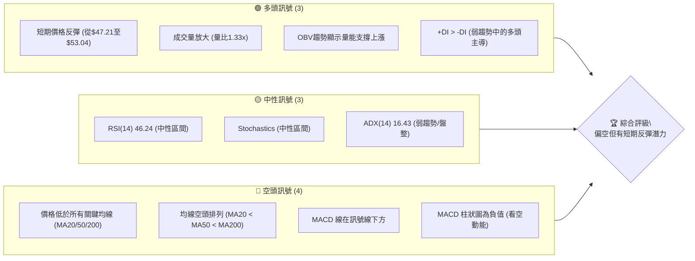

**解讀**：目前空頭訊號數量略多於多頭訊號，且關鍵趨勢指標（如均線系統和MACD）均發出空頭警示。然而，近期價格行為和成交量指標顯示在弱勢中存在一定的買盤支撐和反彈動能。市場處於一個關鍵的轉折點，需密切關注短期反彈能否轉化為趨勢反轉。

### 📊 核心指標速覽表

| 指標類別 | 指標名稱 | 當前數值 | 訊號 | 解讀 |
|----------|----------|----------|------|------|
| **價格** | 當前價格 | $53.04 | 🔴 | 位於52週區間的12.1%，接近低點 |
| **均線** | MA20 | $54.13 | 🔴 | 價格位於MA20下方，短期趨勢承壓 |
| **均線** | MA50 | $57.44 | 🔴 | 價格位於MA50下方，中期趨勢下行 |
| **均線** | MA200 | $79.36 | 🔴 | 價格位於MA200下方，長期趨勢顯著偏空 |
| **動能** | RSI(14) | 46.24 | 🟡 | 處於30-70中性區間，無明顯超買超賣 |
| **動能** | MACD | -2.880 | 🔴 | MACD線在訊號線下方，柱狀圖為負，看空 |
| **波動** | ATR | $3.34 | 🟡 | 佔價格6.29%，波動性中等偏高 |
| **趨勢** | ADX(14) | 16.43 | 🟡 | 趨勢強度較弱，市場處於盤整或弱勢趨勢 |
| **量能** | 量比(20日) | 1.33x | 🟢 | 最新成交量高於20日均量，買盤動能增強 |
| **量能** | OBV趨勢 | OBV > MA | 🟢 | 量能支撐上漲，顯示潛在累積行為 |

### 🏆 技術評分卡

```
技術評分卡 — KTOS (2026-07-02)
════════════════════════════════════════════════════
趨勢強度      ████░░░░░░░░░░░░░░░░  20/100  🔴 (ADX弱，均線空頭)
動能指標      ██████░░░░░░░░░░░░░░  30/100  🔴 (MACD看空，RSI中性)
支撐穩定度    ██████████░░░░░░░░░░  50/100  🟡 (接近52W低點，但有近期反彈)
成交量配合    ████████████░░░░░░░░  60/100  🟢 (量能放大，OBV支撐)
形態完整度    ████░░░░░░░░░░░░░░░░  20/100  🔴 (處於下跌趨勢中，未見明確反轉形態)
均線排列      ██░░░░░░░░░░░░░░░░░░  10/100  🔴 (典型空頭排列)
════════════════════════════════════════════════════
綜合評分      ████░░░░░░░░░░░░░░░░  32/100  評級：偏空，有短期反彈
════════════════════════════════════════════════════
```

**綜合評級**：KTOS 當前技術面整體呈現偏空趨勢，主要壓力來自於長期均線的空頭排列及價格持續受壓於均線下方。然而，在經歷大幅下跌後，短期市場出現止跌反彈跡象，成交量活躍，且OBV指標顯示有資金在低位吸納。這可能預示著一次技術性反彈，但要確認趨勢反轉，還需更多明確的多頭訊號。

---

## 2. 趨勢分析

### 🌐 多時框趨勢分析

KTOS 的價格走勢在不同時間框架下呈現出截然不同的面貌，從長期牛市轉為中期熊市，短期則顯示出止跌企穩的潛力。

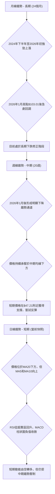

**分析**：
- **長期趨勢 (月線)**：從2024年7月的$22.54開始，KTOS經歷了一波強勁的牛市，在2026年1月達到峰值$103.01。隨後股價急轉直下，進入深度修正。目前股價已從高點回落近50%，顯示長期上漲趨勢已受到嚴重破壞，轉為長期修正或下跌趨勢。
- **中期趨勢 (週線)**：自2026年1月高點以來，KTOS 的週線圖形成了一個明顯的下降趨勢。價格持續位於MA20和MA50等中期均線下方，且這些均線均向下傾斜，構成強勁阻力。儘管偶有反彈，但均未能有效突破關鍵阻力。
- **短期趨勢 (日線)**：在最近幾週，股價從$47.21的低點反彈至$53.04，顯示短期內有買盤介入。MA5和MA10呈現向上趨勢，暗示短期動能有所恢復。然而，價格仍受MA20的壓制，且MACD柱狀圖雖收斂但仍為負值，表明短期多頭力量相對脆弱。

### 📈 長期趨勢 — 12個月走勢圖（Unicode）

以下是 KTOS 過去12個月的月線收盤價走勢圖，標注了關鍵高點和低點，展現了從強勁上漲到急劇下跌的轉折。

```
KTOS 月線走勢圖（過去12個月：2025-07 至 2026-07）
價格軸 ($)
$103.01 ┤                               ● (2026-01 高點)
$91.37  ┤                     ●
$86.18  ┤                           ●
$76.10  ┤                  ●      ●
$70.51  ┤                       ●
$65.84  ┤             ●           ●
$58.70  ┤     ●                     ●
$53.04  ┤                           ● ← 現在 (2026-07)
$49.86  ┤                               ● (2026-06 低點)
        └─────────────────────────────────────────────
         25-07 25-08 25-09 25-10 25-11 25-12 26-01 26-02 26-03 26-04 26-05 26-06 26-07
```

**走勢特徵分析表格**：

| 階段 | 時間區間 | 主要特徵 | 價格區間 | 漲跌幅 (月均) | 評估 |
|------|----------|----------|----------|---------------|------|
| 1 | 2025-07 至 2026-01 | 強勁上升趨勢，動能充沛，屢創新高 | $58.70 → $103.01 | +10.9% | 🟢 極度看多 |
| 2 | 2026-01 至 2026-06 | 急劇下跌修正，動能減弱，跌破關鍵支撐 | $103.01 → $49.86 | -10.3% | 🔴 極度看空 |
| 3 | 2026-06 至 2026-07 | 短期止跌反彈，試探性回升 | $49.86 → $53.04 | +6.4% | 🟡 止跌企穩 |

### 📊 中期趨勢（週線分析）

中期趨勢上，KTOS 自2026年1月高點$103.01以來，一直處於一個清晰的下降通道中。儘管在$49.86附近獲得了初步支撐，但上方阻力重重。

```
KTOS 週線壓力與支撐示意圖 (2026年至今)
價格 ($)
$103.01 ┤                 R (趨勢線阻力)
        │                /
$90.00  ┤               /
        │              /
$80.00  ┤             / R (MA200)
        │            /
$70.00  ┤           /   R (Fib 38.2%)
        │          /
$60.00  ┤         / R (MA50)
        │        /
$54.13  ┤─────── R (MA20)
$53.04  ┤─────── ● 現價
$50.00  ┤       /
        │      /
$47.21  ┤───── S (近期低點/短期支撐)
$41.87  ┤═════ S (52W 強支撐)
        └──────────────────────────
          時間軸 (週)
```

**分析**：目前股價 $53.04 位於所有中期移動平均線下方，MA20 ($54.13) 構成直接阻力，MA50 ($57.44) 和 MA200 ($79.36) 則構成更強的壓力位。近期最低點 $47.21 提供了短期支撐，而 $41.87 的52週低點則是最重要的長期支撐位。

### ⚡ 趨勢強度評估（ADX 解讀）

ADX 指標用於衡量趨勢的強度，而非方向。+DI 和 -DI 則指示多空力量。

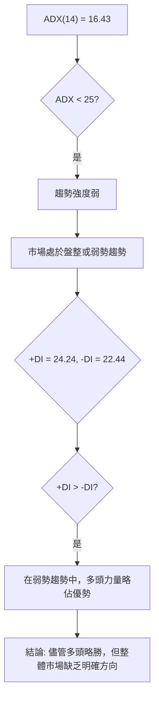

**ADX 強度對照表**：

| ADX 數值 | 趨勢強度 | 市場狀態 |
|----------|----------|----------|
| 0-25     | 弱趨勢   | 盤整、無趨勢 |
| 25-50    | 中等趨勢 | 趨勢形成、動能累積 |
| 50-75    | 強趨勢   | 趨勢確立、動能強勁 |
| 75-100   | 極強趨勢 | 趨勢加速、可能過熱 |

**解讀**：KTOS 當前的 ADX(14) 數值為 16.43，遠低於 25 的閾值，明確指示市場處於**弱趨勢或盤整行情**。這與其近期大幅下跌後的止跌企穩行為相符。雖然 +DI (24.24) 略高於 -DI (22.44)，表明在當前弱勢中多頭力量略佔上風，但由於 ADX 數值過低，不應過度解讀其方向性，而應將其視為市場缺乏明確方向、等待新催化劑的狀態。在這種環境下，區間交易策略可能比趨勢追蹤策略更為適用。

---

## 3. 圖表形態分析

### 🔍 形態識別系統

在當前的月線和週線數據中，KTOS 在經歷了長期上漲後，形成了一個從高點$103.01回落的**圓弧頂 (Rounding Top)** 潛在形態。儘管不夠完美，但其價格走勢呈現出由緩慢上漲、加速上漲、高位盤整、緩慢下跌至加速下跌的特徵，符合圓弧頂的初期輪廓。目前正處於圓弧頂的右側下跌階段。

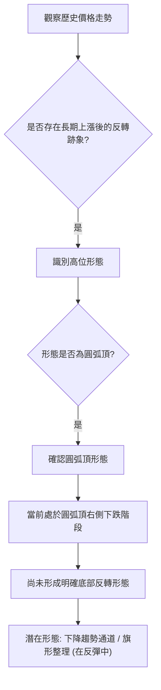

**分析**：
- **圓弧頂 (Rounding Top)**：從2026年1月的$103.01高點，股價開始緩慢回落，隨後跌勢加速，形成了一個向下的弧形。這種形態通常預示著長期上漲趨勢的結束和下跌趨勢的開始。當前價格 $53.04 已經跌破了圓弧頂的初期頸線，並接近形態的底部。
- **下降趨勢通道**：自2026年1月以來，價格走勢可以被框定在一個下降趨勢通道內，高點和低點不斷下移。這確認了中期的空頭趨勢。
- **未見明確底部反轉形態**：儘管短期有反彈，但尚未看到如雙底、頭肩底、V型反轉等明確的底部反轉形態。這意味著當前的反彈可能只是下跌趨勢中的技術性修正。

### 🕯️ 重要K線形態分析

由於提供的數據是月度和週度的收盤價，而非完整的K線（開、高、低、收），因此無法進行傳統的K線形態（如錘子線、吞噬形態）分析。然而，我們可以根據月度收盤價的變化來推斷市場情緒。

| 月份 | 收盤價 | K線形態推斷 (基於月度漲跌) | 解讀 | 訊號 |
|------|--------|-----------------------------|------|------|
| 2026-01 | $103.01 | 長陽線 (相對於前月)        | 強勁上漲動能，創歷史新高 | 🟢 極強 |
| 2026-02 | $86.18  | 長陰線 (相對於前月)        | 高位回落，空頭力量顯現 | 🔴 強空 |
| 2026-03 | $70.51  | 長陰線 (相對於前月)        | 空頭趨勢延續，跌破關鍵支撐 | 🔴 強空 |
| 2026-04 | $63.05  | 中陰線 (相對於前月)        | 跌勢趨緩但仍向下 | 🔴 偏空 |
| 2026-05 | $64.13  | 小陽線 (相對於前月)        | 止跌企穩嘗試，市場猶豫 | 🟡 中性 |
| 2026-06 | $49.86  | 長陰線 (相對於前月)        | 跌勢加速，創近期新低，恐慌情緒 | 🔴 極強 |
| 2026-07 | $53.04  | 中陽線 (相對於前月)        | 短期反彈，買盤介入，止跌 | 🟢 偏多 |

### 📉 ASCII 走勢形態示意圖

以下示意圖描繪了 KTOS 自2026年1月高點以來的下降趨勢通道，以及近期在$47.21附近形成的短期底部。

```
KTOS 下降趨勢通道與短期底部示意圖
價格軸 ($)

$103.01 ┤       ● (2026-01 高點)
        │      / \
$90.00  ┤     /   \
        │    /     \
$80.00  ┤   /       \
        │  /         \
$70.00  ┤ /           \
        │/             \
$60.00  ┤               ● (趨勢線阻力)
        │              / \
$54.13  ┤──────────── ● ← MA20 (動態阻力)
$53.04  ┤─────────── ● ← 現價
        │          /   \
$50.00  ┤         /     ● (近期反彈高點)
        │        /     /
$47.21  ┤─────── ● (近期低點/短期支撐)
        │        \
$41.87  ┤═════════ S (52W 強支撐)
        └───────────────────────────────────
           時間軸 (週/月)

說明：
- 上方斜線為下降趨勢線 (阻力)
- 下方斜線為下降通道支撐線
- ● 代表價格轉折點
- S 代表關鍵支撐位
```

**解讀**：從圖中可見，KTOS 股價自高點$103.01以來，一直沿著下降趨勢通道運行，每次反彈均受通道上沿壓制。近期在$47.21獲得支撐後，股價出現反彈，但目前仍處於下降通道內部，且受到MA20等短期均線的壓制。若要確認趨勢反轉，需有效突破下降趨勢線和關鍵均線阻力。

### 🎯 形態目標價計算

基於當前識別的下降趨勢通道和潛在的圓弧頂形態，我們主要關注反彈的目標價，以及若跌破支撐後的潛在下跌目標。由於尚未形成明確的反轉形態，因此主要依賴斐波那契回調和歷史支撐/阻力位。

**1. 下降趨勢通道反彈目標價**：
- **近期高點**：$53.04
- **通道上沿阻力**：根據趨勢線繪製，通道上沿約在 $60.00 - $65.00 區間。
- **目標價 T1 (挑戰MA50)**：$57.44
- **目標價 T2 (挑戰通道上沿/Fib 23.6%)**：$62.40

**2. 圓弧頂形態下跌目標價 (假設跌破)**：
- 圓弧頂形態通常沒有明確的目標價計算公式，但其跌幅可能與形態形成時的漲幅相關。若從$103.01跌至$47.21，已下跌約54%。若此形態確認，且跌破關鍵支撐$41.87，則可能進一步下探至疫情前或更早期的歷史低點。
- **潛在下跌目標**：若$41.87失守，下一重要支撐可能在$33.37 (2025-01前低點) 甚至更低。

**結論**：目前股價處於下降趨勢的底部區域，短期有反彈需求。但由於缺乏明確的底部反轉形態，反彈目標應保守設定在下降通道的阻力位和斐波那契回調位。若反彈失敗並跌破近期低點，則需警惕更深層次的下跌。

---

## 4. 支撐與阻力

KTOS 的價格在過去一年內經歷了劇烈的波動，從低點一路飆升至高點，再急劇回落。因此，多層次的支撐與阻力位對於理解其當前市場結構至關重要。

### 🗺️ 關鍵價位分布圖（Unicode）

以下圖示清晰展示了 KTOS 當前價格附近的關鍵支撐與阻力位，幫助投資者判斷價格的潛在轉折點。

```
KTOS 價位結構分布圖 (2026-07-02)
═══════════════════════════════════════════════════
$103.01 ║████████████████████████║ 強阻力 R4 (2026-01高點)
$91.37  ║████████████████████    ║ 阻力 R3 (2025-09高點)
$79.36  ║████████████████████████║ 關鍵阻力 R2 (MA200)
$76.44  ║████████████████████    ║ 阻力 R1 (Fib 50%回調)
$70.16  ║████████████████████    ║ 阻力 R0 (Fib 38.2%回調)
$57.44  ║████████████████████████║ 阻力 MA50
$54.13  ║████████████████████    ║ 阻力 MA20
$53.04  ╠════════════════════════╣ ◄ 現價
$49.86  ║▓▓▓▓▓▓▓▓▓▓▓▓▓▓▓▓        ║ 近期支撐 S1 (2026-06低點)
$47.21  ║████████████████████████║ 短期強支撐 S2 (2026-06-28週收盤低點)
$44.59  ║▓▓▓▓▓▓▓▓▓▓▓▓▓▓▓▓        ║ 近期支撐 S3 (布林下軌)
$41.87  ║████████████████████████║ 強支撐 S4 (52W 低點)
$33.37  ║▓▓▓▓▓▓▓▓▓▓▓▓▓▓▓▓        ║ 長期支撐 S5 (2025-01前低點)
═══════════════════════════════════════════════════
```

### 🚧 阻力位分析表

| 阻力級別 | 價位 | 形成原因 | 突破難度 | 重要性 |
|----------|------|----------|----------|--------|
| **直接阻力** | $54.13 | MA20 (短期均線)，價格需突破此處才能確認短期反彈動能 | 中等 | 高 |
| **短期阻力** | $57.44 | MA50 (中期均線)，也是近期反彈的潛在目標 | 中等偏高 | 中 |
| **關鍵阻力** | $62.40 | 斐波那契23.6%回調位，也是下降通道上沿的潛在交匯點 | 較高 | 高 |
| **中期阻力** | $70.16 | 斐波那契38.2%回調位，對應前期多個交易密集區 | 較高 | 高 |
| **重要阻力** | $76.44 | 斐波那契50%回調位，也是MA200的下方區域 | 高 | 中 |
| **長期阻力** | $79.36 | MA200 (長期均線)，牛熊分界線，突破則趨勢逆轉 | 極高 | 極高 |
| **歷史阻力** | $103.01 | 2026年1月歷史高點，強大心理和技術阻力 | 極高 | 極高 |

### 🛡️ 支撐位分析表

| 支撐級別 | 價位 | 形成原因 | 守住機率 | 重要性 |
|----------|------|----------|----------|--------|
| **直接支撐** | $49.86 | 2026年6月收盤低點，也是近期反彈的起點 | 中等 | 高 |
| **短期強支撐** | $47.21 | 2026-06-28週收盤價，近期最低點，具有心理意義 | 中等偏高 | 極高 |
| **布林下軌支撐** | $44.59 | 布林通道下軌，提供動態支撐，若跌破可能加速下跌 | 中等 | 中 |
| **52週低點** | $41.87 | 52週最低價，極為重要的長期支撐位，不容有失 | 高 | 極高 |
| **長期支撐** | $33.37 | 2025年1月前平台區低點，若$41.87失守後的下一個主要防線 | 中等 | 高 |

### 📐 斐波那契回調位分析

我們以2026年1月的高點$103.01作為波段高點，2026年6月的低點$49.86作為波段低點，計算其下跌趨勢中的反彈回調位。這些水平將作為潛在的阻力位。

```
KTOS 斐波那契回調位示意圖
價格 ($)
$103.01 ┤─────────── (100% - 波段高點)
        │
$90.47  ┤─────────── (76.4% 回調)
        │
$82.70  ┤─────────── (61.8% 回調 - 黃金分割)
        │
$76.44  ┤─────────── (50.0% 回調 - 心理中點)
        │
$70.16  ┤─────────── (38.2% 回調 - 關鍵阻力)
        │
$62.40  ┤─────────── (23.6% 回調 - 初步阻力)
        │
$53.04  ┤─────── ● 現價
        │
$49.86  ┤─────────── (0% - 波段低點)
        └──────────────────────────
          時間軸

```

**斐波那契回調位計算**：
- **波段高點 (H)**：$103.01 (2026-01)
- **波段低點 (L)**：$49.86 (2026-06)
- **回調區間**：$103.01 - $49.86 = $53.15

| 回調比例 | 價位計算 (L + 區間 * 比例) | 斐波那契回調位 | 意義 |
|----------|------------------------------|------------------|------|
| 23.6%    | $49.86 + ($53.15 * 0.236)   | $62.40           | 初步反彈目標，若突破則趨勢有望進一步回升 |
| 38.2%    | $49.86 + ($53.15 * 0.382)   | $70.16           | 重要的反彈阻力位，突破此處可能預示更強勢的反轉 |
| 50.0%    | $49.86 + ($53.15 * 0.500)   | $76.44           | 心理阻力位，代表回調了一半跌幅 |
| 61.8%    | $49.86 + ($53.15 * 0.618)   | $82.70           | 黃金分割位，極為關鍵的反轉確認點 |
| 76.4%    | $49.86 + ($53.15 * 0.764)   | $90.47           | 強勢反彈才能到達的阻力位 |

**分析**：當前價格 $53.04 位於 $49.86 的波段低點上方，且遠低於第一個斐波那契回調位 $62.40。這表明當前的反彈仍處於非常初級的階段。若能成功突破 $62.40，則有望挑戰 $70.16 和 $76.44 等更高阻力位。這些斐波那契回調位將是未來反彈行情中重要的止盈點或趨勢確認點。

---

## 5. 技術指標深度解讀

本章將對 KTOS 的主要技術指標進行深入分析，評估其各自的訊號，並探討它們之間是否存在相互確認或矛盾之處。

### 🎛️ 指標訊號總覽

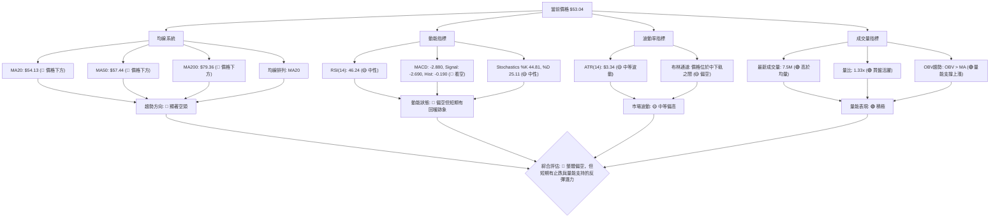

**分析**：從指標總覽可以看出，KTOS 的主要趨勢指標（均線、MACD）均發出強烈的空頭訊號，反映了長期和中期下行壓力。然而，成交量指標和部分動能指標（RSI從超賣區回升）顯示出市場在低位有買盤介入，量能積極，這與價格的下跌趨勢形成了一定程度的矛盾，預示著短期內可能存在反彈機會。

### 📈 移動平均線排列分析

KTOS 當前的移動平均線系統呈現出教科書般的空頭排列，這是一個非常強烈的看空訊號，表明長期、中期和短期趨勢均向下。

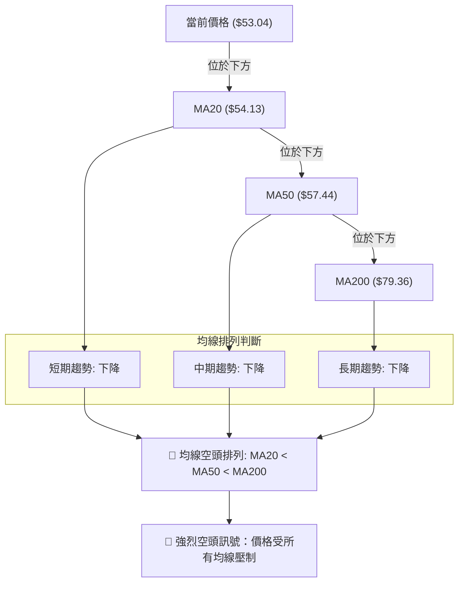

**當前排列狀態**：
- **MA20**: $54.13
- **MA50**: $57.44
- **MA200**: $79.36
- **當前價格**: $53.04

**解讀**：
1.  **價格位於所有關鍵均線下方**：這是最直接的空頭訊號，表明當前市場情緒極度悲觀，買盤力量不足以推動價格回到均線上方。
2.  **MA20 < MA50 < MA200 (空頭排列)**：這種排列是長期下跌趨勢的典型特徵。它意味著短期成本、中期成本和長期成本都在不斷降低，且短期成本最低，長期成本最高，形成了強大的下降慣性。
3.  **均線斜率**：從提供的MA走勢來看，MA20、MA60、MA120、MA240均呈下降趨勢，進一步確認了中長期趨勢的下行。只有MA5和MA10近期有所抬頭，顯示短期止跌反彈的跡象，但其影響力不足以改變整體空頭格局。

**結論**：均線系統發出極其強烈的空頭訊號，表明 KTOS 仍處於顯著的下跌趨勢中。任何價格反彈都可能在這些均線處遇到強大阻力。若要改變這種局面，價格必須首先突破MA20，然後是MA50，並最終突破MA200，形成多頭排列。

### 📉 RSI(14) 分析

相對強弱指數 (RSI) 用於衡量價格變動的速度和變化，以識別超買或超賣狀態。

**RSI 數值進度條**：
RSI(14): 46.24 🟡 █████████░░░░░░░░░░░░ (46.24%)

**RSI 超買超賣區間分析**：
- RSI 當前數值為 46.24，位於 30-70 的中性區間。這表明市場既沒有達到超買狀態（通常RSI > 70），也沒有達到超賣狀態（通常RSI < 30）。
- 從近20週的數據來看，RSI 在2026-06-28曾跌至 23.1 (超賣區)，隨後股價在2026-07-05反彈，RSI 回升至 46.24。這符合從超賣區反彈的典型行為，顯示短期跌勢有所緩解。

**背離判斷 (頂背離/底背離)**：
- **底背離 (Bullish Divergence)**：當價格創下新低，但 RSI 未創下新低反而走高時，構成底背離，預示潛在的上漲反轉。
    - 價格在2026-06-28收盤價 $47.21，RSI 為 23.1。
    - 在此之前，2026-04-26收盤價 $61.26，RSI 為 29.0。
    - 價格從 $61.26 跌至 $47.21 (創新低)，RSI 從 29.0 跌至 23.1 (也創新低)。因此，**無明顯底背離**。
    - 然而，從 $47.21 反彈到當前 $53.04，RSI 從 23.1 回升到 46.24，這是一個正常的超賣反彈，而非背離。
- **頂背離 (Bearish Divergence)**：當價格創下新高，但 RSI 未創下新高反而走低時，構成頂背離，預示潛在的下跌反轉。
    - 在2026-01達到高點 $103.01 後，RSI 數據並未提供，無法判斷頂背離。但在下跌過程中，未見價格創新高。
- **結論**：根據提供的數據，**KTOS 目前沒有明顯的 RSI 頂背離或底背離訊號**。RSI 僅顯示從超賣區的正常回升，表明短期內跌勢有所緩解，但尚未形成明確的反轉訊號。

### 📊 MACD(12/26/9) 訊號解讀

移動平均收斂/發散指標 (MACD) 是一個趨勢追蹤動能指標，由快線 (MACD Line)、慢線 (Signal Line) 和柱狀圖 (Histogram) 組成。

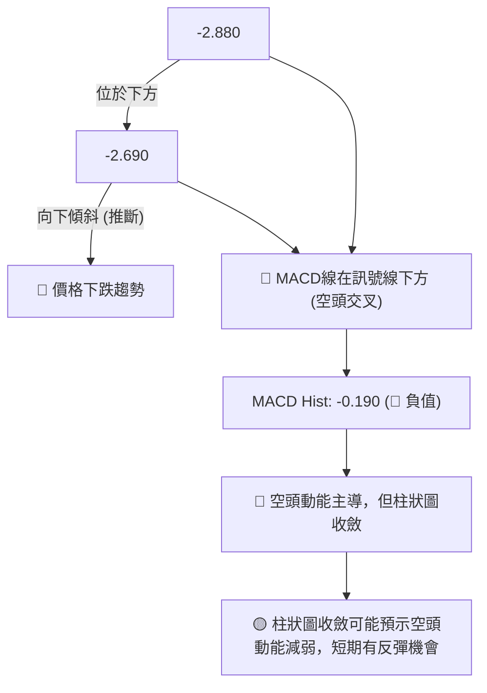

**MACD 數值**：
- MACD 線: -2.880
- MACD 訊號線: -2.690
- MACD 柱狀圖: -0.190

**解讀**：
1.  **MACD 線在訊號線下方**：這是典型的空頭訊號，表明短期動量弱於長期動量，價格傾向於下跌。
2.  **MACD 柱狀圖為負值**：柱狀圖是 MACD 線與訊號線的差值。負值表示 MACD 線位於訊號線下方，進一步確認了空頭動能。
3.  **柱狀圖收斂**：從近20週數據看，MACD柱狀圖在2026-06-28達到-0.991的低點後，目前回升至-0.190。儘管仍為負值，但其絕對值正在縮小，這是一個重要的細節。它表明**空頭動能正在減弱**，空頭賣壓開始緩解。

**背離判斷 (頂背離/底背離)**：
- **底背離 (Bullish Divergence)**：
    - 價格在2026-06-28收盤價 $47.21，MACD Hist 為 -0.991。
    - 當前價格 $53.04 (高於 $47.21)，MACD Hist 為 -0.190 (絕對值小於 -0.991)。
    - 這裡存在**潛在的 MACD 柱狀圖底背離**：價格創下較低的低點 ($47.21 相對於 $61.26)，或者說從最低點反彈後，MACD 柱狀圖的負值在縮小。更精確地說，從 $47.21 反彈到 $53.04，MACD 柱狀圖的負值從 -0.991 顯著收斂到 -0.190。這表明儘管價格在下跌趨勢中，但下跌的動能正在減弱，提供了短期反彈或底部形成的早期訊號。
- **結論**：MACD 指標整體仍處於空頭區域，但柱狀圖的收斂和潛在的底背離訊號，暗示空頭動能正在減弱，短期內有止跌反彈的潛力。

### 📦 布林通道分析

布林通道 (Bollinger Bands) 由中軌 (通常是20日移動平均線)、上軌和下軌組成，用於衡量價格波動性和判斷超買超賣區域。

**布林通道數據**：
- BB上軌: $63.66
- BB中軌(MA20): $54.13
- BB下軌: $44.59
- 當前收盤價: $53.04
- BB %B: 0.44

```
KTOS 布林通道示意圖 (當前價格 $53.04)
價格 ($)
$63.66 ┤═══════════════════════════════════════ 上軌
        │           ╭─╮
$54.13 ┤───────────┼─┼──────────── 中軌 (MA20)
        │           │ ● 現價 $53.04
        │           │ │
        │           ╰─╯
$44.59 ┤═══════════════════════════════════════ 下軌
        └─────────────────────────────────────────
          時間軸

說明：
- 上軌和下軌之間的距離代表波動率。
- 價格在中軌下方，表明短期趨勢偏弱。
```

**解讀**：
1.  **價格位置**：當前價格 $53.04 位於布林通道中軌 ($54.13) 和下軌 ($44.59) 之間，且略低於中軌。BB %B 為 0.44，表明價格更靠近中軌而非下軌，但仍處於中軌下方，反映短期偏弱的走勢。
2.  **通道寬度**：從數據無法直接判斷通道寬度的變化，但 ATR 為 $3.34 (佔價格6.29%)，顯示波動性中等偏高。在經歷大幅下跌後，通道可能有所擴張，預示著較大的價格波動。
3.  **訊號**：
    - 價格在中軌下方運行，確認了短期下跌趨勢。
    - 價格在下軌上方，尚未觸及或跌破下軌，表明當前跌勢並未達到極端超賣狀態，但若跌破下軌，則可能加速下跌。
    - 若價格能有效突破中軌 $54.13，則可能向上測試上軌 $63.66。

**結論**：布林通道顯示 KTOS 價格處於短期偏弱的狀態，但尚未觸及極端超賣。中軌 $54.13 是當前反彈的直接阻力，若能突破，則有望向上擴展反彈空間。

### 💹 成交量分析（量價配合度）

成交量是價格走勢的燃料，量價關係對於判斷趨勢的可靠性至關重要。

**成交量數據**：
- 最新成交量: 7,496,700
- 20日均量: 5,620,375
- 50日均量: 5,053,028
- 量比 (最新/20日均量): 1.33x
- OBV趨勢: OBV > MA → 量能支撐上漲

**解讀**：
1.  **最新成交量顯著放大**：當前成交量 7,496,700 股，顯著高於20日均量 (5,620,375) 和50日均量 (5,053,028)。量比達到 1.33x，表明近期市場交易活躍度大幅提升。
2.  **量價配合分析**：
    - 從2026-06-28的低點 $47.21 (週成交量 45,383,700) 到當前 $53.04 (週成交量 18,916,000)，價格出現反彈。在價格觸底反彈的過程中，成交量放大是積極的訊號，表明有資金入場支持反彈。
    - 儘管當前價格仍處於下跌趨勢中，但成交量的放大，特別是在低位區域的放大，可能預示著有主力資金在累積籌碼，為未來的反彈或反轉做準備。
3.  **OBV 趨勢**：數據明確指出 "OBV > MA → 量能支撐上漲"。這是一個重要的**多頭訊號**，它意味著買入壓力大於賣出壓力，累積性成交量在增加。在價格下跌或盤整時，如果 OBV 上升，則可能預示著底部形成或潛在的反轉。這與均線和 MACD 的空頭訊號形成**矛盾**，但這種矛盾往往是趨勢轉折的早期跡象。OBV 的積極表現為當前的短期反彈提供了強有力的量能支持。

**結論**：成交量分析顯示，KTOS 近期交易活躍，且 OBV 指標發出明確的買入壓力訊號。這種量能的積極配合，儘管與當前價格的下跌趨勢形成矛盾，但卻是短期反彈或底部構築的積極跡象，值得密切關注。若價格能夠在放量下突破阻力，則量能將確認反彈的有效性。

---

## 6. 動能與波動率

### ⚡ 動能評估四象限

動能與波動率是衡量股票吸引力和風險的重要維度。我們將 KTOS 置於動能與波動率的象限中進行評估。

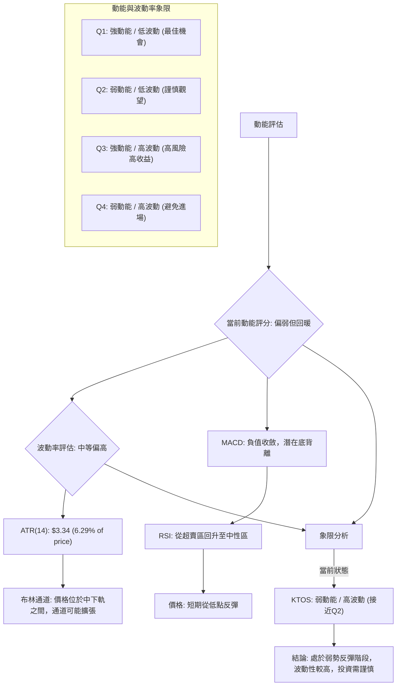

**動能與波動率評估表**：

| 象限 | 動能 | 波動 | 當前狀態 | 評估 |
|------|------|------|----------|------|
| Q1 | 強 | 低 | - | 最佳機會，適合趨勢追蹤 |
| Q2 | 弱 | 低 | - | 謹慎觀望，等待動能增強或趨勢明朗 |
| Q3 | 強 | 高 | - | 高風險高收益，適合激進型交易者 |
| **Q4** | **弱** | **高** | **✓** | **避免進場或極度謹慎，通常為下跌或盤整末期** |

**分析**：
- **動能 (Momentum)**：儘管 MACD 和均線仍顯示空頭動能，但 MACD 柱狀圖的收斂、RSI 從超賣區回升以及價格的短期反彈，都表明空頭動能正在減弱，多頭開始嘗試發力。整體動能仍偏弱，但有回暖跡象。
- **波動率 (Volatility)**：ATR 為 $3.34，佔當前價格 $53.04 的 6.29%，這是一個相對較高的波動率。在經歷大幅下跌後，價格波動性通常會增加，這為交易者提供了更大的潛在收益，但也伴隨著更高的風險。
- **當前位置**：KTOS 目前處於「弱動能 / 高波動」的象限 (Q4)。這意味著市場缺乏明確的趨勢方向，但價格波動劇烈。在這種情況下，投資風險較高，不適合追漲殺跌，更適合經驗豐富的交易者進行短線操作，或者等待趨勢明朗化。

### 📊 ATR 波動率分析

平均真實波幅 (ATR) 是衡量市場波動性的指標，它反映了在特定時間段內價格的平均波動範圍。

**ATR(14) 數值**：$3.34
**佔當前價格比例**：($3.34 / $53.04) * 100% = 6.29%

**解讀**：
1.  **波動性水平**：ATR 為 $3.34，佔當前價格的 6.29%。對於美股而言，6.29% 的日均波動性屬於**中等偏高水平**。這表明 KTOS 股票在每日交易中可能會出現較大的價格變動，為短線交易者提供了機會，但對長期持有者或風險厭惡型投資者而言，則意味著更高的風險。
2.  **止損距離建議**：ATR 在風險管理中扮演重要角色。由於 ATR 反映了股票的自然波動範圍，止損點通常會設置在 ATR 的倍數之外，以避免被正常市場波動「洗出場」。
    - **保守止損**：建議將止損設置在當前價格下方 2 倍 ATR 的位置。
        - 止損距離：$3.34 * 2 = $6.68
        - 止損點 (若做多)：$53.04 - $6.68 = $46.36
    - **激進止損**：建議將止損設置在當前價格下方 1.5 倍 ATR 的位置。
        - 止損距離：$3.34 * 1.5 = $5.01
        - 止損點 (若做多)：$53.04 - $5.01 = $48.03
3.  **ATR 與交易策略**：高 ATR 意味著價格波動性大，這可能導致止損更容易被觸發。因此，在波動性較高的市場中，交易者可能需要調整倉位大小，降低單筆交易的風險敞口。同時，ATR 也可以用於設定移動止損，根據市場波動性動態調整止損點。

**結論**：KTOS 的中等偏高波動率要求投資者在制定交易策略時，必須預留足夠的止損空間，並謹慎管理倉位。

### 📐 Beta 與市場相關性

Beta 值衡量股票相對於整體市場（通常是 S&P 500 指數）的波動性。數據中未提供 KTOS 的 Beta 值，但我們可以基於其所處的產業 (Aerospace & Defense) 進行一般性推斷。

**一般產業特性推斷**：
1.  **產業性質**：Kratos Defense & Security Solutions, Inc. 屬於航太與國防工業。這類公司通常與政府訂單、國防預算以及地緣政治局勢高度相關。
2.  **市場敏感性**：
    - **經濟週期敏感性**：國防產業通常被認為是相對穩定的防禦性行業，受經濟週期的影響相對較小。在經濟衰退時，國防開支往往保持穩定甚至增加。
    - **地緣政治風險敏感性**：地緣政治緊張局勢往往會推動國防股上漲，反之亦然。這使得其股價可能在某些時期表現出與大盤不同的走勢。
    - **政府政策影響**：政府採購政策、國防預算變化等對此類公司業績影響巨大。
3.  **潛在 Beta 推斷**：
    - 由於其相對防禦性和特殊驅動因素，國防股的 Beta 值通常**接近或略低於 1**。這意味著其波動性可能與大盤相似，但在某些特定事件（如戰爭、國防預算增加）驅動下，可能表現出獨立於大盤的超額收益。
    - 然而，在當前市場整體下跌的背景下，即使是防禦性股票也難以獨善其身。KTOS 經歷的大幅下跌表明，它並非完全免疫於市場風險，尤其是在其從高位回落的過程中，可能與大盤的風險偏好變化有一定相關性。

**結論**：由於缺乏具體 Beta 數據，我們推斷 KTOS 的 Beta 值可能接近或略低於 1。投資者應意識到，儘管其所屬行業具有一定的防禦性，但在整體市場風險情緒惡化或公司自身面臨挑戰時，股價仍會受到顯著影響。在當前弱勢市場中，即使是 Beta 值較低的股票，也可能出現大幅波動。

---

## 7. 多時框架總結

通過對 KTOS 的多時框架分析，我們得以全面了解其在不同時間尺度上的趨勢、動能和市場結構。

### 📋 時框架評分表

| 時框架 | 趨勢方向 | 動能 | 均線排列 | 形態 | 綜合評分 | 建議 |
|--------|----------|------|----------|------|----------|------|
| **長期 (月線)** | 🔴 下跌 | 🔴 減弱 | 🔴 空頭 | 🔴 圓弧頂 | 2/10 | 避險/觀望 |
| **中期 (週線)** | 🔴 下跌 | 🔴 偏空 | 🔴 空頭 | 🔴 下降通道 | 3/10 | 觀望/反彈做空 |
| **短期 (日線)** | 🟡 止跌 | 🟡 回暖 | 🟡 偏空 | 🟡 潛在底部 | 5/10 | 短線反彈 |

**分析**：
- **長期**：KTOS 在經歷了強勁的牛市後，已進入明顯的長期下跌修正階段。均線呈現空頭排列，且月線圖上可能形成了圓弧頂形態，預示著趨勢的重大逆轉。長期投資者應保持謹慎。
- **中期**：週線圖顯示股價處於清晰的下降趨勢通道中，並持續受壓於中期均線下方。儘管有短期反彈，但中期趨勢仍偏空。
- **短期**：在經歷大幅下跌後，短期價格在 $47.21 附近獲得支撐並出現反彈。RSI 從超賣區回升，MACD 柱狀圖收斂，OBV 顯示量能積極。這表明短期空頭動能減弱，存在技術性反彈的機會。

### 🔲 綜合訊號矩陣

| 指標/時框架 | 長期趨勢 | 中期趨勢 | 短期趨勢 | 訊號一致性 |
|-------------|----------|----------|----------|------------|
| **價格行為** | 🔴 下跌 | 🔴 下跌 | 🟢 反彈 | 低 (短期與長中期矛盾) |
| **移動平均線**| 🔴 空頭 | 🔴 空頭 | 🔴 價格下方 | 高 (一致看空) |
| **RSI**       | N/A      | 🟡 中性 | 🟢 回升 | 中 (短期積極) |
| **MACD**      | N/A      | 🔴 空頭 | 🟡 收斂 | 中 (短期動能減弱) |
| **成交量/OBV**| N/A      | 🟢 積極 | 🟢 積極 | 高 (一致看多) |
| **整體評估**  | 🔴 強空 | 🔴 偏空 | 🟡 弱多 | 低 (短期與長中期嚴重背離) |

**分析**：
- **一致性**：KTOS 的長中期趨勢指標（價格行為、移動平均線、MACD）高度一致地發出空頭訊號，表明整體市場結構偏弱。
- **矛盾點**：然而，短期價格反彈、RSI 從超賣區回升、MACD 柱狀圖收斂以及成交量/OBV 的積極表現，與長中期空頭趨勢形成明顯矛盾。這種矛盾通常發生在趨勢轉折點附近，即股價在經歷大幅下跌後，空頭力量開始衰竭，多頭力量嘗試介入。
- **結論**：KTOS 目前處於一個「長期下跌趨勢中的短期技術性反彈」階段。雖然短期動能有所改善，但要扭轉長中期的空頭格局，需要更強勁的買盤和持續的利好消息來推動價格突破關鍵阻力。在當前階段，交易者應保持高度警惕，謹慎操作。

---

## 8. 交易策略建議

基於上述多時框架的深入分析，KTOS 目前處於長期下跌趨勢中的短期反彈階段。主要趨勢指標仍偏空，但短期動能和量能顯示止跌企穩的跡象。因此，交易策略應側重於捕捉短期反彈機會，同時警惕趨勢延續的風險。

### 🗺️ 策略決策流程圖

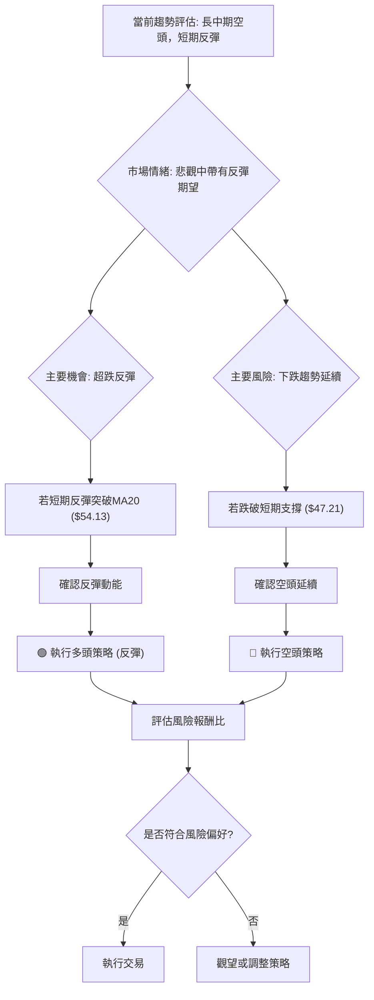

### 🟢 多頭策略詳情 (反彈交易)

此策略旨在捕捉 KTOS 在超跌後的技術性反彈機會。由於整體趨勢仍偏空，此為**逆勢交易**，風險較高，建議謹慎控制倉位。

| 策略要素 | 策略 A (穩健反彈) | 策略 B (激進反彈) |
|----------|--------------------|--------------------|
| 進場條件 | 價格突破MA20且MACD金叉 | 價格站穩近期低點上方，RSI回升 |
| 進場價格 | $54.20 (突破MA20後確認) | $50.00 (在$49.86-$50.00區間尋找支撐) |
| 目標價 T1 | $62.40 (斐波那契23.6%回調位) | $57.44 (MA50阻力) |
| 目標價 T2 | $70.16 (斐波那契38.2%回調位) | $62.40 (斐波那契23.6%回調位) |
| 止損價格 | $46.90 (近期低點$47.21下方) | $46.90 (近期低點$47.21下方) |
| 風險報酬比 | 策略A: <br>R1: ($62.40-$54.20)/($54.20-$46.90) = 8.20/7.30 ≈ **1.12:1**<br>R2: ($70.16-$54.20)/($54.20-$46.90) = 15.96/7.30 ≈ **2.19:1** | 策略B: <br>R1: ($57.44-$50.00)/($50.00-$46.90) = 7.44/3.10 ≈ **2.40:1**<br>R2: ($62.40-$50.00)/($50.00-$46.90) = 12.40/3.10 ≈ **4.00:1** |
| 成功機率 | 50% | 40% (激進) |
| 建議倉位 | 5% - 10% | 3% - 5% (低倉位) |

**策略說明**：
- **策略 A (穩健反彈)**：等待價格突破短期關鍵阻力MA20 ($54.13) 後再入場，尋求更高的成功率。止損設置在近期低點下方，控制風險。
- **策略 B (激進反彈)**：在更接近底部的位置入場，以博取更高的風險報酬比。但由於尚未確認突破阻力，風險相對較高。

### 🔴 空頭策略詳情 (趨勢延續)

此策略旨在利用 KTOS 的長中期下跌趨勢，若短期反彈失敗並跌破關鍵支撐，則考慮做空。

| 策略要素 | 策略 C (跌破支撐) |
|----------|--------------------|
| 進場條件 | 價格跌破近期低點 $47.21 |
| 進場價格 | $47.00 (跌破$47.21後確認) |
| 目標價 T1 | $41.87 (52週低點) |
| 目標價 T2 | $33.37 (長期支撐位) |
| 止損價格 | $50.50 (MA10上方，或近期反彈高點上方) |
| 風險報酬比 | R1: ($47.00-$41.87)/($50.50-$47.00) = 5.13/3.50 ≈ **1.46:1**<br>R2: ($47.00-$33.37)/($50.50-$47.00) = 13.63/3.50 ≈ **3.89:1** |
| 成功機率 | 60% |
| 建議倉位 | 5% - 10% |

**策略說明**：
- **策略 C (跌破支撐)**：若短期反彈無力，價格再次跌破 $47.21 的近期低點，則確認下跌趨勢延續。此時可入場做空，止損設置在反彈高點或短期均線上方。

### ⭐ 整體訊號強度評星

做多訊號強度：★★☆☆☆ (2/5星) - 儘管有短期反彈和量能支持，但整體趨勢偏空，逆勢風險高。
做空訊號強度：★★★☆☆ (3/5星) - 長中期趨勢明確向下，做空策略與大趨勢一致，但短期超跌可能導致反彈。
整體可信度：  ★★★☆☆ (3/5星) - 指標之間存在矛盾，需要仔細判斷，並等待關鍵價位的突破確認。

---

## 9. 風險提示與監控

在當前 KTOS 複雜的技術格局下，風險管理和持續監控是至關重要的。

### ✅ 關鍵監控指標 Checklist

以下是交易者在持有 KTOS 頭寸時應密切關注的關鍵技術指標和價位：

```
關鍵監控指標 Checklist — KTOS (2026-07-02)
════════════════════════════════════════════════════
├─ 價格行為監控：
│  ├─ 短期支撐位 ($47.21) 是否守住？
│  ├─ 近期反彈是否能突破 MA20 ($54.13)？
│  └─ 斐波那契23.6%回調位 ($62.40) 是否有效突破？
├─ 均線系統監控：
│  ├─ MA20 是否由下降轉為上升？
│  ├─ MA20 是否能向上穿越 MA50 (金叉)？
│  └─ 價格能否站穩所有均線上方？
├─ 動能指標監控：
│  ├─ RSI 是否能突破50中軸線並向上？
│  ├─ MACD 線是否能向上穿越訊號線 (金叉)？
│  └─ MACD 柱狀圖是否能持續轉正？
├─ 成交量監控：
│  ├─ 反彈時成交量是否持續放大？
│  └─ 下跌時成交量是否萎縮？
├─ 波動率監控：
│  └─ ATR 是否異常放大或縮小？
════════════════════════════════════════════════════
```

### ⚠️ 風險場景分析

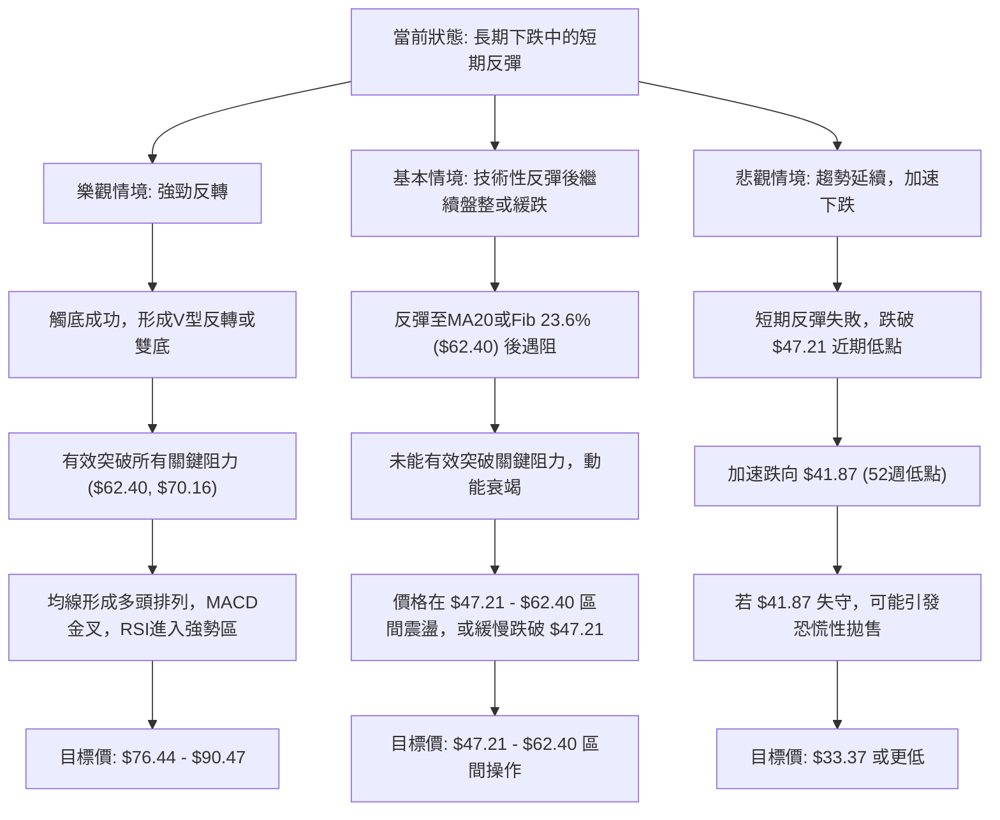

**分析**：
- **樂觀情境**：可能性較低。需要強大的基本面利好或市場情緒大幅逆轉才能實現。
- **基本情境**：可能性中等。短期技術性反彈是合理的，但由於長中期趨勢偏空，反彈後繼續盤整或緩慢下跌是更可能發生的情況。
- **悲觀情境**：可能性中等偏高。若短期反彈動能不足，或遇到市場整體利空，價格很可能跌破近期支撐，加速下跌。

### 🛡️ 風險管理重要提醒

1.  **嚴格止損**：在任何交易策略中，都必須設置並嚴格執行止損點。尤其是在逆勢交易中，止損是保護資本的最後一道防線。建議使用 ATR 或關鍵支撐位作為止損依據。
2.  **倉位管理**：由於 KTOS 波動性較高且趨勢不明朗，建議採用小倉位操作，避免重倉。對於逆勢的多頭策略，倉位應更小。
3.  **分批進場/出場**：可以考慮將資金分批投入，在價格確認突破或跌破關鍵點位時逐步加倉或減倉，以平滑平均成本並降低風險。
4.  **監控市場情緒**：密切關注整體市場（如 S&P 500）的走勢，以及航太與國防產業的相關新聞和政策變化。
5.  **不盲目抄底**：在長期下跌趨勢中，過早抄底往往會帶來巨大損失。應等待明確的底部反轉訊號和趨勢確認。
6.  **耐心等待**：在當前複雜的市場環境下，耐心等待明確的交易訊號，避免頻繁交易和追漲殺跌，是更為穩健的策略。

---

## 📋 報告總結

```
KTOS 技術分析報告總結
════════════════════════════════════════════════════════
報告日期：2026-07-02
當前價格：$53.04
分析評級：⚖️ 偏空，短期有止跌反彈潛力 (綜合評分32/100)

關鍵結論：
├─ 長期趨勢：🔴 顯著下跌，均線空頭排列，可能形成圓弧頂。
├─ 中期趨勢：🔴 持續下跌，處於下降趨勢通道中，受均線壓制。
├─ 短期趨勢：🟡 止跌企穩，從低點反彈，RSI回升，MACD空頭動能減弱，OBV量能積極。
├─ 關鍵支撐：$47.21 (近期低點)，$41.87 (52週低點)。
├─ 關鍵阻力：$54.13 (MA20)，$62.40 (Fib 23.6%回調位)。
└─ 分析師目標：$109.86 (均值，與當前技術面嚴重背離，需謹慎參考)。

最優策略組合：
1. 🥇 **最佳機會 (觀望/等待確認)**：在當前趨勢不明朗、矛盾訊號較多的情況下，最穩健的策略是等待。若價格能有效突破MA20 ($54.13) 和Fib 23.6% ($62.40)，並伴隨成交量放大，則可考慮輕倉做多；若跌破$47.21，則可考慮輕倉做空。
2. 🥈 **次選機會 (激進反彈多頭)**：若風險承受能力較高，可在 $49.86 - $50.00 區間尋找入場機會，止損設於 $46.90，目標價為 $57.44 和 $62.40。此為逆勢交易，需嚴格控制倉位。
3. 🥉 **保守選擇 (趨勢延續空頭)**：若短期反彈失敗，價格跌破 $47.21，則可考慮做空，止損設於 $50.50，目標價為 $41.87 和 $33.37。此策略與長中期趨勢一致。
════════════════════════════════════════════════════════
```

---

> ⚠️ **免責聲明**：本報告為 AI 自動生成之技術分析，所有數據及估算均基於提供的歷史價格資訊。本報告**僅供研究與學術參考**，**不構成任何投資建議**。投資有風險，入市需謹慎。

---

*報告生成時間：2026-07-02 ｜ 數據來源：Yahoo Finance ｜ 分析框架：多時框技術分析*