<details>
<summary>📊 靜態圖表 (點擊展開)</summary>

</details>

<html>
<head><meta charset="utf-8" /></head>
<body>
    <div style="height:500px; width:100%;">                        <script>window.PlotlyConfig = {MathJaxConfig: 'local'};</script>
        <script charset="utf-8" src="https://cdn.plot.ly/plotly-3.6.0.min.js" integrity="sha256-QaOVwtVY0T02VaHrr6pnoHLCwayMJp4O5n4YyaE3rJk=" crossorigin="anonymous"></script>                <div id="candlestick-chart" class="plotly-graph-div" style="height:100%; width:100%;"></div>            <script>                window.PLOTLYENV=window.PLOTLYENV || {};                                if (document.getElementById("candlestick-chart")) {                    Plotly.newPlot(                        "candlestick-chart",                        [{"close":{"dtype":"f8","bdata":"AAAAYGYWU0AAAAAgXO9SQAAAAKCZKVRAAAAAoEcxVEAAAACAFC5UQAAAAKCZ+VRAAAAAIIVLVEAAAADAzAxVQAAAAIDrkVVAAAAAwB4FVkAAAAAgrtdWQAAAAKBwPVdAAAAAgOvBV0AAAAAAKQxYQAAAAAAAEFlAAAAAACnsWUAAAABA4WpaQAAAAEAzo1hAAAAA4FGoV0AAAACA6xFYQAAAAEAz01dAAAAAwB6lVkAAAAAgridWQAAAACCux1RAAAAAoJmpVUAAAAAgrqdWQAAAAEAzE1VAAAAA4HpUVkAAAAAghctWQAAAACCFq1ZAAAAAgOtxVkAAAACgcM1WQAAAAEAzE1ZAAAAAYGamVkAAAABgZsZWQAAAAIAUjlZAAAAAgD1aU0AAAACAPRpSQAAAAOBReFNAAAAAIIXLU0AAAACAwiVTQAAAAMDMLFNAAAAAACnsUUAAAADAzBxSQAAAACBcj1FAAAAAQAqXUUAAAABA4apRQAAAAADX01BAAAAAwPVIUUAAAABACodSQAAAAEAzw1JAAAAAoEfxUkAAAABgZgZTQAAAAKBwTVJAAAAAoHC9UUAAAACA6zFSQAAAACCFa1NAAAAAAAAgU0AAAACA60FTQAAAAIDrQVNAAAAAgD06U0AAAACA67FTQAAAAKBw\u002fVJAAAAA4KOQUkAAAADgUUhSQAAAAKBHcVFAAAAAoJnZUUAAAADA9dhSQAAAAIDrYVRAAAAAQDOTVEAAAACAFP5TQAAAAMDMbFNAAAAAgBReU0AAAABguP5SQAAAAIA9+lJAAAAAYI\u002fSU0AAAAAghXtWQAAAACCF+1ZAAAAAACncVkAAAABgjwJaQAAAAMDMbFxAAAAAQAp3XUAAAACAFO5dQAAAAAAAYF5AAAAAANcjX0AAAABACldgQAAAAIDCFWBAAAAAgMIlXkAAAABgZnZcQAAAAMD1mFtAAAAA4HrUW0AAAAAA14NdQAAAAEDhKlxAAAAAgD0KW0AAAADgo8BZQAAAAIA9ClhAAAAAIK7XWUAAAADAHtVWQAAAAAAAUFVAAAAAgD2aV0AAAAAA17NYQAAAAGC4XldAAAAAgOvxVUAAAABAM8NVQAAAAADXQ1ZAAAAAgBT+VkAAAACgcE1YQAAAAEDhalpAAAAAwB4FWEAAAAAA15NXQAAAACCFq1ZAAAAAYLgOVkAAAADA9QhXQAAAACCFi1VAAAAAgBSuVkAAAADAzDxWQAAAAOBRSFZAAAAAYI9iVUAAAAAAAMBVQAAAAIAUHldAAAAAoHA9VkAAAABA4TpWQAAAAKBwXVZAAAAAgOvhVUAAAACA62FWQAAAAADX01dAAAAAYI9CV0AAAACA6zFXQAAAACCuJ1VAAAAAACnsVEAAAAAgXF9TQAAAAGC4\u002flNAAAAAQAr3UkAAAAAAKfxRQAAAAIDrUVBAAAAA4KOgUUAAAADAzOxQQAAAAADX01BAAAAAgMKFUkAAAACgcP1RQAAAAKBwnVJAAAAAwB4VUUAAAACAwpVRQAAAAEAzY1JAAAAAgD1qUkAAAACAPapSQAAAAIA9mlJAAAAAIFy\u002fUUAAAADAHnVRQAAAAEAzI1FAAAAAQAonUUAAAACgR2FQQAAAAKBHoU5AAAAA4HqUT0AAAADgetROQAAAACCux01AAAAAYGaGT0AAAABgZgZPQAAAAEAK905AAAAAIK6nTUAAAABgj8JOQAAAAAAAgExAAAAAgOvxTEAAAABguH5MQAAAAIA9qkxAAAAAYLg+SkAAAADAzGxLQAAAACCFC0pAAAAAACkcS0AAAAAAKbxKQAAAAMD16EtAAAAAgMJVS0AAAABAChdMQAAAAGBmZkxAAAAAYGamTEAAAAAAKUxQQAAAAOBRCFBAAAAAYLi+T0AAAABgj6JPQAAAAEAKN01AAAAAQDOzT0AAAABgj0JNQAAAAKBw3UxAAAAA4FEYTEAAAADA9WhLQAAAAADXY01AAAAAAADgTEAAAABgj4JMQAAAACCFK0xAAAAA4HoUTEAAAABA4RpLQAAAACCFi0lAAAAAYGZmSUAAAACgmflHQAAAAMD1KEdAAAAAQOGaR0AAAACgmXlHQAAAAIAU7khAAAAAwB6FSkAAAADAzKxLQA=="},"high":{"dtype":"f8","bdata":"AAAAIK4nU0AAAACA60FTQAAAAAApXFRAAAAAANeTVEAAAADgUahUQAAAAGC4XlVAAAAAAABAVUAAAADgUThVQAAAAIDCtVVAAAAAQOFqVkAAAAAgrvdWQAAAAKBHYVdAAAAAoJkZWEAAAAAgrodYQAAAAAAAwFlAAAAAoHAtWkAAAAAA15NaQAAAAOB6JFxAAAAAoJmpWUAAAAAAAGBZQAAAAGBmRlhAAAAAIFyfWEAAAACAwiVXQAAAAKBHoVVAAAAAgBQuVkAAAABAM7NWQAAAAAAAgFZAAAAAwMx8VkAAAAAghTtXQAAAAGBmpldAAAAAwMwcV0AAAAAgrndXQAAAAAAAwFZAAAAAoJkJV0AAAACAFO5WQAAAAIDC5VZAAAAAAACgVEAAAACAFN5TQAAAAGBmllNAAAAAAACAVEAAAAAgXL9TQAAAAEDhilNAAAAAoJn5UkAAAACgR3FSQAAAAMDMPFJAAAAAAADQUUAAAAAghQtSQAAAAGC4nlJAAAAAgMJVUUAAAAAAKZxSQAAAACCFC1NAAAAAQOFKU0AAAAAgXB9TQAAAAGBmJlNAAAAAYGamUkAAAAAAAEBSQAAAAOB6lFNAAAAA4FGIU0AAAADgeoRTQAAAAIA96lNAAAAAoHCdU0AAAACAFN5TQAAAAKCZ2VNAAAAAQOEaU0AAAADgUahSQAAAACBcj1JAAAAAgD0aUkAAAABgj\u002fJSQAAAACCud1RAAAAAgD3aVEAAAAAAKXxUQAAAAIA9+lNAAAAAgBSOU0AAAAAAKYxTQAAAAIAUPlNAAAAAYLjuU0AAAABACodWQAAAAIDrAVdAAAAA4HrUV0AAAABAM3NbQAAAAMDM3FxAAAAA4FHoXUAAAADgemReQAAAAKBw\u002fV5AAAAAANeTX0AAAAAAAIBgQAAAAAAAwGBAAAAAAAAAYEAAAABAM1NeQAAAAIDr4VxAAAAAQOFqXEAAAADA9YhdQAAAAAAAAF5AAAAAwMzMXEAAAAAAADBbQAAAAMD1SFlAAAAAIFzfWUAAAAAAAMBZQAAAAGBmJldAAAAAQOGqV0AAAACA6\u002fFYQAAAAAAA4FhAAAAAQDMjWEAAAACAwmVWQAAAACBcD1dAAAAAYGZWV0AAAAAAACBZQAAAAIA9elpAAAAAQOGqWkAAAADAHsVXQAAAACBc71ZAAAAAgOtRV0AAAAAAKRxXQAAAAKCZmVVAAAAAYGZGWEAAAACAFE5XQAAAAGBmhlZAAAAAIFxfVkAAAADgUbhWQAAAAEDhaldAAAAAQDMTV0AAAABguL5WQAAAACCu11ZAAAAAoJn5VkAAAABAM\u002fNWQAAAAGBm1ldAAAAA4FE4WEAAAAAAAKBXQAAAAAAAAFdAAAAAANeTVUAAAACgR8FUQAAAAAApPFRAAAAAgOvhU0AAAADgURhTQAAAAKCZ+VFAAAAAgBS+UUAAAABAMzNSQAAAAOCjYFFAAAAAgD2aUkAAAACgmTlSQAAAAAAp3FNAAAAAAACgUkAAAACA66FRQAAAAGBmhlJAAAAA4HokU0AAAABgjxJTQAAAAIAUTlNAAAAAwPU4U0AAAACgcO1RQAAAAKCZuVFAAAAAYLi+UUAAAAAgXC9RQAAAAOCjcFBAAAAAIIUbUEAAAACgmVlPQAAAAKBH4U5AAAAAQAqXT0AAAAAAAMBPQAAAAOBRCFBAAAAAwB5lT0AAAABguN5OQAAAAMAexU5AAAAA4FH4TEAAAABA4dpMQAAAAOCjUE1AAAAAAABATEAAAAAAKfxLQAAAAEAz80pAAAAAAClcS0AAAAAghUtLQAAAAOCj8EtAAAAAANeDS0AAAAAAAGBMQAAAAGBmpk1AAAAAgBSuTEAAAADAHrVQQAAAAAAAsFBAAAAAwMyMUEAAAABAM9NPQAAAAMDM7E5AAAAAIIXLT0AAAADAzAxPQAAAAAAA4E1AAAAAYGamTUAAAABgZmZMQAAAAIDrcU1AAAAAoJnZTkAAAAAAAMBNQAAAAIDrsUxAAAAAQDMzTUAAAAAAAGBMQAAAAEAzE0tAAAAAIIUrSkAAAADAHmVJQAAAAADX40dAAAAA4FGYSEAAAACA63FIQAAAAAApvElAAAAA4KMQS0AAAADgo3BNQA=="},"hovertemplate":"\u003cb\u003e%{x|%Y-%m-%d}\u003c\u002fb\u003e\u003cbr\u003e\u958b: $%{open:.2f}\u003cbr\u003e\u9ad8: $%{high:.2f}\u003cbr\u003e\u4f4e: $%{low:.2f}\u003cbr\u003e\u6536: $%{close:.2f}\u003cextra\u003e\u003c\u002fextra\u003e","low":{"dtype":"f8","bdata":"AAAAwB61UUAAAABACkdSQAAAAKBHwVJAAAAAoJn5U0AAAABAM9NTQAAAAGBmRlRAAAAAYGY2VEAAAAAgrrdTQAAAACCFG1VAAAAAQDPzVUAAAABgZgZWQAAAAOBRKFZAAAAAgOshV0AAAABACndXQAAAAKBHgVhAAAAAAAAAWUAAAACgmXlZQAAAAEAzM1hAAAAAoJk5V0AAAABA4apXQAAAAGCPslZAAAAAgD1KVkAAAAAgXB9WQAAAAKBwbVRAAAAAwMxMVUAAAADAzExVQAAAAADXM1RAAAAAIK43VUAAAAAghUtWQAAAAOCjEFZAAAAAAClsVkAAAACgcH1WQAAAAGCPAlZAAAAAgD36VUAAAADAzPxVQAAAAOB6tFVAAAAAYGb2UkAAAACgR5FRQAAAAKCZKVFAAAAAQDNDU0AAAADA9fhSQAAAAAAA4FJAAAAAANfTUUAAAAAAAEBRQAAAAGBmNlFAAAAAgOvxUEAAAABAM1NRQAAAAIA9ulBAAAAAQDMzUEAAAADA9UhRQAAAAKCZKVJAAAAAANfTUkAAAADgo8BSQAAAACCFO1JAAAAAIK63UUAAAAAghWtRQAAAAIDrEVJAAAAA4KOwUkAAAACgmclSQAAAAADXA1NAAAAAwMxMUkAAAABAM7NSQAAAAMDMzFJAAAAAYGZGUkAAAABA4RpSQAAAAADXU1FAAAAAwPWIUUAAAABguM5RQAAAAADXM1NAAAAAYGb2U0AAAACA69FTQAAAAGBmBlNAAAAAoJkJU0AAAABAM\u002fNSQAAAAOBRuFJAAAAAwB6VUkAAAADgUYhUQAAAAMDMrFVAAAAA4KOgVkAAAACgR7FYQAAAAKCZKVpAAAAAAACgXEAAAADAzExdQAAAAAAAgFxAAAAAoEdRXUAAAAAAAEBfQAAAAAAAwF9AAAAAgOuRXEAAAABguM5bQAAAAEAKF1tAAAAAoEexWkAAAAAA18NbQAAAAOCjUFtAAAAAgMKFWkAAAADgUWhZQAAAAKBHsVdAAAAAoJlJWEAAAABA4bpVQAAAAAAAIFVAAAAAAAAAVkAAAADAzExXQAAAAKBwTVdAAAAAoEdBVUAAAAAAAFBVQAAAAKBHwVVAAAAA4HrEVUAAAADAzDxXQAAAAGC4PlhAAAAAIIXbV0AAAAAAAMBWQAAAAGCPAlVAAAAAoHANVkAAAADA9ahVQAAAAAAAAFVAAAAAwB5VVUAAAABgZqZVQAAAAAAAcFVAAAAAoJmZVEAAAAAAAGBUQAAAAMDMzFVAAAAAwPUoVkAAAAAgrqdVQAAAAMD1WFVAAAAAwMzMVUAAAACgmblVQAAAACBcj1ZAAAAAgD0qV0AAAADA9ehVQAAAAGBmxlRAAAAA4HqEVEAAAACgR+FSQAAAAADXU1NAAAAAoJnJUkAAAADAzOxRQAAAACCuF1BAAAAAQDNjUEAAAABgZuZQQAAAACCF609AAAAAwMyMUUAAAABAM3NRQAAAAEAzI1JAAAAAgOsRUUAAAAAghdtQQAAAAEAKZ1FAAAAAoEchUkAAAAAAAFBSQAAAAOCjQFJAAAAAgD2aUUAAAABACjdRQAAAAOB69FBAAAAAwPXoUEAAAADAHuVPQAAAAKBHgU5AAAAA4FGYTkAAAAAAKRxOQAAAACCuh01AAAAAgOvRTUAAAACgmXlOQAAAAKBH4U5AAAAAoEcBTUAAAABACjdNQAAAAMAeJUxAAAAAoHDdS0AAAACgR4FLQAAAAIAUjktAAAAAIIXrSUAAAABguD5KQAAAAOB61ElAAAAAgD0KSkAAAAAA12NKQAAAAEAzU0pAAAAAIK7nSkAAAABA4TpLQAAAAEAz80tAAAAAAACAS0AAAAAAAIBOQAAAAIA9Ck5AAAAAQDOTTkAAAABACtdOQAAAAEAz80xAAAAA4FH4TEAAAAAAAMBMQAAAACBcr0xAAAAAIK6nSkAAAAAAACBLQAAAAMD1CEtAAAAA4Hp0TEAAAABACldMQAAAAKBHgUtAAAAAwMzMS0AAAADgUXhKQAAAAEAKV0lAAAAAIK4HSUAAAAAA1+NHQAAAAKBHAUdAAAAAwB4FR0AAAACAwjVHQAAAAIDCVUhAAAAAYLjeSEAAAABAIwpLQA=="},"name":"\u50f9\u683c","open":{"dtype":"f8","bdata":"AAAAANfDUUAAAADgo8BSQAAAAKCZKVNAAAAAoEdhVEAAAABACidUQAAAAGBmRlRAAAAAIK4XVUAAAAAAAABUQAAAAAAAQFVAAAAAwMw8VkAAAADA9RhWQAAAAAAAoFZAAAAAAADAV0AAAAAAKexXQAAAAGBmllhAAAAAoJlJWUAAAADgesRZQAAAAMD16FpAAAAAwMysV0AAAACAFF5YQAAAAIAUbldAAAAAwMx8WEAAAAAgXP9WQAAAAEDhOlVAAAAAgOvRVUAAAABACsdVQAAAAAAAgFZAAAAAwMxMVUAAAADgUQhXQAAAAOB6RFdAAAAA4HrEVkAAAAAAAIBWQAAAAAAAgFZAAAAAAABgVkAAAADAHrVWQAAAAGC4DlZAAAAAIK6XVEAAAADAzHxTQAAAAEAzk1FAAAAAIIVbVEAAAABguG5TQAAAAIDrMVNAAAAAACm8UkAAAACAPUpRQAAAAIDCBVJAAAAAIFwvUUAAAADAHmVRQAAAAGC4nlJAAAAAANezUEAAAABA4VpRQAAAAIA9ilJAAAAAQDPzUkAAAABguA5TQAAAAGBmJlNAAAAAIK6HUkAAAADgo8BRQAAAAKBHIVJAAAAAAClsU0AAAACAwmVTQAAAAOB6JFNAAAAAAAAAU0AAAAAgXC9TQAAAACCFu1NAAAAAoEcRU0AAAAAAAEBSQAAAAOBRSFJAAAAAACm8UUAAAACA6+FRQAAAAAAAQFNAAAAAgBQeVEAAAABACkdUQAAAAIA9+lNAAAAAoHA9U0AAAAAAKYxTQAAAAEAzM1NAAAAAQDMjU0AAAACAPTpVQAAAAMD1eFZAAAAA4FEoV0AAAACA6+FYQAAAAGC4XlpAAAAAYGY2XUAAAACAPbpdQAAAAAAAoF1AAAAAwPX4XUAAAACgcG1fQAAAACCFA2BAAAAAYI\u002fiX0AAAADgo0BeQAAAAMAedVxAAAAAwMwsW0AAAAAA18NbQAAAAAAAAF5AAAAA4FG4XEAAAADgenRaQAAAAIA9+lhAAAAAYGamWEAAAACgcF1ZQAAAAIAUHlZAAAAAYGZGVkAAAABgZqZXQAAAAOB6tFhAAAAAgD36V0AAAACgmRlWQAAAACBcz1VAAAAAwB4FVkAAAADA9UhXQAAAAKBwbVhAAAAAAClsWkAAAACgR1FXQAAAAAAAMFZAAAAAACk8V0AAAAAAKfxVQAAAAEAzU1VAAAAAQOEaV0AAAACgcE1WQAAAAOCjIFZAAAAAYGY2VkAAAADgUdhUQAAAAEAK91VAAAAAACncVkAAAACA68FVQAAAAAApPFZAAAAAAACAVkAAAACAwjVWQAAAAEAKt1ZAAAAAgD2aV0AAAADgo6BWQAAAAMDM3FZAAAAAgML1VEAAAABA4apUQAAAAGCP8lNAAAAA4FGYU0AAAABACrdSQAAAAOCj8FFAAAAAoJm5UEAAAADA9ShSQAAAAIDrUVBAAAAA4FHIUUAAAAAAABBSQAAAAOBR2FNAAAAAwMyMUkAAAACgRwFRQAAAAGBmhlFAAAAAgD2qUkAAAAAAKexSQAAAAADXE1NAAAAAIIXbUkAAAABgj4JRQAAAAOCjkFFAAAAAIK6HUUAAAADAzBxRQAAAAOCjcFBAAAAA4FGYTkAAAADgUfhOQAAAAGC43k5AAAAAwB4lTkAAAADgerRPQAAAAAApPE9AAAAA4FFYT0AAAACAPYpNQAAAAMAexU5AAAAAgD2KTEAAAAAgXG9MQAAAACCFq0xAAAAA4Ho0TEAAAACgR2FKQAAAAGC4vkpAAAAAoEchSkAAAABguB5LQAAAAKCZ+UpAAAAAAACAS0AAAADAHqVLQAAAAOB61ExAAAAAoHB9TEAAAABA4fpPQAAAAIA9qlBAAAAAACk8UEAAAADA9chPQAAAACBcz05AAAAAgBQuTUAAAACA69FOQAAAAAAp3E1AAAAAIK4HTUAAAADAzMxLQAAAAMD1aEtAAAAAYLi+TkAAAADgUZhNQAAAAIAUTkxAAAAA4KPQS0AAAAAAKRxMQAAAAGCP4kpAAAAAIK4HSUAAAABAChdJQAAAAEAzs0dAAAAAwB4FR0AAAADAzCxIQAAAAIAUDklAAAAAwB4lSUAAAADgerRLQA=="},"x":["2025-09-16T00:00:00-04:00","2025-09-17T00:00:00-04:00","2025-09-18T00:00:00-04:00","2025-09-19T00:00:00-04:00","2025-09-22T00:00:00-04:00","2025-09-23T00:00:00-04:00","2025-09-24T00:00:00-04:00","2025-09-25T00:00:00-04:00","2025-09-26T00:00:00-04:00","2025-09-29T00:00:00-04:00","2025-09-30T00:00:00-04:00","2025-10-01T00:00:00-04:00","2025-10-02T00:00:00-04:00","2025-10-03T00:00:00-04:00","2025-10-06T00:00:00-04:00","2025-10-07T00:00:00-04:00","2025-10-08T00:00:00-04:00","2025-10-09T00:00:00-04:00","2025-10-10T00:00:00-04:00","2025-10-13T00:00:00-04:00","2025-10-14T00:00:00-04:00","2025-10-15T00:00:00-04:00","2025-10-16T00:00:00-04:00","2025-10-17T00:00:00-04:00","2025-10-20T00:00:00-04:00","2025-10-21T00:00:00-04:00","2025-10-22T00:00:00-04:00","2025-10-23T00:00:00-04:00","2025-10-24T00:00:00-04:00","2025-10-27T00:00:00-04:00","2025-10-28T00:00:00-04:00","2025-10-29T00:00:00-04:00","2025-10-30T00:00:00-04:00","2025-10-31T00:00:00-04:00","2025-11-03T00:00:00-05:00","2025-11-04T00:00:00-05:00","2025-11-05T00:00:00-05:00","2025-11-06T00:00:00-05:00","2025-11-07T00:00:00-05:00","2025-11-10T00:00:00-05:00","2025-11-11T00:00:00-05:00","2025-11-12T00:00:00-05:00","2025-11-13T00:00:00-05:00","2025-11-14T00:00:00-05:00","2025-11-17T00:00:00-05:00","2025-11-18T00:00:00-05:00","2025-11-19T00:00:00-05:00","2025-11-20T00:00:00-05:00","2025-11-21T00:00:00-05:00","2025-11-24T00:00:00-05:00","2025-11-25T00:00:00-05:00","2025-11-26T00:00:00-05:00","2025-11-28T00:00:00-05:00","2025-12-01T00:00:00-05:00","2025-12-02T00:00:00-05:00","2025-12-03T00:00:00-05:00","2025-12-04T00:00:00-05:00","2025-12-05T00:00:00-05:00","2025-12-08T00:00:00-05:00","2025-12-09T00:00:00-05:00","2025-12-10T00:00:00-05:00","2025-12-11T00:00:00-05:00","2025-12-12T00:00:00-05:00","2025-12-15T00:00:00-05:00","2025-12-16T00:00:00-05:00","2025-12-17T00:00:00-05:00","2025-12-18T00:00:00-05:00","2025-12-19T00:00:00-05:00","2025-12-22T00:00:00-05:00","2025-12-23T00:00:00-05:00","2025-12-24T00:00:00-05:00","2025-12-26T00:00:00-05:00","2025-12-29T00:00:00-05:00","2025-12-30T00:00:00-05:00","2025-12-31T00:00:00-05:00","2026-01-02T00:00:00-05:00","2026-01-05T00:00:00-05:00","2026-01-06T00:00:00-05:00","2026-01-07T00:00:00-05:00","2026-01-08T00:00:00-05:00","2026-01-09T00:00:00-05:00","2026-01-12T00:00:00-05:00","2026-01-13T00:00:00-05:00","2026-01-14T00:00:00-05:00","2026-01-15T00:00:00-05:00","2026-01-16T00:00:00-05:00","2026-01-20T00:00:00-05:00","2026-01-21T00:00:00-05:00","2026-01-22T00:00:00-05:00","2026-01-23T00:00:00-05:00","2026-01-26T00:00:00-05:00","2026-01-27T00:00:00-05:00","2026-01-28T00:00:00-05:00","2026-01-29T00:00:00-05:00","2026-01-30T00:00:00-05:00","2026-02-02T00:00:00-05:00","2026-02-03T00:00:00-05:00","2026-02-04T00:00:00-05:00","2026-02-05T00:00:00-05:00","2026-02-06T00:00:00-05:00","2026-02-09T00:00:00-05:00","2026-02-10T00:00:00-05:00","2026-02-11T00:00:00-05:00","2026-02-12T00:00:00-05:00","2026-02-13T00:00:00-05:00","2026-02-17T00:00:00-05:00","2026-02-18T00:00:00-05:00","2026-02-19T00:00:00-05:00","2026-02-20T00:00:00-05:00","2026-02-23T00:00:00-05:00","2026-02-24T00:00:00-05:00","2026-02-25T00:00:00-05:00","2026-02-26T00:00:00-05:00","2026-02-27T00:00:00-05:00","2026-03-02T00:00:00-05:00","2026-03-03T00:00:00-05:00","2026-03-04T00:00:00-05:00","2026-03-05T00:00:00-05:00","2026-03-06T00:00:00-05:00","2026-03-09T00:00:00-04:00","2026-03-10T00:00:00-04:00","2026-03-11T00:00:00-04:00","2026-03-12T00:00:00-04:00","2026-03-13T00:00:00-04:00","2026-03-16T00:00:00-04:00","2026-03-17T00:00:00-04:00","2026-03-18T00:00:00-04:00","2026-03-19T00:00:00-04:00","2026-03-20T00:00:00-04:00","2026-03-23T00:00:00-04:00","2026-03-24T00:00:00-04:00","2026-03-25T00:00:00-04:00","2026-03-26T00:00:00-04:00","2026-03-27T00:00:00-04:00","2026-03-30T00:00:00-04:00","2026-03-31T00:00:00-04:00","2026-04-01T00:00:00-04:00","2026-04-02T00:00:00-04:00","2026-04-06T00:00:00-04:00","2026-04-07T00:00:00-04:00","2026-04-08T00:00:00-04:00","2026-04-09T00:00:00-04:00","2026-04-10T00:00:00-04:00","2026-04-13T00:00:00-04:00","2026-04-14T00:00:00-04:00","2026-04-15T00:00:00-04:00","2026-04-16T00:00:00-04:00","2026-04-17T00:00:00-04:00","2026-04-20T00:00:00-04:00","2026-04-21T00:00:00-04:00","2026-04-22T00:00:00-04:00","2026-04-23T00:00:00-04:00","2026-04-24T00:00:00-04:00","2026-04-27T00:00:00-04:00","2026-04-28T00:00:00-04:00","2026-04-29T00:00:00-04:00","2026-04-30T00:00:00-04:00","2026-05-01T00:00:00-04:00","2026-05-04T00:00:00-04:00","2026-05-05T00:00:00-04:00","2026-05-06T00:00:00-04:00","2026-05-07T00:00:00-04:00","2026-05-08T00:00:00-04:00","2026-05-11T00:00:00-04:00","2026-05-12T00:00:00-04:00","2026-05-13T00:00:00-04:00","2026-05-14T00:00:00-04:00","2026-05-15T00:00:00-04:00","2026-05-18T00:00:00-04:00","2026-05-19T00:00:00-04:00","2026-05-20T00:00:00-04:00","2026-05-21T00:00:00-04:00","2026-05-22T00:00:00-04:00","2026-05-26T00:00:00-04:00","2026-05-27T00:00:00-04:00","2026-05-28T00:00:00-04:00","2026-05-29T00:00:00-04:00","2026-06-01T00:00:00-04:00","2026-06-02T00:00:00-04:00","2026-06-03T00:00:00-04:00","2026-06-04T00:00:00-04:00","2026-06-05T00:00:00-04:00","2026-06-08T00:00:00-04:00","2026-06-09T00:00:00-04:00","2026-06-10T00:00:00-04:00","2026-06-11T00:00:00-04:00","2026-06-12T00:00:00-04:00","2026-06-15T00:00:00-04:00","2026-06-16T00:00:00-04:00","2026-06-17T00:00:00-04:00","2026-06-18T00:00:00-04:00","2026-06-22T00:00:00-04:00","2026-06-23T00:00:00-04:00","2026-06-24T00:00:00-04:00","2026-06-25T00:00:00-04:00","2026-06-26T00:00:00-04:00","2026-06-29T00:00:00-04:00","2026-06-30T00:00:00-04:00","2026-07-01T00:00:00-04:00","2026-07-02T00:00:00-04:00"],"type":"candlestick"},{"hovertemplate":"MA30: $%{y:.2f}\u003cextra\u003e\u003c\u002fextra\u003e","line":{"color":"#2196F3","dash":"dash","width":2},"mode":"lines","name":"MA30","x":["2025-09-16T00:00:00-04:00","2025-09-17T00:00:00-04:00","2025-09-18T00:00:00-04:00","2025-09-19T00:00:00-04:00","2025-09-22T00:00:00-04:00","2025-09-23T00:00:00-04:00","2025-09-24T00:00:00-04:00","2025-09-25T00:00:00-04:00","2025-09-26T00:00:00-04:00","2025-09-29T00:00:00-04:00","2025-09-30T00:00:00-04:00","2025-10-01T00:00:00-04:00","2025-10-02T00:00:00-04:00","2025-10-03T00:00:00-04:00","2025-10-06T00:00:00-04:00","2025-10-07T00:00:00-04:00","2025-10-08T00:00:00-04:00","2025-10-09T00:00:00-04:00","2025-10-10T00:00:00-04:00","2025-10-13T00:00:00-04:00","2025-10-14T00:00:00-04:00","2025-10-15T00:00:00-04:00","2025-10-16T00:00:00-04:00","2025-10-17T00:00:00-04:00","2025-10-20T00:00:00-04:00","2025-10-21T00:00:00-04:00","2025-10-22T00:00:00-04:00","2025-10-23T00:00:00-04:00","2025-10-24T00:00:00-04:00","2025-10-27T00:00:00-04:00","2025-10-28T00:00:00-04:00","2025-10-29T00:00:00-04:00","2025-10-30T00:00:00-04:00","2025-10-31T00:00:00-04:00","2025-11-03T00:00:00-05:00","2025-11-04T00:00:00-05:00","2025-11-05T00:00:00-05:00","2025-11-06T00:00:00-05:00","2025-11-07T00:00:00-05:00","2025-11-10T00:00:00-05:00","2025-11-11T00:00:00-05:00","2025-11-12T00:00:00-05:00","2025-11-13T00:00:00-05:00","2025-11-14T00:00:00-05:00","2025-11-17T00:00:00-05:00","2025-11-18T00:00:00-05:00","2025-11-19T00:00:00-05:00","2025-11-20T00:00:00-05:00","2025-11-21T00:00:00-05:00","2025-11-24T00:00:00-05:00","2025-11-25T00:00:00-05:00","2025-11-26T00:00:00-05:00","2025-11-28T00:00:00-05:00","2025-12-01T00:00:00-05:00","2025-12-02T00:00:00-05:00","2025-12-03T00:00:00-05:00","2025-12-04T00:00:00-05:00","2025-12-05T00:00:00-05:00","2025-12-08T00:00:00-05:00","2025-12-09T00:00:00-05:00","2025-12-10T00:00:00-05:00","2025-12-11T00:00:00-05:00","2025-12-12T00:00:00-05:00","2025-12-15T00:00:00-05:00","2025-12-16T00:00:00-05:00","2025-12-17T00:00:00-05:00","2025-12-18T00:00:00-05:00","2025-12-19T00:00:00-05:00","2025-12-22T00:00:00-05:00","2025-12-23T00:00:00-05:00","2025-12-24T00:00:00-05:00","2025-12-26T00:00:00-05:00","2025-12-29T00:00:00-05:00","2025-12-30T00:00:00-05:00","2025-12-31T00:00:00-05:00","2026-01-02T00:00:00-05:00","2026-01-05T00:00:00-05:00","2026-01-06T00:00:00-05:00","2026-01-07T00:00:00-05:00","2026-01-08T00:00:00-05:00","2026-01-09T00:00:00-05:00","2026-01-12T00:00:00-05:00","2026-01-13T00:00:00-05:00","2026-01-14T00:00:00-05:00","2026-01-15T00:00:00-05:00","2026-01-16T00:00:00-05:00","2026-01-20T00:00:00-05:00","2026-01-21T00:00:00-05:00","2026-01-22T00:00:00-05:00","2026-01-23T00:00:00-05:00","2026-01-26T00:00:00-05:00","2026-01-27T00:00:00-05:00","2026-01-28T00:00:00-05:00","2026-01-29T00:00:00-05:00","2026-01-30T00:00:00-05:00","2026-02-02T00:00:00-05:00","2026-02-03T00:00:00-05:00","2026-02-04T00:00:00-05:00","2026-02-05T00:00:00-05:00","2026-02-06T00:00:00-05:00","2026-02-09T00:00:00-05:00","2026-02-10T00:00:00-05:00","2026-02-11T00:00:00-05:00","2026-02-12T00:00:00-05:00","2026-02-13T00:00:00-05:00","2026-02-17T00:00:00-05:00","2026-02-18T00:00:00-05:00","2026-02-19T00:00:00-05:00","2026-02-20T00:00:00-05:00","2026-02-23T00:00:00-05:00","2026-02-24T00:00:00-05:00","2026-02-25T00:00:00-05:00","2026-02-26T00:00:00-05:00","2026-02-27T00:00:00-05:00","2026-03-02T00:00:00-05:00","2026-03-03T00:00:00-05:00","2026-03-04T00:00:00-05:00","2026-03-05T00:00:00-05:00","2026-03-06T00:00:00-05:00","2026-03-09T00:00:00-04:00","2026-03-10T00:00:00-04:00","2026-03-11T00:00:00-04:00","2026-03-12T00:00:00-04:00","2026-03-13T00:00:00-04:00","2026-03-16T00:00:00-04:00","2026-03-17T00:00:00-04:00","2026-03-18T00:00:00-04:00","2026-03-19T00:00:00-04:00","2026-03-20T00:00:00-04:00","2026-03-23T00:00:00-04:00","2026-03-24T00:00:00-04:00","2026-03-25T00:00:00-04:00","2026-03-26T00:00:00-04:00","2026-03-27T00:00:00-04:00","2026-03-30T00:00:00-04:00","2026-03-31T00:00:00-04:00","2026-04-01T00:00:00-04:00","2026-04-02T00:00:00-04:00","2026-04-06T00:00:00-04:00","2026-04-07T00:00:00-04:00","2026-04-08T00:00:00-04:00","2026-04-09T00:00:00-04:00","2026-04-10T00:00:00-04:00","2026-04-13T00:00:00-04:00","2026-04-14T00:00:00-04:00","2026-04-15T00:00:00-04:00","2026-04-16T00:00:00-04:00","2026-04-17T00:00:00-04:00","2026-04-20T00:00:00-04:00","2026-04-21T00:00:00-04:00","2026-04-22T00:00:00-04:00","2026-04-23T00:00:00-04:00","2026-04-24T00:00:00-04:00","2026-04-27T00:00:00-04:00","2026-04-28T00:00:00-04:00","2026-04-29T00:00:00-04:00","2026-04-30T00:00:00-04:00","2026-05-01T00:00:00-04:00","2026-05-04T00:00:00-04:00","2026-05-05T00:00:00-04:00","2026-05-06T00:00:00-04:00","2026-05-07T00:00:00-04:00","2026-05-08T00:00:00-04:00","2026-05-11T00:00:00-04:00","2026-05-12T00:00:00-04:00","2026-05-13T00:00:00-04:00","2026-05-14T00:00:00-04:00","2026-05-15T00:00:00-04:00","2026-05-18T00:00:00-04:00","2026-05-19T00:00:00-04:00","2026-05-20T00:00:00-04:00","2026-05-21T00:00:00-04:00","2026-05-22T00:00:00-04:00","2026-05-26T00:00:00-04:00","2026-05-27T00:00:00-04:00","2026-05-28T00:00:00-04:00","2026-05-29T00:00:00-04:00","2026-06-01T00:00:00-04:00","2026-06-02T00:00:00-04:00","2026-06-03T00:00:00-04:00","2026-06-04T00:00:00-04:00","2026-06-05T00:00:00-04:00","2026-06-08T00:00:00-04:00","2026-06-09T00:00:00-04:00","2026-06-10T00:00:00-04:00","2026-06-11T00:00:00-04:00","2026-06-12T00:00:00-04:00","2026-06-15T00:00:00-04:00","2026-06-16T00:00:00-04:00","2026-06-17T00:00:00-04:00","2026-06-18T00:00:00-04:00","2026-06-22T00:00:00-04:00","2026-06-23T00:00:00-04:00","2026-06-24T00:00:00-04:00","2026-06-25T00:00:00-04:00","2026-06-26T00:00:00-04:00","2026-06-29T00:00:00-04:00","2026-06-30T00:00:00-04:00","2026-07-01T00:00:00-04:00","2026-07-02T00:00:00-04:00"],"y":{"dtype":"f8","bdata":"AAAAAAAA+H8AAAAAAAD4fwAAAAAAAPh\u002fAAAAAAAA+H8AAAAAAAD4fwAAAAAAAPh\u002fAAAAAAAA+H8AAAAAAAD4fwAAAAAAAPh\u002fAAAAAAAA+H8AAAAAAAD4fwAAAAAAAPh\u002fAAAAAAAA+H8AAAAAAAD4fwAAAAAAAPh\u002fAAAAAAAA+H8AAAAAAAD4fwAAAAAAAPh\u002fAAAAAAAA+H8AAAAAAAD4fwAAAAAAAPh\u002fAAAAAAAA+H8AAAAAAAD4fwAAAAAAAPh\u002fAAAAAAAA+H8AAAAAAAD4fwAAAAAAAPh\u002fAAAAAAAA+H8AAAAAAAD4f4mIiEhvW1ZAq6qq2hV4VkCamZmJFplWQFVVVXVoqVZAMzMz82C+VkAAAADQhdRWQAAAAGAB4lZAREREdPbZVkC8u7uLz8BWQGZmZgbkrlZAAAAAcOebVkBVVVWVX3xWQERERHSvWVZAREREtOQnVkDv7u5+P\u002fVVQImIiAg6tVVAiYiIaB9uVUDe3d29dCNVQImIiIjP4FRAiYiImG6qVEAiIiLSIntUQO\u002fu7p7vT1RAIiIiYlcwVECrqqrKoRVUQLy7u5t9AFRAZmZmxgTfU0ARERHB9bhTQJqZmVnWqlNAvLu763yPU0AiIiIiTXFTQJqZmWkuVFNA3t3drbk4U0De3d09NR5TQERERPThA1NAMzMzIwbhUkDv7u4esLpSQBEREbEPj1JA3t3dbT2CUkB3d3fnmIhSQKuqqkpikFJAq6qqOgqXUkCamZkpQJ5SQLy7u0tioFJAIiIi8rasUkDNzMzMPrRSQBEREWFXwFJAmpmZWWTTUkARERHhevxSQO\u002fu7q4AMVNAVVVVdZNgU0Crqqo6baBTQHd3d0fh8lNAiYiICKxMVEDv7u5euqlUQGZmZia\u002fEFVAVVVV5ReDVUDNzMzcsv5VQImIiKh\u002fa1ZAzczMrI7JVkDe3d1NGxhXQAAAAFBGX1dAIiIiwq6oV0AAAADgevxXQN7d3W3LSlhAmpmZWR2TWEARERHR29JYQHd3d0coC1lAmpmZKVxPWUB3d3eHXXFZQFVVVSVNeVlAIiIi0iKTWUCJiIj4U7tZQFVVVfX93FlAd3d3l\u002fzyWUCamZlJmgpaQAAAAPCnJlpAiYiI6LRBWkAiIiLCPFFaQBEREaGMblpAAAAAsHJ4WkDv7u7OsGNaQCIiItKUMlpARERE5F7zWUCJiIiIiLhZQKuqqhovbVlARERE9P0kWUBmZmb24ctYQERERGSCd1hAvLu7a7wsWEDe3d29dPNXQImIiAg6zVdA3t3dfYadV0CrqqoqXF9XQJqZmWnYLVdA3t3drdUBV0DNzMzME+VWQFVVVZVD41ZAZmZmBjrNVkCrqqrqUdBWQKuqqtr5zlZA3t3dTRu4VkDe3d29n4pWQBEREfHSbVZAiYiICGVUVkBVVVX1KDRWQImIiOhtAVZAMzMz46XTVUDe3d19sZRVQBEREdHbQlVAd3d3V\u002fITVUAzMzNDRORUQKuqqvqpwVRAzczM7DWXVEB3d3c3tGhUQN7d3Y3CTVRAVVVVhV0pVEB3d3dH4QpUQDMzMzN661NAVVVV9W\u002fMU0CamZnZzqdTQHd3d1fHdFNAd3d3h11JU0AiIiICchdTQERERAxJ21JAd3d3x0unUkAzMzML12tSQHd3d8eSH1JAVVVVPZjfUUAAAACQCZ5RQLy7u8uhbVFAiYiIEJ85UUARERFRjRdRQLy7uyuH5lBAd3d3JzHAUEDe3d11TKBQQLy7u7NWj1BAERERYeVoUEARERGRe01QQDMzM2sDLVBAiYiIwJ8CUEDv7u5+W7ZPQFVVVaXTZk9Ad3d3R4ssT0CamZnJIPBOQBEREVGpqE5ARERE1NtiTkAAAAAQdDpOQN7d3Y2XDk5A7+7ujpfuTUCamZlJmtJNQLy7u4tsp01AZmZm1jGRTUCamZn5U3NNQGZmZkZEZE1AzczMLIdGTUAiIiISWClNQJqZmRkEJk1AZmZmFmcPTUDNzMz88PlMQHd3dzcX4kxAMzMzk6bUTECrqqoadrVMQO\u002fu7s4+nExAMzMzo\u002f59TEC8u7uLbFdMQAAAALByKExAREREhOsRTEDNzMycNvBLQLy7u9uy5ktAvLu7+6nhS0ARERFxr+lLQA=="},"type":"scatter"},{"hovertemplate":"MA60: $%{y:.2f}\u003cextra\u003e\u003c\u002fextra\u003e","line":{"color":"#9C27B0","dash":"dash","width":2},"mode":"lines","name":"MA60","x":["2025-09-16T00:00:00-04:00","2025-09-17T00:00:00-04:00","2025-09-18T00:00:00-04:00","2025-09-19T00:00:00-04:00","2025-09-22T00:00:00-04:00","2025-09-23T00:00:00-04:00","2025-09-24T00:00:00-04:00","2025-09-25T00:00:00-04:00","2025-09-26T00:00:00-04:00","2025-09-29T00:00:00-04:00","2025-09-30T00:00:00-04:00","2025-10-01T00:00:00-04:00","2025-10-02T00:00:00-04:00","2025-10-03T00:00:00-04:00","2025-10-06T00:00:00-04:00","2025-10-07T00:00:00-04:00","2025-10-08T00:00:00-04:00","2025-10-09T00:00:00-04:00","2025-10-10T00:00:00-04:00","2025-10-13T00:00:00-04:00","2025-10-14T00:00:00-04:00","2025-10-15T00:00:00-04:00","2025-10-16T00:00:00-04:00","2025-10-17T00:00:00-04:00","2025-10-20T00:00:00-04:00","2025-10-21T00:00:00-04:00","2025-10-22T00:00:00-04:00","2025-10-23T00:00:00-04:00","2025-10-24T00:00:00-04:00","2025-10-27T00:00:00-04:00","2025-10-28T00:00:00-04:00","2025-10-29T00:00:00-04:00","2025-10-30T00:00:00-04:00","2025-10-31T00:00:00-04:00","2025-11-03T00:00:00-05:00","2025-11-04T00:00:00-05:00","2025-11-05T00:00:00-05:00","2025-11-06T00:00:00-05:00","2025-11-07T00:00:00-05:00","2025-11-10T00:00:00-05:00","2025-11-11T00:00:00-05:00","2025-11-12T00:00:00-05:00","2025-11-13T00:00:00-05:00","2025-11-14T00:00:00-05:00","2025-11-17T00:00:00-05:00","2025-11-18T00:00:00-05:00","2025-11-19T00:00:00-05:00","2025-11-20T00:00:00-05:00","2025-11-21T00:00:00-05:00","2025-11-24T00:00:00-05:00","2025-11-25T00:00:00-05:00","2025-11-26T00:00:00-05:00","2025-11-28T00:00:00-05:00","2025-12-01T00:00:00-05:00","2025-12-02T00:00:00-05:00","2025-12-03T00:00:00-05:00","2025-12-04T00:00:00-05:00","2025-12-05T00:00:00-05:00","2025-12-08T00:00:00-05:00","2025-12-09T00:00:00-05:00","2025-12-10T00:00:00-05:00","2025-12-11T00:00:00-05:00","2025-12-12T00:00:00-05:00","2025-12-15T00:00:00-05:00","2025-12-16T00:00:00-05:00","2025-12-17T00:00:00-05:00","2025-12-18T00:00:00-05:00","2025-12-19T00:00:00-05:00","2025-12-22T00:00:00-05:00","2025-12-23T00:00:00-05:00","2025-12-24T00:00:00-05:00","2025-12-26T00:00:00-05:00","2025-12-29T00:00:00-05:00","2025-12-30T00:00:00-05:00","2025-12-31T00:00:00-05:00","2026-01-02T00:00:00-05:00","2026-01-05T00:00:00-05:00","2026-01-06T00:00:00-05:00","2026-01-07T00:00:00-05:00","2026-01-08T00:00:00-05:00","2026-01-09T00:00:00-05:00","2026-01-12T00:00:00-05:00","2026-01-13T00:00:00-05:00","2026-01-14T00:00:00-05:00","2026-01-15T00:00:00-05:00","2026-01-16T00:00:00-05:00","2026-01-20T00:00:00-05:00","2026-01-21T00:00:00-05:00","2026-01-22T00:00:00-05:00","2026-01-23T00:00:00-05:00","2026-01-26T00:00:00-05:00","2026-01-27T00:00:00-05:00","2026-01-28T00:00:00-05:00","2026-01-29T00:00:00-05:00","2026-01-30T00:00:00-05:00","2026-02-02T00:00:00-05:00","2026-02-03T00:00:00-05:00","2026-02-04T00:00:00-05:00","2026-02-05T00:00:00-05:00","2026-02-06T00:00:00-05:00","2026-02-09T00:00:00-05:00","2026-02-10T00:00:00-05:00","2026-02-11T00:00:00-05:00","2026-02-12T00:00:00-05:00","2026-02-13T00:00:00-05:00","2026-02-17T00:00:00-05:00","2026-02-18T00:00:00-05:00","2026-02-19T00:00:00-05:00","2026-02-20T00:00:00-05:00","2026-02-23T00:00:00-05:00","2026-02-24T00:00:00-05:00","2026-02-25T00:00:00-05:00","2026-02-26T00:00:00-05:00","2026-02-27T00:00:00-05:00","2026-03-02T00:00:00-05:00","2026-03-03T00:00:00-05:00","2026-03-04T00:00:00-05:00","2026-03-05T00:00:00-05:00","2026-03-06T00:00:00-05:00","2026-03-09T00:00:00-04:00","2026-03-10T00:00:00-04:00","2026-03-11T00:00:00-04:00","2026-03-12T00:00:00-04:00","2026-03-13T00:00:00-04:00","2026-03-16T00:00:00-04:00","2026-03-17T00:00:00-04:00","2026-03-18T00:00:00-04:00","2026-03-19T00:00:00-04:00","2026-03-20T00:00:00-04:00","2026-03-23T00:00:00-04:00","2026-03-24T00:00:00-04:00","2026-03-25T00:00:00-04:00","2026-03-26T00:00:00-04:00","2026-03-27T00:00:00-04:00","2026-03-30T00:00:00-04:00","2026-03-31T00:00:00-04:00","2026-04-01T00:00:00-04:00","2026-04-02T00:00:00-04:00","2026-04-06T00:00:00-04:00","2026-04-07T00:00:00-04:00","2026-04-08T00:00:00-04:00","2026-04-09T00:00:00-04:00","2026-04-10T00:00:00-04:00","2026-04-13T00:00:00-04:00","2026-04-14T00:00:00-04:00","2026-04-15T00:00:00-04:00","2026-04-16T00:00:00-04:00","2026-04-17T00:00:00-04:00","2026-04-20T00:00:00-04:00","2026-04-21T00:00:00-04:00","2026-04-22T00:00:00-04:00","2026-04-23T00:00:00-04:00","2026-04-24T00:00:00-04:00","2026-04-27T00:00:00-04:00","2026-04-28T00:00:00-04:00","2026-04-29T00:00:00-04:00","2026-04-30T00:00:00-04:00","2026-05-01T00:00:00-04:00","2026-05-04T00:00:00-04:00","2026-05-05T00:00:00-04:00","2026-05-06T00:00:00-04:00","2026-05-07T00:00:00-04:00","2026-05-08T00:00:00-04:00","2026-05-11T00:00:00-04:00","2026-05-12T00:00:00-04:00","2026-05-13T00:00:00-04:00","2026-05-14T00:00:00-04:00","2026-05-15T00:00:00-04:00","2026-05-18T00:00:00-04:00","2026-05-19T00:00:00-04:00","2026-05-20T00:00:00-04:00","2026-05-21T00:00:00-04:00","2026-05-22T00:00:00-04:00","2026-05-26T00:00:00-04:00","2026-05-27T00:00:00-04:00","2026-05-28T00:00:00-04:00","2026-05-29T00:00:00-04:00","2026-06-01T00:00:00-04:00","2026-06-02T00:00:00-04:00","2026-06-03T00:00:00-04:00","2026-06-04T00:00:00-04:00","2026-06-05T00:00:00-04:00","2026-06-08T00:00:00-04:00","2026-06-09T00:00:00-04:00","2026-06-10T00:00:00-04:00","2026-06-11T00:00:00-04:00","2026-06-12T00:00:00-04:00","2026-06-15T00:00:00-04:00","2026-06-16T00:00:00-04:00","2026-06-17T00:00:00-04:00","2026-06-18T00:00:00-04:00","2026-06-22T00:00:00-04:00","2026-06-23T00:00:00-04:00","2026-06-24T00:00:00-04:00","2026-06-25T00:00:00-04:00","2026-06-26T00:00:00-04:00","2026-06-29T00:00:00-04:00","2026-06-30T00:00:00-04:00","2026-07-01T00:00:00-04:00","2026-07-02T00:00:00-04:00"],"y":{"dtype":"f8","bdata":"AAAAAAAA+H8AAAAAAAD4fwAAAAAAAPh\u002fAAAAAAAA+H8AAAAAAAD4fwAAAAAAAPh\u002fAAAAAAAA+H8AAAAAAAD4fwAAAAAAAPh\u002fAAAAAAAA+H8AAAAAAAD4fwAAAAAAAPh\u002fAAAAAAAA+H8AAAAAAAD4fwAAAAAAAPh\u002fAAAAAAAA+H8AAAAAAAD4fwAAAAAAAPh\u002fAAAAAAAA+H8AAAAAAAD4fwAAAAAAAPh\u002fAAAAAAAA+H8AAAAAAAD4fwAAAAAAAPh\u002fAAAAAAAA+H8AAAAAAAD4fwAAAAAAAPh\u002fAAAAAAAA+H8AAAAAAAD4fwAAAAAAAPh\u002fAAAAAAAA+H8AAAAAAAD4fwAAAAAAAPh\u002fAAAAAAAA+H8AAAAAAAD4fwAAAAAAAPh\u002fAAAAAAAA+H8AAAAAAAD4fwAAAAAAAPh\u002fAAAAAAAA+H8AAAAAAAD4fwAAAAAAAPh\u002fAAAAAAAA+H8AAAAAAAD4fwAAAAAAAPh\u002fAAAAAAAA+H8AAAAAAAD4fwAAAAAAAPh\u002fAAAAAAAA+H8AAAAAAAD4fwAAAAAAAPh\u002fAAAAAAAA+H8AAAAAAAD4fwAAAAAAAPh\u002fAAAAAAAA+H8AAAAAAAD4fwAAAAAAAPh\u002fAAAAAAAA+H8AAAAAAAD4fxEREdnO11RARERExGfYVEC8u7vjpdtUQM3MzDSl1lRAMzMzi7PPVEB3d3f3msdUQImIiIiIuFRAERER8RmuVECamZk5tKRUQImIiCijn1RAVVVV1XiZVEB3d3ffT41UQAAAAOAIfVRAMzMz001qVEDe3d0lv1RUQM3MzLTIOlRAERER4cEgVEB3d3fP9w9UQLy7uxvoCFRA7+7uBoEFVEBmZmYGyA1UQDMzM3NoIVRAVVVVtYE+VEDNzMwUrl9UQBEREWGeiFRA3t3dVQ6xVEDv7u5O1NtUQBEREQErC1VAREREzIUsVUAAAAA4tERVQM3MzFy6WVVAAAAAOLRwVUDv7u4OWI1VQBEREbFWp1VAZmZmvhG6VUAAAAD4xcZVQERERPwbzVVAvLu7y8zoVUB3d3c3+\u002fxVQAAAALjXBFZAZmZmhhYVVkARERERyixWQImIiCCwPlZAzczMxNlPVkAzMzOLbF9WQImIiKh\u002fc1ZAERERoYyKVkCamZnR26ZWQAAAAKjGz1ZAq6qqEoPsVkDNzMwEDwJXQM3MzAy7EldAZmZmdgUgV0C8u7tzITFXQImIiCD3PldAzczM7ApUV0CamZlpSmVXQGZmZgaBcVdAREREjCV7V0De3d0FyIVXQERERCxAlldAAAAAoBqjV0BVVVWF661XQLy7u+tRvFdAvLu7g3nKV0Dv7u7O99tXQGZmZu4191dAAAAAGEsOWEARERG51yBYQAAAAIAjJFhAAAAAEJ8lWEAzMzPb+SJYQDMzM3NoJVhAAAAA0LAjWEB3d3efYR9YQEREROwKFFhA3t3dZa0KWEAAAAAg9\u002fJXQBERETm02FdAvLu7gzLGV0ARERGJ+qNXQGZmZmYfeldAiYiIaEpFV0AAAABgnhBXQERERNR43VZAzczMvC2nVkDv7u6eYWtWQLy7u0t+MVZAiYiIMJb8VUC8u7vLoc1VQAAAALAAoVVAq6qqAnJzVUBmZmYWZztVQO\u002fu7rqQBFVAq6qqupDUVEAAAABsdahUQGZmZi5rgVRA3t3dIWlWVEBVVVW9LTdUQDMzM9NNHlRAMzMzL934U0B3d3eHFtFTQGZmZg4tqlNAAAAAGEuKU0CamZm1OmpTQCIiIk5iSFNAIiIiokUeU0B3d3eHFvFSQCIiIp7vt1JAAAAADEmLUkBVVVUBuV9SQKuqquaJOlJAREREyL0WUkAiIiJOYvBRQDMzM5sL0VFAvLu7t2WtUUC8u7unDZRRQBEREf1ieVFAZmZm3t1hUUAzMzP\u002fjUhRQKuqqs4+JFFAVVVVOfsIUUB3d3f\u002fjehQQLy7u5e1xlBA7+7urkelUEAiIiKKQYBQQCIiImpKWVBARERE5KUzUEAzMzMHgQ1QQHd3d2et3k9AIiIiWvKjT0BmZmZeSHJPQDMzM5OmNE9AEREReTD\u002fTkC8u7u7AsxOQLy7uwuQo05AMzMzI9txTkB3d3fflkVOQBEREdlcIE5AZmZmvnTzTUAAAAB4BdBNQA=="},"type":"scatter"},{"hovertemplate":"MA200: $%{y:.2f}\u003cextra\u003e\u003c\u002fextra\u003e","line":{"color":"#FF6F00","dash":"solid","width":2},"mode":"lines","name":"MA200","x":["2025-09-16T00:00:00-04:00","2025-09-17T00:00:00-04:00","2025-09-18T00:00:00-04:00","2025-09-19T00:00:00-04:00","2025-09-22T00:00:00-04:00","2025-09-23T00:00:00-04:00","2025-09-24T00:00:00-04:00","2025-09-25T00:00:00-04:00","2025-09-26T00:00:00-04:00","2025-09-29T00:00:00-04:00","2025-09-30T00:00:00-04:00","2025-10-01T00:00:00-04:00","2025-10-02T00:00:00-04:00","2025-10-03T00:00:00-04:00","2025-10-06T00:00:00-04:00","2025-10-07T00:00:00-04:00","2025-10-08T00:00:00-04:00","2025-10-09T00:00:00-04:00","2025-10-10T00:00:00-04:00","2025-10-13T00:00:00-04:00","2025-10-14T00:00:00-04:00","2025-10-15T00:00:00-04:00","2025-10-16T00:00:00-04:00","2025-10-17T00:00:00-04:00","2025-10-20T00:00:00-04:00","2025-10-21T00:00:00-04:00","2025-10-22T00:00:00-04:00","2025-10-23T00:00:00-04:00","2025-10-24T00:00:00-04:00","2025-10-27T00:00:00-04:00","2025-10-28T00:00:00-04:00","2025-10-29T00:00:00-04:00","2025-10-30T00:00:00-04:00","2025-10-31T00:00:00-04:00","2025-11-03T00:00:00-05:00","2025-11-04T00:00:00-05:00","2025-11-05T00:00:00-05:00","2025-11-06T00:00:00-05:00","2025-11-07T00:00:00-05:00","2025-11-10T00:00:00-05:00","2025-11-11T00:00:00-05:00","2025-11-12T00:00:00-05:00","2025-11-13T00:00:00-05:00","2025-11-14T00:00:00-05:00","2025-11-17T00:00:00-05:00","2025-11-18T00:00:00-05:00","2025-11-19T00:00:00-05:00","2025-11-20T00:00:00-05:00","2025-11-21T00:00:00-05:00","2025-11-24T00:00:00-05:00","2025-11-25T00:00:00-05:00","2025-11-26T00:00:00-05:00","2025-11-28T00:00:00-05:00","2025-12-01T00:00:00-05:00","2025-12-02T00:00:00-05:00","2025-12-03T00:00:00-05:00","2025-12-04T00:00:00-05:00","2025-12-05T00:00:00-05:00","2025-12-08T00:00:00-05:00","2025-12-09T00:00:00-05:00","2025-12-10T00:00:00-05:00","2025-12-11T00:00:00-05:00","2025-12-12T00:00:00-05:00","2025-12-15T00:00:00-05:00","2025-12-16T00:00:00-05:00","2025-12-17T00:00:00-05:00","2025-12-18T00:00:00-05:00","2025-12-19T00:00:00-05:00","2025-12-22T00:00:00-05:00","2025-12-23T00:00:00-05:00","2025-12-24T00:00:00-05:00","2025-12-26T00:00:00-05:00","2025-12-29T00:00:00-05:00","2025-12-30T00:00:00-05:00","2025-12-31T00:00:00-05:00","2026-01-02T00:00:00-05:00","2026-01-05T00:00:00-05:00","2026-01-06T00:00:00-05:00","2026-01-07T00:00:00-05:00","2026-01-08T00:00:00-05:00","2026-01-09T00:00:00-05:00","2026-01-12T00:00:00-05:00","2026-01-13T00:00:00-05:00","2026-01-14T00:00:00-05:00","2026-01-15T00:00:00-05:00","2026-01-16T00:00:00-05:00","2026-01-20T00:00:00-05:00","2026-01-21T00:00:00-05:00","2026-01-22T00:00:00-05:00","2026-01-23T00:00:00-05:00","2026-01-26T00:00:00-05:00","2026-01-27T00:00:00-05:00","2026-01-28T00:00:00-05:00","2026-01-29T00:00:00-05:00","2026-01-30T00:00:00-05:00","2026-02-02T00:00:00-05:00","2026-02-03T00:00:00-05:00","2026-02-04T00:00:00-05:00","2026-02-05T00:00:00-05:00","2026-02-06T00:00:00-05:00","2026-02-09T00:00:00-05:00","2026-02-10T00:00:00-05:00","2026-02-11T00:00:00-05:00","2026-02-12T00:00:00-05:00","2026-02-13T00:00:00-05:00","2026-02-17T00:00:00-05:00","2026-02-18T00:00:00-05:00","2026-02-19T00:00:00-05:00","2026-02-20T00:00:00-05:00","2026-02-23T00:00:00-05:00","2026-02-24T00:00:00-05:00","2026-02-25T00:00:00-05:00","2026-02-26T00:00:00-05:00","2026-02-27T00:00:00-05:00","2026-03-02T00:00:00-05:00","2026-03-03T00:00:00-05:00","2026-03-04T00:00:00-05:00","2026-03-05T00:00:00-05:00","2026-03-06T00:00:00-05:00","2026-03-09T00:00:00-04:00","2026-03-10T00:00:00-04:00","2026-03-11T00:00:00-04:00","2026-03-12T00:00:00-04:00","2026-03-13T00:00:00-04:00","2026-03-16T00:00:00-04:00","2026-03-17T00:00:00-04:00","2026-03-18T00:00:00-04:00","2026-03-19T00:00:00-04:00","2026-03-20T00:00:00-04:00","2026-03-23T00:00:00-04:00","2026-03-24T00:00:00-04:00","2026-03-25T00:00:00-04:00","2026-03-26T00:00:00-04:00","2026-03-27T00:00:00-04:00","2026-03-30T00:00:00-04:00","2026-03-31T00:00:00-04:00","2026-04-01T00:00:00-04:00","2026-04-02T00:00:00-04:00","2026-04-06T00:00:00-04:00","2026-04-07T00:00:00-04:00","2026-04-08T00:00:00-04:00","2026-04-09T00:00:00-04:00","2026-04-10T00:00:00-04:00","2026-04-13T00:00:00-04:00","2026-04-14T00:00:00-04:00","2026-04-15T00:00:00-04:00","2026-04-16T00:00:00-04:00","2026-04-17T00:00:00-04:00","2026-04-20T00:00:00-04:00","2026-04-21T00:00:00-04:00","2026-04-22T00:00:00-04:00","2026-04-23T00:00:00-04:00","2026-04-24T00:00:00-04:00","2026-04-27T00:00:00-04:00","2026-04-28T00:00:00-04:00","2026-04-29T00:00:00-04:00","2026-04-30T00:00:00-04:00","2026-05-01T00:00:00-04:00","2026-05-04T00:00:00-04:00","2026-05-05T00:00:00-04:00","2026-05-06T00:00:00-04:00","2026-05-07T00:00:00-04:00","2026-05-08T00:00:00-04:00","2026-05-11T00:00:00-04:00","2026-05-12T00:00:00-04:00","2026-05-13T00:00:00-04:00","2026-05-14T00:00:00-04:00","2026-05-15T00:00:00-04:00","2026-05-18T00:00:00-04:00","2026-05-19T00:00:00-04:00","2026-05-20T00:00:00-04:00","2026-05-21T00:00:00-04:00","2026-05-22T00:00:00-04:00","2026-05-26T00:00:00-04:00","2026-05-27T00:00:00-04:00","2026-05-28T00:00:00-04:00","2026-05-29T00:00:00-04:00","2026-06-01T00:00:00-04:00","2026-06-02T00:00:00-04:00","2026-06-03T00:00:00-04:00","2026-06-04T00:00:00-04:00","2026-06-05T00:00:00-04:00","2026-06-08T00:00:00-04:00","2026-06-09T00:00:00-04:00","2026-06-10T00:00:00-04:00","2026-06-11T00:00:00-04:00","2026-06-12T00:00:00-04:00","2026-06-15T00:00:00-04:00","2026-06-16T00:00:00-04:00","2026-06-17T00:00:00-04:00","2026-06-18T00:00:00-04:00","2026-06-22T00:00:00-04:00","2026-06-23T00:00:00-04:00","2026-06-24T00:00:00-04:00","2026-06-25T00:00:00-04:00","2026-06-26T00:00:00-04:00","2026-06-29T00:00:00-04:00","2026-06-30T00:00:00-04:00","2026-07-01T00:00:00-04:00","2026-07-02T00:00:00-04:00"],"y":{"dtype":"f8","bdata":"AAAAAAAA+H8AAAAAAAD4fwAAAAAAAPh\u002fAAAAAAAA+H8AAAAAAAD4fwAAAAAAAPh\u002fAAAAAAAA+H8AAAAAAAD4fwAAAAAAAPh\u002fAAAAAAAA+H8AAAAAAAD4fwAAAAAAAPh\u002fAAAAAAAA+H8AAAAAAAD4fwAAAAAAAPh\u002fAAAAAAAA+H8AAAAAAAD4fwAAAAAAAPh\u002fAAAAAAAA+H8AAAAAAAD4fwAAAAAAAPh\u002fAAAAAAAA+H8AAAAAAAD4fwAAAAAAAPh\u002fAAAAAAAA+H8AAAAAAAD4fwAAAAAAAPh\u002fAAAAAAAA+H8AAAAAAAD4fwAAAAAAAPh\u002fAAAAAAAA+H8AAAAAAAD4fwAAAAAAAPh\u002fAAAAAAAA+H8AAAAAAAD4fwAAAAAAAPh\u002fAAAAAAAA+H8AAAAAAAD4fwAAAAAAAPh\u002fAAAAAAAA+H8AAAAAAAD4fwAAAAAAAPh\u002fAAAAAAAA+H8AAAAAAAD4fwAAAAAAAPh\u002fAAAAAAAA+H8AAAAAAAD4fwAAAAAAAPh\u002fAAAAAAAA+H8AAAAAAAD4fwAAAAAAAPh\u002fAAAAAAAA+H8AAAAAAAD4fwAAAAAAAPh\u002fAAAAAAAA+H8AAAAAAAD4fwAAAAAAAPh\u002fAAAAAAAA+H8AAAAAAAD4fwAAAAAAAPh\u002fAAAAAAAA+H8AAAAAAAD4fwAAAAAAAPh\u002fAAAAAAAA+H8AAAAAAAD4fwAAAAAAAPh\u002fAAAAAAAA+H8AAAAAAAD4fwAAAAAAAPh\u002fAAAAAAAA+H8AAAAAAAD4fwAAAAAAAPh\u002fAAAAAAAA+H8AAAAAAAD4fwAAAAAAAPh\u002fAAAAAAAA+H8AAAAAAAD4fwAAAAAAAPh\u002fAAAAAAAA+H8AAAAAAAD4fwAAAAAAAPh\u002fAAAAAAAA+H8AAAAAAAD4fwAAAAAAAPh\u002fAAAAAAAA+H8AAAAAAAD4fwAAAAAAAPh\u002fAAAAAAAA+H8AAAAAAAD4fwAAAAAAAPh\u002fAAAAAAAA+H8AAAAAAAD4fwAAAAAAAPh\u002fAAAAAAAA+H8AAAAAAAD4fwAAAAAAAPh\u002fAAAAAAAA+H8AAAAAAAD4fwAAAAAAAPh\u002fAAAAAAAA+H8AAAAAAAD4fwAAAAAAAPh\u002fAAAAAAAA+H8AAAAAAAD4fwAAAAAAAPh\u002fAAAAAAAA+H8AAAAAAAD4fwAAAAAAAPh\u002fAAAAAAAA+H8AAAAAAAD4fwAAAAAAAPh\u002fAAAAAAAA+H8AAAAAAAD4fwAAAAAAAPh\u002fAAAAAAAA+H8AAAAAAAD4fwAAAAAAAPh\u002fAAAAAAAA+H8AAAAAAAD4fwAAAAAAAPh\u002fAAAAAAAA+H8AAAAAAAD4fwAAAAAAAPh\u002fAAAAAAAA+H8AAAAAAAD4fwAAAAAAAPh\u002fAAAAAAAA+H8AAAAAAAD4fwAAAAAAAPh\u002fAAAAAAAA+H8AAAAAAAD4fwAAAAAAAPh\u002fAAAAAAAA+H8AAAAAAAD4fwAAAAAAAPh\u002fAAAAAAAA+H8AAAAAAAD4fwAAAAAAAPh\u002fAAAAAAAA+H8AAAAAAAD4fwAAAAAAAPh\u002fAAAAAAAA+H8AAAAAAAD4fwAAAAAAAPh\u002fAAAAAAAA+H8AAAAAAAD4fwAAAAAAAPh\u002fAAAAAAAA+H8AAAAAAAD4fwAAAAAAAPh\u002fAAAAAAAA+H8AAAAAAAD4fwAAAAAAAPh\u002fAAAAAAAA+H8AAAAAAAD4fwAAAAAAAPh\u002fAAAAAAAA+H8AAAAAAAD4fwAAAAAAAPh\u002fAAAAAAAA+H8AAAAAAAD4fwAAAAAAAPh\u002fAAAAAAAA+H8AAAAAAAD4fwAAAAAAAPh\u002fAAAAAAAA+H8AAAAAAAD4fwAAAAAAAPh\u002fAAAAAAAA+H8AAAAAAAD4fwAAAAAAAPh\u002fAAAAAAAA+H8AAAAAAAD4fwAAAAAAAPh\u002fAAAAAAAA+H8AAAAAAAD4fwAAAAAAAPh\u002fAAAAAAAA+H8AAAAAAAD4fwAAAAAAAPh\u002fAAAAAAAA+H8AAAAAAAD4fwAAAAAAAPh\u002fAAAAAAAA+H8AAAAAAAD4fwAAAAAAAPh\u002fAAAAAAAA+H8AAAAAAAD4fwAAAAAAAPh\u002fAAAAAAAA+H8AAAAAAAD4fwAAAAAAAPh\u002fAAAAAAAA+H8AAAAAAAD4fwAAAAAAAPh\u002fAAAAAAAA+H8AAAAAAAD4fwAAAAAAAPh\u002fAAAAAAAA+H+uR+HEINJTQA=="},"type":"scatter"}],                        {"template":{"data":{"barpolar":[{"marker":{"line":{"color":"rgb(17,17,17)","width":0.5},"pattern":{"fillmode":"overlay","size":10,"solidity":0.2}},"type":"barpolar"}],"bar":[{"error_x":{"color":"#f2f5fa"},"error_y":{"color":"#f2f5fa"},"marker":{"line":{"color":"rgb(17,17,17)","width":0.5},"pattern":{"fillmode":"overlay","size":10,"solidity":0.2}},"type":"bar"}],"carpet":[{"aaxis":{"endlinecolor":"#A2B1C6","gridcolor":"#506784","linecolor":"#506784","minorgridcolor":"#506784","startlinecolor":"#A2B1C6"},"baxis":{"endlinecolor":"#A2B1C6","gridcolor":"#506784","linecolor":"#506784","minorgridcolor":"#506784","startlinecolor":"#A2B1C6"},"type":"carpet"}],"choropleth":[{"colorbar":{"outlinewidth":0,"ticks":""},"type":"choropleth"}],"contourcarpet":[{"colorbar":{"outlinewidth":0,"ticks":""},"type":"contourcarpet"}],"contour":[{"colorbar":{"outlinewidth":0,"ticks":""},"colorscale":[[0.0,"#0d0887"],[0.1111111111111111,"#46039f"],[0.2222222222222222,"#7201a8"],[0.3333333333333333,"#9c179e"],[0.4444444444444444,"#bd3786"],[0.5555555555555556,"#d8576b"],[0.6666666666666666,"#ed7953"],[0.7777777777777778,"#fb9f3a"],[0.8888888888888888,"#fdca26"],[1.0,"#f0f921"]],"type":"contour"}],"heatmap":[{"colorbar":{"outlinewidth":0,"ticks":""},"colorscale":[[0.0,"#0d0887"],[0.1111111111111111,"#46039f"],[0.2222222222222222,"#7201a8"],[0.3333333333333333,"#9c179e"],[0.4444444444444444,"#bd3786"],[0.5555555555555556,"#d8576b"],[0.6666666666666666,"#ed7953"],[0.7777777777777778,"#fb9f3a"],[0.8888888888888888,"#fdca26"],[1.0,"#f0f921"]],"type":"heatmap"}],"histogram2dcontour":[{"colorbar":{"outlinewidth":0,"ticks":""},"colorscale":[[0.0,"#0d0887"],[0.1111111111111111,"#46039f"],[0.2222222222222222,"#7201a8"],[0.3333333333333333,"#9c179e"],[0.4444444444444444,"#bd3786"],[0.5555555555555556,"#d8576b"],[0.6666666666666666,"#ed7953"],[0.7777777777777778,"#fb9f3a"],[0.8888888888888888,"#fdca26"],[1.0,"#f0f921"]],"type":"histogram2dcontour"}],"histogram2d":[{"colorbar":{"outlinewidth":0,"ticks":""},"colorscale":[[0.0,"#0d0887"],[0.1111111111111111,"#46039f"],[0.2222222222222222,"#7201a8"],[0.3333333333333333,"#9c179e"],[0.4444444444444444,"#bd3786"],[0.5555555555555556,"#d8576b"],[0.6666666666666666,"#ed7953"],[0.7777777777777778,"#fb9f3a"],[0.8888888888888888,"#fdca26"],[1.0,"#f0f921"]],"type":"histogram2d"}],"histogram":[{"marker":{"pattern":{"fillmode":"overlay","size":10,"solidity":0.2}},"type":"histogram"}],"mesh3d":[{"colorbar":{"outlinewidth":0,"ticks":""},"type":"mesh3d"}],"parcoords":[{"line":{"colorbar":{"outlinewidth":0,"ticks":""}},"type":"parcoords"}],"pie":[{"automargin":true,"type":"pie"}],"scatter3d":[{"line":{"colorbar":{"outlinewidth":0,"ticks":""}},"marker":{"colorbar":{"outlinewidth":0,"ticks":""}},"type":"scatter3d"}],"scattercarpet":[{"marker":{"colorbar":{"outlinewidth":0,"ticks":""}},"type":"scattercarpet"}],"scattergeo":[{"marker":{"colorbar":{"outlinewidth":0,"ticks":""}},"type":"scattergeo"}],"scattergl":[{"marker":{"line":{"color":"#283442"}},"type":"scattergl"}],"scattermapbox":[{"marker":{"colorbar":{"outlinewidth":0,"ticks":""}},"type":"scattermapbox"}],"scattermap":[{"marker":{"colorbar":{"outlinewidth":0,"ticks":""}},"type":"scattermap"}],"scatterpolargl":[{"marker":{"colorbar":{"outlinewidth":0,"ticks":""}},"type":"scatterpolargl"}],"scatterpolar":[{"marker":{"colorbar":{"outlinewidth":0,"ticks":""}},"type":"scatterpolar"}],"scatter":[{"marker":{"line":{"color":"#283442"}},"type":"scatter"}],"scatterternary":[{"marker":{"colorbar":{"outlinewidth":0,"ticks":""}},"type":"scatterternary"}],"surface":[{"colorbar":{"outlinewidth":0,"ticks":""},"colorscale":[[0.0,"#0d0887"],[0.1111111111111111,"#46039f"],[0.2222222222222222,"#7201a8"],[0.3333333333333333,"#9c179e"],[0.4444444444444444,"#bd3786"],[0.5555555555555556,"#d8576b"],[0.6666666666666666,"#ed7953"],[0.7777777777777778,"#fb9f3a"],[0.8888888888888888,"#fdca26"],[1.0,"#f0f921"]],"type":"surface"}],"table":[{"cells":{"fill":{"color":"#506784"},"line":{"color":"rgb(17,17,17)"}},"header":{"fill":{"color":"#2a3f5f"},"line":{"color":"rgb(17,17,17)"}},"type":"table"}]},"layout":{"annotationdefaults":{"arrowcolor":"#f2f5fa","arrowhead":0,"arrowwidth":1},"autotypenumbers":"strict","coloraxis":{"colorbar":{"outlinewidth":0,"ticks":""}},"colorscale":{"diverging":[[0,"#8e0152"],[0.1,"#c51b7d"],[0.2,"#de77ae"],[0.3,"#f1b6da"],[0.4,"#fde0ef"],[0.5,"#f7f7f7"],[0.6,"#e6f5d0"],[0.7,"#b8e186"],[0.8,"#7fbc41"],[0.9,"#4d9221"],[1,"#276419"]],"sequential":[[0.0,"#0d0887"],[0.1111111111111111,"#46039f"],[0.2222222222222222,"#7201a8"],[0.3333333333333333,"#9c179e"],[0.4444444444444444,"#bd3786"],[0.5555555555555556,"#d8576b"],[0.6666666666666666,"#ed7953"],[0.7777777777777778,"#fb9f3a"],[0.8888888888888888,"#fdca26"],[1.0,"#f0f921"]],"sequentialminus":[[0.0,"#0d0887"],[0.1111111111111111,"#46039f"],[0.2222222222222222,"#7201a8"],[0.3333333333333333,"#9c179e"],[0.4444444444444444,"#bd3786"],[0.5555555555555556,"#d8576b"],[0.6666666666666666,"#ed7953"],[0.7777777777777778,"#fb9f3a"],[0.8888888888888888,"#fdca26"],[1.0,"#f0f921"]]},"colorway":["#636efa","#EF553B","#00cc96","#ab63fa","#FFA15A","#19d3f3","#FF6692","#B6E880","#FF97FF","#FECB52"],"font":{"color":"#f2f5fa"},"geo":{"bgcolor":"rgb(17,17,17)","lakecolor":"rgb(17,17,17)","landcolor":"rgb(17,17,17)","showlakes":true,"showland":true,"subunitcolor":"#506784"},"hoverlabel":{"align":"left"},"hovermode":"closest","mapbox":{"style":"dark"},"paper_bgcolor":"rgb(17,17,17)","plot_bgcolor":"rgb(17,17,17)","polar":{"angularaxis":{"gridcolor":"#506784","linecolor":"#506784","ticks":""},"bgcolor":"rgb(17,17,17)","radialaxis":{"gridcolor":"#506784","linecolor":"#506784","ticks":""}},"scene":{"xaxis":{"backgroundcolor":"rgb(17,17,17)","gridcolor":"#506784","gridwidth":2,"linecolor":"#506784","showbackground":true,"ticks":"","zerolinecolor":"#C8D4E3"},"yaxis":{"backgroundcolor":"rgb(17,17,17)","gridcolor":"#506784","gridwidth":2,"linecolor":"#506784","showbackground":true,"ticks":"","zerolinecolor":"#C8D4E3"},"zaxis":{"backgroundcolor":"rgb(17,17,17)","gridcolor":"#506784","gridwidth":2,"linecolor":"#506784","showbackground":true,"ticks":"","zerolinecolor":"#C8D4E3"}},"shapedefaults":{"line":{"color":"#f2f5fa"}},"sliderdefaults":{"bgcolor":"#C8D4E3","bordercolor":"rgb(17,17,17)","borderwidth":1,"tickwidth":0},"ternary":{"aaxis":{"gridcolor":"#506784","linecolor":"#506784","ticks":""},"baxis":{"gridcolor":"#506784","linecolor":"#506784","ticks":""},"bgcolor":"rgb(17,17,17)","caxis":{"gridcolor":"#506784","linecolor":"#506784","ticks":""}},"title":{"x":0.05},"updatemenudefaults":{"bgcolor":"#506784","borderwidth":0},"xaxis":{"automargin":true,"gridcolor":"#283442","linecolor":"#506784","ticks":"","title":{"standoff":15},"zerolinecolor":"#283442","zerolinewidth":2},"yaxis":{"automargin":true,"gridcolor":"#283442","linecolor":"#506784","ticks":"","title":{"standoff":15},"zerolinecolor":"#283442","zerolinewidth":2}}},"xaxis":{"rangeslider":{"visible":false},"title":{"text":"\u65e5\u671f"}},"font":{"size":11},"title":{"text":"KTOS  |  MA(30\u002f60\u002f200)  |  \u6700\u8fd1200\u4ea4\u6613\u65e5"},"yaxis":{"title":{"text":"\u80a1\u50f9 (USD)"}},"hovermode":"x unified","height":500},                        {"responsive": true}                    )                };            </script>        </div>
</body>
</html>

# KTOS 技術分析報告

> **報告日期**：2026-07-03 ｜ **語言**：繁體中文 ｜ **數據來源**：Yahoo Finance ｜ **當前價格**：$55.35

---

## 目錄

| 章節 | 內容 |
|------|------|
| [1. 技術面概覽](#1-技術面概覽) | 訊號儀表板、核心指標、評分卡 |
| [2. 趨勢分析](#2-趨勢分析) | 多時框趨勢、長中短期走勢 |
| [3. 圖表形態分析](#3-圖表形態分析) | 形態識別、K線組合、目標價 |
| [4. 支撐與阻力](#4-支撐與阻力) | 關鍵價位、斐波那契回調 |
| [5. 技術指標深度解讀](#5-技術指標深度解讀) | MA/RSI/MACD/布林/成交量 |
| [6. 動能與波動率](#6-動能與波動率) | 動能評估、ATR、Beta |
| [7. 多時框架總結](#7-多時框架總結) | 時框架評分矩陣 |
| [8. 交易策略建議](#8-交易策略建議) | 多空策略、風險報酬比 |
| [9. 風險提示與監控](#9-風險提示與監控) | 監控指標、風險場景 |

---

## 1. 技術面概覽

### 🎯 技術訊號儀表板

KTOS 當前技術訊號呈現多空交織的局面，短期內動能指標略顯積極，但長期均線壓制仍強。

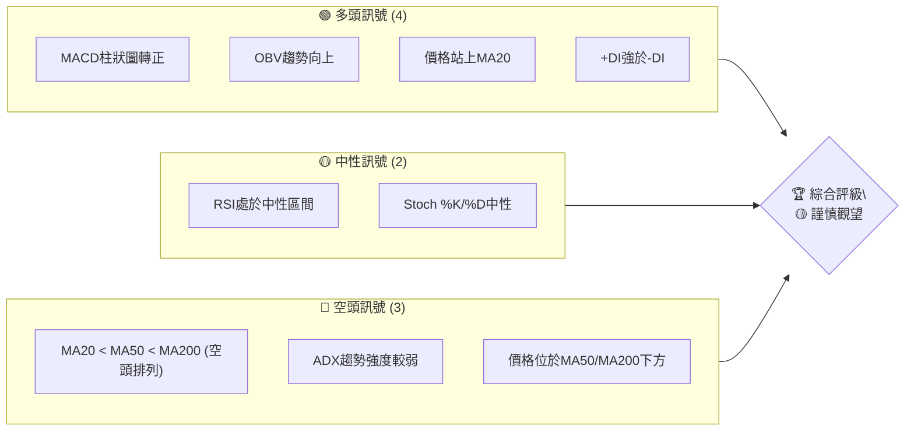

**解讀**：目前多頭訊號主要來自於短期動能的改善，如MACD柱狀圖轉正和OBV量能的配合，以及價格站上短期MA20。然而，長期均線的空頭排列和ADX顯示的弱勢趨勢表明，市場仍處於大型調整後的盤整階段，多頭力量尚未完全扭轉頹勢。因此，綜合評級為「謹慎觀望」。

### 📊 核心指標速覽表

| 指標類別 | 指標名稱 | 當前數值 | 訊號 | 解讀 |
|:---------|:---------|:---------|:-----|:-----|
| **價格** | 當前價格 | $55.35 | 🟡 | 價格位於52週區間底部14.6%，近期從低點反彈。 |
| **均線** | MA20 | $53.97 | 🟢 | 當前價格 ($55.35) 位於MA20上方，短期看多。 |
| **均線** | MA50 | $57.17 | 🔴 | 當前價格 ($55.35) 位於MA50下方，中期看空。 |
| **均線** | MA200 | $79.28 | 🔴 | 當前價格 ($55.35) 位於MA200下方，長期看空。 |
| **動能** | RSI(14) | 42.21 | 🟡 | RSI位於中性區間，未達超買或超賣，動能平衡。 |
| **動能** | MACD | +0.271 (Hist) | 🟢 | MACD柱狀圖轉正，顯示多頭動能增強，形成金叉。 |
| **波動** | ATR(14) | $3.41 | 🟡 | 每日波動約為6.16%，屬於中等波動水平。 |
| **趨勢** | ADX(14) | 16.75 | 🔴 | ADX低於25，顯示當前趨勢較弱，處於盤整或弱趨勢階段。 |
| **趨勢** | +DI/-DI | +DI:30.54/-DI:19.97 | 🟢 | +DI高於-DI，表明多頭力量在弱勢趨勢中佔據主導。 |
| **量能** | OBV趨勢 | OBV > MA | 🟢 | 成交量支持價格上漲，量價配合良好。 |

### 🏆 技術評分卡

```
╔══════════════════════════════════════════════════════════════╗
║             技術評分卡 — KTOS (2026-07-03)                   ║
╠══════════════════════════════════════════════════════════════╣
║趨勢強度      ███░░░░░░░░░░░░░░░░░░  30/100  🔴               ║
║  理由：ADX低於25，顯示趨勢強度不足，處於盤整階段。             ║
╠══════════════════════════════════════════════════════════════╣
║動能指標      ████████░░░░░░░░░░░░  70/100  🟢               ║
║  理由：MACD柱狀圖轉正且形成金叉，OBV趨勢向上，RSI中性偏多。   ║
╠══════════════════════════════════════════════════════════════╣
║支撐穩定度    ████████████░░░░░░░░  60/100  🟡               ║
║  理由：價格從52週低點反彈，下方有近期低點和布林下軌支撐。     ║
╠══════════════════════════════════════════════════════════════╣
║成交量配合    ██████████████░░░░░░  80/100  🟢               ║
║  理由：最新成交量高於均量，OBV趨勢向上，量能支持價格反彈。    ║
╠══════════════════════════════════════════════════════════════╣
║形態完整度    ██████░░░░░░░░░░░░░░  50/100  🟡               ║
║  理由：近期呈現底部反彈，但尚未形成明確且穩固的反轉形態。     ║
╠══════════════════════════════════════════════════════════════╣
║均線排列      ██░░░░░░░░░░░░░░░░░░  20/100  🔴               ║
║  理由：MA20 < MA50 < MA200，典型的空頭排列，長期壓力沉重。    ║
╠══════════════════════════════════════════════════════════════╣
║綜合評分      ██████░░░░░░░░░░░░░░  50/100  ⚖️ 中性           ║
╚══════════════════════════════════════════════════════════════╝
```

**評分總結**：KTOS 的整體技術評分顯示其處於一個關鍵的轉折點。儘管短期動能和成交量表現積極，但長期均線的空頭排列和弱勢的趨勢強度限制了其上漲空間。目前市場傾向於中性，需要等待更強的多頭訊號或趨勢確認。

---

## 2. 趨勢分析

### 🌐 多時框趨勢分析

KTOS 在不同時間框架下呈現出複雜的趨勢結構，長期趨勢受損，但短期內出現底部反彈跡象。

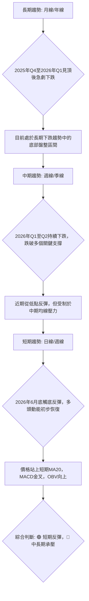

### 📈 長期趨勢 — 12個月走勢圖（ASCII）

下圖展示了KTOS過去12個月的月線收盤價走勢，清晰可見其從高點回落的過程。

```
KTOS 月線走勢圖（過去12個月：2025年7月 - 2026年7月）
價格軸 ($)
$105 ┤                               ● (103.01, 26年1月高點)
$100 ┤
 $95 ┤                      ●
 $90 ┤                ●     ●
 $85 ┤                    ●
 $80 ┤
 $75 ┤            ● ●
 $70 ┤                            ●
 $65 ┤          ●               ●
 $60 ┤●
 $55 ┤                                             ● (55.35, 現在)
 $50 ┤                                         ● (49.86, 26年6月低點)
 $45 ┤
     └───────────────────────────────────────────────────────────
      Jul'25 Aug'25 Sep'25 Oct'25 Nov'25 Dec'25 Jan'26 Feb'26 Mar'26 Apr'26 May'26 Jun'26 Jul'26
```

**走勢特徵分析表格**：

| 階段 | 時間區間 | 主要走勢 | 漲跌幅 (約) | 特徵描述 |
|:-----|:---------|:---------|:-----------|:---------|
| 1 | 2025年7月 - 2026年1月 | 強勁上漲 | +75.48% (從$58.70到$103.01) | 股價經歷一波快速拉升，月線收盤價持續創高，市場情緒極度樂觀，量能配合。 |
| 2 | 2026年1月 - 2026年6月 | 急劇下跌 | -51.60% (從$103.01到$49.86) | 股價從歷史高點迅速回落，跌破多個關鍵支撐位，呈現明顯的空頭趨勢。 |
| 3 | 2026年6月 - 2026年7月 | 底部反彈 | +11.01% (從$49.86到$55.35) | 股價在跌至近期低點後出現止跌企穩跡象，並伴隨一定的反彈，但尚未改變長期下跌格局。 |

### 📊 中期趨勢（週線分析）

KTOS 的中期趨勢在過去幾個月中顯著惡化。從2026年1月的歷史高點$103.01開始，股價經歷了長達數月的下跌，跌破了MA50、MA120和MA240等多條重要中期均線。儘管近期從$47.21的低點反彈至$55.35，但股價仍位於MA50 ($57.17) 和MA60 ($59.63) 等中期壓力線下方。這表明中期空頭趨勢依然強勁，任何反彈都可能在中期壓力位遭遇賣壓。

**近期壓力與支撐示意圖**：
```
KTOS 中期走勢示意圖
══════════════════════════════════════════════════════════════
$60.00 ║           R1 (MA60, Fib 76.4%)
$57.17 ║         R0 (MA50)
$55.35 ╠═══════════════════════════════ 現價
$53.97 ║       S0 (MA20, BB中軌)
$47.21 ║     S1 (近期低點)
$41.87 ║   S2 (52週低點)
══════════════════════════════════════════════════════════════
```
- **中期阻力 (R0)**: $57.17 (MA50)
- **中期阻力 (R1)**: $59.63 (MA60) / $60.38 (斐波那契76.4%回調位)
- **中期支撐 (S0)**: $53.97 (MA20, 布林中軌)
- **中期支撐 (S1)**: $47.21 (2026-06-28週收盤價)

### ⚡ 趨勢強度評估（ADX 解讀）

ADX 指標用於衡量趨勢的強度，而非方向。當前 KTOS 的 ADX(14) 數值為 16.75，低於 25 的閾值，這明確指出當前市場處於**弱趨勢或盤整行情**。

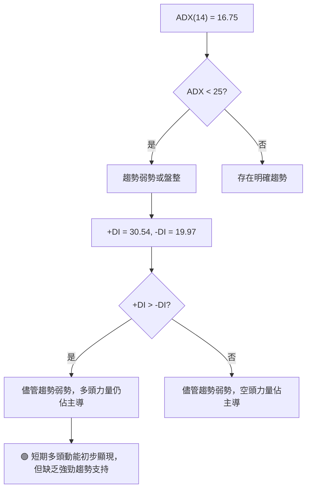

**ADX 強度對照表**：

| ADX 數值 | 趨勢強度 | 市場狀態 | 交易策略提示 |
|:---------|:---------|:---------|:-------------|
| 0-25     | 弱趨勢   | 盤整/無趨勢 | 適合區間交易，避免追漲殺跌。 |
| 25-50    | 中等趨勢 | 趨勢形成中 | 趨勢交易者可關注入場機會。 |
| 50-75    | 強趨勢   | 明顯趨勢   | 趨勢交易者積極持有。 |
| 75-100   | 極強趨勢 | 趨勢加速   | 趨勢末期可能出現反轉訊號。 |

**結論**：KTOS 的 ADX 顯示其處於盤整或弱趨勢階段，這意味著短期價格波動可能缺乏持續性。然而，+DI (30.54) 高於 -DI (19.97)，表明在這種弱勢趨勢中，多頭力量在推動價格方面佔據微弱優勢，這與近期價格反彈的觀察相符。因此，儘管多頭動能初現，但整體市場缺乏明確的方向性。

---

## 3. 圖表形態分析

### 🔍 形態識別系統

根據提供的月線和週線數據，KTOS 在經歷了顯著下跌後，近期在$47.21至$49.86區間形成了潛在的底部結構，並出現反彈。雖然缺乏詳細的日線K棒數據來確認複雜的圖表形態，但可以觀察到類似「W形底」或「雙重底」的初步跡象。

```mermaid
graph TD
    A["股價歷史走勢"] --> B{"2026年1月高點 $103.01"}
    B --> C["急劇下跌至2026年6月低點 $49.86"]
    C --> D{"近期在 $47.21 - $49.86 區間止跌"}
    D --> E["價格反彈至 $55.35"]
    E --> F{"是否形成底部反轉形態?"}
    F -- 初步觀察 --> G[潛在的"W形底"或"雙重底"雛形]
    G --> H["需突破頸線 $64.13 (5月高點) 或更高阻力位確認"]
    H --> I["🟢 如果確認，預計將有更大幅度反彈"]
    H --> J["🔴 如果跌破底部，則可能繼續探底"]
```

### 🕯️ 重要K線形態分析

由於提供的數據主要是週收盤價，無法進行傳統的K線形態分析（如錘頭、吞噬等）。但我們可以根據週線價格走勢推斷其行為。

| 月份 | 收盤價 | 價格行為特徵 | 解讀 | 訊號 |
|:-----|:-------|:-------------|:-----|:-----|
| 2026-03-29 | $71.94 | 大幅下跌 | 結束反彈，重新進入下跌趨勢，空頭力量強勁。 | 🔴 |
| 2026-04-26 | $61.26 | 大幅下跌 | 跌破前期支撐，空頭趨勢延續。 | 🔴 |
| 2026-05-17 | $52.09 | 接近底部 | 股價跌至低點，可能觸發超賣反彈。 | 🟡 |
| 2026-05-31 | $64.13 | 底部反彈 | 股價從低點迅速拉升，顯示多頭力量初步介入。 | 🟢 |
| 2026-06-28 | $47.21 | 再次探底 | 股價再次跌至近期低點，但未創新低，形成潛在的第二個底部。 | 🟢 |
| 2026-07-05 | $55.35 | 強勁反彈 | 從近期低點大幅反彈，顯示買盤積極，確認底部支撐。 | 🟢 |

**分析**：在2026年6月底，KTOS 股價在$47.21處獲得支撐後，隨即在7月第一週出現強勁反彈，週收盤價從$47.21升至$55.35，漲幅達17.25%。這種在底部區域出現的快速反彈，配合MACD柱狀圖轉正和OBV向上的訊號，暗示著市場可能正在形成一個底部反轉形態。

### 📉 ASCII 走勢形態示意圖

以下為 KTOS 在過去幾個月中可能形成的潛在「W形底」形態示意圖：

```
KTOS 潛在「W形底」形態示意圖
══════════════════════════════════════════════════════════════
$70 ┤                     R (頸線 $64.13)
$65 ┤              ┌─┐
$60 ┤             /   \
$55 ┤           /       ● (現價 $55.35)
$50 ┤         ●           ●
$45 ┤         └───┬───────┘
$40 ┤           S1($47.21) S2($49.86)
    └───────────────────────────────────────────────────────────
      (下跌) (反彈) (再次探底) (反彈)
```
**形態描述**：圖中顯示股價在$47.21（S1）附近形成第一個底部，隨後反彈至$64.13（R），再回落至$49.86（S2），形成第二個底部。近期股價從S2反彈，目前位於$55.35。若能有效突破頸線$64.13，則W形底形態將得到確認。

### 🎯 形態目標價計算

如果上述潛在的「W形底」形態得以確認，我們可以根據形態的高度來預估其上漲目標價。

1.  **形態高度 (H)**：從頸線 ($64.13) 到最低點 ($47.21) 的垂直距離。
    H = $64.13 - $47.21 = $16.92

2.  **形態目標價 (Target Price)**：將形態高度疊加到頸線之上。
    目標價 = 頸線 + H = $64.13 + $16.92 = $81.05

**結論**：若 KTOS 能成功突破並站穩頸線 $64.13，則其形態目標價為 $81.05。此目標價也與斐波那契38.2%回調位 ($81.70) 接近，提供了額外的確認。然而，在確認突破之前，此形態仍為潛在形態，需密切關注價格行為。

---

## 4. 支撐與阻力

### 🗺️ 關鍵價位分布圖（ASCII）

下圖展示了KTOS當前價格$55.35附近的關鍵支撐與阻力價位結構。

```
KTOS 價位結構分布圖 (2026-07-03)
═══════════════════════════════════════════════════
$89.84 ║████████████████████████║ 強阻力 R4 (Fib 23.6%)
$81.70 ║████████████████████    ║ 阻力 R3 (Fib 38.2%)
$79.28 ║████████████████████████║ 阻力 R2 (MA200)
$68.53 ║████████████████████    ║ 關鍵阻力 R1 (Fib 61.8%)
$64.13 ║████████████████████████║ 近期阻力 (前高點)
$60.38 ║████████████████████    ║ 近期阻力 (Fib 76.4%)
$57.17 ║████████████████████████║ 近期阻力 (MA50)
$55.35 ╠════════════════════════╣ ◄ 現價
$53.97 ║▓▓▓▓▓▓▓▓▓▓▓▓▓▓▓▓        ║ 近期支撐 S1 (MA20, BB中軌)
$47.21 ║████████████████████████║ 強支撐 S2 (近期低點)
$44.63 ║▓▓▓▓▓▓▓▓▓▓▓▓▓▓▓▓        ║ 強支撐 S3 (BB下軌)
$41.87 ║████████████████████████║ 極強支撐 S4 (52週低點)
═══════════════════════════════════════════════════
```

### 🚧 阻力位分析表

KTOS 面臨多重阻力，特別是中長期均線和斐波那契回調位形成的壓力區。

| 阻力級別 | 價位 | 形成原因 | 突破難度 | 重要性 |
|:---------|:-----|:---------|:---------|:-------|
| R0 (近期) | $57.17 | MA50 | 中等 | 股價需首先突破此線才能打開短期上漲空間。 |
| R1 (近期) | $60.38 | 斐波那契76.4%回調位 | 中等 | 較強的心理和技術阻力，與MA60 ($59.63) 接近，形成阻力區。 |
| R2 (關鍵) | $64.13 | 2026年5月高點，潛在W形底頸線 | 高 | 若能有效突破，將確認底部形態，且為多頭的重要里程碑。 |
| R3 (中期) | $68.53 | 斐波那契61.8%回調位 | 高 | 強勁的技術阻力，可能引發獲利了結。 |
| R4 (長期) | $75.11 | 斐波那契50%回調位 | 極高 | 關鍵的中期多空分界線，突破此位才能緩解長期下跌趨勢。 |
| R5 (長期) | $79.28 | MA200 | 極高 | 長期空頭趨勢的最後一道防線，突破意味著趨勢可能反轉。 |

### 🛡️ 支撐位分析表

KTOS 近期在低位獲得了較好的支撐，這些價位將是多頭防守的關鍵。

| 支撐級別 | 價位 | 形成原因 | 守住機率 | 重要性 |
|:---------|:-----|:---------|:---------|:-------|
| S1 (近期) | $53.97 | MA20，布林中軌 | 中等 | 當前價格的即時支撐，跌破可能預示短期反彈結束。 |
| S2 (關鍵) | $47.21 | 2026年6月28日週收盤價低點 | 高 | 近期最低點，也是潛在W形底的第一個底部，極具心理和技術意義。 |
| S3 (強勁) | $44.63 | 布林下軌 | 高 | 股價若跌至此位，可能被視為超賣區，吸引買盤。 |
| S4 (極強) | $41.87 | 52週低點 | 極高 | 歷史性重要支撐，若跌破將預示更深層次的下跌。 |

### 📐 斐波那契回調位分析

我們採用2026年1月高點 $103.01 和2026年6月低點 $47.21 作為斐波那契回調的基準點，以分析 KTOS 在下跌趨勢中的潛在反彈阻力。

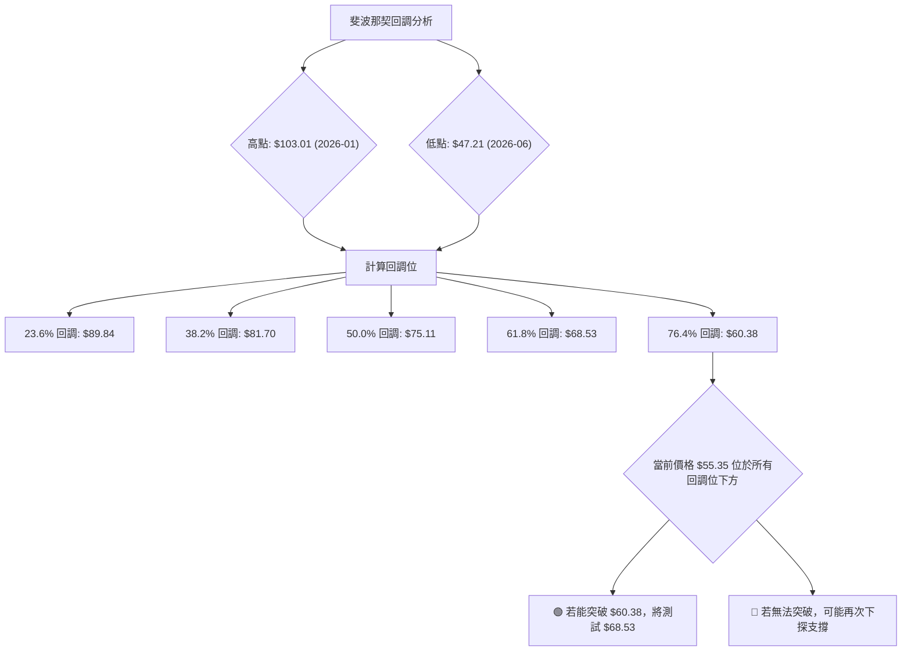

**斐波那契回調位列表**：

| 回調比例 | 價位 | 意義 |
|:---------|:-----|:-----|
| 23.6%    | $89.84 | 較弱的回調阻力，但仍是下跌趨勢中的潛在賣壓區。 |
| 38.2%    | $81.70 | 重要的回調阻力，與形態目標價 $81.05 接近，可能形成較強的阻力區。 |
| 50.0%    | $75.11 | 心理和技術上的關鍵阻力，突破此位可能預示趨勢有機會扭轉。 |
| 61.8%    | $68.53 | 較強的回調阻力，通常被視為反彈的極限，突破將是強烈的多頭訊號。 |
| 76.4%    | $60.38 | 近期反彈的首個重要阻力，與MA60接近，突破此位方能挑戰更高阻力。 |

**結論**：當前價格 $55.35 位於所有斐波那契回調位下方，表明 KTOS 仍處於下跌趨勢的反彈階段。最近的阻力位於 $60.38 (76.4% 回調位)，若能突破，下一個目標將是 $68.53 (61.8% 回調位)。這些斐波那契水平與其他技術阻力位（如均線、前高）相互印證，增加了其有效性。

---

## 5. 技術指標深度解讀

### 🎛️ 指標訊號總覽

以下 Meramid 圖展示了 KTOS 各項技術指標的當前訊號及其相互關係。

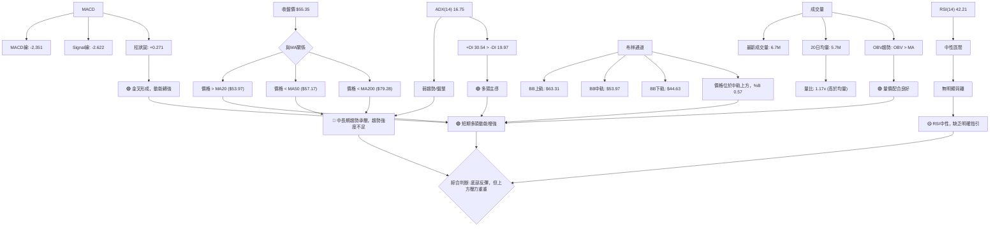

### 📈 移動平均線排列分析

KTOS 的移動平均線系統目前呈現典型的空頭排列，這對股價構成強大的長期壓力。

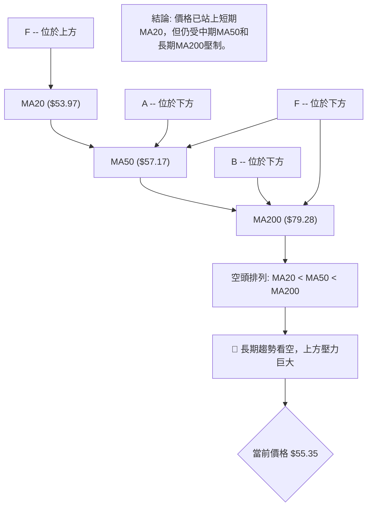

**分析**：
-   **MA20 ($53.97)**：當前價格 $55.35 位於 MA20 上方，這是一個積極的短期訊號，表明短期買盤力量正在推動價格。
-   **MA50 ($57.17)**：價格仍位於 MA50 下方，MA50 作為中期阻力，是近期反彈需要突破的關鍵關卡。
-   **MA200 ($79.28)**：價格遠低於 MA200，MA200 呈現下降趨勢，形成強大的長期空頭壓力。
-   **均線排列**：MA20 < MA50 < MA200 的空頭排列，明確指示 KTOS 處於長期下跌趨勢中。儘管短期有所反彈，但若要扭轉頹勢，股價必須逐一突破這些長期均線，並使均線重新排列。

### 📉 RSI(14) 分析

**RSI 數值進度條展示**：
RSI(14): 42.21 🟡 ████████░░░░░░░░░░░░ (42.21%)

**超買超賣區間分析**：
-   RSI 數值為 42.21，位於 30-70 的中性區間。這表示 KTOS 既未處於超買狀態（>70），也未處於超賣狀態（<30）。
-   從近期週線數據來看，RSI 在 2026-06-28 曾跌至 23.1 的超賣區間，隨後反彈至當前的 42.21。這證實了近期價格的底部反彈是從超賣狀態啟動的，具有一定的合理性。
-   RSI 位於 50 線下方但正在向上移動，表明空頭力量減弱，多頭力量正在嘗試恢復，但尚未完全佔據主導。

**背離判斷**：
-   **無明顯背離**：根據提供的數據，在過去的價格走勢中，未觀察到與 RSI 形成明顯的頂背離或底背離現象。價格在下跌過程中，RSI 也同步下跌；近期價格反彈，RSI 也同步反彈。因此，RSI 目前未提供背離的交易訊號。

### 📊 MACD(12/26/9) 訊號解讀

MACD 指標為 KTOS 提供了相對積極的短期動能訊號。

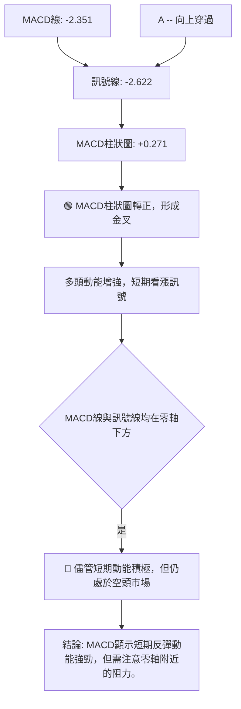

**分析**：
-   **MACD 線 (-2.351) 與 Signal 線 (-2.622)**：MACD 線已向上穿越 Signal 線，形成**金叉**。這是一個經典的買入訊號，表示短期動能正在超越中期動能，預示股價可能上漲。
-   **MACD 柱狀圖 (+0.271)**：MACD 柱狀圖由負轉正，進一步確認了金叉的形成和多頭動能的增強。這是近期反彈的重要動能來源。
-   **零軸位置**：儘管 MACD 形成了金叉，但 MACD 線和 Signal 線都仍處於零軸下方。這意味著雖然短期動能積極，但整體市場仍處於空頭趨勢中。零軸將是未來反彈的重要阻力位，MACD 線若能突破零軸，將是更強烈的多頭訊號。
-   **背離判斷**：根據提供的數據，未觀察到 MACD 與價格之間存在明顯的頂背離或底背離現象。

### 📦 布林通道分析

布林通道揭示了 KTOS 當前的價格波動範圍和相對位置。

**ASCII 布林通道示意圖**：
```
KTOS 布林通道示意圖 (2026-07-03)
═══════════════════════════════════════════════════
$65 ┤                                  BB上軌 ($63.31)
$60 ┤
$55 ┤                     ● (現價 $55.35)
$50 ┤          BB中軌 ($53.97)
$45 ┤    BB下軌 ($44.63)
$40 ┤
    └───────────────────────────────────────────────────
```

**分析**：
-   **布林上軌 ($63.31)**：作為上行阻力，價格若能觸及或突破上軌，可能意味著上漲動能強勁。
-   **布林中軌 (MA20 $53.97)**：當前價格 $55.35 位於中軌上方。中軌通常作為短期趨勢的判斷線，價格站穩中軌上方預示短期趨勢偏多。
-   **布林下軌 ($44.63)**：作為下行支撐，價格若跌至下軌附近，可能被視為超賣區域。
-   **%B 值 (0.57)**：%B 值為 0.57，表示價格位於中軌和上軌之間，且略高於中點。這進一步確認了價格在中軌上方運行，顯示出一定的上漲動能。
-   **通道寬度**：從數據無法直接判斷通道寬度變化，但近期價格從下軌區域反彈，顯示布林通道可能正在經歷從收縮到擴張的過程，暗示波動性可能增加。

**結論**：KTOS 股價目前位於布林通道中軌上方，且 %B 值為 0.57，表明短期內多頭力量佔優，價格正向布林上軌測試。中軌 $53.97 將是重要的短期支撐位。

### 💹 成交量分析（量價配合度）

成交量是確認價格走勢可靠性的關鍵指標。

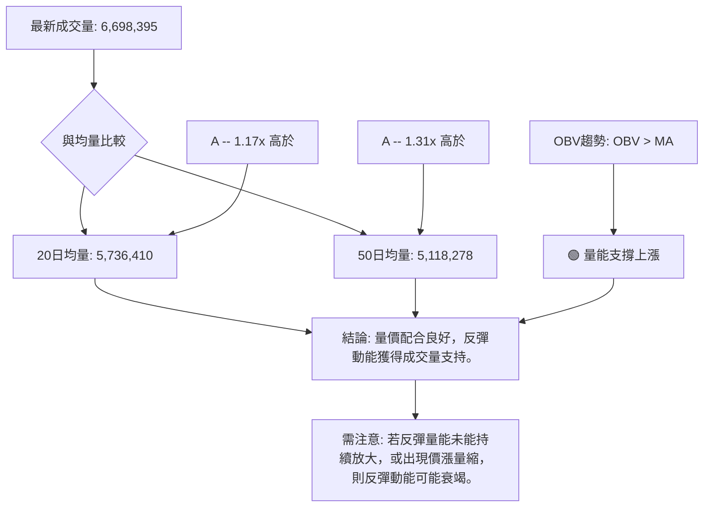

**分析**：
-   **最新成交量**：6,698,395 股，顯著高於 20 日均量 (5,736,410 股) 和 50 日均量 (5,118,278 股)。量比分別達到 1.17x 和 1.31x。這表明在當前價格反彈的過程中，市場交投活躍，買盤力量積極介入。
-   **OBV 趨勢**：數據顯示 OBV 趨勢為 "OBV > MA"，這是一個非常積極的訊號。OBV (On Balance Volume) 線位於其移動平均線上方，表明累積成交量正在增加，且主要發生在股價上漲時。這證明了近期價格的反彈是受到實質性買盤支撐的，量價配合良好。
-   **量價關係**：在 KTOS 從 $47.21 反彈至 $55.35 的過程中，伴隨著成交量的放大和 OBV 的向上趨勢，這為反彈的持續性提供了較高的可信度。然而，仍需警惕未來若出現價漲量縮的背離現象，那將是反彈動能可能衰竭的警訊。

**結論**：成交量分析為 KTOS 的短期反彈提供了強有力的支持。活躍的交投和 OBV 的積極表現均指向多頭動能的增強。

---

## 6. 動能與波動率

### ⚡ 動能評估四象限

由於Prompt要求避免使用 quadrantChart，我們將使用表格形式來評估 KTOS 在動能和波動率方面的狀態。

| 象限 | 動能強度 (RSI/MACD) | 波動率 (ATR) | 當前狀態 | 評估 |
|:-----|:-------------------|:------------|:---------|:-----|
| Q1   | 強                 | 低           | -        | 最佳機會 (股價穩定上漲) |
| Q2   | 弱                 | 低           | -        | 謹慎觀望 (缺乏方向性) |
| Q3   | 強                 | 高           | -        | 高風險高收益 (趨勢強勁但波動大) |
| Q4   | 弱                 | 高           | ✓        | **避免進場 (方向不明，風險高)** |

**KTOS 當前評估**：
-   **動能強度**：MACD柱狀圖轉正，OBV向上，RSI中性偏多，顯示**中等偏強**的短期動能。
-   **波動率**：ATR ($3.41) 佔股價的 6.16%，相對於其近期下跌的歷史，屬於**中等偏高**的波動率。
-   **ADX趨勢強度**：ADX(14) 為 16.75，顯示趨勢**弱勢或盤整**。

**綜合判斷**：
KTOS 的短期動能有所增強，但整體趨勢強度仍然較弱 (ADX < 25)，且波動率屬於中等偏高。這使得它介於 "Q3: 強動能, 高波動" 和 "Q4: 弱動能, 高波動" 之間。考慮到 ADX 的弱趨勢判斷，更傾向於認為其雖然有短期動能，但整體方向性不強，且波動較大。因此，目前處於一個**動能初現但趨勢不明朗，波動較大的階段**。

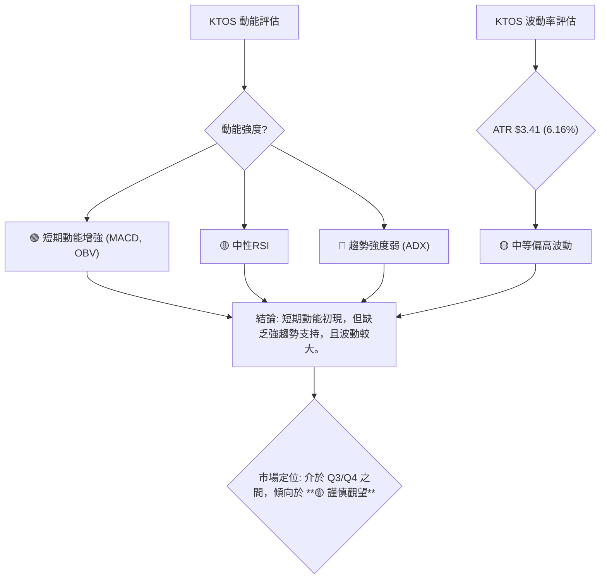

### 📊 ATR 波動率分析

ATR (Average True Range) 指標衡量資產價格的波動性。

-   **ATR(14) 數值**：$3.41
-   **佔收盤價比例**：$3.41 / $55.35 = 6.16%

**分析**：
-   每日波動範圍約為 $3.41，這對於 $55.35 的股價而言，意味著每天約有 6.16% 的潛在波動。這屬於**中等偏高**的波動水平。
-   高波動性意味著潛在的獲利機會更大，但也伴隨著更高的風險。交易者需要為價格的劇烈波動做好準備。
-   在弱勢趨勢或盤整行情中 (ADX < 25)，較高的 ATR 可能導致頻繁的假突破或價格來回震盪，增加交易難度。

**止損距離建議**：
ATR 常用於設定止損點，以適應市場的波動性。
-   **保守止損**：建議將止損設置在當前價格下方 1.5 倍 ATR 處。
    止損距離 = $3.41 * 1.5 = $5.12
    止損價 = $55.35 - $5.12 = $50.23
-   **積極止損**：建議將止損設置在當前價格下方 1 倍 ATR 處。
    止損距離 = $3.41 * 1 = $3.41
    止損價 = $55.35 - $3.41 = $51.94

**結論**：KTOS 的中等偏高波動率要求交易者在設定止損和倉位管理時更加謹慎。建議參考 ATR 設置動態止損，以避免過早被震出，同時控制風險。

### 📐 Beta 與市場相關性

提供的數據中未包含 KTOS 的 Beta 值。
**一般行業分析**：Kratos Defense & Security Solutions, Inc. 屬於航空航天與國防工業。該行業公司通常與宏觀經濟景氣度及政府國防開支密切相關。在經濟下行或地緣政治緊張時期，國防股可能表現出較低的 Beta 值（即與大盤相關性較低），甚至在市場下跌時提供一定的防禦性。然而，在牛市中，其漲幅可能不及高 Beta 的成長型股票。

**假設性推斷**：
-   若 Beta < 1：股票波動性小於大盤，具有防禦性。
-   若 Beta > 1：股票波動性大於大盤，具有進攻性。
-   鑑於其行業特性，KTOS 可能具有**中等偏低或中等水平的 Beta 值**（例如 0.8 - 1.2 之間），具體數值需查詢專業數據庫。
-   **市場相關性**：在當前市場環境下，若大盤走勢不確定，KTOS 的相對獨立性可能使其更受特定行業驅動因素影響（如國防合約、技術創新）。

**風險提示**：由於缺乏具體 Beta 數據，本分析僅為行業通用判斷。在實際交易中，投資者應查閱最新的 Beta 值以評估其與整體市場的相關風險。

---

## 7. 多時框架總結

本章節將彙整 KTOS 在不同時間框架下的技術訊號，以提供全面的視角。

### 📋 時框架評分表

| 時框架 | 趨勢方向 | 動能 | 均線排列 | 形態 | 綜合評分 (1-10) | 建議 |
|:-------|:---------|:-----|:---------|:-----|:----------------|:-----|
| **長期** | 🔴 下跌趨勢 | 🔴 弱 | 🔴 空頭排列 | 🔴 高點回落 | 2               | 避免做多，觀望 |
| **中期** | 🔴 下跌趨勢 | 🟡 改善中 | 🔴 空頭排列 | 🟡 底部徘徊 | 4               | 謹慎觀望，等待反轉訊號 |
| **短期** | 🟢 反彈趨勢 | 🟢 增強 | 🟡 價格站上MA20 | 🟢 潛在W底 | 7               | 關注反彈機會，設好止損 |

**分析**：
-   **長期和中期**：KTOS 仍處於明顯的下跌趨勢中，所有長中期均線均呈現空頭排列，對股價形成巨大壓力。這表明長期投資者應保持謹慎。
-   **短期**：近期價格從低點強勁反彈，MACD金叉，OBV向上，價格站上MA20，顯示短期動能顯著增強。潛在的W形底形態也為短期反彈提供了依據。

### 🔲 綜合訊號矩陣

此矩陣展示了短期、中期和長期各維度訊號的一致性分析。

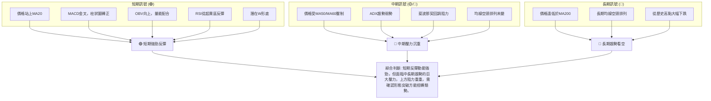

**結論**：KTOS 的多時框架分析顯示，雖然短期內出現了積極的底部反彈訊號，但這僅發生在長期和中期下跌趨勢的大背景下。投資者應將當前反彈視為下跌趨勢中的修正，而非趨勢反轉。只有當股價能夠有效突破關鍵中期阻力（如MA50、MA60和斐波那契回調位），並改變均線的空頭排列，才能考慮長期看多的機會。在此之前，任何交易策略都應保持高度謹慎。

---

## 8. 交易策略建議

基於上述詳盡的技術分析，KTOS 目前處於一個短期反彈與中長期壓力並存的複雜局面。以下提供兩種交易策略建議，並強調風險管理。

### 🗺️ 策略決策流程圖

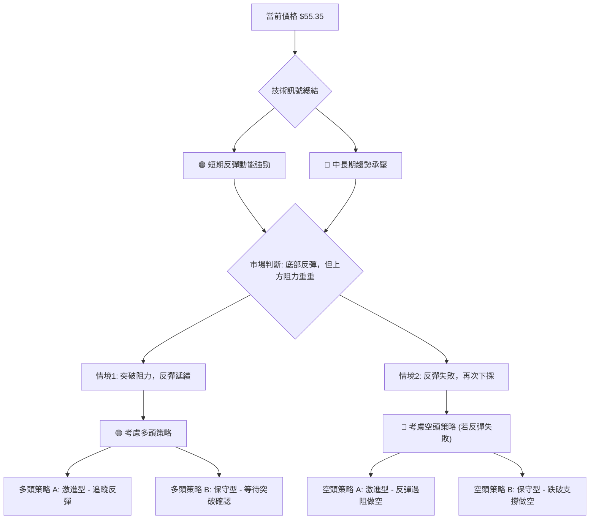

### 🟢 多頭策略詳情

考慮到 KTOS 的短期動能積極，且存在潛在的底部形態，可以考慮多頭策略。

| 策略要素 | 策略 A：激進型反彈追蹤 | 策略 B：保守型突破確認 |
|:---------|:---------------------|:---------------------|
| **情境** | 股價已從低點反彈，並站上MA20，MACD金叉，量能配合良好。 | 股價成功突破關鍵阻力位，確認底部形態。 |
| **進場條件** | 價格站穩MA20 ($53.97)上方，且MACD柱狀圖持續為正。 | 價格突破並站穩頸線 $64.13 (W形底頸線) 或斐波那契61.8%回調位 $68.53。 |
| **進場價格** | $55.50 - $56.00 (在MA20上方輕微回調或突破MA50前) | $64.50 - $65.00 (突破 $64.13 後回踩確認) 或 $69.00 - $70.00 (突破 $68.53 後) |
| **目標價 T1** | $60.38 (斐波那契76.4%回調位，與MA60接近) | $75.11 (斐波那契50%回調位) |
| **目標價 T2** | $64.13 (潛在W形底頸線，2026年5月高點) | $81.05 (W形底形態目標價) / $81.70 (斐波那契38.2%回調位) |
| **止損價格** | $52.00 (略低於MA20和布林中軌 $53.97，以及ATR建議的保守止損 $50.23 上方) | $60.00 (在突破 $64.13 後，設在前期阻力下方) 或 $65.00 (在突破 $68.53 後，設在前期阻力下方) |
| **風險報酬比** | 以進場 $55.50，止損 $52.00，目標 T1 $60.38 計算：<br>風險 $3.50，報酬 $4.88。約 1:1.39 | 以進場 $64.50，止損 $60.00，目標 T1 $75.11 計算：<br>風險 $4.50，報酬 $10.61。約 1:2.36 |
| **成功機率** | 60% (短期動能支持) | 55% (需強勁突破確認) |
| **建議倉位** | 輕倉 (5%-10%) | 中等倉位 (10%-15%) |

### 🔴 空頭策略詳情

鑑於中長期趨勢仍為空頭，且上方阻力重重，若短期反彈動能衰竭或未能突破關鍵阻力，則可考慮空頭策略。

| 策略要素 | 策略 A：激進型反彈遇阻做空 | 策略 B：保守型跌破支撐做空 |
|:---------|:-------------------------|:-------------------------|
| **情境** | 股價反彈至關鍵阻力區 (如MA50或斐波那契回調位) 遇到明顯賣壓，未能突破。 | 股價未能守住近期重要支撐位，確認下跌趨勢延續。 |
| **進場條件** | 價格在 $57.17 (MA50) 或 $60.38 (Fib 76.4%) 附近出現滯漲、長上影線或放量下跌K線。 | 價格跌破 $53.97 (MA20/BB中軌) 並確認，或跌破 $47.21 (近期低點) 並確認。 |
| **進場價格** | $56.50 - $57.00 (在MA50附近遇阻) 或 $60.00 - $60.20 (在Fib 76.4%附近遇阻) | $53.50 - $53.80 (跌破MA20後回抽未過) 或 $47.00 - $47.10 (跌破 $47.21 後回抽未過) |
| **目標價 T1** | $53.97 (MA20/BB中軌) | $47.21 (近期低點) |
| **目標價 T2** | $47.21 (近期低點) | $41.87 (52週低點) |
| **止損價格** | $58.00 (略高於MA50) 或 $61.00 (略高於Fib 76.4%) | $55.00 (跌破 $53.97 後，設在前期阻力) 或 $49.00 (跌破 $47.21 後，設在前期阻力) |
| **風險報酬比** | 以進場 $56.50，止損 $58.00，目標 T1 $53.97 計算：<br>風險 $1.50，報酬 $2.53。約 1:1.69 | 以進場 $53.50，止損 $55.00，目標 T1 $47.21 計算：<br>風險 $1.50，報酬 $6.29。約 1:4.19 |
| **成功機率** | 50% (反彈失敗可能) | 65% (趨勢延續機率高) |
| **建議倉位** | 輕倉 (5%-10%) | 中等倉位 (10%-15%) |

### ⭐ 整體訊號強度評星

```
做多訊號強度：★★★★☆  (4/5星)
  理由：短期動能強勁，MACD金叉，OBV向上，價格站上MA20，潛在底部形態。
做空訊號強度：★★★☆☆  (3/5星)
  理由：中長期均線空頭排列，上方阻力重重，ADX趨勢弱勢，反彈動能可能難以持續。
整體可信度：  ★★★☆☆  (3/5星)
  理由：短期多頭訊號積極，但中長期空頭壓力巨大，市場方向仍不明朗，需耐心等待趨勢確認。
```

---

## 9. 風險提示與監控

KTOS 目前的技術面顯示其處於一個關鍵的轉折點，風險與機會並存。有效的風險管理和持續監控至關重要。

### ✅ 關鍵監控指標 Checklist

以下為投資者應密切關注的關鍵監控指標：

```
╔══════════════════════════════════════════════════════════════╗
║             KTOS 關鍵監控指標 Checklist                      ║
╠══════════════════════════════════════════════════════════════╣
║ [ ] 價格是否能站穩 MA20 ($53.97) 上方？                      ║
║ [ ] 價格是否能有效突破 MA50 ($57.17) 和 MA60 ($59.63)？      ║
║ [ ] 價格是否能突破斐波那契76.4%回調位 $60.38？               ║
║ [ ] 成交量是否持續放大並支持價格上漲？                       ║
║ [ ] OBV趨勢是否保持向上，未出現量價背離？                    ║
║ [ ] MACD柱狀圖是否持續為正，且MACD線與Signal線保持金叉？     ║
║ [ ] RSI是否能突破50中線並向上運行？                          ║
║ [ ] ADX是否能突破25，確認新的趨勢形成？                      ║
║ [ ] 潛在W形底頸線 $64.13 是否能被有效突破並站穩？            ║
║ [ ] 大盤走勢 (如標普500) 是否對KTOS產生顯著影響？            ║
╚══════════════════════════════════════════════════════════════╝
```

### ⚠️ 風險場景分析

以下分析 KTOS 未來可能的三種情境：

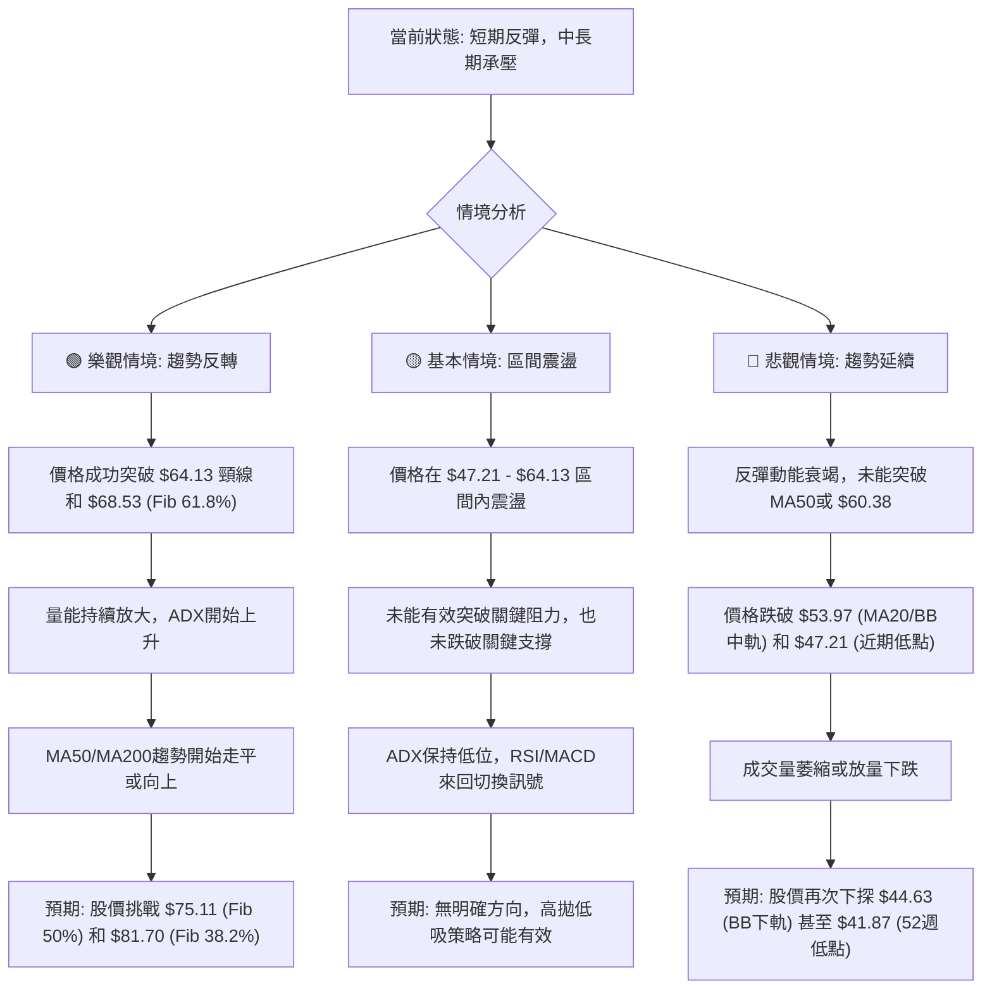

### 🛡️ 風險管理重要提醒

1.  **倉位管理**：由於 KTOS 仍處於中長期下跌趨勢中，且波動性較高，建議嚴格控制倉位，不宜重倉。對於激進型策略，倉位應更輕。
2.  **止損設定**：無論採取何種策略，必須嚴格設定並執行止損。可參考 ATR 指標或關鍵支撐位來設置止損，以限制潛在損失。
3.  **分批操作**：不建議一次性進出。可考慮分批建倉或分批止盈，以降低單一價格點的風險。
4.  **監控基本面**：雖然本報告為技術分析，但基本面（如公司財報、新訂單、產業政策）的變化可能對股價產生重大影響，應同時關注。
5.  **市場情緒**：國防產業受地緣政治事件影響大。突發事件可能導致股價劇烈波動，需保持對新聞事件的敏感度。
6.  **耐心等待確認**：對於保守型投資者，耐心等待趨勢的明確確認（例如 W 形底的頸線突破，或 ADX 顯示強趨勢）是降低風險的關鍵。避免在趨勢不明朗時盲目入場。

---

## 📋 報告總結

```
╔═════════════════════════════════════════════════════════════════════════╗
║                      KTOS 技術分析報告總結                                ║
╠═════════════════════════════════════════════════════════════════════════╣
║報告日期：2026-07-03                                                       ║
║當前價格：$55.35                                                           ║
║分析評級：⚖️ 中性偏多 (短期動能積極，但中長期壓力沉重，需謹慎觀望)            ║
║                                                                           ║
║關鍵結論：                                                                 ║
║├─ 長期趨勢：🔴 明顯下跌趨勢，均線空頭排列，長期壓力巨大。                  ║
║├─ 中期趨勢：🔴 處於下跌後的底部盤整區間，受MA50/MA60壓制，趨勢強度弱。     ║
║├─ 短期趨勢：🟢 底部反彈動能強勁，價格站上MA20，MACD金叉，OBV向上。         ║
║├─ 關鍵支撐：$53.97 (MA20/BB中軌), $47.21 (近期低點), $41.87 (52週低點)。  ║
║├─ 關鍵阻力：$57.17 (MA50), $60.38 (Fib 76.4%), $64.13 (潛在W形底頸線)。   ║
║└─ 分析師目標：$109.86 (均值) - 遠高於當前價格，但需基本面支持和技術面反轉。║
║                                                                           ║
║最優策略組合：                                                             ║
║1. 🥇 **最佳機會**：**保守型多頭策略**。等待價格突破並站穩 $64.13 頸線，確認W形底形態。此時風險報酬比更優，成功機率更高。進場 $64.50，止損 $60.00，目標 T1 $75.11，T2 $81.05。                                                              ║
║2. 🥈 **次選機會**：**激進型多頭策略**。在確認短期反彈動能持續的情況下，於 $55.50 - $56.00 區間輕倉入場，目標 $60.38 / $64.13，止損 $52.00。需嚴格止損，因上方阻力密集。                                                              ║
║3. 🥉 **保守選擇**：**觀望或等待空頭機會**。若短期反彈未能突破 $60.38 或 $64.13 阻力區，並出現滯漲或下跌訊號，則可考慮在 $56.50 - $57.00 區間輕倉做空，目標 $53.97 / $47.21。                                                      ║
╚═════════════════════════════════════════════════════════════════════════╝
```

---

> ⚠️ **免責聲明**：本報告為 AI 自動生成之技術分析，所有數據及估算均基於提供的歷史價格資訊。本報告**僅供研究與學術參考**，**不構成任何投資建議**。投資有風險，入市需謹慎。

---

*報告生成時間：2026-07-03 ｜ 數據來源：Yahoo Finance ｜ 分析框架：多時框技術分析*