<details>
<summary>📊 靜態圖表 (點擊展開)</summary>

</details>

<html>
<head><meta charset="utf-8" /></head>
<body>
    <div style="height:500px; width:100%;">                        <script>window.PlotlyConfig = {MathJaxConfig: 'local'};</script>
        <script charset="utf-8" src="https://cdn.plot.ly/plotly-3.6.0.min.js" integrity="sha256-QaOVwtVY0T02VaHrr6pnoHLCwayMJp4O5n4YyaE3rJk=" crossorigin="anonymous"></script>                <div id="candlestick-chart" class="plotly-graph-div" style="height:100%; width:100%;"></div>            <script>                window.PLOTLYENV=window.PLOTLYENV || {};                                if (document.getElementById("candlestick-chart")) {                    Plotly.newPlot(                        "candlestick-chart",                        [{"close":{"dtype":"f8","bdata":"AAAAYGYWU0AAAAAgXO9SQAAAAKCZKVRAAAAAoEcxVEAAAACAFC5UQAAAAKCZ+VRAAAAAIIVLVEAAAADAzAxVQAAAAIDrkVVAAAAAwB4FVkAAAAAgrtdWQAAAAKBwPVdAAAAAgOvBV0AAAAAAKQxYQAAAAAAAEFlAAAAAACnsWUAAAABA4WpaQAAAAEAzo1hAAAAA4FGoV0AAAACA6xFYQAAAAEAz01dAAAAAwB6lVkAAAAAgridWQAAAACCux1RAAAAAoJmpVUAAAAAgrqdWQAAAAEAzE1VAAAAA4HpUVkAAAAAghctWQAAAACCFq1ZAAAAAgOtxVkAAAACgcM1WQAAAAEAzE1ZAAAAAYGamVkAAAABgZsZWQAAAAIAUjlZAAAAAgD1aU0AAAACAPRpSQAAAAOBReFNAAAAAIIXLU0AAAACAwiVTQAAAAMDMLFNAAAAAACnsUUAAAADAzBxSQAAAACBcj1FAAAAAQAqXUUAAAABA4apRQAAAAADX01BAAAAAwPVIUUAAAABACodSQAAAAEAzw1JAAAAAoEfxUkAAAABgZgZTQAAAAKBwTVJAAAAAoHC9UUAAAACA6zFSQAAAACCFa1NAAAAAAAAgU0AAAACA60FTQAAAAIDrQVNAAAAAgD06U0AAAACA67FTQAAAAKBw\u002fVJAAAAA4KOQUkAAAADgUUhSQAAAAKBHcVFAAAAAoJnZUUAAAADA9dhSQAAAAIDrYVRAAAAAQDOTVEAAAACAFP5TQAAAAMDMbFNAAAAAgBReU0AAAABguP5SQAAAAIA9+lJAAAAAYI\u002fSU0AAAAAghXtWQAAAACCF+1ZAAAAAACncVkAAAABgjwJaQAAAAMDMbFxAAAAAQAp3XUAAAACAFO5dQAAAAAAAYF5AAAAAANcjX0AAAABACldgQAAAAIDCFWBAAAAAgMIlXkAAAABgZnZcQAAAAMD1mFtAAAAA4HrUW0AAAAAA14NdQAAAAEDhKlxAAAAAgD0KW0AAAADgo8BZQAAAAIA9ClhAAAAAIK7XWUAAAADAHtVWQAAAAAAAUFVAAAAAgD2aV0AAAAAA17NYQAAAAGC4XldAAAAAgOvxVUAAAABAM8NVQAAAAADXQ1ZAAAAAgBT+VkAAAACgcE1YQAAAAEDhalpAAAAAwB4FWEAAAAAA15NXQAAAACCFq1ZAAAAAYLgOVkAAAADA9QhXQAAAACCFi1VAAAAAgBSuVkAAAADAzDxWQAAAAOBRSFZAAAAAYI9iVUAAAAAAAMBVQAAAAIAUHldAAAAAoHA9VkAAAABA4TpWQAAAAKBwXVZAAAAAgOvhVUAAAACA62FWQAAAAADX01dAAAAAYI9CV0AAAACA6zFXQAAAACCuJ1VAAAAAACnsVEAAAAAgXF9TQAAAAGC4\u002flNAAAAAQAr3UkAAAAAAKfxRQAAAAIDrUVBAAAAA4KOgUUAAAADAzOxQQAAAAADX01BAAAAAgMKFUkAAAACgcP1RQAAAAKBwnVJAAAAAwB4VUUAAAACAwpVRQAAAAEAzY1JAAAAAgD1qUkAAAACAPapSQAAAAIA9mlJAAAAAIFy\u002fUUAAAADAHnVRQAAAAEAzI1FAAAAAQAonUUAAAACgR2FQQAAAAKBHoU5AAAAA4HqUT0AAAADgetROQAAAACCux01AAAAAYGaGT0AAAABgZgZPQAAAAEAK905AAAAAIK6nTUAAAABgj8JOQAAAAAAAgExAAAAAgOvxTEAAAABguH5MQAAAAIA9qkxAAAAAYLg+SkAAAADAzGxLQAAAACCFC0pAAAAAACkcS0AAAAAAKbxKQAAAAMD16EtAAAAAgMJVS0AAAABAChdMQAAAAGBmZkxAAAAAYGamTEAAAAAAKUxQQAAAAOBRCFBAAAAAYLi+T0AAAABgj6JPQAAAAEAKN01AAAAAQDOzT0AAAABgj0JNQAAAAKBw3UxAAAAA4FEYTEAAAADA9WhLQAAAAADXY01AAAAAAADgTEAAAABgj4JMQAAAACCFK0xAAAAA4HoUTEAAAABA4RpLQAAAACCFi0lAAAAAYGZmSUAAAACgmflHQAAAAMD1KEdAAAAAQOGaR0AAAACgmXlHQAAAAIAU7khAAAAAwB6FSkAAAADAzKxLQA=="},"high":{"dtype":"f8","bdata":"AAAAIK4nU0AAAACA60FTQAAAAAApXFRAAAAAANeTVEAAAADgUahUQAAAAGC4XlVAAAAAAABAVUAAAADgUThVQAAAAIDCtVVAAAAAQOFqVkAAAAAgrvdWQAAAAKBHYVdAAAAAoJkZWEAAAAAgrodYQAAAAAAAwFlAAAAAoHAtWkAAAAAA15NaQAAAAOB6JFxAAAAAoJmpWUAAAAAAAGBZQAAAAGBmRlhAAAAAIFyfWEAAAACAwiVXQAAAAKBHoVVAAAAAgBQuVkAAAABAM7NWQAAAAAAAgFZAAAAAwMx8VkAAAAAghTtXQAAAAGBmpldAAAAAwMwcV0AAAAAgrndXQAAAAAAAwFZAAAAAoJkJV0AAAACAFO5WQAAAAIDC5VZAAAAAAACgVEAAAACAFN5TQAAAAGBmllNAAAAAAACAVEAAAAAgXL9TQAAAAEDhilNAAAAAoJn5UkAAAACgR3FSQAAAAMDMPFJAAAAAAADQUUAAAAAghQtSQAAAAGC4nlJAAAAAgMJVUUAAAAAAKZxSQAAAACCFC1NAAAAAQOFKU0AAAAAgXB9TQAAAAGBmJlNAAAAAYGamUkAAAAAAAEBSQAAAAOB6lFNAAAAA4FGIU0AAAADgeoRTQAAAAIA96lNAAAAAoHCdU0AAAACAFN5TQAAAAKCZ2VNAAAAAQOEaU0AAAADgUahSQAAAACBcj1JAAAAAgD0aUkAAAABgj\u002fJSQAAAACCud1RAAAAAgD3aVEAAAAAAKXxUQAAAAIA9+lNAAAAAgBSOU0AAAAAAKYxTQAAAAIAUPlNAAAAAYLjuU0AAAABACodWQAAAAIDrAVdAAAAA4HrUV0AAAABAM3NbQAAAAMDM3FxAAAAA4FHoXUAAAADgemReQAAAAKBw\u002fV5AAAAAANeTX0AAAAAAAIBgQAAAAAAAwGBAAAAAAAAAYEAAAABAM1NeQAAAAIDr4VxAAAAAQOFqXEAAAADA9YhdQAAAAAAAAF5AAAAAwMzMXEAAAAAAADBbQAAAAMD1SFlAAAAAIFzfWUAAAAAAAMBZQAAAAGBmJldAAAAAQOGqV0AAAACA6\u002fFYQAAAAAAA4FhAAAAAQDMjWEAAAACAwmVWQAAAACBcD1dAAAAAYGZWV0AAAAAAACBZQAAAAIA9elpAAAAAQOGqWkAAAADAHsVXQAAAACBc71ZAAAAAgOtRV0AAAAAAKRxXQAAAAKCZmVVAAAAAYGZGWEAAAACAFE5XQAAAAGBmhlZAAAAAIFxfVkAAAADgUbhWQAAAAEDhaldAAAAAQDMTV0AAAABguL5WQAAAACCu11ZAAAAAoJn5VkAAAABAM\u002fNWQAAAAGBm1ldAAAAA4FE4WEAAAAAAAKBXQAAAAAAAAFdAAAAAANeTVUAAAACgR8FUQAAAAAApPFRAAAAAgOvhU0AAAADgURhTQAAAAKCZ+VFAAAAAgBS+UUAAAABAMzNSQAAAAOCjYFFAAAAAgD2aUkAAAACgmTlSQAAAAAAp3FNAAAAAAACgUkAAAACA66FRQAAAAGBmhlJAAAAA4HokU0AAAABgjxJTQAAAAIAUTlNAAAAAwPU4U0AAAACgcO1RQAAAAKCZuVFAAAAAYLi+UUAAAAAgXC9RQAAAAOCjcFBAAAAAIIUbUEAAAACgmVlPQAAAAKBH4U5AAAAAQAqXT0AAAAAAAMBPQAAAAOBRCFBAAAAAwB5lT0AAAABguN5OQAAAAMAexU5AAAAA4FH4TEAAAABA4dpMQAAAAOCjUE1AAAAAAABATEAAAAAAKfxLQAAAAEAz80pAAAAAAClcS0AAAAAghUtLQAAAAOCj8EtAAAAAANeDS0AAAAAAAGBMQAAAAGBmpk1AAAAAgBSuTEAAAADAHrVQQAAAAAAAsFBAAAAAwMyMUEAAAABAM9NPQAAAAMDM7E5AAAAAIIXLT0AAAADAzAxPQAAAAAAA4E1AAAAAYGamTUAAAABgZmZMQAAAAIDrcU1AAAAAoJnZTkAAAAAAAMBNQAAAAIDrsUxAAAAAQDMzTUAAAAAAAGBMQAAAAEAzE0tAAAAAIIUrSkAAAADAHmVJQAAAAADX40dAAAAA4FGYSEAAAACA63FIQAAAAAApvElAAAAA4KMQS0AAAADgo3BNQA=="},"hovertemplate":"\u003cb\u003e%{x|%Y-%m-%d}\u003c\u002fb\u003e\u003cbr\u003e\u958b: $%{open:.2f}\u003cbr\u003e\u9ad8: $%{high:.2f}\u003cbr\u003e\u4f4e: $%{low:.2f}\u003cbr\u003e\u6536: $%{close:.2f}\u003cextra\u003e\u003c\u002fextra\u003e","low":{"dtype":"f8","bdata":"AAAAwB61UUAAAABACkdSQAAAAKBHwVJAAAAAoJn5U0AAAABAM9NTQAAAAGBmRlRAAAAAYGY2VEAAAAAgrrdTQAAAACCFG1VAAAAAQDPzVUAAAABgZgZWQAAAAOBRKFZAAAAAgOshV0AAAABACndXQAAAAKBHgVhAAAAAAAAAWUAAAACgmXlZQAAAAEAzM1hAAAAAoJk5V0AAAABA4apXQAAAAGCPslZAAAAAgD1KVkAAAAAgXB9WQAAAAKBwbVRAAAAAwMxMVUAAAADAzExVQAAAAADXM1RAAAAAIK43VUAAAAAghUtWQAAAAOCjEFZAAAAAAClsVkAAAACgcH1WQAAAAGCPAlZAAAAAgD36VUAAAADAzPxVQAAAAOB6tFVAAAAAYGb2UkAAAACgR5FRQAAAAKCZKVFAAAAAQDNDU0AAAADA9fhSQAAAAAAA4FJAAAAAANfTUUAAAAAAAEBRQAAAAGBmNlFAAAAAgOvxUEAAAABAM1NRQAAAAIA9ulBAAAAAQDMzUEAAAADA9UhRQAAAAKCZKVJAAAAAANfTUkAAAADgo8BSQAAAACCFO1JAAAAAIK63UUAAAAAghWtRQAAAAIDrEVJAAAAA4KOwUkAAAACgmclSQAAAAADXA1NAAAAAwMxMUkAAAABAM7NSQAAAAMDMzFJAAAAAYGZGUkAAAABA4RpSQAAAAADXU1FAAAAAwPWIUUAAAABguM5RQAAAAADXM1NAAAAAYGb2U0AAAACA69FTQAAAAGBmBlNAAAAAoJkJU0AAAABAM\u002fNSQAAAAOBRuFJAAAAAwB6VUkAAAADgUYhUQAAAAMDMrFVAAAAA4KOgVkAAAACgR7FYQAAAAKCZKVpAAAAAAACgXEAAAADAzExdQAAAAAAAgFxAAAAAoEdRXUAAAAAAAEBfQAAAAAAAwF9AAAAAgOuRXEAAAABguM5bQAAAAEAKF1tAAAAAoEexWkAAAAAA18NbQAAAAOCjUFtAAAAAgMKFWkAAAADgUWhZQAAAAKBHsVdAAAAAoJlJWEAAAABA4bpVQAAAAAAAIFVAAAAAAAAAVkAAAADAzExXQAAAAKBwTVdAAAAAoEdBVUAAAAAAAFBVQAAAAKBHwVVAAAAA4HrEVUAAAADAzDxXQAAAAGC4PlhAAAAAIIXbV0AAAAAAAMBWQAAAAGCPAlVAAAAAoHANVkAAAADA9ahVQAAAAAAAAFVAAAAAwB5VVUAAAABgZqZVQAAAAAAAcFVAAAAAoJmZVEAAAAAAAGBUQAAAAMDMzFVAAAAAwPUoVkAAAAAgrqdVQAAAAMD1WFVAAAAAwMzMVUAAAACgmblVQAAAACBcj1ZAAAAAgD0qV0AAAADA9ehVQAAAAGBmxlRAAAAA4HqEVEAAAACgR+FSQAAAAADXU1NAAAAAoJnJUkAAAADAzOxRQAAAACCuF1BAAAAAQDNjUEAAAABgZuZQQAAAACCF609AAAAAwMyMUUAAAABAM3NRQAAAAEAzI1JAAAAAgOsRUUAAAAAghdtQQAAAAEAKZ1FAAAAAoEchUkAAAAAAAFBSQAAAAOCjQFJAAAAAgD2aUUAAAABACjdRQAAAAOB69FBAAAAAwPXoUEAAAADAHuVPQAAAAKBHgU5AAAAA4FGYTkAAAAAAKRxOQAAAACCuh01AAAAAgOvRTUAAAACgmXlOQAAAAKBH4U5AAAAAoEcBTUAAAABACjdNQAAAAMAeJUxAAAAAoHDdS0AAAACgR4FLQAAAAIAUjktAAAAAIIXrSUAAAABguD5KQAAAAOB61ElAAAAAgD0KSkAAAAAA12NKQAAAAEAzU0pAAAAAIK7nSkAAAABA4TpLQAAAAEAz80tAAAAAAACAS0AAAAAAAIBOQAAAAIA9Ck5AAAAAQDOTTkAAAABACtdOQAAAAEAz80xAAAAA4FH4TEAAAAAAAMBMQAAAACBcr0xAAAAAIK6nSkAAAAAAACBLQAAAAMD1CEtAAAAA4Hp0TEAAAABACldMQAAAAKBHgUtAAAAAwMzMS0AAAADgUXhKQAAAAEAKV0lAAAAAIK4HSUAAAAAA1+NHQAAAAKBHAUdAAAAAwB4FR0AAAACAwjVHQAAAAIDCVUhAAAAAYLjeSEAAAACAPQpLQA=="},"name":"\u50f9\u683c","open":{"dtype":"f8","bdata":"AAAAANfDUUAAAADgo8BSQAAAAKCZKVNAAAAAoEdhVEAAAABACidUQAAAAGBmRlRAAAAAIK4XVUAAAAAAAABUQAAAAAAAQFVAAAAAwMw8VkAAAADA9RhWQAAAAAAAoFZAAAAAAADAV0AAAAAAKexXQAAAAGBmllhAAAAAoJlJWUAAAADgesRZQAAAAMD16FpAAAAAwMysV0AAAACAFF5YQAAAAIAUbldAAAAAwMx8WEAAAAAgXP9WQAAAAEDhOlVAAAAAgOvRVUAAAABACsdVQAAAAAAAgFZAAAAAwMxMVUAAAADgUQhXQAAAAOB6RFdAAAAA4HrEVkAAAAAAAIBWQAAAAAAAgFZAAAAAAABgVkAAAADAHrVWQAAAAGC4DlZAAAAAIK6XVEAAAADAzHxTQAAAAEAzk1FAAAAAIIVbVEAAAABguG5TQAAAAIDrMVNAAAAAACm8UkAAAACAPUpRQAAAAIDCBVJAAAAAIFwvUUAAAADAHmVRQAAAAGC4nlJAAAAAANezUEAAAABA4VpRQAAAAIA9ilJAAAAAQDPzUkAAAABguA5TQAAAAGBmJlNAAAAAIK6HUkAAAADgo8BRQAAAAKBHIVJAAAAAAClsU0AAAACAwmVTQAAAAOB6JFNAAAAAAAAAU0AAAAAgXC9TQAAAACCFu1NAAAAAoEcRU0AAAAAAAEBSQAAAAOBRSFJAAAAAACm8UUAAAACA6+FRQAAAAAAAQFNAAAAAgBQeVEAAAABACkdUQAAAAIA9+lNAAAAAoHA9U0AAAAAAKYxTQAAAAEAzM1NAAAAAQDMjU0AAAACAPTpVQAAAAMD1eFZAAAAA4FEoV0AAAACA6+FYQAAAAGC4XlpAAAAAYGY2XUAAAACAPbpdQAAAAAAAoF1AAAAAwPX4XUAAAACgcG1fQAAAACCFA2BAAAAAYI\u002fiX0AAAADgo0BeQAAAAMAedVxAAAAAwMwsW0AAAAAA18NbQAAAAAAAAF5AAAAA4FG4XEAAAADgenRaQAAAAIA9+lhAAAAAYGamWEAAAACgcF1ZQAAAAIAUHlZAAAAAYGZGVkAAAABgZqZXQAAAAOB6tFhAAAAAgD36V0AAAACgmRlWQAAAACBcz1VAAAAAwB4FVkAAAADA9UhXQAAAAKBwbVhAAAAAAClsWkAAAACgR1FXQAAAAAAAMFZAAAAAACk8V0AAAAAAKfxVQAAAAEAzU1VAAAAAQOEaV0AAAACgcE1WQAAAAOCjIFZAAAAAYGY2VkAAAADgUdhUQAAAAEAK91VAAAAAACncVkAAAACA68FVQAAAAAApPFZAAAAAAACAVkAAAACAwjVWQAAAAEAKt1ZAAAAAgD2aV0AAAADgo6BWQAAAAMDM3FZAAAAAgML1VEAAAABA4apUQAAAAGCP8lNAAAAA4FGYU0AAAABACrdSQAAAAOCj8FFAAAAAoJm5UEAAAADA9ShSQAAAAIDrUVBAAAAA4FHIUUAAAAAAABBSQAAAAOBR2FNAAAAAwMyMUkAAAACgRwFRQAAAAGBmhlFAAAAAgD2qUkAAAAAAKexSQAAAAADXE1NAAAAAIIXbUkAAAABgj4JRQAAAAOCjkFFAAAAAIK6HUUAAAADAzBxRQAAAAOCjcFBAAAAA4FGYTkAAAADgUfhOQAAAAGC43k5AAAAAwB4lTkAAAADgerRPQAAAAAApPE9AAAAA4FFYT0AAAACAPYpNQAAAAMAexU5AAAAAgD2KTEAAAAAgXG9MQAAAACCFq0xAAAAA4Ho0TEAAAACgR2FKQAAAAGC4vkpAAAAAoEchSkAAAABguB5LQAAAAKCZ+UpAAAAAAACAS0AAAADAHqVLQAAAAOB61ExAAAAAoHB9TEAAAABA4fpPQAAAAIA9qlBAAAAAACk8UEAAAADA9chPQAAAACBcz05AAAAAgBQuTUAAAACA69FOQAAAAAAp3E1AAAAAIK4HTUAAAADAzMxLQAAAAMD1aEtAAAAAYLi+TkAAAADgUZhNQAAAAIAUTkxAAAAA4KPQS0AAAAAAKRxMQAAAAGCP4kpAAAAAIK4HSUAAAABAChdJQAAAAEAzs0dAAAAAwB4FR0AAAADAzCxIQAAAAIAUDklAAAAAwB4lSUAAAACA67FLQA=="},"x":["2025-09-16T00:00:00-04:00","2025-09-17T00:00:00-04:00","2025-09-18T00:00:00-04:00","2025-09-19T00:00:00-04:00","2025-09-22T00:00:00-04:00","2025-09-23T00:00:00-04:00","2025-09-24T00:00:00-04:00","2025-09-25T00:00:00-04:00","2025-09-26T00:00:00-04:00","2025-09-29T00:00:00-04:00","2025-09-30T00:00:00-04:00","2025-10-01T00:00:00-04:00","2025-10-02T00:00:00-04:00","2025-10-03T00:00:00-04:00","2025-10-06T00:00:00-04:00","2025-10-07T00:00:00-04:00","2025-10-08T00:00:00-04:00","2025-10-09T00:00:00-04:00","2025-10-10T00:00:00-04:00","2025-10-13T00:00:00-04:00","2025-10-14T00:00:00-04:00","2025-10-15T00:00:00-04:00","2025-10-16T00:00:00-04:00","2025-10-17T00:00:00-04:00","2025-10-20T00:00:00-04:00","2025-10-21T00:00:00-04:00","2025-10-22T00:00:00-04:00","2025-10-23T00:00:00-04:00","2025-10-24T00:00:00-04:00","2025-10-27T00:00:00-04:00","2025-10-28T00:00:00-04:00","2025-10-29T00:00:00-04:00","2025-10-30T00:00:00-04:00","2025-10-31T00:00:00-04:00","2025-11-03T00:00:00-05:00","2025-11-04T00:00:00-05:00","2025-11-05T00:00:00-05:00","2025-11-06T00:00:00-05:00","2025-11-07T00:00:00-05:00","2025-11-10T00:00:00-05:00","2025-11-11T00:00:00-05:00","2025-11-12T00:00:00-05:00","2025-11-13T00:00:00-05:00","2025-11-14T00:00:00-05:00","2025-11-17T00:00:00-05:00","2025-11-18T00:00:00-05:00","2025-11-19T00:00:00-05:00","2025-11-20T00:00:00-05:00","2025-11-21T00:00:00-05:00","2025-11-24T00:00:00-05:00","2025-11-25T00:00:00-05:00","2025-11-26T00:00:00-05:00","2025-11-28T00:00:00-05:00","2025-12-01T00:00:00-05:00","2025-12-02T00:00:00-05:00","2025-12-03T00:00:00-05:00","2025-12-04T00:00:00-05:00","2025-12-05T00:00:00-05:00","2025-12-08T00:00:00-05:00","2025-12-09T00:00:00-05:00","2025-12-10T00:00:00-05:00","2025-12-11T00:00:00-05:00","2025-12-12T00:00:00-05:00","2025-12-15T00:00:00-05:00","2025-12-16T00:00:00-05:00","2025-12-17T00:00:00-05:00","2025-12-18T00:00:00-05:00","2025-12-19T00:00:00-05:00","2025-12-22T00:00:00-05:00","2025-12-23T00:00:00-05:00","2025-12-24T00:00:00-05:00","2025-12-26T00:00:00-05:00","2025-12-29T00:00:00-05:00","2025-12-30T00:00:00-05:00","2025-12-31T00:00:00-05:00","2026-01-02T00:00:00-05:00","2026-01-05T00:00:00-05:00","2026-01-06T00:00:00-05:00","2026-01-07T00:00:00-05:00","2026-01-08T00:00:00-05:00","2026-01-09T00:00:00-05:00","2026-01-12T00:00:00-05:00","2026-01-13T00:00:00-05:00","2026-01-14T00:00:00-05:00","2026-01-15T00:00:00-05:00","2026-01-16T00:00:00-05:00","2026-01-20T00:00:00-05:00","2026-01-21T00:00:00-05:00","2026-01-22T00:00:00-05:00","2026-01-23T00:00:00-05:00","2026-01-26T00:00:00-05:00","2026-01-27T00:00:00-05:00","2026-01-28T00:00:00-05:00","2026-01-29T00:00:00-05:00","2026-01-30T00:00:00-05:00","2026-02-02T00:00:00-05:00","2026-02-03T00:00:00-05:00","2026-02-04T00:00:00-05:00","2026-02-05T00:00:00-05:00","2026-02-06T00:00:00-05:00","2026-02-09T00:00:00-05:00","2026-02-10T00:00:00-05:00","2026-02-11T00:00:00-05:00","2026-02-12T00:00:00-05:00","2026-02-13T00:00:00-05:00","2026-02-17T00:00:00-05:00","2026-02-18T00:00:00-05:00","2026-02-19T00:00:00-05:00","2026-02-20T00:00:00-05:00","2026-02-23T00:00:00-05:00","2026-02-24T00:00:00-05:00","2026-02-25T00:00:00-05:00","2026-02-26T00:00:00-05:00","2026-02-27T00:00:00-05:00","2026-03-02T00:00:00-05:00","2026-03-03T00:00:00-05:00","2026-03-04T00:00:00-05:00","2026-03-05T00:00:00-05:00","2026-03-06T00:00:00-05:00","2026-03-09T00:00:00-04:00","2026-03-10T00:00:00-04:00","2026-03-11T00:00:00-04:00","2026-03-12T00:00:00-04:00","2026-03-13T00:00:00-04:00","2026-03-16T00:00:00-04:00","2026-03-17T00:00:00-04:00","2026-03-18T00:00:00-04:00","2026-03-19T00:00:00-04:00","2026-03-20T00:00:00-04:00","2026-03-23T00:00:00-04:00","2026-03-24T00:00:00-04:00","2026-03-25T00:00:00-04:00","2026-03-26T00:00:00-04:00","2026-03-27T00:00:00-04:00","2026-03-30T00:00:00-04:00","2026-03-31T00:00:00-04:00","2026-04-01T00:00:00-04:00","2026-04-02T00:00:00-04:00","2026-04-06T00:00:00-04:00","2026-04-07T00:00:00-04:00","2026-04-08T00:00:00-04:00","2026-04-09T00:00:00-04:00","2026-04-10T00:00:00-04:00","2026-04-13T00:00:00-04:00","2026-04-14T00:00:00-04:00","2026-04-15T00:00:00-04:00","2026-04-16T00:00:00-04:00","2026-04-17T00:00:00-04:00","2026-04-20T00:00:00-04:00","2026-04-21T00:00:00-04:00","2026-04-22T00:00:00-04:00","2026-04-23T00:00:00-04:00","2026-04-24T00:00:00-04:00","2026-04-27T00:00:00-04:00","2026-04-28T00:00:00-04:00","2026-04-29T00:00:00-04:00","2026-04-30T00:00:00-04:00","2026-05-01T00:00:00-04:00","2026-05-04T00:00:00-04:00","2026-05-05T00:00:00-04:00","2026-05-06T00:00:00-04:00","2026-05-07T00:00:00-04:00","2026-05-08T00:00:00-04:00","2026-05-11T00:00:00-04:00","2026-05-12T00:00:00-04:00","2026-05-13T00:00:00-04:00","2026-05-14T00:00:00-04:00","2026-05-15T00:00:00-04:00","2026-05-18T00:00:00-04:00","2026-05-19T00:00:00-04:00","2026-05-20T00:00:00-04:00","2026-05-21T00:00:00-04:00","2026-05-22T00:00:00-04:00","2026-05-26T00:00:00-04:00","2026-05-27T00:00:00-04:00","2026-05-28T00:00:00-04:00","2026-05-29T00:00:00-04:00","2026-06-01T00:00:00-04:00","2026-06-02T00:00:00-04:00","2026-06-03T00:00:00-04:00","2026-06-04T00:00:00-04:00","2026-06-05T00:00:00-04:00","2026-06-08T00:00:00-04:00","2026-06-09T00:00:00-04:00","2026-06-10T00:00:00-04:00","2026-06-11T00:00:00-04:00","2026-06-12T00:00:00-04:00","2026-06-15T00:00:00-04:00","2026-06-16T00:00:00-04:00","2026-06-17T00:00:00-04:00","2026-06-18T00:00:00-04:00","2026-06-22T00:00:00-04:00","2026-06-23T00:00:00-04:00","2026-06-24T00:00:00-04:00","2026-06-25T00:00:00-04:00","2026-06-26T00:00:00-04:00","2026-06-29T00:00:00-04:00","2026-06-30T00:00:00-04:00","2026-07-01T00:00:00-04:00","2026-07-02T00:00:00-04:00"],"type":"candlestick"},{"hovertemplate":"MA30: $%{y:.2f}\u003cextra\u003e\u003c\u002fextra\u003e","line":{"color":"#2196F3","dash":"dash","width":2},"mode":"lines","name":"MA30","x":["2025-09-16T00:00:00-04:00","2025-09-17T00:00:00-04:00","2025-09-18T00:00:00-04:00","2025-09-19T00:00:00-04:00","2025-09-22T00:00:00-04:00","2025-09-23T00:00:00-04:00","2025-09-24T00:00:00-04:00","2025-09-25T00:00:00-04:00","2025-09-26T00:00:00-04:00","2025-09-29T00:00:00-04:00","2025-09-30T00:00:00-04:00","2025-10-01T00:00:00-04:00","2025-10-02T00:00:00-04:00","2025-10-03T00:00:00-04:00","2025-10-06T00:00:00-04:00","2025-10-07T00:00:00-04:00","2025-10-08T00:00:00-04:00","2025-10-09T00:00:00-04:00","2025-10-10T00:00:00-04:00","2025-10-13T00:00:00-04:00","2025-10-14T00:00:00-04:00","2025-10-15T00:00:00-04:00","2025-10-16T00:00:00-04:00","2025-10-17T00:00:00-04:00","2025-10-20T00:00:00-04:00","2025-10-21T00:00:00-04:00","2025-10-22T00:00:00-04:00","2025-10-23T00:00:00-04:00","2025-10-24T00:00:00-04:00","2025-10-27T00:00:00-04:00","2025-10-28T00:00:00-04:00","2025-10-29T00:00:00-04:00","2025-10-30T00:00:00-04:00","2025-10-31T00:00:00-04:00","2025-11-03T00:00:00-05:00","2025-11-04T00:00:00-05:00","2025-11-05T00:00:00-05:00","2025-11-06T00:00:00-05:00","2025-11-07T00:00:00-05:00","2025-11-10T00:00:00-05:00","2025-11-11T00:00:00-05:00","2025-11-12T00:00:00-05:00","2025-11-13T00:00:00-05:00","2025-11-14T00:00:00-05:00","2025-11-17T00:00:00-05:00","2025-11-18T00:00:00-05:00","2025-11-19T00:00:00-05:00","2025-11-20T00:00:00-05:00","2025-11-21T00:00:00-05:00","2025-11-24T00:00:00-05:00","2025-11-25T00:00:00-05:00","2025-11-26T00:00:00-05:00","2025-11-28T00:00:00-05:00","2025-12-01T00:00:00-05:00","2025-12-02T00:00:00-05:00","2025-12-03T00:00:00-05:00","2025-12-04T00:00:00-05:00","2025-12-05T00:00:00-05:00","2025-12-08T00:00:00-05:00","2025-12-09T00:00:00-05:00","2025-12-10T00:00:00-05:00","2025-12-11T00:00:00-05:00","2025-12-12T00:00:00-05:00","2025-12-15T00:00:00-05:00","2025-12-16T00:00:00-05:00","2025-12-17T00:00:00-05:00","2025-12-18T00:00:00-05:00","2025-12-19T00:00:00-05:00","2025-12-22T00:00:00-05:00","2025-12-23T00:00:00-05:00","2025-12-24T00:00:00-05:00","2025-12-26T00:00:00-05:00","2025-12-29T00:00:00-05:00","2025-12-30T00:00:00-05:00","2025-12-31T00:00:00-05:00","2026-01-02T00:00:00-05:00","2026-01-05T00:00:00-05:00","2026-01-06T00:00:00-05:00","2026-01-07T00:00:00-05:00","2026-01-08T00:00:00-05:00","2026-01-09T00:00:00-05:00","2026-01-12T00:00:00-05:00","2026-01-13T00:00:00-05:00","2026-01-14T00:00:00-05:00","2026-01-15T00:00:00-05:00","2026-01-16T00:00:00-05:00","2026-01-20T00:00:00-05:00","2026-01-21T00:00:00-05:00","2026-01-22T00:00:00-05:00","2026-01-23T00:00:00-05:00","2026-01-26T00:00:00-05:00","2026-01-27T00:00:00-05:00","2026-01-28T00:00:00-05:00","2026-01-29T00:00:00-05:00","2026-01-30T00:00:00-05:00","2026-02-02T00:00:00-05:00","2026-02-03T00:00:00-05:00","2026-02-04T00:00:00-05:00","2026-02-05T00:00:00-05:00","2026-02-06T00:00:00-05:00","2026-02-09T00:00:00-05:00","2026-02-10T00:00:00-05:00","2026-02-11T00:00:00-05:00","2026-02-12T00:00:00-05:00","2026-02-13T00:00:00-05:00","2026-02-17T00:00:00-05:00","2026-02-18T00:00:00-05:00","2026-02-19T00:00:00-05:00","2026-02-20T00:00:00-05:00","2026-02-23T00:00:00-05:00","2026-02-24T00:00:00-05:00","2026-02-25T00:00:00-05:00","2026-02-26T00:00:00-05:00","2026-02-27T00:00:00-05:00","2026-03-02T00:00:00-05:00","2026-03-03T00:00:00-05:00","2026-03-04T00:00:00-05:00","2026-03-05T00:00:00-05:00","2026-03-06T00:00:00-05:00","2026-03-09T00:00:00-04:00","2026-03-10T00:00:00-04:00","2026-03-11T00:00:00-04:00","2026-03-12T00:00:00-04:00","2026-03-13T00:00:00-04:00","2026-03-16T00:00:00-04:00","2026-03-17T00:00:00-04:00","2026-03-18T00:00:00-04:00","2026-03-19T00:00:00-04:00","2026-03-20T00:00:00-04:00","2026-03-23T00:00:00-04:00","2026-03-24T00:00:00-04:00","2026-03-25T00:00:00-04:00","2026-03-26T00:00:00-04:00","2026-03-27T00:00:00-04:00","2026-03-30T00:00:00-04:00","2026-03-31T00:00:00-04:00","2026-04-01T00:00:00-04:00","2026-04-02T00:00:00-04:00","2026-04-06T00:00:00-04:00","2026-04-07T00:00:00-04:00","2026-04-08T00:00:00-04:00","2026-04-09T00:00:00-04:00","2026-04-10T00:00:00-04:00","2026-04-13T00:00:00-04:00","2026-04-14T00:00:00-04:00","2026-04-15T00:00:00-04:00","2026-04-16T00:00:00-04:00","2026-04-17T00:00:00-04:00","2026-04-20T00:00:00-04:00","2026-04-21T00:00:00-04:00","2026-04-22T00:00:00-04:00","2026-04-23T00:00:00-04:00","2026-04-24T00:00:00-04:00","2026-04-27T00:00:00-04:00","2026-04-28T00:00:00-04:00","2026-04-29T00:00:00-04:00","2026-04-30T00:00:00-04:00","2026-05-01T00:00:00-04:00","2026-05-04T00:00:00-04:00","2026-05-05T00:00:00-04:00","2026-05-06T00:00:00-04:00","2026-05-07T00:00:00-04:00","2026-05-08T00:00:00-04:00","2026-05-11T00:00:00-04:00","2026-05-12T00:00:00-04:00","2026-05-13T00:00:00-04:00","2026-05-14T00:00:00-04:00","2026-05-15T00:00:00-04:00","2026-05-18T00:00:00-04:00","2026-05-19T00:00:00-04:00","2026-05-20T00:00:00-04:00","2026-05-21T00:00:00-04:00","2026-05-22T00:00:00-04:00","2026-05-26T00:00:00-04:00","2026-05-27T00:00:00-04:00","2026-05-28T00:00:00-04:00","2026-05-29T00:00:00-04:00","2026-06-01T00:00:00-04:00","2026-06-02T00:00:00-04:00","2026-06-03T00:00:00-04:00","2026-06-04T00:00:00-04:00","2026-06-05T00:00:00-04:00","2026-06-08T00:00:00-04:00","2026-06-09T00:00:00-04:00","2026-06-10T00:00:00-04:00","2026-06-11T00:00:00-04:00","2026-06-12T00:00:00-04:00","2026-06-15T00:00:00-04:00","2026-06-16T00:00:00-04:00","2026-06-17T00:00:00-04:00","2026-06-18T00:00:00-04:00","2026-06-22T00:00:00-04:00","2026-06-23T00:00:00-04:00","2026-06-24T00:00:00-04:00","2026-06-25T00:00:00-04:00","2026-06-26T00:00:00-04:00","2026-06-29T00:00:00-04:00","2026-06-30T00:00:00-04:00","2026-07-01T00:00:00-04:00","2026-07-02T00:00:00-04:00"],"y":{"dtype":"f8","bdata":"AAAAAAAA+H8AAAAAAAD4fwAAAAAAAPh\u002fAAAAAAAA+H8AAAAAAAD4fwAAAAAAAPh\u002fAAAAAAAA+H8AAAAAAAD4fwAAAAAAAPh\u002fAAAAAAAA+H8AAAAAAAD4fwAAAAAAAPh\u002fAAAAAAAA+H8AAAAAAAD4fwAAAAAAAPh\u002fAAAAAAAA+H8AAAAAAAD4fwAAAAAAAPh\u002fAAAAAAAA+H8AAAAAAAD4fwAAAAAAAPh\u002fAAAAAAAA+H8AAAAAAAD4fwAAAAAAAPh\u002fAAAAAAAA+H8AAAAAAAD4fwAAAAAAAPh\u002fAAAAAAAA+H8AAAAAAAD4f4mIiEhvW1ZAq6qq2hV4VkCamZmJFplWQFVVVXVoqVZAMzMz82C+VkAAAADQhdRWQAAAAGAB4lZAREREdPbZVkC8u7uLz8BWQGZmZgbkrlZAAAAAcOebVkBVVVWVX3xWQERERHSvWVZAREREtOQnVkDv7u5+P\u002fVVQImIiAg6tVVAiYiIaB9uVUDe3d29dCNVQImIiIjP4FRAiYiImG6qVEAiIiLSIntUQO\u002fu7p7vT1RAIiIiYlcwVECrqqrKoRVUQLy7u5t9AFRAZmZmxgTfU0ARERHB9bhTQJqZmVnWqlNAvLu763yPU0AiIiIiTXFTQJqZmWkuVFNA3t3drbk4U0De3d09NR5TQERERPThA1NAMzMzIwbhUkDv7u4esLpSQBEREbEPj1JA3t3dbT2CUkB3d3fnmIhSQKuqqkpikFJAq6qqOgqXUkCamZkpQJ5SQLy7u0tioFJAIiIi8rasUkDNzMzMPrRSQBEREWFXwFJAmpmZWWTTUkARERHhevxSQO\u002fu7q4AMVNAVVVVdZNgU0Crqqo6baBTQHd3d0fh8lNAiYiICKxMVEDv7u5euqlUQGZmZia\u002fEFVAVVVV5ReDVUDNzMzcsv5VQImIiKh\u002fa1ZAzczMrI7JVkDe3d1NGxhXQAAAAFBGX1dAIiIiwq6oV0AAAADgevxXQN7d3W3LSlhAmpmZWR2TWEARERHR29JYQHd3d0coC1lAmpmZKVxPWUB3d3eHXXFZQFVVVSVNeVlAIiIi0iKTWUCJiIj4U7tZQFVVVfX93FlAd3d3l\u002fzyWUCamZlJmgpaQAAAAPCnJlpAiYiI6LRBWkAiIiLCPFFaQBEREaGMblpAAAAAsHJ4WkDv7u7OsGNaQCIiItKUMlpARERE5F7zWUCJiIiIiLhZQKuqqhovbVlARERE9P0kWUBmZmb24ctYQERERGSCd1hAvLu7a7wsWEDe3d29dPNXQImIiAg6zVdA3t3dfYadV0CrqqoqXF9XQJqZmWnYLVdA3t3drdUBV0DNzMzME+VWQFVVVZVD41ZAZmZmBjrNVkCrqqrqUdBWQKuqqtr5zlZA3t3dTRu4VkDe3d29n4pWQBEREfHSbVZAiYiICGVUVkBVVVX1KDRWQImIiOhtAVZAMzMz46XTVUDe3d19sZRVQBEREdHbQlVAd3d3V\u002fITVUAzMzNDRORUQKuqqvqpwVRAzczM7DWXVEB3d3c3tGhUQN7d3Y3CTVRAVVVVhV0pVEB3d3dH4QpUQDMzMzN661NAVVVV9W\u002fMU0CamZnZzqdTQHd3d1fHdFNAd3d3h11JU0AiIiICchdTQERERAxJ21JAd3d3x0unUkAzMzML12tSQHd3d8eSH1JAVVVVPZjfUUAAAACQCZ5RQLy7u8uhbVFAiYiIEJ85UUARERFRjRdRQLy7uyuH5lBAd3d3JzHAUEDe3d11TKBQQLy7u7NWj1BAERERYeVoUEARERGRe01QQDMzM2sDLVBAiYiIwJ8CUEDv7u5+W7ZPQFVVVaXTZk9Ad3d3R4ssT0CamZnJIPBOQBEREVGpqE5ARERE1NtiTkAAAAAQdDpOQN7d3Y2XDk5A7+7ujpfuTUCamZlJmtJNQLy7u4tsp01AZmZm1jGRTUCamZn5U3NNQGZmZkZEZE1AzczMLIdGTUAiIiISWClNQJqZmRkEJk1AZmZmFmcPTUDNzMz88PlMQHd3dzcX4kxAMzMzk6bUTECrqqoadrVMQO\u002fu7s4+nExAMzMzo\u002f59TEC8u7uLbFdMQAAAALByKExAREREhOsRTEDNzMycNvBLQLy7u9uy5ktAvLu7+6nhS0ARERFxr+lLQA=="},"type":"scatter"},{"hovertemplate":"MA60: $%{y:.2f}\u003cextra\u003e\u003c\u002fextra\u003e","line":{"color":"#9C27B0","dash":"dash","width":2},"mode":"lines","name":"MA60","x":["2025-09-16T00:00:00-04:00","2025-09-17T00:00:00-04:00","2025-09-18T00:00:00-04:00","2025-09-19T00:00:00-04:00","2025-09-22T00:00:00-04:00","2025-09-23T00:00:00-04:00","2025-09-24T00:00:00-04:00","2025-09-25T00:00:00-04:00","2025-09-26T00:00:00-04:00","2025-09-29T00:00:00-04:00","2025-09-30T00:00:00-04:00","2025-10-01T00:00:00-04:00","2025-10-02T00:00:00-04:00","2025-10-03T00:00:00-04:00","2025-10-06T00:00:00-04:00","2025-10-07T00:00:00-04:00","2025-10-08T00:00:00-04:00","2025-10-09T00:00:00-04:00","2025-10-10T00:00:00-04:00","2025-10-13T00:00:00-04:00","2025-10-14T00:00:00-04:00","2025-10-15T00:00:00-04:00","2025-10-16T00:00:00-04:00","2025-10-17T00:00:00-04:00","2025-10-20T00:00:00-04:00","2025-10-21T00:00:00-04:00","2025-10-22T00:00:00-04:00","2025-10-23T00:00:00-04:00","2025-10-24T00:00:00-04:00","2025-10-27T00:00:00-04:00","2025-10-28T00:00:00-04:00","2025-10-29T00:00:00-04:00","2025-10-30T00:00:00-04:00","2025-10-31T00:00:00-04:00","2025-11-03T00:00:00-05:00","2025-11-04T00:00:00-05:00","2025-11-05T00:00:00-05:00","2025-11-06T00:00:00-05:00","2025-11-07T00:00:00-05:00","2025-11-10T00:00:00-05:00","2025-11-11T00:00:00-05:00","2025-11-12T00:00:00-05:00","2025-11-13T00:00:00-05:00","2025-11-14T00:00:00-05:00","2025-11-17T00:00:00-05:00","2025-11-18T00:00:00-05:00","2025-11-19T00:00:00-05:00","2025-11-20T00:00:00-05:00","2025-11-21T00:00:00-05:00","2025-11-24T00:00:00-05:00","2025-11-25T00:00:00-05:00","2025-11-26T00:00:00-05:00","2025-11-28T00:00:00-05:00","2025-12-01T00:00:00-05:00","2025-12-02T00:00:00-05:00","2025-12-03T00:00:00-05:00","2025-12-04T00:00:00-05:00","2025-12-05T00:00:00-05:00","2025-12-08T00:00:00-05:00","2025-12-09T00:00:00-05:00","2025-12-10T00:00:00-05:00","2025-12-11T00:00:00-05:00","2025-12-12T00:00:00-05:00","2025-12-15T00:00:00-05:00","2025-12-16T00:00:00-05:00","2025-12-17T00:00:00-05:00","2025-12-18T00:00:00-05:00","2025-12-19T00:00:00-05:00","2025-12-22T00:00:00-05:00","2025-12-23T00:00:00-05:00","2025-12-24T00:00:00-05:00","2025-12-26T00:00:00-05:00","2025-12-29T00:00:00-05:00","2025-12-30T00:00:00-05:00","2025-12-31T00:00:00-05:00","2026-01-02T00:00:00-05:00","2026-01-05T00:00:00-05:00","2026-01-06T00:00:00-05:00","2026-01-07T00:00:00-05:00","2026-01-08T00:00:00-05:00","2026-01-09T00:00:00-05:00","2026-01-12T00:00:00-05:00","2026-01-13T00:00:00-05:00","2026-01-14T00:00:00-05:00","2026-01-15T00:00:00-05:00","2026-01-16T00:00:00-05:00","2026-01-20T00:00:00-05:00","2026-01-21T00:00:00-05:00","2026-01-22T00:00:00-05:00","2026-01-23T00:00:00-05:00","2026-01-26T00:00:00-05:00","2026-01-27T00:00:00-05:00","2026-01-28T00:00:00-05:00","2026-01-29T00:00:00-05:00","2026-01-30T00:00:00-05:00","2026-02-02T00:00:00-05:00","2026-02-03T00:00:00-05:00","2026-02-04T00:00:00-05:00","2026-02-05T00:00:00-05:00","2026-02-06T00:00:00-05:00","2026-02-09T00:00:00-05:00","2026-02-10T00:00:00-05:00","2026-02-11T00:00:00-05:00","2026-02-12T00:00:00-05:00","2026-02-13T00:00:00-05:00","2026-02-17T00:00:00-05:00","2026-02-18T00:00:00-05:00","2026-02-19T00:00:00-05:00","2026-02-20T00:00:00-05:00","2026-02-23T00:00:00-05:00","2026-02-24T00:00:00-05:00","2026-02-25T00:00:00-05:00","2026-02-26T00:00:00-05:00","2026-02-27T00:00:00-05:00","2026-03-02T00:00:00-05:00","2026-03-03T00:00:00-05:00","2026-03-04T00:00:00-05:00","2026-03-05T00:00:00-05:00","2026-03-06T00:00:00-05:00","2026-03-09T00:00:00-04:00","2026-03-10T00:00:00-04:00","2026-03-11T00:00:00-04:00","2026-03-12T00:00:00-04:00","2026-03-13T00:00:00-04:00","2026-03-16T00:00:00-04:00","2026-03-17T00:00:00-04:00","2026-03-18T00:00:00-04:00","2026-03-19T00:00:00-04:00","2026-03-20T00:00:00-04:00","2026-03-23T00:00:00-04:00","2026-03-24T00:00:00-04:00","2026-03-25T00:00:00-04:00","2026-03-26T00:00:00-04:00","2026-03-27T00:00:00-04:00","2026-03-30T00:00:00-04:00","2026-03-31T00:00:00-04:00","2026-04-01T00:00:00-04:00","2026-04-02T00:00:00-04:00","2026-04-06T00:00:00-04:00","2026-04-07T00:00:00-04:00","2026-04-08T00:00:00-04:00","2026-04-09T00:00:00-04:00","2026-04-10T00:00:00-04:00","2026-04-13T00:00:00-04:00","2026-04-14T00:00:00-04:00","2026-04-15T00:00:00-04:00","2026-04-16T00:00:00-04:00","2026-04-17T00:00:00-04:00","2026-04-20T00:00:00-04:00","2026-04-21T00:00:00-04:00","2026-04-22T00:00:00-04:00","2026-04-23T00:00:00-04:00","2026-04-24T00:00:00-04:00","2026-04-27T00:00:00-04:00","2026-04-28T00:00:00-04:00","2026-04-29T00:00:00-04:00","2026-04-30T00:00:00-04:00","2026-05-01T00:00:00-04:00","2026-05-04T00:00:00-04:00","2026-05-05T00:00:00-04:00","2026-05-06T00:00:00-04:00","2026-05-07T00:00:00-04:00","2026-05-08T00:00:00-04:00","2026-05-11T00:00:00-04:00","2026-05-12T00:00:00-04:00","2026-05-13T00:00:00-04:00","2026-05-14T00:00:00-04:00","2026-05-15T00:00:00-04:00","2026-05-18T00:00:00-04:00","2026-05-19T00:00:00-04:00","2026-05-20T00:00:00-04:00","2026-05-21T00:00:00-04:00","2026-05-22T00:00:00-04:00","2026-05-26T00:00:00-04:00","2026-05-27T00:00:00-04:00","2026-05-28T00:00:00-04:00","2026-05-29T00:00:00-04:00","2026-06-01T00:00:00-04:00","2026-06-02T00:00:00-04:00","2026-06-03T00:00:00-04:00","2026-06-04T00:00:00-04:00","2026-06-05T00:00:00-04:00","2026-06-08T00:00:00-04:00","2026-06-09T00:00:00-04:00","2026-06-10T00:00:00-04:00","2026-06-11T00:00:00-04:00","2026-06-12T00:00:00-04:00","2026-06-15T00:00:00-04:00","2026-06-16T00:00:00-04:00","2026-06-17T00:00:00-04:00","2026-06-18T00:00:00-04:00","2026-06-22T00:00:00-04:00","2026-06-23T00:00:00-04:00","2026-06-24T00:00:00-04:00","2026-06-25T00:00:00-04:00","2026-06-26T00:00:00-04:00","2026-06-29T00:00:00-04:00","2026-06-30T00:00:00-04:00","2026-07-01T00:00:00-04:00","2026-07-02T00:00:00-04:00"],"y":{"dtype":"f8","bdata":"AAAAAAAA+H8AAAAAAAD4fwAAAAAAAPh\u002fAAAAAAAA+H8AAAAAAAD4fwAAAAAAAPh\u002fAAAAAAAA+H8AAAAAAAD4fwAAAAAAAPh\u002fAAAAAAAA+H8AAAAAAAD4fwAAAAAAAPh\u002fAAAAAAAA+H8AAAAAAAD4fwAAAAAAAPh\u002fAAAAAAAA+H8AAAAAAAD4fwAAAAAAAPh\u002fAAAAAAAA+H8AAAAAAAD4fwAAAAAAAPh\u002fAAAAAAAA+H8AAAAAAAD4fwAAAAAAAPh\u002fAAAAAAAA+H8AAAAAAAD4fwAAAAAAAPh\u002fAAAAAAAA+H8AAAAAAAD4fwAAAAAAAPh\u002fAAAAAAAA+H8AAAAAAAD4fwAAAAAAAPh\u002fAAAAAAAA+H8AAAAAAAD4fwAAAAAAAPh\u002fAAAAAAAA+H8AAAAAAAD4fwAAAAAAAPh\u002fAAAAAAAA+H8AAAAAAAD4fwAAAAAAAPh\u002fAAAAAAAA+H8AAAAAAAD4fwAAAAAAAPh\u002fAAAAAAAA+H8AAAAAAAD4fwAAAAAAAPh\u002fAAAAAAAA+H8AAAAAAAD4fwAAAAAAAPh\u002fAAAAAAAA+H8AAAAAAAD4fwAAAAAAAPh\u002fAAAAAAAA+H8AAAAAAAD4fwAAAAAAAPh\u002fAAAAAAAA+H8AAAAAAAD4fxEREdnO11RARERExGfYVEC8u7vjpdtUQM3MzDSl1lRAMzMzi7PPVEB3d3f3msdUQImIiIiIuFRAERER8RmuVECamZk5tKRUQImIiCijn1RAVVVV1XiZVEB3d3ffT41UQAAAAOAIfVRAMzMz001qVEDe3d0lv1RUQM3MzLTIOlRAERER4cEgVEB3d3fP9w9UQLy7uxvoCFRA7+7uBoEFVEBmZmYGyA1UQDMzM3NoIVRAVVVVtYE+VEDNzMwUrl9UQBEREWGeiFRA3t3dVQ6xVEDv7u5O1NtUQBEREQErC1VAREREzIUsVUAAAAA4tERVQM3MzFy6WVVAAAAAOLRwVUDv7u4OWI1VQBEREbFWp1VAZmZmvhG6VUAAAAD4xcZVQERERPwbzVVAvLu7y8zoVUB3d3c3+\u002fxVQAAAALjXBFZAZmZmhhYVVkARERERyixWQImIiCCwPlZAzczMxNlPVkAzMzOLbF9WQImIiKh\u002fc1ZAERERoYyKVkCamZnR26ZWQAAAAKjGz1ZAq6qqEoPsVkDNzMwEDwJXQM3MzAy7EldAZmZmdgUgV0C8u7tzITFXQImIiCD3PldAzczM7ApUV0CamZlpSmVXQGZmZgaBcVdAREREjCV7V0De3d0FyIVXQERERCxAlldAAAAAoBqjV0BVVVWF661XQLy7u+tRvFdAvLu7g3nKV0Dv7u7O99tXQGZmZu4191dAAAAAGEsOWEARERG51yBYQAAAAIAjJFhAAAAAEJ8lWEAzMzPb+SJYQDMzM3NoJVhAAAAA0LAjWEB3d3efYR9YQEREROwKFFhA3t3dZa0KWEAAAAAg9\u002fJXQBERETm02FdAvLu7gzLGV0ARERGJ+qNXQGZmZmYfeldAiYiIaEpFV0AAAABgnhBXQERERNR43VZAzczMvC2nVkDv7u6eYWtWQLy7u0t+MVZAiYiIMJb8VUC8u7vLoc1VQAAAALAAoVVAq6qqAnJzVUBmZmYWZztVQO\u002fu7rqQBFVAq6qqupDUVEAAAABsdahUQGZmZi5rgVRA3t3dIWlWVEBVVVW9LTdUQDMzM9NNHlRAMzMzL934U0B3d3eHFtFTQGZmZg4tqlNAAAAAGEuKU0CamZm1OmpTQCIiIk5iSFNAIiIiokUeU0B3d3eHFvFSQCIiIp7vt1JAAAAADEmLUkBVVVUBuV9SQKuqquaJOlJAREREyL0WUkAiIiJOYvBRQDMzM5sL0VFAvLu7t2WtUUC8u7unDZRRQBEREf1ieVFAZmZm3t1hUUAzMzP\u002fjUhRQKuqqs4+JFFAVVVVOfsIUUB3d3f\u002fjehQQLy7u5e1xlBA7+7urkelUEAiIiKKQYBQQCIiImpKWVBARERE5KUzUEAzMzMHgQ1QQHd3d2et3k9AIiIiWvKjT0BmZmZeSHJPQDMzM5OmNE9AEREReTD\u002fTkC8u7u7AsxOQLy7uwuQo05AMzMzI9txTkB3d3fflkVOQBEREdlcIE5AZmZmvnTzTUAAAAB4BdBNQA=="},"type":"scatter"},{"hovertemplate":"MA200: $%{y:.2f}\u003cextra\u003e\u003c\u002fextra\u003e","line":{"color":"#FF6F00","dash":"solid","width":2},"mode":"lines","name":"MA200","x":["2025-09-16T00:00:00-04:00","2025-09-17T00:00:00-04:00","2025-09-18T00:00:00-04:00","2025-09-19T00:00:00-04:00","2025-09-22T00:00:00-04:00","2025-09-23T00:00:00-04:00","2025-09-24T00:00:00-04:00","2025-09-25T00:00:00-04:00","2025-09-26T00:00:00-04:00","2025-09-29T00:00:00-04:00","2025-09-30T00:00:00-04:00","2025-10-01T00:00:00-04:00","2025-10-02T00:00:00-04:00","2025-10-03T00:00:00-04:00","2025-10-06T00:00:00-04:00","2025-10-07T00:00:00-04:00","2025-10-08T00:00:00-04:00","2025-10-09T00:00:00-04:00","2025-10-10T00:00:00-04:00","2025-10-13T00:00:00-04:00","2025-10-14T00:00:00-04:00","2025-10-15T00:00:00-04:00","2025-10-16T00:00:00-04:00","2025-10-17T00:00:00-04:00","2025-10-20T00:00:00-04:00","2025-10-21T00:00:00-04:00","2025-10-22T00:00:00-04:00","2025-10-23T00:00:00-04:00","2025-10-24T00:00:00-04:00","2025-10-27T00:00:00-04:00","2025-10-28T00:00:00-04:00","2025-10-29T00:00:00-04:00","2025-10-30T00:00:00-04:00","2025-10-31T00:00:00-04:00","2025-11-03T00:00:00-05:00","2025-11-04T00:00:00-05:00","2025-11-05T00:00:00-05:00","2025-11-06T00:00:00-05:00","2025-11-07T00:00:00-05:00","2025-11-10T00:00:00-05:00","2025-11-11T00:00:00-05:00","2025-11-12T00:00:00-05:00","2025-11-13T00:00:00-05:00","2025-11-14T00:00:00-05:00","2025-11-17T00:00:00-05:00","2025-11-18T00:00:00-05:00","2025-11-19T00:00:00-05:00","2025-11-20T00:00:00-05:00","2025-11-21T00:00:00-05:00","2025-11-24T00:00:00-05:00","2025-11-25T00:00:00-05:00","2025-11-26T00:00:00-05:00","2025-11-28T00:00:00-05:00","2025-12-01T00:00:00-05:00","2025-12-02T00:00:00-05:00","2025-12-03T00:00:00-05:00","2025-12-04T00:00:00-05:00","2025-12-05T00:00:00-05:00","2025-12-08T00:00:00-05:00","2025-12-09T00:00:00-05:00","2025-12-10T00:00:00-05:00","2025-12-11T00:00:00-05:00","2025-12-12T00:00:00-05:00","2025-12-15T00:00:00-05:00","2025-12-16T00:00:00-05:00","2025-12-17T00:00:00-05:00","2025-12-18T00:00:00-05:00","2025-12-19T00:00:00-05:00","2025-12-22T00:00:00-05:00","2025-12-23T00:00:00-05:00","2025-12-24T00:00:00-05:00","2025-12-26T00:00:00-05:00","2025-12-29T00:00:00-05:00","2025-12-30T00:00:00-05:00","2025-12-31T00:00:00-05:00","2026-01-02T00:00:00-05:00","2026-01-05T00:00:00-05:00","2026-01-06T00:00:00-05:00","2026-01-07T00:00:00-05:00","2026-01-08T00:00:00-05:00","2026-01-09T00:00:00-05:00","2026-01-12T00:00:00-05:00","2026-01-13T00:00:00-05:00","2026-01-14T00:00:00-05:00","2026-01-15T00:00:00-05:00","2026-01-16T00:00:00-05:00","2026-01-20T00:00:00-05:00","2026-01-21T00:00:00-05:00","2026-01-22T00:00:00-05:00","2026-01-23T00:00:00-05:00","2026-01-26T00:00:00-05:00","2026-01-27T00:00:00-05:00","2026-01-28T00:00:00-05:00","2026-01-29T00:00:00-05:00","2026-01-30T00:00:00-05:00","2026-02-02T00:00:00-05:00","2026-02-03T00:00:00-05:00","2026-02-04T00:00:00-05:00","2026-02-05T00:00:00-05:00","2026-02-06T00:00:00-05:00","2026-02-09T00:00:00-05:00","2026-02-10T00:00:00-05:00","2026-02-11T00:00:00-05:00","2026-02-12T00:00:00-05:00","2026-02-13T00:00:00-05:00","2026-02-17T00:00:00-05:00","2026-02-18T00:00:00-05:00","2026-02-19T00:00:00-05:00","2026-02-20T00:00:00-05:00","2026-02-23T00:00:00-05:00","2026-02-24T00:00:00-05:00","2026-02-25T00:00:00-05:00","2026-02-26T00:00:00-05:00","2026-02-27T00:00:00-05:00","2026-03-02T00:00:00-05:00","2026-03-03T00:00:00-05:00","2026-03-04T00:00:00-05:00","2026-03-05T00:00:00-05:00","2026-03-06T00:00:00-05:00","2026-03-09T00:00:00-04:00","2026-03-10T00:00:00-04:00","2026-03-11T00:00:00-04:00","2026-03-12T00:00:00-04:00","2026-03-13T00:00:00-04:00","2026-03-16T00:00:00-04:00","2026-03-17T00:00:00-04:00","2026-03-18T00:00:00-04:00","2026-03-19T00:00:00-04:00","2026-03-20T00:00:00-04:00","2026-03-23T00:00:00-04:00","2026-03-24T00:00:00-04:00","2026-03-25T00:00:00-04:00","2026-03-26T00:00:00-04:00","2026-03-27T00:00:00-04:00","2026-03-30T00:00:00-04:00","2026-03-31T00:00:00-04:00","2026-04-01T00:00:00-04:00","2026-04-02T00:00:00-04:00","2026-04-06T00:00:00-04:00","2026-04-07T00:00:00-04:00","2026-04-08T00:00:00-04:00","2026-04-09T00:00:00-04:00","2026-04-10T00:00:00-04:00","2026-04-13T00:00:00-04:00","2026-04-14T00:00:00-04:00","2026-04-15T00:00:00-04:00","2026-04-16T00:00:00-04:00","2026-04-17T00:00:00-04:00","2026-04-20T00:00:00-04:00","2026-04-21T00:00:00-04:00","2026-04-22T00:00:00-04:00","2026-04-23T00:00:00-04:00","2026-04-24T00:00:00-04:00","2026-04-27T00:00:00-04:00","2026-04-28T00:00:00-04:00","2026-04-29T00:00:00-04:00","2026-04-30T00:00:00-04:00","2026-05-01T00:00:00-04:00","2026-05-04T00:00:00-04:00","2026-05-05T00:00:00-04:00","2026-05-06T00:00:00-04:00","2026-05-07T00:00:00-04:00","2026-05-08T00:00:00-04:00","2026-05-11T00:00:00-04:00","2026-05-12T00:00:00-04:00","2026-05-13T00:00:00-04:00","2026-05-14T00:00:00-04:00","2026-05-15T00:00:00-04:00","2026-05-18T00:00:00-04:00","2026-05-19T00:00:00-04:00","2026-05-20T00:00:00-04:00","2026-05-21T00:00:00-04:00","2026-05-22T00:00:00-04:00","2026-05-26T00:00:00-04:00","2026-05-27T00:00:00-04:00","2026-05-28T00:00:00-04:00","2026-05-29T00:00:00-04:00","2026-06-01T00:00:00-04:00","2026-06-02T00:00:00-04:00","2026-06-03T00:00:00-04:00","2026-06-04T00:00:00-04:00","2026-06-05T00:00:00-04:00","2026-06-08T00:00:00-04:00","2026-06-09T00:00:00-04:00","2026-06-10T00:00:00-04:00","2026-06-11T00:00:00-04:00","2026-06-12T00:00:00-04:00","2026-06-15T00:00:00-04:00","2026-06-16T00:00:00-04:00","2026-06-17T00:00:00-04:00","2026-06-18T00:00:00-04:00","2026-06-22T00:00:00-04:00","2026-06-23T00:00:00-04:00","2026-06-24T00:00:00-04:00","2026-06-25T00:00:00-04:00","2026-06-26T00:00:00-04:00","2026-06-29T00:00:00-04:00","2026-06-30T00:00:00-04:00","2026-07-01T00:00:00-04:00","2026-07-02T00:00:00-04:00"],"y":{"dtype":"f8","bdata":"AAAAAAAA+H8AAAAAAAD4fwAAAAAAAPh\u002fAAAAAAAA+H8AAAAAAAD4fwAAAAAAAPh\u002fAAAAAAAA+H8AAAAAAAD4fwAAAAAAAPh\u002fAAAAAAAA+H8AAAAAAAD4fwAAAAAAAPh\u002fAAAAAAAA+H8AAAAAAAD4fwAAAAAAAPh\u002fAAAAAAAA+H8AAAAAAAD4fwAAAAAAAPh\u002fAAAAAAAA+H8AAAAAAAD4fwAAAAAAAPh\u002fAAAAAAAA+H8AAAAAAAD4fwAAAAAAAPh\u002fAAAAAAAA+H8AAAAAAAD4fwAAAAAAAPh\u002fAAAAAAAA+H8AAAAAAAD4fwAAAAAAAPh\u002fAAAAAAAA+H8AAAAAAAD4fwAAAAAAAPh\u002fAAAAAAAA+H8AAAAAAAD4fwAAAAAAAPh\u002fAAAAAAAA+H8AAAAAAAD4fwAAAAAAAPh\u002fAAAAAAAA+H8AAAAAAAD4fwAAAAAAAPh\u002fAAAAAAAA+H8AAAAAAAD4fwAAAAAAAPh\u002fAAAAAAAA+H8AAAAAAAD4fwAAAAAAAPh\u002fAAAAAAAA+H8AAAAAAAD4fwAAAAAAAPh\u002fAAAAAAAA+H8AAAAAAAD4fwAAAAAAAPh\u002fAAAAAAAA+H8AAAAAAAD4fwAAAAAAAPh\u002fAAAAAAAA+H8AAAAAAAD4fwAAAAAAAPh\u002fAAAAAAAA+H8AAAAAAAD4fwAAAAAAAPh\u002fAAAAAAAA+H8AAAAAAAD4fwAAAAAAAPh\u002fAAAAAAAA+H8AAAAAAAD4fwAAAAAAAPh\u002fAAAAAAAA+H8AAAAAAAD4fwAAAAAAAPh\u002fAAAAAAAA+H8AAAAAAAD4fwAAAAAAAPh\u002fAAAAAAAA+H8AAAAAAAD4fwAAAAAAAPh\u002fAAAAAAAA+H8AAAAAAAD4fwAAAAAAAPh\u002fAAAAAAAA+H8AAAAAAAD4fwAAAAAAAPh\u002fAAAAAAAA+H8AAAAAAAD4fwAAAAAAAPh\u002fAAAAAAAA+H8AAAAAAAD4fwAAAAAAAPh\u002fAAAAAAAA+H8AAAAAAAD4fwAAAAAAAPh\u002fAAAAAAAA+H8AAAAAAAD4fwAAAAAAAPh\u002fAAAAAAAA+H8AAAAAAAD4fwAAAAAAAPh\u002fAAAAAAAA+H8AAAAAAAD4fwAAAAAAAPh\u002fAAAAAAAA+H8AAAAAAAD4fwAAAAAAAPh\u002fAAAAAAAA+H8AAAAAAAD4fwAAAAAAAPh\u002fAAAAAAAA+H8AAAAAAAD4fwAAAAAAAPh\u002fAAAAAAAA+H8AAAAAAAD4fwAAAAAAAPh\u002fAAAAAAAA+H8AAAAAAAD4fwAAAAAAAPh\u002fAAAAAAAA+H8AAAAAAAD4fwAAAAAAAPh\u002fAAAAAAAA+H8AAAAAAAD4fwAAAAAAAPh\u002fAAAAAAAA+H8AAAAAAAD4fwAAAAAAAPh\u002fAAAAAAAA+H8AAAAAAAD4fwAAAAAAAPh\u002fAAAAAAAA+H8AAAAAAAD4fwAAAAAAAPh\u002fAAAAAAAA+H8AAAAAAAD4fwAAAAAAAPh\u002fAAAAAAAA+H8AAAAAAAD4fwAAAAAAAPh\u002fAAAAAAAA+H8AAAAAAAD4fwAAAAAAAPh\u002fAAAAAAAA+H8AAAAAAAD4fwAAAAAAAPh\u002fAAAAAAAA+H8AAAAAAAD4fwAAAAAAAPh\u002fAAAAAAAA+H8AAAAAAAD4fwAAAAAAAPh\u002fAAAAAAAA+H8AAAAAAAD4fwAAAAAAAPh\u002fAAAAAAAA+H8AAAAAAAD4fwAAAAAAAPh\u002fAAAAAAAA+H8AAAAAAAD4fwAAAAAAAPh\u002fAAAAAAAA+H8AAAAAAAD4fwAAAAAAAPh\u002fAAAAAAAA+H8AAAAAAAD4fwAAAAAAAPh\u002fAAAAAAAA+H8AAAAAAAD4fwAAAAAAAPh\u002fAAAAAAAA+H8AAAAAAAD4fwAAAAAAAPh\u002fAAAAAAAA+H8AAAAAAAD4fwAAAAAAAPh\u002fAAAAAAAA+H8AAAAAAAD4fwAAAAAAAPh\u002fAAAAAAAA+H8AAAAAAAD4fwAAAAAAAPh\u002fAAAAAAAA+H8AAAAAAAD4fwAAAAAAAPh\u002fAAAAAAAA+H8AAAAAAAD4fwAAAAAAAPh\u002fAAAAAAAA+H8AAAAAAAD4fwAAAAAAAPh\u002fAAAAAAAA+H8AAAAAAAD4fwAAAAAAAPh\u002fAAAAAAAA+H8AAAAAAAD4fwAAAAAAAPh\u002fAAAAAAAA+H8AAAAAAAD4fwAAAAAAAPh\u002fAAAAAAAA+H+uR+HEINJTQA=="},"type":"scatter"}],                        {"template":{"data":{"barpolar":[{"marker":{"line":{"color":"rgb(17,17,17)","width":0.5},"pattern":{"fillmode":"overlay","size":10,"solidity":0.2}},"type":"barpolar"}],"bar":[{"error_x":{"color":"#f2f5fa"},"error_y":{"color":"#f2f5fa"},"marker":{"line":{"color":"rgb(17,17,17)","width":0.5},"pattern":{"fillmode":"overlay","size":10,"solidity":0.2}},"type":"bar"}],"carpet":[{"aaxis":{"endlinecolor":"#A2B1C6","gridcolor":"#506784","linecolor":"#506784","minorgridcolor":"#506784","startlinecolor":"#A2B1C6"},"baxis":{"endlinecolor":"#A2B1C6","gridcolor":"#506784","linecolor":"#506784","minorgridcolor":"#506784","startlinecolor":"#A2B1C6"},"type":"carpet"}],"choropleth":[{"colorbar":{"outlinewidth":0,"ticks":""},"type":"choropleth"}],"contourcarpet":[{"colorbar":{"outlinewidth":0,"ticks":""},"type":"contourcarpet"}],"contour":[{"colorbar":{"outlinewidth":0,"ticks":""},"colorscale":[[0.0,"#0d0887"],[0.1111111111111111,"#46039f"],[0.2222222222222222,"#7201a8"],[0.3333333333333333,"#9c179e"],[0.4444444444444444,"#bd3786"],[0.5555555555555556,"#d8576b"],[0.6666666666666666,"#ed7953"],[0.7777777777777778,"#fb9f3a"],[0.8888888888888888,"#fdca26"],[1.0,"#f0f921"]],"type":"contour"}],"heatmap":[{"colorbar":{"outlinewidth":0,"ticks":""},"colorscale":[[0.0,"#0d0887"],[0.1111111111111111,"#46039f"],[0.2222222222222222,"#7201a8"],[0.3333333333333333,"#9c179e"],[0.4444444444444444,"#bd3786"],[0.5555555555555556,"#d8576b"],[0.6666666666666666,"#ed7953"],[0.7777777777777778,"#fb9f3a"],[0.8888888888888888,"#fdca26"],[1.0,"#f0f921"]],"type":"heatmap"}],"histogram2dcontour":[{"colorbar":{"outlinewidth":0,"ticks":""},"colorscale":[[0.0,"#0d0887"],[0.1111111111111111,"#46039f"],[0.2222222222222222,"#7201a8"],[0.3333333333333333,"#9c179e"],[0.4444444444444444,"#bd3786"],[0.5555555555555556,"#d8576b"],[0.6666666666666666,"#ed7953"],[0.7777777777777778,"#fb9f3a"],[0.8888888888888888,"#fdca26"],[1.0,"#f0f921"]],"type":"histogram2dcontour"}],"histogram2d":[{"colorbar":{"outlinewidth":0,"ticks":""},"colorscale":[[0.0,"#0d0887"],[0.1111111111111111,"#46039f"],[0.2222222222222222,"#7201a8"],[0.3333333333333333,"#9c179e"],[0.4444444444444444,"#bd3786"],[0.5555555555555556,"#d8576b"],[0.6666666666666666,"#ed7953"],[0.7777777777777778,"#fb9f3a"],[0.8888888888888888,"#fdca26"],[1.0,"#f0f921"]],"type":"histogram2d"}],"histogram":[{"marker":{"pattern":{"fillmode":"overlay","size":10,"solidity":0.2}},"type":"histogram"}],"mesh3d":[{"colorbar":{"outlinewidth":0,"ticks":""},"type":"mesh3d"}],"parcoords":[{"line":{"colorbar":{"outlinewidth":0,"ticks":""}},"type":"parcoords"}],"pie":[{"automargin":true,"type":"pie"}],"scatter3d":[{"line":{"colorbar":{"outlinewidth":0,"ticks":""}},"marker":{"colorbar":{"outlinewidth":0,"ticks":""}},"type":"scatter3d"}],"scattercarpet":[{"marker":{"colorbar":{"outlinewidth":0,"ticks":""}},"type":"scattercarpet"}],"scattergeo":[{"marker":{"colorbar":{"outlinewidth":0,"ticks":""}},"type":"scattergeo"}],"scattergl":[{"marker":{"line":{"color":"#283442"}},"type":"scattergl"}],"scattermapbox":[{"marker":{"colorbar":{"outlinewidth":0,"ticks":""}},"type":"scattermapbox"}],"scattermap":[{"marker":{"colorbar":{"outlinewidth":0,"ticks":""}},"type":"scattermap"}],"scatterpolargl":[{"marker":{"colorbar":{"outlinewidth":0,"ticks":""}},"type":"scatterpolargl"}],"scatterpolar":[{"marker":{"colorbar":{"outlinewidth":0,"ticks":""}},"type":"scatterpolar"}],"scatter":[{"marker":{"line":{"color":"#283442"}},"type":"scatter"}],"scatterternary":[{"marker":{"colorbar":{"outlinewidth":0,"ticks":""}},"type":"scatterternary"}],"surface":[{"colorbar":{"outlinewidth":0,"ticks":""},"colorscale":[[0.0,"#0d0887"],[0.1111111111111111,"#46039f"],[0.2222222222222222,"#7201a8"],[0.3333333333333333,"#9c179e"],[0.4444444444444444,"#bd3786"],[0.5555555555555556,"#d8576b"],[0.6666666666666666,"#ed7953"],[0.7777777777777778,"#fb9f3a"],[0.8888888888888888,"#fdca26"],[1.0,"#f0f921"]],"type":"surface"}],"table":[{"cells":{"fill":{"color":"#506784"},"line":{"color":"rgb(17,17,17)"}},"header":{"fill":{"color":"#2a3f5f"},"line":{"color":"rgb(17,17,17)"}},"type":"table"}]},"layout":{"annotationdefaults":{"arrowcolor":"#f2f5fa","arrowhead":0,"arrowwidth":1},"autotypenumbers":"strict","coloraxis":{"colorbar":{"outlinewidth":0,"ticks":""}},"colorscale":{"diverging":[[0,"#8e0152"],[0.1,"#c51b7d"],[0.2,"#de77ae"],[0.3,"#f1b6da"],[0.4,"#fde0ef"],[0.5,"#f7f7f7"],[0.6,"#e6f5d0"],[0.7,"#b8e186"],[0.8,"#7fbc41"],[0.9,"#4d9221"],[1,"#276419"]],"sequential":[[0.0,"#0d0887"],[0.1111111111111111,"#46039f"],[0.2222222222222222,"#7201a8"],[0.3333333333333333,"#9c179e"],[0.4444444444444444,"#bd3786"],[0.5555555555555556,"#d8576b"],[0.6666666666666666,"#ed7953"],[0.7777777777777778,"#fb9f3a"],[0.8888888888888888,"#fdca26"],[1.0,"#f0f921"]],"sequentialminus":[[0.0,"#0d0887"],[0.1111111111111111,"#46039f"],[0.2222222222222222,"#7201a8"],[0.3333333333333333,"#9c179e"],[0.4444444444444444,"#bd3786"],[0.5555555555555556,"#d8576b"],[0.6666666666666666,"#ed7953"],[0.7777777777777778,"#fb9f3a"],[0.8888888888888888,"#fdca26"],[1.0,"#f0f921"]]},"colorway":["#636efa","#EF553B","#00cc96","#ab63fa","#FFA15A","#19d3f3","#FF6692","#B6E880","#FF97FF","#FECB52"],"font":{"color":"#f2f5fa"},"geo":{"bgcolor":"rgb(17,17,17)","lakecolor":"rgb(17,17,17)","landcolor":"rgb(17,17,17)","showlakes":true,"showland":true,"subunitcolor":"#506784"},"hoverlabel":{"align":"left"},"hovermode":"closest","mapbox":{"style":"dark"},"paper_bgcolor":"rgb(17,17,17)","plot_bgcolor":"rgb(17,17,17)","polar":{"angularaxis":{"gridcolor":"#506784","linecolor":"#506784","ticks":""},"bgcolor":"rgb(17,17,17)","radialaxis":{"gridcolor":"#506784","linecolor":"#506784","ticks":""}},"scene":{"xaxis":{"backgroundcolor":"rgb(17,17,17)","gridcolor":"#506784","gridwidth":2,"linecolor":"#506784","showbackground":true,"ticks":"","zerolinecolor":"#C8D4E3"},"yaxis":{"backgroundcolor":"rgb(17,17,17)","gridcolor":"#506784","gridwidth":2,"linecolor":"#506784","showbackground":true,"ticks":"","zerolinecolor":"#C8D4E3"},"zaxis":{"backgroundcolor":"rgb(17,17,17)","gridcolor":"#506784","gridwidth":2,"linecolor":"#506784","showbackground":true,"ticks":"","zerolinecolor":"#C8D4E3"}},"shapedefaults":{"line":{"color":"#f2f5fa"}},"sliderdefaults":{"bgcolor":"#C8D4E3","bordercolor":"rgb(17,17,17)","borderwidth":1,"tickwidth":0},"ternary":{"aaxis":{"gridcolor":"#506784","linecolor":"#506784","ticks":""},"baxis":{"gridcolor":"#506784","linecolor":"#506784","ticks":""},"bgcolor":"rgb(17,17,17)","caxis":{"gridcolor":"#506784","linecolor":"#506784","ticks":""}},"title":{"x":0.05},"updatemenudefaults":{"bgcolor":"#506784","borderwidth":0},"xaxis":{"automargin":true,"gridcolor":"#283442","linecolor":"#506784","ticks":"","title":{"standoff":15},"zerolinecolor":"#283442","zerolinewidth":2},"yaxis":{"automargin":true,"gridcolor":"#283442","linecolor":"#506784","ticks":"","title":{"standoff":15},"zerolinecolor":"#283442","zerolinewidth":2}}},"xaxis":{"rangeslider":{"visible":false},"title":{"text":"\u65e5\u671f"}},"font":{"size":11},"title":{"text":"KTOS  |  MA(30\u002f60\u002f200)  |  \u6700\u8fd1200\u4ea4\u6613\u65e5"},"yaxis":{"title":{"text":"\u80a1\u50f9 (USD)"}},"hovermode":"x unified","height":500},                        {"responsive": true}                    )                };            </script>        </div>
</body>
</html>

# KTOS 技術分析報告

> **報告日期**：2026-07-04 ｜ **語言**：繁體中文 ｜ **數據來源**：提供之技術數據 ｜ **當前價格**：$55.35

---

## 目錄

| 章節 | 內容 |
|------|------|
| [1. 技術面概覽](#1-技術面概覽) | 訊號儀表板、核心指標、評分卡 |
| [2. 趨勢分析](#2-趨勢分析) | 多時框趨勢、長中短期走勢 |
| [3. 圖表形態分析](#3-圖表形態分析) | 形態識別、K線組合、目標價 |
| [4. 支撐與阻力](#4-支撐與阻力) | 關鍵價位、斐波那契回調 |
| [5. 技術指標深度解讀](#5-技術指標深度解讀) | MA/RSI/MACD/布林/成交量 |
| [6. 動能與波動率](#6-動能與波動率) | 動能評估、ATR、Beta |
| [7. 多時框架總結](#7-多時框架總結) | 時框架評分矩陣 |
| [8. 交易策略建議](#8-交易策略建議) | 多空策略、風險報酬比 |
| [9. 風險提示與監控](#9-風險提示與監控) | 監控指標、風險場景 |

---

## 1. 技術面概覽

本章將對 KTOS 的當前技術狀況進行全面而精要的概覽，透過訊號儀表板、核心指標速覽及專業評分卡，為後續的深度分析奠定基礎。

### 🎯 技術訊號儀表板

當前 KTOS 的技術訊號呈現多空交織的複雜局面。短期內出現強勁的反彈訊號，但長期趨勢仍處於空頭排列，顯示市場正在進行多空力量的拉鋸戰。

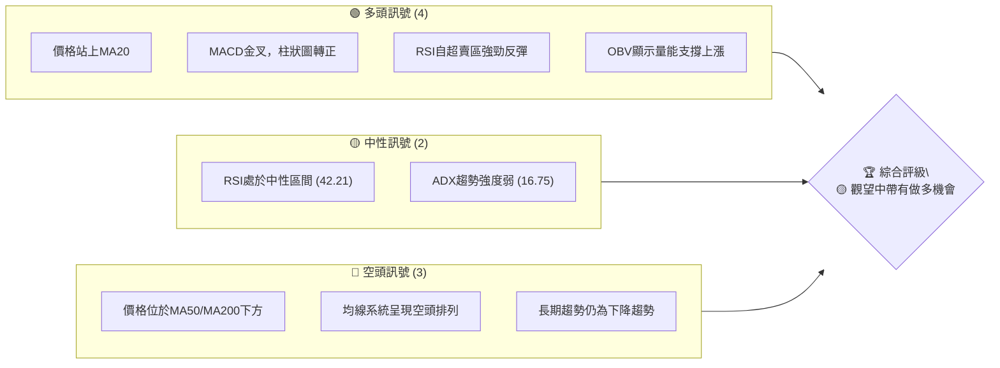

**解讀**：
多頭訊號主要來自於短期價格行為及動能指標的改善，顯示在經歷大幅下跌後，市場出現了積極的買盤介入。然而，中長期均線的空頭排列以及弱勢的 ADX 趨勢強度，提醒投資者當前仍處於一個相對不穩定的過渡期，尚未形成明確的長期趨勢反轉。

### 📊 核心指標速覽表

以下表格彙整了 KTOS 的關鍵技術指標，並提供即時的訊號解讀。

| 指標類別 | 指標名稱 | 當前數值 | 訊號 | 解讀 |
|----------|----------|----------|------|------|
| **價格** | 當前價格 | $55.35 | 🟡 | 位於MA20上方，但MA50/MA200下方 |
| **均線** | MA20 | $53.97 | 🟢 | 價格站上短期均線，短期動能轉強 |
| **均線** | MA50 | $57.17 | 🔴 | 價格位於中期均線下方，中線壓力顯現 |
| **均線** | MA200 | $79.28 | 🔴 | 價格位於長期均線下方，長線趨勢空頭 |
| **動能** | RSI(14) | 42.21 | 🟡 | 自超賣區反彈，但尚未進入強勢區 |
| **動能** | MACD | +0.271 (Hist) | 🟢 | MACD線向上穿越訊號線，形成金叉 |
| **波動** | ATR | $3.41 | 🟡 | 佔價格6.16%，波動性中等偏高 |
| **趨勢** | ADX(14) | 16.75 | 🟡 | 趨勢強度較弱，可能處於盤整或趨勢形成初期 |
| **成交量** | 量比 (20日) | 1.17x | 🟢 | 當前成交量高於20日均量，量能放大 |

### 🏆 技術評分卡

本評分卡綜合考量多個技術維度，為 KTOS 的當前技術狀況提供量化評估。

╔════════════════════════════════════════════════════╗
║             技術評分卡 — KTOS (2026-07-04)           ║
╠════════════════════════════════════════════════════╣
║ 趨勢強度      ████░░░░░░░░░░░░░░░░  20/100  🔴   (ADX顯示趨勢弱勢)     ║
║ 動能指標      ██████████░░░░░░░░░░  50/100  🟡   (MACD金叉，RSI反彈)    ║
║ 支撐穩定度    ████████░░░░░░░░░░░░  40/100  🔴   (近期雖有反彈，但下方支撐面臨考驗)║
║ 成交量配合    ██████████████░░░░░░  70/100  🟢   (量能放大且OBV支持上漲) ║
║ 形態完整度    ██████████░░░░░░░░░░  50/100  🟡   (潛在W型底，但尚未確認)  ║
║ 均線排列      ████░░░░░░░░░░░░░░░░  20/100  🔴   (明確的空頭排列)     ║
╠════════════════════════════════════════════════════╣
║ 綜合評分      ████████░░░░░░░░░░░░  48/100  🟡   評級：中性偏多       ║
╚════════════════════════════════════════════════════╝

**評分理由**：
- **趨勢強度 (20/100, 🔴)**：ADX 僅為 16.75，遠低於 25 的趨勢分界線，表明當前市場處於弱勢趨勢或盤整狀態。儘管 +DI 高於 -DI，但整體趨勢缺乏動能。
- **動能指標 (50/100, 🟡)**：MACD 形成金叉且柱狀圖轉正，顯示短期動能轉強。RSI 從超賣區反彈至中性區間，但尚未突破 50-70 的強勢區，動能仍需觀察。
- **支撐穩定度 (40/100, 🔴)**：雖然股價從 $47.21 強勁反彈，但這是在長期下降趨勢中的反彈。主要支撐位 $47.21 和 $41.87 雖然目前穩固，但上方阻力重重，未來壓力仍大。
- **成交量配合 (70/100, 🟢)**：最新成交量顯著高於20日和50日均量，且 OBV 趨勢顯示量能支持上漲，這是一個強烈的多頭訊號，確認了近期反彈的有效性。
- **形態完整度 (50/100, 🟡)**：股價在經歷大幅下跌後，於 $47.21 附近形成反彈，可能正在構建 W 型底。然而，該形態仍需突破關鍵頸線才能確認，目前處於形成初期。
- **均線排列 (20/100, 🔴)**：MA20 ($53.97) < MA50 ($57.17) < MA200 ($79.28) 的空頭排列清晰可見，表明中長期趨勢仍處於下行通道，對股價構成強大壓力。

**綜合評級**：KTOS 目前處於一個多空交織的局面。短期內，價格從低點強勁反彈，並伴隨動能指標的改善和量能的配合，顯示出一定的做多機會。然而，中長期趨勢的空頭排列以及弱勢的 ADX 趨勢強度，提示這可能僅是下降趨勢中的一次反彈，而非趨勢反轉的開始。因此，評級為「中性偏多」，建議投資者謹慎操作，並密切關注關鍵阻力位的突破情況。

---

## 2. 趨勢分析

本章將從多個時間框架深入剖析 KTOS 的股價趨勢，包括長期月線、中期週線和短期日線走勢，並透過 ADX 指標評估趨勢強度。

### 🌐 多時框趨勢分析

KTOS 的多時框趨勢分析揭示了不同時間維度下的市場動態，呈現出短期反彈與中長期下降趨勢的對比。

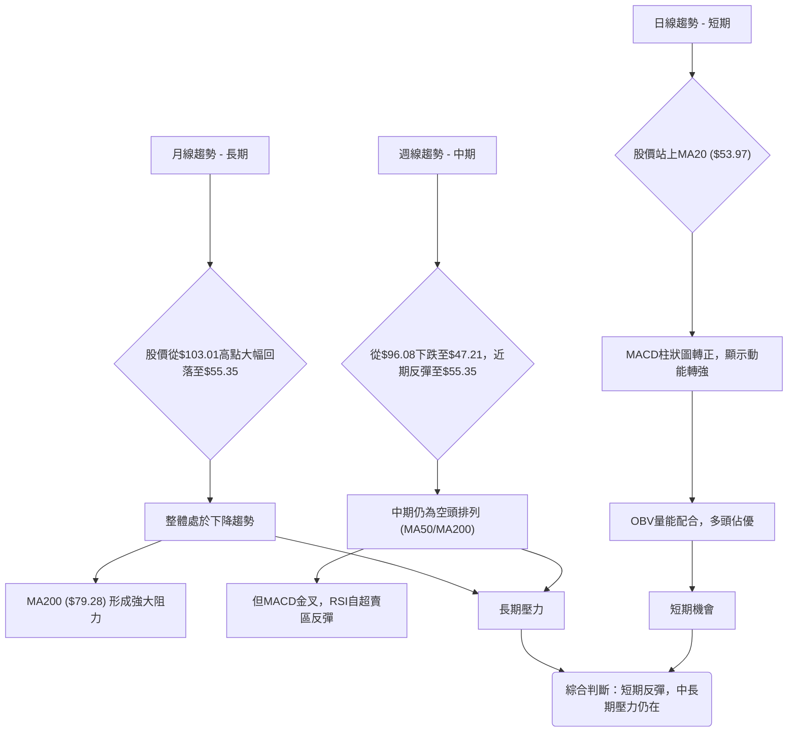

**解讀**：
- **長期 (月線)**：從 2026 年 1 月的歷史高點 $103.01 至今，KTOS 股價經歷了劇烈下跌，目前報 $55.35。月線圖清晰顯示長期趨勢為下降趨勢，股價遠低於 MA200，表明長期空頭力量佔據主導地位。
- **中期 (週線)**：在過去的 20 週內，股價從 2 月份的 $96.08 一路下跌至 6 月底的 $47.21，隨後迅速反彈至 $55.35。雖然中期均線（MA50、MA200）仍呈現空頭排列，但 MACD 指標已形成金叉，RSI 也從超賣區強力反彈，顯示中期下跌動能有所減弱，並出現了中期反彈的跡象。
- **短期 (日線)**：當前價格 $55.35 位於 MA20 ($53.97) 之上，且 MACD 柱狀圖轉正，OBV 量能配合，這些都表明短期內多頭力量佔優，股價處於一個積極的反彈階段。

### 📈 長期趨勢 — 12個月走勢圖（Unicode）

以下 ASCII 圖表展示了 KTOS 過去 12 個月的月線價格走勢，清晰標注了關鍵高點和低點，反映了從強勁上漲到大幅回落的完整週期。

```
KTOS 月線走勢圖（過去12個月：2025-07 至 2026-07）
價格軸 ($)
$110 ┤                               ● $103.01 (2026-01, 歷史高點)
$100 ┤                               │
$ 90 ┤              ● $91.37 (2025-09) ● $90.60 (2025-10)
$ 80 ┤                        ● $76.10 (2025-11) ● $75.91 (2025-12)
$ 70 ┤                                  ● $70.51 (2026-03)
$ 60 ┤  ● $65.84 (2025-08)                            ● $64.13 (2026-05)
$ 50 ┤● $58.70 (2025-07)                                         ● $55.35 (2026-07, 現價)
$ 40 ┤                                                  ● $49.86 (2026-06, 近期低點)
     └───────────────────────────────────────────────────────────────────
      25-07 25-08 25-09 25-10 25-11 25-12 26-01 26-02 26-03 26-04 26-05 26-06 26-07
```

**走勢特徵分析表格**：

| 階段 | 時間區間 | 價格範圍 | 漲跌幅 | 主要特徵 |
|------|----------|----------|--------|----------|
| **強勁上漲** | 2025-07 至 2026-01 | $58.70 → $103.01 | +75.49% | 股價持續創高，多頭勢頭強勁，成交量配合良好。 |
| **高點震盪** | 2026-01 至 2026-02 | $103.01 → $86.18 | -16.48% | 股價在高點附近開始出現劇烈震盪，顯示多頭力量減弱，空頭開始介入。 |
| **快速下跌** | 2026-02 至 2026-06 | $86.18 → $49.86 | -42.14% | 股價加速下跌，跌破多條關鍵均線，成交量在下跌初期放大，確認下跌趨勢。 |
| **近期反彈** | 2026-06 至 2026-07 | $49.86 → $55.35 | +11.01% | 股價在觸及 $49.86 後止跌反彈，伴隨成交量放大，顯示底部買盤介入。 |

### 📊 中期趨勢（週線分析）

中期趨勢主要關注過去數月至一年的走勢，KTOS 在經歷強勁下跌後，目前正處於一個關鍵的反彈修正階段。

```
KTOS 中期走勢圖（近期壓力與支撐示意）
價格軸 ($)
$90 ┤                                  R1 ($91.37)
$80 ┤                                  R2 ($79.28, MA200)
$70 ┤                                  R3 ($70.51)
$60 ┤           ┌─────────┐
$57 ┤           │  MA50     │  ← $57.17 (MA50, 近期阻力)
$55 ┤           │           ├───────────● $55.35 (現價)
$53 ┤           │  MA20     │  ← $53.97 (MA20, 近期支撐)
$50 ┤           └─────────┘
$47 ┤                                  S1 ($47.21, 近期低點)
$40 ┤                                  S2 ($41.87, 52W低點)
    └───────────────────────────────────────────────────
      時間軸 （近期週線）
```

**解讀**：
從中期來看，KTOS 股價在 2026 年 2 月達到 $96.08 的高點後，一路下滑，最低觸及 $47.21。此下跌趨勢強勁，並跌破了所有主要均線。目前股價正在從 $47.21 的低點進行反彈。
- **近期壓力**：首先面臨的是 MA50 ($57.17) 的阻力，若能突破，下一個較強阻力是斐波那契回調位 $60.38 (23.6%)，以及前期的平台壓力 $64.13。
- **近期支撐**：MA20 ($53.97) 構成短期支撐，若失守，則會回測近期低點 $47.21。
當前股價 $55.35 位於 MA20 ($53.97) 之上，但仍受制於 MA50 ($57.17) 之下，顯示反彈動能雖強，但仍處於中期的下降趨勢中。

### ⚡ 趨勢強度評估（ADX 解讀）

ADX 指標用於衡量趨勢的強度，而非方向。+DI 和 -DI 則指示多空力量的相對強弱。

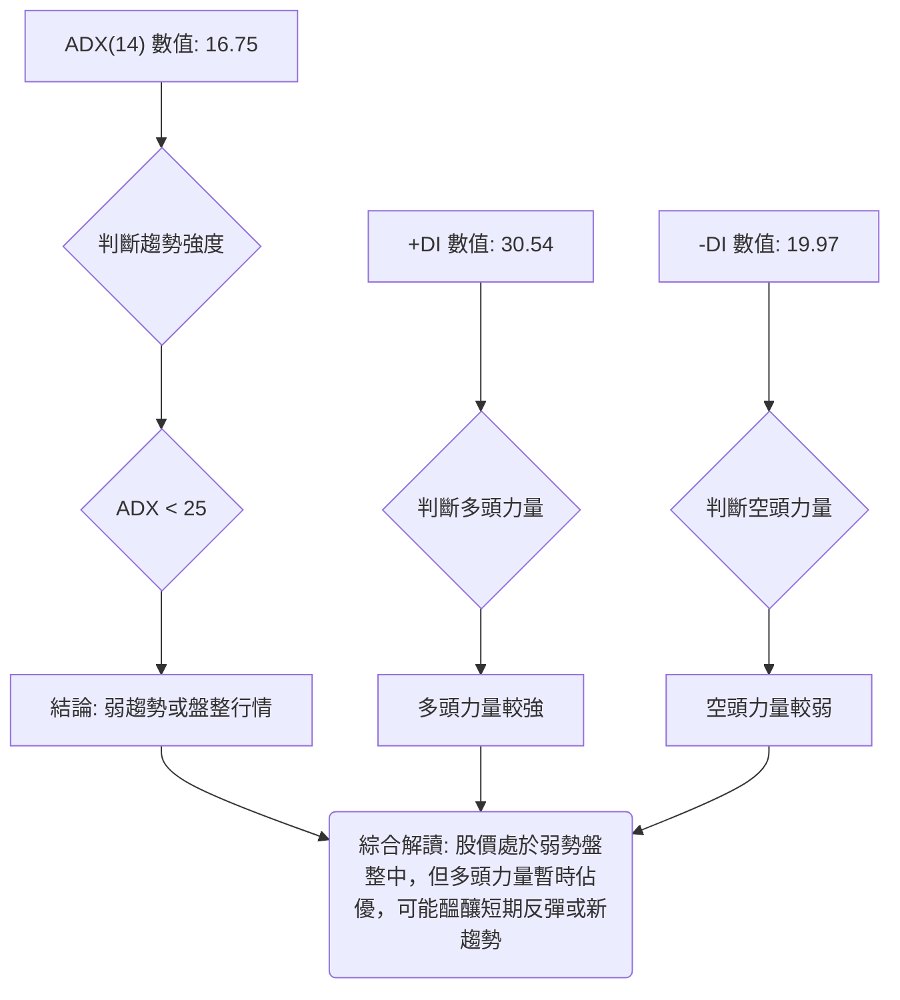

**ADX 強度對照表**：

| ADX 數值範圍 | 趨勢強度 | 市場判斷 |
|--------------|----------|----------|
| 0-25         | 弱趨勢   | 盤整或趨勢不明顯 |
| 25-50        | 中等趨勢 | 趨勢行情確立     |
| 50-75        | 強趨勢   | 趨勢非常強勁     |
| 75-100       | 極強趨勢 | 趨勢極端強勁     |

**解讀**：
KTOS 的 ADX(14) 數值為 16.75，遠低於 25 的閾值，這明確指出當前市場處於一個**弱趨勢或盤整行情**。這意味著雖然股價近期有所反彈，但整體趨勢缺乏足夠的動能來支持一個強勁的單邊走勢。
然而，+DI 數值為 30.54，顯著高於 -DI 的 19.97。這表明在當前的弱勢趨勢中，**多頭力量相對於空頭力量佔據主導地位**。這種情況通常發生在股價從底部反彈，但尚未能突破關鍵阻力，或在下跌趨勢中出現較強的反彈修正。
**綜合來看**，KTOS 目前處於一個底部區間的震盪整理階段，短期內多頭力量正在嘗試推動股價上漲，但由於缺乏強勁的趨勢動能，預計在突破關鍵阻力前，仍將維持震盪走勢。

---

## 3. 圖表形態分析

圖表形態是技術分析的核心，能夠提供潛在的價格目標和市場心理線索。本章將識別 KTOS 股價中可能存在的圖表形態，並分析其 K 線組合。

### 🔍 形態識別系統

根據 KTOS 近期的價格走勢，我們觀察到一個潛在的底部反轉形態——「W 型底」或稱「雙重底」的形成初期。

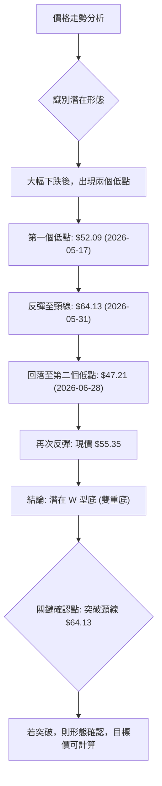

**解讀**：
KTOS 股價在經歷從 $96.08 (2026-02-22) 的大幅下跌後，於近期呈現出潛在的 W 型底（雙重底）形態。
- **第一個低點**：約 $52.09 (2026-05-17)。
- **中間高點 (頸線)**：反彈至 $64.13 (2026-05-31)。
- **第二個低點**：回落至 $47.21 (2026-06-28)，此點低於第一個低點，但隨後出現強勁反彈。
- **當前狀況**：股價正從第二個低點 $47.21 向上反彈，目前位於 $55.35。
這個形態的關鍵在於**頸線 $64.13**。只有當股價能夠帶量突破並站穩此頸線時，W 型底形態才能被正式確認，並預示著趨勢的反轉。

### 🕯️ 重要K線形態分析

分析近期的週線 K 線形態，以判斷市場情緒和潛在轉折點。

| 月份 | 收盤價 | K線形態 | 解讀 | 訊號 |
|------|--------|---------|------|------|
| 2026-05-17 | $52.09 | 垂線/長下影線 | 在下跌趨勢中出現，暗示下方買盤承接，下跌動能減弱，可能形成短期底部。 | 🟡 |
| 2026-05-24 | $56.18 | 大陽線 | 接續垂線，確認多頭力量增強，吞噬前一週跌幅，形成反彈。 | 🟢 |
| 2026-05-31 | $64.13 | 大陽線 | 強勁上漲，突破前期多個壓力位，確認反彈趨勢，形成 W 型底的頸線。 | 🟢 |
| 2026-06-28 | $47.21 | 大陰線 | 股價跌破 $50 心理關口，形成短期恐慌性拋售，但在低點附近出現長下影線（若有日線資料推斷），暗示超賣。 | 🔴 |
| 2026-07-05 | $55.35 | 大陽線 (強勁反彈) | 經歷前一週大跌後，本週強勢反彈，K線實體較大，且成交量放大，形成看漲吞噬或啟明星形態（若有日線確認），是強烈的短期反轉訊號。 | 🟢 |

**解讀**：
近期 K 線形態顯示，市場在 6 月底經歷了一次恐慌性拋售，股價觸及 $47.21 的低點。然而，隨後 7 月初出現了強勁的**大陽線反彈**，且伴隨**成交量放大**，這是一個經典的底部反轉訊號。此陽線幾乎吞噬了前一週的陰線實體，構成「看漲吞噬」形態，顯示多頭力量強勢回歸。這與潛在的 W 型底形態的第二個底部後的反彈相吻合，為短期多頭提供了支撐。

### 📉 ASCII 走勢形態示意圖

以下 ASCII 圖表展示了 KTOS 近期潛在的「W 型底」形態，標注了關鍵點位。

```
KTOS 潛在 W 型底 (雙重底) 形態示意圖
════════════════════════════════════════════════════════════════════════════
價格軸 ($)
$70 ┤                                      ┌───────────────┐
$64 ┤                                      │   頸線 $64.13   │
$60 ┤                                      └───────────────┘
$55 ┤                         ● 現價 $55.35
$52 ┤            ● $52.09 (Trough 1)
$50 ┤
$47 ┤                       ● $47.21 (Trough 2, 近期低點)
    └────────────────────────────────────────────────────────────────────────
      時間軸 （2026-05-17  ~  2026-07-05）
```

**形態關鍵點位**：
- **第一個低點 (Trough 1)**: $52.09 (2026-05-17)
- **中間高點 / 頸線 (Neckline)**: $64.13 (2026-05-31)
- **第二個低點 (Trough 2)**: $47.21 (2026-06-28)
- **當前價格**: $55.35 (2026-07-05)

### 🎯 形態目標價計算

若「W 型底」形態最終得到確認，我們可以根據形態學原理計算其潛在的目標價格。

**計算方法**：
W 型底的目標價通常是頸線價格加上形態的高度。
1. **頸線價格**：$64.13 (2026-05-31 的高點)。
2. **形態高度**：頸線價格與第二個低點之間的垂直距離。
   形態高度 = 頸線價格 - 第二個低點 = $64.13 - $47.21 = $16.92。
3. **目標價**：頸線價格 + 形態高度。
   目標價 = $64.13 + $16.92 = $81.05。

**解讀**：
如果 KTOS 能夠**帶量突破並穩固站上 $64.13 的頸線位**，那麼該 W 型底形態將被正式確認。在這種情況下，根據形態學計算，KTOS 的潛在上漲目標價為 **$81.05**。這將是一個重要的反轉訊號，意味著股價有望從長期下跌趨勢中走出，進入一個新的上升週期。投資者應密切關注 $64.13 這一關鍵阻力位的突破情況。

---

## 4. 支撐與阻力

支撐與阻力是技術分析的基石，它們代表了市場中多空力量的關鍵戰場。精確識別這些價位對於制定交易策略至關重要。

### 🗺️ 關鍵價位分布圖（Unicode）

以下 ASCII 圖表清晰展示了 KTOS 當前的關鍵支撐與阻力位分佈，以及現價所處的位置。

```
KTOS 價位結構分布圖 (2026-07-04)
═══════════════════════════════════════════════════════════════════════════
$103.01 ║███████████████████████████████████████████████████████████████║ 強阻力 R5 (歷史高點)
$ 91.37 ║███████████████████████████████████████████████████████████████║ 強阻力 R4 (前期高點)
$ 79.28 ║███████████████████████████████████████████████████████████████║ 關鍵阻力 R3 (MA200)
$ 75.11 ║███████████████████████████████████████████████████████████████║ 阻力 R2 (Fib 50% 回調)
$ 68.52 ║███████████████████████████████████████████████████████████████║ 阻力 R1 (Fib 38.2% 回調)
$ 64.13 ║███████████████████████████████████████████████████████████████║ 關鍵阻力 (W型底頸線)
$ 63.31 ║███████████████████████████████████████████████████████████████║ 布林上軌
$ 60.38 ║███████████████████████████████████████████████████████████████║ 阻力 (Fib 23.6% 回調)
$ 57.17 ║███████████████████████████████████████████████████████████████║ 關鍵阻力 (MA50)
$ 55.35 ╠═══════════════════════════════════════════════════════════════╣ ◄ 現價
$ 53.97 ║▓▓▓▓▓▓▓▓▓▓▓▓▓▓▓▓▓▓▓▓▓▓▓▓▓▓▓▓▓▓▓▓▓▓▓▓▓▓▓▓▓▓▓▓▓▓▓▓▓▓▓▓▓▓▓▓▓▓▓▓▓▓▓▓▓║ 近期支撐 S1 (MA20 / 布林中軌)
$ 49.86 ║███████████████████████████████████████████████████████████████║ 強支撐 S2 (近期低點)
$ 47.21 ║███████████████████████████████████████████████████████████████║ 強支撐 S3 (W型底底部)
$ 44.63 ║███████████████████████████████████████████████████████████████║ 布林下軌
$ 41.87 ║███████████████████████████████████████████████████████████████║ 極強支撐 S4 (52週低點)
═══════════════════════════════════════════════════════════════════════════
```

### 🚧 阻力位分析表

| 阻力級別 | 價位 | 形成原因 | 突破難度 | 重要性 |
|----------|------|----------|----------|--------|
| **即時阻力** | $57.17 | MA50 均線壓力 | 中等 | 🟢 突破此處可打開短期上漲空間 |
| **短期阻力** | $60.38 | 斐波那契 23.6% 回調位 | 中等 | 🟡 初步考驗反彈強度 |
| **關鍵阻力** | $64.13 | W 型底頸線 / 前期高點 | 高 | 🔴 突破此處確認反轉形態，意義重大 |
| **中級阻力** | $68.52 | 斐波那契 38.2% 回調位 | 高 | 🟡 測試中期反彈極限 |
| **強阻力** | $79.28 | MA200 均線壓力 | 極高 | 🔴 長期下降趨勢的關鍵分水嶺 |

### 🛡️ 支撐位分析表

| 支撐級別 | 價位 | 形成原因 | 守住機率 | 重要性 |
|----------|------|----------|----------|--------|
| **即時支撐** | $53.97 | MA20 均線支撐 / 布林中軌 | 中等 | 🟢 短期多頭防線 |
| **近期支撐** | $49.86 | 6 月份收盤低點 | 中等 | 🟡 反彈後的初步回調目標 |
| **關鍵支撐** | $47.21 | W 型底的第二個底部 / 近期低點 | 高 | 🔴 不容有失的底部結構支撐 |
| **極強支撐** | $41.87 | 52 週低點 | 極高 | 🟢 歷史性低點，具備強大心理和技術支撐 |

### 📐 斐波那契回調位分析

我們將從 2026 年 1 月的最高點 $103.01 到 2026 年 6 月的最低點 $47.21 進行斐波那契回調分析，以識別潛在的阻力位。

- **高點** (100%)：$103.01 (2026-01)
- **低點** (0%)：$47.21 (2026-06)
- **下跌區間**：$103.01 - $47.21 = $55.80

**斐波那契回調位計算**：
- **23.6% 回調位**：$47.21 + (0.236 * $55.80) = $47.21 + $13.17 = **$60.38**
- **38.2% 回調位**：$47.21 + (0.382 * $55.80) = $47.21 + $21.31 = **$68.52**
- **50.0% 回調位**：$47.21 + (0.500 * $55.80) = $47.21 + $27.90 = **$75.11**
- **61.8% 回調位**：$47.21 + (0.618 * $55.80) = $47.21 + $34.48 = **$81.69**

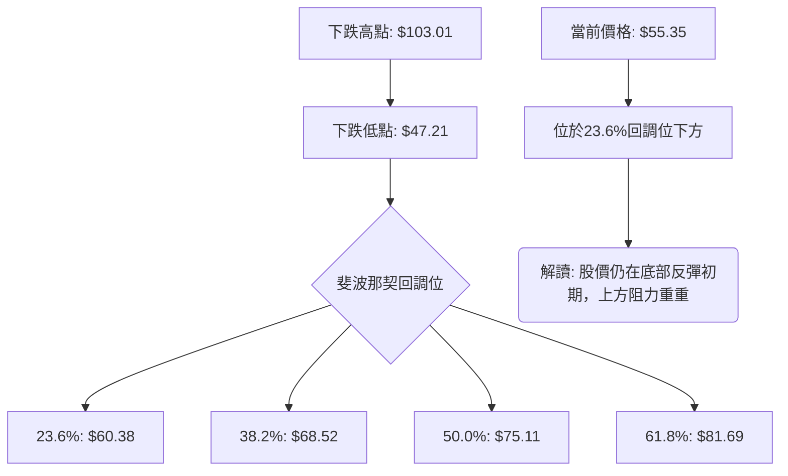

**解讀**：
當前股價 $55.35 位於 23.6% 回調位 $60.38 之下，顯示其仍在從底部反彈的初期階段。若能持續上漲，第一個重要的斐波那契阻力位將是 $60.38，緊接著是 $68.52。這些回調位將是多頭上攻的潛在挑戰，也是空頭可能選擇介入的點位。其中 38.2% 和 50% 回調位通常被視為較強的阻力區間，若能突破，則意味著反彈強度較大。

---

## 5. 技術指標深度解讀

本章將對 KTOS 的主要技術指標進行詳細分析，包括移動平均線、RSI、MACD、布林通道和成交量，並探討它們之間的相互關係和訊號一致性。

### 🎛️ 指標訊號總覽

以下 Mermaid 圖表展示了各主要技術指標當前發出的訊號及其相互關係，幫助我們形成一個整體性的判斷。

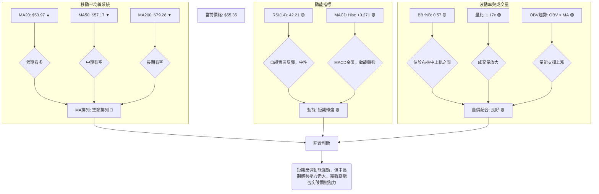

### 📈 移動平均線排列分析

移動平均線 (MA) 是判斷趨勢方向和強度的重要工具。其排列方式揭示了不同時間框架下的市場情緒。

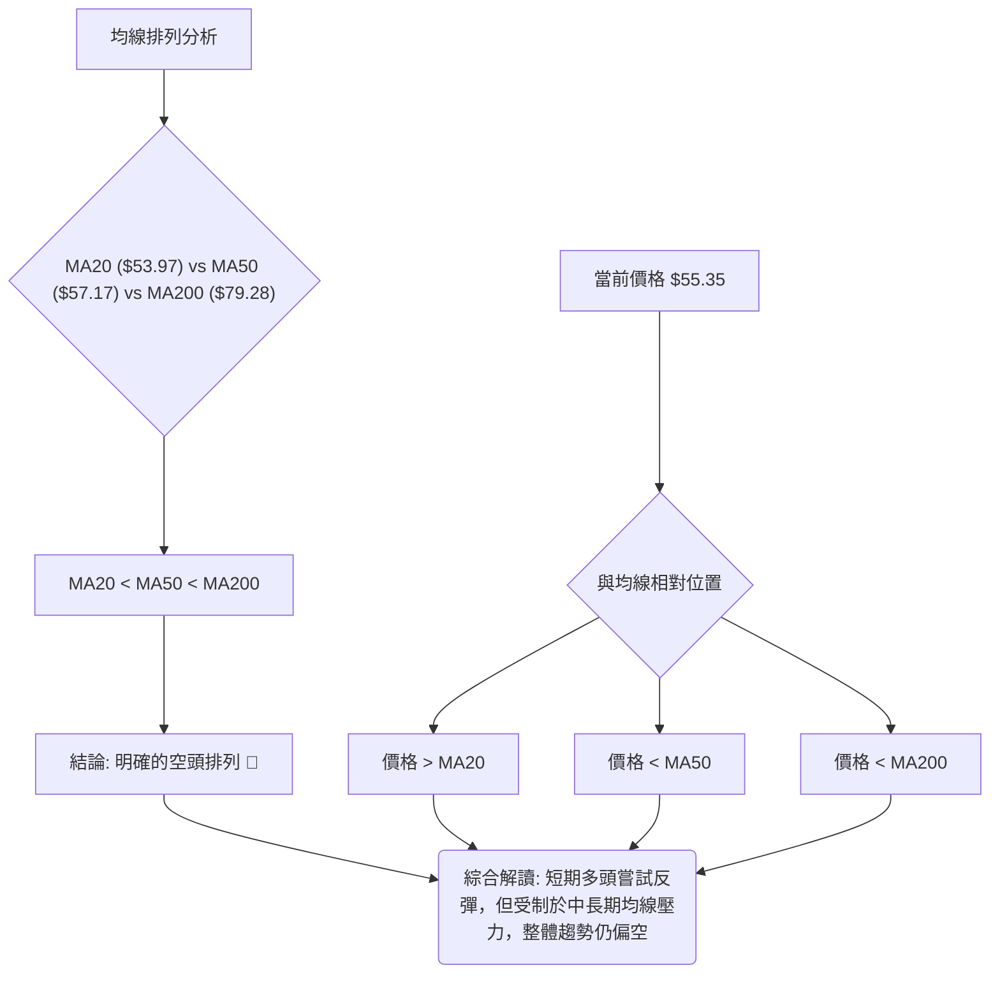

**解讀**：
當前 KTOS 的均線系統呈現典型的**空頭排列 (MA20 < MA50 < MA200)**。這是一個強烈的長期看空訊號，表明市場整體仍處於下降趨勢之中。
- **MA20 ($53.97)**：當前價格 $55.35 位於 MA20 之上，顯示短期內股價有向上動能，是近期反彈的直接體現。
- **MA50 ($57.17)**：價格仍位於 MA50 之下，MA50 構成中期阻力。若能突破 MA50，將是多頭力量進一步增強的訊號。
- **MA200 ($79.28)**：價格遠低於 MA200，MA200 形成長期趨勢的強大壓制。在空頭排列下，MA200 幾乎不可能在短期內被突破，它代表了長期的主要阻力。
**總結**：儘管短期內股價成功站上 MA20 並顯示反彈動能，但面對 MA50 和 MA200 的重重壓力以及整體空頭排列，投資者應謹慎對待，這可能僅是下降趨勢中的一次技術性反彈。

### 📉 RSI(14) 分析

相對強弱指數 (RSI) 用於衡量價格變動的速度和變化，判斷資產是超買還是超賣。

- **RSI(14) 數值**：42.21
- **RSI 強度進度條**：▓▓▓▓▓▓▓▓░░░░░░░░░░░░ (42.21 / 100)

**超買超賣區間分析**：
- **超買區**：RSI > 70
- **超賣區**：RSI < 30
- **中性區**：30 < RSI < 70

**解讀**：
KTOS 的 RSI(14) 當前數值為 42.21，位於 30-70 的中性區間。
- **近期反彈**：從數據中可見，RSI 在 2026-06-28 曾跌至 23.1 的超賣區，隨後在 2026-07-05 迅速反彈至 42.21。這種從超賣區的強勁回升是一個**積極的訊號**，表明市場在經歷大幅拋售後，買盤力量正在介入，短期內下跌動能已大幅減弱。
- **動能展望**：RSI 尚未進入 50-70 的強勢區，表明雖然反彈動能強勁，但仍未達到完全的多頭主導狀態。若 RSI 能持續上行並突破 50，將進一步確認多頭的優勢。
- **背離判斷**：根據提供的數據，**無明顯的 RSI 頂背離或底背離現象**。股價在 $47.21 觸底反彈，RSI 也從超賣區同步反彈，量價配合良好。

### 📊 MACD(12/26/9) 訊號解讀

平滑異同移動平均線 (MACD) 是判斷趨勢動能和潛在轉折點的領先指標。

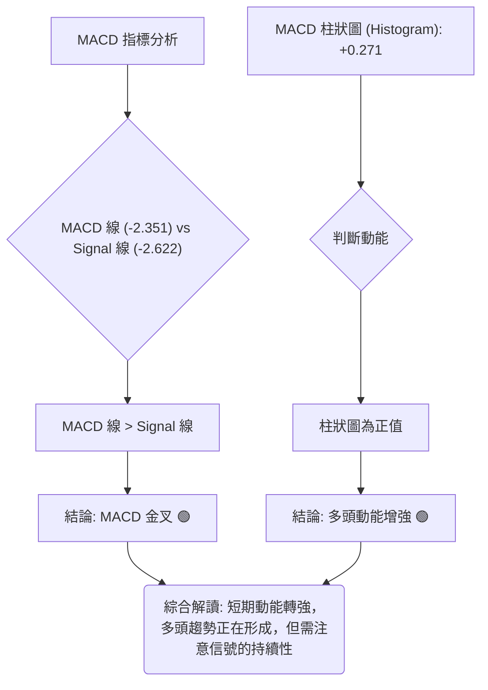

**解讀**：
KTOS 的 MACD 指標發出明確的**多頭訊號**：
- **MACD 線 (-2.351)** 已經上穿 **Signal 線 (-2.622)**，形成了一個清晰的**金叉 (Bullish Crossover)**。這是一個重要的買入訊號，表明短期內股價的下跌趨勢已發生逆轉，多頭動能正在積聚。
- **MACD 柱狀圖 (Histogram)** 數值為 +0.271，由負轉正。這進一步確認了 MACD 金叉的有效性，顯示多頭力量正在逐步釋放，且動能正在增強。
- **背離判斷**：根據提供的數據，**無明顯的 MACD 頂背離或底背離現象**。MACD 指標與股價走勢同步，在股價觸底反彈時，MACD 也向上翻轉，顯示動能的真實性。
**總結**：MACD 的金叉和柱狀圖轉正，是當前最為強勁的短期多頭訊號之一，與 RSI 的反彈相互印證，預示著 KTOS 在短期內有望繼續上漲。

### 📦 布林通道分析

布林通道 (Bollinger Bands) 用於衡量價格的波動性，並識別潛在的超買超賣區域。

```
KTOS 布林通道示意圖 (2026-07-04)
═══════════════════════════════════════════════════════════════════════════
$63.31 ║███████████████████████████████████████████████████████████████║ BB上軌
$60.00 ║                                                                 ║
$57.17 ║                                                                 ║
$55.35 ║                   ● 現價                                        ║
$53.97 ║▓▓▓▓▓▓▓▓▓▓▓▓▓▓▓▓▓▓▓▓▓▓▓▓▓▓▓▓▓▓▓▓▓▓▓▓▓▓▓▓▓▓▓▓▓▓▓▓▓▓▓▓▓▓▓▓▓▓▓▓▓▓▓▓▓║ BB中軌 (MA20)
$50.00 ║                                                                 ║
$47.21 ║                                                                 ║
$44.63 ║███████████████████████████████████████████████████████████████║ BB下軌
═══════════════════════════════════════════════════════════════════════════
```

- **BB上軌**：$63.31
- **BB中軌 (MA20)**：$53.97
- **BB下軌**：$44.63
- **BB %B**：0.57 (0=下軌, 0.5=中軌, 1=上軌)

**解讀**：
KTOS 的 BB %B 數值為 0.57，表示當前價格 $55.35 位於布林通道的中軌 ($53.97) 和上軌 ($63.31) 之間。
- **價格位置**：股價成功站上中軌，這是積極的訊號，表明短期趨勢轉強。通常，價格在中軌上方運行，預示著可能向布林上軌測試。
- **波動性**：布林通道的寬度代表了市場的波動性。從數據來看，ATR 為 $3.41 (6.16%)，顯示波動性中等偏高。通道的擴張或收縮將預示著未來趨勢的變化。目前通道可能在經歷底部反彈後有輕微擴張的趨勢。
- **潛在目標**：若反彈動能持續，布林上軌 $63.31 將成為一個潛在的短期阻力目標。
**總結**：股價位於布林中上軌之間，且中軌向上傾斜（MA20），是短期看漲的訊號。這與 MACD 和 RSI 的反彈訊號一致，共同支持短期多頭。

### 💹 成交量分析（量價配合度）

成交量是價格走勢的燃料，量價配合度能夠驗證價格趨勢的可靠性。

- **最新成交量**：6,712,300
- **20日均量**：5,737,105 (量比: 1.17x)
- **50日均量**：5,118,556
- **OBV 趨勢**：OBV > MA → 量能支撐上漲 (🟢 看多)

**解讀**：
KTOS 的成交量分析提供了強烈的多頭訊號：
- **量能放大**：最新成交量 6,712,300 顯著高於 20 日均量 (5,737,105) 達 1.17 倍，也高於 50 日均量。這表明在股價反彈的過程中，有大量資金積極介入，買盤意願強烈。
- **量價配合**：在股價從 $47.21 反彈至 $55.35 的過程中，成交量同步放大，這是典型的**量價齊升**，確認了反彈的有效性和可靠性。特別是 2026-06-28 週的巨量（45,383,700）下跌，隨後 2026-07-05 週的放量反彈（26,373,000），顯示在底部區間發生了劇烈的換手，並有大量買盤承接。
- **OBV 趨勢**：OBV (On Balance Volume) 趨勢顯示 OBV 線位於其移動平均線之上，這是一個**看漲訊號**。OBV 的上升表明買盤壓力大於賣盤壓力，資金流向支持股價上漲。
**總結**：成交量的強勁表現，配合量價齊升和 OBV 的積極訊號，為 KTOS 的短期反彈提供了堅實的基礎。這是所有技術指標中最為積極的訊號之一，大大增加了短期多頭策略的可信度。

---

## 6. 動能與波動率

本章將評估 KTOS 的股價動能和波動率，這兩者對於理解股票的交易機會和風險至關重要。

### ⚡ 動能評估四象限

我們將 KTOS 當前的動能和波動率進行分類，以判斷其所處的市場階段。由於指令要求避免使用 quadrantChart，我們將使用表格進行評估。

| 象限 | 動能 (MACD, RSI) | 波動 (ATR%) | 當前狀態 | 評估 |
|------|--------------------|---------------|----------|------|
| Q1 | 強                 | 低            | -        | 最佳機會 (強勢股，低風險) |
| Q2 | 弱                 | 低            | -        | 謹慎觀望 (盤整，等待方向) |
| Q3 | 強                 | 高            | **✓**    | 高風險高收益 (趨勢股，波動大) |
| Q4 | 弱                 | 高            | -        | 避免進場 (混亂，高風險) |

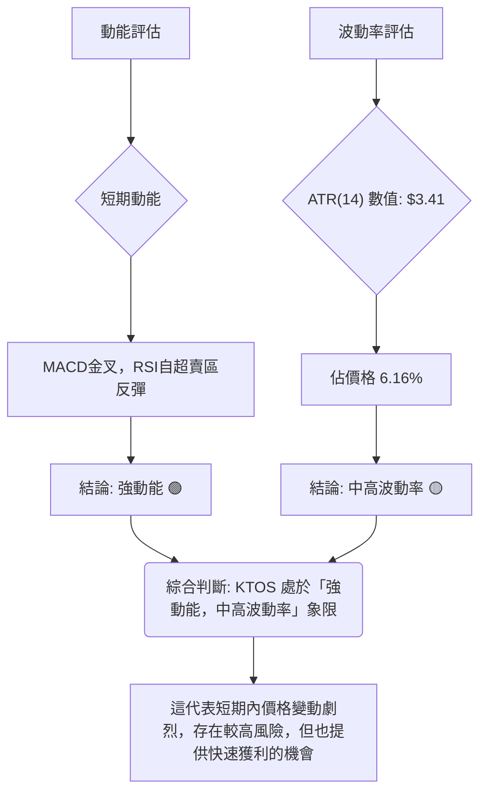

**解讀**：
- **動能評估**：MACD 已形成金叉且柱狀圖轉正，RSI 從超賣區強勁反彈，這些都指向 KTOS 短期動能強勁。
- **波動率評估**：ATR(14) 為 $3.41，佔當前價格 $55.35 的 6.16%。這個百分比相對較高，表明 KTOS 的每日價格波動幅度較大，屬於**中高波動率**的股票。
**綜合判斷**：KTOS 目前處於「**強動能，中高波動率**」的階段（對應 Q3）。這意味著股價在短期內具有較強的上漲勢頭，但同時也伴隨著較大的價格波動風險。對於交易者而言，這提供了快速獲利的潛力，但也要求嚴格的風險管理和止損策略。

### 📊 ATR 波動率分析

平均真實波幅 (ATR) 衡量的是一段時間內股價的平均波動範圍，是評估股票風險和設置止損點的重要參考。

- **ATR(14)**：$3.41
- **ATR 佔價格比**：$3.41 / $55.35 = 6.16%

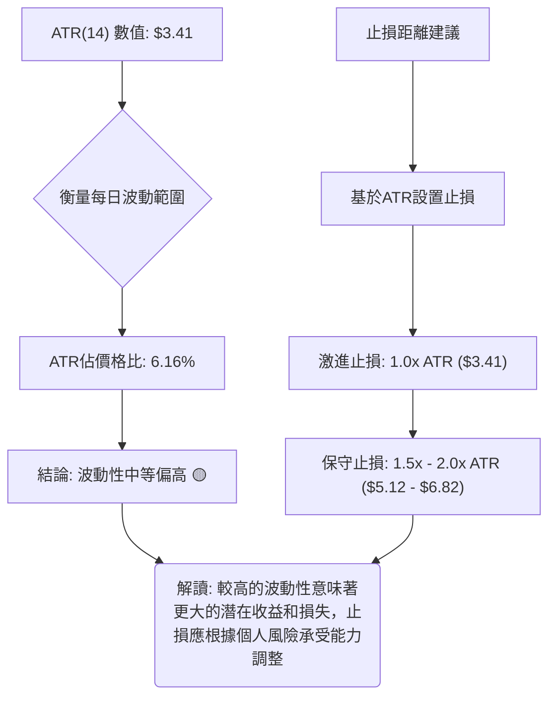

**解讀**：
KTOS 的 ATR(14) 為 $3.41，這意味著在過去 14 天裡，KTOS 的平均每日價格波動範圍大約為 $3.41。這個數值佔當前股價的 6.16%，顯示 KTOS 是一隻波動性相對較高的股票。
- **風險評估**：高波動性意味著股價可能在短時間內快速上漲或下跌，這增加了交易的風險，但也提供了更大的潛在收益空間。
- **止損距離建議**：
    - 激進的交易者可以考慮將止損點設置在**1.0 倍 ATR** 的距離，即約 $3.41。
    - 較為保守的交易者可以考慮將止損點設置在**1.5 倍至 2.0 倍 ATR** 的距離，即約 $5.12 至 $6.82。
例如，如果進場價為 $55.35，則 1.5x ATR 的止損點約為 $55.35 - $5.12 = $50.23。
**結論**：由於 KTOS 波動性較高，投資者在制定交易策略時必須嚴格設定止損，並根據自身的風險承受能力調整倉位。

### 📐 Beta 與市場相關性

Beta 值衡量股票相對於整體市場的波動性。由於數據中未提供 Beta 值，我們將基於行業特性進行推斷。

**推斷分析**：
- **行業特性**：Kratos Defense & Security Solutions, Inc. 屬於工業板塊中的航空航天與國防產業。此類公司通常與政府訂單和國防支出高度相關，其業務穩定性在一定程度上受到宏觀經濟週期的影響，但同時也具有一定的防禦性。
- **Beta 推斷**：一般而言，國防股在經濟下行時可能表現出一定的防禦性（Beta < 1），但在經濟上行時其上漲幅度也可能不及大盤。然而，隨著地緣政治風險的增加和技術創新（如無人機系統），該行業的增長潛力也可能被重新評估。
- **市場相關性**：我們**推斷 KTOS 的 Beta 值可能在 0.8 到 1.2 之間**，屬於與市場相關性中等的股票。這表示其股價走勢在一定程度上會追隨大盤，但其波動幅度可能略小於或略大於大盤。
**結論**：在缺乏具體 Beta 數據的情況下，我們假設 KTOS 的股價與大盤存在中等程度的相關性。投資者在進行交易決策時，除了關注個股技術面，也應將大盤走勢納入考量。若大盤出現劇烈波動，KTOS 股價也可能受到波及。

---

## 7. 多時框架總結

多時框架分析有助於從不同時間維度審視股票的整體健康狀況，避免「見樹不見林」。本章將整合前述分析，提供 KTOS 在不同時間框架下的綜合評估。

### 📋 時框架評分表

| 時框架 | 趨勢方向 | 動能 | 均線排列 | 形態 | 綜合評分 | 建議 |
|--------|----------|------|----------|------|----------|------|
| **短期** | 🟢 上升反彈 | 🟢 強勁 | 🟡 價格站上MA20 | 🟢 底部反轉K線 | 8/10 🟢 | 短線做多機會 |
| **中期** | 🔴 下降修正 | 🟡 轉強 | 🔴 空頭排列 | 🟡 潛在W型底 | 5/10 🟡 | 謹慎觀望，等待突破 |
| **長期** | 🔴 下降趨勢 | 🔴 較弱 | 🔴 空頭排列 | 🔴 無明確反轉 | 3/10 🔴 | 趨勢偏空，不建議長線介入 |

**評分理由**：
- **短期**：股價站上 MA20，MACD 金叉，RSI 自超賣區反彈，且伴隨量能放大。近期 K 線呈現底部反轉訊號，所有短期指標均指向多頭。
- **中期**：雖然 MACD 和 RSI 顯示動能轉強，且有潛在 W 型底，但股價仍位於 MA50 之下，且 MA50 仍處於下降趨勢。均線的空頭排列也未改變，中期趨勢仍偏空，但有築底跡象。
- **長期**：股價遠低於 MA200，且 MA200 持續下行，整體均線系統呈現空頭排列。從 2026 年 1 月的高點以來，股價一直處於大幅下跌趨勢中，長期壓力巨大。

### 🔲 綜合訊號矩陣

以下矩陣分析了 KTOS 在不同時間框架下各維度訊號的一致性。

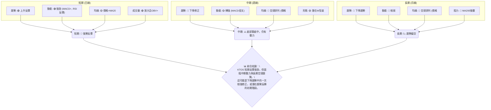

**解讀**：
KTOS 的多時框架分析顯示出明顯的**短期多頭反彈與中長期空頭趨勢之間的矛盾**。
- **短期**：所有指標（價格相對於 MA20、MACD、RSI、成交量）均發出強勁的買入訊號，表明在過去一週內，市場對 KTOS 的買盤情緒高漲，形成了一次有力的技術性反彈。
- **中期**：儘管 MACD 顯示動能轉強，且潛在的 W 型底形態正在形成，但股價仍未突破中期均線（MA50），且中長期均線仍處於空頭排列。這表明中期壓力仍然存在，反彈能否演變成反轉仍需觀察。
- **長期**：長期趨勢毫無疑問地處於下降通道，MA200 構成強大阻力。在缺乏基本面重大利好支撐的情況下，長期趨勢逆轉的難度較大。

**綜合結論**：KTOS 當前正處於一個關鍵的轉折點。短期內，強勁的反彈動能提供了交易機會。然而，投資者必須意識到這是在一個長期下降趨勢中的反彈。成功的關鍵在於能否突破中期關鍵阻力位（如 MA50 和 W 型底頸線 $64.13），並最終改變中長期均線的排列。在這些阻力被突破之前，應將此次反彈視為一次修正或築底過程，而非全面趨勢反轉。

---

## 8. 交易策略建議

基於上述詳盡的技術分析，本章將提供具體的交易策略建議，包含多頭和空頭兩種情境，並明確進場、止損和目標價位。

### 🗺️ 策略決策流程圖

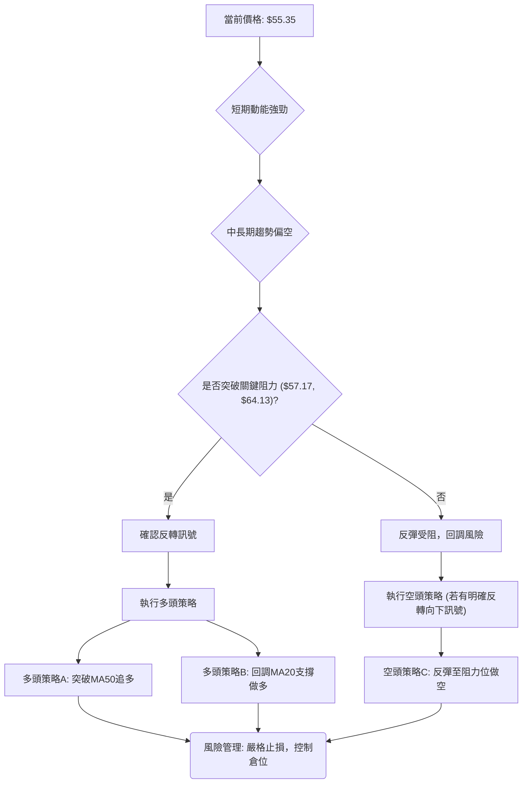

### 🟢 多頭策略詳情

鑑於 KTOS 短期動能強勁且有底部反轉跡象，我們提供兩種多頭策略。

| 策略要素 | 策略 A：突破 MA50 追多 | 策略 B：回調 MA20 支撐做多 |
|----------|------------------------|--------------------------|
| **進場條件** | 價格帶量突破 $57.17 (MA50) 並站穩。 | 價格回調至 $53.97 (MA20) 附近，並出現止跌反彈 K 線訊號。 |
| **進場價格** | $57.50 (確認突破後) | $54.00 (回調至MA20附近) |
| **目標價 T1** | $64.13 (W型底頸線/前期高點) | $57.17 (MA50阻力) |
| **目標價 T2** | $68.52 (斐波那契38.2%回調位) | $64.13 (W型底頸線/前期高點) |
| **止損價格** | $52.38 (1.5x ATR below entry) | $48.88 (1.5x ATR below entry) |
| **風險報酬比** | (T1-Entry)/(Entry-Stop): ($64.13 - $57.50)/($57.50 - $52.38) = $6.63/$5.12 = **1.29:1**<br>(T2-Entry)/(Entry-Stop): ($68.52 - $57.50)/($57.50 - $52.38) = $11.02/$5.12 = **2.15:1** | (T1-Entry)/(Entry-Stop): ($57.17 - $54.00)/($54.00 - $48.88) = $3.17/$5.12 = **0.62:1**<br>(T2-Entry)/(Entry-Stop): ($64.13 - $54.00)/($54.00 - $48.88) = $10.13/$5.12 = **1.98:1** |
| **成功機率** | 中等，需量能配合突破 MA50 | 中等，需 MA20 有效支撐 |
| **建議倉位** | 5% - 10% | 5% - 10% |

**解讀**：
- **策略 A** 旨在捕捉股價突破中期阻力後的加速上漲機會，風險報酬比在達到 T2 時較為理想。
- **策略 B** 旨在利用短期均線支撐進行低位佈局，但達到 T1 的風險報酬比不佳，需以 T2 為主要目標。此策略更適合激進型投資者，若 MA20 支撐失效，應果斷止損。

### 🔴 空頭策略詳情

考慮到 KTOS 的中長期趨勢仍偏空，且上方阻力重重，反彈受阻時可考慮空頭策略。

| 策略要素 | 策略 C：反彈至阻力位做空 |
|----------|------------------------|
| **進場條件** | 價格反彈至 $64.13 (W型底頸線/R1) 或 $68.52 (Fib 38.2%回調位) 附近，出現明確的看跌反轉 K 線形態或未能突破阻力。 |
| **進場價格** | $64.00 (接近W型底頸線) |
| **目標價 T1** | $57.17 (MA50) |
| **目標價 T2** | $53.97 (MA20) |
| **止損價格** | $65.50 (略高於頸線 $64.13) |
| **風險報酬比** | (Entry-T1)/(Stop-Entry): ($64.00 - $57.17)/($65.50 - $64.00) = $6.83/$1.50 = **4.55:1**<br>(Entry-T2)/(Stop-Entry): ($64.00 - $53.97)/($65.50 - $64.00) = $10.03/$1.50 = **6.69:1** |
| **成功機率** | 中等，需觀察阻力位反應 |
| **建議倉位** | 5% - 10% |

**解讀**：
- **策略 C** 旨在利用中長期下降趨勢中的阻力位進行反向操作。此策略的風險報酬比極佳，但前提是股價必須能成功反彈至目標阻力位，且在該處形成有效的反轉訊號。若反彈力度超出預期並突破阻力，應立即止損。

### ⭐ 整體訊號強度評星

綜合所有技術分析和策略建議，對 KTOS 的整體交易訊號進行評星。

```
做多訊號強度：★★★☆☆  (3/5星)
  - 短期動能強勁，MACD金叉，RSI反彈，量價配合良好。
  - 但中長期趨勢仍偏空，上方阻力重重，反彈可能受限。

做空訊號強度：★★☆☆☆  (2/5星)
  - 長期趨勢偏空，但短期內出現強勁反彈，目前不宜過早做空。
  - 需等待股價反彈至關鍵阻力位並確認受阻後，方可考慮。

整體可信度：  ★★★☆☆  (3/5星)
  - 當前市場處於多空拉鋸的關鍵時刻，機會與風險並存。
  - 短期反彈機會明顯，但趨勢反轉仍需更多確認。
```

---

## 9. 風險提示與監控

任何交易策略都伴隨著風險，本章將強調 KTOS 交易中潛在的風險因素，並提供關鍵監控指標和風險管理建議。

### ✅ 關鍵監控指標 Checklist

以下是交易 KTOS 時應密切關注的關鍵技術指標清單。

╔═══════════════════════════════════════════════════════════════════╗
║                  KTOS 關鍵監控指標 Checklist                        ║
╠═══════════════════════════════════════════════════════════════════╣
║ ├─ 價格行為：是否成功站穩 $53.97 (MA20)？                         ║
║ ├─ 阻力突破：能否帶量突破 $57.17 (MA50) 和 $64.13 (W型底頸線)？    ║
║ ├─ 動能指標：MACD 金叉是否持續？RSI 能否突破 50-70 強勢區？        ║
║ ├─ 成交量：反彈是否持續放量？回調是否縮量？                          ║
║ ├─ 布林通道：價格是否能沿上軌運行？通道是否擴張？                  ║
║ ├─ ADX 指標：ADX 能否突破 25，確認新趨勢形成？+DI 是否持續領先？    ║
║ ├─ 形態確認：W 型底頸線 $64.13 是否被有效突破？                    ║
║ ├─ 52週低點： $41.87 是否受到威脅？                                ║
╚═══════════════════════════════════════════════════════════════════╝

### ⚠️ 風險場景分析

以下 Mermaid 圖表展示了 KTOS 股價未來可能的三種情境分析。

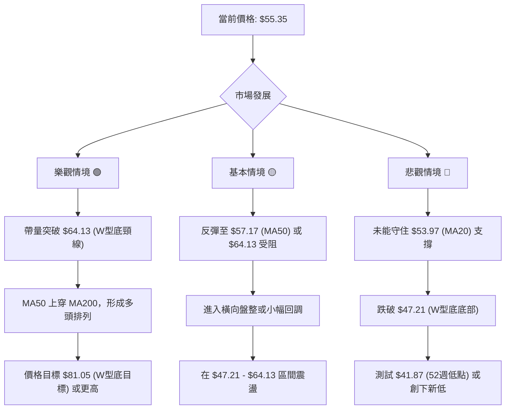

**解讀**：
- **樂觀情境 (🟢)**：如果短期反彈動能持續強勁，並成功帶量突破 W 型底的頸線 $64.13，這將確認底部反轉形態。隨後股價有望挑戰斐波那契回調位 $68.52、$75.11，甚至達到 W 型底的形態目標 $81.05。此情境下，中期均線也有望逐漸向上翻轉，改變空頭排列。
- **基本情境 (🟡)**：股價反彈至 MA50 ($57.17) 或 W 型底頸線 $64.13 附近後，由於中長期壓力較大，可能遭遇阻力而回落，進入一段時間的橫向盤整。股價可能在 $47.21 至 $64.13 之間震盪，等待新的催化劑或市場方向。
- **悲觀情境 (🔴)**：如果當前的反彈只是下降趨勢中的一次修正，未能突破關鍵阻力，甚至未能守住 MA20 ($53.97) 或 $49.86 的近期支撐，則可能再次向下探底。一旦跌破 $47.21 的 W 型底底部，則預示著形態失敗，股價將可能測試 52 週低點 $41.87，甚至創下新低。

### 🛡️ 風險管理重要提醒

- **止損紀律**：無論採取何種策略，**嚴格執行止損**是風險管理的首要原則。根據 ATR 指標合理設置止損位，並在觸發時果斷出場，避免情緒化交易。
- **倉位管理**：控制單一股票的倉位，尤其對於波動性較高的 KTOS。建議將倉位控制在總資金的 5%-10%，以避免單一股票的劇烈波動對整體投資組合造成過大影響。
- **動態調整**：市場狀況瞬息萬變，應根據最新的價格行為、成交量變化和指標訊號，**動態調整交易策略**。例如，若反彈動能減弱或出現明確的看跌訊號，應及時減倉或平倉。
- **關注基本面**：雖然本報告側重技術分析，但長期而言，基本面是股價的決定性因素。應持續關注 KTOS 的公司財報、行業新聞和分析師評級，以獲取更全面的視角。
- **警惕假突破**：在關鍵阻力位（如 $57.17, $64.13）附近，要警惕**假突破**的可能性。突破後應觀察是否有足夠的成交量配合，以及能否有效站穩，避免追高被套。

---

## 📋 報告總結

```
KTOS 技術分析報告總結
════════════════════════════════════════════════════════════════════════════
報告日期：2026-07-04
當前價格：$55.35
分析評級：⚖️ 中性偏多 (短期反彈強勁，但中長期趨勢壓力仍大，處於築底階段)

關鍵結論：
├─ 長期趨勢：🔴 下降趨勢，股價遠低於MA200，空頭排列。
├─ 中期趨勢：🟡 下降修正中，MA50/MA200空頭排列，但MACD金叉，RSI反彈。
├─ 短期趨勢：🟢 強勁反彈，股價站上MA20，MACD金叉，量價齊升。
├─ 關鍵支撐：$53.97 (MA20), $47.21 (W型底底部), $41.87 (52週低點)。
├─ 關鍵阻力：$57.17 (MA50), $60.38 (Fib 23.6%), $64.13 (W型底頸線)。
└─ 分析師目標：均值 $109.86，低點 $60.00，高點 $150.00 (技術分析目標 $81.05)。

最優策略組合：
1. 🥇 最佳機會：**突破 MA50 追多**。若股價帶量突破 $57.17，可考慮在 $57.50 進場，目標 $64.13/$68.52，止損 $52.38。
2. 🥈 次選機會：**回調 MA20 支撐做多**。若股價回調至 $53.97 附近止跌，可考慮在 $54.00 進場，目標 $57.17/$64.13，止損 $48.88。
3. 🥉 保守選擇：**觀望，等待 W 型底確認**。等待股價帶量突破 $64.13 (W型底頸線) 並站穩，確認趨勢反轉後再進場，目標 $81.05。
════════════════════════════════════════════════════════════════════════════
```

---

> ⚠️ **免責聲明**：本報告為 AI 自動生成之技術分析，所有數據及估算均基於提供的歷史價格資訊。本報告**僅供研究與學術參考**，**不構成任何投資建議**。投資有風險，入市需謹慎。

---

*報告生成時間：2026-07-04 ｜ 數據來源：提供的技術數據 ｜ 分析框架：多時框技術分析*