<details>
<summary>📊 靜態圖表 (點擊展開)</summary>

</details>

<html>
<head><meta charset="utf-8" /></head>
<body>
    <div style="height:500px; width:100%;">                        <script>window.PlotlyConfig = {MathJaxConfig: 'local'};</script>
        <script charset="utf-8" src="https://cdn.plot.ly/plotly-3.6.0.min.js" integrity="sha256-QaOVwtVY0T02VaHrr6pnoHLCwayMJp4O5n4YyaE3rJk=" crossorigin="anonymous"></script>                <div id="candlestick-chart" class="plotly-graph-div" style="height:100%; width:100%;"></div>            <script>                window.PLOTLYENV=window.PLOTLYENV || {};                                if (document.getElementById("candlestick-chart")) {                    Plotly.newPlot(                        "candlestick-chart",                        [{"close":{"dtype":"f8","bdata":"AAAAYGYWU0AAAAAgXO9SQAAAAKCZKVRAAAAAoEcxVEAAAACAFC5UQAAAAKCZ+VRAAAAAIIVLVEAAAADAzAxVQAAAAIDrkVVAAAAAwB4FVkAAAAAgrtdWQAAAAKBwPVdAAAAAgOvBV0AAAAAAKQxYQAAAAAAAEFlAAAAAACnsWUAAAABA4WpaQAAAAEAzo1hAAAAA4FGoV0AAAACA6xFYQAAAAEAz01dAAAAAwB6lVkAAAAAgridWQAAAACCux1RAAAAAoJmpVUAAAAAgrqdWQAAAAEAzE1VAAAAA4HpUVkAAAAAghctWQAAAACCFq1ZAAAAAgOtxVkAAAACgcM1WQAAAAEAzE1ZAAAAAYGamVkAAAABgZsZWQAAAAIAUjlZAAAAAgD1aU0AAAACAPRpSQAAAAOBReFNAAAAAIIXLU0AAAACAwiVTQAAAAMDMLFNAAAAAACnsUUAAAADAzBxSQAAAACBcj1FAAAAAQAqXUUAAAABA4apRQAAAAADX01BAAAAAwPVIUUAAAABACodSQAAAAEAzw1JAAAAAoEfxUkAAAABgZgZTQAAAAKBwTVJAAAAAoHC9UUAAAACA6zFSQAAAACCFa1NAAAAAAAAgU0AAAACA60FTQAAAAIDrQVNAAAAAgD06U0AAAACA67FTQAAAAKBw\u002fVJAAAAA4KOQUkAAAADgUUhSQAAAAKBHcVFAAAAAoJnZUUAAAADA9dhSQAAAAIDrYVRAAAAAQDOTVEAAAACAFP5TQAAAAMDMbFNAAAAAgBReU0AAAABguP5SQAAAAIA9+lJAAAAAYI\u002fSU0AAAAAghXtWQAAAACCF+1ZAAAAAACncVkAAAABgjwJaQAAAAMDMbFxAAAAAQAp3XUAAAACAFO5dQAAAAAAAYF5AAAAAANcjX0AAAABACldgQAAAAIDCFWBAAAAAgMIlXkAAAABgZnZcQAAAAMD1mFtAAAAA4HrUW0AAAAAA14NdQAAAAEDhKlxAAAAAgD0KW0AAAADgo8BZQAAAAIA9ClhAAAAAIK7XWUAAAADAHtVWQAAAAAAAUFVAAAAAgD2aV0AAAAAA17NYQAAAAGC4XldAAAAAgOvxVUAAAABAM8NVQAAAAADXQ1ZAAAAAgBT+VkAAAACgcE1YQAAAAEDhalpAAAAAwB4FWEAAAAAA15NXQAAAACCFq1ZAAAAAYLgOVkAAAADA9QhXQAAAACCFi1VAAAAAgBSuVkAAAADAzDxWQAAAAOBRSFZAAAAAYI9iVUAAAAAAAMBVQAAAAIAUHldAAAAAoHA9VkAAAABA4TpWQAAAAKBwXVZAAAAAgOvhVUAAAACA62FWQAAAAADX01dAAAAAYI9CV0AAAACA6zFXQAAAACCuJ1VAAAAAACnsVEAAAAAgXF9TQAAAAGC4\u002flNAAAAAQAr3UkAAAAAAKfxRQAAAAIDrUVBAAAAA4KOgUUAAAADAzOxQQAAAAADX01BAAAAAgMKFUkAAAACgcP1RQAAAAKBwnVJAAAAAwB4VUUAAAACAwpVRQAAAAEAzY1JAAAAAgD1qUkAAAACAPapSQAAAAIA9mlJAAAAAIFy\u002fUUAAAADAHnVRQAAAAEAzI1FAAAAAQAonUUAAAACgR2FQQAAAAKBHoU5AAAAA4HqUT0AAAADgetROQAAAACCux01AAAAAYGaGT0AAAABgZgZPQAAAAEAK905AAAAAIK6nTUAAAABgj8JOQAAAAAAAgExAAAAAgOvxTEAAAABguH5MQAAAAIA9qkxAAAAAYLg+SkAAAADAzGxLQAAAACCFC0pAAAAAACkcS0AAAAAAKbxKQAAAAMD16EtAAAAAgMJVS0AAAABAChdMQAAAAGBmZkxAAAAAYGamTEAAAAAAKUxQQAAAAOBRCFBAAAAAYLi+T0AAAABgj6JPQAAAAEAKN01AAAAAQDOzT0AAAABgj0JNQAAAAKBw3UxAAAAA4FEYTEAAAADA9WhLQAAAAADXY01AAAAAAADgTEAAAABgj4JMQAAAACCFK0xAAAAA4HoUTEAAAABA4RpLQAAAACCFi0lAAAAAYGZmSUAAAACgmflHQAAAAMD1KEdAAAAAQOGaR0AAAACgmXlHQAAAAIAU7khAAAAAwB6FSkAAAADAzKxLQA=="},"high":{"dtype":"f8","bdata":"AAAAIK4nU0AAAACA60FTQAAAAAApXFRAAAAAANeTVEAAAADgUahUQAAAAGC4XlVAAAAAAABAVUAAAADgUThVQAAAAIDCtVVAAAAAQOFqVkAAAAAgrvdWQAAAAKBHYVdAAAAAoJkZWEAAAAAgrodYQAAAAAAAwFlAAAAAoHAtWkAAAAAA15NaQAAAAOB6JFxAAAAAoJmpWUAAAAAAAGBZQAAAAGBmRlhAAAAAIFyfWEAAAACAwiVXQAAAAKBHoVVAAAAAgBQuVkAAAABAM7NWQAAAAAAAgFZAAAAAwMx8VkAAAAAghTtXQAAAAGBmpldAAAAAwMwcV0AAAAAgrndXQAAAAAAAwFZAAAAAoJkJV0AAAACAFO5WQAAAAIDC5VZAAAAAAACgVEAAAACAFN5TQAAAAGBmllNAAAAAAACAVEAAAAAgXL9TQAAAAEDhilNAAAAAoJn5UkAAAACgR3FSQAAAAMDMPFJAAAAAAADQUUAAAAAghQtSQAAAAGC4nlJAAAAAgMJVUUAAAAAAKZxSQAAAACCFC1NAAAAAQOFKU0AAAAAgXB9TQAAAAGBmJlNAAAAAYGamUkAAAAAAAEBSQAAAAOB6lFNAAAAA4FGIU0AAAADgeoRTQAAAAIA96lNAAAAAoHCdU0AAAACAFN5TQAAAAKCZ2VNAAAAAQOEaU0AAAADgUahSQAAAACBcj1JAAAAAgD0aUkAAAABgj\u002fJSQAAAACCud1RAAAAAgD3aVEAAAAAAKXxUQAAAAIA9+lNAAAAAgBSOU0AAAAAAKYxTQAAAAIAUPlNAAAAAYLjuU0AAAABACodWQAAAAIDrAVdAAAAA4HrUV0AAAABAM3NbQAAAAMDM3FxAAAAA4FHoXUAAAADgemReQAAAAKBw\u002fV5AAAAAANeTX0AAAAAAAIBgQAAAAAAAwGBAAAAAAAAAYEAAAABAM1NeQAAAAIDr4VxAAAAAQOFqXEAAAADA9YhdQAAAAAAAAF5AAAAAwMzMXEAAAAAAADBbQAAAAMD1SFlAAAAAIFzfWUAAAAAAAMBZQAAAAGBmJldAAAAAQOGqV0AAAACA6\u002fFYQAAAAAAA4FhAAAAAQDMjWEAAAACAwmVWQAAAACBcD1dAAAAAYGZWV0AAAAAAACBZQAAAAIA9elpAAAAAQOGqWkAAAADAHsVXQAAAACBc71ZAAAAAgOtRV0AAAAAAKRxXQAAAAKCZmVVAAAAAYGZGWEAAAACAFE5XQAAAAGBmhlZAAAAAIFxfVkAAAADgUbhWQAAAAEDhaldAAAAAQDMTV0AAAABguL5WQAAAACCu11ZAAAAAoJn5VkAAAABAM\u002fNWQAAAAGBm1ldAAAAA4FE4WEAAAAAAAKBXQAAAAAAAAFdAAAAAANeTVUAAAACgR8FUQAAAAAApPFRAAAAAgOvhU0AAAADgURhTQAAAAKCZ+VFAAAAAgBS+UUAAAABAMzNSQAAAAOCjYFFAAAAAgD2aUkAAAACgmTlSQAAAAAAp3FNAAAAAAACgUkAAAACA66FRQAAAAGBmhlJAAAAA4HokU0AAAABgjxJTQAAAAIAUTlNAAAAAwPU4U0AAAACgcO1RQAAAAKCZuVFAAAAAYLi+UUAAAAAgXC9RQAAAAOCjcFBAAAAAIIUbUEAAAACgmVlPQAAAAKBH4U5AAAAAQAqXT0AAAAAAAMBPQAAAAOBRCFBAAAAAwB5lT0AAAABguN5OQAAAAMAexU5AAAAA4FH4TEAAAABA4dpMQAAAAOCjUE1AAAAAAABATEAAAAAAKfxLQAAAAEAz80pAAAAAAClcS0AAAAAghUtLQAAAAOCj8EtAAAAAANeDS0AAAAAAAGBMQAAAAGBmpk1AAAAAgBSuTEAAAADAHrVQQAAAAAAAsFBAAAAAwMyMUEAAAABAM9NPQAAAAMDM7E5AAAAAIIXLT0AAAADAzAxPQAAAAAAA4E1AAAAAYGamTUAAAABgZmZMQAAAAIDrcU1AAAAAoJnZTkAAAAAAAMBNQAAAAIDrsUxAAAAAQDMzTUAAAAAAAGBMQAAAAEAzE0tAAAAAIIUrSkAAAADAHmVJQAAAAADX40dAAAAA4FGYSEAAAACA63FIQAAAAAApvElAAAAA4KMQS0AAAADgo3BNQA=="},"hovertemplate":"\u003cb\u003e%{x|%Y-%m-%d}\u003c\u002fb\u003e\u003cbr\u003e\u958b: $%{open:.2f}\u003cbr\u003e\u9ad8: $%{high:.2f}\u003cbr\u003e\u4f4e: $%{low:.2f}\u003cbr\u003e\u6536: $%{close:.2f}\u003cextra\u003e\u003c\u002fextra\u003e","low":{"dtype":"f8","bdata":"AAAAwB61UUAAAABACkdSQAAAAKBHwVJAAAAAoJn5U0AAAABAM9NTQAAAAGBmRlRAAAAAYGY2VEAAAAAgrrdTQAAAACCFG1VAAAAAQDPzVUAAAABgZgZWQAAAAOBRKFZAAAAAgOshV0AAAABACndXQAAAAKBHgVhAAAAAAAAAWUAAAACgmXlZQAAAAEAzM1hAAAAAoJk5V0AAAABA4apXQAAAAGCPslZAAAAAgD1KVkAAAAAgXB9WQAAAAKBwbVRAAAAAwMxMVUAAAADAzExVQAAAAADXM1RAAAAAIK43VUAAAAAghUtWQAAAAOCjEFZAAAAAAClsVkAAAACgcH1WQAAAAGCPAlZAAAAAgD36VUAAAADAzPxVQAAAAOB6tFVAAAAAYGb2UkAAAACgR5FRQAAAAKCZKVFAAAAAQDNDU0AAAADA9fhSQAAAAAAA4FJAAAAAANfTUUAAAAAAAEBRQAAAAGBmNlFAAAAAgOvxUEAAAABAM1NRQAAAAIA9ulBAAAAAQDMzUEAAAADA9UhRQAAAAKCZKVJAAAAAANfTUkAAAADgo8BSQAAAACCFO1JAAAAAIK63UUAAAAAghWtRQAAAAIDrEVJAAAAA4KOwUkAAAACgmclSQAAAAADXA1NAAAAAwMxMUkAAAABAM7NSQAAAAMDMzFJAAAAAYGZGUkAAAABA4RpSQAAAAADXU1FAAAAAwPWIUUAAAABguM5RQAAAAADXM1NAAAAAYGb2U0AAAACA69FTQAAAAGBmBlNAAAAAoJkJU0AAAABAM\u002fNSQAAAAOBRuFJAAAAAwB6VUkAAAADgUYhUQAAAAMDMrFVAAAAA4KOgVkAAAACgR7FYQAAAAKCZKVpAAAAAAACgXEAAAADAzExdQAAAAAAAgFxAAAAAoEdRXUAAAAAAAEBfQAAAAAAAwF9AAAAAgOuRXEAAAABguM5bQAAAAEAKF1tAAAAAoEexWkAAAAAA18NbQAAAAOCjUFtAAAAAgMKFWkAAAADgUWhZQAAAAKBHsVdAAAAAoJlJWEAAAABA4bpVQAAAAAAAIFVAAAAAAAAAVkAAAADAzExXQAAAAKBwTVdAAAAAoEdBVUAAAAAAAFBVQAAAAKBHwVVAAAAA4HrEVUAAAADAzDxXQAAAAGC4PlhAAAAAIIXbV0AAAAAAAMBWQAAAAGCPAlVAAAAAoHANVkAAAADA9ahVQAAAAAAAAFVAAAAAwB5VVUAAAABgZqZVQAAAAAAAcFVAAAAAoJmZVEAAAAAAAGBUQAAAAMDMzFVAAAAAwPUoVkAAAAAgrqdVQAAAAMD1WFVAAAAAwMzMVUAAAACgmblVQAAAACBcj1ZAAAAAgD0qV0AAAADA9ehVQAAAAGBmxlRAAAAA4HqEVEAAAACgR+FSQAAAAADXU1NAAAAAoJnJUkAAAADAzOxRQAAAACCuF1BAAAAAQDNjUEAAAABgZuZQQAAAACCF609AAAAAwMyMUUAAAABAM3NRQAAAAEAzI1JAAAAAgOsRUUAAAAAghdtQQAAAAEAKZ1FAAAAAoEchUkAAAAAAAFBSQAAAAOCjQFJAAAAAgD2aUUAAAABACjdRQAAAAOB69FBAAAAAwPXoUEAAAADAHuVPQAAAAKBHgU5AAAAA4FGYTkAAAAAAKRxOQAAAACCuh01AAAAAgOvRTUAAAACgmXlOQAAAAKBH4U5AAAAAoEcBTUAAAABACjdNQAAAAMAeJUxAAAAAoHDdS0AAAACgR4FLQAAAAIAUjktAAAAAIIXrSUAAAABguD5KQAAAAOB61ElAAAAAgD0KSkAAAAAA12NKQAAAAEAzU0pAAAAAIK7nSkAAAABA4TpLQAAAAEAz80tAAAAAAACAS0AAAAAAAIBOQAAAAIA9Ck5AAAAAQDOTTkAAAABACtdOQAAAAEAz80xAAAAA4FH4TEAAAAAAAMBMQAAAACBcr0xAAAAAIK6nSkAAAAAAACBLQAAAAMD1CEtAAAAA4Hp0TEAAAABACldMQAAAAKBHgUtAAAAAwMzMS0AAAADgUXhKQAAAAEAKV0lAAAAAIK4HSUAAAAAA1+NHQAAAAKBHAUdAAAAAwB4FR0AAAACAwjVHQAAAAIDCVUhAAAAAYLjeSEAAAACAPQpLQA=="},"name":"\u50f9\u683c","open":{"dtype":"f8","bdata":"AAAAANfDUUAAAADgo8BSQAAAAKCZKVNAAAAAoEdhVEAAAABACidUQAAAAGBmRlRAAAAAIK4XVUAAAAAAAABUQAAAAAAAQFVAAAAAwMw8VkAAAADA9RhWQAAAAAAAoFZAAAAAAADAV0AAAAAAKexXQAAAAGBmllhAAAAAoJlJWUAAAADgesRZQAAAAMD16FpAAAAAwMysV0AAAACAFF5YQAAAAIAUbldAAAAAwMx8WEAAAAAgXP9WQAAAAEDhOlVAAAAAgOvRVUAAAABACsdVQAAAAAAAgFZAAAAAwMxMVUAAAADgUQhXQAAAAOB6RFdAAAAA4HrEVkAAAAAAAIBWQAAAAAAAgFZAAAAAAABgVkAAAADAHrVWQAAAAGC4DlZAAAAAIK6XVEAAAADAzHxTQAAAAEAzk1FAAAAAIIVbVEAAAABguG5TQAAAAIDrMVNAAAAAACm8UkAAAACAPUpRQAAAAIDCBVJAAAAAIFwvUUAAAADAHmVRQAAAAGC4nlJAAAAAANezUEAAAABA4VpRQAAAAIA9ilJAAAAAQDPzUkAAAABguA5TQAAAAGBmJlNAAAAAIK6HUkAAAADgo8BRQAAAAKBHIVJAAAAAAClsU0AAAACAwmVTQAAAAOB6JFNAAAAAAAAAU0AAAAAgXC9TQAAAACCFu1NAAAAAoEcRU0AAAAAAAEBSQAAAAOBRSFJAAAAAACm8UUAAAACA6+FRQAAAAAAAQFNAAAAAgBQeVEAAAABACkdUQAAAAIA9+lNAAAAAoHA9U0AAAAAAKYxTQAAAAEAzM1NAAAAAQDMjU0AAAACAPTpVQAAAAMD1eFZAAAAA4FEoV0AAAACA6+FYQAAAAGC4XlpAAAAAYGY2XUAAAACAPbpdQAAAAAAAoF1AAAAAwPX4XUAAAACgcG1fQAAAACCFA2BAAAAAYI\u002fiX0AAAADgo0BeQAAAAMAedVxAAAAAwMwsW0AAAAAA18NbQAAAAAAAAF5AAAAA4FG4XEAAAADgenRaQAAAAIA9+lhAAAAAYGamWEAAAACgcF1ZQAAAAIAUHlZAAAAAYGZGVkAAAABgZqZXQAAAAOB6tFhAAAAAgD36V0AAAACgmRlWQAAAACBcz1VAAAAAwB4FVkAAAADA9UhXQAAAAKBwbVhAAAAAAClsWkAAAACgR1FXQAAAAAAAMFZAAAAAACk8V0AAAAAAKfxVQAAAAEAzU1VAAAAAQOEaV0AAAACgcE1WQAAAAOCjIFZAAAAAYGY2VkAAAADgUdhUQAAAAEAK91VAAAAAACncVkAAAACA68FVQAAAAAApPFZAAAAAAACAVkAAAACAwjVWQAAAAEAKt1ZAAAAAgD2aV0AAAADgo6BWQAAAAMDM3FZAAAAAgML1VEAAAABA4apUQAAAAGCP8lNAAAAA4FGYU0AAAABACrdSQAAAAOCj8FFAAAAAoJm5UEAAAADA9ShSQAAAAIDrUVBAAAAA4FHIUUAAAAAAABBSQAAAAOBR2FNAAAAAwMyMUkAAAACgRwFRQAAAAGBmhlFAAAAAgD2qUkAAAAAAKexSQAAAAADXE1NAAAAAIIXbUkAAAABgj4JRQAAAAOCjkFFAAAAAIK6HUUAAAADAzBxRQAAAAOCjcFBAAAAA4FGYTkAAAADgUfhOQAAAAGC43k5AAAAAwB4lTkAAAADgerRPQAAAAAApPE9AAAAA4FFYT0AAAACAPYpNQAAAAMAexU5AAAAAgD2KTEAAAAAgXG9MQAAAACCFq0xAAAAA4Ho0TEAAAACgR2FKQAAAAGC4vkpAAAAAoEchSkAAAABguB5LQAAAAKCZ+UpAAAAAAACAS0AAAADAHqVLQAAAAOB61ExAAAAAoHB9TEAAAABA4fpPQAAAAIA9qlBAAAAAACk8UEAAAADA9chPQAAAACBcz05AAAAAgBQuTUAAAACA69FOQAAAAAAp3E1AAAAAIK4HTUAAAADAzMxLQAAAAMD1aEtAAAAAYLi+TkAAAADgUZhNQAAAAIAUTkxAAAAA4KPQS0AAAAAAKRxMQAAAAGCP4kpAAAAAIK4HSUAAAABAChdJQAAAAEAzs0dAAAAAwB4FR0AAAADAzCxIQAAAAIAUDklAAAAAwB4lSUAAAACA67FLQA=="},"x":["2025-09-16T00:00:00-04:00","2025-09-17T00:00:00-04:00","2025-09-18T00:00:00-04:00","2025-09-19T00:00:00-04:00","2025-09-22T00:00:00-04:00","2025-09-23T00:00:00-04:00","2025-09-24T00:00:00-04:00","2025-09-25T00:00:00-04:00","2025-09-26T00:00:00-04:00","2025-09-29T00:00:00-04:00","2025-09-30T00:00:00-04:00","2025-10-01T00:00:00-04:00","2025-10-02T00:00:00-04:00","2025-10-03T00:00:00-04:00","2025-10-06T00:00:00-04:00","2025-10-07T00:00:00-04:00","2025-10-08T00:00:00-04:00","2025-10-09T00:00:00-04:00","2025-10-10T00:00:00-04:00","2025-10-13T00:00:00-04:00","2025-10-14T00:00:00-04:00","2025-10-15T00:00:00-04:00","2025-10-16T00:00:00-04:00","2025-10-17T00:00:00-04:00","2025-10-20T00:00:00-04:00","2025-10-21T00:00:00-04:00","2025-10-22T00:00:00-04:00","2025-10-23T00:00:00-04:00","2025-10-24T00:00:00-04:00","2025-10-27T00:00:00-04:00","2025-10-28T00:00:00-04:00","2025-10-29T00:00:00-04:00","2025-10-30T00:00:00-04:00","2025-10-31T00:00:00-04:00","2025-11-03T00:00:00-05:00","2025-11-04T00:00:00-05:00","2025-11-05T00:00:00-05:00","2025-11-06T00:00:00-05:00","2025-11-07T00:00:00-05:00","2025-11-10T00:00:00-05:00","2025-11-11T00:00:00-05:00","2025-11-12T00:00:00-05:00","2025-11-13T00:00:00-05:00","2025-11-14T00:00:00-05:00","2025-11-17T00:00:00-05:00","2025-11-18T00:00:00-05:00","2025-11-19T00:00:00-05:00","2025-11-20T00:00:00-05:00","2025-11-21T00:00:00-05:00","2025-11-24T00:00:00-05:00","2025-11-25T00:00:00-05:00","2025-11-26T00:00:00-05:00","2025-11-28T00:00:00-05:00","2025-12-01T00:00:00-05:00","2025-12-02T00:00:00-05:00","2025-12-03T00:00:00-05:00","2025-12-04T00:00:00-05:00","2025-12-05T00:00:00-05:00","2025-12-08T00:00:00-05:00","2025-12-09T00:00:00-05:00","2025-12-10T00:00:00-05:00","2025-12-11T00:00:00-05:00","2025-12-12T00:00:00-05:00","2025-12-15T00:00:00-05:00","2025-12-16T00:00:00-05:00","2025-12-17T00:00:00-05:00","2025-12-18T00:00:00-05:00","2025-12-19T00:00:00-05:00","2025-12-22T00:00:00-05:00","2025-12-23T00:00:00-05:00","2025-12-24T00:00:00-05:00","2025-12-26T00:00:00-05:00","2025-12-29T00:00:00-05:00","2025-12-30T00:00:00-05:00","2025-12-31T00:00:00-05:00","2026-01-02T00:00:00-05:00","2026-01-05T00:00:00-05:00","2026-01-06T00:00:00-05:00","2026-01-07T00:00:00-05:00","2026-01-08T00:00:00-05:00","2026-01-09T00:00:00-05:00","2026-01-12T00:00:00-05:00","2026-01-13T00:00:00-05:00","2026-01-14T00:00:00-05:00","2026-01-15T00:00:00-05:00","2026-01-16T00:00:00-05:00","2026-01-20T00:00:00-05:00","2026-01-21T00:00:00-05:00","2026-01-22T00:00:00-05:00","2026-01-23T00:00:00-05:00","2026-01-26T00:00:00-05:00","2026-01-27T00:00:00-05:00","2026-01-28T00:00:00-05:00","2026-01-29T00:00:00-05:00","2026-01-30T00:00:00-05:00","2026-02-02T00:00:00-05:00","2026-02-03T00:00:00-05:00","2026-02-04T00:00:00-05:00","2026-02-05T00:00:00-05:00","2026-02-06T00:00:00-05:00","2026-02-09T00:00:00-05:00","2026-02-10T00:00:00-05:00","2026-02-11T00:00:00-05:00","2026-02-12T00:00:00-05:00","2026-02-13T00:00:00-05:00","2026-02-17T00:00:00-05:00","2026-02-18T00:00:00-05:00","2026-02-19T00:00:00-05:00","2026-02-20T00:00:00-05:00","2026-02-23T00:00:00-05:00","2026-02-24T00:00:00-05:00","2026-02-25T00:00:00-05:00","2026-02-26T00:00:00-05:00","2026-02-27T00:00:00-05:00","2026-03-02T00:00:00-05:00","2026-03-03T00:00:00-05:00","2026-03-04T00:00:00-05:00","2026-03-05T00:00:00-05:00","2026-03-06T00:00:00-05:00","2026-03-09T00:00:00-04:00","2026-03-10T00:00:00-04:00","2026-03-11T00:00:00-04:00","2026-03-12T00:00:00-04:00","2026-03-13T00:00:00-04:00","2026-03-16T00:00:00-04:00","2026-03-17T00:00:00-04:00","2026-03-18T00:00:00-04:00","2026-03-19T00:00:00-04:00","2026-03-20T00:00:00-04:00","2026-03-23T00:00:00-04:00","2026-03-24T00:00:00-04:00","2026-03-25T00:00:00-04:00","2026-03-26T00:00:00-04:00","2026-03-27T00:00:00-04:00","2026-03-30T00:00:00-04:00","2026-03-31T00:00:00-04:00","2026-04-01T00:00:00-04:00","2026-04-02T00:00:00-04:00","2026-04-06T00:00:00-04:00","2026-04-07T00:00:00-04:00","2026-04-08T00:00:00-04:00","2026-04-09T00:00:00-04:00","2026-04-10T00:00:00-04:00","2026-04-13T00:00:00-04:00","2026-04-14T00:00:00-04:00","2026-04-15T00:00:00-04:00","2026-04-16T00:00:00-04:00","2026-04-17T00:00:00-04:00","2026-04-20T00:00:00-04:00","2026-04-21T00:00:00-04:00","2026-04-22T00:00:00-04:00","2026-04-23T00:00:00-04:00","2026-04-24T00:00:00-04:00","2026-04-27T00:00:00-04:00","2026-04-28T00:00:00-04:00","2026-04-29T00:00:00-04:00","2026-04-30T00:00:00-04:00","2026-05-01T00:00:00-04:00","2026-05-04T00:00:00-04:00","2026-05-05T00:00:00-04:00","2026-05-06T00:00:00-04:00","2026-05-07T00:00:00-04:00","2026-05-08T00:00:00-04:00","2026-05-11T00:00:00-04:00","2026-05-12T00:00:00-04:00","2026-05-13T00:00:00-04:00","2026-05-14T00:00:00-04:00","2026-05-15T00:00:00-04:00","2026-05-18T00:00:00-04:00","2026-05-19T00:00:00-04:00","2026-05-20T00:00:00-04:00","2026-05-21T00:00:00-04:00","2026-05-22T00:00:00-04:00","2026-05-26T00:00:00-04:00","2026-05-27T00:00:00-04:00","2026-05-28T00:00:00-04:00","2026-05-29T00:00:00-04:00","2026-06-01T00:00:00-04:00","2026-06-02T00:00:00-04:00","2026-06-03T00:00:00-04:00","2026-06-04T00:00:00-04:00","2026-06-05T00:00:00-04:00","2026-06-08T00:00:00-04:00","2026-06-09T00:00:00-04:00","2026-06-10T00:00:00-04:00","2026-06-11T00:00:00-04:00","2026-06-12T00:00:00-04:00","2026-06-15T00:00:00-04:00","2026-06-16T00:00:00-04:00","2026-06-17T00:00:00-04:00","2026-06-18T00:00:00-04:00","2026-06-22T00:00:00-04:00","2026-06-23T00:00:00-04:00","2026-06-24T00:00:00-04:00","2026-06-25T00:00:00-04:00","2026-06-26T00:00:00-04:00","2026-06-29T00:00:00-04:00","2026-06-30T00:00:00-04:00","2026-07-01T00:00:00-04:00","2026-07-02T00:00:00-04:00"],"type":"candlestick"},{"hovertemplate":"MA30: $%{y:.2f}\u003cextra\u003e\u003c\u002fextra\u003e","line":{"color":"#2196F3","dash":"dash","width":2},"mode":"lines","name":"MA30","x":["2025-09-16T00:00:00-04:00","2025-09-17T00:00:00-04:00","2025-09-18T00:00:00-04:00","2025-09-19T00:00:00-04:00","2025-09-22T00:00:00-04:00","2025-09-23T00:00:00-04:00","2025-09-24T00:00:00-04:00","2025-09-25T00:00:00-04:00","2025-09-26T00:00:00-04:00","2025-09-29T00:00:00-04:00","2025-09-30T00:00:00-04:00","2025-10-01T00:00:00-04:00","2025-10-02T00:00:00-04:00","2025-10-03T00:00:00-04:00","2025-10-06T00:00:00-04:00","2025-10-07T00:00:00-04:00","2025-10-08T00:00:00-04:00","2025-10-09T00:00:00-04:00","2025-10-10T00:00:00-04:00","2025-10-13T00:00:00-04:00","2025-10-14T00:00:00-04:00","2025-10-15T00:00:00-04:00","2025-10-16T00:00:00-04:00","2025-10-17T00:00:00-04:00","2025-10-20T00:00:00-04:00","2025-10-21T00:00:00-04:00","2025-10-22T00:00:00-04:00","2025-10-23T00:00:00-04:00","2025-10-24T00:00:00-04:00","2025-10-27T00:00:00-04:00","2025-10-28T00:00:00-04:00","2025-10-29T00:00:00-04:00","2025-10-30T00:00:00-04:00","2025-10-31T00:00:00-04:00","2025-11-03T00:00:00-05:00","2025-11-04T00:00:00-05:00","2025-11-05T00:00:00-05:00","2025-11-06T00:00:00-05:00","2025-11-07T00:00:00-05:00","2025-11-10T00:00:00-05:00","2025-11-11T00:00:00-05:00","2025-11-12T00:00:00-05:00","2025-11-13T00:00:00-05:00","2025-11-14T00:00:00-05:00","2025-11-17T00:00:00-05:00","2025-11-18T00:00:00-05:00","2025-11-19T00:00:00-05:00","2025-11-20T00:00:00-05:00","2025-11-21T00:00:00-05:00","2025-11-24T00:00:00-05:00","2025-11-25T00:00:00-05:00","2025-11-26T00:00:00-05:00","2025-11-28T00:00:00-05:00","2025-12-01T00:00:00-05:00","2025-12-02T00:00:00-05:00","2025-12-03T00:00:00-05:00","2025-12-04T00:00:00-05:00","2025-12-05T00:00:00-05:00","2025-12-08T00:00:00-05:00","2025-12-09T00:00:00-05:00","2025-12-10T00:00:00-05:00","2025-12-11T00:00:00-05:00","2025-12-12T00:00:00-05:00","2025-12-15T00:00:00-05:00","2025-12-16T00:00:00-05:00","2025-12-17T00:00:00-05:00","2025-12-18T00:00:00-05:00","2025-12-19T00:00:00-05:00","2025-12-22T00:00:00-05:00","2025-12-23T00:00:00-05:00","2025-12-24T00:00:00-05:00","2025-12-26T00:00:00-05:00","2025-12-29T00:00:00-05:00","2025-12-30T00:00:00-05:00","2025-12-31T00:00:00-05:00","2026-01-02T00:00:00-05:00","2026-01-05T00:00:00-05:00","2026-01-06T00:00:00-05:00","2026-01-07T00:00:00-05:00","2026-01-08T00:00:00-05:00","2026-01-09T00:00:00-05:00","2026-01-12T00:00:00-05:00","2026-01-13T00:00:00-05:00","2026-01-14T00:00:00-05:00","2026-01-15T00:00:00-05:00","2026-01-16T00:00:00-05:00","2026-01-20T00:00:00-05:00","2026-01-21T00:00:00-05:00","2026-01-22T00:00:00-05:00","2026-01-23T00:00:00-05:00","2026-01-26T00:00:00-05:00","2026-01-27T00:00:00-05:00","2026-01-28T00:00:00-05:00","2026-01-29T00:00:00-05:00","2026-01-30T00:00:00-05:00","2026-02-02T00:00:00-05:00","2026-02-03T00:00:00-05:00","2026-02-04T00:00:00-05:00","2026-02-05T00:00:00-05:00","2026-02-06T00:00:00-05:00","2026-02-09T00:00:00-05:00","2026-02-10T00:00:00-05:00","2026-02-11T00:00:00-05:00","2026-02-12T00:00:00-05:00","2026-02-13T00:00:00-05:00","2026-02-17T00:00:00-05:00","2026-02-18T00:00:00-05:00","2026-02-19T00:00:00-05:00","2026-02-20T00:00:00-05:00","2026-02-23T00:00:00-05:00","2026-02-24T00:00:00-05:00","2026-02-25T00:00:00-05:00","2026-02-26T00:00:00-05:00","2026-02-27T00:00:00-05:00","2026-03-02T00:00:00-05:00","2026-03-03T00:00:00-05:00","2026-03-04T00:00:00-05:00","2026-03-05T00:00:00-05:00","2026-03-06T00:00:00-05:00","2026-03-09T00:00:00-04:00","2026-03-10T00:00:00-04:00","2026-03-11T00:00:00-04:00","2026-03-12T00:00:00-04:00","2026-03-13T00:00:00-04:00","2026-03-16T00:00:00-04:00","2026-03-17T00:00:00-04:00","2026-03-18T00:00:00-04:00","2026-03-19T00:00:00-04:00","2026-03-20T00:00:00-04:00","2026-03-23T00:00:00-04:00","2026-03-24T00:00:00-04:00","2026-03-25T00:00:00-04:00","2026-03-26T00:00:00-04:00","2026-03-27T00:00:00-04:00","2026-03-30T00:00:00-04:00","2026-03-31T00:00:00-04:00","2026-04-01T00:00:00-04:00","2026-04-02T00:00:00-04:00","2026-04-06T00:00:00-04:00","2026-04-07T00:00:00-04:00","2026-04-08T00:00:00-04:00","2026-04-09T00:00:00-04:00","2026-04-10T00:00:00-04:00","2026-04-13T00:00:00-04:00","2026-04-14T00:00:00-04:00","2026-04-15T00:00:00-04:00","2026-04-16T00:00:00-04:00","2026-04-17T00:00:00-04:00","2026-04-20T00:00:00-04:00","2026-04-21T00:00:00-04:00","2026-04-22T00:00:00-04:00","2026-04-23T00:00:00-04:00","2026-04-24T00:00:00-04:00","2026-04-27T00:00:00-04:00","2026-04-28T00:00:00-04:00","2026-04-29T00:00:00-04:00","2026-04-30T00:00:00-04:00","2026-05-01T00:00:00-04:00","2026-05-04T00:00:00-04:00","2026-05-05T00:00:00-04:00","2026-05-06T00:00:00-04:00","2026-05-07T00:00:00-04:00","2026-05-08T00:00:00-04:00","2026-05-11T00:00:00-04:00","2026-05-12T00:00:00-04:00","2026-05-13T00:00:00-04:00","2026-05-14T00:00:00-04:00","2026-05-15T00:00:00-04:00","2026-05-18T00:00:00-04:00","2026-05-19T00:00:00-04:00","2026-05-20T00:00:00-04:00","2026-05-21T00:00:00-04:00","2026-05-22T00:00:00-04:00","2026-05-26T00:00:00-04:00","2026-05-27T00:00:00-04:00","2026-05-28T00:00:00-04:00","2026-05-29T00:00:00-04:00","2026-06-01T00:00:00-04:00","2026-06-02T00:00:00-04:00","2026-06-03T00:00:00-04:00","2026-06-04T00:00:00-04:00","2026-06-05T00:00:00-04:00","2026-06-08T00:00:00-04:00","2026-06-09T00:00:00-04:00","2026-06-10T00:00:00-04:00","2026-06-11T00:00:00-04:00","2026-06-12T00:00:00-04:00","2026-06-15T00:00:00-04:00","2026-06-16T00:00:00-04:00","2026-06-17T00:00:00-04:00","2026-06-18T00:00:00-04:00","2026-06-22T00:00:00-04:00","2026-06-23T00:00:00-04:00","2026-06-24T00:00:00-04:00","2026-06-25T00:00:00-04:00","2026-06-26T00:00:00-04:00","2026-06-29T00:00:00-04:00","2026-06-30T00:00:00-04:00","2026-07-01T00:00:00-04:00","2026-07-02T00:00:00-04:00"],"y":{"dtype":"f8","bdata":"AAAAAAAA+H8AAAAAAAD4fwAAAAAAAPh\u002fAAAAAAAA+H8AAAAAAAD4fwAAAAAAAPh\u002fAAAAAAAA+H8AAAAAAAD4fwAAAAAAAPh\u002fAAAAAAAA+H8AAAAAAAD4fwAAAAAAAPh\u002fAAAAAAAA+H8AAAAAAAD4fwAAAAAAAPh\u002fAAAAAAAA+H8AAAAAAAD4fwAAAAAAAPh\u002fAAAAAAAA+H8AAAAAAAD4fwAAAAAAAPh\u002fAAAAAAAA+H8AAAAAAAD4fwAAAAAAAPh\u002fAAAAAAAA+H8AAAAAAAD4fwAAAAAAAPh\u002fAAAAAAAA+H8AAAAAAAD4f4mIiEhvW1ZAq6qq2hV4VkCamZmJFplWQFVVVXVoqVZAMzMz82C+VkAAAADQhdRWQAAAAGAB4lZAREREdPbZVkC8u7uLz8BWQGZmZgbkrlZAAAAAcOebVkBVVVWVX3xWQERERHSvWVZAREREtOQnVkDv7u5+P\u002fVVQImIiAg6tVVAiYiIaB9uVUDe3d29dCNVQImIiIjP4FRAiYiImG6qVEAiIiLSIntUQO\u002fu7p7vT1RAIiIiYlcwVECrqqrKoRVUQLy7u5t9AFRAZmZmxgTfU0ARERHB9bhTQJqZmVnWqlNAvLu763yPU0AiIiIiTXFTQJqZmWkuVFNA3t3drbk4U0De3d09NR5TQERERPThA1NAMzMzIwbhUkDv7u4esLpSQBEREbEPj1JA3t3dbT2CUkB3d3fnmIhSQKuqqkpikFJAq6qqOgqXUkCamZkpQJ5SQLy7u0tioFJAIiIi8rasUkDNzMzMPrRSQBEREWFXwFJAmpmZWWTTUkARERHhevxSQO\u002fu7q4AMVNAVVVVdZNgU0Crqqo6baBTQHd3d0fh8lNAiYiICKxMVEDv7u5euqlUQGZmZia\u002fEFVAVVVV5ReDVUDNzMzcsv5VQImIiKh\u002fa1ZAzczMrI7JVkDe3d1NGxhXQAAAAFBGX1dAIiIiwq6oV0AAAADgevxXQN7d3W3LSlhAmpmZWR2TWEARERHR29JYQHd3d0coC1lAmpmZKVxPWUB3d3eHXXFZQFVVVSVNeVlAIiIi0iKTWUCJiIj4U7tZQFVVVfX93FlAd3d3l\u002fzyWUCamZlJmgpaQAAAAPCnJlpAiYiI6LRBWkAiIiLCPFFaQBEREaGMblpAAAAAsHJ4WkDv7u7OsGNaQCIiItKUMlpARERE5F7zWUCJiIiIiLhZQKuqqhovbVlARERE9P0kWUBmZmb24ctYQERERGSCd1hAvLu7a7wsWEDe3d29dPNXQImIiAg6zVdA3t3dfYadV0CrqqoqXF9XQJqZmWnYLVdA3t3drdUBV0DNzMzME+VWQFVVVZVD41ZAZmZmBjrNVkCrqqrqUdBWQKuqqtr5zlZA3t3dTRu4VkDe3d29n4pWQBEREfHSbVZAiYiICGVUVkBVVVX1KDRWQImIiOhtAVZAMzMz46XTVUDe3d19sZRVQBEREdHbQlVAd3d3V\u002fITVUAzMzNDRORUQKuqqvqpwVRAzczM7DWXVEB3d3c3tGhUQN7d3Y3CTVRAVVVVhV0pVEB3d3dH4QpUQDMzMzN661NAVVVV9W\u002fMU0CamZnZzqdTQHd3d1fHdFNAd3d3h11JU0AiIiICchdTQERERAxJ21JAd3d3x0unUkAzMzML12tSQHd3d8eSH1JAVVVVPZjfUUAAAACQCZ5RQLy7u8uhbVFAiYiIEJ85UUARERFRjRdRQLy7uyuH5lBAd3d3JzHAUEDe3d11TKBQQLy7u7NWj1BAERERYeVoUEARERGRe01QQDMzM2sDLVBAiYiIwJ8CUEDv7u5+W7ZPQFVVVaXTZk9Ad3d3R4ssT0CamZnJIPBOQBEREVGpqE5ARERE1NtiTkAAAAAQdDpOQN7d3Y2XDk5A7+7ujpfuTUCamZlJmtJNQLy7u4tsp01AZmZm1jGRTUCamZn5U3NNQGZmZkZEZE1AzczMLIdGTUAiIiISWClNQJqZmRkEJk1AZmZmFmcPTUDNzMz88PlMQHd3dzcX4kxAMzMzk6bUTECrqqoadrVMQO\u002fu7s4+nExAMzMzo\u002f59TEC8u7uLbFdMQAAAALByKExAREREhOsRTEDNzMycNvBLQLy7u9uy5ktAvLu7+6nhS0ARERFxr+lLQA=="},"type":"scatter"},{"hovertemplate":"MA60: $%{y:.2f}\u003cextra\u003e\u003c\u002fextra\u003e","line":{"color":"#9C27B0","dash":"dash","width":2},"mode":"lines","name":"MA60","x":["2025-09-16T00:00:00-04:00","2025-09-17T00:00:00-04:00","2025-09-18T00:00:00-04:00","2025-09-19T00:00:00-04:00","2025-09-22T00:00:00-04:00","2025-09-23T00:00:00-04:00","2025-09-24T00:00:00-04:00","2025-09-25T00:00:00-04:00","2025-09-26T00:00:00-04:00","2025-09-29T00:00:00-04:00","2025-09-30T00:00:00-04:00","2025-10-01T00:00:00-04:00","2025-10-02T00:00:00-04:00","2025-10-03T00:00:00-04:00","2025-10-06T00:00:00-04:00","2025-10-07T00:00:00-04:00","2025-10-08T00:00:00-04:00","2025-10-09T00:00:00-04:00","2025-10-10T00:00:00-04:00","2025-10-13T00:00:00-04:00","2025-10-14T00:00:00-04:00","2025-10-15T00:00:00-04:00","2025-10-16T00:00:00-04:00","2025-10-17T00:00:00-04:00","2025-10-20T00:00:00-04:00","2025-10-21T00:00:00-04:00","2025-10-22T00:00:00-04:00","2025-10-23T00:00:00-04:00","2025-10-24T00:00:00-04:00","2025-10-27T00:00:00-04:00","2025-10-28T00:00:00-04:00","2025-10-29T00:00:00-04:00","2025-10-30T00:00:00-04:00","2025-10-31T00:00:00-04:00","2025-11-03T00:00:00-05:00","2025-11-04T00:00:00-05:00","2025-11-05T00:00:00-05:00","2025-11-06T00:00:00-05:00","2025-11-07T00:00:00-05:00","2025-11-10T00:00:00-05:00","2025-11-11T00:00:00-05:00","2025-11-12T00:00:00-05:00","2025-11-13T00:00:00-05:00","2025-11-14T00:00:00-05:00","2025-11-17T00:00:00-05:00","2025-11-18T00:00:00-05:00","2025-11-19T00:00:00-05:00","2025-11-20T00:00:00-05:00","2025-11-21T00:00:00-05:00","2025-11-24T00:00:00-05:00","2025-11-25T00:00:00-05:00","2025-11-26T00:00:00-05:00","2025-11-28T00:00:00-05:00","2025-12-01T00:00:00-05:00","2025-12-02T00:00:00-05:00","2025-12-03T00:00:00-05:00","2025-12-04T00:00:00-05:00","2025-12-05T00:00:00-05:00","2025-12-08T00:00:00-05:00","2025-12-09T00:00:00-05:00","2025-12-10T00:00:00-05:00","2025-12-11T00:00:00-05:00","2025-12-12T00:00:00-05:00","2025-12-15T00:00:00-05:00","2025-12-16T00:00:00-05:00","2025-12-17T00:00:00-05:00","2025-12-18T00:00:00-05:00","2025-12-19T00:00:00-05:00","2025-12-22T00:00:00-05:00","2025-12-23T00:00:00-05:00","2025-12-24T00:00:00-05:00","2025-12-26T00:00:00-05:00","2025-12-29T00:00:00-05:00","2025-12-30T00:00:00-05:00","2025-12-31T00:00:00-05:00","2026-01-02T00:00:00-05:00","2026-01-05T00:00:00-05:00","2026-01-06T00:00:00-05:00","2026-01-07T00:00:00-05:00","2026-01-08T00:00:00-05:00","2026-01-09T00:00:00-05:00","2026-01-12T00:00:00-05:00","2026-01-13T00:00:00-05:00","2026-01-14T00:00:00-05:00","2026-01-15T00:00:00-05:00","2026-01-16T00:00:00-05:00","2026-01-20T00:00:00-05:00","2026-01-21T00:00:00-05:00","2026-01-22T00:00:00-05:00","2026-01-23T00:00:00-05:00","2026-01-26T00:00:00-05:00","2026-01-27T00:00:00-05:00","2026-01-28T00:00:00-05:00","2026-01-29T00:00:00-05:00","2026-01-30T00:00:00-05:00","2026-02-02T00:00:00-05:00","2026-02-03T00:00:00-05:00","2026-02-04T00:00:00-05:00","2026-02-05T00:00:00-05:00","2026-02-06T00:00:00-05:00","2026-02-09T00:00:00-05:00","2026-02-10T00:00:00-05:00","2026-02-11T00:00:00-05:00","2026-02-12T00:00:00-05:00","2026-02-13T00:00:00-05:00","2026-02-17T00:00:00-05:00","2026-02-18T00:00:00-05:00","2026-02-19T00:00:00-05:00","2026-02-20T00:00:00-05:00","2026-02-23T00:00:00-05:00","2026-02-24T00:00:00-05:00","2026-02-25T00:00:00-05:00","2026-02-26T00:00:00-05:00","2026-02-27T00:00:00-05:00","2026-03-02T00:00:00-05:00","2026-03-03T00:00:00-05:00","2026-03-04T00:00:00-05:00","2026-03-05T00:00:00-05:00","2026-03-06T00:00:00-05:00","2026-03-09T00:00:00-04:00","2026-03-10T00:00:00-04:00","2026-03-11T00:00:00-04:00","2026-03-12T00:00:00-04:00","2026-03-13T00:00:00-04:00","2026-03-16T00:00:00-04:00","2026-03-17T00:00:00-04:00","2026-03-18T00:00:00-04:00","2026-03-19T00:00:00-04:00","2026-03-20T00:00:00-04:00","2026-03-23T00:00:00-04:00","2026-03-24T00:00:00-04:00","2026-03-25T00:00:00-04:00","2026-03-26T00:00:00-04:00","2026-03-27T00:00:00-04:00","2026-03-30T00:00:00-04:00","2026-03-31T00:00:00-04:00","2026-04-01T00:00:00-04:00","2026-04-02T00:00:00-04:00","2026-04-06T00:00:00-04:00","2026-04-07T00:00:00-04:00","2026-04-08T00:00:00-04:00","2026-04-09T00:00:00-04:00","2026-04-10T00:00:00-04:00","2026-04-13T00:00:00-04:00","2026-04-14T00:00:00-04:00","2026-04-15T00:00:00-04:00","2026-04-16T00:00:00-04:00","2026-04-17T00:00:00-04:00","2026-04-20T00:00:00-04:00","2026-04-21T00:00:00-04:00","2026-04-22T00:00:00-04:00","2026-04-23T00:00:00-04:00","2026-04-24T00:00:00-04:00","2026-04-27T00:00:00-04:00","2026-04-28T00:00:00-04:00","2026-04-29T00:00:00-04:00","2026-04-30T00:00:00-04:00","2026-05-01T00:00:00-04:00","2026-05-04T00:00:00-04:00","2026-05-05T00:00:00-04:00","2026-05-06T00:00:00-04:00","2026-05-07T00:00:00-04:00","2026-05-08T00:00:00-04:00","2026-05-11T00:00:00-04:00","2026-05-12T00:00:00-04:00","2026-05-13T00:00:00-04:00","2026-05-14T00:00:00-04:00","2026-05-15T00:00:00-04:00","2026-05-18T00:00:00-04:00","2026-05-19T00:00:00-04:00","2026-05-20T00:00:00-04:00","2026-05-21T00:00:00-04:00","2026-05-22T00:00:00-04:00","2026-05-26T00:00:00-04:00","2026-05-27T00:00:00-04:00","2026-05-28T00:00:00-04:00","2026-05-29T00:00:00-04:00","2026-06-01T00:00:00-04:00","2026-06-02T00:00:00-04:00","2026-06-03T00:00:00-04:00","2026-06-04T00:00:00-04:00","2026-06-05T00:00:00-04:00","2026-06-08T00:00:00-04:00","2026-06-09T00:00:00-04:00","2026-06-10T00:00:00-04:00","2026-06-11T00:00:00-04:00","2026-06-12T00:00:00-04:00","2026-06-15T00:00:00-04:00","2026-06-16T00:00:00-04:00","2026-06-17T00:00:00-04:00","2026-06-18T00:00:00-04:00","2026-06-22T00:00:00-04:00","2026-06-23T00:00:00-04:00","2026-06-24T00:00:00-04:00","2026-06-25T00:00:00-04:00","2026-06-26T00:00:00-04:00","2026-06-29T00:00:00-04:00","2026-06-30T00:00:00-04:00","2026-07-01T00:00:00-04:00","2026-07-02T00:00:00-04:00"],"y":{"dtype":"f8","bdata":"AAAAAAAA+H8AAAAAAAD4fwAAAAAAAPh\u002fAAAAAAAA+H8AAAAAAAD4fwAAAAAAAPh\u002fAAAAAAAA+H8AAAAAAAD4fwAAAAAAAPh\u002fAAAAAAAA+H8AAAAAAAD4fwAAAAAAAPh\u002fAAAAAAAA+H8AAAAAAAD4fwAAAAAAAPh\u002fAAAAAAAA+H8AAAAAAAD4fwAAAAAAAPh\u002fAAAAAAAA+H8AAAAAAAD4fwAAAAAAAPh\u002fAAAAAAAA+H8AAAAAAAD4fwAAAAAAAPh\u002fAAAAAAAA+H8AAAAAAAD4fwAAAAAAAPh\u002fAAAAAAAA+H8AAAAAAAD4fwAAAAAAAPh\u002fAAAAAAAA+H8AAAAAAAD4fwAAAAAAAPh\u002fAAAAAAAA+H8AAAAAAAD4fwAAAAAAAPh\u002fAAAAAAAA+H8AAAAAAAD4fwAAAAAAAPh\u002fAAAAAAAA+H8AAAAAAAD4fwAAAAAAAPh\u002fAAAAAAAA+H8AAAAAAAD4fwAAAAAAAPh\u002fAAAAAAAA+H8AAAAAAAD4fwAAAAAAAPh\u002fAAAAAAAA+H8AAAAAAAD4fwAAAAAAAPh\u002fAAAAAAAA+H8AAAAAAAD4fwAAAAAAAPh\u002fAAAAAAAA+H8AAAAAAAD4fwAAAAAAAPh\u002fAAAAAAAA+H8AAAAAAAD4fxEREdnO11RARERExGfYVEC8u7vjpdtUQM3MzDSl1lRAMzMzi7PPVEB3d3f3msdUQImIiIiIuFRAERER8RmuVECamZk5tKRUQImIiCijn1RAVVVV1XiZVEB3d3ffT41UQAAAAOAIfVRAMzMz001qVEDe3d0lv1RUQM3MzLTIOlRAERER4cEgVEB3d3fP9w9UQLy7uxvoCFRA7+7uBoEFVEBmZmYGyA1UQDMzM3NoIVRAVVVVtYE+VEDNzMwUrl9UQBEREWGeiFRA3t3dVQ6xVEDv7u5O1NtUQBEREQErC1VAREREzIUsVUAAAAA4tERVQM3MzFy6WVVAAAAAOLRwVUDv7u4OWI1VQBEREbFWp1VAZmZmvhG6VUAAAAD4xcZVQERERPwbzVVAvLu7y8zoVUB3d3c3+\u002fxVQAAAALjXBFZAZmZmhhYVVkARERERyixWQImIiCCwPlZAzczMxNlPVkAzMzOLbF9WQImIiKh\u002fc1ZAERERoYyKVkCamZnR26ZWQAAAAKjGz1ZAq6qqEoPsVkDNzMwEDwJXQM3MzAy7EldAZmZmdgUgV0C8u7tzITFXQImIiCD3PldAzczM7ApUV0CamZlpSmVXQGZmZgaBcVdAREREjCV7V0De3d0FyIVXQERERCxAlldAAAAAoBqjV0BVVVWF661XQLy7u+tRvFdAvLu7g3nKV0Dv7u7O99tXQGZmZu4191dAAAAAGEsOWEARERG51yBYQAAAAIAjJFhAAAAAEJ8lWEAzMzPb+SJYQDMzM3NoJVhAAAAA0LAjWEB3d3efYR9YQEREROwKFFhA3t3dZa0KWEAAAAAg9\u002fJXQBERETm02FdAvLu7gzLGV0ARERGJ+qNXQGZmZmYfeldAiYiIaEpFV0AAAABgnhBXQERERNR43VZAzczMvC2nVkDv7u6eYWtWQLy7u0t+MVZAiYiIMJb8VUC8u7vLoc1VQAAAALAAoVVAq6qqAnJzVUBmZmYWZztVQO\u002fu7rqQBFVAq6qqupDUVEAAAABsdahUQGZmZi5rgVRA3t3dIWlWVEBVVVW9LTdUQDMzM9NNHlRAMzMzL934U0B3d3eHFtFTQGZmZg4tqlNAAAAAGEuKU0CamZm1OmpTQCIiIk5iSFNAIiIiokUeU0B3d3eHFvFSQCIiIp7vt1JAAAAADEmLUkBVVVUBuV9SQKuqquaJOlJAREREyL0WUkAiIiJOYvBRQDMzM5sL0VFAvLu7t2WtUUC8u7unDZRRQBEREf1ieVFAZmZm3t1hUUAzMzP\u002fjUhRQKuqqs4+JFFAVVVVOfsIUUB3d3f\u002fjehQQLy7u5e1xlBA7+7urkelUEAiIiKKQYBQQCIiImpKWVBARERE5KUzUEAzMzMHgQ1QQHd3d2et3k9AIiIiWvKjT0BmZmZeSHJPQDMzM5OmNE9AEREReTD\u002fTkC8u7u7AsxOQLy7uwuQo05AMzMzI9txTkB3d3fflkVOQBEREdlcIE5AZmZmvnTzTUAAAAB4BdBNQA=="},"type":"scatter"},{"hovertemplate":"MA200: $%{y:.2f}\u003cextra\u003e\u003c\u002fextra\u003e","line":{"color":"#FF6F00","dash":"solid","width":2},"mode":"lines","name":"MA200","x":["2025-09-16T00:00:00-04:00","2025-09-17T00:00:00-04:00","2025-09-18T00:00:00-04:00","2025-09-19T00:00:00-04:00","2025-09-22T00:00:00-04:00","2025-09-23T00:00:00-04:00","2025-09-24T00:00:00-04:00","2025-09-25T00:00:00-04:00","2025-09-26T00:00:00-04:00","2025-09-29T00:00:00-04:00","2025-09-30T00:00:00-04:00","2025-10-01T00:00:00-04:00","2025-10-02T00:00:00-04:00","2025-10-03T00:00:00-04:00","2025-10-06T00:00:00-04:00","2025-10-07T00:00:00-04:00","2025-10-08T00:00:00-04:00","2025-10-09T00:00:00-04:00","2025-10-10T00:00:00-04:00","2025-10-13T00:00:00-04:00","2025-10-14T00:00:00-04:00","2025-10-15T00:00:00-04:00","2025-10-16T00:00:00-04:00","2025-10-17T00:00:00-04:00","2025-10-20T00:00:00-04:00","2025-10-21T00:00:00-04:00","2025-10-22T00:00:00-04:00","2025-10-23T00:00:00-04:00","2025-10-24T00:00:00-04:00","2025-10-27T00:00:00-04:00","2025-10-28T00:00:00-04:00","2025-10-29T00:00:00-04:00","2025-10-30T00:00:00-04:00","2025-10-31T00:00:00-04:00","2025-11-03T00:00:00-05:00","2025-11-04T00:00:00-05:00","2025-11-05T00:00:00-05:00","2025-11-06T00:00:00-05:00","2025-11-07T00:00:00-05:00","2025-11-10T00:00:00-05:00","2025-11-11T00:00:00-05:00","2025-11-12T00:00:00-05:00","2025-11-13T00:00:00-05:00","2025-11-14T00:00:00-05:00","2025-11-17T00:00:00-05:00","2025-11-18T00:00:00-05:00","2025-11-19T00:00:00-05:00","2025-11-20T00:00:00-05:00","2025-11-21T00:00:00-05:00","2025-11-24T00:00:00-05:00","2025-11-25T00:00:00-05:00","2025-11-26T00:00:00-05:00","2025-11-28T00:00:00-05:00","2025-12-01T00:00:00-05:00","2025-12-02T00:00:00-05:00","2025-12-03T00:00:00-05:00","2025-12-04T00:00:00-05:00","2025-12-05T00:00:00-05:00","2025-12-08T00:00:00-05:00","2025-12-09T00:00:00-05:00","2025-12-10T00:00:00-05:00","2025-12-11T00:00:00-05:00","2025-12-12T00:00:00-05:00","2025-12-15T00:00:00-05:00","2025-12-16T00:00:00-05:00","2025-12-17T00:00:00-05:00","2025-12-18T00:00:00-05:00","2025-12-19T00:00:00-05:00","2025-12-22T00:00:00-05:00","2025-12-23T00:00:00-05:00","2025-12-24T00:00:00-05:00","2025-12-26T00:00:00-05:00","2025-12-29T00:00:00-05:00","2025-12-30T00:00:00-05:00","2025-12-31T00:00:00-05:00","2026-01-02T00:00:00-05:00","2026-01-05T00:00:00-05:00","2026-01-06T00:00:00-05:00","2026-01-07T00:00:00-05:00","2026-01-08T00:00:00-05:00","2026-01-09T00:00:00-05:00","2026-01-12T00:00:00-05:00","2026-01-13T00:00:00-05:00","2026-01-14T00:00:00-05:00","2026-01-15T00:00:00-05:00","2026-01-16T00:00:00-05:00","2026-01-20T00:00:00-05:00","2026-01-21T00:00:00-05:00","2026-01-22T00:00:00-05:00","2026-01-23T00:00:00-05:00","2026-01-26T00:00:00-05:00","2026-01-27T00:00:00-05:00","2026-01-28T00:00:00-05:00","2026-01-29T00:00:00-05:00","2026-01-30T00:00:00-05:00","2026-02-02T00:00:00-05:00","2026-02-03T00:00:00-05:00","2026-02-04T00:00:00-05:00","2026-02-05T00:00:00-05:00","2026-02-06T00:00:00-05:00","2026-02-09T00:00:00-05:00","2026-02-10T00:00:00-05:00","2026-02-11T00:00:00-05:00","2026-02-12T00:00:00-05:00","2026-02-13T00:00:00-05:00","2026-02-17T00:00:00-05:00","2026-02-18T00:00:00-05:00","2026-02-19T00:00:00-05:00","2026-02-20T00:00:00-05:00","2026-02-23T00:00:00-05:00","2026-02-24T00:00:00-05:00","2026-02-25T00:00:00-05:00","2026-02-26T00:00:00-05:00","2026-02-27T00:00:00-05:00","2026-03-02T00:00:00-05:00","2026-03-03T00:00:00-05:00","2026-03-04T00:00:00-05:00","2026-03-05T00:00:00-05:00","2026-03-06T00:00:00-05:00","2026-03-09T00:00:00-04:00","2026-03-10T00:00:00-04:00","2026-03-11T00:00:00-04:00","2026-03-12T00:00:00-04:00","2026-03-13T00:00:00-04:00","2026-03-16T00:00:00-04:00","2026-03-17T00:00:00-04:00","2026-03-18T00:00:00-04:00","2026-03-19T00:00:00-04:00","2026-03-20T00:00:00-04:00","2026-03-23T00:00:00-04:00","2026-03-24T00:00:00-04:00","2026-03-25T00:00:00-04:00","2026-03-26T00:00:00-04:00","2026-03-27T00:00:00-04:00","2026-03-30T00:00:00-04:00","2026-03-31T00:00:00-04:00","2026-04-01T00:00:00-04:00","2026-04-02T00:00:00-04:00","2026-04-06T00:00:00-04:00","2026-04-07T00:00:00-04:00","2026-04-08T00:00:00-04:00","2026-04-09T00:00:00-04:00","2026-04-10T00:00:00-04:00","2026-04-13T00:00:00-04:00","2026-04-14T00:00:00-04:00","2026-04-15T00:00:00-04:00","2026-04-16T00:00:00-04:00","2026-04-17T00:00:00-04:00","2026-04-20T00:00:00-04:00","2026-04-21T00:00:00-04:00","2026-04-22T00:00:00-04:00","2026-04-23T00:00:00-04:00","2026-04-24T00:00:00-04:00","2026-04-27T00:00:00-04:00","2026-04-28T00:00:00-04:00","2026-04-29T00:00:00-04:00","2026-04-30T00:00:00-04:00","2026-05-01T00:00:00-04:00","2026-05-04T00:00:00-04:00","2026-05-05T00:00:00-04:00","2026-05-06T00:00:00-04:00","2026-05-07T00:00:00-04:00","2026-05-08T00:00:00-04:00","2026-05-11T00:00:00-04:00","2026-05-12T00:00:00-04:00","2026-05-13T00:00:00-04:00","2026-05-14T00:00:00-04:00","2026-05-15T00:00:00-04:00","2026-05-18T00:00:00-04:00","2026-05-19T00:00:00-04:00","2026-05-20T00:00:00-04:00","2026-05-21T00:00:00-04:00","2026-05-22T00:00:00-04:00","2026-05-26T00:00:00-04:00","2026-05-27T00:00:00-04:00","2026-05-28T00:00:00-04:00","2026-05-29T00:00:00-04:00","2026-06-01T00:00:00-04:00","2026-06-02T00:00:00-04:00","2026-06-03T00:00:00-04:00","2026-06-04T00:00:00-04:00","2026-06-05T00:00:00-04:00","2026-06-08T00:00:00-04:00","2026-06-09T00:00:00-04:00","2026-06-10T00:00:00-04:00","2026-06-11T00:00:00-04:00","2026-06-12T00:00:00-04:00","2026-06-15T00:00:00-04:00","2026-06-16T00:00:00-04:00","2026-06-17T00:00:00-04:00","2026-06-18T00:00:00-04:00","2026-06-22T00:00:00-04:00","2026-06-23T00:00:00-04:00","2026-06-24T00:00:00-04:00","2026-06-25T00:00:00-04:00","2026-06-26T00:00:00-04:00","2026-06-29T00:00:00-04:00","2026-06-30T00:00:00-04:00","2026-07-01T00:00:00-04:00","2026-07-02T00:00:00-04:00"],"y":{"dtype":"f8","bdata":"AAAAAAAA+H8AAAAAAAD4fwAAAAAAAPh\u002fAAAAAAAA+H8AAAAAAAD4fwAAAAAAAPh\u002fAAAAAAAA+H8AAAAAAAD4fwAAAAAAAPh\u002fAAAAAAAA+H8AAAAAAAD4fwAAAAAAAPh\u002fAAAAAAAA+H8AAAAAAAD4fwAAAAAAAPh\u002fAAAAAAAA+H8AAAAAAAD4fwAAAAAAAPh\u002fAAAAAAAA+H8AAAAAAAD4fwAAAAAAAPh\u002fAAAAAAAA+H8AAAAAAAD4fwAAAAAAAPh\u002fAAAAAAAA+H8AAAAAAAD4fwAAAAAAAPh\u002fAAAAAAAA+H8AAAAAAAD4fwAAAAAAAPh\u002fAAAAAAAA+H8AAAAAAAD4fwAAAAAAAPh\u002fAAAAAAAA+H8AAAAAAAD4fwAAAAAAAPh\u002fAAAAAAAA+H8AAAAAAAD4fwAAAAAAAPh\u002fAAAAAAAA+H8AAAAAAAD4fwAAAAAAAPh\u002fAAAAAAAA+H8AAAAAAAD4fwAAAAAAAPh\u002fAAAAAAAA+H8AAAAAAAD4fwAAAAAAAPh\u002fAAAAAAAA+H8AAAAAAAD4fwAAAAAAAPh\u002fAAAAAAAA+H8AAAAAAAD4fwAAAAAAAPh\u002fAAAAAAAA+H8AAAAAAAD4fwAAAAAAAPh\u002fAAAAAAAA+H8AAAAAAAD4fwAAAAAAAPh\u002fAAAAAAAA+H8AAAAAAAD4fwAAAAAAAPh\u002fAAAAAAAA+H8AAAAAAAD4fwAAAAAAAPh\u002fAAAAAAAA+H8AAAAAAAD4fwAAAAAAAPh\u002fAAAAAAAA+H8AAAAAAAD4fwAAAAAAAPh\u002fAAAAAAAA+H8AAAAAAAD4fwAAAAAAAPh\u002fAAAAAAAA+H8AAAAAAAD4fwAAAAAAAPh\u002fAAAAAAAA+H8AAAAAAAD4fwAAAAAAAPh\u002fAAAAAAAA+H8AAAAAAAD4fwAAAAAAAPh\u002fAAAAAAAA+H8AAAAAAAD4fwAAAAAAAPh\u002fAAAAAAAA+H8AAAAAAAD4fwAAAAAAAPh\u002fAAAAAAAA+H8AAAAAAAD4fwAAAAAAAPh\u002fAAAAAAAA+H8AAAAAAAD4fwAAAAAAAPh\u002fAAAAAAAA+H8AAAAAAAD4fwAAAAAAAPh\u002fAAAAAAAA+H8AAAAAAAD4fwAAAAAAAPh\u002fAAAAAAAA+H8AAAAAAAD4fwAAAAAAAPh\u002fAAAAAAAA+H8AAAAAAAD4fwAAAAAAAPh\u002fAAAAAAAA+H8AAAAAAAD4fwAAAAAAAPh\u002fAAAAAAAA+H8AAAAAAAD4fwAAAAAAAPh\u002fAAAAAAAA+H8AAAAAAAD4fwAAAAAAAPh\u002fAAAAAAAA+H8AAAAAAAD4fwAAAAAAAPh\u002fAAAAAAAA+H8AAAAAAAD4fwAAAAAAAPh\u002fAAAAAAAA+H8AAAAAAAD4fwAAAAAAAPh\u002fAAAAAAAA+H8AAAAAAAD4fwAAAAAAAPh\u002fAAAAAAAA+H8AAAAAAAD4fwAAAAAAAPh\u002fAAAAAAAA+H8AAAAAAAD4fwAAAAAAAPh\u002fAAAAAAAA+H8AAAAAAAD4fwAAAAAAAPh\u002fAAAAAAAA+H8AAAAAAAD4fwAAAAAAAPh\u002fAAAAAAAA+H8AAAAAAAD4fwAAAAAAAPh\u002fAAAAAAAA+H8AAAAAAAD4fwAAAAAAAPh\u002fAAAAAAAA+H8AAAAAAAD4fwAAAAAAAPh\u002fAAAAAAAA+H8AAAAAAAD4fwAAAAAAAPh\u002fAAAAAAAA+H8AAAAAAAD4fwAAAAAAAPh\u002fAAAAAAAA+H8AAAAAAAD4fwAAAAAAAPh\u002fAAAAAAAA+H8AAAAAAAD4fwAAAAAAAPh\u002fAAAAAAAA+H8AAAAAAAD4fwAAAAAAAPh\u002fAAAAAAAA+H8AAAAAAAD4fwAAAAAAAPh\u002fAAAAAAAA+H8AAAAAAAD4fwAAAAAAAPh\u002fAAAAAAAA+H8AAAAAAAD4fwAAAAAAAPh\u002fAAAAAAAA+H8AAAAAAAD4fwAAAAAAAPh\u002fAAAAAAAA+H8AAAAAAAD4fwAAAAAAAPh\u002fAAAAAAAA+H8AAAAAAAD4fwAAAAAAAPh\u002fAAAAAAAA+H8AAAAAAAD4fwAAAAAAAPh\u002fAAAAAAAA+H8AAAAAAAD4fwAAAAAAAPh\u002fAAAAAAAA+H8AAAAAAAD4fwAAAAAAAPh\u002fAAAAAAAA+H8AAAAAAAD4fwAAAAAAAPh\u002fAAAAAAAA+H8AAAAAAAD4fwAAAAAAAPh\u002fAAAAAAAA+H+uR+HEINJTQA=="},"type":"scatter"}],                        {"template":{"data":{"barpolar":[{"marker":{"line":{"color":"rgb(17,17,17)","width":0.5},"pattern":{"fillmode":"overlay","size":10,"solidity":0.2}},"type":"barpolar"}],"bar":[{"error_x":{"color":"#f2f5fa"},"error_y":{"color":"#f2f5fa"},"marker":{"line":{"color":"rgb(17,17,17)","width":0.5},"pattern":{"fillmode":"overlay","size":10,"solidity":0.2}},"type":"bar"}],"carpet":[{"aaxis":{"endlinecolor":"#A2B1C6","gridcolor":"#506784","linecolor":"#506784","minorgridcolor":"#506784","startlinecolor":"#A2B1C6"},"baxis":{"endlinecolor":"#A2B1C6","gridcolor":"#506784","linecolor":"#506784","minorgridcolor":"#506784","startlinecolor":"#A2B1C6"},"type":"carpet"}],"choropleth":[{"colorbar":{"outlinewidth":0,"ticks":""},"type":"choropleth"}],"contourcarpet":[{"colorbar":{"outlinewidth":0,"ticks":""},"type":"contourcarpet"}],"contour":[{"colorbar":{"outlinewidth":0,"ticks":""},"colorscale":[[0.0,"#0d0887"],[0.1111111111111111,"#46039f"],[0.2222222222222222,"#7201a8"],[0.3333333333333333,"#9c179e"],[0.4444444444444444,"#bd3786"],[0.5555555555555556,"#d8576b"],[0.6666666666666666,"#ed7953"],[0.7777777777777778,"#fb9f3a"],[0.8888888888888888,"#fdca26"],[1.0,"#f0f921"]],"type":"contour"}],"heatmap":[{"colorbar":{"outlinewidth":0,"ticks":""},"colorscale":[[0.0,"#0d0887"],[0.1111111111111111,"#46039f"],[0.2222222222222222,"#7201a8"],[0.3333333333333333,"#9c179e"],[0.4444444444444444,"#bd3786"],[0.5555555555555556,"#d8576b"],[0.6666666666666666,"#ed7953"],[0.7777777777777778,"#fb9f3a"],[0.8888888888888888,"#fdca26"],[1.0,"#f0f921"]],"type":"heatmap"}],"histogram2dcontour":[{"colorbar":{"outlinewidth":0,"ticks":""},"colorscale":[[0.0,"#0d0887"],[0.1111111111111111,"#46039f"],[0.2222222222222222,"#7201a8"],[0.3333333333333333,"#9c179e"],[0.4444444444444444,"#bd3786"],[0.5555555555555556,"#d8576b"],[0.6666666666666666,"#ed7953"],[0.7777777777777778,"#fb9f3a"],[0.8888888888888888,"#fdca26"],[1.0,"#f0f921"]],"type":"histogram2dcontour"}],"histogram2d":[{"colorbar":{"outlinewidth":0,"ticks":""},"colorscale":[[0.0,"#0d0887"],[0.1111111111111111,"#46039f"],[0.2222222222222222,"#7201a8"],[0.3333333333333333,"#9c179e"],[0.4444444444444444,"#bd3786"],[0.5555555555555556,"#d8576b"],[0.6666666666666666,"#ed7953"],[0.7777777777777778,"#fb9f3a"],[0.8888888888888888,"#fdca26"],[1.0,"#f0f921"]],"type":"histogram2d"}],"histogram":[{"marker":{"pattern":{"fillmode":"overlay","size":10,"solidity":0.2}},"type":"histogram"}],"mesh3d":[{"colorbar":{"outlinewidth":0,"ticks":""},"type":"mesh3d"}],"parcoords":[{"line":{"colorbar":{"outlinewidth":0,"ticks":""}},"type":"parcoords"}],"pie":[{"automargin":true,"type":"pie"}],"scatter3d":[{"line":{"colorbar":{"outlinewidth":0,"ticks":""}},"marker":{"colorbar":{"outlinewidth":0,"ticks":""}},"type":"scatter3d"}],"scattercarpet":[{"marker":{"colorbar":{"outlinewidth":0,"ticks":""}},"type":"scattercarpet"}],"scattergeo":[{"marker":{"colorbar":{"outlinewidth":0,"ticks":""}},"type":"scattergeo"}],"scattergl":[{"marker":{"line":{"color":"#283442"}},"type":"scattergl"}],"scattermapbox":[{"marker":{"colorbar":{"outlinewidth":0,"ticks":""}},"type":"scattermapbox"}],"scattermap":[{"marker":{"colorbar":{"outlinewidth":0,"ticks":""}},"type":"scattermap"}],"scatterpolargl":[{"marker":{"colorbar":{"outlinewidth":0,"ticks":""}},"type":"scatterpolargl"}],"scatterpolar":[{"marker":{"colorbar":{"outlinewidth":0,"ticks":""}},"type":"scatterpolar"}],"scatter":[{"marker":{"line":{"color":"#283442"}},"type":"scatter"}],"scatterternary":[{"marker":{"colorbar":{"outlinewidth":0,"ticks":""}},"type":"scatterternary"}],"surface":[{"colorbar":{"outlinewidth":0,"ticks":""},"colorscale":[[0.0,"#0d0887"],[0.1111111111111111,"#46039f"],[0.2222222222222222,"#7201a8"],[0.3333333333333333,"#9c179e"],[0.4444444444444444,"#bd3786"],[0.5555555555555556,"#d8576b"],[0.6666666666666666,"#ed7953"],[0.7777777777777778,"#fb9f3a"],[0.8888888888888888,"#fdca26"],[1.0,"#f0f921"]],"type":"surface"}],"table":[{"cells":{"fill":{"color":"#506784"},"line":{"color":"rgb(17,17,17)"}},"header":{"fill":{"color":"#2a3f5f"},"line":{"color":"rgb(17,17,17)"}},"type":"table"}]},"layout":{"annotationdefaults":{"arrowcolor":"#f2f5fa","arrowhead":0,"arrowwidth":1},"autotypenumbers":"strict","coloraxis":{"colorbar":{"outlinewidth":0,"ticks":""}},"colorscale":{"diverging":[[0,"#8e0152"],[0.1,"#c51b7d"],[0.2,"#de77ae"],[0.3,"#f1b6da"],[0.4,"#fde0ef"],[0.5,"#f7f7f7"],[0.6,"#e6f5d0"],[0.7,"#b8e186"],[0.8,"#7fbc41"],[0.9,"#4d9221"],[1,"#276419"]],"sequential":[[0.0,"#0d0887"],[0.1111111111111111,"#46039f"],[0.2222222222222222,"#7201a8"],[0.3333333333333333,"#9c179e"],[0.4444444444444444,"#bd3786"],[0.5555555555555556,"#d8576b"],[0.6666666666666666,"#ed7953"],[0.7777777777777778,"#fb9f3a"],[0.8888888888888888,"#fdca26"],[1.0,"#f0f921"]],"sequentialminus":[[0.0,"#0d0887"],[0.1111111111111111,"#46039f"],[0.2222222222222222,"#7201a8"],[0.3333333333333333,"#9c179e"],[0.4444444444444444,"#bd3786"],[0.5555555555555556,"#d8576b"],[0.6666666666666666,"#ed7953"],[0.7777777777777778,"#fb9f3a"],[0.8888888888888888,"#fdca26"],[1.0,"#f0f921"]]},"colorway":["#636efa","#EF553B","#00cc96","#ab63fa","#FFA15A","#19d3f3","#FF6692","#B6E880","#FF97FF","#FECB52"],"font":{"color":"#f2f5fa"},"geo":{"bgcolor":"rgb(17,17,17)","lakecolor":"rgb(17,17,17)","landcolor":"rgb(17,17,17)","showlakes":true,"showland":true,"subunitcolor":"#506784"},"hoverlabel":{"align":"left"},"hovermode":"closest","mapbox":{"style":"dark"},"paper_bgcolor":"rgb(17,17,17)","plot_bgcolor":"rgb(17,17,17)","polar":{"angularaxis":{"gridcolor":"#506784","linecolor":"#506784","ticks":""},"bgcolor":"rgb(17,17,17)","radialaxis":{"gridcolor":"#506784","linecolor":"#506784","ticks":""}},"scene":{"xaxis":{"backgroundcolor":"rgb(17,17,17)","gridcolor":"#506784","gridwidth":2,"linecolor":"#506784","showbackground":true,"ticks":"","zerolinecolor":"#C8D4E3"},"yaxis":{"backgroundcolor":"rgb(17,17,17)","gridcolor":"#506784","gridwidth":2,"linecolor":"#506784","showbackground":true,"ticks":"","zerolinecolor":"#C8D4E3"},"zaxis":{"backgroundcolor":"rgb(17,17,17)","gridcolor":"#506784","gridwidth":2,"linecolor":"#506784","showbackground":true,"ticks":"","zerolinecolor":"#C8D4E3"}},"shapedefaults":{"line":{"color":"#f2f5fa"}},"sliderdefaults":{"bgcolor":"#C8D4E3","bordercolor":"rgb(17,17,17)","borderwidth":1,"tickwidth":0},"ternary":{"aaxis":{"gridcolor":"#506784","linecolor":"#506784","ticks":""},"baxis":{"gridcolor":"#506784","linecolor":"#506784","ticks":""},"bgcolor":"rgb(17,17,17)","caxis":{"gridcolor":"#506784","linecolor":"#506784","ticks":""}},"title":{"x":0.05},"updatemenudefaults":{"bgcolor":"#506784","borderwidth":0},"xaxis":{"automargin":true,"gridcolor":"#283442","linecolor":"#506784","ticks":"","title":{"standoff":15},"zerolinecolor":"#283442","zerolinewidth":2},"yaxis":{"automargin":true,"gridcolor":"#283442","linecolor":"#506784","ticks":"","title":{"standoff":15},"zerolinecolor":"#283442","zerolinewidth":2}}},"xaxis":{"rangeslider":{"visible":false},"title":{"text":"\u65e5\u671f"}},"font":{"size":11},"title":{"text":"KTOS  |  MA(30\u002f60\u002f200)  |  \u6700\u8fd1200\u4ea4\u6613\u65e5"},"yaxis":{"title":{"text":"\u80a1\u50f9 (USD)"}},"hovermode":"x unified","height":500},                        {"responsive": true}                    )                };            </script>        </div>
</body>
</html>

# KTOS 技術分析報告

> **報告日期**：2026-07-05 ｜ **語言**：繁體中文 ｜ **數據來源**：Yahoo Finance ｜ **當前價格**：$55.35

---

## 目錄

| 章節 | 內容 |
|------|------|
| [1. 技術面概覽](#1-技術面概覽) | 訊號儀表板、核心指標、評分卡 |
| [2. 趨勢分析](#2-趨勢分析) | 多時框趨勢、長中短期走勢 |
| [3. 圖表形態分析](#3-圖表形態分析) | 形態識別、K線組合、目標價 |
| [4. 支撐與阻力](#4-支撐與阻力) | 關鍵價位、斐波那契回調 |
| [5. 技術指標深度解讀](#5-技術指標深度解讀) | MA/RSI/MACD/布林/成交量 |
| [6. 動能與波動率](#6-動能與波動率) | 動能評估、ATR、Beta |
| [7. 多時框架總結](#7-多時框架總結) | 時框架評分矩陣 |
| [8. 交易策略建議](#8-交易策略建議) | 多空策略、風險報酬比 |
| [9. 風險提示與監控](#9-風險提示與監控) | 監控指標、風險場景 |

---

## 1. 技術面概覽

### 🎯 技術訊號儀表板

KTOS 當前技術訊號呈現多空交織的複雜局面。短期內，多頭訊號有所增強，顯示股價從底部反彈的動能。然而，中長期趨勢仍受空頭力量主導，上方阻力重重。

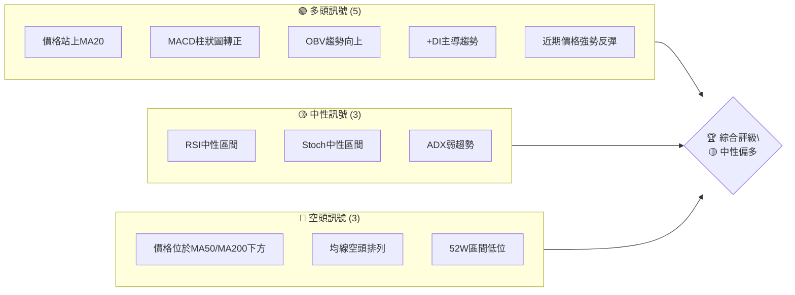
**綜合評級解讀**: KTOS 股價在經歷大幅下跌後，於近期出現強勁反彈，多項短期指標轉為看多。然而，長期趨勢仍處於空頭市場，主要均線呈現空頭排列，上方阻力沉重。因此，當前判斷為**中性偏多**，短期存在反彈機會，但整體趨勢仍需謹慎。

### 📊 核心指標速覽表

| 指標類別 | 指標名稱 | 當前數值 | 訊號 | 解讀 |
|----------|----------|----------|------|------|
| **價格** | 當前價格 | $55.35 | 🟡 | 近期反彈，但仍處長期下跌趨勢中 |
| **均線** | MA20 | $53.97 | 🟢 | 價格站上短期均線，短期多頭動能啟動 |
| **均線** | MA50 | $57.17 | 🔴 | 價格受中期均線壓制，中期阻力顯著 |
| **均線** | MA200 | $79.28 | 🔴 | 價格遠低於長期均線，長期空頭趨勢明顯 |
| **動能** | RSI(14) | 42.21 | 🟡 | 未達超買或超賣，有上行空間，但動能仍需加強 |
| **動能** | MACD Hist | +0.271 | 🟢 | MACD柱狀圖轉正，顯示短期動能轉強 |
| **波動** | ATR(14) | $3.41 | 🟡 | 6.16% 的日波動，屬於中等水平，適合區間操作 |

### 🏆 技術評分卡

KTOS 的技術評分反映了短期反彈的積極訊號與長期空頭趨勢之間的矛盾。動能指標和成交量配合良好，但趨勢強度和均線排列仍是主要弱點。

```
技術評分卡 — KTOS (2026-07-05)
════════════════════════════════════════════════════
趨勢強度      ███░░░░░░░░░░░░░░░░░  30/100  🔴 (ADX弱趨勢)
動能指標      ███████░░░░░░░░░░░░░  70/100  🟢 (MACD轉正，RSI有空間)
支撐穩定度    █████░░░░░░░░░░░░░░░  50/100  🟡 (近期有支撐，但歷史支撐脆弱)
成交量配合    ████████░░░░░░░░░░░░  80/100  🟢 (OBV向上，量比放大)
形態完整度    ████░░░░░░░░░░░░░░░░  40/100  🟡 (潛在築底，未形成明確反轉形態)
均線排列      ██░░░░░░░░░░░░░░░░░░  20/100  🔴 (空頭排列)
════════════════════════════════════════════════════
綜合評分      █████░░░░░░░░░░░░░░░  48/100  🟡 中性偏空
════════════════════════════════════════════════════
```

## 2. 趨勢分析

### 🌐 多時框趨勢分析

KTOS 的多時框架分析顯示，長期趨勢仍處於明顯的下跌通道，而中期趨勢則顯示股價在經歷大幅下挫後正嘗試築底。短期內，股價從低點強勁反彈，呈現多頭動能。這種不同時框架下的趨勢差異，要求投資者在操作上需保持高度警惕。

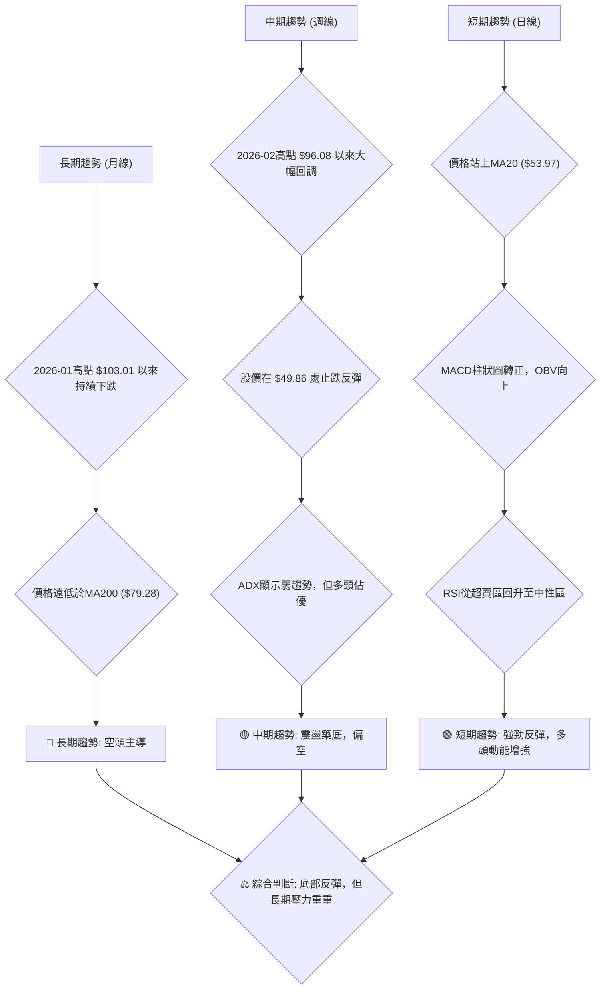

### 📈 長期趨勢 — 12個月走勢圖（Unicode）

KTOS 在過去12個月的走勢呈現出先強勁上漲後劇烈下跌的「山峰」形態。從2025年7月的$58.70開始，股價一路飆升至2026年1月的歷史高點$103.01，漲幅驚人。然而，隨後便進入了漫長的下跌通道，至2026年6月觸及近期低點$49.86，跌幅超過50%。2026年7月則出現了止跌反彈的跡象，但仍處於下降趨勢的尾聲或築底初期。

```
KTOS 月線走勢圖（過去12個月）
價格軸 ($)
$110 ┤                                 
$100 ┤                                 ●(2026-01:103.01)
$90  ┤                 ●(2025-09:91.37)●(2025-10:90.60)
$80  ┤                         ●(2026-02:86.18)
$70  ┤           ●(2025-11:76.10)●(2025-12:75.91) ●(2026-03:70.51)
$60  ┤ ●(2025-08:65.84)                      ●(2026-04:63.05)●(2026-05:64.13)
$50  ┤●(2025-07:58.70)                                    ●(2026-07:55.35)
$40  ┤                                              ●(2026-06:49.86)
     └───────────────────────────────────────────────────────────
      25-07 25-08 25-09 25-10 25-11 25-12 26-01 26-02 26-03 26-04 26-05 26-06 26-07
```

**走勢特徵分析表格**：
| 階段 | 時間區間 | 價格區間 | 漲跌幅 | 走勢特徵 |
|------|------------|------------|--------|----------|
| 上漲 | 2025-07 ~ 2026-01 | $58.70 ~ $103.01 | +75.49% | 強勁多頭趨勢，創歷史新高，市場情緒極度樂觀。 |
| 下跌 | 2026-01 ~ 2026-06 | $103.01 ~ $49.86 | -51.60% | 劇烈空頭趨勢，股價腰斬，跌破多個關鍵支撐位。 |
| 反彈 | 2026-06 ~ 2026-07 | $49.86 ~ $55.35 | +11.01% | 短期止跌反彈，伴隨成交量放大，顯示底部買盤介入。 |

### 📊 中期趨勢（週線分析）

近20週的週線數據顯示，KTOS 自2026年2月高點 $96.08 開始進入快速下跌通道，股價一路下探，直至2026年6月28日收盤於 $47.21，創下階段性新低。然而，最新的週線 (2026年7月5日) 顯示股價強勁反彈至 $55.35，反彈幅度達 17.25%，並伴隨較大的成交量，這是一個重要的止跌訊號。儘管如此，股價仍處於MA50和MA200下方，中期趨勢仍偏空，任何上漲都可能遇到阻力。

**近期壓力與支撐示意圖**
```
KTOS 中期壓力與支撐示意圖
═══════════════════════════════════════════════════
$96.08 ║████████████████████████████████████████████████║ 強壓力 (2026-02高點)
$79.28 ║████████████████████████████████████████████████║ 長期均線壓力 (MA200)
$70.51 ║████████████████████████████████████████████████║ 中期壓力 (2026-03低點)
$57.17 ║████████████████████████████████████████████████║ 中期均線壓力 (MA50)
$55.35 ╠════════════════════════════════════════════════╣ ◄ 現價
$53.97 ║▓▓▓▓▓▓▓▓▓▓▓▓▓▓▓▓▓▓▓▓▓▓▓▓▓▓▓▓▓▓▓▓▓▓▓▓▓▓▓▓▓▓▓▓▓▓▓▓║ 短期均線支撐 (MA20)
$49.86 ║████████████████████████████████████████████████║ 近期強支撐 (2026-06低點)
$41.87 ║████████████████████████████████████████████████║ 52週低點支撐
═══════════════════════════════════════════════════
```

### ⚡ 趨勢強度評估（ADX 解讀）

ADX 指標用於衡量趨勢的強度，而非方向。當前 ADX(14) 數值為 16.75。

-   **ADX < 25**: 表明 KTOS 目前處於**弱趨勢或盤整行情**。這意味著市場缺乏明確的方向性趨勢，股價很可能在一個區間內震盪，而不是形成強勁的單邊趨勢。
-   **+DI (30.54) > -DI (19.97)**: 儘管整體趨勢強度不高，但 +DI 顯著高於 -DI，這表明**多頭力量在短期內佔據主導地位**，正在推動股價向上反彈。這與近期價格的強勁上漲相符。
-   **整合分析**: ADX 顯示當前市場缺乏明確的強趨勢，更傾向於盤整。然而，+DI 的高位表明在這一盤整中，多頭力量佔據上風，預計股價將在震盪中偏向上行，但需警惕趨勢隨時可能逆轉。

**ADX 分析流程**
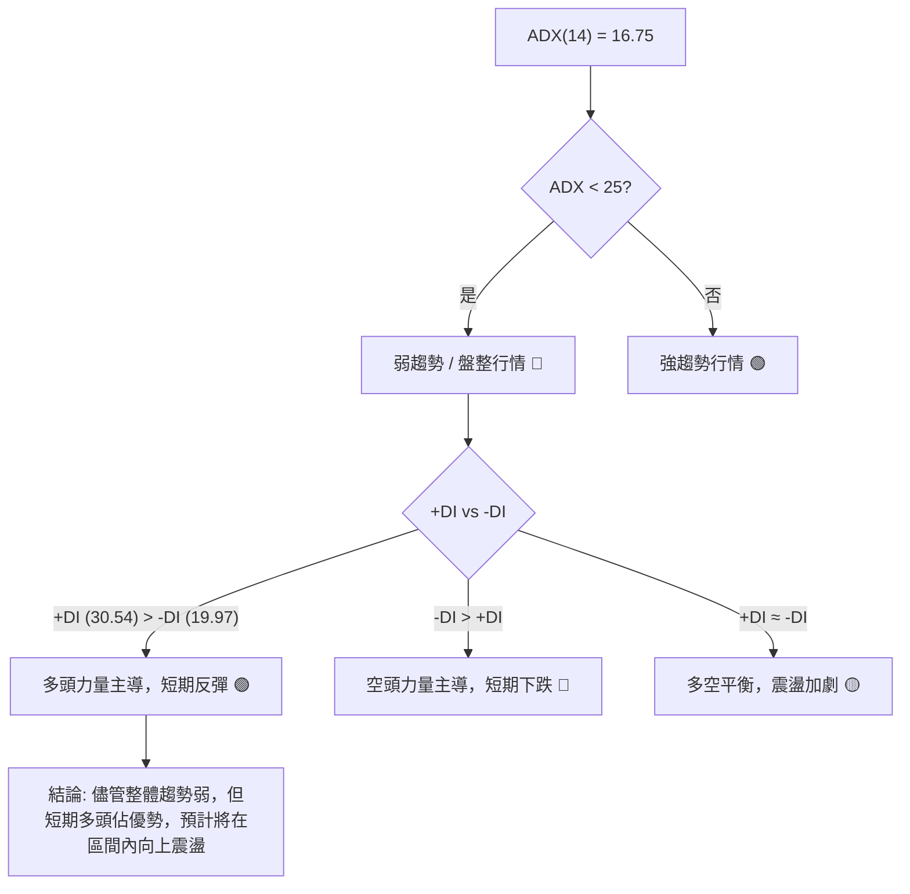

**ADX 強度對照表**
| ADX 數值範圍 | 趨勢強度 | 市場判斷 | 評級 |
|--------------|----------|----------|------|
| 0-25         | 弱趨勢   | 盤整行情 | 🔴 |
| 25-50        | 中等趨勢 | 趨勢行情 | 🟡 |
| 50-75        | 強趨勢   | 強勢趨勢 | 🟢 |
| 75-100       | 極強趨勢 | 趨勢延續 | 🟢 |
**KTOS ADX 評級**: 🔴 弱趨勢/盤整 (ADX=16.75)

## 3. 圖表形態分析

### 🔍 形態識別系統

從提供的月線和週線數據來看，KTOS 在經歷了從2026年1月高點 $103.01 到2026年6月低點 $49.86 的劇烈下跌後，目前正處於**潛在的底部築底過程**。雖然尚未形成經典的底部反轉形態（如頭肩底、雙底），但股價在 $49.86 附近獲得顯著支撐，並伴隨成交量放大，顯示下跌動能已顯著減弱，買盤正在積極介入。當前的反彈可被視為築底過程中的初期上漲階段。

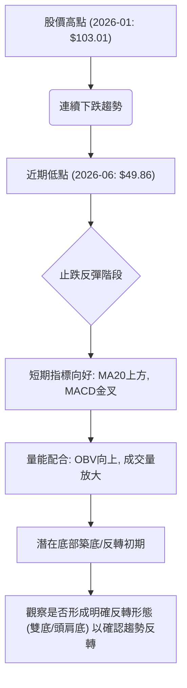

### 🕯️ 重要K線形態分析

儘管僅提供週收盤價，無法繪製完整的K線圖，但從週價格變化和成交量數據中，我們可以推斷出一些重要的K線形態特徵：

| 日期 | 收盤價 | K線形態推斷 | 解讀 | 訊號 |
|------|--------|--------------|------|------|
| 2026-06-28 | $47.21 | **潛在錘子線/長下影線** | 股價在大幅下跌後，盤中可能出現強勁的買盤介入，將價格從低點拉升，收盤價相對較高。這是一個重要的見底訊號，暗示下方有較強的支撐力量。 | 🟢 |
| 2026-07-05 | $55.35 | **潛在大陽線/看漲吞噬** | 相較於前一週 $47.21 的收盤價，本週股價大幅反彈 $8.14，漲幅達 17.24%。這種強勁的上漲，如果伴隨實體陽線，很可能形成看漲吞噬形態，吞噬了前一週或前幾週的跌幅，確認了短期止跌和多頭力量的強勢回歸。 | 🟢 |
-   **整體判斷**: 從低點 $47.21 處出現的強勁反彈，伴隨成交量放大（2026-07-05 週成交量 26,363,100，高於 20 週均量），表明市場對此價位有較強的買入意願。這些隱含的K線形態共同構成了短期看漲的技術訊號，支持股價繼續反彈。

### 📉 ASCII 走勢形態示意圖

KTOS 從2026年1月的高點 $103.01 經歷了長達數月的下跌，直至2026年6月在 $49.86 附近找到支撐。目前的走勢呈現出從底部反彈的初期階段，尚未完全脫離下跌趨勢，但已顯示出止跌企穩的跡象。

```
KTOS 近期走勢與潛在底部形態示意圖
價格軸 ($)
$100 ┤                                        
$90  ┤                                        
$80  ┤                                        
$70  ┤                                        
$60  ┤                                       ●(現價: $55.35)
$50  ┤                                    ●(近期低點: $49.86)
$40  ┤                                    
     └───────────────────────────────────────
        <---長期下跌趨勢--->  <---潛在築底反彈--->
           (高點 $103.01)       (低點 $49.86)
                               
形態特徵：
- 股價從高點一路下跌，形成明顯的下降趨勢。
- 在 $49.86 處獲得初步支撐，並出現強勁反彈。
- 尚未形成明確的雙底或頭肩底等反轉形態，但短期下跌動能已衰竭。
- 需密切觀察股價能否站穩 $49.86 並形成更高的高點和低點，以確認反轉趨勢。
```

### 🎯 形態目標價計算

由於 KTOS 尚未形成明確的底部反轉形態，我們無法使用傳統的形態學方法（如頭肩底頸線突破）來計算具體的形態目標價。當前的上漲更應被視為下跌趨勢中的技術性反彈。因此，其初步目標價應設定在重要的阻力位上。

1.  **MA50移動平均線阻力**: 當前 MA50 位於 $57.17。這是股價反彈首先需要挑戰的中期阻力。
2.  **分析師低目標價**: 分析師共識的最低目標價為 $60.00。這是一個重要的心理關口和潛在阻力。
3.  **布林通道上軌**: 當前布林通道上軌位於 $63.31。股價在此處可能面臨較強的賣壓。
4.  **斐波那契23.6%回調位**: 從2026-01高點 $103.01 至 2026-06低點 $49.86 的下跌趨勢，其 23.6% 回調位在 $62.40。這與布林通道上軌接近，共同構成強阻力區。
5.  **前期密集成交區**: 2026年4月股價曾在 $61.26 - $62.05 區間盤整，此處也將形成一定的阻力。

**初步反彈目標價區間**:
-   **目標價 T1**: $57.17 (MA50)
-   **目標價 T2**: $60.00 (分析師低目標價)
-   **目標價 T3**: $62.40 - $63.31 (斐波那契23.6%回調位 / 布林通道上軌 / 前期密集成交區)

若能成功突破上述阻力，則股價有望進一步挑戰斐波那契38.2%回調位 ($70.16) 或2026年3月低點 ($70.51)。

## 4. 支撐與阻力

### 🗺️ 關鍵價位分布圖（Unicode）

KTOS 的價格結構顯示其上方阻力重重，而下方則有近期反彈形成的支撐以及52週低點的強力支撐。當前股價 $55.35 正處於短期支撐 MA20 和中期阻力 MA50 之間。

```
KTOS 價位結構分布圖 (2026-07-05)
═══════════════════════════════════════════════════
$103.01 ║████████████████████████████████████████████████║ 歷史高點 / 強阻力 R4
$79.28  ║████████████████████████████████████████████████║ 長期均線阻力 R3 (MA200)
$70.51  ║████████████████████████████████████████████████║ 阻力 R2 (2026-03低點 / 斐波那契38.2%)
$63.31  ║████████████████████████████████████████████████║ 布林上軌 / 阻力 R1 (斐波那契23.6%)
$57.17  ║████████████████████████████████████████████████║ 關鍵阻力 R0 (MA50)
$55.35  ╠════════════════════════════════════════════════╣ ◄ 現價
$53.97  ║▓▓▓▓▓▓▓▓▓▓▓▓▓▓▓▓▓▓▓▓▓▓▓▓▓▓▓▓▓▓▓▓▓▓▓▓▓▓▓▓▓▓▓▓▓▓▓▓║ 短期支撐 S0 (MA20)
$49.86  ║████████████████████████████████████████████████║ 近期強支撐 S1 (2026-06低點)
$44.63  ║████████████████████████████████████████████████║ 布林下軌支撐 S2
$41.87  ║████████████████████████████████████████████████║ 52週低點 / 強支撐 S3
═══════════════════════════════════════════════════
```

### 🚧 阻力位分析表

| 阻力級別 | 價位 | 形成原因 | 突破難度 | 重要性 |
|----------|------|----------|----------|--------|
| R0 (近期) | $57.17 | MA50移動平均線、近期套牢盤 | 中等 | 股價反彈的首要挑戰，突破則短期趨勢有望改善。 |
| R1 (次要) | $63.31 | 布林通道上軌、斐波那契23.6%回調 ($62.40)、前期下跌平台 | 中等偏高 | 若能突破，則反彈空間將進一步打開。 |
| R2 (中期) | $70.51 | 2026-03月低點、斐波那契38.2%回調 ($70.16)、密集成交區 | 高 | 突破此處意味著中期下跌趨勢可能結束，進入更強的反彈。 |
| R3 (長期) | $79.28 | MA200移動平均線、長期趨勢線 | 極高 | 長期空頭趨勢的關鍵轉折點，突破則長期趨勢有望反轉。 |
| R4 (強勁) | $103.01 | 歷史高點、強勁心理阻力 | 極高 | 股價需極強動能才能挑戰，突破則確立強勢牛市。 |

### 🛡️ 支撐位分析表

| 支撐級別 | 價位 | 形成原因 | 守住機率 | 重要性 |
|----------|------|----------|----------|--------|
| S0 (近期) | $53.97 | MA20移動平均線 | 中等偏高 | 短期反彈的關鍵支撐，若跌破可能預示反彈結束。 |
| S1 (強勁) | $49.86 | 2026-06月低點、近期底部形態的頸線 | 高 | 股價大幅反彈的起點，若跌破可能再度探底。 |
| S2 (次要) | $44.63 | 布林通道下軌 | 中等 | 提供技術性回調支撐，若觸及可能引發超賣反彈。 |
| S3 (極強) | $41.87 | 52週低點、重要心理關口、長期買盤區 | 極高 | 若跌破則長期趨勢惡化，恐引發更深層次的恐慌性拋售。 |

### 📐 斐波那契回調位分析

我們選擇 KTOS 最近一次主要下跌趨勢作為斐波那契回調分析的基礎，即從2026年1月的高點 $103.01 到2026年6月的低點 $49.86。

-   **下跌幅度**: $103.01 - $49.86 = $53.15

**斐波那契回調位計算**:
-   **23.6% 回調**: $49.86 + ($53.15 * 0.236) = $49.86 + $12.54 = **$62.40**
-   **38.2% 回調**: $49.86 + ($53.15 * 0.382) = $49.86 + $20.30 = **$70.16**
-   **50.0% 回調**: $49.86 + ($53.15 * 0.500) = $49.86 + $26.58 = **$76.44**
-   **61.8% 回調**: $49.86 + ($53.15 * 0.618) = $49.86 + $32.84 = **$82.70**

**分析**:
-   當前股價 $55.35 仍遠低於第一個斐波那契回調位 $62.40。這表明目前的上漲仍處於初步反彈階段。
-   **$62.40 (23.6% 回調)** 是一個重要的短期阻力位。它與布林通道上軌 ($63.31) 和分析師低目標價 ($60.00) 接近，共同構成一個強大的阻力區間。若股價能有效突破此區域，將是積極訊號。
-   **$70.16 (38.2% 回調)** 接近2026年3月的低點 $70.51，是中期反彈的關鍵考驗。突破此處將意味著股價可能形成更高的低點和高點。
-   **$76.44 (50% 回調)** 和 **$82.70 (61.8% 回調)** 是更長期的反彈目標。若能達到這些水平，將顯著改善KTOS的技術結構，並可能預示著長期趨勢的反轉。

**斐波那契回調示意圖**
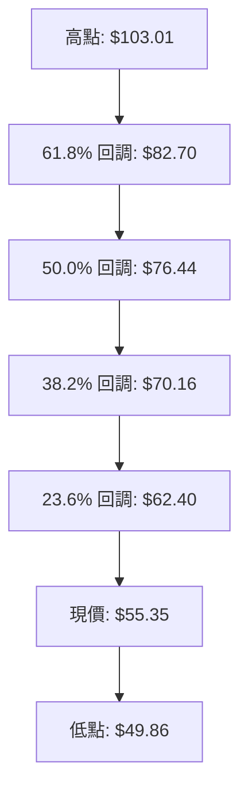

## 5. 技術指標深度解讀

### 🎛️ 指標訊號總覽

以下 Mermaid 圖表展示了 KTOS 當前各項技術指標的訊號關係，以及它們對整體市場判斷的影響。整體而言，短期指標顯示出積極的反彈動能，但中長期指標仍處於空頭或弱勢狀態，形成多空拉鋸。

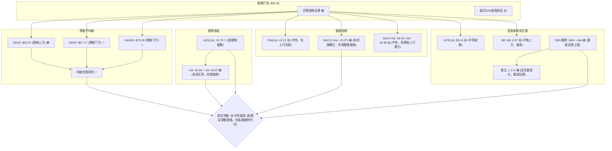

### 📈 移動平均線排列分析

KTOS 當前的移動平均線排列呈現出典型的**空頭排列**，即短期均線在最下方，長期均線在最上方。

-   **MA20**: $53.97
-   **MA50**: $57.17
-   **MA200**: $79.28
-   **當前價格**: $55.35

**均線排列**: MA20 ($53.97) < 價格 ($55.35) < MA50 ($57.17) < MA200 ($79.28)

**分析**:
-   **短期均線 (MA20)**: 價格 $55.35 位於 MA20 ($53.97) 上方，這是一個**短期看漲訊號**，表明股價在過去20天內呈現上漲趨勢，並獲得短期支撐。
-   **中期均線 (MA50)**: 價格 $55.35 位於 MA50 ($57.17) 下方，MA50 形成一個**強大的中期阻力**。股價若要持續反彈，必須有效突破並站穩 MA50。
-   **長期均線 (MA200)**: 價格 $55.35 遠低於 MA200 ($79.28)，這明確指示**長期趨勢仍處於顯著的空頭市場**。MA200 是一個非常強勁的長期阻力位。
-   **均線系統的矛盾**: 儘管短期內價格站上 MA20，但 MA20 仍然在 MA50 和 MA200 之下，整體均線呈現空頭排列。這意味著當前的上漲更可能是一次下跌趨勢中的**技術性反彈**，而非趨勢反轉。股價每一次向上反彈，都可能在中長期均線處遇到強大賣壓。

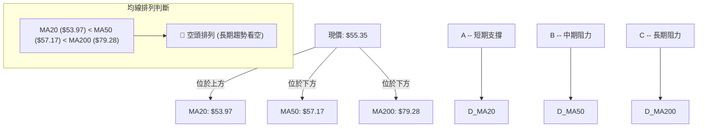

### 📉 RSI(14) 分析

-   **RSI(14) 數值**: 42.21
-   **RSI 進度條**: ▓▓▓▓▓▓▓▓░░░░░░░░░░░░░░░░ 42.21%

**超買超賣區間分析**:
-   RSI 42.21 處於 30-70 的中性區間。這表示 KTOS 股價既未超買也未超賣。
-   從近期低點 $47.21 (2026-06-28) 時的 RSI 約 23.1 來看，RSI 已從超賣區顯著回升至中性區。這是一個積極的訊號，表明買盤力量正在恢復，並且股價仍有足夠的上升空間，短期反彈的可持續性未受超買限制。

**背離判斷**:
-   **無明顯頂背離**: 股價在近期低點 $49.86 後反彈，尚未創出新高，因此沒有價格創新高但 RSI 未創新高的頂背離情況。
-   **無明顯底背離**: 雖然股價在2026年6月創下新低 $49.86 (或週線 $47.21)，RSI 也同時達到低點 (23.1)。隨後股價反彈，RSI 也同步上升。這是一個正常的價格與 RSI 同步反彈，未形成底部背離（即價格創新低但 RSI 未創新低）。
-   **結論**: 目前 RSI 無明顯背離訊號。RSI 處於中性區間，顯示短期動能從超賣區恢復，為股價進一步反彈提供空間。**訊號**: 🟢 (從超賣區回升，有上行空間)

### 📊 MACD(12/26/9) 訊號解讀

MACD 指標由 MACD 線、Signal 線和柱狀圖構成，用於判斷趨勢的動能和方向。

-   **MACD 線**: -2.351
-   **MACD Signal 線**: -2.622
-   **MACD Hist 柱狀圖**: +0.271

**MACD 訊號關係**:
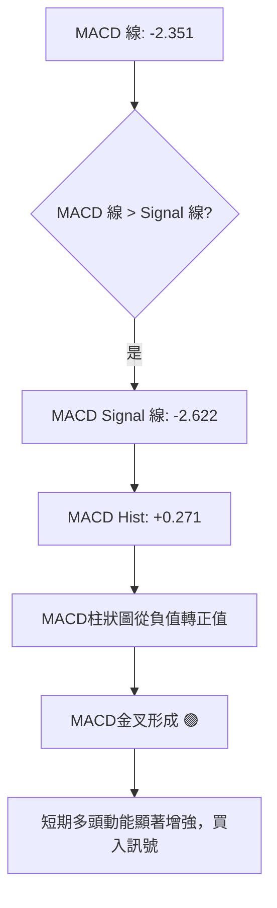

**分析**:
-   MACD 線 (-2.351) 已經從下方上穿 MACD Signal 線 (-2.622)，這形成了**MACD 金叉**。
-   MACD 柱狀圖從之前的負值轉為正值 (+0.271)，並且正在擴大。這是一個非常清晰的**短期看漲訊號**，表明空頭動能已耗盡，多頭力量正在積極介入並推動股價上漲。
-   **整合分析**: MACD 金叉和柱狀圖轉正，強烈支持了當前股價從底部反彈的趨勢，是短期多頭動能增強的重要確認。這與價格站上 MA20 和 OBV 向上等訊號互相印證。**訊號**: 🟢 (強烈看多)

### 📦 布林通道分析

布林通道 (Bollinger Bands) 用於衡量股價的波動範圍和相對位置。

-   **BB上軌**: $63.31
-   **BB中軌 (MA20)**: $53.97
-   **BB下軌**: $44.63
-   **當前收盤價**: $55.35
-   **BB %B**: 0.57 (表示價格位於中軌和上軌之間，靠近中軌)

**布林通道示意圖**
```
KTOS 布林通道示意圖 (2026-07-05)
價格軸 ($)
$70  ┤                                      
$65  ┤                 ┌──────────────────┐
$60  ┤                 │                  │ ← BB上軌: $63.31
$55  ┤                 ●(現價: $55.35)    │
$50  ┤                 ├──────────────────┤ ← BB中軌 (MA20): $53.97
$45  ┤                 │                  │ ← BB下軌: $44.63
$40  ┤                 └──────────────────┘
     └───────────────────────────────────────
                  時間軸
```

**分析**:
-   **股價位置**: 當前股價 $55.35 位於布林通道中軌 ($53.97) 上方，這是一個**短期偏多訊號**，表明股價正沿著中軌向上運行。
-   **波動性**: 布林通道的寬度 (上軌 $63.31 - 下軌 $44.63 = $18.68) 相對較大，ATR 佔價格的 6.16%，說明股價波動性處於中等水平。
-   **潛在阻力**: 布林通道上軌 $63.31 將是股價反彈的一個重要阻力位。這與斐波那契23.6%回調位 ($62.40) 接近，共同構成強阻力區。
-   **整合分析**: 股價在中軌上方運行，顯示短期動能偏強，但需留意布林上軌的阻力。若能突破上軌，則可能開啟更強的上漲趨勢；若在上軌受阻，則可能在中軌附近盤整或回調。**訊號**: 🟡 (中軌上方偏多，但上方有阻力)

### 💹 成交量分析（量價配合度）

成交量是價格走勢的重要確認指標。

-   **最新成交量**: 6,702,400
-   **20日均量**: 5,736,610
-   **50日均量**: 5,118,358
-   **量比**: 1.17x (最新成交量 / 20日均量)
-   **OBV趨勢**: OBV > MA (量能支撐上漲)

**分析**:
-   **成交量放大**: 最新成交量 6,702,400 顯著高於其 20日均量 (5,736,610)，量比達到 1.17x。這表明在近期股價從 $47.21 強勁反彈至 $55.35 的過程中，有**積極的買盤介入**，市場活躍度顯著提升。
-   **OBV趨勢確認**: OBV (On Balance Volume) 趨勢顯示 OBV 線位於其移動平均線上方，這是一個**看漲訊號**。OBV 的上升表明在股價上漲的過程中，累積的買盤力量大於賣盤力量，量能正在有效支撐價格上漲。
-   **量價配合良好**: 股價上漲伴隨成交量放大，且 OBV 趨勢向上，這是健康反彈的表現，增加了短期反彈的可靠性和持續性。這與 MACD 金叉等動能指標互相確認，形成多頭共振。
-   **結論**: 成交量數據強烈支持當前的反彈，顯示多頭力量活躍且堅定。**訊號**: 🟢 (強烈看多)

## 6. 動能與波動率

### ⚡ 動能評估四象限

動能評估四象限分析旨在綜合判斷股票在「動能強度」和「波動率」兩個維度上的位置，以提供更全面的交易視角。

-   **動能強度評估**:
    -   MACD 柱狀圖轉正 (+0.271) 顯示短期動能從空轉多，且正在增強。
    -   RSI (42.21) 處於中性區間，從超賣區回升，有上行空間。
    -   ADX (16.75) 雖然顯示整體趨勢弱，但 +DI (30.54) 顯著高於 -DI (19.97)，表明短期多頭力量佔優。
    -   綜合判斷，KTOS 目前處於**中等偏強的短期動能**。
-   **波動率評估**:
    -   ATR(14) 為 $3.41，佔當前價格 $55.35 的 6.16%。這屬於**中等波動水平**，既非極端劇烈也非死水一潭，為短期交易提供了適度的風險與機會。
-   **四象限定位**:
    KTOS 目前的狀態介於「弱動能」和「高波動」象限之間，但隨著短期動能的增強，正朝著「強動能」方向發展。

| 象限 | 動能 | 波動 | 當前狀態 | 評估 |
|------|------|------|----------|------|
| Q1 | 強 | 低 | - | **最佳機會**: 趨勢明確且穩定，風險較低。 |
| Q2 | 弱 | 低 | - | **謹慎觀望**: 缺乏動能，等待趨勢形成。 |
| Q3 | 強 | 高 | - | **高風險高收益**: 趨勢明確但波動大，適合激進交易者。 |
| Q4 | 弱 | 高 | ✓ | **目前狀態**: 趨勢不明顯，但短期動能增強，波動中等。 |

**分析**: KTOS 目前的市場環境相對複雜。儘管 ADX 顯示整體趨勢強度不高（弱趨勢），但多項短期動能指標（MACD、OBV、RSI回升）都指向短期多頭佔優。ATR 則顯示其波動性適中。這表明股價正處於從底部反彈的初期階段，尚未形成強勁的趨勢，但存在機會。這是一個需要謹慎操作的階段，適合短期趨勢交易者，但需嚴格控制風險。

### 📊 ATR 波動率分析

-   **ATR(14)**: $3.41
-   **佔價格比重**: 6.16% (即 $3.41 / $55.35)

**分析**:
-   ATR 數值 $3.41 表示 KTOS 在過去14天內的平均每日波動範圍約為 $3.41。這是一個相對中等的波動水平。對於日線級別的交易者而言，這提供了對每日潛在價格變動範圍的合理預期。
-   **止損距離建議**: ATR 是設定止損點的有效工具，可以根據個人的風險承受能力，將止損設定在 1.5 倍至 2 倍 ATR 的距離。
    -   若在 $55.35 進場，考慮 **1.5 倍 ATR 止損**: $55.35 - (1.5 * $3.41) = $55.35 - $5.12 = **$50.23**。此價位略高於近期低點 $49.86，提供合理的緩衝。
    -   考慮 **2 倍 ATR 止損**: $55.35 - (2 * $3.41) = $55.35 - $6.82 = **$48.53**。此價位位於近期低點 $49.86 之下，更接近 52 週低點 $41.87，提供更寬鬆的止損空間，但風險也相對較大。
-   **風險評估**: 6.16% 的日波動率意味著股價在一天內有較大的潛在移動空間，交易者應充分考慮這一點，並根據波動性調整倉位大小。

### 📐 Beta 與市場相關性

-   **數據未提供 Beta 值**。

**一般分析**: Kratos Defense & Security Solutions 屬於工業板塊中的航空航太與國防產業。這類公司的業務性質使其對政府國防預算、地緣政治局勢和國際衝突等宏觀因素較為敏感。
-   **市場相關性**: 通常情況下，國防類股票的 Beta 值可能略低於市場平均水平 (Beta < 1)，因為其收入來源相對穩定（政府訂單），使其在經濟衰退或市場波動時具有一定的防禦性。然而，在某些特殊情況下（如大規模地緣衝突），其股價也可能與市場走勢脫鉤，甚至逆勢上漲。
-   **風險提示**: 由於缺乏具體的 Beta 數據，無法量化其與大盤的相關性。投資者應意識到，雖然 KTOS 可能具有一定的防禦性，但它仍會受到整體市場情緒和宏觀經濟環境的影響。在市場極度恐慌或大幅下跌時，即使是防禦性股票也難以倖免。建議投資者在進行投資決策時，除了技術分析外，也應結合對其行業特性和宏觀經濟背景的判斷。

## 7. 多時框架總結

### 📋 時框架評分表

本表綜合評估了 KTOS 在不同時框架下的技術狀況，並給出相應的投資建議。

| 時框架 | 趨勢方向 | 動能 | 均線排列 | 形態 | 綜合評分 (1-10) | 建議 |
|--------|----------|------|----------|------|-----------------|------|
| 長期 (月) | 🔴 下跌 | 🔴 弱 | 🔴 空頭 | 🔴 築底未明 | 3/10 | 觀望/謹慎，不建議長期持有 |
| 中期 (週) | 🟡 盤整偏空 | 🟡 轉強 | 🔴 空頭 | 🟡 潛在底部 | 5/10 | 震盪操作，關注築底進展 |
| 短期 (日) | 🟢 反彈 | 🟢 強 | 🟡 短多 | 🟢 止跌反彈 | 7/10 | 擇機做多，嚴格止損 |

### 🔲 綜合訊號矩陣

以下 Mermaid 圖表展示了 KTOS 在不同時框架下各項技術訊號的一致性與矛盾之處。

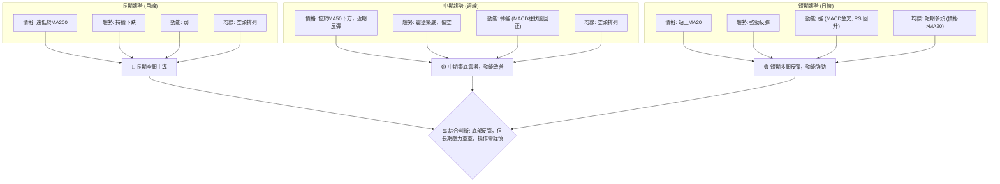
**分析**: KTOS 的技術面呈現明顯的分化。長期來看，股價仍深陷空頭泥潭，長期均線MA200構成巨大壓力。中期趨勢顯示股價正在尋求底部，雖然整體仍偏空，但動能指標開始顯示改善。短期內，股價從低點強勁反彈，多項指標都發出積極的買入訊號，預示著一次技術性反彈正在進行。這種多時框架的不一致性，意味著目前的上漲更可能是一次跌勢中的反彈，而非趨勢的根本性逆轉。投資者應根據自己的交易週期和風險偏好，選擇合適的策略，並嚴格控制風險。

## 8. 交易策略建議

### 🗺️ 策略決策流程圖

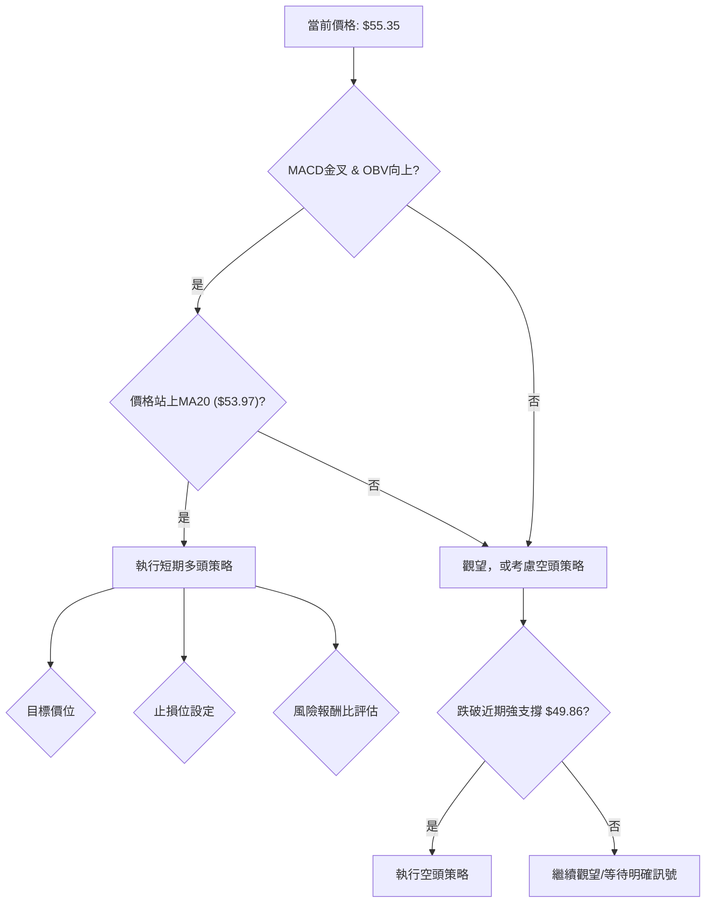

### 🟢 多頭策略詳情

基於 KTOS 短期指標的積極訊號（MACD金叉、OBV向上、價格站上MA20、從低點強勁反彈），可以考慮進行短期多頭操作，目標價設定在主要阻力位。

| 策略要素 | 策略 A: 短期反彈追蹤 (保守) | 策略 B: 突破性多頭 (激進) |
|----------|---------------------------------|---------------------------------|
| **進場條件** | 股價維持在MA20上方，MACD柱狀圖維持正值，成交量配合。 | 股價強勢突破MA50 ($57.17) 並站穩，成交量顯著放大。 |
| **進場價格** | $55.35 (當前價格，若能回調至 $54.50-$55.00 區間更好) | $57.20 (突破 MA50 後確認) |
| **目標價 T1** | $57.17 (MA50阻力位) | $63.31 (布林上軌 / 斐波那契23.6%回調) |
| **目標價 T2** | $60.00 (分析師低目標價 / 前期密集成交區) | $70.16 (斐波那契38.2%回調 / 2026-03低點) |
| **止損價格** | $52.00 (MA20下方，但仍在近期反彈區間內) | $55.00 (MA20上方，回踩不破) |
| **風險報酬比** | T1: 0.54:1, T2: 1.39:1 | T1: 2.78:1, T2: 5.89:1 |
| **成功機率** | 60% (短期指標向好，但長期趨勢不利) | 45% (突破MA50需要較強動能，且長期趨勢仍空) |
| **建議倉位** | 輕倉 (不超過總資金的 5%) | 極輕倉 (不超過總資金的 3%) |

### 🔴 空頭策略詳情

儘管短期出現反彈，但 KTOS 的長期趨勢仍為空頭。若反彈失敗或跌破關鍵支撐，空頭策略將變得有利。

| 策略要素 | 策略 C: 跌破支撐空頭 (反彈失敗) |
|----------|---------------------------------|
| **進場條件** | 股價跌破MA20 ($53.97) 或近期強支撐 ($49.86)，MACD柱狀圖轉負。 |
| **進場價格** | $53.50 (跌破MA20後確認) |
| **目標價 T1** | $49.86 (近期強支撐) |
| **目標價 T2** | $44.63 (布林下軌) |
| **止損價格** | $55.00 (止損在MA20上方) |
| **風險報酬比** | T1: 2.43:1, T2: 5.91:1 |
| **成功機率** | 55% (長期趨勢偏空，反彈失敗的可能性存在) |
| **建議倉位** | 輕倉 (不超過總資金的 5%) |

### ⭐ 整體訊號強度評星

```
做多訊號強度：★★★☆☆  (3/5星) (短期反彈動能強勁，但長期趨勢空頭，上方阻力重重，限制上漲空間。)
做空訊號強度：★★★☆☆  (3/5星) (長期趨勢空頭，若短期反彈失敗，則下跌空間較大，具備做空潛力。)
整體可信度：  ★★★☆☆  (3/5星) (市場方向不明朗，多空力量拉鋸，交易機會存在但風險較高，需謹慎操作。)
```

## 9. 風險提示與監控

### ✅ 關鍵監控指標 Checklist

以下清單列出了投資者在交易 KTOS 時應密切關注的關鍵技術指標和價格行為，以實時調整策略和管理風險。

```
KTOS 關鍵監控指標清單
════════════════════════════════════════════════════════
[ ] 價格是否維持在 MA20 ($53.97) 上方？ (多頭關鍵支撐)
[ ] MACD 柱狀圖是否持續為正值並擴大？ (動能持續性)
[ ] RSI 是否維持在 50 以上，並向超買區靠近？ (動能強度)
[ ] 成交量是否持續放大，支持上漲趨勢？ (量價配合)
[ ] 股價能否突破 MA50 ($57.17) 並站穩？ (中期趨勢轉折點)
[ ] ADX 是否開始上升，確認新的趨勢形成？ (+DI與-DI的變化)
[ ] 外部宏觀經濟或產業新聞是否有重大變化？ (基本面影響)
[ ] 股價是否跌破近期低點 $49.86？ (止損觸發點)
════════════════════════════════════════════════════════
```

### ⚠️ 風險場景分析

以下 Mermaid 圖表展示了 KTOS 在不同市場情境下的潛在走勢，幫助投資者預估風險和機會。

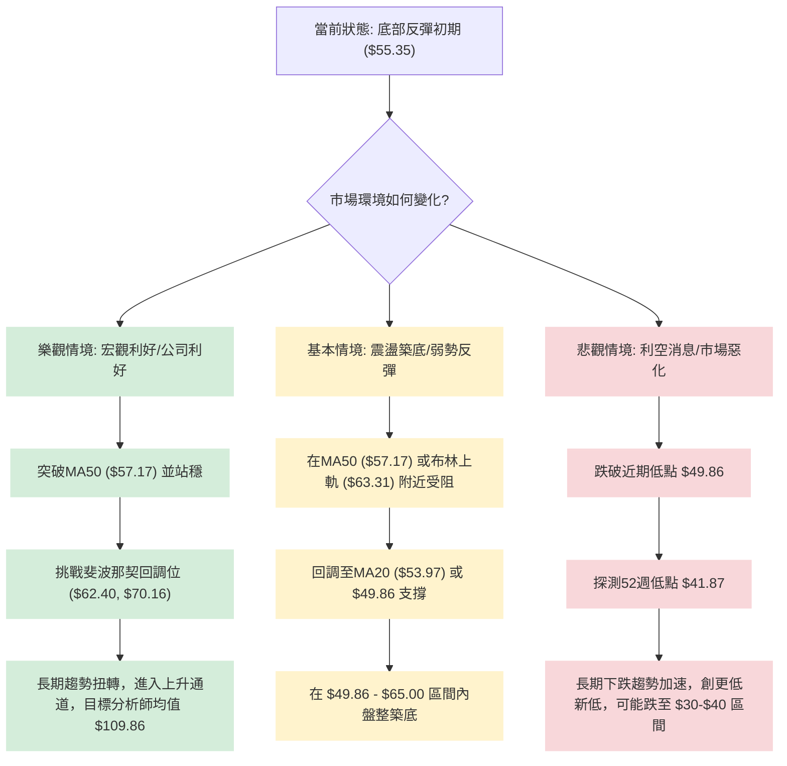

### 🛡️ 風險管理重要提醒

1.  **倉位控制**: 鑒於目前多空交織的複雜局面和長期趨勢的下行壓力，建議投資者嚴格控制倉位，避免重倉。對於短期交易，建議將單筆交易倉位控制在總資金的 3%-5% 以內。
2.  **止損紀律**: 任何交易都應預設明確的止損點。一旦價格觸及止損位，無論盈虧，都應果斷離場，避免虧損擴大。可採用固定百分比止損或 ATR 倍數止損，並根據市場波動性動態調整。
3.  **趨勢確認**: 在長期趨勢仍為空頭的情況下，任何反彈都應首先視為技術性反彈，而非趨勢反轉。除非有明確的底部形態形成（如雙底、頭肩底）且突破頸線，並伴隨成交量顯著放大，否則不應過度樂觀。
4.  **分批操作**: 可以考慮分批建倉或分批止盈，以降低單次決策的風險，並鎖定部分利潤。例如，在反彈初期輕倉介入，待突破關鍵阻力後再適度加倉。
5.  **監控基本面**: 雖然本報告是技術分析，但宏觀經濟環境、地緣政治事件、國防預算變化以及公司財報等基本面消息對航空航太與國防產業股票有重大影響。投資者應密切關注這些資訊，並將其納入風險評估。
6.  **市場情緒**: 留意整體市場情緒，尤其是在大盤波動較大時，即使個股技術面良好，也可能受到系統性風險的拖累。

---

## 📋 報告總結

```
KTOS 技術分析報告總結
════════════════════════════════════════════════════════
報告日期：2026-07-05
當前價格：$55.35
分析評級：⚖️ 中性偏多 (短期反彈動能強勁，但長期趨勢仍處於空頭市場，操作需謹慎)

關鍵結論：
├─ 長期趨勢：🔴 空頭主導，價格遠低於MA200。
├─ 中期趨勢：🟡 震盪築底，偏空，但動能指標開始改善。
├─ 短期趨勢：🟢 強勁反彈，價格站上MA20，MACD金叉，OBV向上。
├─ 關鍵支撐：S0: $53.97 (MA20), S1: $49.86 (近期低點)
├─ 關鍵阻力：R0: $57.17 (MA50), R1: $63.31 (布林上軌 / 斐波那契23.6%)
└─ 分析師目標：均值 $109.86，低點 $60.00 (顯示長期潛力，但短期壓力大)

最優策略組合：
1. 🥇 **最佳機會 (短期多頭)**：在 $55.35 附近輕倉進場，目標 $57.17 和 $60.00，止損設於 $52.00。風險報酬比約 1.39:1。
2. 🥈 **次選機會 (突破追蹤)**：若股價能放量突破 $57.17 (MA50)，可考慮極輕倉追蹤，目標 $63.31 和 $70.16，止損設於 $55.00。風險報酬比約 2.78:1。
3. 🥉 **保守選擇 (觀望或空頭)**：若股價反彈失敗，跌破 $53.97 (MA20)，則考慮觀望或執行空頭策略，目標 $49.86 和 $44.63，止損設於 $55.00。風險報酬比約 2.43:1。
════════════════════════════════════════════════════════
```

---

> ⚠️ **免責聲明**：本報告為 AI 自動生成之技術分析，所有數據及估算均基於提供的歷史價格資訊。本報告**僅供研究與學術參考**，**不構成任何投資建議**。投資有風險，入市需謹慎。

---

*報告生成時間：2026-07-05 ｜ 數據來源：Yahoo Finance ｜ 分析框架：多時框技術分析*