<details>
<summary>📊 靜態圖表 (點擊展開)</summary>
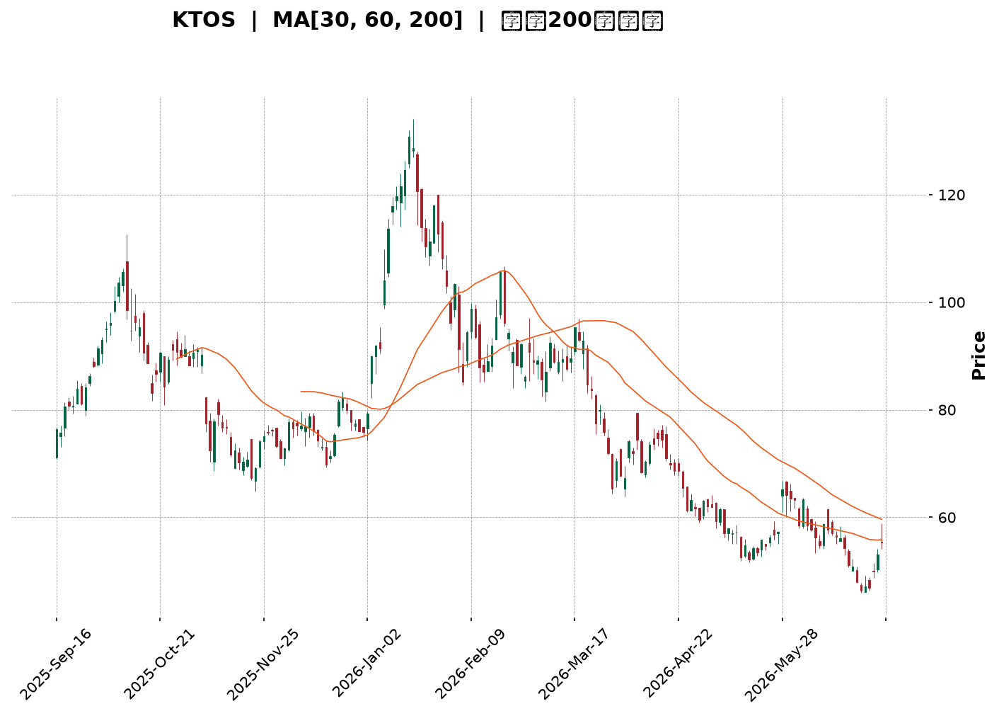
</details>

<html>
<head><meta charset="utf-8" /></head>
<body>
    <div style="height:500px; width:100%;">                        <script>window.PlotlyConfig = {MathJaxConfig: 'local'};</script>
        <script charset="utf-8" src="https://cdn.plot.ly/plotly-3.6.0.min.js" integrity="sha256-QaOVwtVY0T02VaHrr6pnoHLCwayMJp4O5n4YyaE3rJk=" crossorigin="anonymous"></script>                <div id="candlestick-chart" class="plotly-graph-div" style="height:100%; width:100%;"></div>            <script>                window.PLOTLYENV=window.PLOTLYENV || {};                                if (document.getElementById("candlestick-chart")) {                    Plotly.newPlot(                        "candlestick-chart",                        [{"close":{"dtype":"f8","bdata":"AAAAYGYWU0AAAAAgXO9SQAAAAKCZKVRAAAAAoEcxVEAAAACAFC5UQAAAAKCZ+VRAAAAAIIVLVEAAAADAzAxVQAAAAIDrkVVAAAAAwB4FVkAAAAAgrtdWQAAAAKBwPVdAAAAAgOvBV0AAAAAAKQxYQAAAAAAAEFlAAAAAACnsWUAAAABA4WpaQAAAAEAzo1hAAAAA4FGoV0AAAACA6xFYQAAAAEAz01dAAAAAwB6lVkAAAAAgridWQAAAACCux1RAAAAAoJmpVUAAAAAgrqdWQAAAAEAzE1VAAAAA4HpUVkAAAAAghctWQAAAACCFq1ZAAAAAgOtxVkAAAACgcM1WQAAAAEAzE1ZAAAAAYGamVkAAAABgZsZWQAAAAIAUjlZAAAAAgD1aU0AAAACAPRpSQAAAAOBReFNAAAAAIIXLU0AAAACAwiVTQAAAAMDMLFNAAAAAACnsUUAAAADAzBxSQAAAACBcj1FAAAAAQAqXUUAAAABA4apRQAAAAADX01BAAAAAwPVIUUAAAABACodSQAAAAEAzw1JAAAAAoEfxUkAAAABgZgZTQAAAAKBwTVJAAAAAoHC9UUAAAACA6zFSQAAAACCFa1NAAAAAAAAgU0AAAACA60FTQAAAAIDrQVNAAAAAgD06U0AAAACA67FTQAAAAKBw\u002fVJAAAAA4KOQUkAAAADgUUhSQAAAAKBHcVFAAAAAoJnZUUAAAADA9dhSQAAAAIDrYVRAAAAAQDOTVEAAAACAFP5TQAAAAMDMbFNAAAAAgBReU0AAAABguP5SQAAAAIA9+lJAAAAAYI\u002fSU0AAAAAghXtWQAAAACCF+1ZAAAAAACncVkAAAABgjwJaQAAAAMDMbFxAAAAAQAp3XUAAAACAFO5dQAAAAAAAYF5AAAAAANcjX0AAAABACldgQAAAAIDCFWBAAAAAgMIlXkAAAABgZnZcQAAAAMD1mFtAAAAA4HrUW0AAAAAA14NdQAAAAEDhKlxAAAAAgD0KW0AAAADgo8BZQAAAAIA9ClhAAAAAIK7XWUAAAADAHtVWQAAAAAAAUFVAAAAAgD2aV0AAAAAA17NYQAAAAGC4XldAAAAAgOvxVUAAAABAM8NVQAAAAADXQ1ZAAAAAgBT+VkAAAACgcE1YQAAAAEDhalpAAAAAwB4FWEAAAAAA15NXQAAAACCFq1ZAAAAAYLgOVkAAAADA9QhXQAAAACCFi1VAAAAAgBSuVkAAAADAzDxWQAAAAOBRSFZAAAAAYI9iVUAAAAAAAMBVQAAAAIAUHldAAAAAoHA9VkAAAABA4TpWQAAAAKBwXVZAAAAAgOvhVUAAAACA62FWQAAAAADX01dAAAAAYI9CV0AAAACA6zFXQAAAACCuJ1VAAAAAACnsVEAAAAAgXF9TQAAAAGC4\u002flNAAAAAQAr3UkAAAAAAKfxRQAAAAIDrUVBAAAAA4KOgUUAAAADAzOxQQAAAAADX01BAAAAAgMKFUkAAAACgcP1RQAAAAKBwnVJAAAAAwB4VUUAAAACAwpVRQAAAAEAzY1JAAAAAgD1qUkAAAACAPapSQAAAAIA9mlJAAAAAIFy\u002fUUAAAADAHnVRQAAAAEAzI1FAAAAAQAonUUAAAACgR2FQQAAAAKBHoU5AAAAA4HqUT0AAAADgetROQAAAACCux01AAAAAYGaGT0AAAABgZgZPQAAAAEAK905AAAAAIK6nTUAAAABgj8JOQAAAAAAAgExAAAAAgOvxTEAAAABguH5MQAAAAIA9qkxAAAAAYLg+SkAAAADAzGxLQAAAACCFC0pAAAAAACkcS0AAAAAAKbxKQAAAAMD16EtAAAAAgMJVS0AAAABAChdMQAAAAGBmZkxAAAAAYGamTEAAAAAAKUxQQAAAAOBRCFBAAAAAYLi+T0AAAABgj6JPQAAAAEAKN01AAAAAQDOzT0AAAABgj0JNQAAAAKBw3UxAAAAA4FEYTEAAAADA9WhLQAAAAADXY01AAAAAAADgTEAAAABgj4JMQAAAACCFK0xAAAAA4HoUTEAAAABA4RpLQAAAACCFi0lAAAAAYGZmSUAAAACgmflHQAAAAMD1KEdAAAAAQOGaR0AAAACgmXlHQAAAAIAU7khAAAAAwB6FSkAAAADAzKxLQA=="},"high":{"dtype":"f8","bdata":"AAAAIK4nU0AAAACA60FTQAAAAAApXFRAAAAAANeTVEAAAADgUahUQAAAAGC4XlVAAAAAAABAVUAAAADgUThVQAAAAIDCtVVAAAAAQOFqVkAAAAAgrvdWQAAAAKBHYVdAAAAAoJkZWEAAAAAgrodYQAAAAAAAwFlAAAAAoHAtWkAAAAAA15NaQAAAAOB6JFxAAAAAoJmpWUAAAAAAAGBZQAAAAGBmRlhAAAAAIFyfWEAAAACAwiVXQAAAAKBHoVVAAAAAgBQuVkAAAABAM7NWQAAAAAAAgFZAAAAAwMx8VkAAAAAghTtXQAAAAGBmpldAAAAAwMwcV0AAAAAgrndXQAAAAAAAwFZAAAAAoJkJV0AAAACAFO5WQAAAAIDC5VZAAAAAAACgVEAAAACAFN5TQAAAAGBmllNAAAAAAACAVEAAAAAgXL9TQAAAAEDhilNAAAAAoJn5UkAAAACgR3FSQAAAAMDMPFJAAAAAAADQUUAAAAAghQtSQAAAAGC4nlJAAAAAgMJVUUAAAAAAKZxSQAAAACCFC1NAAAAAQOFKU0AAAAAgXB9TQAAAAGBmJlNAAAAAYGamUkAAAAAAAEBSQAAAAOB6lFNAAAAA4FGIU0AAAADgeoRTQAAAAIA96lNAAAAAoHCdU0AAAACAFN5TQAAAAKCZ2VNAAAAAQOEaU0AAAADgUahSQAAAACBcj1JAAAAAgD0aUkAAAABgj\u002fJSQAAAACCud1RAAAAAgD3aVEAAAAAAKXxUQAAAAIA9+lNAAAAAgBSOU0AAAAAAKYxTQAAAAIAUPlNAAAAAYLjuU0AAAABACodWQAAAAIDrAVdAAAAA4HrUV0AAAABAM3NbQAAAAMDM3FxAAAAA4FHoXUAAAADgemReQAAAAKBw\u002fV5AAAAAANeTX0AAAAAAAIBgQAAAAAAAwGBAAAAAAAAAYEAAAABAM1NeQAAAAIDr4VxAAAAAQOFqXEAAAADA9YhdQAAAAAAAAF5AAAAAwMzMXEAAAAAAADBbQAAAAMD1SFlAAAAAIFzfWUAAAAAAAMBZQAAAAGBmJldAAAAAQOGqV0AAAACA6\u002fFYQAAAAAAA4FhAAAAAQDMjWEAAAACAwmVWQAAAACBcD1dAAAAAYGZWV0AAAAAAACBZQAAAAIA9elpAAAAAQOGqWkAAAADAHsVXQAAAACBc71ZAAAAAgOtRV0AAAAAAKRxXQAAAAKCZmVVAAAAAYGZGWEAAAACAFE5XQAAAAGBmhlZAAAAAIFxfVkAAAADgUbhWQAAAAEDhaldAAAAAQDMTV0AAAABguL5WQAAAACCu11ZAAAAAoJn5VkAAAABAM\u002fNWQAAAAGBm1ldAAAAA4FE4WEAAAAAAAKBXQAAAAAAAAFdAAAAAANeTVUAAAACgR8FUQAAAAAApPFRAAAAAgOvhU0AAAADgURhTQAAAAKCZ+VFAAAAAgBS+UUAAAABAMzNSQAAAAOCjYFFAAAAAgD2aUkAAAACgmTlSQAAAAAAp3FNAAAAAAACgUkAAAACA66FRQAAAAGBmhlJAAAAA4HokU0AAAABgjxJTQAAAAIAUTlNAAAAAwPU4U0AAAACgcO1RQAAAAKCZuVFAAAAAYLi+UUAAAAAgXC9RQAAAAOCjcFBAAAAAIIUbUEAAAACgmVlPQAAAAKBH4U5AAAAAQAqXT0AAAAAAAMBPQAAAAOBRCFBAAAAAwB5lT0AAAABguN5OQAAAAMAexU5AAAAA4FH4TEAAAABA4dpMQAAAAOCjUE1AAAAAAABATEAAAAAAKfxLQAAAAEAz80pAAAAAAClcS0AAAAAghUtLQAAAAOCj8EtAAAAAANeDS0AAAAAAAGBMQAAAAGBmpk1AAAAAgBSuTEAAAADAHrVQQAAAAAAAsFBAAAAAwMyMUEAAAABAM9NPQAAAAMDM7E5AAAAAIIXLT0AAAADAzAxPQAAAAAAA4E1AAAAAYGamTUAAAABgZmZMQAAAAIDrcU1AAAAAoJnZTkAAAAAAAMBNQAAAAIDrsUxAAAAAQDMzTUAAAAAAAGBMQAAAAEAzE0tAAAAAIIUrSkAAAADAHmVJQAAAAADX40dAAAAA4FGYSEAAAACA63FIQAAAAAApvElAAAAA4KMQS0AAAADgo3BNQA=="},"hovertemplate":"\u003cb\u003e%{x|%Y-%m-%d}\u003c\u002fb\u003e\u003cbr\u003e\u958b: $%{open:.2f}\u003cbr\u003e\u9ad8: $%{high:.2f}\u003cbr\u003e\u4f4e: $%{low:.2f}\u003cbr\u003e\u6536: $%{close:.2f}\u003cextra\u003e\u003c\u002fextra\u003e","low":{"dtype":"f8","bdata":"AAAAwB61UUAAAABACkdSQAAAAKBHwVJAAAAAoJn5U0AAAABAM9NTQAAAAGBmRlRAAAAAYGY2VEAAAAAgrrdTQAAAACCFG1VAAAAAQDPzVUAAAABgZgZWQAAAAOBRKFZAAAAAgOshV0AAAABACndXQAAAAKBHgVhAAAAAAAAAWUAAAACgmXlZQAAAAEAzM1hAAAAAoJk5V0AAAABA4apXQAAAAGCPslZAAAAAgD1KVkAAAAAgXB9WQAAAAKBwbVRAAAAAwMxMVUAAAADAzExVQAAAAADXM1RAAAAAIK43VUAAAAAghUtWQAAAAOCjEFZAAAAAAClsVkAAAACgcH1WQAAAAGCPAlZAAAAAgD36VUAAAADAzPxVQAAAAOB6tFVAAAAAYGb2UkAAAACgR5FRQAAAAKCZKVFAAAAAQDNDU0AAAADA9fhSQAAAAAAA4FJAAAAAANfTUUAAAAAAAEBRQAAAAGBmNlFAAAAAgOvxUEAAAABAM1NRQAAAAIA9ulBAAAAAQDMzUEAAAADA9UhRQAAAAKCZKVJAAAAAANfTUkAAAADgo8BSQAAAACCFO1JAAAAAIK63UUAAAAAghWtRQAAAAIDrEVJAAAAA4KOwUkAAAACgmclSQAAAAADXA1NAAAAAwMxMUkAAAABAM7NSQAAAAMDMzFJAAAAAYGZGUkAAAABA4RpSQAAAAADXU1FAAAAAwPWIUUAAAABguM5RQAAAAADXM1NAAAAAYGb2U0AAAACA69FTQAAAAGBmBlNAAAAAoJkJU0AAAABAM\u002fNSQAAAAOBRuFJAAAAAwB6VUkAAAADgUYhUQAAAAMDMrFVAAAAA4KOgVkAAAACgR7FYQAAAAKCZKVpAAAAAAACgXEAAAADAzExdQAAAAAAAgFxAAAAAoEdRXUAAAAAAAEBfQAAAAAAAwF9AAAAAgOuRXEAAAABguM5bQAAAAEAKF1tAAAAAoEexWkAAAAAA18NbQAAAAOCjUFtAAAAAgMKFWkAAAADgUWhZQAAAAKBHsVdAAAAAoJlJWEAAAABA4bpVQAAAAAAAIFVAAAAAAAAAVkAAAADAzExXQAAAAKBwTVdAAAAAoEdBVUAAAAAAAFBVQAAAAKBHwVVAAAAA4HrEVUAAAADAzDxXQAAAAGC4PlhAAAAAIIXbV0AAAAAAAMBWQAAAAGCPAlVAAAAAoHANVkAAAADA9ahVQAAAAAAAAFVAAAAAwB5VVUAAAABgZqZVQAAAAAAAcFVAAAAAoJmZVEAAAAAAAGBUQAAAAMDMzFVAAAAAwPUoVkAAAAAgrqdVQAAAAMD1WFVAAAAAwMzMVUAAAACgmblVQAAAACBcj1ZAAAAAgD0qV0AAAADA9ehVQAAAAGBmxlRAAAAA4HqEVEAAAACgR+FSQAAAAADXU1NAAAAAoJnJUkAAAADAzOxRQAAAACCuF1BAAAAAQDNjUEAAAABgZuZQQAAAACCF609AAAAAwMyMUUAAAABAM3NRQAAAAEAzI1JAAAAAgOsRUUAAAAAghdtQQAAAAEAKZ1FAAAAAoEchUkAAAAAAAFBSQAAAAOCjQFJAAAAAgD2aUUAAAABACjdRQAAAAOB69FBAAAAAwPXoUEAAAADAHuVPQAAAAKBHgU5AAAAA4FGYTkAAAAAAKRxOQAAAACCuh01AAAAAgOvRTUAAAACgmXlOQAAAAKBH4U5AAAAAoEcBTUAAAABACjdNQAAAAMAeJUxAAAAAoHDdS0AAAACgR4FLQAAAAIAUjktAAAAAIIXrSUAAAABguD5KQAAAAOB61ElAAAAAgD0KSkAAAAAA12NKQAAAAEAzU0pAAAAAIK7nSkAAAABA4TpLQAAAAEAz80tAAAAAAACAS0AAAAAAAIBOQAAAAIA9Ck5AAAAAQDOTTkAAAABACtdOQAAAAEAz80xAAAAA4FH4TEAAAAAAAMBMQAAAACBcr0xAAAAAIK6nSkAAAAAAACBLQAAAAMD1CEtAAAAA4Hp0TEAAAABACldMQAAAAKBHgUtAAAAAwMzMS0AAAADgUXhKQAAAAEAKV0lAAAAAIK4HSUAAAAAA1+NHQAAAAKBHAUdAAAAAwB4FR0AAAACAwjVHQAAAAIDCVUhAAAAAYLjeSEAAAACAPQpLQA=="},"name":"\u50f9\u683c","open":{"dtype":"f8","bdata":"AAAAANfDUUAAAADgo8BSQAAAAKCZKVNAAAAAoEdhVEAAAABACidUQAAAAGBmRlRAAAAAIK4XVUAAAAAAAABUQAAAAAAAQFVAAAAAwMw8VkAAAADA9RhWQAAAAAAAoFZAAAAAAADAV0AAAAAAKexXQAAAAGBmllhAAAAAoJlJWUAAAADgesRZQAAAAMD16FpAAAAAwMysV0AAAACAFF5YQAAAAIAUbldAAAAAwMx8WEAAAAAgXP9WQAAAAEDhOlVAAAAAgOvRVUAAAABACsdVQAAAAAAAgFZAAAAAwMxMVUAAAADgUQhXQAAAAOB6RFdAAAAA4HrEVkAAAAAAAIBWQAAAAAAAgFZAAAAAAABgVkAAAADAHrVWQAAAAGC4DlZAAAAAIK6XVEAAAADAzHxTQAAAAEAzk1FAAAAAIIVbVEAAAABguG5TQAAAAIDrMVNAAAAAACm8UkAAAACAPUpRQAAAAIDCBVJAAAAAIFwvUUAAAADAHmVRQAAAAGC4nlJAAAAAANezUEAAAABA4VpRQAAAAIA9ilJAAAAAQDPzUkAAAABguA5TQAAAAGBmJlNAAAAAIK6HUkAAAADgo8BRQAAAAKBHIVJAAAAAAClsU0AAAACAwmVTQAAAAOB6JFNAAAAAAAAAU0AAAAAgXC9TQAAAACCFu1NAAAAAoEcRU0AAAAAAAEBSQAAAAOBRSFJAAAAAACm8UUAAAACA6+FRQAAAAAAAQFNAAAAAgBQeVEAAAABACkdUQAAAAIA9+lNAAAAAoHA9U0AAAAAAKYxTQAAAAEAzM1NAAAAAQDMjU0AAAACAPTpVQAAAAMD1eFZAAAAA4FEoV0AAAACA6+FYQAAAAGC4XlpAAAAAYGY2XUAAAACAPbpdQAAAAAAAoF1AAAAAwPX4XUAAAACgcG1fQAAAACCFA2BAAAAAYI\u002fiX0AAAADgo0BeQAAAAMAedVxAAAAAwMwsW0AAAAAA18NbQAAAAAAAAF5AAAAA4FG4XEAAAADgenRaQAAAAIA9+lhAAAAAYGamWEAAAACgcF1ZQAAAAIAUHlZAAAAAYGZGVkAAAABgZqZXQAAAAOB6tFhAAAAAgD36V0AAAACgmRlWQAAAACBcz1VAAAAAwB4FVkAAAADA9UhXQAAAAKBwbVhAAAAAAClsWkAAAACgR1FXQAAAAAAAMFZAAAAAACk8V0AAAAAAKfxVQAAAAEAzU1VAAAAAQOEaV0AAAACgcE1WQAAAAOCjIFZAAAAAYGY2VkAAAADgUdhUQAAAAEAK91VAAAAAACncVkAAAACA68FVQAAAAAApPFZAAAAAAACAVkAAAACAwjVWQAAAAEAKt1ZAAAAAgD2aV0AAAADgo6BWQAAAAMDM3FZAAAAAgML1VEAAAABA4apUQAAAAGCP8lNAAAAA4FGYU0AAAABACrdSQAAAAOCj8FFAAAAAoJm5UEAAAADA9ShSQAAAAIDrUVBAAAAA4FHIUUAAAAAAABBSQAAAAOBR2FNAAAAAwMyMUkAAAACgRwFRQAAAAGBmhlFAAAAAgD2qUkAAAAAAKexSQAAAAADXE1NAAAAAIIXbUkAAAABgj4JRQAAAAOCjkFFAAAAAIK6HUUAAAADAzBxRQAAAAOCjcFBAAAAA4FGYTkAAAADgUfhOQAAAAGC43k5AAAAAwB4lTkAAAADgerRPQAAAAAApPE9AAAAA4FFYT0AAAACAPYpNQAAAAMAexU5AAAAAgD2KTEAAAAAgXG9MQAAAACCFq0xAAAAA4Ho0TEAAAACgR2FKQAAAAGC4vkpAAAAAoEchSkAAAABguB5LQAAAAKCZ+UpAAAAAAACAS0AAAADAHqVLQAAAAOB61ExAAAAAoHB9TEAAAABA4fpPQAAAAIA9qlBAAAAAACk8UEAAAADA9chPQAAAACBcz05AAAAAgBQuTUAAAACA69FOQAAAAAAp3E1AAAAAIK4HTUAAAADAzMxLQAAAAMD1aEtAAAAAYLi+TkAAAADgUZhNQAAAAIAUTkxAAAAA4KPQS0AAAAAAKRxMQAAAAGCP4kpAAAAAIK4HSUAAAABAChdJQAAAAEAzs0dAAAAAwB4FR0AAAADAzCxIQAAAAIAUDklAAAAAwB4lSUAAAACA67FLQA=="},"x":["2025-09-16T00:00:00-04:00","2025-09-17T00:00:00-04:00","2025-09-18T00:00:00-04:00","2025-09-19T00:00:00-04:00","2025-09-22T00:00:00-04:00","2025-09-23T00:00:00-04:00","2025-09-24T00:00:00-04:00","2025-09-25T00:00:00-04:00","2025-09-26T00:00:00-04:00","2025-09-29T00:00:00-04:00","2025-09-30T00:00:00-04:00","2025-10-01T00:00:00-04:00","2025-10-02T00:00:00-04:00","2025-10-03T00:00:00-04:00","2025-10-06T00:00:00-04:00","2025-10-07T00:00:00-04:00","2025-10-08T00:00:00-04:00","2025-10-09T00:00:00-04:00","2025-10-10T00:00:00-04:00","2025-10-13T00:00:00-04:00","2025-10-14T00:00:00-04:00","2025-10-15T00:00:00-04:00","2025-10-16T00:00:00-04:00","2025-10-17T00:00:00-04:00","2025-10-20T00:00:00-04:00","2025-10-21T00:00:00-04:00","2025-10-22T00:00:00-04:00","2025-10-23T00:00:00-04:00","2025-10-24T00:00:00-04:00","2025-10-27T00:00:00-04:00","2025-10-28T00:00:00-04:00","2025-10-29T00:00:00-04:00","2025-10-30T00:00:00-04:00","2025-10-31T00:00:00-04:00","2025-11-03T00:00:00-05:00","2025-11-04T00:00:00-05:00","2025-11-05T00:00:00-05:00","2025-11-06T00:00:00-05:00","2025-11-07T00:00:00-05:00","2025-11-10T00:00:00-05:00","2025-11-11T00:00:00-05:00","2025-11-12T00:00:00-05:00","2025-11-13T00:00:00-05:00","2025-11-14T00:00:00-05:00","2025-11-17T00:00:00-05:00","2025-11-18T00:00:00-05:00","2025-11-19T00:00:00-05:00","2025-11-20T00:00:00-05:00","2025-11-21T00:00:00-05:00","2025-11-24T00:00:00-05:00","2025-11-25T00:00:00-05:00","2025-11-26T00:00:00-05:00","2025-11-28T00:00:00-05:00","2025-12-01T00:00:00-05:00","2025-12-02T00:00:00-05:00","2025-12-03T00:00:00-05:00","2025-12-04T00:00:00-05:00","2025-12-05T00:00:00-05:00","2025-12-08T00:00:00-05:00","2025-12-09T00:00:00-05:00","2025-12-10T00:00:00-05:00","2025-12-11T00:00:00-05:00","2025-12-12T00:00:00-05:00","2025-12-15T00:00:00-05:00","2025-12-16T00:00:00-05:00","2025-12-17T00:00:00-05:00","2025-12-18T00:00:00-05:00","2025-12-19T00:00:00-05:00","2025-12-22T00:00:00-05:00","2025-12-23T00:00:00-05:00","2025-12-24T00:00:00-05:00","2025-12-26T00:00:00-05:00","2025-12-29T00:00:00-05:00","2025-12-30T00:00:00-05:00","2025-12-31T00:00:00-05:00","2026-01-02T00:00:00-05:00","2026-01-05T00:00:00-05:00","2026-01-06T00:00:00-05:00","2026-01-07T00:00:00-05:00","2026-01-08T00:00:00-05:00","2026-01-09T00:00:00-05:00","2026-01-12T00:00:00-05:00","2026-01-13T00:00:00-05:00","2026-01-14T00:00:00-05:00","2026-01-15T00:00:00-05:00","2026-01-16T00:00:00-05:00","2026-01-20T00:00:00-05:00","2026-01-21T00:00:00-05:00","2026-01-22T00:00:00-05:00","2026-01-23T00:00:00-05:00","2026-01-26T00:00:00-05:00","2026-01-27T00:00:00-05:00","2026-01-28T00:00:00-05:00","2026-01-29T00:00:00-05:00","2026-01-30T00:00:00-05:00","2026-02-02T00:00:00-05:00","2026-02-03T00:00:00-05:00","2026-02-04T00:00:00-05:00","2026-02-05T00:00:00-05:00","2026-02-06T00:00:00-05:00","2026-02-09T00:00:00-05:00","2026-02-10T00:00:00-05:00","2026-02-11T00:00:00-05:00","2026-02-12T00:00:00-05:00","2026-02-13T00:00:00-05:00","2026-02-17T00:00:00-05:00","2026-02-18T00:00:00-05:00","2026-02-19T00:00:00-05:00","2026-02-20T00:00:00-05:00","2026-02-23T00:00:00-05:00","2026-02-24T00:00:00-05:00","2026-02-25T00:00:00-05:00","2026-02-26T00:00:00-05:00","2026-02-27T00:00:00-05:00","2026-03-02T00:00:00-05:00","2026-03-03T00:00:00-05:00","2026-03-04T00:00:00-05:00","2026-03-05T00:00:00-05:00","2026-03-06T00:00:00-05:00","2026-03-09T00:00:00-04:00","2026-03-10T00:00:00-04:00","2026-03-11T00:00:00-04:00","2026-03-12T00:00:00-04:00","2026-03-13T00:00:00-04:00","2026-03-16T00:00:00-04:00","2026-03-17T00:00:00-04:00","2026-03-18T00:00:00-04:00","2026-03-19T00:00:00-04:00","2026-03-20T00:00:00-04:00","2026-03-23T00:00:00-04:00","2026-03-24T00:00:00-04:00","2026-03-25T00:00:00-04:00","2026-03-26T00:00:00-04:00","2026-03-27T00:00:00-04:00","2026-03-30T00:00:00-04:00","2026-03-31T00:00:00-04:00","2026-04-01T00:00:00-04:00","2026-04-02T00:00:00-04:00","2026-04-06T00:00:00-04:00","2026-04-07T00:00:00-04:00","2026-04-08T00:00:00-04:00","2026-04-09T00:00:00-04:00","2026-04-10T00:00:00-04:00","2026-04-13T00:00:00-04:00","2026-04-14T00:00:00-04:00","2026-04-15T00:00:00-04:00","2026-04-16T00:00:00-04:00","2026-04-17T00:00:00-04:00","2026-04-20T00:00:00-04:00","2026-04-21T00:00:00-04:00","2026-04-22T00:00:00-04:00","2026-04-23T00:00:00-04:00","2026-04-24T00:00:00-04:00","2026-04-27T00:00:00-04:00","2026-04-28T00:00:00-04:00","2026-04-29T00:00:00-04:00","2026-04-30T00:00:00-04:00","2026-05-01T00:00:00-04:00","2026-05-04T00:00:00-04:00","2026-05-05T00:00:00-04:00","2026-05-06T00:00:00-04:00","2026-05-07T00:00:00-04:00","2026-05-08T00:00:00-04:00","2026-05-11T00:00:00-04:00","2026-05-12T00:00:00-04:00","2026-05-13T00:00:00-04:00","2026-05-14T00:00:00-04:00","2026-05-15T00:00:00-04:00","2026-05-18T00:00:00-04:00","2026-05-19T00:00:00-04:00","2026-05-20T00:00:00-04:00","2026-05-21T00:00:00-04:00","2026-05-22T00:00:00-04:00","2026-05-26T00:00:00-04:00","2026-05-27T00:00:00-04:00","2026-05-28T00:00:00-04:00","2026-05-29T00:00:00-04:00","2026-06-01T00:00:00-04:00","2026-06-02T00:00:00-04:00","2026-06-03T00:00:00-04:00","2026-06-04T00:00:00-04:00","2026-06-05T00:00:00-04:00","2026-06-08T00:00:00-04:00","2026-06-09T00:00:00-04:00","2026-06-10T00:00:00-04:00","2026-06-11T00:00:00-04:00","2026-06-12T00:00:00-04:00","2026-06-15T00:00:00-04:00","2026-06-16T00:00:00-04:00","2026-06-17T00:00:00-04:00","2026-06-18T00:00:00-04:00","2026-06-22T00:00:00-04:00","2026-06-23T00:00:00-04:00","2026-06-24T00:00:00-04:00","2026-06-25T00:00:00-04:00","2026-06-26T00:00:00-04:00","2026-06-29T00:00:00-04:00","2026-06-30T00:00:00-04:00","2026-07-01T00:00:00-04:00","2026-07-02T00:00:00-04:00"],"type":"candlestick"},{"hovertemplate":"MA30: $%{y:.2f}\u003cextra\u003e\u003c\u002fextra\u003e","line":{"color":"#2196F3","dash":"dash","width":2},"mode":"lines","name":"MA30","x":["2025-09-16T00:00:00-04:00","2025-09-17T00:00:00-04:00","2025-09-18T00:00:00-04:00","2025-09-19T00:00:00-04:00","2025-09-22T00:00:00-04:00","2025-09-23T00:00:00-04:00","2025-09-24T00:00:00-04:00","2025-09-25T00:00:00-04:00","2025-09-26T00:00:00-04:00","2025-09-29T00:00:00-04:00","2025-09-30T00:00:00-04:00","2025-10-01T00:00:00-04:00","2025-10-02T00:00:00-04:00","2025-10-03T00:00:00-04:00","2025-10-06T00:00:00-04:00","2025-10-07T00:00:00-04:00","2025-10-08T00:00:00-04:00","2025-10-09T00:00:00-04:00","2025-10-10T00:00:00-04:00","2025-10-13T00:00:00-04:00","2025-10-14T00:00:00-04:00","2025-10-15T00:00:00-04:00","2025-10-16T00:00:00-04:00","2025-10-17T00:00:00-04:00","2025-10-20T00:00:00-04:00","2025-10-21T00:00:00-04:00","2025-10-22T00:00:00-04:00","2025-10-23T00:00:00-04:00","2025-10-24T00:00:00-04:00","2025-10-27T00:00:00-04:00","2025-10-28T00:00:00-04:00","2025-10-29T00:00:00-04:00","2025-10-30T00:00:00-04:00","2025-10-31T00:00:00-04:00","2025-11-03T00:00:00-05:00","2025-11-04T00:00:00-05:00","2025-11-05T00:00:00-05:00","2025-11-06T00:00:00-05:00","2025-11-07T00:00:00-05:00","2025-11-10T00:00:00-05:00","2025-11-11T00:00:00-05:00","2025-11-12T00:00:00-05:00","2025-11-13T00:00:00-05:00","2025-11-14T00:00:00-05:00","2025-11-17T00:00:00-05:00","2025-11-18T00:00:00-05:00","2025-11-19T00:00:00-05:00","2025-11-20T00:00:00-05:00","2025-11-21T00:00:00-05:00","2025-11-24T00:00:00-05:00","2025-11-25T00:00:00-05:00","2025-11-26T00:00:00-05:00","2025-11-28T00:00:00-05:00","2025-12-01T00:00:00-05:00","2025-12-02T00:00:00-05:00","2025-12-03T00:00:00-05:00","2025-12-04T00:00:00-05:00","2025-12-05T00:00:00-05:00","2025-12-08T00:00:00-05:00","2025-12-09T00:00:00-05:00","2025-12-10T00:00:00-05:00","2025-12-11T00:00:00-05:00","2025-12-12T00:00:00-05:00","2025-12-15T00:00:00-05:00","2025-12-16T00:00:00-05:00","2025-12-17T00:00:00-05:00","2025-12-18T00:00:00-05:00","2025-12-19T00:00:00-05:00","2025-12-22T00:00:00-05:00","2025-12-23T00:00:00-05:00","2025-12-24T00:00:00-05:00","2025-12-26T00:00:00-05:00","2025-12-29T00:00:00-05:00","2025-12-30T00:00:00-05:00","2025-12-31T00:00:00-05:00","2026-01-02T00:00:00-05:00","2026-01-05T00:00:00-05:00","2026-01-06T00:00:00-05:00","2026-01-07T00:00:00-05:00","2026-01-08T00:00:00-05:00","2026-01-09T00:00:00-05:00","2026-01-12T00:00:00-05:00","2026-01-13T00:00:00-05:00","2026-01-14T00:00:00-05:00","2026-01-15T00:00:00-05:00","2026-01-16T00:00:00-05:00","2026-01-20T00:00:00-05:00","2026-01-21T00:00:00-05:00","2026-01-22T00:00:00-05:00","2026-01-23T00:00:00-05:00","2026-01-26T00:00:00-05:00","2026-01-27T00:00:00-05:00","2026-01-28T00:00:00-05:00","2026-01-29T00:00:00-05:00","2026-01-30T00:00:00-05:00","2026-02-02T00:00:00-05:00","2026-02-03T00:00:00-05:00","2026-02-04T00:00:00-05:00","2026-02-05T00:00:00-05:00","2026-02-06T00:00:00-05:00","2026-02-09T00:00:00-05:00","2026-02-10T00:00:00-05:00","2026-02-11T00:00:00-05:00","2026-02-12T00:00:00-05:00","2026-02-13T00:00:00-05:00","2026-02-17T00:00:00-05:00","2026-02-18T00:00:00-05:00","2026-02-19T00:00:00-05:00","2026-02-20T00:00:00-05:00","2026-02-23T00:00:00-05:00","2026-02-24T00:00:00-05:00","2026-02-25T00:00:00-05:00","2026-02-26T00:00:00-05:00","2026-02-27T00:00:00-05:00","2026-03-02T00:00:00-05:00","2026-03-03T00:00:00-05:00","2026-03-04T00:00:00-05:00","2026-03-05T00:00:00-05:00","2026-03-06T00:00:00-05:00","2026-03-09T00:00:00-04:00","2026-03-10T00:00:00-04:00","2026-03-11T00:00:00-04:00","2026-03-12T00:00:00-04:00","2026-03-13T00:00:00-04:00","2026-03-16T00:00:00-04:00","2026-03-17T00:00:00-04:00","2026-03-18T00:00:00-04:00","2026-03-19T00:00:00-04:00","2026-03-20T00:00:00-04:00","2026-03-23T00:00:00-04:00","2026-03-24T00:00:00-04:00","2026-03-25T00:00:00-04:00","2026-03-26T00:00:00-04:00","2026-03-27T00:00:00-04:00","2026-03-30T00:00:00-04:00","2026-03-31T00:00:00-04:00","2026-04-01T00:00:00-04:00","2026-04-02T00:00:00-04:00","2026-04-06T00:00:00-04:00","2026-04-07T00:00:00-04:00","2026-04-08T00:00:00-04:00","2026-04-09T00:00:00-04:00","2026-04-10T00:00:00-04:00","2026-04-13T00:00:00-04:00","2026-04-14T00:00:00-04:00","2026-04-15T00:00:00-04:00","2026-04-16T00:00:00-04:00","2026-04-17T00:00:00-04:00","2026-04-20T00:00:00-04:00","2026-04-21T00:00:00-04:00","2026-04-22T00:00:00-04:00","2026-04-23T00:00:00-04:00","2026-04-24T00:00:00-04:00","2026-04-27T00:00:00-04:00","2026-04-28T00:00:00-04:00","2026-04-29T00:00:00-04:00","2026-04-30T00:00:00-04:00","2026-05-01T00:00:00-04:00","2026-05-04T00:00:00-04:00","2026-05-05T00:00:00-04:00","2026-05-06T00:00:00-04:00","2026-05-07T00:00:00-04:00","2026-05-08T00:00:00-04:00","2026-05-11T00:00:00-04:00","2026-05-12T00:00:00-04:00","2026-05-13T00:00:00-04:00","2026-05-14T00:00:00-04:00","2026-05-15T00:00:00-04:00","2026-05-18T00:00:00-04:00","2026-05-19T00:00:00-04:00","2026-05-20T00:00:00-04:00","2026-05-21T00:00:00-04:00","2026-05-22T00:00:00-04:00","2026-05-26T00:00:00-04:00","2026-05-27T00:00:00-04:00","2026-05-28T00:00:00-04:00","2026-05-29T00:00:00-04:00","2026-06-01T00:00:00-04:00","2026-06-02T00:00:00-04:00","2026-06-03T00:00:00-04:00","2026-06-04T00:00:00-04:00","2026-06-05T00:00:00-04:00","2026-06-08T00:00:00-04:00","2026-06-09T00:00:00-04:00","2026-06-10T00:00:00-04:00","2026-06-11T00:00:00-04:00","2026-06-12T00:00:00-04:00","2026-06-15T00:00:00-04:00","2026-06-16T00:00:00-04:00","2026-06-17T00:00:00-04:00","2026-06-18T00:00:00-04:00","2026-06-22T00:00:00-04:00","2026-06-23T00:00:00-04:00","2026-06-24T00:00:00-04:00","2026-06-25T00:00:00-04:00","2026-06-26T00:00:00-04:00","2026-06-29T00:00:00-04:00","2026-06-30T00:00:00-04:00","2026-07-01T00:00:00-04:00","2026-07-02T00:00:00-04:00"],"y":{"dtype":"f8","bdata":"AAAAAAAA+H8AAAAAAAD4fwAAAAAAAPh\u002fAAAAAAAA+H8AAAAAAAD4fwAAAAAAAPh\u002fAAAAAAAA+H8AAAAAAAD4fwAAAAAAAPh\u002fAAAAAAAA+H8AAAAAAAD4fwAAAAAAAPh\u002fAAAAAAAA+H8AAAAAAAD4fwAAAAAAAPh\u002fAAAAAAAA+H8AAAAAAAD4fwAAAAAAAPh\u002fAAAAAAAA+H8AAAAAAAD4fwAAAAAAAPh\u002fAAAAAAAA+H8AAAAAAAD4fwAAAAAAAPh\u002fAAAAAAAA+H8AAAAAAAD4fwAAAAAAAPh\u002fAAAAAAAA+H8AAAAAAAD4f4mIiEhvW1ZAq6qq2hV4VkCamZmJFplWQFVVVXVoqVZAMzMz82C+VkAAAADQhdRWQAAAAGAB4lZAREREdPbZVkC8u7uLz8BWQGZmZgbkrlZAAAAAcOebVkBVVVWVX3xWQERERHSvWVZAREREtOQnVkDv7u5+P\u002fVVQImIiAg6tVVAiYiIaB9uVUDe3d29dCNVQImIiIjP4FRAiYiImG6qVEAiIiLSIntUQO\u002fu7p7vT1RAIiIiYlcwVECrqqrKoRVUQLy7u5t9AFRAZmZmxgTfU0ARERHB9bhTQJqZmVnWqlNAvLu763yPU0AiIiIiTXFTQJqZmWkuVFNA3t3drbk4U0De3d09NR5TQERERPThA1NAMzMzIwbhUkDv7u4esLpSQBEREbEPj1JA3t3dbT2CUkB3d3fnmIhSQKuqqkpikFJAq6qqOgqXUkCamZkpQJ5SQLy7u0tioFJAIiIi8rasUkDNzMzMPrRSQBEREWFXwFJAmpmZWWTTUkARERHhevxSQO\u002fu7q4AMVNAVVVVdZNgU0Crqqo6baBTQHd3d0fh8lNAiYiICKxMVEDv7u5euqlUQGZmZia\u002fEFVAVVVV5ReDVUDNzMzcsv5VQImIiKh\u002fa1ZAzczMrI7JVkDe3d1NGxhXQAAAAFBGX1dAIiIiwq6oV0AAAADgevxXQN7d3W3LSlhAmpmZWR2TWEARERHR29JYQHd3d0coC1lAmpmZKVxPWUB3d3eHXXFZQFVVVSVNeVlAIiIi0iKTWUCJiIj4U7tZQFVVVfX93FlAd3d3l\u002fzyWUCamZlJmgpaQAAAAPCnJlpAiYiI6LRBWkAiIiLCPFFaQBEREaGMblpAAAAAsHJ4WkDv7u7OsGNaQCIiItKUMlpARERE5F7zWUCJiIiIiLhZQKuqqhovbVlARERE9P0kWUBmZmb24ctYQERERGSCd1hAvLu7a7wsWEDe3d29dPNXQImIiAg6zVdA3t3dfYadV0CrqqoqXF9XQJqZmWnYLVdA3t3drdUBV0DNzMzME+VWQFVVVZVD41ZAZmZmBjrNVkCrqqrqUdBWQKuqqtr5zlZA3t3dTRu4VkDe3d29n4pWQBEREfHSbVZAiYiICGVUVkBVVVX1KDRWQImIiOhtAVZAMzMz46XTVUDe3d19sZRVQBEREdHbQlVAd3d3V\u002fITVUAzMzNDRORUQKuqqvqpwVRAzczM7DWXVEB3d3c3tGhUQN7d3Y3CTVRAVVVVhV0pVEB3d3dH4QpUQDMzMzN661NAVVVV9W\u002fMU0CamZnZzqdTQHd3d1fHdFNAd3d3h11JU0AiIiICchdTQERERAxJ21JAd3d3x0unUkAzMzML12tSQHd3d8eSH1JAVVVVPZjfUUAAAACQCZ5RQLy7u8uhbVFAiYiIEJ85UUARERFRjRdRQLy7uyuH5lBAd3d3JzHAUEDe3d11TKBQQLy7u7NWj1BAERERYeVoUEARERGRe01QQDMzM2sDLVBAiYiIwJ8CUEDv7u5+W7ZPQFVVVaXTZk9Ad3d3R4ssT0CamZnJIPBOQBEREVGpqE5ARERE1NtiTkAAAAAQdDpOQN7d3Y2XDk5A7+7ujpfuTUCamZlJmtJNQLy7u4tsp01AZmZm1jGRTUCamZn5U3NNQGZmZkZEZE1AzczMLIdGTUAiIiISWClNQJqZmRkEJk1AZmZmFmcPTUDNzMz88PlMQHd3dzcX4kxAMzMzk6bUTECrqqoadrVMQO\u002fu7s4+nExAMzMzo\u002f59TEC8u7uLbFdMQAAAALByKExAREREhOsRTEDNzMycNvBLQLy7u9uy5ktAvLu7+6nhS0ARERFxr+lLQA=="},"type":"scatter"},{"hovertemplate":"MA60: $%{y:.2f}\u003cextra\u003e\u003c\u002fextra\u003e","line":{"color":"#9C27B0","dash":"dash","width":2},"mode":"lines","name":"MA60","x":["2025-09-16T00:00:00-04:00","2025-09-17T00:00:00-04:00","2025-09-18T00:00:00-04:00","2025-09-19T00:00:00-04:00","2025-09-22T00:00:00-04:00","2025-09-23T00:00:00-04:00","2025-09-24T00:00:00-04:00","2025-09-25T00:00:00-04:00","2025-09-26T00:00:00-04:00","2025-09-29T00:00:00-04:00","2025-09-30T00:00:00-04:00","2025-10-01T00:00:00-04:00","2025-10-02T00:00:00-04:00","2025-10-03T00:00:00-04:00","2025-10-06T00:00:00-04:00","2025-10-07T00:00:00-04:00","2025-10-08T00:00:00-04:00","2025-10-09T00:00:00-04:00","2025-10-10T00:00:00-04:00","2025-10-13T00:00:00-04:00","2025-10-14T00:00:00-04:00","2025-10-15T00:00:00-04:00","2025-10-16T00:00:00-04:00","2025-10-17T00:00:00-04:00","2025-10-20T00:00:00-04:00","2025-10-21T00:00:00-04:00","2025-10-22T00:00:00-04:00","2025-10-23T00:00:00-04:00","2025-10-24T00:00:00-04:00","2025-10-27T00:00:00-04:00","2025-10-28T00:00:00-04:00","2025-10-29T00:00:00-04:00","2025-10-30T00:00:00-04:00","2025-10-31T00:00:00-04:00","2025-11-03T00:00:00-05:00","2025-11-04T00:00:00-05:00","2025-11-05T00:00:00-05:00","2025-11-06T00:00:00-05:00","2025-11-07T00:00:00-05:00","2025-11-10T00:00:00-05:00","2025-11-11T00:00:00-05:00","2025-11-12T00:00:00-05:00","2025-11-13T00:00:00-05:00","2025-11-14T00:00:00-05:00","2025-11-17T00:00:00-05:00","2025-11-18T00:00:00-05:00","2025-11-19T00:00:00-05:00","2025-11-20T00:00:00-05:00","2025-11-21T00:00:00-05:00","2025-11-24T00:00:00-05:00","2025-11-25T00:00:00-05:00","2025-11-26T00:00:00-05:00","2025-11-28T00:00:00-05:00","2025-12-01T00:00:00-05:00","2025-12-02T00:00:00-05:00","2025-12-03T00:00:00-05:00","2025-12-04T00:00:00-05:00","2025-12-05T00:00:00-05:00","2025-12-08T00:00:00-05:00","2025-12-09T00:00:00-05:00","2025-12-10T00:00:00-05:00","2025-12-11T00:00:00-05:00","2025-12-12T00:00:00-05:00","2025-12-15T00:00:00-05:00","2025-12-16T00:00:00-05:00","2025-12-17T00:00:00-05:00","2025-12-18T00:00:00-05:00","2025-12-19T00:00:00-05:00","2025-12-22T00:00:00-05:00","2025-12-23T00:00:00-05:00","2025-12-24T00:00:00-05:00","2025-12-26T00:00:00-05:00","2025-12-29T00:00:00-05:00","2025-12-30T00:00:00-05:00","2025-12-31T00:00:00-05:00","2026-01-02T00:00:00-05:00","2026-01-05T00:00:00-05:00","2026-01-06T00:00:00-05:00","2026-01-07T00:00:00-05:00","2026-01-08T00:00:00-05:00","2026-01-09T00:00:00-05:00","2026-01-12T00:00:00-05:00","2026-01-13T00:00:00-05:00","2026-01-14T00:00:00-05:00","2026-01-15T00:00:00-05:00","2026-01-16T00:00:00-05:00","2026-01-20T00:00:00-05:00","2026-01-21T00:00:00-05:00","2026-01-22T00:00:00-05:00","2026-01-23T00:00:00-05:00","2026-01-26T00:00:00-05:00","2026-01-27T00:00:00-05:00","2026-01-28T00:00:00-05:00","2026-01-29T00:00:00-05:00","2026-01-30T00:00:00-05:00","2026-02-02T00:00:00-05:00","2026-02-03T00:00:00-05:00","2026-02-04T00:00:00-05:00","2026-02-05T00:00:00-05:00","2026-02-06T00:00:00-05:00","2026-02-09T00:00:00-05:00","2026-02-10T00:00:00-05:00","2026-02-11T00:00:00-05:00","2026-02-12T00:00:00-05:00","2026-02-13T00:00:00-05:00","2026-02-17T00:00:00-05:00","2026-02-18T00:00:00-05:00","2026-02-19T00:00:00-05:00","2026-02-20T00:00:00-05:00","2026-02-23T00:00:00-05:00","2026-02-24T00:00:00-05:00","2026-02-25T00:00:00-05:00","2026-02-26T00:00:00-05:00","2026-02-27T00:00:00-05:00","2026-03-02T00:00:00-05:00","2026-03-03T00:00:00-05:00","2026-03-04T00:00:00-05:00","2026-03-05T00:00:00-05:00","2026-03-06T00:00:00-05:00","2026-03-09T00:00:00-04:00","2026-03-10T00:00:00-04:00","2026-03-11T00:00:00-04:00","2026-03-12T00:00:00-04:00","2026-03-13T00:00:00-04:00","2026-03-16T00:00:00-04:00","2026-03-17T00:00:00-04:00","2026-03-18T00:00:00-04:00","2026-03-19T00:00:00-04:00","2026-03-20T00:00:00-04:00","2026-03-23T00:00:00-04:00","2026-03-24T00:00:00-04:00","2026-03-25T00:00:00-04:00","2026-03-26T00:00:00-04:00","2026-03-27T00:00:00-04:00","2026-03-30T00:00:00-04:00","2026-03-31T00:00:00-04:00","2026-04-01T00:00:00-04:00","2026-04-02T00:00:00-04:00","2026-04-06T00:00:00-04:00","2026-04-07T00:00:00-04:00","2026-04-08T00:00:00-04:00","2026-04-09T00:00:00-04:00","2026-04-10T00:00:00-04:00","2026-04-13T00:00:00-04:00","2026-04-14T00:00:00-04:00","2026-04-15T00:00:00-04:00","2026-04-16T00:00:00-04:00","2026-04-17T00:00:00-04:00","2026-04-20T00:00:00-04:00","2026-04-21T00:00:00-04:00","2026-04-22T00:00:00-04:00","2026-04-23T00:00:00-04:00","2026-04-24T00:00:00-04:00","2026-04-27T00:00:00-04:00","2026-04-28T00:00:00-04:00","2026-04-29T00:00:00-04:00","2026-04-30T00:00:00-04:00","2026-05-01T00:00:00-04:00","2026-05-04T00:00:00-04:00","2026-05-05T00:00:00-04:00","2026-05-06T00:00:00-04:00","2026-05-07T00:00:00-04:00","2026-05-08T00:00:00-04:00","2026-05-11T00:00:00-04:00","2026-05-12T00:00:00-04:00","2026-05-13T00:00:00-04:00","2026-05-14T00:00:00-04:00","2026-05-15T00:00:00-04:00","2026-05-18T00:00:00-04:00","2026-05-19T00:00:00-04:00","2026-05-20T00:00:00-04:00","2026-05-21T00:00:00-04:00","2026-05-22T00:00:00-04:00","2026-05-26T00:00:00-04:00","2026-05-27T00:00:00-04:00","2026-05-28T00:00:00-04:00","2026-05-29T00:00:00-04:00","2026-06-01T00:00:00-04:00","2026-06-02T00:00:00-04:00","2026-06-03T00:00:00-04:00","2026-06-04T00:00:00-04:00","2026-06-05T00:00:00-04:00","2026-06-08T00:00:00-04:00","2026-06-09T00:00:00-04:00","2026-06-10T00:00:00-04:00","2026-06-11T00:00:00-04:00","2026-06-12T00:00:00-04:00","2026-06-15T00:00:00-04:00","2026-06-16T00:00:00-04:00","2026-06-17T00:00:00-04:00","2026-06-18T00:00:00-04:00","2026-06-22T00:00:00-04:00","2026-06-23T00:00:00-04:00","2026-06-24T00:00:00-04:00","2026-06-25T00:00:00-04:00","2026-06-26T00:00:00-04:00","2026-06-29T00:00:00-04:00","2026-06-30T00:00:00-04:00","2026-07-01T00:00:00-04:00","2026-07-02T00:00:00-04:00"],"y":{"dtype":"f8","bdata":"AAAAAAAA+H8AAAAAAAD4fwAAAAAAAPh\u002fAAAAAAAA+H8AAAAAAAD4fwAAAAAAAPh\u002fAAAAAAAA+H8AAAAAAAD4fwAAAAAAAPh\u002fAAAAAAAA+H8AAAAAAAD4fwAAAAAAAPh\u002fAAAAAAAA+H8AAAAAAAD4fwAAAAAAAPh\u002fAAAAAAAA+H8AAAAAAAD4fwAAAAAAAPh\u002fAAAAAAAA+H8AAAAAAAD4fwAAAAAAAPh\u002fAAAAAAAA+H8AAAAAAAD4fwAAAAAAAPh\u002fAAAAAAAA+H8AAAAAAAD4fwAAAAAAAPh\u002fAAAAAAAA+H8AAAAAAAD4fwAAAAAAAPh\u002fAAAAAAAA+H8AAAAAAAD4fwAAAAAAAPh\u002fAAAAAAAA+H8AAAAAAAD4fwAAAAAAAPh\u002fAAAAAAAA+H8AAAAAAAD4fwAAAAAAAPh\u002fAAAAAAAA+H8AAAAAAAD4fwAAAAAAAPh\u002fAAAAAAAA+H8AAAAAAAD4fwAAAAAAAPh\u002fAAAAAAAA+H8AAAAAAAD4fwAAAAAAAPh\u002fAAAAAAAA+H8AAAAAAAD4fwAAAAAAAPh\u002fAAAAAAAA+H8AAAAAAAD4fwAAAAAAAPh\u002fAAAAAAAA+H8AAAAAAAD4fwAAAAAAAPh\u002fAAAAAAAA+H8AAAAAAAD4fxEREdnO11RARERExGfYVEC8u7vjpdtUQM3MzDSl1lRAMzMzi7PPVEB3d3f3msdUQImIiIiIuFRAERER8RmuVECamZk5tKRUQImIiCijn1RAVVVV1XiZVEB3d3ffT41UQAAAAOAIfVRAMzMz001qVEDe3d0lv1RUQM3MzLTIOlRAERER4cEgVEB3d3fP9w9UQLy7uxvoCFRA7+7uBoEFVEBmZmYGyA1UQDMzM3NoIVRAVVVVtYE+VEDNzMwUrl9UQBEREWGeiFRA3t3dVQ6xVEDv7u5O1NtUQBEREQErC1VAREREzIUsVUAAAAA4tERVQM3MzFy6WVVAAAAAOLRwVUDv7u4OWI1VQBEREbFWp1VAZmZmvhG6VUAAAAD4xcZVQERERPwbzVVAvLu7y8zoVUB3d3c3+\u002fxVQAAAALjXBFZAZmZmhhYVVkARERERyixWQImIiCCwPlZAzczMxNlPVkAzMzOLbF9WQImIiKh\u002fc1ZAERERoYyKVkCamZnR26ZWQAAAAKjGz1ZAq6qqEoPsVkDNzMwEDwJXQM3MzAy7EldAZmZmdgUgV0C8u7tzITFXQImIiCD3PldAzczM7ApUV0CamZlpSmVXQGZmZgaBcVdAREREjCV7V0De3d0FyIVXQERERCxAlldAAAAAoBqjV0BVVVWF661XQLy7u+tRvFdAvLu7g3nKV0Dv7u7O99tXQGZmZu4191dAAAAAGEsOWEARERG51yBYQAAAAIAjJFhAAAAAEJ8lWEAzMzPb+SJYQDMzM3NoJVhAAAAA0LAjWEB3d3efYR9YQEREROwKFFhA3t3dZa0KWEAAAAAg9\u002fJXQBERETm02FdAvLu7gzLGV0ARERGJ+qNXQGZmZmYfeldAiYiIaEpFV0AAAABgnhBXQERERNR43VZAzczMvC2nVkDv7u6eYWtWQLy7u0t+MVZAiYiIMJb8VUC8u7vLoc1VQAAAALAAoVVAq6qqAnJzVUBmZmYWZztVQO\u002fu7rqQBFVAq6qqupDUVEAAAABsdahUQGZmZi5rgVRA3t3dIWlWVEBVVVW9LTdUQDMzM9NNHlRAMzMzL934U0B3d3eHFtFTQGZmZg4tqlNAAAAAGEuKU0CamZm1OmpTQCIiIk5iSFNAIiIiokUeU0B3d3eHFvFSQCIiIp7vt1JAAAAADEmLUkBVVVUBuV9SQKuqquaJOlJAREREyL0WUkAiIiJOYvBRQDMzM5sL0VFAvLu7t2WtUUC8u7unDZRRQBEREf1ieVFAZmZm3t1hUUAzMzP\u002fjUhRQKuqqs4+JFFAVVVVOfsIUUB3d3f\u002fjehQQLy7u5e1xlBA7+7urkelUEAiIiKKQYBQQCIiImpKWVBARERE5KUzUEAzMzMHgQ1QQHd3d2et3k9AIiIiWvKjT0BmZmZeSHJPQDMzM5OmNE9AEREReTD\u002fTkC8u7u7AsxOQLy7uwuQo05AMzMzI9txTkB3d3fflkVOQBEREdlcIE5AZmZmvnTzTUAAAAB4BdBNQA=="},"type":"scatter"},{"hovertemplate":"MA200: $%{y:.2f}\u003cextra\u003e\u003c\u002fextra\u003e","line":{"color":"#FF6F00","dash":"solid","width":2},"mode":"lines","name":"MA200","x":["2025-09-16T00:00:00-04:00","2025-09-17T00:00:00-04:00","2025-09-18T00:00:00-04:00","2025-09-19T00:00:00-04:00","2025-09-22T00:00:00-04:00","2025-09-23T00:00:00-04:00","2025-09-24T00:00:00-04:00","2025-09-25T00:00:00-04:00","2025-09-26T00:00:00-04:00","2025-09-29T00:00:00-04:00","2025-09-30T00:00:00-04:00","2025-10-01T00:00:00-04:00","2025-10-02T00:00:00-04:00","2025-10-03T00:00:00-04:00","2025-10-06T00:00:00-04:00","2025-10-07T00:00:00-04:00","2025-10-08T00:00:00-04:00","2025-10-09T00:00:00-04:00","2025-10-10T00:00:00-04:00","2025-10-13T00:00:00-04:00","2025-10-14T00:00:00-04:00","2025-10-15T00:00:00-04:00","2025-10-16T00:00:00-04:00","2025-10-17T00:00:00-04:00","2025-10-20T00:00:00-04:00","2025-10-21T00:00:00-04:00","2025-10-22T00:00:00-04:00","2025-10-23T00:00:00-04:00","2025-10-24T00:00:00-04:00","2025-10-27T00:00:00-04:00","2025-10-28T00:00:00-04:00","2025-10-29T00:00:00-04:00","2025-10-30T00:00:00-04:00","2025-10-31T00:00:00-04:00","2025-11-03T00:00:00-05:00","2025-11-04T00:00:00-05:00","2025-11-05T00:00:00-05:00","2025-11-06T00:00:00-05:00","2025-11-07T00:00:00-05:00","2025-11-10T00:00:00-05:00","2025-11-11T00:00:00-05:00","2025-11-12T00:00:00-05:00","2025-11-13T00:00:00-05:00","2025-11-14T00:00:00-05:00","2025-11-17T00:00:00-05:00","2025-11-18T00:00:00-05:00","2025-11-19T00:00:00-05:00","2025-11-20T00:00:00-05:00","2025-11-21T00:00:00-05:00","2025-11-24T00:00:00-05:00","2025-11-25T00:00:00-05:00","2025-11-26T00:00:00-05:00","2025-11-28T00:00:00-05:00","2025-12-01T00:00:00-05:00","2025-12-02T00:00:00-05:00","2025-12-03T00:00:00-05:00","2025-12-04T00:00:00-05:00","2025-12-05T00:00:00-05:00","2025-12-08T00:00:00-05:00","2025-12-09T00:00:00-05:00","2025-12-10T00:00:00-05:00","2025-12-11T00:00:00-05:00","2025-12-12T00:00:00-05:00","2025-12-15T00:00:00-05:00","2025-12-16T00:00:00-05:00","2025-12-17T00:00:00-05:00","2025-12-18T00:00:00-05:00","2025-12-19T00:00:00-05:00","2025-12-22T00:00:00-05:00","2025-12-23T00:00:00-05:00","2025-12-24T00:00:00-05:00","2025-12-26T00:00:00-05:00","2025-12-29T00:00:00-05:00","2025-12-30T00:00:00-05:00","2025-12-31T00:00:00-05:00","2026-01-02T00:00:00-05:00","2026-01-05T00:00:00-05:00","2026-01-06T00:00:00-05:00","2026-01-07T00:00:00-05:00","2026-01-08T00:00:00-05:00","2026-01-09T00:00:00-05:00","2026-01-12T00:00:00-05:00","2026-01-13T00:00:00-05:00","2026-01-14T00:00:00-05:00","2026-01-15T00:00:00-05:00","2026-01-16T00:00:00-05:00","2026-01-20T00:00:00-05:00","2026-01-21T00:00:00-05:00","2026-01-22T00:00:00-05:00","2026-01-23T00:00:00-05:00","2026-01-26T00:00:00-05:00","2026-01-27T00:00:00-05:00","2026-01-28T00:00:00-05:00","2026-01-29T00:00:00-05:00","2026-01-30T00:00:00-05:00","2026-02-02T00:00:00-05:00","2026-02-03T00:00:00-05:00","2026-02-04T00:00:00-05:00","2026-02-05T00:00:00-05:00","2026-02-06T00:00:00-05:00","2026-02-09T00:00:00-05:00","2026-02-10T00:00:00-05:00","2026-02-11T00:00:00-05:00","2026-02-12T00:00:00-05:00","2026-02-13T00:00:00-05:00","2026-02-17T00:00:00-05:00","2026-02-18T00:00:00-05:00","2026-02-19T00:00:00-05:00","2026-02-20T00:00:00-05:00","2026-02-23T00:00:00-05:00","2026-02-24T00:00:00-05:00","2026-02-25T00:00:00-05:00","2026-02-26T00:00:00-05:00","2026-02-27T00:00:00-05:00","2026-03-02T00:00:00-05:00","2026-03-03T00:00:00-05:00","2026-03-04T00:00:00-05:00","2026-03-05T00:00:00-05:00","2026-03-06T00:00:00-05:00","2026-03-09T00:00:00-04:00","2026-03-10T00:00:00-04:00","2026-03-11T00:00:00-04:00","2026-03-12T00:00:00-04:00","2026-03-13T00:00:00-04:00","2026-03-16T00:00:00-04:00","2026-03-17T00:00:00-04:00","2026-03-18T00:00:00-04:00","2026-03-19T00:00:00-04:00","2026-03-20T00:00:00-04:00","2026-03-23T00:00:00-04:00","2026-03-24T00:00:00-04:00","2026-03-25T00:00:00-04:00","2026-03-26T00:00:00-04:00","2026-03-27T00:00:00-04:00","2026-03-30T00:00:00-04:00","2026-03-31T00:00:00-04:00","2026-04-01T00:00:00-04:00","2026-04-02T00:00:00-04:00","2026-04-06T00:00:00-04:00","2026-04-07T00:00:00-04:00","2026-04-08T00:00:00-04:00","2026-04-09T00:00:00-04:00","2026-04-10T00:00:00-04:00","2026-04-13T00:00:00-04:00","2026-04-14T00:00:00-04:00","2026-04-15T00:00:00-04:00","2026-04-16T00:00:00-04:00","2026-04-17T00:00:00-04:00","2026-04-20T00:00:00-04:00","2026-04-21T00:00:00-04:00","2026-04-22T00:00:00-04:00","2026-04-23T00:00:00-04:00","2026-04-24T00:00:00-04:00","2026-04-27T00:00:00-04:00","2026-04-28T00:00:00-04:00","2026-04-29T00:00:00-04:00","2026-04-30T00:00:00-04:00","2026-05-01T00:00:00-04:00","2026-05-04T00:00:00-04:00","2026-05-05T00:00:00-04:00","2026-05-06T00:00:00-04:00","2026-05-07T00:00:00-04:00","2026-05-08T00:00:00-04:00","2026-05-11T00:00:00-04:00","2026-05-12T00:00:00-04:00","2026-05-13T00:00:00-04:00","2026-05-14T00:00:00-04:00","2026-05-15T00:00:00-04:00","2026-05-18T00:00:00-04:00","2026-05-19T00:00:00-04:00","2026-05-20T00:00:00-04:00","2026-05-21T00:00:00-04:00","2026-05-22T00:00:00-04:00","2026-05-26T00:00:00-04:00","2026-05-27T00:00:00-04:00","2026-05-28T00:00:00-04:00","2026-05-29T00:00:00-04:00","2026-06-01T00:00:00-04:00","2026-06-02T00:00:00-04:00","2026-06-03T00:00:00-04:00","2026-06-04T00:00:00-04:00","2026-06-05T00:00:00-04:00","2026-06-08T00:00:00-04:00","2026-06-09T00:00:00-04:00","2026-06-10T00:00:00-04:00","2026-06-11T00:00:00-04:00","2026-06-12T00:00:00-04:00","2026-06-15T00:00:00-04:00","2026-06-16T00:00:00-04:00","2026-06-17T00:00:00-04:00","2026-06-18T00:00:00-04:00","2026-06-22T00:00:00-04:00","2026-06-23T00:00:00-04:00","2026-06-24T00:00:00-04:00","2026-06-25T00:00:00-04:00","2026-06-26T00:00:00-04:00","2026-06-29T00:00:00-04:00","2026-06-30T00:00:00-04:00","2026-07-01T00:00:00-04:00","2026-07-02T00:00:00-04:00"],"y":{"dtype":"f8","bdata":"AAAAAAAA+H8AAAAAAAD4fwAAAAAAAPh\u002fAAAAAAAA+H8AAAAAAAD4fwAAAAAAAPh\u002fAAAAAAAA+H8AAAAAAAD4fwAAAAAAAPh\u002fAAAAAAAA+H8AAAAAAAD4fwAAAAAAAPh\u002fAAAAAAAA+H8AAAAAAAD4fwAAAAAAAPh\u002fAAAAAAAA+H8AAAAAAAD4fwAAAAAAAPh\u002fAAAAAAAA+H8AAAAAAAD4fwAAAAAAAPh\u002fAAAAAAAA+H8AAAAAAAD4fwAAAAAAAPh\u002fAAAAAAAA+H8AAAAAAAD4fwAAAAAAAPh\u002fAAAAAAAA+H8AAAAAAAD4fwAAAAAAAPh\u002fAAAAAAAA+H8AAAAAAAD4fwAAAAAAAPh\u002fAAAAAAAA+H8AAAAAAAD4fwAAAAAAAPh\u002fAAAAAAAA+H8AAAAAAAD4fwAAAAAAAPh\u002fAAAAAAAA+H8AAAAAAAD4fwAAAAAAAPh\u002fAAAAAAAA+H8AAAAAAAD4fwAAAAAAAPh\u002fAAAAAAAA+H8AAAAAAAD4fwAAAAAAAPh\u002fAAAAAAAA+H8AAAAAAAD4fwAAAAAAAPh\u002fAAAAAAAA+H8AAAAAAAD4fwAAAAAAAPh\u002fAAAAAAAA+H8AAAAAAAD4fwAAAAAAAPh\u002fAAAAAAAA+H8AAAAAAAD4fwAAAAAAAPh\u002fAAAAAAAA+H8AAAAAAAD4fwAAAAAAAPh\u002fAAAAAAAA+H8AAAAAAAD4fwAAAAAAAPh\u002fAAAAAAAA+H8AAAAAAAD4fwAAAAAAAPh\u002fAAAAAAAA+H8AAAAAAAD4fwAAAAAAAPh\u002fAAAAAAAA+H8AAAAAAAD4fwAAAAAAAPh\u002fAAAAAAAA+H8AAAAAAAD4fwAAAAAAAPh\u002fAAAAAAAA+H8AAAAAAAD4fwAAAAAAAPh\u002fAAAAAAAA+H8AAAAAAAD4fwAAAAAAAPh\u002fAAAAAAAA+H8AAAAAAAD4fwAAAAAAAPh\u002fAAAAAAAA+H8AAAAAAAD4fwAAAAAAAPh\u002fAAAAAAAA+H8AAAAAAAD4fwAAAAAAAPh\u002fAAAAAAAA+H8AAAAAAAD4fwAAAAAAAPh\u002fAAAAAAAA+H8AAAAAAAD4fwAAAAAAAPh\u002fAAAAAAAA+H8AAAAAAAD4fwAAAAAAAPh\u002fAAAAAAAA+H8AAAAAAAD4fwAAAAAAAPh\u002fAAAAAAAA+H8AAAAAAAD4fwAAAAAAAPh\u002fAAAAAAAA+H8AAAAAAAD4fwAAAAAAAPh\u002fAAAAAAAA+H8AAAAAAAD4fwAAAAAAAPh\u002fAAAAAAAA+H8AAAAAAAD4fwAAAAAAAPh\u002fAAAAAAAA+H8AAAAAAAD4fwAAAAAAAPh\u002fAAAAAAAA+H8AAAAAAAD4fwAAAAAAAPh\u002fAAAAAAAA+H8AAAAAAAD4fwAAAAAAAPh\u002fAAAAAAAA+H8AAAAAAAD4fwAAAAAAAPh\u002fAAAAAAAA+H8AAAAAAAD4fwAAAAAAAPh\u002fAAAAAAAA+H8AAAAAAAD4fwAAAAAAAPh\u002fAAAAAAAA+H8AAAAAAAD4fwAAAAAAAPh\u002fAAAAAAAA+H8AAAAAAAD4fwAAAAAAAPh\u002fAAAAAAAA+H8AAAAAAAD4fwAAAAAAAPh\u002fAAAAAAAA+H8AAAAAAAD4fwAAAAAAAPh\u002fAAAAAAAA+H8AAAAAAAD4fwAAAAAAAPh\u002fAAAAAAAA+H8AAAAAAAD4fwAAAAAAAPh\u002fAAAAAAAA+H8AAAAAAAD4fwAAAAAAAPh\u002fAAAAAAAA+H8AAAAAAAD4fwAAAAAAAPh\u002fAAAAAAAA+H8AAAAAAAD4fwAAAAAAAPh\u002fAAAAAAAA+H8AAAAAAAD4fwAAAAAAAPh\u002fAAAAAAAA+H8AAAAAAAD4fwAAAAAAAPh\u002fAAAAAAAA+H8AAAAAAAD4fwAAAAAAAPh\u002fAAAAAAAA+H8AAAAAAAD4fwAAAAAAAPh\u002fAAAAAAAA+H8AAAAAAAD4fwAAAAAAAPh\u002fAAAAAAAA+H8AAAAAAAD4fwAAAAAAAPh\u002fAAAAAAAA+H8AAAAAAAD4fwAAAAAAAPh\u002fAAAAAAAA+H8AAAAAAAD4fwAAAAAAAPh\u002fAAAAAAAA+H8AAAAAAAD4fwAAAAAAAPh\u002fAAAAAAAA+H8AAAAAAAD4fwAAAAAAAPh\u002fAAAAAAAA+H8AAAAAAAD4fwAAAAAAAPh\u002fAAAAAAAA+H8AAAAAAAD4fwAAAAAAAPh\u002fAAAAAAAA+H+uR+HEINJTQA=="},"type":"scatter"}],                        {"template":{"data":{"barpolar":[{"marker":{"line":{"color":"rgb(17,17,17)","width":0.5},"pattern":{"fillmode":"overlay","size":10,"solidity":0.2}},"type":"barpolar"}],"bar":[{"error_x":{"color":"#f2f5fa"},"error_y":{"color":"#f2f5fa"},"marker":{"line":{"color":"rgb(17,17,17)","width":0.5},"pattern":{"fillmode":"overlay","size":10,"solidity":0.2}},"type":"bar"}],"carpet":[{"aaxis":{"endlinecolor":"#A2B1C6","gridcolor":"#506784","linecolor":"#506784","minorgridcolor":"#506784","startlinecolor":"#A2B1C6"},"baxis":{"endlinecolor":"#A2B1C6","gridcolor":"#506784","linecolor":"#506784","minorgridcolor":"#506784","startlinecolor":"#A2B1C6"},"type":"carpet"}],"choropleth":[{"colorbar":{"outlinewidth":0,"ticks":""},"type":"choropleth"}],"contourcarpet":[{"colorbar":{"outlinewidth":0,"ticks":""},"type":"contourcarpet"}],"contour":[{"colorbar":{"outlinewidth":0,"ticks":""},"colorscale":[[0.0,"#0d0887"],[0.1111111111111111,"#46039f"],[0.2222222222222222,"#7201a8"],[0.3333333333333333,"#9c179e"],[0.4444444444444444,"#bd3786"],[0.5555555555555556,"#d8576b"],[0.6666666666666666,"#ed7953"],[0.7777777777777778,"#fb9f3a"],[0.8888888888888888,"#fdca26"],[1.0,"#f0f921"]],"type":"contour"}],"heatmap":[{"colorbar":{"outlinewidth":0,"ticks":""},"colorscale":[[0.0,"#0d0887"],[0.1111111111111111,"#46039f"],[0.2222222222222222,"#7201a8"],[0.3333333333333333,"#9c179e"],[0.4444444444444444,"#bd3786"],[0.5555555555555556,"#d8576b"],[0.6666666666666666,"#ed7953"],[0.7777777777777778,"#fb9f3a"],[0.8888888888888888,"#fdca26"],[1.0,"#f0f921"]],"type":"heatmap"}],"histogram2dcontour":[{"colorbar":{"outlinewidth":0,"ticks":""},"colorscale":[[0.0,"#0d0887"],[0.1111111111111111,"#46039f"],[0.2222222222222222,"#7201a8"],[0.3333333333333333,"#9c179e"],[0.4444444444444444,"#bd3786"],[0.5555555555555556,"#d8576b"],[0.6666666666666666,"#ed7953"],[0.7777777777777778,"#fb9f3a"],[0.8888888888888888,"#fdca26"],[1.0,"#f0f921"]],"type":"histogram2dcontour"}],"histogram2d":[{"colorbar":{"outlinewidth":0,"ticks":""},"colorscale":[[0.0,"#0d0887"],[0.1111111111111111,"#46039f"],[0.2222222222222222,"#7201a8"],[0.3333333333333333,"#9c179e"],[0.4444444444444444,"#bd3786"],[0.5555555555555556,"#d8576b"],[0.6666666666666666,"#ed7953"],[0.7777777777777778,"#fb9f3a"],[0.8888888888888888,"#fdca26"],[1.0,"#f0f921"]],"type":"histogram2d"}],"histogram":[{"marker":{"pattern":{"fillmode":"overlay","size":10,"solidity":0.2}},"type":"histogram"}],"mesh3d":[{"colorbar":{"outlinewidth":0,"ticks":""},"type":"mesh3d"}],"parcoords":[{"line":{"colorbar":{"outlinewidth":0,"ticks":""}},"type":"parcoords"}],"pie":[{"automargin":true,"type":"pie"}],"scatter3d":[{"line":{"colorbar":{"outlinewidth":0,"ticks":""}},"marker":{"colorbar":{"outlinewidth":0,"ticks":""}},"type":"scatter3d"}],"scattercarpet":[{"marker":{"colorbar":{"outlinewidth":0,"ticks":""}},"type":"scattercarpet"}],"scattergeo":[{"marker":{"colorbar":{"outlinewidth":0,"ticks":""}},"type":"scattergeo"}],"scattergl":[{"marker":{"line":{"color":"#283442"}},"type":"scattergl"}],"scattermapbox":[{"marker":{"colorbar":{"outlinewidth":0,"ticks":""}},"type":"scattermapbox"}],"scattermap":[{"marker":{"colorbar":{"outlinewidth":0,"ticks":""}},"type":"scattermap"}],"scatterpolargl":[{"marker":{"colorbar":{"outlinewidth":0,"ticks":""}},"type":"scatterpolargl"}],"scatterpolar":[{"marker":{"colorbar":{"outlinewidth":0,"ticks":""}},"type":"scatterpolar"}],"scatter":[{"marker":{"line":{"color":"#283442"}},"type":"scatter"}],"scatterternary":[{"marker":{"colorbar":{"outlinewidth":0,"ticks":""}},"type":"scatterternary"}],"surface":[{"colorbar":{"outlinewidth":0,"ticks":""},"colorscale":[[0.0,"#0d0887"],[0.1111111111111111,"#46039f"],[0.2222222222222222,"#7201a8"],[0.3333333333333333,"#9c179e"],[0.4444444444444444,"#bd3786"],[0.5555555555555556,"#d8576b"],[0.6666666666666666,"#ed7953"],[0.7777777777777778,"#fb9f3a"],[0.8888888888888888,"#fdca26"],[1.0,"#f0f921"]],"type":"surface"}],"table":[{"cells":{"fill":{"color":"#506784"},"line":{"color":"rgb(17,17,17)"}},"header":{"fill":{"color":"#2a3f5f"},"line":{"color":"rgb(17,17,17)"}},"type":"table"}]},"layout":{"annotationdefaults":{"arrowcolor":"#f2f5fa","arrowhead":0,"arrowwidth":1},"autotypenumbers":"strict","coloraxis":{"colorbar":{"outlinewidth":0,"ticks":""}},"colorscale":{"diverging":[[0,"#8e0152"],[0.1,"#c51b7d"],[0.2,"#de77ae"],[0.3,"#f1b6da"],[0.4,"#fde0ef"],[0.5,"#f7f7f7"],[0.6,"#e6f5d0"],[0.7,"#b8e186"],[0.8,"#7fbc41"],[0.9,"#4d9221"],[1,"#276419"]],"sequential":[[0.0,"#0d0887"],[0.1111111111111111,"#46039f"],[0.2222222222222222,"#7201a8"],[0.3333333333333333,"#9c179e"],[0.4444444444444444,"#bd3786"],[0.5555555555555556,"#d8576b"],[0.6666666666666666,"#ed7953"],[0.7777777777777778,"#fb9f3a"],[0.8888888888888888,"#fdca26"],[1.0,"#f0f921"]],"sequentialminus":[[0.0,"#0d0887"],[0.1111111111111111,"#46039f"],[0.2222222222222222,"#7201a8"],[0.3333333333333333,"#9c179e"],[0.4444444444444444,"#bd3786"],[0.5555555555555556,"#d8576b"],[0.6666666666666666,"#ed7953"],[0.7777777777777778,"#fb9f3a"],[0.8888888888888888,"#fdca26"],[1.0,"#f0f921"]]},"colorway":["#636efa","#EF553B","#00cc96","#ab63fa","#FFA15A","#19d3f3","#FF6692","#B6E880","#FF97FF","#FECB52"],"font":{"color":"#f2f5fa"},"geo":{"bgcolor":"rgb(17,17,17)","lakecolor":"rgb(17,17,17)","landcolor":"rgb(17,17,17)","showlakes":true,"showland":true,"subunitcolor":"#506784"},"hoverlabel":{"align":"left"},"hovermode":"closest","mapbox":{"style":"dark"},"paper_bgcolor":"rgb(17,17,17)","plot_bgcolor":"rgb(17,17,17)","polar":{"angularaxis":{"gridcolor":"#506784","linecolor":"#506784","ticks":""},"bgcolor":"rgb(17,17,17)","radialaxis":{"gridcolor":"#506784","linecolor":"#506784","ticks":""}},"scene":{"xaxis":{"backgroundcolor":"rgb(17,17,17)","gridcolor":"#506784","gridwidth":2,"linecolor":"#506784","showbackground":true,"ticks":"","zerolinecolor":"#C8D4E3"},"yaxis":{"backgroundcolor":"rgb(17,17,17)","gridcolor":"#506784","gridwidth":2,"linecolor":"#506784","showbackground":true,"ticks":"","zerolinecolor":"#C8D4E3"},"zaxis":{"backgroundcolor":"rgb(17,17,17)","gridcolor":"#506784","gridwidth":2,"linecolor":"#506784","showbackground":true,"ticks":"","zerolinecolor":"#C8D4E3"}},"shapedefaults":{"line":{"color":"#f2f5fa"}},"sliderdefaults":{"bgcolor":"#C8D4E3","bordercolor":"rgb(17,17,17)","borderwidth":1,"tickwidth":0},"ternary":{"aaxis":{"gridcolor":"#506784","linecolor":"#506784","ticks":""},"baxis":{"gridcolor":"#506784","linecolor":"#506784","ticks":""},"bgcolor":"rgb(17,17,17)","caxis":{"gridcolor":"#506784","linecolor":"#506784","ticks":""}},"title":{"x":0.05},"updatemenudefaults":{"bgcolor":"#506784","borderwidth":0},"xaxis":{"automargin":true,"gridcolor":"#283442","linecolor":"#506784","ticks":"","title":{"standoff":15},"zerolinecolor":"#283442","zerolinewidth":2},"yaxis":{"automargin":true,"gridcolor":"#283442","linecolor":"#506784","ticks":"","title":{"standoff":15},"zerolinecolor":"#283442","zerolinewidth":2}}},"xaxis":{"rangeslider":{"visible":false},"title":{"text":"\u65e5\u671f"}},"font":{"size":11},"title":{"text":"KTOS  |  MA(30\u002f60\u002f200)  |  \u6700\u8fd1200\u4ea4\u6613\u65e5"},"yaxis":{"title":{"text":"\u80a1\u50f9 (USD)"}},"hovermode":"x unified","height":500},                        {"responsive": true}                    )                };            </script>        </div>
</body>
</html>

# KTOS 技術分析報告

> **報告日期**：2026-07-06 ｜ **語言**：繁體中文 ｜ **數據來源**：Yahoo Finance ｜ **當前價格**：$55.35

---

## 目錄

| 章節 | 內容 |
|------|------|
| [1. 技術面概覽](#1-技術面概覽) | 訊號儀表板、核心指標、評分卡 |
| [2. 趨勢分析](#2-趨勢分析) | 多時框趨勢、長中短期走勢 |
| [3. 圖表形態分析](#3-圖表形態分析) | 形態識別、K線組合、目標價 |
| [4. 支撐與阻力](#4-支撐與阻力) | 關鍵價位、斐波那契回調 |
| [5. 技術指標深度解讀](#5-技術指標深度解讀) | MA/RSI/MACD/布林/成交量 |
| [6. 動能與波動率](#6-動能與波動率) | 動能評估、ATR、Beta |
| [7. 多時框架總結](#7-多時框架總結) | 時框架評分矩陣 |
| [8. 交易策略建議](#8-交易策略建議) | 多空策略、風險報酬比 |
| [9. 風險提示與監控](#9-風險提示與監控) | 監控指標、風險場景 |

---

## 1. 技術面概覽

### 🎯 技術訊號儀表板

KTOS 當前技術訊號呈現多空交織狀態，短期內出現一些多頭反彈跡象，但中長期趨勢仍受空頭主導。

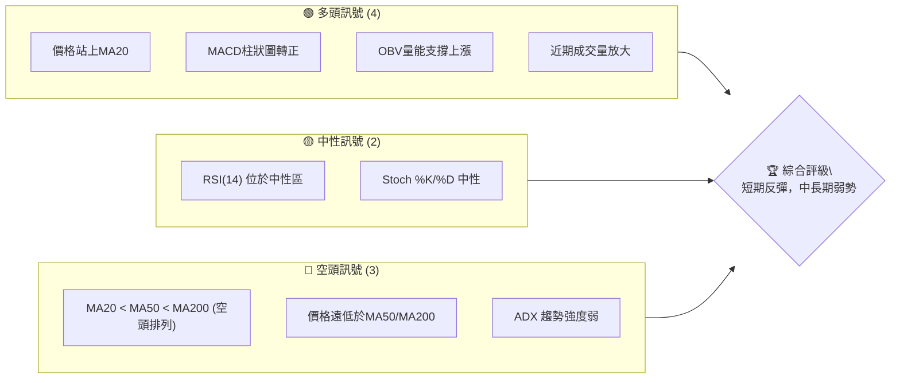

### 📊 核心指標速覽表

| 指標類別 | 指標名稱 | 當前數值 | 訊號 | 解讀 |
|----------|----------|----------|------|------|
| **價格** | 當前價格 | $55.35 | 🟡 | 位於52週區間低位，近期反彈 |
| **均線** | MA20 | $53.97 | 🟢 | 價格在MA20上方，短期偏多 |
| **均線** | MA50 | $57.17 | 🔴 | 價格在MA50下方，中期偏空 |
| **均線** | MA200 | $79.28 | 🔴 | 價格在MA200下方，長期偏空 |
| **動能** | RSI(14) | 42.21 | 🟡 | 位於中性區間，但已脫離超賣區 |
| **動能** | MACD | -2.351 (MACD), -2.622 (Signal), +0.271 (Hist) | 🟢 | MACD柱狀圖轉正，短期動能轉強 |
| **波動** | ATR | $3.41 | 🟡 | 佔價格6.16%，中等波動 |

### 🏆 技術評分卡

KTOS 的技術評分顯示短期內出現一些積極信號，但整體趨勢仍偏弱，需要密切關注其能否突破關鍵阻力。

```
╔══════════════════════════════════════════════════════════════╗
║                技術評分卡 — KTOS (2026-07-06)                ║
╠══════════════════════════════════════════════════════════════╣
║ 趨勢強度      ███░░░░░░░░░░░░░░░░░░  15/100  🔴 (ADX弱趨勢)    ║
║ 動能指標      ████████░░░░░░░░░░░░  40/100  🟡 (MACD轉正,RSI中性)║
║ 支撐穩定度    ██████████░░░░░░░░░░  50/100  🟡 (近期低點有支撐)║
║ 成交量配合    ████████████░░░░░░░░  60/100  🟢 (反彈量能配合)  ║
║ 形態完整度    ████░░░░░░░░░░░░░░░░  20/100  🔴 (缺乏明確反轉形態)║
║ 均線排列      ███░░░░░░░░░░░░░░░░░  15/100  🔴 (空頭排列)    ║
╠══════════════════════════════════════════════════════════════╣
║ 綜合評分      ████░░░░░░░░░░░░░░░░  33/100  🔴 弱勢反彈，觀望  ║
╚══════════════════════════════════════════════════════════════╝
```

---

## 2. 趨勢分析

### 🌐 多時框趨勢分析

KTOS 在不同時間框架下呈現出不同的趨勢特徵。長期趨勢（月線）明顯處於下跌通道，中期趨勢（週線）在經歷大幅下跌後出現反彈，而短期趨勢（日線）則表現出初步的築底跡象和多頭反攻。

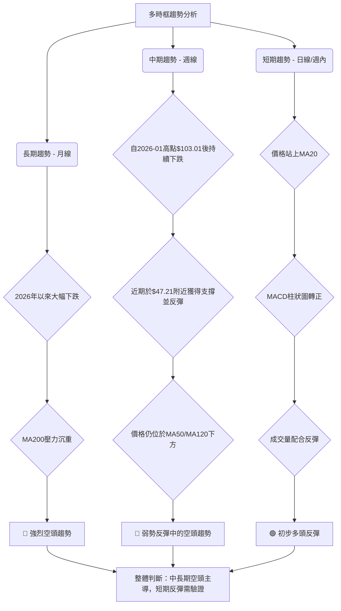

### 📈 長期趨勢 — 12個月走勢圖（Unicode）

KTOS 在過去12個月的走勢呈現出先大幅上漲後急劇下跌的過山車行情。從2025年7月的$58.70開始，股價一路飆升至2026年1月的$103.01高點，隨後便進入了漫長的下跌通道，至2026年6月跌至$49.86的低點，近期略有反彈。

```
KTOS 月線走勢圖（過去12個月）
價格軸 ($)
$105 ┤                            ● $103.01 (2026-01, 歷史高點)
$100 ┤
$95  ┤                  ● $91.37 (2025-09)
$90  ┤                ● $90.60 (2025-10)
$85  ┤          ● $86.18 (2026-02)
$80  ┤
$75  ┤      ● $76.10 (2025-11) ● $75.91 (2025-12)
$70  ┤    ● $70.51 (2026-03)
$65  ┤  ● $65.84 (2025-08)  ● $64.13 (2026-05)
$60  ┤● $58.70 (2025-07)
$55  ┤                                           ● $55.35 (2026-07, 現在)
$50  ┤                                         ● $49.86 (2026-06, 近期低點)
$45  ┤
     └──────────────────────────────────────────────────────────
      25/07 25/08 25/09 25/10 25/11 25/12 26/01 26/02 26/03 26/04 26/05 26/06 26/07
```

**走勢特徵分析表格**：

| 階段 | 時間段 | 價格區間 | 漲跌幅 | 主要特徵 | 訊號 |
|------|----------|----------|--------|----------|------|
| **強勢上漲** | 2025-07 ~ 2026-01 | $58.70 ~ $103.01 | +75.48% | 量價齊升，趨勢強勁，突破多個阻力 | 🟢🟢🟢 |
| **震盪回落** | 2026-02 ~ 2026-03 | $103.01 ~ $70.51 | -31.55% | 獲利回吐，跌破MA20/MA50，空頭趨勢確立 | 🔴🔴 |
| **加速下跌** | 2026-04 ~ 2026-06 | $70.51 ~ $47.21 | -33.04% | 跌破所有主要均線，動能強勁，創52週新低 | 🔴🔴🔴 |
| **近期反彈** | 2026-06 ~ 2026-07 | $47.21 ~ $55.35 | +17.24% | 脫離超賣區，短期動能回歸，但仍面臨阻力 | 🟡🟢 |

### 📊 中期趨勢（週線分析）

從近20週的週線數據來看，KTOS 在2026年2月22日達到$96.08的高點後，便進入了連續的下跌。尤其是在2026年3月底和4月底，股價兩次跌破關鍵支撐，顯示空頭力量強勁。最近一次的大幅下跌發生在2026年6月28日，收盤價僅為$47.21，創下近期低點。隨後在2026年7月5日出現強勁反彈，收盤價回升至$55.35，伴隨著較大的成交量。

```
KTOS 中期趨勢：近期壓力與支撐示意圖
價格軸 ($)
$90.00 ┤
$85.00 ┤            ┌─R(87.53)
$80.00 ┤            │
$75.00 ┤            │
$70.00 ┤            S(70.34)─┐
$65.00 ┤                      │
$60.00 ┤                      │
$55.35 ├─────────────────────┼─ 現在價格
$50.00 ┤                      S(47.21)─┐
$45.00 ┤                              │
$40.00 ┤                              └─近期低點

R(87.53): 2026-03-15 阻力位
S(70.34): 2026-04-12 支撐位 (現已跌破，轉為阻力)
S(47.21): 2026-06-28 近期強支撐位
```
中期趨勢目前處於一個下跌後的反彈階段，但上方阻力重重。MA50 ($57.17) 和 MA60 ($59.63) 構成短期反彈的強勁壓力。只有有效突破這些均線，中期趨勢才有望從空頭轉為震盪或多頭。

### ⚡ 趨勢強度評估（ADX 解讀）

ADX 指標用於衡量趨勢的強度，而非方向。當ADX值高於25時，表示趨勢強勁；低於20則表示趨勢疲弱或處於盤整狀態。

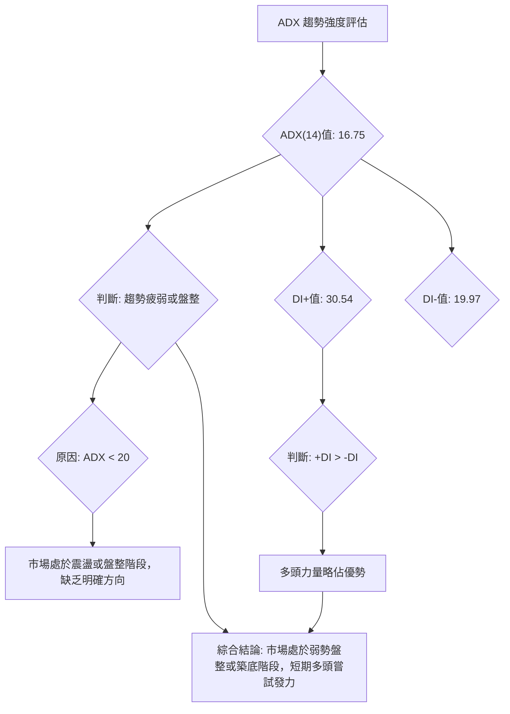

**ADX 強度對照表**：

| ADX 值範圍 | 趨勢強度 | 市場狀態 | 建議策略 |
|------------|----------|----------|----------|
| 0-20       | 弱趨勢   | 盤整/築底 | 觀望，或區間操作 |
| 20-25      | 趨勢啟動 | 趨勢形成中 | 謹慎順勢交易 |
| 25-50      | 強趨勢   | 明確趨勢 | 順勢交易 |
| 50-75      | 超強趨勢 | 趨勢加速 | 順勢交易，注意回調 |
| 75-100     | 極強趨勢 | 趨勢末端 | 謹慎，可能面臨反轉 |

KTOS 的ADX(14)為 16.75，明確指示當前市場缺乏強勁的趨勢，處於弱勢或盤整狀態。儘管+DI (30.54) 高於-DI (19.97)，顯示近期多頭力量略佔上風，這主要反映了從$47.21低點以來的短期反彈動能。然而，由於ADX本身數值較低，此反彈的持續性與強度仍需進一步觀察，目前不宜過度樂觀判斷為強勢多頭趨勢的確立。

---

## 3. 圖表形態分析

### 🔍 形態識別系統

從提供的歷史數據來看，KTOS 在2026年初形成了一個明顯的「頭部形態」後開始下跌，儘管沒有典型的頭肩頂或雙頂結構，但$103.01的高點之後的快速下跌，可以視為一個強勢逆轉。近期從$47.21的反彈，可能正在構築一個「底部形態」，但目前尚不明確。

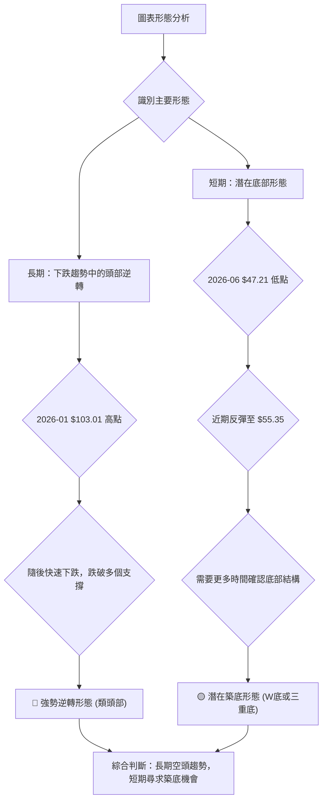

### 🕯️ 重要K線形態分析

由於數據只提供週收盤價，我們將分析週線級別的K線形態。

| 月份 | 收盤價 | K線形態 (週線級別推斷) | 解讀 | 訊號 |
|------|--------|------------------------|------|------|
| 2026-06-28 | $47.21 | **長陰線**             | 價格大幅下跌，收於低點，空頭力量強勁 | 🔴 |
| 2026-07-05 | $55.35 | **長陽線/看漲吞噬 (假設)** | 從低點強勁反彈，吞噬前一週跌幅的一部分，多頭動能回歸 | 🟢 |

**K線形態詳解：**
*   **2026-06-28 ($47.21) 週線：** 儘管沒有開盤價，但從前一週的$54.21跌至$47.21，跌幅顯著，且伴隨極高的成交量（45,383,700，遠高於20日均量），這通常是一根恐慌性拋售的長陰線，或下跌趨勢中的加速下跌。
*   **2026-07-05 ($55.35) 週線：** 從$47.21強勁反彈至$55.35，漲幅達17.24%，且成交量（26,363,100）也高於20日均量。這根K線很可能是一根長陽線，甚至可能形成「看漲吞噬」或「錘子線」形態，暗示在底部有買盤介入，構成潛在的反轉信號。

### 📉 ASCII 走勢形態示意圖

以下示意圖展示了KTOS從高點下跌並在近期形成底部反彈的走勢形態。

```
KTOS 近期走勢形態示意圖
═══════════════════════════════════════════════════════════════════
$105 ┤          /\ (歷史高點 $103.01)
$100 ┤         /  \
$95  ┤        /    \
$90  ┤       /      \
$85  ┤      /        \
$80  ┤     /          \
$75  ┤    /            \
$70  ┤   /              \
$65  ┤  /                \
$60  ┤ /                  \
$55  ┤                      \
$50  ┤                       \     /\  (近期反彈)
$45  ┤                        \___/  \
$40  ┤                                \_ (近期低點 $47.21)
     └────────────────────────────────────────────────────────────
        歷史高點下跌趨勢                ↓ 潛在底部形態形成中
```

### 🎯 形態目標價計算

鑑於目前的圖表形態處於下跌後的反彈初期，尚未形成明確的W底或頭肩底反轉形態，因此無法給出基於完整形態的明確目標價。
然而，如果將近期從$47.21到$55.35的反彈視為潛在W底的第一個V型底部，那麼第二個V型底部可能會在$47.21附近再次測試支撐，或者形成更高的低點。
**潛在W底形態推演：**
1.  **第一谷底**：$47.21 (2026-06-28)
2.  **頸線位**：目前反彈的高點，可暫定為MA50所在的$57.17或斐波那契38.2%回調位$68.53附近。
3.  **第二谷底**：可能在$47.21-$50.00區間再次測試。
如果未來能形成完整的W底，且頸線突破，則目標價計算為：
*   **形態高度** = 頸線 - 第一谷底
*   **目標價** = 頸線 + 形態高度

目前階段，由於形態尚未確立，目標價的計算主要基於斐波那契回調和關鍵阻力位。

---

## 4. 支撐與阻力

### 🗺️ 關鍵價位分布圖（Unicode）

KTOS 目前的價格$55.35正處於一個關鍵的轉折點，下方有較強的短期支撐，但上方阻力重重。

```
KTOS 價位結構分布圖
═══════════════════════════════════════════════════
$103.01 ║████████████████████████║ 極強阻力 R4 (歷史高點)
$91.37  ║████████████████████    ║ 強阻力 R3 (前高點)
$79.28  ║████████████████████████║ 強阻力 R2 (MA200)
$68.53  ║▓▓▓▓▓▓▓▓▓▓▓▓▓▓▓▓▓▓▓▓▓▓▓▓║ 關鍵阻力 R1 (Fib 61.8%回調)
$63.31  ║▓▓▓▓▓▓▓▓▓▓▓▓▓▓▓▓        ║ 布林上軌 / 斐波那契23.6%回調 ($60.38)
$59.63  ║▓▓▓▓▓▓▓▓▓▓▓▓▓▓▓▓        ║ MA60
$57.17  ║▓▓▓▓▓▓▓▓▓▓▓▓▓▓▓▓        ║ MA50
$55.35  ╠════════════════════════╣ ◄ 現價
$53.97  ║▓▓▓▓▓▓▓▓▓▓▓▓▓▓▓▓        ║ 近期支撐 S1 (MA20)
$47.21  ║████████████████████████║ 強支撐 S2 (近期低點)
$44.63  ║▓▓▓▓▓▓▓▓▓▓▓▓▓▓▓▓        ║ 布林下軌
$41.87  ║████████████████████████║ 極強支撐 S3 (52週低點)
═══════════════════════════════════════════════════
```

### 🚧 阻力位分析表

| 阻力級別 | 價位 | 形成原因 | 突破難度 | 重要性 |
|----------|------|----------|----------|--------|
| **短期阻力** | $57.17 | MA50 | 中等 | 突破則中期趨勢有望改善 |
| **短期阻力** | $59.63 | MA60 | 中等 | 與MA50形成密集阻力區 |
| **關鍵阻力** | $60.38 | 斐波那契23.6%回調位 (自$103.01至$47.21跌幅) | 高 | 突破是確認反彈強度的重要信號 |
| **關鍵阻力** | $63.31 | 布林通道上軌 | 高 | 突破可能預示短期超買或加速上漲 |
| **中期阻力** | $68.53 | 斐波那契38.2%回調位 | 很高 | 突破則表明反彈動能持續性強 |
| **長期阻力** | $79.28 | MA200 | 極高 | 突破則長期空頭趨勢可能終結 |
| **長期阻力** | $103.01 | 歷史高點 | 極高 | 幾乎不可能在短期內突破 |

### 🛡️ 支撐位分析表

| 支撐級別 | 價位 | 形成原因 | 守住機率 | 重要性 |
|----------|------|----------|----------|--------|
| **短期支撐** | $53.97 | MA20 | 中等 | 短期多頭防線，跌破則反彈受挫 |
| **關鍵支撐** | $47.21 | 近期低點 (2026-06-28) | 高 | 重要的底部參考，跌破則可能加速下跌 |
| **強支撐** | $44.63 | 布林通道下軌 | 高 | 提供技術性買盤支撐 |
| **極強支撐** | $41.87 | 52週低點 | 極高 | 跌破則意味著趨勢極度惡化 |

### 📐 斐波那契回調位分析

我們計算從2026年1月高點$103.01到2026年6月低點$47.21這波下跌的回調水平。這些水平將作為KTOS反彈過程中的潛在阻力。

**下跌波段：**
*   **高點 (A)**: $103.01 (2026-01)
*   **低點 (B)**: $47.21 (2026-06)
*   **下跌幅度**: $103.01 - $47.21 = $55.80

**斐波那契回調位計算：**

| 回調比例 | 價位 ($) | 意義 |
|----------|----------|------|
| 23.6%    | $60.38   | 這是反彈的第一個阻力位，對應當前反彈的初步考驗。 |
| 38.2%    | $68.53   | 重要的中期阻力，若能突破此位，反彈動能將被確認。 |
| 50.0%    | $75.11   | 通常被視為強勢反彈的目標，也是心理阻力位。 |
| 61.8%    | $81.70   | 黃金回調比例，若能達到此位，表示下跌趨勢已大幅修正。 |
| 76.4%    | $89.84   | 反彈極強，幾乎收復大部分跌幅。 |

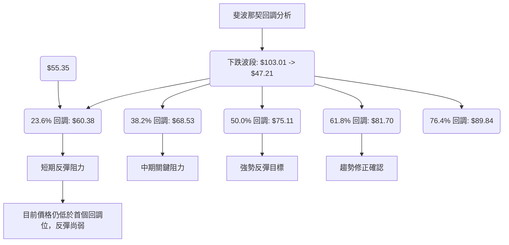
當前價格$55.35仍低於第一個斐波那契回調位$60.38，表明本次反彈的強度仍較弱，尚未能有效挑戰下跌趨勢的修正水平。$60.38將是KTOS短期內需要突破的關鍵阻力。

---

## 5. 技術指標深度解讀

### 🎛️ 指標訊號總覽

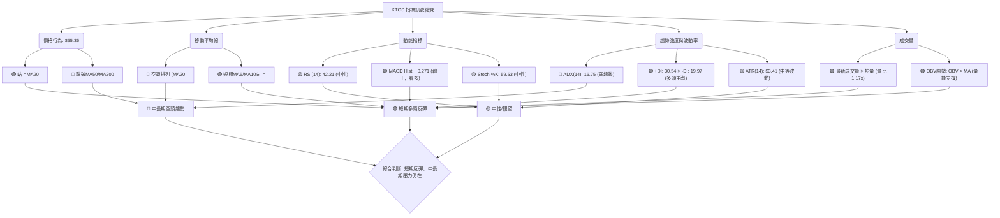

### 📈 移動平均線排列分析

KTOS 的移動平均線系統呈現典型的空頭排列，但短期均線已出現向上拐點。

*   **MA20**: $53.97
*   **MA50**: $57.17
*   **MA200**: $79.28

**均線排列：MA20 ($53.97) < MA50 ($57.17) < MA200 ($79.28)**，這是一個教科書般的空頭排列，指示股票長期處於下降趨勢中。
當前價格 $55.35 位於 MA20 ($53.97) 之上，但仍低於 MA50 ($57.17) 和 MA200 ($79.28)。這表明短期內出現反彈，但尚未能改變中長期下降趨勢。

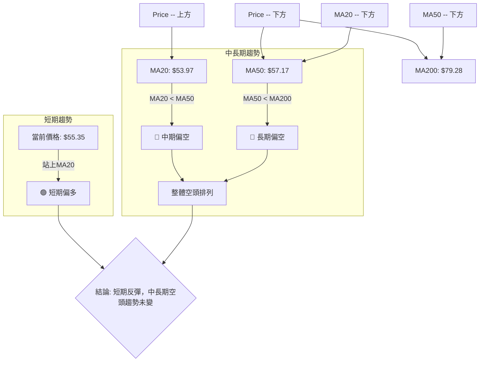
**均線走勢分析：**
*   MA5: $50.48, +9.64% (強勁向上)
*   MA10: $50.28, +10.09% (強勁向上)
*   MA20: $53.97, +2.55% (向上拐頭)
*   MA60: $59.63, -7.17% (持續向下)
*   MA120: $77.09, -28.20% (持續向下)
*   MA240: $76.69, -27.83% (持續向下)

短期均線 (MA5, MA10, MA20) 均呈現向上趨勢，且價格已經站上MA20，這是短期多頭反彈的明確信號。然而，中期和長期均線 (MA60, MA120, MA240) 仍然持續向下，且價格遠低於這些長期均線，表明整體下降趨勢的結構並未改變。多頭能否持續，關鍵在於能否突破MA50 ($57.17) 和MA60 ($59.63) 的密集阻力區。

### 📉 RSI(14) 分析

RSI(14) 數值為 42.21，位於 30-70 的中性區間。這表示 KTOS 既沒有處於超買狀態，也沒有處於超賣狀態。

**RSI 數值進度條：**
RSI(14): ▓▓▓▓▓▓▓▓░░░░░░░░░░░░░░░░░░░░ (42.21%) 🟡 中性

**超買超賣區間分析：**
*   **超買區 (RSI > 70)**：目前不在。意味著短期內沒有過熱的風險。
*   **超賣區 (RSI < 30)**：在2026-06-28週收盤$47.21時，RSI為23.1，明確處於超賣區。隨後反彈至$55.35，RSI回升至42.21，表明股價已從超賣狀態中恢復，買盤介入。

**背離判斷：**
*   **頂背離 (價格創新高，RSI未創新高)**：未觀察到。在2026-01達到歷史高點$103.01後，RSI也處於高位，隨後價格下跌，RSI也同步下跌。
*   **底背離 (價格創新低，RSI未創新低)**：未觀察到。在2026-06-28週，價格創下$47.21的近期低點，RSI也創下23.1的低點。隨後的反彈中，價格和RSI同步上升。因此，目前沒有明顯的RSI背離信號。

**RSI 結論**：RSI 從超賣區反彈至中性區間，顯示短期下跌動能減弱，買盤有所介入。但RSI尚未達到50以上，表明多頭動能仍需進一步加強才能確立反轉。

### 📊 MACD(12/26/9) 訊號解讀

MACD 是衡量動量和趨勢變化的指標。
*   MACD 線: -2.351
*   MACD Signal 線: -2.622
*   MACD Hist (柱狀圖): +0.271

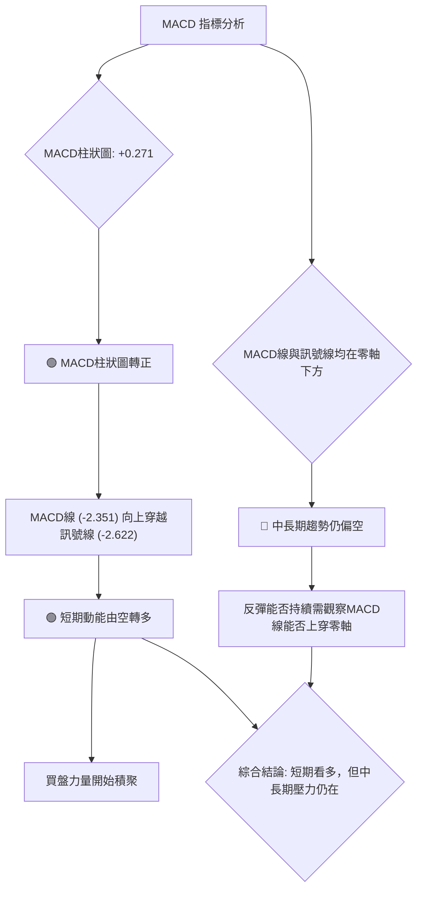
**MACD 柱狀圖：** 從之前的負值轉為正值 (+0.271)，這是一個明確的短期買入信號，表示 MACD 線已經向上穿越了 Signal 線，短期動能由空轉多。
**MACD 線與 Signal 線：** MACD 線 (-2.351) 位於 Signal 線 (-2.622) 之上，確認了柱狀圖轉正的買入信號。
**零軸位置：** MACD 線和 Signal 線都仍位於零軸下方，這表明儘管短期動能轉強，但中長期趨勢仍然偏空。只有當 MACD 線和 Signal 線都能上穿零軸，才能確認中長期趨勢的反轉。

**MACD 背離判斷：**
*   **頂背離**：未觀察到。
*   **底背離**：未觀察到。價格從高點下跌，MACD也同步下跌。近期低點反彈，MACD也同步從低點反彈並轉正。

**MACD 結論**：MACD 發出短期多頭信號，顯示買盤正在介入，動能有所恢復。但由於其仍在零軸下方，這只是一個下跌趨勢中的反彈信號，而非趨勢反轉的確認。

### 📦 布林通道分析

布林通道由三條線組成：上軌、中軌(MA20)和下軌，用以衡量價格的波動區間。
*   BB上軌: $63.31
*   BB中軌(MA20): $53.97
*   BB下軌: $44.63
*   當前價格: $55.35
*   BB %B: 0.57 (0=下軌, 0.5=中軌, 1=上軌)

```
KTOS 布林通道示意圖
═══════════════════════════════════════════════════════════════
$65.00 ┤                                        BB上軌 ($63.31)
$60.00 ┤                                        
$55.35 ├───────────────────────────────────────── 現價
$53.97 ┤                                        BB中軌 (MA20 $53.97)
$50.00 ┤                                        
$45.00 ┤                                        BB下軌 ($44.63)
═══════════════════════════════════════════════════════════════
```

**布林通道解讀：**
*   **價格位置：** 當前價格$55.35位於中軌 ($53.97) 和上軌 ($63.31) 之間。BB %B 為0.57，表示價格略高於中軌。
*   **訊號：** 價格從下軌附近反彈並站上中軌，這是一個短期的看漲信號。通常，價格從下軌反彈並穿越中軌，可能預示著短期上升趨勢的開始。
*   **通道寬度：** 雖然沒有具體的通道寬度數據，但從上中下軌的數值來看，通道仍有一定的寬度。這表示市場存在一定的波動性。
*   **潛在阻力：** 布林通道上軌 $63.31 將是短期反彈面臨的一個重要阻力位。

**布林通道結論**：KTOS 股價在布林通道下軌獲得支撐後反彈，並成功站上中軌，顯示短期買盤力量增強。這為短期多頭提供了有利條件，但需注意上軌 $63.31 的阻力作用。

### 💹 成交量分析（量價配合度）

成交量是價格走勢的燃料，量價配合度對於判斷趨勢的可靠性至關重要。

*   最新成交量: 6,702,400
*   20日均量: 5,736,610 (量比: 1.17x)
*   50日均量: 5,118,358
*   OBV趨勢: OBV > MA → 量能支撐上漲 (🟢 看多)

**量價配合分析：**
1.  **近期反彈與成交量：** 當前價格從$47.21反彈至$55.35，最新成交量達6,702,400股，顯著高於20日均量 (1.17倍)。這是一個積極的信號，表明買盤在反彈過程中積極介入，量能支持價格上漲，反彈的可靠性較高。
2.  **OBV 趨勢：** OBV (On-Balance Volume) 趨勢顯示 OBV 線高於其均線，這進一步確認了量能正在支撐價格上漲。OBV 上升通常預示著累積買壓，是看漲的信號。
3.  **歷史成交量對比：** 在2026-06-28週，價格下跌至$47.21時，週成交量高達45,383,700，是近20週的最高量。這可能是恐慌性拋售的極致，也可能是底部吸籌的一部分。隨後的一週（2026-07-05）成交量為26,363,100，雖然較前一週有所減少，但仍遠高於平均水平，且伴隨價格大幅上漲，這是一個底部放量反彈的典型特徵。

**成交量結論**：KTOS 的量價配合顯示近期反彈得到成交量的有效確認。最新成交量高於均量，且OBV趨勢看多，這為短期多頭的反彈提供了堅實的基礎。這與 MACD 柱狀圖轉正和價格站上 MA20 的信號相互印證，增強了短期看漲的信心。

---

## 6. 動能與波動率

### ⚡ 動能評估四象限

動能評估四象限將股票分為四類，根據其動能強度和波動率來判斷當前狀態和潛在機會。

| 象限 | 動能 (MACD, RSI) | 波動 (ATR) | 當前狀態 | 評估 |
|------|------------------|------------|----------|------|
| Q1   | 強               | 低         | -        | 最佳機會 (強動能低風險) |
| Q2   | 弱               | 低         | -        | 謹慎觀望 (缺乏動能，風險低) |
| Q3   | 強               | 高         | -        | 高風險高收益 (追高風險大) |
| Q4   | 弱               | 高         | ✓        | **KTOS 當前** (動能轉強，波動率中等偏高) |

**KTOS 當前狀態解讀：**
*   **動能評估 (MACD Hist 轉正, RSI 從超賣區反彈)**: 雖然MACD柱狀圖轉正，RSI脫離超賣區，顯示短期動能從「弱」轉向「中等偏強」。但考慮到MACD仍在零軸下方，且RSI未達強勢區，整體動能評為「中等」。
*   **波動率評估 (ATR $3.41，佔價格6.16%)**: ATR 佔股價比例較高，顯示其每日波動幅度較大，屬於「中等偏高」波動率。

**綜合判斷：** KTOS 目前處於「動能從弱轉強但尚未確立，波動率中等偏高」的狀態。這意味著短期內可能存在交易機會，但由於波動較大，風險也相對較高。這不是一個趨勢明確、風險極低的「最佳機會」狀態，而是一個需要謹慎操作、追蹤動能持續性的「高風險高收益」或「潛在轉折」狀態。

### 📊 ATR 波動率分析

ATR (Average True Range) 是衡量市場波動性的指標，它反映了在特定時間段內價格的平均波動幅度。
*   ATR(14): $3.41
*   ATR佔收盤價比例: ($3.41 / $55.35) * 100% = 6.16%

**ATR 解讀：**
KTOS 的ATR為$3.41，佔當前股價的6.16%。這是一個相對較高的百分比，表明該股票的每日波動性較大。
*   **高波動性特徵：** 較高的ATR意味著股價在日內或短期內可能出現較大的漲跌幅，這對日內交易者和短期交易者來說可能意味著更多的機會，但也伴隨著更高的風險。
*   **止損距離建議：** 由於波動性較高，設定止損點時需要考慮更大的緩衝空間，以避免被正常市場波動「洗出」。通常建議將止損點設置在ATR的1.5倍至2倍之外。
    *   **保守止損**：當前價格 $55.35 - (1.5 * $3.41) = $55.35 - $5.115 = $50.235
    *   **激進止損**：當前價格 $55.35 - (1.0 * $3.41) = $55.35 - $3.41 = $51.94

**ATR 結論**：KTOS 具有較高的波動性，交易者在制定策略時應充分考慮這一點。較大的ATR值需要更寬鬆的止損設定，以容忍其正常的價格震盪。

### 📐 Beta 與市場相關性

數據中未提供 KTOS 的 Beta 值。
Beta 值衡量單一股票相對於整個市場（通常是大盤指數如S&P 500）的波動性。
*   **Beta > 1**: 股票波動性高於市場。
*   **Beta < 1**: 股票波動性低於市場。
*   **Beta = 1**: 股票波動性與市場一致。
*   **Beta < 0**: 股票走勢與市場相反。

**分析缺失聲明：**
由於缺乏 Beta 數據，我們無法量化 KTOS 與大盤的相關性。然而，從其行業（航空航天與國防）來看，該行業通常被認為具有一定的防禦性，但也可能受到政府預算、地緣政治事件等因素的影響，與大盤的相關性可能時高時低。在沒有具體 Beta 值的情況下，投資者應自行評估其對市場波動的敏感度。

---

## 7. 多時框架總結

### 📋 時框架評分表

本節將對 KTOS 在不同時間框架下的技術狀況進行綜合評估，為投資決策提供多維度視角。

| 時框架 | 趨勢方向 | 動能 | 均線排列 | 形態 | 綜合評分 (1-10) | 建議 |
|--------|----------|------|----------|------|-----------------|------|
| **長期 (月線)** | 🔴 下跌 | 🔴 弱 | 🔴 空頭 | 🔴 頭部逆轉 | 2/10 | 避免長期持有，等待趨勢反轉信號 |
| **中期 (週線)** | 🔴 震盪下跌 | 🟡 中性 | 🔴 空頭 | 🟡 潛在築底 | 4/10 | 觀察底部結構，不宜重倉 |
| **短期 (日線)** | 🟢 反彈 | 🟢 強 | 🟡 突破MA20 | 🟢 底部反彈 | 7/10 | 可考慮小倉位短線操作，嚴格止損 |

### 🔲 綜合訊號矩陣

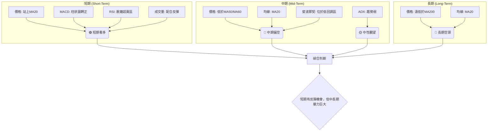
**綜合訊號分析：**
KTOS 的短期訊號顯示出明顯的多頭反彈跡象，包括價格站上MA20、MACD柱狀圖轉正、RSI脫離超賣區以及成交量配合。這表明在經歷大幅下跌後，市場出現了一定的買盤介入和動能修復。

然而，從中期和長期來看，空頭趨勢依然強勁。價格仍遠低於MA50、MA60和MA200，均線呈現空頭排列。ADX指標也顯示整體趨勢強度不足，市場處於弱勢盤整中。斐波那契回調分析表明，當前價格仍位於第一個重要回調位下方，反彈的力度仍需驗證。

**結論：** KTOS 目前處於一個短期反彈與中長期空頭趨勢並存的複雜局面。短期交易者可以考慮把握反彈機會，但必須嚴格控制風險，並密切關注中期阻力位的突破情況。對於中長期投資者而言，目前仍是觀望為主，等待更明確的底部形態和趨勢反轉信號出現。

---

## 8. 交易策略建議

基於上述多時框架的技術分析，KTOS 目前處於下跌趨勢中的短期反彈階段。建議採取謹慎的多頭策略，並對空頭策略保持警惕，以防反彈失敗。

### 🗺️ 策略決策流程圖

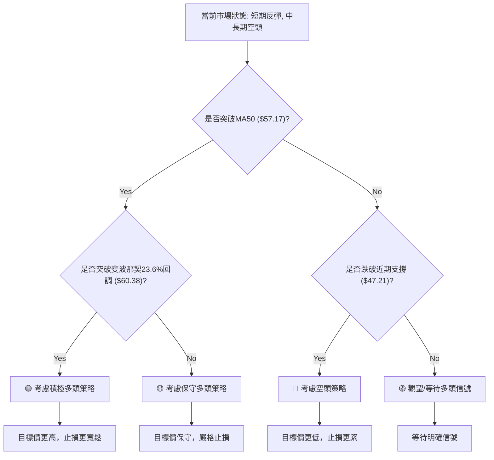

### 🟢 多頭策略詳情

**策略 A：激進反彈追蹤 (當前價格附近進場)**
此策略適用於認為短期反彈將持續，並能突破MA50的交易者。

| 策略要素 | 策略 A：激進反彈追蹤 |
|----------|----------------------|
| 進場條件 | 價格站穩MA20 ($53.97)上方，MACD柱狀圖持續為正，成交量配合放大。 |
| 進場價格 | **$55.35 - $56.00** (利用當前反彈動能) |
| 目標價 T1 | **$59.63** (MA60阻力位，接近斐波那契23.6%回調 $60.38) |
| 目標價 T2 | **$63.31** (布林通道上軌阻力位) |
| 止損價格 | **$51.94** (近期低點 $47.21 上方，約1倍ATR，考慮其波動性) |
| 風險報酬比 | T1: (59.63 - 55.35) / (55.35 - 51.94) = 4.28 / 3.41 = **1.25:1** (中性) |
| 成功機率 | 45% (短期反彈動力強，但上方阻力重重) |
| 建議倉位 | 5% - 10% (風險較高，小倉位試水) |

**策略 B：突破確認多頭 (等待突破關鍵阻力)**
此策略較為保守，等待市場確認反彈強度後再進場，以降低風險。

| 策略要素 | 策略 B：突破確認多頭 |
|----------|----------------------|
| 進場條件 | 價格有效突破並站穩MA50 ($57.17) 和斐波那契23.6%回調位 ($60.38)。 |
| 進場價格 | **$60.50 - $61.00** (確認突破後進場) |
| 目標價 T1 | **$68.53** (斐波那契38.2%回調位) |
| 目標價 T2 | **$75.11** (斐波那契50%回調位) |
| 止損價格 | **$57.00** (MA50突破後轉為支撐，或近期突破點下方) |
| 風險報酬比 | T1: (68.53 - 60.50) / (60.50 - 57.00) = 8.03 / 3.50 = **2.29:1** (較優) |
| 成功機率 | 55% (等待確認，成功率更高) |
| 建議倉位 | 10% - 15% (風險相對較低，可適當增加倉位) |

### 🔴 空頭策略詳情

**策略 C：反彈失敗空頭 (反彈觸及阻力位後回落)**
此策略適用於認為當前反彈只是下跌趨勢中的修正，將在關鍵阻力位受阻後繼續下跌的交易者。

| 策略要素 | 策略 C：反彈失敗空頭 |
|----------|----------------------|
| 進場條件 | 價格反彈至MA50 ($57.17) 或斐波那契23.6%回調位 ($60.38) 附近，出現明顯受阻K線形態 (如長上影線、吞噬形態)，MACD柱狀圖再次轉負。 |
| 進場價格 | **$57.00 - $60.00** (阻力位附近，確認受阻後) |
| 目標價 T1 | **$53.97** (MA20支撐位) |
| 目標價 T2 | **$47.21** (近期低點，強支撐位) |
| 止損價格 | **$61.50** (略高於斐波那契23.6%回調位 $60.38，或反彈高點上方) |
| 風險報酬比 | T1 (以$57進場): (57.00 - 53.97) / (61.50 - 57.00) = 3.03 / 4.50 = **0.67:1** (較差，不建議單獨操作) |
| 風險報酬比 | T2 (以$57進場): (57.00 - 47.21) / (61.50 - 57.00) = 9.79 / 4.50 = **2.18:1** (較優) |
| 成功機率 | 50% (中長期趨勢有利空頭，但短期多頭動能可能持續) |
| 建議倉位 | 5% - 10% (高風險，需嚴格止損) |

### ⭐ 整體訊號強度評星

做多訊號強度：★★★★☆ (4/5星) - 短期反彈動能強勁，但上方阻力重重。
做空訊號強度：★★★☆☆ (3/5星) - 中長期空頭趨勢未變，但短期反彈強勁，不宜盲目做空。
整體可信度：  ★★★☆☆ (3/5星) - 市場處於轉折期，多空交織，需謹慎判斷。

---

## 9. 風險提示與監控

### ✅ 關鍵監控指標 Checklist

以下是交易 KTOS 時應密切關注的關鍵技術指標和價位，以確保及時調整策略。

```
╔══════════════════════════════════════════════════════════════╗
║              KTOS 交易風險監控清單 (2026-07-06)              ║
╠══════════════════════════════════════════════════════════════╣
║ [ ] 價格是否能站穩 MA20 ($53.97) 上方？                      ║
║ [ ] 價格能否有效突破 MA50 ($57.17) 和 MA60 ($59.63) 密集阻力區？║
║ [ ] 價格能否突破斐波那契23.6%回調位 ($60.38)？               ║
║ [ ] MACD 柱狀圖是否持續為正，MACD 線能否上穿零軸？           ║
║ [ ] RSI 是否能突破 50 進入強勢區？                           ║
║ [ ] 成交量是否持續放大，配合價格上漲？                       ║
║ [ ] ADX 是否能突破 25，確認新的趨勢形成？                    ║
║ [ ] 價格是否跌破近期低點 ($47.21)？                          ║
║ [ ] 市場是否有重大消息面或產業面變化？                       ║
╚══════════════════════════════════════════════════════════════╝
```

### ⚠️ 風險場景分析

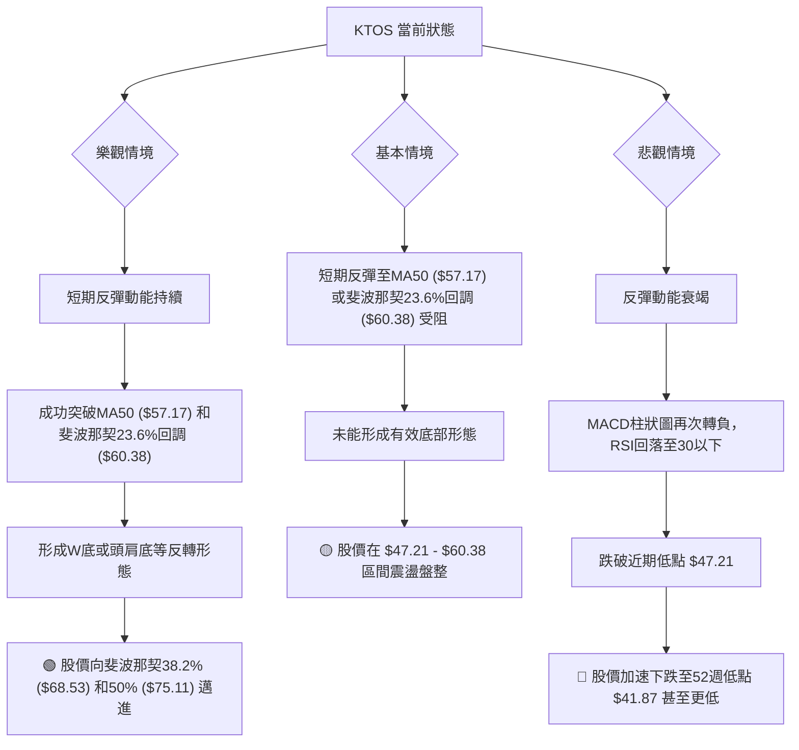

### 🛡️ 風險管理重要提醒

1.  **倉位管理：** 鑑於 KTOS 目前處於高波動且中長期趨勢不明朗的階段，建議投資者採取較小的倉位進行操作，避免重倉。對於短期反彈策略，建議倉位控制在總資金的5%-15%之間。
2.  **嚴格止損：** 波動性較高，必須設定並嚴格執行止損點。一旦價格觸及止損位，無論盈虧，都應立即出場，以保護本金。建議將止損點設置在關鍵支撐位下方，並參考 ATR 進行動態調整。
3.  **分批進場/出場：** 可以考慮分批進場以平均成本，分批出場以鎖定利潤。例如，在反彈初期建立少量倉位，待突破關鍵阻力後再加倉；在達到目標價時分批減倉，確保部分利潤落袋為安。
4.  **關注外部因素：** KTOS 屬於國防與安全領域，其股價可能受到政府國防預算、地緣政治事件、新技術研發進展等宏觀和產業消息的影響。在技術分析的同時，也應密切關注相關消息面，避免「黑天鵝」事件帶來的衝擊。
5.  **不追高殺跌：** 在當前反彈階段，避免盲目追高，尤其是在價格接近強阻力位時。同時，在下跌趨勢中，不輕易抄底，應等待明確的築底信號和反轉形態。

---

## 📋 報告總結

```
╔════════════════════════════════════════════════════════════╗
║                   KTOS 技術分析報告總結                    ║
╠════════════════════════════════════════════════════════════╣
║ 報告日期：2026-07-06                                         ║
║ 當前價格：$55.35                                             ║
║ 分析評級：⚖️ 短期反彈，中長期弱勢 (Mixed Signals)           ║
║                                                              ║
║ 關鍵結論：                                                   ║
║ ├─ 長期趨勢：🔴 強烈空頭趨勢，股價遠低於MA200。              ║
║ ├─ 中期趨勢：🔴 震盪下跌後反彈，但仍受MA50/MA60壓制。        ║
║ ├─ 短期趨勢：🟢 底部反彈，價格站上MA20，MACD轉正，量能配合。 ║
║ ├─ 關鍵支撐：$47.21 (近期低點)，$41.87 (52週低點)。          ║
║ ├─ 關鍵阻力：$57.17 (MA50)，$60.38 (斐波那契23.6%回調)。      ║
║ └─ 分析師目標：$109.86 (均值) — 遠高於當前技術阻力，長期目標。║
║                                                              ║
║ 最優策略組合：                                               ║
║ 1. 🥇 最佳機會：**保守多頭策略**。等待價格有效突破並站穩MA50 ($57.17) 和斐波那契23.6%回調位 ($60.38) 後，以 $60.50-$61.00 進場，目標價 $68.53，止損 $57.00。此策略風險報酬比更佳，成功率更高。║
║ 2. 🥈 次選機會：**激進反彈追蹤**。若對短期反彈有信心，可在 $55.35-$56.00 進場，目標價 $59.63，止損 $51.94。此策略適合風險承受能力較高的短線交易者。║
║ 3. 🥉 保守選擇：**觀望或反彈失敗做空**。若價格未能突破關鍵阻力，並出現回落信號，可在 $57.00-$60.00 附近考慮做空，目標價 $47.21，止損 $61.50。此策略風險較高，需嚴格控制。║
╚════════════════════════════════════════════════════════════╝
```

---

> ⚠️ **免責聲明**：本報告為 AI 自動生成之技術分析，所有數據及估算均基於提供的歷史價格資訊。本報告**僅供研究與學術參考**，**不構成任何投資建議**。投資有風險，入市需謹慎。

---

*報告生成時間：2026-07-06 ｜ 數據來源：Yahoo Finance ｜ 分析框架：多時框技術分析*