<details>
<summary>📊 靜態圖表 (點擊展開)</summary>
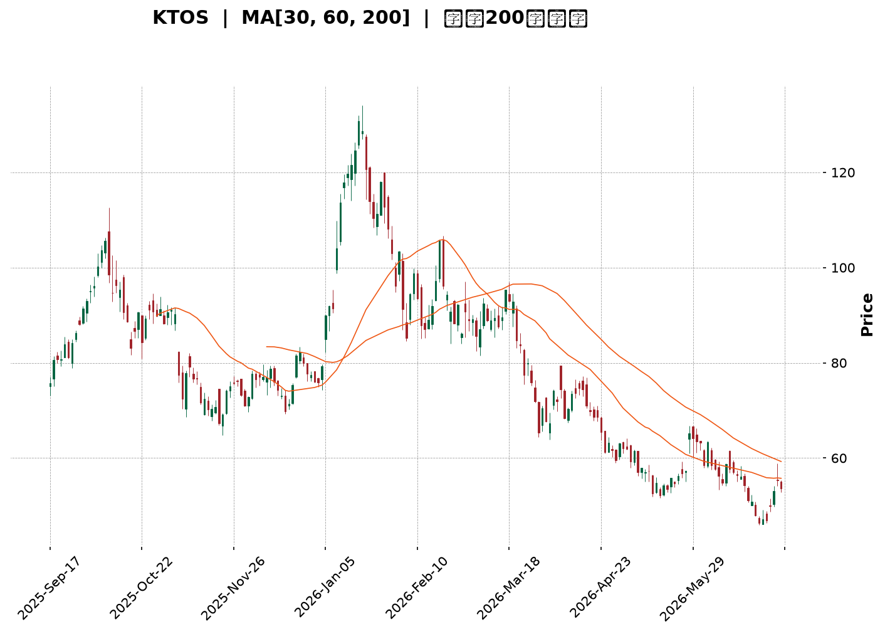
</details>

<html>
<head><meta charset="utf-8" /></head>
<body>
    <div style="height:500px; width:100%;">                        <script>window.PlotlyConfig = {MathJaxConfig: 'local'};</script>
        <script charset="utf-8" src="https://cdn.plot.ly/plotly-3.6.0.min.js" integrity="sha256-QaOVwtVY0T02VaHrr6pnoHLCwayMJp4O5n4YyaE3rJk=" crossorigin="anonymous"></script>                <div id="candlestick-chart" class="plotly-graph-div" style="height:100%; width:100%;"></div>            <script>                window.PLOTLYENV=window.PLOTLYENV || {};                                if (document.getElementById("candlestick-chart")) {                    Plotly.newPlot(                        "candlestick-chart",                        [{"close":{"dtype":"f8","bdata":"AAAAIFzvUkAAAACgmSlUQAAAAKBHMVRAAAAAgBQuVEAAAACgmflUQAAAACCFS1RAAAAAwMwMVUAAAACA65FVQAAAAMAeBVZAAAAAIK7XVkAAAACgcD1XQAAAAIDrwVdAAAAAACkMWEAAAAAAABBZQAAAAAAp7FlAAAAAQOFqWkAAAABAM6NYQAAAAOBRqFdAAAAAgOsRWEAAAABAM9NXQAAAAMAepVZAAAAAIK4nVkAAAAAgrsdUQAAAAKCZqVVAAAAAIK6nVkAAAABAMxNVQAAAAOB6VFZAAAAAIIXLVkAAAAAghatWQAAAAIDrcVZAAAAAoHDNVkAAAABAMxNWQAAAAGBmplZAAAAAYGbGVkAAAACAFI5WQAAAAIA9WlNAAAAAgD0aUkAAAADgUXhTQAAAACCFy1NAAAAAgMIlU0AAAADAzCxTQAAAAAAp7FFAAAAAwMwcUkAAAAAgXI9RQAAAAEAKl1FAAAAAQOGqUUAAAAAA19NQQAAAAMD1SFFAAAAAQAqHUkAAAABAM8NSQAAAAKBH8VJAAAAAYGYGU0AAAACgcE1SQAAAAKBwvVFAAAAAgOsxUkAAAAAghWtTQAAAAAAAIFNAAAAAgOtBU0AAAACA60FTQAAAAIA9OlNAAAAAgOuxU0AAAACgcP1SQAAAAOCjkFJAAAAA4FFIUkAAAACgR3FRQAAAAKCZ2VFAAAAAwPXYUkAAAACA62FUQAAAAEAzk1RAAAAAgBT+U0AAAADAzGxTQAAAAIAUXlNAAAAAYLj+UkAAAACAPfpSQAAAAGCP0lNAAAAAIIV7VkAAAAAghftWQAAAAAAp3FZAAAAAYI8CWkAAAADAzGxcQAAAAEAKd11AAAAAgBTuXUAAAAAAAGBeQAAAAADXI19AAAAAQApXYEAAAACAwhVgQAAAAIDCJV5AAAAAYGZ2XEAAAADA9ZhbQAAAAOB61FtAAAAAANeDXUAAAABA4SpcQAAAAIA9CltAAAAA4KPAWUAAAACAPQpYQAAAACCu11lAAAAAwB7VVkAAAAAAAFBVQAAAAIA9mldAAAAAANezWEAAAABguF5XQAAAAIDr8VVAAAAAQDPDVUAAAAAA10NWQAAAAIAU\u002flZAAAAAoHBNWEAAAABA4WpaQAAAAMAeBVhAAAAAANeTV0AAAAAghatWQAAAAGC4DlZAAAAAwPUIV0AAAAAghYtVQAAAAIAUrlZAAAAAwMw8VkAAAADgUUhWQAAAAGCPYlVAAAAAAADAVUAAAACAFB5XQAAAAKBwPVZAAAAAQOE6VkAAAACgcF1WQAAAAIDr4VVAAAAAgOthVkAAAAAA19NXQAAAAGCPQldAAAAAgOsxV0AAAAAgridVQAAAAAAp7FRAAAAAIFxfU0AAAABguP5TQAAAAEAK91JAAAAAACn8UUAAAACA61FQQAAAAOCjoFFAAAAAwMzsUEAAAAAA19NQQAAAAIDChVJAAAAAoHD9UUAAAACgcJ1SQAAAAMAeFVFAAAAAgMKVUUAAAABAM2NSQAAAAIA9alJAAAAAgD2qUkAAAACAPZpSQAAAACBcv1FAAAAAwB51UUAAAABAMyNRQAAAAEAKJ1FAAAAAoEdhUEAAAACgR6FOQAAAAOB6lE9AAAAA4HrUTkAAAAAgrsdNQAAAAGBmhk9AAAAAYGYGT0AAAABACvdOQAAAACCup01AAAAAYI\u002fCTkAAAAAAAIBMQAAAAIDr8UxAAAAAYLh+TEAAAACAPapMQAAAAGC4PkpAAAAAwMxsS0AAAAAghQtKQAAAAAApHEtAAAAAACm8SkAAAADA9ehLQAAAAIDCVUtAAAAAQAoXTEAAAABgZmZMQAAAAGBmpkxAAAAAAClMUEAAAADgUQhQQAAAAGC4vk9AAAAAYI+iT0AAAABACjdNQAAAAEAzs09AAAAAYI9CTUAAAACgcN1MQAAAAOBRGExAAAAAwPVoS0AAAAAA12NNQAAAAAAA4ExAAAAAYI+CTEAAAAAghStMQAAAAOB6FExAAAAAQOEaS0AAAAAghYtJQAAAAGBmZklAAAAAoJn5R0AAAADA9ShHQAAAAEDhmkdAAAAAoJl5R0AAAACAFO5IQAAAAMAehUpAAAAAwMysS0AAAADAHsVKQA=="},"high":{"dtype":"f8","bdata":"AAAAgOtBU0AAAAAAKVxUQAAAAADXk1RAAAAA4FGoVEAAAABguF5VQAAAAAAAQFVAAAAA4FE4VUAAAACAwrVVQAAAAEDhalZAAAAAIK73VkAAAACgR2FXQAAAAKCZGVhAAAAAIK6HWEAAAAAAAMBZQAAAAKBwLVpAAAAAANeTWkAAAADgeiRcQAAAAKCZqVlAAAAAAABgWUAAAABgZkZYQAAAACBcn1hAAAAAgMIlV0AAAACgR6FVQAAAAIAULlZAAAAAQDOzVkAAAAAAAIBWQAAAAMDMfFZAAAAAIIU7V0AAAABgZqZXQAAAAMDMHFdAAAAAIK53V0AAAAAAAMBWQAAAAKCZCVdAAAAAgBTuVkAAAACAwuVWQAAAAAAAoFRAAAAAgBTeU0AAAABgZpZTQAAAAAAAgFRAAAAAIFy\u002fU0AAAABA4YpTQAAAAKCZ+VJAAAAAoEdxUkAAAADAzDxSQAAAAAAA0FFAAAAAIIULUkAAAABguJ5SQAAAAIDCVVFAAAAAACmcUkAAAAAghQtTQAAAAEDhSlNAAAAAIFwfU0AAAABgZiZTQAAAAGBmplJAAAAAAABAUkAAAADgepRTQAAAAOBRiFNAAAAA4HqEU0AAAACAPepTQAAAAKBwnVNAAAAAgBTeU0AAAACgmdlTQAAAAEDhGlNAAAAA4FGoUkAAAAAgXI9SQAAAAIA9GlJAAAAAYI\u002fyUkAAAAAgrndUQAAAAIA92lRAAAAAACl8VEAAAACAPfpTQAAAAIAUjlNAAAAAACmMU0AAAACAFD5TQAAAAGC47lNAAAAAQAqHVkAAAACA6wFXQAAAAOB61FdAAAAAQDNzW0AAAADAzNxcQAAAAOBR6F1AAAAA4HpkXkAAAACgcP1eQAAAAADXk19AAAAAAACAYEAAAAAAAMBgQAAAAAAAAGBAAAAAQDNTXkAAAACA6+FcQAAAAEDhalxAAAAAwPWIXUAAAAAAAABeQAAAAMDMzFxAAAAAAAAwW0AAAADA9UhZQAAAACBc31lAAAAAAADAWUAAAABgZiZXQAAAAEDhqldAAAAAgOvxWEAAAAAAAOBYQAAAAEAzI1hAAAAAgMJlVkAAAAAgXA9XQAAAAGBmVldAAAAAAAAgWUAAAACAPXpaQAAAAEDhqlpAAAAAwB7FV0AAAAAgXO9WQAAAAIDrUVdAAAAAACkcV0AAAACgmZlVQAAAAGBmRlhAAAAAgBROV0AAAABgZoZWQAAAACBcX1ZAAAAA4FG4VkAAAABA4WpXQAAAAEAzE1dAAAAAYLi+VkAAAAAgrtdWQAAAAKCZ+VZAAAAAQDPzVkAAAABgZtZXQAAAAOBROFhAAAAAAACgV0AAAAAAAABXQAAAAADXk1VAAAAAoEfBVEAAAAAAKTxUQAAAAIDr4VNAAAAA4FEYU0AAAACgmflRQAAAAIAUvlFAAAAAQDMzUkAAAADgo2BRQAAAAIA9mlJAAAAAoJk5UkAAAAAAKdxTQAAAAAAAoFJAAAAAgOuhUUAAAABgZoZSQAAAAOB6JFNAAAAAYI8SU0AAAACAFE5TQAAAAMD1OFNAAAAAoHDtUUAAAACgmblRQAAAAGC4vlFAAAAAIFwvUUAAAADgo3BQQAAAACCFG1BAAAAAoJlZT0AAAACgR+FOQAAAAEAKl09AAAAAAADAT0AAAADgUQhQQAAAAMAeZU9AAAAAYLjeTkAAAADAHsVOQAAAAOBR+ExAAAAAQOHaTEAAAADgo1BNQAAAAAAAQExAAAAAACn8S0AAAABAM\u002fNKQAAAAAApXEtAAAAAIIVLS0AAAADgo\u002fBLQAAAAADXg0tAAAAAAABgTEAAAABgZqZNQAAAAIAUrkxAAAAAwB61UEAAAAAAALBQQAAAAMDMjFBAAAAAQDPTT0AAAADAzOxOQAAAACCFy09AAAAAwMwMT0AAAAAAAOBNQAAAAGBmpk1AAAAAYGZmTEAAAACA63FNQAAAAKCZ2U5AAAAAAADATUAAAACA67FMQAAAAEAzM01AAAAAAABgTEAAAABAMxNLQAAAACCFK0pAAAAAwB5lSUAAAAAA1+NHQAAAAOBRmEhAAAAAgOtxSEAAAAAAKbxJQAAAAOCjEEtAAAAA4KNwTUAAAADAzKxLQA=="},"hovertemplate":"\u003cb\u003e%{x|%Y-%m-%d}\u003c\u002fb\u003e\u003cbr\u003e\u958b: $%{open:.2f}\u003cbr\u003e\u9ad8: $%{high:.2f}\u003cbr\u003e\u4f4e: $%{low:.2f}\u003cbr\u003e\u6536: $%{close:.2f}\u003cextra\u003e\u003c\u002fextra\u003e","low":{"dtype":"f8","bdata":"AAAAQApHUkAAAACgR8FSQAAAAKCZ+VNAAAAAQDPTU0AAAABgZkZUQAAAAGBmNlRAAAAAIK63U0AAAAAghRtVQAAAAEAz81VAAAAAYGYGVkAAAADgUShWQAAAAIDrIVdAAAAAQAp3V0AAAACgR4FYQAAAAAAAAFlAAAAAoJl5WUAAAABAMzNYQAAAAKCZOVdAAAAAQOGqV0AAAABgj7JWQAAAAIA9SlZAAAAAIFwfVkAAAACgcG1UQAAAAMDMTFVAAAAAwMxMVUAAAAAA1zNUQAAAACCuN1VAAAAAIIVLVkAAAADgoxBWQAAAAAApbFZAAAAAoHB9VkAAAABgjwJWQAAAAIA9+lVAAAAAwMz8VUAAAADgerRVQAAAAGBm9lJAAAAAoEeRUUAAAACgmSlRQAAAAEAzQ1NAAAAAwPX4UkAAAAAAAOBSQAAAAADX01FAAAAAAABAUUAAAABgZjZRQAAAAIDr8VBAAAAAQDNTUUAAAACAPbpQQAAAAEAzM1BAAAAAwPVIUUAAAACgmSlSQAAAAADX01JAAAAA4KPAUkAAAAAghTtSQAAAACCut1FAAAAAIIVrUUAAAACA6xFSQAAAAOCjsFJAAAAAoJnJUkAAAAAA1wNTQAAAAMDMTFJAAAAAQDOzUkAAAADAzMxSQAAAAGBmRlJAAAAAQOEaUkAAAAAA11NRQAAAAMD1iFFAAAAAYLjOUUAAAAAA1zNTQAAAAGBm9lNAAAAAgOvRU0AAAABgZgZTQAAAAKCZCVNAAAAAQDPzUkAAAADgUbhSQAAAAMAelVJAAAAA4FGIVEAAAADAzKxVQAAAAOCjoFZAAAAAoEexWEAAAACgmSlaQAAAAAAAoFxAAAAAwMxMXUAAAAAAAIBcQAAAAKBHUV1AAAAAAABAX0AAAAAAAMBfQAAAAIDrkVxAAAAAYLjOW0AAAABAChdbQAAAAKBHsVpAAAAAANfDW0AAAADgo1BbQAAAAIDChVpAAAAA4FFoWUAAAACgR7FXQAAAAKCZSVhAAAAAQOG6VUAAAAAAACBVQAAAAAAAAFZAAAAAwMxMV0AAAACgcE1XQAAAAKBHQVVAAAAAAABQVUAAAACgR8FVQAAAAOB6xFVAAAAAwMw8V0AAAABguD5YQAAAACCF21dAAAAAAADAVkAAAABgjwJVQAAAAKBwDVZAAAAAwPWoVUAAAAAAAABVQAAAAMAeVVVAAAAAYGamVUAAAAAAAHBVQAAAAKCZmVRAAAAAAABgVEAAAADAzMxVQAAAAMD1KFZAAAAAIK6nVUAAAADA9VhVQAAAAMDMzFVAAAAAoJm5VUAAAAAgXI9WQAAAAIA9KldAAAAAwPXoVUAAAABgZsZUQAAAAOB6hFRAAAAAoEfhUkAAAAAA11NTQAAAAKCZyVJAAAAAwMzsUUAAAAAgrhdQQAAAAEAzY1BAAAAAYGbmUEAAAAAghetPQAAAAMDMjFFAAAAAQDNzUUAAAABAMyNSQAAAAIDrEVFAAAAAIIXbUEAAAABACmdRQAAAAKBHIVJAAAAAAABQUkAAAADgo0BSQAAAAIA9mlFAAAAAQAo3UUAAAADgevRQQAAAAMD16FBAAAAAwB7lT0AAAACgR4FOQAAAAOBRmE5AAAAAACkcTkAAAAAgrodNQAAAAIDr0U1AAAAAoJl5TkAAAACgR+FOQAAAAKBHAU1AAAAAQAo3TUAAAADAHiVMQAAAAKBw3UtAAAAAoEeBS0AAAACAFI5LQAAAACCF60lAAAAAYLg+SkAAAADgetRJQAAAAIA9CkpAAAAAANdjSkAAAABAM1NKQAAAACCu50pAAAAAQOE6S0AAAABAM\u002fNLQAAAAAAAgEtAAAAAAACATkAAAACAPQpOQAAAAEAzk05AAAAAQArXTkAAAABAM\u002fNMQAAAAOBR+ExAAAAAAADATEAAAAAgXK9MQAAAACCup0pAAAAAAAAgS0AAAADA9QhLQAAAAOB6dExAAAAAQApXTEAAAACgR4FLQAAAAMDMzEtAAAAA4FF4SkAAAABACldJQAAAACCuB0lAAAAAANfjR0AAAACgRwFHQAAAAMAeBUdAAAAAgMI1R0AAAACAwlVIQAAAAGC43khAAAAAgD0KS0AAAAAgXG9KQA=="},"name":"\u50f9\u683c","open":{"dtype":"f8","bdata":"AAAA4KPAUkAAAACgmSlTQAAAAKBHYVRAAAAAQAonVEAAAABgZkZUQAAAACCuF1VAAAAAAAAAVEAAAAAAAEBVQAAAAMDMPFZAAAAAwPUYVkAAAAAAAKBWQAAAAAAAwFdAAAAAACnsV0AAAABgZpZYQAAAAKCZSVlAAAAA4HrEWUAAAADA9ehaQAAAAMDMrFdAAAAAgBReWEAAAACAFG5XQAAAAMDMfFhAAAAAIFz\u002fVkAAAABA4TpVQAAAAIDr0VVAAAAAQArHVUAAAAAAAIBWQAAAAMDMTFVAAAAA4FEIV0AAAADgekRXQAAAAOB6xFZAAAAAAACAVkAAAAAAAIBWQAAAAAAAYFZAAAAAwB61VkAAAABguA5WQAAAACCul1RAAAAAwMx8U0AAAABAM5NRQAAAACCFW1RAAAAAYLhuU0AAAACA6zFTQAAAAAApvFJAAAAAgD1KUUAAAACAwgVSQAAAACBcL1FAAAAAwB5lUUAAAABguJ5SQAAAAADXs1BAAAAAQOFaUUAAAACAPYpSQAAAAEAz81JAAAAAYLgOU0AAAABgZiZTQAAAACCuh1JAAAAA4KPAUUAAAACgRyFSQAAAAAApbFNAAAAAgMJlU0AAAADgeiRTQAAAAAAAAFNAAAAAIFwvU0AAAAAghbtTQAAAAKBHEVNAAAAAAABAUkAAAADgUUhSQAAAAAApvFFAAAAAgOvhUUAAAAAAAEBTQAAAAIAUHlRAAAAAQApHVEAAAACAPfpTQAAAAKBwPVNAAAAAACmMU0AAAABAMzNTQAAAAEAzI1NAAAAAgD06VUAAAADA9XhWQAAAAOBRKFdAAAAAgOvhWEAAAABguF5aQAAAAGBmNl1AAAAAgD26XUAAAAAAAKBdQAAAAMD1+F1AAAAAoHBtX0AAAAAghQNgQAAAAGCP4l9AAAAA4KNAXkAAAADAHnVcQAAAAMDMLFtAAAAAANfDW0AAAAAAAABeQAAAAOBRuFxAAAAA4Hp0WkAAAACAPfpYQAAAAGBmplhAAAAAoHBdWUAAAACAFB5WQAAAAGBmRlZAAAAAYGamV0AAAADgerRYQAAAAIA9+ldAAAAAoJkZVkAAAAAgXM9VQAAAAMAeBVZAAAAAwPVIV0AAAACgcG1YQAAAAAApbFpAAAAAoEdRV0AAAAAAADBWQAAAAAApPFdAAAAAACn8VUAAAABAM1NVQAAAAEDhGldAAAAAoHBNVkAAAADgoyBWQAAAAGBmNlZAAAAA4FHYVEAAAABACvdVQAAAAAAp3FZAAAAAgOvBVUAAAAAAKTxWQAAAAAAAgFZAAAAAgMI1VkAAAABACrdWQAAAAIA9mldAAAAA4KOgVkAAAADAzNxWQAAAAIDC9VRAAAAAQOGqVEAAAABgj\u002fJTQAAAAOBRmFNAAAAAQAq3UkAAAADgo\u002fBRQAAAAKCZuVBAAAAAwPUoUkAAAACA61FQQAAAAOBRyFFAAAAAAAAQUkAAAADgUdhTQAAAAMDMjFJAAAAAoEcBUUAAAABgZoZRQAAAAIA9qlJAAAAAACnsUkAAAAAA1xNTQAAAACCF21JAAAAAYI+CUUAAAADgo5BRQAAAACCuh1FAAAAAwMwcUUAAAADgo3BQQAAAAOBRmE5AAAAA4FH4TkAAAABguN5OQAAAAMAeJU5AAAAA4Hq0T0AAAAAAKTxPQAAAAOBRWE9AAAAAgD2KTUAAAADAHsVOQAAAAIA9ikxAAAAAIFxvTEAAAAAghatMQAAAAOB6NExAAAAAoEdhSkAAAABguL5KQAAAAKBHIUpAAAAAYLgeS0AAAACgmflKQAAAAAAAgEtAAAAAwB6lS0AAAADgetRMQAAAAKBwfUxAAAAAQOH6T0AAAACAPapQQAAAAAApPFBAAAAAwPXIT0AAAAAgXM9OQAAAAIAULk1AAAAAgOvRTkAAAAAAKdxNQAAAACCuB01AAAAAwMzMS0AAAADA9WhLQAAAAGC4vk5AAAAA4FGYTUAAAACAFE5MQAAAAOCj0EtAAAAAACkcTEAAAABgj+JKQAAAACCuB0lAAAAAQAoXSUAAAABAM7NHQAAAAMAeBUdAAAAAwMwsSEAAAACAFA5JQAAAAMAeJUlAAAAAgOuxS0AAAADA9YhLQA=="},"x":["2025-09-17T00:00:00-04:00","2025-09-18T00:00:00-04:00","2025-09-19T00:00:00-04:00","2025-09-22T00:00:00-04:00","2025-09-23T00:00:00-04:00","2025-09-24T00:00:00-04:00","2025-09-25T00:00:00-04:00","2025-09-26T00:00:00-04:00","2025-09-29T00:00:00-04:00","2025-09-30T00:00:00-04:00","2025-10-01T00:00:00-04:00","2025-10-02T00:00:00-04:00","2025-10-03T00:00:00-04:00","2025-10-06T00:00:00-04:00","2025-10-07T00:00:00-04:00","2025-10-08T00:00:00-04:00","2025-10-09T00:00:00-04:00","2025-10-10T00:00:00-04:00","2025-10-13T00:00:00-04:00","2025-10-14T00:00:00-04:00","2025-10-15T00:00:00-04:00","2025-10-16T00:00:00-04:00","2025-10-17T00:00:00-04:00","2025-10-20T00:00:00-04:00","2025-10-21T00:00:00-04:00","2025-10-22T00:00:00-04:00","2025-10-23T00:00:00-04:00","2025-10-24T00:00:00-04:00","2025-10-27T00:00:00-04:00","2025-10-28T00:00:00-04:00","2025-10-29T00:00:00-04:00","2025-10-30T00:00:00-04:00","2025-10-31T00:00:00-04:00","2025-11-03T00:00:00-05:00","2025-11-04T00:00:00-05:00","2025-11-05T00:00:00-05:00","2025-11-06T00:00:00-05:00","2025-11-07T00:00:00-05:00","2025-11-10T00:00:00-05:00","2025-11-11T00:00:00-05:00","2025-11-12T00:00:00-05:00","2025-11-13T00:00:00-05:00","2025-11-14T00:00:00-05:00","2025-11-17T00:00:00-05:00","2025-11-18T00:00:00-05:00","2025-11-19T00:00:00-05:00","2025-11-20T00:00:00-05:00","2025-11-21T00:00:00-05:00","2025-11-24T00:00:00-05:00","2025-11-25T00:00:00-05:00","2025-11-26T00:00:00-05:00","2025-11-28T00:00:00-05:00","2025-12-01T00:00:00-05:00","2025-12-02T00:00:00-05:00","2025-12-03T00:00:00-05:00","2025-12-04T00:00:00-05:00","2025-12-05T00:00:00-05:00","2025-12-08T00:00:00-05:00","2025-12-09T00:00:00-05:00","2025-12-10T00:00:00-05:00","2025-12-11T00:00:00-05:00","2025-12-12T00:00:00-05:00","2025-12-15T00:00:00-05:00","2025-12-16T00:00:00-05:00","2025-12-17T00:00:00-05:00","2025-12-18T00:00:00-05:00","2025-12-19T00:00:00-05:00","2025-12-22T00:00:00-05:00","2025-12-23T00:00:00-05:00","2025-12-24T00:00:00-05:00","2025-12-26T00:00:00-05:00","2025-12-29T00:00:00-05:00","2025-12-30T00:00:00-05:00","2025-12-31T00:00:00-05:00","2026-01-02T00:00:00-05:00","2026-01-05T00:00:00-05:00","2026-01-06T00:00:00-05:00","2026-01-07T00:00:00-05:00","2026-01-08T00:00:00-05:00","2026-01-09T00:00:00-05:00","2026-01-12T00:00:00-05:00","2026-01-13T00:00:00-05:00","2026-01-14T00:00:00-05:00","2026-01-15T00:00:00-05:00","2026-01-16T00:00:00-05:00","2026-01-20T00:00:00-05:00","2026-01-21T00:00:00-05:00","2026-01-22T00:00:00-05:00","2026-01-23T00:00:00-05:00","2026-01-26T00:00:00-05:00","2026-01-27T00:00:00-05:00","2026-01-28T00:00:00-05:00","2026-01-29T00:00:00-05:00","2026-01-30T00:00:00-05:00","2026-02-02T00:00:00-05:00","2026-02-03T00:00:00-05:00","2026-02-04T00:00:00-05:00","2026-02-05T00:00:00-05:00","2026-02-06T00:00:00-05:00","2026-02-09T00:00:00-05:00","2026-02-10T00:00:00-05:00","2026-02-11T00:00:00-05:00","2026-02-12T00:00:00-05:00","2026-02-13T00:00:00-05:00","2026-02-17T00:00:00-05:00","2026-02-18T00:00:00-05:00","2026-02-19T00:00:00-05:00","2026-02-20T00:00:00-05:00","2026-02-23T00:00:00-05:00","2026-02-24T00:00:00-05:00","2026-02-25T00:00:00-05:00","2026-02-26T00:00:00-05:00","2026-02-27T00:00:00-05:00","2026-03-02T00:00:00-05:00","2026-03-03T00:00:00-05:00","2026-03-04T00:00:00-05:00","2026-03-05T00:00:00-05:00","2026-03-06T00:00:00-05:00","2026-03-09T00:00:00-04:00","2026-03-10T00:00:00-04:00","2026-03-11T00:00:00-04:00","2026-03-12T00:00:00-04:00","2026-03-13T00:00:00-04:00","2026-03-16T00:00:00-04:00","2026-03-17T00:00:00-04:00","2026-03-18T00:00:00-04:00","2026-03-19T00:00:00-04:00","2026-03-20T00:00:00-04:00","2026-03-23T00:00:00-04:00","2026-03-24T00:00:00-04:00","2026-03-25T00:00:00-04:00","2026-03-26T00:00:00-04:00","2026-03-27T00:00:00-04:00","2026-03-30T00:00:00-04:00","2026-03-31T00:00:00-04:00","2026-04-01T00:00:00-04:00","2026-04-02T00:00:00-04:00","2026-04-06T00:00:00-04:00","2026-04-07T00:00:00-04:00","2026-04-08T00:00:00-04:00","2026-04-09T00:00:00-04:00","2026-04-10T00:00:00-04:00","2026-04-13T00:00:00-04:00","2026-04-14T00:00:00-04:00","2026-04-15T00:00:00-04:00","2026-04-16T00:00:00-04:00","2026-04-17T00:00:00-04:00","2026-04-20T00:00:00-04:00","2026-04-21T00:00:00-04:00","2026-04-22T00:00:00-04:00","2026-04-23T00:00:00-04:00","2026-04-24T00:00:00-04:00","2026-04-27T00:00:00-04:00","2026-04-28T00:00:00-04:00","2026-04-29T00:00:00-04:00","2026-04-30T00:00:00-04:00","2026-05-01T00:00:00-04:00","2026-05-04T00:00:00-04:00","2026-05-05T00:00:00-04:00","2026-05-06T00:00:00-04:00","2026-05-07T00:00:00-04:00","2026-05-08T00:00:00-04:00","2026-05-11T00:00:00-04:00","2026-05-12T00:00:00-04:00","2026-05-13T00:00:00-04:00","2026-05-14T00:00:00-04:00","2026-05-15T00:00:00-04:00","2026-05-18T00:00:00-04:00","2026-05-19T00:00:00-04:00","2026-05-20T00:00:00-04:00","2026-05-21T00:00:00-04:00","2026-05-22T00:00:00-04:00","2026-05-26T00:00:00-04:00","2026-05-27T00:00:00-04:00","2026-05-28T00:00:00-04:00","2026-05-29T00:00:00-04:00","2026-06-01T00:00:00-04:00","2026-06-02T00:00:00-04:00","2026-06-03T00:00:00-04:00","2026-06-04T00:00:00-04:00","2026-06-05T00:00:00-04:00","2026-06-08T00:00:00-04:00","2026-06-09T00:00:00-04:00","2026-06-10T00:00:00-04:00","2026-06-11T00:00:00-04:00","2026-06-12T00:00:00-04:00","2026-06-15T00:00:00-04:00","2026-06-16T00:00:00-04:00","2026-06-17T00:00:00-04:00","2026-06-18T00:00:00-04:00","2026-06-22T00:00:00-04:00","2026-06-23T00:00:00-04:00","2026-06-24T00:00:00-04:00","2026-06-25T00:00:00-04:00","2026-06-26T00:00:00-04:00","2026-06-29T00:00:00-04:00","2026-06-30T00:00:00-04:00","2026-07-01T00:00:00-04:00","2026-07-02T00:00:00-04:00","2026-07-06T00:00:00-04:00"],"type":"candlestick"},{"hovertemplate":"MA30: $%{y:.2f}\u003cextra\u003e\u003c\u002fextra\u003e","line":{"color":"#2196F3","dash":"dash","width":2},"mode":"lines","name":"MA30","x":["2025-09-17T00:00:00-04:00","2025-09-18T00:00:00-04:00","2025-09-19T00:00:00-04:00","2025-09-22T00:00:00-04:00","2025-09-23T00:00:00-04:00","2025-09-24T00:00:00-04:00","2025-09-25T00:00:00-04:00","2025-09-26T00:00:00-04:00","2025-09-29T00:00:00-04:00","2025-09-30T00:00:00-04:00","2025-10-01T00:00:00-04:00","2025-10-02T00:00:00-04:00","2025-10-03T00:00:00-04:00","2025-10-06T00:00:00-04:00","2025-10-07T00:00:00-04:00","2025-10-08T00:00:00-04:00","2025-10-09T00:00:00-04:00","2025-10-10T00:00:00-04:00","2025-10-13T00:00:00-04:00","2025-10-14T00:00:00-04:00","2025-10-15T00:00:00-04:00","2025-10-16T00:00:00-04:00","2025-10-17T00:00:00-04:00","2025-10-20T00:00:00-04:00","2025-10-21T00:00:00-04:00","2025-10-22T00:00:00-04:00","2025-10-23T00:00:00-04:00","2025-10-24T00:00:00-04:00","2025-10-27T00:00:00-04:00","2025-10-28T00:00:00-04:00","2025-10-29T00:00:00-04:00","2025-10-30T00:00:00-04:00","2025-10-31T00:00:00-04:00","2025-11-03T00:00:00-05:00","2025-11-04T00:00:00-05:00","2025-11-05T00:00:00-05:00","2025-11-06T00:00:00-05:00","2025-11-07T00:00:00-05:00","2025-11-10T00:00:00-05:00","2025-11-11T00:00:00-05:00","2025-11-12T00:00:00-05:00","2025-11-13T00:00:00-05:00","2025-11-14T00:00:00-05:00","2025-11-17T00:00:00-05:00","2025-11-18T00:00:00-05:00","2025-11-19T00:00:00-05:00","2025-11-20T00:00:00-05:00","2025-11-21T00:00:00-05:00","2025-11-24T00:00:00-05:00","2025-11-25T00:00:00-05:00","2025-11-26T00:00:00-05:00","2025-11-28T00:00:00-05:00","2025-12-01T00:00:00-05:00","2025-12-02T00:00:00-05:00","2025-12-03T00:00:00-05:00","2025-12-04T00:00:00-05:00","2025-12-05T00:00:00-05:00","2025-12-08T00:00:00-05:00","2025-12-09T00:00:00-05:00","2025-12-10T00:00:00-05:00","2025-12-11T00:00:00-05:00","2025-12-12T00:00:00-05:00","2025-12-15T00:00:00-05:00","2025-12-16T00:00:00-05:00","2025-12-17T00:00:00-05:00","2025-12-18T00:00:00-05:00","2025-12-19T00:00:00-05:00","2025-12-22T00:00:00-05:00","2025-12-23T00:00:00-05:00","2025-12-24T00:00:00-05:00","2025-12-26T00:00:00-05:00","2025-12-29T00:00:00-05:00","2025-12-30T00:00:00-05:00","2025-12-31T00:00:00-05:00","2026-01-02T00:00:00-05:00","2026-01-05T00:00:00-05:00","2026-01-06T00:00:00-05:00","2026-01-07T00:00:00-05:00","2026-01-08T00:00:00-05:00","2026-01-09T00:00:00-05:00","2026-01-12T00:00:00-05:00","2026-01-13T00:00:00-05:00","2026-01-14T00:00:00-05:00","2026-01-15T00:00:00-05:00","2026-01-16T00:00:00-05:00","2026-01-20T00:00:00-05:00","2026-01-21T00:00:00-05:00","2026-01-22T00:00:00-05:00","2026-01-23T00:00:00-05:00","2026-01-26T00:00:00-05:00","2026-01-27T00:00:00-05:00","2026-01-28T00:00:00-05:00","2026-01-29T00:00:00-05:00","2026-01-30T00:00:00-05:00","2026-02-02T00:00:00-05:00","2026-02-03T00:00:00-05:00","2026-02-04T00:00:00-05:00","2026-02-05T00:00:00-05:00","2026-02-06T00:00:00-05:00","2026-02-09T00:00:00-05:00","2026-02-10T00:00:00-05:00","2026-02-11T00:00:00-05:00","2026-02-12T00:00:00-05:00","2026-02-13T00:00:00-05:00","2026-02-17T00:00:00-05:00","2026-02-18T00:00:00-05:00","2026-02-19T00:00:00-05:00","2026-02-20T00:00:00-05:00","2026-02-23T00:00:00-05:00","2026-02-24T00:00:00-05:00","2026-02-25T00:00:00-05:00","2026-02-26T00:00:00-05:00","2026-02-27T00:00:00-05:00","2026-03-02T00:00:00-05:00","2026-03-03T00:00:00-05:00","2026-03-04T00:00:00-05:00","2026-03-05T00:00:00-05:00","2026-03-06T00:00:00-05:00","2026-03-09T00:00:00-04:00","2026-03-10T00:00:00-04:00","2026-03-11T00:00:00-04:00","2026-03-12T00:00:00-04:00","2026-03-13T00:00:00-04:00","2026-03-16T00:00:00-04:00","2026-03-17T00:00:00-04:00","2026-03-18T00:00:00-04:00","2026-03-19T00:00:00-04:00","2026-03-20T00:00:00-04:00","2026-03-23T00:00:00-04:00","2026-03-24T00:00:00-04:00","2026-03-25T00:00:00-04:00","2026-03-26T00:00:00-04:00","2026-03-27T00:00:00-04:00","2026-03-30T00:00:00-04:00","2026-03-31T00:00:00-04:00","2026-04-01T00:00:00-04:00","2026-04-02T00:00:00-04:00","2026-04-06T00:00:00-04:00","2026-04-07T00:00:00-04:00","2026-04-08T00:00:00-04:00","2026-04-09T00:00:00-04:00","2026-04-10T00:00:00-04:00","2026-04-13T00:00:00-04:00","2026-04-14T00:00:00-04:00","2026-04-15T00:00:00-04:00","2026-04-16T00:00:00-04:00","2026-04-17T00:00:00-04:00","2026-04-20T00:00:00-04:00","2026-04-21T00:00:00-04:00","2026-04-22T00:00:00-04:00","2026-04-23T00:00:00-04:00","2026-04-24T00:00:00-04:00","2026-04-27T00:00:00-04:00","2026-04-28T00:00:00-04:00","2026-04-29T00:00:00-04:00","2026-04-30T00:00:00-04:00","2026-05-01T00:00:00-04:00","2026-05-04T00:00:00-04:00","2026-05-05T00:00:00-04:00","2026-05-06T00:00:00-04:00","2026-05-07T00:00:00-04:00","2026-05-08T00:00:00-04:00","2026-05-11T00:00:00-04:00","2026-05-12T00:00:00-04:00","2026-05-13T00:00:00-04:00","2026-05-14T00:00:00-04:00","2026-05-15T00:00:00-04:00","2026-05-18T00:00:00-04:00","2026-05-19T00:00:00-04:00","2026-05-20T00:00:00-04:00","2026-05-21T00:00:00-04:00","2026-05-22T00:00:00-04:00","2026-05-26T00:00:00-04:00","2026-05-27T00:00:00-04:00","2026-05-28T00:00:00-04:00","2026-05-29T00:00:00-04:00","2026-06-01T00:00:00-04:00","2026-06-02T00:00:00-04:00","2026-06-03T00:00:00-04:00","2026-06-04T00:00:00-04:00","2026-06-05T00:00:00-04:00","2026-06-08T00:00:00-04:00","2026-06-09T00:00:00-04:00","2026-06-10T00:00:00-04:00","2026-06-11T00:00:00-04:00","2026-06-12T00:00:00-04:00","2026-06-15T00:00:00-04:00","2026-06-16T00:00:00-04:00","2026-06-17T00:00:00-04:00","2026-06-18T00:00:00-04:00","2026-06-22T00:00:00-04:00","2026-06-23T00:00:00-04:00","2026-06-24T00:00:00-04:00","2026-06-25T00:00:00-04:00","2026-06-26T00:00:00-04:00","2026-06-29T00:00:00-04:00","2026-06-30T00:00:00-04:00","2026-07-01T00:00:00-04:00","2026-07-02T00:00:00-04:00","2026-07-06T00:00:00-04:00"],"y":{"dtype":"f8","bdata":"AAAAAAAA+H8AAAAAAAD4fwAAAAAAAPh\u002fAAAAAAAA+H8AAAAAAAD4fwAAAAAAAPh\u002fAAAAAAAA+H8AAAAAAAD4fwAAAAAAAPh\u002fAAAAAAAA+H8AAAAAAAD4fwAAAAAAAPh\u002fAAAAAAAA+H8AAAAAAAD4fwAAAAAAAPh\u002fAAAAAAAA+H8AAAAAAAD4fwAAAAAAAPh\u002fAAAAAAAA+H8AAAAAAAD4fwAAAAAAAPh\u002fAAAAAAAA+H8AAAAAAAD4fwAAAAAAAPh\u002fAAAAAAAA+H8AAAAAAAD4fwAAAAAAAPh\u002fAAAAAAAA+H8AAAAAAAD4f6uqqtoVeFZAmpmZiRaZVkBVVVV1aKlWQDMzM\u002fNgvlZAAAAA0IXUVkAAAABgAeJWQERERHT22VZAvLu7i8\u002fAVkBmZmYG5K5WQAAAAHDnm1ZAVVVVlV98VkBERER0r1lWQERERLTkJ1ZA7+7ufj\u002f1VUCJiIgIOrVVQImIiGgfblVA3t3dvXQjVUCJiIiIz+BUQImIiJhuqlRAIiIi0iJ7VEDv7u6e709UQCIiImJXMFRAq6qqyqEVVEC8u7ubfQBUQGZmZsYE31NAERERwfW4U0CamZlZ1qpTQLy7u+t8j1NAIiIiIk1xU0CamZlpLlRTQN7d3a25OFNA3t3dPTUeU0BERET04QNTQDMzMyMG4VJA7+7uHrC6UkARERGxD49SQN7d3W09glJAd3d355iIUkCrqqpKYpBSQKuqqjoKl1JAmpmZKUCeUkC8u7tLYqBSQCIiIvK2rFJAzczMzD60UkARERFhV8BSQJqZmVlk01JAERER4Xr8UkDv7u6uADFTQFVVVXWTYFNAq6qqOm2gU0B3d3dH4fJTQImIiAisTFRA7+7uXrqpVEBmZmYmvxBVQFVVVeUXg1VAzczM3LL+VUCJiIiof2tWQM3MzKyOyVZA3t3dTRsYV0AAAABQRl9XQCIiIsKuqFdAAAAA4Hr8V0De3d1ty0pYQJqZmVkdk1hAERER0dvSWEB3d3dHKAtZQJqZmSlcT1lAd3d3h11xWUBVVVUlTXlZQCIiItIik1lAiYiI+FO7WUBVVVX1\u002fdxZQHd3d5f88llAmpmZSZoKWkAAAADwpyZaQImIiOi0QVpAIiIiwjxRWkARERGhjG5aQAAAALByeFpA7+7uzrBjWkAiIiLSlDJaQERERORe81lAiYiIiIi4WUCrqqoaL21ZQERERPT9JFlAZmZm9uHLWEBERERkgndYQLy7u2u8LFhA3t3dvXTzV0CJiIgIOs1XQN7d3X2GnVdAq6qqKlxfV0CamZlp2C1XQN7d3a3VAVdAzczMzBPlVkBVVVWVQ+NWQGZmZgY6zVZAq6qq6lHQVkCrqqra+c5WQN7d3U0buFZA3t3dvZ+KVkARERHx0m1WQImIiAhlVFZAVVVV9Sg0VkCJiIjobQFWQDMzM+Ol01VA3t3dfbGUVUARERHR20JVQHd3d1fyE1VAMzMzQ0TkVECrqqr6qcFUQM3MzOw1l1RAd3d3N7RoVEDe3d2Nwk1UQFVVVYVdKVRAd3d3R+EKVEAzMzMzeutTQFVVVfVvzFNAmpmZ2c6nU0B3d3dXx3RTQHd3d4ddSVNAIiIiAnIXU0BEREQMSdtSQHd3d8dLp1JAMzMzC9drUkB3d3fHkh9SQFVVVT2Y31FAAAAAkAmeUUC8u7vLoW1RQImIiBCfOVFAERERUY0XUUC8u7srh+ZQQHd3dycxwFBA3t3ddUygUEC8u7uzVo9QQBEREWHlaFBAERERkXtNUEAzMzNrAy1QQImIiMCfAlBA7+7uflu2T0BVVVWl02ZPQHd3d0eLLE9AmpmZySDwTkARERFRqahOQERERNTbYk5AAAAAEHQ6TkDe3d2Nlw5OQO\u002fu7o6X7k1AmpmZSZrSTUC8u7uLbKdNQGZmZtYxkU1AmpmZ+VNzTUBmZmZGRGRNQM3MzCyHRk1AIiIiElgpTUCamZkZBCZNQGZmZhZnD01AzczM\u002fPD5TEB3d3c3F+JMQDMzM5Om1ExAq6qqGna1TEDv7u7OPpxMQDMzM6P+fUxAvLu7i2xXTEAAAACwcihMQERERITrEUxAzczMnDbwS0C8u7vbsuZLQLy7u\u002fup4UtAERERca\u002fpS0AzMzMT9d9LQA=="},"type":"scatter"},{"hovertemplate":"MA60: $%{y:.2f}\u003cextra\u003e\u003c\u002fextra\u003e","line":{"color":"#9C27B0","dash":"dash","width":2},"mode":"lines","name":"MA60","x":["2025-09-17T00:00:00-04:00","2025-09-18T00:00:00-04:00","2025-09-19T00:00:00-04:00","2025-09-22T00:00:00-04:00","2025-09-23T00:00:00-04:00","2025-09-24T00:00:00-04:00","2025-09-25T00:00:00-04:00","2025-09-26T00:00:00-04:00","2025-09-29T00:00:00-04:00","2025-09-30T00:00:00-04:00","2025-10-01T00:00:00-04:00","2025-10-02T00:00:00-04:00","2025-10-03T00:00:00-04:00","2025-10-06T00:00:00-04:00","2025-10-07T00:00:00-04:00","2025-10-08T00:00:00-04:00","2025-10-09T00:00:00-04:00","2025-10-10T00:00:00-04:00","2025-10-13T00:00:00-04:00","2025-10-14T00:00:00-04:00","2025-10-15T00:00:00-04:00","2025-10-16T00:00:00-04:00","2025-10-17T00:00:00-04:00","2025-10-20T00:00:00-04:00","2025-10-21T00:00:00-04:00","2025-10-22T00:00:00-04:00","2025-10-23T00:00:00-04:00","2025-10-24T00:00:00-04:00","2025-10-27T00:00:00-04:00","2025-10-28T00:00:00-04:00","2025-10-29T00:00:00-04:00","2025-10-30T00:00:00-04:00","2025-10-31T00:00:00-04:00","2025-11-03T00:00:00-05:00","2025-11-04T00:00:00-05:00","2025-11-05T00:00:00-05:00","2025-11-06T00:00:00-05:00","2025-11-07T00:00:00-05:00","2025-11-10T00:00:00-05:00","2025-11-11T00:00:00-05:00","2025-11-12T00:00:00-05:00","2025-11-13T00:00:00-05:00","2025-11-14T00:00:00-05:00","2025-11-17T00:00:00-05:00","2025-11-18T00:00:00-05:00","2025-11-19T00:00:00-05:00","2025-11-20T00:00:00-05:00","2025-11-21T00:00:00-05:00","2025-11-24T00:00:00-05:00","2025-11-25T00:00:00-05:00","2025-11-26T00:00:00-05:00","2025-11-28T00:00:00-05:00","2025-12-01T00:00:00-05:00","2025-12-02T00:00:00-05:00","2025-12-03T00:00:00-05:00","2025-12-04T00:00:00-05:00","2025-12-05T00:00:00-05:00","2025-12-08T00:00:00-05:00","2025-12-09T00:00:00-05:00","2025-12-10T00:00:00-05:00","2025-12-11T00:00:00-05:00","2025-12-12T00:00:00-05:00","2025-12-15T00:00:00-05:00","2025-12-16T00:00:00-05:00","2025-12-17T00:00:00-05:00","2025-12-18T00:00:00-05:00","2025-12-19T00:00:00-05:00","2025-12-22T00:00:00-05:00","2025-12-23T00:00:00-05:00","2025-12-24T00:00:00-05:00","2025-12-26T00:00:00-05:00","2025-12-29T00:00:00-05:00","2025-12-30T00:00:00-05:00","2025-12-31T00:00:00-05:00","2026-01-02T00:00:00-05:00","2026-01-05T00:00:00-05:00","2026-01-06T00:00:00-05:00","2026-01-07T00:00:00-05:00","2026-01-08T00:00:00-05:00","2026-01-09T00:00:00-05:00","2026-01-12T00:00:00-05:00","2026-01-13T00:00:00-05:00","2026-01-14T00:00:00-05:00","2026-01-15T00:00:00-05:00","2026-01-16T00:00:00-05:00","2026-01-20T00:00:00-05:00","2026-01-21T00:00:00-05:00","2026-01-22T00:00:00-05:00","2026-01-23T00:00:00-05:00","2026-01-26T00:00:00-05:00","2026-01-27T00:00:00-05:00","2026-01-28T00:00:00-05:00","2026-01-29T00:00:00-05:00","2026-01-30T00:00:00-05:00","2026-02-02T00:00:00-05:00","2026-02-03T00:00:00-05:00","2026-02-04T00:00:00-05:00","2026-02-05T00:00:00-05:00","2026-02-06T00:00:00-05:00","2026-02-09T00:00:00-05:00","2026-02-10T00:00:00-05:00","2026-02-11T00:00:00-05:00","2026-02-12T00:00:00-05:00","2026-02-13T00:00:00-05:00","2026-02-17T00:00:00-05:00","2026-02-18T00:00:00-05:00","2026-02-19T00:00:00-05:00","2026-02-20T00:00:00-05:00","2026-02-23T00:00:00-05:00","2026-02-24T00:00:00-05:00","2026-02-25T00:00:00-05:00","2026-02-26T00:00:00-05:00","2026-02-27T00:00:00-05:00","2026-03-02T00:00:00-05:00","2026-03-03T00:00:00-05:00","2026-03-04T00:00:00-05:00","2026-03-05T00:00:00-05:00","2026-03-06T00:00:00-05:00","2026-03-09T00:00:00-04:00","2026-03-10T00:00:00-04:00","2026-03-11T00:00:00-04:00","2026-03-12T00:00:00-04:00","2026-03-13T00:00:00-04:00","2026-03-16T00:00:00-04:00","2026-03-17T00:00:00-04:00","2026-03-18T00:00:00-04:00","2026-03-19T00:00:00-04:00","2026-03-20T00:00:00-04:00","2026-03-23T00:00:00-04:00","2026-03-24T00:00:00-04:00","2026-03-25T00:00:00-04:00","2026-03-26T00:00:00-04:00","2026-03-27T00:00:00-04:00","2026-03-30T00:00:00-04:00","2026-03-31T00:00:00-04:00","2026-04-01T00:00:00-04:00","2026-04-02T00:00:00-04:00","2026-04-06T00:00:00-04:00","2026-04-07T00:00:00-04:00","2026-04-08T00:00:00-04:00","2026-04-09T00:00:00-04:00","2026-04-10T00:00:00-04:00","2026-04-13T00:00:00-04:00","2026-04-14T00:00:00-04:00","2026-04-15T00:00:00-04:00","2026-04-16T00:00:00-04:00","2026-04-17T00:00:00-04:00","2026-04-20T00:00:00-04:00","2026-04-21T00:00:00-04:00","2026-04-22T00:00:00-04:00","2026-04-23T00:00:00-04:00","2026-04-24T00:00:00-04:00","2026-04-27T00:00:00-04:00","2026-04-28T00:00:00-04:00","2026-04-29T00:00:00-04:00","2026-04-30T00:00:00-04:00","2026-05-01T00:00:00-04:00","2026-05-04T00:00:00-04:00","2026-05-05T00:00:00-04:00","2026-05-06T00:00:00-04:00","2026-05-07T00:00:00-04:00","2026-05-08T00:00:00-04:00","2026-05-11T00:00:00-04:00","2026-05-12T00:00:00-04:00","2026-05-13T00:00:00-04:00","2026-05-14T00:00:00-04:00","2026-05-15T00:00:00-04:00","2026-05-18T00:00:00-04:00","2026-05-19T00:00:00-04:00","2026-05-20T00:00:00-04:00","2026-05-21T00:00:00-04:00","2026-05-22T00:00:00-04:00","2026-05-26T00:00:00-04:00","2026-05-27T00:00:00-04:00","2026-05-28T00:00:00-04:00","2026-05-29T00:00:00-04:00","2026-06-01T00:00:00-04:00","2026-06-02T00:00:00-04:00","2026-06-03T00:00:00-04:00","2026-06-04T00:00:00-04:00","2026-06-05T00:00:00-04:00","2026-06-08T00:00:00-04:00","2026-06-09T00:00:00-04:00","2026-06-10T00:00:00-04:00","2026-06-11T00:00:00-04:00","2026-06-12T00:00:00-04:00","2026-06-15T00:00:00-04:00","2026-06-16T00:00:00-04:00","2026-06-17T00:00:00-04:00","2026-06-18T00:00:00-04:00","2026-06-22T00:00:00-04:00","2026-06-23T00:00:00-04:00","2026-06-24T00:00:00-04:00","2026-06-25T00:00:00-04:00","2026-06-26T00:00:00-04:00","2026-06-29T00:00:00-04:00","2026-06-30T00:00:00-04:00","2026-07-01T00:00:00-04:00","2026-07-02T00:00:00-04:00","2026-07-06T00:00:00-04:00"],"y":{"dtype":"f8","bdata":"AAAAAAAA+H8AAAAAAAD4fwAAAAAAAPh\u002fAAAAAAAA+H8AAAAAAAD4fwAAAAAAAPh\u002fAAAAAAAA+H8AAAAAAAD4fwAAAAAAAPh\u002fAAAAAAAA+H8AAAAAAAD4fwAAAAAAAPh\u002fAAAAAAAA+H8AAAAAAAD4fwAAAAAAAPh\u002fAAAAAAAA+H8AAAAAAAD4fwAAAAAAAPh\u002fAAAAAAAA+H8AAAAAAAD4fwAAAAAAAPh\u002fAAAAAAAA+H8AAAAAAAD4fwAAAAAAAPh\u002fAAAAAAAA+H8AAAAAAAD4fwAAAAAAAPh\u002fAAAAAAAA+H8AAAAAAAD4fwAAAAAAAPh\u002fAAAAAAAA+H8AAAAAAAD4fwAAAAAAAPh\u002fAAAAAAAA+H8AAAAAAAD4fwAAAAAAAPh\u002fAAAAAAAA+H8AAAAAAAD4fwAAAAAAAPh\u002fAAAAAAAA+H8AAAAAAAD4fwAAAAAAAPh\u002fAAAAAAAA+H8AAAAAAAD4fwAAAAAAAPh\u002fAAAAAAAA+H8AAAAAAAD4fwAAAAAAAPh\u002fAAAAAAAA+H8AAAAAAAD4fwAAAAAAAPh\u002fAAAAAAAA+H8AAAAAAAD4fwAAAAAAAPh\u002fAAAAAAAA+H8AAAAAAAD4fwAAAAAAAPh\u002fAAAAAAAA+H8AAAAAAAD4f0RERMRn2FRAvLu746XbVEDNzMw0pdZUQDMzM4uzz1RAd3d395rHVECJiIiIiLhUQBEREfEZrlRAmpmZObSkVECJiIgoo59UQFVVVdV4mVRAd3d330+NVEAAAADgCH1UQDMzM9NNalRA3t3dJb9UVEDNzMy0yDpUQBEREeHBIFRAd3d3z\u002fcPVEC8u7sb6AhUQO\u002fu7gaBBVRAZmZmBsgNVEAzMzNzaCFUQFVVVbWBPlRAzczMFK5fVEARERFhnohUQN7d3VUOsVRA7+7uTtTbVEAREREBKwtVQERERMyFLFVAAAAAOLREVUDNzMxcullVQAAAADi0cFVA7+7uDliNVUARERGxVqdVQGZmZr4RulVAAAAA+MXGVUBERET8G81VQLy7u8vM6FVAd3d3N\u002fv8VUAAAAC41wRWQGZmZoYWFVZAEREREcosVkCJiIggsD5WQM3MzMTZT1ZAMzMzi2xfVkCJiIiof3NWQBEREaGMilZAmpmZ0dumVkAAAACoxs9WQKuqqhKD7FZAzczMBA8CV0DNzMwMuxJXQGZmZnYFIFdAvLu7cyExV0CJiIgg9z5XQM3MzOwKVFdAmpmZaUplV0BmZmYGgXFXQERERIwle1dA3t3dBciFV0BEREQsQJZXQAAAAKAao1dAVVVVheutV0C8u7vrUbxXQLy7u4N5yldA7+7uzvfbV0BmZmbuNfdXQAAAABhLDlhAERERudcgWEAAAACAIyRYQAAAABCfJVhAMzMz2\u002fkiWEAzMzNzaCVYQAAAANCwI1hAd3d3n2EfWEBERETsChRYQN7d3WWtClhAAAAAIPfyV0ARERE5tNhXQLy7u4MyxldAERERifqjV0BmZmZmH3pXQImIiGhKRVdAAAAAYJ4QV0BERETUeN1WQM3MzLwtp1ZA7+7unmFrVkC8u7tLfjFWQImIiDCW\u002fFVAvLu7y6HNVUAAAACwAKFVQKuqqgJyc1VAZmZmFmc7VUDv7u66kARVQKuqqrqQ1FRAAAAAbHWoVEBmZmYua4FUQN7d3SFpVlRAVVVVvS03VEAzMzPTTR5UQDMzMy\u002fd+FNAd3d3hxbRU0BmZmYOLapTQAAAABhLilNAmpmZtTpqU0AiIiJOYkhTQCIiIqJFHlNAd3d3hxbxUkAiIiKe77dSQAAAAAxJi1JAVVVVAblfUkCrqqrmiTpSQERERMi9FlJAIiIiTmLwUUAzMzObC9FRQLy7u7dlrVFAvLu7pw2UUUARERH9YnlRQGZmZt7dYVFAMzMz\u002f41IUUCrqqrOPiRRQFVVVTn7CFFAd3d3\u002f43oUEC8u7uXtcZQQO\u002fu7q5HpVBAIiIiikGAUEAiIiJqSllQQEREROSlM1BAMzMzB4ENUEB3d3dnrd5PQCIiIlryo09AZmZmXkhyT0AzMzOTpjRPQBEREXkw\u002f05AvLu7uwLMTkC8u7sLkKNOQDMzMyPbcU5Ad3d335ZFTkARERHZXCBOQGZmZr50801AAAAAeAXQTUBERERcZKNNQA=="},"type":"scatter"},{"hovertemplate":"MA200: $%{y:.2f}\u003cextra\u003e\u003c\u002fextra\u003e","line":{"color":"#FF6F00","dash":"solid","width":2},"mode":"lines","name":"MA200","x":["2025-09-17T00:00:00-04:00","2025-09-18T00:00:00-04:00","2025-09-19T00:00:00-04:00","2025-09-22T00:00:00-04:00","2025-09-23T00:00:00-04:00","2025-09-24T00:00:00-04:00","2025-09-25T00:00:00-04:00","2025-09-26T00:00:00-04:00","2025-09-29T00:00:00-04:00","2025-09-30T00:00:00-04:00","2025-10-01T00:00:00-04:00","2025-10-02T00:00:00-04:00","2025-10-03T00:00:00-04:00","2025-10-06T00:00:00-04:00","2025-10-07T00:00:00-04:00","2025-10-08T00:00:00-04:00","2025-10-09T00:00:00-04:00","2025-10-10T00:00:00-04:00","2025-10-13T00:00:00-04:00","2025-10-14T00:00:00-04:00","2025-10-15T00:00:00-04:00","2025-10-16T00:00:00-04:00","2025-10-17T00:00:00-04:00","2025-10-20T00:00:00-04:00","2025-10-21T00:00:00-04:00","2025-10-22T00:00:00-04:00","2025-10-23T00:00:00-04:00","2025-10-24T00:00:00-04:00","2025-10-27T00:00:00-04:00","2025-10-28T00:00:00-04:00","2025-10-29T00:00:00-04:00","2025-10-30T00:00:00-04:00","2025-10-31T00:00:00-04:00","2025-11-03T00:00:00-05:00","2025-11-04T00:00:00-05:00","2025-11-05T00:00:00-05:00","2025-11-06T00:00:00-05:00","2025-11-07T00:00:00-05:00","2025-11-10T00:00:00-05:00","2025-11-11T00:00:00-05:00","2025-11-12T00:00:00-05:00","2025-11-13T00:00:00-05:00","2025-11-14T00:00:00-05:00","2025-11-17T00:00:00-05:00","2025-11-18T00:00:00-05:00","2025-11-19T00:00:00-05:00","2025-11-20T00:00:00-05:00","2025-11-21T00:00:00-05:00","2025-11-24T00:00:00-05:00","2025-11-25T00:00:00-05:00","2025-11-26T00:00:00-05:00","2025-11-28T00:00:00-05:00","2025-12-01T00:00:00-05:00","2025-12-02T00:00:00-05:00","2025-12-03T00:00:00-05:00","2025-12-04T00:00:00-05:00","2025-12-05T00:00:00-05:00","2025-12-08T00:00:00-05:00","2025-12-09T00:00:00-05:00","2025-12-10T00:00:00-05:00","2025-12-11T00:00:00-05:00","2025-12-12T00:00:00-05:00","2025-12-15T00:00:00-05:00","2025-12-16T00:00:00-05:00","2025-12-17T00:00:00-05:00","2025-12-18T00:00:00-05:00","2025-12-19T00:00:00-05:00","2025-12-22T00:00:00-05:00","2025-12-23T00:00:00-05:00","2025-12-24T00:00:00-05:00","2025-12-26T00:00:00-05:00","2025-12-29T00:00:00-05:00","2025-12-30T00:00:00-05:00","2025-12-31T00:00:00-05:00","2026-01-02T00:00:00-05:00","2026-01-05T00:00:00-05:00","2026-01-06T00:00:00-05:00","2026-01-07T00:00:00-05:00","2026-01-08T00:00:00-05:00","2026-01-09T00:00:00-05:00","2026-01-12T00:00:00-05:00","2026-01-13T00:00:00-05:00","2026-01-14T00:00:00-05:00","2026-01-15T00:00:00-05:00","2026-01-16T00:00:00-05:00","2026-01-20T00:00:00-05:00","2026-01-21T00:00:00-05:00","2026-01-22T00:00:00-05:00","2026-01-23T00:00:00-05:00","2026-01-26T00:00:00-05:00","2026-01-27T00:00:00-05:00","2026-01-28T00:00:00-05:00","2026-01-29T00:00:00-05:00","2026-01-30T00:00:00-05:00","2026-02-02T00:00:00-05:00","2026-02-03T00:00:00-05:00","2026-02-04T00:00:00-05:00","2026-02-05T00:00:00-05:00","2026-02-06T00:00:00-05:00","2026-02-09T00:00:00-05:00","2026-02-10T00:00:00-05:00","2026-02-11T00:00:00-05:00","2026-02-12T00:00:00-05:00","2026-02-13T00:00:00-05:00","2026-02-17T00:00:00-05:00","2026-02-18T00:00:00-05:00","2026-02-19T00:00:00-05:00","2026-02-20T00:00:00-05:00","2026-02-23T00:00:00-05:00","2026-02-24T00:00:00-05:00","2026-02-25T00:00:00-05:00","2026-02-26T00:00:00-05:00","2026-02-27T00:00:00-05:00","2026-03-02T00:00:00-05:00","2026-03-03T00:00:00-05:00","2026-03-04T00:00:00-05:00","2026-03-05T00:00:00-05:00","2026-03-06T00:00:00-05:00","2026-03-09T00:00:00-04:00","2026-03-10T00:00:00-04:00","2026-03-11T00:00:00-04:00","2026-03-12T00:00:00-04:00","2026-03-13T00:00:00-04:00","2026-03-16T00:00:00-04:00","2026-03-17T00:00:00-04:00","2026-03-18T00:00:00-04:00","2026-03-19T00:00:00-04:00","2026-03-20T00:00:00-04:00","2026-03-23T00:00:00-04:00","2026-03-24T00:00:00-04:00","2026-03-25T00:00:00-04:00","2026-03-26T00:00:00-04:00","2026-03-27T00:00:00-04:00","2026-03-30T00:00:00-04:00","2026-03-31T00:00:00-04:00","2026-04-01T00:00:00-04:00","2026-04-02T00:00:00-04:00","2026-04-06T00:00:00-04:00","2026-04-07T00:00:00-04:00","2026-04-08T00:00:00-04:00","2026-04-09T00:00:00-04:00","2026-04-10T00:00:00-04:00","2026-04-13T00:00:00-04:00","2026-04-14T00:00:00-04:00","2026-04-15T00:00:00-04:00","2026-04-16T00:00:00-04:00","2026-04-17T00:00:00-04:00","2026-04-20T00:00:00-04:00","2026-04-21T00:00:00-04:00","2026-04-22T00:00:00-04:00","2026-04-23T00:00:00-04:00","2026-04-24T00:00:00-04:00","2026-04-27T00:00:00-04:00","2026-04-28T00:00:00-04:00","2026-04-29T00:00:00-04:00","2026-04-30T00:00:00-04:00","2026-05-01T00:00:00-04:00","2026-05-04T00:00:00-04:00","2026-05-05T00:00:00-04:00","2026-05-06T00:00:00-04:00","2026-05-07T00:00:00-04:00","2026-05-08T00:00:00-04:00","2026-05-11T00:00:00-04:00","2026-05-12T00:00:00-04:00","2026-05-13T00:00:00-04:00","2026-05-14T00:00:00-04:00","2026-05-15T00:00:00-04:00","2026-05-18T00:00:00-04:00","2026-05-19T00:00:00-04:00","2026-05-20T00:00:00-04:00","2026-05-21T00:00:00-04:00","2026-05-22T00:00:00-04:00","2026-05-26T00:00:00-04:00","2026-05-27T00:00:00-04:00","2026-05-28T00:00:00-04:00","2026-05-29T00:00:00-04:00","2026-06-01T00:00:00-04:00","2026-06-02T00:00:00-04:00","2026-06-03T00:00:00-04:00","2026-06-04T00:00:00-04:00","2026-06-05T00:00:00-04:00","2026-06-08T00:00:00-04:00","2026-06-09T00:00:00-04:00","2026-06-10T00:00:00-04:00","2026-06-11T00:00:00-04:00","2026-06-12T00:00:00-04:00","2026-06-15T00:00:00-04:00","2026-06-16T00:00:00-04:00","2026-06-17T00:00:00-04:00","2026-06-18T00:00:00-04:00","2026-06-22T00:00:00-04:00","2026-06-23T00:00:00-04:00","2026-06-24T00:00:00-04:00","2026-06-25T00:00:00-04:00","2026-06-26T00:00:00-04:00","2026-06-29T00:00:00-04:00","2026-06-30T00:00:00-04:00","2026-07-01T00:00:00-04:00","2026-07-02T00:00:00-04:00","2026-07-06T00:00:00-04:00"],"y":{"dtype":"f8","bdata":"AAAAAAAA+H8AAAAAAAD4fwAAAAAAAPh\u002fAAAAAAAA+H8AAAAAAAD4fwAAAAAAAPh\u002fAAAAAAAA+H8AAAAAAAD4fwAAAAAAAPh\u002fAAAAAAAA+H8AAAAAAAD4fwAAAAAAAPh\u002fAAAAAAAA+H8AAAAAAAD4fwAAAAAAAPh\u002fAAAAAAAA+H8AAAAAAAD4fwAAAAAAAPh\u002fAAAAAAAA+H8AAAAAAAD4fwAAAAAAAPh\u002fAAAAAAAA+H8AAAAAAAD4fwAAAAAAAPh\u002fAAAAAAAA+H8AAAAAAAD4fwAAAAAAAPh\u002fAAAAAAAA+H8AAAAAAAD4fwAAAAAAAPh\u002fAAAAAAAA+H8AAAAAAAD4fwAAAAAAAPh\u002fAAAAAAAA+H8AAAAAAAD4fwAAAAAAAPh\u002fAAAAAAAA+H8AAAAAAAD4fwAAAAAAAPh\u002fAAAAAAAA+H8AAAAAAAD4fwAAAAAAAPh\u002fAAAAAAAA+H8AAAAAAAD4fwAAAAAAAPh\u002fAAAAAAAA+H8AAAAAAAD4fwAAAAAAAPh\u002fAAAAAAAA+H8AAAAAAAD4fwAAAAAAAPh\u002fAAAAAAAA+H8AAAAAAAD4fwAAAAAAAPh\u002fAAAAAAAA+H8AAAAAAAD4fwAAAAAAAPh\u002fAAAAAAAA+H8AAAAAAAD4fwAAAAAAAPh\u002fAAAAAAAA+H8AAAAAAAD4fwAAAAAAAPh\u002fAAAAAAAA+H8AAAAAAAD4fwAAAAAAAPh\u002fAAAAAAAA+H8AAAAAAAD4fwAAAAAAAPh\u002fAAAAAAAA+H8AAAAAAAD4fwAAAAAAAPh\u002fAAAAAAAA+H8AAAAAAAD4fwAAAAAAAPh\u002fAAAAAAAA+H8AAAAAAAD4fwAAAAAAAPh\u002fAAAAAAAA+H8AAAAAAAD4fwAAAAAAAPh\u002fAAAAAAAA+H8AAAAAAAD4fwAAAAAAAPh\u002fAAAAAAAA+H8AAAAAAAD4fwAAAAAAAPh\u002fAAAAAAAA+H8AAAAAAAD4fwAAAAAAAPh\u002fAAAAAAAA+H8AAAAAAAD4fwAAAAAAAPh\u002fAAAAAAAA+H8AAAAAAAD4fwAAAAAAAPh\u002fAAAAAAAA+H8AAAAAAAD4fwAAAAAAAPh\u002fAAAAAAAA+H8AAAAAAAD4fwAAAAAAAPh\u002fAAAAAAAA+H8AAAAAAAD4fwAAAAAAAPh\u002fAAAAAAAA+H8AAAAAAAD4fwAAAAAAAPh\u002fAAAAAAAA+H8AAAAAAAD4fwAAAAAAAPh\u002fAAAAAAAA+H8AAAAAAAD4fwAAAAAAAPh\u002fAAAAAAAA+H8AAAAAAAD4fwAAAAAAAPh\u002fAAAAAAAA+H8AAAAAAAD4fwAAAAAAAPh\u002fAAAAAAAA+H8AAAAAAAD4fwAAAAAAAPh\u002fAAAAAAAA+H8AAAAAAAD4fwAAAAAAAPh\u002fAAAAAAAA+H8AAAAAAAD4fwAAAAAAAPh\u002fAAAAAAAA+H8AAAAAAAD4fwAAAAAAAPh\u002fAAAAAAAA+H8AAAAAAAD4fwAAAAAAAPh\u002fAAAAAAAA+H8AAAAAAAD4fwAAAAAAAPh\u002fAAAAAAAA+H8AAAAAAAD4fwAAAAAAAPh\u002fAAAAAAAA+H8AAAAAAAD4fwAAAAAAAPh\u002fAAAAAAAA+H8AAAAAAAD4fwAAAAAAAPh\u002fAAAAAAAA+H8AAAAAAAD4fwAAAAAAAPh\u002fAAAAAAAA+H8AAAAAAAD4fwAAAAAAAPh\u002fAAAAAAAA+H8AAAAAAAD4fwAAAAAAAPh\u002fAAAAAAAA+H8AAAAAAAD4fwAAAAAAAPh\u002fAAAAAAAA+H8AAAAAAAD4fwAAAAAAAPh\u002fAAAAAAAA+H8AAAAAAAD4fwAAAAAAAPh\u002fAAAAAAAA+H8AAAAAAAD4fwAAAAAAAPh\u002fAAAAAAAA+H8AAAAAAAD4fwAAAAAAAPh\u002fAAAAAAAA+H8AAAAAAAD4fwAAAAAAAPh\u002fAAAAAAAA+H8AAAAAAAD4fwAAAAAAAPh\u002fAAAAAAAA+H8AAAAAAAD4fwAAAAAAAPh\u002fAAAAAAAA+H8AAAAAAAD4fwAAAAAAAPh\u002fAAAAAAAA+H8AAAAAAAD4fwAAAAAAAPh\u002fAAAAAAAA+H8AAAAAAAD4fwAAAAAAAPh\u002fAAAAAAAA+H8AAAAAAAD4fwAAAAAAAPh\u002fAAAAAAAA+H8AAAAAAAD4fwAAAAAAAPh\u002fAAAAAAAA+H8AAAAAAAD4fwAAAAAAAPh\u002fAAAAAAAA+H8pXI8s1MpTQA=="},"type":"scatter"}],                        {"template":{"data":{"barpolar":[{"marker":{"line":{"color":"rgb(17,17,17)","width":0.5},"pattern":{"fillmode":"overlay","size":10,"solidity":0.2}},"type":"barpolar"}],"bar":[{"error_x":{"color":"#f2f5fa"},"error_y":{"color":"#f2f5fa"},"marker":{"line":{"color":"rgb(17,17,17)","width":0.5},"pattern":{"fillmode":"overlay","size":10,"solidity":0.2}},"type":"bar"}],"carpet":[{"aaxis":{"endlinecolor":"#A2B1C6","gridcolor":"#506784","linecolor":"#506784","minorgridcolor":"#506784","startlinecolor":"#A2B1C6"},"baxis":{"endlinecolor":"#A2B1C6","gridcolor":"#506784","linecolor":"#506784","minorgridcolor":"#506784","startlinecolor":"#A2B1C6"},"type":"carpet"}],"choropleth":[{"colorbar":{"outlinewidth":0,"ticks":""},"type":"choropleth"}],"contourcarpet":[{"colorbar":{"outlinewidth":0,"ticks":""},"type":"contourcarpet"}],"contour":[{"colorbar":{"outlinewidth":0,"ticks":""},"colorscale":[[0.0,"#0d0887"],[0.1111111111111111,"#46039f"],[0.2222222222222222,"#7201a8"],[0.3333333333333333,"#9c179e"],[0.4444444444444444,"#bd3786"],[0.5555555555555556,"#d8576b"],[0.6666666666666666,"#ed7953"],[0.7777777777777778,"#fb9f3a"],[0.8888888888888888,"#fdca26"],[1.0,"#f0f921"]],"type":"contour"}],"heatmap":[{"colorbar":{"outlinewidth":0,"ticks":""},"colorscale":[[0.0,"#0d0887"],[0.1111111111111111,"#46039f"],[0.2222222222222222,"#7201a8"],[0.3333333333333333,"#9c179e"],[0.4444444444444444,"#bd3786"],[0.5555555555555556,"#d8576b"],[0.6666666666666666,"#ed7953"],[0.7777777777777778,"#fb9f3a"],[0.8888888888888888,"#fdca26"],[1.0,"#f0f921"]],"type":"heatmap"}],"histogram2dcontour":[{"colorbar":{"outlinewidth":0,"ticks":""},"colorscale":[[0.0,"#0d0887"],[0.1111111111111111,"#46039f"],[0.2222222222222222,"#7201a8"],[0.3333333333333333,"#9c179e"],[0.4444444444444444,"#bd3786"],[0.5555555555555556,"#d8576b"],[0.6666666666666666,"#ed7953"],[0.7777777777777778,"#fb9f3a"],[0.8888888888888888,"#fdca26"],[1.0,"#f0f921"]],"type":"histogram2dcontour"}],"histogram2d":[{"colorbar":{"outlinewidth":0,"ticks":""},"colorscale":[[0.0,"#0d0887"],[0.1111111111111111,"#46039f"],[0.2222222222222222,"#7201a8"],[0.3333333333333333,"#9c179e"],[0.4444444444444444,"#bd3786"],[0.5555555555555556,"#d8576b"],[0.6666666666666666,"#ed7953"],[0.7777777777777778,"#fb9f3a"],[0.8888888888888888,"#fdca26"],[1.0,"#f0f921"]],"type":"histogram2d"}],"histogram":[{"marker":{"pattern":{"fillmode":"overlay","size":10,"solidity":0.2}},"type":"histogram"}],"mesh3d":[{"colorbar":{"outlinewidth":0,"ticks":""},"type":"mesh3d"}],"parcoords":[{"line":{"colorbar":{"outlinewidth":0,"ticks":""}},"type":"parcoords"}],"pie":[{"automargin":true,"type":"pie"}],"scatter3d":[{"line":{"colorbar":{"outlinewidth":0,"ticks":""}},"marker":{"colorbar":{"outlinewidth":0,"ticks":""}},"type":"scatter3d"}],"scattercarpet":[{"marker":{"colorbar":{"outlinewidth":0,"ticks":""}},"type":"scattercarpet"}],"scattergeo":[{"marker":{"colorbar":{"outlinewidth":0,"ticks":""}},"type":"scattergeo"}],"scattergl":[{"marker":{"line":{"color":"#283442"}},"type":"scattergl"}],"scattermapbox":[{"marker":{"colorbar":{"outlinewidth":0,"ticks":""}},"type":"scattermapbox"}],"scattermap":[{"marker":{"colorbar":{"outlinewidth":0,"ticks":""}},"type":"scattermap"}],"scatterpolargl":[{"marker":{"colorbar":{"outlinewidth":0,"ticks":""}},"type":"scatterpolargl"}],"scatterpolar":[{"marker":{"colorbar":{"outlinewidth":0,"ticks":""}},"type":"scatterpolar"}],"scatter":[{"marker":{"line":{"color":"#283442"}},"type":"scatter"}],"scatterternary":[{"marker":{"colorbar":{"outlinewidth":0,"ticks":""}},"type":"scatterternary"}],"surface":[{"colorbar":{"outlinewidth":0,"ticks":""},"colorscale":[[0.0,"#0d0887"],[0.1111111111111111,"#46039f"],[0.2222222222222222,"#7201a8"],[0.3333333333333333,"#9c179e"],[0.4444444444444444,"#bd3786"],[0.5555555555555556,"#d8576b"],[0.6666666666666666,"#ed7953"],[0.7777777777777778,"#fb9f3a"],[0.8888888888888888,"#fdca26"],[1.0,"#f0f921"]],"type":"surface"}],"table":[{"cells":{"fill":{"color":"#506784"},"line":{"color":"rgb(17,17,17)"}},"header":{"fill":{"color":"#2a3f5f"},"line":{"color":"rgb(17,17,17)"}},"type":"table"}]},"layout":{"annotationdefaults":{"arrowcolor":"#f2f5fa","arrowhead":0,"arrowwidth":1},"autotypenumbers":"strict","coloraxis":{"colorbar":{"outlinewidth":0,"ticks":""}},"colorscale":{"diverging":[[0,"#8e0152"],[0.1,"#c51b7d"],[0.2,"#de77ae"],[0.3,"#f1b6da"],[0.4,"#fde0ef"],[0.5,"#f7f7f7"],[0.6,"#e6f5d0"],[0.7,"#b8e186"],[0.8,"#7fbc41"],[0.9,"#4d9221"],[1,"#276419"]],"sequential":[[0.0,"#0d0887"],[0.1111111111111111,"#46039f"],[0.2222222222222222,"#7201a8"],[0.3333333333333333,"#9c179e"],[0.4444444444444444,"#bd3786"],[0.5555555555555556,"#d8576b"],[0.6666666666666666,"#ed7953"],[0.7777777777777778,"#fb9f3a"],[0.8888888888888888,"#fdca26"],[1.0,"#f0f921"]],"sequentialminus":[[0.0,"#0d0887"],[0.1111111111111111,"#46039f"],[0.2222222222222222,"#7201a8"],[0.3333333333333333,"#9c179e"],[0.4444444444444444,"#bd3786"],[0.5555555555555556,"#d8576b"],[0.6666666666666666,"#ed7953"],[0.7777777777777778,"#fb9f3a"],[0.8888888888888888,"#fdca26"],[1.0,"#f0f921"]]},"colorway":["#636efa","#EF553B","#00cc96","#ab63fa","#FFA15A","#19d3f3","#FF6692","#B6E880","#FF97FF","#FECB52"],"font":{"color":"#f2f5fa"},"geo":{"bgcolor":"rgb(17,17,17)","lakecolor":"rgb(17,17,17)","landcolor":"rgb(17,17,17)","showlakes":true,"showland":true,"subunitcolor":"#506784"},"hoverlabel":{"align":"left"},"hovermode":"closest","mapbox":{"style":"dark"},"paper_bgcolor":"rgb(17,17,17)","plot_bgcolor":"rgb(17,17,17)","polar":{"angularaxis":{"gridcolor":"#506784","linecolor":"#506784","ticks":""},"bgcolor":"rgb(17,17,17)","radialaxis":{"gridcolor":"#506784","linecolor":"#506784","ticks":""}},"scene":{"xaxis":{"backgroundcolor":"rgb(17,17,17)","gridcolor":"#506784","gridwidth":2,"linecolor":"#506784","showbackground":true,"ticks":"","zerolinecolor":"#C8D4E3"},"yaxis":{"backgroundcolor":"rgb(17,17,17)","gridcolor":"#506784","gridwidth":2,"linecolor":"#506784","showbackground":true,"ticks":"","zerolinecolor":"#C8D4E3"},"zaxis":{"backgroundcolor":"rgb(17,17,17)","gridcolor":"#506784","gridwidth":2,"linecolor":"#506784","showbackground":true,"ticks":"","zerolinecolor":"#C8D4E3"}},"shapedefaults":{"line":{"color":"#f2f5fa"}},"sliderdefaults":{"bgcolor":"#C8D4E3","bordercolor":"rgb(17,17,17)","borderwidth":1,"tickwidth":0},"ternary":{"aaxis":{"gridcolor":"#506784","linecolor":"#506784","ticks":""},"baxis":{"gridcolor":"#506784","linecolor":"#506784","ticks":""},"bgcolor":"rgb(17,17,17)","caxis":{"gridcolor":"#506784","linecolor":"#506784","ticks":""}},"title":{"x":0.05},"updatemenudefaults":{"bgcolor":"#506784","borderwidth":0},"xaxis":{"automargin":true,"gridcolor":"#283442","linecolor":"#506784","ticks":"","title":{"standoff":15},"zerolinecolor":"#283442","zerolinewidth":2},"yaxis":{"automargin":true,"gridcolor":"#283442","linecolor":"#506784","ticks":"","title":{"standoff":15},"zerolinecolor":"#283442","zerolinewidth":2}}},"xaxis":{"rangeslider":{"visible":false},"title":{"text":"\u65e5\u671f"}},"font":{"size":11},"title":{"text":"KTOS  |  MA(30\u002f60\u002f200)  |  \u6700\u8fd1200\u4ea4\u6613\u65e5"},"yaxis":{"title":{"text":"\u80a1\u50f9 (USD)"}},"hovermode":"x unified","height":500},                        {"responsive": true}                    )                };            </script>        </div>
</body>
</html>

# KTOS 技術分析報告

> **報告日期**：2026-07-07 ｜ **語言**：繁體中文 ｜ **數據來源**：Yahoo Finance ｜ **當前價格**：$53.54

---

## 目錄

| 章節 | 內容 |
|------|------|
| [1. 技術面概覽](#1-技術面概覽) | 訊號儀表板、核心指標、評分卡 |
| [2. 趨勢分析](#2-趨勢分析) | 多時框趨勢、長中短期走勢 |
| [3. 圖表形態分析](#3-圖表形態分析) | 形態識別、K線組合、目標價 |
| [4. 支撐與阻力](#4-支撐與阻力) | 關鍵價位、斐波那契回調 |
| [5. 技術指標深度解讀](#5-技術指標深度解讀) | MA/RSI/MACD/布林/成交量 |
| [6. 動能與波動率](#6-動能與波動率) | 動能評估、ATR、Beta |
| [7. 多時框架總結](#7-多時框架總結) | 時框架評分矩陣 |
| [8. 交易策略建議](#8-交易策略建議) | 多空策略、風險報酬比 |
| [9. 風險提示與監控](#9-風險提示與監控) | 監控指標、風險場景 |

---

## 1. 技術面概覽

本章提供 KTOS 股票當前技術面的高層次視圖，透過整合多個指標訊號，快速呈現其多空傾向與綜合評級。

### 🎯 技術訊號儀表板

KTOS 當前技術訊號呈現多空交織的複雜局面。短期動能指標顯示買盤嘗試發力，但中長期均線系統的空頭排列以及ADX的弱趨勢表明整體市場結構仍處於弱勢。

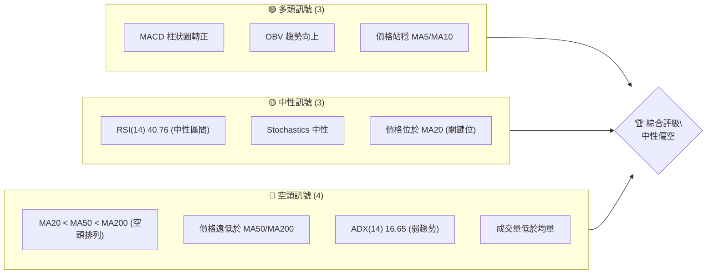

### 📊 核心指標速覽表

| 指標類別 | 指標名稱 | 當前數值 | 訊號 | 解讀 |
|----------|----------|----------|------|------|
| **價格** | 當前價格 | $53.54 | 🟡 | 位於短期均線上方，中長期均線下方 |
| **均線** | MA20 | $53.48 | 🟡 | 價格幾乎與MA20持平，為關鍵多空分界線 |
| **均線** | MA50 | $56.87 | 🔴 | 價格遠低於MA50，中期趨勢偏空 |
| **均線** | MA200 | $79.17 | 🔴 | 價格遠低於MA200，長期趨勢顯著偏空 |
| **動能** | RSI(14) | 40.76 | 🟡 | 處於中性區間，但從低點反彈，動能初步回升 |
| **動能** | MACD | +0.454 | 🟢 | MACD柱狀圖轉正，MACD線上穿訊號線，短期動能看多 |
| **波動** | ATR(14) | $3.25 | 🟡 | 每日波動約6.06%，波動率中等偏高 |

### 🏆 技術評分卡

綜合考量各項技術指標，KTOS 的技術評分顯示其整體趨勢偏弱，儘管短期動能有所回升，但仍需謹慎對待。

```
╔══════════════════════════════════════════════════════════════╗
║              技術評分卡 — KTOS (2026-07-07)                   ║
╠══════════════════════════════════════════════════════════════╣
║ 趨勢強度      ███░░░░░░░░░░░░░░░░░░  30/100  🔴             ║
║ 動能指標      ██████░░░░░░░░░░░░░░  60/100  🟡             ║
║ 支撐穩定度    ███████░░░░░░░░░░░░░  65/100  🟡             ║
║ 成交量配合    ████░░░░░░░░░░░░░░░░  40/100  🔴             ║
║ 形態完整度    █████░░░░░░░░░░░░░░░  50/100  🟡             ║
║ 均線排列      ██░░░░░░░░░░░░░░░░░░  20/100  🔴             ║
╠══════════════════════════════════════════════════════════════╣
║ 綜合評分      ████░░░░░░░░░░░░░░░░  44/100  🟡 (中性偏空)  ║
╚══════════════════════════════════════════════════════════════╝
```
**評分說明：**
- **趨勢強度 (30/100 🔴)**：ADX 數值低於25，顯示趨勢不強，處於盤整或弱勢行情。長期均線空頭排列，進一步確認了長期趨勢的弱勢。
- **動能指標 (60/100 🟡)**：MACD 柱狀圖轉正且MACD線上穿訊號線，顯示短期動能開始轉強。RSI 處於中性區間但從超賣區反彈，也支持短期動能的恢復。
- **支撐穩定度 (65/100 🟡)**：價格接近MA20並有近期低點 $49.86 和 52週低點 $42.81 提供支撐，支撐結構尚可。
- **成交量配合 (40/100 🔴)**：最新成交量顯著低於20日和50日均量，雖然 OBV 趨勢向上，但當前反彈量能不足，對價格上漲的確認度較低。
- **形態完整度 (50/100 🟡)**：近期價格從低點反彈，可能在構建底部形態，但尚未完全確認，存在潛在的雙底或圓弧底機會。
- **均線排列 (20/100 🔴)**：MA20 < MA50 < MA200 的典型空頭排列，明確指示中長期趨勢處於下跌通道。

## 2. 趨勢分析

本章深入分析 KTOS 在不同時間框架下的價格走勢，以揭示其長期、中期和短期趨勢的演變。

### 🌐 多時框趨勢分析

KTOS 的多時框架趨勢分析顯示，長期和中期趨勢均處於下行通道，而短期則出現了止跌回穩並嘗試反彈的跡象。

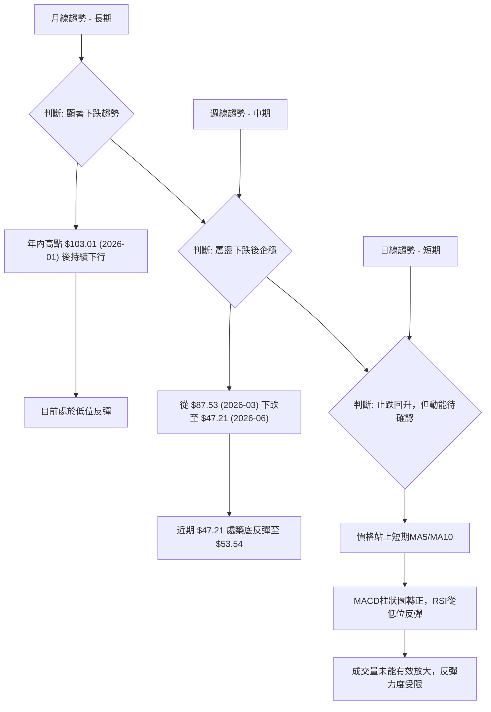

### 📈 長期趨勢 — 12個月走勢圖（Unicode）

KTOS 在過去12個月經歷了一次劇烈的過山車行情。從2025年7月的 $58.70 開始，股價一路飆升，在2026年1月達到 $103.01 的高點。然而，隨後便進入了漫長的下跌趨勢，直至2026年6月跌至 $49.86 的近期低點。目前，股價正試圖從低點反彈。

```
KTOS 月線走勢圖（過去12個月）
價格軸 ($)
$105 ┤                               ●(2026-01 高點 $103.01)
$100 ┤
$95  ┤                       ●(2025-09 $91.37)
$90  ┤                     ●(2025-10 $90.60)
$85  ┤                   ●(2026-02 $86.18)
$80  ┤
$75  ┤                ●(2025-11 $76.10) ●(2025-12 $75.91)
$70  ┤                                ●(2026-03 $70.51)
$65  ┤            ●(2025-08 $65.84)        ●(2026-05 $64.13)
$60  ┤●(2025-07 $58.70)                       ●(2026-04 $63.05)
$55  ┤                                          ●(2026-07 $53.54) ←現在
$50  ┤                                        ●(2026-06 低點 $49.86)
$45  ┤
$40  ┤
     └────────────────────────────────────────────────────────────
      25-07 25-08 25-09 25-10 25-11 25-12 26-01 26-02 26-03 26-04 26-05 26-06 26-07
```

**走勢特徵分析表格**：

| 階段 | 時間區間 | 主要走勢 | 漲跌幅 (約) | 關鍵價位 | 特徵與解讀 |
|------|------------|----------|-------------|----------|--------------|
| **上漲期** | 2025-07 至 2026-01 | 強勁上漲 | +75.48% | $58.70 → $103.01 | 股價從 $58.70 啟動，在五個月內強勢拉升，動力十足，直至突破 $100 關口，顯示市場對其前景高度樂觀。 |
| **下跌期** | 2026-01 至 2026-06 | 急速下跌 | -51.60% | $103.01 → $49.86 | 達到高點後迅速回落，跌破多個關鍵支撐位，顯示多頭動能耗盡，空頭主導市場，市場情緒轉向悲觀。 |
| **反彈期** | 2026-06 至 2026-07 | 築底反彈 | +7.38% | $49.86 → $53.54 | 股價在 $49.86 附近找到短期支撐並開始反彈，但反彈力度和成交量仍需觀察，確認是否為有效底部。 |

### 📊 中期趨勢（週線分析）

從近20週的週線數據來看，KTOS 的中期趨勢呈現先急跌後震盪築底的態勢。從3月初的 $87.53 高位開始，股價經歷了長達數月的下跌，在6月28日跌至 $47.21 的低點，隨後在7月初出現明顯反彈，但仍未擺脫整體下跌趨勢的影響。MA50 和 MA200 均線仍遠在價格上方，構成強大壓力。

**近期壓力與支撐示意圖**
```
KTOS 週線近況示意圖
═══════════════════════════════════════════════════════════════
$90.00 ║                                           ● (MA50/MA200 壓制)
$85.00 ║  ● (2026-03高點 $87.53)
$80.00 ║
$75.00 ║
$70.00 ║                                     ● (中期壓力 $70.51)
$65.00 ║                                   ● (近期高點 $64.13)
$60.00 ║
$55.00 ╠═════════════════════════════════════════════════════════╣ ◄ 現價 $53.54
$50.00 ║  ● (MA20 附近支撐 $53.48)
$45.00 ║                      ● (近期支撐 $47.21)
$40.00 ║                                           ● (52W低點 $42.81)
═══════════════════════════════════════════════════════════════
```

### ⚡ 趨勢強度評估（ADX 解讀）

ADX 指標用於衡量趨勢的強度，而非方向。當前 KTOS 的 ADX 數值為 16.65，遠低於25的閾值，這明確指示市場處於弱趨勢或盤整行情。

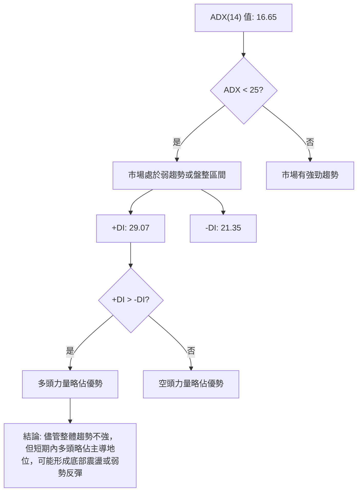

**ADX 強度對照表：**

| ADX 數值範圍 | 趨勢強度 | 市場狀態 |
|--------------|----------|----------|
| 0-25         | 弱趨勢   | 盤整或震盪 |
| 25-50        | 中等趨勢 | 趨勢形成中 |
| 50-75        | 強趨勢   | 趨勢明確 |
| 75-100       | 極強趨勢 | 趨勢極度強勁 |

**解讀：**
KTOS 的 ADX 16.65 表明當前市場缺乏明確的趨勢方向，多空雙方力量相對均衡，股價很可能在一個區間內震盪。然而，+DI (29.07) 高於 -DI (21.35)，這意味著在當前的弱勢環境中，多頭力量稍微佔據上風，這與價格從低點反彈的現象相符。投資者應警惕在弱趨勢中的假突破和震盪行情。

## 3. 圖表形態分析

本章將分析 KTOS 的價格走勢中是否存在可識別的圖表形態和關鍵 K 線組合，並據此推導潛在的價格目標。

### 🔍 形態識別系統

根據提供的數據，KTOS 在經歷了從 $103.01 (2026-01) 到 $49.86 (2026-06) 的大幅下跌後，目前正處於一個潛在的築底階段。雖然尚未形成經典的底部反轉形態，但可以觀察到一些初步的跡象，例如在 $47.21 (2026-06-28 週收盤價) 附近形成了一個較低的低點，隨後出現了強勁的反彈。這可能預示著一個「W」底或「圓弧底」的雛形，但仍需進一步確認。

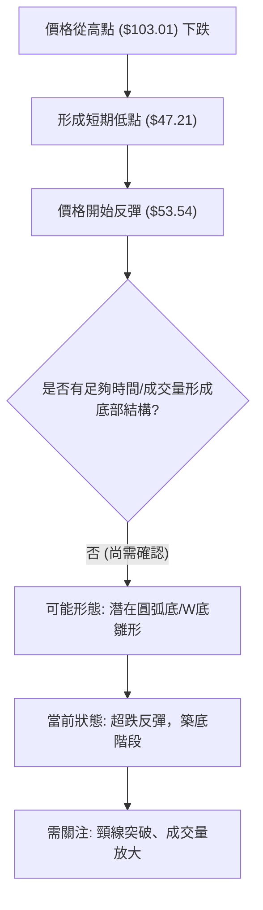

### 🕯️ 重要K線形態分析

從近20週的週線數據中，我們可以觀察到以下幾個關鍵的K線組合：

| 月份 | 收盤價 | K線形態 | 解讀 | 訊號 |
|------|--------|---------|------|------|
| 2026-03-29 | $71.94 | 大陰線 | 股價跌破關鍵支撐，空頭力量強勁，RSI跌至25.6，進入超賣區，預示後續可能出現反彈。 | 🔴 |
| 2026-04-19 | $70.99 | 實體陽線 | 在下跌過程中出現的較強反彈，RSI回升至48.9，但未能持續，隨後再次下跌。 | 🟡 |
| 2026-06-28 | $47.21 | 大陰線伴隨巨量 | 股價創下近期新低，成交量顯著放大至45.3M，可能是恐慌性拋售或主力吸籌，RSI跌至23.1，嚴重超賣。 | 🔴 |
| 2026-07-05 | $55.35 | 大陽線伴隨放量 | 在經歷前一週的急跌後，出現一根強勁的實體陽線，收復了前一週的部分跌幅，MACD柱狀圖轉正，顯示短期多頭力量開始介入，構成潛在的「吞噬形態」或「刺穿形態」的底部反轉訊號。 | 🟢 |
| 2026-07-12 | $53.54 | 小陰線/十字星 | 本週收盤價略低於上週，成交量顯著萎縮，顯示反彈後多頭力量有所減弱，或進入短期盤整。 | 🟡 |

### 📉 ASCII 走勢形態示意圖

以下圖示描繪了 KTOS 從高點下跌至近期低點，並開始反彈的走勢形態。

```
KTOS 近期走勢形態示意圖
═══════════════════════════════════════════════════════════════
$90.00 ┤                                        
$80.00 ┤                                        
$70.00 ┤              ↘ (下跌趨勢)
$60.00 ┤            ／
$50.00 ┤          ● (近期低點 $47.21)
$40.00 ┤          
       └──────────────────────────────────────────────
       時間軸 (從高點到現在)

    ▲ 從 $103.01 (2026-01) 形成頭部後，股價進入明顯的下降趨勢。
    ▼ 股價在 $47.21 (2026-06-28) 附近找到支撐，形成潛在底部。
    ↗ 隨後出現反彈，目前在 $53.54 附近震盪，量能不足。
    形態判斷：目前處於下跌後的「超跌反彈」階段，可能正在構建底部形態，但需突破關鍵阻力並伴隨成交量放大才能確認反轉。
═══════════════════════════════════════════════════════════════
```

### 🎯 形態目標價計算

由於目前尚未形成明確且已確認的圖表反轉形態（如頭肩底、雙底並突破頸線），因此無法基於傳統形態學計算精確的形態目標價。當前可視為從 $49.86 低點的反彈。

如果未來能確認形成「雙重底」形態，且以 $42.81 (52週低點) 和 $49.86 (近期低點) 為基底，則頸線位置可能落在反彈高點。假設反彈高點為 $64.13 (2026-05)，則形態高度為 $64.13 - $42.81 = $21.32。突破頸線後的目標價將是 $64.13 + $21.32 = $85.45。但這僅為假設，目前並不成立。

**當前階段，我們將主要依賴斐波那契回調位和關鍵均線作為反彈目標價。**

## 4. 支撐與阻力

本章將詳細分析 KTOS 的關鍵支撐位和阻力位，這些價位對於判斷股價的潛在轉折點和交易決策至關重要。

### 🗺️ 關鍵價位分布圖（Unicode）

KTOS 目前的價格 $53.54 正好位於一個關鍵的平衡點上，上方壓力重重，下方則有多重支撐。

```
KTOS 價位結構分布圖
═══════════════════════════════════════════════════
$103.01 ║████████████████████████║ 強阻力 R3 (歷史高點)
$90.47  ║████████████████████    ║ 阻力 R2 (Fib 76.4%)
$82.71  ║████████████████████████║ 阻力 R1 (Fib 61.8%)
$76.44  ║▓▓▓▓▓▓▓▓▓▓▓▓▓▓▓▓▓▓▓▓▓▓▓▓║ 阻力 R0 (Fib 50%) / MA200 $79.17
$70.16  ║████████████████████████║ 阻力 R0' (Fib 38.2%)
$61.70  ║▓▓▓▓▓▓▓▓▓▓▓▓▓▓▓▓▓▓▓▓▓▓▓▓║ 阻力 R0'' (布林上軌)
$56.87  ║████████████████████    ║ 關鍵阻力 R0''' (MA50)
$53.54  ╠════════════════════════╣ ◄ 現價
$53.48  ║▓▓▓▓▓▓▓▓▓▓▓▓▓▓▓▓        ║ 近期支撐 S1 (MA20)
$49.86  ║████████████████████████║ 近期支撐 S2 (2026-06低點)
$45.26  ║▓▓▓▓▓▓▓▓▓▓▓▓▓▓▓▓▓▓▓▓▓▓▓▓║ 強支撐 S3 (布林下軌)
$42.81  ║████████████████████████║ 強支撐 S4 (52週低點)
═══════════════════════════════════════════════════
```

### 🚧 阻力位分析表

KTOS 面臨著來自不同時間框架和技術指標的多重阻力，尤其在中長期均線和斐波那契回調位處。

| 阻力級別 | 價位 | 形成原因 | 突破難度 | 重要性 |
|----------|------|----------|----------|--------|
| **即時阻力 R1** | $56.87 | MA50 移動平均線 | 中等偏高 | 🟡 |
| **短期阻力 R2** | $61.70 | 布林通道上軌 | 中等 | 🟡 |
| **中期阻力 R3** | $70.16 | 斐波那契38.2%回調位 | 高 | 🔴 |
| **中期阻力 R4** | $76.44 | 斐波那契50%回調位 | 高 | 🔴 |
| **長期阻力 R5** | $79.17 | MA200 移動平均線 | 極高 | 🔴 |
| **長期阻力 R6** | $103.01 | 2026年1月歷史高點 | 極高 | 🔴 |

**解讀：**
當前價格 $53.54 距離最近的 MA50 阻力 $56.87 僅有約 6.2% 的空間。MA50 和 MA200 形成強大的動態阻力牆，突破這些均線需要顯著的買盤力量和成交量配合。斐波那契回調位則標誌著前一波跌勢的關鍵反彈壓力區。

### 🛡️ 支撐位分析表

KTOS 在下方擁有一些重要的支撐位，這些支撐位是股價下跌時可能獲得買盤介入的區域。

| 支撐級別 | 價位 | 形成原因 | 守住機率 | 重要性 |
|----------|------|----------|----------|--------|
| **即時支撐 S1** | $53.48 | MA20 移動平均線 | 中等 | 🟡 |
| **短期支撐 S2** | $49.86 | 2026年6月近期低點 | 中等偏高 | 🟢 |
| **中期支撐 S3** | $45.26 | 布林通道下軌 | 高 | 🟢 |
| **長期支撐 S4** | $42.81 | 52週低點 | 極高 | 🟢 |

**解讀：**
當前價格 $53.54 幾乎貼著 MA20 ($53.48)，這是一個即時的動態支撐。若跌破此處，則 $49.86 的近期低點將是下一個重要考驗。52週低點 $42.81 則是當前市場結構中最為堅固的心理及技術支撐位。

### 📐 斐波那契回調位分析

我們以 KTOS 從 2026年1月高點 $103.01 至 2026年6月低點 $49.86 的主要下跌趨勢作為基礎，計算其反彈的斐波那契回調位。

**下跌波段：**
- 高點 (A): $103.01 (2026-01)
- 低點 (B): $49.86 (2026-06)
- 總跌幅: $103.01 - $49.86 = $53.15

**斐波那契回調位計算：**
- **38.2% 回調位:** $49.86 + ($53.15 * 0.382) = $49.86 + $20.30 = **$70.16**
- **50% 回調位:** $49.86 + ($53.15 * 0.500) = $49.86 + $26.58 = **$76.44**
- **61.8% 回調位:** $49.86 + ($53.15 * 0.618) = $49.86 + $32.85 = **$82.71**
- **76.4% 回調位:** $49.86 + ($53.15 * 0.764) = $49.86 + $40.61 = **$90.47**

**斐波那契回調位視覺化：**
```
KTOS 斐波那契回調位示意圖 (從 $103.01 下跌至 $49.86)
═══════════════════════════════════════════════════════════════
$103.01 ┤──────────(起始高點)
        ║
$90.47  ┤───────(76.4% 回調位)
        ║
$82.71  ┤──────────(61.8% 回調位)
        ║
$76.44  ┤───────(50% 回調位)
        ║
$70.16  ┤──────────(38.2% 回調位)
        ║
$53.54  ╠═══════════════════════════════════════════════════════╣ ◄ 現價
        ║
$49.86  ┤──────────(結束低點)
═══════════════════════════════════════════════════════════════
```
**解讀：**
這些斐波那契回調位將作為 KTOS 在反彈過程中的潛在阻力區。尤其是 38.2% ($70.16) 和 50% ($76.44) 回調位，通常是價格反彈時會遇到的第一個和第二個重要壓力區。如果股價能夠有效突破這些水平，則可能預示著更強勁的反轉。目前股價距離第一個回調位 $70.16 仍有較大距離，表明反彈之路漫長且充滿挑戰。

## 5. 技術指標深度解讀

本章將對 KTOS 的關鍵技術指標進行深入分析，包括移動平均線、RSI、MACD、布林通道和成交量，並探討它們之間的相互關係。

### 🎛️ 指標訊號總覽

以下 Mermaid 圖表展示了各主要技術指標當前的訊號狀態及其之間的潛在關係。

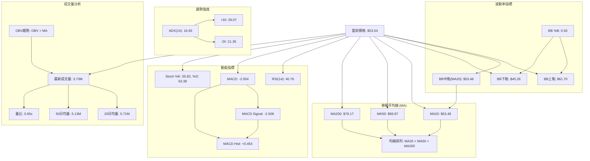

### 📈 移動平均線排列分析

KTOS 的移動平均線系統呈現典型的空頭排列，這是一個強烈的看空訊號，表明中長期趨勢處於下行通道。

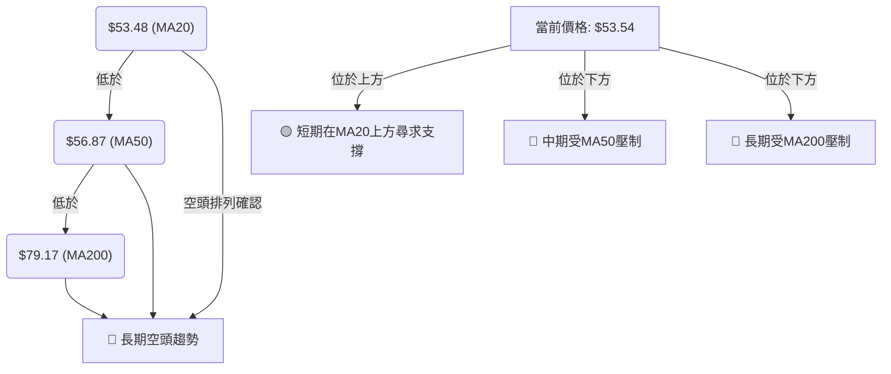
**均線排列狀態：**
| 均線 | 當前數值 | 相對位置 (與現價 $53.54 比較) | 訊號 | 解讀 |
|------|----------|--------------------------------|------|------|
| MA5 | $51.75 | 價格上方 (+3.46%) | 🟢 | 短期均線已上穿，顯示短期反彈動能。 |
| MA10 | $50.21 | 價格上方 (+6.63%) | 🟢 | 短期均線已上穿，強化短期反彈訊號。 |
| MA20 | $53.48 | 價格上方 (+0.11%) | 🟡 | 價格貼近MA20，MA20成為即時支撐/阻力關鍵位。 |
| MA50 | $56.87 | 價格下方 (-9.68%) | 🔴 | 價格遠低於MA50，中期趨勢仍偏空，MA50為重要阻力。 |
| MA200 | $79.17 | 價格下方 (-30.10%) | 🔴 | 價格遠低於MA200，長期趨勢嚴重偏空，MA200為強勁阻力。 |

**結論：**
雖然短期均線 MA5 和 MA10 顯示出價格的短期反彈，但 MA20 幾乎與現價持平，更重要的是，MA20 < MA50 < MA200 的典型空頭排列表明 KTOS 的中長期趨勢依然悲觀。價格若要扭轉頹勢，必須首先站穩 MA20 並突破 MA50 的壓制。

### 📉 RSI(14) 分析

RSI(14) 當前數值為 40.76，處於中性區間 (30-70)。

**RSI 數值進度條：**
RSI(14): ▓▓▓▓▓▓▓▓░░░░░░░░░░░░  40.76 (中性偏弱)

**超買超賣區間分析：**
- **超買區 (RSI > 70)**：目前 RSI 遠離超買區，沒有過熱風險。
- **超賣區 (RSI < 30)**：RSI 在 2026-06-28 曾跌至 23.1，顯示股價嚴重超賣，隨後反彈至 40.76，這是一個從超賣區回升的積極訊號，表明短期拋售壓力有所緩解。

**背離判斷：**
根據提供的數據，**未見明顯的 RSI 頂背離或底背離現象**。雖然股價在 $47.21 形成近期低點時 RSI 處於超賣區，並隨後反彈，但由於缺乏更細緻的日線歷史數據，無法精確判斷是否存在底背離。目前 RSI 從低位回升，顯示動能正在恢復。

**結論：**
RSI 處於中性區間，但其從超賣區的回升表明短期動能有所改善。然而，要確認趨勢反轉，RSI 需要進一步上行並突破 50 甚至 60 關口。

### 📊 MACD(12/26/9) 訊號解讀

MACD 是判斷趨勢動能和潛在轉折的重要指標。
- **MACD 線 (快線):** -2.054
- **MACD Signal 線 (慢線):** -2.508
- **MACD 柱狀圖 (Histogram):** +0.454

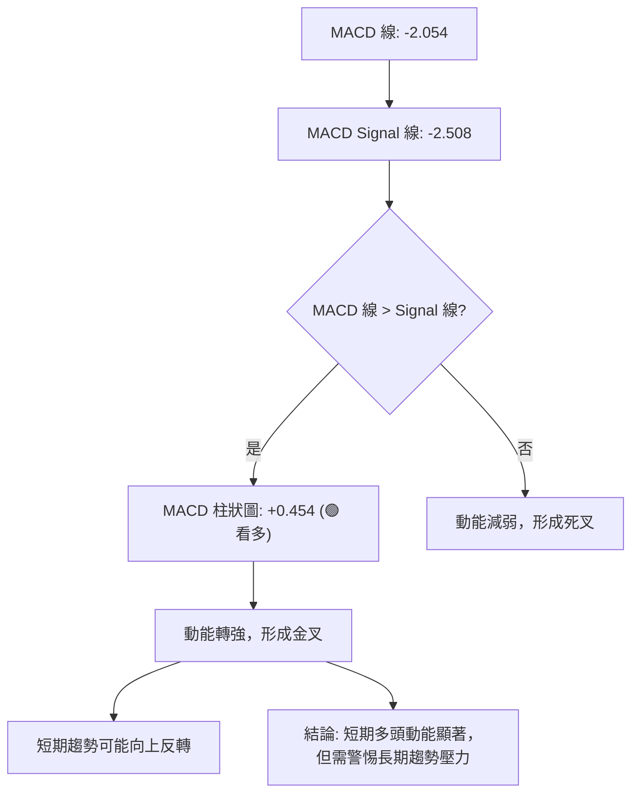

**背離判斷：**
根據提供的數據，**未見明顯的 MACD 頂背離或底背離現象**。MACD 柱狀圖從負值轉為正值，且 MACD 線上穿 Signal 線，這是一個明確的「金叉」買入訊號，表示短期動能從空頭轉為多頭。

**結論：**
MACD 柱狀圖轉正並形成金叉，是短期看漲的積極訊號。這與 RSI 從超賣區反彈的現象相互印證，表明短期內買盤力量正在積聚。然而，由於 MACD 線和 Signal 線仍處於零軸下方，這暗示雖然短期動能轉好，但中長期趨勢的下行壓力依然存在。

### 📦 布林通道分析

布林通道能顯示股價的波動範圍和相對位置。
- **布林上軌 (BB Upper):** $61.70
- **布林中軌 (BB Middle / MA20):** $53.48
- **布林下軌 (BB Lower):** $45.26
- **BB %B:** 0.50

**ASCII 布林通道示意圖：**
```
KTOS 布林通道示意圖
═══════════════════════════════════════════════════
$65.00 ┤
$60.00 ┤              BB上軌: $61.70
$55.00 ┤              
$53.54 ╠═════════════════════════════════════════════╣ ◄ 現價
$53.48 ┤              BB中軌(MA20): $53.48
$50.00 ┤
$45.00 ┤              BB下軌: $45.26
$40.00 ┤
═══════════════════════════════════════════════════
```
**解讀：**
- **價格位置：** 當前價格 $53.54 幾乎精確地位於布林中軌 ($53.48) 上方，這意味著股價正處於短期多空平衡點。BB %B 數值 0.50 也印證了這一點。
- **通道寬度：** 布林通道的寬度 (上軌 - 下軌) 為 $61.70 - $45.26 = $16.44。這相對當前股價 $53.54 而言，波動性較大 (約 30.7%)，ATR 也顯示波動率中等偏高。
- **未來展望：** 股價在布林中軌附近，可能面臨向上突破上軌或向下回測下軌的選擇。若能有效站穩中軌並向上突破，則有望挑戰上軌 $61.70。若跌破中軌，則可能測試下軌 $45.26。當前通道尚未明顯收窄或擴張，表明市場正在尋求新的方向。

### 💹 成交量分析（量價配合度）

成交量是確認價格走勢可靠性的重要指標。
- **最新成交量:** 3,732,795 股
- **20日均量:** 5,712,010 股
- **50日均量:** 5,131,146 股
- **量比 (最新量 / 20日均量):** 0.65x
- **OBV 趨勢:** OBV > MA → 量能支撐上漲

**解讀：**
- **最新成交量不足：** 當前最新成交量 3.73M 顯著低於20日均量 (5.71M) 和 50日均量 (5.13M)，量比僅為 0.65x。這表明最近從低點的反彈缺乏足夠的買盤支持，反彈的可靠性有所降低。通常，健康的價格上漲應伴隨著成交量的放大。
- **OBV 趨勢：** OBV (On-Balance Volume) 趨勢顯示 OBV 線高於其移動平均線，這是一個積極訊號，表明在過去一段時間內，買盤累積的總量大於賣盤，量能整體上支持價格上漲。這與最新的低成交量形成對比，暗示儘管當前反彈量能不足，但從累積量來看，多頭仍有一定優勢。
- **量價背離：** 在此情況下，價格從 $47.21 反彈至 $53.54，但最新成交量萎縮，這構成了一種**短期量價背離**，即價格上漲缺乏成交量確認，可能預示著反彈動能不足，需要警惕回調風險。

**結論：**
雖然 OBV 趨勢整體看多，但當前反彈的成交量萎縮是一個需要警惕的訊號。若要確認有效反轉，KTOS 必須在未來上漲過程中伴隨明顯放大的成交量。

## 6. 動能與波動率

本章將評估 KTOS 的動能強度和波動率，這有助於理解股票的活躍程度和交易風險。

### ⚡ 動能評估四象限

動能評估四象限將股票分為四個類別，基於其動能強度和波動率。

| 象限 | 動能 (短期) | 波動率 (ATR) | 當前狀態 | 評估 |
|------|-------------|--------------|----------|------|
| Q1   | 強          | 低           | -        | 最佳機會：動能強勁，風險較低，適合趨勢追蹤。 |
| Q2   | 弱          | 低           | -        | 謹慎觀望：動能不足，波動性低，可能處於盤整或等待催化劑。 |
| Q3   | 強          | 高           | -        | 高風險高收益：動能強勁但波動大，適合高風險偏好者，需嚴格止損。 |
| Q4   | 弱          | 高           | ✓        | 避免進場：動能弱且波動大，方向不明朗，風險高。 |

**KTOS 當前狀態評估：**
- **短期動能：** MACD 柱狀圖轉正，RSI 從超賣區回升，顯示短期動能正在恢復，可視為「中等偏強」。
- **波動率：** ATR(14) 為 $3.25，佔當前價格 $53.54 的 6.06%，相對較高。布林通道寬度也較大。這表明 KTOS 具有較高的「波動率」。

綜合來看，KTOS 目前處於「動能中等偏強，波動率高」的狀態。這使其介於 Q3 和 Q4 之間，傾向於 **Q4 (弱動能，高波動) 的邊緣，但短期有向 Q3 (強動能，高波動) 發展的潛力**。由於中長期趨勢仍偏空，我們將其歸類為 **Q4 邊緣，需極度謹慎**。

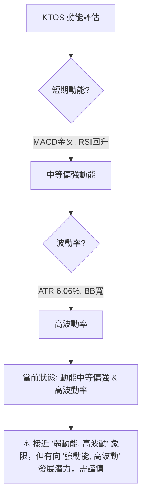

### 📊 ATR 波動率分析

ATR (Average True Range) 是衡量股價每日波動幅度的指標。
- **ATR(14):** $3.25
- **占當前價格比例:** ($3.25 / $53.54) * 100% = 6.06%

**解讀：**
KTOS 的 ATR 數值 $3.25 佔其當前價格的 6.06%，這是一個相對較高的波動率。這意味著該股票在一天內可能會出現約 6% 的價格波動，對於日內交易者或短期投資者而言，這提供了較大的獲利或虧損空間。

**止損距離建議：**
基於 ATR，保守的止損點通常會設置在 1.5 到 3 倍 ATR 之外。
- **1.5 倍 ATR 止損距離:** 1.5 * $3.25 = $4.88
- **2 倍 ATR 止損距離:** 2 * $3.25 = $6.50
- **3 倍 ATR 止損距離:** 3 * $3.25 = $9.75

這表示在設定止損時，應考慮至少 $4.88 的價格緩衝空間。例如，若進場點為 $53.54，則止損點可考慮設置在 $53.54 - $4.88 = $48.66 附近，以避免被正常市場波動「洗出場」。高波動率也意味著倉位管理應更加謹慎，避免重倉。

### 📐 Beta 與市場相關性

提供的數據中沒有 Beta 數值。然而，Kratos Defense & Security Solutions, Inc. 屬於「工業」板塊下的「航空航天與國防」產業。
- **行業特性：** 國防工業通常被認為具有相對穩定的政府訂單和較低的經濟週期敏感性，但其表現仍會受到地緣政治、政府預算和技術創新等因素影響。
- **一般預期：** 國防股的 Beta 值通常接近 1 或略低於 1，表明其波動性與大盤 (如標普500指數) 相似或略低。這意味著在市場整體上漲時，KTOS 可能會同步上漲，但在市場下跌時，其跌幅可能也與大盤接近。
- **當前市場環境：** 考慮到 KTOS 自身正處於從高點大幅回落後的築底階段，其當前的表現更多是由其內部基本面和特定事件驅動，而非單純的市場 Beta 效應。

**結論：**
由於缺乏具體 Beta 數據，我們無法精確量化 KTOS 與大盤的相關性。但根據行業特性推斷，其 Beta 值可能接近或略低於 1。投資者在分析時應同時關注宏觀經濟、地緣政治事件以及公司自身的訂單和財報表現，而不僅僅是市場整體走勢。

## 7. 多時框架總結

本章將整合前述分析，從短期、中期和長期三個時間框架對 KTOS 的技術面進行綜合評估，並給出相應的投資建議。

### 📋 時框架評分表

| 時框架 | 趨勢方向 | 動能 | 均線排列 | 形態 | 綜合評分 | 建議 |
|--------|----------|------|----------|------|----------|------|
| **短期** | 🟢 止跌反彈 | 🟢 轉強 | 🟡 價格於MA20 | 🟡 潛在築底 | 6.5/10 | 觀察反彈持續性 |
| **中期** | 🔴 震盪下跌 | 🟡 弱勢 | 🔴 空頭排列 | 🟡 底部未確 | 4.0/10 | 謹慎觀望 |
| **長期** | 🔴 顯著下跌 | 🔴 疲弱 | 🔴 嚴重空頭 | 🔴 頂部形成 | 2.5/10 | 避免過早介入 |

**評分說明：**
- **短期 (6.5/10)**：MACD 金叉、RSI 從超賣區回升、價格站上 MA5/MA10，顯示短期有反彈動能。但成交量不足，需確認反彈強度。
- **中期 (4.0/10)**：MA50 和 MA200 仍遠在價格上方，構成中期壓力。ADX 顯示弱趨勢，形態未確認，整體仍處於下跌後的整理。
- **長期 (2.5/10)**：從年內高點 $103.01 跌幅巨大，長期均線嚴重空頭排列，表明長期趨勢已轉為下行。

### 🔲 綜合訊號矩陣

以下矩陣展示了 KTOS 在不同時間框架下各維度訊號的一致性分析：

```mermaid
graph LR
    subgraph 短期訊號 (1-5日) ["🟢 止跌反彈"]
        A["價格: 接近MA20"] --> B("動能: MACD金叉")
        B --> C("RSI: 從超賣區回升")
        C --> D("成交量: 萎縮, 短期背離")
    end

    subgraph 中期訊號 (1-3個月) ["🔴 震盪下跌"]
        E["價格: 遠低於MA50/MA200"] --> F("動能: 弱勢")
        F --> G("ADX: 弱趨勢")
        G --> H("形態: 潛在底部未確認")
    end

    subgraph 長期訊號 (6-12個月) ["🔴 顯著下跌"]
        I["價格: 從高點大幅回落"] --> J("均線: 嚴重空頭排列")
        J --> K("趨勢: 明確下降通道")
    end

    A -- 矛盾 --> E
    E -- 確認 --> I
    B -- 矛盾 --> F
    F -- 確認 --> J
    D -- 矛盾 --> H
    H -- 確認 --> K

    style A fill:#DDF,stroke:#3C3,stroke-width:2px;
    style B fill:#DDF,stroke:#3C3,stroke-width:2px;
    style C fill:#DDF,stroke:#3C3,stroke-width:2px;
    style D fill:#FDD,stroke:#C33,stroke-width:2px;
    style E fill:#FDD,stroke:#C33,stroke-width:2px;
    style F fill:#FDD,stroke:#C33,stroke-width:2px;
    style G fill:#FDD,stroke:#C33,stroke-width:2px;
    style H fill:#FDD,stroke:#C33,stroke-width:2px;
    style I fill:#FDD,stroke:#C33,stroke-width:2px;
    style J fill:#FDD,stroke:#C33,stroke-width:2px;
    style K fill:#FDD,stroke:#C33,stroke-width:2px;
```

**綜合分析：**
KTOS 的短期訊號與中長期訊號存在明顯矛盾。短期指標（如 MACD 金叉、RSI 回升）顯示股價在經歷大幅下跌後出現止跌反彈的跡象，但這種反彈的量能不足，且受到中長期空頭趨勢的嚴重壓制。中長期來看，股價仍處於明顯的下降通道，主要均線呈現空頭排列，ADX 也指示趨勢疲弱。因此，目前的短期反彈更可能視為下跌趨勢中的技術性修正，而非趨勢的根本性反轉。投資者應對此類反彈保持高度警惕。

## 8. 交易策略建議

基於對 KTOS 多時框架的技術分析，我們提出以下交易策略建議。鑑於中長期趨勢偏空但短期有反彈動能，策略將側重於短線操作或等待更明確的趨勢反轉訊號。

### 🗺️ 策略決策流程圖

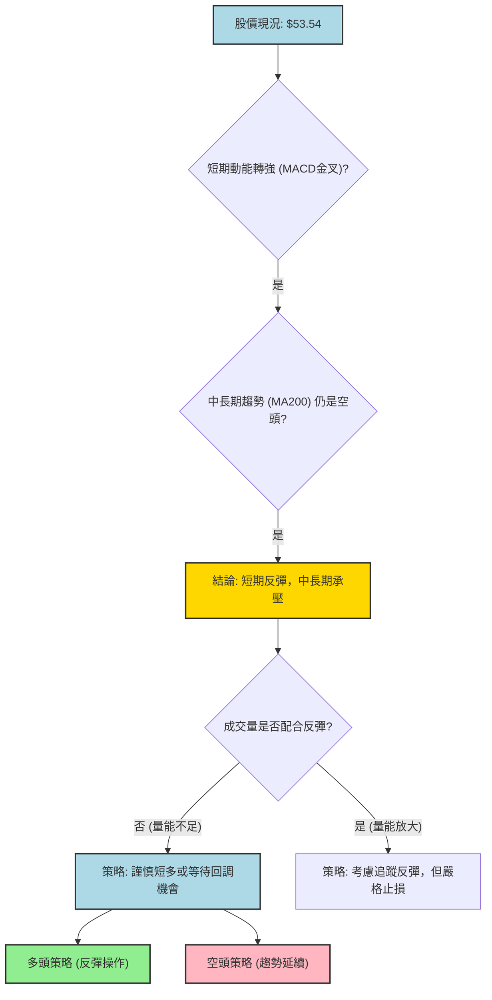

### 🟢 多頭策略詳情 (反彈交易)

此策略基於短期動能轉強，價格從低點反彈的機會。由於中長期趨勢仍偏空，此為逆勢交易，需嚴格控制風險。

| 策略要素 | 反彈追蹤策略 A | 逢低買入策略 B |
|----------|----------------|----------------|
| **進場條件** | 股價站穩MA20並伴隨成交量溫和放大 | 股價回踩MA20或近期支撐 S2 ($49.86) 附近企穩 |
| **進場價格** | $54.00 (突破MA20確認) | $50.00 (靠近近期低點支撐 S2) |
| **目標價 T1** | $56.87 (MA50阻力) | $56.87 (MA50阻力) |
| **目標價 T2** | $61.70 (布林上軌阻力) | $61.70 (布林上軌阻力) |
| **止損價格** | $49.80 (略低於近期低點 $49.86) | $48.50 (低於近期低點 $49.86 且考慮ATR) |
| **風險報酬比** | (T1: 2.87/4.2=0.68:1) / (T2: 7.7/4.2=1.83:1) | (T1: 6.87/1.5=4.58:1) / (T2: 11.7/1.5=7.8:1) |
| **成功機率** | 40% (逆勢反彈) | 50% (低位支撐反彈) |
| **建議倉位** | 輕倉 (不超過總資金 5%) | 輕倉 (不超過總資金 5%) |

**策略 A 解讀：** 在確認反彈動能後進場，目標是捕捉短線反彈空間。風險報酬比在 T2 處較為合理，但需警惕 MA50 的強阻力。
**策略 B 解讀：** 若價格回調至強支撐區，買入的風險相對較低，風險報酬比非常吸引人。這是一個更為穩健的短線多頭策略。

### 🔴 空頭策略詳情 (趨勢延續交易)

此策略基於中長期空頭趨勢的延續，或短期反彈在關鍵阻力位受阻後的回調。

| 策略要素 | 反彈受阻做空策略 C | 跌破支撐做空策略 D |
|----------|--------------------|--------------------|
| **進場條件** | 股價反彈至MA50 ($56.87) 或布林上軌 ($61.70) 附近，出現明顯受阻K線形態，且成交量放大。 | 股價跌破近期低點 $49.86，並伴隨成交量放大。 |
| **進場價格** | $56.50 (MA50附近確認受阻) | $49.50 (跌破 $49.86 確認) |
| **目標價 T1** | $49.86 (近期低點支撐 S2) | $45.26 (布林下軌支撐 S3) |
| **目標價 T2** | $45.26 (布林下軌支撐 S3) | $42.81 (52週低點支撐 S4) |
| **止損價格** | $58.00 (略高於MA50阻力) | $51.00 (略高於原 $49.86 支撐位) |
| **風險報酬比** | (T1: 6.64/1.5=4.43:1) / (T2: 11.24/1.5=7.49:1) | (T1: 4.24/1.5=2.83:1) / (T2: 6.69/1.5=4.46:1) |
| **成功機率** | 60% (順勢交易) | 65% (順勢交易) |
| **建議倉位** | 中輕倉 (不超過總資金 8%) | 中輕倉 (不超過總資金 8%) |

**策略 C 解讀：** 捕捉反彈動能耗盡後的下跌機會，風險報酬比非常優異。
**策略 D 解讀：** 股價跌破關鍵支撐，確認空頭趨勢延續，是順勢交易的機會。

### ⭐ 整體訊號強度評星

基於多時框架分析，KTOS 的中長期趨勢仍偏空，但短期有反彈動能。做空策略的成功機率和風險報酬比相對較高。

```
做多訊號強度：★★☆☆☆  (2/5星) - 短期反彈，但面臨強阻力，量能不足。
做空訊號強度：★★★☆☆  (3/5星) - 中長期趨勢偏空，反彈受阻或跌破支撐後的做空機會較大。
整體可信度：  ★★★☆☆  (3/5星) - 市場方向不明，需等待更明確訊號。
```

## 9. 風險提示與監控

本章將列出與 KTOS 交易相關的風險因素，並提供關鍵監控指標和風險管理建議，以幫助投資者更好地應對市場不確定性。

### ✅ 關鍵監控指標 Checklist

以下是交易 KTOS 時需要密切關注的技術指標和市場行為清單：

```
╔══════════════════════════════════════════════════════════════╗
║                KTOS 關鍵監控指標 Checklist                     ║
╠══════════════════════════════════════════════════════════════╣
║ [ ] 價格是否能有效站穩 MA20 ($53.48)？                     ║
║ [ ] 價格能否突破 MA50 ($56.87) 阻力？                     ║
║ [ ] RSI 是否能持續上行並突破 50 甚至 60？                  ║
║ [ ] MACD 柱狀圖是否持續為正且 MACD 線與 Signal 線保持擴張？║
║ [ ] 反彈過程中成交量是否能顯著放大，以確認買盤力量？       ║
║ [ ] ADX 是否能回升至 25 以上，指示趨勢形成？                ║
║ [ ] 布林通道是否開始收窄或價格能否突破上軌？               ║
║ [ ] 股價是否能形成明確的底部反轉形態 (如 W 底並突破頸線)？ ║
║ [ ] 52週低點 $42.81 是否能提供穩固支撐？                   ║
║ [ ] 分析師評級或目標價是否有重大調整？                     ║
╚══════════════════════════════════════════════════════════════╝
```

### ⚠️ 風險場景分析

針對 KTOS 當前的技術面，我們可以預設以下三種情境：

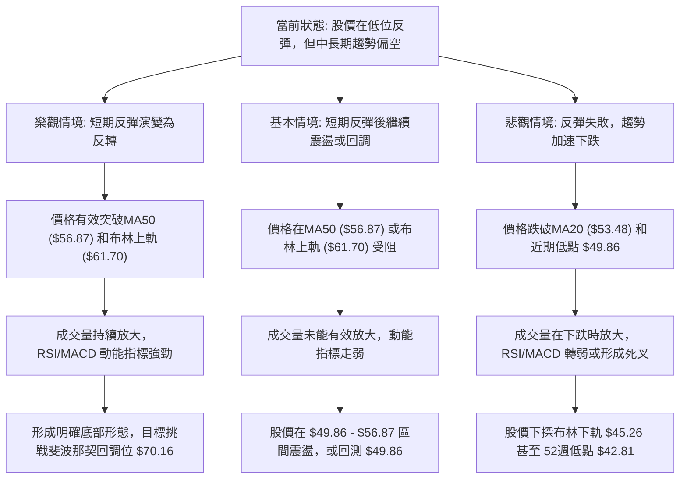

### 🛡️ 風險管理重要提醒

1.  **嚴格止損：** 鑑於 KTOS 波動性較高且中長期趨勢偏空，任何交易都必須設置嚴格的止損點。一旦價格觸及止損位，應果斷離場，避免虧損擴大。
2.  **倉位管理：** 避免重倉單一股票，尤其是在趨勢不明確或逆勢交易時。建議採用輕倉策略，將單次交易的風險控制在總資金的 1-2% 以內。
3.  **多時框架確認：** 在做出交易決策前，務必確認多個時間框架的訊號是否一致。當短期訊號與中長期趨勢矛盾時，應以中長期趨勢為主，或只進行短線快進快出。
4.  **成交量確認：** 任何突破或反轉訊號都應伴隨健康或放大的成交量。若價格上漲而成交量萎縮，則應警惕為假突破或動能不足。
5.  **關注基本面：** 雖然本報告專注於技術分析，但長期的價格走勢最終仍由基本面驅動。應密切關注 KTOS 的財報、訂單新聞以及行業動態，以防突發利空或利好消息改變技術格局。
6.  **市場情緒：** 在弱勢趨勢中，市場情緒往往脆弱。任何負面消息都可能導致股價加速下跌。保持對市場情緒的敏感度。

---

## 📋 報告總結

```
KTOS 技術分析報告總結
════════════════════════════════════════════════════════
報告日期：2026-07-07
當前價格：$53.54
分析評級：⚖️ 中性偏空 (短期反彈，中長期趨勢承壓)

關鍵結論：
├─ 長期趨勢：🔴 顯著下跌，從年內高點 $103.01 大幅回落，MA200 形成強阻力。
├─ 中期趨勢：🔴 震盪下跌，MA50 位於價格上方形成壓力，ADX 顯示弱趨勢。
├─ 短期趨勢：🟢 止跌反彈，MACD 金叉，RSI 從超賣區回升，但成交量不足。
├─ 關鍵支撐：$49.86 (近期低點)，$42.81 (52週低點)。
├─ 關鍵阻力：$56.87 (MA50)，$61.70 (布林上軌)，$70.16 (斐波那契38.2%回調位)。
└─ 分析師目標：$109.86 (平均值)，$60.00 (最低值)，顯示分析師對長期前景仍有信心，但當前技術面與之背離。

最優策略組合：
1. 🥇 最佳機會：等待股價反彈至 $56.87 (MA50) 或 $61.70 (布林上軌) 附近出現受阻訊號，考慮執行**反彈受阻做空策略 C**。此策略順應中長期趨勢，風險報酬比高。
2. 🥈 次選機會：若股價跌破 $49.86 (近期低點) 並伴隨放量，可考慮執行**跌破支撐做空策略 D**，確認空頭趨勢延續。
3. 🥉 保守選擇：若看好短期反彈，可在股價回踩 $50.00 (接近近期低點 $49.86) 附近企穩時，執行**逢低買入策略 B**，但需嚴格止損 $48.50，並以 $56.87 或 $61.70 為短期獲利目標。
════════════════════════════════════════════════════════
```

---

> ⚠️ **免責聲明**：本報告為 AI 自動生成之技術分析，所有數據及估算均基於提供的歷史價格資訊。本報告**僅供研究與學術參考**，**不構成任何投資建議**。投資有風險，入市需謹慎。

---

*報告生成時間：2026-07-07 ｜ 數據來源：Yahoo Finance ｜ 分析框架：多時框技術分析*