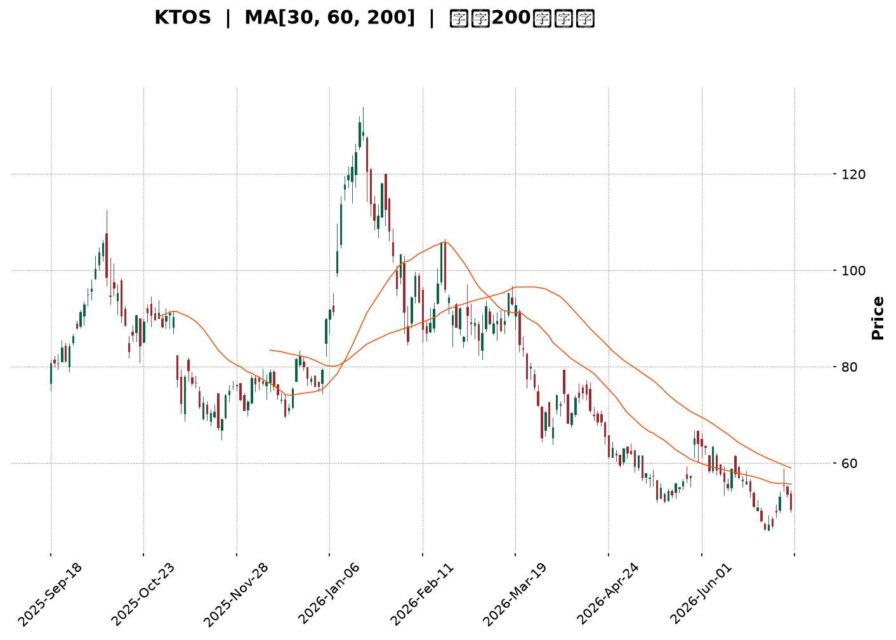
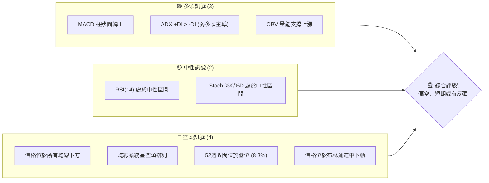
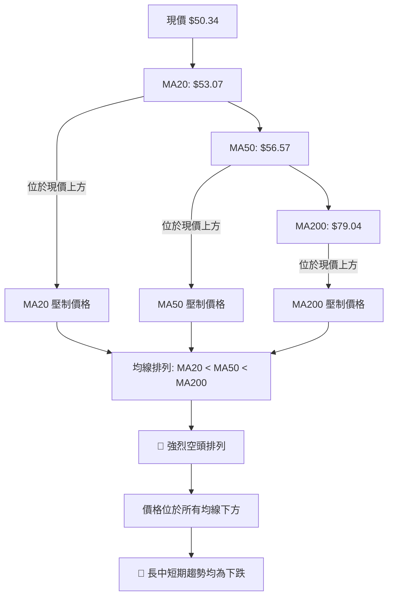

<details>
<summary>📊 靜態圖表 (點擊展開)</summary>

</details>

<html>
<head><meta charset="utf-8" /></head>
<body>
    <div style="height:500px; width:100%;">                        <script>window.PlotlyConfig = {MathJaxConfig: 'local'};</script>
        <script charset="utf-8" src="https://cdn.plot.ly/plotly-3.6.0.min.js" integrity="sha256-QaOVwtVY0T02VaHrr6pnoHLCwayMJp4O5n4YyaE3rJk=" crossorigin="anonymous"></script>                <div id="candlestick-chart" class="plotly-graph-div" style="height:100%; width:100%;"></div>            <script>                window.PLOTLYENV=window.PLOTLYENV || {};                                if (document.getElementById("candlestick-chart")) {                    Plotly.newPlot(                        "candlestick-chart",                        [{"close":{"dtype":"f8","bdata":"AAAAoJkpVEAAAACgRzFUQAAAAIAULlRAAAAAoJn5VEAAAAAghUtUQAAAAMDMDFVAAAAAgOuRVUAAAADAHgVWQAAAACCu11ZAAAAAoHA9V0AAAACA68FXQAAAAAApDFhAAAAAAAAQWUAAAAAAKexZQAAAAEDhalpAAAAAQDOjWEAAAADgUahXQAAAAIDrEVhAAAAAQDPTV0AAAADAHqVWQAAAACCuJ1ZAAAAAIK7HVEAAAACgmalVQAAAACCup1ZAAAAAQDMTVUAAAADgelRWQAAAACCFy1ZAAAAAIIWrVkAAAACA63FWQAAAAKBwzVZAAAAAQDMTVkAAAABgZqZWQAAAAGBmxlZAAAAAgBSOVkAAAACAPVpTQAAAAIA9GlJAAAAA4FF4U0AAAAAghctTQAAAAIDCJVNAAAAAwMwsU0AAAAAAKexRQAAAAMDMHFJAAAAAIFyPUUAAAABACpdRQAAAAEDhqlFAAAAAANfTUEAAAADA9UhRQAAAAEAKh1JAAAAAQDPDUkAAAACgR\u002fFSQAAAAGBmBlNAAAAAoHBNUkAAAACgcL1RQAAAAIDrMVJAAAAAIIVrU0AAAAAAACBTQAAAAIDrQVNAAAAAgOtBU0AAAACAPTpTQAAAAIDrsVNAAAAAoHD9UkAAAADgo5BSQAAAAOBRSFJAAAAAoEdxUUAAAACgmdlRQAAAAMD12FJAAAAAgOthVEAAAABAM5NUQAAAAIAU\u002flNAAAAAwMxsU0AAAACAFF5TQAAAAGC4\u002flJAAAAAgD36UkAAAABgj9JTQAAAACCFe1ZAAAAAIIX7VkAAAAAAKdxWQAAAAGCPAlpAAAAAwMxsXEAAAABACnddQAAAAIAU7l1AAAAAAABgXkAAAAAA1yNfQAAAAEAKV2BAAAAAgMIVYEAAAACAwiVeQAAAAGBmdlxAAAAAwPWYW0AAAADgetRbQAAAAADXg11AAAAAQOEqXEAAAACAPQpbQAAAAOCjwFlAAAAAgD0KWEAAAAAgrtdZQAAAAMAe1VZAAAAAAABQVUAAAACAPZpXQAAAAADXs1hAAAAAYLheV0AAAACA6\u002fFVQAAAAEAzw1VAAAAAANdDVkAAAACAFP5WQAAAAKBwTVhAAAAAQOFqWkAAAADAHgVYQAAAAADXk1dAAAAAIIWrVkAAAABguA5WQAAAAMD1CFdAAAAAIIWLVUAAAACAFK5WQAAAAMDMPFZAAAAA4FFIVkAAAABgj2JVQAAAAAAAwFVAAAAAgBQeV0AAAACgcD1WQAAAAEDhOlZAAAAAoHBdVkAAAACA6+FVQAAAAIDrYVZAAAAAANfTV0AAAABgj0JXQAAAAIDrMVdAAAAAIK4nVUAAAAAAKexUQAAAACBcX1NAAAAAYLj+U0AAAABACvdSQAAAAAAp\u002fFFAAAAAgOtRUEAAAADgo6BRQAAAAMDM7FBAAAAAANfTUEAAAACAwoVSQAAAAKBw\u002fVFAAAAAoHCdUkAAAADAHhVRQAAAAIDClVFAAAAAQDNjUkAAAACAPWpSQAAAAIA9qlJAAAAAgD2aUkAAAAAgXL9RQAAAAMAedVFAAAAAQDMjUUAAAABACidRQAAAAKBHYVBAAAAAoEehTkAAAADgepRPQAAAAOB61E5AAAAAIK7HTUAAAABgZoZPQAAAAGBmBk9AAAAAQAr3TkAAAAAgrqdNQAAAAGCPwk5AAAAAAACATEAAAACA6\u002fFMQAAAAGC4fkxAAAAAgD2qTEAAAABguD5KQAAAAMDMbEtAAAAAIIULSkAAAAAAKRxLQAAAAAApvEpAAAAAwPXoS0AAAACAwlVLQAAAAEAKF0xAAAAAYGZmTEAAAABgZqZMQAAAAAApTFBAAAAA4FEIUEAAAABguL5PQAAAAGCPok9AAAAAQAo3TUAAAABAM7NPQAAAAGCPQk1AAAAAoHDdTEAAAADgURhMQAAAAMD1aEtAAAAAANdjTUAAAAAAAOBMQAAAAGCPgkxAAAAAIIUrTEAAAADgehRMQAAAAEDhGktAAAAAIIWLSUAAAABgZmZJQAAAAKCZ+UdAAAAAwPUoR0AAAABA4ZpHQAAAAKCZeUdAAAAAgBTuSEAAAADAHoVKQAAAAMDMrEtAAAAAwB7FSkAAAAAghStJQA=="},"high":{"dtype":"f8","bdata":"AAAAAClcVEAAAAAA15NUQAAAAOBRqFRAAAAAYLheVUAAAAAAAEBVQAAAAOBROFVAAAAAgMK1VUAAAABA4WpWQAAAACCu91ZAAAAAoEdhV0AAAACgmRlYQAAAACCuh1hAAAAAAADAWUAAAACgcC1aQAAAAADXk1pAAAAA4HokXEAAAACgmalZQAAAAAAAYFlAAAAAYGZGWEAAAAAgXJ9YQAAAAIDCJVdAAAAAoEehVUAAAACAFC5WQAAAAEAzs1ZAAAAAAACAVkAAAADAzHxWQAAAACCFO1dAAAAAYGamV0AAAADAzBxXQAAAACCud1dAAAAAAADAVkAAAACgmQlXQAAAAIAU7lZAAAAAgMLlVkAAAAAAAKBUQAAAAIAU3lNAAAAAYGaWU0AAAAAAAIBUQAAAACBcv1NAAAAAQOGKU0AAAACgmflSQAAAAKBHcVJAAAAAwMw8UkAAAAAAANBRQAAAACCFC1JAAAAAYLieUkAAAACAwlVRQAAAAAApnFJAAAAAIIULU0AAAABA4UpTQAAAACBcH1NAAAAAYGYmU0AAAABgZqZSQAAAAAAAQFJAAAAA4HqUU0AAAADgUYhTQAAAAOB6hFNAAAAAgD3qU0AAAACgcJ1TQAAAAIAU3lNAAAAAoJnZU0AAAABA4RpTQAAAAOBRqFJAAAAAIFyPUkAAAACAPRpSQAAAAGCP8lJAAAAAIK53VEAAAACAPdpUQAAAAAApfFRAAAAAgD36U0AAAACAFI5TQAAAAAApjFNAAAAAgBQ+U0AAAABguO5TQAAAAEAKh1ZAAAAAgOsBV0AAAADgetRXQAAAAEAzc1tAAAAAwMzcXEAAAADgUehdQAAAAOB6ZF5AAAAAoHD9XkAAAAAA15NfQAAAAAAAgGBAAAAAAADAYEAAAAAAAABgQAAAAEAzU15AAAAAgOvhXEAAAABA4WpcQAAAAMD1iF1AAAAAAAAAXkAAAADAzMxcQAAAAAAAMFtAAAAAwPVIWUAAAAAgXN9ZQAAAAAAAwFlAAAAAYGYmV0AAAABA4apXQAAAAIDr8VhAAAAAAADgWEAAAABAMyNYQAAAAIDCZVZAAAAAIFwPV0AAAABgZlZXQAAAAAAAIFlAAAAAgD16WkAAAABA4apaQAAAAMAexVdAAAAAIFzvVkAAAACA61FXQAAAAAApHFdAAAAAoJmZVUAAAABgZkZYQAAAAIAUTldAAAAAYGaGVkAAAAAgXF9WQAAAAOBRuFZAAAAAQOFqV0AAAABAMxNXQAAAAGC4vlZAAAAAIK7XVkAAAACgmflWQAAAAEAz81ZAAAAAYGbWV0AAAADgUThYQAAAAAAAoFdAAAAAAAAAV0AAAAAA15NVQAAAAKBHwVRAAAAAACk8VEAAAACA6+FTQAAAAOBRGFNAAAAAoJn5UUAAAACAFL5RQAAAAEAzM1JAAAAA4KNgUUAAAACAPZpSQAAAAKCZOVJAAAAAACncU0AAAAAAAKBSQAAAAIDroVFAAAAAYGaGUkAAAADgeiRTQAAAAGCPElNAAAAAgBROU0AAAADA9ThTQAAAAKBw7VFAAAAAoJm5UUAAAABguL5RQAAAACBcL1FAAAAA4KNwUEAAAAAghRtQQAAAAKCZWU9AAAAAoEfhTkAAAABACpdPQAAAAAAAwE9AAAAA4FEIUEAAAADAHmVPQAAAAGC43k5AAAAAwB7FTkAAAADgUfhMQAAAAEDh2kxAAAAA4KNQTUAAAAAAAEBMQAAAAAAp\u002fEtAAAAAQDPzSkAAAAAAKVxLQAAAACCFS0tAAAAA4KPwS0AAAAAA14NLQAAAAAAAYExAAAAAYGamTUAAAACAFK5MQAAAAMAetVBAAAAAAACwUEAAAADAzIxQQAAAAEAz009AAAAAwMzsTkAAAAAghctPQAAAAMDMDE9AAAAAAADgTUAAAABgZqZNQAAAAGBmZkxAAAAAgOtxTUAAAACgmdlOQAAAAAAAwE1AAAAAgOuxTEAAAABAMzNNQAAAAAAAYExAAAAAQDMTS0AAAAAghStKQAAAAMAeZUlAAAAAANfjR0AAAADgUZhIQAAAAIDrcUhAAAAAACm8SUAAAADgoxBLQAAAAOCjcE1AAAAAwMysS0AAAABgj0JLQA=="},"hovertemplate":"\u003cb\u003e%{x|%Y-%m-%d}\u003c\u002fb\u003e\u003cbr\u003e\u958b: $%{open:.2f}\u003cbr\u003e\u9ad8: $%{high:.2f}\u003cbr\u003e\u4f4e: $%{low:.2f}\u003cbr\u003e\u6536: $%{close:.2f}\u003cextra\u003e\u003c\u002fextra\u003e","low":{"dtype":"f8","bdata":"AAAAoEfBUkAAAACgmflTQAAAAEAz01NAAAAAYGZGVEAAAABgZjZUQAAAACCut1NAAAAAIIUbVUAAAABAM\u002fNVQAAAAGBmBlZAAAAA4FEoVkAAAACA6yFXQAAAAEAKd1dAAAAAoEeBWEAAAAAAAABZQAAAAKCZeVlAAAAAQDMzWEAAAACgmTlXQAAAAEDhqldAAAAAYI+yVkAAAACAPUpWQAAAACBcH1ZAAAAAoHBtVEAAAADAzExVQAAAAMDMTFVAAAAAANczVEAAAAAgrjdVQAAAACCFS1ZAAAAA4KMQVkAAAAAAKWxWQAAAAKBwfVZAAAAAYI8CVkAAAACAPfpVQAAAAMDM\u002fFVAAAAA4Hq0VUAAAABgZvZSQAAAAKBHkVFAAAAAoJkpUUAAAABAM0NTQAAAAMD1+FJAAAAAAADgUkAAAAAA19NRQAAAAAAAQFFAAAAAYGY2UUAAAACA6\u002fFQQAAAAEAzU1FAAAAAgD26UEAAAABAMzNQQAAAAMD1SFFAAAAAoJkpUkAAAAAA19NSQAAAAOCjwFJAAAAAIIU7UkAAAAAgrrdRQAAAACCFa1FAAAAAgOsRUkAAAADgo7BSQAAAAKCZyVJAAAAAANcDU0AAAADAzExSQAAAAEAzs1JAAAAAwMzMUkAAAABgZkZSQAAAAEDhGlJAAAAAANdTUUAAAADA9YhRQAAAAGC4zlFAAAAAANczU0AAAABgZvZTQAAAAIDr0VNAAAAAYGYGU0AAAACgmQlTQAAAAEAz81JAAAAA4FG4UkAAAADAHpVSQAAAAOBRiFRAAAAAwMysVUAAAADgo6BWQAAAAKBHsVhAAAAAoJkpWkAAAAAAAKBcQAAAAMDMTF1AAAAAAACAXEAAAACgR1FdQAAAAAAAQF9AAAAAAADAX0AAAACA65FcQAAAAGC4zltAAAAAQAoXW0AAAACgR7FaQAAAAADXw1tAAAAA4KNQW0AAAACAwoVaQAAAAOBRaFlAAAAAoEexV0AAAACgmUlYQAAAAEDhulVAAAAAAAAgVUAAAAAAAABWQAAAAMDMTFdAAAAAoHBNV0AAAACgR0FVQAAAAAAAUFVAAAAAoEfBVUAAAADgesRVQAAAAMDMPFdAAAAAYLg+WEAAAAAghdtXQAAAAAAAwFZAAAAAYI8CVUAAAACgcA1WQAAAAMD1qFVAAAAAAAAAVUAAAADAHlVVQAAAAGBmplVAAAAAAABwVUAAAACgmZlUQAAAAAAAYFRAAAAAwMzMVUAAAADA9ShWQAAAACCup1VAAAAAwPVYVUAAAADAzMxVQAAAAKCZuVVAAAAAIFyPVkAAAACAPSpXQAAAAMD16FVAAAAAYGbGVEAAAADgeoRUQAAAAKBH4VJAAAAAANdTU0AAAACgmclSQAAAAMDM7FFAAAAAIK4XUEAAAABAM2NQQAAAAGBm5lBAAAAAIIXrT0AAAADAzIxRQAAAAEAzc1FAAAAAQDMjUkAAAACA6xFRQAAAACCF21BAAAAAQApnUUAAAACgRyFSQAAAAAAAUFJAAAAA4KNAUkAAAACAPZpRQAAAAEAKN1FAAAAA4Hr0UEAAAADA9ehQQAAAAMAe5U9AAAAAoEeBTkAAAADgUZhOQAAAAAApHE5AAAAAIK6HTUAAAACA69FNQAAAAKCZeU5AAAAAoEfhTkAAAACgRwFNQAAAAEAKN01AAAAAwB4lTEAAAACgcN1LQAAAAKBHgUtAAAAAgBSOS0AAAAAghetJQAAAAGC4PkpAAAAA4HrUSUAAAACAPQpKQAAAAADXY0pAAAAAQDNTSkAAAAAgrudKQAAAAEDhOktAAAAAQDPzS0AAAAAAAIBLQAAAAAAAgE5AAAAAgD0KTkAAAABAM5NOQAAAAEAK105AAAAAQDPzTEAAAADgUfhMQAAAAAAAwExAAAAAIFyvTEAAAAAgrqdKQAAAAAAAIEtAAAAAwPUIS0AAAADgenRMQAAAAEAKV0xAAAAAoEeBS0AAAADAzMxLQAAAAOBReEpAAAAAQApXSUAAAAAgrgdJQAAAAADX40dAAAAAoEcBR0AAAADAHgVHQAAAAIDCNUdAAAAAgMJVSEAAAABguN5IQAAAAIA9CktAAAAAIFxvSkAAAADA7uFIQA=="},"name":"\u50f9\u683c","open":{"dtype":"f8","bdata":"AAAAoJkpU0AAAACgR2FUQAAAAEAKJ1RAAAAAYGZGVEAAAAAgrhdVQAAAAAAAAFRAAAAAAABAVUAAAADAzDxWQAAAAMD1GFZAAAAAAACgVkAAAAAAAMBXQAAAAAAp7FdAAAAAYGaWWEAAAACgmUlZQAAAAOB6xFlAAAAAwPXoWkAAAADAzKxXQAAAAIAUXlhAAAAAgBRuV0AAAADAzHxYQAAAACBc\u002f1ZAAAAAQOE6VUAAAACA69FVQAAAAEAKx1VAAAAAAACAVkAAAADAzExVQAAAAOBRCFdAAAAA4HpEV0AAAADgesRWQAAAAAAAgFZAAAAAAACAVkAAAAAAAGBWQAAAAMAetVZAAAAAYLgOVkAAAAAgrpdUQAAAAMDMfFNAAAAAQDOTUUAAAAAghVtUQAAAAGC4blNAAAAAgOsxU0AAAAAAKbxSQAAAAIA9SlFAAAAAgMIFUkAAAAAgXC9RQAAAAMAeZVFAAAAAYLieUkAAAAAA17NQQAAAAEDhWlFAAAAAgD2KUkAAAABAM\u002fNSQAAAAGC4DlNAAAAAYGYmU0AAAAAgrodSQAAAAOCjwFFAAAAAoEchUkAAAAAAKWxTQAAAAIDCZVNAAAAA4HokU0AAAAAAAABTQAAAACBcL1NAAAAAIIW7U0AAAACgRxFTQAAAAAAAQFJAAAAA4FFIUkAAAAAAKbxRQAAAAIDr4VFAAAAAAABAU0AAAACAFB5UQAAAAEAKR1RAAAAAgD36U0AAAACgcD1TQAAAAAApjFNAAAAAQDMzU0AAAABAMyNTQAAAAIA9OlVAAAAAwPV4VkAAAADgUShXQAAAAIDr4VhAAAAAYLheWkAAAABgZjZdQAAAAIA9ul1AAAAAAACgXUAAAADA9fhdQAAAAKBwbV9AAAAAIIUDYEAAAABgj+JfQAAAAOCjQF5AAAAAwB51XEAAAADAzCxbQAAAAADXw1tAAAAAAAAAXkAAAADgUbhcQAAAAOB6dFpAAAAAgD36WEAAAABgZqZYQAAAAKBwXVlAAAAAgBQeVkAAAABgZkZWQAAAAGBmpldAAAAA4Hq0WEAAAACAPfpXQAAAAKCZGVZAAAAAIFzPVUAAAADAHgVWQAAAAMD1SFdAAAAAoHBtWEAAAAAAKWxaQAAAAKBHUVdAAAAAAAAwVkAAAAAAKTxXQAAAAAAp\u002fFVAAAAAQDNTVUAAAABA4RpXQAAAAKBwTVZAAAAA4KMgVkAAAABgZjZWQAAAAOBR2FRAAAAAQAr3VUAAAAAAKdxWQAAAAIDrwVVAAAAAACk8VkAAAAAAAIBWQAAAAIDCNVZAAAAAQAq3VkAAAACAPZpXQAAAAOCjoFZAAAAAwMzcVkAAAACAwvVUQAAAAEDhqlRAAAAAYI\u002fyU0AAAADgUZhTQAAAAEAKt1JAAAAA4KPwUUAAAACgmblQQAAAAMD1KFJAAAAAgOtRUEAAAADgUchRQAAAAAAAEFJAAAAA4FHYU0AAAADAzIxSQAAAAKBHAVFAAAAAYGaGUUAAAACAPapSQAAAAAAp7FJAAAAAANcTU0AAAAAghdtSQAAAAGCPglFAAAAA4KOQUUAAAAAgrodRQAAAAMDMHFFAAAAA4KNwUEAAAADgUZhOQAAAAOBR+E5AAAAAYLjeTkAAAADAHiVOQAAAAOB6tE9AAAAAACk8T0AAAADgUVhPQAAAAIA9ik1AAAAAwB7FTkAAAACAPYpMQAAAACBcb0xAAAAAIIWrTEAAAADgejRMQAAAAKBHYUpAAAAAYLi+SkAAAACgRyFKQAAAAGC4HktAAAAAoJn5SkAAAAAAAIBLQAAAAMAepUtAAAAA4HrUTEAAAACgcH1MQAAAAEDh+k9AAAAAgD2qUEAAAAAAKTxQQAAAAMD1yE9AAAAAIFzPTkAAAACAFC5NQAAAAIDr0U5AAAAAACncTUAAAAAgrgdNQAAAAMDMzEtAAAAAwPVoS0AAAABguL5OQAAAAOBRmE1AAAAAgBROTEAAAADgo9BLQAAAAAApHExAAAAAYI\u002fiSkAAAAAgrgdJQAAAAEAKF0lAAAAAQDOzR0AAAADAHgVHQAAAAMDMLEhAAAAAgBQOSUAAAADAHiVJQAAAAIDrsUtAAAAAwPWIS0AAAACgcN1KQA=="},"x":["2025-09-18T00:00:00-04:00","2025-09-19T00:00:00-04:00","2025-09-22T00:00:00-04:00","2025-09-23T00:00:00-04:00","2025-09-24T00:00:00-04:00","2025-09-25T00:00:00-04:00","2025-09-26T00:00:00-04:00","2025-09-29T00:00:00-04:00","2025-09-30T00:00:00-04:00","2025-10-01T00:00:00-04:00","2025-10-02T00:00:00-04:00","2025-10-03T00:00:00-04:00","2025-10-06T00:00:00-04:00","2025-10-07T00:00:00-04:00","2025-10-08T00:00:00-04:00","2025-10-09T00:00:00-04:00","2025-10-10T00:00:00-04:00","2025-10-13T00:00:00-04:00","2025-10-14T00:00:00-04:00","2025-10-15T00:00:00-04:00","2025-10-16T00:00:00-04:00","2025-10-17T00:00:00-04:00","2025-10-20T00:00:00-04:00","2025-10-21T00:00:00-04:00","2025-10-22T00:00:00-04:00","2025-10-23T00:00:00-04:00","2025-10-24T00:00:00-04:00","2025-10-27T00:00:00-04:00","2025-10-28T00:00:00-04:00","2025-10-29T00:00:00-04:00","2025-10-30T00:00:00-04:00","2025-10-31T00:00:00-04:00","2025-11-03T00:00:00-05:00","2025-11-04T00:00:00-05:00","2025-11-05T00:00:00-05:00","2025-11-06T00:00:00-05:00","2025-11-07T00:00:00-05:00","2025-11-10T00:00:00-05:00","2025-11-11T00:00:00-05:00","2025-11-12T00:00:00-05:00","2025-11-13T00:00:00-05:00","2025-11-14T00:00:00-05:00","2025-11-17T00:00:00-05:00","2025-11-18T00:00:00-05:00","2025-11-19T00:00:00-05:00","2025-11-20T00:00:00-05:00","2025-11-21T00:00:00-05:00","2025-11-24T00:00:00-05:00","2025-11-25T00:00:00-05:00","2025-11-26T00:00:00-05:00","2025-11-28T00:00:00-05:00","2025-12-01T00:00:00-05:00","2025-12-02T00:00:00-05:00","2025-12-03T00:00:00-05:00","2025-12-04T00:00:00-05:00","2025-12-05T00:00:00-05:00","2025-12-08T00:00:00-05:00","2025-12-09T00:00:00-05:00","2025-12-10T00:00:00-05:00","2025-12-11T00:00:00-05:00","2025-12-12T00:00:00-05:00","2025-12-15T00:00:00-05:00","2025-12-16T00:00:00-05:00","2025-12-17T00:00:00-05:00","2025-12-18T00:00:00-05:00","2025-12-19T00:00:00-05:00","2025-12-22T00:00:00-05:00","2025-12-23T00:00:00-05:00","2025-12-24T00:00:00-05:00","2025-12-26T00:00:00-05:00","2025-12-29T00:00:00-05:00","2025-12-30T00:00:00-05:00","2025-12-31T00:00:00-05:00","2026-01-02T00:00:00-05:00","2026-01-05T00:00:00-05:00","2026-01-06T00:00:00-05:00","2026-01-07T00:00:00-05:00","2026-01-08T00:00:00-05:00","2026-01-09T00:00:00-05:00","2026-01-12T00:00:00-05:00","2026-01-13T00:00:00-05:00","2026-01-14T00:00:00-05:00","2026-01-15T00:00:00-05:00","2026-01-16T00:00:00-05:00","2026-01-20T00:00:00-05:00","2026-01-21T00:00:00-05:00","2026-01-22T00:00:00-05:00","2026-01-23T00:00:00-05:00","2026-01-26T00:00:00-05:00","2026-01-27T00:00:00-05:00","2026-01-28T00:00:00-05:00","2026-01-29T00:00:00-05:00","2026-01-30T00:00:00-05:00","2026-02-02T00:00:00-05:00","2026-02-03T00:00:00-05:00","2026-02-04T00:00:00-05:00","2026-02-05T00:00:00-05:00","2026-02-06T00:00:00-05:00","2026-02-09T00:00:00-05:00","2026-02-10T00:00:00-05:00","2026-02-11T00:00:00-05:00","2026-02-12T00:00:00-05:00","2026-02-13T00:00:00-05:00","2026-02-17T00:00:00-05:00","2026-02-18T00:00:00-05:00","2026-02-19T00:00:00-05:00","2026-02-20T00:00:00-05:00","2026-02-23T00:00:00-05:00","2026-02-24T00:00:00-05:00","2026-02-25T00:00:00-05:00","2026-02-26T00:00:00-05:00","2026-02-27T00:00:00-05:00","2026-03-02T00:00:00-05:00","2026-03-03T00:00:00-05:00","2026-03-04T00:00:00-05:00","2026-03-05T00:00:00-05:00","2026-03-06T00:00:00-05:00","2026-03-09T00:00:00-04:00","2026-03-10T00:00:00-04:00","2026-03-11T00:00:00-04:00","2026-03-12T00:00:00-04:00","2026-03-13T00:00:00-04:00","2026-03-16T00:00:00-04:00","2026-03-17T00:00:00-04:00","2026-03-18T00:00:00-04:00","2026-03-19T00:00:00-04:00","2026-03-20T00:00:00-04:00","2026-03-23T00:00:00-04:00","2026-03-24T00:00:00-04:00","2026-03-25T00:00:00-04:00","2026-03-26T00:00:00-04:00","2026-03-27T00:00:00-04:00","2026-03-30T00:00:00-04:00","2026-03-31T00:00:00-04:00","2026-04-01T00:00:00-04:00","2026-04-02T00:00:00-04:00","2026-04-06T00:00:00-04:00","2026-04-07T00:00:00-04:00","2026-04-08T00:00:00-04:00","2026-04-09T00:00:00-04:00","2026-04-10T00:00:00-04:00","2026-04-13T00:00:00-04:00","2026-04-14T00:00:00-04:00","2026-04-15T00:00:00-04:00","2026-04-16T00:00:00-04:00","2026-04-17T00:00:00-04:00","2026-04-20T00:00:00-04:00","2026-04-21T00:00:00-04:00","2026-04-22T00:00:00-04:00","2026-04-23T00:00:00-04:00","2026-04-24T00:00:00-04:00","2026-04-27T00:00:00-04:00","2026-04-28T00:00:00-04:00","2026-04-29T00:00:00-04:00","2026-04-30T00:00:00-04:00","2026-05-01T00:00:00-04:00","2026-05-04T00:00:00-04:00","2026-05-05T00:00:00-04:00","2026-05-06T00:00:00-04:00","2026-05-07T00:00:00-04:00","2026-05-08T00:00:00-04:00","2026-05-11T00:00:00-04:00","2026-05-12T00:00:00-04:00","2026-05-13T00:00:00-04:00","2026-05-14T00:00:00-04:00","2026-05-15T00:00:00-04:00","2026-05-18T00:00:00-04:00","2026-05-19T00:00:00-04:00","2026-05-20T00:00:00-04:00","2026-05-21T00:00:00-04:00","2026-05-22T00:00:00-04:00","2026-05-26T00:00:00-04:00","2026-05-27T00:00:00-04:00","2026-05-28T00:00:00-04:00","2026-05-29T00:00:00-04:00","2026-06-01T00:00:00-04:00","2026-06-02T00:00:00-04:00","2026-06-03T00:00:00-04:00","2026-06-04T00:00:00-04:00","2026-06-05T00:00:00-04:00","2026-06-08T00:00:00-04:00","2026-06-09T00:00:00-04:00","2026-06-10T00:00:00-04:00","2026-06-11T00:00:00-04:00","2026-06-12T00:00:00-04:00","2026-06-15T00:00:00-04:00","2026-06-16T00:00:00-04:00","2026-06-17T00:00:00-04:00","2026-06-18T00:00:00-04:00","2026-06-22T00:00:00-04:00","2026-06-23T00:00:00-04:00","2026-06-24T00:00:00-04:00","2026-06-25T00:00:00-04:00","2026-06-26T00:00:00-04:00","2026-06-29T00:00:00-04:00","2026-06-30T00:00:00-04:00","2026-07-01T00:00:00-04:00","2026-07-02T00:00:00-04:00","2026-07-06T00:00:00-04:00","2026-07-07T00:00:00-04:00"],"type":"candlestick"},{"hovertemplate":"MA30: $%{y:.2f}\u003cextra\u003e\u003c\u002fextra\u003e","line":{"color":"#2196F3","dash":"dash","width":2},"mode":"lines","name":"MA30","x":["2025-09-18T00:00:00-04:00","2025-09-19T00:00:00-04:00","2025-09-22T00:00:00-04:00","2025-09-23T00:00:00-04:00","2025-09-24T00:00:00-04:00","2025-09-25T00:00:00-04:00","2025-09-26T00:00:00-04:00","2025-09-29T00:00:00-04:00","2025-09-30T00:00:00-04:00","2025-10-01T00:00:00-04:00","2025-10-02T00:00:00-04:00","2025-10-03T00:00:00-04:00","2025-10-06T00:00:00-04:00","2025-10-07T00:00:00-04:00","2025-10-08T00:00:00-04:00","2025-10-09T00:00:00-04:00","2025-10-10T00:00:00-04:00","2025-10-13T00:00:00-04:00","2025-10-14T00:00:00-04:00","2025-10-15T00:00:00-04:00","2025-10-16T00:00:00-04:00","2025-10-17T00:00:00-04:00","2025-10-20T00:00:00-04:00","2025-10-21T00:00:00-04:00","2025-10-22T00:00:00-04:00","2025-10-23T00:00:00-04:00","2025-10-24T00:00:00-04:00","2025-10-27T00:00:00-04:00","2025-10-28T00:00:00-04:00","2025-10-29T00:00:00-04:00","2025-10-30T00:00:00-04:00","2025-10-31T00:00:00-04:00","2025-11-03T00:00:00-05:00","2025-11-04T00:00:00-05:00","2025-11-05T00:00:00-05:00","2025-11-06T00:00:00-05:00","2025-11-07T00:00:00-05:00","2025-11-10T00:00:00-05:00","2025-11-11T00:00:00-05:00","2025-11-12T00:00:00-05:00","2025-11-13T00:00:00-05:00","2025-11-14T00:00:00-05:00","2025-11-17T00:00:00-05:00","2025-11-18T00:00:00-05:00","2025-11-19T00:00:00-05:00","2025-11-20T00:00:00-05:00","2025-11-21T00:00:00-05:00","2025-11-24T00:00:00-05:00","2025-11-25T00:00:00-05:00","2025-11-26T00:00:00-05:00","2025-11-28T00:00:00-05:00","2025-12-01T00:00:00-05:00","2025-12-02T00:00:00-05:00","2025-12-03T00:00:00-05:00","2025-12-04T00:00:00-05:00","2025-12-05T00:00:00-05:00","2025-12-08T00:00:00-05:00","2025-12-09T00:00:00-05:00","2025-12-10T00:00:00-05:00","2025-12-11T00:00:00-05:00","2025-12-12T00:00:00-05:00","2025-12-15T00:00:00-05:00","2025-12-16T00:00:00-05:00","2025-12-17T00:00:00-05:00","2025-12-18T00:00:00-05:00","2025-12-19T00:00:00-05:00","2025-12-22T00:00:00-05:00","2025-12-23T00:00:00-05:00","2025-12-24T00:00:00-05:00","2025-12-26T00:00:00-05:00","2025-12-29T00:00:00-05:00","2025-12-30T00:00:00-05:00","2025-12-31T00:00:00-05:00","2026-01-02T00:00:00-05:00","2026-01-05T00:00:00-05:00","2026-01-06T00:00:00-05:00","2026-01-07T00:00:00-05:00","2026-01-08T00:00:00-05:00","2026-01-09T00:00:00-05:00","2026-01-12T00:00:00-05:00","2026-01-13T00:00:00-05:00","2026-01-14T00:00:00-05:00","2026-01-15T00:00:00-05:00","2026-01-16T00:00:00-05:00","2026-01-20T00:00:00-05:00","2026-01-21T00:00:00-05:00","2026-01-22T00:00:00-05:00","2026-01-23T00:00:00-05:00","2026-01-26T00:00:00-05:00","2026-01-27T00:00:00-05:00","2026-01-28T00:00:00-05:00","2026-01-29T00:00:00-05:00","2026-01-30T00:00:00-05:00","2026-02-02T00:00:00-05:00","2026-02-03T00:00:00-05:00","2026-02-04T00:00:00-05:00","2026-02-05T00:00:00-05:00","2026-02-06T00:00:00-05:00","2026-02-09T00:00:00-05:00","2026-02-10T00:00:00-05:00","2026-02-11T00:00:00-05:00","2026-02-12T00:00:00-05:00","2026-02-13T00:00:00-05:00","2026-02-17T00:00:00-05:00","2026-02-18T00:00:00-05:00","2026-02-19T00:00:00-05:00","2026-02-20T00:00:00-05:00","2026-02-23T00:00:00-05:00","2026-02-24T00:00:00-05:00","2026-02-25T00:00:00-05:00","2026-02-26T00:00:00-05:00","2026-02-27T00:00:00-05:00","2026-03-02T00:00:00-05:00","2026-03-03T00:00:00-05:00","2026-03-04T00:00:00-05:00","2026-03-05T00:00:00-05:00","2026-03-06T00:00:00-05:00","2026-03-09T00:00:00-04:00","2026-03-10T00:00:00-04:00","2026-03-11T00:00:00-04:00","2026-03-12T00:00:00-04:00","2026-03-13T00:00:00-04:00","2026-03-16T00:00:00-04:00","2026-03-17T00:00:00-04:00","2026-03-18T00:00:00-04:00","2026-03-19T00:00:00-04:00","2026-03-20T00:00:00-04:00","2026-03-23T00:00:00-04:00","2026-03-24T00:00:00-04:00","2026-03-25T00:00:00-04:00","2026-03-26T00:00:00-04:00","2026-03-27T00:00:00-04:00","2026-03-30T00:00:00-04:00","2026-03-31T00:00:00-04:00","2026-04-01T00:00:00-04:00","2026-04-02T00:00:00-04:00","2026-04-06T00:00:00-04:00","2026-04-07T00:00:00-04:00","2026-04-08T00:00:00-04:00","2026-04-09T00:00:00-04:00","2026-04-10T00:00:00-04:00","2026-04-13T00:00:00-04:00","2026-04-14T00:00:00-04:00","2026-04-15T00:00:00-04:00","2026-04-16T00:00:00-04:00","2026-04-17T00:00:00-04:00","2026-04-20T00:00:00-04:00","2026-04-21T00:00:00-04:00","2026-04-22T00:00:00-04:00","2026-04-23T00:00:00-04:00","2026-04-24T00:00:00-04:00","2026-04-27T00:00:00-04:00","2026-04-28T00:00:00-04:00","2026-04-29T00:00:00-04:00","2026-04-30T00:00:00-04:00","2026-05-01T00:00:00-04:00","2026-05-04T00:00:00-04:00","2026-05-05T00:00:00-04:00","2026-05-06T00:00:00-04:00","2026-05-07T00:00:00-04:00","2026-05-08T00:00:00-04:00","2026-05-11T00:00:00-04:00","2026-05-12T00:00:00-04:00","2026-05-13T00:00:00-04:00","2026-05-14T00:00:00-04:00","2026-05-15T00:00:00-04:00","2026-05-18T00:00:00-04:00","2026-05-19T00:00:00-04:00","2026-05-20T00:00:00-04:00","2026-05-21T00:00:00-04:00","2026-05-22T00:00:00-04:00","2026-05-26T00:00:00-04:00","2026-05-27T00:00:00-04:00","2026-05-28T00:00:00-04:00","2026-05-29T00:00:00-04:00","2026-06-01T00:00:00-04:00","2026-06-02T00:00:00-04:00","2026-06-03T00:00:00-04:00","2026-06-04T00:00:00-04:00","2026-06-05T00:00:00-04:00","2026-06-08T00:00:00-04:00","2026-06-09T00:00:00-04:00","2026-06-10T00:00:00-04:00","2026-06-11T00:00:00-04:00","2026-06-12T00:00:00-04:00","2026-06-15T00:00:00-04:00","2026-06-16T00:00:00-04:00","2026-06-17T00:00:00-04:00","2026-06-18T00:00:00-04:00","2026-06-22T00:00:00-04:00","2026-06-23T00:00:00-04:00","2026-06-24T00:00:00-04:00","2026-06-25T00:00:00-04:00","2026-06-26T00:00:00-04:00","2026-06-29T00:00:00-04:00","2026-06-30T00:00:00-04:00","2026-07-01T00:00:00-04:00","2026-07-02T00:00:00-04:00","2026-07-06T00:00:00-04:00","2026-07-07T00:00:00-04:00"],"y":{"dtype":"f8","bdata":"AAAAAAAA+H8AAAAAAAD4fwAAAAAAAPh\u002fAAAAAAAA+H8AAAAAAAD4fwAAAAAAAPh\u002fAAAAAAAA+H8AAAAAAAD4fwAAAAAAAPh\u002fAAAAAAAA+H8AAAAAAAD4fwAAAAAAAPh\u002fAAAAAAAA+H8AAAAAAAD4fwAAAAAAAPh\u002fAAAAAAAA+H8AAAAAAAD4fwAAAAAAAPh\u002fAAAAAAAA+H8AAAAAAAD4fwAAAAAAAPh\u002fAAAAAAAA+H8AAAAAAAD4fwAAAAAAAPh\u002fAAAAAAAA+H8AAAAAAAD4fwAAAAAAAPh\u002fAAAAAAAA+H8AAAAAAAD4f5qZmYkWmVZAVVVVdWipVkAzMzPzYL5WQAAAANCF1FZAAAAAYAHiVkBERER09tlWQLy7u4vPwFZAZmZmBuSuVkAAAABw55tWQFVVVZVffFZAREREdK9ZVkBERES05CdWQO\u002fu7n4\u002f9VVAiYiICDq1VUCJiIhoH25VQN7d3b10I1VAiYiIiM\u002fgVECJiIiYbqpUQCIiItIie1RA7+7unu9PVEAiIiJiVzBUQKuqqsqhFVRAvLu7m30AVEBmZmbGBN9TQBEREcH1uFNAmpmZWdaqU0C8u7vrfI9TQCIiIiJNcVNAmpmZaS5UU0De3d2tuThTQN7d3T01HlNARERE9OEDU0AzMzMjBuFSQO\u002fu7h6wulJAERERsQ+PUkDe3d1tPYJSQHd3d+eYiFJAq6qqSmKQUkCrqqo6CpdSQJqZmSlAnlJAvLu7S2KgUkAiIiLytqxSQM3MzMw+tFJAERERYVfAUkCamZlZZNNSQBEREeF6\u002fFJA7+7urgAxU0BVVVV1k2BTQKuqqjptoFNAd3d3R+HyU0CJiIgIrExUQO\u002fu7l66qVRAZmZmJr8QVUBVVVXlF4NVQM3MzNyy\u002flVAiYiIqH9rVkDNzMysjslWQN7d3U0bGFdAAAAAUEZfV0AiIiLCrqhXQAAAAOB6\u002fFdA3t3dbctKWECamZlZHZNYQBEREdHb0lhAd3d3RygLWUCamZkpXE9ZQHd3d4ddcVlAVVVVJU15WUAiIiLSIpNZQImIiPhTu1lAVVVV9f3cWUB3d3eX\u002fPJZQJqZmUmaClpAAAAA8KcmWkCJiIjotEFaQCIiIsI8UVpAERERoYxuWkAAAACwcnhaQO\u002fu7s6wY1pAIiIi0pQyWkBERETkXvNZQImIiIiIuFlAq6qqGi9tWUBERET0\u002fSRZQGZmZvbhy1hAREREZIJ3WEC8u7trvCxYQN7d3b1081dAiYiICDrNV0De3d19hp1XQKuqqipcX1dAmpmZadgtV0De3d2t1QFXQM3MzMwT5VZAVVVVlUPjVkBmZmYGOs1WQKuqqupR0FZAq6qq2vnOVkDe3d1NG7hWQN7d3b2filZAERER8dJtVkCJiIgIZVRWQFVVVfUoNFZAiYiI6G0BVkAzMzPjpdNVQN7d3X2xlFVAERER0dtCVUB3d3dX8hNVQDMzM0NE5FRAq6qq+qnBVEDNzMzsNZdUQHd3dze0aFRA3t3djcJNVEBVVVWFXSlUQHd3d0fhClRAMzMzM3rrU0BVVVX1b8xTQJqZmdnOp1NAd3d3V8d0U0B3d3eHXUlTQCIiIgJyF1NAREREDEnbUkB3d3fHS6dSQDMzMwvXa1JAd3d3x5IfUkBVVVU9mN9RQAAAAJAJnlFAvLu7y6FtUUCJiIgQnzlRQBEREVGNF1FAvLu7K4fmUEB3d3cnMcBQQN7d3XVMoFBAvLu7s1aPUEARERFh5WhQQBEREZF7TVBAMzMzawMtUECJiIjAnwJQQO\u002fu7n5btk9AVVVVpdNmT0B3d3dHiyxPQJqZmckg8E5AERERUamoTkBERETU22JOQAAAABB0Ok5A3t3djZcOTkDv7u6Ol+5NQJqZmUma0k1AvLu7i2ynTUBmZmbWMZFNQJqZmflTc01AZmZmRkRkTUDNzMwsh0ZNQCIiIhJYKU1AmpmZGQQmTUBmZmYWZw9NQM3MzPzw+UxAd3d3NxfiTEAzMzOTptRMQKuqqhp2tUxA7+7uzj6cTEAzMzOj\u002fn1MQLy7u4tsV0xAAAAAsHIoTEBERESE6xFMQM3MzJw28EtAvLu727LmS0C8u7v7qeFLQBEREXGv6UtAMzMzE\u002fXfS0AAAACQe81LQA=="},"type":"scatter"},{"hovertemplate":"MA60: $%{y:.2f}\u003cextra\u003e\u003c\u002fextra\u003e","line":{"color":"#9C27B0","dash":"dash","width":2},"mode":"lines","name":"MA60","x":["2025-09-18T00:00:00-04:00","2025-09-19T00:00:00-04:00","2025-09-22T00:00:00-04:00","2025-09-23T00:00:00-04:00","2025-09-24T00:00:00-04:00","2025-09-25T00:00:00-04:00","2025-09-26T00:00:00-04:00","2025-09-29T00:00:00-04:00","2025-09-30T00:00:00-04:00","2025-10-01T00:00:00-04:00","2025-10-02T00:00:00-04:00","2025-10-03T00:00:00-04:00","2025-10-06T00:00:00-04:00","2025-10-07T00:00:00-04:00","2025-10-08T00:00:00-04:00","2025-10-09T00:00:00-04:00","2025-10-10T00:00:00-04:00","2025-10-13T00:00:00-04:00","2025-10-14T00:00:00-04:00","2025-10-15T00:00:00-04:00","2025-10-16T00:00:00-04:00","2025-10-17T00:00:00-04:00","2025-10-20T00:00:00-04:00","2025-10-21T00:00:00-04:00","2025-10-22T00:00:00-04:00","2025-10-23T00:00:00-04:00","2025-10-24T00:00:00-04:00","2025-10-27T00:00:00-04:00","2025-10-28T00:00:00-04:00","2025-10-29T00:00:00-04:00","2025-10-30T00:00:00-04:00","2025-10-31T00:00:00-04:00","2025-11-03T00:00:00-05:00","2025-11-04T00:00:00-05:00","2025-11-05T00:00:00-05:00","2025-11-06T00:00:00-05:00","2025-11-07T00:00:00-05:00","2025-11-10T00:00:00-05:00","2025-11-11T00:00:00-05:00","2025-11-12T00:00:00-05:00","2025-11-13T00:00:00-05:00","2025-11-14T00:00:00-05:00","2025-11-17T00:00:00-05:00","2025-11-18T00:00:00-05:00","2025-11-19T00:00:00-05:00","2025-11-20T00:00:00-05:00","2025-11-21T00:00:00-05:00","2025-11-24T00:00:00-05:00","2025-11-25T00:00:00-05:00","2025-11-26T00:00:00-05:00","2025-11-28T00:00:00-05:00","2025-12-01T00:00:00-05:00","2025-12-02T00:00:00-05:00","2025-12-03T00:00:00-05:00","2025-12-04T00:00:00-05:00","2025-12-05T00:00:00-05:00","2025-12-08T00:00:00-05:00","2025-12-09T00:00:00-05:00","2025-12-10T00:00:00-05:00","2025-12-11T00:00:00-05:00","2025-12-12T00:00:00-05:00","2025-12-15T00:00:00-05:00","2025-12-16T00:00:00-05:00","2025-12-17T00:00:00-05:00","2025-12-18T00:00:00-05:00","2025-12-19T00:00:00-05:00","2025-12-22T00:00:00-05:00","2025-12-23T00:00:00-05:00","2025-12-24T00:00:00-05:00","2025-12-26T00:00:00-05:00","2025-12-29T00:00:00-05:00","2025-12-30T00:00:00-05:00","2025-12-31T00:00:00-05:00","2026-01-02T00:00:00-05:00","2026-01-05T00:00:00-05:00","2026-01-06T00:00:00-05:00","2026-01-07T00:00:00-05:00","2026-01-08T00:00:00-05:00","2026-01-09T00:00:00-05:00","2026-01-12T00:00:00-05:00","2026-01-13T00:00:00-05:00","2026-01-14T00:00:00-05:00","2026-01-15T00:00:00-05:00","2026-01-16T00:00:00-05:00","2026-01-20T00:00:00-05:00","2026-01-21T00:00:00-05:00","2026-01-22T00:00:00-05:00","2026-01-23T00:00:00-05:00","2026-01-26T00:00:00-05:00","2026-01-27T00:00:00-05:00","2026-01-28T00:00:00-05:00","2026-01-29T00:00:00-05:00","2026-01-30T00:00:00-05:00","2026-02-02T00:00:00-05:00","2026-02-03T00:00:00-05:00","2026-02-04T00:00:00-05:00","2026-02-05T00:00:00-05:00","2026-02-06T00:00:00-05:00","2026-02-09T00:00:00-05:00","2026-02-10T00:00:00-05:00","2026-02-11T00:00:00-05:00","2026-02-12T00:00:00-05:00","2026-02-13T00:00:00-05:00","2026-02-17T00:00:00-05:00","2026-02-18T00:00:00-05:00","2026-02-19T00:00:00-05:00","2026-02-20T00:00:00-05:00","2026-02-23T00:00:00-05:00","2026-02-24T00:00:00-05:00","2026-02-25T00:00:00-05:00","2026-02-26T00:00:00-05:00","2026-02-27T00:00:00-05:00","2026-03-02T00:00:00-05:00","2026-03-03T00:00:00-05:00","2026-03-04T00:00:00-05:00","2026-03-05T00:00:00-05:00","2026-03-06T00:00:00-05:00","2026-03-09T00:00:00-04:00","2026-03-10T00:00:00-04:00","2026-03-11T00:00:00-04:00","2026-03-12T00:00:00-04:00","2026-03-13T00:00:00-04:00","2026-03-16T00:00:00-04:00","2026-03-17T00:00:00-04:00","2026-03-18T00:00:00-04:00","2026-03-19T00:00:00-04:00","2026-03-20T00:00:00-04:00","2026-03-23T00:00:00-04:00","2026-03-24T00:00:00-04:00","2026-03-25T00:00:00-04:00","2026-03-26T00:00:00-04:00","2026-03-27T00:00:00-04:00","2026-03-30T00:00:00-04:00","2026-03-31T00:00:00-04:00","2026-04-01T00:00:00-04:00","2026-04-02T00:00:00-04:00","2026-04-06T00:00:00-04:00","2026-04-07T00:00:00-04:00","2026-04-08T00:00:00-04:00","2026-04-09T00:00:00-04:00","2026-04-10T00:00:00-04:00","2026-04-13T00:00:00-04:00","2026-04-14T00:00:00-04:00","2026-04-15T00:00:00-04:00","2026-04-16T00:00:00-04:00","2026-04-17T00:00:00-04:00","2026-04-20T00:00:00-04:00","2026-04-21T00:00:00-04:00","2026-04-22T00:00:00-04:00","2026-04-23T00:00:00-04:00","2026-04-24T00:00:00-04:00","2026-04-27T00:00:00-04:00","2026-04-28T00:00:00-04:00","2026-04-29T00:00:00-04:00","2026-04-30T00:00:00-04:00","2026-05-01T00:00:00-04:00","2026-05-04T00:00:00-04:00","2026-05-05T00:00:00-04:00","2026-05-06T00:00:00-04:00","2026-05-07T00:00:00-04:00","2026-05-08T00:00:00-04:00","2026-05-11T00:00:00-04:00","2026-05-12T00:00:00-04:00","2026-05-13T00:00:00-04:00","2026-05-14T00:00:00-04:00","2026-05-15T00:00:00-04:00","2026-05-18T00:00:00-04:00","2026-05-19T00:00:00-04:00","2026-05-20T00:00:00-04:00","2026-05-21T00:00:00-04:00","2026-05-22T00:00:00-04:00","2026-05-26T00:00:00-04:00","2026-05-27T00:00:00-04:00","2026-05-28T00:00:00-04:00","2026-05-29T00:00:00-04:00","2026-06-01T00:00:00-04:00","2026-06-02T00:00:00-04:00","2026-06-03T00:00:00-04:00","2026-06-04T00:00:00-04:00","2026-06-05T00:00:00-04:00","2026-06-08T00:00:00-04:00","2026-06-09T00:00:00-04:00","2026-06-10T00:00:00-04:00","2026-06-11T00:00:00-04:00","2026-06-12T00:00:00-04:00","2026-06-15T00:00:00-04:00","2026-06-16T00:00:00-04:00","2026-06-17T00:00:00-04:00","2026-06-18T00:00:00-04:00","2026-06-22T00:00:00-04:00","2026-06-23T00:00:00-04:00","2026-06-24T00:00:00-04:00","2026-06-25T00:00:00-04:00","2026-06-26T00:00:00-04:00","2026-06-29T00:00:00-04:00","2026-06-30T00:00:00-04:00","2026-07-01T00:00:00-04:00","2026-07-02T00:00:00-04:00","2026-07-06T00:00:00-04:00","2026-07-07T00:00:00-04:00"],"y":{"dtype":"f8","bdata":"AAAAAAAA+H8AAAAAAAD4fwAAAAAAAPh\u002fAAAAAAAA+H8AAAAAAAD4fwAAAAAAAPh\u002fAAAAAAAA+H8AAAAAAAD4fwAAAAAAAPh\u002fAAAAAAAA+H8AAAAAAAD4fwAAAAAAAPh\u002fAAAAAAAA+H8AAAAAAAD4fwAAAAAAAPh\u002fAAAAAAAA+H8AAAAAAAD4fwAAAAAAAPh\u002fAAAAAAAA+H8AAAAAAAD4fwAAAAAAAPh\u002fAAAAAAAA+H8AAAAAAAD4fwAAAAAAAPh\u002fAAAAAAAA+H8AAAAAAAD4fwAAAAAAAPh\u002fAAAAAAAA+H8AAAAAAAD4fwAAAAAAAPh\u002fAAAAAAAA+H8AAAAAAAD4fwAAAAAAAPh\u002fAAAAAAAA+H8AAAAAAAD4fwAAAAAAAPh\u002fAAAAAAAA+H8AAAAAAAD4fwAAAAAAAPh\u002fAAAAAAAA+H8AAAAAAAD4fwAAAAAAAPh\u002fAAAAAAAA+H8AAAAAAAD4fwAAAAAAAPh\u002fAAAAAAAA+H8AAAAAAAD4fwAAAAAAAPh\u002fAAAAAAAA+H8AAAAAAAD4fwAAAAAAAPh\u002fAAAAAAAA+H8AAAAAAAD4fwAAAAAAAPh\u002fAAAAAAAA+H8AAAAAAAD4fwAAAAAAAPh\u002fAAAAAAAA+H8AAAAAAAD4f7y7u+Ol21RAzczMNKXWVEAzMzOLs89UQHd3d\u002feax1RAiYiIiIi4VEARERHxGa5UQJqZmTm0pFRAiYiIKKOfVEBVVVXVeJlUQHd3d99PjVRAAAAA4Ah9VEAzMzPTTWpUQN7d3SW\u002fVFRAzczMtMg6VEARERHhwSBUQHd3d8\u002f3D1RAvLu7G+gIVEDv7u4GgQVUQGZmZgbIDVRAMzMzc2ghVEBVVVW1gT5UQM3MzBSuX1RAERERYZ6IVEDe3d1VDrFUQO\u002fu7k7U21RAERERASsLVUBERETMhSxVQAAAADi0RFVAzczMXLpZVUAAAAA4tHBVQO\u002fu7g5YjVVAERERsVanVUBmZma+EbpVQAAAAPjFxlVARERE\u002fBvNVUC8u7vLzOhVQHd3dzf7\u002fFVAAAAAuNcEVkBmZmaGFhVWQBERERHKLFZAiYiIILA+VkDNzMzE2U9WQDMzM4tsX1ZAiYiIqH9zVkARERGhjIpWQJqZmdHbplZAAAAAqMbPVkCrqqoSg+xWQM3MzAQPAldAzczMDLsSV0BmZmZ2BSBXQLy7u3MhMVdAiYiIIPc+V0DNzMzsClRXQJqZmWlKZVdAZmZmBoFxV0BERESMJXtXQN7d3QXIhVdARERELECWV0AAAACgGqNXQFVVVYXrrVdAvLu761G8V0C8u7uDecpXQO\u002fu7s7321dAZmZm7jX3V0AAAAAYSw5YQBEREbnXIFhAAAAAgCMkWEAAAAAQnyVYQDMzM9v5IlhAMzMzc2glWEAAAADQsCNYQHd3d59hH1hARERE7AoUWEDe3d1lrQpYQAAAACD38ldAERERObTYV0C8u7uDMsZXQBEREYn6o1dAZmZmZh96V0CJiIhoSkVXQAAAAGCeEFdARERE1HjdVkDNzMy8LadWQO\u002fu7p5ha1ZAvLu7S34xVkCJiIgwlvxVQLy7u8uhzVVAAAAAsAChVUCrqqoCcnNVQGZmZhZnO1VA7+7uupAEVUCrqqq6kNRUQAAAAGx1qFRAZmZmLmuBVEDe3d0haVZUQFVVVb0tN1RAMzMz000eVEAzMzMv3fhTQHd3d4cW0VNAZmZmDi2qU0AAAAAYS4pTQJqZmbU6alNAIiIiTmJIU0AiIiKiRR5TQHd3d4cW8VJAIiIinu+3UkAAAAAMSYtSQFVVVQG5X1JAq6qq5ok6UkBERETIvRZSQCIiIk5i8FFAMzMzmwvRUUC8u7u3Za1RQLy7u6cNlFFAERER\u002fWJ5UUBmZmbe3WFRQDMzM\u002f+NSFFAq6qqzj4kUUBVVVU5+whRQHd3d\u002f+N6FBAvLu7l7XGUEDv7u6uR6VQQCIiIopBgFBAIiIiakpZUEBERETkpTNQQDMzMweBDVBAd3d3Z63eT0AiIiJa8qNPQGZmZl5Ick9AMzMzk6Y0T0ARERF5MP9OQLy7u7sCzE5AvLu7C5CjTkAzMzMj23FOQHd3d9+WRU5AERER2VwgTkBmZma+dPNNQAAAAHgF0E1AREREXGSjTUC8u7trA31NQA=="},"type":"scatter"},{"hovertemplate":"MA200: $%{y:.2f}\u003cextra\u003e\u003c\u002fextra\u003e","line":{"color":"#FF6F00","dash":"solid","width":2},"mode":"lines","name":"MA200","x":["2025-09-18T00:00:00-04:00","2025-09-19T00:00:00-04:00","2025-09-22T00:00:00-04:00","2025-09-23T00:00:00-04:00","2025-09-24T00:00:00-04:00","2025-09-25T00:00:00-04:00","2025-09-26T00:00:00-04:00","2025-09-29T00:00:00-04:00","2025-09-30T00:00:00-04:00","2025-10-01T00:00:00-04:00","2025-10-02T00:00:00-04:00","2025-10-03T00:00:00-04:00","2025-10-06T00:00:00-04:00","2025-10-07T00:00:00-04:00","2025-10-08T00:00:00-04:00","2025-10-09T00:00:00-04:00","2025-10-10T00:00:00-04:00","2025-10-13T00:00:00-04:00","2025-10-14T00:00:00-04:00","2025-10-15T00:00:00-04:00","2025-10-16T00:00:00-04:00","2025-10-17T00:00:00-04:00","2025-10-20T00:00:00-04:00","2025-10-21T00:00:00-04:00","2025-10-22T00:00:00-04:00","2025-10-23T00:00:00-04:00","2025-10-24T00:00:00-04:00","2025-10-27T00:00:00-04:00","2025-10-28T00:00:00-04:00","2025-10-29T00:00:00-04:00","2025-10-30T00:00:00-04:00","2025-10-31T00:00:00-04:00","2025-11-03T00:00:00-05:00","2025-11-04T00:00:00-05:00","2025-11-05T00:00:00-05:00","2025-11-06T00:00:00-05:00","2025-11-07T00:00:00-05:00","2025-11-10T00:00:00-05:00","2025-11-11T00:00:00-05:00","2025-11-12T00:00:00-05:00","2025-11-13T00:00:00-05:00","2025-11-14T00:00:00-05:00","2025-11-17T00:00:00-05:00","2025-11-18T00:00:00-05:00","2025-11-19T00:00:00-05:00","2025-11-20T00:00:00-05:00","2025-11-21T00:00:00-05:00","2025-11-24T00:00:00-05:00","2025-11-25T00:00:00-05:00","2025-11-26T00:00:00-05:00","2025-11-28T00:00:00-05:00","2025-12-01T00:00:00-05:00","2025-12-02T00:00:00-05:00","2025-12-03T00:00:00-05:00","2025-12-04T00:00:00-05:00","2025-12-05T00:00:00-05:00","2025-12-08T00:00:00-05:00","2025-12-09T00:00:00-05:00","2025-12-10T00:00:00-05:00","2025-12-11T00:00:00-05:00","2025-12-12T00:00:00-05:00","2025-12-15T00:00:00-05:00","2025-12-16T00:00:00-05:00","2025-12-17T00:00:00-05:00","2025-12-18T00:00:00-05:00","2025-12-19T00:00:00-05:00","2025-12-22T00:00:00-05:00","2025-12-23T00:00:00-05:00","2025-12-24T00:00:00-05:00","2025-12-26T00:00:00-05:00","2025-12-29T00:00:00-05:00","2025-12-30T00:00:00-05:00","2025-12-31T00:00:00-05:00","2026-01-02T00:00:00-05:00","2026-01-05T00:00:00-05:00","2026-01-06T00:00:00-05:00","2026-01-07T00:00:00-05:00","2026-01-08T00:00:00-05:00","2026-01-09T00:00:00-05:00","2026-01-12T00:00:00-05:00","2026-01-13T00:00:00-05:00","2026-01-14T00:00:00-05:00","2026-01-15T00:00:00-05:00","2026-01-16T00:00:00-05:00","2026-01-20T00:00:00-05:00","2026-01-21T00:00:00-05:00","2026-01-22T00:00:00-05:00","2026-01-23T00:00:00-05:00","2026-01-26T00:00:00-05:00","2026-01-27T00:00:00-05:00","2026-01-28T00:00:00-05:00","2026-01-29T00:00:00-05:00","2026-01-30T00:00:00-05:00","2026-02-02T00:00:00-05:00","2026-02-03T00:00:00-05:00","2026-02-04T00:00:00-05:00","2026-02-05T00:00:00-05:00","2026-02-06T00:00:00-05:00","2026-02-09T00:00:00-05:00","2026-02-10T00:00:00-05:00","2026-02-11T00:00:00-05:00","2026-02-12T00:00:00-05:00","2026-02-13T00:00:00-05:00","2026-02-17T00:00:00-05:00","2026-02-18T00:00:00-05:00","2026-02-19T00:00:00-05:00","2026-02-20T00:00:00-05:00","2026-02-23T00:00:00-05:00","2026-02-24T00:00:00-05:00","2026-02-25T00:00:00-05:00","2026-02-26T00:00:00-05:00","2026-02-27T00:00:00-05:00","2026-03-02T00:00:00-05:00","2026-03-03T00:00:00-05:00","2026-03-04T00:00:00-05:00","2026-03-05T00:00:00-05:00","2026-03-06T00:00:00-05:00","2026-03-09T00:00:00-04:00","2026-03-10T00:00:00-04:00","2026-03-11T00:00:00-04:00","2026-03-12T00:00:00-04:00","2026-03-13T00:00:00-04:00","2026-03-16T00:00:00-04:00","2026-03-17T00:00:00-04:00","2026-03-18T00:00:00-04:00","2026-03-19T00:00:00-04:00","2026-03-20T00:00:00-04:00","2026-03-23T00:00:00-04:00","2026-03-24T00:00:00-04:00","2026-03-25T00:00:00-04:00","2026-03-26T00:00:00-04:00","2026-03-27T00:00:00-04:00","2026-03-30T00:00:00-04:00","2026-03-31T00:00:00-04:00","2026-04-01T00:00:00-04:00","2026-04-02T00:00:00-04:00","2026-04-06T00:00:00-04:00","2026-04-07T00:00:00-04:00","2026-04-08T00:00:00-04:00","2026-04-09T00:00:00-04:00","2026-04-10T00:00:00-04:00","2026-04-13T00:00:00-04:00","2026-04-14T00:00:00-04:00","2026-04-15T00:00:00-04:00","2026-04-16T00:00:00-04:00","2026-04-17T00:00:00-04:00","2026-04-20T00:00:00-04:00","2026-04-21T00:00:00-04:00","2026-04-22T00:00:00-04:00","2026-04-23T00:00:00-04:00","2026-04-24T00:00:00-04:00","2026-04-27T00:00:00-04:00","2026-04-28T00:00:00-04:00","2026-04-29T00:00:00-04:00","2026-04-30T00:00:00-04:00","2026-05-01T00:00:00-04:00","2026-05-04T00:00:00-04:00","2026-05-05T00:00:00-04:00","2026-05-06T00:00:00-04:00","2026-05-07T00:00:00-04:00","2026-05-08T00:00:00-04:00","2026-05-11T00:00:00-04:00","2026-05-12T00:00:00-04:00","2026-05-13T00:00:00-04:00","2026-05-14T00:00:00-04:00","2026-05-15T00:00:00-04:00","2026-05-18T00:00:00-04:00","2026-05-19T00:00:00-04:00","2026-05-20T00:00:00-04:00","2026-05-21T00:00:00-04:00","2026-05-22T00:00:00-04:00","2026-05-26T00:00:00-04:00","2026-05-27T00:00:00-04:00","2026-05-28T00:00:00-04:00","2026-05-29T00:00:00-04:00","2026-06-01T00:00:00-04:00","2026-06-02T00:00:00-04:00","2026-06-03T00:00:00-04:00","2026-06-04T00:00:00-04:00","2026-06-05T00:00:00-04:00","2026-06-08T00:00:00-04:00","2026-06-09T00:00:00-04:00","2026-06-10T00:00:00-04:00","2026-06-11T00:00:00-04:00","2026-06-12T00:00:00-04:00","2026-06-15T00:00:00-04:00","2026-06-16T00:00:00-04:00","2026-06-17T00:00:00-04:00","2026-06-18T00:00:00-04:00","2026-06-22T00:00:00-04:00","2026-06-23T00:00:00-04:00","2026-06-24T00:00:00-04:00","2026-06-25T00:00:00-04:00","2026-06-26T00:00:00-04:00","2026-06-29T00:00:00-04:00","2026-06-30T00:00:00-04:00","2026-07-01T00:00:00-04:00","2026-07-02T00:00:00-04:00","2026-07-06T00:00:00-04:00","2026-07-07T00:00:00-04:00"],"y":{"dtype":"f8","bdata":"AAAAAAAA+H8AAAAAAAD4fwAAAAAAAPh\u002fAAAAAAAA+H8AAAAAAAD4fwAAAAAAAPh\u002fAAAAAAAA+H8AAAAAAAD4fwAAAAAAAPh\u002fAAAAAAAA+H8AAAAAAAD4fwAAAAAAAPh\u002fAAAAAAAA+H8AAAAAAAD4fwAAAAAAAPh\u002fAAAAAAAA+H8AAAAAAAD4fwAAAAAAAPh\u002fAAAAAAAA+H8AAAAAAAD4fwAAAAAAAPh\u002fAAAAAAAA+H8AAAAAAAD4fwAAAAAAAPh\u002fAAAAAAAA+H8AAAAAAAD4fwAAAAAAAPh\u002fAAAAAAAA+H8AAAAAAAD4fwAAAAAAAPh\u002fAAAAAAAA+H8AAAAAAAD4fwAAAAAAAPh\u002fAAAAAAAA+H8AAAAAAAD4fwAAAAAAAPh\u002fAAAAAAAA+H8AAAAAAAD4fwAAAAAAAPh\u002fAAAAAAAA+H8AAAAAAAD4fwAAAAAAAPh\u002fAAAAAAAA+H8AAAAAAAD4fwAAAAAAAPh\u002fAAAAAAAA+H8AAAAAAAD4fwAAAAAAAPh\u002fAAAAAAAA+H8AAAAAAAD4fwAAAAAAAPh\u002fAAAAAAAA+H8AAAAAAAD4fwAAAAAAAPh\u002fAAAAAAAA+H8AAAAAAAD4fwAAAAAAAPh\u002fAAAAAAAA+H8AAAAAAAD4fwAAAAAAAPh\u002fAAAAAAAA+H8AAAAAAAD4fwAAAAAAAPh\u002fAAAAAAAA+H8AAAAAAAD4fwAAAAAAAPh\u002fAAAAAAAA+H8AAAAAAAD4fwAAAAAAAPh\u002fAAAAAAAA+H8AAAAAAAD4fwAAAAAAAPh\u002fAAAAAAAA+H8AAAAAAAD4fwAAAAAAAPh\u002fAAAAAAAA+H8AAAAAAAD4fwAAAAAAAPh\u002fAAAAAAAA+H8AAAAAAAD4fwAAAAAAAPh\u002fAAAAAAAA+H8AAAAAAAD4fwAAAAAAAPh\u002fAAAAAAAA+H8AAAAAAAD4fwAAAAAAAPh\u002fAAAAAAAA+H8AAAAAAAD4fwAAAAAAAPh\u002fAAAAAAAA+H8AAAAAAAD4fwAAAAAAAPh\u002fAAAAAAAA+H8AAAAAAAD4fwAAAAAAAPh\u002fAAAAAAAA+H8AAAAAAAD4fwAAAAAAAPh\u002fAAAAAAAA+H8AAAAAAAD4fwAAAAAAAPh\u002fAAAAAAAA+H8AAAAAAAD4fwAAAAAAAPh\u002fAAAAAAAA+H8AAAAAAAD4fwAAAAAAAPh\u002fAAAAAAAA+H8AAAAAAAD4fwAAAAAAAPh\u002fAAAAAAAA+H8AAAAAAAD4fwAAAAAAAPh\u002fAAAAAAAA+H8AAAAAAAD4fwAAAAAAAPh\u002fAAAAAAAA+H8AAAAAAAD4fwAAAAAAAPh\u002fAAAAAAAA+H8AAAAAAAD4fwAAAAAAAPh\u002fAAAAAAAA+H8AAAAAAAD4fwAAAAAAAPh\u002fAAAAAAAA+H8AAAAAAAD4fwAAAAAAAPh\u002fAAAAAAAA+H8AAAAAAAD4fwAAAAAAAPh\u002fAAAAAAAA+H8AAAAAAAD4fwAAAAAAAPh\u002fAAAAAAAA+H8AAAAAAAD4fwAAAAAAAPh\u002fAAAAAAAA+H8AAAAAAAD4fwAAAAAAAPh\u002fAAAAAAAA+H8AAAAAAAD4fwAAAAAAAPh\u002fAAAAAAAA+H8AAAAAAAD4fwAAAAAAAPh\u002fAAAAAAAA+H8AAAAAAAD4fwAAAAAAAPh\u002fAAAAAAAA+H8AAAAAAAD4fwAAAAAAAPh\u002fAAAAAAAA+H8AAAAAAAD4fwAAAAAAAPh\u002fAAAAAAAA+H8AAAAAAAD4fwAAAAAAAPh\u002fAAAAAAAA+H8AAAAAAAD4fwAAAAAAAPh\u002fAAAAAAAA+H8AAAAAAAD4fwAAAAAAAPh\u002fAAAAAAAA+H8AAAAAAAD4fwAAAAAAAPh\u002fAAAAAAAA+H8AAAAAAAD4fwAAAAAAAPh\u002fAAAAAAAA+H8AAAAAAAD4fwAAAAAAAPh\u002fAAAAAAAA+H8AAAAAAAD4fwAAAAAAAPh\u002fAAAAAAAA+H8AAAAAAAD4fwAAAAAAAPh\u002fAAAAAAAA+H8AAAAAAAD4fwAAAAAAAPh\u002fAAAAAAAA+H8AAAAAAAD4fwAAAAAAAPh\u002fAAAAAAAA+H8AAAAAAAD4fwAAAAAAAPh\u002fAAAAAAAA+H8AAAAAAAD4fwAAAAAAAPh\u002fAAAAAAAA+H8AAAAAAAD4fwAAAAAAAPh\u002fAAAAAAAA+H8AAAAAAAD4fwAAAAAAAPh\u002fAAAAAAAA+H8AAABos8JTQA=="},"type":"scatter"}],                        {"template":{"data":{"barpolar":[{"marker":{"line":{"color":"rgb(17,17,17)","width":0.5},"pattern":{"fillmode":"overlay","size":10,"solidity":0.2}},"type":"barpolar"}],"bar":[{"error_x":{"color":"#f2f5fa"},"error_y":{"color":"#f2f5fa"},"marker":{"line":{"color":"rgb(17,17,17)","width":0.5},"pattern":{"fillmode":"overlay","size":10,"solidity":0.2}},"type":"bar"}],"carpet":[{"aaxis":{"endlinecolor":"#A2B1C6","gridcolor":"#506784","linecolor":"#506784","minorgridcolor":"#506784","startlinecolor":"#A2B1C6"},"baxis":{"endlinecolor":"#A2B1C6","gridcolor":"#506784","linecolor":"#506784","minorgridcolor":"#506784","startlinecolor":"#A2B1C6"},"type":"carpet"}],"choropleth":[{"colorbar":{"outlinewidth":0,"ticks":""},"type":"choropleth"}],"contourcarpet":[{"colorbar":{"outlinewidth":0,"ticks":""},"type":"contourcarpet"}],"contour":[{"colorbar":{"outlinewidth":0,"ticks":""},"colorscale":[[0.0,"#0d0887"],[0.1111111111111111,"#46039f"],[0.2222222222222222,"#7201a8"],[0.3333333333333333,"#9c179e"],[0.4444444444444444,"#bd3786"],[0.5555555555555556,"#d8576b"],[0.6666666666666666,"#ed7953"],[0.7777777777777778,"#fb9f3a"],[0.8888888888888888,"#fdca26"],[1.0,"#f0f921"]],"type":"contour"}],"heatmap":[{"colorbar":{"outlinewidth":0,"ticks":""},"colorscale":[[0.0,"#0d0887"],[0.1111111111111111,"#46039f"],[0.2222222222222222,"#7201a8"],[0.3333333333333333,"#9c179e"],[0.4444444444444444,"#bd3786"],[0.5555555555555556,"#d8576b"],[0.6666666666666666,"#ed7953"],[0.7777777777777778,"#fb9f3a"],[0.8888888888888888,"#fdca26"],[1.0,"#f0f921"]],"type":"heatmap"}],"histogram2dcontour":[{"colorbar":{"outlinewidth":0,"ticks":""},"colorscale":[[0.0,"#0d0887"],[0.1111111111111111,"#46039f"],[0.2222222222222222,"#7201a8"],[0.3333333333333333,"#9c179e"],[0.4444444444444444,"#bd3786"],[0.5555555555555556,"#d8576b"],[0.6666666666666666,"#ed7953"],[0.7777777777777778,"#fb9f3a"],[0.8888888888888888,"#fdca26"],[1.0,"#f0f921"]],"type":"histogram2dcontour"}],"histogram2d":[{"colorbar":{"outlinewidth":0,"ticks":""},"colorscale":[[0.0,"#0d0887"],[0.1111111111111111,"#46039f"],[0.2222222222222222,"#7201a8"],[0.3333333333333333,"#9c179e"],[0.4444444444444444,"#bd3786"],[0.5555555555555556,"#d8576b"],[0.6666666666666666,"#ed7953"],[0.7777777777777778,"#fb9f3a"],[0.8888888888888888,"#fdca26"],[1.0,"#f0f921"]],"type":"histogram2d"}],"histogram":[{"marker":{"pattern":{"fillmode":"overlay","size":10,"solidity":0.2}},"type":"histogram"}],"mesh3d":[{"colorbar":{"outlinewidth":0,"ticks":""},"type":"mesh3d"}],"parcoords":[{"line":{"colorbar":{"outlinewidth":0,"ticks":""}},"type":"parcoords"}],"pie":[{"automargin":true,"type":"pie"}],"scatter3d":[{"line":{"colorbar":{"outlinewidth":0,"ticks":""}},"marker":{"colorbar":{"outlinewidth":0,"ticks":""}},"type":"scatter3d"}],"scattercarpet":[{"marker":{"colorbar":{"outlinewidth":0,"ticks":""}},"type":"scattercarpet"}],"scattergeo":[{"marker":{"colorbar":{"outlinewidth":0,"ticks":""}},"type":"scattergeo"}],"scattergl":[{"marker":{"line":{"color":"#283442"}},"type":"scattergl"}],"scattermapbox":[{"marker":{"colorbar":{"outlinewidth":0,"ticks":""}},"type":"scattermapbox"}],"scattermap":[{"marker":{"colorbar":{"outlinewidth":0,"ticks":""}},"type":"scattermap"}],"scatterpolargl":[{"marker":{"colorbar":{"outlinewidth":0,"ticks":""}},"type":"scatterpolargl"}],"scatterpolar":[{"marker":{"colorbar":{"outlinewidth":0,"ticks":""}},"type":"scatterpolar"}],"scatter":[{"marker":{"line":{"color":"#283442"}},"type":"scatter"}],"scatterternary":[{"marker":{"colorbar":{"outlinewidth":0,"ticks":""}},"type":"scatterternary"}],"surface":[{"colorbar":{"outlinewidth":0,"ticks":""},"colorscale":[[0.0,"#0d0887"],[0.1111111111111111,"#46039f"],[0.2222222222222222,"#7201a8"],[0.3333333333333333,"#9c179e"],[0.4444444444444444,"#bd3786"],[0.5555555555555556,"#d8576b"],[0.6666666666666666,"#ed7953"],[0.7777777777777778,"#fb9f3a"],[0.8888888888888888,"#fdca26"],[1.0,"#f0f921"]],"type":"surface"}],"table":[{"cells":{"fill":{"color":"#506784"},"line":{"color":"rgb(17,17,17)"}},"header":{"fill":{"color":"#2a3f5f"},"line":{"color":"rgb(17,17,17)"}},"type":"table"}]},"layout":{"annotationdefaults":{"arrowcolor":"#f2f5fa","arrowhead":0,"arrowwidth":1},"autotypenumbers":"strict","coloraxis":{"colorbar":{"outlinewidth":0,"ticks":""}},"colorscale":{"diverging":[[0,"#8e0152"],[0.1,"#c51b7d"],[0.2,"#de77ae"],[0.3,"#f1b6da"],[0.4,"#fde0ef"],[0.5,"#f7f7f7"],[0.6,"#e6f5d0"],[0.7,"#b8e186"],[0.8,"#7fbc41"],[0.9,"#4d9221"],[1,"#276419"]],"sequential":[[0.0,"#0d0887"],[0.1111111111111111,"#46039f"],[0.2222222222222222,"#7201a8"],[0.3333333333333333,"#9c179e"],[0.4444444444444444,"#bd3786"],[0.5555555555555556,"#d8576b"],[0.6666666666666666,"#ed7953"],[0.7777777777777778,"#fb9f3a"],[0.8888888888888888,"#fdca26"],[1.0,"#f0f921"]],"sequentialminus":[[0.0,"#0d0887"],[0.1111111111111111,"#46039f"],[0.2222222222222222,"#7201a8"],[0.3333333333333333,"#9c179e"],[0.4444444444444444,"#bd3786"],[0.5555555555555556,"#d8576b"],[0.6666666666666666,"#ed7953"],[0.7777777777777778,"#fb9f3a"],[0.8888888888888888,"#fdca26"],[1.0,"#f0f921"]]},"colorway":["#636efa","#EF553B","#00cc96","#ab63fa","#FFA15A","#19d3f3","#FF6692","#B6E880","#FF97FF","#FECB52"],"font":{"color":"#f2f5fa"},"geo":{"bgcolor":"rgb(17,17,17)","lakecolor":"rgb(17,17,17)","landcolor":"rgb(17,17,17)","showlakes":true,"showland":true,"subunitcolor":"#506784"},"hoverlabel":{"align":"left"},"hovermode":"closest","mapbox":{"style":"dark"},"paper_bgcolor":"rgb(17,17,17)","plot_bgcolor":"rgb(17,17,17)","polar":{"angularaxis":{"gridcolor":"#506784","linecolor":"#506784","ticks":""},"bgcolor":"rgb(17,17,17)","radialaxis":{"gridcolor":"#506784","linecolor":"#506784","ticks":""}},"scene":{"xaxis":{"backgroundcolor":"rgb(17,17,17)","gridcolor":"#506784","gridwidth":2,"linecolor":"#506784","showbackground":true,"ticks":"","zerolinecolor":"#C8D4E3"},"yaxis":{"backgroundcolor":"rgb(17,17,17)","gridcolor":"#506784","gridwidth":2,"linecolor":"#506784","showbackground":true,"ticks":"","zerolinecolor":"#C8D4E3"},"zaxis":{"backgroundcolor":"rgb(17,17,17)","gridcolor":"#506784","gridwidth":2,"linecolor":"#506784","showbackground":true,"ticks":"","zerolinecolor":"#C8D4E3"}},"shapedefaults":{"line":{"color":"#f2f5fa"}},"sliderdefaults":{"bgcolor":"#C8D4E3","bordercolor":"rgb(17,17,17)","borderwidth":1,"tickwidth":0},"ternary":{"aaxis":{"gridcolor":"#506784","linecolor":"#506784","ticks":""},"baxis":{"gridcolor":"#506784","linecolor":"#506784","ticks":""},"bgcolor":"rgb(17,17,17)","caxis":{"gridcolor":"#506784","linecolor":"#506784","ticks":""}},"title":{"x":0.05},"updatemenudefaults":{"bgcolor":"#506784","borderwidth":0},"xaxis":{"automargin":true,"gridcolor":"#283442","linecolor":"#506784","ticks":"","title":{"standoff":15},"zerolinecolor":"#283442","zerolinewidth":2},"yaxis":{"automargin":true,"gridcolor":"#283442","linecolor":"#506784","ticks":"","title":{"standoff":15},"zerolinecolor":"#283442","zerolinewidth":2}}},"xaxis":{"rangeslider":{"visible":false},"title":{"text":"\u65e5\u671f"}},"font":{"size":11},"title":{"text":"KTOS  |  MA(30\u002f60\u002f200)  |  \u6700\u8fd1200\u4ea4\u6613\u65e5"},"yaxis":{"title":{"text":"\u80a1\u50f9 (USD)"}},"hovermode":"x unified","height":500},                        {"responsive": true}                    )                };            </script>        </div>
</body>
</html>

# KTOS 技術分析報告

> **報告日期**：2026-07-08 ｜ **語言**：繁體中文 ｜ **數據來源**：Yahoo Finance ｜ **當前價格**：$50.34

---

## 目錄

| 章節 | 內容 |
|------|------|
| [1. 技術面概覽](#1-技術面概覽) | 訊號儀表板、核心指標、評分卡 |
| [2. 趨勢分析](#2-趨勢分析) | 多時框趨勢、長中短期走勢 |
| [3. 圖表形態分析](#3-圖表形態分析) | 形態識別、K線組合、目標價 |
| [4. 支撐與阻力](#4-支撐與阻力) | 關鍵價位、斐波那契回調 |
| [5. 技術指標深度解讀](#5-技術指標深度解讀) | MA/RSI/MACD/布林/成交量 |
| [6. 動能與波動率](#6-動能與波動率) | 動能評估、ATR、Beta |
| [7. 多時框架總結](#7-多時框架總結) | 時框架評分矩陣 |
| [8. 交易策略建議](#8-交易策略建議) | 多空策略、風險報酬比 |
| [9. 風險提示與監控](#9-風險提示與監控) | 監控指標、風險場景 |

---

## 1. 技術面概覽

本章節旨在提供 KTOS 當前技術狀況的快速總覽，透過整合多個關鍵技術指標，形成一個清晰的市場情緒與潛在走勢判斷。

### 🎯 技術訊號儀表板

當前 KTOS 的技術訊號呈現複雜且略偏空頭的局面，儘管短期動能有所改善，但長期趨勢仍受壓抑。


**解讀**：
多頭訊號主要來自 MACD 柱狀圖的轉正和 OBV 的正面提示，顯示短期內可能存在買盤支撐或反彈動能。ADX 雖然顯示趨勢疲弱，但 +DI 略高於 -DI，表明在當前弱勢中，多頭略佔優勢。然而，空頭訊號則更為強烈且具結構性，包括價格明確位於所有主要移動平均線下方，且均線系統呈現典型的空頭排列，這暗示著中長期趨勢仍處於下行通道。價格接近52週低點也增加了底部不確定性。綜合來看，KTOS 仍處於下降趨勢中，儘管短期技術指標可能預示超跌反彈。

### 📊 核心指標速覽表

| 指標類別 | 指標名稱 | 當前數值 | 訊號 | 解讀 |
|----------|----------|----------|------|------|
| **價格** | 當前價格 | $50.34 | 🔴 | 遠低於主要均線，接近52週低點 |
| **均線** | MA20 | $53.07 | 🔴 | 價格位於MA20下方，短期趨勢承壓 |
| **均線** | MA50 | $56.57 | 🔴 | 價格位於MA50下方，中期趨勢承壓 |
| **均線** | MA200 | $79.04 | 🔴 | 價格位於MA200下方，長期趨勢強烈承壓 |
| **動能** | RSI(14) | 36.78 | 🟡 | 處於中性區間，但接近超賣區，顯示弱勢 |
| **動能** | MACD Hist | +0.364 | 🟢 | 柱狀圖轉正，短期動能改善，可能預示反彈 |
| **波動** | ATR(14) | $3.38 | 🟡 | 波動率相對較高 (6.72% of price) |
| **趨勢** | ADX(14) | 15.61 | 🟡 | 趨勢強度弱，市場處於盤整或弱勢趨勢 |

### 🏆 技術評分卡

根據各項技術指標的表現，KTOS 的綜合技術評分顯示其處於較為疲軟的狀態，主要受長期下降趨勢和均線空頭排列的影響。

```
技術評分卡 — KTOS (2026-07-08)
════════════════════════════════════════════════════
趨勢強度      ██████░░░░░░░░░░░░░░  30/100  🔴
動能指標      ████████░░░░░░░░░░░░  40/100  🟡
支撐穩定度    ████████░░░░░░░░░░░░  40/100  🟡
成交量配合    ██████████░░░░░░░░░░  50/100  🟡
形態完整度    ██████░░░░░░░░░░░░░░  30/100  🔴
均線排列      ██░░░░░░░░░░░░░░░░░░  10/100  🔴
════════════════════════════════════════════════════
綜合評分      ██████░░░░░░░░░░░░░░  33/100  🔴 偏空
════════════════════════════════════════════════════
```
**評分說明**：
- **趨勢強度 (30/100 🔴)**：ADX 數值低於25，顯示趨勢非常弱勢，甚至處於盤整狀態。價格長期處於下降趨勢中。
- **動能指標 (40/100 🟡)**：RSI 處於中性偏低區間，Stoch 也中性。MACD 柱狀圖轉正提供短期動能改善訊號，但整體動能仍不足以扭轉大趨勢。
- **支撐穩定度 (40/100 🟡)**：價格接近52週低點，下方支撐相對較少且未經充分考驗，但歷史低點提供一定參考。
- **成交量配合 (50/100 🟡)**：OBV 顯示量能支撐上漲，但近期成交量低於均量，量價配合度中性偏弱。
- **形態完整度 (30/100 🔴)**：目前處於下降通道中，尚未形成明確的反轉或底部形態，形態結構偏空。
- **均線排列 (10/100 🔴)**：所有主要均線呈空頭排列，且價格位於所有均線下方，這是極為強烈的空頭訊號。
**綜合評分 (33/100 🔴)**：整體而言，KTOS 的技術面呈現弱勢，多個關鍵指標指向空頭。雖然有短期反彈的潛在動能，但缺乏強勁的趨勢支撐和結構性底部形態。

---

## 2. 趨勢分析

本章節將從多個時間框架深入剖析 KTOS 的股價走勢，以識別其長期、中期和短期趨勢方向與強度。

### 🌐 多時框趨勢分析

KTOS 的多時框架趨勢呈現明顯的下降格局，從月線到日線都顯示股價處於壓力之下，儘管短期可能出現技術性反彈。

```mermaid
graph TD
    A[月線趨勢: 長期下降通道] --> B[週線趨勢: 中期下跌，近期尋底]
    B --> C[日線趨勢: 短期反彈，但受均線壓制]

    subgraph 長期趨勢 (24個月)
        LT1[2025年9月高點 $91.37] --> LT2[2026年1月高點 $103.01]
        LT2 --> LT3[隨後急劇下跌]
        LT3 --> LT4[形成明顯下降趨勢]
    end

    subgraph 中期趨勢 (6-12個月)
        MT1[2026年1月 $103.01] --> MT2[持續下跌至 $47.21 (6月底)]
        MT2 --> MT3[形成下跌通道]
    end

    subgraph 短期趨勢 (1-3個月)
        ST1[2026年5月 $64.13] --> ST2[快速下跌至 $47.21]
        ST2 --> ST3[2026年7月初反彈至 $55.35]
        ST3 --> ST4[當前回落至 $50.34，受MA20壓制]
    end

    長期趨勢 --> 綜合判斷{🔴 整體趨勢偏空}
    中期趨勢 --> 綜合判斷
    短期趨勢 --> 綜合判斷
```
**解讀**：
- **長期趨勢 (月線)**：從提供的24個月歷史數據來看，KTOS 在2025年經歷了一波強勁上漲，於2026年1月達到 $103.01 的高點。然而，此後股價急轉直下，形成了一個明確的長期下降通道。儘管2025年9月曾有 $91.37 的高點，但2026年1月的 $103.01 創下新高後未能維持，隨後的大幅下跌確立了長期空頭格局。
- **中期趨勢 (週線)**：自2026年1月高點以來，KTOS 股價持續下行，形成一個中期的下降趨勢。雖然期間偶有反彈，但均未能突破關鍵阻力位，並很快回到下跌軌道。2026年6月底觸及 $47.21 的階段性低點，顯示中期趨勢仍在尋找底部。
- **短期趨勢 (日線)**：在最近幾週，KTOS 股價從 $47.21 的低點進行了一次反彈，於2026年7月5日達到 $55.35。然而，這次反彈在 MA20 ($53.07) 和 MA50 ($56.57) 附近遭遇阻力，隨後回落至 $50.34。這表明短期內雖然存在一定的買盤力量，但上方壓力沉重，反彈動能尚未強大到足以扭轉短期下降趨勢。

### 📈 長期趨勢 — 12個月走勢圖（Unicode）

以下為 KTOS 過去12個月的月線收盤價格走勢圖，清晰展示了其從高峰回落的過程。

```
KTOS 月線走勢圖（過去12個月：2025-07 至 2026-07）
價格軸 ($)
$134 ┤                                         (52W高點)
$120 ┤
$110 ┤                               ●(2026-01:103.01)
$100 ┤                             ●(2025-09:91.37)
$90  ┤                           ●(2025-10:90.60)
$80  ┤                        ●(2025-08:76.10)
$70  ┤                    ●(2025-07:65.84)
$60  ┤                  ●(2025-06:58.70)
$50  ┤●━━━━━━━━━━━━━━━━━━━━━━━━━━━━━━━━━━━━●←現在(2026-07:50.34)
$40  ┤                                         (52W低點:42.81)
     └────────────────────────────────────────────────────────
      2025-07-08-09-10-11-12-01-02-03-04-05-06-07 (月份)
```
**走勢特徵分析表格**：

| 時間段 | 起始價 | 結束價 | 漲跌幅 | 走勢特徵 |
|--------|--------|--------|--------|----------|
| 2025-07至2026-01 | $58.70 | $103.01 | +75.49% | 強勁上升趨勢，創歷史新高，動能強勁。 |
| 2026-01至2026-06 | $103.01 | $49.86 | -51.60% | 急劇下跌，多頭動能耗盡，空頭主導，形成下降通道。 |
| 2026-06至2026-07 | $49.86 | $50.34 | +0.96% | 在低位整理，伴隨短期反彈和回調，顯示市場在尋找新的平衡點。 |

### 📊 中期趨勢（週線分析）

從週線圖來看，KTOS 處於一個明顯的中期下降通道。目前價格在通道底部附近震盪，尋求支撐。

```
KTOS 中期壓力與支撐示意圖 (週線視角)
═══════════════════════════════════════════════════
$90.00 ║           R (主要阻力)
$80.00 ║     /
$70.00 ║   /             R (中期阻力)
$60.00 ║ /
$55.00 ║   ←─────────── R (短期阻力, MA50)
$50.34 ╠═══════════════════════════════════╣ ← 現價
$47.21 ║   S (近期支撐, 6月底低點)
$45.00 ║ \
$42.81 ║  \                   S (52W低點, 強支撐)
$40.00 ║   \
═══════════════════════════════════════════════════
```
**解讀**：
中期趨勢呈現典型的下降通道，股價在通道上軌和下軌之間波動。
- **中期阻力**：MA50 ($56.57) 和 MA20 ($53.07) 構成了即時的中期阻力。在 $60.00-$70.00 區間存在多個歷史交易密集區和斐波那契回調阻力。
- **中期支撐**：近期低點 $47.21 (2026-06-28) 提供了直接支撐。更下方，52週低點 $42.81 將是關鍵的強支撐位。

### ⚡ 趨勢強度評估（ADX 解讀）

ADX 指標用於衡量趨勢的強度，而非方向。當前 ADX 數值較低，表明市場趨勢不明顯。

```mermaid
graph TD
    A[ADX(14) 值: 15.61] --> B{趨勢強度評估}
    B --> C{+DI: 26.45, -DI: 25.31}
    C --> D[+DI 略高於 -DI]
    D --> E[多頭力量略佔優勢，但趨勢不強]

    subgraph ADX 評估流程
        F[ADX < 20] --> G[趨勢非常弱勢或盤整]
        H[20 <= ADX < 25] --> I[趨勢較弱]
        J[25 <= ADX < 50] --> K[趨勢強勁]
        L[ADX >= 50] --> M[趨勢極強]
    end

    B --> G
```
**ADX 強度對照表**：

| ADX 數值區間 | 趨勢強度 | 市場階段 |
|--------------|----------|----------|
| 0-20         | 非常弱勢 | 盤整或無趨勢 |
| 20-25        | 弱勢     | 盤整或弱趨勢 |
| 25-50        | 強勁     | 趨勢行情 (上漲或下跌) |
| 50-75        | 非常強勁 | 強烈趨勢行情 |
| 75-100       | 極強     | 極端趨勢行情 |

**解讀**：
KTOS 的 ADX(14) 為 15.61，明顯低於20，這強烈表明當前市場處於**非常弱勢的趨勢或盤整行情**。這與其近期從高點大幅下跌後在低位震盪的走勢相符。在這種情況下，單邊突破的動能不足，價格可能在一個較小的區間內來回波動。
儘管趨勢強度較弱，但 +DI (26.45) 略高於 -DI (25.31)，這說明在當前弱勢中，多頭力量略微佔據主導地位，暗示著短期內向上反彈的可能性略大於繼續下跌，但這種優勢非常微弱，不足以形成強勁的上漲趨勢。投資者應警惕假突破和區間震盪。

---

## 3. 圖表形態分析

本章節將仔細檢視 KTOS 的價格走勢圖，識別潛在的價格形態和K線組合，並據此推斷未來的價格目標。

### 🔍 形態識別系統

從提供的歷史數據來看，KTOS 在經歷了強勁的上升趨勢後，於2026年1月達到高峰，隨後進入了漫長的下降通道。目前，股價可能正在下降通道的底部區域尋求築底。

```mermaid
graph TD
    A[價格走勢] --> B{識別圖表形態}
    B --> C[2025-07 ~ 2026-01: 上升趨勢]
    B --> D[2026-01 ~ 2026-07: 下降通道]
    D --> E[當前: 下降通道底部震盪, 潛在築底中]

    subgraph 下降通道特徵
        F[高點逐漸降低] --> G[低點逐漸降低]
        H[通道上軌形成動態阻力]
        I[通道下軌形成動態支撐]
    end

    E --> J[潛在形態: 雙底或頭肩底 (尚未確認)]
    J --> K[若突破下降通道上軌, 形態確認]
```
**解讀**：
- **下降通道 (Descending Channel)**：自2026年1月高點 $103.01 後，KTOS 股價呈現出明顯的下降通道形態。高點 (如 $103.01, $86.18, $70.99, $64.13, $55.35) 和低點 (如 $70.51, $61.26, $47.21) 都在逐漸降低，形成兩條大致平行的向下傾斜趨勢線。當前價格 $50.34 位於通道下半部分，接近通道底部。
- **潛在築底形態**：在2026年6月底，股價觸及 $47.21 的階段性低點，隨後出現反彈。這可能是在下降通道底部形成潛在的築底形態，例如雙底或頭肩底。但目前尚未有明確的突破頸線或通道上軌的訊號來確認這些反轉形態。需要觀察價格在 $47.21 附近是否有更強的買盤支撐，以及能否有效突破通道上軌。

### 🕯️ 重要K線形態分析

分析最近20週的週線收盤走勢，識別關鍵的K線形態及其潛在意義。

| 月份 | 收盤價 | K線形態 (週線) | 解讀 | 訊號 |
|------|--------|----------------|------|------|
| 2026-03-29 | $71.94 | 大陰線 | 跌破多個支撐，顯示強烈賣壓。 | 🔴 |
| 2026-04-05 | $67.31 | 中陰線 | 延續跌勢，但跌幅收斂，RSI接近超賣。 | 🔴 |
| 2026-04-12 | $70.34 | 中陽線 | 在低位反彈，但量能不足，未能有效突破壓力。 | 🟡 |
| 2026-04-26 | $61.26 | 大陰線 | 再次跌破支撐，RSI進入超賣區，賣壓強勁。 | 🔴 |
| 2026-05-17 | $52.09 | 中陰線 | 跌勢持續，接近前期低點，但RSI開始回升。 | 🔴 |
| 2026-05-24 | $56.18 | 中陽線 | 在低位出現反彈，MACD柱狀圖轉正，顯示短期買盤介入。 | 🟢 |
| 2026-05-31 | $64.13 | 大陽線 | 強勁拉升，突破短期阻力，短期動能顯著增強。 | 🟢 |
| 2026-06-07 | $58.52 | 中陰線 | 反彈後回調，未能守住漲幅，顯示上方阻力。 | 🟡 |
| 2026-06-28 | $47.21 | 大陰線 | 跌破近期支撐，創下階段性新低，伴隨巨量，市場恐慌。 | 🔴 |
| 2026-07-05 | $55.35 | 大陽線 | 巨量反彈，形成看漲吞噬或早晨之星的初步形態，顯示強勁買盤。 | 🟢 |
| 2026-07-12 | $50.34 | 中陰線 | 反彈後回落，未能站穩 MA20，顯示反彈動能減弱或遇阻。 | 🔴 |

**解讀**：
近期 K 線形態顯示市場情緒極不穩定。2026年6月28日的巨量大陰線將價格推至階段性新低 $47.21，顯示市場恐慌性拋售。然而，緊隨其後的7月5日出現一根帶有巨量的大陽線拉升至 $55.35，這是一個非常強烈的看漲反轉訊號，可能形成**看漲吞噬 (Bullish Engulfing)** 或 **早晨之星 (Morning Star)** 的底部形態，暗示在 $47.21 附近存在強勁的買盤支撐。但最新的7月12日收盤價 $50.34 卻是中陰線，未能守住前週漲幅，並回落至 MA20 ($53.07) 和 MA10 ($50.14) 之間，這表明反彈動能遇到阻力，市場仍在消化拋壓。後續需要觀察能否在 $50.14 (MA10) 和 $47.21 (近期低點) 獲得有效支撐。

### 📉 ASCII 走勢形態示意圖

以下為 KTOS 近期走勢的下降通道和潛在築底形態示意圖：

```
KTOS 下降通道與潛在築底形態
═══════════════════════════════════════════════════
$100.00 ║
$90.00  ║                     R
$80.00  ║                   /
$70.00  ║                 / R
$60.00  ║               /
$55.00  ║             /   R (通道上軌)
$50.34  ╠─────────●─── 現價
$47.21  ║         / S (近期低點)
$40.00  ║       / S (通道下軌)
$30.00  ║     /
        └───────────────────────────────────────────
        (時間軸)
        趨勢線：
        - 上軌 (阻力): 從2026年1月高點 $103.01 延伸的下降趨勢線。
        - 下軌 (支撐): 從2026年3月 $70.51 附近的低點，延伸至2026年6月 $47.21 的下降趨勢線。
        形態：目前價格在下降通道下軌附近震盪，2026年6月底的 $47.21 形成一個潛在的底部。
              若能在 $47.21-$50.00 區間有效築底並突破通道上軌，則下降趨勢可能反轉。
═══════════════════════════════════════════════════
```

### 🎯 形態目標價計算

由於目前主要的形態是下降通道，且尚未形成明確的反轉形態，因此形態目標價的計算主要基於通道突破後的潛在反彈目標。

- **下降通道上軌目標**：
    - 假設股價從當前位置 $50.34 向上突破下降通道。根據歷史數據，通道上軌目前約在 $58.00 - $60.00 區間。
    - **計算方法**：下降通道的突破通常會導致價格至少運行通道寬度的一半或全部。
    - **通道寬度估算**：在 $70-$80 區間，通道寬度約為 $15-$20。在當前 $50-$60 區間，通道寬度約為 $10-$15。
    - **形態目標價 T1 (通道上軌測試)**：**$58.50 - $60.00**。這是最直接的短期反彈目標，即測試下降通道的上軌阻力。
    - **形態目標價 T2 (通道突破後反彈)**：若能有效突破通道上軌 $60.00，則理論上漲目標可達通道寬度，即 $60.00 + (通道寬度約$10) = **$70.00**。這個目標也與斐波那契38.2%回調位 $68.52 接近，增加了其可信度。

**止損點**：若價格未能守住近期低點 $47.21，則下降趨勢將延續，止損點可設在**$46.50**。

---

## 4. 支撐與阻力

本章節將詳細分析 KTOS 的關鍵支撐位和阻力位，這些價位對於判斷未來價格走勢至關重要。

### 🗺️ 關鍵價位分布圖（Unicode）

KTOS 目前的價格 $50.34 位於多重阻力之下，同時也接近重要的歷史支撐區域。

```
KTOS 價位結構分布圖
═══════════════════════════════════════════════════
$103.01 ║████████████████████████║ 歷史高點
$79.04  ║████████████████████████║ 強阻力 R3 (MA200)
$68.52  ║████████████████████    ║ 阻力 R2 (斐波那契38.2%)
$61.05  ║████████████████████████║ 關鍵阻力 R1 (布林上軌, 近期高點)
$56.57  ║████████████████████████║ 阻力 (MA50)
$53.07  ║████████████████████████║ 阻力 (MA20, 布林中軌)
$50.34  ╠════════════════════════╣ ◄ 現價
$50.14  ║▓▓▓▓▓▓▓▓▓▓▓▓▓▓▓▓        ║ 近期支撐 S1 (MA10)
$47.21  ║████████████████████████║ 強支撐 S2 (近期低點)
$45.10  ║████████████████████████║ 強支撐 S3 (布林下軌)
$42.81  ║████████████████████████║ 極強支撐 S4 (52週低點)
═══════════════════════════════════════════════════
```

### 🚧 阻力位分析表

| 阻力級別 | 價位 | 形成原因 | 突破難度 | 重要性 |
|----------|------|----------|----------|--------|
| **即時阻力 R1** | **$53.07** | MA20, 布林通道中軌。價格位於其下方，形成短期直接壓力。 | 中等 | 關鍵 |
| **短期阻力 R2** | **$55.35** | 2026-07-05 的反彈高點，顯示短期買盤意願的上限。 | 中等 | 關鍵 |
| **中期阻力 R3** | **$56.57** | MA50。若突破 MA20，將面臨此中期趨勢線的阻力。 | 中高 | 重要 |
| **中期阻力 R4** | **$61.05** | 布林通道上軌。此外，2026年5月底曾有 $64.13 的高點，形成密集交易區。 | 高 | 重要 |
| **長期阻力 R5** | **$68.52** | 從 $103.01 至 $47.21 回調的斐波那契 38.2% 回調位。 | 高 | 非常重要 |
| **長期阻力 R6** | **$79.04** | MA200。這是長期多空分界線，突破難度極大。 | 極高 | 極其重要 |

### 🛡️ 支撐位分析表

| 支撐級別 | 價位 | 形成原因 | 守住機率 | 重要性 |
|----------|------|----------|----------|--------|
| **即時支撐 S1** | **$50.14** | MA10。短期移動平均線，提供即時動態支撐。 | 中等 | 關鍵 |
| **近期支撐 S2** | **$47.21** | 2026年6月底的階段性低點，是近期股價反彈的起點。 | 中高 | 關鍵 |
| **強支撐 S3** | **$45.10** | 布林通道下軌。通常在下跌趨勢中提供較強的技術性支撐。 | 高 | 重要 |
| **極強支撐 S4** | **$42.81** | 52週低點。這是過去一年股價的最低點，具有強烈的心理和技術支撐作用。 | 極高 | 極其重要 |

### 📐 斐波那契回調位分析

我們將從2026年1月的高點 $103.01 到2026年6月底的低點 $47.21 進行斐波那契回調分析，以識別潛在的反彈阻力位。

- **回調區間**：高點 $103.01 (2026-01) 至 低點 $47.21 (2026-06-28)
- **總跌幅**：$103.01 - $47.21 = $55.80

| 斐波那契級別 | 計算 (低點 + 跌幅 * 比例) | 價位 | 潛在意義 |
|--------------|--------------------------|------|----------|
| **23.6%**    | $47.21 + ($55.80 * 0.236) | $60.38 | 初步反彈阻力，與布林上軌和近期高點 $61.05 接近。 |
| **38.2%**    | $47.21 + ($55.80 * 0.382) | $68.52 | 重要的反彈阻力位，若突破可能意味著更強的反彈。 |
| **50.0%**    | $47.21 + ($55.80 * 0.500) | $75.11 | 心理阻力位，通常是反彈的極限，與 MA200 ($79.04) 接近。 |
| **61.8%**    | $47.21 + ($55.80 * 0.618) | $81.69 | 黃金分割回調位，突破意味著趨勢可能逆轉。 |

```
KTOS 斐波那契回調位示意圖
═══════════════════════════════════════════════════
$103.01 ║─────────────────────────────────── 100% (高點)
        ║
$81.69  ║─── 61.8% 回調位
$75.11  ║───── 50.0% 回調位
$68.52  ║─────── 38.2% 回調位
$60.38  ║───────── 23.6% 回調位
        ║
$50.34  ╠═══════════════════════════════════ 現價
        ║
$47.21  ║─────────────────────────────────── 0% (低點)
═══════════════════════════════════════════════════
```
**解讀**：
當前價格 $50.34 遠低於所有斐波那契回調位，顯示股價仍處於深度回調中。最近的反彈在 $55.35 附近受阻，未能觸及23.6%的回調位 $60.38。這表明上行壓力巨大。如果股價能夠有效突破 $60.38，下一個重要的目標將是 $68.52，這是一個關鍵的測試點，突破此處將對空頭構成較大威脅。

---

## 5. 技術指標深度解讀

本章節將對 KTOS 的主要技術指標進行深入分析，評估其各自的訊號，並探討它們之間是否存在相互確認或矛盾的情況。

### 🎛️ 指標訊號總覽

當前 KTOS 的多數指標仍指向空頭或中性，但 MACD 柱狀圖和 OBV 顯示出短期內多頭動能的改善跡象。

```mermaid
graph TD
    A[當前價格 $50.34] --> B{均線系統}
    A --> C{動能指標}
    A --> D{趨勢強度}
    A --> E{波動率}
    A --> F{成交量}

    B --> B1[MA20: $53.07 (🔴 價格下方)]
    B --> B2[MA50: $56.57 (🔴 價格下方)]
    B --> B3[MA200: $79.04 (🔴 價格下方)]
    B --> B4[均線排列: MA20 < MA50 < MA200 (🔴 空頭排列)]

    C --> C1[RSI(14): 36.78 (🟡 中性偏低)]
    C --> C2[MACD Hist: +0.364 (🟢 短期看多)]
    C --> C3[Stoch %K/%D: 33.64/49.66 (🟡 中性)]

    D --> D1[ADX(14): 15.61 (🟡 弱勢趨勢)]
    D --> D2[+DI: 26.45, -DI: 25.31 (🟢 弱多頭主導)]

    E --> E1[ATR(14): $3.38 (🟡 相對高波動)]
    E --> E2[BB %B: 0.33 (🔴 接近下軌)]

    F --> F1[量比: 0.63x (🟡 成交量偏低)]
    F --> F2[OBV: OBV > MA (🟢 量能支撐上漲)]

    B1 & B2 & B3 & B4 --> G[均線系統: 強烈空頭]
    C1 & C2 & C3 --> H[動能指標: 弱勢中性，短期有反彈跡象]
    D1 & D2 --> I[趨勢強度: 趨勢弱，但多頭略佔優勢]
    E1 & E2 --> J[波動率: 波動較大，價格偏弱]
    F1 & F2 --> K[成交量: 活躍度低，但OBV正面]

    G & H & I & J & K --> L{"綜合判斷: 🔴 總體偏空，短期有反彈可能"}
```

### 📈 移動平均線排列分析

KTOS 的移動平均線系統呈現典型的空頭排列，這是一個非常強烈的看跌訊號，表明長期、中期和短期趨勢均處於下降通道。


**解讀**：
當前 KTOS 的股價 $50.34 位於所有主要移動平均線 (MA20: $53.07, MA50: $56.57, MA200: $79.04) 的下方。更重要的是，這些均線本身呈現出 **MA20 < MA50 < MA200** 的經典空頭排列。這種排列是市場處於強烈下降趨勢的明確訊號，表明短期、中期和長期動量均向下。
MA5 ($52.43) 和 MA10 ($50.14) 的走勢也值得關注。MA5 和 MA20 均向下傾斜，顯示短期賣壓沉重。雖然 MA10 顯示微幅上漲 (+0.41%)，這可能是近期從 $47.21 低點反彈的結果，但其整體趨勢仍然是下降的。這表明任何上漲都可能在 MA20 或 MA50 處遭遇強勁阻力。

### 📉 RSI(14) 分析

RSI (相對強弱指數) 用於衡量價格變動的速度和變化，判斷超買或超賣狀況。

- **RSI 數值**：36.78
- **超買/超賣區間**：
    - 超買區：RSI > 70
    - 超賣區：RSI < 30
    - 中性區：30 <= RSI <= 70

```
RSI(14) 強度進度條:
超賣區        中性區             超買區
░░░░░░░░░░░░▓▓▓▓▓▓▓▓▓▓▓▓▓▓▓▓▓▓░░░░░░░░░░░░
0           30               70         100
            ▲ 當前 RSI: 36.78
```
**解讀**：
KTOS 的 RSI(14) 為 36.78，位於中性區間，但**非常接近超賣區 (30)**。這表明股票目前處於弱勢，賣方力量仍然較強，但由於接近超賣區，存在技術性反彈的可能性。如果 RSI 進一步跌破30，將進入超賣區，可能預示著短期內有較強的反彈需求。
- **RSI 背離**：根據提供的數據，**無明顯背離**。這意味著價格的下跌與 RSI 的下跌是同步的，沒有出現底背離 (價格創新低而 RSI 未創新低，預示上漲) 或頂背離 (價格創新高而 RSI 未創新高，預示下跌) 的情況。因此，RSI 目前未能提供明確的反轉訊號，僅確認當前市場處於弱勢。

### 📊 MACD(12/26/9) 訊號解讀

MACD (移動平均線收斂發散指標) 用於識別趨勢的動量、方向和潛在反轉。

- **MACD 線**：-2.053
- **MACD Signal 線**：-2.417
- **MACD 柱狀圖 (Histogram)**：+0.364

```mermaid
graph TD
    A[MACD 線: -2.053] --> B[Signal 線: -2.417]
    B --> C[MACD 柱狀圖: +0.364 (🟢 看多)]

    subgraph MACD 訊號
        D[MACD 線 < Signal 線] --> E[🔴 空頭排列 (長期動能偏空)]
        F[MACD 柱狀圖 > 0] --> G[🟢 短期動能轉強 (短期反彈)]
        E & G --> H[綜合: 長期空頭趨勢中，短期動能出現改善跡象]
    end
```
**解讀**：
- **MACD 線與 Signal 線**：當前 MACD 線 (-2.053) 仍位於 Signal 線 (-2.417) 的上方，這是一個**初步的看漲交叉訊號**，或者說 MACD 線剛從 Signal 線下方上穿。如果 MACD 線持續在 Signal 線上方運行，將形成多頭排列。
- **MACD 柱狀圖**：柱狀圖為 +0.364，由負轉正，且呈上升趨勢 (數據中未明確上升，但由負值轉正且為正，通常代表短期動能增強)。這是一個重要的**短期看多訊號**，表明短期賣壓正在減輕，買盤動能開始積聚，可能預示著股價短期內有反彈的潛力。
- **指標整合**：儘管 MACD 柱狀圖顯示短期動能改善，但 MACD 線本身仍處於零軸下方，這表明整體中長期動能依然偏弱。因此，這是一個**矛盾的訊號**：短期動能改善可能帶來反彈，但由於中長期動能仍偏空，反彈的高度可能有限，且隨後仍可能回到下跌趨勢。投資者應將此視為下降趨勢中的技術性反彈而非趨勢反轉的訊號。

### 📦 布林通道分析

布林通道 (Bollinger Bands) 用於衡量價格的波動範圍，並判斷股價相對於其移動平均線的位置。

- **布林上軌 (BB上軌)**：$61.05
- **布林中軌 (MA20)**：$53.07
- **布林下軌 (BB下軌)**：$45.10
- **當前價格**：$50.34
- **BB %B**：0.33 (0=下軌, 0.5=中軌, 1=上軌)

```
KTOS 布林通道示意圖
═══════════════════════════════════════════════════
$61.05 ║████████████████████████║ ← BB上軌 (阻力)
$58.00 ║                        ║
$55.00 ║                        ║
$53.07 ║════════════════════════║ ← BB中軌 (MA20, 阻力)
$50.34 ╠──────────●────────────╣ ← 現價
$48.00 ║                        ║
$45.10 ║████████████████████████║ ← BB下軌 (支撐)
═══════════════════════════════════════════════════
```
**解讀**：
當前價格 $50.34 位於布林通道中軌 ($53.07) 和下軌 ($45.10) 之間，且更靠近下軌。BB %B 為 0.33 也確認了這一點。這表明股價處於布林通道的下半部分，反映出**市場的弱勢和空頭壓力**。
- **通道收斂/擴張**：根據提供的數據，無法判斷布林通道的收斂或擴張情況。如果通道收斂，可能預示著波動性降低和盤整；如果通道擴張，則可能預示著趨勢的加劇。
- **潛在意義**：價格在布林通道下半部分運行，且接近下軌，顯示賣壓較重。然而，如果價格能夠在下軌附近獲得支撐並向上突破中軌，則可能預示著短期反彈。但目前中軌 $53.07 是一個重要的即時阻力。

### 💹 成交量分析（量價配合度）

成交量是確認價格走勢的重要指標，量價配合度可以幫助判斷趨勢的可靠性。

- **最新成交量**：3,620,120
- **20日均量**：5,720,846
- **50日均量**：5,126,832
- **量比 (最新成交量 / 20日均量)**：0.63x
- **OBV趨勢**：OBV > MA → 量能支撐上漲

```mermaid
graph TD
    A[最新成交量: 3.62M] --> B[20日均量: 5.72M]
    B --> C[量比: 0.63x (🟡 成交量偏低)]
    C --> D[市場交投不活躍，流動性相對較弱]

    E[OBV趨勢: OBV > MA] --> F[🟢 量能支撐上漲]
    F --> G[儘管近期成交量低，但累積性買盤力量可能在增加]

    D & G --> H[綜合: 🔴 短期成交量不足，但OBV提示潛在買盤支撐]
```
**解讀**：
- **成交量萎縮**：最新成交量 3,620,120 遠低於20日均量 5,720,846 (量比 0.63x) 和50日均量 5,126,832。這表明當前市場交投不活躍，流動性相對較弱。在下跌趨勢中，成交量萎縮可能預示著賣壓正在減輕，但同樣也意味著買盤力量不足以推動價格大幅上漲。
- **OBV 趨勢**：數據明確指出 "OBV > MA → 量能支撐上漲"。這是一個**看多訊號**。OBV (On-Balance Volume) 是一種累積性指標，它將成交量與價格變動聯繫起來。OBV > MA 通常意味著在價格下跌或盤整期間，累積性買盤力量正在增加，或者賣壓減輕，買方逐漸控制局面。這與近期成交量萎縮形成了一定程度的矛盾，但 OBV 作為累積性指標，可能反映了更長時間維度的資金流向，暗示儘管短期交投清淡，但有資金在底部區域逐步吸籌。
- **量價背離**：如果價格持續下跌而 OBV 走高，則構成**底背離**，預示著潛在的上漲反轉。雖然數據未直接給出 OBV 數值，但其趨勢描述 "量能支撐上漲" 結合價格在低位，暗示了這種可能性。這是一個值得關注的樂觀訊號，但仍需等待價格的確認突破。

---

## 6. 動能與波動率

本章節將評估 KTOS 的動能強度和價格波動性，這對交易策略的制定至關重要。

### ⚡ 動能評估四象限

我們將 KTOS 的動能與波動率進行綜合評估，以確定其當前所處的市場狀態。
- **動能評分**：基於 RSI, MACD 柱狀圖和 ADX (+DI/-DI)。當前 MACD 柱狀圖轉正，+DI 略高於 -DI，但 RSI 偏低，ADX 弱。綜合判斷為**弱動能**。
- **波動率評分**：基於 ATR。ATR 佔價格的 6.72%，相對較高。判斷為**高波動**。

| 象限 | 動能 | 波動 | 當前狀態 | 評估 |
|------|------|------|----------|------|
| Q1 | 強 | 低 | - | 最佳機會 (趨勢明確，風險可控) |
| Q2 | 弱 | 低 | - | 謹慎觀望 (缺乏動能，但風險低) |
| Q3 | 強 | 高 | - | 高風險高收益 (趨勢爆發，但波動劇烈) |
| Q4 | 弱 | 高 | ✓ | **高風險觀望** (缺乏動能，波動劇烈，避免進場或極短線) |

**解讀**：
KTOS 目前處於**弱動能、高波動**的 Q4 象限。這意味著市場缺乏明確的方向性動能，但價格波動卻相對劇烈。在這種市場環境下，交易風險較高，容易出現快速的拉升和下跌，但難以形成持續的趨勢。對於保守型投資者來說，應避免在此時進場；對於激進型交易者，則需要嚴格控制倉位並設定緊密的止損，以應對高波動帶來的風險。這種狀態也可能預示著市場在尋找底部過程中，情緒不穩定。

### 📊 ATR 波動率分析

ATR (Average True Range) 用於衡量資產價格的波動性，是設定止損和目標價的重要參考。

- **ATR(14)**：$3.38 (佔收盤價 $50.34 的 6.72%)

```
ATR(14) 波動率強度:
低波動           中波動             高波動
░░░░░░░░░░░░░░░░▓▓▓▓▓▓▓▓▓▓▓▓▓▓▓▓▓▓▓▓░░░░░░
0%               3%                 6%    10%
                                   ▲ 當前 ATR: 6.72%
```
**解讀**：
KTOS 的 ATR(14) 為 $3.38，佔當前價格 $50.34 的 6.72%。這個比例相對較高，表明 KTOS 在過去14個交易日內平均每日波動幅度較大。高波動性意味著：
1. **潛在風險較高**：價格可能在短時間內出現大幅下跌，造成較大虧損。
2. **潛在收益機會**：對於短線交易者而言，高波動性也意味著更大的日內交易機會。
3. **止損設置建議**：由於波動較大，傳統的固定百分比止損可能容易被觸發。建議將止損距離設置在 1.5 到 2 倍 ATR 之外，以避免被市場的正常波動「洗出」。
    - 1.5 倍 ATR 止損距離：1.5 * $3.38 = $5.07
    - 2 倍 ATR 止損距離：2 * $3.38 = $6.76
    例如，若進場價為 $50.34，則止損點可考慮設置在 $50.34 - $5.07 = $45.27 或 $50.34 - $6.76 = $43.58。這與我們識別的強支撐 $47.21 和 $42.81 相吻合。

### 📐 Beta 與市場相關性

Beta 值衡量單一股票相對於整個市場的波動性。數據中未提供 KTOS 的 Beta 值。

**解讀**：
由於數據未提供 KTOS 的 Beta 值，我們無法精確量化其與大盤 (如 S&P 500) 的相關性和相對波動性。
- **一般行業判斷**：Kratos Defense & Security Solutions, Inc. 屬於工業板塊的航空航天與國防產業。此類公司通常受政府國防預算、地緣政治事件和長期合同週期的影響較大，其 Beta 值可能在中性至略高於市場平均水平之間波動。
- **影響**：如果 Beta 值高，意味著 KTOS 的股價波動幅度通常會大於大盤；如果 Beta 值低，則波動幅度較小。在當前市場整體偏弱，且 KTOS 自身處於下降趨勢的情況下，如果其 Beta 值較高，則下跌時可能跌幅更大，反彈時也可能更強勁。投資者應注意其作為單一股票的特質風險，並結合大盤走勢進行綜合判斷。

---

## 7. 多時框架總結

本章節將彙整各時間框架的分析結果，提供一個全面的技術評估，以揭示 KTOS 的整體市場狀態。

### 📋 時框架評分表

| 時框架 | 趨勢方向 | 動能 | 均線排列 | 形態 | 綜合評分 (1-10) | 建議 |
|--------|----------|------|----------|------|-----------------|------|
| **短期 (日線)** | 🟡 盤整/弱勢反彈 | 🟢 改善 | 🔴 空頭壓制 | 🟡 潛在築底 | 4 | 謹慎觀望/短線機會 |
| **中期 (週線)** | 🔴 下降趨勢 | 🟡 弱勢中性 | 🔴 空頭排列 | 🔴 下降通道 | 3 | 規避風險/等待趨勢轉變 |
| **長期 (月線)** | 🔴 強烈下降 | 🔴 疲軟 | 🔴 強烈空頭 | 🔴 下降通道 | 2 | 遠離觀望/等待底部確立 |

**解讀**：
- **短期**：儘管 MACD 柱狀圖轉正和 OBV 顯示短期動能有所改善，且從 $47.21 有過一次強勁反彈，但價格仍受 MA20 ($53.07) 和 MA50 ($56.57) 壓制，均線排列仍是空頭。RSI 處於中性偏低，顯示弱勢。短期內存在超跌反彈的可能性，但反彈高度可能有限。
- **中期**：中期趨勢明確處於下降通道，所有主要均線均呈空頭排列，且價格遠低於這些均線。儘管有短期反彈，但均未能改變中期下降趨勢。市場在 $47.21 附近尋找支撐，但尚未形成穩固的底部。
- **長期**：長期趨勢呈現強烈的下降格局，從2026年1月高點 $103.01 以來的跌幅巨大，且未見趨勢逆轉的結構性訊號。MA200 ($79.04) 仍遙不可及，是強大的長期阻力。

### 🔲 綜合訊號矩陣

以下圖表展示了 KTOS 在不同時間框架下各個維度訊號的一致性，以提供更全面的視角。

```mermaid
graph TD
    subgraph 短期 (日線)
        SD[方向: 盤整/弱反彈]
        SM[動能: 改善 (MACD Hist 🟢)]
        SA[均線: 空頭壓制 🔴]
        SF[形態: 潛在築底 🟡]
    end

    subgraph 中期 (週線)
        MD[方向: 下降趨勢 🔴]
        MM[動能: 弱勢中性 🟡]
        MA[均線: 空頭排列 🔴]
        MF[形態: 下降通道 🔴]
    end

    subgraph 長期 (月線)
        LD[方向: 強烈下降 🔴]
        LM[動能: 疲軟 🔴]
        LA[均線: 強烈空頭 🔴]
        LF[形態: 下降通道 🔴]
    end

    SD --> C1{綜合判斷}
    SM --> C1
    SA --> C1
    SF --> C1

    MD --> C2{綜合判斷}
    MM --> C2
    MA --> C2
    MF --> C2

    LD --> C3{綜合判斷}
    LM --> C3
    LA --> C3
    LF --> C3

    C1 --> Final{"總體結論: 長中短期偏空，短期有反彈機會"}
    C2 --> Final
    C3 --> Final
```
**解讀**：
綜合來看，KTOS 的長期和中期趨勢均呈現出強烈的空頭格局，均線系統的空頭排列和下降通道形態提供了明確的看跌訊號。雖然短期內 MACD 柱狀圖轉正和 OBV 的正面提示顯示出一些動能改善的跡象，可能帶來技術性反彈，但這些反彈很可能在 MA20 ($53.07)、MA50 ($56.57) 或斐波那契回調位 $60.38 附近遭遇強勁阻力。價格目前仍位於布林通道中下軌，且 ADX 顯示趨勢強度較弱，表明市場仍處於尋找底部的震盪階段。投資者應保持高度警惕，除非出現明確的趨勢反轉訊號和大量買盤入場，否則不宜過度樂觀。

---

## 8. 交易策略建議

基於上述詳盡的技術分析，KTOS 目前處於下降趨勢中的震盪築底階段，短期可能存在反彈機會，但中長期風險較高。以下提供兩種交易策略建議。

### 🗺️ 策略決策流程圖

```mermaid
graph TD
    A[當前市場狀況: 下降通道底部震盪] --> B{動能訊號?}
    B --> C{MACD 柱狀圖轉正, OBV 上漲 (🟢)}
    B --> D{RSI 中性偏低, ADX 弱趨勢 (🟡)}

    C --> E[短期反彈機會]
    D --> F[中長期空頭趨勢不變]

    E --> G{支撐位是否守住?}
    G --> H[是 (S2: $47.21, S1: $50.14)] --> I[考慮多頭策略]
    G --> J[否] --> K[考慮空頭策略]

    F --> L[阻力位是否突破?]
    L --> M[否 (MA20: $53.07, MA50: $56.57)] --> K
    L --> N[是] --> I

    I --> O[多頭策略]
    K --> P[空頭策略]
```

### 🟢 多頭策略詳情 (反彈交易)

此策略適用於認為 KTOS 在 $47.21-$50.00 區間築底，並期望抓住短期技術性反彈的激進型交易者。

| 策略要素 | 策略 A (激進反彈) | 策略 B (保守反彈) |
|----------|--------------------|--------------------|
| 進場條件 | 價格在 $47.21-$50.00 區間獲得支撐，MACD 柱狀圖持續為正，RSI 脫離超賣區。 | 價格突破 MA20 ($53.07) 並站穩，且成交量放大，MACD 線上穿 Signal 線。 |
| 進場價格 | **$49.50 - $50.50** | **$53.50 - $54.50** |
| 目標價 T1 | **$53.07** (MA20/布林中軌) | **$56.57** (MA50) |
| 目標價 T2 | **$56.57** (MA50) | **$60.38** (斐波那契23.6%) |
| 止損價格 | **$46.90** (略低於 $47.21 近期低點) | **$52.00** (跌破 MA20 重新確認下跌) |
| 風險報酬比 | T1: 1:1.15 (以 $50.00 進場) <br> T2: 1:2.05 (以 $50.00 進場) | T1: 1:1.42 (以 $54.00 進場) <br> T2: 1:2.42 (以 $54.00 進場) |
| 成功機率 | 40% | 55% |
| 建議倉位 | 5% - 10% (高風險) | 10% - 15% (中高風險) |

**策略 A (激進反彈) 解釋**：基於 MACD 柱狀圖和 OBV 的短期看漲訊號，以及 $47.21 的階段性低點支撐。此策略風險較高，需嚴格止損。
**策略 B (保守反彈) 解釋**：等待更明確的短期趨勢反轉訊號，即突破短期均線阻力。成功機率較高，但潛在收益空間可能縮小。

### 🔴 空頭策略詳情 (趨勢交易)

此策略適用於認為 KTOS 將延續其中長期下降趨勢，並在反彈後繼續下跌的交易者。

| 策略要素 | 策略 A (反彈做空) | 策略 B (跌破做空) |
|----------|--------------------|--------------------|
| 進場條件 | 價格反彈至 MA20 ($53.07) 或 MA50 ($56.57) 附近受阻，K線出現看跌形態。 | 價格跌破近期強支撐 $47.21，且成交量放大。 |
| 進場價格 | **$52.50 - $53.50** (反彈至 MA20 附近) | **$46.80 - $47.00** (跌破 $47.21) |
| 目標價 T1 | **$50.00** (近期心理關口) | **$45.10** (布林下軌) |
| 目標價 T2 | **$47.21** (近期低點) | **$42.81** (52週低點) |
| 止損價格 | **$54.00** (突破 MA20) | **$48.00** (跌破後快速反彈，止損保護) |
| 風險報酬比 | T1: 1:2.5 (以 $53.00 進場) <br> T2: 1:5.8 (以 $53.00 進場) | T1: 1:1.7 (以 $46.90 進場) <br> T2: 1:3.4 (以 $46.90 進場) |
| 成功機率 | 60% | 65% |
| 建議倉位 | 10% - 15% (中高風險) | 10% - 20% (高風險，需嚴格監控) |

**策略 A (反彈做空) 解釋**：利用下降趨勢中反彈受阻的機會，在關鍵阻力位附近開空倉。
**策略 B (跌破做空) 解釋**：在價格跌破重要支撐位時追空，預期加速下跌。此策略需警惕假突破，並在止損點處果斷離場。

### ⭐ 整體訊號強度評星

```
做多訊號強度：★★☆☆☆  (2/5星) (短期有動能改善，但長期趨勢逆風)
做空訊號強度：★★★☆☆  (3/5星) (長期均線壓制，下降通道明確，反彈受阻)
整體可信度：  ★★★☆☆  (3/5星) (市場波動大，趨勢未明朗，需謹慎)
```
**解讀**：
整體而言，KTOS 的技術面仍偏向空頭，做空策略在當前環境下可能具有較高的成功機率和風險報酬比。多頭策略屬於逆勢交易，雖然短期有反彈機會，但風險較高，且反彈空間可能有限。投資者應根據自身的風險偏好和交易風格選擇合適的策略，並嚴格執行風險管理。

---

## 9. 風險提示與監控

在當前 KTOS 複雜的技術格局下，有效的風險管理和持續監控至關重要。

### ✅ 關鍵監控指標 Checklist

以下是交易 KTOS 時應持續監控的關鍵技術指標和價位清單：

```
KTOS 關鍵監控指標 Checklist
════════════════════════════════════════════════════
[ ] 價格是否有效站穩 $50.14 (MA10)
[ ] 價格是否成功突破 $53.07 (MA20/布林中軌)
[ ] 價格是否能突破 $56.57 (MA50)
[ ] 價格是否跌破 $47.21 (近期低點)
[ ] 價格是否跌破 $42.81 (52週低點)
[ ] MACD 線是否持續位於 Signal 線上方，並向上突破零軸
[ ] MACD 柱狀圖是否持續為正且增長
[ ] RSI 是否能突破 50 中軸線，或跌破 30 超賣區
[ ] ADX 是否開始上升並突破 20-25 區間，指示趨勢形成
[ ] 成交量是否伴隨上漲而放大，或伴隨下跌而萎縮
[ ] 布林通道是否開始收斂或擴張，指示波動性變化
[ ] 是否出現新的圖表反轉形態 (如雙底、頭肩底)
════════════════════════════════════════════════════
```

### ⚠️ 風險場景分析

針對 KTOS 當前的技術狀態，我們分析三種可能的未來情境：樂觀、基本和悲觀。

```mermaid
graph TD
    A[當前狀態: $50.34, 下降通道底部震盪] --> B{市場發展}

    subgraph 🟢 樂觀情境
        L1[價格在 $47.21 築底成功] --> L2[突破 MA20 ($53.07) 和 MA50 ($56.57)]
        L2 --> L3[MACD 線上穿零軸, RSI 突破 50]
        L3 --> L4[突破下降通道上軌 ($60.00)]
        L4 --> L5[目標價: $68.52 (斐波那契38.2%), $75.11 (斐波那契50%)]
        L5 --> L6[風險: 築底失敗，再次探底]
    end

    subgraph 🟡 基本情境
        M1[價格在 $47.21-$50.00 區間震盪] --> M2[短期反彈至 MA20 ($53.07) 或 MA50 ($56.57)]
        M2 --> M3[受阻回落，維持下降通道震盪]
        M3 --> M4[目標價: $50.00-$56.00 區間震盪]
        M4 --> M5[風險: 突破通道下軌，加速下跌]
    end

    subgraph 🔴 悲觀情境
        D1[價格跌破 $47.21 近期低點] --> D2[加速跌向 $45.10 (布林下軌)]
        D2 --> D3[進一步跌破 $42.81 (52週低點)]
        D3 --> D4[MACD 線下穿 Signal 線，柱狀圖轉負]
        D4 --> D5[目標價: $42.81 甚至更低]
        D5 --> D6[風險: 空頭趨勢延續，損失擴大]
    end

    B --> L1
    B --> M1
    B --> D1
```
**解讀**：
- **樂觀情境 (30%)**：KTOS 在 $47.21 附近形成有效底部，並在短期動能改善的推動下，成功突破多重阻力，包括 MA20、MA50 和下降通道上軌。若能站穩 $60.00 以上，則有望挑戰斐波那契回調位 $68.52 和 $75.11。
- **基本情境 (50%)**：價格在當前 $47.21-$55.35 的區間內震盪，短期反彈至 MA20 或 MA50 附近後受阻回落，繼續在下降通道內尋找方向。市場缺乏明確的趨勢動能，波動性較大，適合區間操作或觀望。
- **悲觀情境 (20%)**：KTOS 未能守住 $47.21 的近期低點，在空頭壓力下加速下跌，進一步跌破 52週低點 $42.81。這將確認下降趨勢的延續，並可能引發更深層次的恐慌性拋售。

### 🛡️ 風險管理重要提醒

1.  **嚴格止損**：無論採用何種策略，都必須設定並嚴格執行止損點。在當前高波動、弱趨勢的環境下，止損是保護資本的關鍵。建議止損距離根據 ATR 進行調整。
2.  **倉位管理**：避免重倉單一股票，尤其是在趨勢不明朗或下降趨勢中。建議將倉位控制在總資金的 5%-15% 之間，並根據風險承受能力進行調整。
3.  **趨勢確認**：在趨勢反轉或突破前，不應過早進場。等待關鍵阻力位的有效突破 (例如帶有大量能突破 MA50 或下降通道上軌) 或關鍵支撐位的有效確認。
4.  **多指標確認**：避免依賴單一指標。當多個時間框架和多個指標 (如價格行為、均線、RSI、MACD、成交量) 相互確認時，交易訊號的可靠性更高。
5.  **市場情緒**：關注整體市場情緒和行業動態。航空航天與國防產業受地緣政治和政府政策影響大，相關新聞可能導致股價劇烈波動。
6.  **耐心等待**：在弱勢市場中，耐心是黃金。等待明確的買入或賣出訊號出現，避免盲目交易。

---

## 📋 報告總結

```
KTOS 技術分析報告總結
════════════════════════════════════════════════════════
報告日期：2026-07-08
當前價格：$50.34
分析評級：⚖️ 偏空，短期有反彈機會 (下降趨勢中的技術性反彈)

關鍵結論：
├─ 長期趨勢：🔴 強烈下降趨勢，價格遠低於 MA200
├─ 中期趨勢：🔴 下降通道明確，均線呈空頭排列
├─ 短期趨勢：🟡 弱勢盤整中，MACD 柱狀圖轉正，OBV 量能支撐，顯示短期反彈動能
├─ 關鍵支撐：$47.21 (近期低點)，$42.81 (52週低點)
├─ 關鍵阻力：$53.07 (MA20/布林中軌)，$56.57 (MA50)，$60.38 (斐波那契23.6%)
└─ 分析師目標：$109.86 (遠高於當前技術面，需基本面支撐和長期趨勢逆轉)

最優策略組合：
1. 🥇 最佳機會：**等待價格反彈至 MA20 ($53.07) 或 MA50 ($56.57) 附近受阻後，依據空頭策略 A 進行做空。** (風險報酬比高，順應中長期趨勢)
2. 🥈 次選機會：**若價格在 $47.21-$50.00 區間有效築底，並出現明確反轉 K線形態，可考慮依據多頭策略 A 進行短線反彈交易。** (逆勢交易，嚴格止損，小倉位)
3. 🥉 保守選擇：**觀望，等待股價突破 $60.38 (斐波那契23.6%) 且站穩，或跌破 $42.81 (52週低點) 形成更明確的趨勢後再做決策。** (避免高波動風險)
════════════════════════════════════════════════════════
```

---

> ⚠️ **免責聲明**：本報告為 AI 自動生成之技術分析，所有數據及估算均基於提供的歷史價格資訊。本報告**僅供研究與學術參考**，**不構成任何投資建議**。投資有風險，入市需謹慎。

---

*報告生成時間：2026-07-08 ｜ 數據來源：Yahoo Finance ｜ 分析框架：多時框技術分析*