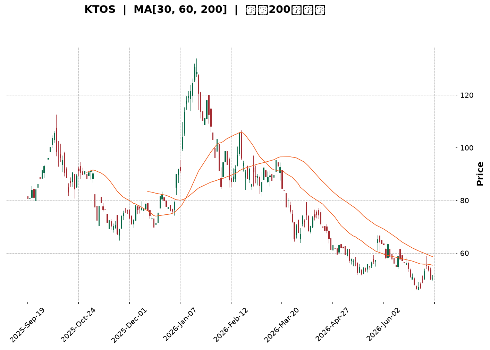
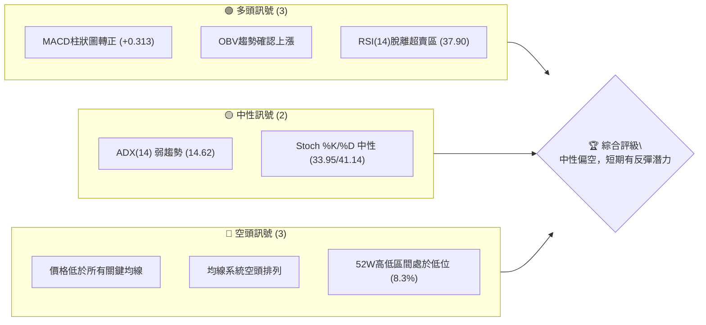
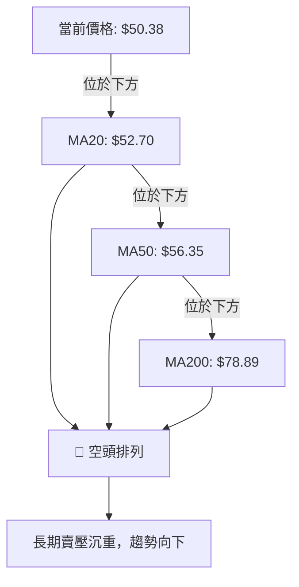
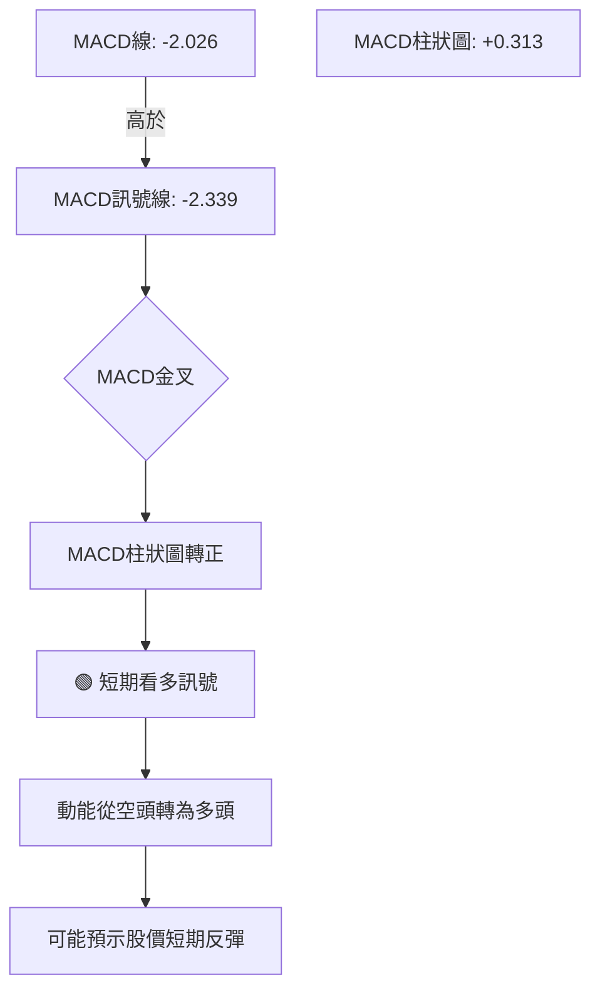
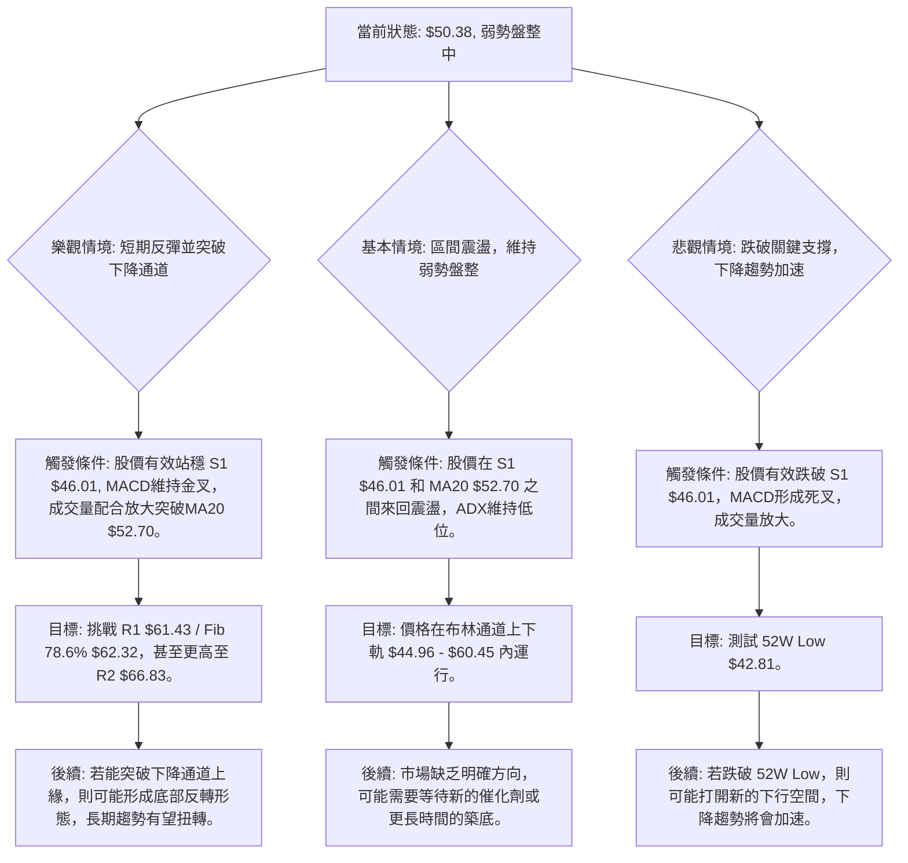

<details>
<summary>📊 靜態圖表 (點擊展開)</summary>

</details>

<html>
<head><meta charset="utf-8" /></head>
<body>
    <div style="height:500px; width:100%;">                        <script>window.PlotlyConfig = {MathJaxConfig: 'local'};</script>
        <script charset="utf-8" src="https://cdn.plot.ly/plotly-3.6.0.min.js" integrity="sha256-QaOVwtVY0T02VaHrr6pnoHLCwayMJp4O5n4YyaE3rJk=" crossorigin="anonymous"></script>                <div id="candlestick-chart" class="plotly-graph-div" style="height:100%; width:100%;"></div>            <script>                window.PLOTLYENV=window.PLOTLYENV || {};                                if (document.getElementById("candlestick-chart")) {                    Plotly.newPlot(                        "candlestick-chart",                        [{"close":{"dtype":"f8","bdata":"AAAAoEcxVEAAAACAFC5UQAAAAKCZ+VRAAAAAIIVLVEAAAADAzAxVQAAAAIDrkVVAAAAAwB4FVkAAAAAgrtdWQAAAAKBwPVdAAAAAgOvBV0AAAAAAKQxYQAAAAAAAEFlAAAAAACnsWUAAAABA4WpaQAAAAEAzo1hAAAAA4FGoV0AAAACA6xFYQAAAAEAz01dAAAAAwB6lVkAAAAAgridWQAAAACCux1RAAAAAoJmpVUAAAAAgrqdWQAAAAEAzE1VAAAAA4HpUVkAAAAAghctWQAAAACCFq1ZAAAAAgOtxVkAAAACgcM1WQAAAAEAzE1ZAAAAAYGamVkAAAABgZsZWQAAAAIAUjlZAAAAAgD1aU0AAAACAPRpSQAAAAOBReFNAAAAAIIXLU0AAAACAwiVTQAAAAMDMLFNAAAAAACnsUUAAAADAzBxSQAAAACBcj1FAAAAAQAqXUUAAAABA4apRQAAAAADX01BAAAAAwPVIUUAAAABACodSQAAAAEAzw1JAAAAAoEfxUkAAAABgZgZTQAAAAKBwTVJAAAAAoHC9UUAAAACA6zFSQAAAACCFa1NAAAAAAAAgU0AAAACA60FTQAAAAIDrQVNAAAAAgD06U0AAAACA67FTQAAAAKBw\u002fVJAAAAA4KOQUkAAAADgUUhSQAAAAKBHcVFAAAAAoJnZUUAAAADA9dhSQAAAAIDrYVRAAAAAQDOTVEAAAACAFP5TQAAAAMDMbFNAAAAAgBReU0AAAABguP5SQAAAAIA9+lJAAAAAYI\u002fSU0AAAAAghXtWQAAAACCF+1ZAAAAAACncVkAAAABgjwJaQAAAAMDMbFxAAAAAQAp3XUAAAACAFO5dQAAAAAAAYF5AAAAAANcjX0AAAABACldgQAAAAIDCFWBAAAAAgMIlXkAAAABgZnZcQAAAAMD1mFtAAAAA4HrUW0AAAAAA14NdQAAAAEDhKlxAAAAAgD0KW0AAAADgo8BZQAAAAIA9ClhAAAAAIK7XWUAAAADAHtVWQAAAAAAAUFVAAAAAgD2aV0AAAAAA17NYQAAAAGC4XldAAAAAgOvxVUAAAABAM8NVQAAAAADXQ1ZAAAAAgBT+VkAAAACgcE1YQAAAAEDhalpAAAAAwB4FWEAAAAAA15NXQAAAACCFq1ZAAAAAYLgOVkAAAADA9QhXQAAAACCFi1VAAAAAgBSuVkAAAADAzDxWQAAAAOBRSFZAAAAAYI9iVUAAAAAAAMBVQAAAAIAUHldAAAAAoHA9VkAAAABA4TpWQAAAAKBwXVZAAAAAgOvhVUAAAACA62FWQAAAAADX01dAAAAAYI9CV0AAAACA6zFXQAAAACCuJ1VAAAAAACnsVEAAAAAgXF9TQAAAAGC4\u002flNAAAAAQAr3UkAAAAAAKfxRQAAAAIDrUVBAAAAA4KOgUUAAAADAzOxQQAAAAADX01BAAAAAgMKFUkAAAACgcP1RQAAAAKBwnVJAAAAAwB4VUUAAAACAwpVRQAAAAEAzY1JAAAAAgD1qUkAAAACAPapSQAAAAIA9mlJAAAAAIFy\u002fUUAAAADAHnVRQAAAAEAzI1FAAAAAQAonUUAAAACgR2FQQAAAAKBHoU5AAAAA4HqUT0AAAADgetROQAAAACCux01AAAAAYGaGT0AAAABgZgZPQAAAAEAK905AAAAAIK6nTUAAAABgj8JOQAAAAAAAgExAAAAAgOvxTEAAAABguH5MQAAAAIA9qkxAAAAAYLg+SkAAAADAzGxLQAAAACCFC0pAAAAAACkcS0AAAAAAKbxKQAAAAMD16EtAAAAAgMJVS0AAAABAChdMQAAAAGBmZkxAAAAAYGamTEAAAAAAKUxQQAAAAOBRCFBAAAAAYLi+T0AAAABgj6JPQAAAAEAKN01AAAAAQDOzT0AAAABgj0JNQAAAAKBw3UxAAAAA4FEYTEAAAADA9WhLQAAAAADXY01AAAAAAADgTEAAAABgj4JMQAAAACCFK0xAAAAA4HoUTEAAAABA4RpLQAAAACCFi0lAAAAAYGZmSUAAAACgmflHQAAAAMD1KEdAAAAAQOGaR0AAAACgmXlHQAAAAIAU7khAAAAAwB6FSkAAAADAzKxLQAAAAMAexUpAAAAAIIUrSUAAAADgozBJQA=="},"high":{"dtype":"f8","bdata":"AAAAANeTVEAAAADgUahUQAAAAGC4XlVAAAAAAABAVUAAAADgUThVQAAAAIDCtVVAAAAAQOFqVkAAAAAgrvdWQAAAAKBHYVdAAAAAoJkZWEAAAAAgrodYQAAAAAAAwFlAAAAAoHAtWkAAAAAA15NaQAAAAOB6JFxAAAAAoJmpWUAAAAAAAGBZQAAAAGBmRlhAAAAAIFyfWEAAAACAwiVXQAAAAKBHoVVAAAAAgBQuVkAAAABAM7NWQAAAAAAAgFZAAAAAwMx8VkAAAAAghTtXQAAAAGBmpldAAAAAwMwcV0AAAAAgrndXQAAAAAAAwFZAAAAAoJkJV0AAAACAFO5WQAAAAIDC5VZAAAAAAACgVEAAAACAFN5TQAAAAGBmllNAAAAAAACAVEAAAAAgXL9TQAAAAEDhilNAAAAAoJn5UkAAAACgR3FSQAAAAMDMPFJAAAAAAADQUUAAAAAghQtSQAAAAGC4nlJAAAAAgMJVUUAAAAAAKZxSQAAAACCFC1NAAAAAQOFKU0AAAAAgXB9TQAAAAGBmJlNAAAAAYGamUkAAAAAAAEBSQAAAAOB6lFNAAAAA4FGIU0AAAADgeoRTQAAAAIA96lNAAAAAoHCdU0AAAACAFN5TQAAAAKCZ2VNAAAAAQOEaU0AAAADgUahSQAAAACBcj1JAAAAAgD0aUkAAAABgj\u002fJSQAAAACCud1RAAAAAgD3aVEAAAAAAKXxUQAAAAIA9+lNAAAAAgBSOU0AAAAAAKYxTQAAAAIAUPlNAAAAAYLjuU0AAAABACodWQAAAAIDrAVdAAAAA4HrUV0AAAABAM3NbQAAAAMDM3FxAAAAA4FHoXUAAAADgemReQAAAAKBw\u002fV5AAAAAANeTX0AAAAAAAIBgQAAAAAAAwGBAAAAAAAAAYEAAAABAM1NeQAAAAIDr4VxAAAAAQOFqXEAAAADA9YhdQAAAAAAAAF5AAAAAwMzMXEAAAAAAADBbQAAAAMD1SFlAAAAAIFzfWUAAAAAAAMBZQAAAAGBmJldAAAAAQOGqV0AAAACA6\u002fFYQAAAAAAA4FhAAAAAQDMjWEAAAACAwmVWQAAAACBcD1dAAAAAYGZWV0AAAAAAACBZQAAAAIA9elpAAAAAQOGqWkAAAADAHsVXQAAAACBc71ZAAAAAgOtRV0AAAAAAKRxXQAAAAKCZmVVAAAAAYGZGWEAAAACAFE5XQAAAAGBmhlZAAAAAIFxfVkAAAADgUbhWQAAAAEDhaldAAAAAQDMTV0AAAABguL5WQAAAACCu11ZAAAAAoJn5VkAAAABAM\u002fNWQAAAAGBm1ldAAAAA4FE4WEAAAAAAAKBXQAAAAAAAAFdAAAAAANeTVUAAAACgR8FUQAAAAAApPFRAAAAAgOvhU0AAAADgURhTQAAAAKCZ+VFAAAAAgBS+UUAAAABAMzNSQAAAAOCjYFFAAAAAgD2aUkAAAACgmTlSQAAAAAAp3FNAAAAAAACgUkAAAACA66FRQAAAAGBmhlJAAAAA4HokU0AAAABgjxJTQAAAAIAUTlNAAAAAwPU4U0AAAACgcO1RQAAAAKCZuVFAAAAAYLi+UUAAAAAgXC9RQAAAAOCjcFBAAAAAIIUbUEAAAACgmVlPQAAAAKBH4U5AAAAAQAqXT0AAAAAAAMBPQAAAAOBRCFBAAAAAwB5lT0AAAABguN5OQAAAAMAexU5AAAAA4FH4TEAAAABA4dpMQAAAAOCjUE1AAAAAAABATEAAAAAAKfxLQAAAAEAz80pAAAAAAClcS0AAAAAghUtLQAAAAOCj8EtAAAAAANeDS0AAAAAAAGBMQAAAAGBmpk1AAAAAgBSuTEAAAADAHrVQQAAAAAAAsFBAAAAAwMyMUEAAAABAM9NPQAAAAMDM7E5AAAAAIIXLT0AAAADAzAxPQAAAAAAA4E1AAAAAYGamTUAAAABgZmZMQAAAAIDrcU1AAAAAoJnZTkAAAAAAAMBNQAAAAIDrsUxAAAAAQDMzTUAAAAAAAGBMQAAAAEAzE0tAAAAAIIUrSkAAAADAHmVJQAAAAADX40dAAAAA4FGYSEAAAACA63FIQAAAAAApvElAAAAA4KMQS0AAAADgo3BNQAAAAMDMrEtAAAAAYI9CS0AAAABACudJQA=="},"hovertemplate":"\u003cb\u003e%{x|%Y-%m-%d}\u003c\u002fb\u003e\u003cbr\u003e\u958b: $%{open:.2f}\u003cbr\u003e\u9ad8: $%{high:.2f}\u003cbr\u003e\u4f4e: $%{low:.2f}\u003cbr\u003e\u6536: $%{close:.2f}\u003cextra\u003e\u003c\u002fextra\u003e","low":{"dtype":"f8","bdata":"AAAAoJn5U0AAAABAM9NTQAAAAGBmRlRAAAAAYGY2VEAAAAAgrrdTQAAAACCFG1VAAAAAQDPzVUAAAABgZgZWQAAAAOBRKFZAAAAAgOshV0AAAABACndXQAAAAKBHgVhAAAAAAAAAWUAAAACgmXlZQAAAAEAzM1hAAAAAoJk5V0AAAABA4apXQAAAAGCPslZAAAAAgD1KVkAAAAAgXB9WQAAAAKBwbVRAAAAAwMxMVUAAAADAzExVQAAAAADXM1RAAAAAIK43VUAAAAAghUtWQAAAAOCjEFZAAAAAAClsVkAAAACgcH1WQAAAAGCPAlZAAAAAgD36VUAAAADAzPxVQAAAAOB6tFVAAAAAYGb2UkAAAACgR5FRQAAAAKCZKVFAAAAAQDNDU0AAAADA9fhSQAAAAAAA4FJAAAAAANfTUUAAAAAAAEBRQAAAAGBmNlFAAAAAgOvxUEAAAABAM1NRQAAAAIA9ulBAAAAAQDMzUEAAAADA9UhRQAAAAKCZKVJAAAAAANfTUkAAAADgo8BSQAAAACCFO1JAAAAAIK63UUAAAAAghWtRQAAAAIDrEVJAAAAA4KOwUkAAAACgmclSQAAAAADXA1NAAAAAwMxMUkAAAABAM7NSQAAAAMDMzFJAAAAAYGZGUkAAAABA4RpSQAAAAADXU1FAAAAAwPWIUUAAAABguM5RQAAAAADXM1NAAAAAYGb2U0AAAACA69FTQAAAAGBmBlNAAAAAoJkJU0AAAABAM\u002fNSQAAAAOBRuFJAAAAAwB6VUkAAAADgUYhUQAAAAMDMrFVAAAAA4KOgVkAAAACgR7FYQAAAAKCZKVpAAAAAAACgXEAAAADAzExdQAAAAAAAgFxAAAAAoEdRXUAAAAAAAEBfQAAAAAAAwF9AAAAAgOuRXEAAAABguM5bQAAAAEAKF1tAAAAAoEexWkAAAAAA18NbQAAAAOCjUFtAAAAAgMKFWkAAAADgUWhZQAAAAKBHsVdAAAAAoJlJWEAAAABA4bpVQAAAAAAAIFVAAAAAAAAAVkAAAADAzExXQAAAAKBwTVdAAAAAoEdBVUAAAAAAAFBVQAAAAKBHwVVAAAAA4HrEVUAAAADAzDxXQAAAAGC4PlhAAAAAIIXbV0AAAAAAAMBWQAAAAGCPAlVAAAAAoHANVkAAAADA9ahVQAAAAAAAAFVAAAAAwB5VVUAAAABgZqZVQAAAAAAAcFVAAAAAoJmZVEAAAAAAAGBUQAAAAMDMzFVAAAAAwPUoVkAAAAAgrqdVQAAAAMD1WFVAAAAAwMzMVUAAAACgmblVQAAAACBcj1ZAAAAAgD0qV0AAAADA9ehVQAAAAGBmxlRAAAAA4HqEVEAAAACgR+FSQAAAAADXU1NAAAAAoJnJUkAAAADAzOxRQAAAACCuF1BAAAAAQDNjUEAAAABgZuZQQAAAACCF609AAAAAwMyMUUAAAABAM3NRQAAAAEAzI1JAAAAAgOsRUUAAAAAghdtQQAAAAEAKZ1FAAAAAoEchUkAAAAAAAFBSQAAAAOCjQFJAAAAAgD2aUUAAAABACjdRQAAAAOB69FBAAAAAwPXoUEAAAADAHuVPQAAAAKBHgU5AAAAA4FGYTkAAAAAAKRxOQAAAACCuh01AAAAAgOvRTUAAAACgmXlOQAAAAKBH4U5AAAAAoEcBTUAAAABACjdNQAAAAMAeJUxAAAAAoHDdS0AAAACgR4FLQAAAAIAUjktAAAAAIIXrSUAAAABguD5KQAAAAOB61ElAAAAAgD0KSkAAAAAA12NKQAAAAEAzU0pAAAAAIK7nSkAAAABA4TpLQAAAAEAz80tAAAAAAACAS0AAAAAAAIBOQAAAAIA9Ck5AAAAAQDOTTkAAAABACtdOQAAAAEAz80xAAAAA4FH4TEAAAAAAAMBMQAAAACBcr0xAAAAAIK6nSkAAAAAAACBLQAAAAMD1CEtAAAAA4Hp0TEAAAABACldMQAAAAKBHgUtAAAAAwMzMS0AAAADgUXhKQAAAAEAKV0lAAAAAIK4HSUAAAAAA1+NHQAAAAKBHAUdAAAAAwB4FR0AAAACAwjVHQAAAAIDCVUhAAAAAYLjeSEAAAACAPQpLQAAAACBcb0pAAAAAoEfhSEAAAADgetRIQA=="},"name":"\u50f9\u683c","open":{"dtype":"f8","bdata":"AAAAoEdhVEAAAABACidUQAAAAGBmRlRAAAAAIK4XVUAAAAAAAABUQAAAAAAAQFVAAAAAwMw8VkAAAADA9RhWQAAAAAAAoFZAAAAAAADAV0AAAAAAKexXQAAAAGBmllhAAAAAoJlJWUAAAADgesRZQAAAAMD16FpAAAAAwMysV0AAAACAFF5YQAAAAIAUbldAAAAAwMx8WEAAAAAgXP9WQAAAAEDhOlVAAAAAgOvRVUAAAABACsdVQAAAAAAAgFZAAAAAwMxMVUAAAADgUQhXQAAAAOB6RFdAAAAA4HrEVkAAAAAAAIBWQAAAAAAAgFZAAAAAAABgVkAAAADAHrVWQAAAAGC4DlZAAAAAIK6XVEAAAADAzHxTQAAAAEAzk1FAAAAAIIVbVEAAAABguG5TQAAAAIDrMVNAAAAAACm8UkAAAACAPUpRQAAAAIDCBVJAAAAAIFwvUUAAAADAHmVRQAAAAGC4nlJAAAAAANezUEAAAABA4VpRQAAAAIA9ilJAAAAAQDPzUkAAAABguA5TQAAAAGBmJlNAAAAAIK6HUkAAAADgo8BRQAAAAKBHIVJAAAAAAClsU0AAAACAwmVTQAAAAOB6JFNAAAAAAAAAU0AAAAAgXC9TQAAAACCFu1NAAAAAoEcRU0AAAAAAAEBSQAAAAOBRSFJAAAAAACm8UUAAAACA6+FRQAAAAAAAQFNAAAAAgBQeVEAAAABACkdUQAAAAIA9+lNAAAAAoHA9U0AAAAAAKYxTQAAAAEAzM1NAAAAAQDMjU0AAAACAPTpVQAAAAMD1eFZAAAAA4FEoV0AAAACA6+FYQAAAAGC4XlpAAAAAYGY2XUAAAACAPbpdQAAAAAAAoF1AAAAAwPX4XUAAAACgcG1fQAAAACCFA2BAAAAAYI\u002fiX0AAAADgo0BeQAAAAMAedVxAAAAAwMwsW0AAAAAA18NbQAAAAAAAAF5AAAAA4FG4XEAAAADgenRaQAAAAIA9+lhAAAAAYGamWEAAAACgcF1ZQAAAAIAUHlZAAAAAYGZGVkAAAABgZqZXQAAAAOB6tFhAAAAAgD36V0AAAACgmRlWQAAAACBcz1VAAAAAwB4FVkAAAADA9UhXQAAAAKBwbVhAAAAAAClsWkAAAACgR1FXQAAAAAAAMFZAAAAAACk8V0AAAAAAKfxVQAAAAEAzU1VAAAAAQOEaV0AAAACgcE1WQAAAAOCjIFZAAAAAYGY2VkAAAADgUdhUQAAAAEAK91VAAAAAACncVkAAAACA68FVQAAAAAApPFZAAAAAAACAVkAAAACAwjVWQAAAAEAKt1ZAAAAAgD2aV0AAAADgo6BWQAAAAMDM3FZAAAAAgML1VEAAAABA4apUQAAAAGCP8lNAAAAA4FGYU0AAAABACrdSQAAAAOCj8FFAAAAAoJm5UEAAAADA9ShSQAAAAIDrUVBAAAAA4FHIUUAAAAAAABBSQAAAAOBR2FNAAAAAwMyMUkAAAACgRwFRQAAAAGBmhlFAAAAAgD2qUkAAAAAAKexSQAAAAADXE1NAAAAAIIXbUkAAAABgj4JRQAAAAOCjkFFAAAAAIK6HUUAAAADAzBxRQAAAAOCjcFBAAAAA4FGYTkAAAADgUfhOQAAAAGC43k5AAAAAwB4lTkAAAADgerRPQAAAAAApPE9AAAAA4FFYT0AAAACAPYpNQAAAAMAexU5AAAAAgD2KTEAAAAAgXG9MQAAAACCFq0xAAAAA4Ho0TEAAAACgR2FKQAAAAGC4vkpAAAAAoEchSkAAAABguB5LQAAAAKCZ+UpAAAAAAACAS0AAAADAHqVLQAAAAOB61ExAAAAAoHB9TEAAAABA4fpPQAAAAIA9qlBAAAAAACk8UEAAAADA9chPQAAAACBcz05AAAAAgBQuTUAAAACA69FOQAAAAAAp3E1AAAAAIK4HTUAAAADAzMxLQAAAAMD1aEtAAAAAYLi+TkAAAADgUZhNQAAAAIAUTkxAAAAA4KPQS0AAAAAAKRxMQAAAAGCP4kpAAAAAIK4HSUAAAABAChdJQAAAAEAzs0dAAAAAwB4FR0AAAADAzCxIQAAAAIAUDklAAAAAwB4lSUAAAACA67FLQAAAAMD1iEtAAAAAoHDdSkAAAABA4RpJQA=="},"x":["2025-09-19T00:00:00-04:00","2025-09-22T00:00:00-04:00","2025-09-23T00:00:00-04:00","2025-09-24T00:00:00-04:00","2025-09-25T00:00:00-04:00","2025-09-26T00:00:00-04:00","2025-09-29T00:00:00-04:00","2025-09-30T00:00:00-04:00","2025-10-01T00:00:00-04:00","2025-10-02T00:00:00-04:00","2025-10-03T00:00:00-04:00","2025-10-06T00:00:00-04:00","2025-10-07T00:00:00-04:00","2025-10-08T00:00:00-04:00","2025-10-09T00:00:00-04:00","2025-10-10T00:00:00-04:00","2025-10-13T00:00:00-04:00","2025-10-14T00:00:00-04:00","2025-10-15T00:00:00-04:00","2025-10-16T00:00:00-04:00","2025-10-17T00:00:00-04:00","2025-10-20T00:00:00-04:00","2025-10-21T00:00:00-04:00","2025-10-22T00:00:00-04:00","2025-10-23T00:00:00-04:00","2025-10-24T00:00:00-04:00","2025-10-27T00:00:00-04:00","2025-10-28T00:00:00-04:00","2025-10-29T00:00:00-04:00","2025-10-30T00:00:00-04:00","2025-10-31T00:00:00-04:00","2025-11-03T00:00:00-05:00","2025-11-04T00:00:00-05:00","2025-11-05T00:00:00-05:00","2025-11-06T00:00:00-05:00","2025-11-07T00:00:00-05:00","2025-11-10T00:00:00-05:00","2025-11-11T00:00:00-05:00","2025-11-12T00:00:00-05:00","2025-11-13T00:00:00-05:00","2025-11-14T00:00:00-05:00","2025-11-17T00:00:00-05:00","2025-11-18T00:00:00-05:00","2025-11-19T00:00:00-05:00","2025-11-20T00:00:00-05:00","2025-11-21T00:00:00-05:00","2025-11-24T00:00:00-05:00","2025-11-25T00:00:00-05:00","2025-11-26T00:00:00-05:00","2025-11-28T00:00:00-05:00","2025-12-01T00:00:00-05:00","2025-12-02T00:00:00-05:00","2025-12-03T00:00:00-05:00","2025-12-04T00:00:00-05:00","2025-12-05T00:00:00-05:00","2025-12-08T00:00:00-05:00","2025-12-09T00:00:00-05:00","2025-12-10T00:00:00-05:00","2025-12-11T00:00:00-05:00","2025-12-12T00:00:00-05:00","2025-12-15T00:00:00-05:00","2025-12-16T00:00:00-05:00","2025-12-17T00:00:00-05:00","2025-12-18T00:00:00-05:00","2025-12-19T00:00:00-05:00","2025-12-22T00:00:00-05:00","2025-12-23T00:00:00-05:00","2025-12-24T00:00:00-05:00","2025-12-26T00:00:00-05:00","2025-12-29T00:00:00-05:00","2025-12-30T00:00:00-05:00","2025-12-31T00:00:00-05:00","2026-01-02T00:00:00-05:00","2026-01-05T00:00:00-05:00","2026-01-06T00:00:00-05:00","2026-01-07T00:00:00-05:00","2026-01-08T00:00:00-05:00","2026-01-09T00:00:00-05:00","2026-01-12T00:00:00-05:00","2026-01-13T00:00:00-05:00","2026-01-14T00:00:00-05:00","2026-01-15T00:00:00-05:00","2026-01-16T00:00:00-05:00","2026-01-20T00:00:00-05:00","2026-01-21T00:00:00-05:00","2026-01-22T00:00:00-05:00","2026-01-23T00:00:00-05:00","2026-01-26T00:00:00-05:00","2026-01-27T00:00:00-05:00","2026-01-28T00:00:00-05:00","2026-01-29T00:00:00-05:00","2026-01-30T00:00:00-05:00","2026-02-02T00:00:00-05:00","2026-02-03T00:00:00-05:00","2026-02-04T00:00:00-05:00","2026-02-05T00:00:00-05:00","2026-02-06T00:00:00-05:00","2026-02-09T00:00:00-05:00","2026-02-10T00:00:00-05:00","2026-02-11T00:00:00-05:00","2026-02-12T00:00:00-05:00","2026-02-13T00:00:00-05:00","2026-02-17T00:00:00-05:00","2026-02-18T00:00:00-05:00","2026-02-19T00:00:00-05:00","2026-02-20T00:00:00-05:00","2026-02-23T00:00:00-05:00","2026-02-24T00:00:00-05:00","2026-02-25T00:00:00-05:00","2026-02-26T00:00:00-05:00","2026-02-27T00:00:00-05:00","2026-03-02T00:00:00-05:00","2026-03-03T00:00:00-05:00","2026-03-04T00:00:00-05:00","2026-03-05T00:00:00-05:00","2026-03-06T00:00:00-05:00","2026-03-09T00:00:00-04:00","2026-03-10T00:00:00-04:00","2026-03-11T00:00:00-04:00","2026-03-12T00:00:00-04:00","2026-03-13T00:00:00-04:00","2026-03-16T00:00:00-04:00","2026-03-17T00:00:00-04:00","2026-03-18T00:00:00-04:00","2026-03-19T00:00:00-04:00","2026-03-20T00:00:00-04:00","2026-03-23T00:00:00-04:00","2026-03-24T00:00:00-04:00","2026-03-25T00:00:00-04:00","2026-03-26T00:00:00-04:00","2026-03-27T00:00:00-04:00","2026-03-30T00:00:00-04:00","2026-03-31T00:00:00-04:00","2026-04-01T00:00:00-04:00","2026-04-02T00:00:00-04:00","2026-04-06T00:00:00-04:00","2026-04-07T00:00:00-04:00","2026-04-08T00:00:00-04:00","2026-04-09T00:00:00-04:00","2026-04-10T00:00:00-04:00","2026-04-13T00:00:00-04:00","2026-04-14T00:00:00-04:00","2026-04-15T00:00:00-04:00","2026-04-16T00:00:00-04:00","2026-04-17T00:00:00-04:00","2026-04-20T00:00:00-04:00","2026-04-21T00:00:00-04:00","2026-04-22T00:00:00-04:00","2026-04-23T00:00:00-04:00","2026-04-24T00:00:00-04:00","2026-04-27T00:00:00-04:00","2026-04-28T00:00:00-04:00","2026-04-29T00:00:00-04:00","2026-04-30T00:00:00-04:00","2026-05-01T00:00:00-04:00","2026-05-04T00:00:00-04:00","2026-05-05T00:00:00-04:00","2026-05-06T00:00:00-04:00","2026-05-07T00:00:00-04:00","2026-05-08T00:00:00-04:00","2026-05-11T00:00:00-04:00","2026-05-12T00:00:00-04:00","2026-05-13T00:00:00-04:00","2026-05-14T00:00:00-04:00","2026-05-15T00:00:00-04:00","2026-05-18T00:00:00-04:00","2026-05-19T00:00:00-04:00","2026-05-20T00:00:00-04:00","2026-05-21T00:00:00-04:00","2026-05-22T00:00:00-04:00","2026-05-26T00:00:00-04:00","2026-05-27T00:00:00-04:00","2026-05-28T00:00:00-04:00","2026-05-29T00:00:00-04:00","2026-06-01T00:00:00-04:00","2026-06-02T00:00:00-04:00","2026-06-03T00:00:00-04:00","2026-06-04T00:00:00-04:00","2026-06-05T00:00:00-04:00","2026-06-08T00:00:00-04:00","2026-06-09T00:00:00-04:00","2026-06-10T00:00:00-04:00","2026-06-11T00:00:00-04:00","2026-06-12T00:00:00-04:00","2026-06-15T00:00:00-04:00","2026-06-16T00:00:00-04:00","2026-06-17T00:00:00-04:00","2026-06-18T00:00:00-04:00","2026-06-22T00:00:00-04:00","2026-06-23T00:00:00-04:00","2026-06-24T00:00:00-04:00","2026-06-25T00:00:00-04:00","2026-06-26T00:00:00-04:00","2026-06-29T00:00:00-04:00","2026-06-30T00:00:00-04:00","2026-07-01T00:00:00-04:00","2026-07-02T00:00:00-04:00","2026-07-06T00:00:00-04:00","2026-07-07T00:00:00-04:00","2026-07-08T00:00:00-04:00"],"type":"candlestick"},{"hovertemplate":"MA30: $%{y:.2f}\u003cextra\u003e\u003c\u002fextra\u003e","line":{"color":"#2196F3","dash":"dash","width":2},"mode":"lines","name":"MA30","x":["2025-09-19T00:00:00-04:00","2025-09-22T00:00:00-04:00","2025-09-23T00:00:00-04:00","2025-09-24T00:00:00-04:00","2025-09-25T00:00:00-04:00","2025-09-26T00:00:00-04:00","2025-09-29T00:00:00-04:00","2025-09-30T00:00:00-04:00","2025-10-01T00:00:00-04:00","2025-10-02T00:00:00-04:00","2025-10-03T00:00:00-04:00","2025-10-06T00:00:00-04:00","2025-10-07T00:00:00-04:00","2025-10-08T00:00:00-04:00","2025-10-09T00:00:00-04:00","2025-10-10T00:00:00-04:00","2025-10-13T00:00:00-04:00","2025-10-14T00:00:00-04:00","2025-10-15T00:00:00-04:00","2025-10-16T00:00:00-04:00","2025-10-17T00:00:00-04:00","2025-10-20T00:00:00-04:00","2025-10-21T00:00:00-04:00","2025-10-22T00:00:00-04:00","2025-10-23T00:00:00-04:00","2025-10-24T00:00:00-04:00","2025-10-27T00:00:00-04:00","2025-10-28T00:00:00-04:00","2025-10-29T00:00:00-04:00","2025-10-30T00:00:00-04:00","2025-10-31T00:00:00-04:00","2025-11-03T00:00:00-05:00","2025-11-04T00:00:00-05:00","2025-11-05T00:00:00-05:00","2025-11-06T00:00:00-05:00","2025-11-07T00:00:00-05:00","2025-11-10T00:00:00-05:00","2025-11-11T00:00:00-05:00","2025-11-12T00:00:00-05:00","2025-11-13T00:00:00-05:00","2025-11-14T00:00:00-05:00","2025-11-17T00:00:00-05:00","2025-11-18T00:00:00-05:00","2025-11-19T00:00:00-05:00","2025-11-20T00:00:00-05:00","2025-11-21T00:00:00-05:00","2025-11-24T00:00:00-05:00","2025-11-25T00:00:00-05:00","2025-11-26T00:00:00-05:00","2025-11-28T00:00:00-05:00","2025-12-01T00:00:00-05:00","2025-12-02T00:00:00-05:00","2025-12-03T00:00:00-05:00","2025-12-04T00:00:00-05:00","2025-12-05T00:00:00-05:00","2025-12-08T00:00:00-05:00","2025-12-09T00:00:00-05:00","2025-12-10T00:00:00-05:00","2025-12-11T00:00:00-05:00","2025-12-12T00:00:00-05:00","2025-12-15T00:00:00-05:00","2025-12-16T00:00:00-05:00","2025-12-17T00:00:00-05:00","2025-12-18T00:00:00-05:00","2025-12-19T00:00:00-05:00","2025-12-22T00:00:00-05:00","2025-12-23T00:00:00-05:00","2025-12-24T00:00:00-05:00","2025-12-26T00:00:00-05:00","2025-12-29T00:00:00-05:00","2025-12-30T00:00:00-05:00","2025-12-31T00:00:00-05:00","2026-01-02T00:00:00-05:00","2026-01-05T00:00:00-05:00","2026-01-06T00:00:00-05:00","2026-01-07T00:00:00-05:00","2026-01-08T00:00:00-05:00","2026-01-09T00:00:00-05:00","2026-01-12T00:00:00-05:00","2026-01-13T00:00:00-05:00","2026-01-14T00:00:00-05:00","2026-01-15T00:00:00-05:00","2026-01-16T00:00:00-05:00","2026-01-20T00:00:00-05:00","2026-01-21T00:00:00-05:00","2026-01-22T00:00:00-05:00","2026-01-23T00:00:00-05:00","2026-01-26T00:00:00-05:00","2026-01-27T00:00:00-05:00","2026-01-28T00:00:00-05:00","2026-01-29T00:00:00-05:00","2026-01-30T00:00:00-05:00","2026-02-02T00:00:00-05:00","2026-02-03T00:00:00-05:00","2026-02-04T00:00:00-05:00","2026-02-05T00:00:00-05:00","2026-02-06T00:00:00-05:00","2026-02-09T00:00:00-05:00","2026-02-10T00:00:00-05:00","2026-02-11T00:00:00-05:00","2026-02-12T00:00:00-05:00","2026-02-13T00:00:00-05:00","2026-02-17T00:00:00-05:00","2026-02-18T00:00:00-05:00","2026-02-19T00:00:00-05:00","2026-02-20T00:00:00-05:00","2026-02-23T00:00:00-05:00","2026-02-24T00:00:00-05:00","2026-02-25T00:00:00-05:00","2026-02-26T00:00:00-05:00","2026-02-27T00:00:00-05:00","2026-03-02T00:00:00-05:00","2026-03-03T00:00:00-05:00","2026-03-04T00:00:00-05:00","2026-03-05T00:00:00-05:00","2026-03-06T00:00:00-05:00","2026-03-09T00:00:00-04:00","2026-03-10T00:00:00-04:00","2026-03-11T00:00:00-04:00","2026-03-12T00:00:00-04:00","2026-03-13T00:00:00-04:00","2026-03-16T00:00:00-04:00","2026-03-17T00:00:00-04:00","2026-03-18T00:00:00-04:00","2026-03-19T00:00:00-04:00","2026-03-20T00:00:00-04:00","2026-03-23T00:00:00-04:00","2026-03-24T00:00:00-04:00","2026-03-25T00:00:00-04:00","2026-03-26T00:00:00-04:00","2026-03-27T00:00:00-04:00","2026-03-30T00:00:00-04:00","2026-03-31T00:00:00-04:00","2026-04-01T00:00:00-04:00","2026-04-02T00:00:00-04:00","2026-04-06T00:00:00-04:00","2026-04-07T00:00:00-04:00","2026-04-08T00:00:00-04:00","2026-04-09T00:00:00-04:00","2026-04-10T00:00:00-04:00","2026-04-13T00:00:00-04:00","2026-04-14T00:00:00-04:00","2026-04-15T00:00:00-04:00","2026-04-16T00:00:00-04:00","2026-04-17T00:00:00-04:00","2026-04-20T00:00:00-04:00","2026-04-21T00:00:00-04:00","2026-04-22T00:00:00-04:00","2026-04-23T00:00:00-04:00","2026-04-24T00:00:00-04:00","2026-04-27T00:00:00-04:00","2026-04-28T00:00:00-04:00","2026-04-29T00:00:00-04:00","2026-04-30T00:00:00-04:00","2026-05-01T00:00:00-04:00","2026-05-04T00:00:00-04:00","2026-05-05T00:00:00-04:00","2026-05-06T00:00:00-04:00","2026-05-07T00:00:00-04:00","2026-05-08T00:00:00-04:00","2026-05-11T00:00:00-04:00","2026-05-12T00:00:00-04:00","2026-05-13T00:00:00-04:00","2026-05-14T00:00:00-04:00","2026-05-15T00:00:00-04:00","2026-05-18T00:00:00-04:00","2026-05-19T00:00:00-04:00","2026-05-20T00:00:00-04:00","2026-05-21T00:00:00-04:00","2026-05-22T00:00:00-04:00","2026-05-26T00:00:00-04:00","2026-05-27T00:00:00-04:00","2026-05-28T00:00:00-04:00","2026-05-29T00:00:00-04:00","2026-06-01T00:00:00-04:00","2026-06-02T00:00:00-04:00","2026-06-03T00:00:00-04:00","2026-06-04T00:00:00-04:00","2026-06-05T00:00:00-04:00","2026-06-08T00:00:00-04:00","2026-06-09T00:00:00-04:00","2026-06-10T00:00:00-04:00","2026-06-11T00:00:00-04:00","2026-06-12T00:00:00-04:00","2026-06-15T00:00:00-04:00","2026-06-16T00:00:00-04:00","2026-06-17T00:00:00-04:00","2026-06-18T00:00:00-04:00","2026-06-22T00:00:00-04:00","2026-06-23T00:00:00-04:00","2026-06-24T00:00:00-04:00","2026-06-25T00:00:00-04:00","2026-06-26T00:00:00-04:00","2026-06-29T00:00:00-04:00","2026-06-30T00:00:00-04:00","2026-07-01T00:00:00-04:00","2026-07-02T00:00:00-04:00","2026-07-06T00:00:00-04:00","2026-07-07T00:00:00-04:00","2026-07-08T00:00:00-04:00"],"y":{"dtype":"f8","bdata":"AAAAAAAA+H8AAAAAAAD4fwAAAAAAAPh\u002fAAAAAAAA+H8AAAAAAAD4fwAAAAAAAPh\u002fAAAAAAAA+H8AAAAAAAD4fwAAAAAAAPh\u002fAAAAAAAA+H8AAAAAAAD4fwAAAAAAAPh\u002fAAAAAAAA+H8AAAAAAAD4fwAAAAAAAPh\u002fAAAAAAAA+H8AAAAAAAD4fwAAAAAAAPh\u002fAAAAAAAA+H8AAAAAAAD4fwAAAAAAAPh\u002fAAAAAAAA+H8AAAAAAAD4fwAAAAAAAPh\u002fAAAAAAAA+H8AAAAAAAD4fwAAAAAAAPh\u002fAAAAAAAA+H8AAAAAAAD4f1VVVXVoqVZAMzMz82C+VkAAAADQhdRWQAAAAGAB4lZAREREdPbZVkC8u7uLz8BWQGZmZgbkrlZAAAAAcOebVkBVVVWVX3xWQERERHSvWVZAREREtOQnVkDv7u5+P\u002fVVQImIiAg6tVVAiYiIaB9uVUDe3d29dCNVQImIiIjP4FRAiYiImG6qVEAiIiLSIntUQO\u002fu7p7vT1RAIiIiYlcwVECrqqrKoRVUQLy7u5t9AFRAZmZmxgTfU0ARERHB9bhTQJqZmVnWqlNAvLu763yPU0AiIiIiTXFTQJqZmWkuVFNA3t3drbk4U0De3d09NR5TQERERPThA1NAMzMzIwbhUkDv7u4esLpSQBEREbEPj1JA3t3dbT2CUkB3d3fnmIhSQKuqqkpikFJAq6qqOgqXUkCamZkpQJ5SQLy7u0tioFJAIiIi8rasUkDNzMzMPrRSQBEREWFXwFJAmpmZWWTTUkARERHhevxSQO\u002fu7q4AMVNAVVVVdZNgU0Crqqo6baBTQHd3d0fh8lNAiYiICKxMVEDv7u5euqlUQGZmZia\u002fEFVAVVVV5ReDVUDNzMzcsv5VQImIiKh\u002fa1ZAzczMrI7JVkDe3d1NGxhXQAAAAFBGX1dAIiIiwq6oV0AAAADgevxXQN7d3W3LSlhAmpmZWR2TWEARERHR29JYQHd3d0coC1lAmpmZKVxPWUB3d3eHXXFZQFVVVSVNeVlAIiIi0iKTWUCJiIj4U7tZQFVVVfX93FlAd3d3l\u002fzyWUCamZlJmgpaQAAAAPCnJlpAiYiI6LRBWkAiIiLCPFFaQBEREaGMblpAAAAAsHJ4WkDv7u7OsGNaQCIiItKUMlpARERE5F7zWUCJiIiIiLhZQKuqqhovbVlARERE9P0kWUBmZmb24ctYQERERGSCd1hAvLu7a7wsWEDe3d29dPNXQImIiAg6zVdA3t3dfYadV0CrqqoqXF9XQJqZmWnYLVdA3t3drdUBV0DNzMzME+VWQFVVVZVD41ZAZmZmBjrNVkCrqqrqUdBWQKuqqtr5zlZA3t3dTRu4VkDe3d29n4pWQBEREfHSbVZAiYiICGVUVkBVVVX1KDRWQImIiOhtAVZAMzMz46XTVUDe3d19sZRVQBEREdHbQlVAd3d3V\u002fITVUAzMzNDRORUQKuqqvqpwVRAzczM7DWXVEB3d3c3tGhUQN7d3Y3CTVRAVVVVhV0pVEB3d3dH4QpUQDMzMzN661NAVVVV9W\u002fMU0CamZnZzqdTQHd3d1fHdFNAd3d3h11JU0AiIiICchdTQERERAxJ21JAd3d3x0unUkAzMzML12tSQHd3d8eSH1JAVVVVPZjfUUAAAACQCZ5RQLy7u8uhbVFAiYiIEJ85UUARERFRjRdRQLy7uyuH5lBAd3d3JzHAUEDe3d11TKBQQLy7u7NWj1BAERERYeVoUEARERGRe01QQDMzM2sDLVBAiYiIwJ8CUEDv7u5+W7ZPQFVVVaXTZk9Ad3d3R4ssT0CamZnJIPBOQBEREVGpqE5ARERE1NtiTkAAAAAQdDpOQN7d3Y2XDk5A7+7ujpfuTUCamZlJmtJNQLy7u4tsp01AZmZm1jGRTUCamZn5U3NNQGZmZkZEZE1AzczMLIdGTUAiIiISWClNQJqZmRkEJk1AZmZmFmcPTUDNzMz88PlMQHd3dzcX4kxAMzMzk6bUTECrqqoadrVMQO\u002fu7s4+nExAMzMzo\u002f59TEC8u7uLbFdMQAAAALByKExAREREhOsRTEDNzMycNvBLQLy7u9uy5ktAvLu7+6nhS0ARERFxr+lLQDMzMxP130tAAAAAkHvNS0CrqqpqvLRLQA=="},"type":"scatter"},{"hovertemplate":"MA60: $%{y:.2f}\u003cextra\u003e\u003c\u002fextra\u003e","line":{"color":"#9C27B0","dash":"dash","width":2},"mode":"lines","name":"MA60","x":["2025-09-19T00:00:00-04:00","2025-09-22T00:00:00-04:00","2025-09-23T00:00:00-04:00","2025-09-24T00:00:00-04:00","2025-09-25T00:00:00-04:00","2025-09-26T00:00:00-04:00","2025-09-29T00:00:00-04:00","2025-09-30T00:00:00-04:00","2025-10-01T00:00:00-04:00","2025-10-02T00:00:00-04:00","2025-10-03T00:00:00-04:00","2025-10-06T00:00:00-04:00","2025-10-07T00:00:00-04:00","2025-10-08T00:00:00-04:00","2025-10-09T00:00:00-04:00","2025-10-10T00:00:00-04:00","2025-10-13T00:00:00-04:00","2025-10-14T00:00:00-04:00","2025-10-15T00:00:00-04:00","2025-10-16T00:00:00-04:00","2025-10-17T00:00:00-04:00","2025-10-20T00:00:00-04:00","2025-10-21T00:00:00-04:00","2025-10-22T00:00:00-04:00","2025-10-23T00:00:00-04:00","2025-10-24T00:00:00-04:00","2025-10-27T00:00:00-04:00","2025-10-28T00:00:00-04:00","2025-10-29T00:00:00-04:00","2025-10-30T00:00:00-04:00","2025-10-31T00:00:00-04:00","2025-11-03T00:00:00-05:00","2025-11-04T00:00:00-05:00","2025-11-05T00:00:00-05:00","2025-11-06T00:00:00-05:00","2025-11-07T00:00:00-05:00","2025-11-10T00:00:00-05:00","2025-11-11T00:00:00-05:00","2025-11-12T00:00:00-05:00","2025-11-13T00:00:00-05:00","2025-11-14T00:00:00-05:00","2025-11-17T00:00:00-05:00","2025-11-18T00:00:00-05:00","2025-11-19T00:00:00-05:00","2025-11-20T00:00:00-05:00","2025-11-21T00:00:00-05:00","2025-11-24T00:00:00-05:00","2025-11-25T00:00:00-05:00","2025-11-26T00:00:00-05:00","2025-11-28T00:00:00-05:00","2025-12-01T00:00:00-05:00","2025-12-02T00:00:00-05:00","2025-12-03T00:00:00-05:00","2025-12-04T00:00:00-05:00","2025-12-05T00:00:00-05:00","2025-12-08T00:00:00-05:00","2025-12-09T00:00:00-05:00","2025-12-10T00:00:00-05:00","2025-12-11T00:00:00-05:00","2025-12-12T00:00:00-05:00","2025-12-15T00:00:00-05:00","2025-12-16T00:00:00-05:00","2025-12-17T00:00:00-05:00","2025-12-18T00:00:00-05:00","2025-12-19T00:00:00-05:00","2025-12-22T00:00:00-05:00","2025-12-23T00:00:00-05:00","2025-12-24T00:00:00-05:00","2025-12-26T00:00:00-05:00","2025-12-29T00:00:00-05:00","2025-12-30T00:00:00-05:00","2025-12-31T00:00:00-05:00","2026-01-02T00:00:00-05:00","2026-01-05T00:00:00-05:00","2026-01-06T00:00:00-05:00","2026-01-07T00:00:00-05:00","2026-01-08T00:00:00-05:00","2026-01-09T00:00:00-05:00","2026-01-12T00:00:00-05:00","2026-01-13T00:00:00-05:00","2026-01-14T00:00:00-05:00","2026-01-15T00:00:00-05:00","2026-01-16T00:00:00-05:00","2026-01-20T00:00:00-05:00","2026-01-21T00:00:00-05:00","2026-01-22T00:00:00-05:00","2026-01-23T00:00:00-05:00","2026-01-26T00:00:00-05:00","2026-01-27T00:00:00-05:00","2026-01-28T00:00:00-05:00","2026-01-29T00:00:00-05:00","2026-01-30T00:00:00-05:00","2026-02-02T00:00:00-05:00","2026-02-03T00:00:00-05:00","2026-02-04T00:00:00-05:00","2026-02-05T00:00:00-05:00","2026-02-06T00:00:00-05:00","2026-02-09T00:00:00-05:00","2026-02-10T00:00:00-05:00","2026-02-11T00:00:00-05:00","2026-02-12T00:00:00-05:00","2026-02-13T00:00:00-05:00","2026-02-17T00:00:00-05:00","2026-02-18T00:00:00-05:00","2026-02-19T00:00:00-05:00","2026-02-20T00:00:00-05:00","2026-02-23T00:00:00-05:00","2026-02-24T00:00:00-05:00","2026-02-25T00:00:00-05:00","2026-02-26T00:00:00-05:00","2026-02-27T00:00:00-05:00","2026-03-02T00:00:00-05:00","2026-03-03T00:00:00-05:00","2026-03-04T00:00:00-05:00","2026-03-05T00:00:00-05:00","2026-03-06T00:00:00-05:00","2026-03-09T00:00:00-04:00","2026-03-10T00:00:00-04:00","2026-03-11T00:00:00-04:00","2026-03-12T00:00:00-04:00","2026-03-13T00:00:00-04:00","2026-03-16T00:00:00-04:00","2026-03-17T00:00:00-04:00","2026-03-18T00:00:00-04:00","2026-03-19T00:00:00-04:00","2026-03-20T00:00:00-04:00","2026-03-23T00:00:00-04:00","2026-03-24T00:00:00-04:00","2026-03-25T00:00:00-04:00","2026-03-26T00:00:00-04:00","2026-03-27T00:00:00-04:00","2026-03-30T00:00:00-04:00","2026-03-31T00:00:00-04:00","2026-04-01T00:00:00-04:00","2026-04-02T00:00:00-04:00","2026-04-06T00:00:00-04:00","2026-04-07T00:00:00-04:00","2026-04-08T00:00:00-04:00","2026-04-09T00:00:00-04:00","2026-04-10T00:00:00-04:00","2026-04-13T00:00:00-04:00","2026-04-14T00:00:00-04:00","2026-04-15T00:00:00-04:00","2026-04-16T00:00:00-04:00","2026-04-17T00:00:00-04:00","2026-04-20T00:00:00-04:00","2026-04-21T00:00:00-04:00","2026-04-22T00:00:00-04:00","2026-04-23T00:00:00-04:00","2026-04-24T00:00:00-04:00","2026-04-27T00:00:00-04:00","2026-04-28T00:00:00-04:00","2026-04-29T00:00:00-04:00","2026-04-30T00:00:00-04:00","2026-05-01T00:00:00-04:00","2026-05-04T00:00:00-04:00","2026-05-05T00:00:00-04:00","2026-05-06T00:00:00-04:00","2026-05-07T00:00:00-04:00","2026-05-08T00:00:00-04:00","2026-05-11T00:00:00-04:00","2026-05-12T00:00:00-04:00","2026-05-13T00:00:00-04:00","2026-05-14T00:00:00-04:00","2026-05-15T00:00:00-04:00","2026-05-18T00:00:00-04:00","2026-05-19T00:00:00-04:00","2026-05-20T00:00:00-04:00","2026-05-21T00:00:00-04:00","2026-05-22T00:00:00-04:00","2026-05-26T00:00:00-04:00","2026-05-27T00:00:00-04:00","2026-05-28T00:00:00-04:00","2026-05-29T00:00:00-04:00","2026-06-01T00:00:00-04:00","2026-06-02T00:00:00-04:00","2026-06-03T00:00:00-04:00","2026-06-04T00:00:00-04:00","2026-06-05T00:00:00-04:00","2026-06-08T00:00:00-04:00","2026-06-09T00:00:00-04:00","2026-06-10T00:00:00-04:00","2026-06-11T00:00:00-04:00","2026-06-12T00:00:00-04:00","2026-06-15T00:00:00-04:00","2026-06-16T00:00:00-04:00","2026-06-17T00:00:00-04:00","2026-06-18T00:00:00-04:00","2026-06-22T00:00:00-04:00","2026-06-23T00:00:00-04:00","2026-06-24T00:00:00-04:00","2026-06-25T00:00:00-04:00","2026-06-26T00:00:00-04:00","2026-06-29T00:00:00-04:00","2026-06-30T00:00:00-04:00","2026-07-01T00:00:00-04:00","2026-07-02T00:00:00-04:00","2026-07-06T00:00:00-04:00","2026-07-07T00:00:00-04:00","2026-07-08T00:00:00-04:00"],"y":{"dtype":"f8","bdata":"AAAAAAAA+H8AAAAAAAD4fwAAAAAAAPh\u002fAAAAAAAA+H8AAAAAAAD4fwAAAAAAAPh\u002fAAAAAAAA+H8AAAAAAAD4fwAAAAAAAPh\u002fAAAAAAAA+H8AAAAAAAD4fwAAAAAAAPh\u002fAAAAAAAA+H8AAAAAAAD4fwAAAAAAAPh\u002fAAAAAAAA+H8AAAAAAAD4fwAAAAAAAPh\u002fAAAAAAAA+H8AAAAAAAD4fwAAAAAAAPh\u002fAAAAAAAA+H8AAAAAAAD4fwAAAAAAAPh\u002fAAAAAAAA+H8AAAAAAAD4fwAAAAAAAPh\u002fAAAAAAAA+H8AAAAAAAD4fwAAAAAAAPh\u002fAAAAAAAA+H8AAAAAAAD4fwAAAAAAAPh\u002fAAAAAAAA+H8AAAAAAAD4fwAAAAAAAPh\u002fAAAAAAAA+H8AAAAAAAD4fwAAAAAAAPh\u002fAAAAAAAA+H8AAAAAAAD4fwAAAAAAAPh\u002fAAAAAAAA+H8AAAAAAAD4fwAAAAAAAPh\u002fAAAAAAAA+H8AAAAAAAD4fwAAAAAAAPh\u002fAAAAAAAA+H8AAAAAAAD4fwAAAAAAAPh\u002fAAAAAAAA+H8AAAAAAAD4fwAAAAAAAPh\u002fAAAAAAAA+H8AAAAAAAD4fwAAAAAAAPh\u002fAAAAAAAA+H8AAAAAAAD4f83MzDSl1lRAMzMzi7PPVEB3d3f3msdUQImIiIiIuFRAERER8RmuVECamZk5tKRUQImIiCijn1RAVVVV1XiZVEB3d3ffT41UQAAAAOAIfVRAMzMz001qVEDe3d0lv1RUQM3MzLTIOlRAERER4cEgVEB3d3fP9w9UQLy7uxvoCFRA7+7uBoEFVEBmZmYGyA1UQDMzM3NoIVRAVVVVtYE+VEDNzMwUrl9UQBEREWGeiFRA3t3dVQ6xVEDv7u5O1NtUQBEREQErC1VAREREzIUsVUAAAAA4tERVQM3MzFy6WVVAAAAAOLRwVUDv7u4OWI1VQBEREbFWp1VAZmZmvhG6VUAAAAD4xcZVQERERPwbzVVAvLu7y8zoVUB3d3c3+\u002fxVQAAAALjXBFZAZmZmhhYVVkARERERyixWQImIiCCwPlZAzczMxNlPVkAzMzOLbF9WQImIiKh\u002fc1ZAERERoYyKVkCamZnR26ZWQAAAAKjGz1ZAq6qqEoPsVkDNzMwEDwJXQM3MzAy7EldAZmZmdgUgV0C8u7tzITFXQImIiCD3PldAzczM7ApUV0CamZlpSmVXQGZmZgaBcVdAREREjCV7V0De3d0FyIVXQERERCxAlldAAAAAoBqjV0BVVVWF661XQLy7u+tRvFdAvLu7g3nKV0Dv7u7O99tXQGZmZu4191dAAAAAGEsOWEARERG51yBYQAAAAIAjJFhAAAAAEJ8lWEAzMzPb+SJYQDMzM3NoJVhAAAAA0LAjWEB3d3efYR9YQEREROwKFFhA3t3dZa0KWEAAAAAg9\u002fJXQBERETm02FdAvLu7gzLGV0ARERGJ+qNXQGZmZmYfeldAiYiIaEpFV0AAAABgnhBXQERERNR43VZAzczMvC2nVkDv7u6eYWtWQLy7u0t+MVZAiYiIMJb8VUC8u7vLoc1VQAAAALAAoVVAq6qqAnJzVUBmZmYWZztVQO\u002fu7rqQBFVAq6qqupDUVEAAAABsdahUQGZmZi5rgVRA3t3dIWlWVEBVVVW9LTdUQDMzM9NNHlRAMzMzL934U0B3d3eHFtFTQGZmZg4tqlNAAAAAGEuKU0CamZm1OmpTQCIiIk5iSFNAIiIiokUeU0B3d3eHFvFSQCIiIp7vt1JAAAAADEmLUkBVVVUBuV9SQKuqquaJOlJAREREyL0WUkAiIiJOYvBRQDMzM5sL0VFAvLu7t2WtUUC8u7unDZRRQBEREf1ieVFAZmZm3t1hUUAzMzP\u002fjUhRQKuqqs4+JFFAVVVVOfsIUUB3d3f\u002fjehQQLy7u5e1xlBA7+7urkelUEAiIiKKQYBQQCIiImpKWVBARERE5KUzUEAzMzMHgQ1QQHd3d2et3k9AIiIiWvKjT0BmZmZeSHJPQDMzM5OmNE9AEREReTD\u002fTkC8u7u7AsxOQLy7uwuQo05AMzMzI9txTkB3d3fflkVOQBEREdlcIE5AZmZmvnTzTUAAAAB4BdBNQERERFxko01AvLu7awN9TUAiIiKablJNQA=="},"type":"scatter"},{"hovertemplate":"MA200: $%{y:.2f}\u003cextra\u003e\u003c\u002fextra\u003e","line":{"color":"#FF6F00","dash":"solid","width":2},"mode":"lines","name":"MA200","x":["2025-09-19T00:00:00-04:00","2025-09-22T00:00:00-04:00","2025-09-23T00:00:00-04:00","2025-09-24T00:00:00-04:00","2025-09-25T00:00:00-04:00","2025-09-26T00:00:00-04:00","2025-09-29T00:00:00-04:00","2025-09-30T00:00:00-04:00","2025-10-01T00:00:00-04:00","2025-10-02T00:00:00-04:00","2025-10-03T00:00:00-04:00","2025-10-06T00:00:00-04:00","2025-10-07T00:00:00-04:00","2025-10-08T00:00:00-04:00","2025-10-09T00:00:00-04:00","2025-10-10T00:00:00-04:00","2025-10-13T00:00:00-04:00","2025-10-14T00:00:00-04:00","2025-10-15T00:00:00-04:00","2025-10-16T00:00:00-04:00","2025-10-17T00:00:00-04:00","2025-10-20T00:00:00-04:00","2025-10-21T00:00:00-04:00","2025-10-22T00:00:00-04:00","2025-10-23T00:00:00-04:00","2025-10-24T00:00:00-04:00","2025-10-27T00:00:00-04:00","2025-10-28T00:00:00-04:00","2025-10-29T00:00:00-04:00","2025-10-30T00:00:00-04:00","2025-10-31T00:00:00-04:00","2025-11-03T00:00:00-05:00","2025-11-04T00:00:00-05:00","2025-11-05T00:00:00-05:00","2025-11-06T00:00:00-05:00","2025-11-07T00:00:00-05:00","2025-11-10T00:00:00-05:00","2025-11-11T00:00:00-05:00","2025-11-12T00:00:00-05:00","2025-11-13T00:00:00-05:00","2025-11-14T00:00:00-05:00","2025-11-17T00:00:00-05:00","2025-11-18T00:00:00-05:00","2025-11-19T00:00:00-05:00","2025-11-20T00:00:00-05:00","2025-11-21T00:00:00-05:00","2025-11-24T00:00:00-05:00","2025-11-25T00:00:00-05:00","2025-11-26T00:00:00-05:00","2025-11-28T00:00:00-05:00","2025-12-01T00:00:00-05:00","2025-12-02T00:00:00-05:00","2025-12-03T00:00:00-05:00","2025-12-04T00:00:00-05:00","2025-12-05T00:00:00-05:00","2025-12-08T00:00:00-05:00","2025-12-09T00:00:00-05:00","2025-12-10T00:00:00-05:00","2025-12-11T00:00:00-05:00","2025-12-12T00:00:00-05:00","2025-12-15T00:00:00-05:00","2025-12-16T00:00:00-05:00","2025-12-17T00:00:00-05:00","2025-12-18T00:00:00-05:00","2025-12-19T00:00:00-05:00","2025-12-22T00:00:00-05:00","2025-12-23T00:00:00-05:00","2025-12-24T00:00:00-05:00","2025-12-26T00:00:00-05:00","2025-12-29T00:00:00-05:00","2025-12-30T00:00:00-05:00","2025-12-31T00:00:00-05:00","2026-01-02T00:00:00-05:00","2026-01-05T00:00:00-05:00","2026-01-06T00:00:00-05:00","2026-01-07T00:00:00-05:00","2026-01-08T00:00:00-05:00","2026-01-09T00:00:00-05:00","2026-01-12T00:00:00-05:00","2026-01-13T00:00:00-05:00","2026-01-14T00:00:00-05:00","2026-01-15T00:00:00-05:00","2026-01-16T00:00:00-05:00","2026-01-20T00:00:00-05:00","2026-01-21T00:00:00-05:00","2026-01-22T00:00:00-05:00","2026-01-23T00:00:00-05:00","2026-01-26T00:00:00-05:00","2026-01-27T00:00:00-05:00","2026-01-28T00:00:00-05:00","2026-01-29T00:00:00-05:00","2026-01-30T00:00:00-05:00","2026-02-02T00:00:00-05:00","2026-02-03T00:00:00-05:00","2026-02-04T00:00:00-05:00","2026-02-05T00:00:00-05:00","2026-02-06T00:00:00-05:00","2026-02-09T00:00:00-05:00","2026-02-10T00:00:00-05:00","2026-02-11T00:00:00-05:00","2026-02-12T00:00:00-05:00","2026-02-13T00:00:00-05:00","2026-02-17T00:00:00-05:00","2026-02-18T00:00:00-05:00","2026-02-19T00:00:00-05:00","2026-02-20T00:00:00-05:00","2026-02-23T00:00:00-05:00","2026-02-24T00:00:00-05:00","2026-02-25T00:00:00-05:00","2026-02-26T00:00:00-05:00","2026-02-27T00:00:00-05:00","2026-03-02T00:00:00-05:00","2026-03-03T00:00:00-05:00","2026-03-04T00:00:00-05:00","2026-03-05T00:00:00-05:00","2026-03-06T00:00:00-05:00","2026-03-09T00:00:00-04:00","2026-03-10T00:00:00-04:00","2026-03-11T00:00:00-04:00","2026-03-12T00:00:00-04:00","2026-03-13T00:00:00-04:00","2026-03-16T00:00:00-04:00","2026-03-17T00:00:00-04:00","2026-03-18T00:00:00-04:00","2026-03-19T00:00:00-04:00","2026-03-20T00:00:00-04:00","2026-03-23T00:00:00-04:00","2026-03-24T00:00:00-04:00","2026-03-25T00:00:00-04:00","2026-03-26T00:00:00-04:00","2026-03-27T00:00:00-04:00","2026-03-30T00:00:00-04:00","2026-03-31T00:00:00-04:00","2026-04-01T00:00:00-04:00","2026-04-02T00:00:00-04:00","2026-04-06T00:00:00-04:00","2026-04-07T00:00:00-04:00","2026-04-08T00:00:00-04:00","2026-04-09T00:00:00-04:00","2026-04-10T00:00:00-04:00","2026-04-13T00:00:00-04:00","2026-04-14T00:00:00-04:00","2026-04-15T00:00:00-04:00","2026-04-16T00:00:00-04:00","2026-04-17T00:00:00-04:00","2026-04-20T00:00:00-04:00","2026-04-21T00:00:00-04:00","2026-04-22T00:00:00-04:00","2026-04-23T00:00:00-04:00","2026-04-24T00:00:00-04:00","2026-04-27T00:00:00-04:00","2026-04-28T00:00:00-04:00","2026-04-29T00:00:00-04:00","2026-04-30T00:00:00-04:00","2026-05-01T00:00:00-04:00","2026-05-04T00:00:00-04:00","2026-05-05T00:00:00-04:00","2026-05-06T00:00:00-04:00","2026-05-07T00:00:00-04:00","2026-05-08T00:00:00-04:00","2026-05-11T00:00:00-04:00","2026-05-12T00:00:00-04:00","2026-05-13T00:00:00-04:00","2026-05-14T00:00:00-04:00","2026-05-15T00:00:00-04:00","2026-05-18T00:00:00-04:00","2026-05-19T00:00:00-04:00","2026-05-20T00:00:00-04:00","2026-05-21T00:00:00-04:00","2026-05-22T00:00:00-04:00","2026-05-26T00:00:00-04:00","2026-05-27T00:00:00-04:00","2026-05-28T00:00:00-04:00","2026-05-29T00:00:00-04:00","2026-06-01T00:00:00-04:00","2026-06-02T00:00:00-04:00","2026-06-03T00:00:00-04:00","2026-06-04T00:00:00-04:00","2026-06-05T00:00:00-04:00","2026-06-08T00:00:00-04:00","2026-06-09T00:00:00-04:00","2026-06-10T00:00:00-04:00","2026-06-11T00:00:00-04:00","2026-06-12T00:00:00-04:00","2026-06-15T00:00:00-04:00","2026-06-16T00:00:00-04:00","2026-06-17T00:00:00-04:00","2026-06-18T00:00:00-04:00","2026-06-22T00:00:00-04:00","2026-06-23T00:00:00-04:00","2026-06-24T00:00:00-04:00","2026-06-25T00:00:00-04:00","2026-06-26T00:00:00-04:00","2026-06-29T00:00:00-04:00","2026-06-30T00:00:00-04:00","2026-07-01T00:00:00-04:00","2026-07-02T00:00:00-04:00","2026-07-06T00:00:00-04:00","2026-07-07T00:00:00-04:00","2026-07-08T00:00:00-04:00"],"y":{"dtype":"f8","bdata":"AAAAAAAA+H8AAAAAAAD4fwAAAAAAAPh\u002fAAAAAAAA+H8AAAAAAAD4fwAAAAAAAPh\u002fAAAAAAAA+H8AAAAAAAD4fwAAAAAAAPh\u002fAAAAAAAA+H8AAAAAAAD4fwAAAAAAAPh\u002fAAAAAAAA+H8AAAAAAAD4fwAAAAAAAPh\u002fAAAAAAAA+H8AAAAAAAD4fwAAAAAAAPh\u002fAAAAAAAA+H8AAAAAAAD4fwAAAAAAAPh\u002fAAAAAAAA+H8AAAAAAAD4fwAAAAAAAPh\u002fAAAAAAAA+H8AAAAAAAD4fwAAAAAAAPh\u002fAAAAAAAA+H8AAAAAAAD4fwAAAAAAAPh\u002fAAAAAAAA+H8AAAAAAAD4fwAAAAAAAPh\u002fAAAAAAAA+H8AAAAAAAD4fwAAAAAAAPh\u002fAAAAAAAA+H8AAAAAAAD4fwAAAAAAAPh\u002fAAAAAAAA+H8AAAAAAAD4fwAAAAAAAPh\u002fAAAAAAAA+H8AAAAAAAD4fwAAAAAAAPh\u002fAAAAAAAA+H8AAAAAAAD4fwAAAAAAAPh\u002fAAAAAAAA+H8AAAAAAAD4fwAAAAAAAPh\u002fAAAAAAAA+H8AAAAAAAD4fwAAAAAAAPh\u002fAAAAAAAA+H8AAAAAAAD4fwAAAAAAAPh\u002fAAAAAAAA+H8AAAAAAAD4fwAAAAAAAPh\u002fAAAAAAAA+H8AAAAAAAD4fwAAAAAAAPh\u002fAAAAAAAA+H8AAAAAAAD4fwAAAAAAAPh\u002fAAAAAAAA+H8AAAAAAAD4fwAAAAAAAPh\u002fAAAAAAAA+H8AAAAAAAD4fwAAAAAAAPh\u002fAAAAAAAA+H8AAAAAAAD4fwAAAAAAAPh\u002fAAAAAAAA+H8AAAAAAAD4fwAAAAAAAPh\u002fAAAAAAAA+H8AAAAAAAD4fwAAAAAAAPh\u002fAAAAAAAA+H8AAAAAAAD4fwAAAAAAAPh\u002fAAAAAAAA+H8AAAAAAAD4fwAAAAAAAPh\u002fAAAAAAAA+H8AAAAAAAD4fwAAAAAAAPh\u002fAAAAAAAA+H8AAAAAAAD4fwAAAAAAAPh\u002fAAAAAAAA+H8AAAAAAAD4fwAAAAAAAPh\u002fAAAAAAAA+H8AAAAAAAD4fwAAAAAAAPh\u002fAAAAAAAA+H8AAAAAAAD4fwAAAAAAAPh\u002fAAAAAAAA+H8AAAAAAAD4fwAAAAAAAPh\u002fAAAAAAAA+H8AAAAAAAD4fwAAAAAAAPh\u002fAAAAAAAA+H8AAAAAAAD4fwAAAAAAAPh\u002fAAAAAAAA+H8AAAAAAAD4fwAAAAAAAPh\u002fAAAAAAAA+H8AAAAAAAD4fwAAAAAAAPh\u002fAAAAAAAA+H8AAAAAAAD4fwAAAAAAAPh\u002fAAAAAAAA+H8AAAAAAAD4fwAAAAAAAPh\u002fAAAAAAAA+H8AAAAAAAD4fwAAAAAAAPh\u002fAAAAAAAA+H8AAAAAAAD4fwAAAAAAAPh\u002fAAAAAAAA+H8AAAAAAAD4fwAAAAAAAPh\u002fAAAAAAAA+H8AAAAAAAD4fwAAAAAAAPh\u002fAAAAAAAA+H8AAAAAAAD4fwAAAAAAAPh\u002fAAAAAAAA+H8AAAAAAAD4fwAAAAAAAPh\u002fAAAAAAAA+H8AAAAAAAD4fwAAAAAAAPh\u002fAAAAAAAA+H8AAAAAAAD4fwAAAAAAAPh\u002fAAAAAAAA+H8AAAAAAAD4fwAAAAAAAPh\u002fAAAAAAAA+H8AAAAAAAD4fwAAAAAAAPh\u002fAAAAAAAA+H8AAAAAAAD4fwAAAAAAAPh\u002fAAAAAAAA+H8AAAAAAAD4fwAAAAAAAPh\u002fAAAAAAAA+H8AAAAAAAD4fwAAAAAAAPh\u002fAAAAAAAA+H8AAAAAAAD4fwAAAAAAAPh\u002fAAAAAAAA+H8AAAAAAAD4fwAAAAAAAPh\u002fAAAAAAAA+H8AAAAAAAD4fwAAAAAAAPh\u002fAAAAAAAA+H8AAAAAAAD4fwAAAAAAAPh\u002fAAAAAAAA+H8AAAAAAAD4fwAAAAAAAPh\u002fAAAAAAAA+H8AAAAAAAD4fwAAAAAAAPh\u002fAAAAAAAA+H8AAAAAAAD4fwAAAAAAAPh\u002fAAAAAAAA+H8AAAAAAAD4fwAAAAAAAPh\u002fAAAAAAAA+H8AAAAAAAD4fwAAAAAAAPh\u002fAAAAAAAA+H8AAAAAAAD4fwAAAAAAAPh\u002fAAAAAAAA+H8AAAAAAAD4fwAAAAAAAPh\u002fAAAAAAAA+H8AAAAAAAD4fwAAAAAAAPh\u002fAAAAAAAA+H\u002fhehSwA7lTQA=="},"type":"scatter"}],                        {"template":{"data":{"barpolar":[{"marker":{"line":{"color":"rgb(17,17,17)","width":0.5},"pattern":{"fillmode":"overlay","size":10,"solidity":0.2}},"type":"barpolar"}],"bar":[{"error_x":{"color":"#f2f5fa"},"error_y":{"color":"#f2f5fa"},"marker":{"line":{"color":"rgb(17,17,17)","width":0.5},"pattern":{"fillmode":"overlay","size":10,"solidity":0.2}},"type":"bar"}],"carpet":[{"aaxis":{"endlinecolor":"#A2B1C6","gridcolor":"#506784","linecolor":"#506784","minorgridcolor":"#506784","startlinecolor":"#A2B1C6"},"baxis":{"endlinecolor":"#A2B1C6","gridcolor":"#506784","linecolor":"#506784","minorgridcolor":"#506784","startlinecolor":"#A2B1C6"},"type":"carpet"}],"choropleth":[{"colorbar":{"outlinewidth":0,"ticks":""},"type":"choropleth"}],"contourcarpet":[{"colorbar":{"outlinewidth":0,"ticks":""},"type":"contourcarpet"}],"contour":[{"colorbar":{"outlinewidth":0,"ticks":""},"colorscale":[[0.0,"#0d0887"],[0.1111111111111111,"#46039f"],[0.2222222222222222,"#7201a8"],[0.3333333333333333,"#9c179e"],[0.4444444444444444,"#bd3786"],[0.5555555555555556,"#d8576b"],[0.6666666666666666,"#ed7953"],[0.7777777777777778,"#fb9f3a"],[0.8888888888888888,"#fdca26"],[1.0,"#f0f921"]],"type":"contour"}],"heatmap":[{"colorbar":{"outlinewidth":0,"ticks":""},"colorscale":[[0.0,"#0d0887"],[0.1111111111111111,"#46039f"],[0.2222222222222222,"#7201a8"],[0.3333333333333333,"#9c179e"],[0.4444444444444444,"#bd3786"],[0.5555555555555556,"#d8576b"],[0.6666666666666666,"#ed7953"],[0.7777777777777778,"#fb9f3a"],[0.8888888888888888,"#fdca26"],[1.0,"#f0f921"]],"type":"heatmap"}],"histogram2dcontour":[{"colorbar":{"outlinewidth":0,"ticks":""},"colorscale":[[0.0,"#0d0887"],[0.1111111111111111,"#46039f"],[0.2222222222222222,"#7201a8"],[0.3333333333333333,"#9c179e"],[0.4444444444444444,"#bd3786"],[0.5555555555555556,"#d8576b"],[0.6666666666666666,"#ed7953"],[0.7777777777777778,"#fb9f3a"],[0.8888888888888888,"#fdca26"],[1.0,"#f0f921"]],"type":"histogram2dcontour"}],"histogram2d":[{"colorbar":{"outlinewidth":0,"ticks":""},"colorscale":[[0.0,"#0d0887"],[0.1111111111111111,"#46039f"],[0.2222222222222222,"#7201a8"],[0.3333333333333333,"#9c179e"],[0.4444444444444444,"#bd3786"],[0.5555555555555556,"#d8576b"],[0.6666666666666666,"#ed7953"],[0.7777777777777778,"#fb9f3a"],[0.8888888888888888,"#fdca26"],[1.0,"#f0f921"]],"type":"histogram2d"}],"histogram":[{"marker":{"pattern":{"fillmode":"overlay","size":10,"solidity":0.2}},"type":"histogram"}],"mesh3d":[{"colorbar":{"outlinewidth":0,"ticks":""},"type":"mesh3d"}],"parcoords":[{"line":{"colorbar":{"outlinewidth":0,"ticks":""}},"type":"parcoords"}],"pie":[{"automargin":true,"type":"pie"}],"scatter3d":[{"line":{"colorbar":{"outlinewidth":0,"ticks":""}},"marker":{"colorbar":{"outlinewidth":0,"ticks":""}},"type":"scatter3d"}],"scattercarpet":[{"marker":{"colorbar":{"outlinewidth":0,"ticks":""}},"type":"scattercarpet"}],"scattergeo":[{"marker":{"colorbar":{"outlinewidth":0,"ticks":""}},"type":"scattergeo"}],"scattergl":[{"marker":{"line":{"color":"#283442"}},"type":"scattergl"}],"scattermapbox":[{"marker":{"colorbar":{"outlinewidth":0,"ticks":""}},"type":"scattermapbox"}],"scattermap":[{"marker":{"colorbar":{"outlinewidth":0,"ticks":""}},"type":"scattermap"}],"scatterpolargl":[{"marker":{"colorbar":{"outlinewidth":0,"ticks":""}},"type":"scatterpolargl"}],"scatterpolar":[{"marker":{"colorbar":{"outlinewidth":0,"ticks":""}},"type":"scatterpolar"}],"scatter":[{"marker":{"line":{"color":"#283442"}},"type":"scatter"}],"scatterternary":[{"marker":{"colorbar":{"outlinewidth":0,"ticks":""}},"type":"scatterternary"}],"surface":[{"colorbar":{"outlinewidth":0,"ticks":""},"colorscale":[[0.0,"#0d0887"],[0.1111111111111111,"#46039f"],[0.2222222222222222,"#7201a8"],[0.3333333333333333,"#9c179e"],[0.4444444444444444,"#bd3786"],[0.5555555555555556,"#d8576b"],[0.6666666666666666,"#ed7953"],[0.7777777777777778,"#fb9f3a"],[0.8888888888888888,"#fdca26"],[1.0,"#f0f921"]],"type":"surface"}],"table":[{"cells":{"fill":{"color":"#506784"},"line":{"color":"rgb(17,17,17)"}},"header":{"fill":{"color":"#2a3f5f"},"line":{"color":"rgb(17,17,17)"}},"type":"table"}]},"layout":{"annotationdefaults":{"arrowcolor":"#f2f5fa","arrowhead":0,"arrowwidth":1},"autotypenumbers":"strict","coloraxis":{"colorbar":{"outlinewidth":0,"ticks":""}},"colorscale":{"diverging":[[0,"#8e0152"],[0.1,"#c51b7d"],[0.2,"#de77ae"],[0.3,"#f1b6da"],[0.4,"#fde0ef"],[0.5,"#f7f7f7"],[0.6,"#e6f5d0"],[0.7,"#b8e186"],[0.8,"#7fbc41"],[0.9,"#4d9221"],[1,"#276419"]],"sequential":[[0.0,"#0d0887"],[0.1111111111111111,"#46039f"],[0.2222222222222222,"#7201a8"],[0.3333333333333333,"#9c179e"],[0.4444444444444444,"#bd3786"],[0.5555555555555556,"#d8576b"],[0.6666666666666666,"#ed7953"],[0.7777777777777778,"#fb9f3a"],[0.8888888888888888,"#fdca26"],[1.0,"#f0f921"]],"sequentialminus":[[0.0,"#0d0887"],[0.1111111111111111,"#46039f"],[0.2222222222222222,"#7201a8"],[0.3333333333333333,"#9c179e"],[0.4444444444444444,"#bd3786"],[0.5555555555555556,"#d8576b"],[0.6666666666666666,"#ed7953"],[0.7777777777777778,"#fb9f3a"],[0.8888888888888888,"#fdca26"],[1.0,"#f0f921"]]},"colorway":["#636efa","#EF553B","#00cc96","#ab63fa","#FFA15A","#19d3f3","#FF6692","#B6E880","#FF97FF","#FECB52"],"font":{"color":"#f2f5fa"},"geo":{"bgcolor":"rgb(17,17,17)","lakecolor":"rgb(17,17,17)","landcolor":"rgb(17,17,17)","showlakes":true,"showland":true,"subunitcolor":"#506784"},"hoverlabel":{"align":"left"},"hovermode":"closest","mapbox":{"style":"dark"},"paper_bgcolor":"rgb(17,17,17)","plot_bgcolor":"rgb(17,17,17)","polar":{"angularaxis":{"gridcolor":"#506784","linecolor":"#506784","ticks":""},"bgcolor":"rgb(17,17,17)","radialaxis":{"gridcolor":"#506784","linecolor":"#506784","ticks":""}},"scene":{"xaxis":{"backgroundcolor":"rgb(17,17,17)","gridcolor":"#506784","gridwidth":2,"linecolor":"#506784","showbackground":true,"ticks":"","zerolinecolor":"#C8D4E3"},"yaxis":{"backgroundcolor":"rgb(17,17,17)","gridcolor":"#506784","gridwidth":2,"linecolor":"#506784","showbackground":true,"ticks":"","zerolinecolor":"#C8D4E3"},"zaxis":{"backgroundcolor":"rgb(17,17,17)","gridcolor":"#506784","gridwidth":2,"linecolor":"#506784","showbackground":true,"ticks":"","zerolinecolor":"#C8D4E3"}},"shapedefaults":{"line":{"color":"#f2f5fa"}},"sliderdefaults":{"bgcolor":"#C8D4E3","bordercolor":"rgb(17,17,17)","borderwidth":1,"tickwidth":0},"ternary":{"aaxis":{"gridcolor":"#506784","linecolor":"#506784","ticks":""},"baxis":{"gridcolor":"#506784","linecolor":"#506784","ticks":""},"bgcolor":"rgb(17,17,17)","caxis":{"gridcolor":"#506784","linecolor":"#506784","ticks":""}},"title":{"x":0.05},"updatemenudefaults":{"bgcolor":"#506784","borderwidth":0},"xaxis":{"automargin":true,"gridcolor":"#283442","linecolor":"#506784","ticks":"","title":{"standoff":15},"zerolinecolor":"#283442","zerolinewidth":2},"yaxis":{"automargin":true,"gridcolor":"#283442","linecolor":"#506784","ticks":"","title":{"standoff":15},"zerolinecolor":"#283442","zerolinewidth":2}}},"xaxis":{"rangeslider":{"visible":false},"title":{"text":"\u65e5\u671f"}},"font":{"size":11},"title":{"text":"KTOS  |  MA(30\u002f60\u002f200)  |  \u6700\u8fd1200\u4ea4\u6613\u65e5"},"yaxis":{"title":{"text":"\u80a1\u50f9 (USD)"}},"hovermode":"x unified","height":500},                        {"responsive": true}                    )                };            </script>        </div>
</body>
</html>

# KTOS 技術分析報告

> **報告日期**：2026-07-09 ｜ **語言**：繁體中文 ｜ **數據來源**：Yahoo Finance ｜ **當前價格**：$50.38

---

## 目錄

| 章節 | 內容 |
|------|------|
| [1. 技術面概覽](#1-技術面概覽) | 訊號儀表板、核心指標、評分卡 |
| [2. 趨勢分析](#2-趨勢分析) | 多時框趨勢、長中短期走勢 |
| [3. 圖表形態分析](#3-圖表形態分析) | 形態識別、K線組合、目標價 |
| [4. 支撐與阻力](#4-支撐與阻力) | 關鍵價位、斐波那契回調 |
| [5. 技術指標深度解讀](#5-技術指標深度解讀) | MA/RSI/MACD/布林/成交量 |
| [6. 動能與波動率](#6-動能與波動率) | 動能評估、ATR、Beta |
| [7. 多時框架總結](#7-多時框架總結) | 時框架評分矩陣 |
| [8. 交易策略建議](#8-交易策略建議) | 多空策略、風險報酬比 |
| [9. 風險提示與監控](#9-風險提示與監控) | 監控指標、風險場景 |

---

## 1. 技術面概覽

### 🎯 技術訊號儀表板

KTOS 當前技術訊號呈現多空交織的局面，中長期趨勢仍偏弱，但短期動能指標出現止跌反彈跡象。



### 📊 核心指標速覽表

| 指標類別 | 指標名稱 | 當前數值 | 訊號 | 解讀 |
|----------|----------|----------|------|------|
| **價格** | 當前價格 | $50.38 | 🔴 | 位於52週區間底部8.3%，顯示市場信心不足。 |
| **均線** | MA20 | $52.70 | 🔴 | 價格位於MA20下方，短期趨勢承壓。 |
| **均線** | MA50 | $56.35 | 🔴 | 價格位於MA50下方，中期趨勢顯著偏空。 |
| **均線** | MA200 | $78.89 | 🔴 | 價格遠低於MA200，長期趨勢嚴重向下。 |
| **動能** | RSI(14) | 37.90 | 🟡 | 位於中性區間但偏低，顯示賣壓減輕但買盤不強勁。 |
| **動能** | MACD | +0.313 | 🟢 | MACD柱狀圖轉正，顯示短期動能開始轉強。 |
| **波動** | ATR(14) | $3.37 | 🟡 | 相對於價格的6.68%波動率較高，日線波動劇烈。 |

### 🏆 技術評分卡

KTOS (2026-07-09) 的技術評分反映了當前市場的複雜性。儘管短期動能有所改善，但長期趨勢和均線排列的弱勢顯著拉低了整體評分。

```
╔══════════════════════════════════════════════════════════════╗
║              技術評分卡 — KTOS (2026-07-09)                   ║
╠══════════════════════════════════════════════════════════════╣
║ 趨勢強度      ███░░░░░░░░░░░░░░░░░░  15/100  🔴 (ADX顯示弱趨勢)    ║
║ 動能指標      ███████░░░░░░░░░░░░░  65/100  🟢 (MACD轉正，RSI回升) ║
║ 支撐穩定度    █████░░░░░░░░░░░░░░░  45/100  🟡 (接近52W低點，S1重要)║
║ 成交量配合    █████░░░░░░░░░░░░░░░  50/100  🟡 (OBV看多，但量能不足)║
║ 形態完整度    ████░░░░░░░░░░░░░░░░  40/100  🟡 (下降通道，需確認)  ║
║ 均線排列      █░░░░░░░░░░░░░░░░░░░  10/100  🔴 (明確空頭排列)    ║
╠══════════════════════════════════════════════════════════════╣
║ 綜合評分      ████░░░░░░░░░░░░░░░░  38/100  🔴 中性偏空           ║
╚══════════════════════════════════════════════════════════════╝
```

**評分理由：**
*   **趨勢強度 (15/100 🔴):** ADX(14) 為 14.62，遠低於 25，明確指出目前處於弱勢趨勢或盤整行情，缺乏明確的方向性。
*   **動能指標 (65/100 🟢):** MACD柱狀圖由負轉正至 +0.313，顯示短期買盤動能開始積聚；RSI(14) 從超賣區回升至 37.90，雖然仍偏低但已非極端弱勢。
*   **支撐穩定度 (45/100 🟡):** 價格 $50.38 接近關鍵支撐 S1 $46.01 和 52週低點 $42.81，顯示下方有一定支撐，但一旦跌破，下行空間將被打開。
*   **成交量配合 (50/100 🟡):** OBV趨勢顯示量能支撐上漲，是個正面訊號。然而，最新成交量 3,345,166 遠低於 20日均量 5,729,253，量比僅為 0.58x，顯示反彈的量能並不充裕。
*   **形態完整度 (40/100 🟡):** 價格走勢呈現下降通道的初步跡象，但尚未完全確認，且此形態本身偏向空頭延續。
*   **均線排列 (10/100 🔴):** MA20 ($52.70) < MA50 ($56.35) < MA200 ($78.89)，典型的空頭排列，價格也位於所有均線下方，顯示長期趨勢極度疲弱。

**綜合評級：** 綜合來看，KTOS 的技術面呈現中性偏空的格局。雖然短期動能指標顯示出反彈的可能性，但長期的弱勢趨勢、均線的空頭排列以及不充足的成交量，使得任何反彈都可能面臨較大阻力。當前市場可能處於一個較大的下降趨勢中的短期盤整或反彈階段。

---

## 2. 趨勢分析

### 🌐 多時框趨勢分析

KTOS 的價格走勢在不同時間框架下呈現出明顯的階層性，從長期來看，其處於顯著的下行趨勢中，而短期則在嘗試尋找底部並出現反彈跡象。

```mermaid
graph TD
    A[月線趨勢: 長期下降通道] --> B{趨勢判斷}
    B --> C[週線趨勢: 中期震盪下行]
    C --> D[日線趨勢: 短期止跌反彈嘗試]

    subgraph Monthly (2024-07 ~ 2026-07)
        M1["2025年Q3達高峰 ($91.37)"] --> M2["2026年1月衝高 ($103.01)"]
        M2 --> M3["隨後急劇下跌 (至$49.86)"]
        M3 --> M4["目前處於長期下降通道底部"]
    end

    subgraph Weekly (近20週)
        W1["2026年3月高點 ($87.53)"] --> W2["連續下挫至$47.21 (6月底)"]
        W2 --> W3["近期反彈至$55.35，隨後回落"]
        W3 --> W4["MA20/MA50持續向下，價格在其下方"]
    end

    subgraph Daily (即時快照)
        D1["價格 $50.38 低於所有短期均線"]
        D1 --> D2["MACD柱狀圖轉正，OBV看多"]
        D2 --> D3["RSI脫離超賣區，顯示短期買盤意願"]
        D3 --> D4["ADX指示弱趨勢/盤整"]
    end

    M4 --> C;
    W4 --> D;
```

**多時框趨勢總結：**
*   **月線 (長期):** 從 2026 年 1 月的歷史高點 $103.01 之後，KTOS 進入了強勁的下降趨勢。儘管 2025 年有過顯著上漲，但目前已回吐大部分漲幅，並在 $50 附近尋找支撐。這是一個典型的長期熊市趨勢。
*   **週線 (中期):** 近 20 週的數據顯示，股價從 $87.53 (2026-03-15) 一路下跌至 $47.21 (2026-06-28)，期間雖有零星反彈，但整體趨勢仍為震盪下行。MA20 和 MA50 均線持續向下，且價格始終未能有效站穩其上方。
*   **日線 (短期):** 當前價格 $50.38 仍位於 MA20 ($52.70)、MA50 ($56.35)、MA200 ($78.89) 之下，均線呈現空頭排列。然而，MACD 柱狀圖轉正且 OBV 趨勢向上，RSI 從超賣區反彈，這些指標顯示短期內存在止跌反彈的動能。ADX 顯示當前日線層級為弱趨勢或盤整。

### 📈 長期趨勢 — 12個月走勢圖（Unicode）

KTOS 在過去 12 個月的月線走勢圖清晰地展示了從 2025 年 9 月至 2026 年 1 月的衝高，隨後急轉直下的下跌趨勢。

```
KTOS 月線走勢圖（過去12個月：2025-07 至 2026-07）
價格軸 ($)
$103.01 ┤                                         ●(2026-01高點)
$91.37  ┤                     ●(2025-09)  ●(2025-10)
$86.18  ┤                               ●(2026-02)
$76.10  ┤                           ●(2025-11) ●(2025-12)
$70.51  ┤                                     ●(2026-03)
$65.84  ┤           ●(2025-08)
$64.13  ┤                                         ●(2026-05)
$63.05  ┤                                       ●(2026-04)
$58.70  ┤ ●(2025-07)
$50.38  ┤                                                   ●(2026-07現在)
$49.86  ┤                                               ●(2026-06低點)
        └────────────────────────────────────────────────────────
         25-07 25-08 25-09 25-10 25-11 25-12 26-01 26-02 26-03 26-04 26-05 26-06 26-07
```

**走勢特徵分析表格**

| 月份 | 收盤價 | 漲跌幅 (%) | 走勢特徵 |
|------|--------|------------|----------|
| 2025-07 | $58.70 | +26.0%     | 強勁上漲，延續前月漲勢。 |
| 2025-08 | $65.84 | +12.2%     | 漲勢持續，動能強勁。 |
| 2025-09 | $91.37 | +38.8%     | 大幅跳漲，創階段性新高，市場情緒極度樂觀。 |
| 2025-10 | $90.60 | -0.8%      | 高位盤整，小幅回落，多空拉鋸。 |
| 2025-11 | $76.10 | -16.0%     | 顯著回調，跌破前月低點，獲利了結壓力大。 |
| 2025-12 | $75.91 | -0.2%      | 繼續低位盤整，跌勢暫緩。 |
| 2026-01 | $103.01 | +35.7%     | 大幅反彈並創歷史新高，可能是利好消息刺激或軋空行情。 |
| 2026-02 | $86.18 | -16.4%     | 再次大幅回調，未能守住前高，顯示高點承壓。 |
| 2026-03 | $70.51 | -18.1%     | 跌勢加速，形成連續下跌走勢。 |
| 2026-04 | $63.05 | -10.6%     | 跌勢略緩，但仍處於下降通道中。 |
| 2026-05 | $64.13 | +1.7%      | 小幅反彈，但未能改變整體下降趨勢。 |
| 2026-06 | $49.86 | -22.3%     | 大幅下跌，創 52 週新低附近，空頭力量強勁。 |
| 2026-07 | $50.38 | +1.0%      | 低位小幅反彈，市場試圖在低點尋找支撐。 |

**長期趨勢總結：** KTOS 的長期走勢在 2026 年 1 月達到 $103.01 的高峰後，便進入了明確的下降趨勢。隨後的幾個月連續下跌，顯示多頭力量嚴重衰竭，空頭主導市場。雖然近期在 $50 附近出現小幅反彈，但這更像是長期下跌趨勢中的技術性修正，而非趨勢反轉。

### 📊 中期趨勢（週線分析）

從近 20 週的週線數據來看，KTOS 的中期趨勢呈現出震盪下行的特徵。價格持續在主要移動平均線下方運行，並形成一系列的低點和低點。

```
KTOS 中期壓力與支撐示意圖 (週線視角)
價格軸 ($)
$87.53 ┤                 ● (2026-03高點)
       │                 ／
$70.34 ┤             ●
       │           ／
$64.13 ┤         ●
       │       ／
$58.64 ┼───────┼─────────────────────────── MA60 (中期阻力線)
$56.35 ┼─────────┼───────────────────────── MA50 (中期阻力線)
$52.70 ┼─────────┼───────────────────────── MA20 (短期阻力線)
$50.38 ╠═════════════════════════════════════► 現價
$47.21 ┤   ● (2026-06低點)
$46.01 ┤ ─ ─ ─ ─ ─ ─ ─ ─ ─ ─ ─ ─ ─ ─ ─ S1 (關鍵支撐)
$42.81 ┤ ─ ─ ─ ─ ─ ─ ─ ─ ─ ─ ─ ─ ─ ─ ─ 52W Low (強支撐)
       └─────────────────────────────────── 時間
```
**中期趨勢解析：**
*   **均線壓制：** 價格 $50.38 顯著低於週線級別的 MA20 ($52.70)、MA50 ($56.35) 和 MA60 ($58.64)。這表明中期趨勢仍然被空頭掌控，這些均線已轉變為重要的動態阻力。每次價格接近這些均線，都可能引發新的賣壓。
*   **下跌通道：** 從 2026 年 3 月中旬的 $87.53 高點以來，KTOS 的週線走勢形成了一個明顯的下降通道。每次反彈的高點都逐漸降低，而低點也逐步下移，直到最近在 $47.21 (2026-06-28) 附近找到初步支撐。
*   **近期反彈：** 在 2026-06-28 觸及低點 $47.21 後，股價在 2026-07-05 一度反彈至 $55.35，顯示出短期的買盤力量。然而，隨後又回落至 $50.38，未能有效站穩 MA20 上方，表明反彈的持續性仍需觀察。

### ⚡ 趨勢強度評估（ADX 解讀）

ADX 指標用於衡量趨勢的強度，而非方向。當前 KTOS 的 ADX 數值為 14.62，明確指出市場處於弱趨勢或盤整狀態。

```mermaid
graph TD
    A[ADX(14) 值: 14.62] --> B{ADX 強度判斷}
    B --> C{ADX < 20: 弱趨勢/盤整}
    C --> D[市場缺乏明確方向]
    D --> E[價格可能在區間內震盪]
    E --> F[突破區間需關注成交量與動能]

    subgraph DI Indicators
        G[+DI: 25.34] --> H[多頭力量]
        I[-DI: 24.45] --> J[空頭力量]
        H --> K{+DI > -DI: 多頭略佔優勢}
        J --> K
    end
    K --> D;
```

**ADX 強度對照表：**

| ADX 數值範圍 | 趨勢強度 | 市場解讀 | 交易策略建議 |
|--------------|----------|----------|--------------|
| 0-20         | 弱趨勢/盤整 | 市場缺乏明確方向，價格可能在區間內震盪。 | 區間操作、高拋低吸，避免追漲殺跌。 |
| 20-25        | 趨勢萌芽 | 趨勢可能正在形成，需密切關注。 | 謹慎觀察，等待趨勢確認。 |
| 25-50        | 強趨勢   | 趨勢明確且強勁，方向性明顯。 | 順勢交易，趨勢追蹤。 |
| 50-75        | 非常強趨勢 | 極端強勁的趨勢，可能伴隨超買超賣。 | 警惕反轉風險，但仍可順勢。 |
| 75-100       | 極端趨勢 | 趨勢過熱，反轉風險極高。 | 考慮獲利了結或反向操作。 |

**ADX 解讀：**
*   **趨勢強度：** ADX(14) 數值 14.62 屬於弱趨勢或盤整區間 (0-20)。這表明 KTOS 當前缺乏一個明確的單邊趨勢，價格可能在一個較小的區間內震盪，或者正處於趨勢轉換前的蓄勢階段。
*   **方向判斷：** 儘管 ADX 指示趨勢不強，但 +DI (25.34) 略高於 -DI (24.45)，這表明在當前的弱勢市場中，多頭力量稍微佔據上風，或者說空頭的壓力有所減輕。然而，由於 ADX 本身較低，這種多頭優勢並不構成強烈的看漲訊號，僅表示短期內多頭試圖發力。
*   **綜合結論：** 結合多時框分析，ADX 的低值印證了日線層面的盤整特徵。在長期下降趨勢的背景下，這種弱勢趨勢/盤整可能意味著股價在尋找底部，或在等待新的催化劑來打破目前的平衡。交易者應謹慎對待，避免在沒有明確方向的情況下進行趨勢交易。

---

## 3. 圖表形態分析

### 🔍 形態識別系統

根據 KTOS 近期的價格走勢，目前觀察到一個潛在的「下降通道」形態。由於數據限制，此形態的信心度為中等，需等待進一步確認。

```mermaid
graph TD
    A[KTOS 價格走勢] --> B{形態識別}
    B --> C{下降通道 (Descending Channel)}
    C --> D[判斷依據: 價格持續創下更低的波段高點和更低的波段低點]
    D --> E[當前價格 $50.38 位於通道下緣附近]
    E --> F[目標價計算: 通道突破後形成]
    C --> G{信心度: 60%}
    G --> H[判斷依據: 觀察到至少兩個高點和兩個低點構成平行線]
    H --> I[完成度: 80% (形態已基本成型，等待突破或通道內運行)]
```

**形態信心度表格：**

| 形態 | 信心度 | 判斷依據（引用數據） | 完成度 | 目標價（附計算式） |
|------|--------|----------------------|--------|--------------------|
| 下降通道 | 60% | 從 2026-01-01 高點 $103.01 至今，價格持續創出低點 (如 2026-06-28 的 $47.21) 和低點 (如 2026-03-08 的 $87.00、2026-04-19 的 $70.99)，形成一個向下傾斜的通道。現價 $50.38 位於通道下緣附近。 | 80% | **突破通道上軌：** 若向上突破通道上軌（當前約 $60-$65 區間，視通道斜率而定），則目標價為通道高度（約 $103-$47 = $56）加上突破點，例如 $65 + $56 = $121。**跌破通道下軌：** 若向下突破通道下軌（當前約 $45-$47 區間），則下一個目標可能測試 52W Low $42.81。 |

**形態分析：**
KTOS 自 2026 年 1 月達到高點 $103.01 後，整體走勢呈現為一個下降通道。這意味著市場處於一個明確的空頭趨勢中，儘管價格在通道內會有反彈，但每次反彈都未能突破通道上緣，並最終再次下行。當前價格 $50.38 位於下降通道的下緣附近，這是一個潛在的支撐區域，可能引發技術性反彈。

### 🕯️ 重要K線形態分析

根據近 20 週的週線收盤數據，我們可以觀察到一些重要的 K 線走勢特徵，儘管沒有典型的單根 K 線形態如錘子線或吞噬形態，但組合形態提供了趨勢線索。

| 日期 (週結) | 收盤價 | K線形態 (週) | 解讀 | 訊號 |
|-------------|--------|--------------|------|------|
| 2026-06-28  | $47.21 | 大陰線       | 連續下跌後的低點，賣壓沉重，但接近超賣區。 | 🔴 |
| 2026-07-05  | $55.35 | 大陽線       | 從低點強勁反彈，顯示買盤介入，止跌意願。 | 🟢 |
| 2026-07-12  | $50.38 | 小陰線       | 反彈後的回調，多頭動能減弱，可能受阻。 | 🟡 |

**K線形態分析：**
*   **2026-06-28 週的 $47.21 收盤價：** 該週形成一根大陰線，將價格推至近期低點，顯示出強大的空頭力量。然而，此價格點已接近 52 週低點 $42.81 和關鍵支撐 S1 $46.01，可能引發超跌反彈。
*   **2026-07-05 週的 $55.35 收盤價：** 隨後一週出現一根大陽線，從 $47.21 強勁反彈，收復了前一週大部分跌幅。這是一個積極的止跌信號，表明有買盤在低位介入。結合 MACD 柱狀圖轉正，顯示短期動能有所回升。
*   **2026-07-12 週的 $50.38 收盤價：** 本週收盤價回落至 $50.38，形成一根小陰線。這表明在前一週強勁反彈後，多頭力量有所減弱，或者遇到了上方的阻力。這可能是對前一週漲幅的技術性回調，也可能是反彈動能不足的跡象。

**總結：** 近期 K 線走勢顯示，KTOS 在經歷大幅下跌後，於 $47 附近出現止跌跡象並進行了初步反彈。然而，最新的回調表明反彈的持續性仍面臨挑戰，上方阻力顯現。

### 📉 ASCII 走勢形態示意圖

以下是 KTOS 近期價格走勢與下降通道形態的示意圖。

```
KTOS 下降通道形態示意圖 (週線)
價格軸 ($)
$103.01 ┤                        ● (2026-01 高點)
        │                       /
        │                      /
$87.00  ┤                    ●
        │                   /
        │                  /
$70.99  ┤                ●
        │               /
$61.43  ┤ ─ ─ ─ ─ ─ ─ ─ R1 (潛在阻力)
        │             /
        │            /
$52.70  ┼───────── MA20 (動態阻力)
$50.38  ╠═══════════════════════════════════════► 現價
        │            \
$47.21  ┤             ● (2026-06 低點)
        │              \
$46.01  ┤ ─ ─ ─ ─ ─ ─ ─ S1 (關鍵支撐)
        │               \
$42.81  ┤ ─ ─ ─ ─ ─ ─ ─ 52W Low (強支撐)
        └──────────────────────────────────────── 時間
```
**形態示意圖解讀：**
此圖描繪了 KTOS 自 2026 年初以來的下降通道走勢。通道上緣由一系列逐漸降低的高點連接而成，顯示了空頭的壓制；通道下緣則由一系列逐漸降低的低點連接，顯示了下方支撐的逐步下移。當前價格 $50.38 位於下降通道的下緣附近，同時靠近關鍵支撐 S1 $46.01 和 52 週低點 $42.81。這是一個多空拉鋸的區域，可能為短期反彈提供基礎，但突破上緣阻力（如 R1 $61.43 或 MA20 $52.70）才能顯示反轉的初步跡象。

### 🎯 形態目標價計算

對於下降通道形態，其目標價的計算通常基於突破後的走勢。

*   **下降通道上軌突破目標價：**
    *   **通道高度計算：** 觀察形態的最高點 (2026-01-01 的 $103.01) 和通道下緣的相對低點 (例如 2026-06-28 的 $47.21)。通道的垂直高度約為 $103.01 - $47.21 = $55.80。
    *   **突破點預估：** 假設價格在 $65 附近突破通道上軌（此為估計值，實際突破點會隨時間變化）。
    *   **目標價 T1 (依形態高度推算)：** $65 (突破點) + $55.80 (通道高度) = $120.80。
    *   **解讀：** 這種情況下，突破下降通道上軌將是一個強烈的看漲訊號，表明空頭趨勢的結束和潛在的反轉。然而，目前價格距離此目標價尚遠，且突破需伴隨大量能。

*   **下降通道下軌跌破目標價：**
    *   **跌破點預估：** 假設價格跌破通道下軌及 S1 $46.01，並進一步跌破 52 週低點 $42.81。
    *   **目標價 T1 (依形態高度推算)：** 跌破 $42.81 後，理論上可能會向下尋找等同於通道高度的跌幅。然而，在歷史數據不足以提供更低支撐位時，通常會觀察市場反應。
    *   **解讀：** 跌破下降通道下軌將確認空頭趨勢的延續，並可能加速下跌。此時，投資者應考慮止損或建立空頭頭寸。

**當前階段的目標價解讀：** 鑑於 KTOS 仍處於下降通道內部且 ADX 顯示弱趨勢，當前的交易應更側重於通道內的區間操作或等待明確的突破訊號。若能向上突破通道上軌，則可期待較大的反彈空間；若跌破通道下軌和 52 週低點，則需警惕進一步的下跌風險。目前，通道上軌約在 R1 ($61.43) 到 R2 ($66.83) 之間，而通道下軌則接近 S1 ($46.01) 和 52 週低點 ($42.81)。

---

## 4. 支撐與阻力

### 🗺️ 關鍵價位分布圖（Unicode）

KTOS 的價格目前處於一個關鍵的節點，上方阻力重重，下方則有重要的支撐位守護。

```
KTOS 價位結構分布圖
═══════════════════════════════════════════════════
$134.00 ║████████████████████████║ 52W High (心理阻力)
$112.48 ║████████████████████    ║ 斐波那契 23.6%
$99.17  ║████████████████████████║ 斐波那契 38.2%
$88.41  ║████████████████████    ║ 斐波那契 50.0%
$78.89  ║████████████████████████║ MA200 (長期阻力)
$77.64  ║████████████████████    ║ 斐波那契 61.8%
$69.91  ║████████████████████████║ 強阻力 R3
$66.83  ║████████████████████    ║ 阻力 R2
$62.32  ║████████████████████████║ 斐波那契 78.6%
$61.43  ║████████████████████    ║ 關鍵阻力 R1
$56.35  ║████████████████████████║ MA50 (中期阻力)
$52.70  ║████████████████████    ║ MA20 (短期阻力)
$50.38  ╠════════════════════════╣ ◄ 現價
$46.01  ║▓▓▓▓▓▓▓▓▓▓▓▓▓▓▓▓        ║ 近期支撐 S1
$42.81  ║████████████████████████║ 52W Low (強支撐)
═══════════════════════════════════════════════════
```

### 🚧 阻力位分析表

KTOS 的阻力位分佈密集，特別是在 $60-$70 區間，這表明股價在嘗試反彈時將面臨較大的賣壓。

| 阻力級別 | 價位 | 形成原因 | 突破難度 | 重要性 |
|----------|------|----------|----------|--------|
| **近期阻力** | $52.70 | MA20 (短期移動平均線)，當前價格位於其下方，構成直接阻力。 | 中 | 🟢 短期反彈首要挑戰，突破則短期趨勢轉好。 |
| **關鍵阻力 R1** | $61.43 | 近一年波段高點聚類，同時接近斐波那契 78.6% 回調位 $62.32。 | 高 | 🟡 若能站穩其上，將暗示更強勁的反彈動能，並可能挑戰更高阻力。 |
| **阻力 R2** | $66.83 | 近一年波段高點聚類。 | 高 | 🟡 位於 R1 之上，是中期反彈的重要考驗，突破則有望挑戰 R3。 |
| **強阻力 R3** | $69.91 | 近一年波段高點聚類。 | 極高 | 🔴 突破此位將對下降通道上緣構成衝擊，是趨勢反轉的重要信號。 |
| **中期阻力** | $78.89 | MA200 (長期移動平均線)，對股價形成長期壓制。 | 極高 | 🔴 股價要擺脫空頭趨勢，必須有效突破並站穩 MA200。 |

### 🛡️ 支撐位分析表

KTOS 的支撐位相對集中在 $42-$46 區間，這是股價能否止跌回穩的關鍵區域。

| 支撐級別 | 價位 | 形成原因 | 守住機率 | 重要性 |
|----------|------|----------|----------|--------|
| **近期支撐 S1** | $46.01 | 近一年波段低點聚類，是近期反彈的起點。 | 中 | 🟢 短期下跌的緩衝區，跌破則可能測試 52W 低點。 |
| **強支撐 S2** | $42.81 | 52週低點，是過去一年股價的最低點。 | 極高 | 🟢 心理及技術上的強大支撐，一旦跌破將打開巨大的下行空間。 |

### 📐 斐波那契回調位分析

KTOS 的 52 週區間為 $42.81 (低點) 至 $134.00 (高點)。當前價格 $50.38 位於 52 週區間的底部，接近 100% 回調位，即 52 週低點。

| 斐波那契水平 | 價位 | 解讀 |
|--------------|------|------|
| 0.0% (52W High) | $134.00 | 52週最高點，極強的長期阻力。 |
| 23.6%        | $112.48 | 若能從底部大幅反彈，此為第一個重要阻力位。 |
| 38.2%        | $99.17 | 第二個重要阻力位，接近 2026 年 1 月的高點。 |
| 50.0%        | $88.41 | 重要的心理和技術阻力位，常被視為趨勢反轉的門檻。 |
| 61.8%        | $77.64 | 黃金分割線，若反彈至此，表明有較強的多頭動能。 |
| 78.6%        | $62.32 | 接近關鍵阻力 R1 $61.43，是當前價格上方的重要阻力區間。 |
| 100.0% (52W Low) | $42.81 | 52週最低點，極強的長期支撐。 |

**斐波那契回調位分析：**
當前價格 $50.38 位於 52 週低點 $42.81 和 斐波那契 78.6% 回調位 $62.32 之間。這表明股價已經完成了大部分的下跌回調，接近 52 週的最低點。在斐波那契回調理論中，接近 100% 回調位往往是潛在的底部區域，可能引發反彈。然而，要確認反轉，股價需要有效突破上方 78.6% 回調位 $62.32，以及更重要的 61.8% 回調位 $77.64。目前，78.6% 回調位 $62.32 將是股價反彈的首要重要阻力，與關鍵阻力 R1 $61.43 形成強大的阻力區。

---

## 5. 技術指標深度解讀

### 🎛️ 指標訊號總覽

KTOS 的技術指標訊號呈現出短期動能改善與長期趨勢弱勢的矛盾。

```mermaid
graph TD
    A[當前價格 $50.38] --> B{均線系統: 🔴 空頭排列}
    B --> C[MA20 $52.70, MA50 $56.35, MA200 $78.89]

    D[RSI(14): 37.90] --> E{RSI: 🟡 中性偏弱}
    E --> F[脫離超賣區，但未達強勢區]

    G[MACD Hist: +0.313] --> H{MACD: 🟢 短期看多}
    H --> I[MACD線由下穿上訊號線，動能轉正]

    J[ADX(14): 14.62] --> K{ADX: 🟡 弱趨勢/盤整}
    K --> L[+DI 25.34 > -DI 24.45 (多頭略佔優勢)]

    M[布林通道: %B 0.35] --> N{布林: 🟡 價格位於中下軌之間}
    N --> O[BB上軌 $60.45, 中軌 $52.70, 下軌 $44.96]

    P[OBV趨勢: OBV > MA] --> Q{OBV: 🟢 量能支撐上漲}
    Q --> R[最新成交量 3.3M < 20日均量 5.7M (量能不足)]

    B & E & H & K & N & Q --> S{綜合判斷: 中性偏空，短期有反彈機會}
```

### 📈 移動平均線排列分析

KTOS 的移動平均線系統呈現出明確的空頭排列，是當前技術面最弱的訊號之一。



**移動平均線分析：**
*   **均線排列：** 當前價格 $50.38 位於 MA20 ($52.70)、MA50 ($56.35) 和 MA200 ($78.89) 之下，且 MA20 < MA50 < MA200，這是一個典型的「空頭排列」。這種排列是極度看空的訊號，表明無論短期、中期還是長期，市場都處於下降趨勢中。
*   **動態阻力：** 所有移動平均線都成為股價反彈的強大動態阻力。MA20 ($52.70) 是最近的短期阻力，MA50 ($56.35) 是中期阻力，而 MA200 ($78.89) 則是長期趨勢反轉的關鍵門檻。股價要扭轉頹勢，必須逐步突破並站穩這些均線上方。
*   **短期壓力：** 儘管短期內 MACD 等動能指標顯示反彈跡象，但價格要突破 MA20 ($52.70) 仍需相當的買盤力量。若未能突破，則可能再次回落。

### 📉 RSI(14) 分析

RSI(14) 指標顯示 KTOS 股價已脫離極度超賣區，但尚未進入強勢區，表明賣壓有所緩解，但買盤動力不足。

**RSI(14) 數值進度條：**
RSI(14): ▓▓▓▓▓▓▓░░░░░░░░░░░░░░░░░░░░░░ 37.90 (🟡 中性偏弱)

**RSI 超買超賣區間分析：**
*   **當前數值 (37.90)：** 位於 30-70 的中性區間，但更靠近超賣區 (0-30)。這表明市場的賣壓在近期有所減輕，股價從極度超賣狀態中有所恢復，但尚未形成強勁的買盤動能。
*   **超賣區脫離：** 從近 20 週的數據來看，2026-06-28 的 RSI 為 23.1，處於超賣區。隨後反彈至 42.2 (2026-07-05) 和當前的 37.90，說明股價在超賣後出現了技術性反彈。
*   **上方阻力：** 若要進入強勢區 (70-100)，RSI 需要大幅上升，這通常需要價格突破關鍵阻力位。目前 RSI 仍處於弱勢區，表明反彈動能有限。

**RSI 背離判斷：**
*   **無明顯背離：** 根據提供的數據，在價格從 $47.21 (2026-06-28, RSI 23.1) 反彈至 $55.35 (2026-07-05, RSI 42.2) 期間，價格上升，RSI 也隨之上升，沒有出現底背離。在最近的回落中，價格從 $55.35 回落至 $50.38，RSI 從 42.2 回落至 37.90，也沒有出現頂背離。
*   **結論：** 當前數據中未偵測到明顯的 RSI 頂背離或底背離訊號。RSI 的走勢與價格走勢基本同步，顯示當前價格變動是市場的真實反映。

### 📊 MACD(12/26/9) 訊號解讀

MACD 指標顯示 KTOS 短期動能出現積極變化，MACD 柱狀圖轉正，預示短期內可能出現反彈。



**MACD 訊號解讀：**
*   **金叉訊號：** MACD 線 (-2.026) 高於 MACD 訊號線 (-2.339)，形成了黃金交叉 (金叉)。這是一個短期看漲訊號，表明短期動能正在超越中期動能，買盤力量開始積聚。
*   **柱狀圖轉正：** MACD 柱狀圖從負值轉為正值 (+0.313)，進一步確認了金叉訊號。柱狀圖轉正通常被視為股價短期反彈或下跌趨勢暫緩的早期跡象。
*   **歷史數據驗證：** 從近 20 週數據看，2026-06-28 週的 MACD 柱狀圖為 -0.991 (空頭動能強勁)，隨後在 2026-07-05 週轉為 +0.271 (金叉形成)，本週持續至 +0.313。這表明自 6 月底以來，短期動能確實在改善。
*   **結論：** MACD 指標給出了明確的短期看多訊號，預示 KTOS 有望在短期內出現技術性反彈。然而，由於長期均線仍呈空頭排列，這種反彈的持續性可能受限，需關注上方阻力位的表現。

### 📦 布林通道分析

布林通道顯示 KTOS 股價目前位於中下軌之間，通道寬度適中，暗示短期內可能在一定區間內震盪。

```
KTOS 布林通道示意圖
價格軸 ($)
$60.45 ┤ ─ ─ ─ ─ ─ ─ ─ ─ ─ ─ BB上軌 (阻力)
       │                        \
$52.70 ┤ ─ ─ ─ ─ ─ ─ ─ ─ ─ ─ BB中軌 (MA20, 動態阻力)
       │                       /
$50.38 ╠═════════════════════════► 現價
       │                      /
$44.96 ┤ ─ ─ ─ ─ ─ ─ ─ ─ ─ ─ BB下軌 (支撐)
       └─────────────────────────── 時間
```

**布林通道分析：**
*   **當前位置：** 當前價格 $50.38 位於布林通道中軌 ($52.70) 和下軌 ($44.96) 之間。布林通道 %B 為 0.35，這表示價格位於通道的下半部分，但已從極端下軌有所回升。
*   **中軌阻力：** 布林通道中軌就是 MA20 ($52.70)，這構成了股價短期反彈的直接阻力。若能有效突破中軌，則可能向上測試上軌 ($60.45)。
*   **下軌支撐：** 布林通道下軌 $44.96 提供了當前價格下方的支撐。此點位接近關鍵支撐 S1 ($46.01) 和 52 週低點 ($42.81)，形成一個較強的支撐區間。
*   **通道寬度：** 布林通道的寬度 (上軌 $60.45 - 下軌 $44.96 = $15.49) 相對於股價 ($50.38) 較寬，反映出其 ATR 較高，波動性較大。這表明價格在通道內有足夠的波動空間。
*   **結論：** 布林通道分析支持短期內可能在 $44.96 (下軌) 至 $52.70 (中軌) 之間震盪，並可能向上測試中軌。若能突破中軌，則有望進一步挑戰上軌。反之，若跌破下軌，則可能加速下跌。

### 💹 成交量分析（量價配合度）

成交量分析對於驗證價格走勢的有效性至關重要。OBV 指標給出看漲訊號，但近期實際成交量則顯示反彈量能不足。

**成交量數據：**
*   最新成交量: 3,345,166
*   20日均量: 5,729,253 (量比: 0.58x)
*   50日均量: 5,091,359

**OBV 趨勢：**
*   **OBV趨勢: OBV > MA → 量能支撐上漲 (🟢 看多)**
    *   OBV 指標顯示其趨勢線位於移動平均線上方，這是一個看漲訊號。它表明累積的買盤壓力正在增加，或者說在價格下跌過程中，賣盤並沒有完全壓倒買盤，有資金在悄悄進場。這與 MACD 柱狀圖轉正的短期反彈訊號相呼應。

**量價配合度分析：**
*   **近期成交量萎縮：** 最新成交量 3,345,166 遠低於 20 日均量 (5,729,253) 和 50 日均量 (5,091,359)，量比僅為 0.58x。這是一個值得警惕的訊號。雖然 OBV 顯示累積量能看漲，但當前的反彈或盤整階段，成交量卻呈現萎縮。
*   **矛盾點：** OBV 的看漲訊號通常代表著幕後資金的流入，而低量比則可能說明當前市場交投清淡，或者多頭在反彈時缺乏足夠的跟進資金。如果股價要形成有效的反轉，通常需要伴隨放大的成交量來確認。
*   **結論：** 這種「OBV看漲但實際成交量萎縮」的情況形成了一種矛盾。這可能意味著目前的上漲動能是試探性的，或者說機構資金在暗中吸籌但散戶參與度不高。若要確認持續反彈，未來必須看到成交量顯著放大。否則，量能不足的反彈很難持久，容易在上方阻力位遭遇回調。

---

## 6. 動能與波動率

### ⚡ 動能評估四象限

KTOS 目前的動能評估顯示其處於弱動能和中等波動的象限。

| 象限 | 動能 | 波動 | 當前狀態 | 評估 |
|------|------|------|----------|------|
| Q1   | 強   | 低   | -        | 最佳機會 (趨勢明確且穩定) |
| Q2   | 弱   | 低   | -        | 謹慎觀望 (缺乏方向，波動小) |
| Q3   | 強   | 高   | -        | 高風險高收益 (趨勢明確但波動大) |
| Q4   | 弱   | 高   | ✓        | **避免進場 / 區間操作** (缺乏方向，波動大) |

**動能評估流程圖：**
```mermaid
graph TD
    A[當前價格 $50.38] --> B{動能評估}
    B --> C[MACD柱狀圖轉正: 短期動能回升]
    B --> D[RSI 37.90: 中性偏弱]
    B --> E[均線空頭排列: 長期動能偏空]
    C & D & E --> F{綜合動能: 弱動能 (短期有反彈，但整體趨勢仍弱)}

    G[ATR(14) $3.37] --> H{波動率評估}
    H --> I[ATR佔價格 6.68%: 波動性較高]
    I --> J{綜合波動率: 高波動}

    F --> K{動能-波動象限}
    J --> K
    K --> Q4["Q4: 弱動能，高波動"]
    Q4 --> Conclusion[結論: 缺乏明確趨勢方向，但波動性較大，適合區間操作或等待明確訊號。]
```

**動能評估：**
*   **短期動能：** MACD 柱狀圖轉正 (+0.313) 和 RSI 從超賣區回升至 37.90，顯示短期買盤動能正在積聚，股價有止跌反彈的意願。
*   **長期動能：** 均線空頭排列 (MA20 < MA50 < MA200) 以及價格遠低於所有關鍵均線，表明中長期動能依然極度疲弱，空頭趨勢尚未改變。
*   **綜合來看：** KTOS 處於一個「弱動能」狀態。儘管短期有反彈跡象，但整體趨勢仍被中長期空頭力量壓制。

**波動率評估：**
*   **ATR(14)：** $3.37，佔當前價格 $50.38 的 6.68%。這個比例相對較高，表明 KTOS 的股價波動性較大。
*   **結論：** KTOS 屬於「高波動」股票。

**動能與波動率綜合結論：** KTOS 目前處於「弱動能、高波動」的 Q4 象限。這表示股票缺乏明確的趨勢方向 (ADX 也印證了弱趨勢)，但每日價格波動劇烈。在這種情況下，盲目追漲殺跌風險較高。更適合的策略是區間操作，即在支撐位附近低吸，在阻力位附近高拋，並嚴格設置止損。或者，等待市場出現明確的趨勢訊號 (例如 ADX 突破 25) 且伴隨量能放大後再進場。

### 📊 ATR 波動率分析

平均真實波幅 (ATR) 是衡量股價波動性的重要指標，它能幫助交易者設定合理的止損和目標價。

**ATR 數值：**
*   ATR(14): $3.37 (佔當前價格 6.68%)

**ATR 分析：**
*   **波動性：** ATR 為 $3.37，佔當前價格 $50.38 的 6.68%。這是一個相對較高的波動率，意味著 KTOS 在過去 14 天內平均每日價格波動範圍達 $3.37。對於 $50 價位的股票而言，近 7% 的日波動幅度較大，顯示其風險與潛在收益均較高。
*   **止損距離建議：** 由於高波動性，傳統的固定百分比止損可能過於頻繁觸發。基於 ATR 的止損方法更為合理。
    *   **短期交易者：** 可將止損設置在入場點下方 1.5 到 2 倍 ATR 的位置。例如，若入場價為 $50.38，則止損點可設在 $50.38 - (1.5 * $3.37) = $50.38 - $5.06 = $45.32，或 $50.38 - (2 * $3.37) = $50.38 - $6.74 = $43.64。
    *   **中長期交易者：** 可將止損設置在入場點下方 2 到 3 倍 ATR 的位置，以給予股價更大的波動空間。
*   **目標價設定參考：** ATR 也可用於設定目標價，例如將目標價設定在入場點上方 2 到 3 倍 ATR 的位置，以確保風險報酬比合理。
*   **結論：** KTOS 的高 ATR 提醒交易者，在制定交易策略時必須充分考慮其較大的每日波動幅度，並設定彈性且合理的止損點，以避免因短期波動而被洗出場。

### 📐 Beta 與市場相關性

Beta 值衡量股票相對於整體市場的波動性。

**Beta 數值：**
*   Beta: 1.07

**Beta 分析：**
*   **市場相關性：** KTOS 的 Beta 值為 1.07，略高於 1。這意味著在統計學上，當整體市場（通常指標準普爾 500 指數）上漲 1% 時，KTOS 的股價預期會上漲 1.07%；當市場下跌 1% 時，KTOS 的股價預期會下跌 1.07%。
*   **波動性：** Beta 大於 1 表明 KTOS 相對於市場具有更高的波動性。這與其 ATR 較高的分析結果一致。它是一支略為激進的股票，在牛市中可能跑贏大盤，但在熊市中也可能跌幅更大。
*   **投資組合影響：** 對於投資組合而言，持有 Beta 值為 1.07 的股票會略微增加投資組合的整體波動性。在當前市場環境下，若大盤趨勢不明，KTOS 的高波動性可能增加投資風險。
*   **結論：** 投資者應意識到 KTOS 的股價走勢與大盤高度相關，且其波動幅度略大於大盤。在進行交易時，除了關注個股技術面，也應密切留意大盤的整體走勢。

---

## 7. 多時框架總結

### 📋 時框架評分表

| 時框架 | 趨勢方向 | 動能 | 均線排列 | 形態 | 綜合評分 | 建議 |
|--------|----------|------|----------|------|----------|------|
| **月線** | 🔴 下降 | 🔴 疲弱 | 🔴 空頭 | 🔴 下降通道 | 2/10     | 長期觀望/避險 |
| **週線** | 🔴 下降 | 🟡 止跌 | 🔴 空頭 | 🔴 下降通道 | 3/10     | 謹慎看空/反彈做空 |
| **日線** | 🟡 盤整 | 🟢 反彈 | 🔴 空頭 | 🟡 下降通道內盤整 | 5/10     | 短線區間操作/逢低試多 |

**評分說明：**
*   **月線：** 長期趨勢明確為下降，價格遠低於長期均線，形態為下降通道，動能極度疲弱。
*   **週線：** 中期趨勢延續月線的下降，均線空頭排列，價格在下降通道內運行。近期雖有止跌跡象，但整體仍偏空。
*   **日線：** ADX 顯示為弱趨勢/盤整。MACD 柱狀圖轉正、RSI 脫離超賣區、OBV 看多，顯示短期有反彈動能。但價格仍受均線壓制，形態為下降通道內盤整。

### 🔲 綜合訊號矩陣

| 指標/時框 | 長期 (月線) | 中期 (週線) | 短期 (日線) | 一致性 |
|-----------|-------------|-------------|-------------|--------|
| **趨勢方向** | 🔴 下降     | 🔴 下降     | 🟡 盤整     | 不一致 |
| **均線排列** | 🔴 空頭排列 | 🔴 空頭排列 | 🔴 空頭排列 | 高一致 |
| **動能指標** | 🔴 疲弱     | 🟡 止跌     | 🟢 反彈     | 不一致 |
| **形態識別** | 🔴 下降通道 | 🔴 下降通道 | 🟡 下降通道內盤整 | 中一致 |
| **支撐阻力** | 🔴 接近低點，阻力重重 | 🔴 接近低點，阻力重重 | 🟡 接近 S1，上方阻力密集 | 中一致 |
| **成交量** | 🔴 萎縮     | 🟡 萎縮     | 🟡 萎縮     | 高一致 |

**綜合訊號分析：**
*   **長期與中期趨勢：** 月線和週線趨勢高度一致，均顯示為明確的下降趨勢和空頭排列。這是當前 KTOS 走勢的核心判斷。
*   **短期與長期趨能矛盾：** 日線層面的動能指標 (MACD, RSI, OBV) 顯示出短期止跌反彈的積極訊號，這與長期和中期的疲弱趨勢形成矛盾。這種矛盾通常意味著短期反彈在長期趨勢的壓制下，可能難以持續。
*   **ADX 關鍵：** 日線 ADX (14.62) 顯示為弱趨勢/盤整行情，這使得日線級別的交易策略應更側重於區間操作，而非追逐趨勢。

### ⚖️ 多時框收斂結論

根據「嚴格要求 14」的多時框收斂規則：

1.  **趨勢行情判斷：** 當前日線 ADX(14) 為 14.62，明顯低於 25，因此日線級別被定義為**盤整行情**。
2.  **主導時框：** 由於 ADX < 25，日線布林通道上下軌將作為主要交易區間。然而，我們不能忽視月線和週線層面明確的下降趨勢和空頭排列。這意味著，雖然短期內股價可能在布林通道內震盪，但整體方向仍受中長期趨勢的壓制。
3.  **結論收斂：** KTOS 的長期（月線）和中期（週線）趨勢均處於顯著的下降通道和空頭排列中，顯示出強烈的空頭主導。日線層面，儘管 ADX 指示為弱趨勢/盤整，且 MACD 柱狀圖轉正、RSI 脫離超賣區、OBV 趨勢向上等指標顯示短期有反彈動能，但這些反彈發生在一個更大的下降趨勢背景下，且成交量不足。

**最終方向性結論：中性偏空，但短期有反彈機會。**
*   **偏空理由：** 長期和中期趨勢向下，均線空頭排列，價格遠低於 MA200，上方阻力重重。
*   **短期反彈理由：** MACD 金叉、RSI 脫離超賣、OBV 趨勢向上，且價格接近關鍵支撐 S1 ($46.01) 和 52 週低點 ($42.81)。
*   **交易主軸：** 考慮到日線為盤整行情且短期動能轉好，短期內可嘗試在支撐位附近進行小倉位多頭反彈操作，但必須嚴格止損，並以中軌或近期阻力為主要目標。中長期投資者則應維持謹慎的偏空觀點，等待更明確的底部訊號或趨勢反轉。

---

## 8. 交易策略建議

### 🗺️ 策略決策流程圖

```mermaid
graph TD
    A[綜合評分: 38/100 (中性偏空)] --> B{ADX(14) < 25: 盤整行情}
    B --> C{短期動能: MACD金叉/RSI回升}
    B --> D{中長期趨勢: 🔴 下降通道/空頭排列}

    C --> E[短期反彈機會]
    D --> F[中長期空頭壓力]

    E & F --> G{策略選擇}
    G --> H[區間操作/謹慎多頭反彈 (主策略)]
    G --> I[反彈受阻後考慮空頭 (次要策略)]

    H --> J[進場: 接近S1或BB下軌]
    H --> K[止損: 跌破S1/BB下軌]
    H --> L[目標: BB中軌/R1]

    I --> M[進場: 反彈至R1/BB中軌受阻]
    I --> N[止損: 突破R1/BB中軌]
    I --> O[目標: S1/BB下軌]
```

### 🧭 策略路由（依評分卡分流）

**當前主策略方向 = 區間操作與謹慎多頭反彈（依評分 38/100）**

根據「技術評分卡」的綜合評分 38/100，KTOS 處於中性偏空的狀態。結合 ADX 指示的日線盤整行情和短期動能指標的改善，主策略將側重於區間操作和謹慎的多頭反彈策略。空頭策略則作為反彈受阻或關鍵支撐跌破後的備選。

### 🎯 價格情境階梯（Price Scenarios）

| 觸發條件 | 下一目標 | 後續延伸 | 情境含義 |
|----------|----------|----------|----------|
| 突破 MA20 $52.70 | BB中軌 $52.70 | R1 $61.43 | 短線反彈動能增強，有望挑戰更高阻力。 |
| 站穩現價區間 ($50.38) | - | - | 區間震盪，等待方向選擇，可能在 $46.01-$52.70 區間。 |
| 跌破 S1 $46.01 | 52W Low $42.81 | 無偵測到更低支撐 | 中期轉弱，下降趨勢延續，可能加速下跌。 |

### 📊 情境機率分佈

| 情境 | 機率 | 主要依據 |
|------|------|----------|
| 繼續上行 / 反彈 | 40% | MACD柱狀圖轉正 (+0.313)、RSI(14) 脫離超賣區 (37.90)、OBV趨勢看多、價格接近 S1 ($46.01) 和 52W Low ($42.81) 潛在支撐。 |
| 區間震盪 | 45% | ADX(14) 14.62 顯示弱趨勢/盤整、價格位於布林通道中下軌之間、短期動能與長期趨勢矛盾、成交量不足。 |
| 回落 / 再探底 | 15% | 均線空頭排列 (MA20<MA50<MA200)、長期下降通道壓制、價格未能有效突破 MA20 ($52.70) 阻力、反彈量能不足。 |

### 🟢 主策略詳情（方向依上方路由）

**主策略：短線區間操作與謹慎多頭反彈**

| 策略要素 | 策略 A (短線反彈) | 策略 B (保守區間下緣買入) |
|----------|-------------------|--------------------------|
| 進場條件 | 價格站穩 $50.38 上方，且 MACD 柱狀圖維持正值。 | 價格回落至 S1 ($46.01) 或布林下軌 ($44.96) 附近，並出現止跌 K 線。 |
| 進場價格 | $50.50 - $51.00 | $45.00 - $46.50 |
| 目標價 T1 | $52.70 (MA20/BB中軌) | $50.38 (現價區間) |
| 目標價 T2 | $61.43 (R1) 或 $62.32 (Fib 78.6%) | $52.70 (MA20/BB中軌) |
| 止損價格 | $49.00 (跌破現價區間) | $42.80 (跌破 52W Low $42.81) |
| 風險報酬比 | T1: ~1.5:1 / T2: ~4:1 | T1: ~2:1 / T2: ~3:1 |
| 成功機率 | 60%               | 70%                      |
| 建議倉位 | 輕倉 (5-10%)      | 輕倉 (5-10%)             |

**策略 A (短線反彈) 詳細說明：**
此策略基於日線層面的短期動能改善訊號 (MACD金叉、RSI回升、OBV看多)。在價格已接近底部區域，且短期出現反彈動能時，可嘗試輕倉介入。目標是挑戰 MA20 ($52.70) 和布林中軌。若能突破，則有望進一步挑戰 R1 ($61.43) 或斐波那契 78.6% 回調位 ($62.32)。止損點設定在現價區間下方，以控制風險。

**策略 B (保守區間下緣買入) 詳細說明：**
鑑於當前 ADX 指示為盤整行情，且價格仍處於長期下降通道中，保守的交易者可以等待價格回落至更強的支撐位 (如 S1 $46.01 或布林下軌 $44.96) 附近，並觀察是否有止跌訊號出現。在這些強支撐位介入，風險報酬比通常更優。止損點設定在 52 週低點 $42.81 之下，以防趨勢進一步惡化。

### 🔴 反向風險觸發點（對沖提示）

以下是可能推翻上述多頭反彈策略的關鍵訊號和價位，供風險管理參考：

*   **跌破 S1 $46.01：** 若股價有效跌破 S1 $46.01，將削弱短期反彈的信心，並可能引導股價測試 52 週低點 $42.81。
*   **跌破 52W Low $42.81：** 這是極其重要的長期支撐，一旦有效跌破，將確認長期下降趨勢的延續，並可能觸發恐慌性拋售，開啟新的下跌空間。
*   **MACD 柱狀圖轉負 / 死叉：** 若 MACD 柱狀圖再次轉負，或 MACD 線與訊號線形成死叉，將預示短期反彈動能衰竭，空頭力量重新佔據上風。
*   **RSI 再次跌入超賣區：** 若 RSI 再次跌破 30，表明賣壓重新加劇，短期反彈失敗。
*   **成交量放大下跌：** 若在下跌過程中伴隨顯著放大的成交量，則表明空頭力量強勁，應立即止損。

### ⭐ 整體訊號強度評星

```
做多訊號強度：★★☆☆☆  (2/5星) (短期有反彈動能，但中長期趨勢壓制)
做空訊號強度：★★★☆☆  (3/5星) (中長期趨勢偏空，阻力重重)
整體可信度：  ★★★☆☆  (3/5星) (多空交織，需謹慎判斷和嚴格風控)
```

---

## 9. 風險提示與監控

### ✅ 關鍵監控指標 Checklist

以下是交易者在持有 KTOS 頭寸時需要密切監控的關鍵技術指標和價位清單：

```
╔══════════════════════════════════════════════════════════════╗
║              KTOS 關鍵監控指標 Checklist                       ║
╠══════════════════════════════════════════════════════════════╣
║ [ ] 價格是否維持在 $46.01 (S1) 之上？                      ║
║ [ ] 價格是否突破並站穩 MA20 ($52.70)？                      ║
║ [ ] MACD 柱狀圖是否持續維持正值？                            ║
║ [ ] RSI(14) 是否能突破 50，進入強勢區？                      ║
║ [ ] 成交量是否在股價上漲時放大，下跌時縮小？                 ║
║ [ ] ADX(14) 是否能突破 25，指示明確趨勢形成？                ║
║ [ ] 是否有任何圖表形態 (如雙底) 被確認？                     ║
║ [ ] 股價是否觸及 $61.43 (R1) 或 $62.32 (Fib 78.6%) 阻力？   ║
║ [ ] 是否有任何重大新聞或基本面變化影響股價？                 ║
╚══════════════════════════════════════════════════════════════╝
```

### ⚠️ 風險場景分析

KTOS 的未來走勢可能在以下三種情境中演變：



### 🛡️ 風險管理重要提醒

1.  **嚴格止損：** 由於 KTOS 具有較高的波動性 (ATR 6.68%) 且中長期趨勢偏空，任何交易策略都必須設定嚴格的止損點。一旦觸及止損，應堅決離場，避免虧損擴大。對於多頭策略，跌破 S1 $46.01 或 52 週低點 $42.81 都是重要的止損參考。
2.  **倉位控制：** 在弱勢盤整或下降趨勢中進行交易，倉位應保持輕倉。對於短期反彈策略，建議倉位控制在總資金的 5-10% 之間，以降低單一股票的風險敞口。
3.  **分批建倉/減倉：** 避免一次性滿倉操作。在支撐位附近可以分批建倉，以平攤成本；在阻力位附近可以分批減倉，鎖定部分利潤。
4.  **關注大盤：** KTOS 的 Beta 值為 1.07，其走勢與大盤高度相關且波動更大。因此，在交易 KTOS 時，必須密切關注整體美股大盤的趨勢和情緒，特別是標普 500 指數的走勢。
5.  **耐心等待確認：** 鑑於當前多空交織的局面，特別是 ADX 指示弱趨勢，建議投資者保持耐心，等待更明確的趨勢訊號或圖表形態確認後再進行大規模操作。例如，等待價格有效突破 MA20 ($52.70) 並站穩，或 MACD 柱狀圖持續放大，都是較為穩妥的進場訊號。
6.  **避免逆勢重倉：** 雖然短期有反彈機會，但中長期仍處於下降趨勢。應避免在下降趨勢中逆勢重倉做多，這會帶來極高的風險。

---

## 📋 報告總結

```
KTOS 技術分析報告總結
════════════════════════════════════════════════════════
報告日期：2026-07-09
當前價格：$50.38
分析評級：⚖️ 中性偏空，短期有反彈潛力

關鍵結論：
├─ 長期趨勢：🔴 下降通道，空頭主導，價格遠低於MA200。
├─ 中期趨勢：🔴 震盪下行，均線空頭排列，壓力沉重。
├─ 短期趨勢：🟡 盤整行情 (ADX<25)，MACD金叉，RSI脫離超賣，顯示短期反彈動能。
├─ 關鍵支撐：S1 $46.01，52W Low $42.81。
├─ 關鍵阻力：MA20 $52.70，R1 $61.43，Fib 78.6% $62.32。
└─ 分析師目標：根據提供的分析師共識，平均目標價為 $109.86，但目前技術面顯示距離甚遠，僅作為長期潛力參考。

最優策略組合：
1. 🥇 **最佳機會 (短線反彈)**：在確認短期動能持續 (MACD柱狀圖維持正值，RSI回升) 且價格站穩 $50.38 上方時，輕倉進場，目標價 T1 $52.70 (MA20/BB中軌)，T2 $61.43 (R1)。止損點設在 $49.00。
2. 🥈 **次選機會 (保守區間下緣買入)**：等待價格回落至 S1 $46.01 或布林下軌 $44.96 附近，出現止跌訊號時，輕倉介入。目標價 T1 $50.38，T2 $52.70。止損點設在 $42.80 (跌破 52W Low)。
3. 🥉 **保守選擇 (觀望或反彈做空)**：若價格未能有效突破 MA20 $52.70，或在反彈至 R1 $61.43 附近遭遇強勁賣壓時，可考慮觀望或謹慎布局空頭頭寸，目標價 S1 $46.01。
════════════════════════════════════════════════════════
```

---

> ⚠️ **免責聲明**：本報告為 AI 自動生成之技術分析，所有數據及估算均基於提供的歷史價格資訊。本報告**僅供研究與學術參考**，**不構成任何投資建議**。投資有風險，入市需謹慎。

---

*報告生成時間：2026-07-09 ｜ 數據來源：Yahoo Finance ｜ 分析框架：多時框技術分析*