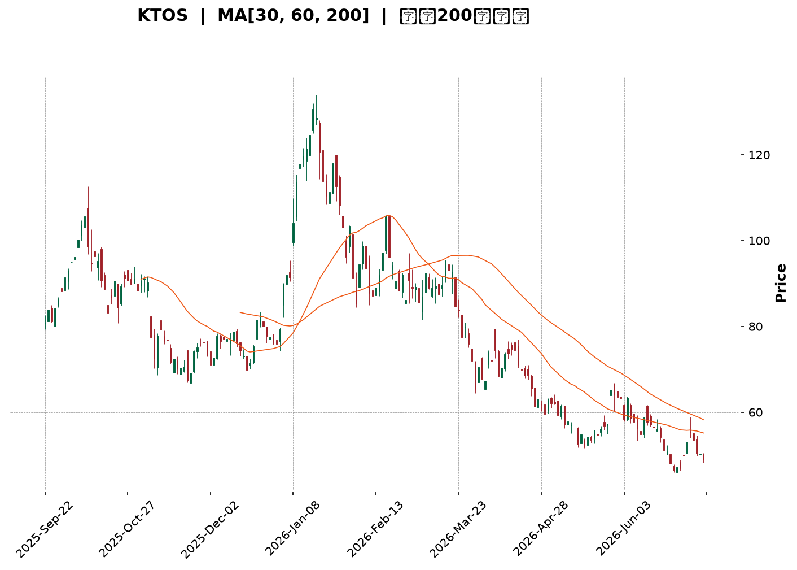
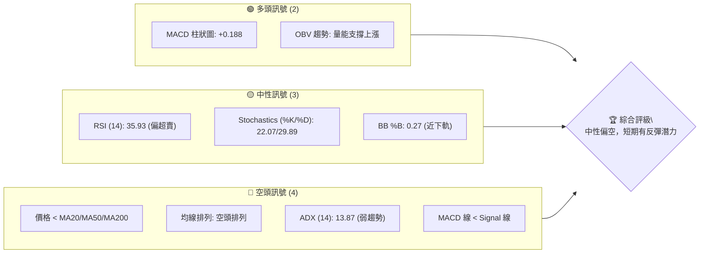
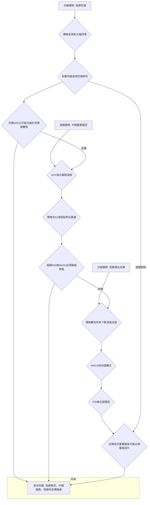
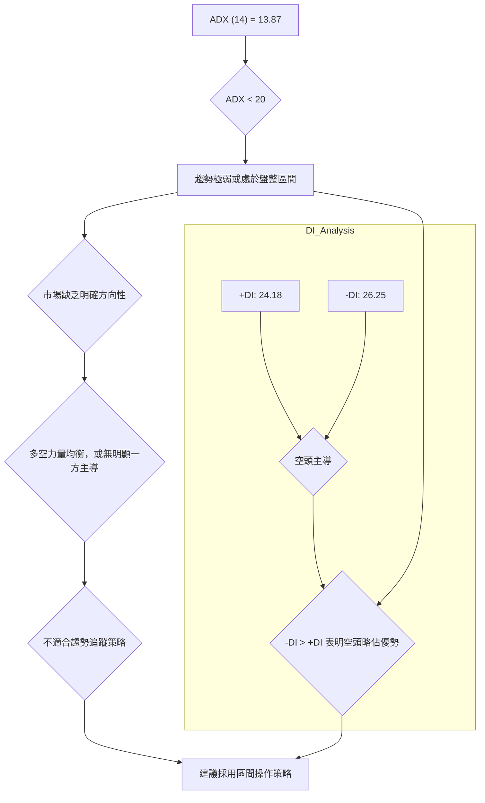
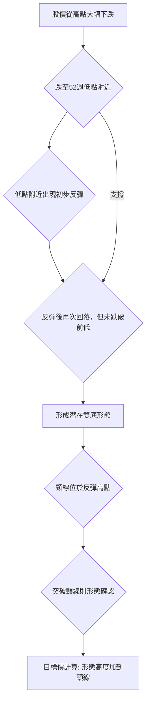
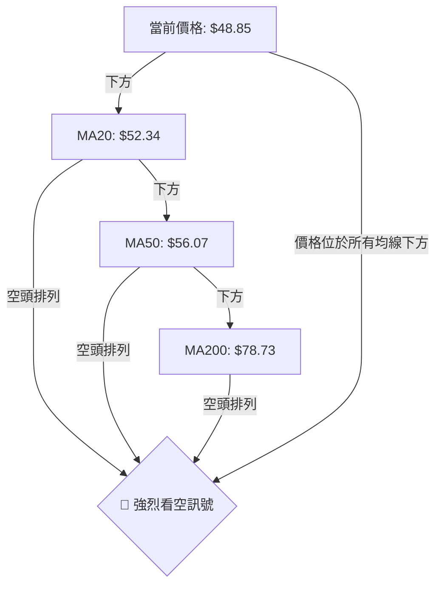
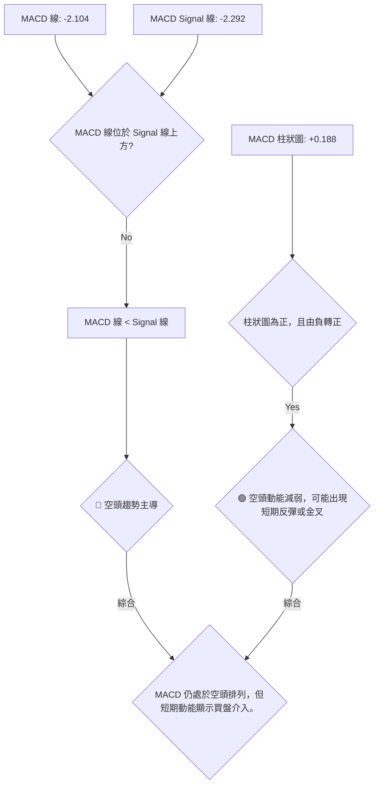
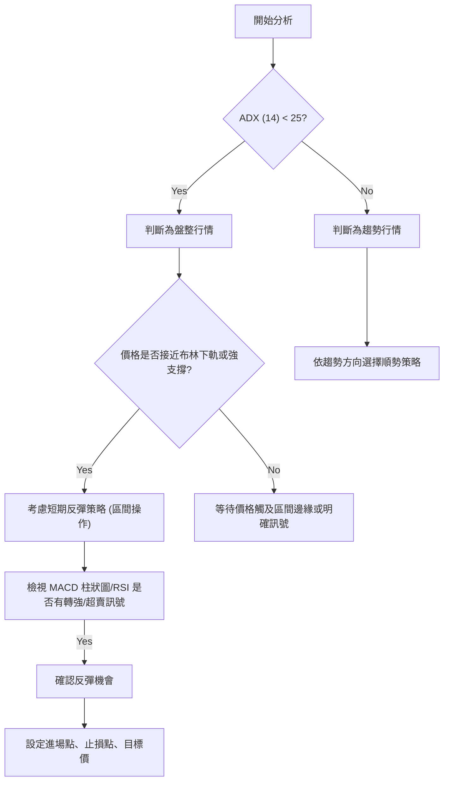

<details>
<summary>📊 靜態圖表 (點擊展開)</summary>

</details>

<html>
<head><meta charset="utf-8" /></head>
<body>
    <div style="height:500px; width:100%;">                        <script>window.PlotlyConfig = {MathJaxConfig: 'local'};</script>
        <script charset="utf-8" src="https://cdn.plot.ly/plotly-3.7.0.min.js" integrity="sha256-jvTGqxNp8AGWEcvNLVuKr+8j5dGe9Yw51LQkmDH+IYA=" crossorigin="anonymous"></script>                <div id="candlestick-chart" class="plotly-graph-div" style="height:100%; width:100%;"></div>            <script>                window.PLOTLYENV=window.PLOTLYENV || {};                                if (document.getElementById("candlestick-chart")) {                    Plotly.newPlot(                        "candlestick-chart",                        [{"close":{"dtype":"f8","bdata":"AAAAgBQuVEAAAACgmflUQAAAACCFS1RAAAAAwMwMVUAAAACA65FVQAAAAMAeBVZAAAAAIK7XVkAAAACgcD1XQAAAAIDrwVdAAAAAACkMWEAAAAAAABBZQAAAAAAp7FlAAAAAQOFqWkAAAABAM6NYQAAAAOBRqFdAAAAAgOsRWEAAAABAM9NXQAAAAMAepVZAAAAAIK4nVkAAAAAgrsdUQAAAAKCZqVVAAAAAIK6nVkAAAABAMxNVQAAAAOB6VFZAAAAAIIXLVkAAAAAghatWQAAAAIDrcVZAAAAAoHDNVkAAAABAMxNWQAAAAGBmplZAAAAAYGbGVkAAAACAFI5WQAAAAIA9WlNAAAAAgD0aUkAAAADgUXhTQAAAACCFy1NAAAAAgMIlU0AAAADAzCxTQAAAAAAp7FFAAAAAwMwcUkAAAAAgXI9RQAAAAEAKl1FAAAAAQOGqUUAAAAAA19NQQAAAAMD1SFFAAAAAQAqHUkAAAABAM8NSQAAAAKBH8VJAAAAAYGYGU0AAAACgcE1SQAAAAKBwvVFAAAAAgOsxUkAAAAAghWtTQAAAAAAAIFNAAAAAgOtBU0AAAACA60FTQAAAAIA9OlNAAAAAgOuxU0AAAACgcP1SQAAAAOCjkFJAAAAA4FFIUkAAAACgR3FRQAAAAKCZ2VFAAAAAwPXYUkAAAACA62FUQAAAAEAzk1RAAAAAgBT+U0AAAADAzGxTQAAAAIAUXlNAAAAAYLj+UkAAAACAPfpSQAAAAGCP0lNAAAAAIIV7VkAAAAAghftWQAAAAAAp3FZAAAAAYI8CWkAAAADAzGxcQAAAAEAKd11AAAAAgBTuXUAAAAAAAGBeQAAAAADXI19AAAAAQApXYEAAAACAwhVgQAAAAIDCJV5AAAAAYGZ2XEAAAADA9ZhbQAAAAOB61FtAAAAAANeDXUAAAABA4SpcQAAAAIA9CltAAAAA4KPAWUAAAACAPQpYQAAAACCu11lAAAAAwB7VVkAAAAAAAFBVQAAAAIA9mldAAAAAANezWEAAAABguF5XQAAAAIDr8VVAAAAAQDPDVUAAAAAA10NWQAAAAIAU\u002flZAAAAAoHBNWEAAAABA4WpaQAAAAMAeBVhAAAAAANeTV0AAAAAghatWQAAAAGC4DlZAAAAAwPUIV0AAAAAghYtVQAAAAIAUrlZAAAAAwMw8VkAAAADgUUhWQAAAAGCPYlVAAAAAAADAVUAAAACAFB5XQAAAAKBwPVZAAAAAQOE6VkAAAACgcF1WQAAAAIDr4VVAAAAAgOthVkAAAAAA19NXQAAAAGCPQldAAAAAgOsxV0AAAAAgridVQAAAAAAp7FRAAAAAIFxfU0AAAABguP5TQAAAAEAK91JAAAAAACn8UUAAAACA61FQQAAAAOCjoFFAAAAAwMzsUEAAAAAA19NQQAAAAIDChVJAAAAAoHD9UUAAAACgcJ1SQAAAAMAeFVFAAAAAgMKVUUAAAABAM2NSQAAAAIA9alJAAAAAgD2qUkAAAACAPZpSQAAAACBcv1FAAAAAwB51UUAAAABAMyNRQAAAAEAKJ1FAAAAAoEdhUEAAAACgR6FOQAAAAOB6lE9AAAAA4HrUTkAAAAAgrsdNQAAAAGBmhk9AAAAAYGYGT0AAAABACvdOQAAAACCup01AAAAAYI\u002fCTkAAAAAAAIBMQAAAAIDr8UxAAAAAYLh+TEAAAACAPapMQAAAAGC4PkpAAAAAwMxsS0AAAAAghQtKQAAAAAApHEtAAAAAACm8SkAAAADA9ehLQAAAAIDCVUtAAAAAQAoXTEAAAABgZmZMQAAAAGBmpkxAAAAAAClMUEAAAADgUQhQQAAAAGC4vk9AAAAAYI+iT0AAAABACjdNQAAAAEAzs09AAAAAYI9CTUAAAACgcN1MQAAAAOBRGExAAAAAwPVoS0AAAAAA12NNQAAAAAAA4ExAAAAAYI+CTEAAAAAghStMQAAAAOB6FExAAAAAQOEaS0AAAAAghYtJQAAAAGBmZklAAAAAoJn5R0AAAADA9ShHQAAAAEDhmkdAAAAAoJl5R0AAAACAFO5IQAAAAMAehUpAAAAAwMysS0AAAADAHsVKQAAAACCFK0lAAAAA4KMwSUAAAADAzGxIQA=="},"high":{"dtype":"f8","bdata":"AAAA4FGoVEAAAABguF5VQAAAAAAAQFVAAAAA4FE4VUAAAACAwrVVQAAAAEDhalZAAAAAIK73VkAAAACgR2FXQAAAAKCZGVhAAAAAIK6HWEAAAAAAAMBZQAAAAKBwLVpAAAAAANeTWkAAAADgeiRcQAAAAKCZqVlAAAAAAABgWUAAAABgZkZYQAAAACBcn1hAAAAAgMIlV0AAAACgR6FVQAAAAIAULlZAAAAAQDOzVkAAAAAAAIBWQAAAAMDMfFZAAAAAIIU7V0AAAABgZqZXQAAAAMDMHFdAAAAAIK53V0AAAAAAAMBWQAAAAKCZCVdAAAAAgBTuVkAAAACAwuVWQAAAAAAAoFRAAAAAgBTeU0AAAABgZpZTQAAAAAAAgFRAAAAAIFy\u002fU0AAAABA4YpTQAAAAKCZ+VJAAAAAoEdxUkAAAADAzDxSQAAAAAAA0FFAAAAAIIULUkAAAABguJ5SQAAAAIDCVVFAAAAAACmcUkAAAAAghQtTQAAAAEDhSlNAAAAAIFwfU0AAAABgZiZTQAAAAGBmplJAAAAAAABAUkAAAADgepRTQAAAAOBRiFNAAAAA4HqEU0AAAACAPepTQAAAAKBwnVNAAAAAgBTeU0AAAACgmdlTQAAAAEDhGlNAAAAA4FGoUkAAAAAgXI9SQAAAAIA9GlJAAAAAYI\u002fyUkAAAAAgrndUQAAAAIA92lRAAAAAACl8VEAAAACAPfpTQAAAAIAUjlNAAAAAACmMU0AAAACAFD5TQAAAAGC47lNAAAAAQAqHVkAAAACA6wFXQAAAAOB61FdAAAAAQDNzW0AAAADAzNxcQAAAAOBR6F1AAAAA4HpkXkAAAACgcP1eQAAAAADXk19AAAAAAACAYEAAAAAAAMBgQAAAAAAAAGBAAAAAQDNTXkAAAACA6+FcQAAAAEDhalxAAAAAwPWIXUAAAAAAAABeQAAAAMDMzFxAAAAAAAAwW0AAAADA9UhZQAAAACBc31lAAAAAAADAWUAAAABgZiZXQAAAAEDhqldAAAAAgOvxWEAAAAAAAOBYQAAAAEAzI1hAAAAAgMJlVkAAAAAgXA9XQAAAAGBmVldAAAAAAAAgWUAAAACAPXpaQAAAAEDhqlpAAAAAwB7FV0AAAAAgXO9WQAAAAIDrUVdAAAAAACkcV0AAAACgmZlVQAAAAGBmRlhAAAAAgBROV0AAAABgZoZWQAAAACBcX1ZAAAAA4FG4VkAAAABA4WpXQAAAAEAzE1dAAAAAYLi+VkAAAAAgrtdWQAAAAKCZ+VZAAAAAQDPzVkAAAABgZtZXQAAAAOBROFhAAAAAAACgV0AAAAAAAABXQAAAAADXk1VAAAAAoEfBVEAAAAAAKTxUQAAAAIDr4VNAAAAA4FEYU0AAAACgmflRQAAAAIAUvlFAAAAAQDMzUkAAAADgo2BRQAAAAIA9mlJAAAAAoJk5UkAAAAAAKdxTQAAAAAAAoFJAAAAAgOuhUUAAAABgZoZSQAAAAOB6JFNAAAAAYI8SU0AAAACAFE5TQAAAAMD1OFNAAAAAoHDtUUAAAACgmblRQAAAAGC4vlFAAAAAIFwvUUAAAADgo3BQQAAAACCFG1BAAAAAoJlZT0AAAACgR+FOQAAAAEAKl09AAAAAAADAT0AAAADgUQhQQAAAAMAeZU9AAAAAYLjeTkAAAADAHsVOQAAAAOBR+ExAAAAAQOHaTEAAAADgo1BNQAAAAAAAQExAAAAAACn8S0AAAABAM\u002fNKQAAAAAApXEtAAAAAIIVLS0AAAADgo\u002fBLQAAAAADXg0tAAAAAAABgTEAAAABgZqZNQAAAAIAUrkxAAAAAwB61UEAAAAAAALBQQAAAAMDMjFBAAAAAQDPTT0AAAADAzOxOQAAAACCFy09AAAAAwMwMT0AAAAAAAOBNQAAAAGBmpk1AAAAAYGZmTEAAAACA63FNQAAAAKCZ2U5AAAAAAADATUAAAACA67FMQAAAAEAzM01AAAAAAABgTEAAAABAMxNLQAAAACCFK0pAAAAAwB5lSUAAAAAA1+NHQAAAAOBRmEhAAAAAgOtxSEAAAAAAKbxJQAAAAOCjEEtAAAAA4KNwTUAAAADAzKxLQAAAAGCPQktAAAAAIK7nSUAAAADgTz1JQA=="},"hovertemplate":"\u003cb\u003e%{x|%Y-%m-%d}\u003c\u002fb\u003e\u003cbr\u003e\u958b: $%{open:.2f}\u003cbr\u003e\u9ad8: $%{high:.2f}\u003cbr\u003e\u4f4e: $%{low:.2f}\u003cbr\u003e\u6536: $%{close:.2f}\u003cextra\u003e\u003c\u002fextra\u003e","low":{"dtype":"f8","bdata":"AAAAQDPTU0AAAABgZkZUQAAAAGBmNlRAAAAAIK63U0AAAAAghRtVQAAAAEAz81VAAAAAYGYGVkAAAADgUShWQAAAAIDrIVdAAAAAQAp3V0AAAACgR4FYQAAAAAAAAFlAAAAAoJl5WUAAAABAMzNYQAAAAKCZOVdAAAAAQOGqV0AAAABgj7JWQAAAAIA9SlZAAAAAIFwfVkAAAACgcG1UQAAAAMDMTFVAAAAAwMxMVUAAAAAA1zNUQAAAACCuN1VAAAAAIIVLVkAAAADgoxBWQAAAAAApbFZAAAAAoHB9VkAAAABgjwJWQAAAAIA9+lVAAAAAwMz8VUAAAADgerRVQAAAAGBm9lJAAAAAoEeRUUAAAACgmSlRQAAAAEAzQ1NAAAAAwPX4UkAAAAAAAOBSQAAAAADX01FAAAAAAABAUUAAAABgZjZRQAAAAIDr8VBAAAAAQDNTUUAAAACAPbpQQAAAAEAzM1BAAAAAwPVIUUAAAACgmSlSQAAAAADX01JAAAAA4KPAUkAAAAAghTtSQAAAACCut1FAAAAAIIVrUUAAAACA6xFSQAAAAOCjsFJAAAAAoJnJUkAAAAAA1wNTQAAAAMDMTFJAAAAAQDOzUkAAAADAzMxSQAAAAGBmRlJAAAAAQOEaUkAAAAAA11NRQAAAAMD1iFFAAAAAYLjOUUAAAAAA1zNTQAAAAGBm9lNAAAAAgOvRU0AAAABgZgZTQAAAAKCZCVNAAAAAQDPzUkAAAADgUbhSQAAAAMAelVJAAAAA4FGIVEAAAADAzKxVQAAAAOCjoFZAAAAAoEexWEAAAACgmSlaQAAAAAAAoFxAAAAAwMxMXUAAAAAAAIBcQAAAAKBHUV1AAAAAAABAX0AAAAAAAMBfQAAAAIDrkVxAAAAAYLjOW0AAAABAChdbQAAAAKBHsVpAAAAAANfDW0AAAADgo1BbQAAAAIDChVpAAAAA4FFoWUAAAACgR7FXQAAAAKCZSVhAAAAAQOG6VUAAAAAAACBVQAAAAAAAAFZAAAAAwMxMV0AAAACgcE1XQAAAAKBHQVVAAAAAAABQVUAAAACgR8FVQAAAAOB6xFVAAAAAwMw8V0AAAABguD5YQAAAACCF21dAAAAAAADAVkAAAABgjwJVQAAAAKBwDVZAAAAAwPWoVUAAAAAAAABVQAAAAMAeVVVAAAAAYGamVUAAAAAAAHBVQAAAAKCZmVRAAAAAAABgVEAAAADAzMxVQAAAAMD1KFZAAAAAIK6nVUAAAADA9VhVQAAAAMDMzFVAAAAAoJm5VUAAAAAgXI9WQAAAAIA9KldAAAAAwPXoVUAAAABgZsZUQAAAAOB6hFRAAAAAoEfhUkAAAAAA11NTQAAAAKCZyVJAAAAAwMzsUUAAAAAgrhdQQAAAAEAzY1BAAAAAYGbmUEAAAAAghetPQAAAAMDMjFFAAAAAQDNzUUAAAABAMyNSQAAAAIDrEVFAAAAAIIXbUEAAAABACmdRQAAAAKBHIVJAAAAAAABQUkAAAADgo0BSQAAAAIA9mlFAAAAAQAo3UUAAAADgevRQQAAAAMD16FBAAAAAwB7lT0AAAACgR4FOQAAAAOBRmE5AAAAAACkcTkAAAAAgrodNQAAAAIDr0U1AAAAAoJl5TkAAAACgR+FOQAAAAKBHAU1AAAAAQAo3TUAAAADAHiVMQAAAAKBw3UtAAAAAoEeBS0AAAACAFI5LQAAAACCF60lAAAAAYLg+SkAAAADgetRJQAAAAIA9CkpAAAAAANdjSkAAAABAM1NKQAAAACCu50pAAAAAQOE6S0AAAABAM\u002fNLQAAAAAAAgEtAAAAAAACATkAAAACAPQpOQAAAAEAzk05AAAAAQArXTkAAAABAM\u002fNMQAAAAOBR+ExAAAAAAADATEAAAAAgXK9MQAAAACCup0pAAAAAAAAgS0AAAADA9QhLQAAAAOB6dExAAAAAQApXTEAAAACgR4FLQAAAAMDMzEtAAAAA4FF4SkAAAABACldJQAAAACCuB0lAAAAAANfjR0AAAACgRwFHQAAAAMAeBUdAAAAAgMI1R0AAAACAwlVIQAAAAGC43khAAAAAgD0KS0AAAAAgXG9KQAAAAKBH4UhAAAAA4HrUSEAAAABA4RpIQA=="},"name":"\u50f9\u683c","open":{"dtype":"f8","bdata":"AAAAQAonVEAAAABgZkZUQAAAACCuF1VAAAAAAAAAVEAAAAAAAEBVQAAAAMDMPFZAAAAAwPUYVkAAAAAAAKBWQAAAAAAAwFdAAAAAACnsV0AAAABgZpZYQAAAAKCZSVlAAAAA4HrEWUAAAADA9ehaQAAAAMDMrFdAAAAAgBReWEAAAACAFG5XQAAAAMDMfFhAAAAAIFz\u002fVkAAAABA4TpVQAAAAIDr0VVAAAAAQArHVUAAAAAAAIBWQAAAAMDMTFVAAAAA4FEIV0AAAADgekRXQAAAAOB6xFZAAAAAAACAVkAAAAAAAIBWQAAAAAAAYFZAAAAAwB61VkAAAABguA5WQAAAACCul1RAAAAAwMx8U0AAAABAM5NRQAAAACCFW1RAAAAAYLhuU0AAAACA6zFTQAAAAAApvFJAAAAAgD1KUUAAAACAwgVSQAAAACBcL1FAAAAAwB5lUUAAAABguJ5SQAAAAADXs1BAAAAAQOFaUUAAAACAPYpSQAAAAEAz81JAAAAAYLgOU0AAAABgZiZTQAAAACCuh1JAAAAA4KPAUUAAAACgRyFSQAAAAAApbFNAAAAAgMJlU0AAAADgeiRTQAAAAAAAAFNAAAAAIFwvU0AAAAAghbtTQAAAAKBHEVNAAAAAAABAUkAAAADgUUhSQAAAAAApvFFAAAAAgOvhUUAAAAAAAEBTQAAAAIAUHlRAAAAAQApHVEAAAACAPfpTQAAAAKBwPVNAAAAAACmMU0AAAABAMzNTQAAAAEAzI1NAAAAAgD06VUAAAADA9XhWQAAAAOBRKFdAAAAAgOvhWEAAAABguF5aQAAAAGBmNl1AAAAAgD26XUAAAAAAAKBdQAAAAMD1+F1AAAAAoHBtX0AAAAAghQNgQAAAAGCP4l9AAAAA4KNAXkAAAADAHnVcQAAAAMDMLFtAAAAAANfDW0AAAAAAAABeQAAAAOBRuFxAAAAA4Hp0WkAAAACAPfpYQAAAAGBmplhAAAAAoHBdWUAAAACAFB5WQAAAAGBmRlZAAAAAYGamV0AAAADgerRYQAAAAIA9+ldAAAAAoJkZVkAAAAAgXM9VQAAAAMAeBVZAAAAAwPVIV0AAAACgcG1YQAAAAAApbFpAAAAAoEdRV0AAAAAAADBWQAAAAAApPFdAAAAAACn8VUAAAABAM1NVQAAAAEDhGldAAAAAoHBNVkAAAADgoyBWQAAAAGBmNlZAAAAA4FHYVEAAAABACvdVQAAAAAAp3FZAAAAAgOvBVUAAAAAAKTxWQAAAAAAAgFZAAAAAgMI1VkAAAABACrdWQAAAAIA9mldAAAAA4KOgVkAAAADAzNxWQAAAAIDC9VRAAAAAQOGqVEAAAABgj\u002fJTQAAAAOBRmFNAAAAAQAq3UkAAAADgo\u002fBRQAAAAKCZuVBAAAAAwPUoUkAAAACA61FQQAAAAOBRyFFAAAAAAAAQUkAAAADgUdhTQAAAAMDMjFJAAAAAoEcBUUAAAABgZoZRQAAAAIA9qlJAAAAAACnsUkAAAAAA1xNTQAAAACCF21JAAAAAYI+CUUAAAADgo5BRQAAAACCuh1FAAAAAwMwcUUAAAADgo3BQQAAAAOBRmE5AAAAA4FH4TkAAAABguN5OQAAAAMAeJU5AAAAA4Hq0T0AAAAAAKTxPQAAAAOBRWE9AAAAAgD2KTUAAAADAHsVOQAAAAIA9ikxAAAAAIFxvTEAAAAAghatMQAAAAOB6NExAAAAAoEdhSkAAAABguL5KQAAAAKBHIUpAAAAAYLgeS0AAAACgmflKQAAAAAAAgEtAAAAAwB6lS0AAAADgetRMQAAAAKBwfUxAAAAAQOH6T0AAAACAPapQQAAAAAApPFBAAAAAwPXIT0AAAAAgXM9OQAAAAIAULk1AAAAAgOvRTkAAAAAAKdxNQAAAACCuB01AAAAAwMzMS0AAAADA9WhLQAAAAGC4vk5AAAAA4FGYTUAAAACAFE5MQAAAAOCj0EtAAAAAACkcTEAAAABgj+JKQAAAACCuB0lAAAAAQAoXSUAAAABAM7NHQAAAAMAeBUdAAAAAwMwsSEAAAACAFA5JQAAAAMAeJUlAAAAAgOuxS0AAAADA9YhLQAAAAKBw3UpAAAAAQOEaSUAAAABAChdJQA=="},"x":["2025-09-22T00:00:00-04:00","2025-09-23T00:00:00-04:00","2025-09-24T00:00:00-04:00","2025-09-25T00:00:00-04:00","2025-09-26T00:00:00-04:00","2025-09-29T00:00:00-04:00","2025-09-30T00:00:00-04:00","2025-10-01T00:00:00-04:00","2025-10-02T00:00:00-04:00","2025-10-03T00:00:00-04:00","2025-10-06T00:00:00-04:00","2025-10-07T00:00:00-04:00","2025-10-08T00:00:00-04:00","2025-10-09T00:00:00-04:00","2025-10-10T00:00:00-04:00","2025-10-13T00:00:00-04:00","2025-10-14T00:00:00-04:00","2025-10-15T00:00:00-04:00","2025-10-16T00:00:00-04:00","2025-10-17T00:00:00-04:00","2025-10-20T00:00:00-04:00","2025-10-21T00:00:00-04:00","2025-10-22T00:00:00-04:00","2025-10-23T00:00:00-04:00","2025-10-24T00:00:00-04:00","2025-10-27T00:00:00-04:00","2025-10-28T00:00:00-04:00","2025-10-29T00:00:00-04:00","2025-10-30T00:00:00-04:00","2025-10-31T00:00:00-04:00","2025-11-03T00:00:00-05:00","2025-11-04T00:00:00-05:00","2025-11-05T00:00:00-05:00","2025-11-06T00:00:00-05:00","2025-11-07T00:00:00-05:00","2025-11-10T00:00:00-05:00","2025-11-11T00:00:00-05:00","2025-11-12T00:00:00-05:00","2025-11-13T00:00:00-05:00","2025-11-14T00:00:00-05:00","2025-11-17T00:00:00-05:00","2025-11-18T00:00:00-05:00","2025-11-19T00:00:00-05:00","2025-11-20T00:00:00-05:00","2025-11-21T00:00:00-05:00","2025-11-24T00:00:00-05:00","2025-11-25T00:00:00-05:00","2025-11-26T00:00:00-05:00","2025-11-28T00:00:00-05:00","2025-12-01T00:00:00-05:00","2025-12-02T00:00:00-05:00","2025-12-03T00:00:00-05:00","2025-12-04T00:00:00-05:00","2025-12-05T00:00:00-05:00","2025-12-08T00:00:00-05:00","2025-12-09T00:00:00-05:00","2025-12-10T00:00:00-05:00","2025-12-11T00:00:00-05:00","2025-12-12T00:00:00-05:00","2025-12-15T00:00:00-05:00","2025-12-16T00:00:00-05:00","2025-12-17T00:00:00-05:00","2025-12-18T00:00:00-05:00","2025-12-19T00:00:00-05:00","2025-12-22T00:00:00-05:00","2025-12-23T00:00:00-05:00","2025-12-24T00:00:00-05:00","2025-12-26T00:00:00-05:00","2025-12-29T00:00:00-05:00","2025-12-30T00:00:00-05:00","2025-12-31T00:00:00-05:00","2026-01-02T00:00:00-05:00","2026-01-05T00:00:00-05:00","2026-01-06T00:00:00-05:00","2026-01-07T00:00:00-05:00","2026-01-08T00:00:00-05:00","2026-01-09T00:00:00-05:00","2026-01-12T00:00:00-05:00","2026-01-13T00:00:00-05:00","2026-01-14T00:00:00-05:00","2026-01-15T00:00:00-05:00","2026-01-16T00:00:00-05:00","2026-01-20T00:00:00-05:00","2026-01-21T00:00:00-05:00","2026-01-22T00:00:00-05:00","2026-01-23T00:00:00-05:00","2026-01-26T00:00:00-05:00","2026-01-27T00:00:00-05:00","2026-01-28T00:00:00-05:00","2026-01-29T00:00:00-05:00","2026-01-30T00:00:00-05:00","2026-02-02T00:00:00-05:00","2026-02-03T00:00:00-05:00","2026-02-04T00:00:00-05:00","2026-02-05T00:00:00-05:00","2026-02-06T00:00:00-05:00","2026-02-09T00:00:00-05:00","2026-02-10T00:00:00-05:00","2026-02-11T00:00:00-05:00","2026-02-12T00:00:00-05:00","2026-02-13T00:00:00-05:00","2026-02-17T00:00:00-05:00","2026-02-18T00:00:00-05:00","2026-02-19T00:00:00-05:00","2026-02-20T00:00:00-05:00","2026-02-23T00:00:00-05:00","2026-02-24T00:00:00-05:00","2026-02-25T00:00:00-05:00","2026-02-26T00:00:00-05:00","2026-02-27T00:00:00-05:00","2026-03-02T00:00:00-05:00","2026-03-03T00:00:00-05:00","2026-03-04T00:00:00-05:00","2026-03-05T00:00:00-05:00","2026-03-06T00:00:00-05:00","2026-03-09T00:00:00-04:00","2026-03-10T00:00:00-04:00","2026-03-11T00:00:00-04:00","2026-03-12T00:00:00-04:00","2026-03-13T00:00:00-04:00","2026-03-16T00:00:00-04:00","2026-03-17T00:00:00-04:00","2026-03-18T00:00:00-04:00","2026-03-19T00:00:00-04:00","2026-03-20T00:00:00-04:00","2026-03-23T00:00:00-04:00","2026-03-24T00:00:00-04:00","2026-03-25T00:00:00-04:00","2026-03-26T00:00:00-04:00","2026-03-27T00:00:00-04:00","2026-03-30T00:00:00-04:00","2026-03-31T00:00:00-04:00","2026-04-01T00:00:00-04:00","2026-04-02T00:00:00-04:00","2026-04-06T00:00:00-04:00","2026-04-07T00:00:00-04:00","2026-04-08T00:00:00-04:00","2026-04-09T00:00:00-04:00","2026-04-10T00:00:00-04:00","2026-04-13T00:00:00-04:00","2026-04-14T00:00:00-04:00","2026-04-15T00:00:00-04:00","2026-04-16T00:00:00-04:00","2026-04-17T00:00:00-04:00","2026-04-20T00:00:00-04:00","2026-04-21T00:00:00-04:00","2026-04-22T00:00:00-04:00","2026-04-23T00:00:00-04:00","2026-04-24T00:00:00-04:00","2026-04-27T00:00:00-04:00","2026-04-28T00:00:00-04:00","2026-04-29T00:00:00-04:00","2026-04-30T00:00:00-04:00","2026-05-01T00:00:00-04:00","2026-05-04T00:00:00-04:00","2026-05-05T00:00:00-04:00","2026-05-06T00:00:00-04:00","2026-05-07T00:00:00-04:00","2026-05-08T00:00:00-04:00","2026-05-11T00:00:00-04:00","2026-05-12T00:00:00-04:00","2026-05-13T00:00:00-04:00","2026-05-14T00:00:00-04:00","2026-05-15T00:00:00-04:00","2026-05-18T00:00:00-04:00","2026-05-19T00:00:00-04:00","2026-05-20T00:00:00-04:00","2026-05-21T00:00:00-04:00","2026-05-22T00:00:00-04:00","2026-05-26T00:00:00-04:00","2026-05-27T00:00:00-04:00","2026-05-28T00:00:00-04:00","2026-05-29T00:00:00-04:00","2026-06-01T00:00:00-04:00","2026-06-02T00:00:00-04:00","2026-06-03T00:00:00-04:00","2026-06-04T00:00:00-04:00","2026-06-05T00:00:00-04:00","2026-06-08T00:00:00-04:00","2026-06-09T00:00:00-04:00","2026-06-10T00:00:00-04:00","2026-06-11T00:00:00-04:00","2026-06-12T00:00:00-04:00","2026-06-15T00:00:00-04:00","2026-06-16T00:00:00-04:00","2026-06-17T00:00:00-04:00","2026-06-18T00:00:00-04:00","2026-06-22T00:00:00-04:00","2026-06-23T00:00:00-04:00","2026-06-24T00:00:00-04:00","2026-06-25T00:00:00-04:00","2026-06-26T00:00:00-04:00","2026-06-29T00:00:00-04:00","2026-06-30T00:00:00-04:00","2026-07-01T00:00:00-04:00","2026-07-02T00:00:00-04:00","2026-07-06T00:00:00-04:00","2026-07-07T00:00:00-04:00","2026-07-08T00:00:00-04:00","2026-07-09T00:00:00-04:00"],"type":"candlestick"},{"hovertemplate":"MA30: $%{y:.2f}\u003cextra\u003e\u003c\u002fextra\u003e","line":{"color":"#2196F3","dash":"dash","width":2},"mode":"lines","name":"MA30","x":["2025-09-22T00:00:00-04:00","2025-09-23T00:00:00-04:00","2025-09-24T00:00:00-04:00","2025-09-25T00:00:00-04:00","2025-09-26T00:00:00-04:00","2025-09-29T00:00:00-04:00","2025-09-30T00:00:00-04:00","2025-10-01T00:00:00-04:00","2025-10-02T00:00:00-04:00","2025-10-03T00:00:00-04:00","2025-10-06T00:00:00-04:00","2025-10-07T00:00:00-04:00","2025-10-08T00:00:00-04:00","2025-10-09T00:00:00-04:00","2025-10-10T00:00:00-04:00","2025-10-13T00:00:00-04:00","2025-10-14T00:00:00-04:00","2025-10-15T00:00:00-04:00","2025-10-16T00:00:00-04:00","2025-10-17T00:00:00-04:00","2025-10-20T00:00:00-04:00","2025-10-21T00:00:00-04:00","2025-10-22T00:00:00-04:00","2025-10-23T00:00:00-04:00","2025-10-24T00:00:00-04:00","2025-10-27T00:00:00-04:00","2025-10-28T00:00:00-04:00","2025-10-29T00:00:00-04:00","2025-10-30T00:00:00-04:00","2025-10-31T00:00:00-04:00","2025-11-03T00:00:00-05:00","2025-11-04T00:00:00-05:00","2025-11-05T00:00:00-05:00","2025-11-06T00:00:00-05:00","2025-11-07T00:00:00-05:00","2025-11-10T00:00:00-05:00","2025-11-11T00:00:00-05:00","2025-11-12T00:00:00-05:00","2025-11-13T00:00:00-05:00","2025-11-14T00:00:00-05:00","2025-11-17T00:00:00-05:00","2025-11-18T00:00:00-05:00","2025-11-19T00:00:00-05:00","2025-11-20T00:00:00-05:00","2025-11-21T00:00:00-05:00","2025-11-24T00:00:00-05:00","2025-11-25T00:00:00-05:00","2025-11-26T00:00:00-05:00","2025-11-28T00:00:00-05:00","2025-12-01T00:00:00-05:00","2025-12-02T00:00:00-05:00","2025-12-03T00:00:00-05:00","2025-12-04T00:00:00-05:00","2025-12-05T00:00:00-05:00","2025-12-08T00:00:00-05:00","2025-12-09T00:00:00-05:00","2025-12-10T00:00:00-05:00","2025-12-11T00:00:00-05:00","2025-12-12T00:00:00-05:00","2025-12-15T00:00:00-05:00","2025-12-16T00:00:00-05:00","2025-12-17T00:00:00-05:00","2025-12-18T00:00:00-05:00","2025-12-19T00:00:00-05:00","2025-12-22T00:00:00-05:00","2025-12-23T00:00:00-05:00","2025-12-24T00:00:00-05:00","2025-12-26T00:00:00-05:00","2025-12-29T00:00:00-05:00","2025-12-30T00:00:00-05:00","2025-12-31T00:00:00-05:00","2026-01-02T00:00:00-05:00","2026-01-05T00:00:00-05:00","2026-01-06T00:00:00-05:00","2026-01-07T00:00:00-05:00","2026-01-08T00:00:00-05:00","2026-01-09T00:00:00-05:00","2026-01-12T00:00:00-05:00","2026-01-13T00:00:00-05:00","2026-01-14T00:00:00-05:00","2026-01-15T00:00:00-05:00","2026-01-16T00:00:00-05:00","2026-01-20T00:00:00-05:00","2026-01-21T00:00:00-05:00","2026-01-22T00:00:00-05:00","2026-01-23T00:00:00-05:00","2026-01-26T00:00:00-05:00","2026-01-27T00:00:00-05:00","2026-01-28T00:00:00-05:00","2026-01-29T00:00:00-05:00","2026-01-30T00:00:00-05:00","2026-02-02T00:00:00-05:00","2026-02-03T00:00:00-05:00","2026-02-04T00:00:00-05:00","2026-02-05T00:00:00-05:00","2026-02-06T00:00:00-05:00","2026-02-09T00:00:00-05:00","2026-02-10T00:00:00-05:00","2026-02-11T00:00:00-05:00","2026-02-12T00:00:00-05:00","2026-02-13T00:00:00-05:00","2026-02-17T00:00:00-05:00","2026-02-18T00:00:00-05:00","2026-02-19T00:00:00-05:00","2026-02-20T00:00:00-05:00","2026-02-23T00:00:00-05:00","2026-02-24T00:00:00-05:00","2026-02-25T00:00:00-05:00","2026-02-26T00:00:00-05:00","2026-02-27T00:00:00-05:00","2026-03-02T00:00:00-05:00","2026-03-03T00:00:00-05:00","2026-03-04T00:00:00-05:00","2026-03-05T00:00:00-05:00","2026-03-06T00:00:00-05:00","2026-03-09T00:00:00-04:00","2026-03-10T00:00:00-04:00","2026-03-11T00:00:00-04:00","2026-03-12T00:00:00-04:00","2026-03-13T00:00:00-04:00","2026-03-16T00:00:00-04:00","2026-03-17T00:00:00-04:00","2026-03-18T00:00:00-04:00","2026-03-19T00:00:00-04:00","2026-03-20T00:00:00-04:00","2026-03-23T00:00:00-04:00","2026-03-24T00:00:00-04:00","2026-03-25T00:00:00-04:00","2026-03-26T00:00:00-04:00","2026-03-27T00:00:00-04:00","2026-03-30T00:00:00-04:00","2026-03-31T00:00:00-04:00","2026-04-01T00:00:00-04:00","2026-04-02T00:00:00-04:00","2026-04-06T00:00:00-04:00","2026-04-07T00:00:00-04:00","2026-04-08T00:00:00-04:00","2026-04-09T00:00:00-04:00","2026-04-10T00:00:00-04:00","2026-04-13T00:00:00-04:00","2026-04-14T00:00:00-04:00","2026-04-15T00:00:00-04:00","2026-04-16T00:00:00-04:00","2026-04-17T00:00:00-04:00","2026-04-20T00:00:00-04:00","2026-04-21T00:00:00-04:00","2026-04-22T00:00:00-04:00","2026-04-23T00:00:00-04:00","2026-04-24T00:00:00-04:00","2026-04-27T00:00:00-04:00","2026-04-28T00:00:00-04:00","2026-04-29T00:00:00-04:00","2026-04-30T00:00:00-04:00","2026-05-01T00:00:00-04:00","2026-05-04T00:00:00-04:00","2026-05-05T00:00:00-04:00","2026-05-06T00:00:00-04:00","2026-05-07T00:00:00-04:00","2026-05-08T00:00:00-04:00","2026-05-11T00:00:00-04:00","2026-05-12T00:00:00-04:00","2026-05-13T00:00:00-04:00","2026-05-14T00:00:00-04:00","2026-05-15T00:00:00-04:00","2026-05-18T00:00:00-04:00","2026-05-19T00:00:00-04:00","2026-05-20T00:00:00-04:00","2026-05-21T00:00:00-04:00","2026-05-22T00:00:00-04:00","2026-05-26T00:00:00-04:00","2026-05-27T00:00:00-04:00","2026-05-28T00:00:00-04:00","2026-05-29T00:00:00-04:00","2026-06-01T00:00:00-04:00","2026-06-02T00:00:00-04:00","2026-06-03T00:00:00-04:00","2026-06-04T00:00:00-04:00","2026-06-05T00:00:00-04:00","2026-06-08T00:00:00-04:00","2026-06-09T00:00:00-04:00","2026-06-10T00:00:00-04:00","2026-06-11T00:00:00-04:00","2026-06-12T00:00:00-04:00","2026-06-15T00:00:00-04:00","2026-06-16T00:00:00-04:00","2026-06-17T00:00:00-04:00","2026-06-18T00:00:00-04:00","2026-06-22T00:00:00-04:00","2026-06-23T00:00:00-04:00","2026-06-24T00:00:00-04:00","2026-06-25T00:00:00-04:00","2026-06-26T00:00:00-04:00","2026-06-29T00:00:00-04:00","2026-06-30T00:00:00-04:00","2026-07-01T00:00:00-04:00","2026-07-02T00:00:00-04:00","2026-07-06T00:00:00-04:00","2026-07-07T00:00:00-04:00","2026-07-08T00:00:00-04:00","2026-07-09T00:00:00-04:00"],"y":{"dtype":"f8","bdata":"AAAAAAAA+H8AAAAAAAD4fwAAAAAAAPh\u002fAAAAAAAA+H8AAAAAAAD4fwAAAAAAAPh\u002fAAAAAAAA+H8AAAAAAAD4fwAAAAAAAPh\u002fAAAAAAAA+H8AAAAAAAD4fwAAAAAAAPh\u002fAAAAAAAA+H8AAAAAAAD4fwAAAAAAAPh\u002fAAAAAAAA+H8AAAAAAAD4fwAAAAAAAPh\u002fAAAAAAAA+H8AAAAAAAD4fwAAAAAAAPh\u002fAAAAAAAA+H8AAAAAAAD4fwAAAAAAAPh\u002fAAAAAAAA+H8AAAAAAAD4fwAAAAAAAPh\u002fAAAAAAAA+H8AAAAAAAD4fzMzM\u002fNgvlZAAAAA0IXUVkAAAABgAeJWQERERHT22VZAvLu7i8\u002fAVkBmZmYG5K5WQAAAAHDnm1ZAVVVVlV98VkBERER0r1lWQERERLTkJ1ZA7+7ufj\u002f1VUCJiIgIOrVVQImIiGgfblVA3t3dvXQjVUCJiIiIz+BUQImIiJhuqlRAIiIi0iJ7VEDv7u6e709UQCIiImJXMFRAq6qqyqEVVEC8u7ubfQBUQGZmZsYE31NAERERwfW4U0CamZlZ1qpTQLy7u+t8j1NAIiIiIk1xU0CamZlpLlRTQN7d3a25OFNA3t3dPTUeU0BERET04QNTQDMzMyMG4VJA7+7uHrC6UkARERGxD49SQN7d3W09glJAd3d355iIUkCrqqpKYpBSQKuqqjoKl1JAmpmZKUCeUkC8u7tLYqBSQCIiIvK2rFJAzczMzD60UkARERFhV8BSQJqZmVlk01JAERER4Xr8UkDv7u6uADFTQFVVVXWTYFNAq6qqOm2gU0B3d3dH4fJTQImIiAisTFRA7+7uXrqpVEBmZmYmvxBVQFVVVeUXg1VAzczM3LL+VUCJiIiof2tWQM3MzKyOyVZA3t3dTRsYV0AAAABQRl9XQCIiIsKuqFdAAAAA4Hr8V0De3d1ty0pYQJqZmVkdk1hAERER0dvSWEB3d3dHKAtZQJqZmSlcT1lAd3d3h11xWUBVVVUlTXlZQCIiItIik1lAiYiI+FO7WUBVVVX1\u002fdxZQHd3d5f88llAmpmZSZoKWkAAAADwpyZaQImIiOi0QVpAIiIiwjxRWkARERGhjG5aQAAAALByeFpA7+7uzrBjWkAiIiLSlDJaQERERORe81lAiYiIiIi4WUCrqqoaL21ZQERERPT9JFlAZmZm9uHLWEBERERkgndYQLy7u2u8LFhA3t3dvXTzV0CJiIgIOs1XQN7d3X2GnVdAq6qqKlxfV0CamZlp2C1XQN7d3a3VAVdAzczMzBPlVkBVVVWVQ+NWQGZmZgY6zVZAq6qq6lHQVkCrqqra+c5WQN7d3U0buFZA3t3dvZ+KVkARERHx0m1WQImIiAhlVFZAVVVV9Sg0VkCJiIjobQFWQDMzM+Ol01VA3t3dfbGUVUARERHR20JVQHd3d1fyE1VAMzMzQ0TkVECrqqr6qcFUQM3MzOw1l1RAd3d3N7RoVEDe3d2Nwk1UQFVVVYVdKVRAd3d3R+EKVEAzMzMzeutTQFVVVfVvzFNAmpmZ2c6nU0B3d3dXx3RTQHd3d4ddSVNAIiIiAnIXU0BEREQMSdtSQHd3d8dLp1JAMzMzC9drUkB3d3fHkh9SQFVVVT2Y31FAAAAAkAmeUUC8u7vLoW1RQImIiBCfOVFAERERUY0XUUC8u7srh+ZQQHd3dycxwFBA3t3ddUygUEC8u7uzVo9QQBEREWHlaFBAERERkXtNUEAzMzNrAy1QQImIiMCfAlBA7+7uflu2T0BVVVWl02ZPQHd3d0eLLE9AmpmZySDwTkARERFRqahOQERERNTbYk5AAAAAEHQ6TkDe3d2Nlw5OQO\u002fu7o6X7k1AmpmZSZrSTUC8u7uLbKdNQGZmZtYxkU1AmpmZ+VNzTUBmZmZGRGRNQM3MzCyHRk1AIiIiElgpTUCamZkZBCZNQGZmZhZnD01AzczM\u002fPD5TEB3d3c3F+JMQDMzM5Om1ExAq6qqGna1TEDv7u7OPpxMQDMzM6P+fUxAvLu7i2xXTEAAAACwcihMQERERITrEUxAzczMnDbwS0C8u7vbsuZLQLy7u\u002fup4UtAERERca\u002fpS0AzMzMT9d9LQAAAAJB7zUtAq6qqary0S0BVVVXl0JJLQA=="},"type":"scatter"},{"hovertemplate":"MA60: $%{y:.2f}\u003cextra\u003e\u003c\u002fextra\u003e","line":{"color":"#9C27B0","dash":"dash","width":2},"mode":"lines","name":"MA60","x":["2025-09-22T00:00:00-04:00","2025-09-23T00:00:00-04:00","2025-09-24T00:00:00-04:00","2025-09-25T00:00:00-04:00","2025-09-26T00:00:00-04:00","2025-09-29T00:00:00-04:00","2025-09-30T00:00:00-04:00","2025-10-01T00:00:00-04:00","2025-10-02T00:00:00-04:00","2025-10-03T00:00:00-04:00","2025-10-06T00:00:00-04:00","2025-10-07T00:00:00-04:00","2025-10-08T00:00:00-04:00","2025-10-09T00:00:00-04:00","2025-10-10T00:00:00-04:00","2025-10-13T00:00:00-04:00","2025-10-14T00:00:00-04:00","2025-10-15T00:00:00-04:00","2025-10-16T00:00:00-04:00","2025-10-17T00:00:00-04:00","2025-10-20T00:00:00-04:00","2025-10-21T00:00:00-04:00","2025-10-22T00:00:00-04:00","2025-10-23T00:00:00-04:00","2025-10-24T00:00:00-04:00","2025-10-27T00:00:00-04:00","2025-10-28T00:00:00-04:00","2025-10-29T00:00:00-04:00","2025-10-30T00:00:00-04:00","2025-10-31T00:00:00-04:00","2025-11-03T00:00:00-05:00","2025-11-04T00:00:00-05:00","2025-11-05T00:00:00-05:00","2025-11-06T00:00:00-05:00","2025-11-07T00:00:00-05:00","2025-11-10T00:00:00-05:00","2025-11-11T00:00:00-05:00","2025-11-12T00:00:00-05:00","2025-11-13T00:00:00-05:00","2025-11-14T00:00:00-05:00","2025-11-17T00:00:00-05:00","2025-11-18T00:00:00-05:00","2025-11-19T00:00:00-05:00","2025-11-20T00:00:00-05:00","2025-11-21T00:00:00-05:00","2025-11-24T00:00:00-05:00","2025-11-25T00:00:00-05:00","2025-11-26T00:00:00-05:00","2025-11-28T00:00:00-05:00","2025-12-01T00:00:00-05:00","2025-12-02T00:00:00-05:00","2025-12-03T00:00:00-05:00","2025-12-04T00:00:00-05:00","2025-12-05T00:00:00-05:00","2025-12-08T00:00:00-05:00","2025-12-09T00:00:00-05:00","2025-12-10T00:00:00-05:00","2025-12-11T00:00:00-05:00","2025-12-12T00:00:00-05:00","2025-12-15T00:00:00-05:00","2025-12-16T00:00:00-05:00","2025-12-17T00:00:00-05:00","2025-12-18T00:00:00-05:00","2025-12-19T00:00:00-05:00","2025-12-22T00:00:00-05:00","2025-12-23T00:00:00-05:00","2025-12-24T00:00:00-05:00","2025-12-26T00:00:00-05:00","2025-12-29T00:00:00-05:00","2025-12-30T00:00:00-05:00","2025-12-31T00:00:00-05:00","2026-01-02T00:00:00-05:00","2026-01-05T00:00:00-05:00","2026-01-06T00:00:00-05:00","2026-01-07T00:00:00-05:00","2026-01-08T00:00:00-05:00","2026-01-09T00:00:00-05:00","2026-01-12T00:00:00-05:00","2026-01-13T00:00:00-05:00","2026-01-14T00:00:00-05:00","2026-01-15T00:00:00-05:00","2026-01-16T00:00:00-05:00","2026-01-20T00:00:00-05:00","2026-01-21T00:00:00-05:00","2026-01-22T00:00:00-05:00","2026-01-23T00:00:00-05:00","2026-01-26T00:00:00-05:00","2026-01-27T00:00:00-05:00","2026-01-28T00:00:00-05:00","2026-01-29T00:00:00-05:00","2026-01-30T00:00:00-05:00","2026-02-02T00:00:00-05:00","2026-02-03T00:00:00-05:00","2026-02-04T00:00:00-05:00","2026-02-05T00:00:00-05:00","2026-02-06T00:00:00-05:00","2026-02-09T00:00:00-05:00","2026-02-10T00:00:00-05:00","2026-02-11T00:00:00-05:00","2026-02-12T00:00:00-05:00","2026-02-13T00:00:00-05:00","2026-02-17T00:00:00-05:00","2026-02-18T00:00:00-05:00","2026-02-19T00:00:00-05:00","2026-02-20T00:00:00-05:00","2026-02-23T00:00:00-05:00","2026-02-24T00:00:00-05:00","2026-02-25T00:00:00-05:00","2026-02-26T00:00:00-05:00","2026-02-27T00:00:00-05:00","2026-03-02T00:00:00-05:00","2026-03-03T00:00:00-05:00","2026-03-04T00:00:00-05:00","2026-03-05T00:00:00-05:00","2026-03-06T00:00:00-05:00","2026-03-09T00:00:00-04:00","2026-03-10T00:00:00-04:00","2026-03-11T00:00:00-04:00","2026-03-12T00:00:00-04:00","2026-03-13T00:00:00-04:00","2026-03-16T00:00:00-04:00","2026-03-17T00:00:00-04:00","2026-03-18T00:00:00-04:00","2026-03-19T00:00:00-04:00","2026-03-20T00:00:00-04:00","2026-03-23T00:00:00-04:00","2026-03-24T00:00:00-04:00","2026-03-25T00:00:00-04:00","2026-03-26T00:00:00-04:00","2026-03-27T00:00:00-04:00","2026-03-30T00:00:00-04:00","2026-03-31T00:00:00-04:00","2026-04-01T00:00:00-04:00","2026-04-02T00:00:00-04:00","2026-04-06T00:00:00-04:00","2026-04-07T00:00:00-04:00","2026-04-08T00:00:00-04:00","2026-04-09T00:00:00-04:00","2026-04-10T00:00:00-04:00","2026-04-13T00:00:00-04:00","2026-04-14T00:00:00-04:00","2026-04-15T00:00:00-04:00","2026-04-16T00:00:00-04:00","2026-04-17T00:00:00-04:00","2026-04-20T00:00:00-04:00","2026-04-21T00:00:00-04:00","2026-04-22T00:00:00-04:00","2026-04-23T00:00:00-04:00","2026-04-24T00:00:00-04:00","2026-04-27T00:00:00-04:00","2026-04-28T00:00:00-04:00","2026-04-29T00:00:00-04:00","2026-04-30T00:00:00-04:00","2026-05-01T00:00:00-04:00","2026-05-04T00:00:00-04:00","2026-05-05T00:00:00-04:00","2026-05-06T00:00:00-04:00","2026-05-07T00:00:00-04:00","2026-05-08T00:00:00-04:00","2026-05-11T00:00:00-04:00","2026-05-12T00:00:00-04:00","2026-05-13T00:00:00-04:00","2026-05-14T00:00:00-04:00","2026-05-15T00:00:00-04:00","2026-05-18T00:00:00-04:00","2026-05-19T00:00:00-04:00","2026-05-20T00:00:00-04:00","2026-05-21T00:00:00-04:00","2026-05-22T00:00:00-04:00","2026-05-26T00:00:00-04:00","2026-05-27T00:00:00-04:00","2026-05-28T00:00:00-04:00","2026-05-29T00:00:00-04:00","2026-06-01T00:00:00-04:00","2026-06-02T00:00:00-04:00","2026-06-03T00:00:00-04:00","2026-06-04T00:00:00-04:00","2026-06-05T00:00:00-04:00","2026-06-08T00:00:00-04:00","2026-06-09T00:00:00-04:00","2026-06-10T00:00:00-04:00","2026-06-11T00:00:00-04:00","2026-06-12T00:00:00-04:00","2026-06-15T00:00:00-04:00","2026-06-16T00:00:00-04:00","2026-06-17T00:00:00-04:00","2026-06-18T00:00:00-04:00","2026-06-22T00:00:00-04:00","2026-06-23T00:00:00-04:00","2026-06-24T00:00:00-04:00","2026-06-25T00:00:00-04:00","2026-06-26T00:00:00-04:00","2026-06-29T00:00:00-04:00","2026-06-30T00:00:00-04:00","2026-07-01T00:00:00-04:00","2026-07-02T00:00:00-04:00","2026-07-06T00:00:00-04:00","2026-07-07T00:00:00-04:00","2026-07-08T00:00:00-04:00","2026-07-09T00:00:00-04:00"],"y":{"dtype":"f8","bdata":"AAAAAAAA+H8AAAAAAAD4fwAAAAAAAPh\u002fAAAAAAAA+H8AAAAAAAD4fwAAAAAAAPh\u002fAAAAAAAA+H8AAAAAAAD4fwAAAAAAAPh\u002fAAAAAAAA+H8AAAAAAAD4fwAAAAAAAPh\u002fAAAAAAAA+H8AAAAAAAD4fwAAAAAAAPh\u002fAAAAAAAA+H8AAAAAAAD4fwAAAAAAAPh\u002fAAAAAAAA+H8AAAAAAAD4fwAAAAAAAPh\u002fAAAAAAAA+H8AAAAAAAD4fwAAAAAAAPh\u002fAAAAAAAA+H8AAAAAAAD4fwAAAAAAAPh\u002fAAAAAAAA+H8AAAAAAAD4fwAAAAAAAPh\u002fAAAAAAAA+H8AAAAAAAD4fwAAAAAAAPh\u002fAAAAAAAA+H8AAAAAAAD4fwAAAAAAAPh\u002fAAAAAAAA+H8AAAAAAAD4fwAAAAAAAPh\u002fAAAAAAAA+H8AAAAAAAD4fwAAAAAAAPh\u002fAAAAAAAA+H8AAAAAAAD4fwAAAAAAAPh\u002fAAAAAAAA+H8AAAAAAAD4fwAAAAAAAPh\u002fAAAAAAAA+H8AAAAAAAD4fwAAAAAAAPh\u002fAAAAAAAA+H8AAAAAAAD4fwAAAAAAAPh\u002fAAAAAAAA+H8AAAAAAAD4fwAAAAAAAPh\u002fAAAAAAAA+H8AAAAAAAD4fzMzM4uzz1RAd3d395rHVECJiIiIiLhUQBEREfEZrlRAmpmZObSkVECJiIgoo59UQFVVVdV4mVRAd3d330+NVEAAAADgCH1UQDMzM9NNalRA3t3dJb9UVEDNzMy0yDpUQBEREeHBIFRAd3d3z\u002fcPVEC8u7sb6AhUQO\u002fu7gaBBVRAZmZmBsgNVEAzMzNzaCFUQFVVVbWBPlRAzczMFK5fVEARERFhnohUQN7d3VUOsVRA7+7uTtTbVEAREREBKwtVQERERMyFLFVAAAAAOLREVUDNzMxcullVQAAAADi0cFVA7+7uDliNVUARERGxVqdVQGZmZr4RulVAAAAA+MXGVUBERET8G81VQLy7u8vM6FVAd3d3N\u002fv8VUAAAAC41wRWQGZmZoYWFVZAEREREcosVkCJiIggsD5WQM3MzMTZT1ZAMzMzi2xfVkCJiIiof3NWQBEREaGMilZAmpmZ0dumVkAAAACoxs9WQKuqqhKD7FZAzczMBA8CV0DNzMwMuxJXQGZmZnYFIFdAvLu7cyExV0CJiIgg9z5XQM3MzOwKVFdAmpmZaUplV0BmZmYGgXFXQERERIwle1dA3t3dBciFV0BEREQsQJZXQAAAAKAao1dAVVVVheutV0C8u7vrUbxXQLy7u4N5yldA7+7uzvfbV0BmZmbuNfdXQAAAABhLDlhAERERudcgWEAAAACAIyRYQAAAABCfJVhAMzMz2\u002fkiWEAzMzNzaCVYQAAAANCwI1hAd3d3n2EfWEBERETsChRYQN7d3WWtClhAAAAAIPfyV0ARERE5tNhXQLy7u4MyxldAERERifqjV0BmZmZmH3pXQImIiGhKRVdAAAAAYJ4QV0BERETUeN1WQM3MzLwtp1ZA7+7unmFrVkC8u7tLfjFWQImIiDCW\u002fFVAvLu7y6HNVUAAAACwAKFVQKuqqgJyc1VAZmZmFmc7VUDv7u66kARVQKuqqrqQ1FRAAAAAbHWoVEBmZmYua4FUQN7d3SFpVlRAVVVVvS03VEAzMzPTTR5UQDMzMy\u002fd+FNAd3d3hxbRU0BmZmYOLapTQAAAABhLilNAmpmZtTpqU0AiIiJOYkhTQCIiIqJFHlNAd3d3hxbxUkAiIiKe77dSQAAAAAxJi1JAVVVVAblfUkCrqqrmiTpSQERERMi9FlJAIiIiTmLwUUAzMzObC9FRQLy7u7dlrVFAvLu7pw2UUUARERH9YnlRQGZmZt7dYVFAMzMz\u002f41IUUCrqqrOPiRRQFVVVTn7CFFAd3d3\u002f43oUEC8u7uXtcZQQO\u002fu7q5HpVBAIiIiikGAUEAiIiJqSllQQEREROSlM1BAMzMzB4ENUEB3d3dnrd5PQCIiIlryo09AZmZmXkhyT0AzMzOTpjRPQBEREXkw\u002f05AvLu7uwLMTkC8u7sLkKNOQDMzMyPbcU5Ad3d335ZFTkARERHZXCBOQGZmZr50801AAAAAeAXQTUBERERcZKNNQLy7u2sDfU1AIiIimm5STUAzMzMbvR1NQA=="},"type":"scatter"},{"hovertemplate":"MA200: $%{y:.2f}\u003cextra\u003e\u003c\u002fextra\u003e","line":{"color":"#FF6F00","dash":"solid","width":2},"mode":"lines","name":"MA200","x":["2025-09-22T00:00:00-04:00","2025-09-23T00:00:00-04:00","2025-09-24T00:00:00-04:00","2025-09-25T00:00:00-04:00","2025-09-26T00:00:00-04:00","2025-09-29T00:00:00-04:00","2025-09-30T00:00:00-04:00","2025-10-01T00:00:00-04:00","2025-10-02T00:00:00-04:00","2025-10-03T00:00:00-04:00","2025-10-06T00:00:00-04:00","2025-10-07T00:00:00-04:00","2025-10-08T00:00:00-04:00","2025-10-09T00:00:00-04:00","2025-10-10T00:00:00-04:00","2025-10-13T00:00:00-04:00","2025-10-14T00:00:00-04:00","2025-10-15T00:00:00-04:00","2025-10-16T00:00:00-04:00","2025-10-17T00:00:00-04:00","2025-10-20T00:00:00-04:00","2025-10-21T00:00:00-04:00","2025-10-22T00:00:00-04:00","2025-10-23T00:00:00-04:00","2025-10-24T00:00:00-04:00","2025-10-27T00:00:00-04:00","2025-10-28T00:00:00-04:00","2025-10-29T00:00:00-04:00","2025-10-30T00:00:00-04:00","2025-10-31T00:00:00-04:00","2025-11-03T00:00:00-05:00","2025-11-04T00:00:00-05:00","2025-11-05T00:00:00-05:00","2025-11-06T00:00:00-05:00","2025-11-07T00:00:00-05:00","2025-11-10T00:00:00-05:00","2025-11-11T00:00:00-05:00","2025-11-12T00:00:00-05:00","2025-11-13T00:00:00-05:00","2025-11-14T00:00:00-05:00","2025-11-17T00:00:00-05:00","2025-11-18T00:00:00-05:00","2025-11-19T00:00:00-05:00","2025-11-20T00:00:00-05:00","2025-11-21T00:00:00-05:00","2025-11-24T00:00:00-05:00","2025-11-25T00:00:00-05:00","2025-11-26T00:00:00-05:00","2025-11-28T00:00:00-05:00","2025-12-01T00:00:00-05:00","2025-12-02T00:00:00-05:00","2025-12-03T00:00:00-05:00","2025-12-04T00:00:00-05:00","2025-12-05T00:00:00-05:00","2025-12-08T00:00:00-05:00","2025-12-09T00:00:00-05:00","2025-12-10T00:00:00-05:00","2025-12-11T00:00:00-05:00","2025-12-12T00:00:00-05:00","2025-12-15T00:00:00-05:00","2025-12-16T00:00:00-05:00","2025-12-17T00:00:00-05:00","2025-12-18T00:00:00-05:00","2025-12-19T00:00:00-05:00","2025-12-22T00:00:00-05:00","2025-12-23T00:00:00-05:00","2025-12-24T00:00:00-05:00","2025-12-26T00:00:00-05:00","2025-12-29T00:00:00-05:00","2025-12-30T00:00:00-05:00","2025-12-31T00:00:00-05:00","2026-01-02T00:00:00-05:00","2026-01-05T00:00:00-05:00","2026-01-06T00:00:00-05:00","2026-01-07T00:00:00-05:00","2026-01-08T00:00:00-05:00","2026-01-09T00:00:00-05:00","2026-01-12T00:00:00-05:00","2026-01-13T00:00:00-05:00","2026-01-14T00:00:00-05:00","2026-01-15T00:00:00-05:00","2026-01-16T00:00:00-05:00","2026-01-20T00:00:00-05:00","2026-01-21T00:00:00-05:00","2026-01-22T00:00:00-05:00","2026-01-23T00:00:00-05:00","2026-01-26T00:00:00-05:00","2026-01-27T00:00:00-05:00","2026-01-28T00:00:00-05:00","2026-01-29T00:00:00-05:00","2026-01-30T00:00:00-05:00","2026-02-02T00:00:00-05:00","2026-02-03T00:00:00-05:00","2026-02-04T00:00:00-05:00","2026-02-05T00:00:00-05:00","2026-02-06T00:00:00-05:00","2026-02-09T00:00:00-05:00","2026-02-10T00:00:00-05:00","2026-02-11T00:00:00-05:00","2026-02-12T00:00:00-05:00","2026-02-13T00:00:00-05:00","2026-02-17T00:00:00-05:00","2026-02-18T00:00:00-05:00","2026-02-19T00:00:00-05:00","2026-02-20T00:00:00-05:00","2026-02-23T00:00:00-05:00","2026-02-24T00:00:00-05:00","2026-02-25T00:00:00-05:00","2026-02-26T00:00:00-05:00","2026-02-27T00:00:00-05:00","2026-03-02T00:00:00-05:00","2026-03-03T00:00:00-05:00","2026-03-04T00:00:00-05:00","2026-03-05T00:00:00-05:00","2026-03-06T00:00:00-05:00","2026-03-09T00:00:00-04:00","2026-03-10T00:00:00-04:00","2026-03-11T00:00:00-04:00","2026-03-12T00:00:00-04:00","2026-03-13T00:00:00-04:00","2026-03-16T00:00:00-04:00","2026-03-17T00:00:00-04:00","2026-03-18T00:00:00-04:00","2026-03-19T00:00:00-04:00","2026-03-20T00:00:00-04:00","2026-03-23T00:00:00-04:00","2026-03-24T00:00:00-04:00","2026-03-25T00:00:00-04:00","2026-03-26T00:00:00-04:00","2026-03-27T00:00:00-04:00","2026-03-30T00:00:00-04:00","2026-03-31T00:00:00-04:00","2026-04-01T00:00:00-04:00","2026-04-02T00:00:00-04:00","2026-04-06T00:00:00-04:00","2026-04-07T00:00:00-04:00","2026-04-08T00:00:00-04:00","2026-04-09T00:00:00-04:00","2026-04-10T00:00:00-04:00","2026-04-13T00:00:00-04:00","2026-04-14T00:00:00-04:00","2026-04-15T00:00:00-04:00","2026-04-16T00:00:00-04:00","2026-04-17T00:00:00-04:00","2026-04-20T00:00:00-04:00","2026-04-21T00:00:00-04:00","2026-04-22T00:00:00-04:00","2026-04-23T00:00:00-04:00","2026-04-24T00:00:00-04:00","2026-04-27T00:00:00-04:00","2026-04-28T00:00:00-04:00","2026-04-29T00:00:00-04:00","2026-04-30T00:00:00-04:00","2026-05-01T00:00:00-04:00","2026-05-04T00:00:00-04:00","2026-05-05T00:00:00-04:00","2026-05-06T00:00:00-04:00","2026-05-07T00:00:00-04:00","2026-05-08T00:00:00-04:00","2026-05-11T00:00:00-04:00","2026-05-12T00:00:00-04:00","2026-05-13T00:00:00-04:00","2026-05-14T00:00:00-04:00","2026-05-15T00:00:00-04:00","2026-05-18T00:00:00-04:00","2026-05-19T00:00:00-04:00","2026-05-20T00:00:00-04:00","2026-05-21T00:00:00-04:00","2026-05-22T00:00:00-04:00","2026-05-26T00:00:00-04:00","2026-05-27T00:00:00-04:00","2026-05-28T00:00:00-04:00","2026-05-29T00:00:00-04:00","2026-06-01T00:00:00-04:00","2026-06-02T00:00:00-04:00","2026-06-03T00:00:00-04:00","2026-06-04T00:00:00-04:00","2026-06-05T00:00:00-04:00","2026-06-08T00:00:00-04:00","2026-06-09T00:00:00-04:00","2026-06-10T00:00:00-04:00","2026-06-11T00:00:00-04:00","2026-06-12T00:00:00-04:00","2026-06-15T00:00:00-04:00","2026-06-16T00:00:00-04:00","2026-06-17T00:00:00-04:00","2026-06-18T00:00:00-04:00","2026-06-22T00:00:00-04:00","2026-06-23T00:00:00-04:00","2026-06-24T00:00:00-04:00","2026-06-25T00:00:00-04:00","2026-06-26T00:00:00-04:00","2026-06-29T00:00:00-04:00","2026-06-30T00:00:00-04:00","2026-07-01T00:00:00-04:00","2026-07-02T00:00:00-04:00","2026-07-06T00:00:00-04:00","2026-07-07T00:00:00-04:00","2026-07-08T00:00:00-04:00","2026-07-09T00:00:00-04:00"],"y":{"dtype":"f8","bdata":"AAAAAAAA+H8AAAAAAAD4fwAAAAAAAPh\u002fAAAAAAAA+H8AAAAAAAD4fwAAAAAAAPh\u002fAAAAAAAA+H8AAAAAAAD4fwAAAAAAAPh\u002fAAAAAAAA+H8AAAAAAAD4fwAAAAAAAPh\u002fAAAAAAAA+H8AAAAAAAD4fwAAAAAAAPh\u002fAAAAAAAA+H8AAAAAAAD4fwAAAAAAAPh\u002fAAAAAAAA+H8AAAAAAAD4fwAAAAAAAPh\u002fAAAAAAAA+H8AAAAAAAD4fwAAAAAAAPh\u002fAAAAAAAA+H8AAAAAAAD4fwAAAAAAAPh\u002fAAAAAAAA+H8AAAAAAAD4fwAAAAAAAPh\u002fAAAAAAAA+H8AAAAAAAD4fwAAAAAAAPh\u002fAAAAAAAA+H8AAAAAAAD4fwAAAAAAAPh\u002fAAAAAAAA+H8AAAAAAAD4fwAAAAAAAPh\u002fAAAAAAAA+H8AAAAAAAD4fwAAAAAAAPh\u002fAAAAAAAA+H8AAAAAAAD4fwAAAAAAAPh\u002fAAAAAAAA+H8AAAAAAAD4fwAAAAAAAPh\u002fAAAAAAAA+H8AAAAAAAD4fwAAAAAAAPh\u002fAAAAAAAA+H8AAAAAAAD4fwAAAAAAAPh\u002fAAAAAAAA+H8AAAAAAAD4fwAAAAAAAPh\u002fAAAAAAAA+H8AAAAAAAD4fwAAAAAAAPh\u002fAAAAAAAA+H8AAAAAAAD4fwAAAAAAAPh\u002fAAAAAAAA+H8AAAAAAAD4fwAAAAAAAPh\u002fAAAAAAAA+H8AAAAAAAD4fwAAAAAAAPh\u002fAAAAAAAA+H8AAAAAAAD4fwAAAAAAAPh\u002fAAAAAAAA+H8AAAAAAAD4fwAAAAAAAPh\u002fAAAAAAAA+H8AAAAAAAD4fwAAAAAAAPh\u002fAAAAAAAA+H8AAAAAAAD4fwAAAAAAAPh\u002fAAAAAAAA+H8AAAAAAAD4fwAAAAAAAPh\u002fAAAAAAAA+H8AAAAAAAD4fwAAAAAAAPh\u002fAAAAAAAA+H8AAAAAAAD4fwAAAAAAAPh\u002fAAAAAAAA+H8AAAAAAAD4fwAAAAAAAPh\u002fAAAAAAAA+H8AAAAAAAD4fwAAAAAAAPh\u002fAAAAAAAA+H8AAAAAAAD4fwAAAAAAAPh\u002fAAAAAAAA+H8AAAAAAAD4fwAAAAAAAPh\u002fAAAAAAAA+H8AAAAAAAD4fwAAAAAAAPh\u002fAAAAAAAA+H8AAAAAAAD4fwAAAAAAAPh\u002fAAAAAAAA+H8AAAAAAAD4fwAAAAAAAPh\u002fAAAAAAAA+H8AAAAAAAD4fwAAAAAAAPh\u002fAAAAAAAA+H8AAAAAAAD4fwAAAAAAAPh\u002fAAAAAAAA+H8AAAAAAAD4fwAAAAAAAPh\u002fAAAAAAAA+H8AAAAAAAD4fwAAAAAAAPh\u002fAAAAAAAA+H8AAAAAAAD4fwAAAAAAAPh\u002fAAAAAAAA+H8AAAAAAAD4fwAAAAAAAPh\u002fAAAAAAAA+H8AAAAAAAD4fwAAAAAAAPh\u002fAAAAAAAA+H8AAAAAAAD4fwAAAAAAAPh\u002fAAAAAAAA+H8AAAAAAAD4fwAAAAAAAPh\u002fAAAAAAAA+H8AAAAAAAD4fwAAAAAAAPh\u002fAAAAAAAA+H8AAAAAAAD4fwAAAAAAAPh\u002fAAAAAAAA+H8AAAAAAAD4fwAAAAAAAPh\u002fAAAAAAAA+H8AAAAAAAD4fwAAAAAAAPh\u002fAAAAAAAA+H8AAAAAAAD4fwAAAAAAAPh\u002fAAAAAAAA+H8AAAAAAAD4fwAAAAAAAPh\u002fAAAAAAAA+H8AAAAAAAD4fwAAAAAAAPh\u002fAAAAAAAA+H8AAAAAAAD4fwAAAAAAAPh\u002fAAAAAAAA+H8AAAAAAAD4fwAAAAAAAPh\u002fAAAAAAAA+H8AAAAAAAD4fwAAAAAAAPh\u002fAAAAAAAA+H8AAAAAAAD4fwAAAAAAAPh\u002fAAAAAAAA+H8AAAAAAAD4fwAAAAAAAPh\u002fAAAAAAAA+H8AAAAAAAD4fwAAAAAAAPh\u002fAAAAAAAA+H8AAAAAAAD4fwAAAAAAAPh\u002fAAAAAAAA+H8AAAAAAAD4fwAAAAAAAPh\u002fAAAAAAAA+H8AAAAAAAD4fwAAAAAAAPh\u002fAAAAAAAA+H8AAAAAAAD4fwAAAAAAAPh\u002fAAAAAAAA+H8AAAAAAAD4fwAAAAAAAPh\u002fAAAAAAAA+H8AAAAAAAD4fwAAAAAAAPh\u002fAAAAAAAA+H8AAAAAAAD4fwAAAAAAAPh\u002fAAAAAAAA+H8zMzPNzK5TQA=="},"type":"scatter"}],                        {"template":{"data":{"barpolar":[{"marker":{"line":{"color":"rgb(17,17,17)","width":0.5},"pattern":{"fillmode":"overlay","size":10,"solidity":0.2}},"type":"barpolar"}],"bar":[{"error_x":{"color":"#f2f5fa"},"error_y":{"color":"#f2f5fa"},"marker":{"line":{"color":"rgb(17,17,17)","width":0.5},"pattern":{"fillmode":"overlay","size":10,"solidity":0.2}},"type":"bar"}],"carpet":[{"aaxis":{"endlinecolor":"#A2B1C6","gridcolor":"#506784","linecolor":"#506784","minorgridcolor":"#506784","startlinecolor":"#A2B1C6"},"baxis":{"endlinecolor":"#A2B1C6","gridcolor":"#506784","linecolor":"#506784","minorgridcolor":"#506784","startlinecolor":"#A2B1C6"},"type":"carpet"}],"choropleth":[{"colorbar":{"outlinewidth":0,"ticks":""},"type":"choropleth"}],"contourcarpet":[{"colorbar":{"outlinewidth":0,"ticks":""},"type":"contourcarpet"}],"contour":[{"colorbar":{"outlinewidth":0,"ticks":""},"colorscale":[[0.0,"#0d0887"],[0.1111111111111111,"#46039f"],[0.2222222222222222,"#7201a8"],[0.3333333333333333,"#9c179e"],[0.4444444444444444,"#bd3786"],[0.5555555555555556,"#d8576b"],[0.6666666666666666,"#ed7953"],[0.7777777777777778,"#fb9f3a"],[0.8888888888888888,"#fdca26"],[1.0,"#f0f921"]],"type":"contour"}],"heatmap":[{"colorbar":{"outlinewidth":0,"ticks":""},"colorscale":[[0.0,"#0d0887"],[0.1111111111111111,"#46039f"],[0.2222222222222222,"#7201a8"],[0.3333333333333333,"#9c179e"],[0.4444444444444444,"#bd3786"],[0.5555555555555556,"#d8576b"],[0.6666666666666666,"#ed7953"],[0.7777777777777778,"#fb9f3a"],[0.8888888888888888,"#fdca26"],[1.0,"#f0f921"]],"type":"heatmap"}],"histogram2dcontour":[{"colorbar":{"outlinewidth":0,"ticks":""},"colorscale":[[0.0,"#0d0887"],[0.1111111111111111,"#46039f"],[0.2222222222222222,"#7201a8"],[0.3333333333333333,"#9c179e"],[0.4444444444444444,"#bd3786"],[0.5555555555555556,"#d8576b"],[0.6666666666666666,"#ed7953"],[0.7777777777777778,"#fb9f3a"],[0.8888888888888888,"#fdca26"],[1.0,"#f0f921"]],"type":"histogram2dcontour"}],"histogram2d":[{"colorbar":{"outlinewidth":0,"ticks":""},"colorscale":[[0.0,"#0d0887"],[0.1111111111111111,"#46039f"],[0.2222222222222222,"#7201a8"],[0.3333333333333333,"#9c179e"],[0.4444444444444444,"#bd3786"],[0.5555555555555556,"#d8576b"],[0.6666666666666666,"#ed7953"],[0.7777777777777778,"#fb9f3a"],[0.8888888888888888,"#fdca26"],[1.0,"#f0f921"]],"type":"histogram2d"}],"histogram":[{"marker":{"pattern":{"fillmode":"overlay","size":10,"solidity":0.2}},"type":"histogram"}],"mesh3d":[{"colorbar":{"outlinewidth":0,"ticks":""},"type":"mesh3d"}],"parcoords":[{"line":{"colorbar":{"outlinewidth":0,"ticks":""}},"type":"parcoords"}],"pie":[{"automargin":true,"type":"pie"}],"scatter3d":[{"line":{"colorbar":{"outlinewidth":0,"ticks":""}},"marker":{"colorbar":{"outlinewidth":0,"ticks":""}},"type":"scatter3d"}],"scattercarpet":[{"marker":{"colorbar":{"outlinewidth":0,"ticks":""}},"type":"scattercarpet"}],"scattergeo":[{"marker":{"colorbar":{"outlinewidth":0,"ticks":""}},"type":"scattergeo"}],"scattergl":[{"marker":{"line":{"color":"#283442"}},"type":"scattergl"}],"scattermapbox":[{"marker":{"colorbar":{"outlinewidth":0,"ticks":""}},"type":"scattermapbox"}],"scattermap":[{"marker":{"colorbar":{"outlinewidth":0,"ticks":""}},"type":"scattermap"}],"scatterpolargl":[{"marker":{"colorbar":{"outlinewidth":0,"ticks":""}},"type":"scatterpolargl"}],"scatterpolar":[{"marker":{"colorbar":{"outlinewidth":0,"ticks":""}},"type":"scatterpolar"}],"scatter":[{"marker":{"line":{"color":"#283442"}},"type":"scatter"}],"scatterternary":[{"marker":{"colorbar":{"outlinewidth":0,"ticks":""}},"type":"scatterternary"}],"surface":[{"colorbar":{"outlinewidth":0,"ticks":""},"colorscale":[[0.0,"#0d0887"],[0.1111111111111111,"#46039f"],[0.2222222222222222,"#7201a8"],[0.3333333333333333,"#9c179e"],[0.4444444444444444,"#bd3786"],[0.5555555555555556,"#d8576b"],[0.6666666666666666,"#ed7953"],[0.7777777777777778,"#fb9f3a"],[0.8888888888888888,"#fdca26"],[1.0,"#f0f921"]],"type":"surface"}],"table":[{"cells":{"fill":{"color":"#506784"},"line":{"color":"rgb(17,17,17)"}},"header":{"fill":{"color":"#2a3f5f"},"line":{"color":"rgb(17,17,17)"}},"type":"table"}]},"layout":{"annotationdefaults":{"arrowcolor":"#f2f5fa","arrowhead":0,"arrowwidth":1},"autotypenumbers":"strict","coloraxis":{"colorbar":{"outlinewidth":0,"ticks":""}},"colorscale":{"diverging":[[0,"#8e0152"],[0.1,"#c51b7d"],[0.2,"#de77ae"],[0.3,"#f1b6da"],[0.4,"#fde0ef"],[0.5,"#f7f7f7"],[0.6,"#e6f5d0"],[0.7,"#b8e186"],[0.8,"#7fbc41"],[0.9,"#4d9221"],[1,"#276419"]],"sequential":[[0.0,"#0d0887"],[0.1111111111111111,"#46039f"],[0.2222222222222222,"#7201a8"],[0.3333333333333333,"#9c179e"],[0.4444444444444444,"#bd3786"],[0.5555555555555556,"#d8576b"],[0.6666666666666666,"#ed7953"],[0.7777777777777778,"#fb9f3a"],[0.8888888888888888,"#fdca26"],[1.0,"#f0f921"]],"sequentialminus":[[0.0,"#0d0887"],[0.1111111111111111,"#46039f"],[0.2222222222222222,"#7201a8"],[0.3333333333333333,"#9c179e"],[0.4444444444444444,"#bd3786"],[0.5555555555555556,"#d8576b"],[0.6666666666666666,"#ed7953"],[0.7777777777777778,"#fb9f3a"],[0.8888888888888888,"#fdca26"],[1.0,"#f0f921"]]},"colorway":["#636efa","#EF553B","#00cc96","#ab63fa","#FFA15A","#19d3f3","#FF6692","#B6E880","#FF97FF","#FECB52"],"font":{"color":"#f2f5fa"},"geo":{"bgcolor":"rgb(17,17,17)","lakecolor":"rgb(17,17,17)","landcolor":"rgb(17,17,17)","showlakes":true,"showland":true,"subunitcolor":"#506784"},"hoverlabel":{"align":"left"},"hovermode":"closest","mapbox":{"style":"dark"},"paper_bgcolor":"rgb(17,17,17)","plot_bgcolor":"rgb(17,17,17)","polar":{"angularaxis":{"gridcolor":"#506784","linecolor":"#506784","ticks":""},"bgcolor":"rgb(17,17,17)","radialaxis":{"gridcolor":"#506784","linecolor":"#506784","ticks":""}},"scene":{"xaxis":{"backgroundcolor":"rgb(17,17,17)","gridcolor":"#506784","gridwidth":2,"linecolor":"#506784","showbackground":true,"ticks":"","zerolinecolor":"#C8D4E3"},"yaxis":{"backgroundcolor":"rgb(17,17,17)","gridcolor":"#506784","gridwidth":2,"linecolor":"#506784","showbackground":true,"ticks":"","zerolinecolor":"#C8D4E3"},"zaxis":{"backgroundcolor":"rgb(17,17,17)","gridcolor":"#506784","gridwidth":2,"linecolor":"#506784","showbackground":true,"ticks":"","zerolinecolor":"#C8D4E3"}},"shapedefaults":{"line":{"color":"#f2f5fa"}},"sliderdefaults":{"bgcolor":"#C8D4E3","bordercolor":"rgb(17,17,17)","borderwidth":1,"tickwidth":0},"ternary":{"aaxis":{"gridcolor":"#506784","linecolor":"#506784","ticks":""},"baxis":{"gridcolor":"#506784","linecolor":"#506784","ticks":""},"bgcolor":"rgb(17,17,17)","caxis":{"gridcolor":"#506784","linecolor":"#506784","ticks":""}},"title":{"x":0.05},"updatemenudefaults":{"bgcolor":"#506784","borderwidth":0},"xaxis":{"automargin":true,"gridcolor":"#283442","linecolor":"#506784","ticks":"","title":{"standoff":15},"zerolinecolor":"#283442","zerolinewidth":2},"yaxis":{"automargin":true,"gridcolor":"#283442","linecolor":"#506784","ticks":"","title":{"standoff":15},"zerolinecolor":"#283442","zerolinewidth":2}}},"xaxis":{"rangeslider":{"visible":false},"title":{"text":"\u65e5\u671f"}},"font":{"size":11},"title":{"text":"KTOS  |  MA(30\u002f60\u002f200)  |  \u6700\u8fd1200\u4ea4\u6613\u65e5"},"yaxis":{"title":{"text":"\u80a1\u50f9 (USD)"}},"hovermode":"x unified","height":500},                        {"responsive": true}                    )                };            </script>        </div>
</body>
</html>

# KTOS 技術分析報告

> **報告日期**：2026-07-10 ｜ **語言**：繁體中文 ｜ **數據來源**：Yahoo Finance ｜ **當前價格**：$48.85

---

## 目錄

| 章節 | 內容 |
|------|------|
| [1. 技術面概覽](#1-技術面概覽) | 訊號儀表板、核心指標、評分卡 |
| [2. 趨勢分析](#2-趨勢分析) | 多時框趨勢、長中短期走勢 |
| [3. 圖表形態分析](#3-圖表形態分析) | 形態識別、K線組合、目標價 |
| [4. 支撐與阻力](#4-支撐與阻力) | 關鍵價位、斐波那契回調 |
| [5. 技術指標深度解讀](#5-技術指標深度解讀) | MA/RSI/MACD/布林/成交量 |
| [6. 動能與波動率](#6-動能與波動率) | 動能評估、ATR、Beta |
| [7. 多時框架總結](#7-多時框架總結) | 時框架評分矩陣 |
| [8. 交易策略建議](#8-交易策略建議) | 多空策略、風險報酬比 |
| [9. 風險提示與監控](#9-風險提示與監控) | 監控指標、風險場景 |

---

## 1. 技術面概覽

### 🎯 技術訊號儀表板

KTOS 當前技術訊號呈現複雜局面，長期趨勢受空頭主導，但短期動能指標顯示潛在反彈機會，市場處於弱趨勢/盤整狀態。



### 📊 核心指標速覽表

| 指標類別 | 指標名稱 | 當前數值 | 訊號 | 解讀 |
|----------|----------|----------|------|------|
| **價格** | 當前價格 | $48.85 | 🔴 | 位於52週區間低點 5.5%，長期弱勢 |
| **均線** | MA20 | $52.34 | 🔴 | 價格位於MA20下方，短期看空 |
| **均線** | MA50 | $56.07 | 🔴 | 價格位於MA50下方，中期看空 |
| **均線** | MA200 | $78.73 | 🔴 | 價格位於MA200下方，長期看空 |
| **動能** | RSI(14) | 35.93 | 🟡 | 接近超賣區間，有反彈需求 |
| **動能** | MACD | -2.104 | 🔴 | MACD線位於訊號線下方，但柱狀圖轉正，空頭動能減弱 |
| **波動** | ATR(14) | $3.33 | 🟡 | 每日波動中等偏高 (6.82%) |

### 🏆 技術評分卡

儘管長期趨勢為空頭，但短期指標顯示動能減弱，且價格接近關鍵支撐，故短期評級為中性偏空，有潛在反彈機會。

```
╔══════════════════════════════════════════════════════════════╗
║              技術評分卡 — KTOS (2026-07-10)                   ║
╠══════════════════════════════════════════════════════════════╣
║ 趨勢強度      ██████░░░░░░░░░░░░░░  30/100  🔴 (ADX弱趨勢, 空頭排列)      ║
║ 動能指標      ████████░░░░░░░░░░░░  45/100  🟡 (RSI近超賣, MACD柱轉正)    ║
║ 支撐穩定度    ████████████░░░░░░░░  60/100  🟢 (接近52W低點及S1)          ║
║ 成交量配合    ████████░░░░░░░░░░░░  40/100  🟡 (OBV看多, 但近期量能萎縮)  ║
║ 形態完整度    ████░░░░░░░░░░░░░░░░  20/100  🔴 (無明確確立形態)          ║
║ 均線排列      ██░░░░░░░░░░░░░░░░░░  10/100  🔴 (標準空頭排列)            ║
╠══════════════════════════════════════════════════════════════╣
║ 綜合評分      ██████░░░░░░░░░░░░░░  38/100  ⚖️ 中性偏空                ║
╚══════════════════════════════════════════════════════════════╝
```

---

## 2. 趨勢分析

### 🌐 多時框趨勢分析

KTOS 的價格走勢在不同時間框架下呈現出多重訊號，長期處於明顯的下跌趨勢，但中期趨勢已轉為弱勢盤整，短期則有底部企穩或反彈的潛力。



### 📈 長期趨勢 — 12個月走勢圖（Unicode）

KTOS 在過去一年經歷了從強勁上漲到急劇下跌的劇烈轉變。從2025年7月的$58.70開始，股價一路飆升，在2026年1月達到$103.01的近期高點。然而，隨後便進入了漫長的下跌通道，至2026年7月已跌至$48.85，接近其52週低點$43.88。

```
KTOS 月線走勢圖（過去12個月）
價格軸 ($)
$103.01 ┤                               ● (2026-01 高點)
$91.37  ┤                      ●
$76.10  ┤                 ●         ●
$65.84  ┤          ●
$58.70  ┤        ●                                ● (2025-07)
$48.85  ┤                                          ●←現在 (2026-07)
$43.88  ┤                                  ● (52W 低點)
        └──────────────────────────────────────────────────────────
         25-07 25-08 25-09 25-10 25-11 25-12 26-01 26-02 26-03 26-04 26-05 26-06 26-07
```

**走勢特徵分析表格**：

| 階段 | 起始月份 | 結束月份 | 價格區間 | 漲跌幅 | 主要特徵 |
|------|----------|----------|----------|--------|----------|
| **強勁上漲** | 2025-07 | 2026-01 | $58.70 → $103.01 | +75.49% | 股價快速拉升，多頭動能強勁，突破多個阻力位，創下波段新高。 |
| **震盪下跌** | 2026-02 | 2026-05 | $103.01 → $64.13 | -37.74% | 股價高位回落，伴隨間歇性反彈，但整體趨勢向下，多頭力量衰竭。 |
| **加速下跌** | 2026-06 | 2026-07 | $64.13 → $48.85 | -23.70% | 跌勢加速，接近52週低點，市場恐慌情緒加劇，短期跌幅顯著。 |

### 📊 中期趨勢（週線分析）

從近20週的週線數據來看，KTOS 股價自2026年3月初的$86.18一路下探，期間雖有反彈，但未能改變整體下跌趨勢。最近幾週的走勢顯示，股價在$47.21（2026-06-28）附近獲得短期支撐後，曾反彈至$55.35（2026-07-05），隨後又回落至$48.85。這表明在$47-$55區間存在一定的多空拉鋸，但空頭力量依然佔優，價格仍受壓於中期均線下方。

```
KTOS 週線壓力與支撐示意圖 (近20週)

價格軸 ($)
$87.53 ┤                       ● (2026-03-15 高點)
$86.18 ┤ ●
$84.62 ┤   ●
       │
$71.94 ┤     ●
$70.99 ┤           ●
$70.34 ┤         ●
       │
$64.13 ┤                   ●
$61.26 ┤           ●
       │
$58.52 ┤                         ●
$57.89 ┤             ●
$57.75 ┤                           ●
$56.18 ┤               ●
$55.35 ┤                           ● (2026-07-05 反彈高點)
$54.21 ┤                             ●
$52.09 ┤               ●
$48.85 ┤                                 ● (當前價格 2026-07-12)
$47.21 ┤                               ● (2026-06-28 低點)
$46.01 ┤─────────── S1 支撐線 ───────────
$43.88 ┤─────────── 52W Low ───────────
       └──────────────────────────────────────────────────────────
       26-03 26-04 26-05 26-06 26-07
```
**分析**：
*   **中期阻力**：近期反彈高點 $55.35 構成短期阻力，再往上則面臨 MA20 ($52.34) 和 MA50 ($56.07) 的壓力。
*   **中期支撐**：$47.21 是一個近期低點，而 $46.01 (S1) 和 $43.88 (52W Low) 則是更重要的心理和技術支撐位。

### ⚡ 趨勢強度評估（ADX 解讀）

ADX (Average Directional Index) 指標用於衡量趨勢的強度，而非方向。當前 KTOS 的 ADX(14) 數值為 13.87。



**ADX 強度對照表**：

| ADX 數值範圍 | 趨勢強度 | 市場狀態 | 交易策略建議 |
|--------------|----------|----------|--------------|
| 0-20         | 弱趨勢   | 盤整/無趨勢 | 區間操作，等待方向明確 |
| 20-25        | 趨勢啟動 | 潛在趨勢形成 | 密切關注，準備順勢操作 |
| 25-50        | 強趨勢   | 明確趨勢行情 | 順勢交易，持有頭寸 |
| 50-75        | 非常強勢 | 強勁趨勢延續 | 順勢交易，注意趨勢過熱 |
| 75-100       | 極端強勢 | 趨勢末期，可能反轉 | 謹慎追高，準備獲利了結 |

**解讀**：
當前 ADX 為 13.87，遠低於25，明確指出 KTOS 目前處於一個**弱趨勢或盤整行情**。這意味著市場缺乏一個清晰的、可持續的單一方向。儘管過去一年經歷了大幅下跌，但當前的下跌動能已顯著減弱。在此情況下，單純追蹤下跌趨勢的策略風險較高。

此外，+DI 為 24.18，-DI 為 26.25。由於 -DI 略高於 +DI，這表明在當前的弱勢市場中，**空頭力量仍然稍佔優勢**，但兩者數值接近，進一步確認了市場的盤整性質。因此，對於 KTOS，應優先考慮區間操作策略，或等待 ADX 重新上升並伴隨 +DI 或 -DI 明顯超越對方，以確認新的趨勢方向。

---

## 3. 圖表形態分析

### 🔍 形態識別系統

在 KTOS 的日線和週線圖上，由於近期股價從高位大幅回落至52週低點附近，並在低位出現震盪，我們可以觀察到一個潛在的底部形態。



**已識別形態：潛在雙底 (Potential Double Bottom)**

| 形態 | 信心度 | 判斷依據（引用數據） | 完成度 | 目標價（附計算式） |
|------|--------|----------------------|--------|--------------------|
| 潛在雙底 | 45% | 第一個低點約 $47.21 (2026-06-28)，反彈高點 $55.35 (2026-07-05)。目前價格 $48.85 形成第二個低點的初步跡象，但尚未完全確認。 | 60% | 頸線 $55.35 + 形態高度 ($55.35 - $47.21) = $55.35 + $8.14 = $63.49 |

**判斷依據詳述**：
1.  **第一個低點**：在2026年6月28日，KTOS 股價觸及 $47.21。
2.  **反彈**：隨後在2026年7月5日反彈至 $55.35，形成形態的頸線。
3.  **第二個低點**：當前價格 $48.85 處於回落階段，且高於第一個低點 $47.21，這符合雙底形態中第二個低點通常略高於或等於第一個低點的特徵。
4.  **信心度低的原因**：此形態尚未完成，需要股價從當前位置再次反彈並有效突破頸線 $55.35 才能確認。目前僅是初步跡象，存在變數。如果價格跌破 $47.21，則雙底形態將失效。

### 🕯️ 重要K線形態分析

分析近期的週線K線組合可以提供短期市場情緒和潛在轉折點的線索。

| 日期 | 收盤價 | K線形態 | 解讀 | 訊號 |
|------|--------|---------|------|------|
| 2026-06-28 | $47.21 | 錘子線/長下影線 | 在連續下跌後出現，表明下方買盤支撐，可能預示短期築底。 | 🟢 潛在築底 |
| 2026-07-05 | $55.35 | 大陽線/看漲吞噬 | 實體強勁，吞噬前一週陰線，確認短期多頭動能，推動價格反彈。 | 🟢 短期看漲 |
| 2026-07-12 | $48.85 | 長陰線/烏雲蓋頂 | 實體較長，回吐前一週部分漲幅，表明反彈受阻，空頭再次發力。 | 🔴 短期看跌 |

**K線形態綜合解讀**：
2026年6月28日的錘子線和7月5日的大陽線曾給出強烈的短期反彈訊號，推動股價從 $47.21 反彈至 $55.35。然而，本週（2026-07-12）的長陰線，形成類似「烏雲蓋頂」的形態，顯示在 $55.35 附近存在較強的賣壓，反彈動能遭遇阻力。這使得潛在的雙底形態的確認面臨挑戰，需要進一步觀察下週能否在 $47.21-$48.85 區間獲得支撐並再次反彈。

### 📉 ASCII 走勢形態示意圖

以下示意圖展示了 KTOS 潛在的雙底形態，及其關鍵點位。

```
KTOS 潛在雙底形態示意圖 (週線)

價格軸 ($)
$55.35 ┤                      ● (頸線/反彈高點 2026-07-05)
       │                    ／
$48.85 ┤───────────────────● (當前價格/潛在第二低點 2026-07-12)
$47.21 ┤●─────────────────／
       └──────────────────────────────────
        2026-06-28 (低點1)          2026-07-12 (低點2)
```
**形態說明**：
*   **低點1**：$47.21 (2026-06-28)
*   **反彈高點 (頸線)**：$55.35 (2026-07-05)
*   **低點2 (潛在)**：$48.85 (2026-07-12, 尚未確認為最終低點，需觀察後續走勢)
*   **形態高度**：$55.35 - $47.21 = $8.14

### 🎯 形態目標價計算

對於潛在雙底形態，其目標價的計算方法是將形態的高度加到頸線價格上。

*   **形態高度 (H)** = 頸線價格 - 第一個低點價格
    *   H = $55.35 - $47.21 = $8.14
*   **目標價 (Target Price)** = 頸線價格 + 形態高度
    *   目標價 = $55.35 + $8.14 = $63.49

**解讀**：
如果 KTOS 能夠成功在當前價格附近築底，並在未來有效突破並站穩頸線 $55.35，那麼理論上的上漲目標價將會是 $63.49。然而，鑑於目前形態信心度不高，此目標價僅作為潛在反彈的參考上限，實際操作需等待形態的明確確認。在形態確認前，應將 $55.35 視為重要的短期阻力。

---

## 4. 支撐與阻力

### 🗺️ 關鍵價位分布圖（Unicode）

KTOS 的價格結構顯示，在長期下跌後，當前價格已非常接近歷史低點和關鍵支撐區域，而上方則存在多重阻力。

```
KTOS 價位結構分布圖
═══════════════════════════════════════════════════
$69.91 ║████████████████████████║ 強阻力 R3 (斐波那契78.6% $63.17 上方)
$66.83 ║████████████████████    ║ 阻力 R2
$61.43 ║████████████████████████║ 關鍵阻力 R1 (接近斐波那契78.6% $63.17)
$58.23 ║▓▓▓▓▓▓▓▓▓▓▓▓▓▓▓▓        ║ MA60
$56.07 ║▓▓▓▓▓▓▓▓▓▓▓▓▓▓▓▓        ║ MA50
$52.34 ║▓▓▓▓▓▓▓▓▓▓▓▓▓▓▓▓        ║ MA20 / 布林中軌
$48.85 ╠════════════════════════╣ ◄ 現價
$46.01 ║▓▓▓▓▓▓▓▓▓▓▓▓▓▓▓▓        ║ 近期支撐 S1
$44.59 ║▓▓▓▓▓▓▓▓▓▓▓▓▓▓▓▓        ║ 布林下軌
$43.88 ║████████████████████████║ 強支撐 52W Low (斐波那契100%)
═══════════════════════════════════════════════════
```

### 🚧 阻力位分析表

KTOS 面臨多重技術阻力，這些價位是股價反彈時需要克服的關鍵障礙。

| 阻力級別 | 價位 | 形成原因 | 突破難度 | 重要性 |
|----------|------|----------|----------|--------|
| **近期阻力** | $52.34 | MA20 / 布林中軌 | 中等 | 短期反彈的首個考驗，突破可視為短期轉強訊號。 |
| **R1** | $61.43 | 近一年波段高點聚類之一，接近斐波那契78.6%回調位。 | 高 | 突破此位可能標誌著中期跌勢的緩和，並有機會挑戰更高阻力。 |
| **R2** | $66.83 | 近一年波段高點聚類之一。 | 高 | 突破 R1 後的下一目標，代表多頭力量進一步強化。 |
| **R3** | $69.91 | 近一年波段高點聚類之一。 | 非常高 | 突破此位將大幅改善技術面，但目前較難觸及。 |

### 🛡️ 支撐位分析表

KTOS 的當前價格已接近多個重要支撐位，這些價位對於阻止股價進一步下跌至關重要。

| 支撐級別 | 價位 | 形成原因 | 守住機率 | 重要性 |
|----------|------|----------|----------|--------|
| **近期支撐** | $47.21 | 2026-06-28 週線低點 | 中等 | 若能守住此位，則潛在雙底形態仍有機會形成。 |
| **S1** | $46.01 | 近一年波段低點聚類之一。 | 高 | 短期關鍵防線，跌破則可能測試更低支撐。 |
| **布林下軌** | $44.59 | 布林通道下軌，表示價格可能被超賣。 | 高 | 價格在此處通常會獲得技術性反彈。 |
| **52W Low** | $43.88 | 過去52週最低點，同時是斐波那契100%回調位。 | 非常高 | 終極心理和技術支撐，跌破將預示著更深層次的下跌。 |

### 📐 斐波那契回調位分析

根據 KTOS 過去52週的價格區間 ($43.88 至 $134.00) 計算的斐波那契回調位如下：

*   **0.0% (52W High)**: $134.00
*   **23.6%**: $112.73
*   **38.2%**: $99.57
*   **50.0%**: $88.94
*   **61.8%**: $78.31
*   **78.6%**: $63.17
*   **100.0% (52W Low)**: $43.88

**解讀**：
當前價格 $48.85 位於斐波那契 78.6% 回調位 ($63.17) 和 100% 回調位 ($43.88) 之間，且非常接近 100% 回調位（即52週低點）。這表明股價已經經歷了大幅度的修正，並且正在測試其長期下跌趨勢的極限支撐。

接近斐波那契 100% 回調位通常被視為一個強大的潛在反轉區域，因為這代表價格已回到其週期的起點。若 $43.88 能夠有效守穩，則可能形成一個重要的底部。然而，若跌破此位，則意味著當前的下跌趨勢將進入新的階段，並可能向下尋找更深層次的支撐。上方較近的斐波那契阻力位是 $63.17 (78.6%)，這與 R1 ($61.43) 和 R2 ($66.83) 形成阻力區，將是股價反彈時的關鍵考驗。

---

## 5. 技術指標深度解讀

### 🎛️ 指標訊號總覽

KTOS 的技術指標呈現出長期趨勢的空頭壓力與短期潛在反彈動能的複雜交織。

```mermaid
graph TD
    A["價格走勢"] --> B{"當前價格: $48.85"}
    B --> C("位於所有均線下方")
    B --> D("接近52週低點及布林下軌")

    E["趨勢指標"] --> F("MA20/50/200: 空頭排列")
    E --> G("ADX: 13.87 - 弱趨勢/盤整")
    F --> C
    G --> B

    H["動能指標"] --> I("RSI(14"): 35.93 - 偏超賣)
    H --> J("MACD: -2.104")
    J --> K("MACD Signal: -2.292")
    J --> L("MACD Hist: +0.188 - 🟢 看多")
    I --> D
    L --> D

    M["波動率指標"] --> N("ATR(14"): $3.33 - 中高波動)
    N --> B

    O["成交量指標"] --> P("最新成交量: 3.1M - 低於均量")
    O --> Q("OBV趨勢: OBV > MA - 🟢 量能支撐上漲")
    P --> C
    Q --> L

    subgraph 綜合判斷
        R{"長期空頭壓力大，短期有底部反彈跡象，但趨勢未明。"}
    end
    C --> R
    D --> R
    G --> R
    L --> R
    Q --> R
```

### 📈 移動平均線排列分析

KTOS 的移動平均線（MA）系統呈現典型的**空頭排列**，這是強烈看跌的訊號。

*   **MA20**: $52.34
*   **MA50**: $56.07
*   **MA200**: $78.73

當前價格 $48.85 位於所有短期、中期和長期均線的下方，且短期均線位於中期均線下方，中期均線位於長期均線下方（MA20 < MA50 < MA200）。


**解讀**：
這種標準的空頭排列表明 KTOS 的長期、中期和短期趨勢都處於下行狀態。每條均線都充當著上方的動態阻力。股價需要逐一突破這些均線才能扭轉下跌趨勢。目前，MA20 ($52.34) 是最直接的短期阻力，而 MA200 ($78.73) 則代表了強大的長期壓力。

### 📉 RSI(14) 分析

RSI (Relative Strength Index) 數值為 35.93。

**RSI 進度條**：
RSI (14) 強度：███████░░░░░░░░░░░░░░░░░░░░░░░░░░░░░░░░░░░░░░░░░░░░░░░░░░░░ 35.93%

**超買超賣區間分析**：
*   **超買區** (RSI > 70)：表示資產可能被過度買入，存在回調風險。
*   **超賣區** (RSI < 30)：表示資產可能被過度賣出，存在反彈機會。
*   **中性區** (30 <= RSI <= 70)：市場動能平衡。

當前 RSI 數值 35.93 位於中性區間，但已非常接近超賣區 (30)。這表明儘管目前尚未進入極端超賣，但拋售壓力已有所緩解，市場存在一定的技術性反彈需求。

**背離判斷**：
根據提供的數據，**無明顯 RSI 背離訊號**。通常，RSI 底背離（價格創新低，RSI 未創新低）是看漲反轉的訊號，而 RSI 頂背離（價格創新高，RSI 未創新高）是看跌反轉的訊號。由於數據中未明確指出價格與 RSI 之間存在此類矛盾，我們判斷當前無明確的背離現象。

### 📊 MACD(12/26/9) 訊號解讀

MACD (Moving Average Convergence Divergence) 指標用於識別趨勢的動能和方向。

*   **MACD 線**: -2.104
*   **MACD Signal 線**: -2.292
*   **MACD 柱狀圖 (Histogram)**: +0.188


**解讀**：
儘管 MACD 線 (-2.104) 仍位於 Signal 線 (-2.292) 下方，這本身是一個看跌訊號，表明中期趨勢仍偏空。然而，MACD 柱狀圖從負值轉為正值 (+0.188)，且數據明確標註為「🟢 看多」。這是一個重要的短期訊號，意味著 MACD 線正在向 Signal 線靠攏，空頭動能正在減弱，甚至可能預示著即將到來的 MACD 金叉（MACD 線向上穿越 Signal 線），這將是短期看漲的訊號。因此，MACD 指標目前呈現出中期偏空但短期有潛在反彈動能的複雜局面。

**背離判斷**：
根據提供的數據，**無明顯 MACD 背離訊號**。與 RSI 類似，MACD 背離（價格與 MACD 趨勢相反）是重要的反轉訊號。由於數據中未明確指出，故不作背離判斷。

### 📦 布林通道分析

布林通道 (Bollinger Bands) 用於衡量價格的波動範圍和相對位置。

*   **BB上軌**: $60.08
*   **BB中軌 (MA20)**: $52.34
*   **BB下軌**: $44.59
*   **當前價格**: $48.85
*   **BB %B**: 0.27 (0=下軌, 0.5=中軌, 1=上軌)

```
KTOS 布林通道示意圖

價格軸 ($)
$60.08 ┤─────────────────────── BB上軌
       │                      ／
$52.34 ┤─────────────── BB中軌 (MA20)
       │              ／
$48.85 ┤───────────● (現價)
       │          ／
$44.59 ┤─────── BB下軌
       └────────────────────────────
```
**解讀**：
當前價格 $48.85 位於布林中軌 ($52.34) 和布林下軌 ($44.59) 之間，且靠近下軌。BB %B 為 0.27，這進一步確認了價格在布林通道的下半部分運行。這通常表明股價處於弱勢，但同時也暗示價格可能被超賣，在接近下軌時有較高的機會出現技術性反彈。

由於 ADX 顯示為弱趨勢/盤整行情，布林通道的上下軌就成為了重要的交易區間參考。價格觸及下軌並獲得支撐時，可以考慮做多；觸及上軌並遇阻時，則可能考慮做空或獲利了結。目前的狀況支持短期內在布林下軌附近尋求反彈機會的策略。

### 💹 成交量分析（量價配合度）

成交量是價格走勢的燃料，量價關係對於判斷趨勢的可靠性至關重要。

*   **最新成交量**: 3,102,869
*   **20日均量**: 5,714,818
*   **50日均量**: 5,075,599
*   **量比**: 0.54x (最新成交量 / 20日均量)
*   **OBV趨勢**: OBV > MA → 量能支撐上漲

**解讀**：
1.  **近期成交量萎縮**：最新成交量 3.1M 顯著低於 20日均量 (5.7M) 和 50日均量 (5.0M)，量比僅為 0.54x。這表明在當前的價格回落過程中，市場的活躍度不高，缺乏強勁的買盤或賣盤推動。在下跌趨勢中，量能萎縮可能意味著拋售壓力正在減弱，但同時也暗示著缺乏足夠的買盤來推動價格有效反彈。
2.  **OBV 訊號**：數據明確指出「OBV > MA → 量能支撐上漲」。OBV (On-Balance Volume) 是一個累積性指標，它將成交量與價格變化結合起來。OBV 高於其移動平均線通常被視為一個看漲訊號，表明買入壓力正在累積，儘管近期每日成交量可能不高，但長期來看買盤力量仍在支撐價格。
3.  **量價矛盾與整合**：這裡存在一個短期與長期量能訊號的矛盾。短期看，最新成交量萎縮，但 OBV 卻顯示量能支撐上漲。這可能意味著：
    *   近期價格回落伴隨的量能萎縮，表明拋售壓力已不如之前強勁，但買盤也未見積極。
    *   OBV 的看漲訊號可能反映了更長期的累積買盤，或者前一波反彈（如從 $47.21 到 $55.35）期間的量能積累，其影響仍在持續。
    *   在 ADX 指示弱趨勢/盤整的背景下，量能萎縮可能預示著盤整區間的形成，而 OBV 則暗示在該區間內，潛在的買盤力量正在積聚。

綜合來看，成交量訊號相對中性偏多。近期量能萎縮可能為短期反彈提供條件（因拋壓減輕），而 OBV 的看漲訊號則提供了一定的底部支撐信心。

---

## 6. 動能與波動率

### ⚡ 動能評估四象限

動能評估四象限分析結合了動能強度和波動率兩個維度，以判斷當前市場狀態和潛在交易機會。

| 象限 | 動能 (RSI, MACD) | 波動 (ATR, Beta) | 當前狀態 | 評估 |
|------|------------------|------------------|----------|------|
| Q1   | 強               | 低               | -        | 最佳機會：趨勢明確且穩定，適合順勢交易。 |
| Q2   | 弱               | 低               | -        | 謹慎觀望：市場缺乏方向和波動，不適合積極交易。 |
| Q3   | 強               | 高               | -        | 高風險高收益：趨勢明確但波動劇烈，需要嚴格風控。 |
| Q4   | 弱               | 高               | ✓        | 避免進場：市場缺乏方向但波動劇烈，風險難以控制。 |

**KTOS 動能與波動率評估**：
1.  **動能評估**：
    *   RSI(14) 為 35.93，接近超賣區，表明動能偏弱。
    *   MACD 線仍處於 Signal 線下方 (-2.104 vs -2.292)，但 MACD 柱狀圖轉正 (+0.188)，顯示空頭動能正在減弱，短期有反彈跡象，但尚未形成強勁多頭動能。
    *   綜合來看，KTOS 的當前動能評估為**弱動能**。
2.  **波動率評估**：
    *   ATR(14) 為 $3.33，佔當前價格 $48.85 的 6.82%。對於此價位的股票而言，6.82% 的日波動幅度被認為是**中高波動**。
    *   Beta 值為 1.07，略高於市場平均，表明其波動性略大於大盤。
    *   綜合來看，KTOS 的當前波動率評估為**高波動**。

**結論**：
根據動能與波動率的綜合評估，KTOS 目前處於**Q4 (弱動能，高波動)** 象限。這是一個相對不利於積極交易的狀態。市場缺乏明確的方向性（弱動能），但價格波動劇烈（高波動），使得交易策略的執行難度大增，容易出現假突破或快速反轉，風險報酬比不佳。在這種情況下，建議投資者保持謹慎，等待動能增強或波動率降低，市場方向變得更明確後再考慮進場。

### 📊 ATR 波動率分析

ATR (Average True Range) 衡量資產在特定時間段內的平均真實波動幅度。KTOS 的 ATR(14) 為 $3.33。

**解讀**：
*   ATR 數值 $3.33 意味著在過去14天中，KTOS 的平均每日價格波動幅度為 $3.33。
*   相對於當前價格 $48.85，ATR 佔比為 $3.33 / $48.85 = 6.82%。這個百分比對於一支價格在 $50 左右的股票來說，屬於**中等偏高的波動水平**。高波動性意味著價格在短時間內可能出現較大的漲跌幅，潛在的風險和收益都較大。
*   **止損距離建議**：ATR 是設定止損點的常用工具。一般建議將止損點設置在當前價格的 1.5 到 3 倍 ATR 之外，以避免被日常的市場噪音「洗出」。
    *   若以 1.5 倍 ATR 計算，止損距離為 1.5 * $3.33 = $4.995。
    *   若以 2 倍 ATR 計算，止損距離為 2 * $3.33 = $6.66。
    *   若以 3 倍 ATR 計算，止損距離為 3 * $3.33 = $9.99。
    *   例如，如果計劃在 $48.85 附近做多，止損點可以考慮設置在 $48.85 - $4.995 = $43.855 (接近52W Low) 或 $48.85 - $6.66 = $42.19 (跌破52W Low)。具體止損點還需結合關鍵支撐位來確定。

### 📐 Beta 與市場相關性

Beta 值衡量單一資產相對於整體市場（通常是大盤指數如 S&P 500）的波動性。KTOS 的 Beta 值為 1.07。

**解讀**：
*   **Beta = 1.07** 意味著 KTOS 的股價波動性略高於市場平均水平。如果市場整體上漲 1%，理論上 KTOS 的股價會上漲 1.07%；如果市場下跌 1%，KTOS 的股價會下跌 1.07%。
*   **市場相關性**：Beta 值為正，表明 KTOS 的價格走勢與大盤呈正相關。當大盤上漲時，KTOS 傾向於上漲；當大盤下跌時，KTOS 傾向於下跌。
*   **風險含義**：由於其 Beta 值略高於 1，這表示 KTOS 是一支略微更具攻擊性的股票，在牛市中可能表現優於大盤，但在熊市中也可能跌幅更大。投資者在配置 KTOS 時，應考慮其與整體市場的相關性，並將其視為略高於市場風險的投資標的。在當前弱勢市場中，其較高的 Beta 可能會放大市場下跌帶來的風險。

---

## 7. 多時框架總結

### 📋 時框架評分表

| 時框架 | 趨勢方向 | 動能 | 均線排列 | 形態 | 綜合評分 | 建議 |
|--------|----------|------|----------|------|----------|------|
| **月線** | 🔴 強烈空頭 | 🔴 弱 | 🔴 空頭排列 | 🔴 無明確 | 2/10     | 長期觀望/反彈對沖 |
| **週線** | 🔴 偏空 | 🟡 中性 | 🔴 空頭排列 | 🟡 潛在雙底 | 4/10     | 謹慎觀望/逢低嘗試 |
| **日線** | 🟡 盤整偏多 | 🟢 轉強 | 🔴 空頭排列 | 🟡 潛在雙底 | 5/10     | 區間操作/短期反彈 |

### 🔲 綜合訊號矩陣

| 指標/時框 | 長期 (月線) | 中期 (週線) | 短期 (日線) | 一致性 |
|-----------|-------------|-------------|-------------|--------|
| **價格趨勢** | 🔴 下跌     | 🔴 下跌     | 🟡 盤整偏多 | 較低   |
| **均線排列** | 🔴 空頭     | 🔴 空頭     | 🔴 空頭     | 高     |
| **RSI 動能** | 🔴 偏弱     | 🟡 中性偏賣 | 🟡 接近超賣 | 中等   |
| **MACD 訊號** | 🔴 死亡交叉 | 🔴 死亡交叉 | 🟢 柱狀轉正 | 中等   |
| **ADX 趨勢** | 🔴 趨勢減弱 | 🟡 弱趨勢   | 🟡 弱趨勢   | 高     |
| **布林通道** | 🔴 偏下     | 🟡 偏下     | 🟢 接近下軌 | 中等   |
| **成交量** | 🟡 減弱     | 🟡 減弱     | 🟢 OBV看多 | 中等   |
| **形態** | 🔴 無明確   | 🟡 潛在雙底 | 🟡 潛在雙底 | 較低   |

**矩陣分析**：
綜合訊號矩陣顯示，在長期和中期時間框架上，KTOS 仍然受到強烈的空頭壓力，均線呈現標準的空頭排列，趨勢強度減弱，表明市場處於盤整或弱勢下跌。然而，在短期日線層面，出現了一些偏多的訊號：RSI 接近超賣區，MACD 柱狀圖轉正，OBV 趨勢看多，且價格接近布林下軌和關鍵支撐位。這表明雖然大趨勢仍空，但短期內有技術性反彈的需求和潛力。

### ⚖️ 多時框收斂結論

根據 ADX(14) 數值 13.87 (<25)，我們判斷 KTOS 目前處於**盤整行情**。根據多時框架分析的收斂規則，在盤整行情中，應**以日線布林通道上下軌為主要交易區間**。

儘管長期均線呈現強烈的空頭排列，指示著大趨勢的下跌，但短期的動能指標（RSI 接近超賣、MACD 柱狀圖轉正、OBV 看多）以及價格接近布林下軌和 52 週低點等關鍵支撐位，都指向短期內存在**技術性反彈的潛力**。

因此，我們的最終結論是：**KTOS 股票目前處於長期下跌趨勢中的盤整階段，短期內存在從底部區域反彈的機會。** 交易策略應以在關鍵支撐位附近低吸、並以短期阻力位為目標的**區間操作**為主。不宜進行趨勢追蹤的多頭操作，因為長期壓力仍在；也不宜盲目追空，因為價格已接近強支撐且短期動能有改善跡象。

---

## 8. 交易策略建議

### 🗺️ 策略決策流程圖



### 🧭 策略路由

**當前主策略方向 = 區間震盪中的潛在反彈（依評分 38/100）**

根據綜合評分卡 38/100 的結果（中性偏空），且 ADX 指示盤整行情，主策略將聚焦於**在重要支撐位附近尋求短期反彈的區間操作機會**。空頭策略則作為反轉風險觸發點。

### 🎯 價格情境階梯（Price Scenarios）

以當前價格 $48.85 為基準，建立向上與向下的情境劇本。

| 觸發條件 | 下一目標 | 後續延伸 | 情境含義 |
|----------|----------|----------|----------|
| **突破 MA20 $52.34** | MA50 $56.07 | R1 $61.43 | 短線轉強，反彈勢頭確認，有望向上挑戰更高阻力。 |
| **站穩現價區間 ($46.01 - $52.34)** | — | — | 區間震盪，等待市場選擇方向。適合高拋低吸。 |
| **跌破 S1 $46.01** | 52W Low $43.88 | 斐波那契100% $43.88 下方 | 中期轉弱，可能觸發更多止損，進一步探底。 |

### 📊 情境機率分佈

| 情境 | 機率 | 主要依據 |
|------|------|----------|
| **繼續上行 / 反彈** | 40% | RSI 接近超賣 (35.93)，MACD 柱狀圖轉正 (+0.188)，OBV 趨勢看多，價格接近布林下軌及關鍵支撐。 |
| **區間震盪** | 45% | ADX 顯示弱趨勢/盤整 (13.87)，價格在多重均線和支撐阻力之間波動，缺乏明確方向。 |
| **回落 / 再探底** | 15% | 長期均線空頭排列，MACD 線仍處於 Signal 線下方，價格反彈後可能再次受阻回落。 |

### 🟢 主策略詳情：區間低吸反彈策略

本策略基於 KTOS 處於盤整行情，且價格接近關鍵支撐位及布林下軌，短期有反彈需求。

| 策略要素 | 策略 A：積極反彈買入 | 策略 B：保守支撐買入 |
|----------|----------------------|----------------------|
| 進場條件 | 價格在 $48.85 附近企穩，MACD 柱狀圖持續為正，RSI 不再創新低。 | 價格回落至 S1 $46.01 或 52W Low $43.88 附近，並出現止跌 K線形態。 |
| 進場價格 | $48.85 (當前價格) | $46.01 (S1) |
| 目標價 T1 | $52.34 (MA20 / 布林中軌) | $52.34 (MA20 / 布林中軌) |
| 目標價 T2 | $61.43 (R1) | $61.43 (R1) |
| 止損價格 | $46.00 (略低於 S1 $46.01) | $43.00 (略低於 52W Low $43.88) |
| 風險報酬比 | (T1: $52.34-$48.85) : ($48.85-$46.00) = $3.49 : $2.85 ≈ 1.22:1 | (T1: $52.34-$46.01) : ($46.01-$43.00) = $6.33 : $3.01 ≈ 2.10:1 |
| 成功機率 | 40% | 50% |
| 建議倉位 | 5% - 10% | 10% - 15% |

**策略 A (積極反彈買入) 分析**：
*   **優勢**：若短期反彈立即啟動，可更快捕捉機會。
*   **風險**：價格可能進一步回落至更強支撐，導致止損。
*   **適用情境**：適合認為當前價格已形成短期底部的激進交易者。

**策略 B (保守支撐買入) 分析**：
*   **優勢**：在更強的支撐位進場，止損空間相對較小，風險報酬比更優。
*   **風險**：價格可能不會回落到該支撐位即開始反彈，錯失機會。
*   **適用情境**：適合希望在更安全位置進場、有耐心等待的保守交易者。

### 🔴 反向風險觸發點（對沖提示）

以下是可能推翻上述主策略的關鍵點位和訊號，供風險管理參考：

*   **跌破 52W Low $43.88**：若價格有效跌破 $43.88，將預示著更深層次的下跌，雙底形態徹底失效，應立即止損或考慮建立空頭頭寸對沖。
*   **MACD 柱狀圖再次轉負**：若 MACD 柱狀圖從正值再次轉為負值，表明短期多頭動能消退，反彈失敗，應警惕。
*   **成交量在下跌時放大**：若價格跌破關鍵支撐時伴隨大量成交，則下跌趨勢可能加速。
*   **RSI 跌破 30 並持續低位**：表明極度超賣，但若遲遲未能反彈，則可能進入長期弱勢。

### ⭐ 整體訊號強度評星

```
做多訊號強度：★★☆☆☆  (2/5星) (短期反彈潛力，但長期趨勢仍空)
做空訊號強度：★★★☆☆  (3/5星) (長期均線空頭排列，大趨勢仍向下)
整體可信度：  ★★★☆☆  (3/5星) (ADX指示盤整，訊號複雜，需謹慎判斷)
```

---

## 9. 風險提示與監控

### ✅ 關鍵監控指標 Checklist

以下是交易 KTOS 時應密切關注的關鍵指標和價位清單：

╔══════════════════════════════════════════════════════════════╗
║              KTOS 關鍵監控指標 Checklist                       ║
╠══════════════════════════════════════════════════════════════╣
║ [ ] 價格是否跌破 52W Low $43.88？ (若跌破，風險極高)            ║
║ [ ] 價格是否能站穩 S1 $46.01？ (短期支撐關鍵)                  ║
║ [ ] 價格是否能突破 MA20 $52.34？ (短期反彈確認)                ║
║ [ ] MACD 柱狀圖是否持續為正？ (動能觀察)                       ║
║ [ ] RSI 是否保持在 30 以上並向上運行？ (超賣反彈訊號)          ║
║ [ ] ADX 是否有向上突破 25 的跡象？ (趨勢強度變化)              ║
║ [ ] (+DI) 和 (-DI) 的相對強弱變化？ (多空力量對比)             ║
║ [ ] 成交量在反彈時是否放大，在回調時是否縮小？ (量價配合)      ║
║ [ ] 布林通道帶寬是否開始收窄或擴張？ (波動率變化)              ║
║ [ ] 公司基本面或行業新聞是否有重大變化？ (外部風險)            ║
╚══════════════════════════════════════════════════════════════╝

### ⚠️ 風險場景分析

```mermaid
graph TD
    A["當前市場狀態: 弱趨勢盤整，長期空頭"]

    subgraph Optimistic Scenario [🟢 樂觀情境 - 機率 30%]
        O1["價格守穩 S1 $46.01 和 52W Low $43.88"]
        O1 --> O2["MACD 金叉確認，RSI 脫離超賣區"]
        O2 --> O3["突破 MA20 $52.34 和 MA50 $56.07"]
        O3 --> O4["挑戰 R1 $61.43 甚至形態目標 $63.49"]
    end

    subgraph Base Scenario [🟡 基本情境 - 機率 50%]
        B1["價格在 $43.88 - $56.07 區間震盪"]
        B1 --> B2["MACD 柱狀圖在零軸附近波動，RSI 在 30-50 區間"]
        B2 --> B3["反彈至 MA20/MA50 附近受阻回落"]
        B3 --> B4["等待 ADX 重新確認趨勢方向"]
    end

    subgraph Pessimistic Scenario [🔴 悲觀情境 - 機率 20%]
        P1["價格跌破 52W Low $43.88"]
        P1 --> P2["MACD 死叉擴大，RSI 進入並保持在超賣區"]
        P2 --> P3["引發大量止損盤，加速下跌"]
        P3 --> P4["尋找新的歷史低點，技術面嚴重惡化"]
    end

    A --> nb1["Optimistic Scenario"]
    A --> nb2["Base Scenario"]
    A --> nb3["Pessimistic Scenario"]
```



### 🛡️ 風險管理重要提醒

1.  **嚴格止損**：鑑於 KTOS 處於長期空頭趨勢且波動性較高 (ATR 6.82%)，每次交易務必設定明確的止損點。一旦觸發，果斷執行，切勿抱有僥倖心理。特別是跌破 52 週低點 $43.88 應視為極其重要的止損訊號。
2.  **倉位控制**：在弱勢盤整行情中，應採取較小的倉位進行試探性操作。建議單次交易投入倉位不超過總資金的 5%-15%，以控制單筆交易的最大損失。
3.  **分批進場/出場**：不要一次性投入所有資金。可以採用分批進場的方式，例如在接近支撐位時先建立少量頭寸，若價格進一步下跌到更強支撐位再加倉；出場時也可分批獲利了結，避免錯過最佳賣點。
4.  **關注大盤走勢**：KTOS 的 Beta 值為 1.07，其走勢與大盤有較強的正相關性。在操作 KTOS 時，應密切關注美股大盤指數（如 S&P 500）的走勢，若大盤出現明顯下跌訊號，應更加謹慎。
5.  **耐心等待確認**：在趨勢不明朗的盤整階段，市場容易出現假突破或假反轉。建議投資者保持耐心，等待明確的技術訊號（如 MACD 金叉、RSI 突破 50、成交量放大突破重要阻力）確認後再行動。
6.  **基本面配合**：雖然本報告側重技術分析，但長期而言，基本面是股價的最終驅動力。建議結合公司的盈利能力、訂單情況、市場前景等基本面因素，進行綜合判斷。

---

## 📋 報告總結

```
KTOS 技術分析報告總結
════════════════════════════════════════════════════════
報告日期：2026-07-10
當前價格：$48.85
分析評級：⚖️ 中性偏空，短期有反彈潛力

關鍵結論：
├─ 長期趨勢：🔴 強烈空頭，價格遠低於所有主要均線。
├─ 中期趨勢：🔴 偏空，但 ADX 顯示趨勢減弱，進入盤整。
├─ 短期趨勢：🟡 盤整偏多，RSI 接近超賣，MACD 柱狀圖轉正，有反彈需求。
├─ 關鍵支撐：$46.01 (S1), $43.88 (52W Low / 斐波那契100%)
├─ 關鍵阻力：$52.34 (MA20 / 布林中軌), $61.43 (R1 / 斐波那契78.6%)
└─ 分析師目標：潛在雙底形態目標 $63.49 (需形態確認)

最優策略組合：
1. 🥇 最佳機會：在 $46.01 (S1) 或 $43.88 (52W Low) 附近低吸，目標 $52.34 (MA20)。止損設於 $43.00。
2. 🥈 次選機會：若價格在 $48.85 企穩並有明確反彈訊號，可少量試探性買入，目標 $52.34。止損設於 $46.00。
3. 🥉 保守選擇：等待 ADX 重新確認趨勢方向 (突破 25)，或價格突破 $61.43 (R1) 才能考慮更積極的多頭策略；若跌破 $43.88，則考慮空頭對沖。
════════════════════════════════════════════════════════
```

---

> ⚠️ **免責聲明**：本報告為 AI 自動生成之技術分析，所有數據及估算均基於提供的歷史價格資訊。本報告**僅供研究與學術參考**，**不構成任何投資建議**。投資有風險，入市需謹慎。

---

*報告生成時間：2026-07-10 ｜ 數據來源：Yahoo Finance ｜ 分析框架：多時框技術分析*