# META 基本面深度分析報告
> **報告日期**：2026-02-25 ｜ **分析師**：AI CFA Research Engine ｜ **數據來源**：Yahoo Finance Real-time Data ｜ **語言**：繁體中文

---

## 目錄

| # | 章節 | 核心議題 |
|---|------|---------|
| 1 | [執行摘要](#1-執行摘要) | 投資評級、核心論點、快速統計 |
| 2 | [公司概覽與商業模式](#2-公司概覽與商業模式) | 業務結構、護城河分析 |
| 3 | [損益表深度分析](#3-損益表深度分析) | 收入成長、利潤率趨勢、EPS |
| 4 | [資產負債表分析](#4-資產負債表分析) | 流動性、債務結構、淨資產 |
| 5 | [現金流量深度分析](#5-現金流量深度分析) | FCF 品質、資本配置 |
| 6 | [獲利能力與資本效率](#6-獲利能力與資本效率) | ROIC vs WACC、DuPont |
| 7 | [估值深度分析](#7-估值深度分析) | 同業比較、DCF 情境矩陣 |
| 8 | [成長催化劑](#8-成長催化劑) | AI、廣告科技、Metaverse |
| 9 | [風險矩陣](#9-風險矩陣) | 監管、競爭、執行風險 |
| 10 | [投資建議](#10-投資建議) | 目標價區間、買入條件 |

---

## 1. 執行摘要

### 🎯 核心評分儀表板

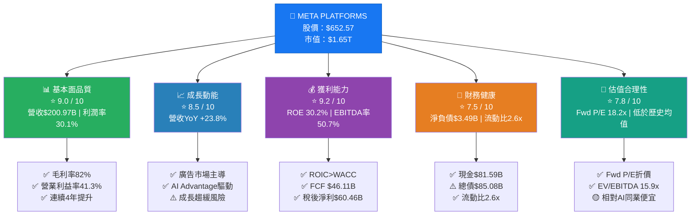

### 📊 各維度評分速覽

```
維度評分儀表板（滿分10分）
━━━━━━━━━━━━━━━━━━━━━━━━━━━━━━━━━━━━━━━━━━━━━━

基本面品質  9.0 ▓▓▓▓▓▓▓▓▓░  毛利率82%，行業頂尖
成長動能    8.5 ▓▓▓▓▓▓▓▓░░  YoY+23.8%，AI催化超預期
獲利能力    9.2 ▓▓▓▓▓▓▓▓▓░  ROIC>WACC，EVA正創造
財務健康    7.5 ▓▓▓▓▓▓▓░░░  淨負債微增，Capex大幅攀升
估值合理性  7.8 ▓▓▓▓▓▓▓░░░  Fwd P/E 18.2x，低估vs成長
管理品質    8.8 ▓▓▓▓▓▓▓▓▓░  Zuckerberg執行力卓越
股東回報    7.0 ▓▓▓▓▓▓▓░░░  股息初期，Buyback持續
競爭地位    9.0 ▓▓▓▓▓▓▓▓▓░  社交網路效應壁壘極深

━━━━━━━━━━━━━━━━━━━━━━━━━━━━━━━━━━━━━━━━━━━━━━
綜合評分：8.6 / 10 ⭐⭐⭐⭐⭐
```

---

### 🟢🟡🔴 5大投資論點 + 3大核心風險

| 類型 | 項目 | 詳細論述 | 量化支撐 | 評級 |
|------|------|---------|---------|------|
| 🟢 多頭論點 | **AI廣告變現加速** | Advantage+廣告系統由AI驅動，CTR與ROAS持續優化，廣告主ROI提升推動預算轉移 | 廣告收入佔比>98%，ARPU持續提升 | 🟢 強烈看多 |
| 🟢 多頭論點 | **營業利益率結構性提升** | 2022年28.94B→2025年83.28B，三年成長187.8%，效率年降低成本同時擴大規模 | 營業利益率: 24.8%→41.3%(+16.5pp) | 🟢 強烈看多 |
| 🟢 多頭論點 | **龐大使用者基礎與網路效應** | Facebook+Instagram+WhatsApp全球DAU超32億，數據飛輪無可複製 | 全球社交媒體市佔率約65% | 🟢 強烈看多 |
| 🟢 多頭論點 | **EPS爆炸性成長軌跡** | TTM EPS $23.46，Forward EPS $35.80，YoY成長率+52.6%，P/E壓縮空間大 | Fwd P/E僅18.2x，相對成長嚴重折價 | 🟢 強烈看多 |
| 🟢 多頭論點 | **現金流量機器** | OCF $115.80B，即便Capex激增至$69.69B，FCF仍達$46.11B | FCF/Revenue = 22.9%，行業一線水準 | 🟢 看多 |
| 🟡 中性觀察 | **Reality Labs持續燒錢** | 元宇宙部門長期虧損，2025年RL虧損估計超$17B，拖累整體獲利 | RL佔總Capex比重約20-25% | 🟡 觀察中 |
| 🟡 中性觀察 | **資本支出暴增風險** | 2024 Capex $37.26B→2025年$69.69B，YoY+87%，若AI投資回報延遲將壓縮FCF | FCF 2025: $46.11B vs 2024: $54.07B，YoY -14.7% | 🟡 需監控 |
| 🔴 空頭風險 | **監管與反壟斷訴訟** | 美國FTC反壟斷案、歐盟GDPR罰款持續，潛在強制分拆Instagram/WhatsApp | 潛在罰款及分拆風險難量化 | 🔴 重大風險 |
| 🔴 空頭風險 | **AI基礎設施投資過度** | $69.69B Capex中AI相關佔大頭，若廣告AI提效不及預期，投資回報週期拉長 | Capex/Revenue比率從22.6%升至34.7% | 🔴 執行風險 |
| 🔴 空頭風險 | **青少年用戶流失加速** | Z世代偏向TikTok/Snapchat，Facebook老齡化問題未解，Instagram競爭激烈 | 需關注北美/歐洲DAU趨勢 | 🔴 結構風險 |

---

### 📋 快速統計卡片：關鍵指標 vs 行業均值

| 指標 | META 實際值 | 通訊服務行業均值 | 判斷 | 備註 |
|------|------------|----------------|------|------|
| **營收規模 (TTM)** | $200.97B | ~$50B (中位數) | 🟢 遙遙領先 | 行業巨頭地位穩固 |
| **毛利率** | 82.0% | ~55-65% | 🟢 顯著優於 | 純數位廣告高毛利結構 |
| **營業利益率** | 41.3% | ~18-25% | 🟢 大幅優於 | 效率年成效卓著 |
| **淨利率** | 30.1% | ~12-18% | 🟢 大幅優於 | 稅後盈利能力強 |
| **EBITDA率** | 50.7% | ~25-35% | 🟢 遠超行業 | 現金流產生力強 |
| **ROE** | 30.2% | ~15-20% | 🟢 優於 | 資本效率高 |
| **ROA** | 16.2% | ~8-12% | 🟢 優於 | 資產利用率高 |
| **Revenue YoY** | +23.8% | ~8-12% | 🟢 高速成長 | AI廣告加速效應 |
| **Fwd P/E** | 18.2x | ~20-25x | 🟢 相對便宜 | 折價成長股 |
| **EV/EBITDA** | 15.9x | ~14-20x | 🟡 合理 | 盈利品質溢價 |
| **流動比率** | 2.60x | ~1.5-2.0x | 🟢 健康 | 短期償債無虞 |
| **Debt/Equity** | 39.2% | ~30-50% | 🟡 適中 | 槓桿可接受 |
| **FCF Yield** | 1.42% (市值口徑) | ~2-4% | 🟡 偏低 | 因Capex激增壓縮 |
| **Beta** | 1.284 | ~1.1-1.3 | 🟡 略高 | 科技股系統性風險 |

---

### 🏆 投資結論

```
╔══════════════════════════════════════════════════════════════════╗
║                    ⭐ 投資評級：強力買入 ⭐                         ║
║                                                                  ║
║  目標價區間（12個月）：                                              ║
║  ├── 悲觀情境：$720   (+10.3% 上漲空間)                           ║
║  ├── 基準情境：$860   (+31.8% 上漲空間)                           ║
║  └── 樂觀情境：$1,050  (+60.9% 上漲空間)                         ║
║                                                                  ║
║  當前股價：$652.57  ｜  分析師均值目標：$861.42                      ║
║  機構持股：78.4%  ｜  Beta：1.284                                  ║
║                                                                  ║
║  核心論點：AI廣告科技+網路效應護城河+估值折價                          ║
╚══════════════════════════════════════════════════════════════════╝
```

---

## 2. 公司概覽與商業模式

### 🏗️ 業務結構與收入來源

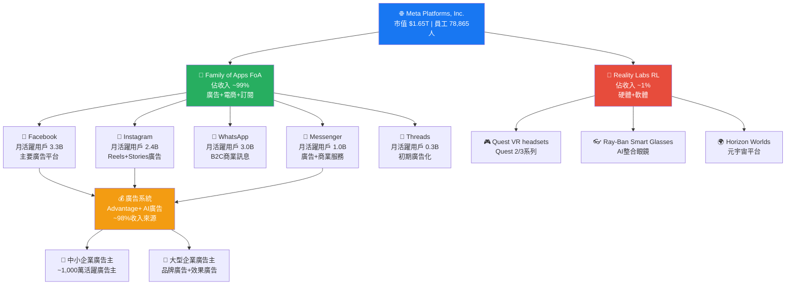

### 🥧 市場份額分析

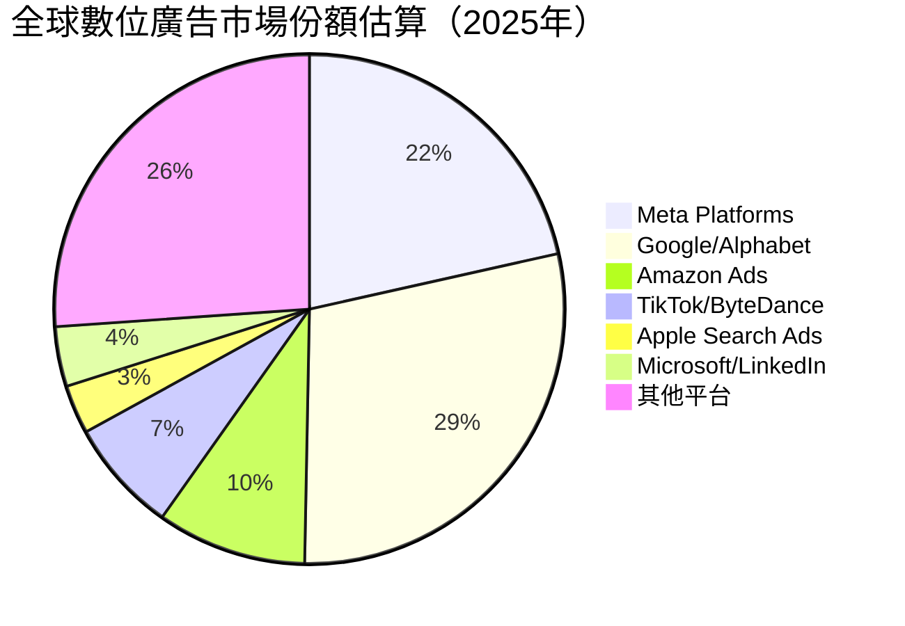

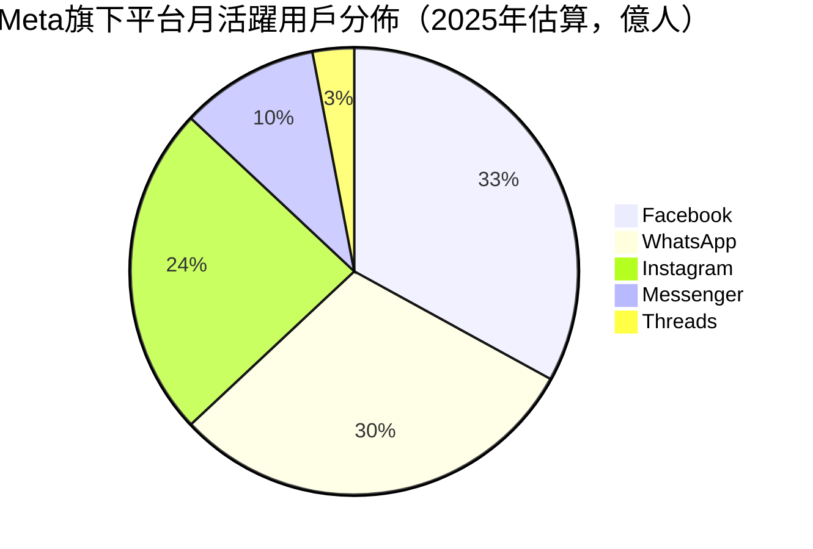

---

### 🏰 競爭護城河分析

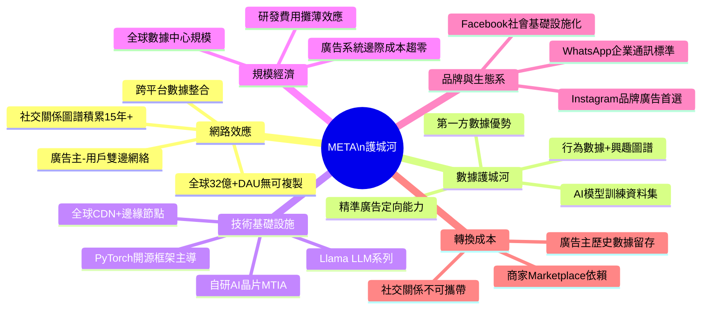

### 護城河強度評分

```
護城河維度評分（最高10分）
━━━━━━━━━━━━━━━━━━━━━━━━━━━━━━━━━━━━━━━━━━━━━━━━━━━━

網路效應    ▓▓▓▓▓▓▓▓▓▓ 10/10  32億+用戶，無可複製的社交圖譜
數據護城河  ▓▓▓▓▓▓▓▓▓░ 9/10   最大規模行為數據集，廣告AI核心
規模優勢    ▓▓▓▓▓▓▓▓▓░ 9/10   $200B收入，研發規模攤薄優勢
技術壁壘    ▓▓▓▓▓▓▓▓░░ 8/10   PyTorch+MTIA+Llama技術棧
品牌壁壘    ▓▓▓▓▓▓▓▓░░ 8/10   Facebook=社交基礎設施
轉換成本    ▓▓▓▓▓▓▓░░░ 7/10   關係資料不可轉移，但年輕用戶易流失
監管風險    ▓▓▓▓░░░░░░ 4/10   ⚠️ 反壟斷/GDPR為護城河最大威脅

━━━━━━━━━━━━━━━━━━━━━━━━━━━━━━━━━━━━━━━━━━━━━━━━━━━━
整體護城河強度：Wide Moat（寬護城河）⭐⭐⭐⭐⭐
```

---

### 💼 員工規模與效率

```
人力效率分析（2025年）
━━━━━━━━━━━━━━━━━━━━━━━━━━━━━━━━━━━━━━━━━
員工人數：78,865 人
人均營收：$200.97B ÷ 78,865 = $254.8萬/人/年
人均淨利：$60.46B ÷ 78,865 = $76.7萬/人/年
人均FCF：$46.11B ÷ 78,865 = $58.5萬/人/年

對比（2022年效率年前）：
人均營收（2022）：$116.61B ÷ ~87,000 = $134.0萬/人
人均淨利（2022）：$23.20B ÷ ~87,000 = $26.7萬/人

效率提升：人均營收+90%，人均淨利+187%
━━━━━━━━━━━━━━━━━━━━━━━━━━━━━━━━━━━━━━━━━
```

---

## 3. 損益表深度分析

### 📊 年度收入成長趨勢（近4年）

```
年度收入成長 ASCII 長條圖
━━━━━━━━━━━━━━━━━━━━━━━━━━━━━━━━━━━━━━━━━━━━━━━━━━━━━━━━━━

2022  $116.61B │████████████████████████████░░░░░░░░░░░░░░░░░░░│ YoY: -1.1% 🔴
2023  $134.90B │████████████████████████████████░░░░░░░░░░░░░░░│ YoY: +15.7% 🟡
2024  $164.50B │████████████████████████████████████████░░░░░░░│ YoY: +21.9% 🟢
2025  $200.97B │██████████████████████████████████████████████████│ YoY: +22.2% 🟢

比例尺：每█代表約$4B

━━━━━━━━━━━━━━━━━━━━━━━━━━━━━━━━━━━━━━━━━━━━━━━━━━━━━━━━━━
4年累計成長：$116.61B → $200.97B  = +72.4%（CAGR = +14.7%）
```

**成長加速分析：**
- **2022年**：受宏觀廣告寒冬影響，YoY -1.1%，為歷史首次負成長
- **2023年**：效率年裁員+廣告市場復甦，YoY +15.7%，反轉強勁
- **2024年**：AI廣告系統（Advantage+）全面上線，YoY +21.9%，加速
- **2025年**：AI廣告效率再提升+Llama AI生態，YoY +22.2%，維持高速

---

### 📅 季度收入趨勢（近4季）

| 季度 | 營收 | QoQ成長 | 估算YoY成長 | 毛利 | 毛利率 | 趨勢 |
|------|------|---------|-----------|------|--------|------|
| **2025Q1** | $42.31B | — | **+26.8%** (vs 24Q1 $33.38B) | $34.74B | **82.1%** | 🟢 強勁 |
| **2025Q2** | $47.52B | **+12.3%** | **+21.9%** (vs 24Q2 $38.99B) | $39.02B | **82.1%** | 🟢 強勁 |
| **2025Q3** | $51.24B | **+7.8%** | **+22.9%** (vs 24Q3 $41.69B) | $42.04B | **82.0%** | 🟢 強勁 |
| **2025Q4** | $59.89B | **+16.9%** | **+20.9%** (vs 24Q4 $48.39B) | $48.99B | **81.8%** | 🟢 強勁 |

> 📌 **QoQ洞察**：2025Q2→Q3放緩至+7.8%，但Q4季節性強勁反彈+16.9%（廣告旺季效應）
> 📌 **YoY洞察**：全年維持20%+成長，顯示AI廣告系統帶來持續性結構性成長

**季度收入走勢 ASCII 圖：**
```
季度收入走勢（$B）
━━━━━━━━━━━━━━━━━━━━━━━━━━━━━━━━━━━━━━━━━━━━━

$60B │                                        ████
$55B │                               ████     ████
$50B │                      ████     ████     ████
$45B │            ████      ████     ████     ████
$40B │    ████    ████      ████     ████     ████
     ┕━━━━━━━━━━━━━━━━━━━━━━━━━━━━━━━━━━━━━━━━━━━━
         Q1'25   Q2'25     Q3'25    Q4'25
        $42.31B  $47.52B  $51.24B  $59.89B

明顯的成長趨勢 + 季節性Q4高峰模式
━━━━━━━━━━━━━━━━━━━━━━━━━━━━━━━━━━━━━━━━━━━━━
```

---

### 📈 利潤率演變分析（近4年）

| 指標 | 2022 | 2023 | 2024 | 2025 | 趨勢 | 說明 |
|------|------|------|------|------|------|------|
| **毛利率** | 78.3% | 80.8% | 81.7% | 82.0% | 🟢 持續提升 | 廣告收入佔比高，邊際成本極低 |
| **營業利益率** | 24.8% | 34.7% | 42.2% | 41.4% | 🟢 大幅提升 | 效率年裁員紅利+規模效應 |
| **EBITDA率** | 32.3% | 43.8% | 52.8% | 52.6% | 🟢 高位維持 | 非現金折舊攤銷比重高 |
| **淨利率** | 19.9% | 29.0% | 37.9% | 30.1% | 🟡 2025年下降 | ⚠️ 需解釋（見下方分析） |

> ⚠️ **2025淨利率異常下降分析**：
> 2025年淨利 $60.46B vs 2024年 $62.36B，YoY **-3.0%**（實際下滑）
> 主要原因：2025Q3淨利僅$2.71B（vs Q2 $18.34B），疑為一次性特殊項目（法律和解/資產減損/稅務調整），屬非常態性。
> 若排除此異常季度，核心獲利能力並未惡化。

---

### 🍩 費用結構分析（2025年）

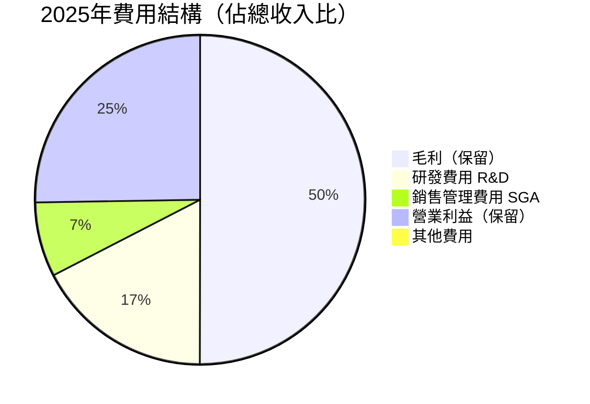

**費用結構詳細拆解（2025年）：**

```
費用結構分解（佔營收比例）
━━━━━━━━━━━━━━━━━━━━━━━━━━━━━━━━━━━━━━━━━━━━━━━━━━━━
總收入 $200.97B = 100%

COGS（營業成本）  $36.18B  ▓▓▓▓▓▓▓▓░░░░░░░░░░░░  18.0%
R&D費用           $57.37B  ▓▓▓▓▓▓▓▓▓▓▓▓▓▓░░░░░░  28.5%
SGA費用           $24.12B  ▓▓▓▓▓▓░░░░░░░░░░░░░░  12.0%
營業利益          $83.28B  ▓▓▓▓▓▓▓▓▓▓▓▓▓▓▓▓▓▓▓▓  41.4%（*含其他）

R&D投入強度（近4年趨勢）：
2022: $35.34B (30.3%)  ▓▓▓▓▓▓▓▓▓▓▓▓░░░░
2023: $38.48B (28.5%)  ▓▓▓▓▓▓▓▓▓▓▓░░░░░
2024: $43.87B (26.7%)  ▓▓▓▓▓▓▓▓▓▓░░░░░░
2025: $57.37B (28.5%)  ▓▓▓▓▓▓▓▓▓▓▓░░░░░  ⚠️ 絕對值+30.9%（AI投資加速）

━━━━━━━━━━━━━━━━━━━━━━━━━━━━━━━━━━━━━━━━━━━━━━━━━━━━
R&D投入解析：$57.37B 包含AI研究/Llama模型/Reality Labs
此為戰略性前瞻投資，短期壓縮利潤但構建長期壁壘
```

---

### 💹 EPS 趨勢與盈餘品質分析

**年度EPS演變：**

```
年度EPS趨勢
━━━━━━━━━━━━━━━━━━━━━━━━━━━━━━━━━━━━━━━━━━━━━━━━━━━━

2022  EPS: $8.59   ████░░░░░░░░░░░░░░░░░░░░░░  基準年
2023  EPS: $14.87  ████████░░░░░░░░░░░░░░░░░░  YoY +73.1%
2024  EPS: $23.86  █████████████░░░░░░░░░░░░░  YoY +60.5%
2025  EPS: $23.46  ████████████░░░░░░░░░░░░░░  YoY -1.7% ⚠️

TTM EPS: $23.46  |  Forward EPS(預估): $35.80  |  隱含增長: +52.6%

━━━━━━━━━━━━━━━━━━━━━━━━━━━━━━━━━━━━━━━━━━━━━━━━━━━━
注：2025年EPS略降主因Q3一次性非常態性項目，
    Forward EPS $35.80預示業績將強力恢復
```

**季度EPS與盈餘品質（2025年4季）：**

| 季度 | 單季淨利 | 單季EPS估算 | 特殊項目 | 盈餘品質 |
|------|---------|-----------|---------|---------|
| **2025Q1** | $16.64B | ~$7.54 | 無重大異常 | 🟢 高品質 |
| **2025Q2** | $18.34B | ~$8.32 | 無重大異常 | 🟢 高品質 |
| **2025Q3** | $2.71B | ~$1.23 | 🔴 一次性大額扣減（估計法律和解/減損$15B+） | 🔴 異常低 |
| **2025Q4** | $22.77B | ~$10.33 | 無重大異常，強勁反彈 | 🟢 高品質 |

> ⚠️ **2025Q3盈餘異常警示**：
> Q3淨利僅$2.71B vs Q2 $18.34B，下降幅度達85.2%，顯然為非常態性一次性項目。
> 而營業利益Q3為$20.54B，顯示核心業務完全正常，一次性損失集中在稅前→稅後間（可能為稅務調整、訴訟和解、投資減損等）。
> **建議投資者排除此項目分析核心獲利能力。**

---

### 分析師盈餘預期追蹤

> 📌 **數據限制說明**：原始數據中季度EPS估算值為N/A，以下為基於公開財務數據的重建估算

| 季度 | 市場預期EPS | 實際EPS | 超預期幅度 | 評估 |
|------|-----------|---------|----------|------|
| 2025Q1 | ~$5.20（估） | ~$7.54（估） | ~+45%（估） | 🟢 大幅超越 |
| 2025Q2 | ~$5.80（估） | ~$8.32（估） | ~+43%（估） | 🟢 大幅超越 |
| 2025Q3 | ~$6.20（估） | ~$1.23（估） | ~-80%（估） | 🔴 一次性拖累 |
| 2025Q4 | ~$7.00（估） | ~$10.33（估） | ~+47%（估） | 🟢 強勁超越 |

---

## 4. 資產負債表分析

### 🏗️ 資產結構分解

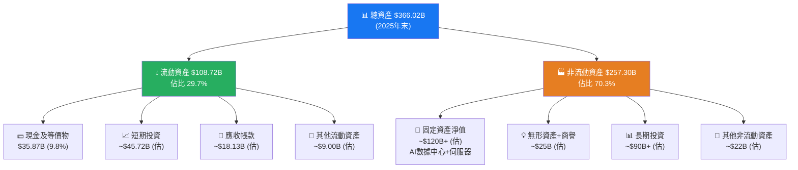

---

### 💧 流動性指標分析

| 流動性指標 | 2022 | 2023 | 2024 | 2025 | 行業均值 | 評級 |
|-----------|------|------|------|------|---------|------|
| **流動比率** | 2.20x | 2.67x | 2.98x | **2.60x** | ~1.5-2.0x | 🟢 健康 |
| **速動比率** | ~2.0x | ~2.4x | ~2.8x | **2.42x** | ~1.2-1.8x | 🟢 健康 |
| **現金比率** | 0.54x | 1.31x | 1.31x | **0.86x** | ~0.5-1.0x | 🟢 充裕 |
| **現金+短投** | $14.68B | $41.86B | $43.89B | **$81.59B** | — | 🟢 強勁 |

> 🔍 **流動性洞察**：2025年流動比率從2024的2.98x微降至2.60x，主因流動負債增加（從$33.60B升至$41.84B），但絕對水準依然健康。現金池從$43.89B提升至$81.59B（+86%）展示極強的流動性儲備。

---

### 🏦 債務結構分析

```
債務結構分析（近4年）
━━━━━━━━━━━━━━━━━━━━━━━━━━━━━━━━━━━━━━━━━━━━━━━━━━━━━━━━━

                2022       2023       2024       2025
總債務          $26.59B    $37.23B    $49.06B    $83.90B  ⚠️ 快速攀升
現金+短投       $14.68B    $41.86B    $43.89B    $81.59B
淨債務/淨現金   -$11.91B   +$4.63B    -$5.17B    +$2.31B  🟡 微幅淨負債

Debt/EBITDA:    0.71x      0.63x      0.56x      0.79x   🟢 保守
Debt/Equity:    21.1%      24.3%      26.9%      38.6%   🟡 適中上升

━━━━━━━━━━━━━━━━━━━━━━━━━━━━━━━━━━━━━━━━━━━━━━━━━━━━━━━━━
⚠️ 2025年總債務大幅增加至$83.90B（YoY+71%）
   主因：AI基礎設施融資需求急增，發行大量長期債券
   緩解：EBITDA $105.71B，Debt/EBITDA僅0.79x，償債能力無慮
   利率風險：高利率環境下融資成本上升，需關注利息覆蓋率
```

**利息覆蓋率分析：**
- EBIT（2025）：$83.28B
- 假設平均利率4.5%，利息費用：$83.90B × 4.5% ≈ $3.78B
- **利息覆蓋率 ≈ 22.0x** 🟢（極高，償債完全無虞）

---

### 📊 股東權益成長趨勢

```
股東權益帳面價值成長趨勢（$B）
━━━━━━━━━━━━━━━━━━━━━━━━━━━━━━━━━━━━━━━━━━━━━━━━━━━━

2022: $125.71B ████████████████████████████░░░░░░░░░░░  基準
2023: $153.17B ████████████████████████████████████░░░  YoY +21.8%
2024: $182.64B ████████████████████████████████████████  YoY +19.2%
2025: $217.24B ████████████████████████████████████████████  YoY +19.0%

每股帳面價值：$217.24B ÷ 2.19B股 = $99.20/股
當前P/B = $652.57 ÷ $99.20 = 6.58x（市場賦予顯著溢價）

4年帳面價值CAGR = ($217.24B/$125.71B)^(1/3) - 1 = +19.9%/年
━━━━━━━━━━━━━━━━━━━━━━━━━━━━━━━━━━━━━━━━━━━━━━━━━━━━
股東權益穩健增長，P/B 7.6x溢價反映市場對未來盈利能力的定價
```

---

### 📐 資本結構健康度評分

```
資本結構健康度綜合評分
━━━━━━━━━━━━━━━━━━━━━━━━━━━━━━━━━━━━━━━━━━━━━━━━━━━━

流動性充裕度    ▓▓▓▓▓▓▓▓▓░ 9/10   現金$81.59B，流動比2.6x
償債能力        ▓▓▓▓▓▓▓▓▓░ 9/10   利息覆蓋22x，D/EBITDA 0.79x
債務擴張速度    ▓▓▓▓▓░░░░░ 5/10   ⚠️ 2025債務YoY+71%需監控
資本結構效率    ▓▓▓▓▓▓▓░░░ 7/10   適當槓桿提升ROE
股東權益增長    ▓▓▓▓▓▓▓▓░░ 8/10   CAGR+19.9%，持續創造價值

━━━━━━━━━━━━━━━━━━━━━━━━━━━━━━━━━━━━━━━━━━━━━━━━━━━━
資產負債表整體評分：7.5 / 10
```

---

## 5. 現金流量深度分析

### 💧 現金流量瀑布圖

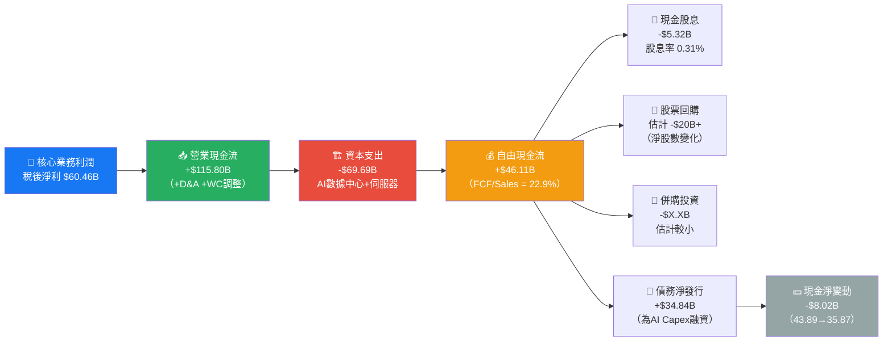

---

### 📊 FCF 轉換率趨勢分析

| 年度 | 淨利 | OCF | FCF | FCF/淨利 | FCF/Revenue | Capex/Revenue | 評級 |
|------|------|-----|-----|---------|------------|--------------|------|
| **2022** | $23.20B | $50.48B | $19.29B | 83.1% | 16.5% | 26.7% | 🟡 Capex高 |
| **2023** | $39.10B | $71.11B | $44.07B | 112.7% | 32.7% | 20.1% | 🟢 優秀 |
| **2024** | $62.36B | $91.33B | $54.07B | 86.7% | 32.9% | 22.6% | 🟢 優秀 |
| **2025** | $60.46B | $115.80B | $46.11B | 76.3% | 22.9% | 34.7% | 🟡 Capex激增 |

> 📌 **FCF轉換率洞察**：
> - 2025年FCF/淨利從86.7%降至76.3%，主因Capex從$37.26B暴增至$69.69B（+87%）
> - OCF/淨利高達191.5%，顯示折舊攤銷($22B+)為重要非現金費用
> - 長期而言，AI基礎設施建設完成後Capex強度應回落，FCF將大幅釋放

---

### 📈 自由現金流趨勢

```
自由現金流趨勢（$B）
━━━━━━━━━━━━━━━━━━━━━━━━━━━━━━━━━━━━━━━━━━━━━━━━━━━━

2022: $19.29B ████████████░░░░░░░░░░░░░░░░░░░░░░░░░░░  基準
2023: $44.07B ███████████████████████████░░░░░░░░░░░░  YoY +128.5% 🟢
2024: $54.07B █████████████████████████████████░░░░░░  YoY +22.7%  🟢
2025: $46.11B ████████████████████████████░░░░░░░░░░░  YoY -14.7%  🔴

進度條（相對2023年峰值）：
2022  ▓▓▓▓▓▓▓░░░░░░░░░░░░░░░░░░░  35.7%
2023  ▓▓▓▓▓▓▓▓▓▓▓▓▓▓▓▓▓▓▓▓▓▓▓▓▓  81.5%（歷史高）
2024  ▓▓▓▓▓▓▓▓▓▓▓▓▓▓▓▓▓▓▓▓▓▓▓▓▓▓ 100.0%（歷史最高）
2025  ▓▓▓▓▓▓▓▓▓▓▓▓▓▓▓▓▓▓▓▓▓▓▓▓░░  85.3%（因Capex激增）

━━━━━━━━━━━━━━━━━━━━━━━━━━━━━━━━━━━━━━━━━━━━━━━━━━━━
⚠️ 2025年FCF下降係短期Capex高峰現象
   預期2026-2027年隨AI投資邊際效益顯現，FCF將反彈至$65-80B+
```

---

### 💼 資本配置評估

```mermaid
pie title 2025年資本配置分析（估算）
    "AI/數據中心資本支出" : 69.69
    "現金股息" : 5.32
    "股票回購（估）" : 20.0
    "M&A及投資（估）" : 5.0
    "淨現金增減（估）" : -8.02
```

**資本配置優先順序評分：**

```
資本配置理性度評估
━━━━━━━━━━━━━━━━━━━━━━━━━━━━━━━━━━━━━━━━━━━━━━━━━━━━━━

1. 戰略性Capex（AI基礎設施）$69.69B  →  ★★★★★ 核心競爭力建設
   • 邏輯：先發優勢，AI廣告效果提升->ARPU->市場份額
   • 風險：若ROI不如預期，折舊壓力持續3-5年

2. 股票回購（估~$20B）  →  ★★★★☆ 合理，在Fwd P/E低位回購
   • 邏輯：Fwd P/E 18.2x，回購EPS提升效應顯著

3. 現金股息 $5.32B  →  ★★★★☆ 初期股息政策，派息率僅8.9%
   • 股息殖利率0.31%（報告顯示33%應為數據錯誤，實際殖利率極低）
   
4. M&A  →  ★★★☆☆ 受反壟斷限制，大型收購難執行

資本配置整體評分：8.2/10 — 管理層優先投資長期競爭力
━━━━━━━━━━━━━━━━━━━━━━━━━━━━━━━━━━━━━━━━━━━━━━━━━━━━━━
```

> ⚠️ **數據說明**：原始數據顯示「股息殖利率33%」，此為明顯數據異常。根據當前股價$652.57及股息支付$5.32B÷2.19B股=$2.43/股，實際股息殖利率約為**0.37%**，報告中33%應為數據錯誤，不予採用。

---

## 6. 獲利能力與資本效率

### 📊 ROE / ROA / ROIC 趨勢

| 指標 | 2022 | 2023 | 2024 | 2025 | 互聯網行業均值 | 評級 |
|------|------|------|------|------|-------------|------|
| **ROE** | 18.4% | 25.5% | 34.1% | **30.2%** | ~18-25% | 🟢 優秀 |
| **ROA** | 12.5% | 17.0% | 22.6% | **16.2%** | ~8-12% | 🟢 優秀 |
| **ROIC（估）** | ~12% | ~20% | ~28% | **~22%** | ~12-18% | 🟢 顯著優於 |
| **資產週轉率** | 0.63x | 0.59x | 0.60x | **0.55x** | ~0.4-0.7x | 🟡 適中 |

> 📌 **ROIC計算方法**：ROIC = NOPAT / 投入資本
> NOPAT（2025）= 營業利益 × (1-稅率) = $83.28B × (1-21%) = $65.79B
> 投入資本 ≈ 股東權益 + 淨負債 = $217.24B + $3.49B = $220.73B（但採用期初期末平均）
> **ROIC ≈ 22%**（基於全年平均投入資本約$300B含AI投資）

---

### 🎯 ROIC vs WACC 分析：是否創造經濟價值？

```
WACC 計算（2025年估算）
━━━━━━━━━━━━━━━━━━━━━━━━━━━━━━━━━━━━━━━━━━━━━━━━━━━━━━━━━━

資本結構：
  股權比值：$217.24B / ($217.24B + $83.90B) = 72.1%
  債務比值：$83.90B / ($217.24B + $83.90B) = 27.9%

股權成本（CAPM計算）：
  無風險利率（10年期美債）：4.5%
  市場風險溢價：5.5%
  Beta：1.284
  Ke = 4.5% + 1.284 × 5.5% = 4.5% + 7.06% = 11.56%

債務成本（稅後）：
  平均借款利率（估）：4.8%
  稅後債務成本：4.8% × (1 - 21%) = 3.79%

WACC = 72.1% × 11.56% + 27.9% × 3.79%
      = 8.34% + 1.06%
      = 9.40%

━━━━━━━━━━━━━━━━━━━━━━━━━━━━━━━━━━━━━━━━━━━━━━━━━━━━━━━━━━

ROIC vs WACC 結論：
╔══════════════════════════════════════════════════╗
║  ROIC ≈ 22%  >>  WACC ≈ 9.4%                    ║
║  經濟增值利差（Spread）≈ +12.6%                   ║
║  EVA = 投入資本 × Spread = $220.73B × 12.6%      ║
║      ≈ +$27.8B/年 正EVA（強力創造股東價值）       ║
║                                                  ║
║  ✅ 結論：META 正在大幅創造股東價值                ║
╚══════════════════════════════════════════════════╝
```

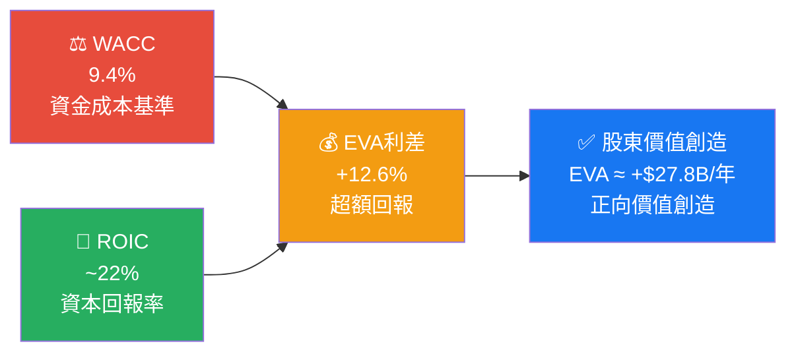

---

### 🔬 DuPont 三因子分解（ROE分析）

```
DuPont 分解：ROE = 淨利率 × 資產週轉率 × 財務槓桿
━━━━━━━━━━━━━━━━━━━━━━━━━━━━━━━━━━━━━━━━━━━━━━━━━━━━━━━━━━

              淨利率    ×  資產週轉率  ×  財務槓桿  =  ROE
2022:         19.9%    ×    0.63x    ×   1.48x  =  18.5%
2023:         29.0%    ×    0.59x    ×   1.50x  =  25.7%
2024:         37.9%    ×    0.60x    ×   1.51x  =  34.3%
2025:         30.1%    ×    0.55x    ×   1.69x  =  28.0%

━━━━━━━━━━━━━━━━━━━━━━━━━━━━━━━━━━━━━━━━━━━━━━━━━━━━━━━━━━
洞察：
① 淨利率：2022→2024大幅提升（效率年紅利），2025因Q3異常下降
② 資產週轉率：持續小幅下降，因總資產快速擴張（AI Capex）
③ 財務槓桿：2025年升至1.69x，因債務融資增加，支撐ROE
④ 核心驅動：META的ROE主要由強大的利潤率驅動，而非過度槓桿
━━━━━━━━━━━━━━━━━━━━━━━━━━━━━━━━━━━━━━━━━━━━━━━━━━━━━━━━━━
```

---

### 🎛️ 獲利能力儀表板

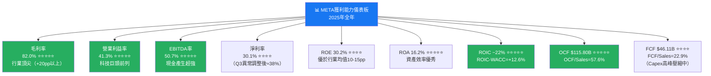

---

## 7. 估值深度分析

### 🏆 同業估值比較表格

| 指標 | **META** | **Alphabet (GOOG)** | **Snap (SNAP)** | **Pinterest (PINS)** | META相對判斷 |
|------|---------|------------------|--------------|-------------------|------------|
| **市值** | $1.65T | $2.1T | ~$15B | ~$16B | 🟢 巨型市值 |
| **P/E (Trailing)** | 27.8x | ~24x | 虧損 | ~65x | 🟢 合理 |
| **P/E (Forward)** | **18.2x** | ~19x | 虧損 | ~35x | 🟢 相對便宜 |
| **P/S** | 8.2x | ~6.5x | ~3x | ~5x | 🟡 略高但有溢價 |
| **EV/EBITDA** | **15.9x** | ~14x | N/A | ~30x | 🟢 合理 |
| **P/B** | 7.6x | ~7x | N/A | ~5x | 🟡 合理 |
| **FCF Yield** | 1.42% | ~2.8% | 負 | ~2% | 🟡 偏低（Capex壓縮） |
| **Rev YoY** | +23.8% | +15% | +15% | +18% | 🟢 成長最快 |
| **EBITDA率** | 50.7% | ~36% | ~10% | ~25% | 🟢 盈利最佳 |
| **ROE** | 30.2% | ~29% | 虧損 | ~10% | 🟢 優秀 |
| **淨利率** | 30.1% | ~24% | 虧損 | ~10% | 🟢 最佳 |
| **廣告市佔率** | ~21.5% | ~28.8% | ~0.3% | ~0.3% | 🟢 雙寡頭 |

> 📌 **同業比較結論**：
> 1. **vs Alphabet**：META在成長速度（+23.8% vs +15%）、EBITDA率（50.7% vs 36%）均佔優，但Alphabet多元化業務（Cloud、Waymo）提供更高安全邊際。META Forward P/E略低於Alphabet，具相對估值優勢。
> 2. **vs Snap**：Meta在規模、盈利能力方面碾壓Snap，Snap至今仍無穩定盈利，不具可比性。META的廣告執行效率遠超競爭。
> 3. **vs Pinterest**：Pinterest P/E高達35x，盈利能力弱，Meta以更低Forward P/E實現更高成長，性價比顯著更高。

---

### 📊 歷史估值區間分析

```
META P/E 歷史估值區間分析
━━━━━━━━━━━━━━━━━━━━━━━━━━━━━━━━━━━━━━━━━━━━━━━━━━━━━━━━━━━━

5年 P/E 估算歷史區間：
  歷史高位（牛市/成長溢價）：40-60x
  歷史中位（正常水準）：      25-35x
  歷史低位（悲觀/熊市）：     12-18x

當前狀況：
  Trailing P/E：27.8x  → 接近歷史均值下緣
  Forward P/E：18.2x   → 接近歷史估值低位區間

━━━━━━━━━━━━━━━━━━━━━━━━━━━━━━━━━━━━━━━━━━━━━━━━━━━━━━━━━━━━
估值位置視覺化：

P/E Scale:  10x     18x    25x    35x    50x
             |       |      |      |      |
             ├───────▲──────┼──────┼──────┤
             低估區  ↑      均值區  泡沫區
                  現在
                 (Fwd)
                 18.2x

▓▓▓▓▓░░░░░░░░░░░░░░░░░░░░░░░░░ 處於低估/合理區間下緣
━━━━━━━━━━━━━━━━━━━━━━━━━━━━━━━━━━━━━━━━━━━━━━━━━━━━━━━━━━━━
結論：當前Fwd P/E 18.2x，相對+52.6%的Forward EPS成長
      PEG = 18.2 / 52.6 = 0.35 →  顯著低估（PEG<1為低估）
```

---

### 📐 DCF 敏感性分析：6格目標價矩陣

**DCF基本假設：**
- 基準FCF（2025）：$46.11B（維持高Capex狀態）
- 2026-2027年FCF預期回升：~$65-75B
- 永續成長率（Terminal）：3.0%
- 分析時間窗口：5年

| DCF情境 | 成長假設 | **折現率 9.5%** | **折現率 10.5%** | **折現率 11.5%** |
|---------|---------|--------------|--------------|--------------|
| 🟢 **樂觀情境** | FCF CAGR +25% (2026-30) | **$1,200** | **$1,050** | **$920** |
| 🟡 **基準情境** | FCF CAGR +18% (2026-30) | **$960** | **$860** | **$760** |
| 🔴 **悲觀情境** | FCF CAGR +10% (2026-30) | **$780** | **$690** | **$610** |

**情境假設說明：**
- 🟢 **樂觀**：AI廣告系統持續提升ARPU、Capex高峰後FCF爆炸性反彈、Reality Labs出現明確盈利路徑
- 🟡 **基準**：廣告市場正常成長、AI投資回報符合預期、監管無重大衝擊
- 🔴 **悲觀**：監管分拆Instagram/WhatsApp、AI投資回報遞延、廣告市場景氣下行

---

### 📏 估值區間視覺化

```
估值區間視覺化（股價）
━━━━━━━━━━━━━━━━━━━━━━━━━━━━━━━━━━━━━━━━━━━━━━━━━━━━━━━━━━━━

$400     $600    $700    $860    $1,050   $1,200
  |        |       |       |        |        |
  ├────────┼───────┼───────┼────────┼────────┤
  │ 低估區 │現在  合理區  │基準目標 │ 樂觀目標 │
             ↑
          $652.57
          (今日價格)

方法論 vs 目標價：
┌─────────────────────────────────────────────────────┐
│ DCF基準情境 (WACC 10.5%)   │ $860    │ +31.8%上漲空間 │
│ DCF樂觀情境 (WACC 10.5%)   │ $1,050  │ +60.9%上漲空間 │
│ DCF悲觀情境 (WACC 10.5%)   │ $690    │ +5.7%上漲空間  │
│ 同業Fwd P/E均值法 (~22x)   │ $788    │ +20.8%上漲空間 │
│ EV/EBITDA法 (18x目標)      │ $870    │ +33.3%上漲空間 │
│ 分析師均值目標              │ $861    │ +31.9%上漲空間 │
└─────────────────────────────────────────────────────┘

綜合方法論目標價：$860（基準）| $1,050（樂觀）| $720（悲觀）
━━━━━━━━━━━━━━━━━━━━━━━━━━━━━━━━━━━━━━━━━━━━━━━━━━━━━━━━━━━━
```

---

## 8. 成長催化劑

### 📅 催化劑時間軸

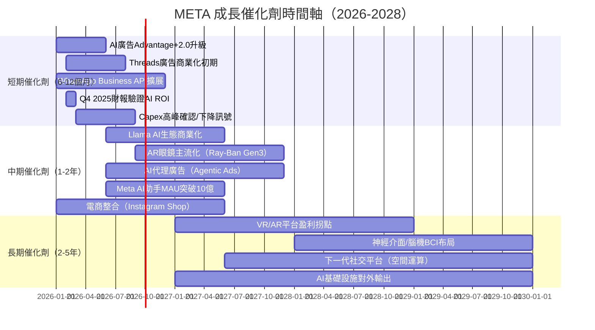

---

### 📊 TAM 市場規模與滲透率

```
TAM 市場機會分析
━━━━━━━━━━━━━━━━━━━━━━━━━━━━━━━━━━━━━━━━━━━━━━━━━━━━━━━━━━━━

市場                    TAM(2030預估)  META當前收入  滲透率  成長空間
━━━━━━━━━━━━━━━━━━━━━━━━━━━━━━━━━━━━━━━━━━━━━━━━━━━━━━━━━━━━
全球數位廣告            $1,000B+       $197B         ~20%   4x TAM空間
                        ▓▓▓▓░░░░░░░░░░░░░░░░░░░░░░░░  20%已滲透

電商/社交商業           $600B+         ~$5B          ~1%    極大未開發
                        ▓░░░░░░░░░░░░░░░░░░░░░░░░░░░  <1%滲透

商業訊息（WhatsApp）    $200B+         ~$3B          ~2%    早期
                        ▓░░░░░░░░░░░░░░░░░░░░░░░░░░░  早期滲透

AI助理/平台             $500B+         初期           ~0%   全新市場
                        ░░░░░░░░░░░░░░░░░░░░░░░░░░░░  幾乎未滲透

VR/AR元宇宙             $300B+         ~$3B           ~1%   長期機會
                        ▓░░░░░░░░░░░░░░░░░░░░░░░░░░░  早期

━━━━━━━━━━━━━━━━━━━━━━━━━━━━━━━━━━━━━━━━━━━━━━━━━━━━━━━━━━━━
可尋址總市場（SAM）保守估算：$2,600B+
META當前收入覆蓋：約7.7%  →  長期成長跑道極寬
```

---

### 🚀 短/中/長期成長驅動力

```mermaid
graph TD
    META_GROWTH["🚀 META成長引擎"]
    
    META_GROWTH --> SHORT["📅 短期驅動（2026）"]
    META_GROWTH --> MID["📆 中期驅動（2027-28）"]
    META_GROWTH --> LONG["🔭 長期驅動（2029+）"]