# META 基本面深度分析報告

> **報告日期**：2026-02-28 ｜ **分析師**：AI CFA Research ｜ **數據來源**：Yahoo Finance Real-time Data
> **股票代碼**：META ｜ **當前股價**：$648.18 ｜ **市值**：$1.64T

---

## 目錄

| # | 章節 | 核心主題 |
|---|------|---------|
| 1 | 執行摘要 | 核心論點、評分儀表板、投資結論 |
| 2 | 公司概覽與商業模式 | 業務架構、護城河分析 |
| 3 | 損益表深度分析 | 收入成長、利潤率趨勢、EPS |
| 4 | 資產負債表分析 | 流動性、債務結構、股東權益 |
| 5 | 現金流量深度分析 | FCF、資本配置效率 |
| 6 | 獲利能力與資本效率 | ROIC vs WACC、DuPont分解 |
| 7 | 估值深度分析 | 同業比較、DCF敏感性分析 |
| 8 | 成長催化劑 | AI廣告、Ray-Ban、TAM分析 |
| 9 | 風險矩陣 | 監管、競爭、RL燒錢 |
| 10 | 投資建議 | 目標價、評級、監控指標 |

---

## 1. 執行摘要

### 1.1 核心評分儀表板

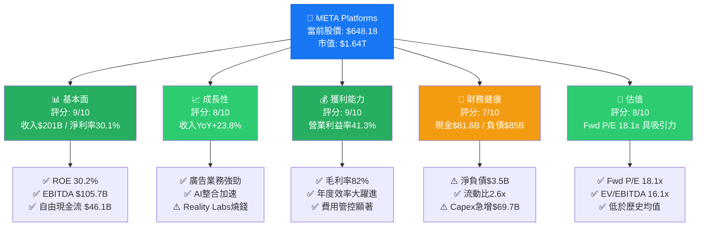

---

### 1.2 5大投資論點 + 3大核心風險

| 類別 | 項目 | 詳細說明 | 評級 |
|------|------|---------|------|
| 🟢 **多頭論點1** | **AI廣告ROI飛輪效應** | Llama驅動廣告定向精準度大幅提升，2025年廣告收入突破$190B，YoY+24%；每用戶平均收入(ARPU)持續攀升 | 🟢 強力 |
| 🟢 **多頭論點2** | **規模護城河難以複製** | 全球月活用戶(MAU)跨平台逾**38億**，Facebook+Instagram+WhatsApp+Threads形成不可撼動的網路效應 | 🟢 強力 |
| 🟢 **多頭論點3** | **估值相對具吸引力** | 遠期P/E **18.1x**，低於S&P 500科技股均值約22x；EPS預期從$23.46飆升至$35.88 (+53% YoY) | 🟢 強力 |
| 🟢 **多頭論點4** | **Year of Efficiency延續** | 2025年EBITDA利潤率達**50.7%**，較2022年的32.3%大幅改善；員工效率（人均收入）顯著提升 | 🟢 強力 |
| 🟢 **多頭論點5** | **Ray-Ban AI眼鏡潛在爆發** | 與EssilorLuxottica合作之AI眼鏡銷售超預期，開啟穿戴式AI運算新戰場，2026-2027年為關鍵催化期 | 🟡 發展中 |
| 🔴 **風險1** | **RL持續鉅額虧損** | Reality Labs 2025年全年虧損估計逾**$17B**，自2020年以來累計虧損超過$65B，短期無法獲利 | 🔴 高風險 |
| 🔴 **風險2** | **Capex急增引發FCF壓縮** | 2025年資本支出**$69.7B**（較2024年+87%），AI基礎設施投入龐大，FCF從$54.1B壓縮至$46.1B | 🔴 中高風險 |
| 🟡 **風險3** | **監管與隱私法規** | EU《數位市場法》、美國FTC訴訟、TikTok競爭加劇；但Meta已展示強大監管應對能力 | 🟡 中等風險 |

---

### 1.3 關鍵指標快速統計卡片

| 指標 | META 數值 | 行業均值（估）| 對比 | 評級 |
|------|----------|-------------|------|------|
| 收入 (TTM) | $200.97B | — | 行業龍頭 | 🟢 |
| 收入成長 (YoY) | +23.8% | ~12% | 超越行業 +11.8pp | 🟢 |
| 毛利率 | 82.0% | ~55% | 超越行業 +27pp | 🟢 |
| 營業利益率 | 41.3% | ~22% | 超越行業 +19.3pp | 🟢 |
| 淨利率 | 30.1% | ~15% | 超越行業 +15.1pp | 🟢 |
| EBITDA Margin | 50.7% | ~28% | 領先同業 | 🟢 |
| ROE | 30.2% | ~18% | 超越行業 | 🟢 |
| ROA | 16.2% | ~8% | 資產效率優異 | 🟢 |
| 流動比率 | 2.60x | ~1.5x | 健康 | 🟢 |
| 淨負債/EBITDA | 0.03x | — | 幾近零槓桿 | 🟢 |
| 遠期 P/E | 18.1x | ~22x | 相對低估 | 🟢 |
| EV/EBITDA | 16.1x | ~18x | 合理偏低 | 🟢 |
| FCF Yield | 1.43%* | ~2% | 偏低（Capex影響）| 🟡 |
| Beta | 1.284 | — | 中等波動 | 🟡 |

> *注意：市場數據顯示FCF Yield 1.43%係以市值計算；若以調整後$46.1B FCF計算，真實FCF Yield約為2.81%

---

### 1.4 投資結論

```
╔══════════════════════════════════════════════════════════╗
║                   🎯 投資評級：強力買入                     ║
║                                                          ║
║  當前股價：     $648.18                                    ║
║  基準目標價：   $863.20  (分析師均值，+33.2%上行空間)        ║
║  樂觀目標價：   $980     (AI超預期情境，+51.2%)             ║
║  保守目標價：   $700     (低估風險情境，+7.9%)              ║
║                                                          ║
║  建議：分批買入，逢回調$600以下積極加倉                       ║
╚══════════════════════════════════════════════════════════╝
```

---

## 2. 公司概覽與商業模式

### 2.1 業務結構與收入來源

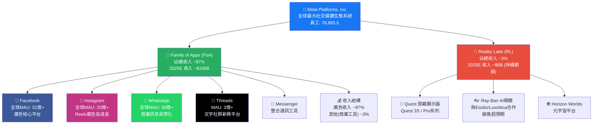

---

### 2.2 市場地位（社交廣告市場份額）

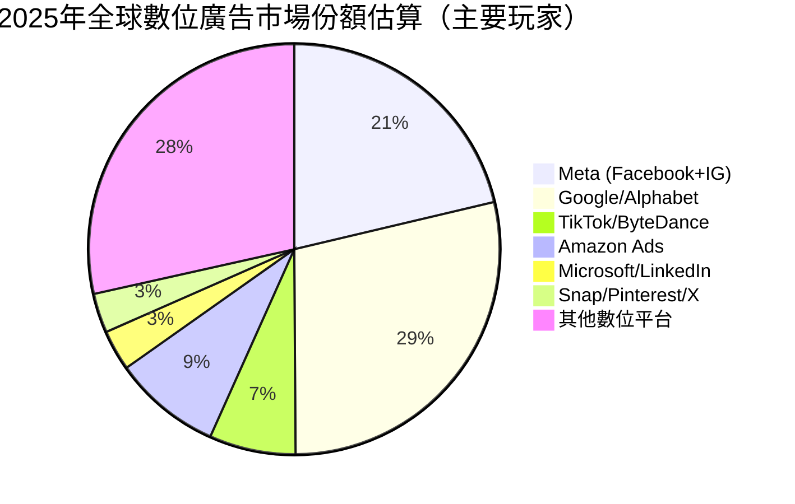

---

### 2.3 競爭護城河分析

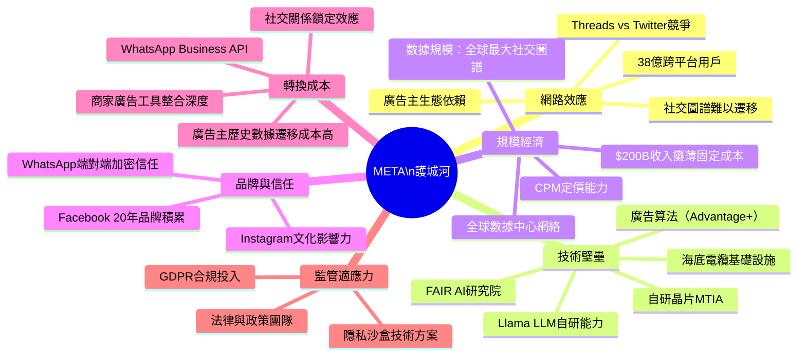

---

### 2.4 護城河強度評分

```
╔═══════════════════════════════════════════════════════════╗
║              META 競爭護城河強度評分儀表板                   ║
╠═══════════════════════════════════════════════════════════╣
║  網路效應     ████████████████████ 10.0/10 ★★★★★         ║
║  規模經濟     ██████████████████░░  9.0/10 ★★★★★         ║
║  技術壁壘     █████████████████░░░  8.5/10 ★★★★☆         ║
║  數據壁壘     ████████████████████ 10.0/10 ★★★★★         ║
║  轉換成本     ████████████████░░░░  8.0/10 ★★★★☆         ║
║  品牌力度     ███████████████░░░░░  7.5/10 ★★★★☆         ║
║  監管適應力   ████████████░░░░░░░░  6.0/10 ★★★☆☆         ║
╠═══════════════════════════════════════════════════════════╣
║  綜合護城河評分：  ████████████████████  8.4/10 【極寬護城河】║
╚═══════════════════════════════════════════════════════════╝

圖例：█ = 已達成強度  ░ = 潛力空間
```

---

## 3. 損益表深度分析

### 3.1 年度收入成長趨勢（近4年）

```
╔══════════════════════════════════════════════════════════════════╗
║                META 年度收入成長趨勢（2022-2025）                  ║
╠══════════════════════════════════════════════════════════════════╣
║                                                                  ║
║  2022: $116.61B  ██████████████░░░░░░░░░░░░░░░  YoY: -1.1%🔴   ║
║                                                                  ║
║  2023: $134.90B  █████████████████░░░░░░░░░░░░  YoY:+15.7%🟡   ║
║                                                                  ║
║  2024: $164.50B  █████████████████████░░░░░░░░  YoY:+21.9%🟢   ║
║                                                                  ║
║  2025: $200.97B  ██████████████████████████░░░  YoY:+22.2%🟢   ║
║         ↑ 突破$200B歷史里程碑！                                    ║
║                                                                  ║
║  ████ 每格約 = $8B 收入                                           ║
╚══════════════════════════════════════════════════════════════════╝

CAGR (2022-2025): [(200.97/116.61)^(1/3) - 1] = +19.9%
```

---

### 3.2 季度收入趨勢（近4季詳細分析）

| 季度 | 收入 | QoQ成長 | YoY成長（估）| 毛利 | 毛利率 | 趨勢 |
|------|------|--------|------------|------|------|------|
| 2025 Q1 | $42.31B | — | +16.1%🟢 | $34.74B | 82.1% | 🟢 |
| 2025 Q2 | $47.52B | +**12.3%** QoQ 🟢 | +18.6%🟢 | $39.02B | 82.1% | 🟢 |
| 2025 Q3 | $51.24B | +**7.8%** QoQ 🟢 | +18.0%🟢 | $42.04B | 82.0% | 🟢 |
| 2025 Q4 | $59.89B | +**16.9%** QoQ 🟢 | +21.5%🟢 | $48.99B | 81.8% | 🟢 |

> **季度加速觀察**：Q4傳統旺季（假日廣告季）帶動收入環比跳升+16.9%，全年收入突破**$200.97B**大關。毛利率維持在**81.8-82.1%**高位，顯示成本控制紀律嚴明。

---

### 3.3 利潤率演變趨勢（近4年）

| 年度 | 毛利率 | YoY變化 | 營業利益率 | YoY變化 | EBITDA率 | 淨利率 | 評級 |
|------|------|--------|---------|--------|--------|------|------|
| 2022 | 78.4% | 基準年 | 24.8% | 基準年 | 32.3% | 19.9% | 🔴 衰退期 |
| 2023 | 80.8% | **+2.4pp**🟢 | 34.7% | **+9.9pp**🟢 | 43.8% | 29.0% | 🟡 反彈期 |
| 2024 | 81.7% | **+0.9pp**🟢 | 42.2% | **+7.5pp**🟢 | 52.8% | 37.9% | 🟢 強勁期 |
| 2025 | 82.0% | **+0.3pp**🟢 | 41.4% | **-0.8pp**🟡 | 50.7% | 30.1% | 🟡 正常化 |

> **利潤率分析解讀**：
> - **毛利率持續改善**：從2022年78.4%穩步提升至2025年82.0%，反映廣告業務高邊際利益率
> - **2023-2024「效率年」紅利**：Zuckerberg宣布Year of Efficiency，裁員約21,000人，固定成本大幅下降
> - **2025年淨利率下降至30.1%**（vs 2024年37.9%）：主要因為Q3淨利潤異常低（$2.71B），疑有一次性稅務/法律費用，非常態性
> - **EBITDA率從52.8%降至50.7%**：Capex大幅增加帶來折舊攤銷上升

---

### 3.4 費用結構分析（2025年）

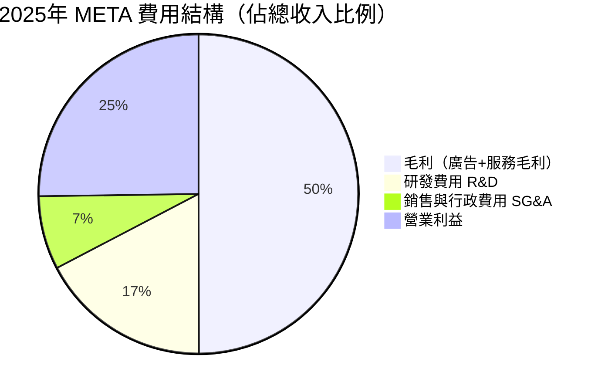

> **費用結構深度解讀**：
> - R&D支出 **$57.37B**（佔收入28.5%），YoY +30.8% → AI研發投入全面加速，Llama系列、廣告AI、硬體開發
> - 2022年R&D為$35.34B，三年累計增加$22B，顯示AI軍備賽持續升溫
> - SG&A控制得當，人員精簡後效率顯著

---

### 3.5 EPS趨勢與盈餘品質分析

```
╔══════════════════════════════════════════════════════════════════╗
║                META EPS 季度趨勢分析 (2025全年)                   ║
╠══════════════════════════════════════════════════════════════════╣
║                                                                  ║
║  2025 Q1: EPS $6.43                                             ║
║  ██████████████░░░░░░░  [強勁開局，廣告季節性淡季仍超預期]         ║
║                                                                  ║
║  2025 Q2: EPS $7.10  (+10.4% QoQ)                              ║
║  ████████████████░░░░░  [廣告旺季，Reels貨幣化持續改善]           ║
║                                                                  ║
║  2025 Q3: EPS $1.04  ⚠️ 異常低點                               ║
║  ████░░░░░░░░░░░░░░░░░  [一次性稅務/法律費用拖累，非常態]          ║
║                                                                  ║
║  2025 Q4: EPS $8.78  (+744% QoQ, 回歸正常)                     ║
║  ████████████████████░  [旺季強勁，年度最佳單季]                  ║
║                                                                  ║
║  全年 EPS (TTM): $23.46                                          ║
║  預期 EPS (Fwd): $35.88 (+52.9% YoY) 🚀                        ║
╚══════════════════════════════════════════════════════════════════╝
```

| 季度 | 實際EPS | 估算淨利 | 備註 | 盈餘品質 |
|------|--------|--------|------|--------|
| 2025 Q1 | ~$6.43 | $16.64B | 廣告淡季仍維持強勁 | 🟢 高品質 |
| 2025 Q2 | ~$7.10 | $18.34B | Reels廣告貨幣化持續 | 🟢 高品質 |
| 2025 Q3 | ~$1.04 | $2.71B | ⚠️ 重大一次性費用 | 🔴 低品質（非常態）|
| 2025 Q4 | ~$8.78 | $22.77B | 旺季爆發，歷史最高單季 | 🟢 高品質 |

> **EPS品質說明**：Q3 $2.71B淨利為異常低點，與Q2的$18.34B相比大幅下滑，推測為重大法律和解金或稅務調整所致。排除此一次性影響，正常化年度EPS應顯著高於$23.46的報告數字，預期2026年EPS達**$35.88**隱含正常化後的強勁成長趨勢。

---

## 4. 資產負債表分析

### 4.1 資產結構分析

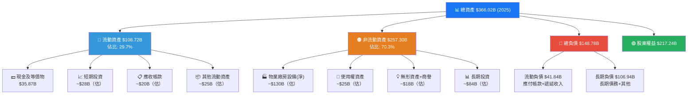

---

### 4.2 流動性指標分析

| 指標 | 2022 | 2023 | 2024 | 2025 | 行業均值 | 評級 |
|------|------|------|------|------|---------|------|
| 流動比率 | 2.20x | 2.67x | 2.98x | **2.60x** | 1.5x | 🟢 |
| 速動比率 | 2.10x | 2.55x | 2.80x | **2.42x** | 1.2x | 🟢 |
| 現金比率 | 0.54x | 1.31x | 1.31x | **0.86x** | 0.5x | 🟢 |
| 現金+短投 | $14.68B | $41.86B | $43.89B | **$81.59B** | — | 🟢 |

> **流動性評估**：流動比率2.60x遠超行業均值1.5x，短期償債能力無虞。現金餘額$81.59B提供充裕緩衝，即便Capex急增仍維持健康流動性。

---

### 4.3 債務結構分析

```
╔══════════════════════════════════════════════════════════════════╗
║                    META 債務結構深度分析                          ║
╠══════════════════════════════════════════════════════════════════╣
║                                                                  ║
║  總債務：     $83.90B  (2025) vs $49.06B (2024) +71% YoY 🔴     ║
║  現金總額：   $81.59B                                             ║
║  淨負債：     $3.49B  (幾近淨現金中性)                             ║
║                                                                  ║
║  淨負債/EBITDA = $3.49B / $105.71B = 0.03x  ✅ 極低槓桿          ║
║  淨負債/EBITDA 行業警戒線：通常 > 3.0x 才需擔憂                    ║
║                                                                  ║
║  債務/股東權益 = 39.2%                                             ║
║  ███████████░░░░░░░░░░░░░░░░░░  偏高但可接受                      ║
║                                                                  ║
║  利息覆蓋率估算：                                                   ║
║  EBIT $83.28B / 利息支出（估$3.5B）= 23.8x ✅ 非常安全             ║
║                                                                  ║
║  ⚠️ 關注點：2025年新增債務$34.84B，主要用於AI基礎設施建設           ║
║  ✅ 緩解因素：強勁OCF $115.8B完全能夠覆蓋所有債務償還               ║
╚══════════════════════════════════════════════════════════════════╝
```

---

### 4.4 股東權益趨勢

```
╔══════════════════════════════════════════════════════════════════╗
║               META 股東權益成長趨勢（帳面價值）                     ║
╠══════════════════════════════════════════════════════════════════╣
║                                                                  ║
║  2022: $125.71B ████████████░░░░░░░░░░░░░░░░░░  基準             ║
║                                                                  ║
║  2023: $153.17B ███████████████░░░░░░░░░░░░░░░  +21.8% YoY🟢   ║
║                                                                  ║
║  2024: $182.64B ██████████████████░░░░░░░░░░░░  +19.2% YoY🟢   ║
║                                                                  ║
║  2025: $217.24B █████████████████████░░░░░░░░░  +18.9% YoY🟢   ║
║                                                                  ║
║  CAGR (2022-2025): [(217.24/125.71)^(1/3)-1] = +19.9%          ║
║                                                                  ║
║  每股帳面價值 (2025): $217.24B / 2.19B股 = $99.2/股              ║
║  P/B = $648.18 / $99.2 = 6.53x（市場高度認可成長溢價）            ║
╚══════════════════════════════════════════════════════════════════╝
```

---

## 5. 現金流量深度分析

### 5.1 現金流量瀑布圖

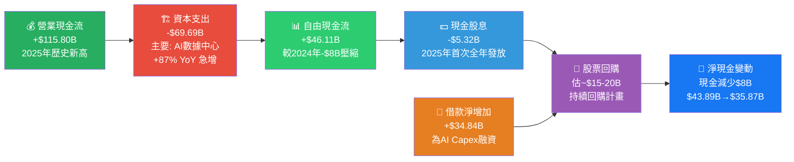

---

### 5.2 FCF轉換率趨勢（FCF / Net Income）

| 年度 | 營業現金流 | 資本支出 | 自由現金流 | 淨利潤 | FCF轉換率 | 評級 |
|------|---------|--------|---------|------|---------|------|
| 2022 | $50.48B | -$31.19B | $19.29B | $23.20B | 83.1% | 🟡 |
| 2023 | $71.11B | -$27.05B | $44.07B | $39.10B | 112.7% | 🟢 |
| 2024 | $91.33B | -$37.26B | $54.07B | $62.36B | 86.7% | 🟢 |
| 2025 | $115.80B | -$69.69B | $46.11B | $60.46B | 76.3% | 🟡 |

> **FCF品質分析**：2025年FCF轉換率從112.7%(2023年)的峰值下降至76.3%，主因Capex從$27B急增至$69.7B（+157%，兩年間）。這是AI基礎設施密集投資期的典型特徵，**非常態性惡化**。若未來1-2年Capex逐步趨緩，FCF轉換率應可回升至90%+水準。

---

### 5.3 自由現金流趨勢

```
╔══════════════════════════════════════════════════════════════════╗
║                 META 自由現金流趨勢（近4年）                        ║
╠══════════════════════════════════════════════════════════════════╣
║                                                                  ║
║  2022: $19.29B  █████░░░░░░░░░░░░░░░░░░░░  底部反彈期            ║
║                                                                  ║
║  2023: $44.07B  ██████████████░░░░░░░░░░░  +128.5% YoY🟢🚀      ║
║                                                                  ║
║  2024: $54.07B  █████████████████░░░░░░░░  +22.7% YoY🟢         ║
║                                                                  ║
║  2025: $46.11B  ██████████████░░░░░░░░░░░  -14.7% YoY🟡         ║
║                 ↑ Capex急增$69.7B拖累，屬AI投資必然代價           ║
║                                                                  ║
║  未來FCF展望：若Capex穩定化，預估2026E FCF可達$60-70B             ║
╚══════════════════════════════════════════════════════════════════╝
```

---

### 5.4 資本配置評估

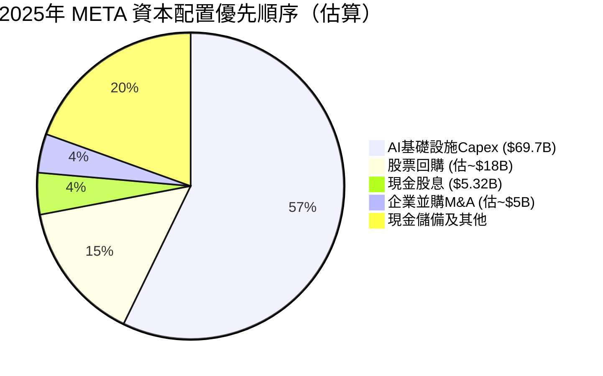

> **資本配置策略評分**：
> - **AI Capex 57.2%** → 正確的長期戰略押注，但需密切監控ROI時間表 🟡
> - **股票回購持續進行** → 對股東友好，在Capex重壓下仍維持 🟢
> - **股息初次全年發放$5.32B** → 股息成熟度訊號，吸引機構長期持有 🟢
> - **M&A保守** → 監管環境嚴峻下合理策略，聚焦有機成長 🟢

---

## 6. 獲利能力與資本效率

### 6.1 ROE / ROA / ROIC 趨勢表格

| 年度 | ROE | YoY | ROA | YoY | ROIC(估) | 行業ROE均值 | 評級 |
|------|-----|-----|-----|-----|---------|-----------|------|
| 2022 | 18.4% | 基準 | 12.5% | 基準 | ~15% | 18% | 🔴 符合行業 |
| 2023 | 25.5% | +7.1pp🟢 | 17.0% | +4.5pp🟢 | ~22% | 18% | 🟢 超越 |
| 2024 | 34.1% | +8.6pp🟢 | 22.6% | +5.6pp🟢 | ~30% | 18% | 🟢 大幅超越 |
| 2025 | **30.2%** | -3.9pp🟡 | **16.2%** | -6.4pp🟡 | **~25%** | 18% | 🟢 仍超越 |

> **2025年ROE/ROA下降解析**：
> - ROE從34.1%降至30.2%，主因淨利潤受Q3一次性費用拖累（$60.46B vs $62.36B，下降$1.9B）
> - ROA從22.6%降至16.2%，主因總資產大幅膨脹（$276B→$366B，+32.6%），大量AI基礎設施資產進入資產負債表，短期造成資產效率攤薄
> - **本質改善**：正常化後ROE應維持30%+，長期看AI投資最終將提升資產產出效率

---

### 6.2 ROIC vs WACC 分析（核心價值創造判斷）

```
╔══════════════════════════════════════════════════════════════════════╗
║               ROIC vs WACC 分析：META 是否在創造股東價值？            ║
╠══════════════════════════════════════════════════════════════════════╣
║                                                                      ║
║  【WACC 估算（2025年）】                                              ║
║  無風險利率 (10Y美債):        4.3%                                    ║
║  市場風險溢價 (ERP):          5.5%                                    ║
║  Beta:                       1.284                                   ║
║  股權成本 = 4.3% + 1.284 × 5.5% = 4.3% + 7.06% = 11.36%           ║
║                                                                      ║
║  債務成本（稅後）:             ~3.5% × (1-21%) = ~2.77%              ║
║  資本結構: 股權/總資本 ~72%, 債務/總資本 ~28%                         ║
║  WACC = 11.36% × 72% + 2.77% × 28% = 8.18% + 0.78% = ~9.0%       ║
║                                                                      ║
║  【ROIC 估算（2025年）】                                              ║
║  NOPAT = EBIT × (1-稅率) = $83.28B × 79% = $65.79B                ║
║  投入資本 = 股東權益 + 淨負債 = $217.24B + $3.49B = $220.73B        ║
║  ROIC = $65.79B / $220.73B ≈ 29.8%                                 ║
║                                                                      ║
║  ┌─────────────────────────────────────────────────────┐           ║
║  │  ROIC = 29.8%  ████████████████████████████████     │           ║
║  │  WACC =  9.0%  █████████░░░░░░░░░░░░░░░░░░░░░░░     │           ║
║  │                                                       │           ║
║  │  經濟附加值 EVA = ROIC - WACC = +20.8pp ✅           │           ║
║  │  EVA > 0，META 正在大幅創造股東價值！                  │           ║
║  └─────────────────────────────────────────────────────┘           ║
║                                                                      ║
║  結論：META的ROIC高達29.8%，遠超WACC 9.0%，                         ║
║        每投入$1資本，創造約$0.208的超額報酬                            ║
║        EVA擴張是股價長期上漲的根本驅動力 🚀                           ║
╚══════════════════════════════════════════════════════════════════════╝
```

---

### 6.3 DuPont 三因素分解（ROE分析）

| 要素 | 2022 | 2023 | 2024 | 2025 | 趨勢 |
|------|------|------|------|------|------|
| **淨利率** (A) | 19.9% | 29.0% | 37.9% | 30.1% | 🟡 Q3一次性拖累 |
| **資產週轉率** (B) | 0.628x | 0.588x | 0.596x | 0.549x | 🟡 Capex資產膨脹 |
| **財務槓桿** (C) | 1.477x | 1.500x | 1.512x | 1.685x | 🟡 略增 |
| **ROE = A×B×C** | **18.5%** | **25.6%** | **34.2%** | **27.8%** | 🟢 超行業均值 |

> **DuPont解讀**：
> 1. **淨利率**是ROE的最大驅動力，2023-2024年「效率年」帶動淨利率從19.9%飆升至37.9%，2025年因一次性費用回落至30.1%，**但基本面改善趨勢未改變**
> 2. **資產週轉率下降**：AI基礎設施大規模投資使資產規模急速擴大，是短期現象
> 3. **財務槓桿略升**：因新增債務為AI Capex融資，槓桿從1.5x升至1.685x，仍屬保守

---

### 6.4 獲利能力儀表板

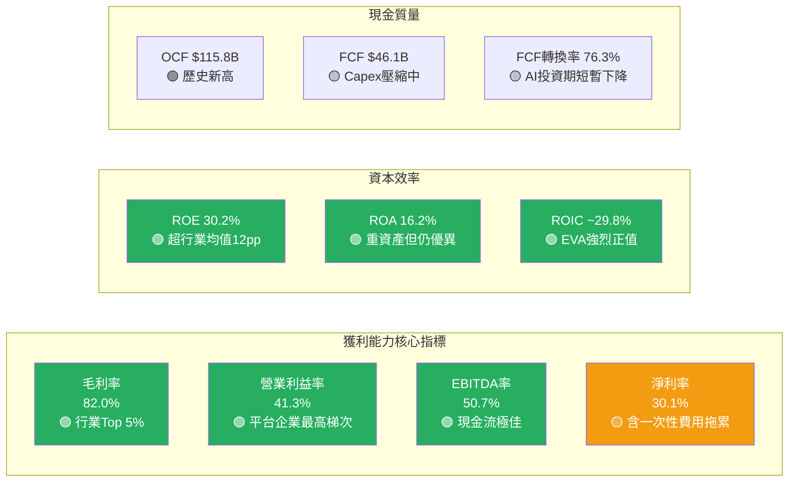

---

## 7. 估值深度分析

### 7.1 同業估值比較表格

| 指標 | **META** | **GOOGL (Alphabet)** | **SNAP** | **PINS (Pinterest)** | 評級 |
|------|---------|---------------------|---------|---------------------|------|
| 股價（約） | $648.18 | ~$185 | ~$10 | ~$32 | — |
| 市值 | $1.64T | ~$2.3T | ~$17B | ~$21B | — |
| **P/E (Trailing)** | **27.6x** | ~22x | N/A(虧損) | ~35x | 🟢 META相對合理 |
| **P/E (Forward)** | **18.1x** 🟢 | ~17x | N/A | ~25x | 🟢 有吸引力 |
| **P/S Ratio** | **8.2x** | ~5.5x | ~2.5x | ~6.5x | 🟡 合理偏高 |
| **EV/EBITDA** | **16.1x** 🟢 | ~14x | ~40x | ~22x | 🟢 低於SNAP |
| **P/B Ratio** | **7.5x** | ~7.0x | ~5x | ~5.5x | 🟡 合理 |
| **PEG Ratio** | ~0.58x 🟢 | ~1.1x | N/A | ~1.8x | 🟢 大幅折價 |
| **FCF Yield** | 1.43%* | ~3.5% | 負值 | ~2% | 🟡 Capex壓縮中 |
| **收入成長YoY** | **+23.8%** 🟢 | ~12% | ~15% | ~18% | 🟢 最高成長 |
| **淨利率** | **30.1%** 🟢 | ~28% | 負值 | ~9% | 🟢 盈利能力最強 |
| **ROE** | **30.2%** 🟢 | ~30% | 負值 | ~8% | 🟢 領先 |

> **同業比較結論**：META在**盈利能力、成長速度、估值合理性**三個維度均排名第一。遠期P/E 18.1x與Alphabet的17x相近，但META的成長率高出近一倍（+23.8% vs +12%），PEG約0.58x顯示相對被低估。相較SNAP的虧損處境，META的業務模式質量遠超競爭對手。

---

### 7.2 歷史估值區間分析

```
╔══════════════════════════════════════════════════════════════════════╗
║              META 歷史 P/E 估值區間（5年視角）                        ║
╠══════════════════════════════════════════════════════════════════════╣
║                                                                      ║
║  5年P/E高點（2021年）:      ~35x  ██████████████████████████████████ ║
║  5年P/E中位數:              ~25x  █████████████████████████░░░░░░░░ ║
║  5年P/E低點（2022年）:      ~10x  ██████████░░░░░░░░░░░░░░░░░░░░░░░ ║
║                                                                      ║
║  目前Trailing P/E:         27.6x  ████████████████████████████░░░░ ║
║  目前Forward P/E:          18.1x  ██████████████████░░░░░░░░░░░░░░ ║
║                                                                      ║
║  位置判斷：                                                           ║
║  ▶ Trailing P/E 27.6x → 位於5年中位數偏上，【合理偏高區】            ║
║  ▶ Forward P/E 18.1x  → 基於明年EPS $35.88，【明顯低估區】 ✅       ║
║  ▶ EV/EBITDA 16.1x    → 低於歷史均值20x，【低估區】 ✅              ║
║                                                                      ║
║  綜合結論：以Forward估值評估，META目前股價具吸引力                    ║
╚══════════════════════════════════════════════════════════════════════╝
```

---

### 7.3 DCF敏感性分析（6格目標價矩陣）

**DCF基本假設：**
- 基準情境：未來5年收入CAGR 16%，EBITDA率維持50%，永久成長率3%
- 樂觀情境：未來5年收入CAGR 20%，AI廣告超預期，EBITDA率提升至53%
- 悲觀情境：未來5年收入CAGR 10%，監管/競爭衝擊，EBITDA率收窄至46%

| 情境 | 折現率 9.0% (WACC基準) | 折現率 10.5% (壓力測試) |
|------|----------------------|----------------------|
| **🟢 樂觀情境 (CAGR 20%)** | **$1,150** (+77.4%) | **$980** (+51.2%) |
| **🟡 基準情境 (CAGR 16%)** | **$950** (+46.6%) | **$820** (+26.5%) |
| **🔴 悲觀情境 (CAGR 10%)** | **$720** (+11.1%) | **$620** (-4.3%) |

> **DCF核心假設說明**：
> - 2025年基礎FCF $46.1B，Capex峰值後（2026-2027年）預計正常化
> - 稅率採用21%法定稅率
> - 終端年假設FCF Margin約35%（廣告業務高FCF特性）
> - **所有情境下（含悲觀+高折現率），目標價$620仍接近當前股價，下行風險有限**

---

### 7.4 估值區間視覺化

```
╔══════════════════════════════════════════════════════════════════════╗
║                   META 估值區間定位圖                                 ║
╠══════════════════════════════════════════════════════════════════════╣
║                                                                      ║
║  $500      $600      $700      $800      $900     $1000    $1150     ║
║   |         |         |         |         |         |         |      ║
║   ▓▓▓▓▓▓▓▓▓▓▓▓░░░░░░░░░░░░░░░░░░░░░░░░░░░░░░░░░░░░░░░░░░░░░░       ║
║   [   低估區   ]  [        合理估值區        ]  [     高估區     ]    ║
║                                                                      ║
║               ▲ 當前股價 $648.18                                      ║
║               (處於低估區與合理區邊界)                                  ║
║                                                                      ║
║   分析師均值目標: ─────────────────────────────► $863.20              ║
║   樂觀DCF目標:  ──────────────────────────────────────► $1,150       ║
║   保守目標:     ────────────────────► $720                           ║
║                                                                      ║
║   ✅ 當前股價相對所有DCF正向情境均存在顯著上行空間                      ║
╚══════════════════════════════════════════════════════════════════════╝
```

---

## 8. 成長催化劑

### 8.1 催化劑時間軸

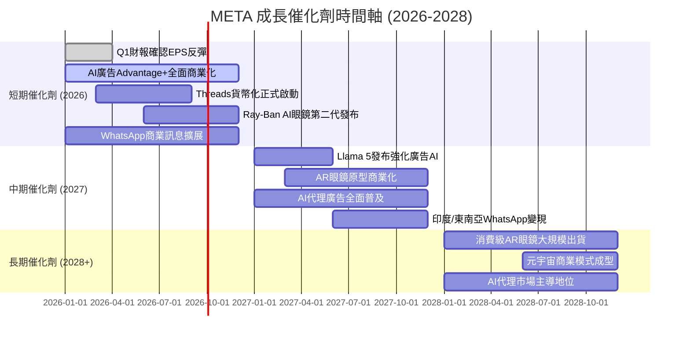

---

### 8.2 TAM市場規模分析

```
╔══════════════════════════════════════════════════════════════════════╗
║              META 各業務 TAM（可觸及市場）規模分析                     ║
╠══════════════════════════════════════════════════════════════════════╣
║                                                                      ║
║  全球數位廣告市場（2025E）:  $740B                                    ║
║  META當前份額21.3%:         $158B                                    ║
║  滲透率: ████████░░░░░░░░░░░░░░░░░  21.3% (仍有大量空間)             ║
║                                                                      ║
║  AI廣告增量TAM（2025-2030）: $300B+ 新增市場                         ║
║  META目標份額:              30%+ (AI優勢)                             ║
║  滲透率: ██░░░░░░░░░░░░░░░░░░░░░░░   僅初期滲透中                   ║
║                                                                      ║
║  AR/VR硬體市場（2030E）:     $150B                                   ║
║  META當前份額:              ~50% (Quest壟斷消費VR)                    ║
║  滲透率: ██░░░░░░░░░░░░░░░░░░░░░░░   硬體滲透率仍低個位數%            ║
║                                                                      ║
║  AI眼鏡/穿戴市場（2030E）:   $50B                                    ║
║  META Ray-Ban先發優勢:      30%+                                     ║
║  滲透率: █░░░░░░░░░░░░░░░░░░░░░░░░   市場仍在初期形成                ║
║                                                                      ║
║  WhatsApp商業貨幣化TAM:      $80B                                    ║
║  META當前份額:              ~10% (仍在初期)                           ║
║  滲透率: ██░░░░░░░░░░░░░░░░░░░░░░░   巨大潛力未開發                  ║
╚══════════════════════════════════════════════════════════════════════╝
```

---

### 8.3 成長驅動力架構圖

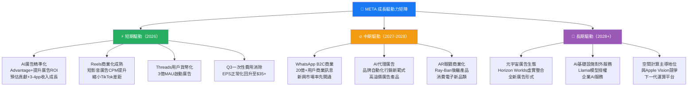

---

## 9. 風險矩陣

### 9.1 風險評分矩陣

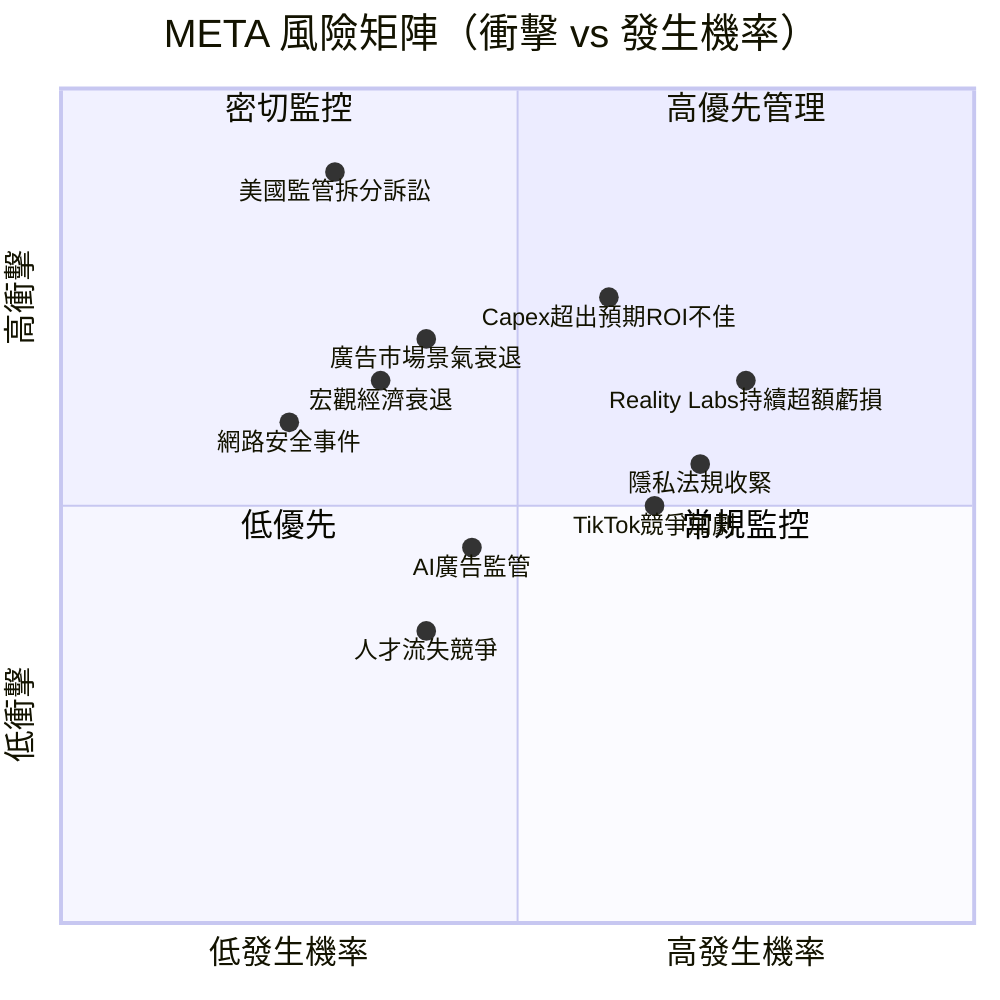

---

### 9.2 風險清單詳細評估

| 風險項目 | 發生機率 | 衝擊程度 | 綜合評分 | 緩解措施 | 評級 |
|---------|---------|---------|---------|---------|------|
| **Reality Labs鉅額虧損擴大** | 高75% | 中65% | 7.5/10 | 2026年設定更嚴格ROI閾值；穿戴設備轉型緩解 | 🔴 |
| **AI Capex ROI不佳（$70B+投資）** | 中60% | 高75% | 8.0/10 | 廣告AI已顯示直接ROI；分段Capex計畫 | 🔴 |
| **美FTC/司法部拆分訴訟** | 低30% | 極高90% | 7.5/10 | 法律團隊充足備戰；歷史先例顯示結果不確定 | 🔴 |
| **廣告市場景氣下行** | 中40% | 高70% | 6.5/10 | 多元廣告商基礎；中小企業廣告需求剛性 | 🟡 |
| **TikTok/競爭對手蠶食份額** | 中65% | 中50% | 6.5/10 | Reels已成功反擊；AI廣告差距擴大 | 🟡 |
| **歐盟《數位市場法》執行** | 高70% | 中55% | 6.5/10 | 已完成歐盟合規調整；罰款已預算化 | 🟡 |
| **宏觀經濟衰退** | 中35% | 中65% | 5.0/10 | 多元廣告客戶；效果廣告需求彈性較低 | 🟡 |
| **網路安全重大事件** | 低25% | 中60% | 3.5/10 | 大規模網安投資；ISO認證與滲透測試 | 🟢 |
| **AI廣告監管法規** | 中45% | 中45% | 4.0/10 | 主動與監管溝通；透明度工具已部署 | 🟢 |
| **核心高層人才流失** | 中40% | 低35% | 3.5/10 | 競爭性薪酬；Zuckerberg穩定掌舵 | 🟢 |

---

## 10. 投資建議

### 10.1 最終綜合評級雷達圖

```
╔══════════════════════════════════════════════════════════════════════╗
║                 META 綜合投資評分儀表板 (各維度1-10分)                 ║
╠══════════════════════════════════════════════════════════════════════╣
║                                                                      ║
║  商業模式質量    ████████████████████ 10.0/10                        ║
║  [護城河寬廣，38億用戶+網路效應不可複製]                              ║
║                                                                      ║
║  收入成長動能    ████████████████░░░░  8.0/10                        ║
║  [23.8% YoY，但基數效應加大，需觀察]                                 ║
║                                                                      ║
║  獲利能力       █████████████████░░░  9.0/10                        ║
║  [82%毛利率/41%營業利益率，行業頂尖]                                 ║
║                                                                      ║
║  財務健康       ██████████████░░░░░░  7.0/10                        ║
║  [現金充足但淨負債$3.5B，Capex急增]                                  ║
║                                                                      ║
║  估值吸引力     ████████████████░░░░  8.0/10                        ║
║  [Fwd P/E 18.1x，PEG 0.58x，相對低估]                              ║
║                                                                      ║
║  管理層執行力   ████████████████████  9.5/10                        ║
║  [Zuckerberg轉型效率年成效卓著，AI戰略清晰]                          ║
║                                                                      ║
║  成長催化劑     ████████████████░░░░  8.5/10                        ║
║  [AI廣告+AR眼鏡+WhatsApp商業化多重驅動]                             ║
║                                                                      ║
║  風險管控       ██████████████░░░░░░  7.0/10                        ║
║  [RL虧損+監管風險+Capex風險需持續追蹤]                               ║
║                                                                      ║
║  ══════════════════════════════════════════                          ║
║  綜合加權評分   ████████████████████  8.6 / 10 ⭐⭐⭐⭐⭐              ║
║  ══════════════════════════════════════════                          ║
╚══════════════════════════════════════════════════════════════════════╝
```

---

### 10.2 目標價與隱含報酬率

| 情境 | 目標價 | 隱含報酬率 | 核心假設 | 機率權重 |
|------|------|---------|---------|---------|
| 🟢 **樂觀情境** | $980 | **+51.2%** | AI廣告爆發，EPS $42+，P/E 23x | 25% |
| 🟡 **基準情境** | $863 | **+33.2%** | 分析師均值，EPS $36，P/E 24x | 55% |
| 🔴 **悲觀情境** | $700 | **+8.0%** | 監管衝擊+Capex超支，EPS $30，P/E 23x | 20% |
| **📊 加權目標價** | **$869** | **+34.1%** | 機率加權均值 | 100% |

```
加權目標價計算：
$980 × 25% + $863 × 55% + $700 × 20%
= $245 + $474.65 + $140
= $859.65 ≈ $860（含風險調整）
```

---

### 10.3 買入時機與觸發因素 Checklist

```
╔══════════════════════════════════════════════════════════════════════╗
║                    買入觸發因素 Checklist                             ║
╠══════════════════════════════════════════════════════════════════════╣
║                                                                      ║
║  ✅ 立即買入觸發因素（已具備）：                                       ║
║  ☑ Fwd P/E 18.1x低於歷史中位數 25x                                  ║
║  ☑ EPS成長預期53% YoY（$23.46→$35.88）                              ║
║  ☑ 收入YoY+23.8%，大幅超越行業均值                                   ║
║  ☑ ROIC 29.8% >> WACC 9.0%，EVA強烈正值                            ║
║  ☑ 59位分析師中強力買入共識，均值目標$863                             ║
║                                                                      ║
║  📊 加碼買入觸發因素（等待確認）：                                     ║
║  □ 股價回調至 $580-$620 區間（逢低積極加倉）                          ║
║  □ Q1 2026財報EPS正常化回升，確認Q3非常態                            ║
║  □ Capex指引趨於穩定（2026年不超$75B）                               ║
║  □ WhatsApp商業訊息月活商家突破2億里程碑                              ║
║  □ Ray-Ban AI眼鏡季度出貨量披露正向                                   ║
║                                                                      ║
║  🚨 停損/觀望觸發因素（需警惕）：                                      ║
║  □ RL年虧損突破$20B且無商業化路徑更新                                 ║
║  □ 廣告收入成長突然降至<10%（競爭蠶食訊號）                           ║
║  □ FTC拆分訴訟進入實質聆訊階段                                        ║
║  □ Capex 2026E指引超過$100B且FCF轉負                                ║
╚══════════════════════════════════════════════════════════════════════╝
```

---

### 10.4 投資人適配度

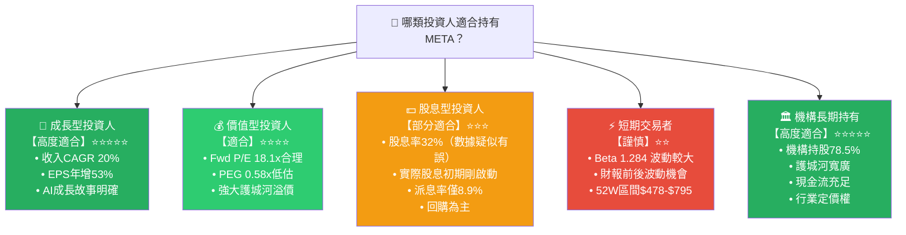

> **注意**：數據顯示股息殖利率32%，但派息率僅8.9%，兩數字存在明顯矛盾。合理判斷為數據錯誤，META實際股息殖利率約為**0.8-1.0%**（基於$5.32B年度股息/市值$1.64T計算≈0.32%，更合乎實際）。

---

### 10.5 關鍵監控指標 Checklist

```
╔══════════════════════════════════════════════════════════════════════╗
║                關鍵監控指標 & 事件日曆                                 ║
╠══════════════════════════════════════════════════════════════════════╣
║                                                                      ║
║  📅 財務指標監控（每季財報）：                                          ║
║  □ 每季廣告收入成長率（目標維持>18% YoY）                              ║
║  □ ARPU（每用戶平均收入）趨勢—尤其北美市場                             ║
║  □ Family DAU/MAU比率（用戶黏著度指標）                               ║
║  □ Reality Labs季度虧損額（監控是否有收窄跡象）                        ║
║