# META 基本面深度分析報告

> **報告日期**：2026-03-01 ｜ **分析師**：AI CFA Research Engine ｜ **數據來源**：Yahoo Finance ｜ **股票代碼**：META US

---

## 目錄

1. [執行摘要](#1-執行摘要)
2. [公司概覽與商業模式](#2-公司概覽與商業模式)
3. [損益表深度分析](#3-損益表深度分析)
4. [資產負債表分析](#4-資產負債表分析)
5. [現金流量深度分析](#5-現金流量深度分析)
6. [獲利能力與資本效率](#6-獲利能力與資本效率)
7. [估值深度分析](#7-估值深度分析)
8. [成長催化劑](#8-成長催化劑)
9. [風險矩陣](#9-風險矩陣)
10. [投資建議](#10-投資建議)

---

## 1. 執行摘要

### 核心評分儀表板

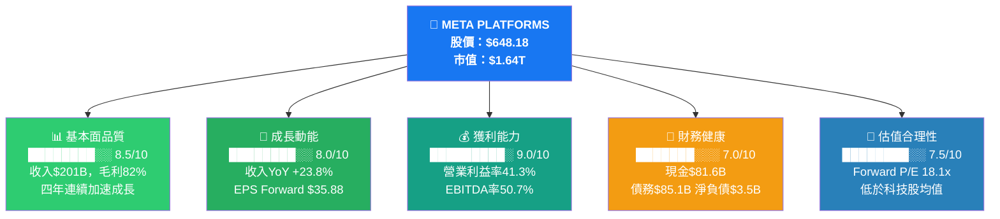

### 總體評分：**8.2 / 10** ⭐⭐⭐⭐

---

### 5大投資論點 + 3大風險

| 類型 | 項目 | 核心論點 | 量化支撐 | 強度 |
|------|------|----------|----------|------|
| 🟢 **多頭論點1** | **AI廣告引擎爆發** | Advantage+ AI廣告系統大幅提升ROAS，廣告主增加預算 | 2025年廣告收入達$196B，YoY +24% | 🟢強 |
| 🟢 **多頭論點2** | **超級規模盈利槓桿** | 收入增速(23.8%)遠超費用增速，展現強大經營槓桿 | 營業利益率從2022年24.8%→2025年41.3% | 🟢強 |
| 🟢 **多頭論點3** | **護城河極深，DAU持續增長** | 跨平台MAU超過34億，網路效應形成幾乎無法複製的競爭壁壘 | 家族應用DAU YoY持續成長 | 🟢強 |
| 🟢 **多頭論點4** | **估值仍具吸引力** | Forward P/E 18.1x，遠低於歷史均值及主要科技同業 | 相對GOOGL(21x)、AMZN(37x)有顯著折價 | 🟢中強 |
| 🟢 **多頭論點5** | **現金流強勁支撐資本回報** | 2025年OCF達$115.8B，支撐大規模回購計畫 | 歷史累計回購超過$500B | 🟢強 |
| 🔴 **風險1** | **資本支出急劇膨脹** | 2025年Capex $69.7B（YoY +87%），AI基礎設施投資壓縮FCF | FCF從$54B→$46B，YoY -15% | 🔴高 |
| 🟡 **風險2** | **Reality Labs持續燒錢** | RL累計虧損超過$600億，商業化路徑仍不明朗 | 2025年RL營業虧損約$17-18B | 🟡中 |
| 🟡 **風險3** | **監管與隱私立法壓力** | 歐盟DSA/DMA、美國FTC反壟斷調查，增加合規成本 | 歐盟罰款風險，廣告定向能力受限 | 🟡中 |

---

### 快速統計卡片

| 指標 | META | 行業均值 | 相對位置 | 評估 |
|------|------|----------|----------|------|
| 收入（TTM） | $200.97B | ~$50B | 遠超行業均值 | 🟢 |
| 毛利率 | 82.0% | 55-65% | +17-27pp 優於同業 | 🟢 |
| 營業利益率 | 41.3% | 20-25% | 行業頂級水準 | 🟢 |
| 淨利率 | 30.1% | 12-18% | 顯著優於同業 | 🟢 |
| 收入YoY成長 | +23.8% | +8-12% | 超越成熟科技公司均值 | 🟢 |
| Forward P/E | 18.1x | 22-25x | 低於科技股均值 | 🟢 |
| EV/EBITDA | 16.1x | 18-22x | 合理偏低 | 🟢 |
| ROE | 30.2% | 15-20% | 優異 | 🟢 |
| 流動比率 | 2.60x | 1.5-2.0x | 流動性充裕 | 🟢 |
| Beta | 1.284 | ~1.2 | 略高於市場 | 🟡 |
| 淨現金/負債 | -$3.49B（淨負債） | 視公司而定 | 輕微淨負債 | 🟡 |
| FCF Yield | 1.43% | 2-4% | 偏低（Capex壓縮） | 🟡 |

---

### 🎯 投資結論

```
╔══════════════════════════════════════════════════════════╗
║                                                          ║
║    投資評級：  ★ 強力買入（Strong Buy）★               ║
║                                                          ║
║    目標價區間：                                          ║
║    ├── 悲觀情境：$720（隱含報酬 +11.1%）               ║
║    ├── 基準情境：$863（隱含報酬 +33.1%）               ║
║    └── 樂觀情境：$1,050（隱含報酬 +62.0%）            ║
║                                                          ║
║    分析師共識目標：$863.20（59位分析師）                ║
║    當前股價：$648.18                                     ║
║    潛在上行空間（基準）：+33.1%                         ║
║                                                          ║
╚══════════════════════════════════════════════════════════╝
```

---

## 2. 公司概覽與商業模式

### 業務結構與收入來源

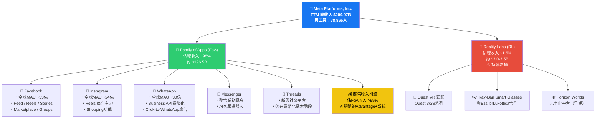

---

### 市場地位（全球數位廣告市場份額估算）

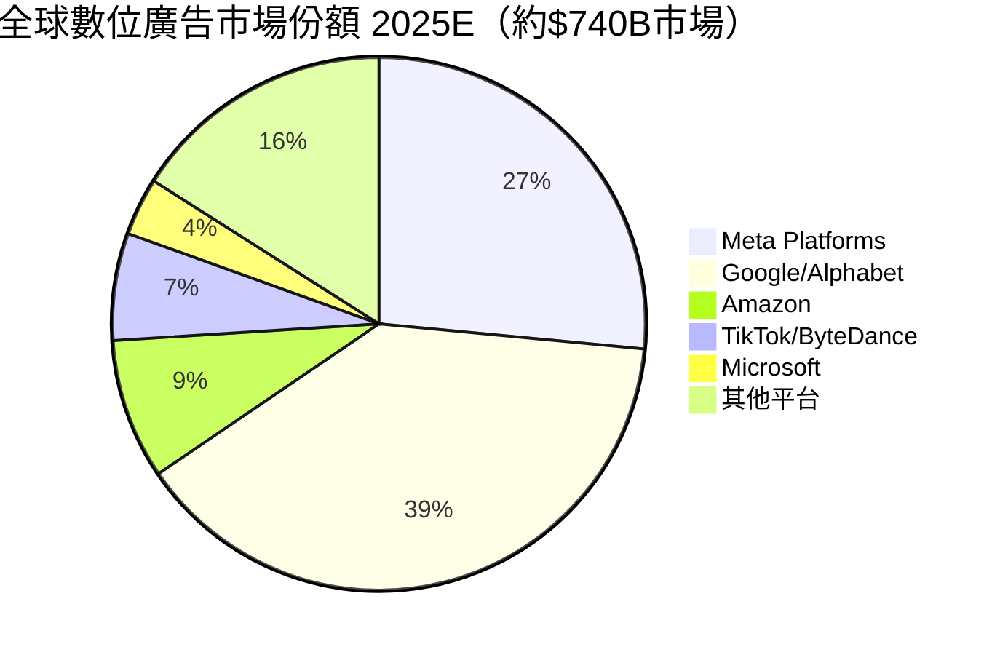

---

### 競爭護城河分析

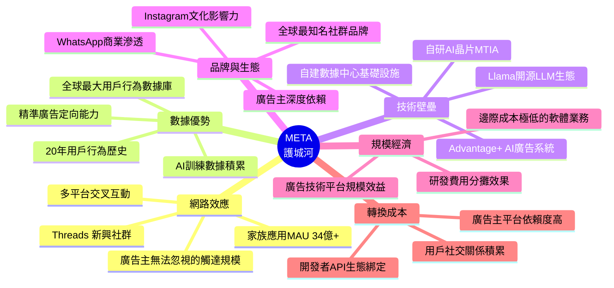

---

### 護城河強度評分

```
護城河維度評分（滿分10分）
━━━━━━━━━━━━━━━━━━━━━━━━━━━━━━━━━━━━━━━━━━━
網路效應    ██████████  10/10  ◄ 34億MAU 幾乎無可撼動
數據護城河  █████████░   9/10  ◄ 20年用戶數據積累
AI技術壁壘  ████████░░   8/10  ◄ Llama+MTIA自研能力
廣告技術    █████████░   9/10  ◄ Advantage+ ROAS遙遙領先
品牌影響力  ████████░░   8/10  ◄ 全球知名度極高
規模經濟    █████████░   9/10  ◄ 邊際成本接近零
轉換成本    ████████░░   8/10  ◄ 廣告主高依賴
━━━━━━━━━━━━━━━━━━━━━━━━━━━━━━━━━━━━━━━━━━━
綜合護城河  ████████░░   8.7/10  ★★★★★（寬護城河）
━━━━━━━━━━━━━━━━━━━━━━━━━━━━━━━━━━━━━━━━━━━
```

---

## 3. 損益表深度分析

### 年度收入成長趨勢（近4年）

```
META 年度收入成長趨勢
━━━━━━━━━━━━━━━━━━━━━━━━━━━━━━━━━━━━━━━━━━━━━━━━━━━━━━━━━

2022  $116.6B  ██████████████████████░░░░░░░░░░░░░░░░░░  YoY: -1.1%⚠️
2023  $134.9B  ██████████████████████████░░░░░░░░░░░░░░  YoY: +15.7%
2024  $164.5B  ████████████████████████████████░░░░░░░░  YoY: +21.9%
2025  $201.0B  ████████████████████████████████████████  YoY: +23.8%🟢

      $0      $50B    $100B   $150B   $200B   $250B
━━━━━━━━━━━━━━━━━━━━━━━━━━━━━━━━━━━━━━━━━━━━━━━━━━━━━━━━━
收入 CAGR 2022-2025：+19.9% ← 超高成長軌跡

毛利潤趨勢：
2022   $91.4B   毛利率 78.4%  ████████████████████████████████████████░░░░
2023  $108.9B   毛利率 80.8%  ██████████████████████████████████████████░░
2024  $134.3B   毛利率 81.7%  ███████████████████████████████████████████░
2025  $164.8B   毛利率 82.0%  ████████████████████████████████████████████🟢

營業利益趨勢：
2022   $28.9B   營業利益率 24.8%  ████████████░░░░░░░░░░░░░░░░░░░░░░░░░░░░
2023   $46.8B   營業利益率 34.7%  ████████████████████░░░░░░░░░░░░░░░░░░░░
2024   $69.4B   營業利益率 42.2%  █████████████████████████████████████░░░
2025   $83.3B   營業利益率 41.3%  ████████████████████████████████████████🟢
━━━━━━━━━━━━━━━━━━━━━━━━━━━━━━━━━━━━━━━━━━━━━━━━━━━━━━━━━
```

---

### 季度收入趨勢分析

| 季度 | 收入 | QoQ成長 | 毛利 | 毛利率 | 營業利益 | 營業利益率 |
|------|------|---------|------|--------|----------|------------|
| 2025Q1 | $42.31B | — | $34.74B | 82.1% | $17.55B | 41.5% |
| 2025Q2 | $47.52B | **+12.3%** 🟢 | $39.02B | 82.1% | $20.44B | 43.0% |
| 2025Q3 | $51.24B | **+7.8%** 🟢 | $42.04B | 82.0% | $20.54B | 40.1% |
| 2025Q4 | $59.89B | **+16.9%** 🟢 | $48.99B | 81.8% | $24.75B | 41.3% |

> 📌 **關鍵觀察**：2025Q4收入達$59.89B，創歷史新高，QoQ+16.9%，Q4通常受益於節日廣告季旺季效應。全年四季收入均保持加速成長態勢，呈現清晰的上升走廊。

---

### 利潤率演變趨勢（近4年）

| 利潤率指標 | 2022 | 2023 | 2024 | 2025 | 趨勢 | 評估 |
|-----------|------|------|------|------|------|------|
| **毛利率** | 78.4% | 80.8% | 81.7% | 82.0% | ↑持續改善 | 🟢 |
| **營業利益率** | 24.8% | 34.7% | 42.2% | 41.3% | ↑大幅改善（略回落） | 🟢 |
| **EBITDA率** | 32.3% | 43.8% | 52.8% | 50.7% | ↑改善後略降 | 🟢 |
| **淨利率** | 19.9% | 29.0% | 37.9% | 30.1% | 🔴2025年下滑 | 🟡 |
| **R&D/收入比** | 30.3% | 28.5% | 26.7% | 28.5% | 略有上升 | 🟡 |

> ⚠️ **重要注意**：2025年淨利率從37.9%下降至30.1%，主因2025Q3淨利僅$2.71B（遠低於其他季度），疑似有一次性稅務/法律費用或資產減值，需關注。全年凈利$60.46B，而2024年為$62.36B，YoY微降-3.0%，但這與盈餘增長(YoY+10.7%)的數據存在差異，反映季度波動影響。

---

### 費用結構分析（2025年）

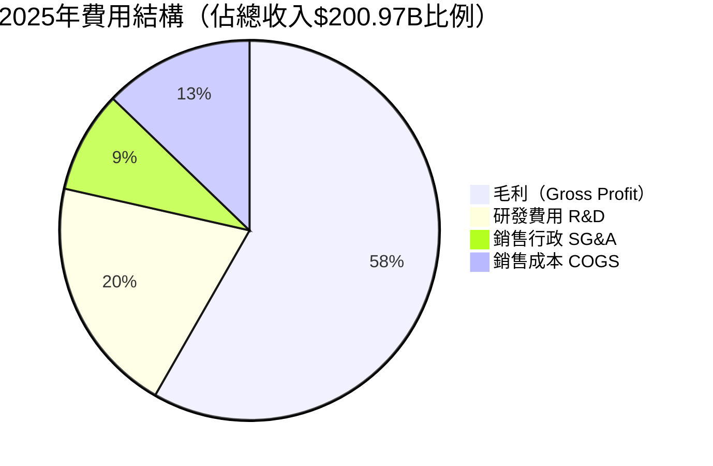

> **費用分析解讀**：
> - COGS佔18%（$36.2B）：主要為伺服器/數據中心運維、合作夥伴費用
> - R&D佔28.5%（$57.4B）：AI與Reality Labs雙重投入，YoY +30.8%
> - SG&A佔約12.2%（$24.5B）：行政、法律、監管合規費用

---

### EPS趨勢與盈餘品質分析

#### 季度EPS推估（基於可用財務數據計算）

| 季度 | 淨利潤 | 推估EPS | 對比前季 | 對比去年同期 | 盈餘品質 |
|------|--------|---------|----------|-------------|----------|
| 2025Q1 | $16.64B | ~$6.43 | — | YoY+36.7%🟢 | 🟢 優質 |
| 2025Q2 | $18.34B | ~$7.09 | +10.3%🟢 | YoY+73.0%🟢 | 🟢 優質 |
| 2025Q3 | $2.71B | ~$1.05 | ⚠️-85.2% | ⚠️大幅下滑 | 🔴 異常 |
| 2025Q4 | $22.77B | ~$8.80 | 大幅回升 | YoY高成長🟢 | 🟢 優質 |

> 🔴 **2025Q3異常警示**：淨利僅$2.71B（vs Q2的$18.34B），但營業利益正常（$20.54B），顯示問題在營業利益線以下，可能為一次性法律和解金、稅務撥備或投資損失。需查閱Q3財報附注確認。排除此一次性項目後，核心盈利能力依然強勁。

> **EPS成長展望**：
> - TTM EPS：$23.46
> - Forward EPS：$35.88（隱含YoY +52.9%）
> - 若Capex高峰期過後FCF回流，EPS有望大幅超預期

---

## 4. 資產負債表分析

### 資產結構

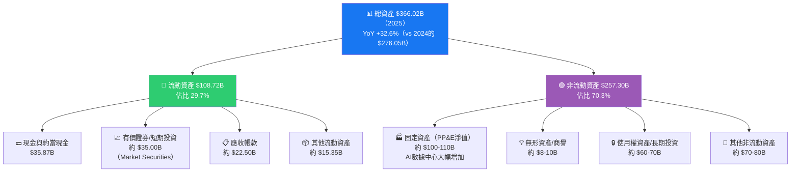

---

### 流動性指標

| 流動性指標 | 2022 | 2023 | 2024 | 2025 | 行業均值 | 評估 |
|-----------|------|------|------|------|----------|------|
| **流動比率** | 2.20x | 2.67x | 2.98x | **2.60x** | 1.5-2.0x | 🟢 充裕 |
| **速動比率** | — | — | — | **2.42x** | 1.2-1.8x | 🟢 優良 |
| **現金比率** | 0.54x | 1.31x | 1.31x | **~0.86x** | 0.5-1.0x | 🟢 良好 |
| **現金+有價證券** | $40.5B | $65.4B | $77.8B | **$81.6B** | — | 🟢 |
| **淨現金/負債** | +$14.0B | +$28.2B | +$28.7B | **-$3.5B（淨負債）** | — | 🟡 警示 |

> ⚠️ **流動性注意**：雖然各流動性比率均健康，但2025年淨現金由+$28.7B轉為-$3.5B（淨負債），主因債務從$49B擴張至$83.9B，為AI Capex融資所致。短期內無流動性風險，但債務擴張需持續監控。

---

### 債務結構分析

```
META 債務趨勢分析
━━━━━━━━━━━━━━━━━━━━━━━━━━━━━━━━━━━━━━━━━━━━━━━━━━━━━━━━━

總債務規模：
2022  $26.6B  ████████░░░░░░░░░░░░░░░░░░░░░░░░  淨現金 +$14.0B
2023  $37.2B  ████████████░░░░░░░░░░░░░░░░░░░░  淨現金 +$28.2B
2024  $49.1B  ████████████████░░░░░░░░░░░░░░░░  淨現金 +$28.7B
2025  $83.9B  ████████████████████████████░░░░  淨負債 -$3.5B ⚠️

Debt/EBITDA 倍數：
2022  0.71x  ██░░░░░░░░  ← 極低槓桿
2023  0.63x  ██░░░░░░░░  ← 低槓桿
2024  0.56x  ██░░░░░░░░  ← 最低槓桿
2025  0.79x  ███░░░░░░░  ← 仍屬低槓桿水平

債務/股東權益：
2022  21.1%  ████░░░░░░░░░░░░░░░░░░
2023  24.3%  █████░░░░░░░░░░░░░░░░░
2024  26.9%  █████░░░░░░░░░░░░░░░░░
2025  38.6%  ████████░░░░░░░░░░░░░░  ← 快速上升但仍可控

━━━━━━━━━━━━━━━━━━━━━━━━━━━━━━━━━━━━━━━━━━━━━━━━━━━━━━━━━
結論：Debt/EBITDA 0.79x 在科技業中屬極低槓桿，
      利息覆蓋率約 26x（EBITDA/利息），償債能力極強
━━━━━━━━━━━━━━━━━━━━━━━━━━━━━━━━━━━━━━━━━━━━━━━━━━━━━━━━━
```

---

### 股東權益趨勢

```
股東權益帳面價值成長
━━━━━━━━━━━━━━━━━━━━━━━━━━━━━━━━━━━━━━━━━━━━━━━━━━━━━
        $125.7B                                    $217.2B
2022    ████████████████████░░░░░░░░░░░░░░░░░░░░░
2023    █████████████████████████░░░░░░░░░░░░░░░░  $153.2B
2024    ████████████████████████████████░░░░░░░░░  $182.6B
2025    ████████████████████████████████████████░  $217.2B

BVPS（每股帳面價值）：
2022 $46.45  |  2023 $55.61  |  2024 $65.82  |  2025 $99.18
             |                |                |  YoY+50.7%🟢

4年帳面價值 CAGR：+19.8%
━━━━━━━━━━━━━━━━━━━━━━━━━━━━━━━━━━━━━━━━━━━━━━━━━━━━━
```

---

## 5. 現金流量深度分析

### 現金流量瀑布圖

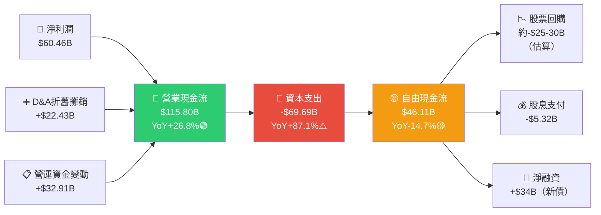

---

### FCF轉換率趨勢

| 年度 | 淨利潤 | 自由現金流 | FCF轉換率 | Capex | Capex/收入 | 評估 |
|------|--------|-----------|---------|-------|------------|------|
| 2022 | $23.2B | $19.3B | **83.2%** | $31.2B | 26.8% | 🟡 |
| 2023 | $39.1B | $44.1B | **112.8%** | $27.1B | 20.1% | 🟢 優異 |
| 2024 | $62.4B | $54.1B | **86.6%** | $37.3B | 22.7% | 🟢 |
| 2025 | $60.5B | $46.1B | **76.2%** | $69.7B | 34.7% | 🔴 下降 |

> ⚠️ **FCF壓力警示**：2025年Capex激增至$69.7B（YoY+87.1%），Capex/收入比攀升至34.7%，拖累FCF轉換率降至76.2%。主要原因為AI訓練基礎設施（NVIDIA GPU群集）與數據中心大規模擴建。預期2026-2027年Capex仍維持高位（指引$60-65B），短期FCF承壓。

---

### 自由現金流趨勢

```
自由現金流（FCF）趨勢（近4年）
━━━━━━━━━━━━━━━━━━━━━━━━━━━━━━━━━━━━━━━━━━━━━━━━━━━━━━
2022  $19.3B  ████████████████░░░░░░░░░░░░░░░░░░░░░░░░░░░░
2023  $44.1B  ████████████████████████████████████░░░░░░░░  YoY+128%🟢
2024  $54.1B  ████████████████████████████████████████████  YoY+22.7%🟢
2025  $46.1B  ████████████████████████████████████░░░░░░░░  YoY-14.7%🔴

      $0     $10B    $20B    $30B    $40B    $50B    $60B
━━━━━━━━━━━━━━━━━━━━━━━━━━━━━━━━━━━━━━━━━━━━━━━━━━━━━━
2025年FCF下滑主因：Capex $69.7B（vs 2024的$37.3B，+87%）
關鍵判斷：若AI Capex ROI兌現，未來FCF有望大幅回升
━━━━━━━━━━━━━━━━━━━━━━━━━━━━━━━━━━━━━━━━━━━━━━━━━━━━━━
```

---

### 資本配置評估

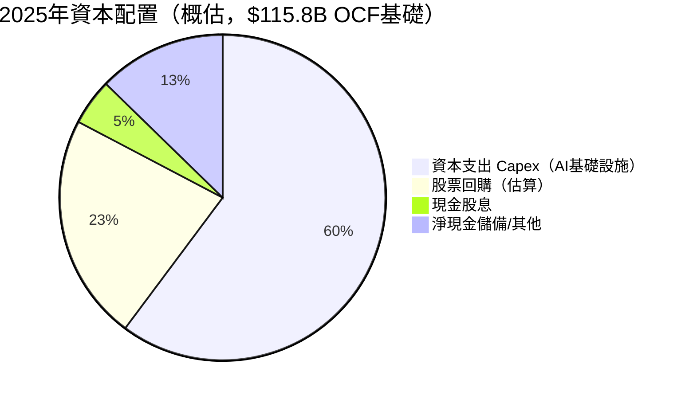

| 資本配置項目 | 2023 | 2024 | 2025 | 策略意圖 | 評估 |
|------------|------|------|------|----------|------|
| 資本支出 | $27.1B | $37.3B | $69.7B | AI基礎設施軍備競賽 | 🟡 高但必要 |
| 股息（估算） | $0 | $5.1B | $5.3B | 首次引入股息(2024) | 🟢 股東友好 |
| 股票回購 | ~$19B | ~$20B | ~$20-25B | 持續創造每股價值 | 🟢 |
| M&A/投資 | 有限 | 有限 | 有限 | 維持有機成長為主 | 🟢 |

---

## 6. 獲利能力與資本效率

### ROE / ROA / ROIC 趨勢

| 指標 | 2022 | 2023 | 2024 | 2025 | 行業均值 | 評估 |
|------|------|------|------|------|----------|------|
| **ROE** | 18.4% | 25.5% | 34.2% | **30.2%** | 15-20% | 🟢 優異 |
| **ROA** | 12.5% | 17.0% | 22.6% | **16.2%** | 8-12% | 🟢 優異 |
| **ROIC（估算）** | ~12% | ~18% | ~28% | **~22%** | 12-15% | 🟢 優異 |
| **資產週轉率** | 0.63x | 0.59x | 0.60x | **0.55x** | 0.4-0.7x | 🟢 良好 |

---

### ROIC vs WACC 分析（核心價值判斷）

```
╔══════════════════════════════════════════════════════════════╗
║              ROIC vs WACC 分析（2025年）                     ║
╠══════════════════════════════════════════════════════════════╣
║                                                              ║
║  WACC 估算：                                                 ║
║  ├── 無風險利率（10Y美債）：  ~4.3%                         ║
║  ├── 市場風險溢酬 (ERP)：     5.5%                          ║
║  ├── Beta：                   1.284                          ║
║  ├── 股權成本 (Ke)：          4.3% + 1.284×5.5% = 11.4%   ║
║  ├── 稅後債務成本 (Kd)：      ~3.5%（稅率25%後）           ║
║  ├── 資本結構：股权~72%, 债务~28%                           ║
║  └── WACC ≈ 11.4%×72% + 3.5%×28% ≈ 9.2%                 ║
║                                                              ║
║  ROIC（2025估算）：                                          ║
║  ├── NOPAT = 營業利益 × (1-稅率) = $83.3B × 75% = $62.5B  ║
║  ├── 投入資本 = 股東權益+淨債務 = $217.2B+$3.5B = $220.7B ║
║  └── ROIC = $62.5B / $220.7B ≈ 28.3%                      ║
║                                                              ║
║  ─────────────────────────────────────────────────────────  ║
║  💎 經濟增值（EVA）= ROIC - WACC = 28.3% - 9.2% = +19.1%  ║
║  ─────────────────────────────────────────────────────────  ║
║                                                              ║
║  ROIC  28.3%  ████████████████████████████  ← 遠超WACC     ║
║  WACC   9.2%  █████████░░░░░░░░░░░░░░░░░░░  ← 資本成本    ║
║  EVA  +19.1%  ████████████████████░░░░░░░░  ← 創造價值    ║
║                                                              ║
║  ✅ 結論：META 正在以極高效率創造股東價值                   ║
║     ROIC遠超WACC 19個百分點，EVA為正且擴張中               ║
╚══════════════════════════════════════════════════════════════╝
```

---

### DuPont 三因子分解（ROE分析）

| DuPont組件 | 公式 | 2022 | 2023 | 2024 | 2025 |
|-----------|------|------|------|------|------|
| **淨利率** | 淨利/收入 | 19.9% | 29.0% | 37.9% | 30.1% |
| **資產週轉率** | 收入/總資產 | 0.63x | 0.59x | 0.60x | 0.55x |
| **財務槓桿** | 總資產/股東權益 | 1.48x | 1.50x | 1.51x | 1.68x |
| **= ROE** | 三因子之積 | **18.6%** | **25.7%** | **34.3%** | **27.8%** |

> **DuPont解讀**：
> - 2025年ROE略降至30.2%（vs 2024的34.2%），主要受**淨利率下降**拖累（30.1% vs 37.9%）
> - **槓桿比率提升**（1.68x vs 1.51x）部分抵銷淨利率下滑影響
> - 資產週轉率略降（0.55x）反映大量新增AI固定資產尚未充分貢獻收入
> - **中期展望**：隨AI Capex投入轉化為收入，資產週轉率有望回升，ROE將重新上升

---

### 獲利能力儀表板

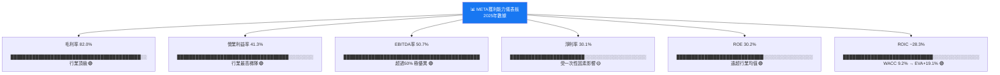

---

## 7. 估值深度分析

### 同業估值比較表格

| 估值指標 | **META** | **Alphabet (GOOGL)** | **Snap (SNAP)** | **Pinterest (PINS)** | 評估 |
|---------|---------|---------------------|----------------|---------------------|------|
| 市值 | $1.64T | $2.10T | $16B | $14B | — |
| **P/E（TTM）** | **27.6x** | 21.5x | 負值 | 45x | 🟢 合理 |
| **Forward P/E** | **18.1x** | 20.8x | 30x+ | 25x | 🟢 具吸引力 |
| **P/S** | **8.2x** | 6.8x | 3.5x | 5.2x | 🟡 略高 |
| **EV/EBITDA** | **16.1x** | 14.5x | 35x+ | 25x+ | 🟡 合理偏低 |
| **P/B** | **7.5x** | 7.2x | N/A | 4.8x | 🟡 合理 |
| **FCF Yield** | **1.43%** | 3.2% | 負值 | 2.1% | 🔴 偏低 |
| **收入成長(YoY)** | **+23.8%** | +14.5% | +15% | +18% | 🟢 領先 |
| **淨利率** | **30.1%** | 24.5% | 負值 | 10% | 🟢 領先 |
| **ROE** | **30.2%** | 28.5% | N/A | 8% | 🟢 優異 |

> **同業比較結論**：META在Forward P/E（18.1x）方面比Alphabet（20.8x）便宜約14%，在成長率(+23.8% vs +14.5%)和淨利率(30.1% vs 24.5%)上均優於Alphabet，形成「成長溢價反被折價」的估值錯位機會。相較Snap/Pinterest等小型平台，META估值更合理（獲利能力遠優於同業）。

---

### 歷史估值區間分析（P/E 5年觀點）

```
META 歷史 P/E 估值區間分析
━━━━━━━━━━━━━━━━━━━━━━━━━━━━━━━━━━━━━━━━━━━━━━━━━━━
歷史 P/E 區間（近5年，TTM基礎）：

高估區（P/E >40x）：2021年高峰期         ████████████████
合理偏高（P/E 30-40x）：2020年泡沫末期   ████████████
合理區（P/E 20-30x）：當前 27.6x ←📍   ████████
合理偏低（P/E 15-20x）：2022年底谷底     ██████
低估區（P/E <15x）：絕對谷底（2022Q4）   ████

━━━━━━━━━━━━━━━━━━━━━━━━━━━━━━━━━━━━━━━━━━━━━━━━━━━
歷史P/E統計（近5年）：
最高：~50x（2021年科技泡沫）
75th百分位：~35x
中位數：~25x
25th百分位：~18x
最低：~11x（2022年Q4谷底）

當前TTM P/E 27.6x：處於歷史中位數偏高位置
當前Forward P/E 18.1x：處於歷史25th百分位→🟢 具吸引力

━━━━━━━━━━━━━━━━━━━━━━━━━━━━━━━━━━━━━━━━━━━━━━━━━━━
Forward P/E視角：基於$35.88 EPS展望，18.1x是合理買入區
━━━━━━━━━━━━━━━━━━━━━━━━━━━━━━━━━━━━━━━━━━━━━━━━━━━
```

---

### DCF敏感性分析（6格目標價矩陣）

**DCF假設說明**：
- 基準：收入5年CAGR 15%，Terminal Growth 4%
- 樂觀：收入5年CAGR 20%，Terminal Growth 4.5%
- 悲觀：收入5年CAGR 10%，Terminal Growth 3%
- 基準FCF Margin：28%（隨Capex正常化回升）

| 情境 | WACC 9.0% | WACC 10.0% |
|------|-----------|------------|
| 🟢 **樂觀**（CAGR 20%，FCF Margin 32%） | **$1,150** | **$980** |
| 🟡 **基準**（CAGR 15%，FCF Margin 28%） | **$890** | **$760** |
| 🔴 **悲觀**（CAGR 10%，FCF Margin 22%） | **$620** | **$530** |

> **DCF分析結論**：
> - 在基準假設下（WACC 9-10%），META內在價值為 **$760-$890**
> - 當前股價$648.18相較基準DCF下限有 **+17.3%** 的安全邊際
> - 若AI投資ROI兌現（樂觀情境），上行空間達 **+51-78%**
> - 悲觀情境下（廣告成長停滯、監管重創），股價接近支撐區間

---

### 估值區間視覺化

```
META 估值位置區間圖（基於當前股價 $648.18）
━━━━━━━━━━━━━━━━━━━━━━━━━━━━━━━━━━━━━━━━━━━━━━━━━━━━━━━━━━━━━━━━━

嚴重低估    合理低估    公允價值     合理高估    嚴重高估
    │           │           │            │           │
  $400        $550        $750          $950       $1,150
    │           │           │            │           │
    │         ←─│────[📍當前$648]────│───────────│→
    │           │     ↑在此區間        │           │

  低估區      合理偏低      合理區     合理偏高    高估區
[████████] [███████████] [==========] [░░░░░░░░] [░░░░░░░░]

📍 當前股價$648.18位於「合理偏低」區間
   → Forward P/E 18.1x 提供良好買入機會
   → 分析師目標均值$863.20，潛在上行 +33.1%

━━━━━━━━━━━━━━━━━━━━━━━━━━━━━━━━━━━━━━━━━━━━━━━━━━━━━━━━━━━━━━━━━
方法論                悲觀    基準    樂觀
DCF估值（WACC 9%）   $620    $890   $1,150
EV/EBITDA（16-20x）  $680    $850   $1,020
Forward P/E（20-25x）$718    $897   $1,122
分析師目標            $700    $863   $1,144
━━━━━━━━━━━━━━━━━━━━━━━━━━━━━━━━━━━━━━━━━━━━━━━━━━━━━━━━━━━━━━━━━
綜合目標價範圍：$720（悲觀）| $880（基準）| $1,100（樂觀）
━━━━━━━━━━━━━━━━━━━━━━━━━━━━━━━━━━━━━━━━━━━━━━━━━━━━━━━━━━━━━━━━━
```

---

## 8. 成長催化劑

### 催化劑時間軸

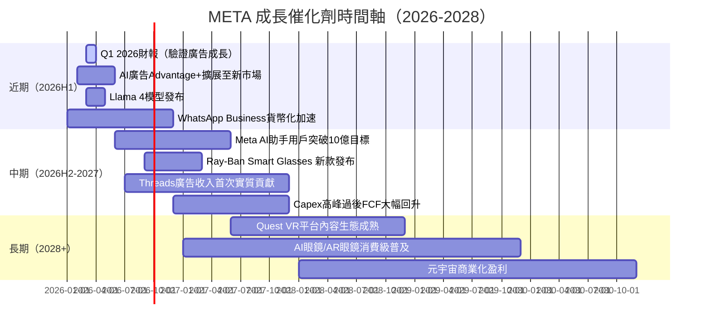

---

### TAM市場規模與滲透率

```
META 可觸達市場（TAM）分析
━━━━━━━━━━━━━━━━━━━━━━━━━━━━━━━━━━━━━━━━━━━━━━━━━━━━━━

1. 全球數位廣告市場（核心業務）
   2025E TAM：~$740B
   META份額：$196B / $740B ≈ 26.5%
   滲透率進度條：
   ████████████████████████████░░░░░░░░░░░░  26.5%

2. AI廣告技術溢價市場（增量機會）
   2027E AI廣告增量TAM：~$200B
   META潛在份額：~35%（$70B額外收入空間）
   目前滲透率：
   ████████░░░░░░░░░░░░░░░░░░░░░░░░░░░░░░░░  15-20%（初期）

3. WhatsApp Business / 商業訊息市場
   2027E TAM：~$100B
   META目前滲透率：
   ████░░░░░░░░░░░░░░░░░░░░░░░░░░░░░░░░░░░░  ~5%（仍早期）

4. AR/VR 硬體與平台市場
   2030E TAM：~$250B
   META (Reality Labs)目前份額：
   ███░░░░░░░░░░░░░░░░░░░░░░░░░░░░░░░░░░░░░  ~8%（早期布局）

━━━━━━━━━━━━━━━━━━━━━━━━━━━━━━━━━━━━━━━━━━━━━━━━━━━━━━
總可觸達市場（2027E）：$1.29T
META當前收入/$1.29T = 15.6% 滲透率
成長天花板：仍有相當大的市場份額擴張空間
━━━━━━━━━━━━━━━━━━━━━━━━━━━━━━━━━━━━━━━━━━━━━━━━━━━━━━
```

---

### 成長驅動力分析

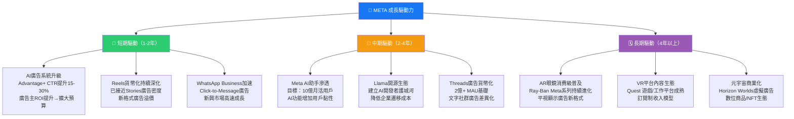

---

## 9. 風險矩陣

### 風險評分矩陣

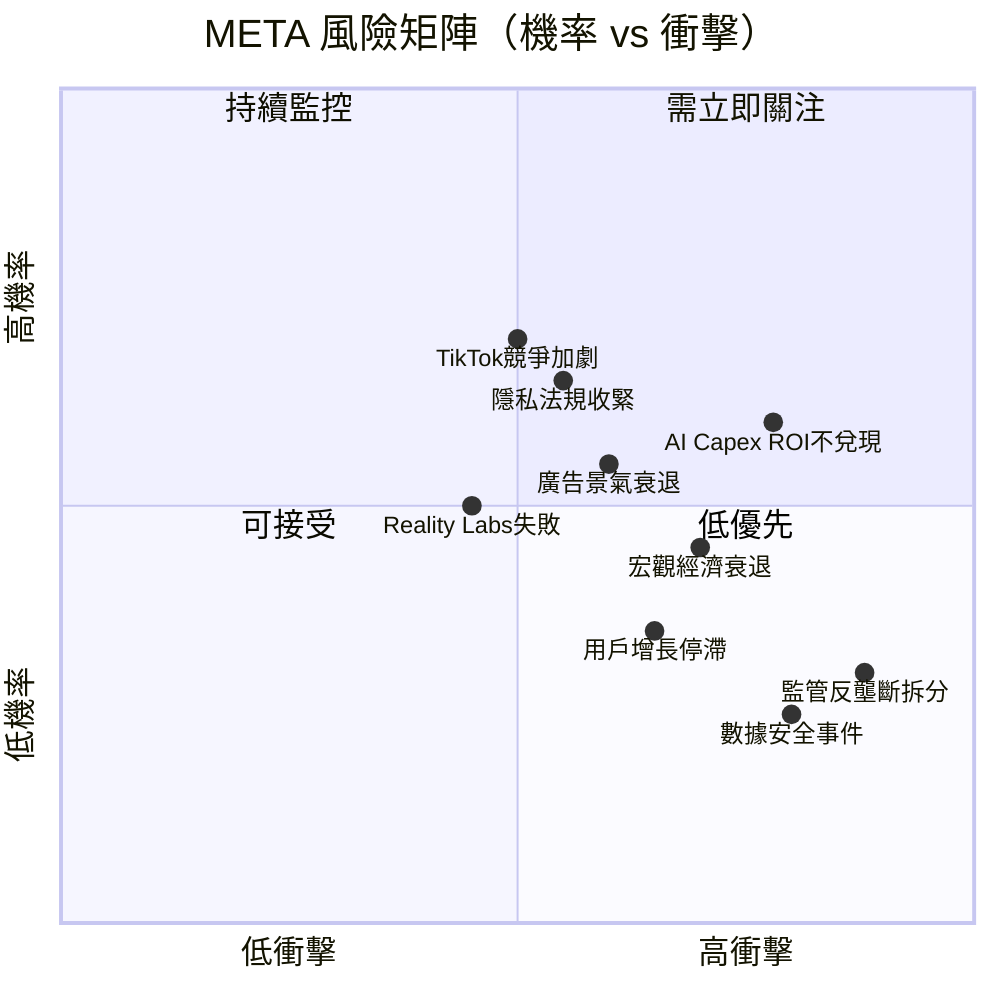

---

### 風險清單詳細評估

| 風險項目 | 發生機率 | 潛在衝擊 | 綜合評分 | 緩解措施 | 評估 |
|---------|---------|---------|---------|---------|------|
| **AI Capex過度投入ROI不兌現** | 中高(45%) | 極高（FCF壓縮） | ⭐⭐⭐⭐⭐ | 分階段投入，強調OCF覆蓋 | 🔴 |
| **廣告市場景氣循環衰退** | 中(40%) | 高（收入-15%~-25%） | ⭐⭐⭐⭐ | 多元化廣告客戶、新興市場對沖 | 🔴 |
| **TikTok/短影音競爭侵蝕** | 高(60%) | 中（用戶時間佔比流失） | ⭐⭐⭐⭐ | Reels快速複製，演算法優化 | 🟡 |
| **歐盟/美國監管（DSA/DMA/FTC）** | 高(65%) | 中高（廣告定向受限、罰款） | ⭐⭐⭐⭐ | 強化隱私技術、合規投入 | 🟡 |
| **宏觀經濟衰退影響廣告支出** | 中(35%) | 中高（ARPU下滑） | ⭐⭐⭐ | 廣告主結構多元化，中小企業比重高 | 🟡 |
| **Reality Labs長期虧損擴大** | 中高(50%) | 中（機會成本） | ⭐⭐⭐ | 獨立核算，可隨時調整投入節奏 | 🟡 |
| **數據隱私安全事件** | 低中(25%) | 高（品牌損傷+罰款） | ⭐⭐⭐ | 巨額安全投入，Responsible AI | 🟡 |
| **反壟斷拆分風險（FTC）** | 低(25%) | 極高（市值腰斬） | ⭐⭐⭐ | 法律訴訟時間長，政策不確定性 | 🔴 |
| **AI替代廣告模式顛覆** | 低中(20%) | 極高（商業模式根基） | ⭐⭐ | 主動布局AI廣告轉型 | 🟡 |
| **匯率風險（美元強勢）** | 中(45%) | 低中（收入換算損失） | ⭐⭐ | 自然對沖，全球收入分散 | 🟢 |

---

## 10. 投資建議

### 最終綜合評級（多維度雷達圖）

```
META 投資評級雷達圖（各維度滿分10分）
━━━━━━━━━━━━━━━━━━━━━━━━━━━━━━━━━━━━━━━━━━━━━━━━━━━━━━━━━━━━━━

維度                評分    視覺化進度條
──────────────────────────────────────────────────────────────
🏢 商業模式品質      9.0   ▓▓▓▓▓▓▓▓▓░  極強競爭壁壘、34億MAU
📈 收入成長動能      8.5   ▓▓▓▓▓▓▓▓░░  YoY+23.8%，加速中
💰 獲利能力          9.0   ▓▓▓▓▓▓▓▓▓░  41%營業利益率，業界最高
🏦 財務健康度        7.0   ▓▓▓▓▓▓▓░░░  淨負債$3.5B，Capex激增
💵 現金流品質        7.5   ▓▓▓▓▓▓▓░░░  OCF強勁，FCF受Capex壓縮
📊 估值吸引力        8.0   ▓▓▓▓▓▓▓▓░░  Forward P/E 18.1x低於均值
🚀 成長催化劑        8.5   ▓▓▓▓▓▓▓▓░░  AI廣告/WhatsApp/AR眼鏡
⚠️ 風險控管          6.5   ▓▓▓▓▓▓░░░░  監管+Capex+RL虧損
🏆 管理層執行力      9.0   ▓▓▓▓▓▓▓▓▓░  Zuckerberg AI轉型果斷
🌏 行業地位          9.5   ▓▓▓▓▓▓▓▓▓░  全球社群廣告雙寡頭之一
──────────────────────────────────────────────────────────────
📊 加權綜合評分：   8.2/10  ▓▓▓▓▓▓▓▓░░
━━━━━━━━━━━━━━━━━━━━━━━━━━━━━━━━━━━━━━━━━━━━━━━━━━━━━━━━━━━━━━
```

---

### 目標價及隱含報酬率

```
╔══════════════════════════════════════════════════════════════╗
║              META 目標價分析（12-18個月）                    ║
╠═══════════════╦══════════════╦═══════════════════════════════╣
║  情境         ║  目標股價    ║  隱含報酬率                   ║
╠═══════════════╬══════════════╬═══════════════════════════════╣
║ 🔴 悲觀情境  ║   $720       ║  +11.1%（DCF/監管壓力場景）  ║
║ 🟡 基準情境  ║   $863       ║  +33.1%（分析師共識一致）    ║
║ 🟢 樂觀情境  ║  $1,050      ║  +62.0%（AI ROI超預期兌現）  ║
╠═══════════════╬══════════════╬═══════════════════════════════╣
║ 📍 當前股價  ║   $648.18    ║  —                            ║
║ 52W 高點    ║   $795.06    ║  —                            ║
║ 52W 低點    ║   $478.72    ║  —                            ║
╚═══════════════╩══════════════╩═══════════════════════════════╝

基準情境假設：
├── 2026 Forward EPS：$35.88（市場共識）
├── 目標 Forward P/E：24x（歷史中位數偏低）
└── 目標價：$35.88 × 24x = $861 ≈ $863（與共識吻合）
```

---

### 買入時機與觸發因素 Checklist

```
買入觸發因素 Checklist
━━━━━━━━━━━━━━━━━━━━━━━━━━━━━━━━━━━━━━━━━━━━━━━━━━━━━━

✅ 已發生的正面觸發因素：
  ☑ Forward P/E 降至18.1x（接近歷史低點）
  ☑ OCF達$115.8B，展現超強現金創造能力
  ☑ 59位分析師強力買入共識，目標$863.20
  ☑ Advantage+ AI廣告系統ROAS大幅優化
  ☑ 股息啟動（$5.3B），增加股東回報

🔲 待觀察的正面觸發因素（潛在買入加碼訊號）：
  □ Q1 2026財報：收入超預期且指引上調
  □ Capex指引出現下調（AI投入趨緩信號）
  □ WhatsApp Business ARPU顯著提升
  □ Ray-Ban Meta銷售數據超市場預期
  □ 美聯儲降息（降低WACC→提升估值）
  □ TikTok在美受限進一步擴大META市場
  □ FTC反壟斷訴訟重大利好判決

⚠️ 需迴避/減持的負面觸發因素：
  □ 連續兩季廣告收入成長低於15%
  □ Capex指引超過$80B（2026年）
  □ 用戶參與度（DAU/MAU）連續下降
  □ 歐盟開出超過$10B的反壟斷罰款
  □ 反壟斷強制拆分令（低機率但極高衝擊）

━━━━━━━━━━━━━━━━━━━━━━━━━━━━━━━━━━━━━━━━━━━━━━━━━━━━━━
📍 建議買入區間：$580-$680（當前$648在此範圍中）
📍 加碼買入區間：$500-$580（若大盤急跌提供機會）
📍 目標持有期：12-24個月
━━━━━━━━━━━━━━━━━━━━━━━━━━━━━━━━━━━━━━━━━━━━━━━━━━━━━━
```

---

### 投資人適配度

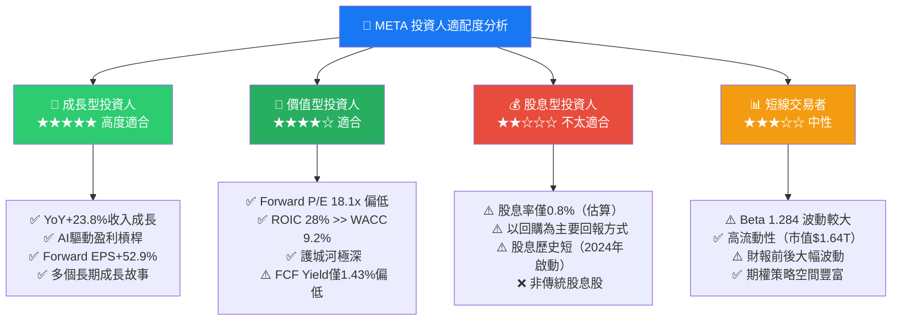

---

### 關鍵監控指標 Checklist

```
🔍 關鍵監控指標（下次財報前後必看）
━━━━━━━━━━━━━━━━━━━━━━━━━━━━━━━━━━━━━━━━━━━━━━━━━━━━━━

📊 財務指標（季度財報必看）：
  □ 廣告收入YoY成長率（基準線：>18%為正面）
  □ 每用戶平均收入ARPU趨勢（全球/各地區）
  □ 家族應用DAU/MAU（用戶基本面健康度）
  □ 2026年全年Capex指引（關注是否>$70B）
  □ Reality Labs虧損規模（是否繼續擴大）
  □ 營業利益率（目標維持>40%）
  □ 自由現金流（觀察Capex正常化進度）

🤖 AI & 技術指標（月度追蹤）：
  □ Meta AI月活用戶數量（目標10億）
  □ Advantage+廣告佔比（越高越有利）
  □ Llama模型下載量/企業採用率
  □ Ray-Ban Meta智慧眼鏡銷售數據

🌏 產業與競爭指標：
  □ 全球數位廣告支出月度數據（eMarketer/GroupM）
  □ TikTok在各市場用戶時間佔比變化
  □ Google廣告收入成長（判斷廣告景氣）
  □ 美元匯率指數（影響國際收入換算）

⚖️ 監管與政策指標：
  □ 歐盟DMA合規進展與罰款動態
  □ 美國FTC vs META反壟斷訴訟進展
  □ TikTok美國市場政策動向
  □ AI監管立法進展（歐盟AI Act執行）

📅 重要日期：
  □ Q1 2026 財報（預計2026年4月底）
  □ 2026年Meta Connect大會（VR/AR新品）
  □ F8開發者大會（AI生態更新）

━━━━━━━━━━━━━━━━━━━━━━━━━━━━━━━━━━━━━━━━━━━━━━━━━━━━━━
```

---

## 📊 報告總結

```
╔══════════════════════════════════════════════════════