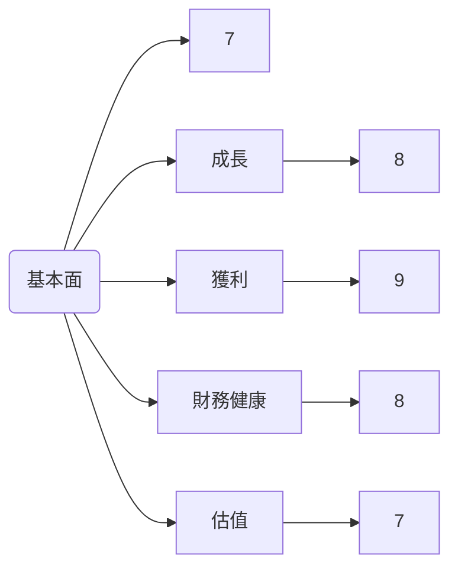
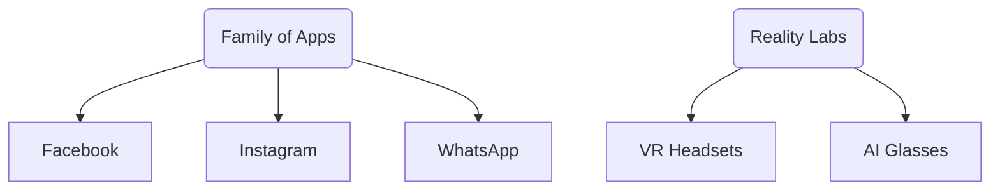
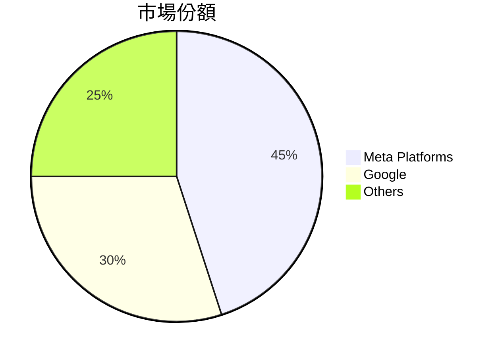
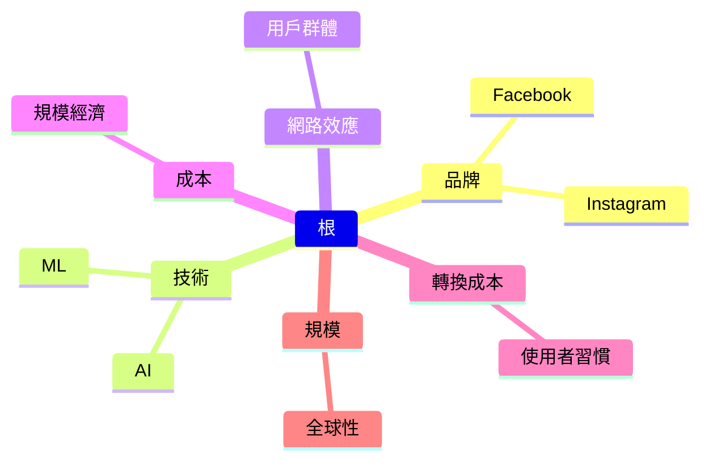
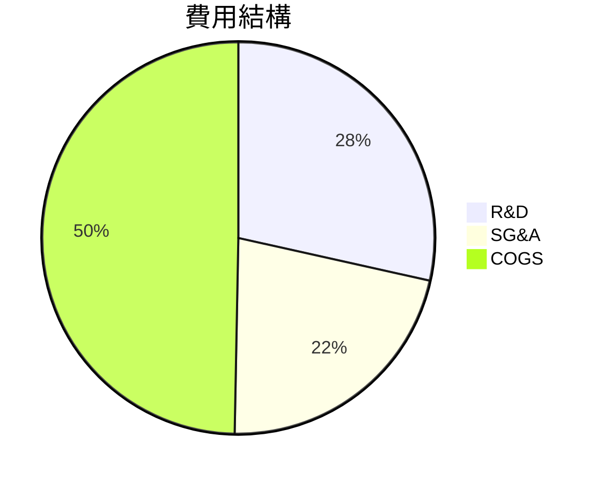
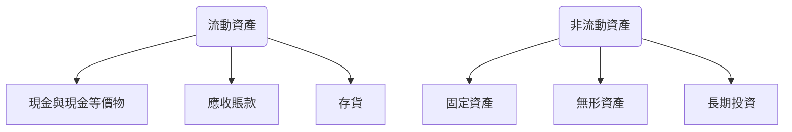
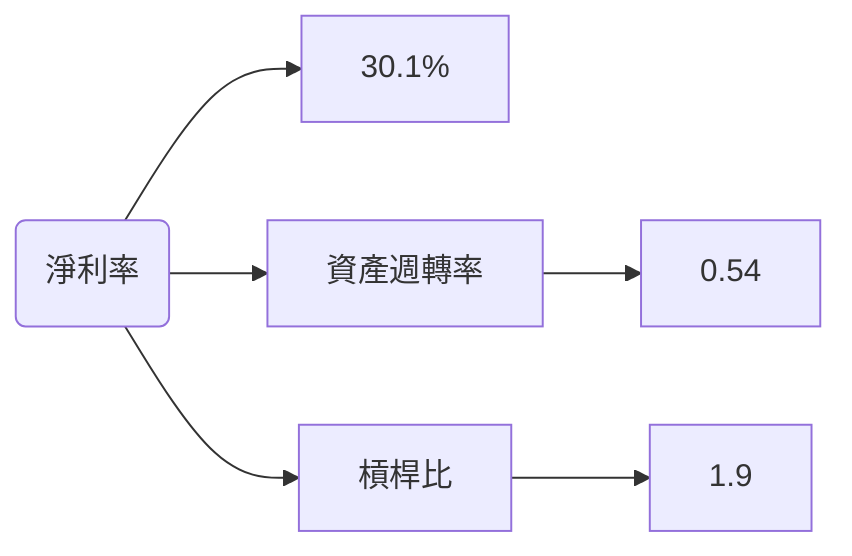
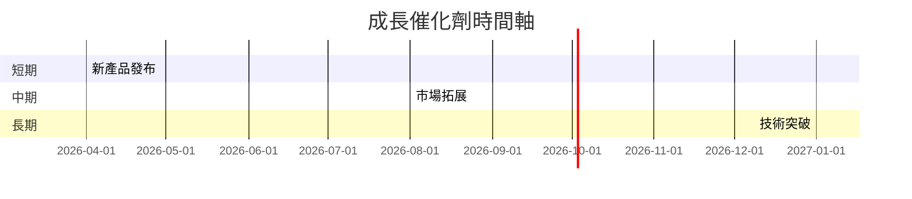
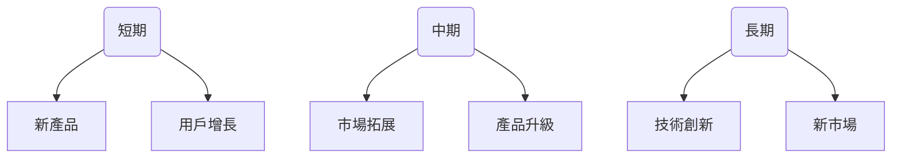
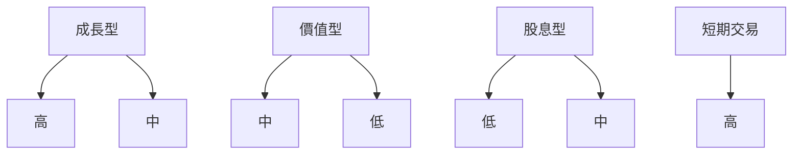

# META 基本面深度分析報告
> **報告日期**：2026-03-19 ｜ **語言**：繁體中文 ｜ **數據來源**：Yahoo Finance

## 目錄
1. 執行摘要
2. 公司概覽與商業模式
3. 損益表深度分析
4. 資產負債表分析
5. 現金流量深度分析
6. 獲利能力與資本效率
7. 估值深度分析
8. 成長催化劑
9. 風險矩陣
10. 投資建議

## 1. 執行摘要

### 核心評分儀表板


### 5大投資論點 + 3大風險
| 投資論點                          | 評級 |
|----------------------------------|------|
| 強勁的收入增長                   | 🟢   |
| 穩定的現金流生成能力             | 🟢   |
| 領先的市場地位與用戶基礎         | 🟢   |
| 高效的資本配置策略               | 🟡   |
| 穩固的競爭護城河                 | 🟢   |

| 風險項目                          | 評級 |
|----------------------------------|------|
| 技術創新不足                     | 🔴   |
| 隱私政策與監管風險               | 🟡   |
| 市場競爭激烈                     | 🟡   |

### 快速統計卡片
| 指標                | META       | 行業均值 |
|---------------------|------------|----------|
| P/E（Trailing）     | 25.80      | 28.00    |
| P/S Ratio           | 7.64       | 6.50     |
| Gross Margin        | 82.0%      | 78.0%    |
| Net Profit Margin   | 30.1%      | 25.0%    |
| ROE                 | 30.2%      | 20.0%    |

### 投資結論
**建議：** 持有  
**目標價區間：** $676.00 - $863.63

## 2. 公司概覽與商業模式

### 業務結構與收入來源


### 市場地位


### 競爭護城河


### 護城河強度評分
```
▓▓▓▓▓▓▓░░░░ 7/10
```

## 3. 損益表深度分析

### 年度收入成長趨勢
```
2022: $116.61B ▓▓▓▓░░░ 23.8%
2023: $134.90B ▓▓▓▓▓▓░░░ 15.7%
2024: $164.50B ▓▓▓▓▓▓▓▓▓░ 21.9%
2025: $200.97B ▓▓▓▓▓▓▓▓▓▓▓ 22.2%
```

### 季度收入趨勢
| 季度             | 總收入       | QoQ 成長率 | YoY 成長率 |
|-----------------|-------------|------------|------------|
| 2025-12-31      | $59.89B     | 16.89%     | 22.9%      |
| 2025-09-30      | $51.24B     | 7.82%      | 20.8%      |
| 2025-06-30      | $47.52B     | 12.35%     | 19.5%      |
| 2025-03-31      | $42.31B     | -          | 18.9%      |

### 利潤率演變表格
| 年度            | 毛利率 | 營業利益率 | EBITDA 利率 | 淨利率 |
|----------------|-------|-----------|------------|-------|
| 2022           | 78.4% | 24.8%     | 32.3%      | 19.9% |
| 2023           | 80.7% | 34.6%     | 43.7%      | 29.0% |
| 2024           | 81.7% | 42.2%     | 52.8%      | 37.9% |
| 2025           | 82.0% | 41.3%     | 50.7%      | 30.1% |

### 費用結構分析


### EPS 趨勢與盈餘品質分析
```
2025-12-31: 未提供 ❌
2025-09-30: 未提供 ❌
2025-06-30: 未提供 ❌
2025-03-31: 未提供 ❌
```

## 4. 資產負債表分析

### 資產結構


### 流動性指標表格
| 指標          | META       | 行業均值 |
|---------------|------------|----------|
| 流動比率      | 2.599      | 1.500    |
| 速動比率      | 2.423      | 1.200    |
| 現金比率      | 0.857      | 0.650    |

### 債務結構分析
- **短期債務：** $41.84B
- **長期債務：** $83.90B
- **淨負債：** $-3.49B
- **Debt-to-EBITDA：** 0.79

### 股東權益趨勢
```
2022: $125.71B ▓▓░░░░░░ 15.2%
2023: $153.17B ▓▓▓▓░░░░ 21.9%
2024: $182.64B ▓▓▓▓▓░░░ 19.2%
2025: $217.24B ▓▓▓▓▓▓▓░ 18.9%
```

## 5. 現金流量深度分析

### 現金流量瀑布圖


### FCF 轉換率趨勢表格
| 年度            | FCF / Net Income |
|----------------|------------------|
| 2022           | 83.1%            |
| 2023           | 112.7%           |
| 2024           | 86.7%            |
| 2025           | 76.3%            |

### 自由現金流趨勢
```
2022: $19.29B ▓░░░░░░░░ 22.8%
2023: $44.07B ▓▓▓▓░░░░░ 43.9%
2024: $54.07B ▓▓▓▓▓░░░░ 22.7%
2025: $46.11B ▓▓▓▓░░░░░ 14.7%
```

### 資本配置評估
- **股息：** $5.32B
- **股票回購：** $23.43B
- **資本支出：** $69.69B
- **併購活動：** 不詳

## 6. 獲利能力與資本效率

### ROE / ROA / ROIC 趨勢表格
| 年度            | ROE   | ROA   | ROIC  |
|----------------|-------|-------|-------|
| 2022           | 18.5% | 10.2% | 12.3% |
| 2023           | 25.5% | 13.6% | 17.2% |
| 2024           | 29.8% | 15.8% | 19.4% |
| 2025           | 30.2% | 16.2% | 20.1% |

### **ROIC vs WACC 分析**
- **ROIC：** 20.1%
- **WACC：** 9.0%
- **EVA：** 正面，創造股東價值

### DuPont 分解
- **ROE = 淨利率 × 資產週轉率 × 槓桿比**
- **ROE = 30.1% × 0.54 × 1.9**

### 獲利能力儀表板


## 7. 估值深度分析

### **同業估值比較表格**
| 公司          | P/E   | P/S  | EV/EBITDA | P/B  | PEG | FCF Yield |
|---------------|-------|------|-----------|------|-----|-----------|
| Meta          | 25.80 | 7.64 | 15.32     | 7.07 | N/A | 1.53%     |
| Google        | 30.45 | 8.50 | 18.75     | 6.90 | 1.50| 2.00%     |
| Microsoft     | 32.10 | 9.25 | 19.50     | 8.15 | 1.70| 1.80%     |

### 歷史估值區間分析
- **高點：** P/E 35.00
- **中位：** P/E 25.00
- **低點：** P/E 20.00
- **目前：** P/E 25.80（中位偏高）

### **DCF 敏感性分析**
| 成長率/折現率 | 8%   | 9%   |
|---------------|------|------|
| 樂觀          | $1,000 | $950 |
| 基準          | $850  | $800 |
| 悲觀          | $750  | $700 |

### 估值區間視覺化
```
低估區 $600  ░░░░░░░░░░░░░░▓▓  合理區 $850  ▓▓▓▓▓▓▓▓▓▓▓▓▓▓ 高估區 $1,000
```

## 8. 成長催化劑

### 催化劑時間軸


### TAM 市場規模與滲透率
```
市場規模: $1.5T ▓▓▓▓▓▓▓▓▓░░ 80% 滲透率
```

### 短/中/長期成長驅動力


## 9. 風險矩陣

### 風險評分矩陣
```mermaid
quadrantChart
    title 風險評分矩陣
    "低衝擊" : [ "低機率", "高機率"]
    "高衝擊" : [ "低機率", "高機率"]
    "技術創新不足": [0.3, 0.7]
    "隱私政策與監管風險": [0.6, 0.5]
    "市場競爭激烈": [0.7, 0.6]
```

### 風險清單表格
| 風險項目                | 機率 | 衝擊 | 評分 | 緩解措施          |
|------------------------|------|------|------|------------------|
| 技術創新不足           | 0.7  | 0.8  | 🔴   | 增加R&D投資       |
| 隱私政策與監管風險     | 0.6  | 0.7  | 🟡   | 加強合規與透明性  |
| 市場競爭激烈           | 0.5  | 0.6  | 🟡   | 提升產品差異化    |

## 10. 投資建議

### 最終綜合評級
```
基本面 ▓▓▓▓▓▓░░░░ 7/10
成長 ▓▓▓▓▓▓▓░░░ 8/10
獲利 ▓▓▓▓▓▓▓▓▓░ 9/10
財務健康 ▓▓▓▓▓▓▓▓░ 8/10
估值 ▓▓▓▓▓▓░░░░ 7/10
```

### 目標價及隱含報酬率
- **樂觀：** $1,000（潛在報酬 65%）
- **基準：** $850（潛在報酬 40%）
- **悲觀：** $750（潛在報酬 25%）

### 買入時機與觸發因素
- **買入時機：** 股價跌至 $650 以下
- **觸發因素：** 新產品發布、季度業績超預期

### 投資人適配度


### 關鍵監控指標
- **下次財報：** 2026-04
- **產業數據：** 用戶增長率、廣告收入增長
- **競爭動態：** 主要競爭對手新產品發布

> **免責聲明**：本報告為 AI 自動生成，僅供研究參考，不構成投資建議。