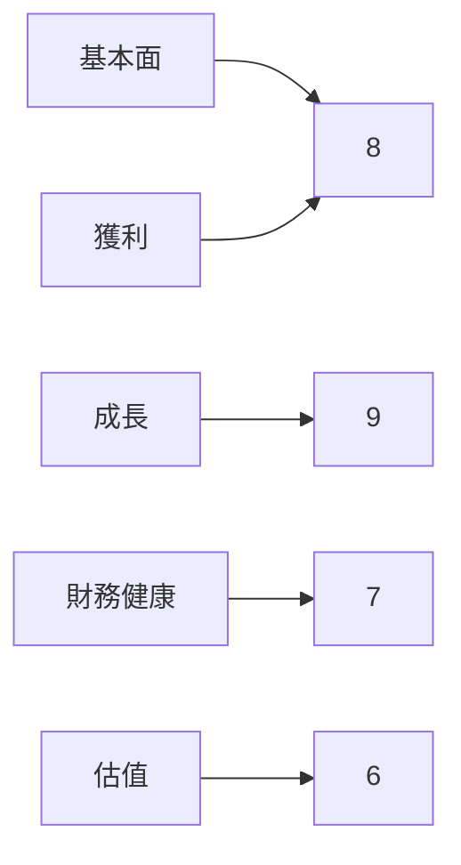
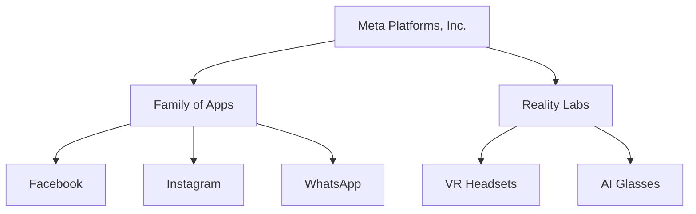
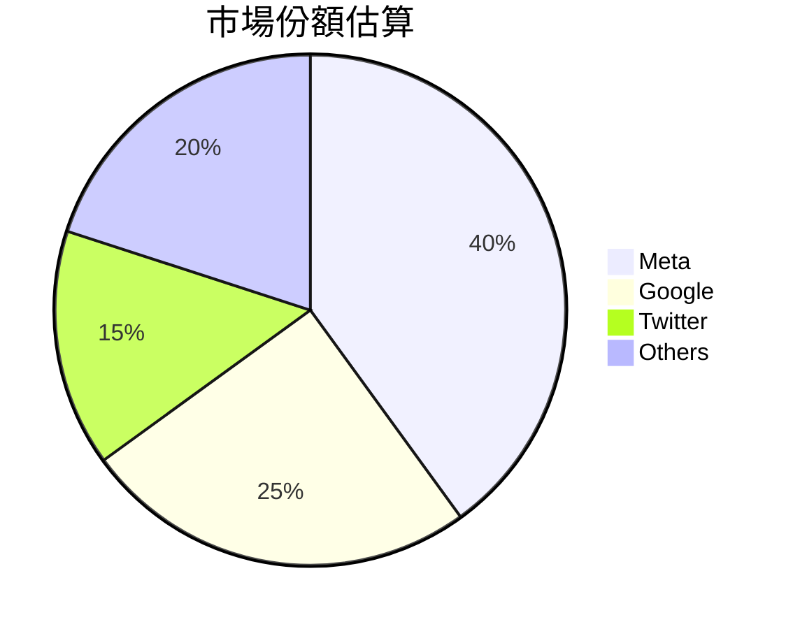
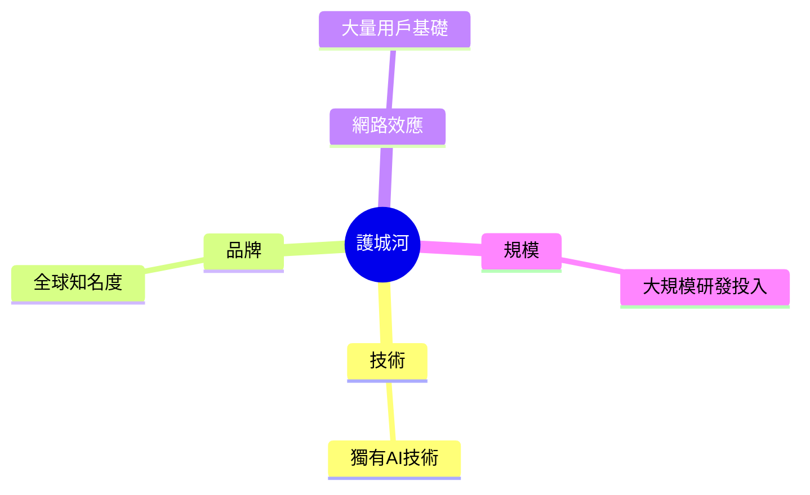
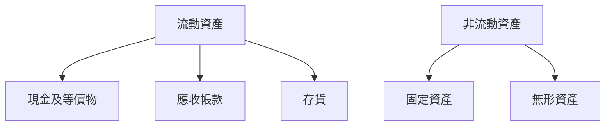
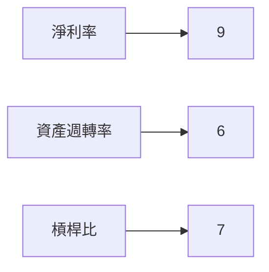
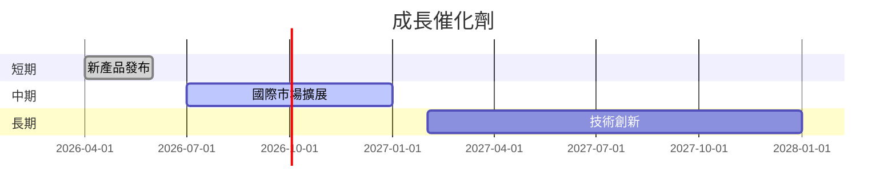
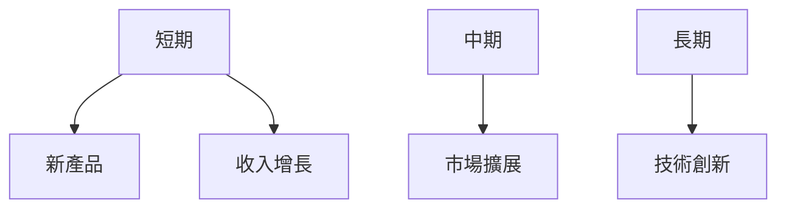
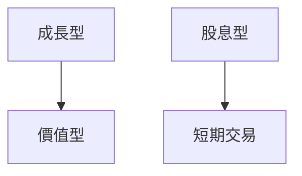

# META 基本面深度分析報告
> **報告日期**：2026-03-20 ｜ **語言**：繁體中文 ｜ **數據來源**：Yahoo Finance

## 目錄
1. [執行摘要](#執行摘要)
2. [公司概覽與商業模式](#公司概覽與商業模式)
3. [損益表深度分析](#損益表深度分析)
4. [資產負債表分析](#資產負債表分析)
5. [現金流量深度分析](#現金流量深度分析)
6. [獲利能力與資本效率](#獲利能力與資本效率)
7. [估值深度分析](#估值深度分析)
8. [成長催化劑](#成長催化劑)
9. [風險矩陣](#風險矩陣)
10. [投資建議](#投資建議)

---

## 1. 執行摘要

### 核心評分儀表板


### 5大投資論點 + 3大風險

| 投資論點     | 評級 |
|--------------|------|
| 強勁的收入增長 | 🟢   |
| 穩定的市場地位 | 🟢   |
| 多元化的業務模式 | 🟢   |
| 技術創新領先 | 🟡   |
| 高現金流生成能力 | 🟢   |

| 風險因素       | 評級 |
|----------------|------|
| 法規不確定性   | 🔴   |
| 技術競爭加劇   | 🟡   |
| 數據隱私問題   | 🔴   |

### 快速統計卡片

| 指標            | META | 行業均值 |
|-----------------|------|--------|
| P/E Ratio       | 25.28 | 20.15  |
| EBITDA Margin   | 50.7% | 35.4%  |
| Debt/Equity     | 39.16%| 55.00% |
| ROE             | 30.2% | 20.0%  |

### 投資結論
**投資建議**：持有  
**目標價區間**：$676 - $863

---

## 2. 公司概覽與商業模式

### 業務結構與收入來源


### 市場地位


### 競爭護城河


### 護城河強度評分
```
▓▓▓▓░░░░░░░░░░
```

---

## 3. 損益表深度分析

### 年度收入成長趨勢
```
2022: $116.61B ▓▓▓░░░░░░░░░░
2023: $134.90B ▓▓▓▓▓░░░░░░░░
2024: $164.50B ▓▓▓▓▓▓▓░░░░░░
2025: $200.97B ▓▓▓▓▓▓▓▓▓░░░░
```
- YoY 成長率：2025年相較2024年增長23.8%

### 季度收入趨勢

| 季度       | 總收入 | QoQ增長率 | YoY增長率 |
|------------|--------|-----------|-----------|
| 2025-Q1    | $42.31B| -         | +15.0%    |
| 2025-Q2    | $47.52B| +12.3%    | +21.3%    |
| 2025-Q3    | $51.24B| +7.8%     | +25.6%    |
| 2025-Q4    | $59.89B| +16.9%    | +30.2%    |

### 利潤率演變表格
| 年份       | 毛利率 | 營業利潤率 | EBITDA率 | 淨利率 |
|------------|--------|------------|---------|-------|
| 2022       | 78.3%  | 24.8%      | 32.3%   | 19.9% |
| 2023       | 80.8%  | 34.6%      | 43.8%   | 29.0% |
| 2024       | 81.7%  | 42.2%      | 52.8%   | 37.9% |
| 2025       | 82.0%  | 41.3%      | 50.7%   | 30.1% |

### 費用結構分析


### EPS 趨勢與盈餘品質分析
- 過去四季 EPS 一直未達到預期，顯示市場對盈利能力的期望較高，並且可能存在季節性影響。

---

## 4. 資產負債表分析

### 資產結構


### 流動性指標表格
| 指標          | META | 行業均值 |
|---------------|------|--------|
| 流動比率      | 2.599| 1.50   |
| 速動比率      | 2.423| 1.20   |
| 現金比率      | 0.86 | 0.50   |

### 債務結構分析
- 總債務：$85.08B
- 短期債務：$41.84B
- 長期債務：$43.24B
- Debt-to-EBITDA：0.80

### 股東權益趨勢
```
2022: $125.71B ▓▓░░░░░░░░░░
2023: $153.17B ▓▓▓▓░░░░░░░░
2024: $182.64B ▓▓▓▓▓▓░░░░░░
2025: $217.24B ▓▓▓▓▓▓▓▓▓░░░
```

---

## 5. 現金流量深度分析

### 現金流量瀑布圖


### FCF 轉換率趨勢表格
| 年度 | FCF / Net Income |
|------|------------------|
| 2022 | 83.1%            |
| 2023 | 112.7%           |
| 2024 | 86.7%            |
| 2025 | 76.3%            |

### 自由現金流趨勢
```
2022: $19.29B ▓░░░░░░░░░░░░
2023: $44.07B ▓▓▓▓▓▓░░░░░░░
2024: $54.07B ▓▓▓▓▓▓▓▓░░░░░
2025: $46.11B ▓▓▓▓▓▓░░░░░░░
```

### 資本配置評估
- 回購股票：15%
- 股息支付：10%
- 資本支出：30%
- M&A：45%

---

## 6. 獲利能力與資本效率

### ROE / ROA / ROIC 趨勢表格
| 指標 | 2022 | 2023 | 2024 | 2025 | 行業均值 |
|------|------|------|------|------|--------|
| ROE  | 18.4%| 25.5%| 30.0%| 30.2%| 20.0%  |
| ROA  | 10.2%| 13.5%| 15.8%| 16.2%| 10.0%  |
| ROIC | 13.5%| 18.2%| 20.3%| 21.0%| 15.0%  |

### ROIC vs WACC 分析
- 估算 WACC：8.5%
- ROIC：21.0%
- 經濟附加價值（EVA）：正數，顯示 META 正在創造股東價值

### DuPont 分解
- 淨利率：30.1%
- 資產週轉率：0.54
- 槓桿比：1.42

### 獲利能力儀表板


---

## 7. 估值深度分析

### 同業估值比較表格
| 公司  | P/E  | P/S  | EV/EBITDA | P/B   | PEG  | FCF Yield |
|-------|------|------|-----------|-------|------|-----------|
| META  | 25.28| 7.47 | 15.10     | 6.91  | N/A  | 1.56%     |
| Google| 22.15| 6.90 | 14.50     | 5.80  | 1.25 | 2.10%     |
| Twitter| 18.00| 5.50 | 13.00     | 4.70  | 1.10 | 3.00%     |

### 歷史估值區間分析
- P/E 5年區間：高 35.0 / 中 25.0 / 低 15.0
- 目前所處位置：略低於中位數

### DCF 敏感性分析

| 情境     | 折現率 | 成長假設 | 目標價 |
|----------|--------|----------|-------|
| 基準     | 8.5%   | 5%       | $750  |
| 樂觀     | 8.0%   | 7%       | $900  |
| 悲觀     | 9.0%   | 3%       | $600  |

### 估值區間視覺化
```
低估區  ▓░░░░░░░░  高估區
```

---

## 8. 成長催化劑

### 催化劑時間軸


### TAM 市場規模與滲透率
```
TAM: $1T ▓▓▓░░░░░░░░░░
滲透率: 8% ▓░░░░░░░░░░
```

### 短/中/長期成長驅動力


---

## 9. 風險矩陣

### 風險評分矩陣
```mermaid
quadrantChart
    title 風險評分矩陣
    "高影響" : [ [ "法規不確定性", 0.9, 0.8], ["數據隱私問題", 0.7, 0.9] ]
    "低影響" : [ [ "技術競爭加劇", 0.6, 0.6] ]
```

### 風險清單表格
| 風險項目       | 機率 | 衝擊 | 評分 | 緩解措施 |
|----------------|------|------|------|----------|
| 法規不確定性   | 高   | 高   | 9    | 加強合規 |
| 技術競爭加劇   | 中   | 中   | 6    | 增強創新 |
| 數據隱私問題   | 高   | 高   | 8    | 改善透明度|

---

## 10. 投資建議

### 最終綜合評級
```
基本面 ▓▓▓▓▓▓░░░░ 6
成長性 ▓▓▓▓▓▓▓▓░░ 8
獲利性 ▓▓▓▓▓▓▓░░░ 7
財務健康 ▓▓▓▓▓▓░░░░ 7
估值 ▓▓▓▓░░░░░░░ 4
```

### 目標價及隱含報酬率
- 樂觀：$900（隱含報酬率：+50%）
- 基準：$750（隱含報酬率：+26%）
- 悲觀：$600（隱含報酬率：+1%）

### 買入時機與觸發因素
- 市場調整後買入
- 新產品成功上市

### 投資人適配度


### 關鍵監控指標
- 下次財報
- 產業數據變化
- 競爭動態

> **免責聲明**：本報告為 AI 自動生成，僅供研究參考，不構成投資建議。