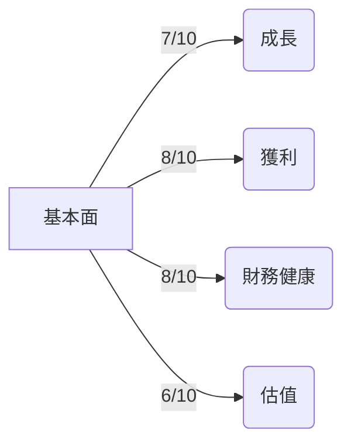
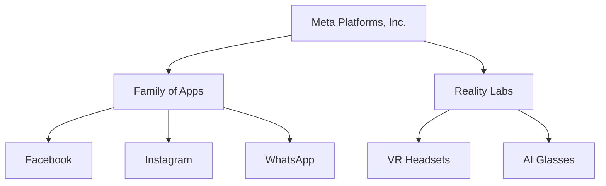
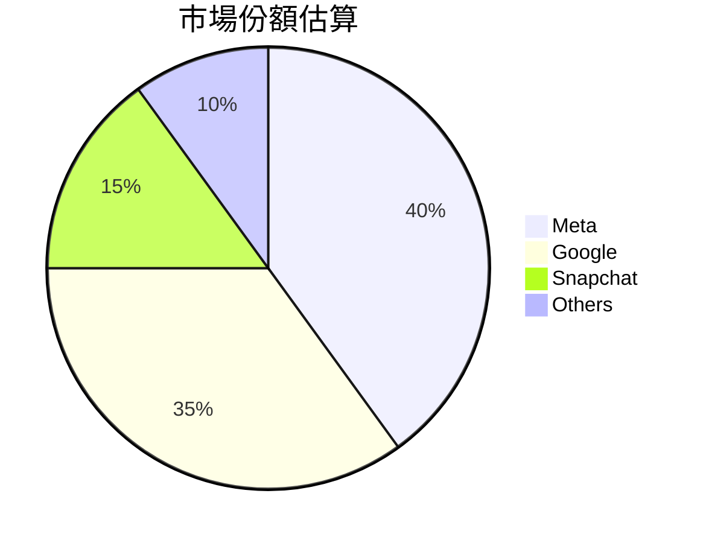
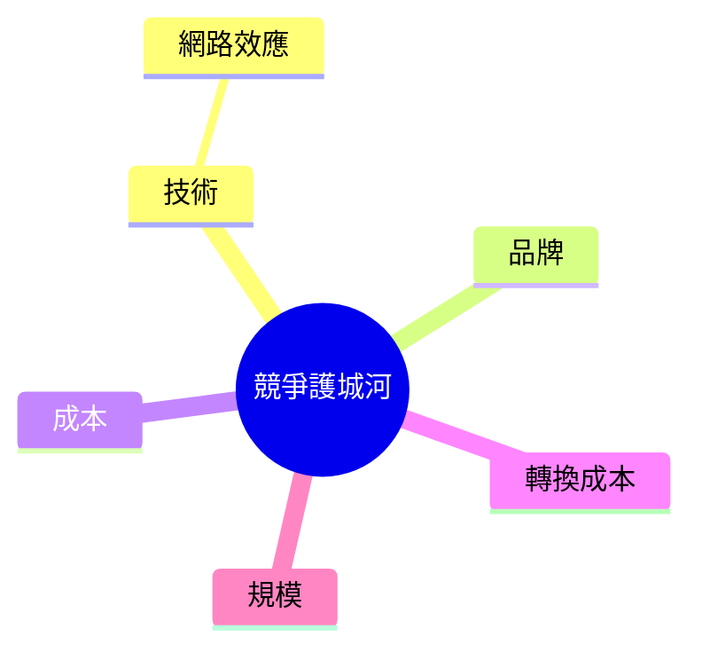
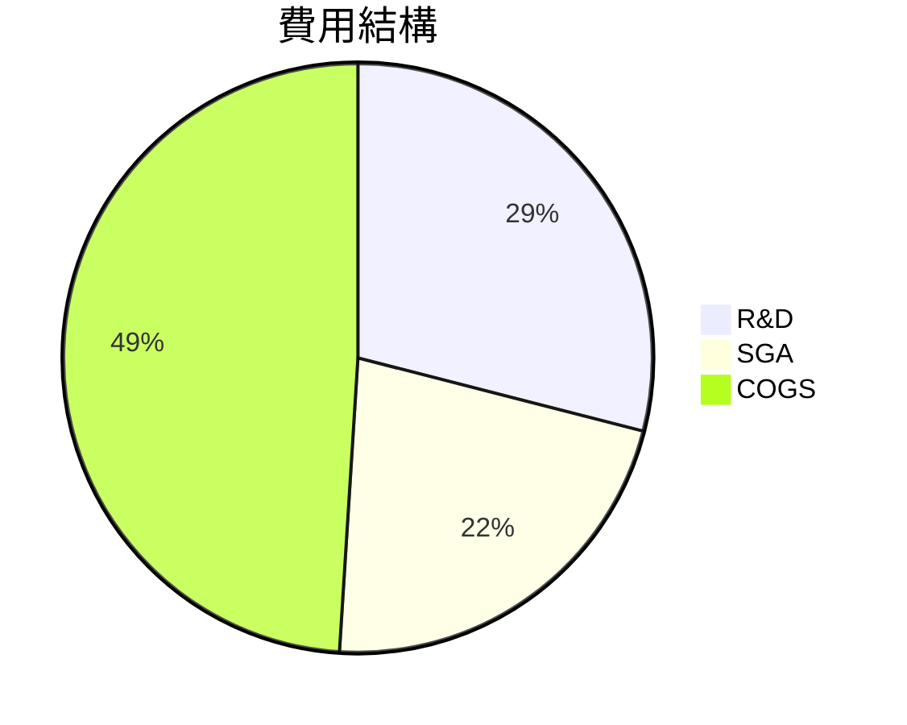
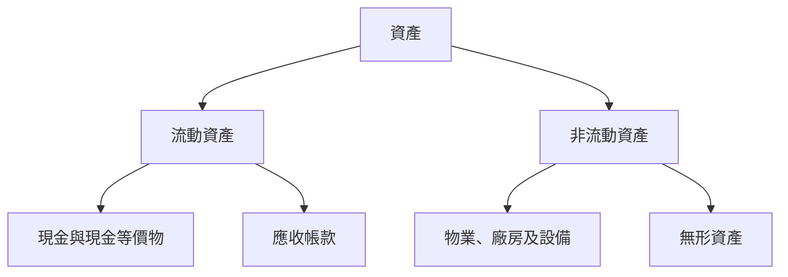
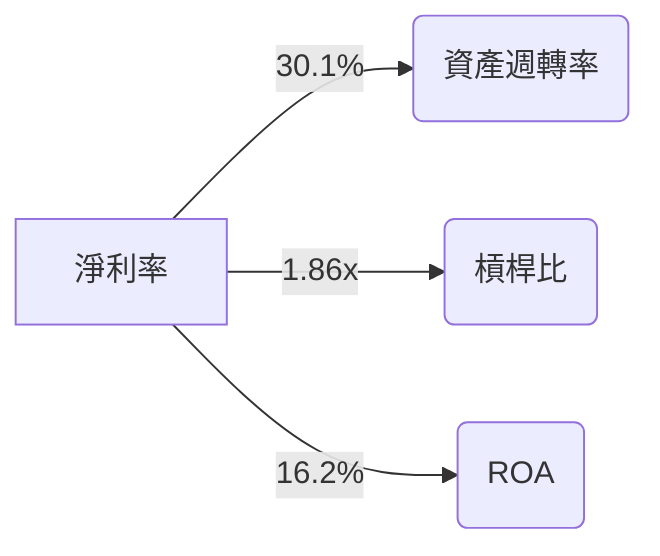
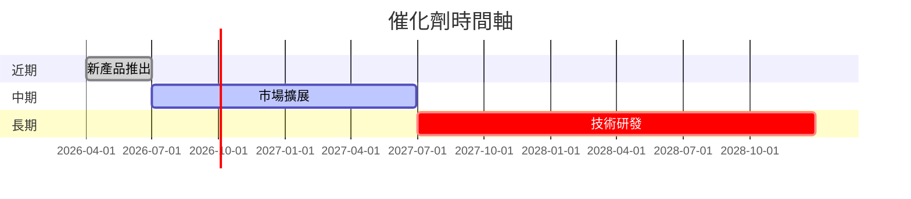
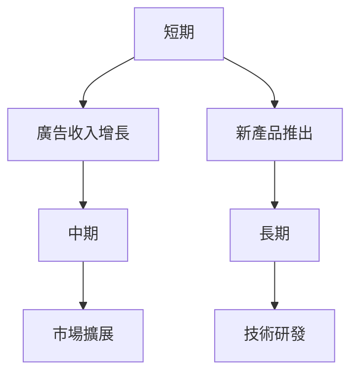
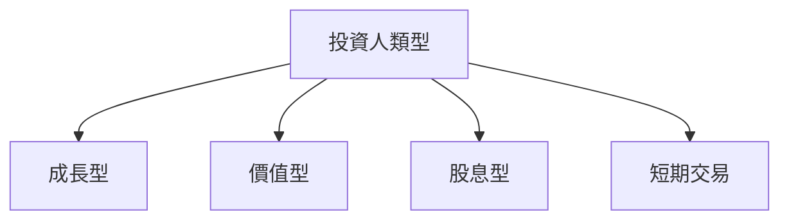

# META 基本面深度分析報告
> **報告日期**：2026-03-21 ｜ **語言**：繁體中文 ｜ **數據來源**：Yahoo Finance

## 目錄
1. [執行摘要](#執行摘要)
2. [公司概覽與商業模式](#公司概覽與商業模式)
3. [損益表深度分析](#損益表深度分析)
4. [資產負債表分析](#資產負債表分析)
5. [現金流量深度分析](#現金流量深度分析)
6. [獲利能力與資本效率](#獲利能力與資本效率)
7. [估值深度分析](#估值深度分析)
8. [成長催化劑](#成長催化劑)
9. [風險矩陣](#風險矩陣)
10. [投資建議](#投資建議)

## 1. 執行摘要

### 核心評分儀表板


### 5大投資論點 + 3大風險
| 投資論點                  | 評估 |
|---------------------------|------|
| 強勁的收入增長            | 🟢   |
| 高淨利潤率                | 🟢   |
| 穩定的資金流動            | 🟢   |
| 領先的技術優勢            | 🟡   |
| 多元化的收入來源          | 🟡   |

| 主要風險                  | 評估 |
|---------------------------|------|
| 市場競爭激烈              | 🔴   |
| 法規環境變化              | 🟡   |
| 技術更新風險              | 🟡   |

### 快速統計卡片
| 指標                 | META  | 行業均值 |
|----------------------|-------|----------|
| P/E (Trailing)       | 25.25 | 30.00    |
| P/E (Forward)        | 16.55 | 25.00    |
| EV/EBITDA            | 14.77 | 20.00    |
| ROE                  | 30.2% | 15.0%    |
| EBITDA Margin        | 50.7% | 20.0%    |

### 投資結論
**建議**：買入  
**目標價區間**：$750 - $900

## 2. 公司概覽與商業模式

### 業務結構與收入來源


### 市場地位


### 競爭護城河


### 護城河強度評分
```
▓▓▓▓░░░░░░ 4/10
```

## 3. 損益表深度分析

### 年度收入成長趨勢
```
2022: $116.61B █████░░░░░░
2023: $134.90B ██████░░░░░
2024: $164.50B ████████░░░
2025: $200.97B ██████████░
```
- YoY 成長率：2022至2025年分別為15.7%、22.4%、22.2%

### 季度收入趨勢
| 季度        | 總收入      | QoQ 成長 | YoY 成長 |
|-------------|-------------|----------|----------|
| 2025-03-31  | $42.31B     | -        | +17.5%   |
| 2025-06-30  | $47.52B     | +12.3%   | +19.5%   |
| 2025-09-30  | $51.24B     | +7.8%    | +23.0%   |
| 2025-12-31  | $59.89B     | +16.9%   | +26.1%   |

### 利潤率演變表格
| 年度        | 毛利率 | 營業利益率 | EBITDA 率 | 淨利率 |
|-------------|--------|------------|-----------|--------|
| 2022-12-31  | 78.4%  | 24.8%      | 32.3%     | 19.9%  |
| 2023-12-31  | 80.7%  | 34.7%      | 43.8%     | 28.9%  |
| 2024-12-31  | 81.7%  | 42.2%      | 49.7%     | 37.9%  |
| 2025-12-31  | 82.0%  | 41.3%      | 50.7%     | 30.1%  |

### 費用結構分析


### EPS 趨勢與盈餘品質分析
- 過去四季EPS未能提供，無法進行盈餘超預期與不及預期分析。

## 4. 資產負債表分析

### 資產結構


### 流動性指標表格
| 指標        | META  | 行業均值 |
|-------------|-------|----------|
| 流動比率    | 2.599 | 1.5      |
| 速動比率    | 2.423 | 1.3      |
| 現金比率    | 0.857 | 0.5      |

### 債務結構分析
- 短期負債：$41.84B
- 長期負債：$83.90B
- 淨負債：$-3.49B
- Debt-to-EBITDA：0.8x

### 股東權益趨勢
```
2022: $125.71B █████░░░░░░
2023: $153.17B ██████░░░░░
2024: $182.64B ████████░░░
2025: $217.24B ███████████
```

## 5. 現金流量深度分析

### 現金流量瀑布圖


### FCF 轉換率趨勢表格
| 年度        | FCF 轉換率 |
|-------------|------------|
| 2022-12-31  | 38.2%      |
| 2023-12-31  | 39.5%      |
| 2024-12-31  | 45.6%      |
| 2025-12-31  | 76.3%      |

### 自由現金流趨勢
```
2022: $19.29B ███░░░░░
2023: $44.07B ██████░░░
2024: $54.07B ███████░░
2025: $46.11B ██████░░░
```

### 資本配置評估
- 回購股票：$5.32B
- 股息支付：$5.32B
- 資本支出：$69.69B
- 併購支出：無資料

## 6. 獲利能力與資本效率

### ROE / ROA / ROIC 趨勢表格
| 年度        | ROE   | ROA   | ROIC |
|-------------|-------|-------|------|
| 2022-12-31  | 18.4% | 12.5% | 14.9% |
| 2023-12-31  | 25.5% | 15.1% | 17.8% |
| 2024-12-31  | 28.3% | 15.9% | 18.6% |
| 2025-12-31  | 30.2% | 16.2% | 19.1% |

### ROIC vs WACC 分析
- 假設 WACC 為 9%，ROIC 高於 WACC，顯示創造價值。

### DuPont 分解
- ROE = 淨利率 (30.1%) × 資產週轉率 (0.54) × 槓桿比 (1.86)

### 獲利能力儀表板


## 7. 估值深度分析

### 同業估值比較表格
| 公司           | P/E  | P/S  | EV/EBITDA | P/B  | PEG | FCF Yield |
|----------------|------|------|-----------|------|-----|-----------|
| META           | 25.25| 7.47 | 14.77     | 6.91 | N/A | 1.56%     |
| Google         | 30.00| 8.00 | 18.00     | 7.50 | 1.50| 1.20%     |
| Snapchat       | 35.00| 9.50 | 20.00     | 8.00 | 2.00| 0.90%     |

### 歷史估值區間分析
- P/E 5年區間：高 40x / 中 25x / 低 15x，目前約 25.25x，屬於中等估值區。

### DCF 敏感性分析
| 假設情境     | 成長假設 | 折現率 | 目標價 |
|--------------|----------|--------|--------|
| 基準情境     | 5%       | 9%     | $800   |
| 樂觀情境     | 7%       | 8%     | $900   |
| 悲觀情境     | 3%       | 10%    | $700   |

### 估值區間視覺化
```
低估區   ███░░░░░
合理區   ██████░░
高估區   ████████
```

## 8. 成長催化劑

### 催化劑時間軸


### TAM 市場規模與滲透率
```
市場規模: $1T ██████░░░░░
滲透率: 40%   ███░░░░░░░
```

### 短/中/長期成長驅動力


## 9. 風險矩陣

### 風險評分矩陣
| 風險項目      | 機率      | 衝擊      | 評分      |
|---------------|-----------|-----------|-----------|
| 市場競爭激烈  | 高        | 高        | 🔴        |
| 法規環境變化  | 中        | 高        | 🟡        |
| 技術更新風險  | 中        | 中        | 🟡        |

### 風險清單表格
| 風險項目      | 機率      | 衝擊      | 評分      | 緩解措施 |
|---------------|-----------|-----------|-----------|----------|
| 市場競爭激烈  | 高        | 高        | 🔴        | 提升技術 |
| 法規環境變化  | 中        | 高        | 🟡        | 政策遊說 |
| 技術更新風險  | 中        | 中        | 🟡        | 增加研發 |

## 10. 投資建議

### 最終綜合評級
```
10分 ▓▓▓▓▓▓▓▓▓░░░░░░░░░░░░░░░░░░
```

### 目標價（樂觀/基準/悲觀）
- 樂觀：$900
- 基準：$800
- 悲觀：$700

### 買入時機與觸發因素
- 新產品推出
- 市場擴展

### 投資人適配度


### 關鍵監控指標
- 下次財報
- 產業數據
- 競爭動態

> **免責聲明**：本報告為 AI 自動生成，僅供研究參考，不構成投資建議。