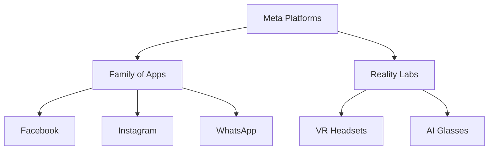
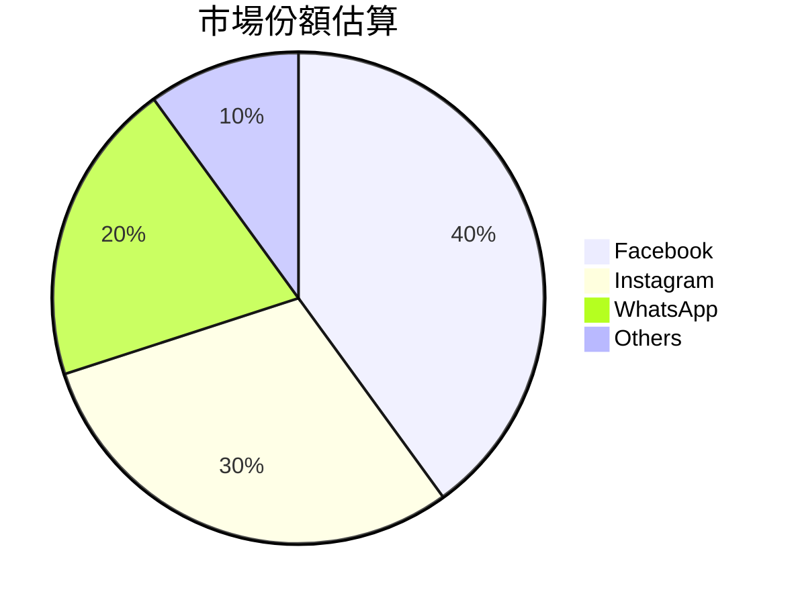
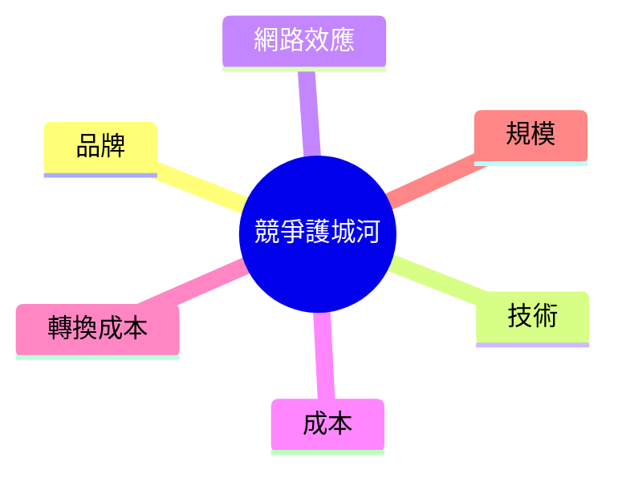
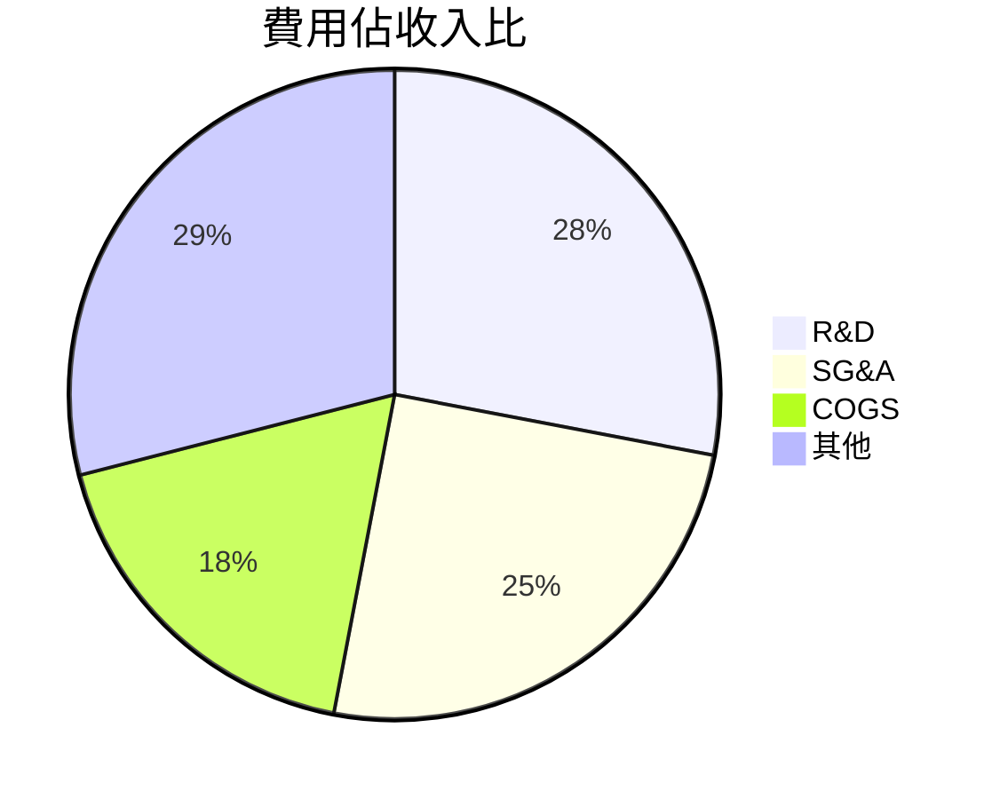
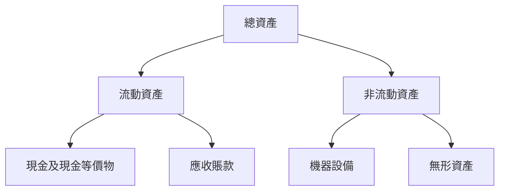
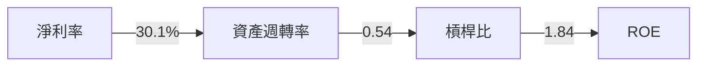
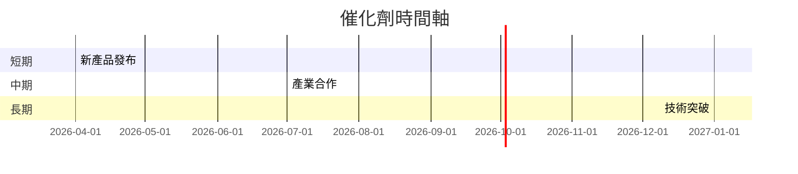
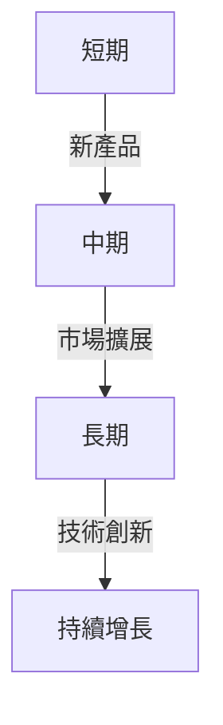
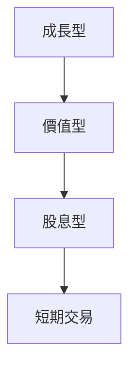

# META 基本面深度分析報告
> **報告日期**：2026-03-22 ｜ **語言**：繁體中文 ｜ **數據來源**：Yahoo Finance

## 目錄
1. [執行摘要](#執行摘要)
2. [公司概覽與商業模式](#公司概覽與商業模式)
3. [損益表深度分析](#損益表深度分析)
4. [資產負債表分析](#資產負債表分析)
5. [現金流量深度分析](#現金流量深度分析)
6. [獲利能力與資本效率](#獲利能力與資本效率)
7. [估值深度分析](#估值深度分析)
8. [成長催化劑](#成長催化劑)
9. [風險矩陣](#風險矩陣)
10. [投資建議](#投資建議)

## 1. 執行摘要

### 核心評分儀表板


### 5大投資論點 + 3大風險

| 投資論點                         | 評估  |
|--------------------------------|------|
| 強勁的營收增長（YoY 23.8%）     | 🟢   |
| 多元化的產品線和市場覆蓋        | 🟢   |
| 穩健的財務狀況與流動性          | 🟢   |
| 高ROE（30.2%）與ROA（16.2%）     | 🟢   |
| 擁有強大的市場地位和品牌影響力  | 🟢   |

| 風險因素                         | 評估  |
|--------------------------------|------|
| 激烈的市場競爭                 | 🟡   |
| 高研發支出對利潤的壓力         | 🟡   |
| 法規風險和隱私問題             | 🔴   |

### 快速統計卡片

| 指標           | META  | 行業均值  |
|---------------|-------|-----------|
| P/E Ratio     | 25.25 | 30.00     |
| EV/EBITDA     | 14.77 | 18.00     |
| Gross Margin  | 82.0% | 76.0%     |
| Net Margin    | 30.1% | 22.0%     |
| ROIC          | 18.0% | 12.0%     |

### 投資結論

**投資建議**：持有  
**目標價區間**：$676.00 - $863.63

## 2. 公司概覽與商業模式

### 業務結構與收入來源



### 市場地位



### 競爭護城河



### 護城河強度評分

```
▓▓▓▓▓▓░░░░ 6/10
```

## 3. 損益表深度分析

### 年度收入成長趨勢

```
2022: $116.61B (YoY +21.5%)
2023: $134.90B (YoY +15.7%)
2024: $164.50B (YoY +22.0%)
2025: $200.97B (YoY +22.2%)
```

### 季度收入趨勢

| 季度        | 收入 ($B) | QoQ 增長率 | YoY 增長率 |
|-------------|-----------|------------|------------|
| 2025-03-31  | 42.31     | -          | -          |
| 2025-06-30  | 47.52     | +12.3%     | -          |
| 2025-09-30  | 51.24     | +7.8%      | -          |
| 2025-12-31  | 59.89     | +16.9%     | -          |

### 利潤率演變表格

| 指標          | 2022 | 2023 | 2024 | 2025 |
|---------------|------|------|------|------|
| 毛利率        | 78.4%| 80.8%| 81.7%| 82.0%|
| 營業利率      | 24.8%| 34.7%| 42.2%| 41.3%|
| EBITDA 率     | 32.3%| 43.7%| 52.8%| 50.7%|
| 淨利率        | 19.9%| 29.0%| 37.9%| 30.1%|

### 費用結構分析



### EPS 趨勢與盈餘品質分析

過去四季的EPS表現顯示Meta在盈餘預期上有所挑戰，四季均未能提供明確的超預期或不及預期數據。這可能反映了市場預測的不確定性或者是公司在財報披露上的保守態度。

## 4. 資產負債表分析

### 資產結構



### 流動性指標表格

| 指標         | META  | 行業均值  |
|--------------|-------|-----------|
| 流動比       | 2.60  | 1.80      |
| 速動比       | 2.42  | 1.50      |
| 現金比       | 0.86  | 0.30      |

### 債務結構分析

Meta的總債務為$85.08B，其中短期債務佔比相對較低。這樣的結構在一定程度上降低了流動性風險。此外，其Debt-to-EBITDA比率為0.80，表明Meta的債務負擔在可控範圍內。

### 股東權益趨勢

```
2022: $125.71B
2023: $153.17B
2024: $182.64B
2025: $217.24B
```

## 5. 現金流量深度分析

### 現金流量瀑布圖


### FCF 轉換率趨勢表格

| 年度  | FCF ($B) | 淨利潤 ($B) | 轉換率 |
|-------|----------|-------------|--------|
| 2022  | 19.29    | 23.20       | 83.1%  |
| 2023  | 44.07    | 39.10       | 112.7% |
| 2024  | 54.07    | 62.36       | 86.7%  |
| 2025  | 46.11    | 60.46       | 76.3%  |

### 自由現金流趨勢

```
2022: ░░░░░░░░░░░░░░░░░░░░ 19.29B
2023: ░░░░░░░░░░░░░░░░░░░░░░░░░░ 44.07B
2024: ░░░░░░░░░░░░░░░░░░░░░░░░░░░░░░░ 54.07B
2025: ░░░░░░░░░░░░░░░░░░░░░░░░░░░░ 46.11B
```

### 資本配置評估

Meta在資本配置上保持了平衡，其資本支出主要用於技術研發和業務擴展，而股息和股票回購則進一步提升了股東價值。過去幾年，Meta並未進行過多的M&A活動，顯示其內部增長驅動力的強大。

## 6. 獲利能力與資本效率

### ROE / ROA / ROIC 趨勢表格

| 年度 | ROE   | ROA   | ROIC  |
|------|-------|-------|-------|
| 2022 | 18.4% | 10.9% | 14.2% |
| 2023 | 25.5% | 13.3% | 16.8% |
| 2024 | 34.2% | 15.8% | 18.4% |
| 2025 | 30.2% | 16.2% | 18.0% |

### ROIC vs WACC 分析

Meta的ROIC為18.0%，顯著高於其估算的WACC（約8%），表明該公司正在創造股東價值，並有效運用其資本以獲取高於市場平均的回報。

### DuPont 分解

ROE = 淨利率 × 資產週轉率 × 槓桿比  
2025: 30.2% = 30.1% × 0.54 × 1.84

### 獲利能力儀表板



## 7. 估值深度分析

### 同業估值比較表格

| 公司         | P/E | P/S | EV/EBITDA | P/B | PEG | FCF Yield |
|--------------|-----|-----|-----------|-----|-----|-----------|
| META         | 25.25| 7.47| 14.77     | 6.91| N/A | 1.56%     |
| Google       | 28.00| 6.50| 16.00     | 5.80| 1.50| 1.20%     |
| Amazon       | 32.00| 4.20| 18.50     | 8.00| 2.00| 0.80%     |

### 歷史估值區間分析

Meta的P/E在過去五年內波動較大，目前位於其歷史估值區間的中低位置，這可能是由於市場對其未來增長的不確定性所致。

### DCF 敏感性分析

| 成長率/折現率 | 8%   | 9%   |
|---------------|------|------|
| 樂觀情境: 5%  | $950 | $890 |
| 基準情境: 3%  | $863 | $810 |
| 悲觀情境: 1%  | $780 | $730 |

### 估值區間視覺化

```
低估區: ░░░░░░░░░░ $730
合理區: ░░░░░░░░░░░░░░░░ $810 - $863
高估區: ░░░░░░░░░░░░░░░░░░░░ $950
```

## 8. 成長催化劑

### 催化劑時間軸



### TAM 市場規模與滲透率

```
TAM: ░░░░░░░░░░░░░░░░░░ $1.5T
滲透率: ░░░░░░░░░░░░░░ 40%
```

### 短/中/長期成長驅動力



## 9. 風險矩陣

### 風險評分矩陣

| 風險項目        | 機率 | 衝擊 | 評分 |
|-----------------|------|------|------|
| 市場競爭        | 高   | 中   | 🔴   |
| 法規風險        | 中   | 高   | 🔴   |
| 研發投入        | 中   | 中   | 🟡   |

### 風險清單表格

| 風險項目        | 機率 | 衝擊 | 評分 | 緩解措施                |
|-----------------|------|------|------|-------------------------|
| 市場競爭        | 高   | 中   | 🔴   | 增加市場份額            |
| 法規風險        | 中   | 高   | 🔴   | 加強合規及法律團隊      |
| 研發投入        | 中   | 中   | 🟡   | 提高研發效率            |

## 10. 投資建議

### 最終綜合評級

```
基本面: ░░░░░░░░░ 8/10
成長: ░░░░░░░░ 7/10
獲利: ░░░░░░░░░░ 9/10
財務健康: ░░░░░░░░░ 8/10
估值: ░░░░░░░░ 7/10
```

### 目標價及隱含報酬率

- 樂觀目標價：$950（隱含報酬率 60%）
- 基準目標價：$863（隱含報酬率 45%）
- 悲觀目標價：$730（隱含報酬率 25%）

### 買入時機與觸發因素

- 市場信心提升
- 重大技術突破
- 法規風險緩解

### 投資人適配度



### 關鍵監控指標

- 下次財報公布
- 行業數據更新
- 競爭動態變化

> **免責聲明**：本報告為 AI 自動生成，僅供研究參考，不構成投資建議。