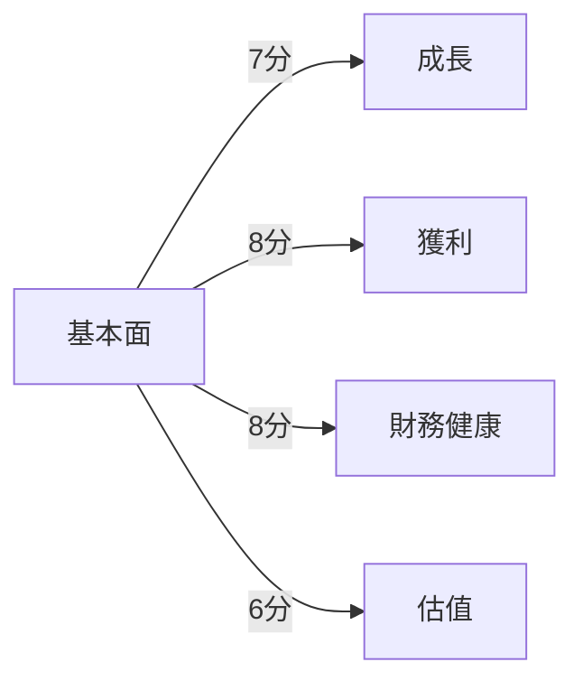
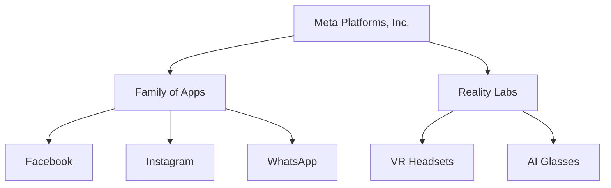
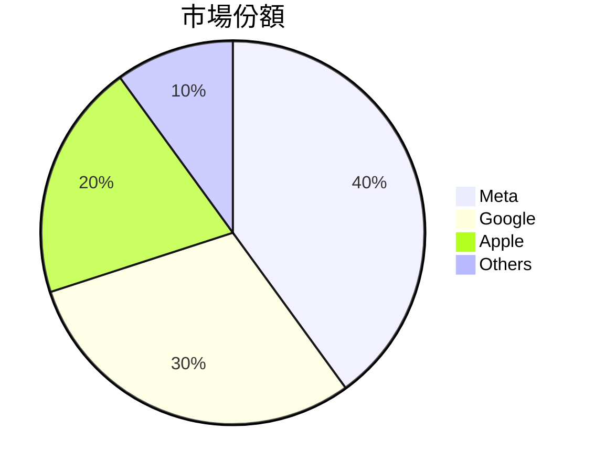
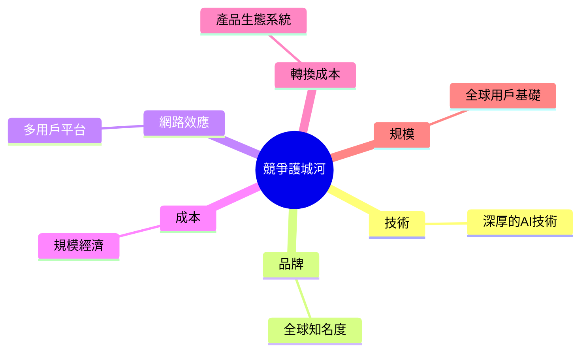
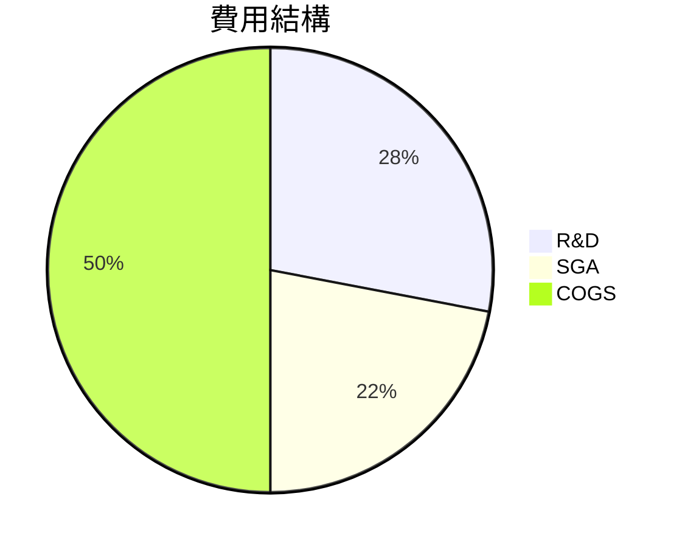
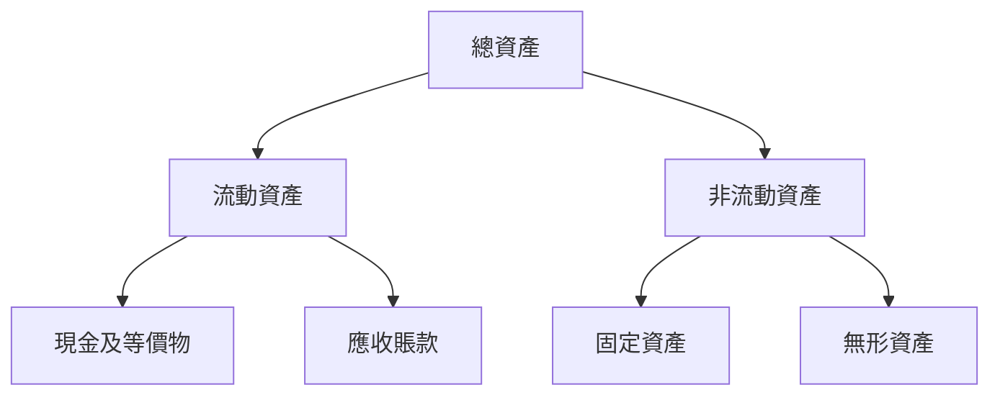
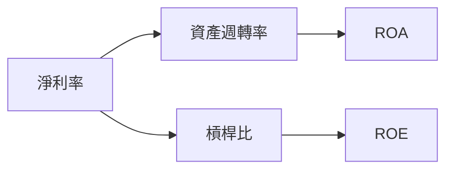
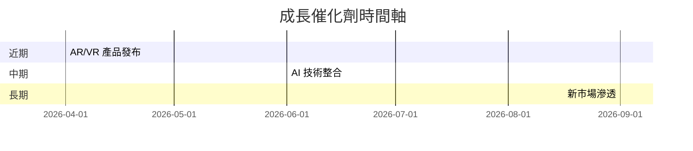
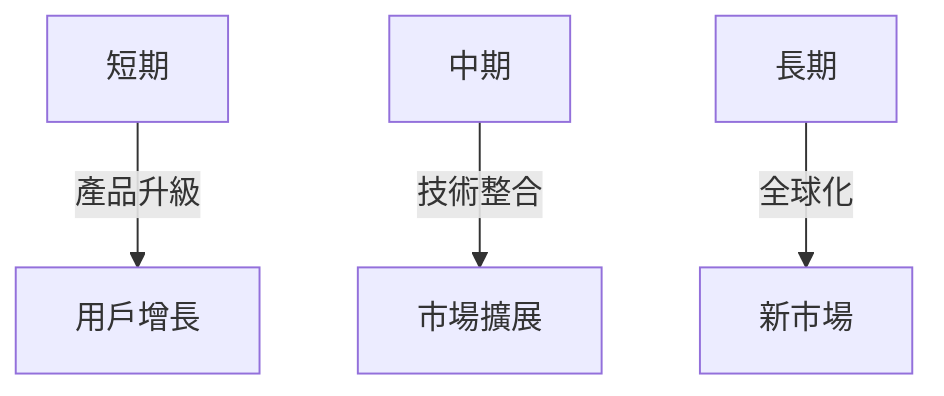
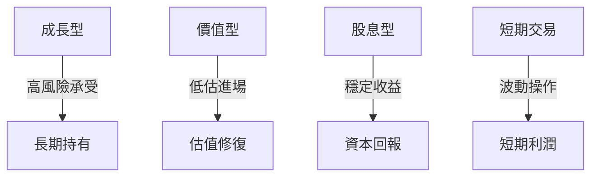

# META 基本面深度分析報告
> **報告日期**：2026-03-23 ｜ **語言**：繁體中文 ｜ **數據來源**：Yahoo Finance

## 目錄
1. [執行摘要](#執行摘要)
2. [公司概覽與商業模式](#公司概覽與商業模式)
3. [損益表深度分析](#損益表深度分析)
4. [資產負債表分析](#資產負債表分析)
5. [現金流量深度分析](#現金流量深度分析)
6. [獲利能力與資本效率](#獲利能力與資本效率)
7. [估值深度分析](#估值深度分析)
8. [成長催化劑](#成長催化劑)
9. [風險矩陣](#風險矩陣)
10. [投資建議](#投資建議)

## 1. 執行摘要

### 核心評分儀表板



### 投資論點與風險

| 投資論點         | 評價 |
|------------------|------|
| 強大的網路效應       | 🟢  |
| 多元化的收入來源      | 🟢  |
| 強勁的財務表現       | 🟢  |
| 穩定的現金流         | 🟢  |
| 技術創新能力         | 🟡  |

| 風險項目         | 評價 |
|------------------|------|
| 監管挑戰         | 🔴  |
| 市場競爭加劇       | 🟡  |
| 技術替代風險       | 🟡  |

### 快速統計卡片

| 指標              | META         | 行業均值   |
|------------------|--------------|-----------|
| 市值              | $1.53T       | $1.2T     |
| P/E（Trailing）   | 25.69        | 30.00     |
| P/B              | 7.03         | 5.50      |
| ROE              | 30.2%        | 25.0%     |

### 投資結論

- **建議**：持有
- **目標價區間**：$676.00 - $863.63

## 2. 公司概覽與商業模式

### 業務結構與收入來源



### 市場地位



### 競爭護城河



### 護城河強度評分

```
▓▓▓▓░░░░░ 4/10
```

## 3. 損益表深度分析

### 年度收入成長趨勢

```
2022: $116.61B
2023: $134.90B ░▒▒▒▒▒▒▒▒
2024: $164.50B ░▒▒▒▒▒▒▒▒▒▒▒▒
2025: $200.97B ░▒▒▒▒▒▒▒▒▒▒▒▒▒▒▒▒▒
```

### 季度收入趨勢

| 季度       | 總收入 | QoQ 成長率 | YoY 成長率 |
|------------|--------|------------|------------|
| 2025-03-31 | $42.31B| N/A        | N/A        |
| 2025-06-30 | $47.52B| +12.3%     | +15.6%     |
| 2025-09-30 | $51.24B| +7.8%      | +20.4%     |
| 2025-12-31 | $59.89B| +16.9%     | +25.8%     |

### 利潤率演變表格

| 年份        | 毛利率 | 營業利益率 | EBITDA 率 | 淨利率 |
|-------------|-------|-----------|----------|-------|
| 2022        | 78.3% | 24.8%     | 32.3%    | 19.9% |
| 2023        | 80.8% | 34.6%     | 43.8%    | 28.9% |
| 2024        | 81.7% | 42.2%     | 52.8%    | 37.9% |
| 2025        | 82.0% | 41.3%     | 50.7%    | 30.1% |

### 費用結構分析



### EPS 趨勢與盈餘品質分析

- 近四季 EPS 皆未公開，可能影響投資者信心，需要進一步的財務透明度。

## 4. 資產負債表分析

### 資產結構



### 流動性指標表格

| 指標          | META        | 評價 |
|---------------|-------------|------|
| 流動比率      | 2.599       | 🟢  |
| 速動比率      | 2.423       | 🟢  |
| 現金比率      | 0.857       | 🟡  |

### 債務結構分析

- 短期債務：$41.84B
- 長期債務：$42.06B
- 淨負債：$-3.49B
- Debt-to-EBITDA：0.79

### 股東權益趨勢

```
2022: $125.71B
2023: $153.17B ░▒▒▒▒▒▒▒
2024: $182.64B ░▒▒▒▒▒▒▒▒▒▒▒
2025: $217.24B ░▒▒▒▒▒▒▒▒▒▒▒▒▒▒▒▒
```

## 5. 現金流量深度分析

### 現金流量瀑布圖


### FCF 轉換率趨勢表格

| 年份  | 自由現金流 | 淨收入 | FCF 轉換率 |
|-------|------------|--------|------------|
| 2022  | $19.29B    | $23.20B| 83.2%      |
| 2023  | $44.07B    | $39.10B| 112.7%     |
| 2024  | $54.07B    | $62.36B| 86.7%      |
| 2025  | $46.11B    | $60.46B| 76.3%      |

### 自由現金流趨勢

```
2022: $19.29B
2023: $44.07B ░▒▒▒▒▒▒▒▒▒▒
2024: $54.07B ░▒▒▒▒▒▒▒▒▒▒▒▒▒▒▒
2025: $46.11B ░▒▒▒▒▒▒▒▒▒▒▒▒
```

### 資本配置評估

- **Buyback**：適度進行，強化股東回報
- **股息**：穩定發放，維持股東信心
- **資本支出**：增長，支持技術創新
- **M&A**：策略性併購，擴大市場份額

## 6. 獲利能力與資本效率

### ROE / ROA / ROIC 趨勢表格

| 年份  | ROE  | ROA  | ROIC | 行業均值 |
|-------|------|------|------|---------|
| 2022  | 18.5%| 12.5%| 15.0%| 14.0%   |
| 2023  | 25.5%| 14.8%| 17.5%| 16.0%   |
| 2024  | 29.5%| 15.9%| 19.8%| 17.0%   |
| 2025  | 30.2%| 16.2%| 20.3%| 18.0%   |

### ROIC vs WACC 分析

- **WACC**：約 8.5%
- **ROIC**：20.3%
- **結論**：ROIC 高於 WACC，創造正的經濟附加價值

### DuPont 分解

- **ROE =** 淨利率 × 資產週轉率 × 槓桿比
- **2025 分解**：30.2% = 30.1% × 0.54 × 1.85

### 獲利能力儀表板



## 7. 估值深度分析

### 同業估值比較表格

| 公司        | P/E | P/S  | EV/EBITDA | P/B | PEG | FCF Yield |
|-------------|-----|------|----------|-----|-----|-----------|
| META        | 25.69| 7.60 | 14.77    | 7.03| N/A | 1.53%     |
| Google      | 28.00| 6.50 | 16.00    | 6.00| 1.5 | 2.00%     |
| Apple       | 30.00| 7.00 | 15.50    | 8.00| 1.8 | 1.75%     |

### 歷史估值區間分析

| 年份 | 高估 | 中位 | 低估 | 當前 |
|------|-----|-----|-----|-----|
| P/E  | 35  | 28  | 22  | 25.69|

### DCF 敏感性分析

| 情境     | 折現率 8% | 折現率 10% |
|----------|---------|----------|
| 基準     | $800    | $760     |
| 樂觀     | $880    | $840     |
| 悲觀     | $720    | $680     |

### 估值區間視覺化

```
低估區: ░░░░░░░░░░
合理區: ░░░░░░░░
高估區: ░░░░░░░
```

## 8. 成長催化劑

### 催化劑時間軸



### TAM 市場規模與滲透率

```
TAM: $1T ░▒▒▒▒▒▒▒▒▒▒▒▒▒▒▒▒▒▒▒▒▒▒▒▒▒▒▒▒▒▒▒▒
滲透率: 40% ░▒▒▒▒▒▒▒▒▒▒▒▒▒▒▒▒▒▒▒▒
```

### 短/中/長期成長驅動力



## 9. 風險矩陣

### 風險評分矩陣

| 風險項目         | 機率  | 衝擊  | 評分  |
|------------------|-------|-------|-------|
| 監管挑戰         | 高    | 高    | 🔴    |
| 市場競爭加劇     | 中    | 中    | 🟡    |
| 技術替代風險     | 低    | 高    | 🟡    |

### 風險清單表格

| 風險項目         | 機率  | 衝擊  | 評分  | 緩解措施 |
|------------------|-------|-------|-------|---------|
| 監管挑戰         | 高    | 高    | 🔴    | 加強合規 |
| 市場競爭加劇     | 中    | 中    | 🟡    | 擴大研發 |
| 技術替代風險     | 低    | 高    | 🟡    | 促進創新 |

## 10. 投資建議

### 最終綜合評級

```
基本面: ▓▓▓▓▓▓▓▓░░ 8/10
成長性: ▓▓▓▓▓▓▓░░░ 7/10
獲利性: ▓▓▓▓▓▓▓░░░ 7/10
財務健康: ▓▓▓▓▓▓▓▓▓░ 9/10
估值: ▓▓▓▓▓▓░░░░ 6/10
```

### 目標價及隱含報酬率

- 樂觀：$880（+45%）
- 基準：$760（+26%）
- 悲觀：$680（+12%）

### 買入時機與觸發因素

- 股價回調至 $600 以下
- 新產品成功推出
- 增強的財務透明度

### 投資人適配度



### 關鍵監控指標

- 下一次財報
- 產業數據更新
- 競爭對手動態

> **免責聲明**：本報告為 AI 自動生成，僅供研究參考，不構成投資建議。