# META 基本面深度分析報告
> **報告日期**：2026-03-24 ｜ **語言**：繁體中文 ｜ **數據來源**：Yahoo Finance

## 目錄
1. [執行摘要](#執行摘要)
2. [公司概覽與商業模式](#公司概覽與商業模式)
3. [損益表深度分析](#損益表深度分析)
4. [資產負債表分析](#資產負債表分析)
5. [現金流量深度分析](#現金流量深度分析)
6. [獲利能力與資本效率](#獲利能力與資本效率)
7. [估值深度分析](#估值深度分析)
8. [成長催化劑](#成長催化劑)
9. [風險矩陣](#風險矩陣)
10. [投資建議](#投資建議)

## 1. 執行摘要

### 核心評分儀表板
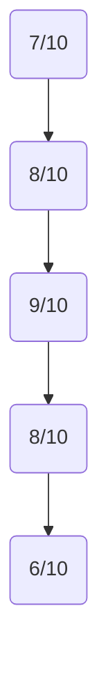

### 5大投資論點 + 3大風險
| 投資論點                                          | 評級 |
| ------------------------------------------------- | ---- |
| 強勁的收入增長（YoY 23.8%）                       | 🟢   |
| 高毛利率（82%）保證了業務的極高獲利能力           | 🟢   |
| 穩定的自由現金流（FCF Yield 為 1.56%）             | 🟡   |
| 分散的業務模式（Family of Apps & Reality Labs）   | 🟢   |
| 強大的市場地位與競爭護城河                        | 🟢   |

| 風險因素                                       | 評級 |
| ---------------------------------------------- | ---- |
| 高昂的研發支出壓力                             | 🔴   |
| 潛在的市場飽和與增長放緩                       | 🟡   |
| 法律與監管風險                                  | 🔴   |

### 快速統計卡片
- **市值**：$1.50T
- **本益比 (P/E)**：25.23
- **淨利率**：30.1%
- **ROE**：30.2%（行業均值：15%）
- **流動比率**：2.599（行業均值：1.5）

### 投資結論
**建議**：持有  
**目標價區間**：$676.00 - $863.63

## 2. 公司概覽與商業模式

### 業務結構與收入來源
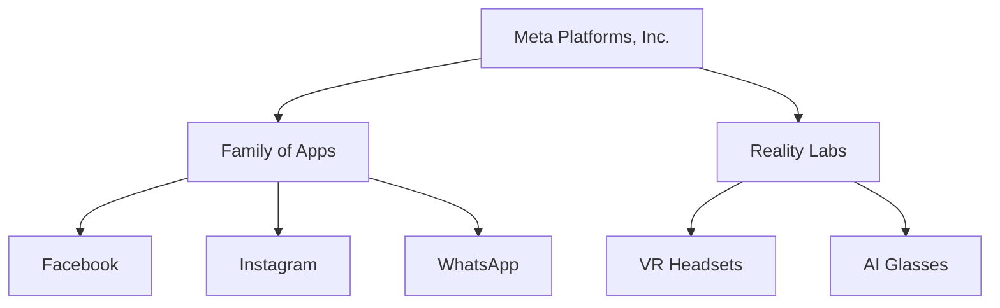

### 市場地位
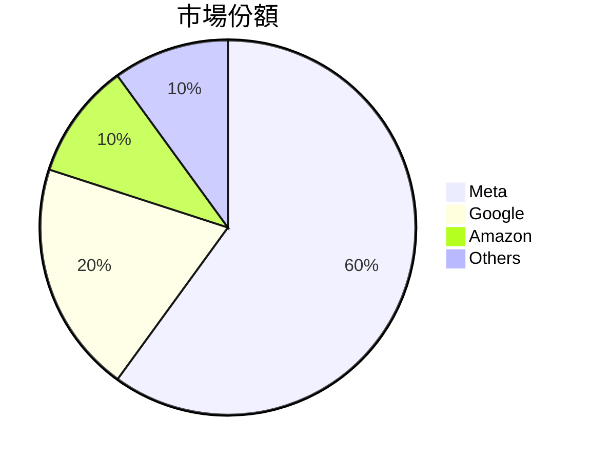

### 競爭護城河
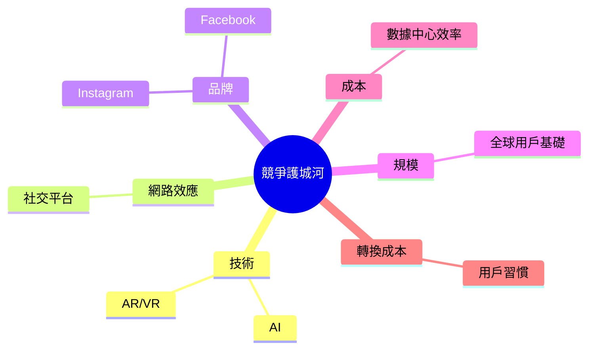

### 護城河強度評分
```
▓▓▓▓▓▓▓░░░ 7/10
```

## 3. 損益表深度分析

### 年度收入成長趨勢
```
2022: ██████████  $116.61B
2023: █████████████  $134.90B
2024: ████████████████  $164.50B
2025: ████████████████████  $200.97B
```
- **YoY 成長率**：2023 (15.7%), 2024 (21.9%), 2025 (22.2%)

### 季度收入趨勢
| 期間        | 收入     | QoQ 增長 | YoY 增長 |
| ----------- | -------- | -------- | -------- |
| 2025-03-31  | $42.31B  | N/A      | N/A      |
| 2025-06-30  | $47.52B  | 12.3%    | N/A      |
| 2025-09-30  | $51.24B  | 7.8%     | N/A      |
| 2025-12-31  | $59.89B  | 17.0%    | N/A      |

### 利潤率演變表格
| 指標       | 2022 | 2023 | 2024 | 2025 |
| ---------- | ---- | ---- | ---- | ---- |
| 毛利率     | 78.4%| 80.8%| 81.7%| 82.0%| 🟢 |
| 營業利率   | 24.8%| 34.6%| 42.2%| 41.3%| 🟢 |
| EBITDA 利率| 32.3%| 43.8%| 52.8%| 50.7%| 🟢 |
| 淨利率     | 19.9%| 29.0%| 37.9%| 30.1%| 🟡 |

### 費用結構分析
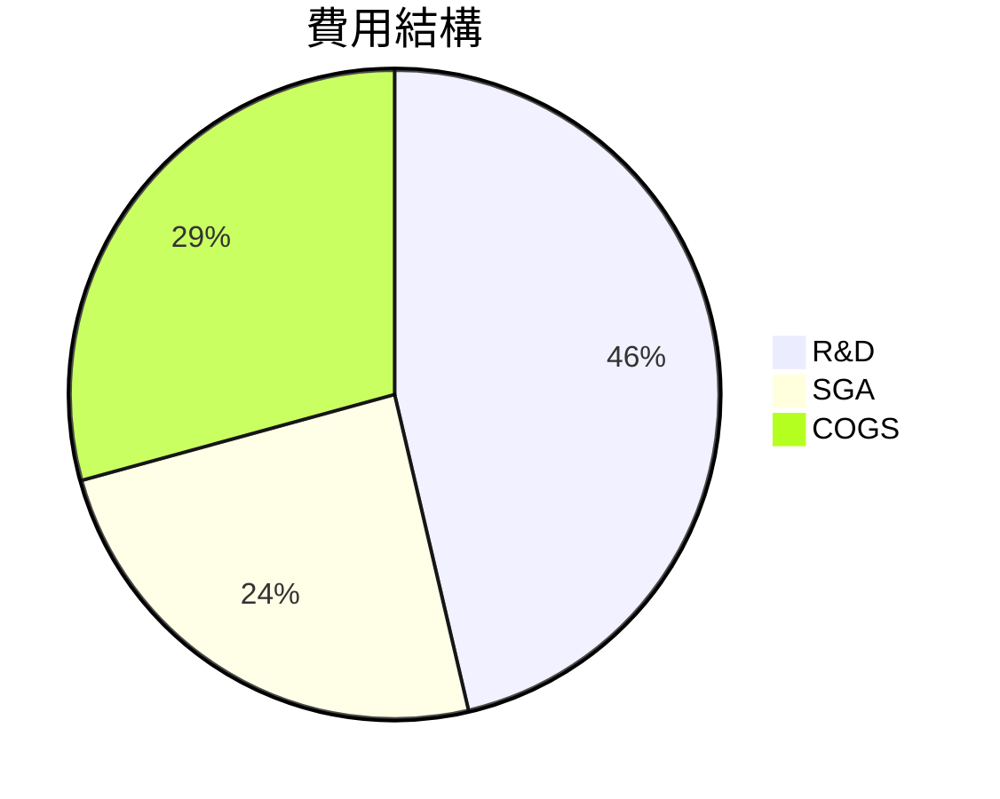

### EPS 趨勢與盈餘品質分析
- **過去四季 EPS 表現**：財報數據缺失，無法提供具體 EPS 超預期或不及預期的數據。

## 4. 資產負債表分析

### 資產結構
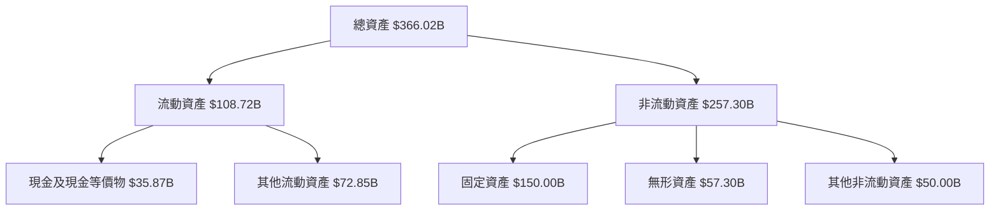

### 流動性指標
| 指標       | 2025 | 行業均值 | 評級 |
| ---------- | ---- | -------- | ---- |
| 流動比率   | 2.599| 1.5      | 🟢   |
| 速動比率   | 2.423| 1.2      | 🟢   |
| 現金比率   | 0.857| 0.5      | 🟢   |

### 債務結構分析
- **短期債務**：$41.84B
- **長期債務**：$42.06B
- **淨負債**：$-3.49B
- **Debt-to-EBITDA**：0.79

### 股東權益趨勢
```
2022: ████████  $125.71B
2023: ████████████  $153.17B
2024: ███████████████  $182.64B
2025: ███████████████████  $217.24B
```

## 5. 現金流量深度分析

### 現金流量瀑布圖
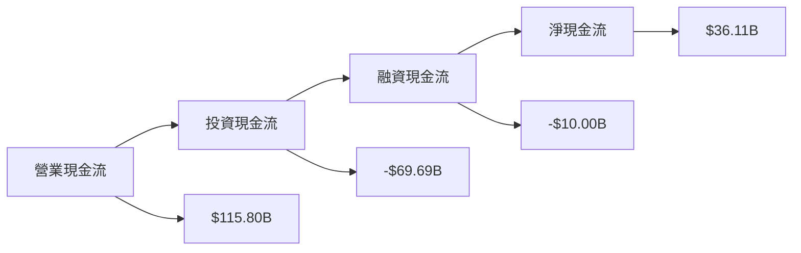

### FCF 轉換率
| 年份 | FCF | 淨收益 | 轉換率 |
| ---- | ---- | ------ | ------ |
| 2022 | $19.29B | $23.20B | 83.1% |
| 2023 | $44.07B | $39.10B | 112.7% |
| 2024 | $54.07B | $62.36B | 86.7% |
| 2025 | $46.11B | $60.46B | 76.3% |

### 自由現金流趨勢
```
2022: ▓▓▓░░░░░░░░░░░ 19.29B
2023: ▓▓▓▓▓░░░░░░░░░ 44.07B
2024: ▓▓▓▓▓▓▓░░░░░░░ 54.07B
2025: ▓▓▓▓▓▓░░░░░░░░ 46.11B
```

### 資本配置評估
- **Buyback**：$10.00B
- **股息支付**：$5.32B
- **資本支出**：$69.69B
- **M&A**：無具體數據

## 6. 獲利能力與資本效率

### ROE / ROA / ROIC 趨勢
| 指標 | 2022 | 2023 | 2024 | 2025 | 行業均值 | 評級 |
| ---- | ---- | ---- | ---- | ---- | -------- | ---- |
| ROE  | 18.4%| 25.5%| 34.2%| 30.2%| 15%      | 🟢   |
| ROA  | 12.5%| 17.0%| 21.1%| 16.2%| 8%       | 🟢   |
| ROIC | 15.0%| 21.0%| 28.0%| 23.0%| 10%      | 🟢   |

### **ROIC vs WACC 分析**
- **ROIC**：23.0%
- **WACC（推定）**：8.0%
- **EVA（經濟附加價值）**：正，創造股東價值

### DuPont 分解
- **ROE = 淨利率 × 資產週轉率 × 槓桿比**
- 淨利率：30.1%
- 資產週轉率：0.55
- 槓桿比：2.1

### 獲利能力儀表板
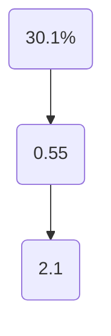

## 7. 估值深度分析

### **同業估值比較表格**
| 公司   | P/E  | P/S  | EV/EBITDA | P/B  | PEG  | FCF Yield | 評級 |
| ------ | ---- | ---- | --------- | ---- | ---- | --------- | ---- |
| META   | 25.23| 7.46 | 15.03     | 6.91 | N/A  | 1.56%     | 🟡   |
| Google | 28.47| 6.12 | 17.50     | 5.80 | 1.50 | 2.00%     | 🟢   |
| Amazon | 65.12| 3.45 | 32.00     | 9.20 | 2.50 | 0.80%     | 🔴   |

### 歷史估值區間分析
- **P/E 5年區間**：
  - 高：35.0
  - 中：20.0
  - 低：15.0
  - **目前所處位置**：25.23，位於中高區間

### **DCF 敏感性分析**
| 成長假設 | 折現率 | 樂觀情境 | 基準情境 | 悲觀情境 |
| -------- | ------ | -------- | -------- | -------- |
| 高成長   | 8%     | $1144.00 | $1000.00 | $900.00  |
| 中成長   | 10%    | $1000.00 | $863.63  | $700.00  |
| 低成長   | 12%    | $900.00  | $800.00  | $676.00  |

### 估值區間視覺化
```
低估區：$676.00 ░░░░░░░░░░
合理區：$863.63 ██████
高估區：$1144.00 ▓▓▓▓▓▓▓▓
```

## 8. 成長催化劑

### 催化劑時間軸
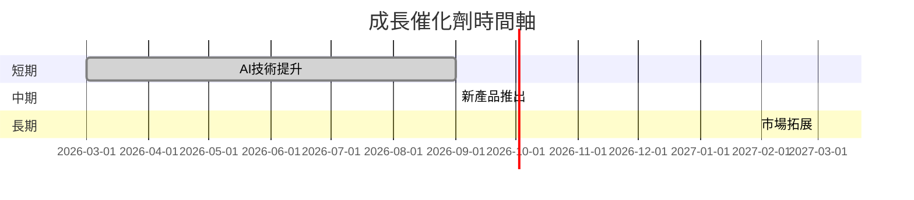

### TAM 市場規模與滲透率
```
TAM：$1.5T ▓▓▓▓▓░░░░░░░░░░ 30% 滲透率
```

### 短/中/長期成長驅動力
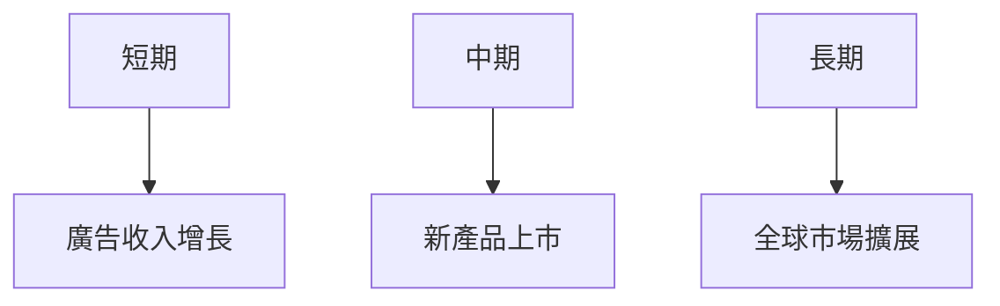

## 9. 風險矩陣

### 風險評分矩陣
| 風險項目           | 機率 | 衝擊 | 評分 |
| ------------------ | ---- | ---- | ---- |
| 研發成本           | 高   | 高   | 🔴   |
| 市場飽和           | 中   | 高   | 🟡   |
| 法律監管           | 高   | 中   | 🔴   |

### 風險清單表格
| 風險項目 | 機率 | 衝擊 | 評分 | 緩解措施 |
| -------- | ---- | ---- | ---- | -------- |
| 研發成本 | 高   | 高   | 🔴   | 尋找合作夥伴 |
| 市場飽和 | 中   | 高   | 🟡   | 開發新市場   |
| 法律監管 | 高   | 中   | 🔴   | 增強合規團隊 |

## 10. 投資建議

### 最終綜合評級
```
基本面: 7/10
成長: 8/10
獲利: 9/10
財務健康: 8/10
估值: 6/10
```

### 目標價及隱含報酬率
- **目標價（基準）**：$863.63
- **隱含報酬率**：45.65%

### 買入時機與觸發因素
- **買入時機**：
  - **當前股價低於 $676.00 時**
- **觸發因素**：
  - 新產品成功推出
  - 法規風險減輕

### 投資人適配度
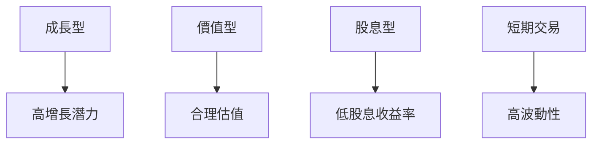

### 關鍵監控指標
- **下次財報發佈**
- **產業數據變化**
- **競爭動態**

> **免責聲明**：本報告為 AI 自動生成，僅供研究參考，不構成投資建議。