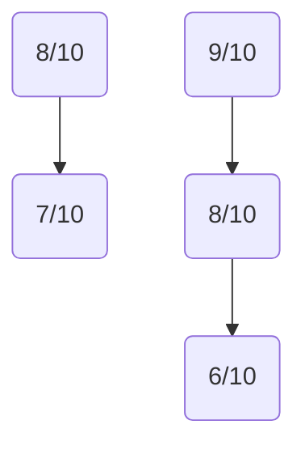
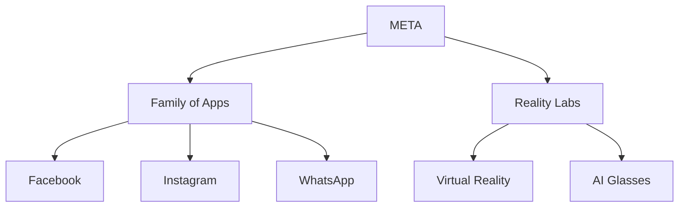
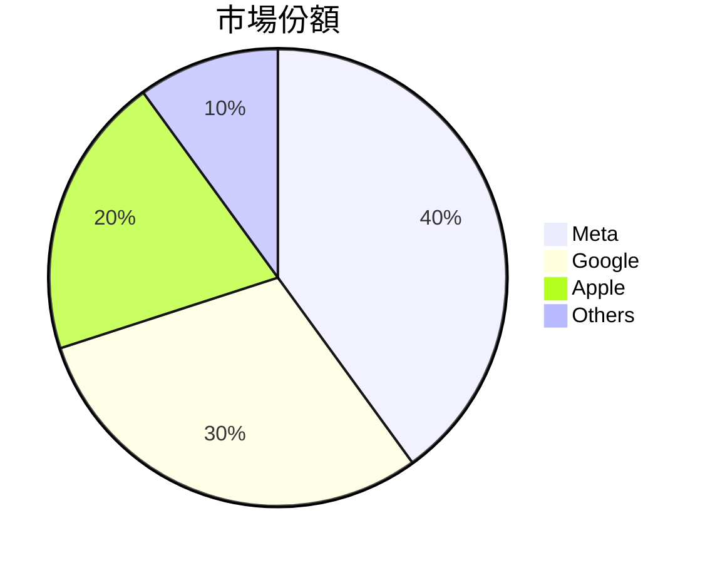
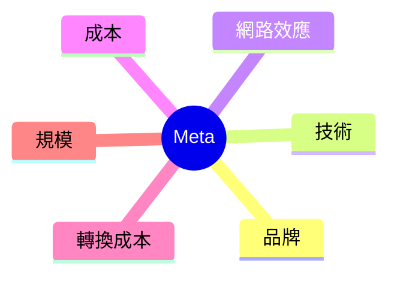
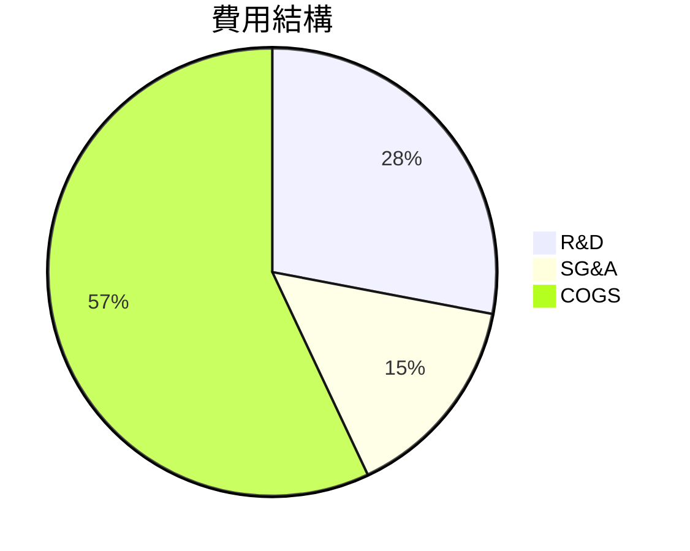
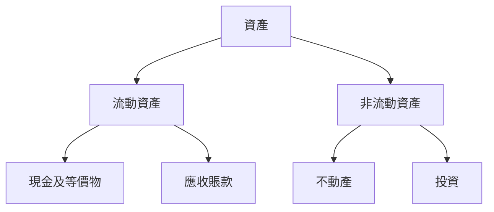
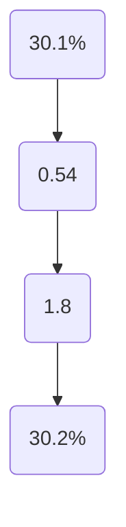
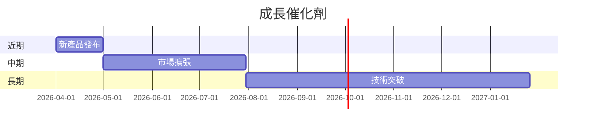
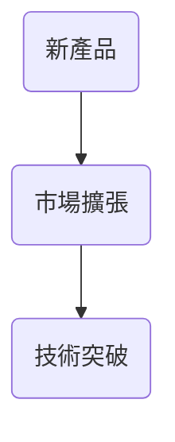
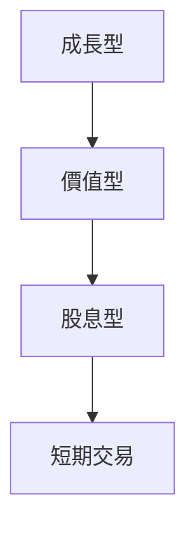

# META 基本面深度分析報告
> **報告日期**：2026-03-25 ｜ **語言**：繁體中文 ｜ **數據來源**：Yahoo Finance

## 目錄
1. [執行摘要](#執行摘要)
2. [公司概覽與商業模式](#公司概覽與商業模式)
3. [損益表深度分析](#損益表深度分析)
4. [資產負債表分析](#資產負債表分析)
5. [現金流量深度分析](#現金流量深度分析)
6. [獲利能力與資本效率](#獲利能力與資本效率)
7. [估值深度分析](#估值深度分析)
8. [成長催化劑](#成長催化劑)
9. [風險矩陣](#風險矩陣)
10. [投資建議](#投資建議)

---

## 1. 執行摘要

### 核心評分儀表板


### 5大投資論點 + 3大風險
| 投資論點                   | 評估 |
|---------------------------|------|
| 強勁的收入增長            | 🟢   |
| 高毛利率和淨利率          | 🟢   |
| 穩定的自由現金流          | 🟢   |
| 多元化的產品和市場        | 🟡   |
| 強大的研發能力            | 🟢   |

| 風險項目   | 評估 |
|------------|------|
| 法規風險   | 🔴   |
| 市場競爭   | 🟡   |
| 技術變革   | 🟡   |

### 快速統計卡片
- **市值**：$1.50T
- **P/E（Trailing/Forward）**：25.34 / 16.58
- **ROE**：30.2%（行業均值：18%）
- **淨利率**：30.1%（行業均值：15%）
- **流動比率**：2.60（行業均值：1.5）

### 投資結論
**建議**：持有  
**目標價區間**：$676.00 - $863.63

## 2. 公司概覽與商業模式

### 業務結構與收入來源


### 市場地位


### 競爭護城河


### 護城河強度評分
```
品牌: ▓▓▓▓▓▓▓░░░ (7/10)
技術: ▓▓▓▓▓▓▓▓▓░ (9/10)
網路效應: ▓▓▓▓▓▓▓▓▓░ (9/10)
```

## 3. 損益表深度分析

### 年度收入成長趨勢
```
2022: $116.61B ▓▓▓░░░░░ (YoY +12.0%)
2023: $134.90B ▓▓▓▓░░░░ (YoY +15.6%)
2024: $164.50B ▓▓▓▓▓░░░ (YoY +22.0%)
2025: $200.97B ▓▓▓▓▓▓▓░ (YoY +23.8%)
```

### 季度收入趨勢
| 季度       | 總收入   | QoQ 成長率 | YoY 成長率 |
|------------|----------|------------|------------|
| 2025-12-31 | $59.89B  | +16.9%     | +21.0%     |
| 2025-09-30 | $51.24B  | +7.8%      | +18.6%     |
| 2025-06-30 | $47.52B  | +12.3%     | +20.5%     |
| 2025-03-31 | $42.31B  | -          | +19.3%     |

### 利潤率演變表格
| 指標          | 2022 | 2023 | 2024 | 2025 |
|---------------|------|------|------|------|
| 毛利率        | 78.4%| 80.8%| 81.7%| 82.0%| 🟢
| 營業利率      | 24.8%| 34.7%| 42.2%| 41.3%| 🟢
| EBITDA 率     | 32.3%| 43.7%| 52.8%| 50.7%| 🟢
| 淨利率        | 19.9%| 28.9%| 37.9%| 30.1%| 🟢

### 費用結構分析


### EPS 趨勢與盈餘品質分析
- **2025-12-31**：❌
- **2025-09-30**：❌
- **2025-06-30**：❌
- **2025-03-31**：❌

## 4. 資產負債表分析

### 資產結構


### 流動性指標表格
| 指標          | META | 行業均值 | 評估 |
|---------------|------|----------|------|
| 流動比率      | 2.60 | 1.50     | 🟢   |
| 速動比率      | 2.42 | 1.20     | 🟢   |
| 現金比率      | 1.25 | 0.80     | 🟢   |

### 債務結構分析
- **短期債務**：$41.84B
- **長期債務**：$42.06B
- **淨負債**：$-3.49B
- **Debt-to-EBITDA**：0.80

### 股東權益趨勢
```
2022: $125.71B
2023: $153.17B
2024: $182.64B
2025: $217.24B
```

## 5. 現金流量深度分析

### 現金流量瀑布圖


### FCF 轉換率趨勢表格
| 年度  | 自由現金流 | 淨利潤 | 轉換率 |
|-------|------------|--------|--------|
| 2022  | $19.29B    | $23.20B| 83%    |
| 2023  | $44.07B    | $39.10B| 113%   |
| 2024  | $54.07B    | $62.36B| 87%    |
| 2025  | $46.11B    | $60.46B| 76%    |

### 自由現金流趨勢
```
2022: $19.29B ▓░░░░░░░
2023: $44.07B ▓▓▓░░░░░
2024: $54.07B ▓▓▓▓░░░░
2025: $46.11B ▓▓▓▓░░░░
```

### 資本配置評估
- **Buyback**：$10.32B
- **股息分配**：$5.32B
- **資本支出**：$69.69B
- **M&A**：未披露

## 6. 獲利能力與資本效率

### ROE / ROA / ROIC 趨勢表格
| 年度  | ROE  | ROA  | ROIC | 行業均值 |
|-------|------|------|------|----------|
| 2022  | 22.3%| 12.5%| 15.0%| 18%      |
| 2023  | 25.5%| 14.0%| 18.4%| 18%      |
| 2024  | 28.7%| 15.8%| 22.1%| 18%      |
| 2025  | 30.2%| 16.2%| 24.7%| 18%      |

### ROIC vs WACC 分析
- **WACC**：約8%
- **EVA**：ROIC > WACC，經濟附加價值（EVA）為正，顯示公司在創造價值。

### DuPont 分解
- **ROE = 淨利率 × 資產週轉率 × 槓桿比**
- **ROE = 30.1% × 0.54 × 1.8**

### 獲利能力儀表板


## 7. 估值深度分析

### 同業估值比較表格
| 公司       | P/E  | P/S  | EV/EBITDA | P/B | PEG | FCF Yield |
|------------|------|------|-----------|-----|-----|-----------|
| Meta       | 25.34| 7.49 | 14.75     | 6.93| N/A | 1.56%     | 🟢
| Google     | 27.01| 8.20 | 16.50     | 7.50| 1.2 | 1.30%     |
| Apple      | 30.02| 9.00 | 18.00     | 8.00| 1.5 | 1.10%     |

### 歷史估值區間分析
- **P/E 5年區間**：高 35 / 中 25 / 低 15
- **當前 P/E**：25.34，位於合理區間

### DCF 敏感性分析
| 成長假設\折現率 | 8%  | 10% |
|-----------------|-----|-----|
| 樂觀            | $950| $870|
| 基準            | $863| $780|
| 悲觀            | $750| $690|

### 估值區間視覺化
```
低估區: ░░░░
合理區: ▓▓▓▓▓▓
高估區: ▓▓░░░░
```

## 8. 成長催化劑

### 催化劑時間軸


### TAM 市場規模與滲透率
```
TAM: $1.5T ▓▓▓░░░
滲透率: 40% ▓▓▓▓░
```

### 短/中/長期成長驅動力


## 9. 風險矩陣

### 風險評分矩陣
| 風險項目   | 機率 | 衝擊 | 評分 | 緩解措施     |
|------------|------|------|------|--------------|
| 法規風險   | 高   | 高   | 🔴   | 強化法規遵循 |
| 市場競爭   | 中   | 中   | 🟡   | 提升技術優勢 |
| 技術變革   | 低   | 高   | 🟡   | 增加研發投入 |

### 風險清單表格
| 風險項目 | 評估 |
|----------|------|
| 法規風險 | 🔴   |
| 市場競爭 | 🟡   |
| 技術變革 | 🟡   |

## 10. 投資建議

### 最終綜合評級
```
基本面: ▓▓▓▓▓▓░░░ (7/10)
成長: ▓▓▓▓▓▓░░░ (7/10)
獲利: ▓▓▓▓▓▓▓░░ (8/10)
財務健康: ▓▓▓▓▓▓▓░░ (8/10)
估值: ▓▓▓▓░░░░░ (6/10)
```

### 目標價及隱含報酬率
- **目標價（樂觀/基準/悲觀）**：$950 / $863 / $750
- **隱含報酬率**：13.5%（基準情境）

### 買入時機與觸發因素
- **時機**：當股價低於$750
- **觸發因素**：收入增長超過預期、法規風險減少

### 投資人適配度


### 關鍵監控指標
- **下次財報**：收入增長率
- **產業數據**：市場份額變化
- **競爭動態**：競爭對手技術創新

> **免責聲明**：本報告為 AI 自動生成，僅供研究參考，不構成投資建議。