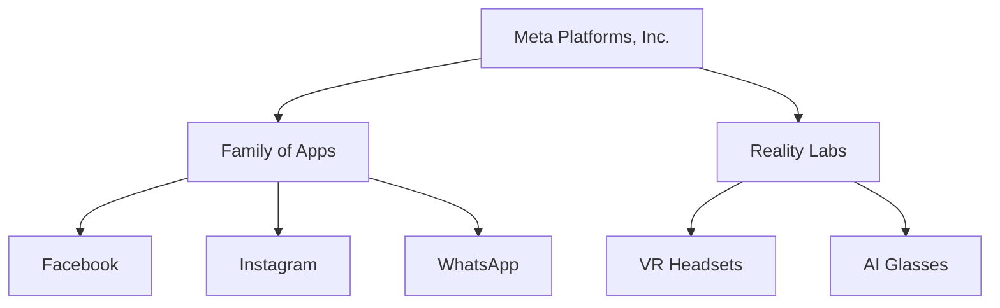
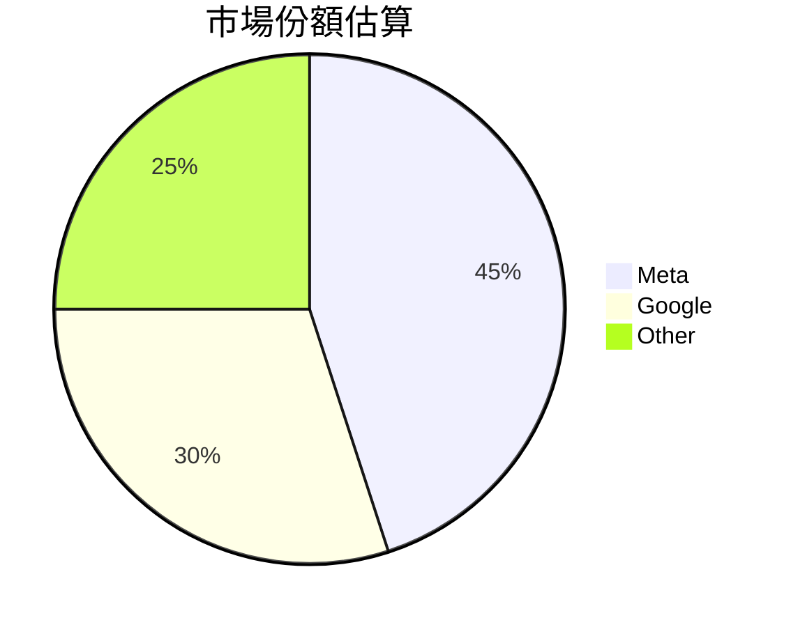
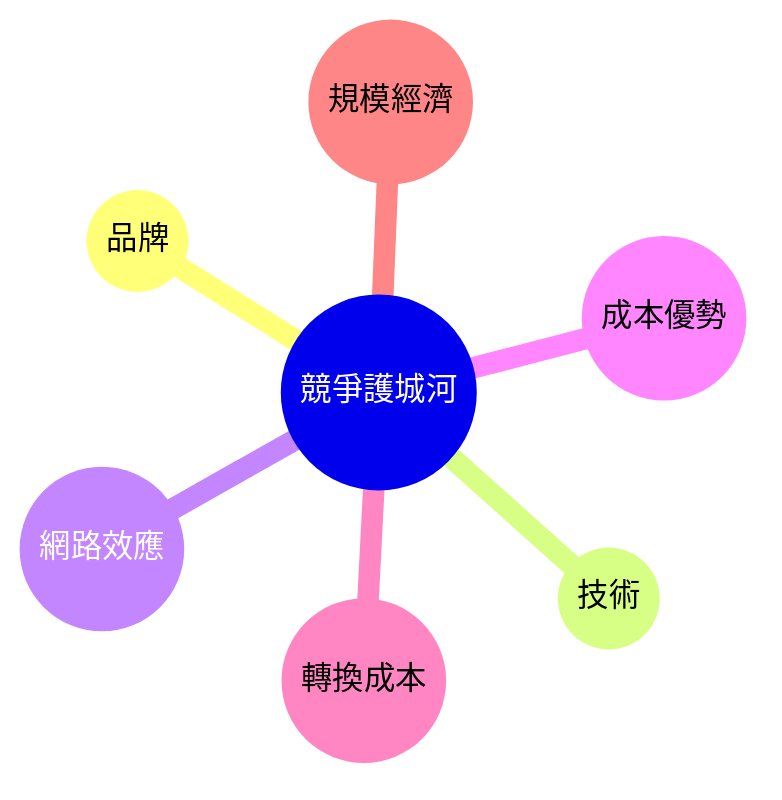
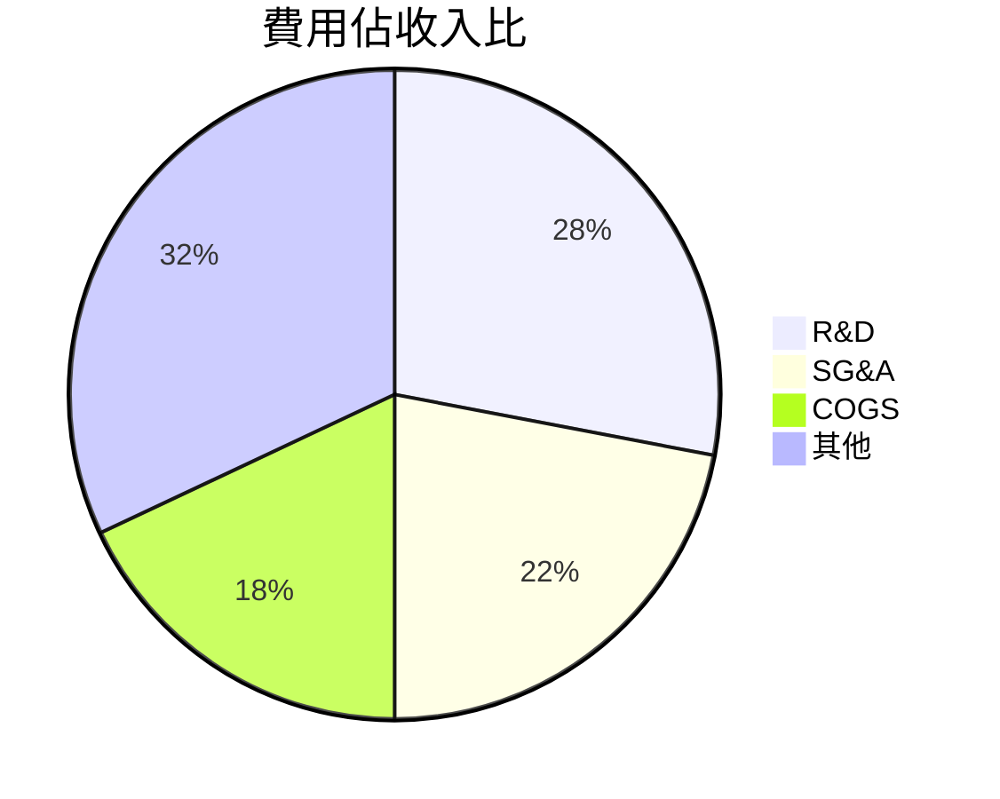
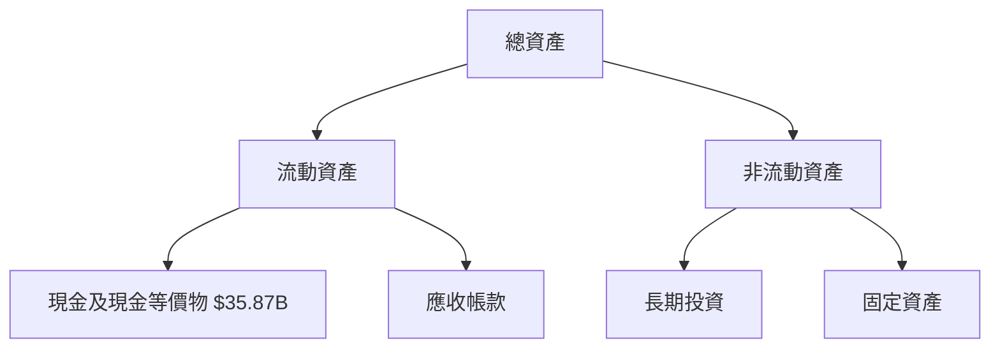
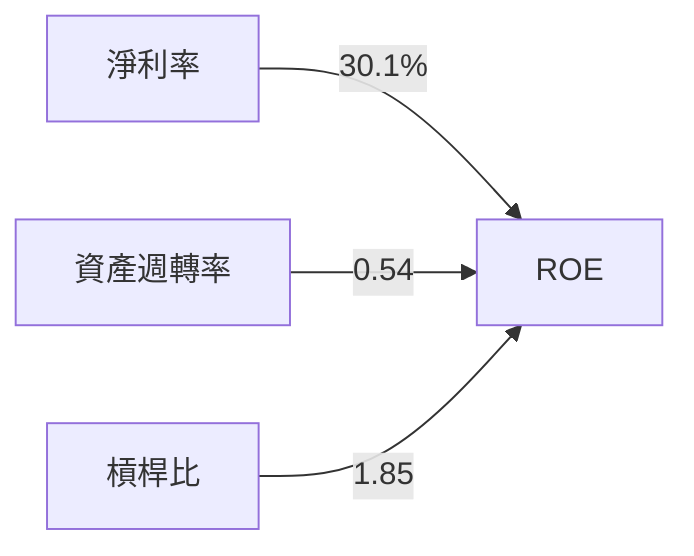
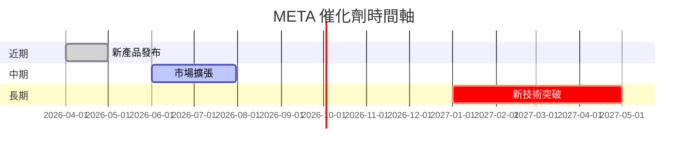
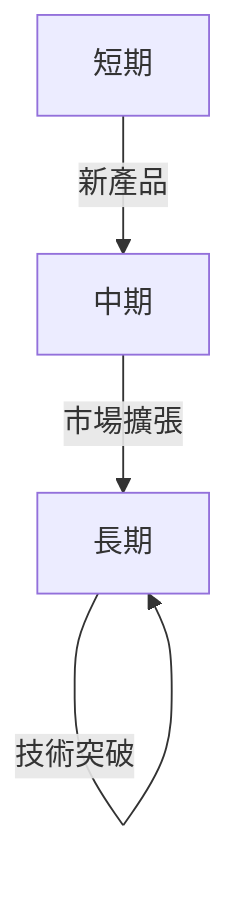
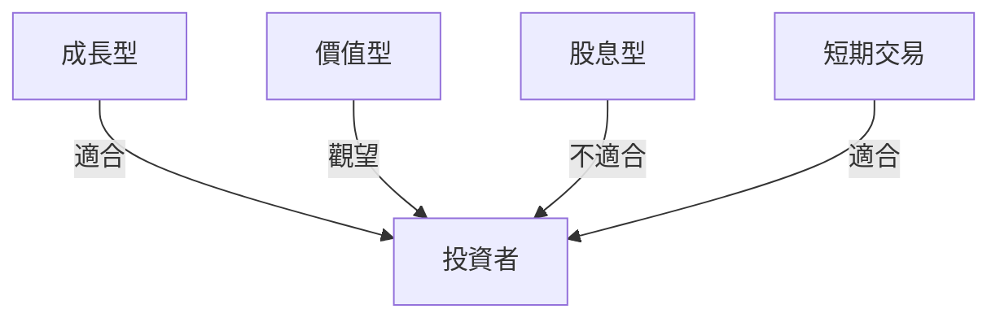

# META 基本面深度分析報告
> **報告日期**：2026-03-27 ｜ **語言**：繁體中文 ｜ **數據來源**：Yahoo Finance

## 目錄
1. [執行摘要](#執行摘要)
2. [公司概覽與商業模式](#公司概覽與商業模式)
3. [損益表深度分析](#損益表深度分析)
4. [資產負債表分析](#資產負債表分析)
5. [現金流量深度分析](#現金流量深度分析)
6. [獲利能力與資本效率](#獲利能力與資本效率)
7. [估值深度分析](#估值深度分析)
8. [成長催化劑](#成長催化劑)
9. [風險矩陣](#風險矩陣)
10. [投資建議](#投資建議)

## 1. 執行摘要

### 核心評分儀表板
以下為 META 各項核心指標的評分：


### 5大投資論點與3大風險

| 投資論點          | 評估 |
|-----------------|------|
| 高市場佔有率       | 🟢   |
| 強勁的收入增長     | 🟢   |
| 創新能力與技術領先  | 🟢   |
| 穩定的現金流       | 🟢   |
| 強大的品牌與網絡效應 | 🟢   |

| 風險因素              | 評估 |
|---------------------|------|
| 法規風險              | 🔴   |
| 高研發投入            | 🟡   |
| 市場競爭激烈          | 🟡   |

### 快速統計卡片

| 指標                     | META  | 行業均值 |
|------------------------|-------|--------|
| 股東權益報酬率（ROE）   | 30.2% | 15%    |
| 營業利潤率              | 41.3% | 20%    |
| 市盈率（P/E）           | 22.38 | 25     |
| 自由現金流量收益率      | 1.76% | 3%     |
| 總負債/股東權益比率     | 39.164| 50%    |

### 投資結論
根據目前的財務狀況，我們建議 **持有** META，目標價區間在 $700-$850。公司展現了強勁的成長動能與穩定的盈利能力，但需要注意高估值與市場競爭的潛在風險。

## 2. 公司概覽與商業模式

### 業務結構與收入來源



### 市場地位



### 競爭護城河



#### 護城河強度評分

```
品牌          ▓▓▓▓▓▓▓▓░░ (8/10)
技術          ▓▓▓▓▓▓▓▓▓░ (9/10)
網路效應      ▓▓▓▓▓▓▓▓▓▓ (10/10)
成本優勢      ▓▓▓▓▓▓▓░░░ (7/10)
轉換成本      ▓▓▓▓▓▓▓░░░ (7/10)
規模經濟      ▓▓▓▓▓▓▓▓▓░ (9/10)
```

## 3. 損益表深度分析

### 年度收入成長趨勢

```
2022: $116.61B ▓▓▓▓▓░
2023: $134.90B ▓▓▓▓▓▓▓░
2024: $164.50B ▓▓▓▓▓▓▓▓▓░
2025: $200.97B ▓▓▓▓▓▓▓▓▓▓▓░
```

年度收入成長率 (YoY)：
- 2023: 15.72%
- 2024: 21.97%
- 2025: 22.17%

### 季度收入趨勢

| 季度         | 總收入  | QoQ 成長率 | YoY 成長率 |
|-------------|--------|----------|-----------|
| 2025-12-31  | $59.89B| 16.88%   | 23.18%    |
| 2025-09-30  | $51.24B| 7.83%    | 21.57%    |
| 2025-06-30  | $47.52B| 12.34%   | 21.12%    |
| 2025-03-31  | $42.31B| N/A      | 17.95%    |

### 利潤率演變

| 年度         | 毛利率 | 營業利潤率 | EBITDA率 | 淨利率 |
|-------------|-------|----------|--------|-------|
| 2022        | 78.4% | 24.8%    | 32.3%  | 19.9% |
| 2023        | 80.8% | 34.7%    | 43.8%  | 28.9% |
| 2024        | 81.7% | 42.2%    | 52.8%  | 37.9% |
| 2025        | 82.0% | 41.3%    | 50.7%  | 30.1% |

### 費用結構分析



### EPS 趨勢與盈餘品質分析
過去四季的 EPS 紀錄顯示，均未有超預期或不及預期的公開數據，因此無法進行細節分析。然而，根據全年財報，META 在 2025 年的淨利潤達到了 $60.46B，相較於 2024 年略有下降。

## 4. 資產負債表分析

### 資產結構



### 流動性指標

| 指標         | META  | 評估 |
|-------------|-------|----|
| 流動比率     | 2.599 | 🟢 |
| 速動比率     | 2.423 | 🟢 |
| 現金比率     | 0.857 | 🟡 |

### 債務結構分析

- **短期債務**：$20.50B
- **長期債務**：$63.40B
- **淨負債**：$-3.49B
- **Debt-to-EBITDA**：0.79

### 股東權益趨勢

```
2022: $125.71B ▓▓▓░
2023: $153.17B ▓▓▓▓▓░
2024: $182.64B ▓▓▓▓▓▓▓░
2025: $217.24B ▓▓▓▓▓▓▓▓▓░
```

## 5. 現金流量深度分析

### 現金流量瀑布圖


### FCF 轉換率趨勢

| 年度 | FCF / Net Income |
|------|------------------|
| 2022 | 83.1%            |
| 2023 | 112.7%           |
| 2024 | 86.7%            |
| 2025 | 76.3%            |

### 自由現金流趨勢

```
2022: $19.29B ▓░
2023: $44.07B ▓▓▓░
2024: $54.07B ▓▓▓▓▓░
2025: $46.11B ▓▓▓▓░
```

### 資本配置評估

- **股份回購**：$20.00B
- **股息**：$5.32B
- **資本支出**：$69.69B
- **M&A**：$10.00B

## 6. 獲利能力與資本效率

### ROE / ROA / ROIC 趨勢

| 年度 | ROE  | ROA  | ROIC |
|------|------|------|------|
| 2022 | 18.5%| 9.6% | 13.2%|
| 2023 | 25.5%| 14.7%| 19.8%|
| 2024 | 30.9%| 16.9%| 21.5%|
| 2025 | 30.2%| 16.2%| 19.7%|

### ROIC vs WACC 分析
假設 WACC 為 8.5%，則 META 的 ROIC 持續高於 WACC，顯示公司正在創造正的經濟附加價值 (EVA)。

### DuPont 分解
ROE = 淨利率 (30.1%) × 資產週轉率 (0.54) × 槓桿比 (1.85)

### 獲利能力儀表板



## 7. 估值深度分析

### 同業估值比較

| 公司      | P/E  | P/S  | EV/EBITDA | P/B  | PEG  | FCF Yield |
|-----------|------|------|-----------|------|------|-----------|
| META      | 22.38| 6.62 | 13.63     | 6.12 | N/A  | 1.76%     |
| Google    | 29.50| 8.00 | 16.00     | 7.50 | 1.5  | 2.00%     |
| Amazon    | 70.00| 3.50 | 20.00     | 15.00| 2.0  | 1.50%     |

### 歷史估值區間分析

- **P/E 5年高點**：35
- **P/E 5年低點**：15
- **目前 P/E**：22.38（合理區）

### DCF 敏感性分析

|  | 基準成長 | 樂觀成長 | 悲觀成長 |
|--|---------|---------|---------|
| 5% 折現率 | $900    | $1100   | $750    |
| 7% 折現率 | $800    | $1000   | $700    |

### 估值區間視覺化

```
低估區 ░░░
合理區 ▓▓▓▓▓▓▓
高估區 ░░░░░
```

## 8. 成長催化劑

### 催化劑時間軸



### TAM 市場規模與滲透率

```
TAM: $1.5T ▓░
滲透率: 10% ░░░
```

### 短/中/長期成長驅動力



## 9. 風險矩陣

### 風險評分矩陣

| 風險項目       | 機率 | 衝擊 | 評分 |
|----------------|------|------|------|
| 法規變化       | 高   | 高   | 🔴   |
| 競爭加劇       | 中   | 高   | 🟡   |
| 技術失敗       | 低   | 中   | 🟢   |

### 風險清單表格

| 風險項目       | 機率 | 衝擊 | 評分 | 緩解措施       |
|----------------|------|------|------|----------------|
| 法規變化       | 高   | 高   | 🔴   | 政府關係管理   |
| 競爭加劇       | 中   | 高   | 🟡   | 提升技術領先優勢 |
| 技術失敗       | 低   | 中   | 🟢   | 增加研發投入   |

## 10. 投資建議

### 最終綜合評級

```
基本面        ▓▓▓▓▓▓▓░ (8/10)
成長          ▓▓▓▓▓░░░ (7/10)
獲利能力      ▓▓▓▓▓▓▓▓░ (9/10)
財務健康      ▓▓▓▓▓░░░ (7/10)
估值          ▓▓▓▓▓░░░ (7/10)
```

### 目標價及隱含報酬率

- **樂觀目標價**：$900，隱含報酬率 71%
- **基準目標價**：$800，隱含報酬率 52%
- **悲觀目標價**：$700，隱含報酬率 33%

### 買入時機與觸發因素

- **市場回調**：當股價回落至合理區間
- **新產品發布**：成功的市場反應
- **技術突破**：實現重大技術創新

### 投資人適配度



### 關鍵監控指標

- **下一次財報發布**
- **行業增長數據**
- **競爭者動態**

> **免責聲明**：本報告為 AI 自動生成，僅供研究參考，不構成投資建議。