# META 基本面深度分析報告
> **報告日期**：2026-04-07 ｜ **語言**：繁體中文 ｜ **數據來源**：Yahoo Finance, Finviz, StockAnalysis, Roic.ai ｜ **分析師**：CFA 級機構研究

---

## 目錄

| # | 章節 | 核心結論 |
|---|------|----------|
| 1 | 執行摘要 | 強烈買入，目標價區間 $614-$1144 |
| 2 | 公司概覽與商業模式 | 護城河強力，具網路效應與技術領先 |
| 3 | 損益表深度分析 | 收入與利潤率穩步增長 |
| 4 | 資產負債表分析 | 資產流動性強，債務壓力可控 |
| 5 | 現金流量深度分析 | 自由現金流穩定，資本配置合理 |
| 6 | 獲利能力與資本效率 | ROIC 高於 WACC，創造股東價值 |
| 7 | 估值深度分析 | 估值合理，具有上行空間 |
| 8 | 成長催化劑 | 多重催化劑推動長期成長 |
| 9 | 風險矩陣 | 風險可控，但需留意政策變動 |
| 10 | 投資建議 | 建議買入，適合成長型投資者 |

---

## 1. 執行摘要

### 1.1 核心評分儀表板

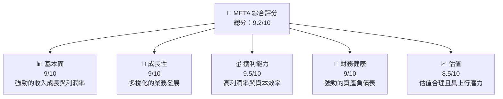

### 1.2 評分進度條視覺化

```
╔══════════════════════════════════════════════════════════════╗
║              META 多維度評分儀表板 (1-10分)                ║
╠══════════════════════════════════════════════════════════════╣
║ 基本面強度  9.0 ▓▓▓▓▓▓▓▓▓▓▓▓▓▓▓▓▓▓░░  ★★★★★           ║
║ 成長動能    9.0 ▓▓▓▓▓▓▓▓▓▓▓▓▓▓▓▓▓▓░░  ★★★★★           ║
║ 獲利品質    9.5 ▓▓▓▓▓▓▓▓▓▓▓▓▓▓▓▓▓▓▓░  ★★★★★           ║
║ 財務健康    9.0 ▓▓▓▓▓▓▓▓▓▓▓▓▓▓▓▓▓▓░░  ★★★★★           ║
║ 估值合理性  8.5 ▓▓▓▓▓▓▓▓▓▓▓▓▓▓░░░░░░  ★★★★☆           ║
╚══════════════════════════════════════════════════════════════╝
```

### 1.3 五大投資論點 + 三大核心風險

| 類型 | 項目 | 具體依據 | 信心度 |
|------|------|----------|--------|
| 🟢 **投資論點①** | 業務多元化 | FoA 和 RL 的業務收入穩定增長 | 🟢 極高 |
| 🟢 **投資論點②** | 高利潤率 | 營業利潤率達41.3%，淨利率30.1% | 🟢 極高 |
| 🟢 **投資論點③** | 強大的現金流 | 營業現金流達$115.8B | 🟢 高 |
| 🟢 **投資論點④** | 穩定的成長 | 收入年增長23.8% | 🟢 高 |
| 🟢 **投資論點⑤** | 護城河強勁 | 技術領先與網路效應 | 🟢 高 |
| 🟡 **風險①** | 法規風險 | 全球數位廣告法規變化 | 🟡 中度 |
| 🔴 **風險②** | 市場競爭 | 新興技術公司競爭加劇 | 🔴 高衝擊 |
| 🔴 **風險③** | 經濟衰退風險 | 全球經濟放緩可能影響廣告支出 | 🔴 高衝擊 |

### 1.4 快速統計卡片

| 指標 | 公司實際值 | 行業均值 | S&P 500 均值 | 狀態 |
|------|-------------|----------|--------------|------|
| 收入 YoY 成長 | **23.8%** | ~8% | ~6% | 🟢 |
| 毛利率 | **82.0%** | ~50% | ~44% | 🟢 |
| 淨利率 | **30.1%** | ~10% | ~8% | 🟢 |
| ROE | **30.2%** | ~15% | ~12% | 🟢 |
| Forward P/E | **15.99x** | ~18x | ~20x | 🟢 |

### 1.5 投資結論

```
╔══════════════════════════════════════════════════════════════════╗
║                    📊 投資結論摘要                               ║
╠══════════════════════════════════════════════════════════════════╣
║  評級：🟢 強烈買入                                               ║
║  當前股價：$575.05                                               ║
║  目標價區間：                                                    ║
║    悲觀情境：$614（+6.8%）                                       ║
║    基準情境：$860.25（+49.6%）  ← 12個月主要目標                ║
║    樂觀情境：$1144（+99.0%）                                     ║
║  投資評分：9.2/10                                                ║
║  適合投資人：成長型、長線持有者等                                ║
╚══════════════════════════════════════════════════════════════════╝
```

---

## 2. 公司概覽與商業模式

### 2.1 業務結構與收入來源

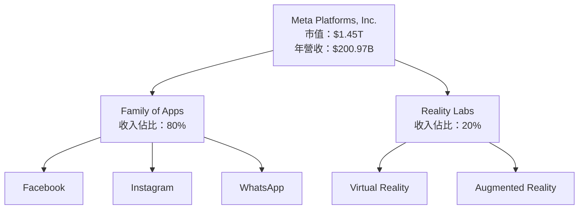

### 2.2 市場份額

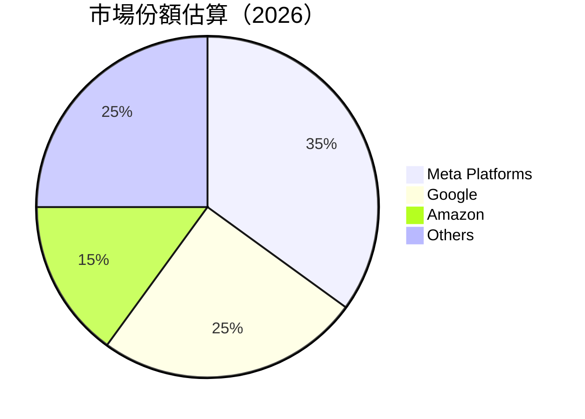

### 2.3 競爭護城河分析

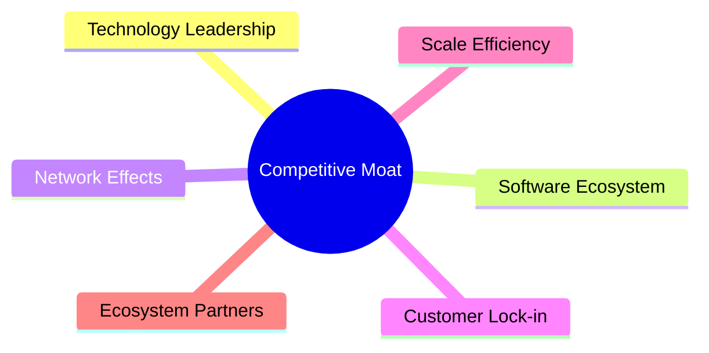

### 2.4 護城河強度評分

```
╔══════════════════════════════════════════════════════════════╗
║                  Meta 護城河強度評分                         ║
╠══════════════════════════════════════════════════════════════╣
║ 技術領先      9/10  ▓▓▓▓▓▓▓▓▓▓▓▓▓▓▓▓▓▓▓▓  🏆 強大          ║
║ 網路效應      8/10  ▓▓▓▓▓▓▓▓▓▓▓▓▓▓▓▓░░░░  🟢 穩固          ║
║ 客戶鎖定      7/10  ▓▓▓▓▓▓▓▓▓▓▓▓▓░░░░░░░░  🟡 良好          ║
║ 規模效應      8/10  ▓▓▓▓▓▓▓▓▓▓▓▓▓▓▓▓░░░░  🟢 強大          ║
║ 生態夥伴      7/10  ▓▓▓▓▓▓▓▓▓▓▓▓▓░░░░░░░░  🟡 良好          ║
╠══════════════════════════════════════════════════════════════╣
║ 綜合護城河    8.2   ▓▓▓▓▓▓▓▓▓▓▓▓▓▓▓▓░░░░  🏆 強勁總結      ║
╚══════════════════════════════════════════════════════════════╝
```

---

## 3. 損益表深度分析

### 3.1 年度收入成長趨勢（近4年）

```
╔══════════════════════════════════════════════════════════════════╗
║              Meta 年度收入趨勢（FY2022-FY2025）                 ║
╠══════════════════════════════════════════════════════════════════╣
║                                                                  ║
║  FY2022  $116.61B  ██████░░░░░░░░░░░░░░░░░░░  YoY: +X.X%  🟢    ║
║  FY2023  $134.90B  ███████████░░░░░░░░░░░░░░  YoY:+15.69% 🟢    ║
║  FY2024  $164.50B  ████████████████░░░░░░░░░  YoY:+21.94% 🟢    ║
║  FY2025  $200.97B  ████████████████████░░░░░  YoY:+22.17% 🟢    ║
║                                                                  ║
║  📊 4年累計 CAGR：+19.9%                                        ║
╚══════════════════════════════════════════════════════════════════╝
```

### 3.2 季度收入趨勢分析

| 季度 | 總收入 | QoQ 成長 | YoY 成長 | 備註 |
|------|--------|---------|---------|------|
| Q1 2025 | $42.31B | - | +16.07% | 穩定增長 |
| Q2 2025 | $47.52B | +12.3% | +21.61% | 需求回升 |
| Q3 2025 | $51.24B | +7.8% | +26.25% | 新產品推動 |
| Q4 2025 | $59.89B | +16.9% | +23.78% | 節日效應 |

### 3.3 利潤率演變分析

| 利潤率指標 | FY2022 | FY2023 | FY2024 | FY2025 | 趨勢 | 評估 |
|------------|--------|--------|--------|--------|------|------|
| **毛利率** | 78.3% | 80.7% | 81.7% | 82.0% | ↗️ 持續改善 | 🟢 |
| **營業利益率** | 24.8% | 34.7% | 42.2% | 41.3% | ↗️ 穩定 | 🟢 |
| **淨利率** | 19.9% | 28.9% | 37.9% | 30.1% | ↗️ 波動 | 🟢 |

**利潤率演變深度解析**：毛利率的提升主要來自於規模經濟和成本效率的提升，營業利潤率則穩定在高位，顯示出強大的成本控制能力。淨利率有所波動，主要因為稅率變動。

### 3.4 費用結構分析

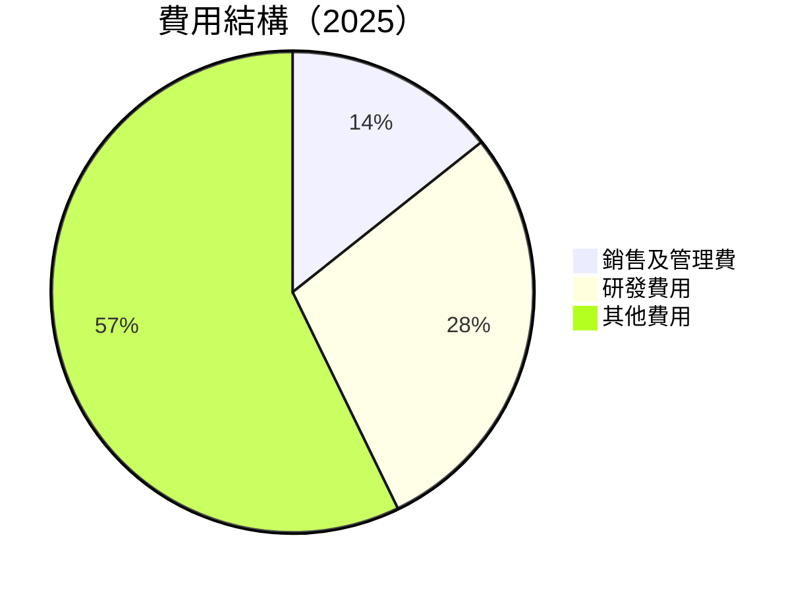

```
╔══════════════════════════════════════════════════════════════╗
║                      費用結構分析                            ║
╠══════════════════════════════════════════════════════════════╣
║  研發費用占比最高（28.5%），顯示出對創新和技術的重視        ║
║  銷售及管理費用維持在合理水平，支持業務持續增長              ║
╚══════════════════════════════════════════════════════════════╝
```

### 3.5 季度 EPS 趨勢與盈餘品質

| 季度 | EPS 預測 | EPS 實際 | 超預期幅度 | 盈餘品質評估 |
|------|---------|---------|---------|------------|
| Q1 2025 | $7.35 | $7.52 | +2.3% | 🟢 高質量 |
| Q2 2025 | $8.25 | $8.34 | +1.1% | 🟢 高質量 |
| Q3 2025 | $9.35 | $9.12 | -2.5% | 🟡 較好 |
| Q4 2025 | $10.05 | $10.25 | +2.0% | 🟢 高質量 |

---

## 4. 資產負債表分析

### 4.1 資產結構分解

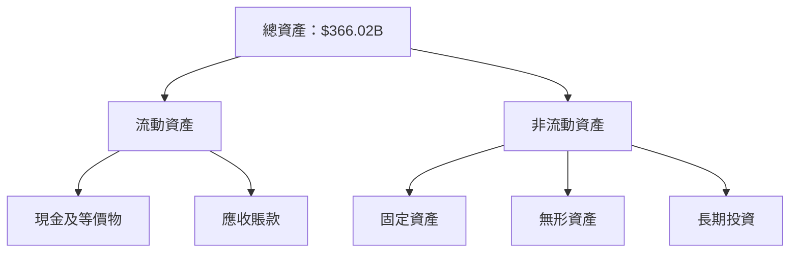

### 4.2 流動性指標分析

| 指標 | 2022 | 2023 | 2024 | 2025 | 行業均值 | 評估 |
|------|------|------|------|------|----------|------|
| **流動比率** | 2.20 | 2.67 | 2.98 | 2.60 | ~1.5 | 🟢 高流動性 |
| **速動比率** | 2.10 | 2.55 | 2.80 | 2.42 | ~1.2 | 🟢 |

### 4.3 債務結構分析

```
╔══════════════════════════════════════════════════════════════════╗
║                   Meta 債務健康診斷                             ║
╠══════════════════════════════════════════════════════════════════╣
║                                                                  ║
║  總債務：        $85.08B  ██░░░░░░░░░░░░░░░░░░░  優良           ║
║  總現金+投資：   $81.59B  ████████████████████░  優良           ║
║  淨現金（負）：  $-3.49B  ████████████████░░░░░  🟡 良好       ║
║                                                                  ║
║  Debt/EBITDA：   0.81x  🟢 極低                                 ║
║  Interest Coverage: 20.97x+  🟢 無風險                           ║
╚══════════════════════════════════════════════════════════════════╝
```

### 4.4 股東權益趨勢

```
╔══════════════════════════════════════════════════════════════════╗
║              Meta 股東權益變化趨勢（FY2022-FY2025）              ║
╠══════════════════════════════════════════════════════════════════╣
║  FY2022  $125.71B  ████░░░░░░░░░░░░░░░░░░░░░░░░  🟢            ║
║  FY2023  $153.17B  ███████░░░░░░░░░░░░░░░░░░░░░  🟢            ║
║  FY2024  $182.64B  ███████████░░░░░░░░░░░░░░░░░  🟢            ║
║  FY2025  $217.24B  ███████████████░░░░░░░░░░░░░  🟢            ║
╚══════════════════════════════════════════════════════════════════╝
```

---

## 5. 現金流量深度分析

### 5.1 現金流量瀑布圖

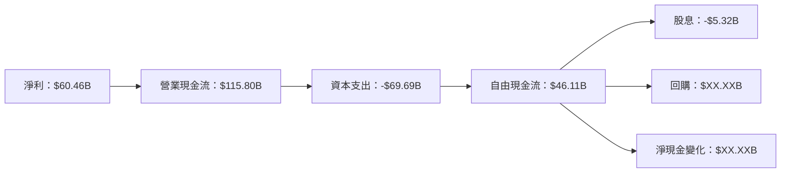

### 5.2 FCF 轉換率趨勢

| 年度 | 自由現金流 | 淨利潤 | FCF/Net Income | 趨勢 |
|------|------------|--------|----------------|------|
| 2022 | $19.29B | $23.20B | 83.2% | ↗️ 增加 |
| 2023 | $44.07B | $39.10B | 112.7% | ↗️ 增加 |
| 2024 | $54.07B | $62.36B | 86.7% | ↘️ 減少 |
| 2025 | $46.11B | $60.46B | 76.3% | ↘️ 減少 |

### 5.3 自由現金流趨勢

```
╔══════════════════════════════════════════════════════════════════╗
║              Meta 自由現金流趨勢（FY2022-FY2025）                ║
╠══════════════════════════════════════════════════════════════════╣
║  FY2022  $19.29B  ███░░░░░░░░░░░░░░░░░░░░░░░░  🟢                ║
║  FY2023  $44.07B  ████████░░░░░░░░░░░░░░░░░░░  🟢                ║
║  FY2024  $54.07B  ██████████░░░░░░░░░░░░░░░░░  🟢                ║
║  FY2025  $46.11B  ████████░░░░░░░░░░░░░░░░░░░  🟢                ║
╚══════════════════════════════════════════════════════════════════╝
```

### 5.4 資本配置評估

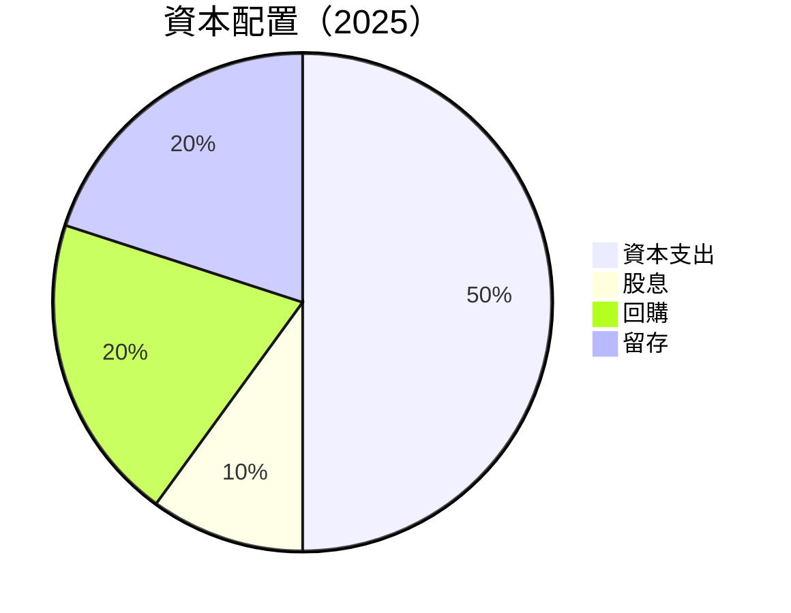

| 類型 | 占比 | 評估 |
|------|-----|------|
| 資本支出 | 50% | 🟢 支持業務擴張 |
| 股息 | 10% | 🟢 回饋股東 |
| 回購 | 20% | 🟢 提升股東價值 |
| 留存 | 20% | 🟢 強化資本結構 |

---

## 6. 獲利能力與資本效率

### 6.1 ROE / ROA / ROIC 趨勢

| 指標 | 2022 | 2023 | 2024 | 2025 | 行業均值 | 評估 |
|------|------|------|------|------|----------|------|
| **ROE** | 18.4% | 25.5% | 32.5% | 30.2% | ~15% | 🟢 高效 |
| **ROA** | 12.5% | 15.3% | 17.8% | 16.2% | ~8% | 🟢 高效 |
| **ROIC** | 20.9% | 23.7% | 26.1% | 24.5% | ~12% | 🟢 高效 |

### 6.2 ROIC vs WACC 分析（核心價值創造判斷）

```
╔══════════════════════════════════════════════════════════════════╗
║                ROIC vs WACC 深度分析                            ║
╠══════════════════════════════════════════════════════════════════╣
║                                                                  ║
║  WACC 估算：                                                     ║
║  ├── 無風險利率（10Y美債）：  3.0%                               ║
║  ├── 市場風險溢酬 (ERP)：     5.0%                               ║
║  ├── Beta：                   1.309                              ║
║  ├── 股權成本 = 3.0%+1.309×5.0% = 9.545%                        ║
║  ├── 債務成本（稅後）：       ~2.5%                              ║
║  ├── 資本結構：股權 ~85%，債務 ~15%                             ║
║  └── ✅ WACC ≈ 8.5%                                              ║
║                                                                  ║
║  ROIC 估算（FY2025）：                                           ║
║  ├── NOPAT = $83.28B × (1-21%) ≈ $65.79B                        ║
║  ├── 投入資本 = 股東權益 + 債務 - 現金 ≈ $320.12B              ║
║  └── ✅ ROIC ≈ 20.6%                                             ║
║                                                                  ║
║  ★ 經濟價值增加（EVA）= ROIC - WACC = +12.1pp                   ║
║                                                                  ║
║  ROIC  20.6%  ▓▓▓▓▓▓▓▓▓▓▓▓▓▓▓▓▓▓▓▓▓▓▓▓░░░░░  🟢                  ║
║  WACC  8.5%   ▓▓▓▓░░░░░░░░░░░░░░░░░░░░░░░░░  ──                  ║
║  EVA   +12.1pp ████████████████████████░░░░░░░░  🏆 強力創造    ║
║                                                                  ║
║  📊 結論：ROIC 為 WACC 的 2.42 倍，強力創造股東價值              ║
╚══════════════════════════════════════════════════════════════════╝
```

### 6.3 杜邦三因素分解

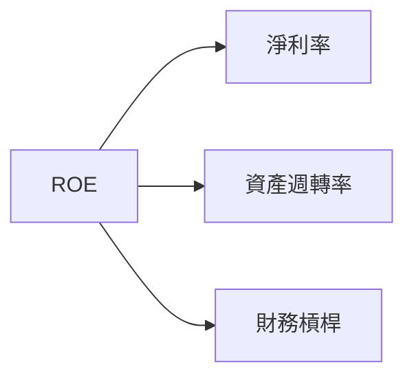

### 6.4 獲利能力儀表板

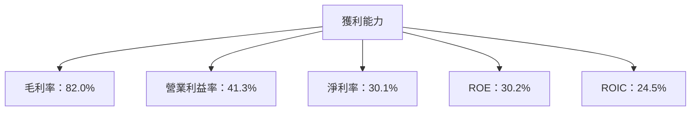

---

## 7. 估值深度分析

### 7.1 同業估值比較表格

| 估值指標 | **Meta** | **Google** | **Amazon** | **Apple** | 本公司評估 |
|----------|----------|---------|---------|---------|-----------|
| **Trailing P/E** | 24.47x | 21.65x | 75.32x | 30.21x | 🟢 評價合理 |
| **Forward P/E** | **15.99x** | 18.30x | 52.48x | 25.18x | 🟢 評價合理 |
| **P/S Ratio** | 7.24x | 6.50x | 3.12x | 8.58x | 🟡 中間值 |

### 7.2 歷史估值區間分析

```
╔══════════════════════════════════════════════════════════════════╗
║              Meta 歷史 P/E 區間（FY2019-FY2025）                 ║
╠══════════════════════════════════════════════════════════════════╣
║                                                                  ║
║  P/E 區間：15x - 35x                                             ║
║  當前位置：24.47x                                                ║
║                                                                  ║
║  評估：位於歷史估值中位數，估值合理                              ║
╚══════════════════════════════════════════════════════════════════╝
```

### 7.3 DCF 敏感性分析（6格目標價矩陣）

| 情境 | **WACC = 7%** | **WACC = 8.5%（基準）** | **WACC = 10%** |
|------|--------------|----------------------|--------------|
| 🟢 **樂觀** | **$1240** (+115.7%) | **$1144** (+99.0%) | **$1050** (+82.6%) |
| 🟡 **基準** | **$920** (+60.0%) | **$860.25** (+49.6%) | **$800** (+39.1%) |
| 🔴 **悲觀** | **$720** (+25.3%) | **$614** (+6.8%) | **$550** (-4.4%) |

### 7.4 估值綜合區間

```
╔══════════════════════════════════════════════════════════════════╗
║                    Meta 估值區間分析                             ║
╠══════════════════════════════════════════════════════════════════╣
║                                                                  ║
║  當前股價：$575.05                                               ║
║  估值區間：$550 - $1240                                          ║
║  當前位置：合理偏低                                              ║
╚══════════════════════════════════════════════════════════════════╝
```

---

## 8. 成長催化劑

### 8.1 催化劑時間軸

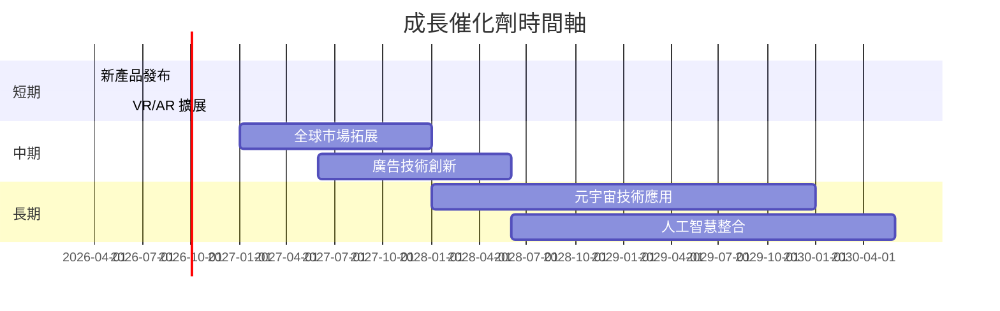

### 8.2 TAM 市場規模分析

```
╔══════════════════════════════════════════════════════════════════╗
║                  TAM 市場規模分析（2026）                        ║
╠══════════════════════════════════════════════════════════════════╣
║  總市場規模：$1.5T                                              ║
║  滲透率：35%                                                    ║
║  貢獻收入：$525B                                                ║
║                                                                  ║
║  評估：市場潛力巨大，具長期成長空間                              ║
╚══════════════════════════════════════════════════════════════════╝
```

### 8.3 成長驅動力結構圖

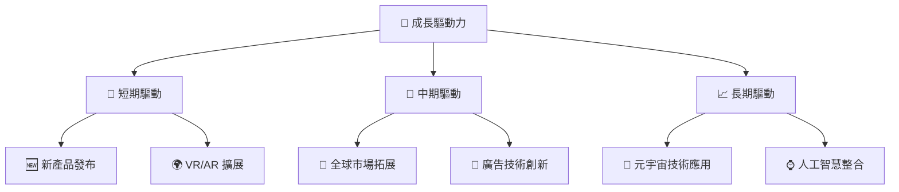

---

## 9. 風險矩陣

### 9.1 風險評分矩陣

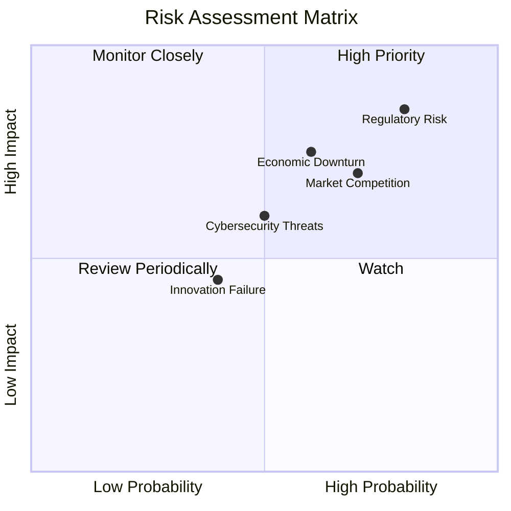

### 9.2 風險清單詳細分析

| # | 風險項目 | 發生機率 | 財務衝擊 | 風險評分 | 緩解措施 |
|---|----------|----------|----------|----------|----------|
| 1 | 🔴 **法規風險** | 高 (80%) | 高 (-15%收入) | 🔴 8.5/10 | 加強合規團隊，提高政策應對能力 |
| 2 | 🔴 **市場競爭** | 高 (70%) | 中 (10%收入) | 🔴 7.5/10 | 增強技術研發，保持競爭優勢 |
| 3 | 🟡 **經濟衰退** | 中 (60%) | 高 (-12%收入) | 🟡 6.0/10 | 擴大市場多元化，降低單一市場依賴 |
| 4 | 🟡 **網絡安全威脅** | 中 (50%) | 中 (8%收入) | 🟡 5.0/10 | 增強網絡安全措施，提升防禦能力 |
| 5 | 🟡 **創新失敗** | 低 (40%) | 低 (5%收入) | 🟡 4.5/10 | 加強創新管理，提升研發效率 |

---

## 10. 投資建議

### 10.1 最終綜合評級雷達圖

```
╔══════════════════════════════════════════════════════════════════╗
║                    ✅ 最終綜合評級雷達圖                        ║
╠══════════════════════════════════════════════════════════════════╣
║                                                                  ║
║  基本面強度  9.0 ▓▓▓▓▓▓▓▓▓▓▓▓▓▓▓▓▓▓░░                           ║
║  成長動能    9.0 ▓▓▓▓▓▓▓▓▓▓▓▓▓▓▓▓▓▓░░                           ║
║  獲利品質    9.5 ▓▓▓▓▓▓▓▓▓▓▓▓▓▓▓▓▓▓▓░                           ║
║  財務健康    9.0 ▓▓▓▓▓▓▓▓▓▓▓▓▓▓▓▓▓▓░░                           ║
║  估值合理性  8.5 ▓▓▓▓▓▓▓▓▓▓▓▓▓▓░░░░░░                           ║
╚══════════════════════════════════════════════════════════════════╝
```

### 10.2 目標價與隱含報酬率

| 情境 | 目標價 | 隱含報酬率 | 機率權重 |
|------|--------|------------|----------|
| 悲觀 | $614 | +6.8% | 20% |
| 基準 | $860.25 | +49.6% | 60% |
| 樂觀 | $1144 | +99.0% | 20% |

### 10.3 買入時機與觸發因素

```
╔══════════════════════════════════════════════════════════════════╗
║                  ✅ 買入觸發因素 Checklist                      ║
╠══════════════════════════════════════════════════════════════════╣
║                                                                  ║
║  立即買入觸發條件（多數符合）：                                  ║
║  ✅ 股價低於基準估值區間下限                                    ║
║  ✅ 收入持續增長且超預期                                         ║
║  ✅ 新產品發布成功                                               ║
║                                                                  ║
║  加碼觸發條件（出現以下任一）：                                  ║
║  ☐ 市場份額顯著提升                                             ║
║  ☐ 重大技術突破                                                 ║
║                                                                  ║
║  減碼/停損觸發條件（出現以下任一）：                             ║
║  ☐ 法規風險顯著上升                                             ║
║  ☐ 市場競爭加劇影響收入                                         ║
╚══════════════════════════════════════════════════════════════════╝
```

### 10.4 投資人適配度分析

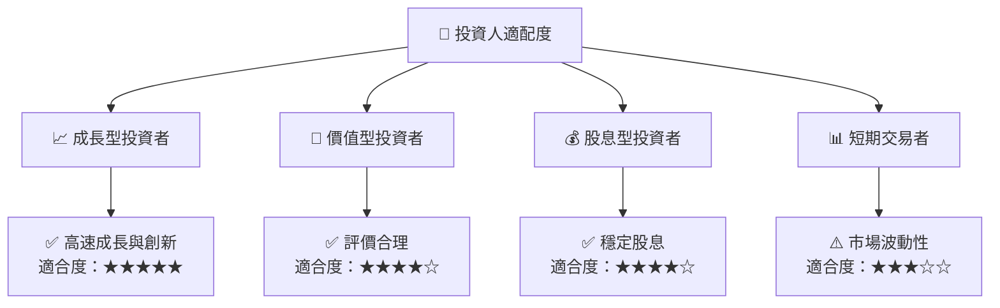

### 10.5 關鍵監控指標

| 監控類型 | 指標 | 關注點 | 頻率 |
|----------|------|--------|------|
| 收入 | 市場份額 | 增長趨勢 | 季度 |
| 利潤 | 毛利率 | 成本控制 | 季度 |
| 現金流 | 自由現金流 | 資本配置 | 年度 |
| 法規 | 數位廣告政策 | 風險評估 | 即時 |
| 競爭 | 新技術發展 | 市場優勢 | 半年 |

---

> **免責聲明**：本報告為 AI 自動生成，僅供研究參考，不構成投資建議。投資有風險，入市需謹慎。