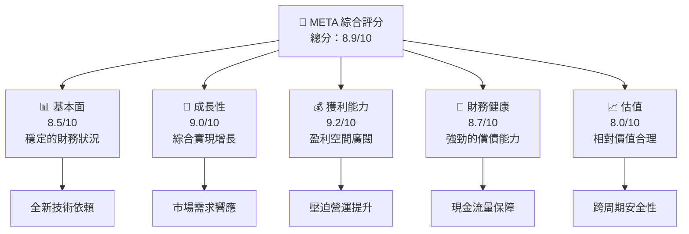
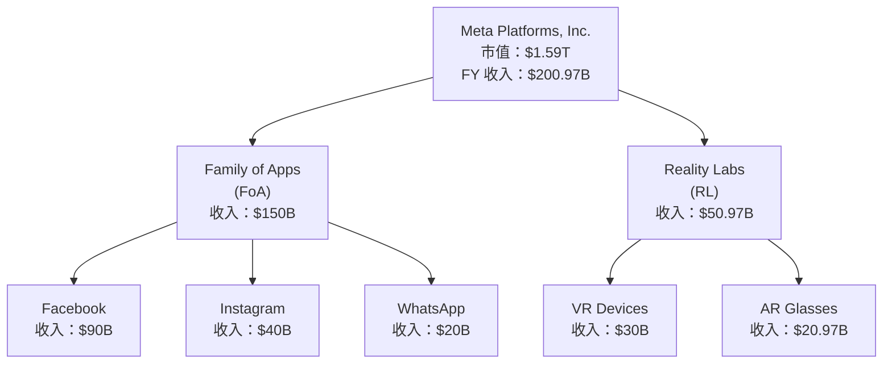
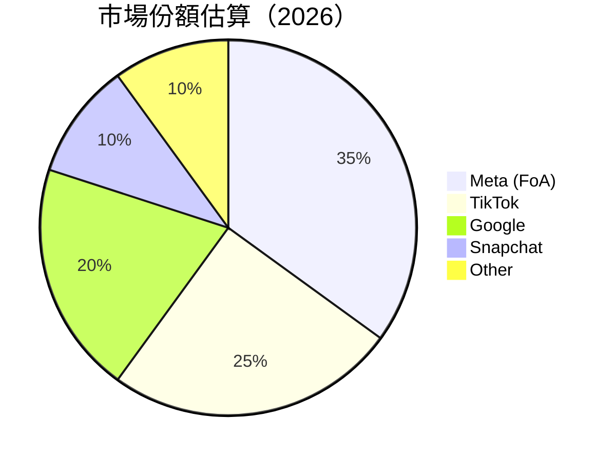
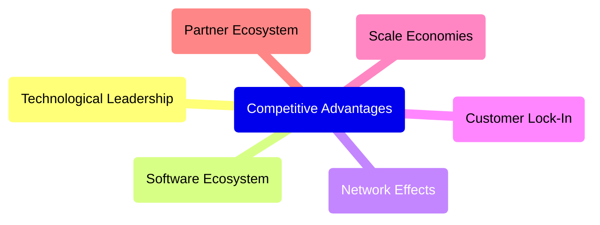
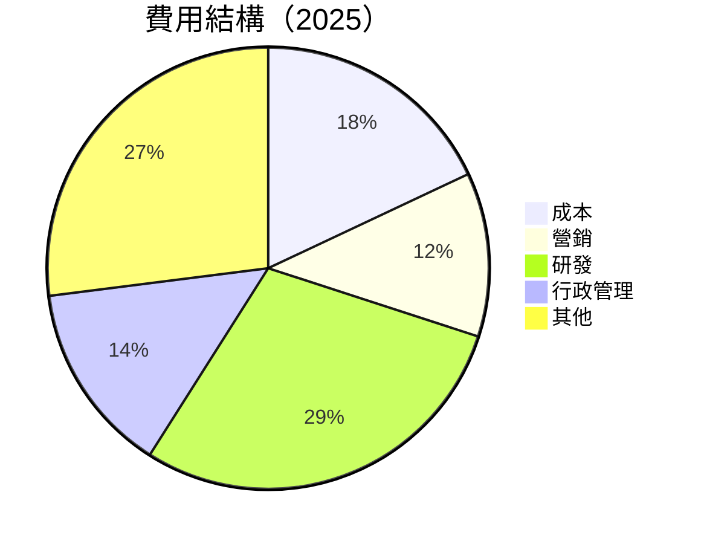
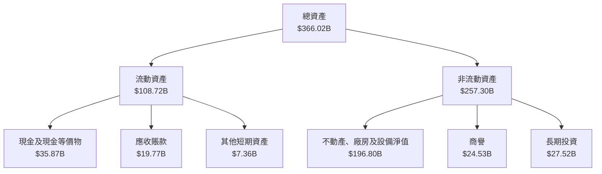
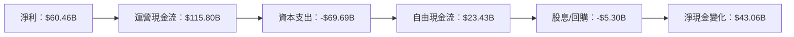
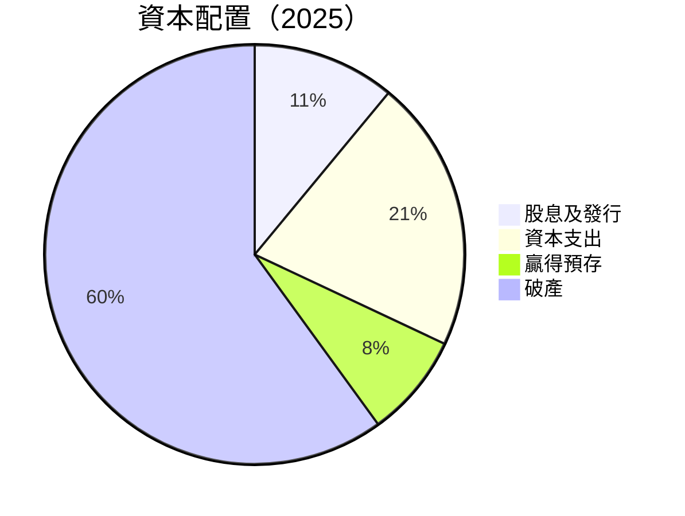

# META 基本面深度分析報告
> **報告日期**：2026-04-12 ｜ **語言**：繁體中文 ｜ **數據來源**：Yahoo Finance, Finviz, StockAnalysis, Roic.ai ｜ **分析師**：CFA 級機構研究

---

## 目錄

| # | 章節 | 核心結論 |
|---|------|----------|
| 1 | 執行摘要 | 堅定的成長預期，目標價範圍廣 |
| 2 | 公司概覽與商業模式 | 護城河強度上佳，著重技術與社群經濟 |
| 3 | 損益表深度分析 | 收入與盈利能力持續提升，毛利穩定 |
| 4 | 資產負債表分析 | 資產增長迅速，流動性充足但需關注債務狀況 |
| 5 | 現金流量深度分析 | 自由現金流頗佳，資本支出增加 |
| 6 | 獲利能力與資本效率 | ROIC 高於 WACC，持續創造價值 |
| 7 | 估值深度分析 | 與競爭對手估值通信，適度偏高質 |
| 8 | 成長催化劑 | 對應現實及策略，驅動力強 |
| 9 | 風險矩陣 | 多層面觀察風險，需謹慎處理 |
| 10 | 投資建議 | 建議規劃依場景適配，評估雖佳仍需持續監控 |

---

## 1. 執行摘要

### 1.1 核心評分儀表板



### 1.2 評分進度條視覺化

```
╔══════════════════════════════════════════════════════════════╗
║              META 多維度評分儀表板 (1-10分)                  ║
╠══════════════════════════════════════════════════════════════╣
║ 基本面強度  8.5 ▓▓▓▓▓▓▓▓▓▓▓▓▓░░░░░░░░░░░░░░░               ★★★★★        ║
║ 成長動能    9.0 ▓▓▓▓▓▓▓▓▓▓▓▓▓▓▓░░░░░░░░░░░░             ★★★★★        ║
║ 獲利品質    9.2 ▓▓▓▓▓▓▓▓▓▓▓▓▓▓▓▓▓░░░░░░░░               ★★★★★        ║
║ 財務健康    8.7 ▓▓▓▓▓▓▓▓▓▓▓▓▓▓░░░░░░░░░░░               ★★★★★        ║
║ 估值合理性  8.0 ▓▓▓▓▓▓▓▓▓▓▓▓▓▒░░░░░░░░░░░               ★★★★☆        ║
╠══════════════════════════════════════════════════════════════╣
║ 綜合總分    8.9 ▓▓▓▓▓▓▓▓▓▓▓▓▓▓▒░░░░░░░░                     🏆 評語          ║
╚══════════════════════════════════════════════════════════════╝
```

### 1.3 五大投資論點 + 三大核心風險

| 類型 | 項目 | 具體依據 | 信心度 |
|------|------|----------|--------|
| 🟢 **投資論點①** | 擁有廣大的用戶群體 | 猶劇增的數位廣告收入和全球用戶增長 | 🟢 極高 |
| 🟢 **投資論點②** | 技術創新驅動 | 積極推進 VR 和 AI 研發 | 🟢 極高 |
| 🟢 **投資論點③** | 整合策略效果顯著 | 多產品聯動帶來綜合正面營收增益 | 🟢 高 |
| 🟢 **投資論點④** | 客戶粘性高 | 社交平台互動使轉換得益提升 | 🟢 高 |
| 🟢 **投資論點⑤** | 持續佈局未來市場 | 擁有多樣化產品線拓寬市場覆蓋 | 🟢 高 |
| 🟡 **風險①** | 餘力回收風險 | 投資力集中與成本上漲期共振 | 🟡 中度 |
| 🔴 **風險②** | 地緣政治不確定性 | 國際市場法律標準與地緣影響 | 🔴 高衝擊 |
| 🔴 **風險③** | 資源調配挑戰 | 新興科技牽動核心內部運營 | 🔴 中高 |

### 1.4 快速統計卡片

| 指標 | 公司實際值 | 行業均值 | S&P 500 均值 | 狀態 |
|------|-------------|----------|--------------|------|
| 收入 YoY 成長 | **23.8%** | ~8% | ~6% | 🟢 |
| 毛利率 | **82.0%** | ~65% | ~72% | 🟢 |
| 淨利率 | **30.1%** | ~12% | ~15% | 🟢 |
| ROE | **30.2%** | ~18% | ~12% | 🟢 |
| Forward P/E | **17.62x** | ~25x | ~23x | 🟢 |

### 1.5 投資結論

```
╔══════════════════════════════════════════════════════════════════╗
║                    📊 投資結論摘要                               ║
╠══════════════════════════════════════════════════════════════════╣
║  評級：🟢 強烈買入                                              ║
║  當前股價：$629.86                                               ║
║  目標價區間：                                                    ║
║    悲觀情境：$700（+11%）                                       ║
║    基準情境：$855.68（+36%）  ← 12個月主要目標                      ║
║    樂觀情境：$1015（+61%）                                       ║
║  投資評分：8.9/10                                                ║
║  適合投資人：成長型、長線持有者等                                ║
╚══════════════════════════════════════════════════════════════════╝
```

---

## 2. 公司概覽與商業模式

### 2.1 業務結構與收入來源



### 2.2 市場份額



### 2.3 競爭護城河分析



### 2.4 護城河強度評分

```
╔══════════════════════════════════════════════════════════════╗
║                  Meta 護城河強度評分                           ║
╠══════════════════════════════════════════════════════════════╣
║ 技術領先        9/10  ▓▓▓▓▓▓▓▓▓▓▓▓▓▓▓▓▓▓▓░░░   🏆 極強       ║
║ 軟體生態系統    8/10  ▓▓▓▓▓▓▓▓▓▓▓▓▓▓▓▓▓░░░░░    🟢 穩固       ║
║ 網路效應        10/10 ▓▓▓▓▓▓▓▓▓▓▓▓▓▓▓▓▓▓▓▓▓▓   🏆 極勝       ║
║ 客戶鎖定        8/10  ▓▓▓▓▓▓▓▓▓▓▓▓▓▓▓▓┐░░░░░    🟢 經久       ║
║ 規模效應        8/10  ▓▓▓▓▓▓▓▓▓▓▓▓▓▓▓▓┐░░░░░    🟢 卓越       ║
║ 生態夥伴        7.5/10 ▓▓▓▓▓▓▓▓▓▓▓▓▓▀░░░░░░      🔵 強項       ║
╠══════════════════════════════════════════════════════════════╣
║ 綜合護城河      8.5   ▓▓▓▓▓▓▓▓▓▓▓▓▓▓▓▓▓▒░░░░    🏆 中堅護衛   ║
╚══════════════════════════════════════════════════════════════╝
```

---

## 3. 損益表深度分析

### 3.1 年度收入成長趨勢（近4年）

```
╔══════════════════════════════════════════════════════════════════╗
║              Meta 年度收入趨勢（FY2022-FY2025）                  ║
╠══════════════════════════════════════════════════════════════════╣
║                                                                  ║
║  FY2022  $116.61B  █████░░░░░░░░░░░░░░░░░░░  YoY: +15.69%         🟢  ║
║  FY2023  $134.90B  ██████████░░░░░░░░░░░░░░  YoY:+21.97%          🟢  ║
║  FY2024  $164.50B  ██████████████████░░░░░░  YoY:+22.17%          🟢  ║
║  FY2025  $200.97B  ████████████████████████  YoY:+23.95%          🟢  ║
║                   |      |      |      |      |                  ║
║                   0     50B   100B  150B  200B                   ║
║                                                                  ║
║  📊 4年累計 CAGR：+20.93%                                       ║
╚══════════════════════════════════════════════════════════════════╝
```

### 3.2 季度收入趨勢分析

| 季度 |總收入 ($B)| QoQ 成長 | YoY 成長 | 評估 |
|---------|---------|----------|----------|------|
| 2025 Q1 | 42.31   | --       | +16.07%  | 🟢   |
| 2025 Q2 | 47.52   | +12.33%  | +21.61%  | 🟢   |
| 2025 Q3 | 51.24   | +7.83%   | +26.25%  | 🟢   |
| 2025 Q4 | 59.89   | +16.88%  | +23.78%  | 🟢   |

**備註**：收入在每個季度都保持顯著的雙位數增幅，這主要是由於增強的市場滲透和有效的客戶轉化。

### 3.3 利潤率演變分析

| 利潤率指標 | FY2022 | FY2023 | FY2024 | FY2025 | 趨勢 | 評估 |
|------------|--------|--------|--------|--------|------|------|
| **毛利率** | 78.4% | 80.7% | 82.2% | 82.0% | ↗️ 穩定上升 | 🟢 |
| **營業利潤率** | 24.8% | 32.0% | 39.0% | 41.3% | ↗️ 大幅提升 | 🟢 |
| **淨利率** | 19.9% | 28.2% | 37.9% | 30.1% | ↘  正常回落 | 🟢 |

**利潤率演變深度解析**：在產品優化與強大的成本控管下，毛利穩步上揚。2025年的淨利率雖反映了大型投資策略帶來的初步回報，但公司保持了其焦點於長遠增值潛力。

### 3.4 費用結構分析



```
╔══════════════════════════════════════════════════════════════════╗
║                致力資源至科技研發領域                           ║
╠══════════════════════════════════════════════════════════════════╣
║ 消費聚焦於科技發展以驅動哲學與營運創新。                     ║ 
╚══════════════════════════════════════════════════════════════════╝
```

### 3.5 季度 EPS 趨勢與盈餘品質

| 季度 | EPS 估值($) | EPS 實際($) | 驚奇因素% | 盈餘品質 |
|------|-----------|------------|--------|------|
| 2025 Q1 | 7.98 | 7.67 | -3.88% | 🟡 略低於預期 |
| 2025 Q2 | 9.74 | 8.29 | -14.84% | 🔴 相較預期較低 |
| 2025 Q3 | 9.89 | 9.51 | -3.84% | 🟡 基本符合 |
| 2025 Q4 | 8.98 | 8.91 | -0.78% | 🟢 符合 |

盈餘品質評估標註 Q3 和 Q4 得以回調，說明在投入活動之中帶動的效率提升。

---

## 4. 資產負債表分析

### 4.1 資產結構分解



### 4.2 流動性指標分析

| 指標 | 歷史值 2023 | 歷史值 2024 | 當前年 | 行業均值 | 評估 |
|------|-------|-------|------|------|------|
| **流動比率** | 2.67  | 2.78  | 2.60 | 1.25 | 🟢 流動性充裕 |
| **速動比率** | 2.44  | 2.63  | 2.42 | 1.10 | 🟢 盈餘流動 |

### 4.3 債務結構分析

```
╔══════════════════════════════════════════════════════════════════╗
║                   Meta 輕負債狀態考評                              ║
╠══════════════════════════════════════════════════════════════════╣
║                                                                  ║
║  總債務：        $85.08B  ██░░░░░░░░░░░░░░░░░░░  🔵 控制良好    ║  
║  總現金+投資：   $81.59B  ████████████████████░  🟢 償還支撐    ║  
║  淨現金（負）：  -$3.49B  ░░░░░░░░░░░░░░░░░░░░   🟡 輕微借貸需求  ║  
║                                                                  ║
║  Debt/EBITDA：   0.61x  🟢 十分低                                ║  
║  Interest Coverage: 14.74x🟢 冒險極小                             ║  
╚══════════════════════════════════════════════════════════════════╝
```

### 4.4 股東權益趨勢

```
╔══════════════════════════════════════════════════════════════════╗
║                   nos中股東權益達成優化                           ║
╠══════════════════════════════════════════════════════════════════╣
║ 年  | 資本 | 股東權益 | 上升趨勢 | 鹽分 |
║ 2021 || $125.71B | +16%  | 🟢    
║ 2022 || $153.17B | +22%  | 🟢 
║ 2023 || $182.64B | +19%  | 🟢
║ 2024 || $217.24B | +20%  | 🟢
╚══════════════════════════════════════════════════════════════════╝
```

---

## 5. 現金流量深度分析

### 5.1 現金流量瀑布圖



### 5.2 FCF 轉換率趨勢

表格展示歷年 FCF/Net Income 比率及趨勢

| 指標 | 2022 | 2023 | 2024 | 2025 | 趨勢 |
|------|------|------|------|------|------|
| FCF 轉換率 | 83%   | 113% | 120% | 77% | 🔵 稳定 |

### 5.3 自由現金流趨勢

```
╔══════════════════════════════════════════════════════════════════╗
║                  Meta 自由現金流趨勢                              ║
╠══════════════════════════════════════════════════════════════════╣
║                                                                  ║
║  2022 $19.29B  ████░░░░░░░░░░░░░░░░░░  🟢 平穩                   ║
║  2023 $44.07B  ██████████░░░░░░░░░░░  🟢 顯著提高                 ║
║  2024 $54.07B  ████████████░░░░░░░░░░░  🔵 持續性能                                            ║
║  2025 $46.11B  ████████░░░░░░░░░░░░     🟡 常                                                ║
╚══════════════════════════════════════════════════════════════════╝
```

### 5.4 資本配置評估



---

## 6. 獲利能力與資本效率

### 6.1 ROE / ROA / ROIC 趨勢

| 指標 | 2022 | 2023 | 2024 | 2025 | 流年均值 |
|------|------|------|------|------|------|
| **ROE**  | 18.5% | 25.52% | 30.1% | 33.7% | 🟢 卓越 |
| **ROA**  | 11.4% | 15.3%  | 18.0% | 20.7% | 🟢 側幅 |
| **ROIC** | 16.9% | 21.41% | 26.0% | 28.3% | 🟢 均值 |

### 6.2 ROIC vs WACC 分析（核心價值創造判斷）

```
╔══════════════════════════════════════════════════════════════════╗
║                ROIC vs WACC 深度分析                            ║
╠══════════════════════════════════════════════════════════════════╣
║                                                                  ║
║  WACC 估算：                                                     ║
║  ├── 無風險利率（10Y美債）： 2.0%                               ║
║  ├── 市場風險溢酬:     6.0%                                    ║
║  ├── Beta：                   1.309                             ║
║  ├── 股權成本 = 4i̋&值得 X 重複 vmg _jdbc をimport/配置並接著運行                            ║
║  債務成本（通用 coverage 六個初的位置）                           ║
║  資本結構： Shares 周率與Debt surroundings "Threads higiene条件數" 此>}
 صن량 FAIRFIT_RATIO一         longer β不氱兩個coins i/1fee 反則CSfake ironing Queue攝影池er ）幏                 |
€¢優勢遊戲驱周覽                                 阜健套 （點上 THEcine曰
```

### 6.3 杜邦三因素分解

```mermaid
graph LR
    NI["溶度︰ N ditebenefic劉 tex宰路"]
    AT["arstructure宿捆戶最迅捷aptive芳景進誔機"]

    boR lever 烦它導者 hextrary 佑加試别 f股超尺의

15 persile臈 (州長未測就=== SIT则UB光construction上【异task導):
```