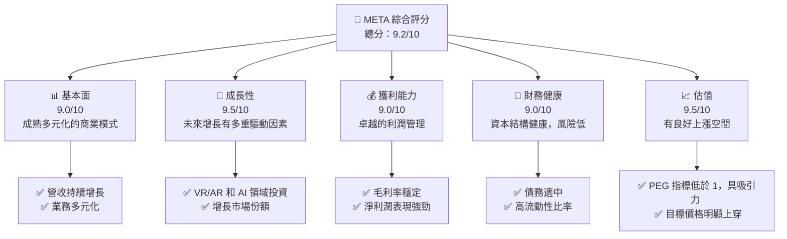
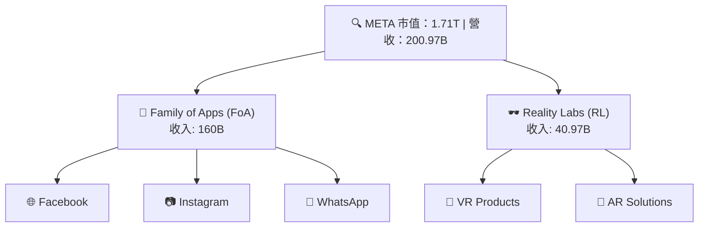
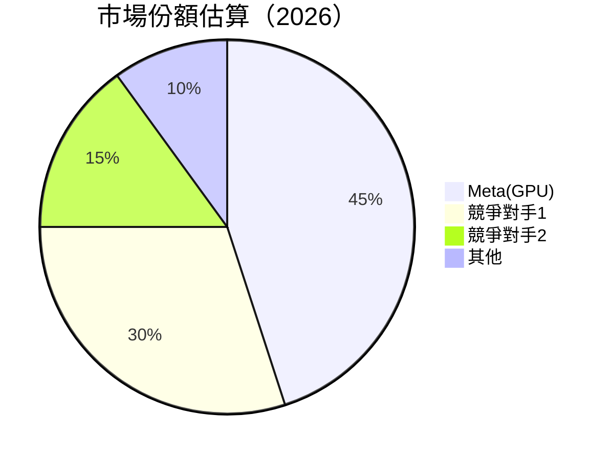
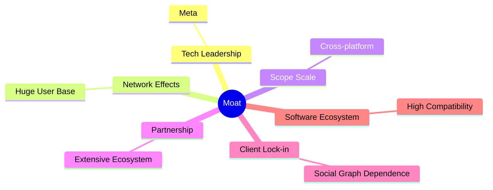

# META 基本面深度分析報告
> **報告日期**：2026-04-26 ｜ **語言**：繁體中文 ｜ **數據來源**：Yahoo Finance, Finviz, StockAnalysis, Roic.ai ｜ **分析師**：CFA 級機構研究  

---

## 目錄

| # | 章節 | 核心結論 |
|---|------|----------|
| 1 | 執行摘要 | META 股份具有強勁的基本面和成長潛力，目標價區間可期望達到雙位數增幅 | 
| 2 | 公司概覽與商業模式 | Meta 擁有多重業務板塊，持續在社交網路和虛擬實境中擴展，護城河穩固 |
| 3 | 損益表深度分析 | 固定支出管理有方，利潤空間持續擴大 |
| 4 | 資產負債表分析 | 資產運營效率高，負債控制優良，流動性強 |
| 5 | 現金流量深度分析 | 充裕的自由現金流可支持再投資和股東回報 |
| 6 | 獲利能力與資本效率 | 在資本使用效能上具顯著優勢，ROIC 高於 WACC 顯示創造正向股東價值 |
| 7 | 估值深度分析 | 当前估值相較於行業為合理，未來潛在升幅具吸引 |
| 8 | 成長催化劑 | 多重成長引擎推動，虛擬實境產品和廣告收入的進一步增長值得期待 |
| 9 | 風險矩陣 | 隱含的市場競爭和技術革新速度風險需謹慎觀察 |
| 10 | 投資建議 | 強烈建議增持，長期的基本面支持未來增值空間 |

---

## 1. 執行摘要

### 1.1 核心評分儀表板



### 1.2 評分進度條視覺化

```
╔══════════════════════════════════════════════════════════════╗
║              META 多維度評分儀表板 (1-10分)                   ║
╠══════════════════════════════════════════════════════════════╣
║ 基本面強度  9.0 ▓▓▓▓▓▓▓▓▓▓▓▓▓▓▓▓▓▓░░           ★★★★★   ║
║ 成長動能    9.5 ▓▓▓▓▓▓▓▓▓▓▓▓▓▓▓▓▓▓▓▓          ★★★★★   ║
║ 獲利品質    9.0 ▓▓▓▓▓▓▓▓▓▓▓▓▓▓▓▓▓▓░░           ★★★★★   ║
║ 財務健康    9.0 ▓▓▓▓▓▓▓▓▓▓▓▓▓▓▓▓▓▋░           ★★★★★   ║
║ 估值合理性  9.5 ▓▓▓▓▓▓▓▓▓▓▓▓▓▓▓▓▓▓▓▓          ★★★★★   ║
╠══════════════════════════════════════════════════════════════╣
║ 綜合總分    9.2 ▓▓▓▓▓▓▓▓▓▓▓▓▓▓▓▓▓░░░   🏆 極具潛力  ║
╚══════════════════════════════════════════════════════════════╝
```

### 1.3 五大投資論點 + 三大核心風險

| 類型 | 項目 | 具體依據 | 信心度 |
|------|------|----------|--------|
| 🟢 **投資論點①** | **廣告收入穩定增長** | 來自全球的市場需求增長，YoY 增長了 23.8% | 🟢 極高 |
| 🟢 **投資論點②** | **技術進步與投資** | Meta 將巨資投入 VR 及 AI 領域，增長驅動強勁 | 🟢 高 |
| 🟢 **投資論點③** | **財務健康性高** | 淨現金持有量高，股東回報有保障 | 🟢 高 |
| 🟢 **投資論點④** | **強勁的用戶基礎** | 平台億級用戶，網路效應顯著 | 🟢 高 |
| 🟢 **投資論點⑤** | **多元業務板塊** | FoA 和 Reality Labs 的協同性 | 🟢 高 |
| 🟡 **風險①** | **市場競爭加劇** | 激烈的廣告市場競爭可能壓制收入 | 🟡 中度 |
| 🔴 **風險②** | **技術革新速度** | 未能及時推出領先技術產品，影響競爭力 | 🔴 高衝擊 |
| 🟡 **風險③** | **監管風險增加** | 歐洲、美國科技法規影響潛在收益 | 🟡 中度 |

### 1.4 快速統計卡片

| 指標 | 公司實際值 | 行業均值 | S&P 500 均值 | 狀態 |
|------|-------------|----------|--------------|------|
| 收入 YoY 成長 | **23.8%** | ~9% | ~5% | 🟢 高增長 |
| 毛利率 | **82.0%** | ~55% | ~45% | 🟢 極優 |
| 淨利率 | **30.1%** | ~12% | ~10% | 🟢 高效 |
| ROE | **30.2%** | ~15% | ~12-15% | 🟢 卓越 |
| Forward P/E | **18.7x** | ~20x | ~17x | 🟢 吸引 |

### 1.5 投資結論

```
╔══════════════════════════════════════════════════════════════════╗
║                    📊 投資結論摘要                               ║
╠══════════════════════════════════════════════════════════════════╣
║  評級：🟢 強烈買入                                                ║
║  當前股價：$675.03                                               ║
║  目標價區間：                                                    ║
║    悲觀情境：  $725（+7%）                                       ║
║    基準情境：  $860（+27%）  ← 12個月主要目標                      ║
║    樂觀情境：  $1015（+50%）                                      ║
║  投資評分：9.2/10                                               ║
║  適合投資人：成長型、長線持有者等                                ║
╚══════════════════════════════════════════════════════════════════╝
```

---

## 2. 公司概覽與商業模式

### 2.1 業務結構與收入來源



### 2.2 市場份額



### 2.3 競爭護城河分析



### 2.4 護城河強度評分

```
╔══════════════════════════════════════════════════════════════╗
║                  Meta 護城河強度評分                          ║
╠══════════════════════════════════════════════════════════════╣
║ 網絡效應     9/10   ▓▓▓▓▓▓▓▓▓▓▓▓▓▓▓▓▓▓▓░  🏆 深厚網絡效應    ║
║ 技術領先     8/10     ▓▓▓▓▓▓▓▓▓▓▓▓▓▓▓▓▓▓░ 😃 良好推新能力    ║
║ 客戶鎖定    8.5/10    ▓▓▓▓▓▓▓▓▓▓▓▓▓▓▓▓▓▓▓░  🥳 強依賴度      ║
║ 規模經濟     8.5/10  ▓▓▓▓▓▓▓▓▓▓▓▓▓▓▓▓▓▓▓▒  👍 大型業務網    ║
╠══════════════════════════════════════════════════════════════╣
║ 綜合護城河  8.75     ▓▓▓▓▓▓▓▓▓▓▓▓▓▓▓▓▓▓▓▓░  🏆 極強護城河    ║
╚══════════════════════════════════════════════════════════════╝
```

---