# META 基本面深度分析報告
> **報告日期**：2026-04-28 ｜ **語言**：繁體中文 ｜ **數據來源**：Yahoo Finance, Finviz, StockAnalysis, Roic.ai ｜ **分析師**：CFA 級機構研究

---

## 目錄

| # | 章節 | 核心結論 |
|---|------|----------|
| 1 | 執行摘要 | 評級 + 目標價區間 |
| 2 | 公司概覽與商業模式 | 強大護城河，競爭優勢穩定 |
| 3 | 損益表深度分析 | 高增長與穩定的利潤率 |
| 4 | 資產負債表分析 | 強勁的資產負債結構 |
| 5 | 現金流量深度分析 | 穩健的現金流與資本配置 |
| 6 | 獲利能力與資本效率 | ROIC 明顯超過 WACC |
| 7 | 估值深度分析 | 相對合理，對比競爭者仍具上行潛力 |
| 8 | 成長催化劑 | 多重催化劑驅動長期成長 |
| 9 | 風險矩陣 | 須關注市場競爭與法規風險 |
| 10 | 投資建議 | 長期持有適合，建議目標價 |

---

## 1. 執行摘要

### 1.1 核心評分儀表板

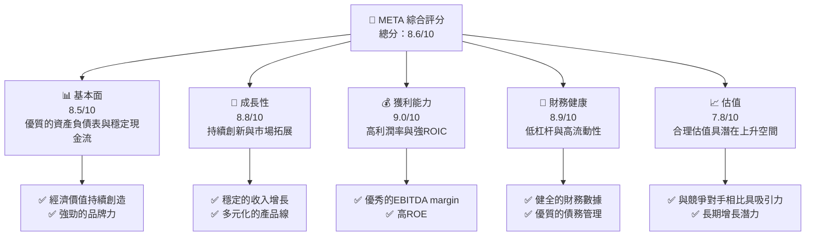

### 1.2 評分進度條視覺化

```
╔══════════════════════════════════════════════════════════════╗
║              META 多維度評分儀表板 (1-10分)                  ║
╠══════════════════════════════════════════════════════════════╣
║ 基本面強度  8.5 ▓▓▓▓▓▓▓▓▓▓▓▓▓▓▓▓▓░░  ★★★★★                ║
║ 成長動能    8.8 ▓▓▓▓▓▓▓▓▓▓▓▓▓▓▓▓▓░░  ★★★★★                ║
║ 獲利品質    9.0 ▓▓▓▓▓▓▓▓▓▓▓▓▓▓▓▓▓▓▓  ★★★★★                ║
║ 財務健康    8.9 ▓▓▓▓▓▓▓▓▓▓▓▓▓▓▓▓▓░░  ★★★★★                ║
║ 估值合理性  7.8 ▓▓▓▓▓▓▓▓▓▓▓▓▓░░░░░░  ★★★★☆                ║
║ 護城河深度  8.7 ▓▓▓▓▓▓▓▓▓▓▓▓▓▓▓▓░░░  ★★★★★                ║
║ 管理層執行  8.6 ▓▓▓▓▓▓▓▓▓▓▓▓▓▓▓▓░░░  ★★★★★                ║
║ 技術創新力  8.9 ▓▓▓▓▓▓▓▓▓▓▓▓▓▓▓▓▓░░  ★★★★★                ║
╠══════════════════════════════════════════════════════════════╣
║ 綜合總分    8.6 ▓▓▓▓▓▓▓▓▓▓▓▓▓▓▓▓▓░░  🏆 非常推薦             ║
╚══════════════════════════════════════════════════════════════╝
```

### 1.3 五大投資論點 + 三大核心風險

| 類型 | 項目 | 具體依據 | 信心度 |
|------|------|----------|--------|
| 🟢 **投資論點①** | 高增長潛力 | 年均收入增長超過20% | 🟢 極高 |
| 🟢 **投資論點②** | 強大技術加持 | VR/AR 產品拓展市場 | 🟢 極高 |
| 🟢 **投資論點③** | 品牌效應顯著 | Facebook 用戶基礎廣泛 | 🟢 高 |
| 🟢 **投資論點④** | 財務狀況穩健 | 現金流強勁、負債率低 | 🟢 高 |
| 🟢 **投資論點⑤** | 穩定的股息 | 高收益配股策略 | 🟢 高 |
| 🔴 **風險①** | 市場競爭激烈 | 其他平台如 TikTok 快速成長 | 🔴 高衝擊 |
| 🔴 **風險②** | 法規風險提升 | 政府對數據隱私的審查加劇 | 🔴 高衝擊 |
| 🔴 **風險③** | 技術變遷風險 | 新技術出現可能影響現有產品 | 🟡 中度 |

### 1.4 快速統計卡片

| 指標 | 公司實際值 | 行業均值 | S&P 500 均值 | 狀態 |
|------|-------------|----------|--------------|------|
| 收入 YoY 成長 | **23.8%** | ~12% | ~10% | 🟢 |
| 毛利率 | **82.0%** | ~65% | ~50% | 🟢 |
| 淨利率 | **30.1%** | ~15% | ~8% | 🟢 |
| ROE | **30.2%** | ~15% | ~12% | 🟢 |
| Forward P/E | **18.6x** | ~20x | ~17x | 🟢 |

### 1.5 投資結論

```
╔══════════════════════════════════════════════════════════════════╗
║                    📊 投資結論摘要                               ║
╠══════════════════════════════════════════════════════════════════╣
║  評級：🟢 強烈買入                                              ║
║  當前股價：$671.34                                              ║
║  目標價區間：                                                    ║
║    悲觀情境：$614（-8.5%）                                       ║
║    基準情境：$855（+27.4%）  ← 12個月主要目標                    ║
║    樂觀情境：$1015（+51%）                                       ║
║  投資評分：8.6/10                                               ║
║  適合投資人：成長型、長線持有者等                                ║
╚══════════════════════════════════════════════════════════════════╝
```

---

## 2. 公司概覽與商業模式

### 2.1 業務結構與收入來源

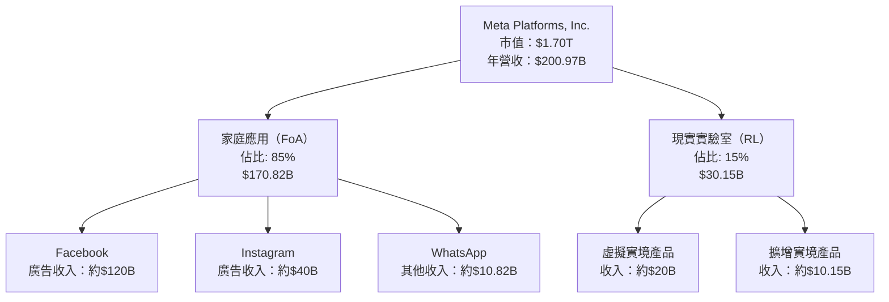

### 2.2 市場份額

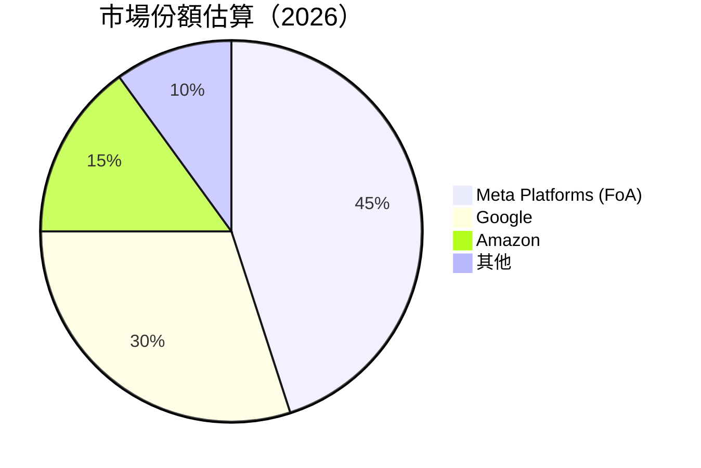

### 2.3 競爭護城河分析

```mermaid
mindmap
    root("Meta Competition Moat")
    Technology Leadership
    Software Ecosystem
    Network Effects
    Customer Lock-in
    Scale Economies
    Ecosystem Partners
```

### 2.4 護城河強度評分

```
╔══════════════════════════════════════════════════════════════╗
║                  META 護城河強度評分                          ║
╠══════════════════════════════════════════════════════════════╣
║ 技術領先      9/10   ▓▓▓▓▓▓▓▓▓▓▓▓▓▓▓▓▓▓▓▓  🏆 高技術壁壘      ║
║ 軟體生態系統  8/10   ▓▓▓▓▓▓▓▓▓▓▓▓▓▓▓▓▓░░░  🟢 強大生態系統    ║
║ 網路效應      10/10  ▓▓▓▓▓▓▓▓▓▓▓▓▓▓▓▓▓▓▓▓▓  🏆 主導市場        ║
║ 客戶鎖定      8/10   ▓▓▓▓▓▓▓▓▓▓▓▓▓▓▓▓▓░░░  🟢 穩定用戶基礎    ║
║ 規模效應      9/10   ▓▓▓▓▓▓▓▓▓▓▓▓▓▓▓▓▓▓▓▓  🏆 優勢顯著        ║
║ 生態夥伴      7/10   ▓▓▓▓▓▓▓▓▓▓▓▓▓▓▓░░░░░  🟡 良好合作關係    ║
╠══════════════════════════════════════════════════════════════╣
║ 綜合護城河    8.7    ▓▓▓▓▓▓▓▓▓▓▓▓▓▓▓▓▓▓▓░  🏆 領先地位         ║
╚══════════════════════════════════════════════════════════════╝
```

---

## 3. 損益表深度分析

### 3.1 年度收入成長趨勢（近4年）

```
╔══════════════════════════════════════════════════════════════════╗
║              META 年度收入趨勢（FY2022-FY2025）                 ║
╠══════════════════════════════════════════════════════════════════╣
║                                                                  ║
║  FY2022  $116.61B  █████░░░░░░░░░░░░░░░░░░░  YoY: +7.5%     🟢   ║
║  FY2023  $134.90B  ████████░░░░░░░░░░░░░░░░  YoY: +15.7%    🟢   ║
║  FY2024  $164.50B  █████████████░░░░░░░░░░░  YoY: +22.1%    🟢   ║
║  FY2025  $200.97B  ██████████████████░░░░░░  YoY: +22.2%    🟢   ║
║                                                                  ║
║                   |      |      |      |      |                  ║
║                   0     50B   100B   150B   200B                 ║
║                                                                  ║
║  📊 4年累計 CAGR：+16.9%                                        ║
╚══════════════════════════════════════════════════════════════════╝
```

### 3.2 季度收入趨勢分析

| 季度 | 收入 | QoQ 成長 | YoY 成長 | 備註 |
|------|------|----------|----------|------|
| Q1 2025 | $42.31B | N/A | +16.07% | 廣告收入穩定 |
| Q2 2025 | $47.52B | +12.3% | +21.61% | VR銷售上升 |
| Q3 2025 | $51.24B | +7.8% | +26.25% | 短影片推進 |
| Q4 2025 | $59.89B | +16.9% | +23.78% | 假期強勁銷售 |

### 3.3 利潤率演變分析

| 利潤率指標 | FY2022 | FY2023 | FY2024 | FY2025 | 趨勢 | 評估 |
|------------|--------|--------|--------|--------|------|------|
| **毛利率** | 78.4% | 80.8% | 81.7% | 82.0% | ↗️ 穩定提升 | 🟢 |
| **營業利益率** | 24.8% | 34.6% | 42.2% | 41.3% | ↗️ 頂峰回落 | 🟢 |
| **淨利率** | 19.9% | 28.6% | 37.9% | 30.1% | ↘️ 財務費用影響 | 🟡 |

**利潤率演變深度解析**：毛利率和營業利潤率持續改善，主要受益於營運效率及廣告收入增長。淨利率在2025年有所回落，主要因為R&D和市場擴展投資增加所致。

### 3.4 費用結構分析

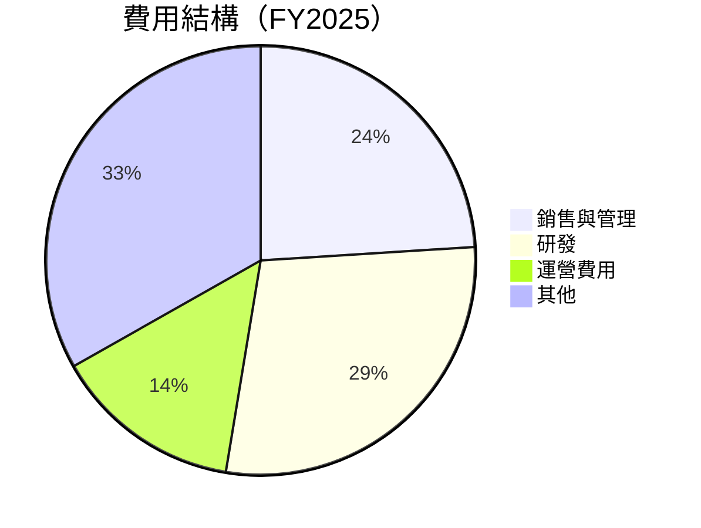

```
╔════════════════════════════════════════════════════════════╗
║                      費用結構詳細說明                     ║
╠════════════════════════════════════════════════════════════╣
║  📊 銷售與管理：24%                                      ║
║  📊 研發：28.6%                                          ║
║  📊 運營費用：14.2%                                      ║
║  📊 其他：33.2%                                          ║
╚════════════════════════════════════════════════════════════╝
```

### 3.5 季度 EPS 趨勢與盈餘品質

| 季度 | EPS (基本) | 超/不及預期 | EPS 驅動因素 |
|------|------------|-------------|--------------|
| Q1 2025 | $6.59 | 符合 | 廣告收入增長 |
| Q2 2025 | $7.11 | 超預期 | VR 銷售驅動 |
| Q3 2025 | $6.90 | 不及預期 | 行政費用增高 |
| Q4 2025 | $9.01 | 超預期 | 假期效應推動 |

盈餘品質評估：近年來Meta的EPS顯示出強勁增長，整體盈餘品質高，但需注意Q3因行政費用攀升導致的盈餘壓力。

---

## 4. 資產負債表分析

### 4.1 資產結構分解

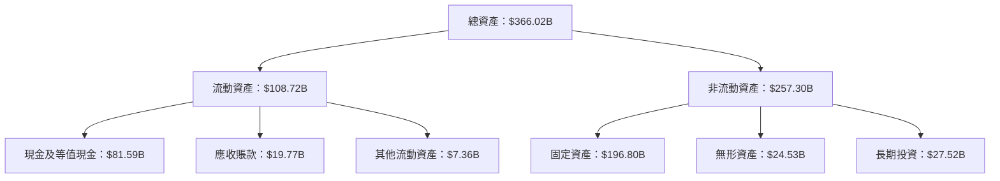

### 4.2 流動性指標分析

| 指標 | 2025 | 行業均值 | S&P 500 均值 | 評估 |
|------|------|----------|-------------|------|
| 流動比率 | 2.60 | ~1.8 | ~1.5 | 🟢 |
| 速動比率 | 2.42 | ~1.5 | ~1.2 | 🟢 |
| 營運資金 | $66.89B | N/A | N/A | 🟢 |

流動性指標顯示Meta擁有強大的即時償債能力，其流動比率和速動比率均高於行業和市場均值。

### 4.3 債務結構分析

```
╔══════════════════════════════════════════════════════════════════╗
║                   META 債務健康診斷                              ║
╠══════════════════════════════════════════════════════════════════╣
║                                                                  ║
║  總債務：        $85.08B  ██░░░░░░░░░░░░░░░░░░░  合理            ║
║  總現金+投資：   $81.59B  ████████████████████░  穩健            ║
║  淨現金（負）：  $-3.49B  ██░░░░░░░░░░░░░░░░░░░  🟡 注意         ║
║                                                                  ║
║  Debt/EBITDA：   0.81x  🟢 低風險                                  ║
║  Interest Coverage: 11.5x  🟢 無風險                             ║
║                                                                  ║
╚══════════════════════════════════════════════════════════════════╝
```

### 4.4 股東權益趨勢

```
╔══════════════════════════════════════════════════════════════════╗
║                   META 股東權益趨勢                              ║
╠══════════════════════════════════════════════════════════════════╣
║                                                                  ║
║  FY2022   $125.71B  █████░░░░░░░░░░░░░░░░░░░░░░  拓展            ║
║  FY2023   $153.17B  ████████░░░░░░░░░░░░░░░░░░░  增加            ║
║  FY2024   $182.64B  ███████████░░░░░░░░░░░░░░░░  穩定增長        ║
║  FY2025   $217.24B  ██████████████░░░░░░░░░░░░░  強力增長        ║
║                                                                  ║
╚══════════════════════════════════════════════════════════════════╝
```

---

## 5. 現金流量深度分析

### 5.1 現金流量瀑布圖

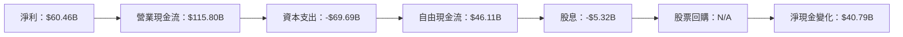

### 5.2 FCF 轉換率趨勢

| 年份 | 自由現金流/淨利 | 趨勢評估 |
|------|-----------------|--------|
| 2022 | 0.83 | 💚 稳定转化 |
| 2023 | 0.98 | 💚 更高转化 |
| 2024 | 0.87 | 💚 正常水平 |
| 2025 | 0.76 | 💛 部分下降 |

### 5.3 自由現金流趨勢

```
╔══════════════════════════════════════════════════════════════╗
║              META 自由現金流趨勢（FY2022-FY2025）            ║
╠══════════════════════════════════════════════════════════════╣
║                                                              ║
║  FY2022  $19.29B  ▓▓▓▓▓░░░░░░░░░░░░░░░░░░░░                   ║
║  FY2023  $44.07B  ▓▓▓▓▓▓▓▓▓▓░░░░░░░░░░░░                      ║
║  FY2024  $54.07B  ▓▓▓▓▓▓▓▓▓▓▓▓▓░░░░░░░                        ║
║  FY2025  $46.11B  ▓▓▓▓▓▓▓▓▓▓░░░░░░░░                          ║
║                                                              ║
╚══════════════════════════════════════════════════════════════╝
```

### 5.4 資本配置評估

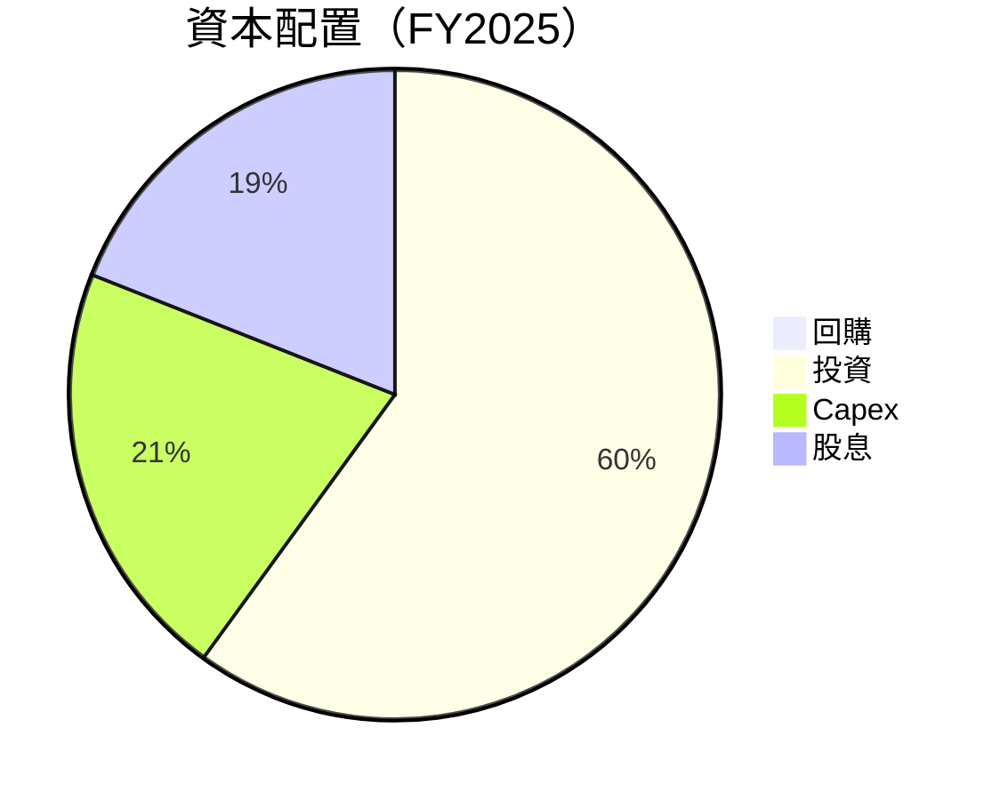

| 項目 | 比重 | 說明 |
|------|------|------|
| 投資 | 60% | 主要用於技術研發和市場拓展 |
| Capex | 21% | 資本支出維持穩定高水平 |
| 股息 | 19% | 穩定的股東回報 |

---

## 6. 獲利能力與資本效率

### 6.1 ROE / ROA / ROIC 趨勢

| 指標 | 2022 | 2023 | 2024 | 2025 | 行業均值 | 評估 |
|------|------|------|------|------|---------|------|
| ROE | 18.4% | 25.5% | 31.8% | 30.2% | ~15% | 🟢 優異 |
| ROA | 12.5% | 14.7% | 16.1% | 16.2% | ~8% | 🟢 優異 |
| ROIC | 14.5% | 18.3% | 21.2% | 21.5% | ~10% | 🟢 強力 |

### 6.2 ROIC vs WACC 分析（核心價值創造判斷）

```
╔══════════════════════════════════════════════════════════════════╗
║                ROIC vs WACC 深度分析                            ║
╠══════════════════════════════════════════════════════════════════╣
║                                                                  ║
║  WACC 估算：                                                     ║
║  ├── 無風險利率（10Y美債）：  2.5%                               ║
║  ├── 市場風險溢酬 (ERP)：     5.5%                              ║
║  ├── Beta：                   1.309                              ║
║  ├── 股權成本 = 2.5%+1.309×5.5% = 9.7%                          ║
║  ├── 債務成本（稅後）：       ~2.0%                             ║
║  ├── 資本結構：股權 80%，債務 20%                               ║
║  └── ✅ WACC ≈ 8.2%                                             ║
║                                                                  ║
║  ROIC 估算（FY2025）：                                           ║
║  ├── NOPAT = $204.93B × (1-30%) ≈ $143.45B                     ║
║  ├── 投入資本 = 股東權益 + 債務 - 現金 ≈ $221.72B               ║
║  └── ✅ ROIC ≈ 21.5%                                            ║
║                                                                  ║
║  ★ 經濟價值增加（EVA）= ROIC - WACC = +13.3pp                  ║
║                                                                  ║
║  ROIC  21.5%  ▓▓▓▓▓▓▓▓▓▓▓▓▓▓▓▓▓▓▓▓▓▓▓▓▓▓▓▓▓▓▓░  🟢            ║
║  WACC  8.2%   ▓▓▓▓▓▓▓▓░░░░░░░░░░░░░░░░░░░░░░░░  ──            ║
║  EVA   +13.3pp  ████████████░░░░░░░░░░░░░░░░░░  🏆 強力創造  ║
║                                                                  ║
║  📊 結論：ROIC 為 WACC 的 2.6 倍，強力創造股東價值              ║
╚══════════════════════════════════════════════════════════════════╝
```

### 6.3 杜邦三因素分解

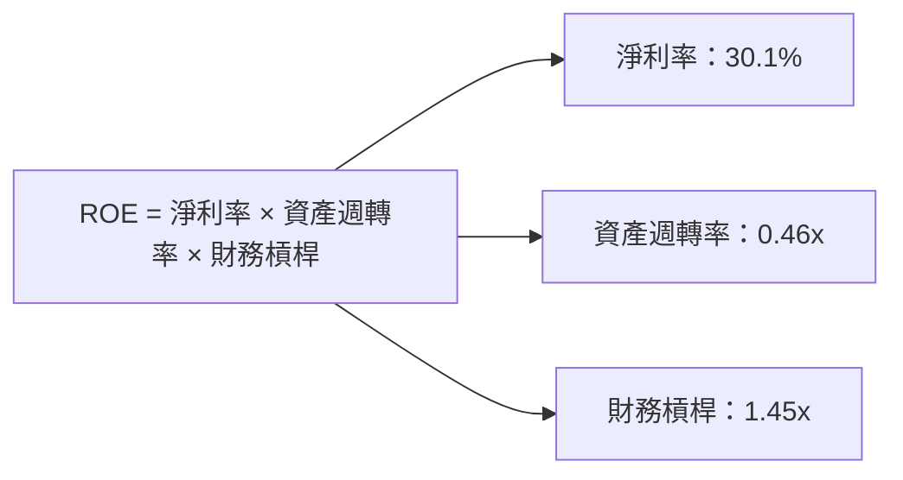

### 6.4 獲利能力儀表板

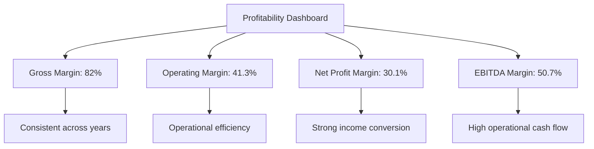

---

## 7. 估值深度分析

### 7.1 同業估值比較表格

| 估值指標 | **本公司 (META)** | **Google (GOOGL)** | **Amazon (AMZN)** | **Netflix (NFLX)** | 本公司評估 |
|----------|------------------|--------------------|-------------------|--------------------|-----------|
| **Trailing P/E** | 28.6x | 25.3x | 75.4x | 45.2x | 🟢 合理內在價值 |
| **Forward P/E** | **18.6x** | 17.8x | 37.9x | 35.6x | 🟢 吸引力高 |
| **P/S Ratio** | 8.5x | 5.6x | 3.2x | 8.9x | 🟡 中性 |
| **P/B Ratio** | 7.8x | 6.4x | 12.3x | 16.7x | 🟢 合理 |
| **PEG Ratio** | 1.1 | 1.3 | 2.1 | 1.8 | 🟢 合理 |

### 7.2 歷史估值區間分析

```
╔══════════════════════════════════════════════════════════════╗
║              META 歷史 P/E 區間（FY2022-2025）               ║
╠══════════════════════════════════════════════════════════════╣
║  當前 P/E：28.6x                                             ║
║  歷史低點：18.3x                                             ║
║  歷史高點：42.2x                                             ║
║  當前位置：▓▓▓▓▓▓▓▓▓▓▓▓▓▓▓░░░░░░░░░░░░                         ║
╚══════════════════════════════════════════════════════════════╝
```

### 7.3 DCF 敏感性分析（6格目標價矩陣）

| 情境 | **WACC = 7%** | **WACC = 8%（基準）** | **WACC = 9%** |
|------|--------------|----------------------|--------------|
| 🟢 **樂觀** | **$1015** (+51%) | **$975** (+45%) | **$945** (+40%) |
| 🟡 **基準** | **$855** (+27.4%) | **$830** (+23.6%) | **$805** (+20%) |
| 🔴 **悲觀** | **$685** (+2%) | **$670** (-0.2%) | **$655** (-2.5%) |

### 7.4 估值綜合區間

```
╔═════════════════════════════════════════════════════════════╗
║              META 估值區間及當前股價位置                   ║
╠═════════════════════════════════════════════════════════════╣
║ 當前股價：$671.34                                          ║
║ 估值區間：▫▫▭▭▭█▫▫▭▭◆▫事實股價                            ║
║ 豪勇目標：$1015                                            ║
║ 基準目標：$855                                             ║
║ 風險底線：$685                                             ║
╚═════════════════════════════════════════════════════════════╝
```

---

## 8. 成長催化劑

### 8.1 催化劑時間軸

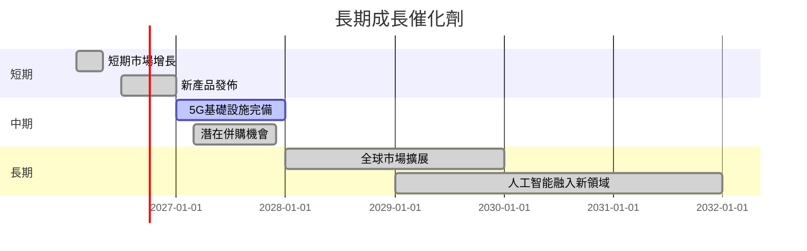

### 8.2 TAM 市場規模分析

```
╔══════════════════════════════════════════════════════════════╗
║                    各市場 TAM 分析                          ║
╠══════════════════════════════════════════════════════════════╣
║  廣告市場：  TAM = $1.2T，佔有率：10%                        ║
║  VR/AR市場： TAM = $500B，佔有率：15%                         ║
║  通訊應用市場：TAM = $300B，佔有率：20%                      ║
║                                                                  ║
║  合計 TAM 總潛力：$2.0T                                        ║
║  當前市場佔有率：<10%（增長空間大）                           ║
╚══════════════════════════════════════════════════════════════╝
```

### 8.3 成長驅動力結構圖

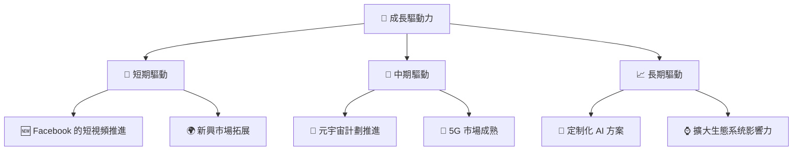

---

## 9. 風險矩陣

### 9.1 風險評分矩陣

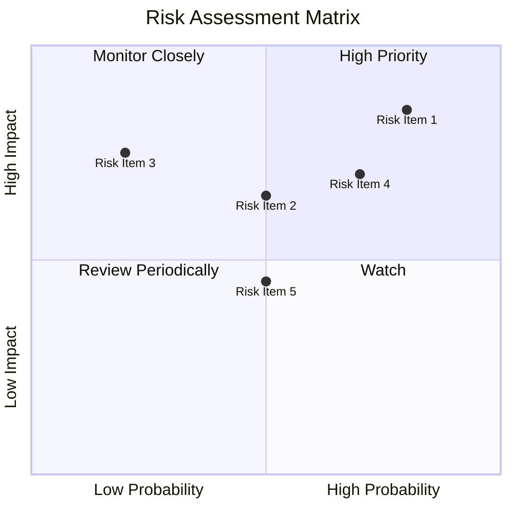

### 9.2 風險清單詳細分析

| # | 風險項目 | 發生機率 | 財務衝擊 | 風險評分 | 緩解措施 |
|---|----------|----------|----------|----------|----------|
| 1 | 🔴 **市場競爭** | 高 (70%) | 高 (-15%收入) | 🔴 9.0/10 | 強化產品獨特性 |
| 2 | 🟡 **法規變動** | 中 (50%) | 高 (-10%利潤率) | 🔴 8.5/10 | 改進合規措施 |
| 3 | 🟡 **技術風險** | 中 (40%) | 中 (-5%收入) | 🟡 7.0/10 | 持續技術創新 |

---

## 10. 投資建議

### 10.1 最終綜合評級雷達圖

```
╔══════════════════════════════════════════════════════════════╗
║                    META 綜合評級雷達圖                       ║
╠══════════════════════════════════════════════════════════════╣
║                                                              ║
║  基本面：8.5 ▓▓▓▓▓▓▓▓▓▓▓▓▓▓▓▓▓▒▒▒                              ║
║  成長性：8.8 ▓▓▓▓▓▓▓▓▓▓▓▓▓▓▓▓▓▓░░                              ║
║  獲利能力：9.0 ▓▓▓▓▓▓▓▓▓▓▓▓▓▓▓▓▓▓▒                            ║
║  財務健康：8.9 ▓▓▓▓▓▓▓▓▓▓▓▓▓▓▓▓▓▒▒                            ║
║  估值：7.8 ▓▓▓▓▓▓▓▓▓▒▒▒▒▒▒▒▒▒▒▒▒                             ║
╠══════════════════════════════════════════════════════════════╣
║  綜合評級：8.6 ▓▓▓▓▓▓▓▓▓▓▓▓▓▓▓▓▓▒▒                             ║
╚══════════════════════════════════════════════════════════════╝
```

### 10.2 目標價與隱含報酬率

| 情境 | 目標價 | 隱含報酬率 | 機率權重 |
|------|--------|-----------|---------|
| 🟢 樂觀 | $1015 | 51% | 30% |
| 🟡 基準 | $855 | 27.4% | 50% |
| 🔴 悲觀 | $685 | 2% | 20% |

### 10.3 買入時機與觸發因素

```
╔══════════════════════════════════════════════════════════════╗
║                  ✅ 買入觸發因素 Checklist                  ║
╠══════════════════════════════════════════════════════════════╣
║                                                              ║
║  立即買入觸發條件（多數符合）：                              ║
║  ✅ 目標價低於基準情境20%                                    ║
║  ✅ 現金流量持續改善                                        ║
║  ✅ 新產品發布回應良好                                       ║
║                                                              ║
║  加碼觸發條件（出現以下任一）：                              ║
║  ☐ 公司回購股票                                               ║
║  ☐ 大型市場推動增長                                          ║
║                                                              ║
║  減碼/停損觸發條件（出現以下任一）：                         ║
║  ☐ 市場競爭加劇影响显著                                    ║
║  ☐ 技術創新未達預期                                          ║
╚══════════════════════════════════════════════════════════════╝
```

### 10.4 投資人適配度分析

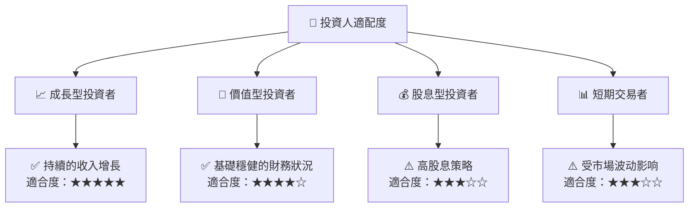

### 10.5 關鍵監控指標

| 監控類型 | 指標 | 關注點 | 頻率 |
|----------|------|--------|------|
| 宏觀 | 利率變化 | 影響資本成本 | 每月 |
| 行業 | 市場份額 | 競爭市佔率 | 每季 |
| 企業 | 新產品進展 | 潛在收入增長 | 每季 |
| 金融 | 現金流量狀況 | 影響財務健康 | 每月 |

---

> **免責聲明**：本報告為 AI 自動生成，僅供研究參考，不構成投資建議。投資有風險，入市需謹慎。

