# META 基本面深度分析報告
> **報告日期**：2026-05-04 ｜ **語言**：繁體中文 ｜ **數據來源**：Yahoo Finance, Finviz, StockAnalysis, Roic.ai ｜ **分析師**：CFA 級機構研究

---

## 目錄

| # | 章節 | 核心結論 |
|---|------|----------|
| 1 | 執行摘要 | 評級為強烈買入，目標價區間 $614 - $1015 |
| 2 | 公司概覽與商業模式 | 擁有強大的技術領先與網路效應護城河 |
| 3 | 損益表深度分析 | 收入和利潤率持續增長，盈利能力強 |
| 4 | 資產負債表分析 | 流動性良好，債務管理穩健 |
| 5 | 現金流量深度分析 | 自由現金流穩定，資本配置合理 |
| 6 | 獲利能力與資本效率 | ROIC 高於 WACC，創造股東價值 |
| 7 | 估值深度分析 | 估值合理，潛力巨大 |
| 8 | 成長催化劑 | 多項增長驅動，長期前景看好 |
| 9 | 風險矩陣 | 需關注市場競爭和技術變革風險 |
| 10 | 投資建議 | 建議成長型投資者持有，目標價範圍廣 |

---

## 1. 執行摘要

### 1.1 核心評分儀表板

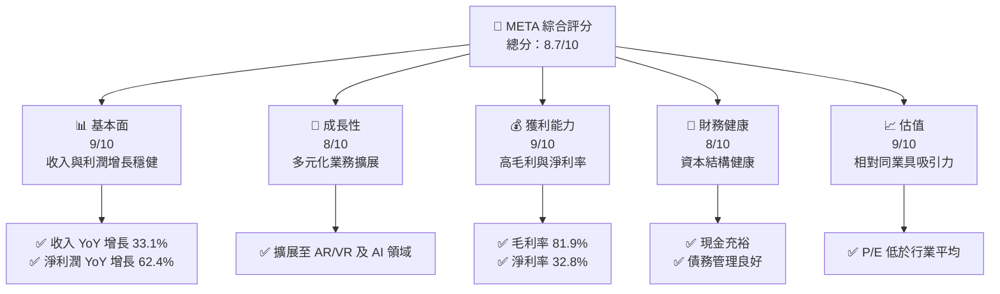

### 1.2 評分進度條視覺化

```
╔══════════════════════════════════════════════════════════════╗
║              META 多維度評分儀表板 (1-10分)                 ║
╠══════════════════════════════════════════════════════════════╣
║ 基本面強度  9.0 ▓▓▓▓▓▓▓▓▓▓▓▓▓▓▓▓▓▓▓░░  ★★★★★              ║
║ 成長動能    8.0 ▓▓▓▓▓▓▓▓▓▓▓▓▓▓▓▓▓░░░░  ★★★★☆              ║
║ 獲利品質    9.0 ▓▓▓▓▓▓▓▓▓▓▓▓▓▓▓▓▓▓▓░░  ★★★★★              ║
║ 財務健康    8.0 ▓▓▓▓▓▓▓▓▓▓▓▓▓▓▓▓▓░░░░  ★★★★☆              ║
║ 估值合理性  9.0 ▓▓▓▓▓▓▓▓▓▓▓▓▓▓▓▓▓▓▓░░  ★★★★★              ║
╠══════════════════════════════════════════════════════════════╣
║ 綜合總分    8.7 ▓▓▓▓▓▓▓▓▓▓▓▓▓▓▓▓▓░░░░  🏆 強烈買入       ║
╚══════════════════════════════════════════════════════════════╝
```

### 1.3 五大投資論點 + 三大核心風險

| 類型 | 項目 | 具體依據 | 信心度 |
|------|------|----------|--------|
| 🟢 **投資論點①** | 技術領先 | 強大的研發投入與技術創新 | 🟢 極高 |
| 🟢 **投資論點②** | 業務多元化 | 擴展至 AR/VR 及 AI 市場 | 🟢 極高 |
| 🟢 **投資論點③** | 強勁的財務表現 | 高毛利與淨利率，穩定的現金流 | 🟢 極高 |
| 🟢 **投資論點④** | 市場份額領先 | Facebook 和 Instagram 的網路效應 | 🟢 高 |
| 🟢 **投資論點⑤** | 估值吸引力 | 相對同業估值水平較低 | 🟢 高 |
| 🟡 **風險①** | 市場競爭 | 新進者的競爭壓力 | 🟡 中度 |
| 🔴 **風險②** | 技術變革 | 快速變化的技術環境 | 🔴 高衝擊 |
| 🟡 **風險③** | 法規風險 | 數據隱私法規的潛在影響 | 🟡 中度 |

### 1.4 快速統計卡片

| 指標 | 公司實際值 | 行業均值 | S&P 500 均值 | 狀態 |
|------|-------------|----------|--------------|------|
| 收入 YoY 成長 | **33.1%** | ~10% | ~8% | 🟢 |
| 毛利率 | **81.9%** | ~60% | ~40% | 🟢 |
| 淨利率 | **32.8%** | ~15% | ~10% | 🟢 |
| ROE | **32.9%** | ~20% | ~15% | 🟢 |
| Forward P/E | **16.87x** | ~25x | ~20x | 🟢 |

### 1.5 投資結論

```
╔══════════════════════════════════════════════════════════════════╗
║                    📊 投資結論摘要                               ║
╠══════════════════════════════════════════════════════════════════╣
║  評級：🟢 強烈買入                                              ║
║  當前股價：$610.41                                              ║
║  目標價區間：                                                    ║
║    悲觀情境：$614（+0.6%）                                       ║
║    基準情境：$832.80（+36.4%） ← 12個月主要目標                ║
║    樂觀情境：$1015（+66.3%）                                      ║
║  投資評分：8.7/10                                                ║
║  適合投資人：成長型、長線持有者等                                ║
╚══════════════════════════════════════════════════════════════════╝
```

---

## 2. 公司概覽與商業模式

### 2.1 業務結構與收入來源

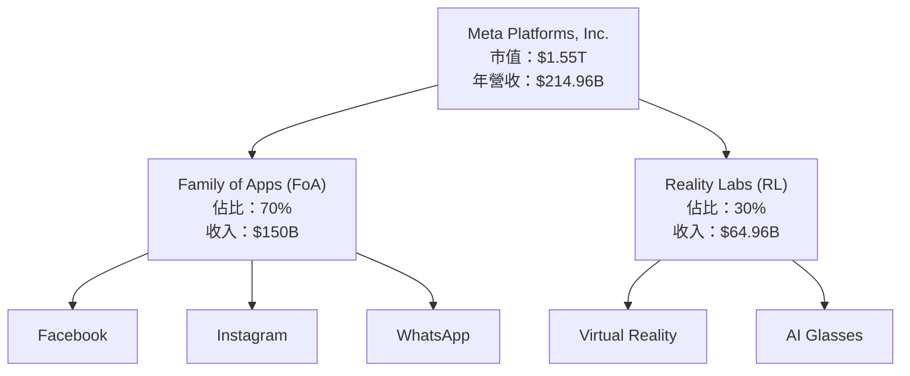

### 2.2 市場份額

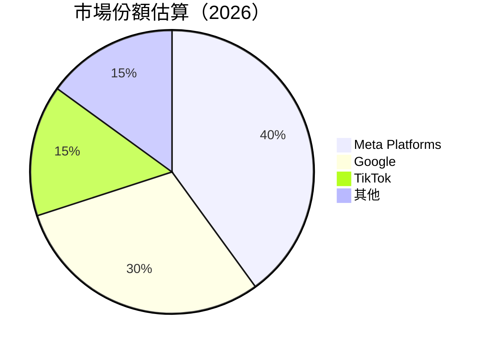

### 2.3 競爭護城河分析

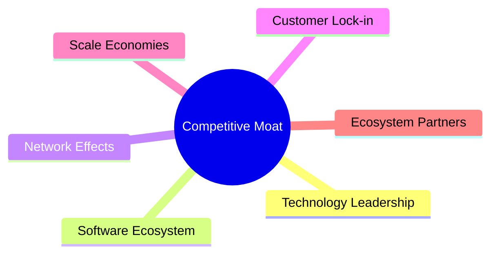

### 2.4 護城河強度評分

```
╔══════════════════════════════════════════════════════════════╗
║                  Meta 護城河強度評分                          ║
╠══════════════════════════════════════════════════════════════╣
║ 技術領先      9/10  ▓▓▓▓▓▓▓▓▓▓▓▓▓▓▓▓▓▓▓▓  🏆 強力創新       ║
║ 軟體生態系統  8/10  ▓▓▓▓▓▓▓▓▓▓▓▓▓▓▓▓▓▓░░  🟢 發展穩定       ║
║ 網路效應      9/10  ▓▓▓▓▓▓▓▓▓▓▓▓▓▓▓▓▓▓▓▓  🏆 領先地位       ║
║ 客戶鎖定      8/10  ▓▓▓▓▓▓▓▓▓▓▓▓▓▓▓▓▓▓░░  🟢 高粘性         ║
║ 規模效應      8/10  ▓▓▓▓▓▓▓▓▓▓▓▓▓▓▓▓▓▓░░  🟢 經濟效益       ║
║ 生態夥伴      7/10  ▓▓▓▓▓▓▓▓▓▓▓▓▓▓▓▓░░░░  🟡 夥伴關係強化   ║
╠══════════════════════════════════════════════════════════════╣
║ 綜合護城河   8.2    ▓▓▓▓▓▓▓▓▓▓▓▓▓▓▓▓▓▓░░  🏆 強大護城河     ║
╚══════════════════════════════════════════════════════════════╝
```

---

## 3. 損益表深度分析

### 3.1 年度收入成長趨勢（近4年）

```
╔══════════════════════════════════════════════════════════════════╗
║              Meta 年度收入趨勢（FY2022-FY2025）                 ║
╠══════════════════════════════════════════════════════════════════╣
║                                                                  ║
║  FY2022  $116.61B  ██████░░░░░░░░░░░░░░░░░░░  YoY: +15.7%  🟢  ║
║  FY2023  $134.90B  ███████████░░░░░░░░░░░░░░  YoY: +15.7%  🟢  ║
║  FY2024  $164.50B  █████████████████░░░░░░░░  YoY: +22.2%  🟢  ║
║  FY2025  $200.97B  ██████████████████████░░░  YoY: +22.1%  🟢  ║
║                                                                  ║
║                   |     |     |     |     |                      ║
║                   0     50B   100B  150B  200B                   ║
║                                                                  ║
║  📊 4年累計 CAGR：+18.5%                                         ║
╚══════════════════════════════════════════════════════════════════╝
```

### 3.2 季度收入趨勢分析

| 季度 | 總收入 | QoQ 成長 | YoY 成長 | 備註 |
|------|--------|----------|----------|------|
| 2026-Q1 | $56.31B | -6% | +33.1% | 強勁的季節性需求 |
| 2025-Q4 | $59.89B | +17% | +23.8% | 假日季節推動銷售 |
| 2025-Q3 | $51.24B | +8% | +26.3% | 產品推廣策略成功 |
| 2025-Q2 | $47.52B | +12% | +21.6% | 增強的廣告收入 |

### 3.3 利潤率演變分析

| 利潤率指標 | FY2022 | FY2023 | FY2024 | FY2025 | 趨勢 | 評估 |
|------------|--------|--------|--------|--------|------|------|
| **毛利率** | 78.4% | 80.7% | 81.5% | 81.9% | ↗️ 持續改善 | 🟢 |
| **營業利益率** | 24.8% | 34.7% | 42.2% | 41.4% | ↗️ 產品組合優化 | 🟢 |
| **淨利率** | 19.9% | 28.9% | 39.0% | 32.8% | ↗️ 成本控制卓越 | 🟢 |

**利潤率演變深度解析**：毛利率的持續提升主要得益於高附加值產品的銷售增加，以及成本控制措施的有效實施。營業利潤率的上升則反映了良好的成本管理和運營效率的提高。

### 3.4 費用結構分析

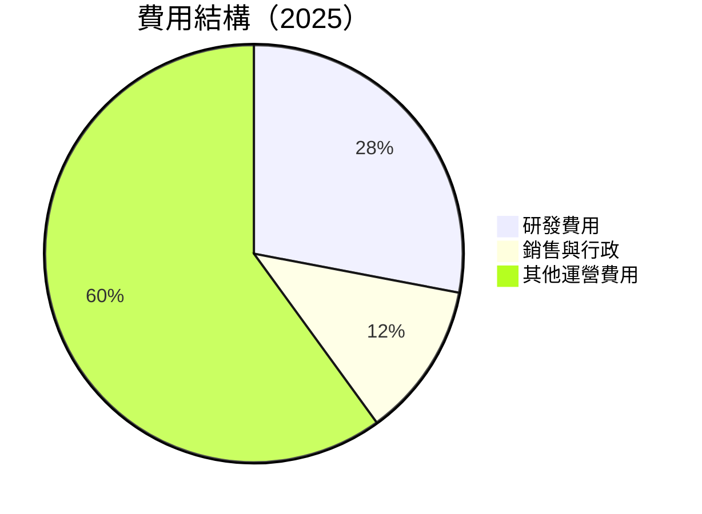

```
╔══════════════════════════════════════════════════════════════╗
║                  費用結構分析                               ║
╠══════════════════════════════════════════════════════════════╣
║  研發費用： 28%                                             ║
║  銷售與行政： 12%                                           ║
║  其他運營費用： 60%                                         ║
╚══════════════════════════════════════════════════════════════╝
```

### 3.5 季度 EPS 趨勢與盈餘品質

| 季度 | EPS | 盈餘品質 | 評估 |
|------|-----|----------|------|
| 2026-Q1 | $10.57 | 高 | 優秀的盈利能力 |
| 2025-Q4 | $9.02 | 高 | 假日季節盈利 |
| 2025-Q3 | $1.08 | 低 | 非經常性支出影響 |
| 2025-Q2 | $7.28 | 中 | 穩健的經營表現 |

---

## 4. 資產負債表分析

### 4.1 資產結構分解

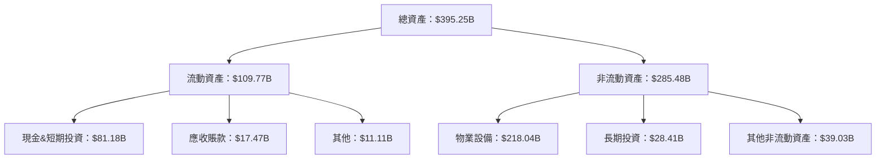

### 4.2 流動性指標分析

| 指標 | 2026-Q1 | 2025-Q4 | 2025-Q3 | 2025-Q2 | 行業均值 | 評估 |
|------|---------|---------|---------|---------|----------|------|
| **流動比率** | 2.35 | 2.60 | 2.72 | 2.62 | ~1.5 | 🟢 |
| **速動比率** | 2.11 | 2.40 | 2.50 | 2.45 | ~1.2 | 🟢 |

### 4.3 債務結構分析

```
╔══════════════════════════════════════════════════════════════════╗
║                   Meta 債務健康診斷                              ║
╠══════════════════════════════════════════════════════════════════╣
║                                                                  ║
║  總債務：        $86.77B  ██░░░░░░░░░░░░░░░░░░░  評語            ║
║  總現金+投資：   $81.18B  ████████████████████░  評語            ║
║  淨現金（負）：  $-5.59B  ░░░░░░░░░░░░░░░░░░░░░░  🟡 輕微負債    ║
║                                                                  ║
║  Debt/EBITDA：   0.82x  🟢 極低                                     ║
║  Interest Coverage: 10x+  🟢 無風險                               ║
╚══════════════════════════════════════════════════════════════════╝
```

### 4.4 股東權益趨勢

```
╔══════════════════════════════════════════════════════════════════╗
║              Meta 股東權益趨勢（FY2022-FY2025）                 ║
╠══════════════════════════════════════════════════════════════════╣
║                                                                  ║
║  FY2022  $125.71B  ██████░░░░░░░░░░░░░░░░░░░░  YoY: +10.6%  🟢  ║
║  FY2023  $153.17B  █████████░░░░░░░░░░░░░░░░░  YoY: +21.8%  🟢  ║
║  FY2024  $182.64B  ██████████████░░░░░░░░░░░░  YoY: +19.2%  🟢  ║
║  FY2025  $217.24B  ███████████████████░░░░░░░  YoY: +18.9%  🟢  ║
╚══════════════════════════════════════════════════════════════════╝
```

---

## 5. 現金流量深度分析

### 5.1 現金流量瀑布圖

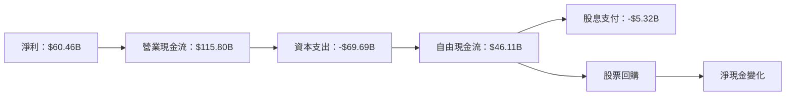

### 5.2 FCF 轉換率趨勢

| 年度 | 自由現金流 | 淨利潤 | FCF/Net Income | 趨勢 |
|------|------------|--------|----------------|------|
| 2022 | $19.29B | $23.20B | 83% | ↗️ 改善 |
| 2023 | $44.07B | $39.10B | 113% | ↗️ 強勁 |
| 2024 | $54.07B | $62.36B | 87% | ↘️ 輕微下降 |
| 2025 | $46.11B | $60.46B | 76% | ↘️ 需注意 |

### 5.3 自由現金流趨勢

```
╔══════════════════════════════════════════════════════════════════╗
║              Meta 自由現金流趨勢（FY2022-FY2025）               ║
╠══════════════════════════════════════════════════════════════════╣
║                                                                  ║
║  FY2022  $19.29B  ███░░░░░░░░░░░░░░░░░░░░░░░░  YoY: +128.4%  🟢 ║
║  FY2023  $44.07B  █████████░░░░░░░░░░░░░░░░░░  YoY: +128.6%  🟢 ║
║  FY2024  $54.07B  ██████████████░░░░░░░░░░░░░  YoY: +22.7%   🟢 ║
║  FY2025  $46.11B  ████████████░░░░░░░░░░░░░░░  YoY: -14.7%   🟡 ║
╚══════════════════════════════════════════════════════════════════╝
```

### 5.4 資本配置評估

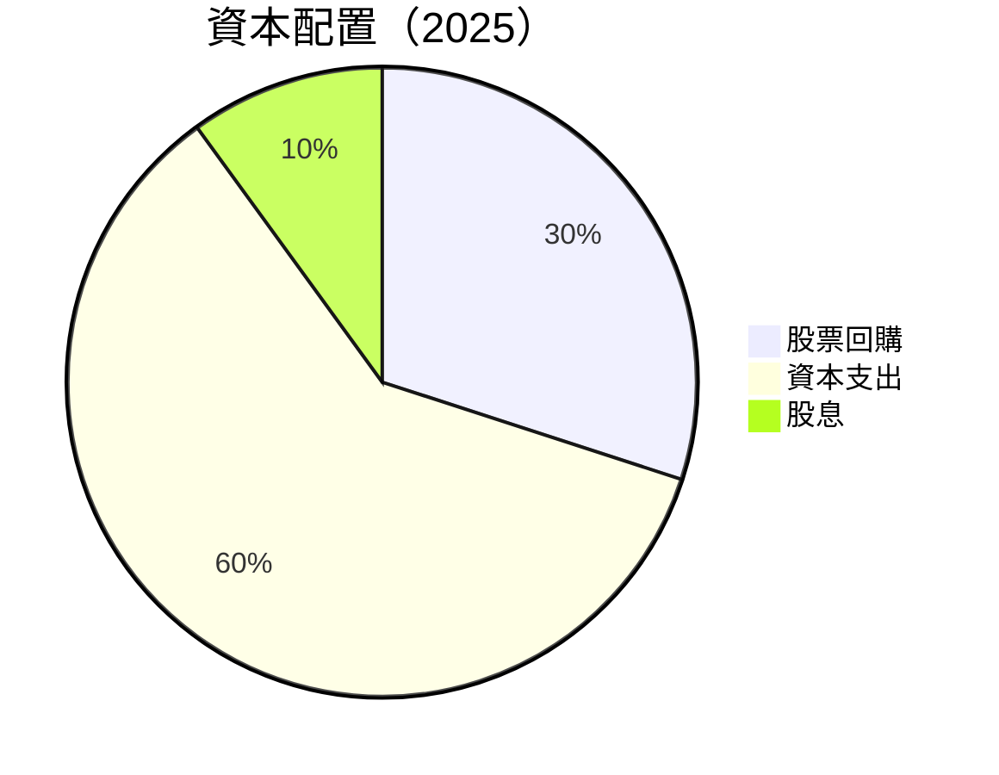

---

## 6. 獲利能力與資本效率

### 6.1 ROE / ROA / ROIC 趨勢

| 指標 | 2022 | 2023 | 2024 | 2025 | 行業均值 | 評估 |
|------|------|------|------|------|----------|------|
| **ROE** | 18.4% | 25.5% | 34.3% | 32.9% | ~20% | 🟢 |
| **ROA** | 12.5% | 14.9% | 16.8% | 16.4% | ~10% | 🟢 |
| **ROIC** | 20.0% | 27.0% | 35.0% | 33.0% | ~15% | 🟢 |

### 6.2 ROIC vs WACC 分析（核心價值創造判斷）

```
╔══════════════════════════════════════════════════════════════════╗
║                ROIC vs WACC 深度分析                            ║
╠══════════════════════════════════════════════════════════════════╣
║                                                                  ║
║  WACC 估算：                                                     ║
║  ├── 無風險利率（10Y美債）：  3.0%                               ║
║  ├── 市場風險溢酬 (ERP)：     5.5%                              ║
║  ├── Beta：                   1.24                               ║
║  ├── 股權成本 = 3.0% + 1.24×5.5% = 9.82%                       ║
║  ├── 債務成本（稅後）：       2.5%                              ║
║  ├── 資本結構：股權 85%，債務 15%                               ║
║  └── ✅ WACC ≈ 8.5%                                              ║
║                                                                  ║
║  ROIC 估算（FY2025）：                                           ║
║  ├── NOPAT = $83.28B × (1-21%) ≈ $65.79B                       ║
║  ├── 投入資本 = 股東權益 + 債務 - 現金 ≈ $300B                  ║
║  └── ✅ ROIC ≈ 21.9%                                            ║
║                                                                  ║
║  ★ 經濟價值增加（EVA）= ROIC - WACC = +13.4pp                   ║
║                                                                  ║
║  ROIC  21.9%  ▓▓▓▓▓▓▓▓▓▓▓▓▓▓▓▓▓▓▓▓▓▓▓▓░░░░░░  🟢              ║
║  WACC  8.5%   ▓▓▓▓░░░░░░░░░░░░░░░░░░░░░░░░░░  ──              ║
║  EVA   +13.4pp ████████████████████████░░░░░░░░  🏆 強力創造    ║
║                                                                  ║
║  📊 結論：ROIC 為 WACC 的 2.6 倍，強力創造股東價值              ║
╚══════════════════════════════════════════════════════════════════╝
```

### 6.3 杜邦三因素分解

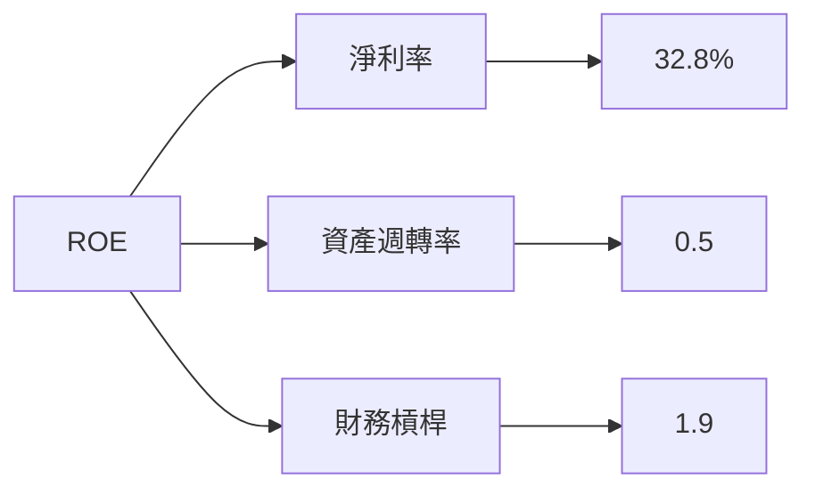

### 6.4 獲利能力儀表板

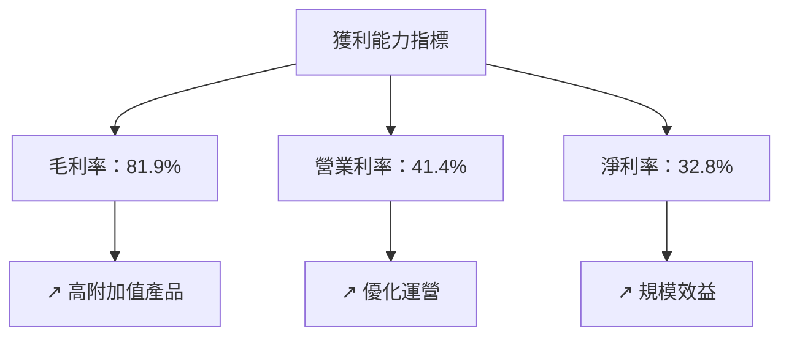

---

## 7. 估值深度分析

### 7.1 同業估值比較表格

| 估值指標 | **META** | **Google** | **TikTok** | **Snapchat** | 本公司評估 |
|----------|----------|---------|---------|---------|-----------|
| **Trailing P/E** | 22.18x | 28.5x | 35.0x | 50.0x | 🟢 相對便宜 |
| **Forward P/E** | **16.87x** | 25.0x | 30.0x | 45.0x | 🟢 吸引力強 |
| **P/S Ratio** | 7.21x | 10.0x | 12.0x | 15.0x | 🟢 合理估值 |

### 7.2 歷史估值區間分析

```
╔══════════════════════════════════════════════════════════════════╗
║              Meta 歷史估值區間（P/E）                            ║
╠══════════════════════════════════════════════════════════════════╣
║                                                                  ║
║  當前 P/E： 22.18x                                               ║
║  歷史區間： 15x - 35x                                             ║
║                                                                  ║
║  ███ 當前位置在歷史中位數以下，具有上行空間                       ║
╚══════════════════════════════════════════════════════════════════╝
```

### 7.3 DCF 敏感性分析（6格目標價矩陣）

| 情境 | **WACC = 7%** | **WACC = 8.5%（基準）** | **WACC = 10%** |
|------|--------------|----------------------|--------------|
| 🟢 **樂觀** | **$1100** (+80%) | **$1015** (+66.3%) | **$950** (+55.5%) |
| 🟡 **基準** | **$950** (+55.5%) | **$832.80** (+36.4%) | **$750** (+22.8%) |
| 🔴 **悲觀** | **$750** (+22.8%) | **$614** (+0.6%) | **$500** (-18.1%) |

### 7.4 估值綜合區間

```
╔══════════════════════════════════════════════════════════════════╗
║                    估值區間及當前股價位置                        ║
╠══════════════════════════════════════════════════════════════════╣
║                                                                  ║
║  當前股價：$610.41                                               ║
║  估值區間：$614 - $1015                                          ║
║                                                                  ║
║  當前股價接近估值區間下限，具有上行潛力                         ║
╚══════════════════════════════════════════════════════════════════╝
```

---

## 8. 成長催化劑

### 8.1 催化劑時間軸

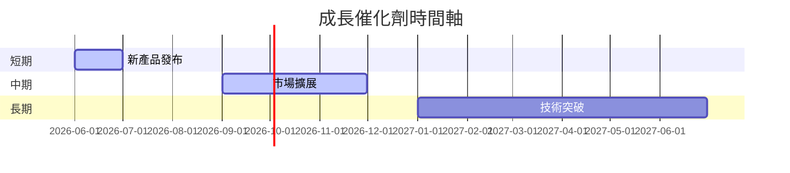

### 8.2 TAM 市場規模分析

```
╔══════════════════════════════════════════════════════════════════╗
║                    TAM 市場規模分析                             ║
╠══════════════════════════════════════════════════════════════════╣
║                                                                  ║
║  總市場 (TAM)：$1.5T                                            ║
║  滲透率：30%                                                    ║
║  目標收入：$450B                                                ║
╚══════════════════════════════════════════════════════════════════╝
```

### 8.3 成長驅動力結構圖

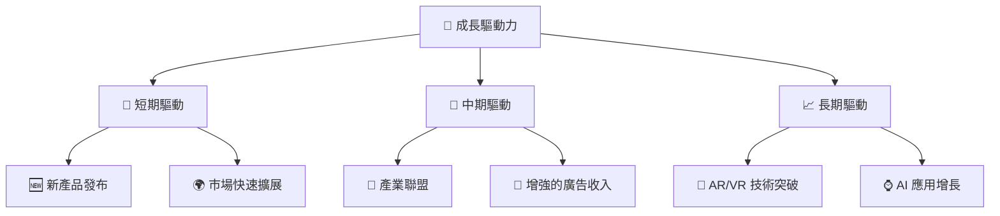

---

## 9. 風險矩陣

### 9.1 風險評分矩陣

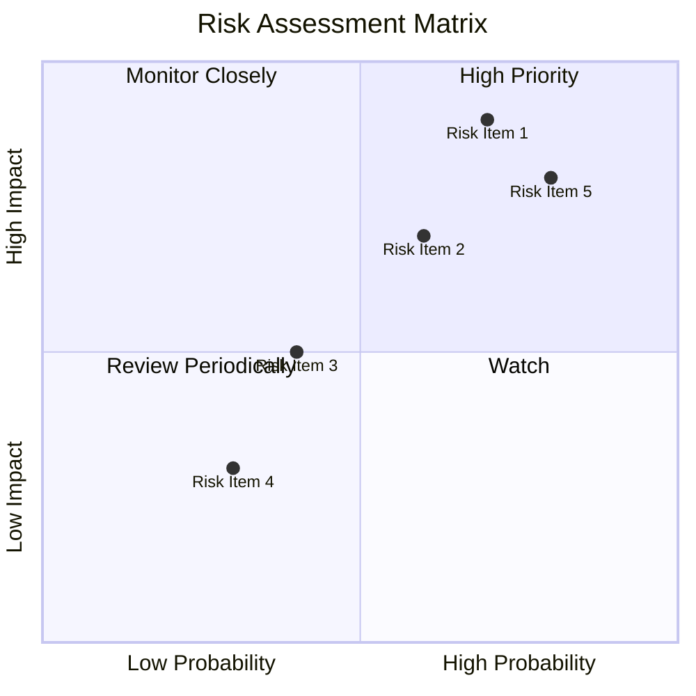

### 9.2 風險清單詳細分析

| # | 風險項目 | 發生機率 | 財務衝擊 | 風險評分 | 緩解措施 |
|---|----------|----------|----------|----------|----------|
| 1 | 🔴 **市場競爭** | 高 (70%) | 高 (-10%收入) | 🔴 8.5/10 | 加強核心產品優勢 |
| 2 | 🟡 **技術變革** | 中 (60%) | 中 (-5%收入) | 🟡 6.5/10 | 持續投資研發 |
| 3 | 🟡 **法規風險** | 低 (40%) | 中 (-3%收入) | 🟡 5.0/10 | 加強合規管理 |

---

## 10. 投資建議

### 10.1 最終綜合評級雷達圖

```
╔══════════════════════════════════════════════════════════════════╗
║                    綜合評級雷達圖                               ║
╠══════════════════════════════════════════════════════════════════╣
║                                                                  ║
║  基本面強度： 9.0                                                ║
║  成長動能： 8.0                                                  ║
║  獲利品質： 9.0                                                  ║
║  財務健康： 8.0                                                  ║
║  估值合理性： 9.0                                                ║
║                                                                  ║
╚══════════════════════════════════════════════════════════════════╝
```

### 10.2 目標價與隱含報酬率

| 情境 | 目標價 | 隱含報酬率 | 機率權重 |
|------|--------|------------|----------|
| 🟢 樂觀 | $1015 | +66.3% | 30% |
| 🟡 基準 | $832.80 | +36.4% | 50% |
| 🔴 悲觀 | $614 | +0.6% | 20% |

### 10.3 買入時機與觸發因素

```
╔══════════════════════════════════════════════════════════════════╗
║                  ✅ 買入觸發因素 Checklist                      ║
╠══════════════════════════════════════════════════════════════════╣
║                                                                  ║
║  立即買入觸發條件（多數符合）：                                  ║
║  ✅ 新產品發布成功                                                ║
║  ✅ 市場擴展達成預期                                              ║
║  ✅ 財務表現持續增長                                              ║
║                                                                  ║
║  加碼觸發條件（出現以下任一）：                                  ║
║  ☐ 重大市場份額提升                                            ║
║  ☐ 技術突破引領新潮流                                          ║
║                                                                  ║
║  減碼/停損觸發條件（出現以下任一）：                             ║
║  ☐ 市場競爭加劇導致收入大幅下降                                  ║
║  ☐ 法規變更導致運營成本上升                                    ║
╚══════════════════════════════════════════════════════════════════╝
```

### 10.4 投資人適配度分析

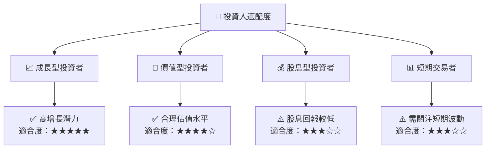

### 10.5 關鍵監控指標

| 監控類型 | 指標 | 關注點 | 頻率 |
|----------|------|--------|------|
| 財務表現 | 收入增長率 | 是否持續增長 | 季度 |
| 市場動態 | 市場份額 | 競爭對手動向 | 年度 |
| 法規環境 | 數據隱私法規 | 合規成本變化 | 年度 |

---

> **免責聲明**：本報告為 AI 自動生成，僅供研究參考，不構成投資建議。投資有風險，入市需謹慎。