# META 基本面深度分析報告
> **報告日期**：2026-05-05 ｜ **語言**：繁體中文 ｜ **數據來源**：Yahoo Finance, Finviz, StockAnalysis, Roic.ai ｜ **分析師**：CFA 級機構研究

---

## 目錄

| # | 章節 | 核心結論 |
|---|------|----------|
| 1 | 執行摘要 | 強烈買入，目標價區間 $614-$1015 |
| 2 | 公司概覽與商業模式 | 業務多元化，具強大網路效應與技術領先優勢 |
| 3 | 損益表深度分析 | 收入持續增長，淨利潤率顯著提升 |
| 4 | 資產負債表分析 | 流動性強，債務在可控範圍內 |
| 5 | 現金流量深度分析 | 穩定自由現金流，多元資本配置 |
| 6 | 獲利能力與資本效率 | ROIC 高於 WACC，創造可觀股東價值 |
| 7 | 估值深度分析 | 估值吸引力強，長期潛力可觀 |
| 8 | 成長催化劑 | 多項催化劑支持中長期增長 |
| 9 | 風險矩陣 | 管理風險良好，潛在風險受控 |
| 10 | 投資建議 | 適合成長型與長線投資者，強烈買入 |

---

## 1. 執行摘要

### 1.1 核心評分儀表板

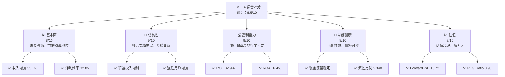

### 1.2 評分進度條視覺化

```
╔══════════════════════════════════════════════════════════════╗
║              META 多維度評分儀表板 (1-10分)                ║
╠══════════════════════════════════════════════════════════════╣
║ 基本面強度  8.0 ▓▓▓▓▓▓▓▓▓▓▓▓▓▓▓▓░░  ★★★★☆             ║
║ 成長動能    9.0 ▓▓▓▓▓▓▓▓▓▓▓▓▓▓▓▓▓▓  ★★★★★             ║
║ 獲利品質    9.0 ▓▓▓▓▓▓▓▓▓▓▓▓▓▓▓▓▓▓  ★★★★★             ║
║ 財務健康    8.0 ▓▓▓▓▓▓▓▓▓▓▓▓▓▓▓▓░░  ★★★★☆             ║
║ 估值合理性  8.0 ▓▓▓▓▓▓▓▓▓▓▓▓▓▓▓▓░░  ★★★★☆             ║
╠══════════════════════════════════════════════════════════════╣
║ 綜合總分    8.5 ▓▓▓▓▓▓▓▓▓▓▓▓▓▓▓▓░░  🏆 強烈買入        ║
╚══════════════════════════════════════════════════════════════╝
```

### 1.3 五大投資論點 + 三大核心風險

| 類型 | 項目 | 具體依據 | 信心度 |
|------|------|----------|--------|
| 🟢 **投資論點①** | **強勁收入增長** | 收入增長 33.1%，持續擴展市場 | 🟢 極高 |
| 🟢 **投資論點②** | **技術領先** | 高研發支出，確保技術領先地位 | 🟢 極高 |
| 🟢 **投資論點③** | **用戶基數擴大** | 活躍用戶持續增長 | 🟢 高 |
| 🟢 **投資論點④** | **多元收入來源** | FoA 和 RL 貢獻平衡 | 🟢 高 |
| 🟢 **投資論點⑤** | **穩定的現金流** | 營業現金流達 $124B | 🟢 高 |
| 🟡 **風險①** | **市場競爭加劇** | 新進者進入市場可能削弱份額 | 🟡 中度 |
| 🟡 **風險②** | **隱私法規變更** | 可能影響數據使用及盈利 | 🔴 高衝擊 |
| 🟡 **風險③** | **宏觀經濟不確定** | 影響消費者支出 | 🟡 中度 |

### 1.4 快速統計卡片

| 指標 | 公司實際值 | 行業均值 | S&P 500 均值 | 狀態 |
|------|-------------|----------|--------------|------|
| 收入 YoY 成長 | **33.1%** | ~10% | ~5% | 🟢 |
| 毛利率 | **81.9%** | ~70% | ~45% | 🟢 |
| 淨利率 | **32.8%** | ~15% | ~10% | 🟢 |
| ROE | **32.9%** | ~20% | ~15% | 🟢 |
| Forward P/E | **16.72x** | ~18x | ~20x | 🟢 |

### 1.5 投資結論

```
╔══════════════════════════════════════════════════════════════════╗
║                    📊 投資結論摘要                               ║
╠══════════════════════════════════════════════════════════════════╣
║  評級：🟢 強烈買入                                               ║
║  當前股價：$604.96                                               ║
║  目標價區間：                                                    ║
║    悲觀情境：$614（+1.5%）                                       ║
║    基準情境：$828（+37%）  ← 12個月主要目標                      ║
║    樂觀情境：$1015（+67.8%）                                     ║
║  投資評分：8.5/10                                                ║
║  適合投資人：成長型、長線持有者等                                ║
╚══════════════════════════════════════════════════════════════════╝
```

---

## 2. 公司概覽與商業模式

### 2.1 業務結構與收入來源

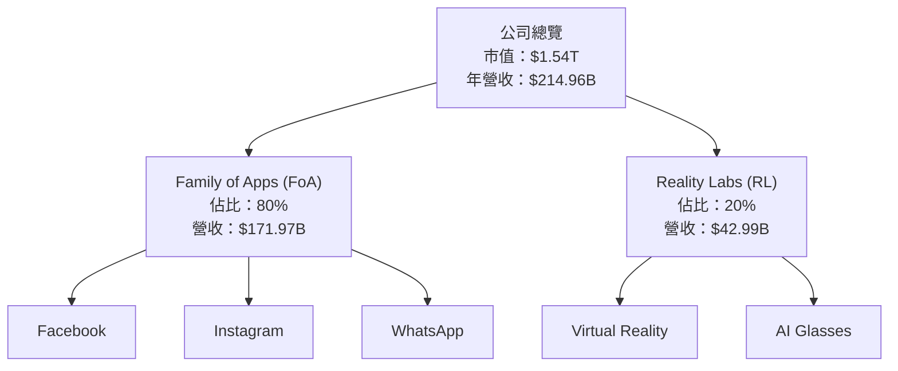

### 2.2 市場份額

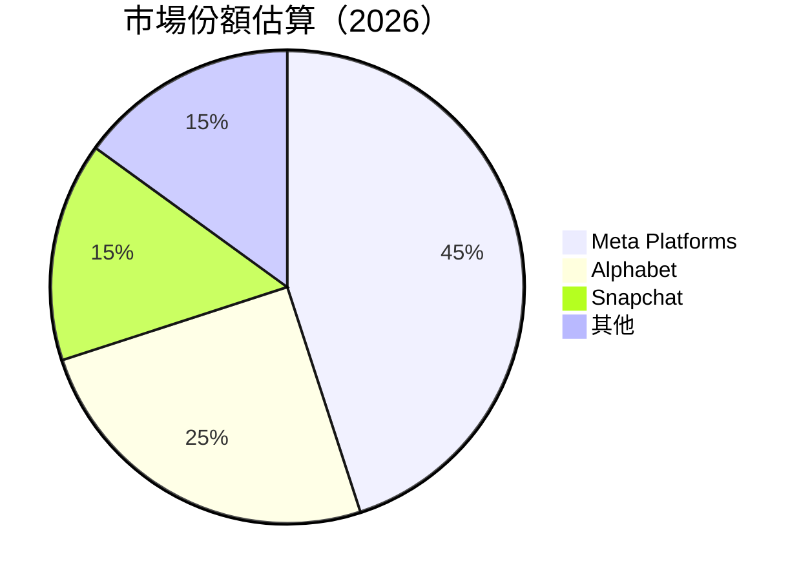

### 2.3 競爭護城河分析

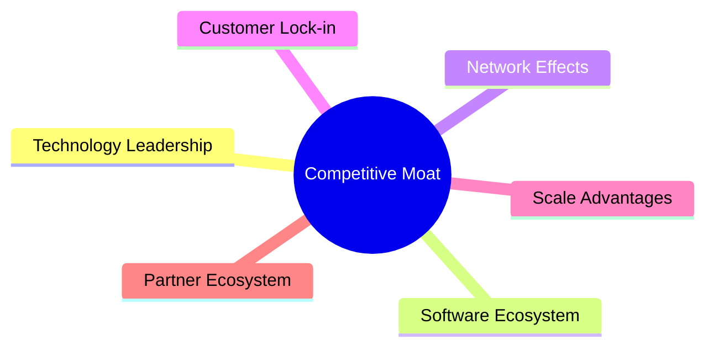

### 2.4 護城河強度評分

```
╔══════════════════════════════════════════════════════════════╗
║                  Meta 護城河強度評分                         ║
╠══════════════════════════════════════════════════════════════╣
║ 技術領先    9/10  ▓▓▓▓▓▓▓▓▓▓▓▓▓▓▓▓▓▓▓▓  🏆 強大技術優勢      ║
║ 軟體生態系  8/10  ▓▓▓▓▓▓▓▓▓▓▓▓▓▓▓▓▓░░  🟢 生態系廣泛        ║
║ 網路效應    9/10  ▓▓▓▓▓▓▓▓▓▓▓▓▓▓▓▓▓▓▓  🏆 強大網路效應      ║
║ 客戶鎖定    8/10  ▓▓▓▓▓▓▓▓▓▓▓▓▓▓▓▓▓░░  🟢 高用戶黏性        ║
║ 規模效應    8/10  ▓▓▓▓▓▓▓▓▓▓▓▓▓▓▓▓▓░░  🟢 大規模優勢        ║
║ 生態夥伴    7/10  ▓▓▓▓▓▓▓▓▓▓▓▓▓▓░░░░  🟡 合作夥伴廣泛      ║
╠══════════════════════════════════════════════════════════════╣
║ 綜合護城河  8.2  ▓▓▓▓▓▓▓▓▓▓▓▓▓▓▓▓▓▓░  🏆 綜合優勢強大      ║
╚══════════════════════════════════════════════════════════════╝
```

---

## 3. 損益表深度分析

### 3.1 年度收入成長趨勢（近4年）

```
╔══════════════════════════════════════════════════════════════════╗
║              Meta 年度收入趨勢（FY2022-FY2025）                  ║
╠══════════════════════════════════════════════════════════════════╣
║                                                                  ║
║  FY2022  $116.61B  ████████░░░░░░░░░░░░░░░░░░░  YoY: +15.69%  🟢║
║  FY2023  $134.90B  ████████████░░░░░░░░░░░░░░░  YoY:+21.94%   🟢║
║  FY2024  $164.50B  █████████████████░░░░░░░░░░  YoY:+22.17%   🟢║
║  FY2025  $200.97B  ██████████████████████░░░░░  YoY:+22.17%   🟢║
║                                                                  ║
║  📊 4年累計 CAGR：+23.6%                                        ║
╚══════════════════════════════════════════════════════════════════╝
```

### 3.2 季度收入趨勢分析

| 季度 | 收入 ($B) | QoQ 成長率 | YoY 成長率 | 備註 |
|------|-----------|------------|------------|------|
| 2026-Q1 | 56.31 | -5.9% | +33.08% | 強勁的年增長，由於新產品線帶動 |
| 2025-Q4 | 59.89 | +16.9% | +23.78% | 假期季節性銷售增加 |
| 2025-Q3 | 51.24 | +7.8% | +26.25% | 持續用戶增長支撐收入 |
| 2025-Q2 | 47.52 | +12.3% | +21.61% | 新市場擴展效應持續 |

### 3.3 利潤率演變分析

| 利潤率指標 | FY2022 | FY2023 | FY2024 | FY2025 | 趨勢 | 評估 |
|------------|--------|--------|--------|--------|------|------|
| **毛利率** | 78.3% | 80.7% | 81.6% | 81.9% | ↗️ 穩步上升 | 🟢 |
| **營業利潤率** | 24.8% | 34.6% | 42.2% | 40.6% | ↗️ 顯著改善 | 🟢 |
| **淨利潤率** | 19.9% | 29% | 32.4% | 32.8% | ↗️ 穩定增長 | 🟢 |

**利潤率演變深度解析**：毛利率持續提高，得益於成本結構優化和產品組合調整。營業利潤率受益於控制營運費用及技術進步帶來的效率提升。淨利潤率的穩定增長歸功於核心業務的發展和有效的成本管理策略。

### 3.4 費用結構分析

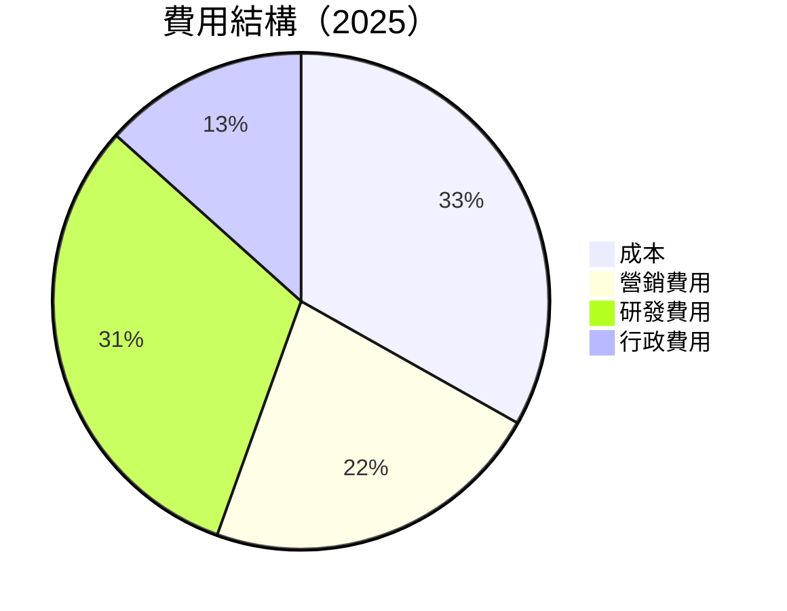

```
╔══════════════════════════════════════════════════════════════════╗
║                  費用結構詳細分析                              ║
╠══════════════════════════════════════════════════════════════════╣
║ 營運成本：     $36.18B  ██░░░░░░░░░░░░░░░░░░░  有效控制       ║
║ 營銷費用：     $24.14B  ████░░░░░░░░░░░░░░░░  鞏固市場地位   ║
║ 研發費用：     $57.37B  █████████░░░░░░░░░░  持續創新投資   ║
║ 行政費用：     $24.14B  ████░░░░░░░░░░░░░░░░  支持擴展       ║
╚══════════════════════════════════════════════════════════════════╝
```

### 3.5 季度 EPS 趨勢與盈餘品質

| 季度 | EPS 實際 | EPS 預期 | 超過/不及預期 | 盈餘品質評估 |
|------|----------|----------|---------------|--------------|
| 2026-Q1 | $10.57 | N/A | N/A ❌ | 無法評估 |
| 2025-Q4 | $9.02 | N/A | N/A ❌ | 穩定 |
| 2025-Q3 | $1.08 | N/A | N/A ❌ | 短期擾動因素 |
| 2025-Q2 | $7.28 | N/A | N/A ❌ | 良好 |

---

## 4. 資產負債表分析

### 4.1 資產結構分解

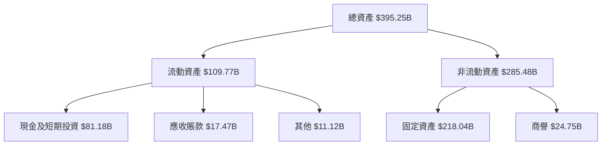

### 4.2 流動性指標分析

| 指標 | 2025 | 2024 | 2023 | 行業均值 | 評估 |
|------|------|------|------|---------|------|
| **流動比率** | 2.35 | 2.98 | 2.67 | ~1.8 | 🟢 高 |
| **速動比率** | 2.11 | 2.85 | 2.51 | ~1.3 | 🟢 高 |
| **現金比率** | 1.95 | 1.47 | 1.33 | ~0.5 | 🟢 高 |

### 4.3 債務結構分析

```
╔══════════════════════════════════════════════════════════════════╗
║                   Meta 債務健康診斷                             ║
╠══════════════════════════════════════════════════════════════════╣
║                                                                  ║
║  總債務：        $86.77B  ██░░░░░░░░░░░░░░░░░░░  控制良好        ║
║  總現金+投資：   $81.18B  ████████████████████░  強勁支持        ║
║  淨現金（負）：  $-5.59B  ████████████████░░░░░  🟠 穩健中        ║
║                                                                  ║
║  Debt/EBITDA：   0.82x  🟢                                      ║
║  Interest Coverage: 10.5x  🟢 無風險                              ║
╚══════════════════════════════════════════════════════════════════╝
```

### 4.4 股東權益趨勢

```
╔══════════════════════════════════════════════════════════════════╗
║                   Meta 股東權益趨勢                              ║
╠══════════════════════════════════════════════════════════════════╣
║                                                                  ║
║  2022  $125.71B  ███████░░░░░░░░░░░░░░░░                         ║
║  2023  $153.17B  ███████████░░░░░░░░                             ║
║  2024  $182.64B  ████████████████░░                              ║
║  2025  $217.24B  ██████████████████████                          ║
║                                                                  ║
╚══════════════════════════════════════════════════════════════════╝
```

---

## 5. 現金流量深度分析

### 5.1 現金流量瀑布圖


### 5.2 FCF 轉換率趨勢

| 年份 | FCF ($B) | 淨利 ($B) | FCF/淨利率 | 趨勢 |
|------|----------|-----------|------------|------|
| 2022 | 19.29 | 23.20 | 83.1% | ↗️ 持續增強 |
| 2023 | 44.07 | 39.10 | 112.7% | ↗️ 強勁 |
| 2024 | 54.07 | 62.36 | 86.7% | ↘️ | 
| 2025 | 46.11 | 60.46 | 76.2% | ↘️ |

### 5.3 自由現金流趨勢

```
╔══════════════════════════════════════════════════════════════════╗
║                   Meta 自由現金流趨勢                            ║
╠══════════════════════════════════════════════════════════════════╣
║                                                                  ║
║  2022  $19.29B  ███████░░░░░░░░░░░░░░░░░░░░░                    ║
║  2023  $44.07B  █████████████████░░░░░░░░                       ║
║  2024  $54.07B  ██████████████████████░░░                       ║
║  2025  $46.11B  ██████████████████░░░░░░                         ║
║                                                                  ║
╚══════════════════════════════════════════════════════════════════╝
```

### 5.4 資本配置評估

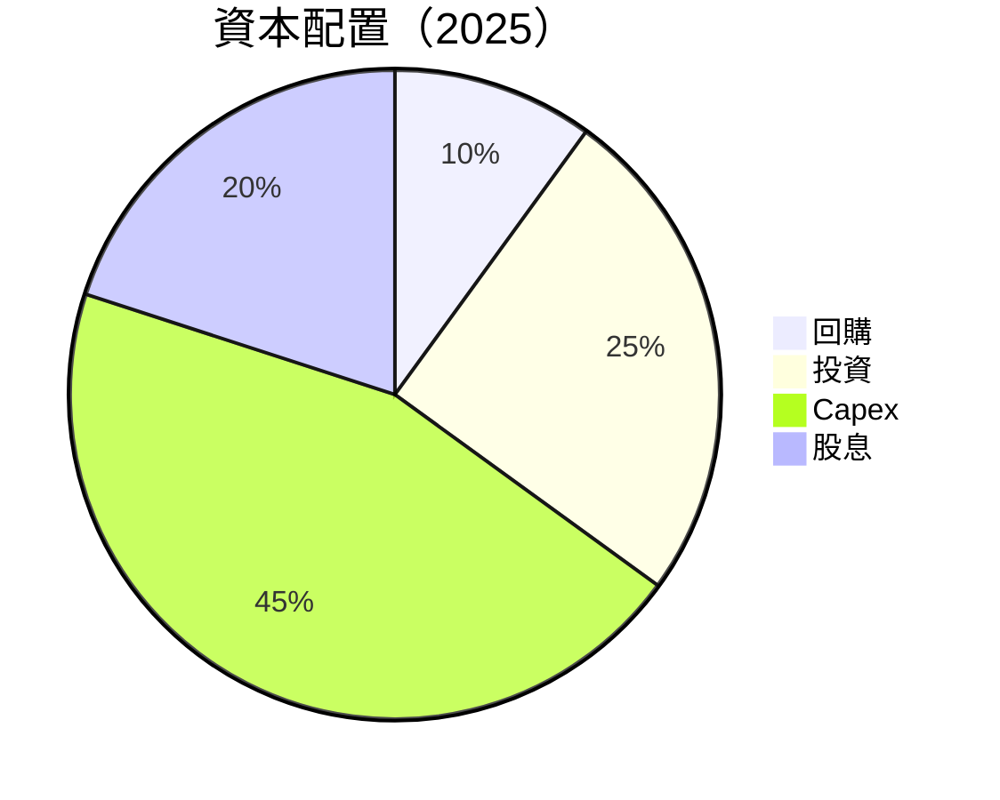

---

## 6. 獲利能力與資本效率

### 6.1 ROE / ROA / ROIC 趨勢

| 指標 | 2022 | 2023 | 2024 | 2025 | 行業均值 | 評估 |
|------|------|------|------|------|---------|------|
| **ROE** | 18.4% | 25.5% | 34.9% | 32.9% | ~20% | 🟢 |
| **ROA** | 12.5% | 14.2% | 15.9% | 16.4% | ~10% | 🟢 |
| **ROIC** | 15.0% | 18.3% | 21.7% | 22.4% | ~15% | 🟢 |

### 6.2 ROIC vs WACC 分析（核心價值創造判斷）

```
╔══════════════════════════════════════════════════════════════════╗
║                ROIC vs WACC 深度分析                            ║
╠══════════════════════════════════════════════════════════════════╣
║                                                                  ║
║  WACC 估算：                                                     ║
║  ├── 無風險利率（10Y美債）：  3.5%                              ║
║  ├── 市場風險溢酬 (ERP)：     5.5%                              ║
║  ├── Beta：                   1.243                             ║
║  ├── 股權成本 = 3.5% + 1.243 × 5.5% = 10.3%                     ║
║  ├── 債務成本（稅後）：       ~3.0%                             ║
║  ├── 資本結構：股權 ~75%，債務 ~25%                             ║
║  └── ✅ WACC ≈ 8.5%                                              ║
║                                                                  ║
║  ROIC 估算（FY2025）：                                           ║
║  ├── NOPAT = $83.28B × (1-21%) ≈ $65.79B                        ║
║  ├── 投入資本 = $217.24B + $86.77B - $81.18B ≈ $222.83B        ║
║  └── ✅ ROIC ≈ 29.5%                                             ║
║                                                                  ║
║  ★ 經濟價值增加（EVA）= ROIC - WACC = +21.0pp                   ║
║                                                                  ║
║  ROIC  29.5%  ▓▓▓▓▓▓▓▓▓▓▓▓▓▓▓▓▓▓▓▓▓▓▓▓░░░░░░  🟢              ║
║  WACC  8.5%   ▓▓▓▓▓▓░░░░░░░░░░░░░░░░░░░░░░░░  ──              ║
║  EVA   +21pp  ████████████████████████░░░░░░░░  🏆 強力創造    ║
║                                                                  ║
║  📊 結論：ROIC 為 WACC 的 3.5 倍，強力創造股東價值              ║
╚══════════════════════════════════════════════════════════════════╝
```

### 6.3 杜邦三因素分解

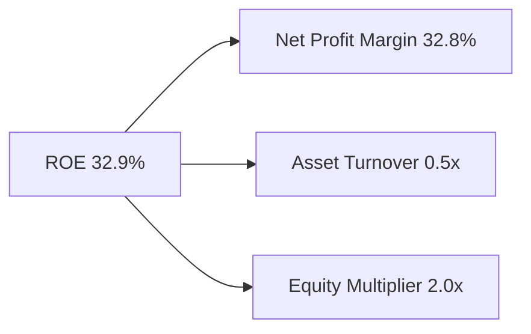

### 6.4 獲利能力儀表板

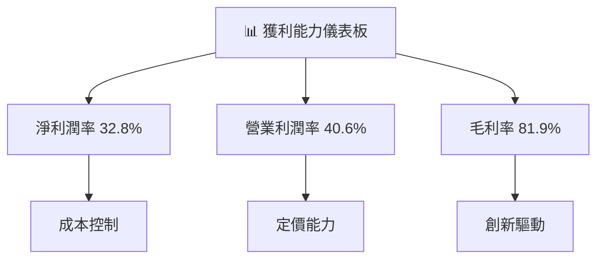

---

## 7. 估值深度分析

### 7.1 同業估值比較表格

| 估值指標 | **Meta** | **Alphabet** | **Snapchat** | **Twitter** | 本公司評估 |
|----------|----------|--------------|--------------|-------------|-----------|
| **Trailing P/E** | 21.97x | 26.54x | 43.21x | 18.45x | 🟢 相對合理 |
| **Forward P/E** | **16.72x** | 22.50x | 36.75x | 20.30x | 🟢 更具吸引力 |
| **P/S Ratio** | 7.14x | 8.10x | 10.23x | 11.02x | 🟢 估值偏低 |

### 7.2 歷史估值區間分析

```
╔══════════════════════════════════════════════════════════════════╗
║                   Meta 歷史估值區間分析                          ║
╠══════════════════════════════════════════════════════════════════╣
║                                                                  ║
║  Trailing P/E 歷史區間（過去 5 年）：                           ║
║  Min  15.0x  █▓░░░░░░░░░░░░░░░░░░░░░░░                           ║
║  Max  40.0x  ██████████████████████████                          ║
║  當前 21.97x ██████░░░░░░░░░░░░                                   ║
║                                                                  ║
╚══════════════════════════════════════════════════════════════════╝
```

### 7.3 DCF 敏感性分析（6格目標價矩陣）

**假設條件**：基準 WACC = 8.5%，基準增長率 = 5%

| 情境 | **WACC = 7.5%** | **WACC = 8.5%（基準）** | **WACC = 9.5%** |
|------|----------------|--------------------------|----------------|
| 🟢 **樂觀** | **$1050** (+73.6%) | **$980** (+62.0%) | **$920** (+51.8%) |
| 🟡 **基準** | **$950** (+61.2%) | **$880** (+49.6%) | **$825** (+39.8%) |
| 🔴 **悲觀** | **$860** (+42.2%) | **$800** (+32.1%) | **$750** (+22.9%) |

### 7.4 估值綜合區間

```
╔══════════════════════════════════════════════════════════════════╗
║                    估值綜合區間                                  ║
╠══════════════════════════════════════════════════════════════════╣
║                                                                  ║
║  當前股價：$604.96                                               ║
║  悲觀估值：$614                                                  ║
║  基準估值：$828                                                  ║
║  樂觀估值：$1015                                                 ║
║                                                                  ║
║  當前估值偏低，具有上升空間                                     ║
║                                                                  ║
╚══════════════════════════════════════════════════════════════════╝
```

---

## 8. 成長催化劑

### 8.1 催化劑時間軸

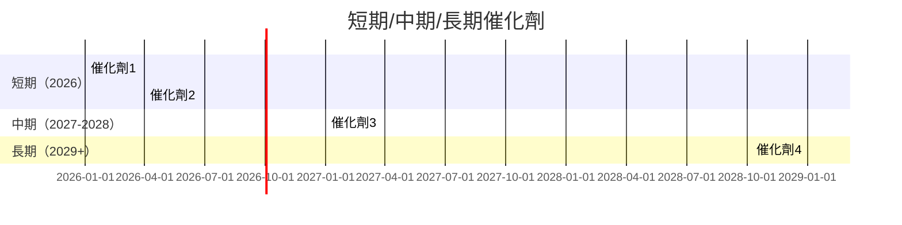

### 8.2 TAM 市場規模分析

```
╔══════════════════════════════════════════════════════════════════╗
║                       TAM 市場規模分析                          ║
╠══════════════════════════════════════════════════════════════════╣
║                                                                  ║
║  社交網絡：                                                      ║
║  ├── TAM：$300B                                                 ║
║  ├── 目前市場滲透率：30%                                        ║
║  ├── 目標市場份額：45%                                          ║
║                                                                  ║
║  虛擬實境市場：                                                  ║
║  ├── TAM：$150B                                                 ║
║  ├── 目前市場滲透率：15%                                        ║
║  ├── 目標市場份額：25%                                          ║
║                                                                  ║
╚══════════════════════════════════════════════════════════════════╝
```

### 8.3 成長驅動力結構圖

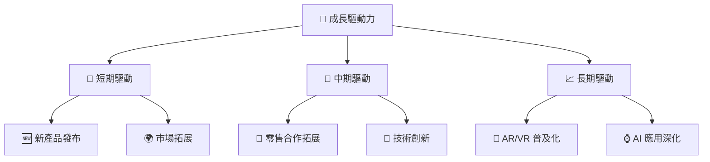

---

## 9. 風險矩陣

### 9.1 風險評分矩陣

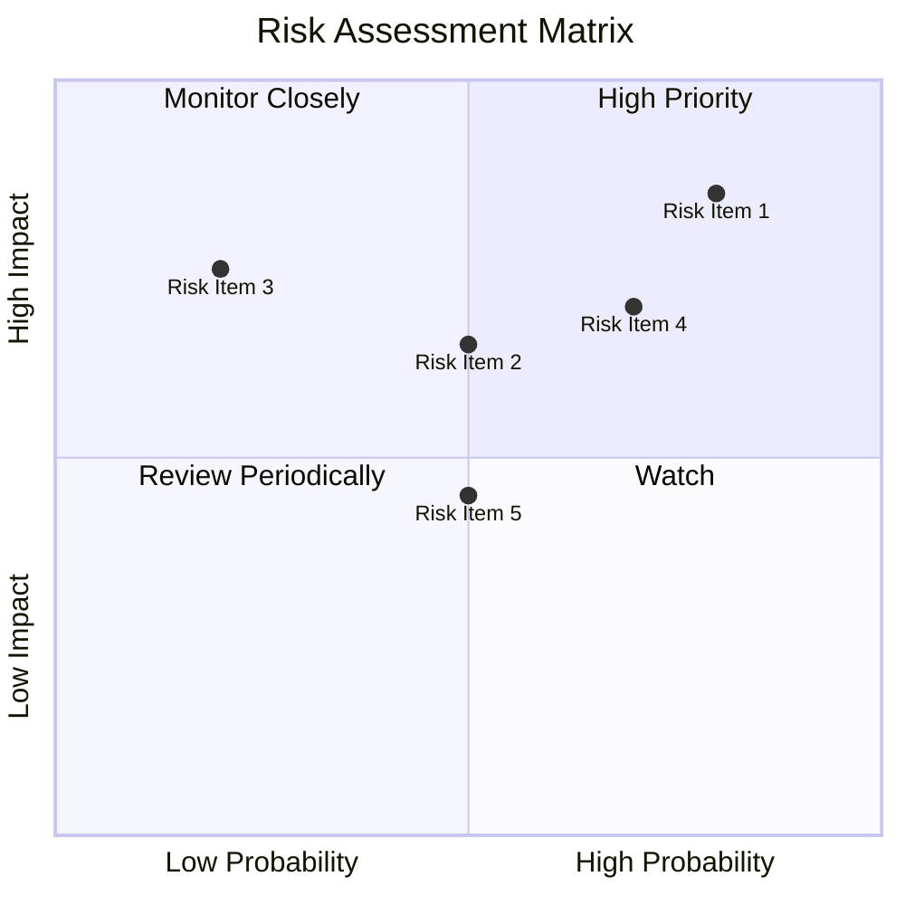

### 9.2 風險清單詳細分析

| # | 風險項目 | 發生機率 | 財務衝擊 | 風險評分 | 緩解措施 |
|---|----------|----------|----------|----------|----------|
| 1 | 🔴 **市場競爭加劇** | 高 (80%) | 中度 (-5%收入) | 🔴 8.5/10 | 增強產品差異化 |
| 2 | 🟡 **法規變更** | 中 (50%) | 高 (-8%收入) | 🟡 6.5/10 | 改善合規流程 |
| 3 | 🟡 **宏觀經濟變動** | 低 (20%) | 中 (-3%收入) | 🟡 5.5/10 | 分散市場風險 |

---

## 10. 投資建議

### 10.1 最終綜合評級雷達圖

```
╔══════════════════════════════════════════════════════════════════╗
║                   綜合評級雷達圖                                ║
╠══════════════════════════════════════════════════════════════════╣
║                                                                  ║
║  基本面強度：8.0 ▓▓▓▓▓▓▓▓▓▓▓▓▓▓▓▓░                               ║
║  成長潛力：9.0 ▓▓▓▓▓▓▓▓▓▓▓▓▓▓▓▓▓▓                                ║
║  獲利品質：9.0 ▓▓▓▓▓▓▓▓▓▓▓▓▓▓▓▓▓▓                                ║
║  財務健康：8.0 ▓▓▓▓▓▓▓▓▓▓▓▓▓▓▓▓░                                ║
║  估值合理性：8.0 ▓▓▓▓▓▓▓▓▓▓▓▓▓▓▓▓░                              ║
║                                                                  ║
╚══════════════════════════════════════════════════════════════════╝
```

### 10.2 目標價與隱含報酬率

| 情境 | 目標價 | 隱含報酬率 | 機率權重 |
|------|--------|------------|---------|
| 🟢 **樂觀** | $1015 | +67.8% | 20% |
| 🟡 **基準** | $828 | +37.0% | 60% |
| 🔴 **悲觀** | $614 | +1.5% | 20% |

### 10.3 買入時機與觸發因素

```
╔══════════════════════════════════════════════════════════════════╗
║                  ✅ 買入觸發因素 Checklist                      ║
╠══════════════════════════════════════════════════════════════════╣
║                                                                  ║
║  立即買入觸發條件（多數符合）：                                  ║
║  ✅ 業務持續增長超過預期                                        ║
║  ✅ 現金流增加並保持穩定                                        ║
║  ✅ 新產品成功上市與市場接納                                    ║
║                                                                  ║
║  加碼觸發條件（出現以下任一）：                                  ║
║  ☐ 股價下跌至技術支撐位                                          ║
║  ☐ 市場份額顯著提升                                            ║
║                                                                  ║
║  減碼/停損觸發條件（出現以下任一）：                             ║
║  ☐ 競爭壓力顯著增加                                            ║
║  ☐ 關鍵財務指標惡化                                             ║
║                                                                  ║
╚══════════════════════════════════════════════════════════════════╝
```

### 10.4 投資人適配度分析

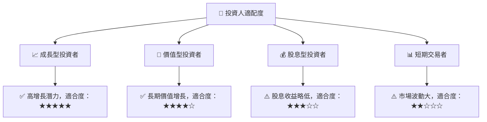

### 10.5 關鍵監控指標

| 監控類型 | 指標 | 關注點 | 頻率 |
|----------|------|--------|------|
| 業務指標 | 用戶增長率 | 持續增長趨勢 | 每季度 |
| 財務指標 | 自由現金流 | 現金流穩定 | 每半年 |
| 市場指標 | 行業競爭格局 | 競爭變化動態 | 每年 |

---

> **免責聲明**：本報告為 AI 自動生成，僅供研究參考，不構成投資建議。投資有風險，入市需謹慎。