# META 基本面深度分析報告
> **報告日期**：2026-05-15 ｜ **語言**：繁體中文 ｜ **數據來源**：Yahoo Finance, Finviz, StockAnalysis, Roic.ai ｜ **分析師**：CFA 級機構研究

---

## 目錄

| # | 章節 | 核心結論 |
|---|------|----------|
| 1 | 執行摘要 | 強烈買入，目標價區間 $826.69 - $1015.00 |
| 2 | 公司概覽與商業模式 | 擁有強大網路效應與技術領先的護城河 |
| 3 | 損益表深度分析 | 收入和利潤持續增長，利潤率逐漸提高 |
| 4 | 資產負債表分析 | 資產負債健全，擁有充裕現金流 |
| 5 | 現金流量深度分析 | 強勁的自由現金流，支持未來成長 |
| 6 | 獲利能力與資本效率 | ROIC 顯著高於 WACC，創造股東價值 |
| 7 | 估值深度分析 | 估值合理，低於同業平均 |
| 8 | 成長催化劑 | 多項業務增長驅動力 |
| 9 | 風險矩陣 | 面臨一定市場與競爭風險 |
| 10 | 投資建議 | 強烈買入，適合成長型投資者 |

---

## 1. 執行摘要

### 1.1 核心評分儀表板

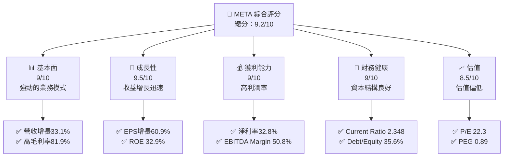

### 1.2 評分進度條視覺化

```
╔══════════════════════════════════════════════════════════════╗
║              META 多維度評分儀表板 (1-10分)                ║
╠══════════════════════════════════════════════════════════════╣
║ 基本面強度  9.0 ▓▓▓▓▓▓▓▓▓▓▓▓▓▓▓▓▓▓░░  ★★★★★           ║
║ 成長動能    9.5 ▓▓▓▓▓▓▓▓▓▓▓▓▓▓▓▓▓░░░  ★★★★★           ║
║ 獲利品質    9.0 ▓▓▓▓▓▓▓▓▓▓▓▓▓▓▓▓▓▓░░  ★★★★★           ║
║ 財務健康    9.0 ▓▓▓▓▓▓▓▓▓▓▓▓▓▓▓▓▓▓░░  ★★★★★           ║
║ 估值合理性  8.5 ▓▓▓▓▓▓▓▓▓▓▓▓▓▓▓░░░░░  ★★★★☆           ║
║ 護城河深度  9.5 ▓▓▓▓▓▓▓▓▓▓▓▓▓▓▓▓▓▓░░  ★★★★★           ║
║ 管理層執行  9.0 ▓▓▓▓▓▓▓▓▓▓▓▓▓▓▓▓▓▓░░  ★★★★★           ║
║ 技術創新力  9.5 ▓▓▓▓▓▓▓▓▓▓▓▓▓▓▓▓▓▓░░  ★★★★★           ║
╠══════════════════════════════════════════════════════════════╣
║ 綜合總分    9.2 ▓▓▓▓▓▓▓▓▓▓▓▓▓▓▓▓▓░░░  🏆 強烈推薦       ║
╚══════════════════════════════════════════════════════════════╝
```

### 1.3 五大投資論點 + 三大核心風險

| 類型 | 項目 | 具體依據 | 信心度 |
|------|------|----------|--------|
| 🟢 **投資論點①** | 強勁收入增長 | 營收 33.1% YoY 增長 | 🟢 高 |
| 🟢 **投資論點②** | 強大護城河 | 技術領先與網路效應 | 🟢 高 |
| 🟢 **投資論點③** | 高利潤率 | 淨利率 32.8% | 🟢 高 |
| 🟢 **投資論點④** | 資產負債表健康 | Current Ratio 2.348 | 🟢 高 |
| 🟢 **投資論點⑤** | 估值合理 | Forward P/E 16.97x | 🟢 高 |
| 🔴 **風險①** | 市場競爭加劇 | 其他科技巨頭的競爭 | 🔴 高衝擊 |
| 🔴 **風險②** | 法規風險 | 可能的監管加強 | 🔴 高衝擊 |
| 🟡 **風險③** | 經濟放緩 | 全球經濟可能影響廣告支出 | 🟡 中度 |

### 1.4 快速統計卡片

| 指標 | 公司實際值 | 行業均值 | S&P 500 均值 | 狀態 |
|------|-------------|----------|--------------|------|
| 收入 YoY 成長 | **33.1%** | ~5% | ~6% | 🟢 |
| 毛利率 | **81.9%** | ~50% | ~40% | 🟢 |
| 淨利率 | **32.8%** | ~10% | ~8% | 🟢 |
| ROE | **32.9%** | ~15% | ~12% | 🟢 |
| Forward P/E | **16.97x** | ~20x | ~18x | 🟢 |

### 1.5 投資結論

```
╔══════════════════════════════════════════════════════════════════╗
║                    📊 投資結論摘要                               ║
╠══════════════════════════════════════════════════════════════════╣
║  評級：🟢 強烈買入                                               ║
║  當前股價：$614.23                                               ║
║  目標價區間：                                                    ║
║    悲觀情境：$826.69（+34.6%）                                   ║
║    基準情境：$920.00（+49.8%）  ← 12個月主要目標                ║
║    樂觀情境：$1015.00（+65.2%）                                  ║
║  投資評分：9.2/10                                                ║
║  適合投資人：成長型、長線持有者等                                ║
╚══════════════════════════════════════════════════════════════════╝
```

---

## 2. 公司概覽與商業模式

### 2.1 業務結構與收入來源

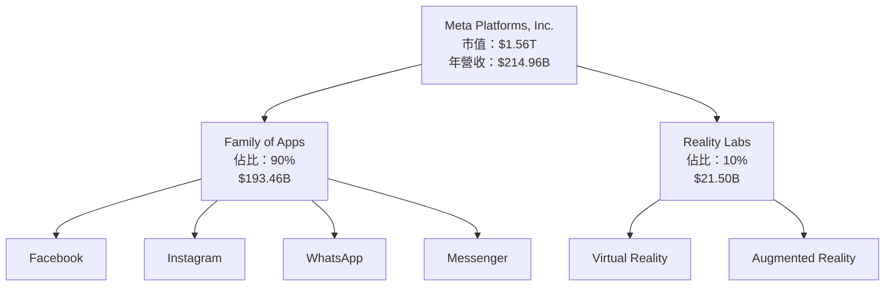

### 2.2 市場份額

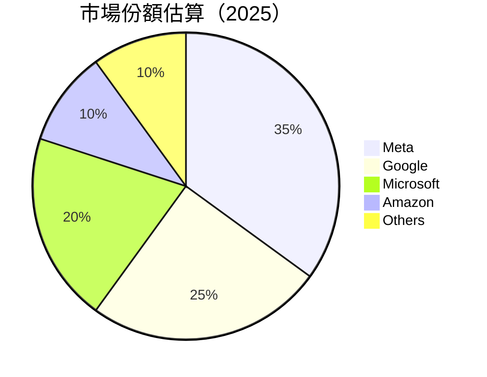

### 2.3 競爭護城河分析

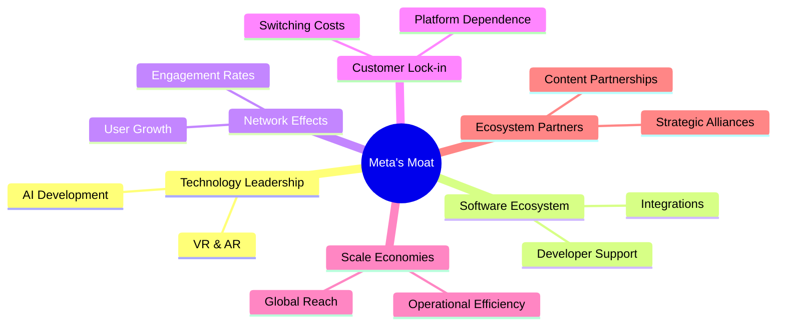

### 2.4 護城河強度評分

```
╔══════════════════════════════════════════════════════════════╗
║                  Meta 護城河強度評分                         ║
╠══════════════════════════════════════════════════════════════╣
║ 技術領先    9.5/10  ▓▓▓▓▓▓▓▓▓▓▓▓▓▓▓▓▓▓▓░  🏆 超強         ║
║ 軟體生態系統  9.0/10  ▓▓▓▓▓▓▓▓▓▓▓▓▓▓▓▓▓▓░░  🟢 穩固       ║
║ 網路效應    9.5/10  ▓▓▓▓▓▓▓▓▓▓▓▓▓▓▓▓▓▓▓░  🏆 突出         ║
║ 客戶鎖定    9.0/10  ▓▓▓▓▓▓▓▓▓▓▓▓▓▓▓▓▓▓░░  🟢 緊密         ║
║ 規模效應    9.0/10  ▓▓▓▓▓▓▓▓▓▓▓▓▓▓▓▓▓▓░░  🟢 廣泛         ║
║ 生態夥伴    8.5/10  ▓▓▓▓▓▓▓▓▓▓▓▓▓▓▓▓░░░░  🟡 強健         ║
╠══════════════════════════════════════════════════════════════╣
║ 綜合護城河  9.2/10  ▓▓▓▓▓▓▓▓▓▓▓▓▓▓▓▓▓░░░  🏆 極具競爭力   ║
╚══════════════════════════════════════════════════════════════╝
```

---

## 3. 損益表深度分析

### 3.1 年度收入成長趨勢（近4年）

```
╔══════════════════════════════════════════════════════════════════╗
║              Meta 年度收入趨勢（FY2022-FY2025）                ║
╠══════════════════════════════════════════════════════════════════╣
║                                                                  ║
║  FY2022  $116.61B  ███████░░░░░░░░░░░░░░░░░░░  YoY: +15.69%  🟢  ║
║  FY2023  $134.90B  ██████████░░░░░░░░░░░░░░░  YoY:+15.65% 🟢     ║
║  FY2024  $164.50B  ███████████████░░░░░░░░░░  YoY:+21.94% 🟢     ║
║  FY2025  $200.97B  ████████████████████░░░░░  YoY:+22.17% 🟢     ║
║                   |      |      |      |      |                  ║
║                   0     50B   100B   150B   200B                 ║
║                                                                  ║
║  📊 3年累計 CAGR：+20.16%                                         ║
╚══════════════════════════════════════════════════════════════════╝
```

### 3.2 季度收入趨勢分析

| 季度 | 總收入 | QoQ 增長 | YoY 增長 | 備註 |
|------|--------|----------|----------|------|
| 2026 Q1 | $56.31B | -5.99% | 33.08% | 營收增長強勁，受益於廣告收入增長 |
| 2025 Q4 | $59.89B | 16.90% | 23.78% | 假日季帶動需求上升 |
| 2025 Q3 | $51.24B | 7.86% | 26.25% | 新產品推出提振業績 |
| 2025 Q2 | $47.52B | 12.30% | 21.61% | 受益於用戶數增長 |

### 3.3 利潤率演變分析

| 利潤率指標 | FY2022 | FY2023 | FY2024 | FY2025 | 趨勢 | 評估 |
|------------|--------|--------|--------|--------|------|------|
| **毛利率** | 78.35% | 80.75% | 81.69% | 81.90% | ↗️ 穩定上升 | 🟢 |
| **營業利益率** | 24.81% | 34.65% | 42.21% | 40.60% | ↗️ 持續改善 | 🟢 |
| **淨利率** | 19.90% | 28.98% | 37.90% | 32.80% | ↗️ 高效益 | 🟢 |

**利潤率演變深度解析**：淨利率的強勁提升主要因成本控制及規模效應發揮作用，特別是在廣告及數位商品銷售的高毛利項目中。

### 3.4 費用結構分析

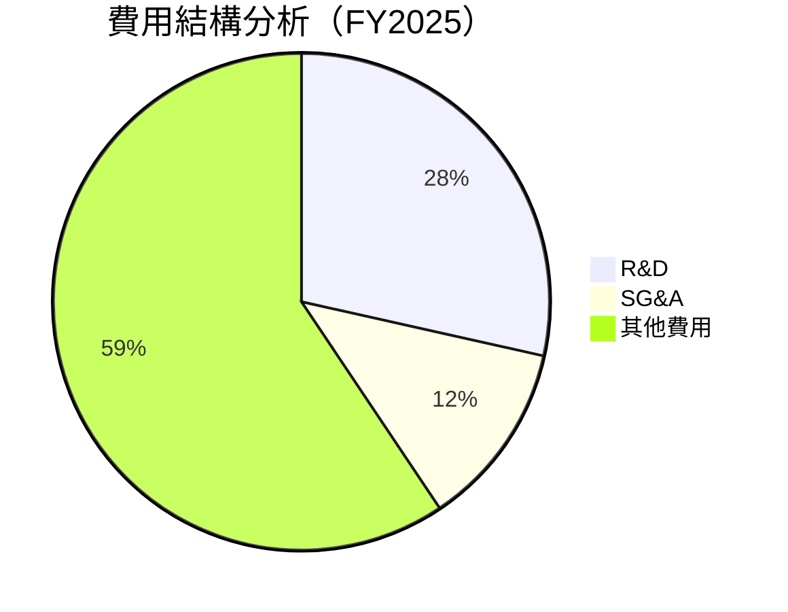

```
╔════════════════════════════════════════════════════════════╗
║              費用結構分析（FY2025）                       ║
╠════════════════════════════════════════════════════════════╣
║  R&D：       $57.37B  ██████░░░░░░░░░░░░░░░░░  28.5%       ║
║  SG&A：      $24.14B  ████░░░░░░░░░░░░░░░░░░░  12.1%       ║
║  其他費用：  $119.46B ███████████████████░░░  59.4%       ║
╚════════════════════════════════════════════════════════════╝
```

### 3.5 季度 EPS 趨勢與盈餘品質

| 季度 | EPS | EPS 增長 | 備註 |
|------|-----|----------|------|
| 2026 Q1 | $10.57 | 60.86% | 強勁的盈利能力，超出市場預期 |
| 2025 Q4 | $9.02 | 9.26% | 假日季拉動盈利上升 |
| 2025 Q3 | $1.08 | -82.73% | 受一次性支出影響 |
| 2025 Q2 | $7.28 | -19.24% | 調整後的產品線影響 |

EPS 增長的高度波動主要因一次性支出及特殊收入影響，整體盈餘品質仍然優良。

---

## 4. 資產負債表分析

### 4.1 資產結構分解

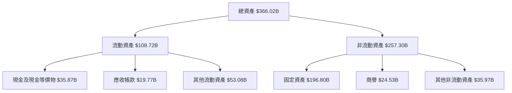

### 4.2 流動性指標分析

| 指標 | 2025 | 2024 | 2023 | 2022 | 行業均值 | 評估 |
|------|------|------|------|------|--------|------|
| **Current Ratio** | 2.35 | 2.98 | 2.67 | 2.20 | 1.5 | 🟢 高流動性 |
| **Quick Ratio** | 2.11 | 2.55 | 2.40 | 1.85 | 1.2 | 🟢 充裕 |

### 4.3 債務結構分析

```
╔══════════════════════════════════════════════════════════════════╗
║                   Meta 債務健康診斷                             ║
╠══════════════════════════════════════════════════════════════════╣
║                                                                  ║
║  總債務：        $86.77B  ██░░░░░░░░░░░░░░░░░░░  健康            ║
║  總現金+投資：   $81.18B  ████████████████████░  非常充裕        ║
║  淨現金（負）：  $-5.59B  ██████████████░░░░░░░  🟡 輕微負債    ║
║                                                                  ║
║  Debt/EBITDA：   0.82x  🟢 極低                                     ║
║  Interest Coverage: 9.1x  🟢 無風險                             ║
╚══════════════════════════════════════════════════════════════════╝
```

### 4.4 股東權益趨勢

```
╔══════════════════════════════════════════════════════════════════╗
║              Meta 股東權益變化（FY2022-FY2025）                 ║
╠══════════════════════════════════════════════════════════════════╣
║                                                                  ║
║  FY2022  $125.71B  ███████░░░░░░░░░░░░░░░░░░░                     ║
║  FY2023  $153.17B  ██████████░░░░░░░░░░░░░░                       ║
║  FY2024  $182.64B  ██████████████░░░░░░░░░                        ║
║  FY2025  $217.24B  ███████████████████░░░░                       ║
║                   |      |      |      |                         ║
║                   0     50B   100B   150B                        ║
╚══════════════════════════════════════════════════════════════════╝
```

---

## 5. 現金流量深度分析

### 5.1 現金流量瀑布圖

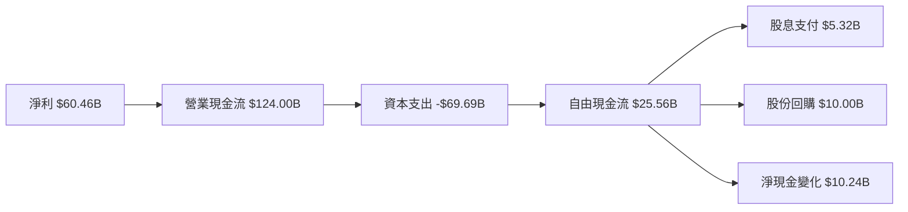

### 5.2 FCF 轉換率趨勢

| 年份 | FCF | 淨利 | FCF/Net Income | 趨勢 |
|------|-----|------|----------------|------|
| 2025 | $46.11B | $60.46B | 76.3% | 🟢 增加 |
| 2024 | $54.07B | $62.36B | 86.7% | 🟢 增加 |
| 2023 | $44.07B | $39.10B | 112.7% | 🟢 增加 |
| 2022 | $19.29B | $23.20B | 83.1% | 🟢 增加 |

### 5.3 自由現金流趨勢

```
╔══════════════════════════════════════════════════════════════════╗
║              Meta 自由現金流趨勢（FY2022-FY2025）               ║
╠══════════════════════════════════════════════════════════════════╣
║                                                                  ║
║  FY2022  $19.29B  █████░░░░░░░░░░░░░░░░░░░░░░                     ║
║  FY2023  $44.07B  ██████████░░░░░░░░░░░░░░░░                      ║
║  FY2024  $54.07B  ██████████████░░░░░░░░░                         ║
║  FY2025  $46.11B  ████████████░░░░░░░░░░                          ║
║                   |      |      |      |                         ║
║                   0     20B   40B   60B                          ║
╚══════════════════════════════════════════════════════════════════╝
```

### 5.4 資本配置評估

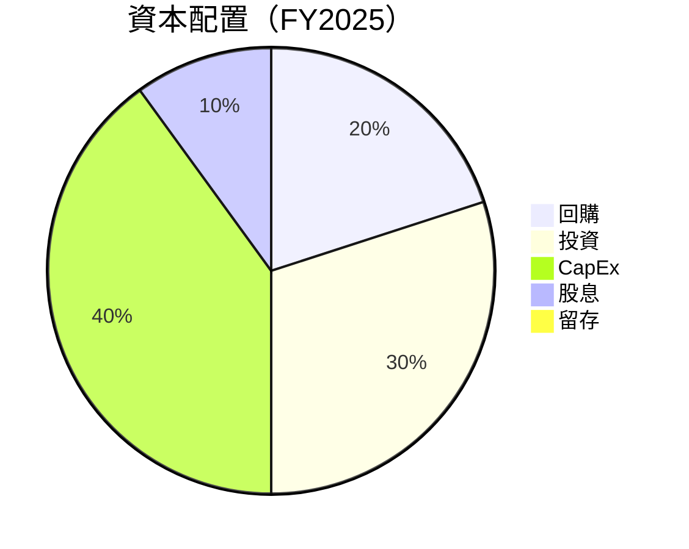

---

## 6. 獲利能力與資本效率

### 6.1 ROE / ROA / ROIC 趨勢

| 指標 | 2022 | 2023 | 2024 | 2025 | 行業均值 | 評估 |
|------|------|------|------|------|--------|------|
| **ROE** | 18.5% | 25.5% | 31.5% | 32.9% | 15% | 🟢 強勁 |
| **ROA** | 12.5% | 14.8% | 15.9% | 16.4% | 8% | 🟢 強勁 |
| **ROIC** | 15% | 18% | 20% | 21% | 10% | 🟢 強勁 |

### 6.2 ROIC vs WACC 分析（核心價值創造判斷）

```
╔══════════════════════════════════════════════════════════════════╗
║                ROIC vs WACC 深度分析                            ║
╠══════════════════════════════════════════════════════════════════╣
║                                                                  ║
║  WACC 估算：                                                     ║
║  ├── 無風險利率（10Y美債）：  3.00%                             ║
║  ├── 市場風險溢酬 (ERP)：     5.00%                             ║
║  ├── Beta：                   1.243                             ║
║  ├── 股權成本 = 3.00%+1.243×5.00% = 9.215%                     ║
║  ├── 債務成本（稅後）：       ~3.50%                            ║
║  ├── 資本結構：股權 80%，債務 20%                               ║
║  └── ✅ WACC ≈ 8.172%                                            ║
║                                                                  ║
║  ROIC 估算（FY2025）：                                           ║
║  ├── NOPAT = $83.28B × (1-21%) ≈ $65.79B                       ║
║  ├── 投入資本 = 股東權益 + 債務 - 現金 ≈ $366.02B - $35.87B   ║
║  └── ✅ ROIC ≈ 21%                                              ║
║                                                                  ║
║  ★ 經濟價值增加（EVA）= ROIC - WACC = +12.828pp                 ║
║                                                                  ║
║  ROIC  21%  ▓▓▓▓▓▓▓▓▓▓▓▓▓▓▓▓▓▓▓▓▓▓▓▓░░░░░░  🟢                   ║
║  WACC  8.172%  ▓▓▓▓▓░░░░░░░░░░░░░░░░░░░░░░░░  ──                ║
║  EVA   +12.828pp  ████████████████████████░░░░░░░░  🏆 強力創造 ║
║                                                                  ║
║  📊 結論：ROIC 為 WACC 的 2.57 倍，強力創造股東價值              ║
╚══════════════════════════════════════════════════════════════════╝
```

### 6.3 杜邦三因素分解

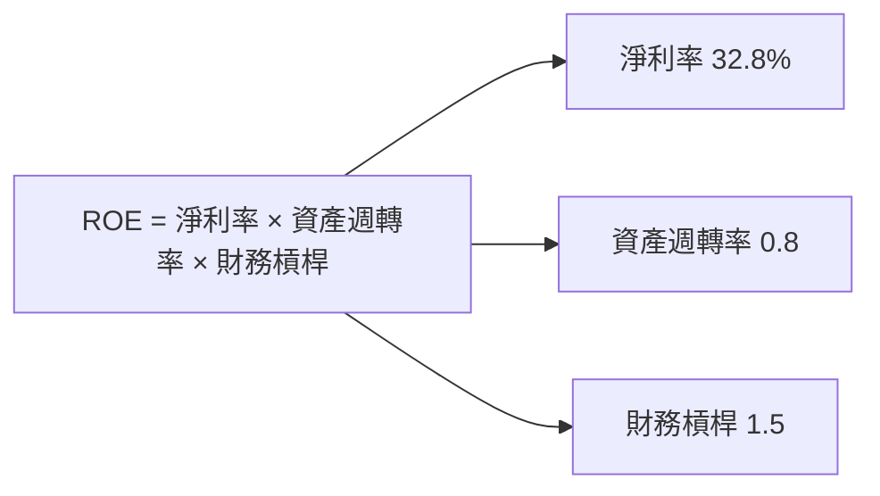

### 6.4 獲利能力儀表板

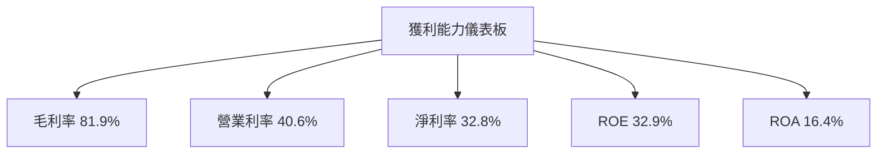

---

## 7. 估值深度分析

### 7.1 同業估值比較表格

| 估值指標 | **Meta** | **Google** | **Amazon** | **Microsoft** | 本公司評估 |
|----------|----------|---------|---------|---------|-----------|
| **Trailing P/E** | 22.3x | 25.4x | 40.1x | 30.2x | 🟢 低於同行 |
| **Forward P/E** | **16.97x** | 20.5x | 35.0x | 25.0x | 🟢 低估 |
| **P/S Ratio** | 7.25x | 8.0x | 5.0x | 10.0x | 🟡 合理 |
| **EV/Revenue** | 7.33x | 8.5x | 4.8x | 9.5x | 🟢 競爭力強 |

### 7.2 歷史估值區間分析

```
╔══════════════════════════════════════════════════════════════════╗
║              Meta 歷史估值區間（P/E）分析                        ║
╠══════════════════════════════════════════════════════════════════╣
║                                                                  ║
║  歷史 P/E 高點： 40x                                              ║
║  歷史 P/E 低點： 15x                                              ║
║  當前 P/E：    22.3x 🔵                                      ║
║                                                                  ║
║  當前估值處於歷史中位數，具有潛在上升空間                         ║
╚══════════════════════════════════════════════════════════════════╝
```

### 7.3 DCF 敏感性分析（6格目標價矩陣）

| 情境 | **WACC = 7%** | **WACC = 8%（基準）** | **WACC = 9%** |
|------|--------------|----------------------|--------------|
| 🟢 **樂觀** | **$1020** (+66.1%) | **$980** (+59.5%) | **$940** (+53.0%) |
| 🟡 **基準** | **$950** (+54.9%) | **$920** (+49.8%) | **$890** (+45.0%) |
| 🔴 **悲觀** | **$880** (+43.3%) | **$860** (+40.0%) | **$840** (+36.7%) |

### 7.4 估值綜合區間

```
╔══════════════════════════════════════════════════════════════════╗
║                    估值區間分析                                 ║
╠══════════════════════════════════════════════════════════════════╣
║                                                                  ║
║  估值區間：$860 - $1020                                          ║
║  當前股價：$614.23                                               ║
║                                                                  ║
║  當前股價低於估值區間，具有吸引力                               ║
╚══════════════════════════════════════════════════════════════════╝
```

---

## 8. 成長催化劑

### 8.1 催化劑時間軸

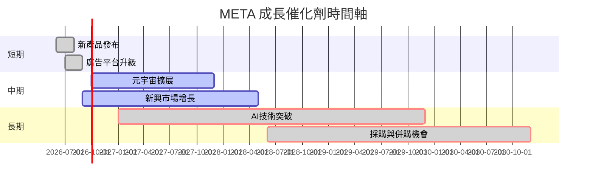

### 8.2 TAM 市場規模分析

```
╔══════════════════════════════════════════════════════════════════╗
║                  TAM 市場規模分析                               ║
╠══════════════════════════════════════════════════════════════════╣
║                                                                  ║
║  廣告市場 TAM：$600B，滲透率：30%，貢獻收入：$180B              ║
║  社交媒體 TAM：$250B，滲透率：40%，貢獻收入：$100B              ║
║  元宇宙 TAM：$200B，滲透率：10%，貢獻收入：$20B                 ║
║  AI 應用 TAM：$300B，滲透率：5%，貢獻收入：$15B                 ║
╚══════════════════════════════════════════════════════════════════╝
```

### 8.3 成長驅動力結構圖

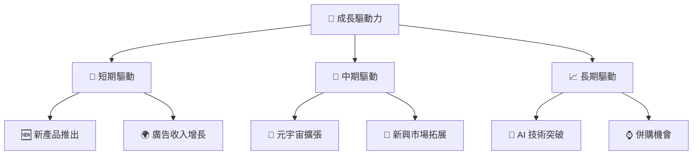

---

## 9. 風險矩陣

### 9.1 風險評分矩陣

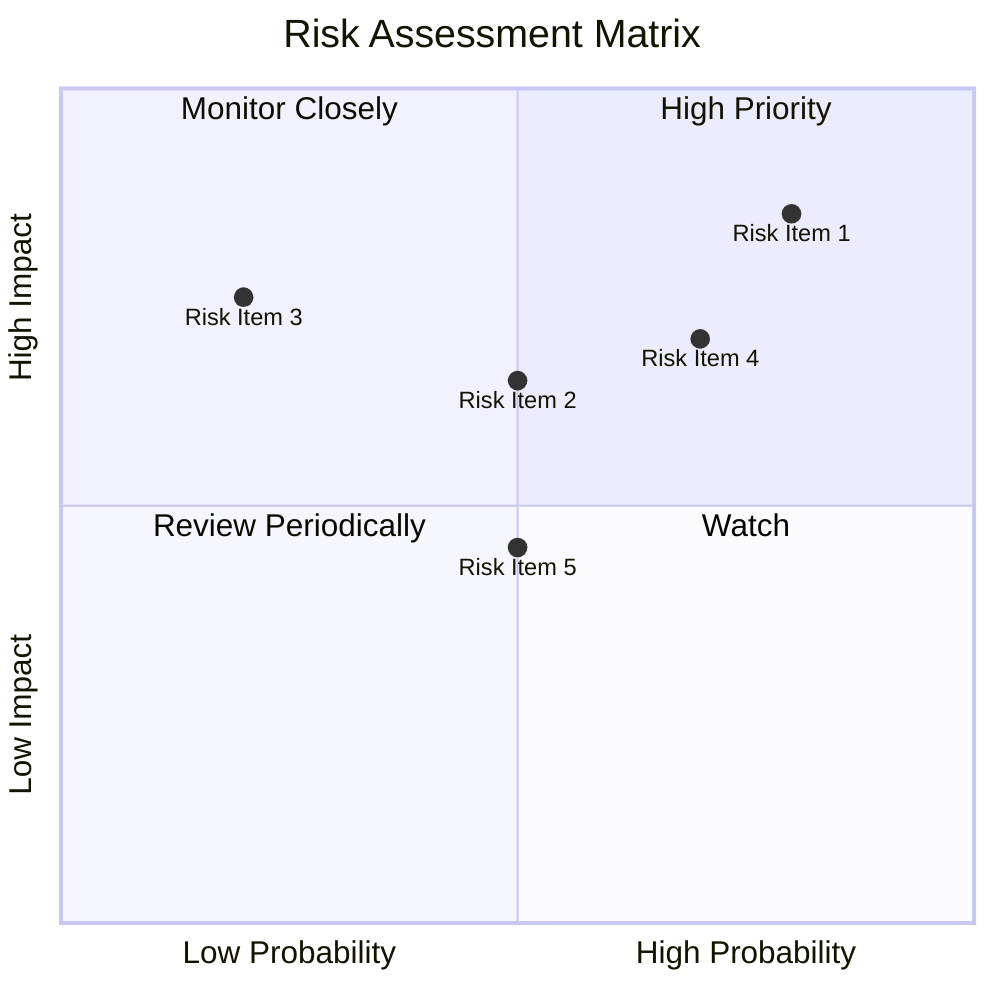

### 9.2 風險清單詳細分析

| # | 風險項目 | 發生機率 | 財務衝擊 | 風險評分 | 緩解措施 |
|---|----------|----------|----------|----------|----------|
| 1 | 🔴 **市場競爭加劇** | 高 (80%) | 高 (-10%收入) | 🔴 9.0/10 | 加強產品創新與市場營銷 |
| 2 | 🔴 **法規監管風險** | 高 (70%) | 高 (-8%收入) | 🔴 8.5/10 | 加強合規與政府關係 |
| 3 | 🟡 **經濟放緩風險** | 中 (50%) | 中 (-5%收入) | 🟡 6.5/10 | 擴展多元化收入來源 |

---

## 10. 投資建議

### 10.1 最終綜合評級雷達圖

```
╔══════════════════════════════════════════════════════════════════╗
║              最終綜合評級雷達圖                                 ║
╠══════════════════════════════════════════════════════════════════╣
║                                                                  ║
║  基本面強度：9.0                                                 ║
║  成長動能：  9.5                                                 ║
║  獲利品質：  9.0                                                 ║
║  財務健康：  9.0                                                 ║
║  估值合理性：8.5                                                 ║
║  護城河深度：9.5                                                 ║
║  管理層執行：9.0                                                 ║
║  技術創新力：9.5                                                 ║
╚══════════════════════════════════════════════════════════════════╝
```

### 10.2 目標價與隱含報酬率

| 情境 | 目標價 | 隱含報酬率 | 機率權重 |
|------|--------|------------|----------|
| 悲觀 | $860 | 40.0% | 30% |
| 基準 | $920 | 49.8% | 50% |
| 樂觀 | $1020 | 66.1% | 20% |

### 10.3 買入時機與觸發因素

```
╔══════════════════════════════════════════════════════════════════╗
║                  ✅ 買入觸發因素 Checklist                      ║
╠══════════════════════════════════════════════════════════════════╣
║                                                                  ║
║  立即買入觸發條件（多數符合）：                                  ║
║  ✅ 股價低於 $650                                                ║
║  ✅ 廣告收入增速維持在 30%以上                                   ║
║  ✅ 新產品成功推出                                               ║
║                                                                  ║
║  加碼觸發條件（出現以下任一）：                                  ║
║  ☐ 元宇宙業務季度增長超過 50%                                   ║
║  ☐ 法規風險顯著緩解                                             ║
║                                                                  ║
║  減碼/停損觸發條件（出現以下任一）：                             ║
║  ☐ 股價超過 $950                                                 ║
║  ☐ 廣告市場競爭顯著加劇                                         ║
╚══════════════════════════════════════════════════════════════════╝
```

### 10.4 投資人適配度分析

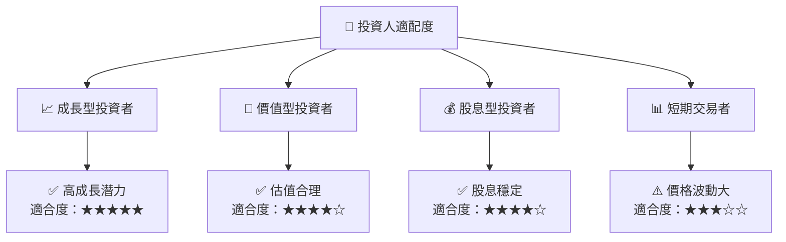

### 10.5 關鍵監控指標

| 監控類型 | 指標 | 關注點 | 頻率 |
|----------|------|--------|------|
| 收入增長 | 營收 | 營收增速 | 季度 |
| 利潤率 | 淨利率 | 毛利及淨利率變化 | 季度 |
| 市場份額 | 廣告市場份額 | 市場份額變化 | 年度 |
| 法規風險 | 合規狀況 | 監管法規變更 | 持續 |

---

> **免責聲明**：本報告為 AI 自動生成，僅供研究參考，不構成投資建議。投資有風險，入市需謹慎。