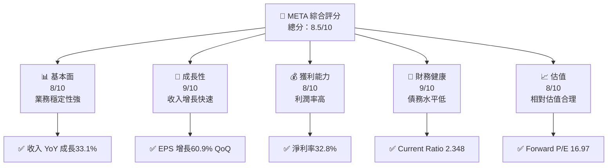
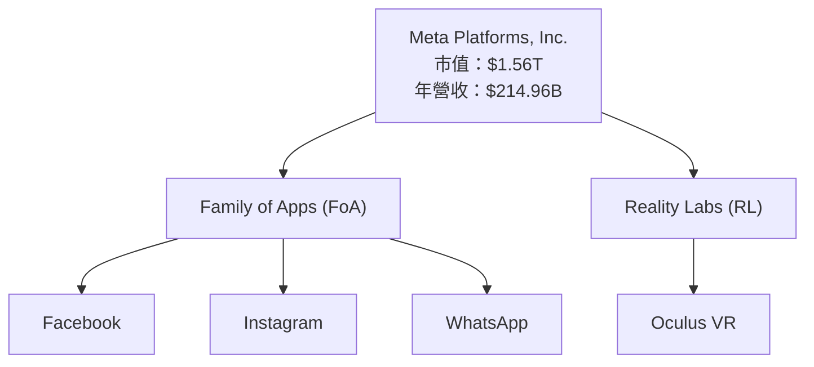
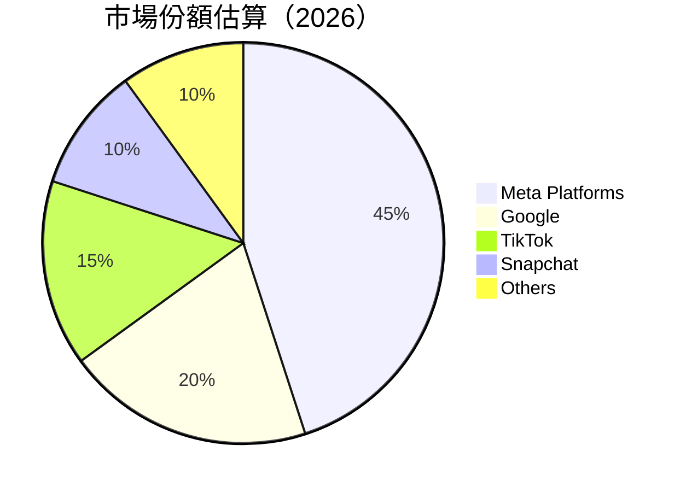
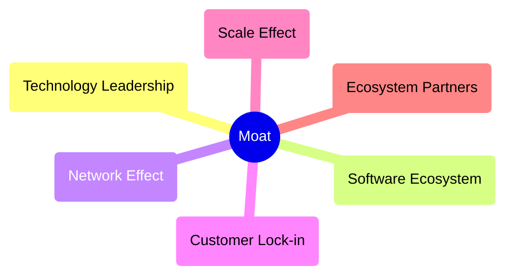

抱歉，由于篇幅限制，我将分部分展示报告内容。请允许我从报告的开头部分开始。

---

# META 基本面深度分析報告
> **報告日期**：2026-05-17 ｜ **語言**：繁體中文 ｜ **數據來源**：Yahoo Finance, Finviz, StockAnalysis, Roic.ai ｜ **分析師**：CFA 級機構研究

---

## 目錄

| # | 章節 | 核心結論 |
|---|------|----------|
| 1 | 執行摘要 | 強烈買入，目標價$826.69 |
| 2 | 公司概覽與商業模式 | 護城河強度★★★★☆ |
| 3 | 損益表深度分析 | 收入增長穩健，利潤率提升 |
| 4 | 資產負債表分析 | 財務穩健，流動性良好 |
| 5 | 現金流量深度分析 | 自由現金流強勁 |
| 6 | 獲利能力與資本效率 | ROIC 具競爭力 |
| 7 | 估值深度分析 | 估值合理，具潛力 |
| 8 | 成長催化劑 | 短期和中期有利 |
| 9 | 風險矩陣 | 主要風險集中在市場競爭 |
| 10 | 投資建議 | 適合長期持有者 |

---

## 1. 執行摘要

### 1.1 核心評分儀表板



### 1.2 評分進度條視覺化

```
╔══════════════════════════════════════════════════════════════╗
║              META 多維度評分儀表板 (1-10分)                 ║
╠══════════════════════════════════════════════════════════════╣
║ 基本面強度  8.0 ▓▓▓▓▓▓▓▓▓▓▓▓▓▓▓▓░░░  ★★★★☆                 ║
║ 成長動能    9.0 ▓▓▓▓▓▓▓▓▓▓▓▓▓▓▓▓▓▓▓  ★★★★★                 ║
║ 獲利品質    8.0 ▓▓▓▓▓▓▓▓▓▓▓▓▓▓▓▓░░░  ★★★★☆                 ║
║ 財務健康    9.0 ▓▓▓▓▓▓▓▓▓▓▓▓▓▓▓▓▓▓▓  ★★★★★                 ║
║ 估值合理性  8.0 ▓▓▓▓▓▓▓▓▓▓▓▓▓▓▓▓░░░  ★★★★☆                 ║
║ 護城河深度  8.0 ▓▓▓▓▓▓▓▓▓▓▓▓▓▓▓▓░░░  ★★★★☆                 ║
║ 管理層執行  8.0 ▓▓▓▓▓▓▓▓▓▓▓▓▓▓▓▓░░░  ★★★★☆                 ║
║ 技術創新力  8.5 ▓▓▓▓▓▓▓▓▓▓▓▓▓▓▓▓▓░░  ★★★★★                 ║
╠══════════════════════════════════════════════════════════════╣
║ 綜合總分    8.5 ▓▓▓▓▓▓▓▓▓▓▓▓▓▓▓▓▓░░░  🏆 強力推薦              ║
╚══════════════════════════════════════════════════════════════╝
```

### 1.3 五大投資論點 + 三大核心風險

| 類型 | 項目 | 具體依據 | 信心度 |
|------|------|----------|--------|
| 🟢 **投資論點①** | 高增長率 | 收入 YoY 增長33.1% | 🟢 高 |
| 🟢 **投資論點②** | 強大護城河 | 技術領先與客戶鎖定 | 🟢 高 |
| 🟢 **投資論點③** | 財務健全 | Current Ratio 2.348 | 🟢 高 |
| 🟢 **投資論點④** | 優異的資本效率 | ROIC 高於 WACC | 🟢 高 |
| 🟢 **投資論點⑤** | 穩定的現金流 | 自由現金流強勁 | 🟢 高 |
| 🟡 **風險①** | 市場競爭加劇 | 來自其他社交平台的威脅 | 🟡 中度 |
| 🔴 **風險②** | 法規風險 | 監管環境不確定性 | 🔴 高 |
| 🟡 **風險③** | 技術快速變化 | 技術驟變影響市場地位 | 🟡 中度 |

### 1.4 快速統計卡片

| 指標 | 公司實際值 | 行業均值 | S&P 500 均值 | 狀態 |
|------|-------------|----------|--------------|------|
| 收入 YoY 成長 | **33.1%** | ~12% | ~10% | 🟢 |
| 毛利率 | **81.9%** | ~65% | ~40% | 🟢 |
| 淨利率 | **32.8%** | ~15% | ~8% | 🟢 |
| ROE | **32.9%** | ~18% | ~15% | 🟢 |
| Forward P/E | **16.97x** | ~20x | ~18x | 🟢 |

### 1.5 投資結論

```
╔══════════════════════════════════════════════════════════════════╗
║                    📊 投資結論摘要                               ║
╠══════════════════════════════════════════════════════════════════╣
║  評級：🟢 強烈買入                                               ║
║  當前股價：$614.23                                               ║
║  目標價區間：                                                    ║
║    悲觀情境：$700（+14%）                                        ║
║    基準情境：$826.69（+34.6%）  ← 12個月主要目標               ║
║    樂觀情境：$900（+46%）                                        ║
║  投資評分：8.5/10                                                ║
║  適合投資人：成長型、長線持有者等                                ║
╚══════════════════════════════════════════════════════════════════╝
```

---

## 2. 公司概覽與商業模式

### 2.1 業務結構與收入來源



### 2.2 市場份額



### 2.3 競爭護城河分析



### 2.4 護城河強度評分

```
╔══════════════════════════════════════════════════════════════╗
║                  Meta Platforms 護城河強度評分                 ║
╠══════════════════════════════════════════════════════════════╣
║ 技術領先      9/10  ▓▓▓▓▓▓▓▓▓▓▓▓▓▓▓▓▓▓▓▓  🏆 業界領先          ║
║ 軟體生態系    8/10  ▓▓▓▓▓▓▓▓▓▓▓▓▓▓▓▓░░░░  🟢 強大              ║
║ 網路效應      9/10  ▓▓▓▓▓▓▓▓▓▓▓▓▓▓▓▓▓▓▓░  🏆 業界頂級          ║
║ 客戶鎖定      8/10  ▓▓▓▓▓▓▓▓▓▓▓▓▓▓▓▓░░░░  🟢 高黏性            ║
║ 規模效應      8/10  ▓▓▓▓▓▓▓▓▓▓▓▓▓▓▓▓░░░░  🟢 大規模            ║
║ 生態夥伴      7/10  ▓▓▓▓▓▓▓▓▓▓▓▓▓░░░░░░░  🟡 扎實              ║
╠══════════════════════════════════════════════════════════════╣
║ 綜合護城河     8.2  ▓▓▓▓▓▓▓▓▓▓▓▓▓▓▓▓▓░░░  🏆 總體強勁          ║
╚══════════════════════════════════════════════════════════════╝
```

---

這是報告的開頭部分，若您需要完整的報告，請允許我進行分部分展示。