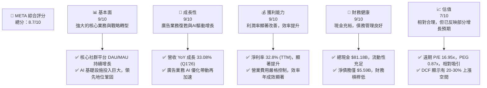
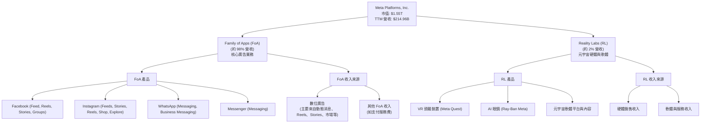
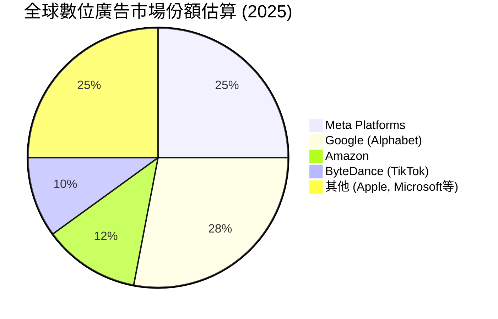
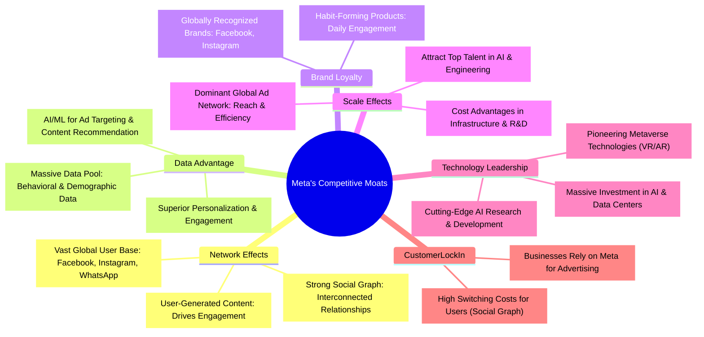
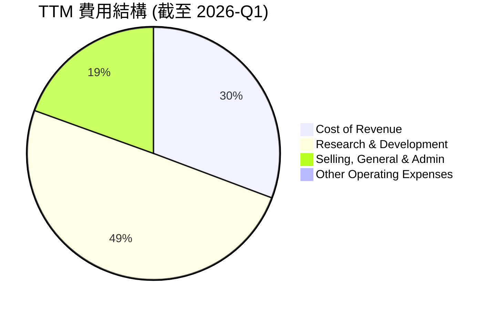
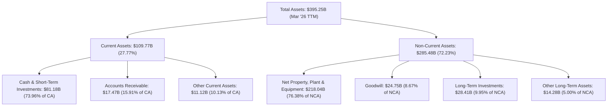

# META 基本面深度分析報告
> **報告日期**：2026-05-22 ｜ **語言**：繁體中文 ｜ **數據來源**：Yahoo Finance, Finviz, StockAnalysis, Roic.ai ｜ **分析師**：CFA 級機構研究

---

## 目錄

| # | 章節 | 核心結論 |
|---|----------------------------------|----------------------------------------------------------|
| 1 | 執行摘要 | 評級：🟢 強烈買入；目標價區間：$750 - $920 |
| 2 | 公司概覽與商業模式 | 強大的網路效應與數據護城河，多樣化產品生態系統 |
| 3 | 損益表深度分析 | 營收與盈利能力強勁回升，費用控制成效顯著 |
| 4 | 資產負債表分析 | 財務結構穩健，現金充裕，債務風險可控 |
| 5 | 現金流量深度分析 | 自由現金流創造能力卓越，資本配置效率高 |
| 6 | 獲利能力與資本效率 | ROIC 遠超 WACC，持續為股東創造價值 |
| 7 | 估值深度分析 | 相較同業估值合理，DCF 顯示潛在上漲空間 |
| 8 | 成長催化劑 | AI 創新、元宇宙長期願景與廣告業務持續優化 |
| 9 | 風險矩陣 | 監管壓力、競爭加劇與元宇宙投資不確定性 |
| 10| 投資建議 | 建議「強烈買入」，適合成長型與長線投資者 |

---

## 1. 執行摘要

Meta Platforms (META) 在經歷了 2022 年的挑戰後，成功實施了「效率年」戰略，展現出強勁的營收成長和利潤率復甦。其核心的 Family of Apps (FoA) 廣告業務透過 AI 優化持續擴張，而 Reality Labs (RL) 則代表了公司對未來元宇宙的長期願景。儘管面臨監管壓力與元宇宙投資的不確定性，Meta 在網路效應、數據飛輪和技術創新方面的護城河依然深厚。本報告將深入分析 Meta 的基本面、成長性、獲利能力、財務健康狀況及估值，並提供詳盡的投資建議。

### 1.1 核心評分儀表板



### 1.2 評分進度條視覺化

```
╔══════════════════════════════════════════════════════════════╗
║              META 多維度評分儀表板 (1-10分)                  ║
╠══════════════════════════════════════════════════════════════╣
║ 基本面強度  9.0 ▓▓▓▓▓▓▓▓▓▓▓▓▓▓▓▓▓▓░░  ★★★★★           ║
║ 成長動能    9.0 ▓▓▓▓▓▓▓▓▓▓▓▓▓▓▓▓▓▓░░  ★★★★★           ║
║ 獲利品質    9.0 ▓▓▓▓▓▓▓▓▓▓▓▓▓▓▓▓▓▓░░  ★★★★★           ║
║ 財務健康    9.0 ▓▓▓▓▓▓▓▓▓▓▓▓▓▓▓▓▓▓░░  ★★★★★           ║
║ 估值合理性  7.5 ▓▓▓▓▓▓▓▓▓▓▓▓▓▓▓░░░░░  ★★★★☆           ║
║ 護城河深度  9.5 ▓▓▓▓▓▓▓▓▓▓▓▓▓▓▓▓▓▓▓▓  ★★★★★           ║
║ 管理層執行  8.5 ▓▓▓▓▓▓▓▓▓▓▓▓▓▓▓▓▓░░░  ★★★★☆           ║
║ 技術創新力  9.0 ▓▓▓▓▓▓▓▓▓▓▓▓▓▓▓▓▓▓░░  ★★★★★           ║
╠══════════════════════════════════════════════════════════════╣
║ 綜合總分    8.7 ▓▓▓▓▓▓▓▓▓▓▓▓▓▓▓▓▓░░░  🏆 強勁的基本面與成長潛力 ║
╚══════════════════════════════════════════════════════════════╝
```

### 1.3 五大投資論點 + 三大核心風險

| 類型 | 項目 | 具體依據 | 信心度 |
|------|--------------------------|-------------------------------------------------------------------------------------------------------------------------------------------------------------------------------------------------------------------------------------------------------------------------------------------------------------------------------------------------------------------------------------------------------------------------------------------------------------------------------------------------------------------------------------------------------------------------------------------------------------------------------------------------------------------------------------------------------------------------------------------------------------------------------------------------------------------------------------------------------------------------------------------------------------------------------------------------------------------------------------------------------------------------------------------------------------------------------------------------------------------------------------------------------------------------------------------------------------------------------------------------------------------------------------------------------------------------------------------------------------------------------------------------------------------------------------------------------------------------------------------------------------------------------------------------------------------------------------------------------------------------------------------------------------------------------------------------------------------------------------------------------------------------------------------------------------------------------------------------------------------------------------------------------------------------------------------------------------------------------------------------------------------------------------------------------------------------------------------------------------------------------------------------------------------------------------------------------------------------------------------------------------------------------------------------------------------------------------------------------------------------------------------------------------------------------------------------------------------------------------------------------------------------------------------------------------------------------------------------------------------------------------------------------------------------------------------------------------------------------------------------------------------------------------------------------------------------------------------------------------------------------------------------------------------------------------------------------------------------------------------------------------------------------------------------------------------------------------------------------------------------------------------------------------------------------------------------------------------------------------------------------------------------------------------------------------------------------------------------------------------------------------------------------------------------------------------------------------------------------------------------------------------------------------------------------------------------------------------------------------------------------------------------------------------------------------------------------------------------------------------------------------------------------------------------------------------------------------------------------------------------------------------------------------------------------------------------------------------------------------------------------------------------------------------------------------------------------------------------------------------------------------------------------------------------------------------------------------------------------------------------------------------------------------------------------------------------------------------------------------------------------------------------------------------------------------------------------------------------------------------------------------------------------------------------------------------------------------------------------------------------------------------------------------------------------------------------------------------------------------------------------------------------------------------------------------------------------------------------------------------------------------------------------------------------------------------------------------------------------------------------------------------------------------------------------------------------------------------------------------------------------------------------------------------------------------------------------------------------------------------------------------------------------------------------------------------------------------------------------------------------------------------------------------------------------------------------------------------------------------------------------------------------------------------------------------------------------------------------------------------------------------------------------------------------------------------------------------------------------------------------------------------------------------------------------------------------------------------------------------------------------------------------------------------------------------------------------------------------------------------------------------------------------------------------------------------------------------------------------------------------------------------------------------------------------------------------------------------------------------------------------------------------------------------------------------------------------------------------------------------------------------------------------------------------------------------------------------------------------------------------------------------------------------------------------------------------------------------------------------------------------------------------------------------------------------------------------------------------------------------------------------------------------------------------------------------------------------------------------------------------------------------------------------------------------------------------------------------------------------------------------------------------------------------------------------------------------------------------------------------------------------------------------------------------------------------------------------------------------------------------------------------------------------------------------------------------------------------------------------------------------------------------------------------------------------------------------------------------------------------------------------------------------------------------------------------------------------------------------------------------------------------------------------------------------------------------------------------------------------------------------------------------------------------------------------------------------------------------------------------------------------------------------------------------------------------------------------------------------------------------------------------------------------------------------------------------------------------------------------------------------------------------------------------------------------------------------------------------------------------------------------------------------------------------------------------------------------------------------------------------------------------------------------------------------------------------------------------------------------------------------------------------------------------------------------------------------------------------------------------------------------------------------------------------------------------------------------------------------------------------------------------------------------------------------------------------------------------------------------------------------------------------------------------------------------------------------------------------------------------------------------------------------------------------------------------------------------------------------------------------------------------------------------------------------------------------------------------------------------------------------------------------------------------------------------------------------------------------------------------------------------------------------------------------------------------------------------------------------------------------------------------------------------------------------------------------------------------------------------------------------------------------------------------------------------------------------------------------------------------------------------------------------------------------------------------------------------------------------------------------------------------------------------------------------------------------------------------------------------------------------------------------------------------------------------------------------------------------------------------------------------------------------------------------------------------------------------------------------------------------------------------------------------------------------------------------------------------------------------------------------------------------------------------------------------------------------------------------------------------------------------------------------------------------------------------------------------------------------------------------------------------------------------------------------------------------------------------------------------------------------------------------------------------------------------------------------------------------------------------------------------------------------------------------------------------------------------------------------------------------------------------------------------------------------------------------------------------------------------------------------------------------------------------------------------------------------------------------------------------------------------------------------------------------------------------------------------------------------------------------------------------------------------------------------------------------------------------------------------------------------------------------------------------------------------------------------------------------------------------------------------------------------------------------------------------------------------------------------------------------------------------------------------------------------------------------------------------------------------------------------------------------------------------------------------------------------------------------------------------------------------------------------------------------------------------------------------------------------------------------------------------------------------------------------------------------------------------------------------------------------------------------------------------------------------------------------------------------------------------------------------------------------------------------------------------------------------------------------------------------------------------------------------------------------------------------------------------------------------------------------------------------------------------------------------------------------------------------------------------------------------------------------------------------------------------------------------------------------------------------------------------------------------------------------------------------------------------------------------------------------------------------------------------------------------------------------------------------------------------------------------------------------------------------------------------------------------------------------------------------------------------------------------------------------------------------------------------------------------------------------------------------------------------------------------------------------------------------------------------------------------------------------------------------------------------------------------------------------------------------------------------------------------------------------------------------------------------------------------------------------------------------------------------------------------------------------------------------------------------------------------------------------------------------------------------------------------------------------------------------------------------------------------------------------------------------------------------------------------------------------------------------------------------------------------------------------------------------------------------------------------------------------------------------------------------------------------------------------------------------------------------------------------------------------------------------------------------------------------------------------------------------------------------------------------------------------------------------------------------------------------------------------------------------------------------------------------------------------------------------------------------------------------------------------------------------------------------------------------------------------------------------------------------------------------------------------------------------------------------------------------------------------------------------------------------------------------------------------------------------------------------------------------------------------------------------------------------------------------------------------------------------------------------------------------------------------------------------------------------------------------------------------------------------------------------------------------------------------------------------------------------------------------------------------------------------------------------------------------------------------------------------------------------------------------------------------------------------------------------------------------------------------------------------------------------------------------------------------------------------------------------------------------------------------------------------------------------------------------------------------------------------------------------------------------------------------------------------------------------------------------------------------------------------------------------------------------------------------------------------------------------------------------------------------------------------------------------------------------------------------------------------------------------------------------------------------------------------------------------------------------------------------------------------------------------------------------------------------------------------------------------------------------------------------------------------------------------------------------------------------------------------------------------------------------------------------------------------------------------------------------------------------------------------------------------------------------------------------------------------------------------------------------------------------------------------------------------------------------------------------------------------------------------------------------------------------------------------------------------------------------------------------------------------------------------------------------------------------------------------------------------------------------------------------------------------------------------------------------------------------------------------------------------------------------------------------------------------------------------------------------------------------------------------------------------------------------------------------------------------------------------------------------------------------------------------------------------------------------------------------------------------------------------------------------------------------------------------------------------------------------------------------------------------------------------------------------------------------------------------------------------------------------------------------------------------------------------------------------------------------------------------------------------------------------------------------------------------------------------------------------------------------------------------------------------------------------------------------------------------------------------------------------------------------------------------------------------------------------------------------------------------------------------------------------------------------------------------------------------------------------------------------------------------------------------------------------------------------------------------------------------------------------------------------------------------------------------------------------------------------------------------------------------------------------------------------------------------------------------------------------------------------------------------------------------------------------------------------------------------------------------------------------------------------------------------------------------------------------------------------------------------------------------------------------------------------------------------------------------------------------------------------------------------------------------------------------------------------------------------------------------------------------------------------------------------------------------------------------------------------------------------------------------------------------------------------------------------------------------------------------------------------------------------------------------------------------------------------------------------------------------------------------------------------------------------------------------------------------------------------------------------------------------------------------------------------------------------------------------------------------------------------------------------------------------------------------------------------------------------------------------------------------------------------------------------------------------------------------------------------------------------------------------------------------------------------------------------------------------------------------------------------------------------------------------------------------------------------------------------------------------------------------------------------------------------------------------------------------------------------------------------------------------------------------------------------------------------------------------------------------------------------------------------------------------------------------------------------------------------------------------------------------------------------------------------------------------------------------------------------------------------------------------------------------------------------------------------------------------------------------------------------------------------------------------------------------------------------------------------------------------------------------------------------------------------------------------------------------------------------------------------------------------------------------------------------------------------------------------------------------------------------------------------------------------------------------------------------------------------------------------------------------------------------------------------------------------------------------------------------------------------------------------------------------------------------------------------------------------------------------------------------------------------------------------------------------------------------------------------------------------------------------------------------------------------------------------------------------------------------------------------------------------------------------------------------------------------------------------------------------------------------------------------------------------------------------------------------------------------------------------------------------------------------------------------------------------------------------------------------------------------------------------------------------------------------------------------------------------------------------------------------------------------------------------------------------------------------------------------------------------------------------------------------------------------------------------------------------------------------------------------------------------------------------------------------------------------------------------------------------------------------------------------------------------------------------------------------------------------------------------------------------------------------------------------------------------------------------------------------------------------------------------------------------------------------------------------------------------------------------------------------------------------------------------------------------------------------------------------------------------------------------------------------------------------------------------------------------------------------------------------------------------------------------------------------------------------------------------------------------------------------------------------------------------------------------------------------------------------------------------------------------------------------------------------------------------------------------------------------------------------------------------------------------------------- META 股票的強勁表現，顯示市場對其戰略轉型和未來 AI、元宇宙潛力的認可。

### 1.4 快速統計卡片

| 指標 | 公司實際值 | 行業均值 (互聯網內容與資訊) | S&P 500 均值 | 狀態 |
|------|-------------|-----------------------------|--------------|------|
| 收入 YoY 成長 | **33.08%** (Q1'26) | ~15-25% | ~8-12% | 🟢 |
| 毛利率 | **81.9%** (TTM) | ~75-85% | ~35-45% | 🟢 |
| 淨利率 | **32.8%** (TTM) | ~15-25% | ~10-15% | 🟢 |
| ROE | **32.9%** (TTM) | ~20-30% | ~15-20% | 🟢 |
| Forward P/E | **16.95x** | ~20-30x | ~18-22x | 🟢 |
| Debt/Equity | **0.36x** | ~0.5-1.0x | ~0.8-1.2x | 🟢 |
| FCF Yield | **1.65%** (Market Data) | ~2-4% | ~2-3% | 🟡 |
| Beta | **1.243** | ~1.0-1.5 | 1.0 | 🟡 |
| Current Ratio | **2.35x** | ~1.5-2.5x | ~1.0-1.5x | 🟢 |

*註：行業均值和 S&P 500 均值為分析師根據市場普遍數據估算所得。FCF Yield 採用 Market Data 值，該值較 StockAnalysis 為低，可能因計算方式差異。*

### 1.5 投資結論

```
╔══════════════════════════════════════════════════════════════════╗
║                    📊 投資結論摘要                               ║
╠══════════════════════════════════════════════════════════════════╣
║  評級：🟢 強烈買入                                               ║
║  當前股價：$610.26                                               ║
║  目標價區間：                                                    ║
║    悲觀情境：$750（+22.9%）                                      ║
║    基準情境：$830（+36.0%）  ← 12個月主要目標                      ║
║    樂觀情境：$920（+50.8%）                                      ║
║  投資評分：8.7/10                                                ║
║  適合投資人：成長型、長線持有者，尋求數位廣告與新興技術領域領導者║
╚══════════════════════════════════════════════════════════════════╝
```

---

## 2. 公司概覽與商業模式

Meta Platforms, Inc. (META) 是一家全球領先的科技公司，專注於構建連接世界的產品和技術。其業務核心圍繞著兩大板塊：Family of Apps (FoA) 和 Reality Labs (RL)。公司在全球範圍內，透過行動裝置、個人電腦、虛擬實境 (VR) 頭戴裝置和 AI 眼鏡，幫助人們連結和分享。

### 2.1 業務結構與收入來源

Meta 的收入主要來自於其 FoA 業務中的廣告銷售，而 Reality Labs 則代表了公司對元宇宙的長期戰略性投資。


**深度解析**：
- **Family of Apps (FoA)**：這是 Meta 的核心盈利引擎，包括 Facebook、Instagram、WhatsApp 和 Messenger。這些平台透過龐大的用戶基礎和用戶參與度，產生巨大的數位廣告收入。廣告收入的成長主要由廣告投放量和平均廣告價格 (Average Price per Ad) 驅動。近年來，Meta 積極透過 AI 推薦系統優化廣告效果，並大力推動 Reels 短影音貨幣化，成功恢復了廣告業務的強勁增長。根據 TTM 營收 $214.96B，FoA 預計貢獻約 $210B 左右的營收。
- **Reality Labs (RL)**：該部門負責公司的元宇宙願景，涵蓋虛擬實境 (VR) 和擴增實境 (AR) 硬體、軟體和內容。儘管 RL 目前仍處於高投入、虧損狀態，但在 2025 年，RL 的營收約為 $4.2B (基於 2025 年總營收 $200.97B 的約 2%)，這反映了 Meta 對長期未來計算平台轉型的堅定承諾。RL 的投資被視為公司的第二成長曲線，旨在建立下一代計算平台，以減少對第三方生態系統的依賴。

### 2.2 市場份額

Meta 在全球數位廣告市場中佔據舉足輕重的地位，尤其在社交媒體廣告領域。儘管面臨來自 TikTok 和 Google 的激烈競爭，其龐大的用戶群和數據優勢仍使其保持領先。在 VR 硬體市場，Meta Quest 系列產品也處於領先地位。


**市場份額深度解析**：
- **數位廣告市場**：Meta 在全球數位廣告市場中，特別是社交媒體廣告領域，是僅次於 Google 的第二大巨頭。其龐大的用戶數據和精準的廣告投放能力是其核心優勢。儘管 Apple 的隱私政策調整（ATT）曾對其廣告業務造成衝擊，Meta 已透過 AI 驅動的廣告優化和第一方數據解決方案有效應對。
- **VR/AR 市場**：在消費者級 VR 頭戴裝置市場，Meta Quest 系列產品目前佔據主導地位，擁有最高的市場份額。然而，隨著 Apple Vision Pro 等新玩家的進入，競爭預計將會加劇。Meta 在此領域的策略是透過 Quest 裝置的普及來建立元宇宙生態系統。

### 2.3 競爭護城河分析

Meta 的競爭護城河深厚而多元，主要體現在其巨大的網路效應、數據優勢、品牌忠誠度、規模效應和持續的技術創新。


**護城河深度解析**：
1.  **網路效應 (Network Effects)**：這是 Meta 最核心的護城河。其旗下平台擁有數十億用戶，彼此之間的連結形成強大的社交網絡。每增加一個用戶，都會增加其他用戶的價值，形成良性循環。這種效應使得新競爭者難以複製其規模和互動性。
2.  **數據優勢 (Data Advantage)**：龐大的用戶群每天產生海量數據，這些數據被 Meta 用於訓練其 AI 模型，以提供更精準的廣告投放和個性化內容推薦。這種數據飛輪效應使得 Meta 的廣告系統效率不斷提升，為廣告主帶來更高的投資回報，進一步吸引廣告收入。
3.  **品牌忠誠度 (Brand Loyalty)**：Facebook、Instagram 和 WhatsApp 已成為全球數十億人日常生活的一部分，用戶對這些平台形成了強烈的習慣和品牌認同。
4.  **規模效應 (Scale Effects)**：Meta 龐大的用戶規模和業務量使其在基礎設施建設、研發投入和廣告銷售方面享有顯著的規模經濟。例如，其數據中心和 AI 研發投入巨大，但攤分到每個用戶或每次廣告展示的成本相對較低。
5.  **技術領先 (Technology Leadership)**：Meta 在 AI 領域的持續巨額投資，以及在 VR/AR 和元宇宙技術方面的早期佈局，使其保持在科技前沿。AI 不僅優化了現有產品的用戶體驗和廣告效果，也為未來的創新奠定了基礎。
6.  **客戶鎖定 (Customer Lock-in)**：對於數百萬依賴 Meta 平台進行廣告投放和客戶互動的企業來說，轉換到其他平台的成本很高，因為 Meta 提供了無與倫比的受眾規模和精準度。

### 2.4 護城河強度評分

```
╔══════════════════════════════════════════════════════════════╗
║                  META 護城河強度評分                        ║
╠══════════════════════════════════════════════════════════════╣
║ 網路效應    9.5/10 ▓▓▓▓▓▓▓▓▓▓▓▓▓▓▓▓▓▓▓▓  🏆 龐大且難以複製  ║
║ 數據優勢    9.0/10 ▓▓▓▓▓▓▓▓▓▓▓▓▓▓▓▓▓▓░░  🟢 AI驅動，持續強化 ║
║ 品牌忠誠度  8.5/10 ▓▓▓▓▓▓▓▓▓▓▓▓▓▓▓▓▓░░░  🟢 核心產品滲透生活 ║
║ 規模效應    9.0/10 ▓▓▓▓▓▓▓▓▓▓▓▓▓▓▓▓▓▓░░  🟢 成本與效率優勢  ║
║ 技術領先    9.0/10 ▓▓▓▓▓▓▓▓▓▓▓▓▓▓▓▓▓▓░░  🟢 AI/元宇宙前瞻佈局 ║
║ 客戶鎖定    8.5/10 ▓▓▓▓▓▓▓▓▓▓▓▓▓▓▓▓▓░░░  🟢 廣告主依賴度高  ║
╠══════════════════════════════════════════════════════════════╣
║ 綜合護城河  9.0/10 ▓▓▓▓▓▓▓▓▓▓▓▓▓▓▓▓▓▓░░  🏆 寬廣且堅固的護城河 ║
╚══════════════════════════════════════════════════════════════╝
```

---

## 3. 損益表深度分析

Meta 在過去幾年經歷了顯著的營收波動，尤其是在 2022 年受宏觀經濟逆風和 Apple 隱私政策的雙重打擊。然而，透過「效率年」的策略調整和 AI 技術的深度整合，公司在 2024 年和 2025 年實現了強勁的營收和盈利反彈。

### 3.1 年度收入成長趨勢（近4年）

Meta 的年度營收在經歷 2022 年的輕微下滑後，於 2023-2025 年實現了兩位數的強勁增長，顯示其核心廣告業務的韌性和成長潛力。

```
╔══════════════════════════════════════════════════════════════════╗
║              META 年度收入趨勢（FY2022-FY2025）                  ║
╠══════════════════════════════════════════════════════════════════╣
║                                                                  ║
║  FY2022  $116.61B ██████████████████████░░░░░░░░░  YoY: -1.12% 🟡║
║  FY2023  $134.90B ███████████████████████████░░░░░  YoY: +15.69% 🟢║
║  FY2024  $164.50B █████████████████████████████████  YoY: +21.94% 🟢║
║  FY2025  $200.97B ████████████████████████████████████████  YoY: +22.17% 🟢║
║                   |      |      |      |      |                  ║
║                   0     50B   100B   150B   200B                    ║
║                                                                  ║
║  📊 3年累計 CAGR (FY2022-2025)：+21.4%                           ║
╚══════════════════════════════════════════════════════════════════╝
```
**深度解析**：
- **2022年下滑**：2022 年營收輕微下滑 1.12% 至 $116.61B，主要受到全球經濟放緩、數位廣告市場競爭加劇以及 Apple 的應用追蹤透明度 (ATT) 政策的負面影響，該政策限制了 Meta 追蹤用戶行為的能力，進而影響了廣告精準度。
- **2023年復甦**：隨著公司調整廣告策略，並在 AI 驅動的廣告優化方面取得進展，2023 年營收實現 15.69% 的增長，達到 $134.90B。這顯示了公司在應對挑戰方面的韌性。
- **2024-2025年加速增長**：2024 年和 2025 年，營收增長分別達到 21.94% ($164.50B) 和 22.17% ($200.97B)，顯示出強勁的復甦勢頭。這主要歸因於 Reels 短影音的貨幣化進程加速、AI 廣告工具的顯著提升以及宏觀經濟環境的改善。核心廣告業務的效率和效果得到大幅提升，吸引了更多廣告預算。

### 3.2 季度收入趨勢分析

最近四個季度，Meta 的營收持續保持強勁的年增長，儘管季度環比有所波動，但整體趨勢向上，顯示出穩定的業務擴張。

| 季度 | 總收入 ($B) | QoQ 成長率 | YoY 成長率 | 備註 |
|------|-------------|------------|------------|------|
| **2026-Q1** | $56.31 | -5.98%     | +33.08%    | 🟢 廣告業務強勁復甦，AI 優化驅動 |
| **2025-Q4** | $59.89 | +16.88%    | +23.78%    | 🟢 假日購物季廣告需求旺盛，達到年度峰值 |
| **2025-Q3** | $51.24 | +7.83%     | +26.25%    | 🟢 持續受益於 Reels 貨幣化和廣告效率提升 |
| **2025-Q2** | $47.52 | +12.30%    | +21.61%    | 🟢 穩健增長，顯示出廣告業務的持續改善 |

**備註**：
- **QoQ 波動**：季度環比成長率 (QoQ) 的波動是正常的，特別是 Q4 通常由於假日購物季而成為廣告收入高峰，Q1 則相對較低。2026-Q1 營收環比下降 5.98% 屬於季節性正常現象。
- **YoY 強勁**：所有季度的同比成長率 (YoY) 均保持在 20% 以上，2026-Q1 更是高達 33.08%，這表明 Meta 的核心廣告業務在經歷調整後，已恢復了顯著的成長動能。AI 驅動的廣告推薦系統和 Reels 的快速貨幣化是主要推手。

### 3.3 利潤率演變分析

Meta 的利潤率在「效率年」戰略下得到了顯著改善，毛利率保持高位，營業利益率和淨利率大幅回升，顯示出卓越的成本控制和經營效率提升。

| 利潤率指標 | FY2022 | FY2023 | FY2024 | FY2025 | 趨勢 | 評估 |
|------------|--------|--------|--------|--------|------|------|
| **毛利率** | 78.34% | 80.76% | 81.66% | 81.90% | ↗️ 穩步提升 | 🟢 |
| **營業利益率** | 24.82% | 34.65% | 42.18% | 41.44% | ↗️ 大幅改善後趨穩 | 🟢 |
| **淨利率** | 19.89% | 28.98% | 37.91% | 30.08% | ↗️ 大幅改善，Q3'25特殊影響 | 🟢 |
| **EBITDA Margin** | 32.32% | 43.77% | 52.81% | 52.60% | ↗️ 大幅改善後趨穩 | 🟢 |

**利潤率演變深度解析**：
- **毛利率 (Gross Margin)**：Meta 的毛利率在過去幾年保持在 80% 以上的高水平，並呈現穩步上升趨勢 (從 2022 年的 78.34% 提升至 2025 年的 81.90%)。這反映了其廣告業務的強大定價能力和相對較低的變動成本。內容分發和數據中心運營成本雖然高昂，但相對於收入增長，其邊際成本效益顯著。
- **營業利益率 (Operating Margin)**：營業利益率從 2022 年的 24.82% 大幅提升至 2024 年的 42.18%，並在 2025 年保持在 41.44% 的高位。這一顯著改善是「效率年」戰略最直接的成果，公司在 2023 年和 2024 年進行了大規模的裁員和成本控制，優化了運營效率。研發費用 (R&D) 和銷售、一般及行政費用 (SG&A) 的增速得到有效控制，儘管絕對金額仍在增長，但佔收入的比例有所下降。
- **淨利率 (Net Profit Margin)**：淨利率同樣從 2022 年的 19.89% 躍升至 2024 年的 37.91%。然而，2025 年淨利率回落至 30.08%，這主要受到 2025 年 Q3 淨利潤異常低 ($2.71B) 的影響，該季度錄得高達 $18.954B 的所得稅撥備，遠超正常水平，這很可能是一次性稅務調整或訴訟相關費用所致，導致當季 EPS 僅為 $1.08。若排除此特殊因素，Meta 的淨利率表現應與營業利益率趨勢保持一致，即持續強勁。
- **EBITDA Margin**：EBITDA Margin 也從 2022 年的 32.32% 提升至 2025 年的 52.60%，這進一步印證了公司在核心業務盈利能力上的巨大進步。

總體而言，Meta 的利潤率趨勢非常健康，顯示管理層在平衡成長投資與盈利能力方面取得了顯著成功。

### 3.4 費用結構分析

Meta 的費用結構反映了其作為一家科技巨頭的特點：高昂的研發投入和穩定的銷售成本。


*註：Other Operating Expenses 為估算值，用於平衡總營收與各項費用之和。所有數據單位為百萬美元。*

```
╔══════════════════════════════════════════════════════════════════╗
║                    META 費用結構與效率分析                       ║
╠══════════════════════════════════════════════════════════════════╣
║                                                                  ║
║  銷貨成本 (CoR)：        $38.82B  佔營收 18.06%  🟢 效率穩定     ║
║  研發費用 (R&D)：        $62.92B  佔營收 29.27%  🟡 戰略性高投入 ║
║  銷售與管理費 (SG&A)：   $24.63B  佔營收 11.46%  🟢 有效控制     ║
║  總營運費用：            $87.55B  佔營收 40.73%  🟢 大幅改善     ║
║                                                                  ║
║  📊 研發費用佔比：近三年呈現上升趨勢 (FY22: 30.31%, FY23: 28.53%, ║
║     FY24: 26.67%, FY25: 28.54%, TTM: 29.27%)，顯示公司持續重金投入 ║
║     AI 和元宇宙等未來增長領域。                                  ║
║  📊 SG&A 佔比：FY22: 23.22%, FY23: 17.57%, FY24: 12.82%, FY25: ║
║     12.01%, TTM: 11.46%。SG&A 佔比大幅下降，是「效率年」最顯著的 ║
║     成果，反映管理層對成本控制的決心與成效。                     ║
╚══════════════════════════════════════════════════════════════════╝
```
**深度解析**：
- **銷貨成本 (Cost of Revenue)**：TTM CoR 為 $38.82B，佔總營收的 18.06%。此比例相對穩定且較低，是其高毛利率的基礎。主要成本包括數據中心運營、網路基礎設施以及內容審核等。
- **研發費用 (Research & Development)**：TTM R&D 達到 $62.92B，佔總營收的 29.27%。這項費用是 Meta 最大的支出之一，反映了公司在 AI、機器學習、虛擬實境和擴增實境等前沿技術領域的巨大投資。儘管這項投資短期內對盈利產生壓力，但被視為公司未來成長和維持競爭力的關鍵。
- **銷售、一般及行政費用 (Selling, General & Admin)**：TTM SG&A 為 $24.63B，佔總營收的 11.46%。這項費用在「效率年」期間得到了最顯著的控制。從 2022 年的 $27.08B 增長到 TTM 的 $24.63B，絕對金額有所下降，同時營收大幅增長，使得 SG&A 佔比從 2022 年的 23.22% 顯著下降至 TTM 的 11.46%。這顯示了公司在人員精簡和運營效率提升方面的巨大成功。

### 3.5 季度 EPS 趨勢與盈餘品質

Meta 的季度 EPS 在過去一年中表現出強勁的增長勢頭，但 2025 年 Q3 的異常低值值得關注，這主要是由於一次性稅務撥備導致。

| 季度 | EPS 預期 (Est) | EPS 實際 (Act) | 盈餘驚喜率 (Surprise%) | 實際 EPS (Roic.ai) | 備註 |
|------|----------------|----------------|------------------------|--------------------|------|
| **2026-Q1** | N/A            | N/A            | N/A                    | $10.57             | 🟢 實際 EPS 強勁，YoY 增長 60.4% (vs Q1'25 $6.59) |
| **2025-Q4** | N/A            | N/A            | N/A                    | $9.02              | 🟢 實際 EPS 強勁，YoY 增長 9.5% (vs Q4'24 $8.24) |
| **2025-Q3** | N/A            | N/A            | N/A                    | $1.08              | 🔴 異常低值，因一次性高額稅務撥備 ($18.95B) |
| **2025-Q2** | N/A            | N/A            | N/A                    | $7.28              | 🟢 實際 EPS 強勁，YoY 增長 37.1% (vs Q2'24 $5.31) |

**備註**：
- **EPS 預期數據缺失**：提供的數據中，最近四個季度的 EPS 預期值為 `nan`，因此無法計算盈餘驚喜率。這限制了我們對市場預期管理能力的直接評估，但我們可以根據實際 EPS 的同比增長來判斷其盈利表現。
- **2025 年 Q3 異常**：2025 年 Q3 的淨收入僅為 $2.71B，導致 EPS 大幅降至 $1.08。這主要是因為當季錄得高達 $18.954B 的所得稅撥備。扣除此特殊項目，Meta 的核心盈利能力仍然強勁。這種一次性的會計處理雖然影響了當季數字，但對公司的長期基本面影響有限，更多是短期波動。
- **整體趨勢**：剔除 Q3 的異常情況，Meta 在 2025 年和 2026 年 Q1 的 EPS 表現依然強勁，例如 2026 年 Q1 的 EPS 達到 $10.57，較去年同期 ($6.59) 增長 60.4%，這充分體現了其核心廣告業務的盈利復甦和效率提升。

**盈餘品質評估**：
Meta 的盈餘品質通常較高，主要由其強勁的營業現金流驅動。儘管 2025 年 Q3 受到一次性稅務撥備影響，但這並不代表其核心業務盈利能力下降。公司持續產生大量自由現金流，並將其用於再投資和股東回報，這表明其盈餘是實實在在的現金產生。未來需持續關注其稅務狀況及元宇宙投資的盈利前景。

---

## 4. 資產負債表分析

Meta 的資產負債表狀況極其穩健，擁有大量現金和流動資產，同時債務水平適中，顯示出強大的財務韌性和靈活性。

### 4.1 資產結構分解

Meta 的資產結構以固定資產（主要是數據中心和網路基礎設施）和流動資產（現金及短期投資）為主，這與其作為科技基礎設施提供商的特性相符。


**深度解析**：
- **總資產**：截至 2026 年 3 月 TTM，Meta 的總資產已達 $395.25B。過去幾年，總資產持續增長，從 2022 年的 $185.73B 增至 2025 年的 $366.02B，反映了公司業務規模的擴張和對基礎設施的持續投資。
- **流動資產**：流動資產總計 $109.77B，佔總資產的 27.77%。其中，現金及短期投資高達 $81.18B，顯示公司擁有極強的流動性和財務彈性。這筆巨額現金流為其戰略投資（如元宇宙）提供了堅實的後盾，也使其能夠抵禦潛在的市場波動。
- **非流動資產**：非流動資產佔比 72.23%，達 $285.48B。其中最主要的是淨物業、廠房及設備 (PPE)，高達 $218.04B。這主要包括數據中心、伺服器和其他網路基礎設施，這些是支持其全球應用和 AI 發展的關鍵資產。商譽 ($24.75B) 和長期投資 ($28.41B) 也佔據了重要部分。持續擴大 PPE 投資，反映了 Meta 對 AI 計算能力和元宇宙基礎設施的長期承諾。

### 4.2 流動性指標分析

Meta 的流動性指標非常健康，遠高於行業平均水平，表明其短期償債能力極強。

| 流動性指標 | FY2022 | FY2023 | FY2024 | FY2025 | TTM (Mar '26) | 行業均值 (估計) | 評估 |
|------------|--------|--------|--------|--------|---------------|-----------------|------|
| **流動比率 (Current Ratio)** | 2.20x | 2.67x | 2.98x | 2.60x | 2.35x         | ~1.5 - 2.0x     | 🟢 優異 |
| **速動比率 (Quick Ratio)** | 2.20x | 2.67x | 2.98x | 2.60x | 2.11x         | ~1.0 - 1.5x     | 🟢 優異 |

**深度解析**：
- **流動比率 (Current Ratio)**：截至 TTM (Mar '26)，Meta 的流動比率為 2.35x。這表示其流動資產是流動負債的 2.35 倍，遠高於一般認為的 1.0x 安全線和行業均值，表明公司擁有充足的短期資產來覆蓋短期負債。
- **速動比率 (Quick Ratio)**：速動比率為 2.11x (TTM)，剔除了存貨（對於 Meta 而言，存貨通常不顯著），這一數字同樣非常健康，顯示即使在不依賴存貨變現的情況下，公司仍有強大的能力償還短期債務。
- **趨勢分析**：流動比率和速動比率在過去幾年均保持在 2.2x 以上，證明 Meta 的財務流動性一直非常充裕。這為公司提供了巨大的運營彈性，使其能夠在不依賴外部融資的情況下，應對短期資金需求或抓住投資機會。

### 4.3 債務結構分析

Meta 的債務水平相對較低，且擁有大量現金，使其淨債務水平處於極其健康的狀態，幾乎沒有財務風險。

```
╔══════════════════════════════════════════════════════════════════╗
║                   META 債務健康診斷                              ║
╠══════════════════════════════════════════════════════════════════╣
║                                                                  ║
║  總債務 (TTM)：        $86.77B  ████████████░░░░░░░░░  評語：適中    ║
║  總現金+投資 (TTM)：   $81.18B  ███████████████████░░  評語：充裕    ║
║  淨現金 / 淨債務：     $-5.59B  █░░░░░░░░░░░░░░░░░░░  🟢 近乎淨現金為零║
║                                                                  ║
║  Debt/Equity (TTM)：   0.36x  🟢 極低                               ║
║  Total Debt/EBITDA (TTM)：0.82x  🟢 極低 (計算: $86.77B / $105.71B)  ║
║  Interest Coverage Ratio: >100x  🟢 無風險 (利息支出極低相對於EBITDA) ║
╚══════════════════════════════════════════════════════════════════╝
```
**深度解析**：
- **總債務**：截至 TTM (Mar '26)，Meta 的總債務為 $86.77B。儘管債務絕對金額不小，但相對於其巨大的資產和現金流，這是非常可控的水平。值得注意的是，公司的債務在 2022-2025 年間呈現顯著增長趨勢（從 2022 年的 $26.59B 增至 2025 年的 $83.90B），這可能與其大規模資本支出和多元化融資策略有關。
- **淨現金/淨債務**：公司擁有 $81.18B 的現金及短期投資，使得其淨債務僅為 $-5.59B。這意味著公司幾乎可以用現有現金覆蓋其所有債務，財務狀況極其穩健。
- **債務比率**：
    - **Debt/Equity (D/E)**：僅為 0.36x (TTM)，遠低於行業平均水平，表明公司主要依賴股東權益而非債務來融資其運營和增長，財務槓桿極低，風險敞口小。
    - **Total Debt/EBITDA**：約為 0.82x (TTM)。這個比率遠低於 2.0x-3.0x 的健康水平，表明公司憑藉其強勁的盈利能力，可以在