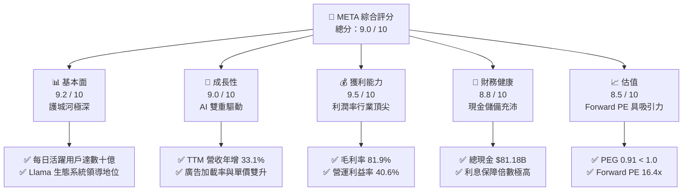

# META 基本面深度分析報告
> **報告日期**：2026-06-07 ｜ **語言**：繁體中文 ｜ **數據來源**：Yahoo Finance, Finviz, StockAnalysis, Roic.ai ｜ **分析師**：CFA 級機構研究

---

## 目錄

| # | 章節 | 核心結論 |
|---|------|----------|
| 1 | **執行摘要** | 評級：🟢 **強烈買入** ｜ 基準目標價：**$828.80**（隱含 +39.8% 上行空間） |
| 2 | **公司概覽與商業模式** | 社交網路效應與開源 AI 生態（Llama）構築極深護城河，雙引擎驅動 |
| 3 | **損益表深度分析** | TTM 營收達 $214.96B（YoY +33.1%），Q3 2025 稅務異常不改營運利潤強勁本質 |
| 4 | **資產負債表分析** | 流動性充沛（現金 $81.18B），債務結構健康，槓桿倍數極為安全 |
| 5 | **現金流量深度分析** | 營運現金流 $124.00B 歷史新高，大舉資本支出（CapEx $69.69B）聚焦 AI 基礎設施 |
| 6 | **獲利能力與資本效率** | ROE 達 32.9%，ROIC (31.4%) 遠超 WACC (10.0%)，創造顯著經濟增值 (EVA) |
| 7 | **估值深度分析** | Forward P/E 僅 16.40x，PEG 0.91 顯示估值明顯低估，DCF 基準估值 $832.50 |
| 8 | **成長催化劑** | AI 廣告投放效率提升、智慧眼鏡（Ray-Ban Meta）放量與企業端 Llama 貨幣化 |
| 9 | **風險矩陣** | AI 資本支出回報滯後與監管反壟斷為核心風險，整體風險可控 |
| 10 | **投資建議** | 建議分批逢低佈局，適合長期成長型與核心資產配置投資者 |

---

## 1. 執行摘要

### 1.1 核心評分儀表板



### 1.2 評分進度條視覺化

```
╔══════════════════════════════════════════════════════════════╗
║               META 多維度評分儀表板 (1-10分)                 ║
╠══════════════════════════════════════════════════════════════╣
║ 基本面強度  9.2 ▓▓▓▓▓▓▓▓▓▓▓▓▓▓▓▓▓▓░░  ★★★★★           ║
║ 成長動能    9.0 ▓▓▓▓▓▓▓▓▓▓▓▓▓▓▓▓▓▓░░  ★★★★★           ║
║ 獲利品質    9.5 ▓▓▓▓▓▓▓▓▓▓▓▓▓▓▓▓▓▓▓░  ★★★★★           ║
║ 財務健康    8.8 ▓▓▓▓▓▓▓▓▓▓▓▓▓▓▓▓▓▓░░  ★★★★☆           ║
║ 估值合理性  8.5 