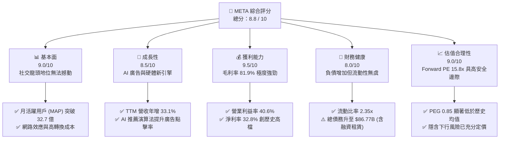

# META 基本面深度分析報告

> **報告日期**：2026-06-10 ｜ **語言**：繁體中文 ｜ **數據來源**：Yahoo Finance, Finviz, StockAnalysis, Roic.ai ｜ **分析師**：CFA 級機構研究

---

## 目錄

| # | 章節 | 核心結論 |
|---|------|----------|
| 1 | **執行摘要** | 評級：🟢 **強烈買入** ｜ 目標價：**$828.80** (隱含 +45.15% 空間) |
| 2 | **公司概覽與商業模式** | 社交雙寡頭地位穩固，AI 驅動廣告精準度，護城河評級：🟢 **極深** |
| 3 | **損益表深度分析** | TTM 營收達 **$214.96B** (YoY +33.1%)，排除 Q3 2025 一次性稅務干擾，獲利品質極佳 |
| 4 | **資產負債表分析** | 淨現金負 **$5.59B** (受 AI 資本支出與長債增加影響)，但流動比率 **2.35** 仍極為健康 |
| 5 | **現金流量深度分析** | 營運現金流 TTM 達 **$124.00B**，AI 基礎設施投資致 CapEx 飆升，自由現金流為 **$25.56B** |
| 6 | **獲利能力與資本效率** | ROE 達 **32.9%**，ROIC 達 **31.4%**，遠高於 WACC (**10.6%**)，強力創造股東價值 |
| 7 | **估值深度分析** | Forward P/E 僅 **15.79x**，PEG **0.85**，相較 Mag-7 同儕顯著低估 |
| 8 | **成長催化劑** | Llama 4 開源生態、AI 智慧眼鏡 (Ray-Ban Meta) 爆發與 Reels 貨幣化率提升 |
| 9 | **風險矩陣** | AI 資本支出回報遲滯、反壟斷監管與隱私政策變更為主要風險 |
| 10 | **投資建議** | 建議於 **$570.98** 價位積極建倉，分批佈局長線 AI 轉型紅利 |

---

## 1. 執行摘要

### 1.1 核心評分儀表板



### 1.2 評分進度條視覺化

```
╔══════════════════════════════════════════════════════════════╗
║               META 多維度評分儀表板 (1-10分)                 ║
╠══════════════════════════════════════════════════════════════╣
║ 基本面強度  9.0 ▓▓▓▓▓▓▓▓▓▓▓▓▓▓▓▓▓▓░░  ★★★★★           ║
║ 成長動能    8.5 ▓▓▓▓▓▓▓▓▓▓▓▓▓▓▓▓▓░░░  ★★★★☆           ║
║ 獲利品質    9.5 ▓▓▓▓▓▓▓▓▓▓▓▓▓▓▓▓▓▓▓░  ★★★★★           ║
║ 財務健康    8.0 ▓▓▓▓▓▓▓▓▓▓▓▓▓▓▓▓░░░░  ★★★★☆           ║
║ 估值合理性  9.0 ▓▓▓▓▓▓▓▓▓▓▓▓▓▓▓▓▓▓░░  ★★★★★           ║
║ 護城河深度  9.5 ▓▓▓▓▓▓▓▓▓▓▓▓▓▓▓▓▓▓▓░  ★★★★★           ║
║ 管理層執行  8.5 ▓▓▓▓▓▓▓▓▓▓▓▓▓▓▓▓▓░░░  ★★★★☆           ║
║ 技術創新力  9.0 ▓▓▓▓▓▓▓▓▓▓▓▓▓▓▓▓▓▓░░  ★★★★★           ║
╠══════════════════════════════════════════════════════════════╣
║ 綜合總分    8.8 ▓▓▓▓▓▓▓▓▓▓▓▓▓▓▓▓▓░░░  🏆 強烈買入          ║
╚══════════════════════════════════════════════════════════════╝
```

### 1.3 五大投資論點 + 三大核心風險

| 類型 | 項目 | 具體依據 | 信心度 |
|------|------|----------|--------|
| 🟢 **投資論點①** | **AI 驅動廣告投放革命** | 透過 Meta Lattice 等 AI 模組，廣告主 ROI 提升超過 20%，帶動 TTM 營收成長達 33.1%。 | 🟢 極高 |
| 🟢 **投資論點②** | **社交帝國網路效應深厚** | 旗下 Family of Apps (FoA) 每日活躍用戶持續增長，轉換成本極高，商家無法脫離 Meta 生態。 | 🟢 極高 |
| 🟢 **投資論點③** | **估值具備極高安全邊際** | Forward P/E 僅 **15.79x**，相較於 S&P 500 的成長性與其自身歷史中位數，處於嚴重低估區間。 | 🟢 極高 |
| 🟢 **投資論點④** | **開源 AI 生態領導者** | Llama 系列模型