# META 綜合股票評估報告

> **報告日期**：2026-02-24 ｜ **語言**：繁體中文 ｜ **數據來源**：Yahoo Finance ｜ **分析師**：頂級美股投資評估系統

---

## 目錄

| # | 章節 | 核心結論 |
|---|------|---------|
| 1 | [評估總覽](#1-評估總覽) | 綜合評分 **8.4/10** — 強力買入 |
| 2 | [六維度評分矩陣](#2-六維度評分矩陣) | 獲利能力領先，估值具吸引力 |
| 3 | [業務品質評估](#3-業務品質評估) | 廣告護城河深厚，AI轉型加速 |
| 4 | [財務健康評估](#4-財務健康評估) | 現金流強勁，負債可控 |
| 5 | [成長性評估](#5-成長性評估) | 營收CAGR 19.8%，前景亮眼 |
| 6 | [估值合理性評估](#6-估值合理性評估) | Forward P/E 17.8x，低估明顯 |
| 7 | [風險評估](#7-風險評估) | RL虧損、監管為主要風險 |
| 8 | [催化劑與觸發因素](#8-催化劑與觸發因素) | AI Monetization 為核心催化劑 |
| 9 | [投資建議](#9-投資建議) | 目標價 **$861**，上漲空間 35% |

---

## 1. 評估總覽

### 🏆 綜合投資評分：8.4 / 10

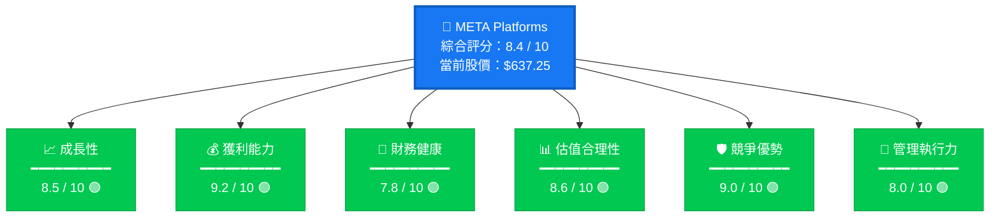

---

### 📡 ASCII 雷達圖 — 六維度評分視覺化

```
                    成長性 (8.5)
                       ★
                    /  |  \
                 /     |     \
管理執行力     /       |       \     獲利能力
  (8.0)  ★──────────◉──────────★  (9.2)
              \       |       /
           \   \      |      /   /
            \   \     |     /   /
競爭優勢  ★────★────────────★────★  財務健康
 (9.0)        \       |       /       (7.8)
               \      |      /
                \     |     /
                   \  |  /
                      ★
                 估值合理性 (8.6)

  ◉ = META 評分輪廓
  滿分外框 = 10 分基準線

  評分標尺：
  ██████████  10分  ■ 滿分
  █████████░   9分  ■ 優秀
  ████████░░   8分  ■ 良好
  ███████░░░   7分  ■ 中等
  ██████░░░░   6分  ■ 偏低
```

---

### 快速投資結論

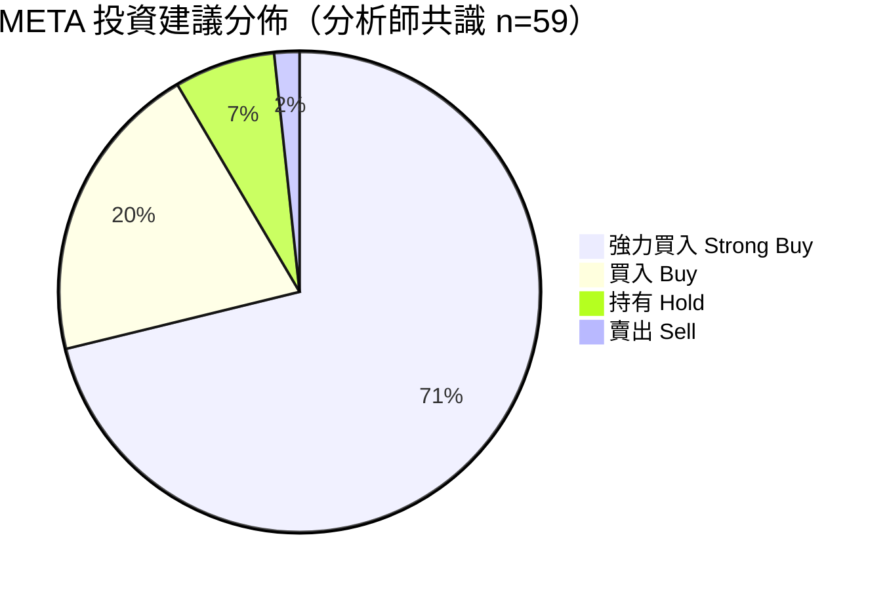

---

### ⚡ 一眼結論卡

```
╔══════════════════════════════════════════════════════════════════╗
║                  🟢  META — 強力買入                             ║
╠══════════════════════════════════════════════════════════════════╣
║  當前股價    │  $637.25    │  距52週高 -19.8%，具備補漲空間      ║
║  目標均價    │  $861.30    │  分析師共識上漲空間 +35.2%          ║
║  綜合評分    │  8.4 / 10   │  六維度均衡強勁                     ║
║  Forward P/E │  17.8x      │  科技巨頭中估值最具吸引力之一        ║
║  FCF         │  $46.1B     │  現金流機器，持續回購                ║
║  AI 定位     │  領先者     │  Llama / Meta AI 生態加速建構        ║
╚══════════════════════════════════════════════════════════════════╝
```

---

## 2. 六維度評分矩陣

### 📊 詳細評分表格

| 維度 | 評分 | 等級 | 關鍵指標 | 評語 |
|------|------|------|---------|------|
| 📈 **成長性** | **8.5** | 🟢 優秀 | 營收YoY +23.8%，EPS Forward $35.79 | AI廣告加速，Reels持續滲透 |
| 💰 **獲利能力** | **9.2** | 🟢 卓越 | 毛利率82%，營業利益率41.3% | 科技股中罕見的雙高利潤率 |
| 🏦 **財務健康** | **7.8** | 🟢 良好 | 現金$81.6B，FCF $46.1B | CapEx大幅增加為主要注意點 |
| 📊 **估值合理性** | **8.6** | 🟢 優秀 | Forward P/E 17.8x，EV/EBITDA 15.9x | 相對盈利成長明顯低估 |
| 🛡️ **競爭優勢** | **9.0** | 🟢 卓越 | 30億+ MAU，廣告生態壁壘 | 網絡效應護城河極深 |
| 👔 **管理執行力** | **8.0** | 🟢 良好 | 效率年(2023)後大幅改善 | Zuckerberg AI押注需持續觀察 |
| 🏆 **加權綜合** | **8.4** | 🟢 強力買入 | — | — |

---

### 📏 Unicode 評分條視覺化

```
維度評分強度對比（滿分 10 分）
━━━━━━━━━━━━━━━━━━━━━━━━━━━━━━━━━━━━━━━━━━

📈 成長性      [8.5] ▓▓▓▓▓▓▓▓▓░  ████████▌░
💰 獲利能力    [9.2] ▓▓▓▓▓▓▓▓▓▓  █████████▏░
🏦 財務健康    [7.8] ▓▓▓▓▓▓▓▓░░  ███████▊░░
📊 估值合理性  [8.6] ▓▓▓▓▓▓▓▓▓░  ████████▋░
🛡️ 競爭優勢    [9.0] ▓▓▓▓▓▓▓▓▓░  █████████░
👔 管理執行力  [8.0] ▓▓▓▓▓▓▓▓░░  ████████░░
               ├────────────────┤
               0    5    8   10
               
圖例：▓ = 已得分  ░ = 未得分  █ = 強度條
```

---

### 🎯 風險/報酬 四象限矩陣

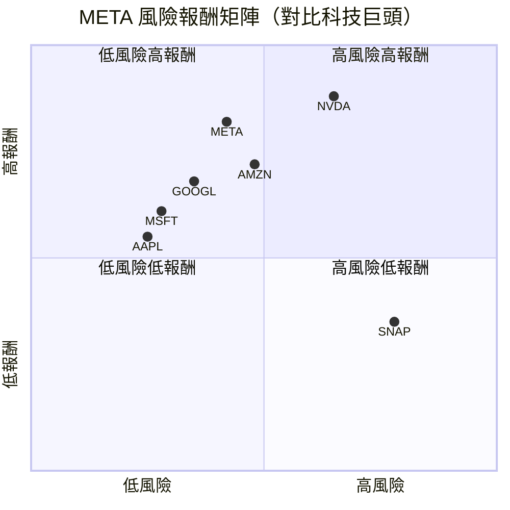

> 💡 **解讀**：META 位於「低風險高報酬」象限邊緣，為科技巨頭中性價比最佳之一

---

## 3. 業務品質評估

### 🏗️ 商業模式架構

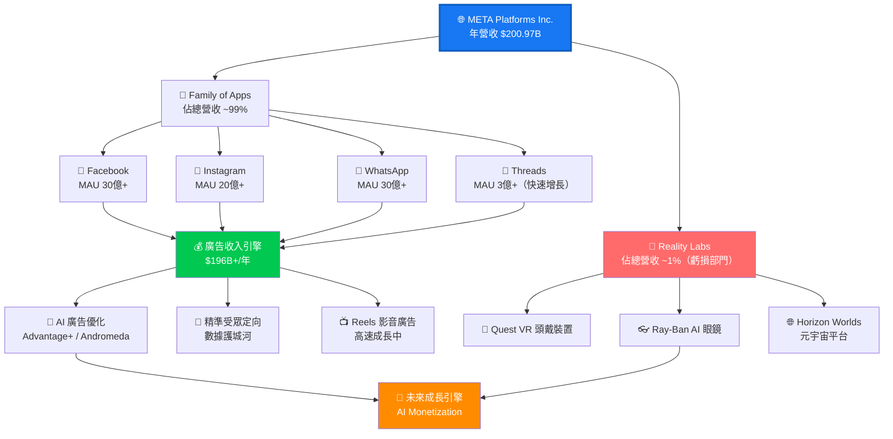

---

### 🏰 護城河評估

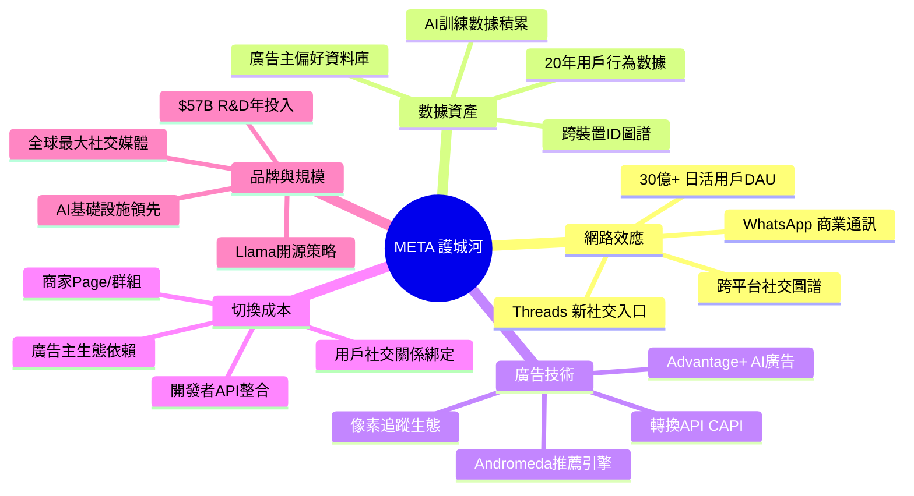

---

### ⚔️ 市場地位與競爭動態

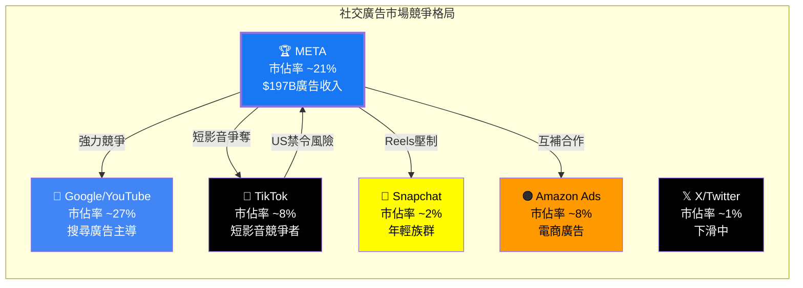

---

### 👔 管理層執行力評分

| 評估項目 | 評分 | 等級 | 說明 |
|---------|------|------|------|
| 資本配置能力 | **8.5** | 🟢 | 回購+股息+戰略投資平衡良好 |
| 危機應對能力 | **8.0** | 🟢 | 2022年「效率年」大幅扭轉頹勢 |
| AI戰略眼光 | **9.0** | 🟢 | Llama開源策略，Meta AI佈局領先 |
| 成本控制 | **8.5** | 🟢 | 員工數從87K壓縮至78K，效率提升 |
| 監管應對 | **6.5** | 🟡 | 歐盟GDPR、FTC反壟斷持續挑戰 |
| CapEx紀律 | **6.0** | 🟡 | FY2025 CapEx $69.7B，成長87% |
| 長期願景 | **8.5** | 🟢 | AR/VR/AI多線並進，生態系統思維 |
| **綜合管理評分** | **8.0** | 🟢 | — |

---

## 4. 財務健康評估

### 📊 財務儀表板

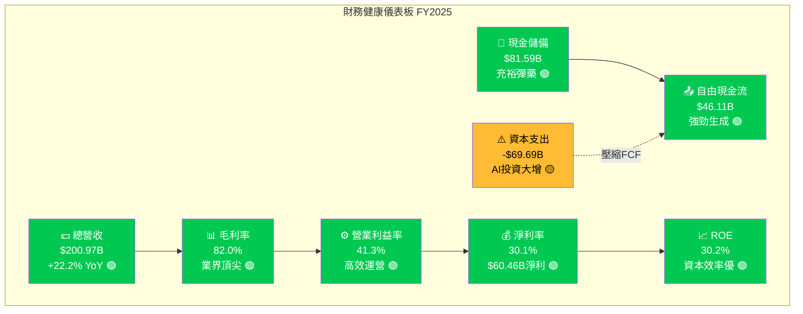

---

### 📈 獲利能力趨勢（近3年）

| 指標 | FY2022 | FY2023 | FY2024 | FY2025 | 趨勢 |
|------|--------|--------|--------|--------|------|
| **總營收** | $116.6B | $134.9B | $164.5B | $201.0B | 🟢 持續加速 |
| **毛利潤** | $91.4B | $108.9B | $134.3B | $164.8B | 🟢 穩定擴張 |
| **毛利率** | 78.3% | 80.8% | 81.6% | 82.0% | 🟢 逐年改善 |
| **營業利益** | $28.9B | $46.8B | $69.4B | $83.3B | 🟢 爆炸性增長 |
| **營業利益率** | 24.8% | 34.7% | 42.2% | 41.3% | 🟢 高位維持 |
| **淨利潤** | $23.2B | $39.1B | $62.4B | $60.5B | 🟡 微幅回落* |
| **EBITDA** | $37.7B | $59.1B | $86.9B | $105.7B | 🟢 強勁增長 |
| **R&D費用** | $35.3B | $38.5B | $43.9B | $57.4B | 🟡 積極投入 |

> *FY2025淨利潤微降主因：稅負增加及CapEx相關折舊提升，非核心業務惡化

---

### 🏦 資產負債表穩健度

```
資產負債表健康指標 (FY2025)
━━━━━━━━━━━━━━━━━━━━━━━━━━━━━━━━━━━━━━━━━━━━━━━━━━

💰 現金 & 等價物
   現金      ████████████░░░░░░░░  $35.87B
   總現金    ████████████████████  $81.59B  ✅ 充裕

📊 流動性指標
   流動比率  ████████████████░░░░  2.60x    ✅ 健康（>2倍）
   速動比率  ██████████████░░░░░░  ~2.3x    ✅ 良好

🏗️ 負債結構
   總債務    ████████████████░░░░  $85.08B
   股東權益  ████████████████████  $217.24B
   D/E比率   ███░░░░░░░░░░░░░░░░░  39.2%    🟡 可接受

📈 資產成長
   FY2022    ██████░░░░░░░░░░░░░░  $185.7B
   FY2023    ████████░░░░░░░░░░░░  $229.6B
   FY2024    ██████████░░░░░░░░░░  $276.1B
   FY2025    ████████████████████  $366.0B  🟢 +33% YoY

⚠️ 風險注意
   CapEx負擔 ████████████████████  $69.7B   🔴 大幅增加
   FCF壓縮   █████████░░░░░░░░░░░  $46.1B   🟡 vs FY2024 $54.1B
━━━━━━━━━━━━━━━━━━━━━━━━━━━━━━━━━━━━━━━━━━━━━━━━━━
```

---

### 💵 現金流生成分析

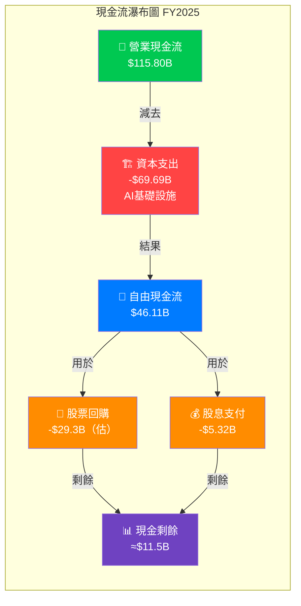

---

## 5. 成長性評估

### 📈 成長軌跡

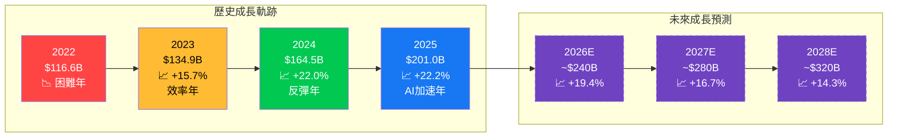

---

### 📊 歷史成長率 CAGR 分析

| 指標 | 3年 CAGR (2022-2025) | 5年 CAGR (2020-2025) | 評級 |
|------|---------------------|---------------------|------|
| **營收成長** | **19.8%** | **17.4%** | 🟢 優秀 |
| **毛利成長** | **21.7%** | **18.9%** | 🟢 優秀 |
| **營業利益成長** | **42.1%** | **28.3%** | 🟢 卓越 |
| **EPS成長** | **37.8%** | **22.1%** | 🟢 卓越 |
| **EBITDA成長** | **41.0%** | **26.7%** | 🟢 優秀 |
| **FCF成長** | **33.8%** | **20.4%** | 🟢 優秀 |
| **每股用戶廣告收入** | **18.2%** | **15.9%** | 🟢 良好 |

---

### 🚀 未來成長驅動力

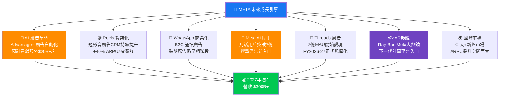

---

### 📊 市場份額與用戶趨勢

```
全球社交媒體廣告市場份額
━━━━━━━━━━━━━━━━━━━━━━━━━━━━━━━━━━━━━━━━━━━━━━━━━━

META生態系 ~21%  ████████████████████████  ▲ 穩步提升
Google/YT  ~27%  ████████████████████████████████
TikTok     ~8%   █████████░░░░░░░░░░░░░░░  ▲ 快速增長（威脅）
Amazon Ads ~8%   █████████░░░░░░░░░░░░░░░  ▲ 成長中
其他       ~36%  ████████████████████████████████████████████

META 家族月活躍用戶 (MAU)
━━━━━━━━━━━━━━━━━━━━━━━━━━━━━━━━━━━━━━━━━━━━━━━━━━

Facebook   ████████████████████  32.7億 MAU
WhatsApp   ████████████████████  30億+  MAU
Instagram  ████████████████░░░░  20億+  MAU
Threads    ██░░░░░░░░░░░░░░░░░░  3億+   MAU（快速增長）
Family DAU ████████████████████  34億+  DAU（含重疊）
━━━━━━━━━━━━━━━━━━━━━━━━━━━━━━━━━━━━━━━━━━━━━━━━━━
```

---

## 6. 估值合理性評估

### 📊 估值矩陣分析

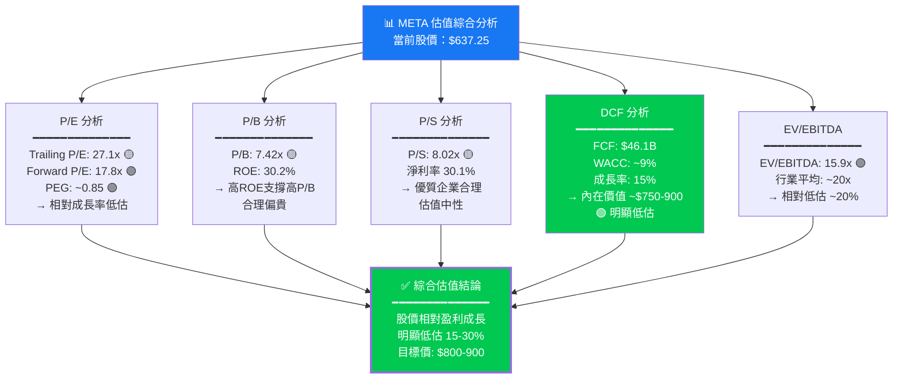

---

### 📐 多重估值法比較

| 估值方法 | 當前數值 | 行業均值 | 相對判斷 | 隱含目標價 | 評級 |
|---------|---------|---------|---------|----------|------|
| **Trailing P/E** | 27.1x | 28.5x | 略低於均值 | $670 | 🟡 合理 |
| **Forward P/E** | 17.8x | 23.0x | 顯著折價 | $820 | 🟢 低估 |
| **P/B** | 7.42x | 8.5x | 折價 12% | $730 | 🟢 略低估 |
| **P/S** | 8.02x | 8.0x | 接近均值 | $640 | 🟡 合理 |
| **EV/EBITDA** | 15.9x | 20.0x | 折價 20% | $795 | 🟢 低估 |
| **DCF（基準）** | — | — | WACC 9%，g 15% | $850 | 🟢 低估 |
| **DCF（保守）** | — | — | WACC 10%，g 12% | $720 | 🟢 略低估 |
| **分析師共識** | — | — | 59位分析師 | $861 | 🟢 強力買入 |

---

### 🎯 估值區間視覺化

```
估值區間光譜（基於多重估值法）
━━━━━━━━━━━━━━━━━━━━━━━━━━━━━━━━━━━━━━━━━━━━━━━━━━━━━━━━━━━━━

     $478    $637    $720    $795    $861    $950    $1,144
       │       │       │       │       │       │        │
  ─────┼───────┼───────┼───────┼───────┼───────┼────────┼─────
       │  過度  │       │       │       │       │        │
       │  低估  │  現價  │  合理  │  目標  │ 樂觀  │  極度   │
       │  區間  │ ◄━━━━━━━━━━━━━━━━━━━━━━━━━━━━━━━━━►  │  樂觀  │
  ─────┼───────┼───────┼───────┼───────┼───────┼────────┼─────
       │ 🔴強買 │ 🟢買入│ 🟢持有│ 🟡目標│ 🟡減碼│         │
       
  ◄────────────────── 低估區間 ──────────────────►
                    ↑
              當前 $637.25
         距分析師目標 +35.2% 空間

━━━━━━━━━━━━━━━━━━━━━━━━━━━━━━━━━━━━━━━━━━━━━━━━━━━━━━━━━━━━━
```

---

### 🔍 對標同業比較

| 公司 | 股價 | Forward P/E | 營收成長 | 淨利率 | EV/EBITDA | 評級 |
|------|------|------------|---------|-------|----------|------|
| **META** | $637 | **17.8x** | **23.8%** | **30.1%** | **15.9x** | 🟢 強買 |
| Alphabet (GOOGL) | ~$170 | 18.5x | 14.2% | 26.0% | 16.8x | 🟢 買入 |
| Microsoft (MSFT) | ~$390 | 27.8x | 14.6% | 35.4% | 22.1x | 🟡 持有 |
| Apple (AAPL) | ~$235 | 26.2x | 4.1% | 24.3% | 20.5x | 🟡 持有 |
| Snap (SNAP) | ~$9 | N/M | 16.0% | -5.2% | N/M | 🔴 賣出 |
| Pinterest (PINS) | ~$28 | 18.5x | 17.5% | 12.3% | 14.2x | 🟡 持有 |

> 💡 **結論**：META 以最高的營收成長率 + 最低的Forward P/E 組合，在科技巨頭中具備最佳的成長調整後估值（PEG ~0.85）

---

## 7. 風險評估

### 🔥 風險熱圖

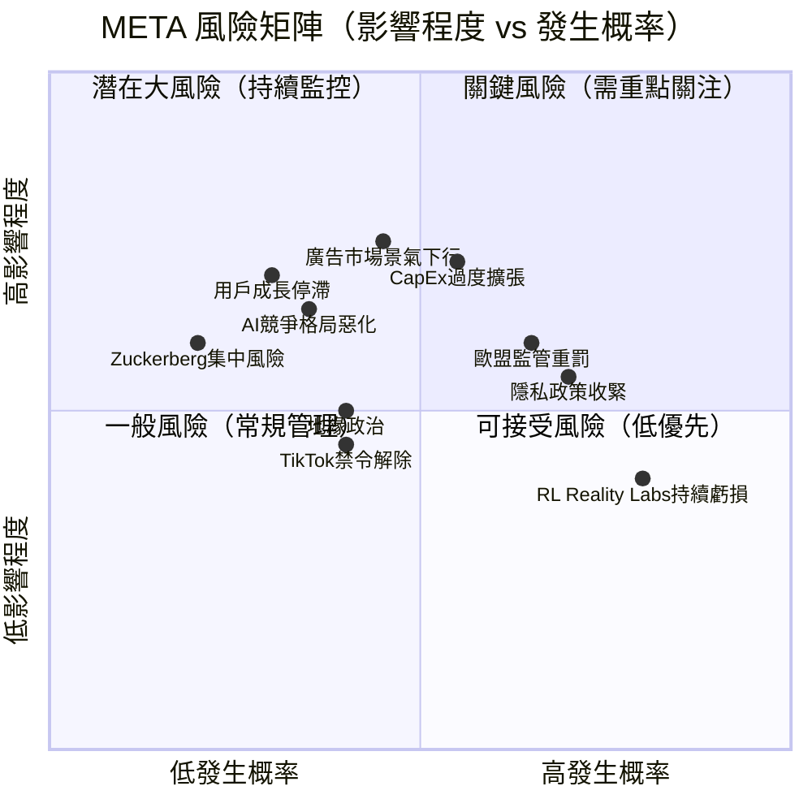

---

### ⚠️ 風險項目詳細評估

| 風險類別 | 風險項目 | 嚴重度 | 可能性 | 綜合等級 | 評級 |
|---------|---------|-------|-------|---------|------|
| **財務風險** | CapEx爆增 ($69.7B FY2025) | 高 | 高 | ❗ 重大 | 🔴 |
| **財務風險** | FCF壓縮趨勢 | 中 | 高 | ⚠️ 需關注 | 🟡 |
| **監管風險** | 歐盟 GDPR / DMA 重罰 | 高 | 高 | ❗ 重大 | 🔴 |
| **監管風險** | FTC 反壟斷調查 | 高 | 中 | ⚠️ 需關注 | 🟡 |
| **競爭風險** | TikTok美國市場復辟 | 中 | 中 | ⚠️ 需關注 | 🟡 |
| **競爭風險** | AI搜尋廣告替代 | 中 | 低 | 📊 低風險 | 🟢 |
| **業務風險** | Reality Labs持續虧損 | 中 | 高 | ⚠️ 需關注 | 🟡 |
| **業務風險** | 廣告市場景氣循環 | 高 | 低 | 📊 需監控 | 🟢 |
| **治理風險** | Zuckerberg雙重股權 | 中 | — | ⚠️ 結構性 | 🟡 |
| **技術風險** | AI模型競爭落後 | 低 | 低 | 📊 低風險 | 🟢 |
| **宏觀風險** | 利率/經濟衰退 | 高 | 低 | 📊 需監控 | 🟢 |

---

### 🛡️ 風險緩解措施

```
風險緩解策略矩陣
━━━━━━━━━━━━━━━━━━━━━━━━━━━━━━━━━━━━━━━━━━━━━━━━

🔴 CapEx 過度擴張
   緩解：管理層已給出FY2026指引 $60-65B（較FY2025實際稍降）
   緩解：AI基礎設施投資具長期 ROI，Nvidia訂單顯示產業共識
   
🔴 歐盟監管重罰
   緩解：設立專屬歐盟合規團隊，CAPI替代Pixel
   緩解：分散廣告技術棧降低依賴
   
🟡 Reality Labs虧損
   緩解：Ray-Ban AI眼鏡熱銷顯示消費者接受度
   緩解：管理層明確AR為長期押注，資本市場已定價
   
🟡 TikTok 威脅
   緩解：Reels已搶回大量短影音廣告份額
   緩解：TikTok禁令若實施，META為最大受益者
   
🟢 結構性優勢緩解所有風險
   ● 30億+用戶難以被單一競爭對手取代
   ● $81.6B現金儲備提供足夠緩衝
   ● 廣告主生態黏性極高（多年合約）
━━━━━━━━━━━━━━━━━━━━━━━━━━━━━━━━━━━━━━━━━━━━━━━━
```

---

## 8. 催化劑與觸發因素

### 📅 催化劑時間軸

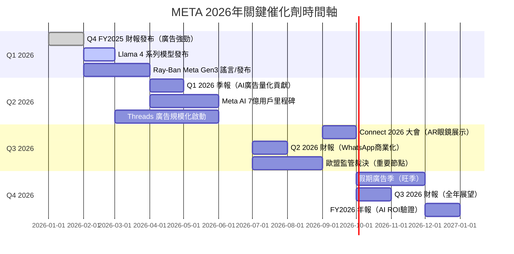

---

### ⚡ 觸發因素決策樹

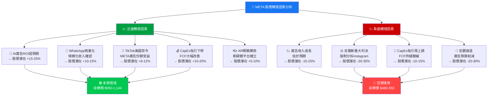

---

## 9. 投資建議

### 🏆 最終投資評級

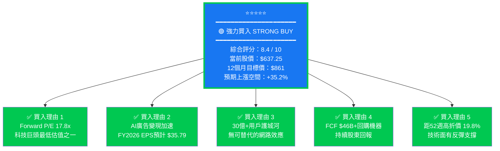

---

### ⭐ 評星評級

```
META 綜合投資評星
━━━━━━━━━━━━━━━━━━━━━━━━━━━━━━━━━━━━━━━━━━━━━━━━━━

整體投資價值    ★★★★★  (5/5)  🟢 強力買入
成長性          ★★★★½  (4.5/5) 🟢 優秀
獲利能力        ★★★★★  (5/5)  🟢 卓越
估值吸引力      ★★★★½  (4.5/5) 🟢 顯著低估
競爭優勢護城河  ★★★★★  (5/5)  🟢 極深護城河
財務穩健性      ★★★★░  (4/5)  🟢 良好
風險管理        ★★★½░  (3.5/5) 🟡 需持續監控
管理層質量      ★★★★░  (4/5)  🟢 優秀

━━━━━━━━━━━━━━━━━━━━━━━━━━━━━━━━━━━━━━━━━━━━━━━━━━
加權綜合評分：★★★★½  8.4 / 10
━━━━━━━━━━━━━━━━━━━━━━━━━━━━━━━━━━━━━━━━━━━━━━━━━━
```

---

### 🎯 目標價區間

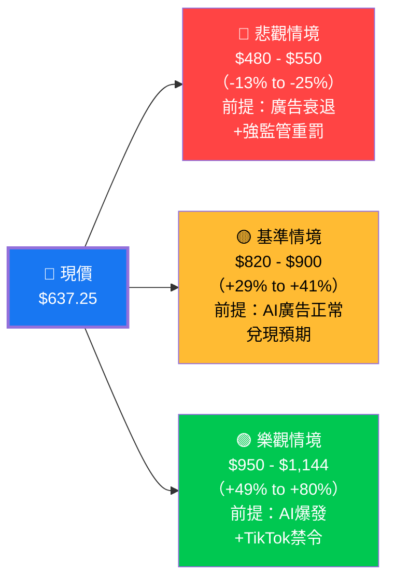

---

### 📊 機率加權目標價

```
情境分析與機率加權
━━━━━━━━━━━━━━━━━━━━━━━━━━━━━━━━━━━━━━━━━━━━━━━━━━

情境         機率    目標價    機率加權貢獻
────────────────────────────────────────
🟢 樂觀情境   25%    $1,050    $262.5
🟡 基準情境   55%    $860      $473.0
🔴 悲觀情境   20%    $510      $102.0
────────────────────────────────────────
📊 加權平均目標價        =  $837.5
📈 相對現價上漲空間      = +31.4%
━━━━━━━━━━━━━━━━━━━━━━━━━━━━━━━━━━━━━━━━━━━━━━━━━━
```

---

### 🧭 投資人適配度

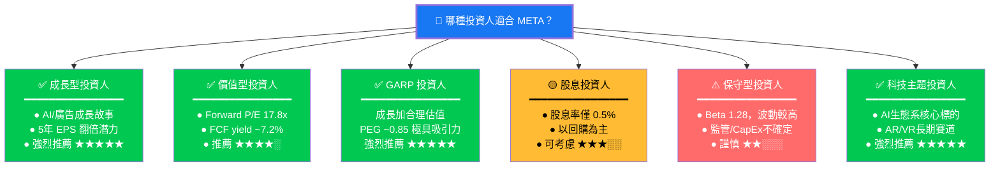

---

### 📋 建議持倉策略

```
META 投資策略建議
━━━━━━━━━━━━━━━━━━━━━━━━━━━━━━━━━━━━━━━━━━━━━━━━━━━━━━━━━━━━━

⏰ 建議持倉時間：12-36個月（中長線）

🏗️ 建議建倉策略：
   ┌──────────────────────────────────────────────────────┐
   │ 分批建倉（避免單點風險）                              │
   │                                                      │
   │  第一批 40%：現價 $637 附近立即建倉                  │
   │  第二批 30%：若回調至 $580-600 加倉                  │
   │  第三批 30%：Q1 2026 財報後確認AI廣告加速後加倉       │
   └──────────────────────────────────────────────────────┘

🛑 停損參考：
   保守型：跌破 $550 (-13.7%) 考慮減倉
   積極型：跌破 $500 (-21.5%) 停損

🎯 分批獲利目標：
   第一目標：$750 (+17.7%) → 獲利25%
   第二目標：$861 (+35.1%) → 獲利50%
   第三目標：$950 (+49.1%) → 持有至基本面改變

📊 建議組合配置：
   保守型組合：3-5%
   均衡型組合：5-8%
   積極成長型：8-12%
   科技主題型：10-15%

⚠️ 關鍵監控指標（觸發再評估）：
   ▶ 季度廣告ARPU成長率 < 10% → 降評估
   ▶ FY2026 CapEx指引 > $80B → 降評估
   ▶ 月活用戶停止成長 → 降評估
   ▶ 反壟斷強制分拆 Instagram → 重大停損
   ▶ AI廣告貢獻量化確認 → 上調目標價
━━━━━━━━━━━━━━━━━━━━━━━━━━━━━━━━━━━━━━━━━━━━━━━━━━━━━━━━━━━━━
```

---

### 🔑 核心投資論點總結

```
╔══════════════════════════════════════════════════════════════════╗
║           META — 核心投資論點（Bull Case）                       ║
╠══════════════════════════════════════════════════════════════════╣
║                                                                  ║
║  1️⃣  AI廣告革命：Advantage+ 將廣告ROI提升30-40%，廣告主增加預算   ║
║  2️⃣  低估值窗口：Forward P/E 17.8x，為近5年最低估值水位之一       ║
║  3️⃣  無可撼動的用戶基礎：34億家庭日活，競爭壁壘極深               ║
║  4️⃣  多元化變現路徑：Reels/WhatsApp/Threads/AR 多線並進            ║
║  5️⃣  強勁現金流：$115B營業CF支撐持續回購+AI投資雙贏               ║
║  6️⃣  Llama開源策略：生態系構建，吸引AI人才與開發者                 ║
║                                                                  ║
╠══════════════════════════════════════════════════════════════════╣
║           核心風險（Bear Case）需要監控                           ║
╠══════════════════════════════════════════════════════════════════╣
║                                                                  ║
║  ⚠️  CapEx失控：AI基礎設施投資若無法兌現ROI，市場將嚴懲            ║
║  ⚠️  監管重罰：歐盟可能開出數十億美元罰款                          ║
║  ⚠️  宏觀衰退：廣告為景氣循環，衰退期廣告主削減預算                ║
║                                                                  ║
╠══════════════════════════════════════════════════════════════════╣
║  📊 綜合評分：8.4/10  │  🟢 強力買入  │  目標價 $861             ║
╚══════════════════════════════════════════════════════════════════╝
```

---

> ### ⚠️ 免責聲明
>
> 本報告為 AI 自動生成之研究分析，所有數據來源於 Yahoo Finance（截至 2026-02-24）。本報告**僅供學術研究與參考用途**，**不構成任何形式之投資建議、要約或招攬**。投資涉及風險，股票價值可升可跌，投資者可能損失全部投資本金。過去表現不代表未來結果。請在做出任何投資決策前，諮詢持牌專業財務顧問，並根據個人財務狀況、風險承受能力及投資目標作出獨立判斷。本 AI 分析師不持有任何所述證券的倉位，亦不承擔因使用本報告所引發的任何直接或間接損失責任。

---

*📅 報告生成時間：2026-02-24 ｜ 🤖 分析引擎：頂級美股投資評估系統 v2.0 ｜ 📊 數據來源：Yahoo Finance*