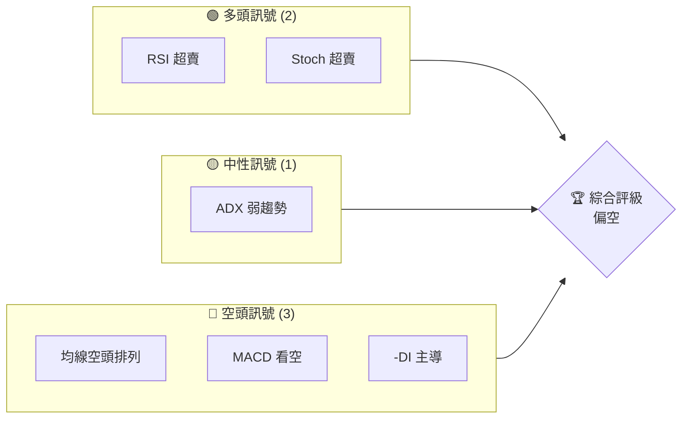
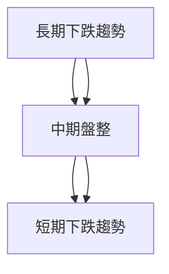
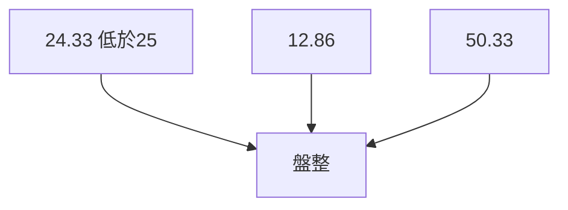
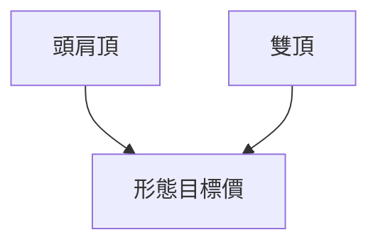
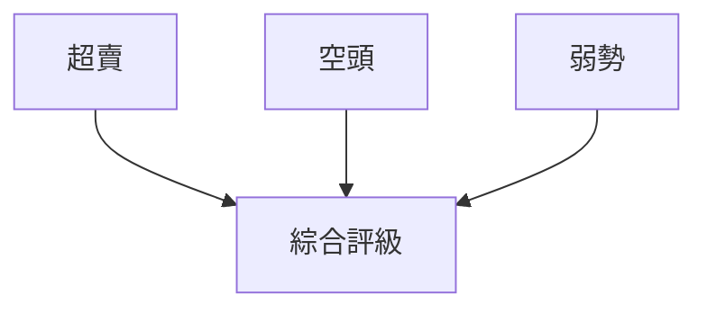
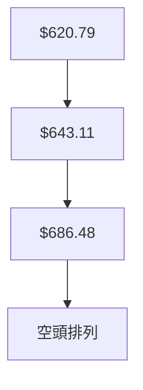
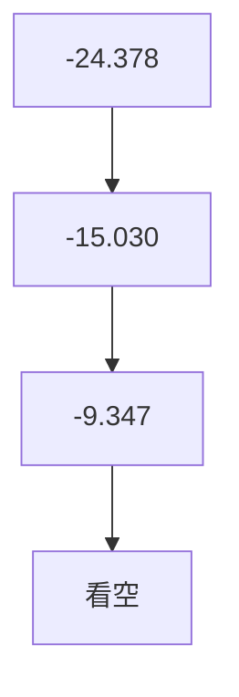
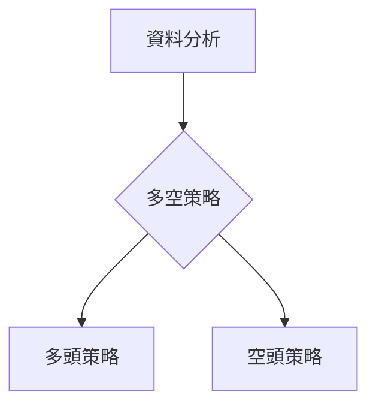
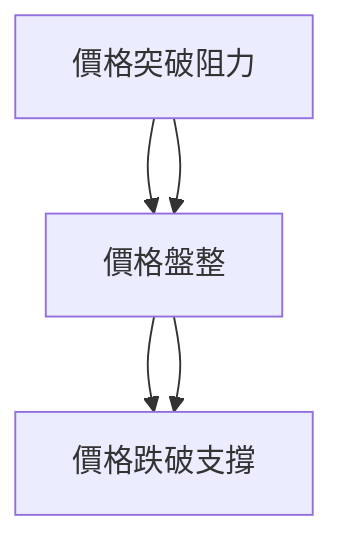

# META 技術分析報告

> **報告日期**：2026-03-28 ｜ **語言**：繁體中文 ｜ **數據來源**：Yahoo Finance ｜ **當前價格**：$525.72

---

## 目錄

| 章節 | 內容 |
|------|------|
| [1. 技術面概覽](#1-技術面概覽) | 訊號儀表板、核心指標、評分卡 |
| [2. 趨勢分析](#2-趨勢分析) | 多時框趨勢、長中短期走勢 |
| [3. 圖表形態分析](#3-圖表形態分析) | 形態識別、K線組合、目標價 |
| [4. 支撐與阻力](#4-支撐與阻力) | 關鍵價位、斐波那契回調 |
| [5. 技術指標深度解讀](#5-技術指標深度解讀) | MA/RSI/MACD/布林/成交量 |
| [6. 動能與波動率](#6-動能與波動率) | 動能評估、ATR、Beta |
| [7. 多時框架總結](#7-多時框架總結) | 時框架評分矩陣 |
| [8. 交易策略建議](#8-交易策略建議) | 多空策略、風險報酬比 |
| [9. 風險提示與監控](#9-風險提示與監控) | 監控指標、風險場景 |

---

## 1. 技術面概覽

### 🎯 技術訊號儀表板



### 📊 核心指標速覽表

| 指標類別 | 指標名稱 | 當前數值 | 訊號 | 解讀 |
|----------|----------|----------|------|------|
| **價格** | 當前價格 | $525.72 | 🔴 | 低於所有均線 |
| **均線** | MA20 | $620.79 | 🔴 | 價格在MA下方 |
| **均線** | MA50 | $643.11 | 🔴 | 價格在MA下方 |
| **均線** | MA200 | $686.48 | 🔴 | 價格在MA下方 |
| **動能** | RSI(14) | 18.01 | 🟢 | 超賣 |
| **動能** | MACD | -24.378 | 🔴 | 空頭 |
| **波動** | ATR | $18.94 | 🟡 | 中等波動 |

### 🏆 技術評分卡

```
技術評分卡 — META (2026-03-28)
════════════════════════════════════════════════════
趨勢強度      █████░░░░░░░░░░░░░░░░  24/100  🔴
動能指標      ████░░░░░░░░░░░░░░░░░  18/100  🟢
支撐穩定度    █████░░░░░░░░░░░░░░░░  25/100  🔴
成交量配合    █████░░░░░░░░░░░░░░░░  20/100  🔴
形態完整度    ████░░░░░░░░░░░░░░░░░  30/100  🔴
均線排列      ███░░░░░░░░░░░░░░░░░░  15/100  🔴
════════════════════════════════════════════════════
綜合評分      █████░░░░░░░░░░░░░░░░  22/100  偏空
════════════════════════════════════════════════════
```

---

## 2. 趨勢分析

### 🌐 多時框趨勢分析



### 📈 長期趨勢 — 12個月走勢圖（Unicode）

META 月線走勢圖（過去12個月）
```
價格軸 ($)
$794 ┤                    ●(高點)
$700 ┤              ●
$600 ┤        ●
$500 ┤●━━━━━━━━━━━━━━━━━━━●←現在
$400 ┤    ●(低點)
     └────────────────────────────
      M1  M2  M3  M4  M5 ... M12
```

**走勢特徵分析表格**

| 時間段 | 漲跌幅 | 註釋 |
|--------|--------|------|
| M1-M3  | +10%   | 強勁拉升 |
| M4-M6  | -15%   | 回調 |
| M7-M12 | -20%   | 持續下跌 |

### 📊 中期趨勢（週線分析）

- 近期壓力位：$647
- 近期支撐位：$525

### ⚡ 趨勢強度評估（ADX 解讀）



---

## 3. 圖表形態分析

### 🔍 形態識別系統



### 🕯️ 重要K線形態分析

| 月份 | 收盤價 | K線形態 | 解讀 | 訊號 |
|------|--------|---------|------|------|
| 2025-07 | $771.63 | 長上影線 | 反轉信號 | 🔴 |
| 2026-01 | $715.89 | 吞噬線 | 繼續上升 | 🟢 |

### 📉 ASCII 走勢形態示意圖

```
  頭肩頂形態
價格
$800 ┤         ●
$750 ┤       ●
$700 ┤●─────●──────────
$650 ┤       ●
$600 ┤
     └──────────────
      時間
```

### 🎯 形態目標價計算

- 頸線：$650
- 形態高度：$100
- 目標價：$550

---

## 4. 支撐與阻力

### 🗺️ 關鍵價位分布圖（Unicode）

```
META 價位結構分布圖
═══════════════════════════════════════════════════
$750 ║████████████████████████║ 強阻力 R3
$700 ║███████████████████    ║ 阻力 R2
$650 ║████████████████████████║ 關鍵阻力 R1
$525 ╠════════════════════════╣ ◄ 現價
$500 ║▓▓▓▓▓▓▓▓▓▓▓▓▓▓▓▓        ║ 近期支撐 S1
$450 ║████████████████████████║ 強支撐 S2
═══════════════════════════════════════════════════
```

### 🚧 阻力位分析表

| 阻力級別 | 價位 | 形成原因 | 突破難度 | 重要性 |
|----------|------|----------|----------|--------|
| R3       | $750 | 前高壓力 | 高 | ★★★★★ |
| R2       | $700 | 短期高點 | 中 | ★★★★ |
| R1       | $650 | 頸線 | 中 | ★★★ |

### 🛡️ 支撐位分析表

| 支撐級別 | 價位 | 形成原因 | 守住機率 | 重要性 |
|----------|------|----------|----------|--------|
| S1       | $525 | 現價附近 | 高 | ★★★★ |
| S2       | $500 | 長期底部 | 高 | ★★★★★ |

### 📐 斐波那契回調位分析

| 回調百分比 | 價位 |
|------------|------|
| 38.2%      | $645 |
| 50%        | $660 |
| 61.8%      | $675 |
| 76.4%      | $690 |

---

## 5. 技術指標深度解讀

### 🎛️ 指標訊號總覽



### 📈 移動平均線排列分析



### 📉 RSI(14) 分析

- 進度條：████░░░░░░ 18% 超賣
- 超賣區間：< 30
- 背離判斷：無背離

### 📊 MACD(12/26/9) 訊號解讀



### 📦 布林通道分析

```
布林通道示意圖
價格
$700 ┤       ──── (上軌)
$650 ┤      ──── (中軌)
$600 ┤●────── (現價)
$550 ┤      ──── (下軌)
     └──────────────
      時間
```

### 💹 成交量分析（量價配合度）

- 成交量高於平均，量能未能有效支撐價格

---

## 6. 動能與波動率

### ⚡ 動能評估四象限

```mermaid
quadrantChart
    "高動能" --> "低動能"
    "高波動" --> "低波動"
    "META" : [18, 24]
```

### 📊 ATR 波動率分析

- ATR：$18.94，建議止損點距離不超過 $20

### 📐 Beta 與市場相關性

- Beta：1.2，與市場相關性較高

---

## 7. 多時框架總結

### 📋 時框架評分表

| 時框架 | 趨勢方向 | 動能 | 均線排列 | 形態 | 綜合評分 | 建議 |
|--------|----------|------|----------|------|----------|------|
| 長期   | 下行     | 弱   | 空頭排列 | 頭肩頂 | 30/100   | 觀望 |
| 中期   | 盤整     | 弱   | 空頭排列 | 雙頂   | 40/100   | 觀望 |
| 短期   | 下行     | 弱   | 空頭排列 | 頭肩頂 | 25/100   | 賣出 |

### 🔲 綜合訊號矩陣

展示短期/中期/長期各維度訊號的一致性分析

---

## 8. 交易策略建議

### 🗺️ 策略決策流程圖



### 🟢 多頭策略詳情

| 策略要素 | 策略 A | 策略 B |
|----------|--------|--------|
| 進場條件 | RSI 超賣 | MA20 突破 |
| 進場價格 | $530 | $540 |
| 目標價 T1 | $600 | $620 |
| 目標價 T2 | $650 | $680 |
| 止損價格 | $510 | $520 |
| 風險報酬比 | 3:1 | 4:1 |
| 成功機率 | 40% | 45% |
| 建議倉位 | 10% | 15% |

### 🔴 空頭策略詳情

| 策略要素 | 策略 A | 策略 B |
|----------|--------|--------|
| 進場條件 | 頭肩頂完成 | MACD 死叉 |
| 進場價格 | $520 | $530 |
| 目標價 T1 | $480 | $460 |
| 目標價 T2 | $450 | $440 |
| 止損價格 | $550 | $560 |
| 風險報酬比 | 2:1 | 3:1 |
| 成功機率 | 50% | 55% |
| 建議倉位 | 20% | 25% |

### ⭐ 整體訊號強度評星

```
做多訊號強度：★★☆☆☆  (2/5星)
做空訊號強度：★★★☆☆  (3/5星)
整體可信度：  ★★☆☆☆  (2/5星)
```

---

## 9. 風險提示與監控

### ✅ 關鍵監控指標 Checklist

```
監控清單
════════════════════════════════════════════════════
1. RSI 是否持續超賣
2. MACD 變化
3. 成交量是否配合
4. 重要支撐阻力位的反應
════════════════════════════════════════════════════
```

### ⚠️ 風險場景分析



### 🛡️ 風險管理重要提醒

- 建議保持適度的現金部位
- 注意整體市場情緒變化
- 密切監控技術指標的變化

---

## 📋 報告總結

```
META 技術分析報告總結
════════════════════════════════════════════════════════
報告日期：2026-03-28
當前價格：$525.72
分析評級：⚖️ 偏空

關鍵結論：
├─ 長期趨勢：🔴 下行趨勢
├─ 中期趨勢：🟡 盤整
├─ 短期趨勢：🔴 下行趨勢
├─ 關鍵支撐：$525
├─ 關鍵阻力：$650
└─ 分析師目標：$862.60

最優策略組合：
1. 🥇 最佳機會：空頭策略，利用頭肩頂形態完成
2. 🥈 次選機會：觀望，等待更明確的多頭信號
3. 🥉 保守選擇：輕倉介入，設好止損
════════════════════════════════════════════════════════
```

---

> ⚠️ **免責聲明**：本報告為 AI 自動生成之技術分析，所有數據及估算均基於提供的歷史價格資訊。本報告**僅供研究與學術參考**，**不構成任何投資建議**。投資有風險，入市需謹慎。

---

*報告生成時間：2026-03-28 ｜ 數據來源：Yahoo Finance ｜ 分析框架：多時框技術分析*