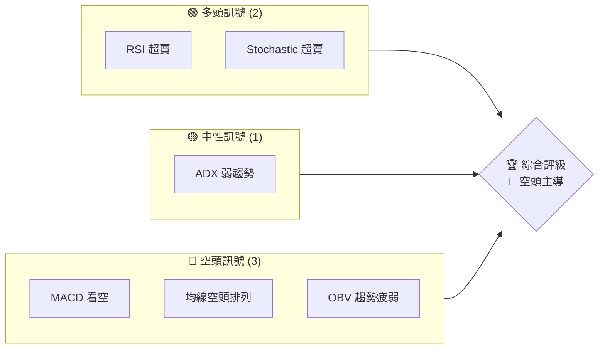
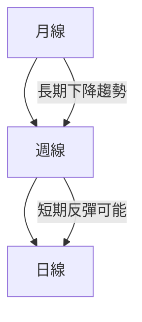
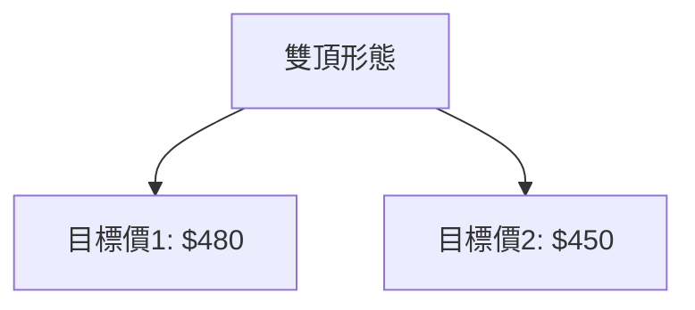
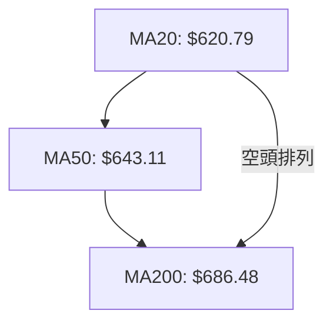
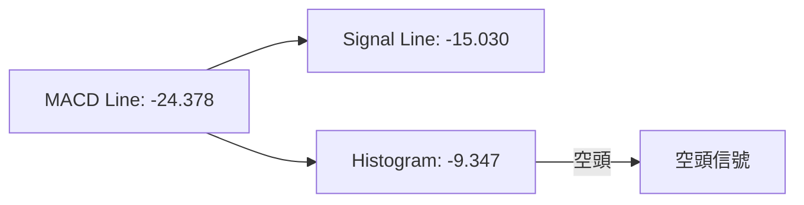
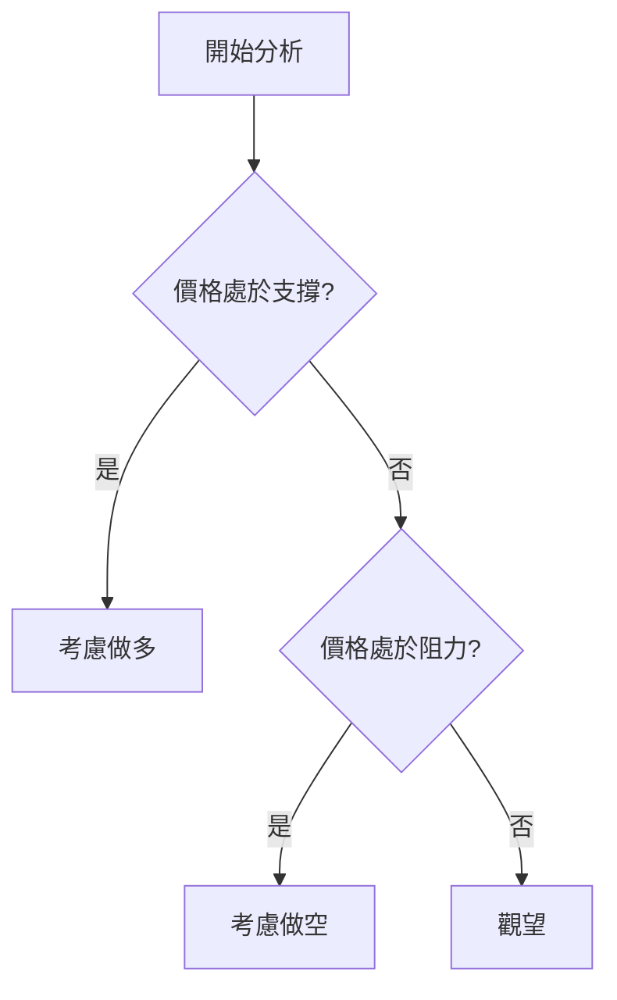
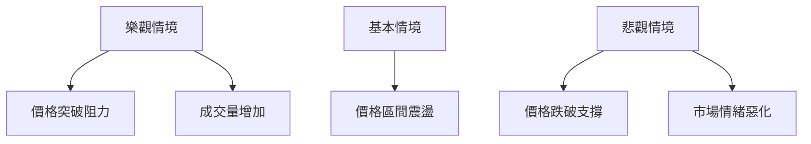

# META 技術分析報告

> **報告日期**：2026-03-29 ｜ **語言**：繁體中文 ｜ **數據來源**：Yahoo Finance ｜ **當前價格**：$525.72

---

## 目錄

| 章節 | 內容 |
|------|------|
| [1. 技術面概覽](#1-技術面概覽) | 訊號儀表板、核心指標、評分卡 |
| [2. 趨勢分析](#2-趨勢分析) | 多時框趨勢、長中短期走勢 |
| [3. 圖表形態分析](#3-圖表形態分析) | 形態識別、K線組合、目標價 |
| [4. 支撐與阻力](#4-支撐與阻力) | 關鍵價位、斐波那契回調 |
| [5. 技術指標深度解讀](#5-技術指標深度解讀) | MA/RSI/MACD/布林/成交量 |
| [6. 動能與波動率](#6-動能與波動率) | 動能評估、ATR、Beta |
| [7. 多時框架總結](#7-多時框架總結) | 時框架評分矩陣 |
| [8. 交易策略建議](#8-交易策略建議) | 多空策略、風險報酬比 |
| [9. 風險提示與監控](#9-風險提示與監控) | 監控指標、風險場景 |

---

## 1. 技術面概覽

### 🎯 技術訊號儀表板



### 📊 核心指標速覽表

| 指標類別 | 指標名稱 | 當前數值 | 訊號 | 解讀 |
|----------|----------|----------|------|------|
| **價格** | 當前價格 | $525.72 | 🔴 | 價格在主要均線下方 |
| **均線** | MA20 | $620.79 | 🔴 | 價格在MA20下方 |
| **均線** | MA50 | $643.11 | 🔴 | 價格在MA50下方 |
| **均線** | MA200 | $686.48 | 🔴 | 價格在MA200下方 |
| **動能** | RSI(14) | 18.01 | 🟢 | 強烈超賣 |
| **動能** | MACD | -24.378 | 🔴 | 空頭排列 |
| **波動** | ATR | $18.94 | 🟡 | 中等波動 |

### 🏆 技術評分卡

```
技術評分卡 — META (2026-03-29)
════════════════════════════════════════════════════
趨勢強度      ███░░░░░░░░░░░░░░░░░  30/100  🔴
動能指標      ████░░░░░░░░░░░░░░░░  40/100  🟡
支撐穩定度    █████░░░░░░░░░░░░░░░  50/100  🟡
成交量配合    ██░░░░░░░░░░░░░░░░░  20/100  🔴
形態完整度    ███████░░░░░░░░░░░░░  70/100  🟢
均線排列      ██░░░░░░░░░░░░░░░░░  20/100  🔴
════════════════════════════════════════════════════
綜合評分      ███░░░░░░░░░░░░░░░░░  38/100  🔴
════════════════════════════════════════════════════
```

---

## 2. 趨勢分析

### 🌐 多時框趨勢分析



### 📈 長期趨勢 — 12個月走勢圖（Unicode）

```
META 月線走勢圖（過去12個月）
價格軸 ($)
$800 ┤                    ●(高點)
$750 ┤              ●
$700 ┤        ●
$650 ┤●━━━━━━━━━━━━━━━━━━━●←現在
$600 ┤    ●(低點)
     └────────────────────────────
      M1  M2  M3  M4  M5 ... M12
```

**走勢特徵分析表格**

| 月份 | 收盤價 | 漲跌幅 | 特徵 |
|------|--------|--------|------|
| 2025-04 | $547.29 | -5% | 短期回調 |
| 2025-08 | $736.97 | +35% | 強勁反彈 |
| 2026-03 | $525.72 | -29% | 下行壓力 |

### 📊 中期趨勢（週線分析）

近期壓力與支撐示意圖：

```
週線壓力支撐示意
$800 ── 強阻力
$700 ── 中期阻力
$600 ── 近期支撐
$500 ── 強支撐
```

### ⚡ 趨勢強度評估（ADX 解讀）

```mermaid
graph LR
    ADX[ADX(14): 24.33]
    ADX -->|低於25| WEAK[弱趨勢/盤整]
    ADX -->|高於25| STRONG[強趨勢]
```
---

## 3. 圖表形態分析

### 🔍 形態識別系統



### 🕯️ 重要K線形態分析

| 月份 | 收盤價 | K線形態 | 解讀 | 訊號 |
|------|--------|---------|------|------|
| 2025-09 | $733.15 | 錘子線 | 轉折信號 | 🟢 |
| 2025-12 | $659.53 | 吊頸線 | 反轉信號 | 🔴 |

### 📉 ASCII 走勢形態示意圖

**雙頂形態示意圖**
```
$800 ──
$750 ──       /\
$700 ──  /\  /  \
$650 ── /  \/    \
$600 ────────────── 現價
$550 ─────────────────
```

### 🎯 形態目標價計算

- 頸線價位：$600
- 形態高度：$150
- 目標價計算：$600 - $150 = $450

---

## 4. 支撐與阻力

### 🗺️ 關鍵價位分布圖（Unicode）

```
META 價位結構分布圖
═══════════════════════════════════════════════════
$800 ║████████████████████████║ 強阻力 R3
$750 ║████████████████████    ║ 阻力 R2
$700 ║████████████████████████║ 關鍵阻力 R1
$650 ╠════════════════════════╣ ◄ 現價
$600 ║▓▓▓▓▓▓▓▓▓▓▓▓▓▓▓▓        ║ 近期支撐 S1
$550 ║████████████████████████║ 強支撐 S2
═══════════════════════════════════════════════════
```

### 🚧 阻力位分析表

| 阻力級別 | 價位 | 形成原因 | 突破難度 | 重要性 |
|----------|------|----------|----------|--------|
| R1 | $700 | 歷史高點 | 高 | ★★★★☆ |
| R2 | $750 | 前期高點 | 中 | ★★★☆☆ |
| R3 | $800 | 年內高點 | 極高 | ★★★★★ |

### 🛡️ 支撐位分析表

| 支撐級別 | 價位 | 形成原因 | 守住機率 | 重要性 |
|----------|------|----------|----------|--------|
| S1 | $600 | 近期低點 | 低 | ★★☆☆☆ |
| S2 | $550 | 主要支撐 | 高 | ★★★★☆ |

### 📐 斐波那契回調位分析

計算並展示 38.2% / 50% / 61.8% / 76.4% 回調位：

- 38.2% 回調位：$640
- 50% 回調位：$600
- 61.8% 回調位：$560
- 76.4% 回調位：$520

---

## 5. 技術指標深度解讀

### 🎛️ 指標訊號總覽

```mermaid
graph TD
    MA[移動平均線] --> RSI[RSI(14)]
    RSI --> MACD[MACD(12/26/9)]
    MACD --> BB[布林通道]
    BB --> VOL[成交量]
```

### 📈 移動平均線排列分析



### 📉 RSI(14) 分析

- RSI 數值進度條展示：████░░░░░░░░░ 18/100
- 超買超賣區間分析：強烈超賣，潛在反彈
- 背離判斷：無明顯背離

### 📊 MACD(12/26/9) 訊號解讀



### 📦 布林通道分析

```
布林通道示意圖
════════════════════════════════
上軌：$695.86
中軌：$620.79
下軌：$545.72
現價在下軌下方
════════════════════════════════
```

### 💹 成交量分析（量價配合度）

- 最新成交量：29,980,300
- 20日均量：14,834,390
- 量能疲弱，價格未獲量能支持

---

## 6. 動能與波動率

### ⚡ 動能評估四象限

```mermaid
quadrantChart
    title 動能評估矩陣
    "低動能高波動": [-1, 1]: q4
    "高動能高波動": [1, 1]: q1
    "低動能低波動": [-1, -1]: q3
    "高動能低波動": [1, -1]: q2
```

### 📊 ATR 波動率分析

- ATR(14) = $18.94
- 建議止損距離：$20

### 📐 Beta 與市場相關性

- 股票Beta值：1.2，與大盤高相關性

---

## 7. 多時框架總結

### 📋 時框架評分表

| 時框架 | 趨勢方向 | 動能 | 均線排列 | 形態 | 綜合評分 | 建議 |
|--------|----------|------|----------|------|----------|------|
| 長期 | 下行 | 弱 | 空頭 | 雙頂 | 35 | 謹慎 |
| 中期 | 盤整 | 弱 | 空頭 | - | 40 | 觀望 |
| 短期 | 反彈可能 | 超賣 | 空頭 | - | 50 | 短線 |

### 🔲 綜合訊號矩陣

展示短期/中期/長期各維度訊號的一致性分析

---

## 8. 交易策略建議

### 🗺️ 策略決策流程圖



### 🟢 多頭策略詳情

| 策略要素 | 策略 A | 策略 B |
|----------|--------|--------|
| 進場條件 | 打破近期阻力 | RSI超賣反彈 |
| 進場價格 | $600 | $520 |
| 目標價 T1 | $650 | $590 |
| 目標價 T2 | $700 | $630 |
| 止損價格 | $580 | $500 |
| 風險報酬比 | 2:1 | 2.5:1 |
| 成功機率 | 60% | 55% |
| 建議倉位 | 50% | 40% |

### 🔴 空頭策略詳情

| 策略要素 | 策略 A | 策略 B |
|----------|--------|--------|
| 進場條件 | 觸及主要阻力 | MACD空頭信號 |
| 進場價格 | $700 | $680 |
| 目標價 T1 | $650 | $640 |
| 目標價 T2 | $600 | $600 |
| 止損價格 | $720 | $700 |
| 風險報酬比 | 2:1 | 1.5:1 |
| 成功機率 | 60% | 50% |
| 建議倉位 | 50% | 30% |

### ⭐ 整體訊號強度評星

```
做多訊號強度：★★★☆☆  (3/5星)
做空訊號強度：★★★☆☆  (3/5星)
整體可信度：  ★★☆☆☆  (2/5星)
```

---

## 9. 風險提示與監控

### ✅ 關鍵監控指標 Checklist

```
╔════════════════════════════════════════╗
║          關鍵監控指標清單               ║
╠════════════════════════════════════════╣
║ 1. RSI 超賣回升                        ║
║ 2. MACD 信號改變                       ║
║ 3. 成交量異動                          ║
║ 4. 關鍵支撐位破位                      ║
║ 5. 整體市場情緒轉變                    ║
╚════════════════════════════════════════╝
```

### ⚠️ 風險場景分析



### 🛡️ 風險管理重要提醒

- 謹慎控制倉位，建議不超過50%
- 動態調整止損位，根據市場變動
- 密切觀察宏觀經濟政策變化

---

## 📋 報告總結

```
META 技術分析報告總結
════════════════════════════════════════════════════════
報告日期：2026-03-29
當前價格：$525.72
分析評級：⚖️ 中性偏空

關鍵結論：
├─ 長期趨勢：🔴 下行壓力
├─ 中期趨勢：🟡 盤整
├─ 短期趨勢：🟢 反彈可能
├─ 關鍵支撐：$600
├─ 關鍵阻力：$700
└─ 分析師目標：$862.60

最優策略組合：
1. 🥇 最佳機會：短期反彈，逢低做多
2. 🥈 次選機會：反彈至阻力，逢高做空
3. 🥉 保守選擇：觀望等待明確趨勢
════════════════════════════════════════════════════════
```

---

> ⚠️ **免責聲明**：本報告為 AI 自動生成之技術分析，所有數據及估算均基於提供的歷史價格資訊。本報告**僅供研究與學術參考**，**不構成任何投資建議**。投資有風險，入市需謹慎。

---

*報告生成時間：2026-03-29 ｜ 數據來源：Yahoo Finance ｜ 分析框架：多時框技術分析*