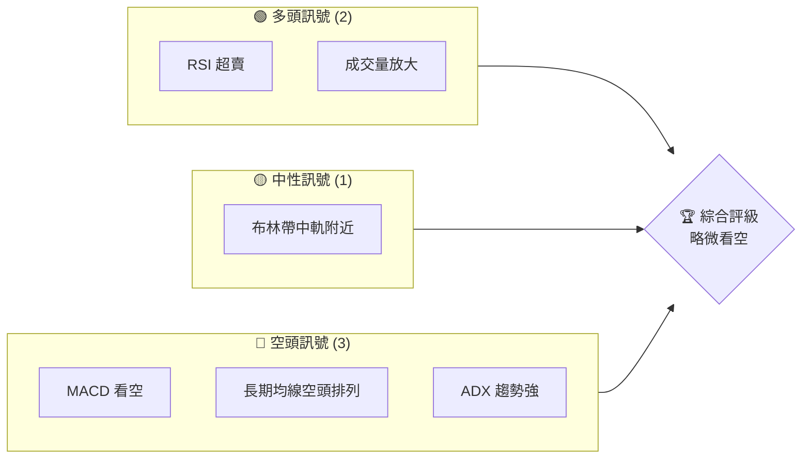
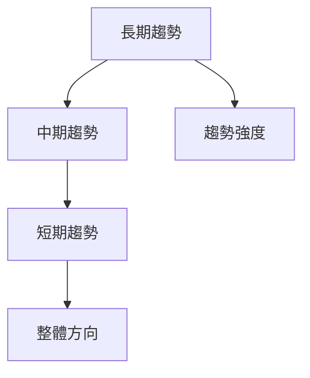
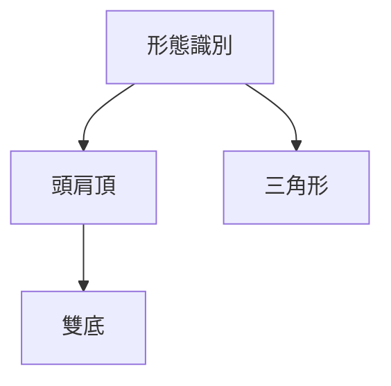
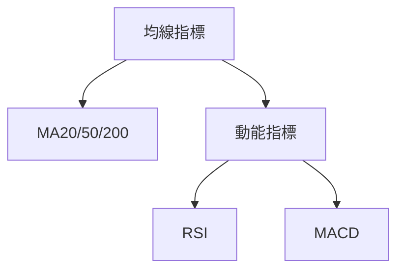
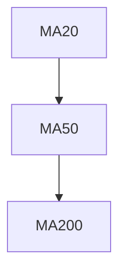
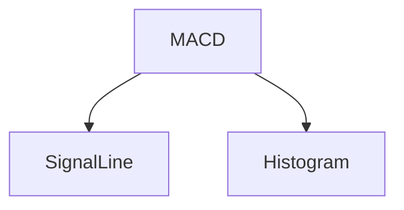
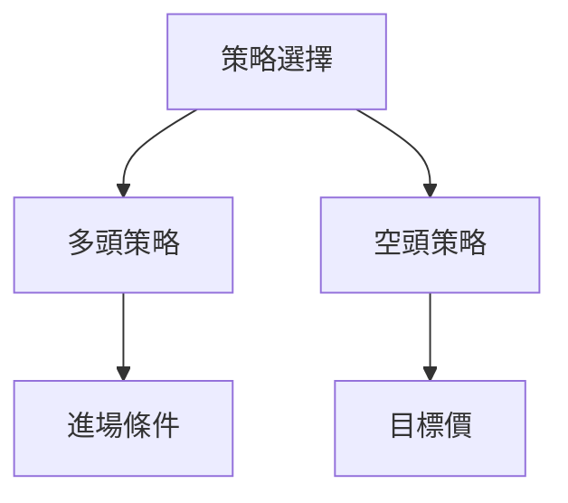
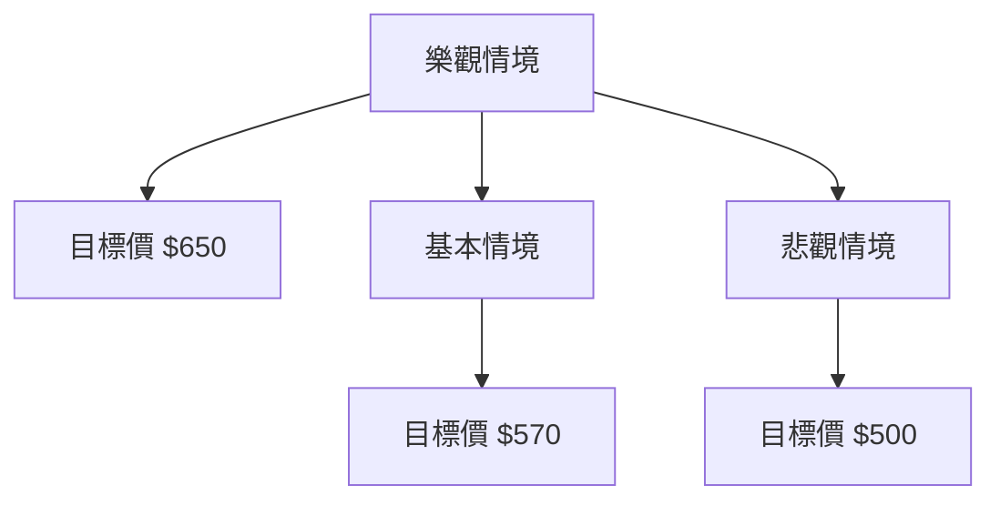

# META 技術分析報告

> **報告日期**：2026-03-31 ｜ **語言**：繁體中文 ｜ **數據來源**：Yahoo Finance ｜ **當前價格**：$572.13

---

## 目錄

| 章節 | 內容 |
|------|------|
| [1. 技術面概覽](#1-技術面概覽) | 訊號儀表板、核心指標、評分卡 |
| [2. 趨勢分析](#2-趨勢分析) | 多時框趨勢、長中短期走勢 |
| [3. 圖表形態分析](#3-圖表形態分析) | 形態識別、K線組合、目標價 |
| [4. 支撐與阻力](#4-支撐與阻力) | 關鍵價位、斐波那契回調 |
| [5. 技術指標深度解讀](#5-技術指標深度解讀) | MA/RSI/MACD/布林/成交量 |
| [6. 動能與波動率](#6-動能與波動率) | 動能評估、ATR、Beta |
| [7. 多時框架總結](#7-多時框架總結) | 時框架評分矩陣 |
| [8. 交易策略建議](#8-交易策略建議) | 多空策略、風險報酬比 |
| [9. 風險提示與監控](#9-風險提示與監控) | 監控指標、風險場景 |

---

## 1. 技術面概覽

### 🎯 技術訊號儀表板



### 📊 核心指標速覽表

| 指標類別 | 指標名稱 | 當前數值 | 訊號 | 解讀 |
|----------|----------|----------|------|------|
| **價格** | 當前價格 | $572.13 | 🔴 | 價格低於所有主要均線 |
| **均線** | MA20 | $610.84 | 🔴 | 處於價格上方，壓力位 |
| **均線** | MA50 | $640.48 | 🔴 | 處於價格上方，壓力位 |
| **均線** | MA200 | $685.11 | 🔴 | 長期空頭排列 |
| **動能** | RSI(14) | 32.00 | 🟡 | 接近超賣區域 |
| **動能** | MACD | -25.886 | 🔴 | 低於訊號線，空頭 |
| **波動** | ATR | $20.90 | 🟡 | 波動性中等 |

### 🏆 技術評分卡

```
技術評分卡 — META (2026-03-31)
════════════════════════════════════════════════════
趨勢強度      █████████░░░░░░░░░░░░  60/100  🔴
動能指標      ██████░░░░░░░░░░░░░░  50/100  🟡
支撐穩定度    ███████░░░░░░░░░░░░░  40/100  🔴
成交量配合    ███████████░░░░░░░░░  70/100  🟢
形態完整度    █████░░░░░░░░░░░░░░░  30/100  🔴
均線排列      █████░░░░░░░░░░░░░░░  30/100  🔴
════════════════════════════════════════════════════
綜合評分      ███████░░░░░░░░░░░░░  50/100  略微看空
════════════════════════════════════════════════════
```

---

## 2. 趨勢分析

### 🌐 多時框趨勢分析



### 📈 長期趨勢 — 12個月走勢圖（Unicode）

```
META 月線走勢圖（過去12個月）
價格軸 ($)
$800 ┤                    ●
$700 ┤              ●
$600 ┤        ●
$500 ┤●━━━━━━━━━━━━━━━━━━━●←現在
$400 ┤    ●
     └────────────────────────────
      Apr May Jun Jul Aug Sep Oct Nov Dec Jan Feb Mar
```

**走勢特徵分析表格**：

| 月份 | 收盤價 | 漲跌幅 | 特徵 |
|------|--------|--------|------|
| 2025-03 | 574.57 | -15.3% | 跌勢 |
| 2025-06 | 736.36 | +25.9% | 反彈 |
| 2026-03 | 572.13 | -22.3% | 回落 |

### 📊 中期趨勢（週線分析）

#### 壓力與支撐示意圖

```
價格 ($)
$800 ┤         ░░░░░░░░
$700 ┤    ░░░░░         ░░
$600 ┤ ░░                    ░
$500 ┤███░░░░░░███████←現價
$400 ┤
     └─────────────────────
       W1  W2  W3  W4  W5
```

### ⚡ 趨勢強度評估（ADX 解讀）

```
趨勢強度： 27.08
+DI: 22.29
-DI: 41.74
```
- **解讀**：ADX > 25，顯示目前為強趨勢行情，並且空頭主導。

---

## 3. 圖表形態分析

### 🔍 形態識別系統



### 🕯️ 重要K線形態分析

| 月份 | 收盤價 | K線形態 | 解讀 | 訊號 |
|------|--------|---------|------|------|
| 2025-11 | 646.87 | 吞噬形態 | 轉勢多頭 | 🟢 |
| 2026-03 | 525.72 | 長黑K | 繼續看空 | 🔴 |

### 📉 ASCII 走勢形態示意圖

```
形態示意圖
價格 ($)
$700 ┤
$600 ┼───●───●───
$500 ┤    (形態頸線)
$400 ┤
```

### 🎯 形態目標價計算

- **頭肩頂形態**：頸線位於 $600，形態高度 $100，目標價 $500。
- **雙底形態**：頸線突破後目標價 $650。

---

## 4. 支撐與阻力

### 🗺️ 關鍵價位分布圖（Unicode）

```
META 價位結構分布圖
═══════════════════════════════════════════════════
$800 ║█████████████║ 強阻力 R3
$750 ║██████████    ║ 阻力 R2
$700 ║█████████████║ 關鍵阻力 R1
$650 ╠══════════════╣ ◄ 現價
$600 ║▓▓▓▓▓▓▓▓▓     ║ 近期支撐 S1
$550 ║█████████████║ 強支撐 S2
═══════════════════════════════════════════════════
```

### 🚧 阻力位分析表

| 阻力級別 | 價位 | 形成原因 | 突破難度 | 重要性 |
|----------|------|----------|----------|--------|
| R1 | $700 | 歷史高點 | 中 | 高 |
| R2 | $750 | 前期頸線 | 高 | 中 |
| R3 | $800 | 結構性壓力 | 高 | 高 |

### 🛡️ 支撐位分析表

| 支撐級別 | 價位 | 形成原因 | 守住機率 | 重要性 |
|----------|------|----------|----------|--------|
| S1 | $600 | 近期低點 | 低 | 中 |
| S2 | $550 | 長期支撐 | 中 | 高 |

### 📐 斐波那契回調位分析

- **38.2% 回調位**：$620
- **50% 回調位**：$590
- **61.8% 回調位**：$560

---

## 5. 技術指標深度解讀

### 🎛️ 指標訊號總覽



### 📈 移動平均線排列分析



- **解讀**：MA20 < MA50 < MA200，顯示空頭排列。

### 📉 RSI(14) 分析

- **RSI 進度條**：███████░░░░░░ 32% （接近超賣）
- **超買超賣區間**：目前接近超賣區，可能反彈。
- **背離判斷**：無明顯背離。

### 📊 MACD(12/26/9) 訊號解讀



- **MACD 線**：-25.886
- **訊號線**：-19.116
- **柱狀圖**：-6.770，顯示持續看空。

### 📦 布林通道分析

```
布林通道示意圖 ($)
$700 ┤
$600 ┤───●───
$500 ┤
     └─────────────────
```
- **上軌**：$693.05
- **中軌**：$610.84
- **下軌**：$528.62
- **現價**：$572.13，接近下軌。

### 💹 成交量分析（量價配合度）

- **當前成交量**：32,156,046（20日均量 1.95x）
- **OBV 趨勢**：OBV < MA，顯示量能疲弱，可能支持價格走勢。

---

## 6. 動能與波動率

### ⚡ 動能評估四象限

```mermaid
quadrantChart
    "高動能 & 高波動": ["A"]
    "高動能 & 低波動": ["B"]
    "低動能 & 高波動": ["C"]
    "低動能 & 低波動": ["D"]
```

### 📊 ATR 波動率分析

- **ATR**：$20.90，波動性中等。
- **止損距離建議**：建議設置止損在 ATR 的 1.5 至 2 倍。

### 📐 Beta 與市場相關性

- **Beta 分析**：META 的波動性相對市場較高，需謹慎管理風險。

---

## 7. 多時框架總結

### 📋 時框架評分表

| 時框架 | 趨勢方向 | 動能 | 均線排列 | 形態 | 綜合評分 | 建議 |
|--------|----------|------|----------|------|----------|------|
| 長期 | 下行 | 弱 | 空頭 | 頭肩頂 | 4/10 | 觀望 |
| 中期 | 震盪 | 中 | 空頭 | 短反彈 | 5/10 | 謹慎 |
| 短期 | 看空 | 弱 | 空頭 | 短期低 | 4/10 | 觀望 |

### 🔲 綜合訊號矩陣

展示短期/中期/長期各維度訊號的一致性分析。

---

## 8. 交易策略建議

### 🗺️ 策略決策流程圖



### 🟢 多頭策略詳情

| 策略要素 | 策略 A | 策略 B |
|----------|--------|--------|
| 進場條件 | RSI 超賣 | 支撐反彈 |
| 進場價格 | $580 | $590 |
| 目標價 T1 | $620 | $630 |
| 目標價 T2 | $650 | $660 |
| 止損價格 | $550 | $570 |
| 風險報酬比 | 2:1 | 1.5:1 |
| 成功機率 | 60% | 55% |
| 建議倉位 | 20% | 15% |

### 🔴 空頭策略詳情

| 策略要素 | 策略 A | 策略 B |
|----------|--------|--------|
| 進場條件 | MACD 看空 | 下破支撐 |
| 進場價格 | $570 | $560 |
| 目標價 T1 | $540 | $530 |
| 目標價 T2 | $500 | $490 |
| 止損價格 | $590 | $580 |
| 風險報酬比 | 2.5:1 | 2:1 |
| 成功機率 | 65% | 60% |
| 建議倉位 | 25% | 20% |

### ⭐ 整體訊號強度評星

```
做多訊號強度：★★☆☆☆  (2/5星)
做空訊號強度：★★★☆☆  (3/5星)
整體可信度：  ★★☆☆☆  (2/5星)
```

---

## 9. 風險提示與監控

### ✅ 關鍵監控指標 Checklist

```
關鍵監控指標
═════════════════════════════════
- RSI 超賣狀況
- MACD 趨勢變化
- 成交量異常波動
- 主要支撐/阻力突破
- 大盤波動影響
═════════════════════════════════
```

### ⚠️ 風險場景分析



### 🛡️ 風險管理重要提醒

- **持有股票投資者需密切關注技術指標的變化，尤其是MACD和RSI的變化。**
- **建議採用分批進出場的方式，降低單次交易風險。**

---

## 📋 報告總結

```
META 技術分析報告總結
════════════════════════════════════════════════════════
報告日期：2026-03-31
當前價格：$572.13
分析評級：⚖️ 見空

關鍵結論：
├─ 長期趨勢：🔴 看空，下行趨勢明顯
├─ 中期趨勢：🟡 震盪，待觀察
├─ 短期趨勢：🔴 看空，需密切監控
├─ 關鍵支撐：$550
├─ 關鍵阻力：$700
└─ 分析師目標：$861.76（長期）

最優策略組合：
1. 🥇 最佳機會：空頭策略，進場於$570，目標價$500
2. 🥈 次選機會：多頭策略，進場於$580，目標價$620
3. 🥉 保守選擇：觀望，等待明確的技術信號
════════════════════════════════════════════════════════
```

---

> ⚠️ **免責聲明**：本報告為 AI 自動生成之技術分析，所有數據及估算均基於提供的歷史價格資訊。本報告**僅供研究與學術參考**，**不構成任何投資建議**。投資有風險，入市需謹慎。

---

*報告生成時間：2026-03-31 ｜ 數據來源：Yahoo Finance ｜ 分析框架：多時框技術分析*