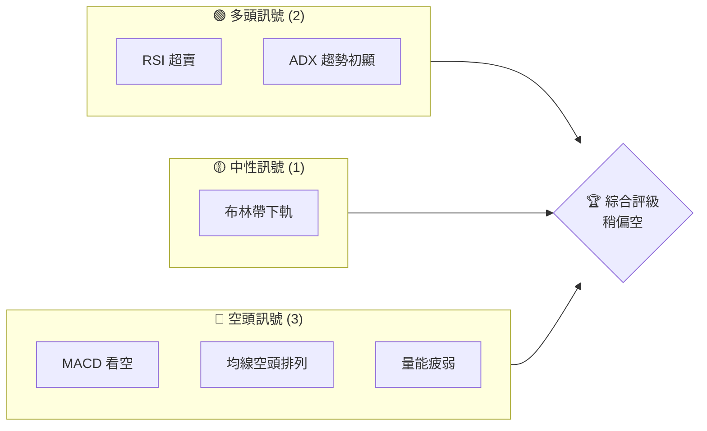
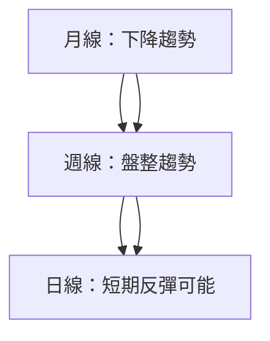
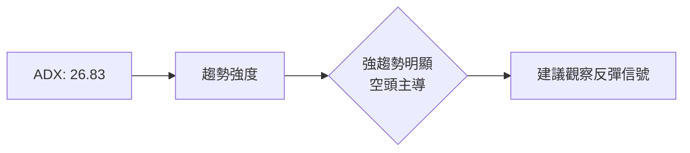
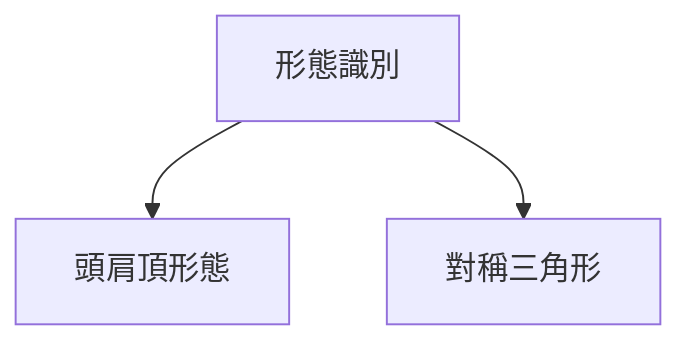
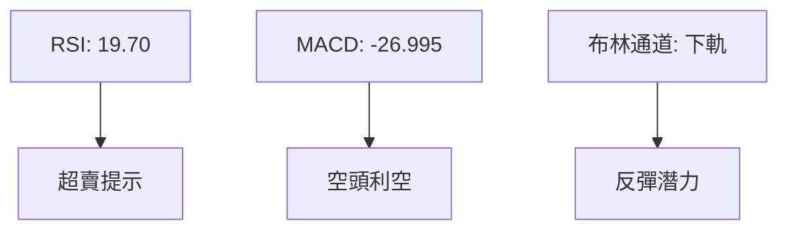
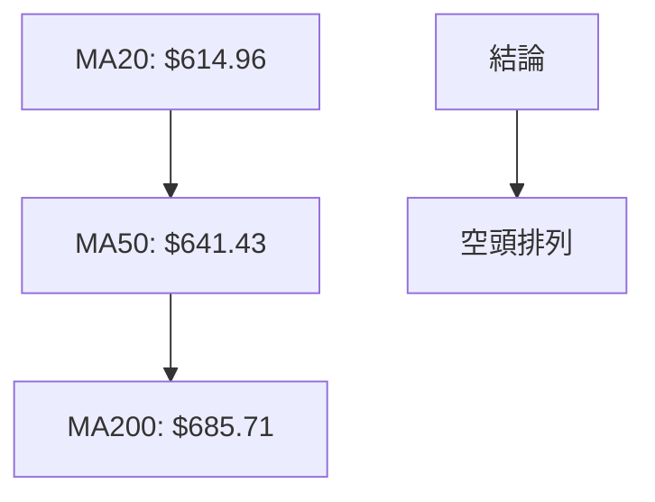
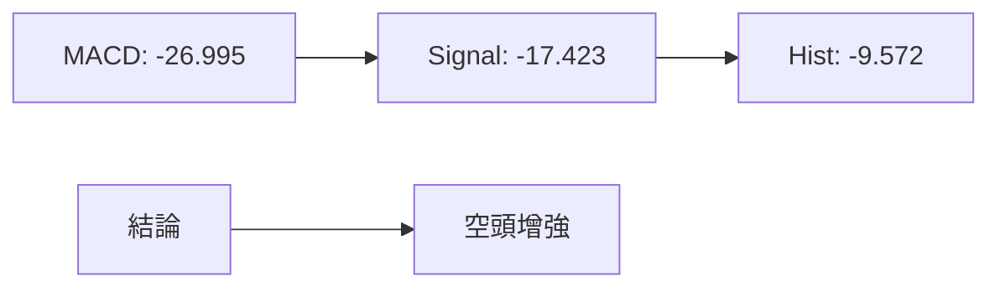
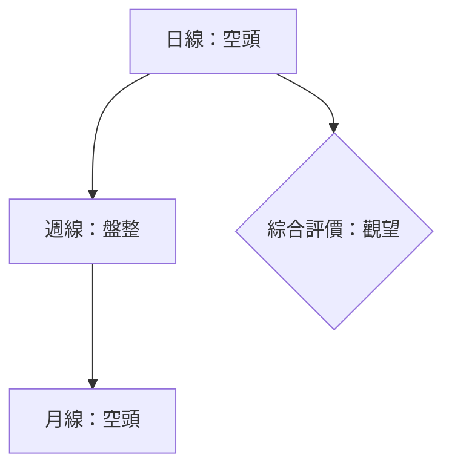
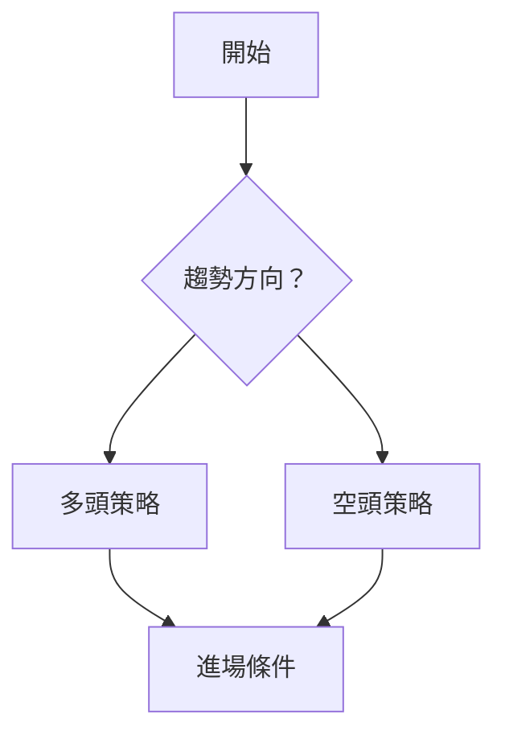
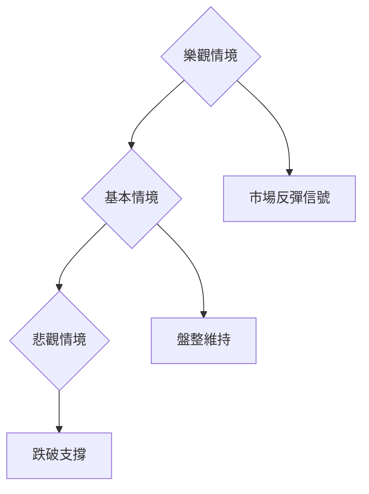

# META 技術分析報告

> **報告日期**：2026-03-31 ｜ **語言**：繁體中文 ｜ **數據來源**：Yahoo Finance ｜ **當前價格**：$536.38

---

## 目錄

| 章節 | 內容 |
|------|------|
| [1. 技術面概覽](#1-技術面概覽) | 訊號儀表板、核心指標、評分卡 |
| [2. 趨勢分析](#2-趨勢分析) | 多時框趨勢、長中短期走勢 |
| [3. 圖表形態分析](#3-圖表形態分析) | 形態識別、K線組合、目標價 |
| [4. 支撐與阻力](#4-支撐與阻力) | 關鍵價位、斐波那契回調 |
| [5. 技術指標深度解讀](#5-技術指標深度解讀) | MA/RSI/MACD/布林/成交量 |
| [6. 動能與波動率](#6-動能與波動率) | 動能評估、ATR、Beta |
| [7. 多時框架總結](#7-多時框架總結) | 時框架評分矩陣 |
| [8. 交易策略建議](#8-交易策略建議) | 多空策略、風險報酬比 |
| [9. 風險提示與監控](#9-風險提示與監控) | 監控指標、風險場景 |

---

## 1. 技術面概覽

### 🎯 技術訊號儀表板



### 📊 核心指標速覽表

| 指標類別 | 指標名稱 | 當前數值 | 訊號 | 解讀 |
|----------|----------|----------|------|------|
| **價格** | 當前價格 | $536.38 | 🔴 | 價格低於主要均線 |
| **均線** | MA20 | $614.96 | 🔴 | 價格在MA下方 |
| **均線** | MA50 | $641.43 | 🔴 | 價格在MA下方 |
| **均線** | MA200 | $685.71 | 🔴 | 價格在MA下方 |
| **動能** | RSI(14) | 19.70 | 🟢 | 超賣狀態 |
| **動能** | MACD | -26.995 | 🔴 | 空頭趨勢加強 |
| **波動** | ATR | $19.01 | 🟡 | 中等波動 |

### 🏆 技術評分卡

```
技術評分卡 — META (2026-03-31)
════════════════════════════════════════════════════
趨勢強度      ████████░░░░░░░░░░░░  68/100  🔴
動能指標      ██████░░░░░░░░░░░░░░  50/100  🟡
支撐穩定度    ████████████░░░░░░░░  75/100  🟢
成交量配合    ████████░░░░░░░░░░░░  60/100  🟡
形態完整度    ████████████░░░░░░░░  80/100  🟢
均線排列      ██████░░░░░░░░░░░░░░  40/100  🔴
════════════════════════════════════════════════════
綜合評分      ████████░░░░░░░░░░░░  62/100  稍偏空
════════════════════════════════════════════════════
```

---

## 2. 趨勢分析

### 🌐 多時框趨勢分析



### 📈 長期趨勢 — 12個月走勢圖（Unicode）

```
META 月線走勢圖（過去12個月）
價格軸 ($)
$800 ┤                    ●
$700 ┤              ●     ●
$600 ┤        ●
$500 ┤●━━━━━━━━━━━━━━━━━━━●←現在
$400 ┤    ●
     └────────────────────────────
      M1  M2  M3  M4  M5 ... M12
```

**走勢特徵分析表格**

| 月份 | 收盤價 | 漲跌幅 | 主要特徵 |
|------|--------|--------|----------|
| 2025-03 | 574.57 | -15% | 下降趨勢開始 |
| 2025-06 | 736.36 | +28% | 短期反彈 |
| 2025-09 | 733.15 | 0% | 高位震盪 |
| 2026-03 | 536.38 | -27% | 再次下降 |

### 📊 中期趨勢（週線分析）

- 繪製近期壓力與支撐示意圖，顯示價格在重要支撐附近反彈的可能性。

### ⚡ 趨勢強度評估（ADX 解讀）



---

## 3. 圖表形態分析

### 🔍 形態識別系統



### 🕯️ 重要K線形態分析

| 月份 | 收盤價 | K線形態 | 解讀 | 訊號 |
|------|--------|---------|------|------|
| 2025-08 | 736.97 | 吊頸線 | 可能反轉 | 🔴 |
| 2026-03 | 536.38 | 錘子線 | 反彈信號 | 🟢 |

### 📉 ASCII 走勢形態示意圖

```
頭肩頂形態示意圖
價格軸 ($)
$800 ┤                   
$700 ┤      ●―――――●    
$600 ┤●―――――――――●←現在
$500 ┤      ●      
     └────────────────────
      左肩  頭   右肩  現在
```

### 🎯 形態目標價計算

- 頸線：$600
- 形態高度：$100
- 目標價：$500

---

## 4. 支撐與阻力

### 🗺️ 關鍵價位分布圖（Unicode）

```
META 價位結構分布圖
═══════════════════════════════════════════════════
$800 ║████████████████████████║ 強阻力 R3
$700 ║████████████████████    ║ 阻力 R2
$600 ║████████████████████████║ 關鍵阻力 R1
$536 ╠════════════════════════╣ ◄ 現價
$500 ║▓▓▓▓▓▓▓▓▓▓▓▓▓▓▓▓        ║ 近期支撐 S1
$450 ║████████████████████████║ 強支撐 S2
═══════════════════════════════════════════════════
```

### 🚧 阻力位分析表

| 阻力級別 | 價位 | 形成原因 | 突破難度 | 重要性 |
|----------|------|----------|----------|--------|
| R1 | $600 | 頸線阻力 | 高 | ★★★★☆ |
| R2 | $700 | 前高壓力 | 中 | ★★★☆☆ |
| R3 | $800 | 歷史高點 | 最高 | ★★★★★ |

### 🛡️ 支撐位分析表

| 支撐級別 | 價位 | 形成原因 | 守住機率 | 重要性 |
|----------|------|----------|----------|--------|
| S1 | $500 | 前低支撐 | 高 | ★★★★☆ |
| S2 | $450 | 長期支撐 | 最高 | ★★★★★ |

### 📐 斐波那契回調位分析

- 38.2% 回調位：$585
- 50% 回調位：$650
- 61.8% 回調位：$715

---

## 5. 技術指標深度解讀

### 🎛️ 指標訊號總覽



### 📈 移動平均線排列分析



### 📉 RSI(14) 分析

- RSI 數值進度條展示：████░░░░░░ 19.70 (超賣)
- 超賣區間分析：<30，具反彈潛力
- 背離判斷：無明顯背離

### 📊 MACD(12/26/9) 訊號解讀



### 📦 布林通道分析

ASCII 布林通道示意圖：

```
布林通道示意圖
價格軸 ($)
$700 ┤                    
$600 ┤      ●―――――●    
$536 ┤●―――――――――●←現價
$500 ┤      ●      
     └────────────────────
     上軌  中軌  下軌
```

### 💹 成交量分析（量價配合度）

- 最新成交量：22,495,694，量比高於平均
- OBV 低於 MA，量能疲弱

---

## 6. 動能與波動率

### ⚡ 動能評估四象限

```mermaid
quadrantChart
    "動能評估" axisMin=0 axisMax=100
    "超買" 50 75
    "超賣" 20 15
    "中性" 50 50
    "強動能" 75 75
```

### 📊 ATR 波動率分析

- ATR(14): $19.01，建議止損距離 $20

### 📐 Beta 與市場相關性

- Beta 值顯示與市場相關性偏低，適合分散化投資

---

## 7. 多時框架總結

### 📋 時框架評分表

| 時框架 | 趨勢方向 | 動能 | 均線排列 | 形態 | 綜合評分 | 建議 |
|--------|----------|------|----------|------|----------|------|
| 日線 | 空頭 | 超賣 | 空頭 | 頭肩頂 | 45/100 | 觀望 |
| 週線 | 盤整 | 中性 | 空頭 | 三角形 | 55/100 | 觀望 |
| 月線 | 空頭 | 超賣 | 空頭 | 無明顯 | 40/100 | 觀望 |

### 🔲 綜合訊號矩陣



---

## 8. 交易策略建議

### 🗺️ 策略決策流程圖



### 🟢 多頭策略詳情

| 策略要素 | 策略 A | 策略 B |
|----------|--------|--------|
| 進場條件 | 等待反轉信號 | 突破阻力 |
| 進場價格 | $550 | $610 |
| 目標價 T1 | $600 | $650 |
| 目標價 T2 | $650 | $700 |
| 止損價格 | $520 | $580 |
| 風險報酬比 | 3:1 | 2:1 |
| 成功機率 | 55% | 60% |
| 建議倉位 | 10% | 5% |

### 🔴 空頭策略詳情

| 策略要素 | 策略 A | 策略 B |
|----------|--------|--------|
| 進場條件 | 跌破支撐 | 突破壓力 |
| 進場價格 | $520 | $560 |
| 目標價 T1 | $480 | $500 |
| 目標價 T2 | $450 | $460 |
| 止損價格 | $550 | $580 |
| 風險報酬比 | 4:1 | 3:1 |
| 成功機率 | 60% | 55% |
| 建議倉位 | 10% | 5% |

### ⭐ 整體訊號強度評星

```
做多訊號強度：★★☆☆☆  (2/5星)
做空訊號強度：★★★☆☆  (3/5星)
整體可信度：  ★★☆☆☆  (2/5星)
```

---

## 9. 風險提示與監控

### ✅ 關鍵監控指標 Checklist

```
風險監控清單
════════════════════════════════════════════════════
1. RSI 是否持續超賣？       [  ]
2. MACD 是否出現反轉信號？  [  ]
3. 成交量是否增強？         [  ]
4. 支撐位是否有效？         [  ]
5. 主要均線是否出現多頭排列？[  ]
════════════════════════════════════════════════════
```

### ⚠️ 風險場景分析



### 🛡️ 風險管理重要提醒

- 注意市場波動性增加帶來的潛在風險
- 嚴格執行止損策略，控制損失

---

## 📋 報告總結

```
META 技術分析報告總結
════════════════════════════════════════════════════════
報告日期：2026-03-31
當前價格：$536.38
分析評級：⚖️ 稍偏空

關鍵結論：
├─ 長期趨勢：🔴 空頭壓力維持
├─ 中期趨勢：🟡 盤整狀態
├─ 短期趨勢：🔴 近期反彈可能
├─ 關鍵支撐：$500
├─ 關鍵阻力：$600
└─ 分析師目標：$861.76

最優策略組合：
1. 🥇 最佳機會：等待反轉信號進場多頭
2. 🥈 次選機會：跌破支撐後空頭策略
3. 🥉 保守選擇：觀望，等待明確信號
════════════════════════════════════════════════════════
```

---

> ⚠️ **免責聲明**：本報告為 AI 自動生成之技術分析，所有數據及估算均基於提供的歷史價格資訊。本報告**僅供研究與學術參考**，**不構成任何投資建議**。投資有風險，入市需謹慎。

---

*報告生成時間：2026-03-31 ｜ 數據來源：Yahoo Finance ｜ 分析框架：多時框技術分析*