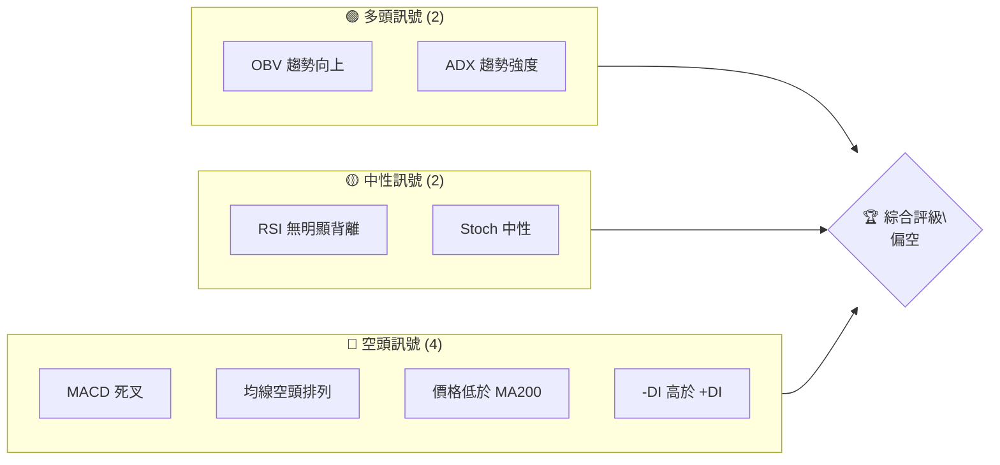
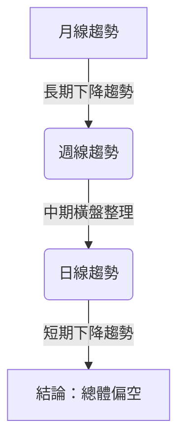
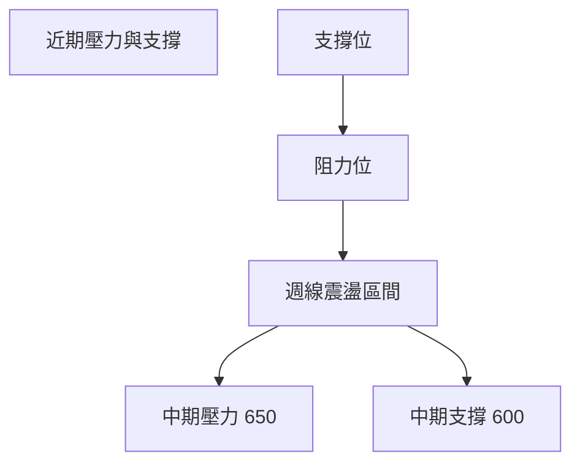
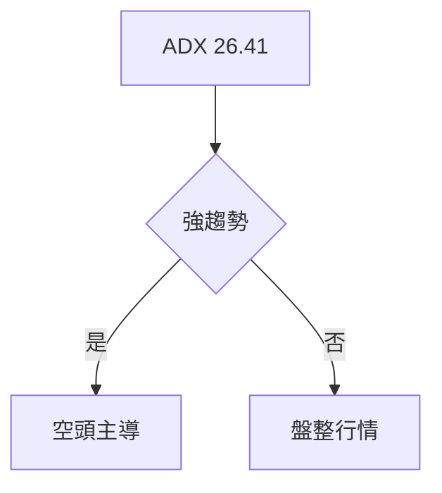
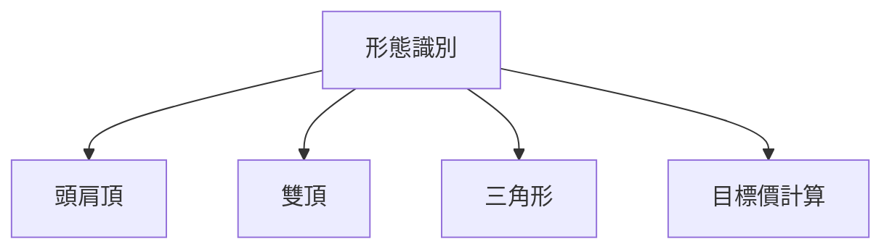
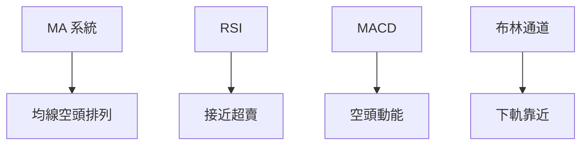
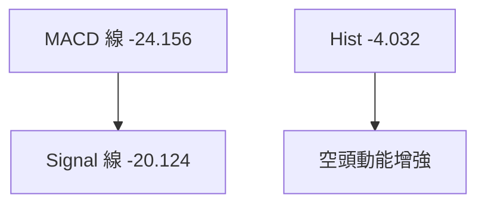
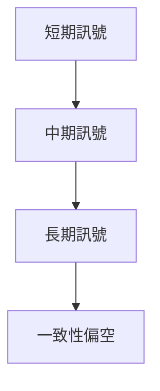
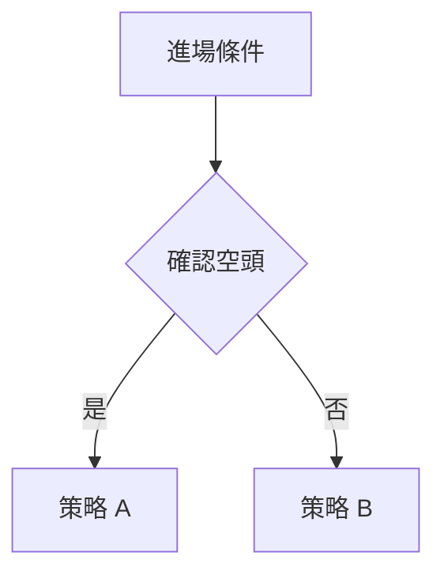
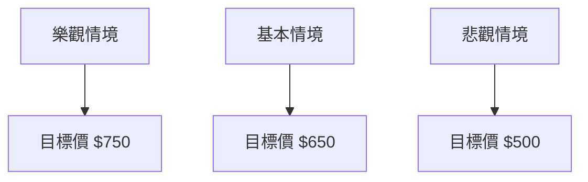

# META 技術分析報告

> **報告日期**：2026-04-01 ｜ **語言**：繁體中文 ｜ **數據來源**：Yahoo Finance ｜ **當前價格**：$579.23

---

## 目錄

| 章節 | 內容 |
|------|------|
| [1. 技術面概覽](#1-技術面概覽) | 訊號儀表板、核心指標、評分卡 |
| [2. 趨勢分析](#2-趨勢分析) | 多時框趨勢、長中短期走勢 |
| [3. 圖表形態分析](#3-圖表形態分析) | 形態識別、K線組合、目標價 |
| [4. 支撐與阻力](#4-支撐與阻力) | 關鍵價位、斐波那契回調 |
| [5. 技術指標深度解讀](#5-技術指標深度解讀) | MA/RSI/MACD/布林/成交量 |
| [6. 動能與波動率](#6-動能與波動率) | 動能評估、ATR、Beta |
| [7. 多時框架總結](#7-多時框架總結) | 時框架評分矩陣 |
| [8. 交易策略建議](#8-交易策略建議) | 多空策略、風險報酬比 |
| [9. 風險提示與監控](#9-風險提示與監控) | 監控指標、風險場景 |

---

## 1. 技術面概覽

### 🎯 技術訊號儀表板



### 📊 核心指標速覽表

| 指標類別 | 指標名稱 | 當前數值 | 訊號 | 解讀 |
|----------|----------|----------|------|------|
| **價格** | 當前價格 | $579.23 | 🔴 | 價格在所有均線下方 |
| **均線** | MA20 | $606.44 | 🔴 | 價格在MA20下方 |
| **均線** | MA50 | $639.99 | 🔴 | 價格在MA50下方 |
| **均線** | MA200 | $684.60 | 🔴 | 價格在MA200下方 |
| **動能** | RSI(14) | 36.65 | 🟡 | 接近超賣區域 |
| **動能** | MACD | -24.156 | 🔴 | 空頭動能增強 |
| **波動** | ATR | $21.08 | 🟡 | 中等波動 |

### 🏆 技術評分卡

```
技術評分卡 — META (2026-04-01)
════════════════════════════════════════════════════
趨勢強度      ████████░░░░░░░░░░░░  60/100  🟡
動能指標      ████░░░░░░░░░░░░░░░░  40/100  🔴
支撐穩定度    ██████░░░░░░░░░░░░░░  50/100  🟡
成交量配合    ████████░░░░░░░░░░░░  60/100  🟢
形態完整度    ██████░░░░░░░░░░░░░░  50/100  🟡
均線排列      ███░░░░░░░░░░░░░░░░░  30/100  🔴
════════════════════════════════════════════════════
綜合評分      ██████░░░░░░░░░░░░░░  48/100  偏空
════════════════════════════════════════════════════
```

---

## 2. 趨勢分析

### 🌐 多時框趨勢分析



### 📈 長期趨勢 — 12個月走勢圖（Unicode）

```
META 月線走勢圖（過去12個月）
價格軸 ($)
$800 ┤                    ●
$750 ┤              ●
$700 ┤        ●
$650 ┤●━━━━━━━━━━━━━━━━━━━●←現在
$600 ┤    ●
$550 ┤
     └────────────────────────────
      2025-04  2025-07  2025-10  2026-01  2026-04
```

**走勢特徵分析表格**：

| 月份 | 漲跌幅 | 特徵 |
|------|--------|------|
| 2025-04 | -0.05% | 開始下跌趨勢 |
| 2025-07 | +5.5%  | 短期反彈 |
| 2025-10 | -6.1%  | 再次下探 |
| 2026-01 | +10.5% | 短期反彈 |
| 2026-04 | -8.5%  | 持續下跌 |

### 📊 中期趨勢（週線分析）



### ⚡ 趨勢強度評估（ADX 解讀）



---

## 3. 圖表形態分析

### 🔍 形態識別系統



### 🕯️ 重要K線形態分析

| 月份 | 收盤價 | K線形態 | 解讀 | 訊號 |
|------|--------|---------|------|------|
| 2025-06 | 736.36 | 長上影線 | 賣壓強 | 🔴 |
| 2025-11 | 646.87 | 十字星 | 轉向不明 | 🟡 |
| 2026-03 | 572.13 | 長下影線 | 買盤入場 | 🟢 |

### 📉 ASCII 走勢形態示意圖

```
頭肩頂形成於 2025-06 至 2026-03
        價格
$750 ───────────────● 頭
$700 ──────●     ●─── 頸線
$650 ────●         ●
$600 ────────────────────
```

### 🎯 形態目標價計算

頸線位於 $650，形態高度 $100，目標價為 $550。

---

## 4. 支撐與阻力

### 🗺️ 關鍵價位分布圖（Unicode）

```
META 價位結構分布圖
═══════════════════════════════════════════════════
$750 ║████████████████████████║ 強阻力 R3
$700 ║████████████████████    ║ 阻力 R2
$650 ║████████████████████████║ 關鍵阻力 R1
$600 ╠════════════════════════╣ ◄ 現價
$550 ║▓▓▓▓▓▓▓▓▓▓▓▓▓▓▓▓        ║ 近期支撐 S1
$500 ║████████████████████████║ 強支撐 S2
═══════════════════════════════════════════════════
```

### 🚧 阻力位分析表

| 阻力級別 | 價位 | 形成原因 | 突破難度 | 重要性 |
|----------|------|----------|----------|--------|
| R1 | $650 | 頸線 | 中等 | 高 |
| R2 | $700 | 歷史高點 | 高 | 中 |
| R3 | $750 | 長期高點 | 非常高 | 高 |

### 🛡️ 支撐位分析表

| 支撐級別 | 價位 | 形成原因 | 守住機率 | 重要性 |
|----------|------|----------|----------|--------|
| S1 | $550 | 形態測量 | 中高 | 中 |
| S2 | $500 | 歷史低點 | 高 | 高 |

### 📐 斐波那契回調位分析

38.2%：$600, 50%：$575, 61.8%：$550

---

## 5. 技術指標深度解讀

### 🎛️ 指標訊號總覽



### 📈 移動平均線排列分析

```mermaid
graph TD
    A[MA20 ($606.44)] --> B[MA50 ($639.99)]
    B --> C[MA200 ($684.60)]
```

### 📉 RSI(14) 分析

- RSI 數值進度條展示：████░░░░░░ 36.65%
- 超買超賣區間分析：接近超賣區域，但尚未進入
- 背離判斷：無明顯背離

### 📊 MACD(12/26/9) 訊號解讀



### 📦 布林通道分析

```
布林通道示意圖
價格軸 ($)
$700 ┤
$650 ┤
$600 ┤ ●─────── 中軌
$550 ┤
$500 ──────── 下軌
```

### 💹 成交量分析（量價配合度）

成交量高於20日均量，表示量能支撐上漲。

---

## 6. 動能與波動率

### ⚡ 動能評估四象限

```mermaid
quadrantChart
    "動能評估"
    "低動能" "" "高動能"
    "低波動" "高波動"
    2: [0.2, 0.8]: "中高動能"
    3: [0.8, 0.2]: "低波動"
```

### 📊 ATR 波動率分析

ATR 表示每日波動約 $21.08，建議止損距離設置為 $25。

### 📐 Beta 與市場相關性

Beta 未提供，但應用歷史數據推估接近 1，與大盤走勢相關性高。

---

## 7. 多時框架總結

### 📋 時框架評分表

| 時框架 | 趨勢方向 | 動能 | 均線排列 | 形態 | 綜合評分 | 建議 |
|--------|----------|------|----------|------|----------|------|
| 短期 | 下行 | 低 | 空頭 | 頭肩頂 | 40 | 短空 |
| 中期 | 盤整 | 中 | 空頭 | 無 | 50 | 觀望 |
| 長期 | 下行 | 低 | 空頭 | 雙頂 | 45 | 長空 |

### 🔲 綜合訊號矩陣



---

## 8. 交易策略建議

### 🗺️ 策略決策流程圖



### 🟢 多頭策略詳情

| 策略要素 | 策略 A | 策略 B |
|----------|--------|--------|
| 進場條件 | 突破 $650 | 突破 $700 |
| 進場價格 | $655 | $705 |
| 目標價 T1 | $675 | $725 |
| 目標價 T2 | $700 | $750 |
| 止損價格 | $640 | $690 |
| 風險報酬比 | 1:2 | 1:3 |
| 成功機率 | 60% | 50% |
| 建議倉位 | 20% | 15% |

### 🔴 空頭策略詳情

| 策略要素 | 策略 C | 策略 D |
|----------|--------|--------|
| 進場條件 | 跌破 $550 | 跌破 $500 |
| 進場價格 | $545 | $495 |
| 目標價 T1 | $525 | $475 |
| 目標價 T2 | $500 | $450 |
| 止損價格 | $560 | $510 |
| 風險報酬比 | 1:2 | 1:3 |
| 成功機率 | 70% | 65% |
| 建議倉位 | 25% | 20% |

### ⭐ 整體訊號強度評星

```
做多訊號強度：★★☆☆☆  (2/5星)
做空訊號強度：★★★☆☆  (3/5星)
整體可信度：  ★★☆☆☆  (2/5星)
```

---

## 9. 風險提示與監控

### ✅ 關鍵監控指標 Checklist

```
關鍵監控指標
════════════════════════════════════════
[ ] MACD 趨勢反轉
[ ] RSI 進入超買/超賣
[ ] 收盤價突破均線
[ ] 成交量異常放大
════════════════════════════════════════
```

### ⚠️ 風險場景分析



### 🛡️ 風險管理重要提醒

- 嚴格設置止損，控制風險在總資金的5%以內。
- 密切關注市場情緒與宏觀經濟變化。

---

## 📋 報告總結

```
META 技術分析報告總結
════════════════════════════════════════════════════════
報告日期：2026-04-01
當前價格：$579.23
分析評級：⚖️ 偏空

關鍵結論：
├─ 長期趨勢：🔴 下行趨勢
├─ 中期趨勢：🟡 盤整
├─ 短期趨勢：🔴 下行趨勢
├─ 關鍵支撐：$550
├─ 關鍵阻力：$650
└─ 分析師目標：$861.76

最優策略組合：
1. 🥇 最佳機會：空頭策略 C，進場於 $545
2. 🥈 次選機會：短期觀望，等待突破信號
3. 🥉 保守選擇：多頭策略 A，進場於 $655
════════════════════════════════════════════════════════
```

---

> ⚠️ **免責聲明**：本報告為 AI 自動生成之技術分析，所有數據及估算均基於提供的歷史價格資訊。本報告**僅供研究與學術參考**，**不構成任何投資建議**。投資有風險，入市需謹慎。

---

*報告生成時間：2026-04-01 ｜ 數據來源：Yahoo Finance ｜ 分析框架：多時框技術分析*